
# arxiv digest (quant-ph + cond-mat) — 2026-07-17

*109 papers · 30 relevant · 0 highlighted*

## 🔥 Most relevant (30)

*Every paper with at least one nonzero topic score, sorted by best-matching score. 🔥 marks scores ≥4/5. Click the title to jump to the full entry below; click [arXiv] to open the paper page. `(secondary)` marks papers from de-prioritized cond-mat archives.*

Show 30 relevant papers

- [Acoustic Firewalls: Analogue Gravity Perspective on the AMPS Paradox](#paper-2607.14056) [[arXiv]](http://arxiv.org/abs/2607.14056v1) — 🔥 `entanglement & information structure` **5/5** · 🔥 `analog quantum simulation` **4/5** · `non-equilibrium dynamics` **2/5** · `non-equilibrium universality` **2/5** · `Keldysh / 2PI / non-Gaussian methods` **1/5** · `correlated / nonlocal dissipation` **1/5** · `driven-dissipative phase transition` **1/5** · `methods for driven-dissipative` **1/5**
- [The nonequilibrium statistical mechanics of Markov interacting particles](#paper-2607.13391) [[arXiv]](http://arxiv.org/abs/2607.13391v1) — 🔥 `Keldysh / 2PI / non-Gaussian methods` **4/5** · 🔥 `entanglement & information structure` **4/5** · `correlated / nonlocal dissipation` **3/5** · `driven-dissipative phase transition` **3/5** · `methods for driven-dissipative` **3/5** · `non-equilibrium dynamics` **3/5** · `non-equilibrium universality` **2/5** · `quantum measurements` **2/5** · `Kondo & dissipative impurity` **1/5** · `measurement-induced transitions` **1/5** · `scars & prethermalization` **1/5**
- [Quantum-classical crossover in finite spin-1/2 rings with Dzyaloshinsky-Moriya interaction](#paper-2607.13572) [[arXiv]](http://arxiv.org/abs/2607.13572v1) — 🔥 `methods for driven-dissipative` **4/5** · `Keldysh / 2PI / non-Gaussian methods` **3/5** · `analog quantum simulation` **3/5** · `correlated / nonlocal dissipation` **3/5** · `driven-dissipative phase transition` **3/5** · `entanglement & information structure` **3/5** · `non-equilibrium dynamics` **2/5** · `non-equilibrium universality` **2/5** · `Kondo & dissipative impurity` **1/5** · `exotic spin models in light-matter` **1/5** · `scars & prethermalization` **1/5**
- [Precision quantum simulation of magnon spectra and interactions](#paper-2607.13301) [[arXiv]](http://arxiv.org/abs/2607.13301v1) — 🔥 `analog quantum simulation` **4/5** · 🔥 `methods for driven-dissipative` **4/5** · `QC/QI experiment` **3/5** · `exotic spin models in light-matter` **3/5** · `spintronics-quantum-optics interface` **3/5** · `non-equilibrium dynamics` **2/5** · `Keldysh / 2PI / non-Gaussian methods` **1/5** · `correlated / nonlocal dissipation` **1/5** · `driven-dissipative phase transition` **1/5** · `entanglement & information structure` **1/5** · `non-equilibrium universality` **1/5** · `quantum measurements` **1/5**
- [Nonreciprocal Relaxation Acceleration](#paper-2607.13989) [[arXiv]](http://arxiv.org/abs/2607.13989v1) — 🔥 `methods for driven-dissipative` **4/5** · 🔥 `non-equilibrium dynamics` **4/5** · `correlated / nonlocal dissipation` **3/5** · `driven-dissipative phase transition` **3/5** · `Keldysh / 2PI / non-Gaussian methods` **2/5** · `analog quantum simulation` **2/5** · `non-equilibrium universality` **2/5** · `Tavis-Cummings & cavity-many-emitter` **1/5** · `correlated cavity matter` **1/5** · `entanglement & information structure` **1/5** · `scars & prethermalization` **1/5**
- [Post-Critical Meson Dynamics of Kibble-Zurek Excitations in a 5,564-Qubit Quantum Annealer](#paper-2607.13842) [[arXiv]](http://arxiv.org/abs/2607.13842v1) — 🔥 `analog quantum simulation` **4/5** · 🔥 `non-equilibrium dynamics` **4/5** · 🔥 `non-equilibrium universality` **4/5** · `driven-dissipative phase transition` **3/5** · `methods for driven-dissipative` **3/5** · `QC/QI experiment` **2/5** · `Frenkel-Kontorova` **1/5** · `Keldysh / 2PI / non-Gaussian methods` **1/5** · `correlated / nonlocal dissipation` **1/5** · `entanglement & information structure` **1/5**
- [Bridging Frustration and Non-Hermiticity via COMPASS: An Adaptive Biorthogonal Neural Quantum State Framework](#paper-2607.13790) [[arXiv]](http://arxiv.org/abs/2607.13790v1) — 🔥 `methods for driven-dissipative` **4/5** · `analog quantum simulation` **3/5** · `driven-dissipative phase transition` **3/5** · `exotic spin models in light-matter` **3/5** · `correlated / nonlocal dissipation` **2/5** · `non-equilibrium dynamics` **2/5** · `non-equilibrium universality` **2/5** · `Keldysh / 2PI / non-Gaussian methods` **1/5** · `Kondo & dissipative impurity` **1/5** · `entanglement & information structure` **1/5**
- [Cooling rate and glassy behavior in the Fermi--Pasta--Ulam system](#paper-2607.13833) [[arXiv]](http://arxiv.org/abs/2607.13833v1) — 🔥 `non-equilibrium dynamics` **4/5** · `non-equilibrium universality` **3/5** · `analog quantum simulation` **2/5** · `driven-dissipative phase transition` **2/5** · `scars & prethermalization` **2/5** · `Frenkel-Kontorova` **1/5** · `Keldysh / 2PI / non-Gaussian methods` **1/5** · `correlated / nonlocal dissipation` **1/5** · `entanglement & information structure` **1/5** · `methods for driven-dissipative` **1/5**
- [Markovian evolution from a novel scheme](#paper-2607.13809) [[arXiv]](http://arxiv.org/abs/2607.13809v1) — 🔥 `methods for driven-dissipative` **4/5** · `correlated / nonlocal dissipation` **3/5** · `driven-dissipative phase transition` **3/5** · `non-equilibrium dynamics` **3/5** · `non-equilibrium universality` **2/5** · `Keldysh / 2PI / non-Gaussian methods` **1/5** · `Kondo & dissipative impurity` **1/5** · `analog quantum simulation` **1/5**
- [Universal Quantum Computation with Multi-Mode Schrödinger Cat States Stabilized by Non-Local Dissipation Engineering](#paper-2607.13975) [[arXiv]](http://arxiv.org/abs/2607.13975v1) — 🔥 `correlated / nonlocal dissipation` **4/5** · `methods for driven-dissipative` **3/5** · `driven-dissipative phase transition` **2/5** · `entanglement & information structure` **2/5** · `non-equilibrium dynamics` **2/5** · `Keldysh / 2PI / non-Gaussian methods` **1/5** · `Tavis-Cummings & cavity-many-emitter` **1/5** · `analog quantum simulation` **1/5** · `correlated cavity matter` **1/5** · `non-equilibrium universality` **1/5**
- [A Lie-algebraic approach to non-Markovian quantum dynamics](#paper-2607.13865) [[arXiv]](http://arxiv.org/abs/2607.13865v1) — 🔥 `quantum measurements` **4/5** · `measurement-induced transitions` **3/5** · `methods for driven-dissipative` **3/5** · `non-equilibrium dynamics` **2/5** · `Keldysh / 2PI / non-Gaussian methods` **1/5** · `correlated / nonlocal dissipation` **1/5** · `driven-dissipative phase transition` **1/5**
- [An exactly solvable macroscopic fluctuation theory of single-file diffusion](#paper-2607.14073) [[arXiv]](http://arxiv.org/abs/2607.14073v1) — 🔥 `non-equilibrium dynamics` **4/5** · `methods for driven-dissipative` **3/5** · `non-equilibrium universality` **3/5** · `driven-dissipative phase transition` **2/5** · `Frenkel-Kontorova` **1/5** · `Keldysh / 2PI / non-Gaussian methods` **1/5**
- [Temporal Entanglement from Twist Correlators in 2d Conformal Field Theory and Holography](#paper-2607.14012) [[arXiv]](http://arxiv.org/abs/2607.14012v1) — 🔥 `entanglement & information structure` **4/5** · `non-equilibrium dynamics` **3/5** · `non-equilibrium universality` **2/5** · `Keldysh / 2PI / non-Gaussian methods` **1/5** · `analog quantum simulation` **1/5** · `correlated / nonlocal dissipation` **1/5** · `driven-dissipative phase transition` **1/5** · `methods for driven-dissipative` **1/5**
- [Benchmarking trigonometric continuous-variable gate primitives with trapped ions](#paper-2607.14085) [[arXiv]](http://arxiv.org/abs/2607.14085v1) — 🔥 `QC/QI experiment` **4/5** · `analog quantum simulation` **2/5** · `entanglement & information structure` **2/5** · `quantum measurements` **2/5** · `methods for driven-dissipative` **1/5** · `non-equilibrium dynamics` **1/5** · `quantum optics experiment` **1/5**
- [Emulating XX catalysts for quantum annealing via self-consistent transverse fields](#paper-2607.13150) [[arXiv]](http://arxiv.org/abs/2607.13150v1) — 🔥 `analog quantum simulation` **4/5** · `exotic spin models in light-matter` **3/5** · `methods for driven-dissipative` **2/5** · `non-equilibrium dynamics` **2/5** · `Keldysh / 2PI / non-Gaussian methods` **1/5** · `driven-dissipative phase transition` **1/5**
- [Magic without a phase: phase-independent stabilizer Rényi entropy in gluon scattering](#paper-2607.13134) [[arXiv]](http://arxiv.org/abs/2607.13134v1) — 🔥 `entanglement & information structure` **4/5** · `non-equilibrium dynamics` **2/5** · `Keldysh / 2PI / non-Gaussian methods` **1/5** · `analog quantum simulation` **1/5** · `correlated / nonlocal dissipation` **1/5** · `driven-dissipative phase transition` **1/5** · `methods for driven-dissipative` **1/5** · `non-equilibrium universality` **1/5**
- [Realization and manipulation of spiral charge density waves in a two-dimensional metal](#paper-2607.13878) [[arXiv]](http://arxiv.org/abs/2607.13878v1) `(secondary)` — 🔥 `analog quantum simulation` **4/5** · `driven-dissipative phase transition` **3/5** · `Frenkel-Kontorova` **2/5** · `methods for driven-dissipative` **1/5** · `non-equilibrium dynamics` **1/5** · `non-equilibrium universality` **1/5**
- [Superconducting proximity effect in a strongly correlated charge-transfer insulator](#paper-2607.13873) [[arXiv]](http://arxiv.org/abs/2607.13873v1) — 🔥 `Kondo & dissipative impurity` **4/5** · `driven-dissipative phase transition` **2/5** · `analog quantum simulation` **1/5** · `correlated / nonlocal dissipation` **1/5** · `methods for driven-dissipative` **1/5** · `non-equilibrium dynamics` **1/5** · `spintronics-quantum-optics interface` **1/5**
- [On-chip quantum sensing of Kondo spins in a high-mobility quasi-one-dimensional nanoconstriction](#paper-2607.13397) [[arXiv]](http://arxiv.org/abs/2607.13397v1) — 🔥 `Kondo & dissipative impurity` **4/5** · `spintronics-quantum-optics interface` **2/5** · `analog quantum simulation` **1/5** · `correlated / nonlocal dissipation` **1/5** · `driven-dissipative phase transition` **1/5** · `exotic spin models in light-matter` **1/5**
- [Phase diagram of one-dimensional bosons with Rydberg-dressed soft-core interactions](#paper-2607.13623) [[arXiv]](http://arxiv.org/abs/2607.13623v1) — 🔥 `analog quantum simulation` **4/5** · `Rydberg arrays` **3/5** · `Frenkel-Kontorova` **1/5** · `correlated cavity matter` **1/5** · `entanglement & information structure` **1/5**
- [Deterministic Quantum Phase Estimation with Linear Circuit Complexity in a Photonic System](#paper-2607.13404) [[arXiv]](http://arxiv.org/abs/2607.13404v1) — 🔥 `QC/QI experiment` **4/5** · `quantum optics experiment` **3/5** · `analog quantum simulation` **1/5** · `interference shaping light` **1/5**
- [Robust Nonperturbative Trapped-Ion Quantum Logic](#paper-2607.13166) [[arXiv]](http://arxiv.org/abs/2607.13166v1) — 🔥 `QC/QI experiment` **4/5** · `analog quantum simulation` **1/5** · `correlated / nonlocal dissipation` **1/5** · `driven-dissipative phase transition` **1/5** · `methods for driven-dissipative` **1/5** · `non-equilibrium dynamics` **1/5**
- [A versatile laser-machined rf trap for arrays of 100+ ions](#paper-2607.13342) [[arXiv]](http://arxiv.org/abs/2607.13342v1) — 🔥 `analog quantum simulation` **4/5** · `QC/QI experiment` **3/5** · `non-equilibrium dynamics` **1/5**
- [Transverse order and longitudinal fluctuations in a near-Ising spin supersolid](#paper-2607.13635) [[arXiv]](http://arxiv.org/abs/2607.13635v1) — 🔥 `analog quantum simulation` **4/5** · `exotic spin models in light-matter` **3/5** · `spintronics-quantum-optics interface` **1/5**
- [Fractional Chern insulators in alternating twisted multilayer MoTe$_{2}$](#paper-2607.13807) [[arXiv]](http://arxiv.org/abs/2607.13807v1) — 🔥 `analog quantum simulation` **4/5** · `correlated cavity matter` **1/5** · `entanglement & information structure` **1/5** · `non-equilibrium dynamics` **1/5**
- [A Fibre-Integrated SPDC Heralded Single-Photon Source Using Zn-Indiffused PPLN Ridge Waveguides at Telecom Wavelengths](#paper-2607.13215) [[arXiv]](http://arxiv.org/abs/2607.13215v1) — 🔥 `quantum optics experiment` **4/5** · `QC/QI experiment` **1/5** · `interference shaping light` **1/5**
- [Wireless millikelvin interconnects for superconducting quantum hardware](#paper-2607.13834) [[arXiv]](http://arxiv.org/abs/2607.13834v1) — 🔥 `QC/QI experiment` **4/5** · `interference shaping light` **1/5** · `quantum optics experiment` **1/5**
- [Dipolar mixtures in checker-board optical bilayers](#paper-2607.13980) [[arXiv]](http://arxiv.org/abs/2607.13980v1) — 🔥 `analog quantum simulation` **4/5** · `correlated cavity matter` **1/5**
- [A Reality Check on Quantum Optimisation: Evidence from an Industrial Case Study](#paper-2607.13325) [[arXiv]](http://arxiv.org/abs/2607.13325v1) — 🔥 `QC/QI experiment` **4/5**
- [Comparing the three W-like states with the W state](#paper-2607.13223) [[arXiv]](http://arxiv.org/abs/2607.13223v1) — 🔥 `entanglement & information structure` **4/5**

## All papers (88, sorted by relevance)

*Papers from quant-ph and your primary cond-mat archives (quant-gas, stat-mech, str-el, dis-nn). Highlighted papers (⭐) come first, then everything else sorted by topic-relevance score, highest first.*

### [Acoustic Firewalls: Analogue Gravity Perspective on the AMPS Paradox](http://arxiv.org/abs/2607.14056v1)

**Authors:** Nikolay S. Akintsov, Artyom P. Nevecheria, Stepan N. Andreev, Qing-Hua Qin  
**Type:** theory · **Category:** quantum gases · **PDF:** <https://arxiv.org/pdf/2607.14056v1>  
**Analysis basis:** full PDF text, analyzed in chunks
**Topic relevance:** 🔥 `entanglement & information structure` **5/5** · 🔥 `analog quantum simulation` **4/5** · `non-equilibrium dynamics` **2/5** · `non-equilibrium universality` **2/5** · `Keldysh / 2PI / non-Gaussian methods` **1/5** · `correlated / nonlocal dissipation` **1/5** · `driven-dissipative phase transition` **1/5** · `methods for driven-dissipative` **1/5**

↔ Scroll figures horizontally

<figure class="paper-figure-card">
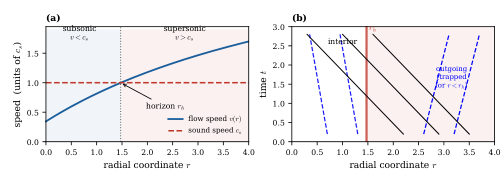
<figcaption class="paper-figure-caption"><b>Fig 1.</b> FIG. 1. Sonic horizon. (a) Flow speed v(r) crosses the sound speed cs at the horizon rh, separating subsonic (v &lt; cs) and supersonic (v &gt; cs) regions. (b) Ray diagram: ingoing null rays (solid) cross rh; outgoing rays (dashed) are trapped for r &lt; rh, the acoustic analogue of the interior.</figcaption>
</figure>
<figure class="paper-figure-card">
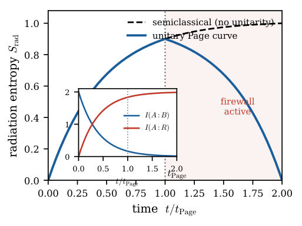
<figcaption class="paper-figure-caption"><b>Fig 2.</b> FIG. 2. Analogue Page curve. Semiclassical entropy (dashed) grows monotonically; unitarity (solid) turns it over at tPage. Shaded: post-Page regime where the acoustic firewall is ac- tive. Inset: mutual informations I(A:B) and I(A:R) cross at tPage [Eqs. (4)–(5)].</figcaption>
</figure>
<figure class="paper-figure-card">
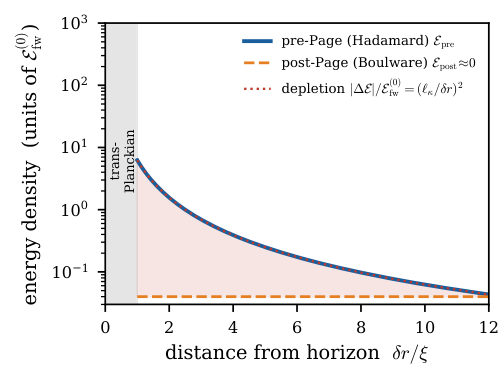
<figcaption class="paper-figure-caption"><b>Fig 3.</b> FIG. 3. Near-horizon energy density (units of E(0) fw ). Pre-Page (Hadamard) the phonon atmosphere is Tolman-blueshifted, Epre ∝(δr)−2 (blue); post-Page the Boulware-like state is depleted, Epost ≈0 (orange). The acoustic firewall is this depletion |∆E|/E(0) fw = (ℓκ/δr)2 (red), measured differentially across tPage. Grey: δr &lt; ξ, where the acoustic metric fails.</figcaption>
</figure>
<figure class="paper-figure-card">
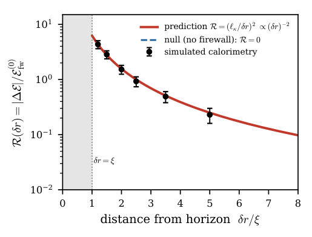
<figcaption class="paper-figure-caption"><b>Fig 4.</b> FIG. 4. Proposed signature. Predicted depletion ratio R(δr) = (ℓκ/δr)2 ∝(δr)−2 (red) versus the no-firewall null R = 0 (dashed). Points with error bars: simulated differen- tial phonon calorimetry for 87Rb (fixed-seed synthetic data, not measurements). Grey: healing-length cutoff.</figcaption>
</figure>

**Summary.** The paper translates the theoretical AMPS paradox concerning black hole information loss into an analogue system using phonons in a Bose-Einstein condensate. By applying entanglement principles across an artificial sonic horizon, the authors predict that post-Page time unitarity forces a measurable depletion of phonon energy density. This predicted signal, scaling as $(\ell_\kappa/\delta r)^2$, offers a concrete, falsifiable test for quantum gravity concepts in cold atom experiments.

**Why it may be interesting.** This work directly applies advanced concepts of quantum information (entanglement monogamy) and black hole physics into a highly controllable, experimentally accessible platform like BECs, providing a concrete testable prediction for AMO physicists.

Detailed structure

**Main problem.** The paper addresses the AMPS paradox, which highlights an inconsistency between unitarity, local physics at the horizon, and smooth vacuum evolution during black hole evaporation.

**Main result.** It predicts a falsifiable signature—a specific depletion ratio $R(\delta r) \propto (\ell_\kappa/\delta r)^2$ in phonon energy density—that should appear after an analogue Page time in a BEC.

**Method.** The authors transcribe the AMPS argument to an acoustic system, using entanglement monogamy identities and calculating differences between stress tensors for different vacuum states (Hadamard vs. Boulware-like).

**Model / system.** The model uses analogue gravity realized via a sonic horizon in a Bose-Einstein condensate (BEC), where linearized phonons obey the Klein-Gordon equation in an acoustic metric.

**Key observables.** A dimensionless, differential phonon-calorimetry signal $R(\delta r) = |\Delta\mathcal{E}|/\mathcal{E}^{(0)}$, predicted to scale as $(\ell_\kappa/\delta r)^2$.

**Important parameters / regimes.** Healing length ($\xi$), surface gravity ($\kappa$), and the analogue Page time ($t_{	ext{Page}}$).

**Assumptions / limitations.** The analogy is purely kinematic, meaning it does not involve true back-reaction or solving Einstein's equations; detection requires averaging over many runs.

**Figures summary.** Figures illustrate the sonic horizon structure, entropy evolution crossing a Page time analogue, and plot the predicted depletion ratio $R(\delta r) \propto (\ell_\kappa/\delta r)^2$ against null results.

**Paper structure.** The paper builds from the AMPS paradox to its acoustic analogy, deriving the necessary entanglement identities, calculating the difference in renormalized stress tensors between pre- and post-Page states, and finally presenting the measurable depletion signal.

Abstract

The monogamy of quantum entanglement, applied by Almheiri-Marolf-Polchinski-Sully (AMPS) to black holes, obstructs a smooth horizon vacuum after the Page time. We transcribe this argument to Hawking-like phonon radiation from a sonic horizon in the Unruh acoustic metric. An exact purity identity shows that post-Page-time unitarity forces the entanglement between an outgoing phonon and its interior partner to vanish, selecting a non-Hadamard (Boulware-like) phonon state, which we define as an acoustic firewall. Its renormalized stress tensor differs from the smooth state by a constant, negative near-horizon flux, and the thermal-atmosphere energy density it removes, measured by a static calorimeter, grows as $(δr)^{-2}$ in the radial coordinate toward the horizon (singular in the free-fall frame), cut off at the healing length. The construction is kinematic and does not resolve the information paradox; it yields one concrete, falsifiable prediction: a differential phonon-calorimetry signal $\mathcal{R}(δr)=|Δ\mathcal{E}|/\mathcal{E}^{(0)}\to(\ell_κ/δr)^{2}$, present only after the analogue Page time in a Bose-Einstein condensate.

[↑ back to top](#top)

### [The nonequilibrium statistical mechanics of Markov interacting particles](http://arxiv.org/abs/2607.13391v1)

**Authors:** Dalton A R Sakthivadivel  
**Type:** theory · **Category:** statistical mechanics · **PDF:** <https://arxiv.org/pdf/2607.13391v1>  
**Analysis basis:** full PDF text, analyzed in chunks
**Topic relevance:** 🔥 `Keldysh / 2PI / non-Gaussian methods` **4/5** · 🔥 `entanglement & information structure` **4/5** · `correlated / nonlocal dissipation` **3/5** · `driven-dissipative phase transition` **3/5** · `methods for driven-dissipative` **3/5** · `non-equilibrium dynamics` **3/5** · `non-equilibrium universality` **2/5** · `quantum measurements` **2/5** · `Kondo & dissipative impurity` **1/5** · `measurement-induced transitions` **1/5** · `scars & prethermalization` **1/5**

↔ Scroll figures horizontally

<figure class="paper-figure-card">
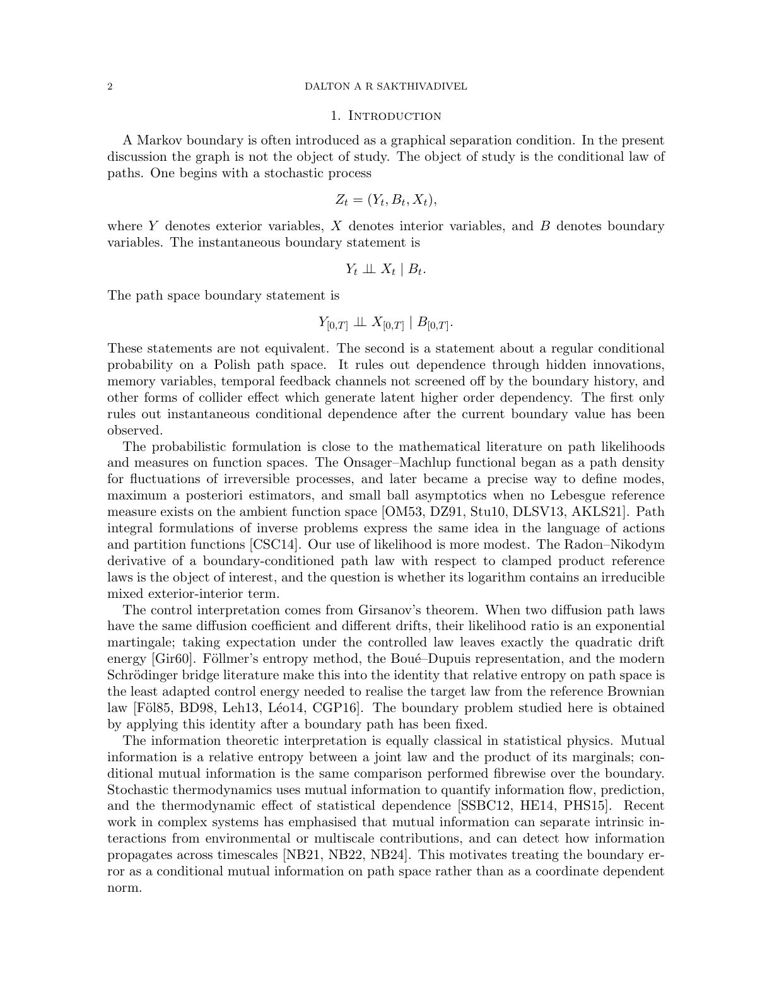
<figcaption class="paper-figure-caption"><b>Fig 1.</b> Low-resolution page preview, page 2</figcaption>
</figure>
<figure class="paper-figure-card">
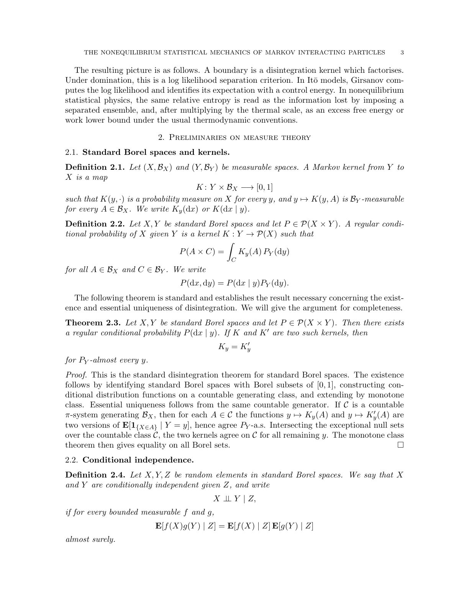
<figcaption class="paper-figure-caption"><b>Fig 2.</b> Low-resolution page preview, page 3</figcaption>
</figure>
<figure class="paper-figure-card">
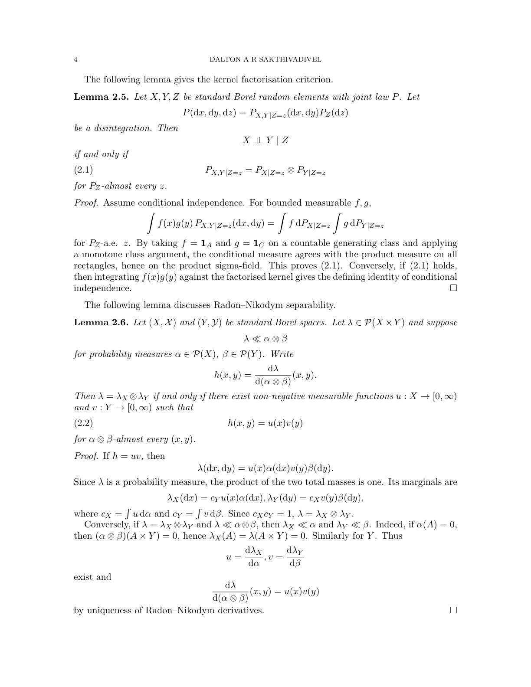
<figcaption class="paper-figure-caption"><b>Fig 3.</b> Low-resolution page preview, page 4</figcaption>
</figure>
<figure class="paper-figure-card">
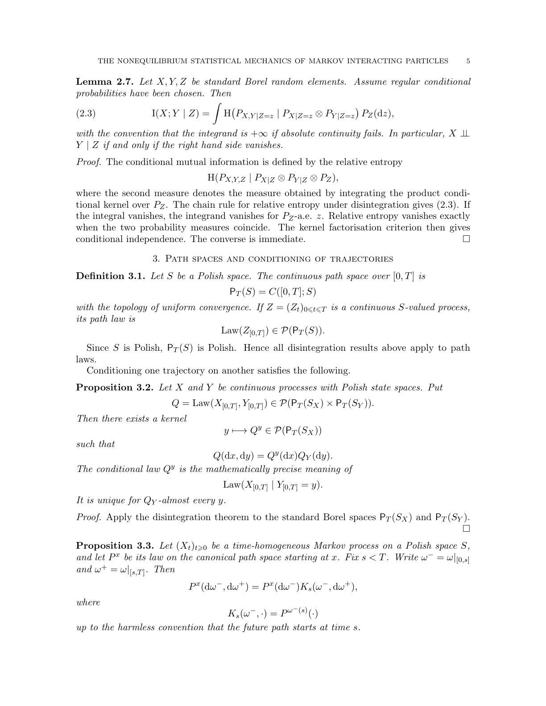
<figcaption class="paper-figure-caption"><b>Fig 4.</b> Low-resolution page preview, page 5</figcaption>
</figure>
<figure class="paper-figure-card">
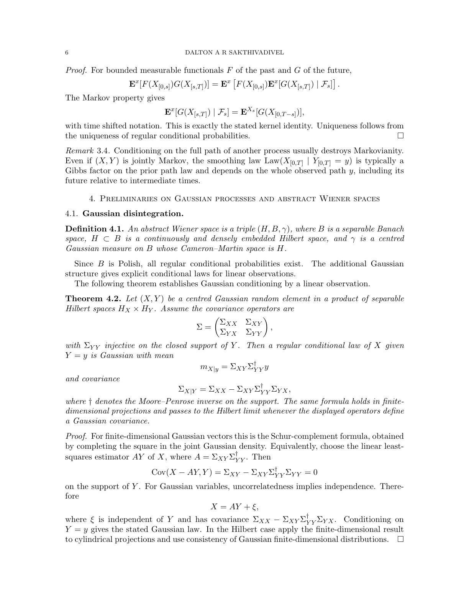
<figcaption class="paper-figure-caption"><b>Fig 5.</b> Low-resolution page preview, page 6</figcaption>
</figure>

**Summary.** This paper develops the mathematical machinery to analyze when the conditional probability law of coupled stochastic processes factorizes given an intermediate 'boundary' path. It establishes that factorization is equivalent to specific conditions on likelihood ratios and mutual information, providing a unified language applicable across various physical models from general diffusions to quantum-inspired systems.

**Why it may be interesting.** It provides a rigorous mathematical framework connecting concepts like Markov boundaries, information theory (mutual information), and stochastic control energy in non-equilibrium settings, which is crucial for understanding open quantum systems dynamics.

Detailed structure

**Main problem.** The central problem is determining the necessary and sufficient conditions for the conditional law of histories (paths) to factorize when conditioning a joint stochastic process on an intermediate 'boundary' path.

**Main result.** Factorization of the boundary-conditioned path law is equivalent to specific mathematical conditions, such as multiplicative separability of the Radon–Nikodym derivative or vanishing mixed covariance terms in specialized regimes.

**Method.** The analysis employs advanced measure theory, utilizing Girsanov's theorem for likelihood ratio calculations and information-theoretic tools like conditional mutual information and relative entropy.

**Model / system.** The study considers coupled stochastic systems decomposed into exterior ($Y$), boundary ($B$), and interior ($X$) variables, modeled by general continuous processes, including Itô diffusions.

**Key observables.** Path likelihoods (Radon–Nikodym derivatives), conditional mutual information $I(X; Y | B)$, and the quadratic control energy derived from log-likelihood expectations.

**Important parameters / regimes.** The time interval $[0, T]$, the structure of the coupling between variables ($Y, X$), and the nature of the conditioning path $B$.

**Assumptions / limitations.** Assumes Polish state spaces to guarantee the existence of regular conditional probabilities; relies on domination by product reference laws for factorization theorems.

**Paper structure.** The paper builds from defining the core object (regular conditional probability on a path space) to establishing necessary and sufficient conditions for its factorization, providing equivalent criteria across different mathematical frameworks (e.g., general Borel laws vs. Itô diffusions).

Abstract

We consider coupled stochastic systems decomposed into exterior, boundary, and interior variables, with the boundary variables sometimes carrying the directed structure of a sensor and actuator. The central question is when the conditional law of histories factorises, and how this path space statement is detected by log likelihoods, by Girsanov changes of measure, and by information theoretic quantities used in nonequilibrium statistical physics. The basic object is a regular conditional probability on a path space. Under domination by clamped reference laws, the boundary property becomes multiplicative separation of a Radon--Nikodym derivative, or equivalently additive separation of a path log likelihood. For Itō diffusions this log likelihood is computed by Girsanov's theorem; its expectation is the quadratic control energy appearing in the Föllmer entropy identity and in the stochastic control formulation of Schrödinger bridge problems. When exact factorisation fails, the remaining coupling is measured by conditional mutual information, namely the relative entropy between the true boundary-conditioned path law and the product of its conditional marginals. This gives a common language for boundary screening, path likelihood inference, controlled changes of path law, and the thermodynamic value of mutual information.

[↑ back to top](#top)

### [Quantum-classical crossover in finite spin-1/2 rings with Dzyaloshinsky-Moriya interaction](http://arxiv.org/abs/2607.13572v1)

**Authors:** Raúl Sánchez Galán, Robert Wieser  
**Type:** theory · **Category:** strongly correlated electrons · **PDF:** <https://arxiv.org/pdf/2607.13572v1>  
**Analysis basis:** full PDF text, analyzed in chunks
**Topic relevance:** 🔥 `methods for driven-dissipative` **4/5** · `Keldysh / 2PI / non-Gaussian methods` **3/5** · `analog quantum simulation` **3/5** · `correlated / nonlocal dissipation` **3/5** · `driven-dissipative phase transition` **3/5** · `entanglement & information structure` **3/5** · `non-equilibrium dynamics` **2/5** · `non-equilibrium universality` **2/5** · `Kondo & dissipative impurity` **1/5** · `exotic spin models in light-matter` **1/5** · `scars & prethermalization` **1/5**

↔ Scroll figures horizontally

<figure class="paper-figure-card">
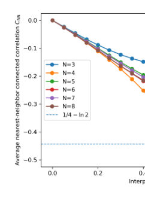
<figcaption class="paper-figure-caption"><b>Fig 1.</b> Figure 1: Average nearest-neighbor connected correlation CNN as a function of the interpolation parameter β for rings with N = 3, 4, 5, 6, 7, 8 spins. For small values of β, the connected correlations are close to zero, indicating that the sys- tem approaches a nearly separable product state consistent with the mean-field description. As β increases, the magnitude of the correlations grows and CNN becomes increasingly negative, reflecting the development of antiferromagnetic quantum correlations. The even rings generally develop stronger negative cor- relations, while the odd rings are affected by geometrical frustration.</figcaption>
</figure>
<figure class="paper-figure-card">
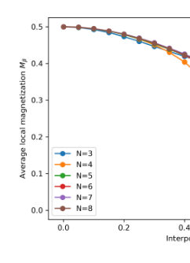
<figcaption class="paper-figure-caption"><b>Fig 2.</b> Figure 2: Average local magnetization Mβ as a function of the interpolation parameter β for rings with N = 3, 4, 5, 6, 7, 8 spins. The magnetization gener- ally decreases as β increases, reflecting the suppression of classical local spin order in the correlated quantum regime. The sharper drops observed for even N reflect the absence of geometrical frustration, while the odd rings retain a larger residual magnetization because a perfect alternating antiferromagnetic arrangement is incompatible with the periodic boundary condition.</figcaption>
</figure>
<figure class="paper-figure-card">
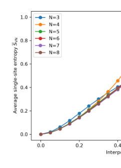
<figcaption class="paper-figure-caption"><b>Fig 3.</b> Figure 3: Average single-site von Neumann entropy SVN as a function of the interpolation parameter β for rings with N = 3, 4, 5, 6, 7, 8. The entropy is small in the mean-field regime and increases as the dynamics approaches the correlated quantum regime. The even rings show the largest entropy increase, consistent with the stronger suppression of their local magnetization.</figcaption>
</figure>

**Summary.** This work explores the transition between quantum and classical physics in spin chains using an interpolating Hamiltonian. By analyzing observables like magnetization and entropy, the authors quantify how genuine quantum correlations (captured by connected terms) stabilize the system compared to mean-field approximations. This provides a quantitative framework for understanding decoherence effects in condensed matter models.

**Why it may be interesting.** The use of a controlled interpolation parameter $\beta$ to bridge quantum dynamics (where correlations matter) and classical/mean-field descriptions is highly relevant for understanding open quantum systems where environmental coupling drives decoherence.

Detailed structure

**Main problem.** The study investigates the quantum-classical crossover behavior in finite spin-1/2 rings subjected to Heisenberg exchange, Dzyaloshinsky-Moriya (DM) interaction, and an external magnetic field.

**Main result.** The parameter $\beta$ interpolates between a fully correlated quantum regime ($\beta=1$) and a product-state mean-field limit ($\beta=0$), showing that quantum correlations significantly modify observables like magnetization and entropy.

**Method.** The analysis employs an interpolating Hamiltonian $\hat{H}_\beta$ solved using the dissipative Gisin–Schrödinger dynamics, which is analyzed both in spectral decomposition (quantum) and via numerical methods (mean-field).

**Model / system.** The system is a finite ring of $N$ spin-$1/2$ particles. The Hamiltonian includes nearest-neighbor Heisenberg exchange ($J$), DM interaction ($\vec{D}$), and a Zeeman term, controlled by the interpolation parameter $\beta$.

**Key observables.** Local magnetization ($M_\beta$), connected spin correlations, single-site von Neumann entropy ($S_{\text{VN}}$), and the saturation field ($B_c$).

**Important parameters / regimes.** The crossover parameter $\beta \in [0, 1]$, the ring size $N$, and the external magnetic field $B$.

**Assumptions / limitations.** For $\beta < 1$, the state-dependent Hamiltonian loses the simple spectral decomposition available in the purely quantum case ($\beta=1$).

**Figures summary.** Figure 1 shows connected correlations growing negatively with increasing $\beta$; Figure 2 demonstrates that magnetization decreases as $\beta$ increases; and Figure 3 illustrates entropy changes.

**Paper structure.** The paper first defines the interpolating Hamiltonian, then analyzes the dynamics in the purely quantum limit ($\beta=1$) using spectral methods. It contrasts this with the mean-field limit ($\beta=0$), before analyzing the crossover behavior across $\beta$ and calculating critical fields like $B_c$.

Abstract

We study finite spin-$\tfrac12$ rings with nearest-neighbor Heisenberg exchange, Dzyaloshinsky--Moriya interaction, and an external magnetic field. We introduce an interpolation parameter between the fully quantum Hamiltonian and a state-dependent mean-field description. Using dissipative Gisin--Schrödinger dynamics, we analyze the resulting quantum--classical crossover through local magnetization, connected spin correlations, single-site entropy, and the saturation field of the fully polarized state.

[↑ back to top](#top)

### [Precision quantum simulation of magnon spectra and interactions](http://arxiv.org/abs/2607.13301v1)

**Authors:** Trond I. Andersen, Nikita Astrakhantsev, Jeronimo Martinez, Will Morong, Johannes Motruk, Dario Rossi, Brayden Ware, Bryce Kobrin, Weijie Wu, Elizabeth Bennewitz, Manuel Rudolph, Tom Westerhout, Amira Abbas, Rajeev Acharya, Laleh Aghababaie Beni, Ross Alcaraz, Sayra Alcaraz, Markus Ansmann, Frank Arute, Kunal Arya, Walt Askew, Juan Atalaya, Christopher Ayala, Ryan Babbush, Brian Ballard, Joseph Bardin, Hector Bates, Andreas Bengtsson, Majid Bigdeli Karimi, Alexander Bilmes, Simon Bilodeau, Felix Borjans, Alexandre Bourassa, Jenna Bovaird, Dylan Bowers, Leon Brill, Peter Brooks, Michael Broughton, David Browne, Brett Buchea, Bob Buckley, Tim Burger, Brian Burkett, Jamal Busnaina, Nicholas Bushnell, Jonas Bylander, Anthony Cabrera, Juan Campero, Hung-Shen Chang, Silas Chen, Zijun Chen, Ben Chiaro, Liang-Ying Chih, Agnetta Cleland, Bryan Cochrane, Matt Cockrell, Josh Cogan, Paul Conner, Tom Connolly, Harold Cook, Rodrigo Cortinas, William Courtney, Alexander Crook, Benjamin Curtin, Adam Dally, Sayan Das, Martin Damyanov, Dripto Debroy, Himadri Dey, Stijn de Graaf, Laura De Lorenzo, Sean Demura, Lucia De Rose, Agustin Di Paolo, Leon Ding, Howard Dobbs, Paul Donohoe, Ebru Dogan, Ilya Drozdov, Andrew Dunsworth, Rasmus Edholm, Valerie Ehimhen, Alec Eickbusch, Aviv Elbag, Lior Ella, Mahmoud Elzouka, David Enriquez, Catherine Erickson, Lara Faoro, Vinicius Ferreira, Marcos Flores, Leslie Flores Burgos, Sam Fontes, Ebrahim Forati, Jeremiah Ford, Brooks Foxen, Masaya Fukami, Alan Fung, Lenny Fuste, Suhas Ganjam, Gonzalo Garcia, Christopher Garrick, Robert Gasca, Helge Gehring, Robert Geiger, Élie Genois, William Giang, Dar Gilboa, James Goeders, Edward Gonzales, Raja Gosula, Alejandro Grajales Dau, Dietrich Graumann, Joel Grebel, Alex Greene, Jonathan Gross, Jose Guerrero, Tan Ha., Steve Habegger, Tanner Hadick, Ali Hadjikhani, Michael Hamilton, Monica Hansen, Matthew Harrigan, Sean Harrington, Jeanne Hartshorn, Stephen Heslin, Paula Heu, Oscar Higgott, Reno Hiltermann, Jeremy Hilton, Hsin-Yuan Huang, Michael Hucka, Christopher Hudspeth, Ashley Huff, William Huggins, Aditya Jayaraman, Evan Jeffrey, Shaun Jevons, Zhang Jiang, Xiaoxuan Jin, Cody Jones, Chaitali Joshi, Kelsey Josund, Pavol Juhas, Andreas Kabel, Bharath Kannan, Hui Kang, Kiseo Kang, Amir Karamlou, Ryan Kaufman, Tanuj Khattar, Mostafa Khezri, Seon Kim, Paul Klimov, Can Knaut, Alexander Korotkov, Fedor Kostritsa, John Mark Kreikebaum, Ryuho Kudo, Arun Kumar, Ben Kueffler, Vladislav Kurilovich, Vitali Kutsko, Nathan Lacroix, Tiano Lange-Dei, Brandon Langley, Pavel Laptev, Kim-Ming Lau, Emma Leavell, Loïck Le Guevel, Justin Ledford, Joy Lee, Kenny Lee, Brian Lester, Wendy Leung, Matthew Lloyd, Lily Li, Wing Li, Ming Li, Alexander Lill, Mike Lindmark, William Livingston, Aditya Locharla, Erik Lucero, Daniel Lundahl, Aaron Lunt, Sid Madhuk, Donald Macaskill, Aniket Maiti, Ashley Maloney, Salvatore Mandra, Leigh Martin, Orion Martin, Eric Mascot, Paul Masih Das, Anselme Massimino, Melvin Mathews, Cameron Maxfield, Jarrod McClean, Matthew McEwen, Seneca Meeks, Anthony Megrant, Tim Menke, Kevin Miao, Zlatko Minev, Reza Molavi, Sebastian Molina, Shirin Montazeri, Akira Nakamura, Charles Neill, Konstantin Nesterov, Michael Newman, Roselle Ngaloy, Anthony Nguyen, Murray Nguyen, Chia-Hung Ni, Murphy Niu, Nicholas Noll, Sergey Novikov, Logan Oas, Ricky Oliver, Will Oliver, Raymond Orosco, Kristoffer Ottosson, Alice Pagano, Manan Patel, Sherman Peek, David Peterson, Alex Pizzuto, Thomas Plumb-Reyes, Elias Portoles, Rebecca Potter, Orion Pritchard, Sam Probst, Michael Qian, Chris Quintana, Matthew Rakher, Arpit Ranadive, Ganesh Ramachandran, Armin Razavi, Matthew Reagor, Rachel Resnick, David Rhodes, Daniel Riley, Gabrielle Roberts, Roberto Rodriguez, Emma Ropes, Eliott Rosenberg, Emma Rosenfeld, Dario Rosenstock, Elizabeth Rossi, Pedram Roushan, David Rower, Robert Salazar, Kannan Sankaragomathi, Murat Sarihan, Kevin Satzinger, Max Schaefer, Sebastian Schroeder, Henry Schurkus, Aria Shahingohar, Michael Shearn, Aaron Shorter, Shvarts Vladimir, Vlad Sivak, Spencer Small, W. Clarke Smith, David Sobel, Barrett Spells, Sofia Springer, George Sterling, Scott Stonemeyer, John Su, Jordan Suchard, Youngkyu Sung, Aaron Szasz, Alex Sztein, Tomoyuki Tanaka, Madeline Taylor, Jothi Thiruraman, Douglas Thor, Brandur Thorgrimsson, Dogan Timucin, Eifu Tomita, Alfredo Torres, M. Mert Torunbalci, Hao Tran, Abeer Vaishnav, Justin Vargas, Gopinath Vasalamarri, Sergey Vdovichev, Guifre Vidal, Benjamin Villalonga, Meghan Voorhees, Steven Waltman, Jonathan Waltz, Shannon Wang, Danni Wang, James Watson, Yonghua Wei, Travis Weidel, Theodore White, Kristi Wong, Bryan Woo, Christopher Wood, Maddy Woodson, Cheng Xing, Z. Jamie Yao, Ping Yeh, Bicheng Ying, Juhwan Yoo, Noureldin Yosri, Elliot Young, Grayson Young, Adam Zalcman, Ran Zhang, Yaxing Zhang, Yiqing Zhou, Ningfeng Zhu, Nicholas Zobrist, Zhenjie Zou, Sergio Boixo, Yu Chen, Julian Kelly, Hartmut Neven, Vadim Smelyanskiy, Dvir Kafri, L. B. Ioffe, Kostyantyn Kechedzhi, Xiao Mi, Dmitry Abanin  
**Type:** both · **Category:** numerical methods · **PDF:** <https://arxiv.org/pdf/2607.13301v1>  
**Analysis basis:** full PDF text, analyzed in chunks
**Topic relevance:** 🔥 `analog quantum simulation` **4/5** · 🔥 `methods for driven-dissipative` **4/5** · `QC/QI experiment` **3/5** · `exotic spin models in light-matter` **3/5** · `spintronics-quantum-optics interface` **3/5** · `non-equilibrium dynamics` **2/5** · `Keldysh / 2PI / non-Gaussian methods` **1/5** · `correlated / nonlocal dissipation` **1/5** · `driven-dissipative phase transition` **1/5** · `entanglement & information structure` **1/5** · `non-equilibrium universality` **1/5** · `quantum measurements` **1/5**

↔ Scroll figures horizontally

<figure class="paper-figure-card">
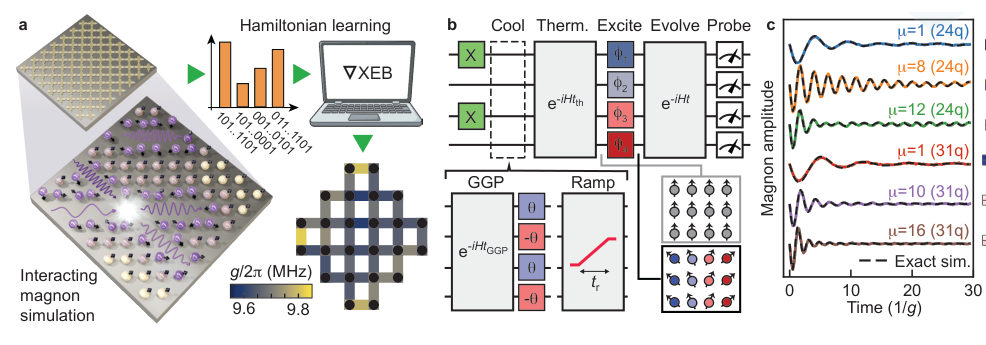
<figcaption class="paper-figure-caption"><b>Fig 1.</b> FIG. 1. High-precision magnon simulation via Hamiltonian learning and interleaved analog-digital circuits. a, A 97-qubit superconducting Willow processor is used to simulate interacting magnons. We learn its Hamiltonian in sub-patches of 24 qubits by optimizing overlap with the bitstring distribution. Bottom right: example of learned XY -couplings. b, Circuit schematic for magnon simulations. The magnet is cooled (dashed box) using either a global gate protocol (GGP) or adiabatic ramps. Following thermalization under analog evolution, digital Z-gates are injected to excite specific magnon modes (spin schematics pre- and post-excitation on bottom right), before turning the analog evolution...</figcaption>
</figure>
<figure class="paper-figure-card">
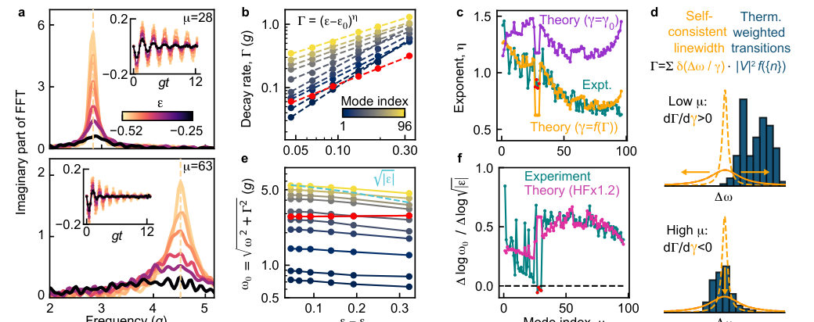
<figcaption class="paper-figure-caption"><b>Fig 2.</b> FIG. 3. Temperature dependence of magnon decay rate and resonance frequency. a, Magnon response for modes 28 (top) and 63 (bottom) in Fourier (main) and time-domain (inset). Mode 63 shows red-shift with increasing ε. b, Dependence of decay rate on energy elevation above ground state. Dashed lines show power-law fits. The data is collected using the same parallel excitation scheme as in Fig. 2. Red indicates corner mode. c, Power-law exponent, η, extracted from b (teal). The decrease below unity is not captured theoretically when assuming constant linewidths, γ = γ0 (purple), pointing to the important effect of self-consistent broadening effects (yellow). d, The temperature dependence of Γ...</figcaption>
</figure>
<figure class="paper-figure-card">
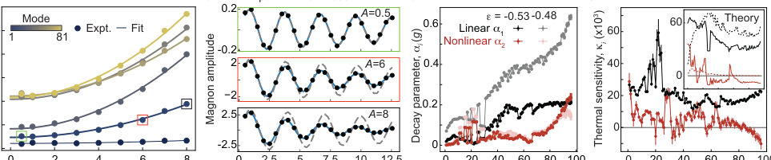
<figcaption class="paper-figure-caption"><b>Fig 3.</b> FIG. 4. Nonlinear magnon decay pathways. a, The decay rate scales roughly as A2, consistent with a nonlinear self- scattering process. Points indicate experimental data, and lines are quadratic fits. Every sixteenth mode in a 97-qubit system is shown. b, Examples of fits to the nonlinear decay equation (Eq. 2) for mode 17 (corresponding points boxed in a). We collectively fit (solid lines) the data (markers) at all amplitudes. The linear decay component (dashed lines) describes the low-amplitude data well, but underestimates the decay for higher A. For clarity, every other time point is displayed. c, Fit values for the linear and nonlinear decay parameters, α1 and α2. Dark and light lines...</figcaption>
</figure>
<figure class="paper-figure-card">
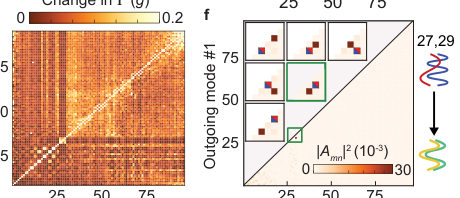
<figcaption class="paper-figure-caption"><b>Fig 4.</b> FIG. 5. Directly probing magnon scattering via col- lision experiments. a, Equal-time pump-probe measure- ments show how a high-amplitude pump mode (red; A = 4) impacts the decay rate of low-A probe modes (blue; A = 0.5). We use four measurements, including alternating signs of the probe, and comparison with and without pumping. For ef- ficiency, we excite 24 probe modes in parallel (more than in other experiments because we focus on the differential signal with and without pumping, which is more robust). b, Re- sponse of mode 50 without pumping (purple), compared with pumping of corner mode 29 (blue) and bulk mode 80 (green). The latter has substantially stronger effect. c, Pump-induced...</figcaption>
</figure>

**Summary.** The research reports on achieving high-precision quantum simulation of interacting magnon dynamics in a 2D XY magnet using superconducting qubits. By combining analog evolution with digital gate control, the authors measure key response functions to map out temperature-dependent spectra and scattering mechanisms. This work validates the use of hybrid quantum hardware for probing complex many-body physics relevant to materials science.

**Why it may be interesting.** This work directly bridges superconducting quantum hardware capabilities with fundamental condensed matter physics problems, providing a blueprint for simulating complex many-body dynamics beyond the reach of current theoretical numerical methods alone.

Detailed structure

**Main problem.** The central challenge is combining high-fidelity quantum evolution with sophisticated control to accurately simulate complex, interacting dynamics in many-body quantum systems for materials discovery.

**Main result.** The work demonstrates high-precision simulation of interacting magnon dynamics, revealing strong mode dependence of decay rates and enabling the study of scattering mechanisms inaccessible in simpler regimes.

**Method.** The authors employ an interleaved analog-digital protocol on a superconducting processor to measure time-dependent correlation functions ($\chi_\mu(t)$), comparing these measurements against advanced numerical techniques like Matrix Product States (MPS) and BP-PEPS simulations.

**Model / system.** The system modeled is a 2D XY spin-1/2 magnet, realized on an analog-digital superconducting processor of up to 97 qubits. The physics involves quantized spin waves called magnons.

**Key observables.** Magnon spectra, temperature-dependent decay rates ($\Gamma$), linear and nonlinear response functions ($\chi_\mu(t)$), and mode dependence of scattering mechanisms (e.g., near van Hove singularities).

**Important parameters / regimes.** Temperature ($T$), energy density ($\epsilon$), qubit count (up to 97 qubits), and simulation fidelity metrics.

**Assumptions / limitations.** MPS predictions become inaccurate away from low temperatures or small systems; the analysis relies on comparing experimental measurements to approximate numerical simulations like MPS/BP-PEPS.

**Figures summary.** Figures illustrate Hamiltonian learning circuits, measured time-dependent correlation functions ($\chi_\mu(t)$) matching theory, magnon dispersions showing mode dependence, and power-law fits for temperature dependence of decay rates.

**Paper structure.** The paper progresses from establishing the need for high-fidelity simulation to detailing the interleaved analog-digital measurement protocol. It then presents results on linear response (spectra/lifetimes), followed by nonlinear measurements (self-scattering), and finally discusses computational limitations using tensor network methods (BP-PEPS) regarding scaling complexity.

Abstract

Quantum simulation promises to advance materials discovery by accurately simulating complex states of matter, their microscopic excitations, and macroscopic response functions. The central challenge in resolving the underlying interacting dynamics is to combine high-fidelity evolution with the sophisticated control necessary to manipulate individual quasi-particles in quantum many-body states. Here, we report on high-precision simulation of both linear and non-linear response functions in a 2D XY spin-1/2 magnet using an analog-digital superconducting processor of up to 97 qubits. By interleaving digital gates with analog evolution precisely characterized via Hamiltonian learning, we selectively excite magnons at tunable energy densities. Measuring first the linear magnon response -- a central probe in neutron-scattering experiments -- we extract temperature-dependent spectra and lifetimes. Our results reveal stark variations in magnon decay rates across the Brillouin zone, with enhancement near van Hove singularities and suppression for edge-localized modes. Next, we perform a suite of nonlinear measurements, including the study of self-scattering mechanisms, as well as pump-probe spectroscopy to directly characterize the magnon interactions. While matrix-product state simulations capture the dynamics well in either small systems or at low temperatures, their predictions become inaccurate away from these limits. This work demonstrates precise simulation of the interacting dynamics in quantum magnets, and provides key insights into quasi-particles and their microscopic scattering mechanisms.

[↑ back to top](#top)

### [Nonreciprocal Relaxation Acceleration](http://arxiv.org/abs/2607.13989v1)

**Authors:** Xingyu Zhang, Yihan Ma, Yue Liu, Niaz Ali Khan, Chenlong Huang, Yuguo Su, Junyan Luo, Dahai He  
**Type:** theory · **Category:** statistical mechanics · **PDF:** <https://arxiv.org/pdf/2607.13989v1>  
**Analysis basis:** full PDF text, analyzed in chunks
**Topic relevance:** 🔥 `methods for driven-dissipative` **4/5** · 🔥 `non-equilibrium dynamics` **4/5** · `correlated / nonlocal dissipation` **3/5** · `driven-dissipative phase transition` **3/5** · `Keldysh / 2PI / non-Gaussian methods` **2/5** · `analog quantum simulation` **2/5** · `non-equilibrium universality` **2/5** · `Tavis-Cummings & cavity-many-emitter` **1/5** · `correlated cavity matter` **1/5** · `entanglement & information structure` **1/5** · `scars & prethermalization` **1/5**

↔ Scroll figures horizontally

<figure class="paper-figure-card">
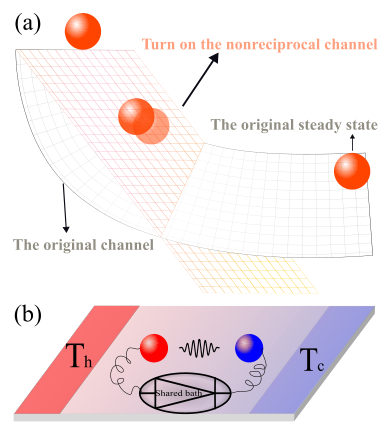
<figcaption class="paper-figure-caption"><b>Fig 1.</b> FIG. 1. (a) Operational principle of nonreciprocal relaxation acceleration. Activating the nonreciprocal coupling for a tran- sient duration significantly expedites the convergence of the quantum state toward the nonequilibrium target steady state. (b) Schematic layout of the model configuration. Two in- teracting bosonic modes are individually coupled to distinct thermal reservoirs maintained at unequal temperatures. The directional, nonreciprocal interaction between the modes is engineered via a shared common reservoir.</figcaption>
</figure>
<figure class="paper-figure-card">
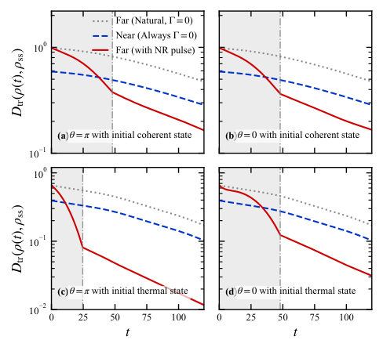
<figcaption class="paper-figure-caption"><b>Fig 2.</b> FIG. 2. Dynamics of nonreciprocal relaxation acceleration, quantified by the time-dependent trace distance between the instantaneous state and the reciprocal NESS Dtr(ρ(t), ρss). A distant initial state, far from the reciprocal NESS, relaxes sig- nificantly faster than a proximal (”near”) initial state when assisted by a transient activation of the nonreciprocal channel. Specifically, the distant initial states are prepared as a two- mode coherent state ρfar = ρ(1) coh(1.4)⊗ρ(2) coh(1.4) for (a) and (b) and thermal state ρfar = ρ(1) th (3.0) ⊗ρ(2) th (0.05) for (c) and (d) with ρ(i) th (¯n) denoting a local thermal state of the i-th mode with an average photon number ¯n, while the proximal...</figcaption>
</figure>
<figure class="paper-figure-card">
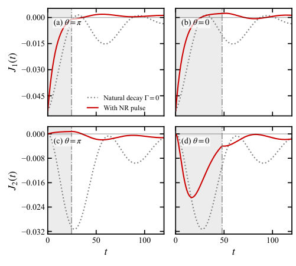
<figcaption class="paper-figure-caption"><b>Fig 3.</b> FIG. 3. Instantaneous heat currents J1(t) and J2(t) ex- changed with the local reservoirs, flowing from the respective reservoirs into the system. The left column, (a) and (c), cor- responds to the unidirectional coupling phase θ = π, whereas the right column, (b) and (d), corresponds to θ = 0. All panels highlight the relaxation from a highly excited initial state, comparing natural reciprocal decay (Γ = 0, gray dot- ted curves) with the nonreciprocal (NR) pulse-assisted evo- lution (solid curves). During the pulse duration (shaded re- gions), the engineered nonreciprocity dynamically redirects the inter-mode energy transport. By preventing the ther- mal energy from oscillating back and...</figcaption>
</figure>

**Summary.** This paper introduces a method to rapidly drive open quantum systems toward non-equilibrium steady states (NESS) by engineering transient nonreciprocal dissipation. Using a two-mode bosonic model, the authors show that this engineered channel acts as a 'shortcut,' accelerating relaxation rates robustly and independently of the direction of nonreciprocity. This technique offers a powerful tool for fast state preparation in quantum information applications.

**Why it may be interesting.** This work provides a powerful, controllable thermodynamic technique for rapid cooling and state preparation in continuous-variable systems, which is highly relevant to quantum optics and quantum information processing protocols.

Detailed structure

**Main problem.** The primary challenge addressed is dynamically accelerating the convergence of open quantum systems toward a non-equilibrium steady state (NESS), moving beyond traditional studies focused only on thermal equilibrium.

**Main result.** The authors demonstrate that activating a transient, engineered nonreciprocal dissipative channel provides a robust shortcut to rapidly accelerate the system's approach to the target NESS.

**Method.** The analysis employs both mean-field dynamics (tracking expectation values) and rigorous quantum fluctuation analysis using the evolution of the covariance matrix within the phase-space representation.

**Model / system.** The model is a two-mode interacting bosonic system coupled to local thermal baths. The time evolution is governed by a Lindblad master equation, with nonreciprocity engineered via specific coupling terms in the dissipation channel.

**Key observables.** Relaxation speedup (measured via trace distance), mean field expectation values ($\langle a_1 
angle, \langle a_2 
angle$), and the evolution of the covariance matrix $\mathbf{V}$.

**Important parameters / regimes.** The nonreciprocity strength ($\Gamma$) controlled by phase conditions ($	heta$), system coupling ($\lambda$), and bath temperatures ($n_1, n_2$).

**Assumptions / limitations.** Initial analysis uses mean-field theory, but the full treatment requires analyzing the second-order covariance matrix to capture quantum fluctuations accurately.

**Figures summary.** Figures illustrate that activating the nonreciprocal coupling transiently expedites convergence to NESS (Fig. 1a), and plots show the rapid decay of state norms/trace distance during pulsed regions compared to natural decay rates.

**Paper structure.** The paper progresses from identifying the challenge of accelerating NESS convergence, developing the theoretical framework using master equations and phase-space methods, demonstrating the acceleration via nonreciprocal coupling, and concluding with implications for quantum state preparation.

Abstract

Driven by recent discoveries regarding the quantum Mpemba effect, the anomalous relaxation dynamics of open quantum systems have garnered significant attention. While expediting thermalization to equilibrium has been extensively studied, dynamically accelerating the convergence toward nonequilibrium steady states remains a formidable challenge. In this article, we find a transient engineered nonreciprocal dissipative channel can provide a shortcut that accelerates convergence to the target reciprocal nonequilibrium steady state for the considered two-mode model and initial states. Using interacting bosonic modes, we demonstrate that the temporal activation of a nonreciprocal channel efficiently suppresses prolonged inter-mode energy oscillations, enforcing a rapid, unidirectional thermal dump into the environment. Counterintuitively, we find that this relaxation speedup is robust and independent of the direction of the nonreciprocity. Our results provide a powerful thermodynamic technique for rapid state preparation and cooling in continuous-variable quantum systems, particularly critical for low-temperature quantum information processing.

[↑ back to top](#top)

### [Post-Critical Meson Dynamics of Kibble-Zurek Excitations in a 5,564-Qubit Quantum Annealer](http://arxiv.org/abs/2607.13842v1)

**Authors:** Francis A. Bayocboc, Jacek Dziarmaga, Marek M. Rams, Jaka Vodeb  
**Type:** both · **Category:** statistical mechanics · **PDF:** <https://arxiv.org/pdf/2607.13842v1>  
**Analysis basis:** full PDF text, analyzed in chunks
**Topic relevance:** 🔥 `analog quantum simulation` **4/5** · 🔥 `non-equilibrium dynamics` **4/5** · 🔥 `non-equilibrium universality` **4/5** · `driven-dissipative phase transition` **3/5** · `methods for driven-dissipative` **3/5** · `QC/QI experiment` **2/5** · `Frenkel-Kontorova` **1/5** · `Keldysh / 2PI / non-Gaussian methods` **1/5** · `correlated / nonlocal dissipation` **1/5** · `entanglement & information structure` **1/5**

↔ Scroll figures horizontally

<figure class="paper-figure-card">
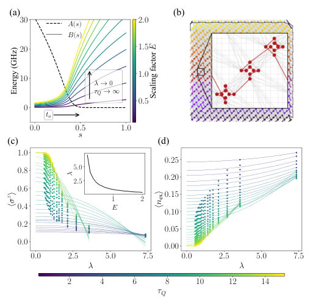
<figcaption class="paper-figure-caption"><b>Fig 1.</b> Figure 1. Quantum simulation protocol and zero-noise extrapo- lation. (a) D-Wave fast-annealing schedule, showing the transverse- field energy scale A(s) and Ising energy scale B(s) as functions of the annealing parameter s. The colored curves show the effective rescaling B(s) →EB(s) used for zero-noise extrapolation. In- creasing E shifts the crossing toward smaller effective noise λ, while the physical annealing time ta sets the quench time τQ near the crit- ical point. (b) Embedding of the one-dimensional Ising chain on the D-Wave quantum processing unit. The red path denotes the ac- tive 5,564-qubit chain used in the experiment. (c),(d) Representative zero-noise extrapolations at...</figcaption>
</figure>
<figure class="paper-figure-card">
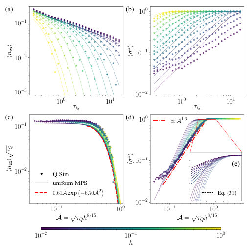
<figcaption class="paper-figure-caption"><b>Fig 2.</b> Figure 2. Biased Kibble–Zurek scaling and post-critical mag- netization. (a),(b) Zero-noise–extrapolated quantum simulation data (dots) for the final defect density ⟨nex⟩and magnetization ⟨σz⟩, com- pared with uniform-bias MPS simulations (solid lines), as functions of the quench time τQ for different longitudinal biases h. (c) Defect- density data rescaled by the Kibble–Zurek length ˆξ ∝√τQ and plot- ted against the biased scaling variable A = ˆξ/ξ∥∝√τQh8/15. The collapse shows the crossover from Kibble–Zurek defect creation at small A to Landau–Zener suppression at large A; the dashed line is a fit of the form αA exp(−aA2). (d) Final magnetization plot- ted against the same scaling...</figcaption>
</figure>
<figure class="paper-figure-card">
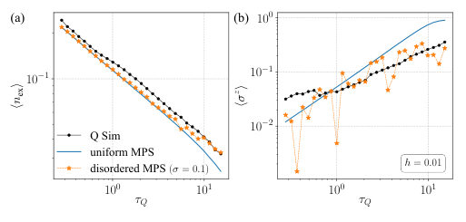
<figcaption class="paper-figure-caption"><b>Fig 3.</b> Figure 3. Effect of static disorder on defect creation and mag- netization. Zero-noise–extrapolated quantum simulation data (black dots) at h = 0.01, compared with clean uniform-bias MPS simula- tions (solid blue line) and disordered MPS simulations (orange stars). (a) Final defect density ⟨nex⟩as a function of quench time τQ. The disordered MPS data remain close to both the uniform-bias MPS and quantum-simulation results, showing that the total number of defects is primarily set by near-critical Kibble–Zurek creation and is compar- atively insensitive to weak static disorder. The remaining disparity is likely due to thermal effects on the device, not taken into account by our numerics. (b)...</figcaption>
</figure>
<figure class="paper-figure-card">
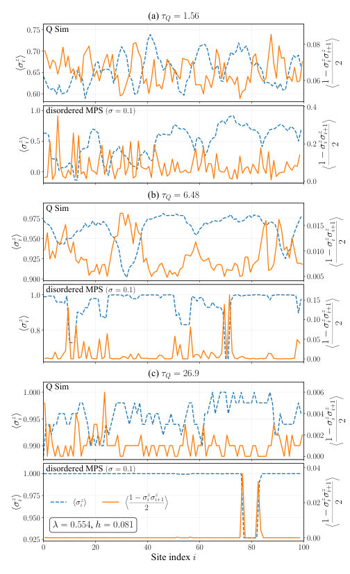
<figcaption class="paper-figure-caption"><b>Fig 4.</b> Figure 4. Spatial signatures of post-critical domain-wall local- ization. Local magnetization Mi = ⟨σz i ⟩(blue dashed lines) and local defect density ni = ⟨(1 −σz i σz i+1)/2⟩(orange solid lines) at h = 0.081, comparing zero-noise–extrapolated quantum simulation data with disordered MPS simulations for increasing quench times: (a) τQ = 1.56, (b) τQ = 6.48, and (c) τQ = 26.9. In both the quan- tum simulation and disordered MPS data, the local defect density is concentrated at preferred positions rather than being spatially uni- form. These peaks coincide with sharp changes in the magnetization profile, showing that the final kinks act as pinned domain walls sepa- rating locally ordered...</figcaption>
</figure>
<figure class="paper-figure-card">
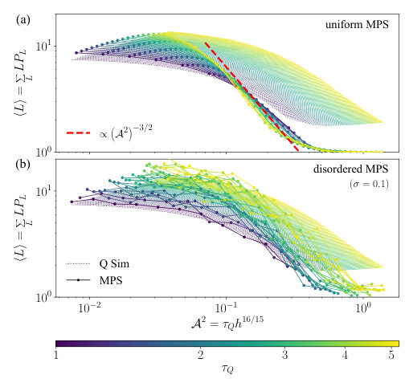
<figcaption class="paper-figure-caption"><b>Fig 5.</b> Figure 5. Domain-size signatures of post-critical meson dy- namics and localization. Average minority-domain size ⟨L⟩= P</figcaption>
</figure>

**Summary.** This paper investigates the fate of excitations following a quench across a quantum critical point using a large-scale quantum annealer. It distinguishes between robust defect creation governed by the Kibble-Zurek mechanism and subsequent post-critical dynamics. The key finding is that while defect counting works well, magnetization reveals that disorder localizes the domain structure, suggesting these two physical processes are distinct.

**Why it may be interesting.** The work provides a concrete experimental platform (quantum annealers) to probe complex non-equilibrium dynamics beyond simple critical exponents, linking quantum annealing hardware capabilities directly to fundamental concepts in condensed matter physics like defect formation and relaxation.

Detailed structure

**Main problem.** The study aims to separate the physics of defect creation near a quantum critical point (Kibble-Zurek mechanism) from the subsequent, nonintegrable dynamics of confined excitations.

**Main result.** While defect density follows expected Kibble-Zurek scaling, post-critical observables like magnetization and domain statistics reveal that this evolution is interrupted by localization effects, particularly when disorder is present.

**Method.** The research combines quantum simulation on large-scale annealers with theoretical analysis using Matrix Product States (MPS) simulations to compare defect counting versus full dynamical evolution.

**Model / system.** The system modeled is a longitudinally biased one-dimensional quantum Ising chain, implemented physically on a 5,564-qubit quantum annealer. The dynamics are driven across a quantum critical point via controlled annealing schedules.

**Key observables.** Kink density ($\langle n_{ex} 
angle$), longitudinal magnetization ($\langle\sigma_z
angle$), and minority-domain statistics (e.g., average domain size $\langle L 
angle$).

**Important parameters / regimes.** The ratio $A = \hat{\xi}/\xi_{\parallel}$ controls the crossover between the Kibble-Zurek and Landau-Zener regimes; disorder strength is also a critical parameter.

**Assumptions / limitations.** The analysis assumes that dynamics can be separated into near-critical defect creation followed by post-critical mesonic evolution, which may be interrupted by static disorder.

**Figures summary.** Figures illustrate the data collapse of kink density and magnetization onto scaling functions of $A$, comparing quantum simulation results against both uniform and disordered MPS simulations to highlight localization effects.

**Paper structure.** The paper first establishes the framework using quantum annealers for non-equilibrium dynamics. It then analyzes defect creation via KZM/LZ crossover, contrasting this with post-critical observables like magnetization. Finally, it uses theoretical modeling (mesonic states) and disorder simulations to show that localization governs the late-time domain structure.

Abstract

Quantum phase transitions provide a controlled route for generating many-body excitations, but the dynamics after the critical point can be as important as the initial defect creation. Recent progress in quantum annealing has made it possible to access coherent nonequilibrium dynamics in programmable Ising systems with thousands of superconducting qubits. Here we use this capability to study a longitudinally biased quantum Ising chain, where Kibble--Zurek defect creation is followed by nonintegrable post-critical dynamics. The longitudinal bias confines kink--antikink excitations into mesonic bound states, so that the final spin configurations encode both the production of defects near the critical point and the subsequent evolution of the confined excitations. Using energy-scale rescaling and zero-noise extrapolation, we find that the defect density follows the expected biased Kibble--Zurek/Landau--Zener crossover and agrees with matrix-product-state simulations with uniform bias. In contrast, magnetization, spatial profiles, and minority-domain statistics reveal that mesonic evolution is interrupted by localization of the post-critical domain pattern. Matrix-product-state simulations with disorder reproduce this separation between robust defect creation and localized post-critical dynamics. Our results show that large-scale quantum annealers can probe the fate of critical excitations beyond defect counting.

[↑ back to top](#top)

### [Bridging Frustration and Non-Hermiticity via COMPASS: An Adaptive Biorthogonal Neural Quantum State Framework](http://arxiv.org/abs/2607.13790v1)

**Authors:** Lavoisier Wah, Flore K. Kunst, Mohamed Hibat-Allah  
**Type:** theory · **Category:** numerical methods · **PDF:** <https://arxiv.org/pdf/2607.13790v1>  
**Analysis basis:** full PDF text, analyzed in chunks
**Topic relevance:** 🔥 `methods for driven-dissipative` **4/5** · `analog quantum simulation` **3/5** · `driven-dissipative phase transition` **3/5** · `exotic spin models in light-matter` **3/5** · `correlated / nonlocal dissipation` **2/5** · `non-equilibrium dynamics` **2/5** · `non-equilibrium universality` **2/5** · `Keldysh / 2PI / non-Gaussian methods` **1/5** · `Kondo & dissipative impurity` **1/5** · `entanglement & information structure` **1/5**

↔ Scroll figures horizontally

<figure class="paper-figure-card">
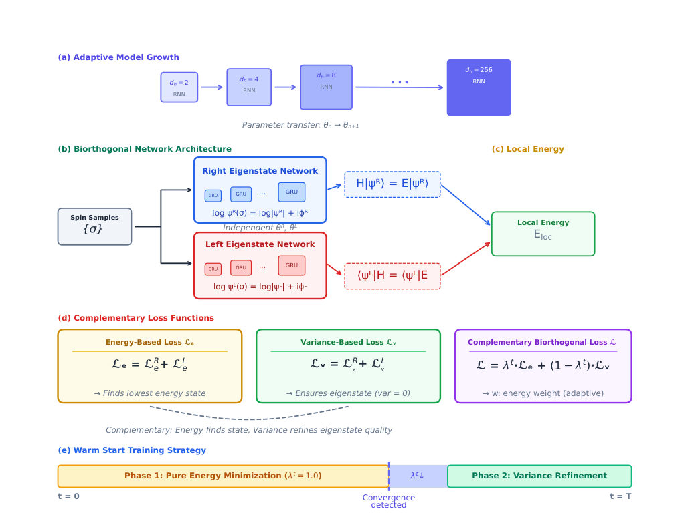
<figcaption class="paper-figure-caption"><b>Fig 1.</b> Figure 1: Complementary optimization method for progressive adaptive state search. We show a schematic presentation of our method. (a) We start by building an adaptive RNN, which progressively increases the network capacity during training following an adaptive scheme; then, (b) we initialize two independent RNNs with gated recurrent unit (GRU) cells to represent the right and left eigenstates of the model shown in blue and red, respectively. (c) We use the outputs from these RNNs to determine the local energy. As a next step, (d) we perform a complementary optimization in two phases: first we do an energy-based optimization to target the ground-state energy (shown in yellow), and second,...</figcaption>
</figure>
<figure class="paper-figure-card">
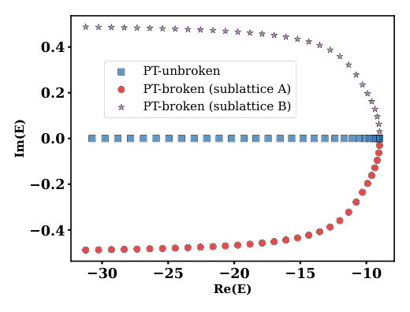
<figcaption class="paper-figure-caption"><b>Fig 2.</b> Figure 2: Broken vs unbroken PT symmetry. We plot the imaginary part of the ground-state energy of the 1D Ising chain against its real part for different values of η ∈[0, 3], and ξ = η/10. We consider δλ = 0.1 + i0.1 when we perturb sublattice A, and δλ = 0.1 −i0.1 when we perturb sublattice B. Open boundries conditions (OBCs) are considered, and N = 10.</figcaption>
</figure>
<figure class="paper-figure-card">
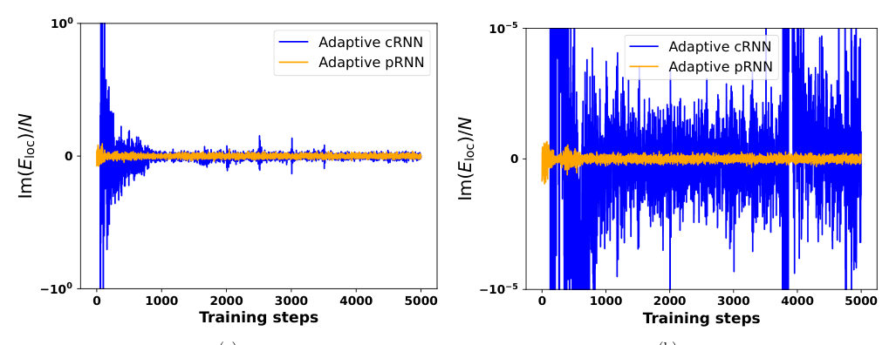
<figcaption class="paper-figure-caption"><b>Fig 3.</b> Figure 3: Energy per spin for the 1D PT-symmetric Hamiltonian. We plot the imaginary part of the ground-state energy per spin of the 1D PT-symmetric TFIM in Eq. (10), for (a) N = 10, and (b) N = 100 spins using both the adaptive cRNN (in blue) and pRNN (orange). We consider J = 1, η = 1.6 and ξ = 0.16.</figcaption>
</figure>
<figure class="paper-figure-card">
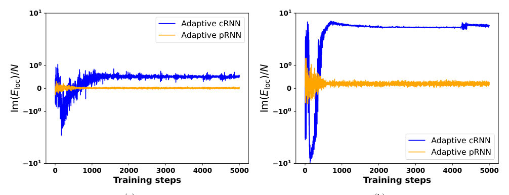
<figcaption class="paper-figure-caption"><b>Fig 4.</b> Figure 4: Energy per spin for the generic 1D non-Hermitian Hamiltonian. We plot the imaginary part of the ground-state energy per spin of the generic 1D TFIM in Eq. (11), for (a) N = 10, and (b) N = 100 spins using both the adaptive cRNN (in blue) and pRNN (orange). We consider J = 1, η = 1.6, ξ = 0.16 and δλ =?.</figcaption>
</figure>
<figure class="paper-figure-card">
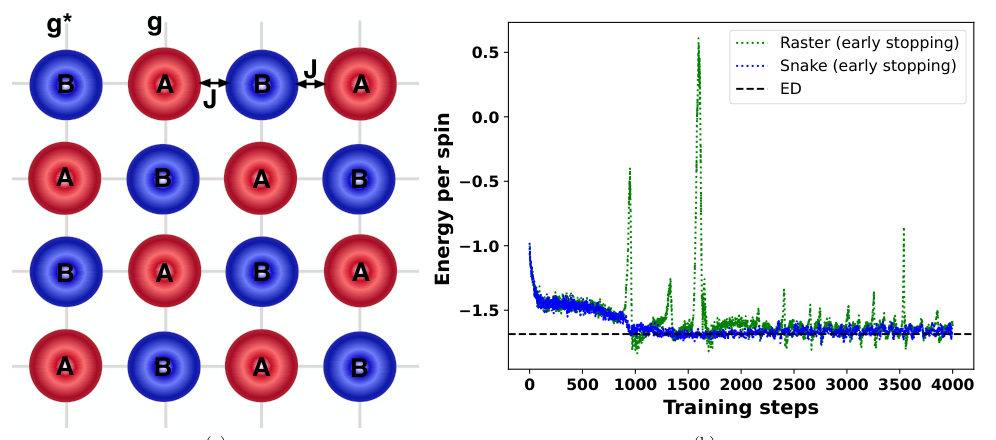
<figcaption class="paper-figure-caption"><b>Fig 5.</b> Figure 5: The 2D PT-symmetric TFIM. We present (a) a schematic representation of the 2D PT-symmetric TFIM (12), and (b) plot the ground state energy per spin with early stopping with the snake scan (blue), and the raster scan (green). We compare the results to ED (black). We consider OBCs, J = 1, η = 1.6, ξ = η/10, Lx × Ly = 3 × 3, a patience step Npat = 500, and a convergence threshold of 10−5. The snake scanning is more stable and reliable compared to the raster scanning. ED could not simulate Lx × Ly = 4 × 4.</figcaption>
</figure>

**Summary.** The paper introduces COMPASS, an adaptive biorthogonal neural network framework designed for simulating Non-Hermitian many-body systems. It stabilizes ground state finding by combining energy and variance minimization into a progressive optimization scheme. This allows researchers to study exotic phenomena like spectral instability shielding via frustration and novel topological structures in NH quantum magnets.

**Why it may be interesting.** This work provides a powerful, generalizable numerical tool (COMPASS) that extends quantum simulation techniques beyond the Hermitian domain, allowing direct investigation of complex physics relevant to open or dissipative quantum systems.

Detailed structure

**Main problem.** Developing a robust computational framework to study Non-Hermitian (NH) many-body systems, specifically bridging concepts of frustration and non-Hermiticity.

**Main result.** The proposed COMPASS framework successfully simulates NH systems directly, revealing that gap frustration shields against spectral instability and generating novel topological features like the diabolic ring.

**Method.** It employs a Complementary Optimization Method for Progressive Adaptive State Search (COMPASS) using adaptive biorthogonal Neural Quantum States (NQSs). This method alternates between energy minimization and variance minimization to ensure stable convergence to ground-state eigenpairs.

**Model / system.** The framework is applied to 1D and 2D NH many-body systems, including frustrated magnetism models based on extensions of the J1-J2 spin chain. The formalism requires a biorthogonal approach using left ($\Psi_L$) and right ($\Psi_R$) eigenstates.

**Key observables.** Ground-state eigenpairs ($E$), energy expectation value $\langle H 
angle$, energy variance ($\sigma^2$), and the fidelity of the biorthogonal overlap $|\langle\Psi_{L0}|\Psi_{R0}
angle|$.

**Important parameters / regimes.** Frustration coupling strength, PT-symmetry breaking parameters (e.g., $\gamma/J_1$), system size ($N=1D$ up to 200, $N=2D$ up to 100).

**Assumptions / limitations.** The framework assumes that physically-informed ansatz selection is crucial for reliable NH simulations; it avoids Hermitian embeddings or adiabatic continuation.

**Figures summary.** Figures illustrate the COMPASS optimization process (adaptive growth, loss functions), PT-symmetry breaking in 1D Ising chains, and the emergence of Exceptional Points (EPs) when simulating frustrated NH models.

**Paper structure.** The paper introduces the COMPASS method using adaptive biorthogonal NQSs. It details the two-phase optimization process ($\mathcal{L}_e$ then $\mathcal{L}_v$) for finding ground states in NH systems. Finally, it applies this to frustrated magnetism to study spectral topology and EP emergence.

Abstract

In this work, we introduce a complementary optimization method for progressive and adaptive state search (COMPASS) based on biorthogonal adaptive recurrent neural quantum states. Our approach combines an adaptive autoregressive architecture with a biorthogonal variational Monte Carlo scheme as well as a complementary optimization scheme that alternates between energy and variance minimization. This enables the stable convergence to ground-state eigenpairs, while avoiding Markov chain sampling through exact autoregressive generation. We demonstrate that for parity-time(PT)-symmetric Hamiltonians, unconstrained complex ansatze can spontaneously break PT symmetry during optimization, even in the unbroken phase, leading to spurious imaginary energies. Real-valued ansatze, on the other hand, naturally constrain the optimization to the correct physical manifold. Conversely, for generic non-Hermitian (NH) Hamiltonians without symmetry protection and complex spectra, complex ansatze are essential for capturing complex ground-state properties. Our results establish that physically-informed ansatz selection is crucial for reliable NH simulations. By combining adaptive architectures, biorthogonal optimization, and symmetry-aware modeling, this framework enables a direct study of 1D and 2D NH many-body systems without Hermitian embeddings or adiabatic continuation. Applying this framework to systems with frustrated magnetism, we show that gap frustration provides a quantitative shield against NH spectral instability, with the frustration gap setting a critical threshold for PT-symmetry breaking. Also, complexifying the frustration coupling itself generates a new topologically nontrivial network of diabolic level crossings, controlled by the phase of the complex coupling, that has no Hermitian analog. We term this novel spectral topology in NH frustrated systems the diabolic ring.

[↑ back to top](#top)

### [Cooling rate and glassy behavior in the Fermi--Pasta--Ulam system](http://arxiv.org/abs/2607.13833v1)

**Authors:** Matteo Razza, Andrea Carati, Luigi Galgani  
**Type:** theory · **Category:** statistical mechanics · **PDF:** <https://arxiv.org/pdf/2607.13833v1>  
**Analysis basis:** full PDF text, analyzed in chunks
**Topic relevance:** 🔥 `non-equilibrium dynamics` **4/5** · `non-equilibrium universality` **3/5** · `analog quantum simulation` **2/5** · `driven-dissipative phase transition` **2/5** · `scars & prethermalization` **2/5** · `Frenkel-Kontorova` **1/5** · `Keldysh / 2PI / non-Gaussian methods` **1/5** · `correlated / nonlocal dissipation` **1/5** · `entanglement & information structure` **1/5** · `methods for driven-dissipative` **1/5**

↔ Scroll figures horizontally

<figure class="paper-figure-card">
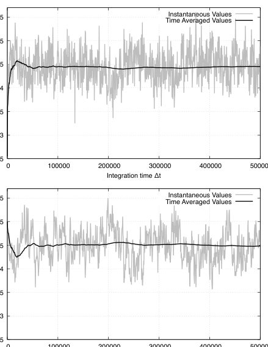
<figcaption class="paper-figure-caption"><b>Fig 1.</b> FIG. 1. FPU kinetic energy vs. time (upper panel) and gas kinetic energy per particle vs. time (lower one). Notice that the two kinetic energies essentially coincide after a time of order 105.</figcaption>
</figure>
<figure class="paper-figure-card">
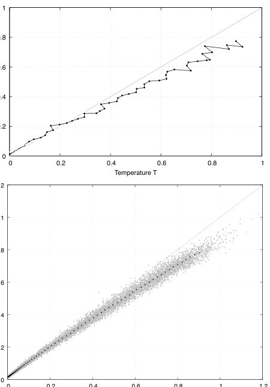
<figcaption class="paper-figure-caption"><b>Fig 2.</b> FIG. 2. Cooling process starting from Tgas = 1 with time step τ = 0.0025, N + 2 = 200, initial energy of normal modes Ek ≈0.5051 for all k. Upper panel: single trajectory. Lower panel: 128 trajectories. Grey points are data for the single trajectory, black ones are the resulting average.</figcaption>
</figure>
<figure class="paper-figure-card">
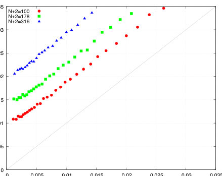
<figcaption class="paper-figure-caption"><b>Fig 3.</b> FIG. 3. Cooling process for different values of N + 2 = 100, 178, 316, for temperature below 0.035. Here the cool- ing rate is ξ = 4 · 10−7.</figcaption>
</figure>
<figure class="paper-figure-card">
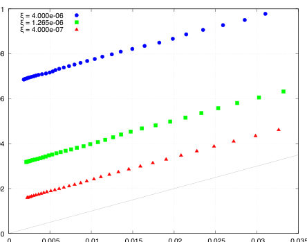
<figcaption class="paper-figure-caption"><b>Fig 4.</b> FIG. 4. Cooling process for different value of the cooling rate, for temperature below 0.035. Here the particles number is N + 2 = 200.</figcaption>
</figure>
<figure class="paper-figure-card">
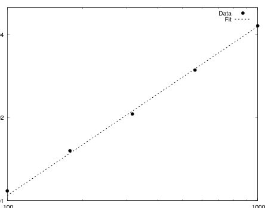
<figcaption class="paper-figure-caption"><b>Fig 5.</b> FIG. 5. Dependence of the zero–point energy E0 from the particles number N. Points are computed by the bin-average procedure.</figcaption>
</figure>

**Summary.** The paper numerically examines how a Fermi--Pasta--Ulam lattice cools when coupled to an external bath whose temperature is lowered at a specific rate. It finds that the cooling process deviates significantly from equilibrium below a stochastic threshold, leading to a measurable residual zero-point energy ($E_0$). This residual energy exhibits a predictable power-law scaling with both system size and the applied cooling rate.

**Why it may be interesting.** This work explores non-equilibrium dynamics in classical many-body systems, which shares conceptual links with open quantum system thermodynamics and relaxation processes studied in AMO physics.

Detailed structure

**Main problem.** The study investigates the non-equilibrium cooling process and associated glassy behavior of a Fermi--Pasta--Ulam (FPU) system when coupled to an external bath whose temperature is reduced at a controlled rate.

**Main result.** The residual zero-point energy ($E_0$) maintained by the FPU system below equilibrium scales with both system size ($N$) and cooling rate ($\xi$) according to $E_{0} \sim (\xi N)^{2/3}$.

**Method.** Numerical simulations using the Verlet method are employed to track the time evolution of energy components during the controlled cooling process.

**Model / system.** The system is an FPU lattice interacting via a Lennard-Jones potential, coupled to a gas bath. The total Hamiltonian includes both the FPU dynamics and the coupling interaction potential.

**Key observables.** Zero-point energy ($E_0$), specific energy ($u = E/N$), and the deviation of measured energy from expected equilibrium values.

**Important parameters / regimes.** Cooling rate ($\xi$), system size ($N$), and the stochastic threshold below which non-equilibrium effects dominate.

**Assumptions / limitations.** The analysis relies on simulating the cooling process by scaling gas particle velocities at discrete steps, assuming a weak stochastic threshold dictates the onset of glassy behavior.

**Figures summary.** Figures illustrate the time evolution of kinetic energy during cooling and show how specific energy deviates from linear expectations as temperature drops, confirming power-law dependencies for $E_0$ on $N$ and $\xi$.

**Paper structure.** The paper details the setup of the FPU system coupled to a bath, describes the numerical simulation procedure involving controlled cooling rates ($\xi$), presents diagnostics like zero-point energy ($E_0$), and concludes with the derived power-law scaling relationship.

Abstract

In this work, we numerically studied the cooling process of a Fermi--Pasta--Ulam system, which occurs when the FPU system is placed in contact with a gas whose temperature $T$ is reduced with a certain cooling rate $ξ$. It was found that the existence of a weak stochastic threshold has a significant impact on the cooling process, because below such a stochastic threshold the specific FPU energy is larger than its temperature, i.e., the FPU system falls out of equilibrium. The difference remains finite in the limit $T \to 0$, so that the FPU system maintains a residual amount of energy $E_0$ at vanishing temperature. Our numerical simulations reveal that this energy exhibits a power--law dependence on both the system size and the cooling rate, scaling approximately as $E_{0} \sim (ξN)^{2/3}$.

[↑ back to top](#top)

### [Markovian evolution from a novel scheme](http://arxiv.org/abs/2607.13809v1)

**Authors:** Fardin Kheirandish, Zahra Iranshahi, Fatemeh Bakhtiari, Adam Moradian  
**Type:** theory · **Category:** other · **PDF:** <https://arxiv.org/pdf/2607.13809v1>  
**Analysis basis:** full PDF text, analyzed in chunks
**Topic relevance:** 🔥 `methods for driven-dissipative` **4/5** · `correlated / nonlocal dissipation` **3/5** · `driven-dissipative phase transition` **3/5** · `non-equilibrium dynamics` **3/5** · `non-equilibrium universality` **2/5** · `Keldysh / 2PI / non-Gaussian methods` **1/5** · `Kondo & dissipative impurity` **1/5** · `analog quantum simulation` **1/5**

↔ Scroll figures horizontally

<figure class="paper-figure-card">
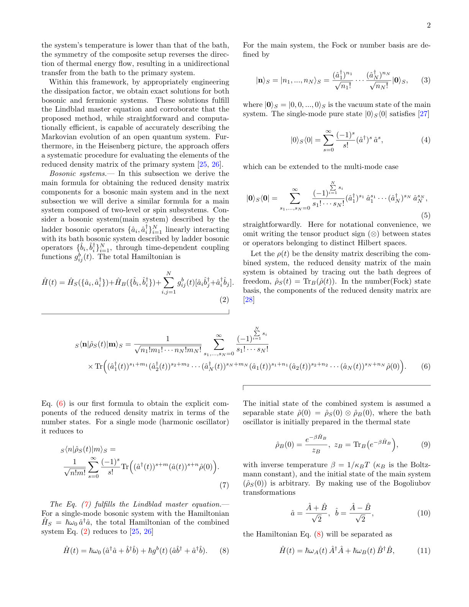
<figcaption class="paper-figure-caption"><b>Fig 1.</b> Low-resolution page preview, page 2</figcaption>
</figure>
<figure class="paper-figure-card">
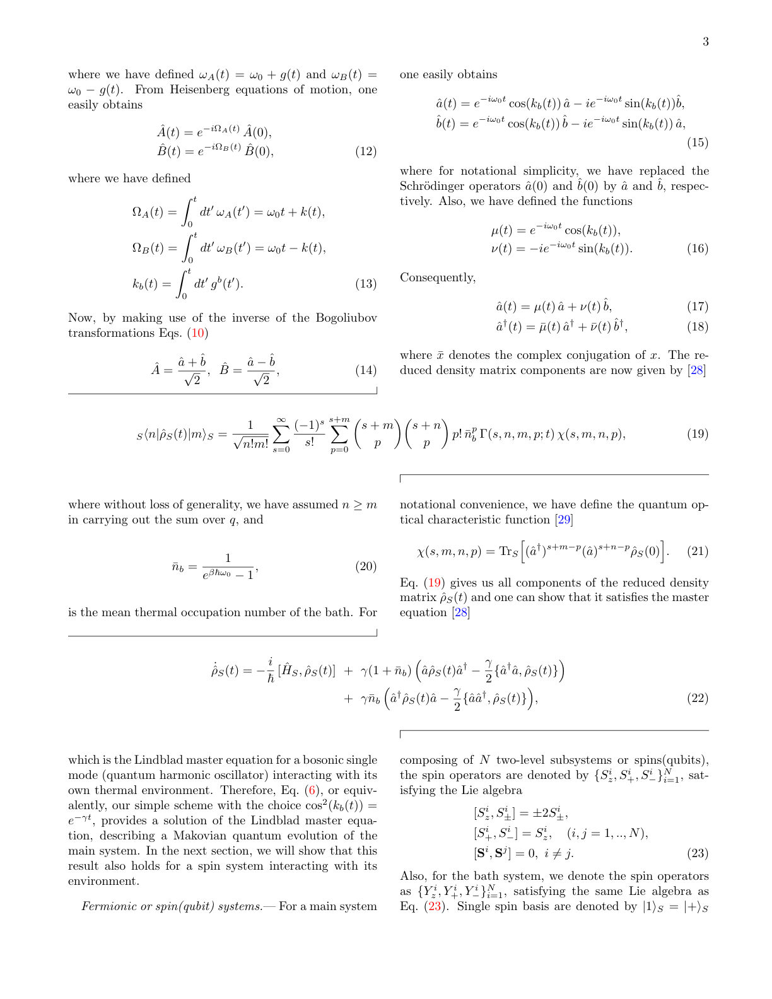
<figcaption class="paper-figure-caption"><b>Fig 2.</b> Low-resolution page preview, page 3</figcaption>
</figure>
<figure class="paper-figure-card">
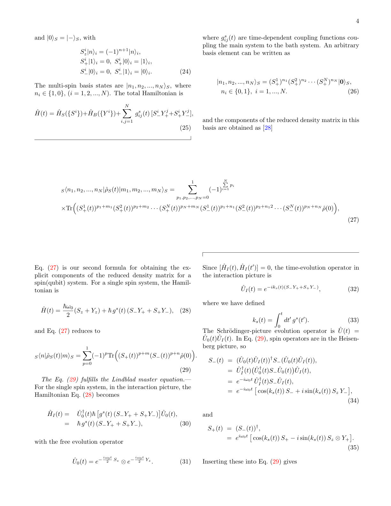
<figcaption class="paper-figure-caption"><b>Fig 3.</b> Low-resolution page preview, page 4</figcaption>
</figure>
<figure class="paper-figure-card">
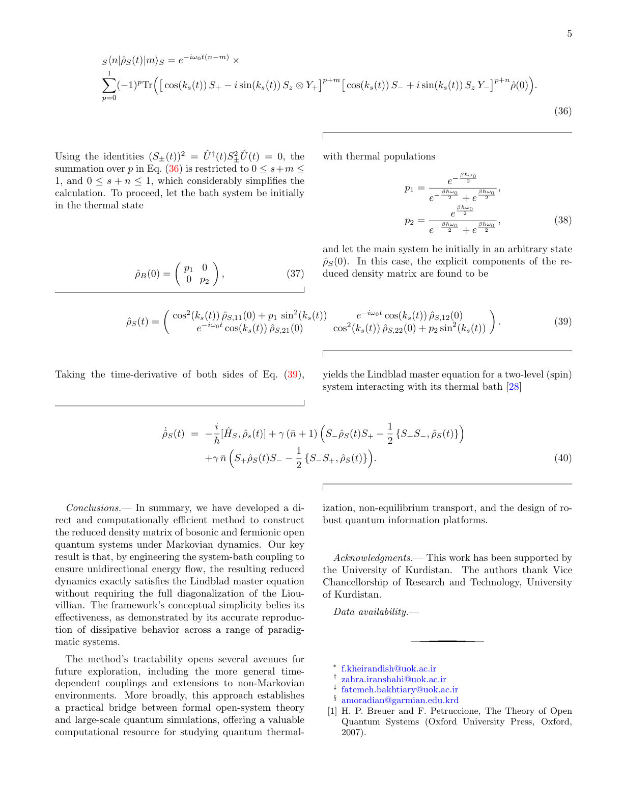
<figcaption class="paper-figure-caption"><b>Fig 4.</b> Low-resolution page preview, page 5</figcaption>
</figure>
<figure class="paper-figure-card">
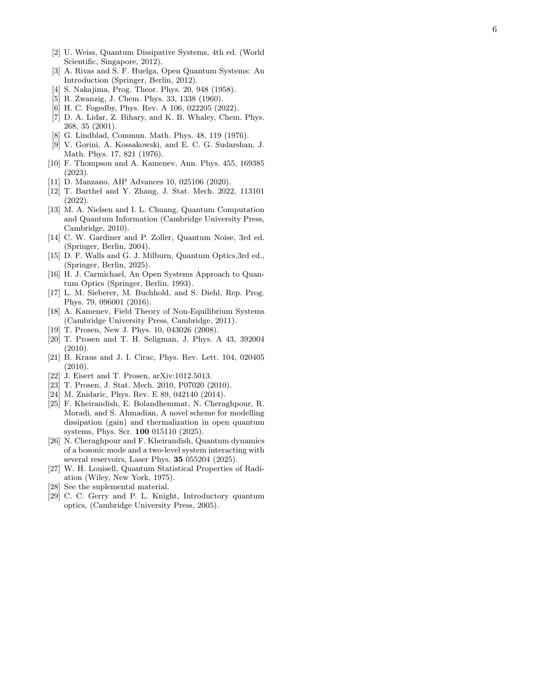
<figcaption class="paper-figure-caption"><b>Fig 5.</b> Low-resolution page preview, page 6</figcaption>
</figure>

**Summary.** This paper presents an efficient theoretical framework to calculate the reduced density matrix for open quantum systems, applicable to both bosons and fermions. By modeling the environment coupling carefully, the authors derive exact solutions that rigorously satisfy the Lindblad master equation. This offers a straightforward tool for simulating complex dissipative dynamics in many-body physics.

**Why it may be interesting.** This is highly relevant as it provides a powerful, non-standard computational tool for simulating complex open quantum dynamics (quantum transport/control) without resorting to full Liouvillian space diagonalization.

Detailed structure

**Main problem.** The core problem is developing a computationally efficient method to derive the reduced density matrix for open quantum many-body systems undergoing Markovian evolution.

**Main result.** The authors introduce a framework that yields exact solutions satisfying the Lindblad master equation for both bosonic and fermionic cases, bypassing costly Liouvillian diagonalization.

**Method.** The method models the environment as a copy of the primary system with a monotonically decaying coupling to enforce unidirectional energy flow, allowing direct calculation of the reduced density matrix via tracing out bath degrees of freedom.

**Model / system.** The study addresses open quantum systems (bosonic and fermionic) interacting with an environment. The dynamics are governed by the Lindblad master equation, which is satisfied exactly by the proposed framework.

**Key observables.** Reduced density matrix components ($\hat{
ho}_S(t)$), dissipative dynamics.

**Important parameters / regimes.** Dissipation parameters ($\gamma$), bath temperature/occupancy ($ar{n}$), coupling strengths ($g_{ij}(t)$).

**Assumptions / limitations.** The Markovian approximation is assumed, and the method relies on engineering system-bath coupling to ensure unidirectional energy flow.

**Figures summary.** Not specified in the provided notes; the structure is based on mathematical derivations involving equations (Eq. 1) through (Eq. 40).

**Paper structure.** The paper builds from defining the general Hamiltonian and master equation for open systems, deriving explicit formulas for bosonic and fermionic cases using specific coupling schemes, and culminating in a generalized, efficient method that satisfies the Lindblad form.

Abstract

The Markovian dynamics of open quantum many-body systems are typically governed by the Lindblad master equation, yet obtaining the reduced density matrix for bosonic and fermionic systems remains a formidable numerical challenge due to the exponential growth of the Hilbert space. Here, we introduce a computationally efficient framework for constructing the reduced density matrix by modeling the environment as a copy of the primary system with a monotonically decaying coupling that enforces unidirectional energy flow. Our method directly yields exact solutions that rigorously satisfy the Lindblad master equation for both bosonic and fermionic cases, bypassing the need for costly Liouvillian diagonalization. We validate our approach through applications to paradigmatic models, demonstrating accurate reproduction of dissipative dynamics across a broad parameter regime. This work provides a straightforward and powerful tool for simulating Markovian open-system evolution, with immediate applicability to quantum transport and control problems in many-body physics.

[↑ back to top](#top)

### [Universal Quantum Computation with Multi-Mode Schrödinger Cat States Stabilized by Non-Local Dissipation Engineering](http://arxiv.org/abs/2607.13975v1)

**Authors:** Jesper Lind-Olsen, Jonas Lidal, Tron Omland, Joakim Bergli  
**Type:** theory · **Category:** quantum information and computing · **PDF:** <https://arxiv.org/pdf/2607.13975v1>  
**Analysis basis:** full PDF text, analyzed in chunks
**Topic relevance:** 🔥 `correlated / nonlocal dissipation` **4/5** · `methods for driven-dissipative` **3/5** · `driven-dissipative phase transition` **2/5** · `entanglement & information structure` **2/5** · `non-equilibrium dynamics` **2/5** · `Keldysh / 2PI / non-Gaussian methods` **1/5** · `Tavis-Cummings & cavity-many-emitter` **1/5** · `analog quantum simulation` **1/5** · `correlated cavity matter` **1/5** · `non-equilibrium universality` **1/5**

↔ Scroll figures horizontally

<figure class="paper-figure-card">
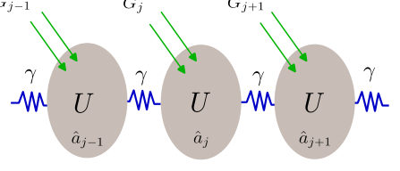
<figcaption class="paper-figure-caption"><b>Fig 1.</b> FIG. 1: An illustration of the setup. A set of Kerr anharmonic oscillators with Kerr non-linearity U and driven by a two-photon pump with amplitude G coupled through a lossy intermediate reservoir with strength γ. The whole system has periodic boundary conditions.</figcaption>
</figure>
<figure class="paper-figure-card">
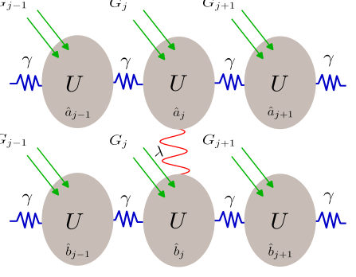
<figcaption class="paper-figure-caption"><b>Fig 2.</b> FIG. 2: The two qubit model includes the coupling Hamiltonian ˆHBS = λ(ˆajˆb† j + ˆa† jˆbj).</figcaption>
</figure>
<figure class="paper-figure-card">
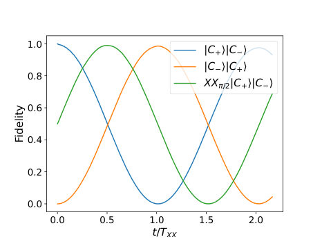
<figcaption class="paper-figure-caption"><b>Fig 3.</b> FIG. 3: Dynamics of the fidelity of the instantaneous state ρϕϕ(t) when |ψ(0)⟩= |C+⟩|C−⟩against |C+⟩|C−⟩ (blue), |C−⟩|C+⟩(orange) and XXπ/2 |C+⟩|C−⟩ (green). U/G = 1, γ/U = 200 and λ/U = 0.1. N = 9 for all simulations. The time parameter is normalized by TXX = πU 4λG, the period for XX(π).</figcaption>
</figure>
<figure class="paper-figure-card">
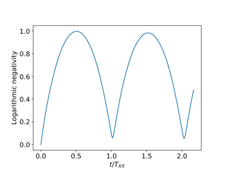
<figcaption class="paper-figure-caption"><b>Fig 4.</b> FIG. 4: Logarithmic negativity as an entanglement measure of the instantaneous state ρϕϕ(t). Parameters are the same as in figure 3.</figcaption>
</figure>
<figure class="paper-figure-card">
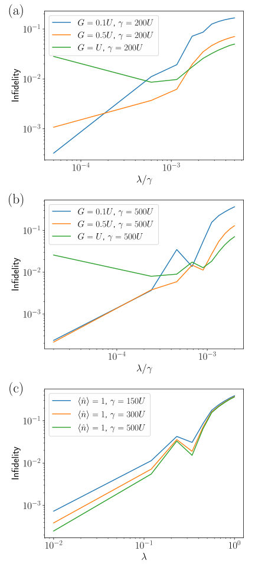
<figcaption class="paper-figure-caption"><b>Fig 5.</b> FIG. 5: Resulting infidelities at time t = TXX as a function of λ for fixed U/(Nγ), with γ = 200U (5a), and γ = 500U (5b). The blue, orange, and green curves correspond to U/G = 10, U/G = 2 and U/G = 1, respectively. In (5c) ⟨ˆn⟩= NG/U = 1 is fixed, for varying γ = 150U (blue), γ = 300U (orange) and γ = 500U (green). With N = 9, this corresponds to G = U/N ≈0.11U, a similar value as the curves showing highest fidelity in the small λ limit for the case of varying G.</figcaption>
</figure>

**Summary.** The paper proposes that multi-mode Schrödinger Cat States can serve as a robust platform for universal quantum computation. By engineering non-local dissipation and utilizing the Zeno limit approximation, the authors derive protocols to achieve arbitrary single-qubit rotations and an entangling two-qubit gate. This establishes SCS states as a viable architecture for future bosonic quantum processors.

**Why it may be interesting.** This work directly addresses quantum computation using bosonic systems, providing concrete protocols for implementing fundamental gates using engineered dissipation, which is highly relevant to open quantum system research in AMO/Quantum Optics.

Detailed structure

**Main problem.** The primary goal is establishing a framework for universal quantum computation using multi-mode Schrödinger Cat States (SCS) stabilized by engineered non-local dissipation.

**Main result.** The authors demonstrate that arbitrary single-qubit control and an entangling $XX(\pi/2)$ gate can be implemented, thereby realizing a universal gate set for bosonic quantum computation.

**Method.** The analysis relies on deriving effective low-dimensional dynamics by projecting the full system evolution onto the dark mode subspace using the Zeno limit approximation.

**Model / system.** The physical platform is modeled as a 1D chain of Kerr anharmonic oscillators coupled via engineered non-local dissipation, whose dynamics are governed by a Lindblad master equation in Fourier space.

**Key observables.** Gate fidelity dynamics, entanglement generation (e.g., logarithmic negativity), and the evolution of the density matrix $
ho_{\phi\phi}(t)$.

**Important parameters / regimes.** Dissipation rates ($\gamma$), Kerr non-linearity strength ($U$), coupling strengths ($\lambda$), and the effective Hamiltonian parameters derived from these constants.

**Assumptions / limitations.** The derivation heavily relies on the strong dissipation regime (Zeno limit) to define a stable, low-dimensional logical subspace.

**Figures summary.** Figures illustrate the physical setup involving Kerr oscillators driven by pumping and coupled through lossy reservoirs. Subsequent figures plot fidelity dynamics for single and two-qubit operations over time.

**Paper structure.** The paper progresses from establishing the basic concept of SCS stabilization to deriving the effective Hamiltonian, demonstrating individual qubit control (X and Z rotations), and finally coupling two such arrays to achieve a universal entangling gate set.

Abstract

Schrödinger cat states provide a hardware-efficient platform for bosonic quantum error correction by encoding logical information in protected manifolds of harmonic oscillators. While previous work has demonstrated the dissipative stabilization of multi-mode Schrödinger cat states as robust quantum memories, a framework for universal quantum computation has remained unavailable. Here we extend this approach by introducing a universal gate set for dissipatively stabilized multi-mode cat qubits. Using a chain of Kerr non-linear oscillators coupled through engineered non-local dissipation and an effective low-dimensional description, we show how arbitrary single-qubit control can be achieved through arbitrary rotation around the $X$-axis and $π/2$-rotation around the $Z$-axis. We further show how coupling two such stabilized arrays through just one oscillator on each respective array enables coherent entangling operations through implementation of the $XX(π/2)$ gate. Numerical simulations demonstrate high-fidelity gate dynamics and entanglement generation under realistic parameters. Finally, we analyze the effects of induced and intrinsic photon loss, disorder, and the validity regime of the effective low-dimensional theory. Our results establish dissipatively stabilized multi-mode Schrödinger cat states as a potential architecture for universal bosonic quantum computation.

[↑ back to top](#top)

### [A Lie-algebraic approach to non-Markovian quantum dynamics](http://arxiv.org/abs/2607.13865v1)

**Authors:** Haijin Ding, Stephen S. -T. Yau, Zhiwen Zhang  
**Type:** theory · **Category:** other · **PDF:** <https://arxiv.org/pdf/2607.13865v1>  
**Analysis basis:** full PDF text, analyzed in chunks
**Topic relevance:** 🔥 `quantum measurements` **4/5** · `measurement-induced transitions` **3/5** · `methods for driven-dissipative` **3/5** · `non-equilibrium dynamics` **2/5** · `Keldysh / 2PI / non-Gaussian methods` **1/5** · `correlated / nonlocal dissipation` **1/5** · `driven-dissipative phase transition` **1/5**

↔ Scroll figures horizontally

<figure class="paper-figure-card">
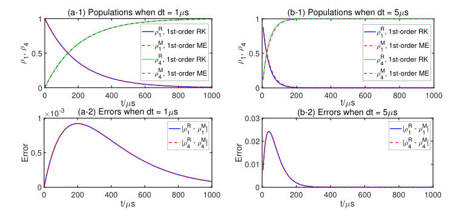
<figcaption class="paper-figure-caption"><b>Fig 1.</b> Fig. 4.1. Comparisons between the first-order Runge-Kutta (RK) method and Magnus expan-</figcaption>
</figure>
<figure class="paper-figure-card">
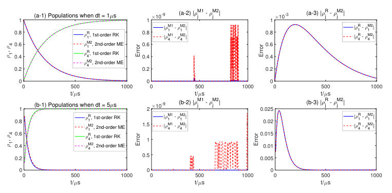
<figcaption class="paper-figure-caption"><b>Fig 2.</b> Fig. 4.2. Comparisons among the first-order Runge-Kutta method, the first-order Magnus</figcaption>
</figure>
<figure class="paper-figure-card">
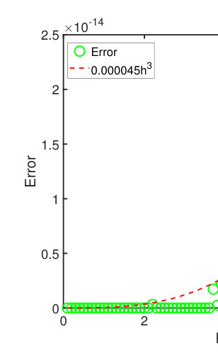
<figcaption class="paper-figure-caption"><b>Fig 3.</b> Fig. 4.3. The truncation error of the first-order Magnus expansion influenced by h.</figcaption>
</figure>
<figure class="paper-figure-card">
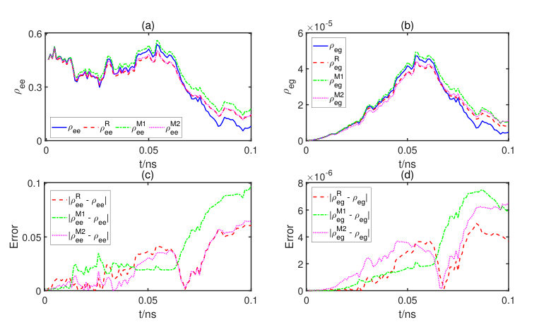
<figcaption class="paper-figure-caption"><b>Fig 4.</b> Fig. 4.4. Numerical simulations on the quantum stochastic dynamics using the first-order</figcaption>
</figure>

**Summary.** This paper develops a Lie algebraic framework to analyze and simulate non-Markovian quantum dynamics. By mapping the density matrix evolution into a high-dimensional linear time-varying system, it applies the Magnus expansion technique. The key contribution is providing detailed error analysis showing how truncation errors depend on non-Markovian effects and the choice of stochastic calculus (Itô vs. Stratonovich) during measurement.

**Why it may be interesting.** This work provides advanced mathematical tools (Lie algebra, Magnus expansion) to tackle the notoriously difficult problem of non-Markovian dynamics in quantum computing contexts, offering rigorous error analysis that is crucial for developing reliable quantum simulators.

Detailed structure

**Main problem.** The paper addresses the challenge of accurately simulating non-Markovian quantum dynamics, particularly when measurement noise is involved.

**Main result.** It demonstrates that the Magnus expansion can efficiently simulate these complex dynamics, and it rigorously quantifies how truncation errors depend on the underlying Lie algebraic structure and whether the stochastic process is modeled using Itô or Stratonovich calculus.

**Method.** The core methodology involves vectorizing the density matrix to transform the evolution into a high-dimensional linear time-varying equation in Liouville space, which is then solved using the Magnus expansion technique derived from Lie algebra theory.

**Model / system.** The model describes an open quantum system interacting with an environment. The dynamics are governed by equations that transition from standard Lindblad forms to complex stochastic differential equations (SDEs) when measurement/filtering is included.

**Key observables.** Truncation errors of the first- and second-order Magnus expansions, and the comparison between Itô and Stratonovich noise models in quantum filtering.

**Important parameters / regimes.** The step size ($h$) for numerical integration, and the time scale relative to non-Markovian interaction timescales.

**Assumptions / limitations.** The analysis relies on approximating higher-order terms of the Magnus expansion using Taylor series expansions around a midpoint, and assumes bounded time-varying amplitudes in the Liouville equation representation.

**Figures summary.** Numerical simulations compare ideal evolution trajectories against results from first-order Runge-Kutta (RK) methods and second-order Magnus expansions, showing good agreement only for very short simulation times.

**Paper structure.** The paper builds theoretically by representing non-Markovian dynamics as linear time-varying equations in the Liouville space using a Lie algebraic basis. It then applies and analyzes the convergence properties of the Magnus expansion for both deterministic and stochastic (Itô/Stratonovich) regimes, concluding with numerical validation.

Abstract

In this paper, we study the non-Markovian quantum dynamics in quantum computations from the perspective of a Lie algebraic approach based on numerical analysis. By vectorizing the density matrix of quantum states, the non-Markovian evolutions can be represented with high-dimensional linear time-varying equations, where the time-varying parameters arise from the non-Markovian interactions between the quantum system and environment. We study the Magnus expansion of such linear time-varying quantum dynamics and clarify how the truncation errors for the first- and second-order Magnus expansions are influenced by the non-Markovian properties. Besides, when the quantum states are measured for filtering, the dynamics can be modeled as time-varying stochastic differential equations due to the existence of measurement noise. The Magnus expansions based on quantum stochastic filtering are different when the quantum measurement noises are modeled in an {Itô} or Stratonovich approach, rendering different truncation errors. Based on this, numerical simulations further demonstrate the efficiency of Magnus expansions in simulating non-Markovian quantum dynamics without or with stochasticity, and how the truncation errors are influenced by the Lie algebras in the Liouville space.

[↑ back to top](#top)

### [An exactly solvable macroscopic fluctuation theory of single-file diffusion](http://arxiv.org/abs/2607.14073v1)

**Authors:** Sandeep Jangid, Soumyabrata Saha, Kapil Sharma, Jitendra Kethepalli, Benjamin Guiselin, Jacopo De Nardis, Tridib Sadhu  
**Type:** theory · **Category:** statistical mechanics · **PDF:** <https://arxiv.org/pdf/2607.14073v1>  
**Analysis basis:** full PDF text, analyzed in chunks
**Topic relevance:** 🔥 `non-equilibrium dynamics` **4/5** · `methods for driven-dissipative` **3/5** · `non-equilibrium universality` **3/5** · `driven-dissipative phase transition` **2/5** · `Frenkel-Kontorova` **1/5** · `Keldysh / 2PI / non-Gaussian methods` **1/5**

↔ Scroll figures horizontally

<figure class="paper-figure-card">
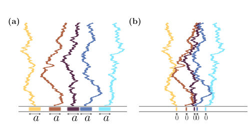
<figcaption class="paper-figure-caption"><b>Fig 1.</b> Figure 1. Schematic trajectories of Brownian hard rods (a) of finite-size a and (b) in the zero-size limit, a →0. The canonical transformation (see (13)) maps (a) onto (b).</figcaption>
</figure>
<figure class="paper-figure-card">
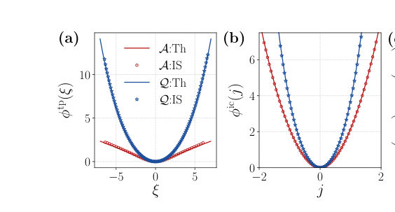
<figcaption class="paper-figure-caption"><b>Fig 2.</b> Figure 2. (a,b) LDFs for (a) tracer-position and (b) integrated-current, defined by ϕ(o) = −1 √</figcaption>
</figure>

**Summary.** This paper provides an exact solution to the macroscopic fluctuation theory governing single-file diffusion using the Brownian Hard Rod model. The authors achieve this by applying a canonical transformation that maps the complex interacting system onto a solvable point-particle description. This yields explicit, universal large-deviation statistics for observables like tracer position and integrated current in both annealed and quenched environments.

**Why it may be interesting.** The techniques used—mapping complex interacting systems (like BHR) onto exactly solvable point-particle models via canonical transformations—are highly relevant for understanding non-equilibrium dynamics in quantum many-body systems where exact solutions are rare.

Detailed structure

**Main problem.** The paper aims to develop an exactly solvable macroscopic fluctuation theory (MFT) for single-file diffusion, a process common in low-dimensional systems.

**Main result.** They show that the MFT for the extended Brownian Hard Rod gas is exactly solvable via a canonical transformation, yielding explicit large-deviation statistics for key observables.

**Method.** The core method involves mapping the fluctuating hydrodynamic equation governing the density field onto an exactly solvable point-particle system using a canonical transformation. Large deviation functions and scaled cumulant generating functions are calculated in both annealed and quenched ensembles.

**Model / system.** The primary model is single-file diffusion, modeled by a one-dimensional gas of extended Brownian Hard Rods (BHR). The theory is generalized to lattice gases with finite-volume exclusion.

**Key observables.** Tracer-position ($z_t$), integrated-current ($Q_t$), and the local-height observable $h(z)_t$.

**Important parameters / regimes.** Hard rod length ($a$), bare diffusion coefficient ($D_0=1$), time scaling ($\sqrt{t}$), and ensemble type (annealed vs. quenched).

**Assumptions / limitations.** The analysis relies on the large-time asymptotic behavior of fluctuations, characterized by saddle-point approximations in the path integral formalism.

**Figures summary.** Figures schematically illustrate BHR trajectories, show LDFs for tracer-position and integrated-current comparing theory to simulation, and display optimal density profile evolution associated with specific SCGF variables.

**Paper structure.** The paper builds from establishing the continuum model (BHR) and its hydrodynamic description. It then introduces the canonical transformation that renders the MFT solvable. Finally, it derives explicit formulas for the SCGFs of tracer-position and integrated-current, comparing results across different ensembles and showing connections to local-height statistics.

Abstract

Single-file diffusion is a ubiquitous phenomenon in low-dimensional systems, arising in transport inside narrow channels. Its natural continuum model is a one-dimensional gas of extended Brownian hard rods (BHR). Perhaps owing to the perceived intractability of this problem, much of the literature has traditionally focused on lattice exclusion models, where integrability methods have yielded remarkable, albeit limited, exact results. A major recent advance comes from a formal solution of macroscopic fluctuation theory (MFT) for the exclusion process. Yet, despite the formal solution, only a handful of properties have been made explicit. We show that the corresponding MFT of the extended BHR gas is in fact exactly solvable through a canonical transformation. We demonstrate this by explicit computation of the large-deviation statistics of the tracer-position and integrated-current in both annealed and quenched ensembles. We further show that an analogous canonical transformation applies to the MFT of lattice gases with finite-volume exclusion, yielding corresponding tracer and current statistics. We validate our results using rare-event simulations for both the continuum and the lattice models.

[↑ back to top](#top)

### [Temporal Entanglement from Twist Correlators in 2d Conformal Field Theory and Holography](http://arxiv.org/abs/2607.14012v1)

**Authors:** Alice Bernamonti, Federico Galli, Michal P. Heller, Fabio Ori, Alexandre Serantes  
**Type:** theory · **Category:** statistical mechanics · **PDF:** <https://arxiv.org/pdf/2607.14012v1>  
**Analysis basis:** full PDF text, analyzed in chunks
**Topic relevance:** 🔥 `entanglement & information structure` **4/5** · `non-equilibrium dynamics` **3/5** · `non-equilibrium universality` **2/5** · `Keldysh / 2PI / non-Gaussian methods` **1/5** · `analog quantum simulation` **1/5** · `correlated / nonlocal dissipation` **1/5** · `driven-dissipative phase transition` **1/5** · `methods for driven-dissipative` **1/5**

↔ Scroll figures horizontally

<figure class="paper-figure-card">
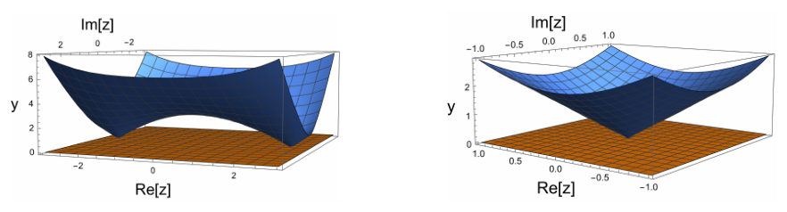
<figcaption class="paper-figure-caption"><b>Fig 1.</b> Figure 1: (Left) In blue, the wall surface of the Bañados geometry where det g = 0 for z1 −z2 = ℓ= 5 and Rényi index n = 4. (Right) For canonical insertions z1 = 0, z2 = ∞, the wall is a cone emanating from the origin.</figcaption>
</figure>
<figure class="paper-figure-card">
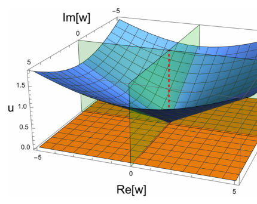
<figcaption class="paper-figure-caption"><b>Fig 2.</b> Figure 2: (Left) The wall (2.37) depicted in EAdS3 emanating from w = 0 on the boundary. Here we set n = 4 and used canonical insertions z1 = 0, z2 = ∞. In red dashed, the AdS geodesic that connects w = 0 and w = ∞on the boundary. In light green, the periodic identifications. (Right) A section of the bulk wedge of opening angle 2π/n. The Bañados coordinates only cover the region between the boundary and the wall of eq. (2.37), in blue solid. In black dashed, an illustration of the action of the diffeomorphism for z¯z = 1.</figcaption>
</figure>
<figure class="paper-figure-card">
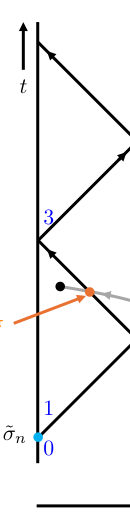
<figcaption class="paper-figure-caption"><b>Fig 3.</b> Figure 3: Analytic continuation of the two-point function of twist operators. Each light- cone crossing changes the phase of the Lorentzian invariant entering the twist correlator (3.6) by e±iπ. The sign depends on the direction of the crossing, as represented in the figure for the time-ordered case.</figcaption>
</figure>
<figure class="paper-figure-card">
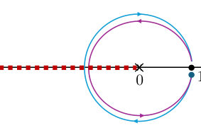
<figcaption class="paper-figure-caption"><b>Fig 4.</b> Figure 4: Schematic evolution of the holomorphic cross ratio z in the complex plane for the case x0 &gt; 0. At t ≈x0, σn crosses the lightcones of the two ψ insertions, causing z to wind clockwise around the origin and move onto the adjacent sheet according to the monodromy z →e−2πiz. At t ≈x0 + ∆x, ˜σn crosses the same lightcones, and z retraces its path back to the principal sheet. The right panel illustrates the phases acquired by the coordinate differences entering the definition of the cross ratio.</figcaption>
</figure>
<figure class="paper-figure-card">
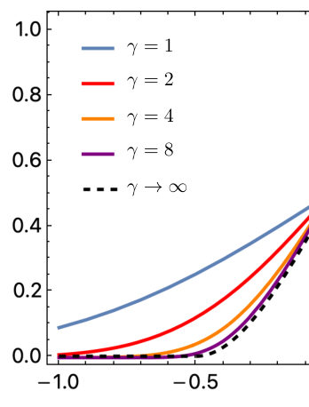
<figcaption class="paper-figure-caption"><b>Fig 5.</b> Figure 5: Real part of the TEE in the Vaidya-like quench with mass profile (5.32) for different values of γ, expressed as a function of the mean time t = 1</figcaption>
</figure>

**Summary.** This paper develops a rigorous framework to calculate temporal entanglement entropy in 2D CFTs by analytically continuing replica twist correlators from Euclidean to Lorentzian time. Holographically, this translates into finding complex geodesics in AdS space that match the field theory results across various physical quenches and states.

**Why it may be interesting.** This work provides a powerful extension of entanglement concepts into time-dependent regimes (Lorentzian signature), which is crucial for understanding non-equilibrium dynamics in strongly coupled quantum systems relevant to AMO physics and open quantum systems.

Detailed structure

**Main problem.** The primary goal is formulating and calculating timelike entanglement entropy (TEE) and its Rényi extension in 2D Conformal Field Theory (CFT) and establishing its holographic dual description.

**Main result.** The authors provide a systematic field-theoretic construction using analytic continuation of replica twist correlators, which yields explicit agreement with complex geodesic calculations in holography for various physical scenarios.

**Method.** The methodology involves analytically continuing Euclidean replica twist correlators to time-ordered, timelike-separated insertions in CFT. Holographically, this translates to identifying and selecting specific complex geodesics in the bulk AdS geometry that minimize the real part of their length.

**Model / system.** The work applies to 2D CFTs considering temporal subregions of arbitrary extent, with holographic duals modeled by Anti-de Sitter (AdS) spacetimes, including specific backgrounds like AdS-Vaidya geometry. The analysis covers quantum operator quenches and excited states.

**Key observables.** Timelike Entanglement Entropy ($S(T)$), Rényi entanglement entropy, complex-valued entropies (pseudoentropies), and the imaginary part of the entropy.

**Important parameters / regimes.** Rényi index $n$, time separation $\Delta t$, and parameters defining the specific AdS background geometry.

**Assumptions / limitations.** The approach relies on analytic continuation from Euclidean to Lorentzian signature and utilizes a geodesic approximation in the bulk spacetime, which is necessary because no real geodesic connects timelike-separated points on the boundary.

**Figures summary.** Figure 11 (referenced in notes) compares numerical solutions for correlators against analytical forms derived from AdS and BTZ geometries, demonstrating consistency under specific limiting procedures.

**Paper structure.** The paper systematically develops the field-theoretic definition of TEE via replica twist correlators, extends this to Rényi indices $n>1$, derives the corresponding complex extremal surface prescription in holography, and validates these results across multiple physical examples like quenches and excited states.

Abstract

We formulate timelike entanglement entropy and its Rényi extension in two-dimensional conformal field theory through the analytic continuation of replica twist correlators to time-ordered, timelike-separated insertions. This field-theoretic construction grounds and generalizes recent developments, and applies to temporal subregions of arbitrary extent. Within three-dimensional holography, the semiclassical boundary correlator identifies boundary-anchored complex geodesics as the relevant bulk saddles and selects the one with the smallest real part of the length. This provides a direct boundary derivation of the proposed complex extremal surface prescription and extends to Rényi index $n>1$, for which we explicitly construct the corresponding complex cosmic brane geometry in the vacuum. We develop these ideas in several representative settings, including locally and globally excited states and quantum operator quenches, making manifest the precise agreement between boundary twist correlator and bulk complex geodesic calculations. For AdS-Vaidya, our approach predicts a different result from earlier piecewise geodesic constructions, while reproducing the field theory answer. Across these examples, the operator ordering uniquely determines the imaginary part of the complex-valued entropy, which is quantized in units of $cπ/6$ and sensitive to the effective causal structure but not to the underlying dynamics.

[↑ back to top](#top)

### [Benchmarking trigonometric continuous-variable gate primitives with trapped ions](http://arxiv.org/abs/2607.14085v1)

**Authors:** Tommaso Rainaldi, Jake Montgomery, Christopher G. Yale, Brian K. McFarland, Melissa C. Revelle, Daniel Lobser, Edward C. Tortorici, Susan Clark, George Siopsis, Matt Grau, Felix Ringer  
**Type:** experiment · **Category:** other · **PDF:** <https://arxiv.org/pdf/2607.14085v1>  
**Analysis basis:** full PDF text, analyzed in chunks
**Topic relevance:** 🔥 `QC/QI experiment` **4/5** · `analog quantum simulation` **2/5** · `entanglement & information structure` **2/5** · `quantum measurements` **2/5** · `methods for driven-dissipative` **1/5** · `non-equilibrium dynamics` **1/5** · `quantum optics experiment` **1/5**

↔ Scroll figures horizontally

<figure class="paper-figure-card">
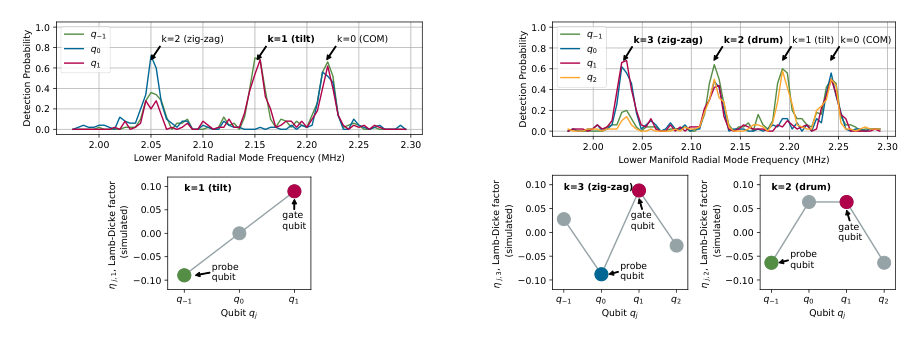
<figcaption class="paper-figure-caption"><b>Fig 1.</b> FIG. 1: Trapped ion radial-mode spectroscopy and mode participation. Top row: measured detection probabilities for each qubit as a function of the lower-manifold radial-mode frequency for three-ion (left) and four-ion (right) chains. The resonances identify the collective radial motional modes, labeled by mode index and character. Bottom row: simulated Lamb-Dicke factors ηj,k for the modes used in the one-qumode (three-ion) experiment, k = 1 (tilt), and the two-qumode experiment (four-ion), k = 3 (zig-zag) and k = 2 (drum). Colored markers indicate the probe and gate qubits used in each implementation, and the gray markers denote the remaining ions.</figcaption>
</figure>
<figure class="paper-figure-card">
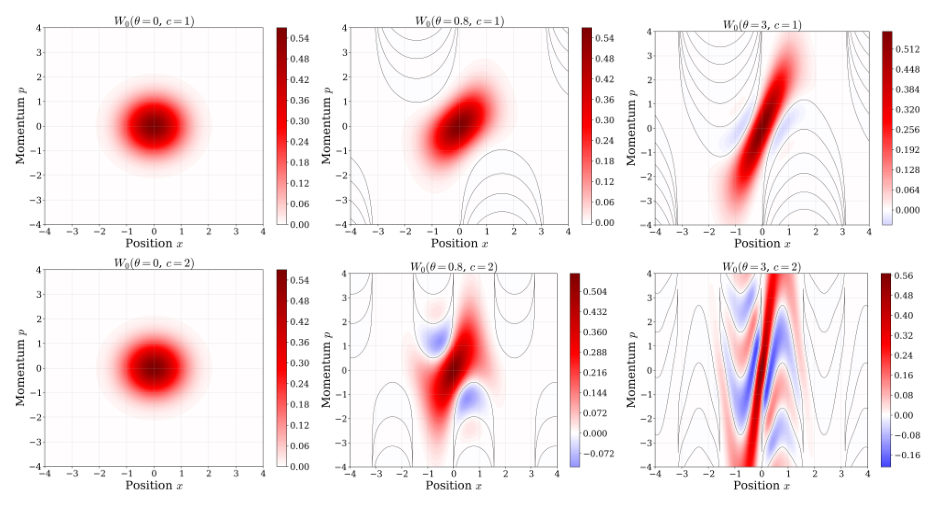
<figcaption class="paper-figure-caption"><b>Fig 2.</b> FIG. 2: Wigner function of the single-qumode cosine gate acting on the Fock vacuum state |0⟩for different values of θ = 0, 0.8, 3 and fixed parameter c = 1 (upper row), c = 2 (lower row).</figcaption>
</figure>
<figure class="paper-figure-card">
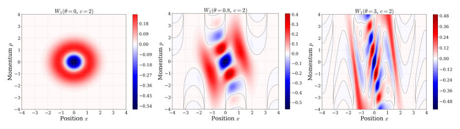
<figcaption class="paper-figure-caption"><b>Fig 3.</b> FIG. 3: Wigner function of the single-qumode cosine gate acting on the Fock state |1⟩for different θ values and fixed parameter c = 2.</figcaption>
</figure>
<figure class="paper-figure-card">
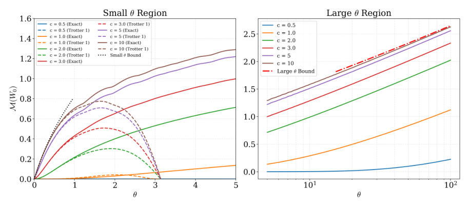
<figcaption class="paper-figure-caption"><b>Fig 4.</b> FIG. 4: Evolution of the mana starting in the zero Fock state under the cosine gate evolution as a function of θ for different choices of c. In both panels, we show the bound obtained in the small and large-θ limit, respectively. The left panel compares the Wigner logarithmic negativity obtained using the exact gate with that of its approximation described in Sec. V A.</figcaption>
</figure>
<figure class="paper-figure-card">
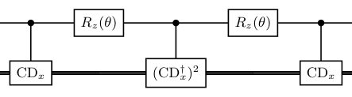
<figcaption class="paper-figure-caption"><b>Fig 5.</b> FIG. 5: Circuit that approximates the action of the trigonometric operator e−iθ cos(cˆx) on a qumode state |ψ⟩up to order O(θ2) using one ancillary gate qubit. The argument of the conditional displacement is CDx = CDx(ic/(2 √</figcaption>
</figure>

**Summary.** The research experimentally benchmarks trigonometric continuous-variable quantum gates using trapped ions. By characterizing these elementary cosine gates at the level of individual operations, the authors demonstrate their utility as fundamental building blocks. This advances the feasibility of implementing complex bosonic simulations and hybrid quantum algorithms on current hardware platforms.

**Why it may be interesting.** This work directly bridges advanced quantum information theory (CV gate sets) with state-of-the-art trapped-ion hardware, providing crucial empirical data on non-polynomial gates essential for simulating complex many-body physics.

Detailed structure

**Main problem.** The paper aims to experimentally benchmark trigonometric continuous-variable (CV) gate primitives, which are necessary for simulating complex bosonic dynamics.

**Main result.** Trigonometric CV gates are established as reusable building blocks for hybrid quantum algorithms and bosonic Hamiltonian simulations requiring non-polynomial operations.

**Method.** The authors performed gate-level characterization by measuring Fock-space transition probabilities on the QSCOUT trapped-ion platform, comparing finite-step circuits against ideal evolution.

**Model / system.** The physical system is a trapped-ion chain ($	ext{}^{171}	ext{Yb}^+$) utilizing collective motional modes (qumodes) alongside hyperfine states acting as qubits. The gates are implemented via hybrid qubit-qumode operations.

**Key observables.** Fock-space transition probabilities, Wigner function, Negativity, and Characteristic functions.

**Important parameters / regimes.** Gate parameters ($c$), Trotter step number, thermal initialization effects, and motional dephasing rates.

**Assumptions / limitations.** The study compares finite-step circuit approximations against ideal trigonometric evolution while accounting for experimental imperfections like thermal noise and dephasing.

**Figures summary.** Figures illustrate measured detection probabilities for radial motional modes in three- and four-ion chains, relating to the implementation of collective motional gates.

**Paper structure.** The paper progresses from discussing CV-DV universality (Section II) to introducing the trapped-ion platform (Section III), analyzing ideal one- and two-qumode cosine gates using phase-space diagnostics (Section IV), detailing finite-step circuit realization (Section V), presenting experimental measurements (Section VI), and concluding (Section VII).

Abstract

Hybrid continuous-discrete-variable quantum processors can represent bosonic degrees of freedom directly in oscillator modes, or qumodes, while using qubits for control, readout, and nonlinear operations. Recently proposed trigonometric continuous-variable (CV) gate sets promote periodic functions of oscillator quadratures to elementary operations, making them natural primitives for compact variables, rotor models, lattice gauge theories, and anharmonic dynamics. Here we experimentally demonstrate and benchmark one-qumode cosine gates, and perform a mode-resolved marginal benchmark of two-qumode cosine-gate implementations, on the QSCOUT trapped-ion quantum platform. Our implementation uses collective motional modes of three- and four-ion $^{171}{\rm Yb}^{+}$ chains and realizes finite-step trigonometric-gate circuits through hybrid qubit-qumode operations and conditional phase-space displacements. In contrast to previous theoretical and compilation work, we focus on the gate-level characterization of the trigonometric primitives. We measure Fock-space transition probabilities, study their dependence on gate parameters and Trotter step number, and compare with simulations incorporating thermal initialization and motional dephasing. We also derive ideal gate matrix elements and phase-space diagnostics, connecting the measurements to the non-Gaussian structure generated by these gates. These results establish trigonometric CV gates as reusable building blocks for bosonic Hamiltonian simulations and hybrid quantum algorithms requiring intrinsically non-polynomial operations.

[↑ back to top](#top)

### [Emulating XX catalysts for quantum annealing via self-consistent transverse fields](http://arxiv.org/abs/2607.13150v1)

**Authors:** Mohammadhossein Dadgar, Christopher L. Baldwin  
**Type:** theory · **Category:** disordered systems and neural networks · **PDF:** <https://arxiv.org/pdf/2607.13150v1>  
**Analysis basis:** full PDF text, analyzed in chunks
**Topic relevance:** 🔥 `analog quantum simulation` **4/5** · `exotic spin models in light-matter` **3/5** · `methods for driven-dissipative` **2/5** · `non-equilibrium dynamics` **2/5** · `Keldysh / 2PI / non-Gaussian methods` **1/5** · `driven-dissipative phase transition` **1/5**

↔ Scroll figures horizontally

<figure class="paper-figure-card">
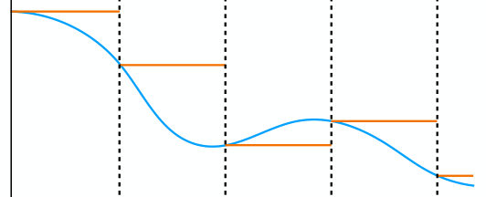
<figcaption class="paper-figure-caption"><b>Fig 1.</b> FIG. 1. Sketch of the self-consistent protocol for emulating fully-connected transverse interactions. We add an additional transverse field Γ(t) to the Hamiltonian (orange curve) instead of the transverse interactions. At equally spaced intervals (dashed lines), we estimate the average x-magnetization (blue curve) and set Γ(t) equal to that value for the subsequent interval. Note that more sophisticated interpolation schemes for Γ(t) are also possible (see Appendix B).</figcaption>
</figure>
<figure class="paper-figure-card">
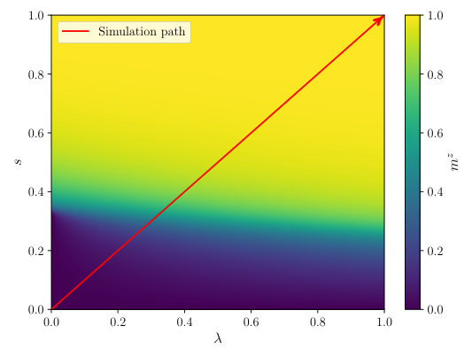
<figcaption class="paper-figure-caption"><b>Fig 2.</b> FIG. 2. Ground-state z-magnetization in the p-spin model with a transverse field and transverse interactions (i.e., Eq. (2) using Eq. (8) for H0), specifically for p = 3 and h = 1. See Appendix C for details of the calculation. The red line indicates the protocol path that we follow in the numerical simulations — note that no phase transitions occur along that path or anywhere in the parameter space.</figcaption>
</figure>
<figure class="paper-figure-card">
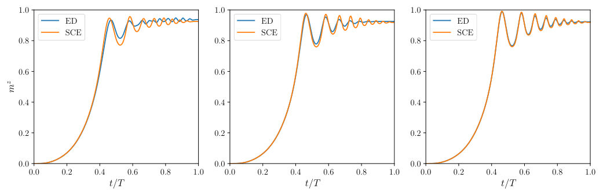
<figcaption class="paper-figure-caption"><b>Fig 3.</b> FIG. 3. Dynamics of the z-magnetization under ED (blue) and SCE (orange), for the p-spin model with p = 3 and h = 1. The annealing schedule is s(t) = λ(t) = t/T, and the runtime is T = 25. The three panels differ only in the system size — N = 25 (left), N = 100 (center), and N = 400 (right).</figcaption>
</figure>
<figure class="paper-figure-card">
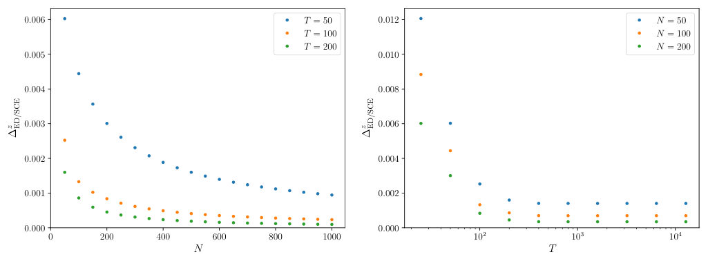
<figcaption class="paper-figure-caption"><b>Fig 4.</b> FIG. 4. Error between ED and SCE, ∆z ED/SCE, as a function of N (left) and T (right). The problem Hamiltonian again has p = 3 and h = 1, and the annealing schedule is s(t) = λ(t) = t/T.</figcaption>
</figure>
<figure class="paper-figure-card">
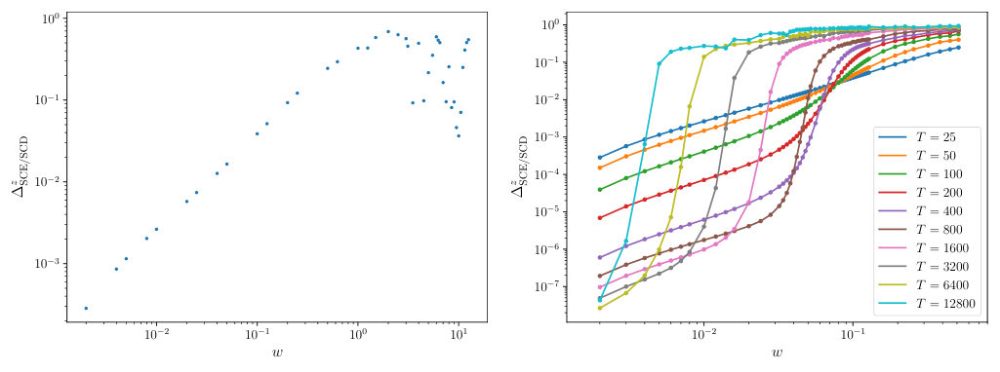
<figcaption class="paper-figure-caption"><b>Fig 5.</b> FIG. 5. Error between SCE and SCD, ∆z SCE/SCD, as a function of the waiting time w used in SCD (system size is N = 100 and the problem Hamiltonian again has p = 3 and h = 1). The left panel shows ∆z SCE/SCD for all values of w considered at T = 25, while the right panel is zoomed in to the small-w regime and shows multiple values of T.</figcaption>
</figure>

**Summary.** The paper addresses the experimental difficulty of implementing transverse interaction catalysts in quantum annealing. It proposes and rigorously analyzes self-consistent field protocols that emulate these effects using only measurements in the transverse basis. The results confirm that these approximations are highly accurate, making the technique a viable alternative for current quantum annealers.

**Why it may be interesting.** This work provides a concrete, implementable theoretical framework for simulating complex quantum interactions (like those found in spin glasses) on near-term hardware by mapping difficult terms onto controllable single-parameter controls.

Detailed structure

**Main problem.** The primary challenge is emulating the effects of fully-connected transverse interactions, which act as catalysts in quantum annealing but are experimentally difficult to implement directly.

**Main result.** A self-consistent transverse field protocol can successfully emulate these catalyst dynamics, establishing it as a viable alternative for near-term quantum annealers by quantifying and minimizing approximation errors.

**Method.** The authors introduce several self-consistent protocols (SCE, SCD, SCM) that replace the direct interaction term with an iteratively determined transverse field $\Gamma(t)$, analyzed via large-$N$ limit calculations and numerical simulations.

**Model / system.** The work focuses on quantum annealing applied to spin glass models, specifically using the $p$-spin model Hamiltonian. The dynamics are governed by time-dependent Hamiltonians involving both $\sigma_z$ (problem) and $\sigma_x$ (transverse field/catalyst) terms.

**Key observables.** Average z-magnetization ($m_z(t)$), average x-magnetization ($\langle\hat{\sigma}_x^i
angle$), and the error metric ($\Delta z$) comparing different simulation protocols.

**Important parameters / regimes.** System size ($N$), annealing parameters ($s, \lambda$), waiting time interval ($w$), number of measurements ($k$), and total evolution time ($T$).

**Assumptions / limitations.** The core assumption is that the dynamics can be accurately captured by replacing the interaction term with a self-consistently determined transverse field. The protocol's performance degrades at large $T$.

**Figures summary.** Figures illustrate error comparisons ($\Delta z$) between Exact Diagonalization (ED) and various self-consistent protocols (SCE, SCD, SCM) across different parameter regimes, showing how errors scale with system size or approximation parameters.

**Paper structure.** The paper first introduces the problem of emulating transverse catalysts. It then develops and compares multiple self-consistent protocols (SCE, SCD, SCM), rigorously proving their equivalence to the original dynamics in the large-$N$ limit for SCE. Finally, it analyzes the error scaling of these approximations across different physical regimes, including phase transitions.

Abstract

Fully-connected transverse interactions have been considered as catalysts for quantum annealing that could mitigate exponentially small gaps and circumvent first-order phase transitions, but their experimental implementation remains challenging. In this work, we introduce a procedure for emulating their effects via a self-consistent transverse field. All that is required beyond conventional transverse-field annealing is the ability to make measurements in the transverse ($\hatσ^x$) basis. We show that this protocol yields identical dynamics in the large-system limit, and study the approach to that limit in numerical simulations of the (uniform) $p$-spin model. However, realizing the protocol in practice requires us to consider a series of approximate variants, each of whose errors we quantify and demonstrate can be made sufficiently small. Lastly, we show how to map the protocol onto annealing platforms that vary only a single control parameter. Even after the multiple stages of approximation, our procedure can generate dynamics that agree well with the original transverse-interaction catalyst, establishing self-consistent transverse fields as a viable alternative on near-term quantum annealers.

[↑ back to top](#top)

### [Magic without a phase: phase-independent stabilizer Rényi entropy in gluon scattering](http://arxiv.org/abs/2607.13134v1)

**Authors:** Jinwei Chu, Savan Kharel  
**Type:** theory · **Category:** other · **PDF:** <https://arxiv.org/pdf/2607.13134v1>  
**Analysis basis:** full PDF text, analyzed in chunks
**Topic relevance:** 🔥 `entanglement & information structure` **4/5** · `non-equilibrium dynamics` **2/5** · `Keldysh / 2PI / non-Gaussian methods` **1/5** · `analog quantum simulation` **1/5** · `correlated / nonlocal dissipation` **1/5** · `driven-dissipative phase transition` **1/5** · `methods for driven-dissipative` **1/5** · `non-equilibrium universality` **1/5**

↔ Scroll figures horizontally

<figure class="paper-figure-card">
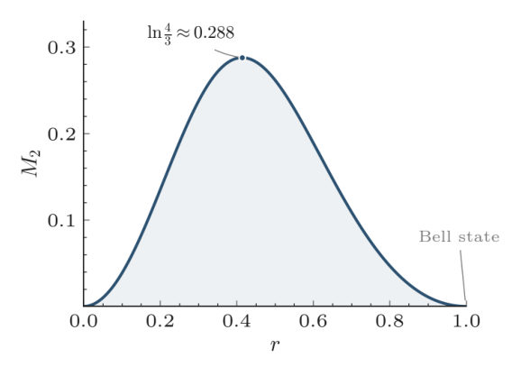
<figcaption class="paper-figure-caption"><b>Fig 1.</b> Figure 1. The second stabilizer Rényi entropy M2 for the two-coefficient state Eq. (2.3), as a function of the amplitude ratio r. The entropy vanishes at r = 0 (a trivial state) and at r = 1 (the Bell state), showing that entanglement alone does not imply magic. The maximum ln(4/3) ≈0.288 is attained at r = √</figcaption>
</figure>
<figure class="paper-figure-card">

<figcaption class="paper-figure-caption"><b>Fig 2.</b> Figure 1 plots Eq. (2.4) as a function of r. Due to the symmetry under r →−r or r →1/r, it is sufficient to focus on the region r ∈[0, 1]. In this fundamental region, the function vanishes at r = 0 and r = 1. The first zero, |ψ⟩0 = |−+⟩, is trivial. The second is more telling. The state |ψ⟩1 = (|+−⟩+ |−+⟩)/ √</figcaption>
</figure>
<figure class="paper-figure-card">
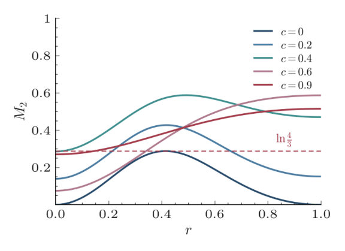
<figcaption class="paper-figure-caption"><b>Fig 3.</b> Figure 2. The second stabilizer Rényi entropy M2 for the two-coefficient state Eq. (2.7), plotted against r at several values of the admixture parameter c. Even a modest c produces magic that comfortably exceeds the c = 0 bound ln(4/3) ≈0.288 from Eq. (2.6).</figcaption>
</figure>
<figure class="paper-figure-card">
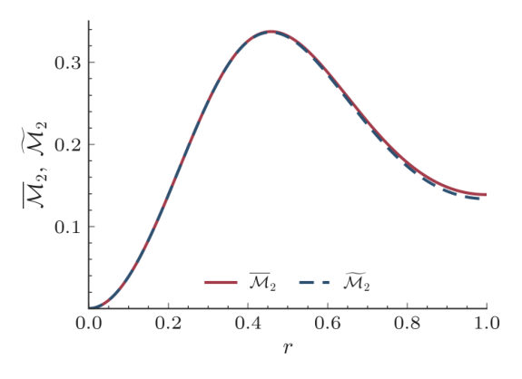
<figcaption class="paper-figure-caption"><b>Fig 4.</b> Figure 3. The second U(1)k-invariant stabilizer Rényi entropies M2 and f M2 for the two-coefficient state Eq. (2.3), as a function of the amplitude ratio r. f M2 has a global minimum (where it vanishes) at r = 0, a local minimum at r = 1, and a global maximum at r = ( √</figcaption>
</figure>
<figure class="paper-figure-card">
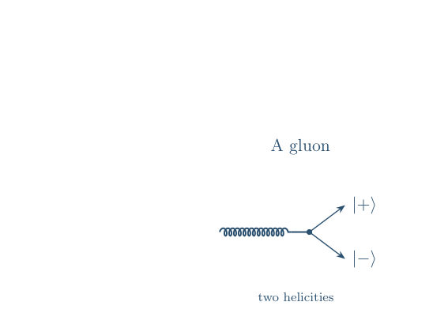
<figcaption class="paper-figure-caption"><b>Fig 5.</b> Figure 4. A gluon’s two helicity states |+⟩and |−⟩furnish a single qubit, and the helicity amplitude is the wavefunction the scattering prepares. A k-gluon final state is correspondingly a k-qubit state.</figcaption>
</figure>

**Summary.** This paper develops a phase-independent generalization of 'magic' using stabilizer Rényi entropy to quantify non-stabilizerness. It applies this tool to tree-level gluon scattering, demonstrating that the resulting measure is robust against local basis choices and yields specific quantitative predictions for different scattering channels.

**Why it may be interesting.** Although focused on high-energy physics (gluon scattering), the core mathematical technique—defining a robust, physically meaningful resource measure invariant under local gauge/phase transformations—is highly relevant for analyzing entanglement and complexity in open quantum systems or condensed matter models where such ambiguities arise.

Detailed structure

**Main problem.** The paper aims to generalize the concept of 'magic' (non-stabilizerness) by formulating a measure that is invariant under local phase ambiguities in the computational basis.

**Main result.** They find specific quantitative results for gluon scattering, showing that the phase-independent magic can be larger than limits set by simpler processes and that color dependence cancels out entirely.

**Method.** The authors define and calculate a generalized, phase-independent stabilizer Rényi entropy ($\langle M_q 
angle$) by averaging the standard measure over the local basis-phase $U(1)^k$ orbit.

**Model / system.** The primary physical testbed is tree-level gluon scattering amplitudes, where outgoing helicities are interpreted as qubits forming a multi-qubit Hilbert space. The analysis compares results for $2	o 2$, $3	o 2$, and $2	o 3$ processes.

**Key observables.** Phase-independent stabilizer Rényi entropy ($\langle M_q 
angle$), Magic (non-stabilizerness), Gluon scattering amplitudes.

**Important parameters / regimes.** Scattering process multiplicities ($2	o 2$, $3	o 2$, $2	o 3$); the index $q$ of the Rényi entropy; kinematic configurations (e.g., symmetry of outgoing momenta).

**Assumptions / limitations.** The analysis is restricted to tree-level amplitudes, and a key step involves approximating the phase average over the basis-phase orbit.

**Figures summary.** Figure 1 plots $M_2$ vs. $r$ for two-qubit states; Figure 2 shows enhancement of $M_2$ with an admixture coefficient $c$; Figure 3 compares the standard $M_2$ to the phase-averaged $\langle M_2 
angle$, confirming it is a lower bound.

**Paper structure.** The paper first establishes the standard SRE, then identifies its dependence on local basis phases, and finally applies the corrected, phase-independent measure to analyze specific gluon scattering amplitudes in different processes.

Abstract

Magic, also known as non-stabilizerness, measures the usefulness of a quantum state for quantum computation. While magic is defined relative to a choice of computational basis, in some physical settings the available data determine this basis only up to local phase conventions. In this paper, we generalize the notion of magic and formulate it in a phase-independent manner, and hence define a generalized stabilizer Rényi entropy. As a case study, we consider higher-multiplicity tree-level gluon scattering, interpreting the outgoing helicities as qubits. In this setting, the helicity data naturally determine a local basis for each qubit but leave a phase ambiguity. For $3\to 2$ scattering, we find that the final-state phase-independent magic is generically larger than the maximum attainable in $2\to 2$ scattering. For $2 \to 3$ scattering, we find a nonzero minimal value approached in the soft limit. Moreover, when the three outgoing momenta become symmetric, the magic approaches a local minimum only a few percent above the soft-limit value. In all cases considered, the color dependence cancels from the phase-independent stabilizer Rényi entropy.

[↑ back to top](#top)

### [Superconducting proximity effect in a strongly correlated charge-transfer insulator](http://arxiv.org/abs/2607.13873v1)

**Authors:** Mengya Ren, Yaoyao Chen, Fudi Zhou, Can Zhang, Zhaoteng Dong, Lili Zhou, Quanzhen Zhang, Huixia Yang, Xiaolong Xu, Yuanxiao Ma, Yu Zhang, Yeliang Wang  
**Type:** experiment · **Category:** strongly correlated electrons · **PDF:** <https://arxiv.org/pdf/2607.13873v1>  
**Analysis basis:** full PDF text, analyzed in chunks
**Topic relevance:** 🔥 `Kondo & dissipative impurity` **4/5** · `driven-dissipative phase transition` **2/5** · `analog quantum simulation` **1/5** · `correlated / nonlocal dissipation` **1/5** · `methods for driven-dissipative` **1/5** · `non-equilibrium dynamics` **1/5** · `spintronics-quantum-optics interface` **1/5**

↔ Scroll figures horizontally

<figure class="paper-figure-card">
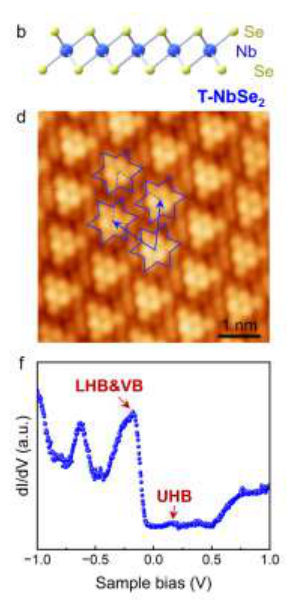
<figcaption class="paper-figure-caption"><b>Fig 1.</b> Figure 1. Structural and electronic properties of monolayer H-NbSe2 and T-NbSe2.</figcaption>
</figure>
<figure class="paper-figure-card">
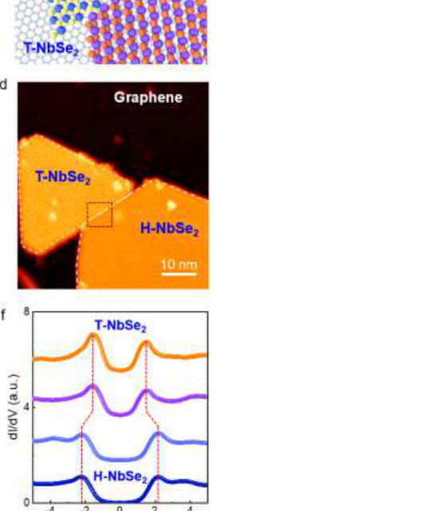
<figcaption class="paper-figure-caption"><b>Fig 2.</b> Figure 2. Superconducting proximity effect in a charge-transfer insulator via a</figcaption>
</figure>
<figure class="paper-figure-card">
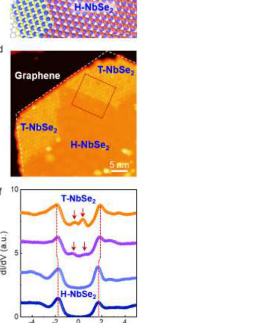
<figcaption class="paper-figure-caption"><b>Fig 3.</b> Figure 3. Superconducting proximity effect in a charge-transfer insulator via a</figcaption>
</figure>
<figure class="paper-figure-card">
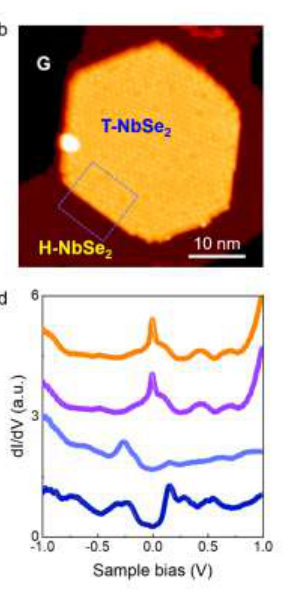
<figcaption class="paper-figure-caption"><b>Fig 4.</b> Figure 4. Local mangetic moments in a charge-transfer insulator. (a) Atomic</figcaption>
</figure>

**Summary.** This work investigates superconductivity induced in a charge-transfer insulator ($	ext{T-NbSe}_2$) placed near a superconductor ($	ext{H-NbSe}_2$). By creating tunable junctions using STM, the researchers demonstrated that strong coupling leads to robust superconducting proximity effects characterized by Yu-Shiba-Rusinov-like bound states. This establishes a model platform for studying correlated superconductivity.

**Why it may be interesting.** The observation of YSR states in a proximity setup involving correlated insulators provides an experimental realization for studying superconducting coupling mediated by localized magnetic moments, which is highly relevant to open quantum systems modeling.

Detailed structure

**Main problem.** The study aims to understand the microscopic interplay between superconductivity and strongly correlated insulating states using proximity effects.

**Main result.** In a strong-coupling regime, the junction exhibits superconducting gaps comparable to the source material and displays pronounced particle-hole symmetric in-gap bound states consistent with YSR excitations.

**Method.** Ultralow-temperature scanning tunnelling microscopy (STM) was used to construct atomically sharp lateral junctions between two phases of NbSe2 and perform site-dependent spectroscopy.

**Model / system.** The system utilizes monolayer H-NbSe2 (a CDW metal with Ising superconductivity) and T-NbSe2 (a strongly correlated charge-transfer insulator). Junctions are formed either by weak structural displacement or strong tip-pulse induced phase transition.

**Key observables.** Superconducting gap ($\Delta$), in-gap resonance peaks (YSR-like excitations), and Kondo resonances observed via STS.

**Important parameters / regimes.** Low temperatures (e.g., 350 mK, 4.2 K); comparison between weak vs. strong coupling regimes.

**Assumptions / limitations.** The YSR state formation requires the confluence of a finite density of states at $E_F$, local magnetic moments, and strong exchange coupling in the interfacial region.

**Figures summary.** Figures detail structural characterization (CDW superlattices) and junction formation mechanisms (sliding vs. phase transition). STS spectra illustrate gap reduction (weak coupling) versus YSR peak emergence (strong coupling).

**Paper structure.** The paper systematically characterizes the two types of junctions (Type-1/Weak, Type-2/Strong), first establishing the structural basis using STM imaging, followed by detailed electronic spectroscopy (STS) to compare gap behavior and identify emergent bound states.

Abstract

Proximity-induced superconductivity in strongly correlated insulators provides a versatile route for engineering quantum states of matter and artificial systems with tailored functionalities. However, microscopic interplay between superconductivity and correlated insulating states remains poorly understood. Here we use ultralow-temperature scanning tunnelling microscopy (STM) to systemically investigate superconducting proximity effects in a charge-transfer insulator. Via STM tip manipulation, atomically sharp lateral junctions composed of superconducting monolayer H-NbSe2 and charge-transfer insulating monolayer T-NbSe2 are constructed, enabling direct access to tunable coupling regimes. In the weak-coupling regime, there is a robust proximity-induced superconducting gap in T-NbSe2, with a reduced gap value relative to that of H-NbSe2. Upon entering the strong-coupling regime, T-NbSe2 exhibits a superconducting gap comparable to that of H-NbSe2, accompanied by pronounced particle-hole-symmetric in-gap bound states, consistent with Yu-Shiba-Rusinov-like excitations. These findings establish monolayer H/T-NbSe2 lateral junctions as a model platform for elucidating superconducting proximity effects in strongly correlated charge-transfer insulators.

[↑ back to top](#top)

### [On-chip quantum sensing of Kondo spins in a high-mobility quasi-one-dimensional nanoconstriction](http://arxiv.org/abs/2607.13397v1)

**Authors:** Shun-Tsung Lo, Che-Cheng Wang, Sheng-Chin Ho, Jun-Hao Chang, Ming-Wei Chen, G. L. Creeth, L. W. Smith, Shih-Hsiang Chao, Yu-Chiang Hsieh, Pei-Tzu Wu, Yi-Cheng Wu, Chi-Te Liang, M. Pepper, J. P. Griffiths, I. Farrer, G. A. C. Jones, D. A. Ritchie, Tse-Ming Chen  
**Type:** experiment · **Category:** strongly correlated electrons · **PDF:** <https://arxiv.org/pdf/2607.13397v1>  
**Analysis basis:** full PDF text, analyzed in chunks
**Topic relevance:** 🔥 `Kondo & dissipative impurity` **4/5** · `spintronics-quantum-optics interface` **2/5** · `analog quantum simulation` **1/5** · `correlated / nonlocal dissipation` **1/5** · `driven-dissipative phase transition` **1/5** · `exotic spin models in light-matter` **1/5**

↔ Scroll figures horizontally

<figure class="paper-figure-card">
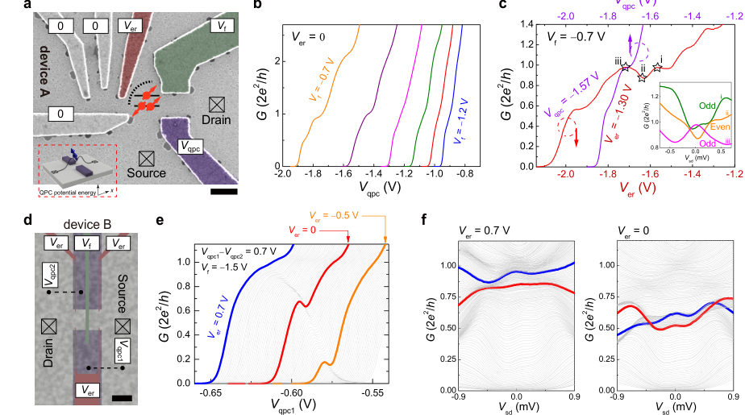
<figcaption class="paper-figure-caption"><b>Fig 1.</b> Figure 1: Integrated electronic resonator-quantum point contact device and its linear and nonlinear transfer characteristics. (a) False-color scanning electron micrograph of the gate pattern for device A. The quantum point contact (QPC) and electronic resonator (ER) are primarily controlled by voltages Vqpc, Ver, and Vf with all other gates grounded. Bottom inset, a schematic representation of the QPC potential profile and an interaction-driven quasi-bound spin. Middle inset, a schematic representation of ER spin states. (b) Linear conductance G as a function of Vqpc with Ver = 0. (c) Linear G as a function of Ver (Vqpc) at the selected Vqpc (Ver). Inset, nonlinear G at three different Ver...</figcaption>
</figure>
<figure class="paper-figure-card">
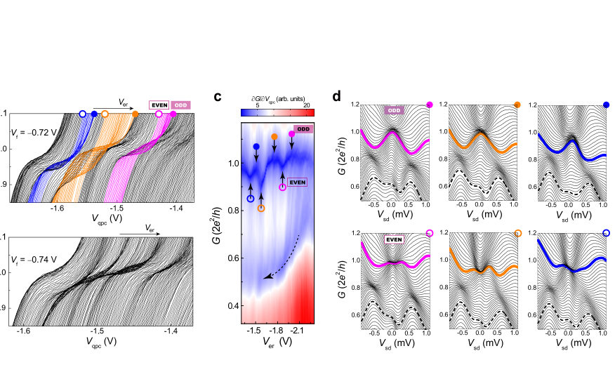
<figcaption class="paper-figure-caption"><b>Fig 2.</b> Figure 2: Transport anomalies in linear and nonlinear conductance, device A. (a, b) Sequences of linear conductance traces G(Vsd = 0, Vqpc) with decreasing Ver along the arrow direction for Vf = −0.72 V (a) and −0.74 V (b). (c) Transconductance ∂G/∂Vqpc versus G and Ver, displaying the oscillating and monotonic dependence of the first plateau and 0.7 anomaly on Ver, respectively. (d) Nonlinear conductance traces G(Vsd, Vqpc) at various Ver settings. Six circles marked in (a), (c), and (d) indicate the data at six characteristic gate voltages Ver, where the first plateau shows local extremes (solid and open circles for maxima and minima, respectively). These are accompanied by single- and...</figcaption>
</figure>
<figure class="paper-figure-card">
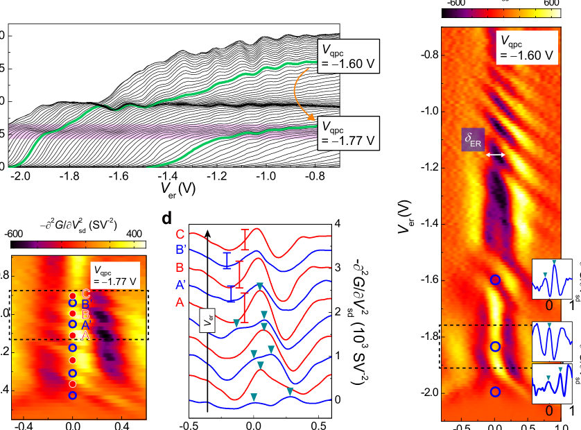
<figcaption class="paper-figure-caption"><b>Fig 3.</b> Figure 3: Interplay of the QPC Kondo and 0.7 anomaly in device A. (a) Linear conductance versus Ver as Vqpc is decreased along the arrow direction with Vf fixed at −0.7 V. Green traces correspond to Vqpc = −1.60 V and −1.77 V, respectively. The plateaus (at GQ and 0.5GQ) appear as darker regions with a higher density of traces. The shaded areas indicate the simultaneous appearance of the conductance oscillations and 0.7 anomaly. (b) Color map of the negative second derivative −∂2G/∂V 2 sd versus Ver and Vsd at Vqpc = −1.60 V. Insets, line cuts of the data at three selected Ver, which give the local minima of their zero-bias values (open circles). Dashed rectangle highlights the region of...</figcaption>
</figure>
<figure class="paper-figure-card">
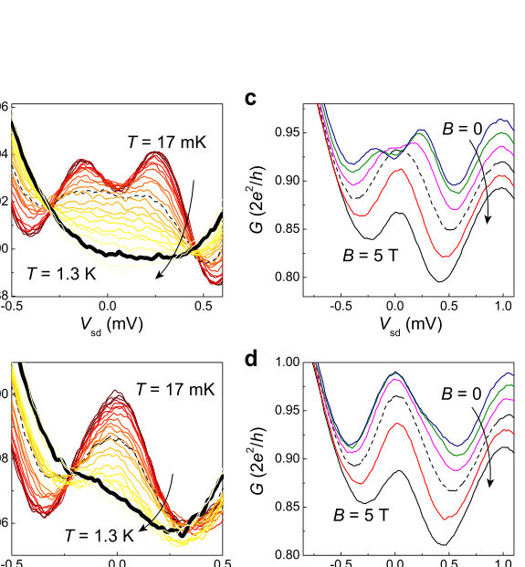
<figcaption class="paper-figure-caption"><b>Fig 4.</b> Figure 4: Destruction of Kondo spin singlet in device A. (a, b) Double- and single-peak ZBAs with increasing temperature T along the arrow direction. The ZBA peaks are completely suppressed when T = 1.1 K. Dashed and bold traces indicate the data at T = 0.6 K and 1.1 K, respectively. (c, d) Double- and single-peak ZBAs at various in-plane magnetic fields from B = 0 to 5 T in steps of 1 T. The dashed traces indicate the data at B = 3 T.</figcaption>
</figure>

**Summary.** The researchers engineered a novel on-chip device combining a Quantum Point Contact with an electronic resonator to study Kondo spins. By controlling the ER's spin parity, they achieved noninvasive detection of two-impurity Kondo effects via characteristic double-peak Zero-Bias Anomalies. This work clarifies that the Kondo physics is distinct from the origin of the anomalous 0.7 conductance plateau.

**Why it may be interesting.** This work provides an exquisite experimental platform for probing fundamental many-body quantum phenomena—specifically, the competition between different types of spin correlations (Kondo vs. $0.7$ anomaly) in nanoscale conductors—which is highly relevant to understanding correlated electron physics in mesoscopic systems.

Detailed structure

**Main problem.** The primary challenge is experimentally distinguishing the Kondo screening state from other complex, coexisting many-body spin states within strongly correlated quasi-one-dimensional nanoconstrictions like Quantum Point Contacts (QPCs).

**Main result.** The authors demonstrated a noninvasive quantum sensing method by using an integrated electronic resonator (ER) to controllably induce and detect two-impurity Kondo effects, while also showing that the 0.7 anomaly counteracts these fluctuations.

**Method.** They utilized lithographically defined all-on-chip devices combining a QPC with an ER in a high-mobility GaAs/AlGaAs heterostructure, measuring linear and nonlinear conductance (Zero-Bias Anomalies) as a function of gate voltages.

**Model / system.** The system involves coupling the localized spin moment within a QPC to a tunable spin state residing in an adjacent electronic resonator (ER). This setup allows for the study of two-impurity Kondo physics and its competition with the anomalous 0.7 conductance plateau.

**Key observables.** Zero-Bias Anomaly (ZBA) peaks, which change from single-peak to double-peak depending on the ER occupancy parity; linear conductance oscillations related to ER filling; and the magnitude of the $0.7$ anomaly.

**Important parameters / regimes.** Temperature ($T$), magnetic field ($B$), gate voltages controlling QPC/ER occupancy, and the ratio of coupling strengths between impurities.

**Assumptions / limitations.** The study assumes that the observed ZBA features are robust indicators of Kondo screening, despite the presence of other strong correlation effects like the 0.7 anomaly.

**Figures summary.** Figures illustrate the device structure (QPC + ER), show characteristic linear and nonlinear conductance maps, detail how alternating single/double-peak ZBAs correlate with ER filling parity, and demonstrate the suppression of these features upon increasing temperature or magnetic field.

**Paper structure.** The paper establishes the physical platform (ER-QPC) to address the ambiguity in spin state identification. It then systematically measures transport properties, using the change in ZBA structure (single vs. double peak) as a diagnostic tool to prove nonlocal control over Kondo screening and differentiate it from the physics causing the 0.7 anomaly.

Abstract

The precise nature of Kondo spins has remained enigmatic when extended to multiple spin impurities or, more intriguingly, when the localized spin itself may already be the consequence of many-body interactions in a presumably-delocalized open nanoconstriction, such as a quantum point contact (QPC). It is experimentally challenging to distinguish the Kondo state from other coexisting many-body spin states in such a strongly correlated system. Here we lithographically define an all-on-chip electronic resonator (ER) and a QPC in a high-mobility GaAs/AlGaAs heterostructure transistor. Local Kondo screening of the QPC spin and nonlocal spin singlet across the ER-QPC integration are controllable in response to ER occupancy parity. We also show that the 0.7 anomaly, another strongly-correlated state in QPCs, not only has a different physical origin but furthermore counteracts the Kondo spin singlet. These results demonstrate a noninvasive quantum method for sensing spontaneous magnetic impurities within an open nanoconstriction.

[↑ back to top](#top)

### [Phase diagram of one-dimensional bosons with Rydberg-dressed soft-core interactions](http://arxiv.org/abs/2607.13623v1)

**Authors:** Shengjie Yu, Laurent Sanchez-Palencia  
**Type:** theory · **Category:** quantum gases · **PDF:** <https://arxiv.org/pdf/2607.13623v1>  
**Analysis basis:** full PDF text, analyzed in chunks
**Topic relevance:** 🔥 `analog quantum simulation` **4/5** · `Rydberg arrays` **3/5** · `Frenkel-Kontorova` **1/5** · `correlated cavity matter` **1/5** · `entanglement & information structure` **1/5**

↔ Scroll figures horizontally

<figure class="paper-figure-card">
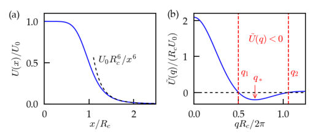
<figcaption class="paper-figure-caption"><b>Fig 1.</b> Figure 2. Interaction potential in (a) real space and (b) mo- mentum space, indicated by solid blue lines. The dashed lines represent the van der Waals tail in (a) and the negative range of ˜U(q) in (b), with the arrow indicating the minimum of ˜U(q) at q = q∗.</figcaption>
</figure>
<figure class="paper-figure-card">
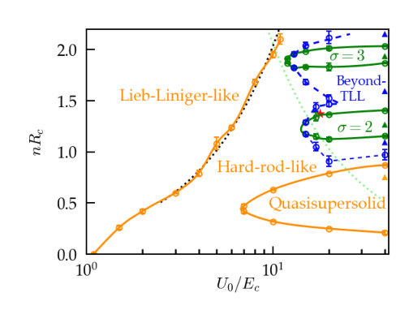
<figcaption class="paper-figure-caption"><b>Fig 2.</b> Figure 1. Quantum phase diagram for bosons with Rydberg- dressed soft-core interactions versus interaction strength and density (semi-logarithmic scale). The solid orange lines indi- cate the thresholds between Lieb-Liniger-like (K &gt; 1), hard- rod-like (1/2 &lt; K &lt; 1) and quasi-supersolid (K &lt; 1/2) be- haviors. The dashed blue lobes indicate beyond-TLL regions and the solid green lines the cluster lobes, where σ denotes the particle number in each cluster. The dotted lines indicate meanfield Bogoliubov predictions for the K = 1 line (dotted black) and the line of roton-gap closing (dotted green). The red star shows the phase transition point at commensurate roton and density length scales,...</figcaption>
</figure>
<figure class="paper-figure-card">
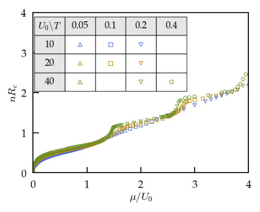
<figcaption class="paper-figure-caption"><b>Fig 3.</b> Figure 3. Equation of state for 1D bosons with Rydberg- dressed soft-core interactions at various interaction strengths U0 and negligible temperatures, as computed using QMC sim- ulations. The various interaction strengths are encoded with different colors and the various temperatures with different marker shapes, with values indicated in the table. Errorbars are smaller than the markers.</figcaption>
</figure>
<figure class="paper-figure-card">
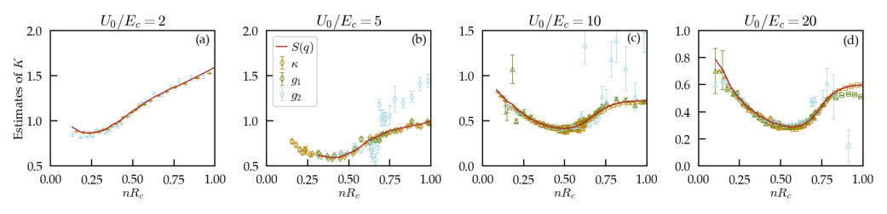
<figcaption class="paper-figure-caption"><b>Fig 4.</b> Figure 4. Luttinger parameter K versus density of the Rydberg-dressed 1D gas for various values of the interaction strength U0. The values of K are estimated from the compressibility κ, the correlation functions g1 and g2, and the structure factor, see text.</figcaption>
</figure>
<figure class="paper-figure-card">
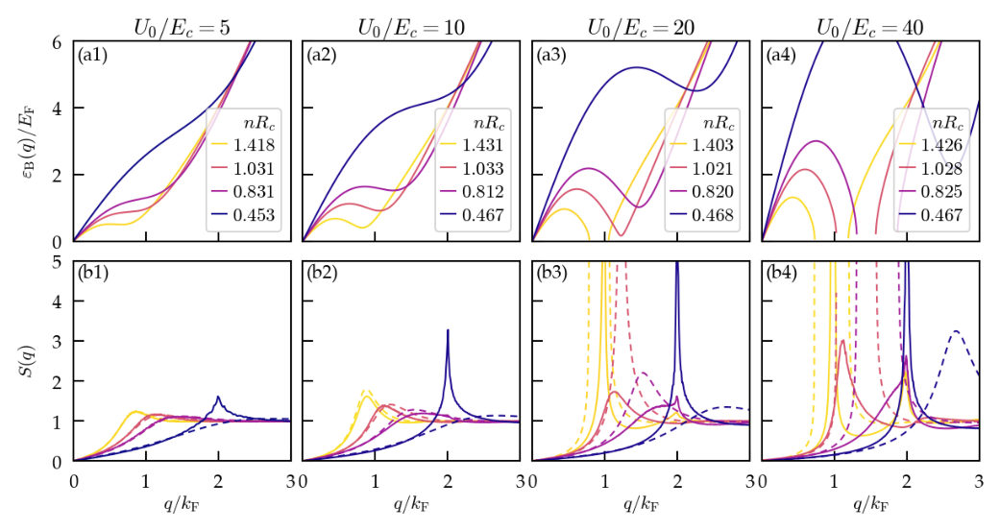
<figcaption class="paper-figure-caption"><b>Fig 5.</b> Figure 5. (a) Bogoliubov spectrum within Feynman approximation (solid lines) and (b) static structure factor vs q/kF from QMC (solid lines) and Feynman approximation (dashed lines), for U0 ranging from 5Ec to 40Ec (from left to right columns). The color lines, ranging from blue to yellow, indicate increasing densities, with the lower row sharing the same color labels as the upper row.</figcaption>
</figure>

**Summary.** The paper uses advanced Quantum Monte Carlo simulations to map the phase diagram of 1D bosons with soft-core interactions mimicking Rydberg dressing. It reveals a complex sequence of phases—including TLL, quasi-supersolid, and cluster states—driven by the interplay between interaction range and density. This work is crucial for understanding strongly correlated quantum matter in synthetic atomic systems.

**Why it may be interesting.** This work provides a detailed theoretical map of quantum phases in low-dimensional systems using modern atomic platforms (Rydberg atoms), bridging concepts from TLL theory, supersolidity, and cluster physics.

Detailed structure

**Main problem.** The study investigates the complex phase diagram of one-dimensional bosons interacting via soft-core Rydberg-dressed potentials.

**Main result.** The system exhibits a rich sequence of phases, transitioning from Tomonaga-Luttinger liquid (TLL) behavior through quasi-supersolid regimes to distinct cluster phases under strong interactions.

**Method.** Exact path-integral Quantum Monte Carlo (QMC) simulations were employed in continuous space to calculate correlation functions and determine the Luttinger parameter K.

**Model / system.** The system models 1D spinless bosons interacting via a soft-core potential derived from Rydberg dressing. The Hamiltonian is analyzed for its competition between roton-driven ordering and particle-hole backscattering processes.

**Key observables.** Luttinger parameter K, single/pair correlation functions ($g_1, g_2$), static structure factor $S(q)$, and cluster proportions ($	ext{n}_{	ext{cluster}}$).

**Important parameters / regimes.** Interaction strength ($U_0$), density ($n$), Fermi momentum ($k_F$), and the resulting Luttinger parameter K (which dictates regimes like $K>1$, $K<1$, $K<1/2$).

**Assumptions / limitations.** The analysis relies on QMC simulations, which are compared against theoretical frameworks like TLL theory and Bogoliubov approximations.

**Figures summary.** Figures map the quantum phase diagram across interaction strength and density, illustrating transitions between LL-like ($K>1$), HR-like ($K<1$), quasi-supersolid ($K < 1/2$), beyond-TLL, and cluster lobes.

**Paper structure.** The paper establishes the physical context using Rydberg gases, details the QMC methodology for calculating correlation functions, analyzes the resulting equation of state $n(\mu)$, and systematically maps out the phase diagram by tracking changes in the Luttinger parameter K across different interaction regimes.

Abstract

Rydberg and Rydberg-dressed atomic gases have recently emerged as a promising quantum simulator for a variety of models in condensed matter physics. Here we investigate one-dimensional bosons with soft-core Rydberg-dressed interactions using exact path-integral quantum Monte Carlo simulations. The finite-range and the negative Fourier component of the interaction potential generate a roton mode at finite momentum, while particle-hole backscattering processes enhance the susceptibility of one-dimensional systems at twice the Fermi momentum. The competition between the corresponding length scales yields a rich phase diagram, featuring a conventional Tomonaga-Luttinger liquid (TLL) regime, a beyond-TLL regime, and commensurate cluster phases. In the TLL regime, the system transitions from Lieb-Liniger-like bnehavior with Luttinger parameter $K>1$ to hard-rod-like behavior with $K<1$, with a quasi-supersolid phase emerging for $K < 1/2$. For strong interactions and high densities, deviations from TLL theory appear as precursors for the onset of cluster phases, where particles aggregate into stable clusters of several particles. The properties of each phase is discussed in detail.

[↑ back to top](#top)

### [Deterministic Quantum Phase Estimation with Linear Circuit Complexity in a Photonic System](http://arxiv.org/abs/2607.13404v1)

**Authors:** M. Midhuna, Ajay Jayachandran, Kanad Sengupta, Akshai T. Krishnan, C. M. Chandrashekar  
**Type:** both · **Category:** quantum information and computing · **PDF:** <https://arxiv.org/pdf/2607.13404v1>  
**Analysis basis:** full PDF text, analyzed in chunks
**Topic relevance:** 🔥 `QC/QI experiment` **4/5** · `quantum optics experiment` **3/5** · `analog quantum simulation` **1/5** · `interference shaping light` **1/5**

↔ Scroll figures horizontally

<figure class="paper-figure-card">
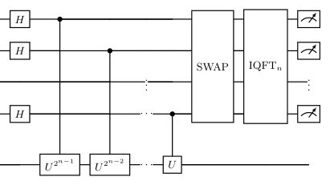
<figcaption class="paper-figure-caption"><b>Fig 1.</b> FIG. 1. Computational circuit for the standard Quantum Phase Estimation algorithm. The controlled-U 2k operations are applied sequentially, followed by a swap network (reversed order) and the inverse quantum Fourier transform.</figcaption>
</figure>
<figure class="paper-figure-card">
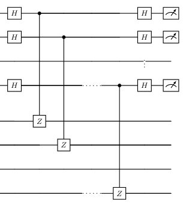
<figcaption class="paper-figure-caption"><b>Fig 2.</b> FIG. 2. Optimised Quantum Phase Estimation Circuit for n control qubits.</figcaption>
</figure>
<figure class="paper-figure-card">
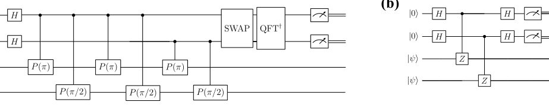
<figcaption class="paper-figure-caption"><b>Fig 3.</b> FIG. 3. (a) Standard circuit for the n = 2 quantum phase estimation algorithm with the unitary U = P(π) ⊗P(π/2). (b) The optimised circuit corresponding to (a).</figcaption>
</figure>
<figure class="paper-figure-card">
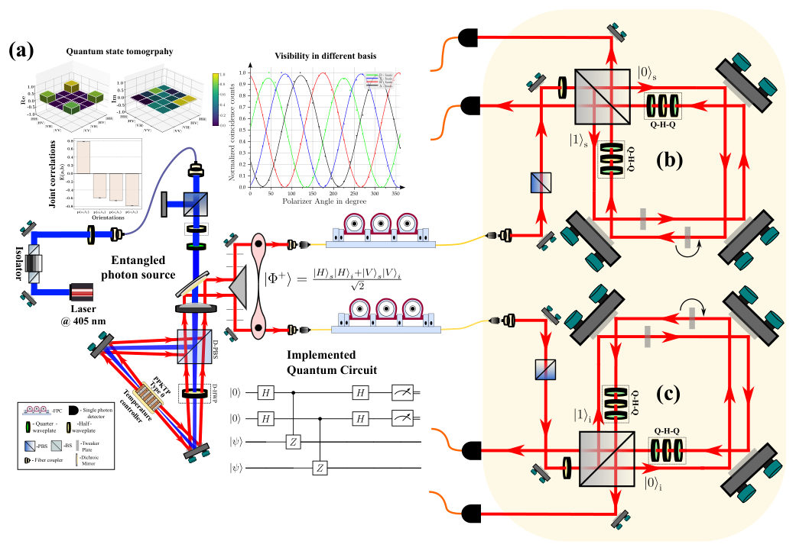
<figcaption class="paper-figure-caption"><b>Fig 4.</b> FIG. 4. Experimental setup for the implementation of the two-control, two-target quantum phase estimation algorithm (n = 2) with the unitary U = P(π) ⊗P(π/2) using path- and polarization-encoded photonic qubits. (a) Type-0 polarization-entangled photon source and its characterisation. The source exhibits visibilities of 98.9% and 98.1% in the H/V and A/D bases, respectively, violates the CHSH inequality with S = 2.72 ± 0.03, and quantum state tomography confirms the generation of a Bell state. (b), (c) Displaced Sagnac interferometers encoding the first and third qubits, and the second and fourth qubits, respectively. The average single-photon interference visibility measured in the two...</figcaption>
</figure>
<figure class="paper-figure-card">
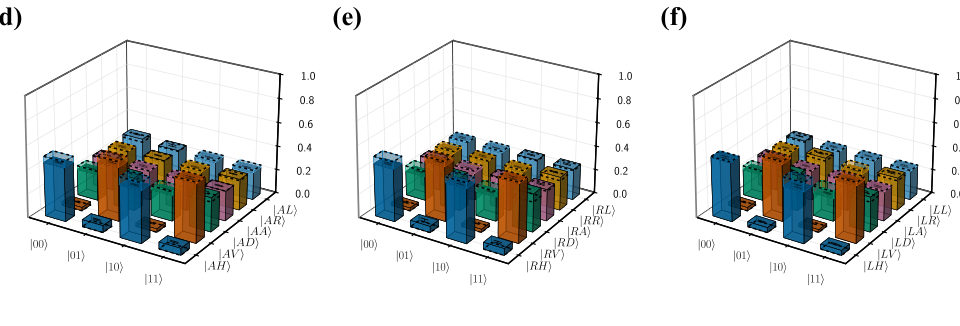
<figcaption class="paper-figure-caption"><b>Fig 5.</b> FIG. 5. Comparison of the experimentally measured and theoretically expected normalised coincidence counts for the complete set of 36 polarization projection states. The solid bars represent the experimentally measured coincidence counts, while the overlaid dotted bars denote the corresponding theoretical predictions. Panels (a) to (f) correspond to measurements with the first photon’s polarization projected onto the states |H⟩, |V ⟩, |D⟩, |A⟩, |R⟩, and |L⟩, respectively, while the second photon’s polarization is projected onto the complete basis {|H⟩, |V ⟩, |D⟩, |A⟩, |R⟩, |L⟩}. The close overlap between the experimental and theoretical coincidence counts demonstrates good agreement with...</figcaption>
</figure>

**Summary.** This paper introduces an optimized Quantum Phase Estimation (QPE) algorithm that reduces circuit complexity from $O(n^2)$ to $O(n)$ for structured unitary operators. The method is realized deterministically on a four-qubit photonic platform using polarization and path modes. This advancement significantly improves the feasibility of implementing complex quantum algorithms in physical hardware.

**Why it may be interesting.** This work is highly relevant as it tackles a core computational bottleneck in quantum algorithms—the complexity of QPE—by providing both a theoretical simplification and a robust, deterministic photonic realization.

Detailed structure

**Main problem.** The primary goal is to improve Quantum Phase Estimation (QPE) by reducing its circuit complexity from a standard $O(n^2)$ scaling down to an optimal linear $O(n)$ scaling for specific structured unitary operators.

**Main result.** The authors successfully developed and demonstrated an optimized QPE algorithm that achieves linear complexity while maintaining full determinism, which was experimentally validated on a photonic platform.

**Method.** The optimization involves exploiting the inherent structure of the target unitary operator to eliminate the computationally expensive Inverse Quantum Fourier Transform (IQFT) stage, replacing controlled operations with simpler controlled-Z gates.

**Model / system.** The work is implemented on a four-qubit photonic system utilizing a photon pair. The qubits are encoded using a hybrid scheme combining polarization degrees of freedom and spatial path modes for the quantum walk architecture.

**Key observables.** Coincidence signatures at output ports used to uniquely identify and measure the estimated eigenphases ($\phi$), with successful observation matching theoretical predictions for specific eigenvalues (e.g., 1, i, -1, -i).

**Important parameters / regimes.** The complexity reduction is demonstrated for a special class of diagonal unitary operators $U = P(\pi) \otimes P(\pi/2) \otimes \cdots$, and the initial experimental validation was performed at a 2-bit precision level ($m=2$).

**Assumptions / limitations.** The efficiency gain relies critically on the structured, diagonal nature of the unitary operators being analyzed. Experimental limitations include source non-idealities and interferometer instabilities.

**Figures summary.** Figures illustrate the comparison between the standard QPE circuit (requiring controlled-$U_{2k}$ operations) and the optimized circuit (using controlled-Z gates), showing the elimination of the IQFT network for a specific unitary case.

**Paper structure.** The paper first reviews the general QPE protocol and its $O(n^2)$ complexity. It then introduces the mathematical insight that allows simplification for structured unitaries, leading to an optimized $O(n)$ algorithm. Finally, it details the physical implementation on photonics and presents experimental validation of phase estimation.

Abstract

Quantum algorithms solve certain computational problems faster than the best known classical algorithms. Many algorithms, including Shor's for factoring, Grover's for unstructured search, and the HHL for solving linear systems, rely on quantum phase estimation (QPE) as a fundamental subroutine. The QPE protocol proceeds through the initialization of a control register in a uniform superposition, controlled unitary evolution encoding the eigenphase, and a final inverse quantum Fourier transform followed by measurement to extract the phase. Here, we address a special class of unitary operators that frequently appear in quantum Fourier transform-based protocols, cyclic group representations, and periodically evolving quantum systems. We introduce a QPE algorithm that successfully reduces the circuit complexity from $\mathcal{O}(n^2)$ to $\mathcal{O}(n)$ for a special class of unitary operators and implement it on a four-qubit photonic system. The four-qubit system is realised using a photon pair, with two qubits encoded in its polarization degree of freedom and the remaining two in its path modes. In contrast to previous photonic implementations of QPE based on dual-rail encoding and KLM protocol, where controlled operations are inherently probabilistic and thus reduce the overall success probability of phase estimation, our scheme is fully deterministic. Moreover, it is scalable to higher-dimensional unitaries, provided the underlying structure of the unitaries is preserved.

[↑ back to top](#top)

### [Robust Nonperturbative Trapped-Ion Quantum Logic](http://arxiv.org/abs/2607.13166v1)

**Authors:** Luca Stefanescu, Florian Mintert  
**Type:** theory · **Category:** other · **PDF:** <https://arxiv.org/pdf/2607.13166v1>  
**Analysis basis:** full PDF text, analyzed in chunks
**Topic relevance:** 🔥 `QC/QI experiment` **4/5** · `analog quantum simulation` **1/5** · `correlated / nonlocal dissipation` **1/5** · `driven-dissipative phase transition` **1/5** · `methods for driven-dissipative` **1/5** · `non-equilibrium dynamics` **1/5**

↔ Scroll figures horizontally

<figure class="paper-figure-card">
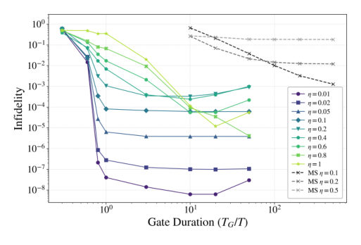
<figcaption class="paper-figure-caption"><b>Fig 1.</b> FIG. 1. Infidelity of entangling gates resulting from optimized driving as a function of dimensionless gate duration TG/T and the LD parameter η. For sufficiently small values of the LD parameter η, there is a pronounced drop in infidelities for gate durations exceeding one trap period T and a nearly constant infidelity for longer durations. For larger values of η this clear step-like behavior gets washed out, and the increasingly nonlinear behavior of the system dynamics requires longer gate durations for high-fidelity entangling gates. Infidelities of gates realized with Mølmer-Sørensen (MS) driving (Eq. (16)) are depicted for comparison for gate times exceeding 10 trap periods T. The...</figcaption>
</figure>
<figure class="paper-figure-card">
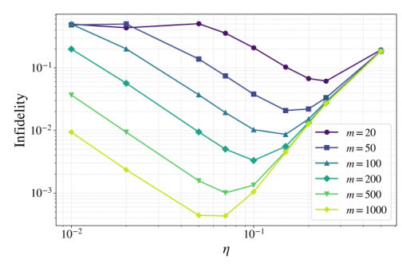
<figcaption class="paper-figure-caption"><b>Fig 2.</b> FIG. 2. Infidelities of entangling gates induced by Eq. (15) with the regular MS drive as a function of the LD parameter η and the dimensionless gate duration TG/T = m as a multiple of the trap period T. This demonstrates that each duration corresponds with a specific optimal η, and this optimal point is lower when gate duration is larger. Below this optimal η, the infidelity increases due to off-resonant effects. The lines connecting data points are a guide to the eye.</figcaption>
</figure>
<figure class="paper-figure-card">
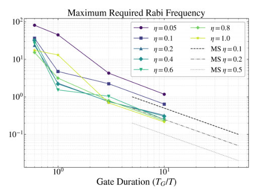
<figcaption class="paper-figure-caption"><b>Fig 3.</b> FIG. 3. Dimensionless maximal value of the Rabi frequency (maxi,t(|Ωi(t)|/ν1)) required by the optimized drives (colored lines) and by the MS scheme (dashed lines) as a function of dimensionless gate duration and the LD parameter η. The dependence of the amplitude of the optimized drives on the duration is qualitatively the same as for the MS drives. The colored lines connecting data points are a guide to the eye, the dashed lines show the analytic dependence.</figcaption>
</figure>
<figure class="paper-figure-card">
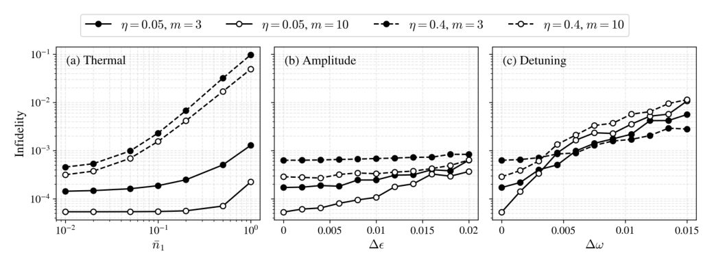
<figcaption class="paper-figure-caption"><b>Fig 4.</b> FIG. 4. (a) Thermal infidelity of gates as defined in Eq. (10) with ∆ϵ = 0 and ∆ω = 0 as a function of the mean thermal occupation ¯n1. The infidelities stay below 10−4 when weak coupling and large duration are used, but they increase faster as temperature increases when strong coupling is used. (b) Ensemble-averaged infidelity (Eq. (14)) as a function of laser intensity noise level ∆ϵ, with ¯n1 = 0 and ∆ω = 0. Infidelities remain below 10−3 for all durations and values of η, across all noise levels tested. (c) Ensemble-averaged infidelity as a function of detuning noise level ∆ω, with ¯n1 = 0 and ∆ϵ = 0. In the noiseless case the slow and weak coupling gate achieves the lowest infidelity,...</figcaption>
</figure>
<figure class="paper-figure-card">
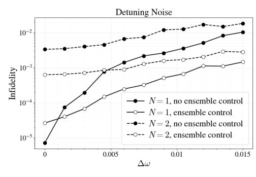
<figcaption class="paper-figure-caption"><b>Fig 5.</b> FIG. 5. Ensemble-averaged infidelity (Eq. (14)) with ¯n1 = 0 and ∆ϵ = 0 when subject to detuning noise with εij cho- sen from [−∆ω, ∆ω]. The LD parameter is η = 0.4 and the gate duration is 3 trap periods. The hollow/filled points cor- respond to gates optimized with/without ensemble control and the solid/dashed lines correspond to gates resulting from optimization targets (Eq. (9)) with the projector specifying one/two lowest energy Fock states. The plot demonstrates that ensemble control can reduce infidelity, but also that us- ing a larger projector for the motional states can increase the infidelity. The lines connecting data points are a guide to the eye.</figcaption>
</figure>

**Summary.** This paper develops optimal control strategies for implementing fast, high-fidelity entangling gates in trapped ion quantum processors. By moving beyond simple harmonic approximations and utilizing anharmonic dynamics, the authors design driving pulses resilient to common noise sources like detuning and temperature variations. This advances the feasibility of building scalable quantum computation hardware based on trapped ions.

**Why it may be interesting.** This work directly addresses the practical challenges of scaling quantum computation using trapped ions by providing advanced pulse shaping techniques that explicitly incorporate and mitigate environmental decoherence sources, which is central to modern AMO research.

Detailed structure

**Main problem.** The primary goal is designing fast, high-fidelity entangling quantum gates for trapped ions that are robust against environmental noise sources like detuning and temperature fluctuations.

**Main result.** Optimal control schemes exploiting anharmonic motional dynamics allow for the realization of high-fidelity gates, showing resilience to noise particularly when the Lamb-Dicke parameter is small.

**Method.** The authors employ optimal control techniques (like GRAPE) to find time-dependent driving pulses that minimize gate infidelity while accounting for ensemble averaging over noise distributions.

**Model / system.** The system uses trapped ions as qubits, with interactions mediated by collective motional degrees of freedom. The dynamics are governed by a complex Hamiltonian incorporating both qubit and motional terms, moving beyond simple harmonic approximations to include anharmonicity.

**Key observables.** Gate fidelity ($F$) and ensemble-averaged infidelity ($ar{I}$), measured as a function of gate duration ($T_G$).

**Important parameters / regimes.** Lamb-Dicke parameter ($\eta$), Rabi frequency ($\Omega$), detuning ($\Delta$), and the trap period ($T$).

**Assumptions / limitations.** The analysis relies on numerically optimized control schemes, and while anharmonicity is exploited, initial approximations (like those used in standard Mølmer-Sørensen schemes) are shown to be insufficient for high performance.

**Figures summary.** Figures compare gate infidelity versus gate duration for different $\eta$, contrast optimized drives against conventional ones, and illustrate the effect of noise averaging on fidelity across various parameter regimes.

**Paper structure.** The paper progresses from defining the physical Hamiltonian and identifying limitations in harmonic approximations to formulating the optimal control problem. It then details the use of gradient-based optimization methods (like GRAPE) to design pulses that achieve target unitaries while minimizing infidelity under noise models.

Abstract

Entangling gates of trapped ions are typically mediated by collective motional degrees of freedom. Weak coupling between qubit and motional degrees of freedom and the resulting harmonic dynamics give access to a broad range of gate schemes, but also impose strict limitations on achievable gate times. In this paper, we devise optimally designed driving schemes for the realization of fast, high-fidelity entangling gates mediated by anharmonic dynamics. The driving can also be optimized to achieve resilience to multiple system imperfections, and the anharmonicity in the motional dynamics can be used to enhance such resilience.

[↑ back to top](#top)

### [A versatile laser-machined rf trap for arrays of 100+ ions](http://arxiv.org/abs/2607.13342v1)

**Authors:** Frank G. Schroer, Ilyoung Jung, Thomas W. Burkle, Jack B. Lyons, Joseph W. Van Vlack, Joseph Ezuma, Philip Richerme  
**Type:** experiment · **Category:** other · **PDF:** <https://arxiv.org/pdf/2607.13342v1>  
**Analysis basis:** full PDF text, analyzed in chunks
**Topic relevance:** 🔥 `analog quantum simulation` **4/5** · `QC/QI experiment` **3/5** · `non-equilibrium dynamics` **1/5**

↔ Scroll figures horizontally

<figure class="paper-figure-card">
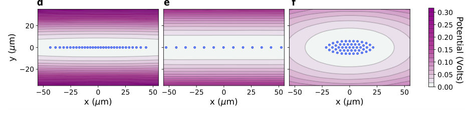
<figcaption class="paper-figure-caption"><b>Fig 1.</b> Figure 1. (a) Exploded CAD assembly showing the trap substrates, mounting system, and electrical connections. (b) Picture of the mounted substrates and electrical connections; (c) Schematic of the central trapping region, showing the electrode geometry and coordinate axes. Voltages are applied to endcap (END), midcap (MID), and center (CTR) electrodes, which alternate with grounded (GND) electrodes. Simulated electrical potentials in the trapping region predict the ability to confine ions in multiple geometries, including (d) long 1D chains, (e) uniformly-spaced 1D strings, and (f) lateral 2D crystals.</figcaption>
</figure>
<figure class="paper-figure-card">
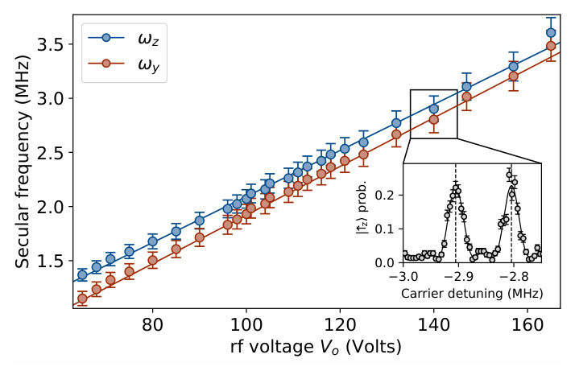
<figcaption class="paper-figure-caption"><b>Fig 2.</b> Figure 2. The radial secular frequencies in the y and z directions show an approximately linear dependence on the applied rf voltage. Solid lines are fits of Eq. 3 to the measured data. The inset shows a typical Raman-driven red sideband scan, from which the radial secular frequencies are extracted.</figcaption>
</figure>
<figure class="paper-figure-card">
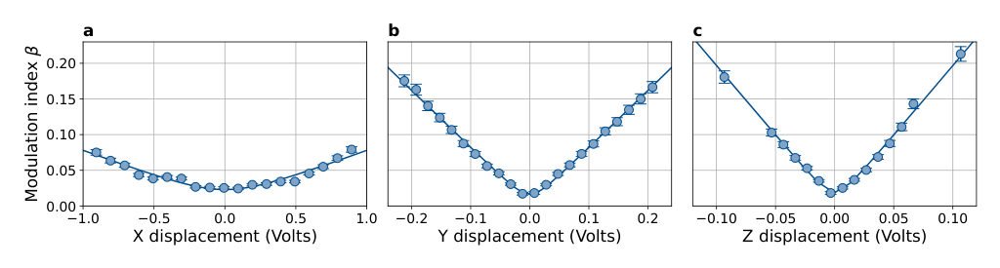
<figcaption class="paper-figure-caption"><b>Fig 3.</b> Figure 3. Micromotion modulation index β measured along the z direction, as a function of displacement voltage applied along the (a) x, (b) y, and (c) z trap axes. Zero displacement corresponds to the trap voltages that minimize the observed micromotion. Displacements are applied by asymmetrically biasing electrodes on opposite sides of the trap. Solid lines are fits to the data that include contributions from both intrinsic and extrinsic micromotion.</figcaption>
</figure>
<figure class="paper-figure-card">
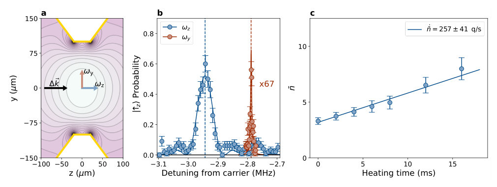
<figcaption class="paper-figure-caption"><b>Fig 4.</b> Figure 4. (a) Simulated trap potentials when the radial principal axes have been rotated to align with the trap coordinate axes. Under these conditions, the wavevector difference ∆⃗k of our Raman beams couples only to the ωz mode. (b) When the principal axes are rotated, the ωz radial mode (blue points) is excited during a Raman red-sideband scan. The ωy mode (red points) is strongly suppressed and requires a 67 times longer Raman pulse duration to achieve similar excitation. (c) When the principal axes are rotated, we measure a center-of-mass heating rate of 257±41 quanta/s for the ωz mode.</figcaption>
</figure>
<figure class="paper-figure-card">
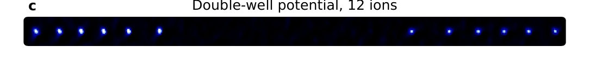
<figcaption class="paper-figure-caption"><b>Fig 5.</b> Figure 5. Ions trapped in different 1D configurations. (a) A 31-ion chain is trapped by keeping the axial confinement weak relative to the radial confinement. (b) Increasing the center electrode voltage produces a chain with near-uniform spacing. (c) Continuing to increase the center electrode voltage generates a symmetric double-well potential, with weak ion-ion interactions across wells.</figcaption>
</figure>

**Summary.** The authors report on the design and experimental realization of a versatile, laser-machined rf Paul trap capable of holding large arrays of ions (100+). By stacking precisely machined fused silica wafers with independently biased electrodes, they achieve unprecedented control over trapping potentials, enabling stable confinement in complex 1D and 2D geometries. This platform significantly advances the hardware required for scaling up quantum simulation experiments using trapped ions.

**Why it may be interesting.** This work represents a significant engineering advance in the physical platform for quantum simulation. The ability to precisely engineer trap potentials using macro-scale machining opens up new regimes of control over ion crystal geometry compared to previous traps.

Detailed structure

**Main problem.** The development of a versatile, macroscopic radiofrequency (rf) trap capable of confining large arrays of ions in various one-dimensional and two-dimensional geometries for quantum simulation.

**Main result.** The fabricated laser-machined trap successfully supports robust confinement for ion crystals exceeding 100 ions, while demonstrating tunable control over trapping potentials, micromotion compensation, and low heating rates.

**Method.** The authors utilized precision laser machining of stacked fused silica wafers to create ten independently biased electrodes, allowing precise electrical control over the confining potential.

**Model / system.** The system is a macroscopic rf Paul trap designed for trapped ions (specifically $^{171}	ext{Yb}^+$). The trapping potential is modeled using finite-element method (FEM) simulations and analyzed via pseudopotential approximations to predict secular frequencies.

**Key observables.** Radial and axial secular frequencies ($\omega_y, \omega_z$), micromotion modulation index ($eta$), motional heating rate ($\dot{ar{n}}$), and the stable geometry of ion arrays (1D chains, 2D crystals).

**Important parameters / regimes.** The trap supports confinement for $N \approx 500$ to $1000$ ions; frequencies can exceed $2\pi 	imes 3.5$ MHz; residual micromotion is shown to be $\lesssim 0.02$.

**Assumptions / limitations.** The primary limitations are expected to be off-axis micromotion and background gas collisions at room temperature, despite theoretical estimates for very large ion numbers.

**Figures summary.** Figures illustrate the trap's CAD assembly (stacked wafers), predicted equilibrium geometries for various configurations (1D/2D), measured secular frequencies versus RF voltage, and measurements of micromotion modulation.

**Paper structure.** The paper details the design and fabrication process using laser-machined fused silica. It presents theoretical modeling via FEM and pseudopotential analysis to predict potential shaping. Experimental sections demonstrate trapping capability across various geometries (1D/2D), measure key motional parameters like micromotion and heating rates, and confirm operational stability.

Abstract

Large ion crystals in diverse geometries are a key resource for quantum simulation experiments. In this work, we introduce a macroscopic rf trap that supports a wide variety of one-dimensional ion configurations as well as lateral two-dimensional crystals with more than 100 ions. Our design is based on precision-machined fused silica wafers that are stacked to form the trap structure. Ten independently biased electrodes provide flexible control over the axial potential, enabling long one-dimensional crystals, isospaced ion strings, split-well chains, and two-dimensional arrays with tunable aspect ratios. We present the design and fabrication process for this trap and demonstrate the ability to tune the radial secular frequencies, detect and compensate micromotion, rotate the principal axes, and characterize trapped ion heating rates. All trap design and documentation files are freely available alongside this work, to facilitate adoption and further development within the ion trap community.

[↑ back to top](#top)

### [Transverse order and longitudinal fluctuations in a near-Ising spin supersolid](http://arxiv.org/abs/2607.13635v1)

**Authors:** Mengze Zhu, V. Romerio, S. Raymond, N. Murai, S. Ohira-Kawamura, K. Yu. Povarov, S. A. Zvyagin, R. Sibille, Arianna Minelli, Z. Yan, S. Gvasaliya, A. Zheludev  
**Type:** experiment · **Category:** strongly correlated electrons · **PDF:** <https://arxiv.org/pdf/2607.13635v1>  
**Analysis basis:** full PDF text, analyzed in chunks
**Topic relevance:** 🔥 `analog quantum simulation` **4/5** · `exotic spin models in light-matter` **3/5** · `spintronics-quantum-optics interface` **1/5**

↔ Scroll figures horizontally

<figure class="paper-figure-card">
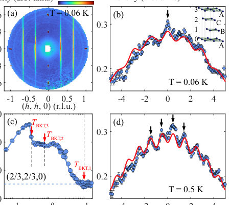
<figcaption class="paper-figure-caption"><b>Fig 1.</b> FIG. 1. (a) Elastic neutron scattering intensity of K2Co(SeO3)2 in the (h, h, l) plane measured at T = 0.06 K using CORELLI. Rod-like magnetic scattering indicates quasi-two-dimensional magnetic order. (b),(d) l scans at Q = (2/3, 2/3, l) measured at T = 0.06 and 0.5 K, respec- tively. Equivalent scans measured at (−2/3, −2/3, l) were av- eraged to improve the counting statistics. Black arrows mark the intensity maxima. Red solid lines are fits described in the text. Inset in (b) illustrates ABC stacking of the triangular- lattice planes. (c) Temperature dependence of the magnetic intensity at Q = (2/3, 2/3, 0) measured using ZEBRA. Red arrows denote the BKT transitions identified from...</figcaption>
</figure>
<figure class="paper-figure-card">
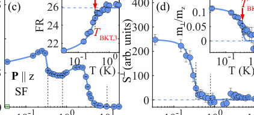
<figcaption class="paper-figure-caption"><b>Fig 2.</b> FIG. 2. Temperature dependence of the magnetic intensity at Q = (1/3, 1/3, 0) measured using polarized neutron diffrac- tion in the (a) non-spin-flip (NSF) and (c) spin-flip (SF) chan- nels. Green squares denote the background measured with the sample rotated by ±7◦. The incident neutron polarization is perpendicular to the horizontal scattering plane (P ∥z). Red arrows and black dashed lines mark the BKT transitions. In- set in (c) shows the flipping ratio (FR) as a function of tem- perature. The pronounced decrease below TBKT,3 signals the emergence of a transverse ordered moment. Blue dashed line indicates its average value between 0.5 and 2 K. (b),(d) Ex- tracted longitudinal and...</figcaption>
</figure>
<figure class="paper-figure-card">
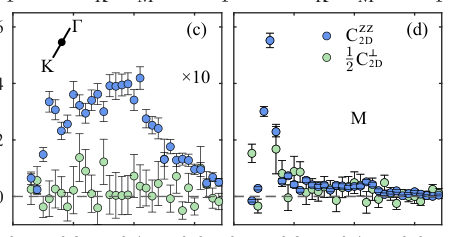
<figcaption class="paper-figure-caption"><b>Fig 3.</b> FIG. 4. (a),(b) Extracted Fourier components of the longitu- dinal and transverse spin-spin correlation function Czz 2D(Q, ω) and C⊥ 2D(Q, ω), in the supersolid phase, demonstrating the predominantly longitudinal character of the excitations. For the measured magnetic spectrum at l = 0, I ∝g2 zzCzz 2D + g2 ⊥ 1 2C⊥ 2D. White hexagon represents the first Brillouin zone boundary. Γ,K and M denote high-symmetry points. Black arrows mark the wave vectors used for the energy-dependent cuts in (c) and (d). (c),(d) Energy dependence of Czz 2D and C⊥ 2D measured midway between the Γ and K points and at the M point, respectively. Note the ×10 intensity scale factor in (c).</figcaption>
</figure>
<figure class="paper-figure-card">
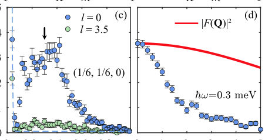
<figcaption class="paper-figure-caption"><b>Fig 4.</b> FIG. 3. False color plots of magnetic excitation spectra of K2Co(SeO3)2 measured by inelastic neutron scattering at T = 0.1 K for (a) l = 0 and (b) l = 3.5. White hexagon outlines the first Brillouin zone boundary. Γ,K and M denote high- symmetry positions in the reciprocal space. Dashed lines in- dicate the wave vector of the constant-Q scans shown in (c). (c) Neutron scattering intensity as a function of energy at Q = (1/6, 1/6, l) for l = 0 and 3.5, respectively. Dashed lines are fits to the elastic peak and a constant background. Black arrow indicates the energy of the l scan shown in (d). (d) Neu- tron scattering intensity as a function of l at Q = (1/6, 1/6, l) for ℏω = 0.3 meV. Red...</figcaption>
</figure>

**Summary.** This work uses polarized neutron scattering to probe the spin supersolid state in a near-Ising antiferromagnet. The research confirms that the supersolid order survives even when strongly anisotropic, revealing that low-energy dynamics are dominated by longitudinal fluctuations rather than transverse ones. This provides crucial experimental data constraining theoretical models of frustrated quantum magnets.

**Why it may be interesting.** The finding that low-energy excitations are predominantly longitudinal, contrasting with conventional expectations for such systems, provides stringent constraints on microscopic theoretical models (like XXZ) describing frustrated magnetism and quantum phase transitions.

Detailed structure

**Main problem.** The study investigates the nature of transverse order and longitudinal fluctuations within the spin supersolid state of a near-Ising antiferromagnet.

**Main result.** The system exhibits evidence for a persistent supersolid ground state in the near-Ising regime, characterized by predominantly longitudinal low-energy spin dynamics despite the presence of a small transverse ordered moment.

**Method.** Neutron scattering experiments (both unpolarized and polarized) were used to measure magnetic structure factors and analyze temperature dependence across successive BKT transitions.

**Model / system.** The physical system is the S=1/2 triangular-lattice easy-axis antiferromagnet K2Co(SeO3)2, modeled by an XXZ Hamiltonian near the Ising limit.

**Key observables.** Longitudinal ($S_{zz}$) and transverse ($S_{\perp}$) ordered moments; low-energy spin fluctuation spectra; flipping ratio (FR); interlayer correlation parameters ($A_{01}, A_{02}, A_{03}$).

**Important parameters / regimes.** Near-Ising regime, $T \approx 0.35	ext{ K}$ (for transverse order onset), and the small ratio of transverse to longitudinal moment ($\sim 11\%$ or $\sim 32\%$).

**Assumptions / limitations.** The analysis relies on separating spin correlations into longitudinal and transverse components using polarized neutron scattering techniques.

**Figures summary.** Figures show temperature dependence of magnetic intensity (NSF/SF channels) highlighting transitions, and plots of the flipping ratio (FR) showing changes below $	ext{TBKT},3$. Other figures detail spectral weight suppression in inelastic measurements.

**Paper structure.** The paper systematically analyzes the development of supersolid order through successive BKT transitions using polarized neutron scattering to quantify longitudinal vs. transverse moments, followed by detailed analysis of low-energy spin dynamics.

Abstract

We investigate the polarization of the ordered moments and low-energy spin fluctuations in the spin supersolid state of the S = 1/2 triangular-lattice easy-axis antiferromagnet K2Co(SeO3)2 using neutron scattering. The supersolid order develops through successive BKT transitions: the longitudinal order appears at higher temperature, while the transverse component associated with the Bose-Einstein condensate emerges only below a lower-temperature transition accompanied by a change in the interlayer correlations. At the lowest measured temperature, the transverse ordered moment reaches only 11% of the longitudinal component. Moreover, the low-energy spin fluctuations are found to be predominantly longitudinal in character. These results provide direct evidence that the supersolid ground state survives even in the near-Ising regime and exhibits longitudinal low-energy dynamics, imposing stringent constraints on microscopic theories of triangular-lattice XXZ antiferromagnets.

[↑ back to top](#top)

### [Fractional Chern insulators in alternating twisted multilayer MoTe$_{2}$](http://arxiv.org/abs/2607.13807v1)

**Authors:** Xi-Hang Feng, Shi-Ping Ding, Xiang-Jian Hou, Ying-Hai Wu, Jin-Hua Gao  
**Type:** theory · **Category:** strongly correlated electrons · **PDF:** <https://arxiv.org/pdf/2607.13807v1>  
**Analysis basis:** full PDF text, analyzed in chunks
**Topic relevance:** 🔥 `analog quantum simulation` **4/5** · `correlated cavity matter` **1/5** · `entanglement & information structure` **1/5** · `non-equilibrium dynamics` **1/5**

↔ Scroll figures horizontally

<figure class="paper-figure-card">
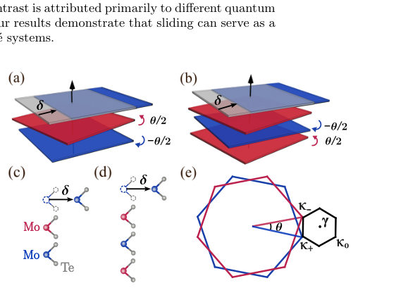
<figcaption class="paper-figure-caption"><b>Fig 1.</b> FIG. 1. (a,b) Schematics of alternating twisted trilayer and tetrlayer MoTe2 in which the first layers are slid by δ. (c,d) Atomic side views of untwisted trilayer and tetralayer MoTe2 with first layers slid. (e) Schematics of the Brillouin zones of individual layers and the moir´e Brillouin zone.</figcaption>
</figure>
<figure class="paper-figure-card">
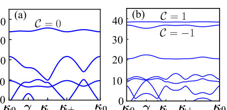
<figcaption class="paper-figure-caption"><b>Fig 2.</b> FIG. 2. Typical band structures of alternating twisted mul- tilayer MoTe2. (a) AT3L system with twist angle 2.15◦; (b) AT4L system with twist angle 2.0◦.</figcaption>
</figure>
<figure class="paper-figure-card">
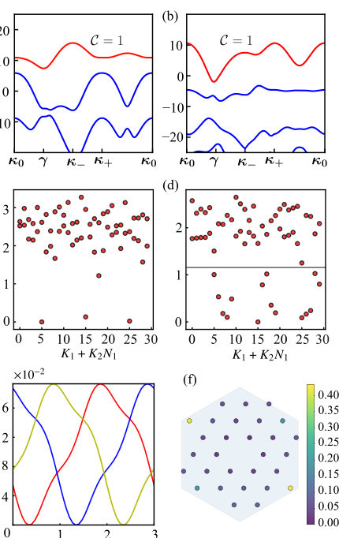
<figcaption class="paper-figure-caption"><b>Fig 3.</b> FIG. 3. (a,b) Band structures of AT3L MoTe2 with θ = 3.0◦, D = 10 meV, and (a) δ = 0 (b) δ = 0.5a1. (c) Many-body energy spectra at 1/3 filling of the topmost band in (a). (d) The same plot as in (c) but for the topmost band in (b). The number of electrons is 10 and the numbers of moi´e cells are 5 and 6. (e) Spectral flow of the three quasi-degenerate ground states in (c) versus the boundary twist angle along the y direction. (f) Static structure factor corresponding to (d).</figcaption>
</figure>
<figure class="paper-figure-card">
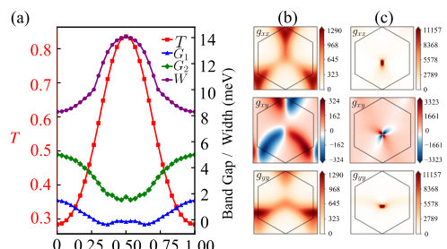
<figcaption class="paper-figure-caption"><b>Fig 4.</b> FIG. 4. (a) Evolution of the trace condition T, band width W, indirect band gap G1, and direct band gap G2 with the sliding distance δ when the electric potential is fixed at D = 10 meV. (b,c) Fubini-Study metric of AT3L MoTe2 with θ = 3.0◦, D = 10 meV, and (b) δ = 0 (c) δ = 0.5a1.</figcaption>
</figure>
<figure class="paper-figure-card">
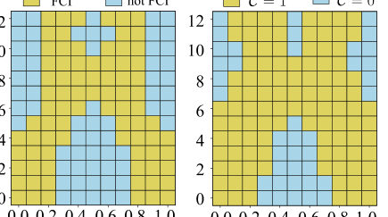
<figcaption class="paper-figure-caption"><b>Fig 5.</b> FIG. 5. Phase diagram of AT4L MoTe2 with θ = 2.5◦at filling factor 1/3. Numerical calculations were performed at many different combinations of electric potential D and slid- ing distance δ. The number of electrons is 8 and the numbers of moir´e cells are 4 and 6. FCIs are identified based on ground state degeneracy and spectral flow under flux insertion.</figcaption>
</figure>

**Summary.** This work explores Fractional Chern Insulators in twisted multilayer MoTe2 by tuning parameters like layer sliding distance and electric fields. The key finding is that the stability of these highly correlated topological states depends critically on the system's underlying quantum geometry, quantified by a specific trace condition. This establishes sliding as an effective knob for controlling exotic many-body phases.

**Why it may be interesting.** The explicit connection between geometric properties (quantum geometry/trace condition) and the stabilization/destruction of exotic correlated topological phases like FCIs provides a powerful, measurable diagnostic tool applicable to moiré heterostructures relevant to quantum simulation.

Detailed structure

**Main problem.** The study investigates strongly correlated many-body states, specifically Fractional Chern Insulators (FCIs), in alternating twisted multilayer MoTe2.

**Main result.** FCIs are found to be stabilized only in specific parameter regimes, a contrast explained by the quantum geometry quantified by the trace condition, which can destroy FCI phases even when bands are topological.

**Method.** The research employs numerical calculations involving exact diagonalization of the many-body Hamiltonian projected onto the topmost hole band.

**Model / system.** The system is modeled using alternating twisted trilayer (AT3L) and tetralayer (AT4L) MoTe2 moiré systems, incorporating kinetic energy, interlayer tunneling, and an external perpendicular electric field.

**Key observables.** Chern number, quantum geometric metrics (Fubini-Study metric), the trace condition (T), bandwidth (W), and various energy gaps ($G_1, G_2$).

**Important parameters / regimes.** Sliding distance ($\delta$) of the top layer relative to others, perpendicular electric field strength ($D$), and twist angle ($	heta$).

**Assumptions / limitations.** Electrons are assumed to be spin-valley polarized; a continuum model is used for low-energy description.

**Figures summary.** Figures illustrate band structures (Fig. 2), the evolution of diagnostic quantities like the trace condition and gaps with sliding distance $\delta$ (Fig. 4), and phase diagrams showing FCI vs CDW regimes based on applied fields (Fig. 5).

**Paper structure.** The paper systematically analyzes the system by first establishing the Hamiltonian, then calculating band structures and quantum geometry metrics as a function of tunable parameters ($\delta$, $D$), culminating in identifying the trace condition as the key discriminator for FCI stability.

Abstract

We study strongly correlated many-body states in alternating twisted trilayer and tetralayer MoTe$_{2}$. By sliding the top layer with respect to others and applying a perpendicular electric field, a variety of band structures can be realized. In many cases, the topmost hole band has unity Chern number and its quantum geometric properties can be tuned to some extent. Exact diagonalizations suggest that fractional Chern insulators are stabilized in certain parameter regimes but not in some regimes even when the band is topological. This contrast is attributed primarily to different quantum geometries as quantified by the trace condition. Our results demonstrate that sliding can serve as a useful knob for probing many-body states in moiré systems.

[↑ back to top](#top)

### [A Fibre-Integrated SPDC Heralded Single-Photon Source Using Zn-Indiffused PPLN Ridge Waveguides at Telecom Wavelengths](http://arxiv.org/abs/2607.13215v1)

**Authors:** Peter Iveson, Paolo L. Mennea, Goronwy Tawy, Rex H. S. Bannerman, Noe Palomar-Davidson, Lewis D. Wright, Patrick M. Ledingham, Peter G. R. Smith, James C. Gates, Corin B. E. Gawith  
**Type:** experiment · **Category:** quantum information and computing · **PDF:** <https://arxiv.org/pdf/2607.13215v1>  
**Analysis basis:** full PDF text, analyzed in chunks
**Topic relevance:** 🔥 `quantum optics experiment` **4/5** · `QC/QI experiment` **1/5** · `interference shaping light` **1/5**

↔ Scroll figures horizontally

<figure class="paper-figure-card">
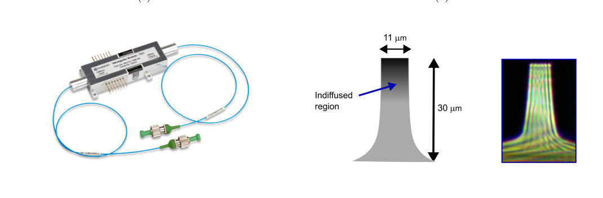
<figcaption class="paper-figure-caption"><b>Fig 1.</b> FIG. 1: (a) Covesion Ltd. fibre-pigtailed waveguide module (Figure courtesy of Covesion Ltd.). (b) Left: Schematic of a Zn-indiffused ridge waveguide. Right: Micrograph of representative diced ridge facet</figcaption>
</figure>
<figure class="paper-figure-card">
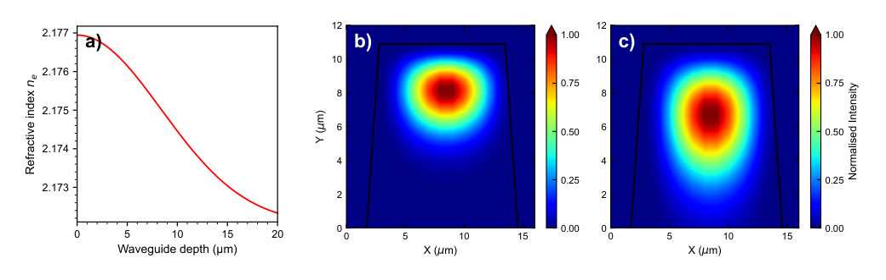
<figcaption class="paper-figure-caption"><b>Fig 2.</b> FIG. 2: Mode analysis. (a) Theoretical extraordinary index contrast profile ∆ne(x) at 780 nm. (b) Simulated TM00 at 780 nm. (c) Simulated TM00 at 1560 nm.</figcaption>
</figure>
<figure class="paper-figure-card">
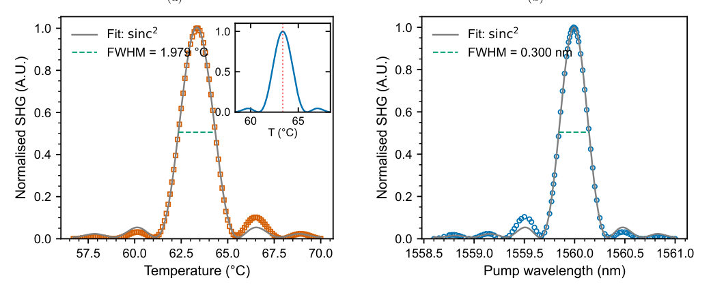
<figcaption class="paper-figure-caption"><b>Fig 3.</b> FIG. 3: SHG characterisation. (a) Temperature acceptance near λ ≈1560 nm. Fits give λ0 = 1559.933 nm, FWHMλ = 0.300 nm and T0 = 63.338 ◦C, FWHMT = 1.979 ◦C. (b) Wavelength acceptance at T ≈63.34 ◦C: markers, data; grey, sinc2 fit; green dashed, FWHM segment.</figcaption>
</figure>
<figure class="paper-figure-card">
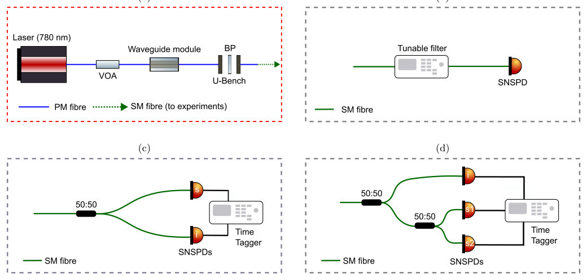
<figcaption class="paper-figure-caption"><b>Fig 4.</b> FIG. 4: Overview of the SPDC configurations. (a) Type-0 SPDC generation in a fiberised ridge waveguide, the output from which is measured via the following three configurations. (b) Spectral characterisation with a tunable filter. (c) CAR, generated pair rate, and Klyshko efficiency via a 50:50 fibre splitter. (d) Heralded g(2)(0) with two cascaded 50:50 splitters. PM: polarisation-maintaining; SM: single-mode; BP: band-pass; VOA: variable optical attenuator i: idler; s: signal.</figcaption>
</figure>
<figure class="paper-figure-card">
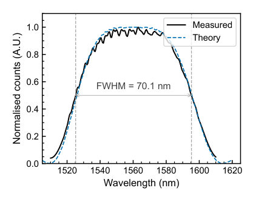
<figcaption class="paper-figure-caption"><b>Fig 5.</b> FIG. 5: Measured and numerically modelled SPDC marginal spectra, normalised to their respective maxima. The theoretical curve is obtained from the phase-matching function using wavelength-dependent effective indices from the FIMMWAVE model. Close agreement is observed in the full-width at half-maximum.</figcaption>
</figure>

**Summary.** The authors report on a high-performance, fibre-integrated single-photon source utilizing Zn-indiffused PPLN waveguides pumped via degenerate SPDC. The system demonstrates excellent purity and brightness across telecom wavelengths, establishing it as a robust platform for wavelength-multiplexed quantum networking applications.

**Why it may be interesting.** This work directly addresses quantum networking hardware by demonstrating a highly efficient, broadband, integrated photonics source, which is crucial for scalable quantum communication protocols.

Detailed structure

**Main problem.** To characterize a fibre-integrated heralded single-photon source based on spontaneous parametric down-conversion (SPDC) using Zn-indiffused PPLN ridge waveguides at telecom wavelengths.

**Main result.** The source achieved high performance metrics, including an absolute brightness of $9.1	imes 10^{9}$ pairs/(s mW), a low heralded second-order correlation ($g_{	ext{h}}^{(2)}(0) \approx 5.53	imes 10^{-4}$), and a competitive internal heralding efficiency of $(58 \pm 5)\%$.

**Method.** The characterization involved measuring the broadband spectrum, quantifying pair correlations using the coincidences-to-accidentals ratio (CAR), and calculating the heralded second-order correlation function.

**Model / system.** The physical system is a fibre-pigtailed MgO:PPLN ridge waveguide module operating in Type-0 degenerate SPDC. The analysis utilized numerical modeling via a fully vectorial optical mode solver (FIMMWAVE) to predict theoretical pair generation rates and modal profiles.

**Key observables.** Absolute brightness ($9.1	imes 10^{9}$ pairs/(s mW)), internal heralding efficiency ($(58 \pm 5)\%$), coincidences-to-accidentals ratio ($> 9	imes 10^4$), and heralded second-order correlation ($g_{	ext{h}}^{(2)}(0) = (5.53 \pm 0.46)	imes 10^{-4}$).

**Important parameters / regimes.** Broadband emission spanning $\approx 70 	ext{ nm}$ across the C- and L-bands; theoretical pair generation rate ($	ext{R}_{	ext{SPDC}}/	ext{P}$) $\approx 2.7 	imes 10^{10}$ pairs $	ext{s}^{-1} 	ext{mW}^{-1}$.

**Assumptions / limitations.** The reported performance metrics are based on a comprehensive characterization that accounts for optical losses and the specific waveguide structure.

**Figures summary.** Figures illustrate the fibre-pigtailed module, schematic of the Zn-indiffused ridge waveguide, mode analysis showing index contrast profiles at different wavelengths, and experimental setups for SPDC generation and bandwidth measurement.

**Paper structure.** The paper progresses by first reporting initial source performance metrics, followed by detailed characterization of the waveguide structure and mode modeling (including SHG measurements), culminating in the description of the full experimental SPDC measurement process to validate theoretical limits.

Abstract

We report a fibre-integrated heralded single-photon source based on a commercial Zn-indiffused MgO:PPLN ridge waveguide operated in Type-0 degenerate spontaneous parametric down-conversion (SPDC). The device emits a broadband spectrum spanning approximately 70 nm across the telecom C-and L-bands, with an absolute brightness of $9.1\times 10^{9}$ pairs/(s mW). After accounting for optical losses, we determine an internal heralding efficiency of 58(5)%. The source maintains high purity, exhibiting a coincidences-to-accidentals ratio exceeding $9\times 10^{4}$ and a heralded second-order correlation of $g_{\text{h}}^{(2)}(0) = (5.53 \pm 0.46)\times 10^{-4}$. Low multi-photon noise and broadband emission demonstrate the viability of such platforms for wavelength-multiplexed quantum networking.

[↑ back to top](#top)

### [Wireless millikelvin interconnects for superconducting quantum hardware](http://arxiv.org/abs/2607.13834v1)

**Authors:** Kristopher Barr, Mingyan Zhong, Euan Parry, Manoj Stanley, Qusay Al-Taai, Paniz Foshat, Kaveh Delfanazari, Martin Weides, Nick M. Ridler, Chong Li, Alessandro Rossi  
**Type:** experiment · **Category:** quantum information and computing · **PDF:** <https://arxiv.org/pdf/2607.13834v1>  
**Analysis basis:** full PDF text, analyzed in chunks
**Topic relevance:** 🔥 `QC/QI experiment` **4/5** · `interference shaping light` **1/5** · `quantum optics experiment` **1/5**

↔ Scroll figures horizontally

<figure class="paper-figure-card">
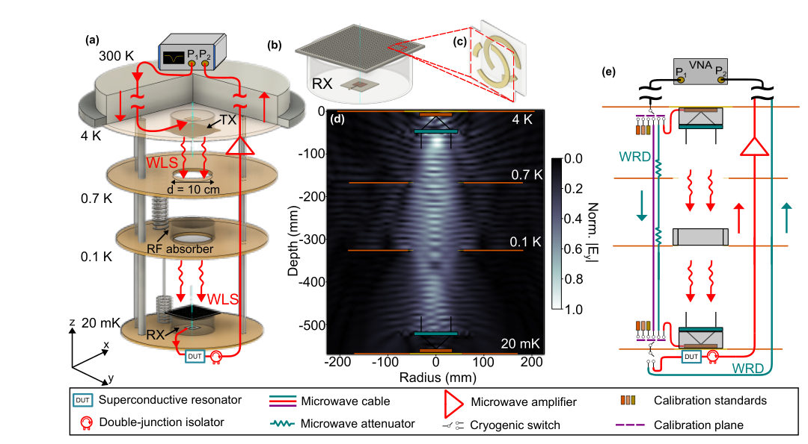
<figcaption class="paper-figure-caption"><b>Fig 1.</b> Figure 1. (a) Schematic diagram of the WLS excitation link inside a dilution refrigerator (50 K stage is omitted for clarity). Shaded cylinders indicate radiation absorbers used to attenuate reverberant signals. (b) RX module composed of a patch antenna and a flat metalens, the absorber attenuates the signal that is not transmitted through the metalens. (c) Zoom-in detail of the DSRR metalens pattern (front and back sides) flipped across the y = -x axis. (d) Simulations of the y-polarized electric field, Ey, propagating within the cryostat chamber. The TX metalens collimate the signal through the apertures, whereas the RX metalens refocuses it on the MXC antenna. (e) Schematic diagram of...</figcaption>
</figure>
<figure class="paper-figure-card">
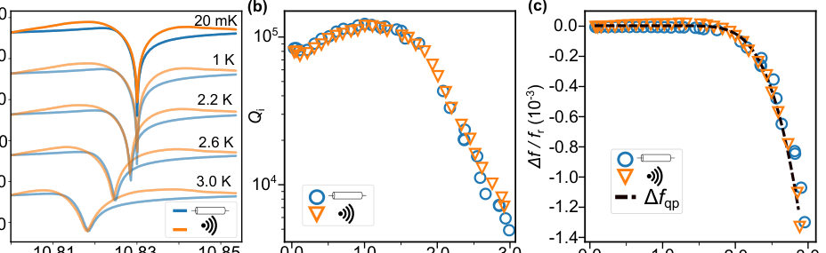
<figcaption class="paper-figure-caption"><b>Fig 2.</b> Figure 2. (a) Transmission coefficient as a function of frequency for different MXC temperatures in WLS (orange) and WRD (blue) excitation mode. Each pair of isothermal traces has been shifted vertically by multiples of 20 dB for clarity. (b) Qi as a function of temperature extracted in the WLS (triangle) and WRD (circle) mode. (c) Fractional change in resonant frequency as a function of temperature in WLS (triangle) and WRD (circle) mode. The dashed line indicates the expected temperature dependence contribution arising from quasi-particles excitation, ∆fqp (see also Appendix D).</figcaption>
</figure>
<figure class="paper-figure-card">
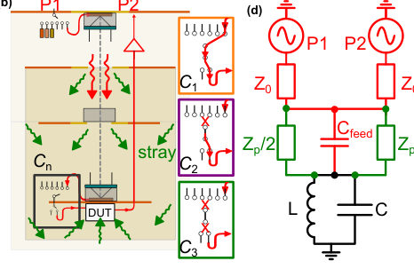
<figcaption class="paper-figure-caption"><b>Fig 3.</b> Figure 3. (a) QL as a function of temperature for WLS (tri- angles) and WRD (circles) configurations. (b) Illustration of pathways of stray radiation (green arrows) and intended line- of-sight path (red arrows) within the cryostat. The switches enclosed in the black rectangle at the MXC stage are used in three alternative configurations [C1, C2, C3] shown on the right and color coded according to the measured transmis- sion signal. (c) DUT transmission coefficient as a function of frequency for three configurations of the cryogenic switches: intended WLS link C1 (orange), single broken link C2 (pur- ple) and double broken link C3 (green). (d) Equivalent circuit model including the intended...</figcaption>
</figure>
<figure class="paper-figure-card">
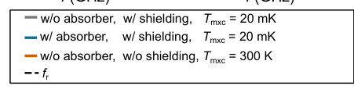
<figcaption class="paper-figure-caption"><b>Fig 4.</b> Figure 4. (a) Top: schematic diagram of the meander res- onator device used as DUT and routing that bypasses it. Bot- tom: Calibrated |S21| measurements at 20 mK as a function of frequency with (blue) and without (gray) RF absorbers in the refrigerator. Room temperature unshielded data is shown in orange. The vertical dashed line highlights the frequency fr used for characterizing the DUT response. (b) Top: schematic diagram of the meander resonator device used as DUT and routing through it. Bottom: |S21| measurements as a function of frequency with (blue) and without (gray) RF absorbers.</figcaption>
</figure>
<figure class="paper-figure-card">
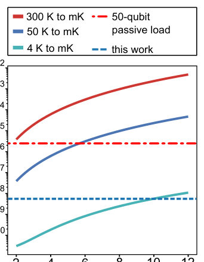
<figcaption class="paper-figure-caption"><b>Fig 5.</b> Figure 5. Radiative heat load incident on the MXC stage as a function of aperture diameter for radiation propagating through the line of sight from RT stage (red solid trace), PT1 stage (blue solid trace), and PT2 stage (cyan solid trace). The blue dashed line indicates the radiated power expected for our experiments. The red dashed line shows the passive heat load of the WRD 50-qubit set-up reported in Ref. [2].</figcaption>
</figure>

**Summary.** This paper demonstrates that wireless microwave interconnects can successfully excite superconducting resonators at millikelvin temperatures, offering a path to overcome wiring density limitations in quantum computing. By comparing results to traditional wired links, the authors validate the feasibility of free-space coupling while also characterizing unavoidable parasitic losses from stray radiation within the cryostat. The findings establish critical design guidelines for integrating wireless components into future scalable quantum hardware.

**Why it may be interesting.** This work directly addresses the physical engineering challenges of scaling quantum processors by providing empirical data on microwave coupling in extreme cryogenic environments, which is crucial for building large quantum systems.

Detailed structure

**Main problem.** Scalability of quantum computing is bottlenecked by dense electrical interconnects, necessitating a reliable wireless link solution for cryogenic hardware.

**Main result.** Wireless excitation preserves the intrinsic superconducting resonator response compared to wired links, establishing a framework for co-designing such interconnects despite residual stray radiation losses.

**Method.** The authors experimentally compare microwave resonator characterization using both direct wiring and free-space wireless coupling within a dilution refrigerator environment.

**Model / system.** The system involves superconducting microwave resonators (DUT) patterned on NbN film, measured at millikelvin temperatures. The interconnect uses planar antennas and metalens optics to guide microwaves through cryostat apertures.

**Key observables.** Resonant frequency ($f_r$), internal quality factor ($Q_i$), transmission coefficient ($	ext{|S}_{21}|$), and temperature dependence of these parameters.

**Important parameters / regimes.** Operating temperatures ranging from $20 	ext{ mK}$ to $3.0 	ext{ K}$; input power in the few-photon regime (approx. $-116 	ext{ dBm}$).

**Assumptions / limitations.** The study assumes that wireless coupling can be engineered to match the intrinsic response of superconducting hardware, though residual stray radiation remains a challenge.

**Figures summary.** Figures show schematic setups for wireless links, $	ext{|S}_{21}|$ spectra comparing wired vs. wireless modes across temperatures, and analyses detailing stray loss mechanisms and the effect of RF absorbers on signal quality.

**Paper structure.** The paper progresses from identifying the interconnect bottleneck to demonstrating successful wireless excitation, characterizing the resulting losses (stray radiation), and finally proposing a co-design framework incorporating packaging and material science solutions.

Abstract

Scalable quantum computing is limited by the dense network of electrical interconnects linking cryogenic quantum processors to room-temperature control electronics. To overcome this bottleneck, considerable effort has focused on cryogenic CMOS electronics and microwave-to-optical transduction, aiming to reduce wiring complexity and thermal loading. Wireless interconnects have recently emerged as a promising complementary approach, yet their compatibility with superconducting quantum hardware remains largely unexplored. Here, we demonstrate the wireless excitation of a superconducting microwave resonator of the type routinely employed for qubit readout, operating at millikelvin temperatures inside a dilution refrigerator. By directly comparing wired and wireless operation within the same cryogenic environment, we show that wireless coupling preserves the intrinsic resonator response while revealing parasitic electromagnetic pathways arising from stray radiation within the cryostat enclosure. These results establish a framework for the co-design of wireless interconnects, cryogenic packaging and superconducting quantum hardware.

[↑ back to top](#top)

### [Dipolar mixtures in checker-board optical bilayers](http://arxiv.org/abs/2607.13980v1)

**Authors:** Rukmani Bai, Luis Santos  
**Type:** theory · **Category:** quantum gases · **PDF:** <https://arxiv.org/pdf/2607.13980v1>  
**Analysis basis:** full PDF text, analyzed in chunks
**Topic relevance:** 🔥 `analog quantum simulation` **4/5** · `correlated cavity matter` **1/5**

↔ Scroll figures horizontally

<figure class="paper-figure-card">
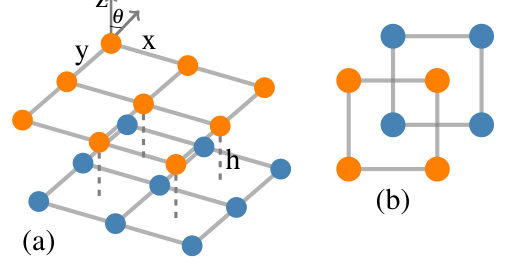
<figcaption class="paper-figure-caption"><b>Fig 1.</b> FIG. 1. (a) Scheme of the considered bilayer square-lattice setup. The layers are separated by a vertical distance h. Each layer is occu- pied by only one of the components. (b) Scheme of the considered 2 × 2 cluster, with 4 sites in each layer, employed in our CGW cal- culations.</figcaption>
</figure>
<figure class="paper-figure-card">
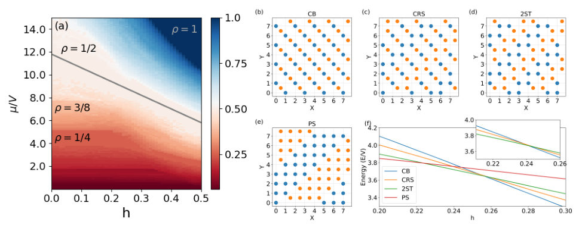
<figcaption class="paper-figure-caption"><b>Fig 2.</b> FIG. 2. (a) Density ρ1,2 = ρ as a function of the interlayer spacing h, and the chemical potential µ. We focus on ρ = 1/2, considering chemical potentials along the solid line. (b) Checker-board (CB) crystal. (c) Intermediate crystalline (CRS) phase. (d) Two-row stripe (2ST) phase; (e) Phase separated (PS) phase: here it is limited due to the 8 × 8 lattice with periodic boundary conditions; larger lattices show the formation of broader domains. (f) Energy of the different crystalline phases in the atomic limit (J = 0) as a function of h. In the inset, we show the energy of the CB, CRS and 2ST phases as a function of h for J/V = 0.2, showing that, also at finite hopping, the three phases...</figcaption>
</figure>
<figure class="paper-figure-card">
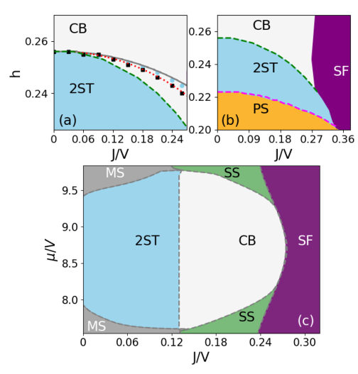
<figcaption class="paper-figure-caption"><b>Fig 3.</b> FIG. 3. (a) CB-2ST transition. The dashed line indicates the CB- 2ST transition as obtained from the second-order perturbation the- ory calculation. As expected, see text, the second-order results with Jeff = 2J (solid curve) match with the CGW calculation for a 2 × 2 lattice (filled circles), whereas the CGW results for a 4 × 2 lattice (filled squares) match with the second-order results using Jeff = 1.6J (dotted curve). This results show both that the second- order perturbation theory is valid at the J values considered, and that CWG cannot be employed to determine the solid-into-solid transi- tions. (b) Phase diagram as a function of the hopping J and the inter- layer separation h,...</figcaption>
</figure>
<figure class="paper-figure-card">
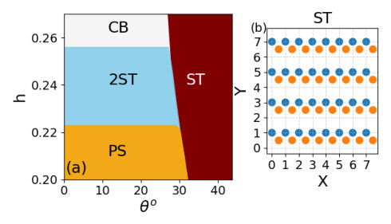
<figcaption class="paper-figure-caption"><b>Fig 4.</b> FIG. 4. (a) Phase diagram in the atomic limit (J = 0) as a function of the dipole orientation θ and the inter-layer spacing h. (b) Stripe (ST) phase characteristic of large-enough angles θ.</figcaption>
</figure>
<figure class="paper-figure-card">
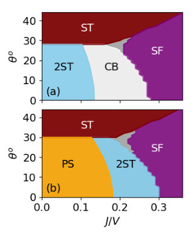
<figcaption class="paper-figure-caption"><b>Fig 5.</b> FIG. 5. Phase diagram as a function of the hopping J and the ori- entation angle θ for h = 0.25 (a) and h = 0.217 (b). Note the solid-into-solid transitions, as well as the significant dependence of the crystal-to-superfluid transition depending on the orientation an- gle. The gray zone indicates amorphous metastable solutions in our CGW calculations.</figcaption>
</figure>

**Summary.** This theoretical study explores the complex quantum phases of ultra-cold dipolar mixtures trapped in checker-board optical bilayers. By analyzing the interplay between long-range dipole interactions and particle hopping, the authors map out multiple crystalline ground states. The key finding is that tunneling can drive solid-into-solid phase transitions between these distinct crystal structures.

**Why it may be interesting.** This work directly addresses many-body physics in ultracold atomic systems using dipolar interactions, which is a major frontier in AMO physics. The prediction of super-exchange induced phase transitions provides concrete, testable predictions for optical lattice experiments.

Detailed structure

**Main problem.** The study investigates the complex interplay between intra- and inter-component anisotropic long-range interactions within dipolar mixtures.

**Main result.** The system exhibits a rich landscape of crystalline phases, including solid-into-solid transitions induced by super-exchange processes as external parameters are varied.

**Method.** The research combines second-order perturbation theory with Cluster-Gutzwiller (CGW) calculations to analyze the ground state properties and phase diagrams.

**Model / system.** The system models ultra-cold dipolar mixtures confined in separated, checker-board optical bilayers. The physics is governed by an extended Bose-Hubbard Hamiltonian incorporating dipole interactions and hopping terms.

**Key observables.** Crystalline phases (Checker-board, Two-row stripe, Intermediate Crystalline, Phase-Separated), phase transition lines, and energy shifts ($\Delta E$).

**Important parameters / regimes.** Inter-layer separation ($h$), inter-component interaction strength ($V$), dipole orientation angle ($	heta$), and hopping amplitude ($J$).

**Assumptions / limitations.** Assumes equal populations ($\mu_1 = \mu_2$) and uniform on-site interactions ($V_{1,1} = V_{2,2} = V_{1,2} = V$); CGW methods are used for melting transitions while super-exchange is needed for solid-solid ones.

**Figures summary.** Figures illustrate the setup (bilayer scheme), phase diagrams showing transitions between CB, 2ST, CRS, and PS phases based on $h$, and how these transitions depend on dipole orientation ($	heta$) and hopping ($J$).

**Paper structure.** The paper analyzes the ground state by first establishing the Hamiltonian in the bilayer setup. It then maps out phase diagrams showing transitions (CB $\leftrightarrow$ 2ST $\leftrightarrow$ CRS $\leftrightarrow$ PS) as $h$ changes, followed by analyzing how finite hopping ($J$) induces solid-into-solid transitions.

Abstract

Ultra-cold dipolar mixtures in component-dependent optical potentials constitute an interesting platform for the study of the interplay between intra- and inter-component anisotropic long-range interactions. We study the particular case of binary dipolar mixtures placed in separated bilayers which are displaced in an anti-magic wavelength configuration. Using a combination of second-order perturbation theory and cluster-Gutzwiller calculations, we unveil a rich landscape of possible crystalline phases for the two components, showing that, interestingly, inter-site hopping may result, via super-exchange, in solid-into-solid transitions between different crystalline phases. These crystalline phases and the corresponding transitions can be experimentally realized using e.g. lanthanide mixtures in optical lattices.

[↑ back to top](#top)

### [A Reality Check on Quantum Optimisation: Evidence from an Industrial Case Study](http://arxiv.org/abs/2607.13325v1)

**Authors:** Hila Safi, Karen Wintersperger, Oliver von Sicard, Christoph Niedermeier, Wolfgang Mauerer  
**Type:** experiment · **Category:** quantum information and computing · **PDF:** <https://arxiv.org/pdf/2607.13325v1>  
**Analysis basis:** full PDF text, analyzed in chunks
**Topic relevance:** 🔥 `QC/QI experiment` **4/5**

↔ Scroll figures horizontally

<figure class="paper-figure-card">
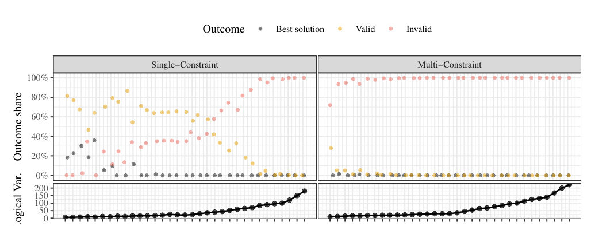
<figcaption class="paper-figure-caption"><b>Fig 1.</b> Fig. 1. Scatter plot of best, valid, and invalid solution shares for the Single-Constraint and Multi-Constraint models on Advantage System 6.4. Problem instances on the x-axis are denoted as (M−R−J) (machines-rigs-jobs). The plots below show the required logical qubits per model, with the Multi-Constraint model exhibiting higher qubit demand due to additional constraints. The y-axis represents the percentage of samples classified as best (black), valid (yellow), or invalid (red).</figcaption>
</figure>
<figure class="paper-figure-card">
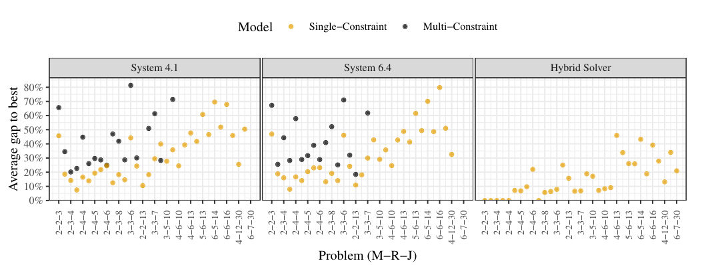
<figcaption class="paper-figure-caption"><b>Fig 2.</b> Fig. 2. Average gap (in %) of all valid solutions relative to the best-known solution (y) for varying instances (x) in form (M−R−J). Panels separate results for Advantage 4.1, Advantage 6.4, and the Hybrid Solver. The x-axis lists all problem instances; invalid and best solutions are excluded.</figcaption>
</figure>
<figure class="paper-figure-card">
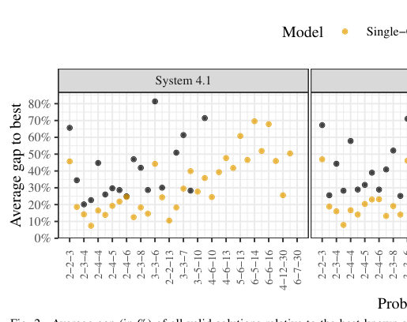
<figcaption class="paper-figure-caption"><b>Fig 3.</b> Figure 5 summarises the results from the Fujitsu Digital Annealer (DA) across the three QUBO implementations de- scribed in Section V-B3. Unlike the quantum devices, the DA supports problem sizes beyond an equivalent of 10,000 logical variables, enabling large-scale experiments for both the Single-Constraint and Multi-Constraint Models. The x- axis shows the number of logical variables, and the y-axis the share of best, valid, and invalid solutions. For the Single- Constraint Model, both the standard BinPol and the sepa- rated BinPol formulation perform consistently well across</figcaption>
</figure>
<figure class="paper-figure-card">
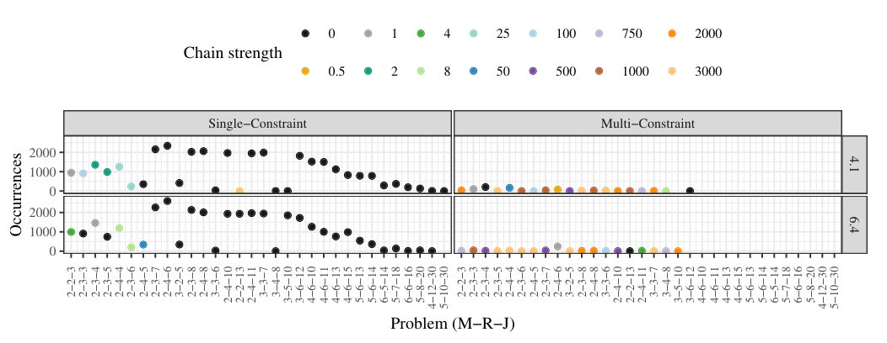
<figcaption class="paper-figure-caption"><b>Fig 4.</b> Fig. 3. Impact of chain strength on the number of valid and best solutions for the Single-Constraint and Multi-Constraint models on Advantage 4.1 and 6.4. The x-axis shows problem instances (M −R−J), the y-axis the number of valid and best samples, and colours denote chain strength (0 = hardware default to 3000).</figcaption>
</figure>
<figure class="paper-figure-card">
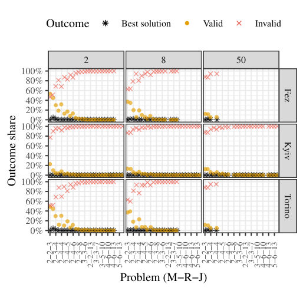
<figcaption class="paper-figure-caption"><b>Fig 5.</b> Fig. 4. QAOA outcome shares on the Eagle (Kiev) and Heron (Fez, Torino) processors. The x-axis shows problem instances (M, R, J), the y-axis the percentage of best, valid, and invalid solutions, and each facet a different QAOA depth.</figcaption>
</figure>

**Summary.** This paper investigates whether current quantum computing platforms can solve real-world industrial scheduling problems by comparing results from quantum, quantum-inspired, and classical methods. The authors conclude that while these techniques are useful for early prototyping and guiding solver selection, achieving high performance requires careful co-design between the problem formulation and the specific hardware architecture used.

**Why it may be interesting.** While focused on scheduling, the rigorous comparison of different physical implementations (annealers vs. gate models) and the explicit discussion of hardware constraints provide valuable insights into near-term quantum algorithm implementation challenges relevant to any complex Hamiltonian simulation or optimization task.

Detailed structure

**Main problem.** Assessing the practical industrial utility of quantum optimization algorithms for complex combinatorial problems, specifically using an industrial variant of the Job-Shop Scheduling Problem (JSSP).

**Main result.** Hardware-software co-design is crucial for achieving good solution quality and scalability; current quantum methods are best suited for supporting solver selection and proof-of-concept development rather than guaranteeing global optimality.

**Method.** The study benchmarks quantum, quantum-inspired (e.g., QAOA), and classical solvers against an exact MILP baseline by formulating the scheduling problem as QUBOs.

**Model / system.** The system is modeled using formulations for JSSP variants (Single/Multi-Constraint Models) solved on three platforms: IBM Quantum (gate-based), D-Wave Quantum Annealer, and Fujitsu Digital Annealer.

**Key observables.** Runtime, solution quality (optimality gap), and scalability across different hardware backends.

**Important parameters / regimes.** QUBO size (number of qubits/constraints), time budget for classical solvers, and the specific formulation used (Single vs. Multi-Constraint).

**Assumptions / limitations.** The optimal QUBO solution does not guarantee the global optimum because the complex scheduling task is artificially split into assignment and ordering stages.

**Figures summary.** Not specified by notes; focus is on comparative benchmarking of performance metrics across platforms.

**Paper structure.** The paper systematically compares multiple optimization approaches (quantum, quantum-inspired, classical) applied to a real-world scheduling problem, emphasizing the necessary co-design between formulation and hardware.

Abstract

Quantum Processing Units promise speed-ups for selected computational problems, including combinatorial optimisation, but their industrial utility remains an open challenge. We study an industrial variant of the Job-Shop Scheduling Problem using quantum, quantum-inspired, and classical methods across three platforms: IBM Quantum, the D-Wave Quantum Annealer, and the Fujitsu Digital Annealer. By tailoring formulations to hardware-specific constraints, we show that hardware-software co-design is essential for solution quality and scalability. We benchmark all approaches against an exact classical solver and a MILP formulation, evaluating runtime, solution quality, and scalability. Our results indicate that quantum and quantum-inspired optimisation can support industrial solver selection, integration in classical workflows, modelling decisions, and early proof-of-concept development, while suggesting a potential path towards improved approximations for industrial scheduling.

[↑ back to top](#top)

### [Comparing the three W-like states with the W state](http://arxiv.org/abs/2607.13223v1)

**Authors:** Dafa Li  
**Type:** theory · **Category:** quantum information and computing · **PDF:** <https://arxiv.org/pdf/2607.13223v1>  
**Analysis basis:** full PDF text, analyzed in chunks
**Topic relevance:** 🔥 `entanglement & information structure` **4/5**

↔ Scroll figures horizontally

<figure class="paper-figure-card">
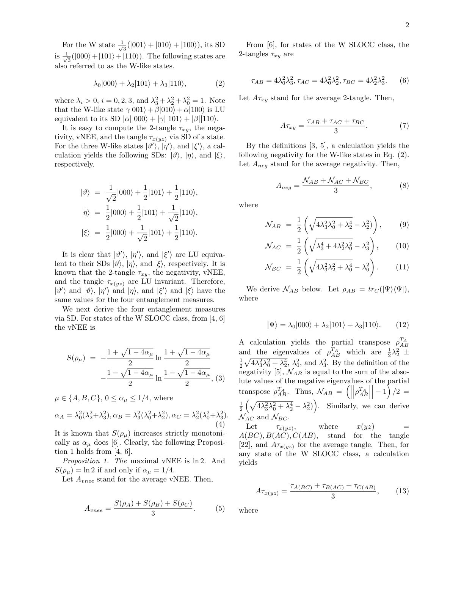
<figcaption class="paper-figure-caption"><b>Fig 1.</b> Low-resolution page preview, page 2</figcaption>
</figure>
<figure class="paper-figure-card">
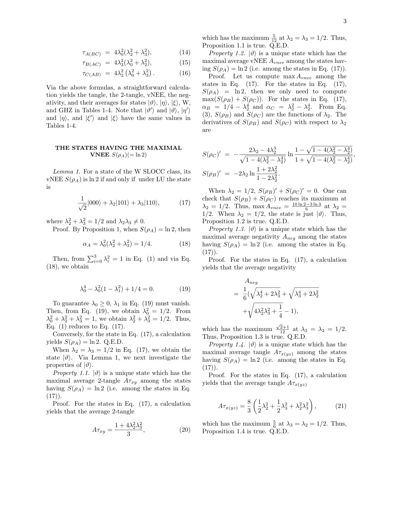
<figcaption class="paper-figure-caption"><b>Fig 2.</b> Low-resolution page preview, page 3</figcaption>
</figure>
<figure class="paper-figure-card">
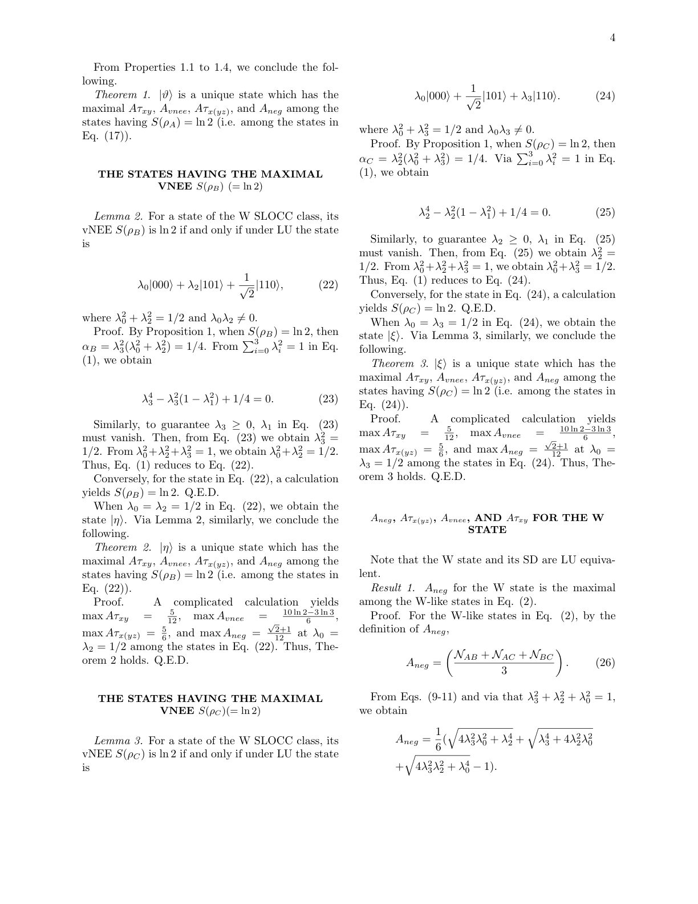
<figcaption class="paper-figure-caption"><b>Fig 3.</b> Low-resolution page preview, page 4</figcaption>
</figure>
<figure class="paper-figure-card">
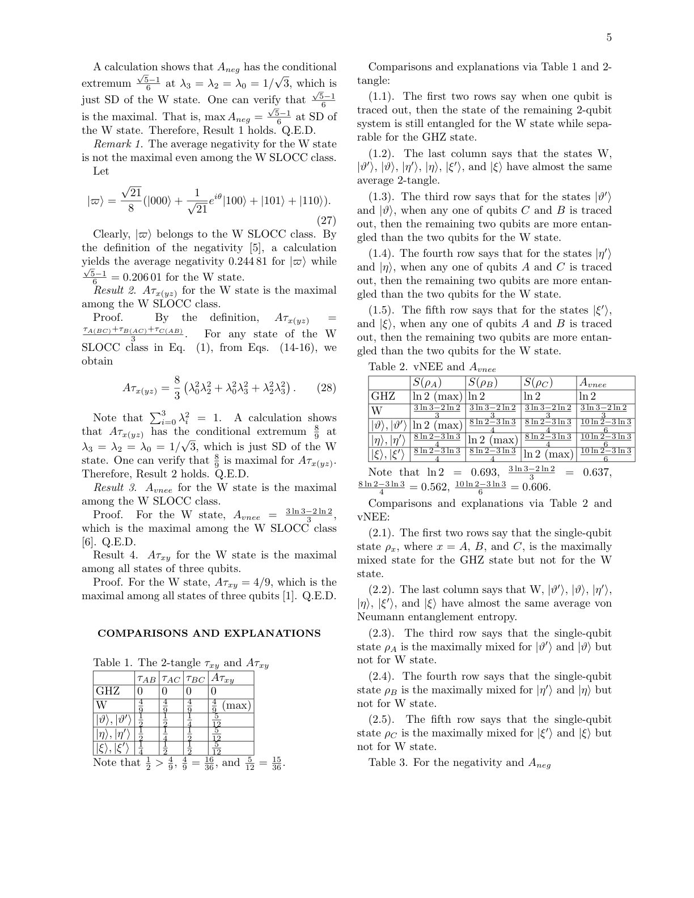
<figcaption class="paper-figure-caption"><b>Fig 4.</b> Low-resolution page preview, page 5</figcaption>
</figure>
<figure class="paper-figure-card">
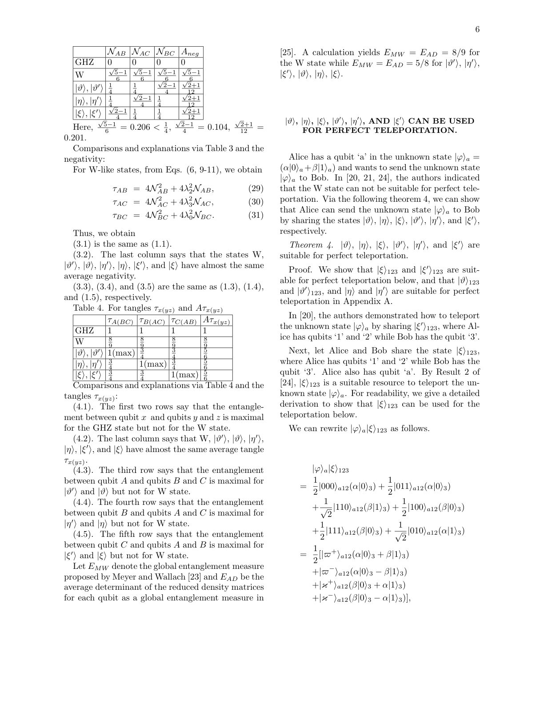
<figcaption class="paper-figure-caption"><b>Fig 5.</b> Low-resolution page preview, page 6</figcaption>
</figure>

**Summary.** This paper rigorously compares three novel W-like quantum states against the standard W state using multiple entanglement measures. It proves mathematically that these new states exhibit superior entanglement properties and robustness against particle loss. Consequently, they are shown to be necessary resources for achieving perfect superdense coding and teleportation protocols.

**Why it may be interesting.** This work provides a detailed resource comparison within quantum information theory, identifying optimal entangled states for fundamental protocols like teleportation and dense coding that surpass standard benchmark states.

Detailed structure

**Main problem.** The paper compares three specific W-like quantum states ($|\vartheta'
angle, |\eta'
angle, |\xi'
angle$) against the standard W state to determine which is superior for quantum communication tasks.

**Main result.** The three W-like states are shown to possess higher entanglement robustness and are suitable resources for perfect teleportation and superdense coding, capabilities that the standard W state lacks.

**Method.** The investigation uses rigorous mathematical proofs involving multiple entanglement measures (vNEE, tangle, negativity) derived from Schmidt Decomposition analysis.

**Model / system.** The system involves three-qubit quantum states. The comparison is between the general W state and specific parameterized W-like states ($\{|\vartheta
angle, |\eta
angle, |\xi
angle\}$).

**Key observables.** Von Neumann entanglement entropy (vNEE), 2-tangle ($	au$), Negativity, and their averages across different qubit subsystems.

**Important parameters / regimes.** The condition for maximal vNEE components ($S(
ho_\mu) = \ln 2$) is a key constraint used to define the optimal states.

**Assumptions / limitations.** The analysis assumes that the W-like states are LU equivalent to their derived Schmidt Decomposition forms, and it relies on specific local unitary operations for demonstrating protocols.

**Figures summary.** Tables compare entanglement measures ($	au_{xy}$, $	ext{A}_{
u nee}$, etc.) across GHZ, W, and the three optimized W-like states; other tables summarize single-qubit entropies and average negativity.

**Paper structure.** The paper first establishes necessary conditions for maximal entanglement components. It then proves that specific parameterized states uniquely maximize various entanglement measures compared to the W state. Finally, it demonstrates the practical utility of these optimized states by showing they enable perfect teleportation and superdense coding.

Abstract

In [Phy. Rev. Lett., 98, 260501 (2007)] and previous papers, the W-like states were used in many quantum communication schemes, distillation, teleportation and superdense coding. So far, no one has compared the W-like states with the W state. We investigate the properties of three W-like states named as $|\vartheta ^{\prime }\rangle $, $|η^{\prime }\rangle $ and $|ξ^{\prime }\rangle $. We point out that $|\vartheta ^{\prime }\rangle $ (resp. $|η^{\prime }\rangle $ and $|ξ^{\prime }\rangle $) has the maximal von Neumann entanglement entropy (vNEE) $S(ρ_{A})=\ln 2$ (resp. $S(ρ_{B})=\ln 2$ and $S(ρ_{C})=\ln 2$) and the maximal tangle $τ_{A(BC)}=1$ (resp. $τ_{B(AC)}=1$ and $τ_{C(AB)}=1$) while the W state does not. We also indicate that if some one of three qubits is traced out, then the remaining two qubits of $|\vartheta ^{\prime }\rangle $ (resp. $|η^{\prime }\rangle $ and $|ξ^{\prime }\rangle $) are more entangled than the two qubits of the W state by several entanglement measures. It means that the three W-like states have higher robustness against some particle loss than the W state. We show that $|\vartheta ^{\prime }\rangle $, $|η^{\prime }\rangle $ and $|ξ^{\prime }\rangle $ can be suitable for perfect teleportation and superdense coding but the W state cannot.

[↑ back to top](#top)

### [Temporal Fourier Optics Reveals Hidden Hybridized Light-Matter States](http://arxiv.org/abs/2607.13957v1)

**Authors:** Juan-Feng Zhu, Wenjie Zhou, Shihao Feng, Zicheng Song, Ruicong Zhang, Cheng-Wei Qiu, Rengming Liu, Lin Wu  
**Type:** both · **Category:** other · **PDF:** <https://arxiv.org/pdf/2607.13957v1>  
**Analysis basis:** full PDF text, analyzed in chunks
**Topic relevance:** `interference shaping light` **3/5** · `methods for driven-dissipative` **3/5** · `quantum optics experiment` **3/5** · `Tavis-Cummings & cavity-many-emitter` **2/5** · `correlated cavity matter` **2/5** · `measurement-induced transitions` **2/5** · `quantum measurements` **2/5** · `Keldysh / 2PI / non-Gaussian methods` **1/5** · `analog quantum simulation` **1/5** · `correlated / nonlocal dissipation` **1/5** · `driven-dissipative phase transition` **1/5** · `non-equilibrium dynamics` **1/5**

↔ Scroll figures horizontally

<figure class="paper-figure-card">
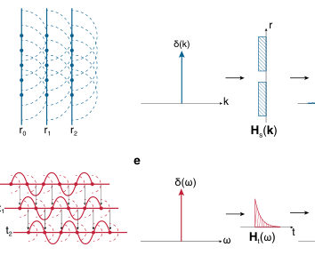
<figcaption class="paper-figure-caption"><b>Fig 1.</b> Fig. 1 Space–time Fourier correspondence underlying temporal Fourier optics. a,d, Conceptual illustration of wave propagation in the spatial and temporal domains. Following the Huygens–Fresnel principle, each point on a spatial wavefront or temporal waveform contributes coher- ently to subsequent propagation, establishing the space–time Fourier correspondence between spatial diffraction and temporal evolution. b,e, Fourier relationship between the impulse response and its corresponding transfer function. In the spatial domain, a finite aperture produces a spatial point- spread function (PSF). Its temporal analogue is the temporal point-spread function (TPSF), arising from effective temporal...</figcaption>
</figure>
<figure class="paper-figure-card">
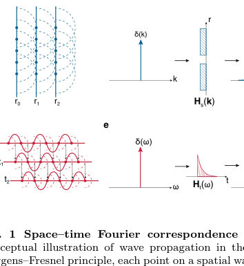
<figcaption class="paper-figure-caption"><b>Fig 2.</b> Figure 1b illustrates the same reconstruction process in Fourier space. An ideal plane wave corresponds to a delta-function distribution in transverse momentum space. After transmission through a finite aperture, the optical field becomes spatially confined and consequently broadens in transverse momentum, producing the famil- iar Fraunhofer diffraction pattern. The resulting far-field response, denoted by Hs(k), characterizes the spatial response of the optical system. For an aperture described by the transmission function us(r), the far-field response under the Fraunhofer con- dition S ≪λL, where S denotes the aperture area, λ is the wavelength, and L is the propagation distance, is given...</figcaption>
</figure>
<figure class="paper-figure-card">
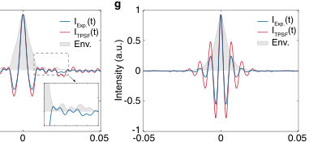
<figcaption class="paper-figure-caption"><b>Fig 3.</b> Fig. 2 Experimental validation of TPSF in deterministic single-molecule plasmon– exciton nanocavities. a, Schematic of the CB[7]-mediated Au nanosphere dimer supporting deterministic single-molecule plasmon–exciton coupling and the corresponding dark-field scattering spectroscopy setup. Insets show a representative SEM image, measured dark-field scattering spot, and simulated electric-field distribution. b–d, Experimental scattering spectra before (blue) and after TPSF reconstruction (red). Bare Au nanosphere dimers (b) exhibit linewidth narrowing without spectral splitting. For a single methylene blue (MB) molecule (c), TPSF resolves the hidden upper and lower polariton branches that...</figcaption>
</figure>
<figure class="paper-figure-card">
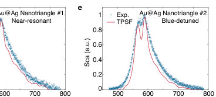
<figcaption class="paper-figure-caption"><b>Fig 4.</b> Fig. 3 Generalization of the TPSF framework to realistic open plasmonic nanocavities. a, Schematic of Au@Ag nanorod- and nanotriangle-based plasmonic nanocavities coated with a thin J-aggregate layer. Insets show representative SEM images (scale bars: 200 nm). b–e, Experimental scattering spectra (blue symbols) before reconstruction and the corresponding TPSF-reconstructed spectra (red curves) for representative Au@Ag nanorod (b,c) and nanotriangle (d,e) nanocavities. In all cases, TPSF recovers the hidden upper and lower polariton branches that remain obscured in the measured spectra, demonstrating that the framework is robust across different plasmonic architectures, distributed excitonic...</figcaption>
</figure>

**Summary.** The authors introduce Temporal Fourier Optics (TFO) to overcome the challenge of spectral broadening caused by dissipation in optical measurements. By treating this broadening as a compensable temporal attenuation, they develop a TPSF reconstruction method. This technique successfully reveals hidden hybridized light-matter states in plasmonic and molecular systems, offering a general tool for spectroscopy across various wave physics domains.

**Why it may be interesting.** This work provides a powerful, experimentally accessible tool—TFO—to probe fundamental quantum phenomena like strong light-matter coupling in dissipative environments, extending beyond standard complex-frequency formalisms.

Detailed structure

**Main problem.** Intrinsic dissipation and measurement-induced spectral broadening obscure underlying hybridized light–matter states, making their direct observation challenging in spectroscopy.

**Main result.** The Temporal Fourier Optics (TFO) framework successfully reconstructs these hidden upper and lower polaritonic branches across diverse platforms, revealing strong coupling regimes otherwise unresolved by conventional methods.

**Method.** A temporal point-spread-function (TPSF) reconstruction method is implemented, which compensates for effective temporal decay before performing a Fourier transformation to recover intrinsic spectral responses.

**Model / system.** The work applies the framework to deterministic single-molecule Au nanosphere dimers and open Au@Ag plasmonic nanocavities coupled to J-aggregate excitons. The underlying physics is governed by wave propagation principles analogous to spatial diffraction.

**Key observables.** Reconstructed upper and lower polaritonic branches, intrinsic spectral responses, scattering cross sections.

**Important parameters / regimes.** Strong coupling regime ($	ext{g} > (\gamma_{	ext{cav}} - \gamma_e)/4$), temporal decay rate ($\gamma$).

**Assumptions / limitations.** Spectral broadening is mathematically equivalent to an effective temporal attenuation that can be inverted via the TFO framework.

**Figures summary.** Figure 1 conceptually illustrates the space–time Fourier correspondence linking spatial diffraction and temporal spectral broadening; other figures likely show reconstruction results on various platforms.

**Paper structure.** The paper first establishes the theoretical foundation by drawing an analogy between spatial PSF (diffraction) and temporal TPSF (dissipation). It then details the mathematical framework for compensation, followed by experimental validation across multiple plasmonic and molecular systems to demonstrate hidden state recovery.

Abstract

Spectral measurements provide fundamental insights into wave systems by revealing resonances, mode hybridization, and light-matter interactions. However, intrinsic dissipation and measurement-induced spectral broadening often conceal the underlying hybridized light-matter states that give rise to measured spectra. Here, we establish a space-time Fourier correspondence that interprets spectral broadening as an effective temporal attenuation, giving rise to a temporal Fourier optics framework for recovering hidden spectral information. Implemented through a temporal point-spread-function (TPSF) reconstruction method, the framework compensates the effective temporal decay before Fourier transformation, directly reconstructing intrinsic spectral responses from experimentally measured spectra without repeated frequency synthesis or model-dependent fitting. We experimentally validate the approach in deterministic single-molecule Au nanosphere dimers and open Au@Ag nanorod- and nanotriangle-based plasmonic nanocavities coupled to J-aggregate excitons. Across these diverse platforms, TPSF consistently reconstructs hidden upper and lower polaritonic branches, thereby revealing the underlying hybridized light-matter states and strong coupling that remain unresolved in conventional scattering spectra. The reconstructed spectra agree closely with the recently developed complex-frequency formalism while offering a considerably simpler and more experimentally accessible implementation. Beyond strong light-matter coupling, temporal Fourier optics establishes a general framework for uncovering physical states hidden by dissipation, opening new opportunities for spectroscopy, imaging, sensing, and inverse wave measurements across photonics and wave physics.

[↑ back to top](#top)

### [Direct observation of photon-induced vortices in superconducting films](http://arxiv.org/abs/2607.13664v1)

**Authors:** Takeshi Jodoi, Fuminori Hirayama, Tetsuya Tsuruta, Takahiro Kikuchi, Daiji Fukuda  
**Type:** experiment · **Category:** other · **PDF:** <https://arxiv.org/pdf/2607.13664v1>  
**Analysis basis:** full PDF text, analyzed in chunks
**Topic relevance:** `driven-dissipative phase transition` **3/5** · `quantum optics experiment` **3/5** · `QC/QI experiment` **2/5** · `non-equilibrium dynamics` **2/5** · `non-equilibrium universality` **2/5** · `quantum measurements` **2/5** · `analog quantum simulation` **1/5** · `correlated / nonlocal dissipation` **1/5** · `interference shaping light` **1/5** · `measurement-induced transitions` **1/5** · `methods for driven-dissipative` **1/5**

↔ Scroll figures horizontally

<figure class="paper-figure-card">
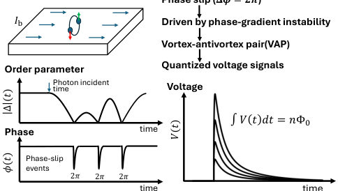
<figcaption class="paper-figure-caption"><b>Fig 1.</b> FIG. 1. Schematic illustration of photon detection mecha- nisms: (a) conventional resistive detection, in which pho- ton absorption generates many vortex–antivortex pairs, re- sulting in heating, normal-domain formation, and a resistive response; and (b) VAP-mediated phase-slip detection (VBD in this work), in which only a few VAPs are generated and directly detected as quantized voltage pulses. The lower pan- els illustrate the transient suppression and recovery of the superconducting order parameter ∆(t) and the correspond- ing phase evolution ϕ(t) associated with discrete phase-slip events.</figcaption>
</figure>
<figure class="paper-figure-card">
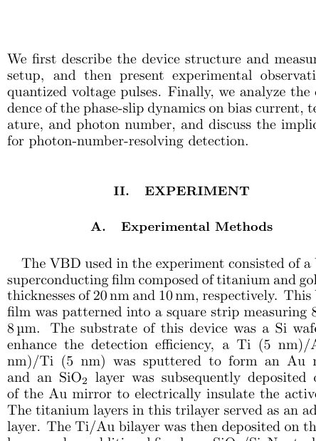
<figcaption class="paper-figure-caption"><b>Fig 2.</b> Figure 2(a) shows the readout circuit for the VBD, where the VBD and an inductor with inductance L are shunted by a resistor Rs. A bias current Ib is supplied to the VBD from an external current source. The VBD is cooled to a base temperature Tb &lt; Tc so that under equilibrium conditions, almost all of Ib flows through the VBD. The VBD is optically coupled to a fiber, and a laser pulse with an average photon number µin is delivered to it through the fiber. The wavelength of the incident pho- tons was 1526 nm. After photon absorption in the VBD, a voltage signal ∆v(t) results from either the formation of resistance or the induced electromotive force due to the VAP motion, which is read out by...</figcaption>
</figure>
<figure class="paper-figure-card">
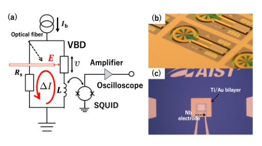
<figcaption class="paper-figure-caption"><b>Fig 3.</b> FIG. 2. Readout circuit for the VBD. The rectangle with an arrow represents the VBD as the photon detection device. Rs: shunt resistance; Ib: bias current; L: kinetic inductance; ∆I: change in current flowing in this readout circuit. (b) The VBD is fabricated on a key-shaped Si substrate to improve alignment between the optical fiber and the VBD. (c) The active area of the VBD. This active area consists of the Ti (20 nm)/Au (10 nm) bilayer, and the electrodes are made of niobium.</figcaption>
</figure>
<figure class="paper-figure-card">
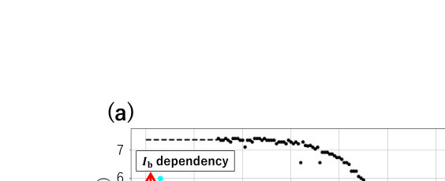
<figcaption class="paper-figure-caption"><b>Fig 4.</b> Fig.4(b)</figcaption>
</figure>
<figure class="paper-figure-card">
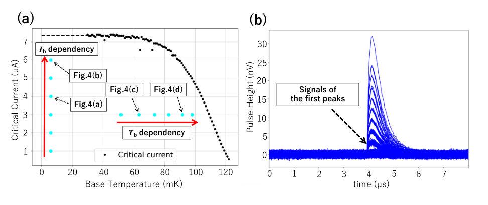
<figcaption class="paper-figure-caption"><b>Fig 5.</b> FIG. 3. (a) Experimental data showing the dependence of the critical current on the base temperature. These experimental data of the critical current are obtained from the current–voltage characteristics, and the dotted line is extrapolated to determine Ic(T = 0 mK). (b) Recorded signals at Ib =5.0 µA, Tb = 6 mK, Rs = 21.4 mΩ, and µin = 10 photons per pulse. Under this condition, the time constant of the VBD is τ = 445 ns.</figcaption>
</figure>

**Summary.** The authors report the direct observation of photon-induced vortex-antivortex pair dynamics in superconducting films, interpreting the resulting quantized voltage signals as discrete phase-slip events. By analyzing the statistical fluctuations of these VAPs, they demonstrate that the device achieves photon-number resolution by linking absorbed photons directly to countable flux quanta changes.

**Why it may be interesting.** This work provides an experimental realization of quantum light detection based on fundamental superconducting phase dynamics (phase slips), offering a novel pathway for high-speed quantum optical detectors distinct from standard resistive or quasiparticle tunneling mechanisms.

Detailed structure

**Main problem.** The study aims to directly observe photon-induced vortex-antivortex pair (VAP) dynamics in superconducting films and demonstrate a mechanism for photon-number resolution.

**Main result.** The detection signal is governed by quantized voltage pulses resulting from discrete phase-slip events, allowing for the direct counting of absorbed photons under specific operating conditions.

**Method.** Measurements involve irradiating a superconducting film with laser pulses while monitoring the resulting quantized voltage signals using SQUID readout.

**Model / system.** The physical system is a bilayer superconducting film patterned into a strip (VBD) operated in a current-carrying state. The mechanism relies on non-equilibrium phase dynamics where photon absorption triggers VAP nucleation, leading to $2\pi$ phase slips.

**Key observables.** Quantized voltage pulses whose time integral equals integer multiples of the magnetic flux quantum ($\Phi_0$), and the second-order correlation function ($g^{(2)}_{	ext{VAP}}$).

**Important parameters / regimes.** Bias current ($I_b$), base temperature ($T_b$), input photon number ($\mu_{	ext{in}}$), and the superconducting phase slip mechanism.

**Assumptions / limitations.** The detection process is fundamentally governed by discrete phase-slip events rather than conventional resistive transitions, and PNR capability emerges when VAP generation fluctuations are statistically suppressed (approaching Poissonian statistics).

**Figures summary.** Figures illustrate comparisons between resistive vs. phase-slip detection modes; show the temperature dependence of critical current ($I_c$); display pulse height distributions showing discrete peaks; and finally, present $g^{(2)}$ measurements confirming Poissonian statistics for photon counting.

**Paper structure.** The paper progresses from establishing the physical platform (VBD) and contrasting its mechanism with conventional detectors. It then details the measurement of quantized voltage signals ($\Phi_0$ quantization). Finally, it uses correlation functions ($g^{(2)}$) to demonstrate that under optimized conditions, the VAP generation statistics match the incident photon statistics, confirming PNR.

Abstract

Nucleation of vortex-antivortex pairs (VAPs) is believed to play a central role in the photon detection mechanism of superconducting detectors; however, their direct dynamic observation has remained challenging. Here, we report the direct observation of photon-induced VAP dynamics in a current-carrying superconductor as quantized voltage signals following photon absorption. The observed signals are interpreted as discrete phase-slip events, where each vortex traversal induces a 2-pi phase change of the superconducting order parameter, resulting in a quantized voltage pulse whose time integral is given by the magnetic flux quantum. We analyze the resulting quantized signals as a function of bias current, base temperature, and input photon-number states, and find that the number of VAPs generated per absorbed photon becomes effectively stabilized under specific conditions. Under these conditions, we demonstrate photon-number-resolving capability by directly counting phase-slip-induced voltage quanta. Our results reveal a detection mechanism governed by phase dynamics rather than conventional resistive transitions. We further show that photon-number resolution emerges when the fluctuation of photon-induced vortex-antivortex pair generation becomes statistically suppressed. These findings establish a new route toward photon-number-resolving detection based on phase-slip counting and open opportunities for high-speed superconducting detectors for quantum optics and photonic quantum technologies.

[↑ back to top](#top)

### [Activity Regeneration from Silent States in Neuronal Networks with Transient Synaptic Memory](http://arxiv.org/abs/2607.14000v1)

**Authors:** Mozhgan Khanjanianpak, Alireza Valiadeh  
**Type:** theory · **Category:** disordered systems and neural networks · **PDF:** <https://arxiv.org/pdf/2607.14000v1>  
**Analysis basis:** full PDF text, analyzed in chunks
**Topic relevance:** `driven-dissipative phase transition` **3/5** · `methods for driven-dissipative` **3/5** · `non-equilibrium dynamics` **3/5** · `analog quantum simulation` **2/5** · `entanglement & information structure` **2/5** · `non-equilibrium universality` **2/5** · `Keldysh / 2PI / non-Gaussian methods` **1/5** · `correlated / nonlocal dissipation` **1/5** · `scars & prethermalization` **1/5**

↔ Scroll figures horizontally

<figure class="paper-figure-card">
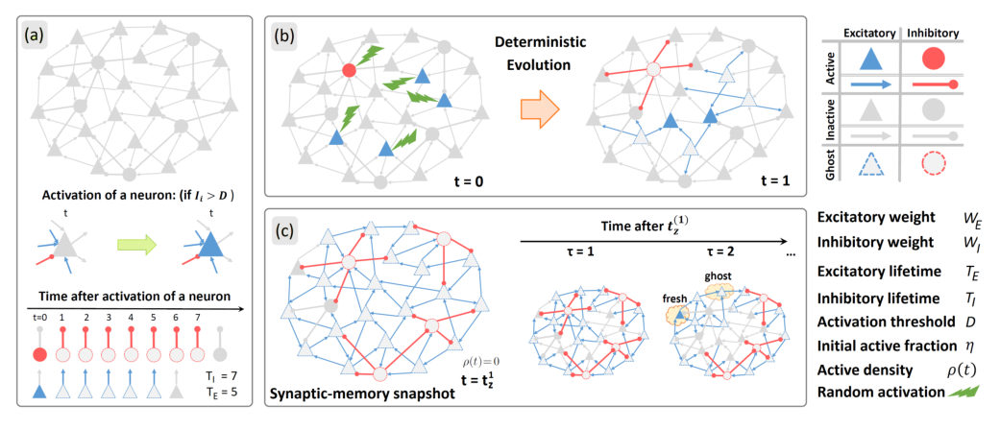
<figcaption class="paper-figure-caption"><b>Fig 1.</b> FIG. 1. Schematic illustration of the proposed neuronal network model. (a) General dynamics of the model. A neuron becomes active when its total synaptic input exceeds the activation threshold D. One time step later, its outgoing synapses become active and remain active for a finite lifetime (TE for excitatory and TI for inhibitory synapses), after which they decay automatically. During this period, the neuron is considered a ghost neuron because reactivation does not generate new synaptic activity. Once all outgoing synapses have disappeared, the neuron becomes fresh and can again contribute new synaptic influence upon activation. (b) Schematic representation of the network dynamics...</figcaption>
</figure>
<figure class="paper-figure-card">
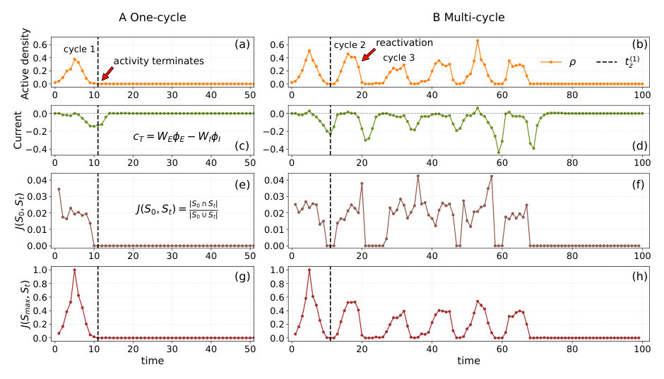
<figcaption class="paper-figure-caption"><b>Fig 2.</b> FIG. 2. Representative examples of the one-cycle and multi-cycle dynamical regimes together with several macroscopic quantities that fail to distinguish between them. (a,b) Temporal evolution of the active neuronal density ρ(t). In the one-cycle regime, activity terminates after the first silent interval at t = t(1) z , whereas in the multi-cycle regime activity spontaneously regenerates without additional external input. (c,d) Evolution of the global synaptic current, cT = WEϕE −WIϕI, showing that this macroscopic quantity alone does not predict activity regeneration. (e,f) Jaccard similarity between the active neuronal assembly and the initially stimulated assembly S0. In both regimes,...</figcaption>
</figure>
<figure class="paper-figure-card">
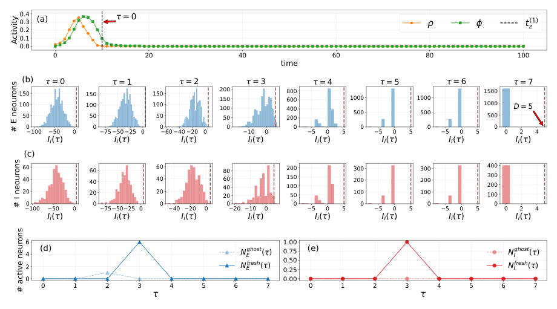
<figcaption class="paper-figure-caption"><b>Fig 3.</b> FIG. 3. One-cycle example. (a) Active density of neurons ρ and synapses ϕ in time. Although neuronal activity vanishes at the first silent state t(1) z (dashed vertical line), a substantial fraction of synapses remains active, motivating the snapshot analysis. (b,c) Evolution of the reconstructed excitatory and inhibitory input-current distributions obtained solely from the synaptic-memory snapshot at t(1) z , without continuing the simulation. Dashed vertical line indicates activation threshold of D = 5. Numbers of reactivated ghost and fresh (d) excitatory (e) inhibitory neurons during τ = t −t(1) z . The gradual decay of residual synaptic activity determines which neurons become eligible...</figcaption>
</figure>
<figure class="paper-figure-card">
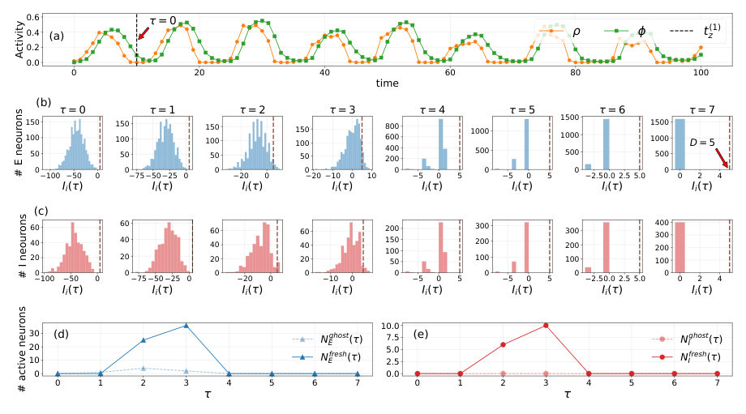
<figcaption class="paper-figure-caption"><b>Fig 4.</b> FIG. 4. Multi-cycle example. (a) Active density of neurons ρ and synapses ϕ in time. (b,c) Evolution of the reconstructed excitatory and inhibitory input-current distributions obtained solely from the synaptic-memory snapshot at t(1) z . Dashed vertical line indicates activation threshold of D = 5. Numbers of reactivated ghost and fresh (d) excitatory (e) inhibitory neurons during τ = t−t(1) z . Although the current distributions span ranges comparable to those in the one-cycle example (Fig. 3), substantially more neurons exceed the activation threshold, suggesting a larger latent capacity for generating the next activation cycle.</figcaption>
</figure>
<figure class="paper-figure-card">
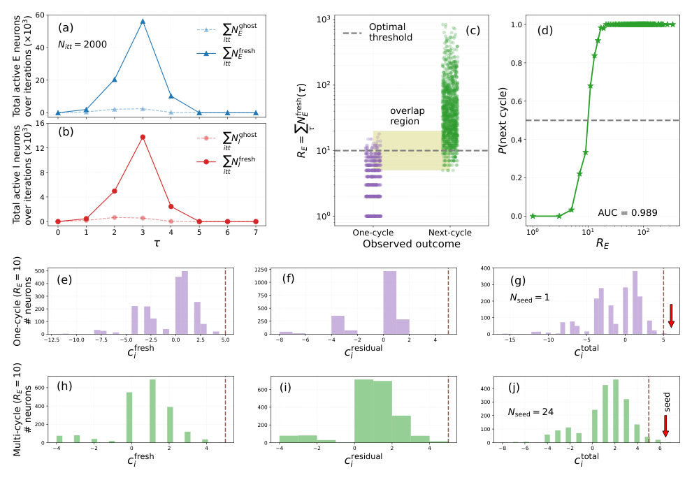
<figcaption class="paper-figure-caption"><b>Fig 5.</b> FIG. 5. Prediction of multi-cycle emergence from the synaptic-memory snapshot. (a,b) Temporal evolution of the numbers of fresh excitatory and inhibitory neurons that become eligible for activation during τ = t −t(1) z , aggregated over 2000 independent realizations. Most activation events occur within the first few time steps after the first silent state, indicating that the Latent Excitatory Recruitment (LER) of the network is established over a short time window. (c) Classification of all realizations according to the cumulative number of fresh excitatory neurons, RE = PTI τ=0 N fresh E (τ). Each point corresponds to one realization and is labeled according to whether the original...</figcaption>
</figure>

**Summary.** This work introduces a model where synaptic memory persists even after neuronal firing stops. The key finding is that the residual synaptic configuration alone contains sufficient information to predict if the network will spontaneously reactivate (regenerate activity) or die down. This suggests short-term memory is encoded in this latent, quantifiable synaptic capacity rather than just ongoing spikes.

**Why it may be interesting.** While focused on neuroscience, the concept of predicting complex, non-equilibrium dynamics (like activity continuation) solely from a static 'memory' snapshot mirrors challenges in characterizing quantum states or emergent behavior in many-body systems without full time evolution.

Detailed structure

**Main problem.** The study investigates whether the residual synaptic state alone contains enough information to predict if a neuronal network will spontaneously regenerate activity after a period of complete silence, or if it will simply terminate.

**Main result.** The latent excitatory recruitment (LER) capacity, derived from analyzing the initial synaptic memory snapshot, was shown to be a near-perfect predictor of whether multi-cycle regeneration occurs without needing to simulate subsequent network dynamics.

**Method.** The authors developed a novel snapshot-based framework that analyzes the residual synaptic configuration ($\mathbf{L}(t)$) at the first silent state to predict future dynamical outcomes.

**Model / system.** The model is a minimal Synaptic-Lifetime Network (SLN), which is a discrete-time excitatory–inhibitory neural network incorporating finite-lifetime synapses. The system's state is defined by both neuronal activity ($\mathbf{X}(t)$) and the synaptic memory matrix ($\mathbf{L}(t)$).

**Key observables.** Latent Excitatory Recruitment (LER) capacity, density of active neurons ($
ho(t)$), and the comparison between one-cycle vs. multi-cycle activity realizations.

**Important parameters / regimes.** Network size ($N=2000$), mean degree ($\langle k_{in} 
angle = 200$), synaptic lifetimes ($T_E, T_I$), and network weights ($W_E=1, W_I=-4$).

**Assumptions / limitations.** The analysis assumes the system can be characterized by a single snapshot $\langle X(t), L(t) 
angle$, simplifying the need for full time-series simulation to predict future behavior.

**Figures summary.** Figures illustrate examples comparing one-cycle and multi-cycle dynamics, tracking activity levels and quantifying the number of 'fresh' versus 'ghost' excitatory neurons over time.

**Paper structure.** The paper establishes the physical model (SLN with synaptic memory), defines the core problem (predicting regeneration from silence), develops the diagnostic tool (LER capacity predictor), presents results showing its accuracy, and concludes by discussing implications for understanding short-term memory encoding.

Abstract

Transient synaptic memory has emerged as a potential mechanism for maintaining short-term information even in the absence of persistent neuronal activity. However, it remains unclear whether the hidden synaptic state alone contains sufficient information to predict the future evolution of neuronal networks after activity has ceased. Here, we introduce a minimal neuronal network model with finite-lifetime synapses and investigate the mechanism underlying spontaneous activity regeneration following complete neuronal silence. We show that the residual synaptic configuration at the first silent state already determines whether network activity terminates after a single activation cycle or spontaneously regenerates an additional cycle. By analyzing this synaptic-memory snapshot, we identify the Latent Excitatory Recruitment (LER) capacity, quantified by the cumulative number of fresh excitatory neurons, as a near-perfect predictor of multi-cycle dynamics without continuing the subsequent network simulation. Remarkably, these distinct dynamical outcomes emerge in an otherwise homogeneous neuronal network, demonstrating that transient synaptic memory alone is sufficient to generate diverse future dynamics. Our findings provide a mechanistic explanation for activity regeneration from a residual synaptic state and suggest that short-term memory is encoded not only in ongoing neuronal activity but also in the latent synaptic configuration that preserves the network's capacity to recruit new neuronal assemblies. More broadly, the proposed snapshot-based framework offers a new perspective for predicting and potentially controlling the future evolution of neuronal networks.

[↑ back to top](#top)

### [Condition for $1/f$ noise to occur along with an example for a diffusion equation](http://arxiv.org/abs/2607.13856v1)

**Authors:** H. Mouri  
**Type:** theory · **Category:** statistical mechanics · **PDF:** <https://arxiv.org/pdf/2607.13856v1>  
**Analysis basis:** full PDF text, analyzed in chunks
**Topic relevance:** `non-equilibrium universality` **3/5** · `Keldysh / 2PI / non-Gaussian methods` **2/5** · `correlated / nonlocal dissipation` **2/5** · `driven-dissipative phase transition` **2/5** · `non-equilibrium dynamics` **2/5** · `Kondo & dissipative impurity` **1/5** · `analog quantum simulation` **1/5** · `entanglement & information structure` **1/5** · `methods for driven-dissipative` **1/5** · `scars & prethermalization` **1/5**

↔ Scroll figures horizontally

<figure class="paper-figure-card">
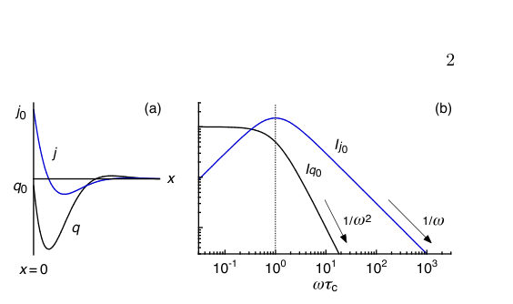
<figcaption class="paper-figure-caption"><b>Fig 1.</b> FIG. 1. (a) Examples of Fourier modes in Eq. (10) at a certain time t against the position x. (b) Spectral intensities Iq0 and Ij0 in Eqs. (7) and (11) against the normalized frequency ωτc.</figcaption>
</figure>
<figure class="paper-figure-card">
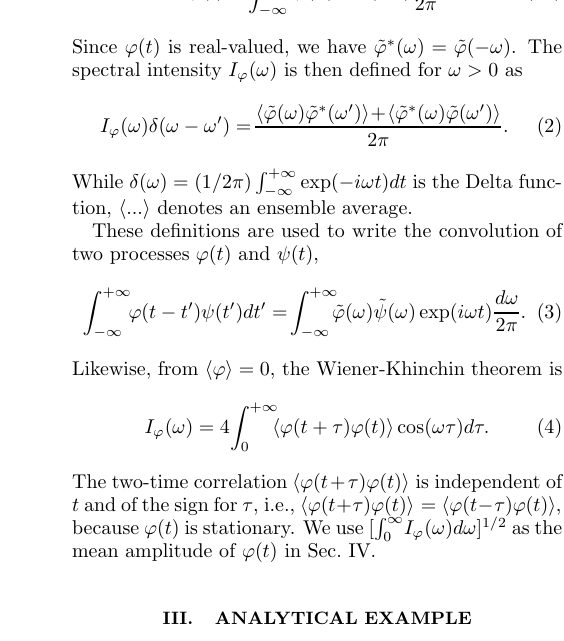
<figcaption class="paper-figure-caption"><b>Fig 2.</b> Figure 1(a) shows our setup for the diffusion of a quan- tity q from a boundary at x = 0 into a medium at x &gt; 0. We write a one-dimensional diffusion equation as</figcaption>
</figure>
<figure class="paper-figure-card">
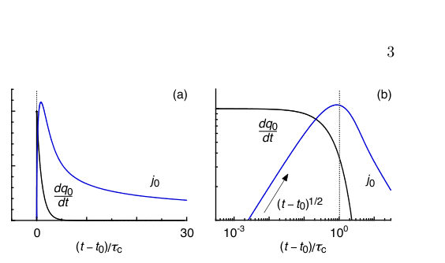
<figcaption class="paper-figure-caption"><b>Fig 3.</b> FIG. 2. (a) Linear plot of j0 and dq0/dt in Eq. (13), induced by an impulse at time t0, against the normalized lapse time (t −t0)/τc. (b) Same as in (a) but on logarithmic scales.</figcaption>
</figure>
<figure class="paper-figure-card">
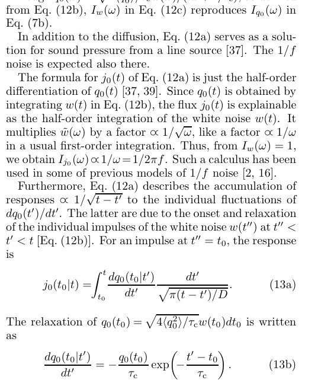
<figcaption class="paper-figure-caption"><b>Fig 4.</b> Figure 2 shows the linear and logarithmic plots of j0(t0|t) and dq0(t0|t)/dt. The response j0(t0|t) is slow [2]. Espe- cially at t −t0 ≪τc on the logarithmic plot, correspond- ing to the range ω ≫1/τc of the 1/f noise, although dq0(t0|t)/dt has already increased, j0(t0|t) is still increas- ing as R t t0 dt′/√t −t′ ∝√t −t0. This slow response has transformed the white noise w(t) into the 1/f noise of the diffusion flux j0(t).</figcaption>
</figure>
<figure class="paper-figure-card">
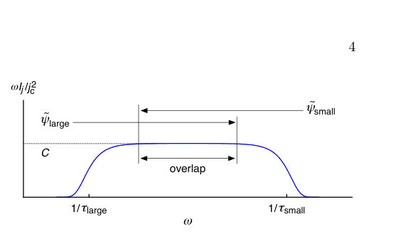
<figcaption class="paper-figure-caption"><b>Fig 5.</b> FIG. 3. Overlap between ˜ψlarge and ˜ψsmall, i.e., two solutions for ωIj/j2 c in Eq. (15) at the angular frequencies of 1/τlarge ≲ ω ≪1/τsmall and 1/τlarge ≪ω ≲1/τsmall.</figcaption>
</figure>

**Summary.** This paper derives a general, necessary, and sufficient statistical condition for any system to exhibit 1/f noise. By analyzing various physical models, including diffusion equations and electrical circuits, the authors conclude that this ubiquitous noise requires its dynamics to be governed by exactly two separated characteristic timescales. This provides a powerful, universal diagnostic tool for understanding complex relaxation phenomena.

**Why it may be interesting.** While focused on classical noise sources, the mathematical framework involving spectral density analysis and the identification of universal scaling laws (like $1/f$) is highly relevant to characterizing non-equilibrium dynamics in open quantum systems or complex many-body relaxation processes.

Detailed structure

**Main problem.** The primary goal is to determine a necessary and sufficient condition for the occurrence of ubiquitous 1/f noise, which has an uncertain underlying physics.

**Main result.** A stationary 1/f noise requires the system's dynamics to be characterized by exactly two separated constant timescales ($f_{	ext{low}}$ and $f_{	ext{high}}$), with no other constant parameters in between.

**Method.** The analysis uses frequency domain techniques (Fourier transforms) applied to models like diffusion equations and Ornstein-Uhlenbeck processes, relating spectral intensity to the system's correlation functions.

**Model / system.** The study analyzes several models, including a one-dimensional diffusion equation for a quantity $q(x, t)$ and an electrical circuit modeled by the telegraph equation. The core mathematical tool is analyzing how white noise input translates into colored noise output.

**Key observables.** Spectral intensity of the noise current or flux ($I(\omega)$), specifically showing $\propto 1/\omega$ scaling for $1/f$ noise.

**Important parameters / regimes.** Two separated constant frequencies ($	ext{flow} \ll f_{	ext{high}}$) and two characteristic timescales ($	au_{	ext{small}}, 	au_{	ext{large}}$).

**Assumptions / limitations.** The analysis assumes the noise is stationary. In some derivations, approximations like neglecting shunt conductance or taking limits at infinite frequency are employed.

**Figures summary.** Figures illustrate spectral intensities for diffusion setups and electrical circuits, showing transitions to $1/\omega$ scaling as separation between timescales increases.

**Paper structure.** The paper develops the condition through multiple physical examples (diffusion, electrical circuit) before stating a general statistical criterion based on the existence of two separated time scales ($	au_{	ext{small}}, 	au_{	ext{large}}$).

Abstract

While $1/f$ noise is ubiquitous and has been found in various systems, its physics remains uncertain. From an analytical study of an ordinary diffusion equation, we find an additional example of the $1/f$ noise. The formula for this example, together with existing knowledge about scaling in fluid turbulence, implies a necessary and sufficient condition for the occurrence of any stationary $1/f$ noise. That is, the noise needs to be characterized by two constant frequencies of $f_{\rm low} \ll f_{\rm high}$. For a frequency range from $f = f_{\rm low}$ to $f_{\rm high}$, it is further needed that, except for the mean amplitude of the noise, there is no other constant parameter. Then, at $f_{\rm low} \ll f \ll f_{\rm high}$, the noise scales asymptotically as $1/f$. Being statistical and simple, our condition applies to any system and hence explains the ubiquity of the $1/f$ noise. It is also applicable to some systems with noise of $α\ne 1.0$ for $1/f^α$, via intermittency analogous to that of the turbulence.

[↑ back to top](#top)

### [Opinion Formation in a Spatially Constrained Coevolving Nonlinear Voter Model](http://arxiv.org/abs/2607.13616v1)

**Authors:** Phil Gwon Kim, Jaeyong Bae, Jaeseok Hur, Hawoong Jeong  
**Type:** theory · **Category:** statistical mechanics · **PDF:** <https://arxiv.org/pdf/2607.13616v1>  
**Analysis basis:** full PDF text, analyzed in chunks
**Topic relevance:** `driven-dissipative phase transition` **3/5** · `non-equilibrium universality` **3/5** · `analog quantum simulation` **2/5** · `non-equilibrium dynamics` **2/5** · `Frenkel-Kontorova` **1/5** · `Keldysh / 2PI / non-Gaussian methods` **1/5** · `correlated / nonlocal dissipation` **1/5** · `entanglement & information structure` **1/5** · `methods for driven-dissipative` **1/5** · `scars & prethermalization` **1/5**

↔ Scroll figures horizontally

<figure class="paper-figure-card">
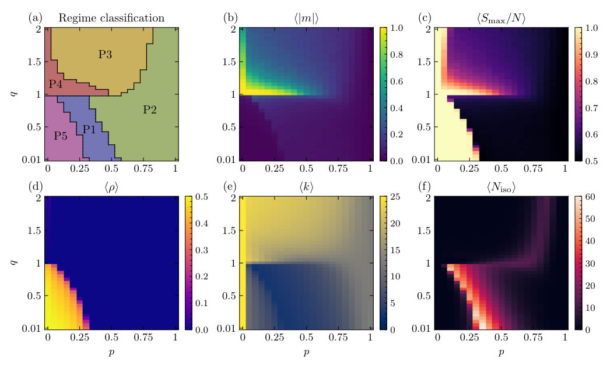
<figcaption class="paper-figure-caption"><b>Fig 1.</b> FIG. 1. Summary of empirical regimes and macroscopic observables. (a) Empirical regime classification, (b) ⟨|m|⟩, (c) ⟨Smax/N⟩, (d) ⟨ρ⟩, (e) ⟨k⟩, and (f) ⟨Niso⟩. Simulations are performed with N = 212 and maximum observation time Tmax = 215</figcaption>
</figure>
<figure class="paper-figure-card">

<figcaption class="paper-figure-caption"><b>Fig 2.</b> FIG. 2. system size dependence at p = 0.25 and q = 1. These simulations use Tmax = 216 MCS, and all runs shown reach absorption within this time. The absorbed-run magnetization decreases strongly with N, whereas ⟨Smax/N⟩remains larger, consistent with a dominant connected cluster with residual opposite-state clusters. Error bars represent the standard er- ror.</figcaption>
</figure>
<figure class="paper-figure-card">
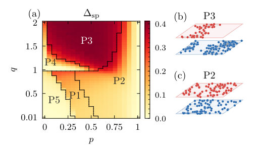
<figcaption class="paper-figure-caption"><b>Fig 3.</b> FIG. 3. Spatial segregation in final configurations. (a) Spa- tial enrichment ∆sp in the (p, q) plane. The labels P1–P5 denote the empirical regimes from Fig. 1. (b,c) Represen- tative absorbing configurations for P3 and P2, respectively. P3 illustrates spatially segregated fragmentation, whereas P2 illustrates mainly topological fragmentation with weak real- space segregation.</figcaption>
</figure>
<figure class="paper-figure-card">
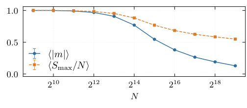
<figcaption class="paper-figure-caption"><b>Fig 4.</b> Fig. 3(a) shows that P3 is distinguished from the other absorbing fragmented regimes by a strong enhancement of the spatial enrichment. For instance, P2 can be both absorbing and fragmented in the graph-theoretic sense, but it exhibits only weak spatial enrichment. Thus, P2 primarily represents topological fragmentation, in which discordant links are removed without significant real- space separation of the two state types. In contrast, P3 corresponds to spatially segregated fragmentation, in which graph fragmentation is accompanied by real-space state-domain separation. Standard link-based assortativity [27] cannot distin- guish these absorbing configurations, because all surviv- ing links...</figcaption>
</figure>
<figure class="paper-figure-card">
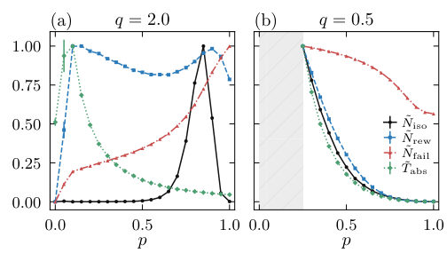
<figcaption class="paper-figure-caption"><b>Fig 5.</b> FIG. 4. Normalized p-dependence of the observables for q = 0.5 and q = 2.0. The tilde denotes that each ensemble- averaged observable is normalized by its maximum value along the corresponding q-cut ( ˜O ≡⟨O⟩/⟨O⟩max). As an example, the black curve for ˜ Niso represents the normalized values derived from each corresponding q-cut in Fig.1 (f). (a) At q = 2.0, ˜ Nfail reaches its maximum at p = 1, whereas ˜ Niso exhibits a distinct peak at p &lt; 1. (b) At q = 0.5, ˜ Niso closely follows the failed rewiring count ˜ Nfail. The shaded region indi- cates the active regime where no runs reached the absorbing state within Tmax, and is thus excluded from the statistics. Error bars represent the...</figcaption>
</figure>

**Summary.** This paper analyzes a nonlinear voter model where social interactions occur on a spatially constrained network. By incorporating rules that delete links when rewiring fails, the authors show that global consensus is fragile. Instead, the system settles into fragmented absorbing states whose structure depends critically on the interplay between local geometry and interaction parameters.

**Why it may be interesting.** While focused on classical opinion dynamics, the framework of non-equilibrium phase transitions, absorbing states, and structural changes due to local constraints (like link deletion) mirrors concepts in quantum many-body systems undergoing localization or fragmentation.

Detailed structure

**Main problem.** The study investigates opinion formation dynamics in a spatially constrained coevolving nonlinear voter model, focusing on how local geometric constraints alter the nature of absorbing states.

**Main result.** Local geometric accessibility fundamentally reshapes the structure of absorbing states, leading to distinct regimes characterized by reduced consensus regions and spatially segregated fragmentation rather than robust global consensus.

**Method.** The authors employ extensive numerical simulations across parameter space $(p, q)$ on a Random Geometric Graph (RGG), utilizing techniques like finite-size scaling and route closure equations to characterize absorption processes.

**Model / system.** The model is a Nonlinear Voter Model implemented on an RGG embedded in 2D space. Dynamics involve state flips and rewiring attempts, with the crucial modification being link deletion when local rewiring fails due to spatial constraints.

**Key observables.** Magnetization ($\langle|m|
angle$), active link density ($\langle
ho
angle$), largest connected component fraction ($\langle S_{max}/N
angle$), mean degree ($\langle k
angle$), and the spatial enrichment ($\Delta sp$).

**Important parameters / regimes.** The interaction probability ($p$) and the rewiring/coevolution parameter ($q$); system size ($N$).

**Assumptions / limitations.** The analysis assumes that deviations from standard CNVM due to link deletion are key; finite-size effects are noted when interpreting consensus regimes.

**Figures summary.** Figures map out empirical regimes (P1-P5) based on multiple observables, showing size dependence of magnetization loss (Fig. 2), and distinguishing between topological vs. real-space fragmentation using spatial enrichment ($\Delta sp$) (Fig. 3).

**Paper structure.** The paper systematically analyzes the model by first defining the constrained dynamics, then mapping out empirical regimes via multiple observables, developing phenomenological descriptions for mean degree evolution, and finally applying advanced techniques like finite-time scaling to characterize absorption boundaries.

Abstract

We investigate a spatially constrained coevolving nonlinear voter model. Using a random geometric graph, we constrain the interaction range of voter dynamics. If local rewiring is not possible, the discordant link is deleted. Our results reveal absorbing states that differ not only in magnetization and activity, but also in mean degree and spatial state organization. By exploring dynamical and structural observables, we found that distinct regimes from the existing coevolving nonlinear voter model are characterized by a reduced consensus region, spatially segregated fragmentation, and isolated node formation. Additionally, we develop a phenomenological description of the evolution of the mean degree and terminal non-conserved quantities that is consistent with the numerical results. Our model highlights how local geometric accessibility reshapes the structure of the absorbing states.

[↑ back to top](#top)

### [Robust topological oscillators govern a tunable phase transition to synchronized circadian rhythms](http://arxiv.org/abs/2607.13322v1)

**Authors:** Chongbin Zheng, Evelyn Tang, Peter Thomas  
**Type:** theory · **Category:** statistical mechanics · **PDF:** <https://arxiv.org/pdf/2607.13322v1>  
**Analysis basis:** full PDF text, analyzed in chunks
**Topic relevance:** `driven-dissipative phase transition` **3/5** · `methods for driven-dissipative` **3/5** · `non-equilibrium universality` **3/5** · `non-equilibrium dynamics` **2/5** · `Frenkel-Kontorova` **1/5** · `Keldysh / 2PI / non-Gaussian methods` **1/5** · `analog quantum simulation` **1/5** · `correlated / nonlocal dissipation` **1/5** · `entanglement & information structure` **1/5**

↔ Scroll figures horizontally

<figure class="paper-figure-card">
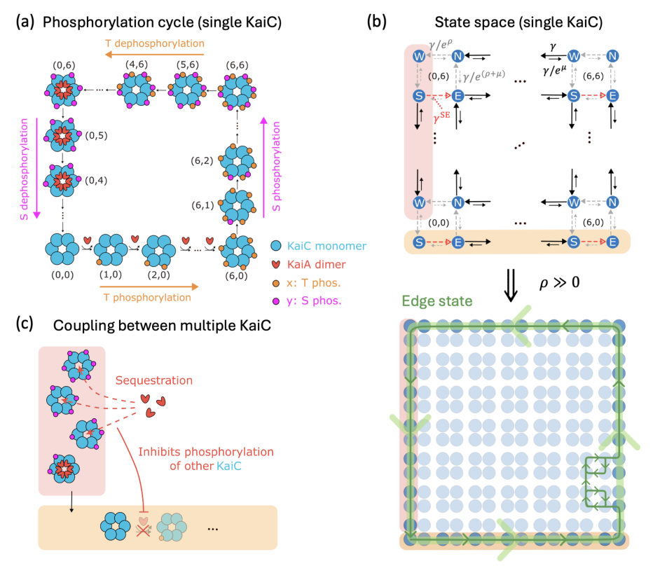
<figcaption class="paper-figure-caption"><b>Fig 1.</b> FIG. 1. Single-molecule oscillations of KaiC phosphorylation level are synchronized through KaiA sequestration. (a) Individ- ual KaiC hexamers undergo ordered phosphorylation cycles. KaiA dimers (red) promote KaiC phosphorylation and become sequestered during dephosphorylation. (x, y) denotes the number of phosphorylated T and S sites, respectively. (b) Phospho- rylation dynamics of a single KaiC molecule can be captured by a topological model with a 2D state space. When ρ &gt; 0, the system is in a topological phase, where edge currents give rise to autonomous single-molecule oscillations [44]. (c) A population of KaiC oscillators are synchronized through KaiA sequestration. When KaiA is...</figcaption>
</figure>
<figure class="paper-figure-card">
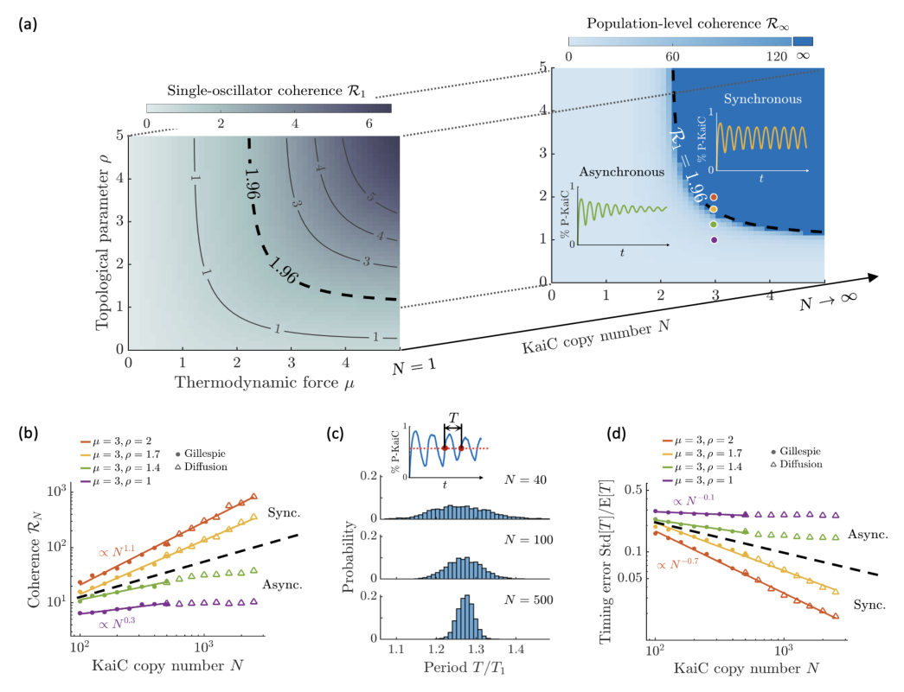
<figcaption class="paper-figure-caption"><b>Fig 2.</b> FIG. 2. Single-oscillator coherence governs a novel phase transition to synchronization and determines finite-N scaling behavior for collective oscillations. (a) In the deterministic limit N →∞, a phase transition to synchronization occurs when the single- oscillator coherence R1 ≳1.96 (dashed line). The dark blue region corresponds to a synchronous phase with sustained oscillations (e.g., in yellow), while the light blue region corresponds to an asynchronous phase with damped oscillations (in green). (b) Population-level coherence RN grows with N via power laws in the synchronous phase, but stops growing at large N in the asynchronous phase. Circles and triangles represent simulation...</figcaption>
</figure>
<figure class="paper-figure-card">
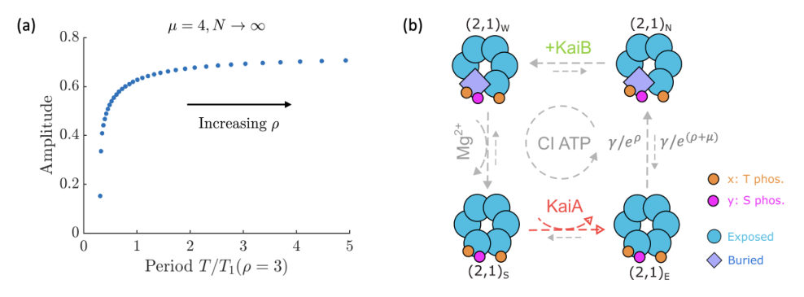
<figcaption class="paper-figure-caption"><b>Fig 3.</b> FIG. 3. Experimental modifications shape population-level behavior by tuning single-molecule transitions rates. (a) In our model, KaiC mutants with longer population-level period T correspond to a larger topological parameter ρ, which leads to larger oscillation amplitudes in % P-KaiC as experimentally observed [60]. The period is normalized by T1 at ρ = 3. (b) Internal transitions from Fig. 1(b) can be modified by different experimental conditions. KaiB mutants show different binding rates (top), Mg2+ concentration regulates A-loop conformational change from buried to exposed (left), KaiA acts catalytically to prime phosphorylation (bottom), while KaiC period mutants modulate CI ATPase...</figcaption>
</figure>
<figure class="paper-figure-card">
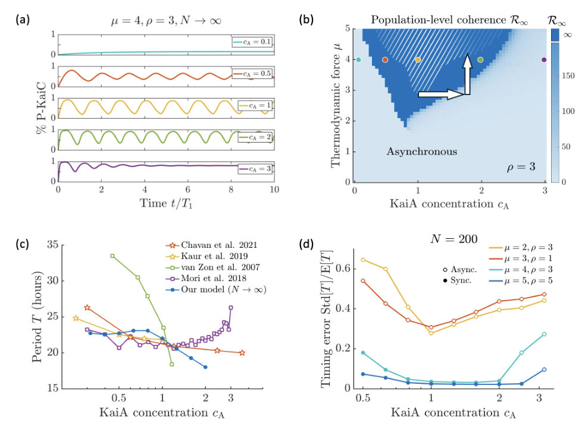
<figcaption class="paper-figure-caption"><b>Fig 4.</b> FIG. 4. KaiC oscillations and collective period are robust under changing KaiA concentration cA. (a) Sustained oscillations in % P-KaiC persist over a wide range of cA. Different colors correspond to different cA shown in (b). (b) The range of cA supporting sustained oscillations expands with the thermodynamic force µ. Oscillations are lost when cA is too high or too low, but can be restored by increasing µ (white arrows). The hatched area indicate the parameter range for which sustained KaiC oscillations are observed experimentally [30, 34, 45, 59]. (c) The oscillation period in our model (blue circles) is robust under changing cA, consistent with experimental data (stars) [30, 70]. In...</figcaption>
</figure>
<figure class="paper-figure-card">
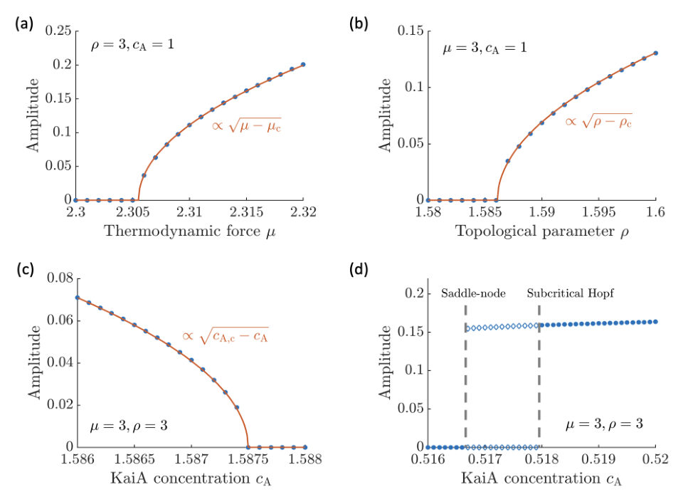
<figcaption class="paper-figure-caption"><b>Fig 5.</b> FIG. 5. Oscillation amplitude near phase boundaries reveal qualitatively different bifurcations. (a) At the standard KaiA concentration cA = 1 and fixed ρ, the oscillation amplitude of % P-KaiC grows as √µ −µc when the thermodynamic force µ exceeds some critical value µc, a hallmark of a supercritical Hopf bifurcation. (b) The same square root scaling √ρ −ρc is observed when tuning the topological parameter ρ at cA = 1 and fixed µ. (c) At high cA and fixed (µ, ρ), the amplitude decreases as √cA,c −cA, indicating another supercritical Hopf bifurcation. (d) At low cA, the transition is qualitatively different. The system first enters a bistable regime with a stable limit cycle (nonzero...</figcaption>
</figure>

**Summary.** This work develops a theoretical model for circadian rhythm synchronization in biological oscillators that incorporate intrinsic noise. It establishes that the transition to robust, synchronized rhythms is governed solely by the single-oscillator coherence ($R_1$). The findings provide a powerful framework for understanding how molecular parameters can be tuned to maintain collective order despite underlying stochasticity.

**Why it may be interesting.** While focused on biology, the mathematical framework—analyzing phase transitions in coupled stochastic systems based on a single-particle metric ($R_1$)—is highly relevant to non-equilibrium statistical mechanics and open quantum systems exhibiting collective behavior.

Detailed structure

**Main problem.** The research aims to understand how intrinsic stochastic noise affects synchronization in biological oscillators, particularly developing a tunable mechanism for achieving robust collective rhythms.

**Main result.** Synchronization is shown to depend only on the single-oscillator coherence ($R_1$), leading to a phase transition predicted at $R_1 \gtrsim 1.96$, independent of specific biochemical rates.

**Method.** The study uses stochastic modeling (master equation) and analyzes both mesoscopic and macroscopic limits, characterizing dynamics via coherence measures and scaling laws around the critical point.

**Model / system.** The system models the KaiABC circadian clock in cyanobacteria, focusing on the phosphorylation of KaiC proteins. The dynamics are governed by rate equations incorporating coupling strength derived from KaiA sequestration.

**Key observables.** Single-oscillator coherence ($R_1$), population-level coherence ($R_N$), and timing error (coefficient of variation of the period $T$).

**Important parameters / regimes.** Topological parameter ($
ho$), thermodynamic force ($\mu$, related to ATP/ADP ratio), and coupling strength ($c_{seq}A$).

**Assumptions / limitations.** The analysis relies on modeling stochastic transitions, using a diffusion approximation for large N, and assuming instantaneous KaiA sequestration upon entering specific state regions.

**Figures summary.** Figures illustrate the single-molecule phase space, population synchronization dynamics showing scaling laws above/below the transition, and how experimental modifications tune parameters leading to changes in collective behavior.

**Paper structure.** The paper develops a novel mechanism linking synchronization to $R_1$, analyzes the resulting phase transition using deterministic limits, examines mesoscopic vs. macroscopic scaling properties, and discusses compensatory mechanisms that restore coherence after disruption.

Abstract

While synchronization has been well-studied in deterministic oscillators, most underlying oscillators are stochastic in both natural and man-made systems. Yet, the effects of intrinsic stochasticity remain poorly understood. Here, we develop a new mechanism for synchronizing circadian KaiC molecules that have topologically protected cycles. We find a phase transition to synchronization that depends only on the single-oscillator coherence, across a range of molecular changes that determine this coherence. Examining both mesoscopic and macroscopic numbers relevant for cellular and in vitro conditions respectively, we find different scaling properties above and below the phase transition. Our results shed light on several existing experiments and further predict that external changes can be offset by compensatory changes that improve the single-oscillator coherence - demonstrating a tunable pathway between stochastic single oscillators and their robust collective rhythms.

[↑ back to top](#top)

### [A Loewner-Theoretic Approach to the Nonlinear Generalized Langevin Equation: The Role of Entropy in Colored Noise Environment](http://arxiv.org/abs/2607.13384v1)

**Authors:** Yusuke K. Shibasaki  
**Type:** theory · **Category:** statistical mechanics · **PDF:** <https://arxiv.org/pdf/2607.13384v1>  
**Analysis basis:** full PDF text, analyzed in chunks
**Topic relevance:** `correlated / nonlocal dissipation` **3/5** · `methods for driven-dissipative` **3/5** · `non-equilibrium dynamics` **3/5** · `non-equilibrium universality` **3/5** · `driven-dissipative phase transition` **2/5** · `Keldysh / 2PI / non-Gaussian methods` **1/5**

↔ Scroll figures horizontally

<figure class="paper-figure-card">
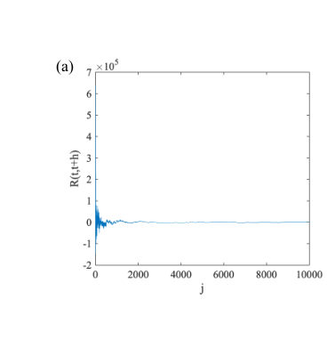
<figcaption class="paper-figure-caption"><b>Fig 1.</b> Fig. 1. Plots of nonlinear response functions of two different types of FDRs. (a) Time-dependent dynamics of R(t, t + h) calculated using Eq. (21). (b) Time-dependent dynamics of of R(s, s + h) calculated using Eq. (29).</figcaption>
</figure>
<figure class="paper-figure-card">
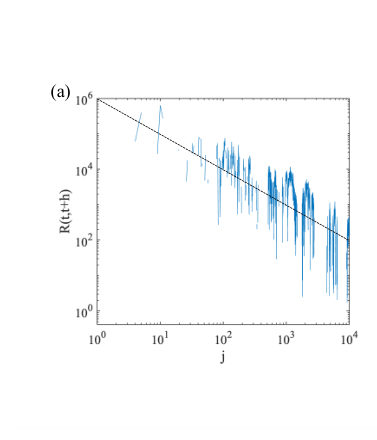
<figcaption class="paper-figure-caption"><b>Fig 2.</b> Fig. 2. Exponential decay of nonlinear response functions. (a) Log-log plot of the time-dependent dynamics of R(t, t+h) calculated using Eq. (21). (b) Log-log plot of the time-dependent dynamics of of R(s, s + h) calculated using Eq. (29). The black dotted lines in each log-log plot represents the scaling of t−1.</figcaption>
</figure>

**Summary.** This paper develops a novel theoretical framework by applying Loewner theory to derive a nonlinear Generalized Langevin Equation. It reformulates the Fluctuation-Dissipation Relation using conformal mappings, showing that the resulting system exhibits a characteristic $t^{-1}$ energy dissipation scaling law. This connects complex analysis tools to fundamental problems in non-equilibrium statistical mechanics.

**Why it may be interesting.** This work connects advanced complex analysis (Loewner evolution) directly to non-equilibrium statistical mechanics concepts like FDRs and energy dissipation, providing a novel mathematical framework for open quantum systems dynamics.

Detailed structure

**Main problem.** The study aims to derive a nonlinear generalized Langevin equation (GLE) and analyze the role of entropy in colored noise environments using advanced mathematical tools.

**Main result.** The Loewner-theoretic approach reformulates the GLE derivation, leading to specific forms for the Fluctuation-Dissipation Relation (FDR) that predict an energy dissipation scaling law $R \sim t^{-1}$.

**Method.** It employs a decomposition method based on conformal transformations governed by the chordal Loewner equation and modifies the Mori-Zwanzig formalism.

**Model / system.** The model is a one-dimensional nonlinear GLE, applied conceptually to processes like cell migration, which involves analyzing stochastic dynamics in colored noise environments.

**Key observables.** Response function $R(t, t+h)$, energy dissipation scaling law ($R \sim t^{-1}$), and Loewner entropy ($S_{Loew}$).

**Important parameters / regimes.** The memory kernel structure and the nature of the colored noise environment are central.

**Assumptions / limitations.** Key assumptions include approximating the autocorrelation function using backward Loewner evolution properties and assuming the system's nonlinear response is forced in a conformal field.

**Figures summary.** Figures show time-dependent behavior and log-log plots confirming the predicted $t^{-1}$ scaling for two different forms of the response function derived from the theory.

**Paper structure.** The paper progresses by first establishing the GLE via Loewner theory, deriving multiple FDR expressions (Kubo vs. Loewner), analyzing the role of Loewner entropy in these relations, and finally confirming the predicted $t^{-1}$ scaling through numerical simulations.

Abstract

In this study, the formal derivation of a one-dimensional nonlinear generalized Langevin equation is demonstrated using a decomposition method based on the conformal transformation governed by the chordal Loewner equation. Here, we used a modified Mori-Zwanzig method whose operator is substituted by that is derived from the discrete Loewner evolution. By this approach, the different types of fluctuation-dissipation relation (FDR) were reformulated using mathematical terms affected by the conformal maps. Dealing with a memory kernel that models the cell migration experiment, the numerical simulation was performed to obtain the specific scaling law of energy dissipation that is common among the two obtained types of FDRs. In addition, the concept of Loewner entropy is used for the estimation of the canonical ensemble in the colored noise environment throughout the theoretical analyses.

[↑ back to top](#top)

### [Basis-Independent Coherence Dynamics of Tripartite States under Pure Dephasing](http://arxiv.org/abs/2607.13512v1)

**Authors:** Sovik Roy, Abhijit Mandal  
**Type:** theory · **Category:** quantum information and computing · **PDF:** <https://arxiv.org/pdf/2607.13512v1>  
**Analysis basis:** full PDF text, analyzed in chunks
**Topic relevance:** `correlated / nonlocal dissipation` **3/5** · `entanglement & information structure` **3/5** · `methods for driven-dissipative` **3/5** · `driven-dissipative phase transition` **2/5** · `non-equilibrium dynamics` **2/5** · `Keldysh / 2PI / non-Gaussian methods` **1/5** · `non-equilibrium universality` **1/5**

↔ Scroll figures horizontally

<figure class="paper-figure-card">
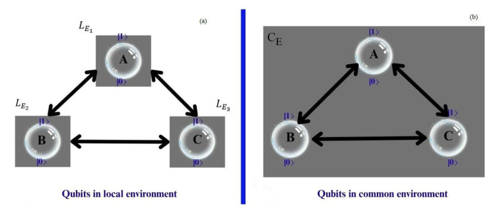
<figcaption class="paper-figure-caption"><b>Fig 1.</b> Figure 1: Schematic representation of the two dephasing models considered in the present work. (a) Local dephasing model: the three non-interacting qubits A, B, and C are independently coupled to their respective bosonic reservoirs LE1, LE2, and LE3. The environmental fluctuations are therefore uncorrelated. (b) Common dephasing model: three qubits are collectively coupled to a single bosonic reservoir CE, giving rise to correlated environmental fluctuations and possible decoherence-free behaviour. These models form the basis for investigating the dynamics of basis-independent quantum coherence under Markovian and non-Markovian environments.</figcaption>
</figure>
<figure class="paper-figure-card">
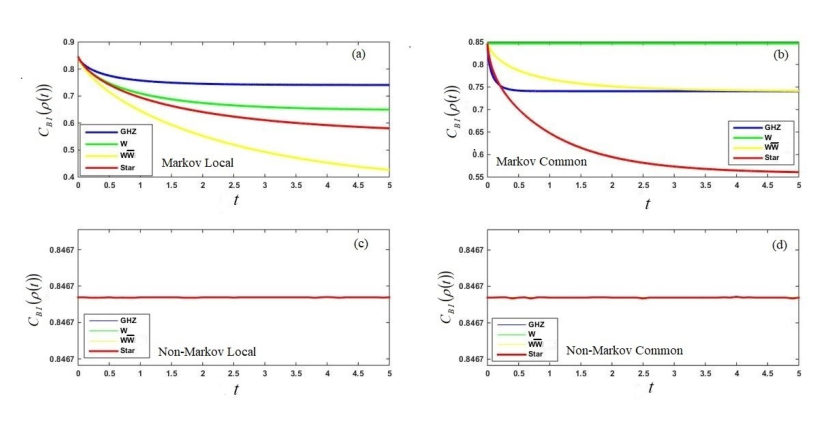
<figcaption class="paper-figure-caption"><b>Fig 2.</b> Figure 2: The figure shows the temporal evolution of the basis-independent coherence CBI(ρ(t)) for the four tripartite pure states, namely the |GHZ⟩, |W⟩, |WW⟩, and |Star⟩states under local and common dephasing environments in both Markovian and non-Markovian regimes.</figcaption>
</figure>
<figure class="paper-figure-card">

<figcaption class="paper-figure-caption"><b>Fig 3.</b> Fig. 2(a) depicts the Markovian local dephasing model. All the four pure states show the same amount of intrinsic coherence initially, nearly 0.85. As the interaction with the independent local reservoirs (LE1, LE2 and LE3) progresses, monotonic decay of coherence (CBI(ρ(t)) is observed for all the four pure states (|GHZ⟩, |W⟩, |WW⟩and |Star⟩) and this is due to the irreversible loss of phase information. However, the decay rates are strongly state dependent. |GHZ⟩ state exhibits the highest robustness among the four pure states and approaches a finite asymptotic value of coherence. For t &gt; 1.5, there is almost no decay in the amount of coherence of the |GHZ⟩state. The |W⟩and |Star⟩states...</figcaption>
</figure>
<figure class="paper-figure-card">
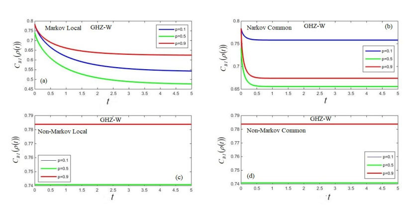
<figcaption class="paper-figure-caption"><b>Fig 4.</b> Figure 3: The figure shows the temporal evolution of the basis-independent coherence CBI(ρ(t)) for the |GHZ⟩−|W⟩ mixture (i.e. of ρGW ) under local and common dephasing environments in both Markovian and non-Markovian regimes for different values of the mixing probability p.</figcaption>
</figure>
<figure class="paper-figure-card">
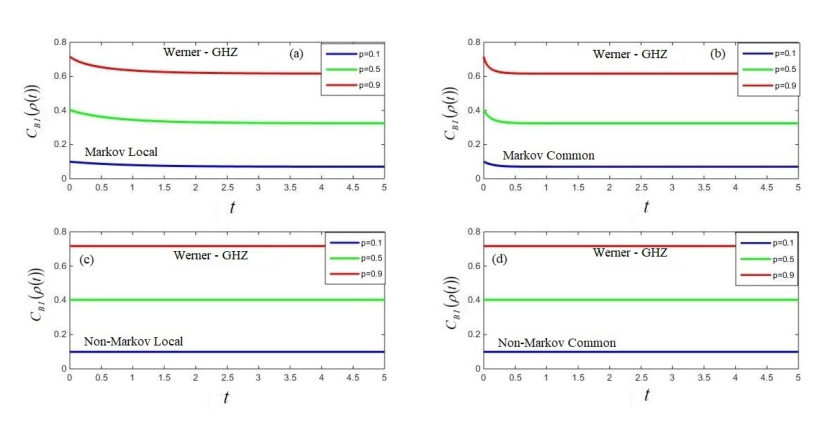
<figcaption class="paper-figure-caption"><b>Fig 5.</b> Figure 4: The figure shows the temporal evolution of the basis-independent coherence CBI(ρ(t)) for the |Werner⟩−|GHZ⟩mixture (i.e. of ρW rG) under local and common dephasing environments in both Markovian and non-Markovian regimes for different values of the mixing probability p.</figcaption>
</figure>

**Summary.** This paper explores how basis-independent coherence survives environmental decoherence in three-qubit systems under pure dephasing. It finds that non-Markovian effects provide superior protection compared to Markovian ones, and collective coupling enhances robustness by utilizing decoherence-free subspaces. The findings establish basis-independent measures as a more reliable indicator of intrinsic quantum resource preservation.

**Why it may be interesting.** This work directly addresses the robustness of intrinsic quantum resources (coherence) against realistic noise models, which is central to designing fault-tolerant quantum technologies.

Detailed structure

**Main problem.** The study investigates how basis-independent quantum coherence dynamics evolve for tripartite states when subjected to pure dephasing environments.

**Main result.** Non-Markovian environments show remarkable robustness, leading to nearly frozen intrinsic coherence, while collective dephasing enhances preservation compared to local dephasing.

**Method.** The analysis uses the basis-independent quantum coherence measure (based on Jensen-Shannon divergence) applied to master equations describing open quantum system evolution.

**Model / system.** The model considers tripartite pure and mixed states subjected to two types of pure dephasing: local (uncorrelated environmental fluctuations) or common/collective (correlated environmental fluctuations).

**Key observables.** Basis-independent quantum coherence, decoherence dynamics.

**Important parameters / regimes.** Markovian vs. non-Markovian regimes; Local vs. Common dephasing coupling strengths ($\gamma_i(t)$ and $\alpha(t)$).

**Assumptions / limitations.** The analysis is restricted to pure dephasing environments, though the framework can be extended to other noise models.

**Figures summary.** Figures schematically illustrate local vs. common dephasing mechanisms; subsequent figures show coherence decay dynamics for mixed states under various environmental regimes (Markovian/non-Markovian).

**Paper structure.** The paper systematically compares basis-independent versus basis-dependent coherence measures, analyzing the time evolution of specific tripartite states ($|GHZ
angle$, $|W
angle$, etc.) across local and common dephasing channels in both Markovian and non-Markovian limits.

Abstract

Quantum coherence is a fundamental quantum resource whose preservation under environmental interactions is essential for quantum information processing. While most studies have focused on basis-dependent coherence measures, the dynamics of intrinsic coherence quantified by basis-independent measures remain largely unexplored. In this work, we investigate the dynamics of basis-independent quantum coherence for several representative tripartite pure and mixed states subjected to local and common dephasing environments in both Markovian and non-Markovian regimes. We show that Markovian local dephasing leads to state-dependent coherence degradation, whereas collective dephasing significantly enhances coherence preservation through decoherence-free sectors. More importantly, non-Markovian environments give rise to nearly frozen coherence dynamics for both pure and mixed states, demonstrating the remarkable robustness of intrinsic coherence against dephasing environment. A comparison with the measure of relative entropy of coherence reveals that basis-independent coherence measure exhibits substantially greater resilience and qualitatively different dynamical behaviour than its basis-dependent counterpart. These results provide new insights into the preservation of intrinsic multipartite coherence in open quantum systems and highlight basis-independent coherence as a robust quantum resource for realistic noisy quantum technologies.

[↑ back to top](#top)

### [Exactly Solvable Diffraction-Grating Scattering Problems for TE and TM waves](http://arxiv.org/abs/2607.13287v1)

**Authors:** Farhang Loran, Ali Mostafazadeh  
**Type:** theory · **Category:** other · **PDF:** <https://arxiv.org/pdf/2607.13287v1>  
**Analysis basis:** full PDF text, analyzed in chunks
**Topic relevance:** `methods for driven-dissipative` **3/5** · `Keldysh / 2PI / non-Gaussian methods` **2/5** · `driven-dissipative phase transition` **2/5** · `non-equilibrium dynamics` **2/5** · `Kondo & dissipative impurity` **1/5** · `analog quantum simulation` **1/5** · `correlated / nonlocal dissipation` **1/5** · `interference shaping light` **1/5** · `non-equilibrium universality` **1/5** · `spintronics-quantum-optics interface` **1/5**

↔ Scroll figures horizontally

<figure class="paper-figure-card">
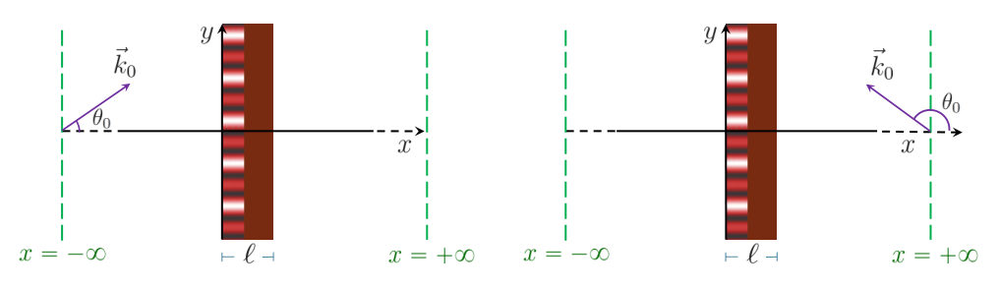
<figcaption class="paper-figure-caption"><b>Fig 1.</b> Figure 1: Schematic views of the scattering setup for the scattering of left- and right-incident TE or TM waves (respectively on the left and right) by a diffraction grating of thickness ℓ. The green dashed lines correspond to x “ ˘8 where the detectors are located.</figcaption>
</figure>
<figure class="paper-figure-card">
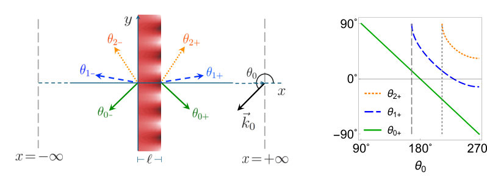
<figcaption class="paper-figure-caption"><b>Fig 2.</b> Figure 2: Left panel shows a schematic view of the scattering of a right-incident TE or TM wave by a nonmagnetic diffraction grating given by (189), (191), and (192). θ0 and k are chosen such that J “ 2. Arrows labelled by the angles θj˘ represent the diffracted beams. A density plot of |ˆǫpx, yq| is used to color the grating in shades of red. Right panel gives the plots of θ`j for j P t0, 1, 2u as functions of θ0 for waves with wavelength 1.55 µm. The first- and second-order diffracted beams are generated provided that θ0 respectively exceeds 167.0˝ and 213.4˝. The vertical dashed and dotted gray lines mark these values of θ0.</figcaption>
</figure>
<figure class="paper-figure-card">
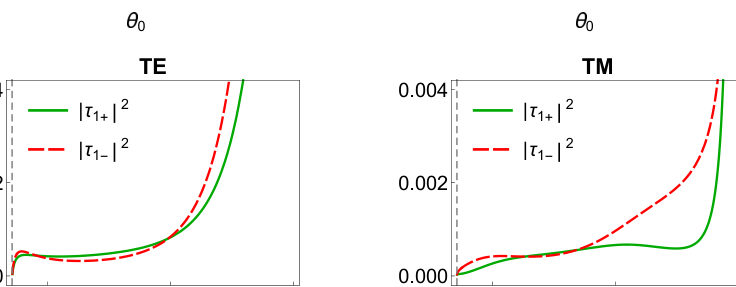
<figcaption class="paper-figure-caption"><b>Fig 3.</b> Figure 3: Plots of |τ0˘|2 and |τ1˘|2 as functions of θ0 for the scattering of right-incident TE and TM waves with wavelength 1.55 µm by a nonmagnetic diffraction grating given by (189), (191), and (192). The dashed vertical line marks θ0 “ 167.0˝, i.e., the minimum value of θ0 for which the first-order diffracted beams are present. At grazing angle, where θ0 approaches 270˝, |τ1˘|2</figcaption>
</figure>
<figure class="paper-figure-card">
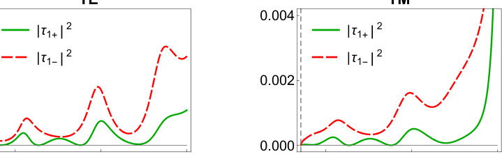
<figcaption class="paper-figure-caption"><b>Fig 4.</b> Figure 4: Plots |τ1˘|2 as functions of θ0 for the scattering of right-incident TE and TM waves with wavelength 1.55 µm by a nonmagnetic diffraction grating with the same values for its physical parameters as the grating considered in Fig. 3 except for its thickness ℓwhich is taken as 10 µm. The dashed vertical line marks θ0 “ 167.0˝, i.e., the minimum value of θ0 for which the first-order diffracted beams are present.</figcaption>
</figure>

**Summary.** This paper develops an advanced theoretical method, Dynamical Formulation of Stationary Scattering (DFSS), to find exact analytical solutions for light scattering from diffraction gratings. By mapping the wave problem onto a non-Hermitian Hamiltonian evolution, it successfully calculates scattering amplitudes for both TE and TM waves beyond the limitations of the standard paraxial approximation. This provides crucial tools for designing and analyzing complex optical structures.

**Why it may be interesting.** This work provides a powerful theoretical framework (DFSS) to solve complex wave scattering problems that are typically intractable or limited by approximations like the paraxial regime. The extension to magnetic gratings is particularly valuable for quantum optics applications.

Detailed structure

**Main problem.** To determine exactly solvable scattering problems for both TE and TM waves interacting with diffraction gratings, extending beyond previous approximations.

**Main result.** The authors establish that the scattering problem can be solved analytically by mapping it to quantum dynamics via a fundamental transfer matrix derived from an effective non-Hermitian Hamiltonian. This allows for explicit analytic expressions for diffracted beam amplitudes valid beyond the paraxial approximation.

**Method.** The core method is the Dynamical Formulation of Stationary Scattering (DFSS), which maps the wave scattering problem onto determining the time-evolution operator associated with a non-Hermitian effective Hamiltonian.

**Model / system.** The system is an optical diffraction grating, modeled by spatially varying relative permittivity ($\hat{\varepsilon}$) and permeability ($\hat{\mu}$). The analysis covers generalized gratings that can be potentially magnetic, unlike previous studies limited to nonmagnetic cases.

**Key observables.** TE and TM wave scattering amplitudes and diffracted beam intensities (e.g., reflection $	au_{0\pm}^2$ and transmission $|	au_{1\pm}|^2$).

**Important parameters / regimes.** Incident wavenumber ($k$), incidence angle ($	heta_0$), grating parameters ($\ell, a_0, \zeta, \kappa, K$). The analysis is applicable across various regimes including Bragg and Raman-Nath.

**Assumptions / limitations.** The method utilizes the DFSS framework, which is stated to be valid beyond the paraxial approximation. Some specific calculations rely on approximations valid when incidence angles are near grazing or normal incidence ($\cos 	heta \approx 0$ or $\cos 	heta_0 \approx 0$).

**Figures summary.** Figures illustrate the dependence of squared reflection and transmission coefficients ($|	au_{m\pm}|^2$) on the incident angle ($	heta_0$), showing behavior at grazing angles and the existence of isolated zeros in reflection.

**Paper structure.** The paper develops the theory by first establishing the governing wave equation and relating it to a transfer matrix $\mathbf{x}_M$. It then derives this matrix using an exponential form involving the effective Hamiltonian, culminating in explicit analytic expressions for scattering amplitudes applicable to both TE and TM waves.

Abstract

In J.~Phys.~A {\bf 31}, 3493 (1998), Berry provides an analytic solution of the problem of determining the diffracted beam intensities for atoms incident upon a grating given by the potential, $v(x,y):=iV_0(e^{i\mathfrak{K}\,y}-1)$ for $0\leq x\leq\ell$ and $v(x,y):=0$ otherwise, where $V_0, \mathfrak{K}$, and $\ell$ are positive real parameters. This result, which relies on the paraxial approximation, readily applies to the diffraction of transverse electric (TE) waves by the nonmagnetic optical grating given by the relative permittivity, $\hat\varepsilon(x,y):=1-v(x,y)/k^2$, where $k$ is the incident wavenumber. We show that Berry's grating belongs to a larger class of possibly magnetic diffraction gratings whose scattering problem for both TE and transverse magnetic (TM) waves are exactly solvable. Our analysis makes use of a recently developed dynamical formulation of stationary scattering that is based on the idea of mapping the scattering problem to the quantum dynamics generated by an effective non-Hermitian Hamiltonian operator. {We use this formulation to derive explicit analytic expressions for the diffracted beam amplitudes that are valid beyond paraxial approximation.} As a concrete example, we offer the exact solution of the scattering problem for TE and TM waves incident upon a generalization of Berry's grating.

[↑ back to top](#top)

### [Ultraviolet structure of entanglement harvesting from energy density and other quadratic couplings](http://arxiv.org/abs/2607.13131v1)

**Authors:** Matheus H. Zambianco, Boris Ragula, Eduardo Martín-Martínez  
**Type:** theory · **Category:** other · **PDF:** <https://arxiv.org/pdf/2607.13131v1>  
**Analysis basis:** full PDF text, analyzed in chunks
**Topic relevance:** `Keldysh / 2PI / non-Gaussian methods` **3/5** · `entanglement & information structure` **3/5** · `correlated / nonlocal dissipation` **2/5** · `methods for driven-dissipative` **2/5** · `non-equilibrium dynamics` **2/5** · `correlated cavity matter` **1/5** · `driven-dissipative phase transition` **1/5** · `non-equilibrium universality` **1/5**

↔ Scroll figures horizontally

<figure class="paper-figure-card">
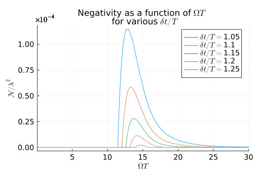
<figcaption class="paper-figure-caption"><b>Fig 1.</b> Figure 1. Negativity as a function of the detectors’ gap Ωfor multiple values of the switching function offset δt. In each plot, we fix the scale by setting T = 1. We find that for each choice of time delay, there is an optimal Ωcommensurate with the results found in [16].</figcaption>
</figure>
<figure class="paper-figure-card">
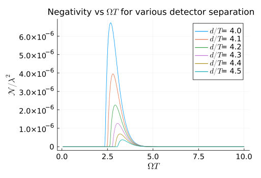
<figcaption class="paper-figure-caption"><b>Fig 2.</b> Figure 2. Negativity as a function of the detectors’ gap ΩT for multiple values of the separation between the detectors, d. In each plot, we choose the separation δt/T = 0, and the width of the Gaussian switching σ/T = 0.1</figcaption>
</figure>
<figure class="paper-figure-card">
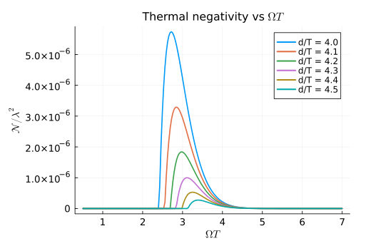
<figcaption class="paper-figure-caption"><b>Fig 3.</b> Figure 3. Negativity as a function of the detectors’ gap Ω for multiple values of the separation between the detectors, d, when the field is prepared in a thermal state with inverse temperature β = 50. In each plot, we have fixed the scale by setting T = 1, δt = 0, and σ = 0.1.</figcaption>
</figure>
<figure class="paper-figure-card">
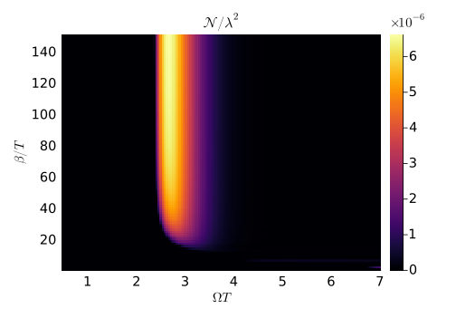
<figcaption class="paper-figure-caption"><b>Fig 4.</b> Figure 4. Negativity as a function of the detectors’ gap Ω and the inverse temperature β. In this plot, we have fixed the scale by setting T = 1, d = 4.0, δt = 0, and σ = 0.1</figcaption>
</figure>
<figure class="paper-figure-card">
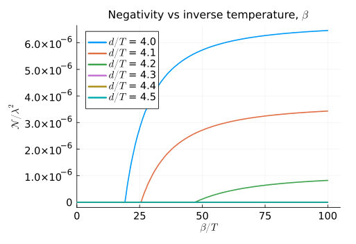
<figcaption class="paper-figure-caption"><b>Fig 5.</b> Figure 5. Negativity as a function of the inverse temperature β, with ΩT = 2.7 fixed, for different detector separations. In this plot, we set T = 1, δt = 0, and σ = 0.1.</figcaption>
</figure>

**Summary.** This paper analyzes entanglement harvesting from detectors coupled to the energy density of a scalar field, focusing on resolving persistent ultraviolet divergences. By employing distributional methods and analyzing switching correlations, the authors demonstrate conditions under which the calculated entanglement measure remains finite. This advances the theoretical understanding of quantum information extraction in curved or interacting quantum fields.

**Why it may be interesting.** This work provides rigorous mathematical tools for handling divergences in quantum field theory calculations relevant to open quantum systems, which is crucial for modeling realistic detector interactions.

Detailed structure

**Main problem.** The study addresses persistent ultraviolet (UV) divergences encountered when calculating entanglement harvesting from particle detectors coupled to the renormalized energy density of a massless scalar field.

**Main result.** The analysis shows that these UV divergences are controlled by the switching correlation at coincident interaction times, and pointlike detectors remain finite if their switchings do not overlap.

**Method.** The authors employ distributional methods in position space, utilizing Wick's theorem for Gaussian states to calculate reduced detector states perturbatively up to $O(\lambda^2)$.

**Model / system.** The model involves two Unruh-DeWitt detectors coupled via an interaction Hamiltonian density proportional to the renormalized energy-momentum tensor of a massless scalar field in Minkowski spacetime.

**Key observables.** Negativity ($N$), which quantifies entanglement, and correlation terms derived from the energy density ($\mathcal{E}_\phi$) and two-point functions ($\Xi_\phi$).

**Important parameters / regimes.** Detector coupling strength ($\lambda$), Gaussian widths ($\sigma$), detector separation ($d$), and field parameters like temperature or vacuum state type.

**Assumptions / limitations.** The initial field state $\hat{
ho}_\phi$ is assumed to be a zero-mean Gaussian state, and the analysis often requires assuming non-overlapping supports for switching functions to guarantee finite results.

**Figures summary.** Figure 1 illustrates Negativity versus detector gap ($\Omega$) for various switching delays ($\delta t$), showing an optimal entanglement range before it vanishes.

**Paper structure.** The paper proceeds by setting up the interaction Hamiltonian, calculating the reduced density matrix perturbatively, and then systematically analyzing the resulting correlation terms using distributional calculus to isolate and control UV divergences.

Abstract

We study entanglement harvesting with particle detectors coupled to the renormalized energy density of a massless scalar field. Our analysis identifies the distributional mechanism underlying the persistent ultraviolet divergences previously observed for quadratic detector couplings and discusses that the energy density coupling exhibits the same underlying structure. We show that these divergences are entirely controlled by the switching correlation at coincident interaction times. Consequently, pointlike detectors are UV finite whenever the switchings do not overlap. For Gaussian-smeared detectors, the harvesting correlations are automatically finite in 1+1 and 2+1 dimensions, while in higher dimensions the remaining divergences are removed by non-overlapping switchings. Finally, we derive general expressions for arbitrary zero-mean Gaussian states and illustrate the formalism with a thermal field state.

[↑ back to top](#top)

### [$\texttt{iNORG}$: An open-source quantum impurity solver package based on the natural orbitals renormalization group](http://arxiv.org/abs/2607.13993v1)

**Authors:** Jia-Ming Wang, Yi-Heng Tian, Yin Chen, Ru Zheng, Rong-Qiang He, Zhong-Yi Lu  
**Type:** theory · **Category:** strongly correlated electrons · **PDF:** <https://arxiv.org/pdf/2607.13993v1>  
**Analysis basis:** full PDF text, analyzed in chunks
**Topic relevance:** `Keldysh / 2PI / non-Gaussian methods` **3/5** · `Kondo & dissipative impurity` **3/5** · `analog quantum simulation` **2/5** · `correlated / nonlocal dissipation` **1/5** · `driven-dissipative phase transition` **1/5** · `entanglement & information structure` **1/5** · `methods for driven-dissipative` **1/5** · `non-equilibrium dynamics` **1/5**

↔ Scroll figures horizontally

<figure class="paper-figure-card">
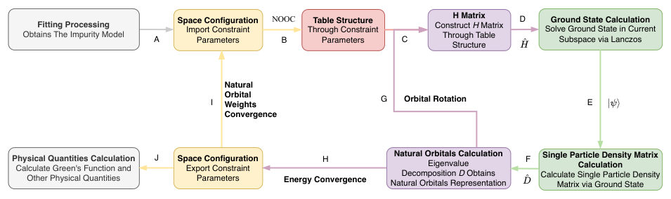
<figcaption class="paper-figure-caption"><b>Fig 1.</b> Figure 1: Flowchart of the natural orbitals renormalization group (NORG) method as implemented in the iNORG package. The process starts from an Anderson impurity model defined by DMFT (A). It then enters a self-consistent cycle (B-I) to optimize the natural orbitals by repeatedly constructing and solving the Hamiltonian within a selected Hilbert subspace. After convergence, physical observables are calculated (J).</figcaption>
</figure>
<figure class="paper-figure-card">
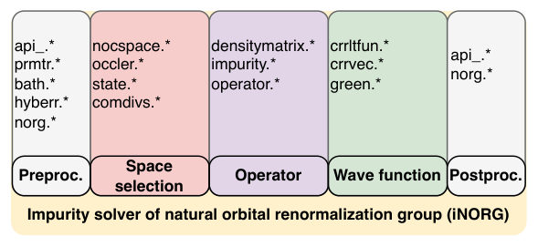
<figcaption class="paper-figure-caption"><b>Fig 2.</b> Figure 2: Organizational structure of the iNORG program. The first row shows the module abbreviations, and the second row indicates the corre- sponding module functions.</figcaption>
</figure>
<figure class="paper-figure-card">
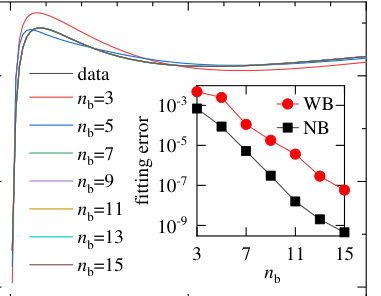
<figcaption class="paper-figure-caption"><b>Fig 3.</b> Figure 3: Impurity Model Fitting Performance Example: Displays the imaginary part of the wide-band (WB) hybridization function Γimp(iω), with parameters U = 3, ∆= 0.3, t2 = 0.5t1. The inset shows fitting errors for wide-band (WB) and narrow-band (NB) cases under varying nb (number of bath sites per impurity orbital).</figcaption>
</figure>
<figure class="paper-figure-card">

<figcaption class="paper-figure-caption"><b>Fig 4.</b> Fig. 3 presents a fitting example, demonstrating that fitting quality improves significantly with increasing nb. The inset shows that fitting error decreases exponentially with nb; when nb ≥7, errors for both wide-band (WB) and narrow-band (NB) cases drop below 10−4, validating the method’s effectiveness.</figcaption>
</figure>
<figure class="paper-figure-card">
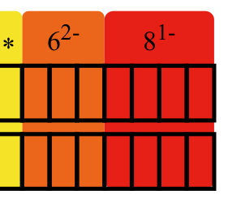
<figcaption class="paper-figure-caption"><b>Fig 5.</b> Figure 4: Illustration of the direct-product constraint rule</figcaption>
</figure>

**Summary.** This paper presents $	exttt{iNORG}$, an open-source solver package utilizing the Natural Orbitals Renormalization Group (NORG) method for Dynamical Mean-Field Theory. It efficiently solves strongly correlated electron models by intelligently compressing the computational Hilbert space using natural orbitals. This advancement provides a powerful, accurate tool for studying complex materials physics.

**Why it may be interesting.** While focused on condensed matter, the underlying mathematical machinery—basis transformation via optimal single-particle density matrices and iterative subspace projection (Krylov/Lanczos)—is highly relevant to open quantum systems where system-bath coupling requires efficient representation of reduced dynamics.

Detailed structure

**Main problem.** The central challenge is developing efficient and robust quantum impurity solvers for Dynamical Mean-Field Theory (DMFT) calculations applied to strongly correlated electron systems.

**Main result.** The authors introduce $	exttt{iNORG}$, an open-source package implementing the Natural Orbitals Renormalization Group (NORG) method, which achieves high accuracy with reduced computational cost by optimizing the bath representation.

**Method.** The core methodology is NORG, which iteratively optimizes a natural orbital basis derived from the Single-Particle Density Matrix to compress the Hilbert space by freezing inactive degrees of freedom. This is combined with a Krylov-subspace approach for efficient Green's function calculation.

**Model / system.** The package is designed for solving strongly correlated electron systems, specifically modeling the Anderson Impurity Model (AIM) and multi-orbital Bethe lattice models using Hamiltonians involving local interactions ($U$) coupled to a non-interacting bath.

**Key observables.** Natural orbital occupation numbers ($n_k$), Green's functions $G(\omega)$, and ground state properties of the impurity model.

**Important parameters / regimes.** Coulomb repulsion ($U$, $U'$), chemical potential ($\mu$), hybridization function parameters, and temperature (currently limited to zero-temperature calculations).

**Assumptions / limitations.** The method assumes that freezing inactive orbitals introduces an error proportional to the occupation number deviation from 0 or 1; current limitations restrict use to single-site models and zero temperature.

**Paper structure.** The paper first introduces the necessity of efficient solvers for DMFT. It details the NORG method, explaining how natural orbitals are used to compress the Hilbert space. The implementation leverages a Krylov-subspace approach for Green's function calculation, which is then demonstrated using examples on AIM and Bethe lattice models.

Abstract

In the context of dynamical mean-field theory (DMFT) calculations for strongly correlated electron systems, quantum impurity solvers play a central computational role in treating correlated lattice models and realistic materials. Consequently, developing efficient and robust quantum impurity solvers remains a key challenge. In this paper, we present an open-source quantum impurity solver package based on the natural orbitals renormalization group (NORG) method, dubbed $\texttt{iNORG}$. This software delivers high accuracy with reduced computational cost by optimizing the bath representation using natural orbitals and incorporating advanced features such as efficient Hilbert space selection and efficient algorithms for computing Green's functions. We first introduce the basic principle of the NORG method and then discuss the implementation details. The software framework, major features, and installation procedure for $\texttt{iNORG}$ are explained as well. Finally, several simple examples are presented to demonstrate the usage of $\texttt{iNORG}$.

[↑ back to top](#top)

### [Modified Family-Vicsek Scaling and Probability Distributions for Brownian Castle Interfaces](http://arxiv.org/abs/2607.13922v1)

**Authors:** Noah Sublett, Charles Sutton, Benjamin Long, Daniel B. Dougherty  
**Type:** both · **Category:** statistical mechanics · **PDF:** <https://arxiv.org/pdf/2607.13922v1>  
**Analysis basis:** full PDF text, analyzed in chunks
**Topic relevance:** `non-equilibrium dynamics` **3/5** · `non-equilibrium universality` **3/5** · `driven-dissipative phase transition` **2/5** · `Frenkel-Kontorova` **1/5** · `Keldysh / 2PI / non-Gaussian methods` **1/5** · `analog quantum simulation` **1/5** · `correlated / nonlocal dissipation` **1/5** · `methods for driven-dissipative` **1/5**

↔ Scroll figures horizontally

<figure class="paper-figure-card">
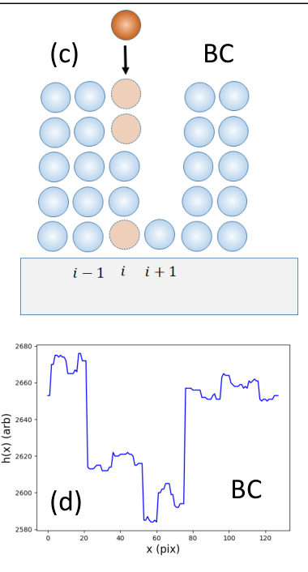
<figcaption class="paper-figure-caption"><b>Fig 1.</b> Figure 1. (a) Schematic depiction of growth rule for BD where an atom always attaches the first time it encounters a nearest neighbor; (b) Simulated interface profile for a BD interface on an L=128 lattice after 106 time steps; (c) Schematic depiction of the evolution rule for BC where the height at column I can evolve with equal probability to hi+1, hi-1, or hi+1 as indicated by the lightly-shaded circles; (d) Simulated interface profile for a BC evolution on an L=128 lattice after 106 time steps.</figcaption>
</figure>
<figure class="paper-figure-card">
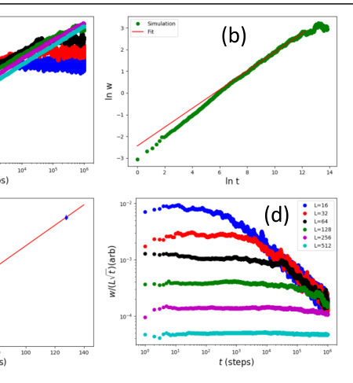
<figcaption class="paper-figure-caption"><b>Fig 2.</b> Figure 2. (a) Interface width for the BC model as s function of time for different length systems; (b) Example of an early time fit to a width function for L=128 to extract the growth exponent; (c) Average saturation width as a function of length showing linear behavior indicating a=1; (d) Width data from part (a) scaled by dividing out Lt with = 1 and =1/2 .</figcaption>
</figure>
<figure class="paper-figure-card">
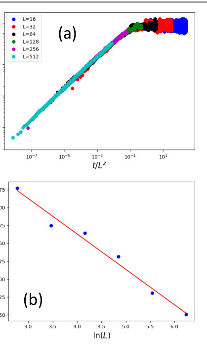
<figcaption class="paper-figure-caption"><b>Fig 3.</b> Figure 3. (a) Width data from Figure 2(a) scaled according to the Family-Vicsek form with =1 and z=3; (b) width scaled by dividing out tb as as function of length showing power law decay as L- with =0.50± 0.05.</figcaption>
</figure>
<figure class="paper-figure-card">
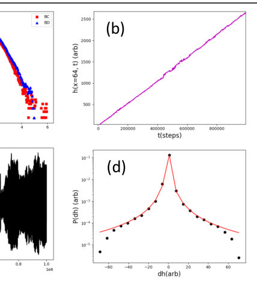
<figcaption class="paper-figure-caption"><b>Fig 4.</b> Figure 4. (a) Probability distribution of interface heights for many independent evolutions of the BC and BD model; (b) Example of an the time evolution of the height of the mid-point of an L=128 system over 106 time steps (c) Height changes at every time step at every changing location on the interface during the evolution in part (b); (d) Probability distribution of height changes constructed as a histogram of the data in part (c). The solid red curve is a Cauchy Lorentz fit.</figcaption>
</figure>

**Summary.** This paper investigates the Brownian Castle (BC) interface growth model, finding it belongs to a new universality class distinct from standard models like Ballistic Deposition. Through extensive simulations, the authors determine specific scaling exponents and show that the height fluctuations follow non-Gaussian statistics characterized by Cauchy-Lorentz tails. This work advances the understanding of complex, driven interfaces in statistical physics.

**Why it may be interesting.** While focused on classical interface growth, the analysis of non-Gaussian statistics (Cauchy-Lorentz tails) and deviations from standard scaling laws provides insights into complex, non-equilibrium dynamics relevant to open quantum systems or driven many-body processes where simple thermal assumptions fail.

Detailed structure

**Main problem.** The study characterizes a new universality class associated with interface growth dynamics by analyzing modified Family-Vicsek scaling properties and probability distributions.

**Main result.** The Brownian Castle (BC) interface exhibits modified scaling exponents ($eta \approx 0.47$, $\alpha \approx 1.01$) and shows that the height change distribution follows a Cauchy-Lorentz form, suggesting large jumps.

**Method.** Numerical simulations are used to extract growth and roughness exponents via fitting double logarithmic plots, complemented by data collapse analysis and statistical testing of probability distributions.

**Model / system.** The system is the Brownian Castle (BC) interface growth model, a variation on Ballistic Deposition that allows for material removal. It is compared against established models like BD, which falls into the KPZ universality class.

**Key observables.** Interface width $w(L, t)$, growth exponent ($eta$), roughness exponent ($\alpha$), and probability distributions of height changes ($p(dh)$).

**Important parameters / regimes.** System size ($L$) up to 512 sites, time steps up to $10^6$, and the derived scaling exponents $eta=0.47 \pm 0.01$ and $\alpha=1.01 \pm 0.01$.

**Assumptions / limitations.** The standard scaling relationship $z = \alpha/eta$ may break down due to finite size effects, which is noted when comparing derived exponents to the exponent observed during data collapse ($z=3$).

**Figures summary.** Figures illustrate schematic growth rules for BD vs. BC, show interface width evolution over time and system size (determining $eta$ and $\alpha$), and demonstrate near-perfect data collapse using a specific scaling function.

**Paper structure.** The paper introduces the BC model variation, presents numerical simulations to calculate scaling exponents ($\alpha, eta$) via fitting, analyzes data collapse for consistency checks, and finally examines probability distributions (heights and height changes) to characterize the underlying stochastic process.

Abstract

The Brownian Castle is a new interface growth model that is a variation on the well-known ballistic deposition model that results in an entirely new universality class. We present numerical verification that the interface width for BC interfaces displays modified Family-Vicsek scaling properties up to finite size corrections. Specifically, we find a growth exponent of $β=0.470 \pm 0.012$ and a roughness exponent of $α=1.01 \pm 0.018$. The scaling is modified at short times with a size scaling exponent that described the early time dependence of interface width on length. The probability distribution of heights for the BC interface shows significant deviations from simple Gaussian behavior and the probability distribution of height changes shows a Cauchy-Lorentz form consistent with expectations for a process involving relatively large jumps.

[↑ back to top](#top)

### [Phonon down-conversion by normal metals for superconducting devices](http://arxiv.org/abs/2607.13870v1)

**Authors:** Guglielmo La Magna, Gianluigi Catelani  
**Type:** theory · **Category:** other · **PDF:** <https://arxiv.org/pdf/2607.13870v1>  
**Analysis basis:** full PDF text, analyzed in chunks
**Topic relevance:** `methods for driven-dissipative` **3/5** · `non-equilibrium dynamics` **3/5** · `driven-dissipative phase transition` **2/5** · `non-equilibrium universality` **2/5** · `Keldysh / 2PI / non-Gaussian methods` **1/5** · `Kondo & dissipative impurity` **1/5** · `correlated / nonlocal dissipation` **1/5**

↔ Scroll figures horizontally

<figure class="paper-figure-card">
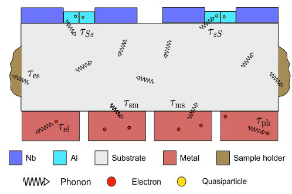
<figcaption class="paper-figure-caption"><b>Fig 1.</b> FIG. 1. Schematic depiction of a superconducting qubit chip with normal metal islands on the backside. The physical pro- cesses included in the kinetic equations are all represented: phonon escape to the sample holder (lifetime τes); phonon transmission from substrate to metal (τsm) and from metal to substrate (τms); electron-phonon interaction (τel and τph). Phonon transmission at the substrate-superconductor inter- face (τsS and τSs) has to be accounted for in the calculation of the down-conversion efficiency.</figcaption>
</figure>
<figure class="paper-figure-card">
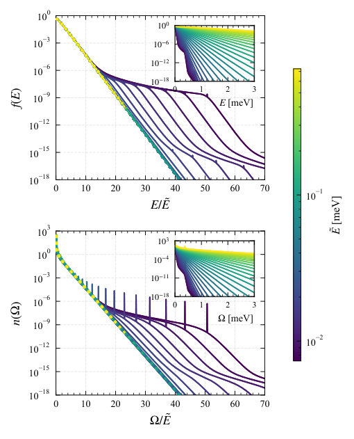
<figcaption class="paper-figure-caption"><b>Fig 2.</b> FIG. 2. (a) Electron distribution f(E) and (b) phonon distribution n(Ω) in a Cu film under steady, monochromatic phonon injection at Ωinj = 0.37 meV ≳2∆Al The dashed lines correspond to the electron distribution in Eq. (41) in panel (a), and to the phonon distribution in Eq. (44) in panel (b).</figcaption>
</figure>
<figure class="paper-figure-card">
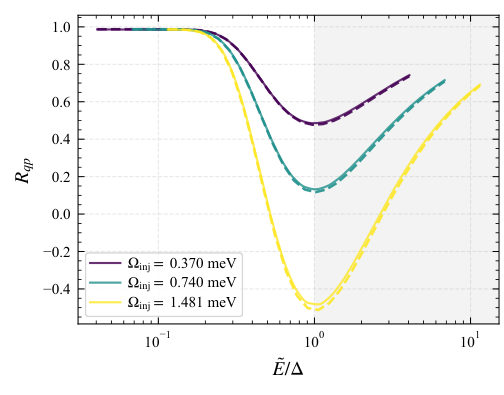
<figcaption class="paper-figure-caption"><b>Fig 3.</b> FIG. 3. Down-conversion efficiency Rqp, Eq. (46), vs. nor- malized ‘effective temperature’ ˜E/∆for a 100 nm Al film (∆= 0.18 meV, λ ≃0.44) and three values of injection en- ergy, see legend. The solid lines are obtained from numerics, the dashed lines using Eq. (53) (the discrepancy is due to λ &lt; 0.5 being outside the validity regime of analytical ap- proximations). In the shaded region, ˜E/∆&gt; 1, energetic quasiparticles in the superconductor can emit phonons and limit the efficiency; we exclude this regime from our analysis.</figcaption>
</figure>
<figure class="paper-figure-card">
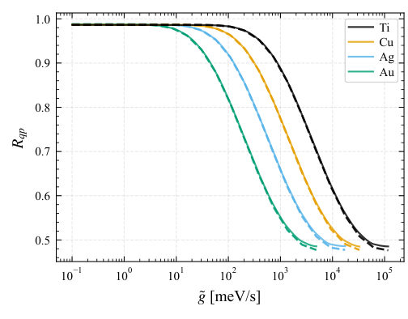
<figcaption class="paper-figure-caption"><b>Fig 4.</b> FIG. 4. Down-conversion efficiency Rqp vs. the effective injection rate ˜g for Au, Cu, Ti, and Ag at Ωinj = 0.37 meV. Solid lines: full numerical evaluation. Dashed lines: analyt- ical approximation of Eq. (53). The lines end at ˜g values corresponding to ˜E/∆≃1.</figcaption>
</figure>
<figure class="paper-figure-card">
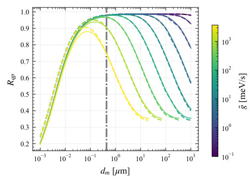
<figcaption class="paper-figure-caption"><b>Fig 5.</b> FIG. 5. Down-conversion efficiency Rqp vs. normal-metal thickness for Ωinj = 0.5 meV; the metal is Cu, other param- eters as in Fig. 3. Solid lines: full numerical evaluation. Dashed lines: analytical approximation of Eq. (58). The lines end at dm values corresponding to ˜E/∆≃1. The vertical dot-dashed line demarcates the minimum thickness for effi- cient down-conversion according to Eq. (56).</figcaption>
</figure>

**Summary.** This paper models how high-energy phonons, which can damage superconducting qubits, are suppressed through a process called down-conversion within an adjacent normal metal film. By solving coupled kinetic equations for electron and phonon populations, the authors determine that this mitigation mechanism is most effective when the normal metal layer has a thickness near one micron.

**Why it may be interesting.** This work directly addresses energy dissipation mechanisms in superconducting circuits, which is crucial for maintaining quantum coherence. The detailed kinetic modeling of phonon relaxation provides insights into open quantum system dynamics driven by the environment (phonons).

Detailed structure

**Main problem.** The primary goal is mitigating quasiparticle poisoning in superconducting devices caused by pair-breaking phonons.

**Main result.** Phonon down-conversion efficiency, which reduces the damaging high-energy phonons, is found to be nearly optimal over a finite range of normal metal thicknesses, typically around one micron.

**Method.** The study employs kinetic equation modeling solved in the steady state to track phonon and electron distributions. Analytical and numerical solutions are used to calculate the down-conversion efficiency based on material parameters.

**Model / system.** The system involves a superconducting device coupled via a normal metal film to a substrate, where high-energy phonons scatter off electrons, transferring energy and lowering the phonon energy below the pair-breaking threshold.

**Key observables.** Down-conversion efficiency ($R_{qp}$ or $R_\lambda$), electron distribution function ($f(E)$), and phonon distribution functions ($n(\Omega)$, $n_s(\Omega)$).

**Important parameters / regimes.** Material parameters like electron-phonon interaction strength, phonon transmission coefficients ($	au_{sm}, 	au_{ms}$), film thickness ($d_m$), and substrate thickness ($d_s$).

**Assumptions / limitations.** Approximations include neglecting spatial gradients, assuming particle–hole symmetry for electrons, using the Debye model for phonons (ignoring anharmonic effects), and neglecting electron-electron scattering.

**Figures summary.** Figures illustrate the physical setup (superconducting qubit chip with normal metal islands) and show the steady-state evolution of electron and phonon distributions under various injection conditions.

**Paper structure.** The paper develops a kinetic equation model for coupled phonon/electron dynamics, solves for the steady state using limiting cases (no-metal, perfect absorption), derives explicit formulas for down-conversion efficiency via asymptotic analysis, and discusses parameter dependence on geometry.

Abstract

Thanks to low dissipation, superconducting devices are promising for a number of applications, such as detectors and implementations of quantum computation. However, their working can be adversely impacted by quasiparticles, which is why so-called quasiparticle poisoning mechanisms and their mitigation are under intense investigation. Here we focus on one poisoning mechanism, namely pair-breaking phonons, and its mitigation through down-conversion by a normal-metal film - the process in which scattering of high-energy phonons by electrons lowers the energy of the former below the pair-breaking threshold. To study the down-conversion, we introduce a model based on kinetic equations, which we solve both analytically (approximately) and numerically in the steady state. We use the solution the estimate a properly-defined down-conversion efficiency which depends on material parameters (such as the strength of electron-phonon interaction and the phonon transmission coefficient at interfaces) and film and substrate thicknesses. Interestingly, we find that the efficiency is nearly optimal over a finite range of metal thicknesses, with the minimum near-optimal thickness being typically of the order of a micron.

[↑ back to top](#top)

### [Exact collective first-passage statistics of N trail-interacting walkers](http://arxiv.org/abs/2607.13213v1)

**Authors:** Paul Pineau, Julien Brémont, Olivier Bénichou, Raphaël Voituriez  
**Type:** theory · **Category:** statistical mechanics · **PDF:** <https://arxiv.org/pdf/2607.13213v1>  
**Analysis basis:** full PDF text, analyzed in chunks
**Topic relevance:** `non-equilibrium dynamics` **3/5** · `correlated / nonlocal dissipation` **2/5** · `non-equilibrium universality` **2/5** · `Keldysh / 2PI / non-Gaussian methods` **1/5** · `analog quantum simulation` **1/5** · `driven-dissipative phase transition` **1/5** · `entanglement & information structure` **1/5** · `methods for driven-dissipative` **1/5**

↔ Scroll figures horizontally

<figure class="paper-figure-card">
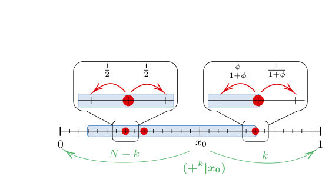
<figcaption class="paper-figure-caption"><b>Fig 1.</b> Figure 1: Schematic dynamics of three SATWϕ walkers launched from x0. Red dots denote walkers, and blue regions denote sites already visited. In the interior of the visited domain, motion is symmetric (left inset), whereas at the boundary the jump proba- bilities become asymmetric (right inset). Corresponding values of the probabilities are shown above the arrows. The splitting event (+k|x0) (in green) corresponds to the event where k (resp. N −k) walkers are absorbed at wall 1 (resp. N −k at wall 0).</figcaption>
</figure>
<figure class="paper-figure-card">
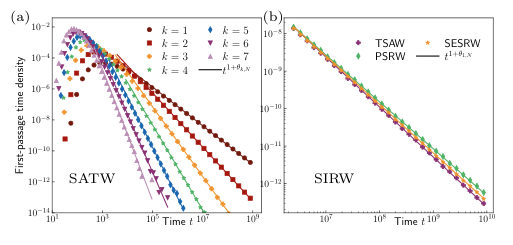
<figcaption class="paper-figure-caption"><b>Fig 2.</b> Figure 2: Numerical verification multi-particles persistence expo- nents. First-passage densities of the (a) (N −k + 1)th absorbed SATWϕ [Eq. (2)], with N = 10, ϕ = 0.5, and 1 ≤k ≤7, averaged over 108 realizations; (b) last surviving walker [Eq. (3)] for several SIRW models (TSAW, PSRW, SESRW) with N = 4, averaged over 106 realizations. Simulations are performed on a 1D lattice with discrete time and space.</figcaption>
</figure>
<figure class="paper-figure-card">
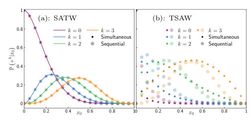
<figcaption class="paper-figure-caption"><b>Fig 3.</b> Figure 3: Splitting probabilities for (a) N = 6 SATWϕ compared with Eqs. (4) and (5), and for (b) N = 6 TSAW launched from x0, for both simultaneous and sequential protocols. Symbols: sim- ulations averaged over 105 realizations; solid lines: theoretical pre- dictions.</figcaption>
</figure>
<figure class="paper-figure-card">
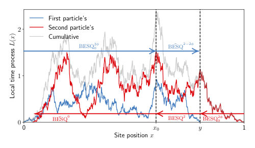
<figcaption class="paper-figure-caption"><b>Fig 4.</b> Figure 5: One realization of the local time process for 2 sequentially launched SATWϕ after the first (resp. second) one is absorbed at wall 0 (resp. one): in the space explored by the first particle, the second particle is behaving as a simple symmetric and so is its local time.</figcaption>
</figure>
<figure class="paper-figure-card">
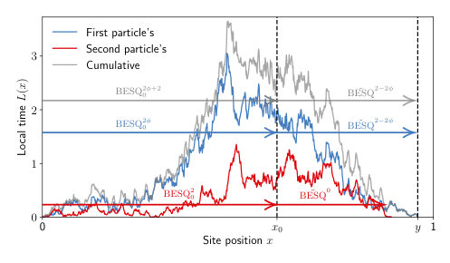
<figcaption class="paper-figure-caption"><b>Fig 5.</b> Figure 4: One realization of the local time process for 2 sequentially launched SATWϕ after both are absorbed at wall 0: in the space [0, y] explored by the first particle (whose local time is in blue), the second particle is behaving as a simple symmetric and so is its local time (in red). The cumulative local time is in grey and is independent of the launching protocol, or of the speed of the walkers.</figcaption>
</figure>

**Summary.** This paper develops an exact theoretical framework for analyzing how multiple active agents interact when their movement is dictated by a shared, memory-retaining 'trail field.' It derives precise formulas for collective first-passage statistics, notably proving that under saturating interaction conditions, the order of exploration does not affect the final absorption probabilities.

**Why it may be interesting.** While focused on classical random walks, the mathematical techniques used—analyzing non-equilibrium dynamics governed by environmental memory and deriving exact scaling laws—are highly relevant to open quantum systems where environment coupling leads to persistent correlations.

Detailed structure

**Main problem.** The study characterizes collective first-passage statistics for multiple interacting random walkers whose movement is influenced by a shared, history-dependent environmental 'trail field.'

**Main result.** For saturating interactions (SATW$\phi$), the splitting probabilities are exactly identical whether the walkers start simultaneously or sequentially, establishing an exact framework for such memory effects.

**Method.** The analysis involves deriving exact analytical expressions by representing the collective trail field using squared Bessel processes and generalizing Ray-Knight theorems to $N$ particles.

**Model / system.** The model consists of N one-dimensional random walkers (SIRWs) whose jump probabilities depend on a shared local time profile, distinguishing between saturating ($	ext{SATW}_\phi$) and non-saturating interaction regimes.

**Key observables.** Persistence exponents ($	heta_{k,N}$) and splitting probabilities ($P_{+k|x_0}$), which quantify the probability of $k$ walkers reaching one boundary before another.

**Important parameters / regimes.** The number of walkers ($N$), the interaction strength parameter ($\phi$), and the dimensionality ($d=1$).

**Assumptions / limitations.** The rigorous analytical results are established for the saturating class ($	ext{SATW}_\phi$); deviations occur in non-saturating cases.

**Figures summary.** Figures illustrate schematic dynamics, numerical verification of persistence exponents across different models, and comparisons showing that splitting probabilities match theory for SATW$\phi$ but show protocol dependence for TSAWs.

**Paper structure.** The paper progresses from defining the physical problem to deriving exact expressions for observables like survival probabilities and splitting probabilities. It then demonstrates the key invariance property for SATW$\phi$ by relating sequential and simultaneous protocols via local time additivity, concluding with general scaling arguments for exponents.

Abstract

Memory encoded in the environment mediates interactions between active agents, from trail-following organisms to synthetic active matter depositing persistent tracks. Although such memory is known to strongly affect transport, its consequences for collective first-passage phenomena remain largely unexplored. Here we study $N$ one-dimensional random walkers interacting through a shared trail field. We characterize the $k^{\rm th}$ (among $N$) arrival time at a fixed target, and the probability that exactly $k$ walkers in $[0,1]$ reach one boundary before the other. For the broad class of self-interacting walkers with a saturating response to the trail, we derive exact expressions for the corresponding persistence exponents and splitting probabilities. Strikingly, despite the strong history-dependent correlations generated by the common environment, splitting probabilities are exactly identical whether walkers explore simultaneously or one after another. This invariance breaks down for nonsaturating trail interactions. Our results follow from an exact representation of the collective trail field and establish a framework for first-passage phenomena in systems coupled through persistent environmental memory.

[↑ back to top](#top)

### [Quantum observables for probabilistic classical particles](http://arxiv.org/abs/2607.13937v1)

**Authors:** Christof Wetterich  
**Type:** theory · **Category:** other · **PDF:** <https://arxiv.org/pdf/2607.13937v1>  
**Analysis basis:** full PDF text, analyzed in chunks
**Topic relevance:** `quantum measurements` **3/5** · `Keldysh / 2PI / non-Gaussian methods` **2/5** · `measurement-induced transitions` **2/5** · `correlated / nonlocal dissipation` **1/5** · `driven-dissipative phase transition` **1/5** · `methods for driven-dissipative` **1/5** · `non-equilibrium dynamics` **1/5**

↔ Scroll figures horizontally

<figure class="paper-figure-card">
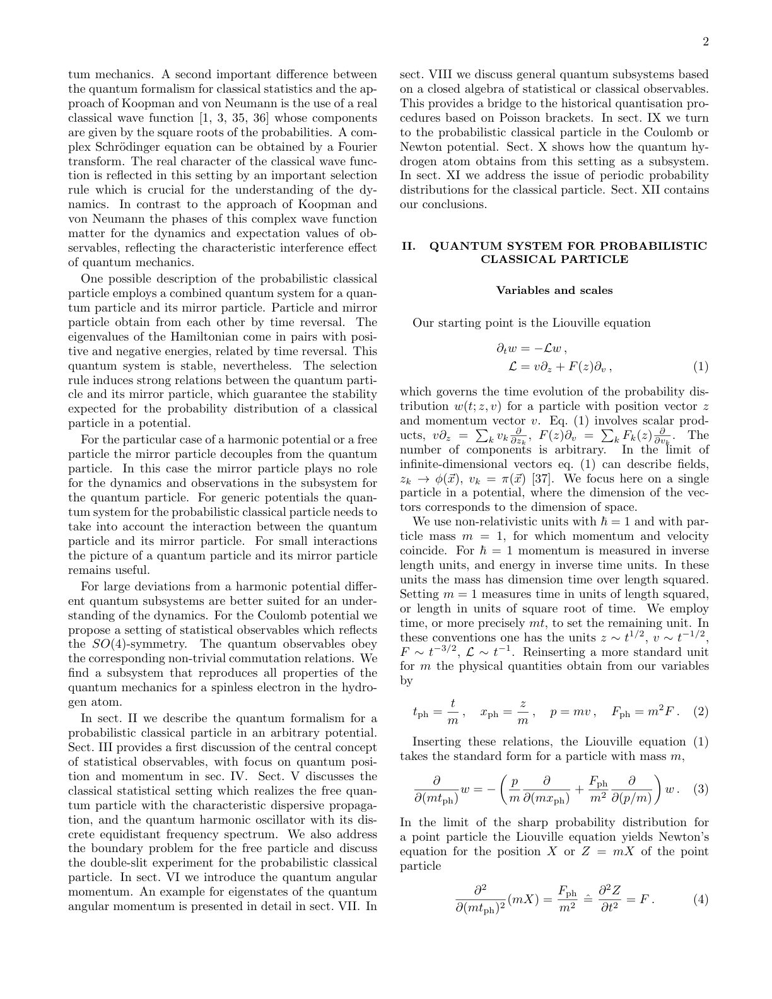
<figcaption class="paper-figure-caption"><b>Fig 1.</b> Low-resolution page preview, page 2</figcaption>
</figure>
<figure class="paper-figure-card">
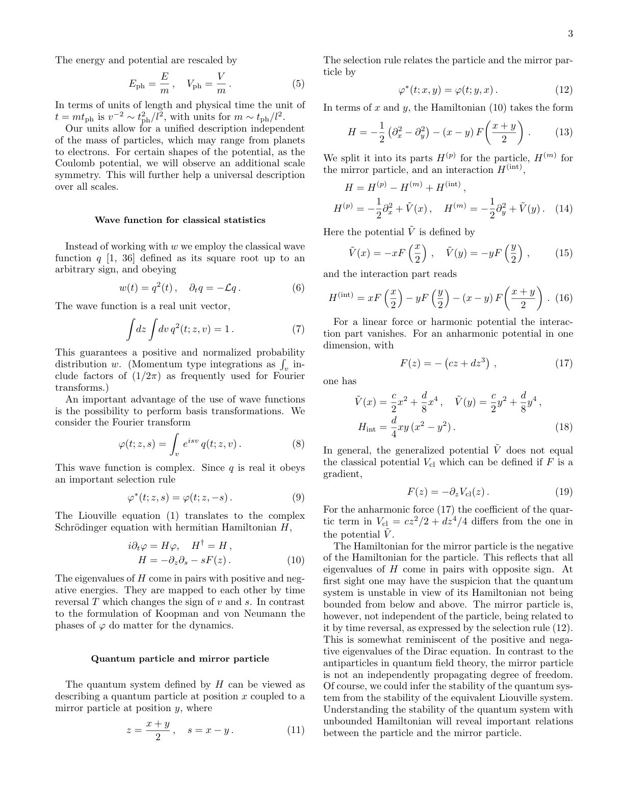
<figcaption class="paper-figure-caption"><b>Fig 2.</b> Low-resolution page preview, page 3</figcaption>
</figure>
<figure class="paper-figure-card">
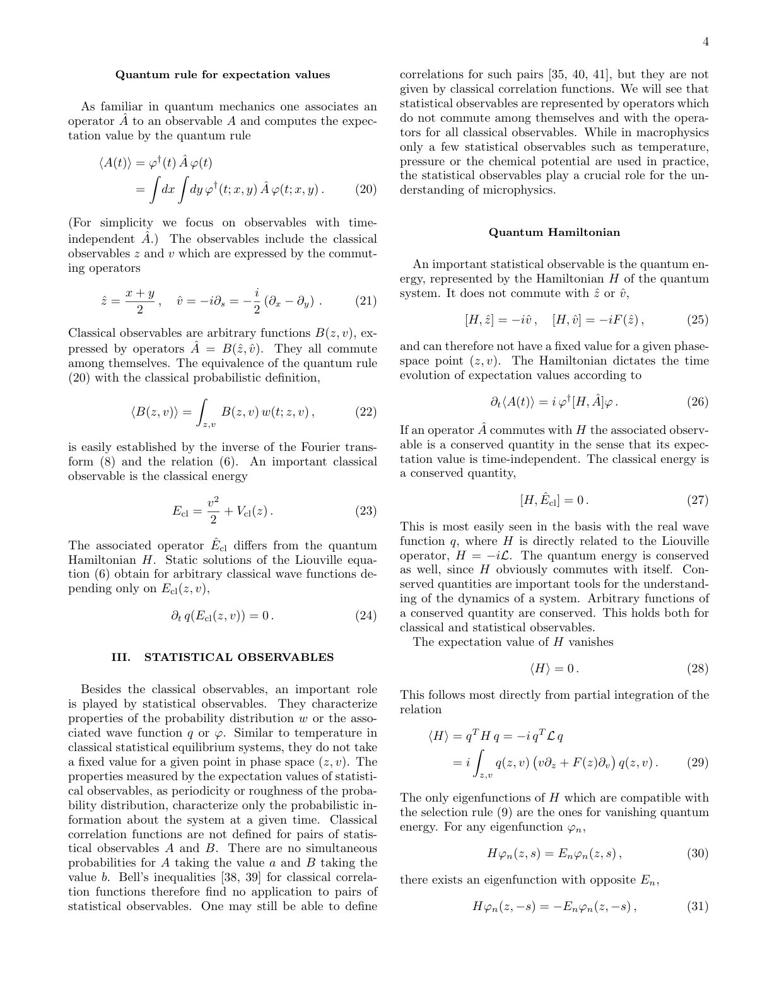
<figcaption class="paper-figure-caption"><b>Fig 3.</b> Low-resolution page preview, page 4</figcaption>
</figure>
<figure class="paper-figure-card">
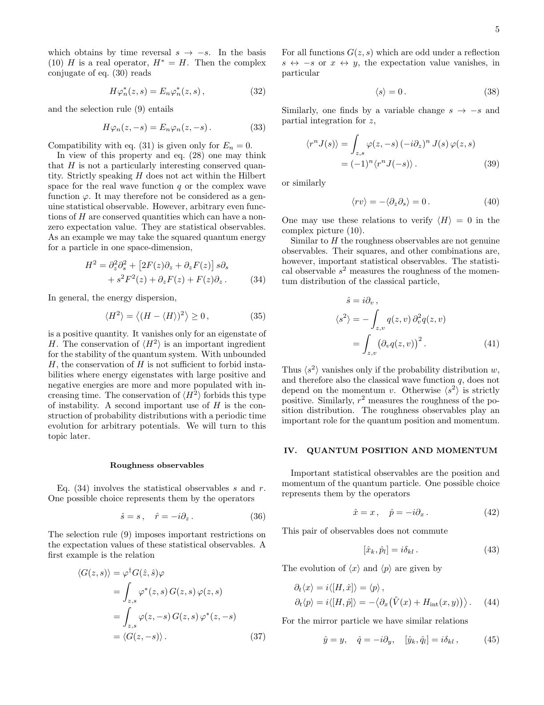
<figcaption class="paper-figure-caption"><b>Fig 4.</b> Low-resolution page preview, page 5</figcaption>
</figure>
<figure class="paper-figure-card">
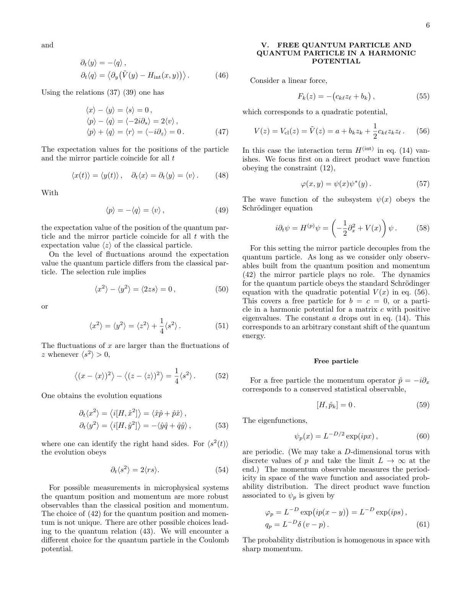
<figcaption class="paper-figure-caption"><b>Fig 5.</b> Low-resolution page preview, page 6</figcaption>
</figure>

**Summary.** This paper develops a novel framework to describe probabilistic classical particles using quantum mechanical formalism. It shows that robust 'quantum observables' can be defined for these systems, demonstrating how standard quantum mechanics (like the hydrogen atom spectrum) emerges as a specific subsystem of this larger statistical structure. This offers a theoretical bridge between classical probability theory and fundamental quantum principles.

**Why it may be interesting.** This work provides a deep theoretical link between classical statistical mechanics and quantum theory by reformulating observables using non-commuting operators, which is highly relevant for understanding open quantum systems or measurement processes.

Detailed structure

**Main problem.** The classical observables of position and momentum are inadequate for describing particles in microphysical situations with substantial probability distribution dispersion.

**Main result.** The paper proposes a quantum formalism where statistical observables, represented by non-commuting operators, can describe probabilistic classical particles, showing how standard quantum mechanics emerges as a subsystem description.

**Method.** It uses a quantum formalism applied to the Liouville equation for classical statistics, introducing complex wave functions derived via Fourier transforms and analyzing coupled particle-mirror dynamics.

**Model / system.** The model involves probabilistic classical particles governed by the Liouville equation. The analysis is formalized using a complex Schrödinger equation describing a system composed of the original particle and its time-reversed 'mirror' counterpart.

**Key observables.** Quantum observables (statistical observables), expectation values of position ($\langle x 
angle$), momentum ($\langle p 
angle$), and conserved statistical quantities like $\langle H^2 
angle$.

**Important parameters / regimes.** The analysis is general but demonstrates specific results for the harmonic potential and the Coulomb potential.

**Assumptions / limitations.** It assumes that a quantum system can emerge as a subsystem of a larger classical statistical framework, though it does not claim this applies to all physical reality.

**Paper structure.** The paper progresses by first establishing the inadequacy of classical observables, then introducing the quantum formalism via the Liouville equation mapping, developing the coupled particle-mirror Hamiltonian, and finally demonstrating recovery of known quantum results (e.g., Hydrogen atom spectrum) in specific limits.

Abstract

The classical observables of position and momentum are not well adapted to particles in a microphysical situation where typical probability distributions are characterized by a substantial dispersion. We propose the use of more robust quantum observables for probabilistic classical particles. The quantum observables are statistical observables which do not take fixed values for a given classical position and momentum. Solutions of the Liouville equation are discussed in the quantum formalism for classical statistics. Statistical observables are represented by non-commuting operators. No classical correlation function is defined for these observables and Bell's inequalities do not apply. We demonstrate for a general potential how a quantum system emerges from classical statistics. For the particular cases of a harmonic potential and a Coulomb potential we investigate subsystems which describe all features of a quantum particle. This covers the discrete energy spectrum of the hydrogen atom and quantum harmonic oscillator. We discuss the interference for the double-slit experiment. Conserved statistical observables may also be relevant for the probabilistic dynamics of dust or planets.

[↑ back to top](#top)

### [The Sample Pre-selection and Characterization Station at the SECUF: Instrumentation, Capabilities, and Representative Scientific Achievements](http://arxiv.org/abs/2607.13375v1)

**Authors:** Xu Chen, Tao Sun, Huifen Ren, Minjie Cui, Jun Luo, Shuai Zhang, Shaokui Su  
**Type:** experiment · **Category:** strongly correlated electrons · **PDF:** <https://arxiv.org/pdf/2607.13375v1>  
**Analysis basis:** full PDF text, analyzed in chunks
**Topic relevance:** `exotic spin models in light-matter` **3/5** · `analog quantum simulation` **2/5** · `spintronics-quantum-optics interface` **2/5** · `Kondo & dissipative impurity` **1/5** · `correlated cavity matter` **1/5** · `entanglement & information structure` **1/5** · `non-equilibrium dynamics` **1/5**

↔ Scroll figures horizontally

<figure class="paper-figure-card">
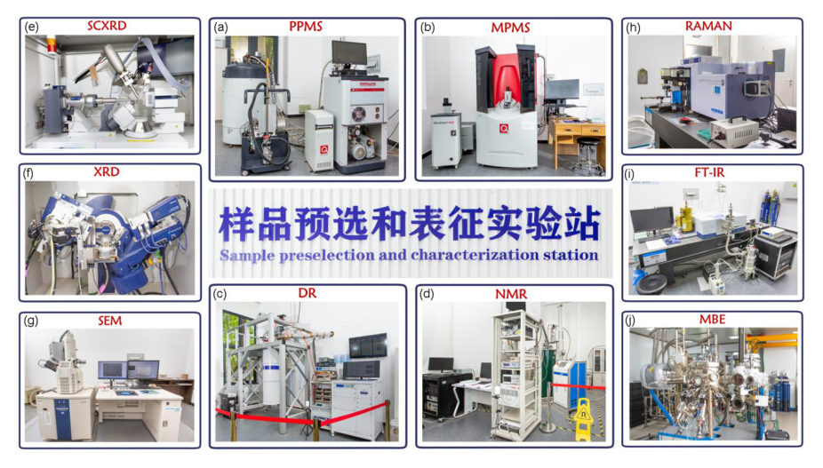
<figcaption class="paper-figure-caption"><b>Fig 1.</b> Fig. 1. Instrumentation of the F2 station, including (a) 16 T multifunctional ultra-low temperature physical</figcaption>
</figure>
<figure class="paper-figure-card">
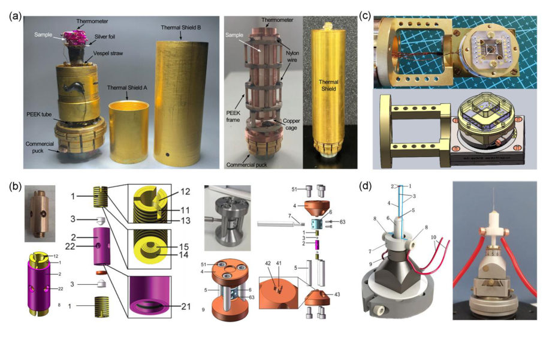
<figcaption class="paper-figure-caption"><b>Fig 2.</b> Fig. 2. Instrument upgrade of the F2 station, including (a) Photos of PPMS-based quasi-adiabatic</figcaption>
</figure>
<figure class="paper-figure-card">
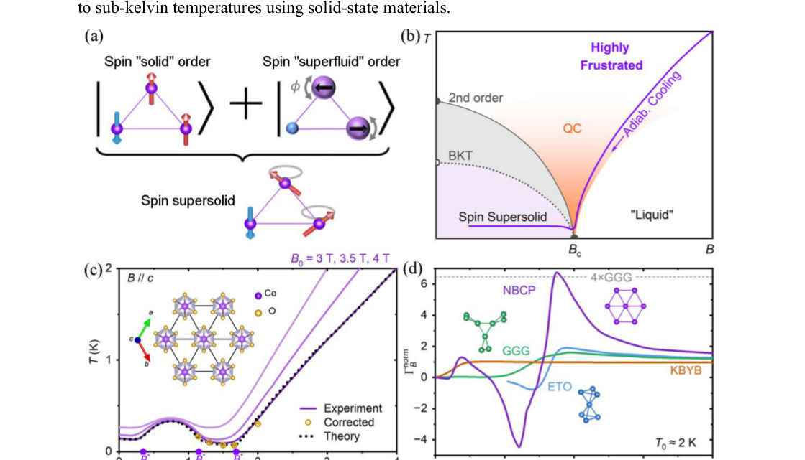
<figcaption class="paper-figure-caption"><b>Fig 3.</b> Fig. 3. Schematic illustration of spin supersolid formation on a two-dimensional triangular lattice, and</figcaption>
</figure>
<figure class="paper-figure-card">
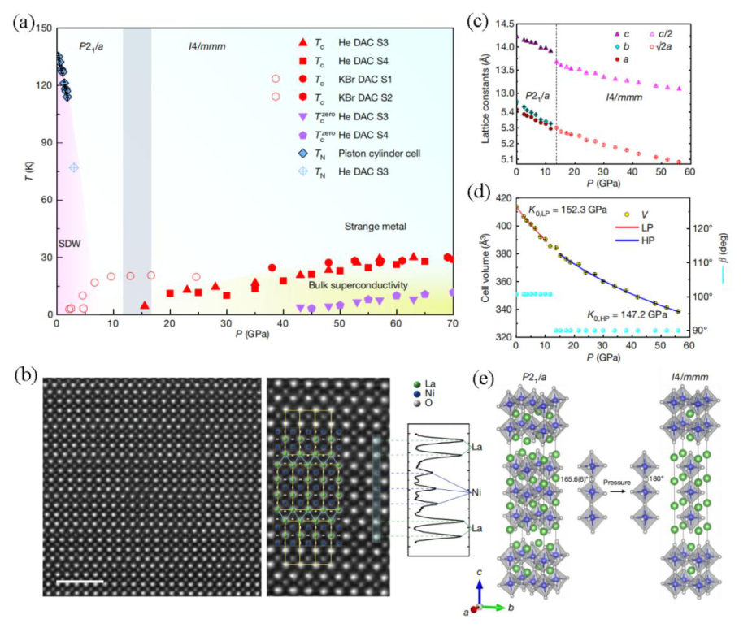
<figcaption class="paper-figure-caption"><b>Fig 4.</b> Fig. 4. Pressure-dependent phase diagram and lattice structure of La4Ni3O10-δ. Part of the Tc data in</figcaption>
</figure>
<figure class="paper-figure-card">
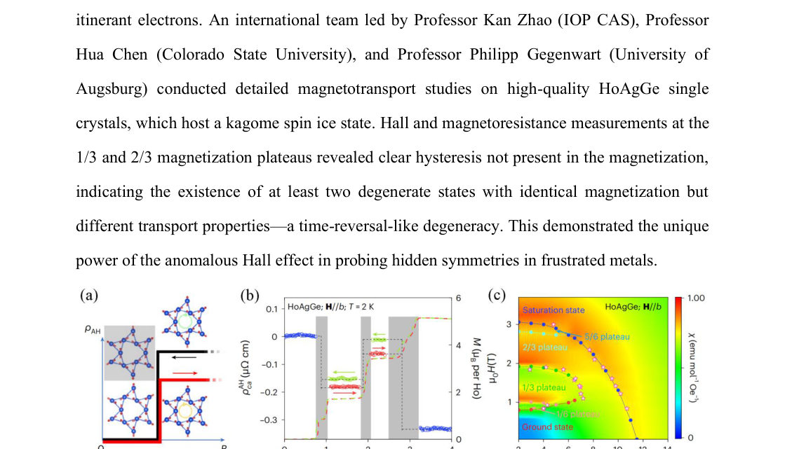
<figcaption class="paper-figure-caption"><b>Fig 5.</b> Fig. 5. Time-reversal-like degeneracies in field-induced plateau phases of HoAgGe. The anomalous</figcaption>
</figure>

**Summary.** This paper details the advanced instrumentation capabilities of the F2 Sample Pre-selection and Characterization Station at SECUF. By integrating multiple extreme conditions—such as high pressure, low temperature, and strong magnetic fields—the facility allows for comprehensive characterization of novel quantum materials. The reported achievements underscore its role in discovering exotic states like high-Tc superconductivity under immense pressure.

**Why it may be interesting.** While focused on materials science instrumentation, the reported discoveries (superconductivity, quantum spin states) are central to strongly correlated electron physics, which often involves complex many-body interactions relevant to theoretical modeling.

Detailed structure

**Main problem.** To provide comprehensive sample synthesis, processing, pre-screening, and characterization services to prepare high-quality specimens for frontier research under extreme physical conditions.

**Main result.** The facility has enabled discoveries including novel quantum spin supersolid states, pressure-induced high-temperature superconductivity in nickelates, and giant anomalous Hall angles.

**Method.** A suite of advanced experimental techniques is utilized, combining electrical transport measurements (resistivity, heat capacity) with structural characterization (XRD, SEM) under extreme conditions like ultrahigh pressure and ultralow temperature.

**Model / system.** The research platform is the Synergetic Extreme Condition User Facility (SECUF), specifically detailing the F2 Sample Pre-selection and Characterization Station. This station integrates multiple physical controls: ultrahigh pressure, ultralow temperature, strong magnetic fields, and ultrafast optical fields.

**Key observables.** Resistivity, heat capacity, magnetic susceptibility, structural parameters (lattice constants, crystal structure), anomalous Hall angle, and superconducting transition signatures.

**Important parameters / regimes.** Temperatures down to $<10$ mK; Magnetic fields up to $\pm 16$ T; Pressures up to 70 GPa.

**Assumptions / limitations.** The primary assumption is that the combination of extreme physical conditions can unlock novel quantum phases and material properties inaccessible under ambient conditions.

**Figures summary.** Figures illustrate the comprehensive instrumentation overview, including PPMS, MPMS, DR, NMR, SCXRD, XRD, SEM, Raman, and FT-IR systems, alongside details of instrument upgrades like high-pressure cells.

**Paper structure.** The paper details the specifications of ten core instrument systems within the F2 Station. It then highlights several breakthrough scientific achievements enabled by these combined capabilities, such as superconductivity in nickelates and anomalous Hall effects.

Abstract

The Synergetic Extreme Condition User Facility (SECUF) is a comprehensive, state-of-the-art user facility designed to provide integrated extreme physical conditions-including ultrahigh pressure, ultralow temperature, strong magnetic fields, and ultrafast optical fields-for frontier research in condensed matter physics and materials science. Within SECUF, the F2 Sample Pre-selection and Characterization Station plays a pivotal supporting role. Its mission is to provide comprehensive sample synthesis, processing, pre-screening, and characterization services to prepare high-quality specimens for subsequent experiments under extreme conditions. This paper details the specifications and performance of ten core instrument systems within these units. Furthermore, we highlight several breakthrough scientific achievements enabled by the F2 Station, encompassing the discovery of novel quantum spin supersolid states, pressure-induced high-temperature superconductivity in nickelates, giant anomalous Hall angles, and molecular water in lunar soil. We also outline ongoing technical developments that expand the station's capabilities, such as integrated high-pressure cells and self-built ancillary measurement systems.

[↑ back to top](#top)

### [Unified Terahertz Framework for Magnetic and Lattice Responses Reveals an Elusive Ordering Transition in Gd$_2$Ru$_2$O$_7$](http://arxiv.org/abs/2607.14029v1)

**Authors:** Nicolas M. Kawahala, Rafael L. Sabainsk, Esteban Marulanda, Rafael S. Freitas, Felix G. G. Hernandez  
**Type:** experiment · **Category:** strongly correlated electrons · **PDF:** <https://arxiv.org/pdf/2607.14029v1>  
**Analysis basis:** full PDF text, analyzed in chunks
**Topic relevance:** `exotic spin models in light-matter` **3/5** · `spintronics-quantum-optics interface` **3/5** · `quantum optics experiment` **2/5** · `Keldysh / 2PI / non-Gaussian methods` **1/5** · `analog quantum simulation` **1/5** · `driven-dissipative phase transition` **1/5**

↔ Scroll figures horizontally

<figure class="paper-figure-card">
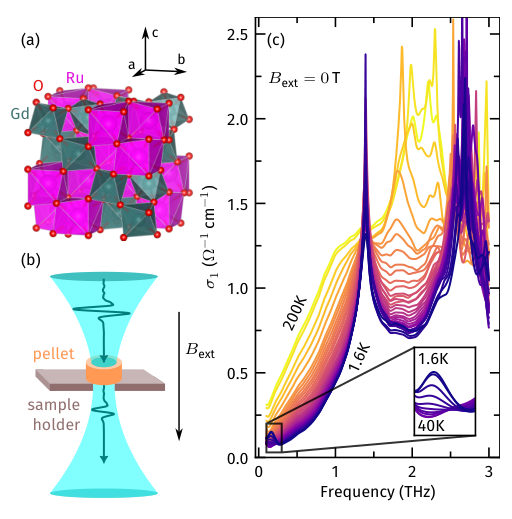
<figcaption class="paper-figure-caption"><b>Fig 1.</b> FIG. 1. (a) Gd2Ru2O7 crystal structure, rendered from data in the Materials Project [34]. (b) Schematic of the Faraday- geometry magneto-THz-TDS setup near the sample position. (c) Real part of the optical conductivity at zero external mag- netic field for temperatures between 1.6 (blue) and 200 K (yellow). Inset: Magnified view of the low-frequency region, highlighting the emergence of a resonance near 0.15 THz at low temperatures.</figcaption>
</figure>
<figure class="paper-figure-card">
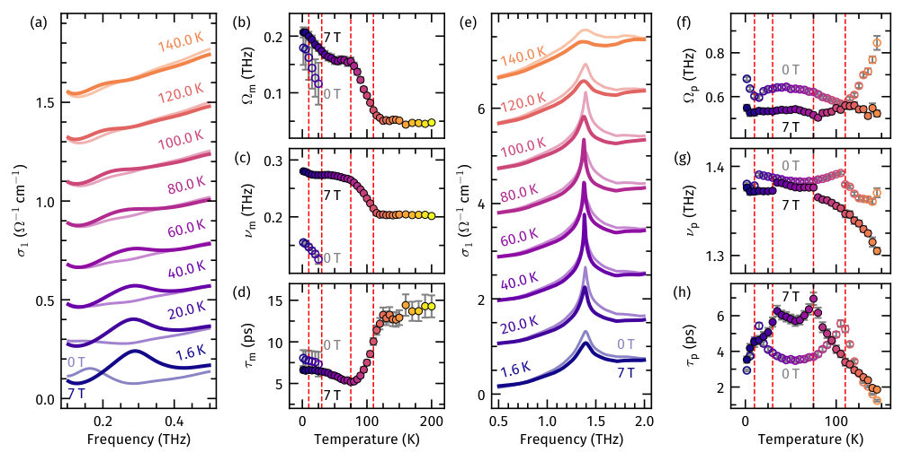
<figcaption class="paper-figure-caption"><b>Fig 2.</b> FIG. 2. (a) Low-frequency optical conductivity showing a resonance associated with exchange-split Gd levels, for representative temperatures, measured at Bext = 0 T (shaded lines) and 7 T (solid lines). Temperature dependence of the fitted (b) oscillator strength, (c) resonance frequency, and (d) scattering time for Bext = 0 T (hollow markers) and 7 T (filled markers). Vertical dashed lines mark characteristic temperatures associated with Ru- and Gd-related anomalies discussed in the text, with values 10, 30, 75 and 110 K. (e) Optical conductivity in the phonon frequency range at the same external magnetic fields and temperatures shown in (a). (f)–(h) Temperature dependence of the...</figcaption>
</figure>
<figure class="paper-figure-card">
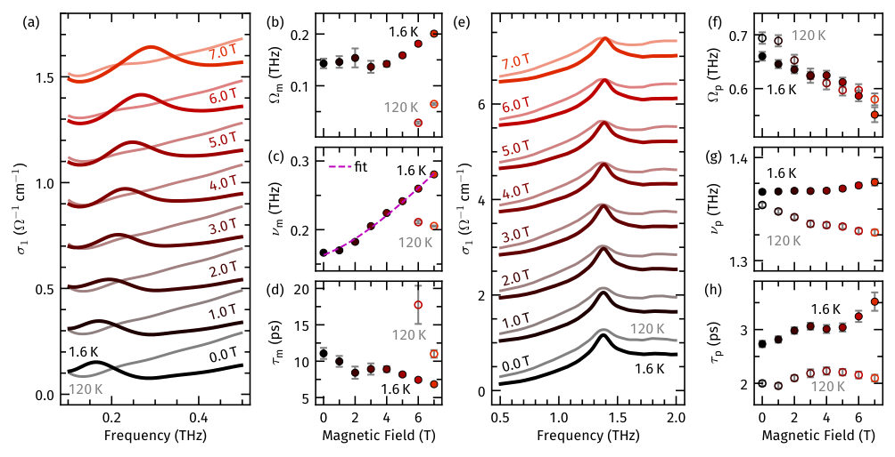
<figcaption class="paper-figure-caption"><b>Fig 3.</b> FIG. 3. (a) Low-frequency optical conductivity at 1.6 K (solid lines) and 120 K (shaded lines) for external magnetic fields from 0 to 7 T, showing a field-induced shift and enhancement of the Gd-related resonance. External magnetic-field dependence of the extracted (b) spectral weight, (c) resonance frequency, and (d) scattering time at 1.6 K (filled markers) and 120 K (hollow markers). In (c), the dashed line is a fit including internal and external field contributions. (e) Optical conductivity in the phonon frequency range at the same external magnetic fields and temperatures shown in (a). (f)–(h) Magnetic-field dependence of the phonon parameters. For clarity, spectra corresponding to...</figcaption>
</figure>

**Summary.** This work uses THz spectroscopy on $	ext{Gd}_2	ext{Ru}_2	ext{O}_7$ to simultaneously measure magnetic and lattice responses. By modeling the coupled evolution of these two spectral features, the authors successfully quantify an internal magnetic field and reveal a subtle Gd-ordering transition previously hidden from bulk measurements.

**Why it may be interesting.** The technique provides a powerful, non-invasive way to probe coupled quantum phenomena (spin-lattice coupling) by separating and analyzing distinct energy scales within a single spectroscopic measurement.

Detailed structure

**Main problem.** The study aims to understand how magnetic order couples to lattice vibrations (spin-lattice coupling) in $	ext{Gd}_2	ext{Ru}_2	ext{O}_7$ and reveal an ordering transition that is difficult to detect using standard bulk thermodynamic measurements.

**Main result.** By simultaneously measuring magnetic excitations and optical phonons via THz spectroscopy, the authors quantified an internal exchange field ($B_{	ext{int}}$) consistent with cluster-multipolar order and provided independent spectroscopic evidence for a low-temperature Gd-ordering transition.

**Method.** Magneto-Terahertz Time-Domain Spectroscopy (THz-TDS) was employed to measure the complex optical conductivity ($\sigma(
u)$) across both magnetic and phonon frequency ranges as a function of temperature and external magnetic field.

**Model / system.** The physical system is the pyrochlore ruthenate $	ext{Gd}_2	ext{Ru}_2	ext{O}_7$, which contains localized $4f$ moments ($	ext{Gd}^{3+}$) coupled to itinerant $	ext{Ru}$ magnetism. The analysis models spectral features using uncoupled Lorentz oscillators superimposed on a quadratic background.

**Key observables.** Low-frequency magnetic resonance parameters ($\Omega_m, 
u_m, 	au_m$), optical phonon parameters ($\Omega_p, 
u_p, 	au_p$), and the integrated spectral weights ($W_m, W_p$).

**Important parameters / regimes.** Temperatures ranging from $1.6	ext{ K}$ to $200	ext{ K}$, external magnetic fields up to $7	ext{ T}$, and derived internal exchange field values ($\approx 5-6 	ext{ T}$).

**Assumptions / limitations.** The analysis assumes that the spectral response in each region can be modeled by an uncoupled Lorentz oscillator on a smooth quadratic background, allowing for independent fitting of magnetic and phonon components.

**Figures summary.** Figures illustrate the temperature and field dependence of resonance parameters ($\Omega, 
u, 	au$) for both magnetic and phonon modes, showing correlated anomalies at characteristic ordering temperatures. Integrated spectral weights ($W_m, W_p$) are plotted as functions of T and B.

**Paper structure.** The paper establishes a unified framework by analyzing the temperature and field dependence of two distinct spectroscopic signals—the low-frequency magnetic resonance and the optical phonon mode—to correlate them with known magnetic transition points in $	ext{Gd}_2	ext{Ru}_2	ext{O}_7$.

Abstract

Magnetic order in materials combining localized rare-earth moments with itinerant transition-metal sublattices generates internal fields whose lattice imprint is rarely accessed directly. In Gd pyrochlore ruthenate, we find that a single terahertz spectrum resolves an exchange-split Gd$^{3+}$ mode and an optical phonon. Their coupled evolution quantifies the internal field, oriented as predicted for cluster-multipolar order, and reveals a Gd-ordering transition elusive to bulk thermodynamic probes, establishing a unified framework for accessing magnetic and lattice responses in correlated quantum materials.

[↑ back to top](#top)

### [Magnetic quadrupole current generation and accumulation in noncentrosymmetric systems](http://arxiv.org/abs/2607.13680v1)

**Authors:** Yuuga Takasu, Satoru Hayami  
**Type:** theory · **Category:** strongly correlated electrons · **PDF:** <https://arxiv.org/pdf/2607.13680v1>  
**Analysis basis:** full PDF text, analyzed in chunks
**Topic relevance:** `spintronics-quantum-optics interface` **3/5** · `Keldysh / 2PI / non-Gaussian methods` **2/5** · `methods for driven-dissipative` **2/5** · `analog quantum simulation` **1/5** · `exotic spin models in light-matter` **1/5** · `non-equilibrium dynamics` **1/5**

↔ Scroll figures horizontally

<figure class="paper-figure-card">
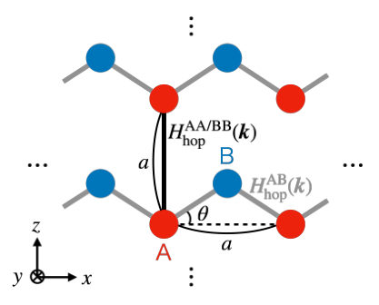
<figcaption class="paper-figure-caption"><b>Fig 1.</b> FIG. 1. Crystal structure of the two-dimensional coupled zigzag chains in the xz plane. The black (gray) bonds de- note the intra-sublattice hopping Hamiltonians HAA/BB hop (k) [inter-sublattice hopping HAB hop(k)], which together preserve the centrosymmetric point-group symmetry mmm.</figcaption>
</figure>
<figure class="paper-figure-card">
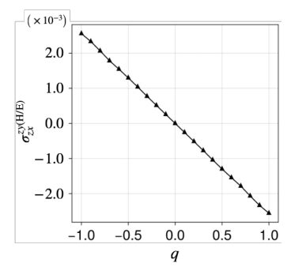
<figcaption class="paper-figure-caption"><b>Fig 2.</b> FIG. 2. Dependence of the dissipationless MQ Hall conduc- tivity σzy(H/E) zx on the symmetry-lowering parameter q. The finite response for q ̸= 0 demonstrates MQ-current generation induced by the symmetry reduction from mmm to mm2. We set V = 216.</figcaption>
</figure>
<figure class="paper-figure-card">
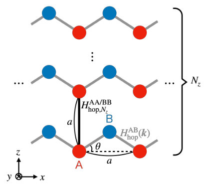
<figcaption class="paper-figure-caption"><b>Fig 3.</b> FIG. 3. Crystal structure of two-dimensional coupled zigzag chains having the edges along z direction. Black and gray lines represent the hopping processes described by HAA/BB hop,Nz and HAB hop(k), respectively. Nz stands for the number of x- directional zigzag chains.</figcaption>
</figure>
<figure class="paper-figure-card">
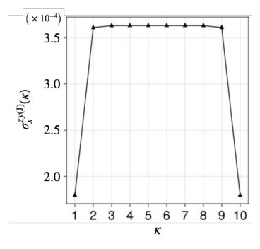
<figcaption class="paper-figure-caption"><b>Fig 4.</b> FIG. 4. Layer dependence of σzy(J) x (κ) for q = 0, Nz = 10, and V = 215Nz.</figcaption>
</figure>
<figure class="paper-figure-card">
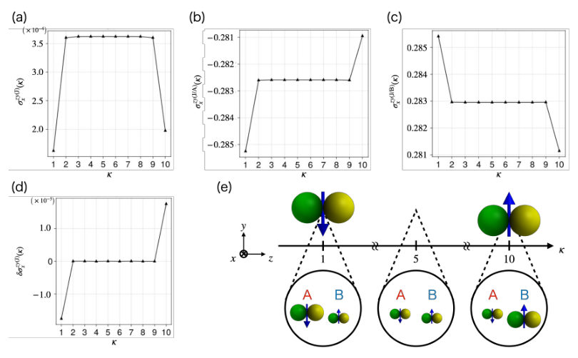
<figcaption class="paper-figure-caption"><b>Fig 5.</b> FIG. 5. (a) Layer dependence of the MQ conductivity σzy(J) x (κ) for q = 1, Nz = 10, and V = 215Nz. (b), (c) Layer dependence of the sublattice-resolved contributions, σzy(J/A) x (κ) and σzy(J/B) x (κ), obtained from Eq. (41) by restricting ρ, ρ′ = A and B,</figcaption>
</figure>

**Summary.** This paper theoretically establishes that magnetic quadrupole (MQ) currents can be generated and accumulated in noncentrosymmetric antiferromagnets, providing a novel pathway for controlling magnetization. Using advanced group theory and multipole expansions, the authors prove that this effect is intrinsically linked to the breaking of spatial inversion symmetry. This work provides a crucial theoretical framework for designing MQ-based spintronic devices.

**Why it may be interesting.** While focused on condensed matter magnetism, the rigorous application of group theory to classify emergent transport responses (like quadrupole currents) provides powerful theoretical tools applicable to understanding symmetry breaking in complex quantum materials relevant to AMO physics.

Detailed structure

**Main problem.** The study investigates magnetic quadrupole (MQ) current generation and accumulation in noncentrosymmetric antiferromagnets as a mechanism for controlling magnetization.

**Main result.** MQ currents are generically allowed in noncentrosymmetric systems because the relevant conductivity tensor vanishes in centrosymmetric materials. The authors establish a framework showing MQ accumulation at sample edges, analogous to the spin Hall effect.

**Method.** The analysis employs symmetry group theory and multipole representation techniques (Kubo formula) to classify the components of the MQ conductivity tensor ($\sigma_{n\alpha i;j}$).

**Model / system.** The focus is on noncentrosymmetric antiferromagnets, where the magnetic quadrupole moment constitutes the lowest-rank symmetry-allowed magnetic multipole for magnetization control.

**Key observables.** MQ conductivity tensor ($\sigma_{n\alpha i;j}$), MQ current ($J_{n\alpha i}$), and MQ accumulation near sample edges.

**Important parameters / regimes.** The analysis depends critically on the crystal point group symmetry, specifically comparing centrosymmetric vs. noncentrosymmetric subgroups (e.g., $mmm$ to $mm2$).

**Assumptions / limitations.** The study operates within the linear-response regime initially but extends to analyze non-equilibrium accumulation effects.

**Figures summary.** Notes mention figures illustrating the layer dependence of spin response in the mm2 phase and general references to tables summarizing multipole parities and conductivity components for various CPGs.

**Paper structure.** The paper systematically establishes symmetry conditions for MQ current generation by constructing the multipole representation of the MQ conductivity tensor, demonstrating its necessity in parity-broken systems, and predicting edge accumulation effects.

Abstract

Magnetization control via magnetic octupole injection has recently been proposed for a new class of centrosymmetric antiferromagnets, namely $d$-wave altermagnets, where the magnetic octupole is the lowest-rank magnetic multipole allowed by symmetry and serves as an alternative carrier to spin injection. In contrast, in noncentrosymmetric antiferromagnets, the magnetic quadrupole (MQ) constitutes the lowest-rank symmetry-allowed magnetic multipole, suggesting that MQ currents can provide an efficient route toward magnetization control through MQ injection. Here, we establish the symmetry conditions for MQ-current generation by constructing the multipole representation of the MQ conductivity tensor and show that MQ currents are generically allowed in noncentrosymmetric crystallographic point groups. As a representative example, we demonstrate MQ-current generation in the linear-response regime associated with symmetry lowering from the centrosymmetric point group ($mmm$) to its noncentrosymmetric subgroup ($mm2$). Furthermore, we reveal MQ accumulation near sample edges, analogous to spin accumulation induced by the spin Hall effect. This edge accumulation provides direct evidence of MQ-current generation and constitutes a key prerequisite for realizing MQ injection and MQ-based magnetization control in noncentrosymmetric antiferromagnets.

[↑ back to top](#top)

### [Towards stealthy hyperuniform networks with optimal isotropic complete photonic band gaps using a novel inverse design procedure](http://arxiv.org/abs/2607.13199v1)

**Authors:** Joel Steinegger, Paul J. Steinhardt, Christoph Räth, Salvatore Torquato, Michael A. Klatt  
**Type:** theory · **Category:** disordered systems and neural networks · **PDF:** <https://arxiv.org/pdf/2607.13199v1>  
**Analysis basis:** full PDF text, analyzed in chunks
**Topic relevance:** `methods for driven-dissipative` **3/5** · `analog quantum simulation` **2/5** · `driven-dissipative phase transition` **2/5** · `interference shaping light` **1/5** · `non-equilibrium dynamics` **1/5** · `non-equilibrium universality` **1/5**

↔ Scroll figures horizontally

<figure class="paper-figure-card">
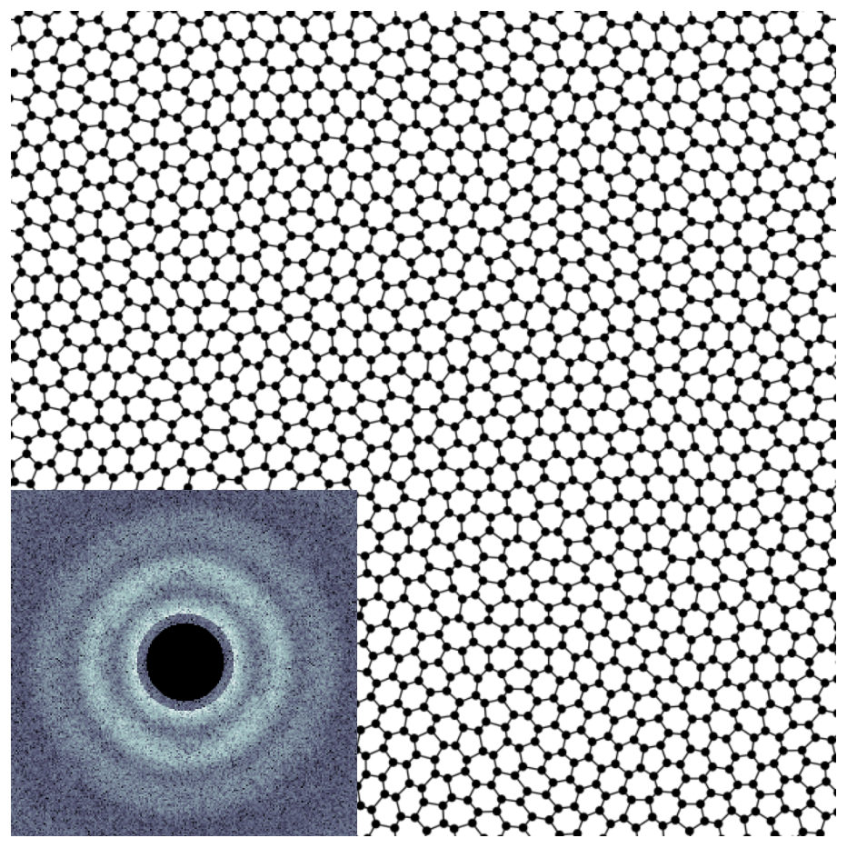
<figcaption class="paper-figure-caption"><b>Fig 1.</b> Figure 1: Realization of a stealthy hyperuniform disordered network: A representa- tive trivalent network generated via our new inverse design procedure (χ1(K1) = 0.37, χ2(K2) = 0.24), comprising 2,000 vertices. The main panel shows the pixelated grid used for band structure computations in MPB. The inset displays the corresponding spectral density ˜χV (k) on a logarithmic scale, confirming the isotropy and the stealthy hyperuni- form nature of the heterostructure.</figcaption>
</figure>
<figure class="paper-figure-card">
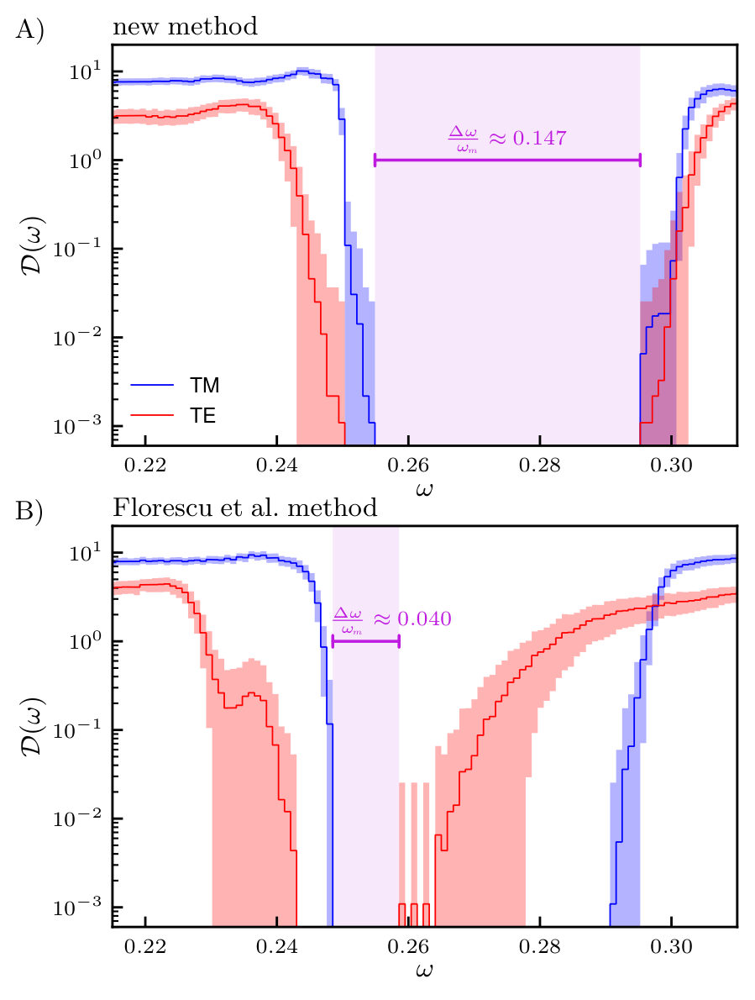
<figcaption class="paper-figure-caption"><b>Fig 2.</b> Figure 2: Density of states D(ω) averaged over 500 independent realizations for: A) the new inverse design method (r = 0.24, w = 0.08), and B) the original design approach by Florescu et al. [7] (r = 0.24, w = 0.10). Shaded regions represent the standard deviation within each bin (with width ∆ω ≈0.00092). The dielectric contrast was 13.0 in both cases, in alignment with established values from earlier studies.</figcaption>
</figure>
<figure class="paper-figure-card">
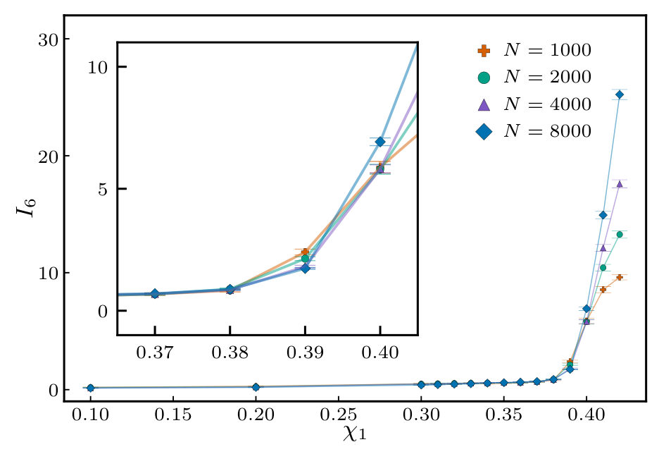
<figcaption class="paper-figure-caption"><b>Fig 3.</b> Figure 3: Disorder-to-order phase transition identified by the bond-orientational order parameter I6, plotted as a function of χ1(K1) for different system sizes (number of vertices N), where each data point represents an average over 128 independent realizations. The error bars denote one standard deviation. The inset provides a detailed view of the critical region χ ∈[0.37, 0.4]. The data exhibit clear evidence for a disorder-to-order phase transition at χ ≈0.39.</figcaption>
</figure>
<figure class="paper-figure-card">
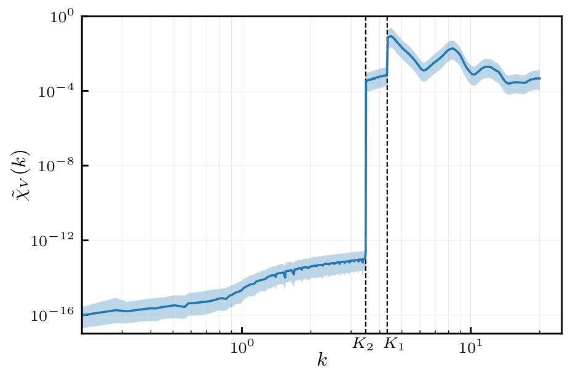
<figcaption class="paper-figure-caption"><b>Fig 4.</b> Figure 4: Spectral density ˜χV (k) of our stealthy hyperuniform networks (composed of disks and rectangles). The solid line shows the median of ˜χV (k) for 500 realizations. The shaded regions represent the interval between the 16th and 84th percentiles of the distribution within each bin (with width ∆k ≈0.0199).</figcaption>
</figure>

**Summary.** This paper introduces a novel two-stage inverse design technique to create 2D photonic networks that are inherently stealthy hyperuniform. By optimizing the network topology directly, the authors achieve isotropic complete photonic band gaps with unprecedented width and robustness across large ensembles of disordered structures.

**Why it may be interesting.** While focused on photonics, the methodology—using inverse design coupled with hyperuniformity constraints ($	ilde{\chi}_V(k)=0$) to engineer macroscopic properties in a disordered medium—is highly relevant for designing artificial quantum materials or metamaterials where disorder must be controlled precisely.

Detailed structure

**Main problem.** The core problem is achieving isotropic complete photonic band gaps (PBGs) in disordered 2D photonic networks that persist robustly as the system size approaches the thermodynamic limit.

**Main result.** The authors developed a novel two-stage inverse design procedure that successfully creates such networks, yielding PBG widths comparable to anisotropic crystals and demonstrating robustness across ensembles up to 100,000 vertices.

**Method.** They employ a two-stage inverse design optimization process targeting the stealthy hyperuniformity of the entire two-phase network structure directly, rather than just its progenitor point pattern.

**Model / system.** The system is modeled as a 2D photonic network composed of high-dielectric disks at vertices and thin rectangular walls along bonds. The analysis uses the Density of States (DoS) ensemble method to probe large-scale behavior.

**Key observables.** Complete Photonic Band Gap (PBG), Stealthy Hyperuniformity ($	ilde{\chi}_V(k)$), Gap-to-Midgap Ratio, and Defect State Density.

**Important parameters / regimes.** Dielectric contrast of 13.0; target stealthy hyperuniformity values like $\chi_1(K_1) = 0.37$ and $\chi_2(K_2) = 0.24$.

**Assumptions / limitations.** The analysis relies on the ensemble-based DoS method to approximate behavior in the thermodynamic limit, overcoming limitations of single-realization studies.

**Figures summary.** Figures compare the Density of States (DoS) for TE and TM modes using the new inverse design method against prior art, showing robust band gap suppression. Spectral density plots confirm the hyperuniform nature across large ensembles.

**Paper structure.** The paper progresses by first identifying the limitations of previous methods based on point patterns, then introducing the two-stage optimization protocol (global topology followed by network refinement), and finally validating the results using ensemble DoS calculations to prove thermodynamic stability.

Abstract

We present a two-stage inverse design procedure for producing disordered stealthy hyperuniform trivalent photonic networks in two dimensions with isotropic complete photonic band gaps (PBGs) blocking light regardless of direction or polarization (TE or TM) over a wide frequency range. Most ordinary disordered systems fail to maintain complete PBGs as system size increases. The only known exceptions that remain open in the largest simulations have been generated by mapping stealthy hyperuniform point patterns into trivalent networks. However, the resulting networks are not truly stealthy hyperuniform two-phase media. Although their PBGs remain open, they are relatively narrow due to limited overlap between the TE and TM band gaps and broad band tails caused by localized defect states. By contrast, our two-stage inverse design aims to make the final network itself stealthy hyperuniform, achieving unprecedented near-optimal overlap between the TE and TM band gaps and a small defect state density at the band edges. We obtain not only single realizations with large PBGs, but a striking homogeneity across a large ensemble, effectively probing a network with 100,000 vertices. This ensemble-based band gap is comparable in width to the complete PBG of an anisotropic honeycomb photonic crystal with the same network parameters and nearly an order of magnitude wider than the previously widest known isotropic complete PBGs. Our designs can be fabricated using additive manufacturing, offering new pathways to manipulate electromagnetic waves for photonic technologies.

[↑ back to top](#top)

### [Momentum Distribution and Contact Parameters of a mass-imbalanced three-body system across the Efimov-Unatomic transition](http://arxiv.org/abs/2607.13769v1)

**Authors:** D. S. Rosa, R. M. Francisco, T. Frederico, G. Krein, M. T. Yamashita  
**Type:** theory · **Category:** other · **PDF:** <https://arxiv.org/pdf/2607.13769v1>  
**Analysis basis:** full PDF text, analyzed in chunks
**Topic relevance:** `analog quantum simulation` **3/5** · `non-equilibrium universality` **2/5** · `Keldysh / 2PI / non-Gaussian methods` **1/5** · `driven-dissipative phase transition` **1/5** · `non-equilibrium dynamics` **1/5**

↔ Scroll figures horizontally

<figure class="paper-figure-card">
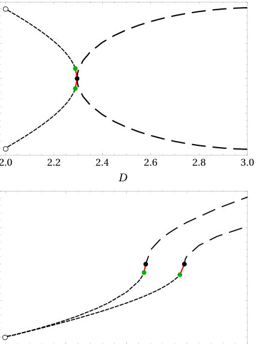
<figcaption class="paper-figure-caption"><b>Fig 1.</b> FIG. 1. Scaling parameter sn as a function of the spatial di- mension D for resonant mass-imbalanced three-body systems. Upper panel: Full behavior for the 23Na2 – 40K system, show- ing the Efimov regime (sn = ±is0) for D &gt; Dc, the critical di- mension Dc (black point), and the transition to real solutions below it. The green point marks D, below which the asymp- totic behavior of the momentum distribution is entirely gov- erned by a three-body contribution exhibiting power-law scal- ing, characteristic of the unatomic regime. The red segment highlights the intermediate scale invariant region between Dc and D. The open circle indicates the limit D →2+. Lower panel: Zoom of the transition...</figcaption>
</figure>
<figure class="paper-figure-card">
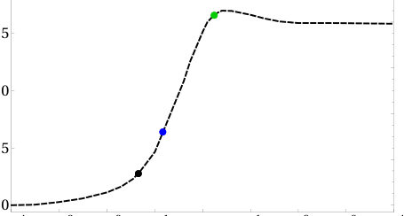
<figcaption class="paper-figure-caption"><b>Fig 2.</b> FIG. 2. Difference Dc −D, which defines the width of the Scale Invariant Regime (SIR), as a function of the mass ratio mB/mA. The SIR corresponds to the interval in dimension where the system is not described by either Efimov (discrete scaling) or unatomic (continuous scaling) regimes. The highlighted points indicate experimentally rel- evant heavy–heavy–light mixtures: 133Cs2 – 6Li, 41K2 – 6Li, and 23Na2 – 40K. As the mass imbalance increases, the width of the SIR decreases, indicating that the crossover between discrete and continuous scale invariance becomes increasingly localized in dimension.</figcaption>
</figure>
<figure class="paper-figure-card">
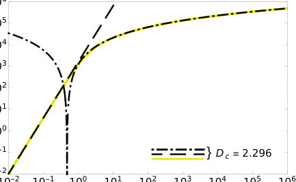
<figcaption class="paper-figure-caption"><b>Fig 3.</b> FIG. 3. Spectator function for the resonant system 23Na2 - 40K at the critical dimension Dc = 2.296 (bho/r2D = 0.986). The full solution Eq. (A16) (yellow) is compared with its asymptotic forms in the limits qB ≫κ0 (black dot-dashed, Eq. (3.5) and qB ≪κ0 Eq.(3.4) (black dashed), showing the rapid convergence of the logarithmic asymptotics at large mo- mentum.</figcaption>
</figure>
<figure class="paper-figure-card">
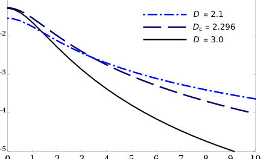
<figcaption class="paper-figure-caption"><b>Fig 4.</b> FIG. 5. Single particle momentum distribution of the reso- nant compound 23Na2 - 40K for different dimensions, namely, D = 3, Dc = 2.296 (harmonic-trap length of bho/r2D = 0.986) and D = 2.1.</figcaption>
</figure>
<figure class="paper-figure-card">
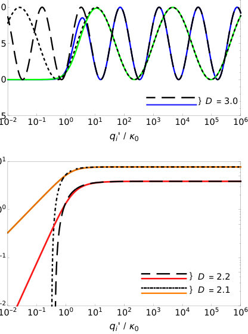
<figcaption class="paper-figure-caption"><b>Fig 5.</b> FIG. 4. Spectator functions in momentum space for the reso- nant system 23Na2 - 40K computed with Eq. (A16), compared to the zero-energy case from Eq.(3.1) considering different regimes of dimensions. Upper panel: for two different dimen- sions, namely D = 3 and D = 2.4 (harmonic-trap length of bho/r2D = 1.195), we compare the spectator functions for fi- nite three-body energy (colored lines) with the zero-energy case (3.1) (dashed and dotted black lines). Lower panel: we compare the spectator functions for finite three-body energy in the unatomic regime (colored lines) with the zero-energy case (3.1) (dotted and dashed black lines) at the unatomic region.</figcaption>
</figure>

**Summary.** This paper theoretically analyzes three-body quantum systems across the dimensional transition between Efimov and unatomic regimes. It finds that at the critical dimension, the system's momentum tail requires a unique logarithmic scaling structure governed by an additional three-body contact parameter. This work establishes the critical dimension as a key point for probing emergent scaling properties in few-body quantum gases.

**Why it may be interesting.** This work provides a rigorous theoretical framework for understanding how fundamental many-body physics transitions between different scaling laws (log-periodic vs. power-law) in ultracold atomic systems, offering new experimental signatures based on momentum measurements.

Detailed structure

**Main problem.** The study investigates how the momentum distribution and contact parameters of a mass-imbalanced three-body quantum system evolve as the spatial dimension is tuned across the critical point separating Efimov and unatomic regimes.

**Main result.** At the critical dimension, the asymptotic momentum tail exhibits a unique logarithmic scaling structure requiring an additional three-body contact parameter, which can lead to the suppression of the three-body contribution at finite momenta.

**Method.** The authors use theoretical methods involving solving Faddeev equations in an effective noninteger spatial dimension D and analyzing the large-momentum asymptotic behavior of the spectator function.

**Model / system.** The model is a mass-imbalanced three-body quantum system, analyzed by mapping its physics onto an effective continuous spatial dimension D, allowing for a dimensional crossover between different physical regimes.

**Key observables.** Single-particle momentum distribution (large-momentum tail), two-body contact parameter ($C_2$), and the newly introduced three-body contact parameter ($C''_3$).

**Important parameters / regimes.** The critical dimension $D_c$, the mass imbalance ratio, and the intermediate scaling regime width $\Delta = D_c - D$.

**Assumptions / limitations.** The analysis relies on mapping the system to an effective noninteger spatial dimension D and using asymptotic expansions for momentum space functions.

**Figures summary.** Figures illustrate the scaling parameter $s_n$ vs. dimension D across Efimov, critical, and unatomic regimes; another figure quantifies the width of the intermediate scaling regime dependence on mass imbalance; a third shows the logarithmic asymptotic form at $D_c$.

**Paper structure.** The paper systematically analyzes the system's behavior in three distinct dimensional regimes (Efimov, Unatomic, Intermediate) by deriving the momentum distribution components and identifying the necessary contact parameters required to maintain physical consistency across the transition point.

Abstract

We investigate the single-particle momentum distribution and contact parameters of mass-imbalanced three-body systems at the critical dimension Dc, where the transition between discrete and continuous scale invariance takes place as the spatial dimension is tuned between three and two dimensions. We show that the asymptotic momentum distribution at Dc is governed by a distinct logarithmic scaling structure, which differs fundamentally from both the log-periodic behavior of Efimov states and the power-law scaling of the unatomic regime. This structure requires the introduction of an additional three-body contact parameter associated with a quadratic logarithmic contribution, leading to a finite and well-defined description of the momentum tail at the transition. This additional three-body parameter depends sensitively on the mass imbalance, changing sign across different mass configurations and vanishing for identical particles. As a consequence, the three-body contribution to the momentum distribution can be suppressed at a characteristic momentum scale, leaving the asymptotic tail entirely determined by the two-body contact. We further analyze the narrow intermediate region connecting the Efimov and unatomic regimes, here identified as an intermediate scaling regime, whose extent and properties are strongly controlled by the mass ratio. These results establish the critical dimension as a regime with emergent scaling properties and provide experimentally accessible signatures for probing the transition between discrete and continuous scale invariance in few-body quantum systems.

[↑ back to top](#top)

### [Quantum memory advantage for quantum process tomography](http://arxiv.org/abs/2607.13476v1)

**Authors:** Carlos Bravo-Prieto, Weiyuan Gong, Antonio Anna Mele  
**Type:** theory · **Category:** quantum information and computing · **PDF:** <https://arxiv.org/pdf/2607.13476v1>  
**Analysis basis:** full PDF text, analyzed in chunks
**Topic relevance:** `quantum measurements` **3/5** · `entanglement & information structure` **2/5** · `measurement-induced transitions` **2/5** · `Keldysh / 2PI / non-Gaussian methods` **1/5**

↔ Scroll figures horizontally

<figure class="paper-figure-card">
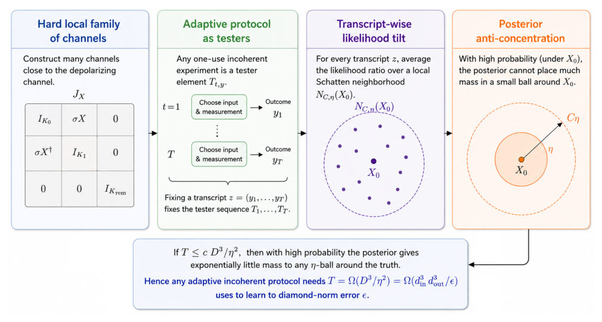
<figcaption class="paper-figure-caption"><b>Fig 1.</b> Figure 1. Overview of the proof strategy. We first construct a local family of channels near the completely depolarizing channel. Each channel is indexed by a matrix perturbation of the normalized Choi operator. We then represent every round of an adaptive incoherent protocol by a single-round tester. Along any transcript, the adaptivity protocol yields a deterministic sequence of tester elements. The key technical ingredient is a transcript-wise likelihood tilt bound over local Schatten neighborhoods, which yields posterior anti-concentration: after fewer than order d3 ind3 out/ε2 channel uses, the posterior cannot concentrate in the Choi trace ball that would be forced by any diamond-norm...</figcaption>
</figure>

**Summary.** This paper rigorously proves that utilizing quantum memory offers a significant computational advantage in Quantum Process Tomography (QPT). It establishes that protocols without memory require query complexity scaling as $d_{in}^3 d_{out}^3/\varepsilon^2$, while those with memory achieve a much better scaling of $d_{in}^2 d_{out}^2/\varepsilon^2$. This separation quantifies the necessity and power of quantum coherence in characterizing unknown quantum channels.

**Why it may be interesting.** This work provides fundamental resource quantification for quantum characterization tasks, directly impacting the feasibility limits of experimental quantum computing hardware.

Detailed structure

**Main problem.** The central problem is Quantum Process Tomography (QPT): learning an unknown quantum channel from black-box access.

**Main result.** The paper establishes a rigorous separation between QPT protocols with and without quantum memory, showing that the required query complexity scales differently in both cases.

**Method.** The authors use information-theoretic techniques, constructing local families of channels to derive lower bounds on sample complexity, which are matched by non-adaptive upper bounds.

**Model / system.** The model involves an unknown quantum channel $\Phi: \mathcal{L}(A) 	o \mathcal{L}(B)$ acting between finite-dimensional Hilbert spaces $A$ and $B$. The comparison is drawn between protocols that use memory (coherent) versus those that reset after each measurement (incoherent).

**Key observables.** The estimation error is measured in the diamond norm ($\|\cdot\|_{\diamond}$), and the complexity is quantified by the required number of queries ($T$).

**Important parameters / regimes.** Dimensions $d_{\mathrm{in}}$ and $d_{\mathrm{out}}$, and the target accuracy $\varepsilon$. The scaling difference between memory-assisted ($\Theta(d_{in}^2 d_{out}^2/\varepsilon^2)$) and non-memory protocols ($\Theta(d_{in}^3 d_{out}^3/\varepsilon^2)$) is key.

**Assumptions / limitations.** The analysis assumes finite-dimensional Hilbert spaces and focuses on classical adaptivity for the incoherent case, while the coherent case utilizes quantum memory.

**Figures summary.** Figure 1 provides an overview of the proof strategy, linking local channel families to single-round testers and culminating in a likelihood-ratio estimate leading to the lower bound $T = \Omega(d_{in}^3 d_{out}^3 / \epsilon^2)$.

**Paper structure.** The paper develops necessary mathematical tools (e.g., random-basis reconstruction, concentration inequalities) before applying them to establish a lower bound for adaptive incoherent protocols, which is then matched by an upper bound.

Abstract

Quantum process tomography, the task of learning an unknown quantum channel from black-box access, is a central problem in quantum information. In this setting, protocols with quantum memory can coherently store and jointly process quantum information obtained from multiple channel uses, whereas protocols without quantum memory must measure after each use and retain only a classical transcript of the measurement outcomes. A fundamental open question is whether quantum memory provides a query-complexity advantage even when protocols without quantum memory may adapt their experiments based on all previous outcomes with unbounded classical computational power. In this work, we show that it does. We determine the optimal query complexity of quantum process tomography without quantum memory up to a constant factor to be $Θ(d_{\mathrm{in}}^3 d_{\mathrm{out}}^3/\varepsilon^2)$, where $d_{\mathrm{in}}$ and $d_{\mathrm{out}}$ are the channel input and output dimensions, respectively, and $\varepsilon$ is the target diamond-norm accuracy. More precisely, we prove that any incoherent protocol for this task, including adaptive protocols, requires $Ω(d_{\mathrm{in}}^3 d_{\mathrm{out}}^3/\varepsilon^2)$ queries, even when each channel use may be assisted by arbitrary fresh ancilla, and we present a non-adaptive, ancilla-free incoherent protocol achieving the matching upper bound $O(d_{\mathrm{in}}^3 d_{\mathrm{out}}^3/\varepsilon^2)$. Our results thereby generalize the optimal sample-complexity bounds for single-copy state tomography, recovered as the special case $d_{\mathrm{in}}=1$. By contrast, coherent protocols with quantum memory achieve query complexity $Θ(d_{\mathrm{in}}^2 d_{\mathrm{out}}^2/\varepsilon^2)$. Hence, our results establish a rigorous learning separation between quantum process tomography with and without quantum memory.

[↑ back to top](#top)

### [Suppressing Detuning-Induced Bias in Ramsey Magnetometry with Composite Pulses](http://arxiv.org/abs/2607.13422v1)

**Authors:** Shingo Kukita, Kento Nawata, Yuichiro Matsuzaki  
**Type:** theory · **Category:** other · **PDF:** <https://arxiv.org/pdf/2607.13422v1>  
**Analysis basis:** full PDF text, analyzed in chunks
**Topic relevance:** `spintronics-quantum-optics interface` **3/5** · `QC/QI experiment` **2/5** · `quantum measurements` **2/5** · `exotic spin models in light-matter` **1/5**

↔ Scroll figures horizontally

<figure class="paper-figure-card">
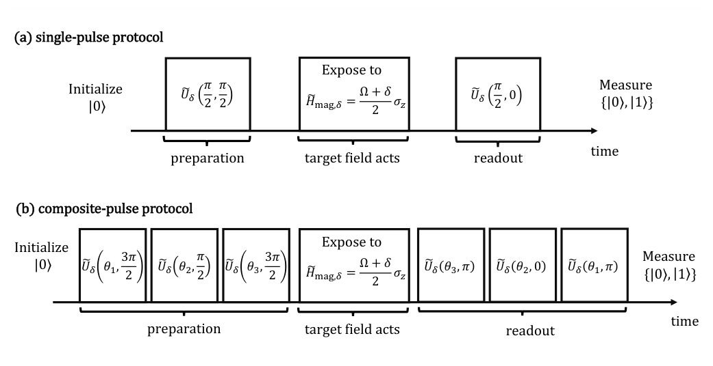
<figcaption class="paper-figure-caption"><b>Fig 1.</b> FIG. 1. Schematic of the two protocols. (a) In the single-pulse protocol, a π/2 pulse prepares an equal superposition, the qubit is exposed to the field for a time t, and a second π/2 pulse maps the accumulated phase onto the populations, which are read out in the {|0⟩, |1⟩} basis. (b) In the composite-pulse protocol, each π/2 pulse is replaced by a three-pulse sequence with areas θ1, θ2, θ3 and phases chosen to cancel the detuning to first order.</figcaption>
</figure>
<figure class="paper-figure-card">
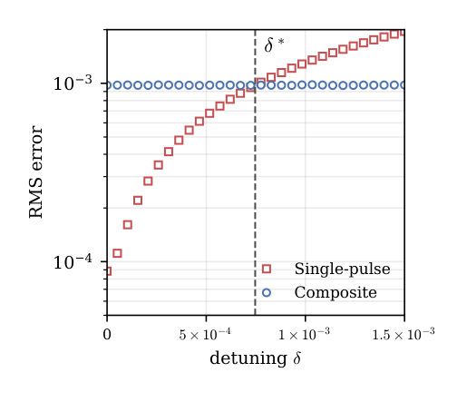
<figcaption class="paper-figure-caption"><b>Fig 2.</b> FIG. 2. Monte Carlo RMS error versus a detuning δ common to all measurements at γ = 0.1. The simulation parame- ters are Ω= 3 × 10−4, λ = 1, and total experimental time T = 2 × 108, corresponding to MSP = ⌊T/τSP⌋= 20508008 and MCP = ⌊T/τCP⌋= 6301769, with single-pulse expo- sure time tSP = 6.611 and composite-pulse exposure time tCP = 2(1 + √</figcaption>
</figure>
<figure class="paper-figure-card">
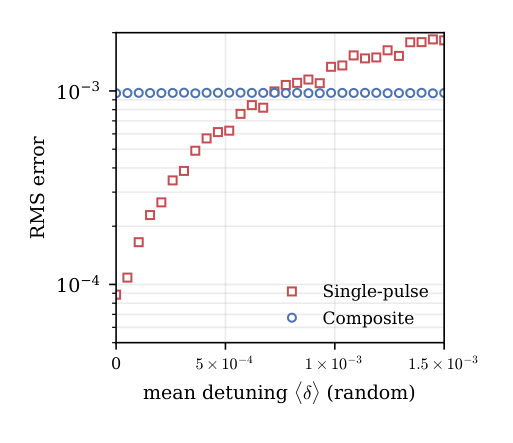
<figcaption class="paper-figure-caption"><b>Fig 3.</b> FIG. 3. Monte Carlo RMS error for a detuning that drifts on a long time scale at γ = 0.1. The MX measurements are split into 100 blocks of ⌊MX/100⌋each, and each block is assigned a detuning drawn uniformly over [0, δmax]. The horizontal axis is the mean detuning ⟨δ⟩= δmax/2. The single-pulse error (red) rises while the composite-pulse error (blue) stays flat, and the crossover sits near the threshold of Fig. 2.</figcaption>
</figure>

**Summary.** The paper tackles the problem of systematic error bias in Ramsey magnetometry caused by unknown frequency detuning. By designing and analyzing a specialized composite-pulse sequence, the authors successfully cancel this first-order detuning bias. This demonstrates a robust method to maintain high measurement precision close to the theoretical Standard Quantum Limit.

**Why it may be interesting.** This work directly addresses systematic errors in quantum sensing protocols using coherent control techniques (composite pulses), which is highly relevant for improving precision measurements in AMO physics platforms like trapped ions or superconducting qubits.

Detailed structure

**Main problem.** The primary goal is to suppress systematic estimation bias in Ramsey magnetometry caused by an unknown detuning ($\delta$) between the actual and nominal spin frequencies.

**Main result.** A composite-pulse sequence was constructed that cancels the first-order detuning bias, allowing the measurement precision to approach the Standard Quantum Limit (SQL) even when $\delta$ is significant.

**Method.** The authors analyzed state evolution by expanding effects to first order in $\delta$ and designed specific pulse sequences whose Hamiltonian contributions cancel out the linear detuning error term.

**Model / system.** The system involves single-qubit Ramsey magnetometry of a DC magnetic field using spin probes. The dynamics are governed by an effective Hamiltonian that includes both the sensing field ($\Omega$) and the systematic detuning ($\delta$).

**Key observables.** Outcome probability ($P_0$), estimated frequency ($	ilde{\Omega}$), Mean-Square Error (MSE), and the bias term ($b$).

**Important parameters / regimes.** Detuning ($\delta$), sensing field strength ($\Omega$), exposure time ($t$), and measurement count ($M$). The analysis focuses on the regime $\Omega t \ll 1$.

**Assumptions / limitations.** The analysis relies on expanding effects to first order in $\delta$, and for some parts, it assumes depolarizing noise ($\gamma$) is known.

**Figures summary.** Figures compare single-pulse (error rising with detuning) versus composite-pulse protocols (error remaining flat), demonstrating the suppression of bias as detuning increases.

**Paper structure.** The paper first analyzes the standard single-pulse protocol, deriving the linear bias proportional to $\delta$. It then introduces and derives a composite-pulse sequence designed specifically to cancel this leading-order detuning contribution, restoring performance towards the SQL limit.

Abstract

Quantum sensing estimates a physical parameter encoded in the state of a probe; with independent spin probes the precision follows the standard quantum limit. Studies of sensing precision often assume that the parameters entering the model, such as the noise, are known. In practice these parameters are not always known, and a mismatch between the assumed and actual values induces a systematic error. Here we study single-qubit Ramsey magnetometry of a DC magnetic field under an unknown detuning between the actual and nominal spin frequencies: A first pulse puts the qubit into a superposition of its two states, the field to be sensed then adds a relative phase during an exposure stage, and a second pulse enables the readout. In our setting, the field acts only during the exposure stage, whereas the detuning acts throughout the whole protocol. We analyze how the detuning biases the estimate, preventing the total estimation error from following the standard quantum limit. We then construct a composite-pulse preparation and readout that exploits the difference in the intervals over which the field and the detuning act to cancel the detuning to first order. We evaluate the performance of this composite-pulse protocol and show that it suppresses the detuning-induced bias.

[↑ back to top](#top)

### [A Measurement Plane for Quantum Networking](http://arxiv.org/abs/2607.13291v1)

**Authors:** Abderrahim Amlou, Amar Abane, Anouar Rahmouni, Mheni Merzouki, Abdella Battou, Ahmed Lbath, Ya-Shian Li-Baboud, Oliver Slattery, Thomas Gerrits  
**Type:** experiment · **Category:** quantum information and computing · **PDF:** <https://arxiv.org/pdf/2607.13291v1>  
**Analysis basis:** full PDF text, analyzed in chunks
**Topic relevance:** `quantum measurements` **3/5** · `quantum optics experiment` **2/5** · `QC/QI experiment` **1/5** · `measurement-induced transitions` **1/5**

↔ Scroll figures horizontally

<figure class="paper-figure-card">
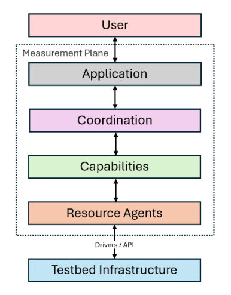
<figcaption class="paper-figure-caption"><b>Fig 1.</b> Fig. 1. Layered architecture of the Measurement Plane.</figcaption>
</figure>
<figure class="paper-figure-card">
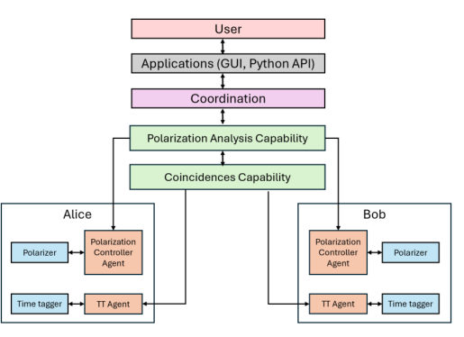
<figcaption class="paper-figure-caption"><b>Fig 2.</b> Fig. 2. Software interaction model of the Measurement Plane during experi- ment execution.</figcaption>
</figure>
<figure class="paper-figure-card">
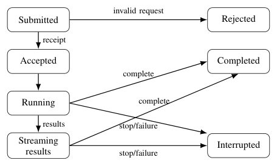
<figcaption class="paper-figure-caption"><b>Fig 3.</b> Fig. 3. Measurement lifecycle within the Measurement Plane. After sub- mission, a request is either rejected or admitted for execution. Running measurements may produce status updates and result streams until completion or interruption.</figcaption>
</figure>
<figure class="paper-figure-card">
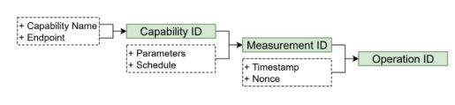
<figcaption class="paper-figure-caption"><b>Fig 4.</b> Fig. 4. Identifier hierarchy used in the Measurement Plane.</figcaption>
</figure>
<figure class="paper-figure-card">
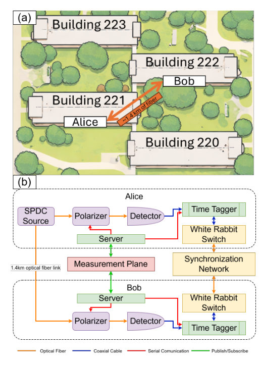
<figcaption class="paper-figure-caption"><b>Fig 5.</b> Fig. 5. Experimental setup used to evaluate the Measurement Plane. (a) Physical deployment of the experiment across the NIST campus, showing the optical path between Building 221 (Alice) and Building 222 (Bob). The two nodes are connected through approximately 1.4 km of deployed optical fiber. (b) Experimental architecture at both nodes. At Alice, a spontaneous parametric down-conversion (SPDC) source generates photons that are mea- sured locally and sent through the fiber link to Bob. Each node includes polarization analysis and single-photon detection, with time-tagged detection events collected by a time tagger synchronized through the White Rabbit network. Local servers host resource...</figcaption>
</figure>

**Summary.** The paper introduces the Measurement Plane, a modular, distributed framework designed to standardize and automate data collection across heterogeneous quantum networking testbeds. By separating user workflows from low-level hardware control into distinct software layers, it enables complex, multi-step quantum experiments remotely. This significantly reduces manual configuration effort while maintaining high experimental fidelity.

**Why it may be interesting.** This work provides a crucial software infrastructure layer for realizing complex quantum network protocols, abstracting away device heterogeneity which is a major bottleneck in experimental quantum information science.

Detailed structure

**Main problem.** Quantum networking testbeds lack a distinct, standardized plane for coordinating distributed measurements and collecting experimental data across heterogeneous quantum devices.

**Main result.** The proposed Measurement Plane successfully coordinated remote nodes to execute complex experiments like coincidence measurement and polarization entanglement distribution with high visibility (up to 98%).

**Method.** A distributed framework using containerized microservices connected via publish-subscribe messaging was implemented, organizing functions into four distinct layers.

**Model / system.** The system is a software architecture designed for quantum networking testbeds, involving two remote nodes (Alice and Bob) connected by an optical network. It separates user workflows from device-specific control using capability abstraction.

**Key observables.** Visibility interference of up to 98% in polarization entanglement distribution; coincidence detection peaks at zero delay.

**Important parameters / regimes.** Two-node quantum networking setup; $\approx 1.4$ km optical fiber link.

**Assumptions / limitations.** The architecture assumes communication via a shared messaging infrastructure (NATS) and demonstrates feasibility rather than ultimate scale limits.

**Figures summary.** Figures illustrate the layered architecture, the measurement lifecycle (Submission to Completion), the identifier hierarchy used for tracking, and experimental results showing coincidence histograms and polarization fringe visibility.

**Paper structure.** The paper introduces the Measurement Plane concept, details its multi-layered distributed microservice architecture (Application $
ightarrow$ Coordination $
ightarrow$ Capability $
ightarrow$ Resource Agent), describes the identification scheme, and validates it through automated execution of remote quantum experiments.

Abstract

Quantum networking testbeds lack a distinct plane for coordinating distributed measurements and collecting experimental data across heterogeneous devices. To address this gap, we present the Measurement Plane, a dedicated plane that complements the data, control, and management planes rather than replacing or extending their pipelines. The contribution is presented as a distributed framework that organizes measurement functions into four layers: application, experiment coordination, capability, and resource agents. Our design separates user workflows from device-specific control.   We implemented the framework as containerized microservices connected through publish--subscribe messaging, and validated it on a two-node quantum networking setup connected by an optical network. The framework successfully coordinated remote nodes to execute coincidence measurement and polarization entanglement distribution experiments with visibility interference of up to 98 percent. This evaluation demonstrated the effectiveness of the framework for supporting complex, distributed quantum experiments, enabling online measurement and feedback, and significantly reducing manual configuration and execution effort.

[↑ back to top](#top)

### [Dirac topology, anomalous Hall response, and giant magnetoresistance in carrier-compensated altermagnetic semimetal NiS](http://arxiv.org/abs/2607.13400v1)

**Authors:** Shovan Gayen, Sk. Soyeb Ali, S K Panda  
**Type:** theory · **Category:** strongly correlated electrons · **PDF:** <https://arxiv.org/pdf/2607.13400v1>  
**Analysis basis:** full PDF text, analyzed in chunks
**Topic relevance:** `spintronics-quantum-optics interface` **3/5** · `Keldysh / 2PI / non-Gaussian methods` **1/5** · `analog quantum simulation` **1/5** · `exotic spin models in light-matter` **1/5** · `non-equilibrium dynamics` **1/5**

↔ Scroll figures horizontally

<figure class="paper-figure-card">
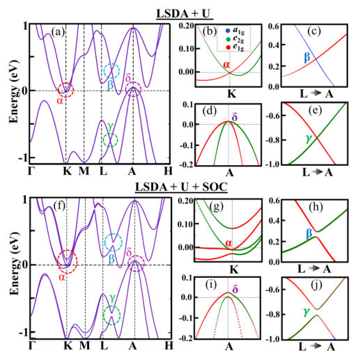
<figcaption class="paper-figure-caption"><b>Fig 1.</b> FIG. 1. (a),(f) Band dispersion along the Γ–K–M–L–A–H path using LSDA+U and LSDA+U+SOC approaches. (b)–(e) Orbital-projected band structures near the Dirac-like crossings (α, β, γ, δ) along K, A, and L–A. (g)–(j) Corresponding SOC-included orbital projected bands showing lifting of degeneracies. Colored bands denote a1g, e2g, and e1g characters. Fermi energy (EF) is set at 0 eV.</figcaption>
</figure>
<figure class="paper-figure-card">
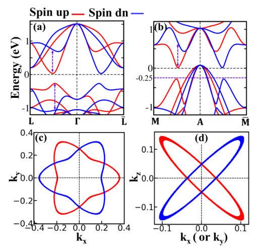
<figcaption class="paper-figure-caption"><b>Fig 2.</b> FIG. 2. Spin-resolved band dispersions along the (a) L–Γ–¯L and (b) M–A– ¯M directions are shown, revealing the characteristic momentum-dependent spin splitting of the altermagnetic state. The Spin-resolved constant-energy contours at E −EF = −0.25 eV in the (c) kx–ky and (d) kx–kz (or ky-kz) planes passing through the vicinity of the A point, respectively.</figcaption>
</figure>
<figure class="paper-figure-card">
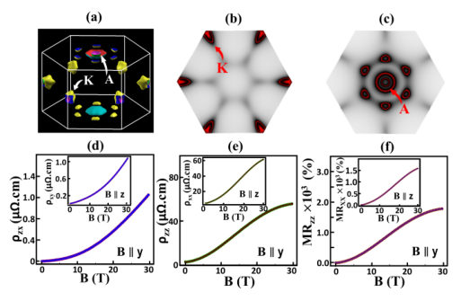
<figcaption class="paper-figure-caption"><b>Fig 3.</b> FIG. 4. (a) Fermi surface (FS) in the hexagonal Brillouin zone, with corresponding cross-sectional cuts in the (b) kz = 0 and (c) kz = π planes. Magnetic-field (B) dependence of (d) Hall resistivity ρzx, (e) longitudinal resistivity ρzz, and (f) magnetoresistance MRzz. Insets in (d)–(f) show ρxy, ρxx, and MRxx, respectively.</figcaption>
</figure>
<figure class="paper-figure-card">
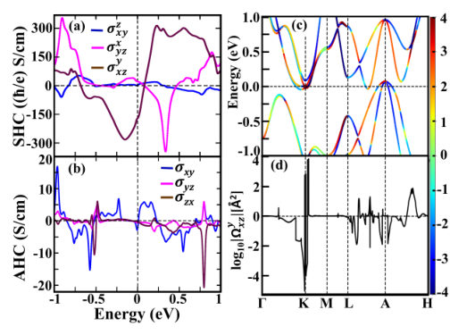
<figcaption class="paper-figure-caption"><b>Fig 4.</b> FIG. 3. Energy (chemical potential) dependence of the (a) SHC and (b) AHC tensor components. (c) Band structure projected with spin Berry curvature (log scale) and (d) k-resolved spin Berry curvature at E = EF.</figcaption>
</figure>
<figure class="paper-figure-card">
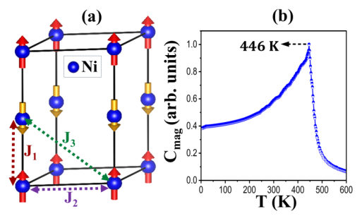
<figcaption class="paper-figure-caption"><b>Fig 5.</b> FIG. 5. (a) A-type antiferromagnetic structure of NiS illustrating the dominant exchange interactions J1, J2, and J3 (only Ni ions are shown for clarity). (b) Calculated magnetic specific heat as a func- tion of temperature, displaying a pronounced anomaly at the Néel temperature TN ≈446 K.</figcaption>
</figure>

**Summary.** This work theoretically characterizes NiS as a unique 3d altermagnetic semimetal where topology, magnetism, and lattice effects are intrinsically linked. By combining advanced DFT methods with transport theory, the authors predict large intrinsic spin Hall and anomalous Hall responses alongside giant magnetoresistance. The findings establish NiS as a promising material platform for realizing multiple quantum functionalities simultaneously.

**Why it may be interesting.** While focused on condensed matter magnetism, the strong reliance on topological invariants (Berry curvature) and emergent quantum responses (AHC/SHC) connects deeply with modern theoretical approaches used in AMO physics for characterizing engineered quantum states.

Detailed structure

**Main problem.** Investigating the complex interplay between electronic topology, magnetism, and lattice dynamics in a specific magnetic semimetal.

**Main result.** NiS is identified as a model 3d platform exhibiting simultaneous carrier compensation, altermagnetic symmetry, large intrinsic spin Hall conductivity, and finite anomalous Hall response.

**Method.** The study combines first-principles DFT (LSDA+U+SOC), Berry-curvature analysis, semiclassical Boltzmann transport, and atomistic spin dynamics simulations.

**Model / system.** The physical system is hexagonal nickel sulfide (NiS), modeled as a carrier-compensated 3d altermagnetic semimetal with an A-type antiferromagnetic order. The electronic structure is analyzed using crystal field theory derived from the NiAs lattice symmetry.

**Key observables.** Intrinsic spin Hall conductivity ($\sigma^{\gamma}_{\alphaeta}$), anomalous Hall conductivity (AHC), nonsaturating magnetoresistance ($>10000\%$), and momentum-dependent spin splitting.

**Important parameters / regimes.** The magnetic transition temperature ($T_t \simeq 265	ext{K}$) and the magnitude of the spin splitting ($\sim 0.4$ to $1.0$ eV) are key parameters.

**Assumptions / limitations.** The analysis relies on DFT calculations using the LSDA+U+SOC approach, assuming its validity for describing the magnetic ground state and electronic structure.

**Figures summary.** Figures illustrate band dispersions showing SOC-induced splitting (Fig. 1, 2), energy dependence of transport coefficients (SHC/AHC in Fig. 3), and the calculation of magnetic exchange interactions ($J_1, J_2, J_3$ in Fig. 5).

**Paper structure.** The paper proceeds by establishing the electronic structure via DFT, analyzing symmetry constraints leading to Dirac crossings (crystal field analysis), calculating transport properties using Berry curvature methods, and finally determining magnetic exchange interactions.

Abstract

We combine first-principles density-functional theory, Berry-curvature analysis, semiclassical Boltzmann transport, and atomistic spin dynamics to establish hexagonal NiS as a compensated 3d altermagnetic semimetal in which topology, magnetism, and lattice dynamics are intrinsically intertwined. The rotational coset symmetry of the NiAs lattice produces momentum-dependent spin splitting characteristic of altermagnetism. With spin-orbit coupling, gapped Dirac-like crossings generate intense Berry-curvature hot spots and nearly compensated electron-hole pockets. This leads to a large and anisotropic intrinsic spin Hall conductivity comparable to that of several 4d, 5d metals, a symmetry-allowed anomalous Hall response despite zero net magnetization, and nonsaturating magnetoresistance exceeding 10000 percent. On the magnetic side, first-principles determination of the exchange tensor reveals dominant long-range superexchange and sizable anisotropic interactions, quantitatively reproducing the experimental Neel temperature. Our results identify NiS as a model 3d platform in which carrier compensation, altermagnetic symmetry, Berry-curvature driven transport, and lattice-sensitive magnetism coexist within a single symmetry framework, offering a design principle for multi-functional quantum responses in correlated transition-metal compounds.

[↑ back to top](#top)

### [Hubbard-assisted stability of Hatsugai-Kohmoto correlations in a one-dimensional open chain](http://arxiv.org/abs/2607.13434v1)

**Authors:** Yan-Xiao Wang, Yin Zhong  
**Type:** theory · **Category:** strongly correlated electrons · **PDF:** <https://arxiv.org/pdf/2607.13434v1>  
**Analysis basis:** full PDF text, analyzed in chunks
**Topic relevance:** `analog quantum simulation` **3/5** · `Kondo & dissipative impurity` **1/5** · `entanglement & information structure` **1/5** · `exotic spin models in light-matter` **1/5** · `non-equilibrium dynamics` **1/5**

↔ Scroll figures horizontally

<figure class="paper-figure-card">
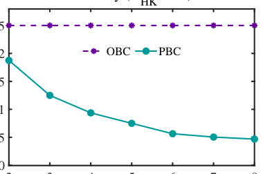
<figcaption class="paper-figure-caption"><b>Fig 1.</b> FIG. 1: Finite-size dependence of the NN spin correlation CS(1) in the HK-only model at UHK = 5t, comparing OBC and PBC.</figcaption>
</figure>
<figure class="paper-figure-card">
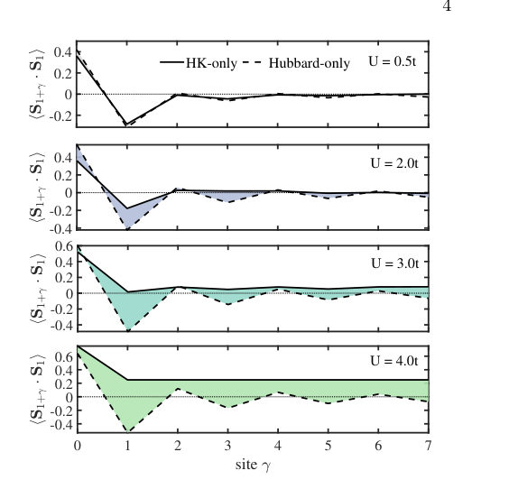
<figcaption class="paper-figure-caption"><b>Fig 2.</b> FIG. 3: Spin-spin correlation function CS(γ) for the HK-only and Hubbard-only models at selected interaction strengths. Solid lines denote the HK-only results with UHK = U, while dashed lines denote the Hubbard-only results with UHub = U. The shaded regions highlight the difference between the two curves.</figcaption>
</figure>
<figure class="paper-figure-card">
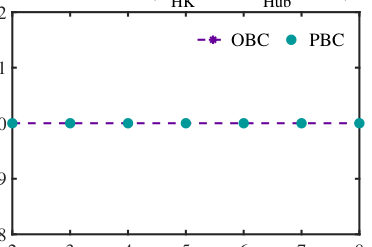
<figcaption class="paper-figure-caption"><b>Fig 3.</b> FIG. 2: Finite-size dependence of CS(1) in the HK+Hubbard model at UHK = 5t and UHub = 10−3t, comparing OBC and PBC.</figcaption>
</figure>
<figure class="paper-figure-card">
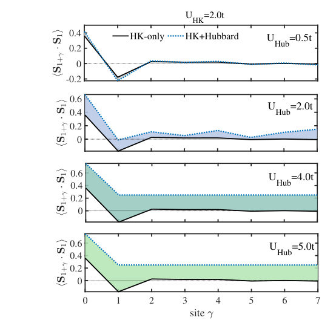
<figcaption class="paper-figure-caption"><b>Fig 4.</b> FIG. 4: CS(γ) at fixed UHK = 2t. Solid black lines show the HK-only reference result, while blue dotted lines show the HK+Hubbard results for the indicated UHub.</figcaption>
</figure>
<figure class="paper-figure-card">
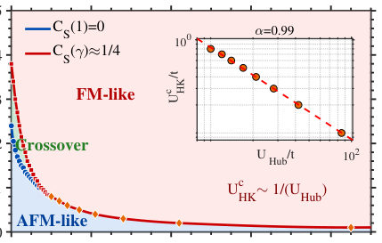
<figcaption class="paper-figure-caption"><b>Fig 5.</b> FIG. 5: Spin-correlation map in the (UHub, UHK) plane for the half-filled Lx = 8 open chain. The blue line de- notes the boundary defined by CS(1) = 0, beyond which the intersite spin correlations become positive. The red line denotes the boundary of the nearly saturated regime, where CS(γ) ≃1/4 for γ ≥1. Orange diamonds are extrapolated boundary values at large UHub. The inset shows these extrapolated red-boundary values on a log- log scale, fitted by Uc HK ∝(UHub)−α with α = 0.99. This fit is used only as an empirical guide to the large-UHub trend.</figcaption>
</figure>

**Summary.** This paper explores the stability of Hatsugai-Kohmoto (HK) correlations in a 1D spinful chain when an onsite Hubbard repulsion is added. Using exact diagonalization, the authors find that this local interaction actively reinforces the HK physics rather than disrupting it. The results emphasize that the spatial structure of the repulsive term critically determines its effect on the correlated ground state.

**Why it may be interesting.** This work provides nonperturbative real-space insights into correlated electron physics, showing how local interactions can stabilize or modify exotic quantum phases like those described by the HK fixed point, which is relevant for understanding Mott insulators.

Detailed structure

**Main problem.** The study investigates how adding a finite onsite Hubbard repulsion modifies the established Hatsugai-Kohmoto (HK) physics in real-space observables and local spectra, moving beyond weak perturbation theory.

**Main result.** The onsite Hubbard interaction actively reinforces the HK-dominated regime, leading to a 'Hubbard-assisted strong-HK response' observed across spin correlations and spectral weight redistribution. This enhancement is highly sensitive to the spatial structure of the added repulsion compared to nearest-neighbor interactions.

**Method.** The research employs exact diagonalization (ED) calculations on an open chain system, supplemented by Lanczos continued-fraction methods for calculating local density of states (LDOS).

**Model / system.** The model is a half-filled one-dimensional spinful fermion chain governed by a Hamiltonian incorporating hopping, the HK interaction ($U_{	ext{HK}}$), and an onsite Hubbard repulsion ($U_{	ext{Hub}}$). Comparisons are made against nearest-neighbor (NN) interactions.

**Key observables.** Ground-state correlation functions (spin $\langle S \cdot S 
angle$, single-particle $\langle c^\dagger c 
angle$), Local Density of States (LDOS), and pairing correlations ($\Delta$).

**Important parameters / regimes.** Interaction strengths ($U_{	ext{HK}}$, $U_{	ext{Hub}}$) relative to hopping ($t$); the system is studied in the half-filled limit, with comparisons made at finite doping.

**Assumptions / limitations.** Calculations are performed on finite open chains; the analysis relies on comparing results from different interaction types (onsite vs. nearest-neighbor).

**Figures summary.** Figures compare spin and single-particle correlations for HK-only, Hubbard-only, and mixed models across varying coupling strengths, showing how $U_{	ext{Hub}}$ shifts the system towards strong-HK behavior, while NN interactions show competing tendencies.

**Paper structure.** The paper systematically analyzes the effect of onsite repulsion by comparing it to the pure HK model, contrasting this with a nearest-neighbor interaction. Key diagnostics include correlation functions and impurity-induced spectral weight transfer.

Abstract

The Hatsugai-Kohmoto (HK) model has recently been identified as a fixed-point description of Mottness that is stable against perturbing local interactions. This raises a natural question beyond the weak-perturbation regime: how does a finite local repulsion modify HK physics in real-space observables and local spectra? We address this question in a half-filled one-dimensional spinful fermion chain, where the HK interaction is supplemented by an onsite Hubbard repulsion. Using exact diagonalization in an open chain, we compute ground-state correlation functions and site-resolved local spectra. We find that the Hubbard term does not drive the system away from the HK-dominated regime. Instead, at moderate $U_{\rm HK}$, a finite $U_{\rm Hub}$ promotes the emergence of behavior characteristic of the pure HK chain at larger $U_{\rm HK}$. This Hubbard-assisted strong-HK response is reflected consistently in the development of positive spin correlations, the suppression of single-particle coherence, the impurity-induced redistribution of local spectral weight, and the evolution of pairing correlations. As a control perturbation, we replace the onsite Hubbard interaction by a nearest-neighbor (NN) density interaction. In contrast to the Hubbard case, the HK and NN interactions display competing tendencies and do not reproduce the same strong-HK behavior. These results provide a nonperturbative real-space complement to the fixed-point stability of HK physics and show that the effect of an additional repulsive interaction depends sensitively on its spatial structure.

[↑ back to top](#top)

### [Stoner transitions beyond mean-field in two-dimensional electronic systems: a diagrammatic Monte Carlo study](http://arxiv.org/abs/2607.13675v1)

**Authors:** Yueh-Chen Lee, Nikolay P. Prokof'ev, Andrey V. Chubukov  
**Type:** theory · **Category:** strongly correlated electrons · **PDF:** <https://arxiv.org/pdf/2607.13675v1>  
**Analysis basis:** full PDF text, analyzed in chunks
**Topic relevance:** `methods for driven-dissipative` **3/5** · `analog quantum simulation` **2/5** · `Keldysh / 2PI / non-Gaussian methods` **1/5** · `driven-dissipative phase transition` **1/5**

↔ Scroll figures horizontally

<figure class="paper-figure-card">
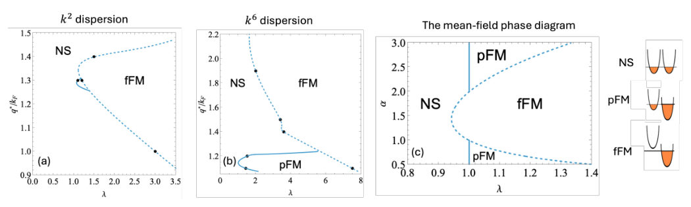
<figcaption class="paper-figure-caption"><b>Fig 1.</b> FIG. 1. Phase diagrams of single-valley systems with a parabolic dispersion with kF = 0.1 (panel (a)) and k6 dispersion</figcaption>
</figure>
<figure class="paper-figure-card">
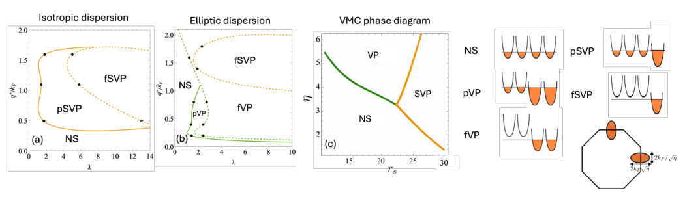
<figcaption class="paper-figure-caption"><b>Fig 2.</b> FIG. 2. Phase diagram of a two-valley system with an isotropic dispersion relation (panel (a) ), and elliptic dispersion</figcaption>
</figure>
<figure class="paper-figure-card">
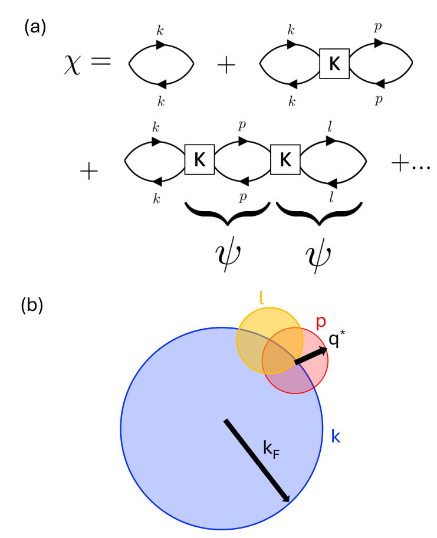
<figcaption class="paper-figure-caption"><b>Fig 3.</b> FIG. 3. (a) Summation of the ladder diagrams. The second term is what we define as χ2PI. The quantity ψ plays the</figcaption>
</figure>
<figure class="paper-figure-card">
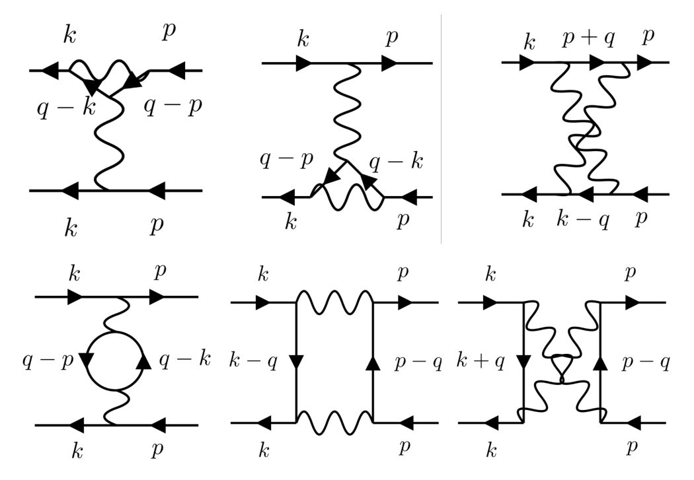
<figcaption class="paper-figure-caption"><b>Fig 4.</b> FIG. 4. The two-particle irreducible four point function K to second order in U0. The last two Aslamazov-Larkin</figcaption>
</figure>
<figure class="paper-figure-card">
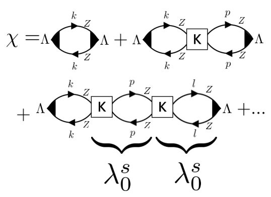
<figcaption class="paper-figure-caption"><b>Fig 5.</b> FIG. 5. Ladder diagrams for the spin susceptibility in a Fermi-liquid theory. The black-shaded area is the side vertex Λ,</figcaption>
</figure>

**Summary.** This paper rigorously examines Stoner transitions in 2D electronic materials by moving beyond mean-field approximations using a Diagrammatic Monte Carlo simulation. The study reveals that the nature of magnetic ordering—whether it occurs, and through what sequence of phases—is highly dependent on the number of valleys and the anisotropy of the underlying electron dispersion. It provides crucial insights into correlated magnetism in low-dimensional quantum materials.

**Why it may be interesting.** While focused on condensed matter magnetism, the use of diagrammatic Monte Carlo techniques for strongly correlated electron systems provides sophisticated computational tools applicable to other many-body quantum problems where perturbative expansions fail.

Detailed structure

**Main problem.** The study investigates Stoner instabilities in two-dimensional electronic systems, going beyond the limitations of mean-field theory.

**Main result.** In one-valley systems, ferromagnetism only occurs if momentum transfer is cut off; for two-valley systems, the transition can be direct or proceed through an intermediate valley-polarized state, controlled by dispersion anisotropy.

**Method.** The authors employ a diagrammatic Monte Carlo (DiagMC) algorithm to treat both ladder and non-ladder renormalizations on equal footing in the susceptibility calculation.

**Model / system.** The system models 2D electronic systems with one or two valleys, described by Hamiltonians including kinetic terms and repulsive interactions. The analysis considers parabolic ($k^2$) and $k^6$ dispersions for single-valley cases, and elliptic dispersion for two-valley setups.

**Key observables.** Stoner transition point (instability), order parameters like valley polarization (VP) and ferromagnetism (FM), and the static magnetic susceptibility ($\chi_s$).

**Important parameters / regimes.** Dimensionless coupling constant $\lambda$, momentum cutoff $q^*$, and anisotropy factor $\eta$.

**Assumptions / limitations.** The primary assumption is extending beyond mean-field theory by including higher-order diagrammatic corrections via the DiagMC method.

**Figures summary.** Figures illustrate phase diagrams for single-valley and two-valley systems showing symmetry-breaking phases (e.g., VP, SVP) versus interaction parameters ($q^*$).

**Paper structure.** The paper progresses from establishing the mean-field context to applying the advanced DiagMC technique to calculate susceptibilities beyond lowest order, culminating in detailed phase diagrams mapping out different magnetic/valley ordered states.

Abstract

Stoner instabilities for fermions with repulsive interaction have been well studied within the mean-field (ladder) approximation. In this study, we consider two-dimensional electronic systems with one or two valleys and discuss a Stoner transition beyond the ladder approximation. At weak coupling, the corrections to the ladder approximation come predominantly from the renormalization of the particle-hole vertex in the particle-particle channel, and the lowest-order corrections are logarithmically singular in the low-density limit. To investigate the problem beyond the lowest order, we apply the diagrammatic Monte Carlo algorithm and treat ladder and non-ladder renormalizations on equal footing. We find that in a one-valley system, a Stoner transition to a ferromagnetism occurs at low density only if there is a cutoff on the momentum transfer carried by the interaction. In a two-valley system, the restriction is less severe. Here we find either a direct Stoner transition into a spin- and valley-polarized state, or a set of two Stoner transitions via an intermediate valley-polarized state. The pathway is controlled by the anisotropy of the fermionic dispersion.

[↑ back to top](#top)

### [An Information-Theoretic Characterization of Optimal Value-Readout in Response-Register Quantum Oracles](http://arxiv.org/abs/2607.13198v1)

**Authors:** Milad Ghadimi, Hesam Soltanpanahi, Vahid Salari  
**Type:** theory · **Category:** quantum information and computing · **PDF:** <https://arxiv.org/pdf/2607.13198v1>  
**Analysis basis:** full PDF text, analyzed in chunks
**Topic relevance:** `quantum measurements` **3/5** · `entanglement & information structure` **2/5** · `measurement-induced transitions` **1/5**

↔ Scroll figures horizontally

<figure class="paper-figure-card">
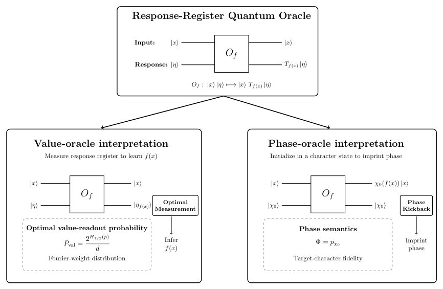
<figcaption class="paper-figure-caption"><b>Fig 1.</b> FIG. 1: Response-register oracle and its two operational interpretations. Top: A response-register oracle Of acts on a computational register |x⟩and a response state |η⟩by applying the translation Tf(x) determined by the oracle value f(x). Bottom left: In the value-oracle interpretation, the translated response states are measured to infer the oracle value. The optimal single-query value-readout probability is completely determined by the Fourier-weight distribution of the response state. Bottom Right: In the phase–oracle interpretation, the response register is initialized in a character state |χ0⟩, so that the oracle translation contributes only through the phase factor χ0 (f (x)) via...</figcaption>
</figure>
<figure class="paper-figure-card">
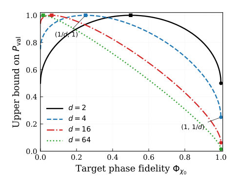
<figcaption class="paper-figure-caption"><b>Fig 2.</b> FIG. 2: Tight phase–value tradeoff, Eq. (6), for d ∈{2, 4, 16, 64}. The horizontal axis is the target-character phase fidelity Φχ0; the vertical axis is the optimal single-query value-readout probability Pval. Each curve is saturated by the response states in Eq. (8). Exact phase semantics occurs at Φχ0 = 1, where Pval = 1/d (bottom right); exact value readout occurs at Φχ0 = 1/d, where Pval = 1 (marked on each curve). Near the phase corner, Pval −1/d grows as O(√ϵ) in the phase infidelity ϵ = 1 −Φχ0.</figcaption>
</figure>
<figure class="paper-figure-card">
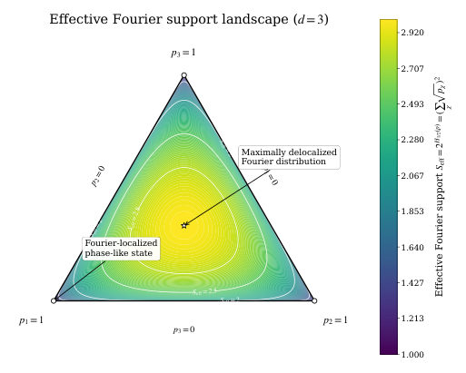
<figcaption class="paper-figure-caption"><b>Fig 3.</b> FIG. 3: Effective Fourier-support landscape for a three-dimensional Fourier-weight distribution (d = 3). Each point in the triangular simplex represents a Fourier-weight distribution p = (p1, p2, p3) satisfying p1 + p2 + p3 = 1. The color scale shows the effective</figcaption>
</figure>
<figure class="paper-figure-card">
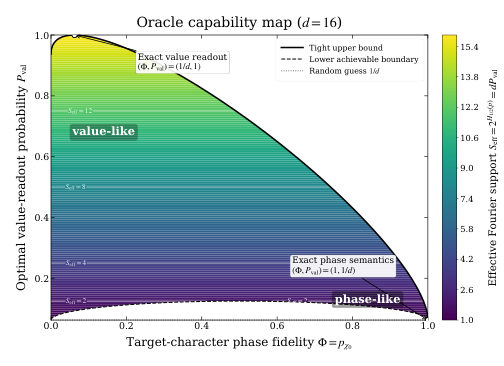
<figcaption class="paper-figure-caption"><b>Fig 4.</b> FIG. 4: Phase–value capability map for a response-register dimension d = 16. The horizontal axis shows the target-character phase fidelity Φ = pχ0, while the vertical axis gives the optimal single-query value-readout probability Pval. The color scale represents the effective Fourier support, Seff = 2H1/2(p) = dPval, with white contour lines indicating selected constant-Seff levels. The solid black curve denotes the tight phase–value complementarity</figcaption>
</figure>

**Summary.** This work characterizes optimal value readout in response-register quantum oracles by proving that the achievable probability is exactly determined by the normalized Rényi-1/2 effective Fourier support of the state. This establishes an exact information-theoretic measure, providing a tight complementarity theorem between phase and value measurements for Abelian groups.

**Why it may be interesting.** The rigorous mathematical connection between geometric properties (Fourier support) and operational limits ($P_{	ext{val}}$) provides a powerful, generalizable tool for analyzing quantum measurement protocols in structured settings.

Detailed structure

**Main problem.** The paper aims to provide an exact, quantitative characterization of the relationship between two complementary operational interpretations—value readout and phase kickback—for response-register quantum oracles.

**Main result.** It proves that for finite Abelian response groups, the optimal single-query value-readout probability is exactly equal to the normalized Rényi-1/2 effective Fourier support of the response state.

**Method.** The analysis uses information theory, linking optimal quantum state discrimination (covariant measurements) to properties derived from the Fourier-weight distribution of the response state via group theory concepts.

**Model / system.** The model is a response-register quantum oracle acting on a computational register and characterized by a finite Abelian response group $A$. The system's behavior is governed by the response state $|\eta
angle$ and its associated Fourier-weight distribution $p = (p_\chi)$.

**Key observables.** Optimal single-query value-readout probability ($P_{	ext{val}}$), Rényi-1/2 effective Fourier support ($	ext{Seff}$), and target character phase fidelity ($\Phi$).

**Important parameters / regimes.** The dimension of the response register, $d = |A|$, and the specific structure of the Abelian group $A$.

**Assumptions / limitations.** The results are rigorously proven only for finite Abelian response groups; extensions to non-Abelian groups are suggested as future work.

**Figures summary.** Figures illustrate the oracle's two interpretations (value readout vs. phase kickback), map out the achievable phase–value tradeoff region, and show the 'Effective Fourier-support landscape' relating $P_{	ext{val}}$ to the distribution $p$.

**Paper structure.** The paper establishes a chain of correspondences: linking the operational limit ($P_{	ext{val}}$) through quantum state discrimination theory to an information-theoretic quantity ($	ext{Seff}$), which is defined via the R\'enyi-1/2 entropy of the Fourier weights.

Abstract

Response-register quantum oracles admit two complementary operational interpretations: value readout and phase kickback. Although their computational equivalence is well understood, the quantitative relation between these two operational interpretations has lacked an exact characterization. We prove that, for finite Abelian response groups, the optimal single-query value-readout probability is exactly the normalized Rényi-1/2 effective Fourier support of the response state. This identity provides an exact information-theoretic characterization of optimal value-readout capability, gives the Rényi-1/2 effective Fourier support a direct operational interpretation in the oracle setting, and yields a tight phase--value complementarity theorem together with an explicit family of saturating response states.

[↑ back to top](#top)

### [Cluster-configurational study of G-center in Silicon](http://arxiv.org/abs/2607.14083v1)

**Authors:** Narayan Pokhrel, Kyungwha Park, Vsevolod Ivanov  
**Type:** theory · **Category:** quantum information and computing · **PDF:** <https://arxiv.org/pdf/2607.14083v1>  
**Analysis basis:** full PDF text, analyzed in chunks
**Topic relevance:** `exotic spin models in light-matter` **3/5** · `spintronics-quantum-optics interface` **3/5**

↔ Scroll figures horizontally

<figure class="paper-figure-card">
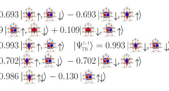
<figcaption class="paper-figure-caption"><b>Fig 1.</b> Fig. 1 Overview of the G-center structure and electronic states. The G-center structure has (C1h) symmetry consisting of two substitutinal carbon atoms (black spheres) in silicon (blue spheres). The electronic structure consists of a singlet (S = 0) ground and excited states and a metastable triplet (S = 1) state. Primary multiconfigurational components of each state are shown in terms of the localized orbital basis.</figcaption>
</figure>
<figure class="paper-figure-card">
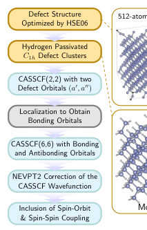
<figcaption class="paper-figure-caption"><b>Fig 2.</b> Fig. 2 Overview of the computational workflow. The G-center structure is relaxed within a 512-atom supercell using a hybrid functional approach. From this structure, hydrogen-passivated structures are obtained: Model 1 (69 atoms), Model 2 (141 atoms), and Model 3 (265 atoms). Electronic structures for these models are obtained using a 2-orbital + 2-electron CASSCF (2,2) calculation from which the six-orbital basis is obtained through a Pipek-Mezey localization procedure. These orbitals are then used for the full-scale 6-electron + 6-orbital CASSCF (6,6) calculation, followed by NEVPT2 corrections and postprocessing to obtain spin properties.</figcaption>
</figure>
<figure class="paper-figure-card">
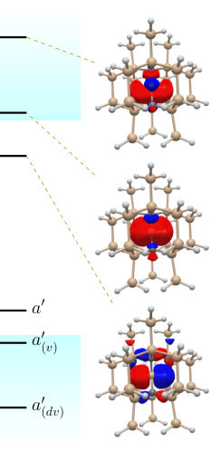
<figcaption class="paper-figure-caption"><b>Fig 3.</b> Fig. 3 Top view of the 6 defect orbitals in the SA-CASSCF calculation of 69 atom cluster ordered according to energy. Similar 6 active orbitals are present for 141 and 265 atom structure. The AVO- GADRO [41] program is used for visualization.</figcaption>
</figure>
<figure class="paper-figure-card">
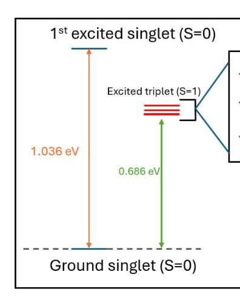
<figcaption class="paper-figure-caption"><b>Fig 4.</b> Fig. 4 Energy diagram showing the relative position of Singlets and Triplets in SA-CASSCF calculations. The inset show the level splitting of the triplet level by SOC and SOC+SSC</figcaption>
</figure>
<figure class="paper-figure-card">
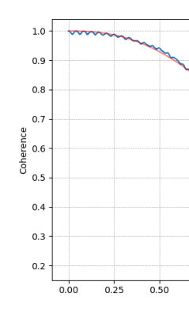
<figcaption class="paper-figure-caption"><b>Fig 5.</b> Fig. 5 Coherence plot along with the fitted curve</figcaption>
</figure>

**Summary.** This paper theoretically characterizes the G-center defect in Silicon, a promising platform for quantum computing. Using advanced multiconfigurational quantum chemistry methods, the authors calculate key properties like ZPL energy, Zero Field Splitting, and spin decoherence times. The results validate the use of complex electronic structure calculations to predict solid-state qubit performance.

**Why it may be interesting.** This work directly addresses the theoretical modeling required for solid-state qubits by providing detailed predictions of optical transitions (ZPL) and spin coherence times ($T_2$) based on first principles quantum chemistry.

Detailed structure

**Main problem.** The study investigates the spin and optical properties of G-centers defects in Silicon, which are critical components for potential quantum computing applications.

**Main result.** The theoretical calculations show excellent agreement with Zero Phonon Line energies and Zero Field Splitting components, and estimate a substantial spin decoherence time (1.465 ms).

**Method.** The research employs advanced quantum chemistry methods including Multiconfigurational Self-Consistent Field (MCSCF), CASSCF(6,6), NEVPT2 corrections, and Cluster Correlation Expansion (CCE) for coherence time.

**Model / system.** The physical system is the G-center defect embedded in Silicon. The calculations model this using various supercell sizes (up to 512 atoms) and focus on the electronic structure of the singlet ($S=0$) and triplet ($S=1$) manifolds.

**Key observables.** Zero Phonon Line (ZPL) energy ($\approx 0.969$ eV), Zero Field Splitting components ($D_{xx}, D_{yy}, D_{zz}$), theoretical spin decoherence time ($T_2$), and Transition Dipole Moment (TDM).

**Important parameters / regimes.** The active space size is systematically expanded from CAS(2,2) to CAS(6,6); the calculations are sensitive to cluster size convergence.

**Assumptions / limitations.** The multiconfigurational approach is necessary because single-configuration wavefunctions fail for describing the optical excitation process; approximations are made in calculating spin-vibrational coupling and decoherence rates.

**Figures summary.** Figures illustrate the G-center structure, the detailed computational workflow (from supercell relaxation to CASSCF), and energy level diagrams showing relative positions of singlet and triplet states.

**Paper structure.** The paper progresses by first establishing the necessity of multiconfigurational methods for defect centers. It details a rigorous computational workflow involving geometry optimization, CASSCF calculations across increasing active spaces, and finally applying CCE/PYCCE to predict spin coherence times.

Abstract

Understanding the properties of defects is imperative for proper use for variety of applications including quantum computing. In this paper, we use the multiconfigurational self consistent field (MCSCF) combined with DFT optimized geometry in order to investigate the spin and optical properties of G centers in Silicon. By utilizing quantum chemistry based methods, we show excellent agreement with the Zero Phonon Line and Zero Field Splitting Tensor components of the G center. We also calculate the theoretical spin decoherence time of the G centers using Cluster Correlation Expansion (CCE) methods.

[↑ back to top](#top)

### [Effects of coherent and incoherent measurement imperfections on multipartite quantum nonlocality and quantum key distribution](http://arxiv.org/abs/2607.13645v1)

**Authors:** Qiong Wang, Wen-Long Qiao, Qing Chen, Liu-Jun Wang  
**Type:** theory · **Category:** quantum information and computing · **PDF:** <https://arxiv.org/pdf/2607.13645v1>  
**Analysis basis:** full PDF text, analyzed in chunks
**Topic relevance:** `quantum measurements` **3/5** · `correlated / nonlocal dissipation` **1/5** · `entanglement & information structure` **1/5** · `measurement-induced transitions` **1/5**

↔ Scroll figures horizontally

<figure class="paper-figure-card">
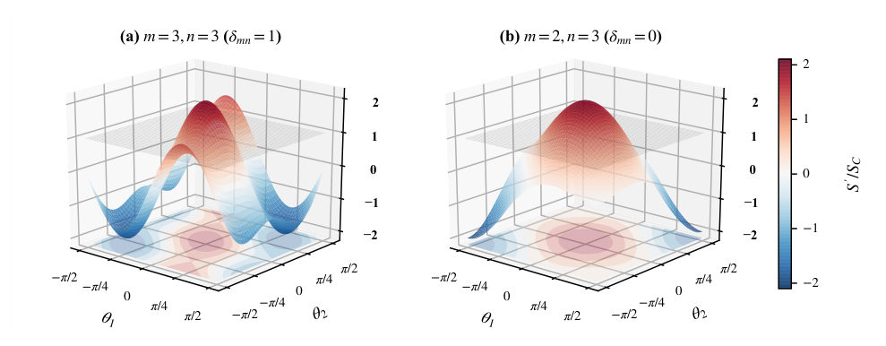
<figcaption class="paper-figure-caption"><b>Fig 1.</b> Figure 1: Evolution of the normalized Mermin violation S′/SC for an n = 3 GHZ state as a function of the local misalignment angles θ1 and θ2. Panels (a) and (b) illustrate the full-system (m = 3) and partial-system (m = 2) misalignment scenarios, respectively. The horizontal gray mesh plane indicates the classical local-realistic limit at 1. The diagonal interference patterns in the violation landscape arise from the underlying dependence on the co- planar and differential deflection parameters β and α, highlighting the distinct sensitivity of the Mermin inequality to symmetric versus asymmetric measurement errors.</figcaption>
</figure>
<figure class="paper-figure-card">
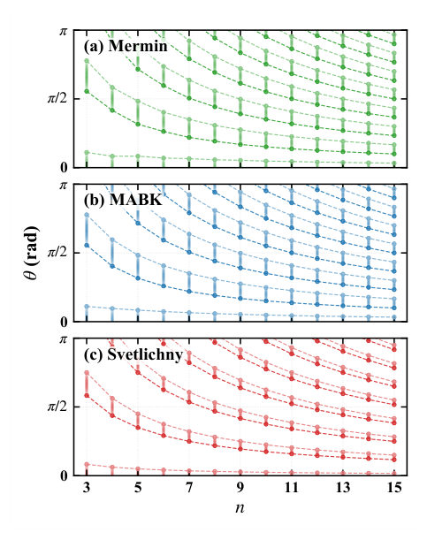
<figcaption class="paper-figure-caption"><b>Fig 2.</b> Figure 2: Full angular-domain violation regions under full-system (m = n) coherent angular misalignment for n-partite GHZ states, evaluated at β = θ. The solid vertical segments highlight the discrete angular inter- vals where the Bell inequality is violated (S′ &gt; SC). The dark and light dashed lines represent the analyti- cal lower and upper critical misalignment angles (θcr), marking the analytical phase boundaries for entering and leaving the nonlocal regimes, respectively. Blank regions between the segments denote regions where the corre- sponding Bell inequality is not violated. As n increases, the violation windows become narrower and denser, re- flecting the 2π/n periodicity of the...</figcaption>
</figure>
<figure class="paper-figure-card">
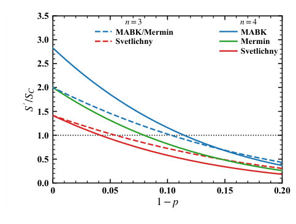
<figcaption class="paper-figure-caption"><b>Fig 3.</b> Figure 3: Normalized Bell violation S′/SC versus the outcome-flipping probability 1 −p for n = 3 and n = 4 GHZ states. Dashed and solid curves correspond to n = 3 and n = 4, respectively. The horizontal dot- ted line indicates the classical threshold S′/SC = 1. The monotonic decay of all curves follows from the uni- form correlation scaling factor (2p −1)n. For n = 3, the MABK and Mermin curves overlap because the two inequalities are equivalent for odd n. In the even-party case n = 4, the MABK inequality retains a larger vi- olation than the standard Mermin inequality, while the Svetlichny inequality remains the most restrictive crite- rion for genuine multipartite nonlocality.</figcaption>
</figure>
<figure class="paper-figure-card">
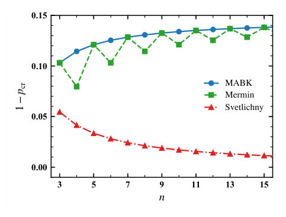
<figcaption class="paper-figure-caption"><b>Fig 4.</b> Figure 4: Critical outcome-flipping probability 1 −pcr required to violate different multipartite Bell inequalities as a function of the particle number n. The Mermin threshold (green squares) exhibits characteristic parity- dependent oscillations, reflecting its suboptimality for even n. In contrast, the MABK threshold (blue cir- cles) increases monotonically and approaches the exact asymptotic limit of (2− √</figcaption>
</figure>
<figure class="paper-figure-card">
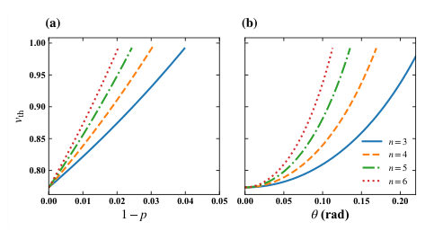
<figcaption class="paper-figure-caption"><b>Fig 5.</b> Figure 5: Threshold visibility vth required for positive secret key generation in n-partite Werner states under imperfect measurements. The region above each curve corresponds to v &gt; vth. (a) vp th as a function of the outcome-flipping probability 1−p. (b) vθ th as a function of the coherent misalignment angle θ. In both cases, larger n requires higher visibility to tolerate the same level of measurement imperfection.</figcaption>
</figure>

**Summary.** This paper rigorously quantifies how realistic measurement imperfections degrade multipartite entanglement resources. By analyzing coherent misalignment and outcome flipping errors against various Bell inequalities, it establishes that secure key generation imposes stricter error tolerances than simply proving nonlocality. The findings offer crucial guidelines for robust device-independent quantum information tasks.

**Why it may be interesting.** This work provides quantitative benchmarks essential for experimentalists designing and interpreting measurements on multipartite entangled states, directly impacting the feasibility claims of quantum communication protocols.

Detailed structure

**Main problem.** The study analyzes how practical measurement imperfections, specifically coherent angular misalignment and incoherent outcome flipping, degrade multipartite quantum nonlocality certified by Bell inequalities.

**Main result.** Secret-key generation imposes stricter constraints on measurement imperfections than the mere certification of multipartite nonlocality. Coherent errors lead to periodic violation windows, while key rate thresholds are determined by specific critical error probabilities.

**Method.** The authors employ systematic analytical derivations comparing ideal Bell values against degraded expectations using established inequalities (Mermin, Svetlichny, MABK) and connecting these bounds to asymptotic Devetak–Winter key-rate limits.

**Model / system.** The analysis focuses on $n$-partite GHZ states used as the resource for testing multipartite nonlocality. The imperfections are modeled mathematically as angular misalignments or probabilistic outcome flips.

**Key observables.** Degraded Bell expectation values ($S', S'_{Sve}, S'_{MK}$), key generation rates, and critical error thresholds ($	heta_{th}$, $p_{th}$).

**Important parameters / regimes.** Number of parties ($n$), angular misalignment ($	heta$ or $\delta_j$), and outcome flipping probability ($p$).

**Assumptions / limitations.** The analysis assumes the use of GHZ states and restricts comparisons to Bell inequalities with symmetric structures for certain error analyses.

**Figures summary.** Figure 1 illustrates the distinct interference patterns showing how the normalized violation ratio changes for full-system versus partial-system misalignment in $n=3$.

**Paper structure.** The paper systematically analyzes two types of measurement errors (coherent vs. incoherent) against three major Bell inequalities, culminating in a comparison between the required error tolerance for nonlocality certification versus quantum key distribution.

Abstract

Multipartite Bell nonlocality is a central resource for device-independent quantum information protocols, but its practical certification is inevitably affected by imperfect measurements. We analyze how coherent angular misalignment and incoherent outcome flipping affect Bell-value degradation and nonlocality thresholds in $n$-partite GHZ states based on the Mermin, Svetlichny, and Mermin--Ardehali--Belinskii--Klyshko (MABK) inequalities. Coherent misalignment produces periodic angular violation windows whose individual widths shrink with the number of parties. In contrast, incoherent outcome flipping yields a single critical outcome-flipping probability, which increases with $n$ for MABK and the odd-$n$ Mermin inequalities, but decreases with $n$ for the Svetlichny inequality. Connecting the degraded Bell values to asymptotic Devetak--Winter key-rate bounds under a convex-combination attack model shows that secret-key generation imposes stricter constraints on measurement imperfections than nonlocality certification. These results provide quantitative benchmarks for robust multipartite nonlocality certification and key-rate estimation under measurement imperfections.

[↑ back to top](#top)

### [Resistivity in Dilute Cu-3d Alloys Governed by Disorder-Induced Band Broadening](http://arxiv.org/abs/2607.13419v1)

**Authors:** Kenji Yamaguchi  
**Type:** theory · **Category:** disordered systems and neural networks · **PDF:** <https://arxiv.org/pdf/2607.13419v1>  
**Analysis basis:** full PDF text, analyzed in chunks
**Topic relevance:** `Keldysh / 2PI / non-Gaussian methods` **3/5** · `Kondo & dissipative impurity` **1/5** · `methods for driven-dissipative` **1/5** · `non-equilibrium dynamics` **1/5**

↔ Scroll figures horizontally

<figure class="paper-figure-card">
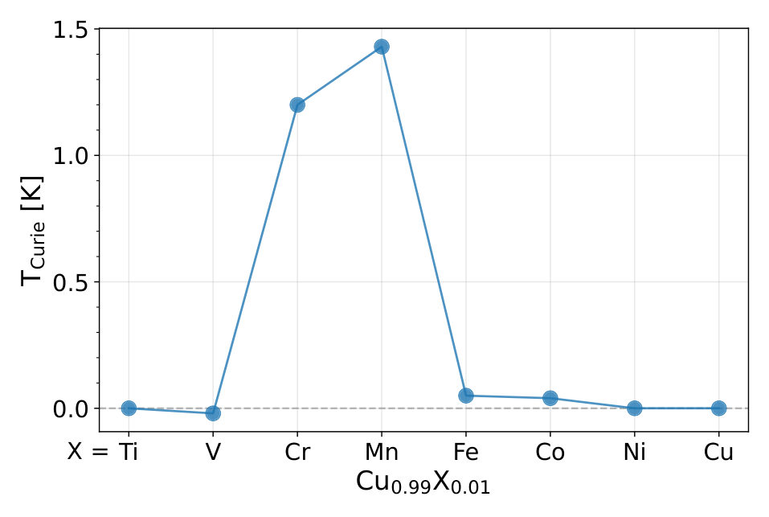
<figcaption class="paper-figure-caption"><b>Fig 1.</b> FIG. 1. Calculated Curie temperatures for Cu0.99X0.01 alloys (X = Ti–Cu) estimated from Eq. (1)</figcaption>
</figure>
<figure class="paper-figure-card">
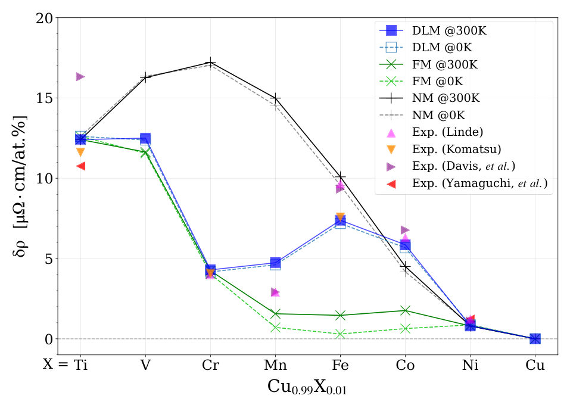
<figcaption class="paper-figure-caption"><b>Fig 2.</b> FIG. 2. Calculated and experimental electrical resistivity increase δρ per 1 at.% of solute X relative</figcaption>
</figure>
<figure class="paper-figure-card">
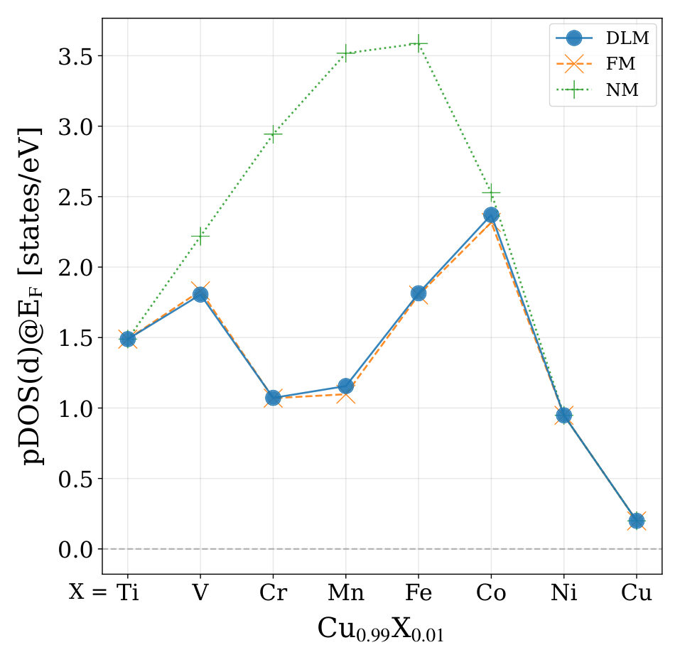
<figcaption class="paper-figure-caption"><b>Fig 3.</b> FIG. 3. Partial density of states (pDOS) of the solute-element X d-states at the Fermi level for</figcaption>
</figure>
<figure class="paper-figure-card">
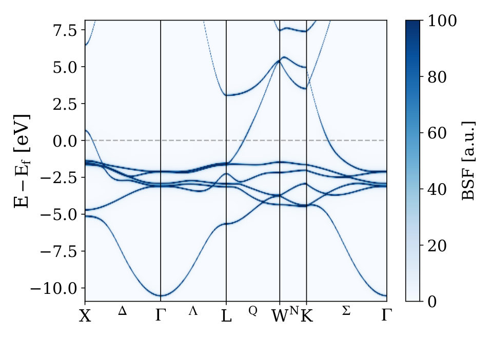
<figcaption class="paper-figure-caption"><b>Fig 4.</b> FIG. 4. Bloch spectral function (BSF) dispersion of Cu0.99Fe0.01 in the DLM state along high-</figcaption>
</figure>
<figure class="paper-figure-card">
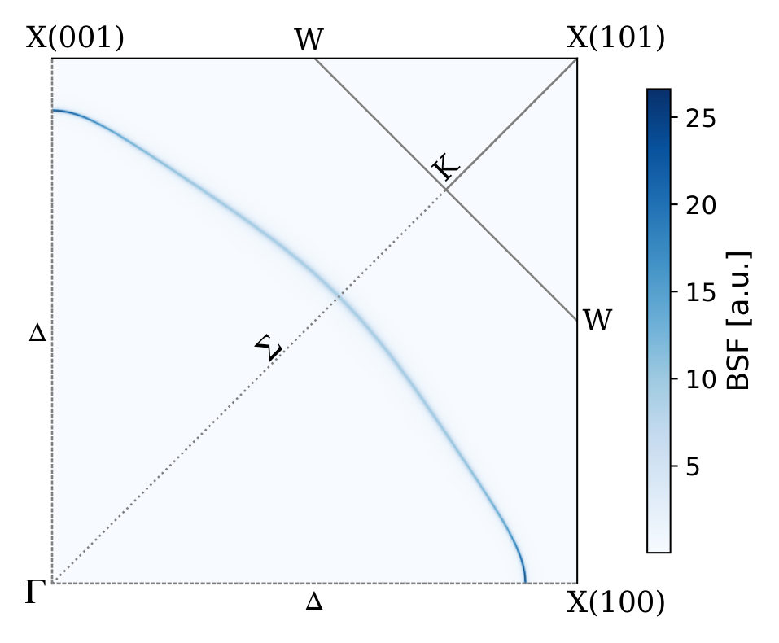
<figcaption class="paper-figure-caption"><b>Fig 5.</b> FIG. 5. BSF at the Fermi energy of Cu0.99Fe0.01 in the DLM state, plotted on the plane defined</figcaption>
</figure>

**Summary.** This theoretical study investigates how disorder affects electrical resistivity in Cu alloys doped with 3d metals. By comparing three magnetic models (DLM, FM, NM), the authors find that resistivity scales strongly with the momentum-space broadening of electronic states (BSF FWHM). This establishes a unified picture showing that scattering is governed by band structure broadening rather than just local electron density.

**Why it may be interesting.** Although focused on solid-state physics, the methodology involves analyzing spectral broadening and scattering rates derived from Green's functions, techniques relevant to understanding decoherence in quantum systems.

Detailed structure

**Main problem.** To determine the microscopic mechanism governing the resistivity increase in dilute Cu-3d transition-metal alloys at ambient temperatures.

**Main result.** Resistivity is governed by disorder-induced band broadening (measured via BSF FWHM) in momentum space, rather than solely by local density of states effects. The Double Local Moment (DLM) framework successfully reproduces experimental trends.

**Method.** First-principles calculations using the Korringa–Kohn–Rostoker coherent potential approximation (KKR-CPA) combined with the Kubo–Greenwood formalism to calculate electrical conductivity.

**Model / system.** The study investigates dilute solid-solution alloys of Copper (Cu) and 3d transition metals (X). Theoretical models compare Double Local Moment (DLM), Ferromagnetic (FM), and Non-Magnetic (NM) paramagnetic states.

**Key observables.** Electrical resistivity ($
ho$), Full Width at Half Maximum (FWHM) of the Bloch Spectral Function (BSF) on the Fermi surface, Partial Density of States (pDOS) at the Fermi level ($E_F$).

**Important parameters / regimes.** Ambient temperature regime ($T \gg T_K$); solute concentration ($	ext{Cu}_{0.99}	ext{X}_{0.01}$); power-law exponent $eta \approx 1.89$.

**Assumptions / limitations.** The analysis assumes the validity of the DLM framework at room temperature, contrasting with low-temperature Kondo regimes; it also notes that pDOS alone is insufficient to explain resistivity variations.

**Figures summary.** Figures compare $\delta
ho$ vs. BSF FWHM (showing strong correlation) and show comparisons between different magnetic states' spectral functions and energy differences used for $T_C$ estimation.

**Paper structure.** The paper systematically compares three theoretical descriptions of the paramagnetic state (DLM, FM, NM) using advanced electronic structure calculations to diagnose which physical quantity—pDOS or BSF FWHM—best correlates with measured resistivity trends across the 3d series.

Abstract

The mechanism governing the resistivity in dilute Cu-3d transition-metal alloys at ambient temperature -- the regime relevant to most practical applications and distinct from the low-temperature, Kondo-screened regime addressed by earlier theoretical work -- is investigated using first-principles calculations based on the Korringa--Kohn--Rostoker coherent potential approximation combined with the Kubo--Greenwood formalism. The paramagnetic state is described within the disordered local moment (DLM) framework, corresponding to a local-moment paramagnet rather than a Pauli paramagnet. We show that the experimentally observed resistivity trends are reproduced only within the DLM description, while nonmagnetic and ferromagnetic states fail to capture the correct element dependence. Contrary to conventional interpretations based on the density of states at the Fermi level, the resistivity exhibits a strong correlation with the full width at half maximum (FWHM) of the Bloch spectral function (BSF) on the Fermi surface. This correlation reflects the disorder-induced lifetime broadening of electronic states, directly related to the scattering rate that governs electrical resistivity. A common power-law scaling between resistivity and BSF broadening is identified across different magnetic states. These results demonstrate that the resistivity is governed by disorder-induced band broadening in momentum space rather than by local density-of-states effects, providing a unified microscopic interpretation of the breakdown of Linde's rule in Cu-based alloys.

[↑ back to top](#top)

### [Lecture Notes: The two-dimensional electron Wigner crystal -- What's old and what's new?](http://arxiv.org/abs/2607.13933v1)

**Authors:** Brian Skinner  
**Type:** both · **Category:** strongly correlated electrons · **PDF:** <https://arxiv.org/pdf/2607.13933v1>  
**Analysis basis:** full PDF text, analyzed in chunks
**Topic relevance:** `analog quantum simulation` **3/5** · `Keldysh / 2PI / non-Gaussian methods` **1/5** · `non-equilibrium dynamics` **1/5**

↔ Scroll figures horizontally

<figure class="paper-figure-card">
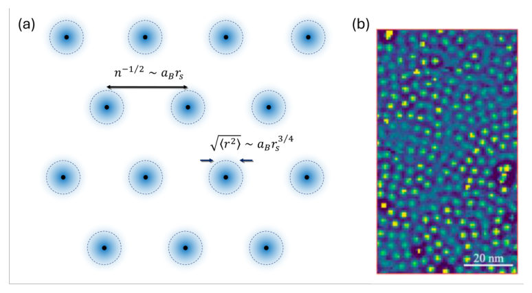
<figcaption class="paper-figure-caption"><b>Fig 1.</b> Figure 1: (a) A cartoon picture of a Wigner crystal, in which electron wave packets are arranged in a triangular lattice. (b) An experimental image of a Wigner crystal in bilayer MoSe2, taken using scanning tunneling microscopy [2].</figcaption>
</figure>
<figure class="paper-figure-card">
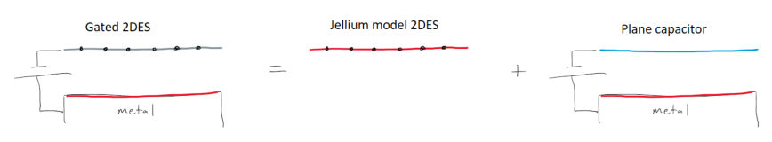
<figcaption class="paper-figure-caption"><b>Fig 2.</b> Figure 2: A gated 2DES is energetically equivalent to the jellium model 2DES plus the energy of a uniform plane capacitor.</figcaption>
</figure>
<figure class="paper-figure-card">
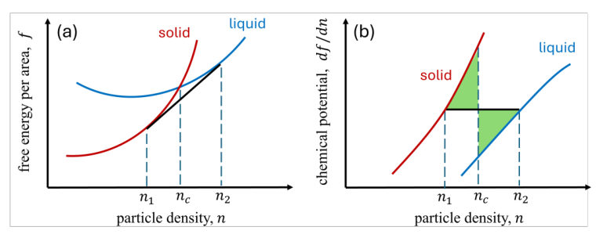
<figcaption class="paper-figure-caption"><b>Fig 3.</b> Figure 4: (a) In the Maxwell construction for phase coexistence, a system can lower its free energy relative to either the uniform solid or uniform liquid phases by making a phase mixture in which solid domains having density n1 coexist with liquid domains having density n2. The total free energy follows the black tangent line. (b) In terms of the chemical potential df/dn, the Maxwell construction is defined by the solid and liquid phases coexisting at the same chemical potential, while the two indicated green areas are equal.</figcaption>
</figure>
<figure class="paper-figure-card">
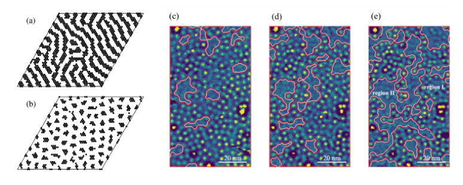
<figcaption class="paper-figure-caption"><b>Fig 4.</b> Figure 5: (a)-(b) Schematic of a microemulsion-type state (from Ref. [17]), where solid and liquid phases are intermixed. The two phases form stripes (a) when they are present in similar amounts, and bubbles (b) of the minority phase otherwise. (c)-(e) show scanning tunneling microscopy images (from Ref. [2]) of the same region of the sample during the WC-FL transition, with electron density increasing to the right. Regions outlined in red are “liquid lakes” emerging within the WC.</figcaption>
</figure>
<figure class="paper-figure-card">
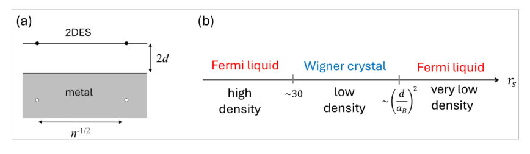
<figcaption class="paper-figure-caption"><b>Fig 5.</b> Figure 6: (a) When the distance n−1/2 between neighboring electrons (black points) is large compared to the distance d from the metal gate, electrons are essentially dipoles due to the screening effect of their image charges (white points) in the gate. Their interaction V (r) ∼e2d2/r3. (b) This screening effect modifies the phase diagram, producing melting of the WC at very low densities. Notice that if d/aB is not too large, then there is no WC phase at all.</figcaption>
</figure>

**Summary.** This lecture notes review the physics of the 2D electron Wigner crystal, detailing its formation from strong Coulomb correlations. It progresses from classical jellium models to modern quantum corrections, including how topological effects like Berry curvature introduce chiral terms into the spin Hamiltonian. The work is crucial for understanding correlated insulating states in advanced 2D materials.

**Why it may be interesting.** The discussion of topological modifications via the Berry phase introduces concepts relevant to effective Hamiltonians in condensed matter, which can be analogous to engineered gauge fields or synthetic magnetic fields studied in AMO contexts.

Detailed structure

**Main problem.** The lecture reviews the fundamental nature of the two-dimensional electron Wigner crystal (WC) phase, focusing on how modern effects like Berry curvature modify its description.

**Main result.** The WC state is governed by the competition between Coulomb energy and kinetic energy, and its properties are significantly modified by topological terms arising from Berry curvature in realistic materials.

**Method.** The analysis combines semiclassical treatments (jellium model) with rigorous quantum mechanical calculations of zero-point energies and spin Hamiltonians incorporating Berry phases.

**Model / system.** The primary system is a two-dimensional electron gas (2DES), modeled initially by the jellium approximation, but extended to include effects from moiré patterns and bilayer structures in modern 2D materials.

**Key observables.** Interaction parameter ($r_s$), quantum energy corrections ($\hbar\omega(\vec{q})$), chiral spin coupling term ($J_\chi$), and transport measurements like longitudinal resistance ($
ho_{xx}$).

**Important parameters / regimes.** $r_s = E_C/E_F$ (interaction parameter); the Berry phase ($\varphi$).

**Assumptions / limitations.** The initial framework assumes a neutralizing background charge (jellium model), and approximations are used for quantum energy corrections, though these show remarkable accuracy.

**Figures summary.** Figures illustrate WC structures in triangular lattices, experimental images from MoSe2, phase diagrams showing microemulsion transitions, and transport measurements demonstrating the transition between WC and Quantum Hall states.

**Paper structure.** The notes are structured historically, moving from 'Old-fashioned physics' (jellium model for basic WC formation) to 'Newfangled physics' (incorporating Berry curvature effects on spin order and generalized WCs).

Abstract

These are lecture notes created for a short lecture series at the 2026 CTEQ Summer School at Penn State. They are written in a conversational and informal style. The goal of these notes is to introduce and review a smattering of old and new ideas about the Wigner crystal (the solid phase of the two-dimensional electron system) in the context of recent experiments. Particular emphasis is given to the semiclassical description of the Wigner crystal, its quantum melting transition, its spin order, and the ways in which the Wigner crystal can be modified by Berry curvature.

[↑ back to top](#top)

### [Precoding-based protocols for entanglement assisted linear computation over a quantum many-to-one network](http://arxiv.org/abs/2607.13756v1)

**Authors:** Ruoyu Meng, Aditya Ramamoorthy  
**Type:** theory · **Category:** quantum information and computing · **PDF:** <https://arxiv.org/pdf/2607.13756v1>  
**Analysis basis:** full PDF text, analyzed in chunks
**Topic relevance:** `entanglement & information structure` **3/5** · `non-equilibrium dynamics` **1/5**

↔ Scroll figures horizontally

<figure class="paper-figure-card">
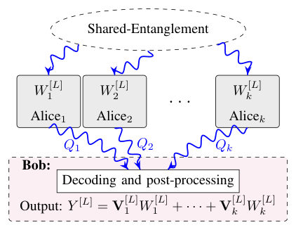
<figcaption class="paper-figure-caption"><b>Fig 1.</b> Fig. 1. A schematic diagram for a coding scheme under the noiseless quantum many-to-one model. Each Alicei encodes</figcaption>
</figure>

**Summary.** This paper develops advanced protocols for performing linear computations over a quantum network where multiple senders share entanglement. By allowing senders to precode inputs, they overcome limitations found in previous models, enabling the computation of more general transformations. Crucially, the authors prove that jointly computing several such functions can reduce the total required communication cost below the sum of individual costs.

**Why it may be interesting.** While focused on abstract quantum communication complexity, the concepts of resource quantification (communication cost) and achieving super-additive benefits are fundamental theoretical tools applicable to optimizing complex quantum information processing tasks.

Detailed structure

**Main problem.** The work addresses computing a general linear combination of classical data vectors ($Y = \sum V_i W_i$) over a noiseless quantum many-to-one network.

**Main result.** They propose protocols that support a more general class of linear transformations than previously constrained, demonstrating subadditivity in the communication cost across multiple instances.

**Method.** The approach involves encoding classical inputs into local quantum subsystems and transmitting them through an entangled quantum channel to a single receiver for joint measurement and post-processing.

**Model / system.** The model is a noiseless quantum many-to-one network where $k$ senders share entanglement, and the computation aims to reconstruct a linear combination $\mathbf{Y}$ at Bob's location.

**Key observables.** Communication cost (total number of transmitted qudits) and the resulting output vector $\mathbf{Y}$.

**Important parameters / regimes.** Number of senders ($k$), number of instances ($L$), dimensions of input/output spaces ($\mathbb{F}^{m_i}, \mathbb{F}^m$).

**Assumptions / limitations.** The computation is assumed to be zero-error, and the analysis builds upon prior work concerning constraints like the Strong Self-Orthogonality (SSO) condition.

**Figures summary.** Figure 1 schematically illustrates the three stages of the coding scheme: entanglement distribution, local unitary encoding/transmission by $Alice_i$, and final measurement/post-processing at Bob.

**Paper structure.** The paper progresses from defining the general linear combination problem to developing protocols that relax prior constraints (like SSO), demonstrating cost improvements, and finally proving subadditivity across multiple instances.

Abstract

In this work, we consider the problem of computing a linear combination over a noiseless quantum many-to-one network. There are $k$ senders, Alice$_1$, $\ldots$, Alice$_k$, and a single receiver, Bob. Each Alice$_i$ has a data vector $W_i \in \mathbb{F}^{m_i}$, where $\mathbb{F}$ is a finite field. Bob wants to compute the linear combination $Y = V_1 W_1 + V_2 W_2 + \cdots + V_k W_k \in \mathbb{F}^m$, where $V_i$ is an $m \times m_i$ matrix over $\mathbb{F}$. The senders transmit quantum states to Bob through a noiseless many-to-one quantum network, but they are not allowed to communicate with each other. The senders share entanglement among themselves, while Bob does not share this entanglement. They encode their classical information $W_i$, $i=1,\ldots,k$, into their local subsystems and transmit them to Bob so that he can recover $Y$ through a quantum measurement and subsequent post-processing. The N-Sum Box protocol proposed by Allaix et al. (2025) considers this problem under certain constraints on the linear combination and the distribution of the data vectors among the senders.   We present protocols that support the computation of a more general class of linear transformations by giving the senders access to more qudits and allowing them to judiciously precode their input symbols. The communication cost of our schemes is at most that of the best-known prior results in this area and is strictly lower in certain cases. Finally, we demonstrate that the communication cost is subadditive across instances. Specifically, we identify two linear functions for which the total cost of computing them individually is strictly larger than the cost of computing them jointly.

[↑ back to top](#top)

### [Tensor Network decoding under inter-qubit correlated errors](http://arxiv.org/abs/2607.13570v1)

**Authors:** Yue Yan, SiYing Wang, ZhiXin Xia, HanNuo Yuan, CanWei Shi, Xiang-Bin Wang  
**Type:** theory · **Category:** quantum information and computing · **PDF:** <https://arxiv.org/pdf/2607.13570v1>  
**Analysis basis:** full PDF text, analyzed in chunks
**Topic relevance:** `methods for driven-dissipative` **3/5** · `correlated / nonlocal dissipation` **1/5**

↔ Scroll figures horizontally

<figure class="paper-figure-card">
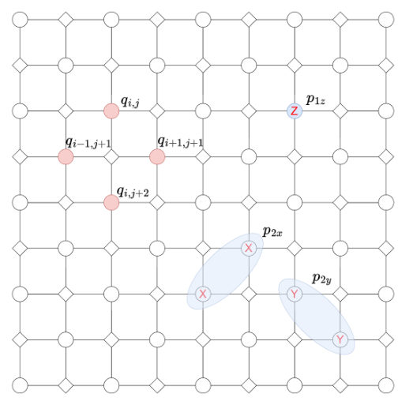
<figcaption class="paper-figure-caption"><b>Fig 1.</b> FIG. 1. An example of error model ENN. Diamonds represent measurement qubits, and circles represent data qubits. The four pink circles correspond to qi,j, qi−1,j+1, qi,j+2, qi+1,j+1, where the subscripts denote the coordinates of the qubits. For example, {qi+1,j+1, qi,j+2} is a pair of nearest-neighbor data qubits. The blue circle in the upper-right part indicates that an independent single-qubit Pauli Z error occurs at that data qubit, with probability p1z. The two pairs of nearest- neighbor data qubits enclosed by the blue ellipse in the lower- right part experience a correlated XX error and correlated YY error, with probabilities p2x and p2y, respectively.</figcaption>
</figure>
<figure class="paper-figure-card">
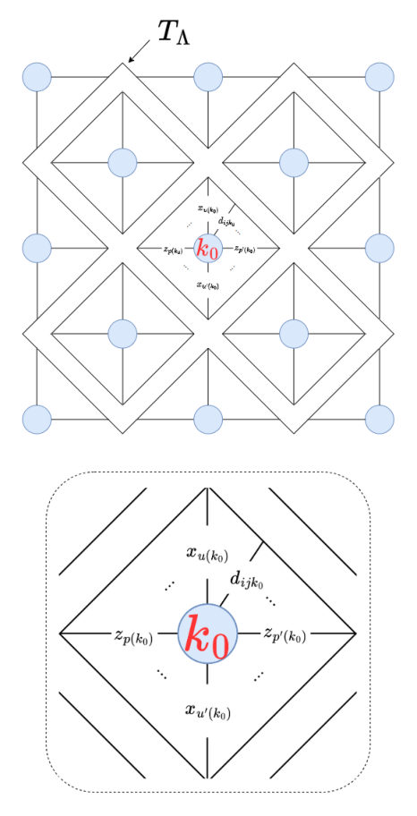
<figcaption class="paper-figure-caption"><b>Fig 2.</b> FIG. 2. The tensor network corresponding to the specific sur- face code with d = 3 under a general correlated error model. The dashed box shows a magnified view of the central re- gion of the tensor network. The central blue circle represents the tensor Fxu(k0),xu′(k0),zp(k0),zp′(k0),dijk0 (r′ k0), and the sur- rounding box represents a tensor TΛ of huge dimension. In the figure, only the indices dijk with k = k0 corresponding to the specific k0-th data qubit are labeled, the other dijk with k ̸= k0 indices are omitted.</figcaption>
</figure>
<figure class="paper-figure-card">
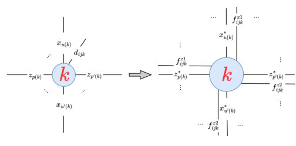
<figcaption class="paper-figure-caption"><b>Fig 3.</b> FIG. 3. Under reparametrization P1, P2 and elimi- nation, the right tensor Fxu(k),xu′(k),zp(k),zp′(k),dijk(r′ k) in Eq.23 is replaced by the left tensor Fx∗ u(k),x∗ u′(k),z∗ p(k),z∗ p′(k),fx1 ijk,fx2 ijk,fz1 ijk,fz2 ijk(r′ k).</figcaption>
</figure>
<figure class="paper-figure-card">
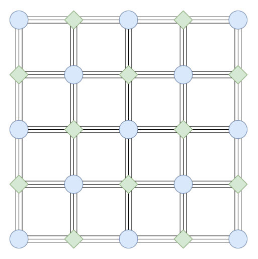
<figcaption class="paper-figure-caption"><b>Fig 4.</b> FIG. 4. The tensor network corresponding to the surface code with d = 3 under the ENN error model. The blue circles rep- resent the tensor Fx∗ u(k),x∗ u′(k),z∗ p(k),z∗ p′(k),fx1 ijk,fx2 ijk,fz1 ijk,fz2 ijk(r′ k).</figcaption>
</figure>
<figure class="paper-figure-card">
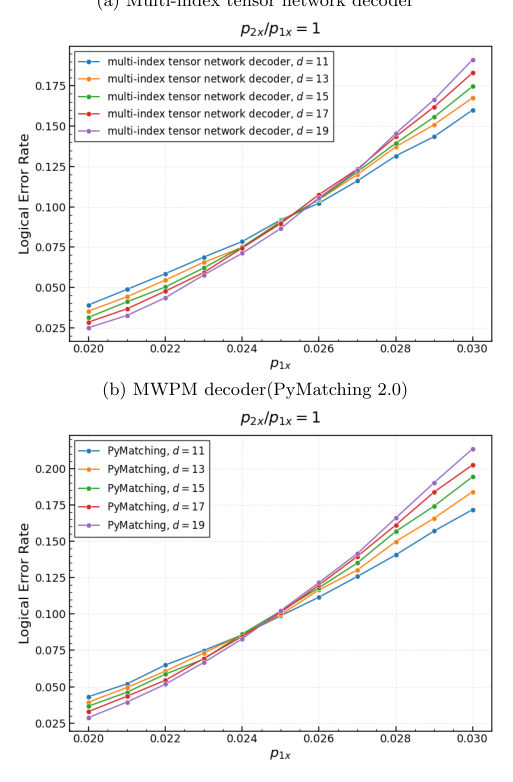
<figcaption class="paper-figure-caption"><b>Fig 5.</b> FIG. 5. Logical error rate as a function of p1x for the ENN error model with p1z = p1y = 0, p2z = p2y = 0 and p1x = p2x. (a) Results obtained by our multi-index tensor network decoder. (b) Results obtained by PyMatching 2.0. For our decoder, the tensor network contraction is performed with bond dimension χ = 12, and each data point is obtained from 100000 samples.</figcaption>
</figure>

**Summary.** This work addresses the difficulty of decoding quantum codes corrupted by correlated errors by developing an efficient multi-index tensor network approach. The authors overcome the challenges of non-factorizable probabilities and exponentially large tensors using index transformations and reparametrization techniques. They demonstrate that this new decoder achieves superior error correction thresholds compared to existing methods.

**Why it may be interesting.** It provides a sophisticated computational tool (tensor networks) to analyze performance limits in quantum error correction under realistic, complex noise conditions that go beyond simple independent errors.

Detailed structure

**Main problem.** The primary challenge is developing an efficient maximum likelihood decoder for quantum error correction under inter-qubit correlated noise models.

**Main result.** The proposed multi-index tensor network construction achieves a higher finite-size threshold than the widely used MWPM decoder in numerical simulations.

**Method.** The authors introduce additional binary indices and transformations to build a multi-index tensor network, followed by reparametrization and index classification to ensure efficient contraction of otherwise huge tensors.

**Model / system.** The analysis focuses on decoding the 2D surface code when subjected to correlated Pauli errors, specifically modeling noise combining independent single-qubit errors with nearest-neighbor correlated two-qubit interactions (ENN model).

**Key observables.** Finite-size threshold of the decoder; Coset probabilities $p(C(r'))$.

**Important parameters / regimes.** Code distance ($d$); Noise parameters ($p_1, p_2$).

**Assumptions / limitations.** The method relies on reparametrization and index classification to decompose high-dimensional tensors into efficiently contractible forms.

**Figures summary.** Figures illustrate the Nearest-Neighbor Error Model (ENN) structure; Figure 6 compares the estimated finite-size threshold vs. code distance for the proposed decoder against PyMatching 2.0.

**Paper structure.** The paper reviews surface codes and ML decoding, introduces the general correlated error model, details the multi-index tensor network construction using transformations, presents numerical simulations, and concludes.

Abstract

The maximum likelihood decoder based on tensor networks has proven highly successful for the 2D surface code, achieving the optimal decoding success rate. However, existing tensor network decoders are typically designed for independent single-qubit error models, and their performance under inter-qubit correlated error models remains unexplored. This is due to two major challenges. The first challenge lies in constructing the tensor network for correlated errors, since the same final Pauli error can arise from many different combinations of independent and correlated errors, preventing a direct factorization of the error probability. The second challenge is that even after a tensor network is constructed, it generally contains huge-dimensional tensors and is therefore not efficiently contractible. In this work, to address the first difficulty, we introduce additional binary indices and two transformations to construct a multi-index tensor network for maximum-likelihood decoding with correlated errors. To address the second difficulty, we use reparametrization, elimination, and index classification to decompose the huge-dimensional tensors into lower-dimensional tensors. This yields an efficiently contractible tensor network for error models satisfying the tractability conditions derived in this work. We perform numerical simulations for a representative correlated error model and show that the maximum-likelihood decoder implemented with our multi-index tensor network construction achieves a higher finite-size threshold than the widely used MWPM decoder.

[↑ back to top](#top)

### [Three-Dimensional Non-Foliated Fractional Quantum Hall Phases with Irrational Anyons in Twisted van der Waals Multilayers](http://arxiv.org/abs/2607.13127v1)

**Authors:** Seyoung Jin, Hyeonseo Lim, Youngwook Kim, Gil Young Cho  
**Type:** theory · **Category:** strongly correlated electrons · **PDF:** <https://arxiv.org/pdf/2607.13127v1>  
**Analysis basis:** full PDF text, analyzed in chunks
**Topic relevance:** `analog quantum simulation` **3/5** · `methods for driven-dissipative` **1/5**

↔ Scroll figures horizontally

<figure class="paper-figure-card">
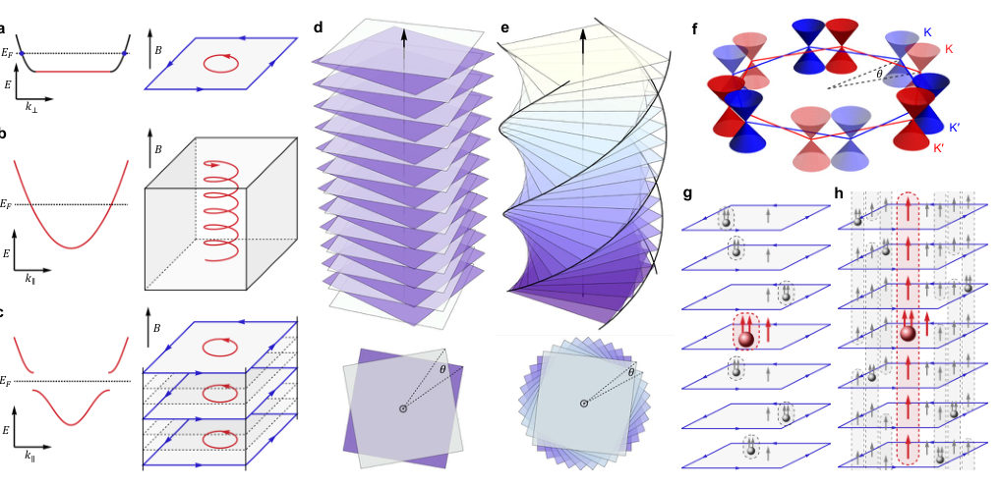
<figcaption class="paper-figure-caption"><b>Fig 1.</b> FIG. 1: Three-dimensional FQH phases in twisted multilayers. a, Quantum Hall effect in two dimensions. Under a uniform magnetic field B, the electrons follow cyclotron orbits (red arrow), and discrete Landau levels are formed [1, 6]. An isolated flat Landau level is required to realize a quantum Hall state (red line). b, In three dimensions, Landau levels generally disperse with the momentum k∥along the applied magnetic field, corresponding to cyclotron motion that spirals along the field direction (red arrow) [6, 17]. When a single Landau level crosses the Fermi energy (red curve), it results in a quasi-one-dimensional Fermi sea. c, When this band is partially filled, it has a density-wave...</figcaption>
</figure>
<figure class="paper-figure-card">
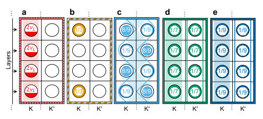
<figcaption class="paper-figure-caption"><b>Fig 2.</b> FIG. 2: Schematics of competing phases. Each black circle visualizes the lowest Landau level assigned to each layer (rows) and valley (columns). The circle is empty if the corresponding Landau level is unoccupied. Occupied Landau levels are indicated by partially filled circles, and their filling fractions are explicitly provided. A set of entangled Landau levels is indicated by either a shaded area or a solid line. a, Metallic valley-polarized SILC state. b, Staged Laughlin state. c–e, Interlayer coherent phases as a pair of generalized Halperin states and/or their particle-hole conjugates. Using the notation in which · ⊕· denotes a product state and PH(·) denotes particle-hole...</figcaption>
</figure>
<figure class="paper-figure-card">
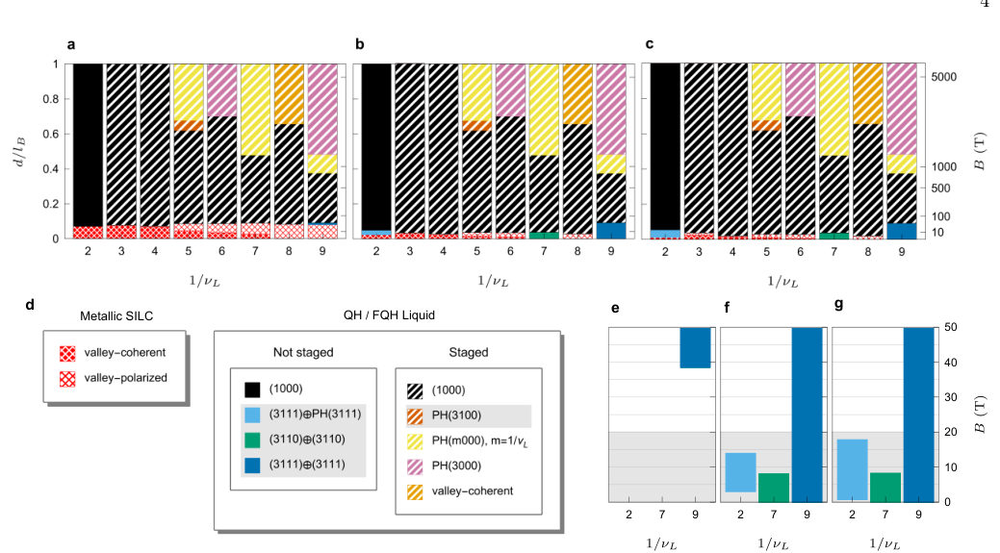
<figcaption class="paper-figure-caption"><b>Fig 3.</b> FIG. 3: Phase diagrams. a, Phase diagram for three-dimensional Bernal graphite (t⊥≈10 meV), b, alternating twisted graphene multilayer (t⊥≈1.78 meV), and c, helical twisted graphene multilayer (t⊥≈1.09 meV). d, Phase labels using the notation of Fig. 2. Interlayer-coherent FQH phases are highlighted in gray. Valley ordering and entanglement patterns are provided in Supplementary Note 3. e–g, Parameter regimes in which generalized Halperin states emerge at low magnetic fields for e, Bernal graphite, f, alternating twisted graphene multilayer, and g, helical twisted graphene multilayer. Experimentally accessible range of magnetic fields is highlighted in gray.</figcaption>
</figure>

**Summary.** The paper proposes that large-angle twisted van der Waals multilayers offer a viable route to achieving intrinsically three-dimensional fractional quantum Hall phases. By suppressing interlayer tunneling via twist angles, the system avoids metallic instabilities common in conventional 3D stacks. The resulting generalized Halperin states host exotic quasiparticles with irrational braiding statistics, opening new avenues for topological quantum information.

**Why it may be interesting.** This work provides a concrete materials platform (twisted van der Waals layers) for realizing exotic topological matter predicted in strongly correlated electron systems, linking theoretical concepts of irrational anyons to solid-state physics.

Detailed structure

**Main problem.** The primary challenge is realizing intrinsically three-dimensional (3D) fractional quantum Hall (FQH) phases that exhibit exotic properties like irrational anyons, moving beyond simple stacks of 2D liquids.

**Main result.** Large-angle twisted van der Waals multilayers stabilize generalized Halperin liquid states exhibiting non-foliated 3D topological order with quasiparticles possessing irrational braiding statistics.

**Method.** The study employs Monte Carlo calculations to compare the energies of a large set of competing trial wavefunctions, determining the ground state by minimizing the total energy functional.

**Model / system.** The system is modeled using twisted van der Waals multilayers (like graphene) under a strong magnetic field. The key mechanism relies on large twist angles suppressing interlayer tunneling while preserving strong Coulomb interactions.

**Key observables.** Topological order structure (non-foliated), quasiparticle braiding statistics (irrational vs. rational), and the relative stability of generalized Halperin states versus metallic phases.

**Important parameters / regimes.** Large twist angles ($	heta \gtrsim 10^\circ$), small interlayer tunneling ($t_{\perp} \approx 1.78$ meV), and specific filling fractions like $
u_L = 1/7$.

**Assumptions / limitations.** The analysis assumes that the suppression of coherent interlayer tunneling due to momentum mismatch is the critical factor stabilizing the novel liquid phases.

**Figures summary.** Figures illustrate the transition from dispersive 3D Landau levels favoring density waves (Fig. 1) and present phase diagrams comparing different twisted graphene regimes based on magnetic field and filling fraction (Fig. 3).

**Paper structure.** The paper first establishes the physical problem of achieving 3D FQH states, then details how large-angle twisting solves the metallic instability issue by suppressing tunneling, followed by extensive Monte Carlo calculations comparing candidate wavefunctions to identify the stable generalized Halperin liquid.

Abstract

Three-dimensional fractional quantum Hall phases offer a route to intrinsically higher-dimensional topological order beyond simple stacks of two-dimensional quantum Hall liquids. Such phases can exhibit non-foliated, intrinsically three-dimensional entanglement structures, exponentially large topological degeneracies and quasiparticles with irrational braiding statistics. Their microscopic realization has remained elusive because Landau quantization in three dimensions generally leaves dispersive one-dimensional bands, favoring metallic and density-wave states over incompressible fractional liquids. Here we show that large-angle twisted van der Waals multilayers provide a practical route around this obstruction. Large twist angles suppress coherent interlayer tunneling through momentum mismatch, while the atomic-scale layer separation preserves strong interlayer Coulomb interactions. Using Monte Carlo calculations to compare the energies of an extensive set of 862 competing trial wavefunctions, we find that generalized Halperin states with quantum coherence extending across multiple consecutive layers are stabilized. In experimentally accessible magnetic-field regimes, these states replace the metallic spontaneous-interlayer-coherent phases that dominate conventional untwisted graphite-like multilayers. The resulting liquids realize non-foliated fractional quantum Hall order closely related to fractonic topological order, hosting quasiparticles with rational electric charges but irrational braiding statistics. Their large topological degeneracy and non-rational statistical phases may offer unconventional resources for quantum information storage and processing. Our results establish twisted van der Waals multilayers as a realistic materials platform for three-dimensional fractional Hall matter beyond conventional two-dimensional quantum Hall systems.

[↑ back to top](#top)

### [Thermodynamic and electrical transport properties of the half-Heusler plumbide TbAuPb](http://arxiv.org/abs/2607.14011v1)

**Authors:** Abhinav Agarwal, Snehashish Chatterjee, Maciej J. Winiarski, Orest Pavlosiuk, Dorota A. Kowalska, Piotr Wisniewski, Dariusz Kaczorowski  
**Type:** both · **Category:** strongly correlated electrons · **PDF:** <https://arxiv.org/pdf/2607.14011v1>  
**Analysis basis:** full PDF text, analyzed in chunks
**Topic relevance:** `spintronics-quantum-optics interface` **3/5**

↔ Scroll figures horizontally

<figure class="paper-figure-card">
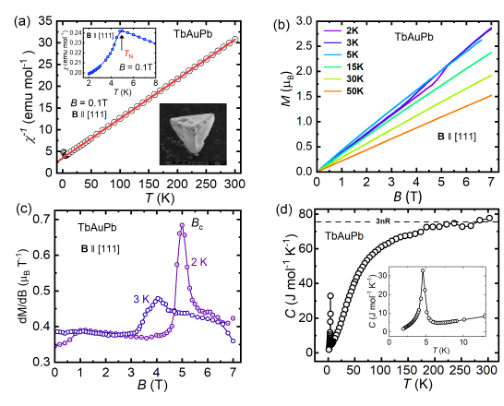
<figcaption class="paper-figure-caption"><b>Fig 1.</b> FIG. 1. (a) Temperature dependence of the inverse mag- netic susceptibility of single-crystalline TbAuPb measured in a magnetic field 0.1 T applied along the crystallographic [111] axis. The red line represents the Curie-Weiss fit. Upper in- set: the low-temperature variation of the magnetic suscepti- bility measured as in the main panel. The arrow indicates the AFM transition. Lower inset: SEM image of a single crystal of TbAuPb. (b) Magnetic field dependencies of the magne- tization in single-crystalline TbAuPb measured at different temperatures along the [111] direction. (c) Field derivative of the magnetization isotherms taken at T = 2 and 3 K. (d) Temperature variation the specific...</figcaption>
</figure>
<figure class="paper-figure-card">
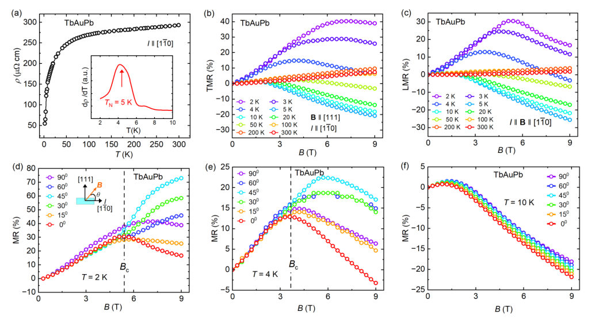
<figcaption class="paper-figure-caption"><b>Fig 2.</b> FIG. 2. (a) Temperature variation of the electrical resistivity of single-crystalline TbAuPb measured with electric current flowing along the [1¯10] direction. Inset: temperature derivative of the resistivity measured at low temperatures. (b) Transverse magnetoresistance isotherms of TbAuPb taken at various temperatures with electric current flowing along the [1¯10] direction and magnetic field applied along the [111] axis. (c) Longitudinal magnetoresistance isotherms of TbAuPb taken at various temperatures with electric current flowing along the [1¯10] direction and magnetic field applied parallel to the current. (d-f) Magnetoresistance of TbAuPb measured at 2 K, 4 K, and 10 K,...</figcaption>
</figure>
<figure class="paper-figure-card">
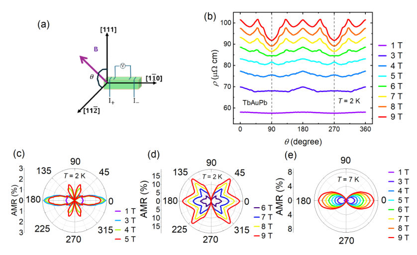
<figcaption class="paper-figure-caption"><b>Fig 3.</b> FIG. 3. (a) Mutual arrangement of magnetic field and electric current in measurements of the angular magnetoresistance in single-crystalline TbAuPb performed in transverse configuration. (b) Angular variations of the electrical resistivity of TbAuPb measured at 2 K as shown in panel (a) in different applied magnetic fields. For clarity, the subsequent curves were shifted upwards by a multiple of 5 µΩcm. (c) Polar plots of the angular magnetoresistance of TbAuPb measured as shown in panel (a) in the AFM state below the spin-reorientation transition. (d) Polar plots of the angular magnetoresistance of TbAuPb measured as shown in panel (a) in the AFM state above the spin-reorientation...</figcaption>
</figure>
<figure class="paper-figure-card">
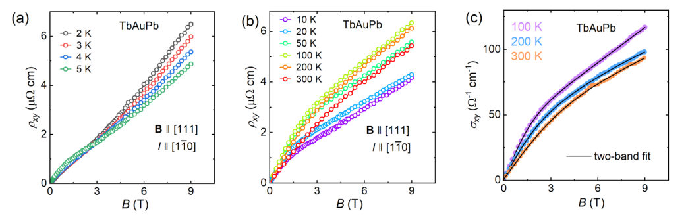
<figcaption class="paper-figure-caption"><b>Fig 4.</b> FIG. 4. (a) Hall resistivity of single-crystalline TbAuPb measured as a function of magnetic field at different temperatures in the AFM state with electric current flowing along the [1¯10] direction and magnetic field applied along the [111] axis. (b) Hall resistivity of TbAuPb measured at different temperatures as described in panel (a) in the paramagnetic state. (c) The Hall conductivity at high temperatures T &gt; 100 K. The solid black lines represent the two-band model fits (see Eq. 1) .</figcaption>
</figure>
<figure class="paper-figure-card">
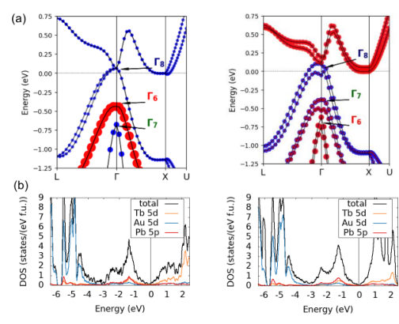
<figcaption class="paper-figure-caption"><b>Fig 5.</b> FIG. 5. (a) Electronic structure of nonmagnetic TbAuPb calculated using the MBJGGA potential (left) and ferromag- netic phase with M ∥[001] of TbAuPb calculated within the MBJGGA+U approach (right). Bands bearing p- and s-type character are marked with blue and red dots, respectively. (b) Total and partial density of states in TbAuPb calculated as specified in panel (a).</figcaption>
</figure>

**Summary.** This work investigates the coupled thermodynamic and electronic properties of the half-Heusler material TbAuPb. By combining single-crystal measurements with advanced DFT calculations, the authors demonstrate that transport properties are highly sensitive to the material's magnetic state. The findings suggest that TbAuPb is a semimetal whose topology can be tuned by external magnetic fields.

**Why it may be interesting.** The strong coupling observed between charge transport anomalies (e.g., $	ext{AMR}$ symmetry changes) and magnetic phase transitions provides a rich platform for studying emergent quantum phenomena driven by magnetic order, relevant to correlated electron physics.

Detailed structure

**Main problem.** The study investigates the interplay between magnetic ordering, electronic band topology, and charge transport properties in the half-Heusler plumbide TbAuPb.

**Main result.** TbAuPb exhibits semimetallic behavior whose magnetotransport properties are highly sensitive to its magnetic state. Theoretical calculations suggest it is a band inverted semimetal in the non-magnetic state, becoming topologically trivial upon field-induced ferromagnetism.

**Method.** The research combines experimental measurements (magnetization, specific heat, resistivity, magnetoresistance) with first-principles electronic structure calculations using DFT/MBJGGA+U functionals.

**Model / system.** The physical system is the single-crystal half-Heusler compound TbAuPb, which possesses a cubic MgAgAs-type structure and exhibits intrinsic magnetism due to partially filled 4f orbitals on Tb. The analysis covers both antiferromagnetic (AFM) and field-induced ferromagnetic (FM) magnetic phases.

**Key observables.** Electrical resistivity $
ho(T)$, magnetoresistance (MR), angular magnetoresistance ($	ext{AMR}$), Hall resistivity ($
ho_{xy}(B)$), specific heat $C(T)$, and electronic band structure/Density of States ($	ext{DOS}$) at the Fermi level.

**Important parameters / regimes.** Antiferromagnetic transition temperature ($T_N = 5 	ext{ K}$), critical magnetic field ($B_c = 5 	ext{ T}$), carrier mobilities ($\mu_n, \mu_p$), and lattice parameters ($a = 6.745(4) 	ext{ Å}$).

**Assumptions / limitations.** DFT calculations utilize GGA/MB-JGGA functionals with SOC included; the analysis models charge transport using a two-band model fit at high temperatures.

**Figures summary.** Figures detail temperature dependence of magnetic susceptibility and specific heat, alongside $
ho(T)$, MR vs. angle ($	heta$), and electronic band structures comparing nonmagnetic and ferromagnetic states.

**Paper structure.** The paper systematically presents structural confirmation (XRD/EDX), followed by thermodynamic measurements ($C(T)$), then detailed magnetotransport studies ($
ho(T)$, MR, AMR, Hall effect) across magnetic transitions, culminating in theoretical calculations of the electronic band structure and topological analysis.

Abstract

Structural, thermodynamic and electrical transport properties of TbAuPb were investigated on single crystals. The compound was found to crystallize with the cubic MgAgAs-type structure characteristic of half-Heusler materials. It orders antiferromagnetically at TN = 5 K and undergoes a transition into a different antiferromagnetic phase emerging in high magnetic fields. Electrical transport in TbAuPb exhibits a multiband character, with a predominance of hole-like carriers. Angular magnetoresistance evolves systematically with applied magnetic field and changes its symmetry near the spin-reorientation transition, highlighting strong coupling between the charge transport and the magnetic order. The results of first-principles calculations indicate that TbAuPb is a band inverted semimetal in the non-magnetic state, which becomes topologically trivial in the field-induced ferromagnetic state.

[↑ back to top](#top)

### [Microscopic constitutive theory of stress overshoot, yielding, and strain hardening in amorphous materials](http://arxiv.org/abs/2607.13734v1)

**Authors:** Ankit Singh, Valeriy V. Ginzburg, Alessio Zaccone  
**Type:** theory · **Category:** disordered systems and neural networks · **PDF:** <https://arxiv.org/pdf/2607.13734v1>  
**Analysis basis:** full PDF text, analyzed in chunks
**Topic relevance:** `driven-dissipative phase transition` **2/5** · `non-equilibrium dynamics` **2/5** · `non-equilibrium universality` **2/5** · `Frenkel-Kontorova` **1/5** · `Keldysh / 2PI / non-Gaussian methods` **1/5** · `correlated / nonlocal dissipation` **1/5** · `methods for driven-dissipative` **1/5**

↔ Scroll figures horizontally

<figure class="paper-figure-card">
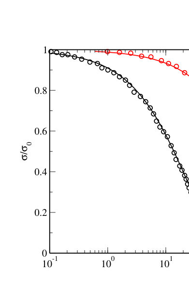
<figcaption class="paper-figure-caption"><b>Fig 1.</b> Figure 1: Plot of the normalized stress as a function of time at two temperatures, T = 643</figcaption>
</figure>
<figure class="paper-figure-card">
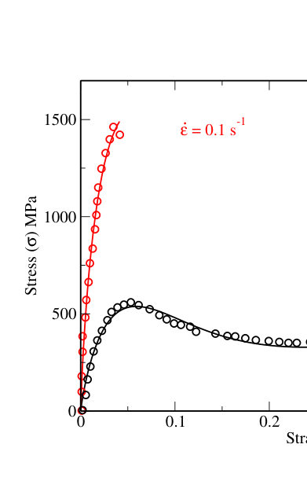
<figcaption class="paper-figure-caption"><b>Fig 2.</b> Figure 2: Stress–strain curves of a metallic glass at two strain rates, ˙ε = 0.1 and 0.005 s−1,</figcaption>
</figure>
<figure class="paper-figure-card">
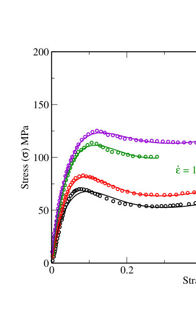
<figcaption class="paper-figure-caption"><b>Fig 3.</b> Figure 3: Stress-strain behavior of polycarbonate (PC) at temperature T = 298 K for</figcaption>
</figure>
<figure class="paper-figure-card">
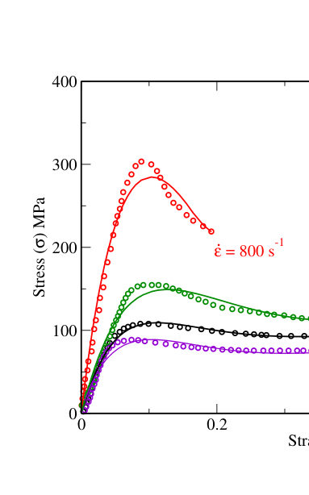
<figcaption class="paper-figure-caption"><b>Fig 4.</b> Figure 4: Stress-strain behavior of polymethyl methacrylate (PMMA) at temperature</figcaption>
</figure>
<figure class="paper-figure-card">
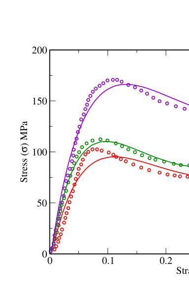
<figcaption class="paper-figure-caption"><b>Fig 5.</b> Figure 5: Stress-strain behavior of epoxy at temperature T = 298 K for three strain rates,</figcaption>
</figure>

**Summary.** This paper presents a microscopic constitutive theory to explain the nonlinear mechanical behavior of amorphous solids like metallic and polymer glasses. It successfully models the sequence from elastic loading through stress overshoot, yielding, and strain hardening by coupling nonaffine elasticity instability with structural relaxation dynamics. The results provide a unified theoretical framework validated against multiple experimental materials.

**Why it may be interesting.** While focused on condensed matter mechanics, the underlying mathematical framework involving complex relaxation functions (stretched exponentials) and coupling between structural disorder (nonaffine effects) and macroscopic response shares conceptual links with modeling glassy dynamics in quantum or many-body systems.

Detailed structure

**Main problem.** Developing a microscopic constitutive theory for the nonlinear deformation of amorphous materials, specifically addressing stress overshoot, yielding, and strain hardening.

**Main result.** The model successfully reproduces the full stress-strain response across various glasses by unifying nonaffine elasticity instability with viscous structural relaxation dynamics. This establishes a unified framework linking these complex mechanical phenomena in amorphous solids.

**Method.** The theory couples nonaffine elasticity (derived from free energy considerations) to irreversible many-body relaxation processes, modeling the total stress as a sum of elastic, viscous, and hardening components.

**Model / system.** The study focuses on metallic and polymer glasses (e.g., polycarbonate, PMMA). The theory uses concepts like nonaffine displacements, strain-dependent coordination number, and stretched exponential relaxation forms to describe mechanical response.

**Key observables.** Stress-strain response curve, stress overshoot magnitude, yielding point, steady plastic flow regime, and strain hardening behavior.

**Important parameters / regimes.** Elastic modulus (E), viscosity ($\eta$), structural relaxation time ($	au_c$), viscous relaxation time ($	au_v$), and the stretched exponential exponent ($eta$).

**Assumptions / limitations.** The total stress is assumed to be a linear sum of elastic, viscous, and hardening contributions. For polymers, finite chain extensibility is incorporated.

**Figures summary.** Figures compare theoretical predictions (solid lines) with experimental data (symbols) for MG, PC, and PMMA across various strain rates and temperatures, illustrating the characteristic sequence from loading to flow/hardening.

**Paper structure.** The paper develops the theory by defining components of stress ($\sigma_{el}, \sigma_{visc}, \sigma_{hard}$), deriving constitutive equations based on nonaffine elasticity and relaxation dynamics, and then applying these models to quantitatively reproduce experimental data for multiple amorphous materials across different deformation regimes.

Abstract

We develop a microscopic constitutive theory for the nonlinear deformation of metallic and polymer glasses based on nonaffine elasticity coupled to irreversible many-body relaxation. The theory predicts the full stress--strain response, from linear elasticity through stress overshoot and yielding to steady plastic flow. We show that stress overshoot originates from the competition between a nonaffine elastic instability induced by strain-driven loss of mechanical connectivity at the atomic/molecular level, and viscous dissipation associated with structural relaxation. For polymer glasses, finite chain extensibility naturally accounts for strain hardening at large deformation. The stretched-exponential relaxation exponent is obtained independently from stress or modulus relaxation measurements and provides the primary dynamical input to the theory. Using a small set of physically meaningful parameters, the model quantitatively reproduces experimental stress--strain curves for metallic glasses, polycarbonate, PMMA, and epoxy resins over a broad range of strain rates. These results establish a unified microscopic framework linking relaxation dynamics, yielding, plastic flow, and strain hardening in amorphous solids.

[↑ back to top](#top)

### [Towards quantum machine learning for assessing the resilience of post-quantum cryptography](http://arxiv.org/abs/2607.13722v1)

**Authors:** Jarosław A. Miszczak  
**Type:** theory · **Category:** quantum information and computing · **PDF:** <https://arxiv.org/pdf/2607.13722v1>  
**Analysis basis:** full PDF text, analyzed in chunks
**Topic relevance:** `entanglement & information structure` **2/5** · `methods for driven-dissipative` **2/5** · `Keldysh / 2PI / non-Gaussian methods` **1/5** · `analog quantum simulation` **1/5** · `driven-dissipative phase transition` **1/5**

↔ Scroll figures horizontally

<figure class="paper-figure-card">
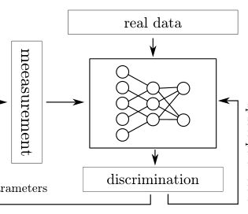
<figcaption class="paper-figure-caption"><b>Fig 1.</b> Fig. 1. Architecture of the proposed framework based on hybrid quantum-classical QGAN from the Qiskit Machine Learning library [4, 36]. The quantum generator is trained using the feedback from the classical discriminator to generate a quantum state suitable for representing the observed real data. Details of the quantum circuit construction are described in Section 3.3. Details of the classical discriminator are described in Fig. 3.</figcaption>
</figure>
<figure class="paper-figure-card">
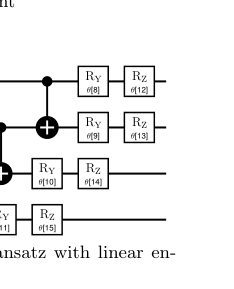
<figcaption class="paper-figure-caption"><b>Fig 2.</b> Fig. 2. Three types of ansatze used in this work as the basic blocks of the quantum generator. The circuits in this figure were built for four-qubit registers. We have (a) six, (b) eight, and (c) sixteen trainable parameters per layer. Using (a) and (c) we do not impose restrictions on the form of generated quantum states. For the case (b) the prepared quantum states will only have real amplitudes.</figcaption>
</figure>
<figure class="paper-figure-card">
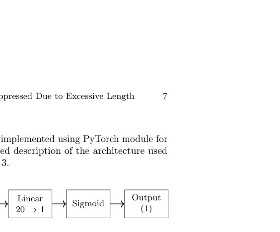
<figcaption class="paper-figure-caption"><b>Fig 3.</b> Fig. 3. Architecture of the artificial neural network used as the discriminator in the presented method. The scheme is based on the implementation described in [4,36].</figcaption>
</figure>
<figure class="paper-figure-card">
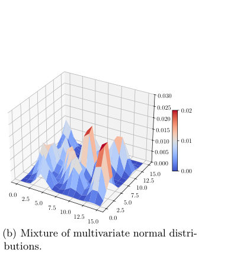
<figcaption class="paper-figure-caption"><b>Fig 4.</b> Fig. 4. Sample data from (a) the post-quantum hash-based source and (b) an artificially created mixture of multivariate normal distributions. (a) Probability distribution of pairs of four-bit words generated from the first byte of the SPHINCS+ signatures. A sample obtained using 213 signatures for a single plain text. (b) Probability distribution obtained as a mixture of 16 multivariate normal distributions, with parameters adjusted to (0, 15) × (0, 15) grid.</figcaption>
</figure>
<figure class="paper-figure-card">
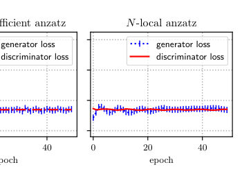
<figcaption class="paper-figure-caption"><b>Fig 5.</b> Fig. 5. Value of the loss function for the generator and the discriminator during the learning process for the PQC data.</figcaption>
</figure>

**Summary.** This paper proposes using Quantum Generative Adversarial Networks (QGANs) as a tool to test the security of Post-Quantum Cryptography. By training QGANs on cryptographic signature data, the authors demonstrate that near-term quantum hardware can learn these complex probability distributions. This suggests a viable pathway for utilizing quantum computation in cryptanalysis workflows.

**Why it may be interesting.** While focused on cryptography, the underlying mechanism—using variational quantum circuits to model complex probability distributions—is highly relevant to simulating many-body quantum states or learning Hamiltonians in condensed matter physics.

Detailed structure

**Main problem.** The primary goal is assessing the resilience of Post-Quantum Cryptography (PQC) protocols against potential attacks leveraging quantum computational capabilities.

**Main result.** The study confirms that near-term hybrid quantum-classical methods, specifically using QGANs, possess sufficient capability to learn and approximate the complex probability distributions underlying PQC signatures.

**Method.** A Quantum Generative Adversarial Network (QGAN) framework is employed. The generator prepares a quantum state representing the data distribution, while a classical discriminator network attempts to distinguish between real and generated samples.

**Model / system.** The model utilizes QGANs, which are hybrid quantum-classical architectures. The core task involves loading the probability distribution of hash-based digital signatures (like SPHINCS+) into a quantum state $|\psi_t
angle$.

**Key observables.** Kullback-Leibler divergence ($D_{KL}(P \parallel Q)$) is used to quantify the approximation quality between the true and generated distributions.

**Important parameters / regimes.** The number of qubits ($n$), the structure/number of parameters in the quantum ansatz (e.g., N-local, real-amplitudes), and training loss metrics are key parameters.

**Assumptions / limitations.** The approach is limited by current Noisy Intermediate-Scale Quantum (NISQ) technology; the results are based on simulation and do not constitute a full cryptanalytic attack.

**Figures summary.** Figures illustrate the QGAN architecture, show sample data from PQC signatures, track training loss over epochs, and compare $D_{KL}$ divergence across different quantum ansatz types for both real and simple distributions.

**Paper structure.** The paper introduces the problem of PQC security assessment using quantum methods. It details the QGAN methodology, applies it to SPHINCS+ signatures, compares various quantum circuit ansatze (N-local vs. real-amplitudes), analyzes convergence via loss functions, and concludes with the potential implications for cryptanalysis.

Abstract

The potential capabilities of quantum computers motivated the development of cryptographic protocols suitable for securing communication against adversaries with access to large fault-tolerant quantum computers. However, even though current quantum computers are limited in terms of size and precision, they can still be useful for finding loopholes and weaknesses in the post-quantum cryptographic protocols. In this work, we present an attempt to utilize the capabilities of Quantum Generative Adversarial Networks (QGANs), one of the promising architectures used in quantum machine learning, for this purpose. We describe an example application of QGAN architecture for the purpose of loading the probability distribution of the hash-based digital signatures into the memory of a quantum computer. Our results confirm that near-term hybrid quantum-classical methods possess capabilities required for this purpose. The presented approach can be used as a first step in the workflow, enabling the utilization of quantum computing for attacking post-quantum cryptographic primitives.

[↑ back to top](#top)

### [Deterministic single-electron trapping on solid neon using engineered dielectric surface geometry](http://arxiv.org/abs/2607.13448v1)

**Authors:** Kundan Surse, Eric Helgemo, Andrew Palmer, Md Serajum Monir, Lukas Delventhal, Thanh Nguyen, Maja Cassidy, Rajib Rahman  
**Type:** theory · **Category:** quantum information and computing · **PDF:** <https://arxiv.org/pdf/2607.13448v1>  
**Analysis basis:** full PDF text, analyzed in chunks
**Topic relevance:** `QC/QI experiment` **2/5** · `Keldysh / 2PI / non-Gaussian methods` **1/5** · `analog quantum simulation` **1/5** · `driven-dissipative phase transition` **1/5** · `methods for driven-dissipative` **1/5**

↔ Scroll figures horizontally

<figure class="paper-figure-card">
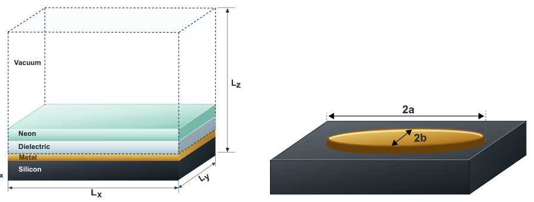
<figcaption class="paper-figure-caption"><b>Fig 1.</b> FIG. 1: Device geometry used in the simulations: (a) Simulation domain shown in dotted</figcaption>
</figure>
<figure class="paper-figure-card">

<figcaption class="paper-figure-caption"><b>Fig 2.</b> Fig. 2a and 2b shows the one-dimensional electrostatic potential along the central z-</figcaption>
</figure>
<figure class="paper-figure-card">
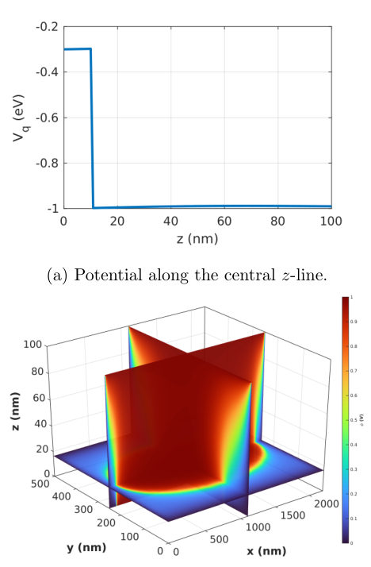
<figcaption class="paper-figure-caption"><b>Fig 3.</b> FIG. 2: Electrostatic potential landscape and ground-state wavefunction of the</figcaption>
</figure>
<figure class="paper-figure-card">
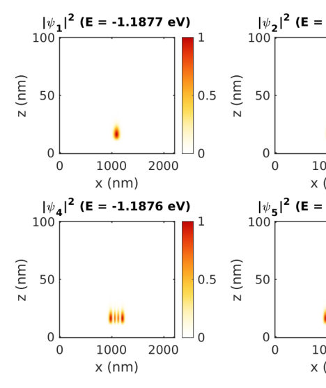
<figcaption class="paper-figure-caption"><b>Fig 4.</b> FIG. 3: Probability-density distributions of the first six eigenstates, showing the</figcaption>
</figure>
<figure class="paper-figure-card">
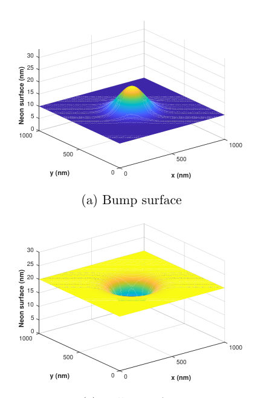
<figcaption class="paper-figure-caption"><b>Fig 5.</b> FIG. 4: Representative bump and valley surface geometries and their corresponding</figcaption>
</figure>

**Summary.** This paper proposes an advanced method to create reliable single-electron traps on solid neon, a promising platform for qubits. The authors use detailed 3D simulations to show that uncontrolled surface roughness causes trapping noise, but they demonstrate that selectively etching an underlying dielectric layer can deterministically engineer the potential minimum required for stable qubit operation.

**Why it may be interesting.** This work directly addresses hardware realization challenges for solid-state quantum computing platforms by providing a theoretical blueprint for controlling nanoscale potential landscapes using material engineering.

Detailed structure

**Main problem.** The primary challenge is achieving deterministic, controlled single-electron trapping on solid neon surfaces for use as a quantum qubit, overcoming issues caused by uncontrolled surface roughness.

**Main result.** Engineered dielectric templates via selective etching provide a practical pathway to create reproducible potential minima that reliably capture electrons while suppressing unwanted surface bound states.

**Method.** The authors employed large-scale 3D Schrödinger–Poisson simulations to model the quantum electrostatics of electron confinement in patterned solid neon structures.

**Model / system.** The system is a levitating single-electron qubit on solid neon, modeled using a 3D finite-difference Schrödinger–Poisson framework. The potential landscape is controlled by engineering an underlying dielectric layer beneath the neon film.

**Key observables.** Lowest-energy bound states ($E_n$), orbital splitting ($\Delta E = E_2 - E_1$), probability density $|\psi(\mathbf{r})|^2$, and wavefunction localization.

**Important parameters / regimes.** Dielectric constant ($\varepsilon_r$), dielectric thickness ($H$), surface roughness parameters ($\sigma_{rms}$), and gate voltages (e.g., $V_{	ext{bottom}} = 1.0 	ext{ V}$).

**Assumptions / limitations.** The model assumes the validity of the single-particle limit for initial analysis, though future work aims to include spin dynamics.

**Figures summary.** Figures illustrate the comparison between random roughness effects (causing unintended trapping) and the controlled potential landscape achieved by etching a dielectric trench, showing localized wavefunctions in the engineered geometry.

**Paper structure.** The paper progresses from establishing the promise of solid neon qubits to identifying surface morphology as the critical failure point. It then details simulations comparing uncontrolled roughness vs. engineered dielectric templates, culminating in demonstrating deterministic trapping via selective etching.

Abstract

Levitating electron qubit on the surface of solid neon has recently emerged as a promising and intrinsically noise-resilient platform for quantum information processing. Their ultra-clean, inert environment suppresses conventional decoherence pathways associated with lattice disorder, charge traps, and nuclear-spin baths that limit coherence in semiconductor qubits. Yet, uncontrolled surface features such as bumps, valleys, and electrode-defined gaps can bind electrons unintentionally, contributing charge noise and inducing spin-orbit coupling mediated decoherence. To address this challenge, we propose an engineered interface in which a dielectric layer is deposited beneath the solid neon to provide an atomically smooth template, eliminating surface-roughness induced trapping. By selectively etching this dielectric layer at desired qubit locations, deterministic potential minima can be engineered to reliably capture electrons while suppressing unwanted surface bound states. We perform large-scale Schrodinger and Poisson simulation to compare the existing and proposed strategies of electron trapping on neon, obtaining good agreement with recent experimental measurements.

[↑ back to top](#top)

### [A robust and modular cesium magneto-optical trap using diverging laser beams](http://arxiv.org/abs/2607.13145v1)

**Authors:** Paola Luna, Kenneth Nakasone, Andrei Zhukov, Philip Wondrak, Brian P. Anderson, Benjamin F. Kanzer, Cristian D. Panda  
**Type:** experiment · **Category:** other · **PDF:** <https://arxiv.org/pdf/2607.13145v1>  
**Analysis basis:** full PDF text, analyzed in chunks
**Topic relevance:** `QC/QI experiment` **2/5** · `analog quantum simulation` **1/5** · `interference shaping light` **1/5** · `quantum optics experiment` **1/5**

↔ Scroll figures horizontally

<figure class="paper-figure-card">
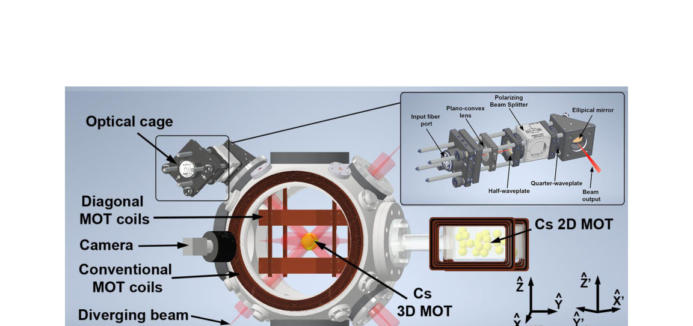
<figcaption class="paper-figure-caption"><b>Fig 1.</b> Fig 1. Optical, magnetic and vacuum systems. The vacuum chamber has four optical cages attached to each diagonal viewport (for simplicity, only the top-left cage is shown) and two optical cages on a breadboard (not shown) for MOT laser delivery. The compact and modular delivery cage system provides position adjustment of all optical components. We create 3D MOTs using two different sets of electromagnetic coils: “Conventional MOT coils” have the principal axis of the quadrupole magnetic-field aligned to one of the laser beams and “Diagonal MOT coils” have the principal axis of the quadrupole magnetic-field aligned along Z, at 45 degrees from two laser axes and 90 degrees from the third. The...</figcaption>
</figure>
<figure class="paper-figure-card">
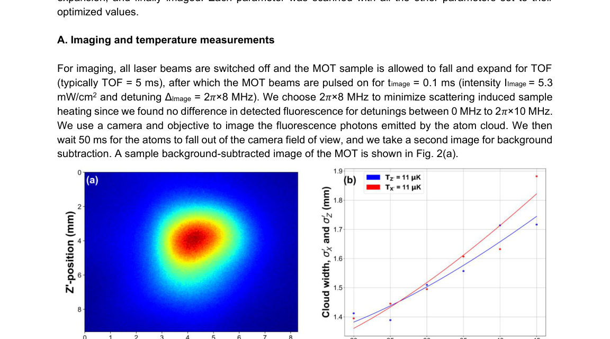
<figcaption class="paper-figure-caption"><b>Fig 2.</b> Fig. 2. Temperature measurement procedure. We capture a camera image of the MOT cloud (a), we fit Gaussians along the X&#x27; and Z&#x27; axes to find the corresponding widths of the atom sample. This is repeated at different TOFs and a dataset (b) is generated. We fit the data corresponding to each axis to Eq. (1) to compute the temperatures. Each background-subtracted fluorescence image is analyzed in two ways. First, we integrate the camera signal over a rectangle that encloses the atom cloud and convert this signal into atom number using an independent calibration. For this calibration, a laser beam was split between a calibrated power meter and the camera. We used the measured power and the...</figcaption>
</figure>
<figure class="paper-figure-card">
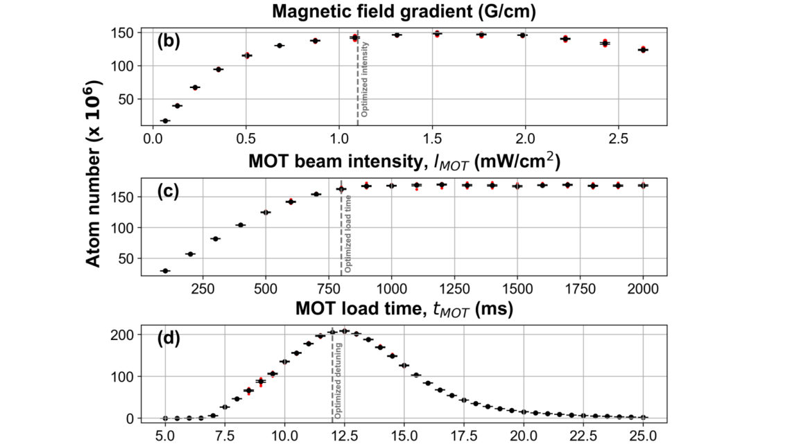
<figcaption class="paper-figure-caption"><b>Fig 3.</b> Fig 3. Optimizing diverging-beam 3D MOT parameters for high atom number. Scans of 3D MOT magnetic field gradient, intensity, load time and detuning. Each data point (black) was averaged over ten measurements (red dots). The error bars (black) indicate ±1σ, where σ is the standard error. The dashed vertical lines (gray) indicate the typical optimized values which were kept constant while scanning all other parameters. Fig. 3(a) shows that the atom number increases with larger magnetic field gradients up to an optimum value of ~6 G/cm. We observe that higher values of the magnetic field gradient cause the MOT to become unstable, resulting in large shot-to-shot fluctuations and decreased atom...</figcaption>
</figure>
<figure class="paper-figure-card">
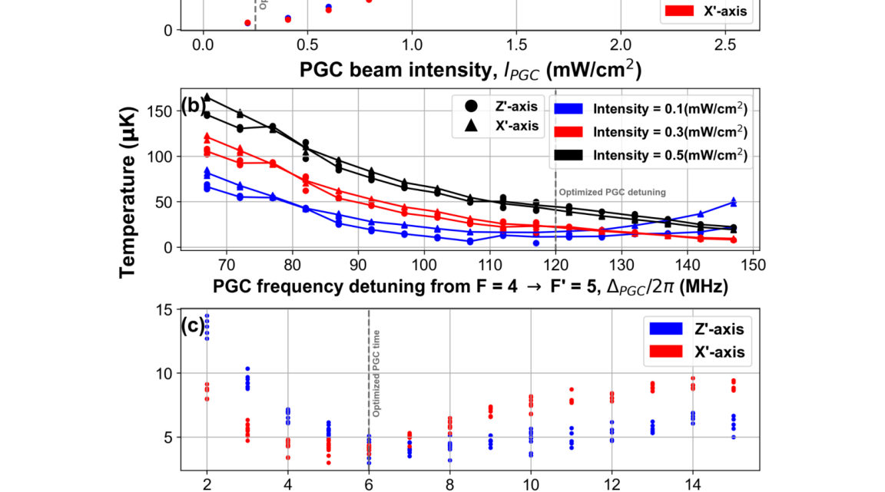
<figcaption class="paper-figure-caption"><b>Fig 4.</b> Fig. 4. Optimizing diverging-beam MOT parameters during PGC to achieve low temperatures. Scans of PGC beam intensity, frequency detuning, and time. The dashed lines (gray) indicate the optimized values chosen for each parameter, which were kept constant while scanning all the other parameters. Fig. 4(a) shows a sharp decrease in temperature when increasing laser beam intensity up to an optimum of IPGC = ~0.25 mW/cm2. In Fig. 4(b), we scan the laser detuning for three different values of laser beam intensity and observe the optimum trap laser detuning to be ΔPGC = 2𝜋×120 MHz for the lower intensity of 0.1 mW/cm2. We observe that larger detunings minimize the atom temperature for higher laser...</figcaption>
</figure>
<figure class="paper-figure-card">
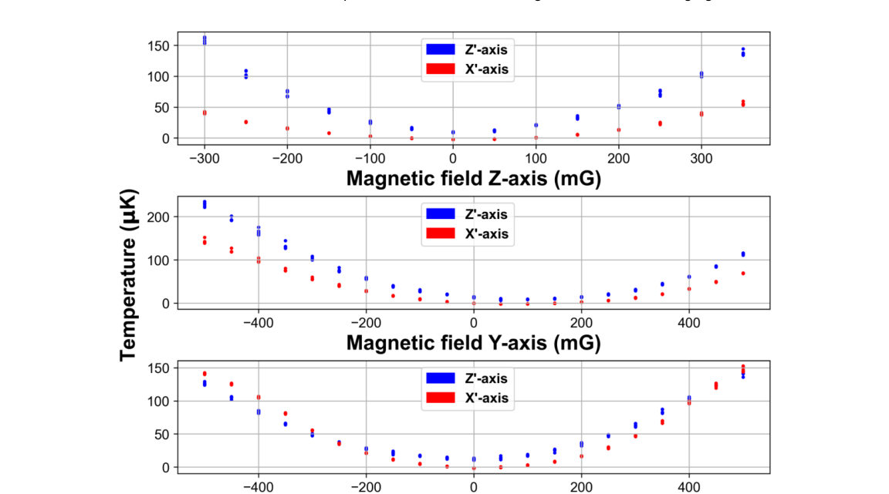
<figcaption class="paper-figure-caption"><b>Fig 5.</b> Fig. 5. Optimization of atom sample temperature after PGC vs. compensation magnetic field. Magnetic fields along the X, Y, and Z axes are varied by changing the current of each corresponding compensation coil to optimize atom sample temperature after PGC. Each parameter was scanned with all the other parameters set to their optimized values. D. Long-term MOT atom number and temperature stability Consistent, long-term operation of the experimental system is critical for applications in fundamental gravitational physics, where small signals must be averaged over long integration times. Furthermore, quantum sensing systems must remain stable despite large variations in environmental parameters...</figcaption>
</figure>

**Summary.** The authors present an advanced, modular Magneto-Optical Trap (MOT) designed specifically for high-precision quantum sensing using cesium atoms. By implementing diverging laser beams and a compact optical cage system, they achieve stable trapping of millions of atoms at temperatures below $10 \mu	ext{K}$. This demonstrates a significant engineering improvement over conventional MOTs, enhancing reliability for future quantum applications.

**Why it may be interesting.** This work directly addresses practical engineering challenges in quantum sensing platforms—namely, mechanical robustness and optical coupling efficiency—by modifying the standard MOT setup. The use of diverging beams is a key technical advance for field deployment.

Detailed structure

**Main problem.** To develop a robust, modular Magneto-Optical Trap (MOT) optimized for high-precision quantum sensing and metrology applications.

**Main result.** The developed MOT successfully traps large numbers of cesium atoms ($\sim 4	imes10^8$) with low temperatures ($<10 \mu	ext{K}$) while maintaining long-term stability, even when using novel diverging laser beam geometries.

**Method.** The system employs a modular optical cage setup and utilizes diverging cooling laser beams instead of conventional collimated beams to improve robustness against reflections. Cooling is optimized via Polarization-Gradient Cooling (PGC).

**Model / system.** The physical platform is a Cesium Magneto-Optical Trap (MOT) adapted for stability and modularity. It can operate in standard or non-conventional diagonal magnetic field geometries.

**Key observables.** Atom number ($	ext{Cs}$ atoms), temperature ($T$), spatial widths ($\sigma_{X'}, \sigma_{Z'}$), and long-term stability over $>50$ hours.

**Important parameters / regimes.** Optimal MOT parameters include gradients near $6 	ext{ G/cm}$, intensity $\sim 1.1 	ext{ mW/cm}^2$, and detuning at $2\pi 	imes 12 	ext{ MHz}$. PGC duration is optimized around $6 	ext{ ms}$.

**Assumptions / limitations.** The accuracy of temperature measurement via Time-of-Flight (TOF) method is limited below $10 \mu	ext{K}$; the diagonal MOT configuration is noted to be highly sensitive to parameter drift.

**Figures summary.** Figures illustrate the overall setup using six optical cages, show temperature measurements via TOF fitting, detail optimization scans for 3D MOT parameters and PGC duration, and track long-term stability over $>52$ hours.

**Paper structure.** The paper details the motivation (need for robust MOTs), presents the novel diverging beam/modular optical system, optimizes loading and cooling stages (PGC), validates performance through temperature and atom number measurements, and concludes by testing stability in both conventional and non-conventional geometries.

Abstract

Magneto-optical traps (MOTs) are a workhorse technology for neutral-atom quantum sensing, simulation, and computing. Here, we demonstrate a MOT optimized for inertial quantum sensing and precision metrology applications. Our MOT traps $4\times10^8$ cesium (Cs) atoms in a robust, modular system that achieves stable operation through two design features: (1) we use diverging cooling laser beams to reduce unwanted reflections and (2) optical elements are mounted in a fiber-coupled, compact, and modular cage rigidly attached to the vacuum chamber. Following polarization-gradient cooling (PGC), the system produces atom samples with temperatures below 10 $μ$K, similar to those achieved in conventional MOTs that use collimated laser beams. In addition, we observe trapping of $2\times10^7$ Cs atoms in a non-conventional MOT geometry, where the cooling laser beams are diagonal to the principal axis of the quadrupole magnetic field.

[↑ back to top](#top)

### [An exact algorithm for U(N) matrix models in the gauge-invariant singlet sector](http://arxiv.org/abs/2607.13725v1)

**Authors:** Enrico M. Brehm, Jean Cazalis  
**Type:** theory · **Category:** other · **PDF:** <https://arxiv.org/pdf/2607.13725v1>  
**Analysis basis:** full PDF text, analyzed in chunks
**Topic relevance:** `analog quantum simulation` **2/5** · `Keldysh / 2PI / non-Gaussian methods` **1/5** · `entanglement & information structure` **1/5** · `non-equilibrium dynamics` **1/5**

↔ Scroll figures horizontally

<figure class="paper-figure-card">
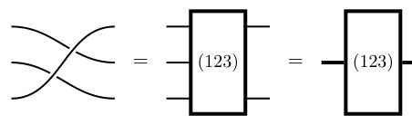
<figcaption class="paper-figure-caption"><b>Fig 1.</b> Figure 2: Graphical representation of the permutation tensor σ = (123), or written out σj1j2j3 i1i2i3 = δj2 i1 δj3 i2 δj1 i3 .</figcaption>
</figure>
<figure class="paper-figure-card">
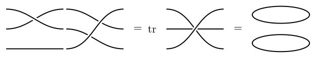
<figcaption class="paper-figure-caption"><b>Fig 2.</b> Figure 3: Graphical representation of the contraction of (123) and (1)(23). The result is (13)(2); taking the trace yields two loops, each corresponding to a trace in the defining representation of U(N) and contributing a factor of N.</figcaption>
</figure>
<figure class="paper-figure-card">
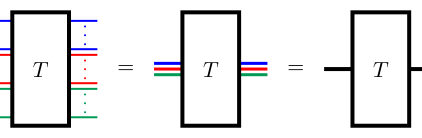
<figcaption class="paper-figure-caption"><b>Fig 3.</b> Figure 4: Graphical representation of a tensor T J I ∈End((CN)⊗n). The right legs carry the lower indices I, while the left legs carry the upper indices J. Different colors represent different matrix species.</figcaption>
</figure>
<figure class="paper-figure-card">
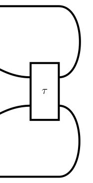
<figcaption class="paper-figure-caption"><b>Fig 4.</b> Figure 5: Graphical representation of the contraction tr((PR ⊗PS) · τ).</figcaption>
</figure>
<figure class="paper-figure-card">
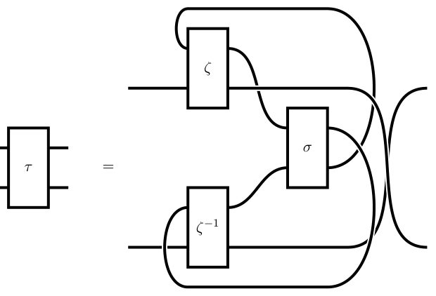
<figcaption class="paper-figure-caption"><b>Fig 5.</b> Figure 6: Graphical representation the permutation τ and loop count k. It shows the contraction that leads to Nkτ. Each closed loop in the contraction contributes a factor of N.</figcaption>
</figure>

**Summary.** This paper introduces an exact, group-theoretically derived algorithm for calculating observables in U(N) matrix models within their physically relevant gauge-invariant sector. By mapping the problem onto representations of the symmetric group, it provides explicit polynomial formulas for finite-N dynamics. This opens a new computational window into non-planar regimes of holographic quantum gravity models.

**Why it may be interesting.** While highly abstract, the techniques developed—using representation theory (Schur functions, symmetric groups) to solve complex many-body quantum field theories in a finite-N limit—are analogous to advanced methods used in strongly correlated electron systems or lattice gauge theories.

Detailed structure

**Main problem.** The primary goal is developing an exact, systematic algorithm for computing observables within the gauge-invariant singlet sector of bosonic U(N) matrix models.

**Main result.** The authors present a group-theoretic framework that yields closed-form polynomial expressions in N for these matrix elements, allowing access to finite-N dynamics previously difficult to compute.

**Method.** The method relies on decomposing the Hilbert space using Schur polynomials and evaluating matrix elements via group-theoretic reductions involving cosets and character sums of the symmetric group.

**Model / system.** The system is a bosonic U(N) matrix model, fundamental in describing M-theory and D-brane dynamics through the gauge/gravity duality. The Hamiltonian involves quadratic and quartic terms in the matrices.

**Key observables.** Hamiltonian matrix elements, correlation functions of gauge-invariant observables (singlets), and the low-lying energy spectrum.

**Important parameters / regimes.** The rank N of the gauge group, the coupling constant g, and the mass parameter m.

**Assumptions / limitations.** The analysis is restricted to the gauge-invariant singlet sector. A major limitation noted is the difficulty in computing restricted characters for multi-matrix extensions.

**Figures summary.** Not specified by detailed notes; general structure involves mathematical derivations related to tensor decomposition and group theory.

**Paper structure.** The paper builds from establishing the physical context (M-theory/D-branes) to defining the singlet basis using Schur polynomials, deriving explicit formulas for gauge generators, calculating correlators via Wick's theorem, and finally presenting the general algorithm structure.

Abstract

Matrix models appear as fundamental descriptions of M-theory and D-brane dynamics, and via the gauge/gravity duality their gauge-invariant, or singlet, sector describes the purely gravitational degrees of freedom in the holographic dual. We present a new exact algorithm for computing observables of bosonic U(N) matrix models in the gauge-invariant singlet sector. This sector is spanned by an orthogonal basis of Schur polynomials (for a single matrix) and restricted Schur polynomials (for multiple matrices), which diagonalizes the free Hamiltonian and provides a natural truncation of the Hilbert space by excitation number. Matrix elements of the interaction Hamiltonian, or any gauge-invariant observable, are evaluated through a group-theoretic reduction to cosets and double cosets of suitable subgroups of the symmetric group, together with character sums on the symmetric group. The resulting entries are closed-form polynomials in the gauge-group rank N, assembled from group-theoretic data that are precomputed once and can be reused for any N and any coupling constants. We validate the one-matrix implementation against the exact mapping to N non-interacting fermions, demonstrating rapid convergence of the low-lying spectrum with the cutoff. The multi-matrix extension is outlined; its main bottleneck is the computation of restricted characters of the symmetric group, for which no algorithm comparable to the Murnaghan--Nakayama rule is currently known. The framework gives direct access to finite-N, finite-coupling dynamics of gauge-invariant states and opens a new computational window on the non-planar regime of holographic matrix models.

[↑ back to top](#top)

### [The potential of quantum computers for Particle Image Velocimetry](http://arxiv.org/abs/2607.13641v1)

**Authors:** Philipp Pfeffer, Theo Käufer, Julia Ingelmann, Christian Cierpka, Jörg Schumacher  
**Type:** both · **Category:** quantum information and computing · **PDF:** <https://arxiv.org/pdf/2607.13641v1>  
**Analysis basis:** full PDF text, analyzed in chunks
**Topic relevance:** `QC/QI experiment` **2/5** · `entanglement & information structure` **1/5** · `methods for driven-dissipative` **1/5** · `non-equilibrium dynamics` **1/5**

↔ Scroll figures horizontally

<figure class="paper-figure-card">
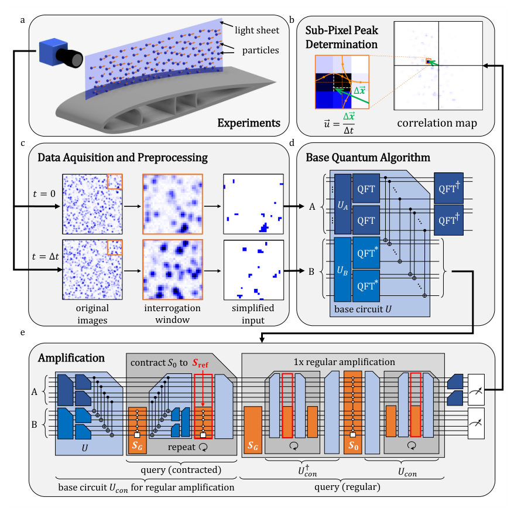
<figcaption class="paper-figure-caption"><b>Fig 1.</b> Fig. 1 Building blocks and workflow of Quantum-based Particle Image Velocimetry. (a) The input data for the algorithm, which are obtained from PIV experiments, are tracer particle images. Here, they are obtained for a flow around a wing. (b) Evaluation of the peak of the correlation map Cmap, which determines the velocity field vector in each local interrogation window to sub-pixel accuracy. (c) Preprocessing of PIV snapshots by filtering to binary input images. For an N × N interrogation window, the N pixels with the largest light intensities are taken. (d) Image loading on separate qubit registers A and B followed by the Fourier-based cross-correlation evaluation. We apply a...</figcaption>
</figure>
<figure class="paper-figure-card">
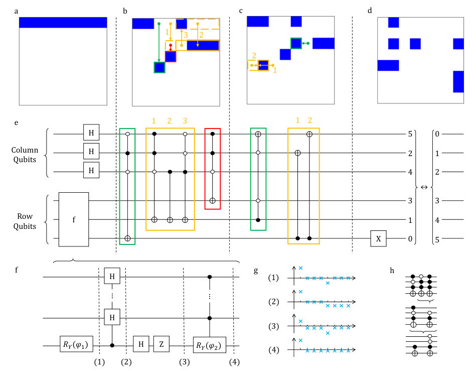
<figcaption class="paper-figure-caption"><b>Fig 2.</b> Fig. 2 Efficient quantum state preparation for binary images with zero mean. The procedure is illustrated for clarity by n = 3 qubits in both registers for the N = 8 brightest pixels in an 8 × 8 pixel image. (a)-(d) Stepwise iteration to the final image and corresponding quantum circuit blocks in panel (e). Panel (e) shows the gates for the example target image in panel (d). The individual pixel shifts and the corresponding multi-controlled NOT (mcNOT) gates are boxed in the same color as in panels (b) and (c). Panel (a) shows the initial image, which has a zero mean. (f) Details of the circuit diagram for a binary and zero-mean state on the row qubits in panel (e). (g) Illustration of the...</figcaption>
</figure>
<figure class="paper-figure-card">
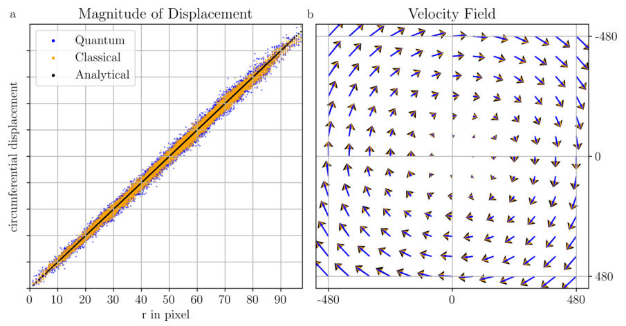
<figcaption class="paper-figure-caption"><b>Fig 3.</b> Fig. 3 Evaluation of the 4th PIV challenge data (case F) with the QuPIV pipeline via a comparison of the analytical solution (black), classical PIV with binary images (orange) and the full QuPIV pipeline with additional contracted amplification and sampling. (a) All 1212 displacement amplitudes based on their radial position. The circumferential displacement is normalized such that it aligns with the radial pixel displacement from the image center. (b) Velocity vector field comparison where every 10th vector is depicted based on its distance from the image center in pixel. Parameters are given in the main text.</figcaption>
</figure>
<figure class="paper-figure-card">
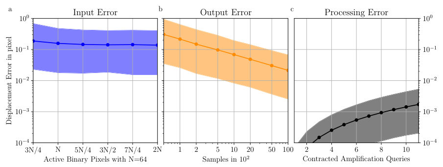
<figcaption class="paper-figure-caption"><b>Fig 4.</b> Fig. 4 Quantification of error sources of the quantum algorithm with experimental data. All errors are analyzed separately. The median of each error is illustrated in a solid line and the corresponding 5% −95% percentile with a colored area. These quantities are evaluated over 1212 interrogation window pairs from the PIV challenge data as discussed in the main text. (a) Statistical quantities of the input error due to sparse binary images. (b) The output error due to sampling with finitely many measurements. (c) The processing error due to contracted amplitude amplification as discussed in the main text, estimated by the proposed prediction method.</figcaption>
</figure>

**Summary.** This paper presents QuPIV, a novel quantum algorithm designed to accelerate Particle Image Velocimetry (PIV) calculations by replacing classical FFT-based cross-correlation with multidimensional Quantum Fourier Transforms. The authors demonstrate the feasibility of this end-to-end process using experimental data, showing that advanced techniques like contracted amplitude amplification can maintain high accuracy for determining fluid velocity fields.

**Why it may be interesting.** While focused on fluid dynamics, the core methodology—developing complex, multi-stage quantum algorithms for signal processing using advanced techniques like contracted amplitude amplification—is highly relevant to developing general quantum computational primitives applicable across physics domains.

Detailed structure

**Main problem.** The authors propose a quantum algorithm, QuPIV, designed to replace the classical computation required for Particle Image Velocimetry (PIV) by leveraging quantum Fourier Transforms.

**Main result.** The end-to-end quantum pipeline demonstrates feasibility on experimental PIV data, showing that error sources like input preparation and processing can be analyzed individually, with performance comparable to classical methods.

**Method.** The methodology involves an end-to-end quantum circuit utilizing multidimensional Quantum Fourier Transforms (QFTs) for cross-correlation evaluation, coupled with novel state preparation and contracted amplitude amplification techniques.

**Model / system.** The application is PIV, a technique used to measure velocity fields in fluid dynamics by analyzing particle image correlations between two frames. The quantum computation operates on the correlation map derived from these images.

**Key observables.** Velocity vector ($\vec{u} = \Delta\vec{x}/\Delta t$), peak position error (Euclidean norm), and correlation map ($C_{map}$).

**Important parameters / regimes.** Image size ($N$ pixels), overlap percentage, number of amplification queries ($M$).

**Assumptions / limitations.** The analysis assumes the ability to efficiently load image data into qubits and relies on approximations like using binary inputs (sparsification) and analyzing error sources separately.

**Figures summary.** Figures illustrate the QuPIV workflow from input images to velocity calculation; one figure compares quantum, classical, and analytical solutions for PIV challenge data, while another details individual error source analysis (input, output, processing).

**Paper structure.** The paper introduces the problem, outlines the end-to-end quantum algorithm pipeline (state preparation $
ightarrow$ QFT $
ightarrow$ Amplitude Amplification), presents theoretical and numerical studies on synthetic/experimental data, and concludes with detailed error analysis.

Abstract

Particle Image Velocimetry (PIV) is the prime image-processing technique to measure and visualize velocity fields of laminar and turbulent flows. The velocity field vectors are obtained with sub-pixelaccuracy by analyzing cross-correlations, empowered by Fast Fourier Transforms (FFT). Here, we present a quantum algorithm with multidimensional quantum Fourier Transforms, termed Quantum-based PIV (QuPIV), to replace the classical computation of up to millions of velocity vectors. Our end-to-end quantum algorithm includes a novel state preparation, modified amplitude amplification, and the output extraction. We enhance amplitude amplification by a contracted ground-state projector, which allows a significant reduction of the number of gates in the quantum circuit. We justify the end-to-end capability with numerical studies on all stages of the algorithm on both synthetic and experimental data.

[↑ back to top](#top)

### [Foliated Quantum Error Correction for Qudits](http://arxiv.org/abs/2607.13784v1)

**Authors:** Gözde Üstün, Simon J. Devitt, Jason Saied  
**Type:** theory · **Category:** quantum information and computing · **PDF:** <https://arxiv.org/pdf/2607.13784v1>  
**Analysis basis:** full PDF text, analyzed in chunks
**Topic relevance:** `quantum measurements` **2/5** · `entanglement & information structure` **1/5** · `measurement-induced transitions` **1/5**

↔ Scroll figures horizontally

<figure class="paper-figure-card">
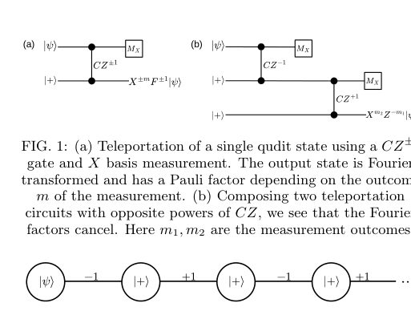
<figcaption class="paper-figure-caption"><b>Fig 1.</b> FIG. 2: A linear chain state Ch(ψ), encoding the state |ψ⟩in a measurement-based manner.</figcaption>
</figure>
<figure class="paper-figure-card">
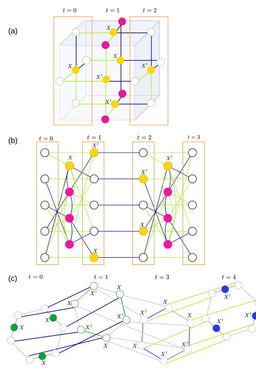
<figcaption class="paper-figure-caption"><b>Fig 2.</b> FIG. 3: Examples of foliated qudit codes. (a) shows the unit cell for the qudit toric code, (b) shows two measurement rounds (four time steps) of the foliated (qudit) perfect code, and (c) shows part of the foliated CSS honeycomb code. In all examples, darker lines correspond to edges with weight +1, while green lines correspond to edges with weight −1. In (a) and (b), the golden nodes (labeled with Paulis) depict an example detector of the foliated code. (With the uninvolved ancillas colored pink.) The colors in (c) are used differently to avoid conflicting with the honeycomb code color conventions. We show enough of the graph state to exhibit the detector corresponding to a red face of...</figcaption>
</figure>
<figure class="paper-figure-card">
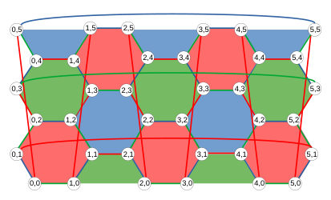
<figcaption class="paper-figure-caption"><b>Fig 3.</b> FIG. 5: The toric hexagonal lattice used for the CSS honey- comb code [26] and our qudit generalization.</figcaption>
</figure>
<figure class="paper-figure-card">
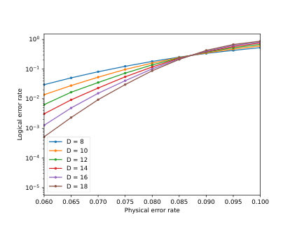
<figcaption class="paper-figure-caption"><b>Fig 4.</b> FIG. 4: The logical vs. physical error rate of the foliated toric code of qudit dimension d = 7919, at different lattice sizes D.</figcaption>
</figure>

**Summary.** This paper introduces a general 'foliated' framework to implement Measurement-Based Quantum Computing (MBQC) using qudits. It constructs resource graph states by extending 2D error-correcting codes across time layers, allowing fault-tolerant computation for various code types. The results confirm the method's applicability and show that performance metrics like error thresholds improve with higher qudit dimensions.

**Why it may be interesting.** This work directly impacts quantum computing theory by extending established QEC concepts from qubits to qudits, which is crucial for realizing high-capacity photonic quantum information processing.

Detailed structure

**Main problem.** To develop a general framework for constructing fault-tolerant Measurement-Based Quantum Computing (MBQC) using qudits by 'foliating' any Pauli-based quantum error-correcting code.

**Main result.** The authors provide a generalized construction applicable to various code types (stabilizer, subsystem, dynamical) and demonstrate that the error correction threshold increases with the qudit dimension $d$.

**Method.** The method involves constructing a time-extended graph state ($\Lambda$) by foliating the 2D code structure across multiple time layers. Fault tolerance is achieved via sequential X-basis measurements on ancilla qubits, requiring careful calculation of 'detectors' to track stabilizer values.

**Model / system.** The system utilizes qudits (dimension $d$, where $d$ is prime) encoded within a graph state structure that evolves over discrete time steps ($t$). This framework is particularly relevant for photonic platforms where high-dimensional states are natural resources.

**Key observables.** Error correction thresholds, stabilizer generators of the graph state, and detector observables (which must commute with all measurements).

**Important parameters / regimes.** The qudit dimension $d$ (prime), the number of data/ancilla qubits ($N, T$), and the error model (photon loss dominant).

**Assumptions / limitations.** The framework initially focuses on CSS-type codes, though generalizations to non-CSS and dynamical types are discussed. For photonic implementation, fusion-based computation is suggested due to potential limitations in deterministic gates.

**Figures summary.** Figures illustrate the qudit toric code unit cell, the process of foliating perfect codes across time layers, and detailed diagrams showing how detectors span multiple time steps ($t=0$ to $t=4$) for both CSS and non-CSS cases.

**Paper structure.** The paper builds from defining the general framework for qudit graph states and measurement protocols (MBQC). It then details the construction of detectors by analyzing stabilizer generators across time layers, providing specific examples like the qudit toric code and generalized honeycomb codes to validate the method.

Abstract

We present a framework for foliating any Pauli-based quantum error-correcting code over prime-dimensional qudits. For any such code, we obtain a qudit graph state that can be measured to perform fault-tolerant measurement-based quantum computing. Such a paradigm is of interest in platforms such as photonics, where measurement-based protocols are natural and high-dimensional states are readily available. We discuss several examples for arbitrary prime dimension $d$, such as the qudit toric code (stabilizer, CSS), the $d$-dimensional perfect $[[5,1,3]]$ code (stabilizer, non-CSS), and a straightforward $d$-dimensional generalization of the CSS honeycomb code (dynamical, CSS). Under a simple error model, we numerically calculate thresholds for the foliated qudit toric code and demonstrate that they are comparable to the non-foliated version.

[↑ back to top](#top)

### [Half dualization and non-invertible particle-vortex duality defect on lattice](http://arxiv.org/abs/2607.13138v1)

**Authors:** Zhi-Qiang Gao  
**Type:** theory · **Category:** statistical mechanics · **PDF:** <https://arxiv.org/pdf/2607.13138v1>  
**Analysis basis:** full PDF text, analyzed in chunks
**Topic relevance:** `analog quantum simulation` **2/5** · `Keldysh / 2PI / non-Gaussian methods` **1/5** · `driven-dissipative phase transition` **1/5**

↔ Scroll figures horizontally

<figure class="paper-figure-card">
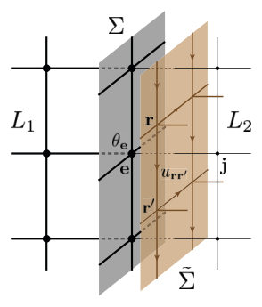
<figcaption class="paper-figure-caption"><b>Fig 1.</b> FIG. 1. Duality defect constructed from half dualization of the charge-n XY model on cubic lattice. The duality trans- formation is performed only on sites and links in L2, which yields an integer variable urr′ defined on dual lattice links ⟨rr′⟩marked in brown. The duality defect is supported on the union of the boundary Σ and the dual boundary ˜Σ, col- ored in grey and brown, respectively. It is composed by the coupling between θe on Σ and curl of urr′ on ˜Σ.</figcaption>
</figure>
<figure class="paper-figure-card">
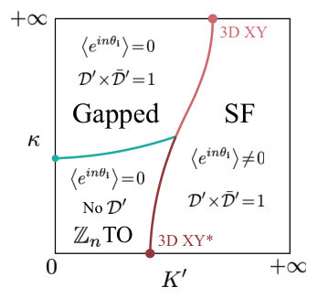
<figcaption class="paper-figure-caption"><b>Fig 2.</b> FIG. 2. Schematic phase diagram of the gauged XY model Eq. (10) as a function of K′ and κ. The 3D XY and XY∗</figcaption>
</figure>

**Summary.** The paper introduces 'half dualization' to construct non-invertible particle-vortex duality defects on a lattice. By applying this technique to the charge-$n$ XY model, it demonstrates that these defects are fundamentally non-invertible due to underlying $\mathbb{Z}_n$ symmetries. Crucially, the authors show that introducing gauge fields into the system resolves this non-invertibility as the theory flows to its infrared limit.

**Why it may be interesting.** This work provides a powerful general mathematical tool (half dualization) for analyzing topological defects and duality structures in lattice field theories, which is highly relevant for understanding critical phenomena and phase transitions in condensed matter systems.

Detailed structure

**Main problem.** The research introduces 'half dualization' as a general method to construct non-invertible duality defects by performing a duality transformation only in a subregion of spacetime.

**Main result.** Half dualization successfully constructs a non-invertible particle-vortex duality defect for the charge-$n$ XY model, and this non-invertibility is shown to be resolved (flowing to an invertible defect) when the system is gauged or Higgsed in the infrared limit.

**Method.** The core method involves dividing the lattice into two regions ($L_1, L_2$) separated by a cut ($\Sigma$), performing the duality transformation only on $L_2$, and analyzing the resulting interface coupling term (the defect).

**Model / system.** The primary model is the (2+1)-dimensional Villainized charge-$n$ XY model on a cubic lattice, which is later generalized to include $\mathbb{Z}_n$ gauge fields. The Hamiltonian involves cosine interactions dependent on the charge $n$.

**Key observables.** Non-invertibility of the duality defect (tested by fusing it with its reverse), and the flow of the defect's nature (non-invertible to invertible) in the infrared limit.

**Important parameters / regimes.** The charge exponent $n$, coupling constants ($K, K', \kappa$), and the regime defined by comparing $K'$ to $n^2K$.

**Assumptions / limitations.** The method is general and dimension-independent; specific analyses rely on approximations like the Villainization or assuming certain couplings are small enough to retain $\mathbb{Z}_n$ structure.

**Figures summary.** Figure 1 illustrates the construction of the duality defect across a codimension-one cut. Figure 2 schematically shows the phase diagram of the gauged model, illustrating the flow from non-invertible to invertible defects.

**Paper structure.** The paper first introduces half dualization using the XY model to find a non-invertible defect. It then applies this technique to the $\mathbb{Z}_n$-gauged version of the model, showing how gauging causes the defect to flow towards an invertible state in the IR.

Abstract

We introduce half dualization as a general principle to construct non-invertible duality defects. The construction performs a duality transformation only in a subregion of spacetime, leaving an interface between the original theory and its dual. A non-invertible duality defect can be hosted on this interface. Half dualization is applicable whenever a local duality transformation is available, and does not depend on the spacetime dimension. We demonstrate the construction procedure in the (2+1)-dimensional Villainized charge-$n$ XY model on a cubic lattice. Half dualization yields a non-invertible particle-vortex duality defect whose fusion with its orientation reverse produces a (1+1)-dimensional $\mathbb{Z}_n$ gauge theory on the fusion surface. We then apply half dualization to the $\mathbb{Z}_n$-gauged XY model relevant to the 3D XY$^\ast$ transition. In the gauged model, the half dualization interface hosts a gauge covariant duality wall, rather than a genuine gauge invariant duality defect. It flows to an invertible duality defect in infrared when the $\mathbb{Z}_n$ gauge theory is confined or Higgsed.

[↑ back to top](#top)

### [Machine learning development for quantum computing and neutrino physics](http://arxiv.org/abs/2607.13699v1)

**Authors:** Annalisa De Lorenzis  
**Type:** both · **Category:** disordered systems and neural networks · **PDF:** <https://arxiv.org/pdf/2607.13699v1>  
**Analysis basis:** full PDF text, analyzed in chunks
**Topic relevance:** `QC/QI experiment` **2/5** · `entanglement & information structure` **1/5** · `methods for driven-dissipative` **1/5**

↔ Scroll figures horizontally

<figure class="paper-figure-card">
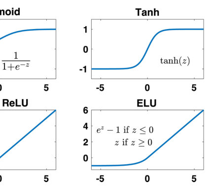
<figcaption class="paper-figure-caption"><b>Fig 1.</b> Figure 2.1: Some non-linear activation functions. Both saturating (top row) and</figcaption>
</figure>
<figure class="paper-figure-card">
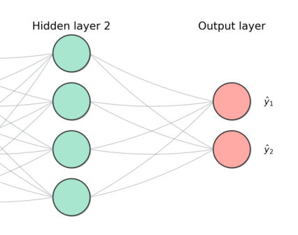
<figcaption class="paper-figure-caption"><b>Fig 2.</b> Figure 2.2: A representation of a feed-forward neural network with two hidden</figcaption>
</figure>
<figure class="paper-figure-card">
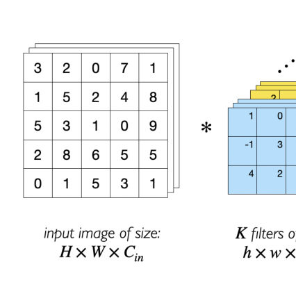
<figcaption class="paper-figure-caption"><b>Fig 3.</b> Figure 2.3: Convolution of a multi-channel image with K filters.</figcaption>
</figure>
<figure class="paper-figure-card">
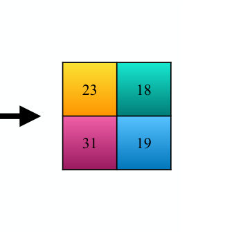
<figcaption class="paper-figure-caption"><b>Fig 4.</b> Figure 2.4: Example of a 2×2 max-pooling operation. Each 2×2 region of the input</figcaption>
</figure>
<figure class="paper-figure-card">
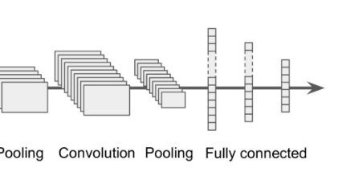
<figcaption class="paper-figure-caption"><b>Fig 5.</b> Figure 2.5: Architecture of a typical CNN. Neurons in the convolutional layers</figcaption>
</figure>

**Summary.** This thesis explores the dual potential of machine learning—both classical and quantum—for analyzing complex datasets in particle physics. It develops Quantum Extreme Learning Machines (QELMs) for quantum data analysis and applies deep convolutional networks to classify neutrino events from water Cherenkov detector images, highlighting ML's role in modern fundamental physics research.

**Why it may be interesting.** It bridges advanced ML techniques with fundamental physics data analysis, providing insights into when quantum information processing might yield non-trivial computational advantages over classical methods in structured physical measurements.

Detailed structure

**Main problem.** The work investigates applying machine learning, both classical (deep learning) and quantum (QELMs), to analyze complex, high-dimensional data arising in fundamental physics experiments like neutrino detection.

**Main result.** CNNs effectively classify complex neutrino events from detector images, while QELM analysis suggests that useful feature generation relies on local entanglement build-up over a finite time scale rather than requiring fully scrambled quantum states.

**Method.** The paper employs Quantum Extreme Learning Machines (QELMs) for quantum data processing and Convolutional Neural Networks (CNNs), including residual networks, for classical image classification in neutrino physics.

**Model / system.** The systems include water Cherenkov detectors used in neutrino experiments (e.g., Hyper-Kamiokande) and the theoretical framework of QELMs operating on N-qubit states governed by fixed unitary evolution.

**Key observables.** Classification accuracy for event discrimination, entanglement growth, and the characteristic transition time ($t^*$) in quantum dynamics.

**Important parameters / regimes.** Number of qubits (N), evolution time (t), and detector charge/timing information from PMTs.

**Assumptions / limitations.** The QELM analysis suggests that a physically meaningful intermediate regime exists where local dynamics are sufficient for feature extraction, not requiring generic quantum advantage.

**Figures summary.** Not specified by the notes; the focus is on methodology and results across two distinct applications (QML vs. Neutrino Imaging).

**Paper structure.** The thesis is structured in two main parts: the first develops QELMs, analyzing encoding strategies and quantum dynamics; the second applies deep learning to classify complex event topologies from simulated water Cherenkov detector images.

Abstract

This thesis investigates the application of machine-learning methods in the context of quantum computing and neutrino physics, with particular emphasis on the construction of effective representations for complex, high-dimensional data. The first part of the work is devoted to Quantum Extreme Learning Machines (QELMs), a hybrid quantum--classical framework in which classical data are encoded into quantum states and processed through fixed quantum dynamics, while learning is performed by a classical readout layer. Within this framework, we analyze the role of encoding strategies, feature-reduction methods, Hamiltonian structure, and measurement, with particular focus on the relationship between quantum dynamics, expressivity, entanglement, and classical simulability. The second part of the thesis concerns the application of deep learning to the analysis of images produced by water Cherenkov detectors in neutrino physics. Convolutional architectures, including residual networks, are developed for the classification of complex events in realistic simulated datasets, showing that such models can effectively extract relevant information from detector data. Taken together, these results highlight the potential of machine learning, in both its classical and quantum forms, as a powerful framework for the analysis of complex data in fundamental physics, while also outlining relevant challenges and directions for future research.

[↑ back to top](#top)

### [Quantum Motion from Local Transition Susceptibility](http://arxiv.org/abs/2607.13267v1)

**Authors:** Jan Klaers  
**Type:** theory · **Category:** other · **PDF:** <https://arxiv.org/pdf/2607.13267v1>  
**Analysis basis:** full PDF text, analyzed in chunks
**Topic relevance:** `quantum measurements` **2/5** · `Keldysh / 2PI / non-Gaussian methods` **1/5** · `driven-dissipative phase transition` **1/5**

↔ Scroll figures horizontally

<figure class="paper-figure-card">
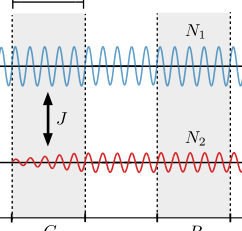
<figcaption class="paper-figure-caption"><b>Fig 1.</b> Figure 1. Coupling scheme defining the local transition sus- ceptibility. A weak coupling of rate J acts over the region C of length L, transferring amplitude from the initial channel |1⟩to the orthogonal channel |2⟩. The populations N1 and N2 are integrated over the same downstream comparison region R. Their ratio in the weak-coupling limit defines χ(L, xc) and the passage speed vp(L, xc) = χ−1(L, xc).</figcaption>
</figure>
<figure class="paper-figure-card">
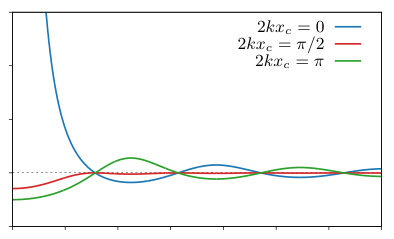
<figcaption class="paper-figure-caption"><b>Fig 2.</b> Figure 2. Finite-window passage speed for the standing wave formed by reflection at a hard wall, Eq. (7), shown for three positions xc of the coupling region. The response depends on kL and on the standing-wave phase 2kxc because the two counterpropagating branches interfere within the coupling re- gion. For kL ≫1, this interference averages out and vp(L, xc) approaches the single-branch speed v = ℏk/m. The vertical range is truncated at vp/v = 4.</figcaption>
</figure>
<figure class="paper-figure-card">
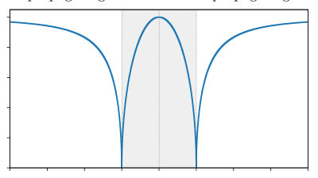
<figcaption class="paper-figure-caption"><b>Fig 3.</b> Figure 3. Relativistic coordinate passage speed as a function of γ = (E −V )/(Mc2). In the propagating regions, |γ| &gt; 1, the susceptibility yields vp/c = p</figcaption>
</figure>

**Summary.** The paper introduces the concept of passage speed derived from the transition susceptibility, offering a method to characterize quantum motion independent of net probability flow. By applying this technique to relativistic systems, the authors show that this passage speed correctly predicts local dispersion velocities and establishes the reduced Compton wavelength as a fundamental length scale governing relativistic quantum dynamics.

**Why it may be interesting.** This work provides a novel diagnostic tool ($v_p$) to measure intrinsic quantum motion that is robust even when standard probability current measures vanish (e.g., standing waves), linking it directly to fundamental scales like the Compton wavelength.

Detailed structure

**Main problem.** To characterize quantum motion independently of probability transport by analyzing how a quantum state responds to weak local perturbations.

**Main result.** The inverse transition susceptibility defines a passage speed that reproduces the local dispersion velocity in both propagating and evanescent regions, establishing a relativistic bound related to the reduced Compton wavelength.

**Method.** The methodology involves calculating the transition susceptibility ($\chi$) of quantum states subjected to weak localized couplings ($J$), defining the passage speed as $v_p = \chi^{-1}$.

**Model / system.** The analysis considers general quantum states, extending from non-relativistic Schrödinger equations to relativistic Klein-Gordon waveguides coupled transversely. The system is probed by applying weak local perturbations.

**Key observables.** Passage speed ($v_p$), transition susceptibility ($\chi$), and the local dispersion velocity.

**Important parameters / regimes.** The coupling strength ($J$), energy ($\epsilon$), wave number ($k$), decay constant ($\kappa$), and the reduced Compton wavelength ($\lambda_C/c$).

**Assumptions / limitations.** For relativistic extensions, an auxiliary two-stream model is introduced for evanescent states. The definition of $v_p$ depends on the placement of the coupling evaluation window.

**Figures summary.** Figure 1 illustrates the general coupling scheme; Figure 2 shows the ratio $v_p/v$ for a standing wave at various coupling positions ($x_c$). Figure 3 plots $v_p/c$ versus the Lorentz factor ($\gamma$) for both propagating and evanescent regimes.

**Paper structure.** The paper first establishes the concept of passage speed via susceptibility in general settings (including standing waves). It then extends this framework to a relativistic model involving coupled Klein-Gordon waveguides, deriving specific formulas for $v_p$ in both propagating and decaying regimes.

Abstract

We characterize quantum motion based on the susceptibility of a quantum state to weak local state conversion. The inverse susceptibility can be interpreted as a passage speed characterizing local motion independently of probability transport. For individual WKB branches, it reproduces the magnitude of the local dispersion velocity in both propagating and evanescent regions. A relativistic extension yields a passage speed bounded by the speed of light, reaching this bound at the finite energy corresponding to the center of the mass gap, where the evanescent decay length equals the reduced Compton wavelength. This identifies the reduced Compton wavelength as the shortest stationary evanescent length scale compatible with relativistic quantum motion.

[↑ back to top](#top)

### [Temperature-driven sodium-ion dynamical-to-static crossover in the zig-zag ordered phase of Na$_{0.5}$CoO$_2$](http://arxiv.org/abs/2607.13848v1)

**Authors:** Shangfei Wu, Hengxin Tan, Dong Wu, Mingshu Tan, Xinyu Zhou, Tianchen Hu, Tao Dong, Feng Jin, Qingming Zhang, Nanlin Wang  
**Type:** both · **Category:** strongly correlated electrons · **PDF:** <https://arxiv.org/pdf/2607.13848v1>  
**Analysis basis:** full PDF text, analyzed in chunks
**Topic relevance:** `driven-dissipative phase transition` **2/5** · `Frenkel-Kontorova` **1/5** · `non-equilibrium dynamics` **1/5**

↔ Scroll figures horizontally

<figure class="paper-figure-card">
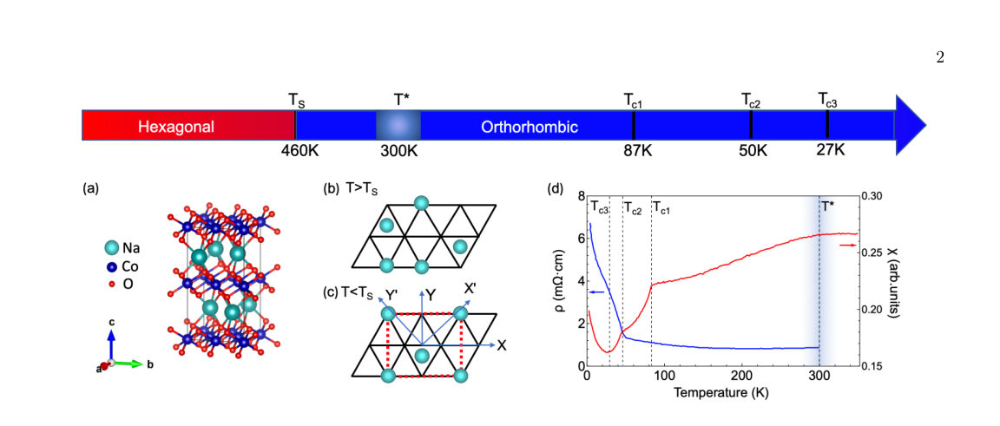
<figcaption class="paper-figure-caption"><b>Fig 1.</b> FIG. 1. (a) Crystal structure of Na0.5CoO2 at 300 K with space group Pnmm (No. 59) (point group: D2h). (b) Na-disordered phase of Na0.5CoO2 above TS. (c) Na-zigzag-ordered phase of Na0.5CoO2 below TS. The triangular lattice represents the Co lattice, and the O atoms are omitted. The red dashed rectangle in panel (c) denotes the reconstructed 2 × √</figcaption>
</figure>
<figure class="paper-figure-card">
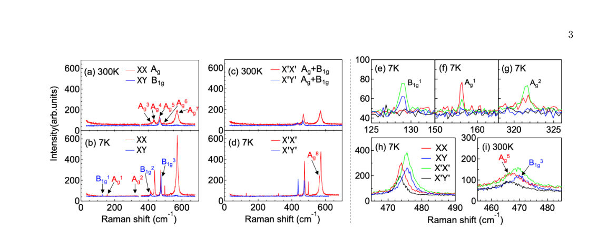
<figcaption class="paper-figure-caption"><b>Fig 2.</b> FIG. 2. (a)-(b) Raman spectra of Na0.5CoO2 at 300 K and 7 K in the XX and XY scattering geometries from the ab plane recorded by 633 nm laser line. The arrows with red labels mark the Ag mode, while the arrows with blue labels mark the B1g modes. (c)-(d) same as (a)-(b) but for the X′X′ and X′Y ′ scattering geometries. The arrow in (d) marks the shoulder peak A8 g. (e)-(h) Zoom-in plot of the selected Raman response in the XX, XY , X′X′, and X′Y ′ scattering geometries at 7 K. (i) Same as (h) but for 300 K.</figcaption>
</figure>
<figure class="paper-figure-card">
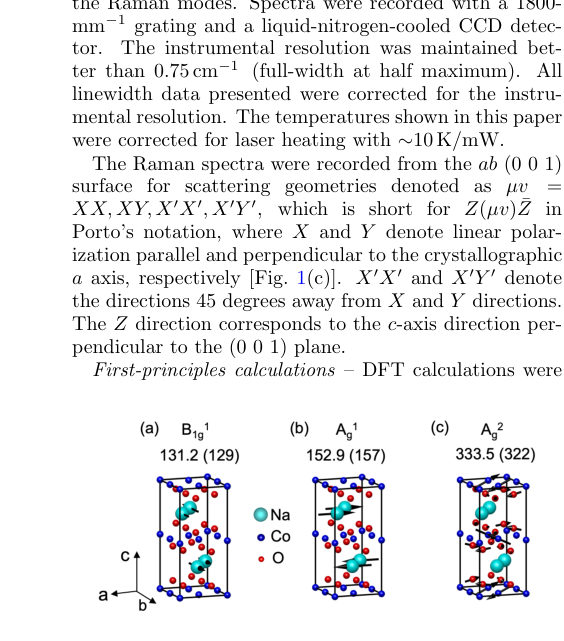
<figcaption class="paper-figure-caption"><b>Fig 3.</b> FIG. 3. The lattice vibration patterns from the DFT phonon calculations for the first three low-energy modes observed in the experiment. (a) B1 1g mode at 129.8 (129) cm−1 . (b)A1 g mode at 154.5 (157) cm−1 . (c) A2 g mode at 327.9 (322) cm−1 . The corresponding experimental phonon frequencies are in parentheses.</figcaption>
</figure>
<figure class="paper-figure-card">
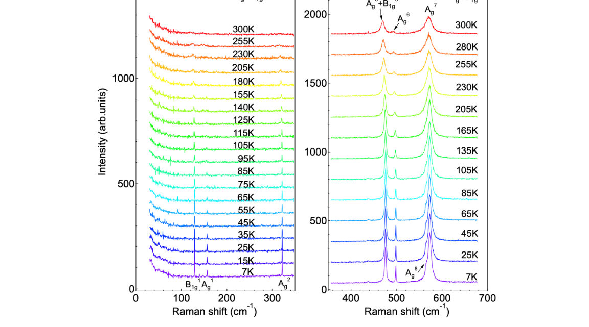
<figcaption class="paper-figure-caption"><b>Fig 4.</b> FIG. 4. Temperature dependence of the Raman spectra for Na0.5CoO2 in the X′X′ (Ag+B1g) scattering geometry below 350 cm−1 (a) and above 350 cm−1 (b).</figcaption>
</figure>
<figure class="paper-figure-card">
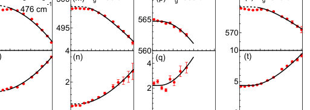
<figcaption class="paper-figure-caption"><b>Fig 5.</b> FIG. 5. Temperature dependence of the peak position, HWHM (half-width at half-maximum), and integrated intensity for the Raman modes of Na0.5CoO2. (a)-(c) For the B1 1g mode at 129 cm−1 . (d)-(f) For the A1 g mode at 157 cm−1 . (g)-(i) For the A2 g mode at 322 cm−1 . (j)-(l) For the mode at around 476 cm−1 which contains the A5 g and B3 1g modes. (m)-(o) For the A6 g mode at 498 cm−1 . (p)-(r) For the A8 g mode at 565 cm−1 . (s)-(u) For the A7 g mode at 573 cm−1 . The solid black lines in (j), (k), (m), (n), (p), (q), (s), and (t) are the fitting of the temperature dependence of the peak position and HWHM for the Raman modes above Tc1 according to the anharmonic phonon decay model (Appendix...</figcaption>
</figure>

**Summary.** The study uses Raman spectroscopy and DFT calculations on $	ext{Na}_{0.5}	ext{CoO}_2$ to investigate the sodium-ion lattice dynamics. They identify a temperature $T^* \sim 300	ext{ K}$ where sodium ions undergo a dynamical-to-static crossover, suggesting this structural freezing is crucial for establishing the subsequent electronic and magnetic order in the cobaltate layers.

**Why it may be interesting.** This work provides a direct spectroscopic probe of ion dynamics that precedes electronic ordering in a strongly correlated material, offering insights into how structural degrees of freedom can gate emergent quantum phases.

Detailed structure

**Main problem.** The study investigates the temperature-driven dynamical-to-static crossover of sodium ions within the zig-zag ordered phase of $	ext{Na}_{0.5}	ext{CoO}_2$. The goal is to link this ion dynamics to emergent electronic and magnetic orders in the cobaltate layer.

**Main result.** The authors detected two novel sodium phonon modes appearing below $T^* \sim 300	ext{ K}$, interpreting this anomaly as a crossover where gradual sodium ion freezing sets the stage for subsequent CoO$_2$ ordering.

**Method.** A combination of polarization-resolved Raman spectroscopy and first-principles DFT calculations (including Hubbard U corrections) was employed to analyze lattice dynamics.

**Model / system.** The physical system is $	ext{Na}_{0.5}	ext{CoO}_2$, a layered cobaltate compound known for complex temperature-dependent electronic and magnetic transitions ($	ext{AFM}$ transition at $87	ext{ K}$).

**Key observables.** Sodium phonon mode frequencies, linewidth broadening vs. temperature, in-plane resistivity $
ho(T)$, and magnetic susceptibility $\chi(T)$.

**Important parameters / regimes.** $T^* \sim 300	ext{ K}$ (crossover temperature), $T_{	ext{S}} \sim 460	ext{ K}$ (zigzag ordering temperature), Hubbard U parameter ($2.5	ext{ eV}$ chosen for best fit).

**Assumptions / limitations.** The analysis assumes the observed phonon anomalies at $T^*$ represent a true dynamical-to-static crossover, and that DFT calculations within the harmonic approximation capture the essential physics despite discrepancies in high-frequency modes.

**Figures summary.** Figures show temperature dependence of Raman spectra across various geometries; Figure 1 illustrates $
ho(T)$ and $\chi(T)$ showing transitions near $300	ext{ K}$; phonon dispersion plots confirm Na-dominant low-energy modes.

**Paper structure.** The paper systematically presents experimental measurements (Raman, transport) to identify anomalous temperature regimes ($T^*$), followed by theoretical calculations (DFT/Phonopy) to assign physical origins to the observed lattice vibrations and link them mechanistically to known magnetic transitions.

Abstract

We employ polarization-resolved Raman spectroscopy combined with first-principles calculations to study the sodium-ion lattice dynamics in a sodium zig-zag ordered cobaltate compound Na$_{0.5}$CoO$_2$. We detect two sodium phonon modes for the first time, and their mode frequencies are consistent with first-principles phonon calculations based on an orthorhombic unit cell. We find that they appear below around $T^*\sim300\pm50$K with large linewidth broadening, much lower than the sodium zig-zag ordering temperature $T_\text{S}\sim460$K, and then narrow at lower temperatures. We interpret the sodium-phonon anomalies occurring at $T^*$ as a dynamical-to-static crossover involving mainly the motion of sodium ions. Our results suggest that the gradual freezing of the sodium ions and the well-defined static sodium-zigzag order below $T^*$ set the stage for the emergent electronic and magnetic orders in the CoO$_2$ layer of Na$_{0.5}$CoO$_2$.

[↑ back to top](#top)

### [Classical and quantum mechanics across representations: an operational reading of the Wigner Weyl correspondence](http://arxiv.org/abs/2607.13135v1)

**Authors:** Samuel Schlegel, Borivoje Dakić, Flavio Del Santo  
**Type:** theory · **Category:** other · **PDF:** <https://arxiv.org/pdf/2607.13135v1>  
**Analysis basis:** full PDF text, analyzed in chunks
**Topic relevance:** `Keldysh / 2PI / non-Gaussian methods` **1/5** · `analog quantum simulation` **1/5** · `correlated / nonlocal dissipation` **1/5** · `driven-dissipative phase transition` **1/5** · `entanglement & information structure` **1/5** · `methods for driven-dissipative` **1/5** · `non-equilibrium dynamics` **1/5**

↔ Scroll figures horizontally

<figure class="paper-figure-card">
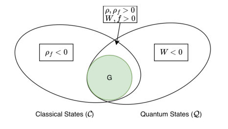
<figcaption class="paper-figure-caption"><b>Fig 1.</b> FIG. 1. Classical and quantum state spaces are partially over- lapping sets when considered under the WW correspondence. Gaussian quantum states G can be found within the intersec- tion.</figcaption>
</figure>
<figure class="paper-figure-card">
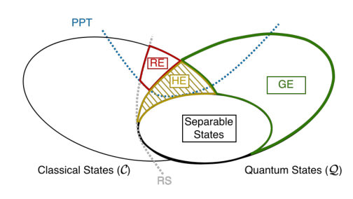
<figcaption class="paper-figure-caption"><b>Fig 2.</b> FIG. 2. The entanglement hierarchy of Ref. [13] located on the classical/quantum state spaces of Fig. 1. Representational entanglement (RE): a classical density f ≥0 whose Hilbert- space image ˆρf is not positive, so covariance witnesses are ap- plied outside their domain. Hybrid entanglement (HE): states that are positive and entangled yet Wigner-positive, repro- ducible by a classical phase-space model at the quadrature level (C ∩Q). Genuine entanglement (GE): positive, entan- gled, and Wigner-negative, admitting no classical phase-space description.</figcaption>
</figure>

**Summary.** This paper rigorously compares classical and quantum mechanics by analyzing their equivalent representations in phase space and Hilbert space via the Wigner-Weyl correspondence. It argues that while the mathematical mapping is systematic, genuine physical distinctions—such as noncommutativity—are robust features, whereas artifacts like negativity are often merely consequences of choosing a specific representation language.

**Why it may be interesting.** This work provides a deep structural comparison between classical and quantum descriptions, which is foundational for understanding the limits of semi-classical approximations used widely in AMO physics (e.g., Wigner function analysis).

Detailed structure

**Main problem.** To systematically compare classical and quantum mechanics across different mathematical representations (phase space vs. Hilbert space) to distinguish between representation-dependent artifacts and robust, physically significant structural differences.

**Main result.** The core physical structure is governed by noncommutativity, which manifests as the $\hbar$-dependent Moyal $\star$-product in phase space, rather than being tied to a preferred mathematical language (PS or HS).

**Method.** The authors use the Wigner-Weyl correspondence to map between classical phase-space distributions and quantum operators, developing comparisons across states, kinematics, dynamics, and measurements.

**Model / system.** The paper analyzes general classical and quantum mechanical theories, focusing on how their descriptions translate when moving between phase space ($\Gamma$) and Hilbert space. The comparison is formalized using the Wigner transform and Weyl quantization map.

**Key observables.** Noncommutativity, $\hbar$-dependent $\star$-deformation of the algebra, positivity constraints (negativity in Wigner function), outcome statistics, and state-update rules.

**Important parameters / regimes.** Planck's constant ($\hbar$), which dictates the transition from classical Poisson brackets to quantum Moyal brackets.

**Assumptions / limitations.** The analysis assumes that the Weyl map provides an invertible translation at the level of symbols, but it explicitly notes that this map fails to preserve physical constraints like positivity.

**Figures summary.** Figure 1 schematically shows the partial overlap between classical and quantum state spaces under the WW correspondence. Figure 2 illustrates a hierarchy of entanglement (RE $
ightarrow$ HE $
ightarrow$ GE) based on positivity requirements.

**Paper structure.** The paper proceeds by establishing the mathematical machinery (WW map, Moyal product), comparing formalisms across different physical processes (kinematics, dynamics, measurement), and finally developing an operational hierarchy to distinguish genuine quantum features from representational artifacts like negativity or entanglement types.

Abstract

The physical content of a theory is not intrinsically tied to any single mathematical formalism. Both classical and quantum mechanics admit equivalent representations, notably in phase space and in Hilbert space, related by the Wigner-Weyl correspondence. While this correspondence has long been studied in mathematical physics, its foundational and operational implications are often left implicit. Here we give a systematic account of what changes, and what does not, when classical and quantum theories are expressed in each other's native language. This representational viewpoint separates artifacts (such as the appearance of non-positivity or negativity under certain maps) from robust structural distinctions that persist across representations, in particular noncommutativity and its $\hbar$-dependent $\star$-deformation of the classical algebra. We develop the comparison at the level of states, kinematics, and dynamics, and extend it to measurement by formulating both outcome statistics and state-update rules within the same framework.

[↑ back to top](#top)

### [StreamingQEC: Streaming Quantum Error Correction in Tightly Integrated Quantum-Classical Systems via Certified Recurrence](http://arxiv.org/abs/2607.13351v1)

**Authors:** Panayiotis Christou, Shuwen Kan, Hao Wang, Ying Mao  
**Type:** theory · **Category:** quantum information and computing · **PDF:** <https://arxiv.org/pdf/2607.13351v1>  
**Analysis basis:** full PDF text, analyzed in chunks
**Topic relevance:** `QC/QI experiment` **1/5** · `methods for driven-dissipative` **1/5** · `non-equilibrium dynamics` **1/5**

↔ Scroll figures horizontally

<figure class="paper-figure-card">

<figcaption class="paper-figure-caption"><b>Fig 1.</b> Fig. 1. StreamingQEC maps protected logical computation to grounded, resource-bound QEC stages evaluated by explicit DES, auto staged-fluid, or certified recurrence.</figcaption>
</figure>
<figure class="paper-figure-card">

<figcaption class="paper-figure-caption"><b>Fig 2.</b> Fig. 2. Certified recurrence contracts a repeated QEC region only when its signed scheduling state and transition/metric deltas are stable.</figcaption>
</figure>
<figure class="paper-figure-card">
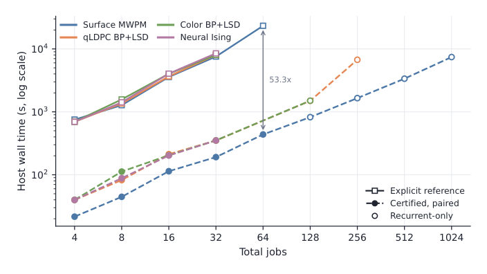
<figcaption class="paper-figure-caption"><b>Fig 3.</b> Fig. 3. Host runtime for calibrated code/decoder profiles. Squares are explicit references, filled circles are paired certified runs, and hollow circles are recurrent-only scaling. Paired points have zero reported simulator- output delta.</figcaption>
</figure>
<figure class="paper-figure-card">
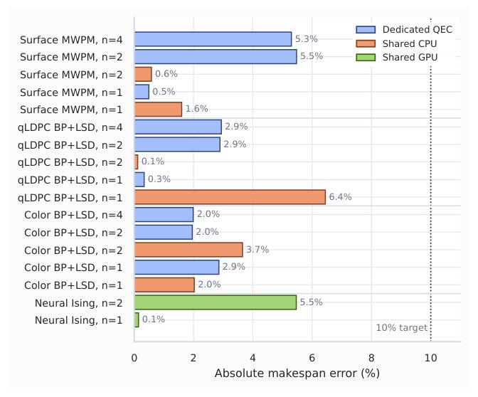
<figcaption class="paper-figure-caption"><b>Fig 4.</b> Fig. 4. Auto staged-fluid makespan error over 17 exact references. All rows remain below the 10% screening target. Appendix D.2 reports the full data.</figcaption>
</figure>
<figure class="paper-figure-card">
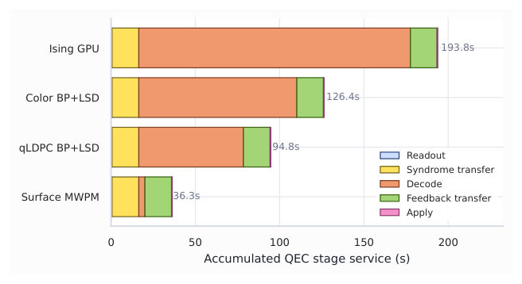
<figcaption class="paper-figure-caption"><b>Fig 5.</b> Fig. 5. Representative accumulated QEC stage service on the mixed workload. Fast matching exposes transfer/control cost, while heavier profiles shift service toward decode. Appendix Table 12 reports the corresponding values.</figcaption>
</figure>

**Summary.** The paper introduces StreamingQEC, a novel system simulator designed to model the resource demands of fault-tolerant Quantum Error Correction (QEC) pipelines. It moves beyond simple circuit simulation by explicitly modeling classical resource contention across CPUs, GPUs, and interconnects. By using advanced techniques like certified recurrence, it achieves massive speedups while accurately predicting performance bottlenecks critical for building large-scale quantum computers.

**Why it may be interesting.** This work provides crucial system-level performance data that bridges the gap between theoretical quantum circuit design and practical hardware implementation constraints, which is vital for scaling any physical quantum computer.

Detailed structure

**Main problem.** The primary challenge is understanding resource contention and queuing across diverse classical resources (controller, compute, accelerator) during the continuous hybrid pipeline of fault-tolerant Quantum Error Correction (QEC). Existing simulators fail to model these system-level interactions.

**Main result.** The proposed simulator achieves a 24.0x speedup over explicit simulation while accurately reproducing performance metrics across thousands of calibrated configurations, revealing critical bottlenecks like transfer limits and decoder stalls.

**Method.** It introduces StreamingQEC, which uses an explicit Discrete-Event Simulation (DES) as a reference, supplemented by an auto staged-fluid mode for fast screening and a certified recurrence mechanism for state compression.

**Model / system.** The system models the classical workload induced by protected logical quantum computation intervals ($\mathcal{I}_g$), which involves sequential QEC stages: readout, syndrome transport, decoding, feedback, and control. This is mapped onto a resource-constrained pipeline involving CPUs, GPUs, and dedicated decoders.

**Key observables.** Simulated completion time (makespan), stage wait/busy times, queue pressure, backlog metrics, and resource utilization across various interconnects (PCIe, NVLink).

**Important parameters / regimes.** Microsecond-scale QEC cycle timings; specific performance profiles derived from 9,998 measured decoder-runtime events.

**Assumptions / limitations.** The simulation abstracts away quantum state evolution and logical error rate validation. The recurrence mechanism relies on matching scheduling states and metric contributions for compression.

**Figures summary.** Figures summarize the system model mapping protected computation to resource-bound QEC stages, while tables detail grounded decoder/runtime evidence (e.g., Surface MWPM, qLDPC) and link performance parameters.

**Paper structure.** The paper first establishes the need for system-level modeling in fault-tolerant QEC pipelines. It then details StreamingQEC's three execution modes (DES, staged-fluid, recurrence). The core is presenting the methodology for grounding runtime profiles from extensive decoder measurements and applying this to analyze resource bottlenecks.

Abstract

Fault-tolerant quantum computing requires a continuous hybrid quantum error correction (QEC) pipeline comprising measurement readout, syndrome transport, decoding, feedback, and control. Existing QEC simulators primarily evaluate circuits, noise models, decoders, and protocol-level outcomes. System architects, however, must also understand how these workloads contend for and queue across controller, compute, accelerator, and communication resources during protected logical execution. We introduce StreamingQEC, a system-level simulator that translates fault-tolerant logical workloads into resource-constrained streaming-QEC pipelines. An explicit discrete-event simulation provides the reference execution semantics. An automatic staged-fluid mode enables faster approximate design-space exploration, while a certified recurrence mechanism compresses repeated transitions only when their scheduling state and metric contributions match those of the explicit execution trace. We assemble a decoder-runtime dataset containing 9,998 measurements, of which 8,174 are used to fit performance profiles. Recurrence reproduces the reported explicit-simulation metrics across 35 calibrated-profile configurations, as well as additional workload and cadence validation cases. For a 16-job anchor workload, it preserves 59,743,936 decoding events while achieving a 24.0x host-side speedup, and recurrent simulations scale beyond 1.22 billion events. Across 17 reference configurations, the automatics taged-fluid mode yields a mean makespan error of 2.60% and a worst-case error of 6.45%. Design-space studies reveal transfer-limited resource matching,decoder-driven pipeline stalls, and saturation of dedicated resources under microsecond-scale QEC cycles.

[↑ back to top](#top)

### [Filon Methods for Highly Oscillatory Controlled Quantum Systems](http://arxiv.org/abs/2607.13580v1)

**Authors:** Spencer Lee, Daniel Appelö  
**Type:** theory · **Category:** numerical methods · **PDF:** <https://arxiv.org/pdf/2607.13580v1>  
**Analysis basis:** full PDF text, analyzed in chunks
**Topic relevance:** `methods for driven-dissipative` **1/5** · `non-equilibrium dynamics` **1/5**

↔ Scroll figures horizontally

<figure class="paper-figure-card">
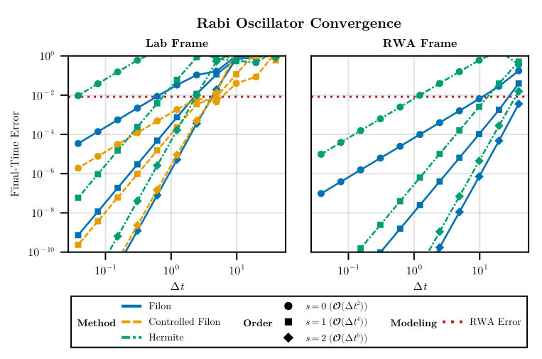
<figcaption class="paper-figure-caption"><b>Fig 1.</b> Fig. 2.1: Convergence of the Hermite [11], Filon (Subsection 3.3), and Controlled Filon (Subsection 3.4) methods applied to the Rabi oscillator (2.3). In the RWA frame, the Filon and Controlled Filon methods are identical. The final-time errors are computed using the ℓ2 norm.</figcaption>
</figure>
<figure class="paper-figure-card">
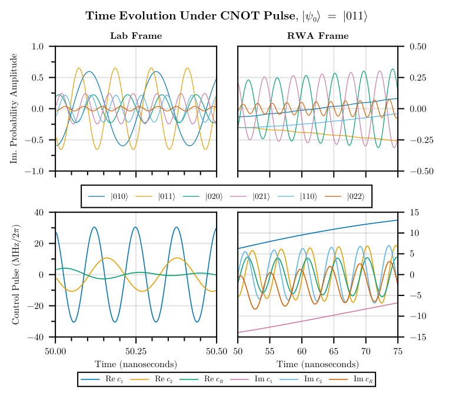
<figcaption class="paper-figure-caption"><b>Fig 2.</b> Fig. 4.1: Lab- and RWA-frame time evolution for the CNOT gate simulation of Subsec- tion 4.2, starting from |ψ0⟩= |011⟩. The RWA frame shows the window 50 ≤t ≤75 ns; the lab frame shows the much shorter window 50 ≤t ≤50.5 ns. Only the imagi- nary parts of the six largest probability amplitudes are shown.</figcaption>
</figure>
<figure class="paper-figure-card">
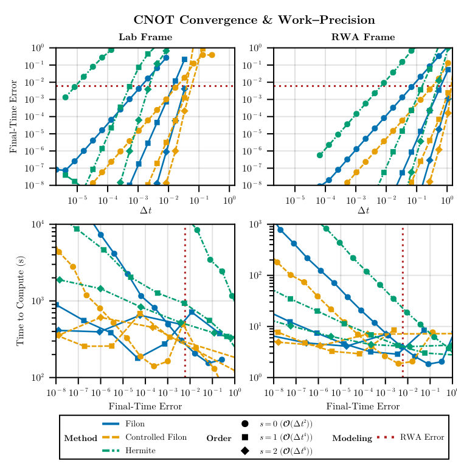
<figcaption class="paper-figure-caption"><b>Fig 3.</b> Fig. 4.2: Convergence and work-precision of the Hermite, Filon, and Controlled Filon methods for the CNOT gate simulation of Subsection 4.2, using the four computational-subspace basis states (|000⟩, |001⟩, |010⟩, |011⟩) as initial conditions. Final-time errors are measured using the Frobenius norm.</figcaption>
</figure>
<figure class="paper-figure-card">
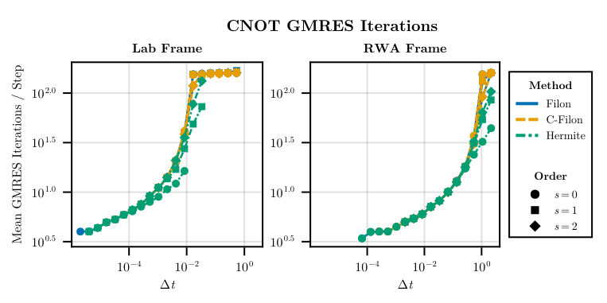
<figcaption class="paper-figure-caption"><b>Fig 4.</b> Fig. 4.3: Average number of GMRES iterations per timestep for the Hermite, Filon, and Controlled Filon methods on the CNOT gate simulation of Subsection 4.2.</figcaption>
</figure>

**Summary.** This paper introduces two novel numerical techniques, Filon and Controlled Filon methods, designed to efficiently simulate the time evolution of quantum systems with highly oscillatory behavior. By adapting Filon quadrature for oscillatory integrals, the authors drastically reduce the required number of simulation timesteps compared to established methods like Hermite integration. This makes accurate classical control simulations feasible for superconducting qubits.

**Why it may be interesting.** This work provides a powerful algorithmic tool for simulating complex quantum dynamics where standard integrators fail due to rapid oscillations, directly impacting computational feasibility in quantum control theory.

Detailed structure

**Main problem.** The core challenge is achieving fast and accurate classical simulation of quantum systems whose dynamics are governed by highly oscillatory time-dependent Hamiltonians.

**Main result.** The developed Controlled Filon method significantly reduces the computational cost compared to standard methods, outperforming benchmarks like the Hermite method by factors up to 500x for simulating gates like CNOT.

**Method.** The authors adapt Filon quadrature, traditionally used for oscillatory integrals, into two specialized time-stepping schemes (Filon and Controlled Filon) tailored for solving linear systems of ODEs arising from quantum evolution.

**Model / system.** The study focuses on controlled quantum systems modeled by the time-dependent Schrödinger equation ($rac{d}{dt}\psi(t) = -iH(t)\psi(t)$), specifically tested using superconducting transmon qubits and CNOT gate simulations.

**Key observables.** Accuracy of simulation (convergence rate) for quantum state evolution, particularly when simulating controlled gates like the CNOT gate.

**Important parameters / regimes.** The time step size ($\Delta t$), the oscillation frequencies ($\omega_j$), and the order ($s$) of the interpolation polynomial used in the quadrature rule are critical parameters.

**Assumptions / limitations.** A key assumption is that the envelope function $f(t)$ varies more slowly than the carrier wave $e^{i\omega t}$ when $|\omega| > 0$. The methods are derived assuming specific mathematical structures related to the Hamiltonian evolution.

**Figures summary.** Figure 2.1 compares convergence for the Rabi oscillator, showing that Filon/Controlled Filon achieve target accuracy with much larger time steps ($\Delta t$) than the Hermite method.

**Paper structure.** The paper first defines the problem (highly oscillatory quantum simulation), then details the adaptation of Filon quadrature theory into two numerical methods, followed by presenting and analyzing these methods through numerical simulations on physical systems like the Rabi oscillator and CNOT gate.

Abstract

Fast and accurate classical simulation of quantum systems is a central challenge in the design and control of quantum computers, but the highly oscillatory dynamics of these systems severely limit the efficiency of standard numerical methods. To address this, we adapt Filon quadrature for oscillatory integrals into two numerical methods, called Filon and Controlled Filon, for solving linear systems of ODEs with highly oscillatory solutions. We tailor both methods for efficient implementation in controlled quantum systems, and the Controlled Filon method additionally accounts for the oscillatory structure of the control pulses. We show by numerical experiments that these methods significantly reduce the computational cost of accurately simulating systems of superconducting transmon qubits by decreasing the number of timesteps needed to reach a given level of precision, with only a modest increase in the cost per timestep. For a realistic simulation of the dynamics of a CNOT gate, the Controlled Filon method is the most efficient method tested at every target accuracy, outperforming the best Hermite method by up to 6x and the Hermite method of the same order by up to 500x.

[↑ back to top](#top)

### [HybridQC: Hardware-Grounded Simulation of Tightly Integrated Hybrid Quantum-Classical Systems](http://arxiv.org/abs/2607.13352v1)

**Authors:** Panayiotis Christou, Shuwen Kan, Ying Mao  
**Type:** both · **Category:** quantum information and computing · **PDF:** <https://arxiv.org/pdf/2607.13352v1>  
**Analysis basis:** full PDF text, analyzed in chunks
**Topic relevance:** `methods for driven-dissipative` **1/5** · `non-equilibrium dynamics` **1/5**

↔ Scroll figures horizontally

<figure class="paper-figure-card">
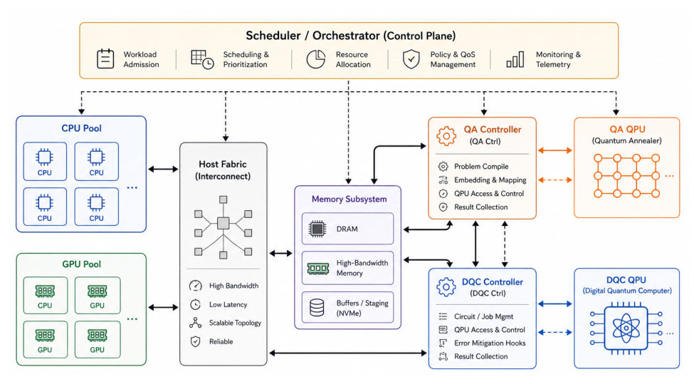
<figcaption class="paper-figure-caption"><b>Fig 1.</b> Figure 1. Configurable HCU topology modeled by HybridQC. Users define an HCU as classical and quantum compute nodes connected by explicit data/control links. HybridQC then simulates stage-by-stage data flow, resource utilization, and contention across that topology.</figcaption>
</figure>
<figure class="paper-figure-card">
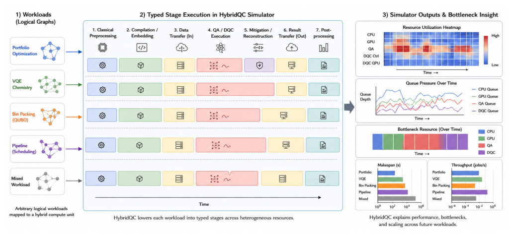
<figcaption class="paper-figure-caption"><b>Fig 2.</b> Figure 2. System-level multi-stage view used by HybridQC. Logical workloads are lowered into stage graphs, scheduled across heterogeneous classical and quantum compute nodes and explicit links, and analyzed through data movement, utilization, bottleneck movement, run makespan, job-completion summaries, and throughput metrics.</figcaption>
</figure>
<figure class="paper-figure-card">
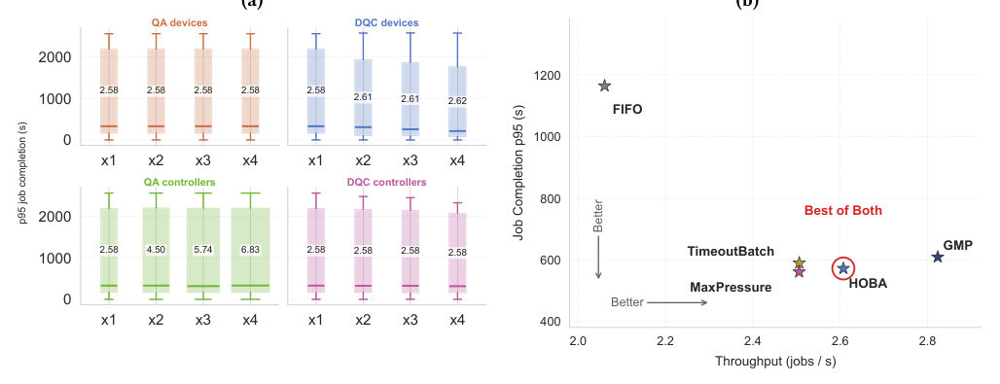
<figcaption class="paper-figure-caption"><b>Fig 3.</b> Figure 3. Topology and policy effects in the true workload suite. (a) Replica scaling payoff: x1–x4 denotes the total instance count of the swept resource class, box height summarizes p95 job-completion time, and numbers inside boxes report average throughput in jobs/s. (b) Policy frontier for p95 job-completion time and throughput, regenerated from the current Rust experiment outputs.</figcaption>
</figure>
<figure class="paper-figure-card">
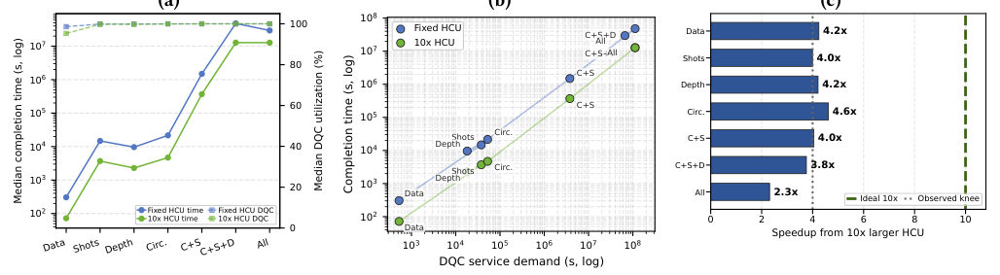
<figcaption class="paper-figure-caption"><b>Fig 4.</b> Figure 4. Workload-scaling analysis. (a) 100× scaling by growth axis. Solid curves use the left log-runtime axis and dashed curves use the right utilization axis. (b) Bottleneck migration under fixed and 10× larger HCUs. (c) Median-runtime speedup from moving 100× workloads to the 10× larger HCU. The dashed line marks ideal 10× improvement. Abbreviations: data = payload/memory, shots = reads/shots, c = circuits, c+s = circuits+shots, c+s+d = circuits+shots+depth, all = all fields.</figcaption>
</figure>
<figure class="paper-figure-card">
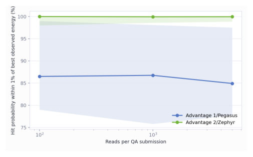
<figcaption class="paper-figure-caption"><b>Fig 5.</b> Figure 5. Measured QA hit probability versus reads for a 1% energy-gap target at a 20 𝜇s anneal. The bands show the interquartile range across QUBO size/degree groups.</figcaption>
</figure>

**Summary.** This paper introduces HybridQC, a novel simulator designed to model the entire topology of tightly integrated hybrid quantum-classical compute units (HCUs). It moves beyond simulating isolated components by treating controllers and communication links as first-class resources in a configurable graph. The work demonstrates that system performance is governed by complex resource contention and scheduling limits, providing a systematic framework for predicting scaling bottlenecks before physical hardware deployment.

**Why it may be interesting.** While focused on classical simulation infrastructure, the detailed analysis of resource contention, scheduling policies, and bottlenecks in hybrid quantum systems provides crucial insights into the practical limitations that any future quantum algorithm implementation must overcome.

Detailed structure

**Main problem.** The performance of hybrid quantum-classical applications is increasingly bottlenecked by classical control, communication overhead, and scheduling rather than the quantum computation itself.

**Main result.** System scaling is highly non-uniform; balanced hardware scaling provides only modest speedups, while workload growth in specific dimensions (like circuit count) can lead to exponential runtime increases.

**Method.** The authors developed HybridQC, a topology-aware discrete-event simulator that models the entire coupled system rather than individual components.

**Model / system.** The core model is the Hybrid Compute Unit (HCU), represented as a configurable graph containing classical processors, memory, controllers, QA devices, and DQC devices connected by explicit communication links. The simulation tracks resource occupancy across this entire topology.

**Key observables.** Makespan (end-to-end time), Controller Critical-Path Share (CPF), resource utilization, queueing delays, and scaling factors for various workloads.

**Important parameters / regimes.** Workload dimensions (e.g., input data size, circuit count, shot count) and hardware topology parameters (link bandwidth, controller capacity).

**Assumptions / limitations.** The simulator assumes that architectural changes can be modeled by editing the resource graph, allowing for predictive analysis of future integrated systems.

**Figures summary.** Figures illustrate the configurable HCU topology and show how different workloads exhibit bottleneck migration patterns (e.g., from QA to DQC or controllers) as resources scale.

**Paper structure.** The paper introduces HybridQC by defining the HCU graph model, details its layered architecture (Workload $
ightarrow$ Runtime-profile $
ightarrow$ Topology $
ightarrow$ Simulation), calibrates it against real hardware measurements, and then presents extensive workload scaling studies comparing cloud vs. integrated execution semantics.

Abstract

Hybrid quantum-classical application performance is increasingly limited by classical control, host-to-QPU communication, and scheduling rather than quantum execution. Existing simulators and runtime interfaces analyze individual kernels but fail to address system-topology questions, such as controller bottlenecks, diminishing returns of QPU capacity, or resource contention under heterogeneous workloads. We introduce HybridQC, a topology-aware discrete-event simulator for tightly coupled hybrid compute units (HCUs). HybridQC models HCUs as configurable graphs of classical processors, memory, controllers, quantum annealing (QA) and digital quantum computing (DQC) devices, and communication links. It decomposes jobs into typed, directed acyclic graphs of stages, ranging from input preparation to classical postprocessing, executed under interchangeable scheduling policies. Calibrated with live measurements from D-Wave (Advantage 1 and 2) and IBM (Kingston, Marrakesh, and Fez) processors, HybridQC distinguishes physical QPU occupancy from cloud wall-clock latency. The models achieve mean absolute percentage errors of 3.92%-8.04% for D-Wave QPU access time and 5.26%-19.01% for IBM quantum-seconds measurements. Workload experiments reveal that a balanced 10x HCU scaling improves makespan by only 2.19x-3.42x, while altering scheduling policies shifts makespan by up to 1.80x for a 20-job workload. Scalability varies heavily by workload dimension: a 100x input data increase yields a 306 s median runtime, whereas a 100x joint increase in circuit count, shot count, and circuit depth drives runtime to 4.806x10^7 s on an unchanged HCU. HybridQC offers a systematic framework for evaluating the topology, scheduling, and scaling limits of hybrid architectures prior to physical deployment.

[↑ back to top](#top)

### [Reshaping quantum annealing landscapes with diagonal catalysts](http://arxiv.org/abs/2607.14063v1)

**Authors:** Andrés N. Cáliz, Carlos Ramon-Escandell, Finnley Paolella, Josep Bosch, Jan Nogué, Arnau Riera, Jordi Riu  
**Type:** theory · **Category:** disordered systems and neural networks · **PDF:** <https://arxiv.org/pdf/2607.14063v1>  
**Analysis basis:** full PDF text, analyzed in chunks
**Topic relevance:** `analog quantum simulation` **1/5** · `exotic spin models in light-matter` **1/5**

↔ Scroll figures horizontally

<figure class="paper-figure-card">
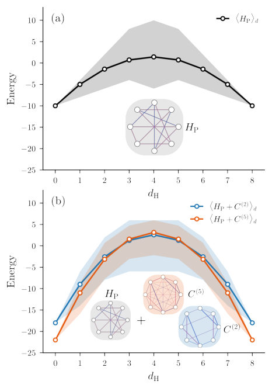
<figcaption class="paper-figure-caption"><b>Fig 1.</b> FIG. 1. Effect of the diagonal catalyst. Shell mean energies (open markers) and full within-shell energy range (shaded bands) vs. Hamming distance to a ground state z⋆, for a signed 3-regular instance (n = 8). (a) Bare problem: the means trace the parabola of Eq. (7), but the bands are broad and overlap, making configurations many flips from z⋆</figcaption>
</figure>
<figure class="paper-figure-card">
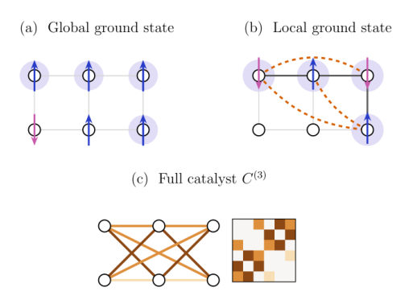
<figcaption class="paper-figure-caption"><b>Fig 2.</b> FIG. 2. Open-path catalyst construction. (a) A global ground-state pattern z⋆minimizes the full signed problem but is unknown to the construction. (b) On a selected open path p, sign propagation from Eq. (12) gives a locally satisfying pattern g(p), which acts as a solution-independent estimate of the ground-state alignment on that path. The path penalty induces couplings between nonadjacent path vertices. (c) Summing all order-three path contributions yields the denser catalyst C(3) after orthogonalization and normalization.</figcaption>
</figure>
<figure class="paper-figure-card">
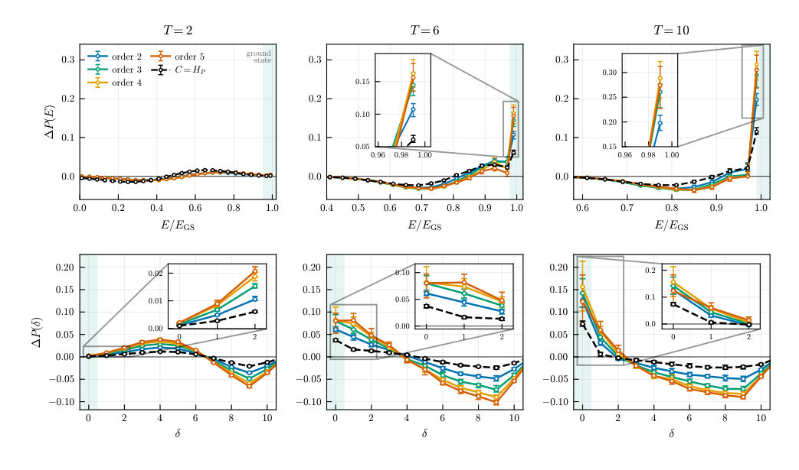
<figcaption class="paper-figure-caption"><b>Fig 3.</b> FIG. 3. Probability redistribution. Final-state probability redistribution on 200 3-regular instances with n = 20. Results are shown for sweep times T = 2, 6, 10, for open-path catalysts of orders 2–5, and for the reinforced-problem baseline C = HP , all relative to the uncatalyzed anneal. Curves show the median change in probability mass across instances; error bars are 95% bootstrap confidence intervals with B = 5000 resamples. Top: redistribution by normalized energy E/EGS, with E/EGS = 1 corresponding to the ground-state energy. Bottom: redistribution by Hamming distance δ to the closest ground state.</figcaption>
</figure>
<figure class="paper-figure-card">
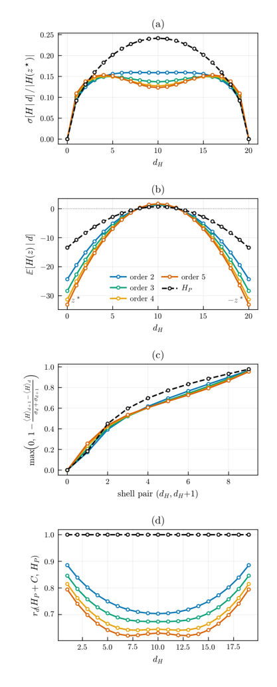
<figcaption class="paper-figure-caption"><b>Fig 4.</b> FIG. 4. Static landscape diagnostics. Results on 200 signed 3-regular instances with n = 20. The catalyzed op- erators H(m) comb = (HP + C(m))/κm, with m = 2, . . . , 5, are compared with HP . (a) Relative within-shell spread σ[H | d]/|H(z⋆)|. (b) Shell mean ⟨H⟩d. (c) Adjacent-shell over- lap ovd. (d) Within-shell Pearson correlation rd(H(m) comb, HP ). The catalyst deepens the shell-mean funnel, narrows the shells relatively, and lowers their scale-invariant overlap while re- taining positive correlation with the original within-shell or- dering.</figcaption>
</figure>

**Summary.** The paper addresses the challenge of local minima trapping in quantum annealing by introducing diagonal catalysts. These catalysts are constructed using graph path patterns and modify the system's Hamiltonian to enforce a better correlation between low energy and physical proximity to the solution. The results show that these engineered landscapes significantly boost optimization performance across various problem instances.

**Why it may be interesting.** This work provides a concrete, mathematically derived mechanism to engineer quantum annealing Hamiltonians, which is highly relevant for understanding how engineered couplings can guide quantum computation away from local minima traps.

Detailed structure

**Main problem.** Quantum annealing performance is limited by population trapping in local minima far from the true solution on the energy landscape.

**Main result.** The authors introduce diagonal catalysts that reshape the energy landscape, significantly improving the correlation between low energy and proximity to the ground state.

**Method.** They construct catalysts using a mathematical framework based on propagating patterns along self-avoiding paths on the coupling graph. These catalysts are added to the problem Hamiltonian during quantum annealing.

**Model / system.** The system is modeled by an Ising spin system undergoing adiabatic evolution governed by $H(s) = -(1 - s)\sum X_i + s (H_P + C(m))$, where $H_P$ is the original problem Hamiltonian and $C(m)$ is the constructed catalyst.

**Key observables.** Top-band mass ($P_{0.95}$), probability mass at small Hamming distance ($\delta \leq 2$), and paired gain relative to baseline anneals.

**Important parameters / regimes.** Catalyst order ($m=2$ to $m=5$), sweep time ($T=2, 6, 10$), and graph regularity (3-, 4-, 5-regular graphs).

**Assumptions / limitations.** The constructed catalyst is typically denser than the original problem Hamiltonian, and there is a trade-off between catalyst order and fidelity to the true ground state.

**Figures summary.** Figures illustrate how catalysts rescale energy bands (improving energy–distance correspondence) and show probability redistribution on both energy and Hamming distance for various catalyst orders and sweep times.

**Paper structure.** The paper develops a mathematical framework connecting energy and Hamming distance, derives the construction method for diagonal catalysts via path propagation, and then benchmarks these catalysts across multiple graph families using quantitative diagnostics in energy and Hamming space.

Abstract

Quantum annealing is often limited by population trapped in local minima many spin flips from the solution. We introduce a mathematical framework to understand the connection between energy and Hamming distance in optimization problems. Using this, we build ZZ-catalysts from ground-state patterns of small frustration-free subproblems that make configurations far from the solution less energetically competitive. On sparse problems they multiply the near-solution probability at short sweeps, with gains persisting on fully-connected models and tunable via subproblem choice.

[↑ back to top](#top)

### [Sail membranes for optomechanical accelerometry](http://arxiv.org/abs/2607.14089v1)

**Authors:** Atkin D. Hyatt, Mitul Dey Chowdhury, Mahir Chowdhury, Mohamed J. Ahamed, Dalziel J. Wilson  
**Type:** both · **Category:** other · **PDF:** <https://arxiv.org/pdf/2607.14089v1>  
**Analysis basis:** full PDF text, analyzed in chunks
**Topic relevance:** `quantum measurements` **1/5** · `quantum optics experiment` **1/5**

↔ Scroll figures horizontally

<figure class="paper-figure-card">
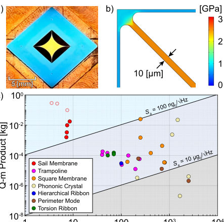
<figcaption class="paper-figure-caption"><b>Fig 1.</b> FIG. 1. (a) Photo of optimized circular-fillet sail membrane with 2.5×2.5 mm2 pad and 10-µm-wide tethers. (b) Simulated von Mises stress near the tether clamps. (c) Compilation of Q × m versus fre- quency for trampoline [10, 22–24], square [25–29], phononic crystal [8, 9, 30–32], hierarchical [33], perimeter mode [34], and torsion rib- bon [35, 36] type Si3N4 membranes. Open and solid red circles are simulated and characterized sail membranes described in Figs. 2-3.</figcaption>
</figure>
<figure class="paper-figure-card">
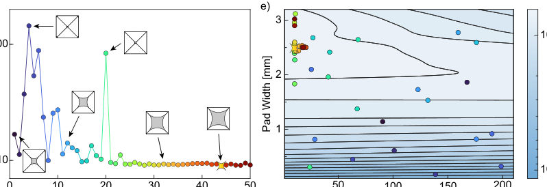
<figcaption class="paper-figure-caption"><b>Fig 2.</b> FIG. 2. Optimizing the Qm/f of a Si3N4 trampoline resonator with fixed tether width. (a) Sail-like trampoline geometries with pad-width W, tether width t, pad fillet radius R, and clamp fillet radius r. Top: square-fillet sail (W independent of R). Bottom: circular-fillet sail (W = R). (b-c) Sweep of W over optimized fillets (yellow markers) with t = 10 µm. Plots show quality factor Q, frequency f, maximum von Mises stress, effective mass m, and Qm/f versus W. (d-e) Bayesian optimization algorithm convergence (d) and design objective landscape (e) for the bottom device in (a). Colored points in (d) correspond to the same points in (e).</figcaption>
</figure>
<figure class="paper-figure-card">
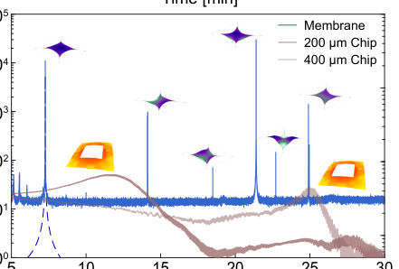
<figcaption class="paper-figure-caption"><b>Fig 3.</b> FIG. 3. Device characterization. (a) Energy ringdown of three sail membranes with the geometry shown in Fig. 1a. Exponential fits yield quality factors as high as Q = 10 × 106. (b) Free-running vi- bration spectra (blue) showing the 7 kHz fundamental membrane mode. Overlaid is the driven response of the 200-µm-thick device chip (brown) and a similar 400-µm-thick chip (light brown) taken with a scanning vibrometer at atmospheric pressure, showing broad resonances at 12 and 25 kHz, respectively. Insets: simulated mem- brane modeshapes and measured chip modeshapes.</figcaption>
</figure>
<figure class="paper-figure-card">
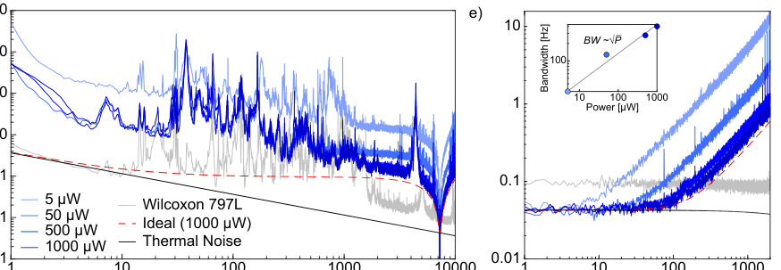
<figcaption class="paper-figure-caption"><b>Fig 4.</b> FIG. 4. Dual membrane accelerometry with an optimized circular-fillet sail membrane as a test mass and a ribbon membrane as a reference surface. (a) Image of sail-on-ribbon device released from a 200-µm-thick Si substrate. The top membrane has the sail geometry shown in Fig. 1a. The bottom membrane is a 200-µm-wide ribbon [35]. (b) Transmission versus incident wavelength of double-membrane cavity with finesse ∼2. The red point indicates the maximum fringe slope and operating wavelength. (c-e) Free-running displacement (c) and acceleration (d,e) spectra measured with power ¯P = {5,50,500,1000} µW. Insets show scaling of noise floor and thermal noise bandwidth versus ¯P.</figcaption>
</figure>

**Summary.** This paper details the design and characterization of novel 'sail-like' $	ext{Si}_3	ext{N}_4$ membranes for use in ultra-sensitive optomechanical accelerometers. By employing Bayesian optimization, the authors engineered resonators that significantly boost the quality factor times mass product while lowering the resonance frequency. The resulting monolithic device demonstrates sensitivity capable of resolving microgravity accelerations, advancing fundamental physics sensing capabilities.

**Why it may be interesting.** This work is highly relevant as it pushes the boundaries of mechanical sensing by combining advanced materials science ($	ext{Si}_3	ext{N}_4$), optimization theory (Bayesian methods), and quantum/optomechanical measurement techniques to reach fundamental force detection limits.

Detailed structure

**Main problem.** The primary goal is developing highly sensitive optomechanical accelerometers by engineering strained membrane resonators to achieve a superior combination of low resonance frequency and high Q-mass product.

**Main result.** The authors designed 'sail-like' $	ext{Si}_3	ext{N}_4$ membranes that significantly increase the $Q 	imes m$ product while lowering the fundamental frequency, achieving sensitivities sufficient to resolve microgravity accelerations.

**Method.** The study combines theoretical modeling (deriving noise equations based on geometry and stress) with computational optimization using Bayesian methods to guide the design of optimal membrane geometries.

**Model / system.** The physical system is a strained $	ext{Si}_3	ext{N}_4$ membrane resonator, optimized into a sail-like shape. The final device integrates this sail onto a nanoribbon acting as an inertial reference plane for monolithic cavity optomechanical sensing.

**Key observables.** Thermal acceleration noise ($S_{	ext{th}}^a$), resonance frequency ($f$), Quality factor ($Q$), and displacement/acceleration imprecision ($	ext{S}_{	ext{imp}x}, 	ext{S}_{	ext{imp}a}$).

**Important parameters / regimes.** Room temperature thermal noise of $40\;	ext{n}g_0/\sqrt{	ext{Hz}}$; achieving $\mu	ext{g}_0/\sqrt{	ext{Hz}}$ resolution over a 4 kHz bandwidth.

**Assumptions / limitations.** The analysis relies on modeling the mechanical response using continuum mechanics equations and assumes that thermal noise is the limiting factor, although discrepancies with measured Q-factors were noted.

**Figures summary.** Figures compare $Q 	imes m$ vs frequency for different membrane types, detail the Bayesian optimization process used to find optimal parameters, and show experimental characterization of resonance frequencies and quality factors.

**Paper structure.** The paper progresses from identifying the need for improved resonator design (low $f$, high $Qm$) to applying Bayesian optimization on sail geometries. It then presents measurements on optimized single sails and finally demonstrates a monolithic double-membrane setup for acceleration sensing.

Abstract

Strained membrane resonators have emerged as a promising platform for optomechanical accelerometry; however, the desired combination of low frequency and high $Q$-mass product requires a rethinking of their dissipation dilution engineering. Applying Bayesian optimization to a Si$_3$N$_4$ membrane, we discover a class of sail-like trampoline resonators in which the frequency is decreased by an order of magnitude while preserving the $Q$-mass product. We demonstrate centimeter-scale sails with kHz frequencies, $Q\sim10^7$ and $Q\times\text{mass}\sim$ 10 g. Vertically integrating a 7 kHz device with a nanoribbon, we realize a monolithic cavity optomechanical accelerometer with a room temperature thermal noise of $40\;\text{n}g_0/\sqrt{\text{Hz}}$, sufficient to resolve $μg_0/\sqrt{\text{Hz}}$ ambient vibration over a bandwidth of 4 kHz with a displacement imprecision of $10^{-14}\;\text{m}/\sqrt{\text{Hz}}$. Cryogenic arrays of sail membranes may be attractive for new physics searches and distributed quantum sensing experiments.

[↑ back to top](#top)

### [Security evaluation of quantum distance-bounding protocols via semidefinite programming](http://arxiv.org/abs/2607.13464v1)

**Authors:** Kevin Bogner, Aysajan Abidin, Dave Singelee, Bart Preneel  
**Type:** theory · **Category:** quantum information and computing · **PDF:** <https://arxiv.org/pdf/2607.13464v1>  
**Analysis basis:** full PDF text, analyzed in chunks
**Topic relevance:** `entanglement & information structure` **1/5** · `quantum measurements` **1/5**

↔ Scroll figures horizontally

<figure class="paper-figure-card">
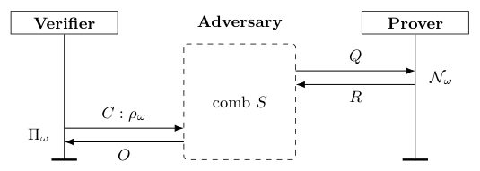
<figcaption class="paper-figure-caption"><b>Fig 1.</b> Figure 1: Reduced mafia-fraud SDP game. The adversary’s comb S first interacts with the prover via the pre-ask channel Nω, then answers the verifier’s challenge ρω. The branch-dependent triple (Nω, ρω, Πω), with Πω the verifier’s accept operator, combines into a single tester operator Wω that captures everything outside the adversary’s control on branch ω. The acceptance probability is then Tr(WωS), a linear function of the comb S; this linearity is what makes the optimization an SDP.</figcaption>
</figure>
<figure class="paper-figure-card">
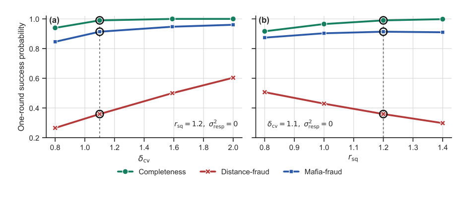
<figcaption class="paper-figure-caption"><b>Fig 2.</b> Figure 2: CV-QDB calibration sweeps with zero added response noise σ2 resp = 0. Panel (a) varies the threshold at fixed rsq = 1.2, while panel (b) varies the squeezing at fixed δcv = 1.1. Mafia-fraud values are finite-grid Gaussian estimators recomputed for each parameter point. Black outlines identify the calibrated operating point used in Table 1.</figcaption>
</figure>
<figure class="paper-figure-card">
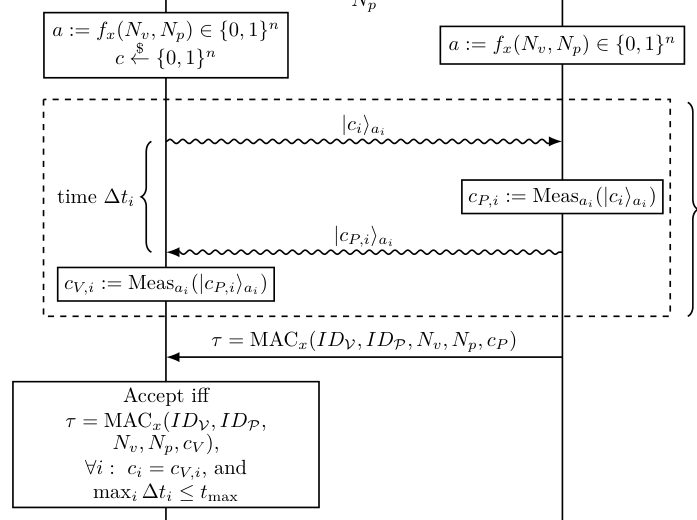
<figcaption class="paper-figure-caption"><b>Fig 3.</b> Figure 3: Overview of the QDB 2017 protocol [AMSP17]. Before the fast rounds, the parties exchange nonces and derive the PRF output a. In each fast round, the verifier prepares |ci⟩ai, and the prover measures it in basis ai and re-prepares the outcome in the same basis. After all rounds, the prover sends τ = MACx(IDV, IDP, Nv, Np, cP ). The verifier accepts only if τ equals the MAC recomputed on cV , all recovered bits match the originals, and every round-trip time ∆ti stays below tmax.</figcaption>
</figure>
<figure class="paper-figure-card">
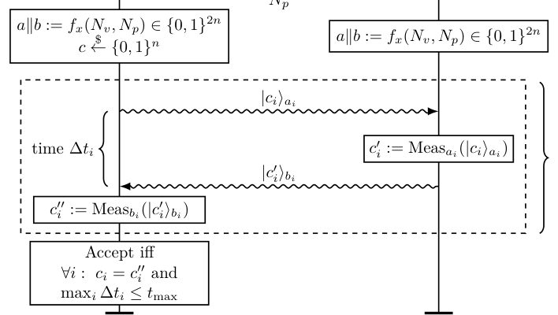
<figcaption class="paper-figure-caption"><b>Fig 4.</b> Figure 4: Overview of the QDB 2019 protocol [Abi19]. Before the fast rounds, the parties exchange nonces and derive the PRF outputs a and b. In each fast round, the verifier prepares |ci⟩ai, and the prover measures it in basis ai and re-prepares the outcome in basis bi. After all rounds, the verifier accepts only if all recovered bits match the originals and every round-trip time ∆ti stays below tmax.</figcaption>
</figure>
<figure class="paper-figure-card">
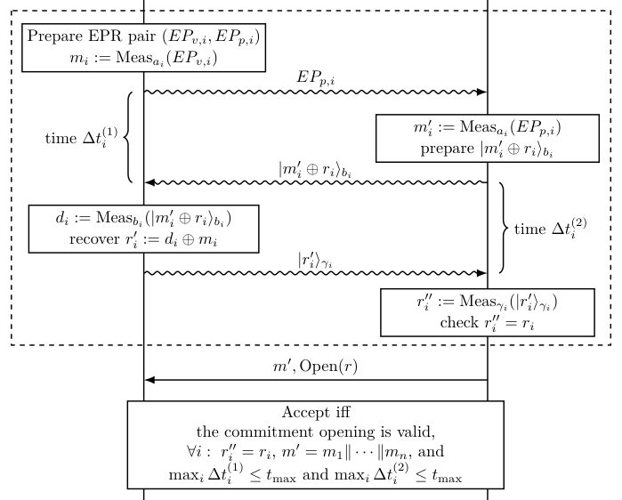
<figcaption class="paper-figure-caption"><b>Fig 5.</b> Figure 5: Overview of the Mutual QDB protocol [AES25]. Before the fast rounds, the parties exchange nonces and derive the PRF outputs a, b, and γ, and the prover commits to a random mask string r. In each fast round, the verifier prepares an EPR pair, measures its own half in basis ai, and sends the prover half EPp,i. The prover measures in the same basis and returns |m′ i ⊕ri⟩bi. The verifier then recovers the mask bit and sends back |r′ i⟩γi. After all rounds, the prover opens the commitment and reveals m′. The verifier accepts only if the commitment opening is valid, the revealed measurement string is consistent with its recorded outcomes, and every first-leg round-trip time stays below...</figcaption>
</figure>

**Summary.** This paper rigorously analyzes the security of Quantum Distance-Bounding protocols by modeling them as one-round fraud games. Using Semidefinite Programming, they compute exact attack success probabilities for discrete variables, demonstrating that Mafia-Fraud resistance can distinguish between different QDB designs. This work advances the theoretical understanding of physical distance verification in quantum communication.

**Why it may be interesting.** It provides rigorous mathematical tools (SDP) to analyze security bounds in quantum communication protocols, which is foundational knowledge for quantum cryptography and secure quantum networking.

Detailed structure

**Main problem.** The paper evaluates the security of Quantum Distance-Bounding (QDB) protocols by isolating and studying one-round distance-fraud (DF) and mafia-fraud (MF) games.

**Main result.** For discrete variables, SDPs allow for exact computation of MF attack values, showing that MF clearly separates studied QDB protocols. The overall resistance depends on whether an attacker can use early information to answer fresh challenges.

**Method.** The authors reduce the one-round DF and MF games to convex optimization problems solvable exactly using Semidefinite Programming (SDP) for discrete variables, while employing calibrated Gaussian models for continuous variables.

**Model / system.** The study focuses on QDB protocols that use timed quantum communication in a fast phase to bound physical distance. The analysis covers both discrete-variable and continuous-variable constructions.

**Key observables.** Success probability of the best single-round attack ($p_\star^{MF}$ or $p_\star^{DF}$) for various QDB protocols.

**Important parameters / regimes.** The one-round nature of the fast phase, which simplifies the optimization problem compared to full quantum position verification.

**Assumptions / limitations.** The analysis is restricted to a single round; for continuous variables, it uses a finite-grid approximation due to intractable non-convexity.

**Figures summary.** Figures illustrate the flow diagrams of specific QDB protocols (e.g., QDB 2017, E91 QDB) detailing verifier/prover actions across multiple rounds.

**Paper structure.** The paper first establishes the framework by isolating one-round games; it then details the SDP formulation for discrete variables and Gaussian estimation for continuous variables, presenting results via tables comparing calculated attack values to prior work.

Abstract

Quantum distance-bounding (QDB) protocols let a verifier check that a prover is both genuine and physically nearby. During a timed fast phase of quantum communication, the verifier measures round-trip times to obtain an upper bound on the prover's distance. For a uniform comparison, we isolate the fast phase and study one-round distance-fraud (DF) and mafia-fraud (MF) games. For discrete-variable QDB, we show that these games reduce to convex optimization problems and can therefore be solved exactly with semidefinite programming; each MF value comes with an explicit attack achieving it and a matching certificate that no attack does better. This contrasts with quantum position verification, where an attack is split between two separated parties, so its optimization is nonconvex and analyses rely on relaxations. In our MF game, the cooperating pair collapses to a single sequential strategy, which keeps the game convex and its exact value computable. Across the discrete-variable protocols we examine, the best one-round DF attack succeeds with the same probability ($1/2$) for every protocol, whereas MF clearly separates the protocols. For continuous-variable QDB, we report estimated attack success probabilities from a calibrated Gaussian attack model. The benchmark covers protocols whose fast phase itself authenticates the prover; designs that follow Brands and Chaum and instead bind the fast phase with a final authenticated message, like the earliest QDB proposal, fall outside it and are treated separately. Of the four protocols studied, two had no previously known one-round attack values, and we report the first ones; for the other two, we find MF attacks with higher success probability than previously reported. Overall, one-round MF resistance depends on whether an attacker can use information revealed early by the prover to answer a fresh challenge from the verifier.

[↑ back to top](#top)

### [A phase transition in the exactness of the NPA hierarchy at the critical doubly-tilted CHSH functional](http://arxiv.org/abs/2607.13774v1)

**Authors:** Anton Pakhunov  
**Type:** theory · **Category:** quantum information and computing · **PDF:** <https://arxiv.org/pdf/2607.13774v1>  
**Analysis basis:** full PDF text, analyzed in chunks
**Topic relevance:** `driven-dissipative phase transition` **1/5**

↔ Scroll figures horizontally

<figure class="paper-figure-card">
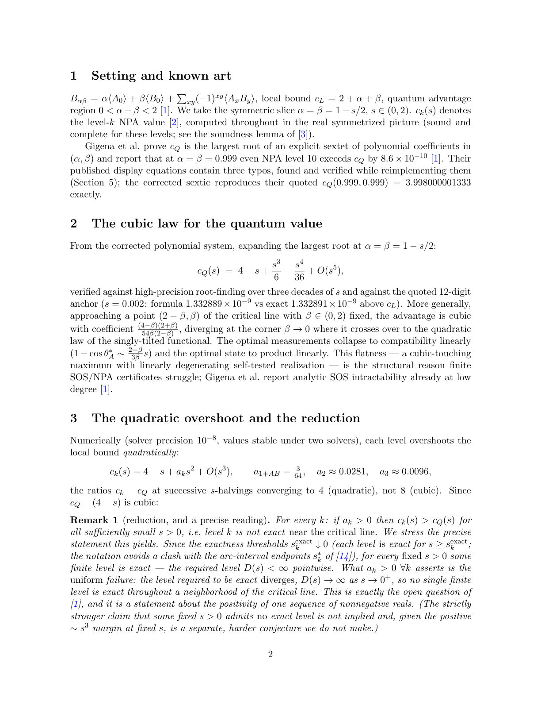
<figcaption class="paper-figure-caption"><b>Fig 1.</b> Low-resolution page preview, page 2</figcaption>
</figure>
<figure class="paper-figure-card">
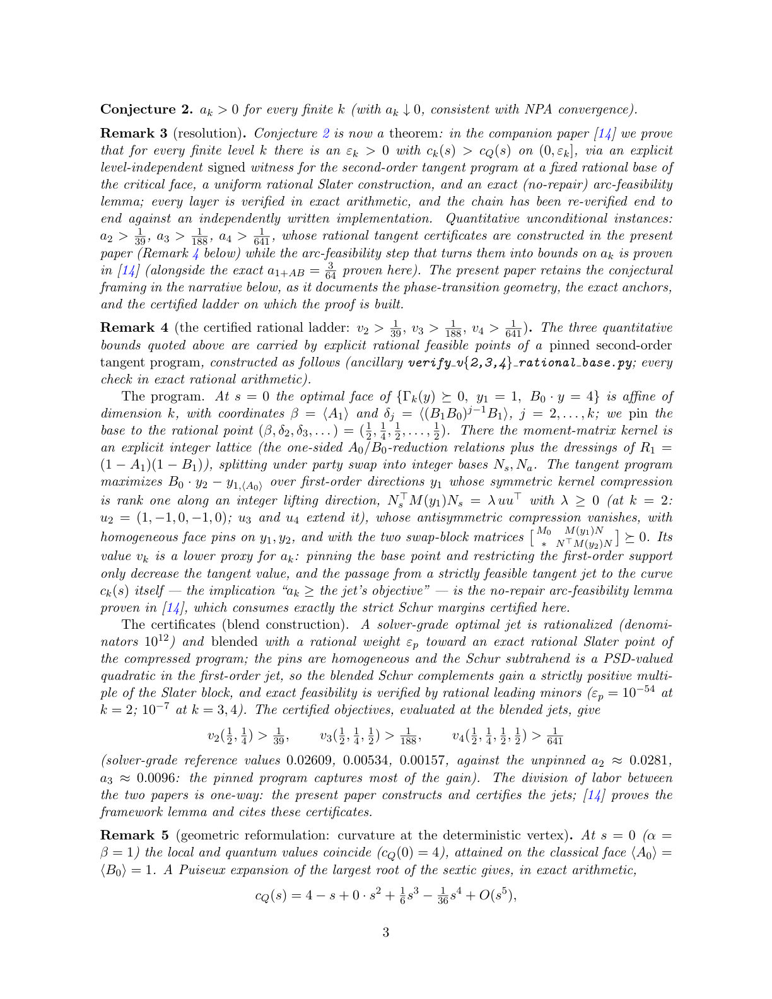
<figcaption class="paper-figure-caption"><b>Fig 2.</b> Low-resolution page preview, page 3</figcaption>
</figure>
<figure class="paper-figure-card">
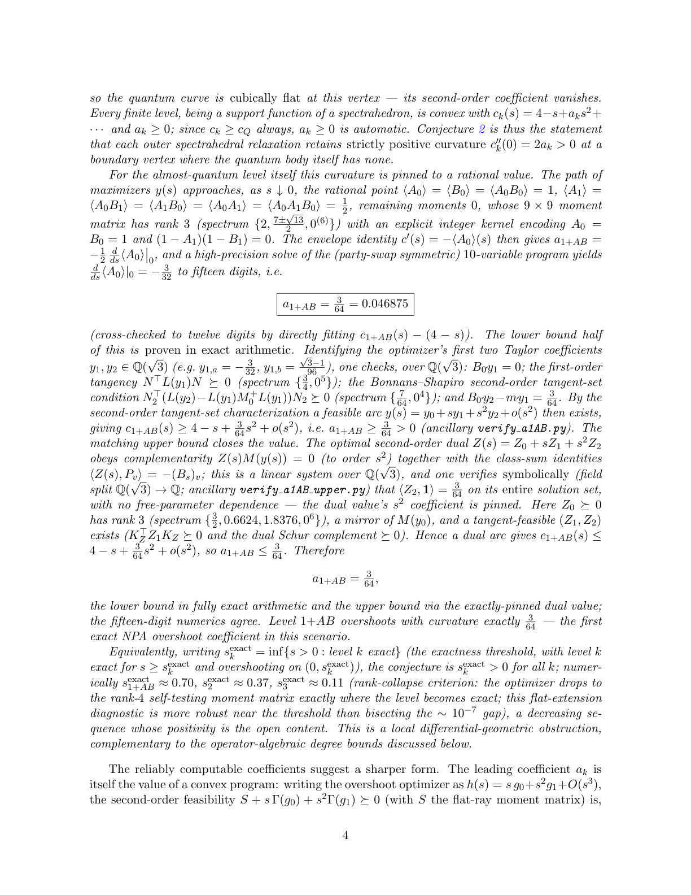
<figcaption class="paper-figure-caption"><b>Fig 3.</b> Low-resolution page preview, page 4</figcaption>
</figure>
<figure class="paper-figure-card">
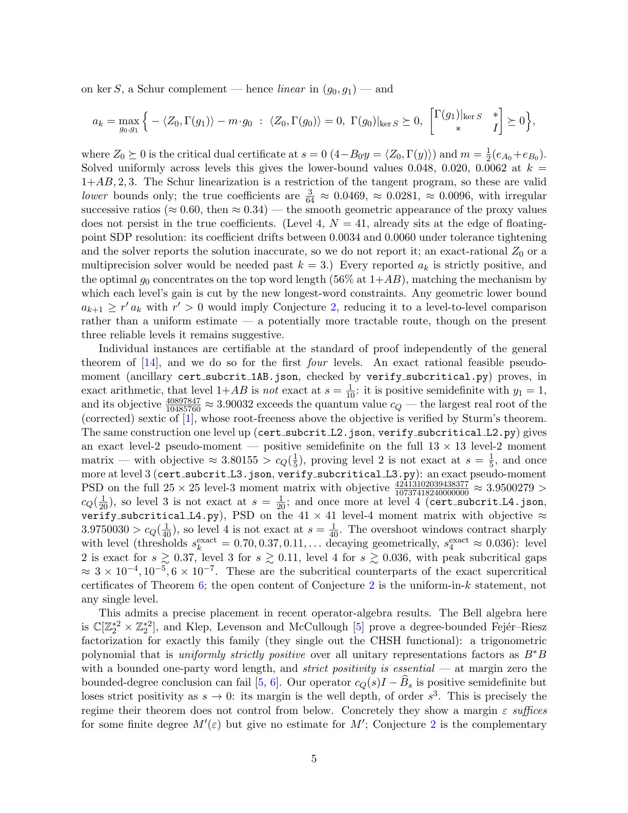
<figcaption class="paper-figure-caption"><b>Fig 4.</b> Low-resolution page preview, page 5</figcaption>
</figure>
<figure class="paper-figure-card">
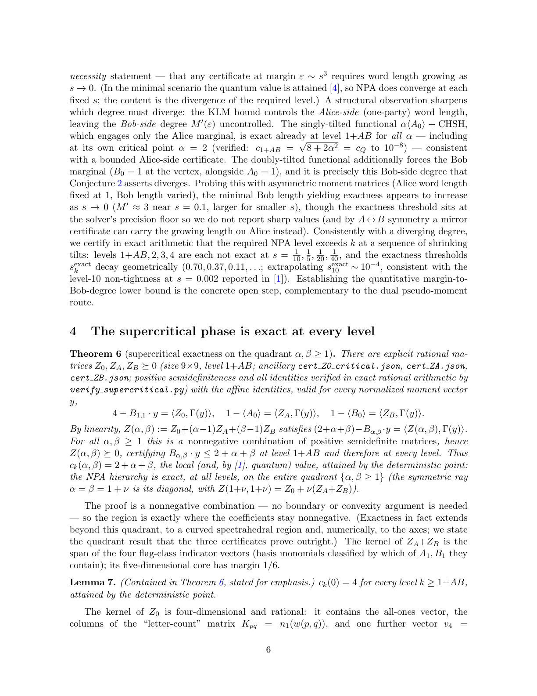
<figcaption class="paper-figure-caption"><b>Fig 5.</b> Low-resolution page preview, page 6</figcaption>
</figure>

**Summary.** This work analyzes the failure points in approximating quantum information measures, specifically the CHSH functional, using the NPA hierarchy. It establishes that the required level of approximation undergoes a sharp phase transition at a critical tilt parameter. The failure mechanism is mathematically characterized as an obstruction arising from noncommutative geometry rather than simple polynomial degree limitations.

**Why it may be interesting.** It provides a deep mathematical understanding of when quantum bounds can be rigorously proven using semi-definite programming techniques (moment problems), linking computational limitations to fundamental algebraic structures.

Detailed structure

**Main problem.** The paper investigates the phase transition governing the exactness of the NPA hierarchy when approximating the quantum maximum of a doubly-tilted CHSH functional.

**Main result.** It proves that the hierarchy is exact in the supercritical regime ($\alpha, eta \ge 1$) but fails to be exactly certifiable near the critical line due to an obstruction rooted in noncommutative geometry.

**Method.** The analysis employs advanced mathematical tools including moment matrix theory, rational certificates, second-order perturbation analysis, and geometric conditions like the boundary Hessian.

**Model / system.** The model is based on optimizing the doubly-tilted CHSH functional ($B_{\alphaeta}$) for quantum measurements, analyzed via its connection to the NPA hierarchy of moment problems.

**Key observables.** The quantum maximum value $c_Q(s)$, the overshooting coefficients $a_k$, and the required level of approximation $k$.

**Important parameters / regimes.** The tilt parameter $s = 2 - \alpha - eta$, which controls proximity to the critical line $\alpha + eta = 2$.

**Assumptions / limitations.** The analysis relies on comparing noncommutative moment structures against commutative algebraic geometry bounds (Positivstellensatz).

**Paper structure.** The paper establishes the asymptotic behavior of $c_Q(s)$, analyzes the quadratic overshoot of NPA levels, proves exactness in the supercritical region via rational certificates, and identifies the phase transition mechanism using geometric conditions.

Abstract

Gigena et al. [npj Quantum Inf. 11, 82 (2025)] proved the exact quantum maximum of the doubly-tilted CHSH functional $B_{αβ}=α\langle A_0\rangle+β\langle B_0\rangle+\mathrm{CHSH}$ and observed that the NPA level required to reach it grows without evident bound toward the critical line $α+β=2$. We quantify the mechanism on the symmetric slice $s=2-α-β$: (i) the quantum value leaves the local bound cubically, $c_Q=4-s+s^3/6-s^4/36+O(s^5)$; (ii) each NPA level overshoots quadratically, $c_k(s)=4-s+a_k s^2+O(s^3)$, with the almost-quantum coefficient computed exactly, $a_{1+AB}=3/64$; (iii) the divergence of the required exact level is equivalent to positivity of the single sequence $(a_k)$ - proven for every $k$ in the companion paper. We prove the supercritical side completely: for all $α,β\ge 1$ and every level the hierarchy is exact, via three explicit rational certificates realizing an affine identity. The hierarchy's exactness thus undergoes a phase transition at the critical line. On the subcritical side we certify the first four levels in exact arithmetic (rational pseudo-moments beating $c_Q$, confirmed by Sturm's theorem). We identify the exact mechanism: rescaled to the critical corner, the limiting obstruction is the Motzkin polynomial, the classical nonnegative-but-not-sum-of-squares form, so the finite-level failure sits in the restricted-certificate regime. The phase boundary has a precise geometric reading via Nie's finite-convergence theorem and Marshall's boundary Hessian condition: a self-tested optimum is finitely NPA-certifiable whenever its boundary Hessian is nondegenerate (contact order two), which holds for the single tilt and fails exactly at the doubly-tilted cubic touch. Three verified errata in the published polynomial system of Gigena et al. are documented.

[↑ back to top](#top)

### [A Reservoir Computing Approach to Quantum Gate Synthesis](http://arxiv.org/abs/2607.13887v1)

**Authors:** Francesco Caravelli, Roberto Menta, Antonio Sannia  
**Type:** theory · **Category:** quantum information and computing · **PDF:** <https://arxiv.org/pdf/2607.13887v1>  
**Analysis basis:** full PDF text, analyzed in chunks
**Topic relevance:** `methods for driven-dissipative` **1/5**

↔ Scroll figures horizontally

<figure class="paper-figure-card">
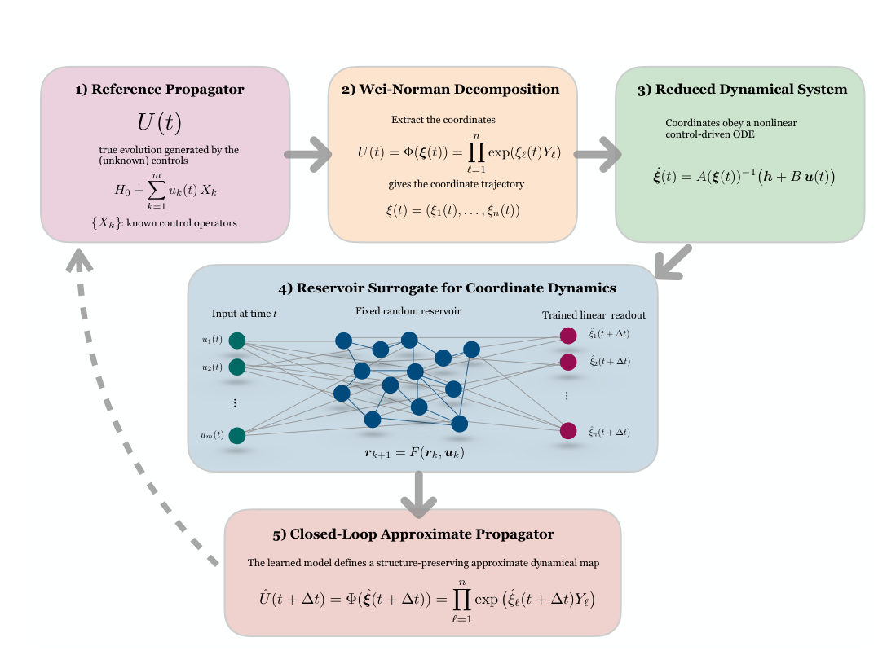
<figcaption class="paper-figure-caption"><b>Fig 1.</b> Fig. 1. Structure-preserving reservoir-computing architecture for controlled quantum dynamics and gate synthesis. (1) Starting from the controlled propagator U(t), generated by a Hamiltonian H(t) = H0 + P k uk(t)Xk, (2) the evolution is expressed in Wei–Norman coordinates, U(t) = Φ(ξ(t)) = Q ℓexp(ξℓ(t)Yℓ). (3) This yields a reduced nonlinear control system for the coordinates, ˙ξ(t) = A(ξ(t))−1(h + B u(t)), which is approximated by a reservoir surrogate driven by the control fields uk(t). (4,5) The trained linear readout predicts the coordinate evolution ˆξ(t), and the propagator is reconstructed by the Wei–Norman product ˆU(t) = Φ( ˆξ(t)). Because reconstruction is performed directly on...</figcaption>
</figure>
<figure class="paper-figure-card">
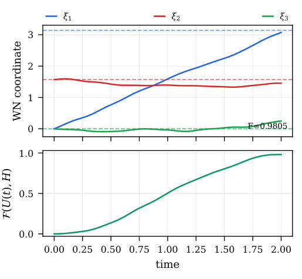
<figcaption class="paper-figure-caption"><b>Fig 2.</b> Fig. 2. Representative single-pass inverse-ESN synthesis of the Hadamard gate. Top: the Wei–Norman coordinate trajectory approaches the target co- ordinates but does not terminate exactly on them. Bottom: the gate fidelity along the trajectory, confirming that the gate is synthesized well—though not perfectly—before any gradient refinement.</figcaption>
</figure>
<figure class="paper-figure-card">
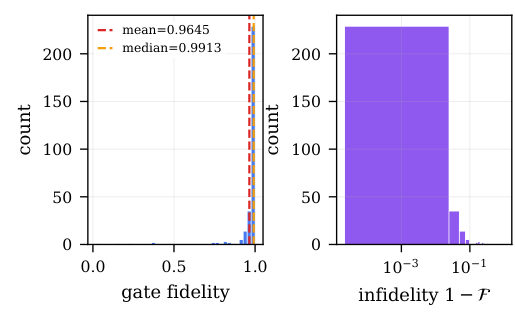
<figcaption class="paper-figure-caption"><b>Fig 3.</b> Fig. 3. Held-out fidelity distribution for the inverse ESN on 300 unseen gates. The sharp peak near unit fidelity gives the high median (0.994), while the long low-fidelity tail accounts for the lower mean (0.943); the principal challenge is the elimination of rare but substantial failures.</figcaption>
</figure>
<figure class="paper-figure-card">
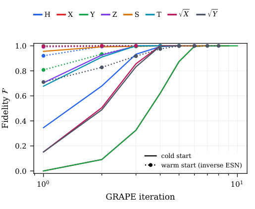
<figcaption class="paper-figure-caption"><b>Fig 4.</b> Fig. 4. Warm- versus cold-start convergence of the accelerated GRAPE kernel on the standard eight-gate suite: gate fidelity versus iteration (logarithmic axis), with solid lines for the cold start and dotted lines with markers for the warm start supplied by the inverse ESN; every run stops at F &gt; 0.99999. Both starts converge within ten iterations at one qubit; the warm start enters at its single-pass fidelity (Table II) and lowers the median iteration count from 6.5 to 5. The corresponding comparison for plain gradient ascent (last two columns of Table II) shows cold-start convergence at 700–1800 iterations, roughly halved by the warm start on seven of the eight gates.</figcaption>
</figure>
<figure class="paper-figure-card">
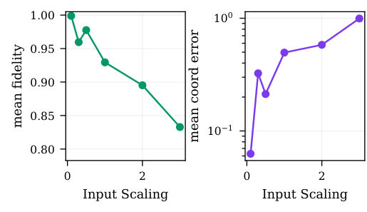
<figcaption class="paper-figure-caption"><b>Fig 5.</b> Fig. 5. Fidelity and coordinate error versus input scaling σin, the most sensitive hyperparameter.</figcaption>
</figure>

**Summary.** The paper presents Group Reservoir Computing, a novel method for synthesizing quantum gates by translating the complex unitary evolution problem into solving nonlinear ordinary differential equations in Wei–Norman coordinates. By using an Echo State Network trained on these coordinates, it bypasses computationally expensive full-system simulations while mathematically guaranteeing that the resulting gate remains perfectly unitary.

**Why it may be interesting.** This work provides a powerful machine learning framework that respects fundamental physical constraints (unitarity via WN decomposition), offering a computationally efficient alternative to standard optimal control methods for quantum hardware implementation.

Detailed structure

**Main problem.** The core problem is efficiently synthesizing quantum gates by finding time-dependent control fields that drive a quantum system to a desired unitary transformation.

**Main result.** The proposed method achieves high fidelity (mean 0.94) on single-qubit gates and significantly accelerates the convergence of gradient-based optimization techniques by providing an accurate warm start.

**Method.** It combines Lie theory (Wei–Norman decomposition) to map the unitary evolution problem onto a set of scalar nonlinear ordinary differential equations, which are then solved using Reservoir Computing (specifically, an Echo State Network).

**Model / system.** The system is a controlled quantum evolution governed by a Hamiltonian $H(t) = H_0 + \sum u_k(t) X_k$, aiming to synthesize unitary gates on finite-dimensional hardware platforms.

**Key observables.** Gate fidelity ($F$), convergence iteration count, and the coordinate error ($\| \xi - \hat{\xi} \|$).

**Important parameters / regimes.** The time interval $[0, T]$, the control class $V$, and the structure of the underlying Lie algebra.

**Assumptions / limitations.** Key assumptions include assuming Lipschitz continuity for the dynamics in a compact set K and that the surrogate vector field error is bounded ($\|\mathbf{f} - \hat{\mathbf{f}}\| \le \varepsilon$).

**Figures summary.** Figures compare convergence speed (iteration counts) between warm-start, cold-start, and plain gradient ascent methods for standard gates; another figure shows fidelity vs. input scaling.

**Paper structure.** The paper first introduces the problem and the WN decomposition to reduce the dynamics to scalar ODEs. It then details using Reservoir Computing (ESN) to learn the control-to-coordinate map, followed by theoretical error bounding and empirical validation showing convergence speed improvements.

Abstract

Quantum gate synthesis is essential for implementing quantum algorithms on real hardware, yet existing methods are often computationally demanding. Here, we introduce a novel approach based on reservoir computing, which we name Group Reservoir Computing, an efficient machine-learning paradigm for learning temporal dynamics whose training reduces to a single linear regression, to reduce the resources required. The method is grounded in the Wei--Norman decomposition, which provides a compact description of the evolution. We prove that the reconstructed dynamics always remain unitary by construction and derive formal error bounds that establish the theoretical validity of the strategy. On the standard single-qubit gate set the trained network produces a control pulse in a single pass, with mean fidelity 0.94 across the eight benchmark gates; used to warm-start gradient-based optimization, it roughly halves the number of iterations that plain gradient ascent needs to reach a target fidelity, so that the relevant figure of merit is the time to reach that threshold rather than the final accuracy after a fixed budget. Owing to its general formulation, the method applies to any finite-dimensional hardware platform; the route to multiqubit synthesis is discussed in the closing section.

[↑ back to top](#top)

### [Angular momentum splitter effect of $d$-wave axial phonons in orbital altermagnets](http://arxiv.org/abs/2607.13923v1)

**Authors:** Dimos Chatzichrysafis, Alexander Mook  
**Type:** theory · **Category:** strongly correlated electrons · **PDF:** <https://arxiv.org/pdf/2607.13923v1>  
**Analysis basis:** full PDF text, analyzed in chunks
**Topic relevance:** `Keldysh / 2PI / non-Gaussian methods` **1/5**

↔ Scroll figures horizontally

<figure class="paper-figure-card">
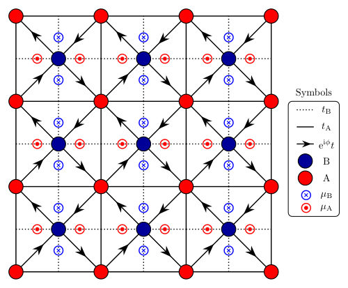
<figcaption class="paper-figure-caption"><b>Fig 1.</b> FIG. 1: Orbital altermagnet on the checkerboard lattice illustrating the tight-binding Hamiltonian in Eq. (1). Nearest-neighbor hopping amplitudes are complex, eiϕt, where the arrows indicate the direction corresponding to a positive phase ϕ. Next-nearest-neighbor hopping amplitudes on the A and B sublattices are denoted by tA and tB, respectively, with tA , tB. The circulating currents can be thought to generate out-of-plane orbital magnetic moments µA and µB, which are guides to the eye and make the d-wave symmetry apparent.</figcaption>
</figure>
<figure class="paper-figure-card">
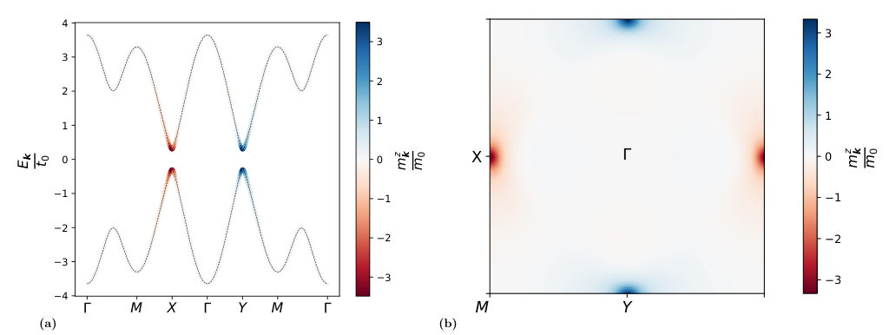
<figcaption class="paper-figure-caption"><b>Fig 2.</b> FIG. 2: (a) Electron spectrum plotted in reciprocal space along high-symmetry directions. Dashed lines indicate the electron energies in Eq. (6) and color indicates the orbital magnetic moment mz k. (b) Momentum-resolved orbital magnetic moment mz k, with m0 = et0a2 0/(2cℏ) being the unit magnetic moment.</figcaption>
</figure>
<figure class="paper-figure-card">
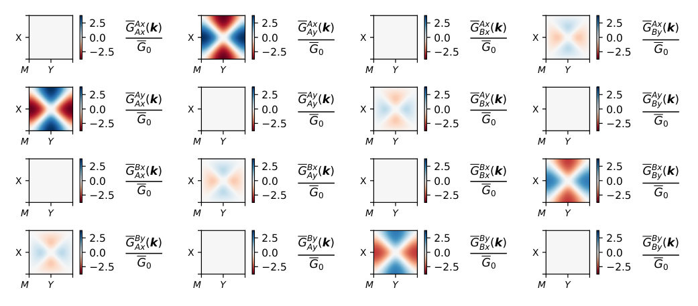
<figcaption class="paper-figure-caption"><b>Fig 3.</b> FIG. 3: Real part of all elements of the MBC for checkerboard-lattice model in Eq. (1). Each element is plotted as a function of k within the first Brillouin zone, with G0 = 10−2g0 = 10−2ℏ/  M0a2 0  = 109Hz, where g0 = ℏ/  M0a2 0  = 1011Hz is the baseline scale of our MBC. The ordering of the elements corresponds to the ordering of the MBC matrix in Eq. (24).</figcaption>
</figure>
<figure class="paper-figure-card">
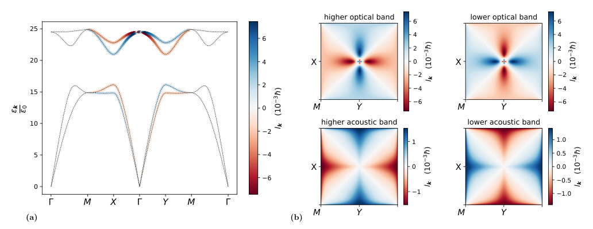
<figcaption class="paper-figure-caption"><b>Fig 4.</b> FIG. 4: (a) Phonon band structure of the in-plane phonons on the checkerboard lattice, including the effects of the MBC in the phonon Hamiltonian, with ε0 = ℏω0 = 1 meV being the characteristic phonon energy scale. Dashed lines indicate the harmonic phonon energies and color shows the out-of-plane phonon angular momentum lkσ. (b) d-wave texture of lkσ for all four phonon bands.</figcaption>
</figure>
<figure class="paper-figure-card">
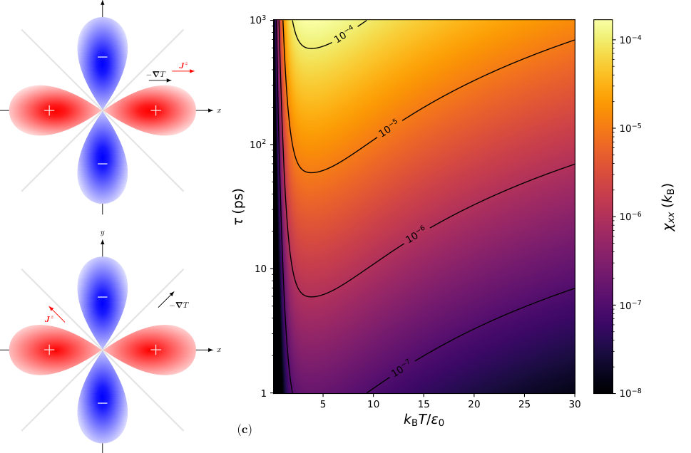
<figcaption class="paper-figure-caption"><b>Fig 5.</b> FIG. 5: (a,b) Schematic of the angular-momentum splitter effect, with the red and blue lobes representing the d-wave phonon angular momentum texture in reciprocal space. The red color denotes the positive part of the texture and the blue the negative one. The nodal lines of the texture along the diagonals are colored in gray. We distinguish the cases where −∇T is applied (a) along the x-axis, resulting in a longitudinal angular momentum current response, and (b) along the nodal lines of the texture, thus generating a transverse angular momentum current response. (c) Response tensor element χxx (angular momentum conductivity) as a function of temperature T and constant phonon relaxation time...</figcaption>
</figure>

**Summary.** The paper theoretically proves that axial phonons can acquire a d-wave angular momentum texture in orbital altermagnets using only electronic structure effects (via the molecular Berry curvature). This bypasses the need for spin-orbit coupling, opening new avenues to engineer exotic phonon functionalities like angular-momentum Seebeck effects.

**Why it may be interesting.** This work connects orbital magnetism (a strongly correlated electron phenomenon) directly to lattice dynamics via Berry curvature, providing a mechanism for engineering quantized angular momentum transport in materials without needing relativistic SOC terms.

Detailed structure

**Main problem.** To theoretically demonstrate that axial phonons can host a d-wave angular momentum texture in orbital altermagnets without relying on spin-orbit coupling.

**Main result.** The authors show the electronic state's d-wave orbital magnetic moment texture is transferred to the lattice vibrations (phonons) via the molecular Berry curvature, enabling new platforms for engineering axial phonons.

**Method.** The study employs the Born-Oppenheimer approximation and analyzes phonon dynamics by diagonalizing an effective Hamiltonian derived from electron-phonon coupling mediated by the Molecular Berry Curvature (MBC).

**Model / system.** The system is an orbital altermagnet on a checkerboard lattice, modeled with a minimal tight-binding Hamiltonian exhibiting d-wave loop-current order that breaks time-reversal symmetry.

**Key observables.** Axial phonons carrying finite angular momentum; the $d$-wave orbital magnetic moment texture ($m_{z,k}$); and measurable effects like angular-momentum Seebeck and splitter effects.

**Important parameters / regimes.** The analysis is restricted to the insulating regime (V=0) and relies on the presence of d-wave symmetry breaking in the electronic state.

**Assumptions / limitations.** Key approximations include using the Born-Oppenheimer approximation, assuming a minimal tight-binding model, and utilizing Slater determinant forms for basis states.

**Figures summary.** Figures illustrate the orbital almagnet structure on the lattice, the momentum-resolved orbital magnetic moment texture ($m_{z,k}$), and the calculated Molecular Berry Curvature ($	ext{G}_{\alpha\kappaeta}(\mathbf{k})$) in momentum space.

**Paper structure.** The paper progresses from establishing the electronic model and its d-wave texture to calculating the MBC using the BO approximation. It then applies this MBC to derive the phonon Hamiltonian, culminating in the diagonalization of the effective Hamiltonian to predict measurable phonon splitting effects.

Abstract

We theoretically demonstrate that axial phonons, lattice vibration quanta carrying finite angular momentum, can host a $d$-wave angular momentum texture in orbital altermagnets in the absence of spin-orbit coupling. We consider a minimal electronic tight-binding model with $d$-wave loop-current order that breaks time-reversal symmetry. Within the Born-Oppenheimer approximation, we incorporate electron-phonon coupling via the molecular Berry curvature and show that the underlying $d$-wave orbital magnetic moment texture of the electronic state is transferred to the phonons without requiring the relativistic spin-orbit coupling. Our results expand the range of platforms available for engineering axial phonons and point to functionality unique to $d$-wave textures, including angular-momentum Seebeck and splitter effects, corresponding to longitudinal and transverse angular-momentum currents driven by a temperature gradient.

[↑ back to top](#top)

### [No finite level of the NPA hierarchy is exact for the doubly-tilted CHSH functional near the critical tilt](http://arxiv.org/abs/2607.13762v1)

**Authors:** Anton Pakhunov  
**Type:** theory · **Category:** quantum information and computing · **PDF:** <https://arxiv.org/pdf/2607.13762v1>  
**Analysis basis:** full PDF text, analyzed in chunks
**Topic relevance:** `entanglement & information structure` **1/5**

↔ Scroll figures horizontally

<figure class="paper-figure-card">
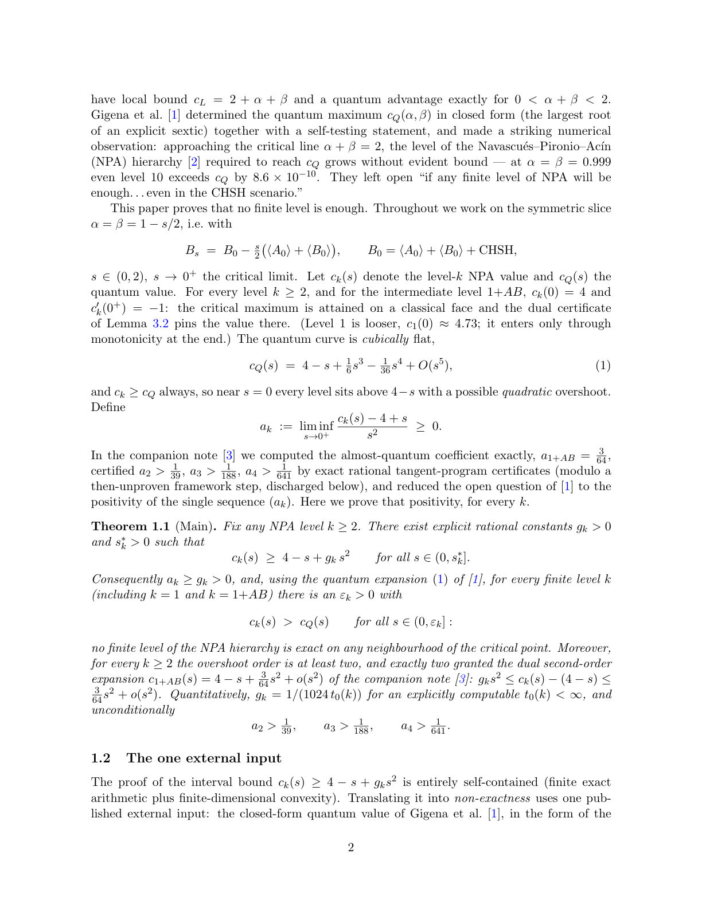
<figcaption class="paper-figure-caption"><b>Fig 1.</b> Low-resolution page preview, page 2</figcaption>
</figure>
<figure class="paper-figure-card">
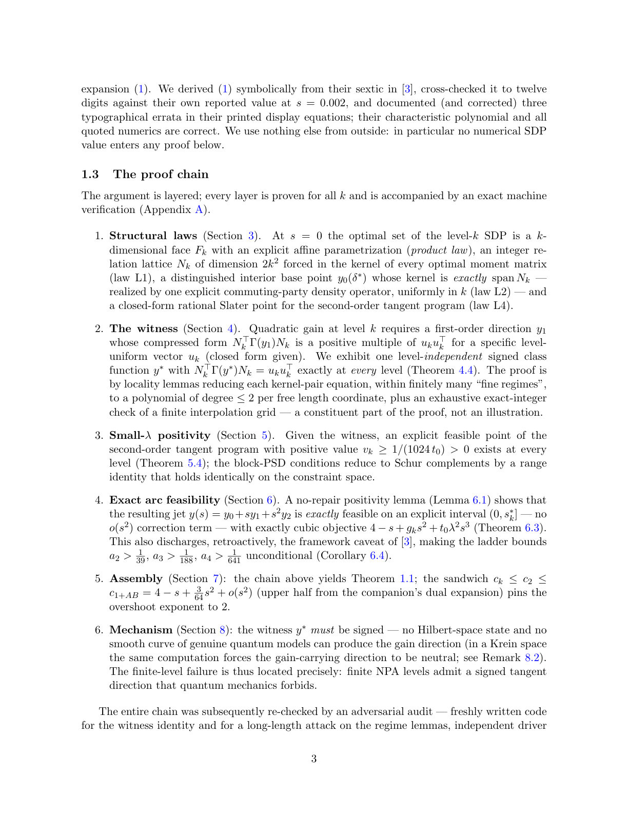
<figcaption class="paper-figure-caption"><b>Fig 2.</b> Low-resolution page preview, page 3</figcaption>
</figure>
<figure class="paper-figure-card">
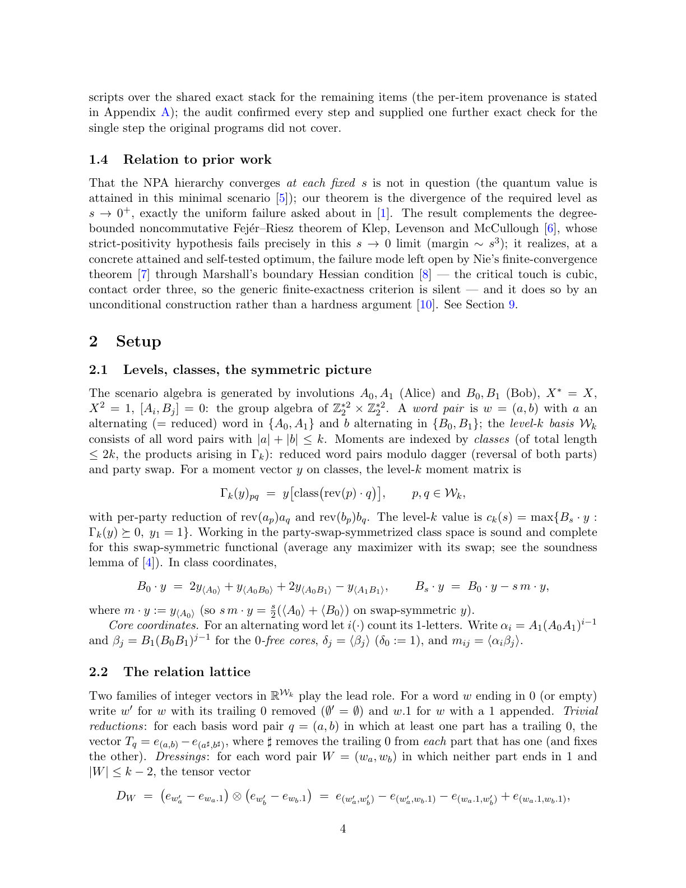
<figcaption class="paper-figure-caption"><b>Fig 3.</b> Low-resolution page preview, page 4</figcaption>
</figure>
<figure class="paper-figure-card">
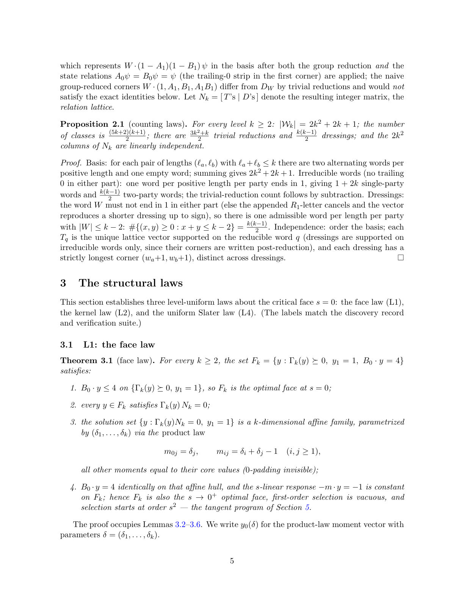
<figcaption class="paper-figure-caption"><b>Fig 4.</b> Low-resolution page preview, page 5</figcaption>
</figure>
<figure class="paper-figure-card">
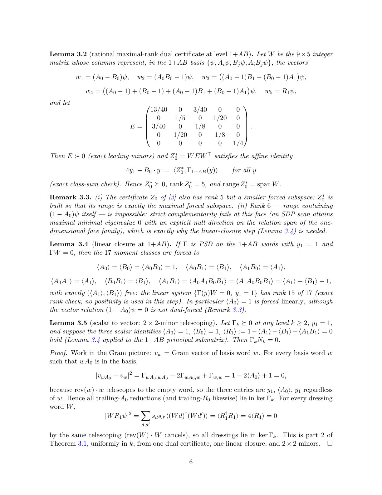
<figcaption class="paper-figure-caption"><b>Fig 5.</b> Low-resolution page preview, page 6</figcaption>
</figure>

**Summary.** The paper rigorously proves that for a specific Bell inequality functional near its critical point, no finite level of the NPA hierarchy can exactly capture the true quantum maximum value. This is shown by constructing explicit mathematical counterexamples demonstrating an unavoidable overshoot at every finite relaxation level. It establishes fundamental limitations on using polynomial moment methods to characterize quantum correlations.

**Why it may be interesting.** This work provides rigorous mathematical proof regarding the limitations of polynomial relaxations (like those used in semidefinite programming bounds) when applied to fundamental quantum correlations, suggesting inherent gaps between classical/algebraic bounds and true quantum mechanics.

Detailed structure

**Main problem.** To determine if any finite level of the Navascués–Pironio–Acín (NPA) hierarchy is exact for the doubly-tilted CHSH functional near a critical tilt.

**Main result.** The authors prove that no finite NPA level is exact in any neighborhood of the critical point because the quantum value leaves the local bound only cubically, causing all finite levels to strictly overshoot.

**Method.** The proof uses a primal construction involving analyzing moment curves and structural laws derived from relation lattices. It combines advanced algebraic techniques with computer-assisted verification using exact rational arithmetic.

**Model / system.** The analysis concerns the Bell scenario quantified by doubly-tilted CHSH functionals, which are related to quantum correlations measured via moments of Pauli operators in a specific limit (the critical tilt).

**Key observables.** The level-$k$ NPA value ($c_k(s)$) compared against the true quantum maximum value ($c_Q(s)$), and the coefficients $a_k$ characterizing the deviation.

**Important parameters / regimes.** The small parameter $s$, which measures the distance from the critical tilt ($\alpha + eta = 2$), and the NPA level index $k$.

**Assumptions / limitations.** The proof relies on one external input: the published quantum value of Gigena et al., which was cross-checked by the authors.

**Paper structure.** The paper develops structural laws (L1, L2, L4) governing the NPA hierarchy using relation lattices and moment tensors. It then uses these structures to construct a feasible moment curve that demonstrates an unavoidable overshoot of the quantum bound near criticality.

Abstract

Gigena, Panwar, Scala, Araujo, Farkas and Chaturvedi [npj Quantum Inf. 11, 82 (2025)] determined the quantum maximum of the doubly-tilted CHSH functionals, observed that the Navascues-Pironio-Acin level needed for exactness grows without evident bound toward the critical tilt, and asked whether any finite level suffices. We answer this in the negative. For the symmetric critical family $B_s=(1-s/2)(\langle A_0\rangle+\langle B_0\rangle)+\mathrm{CHSH}$ we prove: for every NPA level $k\ge 2$ there are an explicit rational $g_k>0$ and an $s^*_k>0$ with $c_k(s)\ge 4-s+g_k s^2$ on $(0,s^*_k]$; since the quantum value leaves the local bound only cubically, every finite level strictly overshoots on an interval: no finite level is exact on any neighbourhood of the critical point. Unconditionally $a_2>1/39$, $a_3>1/188$, $a_4>1/641$. The proof is a primal construction: an exactly feasible moment curve at each level, built from level-uniform structural laws and one level-independent signed witness -- a closed-form class function $y^*$ with $N_k^TΓ(y^*)N_k=u_k u_k^T$ at every level. The mechanism forces the sign: for $k\ge 3$ no quantum state and no smooth curve of quantum models can realize the gain direction, so the overshoot lives strictly in the non-quantum part of the NPA tangent cone. The proof is computer-assisted in the strict sense: finite exact-integer verifications with proven degree bounds are constituent parts of the argument; the chain has been re-verified against independent implementations, including a symbolic per-regime proof of the witness identity and a clean-room implementation written from the paper text alone. The one external input is the published quantum value of Gigena et al., cross-checked to twelve digits.

[↑ back to top](#top)

### [Quantum Topological Data Encoding](http://arxiv.org/abs/2607.13847v1)

**Authors:** Adam Wesołowski, Dimitrios Thanos, Daniel Leykam, Lirandë Pira  
**Type:** theory · **Category:** quantum information and computing · **PDF:** <https://arxiv.org/pdf/2607.13847v1>  
**Analysis basis:** full PDF text, analyzed in chunks
**Topic relevance:** `entanglement & information structure` **1/5**

↔ Scroll figures horizontally

<figure class="paper-figure-card">
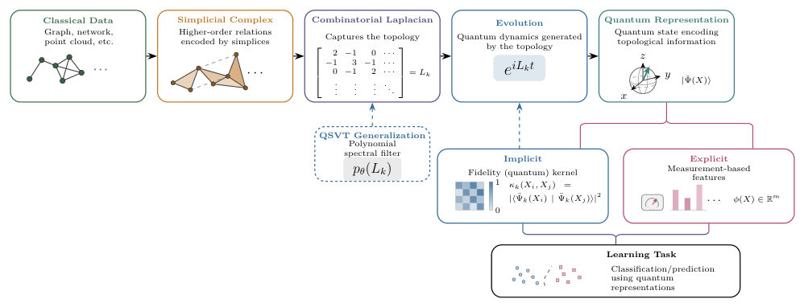
<figcaption class="paper-figure-caption"><b>Fig 1.</b> FIG. 1: Overview of the Quantum Topological Data Encoding (QTDE) framework. Classical relational data are lifted to a simplicial complex, encoded by the combinatorial Laplacian Lk, and mapped to quantum representations through topology-driven evolution or spectral filtering implemented via quantum singular value transformation (QSVT). The resulting quantum representation can be accessed either implicitly through a fidelity-based quantum kernel or explicitly through features derived through measurement. Both representations provide topological feature maps that can be used in downstream machine learning tasks such as classification and prediction.</figcaption>
</figure>
<figure class="paper-figure-card">
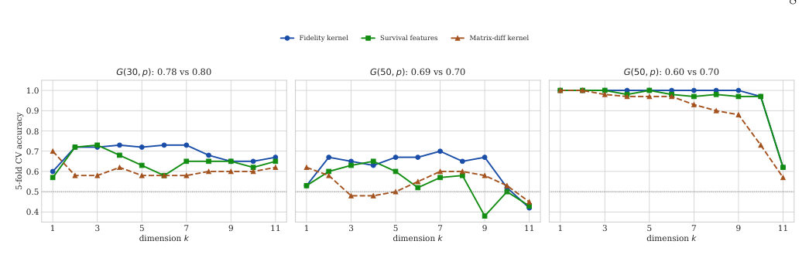
<figcaption class="paper-figure-caption"><b>Fig 2.</b> FIG. 2: Classification accuracy based on QTDE (using a support vector machine) as a function of simplicial dimension k for binary classification tasks on clique complexes based on Erdős–Rényi random graph ensembles. The three panels correspond to increasingly challenging discrimination tasks between topological-space classes generated based on random graphs with different edge probabilities. Results are shown for the proposed fidelity kernel representation (blue) and survival features (green), together with a classical baseline based on direct comparison of combinatorial Laplacians through a matrix-difference kernel (brown). Classification performance is reported as the mean 5-fold...</figcaption>
</figure>
<figure class="paper-figure-card">
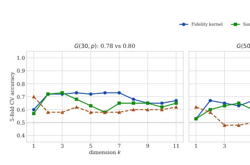
<figcaption class="paper-figure-caption"><b>Fig 3.</b> Figure 4 tests whether replacing the exponential evo- lution e−iLkt with a trainable polynomial filter pθ(Lk) (see Section III C) yields a more discriminative representa- tion than the fixed Hamiltonian encoding, on the harder G(40, p) benchmark (p0 = 0.58 vs. p1 = 0.60, 25 graphs per class). For each simplicial dimension k = 1, . . . , 8 we scan a fixed library of ten polynomials p(x) (Table in panel (b)/(c) row labels), implement each as a QSVT phase sequence acting on Lk, and evaluate both read- outs (the fidelity kernel κk and the survival-feature vector ϕ(X)) against the original exponential encoding and the matrix-difference baseline KF k . a. Per-dimension comparison of best filters...</figcaption>
</figure>
<figure class="paper-figure-card">
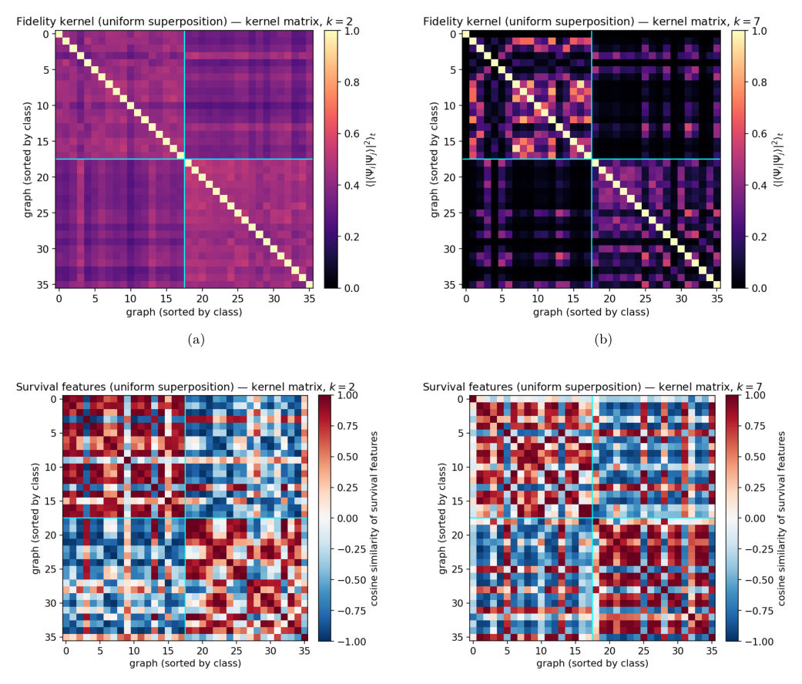
<figcaption class="paper-figure-caption"><b>Fig 4.</b> FIG. 3: Comparison of implicit and explicit representations produced by QTDE. (a) and (b) show the fidelity kernel matrices computed from the evolved quantum states for simplicial dimensions k = 2 and k = 7, respectively. (c) and (d) show the corresponding similarity matrices obtained from the explicit survival-feature representations using cosine similarity. Graphs are ordered by class, cyan lines indicate the class boundary separating the two graph ensembles.</figcaption>
</figure>
<figure class="paper-figure-card">
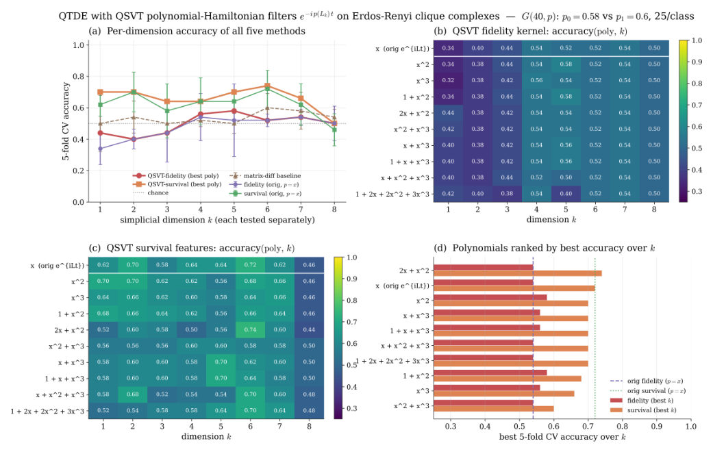
<figcaption class="paper-figure-caption"><b>Fig 5.</b> FIG. 4: QSVT with degree-three polynomial spectral filters pθ(Lk) on Erdős–Rényi clique complexes (G(40, p): p0 = 0.58 vs. p1 = 0.60, 25 graphs per class). (a) Per-dimension accuracy for the best-performing filter at each k, for the fidelity kernel and survival features, against the original exponential encoding and the matrix-difference baseline. Figures (b, c) accuracy as a function of filter and dimension k for the fidelity kernel and survival features, respectively. (d) Filters ranked by best accuracy attained over all k. Error bars in (a) denote the standard deviation over five-fold cross-validation.</figcaption>
</figure>

**Summary.** The paper introduces Quantum Topological Data Encoding (QTDE), a general framework that encodes the topological structure of datasets into quantum states. It uses the combinatorial Laplacian as the generator for unitary quantum evolution, creating representations superior to classical methods. This advances quantum machine learning by providing a robust way to process high-dimensional data carrying complex geometric information.

**Why it may be interesting.** This work bridges algebraic topology with quantum computation by providing a concrete mechanism to embed complex relational data structures into the quantum domain using spectral properties of graph Laplacians.

Detailed structure

**Main problem.** The core problem is developing a method to encode rich geometric and topological structure from classical datasets into quantum states for machine learning applications.

**Main result.** Quantum Topological Data Encoding (QTDE) successfully maps simplicial complexes to quantum states, showing that these representations outperform baselines derived from direct comparison of classical Laplacian descriptors.

**Method.** The framework uses topology-driven quantum evolution, governed by the combinatorial Laplacian matrix ($L_k$), to generate quantum states $|\Psi(T)
angle$. This is generalized using Quantum Singular Value Transformation (QSVT) for tunable spectral filtering.

**Model / system.** The model involves mapping a dataset's structure (represented as a simplicial complex $K$) into a quantum state in a Hilbert space. The dynamics are dictated by the unitary evolution operator $U_k(t) = e^{-i L_k t}$, where $L_k$ is the combinatorial Laplacian.

**Key observables.** The primary observables include the resulting quantum state $|\Psi(T)
angle$, the fidelity kernel $K = |\langle \Psi(T_1)|\Psi(T_2)
angle|^2$, and explicit feature vectors derived from expectation values.

**Important parameters / regimes.** Key parameters involve the Laplacian dimension ($k$), time evolution parameter ($t$), and polynomial coefficients ($	heta$) used in QSVT.

**Assumptions / limitations.** The method assumes that guiding quantum encoding via the topology itself is beneficial, rather than just extracting invariants; explicit representations rely on selecting a finite set of observables $\{M_j\}$ and times $\{t_j\}$.

**Figures summary.** Figures illustrate the QTDE workflow (Classical data -> Laplacian -> Evolution -> Quantum Representation) and compare performance metrics like fidelity kernels ($K_{ij}$) and cosine similarity matrices derived from different spectral filters.

**Paper structure.** The paper introduces QTDE, details the use of the combinatorial Laplacian as a Hamiltonian generator for unitary evolution, proposes both implicit (kernel-based) and explicit (feature vector) representations, validates these methods on classification tasks, and discusses future directions like hardware implementation and complexity guarantees.

Abstract

Many datasets encountered across a wide range of domains possess rich geometric and topological structure that is difficult to capture using conventional vector-based representations. Quantum machine learning offers the possibility of processing high-dimensional data in Hilbert spaces, but its practical success depends critically on how classical data is encoded into quantum states. We introduce \emph{quantum topological data encoding} (QTDE), a general framework for encoding topological information into quantum states via topology-driven quantum evolution. Our method generalises an existing topology-driven quantum encoding framework to higher-dimensional data. We test the proposed method on clique-complexes classification tasks, and provide preliminary evidence that topology-driven quantum representations can capture discriminative information beyond that available through direct comparisons of classical topological descriptors. The proposed quantum representations consistently outperform a baseline based on direct comparisons of the combinatorial Laplacians describing the underlying topological structure. We indicate several areas of application where the framework can be used to provide a more efficient and reliable data representation.

[↑ back to top](#top)

### [Separating Geometry From Interference in Constrained Quantum Optimization](http://arxiv.org/abs/2607.13630v1)

**Authors:** Chinonso Onah, Stuart Hadfield, Kristel Michielsen  
**Type:** theory · **Category:** quantum information and computing · **PDF:** <https://arxiv.org/pdf/2607.13630v1>  
**Analysis basis:** full PDF text, analyzed in chunks
**Topic relevance:** `interference shaping light` **1/5**

↔ Scroll figures horizontally

<figure class="paper-figure-card">
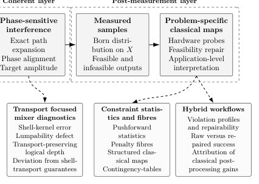
<figcaption class="paper-figure-caption"><b>Fig 1.</b> Figure 1: Layered structure of the framework. Problem constraints determine the encoded product space and the transport requirements imposed on the mixer. The mixer generates shell-resolved abso- lute path mass, while the diagonal phase layers determine whether this mass contributes constructively to the target amplitude. Measurement produces a classical distribution on the product space, after which problem-specific classical maps expose application structure, provide hardware probes, and guide feasibility-restoring repair. The lower boxes summarize the principal analytical and application conse- quences developed in this work.</figcaption>
</figure>
<figure class="paper-figure-card">
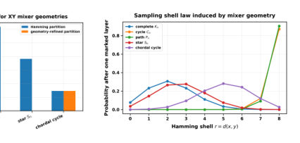
<figcaption class="paper-figure-caption"><b>Fig 2.</b> Figure 2: Finite-size transport diagnostics for XY mixer geometries on the OFM product manifold. The local alphabet size is n = 9, the shell-profile experiment uses m = 8 product blocks, and each mixer is normalized by the spectral norm of its one-block adjacency matrix. The left panel shows that mixer geometry changes the available one-site absolute transfer mass. The middle panel shows that complete- graph XY closes exactly on Hamming shells, while other geometries select refined reduced statistics such as cyclic distance, path distance, or graph-distance data. The right panel shows that these transport differences already produce distinct shell sampling laws before any problem-specific...</figcaption>
</figure>

**Summary.** This paper introduces a framework to disentangle the geometric movement of probability amplitude from the constructive interference effects in quantum optimization. It shows that simple mixing alone is insufficient for finding solutions; true advantage requires engineering phases so that multiple computational paths interfere constructively at the target state. This offers a powerful diagnostic tool for designing robust quantum algorithms.

**Why it may be interesting.** It provides a rigorous analytical tool to diagnose *why* quantum algorithms fail or succeed in constrained settings, separating hardware/mixing limitations from algorithmic phase control requirements.

Detailed structure

**Main problem.** The core problem is separating geometric effects (amplitude transport) from quantum interference when analyzing constrained optimization algorithms.

**Main result.** Quantum sampling advantage requires coherent phase alignment among computational paths, allowing for a certified success probability independent of the Hilbert-space dimension or search space size.

**Method.** The authors develop a framework that analytically separates amplitude transport (geometry) from constructive interference (phase control) within an alternating quantum circuit structure.

**Model / system.** The model involves encoding constrained optimization problems (like routing/scheduling) into product spaces, governed by a mixing operator and subsequent diagonal phase layers.

**Key observables.** Target amplitude / Success Probability; Shell-resolved absolute path mass; Coherent interference contribution.

**Important parameters / regimes.** Circuit depth (number of alternations); Problem size; Feasible-set cardinality.

**Assumptions / limitations.** The separation relies on the assumption that the one-step transfer kernel factorizes across coordinates, and specific phase alignment conditions must be met for advantage.

**Figures summary.** Figure 1 illustrates a layered process: Constraints define the space $
ightarrow$ Mixer generates path mass (Geometry) $
ightarrow$ Diagonal phases determine constructive contribution (Coherence) $
ightarrow$ Measurement yields classical results.

**Paper structure.** The paper builds by first defining the constrained product space, then developing a framework to decompose the dynamics into geometric transport and coherent interference components, culminating in deriving conditions for achieving certified success probabilities.

Abstract

We study the separation of geometric effects from quantum interference in quantum optimization algorithms. Constrained optimization problems such as routing, assignment, and scheduling are often encoded as product spaces of local variables, together with global feasibility penalties. The central algorithmic question we address is how a constraint-preserving mixing operator transports quantum amplitude across an exponential search space in the presence of local and global constraints. We develop a framework that separates three effects that are usually intermixed: amplitude transport, coherent interference among transported amplitudes, and problem-dependent classical postprocessing. We show that the mixing operator alone does not have a target-seeking ability. Concretely, the normalized distribution induced by its amplitude transport moves toward the distance profile of a uniformly random configuration. Thus, quantum sampling advantage may only arise when the phases of the many computational paths reaching a target configuration are sufficiently aligned for their amplitudes to reinforce. We show that, when the cost phases are engineered so that these paths add coherently, a number of circuit alternations growing only logarithmically with problem size suffices to convert the sum of their absolute contributions into a lower bound on the target amplitude, yielding a certified success probability independent of the ambient Hilbert-space dimension, the search-space size, or the feasible-set cardinality. We develop applications to problem-specific transpilation diagnostics, scalable hardware probes, constraint-induced classical maps of quantum-generated samples, the attribution of solution quality between the quantum distribution and classical post-processing in hybrid quantum-classical workflows and connections to distance-partitioned product spaces from classical coding theory.

[↑ back to top](#top)

## Other papers (9)

*Papers from primary archives without highlighted authors or any topic match. Click to expand.*

Show other papers

### [A Physics-Grounded QUBO Encoding of Irrigation Scheduling for QAOA](http://arxiv.org/abs/2607.13374v1)

**Authors:** Alisher Ortikov, Alisher Ilhamov  
**Type:** both · **Category:** quantum information and computing · **PDF:** <https://arxiv.org/pdf/2607.13374v1>  
**Analysis basis:** full PDF text, analyzed in chunks

↔ Scroll figures horizontally

<figure class="paper-figure-card">
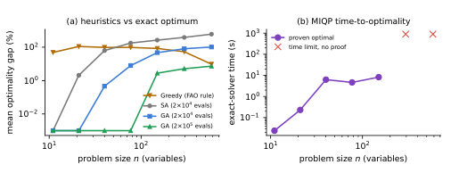
<figcaption class="paper-figure-caption"><b>Fig 1.</b> Fig. 2. Classical scaling study on the real-soil instance ladder. (a) Mean optimality gap (20 seeds) of matched-budget SA and GA (2×104 evaluations), GA at 10× budget, and the greedy operational rule, relative to the proven optimum (n ≤150) or the best-known solution (n = 295, 584). (b) Exact MIQP time-to-optimality; crosses mark the license-capped fallback solver hitting its 900-s limit without a proof. Fixed-budget heuristic degradation is a budget artifact (the 10×-budget GA restores near-optimality), and certified exact solution remains fast through n = 150: no classical wall is observed at these sizes.</figcaption>
</figure>
<figure class="paper-figure-card">
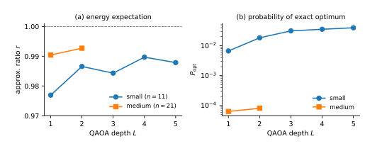
<figcaption class="paper-figure-caption"><b>Fig 2.</b> Fig. 1. Ideal QAOA depth scan. (a) Normalized approximation ratio of the energy expectation; dotted/dashed gray lines mark the SA mean over 20 matched-budget seeds for the small/medium instances. (b) Probability of sampling the exact optimum; uniform baselines are 2−11 and 2−21.</figcaption>
</figure>
<figure class="paper-figure-card">
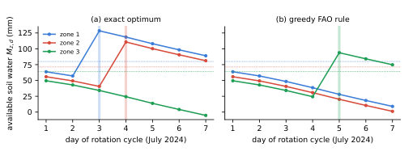
<figcaption class="paper-figure-caption"><b>Fig 3.</b> Fig. 3. Root-zone available water trajectories for the small instance, driven by observed 2024 Khorezm forcing; dotted lines mark the targets Tz and shaded verticals the irrigation events. (a) Exact optimum: triage — zones 1 and 2 are dosed before their windows close and zone 3 is deliberately sacrificed. (b) Greedy FAO-trigger rule: the depletion trigger fires only after the windows of zones 1 and 2 have closed; one dose goes to zone 3 and the second is never spent, leaving a 48.7% optimality gap.</figcaption>
</figure>
<figure class="paper-figure-card">
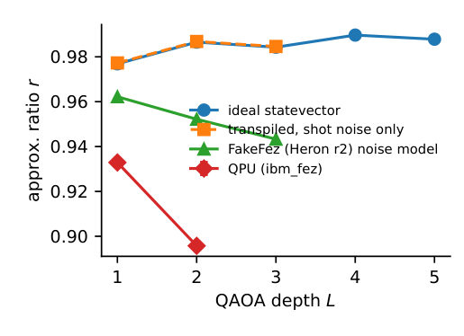
<figcaption class="paper-figure-caption"><b>Fig 4.</b> Fig. 4. Approximation ratio of the sampled energy on the small instance: ideal statevector, transpiled circuits under shot noise only, the calibrated FakeFez (Heron r2) noise model, and IBM Heron hardware (ibm_fez; the L=1 point is the mean of four repeat executions). Noise inverts the benefit of depth.</figcaption>
</figure>

**Summary.** This paper tackles optimizing irrigation scheduling in water-scarce regions by formulating it as a QUBO problem. The authors successfully map the complex hydrological dynamics and operational constraints onto a 2-local Ising Hamiltonian suitable for QAOA. They emphasize that their primary contribution is providing a physically grounded, data-complete encoding rather than claiming quantum computational superiority.

**Why it may be interesting.** While not directly about AMO physics, the rigorous process of translating complex physical constraints (like hydrology) into a mathematically structured Hamiltonian is highly relevant for developing quantum algorithms for real-world scientific modeling beyond simple toy models.

Detailed structure

**Main problem.** The paper formulates rotational irrigation scheduling, a complex combinatorial optimization problem, into a QUBO suitable for quantum computation.

**Main result.** They successfully map the physical constraints onto a 2-local Ising Hamiltonian, demonstrating that classical solvers can solve instances up to 150 variables quickly, and they claim no quantum advantage is demonstrated.

**Method.** The core method involves linearizing soil-water balance dynamics and constructing a cost function composed of stress, budget, spatial, and timing penalties, which are then mapped to an Ising Hamiltonian for QAOA execution.

**Model / system.** The system models water delivery in agricultural zones over time, governed by soil moisture memory. The optimization is framed as minimizing a QUBO/Ising Hamiltonian derived from hydrological equations using observed field data from Uzbekistan.

**Key observables.** Optimal irrigation schedule (binary decision vector $x_{z,d}$), total cost function value, and performance metrics comparing exact solvers vs. QAOA outputs.

**Important parameters / regimes.** Problem size scales up to 584 variables; the optimization is constrained by a finite water budget ($K$); quantum hardware tested includes the ibm_fez backend.

**Assumptions / limitations.** Key assumptions include linearizing the soil-water balance (Assumption 1) and using symmetric quadratic penalties for stress, which are necessary to achieve a 2-local Hamiltonian structure.

**Figures summary.** The notes do not detail figure contents, but mention benchmarking tables (Table II, Table III) detailing parameters for small, medium, and large instances tested across various solvers.

**Paper structure.** The paper establishes the physical problem, derives the QUBO formulation by linearizing dynamics, details the mapping to a 2-local Ising Hamiltonian, benchmarks performance against classical methods (MIQP), and finally tests execution on quantum hardware using both standard QAOA and an XY-mixer variant.

Abstract

Rotational irrigation scheduling in water-scarce Central Asia is a densely coupled combinatorial problem: soil-moisture memory links each irrigation decision to all later days within a zone, field adjacency couples zones on overlapping window days, and rigid canal rotations quantize water delivery in time. We formulate it as a Quadratic Unconstrained Binary Optimization (QUBO) by linearizing the root-zone water balance, so the quadratic crop-stress objective generates the physical couplings as 2-local Ising interactions with no higher-order terms; only the water-budget constraint requires an artificial all-to-all penalty, which we certify with an instance-adaptive weight bound an order of magnitude tighter than generic prescriptions. Every instance is built from observed data for a cotton district in Khorezm, Uzbekistan: NASA POWER meteorology, FAO-56 Penman--Monteith evapotranspiration, SoilGrids~2.0 hydraulics, measured capillary fluxes, and documented canal-rotation windows that enter as qubit-count reductions. We benchmark four tiers -- exact solvers, matched-budget heuristics, ideal-statevector quantum approximate optimization algorithm (QAOA), and noise-model plus IBM Heron execution -- and add a scaling study on soil instances up to 584 variables. Exact branch-and-bound proves optimality in seconds through 150 variables, and heuristic degradation at fixed evaluation budget is repaired by scaling the budget, so no classical scalability wall appears at deployment-relevant sizes, and none is claimed. On hardware, the informative signal is optimum-sampling enrichment over uniform sampling. We claim no quantum advantage; we deliver a physically grounded, data-complete, reproducible encoding of a societally critical scheduling problem for the quantum-utility era.

[↑ back to top](#top)

### [Building Shor's Algorithm in Lean: An Agentic Formalization of Quantum Attacks on RSA-2048 and P-256](http://arxiv.org/abs/2607.14082v1)

**Authors:** Lei Zhang, Yusheng Zhao, Hongshun Yao, Xin Wang  
**Type:** theory · **Category:** quantum information and computing · **PDF:** <https://arxiv.org/pdf/2607.14082v1>  
**Analysis basis:** full PDF text, analyzed in chunks

↔ Scroll figures horizontally

<figure class="paper-figure-card">

<figcaption class="paper-figure-caption"><b>Fig 1.</b> Fig 1: An overview of the agentic formalization workflow and its trust boundary. The two rows follow artifacts from claim selection and source evidence through formal obligations, Lean development, machine checking, human review, and manuscript integration. The framed stages lie within the proof-term trust boundary; the return arrow denotes revision after human review.</figcaption>
</figure>
<figure class="paper-figure-card">
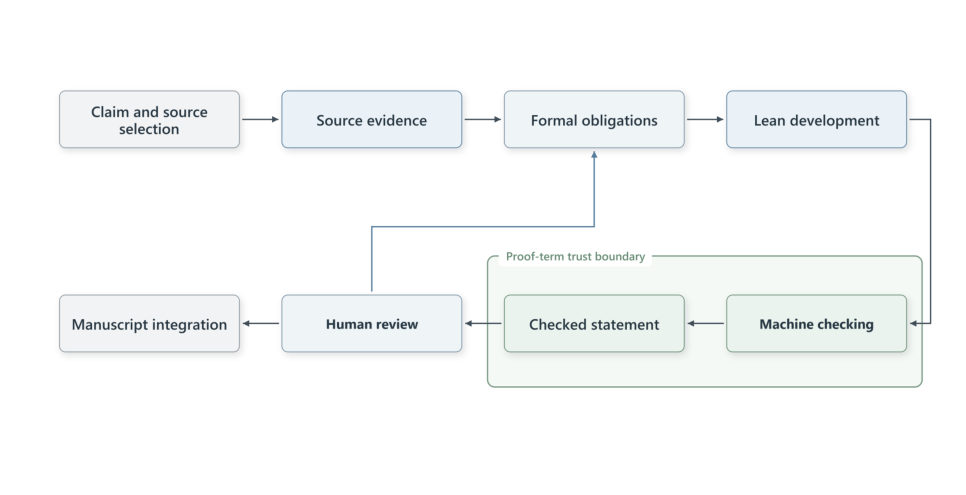
<figcaption class="paper-figure-caption"><b>Fig 2.</b> Figure 1 follows each artifact from a scientific question to the manuscript. Authors first specify the claim and the sources that should support it. Software agents retrieve passages, source locations, and metadata, then separate the claim into mathematical, algorithmic, circuit, and resource obligations. They trace relevant dependencies and construct Lean statements and proof terms for those obligations. The kernel accepts a declaration when its proof term checks against the stated type. The accepted theorem type records its explicit hypotheses, while the development preserves imported dependencies for later inspection. Authors receive these checked statements alongside the source evidence...</figcaption>
</figure>
<figure class="paper-figure-card">
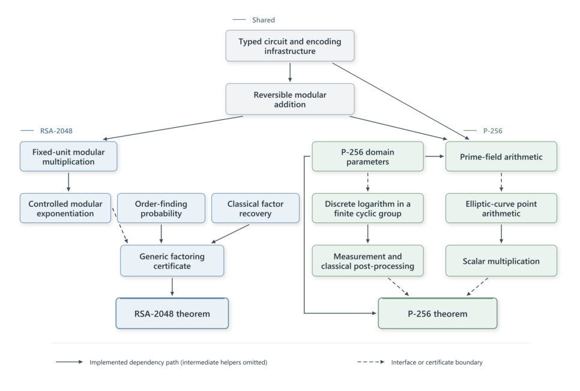
<figcaption class="paper-figure-caption"><b>Fig 3.</b> Fig 2: A dependency map of the Lean development used for the RSA-2048 and P-256 results. Solid arrows show implemented dependency paths, with intermediate helpers omitted; dashed arrows show interface or certificate boundaries. The terminal nodes are the public RSA-2048 and P-256 theorems.</figcaption>
</figure>

**Summary.** This paper details the formal construction of Shor's algorithm to attack RSA-2048 and P-256 within the Lean proof assistant. Using an agentic workflow, the authors derive quantitative resource estimates (qubits, gates) for these attacks by building complex reversible quantum circuits. It represents a major step toward machine-checked verification of quantum cryptanalysis.

**Why it may be interesting.** While focused on cryptography, the rigorous formalization process—using AI agents to build complex quantum circuits in a proof assistant—represents a significant methodological advance for verifying any large-scale quantum algorithm.

Detailed structure

**Main problem.** The paper formalizes quantum attacks, specifically Shor's algorithm, against established cryptographic systems like RSA-2048 (integer factorization) and P-256 (discrete logarithms). It aims to provide machine-checked proofs of the required resources for these attacks.

**Main result.** The authors derived specific resource estimates—including logical qubits, Toffoli gates, and circuit depth—for breaking both RSA-2048 and P-256, presenting quantitative results in a formal proof assistant (Lean).

**Method.** They employ agentic formalization within the Lean proof assistant to build complex quantum circuits for modular arithmetic and point addition. This involves combining theoretical cryptographic reductions with rigorous, machine-checkable circuit construction.

**Model / system.** The model is abstract quantum computation, utilizing reversible quantum circuits (e.g., controlled operations) implemented in a formal framework. The targets are the mathematical structures underpinning RSA and elliptic curve cryptography.

**Key observables.** Logical qubits, Toffoli gates, maximal circuit depth, success probability ($\ge 2/3$), and classical arithmetic operation counts.

**Important parameters / regimes.** RSA-2048 modulus size (2048 bits) and P-256 curve parameters (NIST standard).

**Assumptions / limitations.** The reported resources are for logical qubits and Toffoli gates, neglecting physical overheads like noise or error correction. The process assumes a clear separation between formal checking guarantees and scientific judgment.

**Figures summary.** Figures illustrate dependency maps showing how the final theorems depend on foundational components like reversible modular addition circuits and resource accounting steps.

**Paper structure.** The work is structured around developing terminal propositions in Lean for both RSA-2048 (factor recovery) and P-256 (scalar recovery). This involves building necessary arithmetic primitives first, then assembling them into the final attack algorithms while meticulously tracking all required resources.

Abstract

Large language models are increasingly assisting with demanding formal theorem-proving tasks, particularly when grounded in machine-checked libraries such as Lean. Agentic systems further amplify this process by searching, reusing, and extending existing formal developments to uncover new discoveries. In quantum computing, Shor's algorithm and its variants present such a demanding case for Lean formalization. In this work, we formalize this algorithm family in Lean through agentic formalization: software agents analyze sources, write Lean code and repair proofs, with human review of the scientific claims and machine checking of the resulting formal proofs. Our formalization develops the mathematical foundations for analyzing quantum attacks in two cryptographic settings: a 2048-bit modulus in the RSA-2048 and the standardized elliptic curve over a 256-bit prime field (P-256). To support these analyses, the formalization ranges from quantum algorithms for order finding to reversible quantum circuits for modular and elliptic-curve arithmetic. Based on [Quantum 5, 433] and [ASIACRYPT 2017, 241--270], we formalize the logical resource estimates for RSA-2048 and P-256, respectively, and provide additional estimates of classical operations. We expect the results pave the way for broader machine-checked quantum cryptanalysis and represent a step toward AI-assisted design and verification of quantum algorithms.

[↑ back to top](#top)

### [Continuous limit of the square well problem in quantum mechanics](http://arxiv.org/abs/2607.13872v1)

**Authors:** Matheus D. Moro, Thiago T. Tsutsui, Antonio S. M. de Castro, Fabiano M. Andrade  
**Type:** theory · **Category:** other · **PDF:** <https://arxiv.org/pdf/2607.13872v1>  
**Analysis basis:** full PDF text, analyzed in chunks

↔ Scroll figures horizontally

<figure class="paper-figure-card">
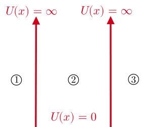
<figcaption class="paper-figure-caption"><b>Fig 1.</b> FIG. 1. Schematic representation of the (a) finite and (b) infinite square well.</figcaption>
</figure>
<figure class="paper-figure-card">
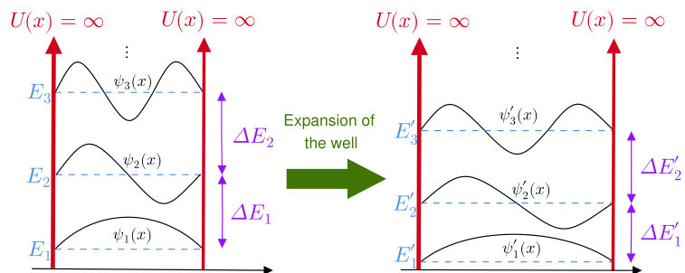
<figcaption class="paper-figure-caption"><b>Fig 2.</b> FIG. 2. Schematic and out-of-scale illustration of the expansion of the well and its effects on the energy difference between levels. The expansion (L′ &gt; L), results in E′ n &lt; En and ∆E′ n &lt; ∆En.</figcaption>
</figure>

**Summary.** This paper rigorously proves that the free-particle solution can be derived from the bound state solutions of the finite square well by taking the width to infinity. It uses Fourier transforms to map the discrete energy spectrum onto a continuous one, showing the mathematical consistency between confined and unconfined quantum systems.

**Why it may be interesting.** This work provides a fundamental, rigorous demonstration of how continuum limits are handled in quantum mechanics, which is crucial for understanding effective Hamiltonians or open system approximations where boundaries become negligible.

Detailed structure

**Main problem.** The work systematically demonstrates the mathematical transition from the discrete, quantized energy spectrum of a finite square well to the continuous spectrum characteristic of a free particle.

**Main result.** By applying Fourier analysis and taking the limit where the confining width approaches infinity, the bound state solutions correctly recover the plane-wave form of the free particle wave function.

**Method.** The core method involves solving the time-independent Schrödinger equation for both finite and infinite wells, followed by mapping the resulting discrete summation structure onto a continuous integral representation using Fourier transform techniques.

**Model / system.** The model is a quantum particle confined by a potential $U(x)$, comparing the free particle case to the finite and infinite square well potentials. The governing equation is the time-independent Schrödinger equation.

**Key observables.** Energy spectrum ($E$): transitioning from discrete eigenvalues ($E_n$) to a continuous band; wave functions ($\psi$).

**Important parameters / regimes.** Well width ($L$), potential height ($U_0$), and the limit $L 	o \infty$.

**Assumptions / limitations.** The derivation relies on treating the transition from a discrete sum (Fourier Series) to a continuous integral (Fourier Transform), which requires careful handling of limits.

**Figures summary.** Figure 1 schematically shows the potential profiles for finite and infinite wells. Figure 2 illustrates how the energy level spacing ($\Delta E$) decreases as $L$ increases, leading toward the continuum limit.

**Paper structure.** The paper progresses by first establishing solutions for the free particle (continuous spectrum), then solving the finite square well problem (discrete spectrum), and finally executing the mathematical procedure to show that the continuous limit of the discrete solutions yields the free-particle plane wave.

Abstract

The free-particle and square-well potentials are two of the most emblematic problems in quantum mechanics, illustrating essential concepts such as matter waves, energy quantization, and bound states. It is therefore natural to consider how the free-particle solutions emerge from the square well as the width approaches infinity. In this work, we present a systematic procedure to demonstrate this transition by applying a Fourier transform to the wave equation.

[↑ back to top](#top)

### [Inherent interpretability provides inherent value in quantum machine learning](http://arxiv.org/abs/2607.13827v1)

**Authors:** Kaitlin Gili, Zachary P. Bradshaw  
**Type:** theory · **Category:** other · **PDF:** <https://arxiv.org/pdf/2607.13827v1>  
**Analysis basis:** full PDF text, analyzed in chunks

↔ Scroll figures horizontally

<figure class="paper-figure-card">
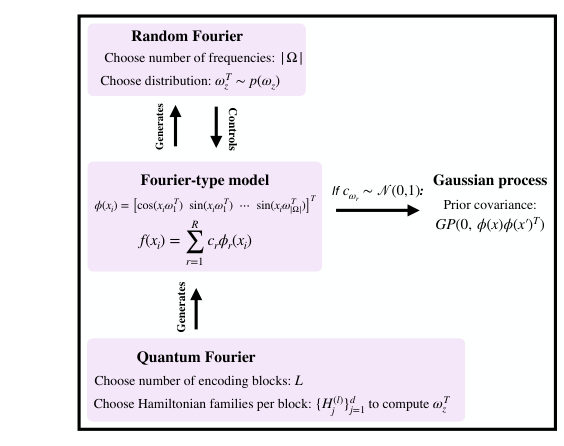
<figcaption class="paper-figure-caption"><b>Fig 1.</b> FIG. 1: Visual representation of the inherent interpretability offerings of RFF and quantum Fourier models for GP model design. Hamiltonian choices offer a bottom-up route to the kernel function design of GPs – in contrast to the top-down design of an explicit spectral distribution in RFF.</figcaption>
</figure>

**Summary.** This paper argues that the true value of Quantum Machine Learning lies in its inherent mathematical structure—its interpretability—rather than just its performance relative to classical methods. It demonstrates this by comparing how quantum Fourier models and Random Fourier Features can both approximate GP kernels, showing that quantum tools offer unique mechanisms for principled model design. This reframes QML research to value the underlying physical or mathematical components of quantum circuits.

**Why it may be interesting.** It bridges advanced topics like algebraic topology and group theory (used to constrain models) directly into the practical methodology of machine learning, offering theoretical frameworks for building physically motivated quantum algorithms.

Detailed structure

**Main problem.** The field of Quantum Machine Learning (QML) needs a value proposition beyond merely matching classical ML performance, especially given that model interpretability is crucial for real-world deployment.

**Main result.** The value of QML models should be characterized by their inherent mathematical structure and interpretability offerings, rather than solely by task performance metrics.

**Method.** The authors compare quantum Fourier models against Random Fourier Features (RFF) in the context of designing interpretable Gaussian Process (GP) kernels for uncertainty quantification.

**Model / system.** The work analyzes parameterized quantum circuits (QNNs) and uses Bayesian linear regression within a GP framework. It compares feature mapping techniques derived from classical spectral distributions (RFF) versus those arising naturally from quantum information tools (Quantum Fourier Models).

**Key observables.** Model interpretability, uncertainty quantification ($\sigma^2_{	ext{pred}}$), and the ability to encode domain-specific inductive biases.

**Important parameters / regimes.** The spectral distribution $p(\omega_z)$ controlling RFFs; the Hamiltonian families $\{H^{(l)}_j\}$ used in quantum feature mapping.

**Assumptions / limitations.** The argument assumes that demonstrating inherent interpretability benefits justifies the use of potentially resource-intensive quantum computation for ML tasks.

**Figures summary.** Figure 1 visually contrasts the bottom-up kernel design approach using Hamiltonian families (Quantum Fourier Models) against the top-down spectral distribution choice in RFFs.

**Paper structure.** The paper establishes the need for interpretability in QML, provides a detailed mathematical comparison between Quantum Fourier Models and RFFs via GP kernels, and concludes with a review of various quantum information tools (symmetry, topology) that enable inherently interpretable model design.

Abstract

The field of quantum machine learning (QML) evolved to value models believed to most directly rival those providing utility in classical ML, namely large-scale neural networks. Although more recently, classical ML has been learning a hard lesson with respect to deploying un-interpretable neural networks in the wild: model interpretability matters for domain-adapted co-design and human adoption. We adopt this larger ML perspective to argue that quantum ML model value can be found through the characterization of its inherent interpretability offerings -- i.e. its mathematical structure that contributes meaningfully to desired model behavior for the specific ML task. To support our perspective, we provide a motivating example of a characterization with quantum Fourier models and random Fourier features (RFF) as approaches to approximate Gaussian process (GP) kernels for uncertainty quantification tasks in ML. The top-down and bottom-up complementarity of the two mathematical constructions reveals that quantum Fourier models offer different tools than RFFs for principled GP kernel design and interpretable discovery for uncertainty quantification with real-world data. To showcase the rich variety of inductive biases enabled by quantum information tools, we review examples from the QML literature -- including symmetry, metric geometry, and topology -- that can be used to design inherently interpretable ML models for specific tasks. We hope this framing encourages the QML community to value the inherent components and mechanisms of quantum models separately from task performance, as inherent interpretability might be the reason that a quantum model, and potentially a quantum computer, gets used in practice for ML.

[↑ back to top](#top)

### [Let the Qudit Do the Jacobi: A Structured Quantum Algorithm for Spectral Decomposition](http://arxiv.org/abs/2607.13244v1)

**Authors:** A. Mandilara  
**Type:** theory · **Category:** quantum information and computing · **PDF:** <https://arxiv.org/pdf/2607.13244v1>  
**Analysis basis:** full PDF text, analyzed in chunks

↔ Scroll figures horizontally

<figure class="paper-figure-card">
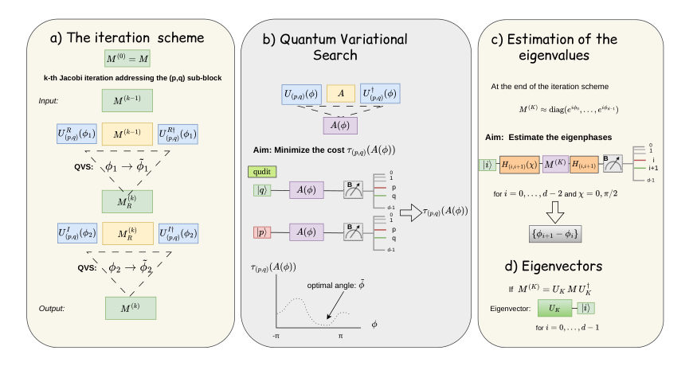
<figcaption class="paper-figure-caption"><b>Fig 1.</b> FIG. 1: Overview of the proposed Jacobi Qudit Algorithm (JQA). (a) Iteration scheme for a single Jacobi step acting on the (p, q) subspace. Each iteration consists of two successive one-dimensional quantum variational searches (QVS), determining the optimal parameters of the real and imaginary Givens rotations, followed by the corresponding updates of the transformed operator. (b) Quantum variational search used to determine each rotation parameter. The local cost function is evaluated through repeated measurements of the observable B on the computational basis states |p⟩and |q⟩, and the optimal rotation angle ˜ϕ is obtained by minimizing the resulting one-dimensional cost landscape. (c)...</figcaption>
</figure>
<figure class="paper-figure-card">
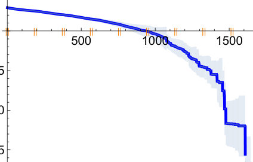
<figcaption class="paper-figure-caption"><b>Fig 2.</b> FIG. 2: Evolution of the average off-diagonal cost function log(τ(M)) as a function of the pivot count for d = 20, averaged over fifteen Haar-random unitary matrices. The solid curve represents the ensemble average, while the error bars indicate one standard deviation. The double vertical marks (||) denote the completion of successive Jacobi sweeps. The nearly linear decrease during the first sweeps, followed by a progressively faster decay, is characteristic of cyclic Jacobi-type diagonalization algorithms.</figcaption>
</figure>

**Summary.** This paper presents the Jacobi Qudit Algorithm (JQA) for finding the eigenvalues and eigenvectors of unknown unitary operators acting on qudits. It achieves this by mapping the iterative Givens rotation steps into sequential, experimentally accessible single-parameter variational optimizations. The work is significant because it establishes a structured quantum method that mirrors classical numerical efficiency while being naturally suited for qudit architectures.

**Why it may be interesting.** It provides a concrete blueprint for implementing complex numerical linear algebra routines directly on hardware (qudits), offering a structured path from classical theory to quantum circuit realization.

Detailed structure

**Main problem.** The core problem is developing a quantum algorithm for spectral decomposition of unknown unitary operators, specifically realizing the Jacobi diagonalization procedure on qudits.

**Main result.** The proposed structured quantum algorithm preserves the convergence behavior of classical Jacobi methods and achieves expected quadratic scaling ($O(d^2)$) in elementary operations with dimension $d$.

**Method.** It implements Givens rotations using two sequential, experimentally accessible single-parameter quantum variational optimizations rather than explicit operator reconstruction or controlled unitaries.

**Model / system.** The system is a qudit (dimension $d$) undergoing unitary evolution governed by an unknown unitary operator. The method mimics the classical Jacobi algorithm for normal matrices.

**Key observables.** Convergence of the off-diagonal norm ($	au(M)$), eigenvalues extracted via interferometry, and the number of required Jacobi sweeps.

**Important parameters / regimes.** The dimension $d$ of the qudit space; the target accuracy $\epsilon$; and the structure of the unitary operator $M$.

**Assumptions / limitations.** The primary assumption is that elementary two-parameter Givens rotations can be decomposed into two sequential single-parameter variational optimizations, which are experimentally feasible.

**Figures summary.** Figure 3 compares the average number of Jacobi sweeps required for different accuracies ($\epsilon$) across dimensions $d$, showing the scaling behavior of the JQA compared to generic methods.

**Paper structure.** The paper introduces the problem by relating it to classical Jacobi diagonalization, details the qudit-native quantum realization using sequential variational optimizations for Givens rotations, discusses eigenvalue extraction via interferometry, and concludes with complexity analysis and future directions like parallelization.

Abstract

Jacobi diagonalization is a long-established numerical algorithm for the spectral decomposition of Hermitian and, more generally, normal matrices. In this work, we develop a qudit-native quantum realization of the Jacobi diagonalization algorithm for unknown unitary operators. The proposed framework avoids explicit reconstruction of the operator and controlled-unitary operations. Each elementary two-parameter Givens rotation is implemented through two sequential single-parameter quantum variational optimizations that are directly accessible experimentally. An interferometric protocol is further introduced for extracting the eigenvalues of the diagonalized unitary, up to an overall global phase. Numerical simulations on ensembles of Haar-random unitary matrices demonstrate that the proposed algorithm preserves the characteristic convergence behavior of the classical Jacobi method and exhibits the expected quadratic scaling in the number of elementary operations with the dimension $d$, comparable to its classical counterpart. The results establish the proposed algorithm as a structured quantum numerical linear algebra algorithm naturally suited to qudit architectures and provide a bridge between classical iterative matrix algorithms and their quantum realizations.

[↑ back to top](#top)

### [Pair-Partition Constructions for CPM-Based Quantum LDPC Codes](http://arxiv.org/abs/2607.14091v1)

**Authors:** Koki Okada, Kenta Kasai  
**Type:** theory · **Category:** quantum information and computing · **PDF:** <https://arxiv.org/pdf/2607.14091v1>  
**Analysis basis:** full PDF text, analyzed in chunks

↔ Scroll figures horizontally

<figure class="paper-figure-card">
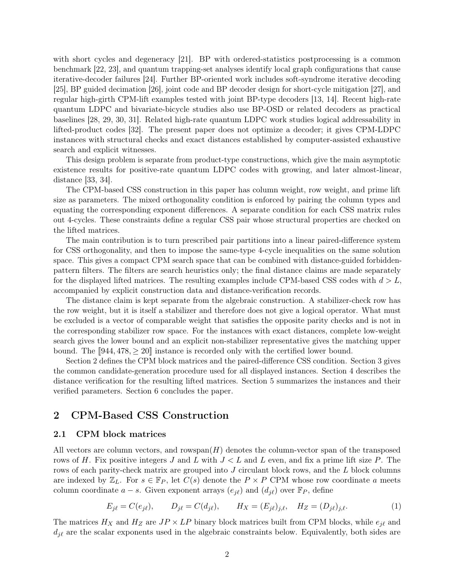
<figcaption class="paper-figure-caption"><b>Fig 1.</b> Low-resolution page preview, page 2</figcaption>
</figure>
<figure class="paper-figure-card">
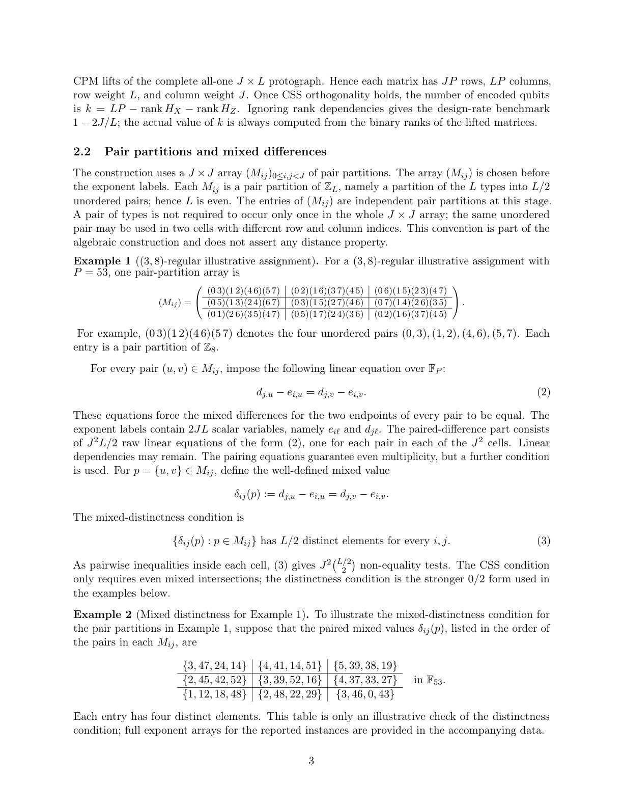
<figcaption class="paper-figure-caption"><b>Fig 2.</b> Low-resolution page preview, page 3</figcaption>
</figure>
<figure class="paper-figure-card">
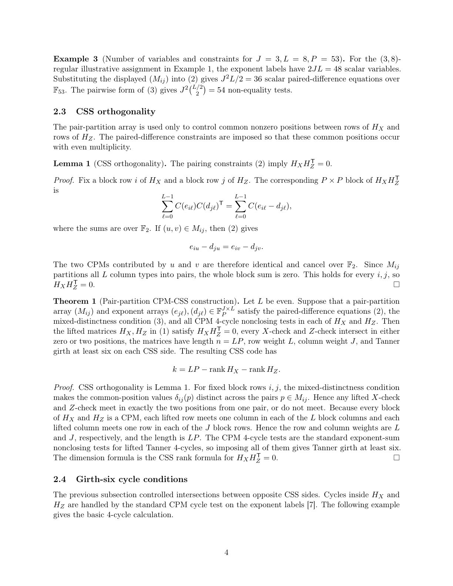
<figcaption class="paper-figure-caption"><b>Fig 3.</b> Low-resolution page preview, page 4</figcaption>
</figure>
<figure class="paper-figure-card">

<figcaption class="paper-figure-caption"><b>Fig 4.</b> Low-resolution page preview, page 5</figcaption>
</figure>
<figure class="paper-figure-card">
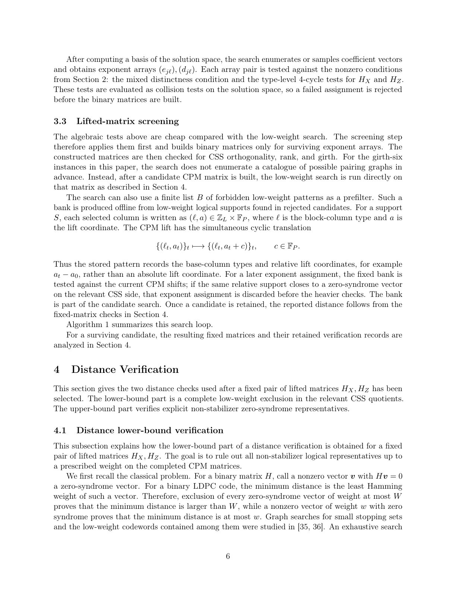
<figcaption class="paper-figure-caption"><b>Fig 5.</b> Low-resolution page preview, page 6</figcaption>
</figure>

**Summary.** This paper details a method to construct robust binary CSS quantum LDPC codes by utilizing pair-partition constructions based on circulant permutation matrices. The authors derive necessary algebraic conditions that guarantee structural integrity, leading to the explicit reporting of several high-performance code examples with rigorously verified distances.

**Why it may be interesting.** This work provides advanced theoretical tools for constructing quantum error-correcting codes with desirable properties (high rate, high girth), which is fundamental knowledge for building fault-tolerant quantum computation architectures.

Detailed structure

**Main problem.** The primary goal is constructing binary Calderbank–Shor–Steane (CSS) quantum low-density parity-check (LDPC) codes using circulant permutation matrices (CPMs).

**Main result.** The authors report specific, high-rate examples of such codes, including the (J,L)=(4,12)-regular girth-six code [[372,130,16]] with rate 0.349.

**Method.** Construction relies on imposing linear paired-difference equations derived from a pair partition array onto CPM exponents to guarantee CSS orthogonality and structural properties like high Tanner girth.

**Model / system.** The model is the quantum error correcting code itself, defined by two parity check matrices, $H_X$ and $H_Z$, which are constructed using CPMs parameterized by column weight J, row weight L, and prime lift size P.

**Key observables.** Code parameters $[[n, k, d]]$, rate ($1 - 2J/L$), Tanner girth (at least six), and minimum distance $d$.

**Important parameters / regimes.** Column weight J, row weight L, prime lift size P.

**Assumptions / limitations.** The final distance claims require independent verification via exhaustive low-weight exclusion and explicit non-stabilizer witnesses, separate from the algebraic construction guarantees.

**Figures summary.** Figures illustrate the pair-partition array $(M_{ij})$, the mixed-distinctness condition using sample values in $\mathbb{F}_{53}$, and details on variables/constraints for specific parameter choices.

**Paper structure.** The paper develops by first establishing necessary algebraic conditions (Theorem 1) guaranteeing structural properties like orthogonality and girth. These conditions are then implemented in a systematic search algorithm to find concrete examples, culminating in rigorous distance verification procedures.

Abstract

We construct binary Calderbank--Shor--Steane (CSS) quantum low-density parity-check (LDPC) codes from circulant permutation matrices (CPMs). The construction is parameterized by column weight J, row weight L, and prime lift size P. A J x J array of pair partitions imposes linear paired-difference equations on the CPM exponents. These equations give CSS orthogonality. The main finite examples reported here are the (J,L)=(4,12)-regular girth-six code [[372,130,16]] with rate 0.349, and the (J,L)=(4,14)-regular girth-six code [[518,228,16]] with rate 0.440. We also record (J,L)=(3,8)-regular girth-six instances [[472,122,14]] and [[488,126,14]], with lift sizes P=59 and P=61, respectively. The stated distances are established for the fixed matrices by exhaustive low-weight exclusion together with explicit non-stabilizer witnesses.

[↑ back to top](#top)

### [PQFA: Parallel Quantum Feature Augmentation of Fused Representations for Multimodal Classification](http://arxiv.org/abs/2607.13466v1)

**Authors:** Mingzhu Wang, Yun Shang  
**Type:** theory · **Category:** quantum information and computing · **PDF:** <https://arxiv.org/pdf/2607.13466v1>  
**Analysis basis:** full PDF text, analyzed in chunks

↔ Scroll figures horizontally

<figure class="paper-figure-card">
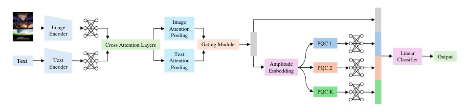
<figcaption class="paper-figure-caption"><b>Fig 1.</b> Figure 1: Overall architecture of the proposed Parallel Quantum Feature Augmentation (PQFA) framework. Text and image inputs are first encoded by frozen pretrained Transformer encoders. The extracted unimodal token features are projected into a shared latent space, refined by bidirectional cross-attention, summarized by attentive pooling, and fused through an adaptive gating module. The fused classical representation is then processed by two paths: a direct classical path and a parallel quantum augmentation path based on amplitude encoding and multiple shallow parameterized quantum circuits. The resulting quantum readouts are concatenated with the classical fused feature for final...</figcaption>
</figure>
<figure class="paper-figure-card">
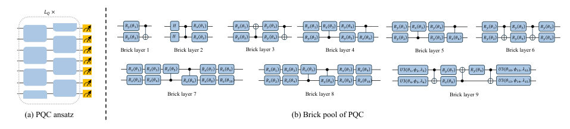
<figcaption class="paper-figure-caption"><b>Fig 2.</b> Figure 2: Schematic illustration of the Parallel Quantum Feature Augmentation module. (a) A shallow brickwall parameterized quantum circuit used in each quantum branch. (b) The predefined brick pool consisting of multiple local two-qubit parameterized blocks, which introduces structural diversity across parallel quantum branches.</figcaption>
</figure>
<figure class="paper-figure-card">
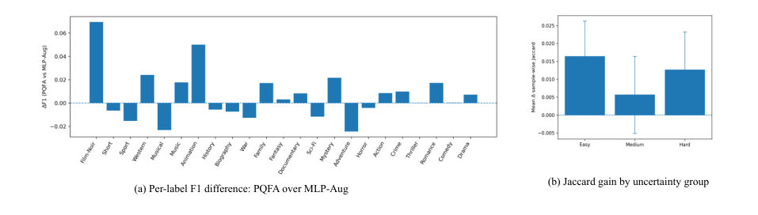
<figcaption class="paper-figure-caption"><b>Fig 3.</b> Figure 3: Fine-grained comparison between PQFA and MLP-Aug on MM-IMDb. (a) Per-label F1 difference across genres sorted by support. (b) Mean sample-wise Jaccard gain grouped by MLP-Aug prediction uncertainty. Positive values indicate that PQFA outperforms the width-matched classical augmentation baseline.</figcaption>
</figure>
<figure class="paper-figure-card">
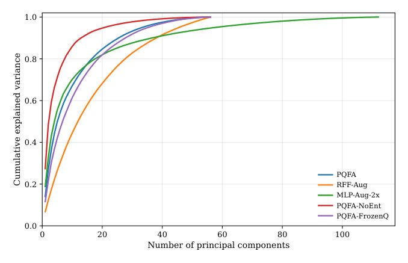
<figcaption class="paper-figure-caption"><b>Fig 4.</b> Figure 4: PCA cumulative explained variance of augmentation features on MM-IMDb. Faster saturation indicates stronger variance concentration in fewer principal directions, whereas slower saturation indicates a more dispersed augmentation feature space.</figcaption>
</figure>
<figure class="paper-figure-card">
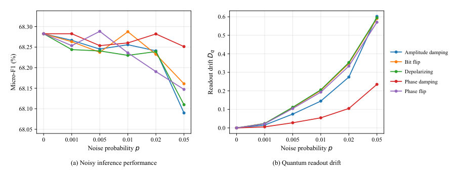
<figcaption class="paper-figure-caption"><b>Fig 5.</b> Figure 5: Post-training noisy inference analysis on MM-IMDb. Panel (a) reports Micro-F1 under different noise probabilities, and panel (b) reports the quantum readout drift Dq. All model parameters are fixed during this analysis.</figcaption>
</figure>

**Summary.** The paper introduces Parallel Quantum Feature Augmentation (PQFA), a novel hybrid framework that enhances multimodal feature representations by passing the fused classical output through parallel shallow quantum circuits. By demonstrating superior performance and parameter efficiency compared to purely classical augmentation techniques, PQFA establishes quantum readout as an effective tool for post-fusion learning in complex AI tasks.

**Why it may be interesting.** This work directly applies variational quantum algorithms (VQAs) in a hybrid setting for complex data classification, offering a structured way to test quantum advantage in machine learning tasks beyond simple kernel methods or state preparation.

Detailed structure

**Main problem.** The primary challenge addressed is enhancing multimodal classification by improving representations *after* they have been fused, rather than redesigning the entire fusion backbone.

**Main result.** PQFA consistently outperforms both unaugmented baselines and MLP augmentation methods on benchmark datasets while using significantly fewer parameters, demonstrating effective post-fusion quantum feature augmentation.

**Method.** The method involves amplitude-encoding the classical fused feature into multiple parallel shallow variational quantum circuits (PQCs) whose measurement readouts are concatenated with the original classical representation for final prediction.

**Model / system.** It employs a hybrid quantum-classical framework. Classical components use frozen RoBERTa and ViT encoders followed by cross-attention, pooling, and adaptive gated fusion to yield $\mathbf{z}_C$. This is then augmented by parallel PQCs acting on the fused feature.

**Key observables.** Classification accuracy improvement over baselines; stable predictive performance across simulated noise levels; parameter efficiency compared to classical alternatives.

**Important parameters / regimes.** The number of augmentation parameters (PQFA uses $\approx 2.2\text{K}$ vs. $24.0\text{K}$ for MLP-Aug); the depth and width of the variational quantum circuits.

**Assumptions / limitations.** The performance gains are attributed to the learned nonlinear transformation provided by the quantum readouts, not merely increased feature dimensionality or trainable parameters.

**Figures summary.** Figure 1 illustrates the overall architecture: Text/Image $\rightarrow$ Encoders $\rightarrow$ Cross-Attention $\rightarrow$ Pooling $\rightarrow$ Adaptive Gating ($\mathbf{z}_C$) $\rightarrow$ Parallel Quantum Augmentation (PQCs) $\rightarrow$ Concatenation $\rightarrow$ Classifier.

**Paper structure.** The paper first establishes the need for post-fusion enhancement. It details the PQFA architecture, which processes fused features through parallel quantum circuits. Evaluation involves controlled comparisons against unaugmented and MLP baselines, followed by ablation studies (missing modalities, feature diagnostics) to prove the necessity of the quantum component.

Abstract

Most multimodal learning methods improve how heterogeneous representations are aligned and fused, while post-fusion enhancement remains less explored. We propose Parallel Quantum Feature Augmentation (PQFA), a hybrid quantum-classical framework that applies multiple shallow variational quantum circuits to fused multimodal features. Text and image representations extracted by frozen RoBERTa and ViT encoders are processed through bidirectional cross-attention, attentive pooling, and adaptive gated fusion. The fused feature is then amplitude-encoded into parallel quantum circuits, whose measurement readouts are concatenated with the classical representation for prediction. We evaluate PQFA on MM-IMDb and N24News through controlled comparisons using the same encoders, fusion backbone, data splits, projection dimension, and augmentation output width. PQFA consistently outperforms both the fusion backbone without quantum augmentation and a width-matched MLP augmentation baseline, while using approximately 2.2K augmentation parameters compared with 24.0K for the MLP branch. Missing-modality experiments further show improved robustness when textual or visual inputs are incomplete, with particularly clear gains when the more informative textual modality is severely degraded. Controlled ablations and feature-space analyses indicate that the improvement cannot be reproduced by random feature mappings, increased classical width, or untrained quantum transformations. Quantum-state diagnostics additionally show stable predictive performance across the tested simulated noise levels and distinct branch-specific transformations of the encoded states. These results establish PQFA as an effective and parameter-efficient strategy for post-fusion augmentation in hybrid quantum-classical multimodal learning.

[↑ back to top](#top)

### [Quantum Algorithm for Elliptic Curve Discrete Logarithms with Space-Efficient Point Addition](http://arxiv.org/abs/2607.13816v1)

**Authors:** Han Luo, Ziyi Yang, Jingquan Luo, Ziruo Wang, Yuexin Su, Xiaoming Sun, Lvzhou Li, Tongyang Li  
**Type:** theory · **Category:** quantum information and computing · **PDF:** <https://arxiv.org/pdf/2607.13816v1>  
**Analysis basis:** full PDF text, analyzed in chunks

↔ Scroll figures horizontally

<figure class="paper-figure-card">
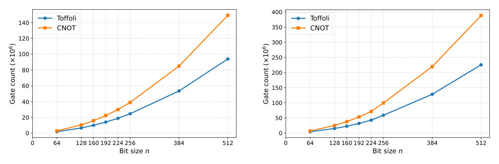
<figcaption class="paper-figure-caption"><b>Fig 1.</b> Figure 1: Toffoli gate count and CNOT gate count for modular inversion and point addition.</figcaption>
</figure>
<figure class="paper-figure-card">
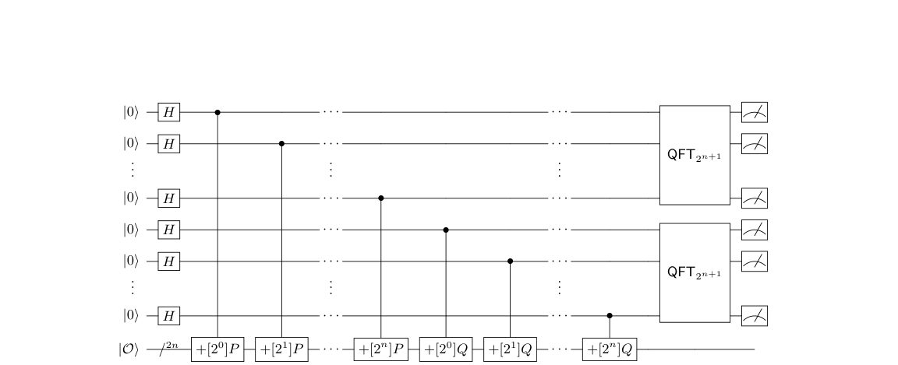
<figcaption class="paper-figure-caption"><b>Fig 2.</b> Figure 2: The overall quantum circuit of Shor’s algorithm for solving ECDLP using QFT. The qubits, from top to bottom, correspond to the exponent registers containing k and ℓin Equation 2 (ordered from lower-order bits to higher-order bits), and to the register that stores the elliptic curve point accumulator.</figcaption>
</figure>
<figure class="paper-figure-card">
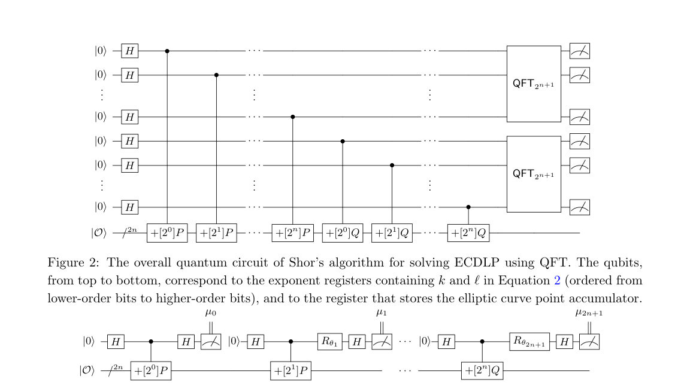
<figcaption class="paper-figure-caption"><b>Fig 3.</b> Figure 3: The overall quantum circuit of Shor’s algorithm for solving ECDLP using semiclassical QFT. The gates Rθi denote rotation gates with rotation angle θi = Pi−1 j=0 2i−jµj, where the values µj ∈{0, 1} are outcomes obtained in previous measurements. By employing the semiclassical QFT, the exponent register requires only a single qubit, resulting in a reduction of 2n + 1 qubits compared to the standard implementation.</figcaption>
</figure>
<figure class="paper-figure-card">
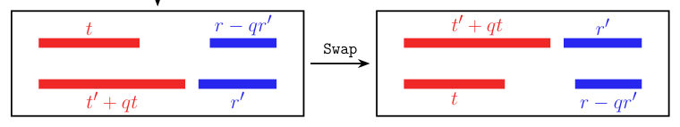
<figcaption class="paper-figure-caption"><b>Fig 4.</b> Figure 4: An illustration of how the two Work registers are allocated for temporary variables within a single iteration of the EEA. The upper and lower stripes represent the Work1 and Work2 registers, respectively. The symbols (h) and (l) indicate that the value t′ is split into its higher-order bits (h) and lower-order bits (l), which are placed at the corresponding positions on the two sides of the Work2 register.</figcaption>
</figure>
<figure class="paper-figure-card">
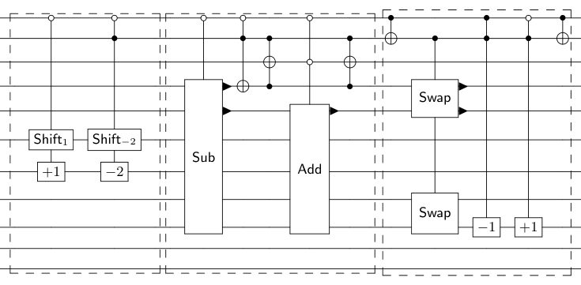
<figcaption class="paper-figure-caption"><b>Fig 5.</b> Figure 5: Overall circuit implementation (first half) of a single iteration of our space-efficient EEA. The three dashed boxes, from left to right, represent: (1) pre-shift operations; (2) location-controlled subtraction on r’s; (3) location-controlled swap.</figcaption>
</figure>

**Summary.** This paper details a highly resource-optimized quantum algorithm for solving the Elliptic Curve Discrete Logarithm Problem (ECDLP). The key innovation is a novel, space-efficient reversible modular inversion circuit that drastically reduces qubit requirements compared to prior methods. This advancement provides a concrete, improved blueprint for implementing Shor's algorithm in practice.

**Why it may be interesting.** While focused on cryptography, the detailed quantum arithmetic circuits developed—especially the modular inversion and register-sharing techniques—represent advanced theoretical tools applicable to any quantum computation requiring efficient large-number arithmetic in condensed matter or AMO simulations.

Detailed structure

**Main problem.** The primary goal is to develop a quantum algorithm for solving the Elliptic Curve Discrete Logarithm Problem (ECDLP) while significantly reducing the required quantum resources, particularly logical qubits.

**Main result.** The authors present a space-efficient construction achieving resource requirements of $3n+6\lfloor \log_2 n
floor+ O(1)$ logical qubits for an $n$-bit prime field curve, representing substantial improvements over previous state-of-the-art estimates.

**Method.** The improvement hinges on developing a new space-efficient reversible modular inversion circuit derived from the Extended Euclidean Algorithm (EEA), which addresses the dominant space bottleneck in point addition circuits.

**Model / system.** The work operates within the standard quantum circuit model, applying Shor's algorithm structure to ECC over prime fields. The core components involve implementing controlled affine point addition and modular inversion using techniques like register-sharing and location-controlled arithmetic.

**Key observables.** Logical qubits (space complexity), Toffoli gate counts, and CNOT gate counts are the primary resources quantified for the algorithm's implementation.

**Important parameters / regimes.** The resource costs scale with $n$, the bit-length of the prime field ($n=256$ bits is used as a key example).

**Assumptions / limitations.** The analysis assumes the feasibility of implementing complex reversible modular arithmetic circuits, particularly refining EEA state representation using length registers and location-controlled arithmetic.

**Figures summary.** Figures illustrate the scaling of Toffoli and CNOT gate counts for modular inversion and point addition as a function of bit size $n$, alongside comparative tables showing qubit savings over prior works.

**Paper structure.** The paper builds by first identifying ECDLP as the target problem, then focusing on optimizing the bottleneck subroutine (modular inversion via EEA refinement), followed by constructing the full space-efficient controlled point addition circuit necessary for Shor's algorithm implementation.

Abstract

The Elliptic Curve Discrete Logarithm Problem (ECDLP) is a fundamental problem in cryptography, and reducing the resource requirements of quantum algorithms for solving ECDLP is an important goal. In this work, we present a space-efficient quantum algorithm for solving the ECDLP over prime fields, achieving an implementation with only $3n+6\lfloor \log_2 n \rfloor+O(1)$ logical qubits and $919n^3/\log_2 n+O(n^2)$ Toffoli gates, where $n$ is the bit-length of the prime. For a 256-bit prime-field curve, our construction requires only 835 logical qubits, reducing the previous best estimates of 1098 and 1175 logical qubits by Chevignard et al. [EUROCRYPT 2026] and Babbush et al. [ArXiv Preprint 2026], respectively.   The key to our improvement is a new space-efficient reversible modular inversion circuit, which addresses the dominant space bottleneck in affine-coordinate point addition. Starting from the extended Euclidean algorithm (EEA), we refine the register-sharing technique of Proos and Zalka by introducing length registers and location-controlled arithmetic to compactly store and update intermediate variables. We further optimize the reversible update procedures and construct the corresponding controlled arithmetic circuits, resulting in a modular inversion circuit implemented by only $2n+6\lfloor \log_2 n \rfloor+O(1)$ logical qubits and $195n^2+O(n\log_2 n)$ Toffoli gates. This modular inversion circuit together with mid-circuit measurements and classical feed-forward operations provides a space-efficient controlled affine point-addition circuit and a complete implementation of Shor's algorithm for ECDLP.

[↑ back to top](#top)

### [Two-Tower Quantum Matrix Chain Multiplication: Trading Qubits for Depth](http://arxiv.org/abs/2607.13191v1)

**Authors:** Giacomo Antonioli, Anna Bernasconi, Alessandro Berti, Gianna M. Del Corso, Alessandro Poggiali  
**Type:** theory · **Category:** quantum information and computing · **PDF:** <https://arxiv.org/pdf/2607.13191v1>  
**Analysis basis:** full PDF text, analyzed in chunks

↔ Scroll figures horizontally

<figure class="paper-figure-card">
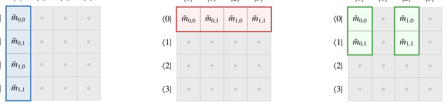
<figcaption class="paper-figure-caption"><b>Fig 1.</b> Figure 1: Unitary matrices corresponding to (a) SP(M), (b) SP(M)†, and (c) MSP(M) shown schematically for 2 × 2 matrix M. In SP(M), the first column (blue) contains the vectorised, Frobenius-normalised entries of M; the remaining columns (grey, marked ∗) are fixed by unitarity and play no role in the algorithm. In SP(M)†, the first row (red) contains the normalised entries of M; the remaining rows are irrelevant. In MSP(M), the normalised entries (green) of M retain the row structure of the original matrix.</figcaption>
</figure>
<figure class="paper-figure-card">
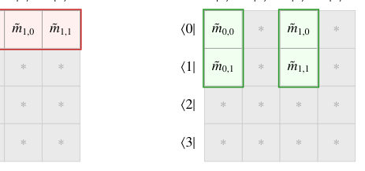
<figcaption class="paper-figure-caption"><b>Fig 2.</b> Figure 1 illustrates the internal structure of the SP, SP†, and MSP unitaries for a concrete small matrix M. By Def- inition 2, the first column of SP(M) contains the vectorised,</figcaption>
</figure>
<figure class="paper-figure-card">
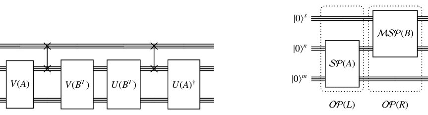
<figcaption class="paper-figure-caption"><b>Fig 3.</b> Figure 2: Two equivalent circuits for computing C = AB, with A ∈RM×N, B ∈RN×S , m = log M, n = log N, s = log S . (a) Original circuit from Bernasconi et al. [15], using four state-preparation operators (V(A), U(A)†, V(BT), U(BT)) and performing two register swaps. (b) The same circuit reorganised into the Two-Tower two-layer structure OP(L) and OP(R): layer OP(L) applies SP(A) = U(A) V(A) on registers (n, m); layer OP(R) applies MSP(B) on registers (s, n), a composite operator that applies the row-loading multiplexer U(B) on (s, n) followed by V(B)† on n to contract the shared index. This reorganisation eliminates the register swaps and constitutes the base case (K = 2) of the Two-Tower...</figcaption>
</figure>
<figure class="paper-figure-card">
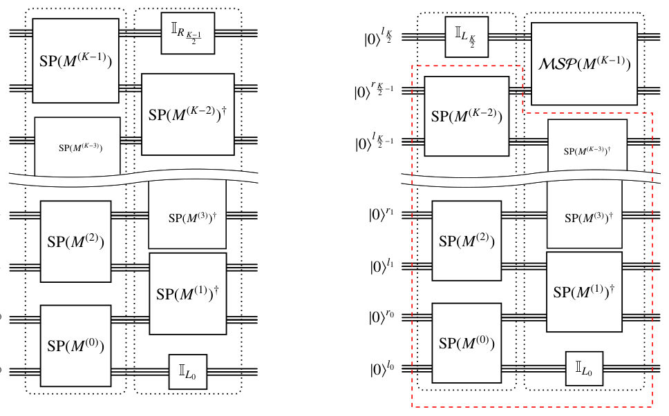
<figcaption class="paper-figure-caption"><b>Fig 4.</b> Figure 3: Two-Tower circuit for a chain of K matrices. (a) K odd: registers are ordered top-to-bottom as (r(K−1)/2, l(K−1)/2, . . . , r0, l0). OP(L): all SP(M(2i)) act simultaneously on disjoint register pairs (ri, li). OP(R): all SP(M(2j+1))† act simultaneously on the interleaved pairs (lj+1, rj). (b) K even: an additional output register l K</figcaption>
</figure>
<figure class="paper-figure-card">
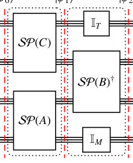
<figcaption class="paper-figure-caption"><b>Fig 5.</b> Figure 4: Two-Tower circuit for D = ABC with A ∈RM×N, B ∈RN×S , C ∈ RS ×T, and m = log M, n = log N, s = log S , t = log T. OP(L): SP(C) on registers (t, s) and SP(A) on registers (n, m) execute in parallel. OP(R): SP(B)†</figcaption>
</figure>

**Summary.** The paper presents 'Two-Tower Matrix Multiplication,' a novel quantum subroutine to compute the product of many matrices ($W = M_0 \cdots M_{K-1}$). It achieves an unprecedented circuit depth that is independent of the number of matrices $K$, offering a major algorithmic speedup over classical and prior quantum methods. This breakthrough makes complex linear algebra operations more feasible for near-term quantum hardware.

**Why it may be interesting.** This work provides a significant algorithmic improvement for fundamental linear algebra tasks in quantum computing, directly impacting the feasibility of complex quantum machine learning kernels and simulations that rely on matrix products.

Detailed structure

**Main problem.** The paper addresses the computational challenge of matrix chain multiplication, $W = M^{(0)}\cdots M^{(K-1)}$, which is crucial in scientific computing.

**Main result.** They introduce a quantum subroutine called Two-Tower Matrix Multiplication that encodes the product state with circuit depth independent of the chain length $K$.

**Method.** The method utilizes a two-layer, parallel structure involving specialized quantum state preparation operators ($	ext{SP}(M)$ and $	ext{SP}(M)^\dagger$) to compute the matrix product amplitude.

**Model / system.** The work is framed within the QRAM-based model for quantum linear algebra subroutines. It operates on encoding matrices into quantum states, allowing computation of the full product statevector.

**Key observables.** The signal weight $\Omega_W = rac{\|W\|^2_F}{\prod_{k=0}^{K-1} \|M(k)\|^2_F}$ is a key diagnostic used to track the useful amplitude carried by the final quantum state.

**Important parameters / regimes.** Circuit depth achieves $O(\max_k 	ext{polylog}(P_k P_{k+1}))$, which is independent of $K$. The qubit count scales as $\Theta\left(\sum_{k} \log P_k
ight)$.

**Assumptions / limitations.** The polylogarithmic depth relies on the assumption that each matrix $M(k)$ can be loaded into a quantum state in polylogarithmic time (QRAM model).

**Figures summary.** Figures illustrate the core components: $	ext{SP}(M)$, $	ext{SP}(M)^\dagger$, and $	ext{MSP}(M)$ for small matrices, and show the general Two-Tower circuit structure for $K$ matrices.

**Paper structure.** The paper introduces the problem, details the quantum state preparation operators, derives the efficient two-tower circuit structure by showing its equivalence to sequential methods, analyzes the complexity (depth vs. qubits), and discusses applications like chain-vector multiplication and signal weight decay.

Abstract

Matrix chain multiplication -- computing $\mathcal{W} = M^{(0)}\cdots M^{(K-1)}$ where $M^{(k)} \in \mathbb{R}^{P_k \times P_{k+1}}$ -- arises in scientific computing, machine learning, and graph analysis. Despite the importance of this problem, for chains of distinct matrices, the classical number of operations grows linearly with the chain length $K$ and polynomially in the matrix dimensions. We present \emph{Two-Tower Matrix Multiplication}, a quantum subroutine that encodes the product $\mathcal{W}$ of the $K$ matrices into a quantum state in circuit depth $\mathcal{O}(\max_{k} \mathrm{polylog} (P_k P_{k+1}))$, which is independent of~$K$ within the QRAM-based state-preparation model, whereas the qubit count is $\mathcal{O}\bigl(\sum_{k} \log P_k \bigr)$; the total gate count remains linear in $K$, so the gain is in the circuit depth. The construction interleaves state-preparation operators across two layers; within each layer, all operators act on disjoint registers and execute in parallel. This subroutine can be specialized for the chain-vector case, which computes the product of $K-1$ matrices applied to a vector. We prove the correctness of the subroutine for all $K$ and provide two implementations using the Qiskit and QCLAB frameworks. The subroutine is applicable to any downstream quantum algorithm that operates on a matrix encoded in the statevector, including norm estimation, graph-matrix powers, linear system solving, and quantum machine learning kernels.

[↑ back to top](#top)

## Secondary cond-mat archives

*Papers from cond-mat.mtrl-sci, mes-hall, other, soft, supr-con. These archives are de-prioritized — they appear at the end regardless of relevance score.*

### Relevant in secondary archives (12)

### [Realization and manipulation of spiral charge density waves in a two-dimensional metal](http://arxiv.org/abs/2607.13878v1)

**Authors:** Lili Zhou, Ruizi Zhang, Chen Si, Zhaoteng Dong, Mengya Ren, Keru Guo, Can Zhang, Jizheng Wu, Fudi Zhou, Huixia Yang, Yaxin Zhao, Guoyuan Yang, Xiaolong Xu, Yuanxiao Ma, Xiao Kong, Yu Zhang, Yeliang Wang  
**Type:** both · **Category:** strongly correlated electrons · **PDF:** <https://arxiv.org/pdf/2607.13878v1>  
**Analysis basis:** full PDF text, analyzed in chunks
**Topic relevance:** 🔥 `analog quantum simulation` **4/5** · `driven-dissipative phase transition` **3/5** · `Frenkel-Kontorova` **2/5** · `methods for driven-dissipative` **1/5** · `non-equilibrium dynamics` **1/5** · `non-equilibrium universality` **1/5**

↔ Scroll figures horizontally

<figure class="paper-figure-card">
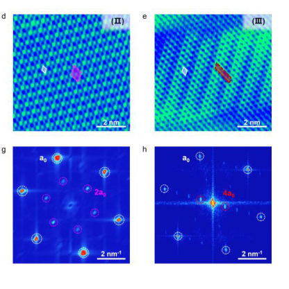
<figcaption class="paper-figure-caption"><b>Fig 1.</b> Fig. 1 | CDW evolution in wrinkled NbSe2. a, Experimental setup and large-scale</figcaption>
</figure>
<figure class="paper-figure-card">
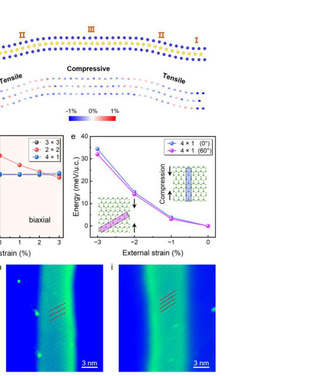
<figcaption class="paper-figure-caption"><b>Fig 2.</b> Fig. 2 | Origin and characteristics of the unidirectional 4 × 1 CDW in NbSe2. (a)</figcaption>
</figure>
<figure class="paper-figure-card">
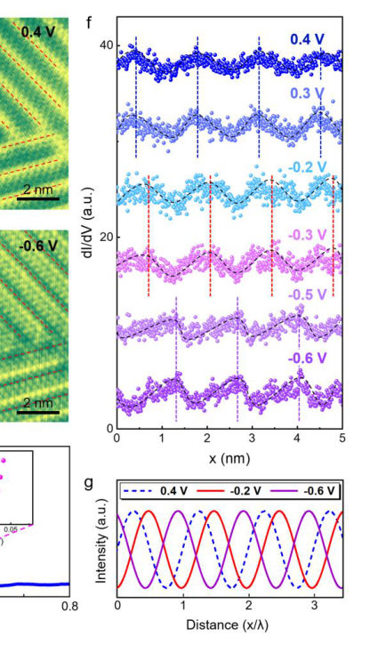
<figcaption class="paper-figure-caption"><b>Fig 3.</b> Fig. 3 | Multiband and chiral nature of the unidirectional CDW in NbSe2. (a)</figcaption>
</figure>
<figure class="paper-figure-card">
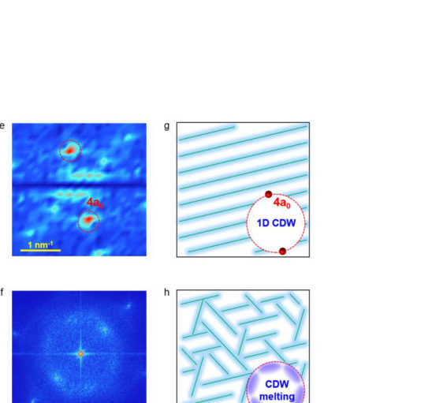
<figcaption class="paper-figure-caption"><b>Fig 4.</b> Fig. 4 | Melting of the unidirectional CDW in NbSe2. (a,b) Representative STM</figcaption>
</figure>

**Summary.** The research uses strain engineering on NbSe2 to overcome the challenge of competing, disordered Charge Density Wave (CDW) orders. By creating controlled strain environments within material wrinkles, the authors successfully stabilize and manipulate distinct CDW phases, such as transforming a 3x3 order into a highly stable 4x1 stripe. This establishes strain as a powerful tool for controlling correlated electronic states in 2D materials.

**Why it may be interesting.** This work demonstrates how external mechanical tuning (strain) can act as a powerful knob to selectively stabilize specific correlated electronic phases (CDWs), offering an analogy to controlling quantum states using external fields in AMO physics or superconducting circuits.

Detailed structure

**Main problem.** The central challenge is disentangling and controlling competing Charge Density Wave (CDW) orders, which are often nearly degenerate and intertwined by disorder in real materials.

**Main result.** Strain engineering can lift the near-degeneracy of CDW states in NbSe2, transforming an intrinsic 3x3 order into stable, controllable unidirectional 4x1 or 2x2 phases. Furthermore, these strain networks allow for the creation and manipulation of chiral spiral textures.

**Method.** The study combines experimental measurements using Scanning Tunneling Microscopy (STM) with theoretical calculations like Density Functional Theory (DFT) to map out phase stability under controlled strain fields.

**Model / system.** The physical system is NbSe2, a layered Transition Metal Dichalcogenide (TMD). The research focuses on the interplay between lattice strain (induced via van der Waals interactions in wrinkle networks) and the electronic ground state characterized by competing CDW superlattices (3x3, 4x1, 2x2).

**Key observables.** CDW superlattice order ($3 	imes 3$, $4 	imes 1$, $2 	imes 2$), local strain fields (compressive/tensile), CDW transition temperatures, and the development of chiral spiral textures.

**Important parameters / regimes.** Strain magnitude (uniaxial compression vs. biaxial tension $> 2.5\%$) and temperature (stability up to 70 K).

**Assumptions / limitations.** The ability to stabilize strain networks using vdW interactions, and that the observed CDW transitions are primarily governed by lattice strain lifting electronic degeneracy.

**Figures summary.** Figures illustrate STM images showing distinct CDW superstructures in different wrinkle regions; schematics detail how compressive/tensile strain drives the transition from 3x3 to 4x1 or 2x2 orders, and show evidence of chiral textures and voltage-induced melting.

**Paper structure.** The paper systematically maps out the phase diagram by correlating local strain fields (measured via STM topography) with the resulting stable CDW order, providing both experimental visualization and DFT confirmation for each transition pathway.

Abstract

Nearly degenerate charge-density-wave (CDW) states play a central role in the competition among collective phenomena. In real materials, however, these states are often intertwined by disorder, hindering their disentanglement and control. Here we show that strain can lift this near-degeneracy and spatially separate distinct CDW states in NbSe2. Using van der Waals (vdW) interactions, we stabilize a micron-scale strain network that produces spatially inhomogeneous strain fields. Within this landscape, the intrinsic 3 * 3 CDW superlattice of pristine NbSe2 transforms into an isolated unidirectional 4 * 1 order under 1D-confined compression, and into a 2 * 2 order under biaxial tension. The 4 * 1 CDW has a multiband origin and exhibits markedly enhanced thermal stability, persisting up to 70 K. At strain-network nodes, it further develops into chiral spiral textures, which can be melted by voltage pulses. These results establish strain as a powerful approach to disentangle, stabilize and manipulate competing electronic orders.

[↑ back to top](#top)

### [Fundamental Relation between Conductance of Biomolecules and the Fukui Function](http://arxiv.org/abs/2607.13309v1)

**Authors:** Gabor Vattay  
**Type:** theory · **Category:** statistical mechanics · **PDF:** <https://arxiv.org/pdf/2607.13309v1>  
**Analysis basis:** full PDF text, analyzed in chunks
**Topic relevance:** `Keldysh / 2PI / non-Gaussian methods` **3/5** · `methods for driven-dissipative` **3/5** · `Kondo & dissipative impurity` **2/5** · `non-equilibrium dynamics` **2/5** · `correlated / nonlocal dissipation` **1/5** · `driven-dissipative phase transition` **1/5** · `non-equilibrium universality` **1/5**

↔ Scroll figures horizontally

<figure class="paper-figure-card">
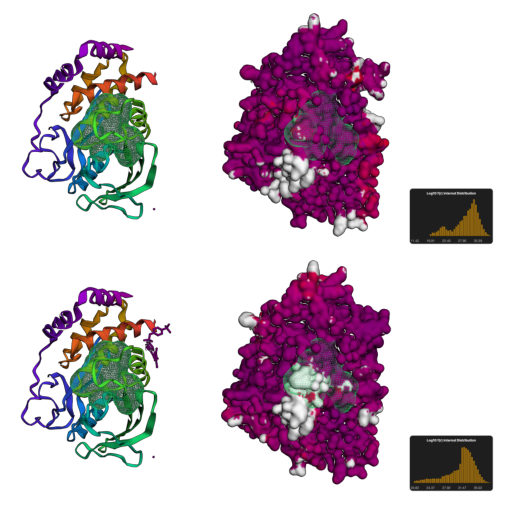
<figcaption class="paper-figure-caption"><b>Fig 1.</b> FIG. 1. Empirical validation of the conductance-reactivity synthesis in PTP1B (PDB ID: 1T49). Top row: Apo (ligand- free) configuration showing the unperturbed structure (left) and the continuous spatial profile of the finite-temperature Fukui function fT (r) along the catalytic WPD loop (green grid) (right). Bottom row: Holo configuration bound to the benzofuran sulfonamide allosteric ligand (left) and the corre- sponding altered Fukui function (right), demonstrating com- plete suppression of the reactivity pathway at the WPD loop upon ligand binding. In the inset of the panels, the yellow histogram shows the internal distribution of the Fukui func- tion on a log-linear scale, sampled on a...</figcaption>
</figure>
<figure class="paper-figure-card">
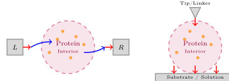
<figcaption class="paper-figure-caption"><b>Fig 2.</b> FIG. 2. Schematic representation of sequential transport. (a) In a two-terminal junction, injection and escape are indepen- dent local processes, yielding two resistors in series, GL and GR, connected via the thermalized interior. (b) In single- probe setups, multi-point coupling to the substrate or solution leads to a short-circuit limit (Gsub →∞), leaving the conduc- tance bottlenecked solely by the tip: GT ≈Gtip = 2e2</figcaption>
</figure>

**Summary.** This paper develops a rigorous DFT-based theory showing that the electrical conductance of biomolecules is fundamentally determined by their local chemical reactivity, quantified by the Fukui function. By analyzing open quantum system dynamics under specific approximations, the authors establish an equivalence between electronic transport pathways and chemically active sites. This has major implications for designing bioelectronic sensors.

**Why it may be interesting.** This work bridges quantum chemistry (reactivity descriptors like Fukui functions) with condensed matter transport physics (conductance), providing a powerful theoretical tool for bioelectronics.

Detailed structure

**Main problem.** To establish a fundamental, quantitative link between the finite-temperature electronic conductance of biomolecules and their local chemical reactivity descriptor (the Fukui function).

**Main result.** The thermal conductance ($G_T$) is shown to be directly proportional to the local chemical reactivity quantified by the finite-temperature Fukui function ($f_T(r)$), establishing a link between electronic transport and chemistry.

**Method.** The derivation uses Density Functional Theory (DFT) within an open quantum system framework, employing a double perturbation expansion under the fast-thermalization condition to simplify complex many-body dynamics.

**Model / system.** The study models biomolecules, such as proteins, coupled to metallic leads. The theoretical machinery involves deriving the master equation for the single-particle density matrix from the Mermin grand potential.

**Key observables.** Conductance ($G_T$), finite-temperature Fukui function ($f_T(r)$), and local electronic structure profiles $Z(r)$.

**Important parameters / regimes.** Fast-thermalization condition ($	au_{rlx} \ll 	au_{esc}$), temperature ($k_B T$), applied voltage, and coupling strengths ($\Gamma$).

**Assumptions / limitations.** The derivation critically relies on the fast-thermalization condition; it also assumes linear response approximations around equilibrium.

**Figures summary.** Figure 1 provides empirical validation in PTP1B, showing how ligand binding suppresses the spatial profile of $f_T(r)$ along the WPD loop, correlating with pathway disruption. Figure 2 schematically illustrates two-terminal vs. single-probe transport models.

**Paper structure.** The paper systematically derives the conductance from first principles (Mermin potential $
ightarrow$ Master Equation) and then applies approximations (double perturbation expansion under fast thermalization) to show that the complex electronic response projects out, leaving a result governed solely by $f_T(r)$.

Abstract

The finite-temperature conductance of a molecule coupled to metallic leads is derived entirely within the framework of density functional theory (DFT) and its time-dependent extension for open quantum systems. Starting from the Mermin grand potential, the foundational Kohn-Sham equations, the Fukui function, and the open-system master equation for the single-particle density matrix are systematically formulated. The non-equilibrium electron-phonon dissipator is obtained from the partial trace over the phonon bath. By applying Wick's theorem for non-interacting fermions, a fully exchange-symmetric collision integral is obtained that strictly preserves Pauli exclusion at the operator level. Performing a double perturbation expansion, initially in the applied voltage (linear response), and subsequently in the molecule-lead coupling (weak coupling), it is demonstrated that under the fast-thermalization condition, the complex exchange-correlation self-consistent field response is analytically projected out by the diagonal structure of the slow Liouvillian mode. Consequently, the thermal conductance is governed by the finite-temperature Fukui function, the central reactivity descriptor of conceptual density functional theory. This condition is satisfied in proteins, whose wave functions are extended and multifractal due to quantum criticality at the Anderson metal-insulator transition. This derivation establishes a fundamental link between electronic transport and chemical reactivity, identifying conducting paths with reactive sites. It opens new technological avenues connecting drug design to conductance experiments and also provides a foundation for designing next-generation bioelectronic sensing and computing architectures.

[↑ back to top](#top)

### [Aharonov-Casher-induced electric quadrupole of charge-neutral particles](http://arxiv.org/abs/2607.13745v1)

**Authors:** Hojun Lee, Youngjae Jeon, Suik Cheon, Hyun-Woo Lee  
**Type:** theory · **Category:** other · **PDF:** <https://arxiv.org/pdf/2607.13745v1>  
**Analysis basis:** full PDF text, analyzed in chunks
**Topic relevance:** `Keldysh / 2PI / non-Gaussian methods` **3/5** · `spintronics-quantum-optics interface` **3/5** · `analog quantum simulation` **2/5** · `methods for driven-dissipative` **2/5** · `exotic spin models in light-matter` **1/5** · `non-equilibrium dynamics` **1/5**

↔ Scroll figures horizontally

<figure class="paper-figure-card">
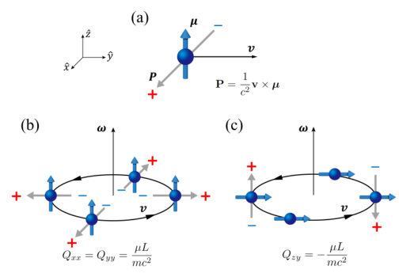
<figcaption class="paper-figure-caption"><b>Fig 1.</b> FIG. 1. Intuitive picture of Aharonov-Casher electric quadrupole (AC-EQ). (a) The polarization P induced by the linear motion of a particle carrying the magnetic moment µ. (b), (c) Representative electric-quadrupole components Qαβ generated by the angular motion of a particle carrying µ. (b) The case of µ = µˆz and ω = ωˆz. (c) The case of µ = µˆy and ω = ωˆz.</figcaption>
</figure>
<figure class="paper-figure-card">
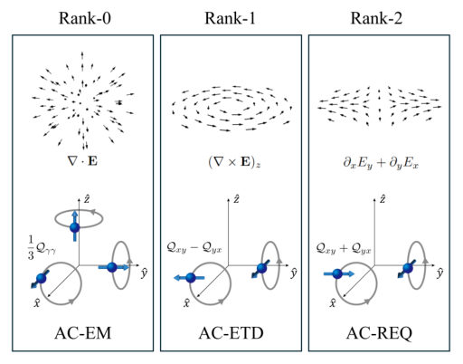
<figcaption class="paper-figure-caption"><b>Fig 2.</b> FIG. 2. Irreducible decomposition of AC-EQ. The three columns represent the rank-0 AC-EM, rank-1 Aharonov- Casher electric toroidal dipole (AC-ETD), and rank-2 reduced AC-EQ (AC-REQ), respectively. The upper panels show the electric-field configurations conjugate to the respective AC- EQ components. The lower panels schematically illustrate the corresponding combinations of the magnetic moment µ and its orbital motion of the particle.</figcaption>
</figure>
<figure class="paper-figure-card">
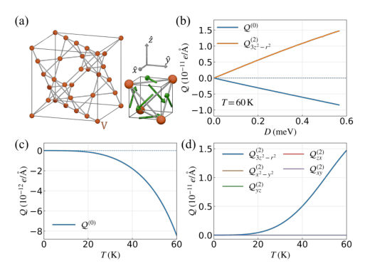
<figcaption class="paper-figure-caption"><b>Fig 3.</b> FIG. 3. Crystal structure, DMI dependence, and tempera- ture dependence of the AC-EQ components in ferromagnetic pyrochlore Lu2V2O7. (a) Left: crystal structure of Lu2V2O7 in the conventional unit cell. Right: four-sublattice basis, where the green arrows indicate the directions of the DMI vectors. Only V atoms are shown as spheres. (b) DMI de- pendence of the AC-EM and Q(2) 3z2−r2, calculated at fixed tem- perature T = 60 K. (c), (d) Temperature dependence of the AC-EM and AC-REQ components, respectively. These re- sults are calculated for |D| ≈0.57 meV.</figcaption>
</figure>
<figure class="paper-figure-card">
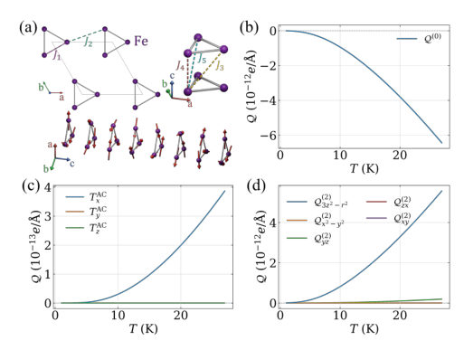
<figcaption class="paper-figure-caption"><b>Fig 4.</b> FIG. 4. Crystal structure, magnetic structure, and temper- ature dependence of the AC-EQ components in noncollinear antiferromagnetic Fe langasite Ba3NbFe3Si2O14. (a) Top left: top view of the crystal structure of Fe langasite, where only the Fd atoms are shown. J1 and J2 denote intralayer exchange paths. Top right: interlayer exchange paths J3, J4, and J5. Bottom: helical magnetic structure of Fe langasite. We adopt a commensurate approximation in which seven magnetic lay- ers constitute one magnetic unit cell. The crystallographic a and c axes are chosen as the x and z axes, respectively. (b)–(d) Temperature dependence of the AC-EM, AC-ETD, and AC-REQ components, respectively.</figcaption>
</figure>

**Summary.** This theoretical paper establishes a mechanism by which charge-neutral quasiparticles, such as magnons, can exhibit an electric quadrupole moment via the Aharonov-Casher effect. By treating this response semiclassically, the authors calculate the $	ext{AC-EQ}$ tensor and demonstrate its relevance in magnetic materials, showing it is comparable to nuclear moments.

**Why it may be interesting.** This work extends the concept of orbital magnetism from charged particles to neutral excitations like magnons, predicting measurable electric quadrupole responses that are sensitive to magnetic structure and spin texture.

Detailed structure

**Main problem.** The primary goal is to elucidate the physical manifestation of Orbital Angular Momentum (OAM) for charge-neutral particles in solids, as its magnetic signature is not straightforward.

**Main result.** The authors demonstrate that a charge-neutral particle with a magnetic moment exhibits an Aharonov-Casher induced electric quadrupole ($	ext{AC-EQ}$) when coupled to the electric field gradient in crystalline solids. These $	ext{AC-EQ}$ components can reach magnitudes comparable to typical nuclear moments.

**Method.** The theory employs a semi-classical framework, deriving the $	ext{AC-EQ}$ tensor as a linear response of thermodynamic potentials (like the grand potential) to spatial derivatives of the electric field.

**Model / system.** The analysis is developed for charge-neutral particles, using magnons in magnetic systems like ferromagnetic pyrochlore and helical langasite as concrete examples. The formalism involves effective electromagnetic potentials derived from the particle's magnetic moment coupling.

**Key observables.** AC-induced electric quadrupole ($	ext{AC-EQ}$), which decomposes into scalar, toroidal dipole, and reduced quadrupole components; Polarization ($	ext{P}_\alpha$).

**Important parameters / regimes.** Magnetic moment ($\mu$), crystalline solid structure (pyrochlore, langasite), and the coupling strength derived from the Aharonov-Casher effect.

**Assumptions / limitations.** The derivation relies on a semi-classical approximation and assumes weak electric fields/slow variations in external potentials.

**Figures summary.** Figure 1 illustrates the intuitive picture of how angular motion generates specific components of the $	ext{AC-EQ}$ tensor, depending on the relative orientation of the magnetic moment ($\mu$) and the rotation vector ($oldsymbol{\omega}$).

**Paper structure.** The paper develops the theory by first establishing the effective potentials (Eqs. 11, 12) and then deriving the $	ext{AC-EQ}$ tensor ($Q_{\alphaeta}$) as a response function (Eq. 19). It decomposes this tensor into irreducible components (Rank-0, Rank-1, Rank-2), providing physical interpretations for each component.

Abstract

For charged particles, their orbital angular momentum (OAM) in solid have a direct magnetic manifestation as an orbital magnetization. For charge-neutral particles, however, the physical manifestation of the OAM in solid remains unclear. Here, we show that a charge-neutral particle carrying a magnetic moment couples to electric-field gradient through the Aharonov-Casher (AC) effect, thereby exhibiting the electric quadrupole in crystalline solids. This AC-induced electric quadrupole (AC-EQ) contains the scalar, toroidal dipole, and reduced quadrupole components, which are conjugate to the divergence, circulation, and shear of the electric field, respectively. As representative examples, we calculate the AC-EQ of magnons in two magnetic systems. In ferromagnetic pyrochlore, Dzyaloshinskii-Moriya interaction (DMI) induces a sizable AC-EQ, whereas in helical Fe langasite the AC-EQ emerges from the helical spin configuration even in the absence of DMI. In both systems, the unit-cell-integrated AC-EQ components reach magnitudes comparable to typical nuclear electric quadrupole moments.

[↑ back to top](#top)

### [Emergent induction in magnetic Weyl semimetals](http://arxiv.org/abs/2607.13559v1)

**Authors:** Takahiro Anan, Takahiro Morimoto  
**Type:** theory · **Category:** other · **PDF:** <https://arxiv.org/pdf/2607.13559v1>  
**Analysis basis:** full PDF text, analyzed in chunks
**Topic relevance:** `spintronics-quantum-optics interface` **3/5** · `Keldysh / 2PI / non-Gaussian methods` **2/5** · `exotic spin models in light-matter` **1/5** · `non-equilibrium dynamics` **1/5**

↔ Scroll figures horizontally

<figure class="paper-figure-card">
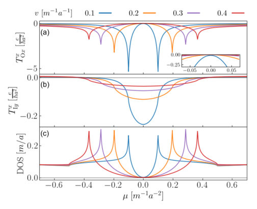
<figcaption class="paper-figure-caption"><b>Fig 1.</b> FIG. 1. Chemical-potential dependence of (a) the Fermi surface contribution Cx Ox and (b) the interband contribution Cx Iy to the ME response, and (c) the density of states (DOS), calculated from the model in Eq. (5) for various values of the Fermi velocity v. Cx Ox is proportional to the square of the chemical potential, µ2, corre- sponding to the area of the Fermi surface in the Weyl-fermion region. Cx Iy emerges within the Fermi-velocity-induced gap, between the Van Hove singularities. We set the parameters as follows: τ = 10ma2ℏ, P is the identity matrix, and M is a diagonal matrix whose diagonal elements are equal to m−1a−2ℏ−1.</figcaption>
</figure>
<figure class="paper-figure-card">
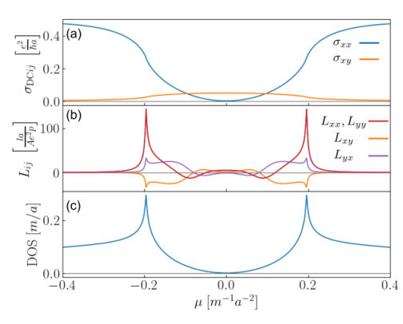
<figcaption class="paper-figure-caption"><b>Fig 2.</b> FIG. 2. Chemical-potential dependence of (a) the conductivity and (b) the inductance, calculated from the model in Eq. (5) for v = 0.2/(ma). (c) The density of states (DOS) is replotted from Fig. 1(c) for comparison. The longitudinal conductivity σDC,Oxx is propor- tional to µ2 in the Weyl-fermion region, while the Hall conductivity σDC,Hallxy is enhanced in the Weyl-fermion region. The inductances are also enhanced in the Weyl-fermion region. The parameters are the same as those in Fig. 1.</figcaption>
</figure>
<figure class="paper-figure-card">
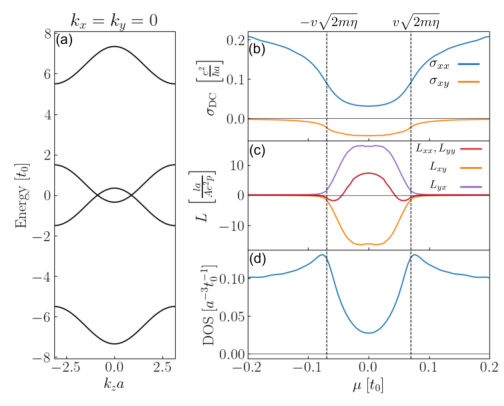
<figcaption class="paper-figure-caption"><b>Fig 3.</b> FIG. 3. (a) Band structure and (b) the conductivity and (c) the in- ductance obtained from the model in Eq. (15). The dashed lines in (b-d) indicate the energy range of Weyl dispersion |µ| &lt; v p</figcaption>
</figure>

**Summary.** This paper theoretically analyzes how magnetic dynamics induce an 'emergent induction' in Weyl semimetals. It derives the magnetoelectric response by separating contributions into intraband (dissipative) and interband (topological) parts. The key finding is that these systems inherently behave as emergent inductors due to strong magnetoelectric coupling, particularly when the chemical potential lies within the topological energy gap.

**Why it may be interesting.** The concept of emergent induction mediated by topological band structures (Weyl nodes) provides a mechanism linking magnetism, topology, and macroscopic electromagnetic responses, which is relevant to advanced spintronic/topological materials research.

Detailed structure

**Main problem.** The study investigates emergent electromagnetic responses, specifically 'emergent induction,' arising in magnetic Weyl semimetals due to underlying magnetic dynamics.

**Main result.** The magnetoelectric response is shown to have distinct intraband and interband contributions; the system generally acts as an emergent inductor due to this coupling.

**Method.** Theoretical derivation using Boltzmann transport theory for intraband effects and the Kubo formula for interband contributions, applied to effective two-band models.

**Model / system.** The physical system is a magnetic Weyl semimetal, modeled using effective two-band Hamiltonians that incorporate time-dependent magnetization acting as an emergent vector potential. The analysis applies this formalism to polar Weyl ferromagnets.

**Key observables.** Magnetoelectric (ME) response ($\langle M	au 
angle$ and $\mathcal{C}_I$), inductance ($L$, $L_{	ext{long}}$, $L_{	ext{Hall}}$), and conductivity components ($\sigma_{DC,O}$ and $\sigma_{DC,Hall}$).

**Important parameters / regimes.** Relaxation time ($	au$), chemical potential ($\mu$), Weyl node separation/Fermi arc length, and the magnitude of magnetization dynamics.

**Assumptions / limitations.** The analysis relies on separating the ME response into dissipative intraband and non-dissipative interband parts, and uses approximations regarding the relative magnitudes of different conductivity components in later sections.

**Figures summary.** Figures illustrate the chemical potential dependence of both the Fermi surface term ($\mathcal{C}_{O}$) and the interband effect term ($\mathcal{C}_I$), as well as the $\mu$ dependence of conductivity and inductance for specific models.

**Paper structure.** The paper develops a general theory by deriving ME responses from transport equations, separates contributions into intraband/interband terms, applies this to polar Weyl ferromagnets to calculate inductance components ($L_{	ext{long}}, L_{	ext{Hall}}$), and concludes with generalized expressions for the inductive response.

Abstract

We theoretically study emergent electromagnetic responses in Weyl semimetals. Focusing on magnetic Weyl semimetals, we develop a general theory of emergent induction driven by magnetic dynamics. We show that magnetoelectric (ME) responses in Weyl semimetals give rise to emergent induction mediated by magnetization dynamics. Using effective two-band models for magnetic Weyl semimetals, we derive a formula for the ME response that includes both intraband and interband contributions. The resulting formula shows that the intraband contribution is proportional to the relaxation time $τ$, whereas the interband contribution is associated with the separation of the Weyl nodes. Applying the general formula to a model of polar Weyl ferromagnets, we demonstrate that the dynamics of the toroidal moment is closely related to the emergent inductive response in polar Weyl ferromagnets, as recently discovered by Suzuki et al. [Y. Suzuki et al. arXiv:2607.12322]. The chemical-potential dependence of the inductance indicates that the emergent electromagnetic response is enhanced in the energy range of the Weyl dispersion, reflecting the topological nature of Weyl semimetals.

[↑ back to top](#top)

### [Tensor-Network Finite Elements for Analytic Operator Equations](http://arxiv.org/abs/2607.13129v1)

**Authors:** Abhijatmedhi Chotrattanapituk, Michael J. Landry, Chu-Liang Fu, Mingda Li  
**Type:** theory · **Category:** numerical methods · **PDF:** <https://arxiv.org/pdf/2607.13129v1>  
**Analysis basis:** full PDF text, analyzed in chunks
**Topic relevance:** `methods for driven-dissipative` **3/5** · `Keldysh / 2PI / non-Gaussian methods` **1/5** · `analog quantum simulation` **1/5** · `driven-dissipative phase transition` **1/5**

↔ Scroll figures horizontally

<figure class="paper-figure-card">
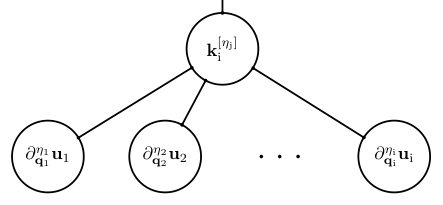
<figcaption class="paper-figure-caption"><b>Fig 1.</b> FIG. 1. Contraction of i-linear interaction kernel k[ηj] i with an i-point correlation in tensor network representation. The solid objects represent tensors, hanging lines represent free indices, lines connecting two tensors represents index con- tractions. The rank of the kernel is chosen such that it can contract each of the derivative term, ∂ ηj qjuj, completely with the left over rank (top branch) the same as L[u].</figcaption>
</figure>
<figure class="paper-figure-card">
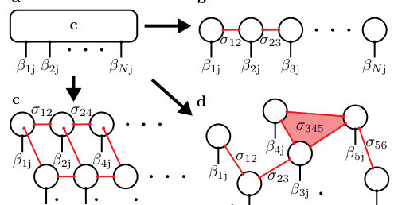
<figcaption class="paper-figure-caption"><b>Fig 2.</b> FIG. 3. Tensor network ansatz of coefficient tensor with dif- ferent locality assumptions: (a) no assumption, (b) matrix product state, (c) projected entangled pair state, and (d) higher-order tensor network assumption where shaded regions represent index hyper-contraction. β’s and σ’s indicate ten- sor indices responsible for each bond and contraction, respec- tively.</figcaption>
</figure>
<figure class="paper-figure-card">
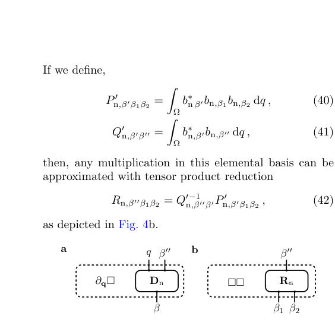
<figcaption class="paper-figure-caption"><b>Fig 3.</b> FIG. 4. Tensor circuit representation of (a) spatial derivative and (b) multiplication act locally at element n.</figcaption>
</figure>
<figure class="paper-figure-card">

<figcaption class="paper-figure-caption"><b>Fig 4.</b> FIG. 5. Tensor circuit representation of more complicated operators can be constructed from the two basic building block types (spatial derivative and multiplication) together with well known constant tensors like Kronecker delta (δ) and Levi-Civita (ϵ). (a) Second spatial derivative or Hessian can be achieve with stacking two D’s with both spatial indices free. (b) Dot and (c) cross products are multiplications while (d) Divergence and (e) curl are first spatial derivatives with additional spatial index summation by δ and ϵ. Lastly, (f) Laplacian is second spatial derivatives with additional spatial index summation by δ. The subscript n make it explicitly clear that the derivatives and...</figcaption>
</figure>
<figure class="paper-figure-card">
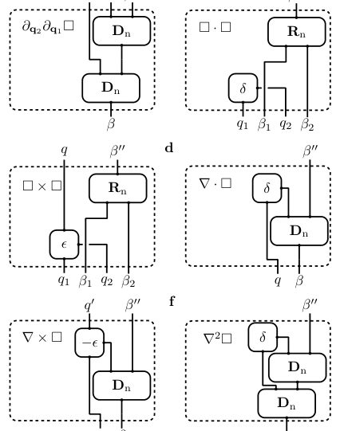
<figcaption class="paper-figure-caption"><b>Fig 5.</b> Figure 7 summarize the time-evolution results across all three cases for explicit Runge-Kutta IVP simula- tion (top row) and TN variational (middle row) method. For p = 0 (left column), the equation reduces to the standard diffusion equation ∂tu = ∂2 xu, which admits a smooth, rapidly decaying solution. For p = 1 (mid- dle column), the non-linear coupling u∂2 xu introduces amplitude-dependent diffusion, slowing the spread of u in regions of low amplitude. Finally, for p = 2 (right col- umn), the stronger non-linearity further suppresses diffu- sion and produces sharper features. In all cases, the TN</figcaption>
</figure>

**Summary.** The paper introduces Tensor-Network Finite Elements, a novel framework that unifies the solution of diverse operator equations—from PDEs to delay equations. It achieves this by translating continuous differential operators into structured tensor forms and minimizing the resulting residual error within a constrained TN variational space. This offers a general, powerful computational tool for modeling complex physical systems.

**Why it may be interesting.** This work provides a powerful computational bridge between established numerical analysis (FEM) and modern quantum many-body simulation techniques (TNs), offering a general toolset for solving complex physical models beyond standard quantum chemistry or condensed matter simulations.

Detailed structure

**Main problem.** The core problem is developing a unified framework to solve analytic Operator Equations (OEs), including PDEs, IDEs, and MDEs, by connecting Finite-Element (FE) discretization with Tensor Network (TN) variational representations.

**Main result.** The authors establish a direct connection between the FE numerical formalism and TN variational algorithms, allowing highly non-linear partial differential equations to be reformulated as weighted-residual optimization problems over TN degrees of freedom.

**Method.** The method involves discretizing OEs using FE methods, which generates multilinear interaction tensors. These are then approximated and optimized within a Tensor Network ansatz (like MPS or PEPS) by minimizing a weighted residual norm subject to the TN manifold constraint.

**Model / system.** The framework is general, applying to various OEs such as nonlinear diffusion equations, initial-value problems, integro-differential equations, and memory/delay equations. The underlying mathematical structure involves mapping continuous operators onto discrete tensor representations.

**Key observables.** Controlled error reproduction of conventional solutions (e.g., 1D diffusion), preservation of boundary conditions (Neumann).

**Important parameters / regimes.** Bond dimensions ($\sigma$), maximum bond degree ($M$), time step size ($\Delta t$), and the order of basis expansion ($B$).

**Assumptions / limitations.** The primary assumptions include assuming locality of correlation to use MPS/PEPS ansatzes, and that the solution admits a compact tensor-network representation for computational tractability.

**Figures summary.** Figure 1 illustrates the contraction of interaction kernels in TNs. Figure 2 shows the TN representation of an operator's left-hand side. Figures 7 and 8 demonstrate numerical convergence tests on nonlinear diffusion problems using both standard methods and the proposed TN variational approach.

**Paper structure.** The paper builds from general FE discretization theory to handling non-linearity by upgrading the Hilbert space to Fock space. It then shows how the resulting large coefficient tensors are compressed via TN ansatzes, culminating in optimization procedures tested on specific diffusion examples.

Abstract

Operator equations (OEs) underpin quantitative modeling across science and engineering. Finite-element (FE) methods discretize continuous OEs into finite-dimensional algebraic systems, whereas tensor networks (TNs) provide flexible variational representations of correlated discrete systems. Here, we develop a framework that connects FE with TN for analytic OEs. The power of this method comes from its ability to convert highly non-linear partial differential equations into linear matrix equations. In particular, we show that FE discretization induces a hierarchy of multilinear interaction tensors, through which differential, integral, nonlinear, memory, and delay equations can be expressed within a common algebraic structure. The resulting systems are reformulated as weighted-residual optimization problems over TN degrees of freedom. Matrix-product-state calculations for one-dimensional linear and nonlinear diffusion reproduce conventional solutions with controlled error while preserving continuity and Neumann boundary conditions. The framework provides a common variational language for analytic OEs and establishes a direct connection between FE numerical formalism and TN variational algorithms, offering a general foundation for TN-based and quantum-inspired approaches to solving OEs.

[↑ back to top](#top)

### [Quantum Transport and Apparent Work Function Distributions of Atomic Contacts via a 3D-Printed High-Vacuum Platform](http://arxiv.org/abs/2607.14074v1)

**Authors:** G. Pellicer, C. Sabater  
**Type:** experiment · **Category:** other · **PDF:** <https://arxiv.org/pdf/2607.14074v1>  
**Analysis basis:** full PDF text, analyzed in chunks
**Topic relevance:** `Kondo & dissipative impurity` **2/5** · `quantum measurements` **2/5** · `analog quantum simulation` **1/5** · `correlated / nonlocal dissipation` **1/5** · `driven-dissipative phase transition` **1/5** · `methods for driven-dissipative` **1/5** · `non-equilibrium dynamics` **1/5**

↔ Scroll figures horizontally

<figure class="paper-figure-card">
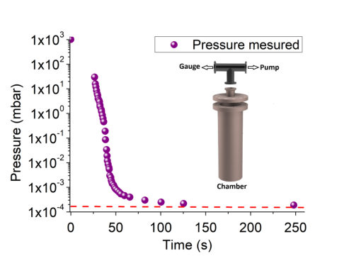
<figcaption class="paper-figure-caption"><b>Fig 1.</b> FIG. 1: Vacuum pump-down curve of the 3D-printed sys- tem over time. The dashed red line indicates the asymp- totic high-vacuum limit (1.4 × 10−4 mbar) achieved by the setup. Inset: CAD model of the PLA chamber show- casing the integrated KF flange for standard vacuum line connections.</figcaption>
</figure>
<figure class="paper-figure-card">
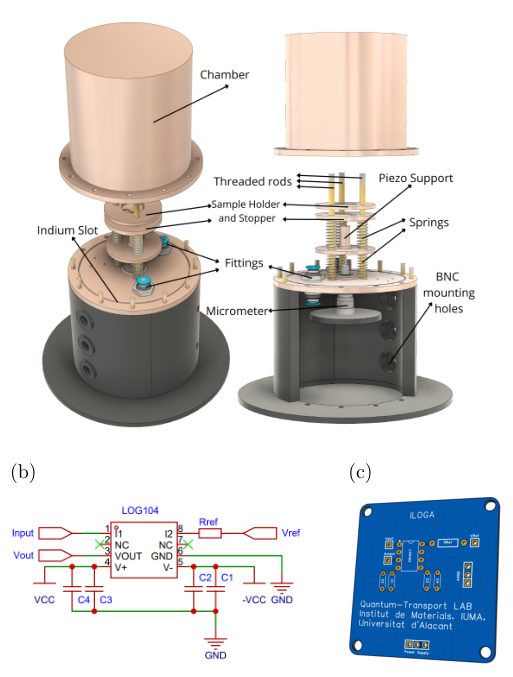
<figcaption class="paper-figure-caption"><b>Fig 2.</b> FIG. 2: Overview of the experimental hardware and electronics. (a) Detailed CAD rendering of the custom MCBJ setup, highlighting the mechanical architecture designed to operate within the 3D-printed vacuum plat- form. (b) Circuit schematic of the custom ILOGA system based on the LOG104 integrated circuit, highlighting the Rref and Vref configuration. (c) Illustration of the cus- tom 6-layer PCB design engineered for ultra-low noise data acquisition.</figcaption>
</figure>
<figure class="paper-figure-card">
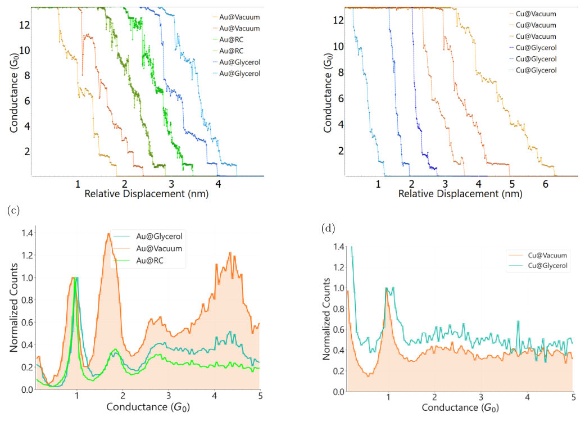
<figcaption class="paper-figure-caption"><b>Fig 3.</b> FIG. 3: Rupture traces and conductance histograms of Au and Cu in different environments. (a) Individual rupture traces of Au obtained in vacuum, glycerol, and ambient conditions. (b) Individual rupture traces of Cu in vacuum and glycerol. (c) Conductance histograms of Au normalized to 1G0 for the three different environments. (d) Normalized conductance histograms comparing Cu in vacuum and glycerol.</figcaption>
</figure>
<figure class="paper-figure-card">
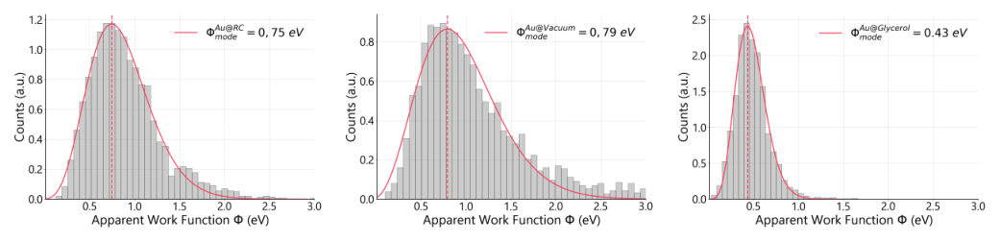
<figcaption class="paper-figure-caption"><b>Fig 4.</b> FIG. 4: Apparent work function histograms of Au across different environments: (a) under room conditions, (b) in high vacuum inside the 3D-printed chamber, and (c) immersed in glycerol.</figcaption>
</figure>

**Summary.** This paper introduces a novel, low-cost 3D-printed platform for conducting room-temperature quantum transport measurements using break junctions. By analyzing conductance decay in the tunneling regime, the authors systematically extract the apparent work function ($\phi$) of contacts across different environments. This establishes an accessible and reproducible framework for nanoscale research on reactive materials.

**Why it may be interesting.** While focused on solid-state electronics, the rigorous statistical analysis of quantum transport signatures ($\phi$ distribution) provides valuable insights into surface physics and interface phenomena relevant to open quantum systems modeling.

Detailed structure

**Main problem.** To develop an accessible, low-cost methodology for performing quantum transport measurements on reactive materials at room temperature.

**Main result.** The study successfully resolved the conductance quantum in highly reactive contacts and established that the apparent work function distribution follows a non-central chi-square distribution, matching theoretical predictions accounting for atomic roughness.

**Method.** Measurements were performed using a custom 3D-printed break junction setup to characterize current decay (tunneling regime) across various environments (vacuum, glycerol).

**Model / system.** The system uses a Mechanically Controllable Break Junction (MCBJ) housed in a PLA vacuum chamber. Quantum transport is analyzed using the Landauer formalism, relating conductance decay exponentially to the apparent work function ($\phi$).

**Key observables.** Conductance quantum ($G_0$), Apparent Work Function ($\phi$), Statistical distribution of $\phi$ (non-central chi-square).

**Important parameters / regimes.** Room temperature operation, high vacuum capability ($1.4 	imes 10^{-4}$ mbar), and the dependence on environmental adsorbates.

**Assumptions / limitations.** The analysis assumes linearity in the tunneling regime for work function extraction and that the PLA platform is structurally sound for pressure differentials up to 1 atm.

**Figures summary.** Figures illustrate hardware setups, vacuum pump-down curves, conductance histograms showing $1G_0$ peaks across environments, and statistical fits of $\phi$ distributions using non-central chi-square models.

**Paper structure.** The paper details the low-cost experimental platform construction, presents measurements on reactive metals (Cu) in various atmospheres to test environmental robustness, and then uses Au as a benchmark to systematically extract and statistically analyze the apparent work function ($\phi$) from tunneling decay traces.

Abstract

We present a low-cost, 3D-printed high-vacuum platform integrating a mechanically controllable break-junction system and a custom logarithmic amplifier for room-temperature quantum transport measurements. Using copper as a highly reactive test case, we successfully resolve the $1G_0$ conductance quantum under both high vacuum and anhydrous glycerol, demonstrating the effectiveness of these environments against rapid atmospheric oxidation. In parallel, utilizing gold as a robust benchmark, we systematically extract the apparent work function ($φ$) from thousands of tunneling traces across ambient air, vacuum, and glycerol. Our analysis demonstrates that the statistical distribution of $φ$ rigorously follows a non-central chi-square distribution. The obtained gold work functions match existing literature across all environments. Although lower than bulk values, they perfectly align with theoretical models accounting for atomic-scale roughness, apex geometry, and environmental adsorbates. Ultimately, this methodology establishes an accessible and reproducible framework for systematic nanoscale research on reactive materials.

[↑ back to top](#top)

### [Zero-energy bound state trapped in line-shaped vortex in topological superconductor](http://arxiv.org/abs/2607.13194v1)

**Authors:** P. Schlottmann  
**Type:** theory · **Category:** other · **PDF:** <https://arxiv.org/pdf/2607.13194v1>  
**Analysis basis:** full PDF text, analyzed in chunks
**Topic relevance:** `analog quantum simulation` **2/5** · `spintronics-quantum-optics interface` **2/5** · `Keldysh / 2PI / non-Gaussian methods` **1/5** · `Kondo & dissipative impurity` **1/5**

↔ Scroll figures horizontally

<figure class="paper-figure-card">
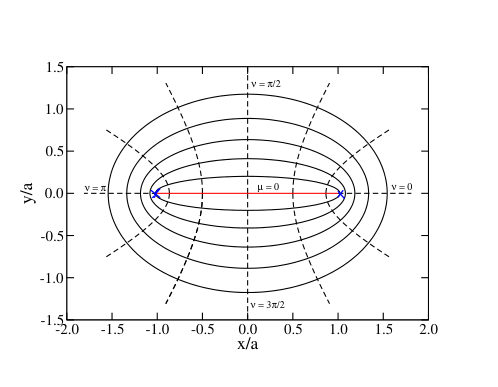
<figcaption class="paper-figure-caption"><b>Fig 1.</b> FIG. 1: (color online) Ellipses and hyperbolae with foci at x = ±a indicated by the blue</figcaption>
</figure>
<figure class="paper-figure-card">
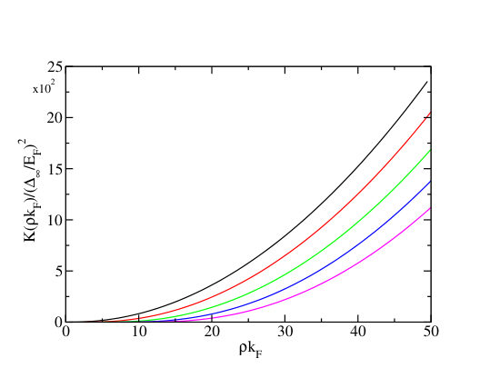
<figcaption class="paper-figure-caption"><b>Fig 2.</b> FIG. 2: (color online) The function K(˜ρ) normalized to (∆∞/EF )2 for five values of akF , namely</figcaption>
</figure>
<figure class="paper-figure-card">
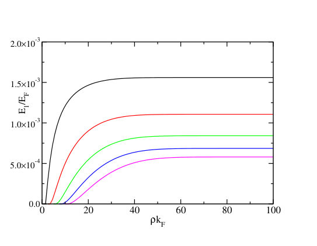
<figcaption class="paper-figure-caption"><b>Fig 3.</b> FIG. 3: (color online) First excited state energy E1: In Eq. (66) we set ˜ρc = akF /2 and replace</figcaption>
</figure>
<figure class="paper-figure-card">
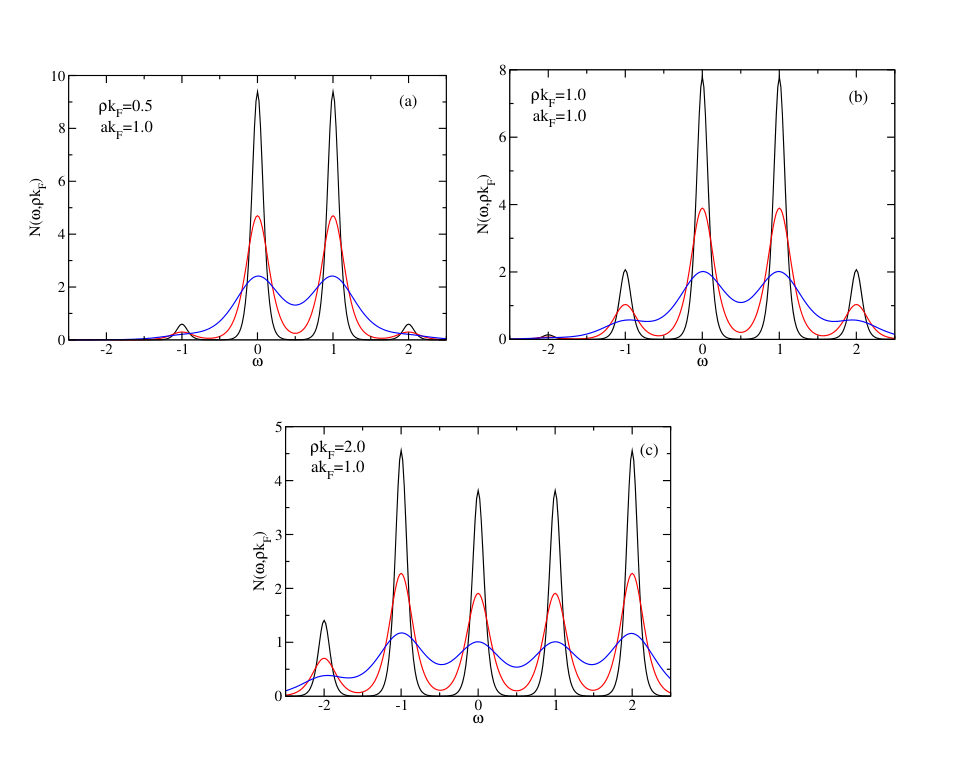
<figcaption class="paper-figure-caption"><b>Fig 4.</b> FIG. 4: (color online) LDOS of the bound states in the linear vortex of length 2a as a function of</figcaption>
</figure>
<figure class="paper-figure-card">
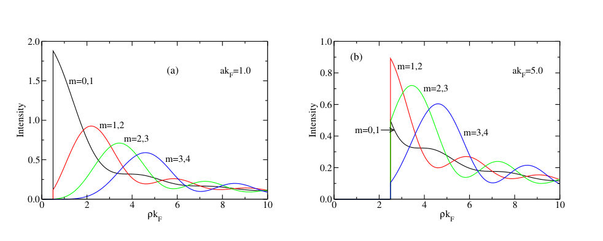
<figcaption class="paper-figure-caption"><b>Fig 5.</b> FIG. 5: (color online) Intensities of the peaks as a function of ˜ρ for several m. In general the</figcaption>
</figure>

**Summary.** This paper theoretically analyzes the bound states trapped in a line-shaped vortex within a 2D topological superconductor. By solving the Bogoliubov-de Gennes equations using elliptical coordinates, the authors predict the existence of a zero-energy Majorana state and quantized excited states. The findings provide crucial theoretical predictions for detecting topologically protected quantum phenomena in superconducting materials.

**Why it may be interesting.** This work provides a detailed theoretical framework for predicting robust zero-energy modes (Majorana fermions) in superconducting topological systems, which is highly relevant to realizing topological quantum computation platforms.

Detailed structure

**Main problem.** The study investigates zero-energy fermion bound states trapped within a line-shaped vortex core of a two-dimensional topological superconductor.

**Main result.** A zero-energy Majorana state is predicted to exist, alongside equally spaced excited states whose energies are determined by solving the Bogoliubov-de Gennes equations in elliptical coordinates.

**Method.** The analysis involves solving coupled differential equations derived from the BdG formalism using specialized techniques suited for line defects, including matching solutions across different radial regimes.

**Model / system.** The system is a 2D electron gas on a topological insulator surface, subjected to proximity-induced s-wave superconductivity and Rashba spin-orbit coupling. The geometry necessitates the use of elliptical coordinates $(\mu, 
u)$ due to the line-shaped vortex.

**Key observables.** Zero-energy Majorana state ($E_0=0$), quantized excited state energies ($E_m$), and the Local Density of States (LDOS) measured via STM.

**Important parameters / regimes.** The superconducting gap $\Delta(r)$ vanishes along the line defect ($\mu=0$); parameters include Fermi velocity ($v_F$) and coupling strengths.

**Assumptions / limitations.** Approximations are made in solving differential equations, particularly concerning the decay function $K(	ilde{
ho})$ and neglecting higher-order terms in perturbative matching procedures.

**Figures summary.** Figures illustrate elliptical coordinates defining the vortex geometry; one shows the decay function $K(	ilde{
ho})$; another tracks the convergence of excited state energy $E_1$; and a final figure demonstrates the characteristic asymmetry in the LDOS spectrum for different spin components.

**Paper structure.** The paper progresses from setting up the physical model and Hamiltonian in elliptical coordinates, to solving the BdG equations using Bessel/Hankel functions across matching boundaries ($	ilde{
ho}_c$), culminating in deriving quantized energy expressions via perturbative matching conditions.

Abstract

Fermion bound states in the core of a line-shaped vortex of a two-dimensional topological superconductor are investigated. The superconducting pairing potential, described in terms of elliptical coordinates, vanishes along a line defect with the two foci at the endpoints. The superconductivity is induced into a topological insulator via proximity effect with a type II s-wave superconductor. The spin and the momentum are perpendicularly locked by the strong spin-orbit coupling via Rashba interaction. A zero-energy Majorana state arises from the Berry phase together with a sequence of equally spaced fermion exitations. By solving the Bogoliubov-de Gennes equations using the method employed by Caroli, de Gennes and Matricon we calculate the energies, the wave-functions and spin-polarization of the bound states. An analytic expression for the local density of states within the vortex is obtained.

[↑ back to top](#top)

### [Electronic properties and topological aspects of graphene nanohelicoids](http://arxiv.org/abs/2607.13294v1)

**Authors:** Xiaoqian Liu, Arsen Herasymchuk, Yaroslav Zhumagulov, Oleg V. Yazyev  
**Type:** theory · **Category:** other · **PDF:** <https://arxiv.org/pdf/2607.13294v1>  
**Analysis basis:** full PDF text, analyzed in chunks
**Topic relevance:** `analog quantum simulation` **2/5** · `Frenkel-Kontorova` **1/5** · `methods for driven-dissipative` **1/5**

↔ Scroll figures horizontally

<figure class="paper-figure-card">
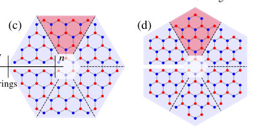
<figcaption class="paper-figure-caption"><b>Fig 1.</b> FIG. 1. (a) Graphene nanohelicoid lattice model. (b) Unit cell of zigzag-edge helicoid. Red/blue dots denote the A/B sublattice. Grey dashed lines show the connectivity of sites with neighboring unit cells. (c) Lattice model of the zigzag- edge 1D helicoid lattice model. N is the outer radius and n is the inner radius, W = N −n + 1 is the width of the helicoid flake. (d) Armchair-edge helicoid lattice model.</figcaption>
</figure>
<figure class="paper-figure-card">
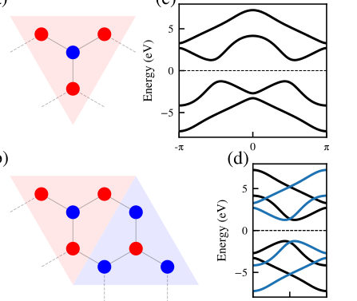
<figcaption class="paper-figure-caption"><b>Fig 2.</b> FIG. 2. Comparison between bipartite and anti-bipartite lat- tice models and their corresponding band structure; N = 2 and n = 1 case. (a) The anti-bipartite lattice composed of two sublattices (red and blue). (b) The bipartite lattice model with the double unit cell. (c) The anti-chiral band structure for the corresponding lattice. (d) The chiral band structure with folded Brillouin zone. The blue curves highlight pairs of bands related by this momentum-shifted particle–hole con- straint.</figcaption>
</figure>
<figure class="paper-figure-card">
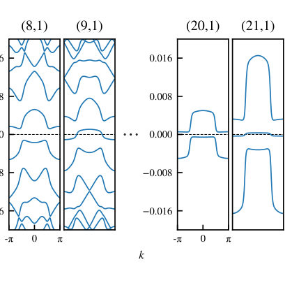
<figcaption class="paper-figure-caption"><b>Fig 3.</b> FIG. 3. Band structures of zigzag-edge GNHs for different system sizes as a function of the dimensionless Bloch momen- tum k along the periodic direction. The numbers shown above each panel denote the pair (N, n). In this figure, the inner ra- dius n is kept fixed while the outer radius N is varied.</figcaption>
</figure>
<figure class="paper-figure-card">
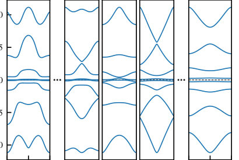
<figcaption class="paper-figure-caption"><b>Fig 4.</b> FIG. 4. Band structures of zigzag-edge GNHs for different system sizes. In this figure, the outer radius N is kept fixed while the inner radius n is varied.</figcaption>
</figure>
<figure class="paper-figure-card">
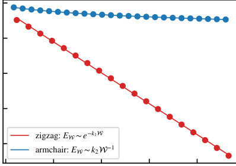
<figcaption class="paper-figure-caption"><b>Fig 5.</b> FIG. 7. Band gap as a function of GNH real space width W, where W = Wa for zigzag case and W = (wII/2 + 1)a for armchair case. The dots are the original data, and the lines are the fitting curves.</figcaption>
</figure>

**Summary.** This paper theoretically examines graphene nanohelicoids by modeling their electronic structure using a tight-binding approach that incorporates anti-chiral symmetry. Key findings show that the band gap oscillates periodically with width, and the topological invariant (Zak phase) alternates between trivial and nontrivial states. This work provides deep insight into how geometric curvature dictates the fundamental quantum electronic properties of 2D materials.

**Why it may be interesting.** While focused on condensed matter topology, the concept of engineered geometric constraints leading to protected electronic states (like those derived from symmetry) is highly relevant to designing quantum materials for novel quantum devices.

Detailed structure

**Main problem.** The study investigates the electronic properties and topological characteristics of graphene nanohelicoids (GNHs), which are structures where the honeycomb lattice is curved onto a helicoidal surface.

**Main result.** The band gap size in GNHs exhibits periodic closing and reopening as the width changes, accompanied by an alternating Zak phase that switches between trivial and nontrivial values.

**Method.** The authors employed the tight-binding approximation to derive effective one-dimensional lattice models from the 3D helical structure, supplemented by mathematical derivations involving recurrence relations for associated polynomials.

**Model / system.** The physical system is Graphene Nanohelicoids (GNHs). The model uses an effective 1D tight-binding Hamiltonian exhibiting anti-chiral symmetry ($E_v(k)=-E_c(k+\pi)$), contrasting with standard chiral symmetries.

**Key observables.** Band structure, Zak phase, band gap size, and the spectral relation $E_v(k) = -E_c(k + \pi)$.

**Important parameters / regimes.** Structure width ($W$), edge termination (zigzag vs. armchair), and momentum shift ($\pi$).

**Assumptions / limitations.** The analysis primarily uses the tight-binding approximation, considering only intralayer coupling, and relies on deriving analytic models for the effective 1D chain.

**Figures summary.** Figures illustrate the GNH lattice model, compare band structures under anti-chiral vs. chiral constraints, and show how gap dependence varies with width or radius changes for zigzag and armchair edges.

**Paper structure.** The paper systematically analyzes the electronic structure by first establishing the effective 1D model and symmetry properties (anti-chiral). It then details results based on edge termination (zigzag vs. armchair), concluding with advanced mathematical derivations concerning determinants and topological invariants using recurrence relations.

Abstract

We introduce graphene nanohelicoids, geometric analogues of graphene nanoribbons, in which the honeycomb lattice is embedded on a helicoidal surface. Starting from the three-dimensional helical structure, we construct effective one-dimensional lattice models with band structures characterized by a momentum-shifted particle-hole relation $E_v(k)=-E_c(k+π)$ that reflects an anti-chiral symmetry arising from the nonsymmorphic symmetry. A systematic investigation of graphene nanohelicoids using the tight-binding approximation reveals a number of trends upon varying width and edge orientation, for instance, alternating transitions between semiconducting and metallic regimes. As the structure width varies, the band gap periodically closes and reopens, accompanied by an alternating Zak phase that switches between trivial and nontrivial. We derive an analytic tight-binding model and introduce a continuous deformation of the graphene nanohelicoids that explains the origin of width-dependent band inversion and alternating Zak phase.

[↑ back to top](#top)

### [Multihump-Multivalley Soliton Families on a Plane Wave Background in Birefringent Optical Fibers](http://arxiv.org/abs/2607.13773v1)

**Authors:** Jin-Peng Yang, Yan-Hong Qin  
**Type:** theory · **Category:** other · **PDF:** <https://arxiv.org/pdf/2607.13773v1>  
**Analysis basis:** full PDF text, analyzed in chunks
**Topic relevance:** `interference shaping light` **1/5**

↔ Scroll figures horizontally

<figure class="paper-figure-card">
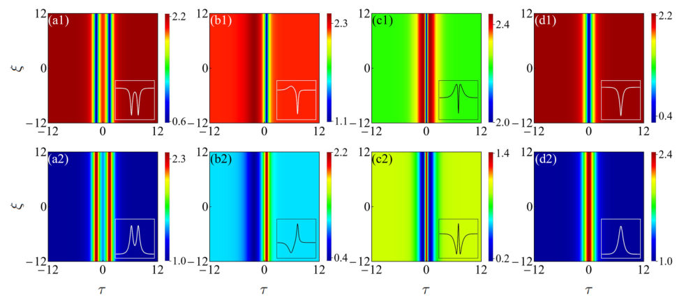
<figcaption class="paper-figure-caption"><b>Fig 1.</b> FIG. 1: Some intensity structures of MHMVSs on the plane wave. First row corresponds to the first component, and second row to the second component. The points (ε1,ε2) are chosen as follows: (a): ε1 = ε2 = −1 √</figcaption>
</figure>
<figure class="paper-figure-card">
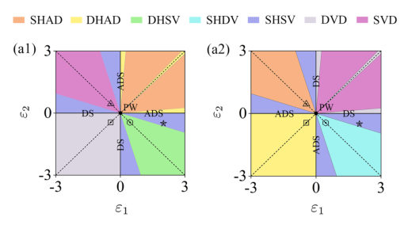
<figcaption class="paper-figure-caption"><b>Fig 2.</b> FIG. 2: Intensity profiles of MHMVSs in the (ε1, ε2)-plane. (a1) and (a2) correspond to the first and second components, respectively. The black dash lines are symmetric intensity lines, which is given by |ε1| = |ε2|. The cube pattern point corresponds to Fig. 1(a); the star pattern corresponds to Fig. 1(b); the regular hexagonal pattern corresponds to Fig. 1(c); the triangular pattern corresponds to Fig. 1(d). The parameters are selected as follows: b1 = −b2 = 0.5, z1 = 0.5, z2 = 1, a1 = √</figcaption>
</figure>
<figure class="paper-figure-card">
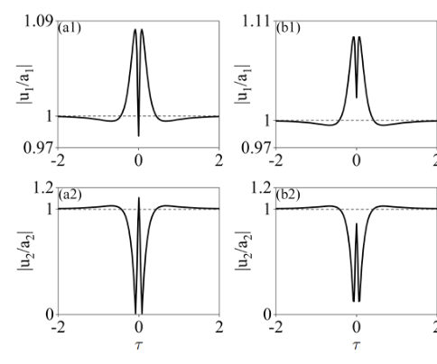
<figcaption class="paper-figure-caption"><b>Fig 3.</b> FIG. 3: Some higher-order intensity structures of MHMVSs. (a1)-(a2) demonstrate symmetric DHTV-THDV soliton, (b1)- (b2) demonstrate symmetric DHDV-DHDV soliton. The pa- rameters are selected as follows: (a) b1 = −b2 = 2.7, z1 = 6.25, z2 = ζ−2z1 ≈5.6153, ζ = 1.055, a1 ≈0.9452, a2 ≈ 0.3907, κ1 ≈6.25 + 1.1443i, κ2 ≈5.6153 + 2i, ε1 = −ε2 ≈ −0.3321; (b) b1 = −b2 = 2.5, z1 = 6.25, z2 = ζ−2z1 ≈ 5.6153, ζ = 1.055, a1 ≈0.9976, a2 ≈0.4419, κ1 ≈6.25 + 1.0917i, κ2 ≈5.6153 + 2i, ε1 = −ε2 ≈−0.3511.</figcaption>
</figure>
<figure class="paper-figure-card">
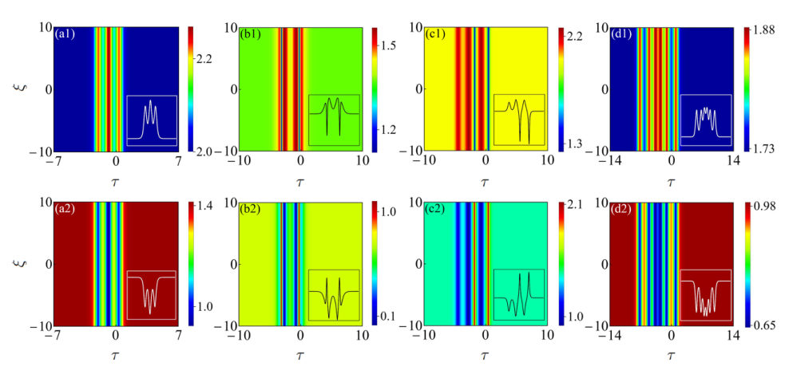
<figcaption class="paper-figure-caption"><b>Fig 4.</b> FIG. 4: Some intensity distributions of static AMHMVSs. First row corresponds to the first component, and second row to the second component. (a) is obtained by three iterations with parameters ε1 = 1, ε2 = 0.5, ε3 = 0.75 and a1 = 2, a2 = √</figcaption>
</figure>
<figure class="paper-figure-card">
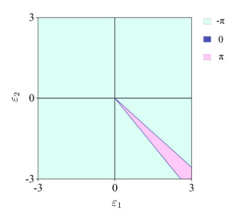
<figcaption class="paper-figure-caption"><b>Fig 5.</b> FIG. 5: Phase-shift difference between the two components for (ε1, ε2) ∈(R\{0})2 at ξ = 0. The parameters are same as Fig. 2.</figcaption>
</figure>

**Summary.** This paper presents the discovery of a previously unknown family of multihump-multivalley solitons (MHMVSs) using the Darboux transformation method on birefringent optical fibers. The research establishes that these solutions possess distinct topological characteristics, notably linking the virtual monopole field to both intensity zeros and poles in the complex plane.

**Why it may be interesting.** This work is highly relevant for theoretical physicists in quantum optics and open quantum systems as it provides new exact analytical solutions (MHMVSs) and reveals novel topological features within a coupled nonlinear wave system framework.

Detailed structure

**Main problem.** The study aims to systematically derive and analyze multihump-multivalley soliton (MHMVS) families existing on a plane wave background within birefringent optical fibers.

**Main result.** The authors obtained exact solutions for MHMVSs, including arbitrary configurations (AMHMVSs), demonstrating a previously unknown soliton family and revealing that the virtual monopole field is equally determined by intensity zeros and poles.

**Method.** Exact solutions were derived using the Darboux transformation method applied to the two-component Fokas-Lenells equations. Stability was confirmed via numerical simulations under weak white noise.

**Model / system.** The physical system modeled is birefringent optical fibers, governed by the integrable two-component Fokas-Lenells equations (CFL equations). This system is an extension of the Manakov model incorporating self-steepening and spatio-temporal coupling effects.

**Key observables.** Multihump-Multivalley Solitons (MHMVSs), Arbitrary MHMVSs (AMHMVSs), virtual monopole field, intensity profiles (e.g., cube, star, hexagonal patterns).

**Important parameters / regimes.** Birefringence parameters ($\eta$), background wave amplitude ($a_s$), and spectral parameters ($\kappa$).

**Assumptions / limitations.** The analysis is restricted to solitons propagating on a plane wave background, contrasting with previous work limited to vanishing backgrounds.

**Figures summary.** Figure 1 illustrates example intensity structures of MHMVSs on the plane wave, showing various patterns like cube, star, hexagonal, and triangular configurations.

**Paper structure.** The paper systematically derives solutions using the Darboux transformation method, classifies fundamental solutions via phase diagrams, analyzes the topological structure related to the virtual monopole field, and confirms stability through numerical simulations.

Abstract

We obtain a family of multihump-multivalley solitons (MHMVSs) on a plane-wave background in birefringent optical fibers governed by the two-component Fokas-Lenells equations, with exact solutions derived via the Darboux transformation method. The fundamental solutions are systematically classified through their phase diagrams, and higher-order configurations are identified as well. Notably, the construction extends to solitons with arbitrary MHMV structures, a class of solutions previously unreported in two-component integrable systems. Numerical simulations confirm the robustness of these solutions under weak white noise. Furthermore, analysis of their topological structure reveals that the virtual monopole field is determined equally by the intensity zeros and poles of MHMVSs in the complex plane, a feature that has remained unrecognized in previous studies of nonlinear wave topological phases. These findings reveal a previously unknown soliton family on a plane-wave background along with a distinct topological feature within the two-component framework, thereby enriching the broader understanding of topological phases of nonlinear waves.

[↑ back to top](#top)

### [Orbital Hybridization Induces Giant Cubic Rashba Effect at Cu/WO$_{3}$ Interface](http://arxiv.org/abs/2607.14069v1)

**Authors:** Md Aktar Hossain, Saikat Das  
**Type:** theory · **Category:** other · **PDF:** <https://arxiv.org/pdf/2607.14069v1>  
**Analysis basis:** full PDF text, analyzed in chunks
**Topic relevance:** `spintronics-quantum-optics interface` **1/5**

↔ Scroll figures horizontally

<figure class="paper-figure-card">
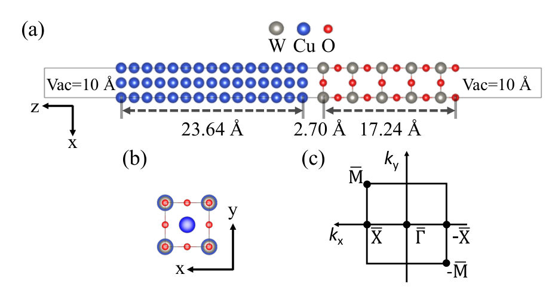
<figcaption class="paper-figure-caption"><b>Fig 1.</b> FIG. 1. Structural model of the WO2-terminated Cu(001)/WO3(001) heterostructure with a Type-I interface configuration. (a) Side view of the slab model showing the interfacial atomic arrangement, (b) top view of the slab model; for visual clarity, the Cu atoms are shown enlarged, and a deep blue shade is used for the face-centered Cu atom. (c) Corresponding surface Brillouin zone with high-symmetry points labeled.</figcaption>
</figure>
<figure class="paper-figure-card">
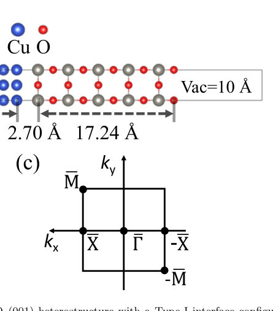
<figcaption class="paper-figure-caption"><b>Fig 2.</b> Figure 1 shows the Type-I slab model consisting of 15 monolayers (ML) thick Cu(001) and a 4 unit-cells- thick WO3(001) layer. The interfacial separation is op- timized to 2.70 ˚A (see Supplementary Fig. S2 [29]). We passivated the WO3/vacuum interface with hydro- gen to avoid unwanted electronic states. A vacuum re- gion of 20 ˚A (10 ˚A on each side) was introduced along the c-axis to eliminate spurious interactions between pe- riodic images. The in-plane lattice parameters are set to a = b = 3.83 ˚Afor both Cu and WO3 layers. Conse- quently, the WO3 layer imposes an in-plane tensile strain of +4.3 % on the Cu. For the band structure calcu- lations, spin–orbit coupling (SOC) [31, 32] is...</figcaption>
</figure>
<figure class="paper-figure-card">
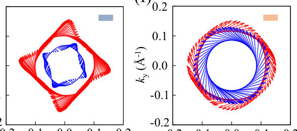
<figcaption class="paper-figure-caption"><b>Fig 3.</b> FIG. 2. Electronic band structure and spin textures of the WO2-interface terminated Cu(001)/WO3(001) heterostructure. (a) Band structure. (b) Magnified view of the α, β, and γ bands near the Γ point, corresponding to the dashed box in (a). (c), (d) Spin-projected band structures showing the in-plane ⟨Sx⟩and ⟨Sy⟩components, respectively; the inset in (d) shows the negligible ⟨Sz⟩contribution. (e), (f) Constant-energy spin textures for the β-band and γ band, corresponding to the energies marked by the colored rectangles in (b). The length of arrows is proportional to the magnitude of spin expectation value.</figcaption>
</figure>
<figure class="paper-figure-card">
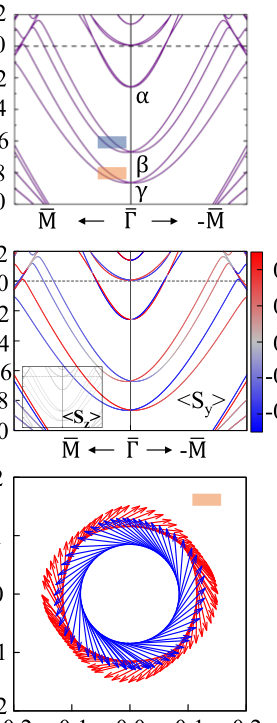
<figcaption class="paper-figure-caption"><b>Fig 4.</b> Figure 2 summarizes our key results, where in Fig. 2(a) we show the full electronic structure along high sym- metry path: X−Γ−X−M−Γ−M of the surface Brillouin zone. Upon zooming in along the M−Γ−M path, we find three electron-like bands with minima located at approx- imately 0.25 eV, 0.65 eV, and 0.88 eV below the Fermi level, (Fig. 2(b)). We hereafter refer to these bands as α, β, and γ. The β and γ bands exhibit a clear Rashba spin</figcaption>
</figure>
<figure class="paper-figure-card">
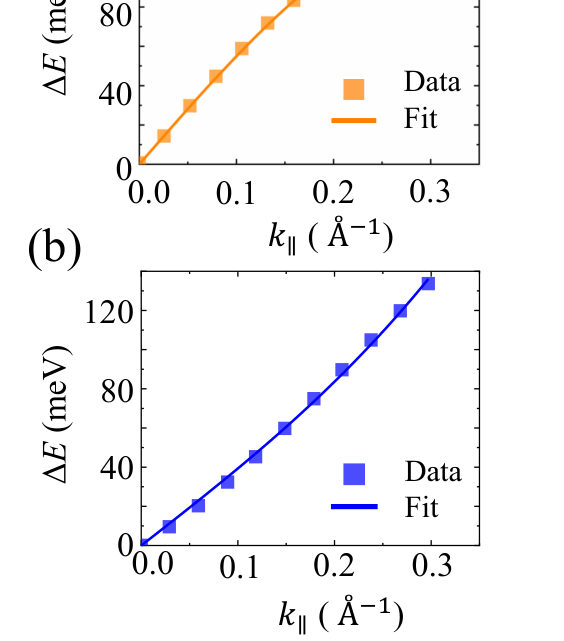
<figcaption class="paper-figure-caption"><b>Fig 5.</b> FIG. 3. Momentum-resolved energy splitting along the ¯Γ– ¯ M path for the (a) the β band and (orange squares) (b) the γ band (blue squares). The solid lines are fit to the model, ∆E(k) = 2αRk + 2˜αRk3.</figcaption>
</figure>

**Summary.** This theoretical study uses DFT calculations on the Cu/WO3 interface to demonstrate a robust spin-orbit coupling characterized by both linear and a remarkably large cubic Rashba term. The giant cubic parameter arises from orbital hybridization between W and Cu, establishing this light-metal oxide system as a novel platform for studying nonlinear spintronic phenomena.

**Why it may be interesting.** The discovery of a giant, tunable cubic Rashba effect in a light-metal/oxide platform opens new avenues for spintronics research beyond traditional heavy metal interfaces.

Detailed structure

**Main problem.** The study investigates emergent Rashba spin-orbit interaction (SOI) at interfaces between light metals and heavy-element oxide insulators, focusing on the interplay between linear and cubic Rashba effects.

**Main result.** The Cu/WO3 interface exhibits a robust Rashba splitting, yielding a giant intrinsic cubic Rashba parameter ($	ilde{\alpha}_R \approx -1.93 	ext{ eV}\cdot	ext{\AA}^3$) driven by W-Cu orbital hybridization.

**Method.** First-principles Density Functional Theory (DFT) calculations were employed to model the electronic structure and spin splitting at the heterostructure interface.

**Model / system.** The system modeled is the Cu(001)/WO3(001) heterostructure, analyzed using slab models incorporating Spin-Orbit Coupling (SOC). The analysis examines how Rashba parameters change with Cu thickness and surface orientation.

**Key observables.** Rashba spin-splitting magnitude ($\Delta E(k)$), intrinsic linear ($\alpha_R$) and cubic ($	ilde{\alpha}_R$) Rashba parameters, and orbital contributions to the interface state.

**Important parameters / regimes.** The giant cubic Rashba parameter $	ilde{\alpha}_R \approx -1.93 	ext{ eV}\cdot	ext{\AA}^3$ and the linear parameter $\alpha_R \approx 0.49 	ext{ eV}\cdot	ext{\AA}$ are key quantitative results.

**Assumptions / limitations.** The calculations use a simplified cubic phase for WO3, avoiding complex room-temperature monoclinic structures, while retaining necessary symmetry for surface analysis.

**Figures summary.** Figures illustrate the structural model and electronic band structure/spin textures, showing momentum-resolved spin splitting ($\Delta E(k)$) confirming both linear and cubic Rashba contributions in the interface state.

**Paper structure.** The paper proceeds by establishing the physical model (Cu/WO3 heterostructure), calculating the electronic properties using DFT+U with SOC, extracting the energy splitting dependence on momentum to fit $\alpha_R$ and $	ilde{\alpha}_R$, and finally analyzing the thickness dependence to isolate the intrinsic cubic term.

Abstract

Harnessing Rashba spin-orbit interaction and related spintronic functionalities has traditionally relied on metallic surfaces or interfaces containing elemental heavy metals. Here, using first-principles calculations and Cu(001)/WO$_3$(001) as a model heterostructure, we show that interfacing a light metal, Cu, with a band insulator, WO$_3$, yields an interface state that exhibits a robust Rashba spin splitting arising from the interplay between linear and cubic Rashba effects. The spin splitting is driven by the strong spin-orbit coupling of W atoms and enabled by W-Cu orbital hybridization at the interface. The cubic Rashba contribution asymptotically grows with Cu thickness and can be explained in terms of cross-coupling between the vacuum/Cu and Cu/WO$_3$ interfaces. This interfacial cross-coupling, however, diminishes at larger Cu thicknesses, allowing us to extract the intrinsic cubic Rashba parameter, which has a giant value of approximately -1.93 eV $Å^3$. In contrast, the linear Rashba parameter is only weakly affected by this cross-coupling and varies from approximately 0.30 to 0.49 eV Å. We further show that sizable linear and cubic Rashba effects persist across several interface geometries and Cu surface orientations, including (110) and (111). Our work identifies the Cu/WO$_3$ interface as a novel light-metal/heavy-element-based oxide platform for exploring the rich spectrum of Rashba physics, including linear and nonlinear spin-orbit phenomena.

[↑ back to top](#top)

### [Role of small-radius and high-electronegativity A-Site dopants in enhancing proton transport and stability of perovskite electrolytes](http://arxiv.org/abs/2607.13657v1)

**Authors:** Hang Ma, Ying Liang, Tianxing Ma  
**Type:** theory · **Category:** other · **PDF:** <https://arxiv.org/pdf/2607.13657v1>  
**Analysis basis:** full PDF text, analyzed in chunks
**Topic relevance:** `Keldysh / 2PI / non-Gaussian methods` **1/5**

↔ Scroll figures horizontally

<figure class="paper-figure-card">
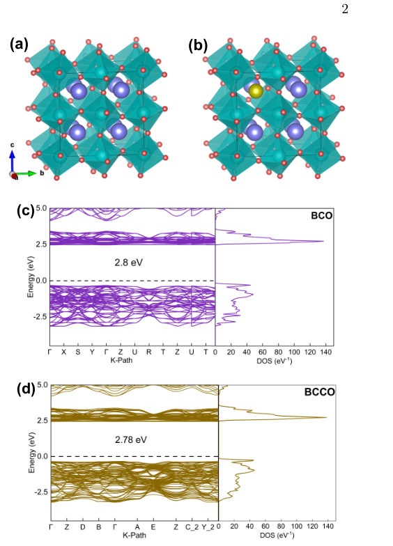
<figcaption class="paper-figure-caption"><b>Fig 1.</b> FIG. 1. (a) √</figcaption>
</figure>
<figure class="paper-figure-card">
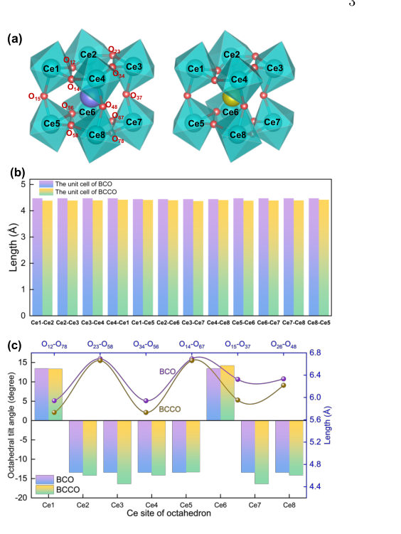
<figcaption class="paper-figure-caption"><b>Fig 2.</b> FIG. 2. (a) The left panel shows the unit cell containing a Ba atom in the BCO supercell, and the right panel shows the unit cell containing a Ca atom in the BCCO supercell. The corner Ce atoms and their octahedra are labeled as Ce1-Ce8. The subscripts of the oxygen atoms located on the cell edges correspond to the two Ce atoms’label they are bonded to, such as O12-O78 shown in the figure. (b) Measurements of the cell edge lengths for the Ba-containing and Ca-containing unit cells corresponding to panel (a). (c) Measurements of the octahedral tilt angles and the distances between the farthest diagonal O atoms corresponding to panel (a). The octahedral rotation around the z direction is...</figcaption>
</figure>
<figure class="paper-figure-card">
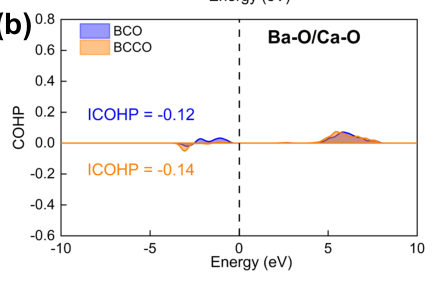
<figcaption class="paper-figure-caption"><b>Fig 3.</b> FIG. 3. (a) The COHP and ICOHP of Ce-O bonds in BCO and BCCO. (b) The COHP and ICOHP of Ba-O bonds in BCO and Ca-O bonds in BCCO. The plotted values are ob- tained by averaging over all Ce-O and Ba-O bonds within one Ba-containing unit cell in the BCO supercell, and over all Ce- O and Ca-O bonds within one Ca-containing unit cell in the BCCO supercell.</figcaption>
</figure>
<figure class="paper-figure-card">
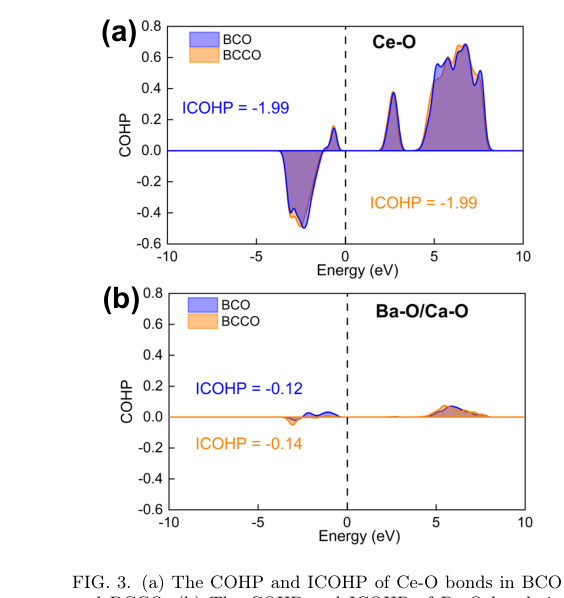
<figcaption class="paper-figure-caption"><b>Fig 4.</b> Figure 3 presents the Crystal Orbital Hamilton Popu- lation (COHP)of the BCO and BCCO systems obtained using the LOBSTER code[58]. In the BCO structure, the Ce-O bonds exhibit distinct antibonding and bond- ing peaks above and below the Fermi level, and the inte- grated COHP (ICOHP) value is -1.99, indicating a typi- cal covalent bonding nature of Ce-O interactions[35]. In contrast, the COHP of the Ba-O bonds shows no clear separation between bonding and antibonding regions and is dominated by antibonding states. Its peak value is much smaller than that of the covalent-bond-dominated semiconductor CaAs (2.5)[59], suggesting weak and en- ergetically unfavorable orbital overlap. Therefore, the</figcaption>
</figure>
<figure class="paper-figure-card">
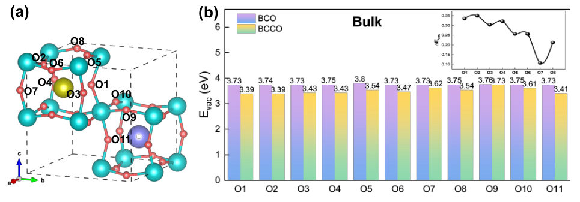
<figcaption class="paper-figure-caption"><b>Fig 5.</b> FIG. 4. (a) Schematic illustration of the 11 inequivalent oxygen sites (O1-O11) considered for calculating the oxygen vacancy formation energies in the bulk BCCO structure. (b) Oxygen vacancy formation energies of O1-O11 in BCO and BCCO. The inset shows the difference in formation energy (δEvac) at the nearest-neighbor oxygen sites (O1-O8) between the two systems.</figcaption>
</figure>

**Summary.** This theoretical study investigates how doping A-sites in perovskite electrolytes like BaCeO3 can boost performance for SOFCs. The authors show that using small, highly electronegative dopants simultaneously improves proton conductivity by facilitating oxygen vacancies and enhances chemical stability by weakening detrimental bonds with acidic gases.

**Why it may be interesting.** While focused on materials science, the underlying physics involves defect chemistry, ionic/covalent bond characterization, and energy landscape mapping using advanced computational techniques applicable to complex many-body systems.

Detailed structure

**Main problem.** The primary challenge addressed is improving the chemical stability of BaCeO3-based electrolytes used in solid oxide fuel cells (SOFCs), as current doping strategies often fail to enhance both proton transport and stability simultaneously.

**Main result.** The study demonstrates that A-site doping with small-radius, high-electronegativity ions like Ca enhances performance by weakening A-O bonds (aiding vacancy formation) and inducing lattice contraction (improving thermal stability).

**Method.** The research relies heavily on first-principles calculations using DFT (VASP/PBE functional) to model structural changes, calculate defect energies, and map proton migration pathways.

**Model / system.** The system under investigation is the perovskite electrolyte structure, specifically comparing pristine BaCeO3 with Ca-doped variants like Ba0.875Ca0.125CeO3.

**Key observables.** Proton concentration/diffusion barriers, oxygen vacancy formation energy (E_vac), lattice contraction (tolerance factor change), and adsorption energies for acidic gases (CO2, SO2).

**Important parameters / regimes.** The key physical parameters are the ionic radii and electronegativities of the dopants, which govern the electronic and structural changes.

**Assumptions / limitations.** Calculations assume the Born-Oppenheimer approximation is valid for migration barriers, and the PBE functional may slightly overestimate lattice constants compared to experimental values.

**Figures summary.** Figures compare supercell structures of doped vs. pristine materials, show band structure/DOS comparisons, and illustrate structural changes related to doping effects.

**Paper structure.** The paper follows a logical progression: identifying the stability limitation -> proposing A-site doping as a solution -> using first-principles methods to quantify how small radius (lattice contraction) and high electronegativity (weakened bonding) synergistically improve both proton transport and chemical resilience.

Abstract

The practical application of BaCeO$_3$-based electrolytes is limited by their poor chemical stability in proton-conducting solid oxide fuel cells. Commonly employed B-site doping strategies typically improve proton transport with limited improvement in stability. Recent experiments show that A-site Ca doping can simultaneously enhance both properties. Here, through first-principles calculations and mechanistic analysis of Ca-doped BaCeO$_3$, we identify the synergistic roles of small-radius, high-electronegativity A-site dopants in governing proton transport and chemical stability in perovskite electrolytes. We show that the higher electronegativity of A-site dopant weakens the A-O ionic bonding, facilitating oxygen-vacancy formation and enhancing proton uptake by increasing the basicity. This weakened A-O interaction also suppresses the formation of impurity phases and reduces the adsorption strength of acidic gases such as CO$_2$ and SO$_2$. The lattice contraction induced by the smaller ionic radius improves thermal stability and can enhance proton diffusion in systems where proton transfer is the rate-limiting step. Furthermore, we find that Ca surface segregation can mitigate grain-boundary resistance effects. Our results demonstrate the advantages of A-site Ca doping in Ba-based electrolytes, clarify the mechanisms by which small-radius, high-electronegativity dopants influence proton transport and chemical stability, and provide guidance for the design of high-performance proton-conducting electrolytes.

[↑ back to top](#top)

### [Theoretical prediction of structural stability and superconductivity in T-hexagonal molybdenum dihydrides Monolayer](http://arxiv.org/abs/2607.13297v1)

**Authors:** Jakkapat Seeyangnok, Udomsilp Pinsook  
**Type:** theory · **Category:** other · **PDF:** <https://arxiv.org/pdf/2607.13297v1>  
**Analysis basis:** full PDF text, analyzed in chunks
**Topic relevance:** `Keldysh / 2PI / non-Gaussian methods` **1/5**

↔ Scroll figures horizontally

<figure class="paper-figure-card">
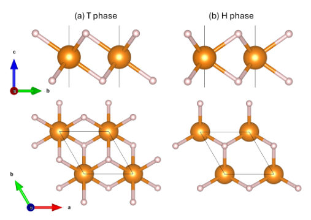
<figcaption class="paper-figure-caption"><b>Fig 1.</b> FIG. 1. Crystal structures of monolayer molybdenum dihydride (MoH2) in the (a) T-phase (octahedral coordination) and (b) H-phase (trigonal prismatic coordination). For each phase, the upper panel shows the side view along the a-axis (with the vertical thickness and c-axis indicated), and the lower panel shows the top view down the c-axis, where the unit cell is outlined by the black solid lines. Orange and pink spheres represent Mo and H atoms, respectively.</figcaption>
</figure>
<figure class="paper-figure-card">
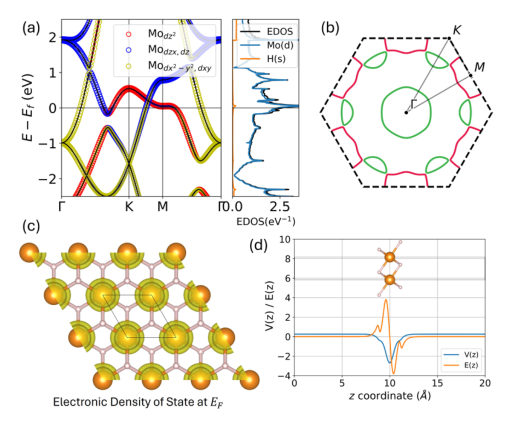
<figcaption class="paper-figure-caption"><b>Fig 2.</b> FIG. 3. Electronic structure of the monolayer T-MoH2. (a) Orbital- resolved electronic band structure along high-symmetry paths (left panel) and corresponding total and partial electronic density of states (EDOS, right panel). (b) Fermi surface topology across the first Bril- louin zone, highlighting electronic pockets surrounding the Γ, K, and M points. (c) Spatial distribution of the electronic charge density integrated within a narrow energy window around EF. (d) Planar- averaged electrostatic potential V(z) and local electric field E(z) pro- filed along the vertical z-direction across the monolayer plane.</figcaption>
</figure>
<figure class="paper-figure-card">
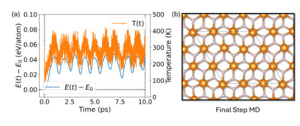
<figcaption class="paper-figure-caption"><b>Fig 3.</b> FIG. 2. Thermal stability of the monolayer T-MoH2 from ab initio molecular dynamics (AIMD) simulations. (a) Time evolution of the total energy fluctuation per atom, E(t)−E0 (left axis, blue line), and temperature T(t) (right axis, orange line) over a 10 ps simulation run at 300 K. (b) Top-down snapshot of the 3×3×1 supercell structure of 27 atoms at the final step (10 ps) of the AIMD simulation. Orange and pink spheres represent Mo and H atoms, respectively.</figcaption>
</figure>
<figure class="paper-figure-card">
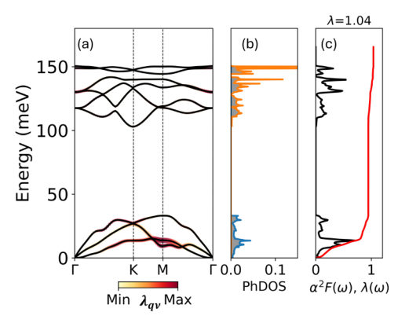
<figcaption class="paper-figure-caption"><b>Fig 4.</b> FIG. 5. Phonon dispersion relations and electron-phonon coupling (EPC) properties of monolayer T-MoH2. (a) Phonon band structure along high-symmetry paths, where the color mapping indicates the strength of the mode-resolved EPC linewidth (γqν). (b) Phonon den- sity of states (PhDOS) projected onto the constituent Mo (blue) and H (orange) atoms. (c) The Eliashberg electron-phonon spectral func- tion α2F(ω) (black line) and the cumulative frequency-dependent EPC parameter λ(ω) (red line), yielding a total integrated value of λ = 1.04.</figcaption>
</figure>
<figure class="paper-figure-card">
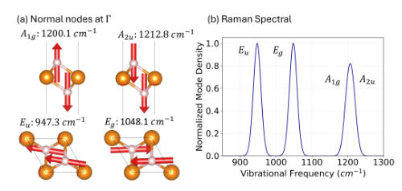
<figcaption class="paper-figure-caption"><b>Fig 5.</b> FIG. 4. Vibrational modes and simulated Raman spectrum of mono- layer T-MoH2 at the Brillouin zone center (Γ). (a) Schematic rep- resentation of the atomic displacement vectors for the four distinct optical phonon modes: Eu (947.3 cm−1), Eg (1048.1 cm−1), A1g (1200.1 cm−1), and A2u (1212.8 cm−1). Red arrows denote the direction and relative amplitude of atomic motions. (b) Smeared phonon mode profile representing the simulated high-frequency vi- brational spectrum, with peaks labeled according to their correspond- ing irreducible representations.</figcaption>
</figure>

**Summary.** This work theoretically analyzes the T-phase $	ext{MoH}_2$ monolayer, establishing it as a stable candidate for ambient-pressure superconductivity. Using first-principles calculations, the authors predict strong electron-phonon coupling ($\lambda=1.04$) leading to a conventional superconducting transition temperature of $14.4 	ext{ K}$. The findings position 2D hydrides as promising materials for low-dimensional quantum phenomena.

**Why it may be interesting.** While focused on condensed matter superconductivity, the rigorous application of advanced quantum many-body theory (Eliashberg equations) to a novel 2D material platform is methodologically rich for theoretical physicists.

Detailed structure

**Main problem.** The study investigates structural stability and phonon-mediated superconductivity in two-dimensional (2D) transition-metal hydrides to find ambient-pressure alternatives to high-temperature superconductors.

**Main result.** The T-phase of $	ext{MoH}_2$ is confirmed as the stable ground state, predicting a conventional superconducting critical temperature ($T_c$) of $14.4 	ext{ K}$ at ambient pressure.

**Method.** The research employs first-principles calculations (DFT) combined with Density Functional Perturbation Theory (DFPT) and solving the anisotropic Migdal-Eliashberg equations.

**Model / system.** The system modeled is the hexagonal molybdenum dihydride ($	ext{MoH}_2$) monolayer, comparing its T-phase (octahedral) to a less stable H-phase (trigonal prismatic).

**Key observables.** Superconducting transition temperature ($T_c$), electron-phonon coupling parameter ($\lambda$), structural energy difference, and elastic constants.

**Important parameters / regimes.** Ambient pressure; $\lambda = 1.04$; $T_c = 14.4 	ext{ K}$; Energy stabilization of T-phase over H-phase ($0.198 	ext{ eV}$).

**Assumptions / limitations.** The superconducting pairing mechanism is assumed to be conventional and mediated by phonons; the calculation uses a fixed Coulomb pseudopotential ($\mu^*=0.1$).

**Figures summary.** Figures detail structural comparisons (T vs H phase), thermal stability via AIMD, electronic structure (Fermi surface dominated by Mo $d$-orbitals), phonon dispersion/EPC spectral function ($\alpha^2F(\omega)$), and momentum-resolved superconducting gap closing.

**Paper structure.** The paper follows a logical progression: first establishing the ground state structural stability (T-phase vs H-phase); second, confirming mechanical and thermal robustness via elastic constants and AIMD; third, calculating electronic properties (metallicity) and phonon spectra; finally, applying the Eliashberg formalism to predict $T_c$.

Abstract

The realization of ambient-pressure, high-temperature superconductivity in hydrogen-rich materials remains a major pursuit in condensed-matter physics. While bulk hydrides require extreme pressures to stabilize, two-dimensional (2D) transition-metal hydrides offer a promising alternative to bypass these compression constraints. In this work, we investigate the structural stability, electronic properties, and phonon-mediated superconductivity of a hexagonal molybdenum dihydride (MoH2) monolayer using first-principles calculations. Total-energy evaluations reveal that the octahedral T-phase is energetically more favorable than the previously reported trigonal prismatic H-phase by 0.198 eV, establishing the T-phase as the true ground-state configuration. Consequently, we systematically evaluate the lattice dynamics and superconducting properties of this ground-state T-MoH2 monolayer within the frameworks of density functional perturbation theory (DFPT) and the anisotropic Migdal-Eliashberg formalism. The transition metal-hydrogen vibrational networks induce strong electron-phonon coupling (EPC), yielding an integrated coupling parameter of λ= 1.04. Solving the anisotropic Eliashberg equations predicts a conventional superconducting transition temperature (Tc of 14.4K) at ambient pressure, characterized by a moderately gap distribution (Δ= 2.07-3.01meV at 5.0 K). Our findings highlight the T-MoH2 monolayer as a structurally, mechanically, and thermally stable platform for exploring low-dimensional conventional superconductivity under ambient conditions.

[↑ back to top](#top)
