
# arxiv digest (quant-ph + cond-mat) — 2026-07-18

*127 papers · 46 relevant · 4 highlighted*

## 🔥 Most relevant (46)

*Every paper with at least one nonzero topic score, sorted by best-matching score. 🔥 marks scores ≥4/5. Click the title to jump to the full entry below; click [arXiv] to open the paper page. `(secondary)` marks papers from de-prioritized cond-mat archives.*

Show 46 relevant papers

- [Quantum many-body mixed phase space revealed by hybrid feedback control](#paper-2607.14223) [[arXiv]](http://arxiv.org/abs/2607.14223v1) — 🔥 `quantum measurements` **5/5** · 🔥 `analog quantum simulation` **4/5** · 🔥 `measurement-induced transitions` **4/5** · `driven-dissipative phase transition` **3/5** · `entanglement & information structure` **3/5** · `methods for driven-dissipative` **3/5** · `non-equilibrium dynamics` **3/5** · `Keldysh / 2PI / non-Gaussian methods` **2/5** · `correlated / nonlocal dissipation` **2/5** · `non-equilibrium universality` **2/5** · `QC/QI experiment` **1/5** · `exotic spin models in light-matter` **1/5** · `scars & prethermalization` **1/5** · `spintronics-quantum-optics interface` **1/5**
- [Tuning the universality class of a quantum process by Trotterization](#paper-2607.14663) [[arXiv]](http://arxiv.org/abs/2607.14663v1) — 🔥 `non-equilibrium universality` **5/5** · 🔥 `driven-dissipative phase transition` **4/5** · 🔥 `methods for driven-dissipative` **4/5** · `non-equilibrium dynamics` **3/5** · `Keldysh / 2PI / non-Gaussian methods` **1/5** · `analog quantum simulation` **1/5** · `correlated / nonlocal dissipation` **1/5**
- [General theory of monitored Quantum Reservoir Computing](#paper-2607.14311) [[arXiv]](http://arxiv.org/abs/2607.14311v1) — 🔥 `quantum measurements` **5/5** · 🔥 `measurement-induced transitions` **4/5** · `methods for driven-dissipative` **3/5** · `non-equilibrium dynamics` **2/5** · `Keldysh / 2PI / non-Gaussian methods` **1/5** · `correlated / nonlocal dissipation` **1/5** · `driven-dissipative phase transition` **1/5** · `entanglement & information structure` **1/5**
- [Periodic orbits and quantum many-body scars in integrable spin chains](#paper-2607.15132) [[arXiv]](http://arxiv.org/abs/2607.15132v1) — 🔥 `scars & prethermalization` **5/5** · `non-equilibrium dynamics` **3/5** · `entanglement & information structure` **2/5** · `non-equilibrium universality` **2/5** · `Keldysh / 2PI / non-Gaussian methods` **1/5** · `analog quantum simulation` **1/5** · `exotic spin models in light-matter` **1/5** · `spintronics-quantum-optics interface` **1/5**
- ⭐ [Driven-dissipative superconductivity in moiré heterostructure without attraction](#paper-2607.15169) [[arXiv]](http://arxiv.org/abs/2607.15169v1) — 🔥 `analog quantum simulation` **4/5** · 🔥 `driven-dissipative phase transition` **4/5** · 🔥 `methods for driven-dissipative` **4/5** · `correlated / nonlocal dissipation` **3/5** · `non-equilibrium dynamics` **3/5** · `non-equilibrium universality` **3/5** · `Keldysh / 2PI / non-Gaussian methods` **2/5** · `Tavis-Cummings & cavity-many-emitter` **2/5** · `quantum measurements` **2/5** · `Kondo & dissipative impurity` **1/5** · `correlated cavity matter` **1/5** · `entanglement & information structure` **1/5** · `exotic spin models in light-matter` **1/5** · `measurement-induced transitions` **1/5**
- [An experimental pathway towards an exact theory of strong coupling](#paper-2607.15089) [[arXiv]](http://arxiv.org/abs/2607.15089v1) — 🔥 `non-equilibrium dynamics` **4/5** · `correlated / nonlocal dissipation` **3/5** · `driven-dissipative phase transition` **3/5** · `methods for driven-dissipative` **3/5** · `non-equilibrium universality` **3/5** · `Keldysh / 2PI / non-Gaussian methods` **2/5** · `Kondo & dissipative impurity` **2/5** · `measurement-induced transitions` **2/5** · `quantum measurements` **2/5** · `analog quantum simulation` **1/5** · `entanglement & information structure` **1/5** · `exotic spin models in light-matter` **1/5** · `scars & prethermalization` **1/5**
- [Long-range and steady-state entanglement of driven-dissipative nitrogen vacancy centers using microwaves as a drive and synthetic antiferromagnet as a dissipator](#paper-2607.15259) [[arXiv]](http://arxiv.org/abs/2607.15259v1) `(secondary)` — 🔥 `correlated / nonlocal dissipation` **4/5** · 🔥 `entanglement & information structure` **4/5** · 🔥 `methods for driven-dissipative` **4/5** · `non-equilibrium dynamics` **3/5** · `spintronics-quantum-optics interface` **3/5** · `Keldysh / 2PI / non-Gaussian methods` **2/5** · `QC/QI experiment` **2/5** · `driven-dissipative phase transition` **2/5** · `analog quantum simulation` **1/5** · `exotic spin models in light-matter` **1/5** · `non-equilibrium universality` **1/5**
- [Locality of deep thermalisation through the lens of entanglement teleportation](#paper-2607.15276) [[arXiv]](http://arxiv.org/abs/2607.15276v1) — 🔥 `entanglement & information structure` **4/5** · 🔥 `measurement-induced transitions` **4/5** · `analog quantum simulation` **3/5** · `non-equilibrium dynamics` **3/5** · `quantum measurements` **3/5** · `correlated / nonlocal dissipation` **2/5** · `non-equilibrium universality` **2/5** · `driven-dissipative phase transition` **1/5** · `methods for driven-dissipative` **1/5** · `scars & prethermalization` **1/5**
- [Magic Without Entanglement: Exact Revivals and Their Fisher Information Origin](#paper-2607.14222) [[arXiv]](http://arxiv.org/abs/2607.14222v1) — 🔥 `entanglement & information structure` **4/5** · 🔥 `non-equilibrium dynamics` **4/5** · `analog quantum simulation` **3/5** · `non-equilibrium universality` **3/5** · `methods for driven-dissipative` **2/5** · `scars & prethermalization` **2/5** · `Keldysh / 2PI / non-Gaussian methods` **1/5** · `correlated / nonlocal dissipation` **1/5** · `driven-dissipative phase transition` **1/5**
- [Long-lived memory in sliding spin chains](#paper-2607.14383) [[arXiv]](http://arxiv.org/abs/2607.14383v1) — 🔥 `non-equilibrium dynamics` **4/5** · `Frenkel-Kontorova` **3/5** · `scars & prethermalization` **3/5** · `driven-dissipative phase transition` **2/5** · `non-equilibrium universality` **2/5** · `Keldysh / 2PI / non-Gaussian methods` **1/5** · `analog quantum simulation` **1/5** · `correlated / nonlocal dissipation` **1/5** · `exotic spin models in light-matter` **1/5** · `methods for driven-dissipative` **1/5** · `spintronics-quantum-optics interface` **1/5**
- [Phonons in low-dimensional confined systems: Emergent non-reciprocity in 1D](#paper-2607.14232) [[arXiv]](http://arxiv.org/abs/2607.14232v1) — 🔥 `analog quantum simulation` **4/5** · `Frenkel-Kontorova` **3/5** · `methods for driven-dissipative` **3/5** · `Keldysh / 2PI / non-Gaussian methods` **2/5** · `driven-dissipative phase transition` **2/5** · `non-equilibrium dynamics` **2/5** · `correlated / nonlocal dissipation` **1/5** · `entanglement & information structure` **1/5** · `exotic spin models in light-matter` **1/5** · `non-equilibrium universality` **1/5**
- [Coulomb blockade in microscopic material defects as a source of decoherence and noise in solid-state quantum circuits](#paper-2607.15252) [[arXiv]](http://arxiv.org/abs/2607.15252v1) — 🔥 `QC/QI experiment` **4/5** · `Kondo & dissipative impurity` **3/5** · `methods for driven-dissipative` **3/5** · `Keldysh / 2PI / non-Gaussian methods` **2/5** · `driven-dissipative phase transition` **2/5** · `non-equilibrium dynamics` **2/5** · `analog quantum simulation` **1/5** · `correlated / nonlocal dissipation` **1/5** · `non-equilibrium universality` **1/5**
- [Disorder-enhanced compressibility of Floquet random quantum circuits](#paper-2607.14296) [[arXiv]](http://arxiv.org/abs/2607.14296v1) — 🔥 `entanglement & information structure` **4/5** · `methods for driven-dissipative` **3/5** · `non-equilibrium dynamics` **3/5** · `non-equilibrium universality` **2/5** · `scars & prethermalization` **2/5** · `Keldysh / 2PI / non-Gaussian methods` **1/5** · `analog quantum simulation` **1/5** · `correlated / nonlocal dissipation` **1/5** · `driven-dissipative phase transition` **1/5**
- [Imaging and characterization of spontaneous vortices in a proximity-induced superconductor](#paper-2607.14697) [[arXiv]](http://arxiv.org/abs/2607.14697v1) `(secondary)` — 🔥 `non-equilibrium dynamics` **4/5** · 🔥 `non-equilibrium universality` **4/5** · `driven-dissipative phase transition` **3/5** · `scars & prethermalization` **2/5** · `Frenkel-Kontorova` **1/5** · `Keldysh / 2PI / non-Gaussian methods` **1/5** · `analog quantum simulation` **1/5** · `correlated / nonlocal dissipation` **1/5** · `methods for driven-dissipative` **1/5**
- [Pareto-optimal work extraction and the thermodynamic cost of precision in quantum information engines](#paper-2607.14973) [[arXiv]](http://arxiv.org/abs/2607.14973v1) — 🔥 `quantum measurements` **4/5** · `entanglement & information structure` **3/5** · `measurement-induced transitions` **3/5** · `non-equilibrium dynamics` **2/5** · `non-equilibrium universality` **2/5** · `Keldysh / 2PI / non-Gaussian methods` **1/5** · `correlated / nonlocal dissipation` **1/5** · `driven-dissipative phase transition` **1/5** · `methods for driven-dissipative` **1/5**
- [Spin-Resolved Decay of Axion-Like Particles into Electron--Positron Pairs in Strong Electromagnetic Fields](#paper-2607.14558) [[arXiv]](http://arxiv.org/abs/2607.14558v1) — 🔥 `Keldysh / 2PI / non-Gaussian methods` **4/5** · `entanglement & information structure` **3/5** · `methods for driven-dissipative` **3/5** · `non-equilibrium dynamics` **3/5** · `non-equilibrium universality` **2/5** · `correlated / nonlocal dissipation` **1/5** · `driven-dissipative phase transition` **1/5** · `interference shaping light` **1/5**
- [Stochastic binary networks with asymmetric and time-delayed interactions](#paper-2607.15215) [[arXiv]](http://arxiv.org/abs/2607.15215v1) — 🔥 `non-equilibrium dynamics` **4/5** · `exotic spin models in light-matter` **3/5** · `spintronics-quantum-optics interface` **3/5** · `methods for driven-dissipative` **2/5** · `non-equilibrium universality` **2/5** · `Keldysh / 2PI / non-Gaussian methods` **1/5** · `analog quantum simulation` **1/5** · `correlated / nonlocal dissipation` **1/5** · `driven-dissipative phase transition` **1/5**
- [Collective dynamics of harmonically trapped 1D quantum droplets under linear gravitational-like confinement](#paper-2607.14969) [[arXiv]](http://arxiv.org/abs/2607.14969v1) — 🔥 `analog quantum simulation` **4/5** · `non-equilibrium dynamics` **3/5** · `Keldysh / 2PI / non-Gaussian methods` **2/5** · `driven-dissipative phase transition` **2/5** · `non-equilibrium universality` **2/5** · `Frenkel-Kontorova` **1/5** · `entanglement & information structure` **1/5** · `methods for driven-dissipative` **1/5** · `quantum measurements` **1/5**
- [Tunable Mpemba effect in a polymer-bead system with inertia](#paper-2607.15266) [[arXiv]](http://arxiv.org/abs/2607.15266v1) — 🔥 `non-equilibrium dynamics` **4/5** · `methods for driven-dissipative` **3/5** · `non-equilibrium universality` **3/5** · `driven-dissipative phase transition` **2/5** · `scars & prethermalization` **2/5** · `Frenkel-Kontorova` **1/5** · `Keldysh / 2PI / non-Gaussian methods` **1/5** · `correlated / nonlocal dissipation` **1/5**
- [Collapse and Inversion of the Josephson Potential in a Strongly Driven Superconducting Circuit](#paper-2607.14344) [[arXiv]](http://arxiv.org/abs/2607.14344v1) — 🔥 `QC/QI experiment` **4/5** · `driven-dissipative phase transition` **3/5** · `non-equilibrium dynamics` **3/5** · `non-equilibrium universality` **2/5** · `Frenkel-Kontorova` **1/5** · `methods for driven-dissipative` **1/5** · `quantum measurements` **1/5** · `quantum optics experiment` **1/5**
- [Benchmarking quantum simulation at scale](#paper-2607.14212) [[arXiv]](http://arxiv.org/abs/2607.14212v1) — 🔥 `scars & prethermalization` **4/5** · `non-equilibrium dynamics` **3/5** · `entanglement & information structure` **2/5** · `non-equilibrium universality` **2/5** · `Keldysh / 2PI / non-Gaussian methods` **1/5** · `analog quantum simulation` **1/5** · `driven-dissipative phase transition` **1/5** · `methods for driven-dissipative` **1/5**
- [Geometric Mode Steering of the Quantum Mpemba Effect](#paper-2607.14501) [[arXiv]](http://arxiv.org/abs/2607.14501v1) — 🔥 `quantum measurements` **4/5** · `measurement-induced transitions` **3/5** · `methods for driven-dissipative` **3/5** · `non-equilibrium dynamics` **2/5** · `correlated / nonlocal dissipation` **1/5** · `driven-dissipative phase transition` **1/5** · `non-equilibrium universality` **1/5**
- ⭐ [Non-perturbative saturation of Krylov complexity, and its implications in quantum gravity](#paper-2607.14220) [[arXiv]](http://arxiv.org/abs/2607.14220v1) — 🔥 `entanglement & information structure` **4/5** · `scars & prethermalization` **3/5** · `non-equilibrium dynamics` **2/5** · `non-equilibrium universality` **2/5** · `Keldysh / 2PI / non-Gaussian methods` **1/5** · `correlated / nonlocal dissipation` **1/5** · `driven-dissipative phase transition` **1/5** · `methods for driven-dissipative` **1/5**
- [Parallel analog quantum simulation in homogeneous quantum gases](#paper-2607.14977) [[arXiv]](http://arxiv.org/abs/2607.14977v1) — 🔥 `analog quantum simulation` **4/5** · `non-equilibrium dynamics` **3/5** · `non-equilibrium universality` **2/5** · `correlated / nonlocal dissipation` **1/5** · `driven-dissipative phase transition` **1/5** · `entanglement & information structure` **1/5** · `exotic spin models in light-matter` **1/5**
- [Emulation of Entanglement Distribution Networks on a Quantum Computer](#paper-2607.14260) [[arXiv]](http://arxiv.org/abs/2607.14260v1) — 🔥 `QC/QI experiment` **4/5** · `entanglement & information structure` **3/5** · `correlated / nonlocal dissipation` **2/5** · `driven-dissipative phase transition` **1/5** · `methods for driven-dissipative` **1/5** · `non-equilibrium dynamics` **1/5**
- [Towards a monolithic platform for coupling superconducting circuits to low-loss microwave phonons in AlScN on 4H-SiC](#paper-2607.14319) [[arXiv]](http://arxiv.org/abs/2607.14319v1) — 🔥 `QC/QI experiment` **4/5** · `quantum optics experiment` **2/5** · `spintronics-quantum-optics interface` **2/5** · `analog quantum simulation` **1/5** · `correlated / nonlocal dissipation` **1/5** · `correlated cavity matter` **1/5** · `driven-dissipative phase transition` **1/5**
- [Exact No Signaling in Time without Temporal Classicality](#paper-2607.14583) [[arXiv]](http://arxiv.org/abs/2607.14583v1) — 🔥 `quantum measurements` **4/5** · `measurement-induced transitions` **3/5** · `correlated / nonlocal dissipation` **1/5** · `driven-dissipative phase transition` **1/5** · `entanglement & information structure` **1/5** · `methods for driven-dissipative` **1/5**
- [A generalized variational quantum linear solver on photonic platform](#paper-2607.14477) [[arXiv]](http://arxiv.org/abs/2607.14477v1) — 🔥 `QC/QI experiment` **4/5** · `analog quantum simulation` **3/5** · `quantum optics experiment` **2/5** · `methods for driven-dissipative` **1/5**
- [A Geometric Theory of Fermion-to-Qubit Encodings](#paper-2607.14883) [[arXiv]](http://arxiv.org/abs/2607.14883v1) — 🔥 `analog quantum simulation` **4/5** · `entanglement & information structure` **3/5** · `Kondo & dissipative impurity` **1/5** · `methods for driven-dissipative` **1/5** · `non-equilibrium dynamics` **1/5**
- [A magnetic monopole in a superfluid bubble](#paper-2607.15093) [[arXiv]](http://arxiv.org/abs/2607.15093v1) — 🔥 `analog quantum simulation` **4/5** · `non-equilibrium dynamics` **2/5** · `Keldysh / 2PI / non-Gaussian methods` **1/5** · `correlated / nonlocal dissipation` **1/5** · `driven-dissipative phase transition` **1/5** · `methods for driven-dissipative` **1/5**
- [Quantum correlations of tripartite mixed states in the black hole quantum atmosphere](#paper-2607.14462) [[arXiv]](http://arxiv.org/abs/2607.14462v1) — 🔥 `entanglement & information structure` **4/5** · `correlated / nonlocal dissipation` **2/5** · `Keldysh / 2PI / non-Gaussian methods` **1/5** · `driven-dissipative phase transition` **1/5** · `methods for driven-dissipative` **1/5** · `non-equilibrium dynamics` **1/5**
- [Tunable Magneto-Excitonic Coupling in Alloyed van der Waals Antiferromagnet](#paper-2607.14723) [[arXiv]](http://arxiv.org/abs/2607.14723v1) `(secondary)` — 🔥 `spintronics-quantum-optics interface` **4/5** · `exotic spin models in light-matter` **3/5** · `Keldysh / 2PI / non-Gaussian methods` **1/5** · `analog quantum simulation` **1/5** · `driven-dissipative phase transition` **1/5**
- [Efficient quantum algorithm for Heisenberg spin systems](#paper-2607.14401) [[arXiv]](http://arxiv.org/abs/2607.14401v1) — 🔥 `analog quantum simulation` **4/5** · `exotic spin models in light-matter` **3/5** · `Keldysh / 2PI / non-Gaussian methods` **1/5** · `entanglement & information structure` **1/5**
- ⭐ [Emergence of a monopole phase in the $J_1{-}J_2$ Heisenberg model on the triangular lattice for small magnetic fields](#paper-2607.14766) [[arXiv]](http://arxiv.org/abs/2607.14766v1) — 🔥 `analog quantum simulation` **4/5** · `exotic spin models in light-matter` **3/5** · `Keldysh / 2PI / non-Gaussian methods` **1/5** · `entanglement & information structure` **1/5**
- [Entanglement Detection for Two-Qubit and Three-Qubit Pure States via Unitary Transformations and Ancilla State Measurements](#paper-2607.15201) [[arXiv]](http://arxiv.org/abs/2607.15201v1) — 🔥 `entanglement & information structure` **4/5** · `QC/QI experiment` **2/5** · `quantum measurements` **2/5** · `measurement-induced transitions` **1/5**
- [Real-Time Detection of Charge Jumps in Superconducting Qubits with a Convolutional Neural Network](#paper-2607.14293) [[arXiv]](http://arxiv.org/abs/2607.14293v1) — 🔥 `QC/QI experiment` **4/5** · `quantum measurements` **3/5** · `methods for driven-dissipative` **1/5**
- [Binary Gauss Stabilizers for Abelian Lattice Gauge Theories](#paper-2607.14861) [[arXiv]](http://arxiv.org/abs/2607.14861v1) — 🔥 `analog quantum simulation` **4/5** · `entanglement & information structure` **1/5** · `methods for driven-dissipative` **1/5** · `non-equilibrium dynamics` **1/5**
- [Dispersive Readout of a SiMOS Quantum Dot Using a Flip-Chip Integrated Microwave Resonator](#paper-2607.14559) [[arXiv]](http://arxiv.org/abs/2607.14559v1) `(secondary)` — 🔥 `QC/QI experiment` **4/5** · `quantum measurements` **2/5** · `measurement-induced transitions` **1/5**
- [Electrons Hopping across a Molecular Network: Spectra and Symmetries](#paper-2607.14687) [[arXiv]](http://arxiv.org/abs/2607.14687v1) — 🔥 `analog quantum simulation` **4/5** · `entanglement & information structure` **1/5** · `exotic spin models in light-matter` **1/5** · `non-equilibrium dynamics` **1/5**
- [Limits on Broadcasting Genuine Multipartite Entanglement in Quantum Networks](#paper-2607.14864) [[arXiv]](http://arxiv.org/abs/2607.14864v1) — 🔥 `entanglement & information structure` **4/5** · `correlated / nonlocal dissipation` **1/5** · `methods for driven-dissipative` **1/5** · `non-equilibrium dynamics` **1/5**
- [Principles of Quantum Optimization for Constrained Problems](#paper-2607.14227) [[arXiv]](http://arxiv.org/abs/2607.14227v1) — 🔥 `entanglement & information structure` **4/5** · `scars & prethermalization` **2/5** · `non-equilibrium dynamics` **1/5**
- [Improving Dynamical Decoupling for Trapped-Ion QCCD Quantum Computers](#paper-2607.14441) [[arXiv]](http://arxiv.org/abs/2607.14441v1) — 🔥 `QC/QI experiment` **4/5** · `Keldysh / 2PI / non-Gaussian methods` **1/5** · `non-equilibrium dynamics` **1/5**
- [High-Q superconducting microwave resonators using MBE titanium nitride](#paper-2607.15230) [[arXiv]](http://arxiv.org/abs/2607.15230v1) `(secondary)` — 🔥 `QC/QI experiment` **4/5** · `quantum optics experiment` **1/5**
- [Unified monogamy and polygamy relations for multipartite systems](#paper-2607.14370) [[arXiv]](http://arxiv.org/abs/2607.14370v1) — 🔥 `entanglement & information structure` **4/5** · `non-equilibrium dynamics` **1/5**
- [Counterexamples to additivity of minimum output $p$-Rényi entropy of quantum channels for $p>3/4$ and $0\leq p<1/4$](#paper-2607.15210) [[arXiv]](http://arxiv.org/abs/2607.15210v1) — 🔥 `entanglement & information structure` **4/5**
- [Exploring the shell structure of trapped superfluid gases](#paper-2607.14214) [[arXiv]](http://arxiv.org/abs/2607.14214v1) — 🔥 `analog quantum simulation` **4/5**

## ⭐ Highlighted (4)

*Papers by authors on your watch list. Click the title to jump to the full entry below; click [arXiv] to open the paper page.*

Show 4 highlighted papers

- ⭐ [Driven-dissipative superconductivity in moiré heterostructure without attraction](#paper-2607.15169) [[arXiv]](http://arxiv.org/abs/2607.15169v1) — Sebastian Diehl
- ⭐ [Emergence of a monopole phase in the $J_1{-}J_2$ Heisenberg model on the triangular lattice for small magnetic fields](#paper-2607.14766) [[arXiv]](http://arxiv.org/abs/2607.14766v1) — Johannes Knolle
- ⭐ [Fock-state preparation based on amplitude amplification in cavity QED](#paper-2607.14239) [[arXiv]](http://arxiv.org/abs/2607.14239v1) — Alexey V. Gorshkov
- ⭐ [Non-perturbative saturation of Krylov complexity, and its implications in quantum gravity](#paper-2607.14220) [[arXiv]](http://arxiv.org/abs/2607.14220v1) — Andrew Lucas

## All papers (109, sorted by relevance)

*Papers from quant-ph and your primary cond-mat archives (quant-gas, stat-mech, str-el, dis-nn). Highlighted papers (⭐) come first, then everything else sorted by topic-relevance score, highest first.*

### ⭐ [Driven-dissipative superconductivity in moiré heterostructure without attraction](http://arxiv.org/abs/2607.15169v1)

**Highlighted author(s):** Sebastian Diehl  
**Authors:** Tsung-Sheng Huang, Atac Imamoglu, Mohammad Hafezi, Sebastian Diehl  
**Type:** theory · **Category:** strongly correlated electrons · **PDF:** <https://arxiv.org/pdf/2607.15169v1>  
**Analysis basis:** full PDF text, analyzed in chunks
**Topic relevance:** 🔥 `analog quantum simulation` **4/5** · 🔥 `driven-dissipative phase transition` **4/5** · 🔥 `methods for driven-dissipative` **4/5** · `correlated / nonlocal dissipation` **3/5** · `non-equilibrium dynamics` **3/5** · `non-equilibrium universality` **3/5** · `Keldysh / 2PI / non-Gaussian methods` **2/5** · `Tavis-Cummings & cavity-many-emitter` **2/5** · `quantum measurements` **2/5** · `Kondo & dissipative impurity` **1/5** · `correlated cavity matter` **1/5** · `entanglement & information structure` **1/5** · `exotic spin models in light-matter` **1/5** · `measurement-induced transitions` **1/5**

📷 Fig 1

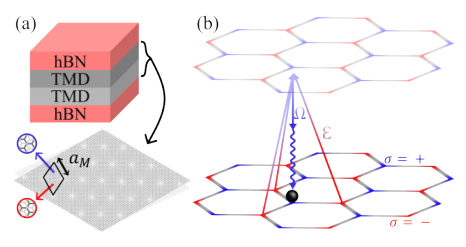 
FIG. 1. Illustration of the driven-dissipative system. (a) Top: The moir´e heterostructure formed by a TMD homo- bilayer sandwiched by hBNs. Bottom: Moir´e pattern from TMDs, giving two high symmetry points (red and blue) re- lated to each other by a top-down inversion, which offers pseu- dospin degrees of freedom (σ = ±). (b) Engineered dissipa- tion for the preparation of superconductivity. A Raman tran- sition constituted by two external drives E and Ω(straight ar- rows) is implemented to access the emission of bosonic modes in hBN (curly arrow). These processes, with the auxiliary lattice (top hexagons) off-resonantly involved, together lead to movement of a fermion (black dot) in the...

📷 Fig 2

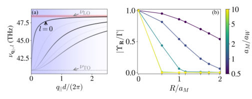 
FIG. 2. Properties of HPPs in hBN. (a) Dispersion in HPPs. Opacity indicates the associated in-plane electric field strength |E|| n|, which is involved in the coupling to fermions. l = 0 labels the topmost mode arising from out-of-plane con- finement (see Methods). The red shaded region marks the tar- get linewidth centered around the longitudinal optical phonon frequency νLO. The blue shading indicates the relative weight of momenta contributing to dissipation, set by the width of the fermionic Wannier orbital. (b) Dissipation matrix ΥR mediated by HPPs at various distances R and moir´e peri- ods aM. In this panel, we set the fermionic Wannier orbital aW = 2 nm [21], Raman detuning ν =...

📷 Fig 3

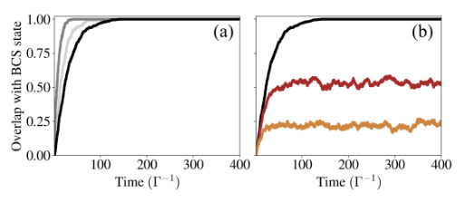 
FIG. 3. Emergence of superconductivity upon time evolution. The overlap of the time-evolved density matrix with the BCS state |BCS, N⟩is computed under various cir- cumstances. To this end we numerically solve Eq. (1) using the quantum-trajectory method with a total of 500 trajecto- ries. (a) Different fermion fillings. Light gray, gray, and black points correspond to systems with 2, 4, and 6 fermions, re- spectively, on a 12-site hexagonal lattice with periodic bound- ary conditions. Initial states are chosen such that all fermions occupy a single sublattice. (b) Different degrees of imperfec- tion p, involved in the jump as ˆTr,σ →ˆTr,σ+p ˆf † r,σ ˆfr,σ. Black, brown, and light brown...

📷 Fig 4

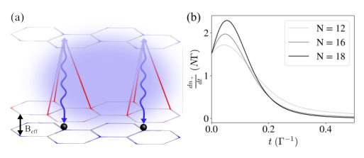 
FIG. 4. Illustration of collective dissipation and its consequence. (a) In contrast to Fig. 1(b), here the dissipa- tors are nonlocal, thereby interfering with each other (indi- cated by blurred region), and acting collectively. Upon lifting the degeneracy in layer pseudospin with an effective Zeeman field Beff, the collective dissipation leads to a superradiant burst in the pseudospin transition rate dn+

**Summary.** The paper introduces a method to engineer superconductivity in moiré heterostructures purely through controlled dissipation, bypassing the need for attractive interactions. By modeling the system dynamics using Lindblad master equations derived from coupling to bosonic modes, they show that local dissipation naturally drives the system into a BCS superconducting steady state. This establishes a powerful theoretical framework connecting non-equilibrium physics with fundamental quantum phenomena.

**Why it may be interesting.** This work is highly relevant as it merges concepts from open quantum systems (dissipation engineering) with condensed matter physics (superconductivity), providing a concrete platform for studying non-equilibrium quantum phases.

Detailed structure

**Main problem.** The authors propose a novel mechanism to achieve superconductivity (SC) as a stationary state without relying on enhancing attractive interactions.

**Main result.** They demonstrate that engineered local dissipation in moiré heterostructures can drive the system into a BCS superconducting state, establishing this platform as promising for SC preparation.

**Method.** The analysis uses Lindblad master equations derived through systematic approximations like adiabatic elimination and Born-Markov assumptions to model open quantum systems dynamics.

**Model / system.** The physical system is a two-dimensional moiré heterostructure, specifically utilizing a bilayer platform where layer pseudospins control pairing. The dynamics are governed by a Lindblad master equation incorporating coupling to bosonic modes (HPPs).

**Key observables.** Superconducting gap/BCS state formation, transient superradiant bursts, and coherence/incoherence couplings J(R) and $\Upsilon$(R).

**Important parameters / regimes.** The ratio of electronic orbital width to moiré lattice constant ($a_W/a_M$), and the relative strengths of driving fields vs. dissipation rates.

**Assumptions / limitations.** Key approximations include adiabatic elimination of auxiliary lattices/conduction electrons, Born-Markov approximation for bath integration, and assuming specific small parameter hierarchies for validity.

**Figures summary.** Figures illustrate the moiré heterostructure setup, the engineered dissipation process involving Raman transitions, and numerical confirmations of local dissipation conditions ($\Upsilon(\mathbf{R}) \sim \delta_{\mathbf{R},0}$).

**Paper structure.** The paper builds from defining the general driven-dissipative framework using Lindblad equations to deriving effective Hamiltonians via polaron transformations and adiabatic elimination, culminating in the final master equation describing SC formation and superradiance.

Abstract

Dissipative preparation of quantum order offers a route to superconductivity that does not rely on enhancing attractive interactions. Here we propose a driven-dissipative protocol to prepare superconductivity as a stationary state of a two-dimensional moiré heterostructure. The key ingredient is a bilayer moiré platform in which the layer degree of freedom acts as a pseudospin, allowing the pseudospin structure required for pairing to be implemented through optically induced spatial operations. This preparation scheme requires local dissipation, which we show to arises naturally from weakly dispersive bosonic modes in the heterostructure. In contrast, in the opposite regime of collective dissipation, the same platform exhibits an early-time superradiant burst. Our results establish driven-dissipative moiré heterostructures as a promising platform for preparing superconductivity, while also revealing a connection between steady-state pairing and transient superradiance.

[↑ back to top](#top)

### ⭐ [Non-perturbative saturation of Krylov complexity, and its implications in quantum gravity](http://arxiv.org/abs/2607.14220v1)

**Highlighted author(s):** Andrew Lucas  
**Authors:** Andrew Lucas, Amit Vikram  
**Type:** theory · **Category:** other · **PDF:** <https://arxiv.org/pdf/2607.14220v1>  
**Analysis basis:** full PDF text, analyzed in chunks
**Topic relevance:** 🔥 `entanglement & information structure` **4/5** · `scars & prethermalization` **3/5** · `non-equilibrium dynamics` **2/5** · `non-equilibrium universality` **2/5** · `Keldysh / 2PI / non-Gaussian methods` **1/5** · `correlated / nonlocal dissipation` **1/5** · `driven-dissipative phase transition` **1/5** · `methods for driven-dissipative` **1/5**

📷 Fig 1

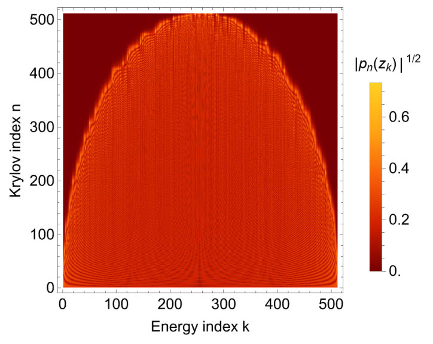 
Figure 1: Demonstration of the “withdrawal” of the Krylov basis polynomials pn(zk) from the edges for a CUE random matrix with d = 512 eigenphases (energy levels) rescaled to [−1, 1].

**Summary.** This paper analyzes the saturation of Krylov state complexity within finite-dimensional quantum systems, using models related to 2D quantum gravity. It proves that this complexity measure saturates at a predictable scale near the Heisenberg time, providing strong evidence for a nonperturbative relationship between spectral complexity and geometric quantities like wormhole length.

**Why it may be interesting.** The connection drawn between a purely spectral/complexity measure (Krylov complexity) and fundamental geometric concepts like wormhole length or volume in quantum gravity is highly relevant to theoretical physics exploring holographic dualities.

Detailed structure

**Main problem.** The study investigates the saturation behavior of Krylov state complexity, linking this mathematical property to fundamental conjectures in quantum gravity regarding volume/complexity relations.

**Main result.** The paper proves that Krylov complexity saturates at time scales slightly larger than the Heisenberg time for low-energy states, suggesting a nonperturbative link between complexity and ergodicity in 2D quantum gravity models.

**Method.** The analysis combines mathematical techniques involving orthogonal polynomials on discrete spectra with physical modeling derived from semiclassical limits of quantum gravity Hamiltonians (like JT gravity).

**Model / system.** The primary model is the Double-scaled Sachdev-Ye-Kitaev (DSSYK) model, used as a microscopic proxy for 2D quantum gravity. The analysis focuses on the spectral properties and basis construction derived from its Hamiltonian.

**Key observables.** Krylov state complexity $\langle X 
angle$, saturation length $x_{K,	ext{sat}}(E)$, and spectral rigidity measures ($
u_{k, 	ext{edge}}$).

**Important parameters / regimes.** Heisenberg time scale ($e^{S(E)}$), low-energy states, and the parameter $\lambda$ governing the JT gravity limit.

**Assumptions / limitations.** The analysis relies on rigorous results concerning orthogonal polynomials built on discrete spectra and assumes specific scaling behaviors in the continuum limit for spectral rigidity calculations.

**Figures summary.** Figure 1 illustrates the 'withdrawal' or crowding of Krylov basis polynomials from the edges of the spectrum, particularly relevant for CUE random matrix ensembles.

**Paper structure.** The paper progresses by first establishing general mathematical theorems regarding polynomial completeness on discrete spectra (Theorem 1), then applying these tools to model quantum gravity systems like JT gravity via DSSYK, and finally deriving specific bounds for the saturation length $x_{K,	ext{sat}}(E)$.

Abstract

We study the dynamics of Krylov state complexity in finite-dimensional quantum systems. Orthogonal polynomials built on a discrete energy spectrum crowd away from regions where the density of states is low at large Krylov index. The physical implication of this result is that, even using a minimalist Krylov state complexity which is defined over the entire spectrum, the Krylov complexity provably stops growing a little past the Heisenberg length in every low-energy state. This has interesting implications for the proposal that Krylov complexity is related to the wormhole length in 2D quantum gravity.

[↑ back to top](#top)

### ⭐ [Emergence of a monopole phase in the $J_1{-}J_2$ Heisenberg model on the triangular lattice for small magnetic fields](http://arxiv.org/abs/2607.14766v1)

**Highlighted author(s):** Johannes Knolle  
**Authors:** Sasank Budaraju, Shi Feng, Josef Willsher, Johannes Knolle, Frank Pollmann, Federico Becca  
**Type:** theory · **Category:** strongly correlated electrons · **PDF:** <https://arxiv.org/pdf/2607.14766v1>  
**Analysis basis:** full PDF text, analyzed in chunks
**Topic relevance:** 🔥 `analog quantum simulation` **4/5** · `exotic spin models in light-matter` **3/5** · `Keldysh / 2PI / non-Gaussian methods` **1/5** · `entanglement & information structure` **1/5**

📷 Fig 1

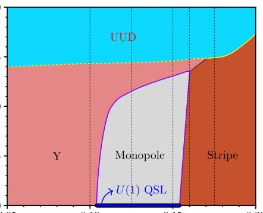 
FIG. 1. Phase diagram of the model (1) in the parameter range H/J1 ∈[0, 2] and J2/J1 ∈[0, 0.2], as estimated from VMC calcu- lations on the 18×18 triangular lattice. Vertical dashed lines indicate the values of J2/J1 for which VMC scans were performed (includ- ing the case with J2 = 0). At the phase boundaries, dashed (solid) lines denote continuous (first order) phase transitions. This figure is adapted from Ref. [29].

📷 Fig 2

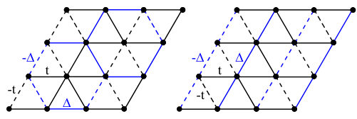 
FIG. 2. Illustration of hopping parameters tij for the Y (a) and canted stripe (b) ans¨atze. Solid (dashed) lines denote positive (neg- ative) hopping amplitudes, and bonds in blue (black) denote ampli- tudes |tij| = ∆(|tij| = t). The flux through each triangular plaque- tte is 0 or π, following the Dirac spin liquid ansatz [6].

📷 Fig 3

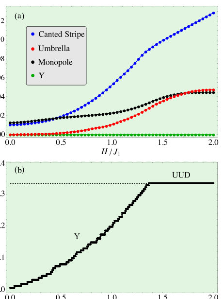 
FIG. 3. (a) Energies (per site) of all the variational ans¨atze relative to that of the Y phase, on the 18 × 18 system. Errorbars are smaller than the size of the symbols. (b) Magnetization curve at J2 = 0, on the same cluster. A continuous transition from the Y phase to the UUD plateau is observed.

📷 Fig 4

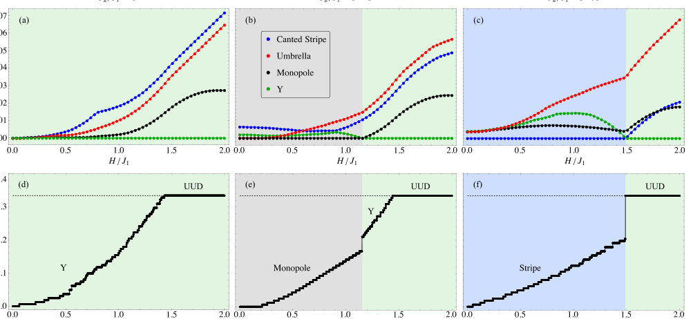 
FIG. 4. Top panels (a) - (c): Comparison of the energies ∆E(H) per site for the different ans¨atze relative to the state with the lowest energy at a given H, for J2/J1 = 0.1, J2/J1 = 0.125, and J2/J1 = 0.175. Errorbars are smaller than the size of the symbols. Bottom panels (d) - (f): Magnetization curves for the three values of J2/J1. All calculations are performed on a 18 × 18 lattice.

📷 Fig 5

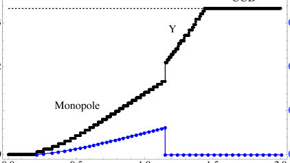 
FIG. 5. Magnetization and scalar chirality at J2/J1 = 1/8 as a function of the magnetic field H/J1 on the 18 × 18 cluster. The chi- rality monotonously increases for the monopole phase, and is identi- cally zero for the Y and UUD phases.

**Summary.** This work maps out the complex ground-state phase diagram of the $J_1{-}J_2$ Heisenberg model on a triangular lattice under an external magnetic field. Using Variational Monte Carlo, the authors identify a novel monopole phase stabilized near specific ratios of exchange couplings ($J_2/J_1=1/8$). This suggests that quantum fluctuations can stabilize topologically rich phases characterized by gauge excitations even when simple magnetic order is absent.

**Why it may be interesting.** The emergence of topologically non-trivial phases, such as monopole condensates, in frustrated quantum magnets is highly relevant for understanding exotic states beyond simple magnetic ordering, connecting strongly correlated physics to gauge theory concepts.

Detailed structure

**Main problem.** The study investigates the ground-state phase diagram of the $J_1{-}J_2$ Heisenberg model on the triangular lattice when subjected to a small external Zeeman field ($H$).

**Main result.** The research finds that around $J_2/J_1=1/8$, a stable condensate of monopoles emerges in the phase diagram for small magnetic fields, characterized by finite scalar chirality but no transverse magnetic order.

**Method.** Variational Monte Carlo (VMC) is employed to calculate variational energies across different candidate phases. This is supplemented by field-theory approaches and spin-wave theory analysis.

**Model / system.** The system is the $J_1{-}J_2$ Heisenberg model on a triangular lattice, described by the Hamiltonian $H = J_1 \sum_{\langle i,j
angle} \mathbf{S}_i \cdot \mathbf{S}_j + J_2 \sum_{\langle\langle i,k
angle
angle} \mathbf{S}_i \cdot \mathbf{S}_k - H \sum_i S_{z,i}$.

**Key observables.** Phase diagram dependence on $J_2/J_1$ and $H/J_1$; scalar chirality ($\chi$); magnetization curves; transverse structure factor.

**Important parameters / regimes.** $J_2/J_1 \le 0.2$ and $H/J_1 \le 2$. The critical point of interest is near $J_2/J_1=1/8$.

**Assumptions / limitations.** The phase diagram construction relies on finite cluster calculations, which may underestimate the spin-liquid region at zero field compared to previous work.

**Figures summary.** Figures illustrate the model's behavior in the parameter space, showing transitions between phases like 'Y', 'up-up-down', and the monopole phase. Specific plots show structure factors for different states vs. magnetization.

**Paper structure.** The paper systematically explores the ground state by comparing variational ansätze (e.g., Y, umbrella, monopole) using VMC to map out the phase diagram as a function of $J_2/J_1$ and $H/J_1$. Field-theory methods are used to confirm the stability of the emergent monopole phase.

Abstract

We investigate the ground-state phase diagram of the $J_1{-}J_2$ Heisenberg model on the triangular lattice under an external Zeeman field $H$ by using the variational Monte Carlo approach. We span a region with $0 \le J_2/J_1 \le 0.2$ and $0 \le H/J_1 \le 2$, to assess the fate of the (putative) spin-liquid phase that has been detected for $J_2/J_1=1/8$ at zero magnetic field. Simple variational ansatze are proposed for a few candidate states, and their energetics are compared on large clusters to obtain the phase diagram. For $J_2/J_1 \lesssim 1/6$, a continuous transition from a gapless "Y'' phase to a gapped "up-up-down'' phase is obtained, as predicted by spin-wave theory. Most importantly, around $J_2/J_1=1/8$, a condensate of monopoles (which are gapless gauge excitations of the spin liquid at $H=0$) is stabilized in a significant region of the phase diagram, for small Zeeman fields. Here, a finite scalar chirality is present, while no transverse magnetic order is detected. The stability of the monopole phase is confirmed by a field-theory approach that includes a self-consistent random-phase approximation of the low-lying spin fluctuations. The boundary between the monopole and "Y'' phases is also obtained with no free parameters.

[↑ back to top](#top)

### ⭐ [Fock-state preparation based on amplitude amplification in cavity QED](http://arxiv.org/abs/2607.14239v1)

**Highlighted author(s):** Alexey V. Gorshkov  
**Authors:** Sharoon Austin, Zhi-Yuan Wei, Kartik Srinivasan, Alexey V. Gorshkov  
**Type:** theory · **Category:** other · **PDF:** <https://arxiv.org/pdf/2607.14239v1>  
**Analysis basis:** full PDF text, analyzed in chunks
**Topic relevance:** `analog quantum simulation` **3/5** · `correlated cavity matter` **3/5** · `QC/QI experiment` **2/5** · `Tavis-Cummings & cavity-many-emitter` **2/5** · `quantum optics experiment` **2/5** · `correlated / nonlocal dissipation` **1/5** · `driven-dissipative phase transition` **1/5** · `entanglement & information structure` **1/5** · `methods for driven-dissipative` **1/5** · `non-equilibrium dynamics` **1/5**

📷 Fig 1

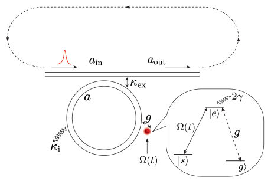 
FIG. 1. The atom is coupled to the cavity mode a, the cavity mode is coupled to the waveguide with coupling κex, and the cavity has an intrinsic loss rate κi. As shown on the right, the atomic levels |s⟩and |e⟩are coupled resonantly by a classical laser pulse (shown by a solid-black line) with Rabi frequency Ω(t), while the atomic levels |e⟩and |g⟩are coupled resonantly by the cavity with single- photon Rabi frequency g (shown by a dashed-black line). The state |e⟩decays with rate 2γ. Each step of the amplification protocol is implemented by sending the single-photon output back to the cav- ity while applying different versions of the control pulse Ω(t) from Eq. (28).

📷 Fig 2

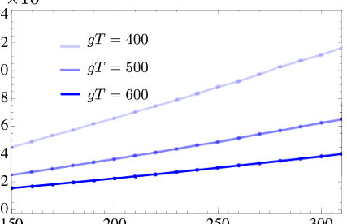 
FIG. 2. In (a), for our protocol, we show kmin, the value of k that min- imizes the inefficiency 1−η2, where η2 = maxτ| R ∞ −∞aout(t)h∗(t+ τ)dt|2, versus κexT for various values of g in the lossless case (κi = γ = 0). Here, the T operations are omitted. The value of T is kept fixed. Here, η2 is obtained from numerical solutions of Eqs. (20)– (22) with the single-photon mode h(t) = p

📷 Fig 3

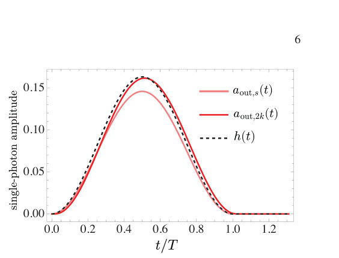 
FIG. 4. The single-photon output aout,2k(t), obtained from numer- ical solutions of Eqs. (20)–(22) for k = 18, is shown. Here, the T operations are omitted, the single-photon mode is h(t) = p

📷 Fig 4

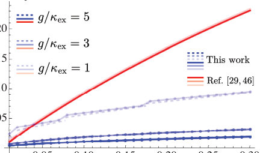 
FIG. 3. The inefficiency 1 −η2 and single-photon loss 1 −η3 for our protocol are plotted for various values of κi/κex, with κex fixed and γ = 0.003κex. Here, the T operations are omitted, η2 = maxτ| R ∞ −∞aout(t)h∗(t + τ)dt|2, and η3 = R ∞ −∞|aout(t)|2dt. The dashed-blue lines show the minimum single-photon loss in our protocol from Eq. (31), while the solid-red lines, which overlap, cor- respond to the maximum achievable values of both η2 and η3 ob- tained using the single-strong-pulse protocol [29, 46] in the limit κexT ≫1. The inefficiency for our protocol, shown by the solid- blue lines, is computed by numerically solving Eqs. (20)–(22) with the single-photon mode h(t) = p

📷 Fig 5

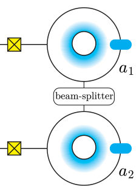 
FIG. 7. We present a schematic diagram of two transmon–cavity systems with modes a1 and a2 used for NOON state preparation. A beam-splitter interaction is used to implement UBS on the cavity modes from Eq. (43).

**Summary.** The paper presents advanced coherent control techniques using amplitude amplification to enhance single-photon sources and prepare multi-photon Fock states in both optical and microwave cavity QED systems. Key achievements include improving the scaling of photon generation protocols and achieving state preparation with $O(n^{1/4})$ length scaling. This work is highly relevant for experimental quantum optics aiming for scalable quantum information processing.

**Why it may be interesting.** This work provides concrete, scalable protocols for generating fundamental quantum resources (single photons, high-number Fock states) essential for quantum networking and computation, directly addressing practical limitations like loss and scaling in cavity QED.

Detailed structure

**Main problem.** The work develops coherent control techniques based on amplitude amplification to achieve high-efficiency single-photon sources and prepare arbitrary Fock states in cavity QED.

**Main result.** A protocol for single-photon generation improves scaling from $N \sim 1/p$ to $N \sim 1/\sqrt{p}$, while Fock state preparation scales as $O(n^{1/4})$.

**Method.** The core method involves extending oblivious amplitude amplification and utilizing fixed-point amplitude amplification within the framework of cavity QED dynamics.

**Model / system.** Two platforms are studied: a three-level quantum emitter coupled to an optical cavity for photon sources, and a superconducting qubit coupled to a microwave cavity in circuit QED for Fock state preparation. The dynamics are governed by coupled differential equations describing the interaction Hamiltonian.

**Key observables.** Single-photon retrieval efficiency ($\eta_2$), single-photon loss ($1-\eta_3$), and fidelity of prepared states (e.g., NOON states).

**Important parameters / regimes.** Success probability $p$, number of photons $n$, coupling strength $g$, cavity decay rate $\kappa$, and intrinsic loss rates ($\kappa_i, \gamma$).

**Assumptions / limitations.** The analysis often relies on the weak control pulse limit or the adiabatic approximation for long Grover sequences to simplify error analysis.

**Figures summary.** Figures illustrate system setups (atom/cavity coupling) and plot performance metrics like inefficiency ($1-\eta_2$) versus sequence length parameter $k$ in both lossless and lossy regimes.

**Paper structure.** The paper systematically develops the theory by first introducing the general amplitude amplification framework, then applying it to single-photon generation (addressing scaling improvements and losses), followed by its application to Fock state preparation using fixed-point methods, and concluding with detailed error analysis for both scenarios.

Abstract

In this work, we develop a coherent control technique for cavity QED based on amplitude amplification. We consider two physical platforms. In the first setting, we study a three-level quantum emitter coupled to a single mode of an optical cavity and introduce a protocol for producing traveling single photons based on oblivious amplitude amplification. As the key ingredient of our protocol, we propose an extension of oblivious amplitude amplification which uses reflection unitaries solely on the signal qubit, along with $U$ and $U^\dagger$, where the unitary $U$ prepares the initial state. Our approach improves the scaling of the single-photon-generation protocol length from $N\sim 1/p$ to $N\sim 1/\sqrt{p}$, with $p$ denoting the success probability of obtaining a short single photon from a single application of the weak control pulse. Furthermore, our protocol also reduces the error from intrinsic cavity loss compared to protocols using a single strong control pulse in various experimentally relevant regimes, suggesting the application of our methods for error reduction. In the second setting, we consider a superconducting qubit coupled to a single bosonic mode of a microwave cavity in a circuit QED architecture in the dispersive regime for preparing Fock states. Using fixed-point amplitude amplification, we obtain a protocol for preparing Fock states whose length scales as $O(n^{1/4})$, where $n$ is the number of photons. Additionally, as an application of our methods for state preparation, we describe a protocol for preparing NOON states.

[↑ back to top](#top)

### [Quantum many-body mixed phase space revealed by hybrid feedback control](http://arxiv.org/abs/2607.14223v1)

**Authors:** Hang Dong, Jie Ren, Andrew Hallam, Han Wang, Zhengyi Cui, Yiren Zou, Junlin Wang, Hekang Li, Qiujiang Guo, Zhen Wang, Lei Ying, Zlatko Papic  
**Type:** both · **Category:** statistical mechanics · **PDF:** <https://arxiv.org/pdf/2607.14223v1>  
**Analysis basis:** full PDF text, analyzed in chunks
**Topic relevance:** 🔥 `quantum measurements` **5/5** · 🔥 `analog quantum simulation` **4/5** · 🔥 `measurement-induced transitions` **4/5** · `driven-dissipative phase transition` **3/5** · `entanglement & information structure` **3/5** · `methods for driven-dissipative` **3/5** · `non-equilibrium dynamics` **3/5** · `Keldysh / 2PI / non-Gaussian methods` **2/5** · `correlated / nonlocal dissipation` **2/5** · `non-equilibrium universality` **2/5** · `QC/QI experiment` **1/5** · `exotic spin models in light-matter` **1/5** · `scars & prethermalization` **1/5** · `spintronics-quantum-optics interface` **1/5**

📷 Fig 1

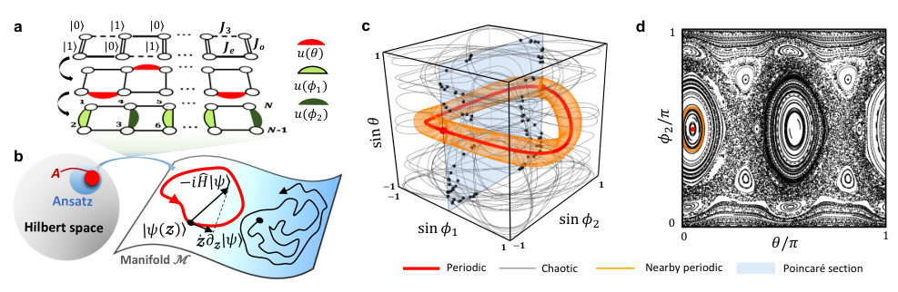 
Figure 1. Superconducting circuit with a mixed phase space. a The shallow variational circuit used to approximate the real-time dynamics of an interacting SSH ladder, Eq. (1), on our superconducting qubit processor. The inter-leg coupling Jo is uniform, while the intra-leg couplings alternate between Je and J3, defining an SSH-type dimerization pattern. The calibrated device couplings are Je/2π = 3.0 MHz, J3/2π = 0.25 MHz, and Jo/2π = 5.0 MHz. Starting from the N´eel-ordered product state, two layers of entangling XY gates are applied: first ˆu(θ) on even bonds, followed by alternating ˆu(ϕ1) and ˆu(ϕ2) on odd bonds (see text). b The circuit ansatz from panel a [Eq. (2)] defines a...

📷 Fig 2

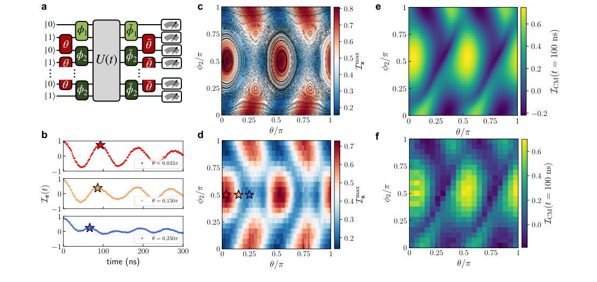 
Figure 2. Experimental mapping of the Poincar´e section. a Quantum circuit implementing the measurement of imbalance Iz(t) in Eq. (3). The system is initialized in a product state parameterized by (θ, ϕ1, ϕ2) by acting with a unitary ˆUM in Eq. (2), then evolved by the unitary ˆU(t) generated by the Hamiltonian in Eq. (1), and finally acted upon by the inverse circuit ˆU † M before readout. b Imbalance dynamics Iz(t) for three representative initial states with fixed ϕ2 = 0.5π and θ/π = 0.033, 0.150, and 0.250 (red, orange, and blue, respectively). The star on each curve indicates the time at which the first revival peak is identified; this defines the quantity Imax z whose values are shown...

📷 Fig 3

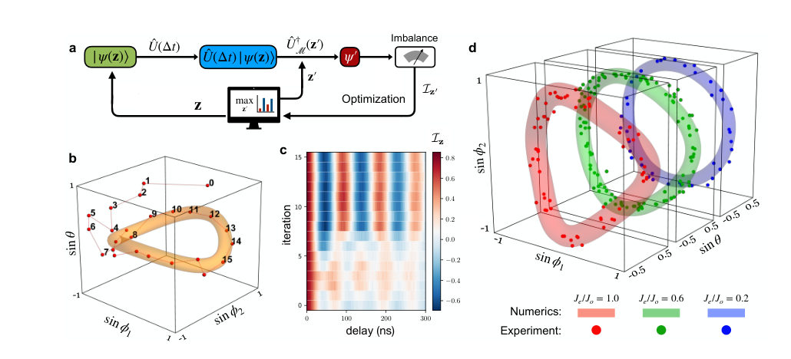 
Figure 3. Hybrid feedback control of variational dynamics. a Schematic workflow of the iterative feedback loop in Eq. (4). Starting from an initial state |ψ(z)⟩with parameters (θ, ϕ1, ϕ2), the system evolves under the unitary ˆU(∆t) generated by the Hamiltonian in Eq. (1). An inverse variational circuit ˆU † M(z′) is then applied, and the measured imbalance Iz′ is maximized through classical optimization, providing updated parameters z′ for the next iteration. b Feedback evolution for a single experimental trajectory on the superconducting processor using 24 qubits, using a time interval ∆t = 80 ns for each feedback step. Starting from z(0) = (π/4, 0, π/2), the markers indicate the first...

📷 Fig 4

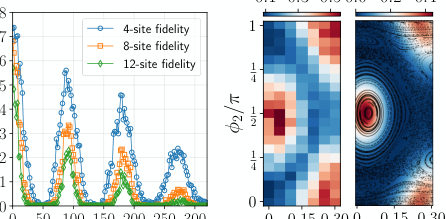 
Figure 4. Subsystem fidelity. a Subsystem fidelity Fsub(t) for three choices of subsystem size Lsub = 4, 8, 12 and fixed initial condition (θ, ϕ2) = (0.05π, 0.5π). In all the measurements, the subsystem is taken as the central block of Lsub qubits. b Poincar´e-section–like maps constructed from the first fidelity revival. The left panel shows the 4-qubit subsystem fidelity F max sub (θ, ϕ2) obtained experimentally. The right panel shows the corresponding global fidelity F max(θ, ϕ2) obtained from exact diagonalization of an L = 16 spin chain with periodic boundary conditions, overlaid with the TDVP Poincar´e section (black dots). Despite the larger fluctuations in the fidelity-based maps,...

**Summary.** The research addresses the challenge of observing mixed phase space dynamics in interacting quantum systems by developing and implementing a hybrid quantum-classical feedback control protocol. This method stabilizes coherent, regular quantum trajectories on superconducting qubits, revealing an emergent quantum many-body mixed phase space structure. It establishes a powerful framework for experimentally controlling and characterizing complex non-equilibrium quantum dynamics.

**Why it may be interesting.** This work bridges quantum simulation techniques (TDVP/variational methods) with fundamental concepts from classical dynamical systems theory (KAM tori, Poincaré sections), providing a concrete pathway to experimentally probe non-equilibrium statistical physics in many-body quantum matter.

Detailed structure

**Main problem.** The central challenge is understanding how complex interacting quantum many-body systems transition between ordered (regular) and chaotic dynamics, revealing a mixed phase space structure.

**Main result.** The authors demonstrate that a hybrid quantum-classical feedback protocol can autonomously discover and stabilize long-lived regular trajectories, revealing an emergent quantum many-body mixed phase space distinct from classical analogs.

**Method.** They employ a Time-Dependent Variational Principle (TDVP) framework combined with a novel hybrid feedback control loop to project the full quantum evolution onto a low-entanglement variational manifold.

**Model / system.** The study uses an interacting spin-1/2 model inspired by the Su–Schrieffer–Heeger (SSH) ladder, implemented on a superconducting qubit processor. The dynamics are governed by a complex Hamiltonian involving various couplings ($J_t, J_b, J_{	ext{int}}$).

**Key observables.** Poincaré sections derived from imbalance measurements ($I_z(t)$), entanglement entropy ($S_E$), and the co-moving imbalance ($	ext{ICM}$).

**Important parameters / regimes.** The system is analyzed in regimes where couplings are small relative to inter-leg coupling ($J_e, J_3 \ll J_o$); the analysis also explores the thermodynamic limit ($N	o\infty$).

**Assumptions / limitations.** The dynamics are approximated by restricting the state evolution to a low-dimensional variational manifold $M$, which is an approximation of the full quantum Hilbert space.

**Figures summary.** Figures illustrate schematic circuit setups, 3D visualizations of the variational manifold showing regular vs. chaotic regions, and Poincaré sections derived from imbalance measurements that confirm the coexistence of stable islands and chaotic seas.

**Paper structure.** The paper develops a hybrid feedback protocol to stabilize dynamics on the variational manifold, using TDVP to derive effective classical equations of motion. Key diagnostics like $I_z(t)$ are used to map out the mixed phase space structure, comparing theoretical predictions with experimental measurements on superconducting qubits.

Abstract

Understanding how complex systems transition between order and chaos is a central challenge of nonequilibrium physics. While weak perturbations of classical integrable systems give rise to a mixed phase space of coexisting regular and chaotic trajectories, analogous behavior in interacting quantum many-body systems has remained elusive. Here we develop and experimentally implement a hybrid quantum-classical feedback protocol that autonomously discovers and stabilizes long-lived regular trajectories in a superconducting quantum processor. Each iteration combines short-time quantum evolution with classical optimization that projects the dynamics back onto a low-entanglement variational manifold, effectively distilling coherence from chaotic evolution. The stabilized trajectories reveal a quantum many-body mixed phase space emerging from nonlinear variational dynamics, without a direct analogue in classical or few-body quantum systems. Our results establish a versatile framework for algorithmic discovery and control of coherent dynamics previously inaccessible to experiment.

[↑ back to top](#top)

### [Tuning the universality class of a quantum process by Trotterization](http://arxiv.org/abs/2607.14663v1)

**Authors:** Robin Prampain dit Boulan, Jerom Jebai, Hendrik Weimer  
**Type:** theory · **Category:** statistical mechanics · **PDF:** <https://arxiv.org/pdf/2607.14663v1>  
**Analysis basis:** full PDF text, analyzed in chunks
**Topic relevance:** 🔥 `non-equilibrium universality` **5/5** · 🔥 `driven-dissipative phase transition` **4/5** · 🔥 `methods for driven-dissipative` **4/5** · `non-equilibrium dynamics` **3/5** · `Keldysh / 2PI / non-Gaussian methods` **1/5** · `analog quantum simulation` **1/5** · `correlated / nonlocal dissipation` **1/5**

📷 Fig 1

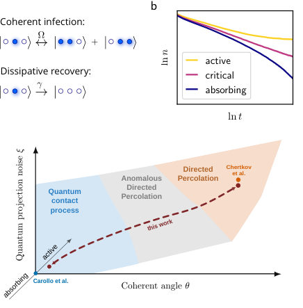 
FIG. 1. Quantum contact process. (a) Basic processes con- sisting of coherent infection and dissipative recovery. (b) Characteristic behavior of the density of infected cells n(t) near the critical point. (c) Sketch of the different universality classes at the critical point of the Trotterized quantum contact process. Depending on the Trotter angle θ and the strength of the projection noise ξ, three different regions are found, cor- responding to directed percolation, a novel quantum contact process universality class connected to the continuous-time process, and an intermediate region exhibiting anomalous di- rected percolation. The path through this parameter space investigated here is...

📷 Fig 2

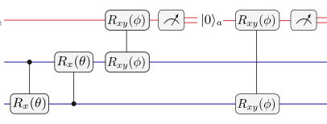 
FIG. 2. Discrete dynamics of a single timestep for L = 2. System qubits si are coupled to an ancilla qubit a initialized in |0⟩. The coherent dynamics is performed via Controlled-Rx rotation gates on the system qubits with the coherent angle θ. The dissipative step is performed by coupling each system qubit to the corresponding ancilla using a parametric swap (Rxy) gate with the dissipative angle ϕ. Finally, the ancilla is reset to |0⟩, providing a dissipative element.

📷 Fig 3

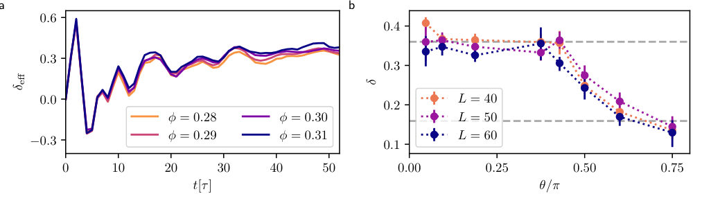 
FIG. 3. Effective critical exponent of the Trotterized contact process. (a) In the long-time limit, δeff(t) approaches the QCP value of 0.36 for a small Trotter angle θ = 3π/32 (L = 60). (b) For larger values of θ, the critical exponent δ according to the long-time limit continuously drops from the QCP value towards the DP value of 0.159 (dashed lines). The behavior is consistent for different system sizes, ruling out strong finite-size effects. Error bars are standard errors from bootstrapping with 100 samples.

📷 Fig 4

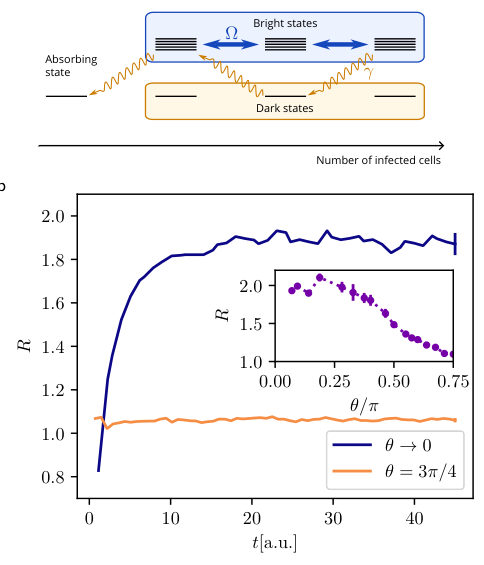 
FIG. 4. Emergence of dark states. (a) Strong coherent in- fection coupling Ωonly couples the bright states. Weak dis- sipation γ can trap the system in a dark state, in which no infections are possible until the next dissipative event. (b) Ratio R(t) between dark and bright state pairs at critical- ity, showing a clear difference between the continuous-time case belonging to the QCP universality class and θ = 3π/4 belonging to the DP universality class. Error bars denote represenative Monte-Carlo sampling errors. The inset shows that the drop from R(t →∞) ≈2 occurs around the θ value where the universality class starts to deviate from QCP.

**Summary.** The authors investigate the quantum contact process to resolve a conflict over its critical universality class. They demonstrate that the observed difference between theoretical and experimental predictions stems from the details of the Trotterization discretization used in simulations. By systematically tuning this discretization, they construct a continuous interpolation path connecting the two predicted classes.

**Why it may be interesting.** This work is highly relevant as it tackles non-equilibrium phase transitions in quantum systems, providing quantitative evidence that the choice of numerical simulation method can fundamentally alter predicted universal physics.

Detailed structure

**Main problem.** The paper resolves a controversy regarding the universality class of the quantum contact process (QCP) phase transition, which was debated between a novel quantum class and the classical directed percolation (DP) class.

**Main result.** The discrepancy in critical exponents is shown to arise from the details of the Trotterization discretization; by systematically tuning the discretization parameters, a continuous path connecting the QCP and DP universality classes is established.

**Method.** Numerical analysis using Matrix Product State (MPS) simulations on a 1D lattice to calculate the effective critical exponent ($\delta_{eff}$) across different parameter regimes.

**Model / system.** The quantum contact process (QCP) on a 1D lattice, modeled by a Lindblad master equation involving coherent infection dynamics ($H$) and dissipative recovery processes. The dynamics are analyzed after discretization via the Suzuki-Trotter expansion.

**Key observables.** Effective critical exponent ($\delta_{eff}$), which characterizes the long-time decay of average density $\langle n(t) 
angle$; a diagnostic ratio $R(t)$ comparing dark-to-bright state probabilities.

**Important parameters / regimes.** The ratio governing dynamics ($\Omega/\gamma$), and the discretization angles ($	heta$ for coherent, $\phi$ for dissipative), which are tuned to interpolate between regimes.

**Assumptions / limitations.** The primary approximation is the use of a first-order Suzuki-Trotter expansion to discretize the continuous-time quantum evolution.

**Figures summary.** Implied figures show the effective critical exponent ($\delta_{eff}$) smoothly varying as a function of the dissipation angle $\phi$, demonstrating convergence from the QCP value towards the DP value. A ratio $R(t)$ is shown to distinguish between the two regimes.

**Paper structure.** The paper first sets up the continuous-time model and then analyzes its discretized version using Trotterization. The core of the work involves systematically varying the discretization parameters ($\phi$) to map out a continuous interpolation path between known critical behaviors (QCP vs DP).

Abstract

We numerically analyze a discretized version of the quantum contact process, a non-equilibrium model having a competition between a coherent infection process and a dissipative recovery process. Previously, the continuous-time version has been discussed to have a phase transition in a novel quantum universality class, while experimental investigations of a related process have pointed towards the transition being in the classical directed percolation class. We demonstrate that these differences stem from details of the discretization of the process and construct a systematic way to continuously interpolate between these results. Finally, we provide evidence that the modification of the universality class is due to destructive interference effects, showing a clear quantum-mechanical origin.

[↑ back to top](#top)

### [General theory of monitored Quantum Reservoir Computing](http://arxiv.org/abs/2607.14311v1)

**Authors:** Oriol Morguí-Sancho, Gian Luca Giorgi, Gonzalo Manzano, Roberta Zambrini  
**Type:** theory · **Category:** quantum information and computing · **PDF:** <https://arxiv.org/pdf/2607.14311v1>  
**Analysis basis:** full PDF text, analyzed in chunks
**Topic relevance:** 🔥 `quantum measurements` **5/5** · 🔥 `measurement-induced transitions` **4/5** · `methods for driven-dissipative` **3/5** · `non-equilibrium dynamics` **2/5** · `Keldysh / 2PI / non-Gaussian methods` **1/5** · `correlated / nonlocal dissipation` **1/5** · `driven-dissipative phase transition` **1/5** · `entanglement & information structure` **1/5**

📷 Fig 1

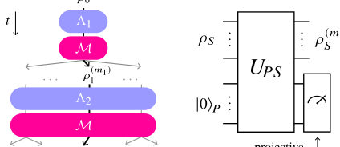 
FIG. 1. (a) The monitored dynamics of a quantum system can be viewed as the interleaved effect of unmonitored dynamics Λ𝑘, which evolve the system in a deterministic way, and mea- surements M, which stochastically change the state of the sys- tem depending on the measurement outcome 𝑚. A single re- alization of the stochastic dynamics, with measurement history ®m𝑘= (𝑚𝑘, . . . , 𝑚1), is known as a quantum trajectory; (b) Ac- cording to Gelfand-Naimark’s theorem, the measurement map M can always be implemented as an indirect measurement by unitary coupling between the system of interest (𝑆) and a quantum probe (𝑃) followed by a projective measurement of the latter.

📷 Fig 2

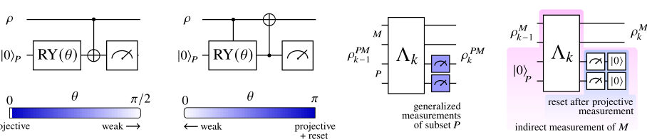 
FIG. 2. Using the equivalence between open quantum dynamics and nonselective measurement maps, one can engineer indirect measurement schemes whose average back-action reproduces dissipative channels such as (a) dephasing and (b) amplitude damping. In both cases, a system qubit is coupled to a probe qubit through the unitary circuits shown, with a tunable parameter 𝜃controlling the measurement strength from weak to strong. For many-body systems, the measurement-induced disturbance on the natural dynamics Λ𝑘can also be reduced by measuring only a subset of qubits 𝑃, which is equivalent to indirectly measuring the complementary subset 𝑀(c,d). Sequential measurements (monitoring) without...

📷 Fig 3

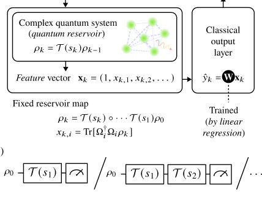 
FIG. 3. (a) QRC paradigm. At each step, an input 𝑠𝑘is encoded in the state of a quantum system (the reservoir) through a com- pletely positive trace-preserving map T . The reservoir state is measured to extract a vector of features, x𝑘, depending on both the current and past inputs. These features are then fed to a clas- sical output layer in order to extract an output ˆ𝑦𝑘. The output weight vector W is the only trainable component, optimized via linear regression, while the reservoir parameters and dynamics remain fixed throughout the computation. (b) Restarting protocol. Since measurement back-action perturbs the reservoir dynamics, one way to circumvent this effect is to re-initialize...

📷 Fig 4

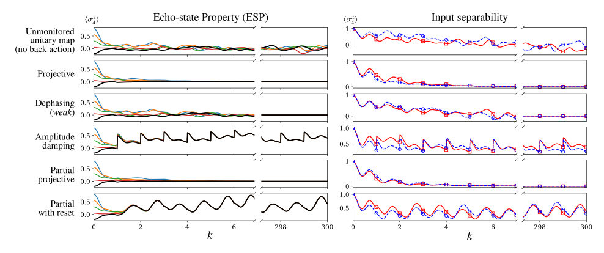 
FIG. 4. Dynamics of ⟨𝜎𝑧 4 ⟩for the input-dependent unitary map in Eq. (22) with disordered Ising-Hamiltonian evolution under different measurement schemes. The left panels show the dynamics starting from five different initial reservoir states under the same input sequence, while the right panels show the dynamics generated by two different input sequences with a fixed initial state (|0⟩⟨0|). Unmonitored unitary maps (no back-action) are not suitable for quantum reservoir computing, as they fail to satisfy the echo-state property (ESP). Projective, dephasing, and partial projective measurement schemes are also unsuitable, since although they satisfy the ESP, the asymptotic state is input...

📷 Fig 5

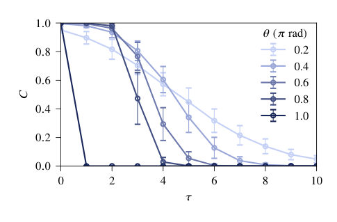 
FIG. 5. Correlation between the predicted and target time series for the linear short-term memory (STM) task for different mea- surement strengths 𝜃of the Amplitude Damping measurement channel following the unitary unmonitored map defined in Eq. (22) with Ising Hamiltonian evolution. We recall that 𝜃= 𝜋cor- responds to a projective measurement with posterior reset, while 𝜃→0 represents a weak measurement. Error bars indicate the standard deviation obtained with 100 random reservoir parameters and random input series.

**Summary.** This paper establishes a general theory for Quantum Reservoir Computing by rigorously incorporating the effects of online quantum measurements. It unifies various monitoring protocols under a single framework, showing that measurement back-action can actively provide necessary dissipation for computation. This work provides a systematic methodology for designing quantum reservoirs using controlled quantum measurement engineering.

**Why it may be interesting.** It provides a systematic quantum measurement engineering approach to design reservoir architectures, treating measurement back-action not just as noise but as a tunable computational resource essential for non-unitary processing.

Detailed structure

**Main problem.** Developing a general theoretical framework for Quantum Reservoir Computing (QRC) that systematically incorporates the effects of online quantum measurements.

**Main result.** The theory unifies various monitoring protocols, demonstrating that measurement back-action can be a controllable resource providing necessary dissipation for QRC. It establishes criteria for when monitored dynamics achieve desirable properties like the echo-state property.

**Method.** The framework is built upon indirect quantum measurements using Positive Operator-Valued Measures (POVMs) to model sequential monitoring, unifying projective, weak, partial, and dissipative protocols into a single mathematical structure.

**Model / system.** The system involves quantum reservoirs undergoing temporal data processing where the evolution is interleaved between unmonitored dynamics ($\Lambda_k$) and stochastic measurement operations ($M$).

**Key observables.** Echo-state property, fading memory, input separability, and the trade-off balance between information extraction and measurement-induced disturbance.

**Important parameters / regimes.** The strength of monitoring (e.g., controlled by parameters like $	heta$ in engineered measurements) and time multiplexing schedules are key control knobs.

**Assumptions / limitations.** Existing QRC proposals often neglect online measurement effects, which the paper aims to correct by providing a unified treatment.

**Figures summary.** Figures illustrate monitored dynamics as interleaved unmonitored evolution and stochastic measurements, showing how engineered probes allow for tunable back-action (e.g., dephasing vs. amplitude damping).

**Paper structure.** The paper first introduces the challenge of monitoring in QRC, then develops the general theory using POVMs to unify measurement types. It derives necessary and sufficient conditions for key QRC properties under monitored dynamics.

Abstract

Quantum reservoir computing (QRC) provides a powerful framework for processing temporal data using quantum dynamics, but incorporating measurements into the reservoir remains a fundamental challenge and distinctive feature with respect to classical settings. The induced back-action can vary from a source of disturbance to a computational resource, as measurement deeply modifies the dynamics underlying temporal processing. Existing approaches have treated specific monitoring schemes independently, missing the common physical principles governing online quantum reservoirs. Here we develop a general theory of monitored quantum reservoir computing based on indirect quantum measurements, which unifies projective, weak, partial, and dissipative monitoring protocols within a single operational framework. Measurement back-action can serve as a controllable resource, providing the effective dissipation and non-unital dynamics required for successful QRC, even when the underlying unmonitored evolution is unsuitable. We derive general criteria under which monitored dynamics satisfy the echo-state property, fading memory, and input separability, including a necessary and sufficient condition for emergent strict contractivity. By comparing different monitoring schemes under a common reference dynamics, we show that these protocols are not interchangeable parameterizations to be optimized for peak performance, but rather constitute qualitatively distinct routes to computational capability, each enabled by the interplay between information extraction and measurement-induced disturbance -- a trade-off that can be further shaped through time multiplexing. Our results provide a unified theoretical foundation for online monitored quantum reservoir computing and establish quantum measurement engineering as a systematic approach for designing reservoir architectures across different quantum platforms.

[↑ back to top](#top)

### [Periodic orbits and quantum many-body scars in integrable spin chains](http://arxiv.org/abs/2607.15132v1)

**Authors:** Elena Petrova, Maksym Serbyn, Marko Ljubotina  
**Type:** theory · **Category:** statistical mechanics · **PDF:** <https://arxiv.org/pdf/2607.15132v1>  
**Analysis basis:** full PDF text, analyzed in chunks
**Topic relevance:** 🔥 `scars & prethermalization` **5/5** · `non-equilibrium dynamics` **3/5** · `entanglement & information structure` **2/5** · `non-equilibrium universality` **2/5** · `Keldysh / 2PI / non-Gaussian methods` **1/5** · `analog quantum simulation` **1/5** · `exotic spin models in light-matter` **1/5** · `spintronics-quantum-optics interface` **1/5**

📷 Fig 1

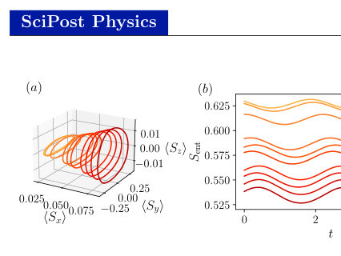 
Figure 1: (a) Local observables along the periodic orbit found at bond dimension χ = 2 for the XYZ Hamiltonian (Jx = 1, Jy = 0.8, ∆= −0.5). By slightly perturbing an orbit and re-optimising it with the gradient descent algorithm, we can continuously track the same orbit across different energy shells. (b) Smooth variation of the entanglement entropy of the orbit across different energy shells. (c) Integrated leakage for different energies. Although the entanglement entropy of the orbit decreases with energy, the leakage increases.

📷 Fig 2

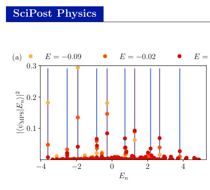 
Figure 2: (a) Overlap of the MPS state with eigenstates of the Hamiltonian for L = 14. Purple and blue lines correspond to the eigenstates that contribute most to the scars. (b) Entanglement entropy of the eigenstates of the XYZ Hamiltonian. Purple and blue dots correspond to the eigenstates that contribute most to the scars. The two sets contain states that are approximately equidistant, which can give rise to periodic dynamics. As the energy of the scar changes, it slowly shifts from the purple eigenstates to a combination of purple and blue. (c) Density of states showing no atypical behaviour in the spectrum.

📷 Fig 3

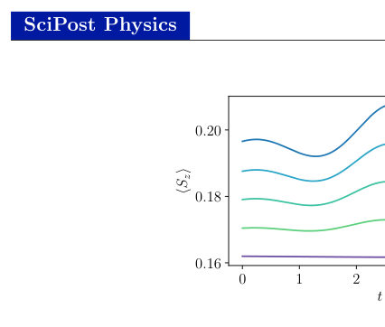 
Figure 3: Evolution of the magnetisation density ⟨Sz(t)⟩along the orbit as the Hamiltonian is deformed from the XXZ point at ∆/J = −1.1 towards the XYZ regime by varying Jy. At the XXZ point, the U(1) symmetry implies conservation of the total magnetisation. Although this conservation need not be reproduced exactly by the projected TDVP dynamics, we observe that the magnetisation remains constant at the XXZ point and becomes time-dependent as Jy is tuned away from Jx, thereby breaking the U(1) symmetry.

📷 Fig 4

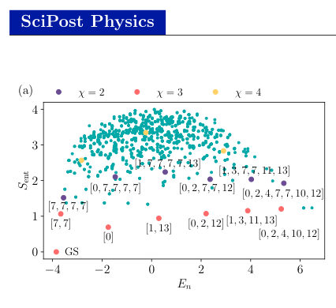 
Figure 4: (a) Entanglement entropy of eigenstates of the XXZ chain at L = 14, ∆= −1.1, with dots marking the eigenstates that contribute most to the scars at E/L = 0.046 with χ = 2, 3, 4. The numbers in brackets are the Bethe quantum numbers {Ij} of the corresponding eigenstate. (b) The maximum overlap with the scar orbit as a function of the system size L (XXZ chain, ∆= −1.1, χ = 2). The supporting eigenstate for each L decomposes into a “core” of 2n identical roots at I = L/2 together with zero-momentum dressing units: symmetric pairs {a, L−a} and, when present, a lone zero-momentum magnon at I = 0. Although the maximum overlap decays exponentially with system size, its decay is...

📷 Fig 5

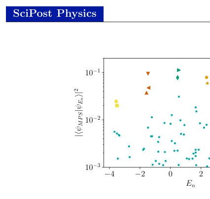 
Figure 5: Dependence of the overlap between the scar state and the Hamiltonian eigenstates on the size of the I = L/2 core in the Bethe quantum-number con- figuration at L = 14, ∆= −1.1. Each colour corresponds to a distinct dressing pattern. Within each pattern, the states differ only in the number of copies of I = L/2 and have comparable energies and overlaps with the χ = 2 MPS orbit, thereby forming a tower. Adding a pair of roots with I = L/2 to the core shifts the energy by an amount much smaller than the spacing between the adjacent towers.

**Summary.** This paper connects the concept of quantum many-body scars—non-thermalizing states—to the mathematical structure of integrable spin chains. By applying a periodic-orbit framework and utilizing the Bethe ansatz, the authors analytically derive scar features, showing that these dynamics are governed by specific zero-momentum magnon pair excitations within the model's exact solution.

**Why it may be interesting.** This work provides deep theoretical insight into non-equilibrium dynamics in many-body systems, linking semiclassical concepts (periodic orbits) directly to the exact algebraic solutions of integrable quantum models, which is crucial for understanding thermalization boundaries.

Detailed structure

**Main problem.** The research aims to understand quantum many-body scars—states that exhibit periodic revival dynamics instead of thermalization—and establish a rigorous connection between this scar phenomenology and the algebraic structure inherent in integrable models.

**Main result.** The authors successfully connect the periodic-orbit picture of scarring to the Bethe ansatz framework, analytically explaining equidistant tower spacing by showing it arises from zero-momentum magnon pair decoupling within the Bethe equations.

**Method.** They apply the periodic-orbit framework using an energy-resolved approach combined with the explicit algebraic structure provided by solving the Bethe ansatz for the integrable XYZ/XXZ spin chain.

**Model / system.** The primary system is the integrable XYZ/XXZ spin-1/2 chain, described by a Hamiltonian involving nearest-neighbor couplings ($J_x, J_y, \Delta$). The analysis extends to include a transverse field to study the persistence of scarring when integrability is broken.

**Key observables.** Local observables ($\langle S_x 
angle, \langle S_y 
angle, \langle S_z 
angle$), entanglement entropy ($S_{	ext{ent}}$), and integrated leakage ($\Gamma$).

**Important parameters / regimes.** The system is analyzed across different energy shells and by tuning the Hamiltonian parameters from XXZ to XYZ, as well as by adding a transverse field.

**Assumptions / limitations.** The analysis relies on the applicability of the periodic-orbit framework and the ability to resolve supporting eigenstates using the Bethe ansatz formalism.

**Figures summary.** Figures illustrate local observables along tracked orbits, the variation of entanglement entropy across energy shells, and the overlap between the variational MPS state and exact Bethe eigenstates, showing clear tower structures.

**Paper structure.** The paper develops an energy-resolved periodic-orbit approach for the integrable chain. It identifies scarred families whose supporting states are resolved via Bethe quantum numbers, analytically deriving scar features from magnon pair decoupling. Finally, it demonstrates this structure persists when integrability is broken by a transverse field.

Abstract

Quantum many-body scars provide an exception to generic thermalising dynamics, but their relation to integrability remains unclear. Here we apply the periodic-orbit framework to the integrable XYZ/XXZ spin-1/2 chain, developing an energy-resolved approach that enables us to locate and track periodic orbits across the spectrum. We identify families of scarred orbits and resolve their supporting eigenstates in terms of Bethe-ansatz quantum numbers, revealing a common string core dressed by zero-momentum magnon pairs. This allows us to reconstruct both the scarred eigenstates and the associated towers directly within the Bethe ansatz, and explain the equidistant tower spacing analytically from the decoupling of zero-momentum magnon pairs in the Bethe equations, providing a microscopic realisation of scar phenomenology in an integrable setting. We further show that this structure persists upon breaking integrability with a transverse field, with the periodic orbits continuing to govern the dynamics. Our results establish a direct connection between the periodic-orbit picture of quantum scarring and the algebraic structure of integrable models, showing that key features of scar dynamics can be understood analytically within the Bethe ansatz framework.

[↑ back to top](#top)

### [An experimental pathway towards an exact theory of strong coupling](http://arxiv.org/abs/2607.15089v1)

**Authors:** Eugenia Pyurbeeva, Ronnie Kosloff  
**Type:** both · **Category:** statistical mechanics · **PDF:** <https://arxiv.org/pdf/2607.15089v1>  
**Analysis basis:** full PDF text, analyzed in chunks
**Topic relevance:** 🔥 `non-equilibrium dynamics` **4/5** · `correlated / nonlocal dissipation` **3/5** · `driven-dissipative phase transition` **3/5** · `methods for driven-dissipative` **3/5** · `non-equilibrium universality` **3/5** · `Keldysh / 2PI / non-Gaussian methods` **2/5** · `Kondo & dissipative impurity` **2/5** · `measurement-induced transitions` **2/5** · `quantum measurements` **2/5** · `analog quantum simulation` **1/5** · `entanglement & information structure` **1/5** · `exotic spin models in light-matter` **1/5** · `scars & prethermalization` **1/5**

📷 Fig 1

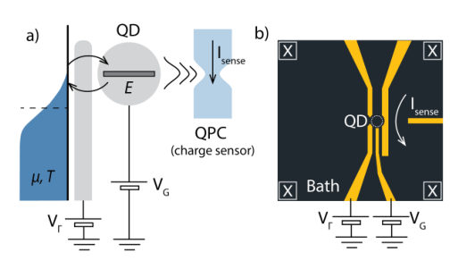 
FIG. 1. a) The system setup. A quantum dot with addition energy E, controlled by a gate voltage VG exchanges elec- trons with a thermal bath, characterised by a temperature and chemical potential (T and µ). The coupling strength Γ is controlled by a side-gate voltage VΓ. A quantum point con- tact (QPC) located close to it acts as a charge sensor. b) A CAD layout of the gates for a device shown in panel (a).

📷 Fig 2

 
FIG. 2. A sample dependence of mean population in the presence of external dephasing in ˆ N and ˆH as a function of noise intensity, Γext, standing for ΓN or ΓH. In the case plotted, Γ = 0.4, φ = 0.2.

📷 Fig 3

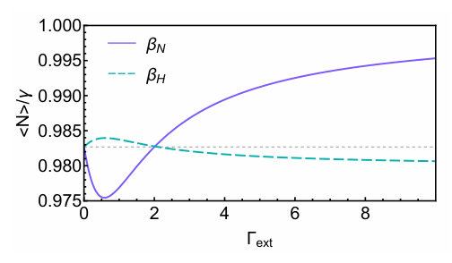 
Figure 2 shows the dependence of the mean population of the quantum dot, βN and βH as a function of the ex- ternal dephasing strength ΓN or ΓH, shown as Γext. In the weak noise regime the dephasing in ˆN, as expected, leads to a lower mean population, while the dephasing in ˆH increases it. The latter is due to the fact that de- phasing destroys the components of the density matrix orthogonal to the dephasing operator, which, in the case of ˆH are i[ ˆH, ˆN] and −sin φ ˆN + cos φ ˆD. The negative sign in ˆN in the second vector leads to a restoration of mean population. In the strong dephasing regime, how- ever, for the noise in ˆN the destruction of the density matrix components orthogonal...

**Summary.** This paper tackles the challenge of modeling strong coupling in open quantum systems using a generalized GKLS master equation. It derives an exact theoretical description based on three key parameters ($\gamma, \Gamma, \phi$) and proposes a concrete experimental measurement scheme utilizing a solid-state quantum dot to determine these fundamental physical constants.

**Why it may be interesting.** This work directly addresses non-equilibrium dynamics and thermalization in strongly coupled open systems, which is central to modern quantum thermodynamics and mesoscopic physics.

Detailed structure

**Main problem.** The paper aims to develop an exact theoretical description of strong coupling effects in open quantum systems, where standard master equation approaches fail.

**Main result.** They propose a feasible experimental protocol using a solid-state quantum dot to measure the fundamental parameters ($\gamma, \Gamma, \phi$) governing this strongly coupled regime.

**Method.** The theory is built upon generalizing the GKLS master equation and analyzing its stationary state solutions in a specific basis derived from the system Hamiltonian and charge operator.

**Model / system.** The model is a two-level system (quantum dot) strongly coupled to an electron bath. The dynamics are governed by a generalized GKLS master equation, analyzed using parameters related to coupling strengths ($\Gamma$) and detailed balance analogues ($\gamma$).

**Key observables.** The expectation value of the number operator, $\langle\hat{N}
angle$, is the primary measurable observable used in the proposed experimental protocol.

**Important parameters / regimes.** Three key parameters are identified: $\gamma$ (analogue to detailed balance), $\Gamma$ (effective coupling strength), and $\phi$ (related to the Hamiltonian basis).

**Assumptions / limitations.** The framework relies on purely algebraic manipulations of the GKLS equation, and a major practical assumption is the ability to implement strong projecting measurements in the quantum dot.

**Figures summary.** Figure 2 illustrates how the mean population ($\langle\hat{N}
angle$) changes when subjected to controlled dephasing noise applied either to the number operator ($eta_N$) or the Hamiltonian ($eta_H$).

**Paper structure.** The paper first establishes the theoretical framework by generalizing the GKLS equation for strong coupling. It then details how this theory maps onto a physical quantum dot setup, outlining specific measurement protocols using QPC sensing to extract the three unknown parameters.

Abstract

We employ a mathematically equivalent form of the GKLS master equation to arrive at an exact theoretical description of a two-level system strongly coupled to the environment. The framework, while intuitive, shedding light on the physics of the problem, and agreeing with existing results, such as thermalisation to a non-canonical state, is based around three parameters that are unknown outside of the weak coupling regime -- the analogue to the detailed balance relation, and two coupling strength constants. As a way forward, we propose a feasible experimental protocol based on a solid-state electronic quantum dot device, through which the fundamental parameters of the problem can be revealed, which would further the fundamental understanding of strong coupling.

[↑ back to top](#top)

### [Locality of deep thermalisation through the lens of entanglement teleportation](http://arxiv.org/abs/2607.15276v1)

**Authors:** Saptarshi Mandal, Alan Sherry, Sthitadhi Roy  
**Type:** theory · **Category:** statistical mechanics · **PDF:** <https://arxiv.org/pdf/2607.15276v1>  
**Analysis basis:** full PDF text, analyzed in chunks
**Topic relevance:** 🔥 `entanglement & information structure` **4/5** · 🔥 `measurement-induced transitions` **4/5** · `analog quantum simulation` **3/5** · `non-equilibrium dynamics` **3/5** · `quantum measurements` **3/5** · `correlated / nonlocal dissipation` **2/5** · `non-equilibrium universality` **2/5** · `driven-dissipative phase transition` **1/5** · `methods for driven-dissipative` **1/5** · `scars & prethermalization` **1/5**

📷 Fig 1

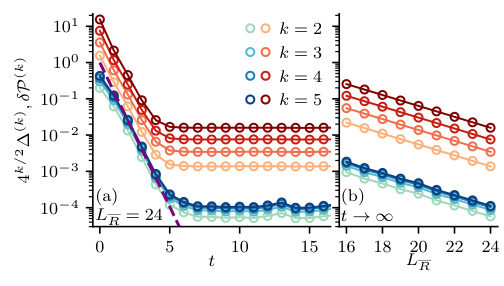 
FIG. 1. Numerical results for the minimal model in Eq. 10. (a) ∆(k) (rescaled by 4k/2) and δP(k) as a function of t for different values of k with the former in red tones and the latter in blue tones. The data show an exponential decay with t where both the quantities have the same rate which is independent of k. The purple dashed line shows ∼e−γt

📷 Fig 2

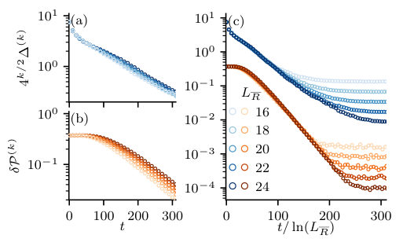 
FIG. 2. Numerical results for (a) ∆(k) and (b) δP(k) with k = 4 for the brickwork circuit described in Eqs. (14)-(16). Darker colours denote larger system sizes LR. The data show that at O(1) intermediate times ∆(k) and δP(k) grow with LR, indicating that the deep thermalisation timescale for the ensemble ER, which is constrained by entanglement telepor- tation between R1 and R2, grows with LR. (c) Scaling time, t, by ln LR collapses the data for different LR onto a common curve indicating that the timescale scales as t∗(LR) ∼ln LR.

📷 Fig 3

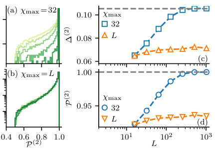 
FIG. 3. Results for the RTN states of the form in Eq. (18). (a)-(b) Distributions of the bipartite purity, P(2) between R1 and R2 over several instances of | ˜ψRTN⟩, for maximum bond dimension, χmax, (a) finite and (b) equal to L. Data are for L = 32, 64, 128, 256, 512, 1024 where darker colours denote larger L. (c) Average P(2) and (d) Average ∆(2) as a function of L. The grey dashed lines denote the corresponding values when R1 and R2 are decoupled and described by independent Gaussian random states.

**Summary.** This paper rigorously examines the concept of locality during deep thermalization by comparing entanglement teleportation to state ensemble convergence. It shows that while measurements can induce apparent non-local effects, generic local interactions enforce an emergent locality characterized by logarithmic time scaling with distance. This provides a fundamental constraint on how fast quantum information can spread in realistic physical systems.

**Why it may be interesting.** This work directly addresses non-equilibrium dynamics in many-body systems, providing quantitative bounds on how quickly quantum information spreads and thermalizes across spatially separated regions, which is crucial for understanding quantum computation limits.

Detailed structure

**Main problem.** The study investigates whether deep thermalization, a process driven by projective measurements on an environment, exhibits emergent locality when the system is partitioned into causally disconnected regions.

**Main result.** In generic locally interacting systems, both deep thermalization and entanglement teleportation exhibit timescales that scale logarithmically with the spatial separation ($\propto \ln L$), demonstrating emergent locality. Genuine non-locality only appears in special circuits where randomness transmission is perfect.

**Method.** The analysis employs theoretical tools including moment calculations ($\Delta^{(k)}$), bipartite purity measures ($\delta P(k)$), and comparing results from minimal models, spatially extended brickwork circuits, and Random Tensor Networks (RTNs).

**Model / system.** The work considers quantum systems undergoing unitary evolution followed by projective measurements. Models range from simple minimal setups to 1D locally interacting chains with specific Hamiltonians ($H = \sum [u_j \otimes u_{j+1}] e^{-i	au H} [\dots]$).

**Key observables.** Deep thermalization deviation ($\Delta^{(k)}$), entanglement teleportation measure ($\delta P(k)$), and bipartite purity (Pann).

**Important parameters / regimes.** System size/separation ($L$ or $L_R$), measurement depth, and the scaling of timescales with separation ($\ln L$).

**Assumptions / limitations.** The analysis often assumes generic local interactions; perfect non-locality is restricted to special circuits transmitting randomness perfectly.

**Figures summary.** Figures show numerical decay rates for $\Delta^{(k)}$ and $\delta P(k)$ in the minimal model, demonstrating exponential decay. For the brickwork circuit, data collapse onto universal curves confirms the $\ln L$ scaling of the characteristic timescale $t^*$.

**Paper structure.** The paper progresses by first establishing diagnostics ($\Delta^{(k)}, \delta P(k)$) and comparing them to Haar limits. It then analyzes a minimal model showing fast thermalization, before moving to spatially extended circuits where it establishes the $\ln L$ scaling characteristic of emergent locality.

Abstract

Deep thermalisation characterises the emergence of universal quantum state ensembles on subsystems due to projective measurements on their complement. We study the notion of locality, or lack thereof, in this phenomenon by considering a subsystem partitioned into two disjoint subregions which remain causally disconnected at all times under unitary dynamics. We show that the onset of deep thermalisation in this geometry is fundamentally bounded by measurement-induced entanglement teleportation between the subregions. While measurements on the environment generate entanglement across the disconnected partitions -- suggesting an apparent non-locality -- we demonstrate that generic locally interacting systems exhibit an emergent locality. Specifically, the timescales for both deep thermalisation and entanglement teleportation scale logarithmically with the distance separating the subregions. Exceptions to this include special circuits where the randomness of the measurement outcomes is perfectly transmitted to the ensemble of states of the subsystem, conditioned on the outcomes; in such cases the timescale for deep thermalisation is finite leading to genuine non-locality.

[↑ back to top](#top)

### [Magic Without Entanglement: Exact Revivals and Their Fisher Information Origin](http://arxiv.org/abs/2607.14222v1)

**Authors:** Rishabh Jha, Karun Gadge  
**Type:** theory · **Category:** statistical mechanics · **PDF:** <https://arxiv.org/pdf/2607.14222v1>  
**Analysis basis:** full PDF text, analyzed in chunks
**Topic relevance:** 🔥 `entanglement & information structure` **4/5** · 🔥 `non-equilibrium dynamics` **4/5** · `analog quantum simulation` **3/5** · `non-equilibrium universality` **3/5** · `methods for driven-dissipative` **2/5** · `scars & prethermalization` **2/5** · `Keldysh / 2PI / non-Gaussian methods` **1/5** · `correlated / nonlocal dissipation` **1/5** · `driven-dissipative phase transition` **1/5**

📷 Fig 1

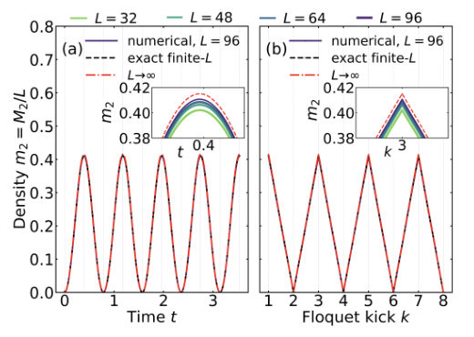 
Figure 1: Exact magic-density revivals. Left: open-chain quench with J = 1 and h = 0, where M (L) 2 (t)/L = (1 −1/L)m2(Jt). Right: stroboscopic kicked-Ising dy- namics at g = π/2 and θ = π/8, where M (L) 2,F (k)/L = (1 −1/L)m2(kθ); the magic revives at even kick num- ber, with the first nontrivial revival at k = 2. System sizes are L = 32, 48, 64, 96; the red curve is the thermo- dynamic prediction m2(ϑ), with ϑ = Jt for the quench and ϑ = kθ for the kicked circuit.

📷 Fig 2

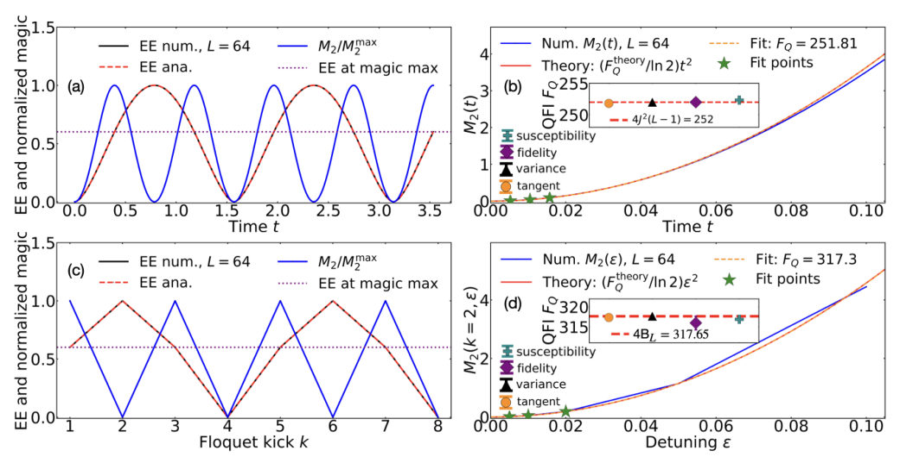 
Figure 2: Magic, entanglement, and tangent curvature. Top row: open-chain quench with J = 1, h = 0, and L = 64. Panel (a) compares the normalized magic M2/M max 2 with the entanglement entropy, showing their different revival patterns. Panel (b) shows the initial quadratic growth of M2(t) for small time t near the stabilizer point t = 0, together with the tangent-theorem prediction and independent quantum-Fisher-information benchmarks from the tangent coefficient, the variance, the fidelity curvature, and the dynamical susceptibility; here FQ = 4(L −1) = 252. Bottom row: stroboscopic kicked-Ising dynamics at g = π/2, θ = π/8, and L = 64. Panel (c) compares the corresponding Floquet magic...

📷 Fig 3

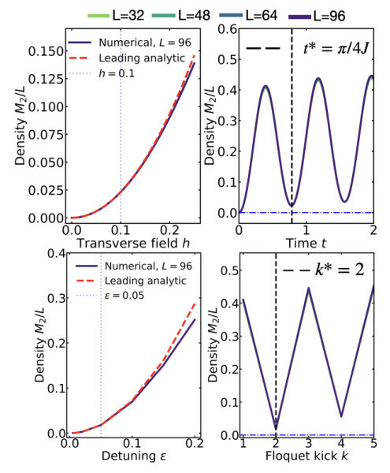 
Figure 3: Quadratic lifting of exact magic revivals. Top row: quench revival at t⋆= π/(4J), detuned by the transverse field h/J where J = 1. Bottom row: two- kick Floquet revival at g = π/2, θ = π/8, detuned by ε = g −π/2. System sizes are L = 32, 48, 64, 96; the leading quadratic predictions are Eqs. (17) and (18).

**Summary.** This work develops theoretical principles showing how 'Magic' and Entanglement behave independently in many-body systems undergoing time evolution. By analyzing specific 1D models, the authors prove that magic resources can survive when entanglement vanishes in the thermodynamic limit. The paper provides concrete mathematical bridges linking local resource measures like QFI to measurable quantities like Rényi entropy curvature.

**Why it may be interesting.** It provides a powerful, quantitative diagnostic tool (QFI vs. Magic) that can be measured experimentally or simulated to characterize non-equilibrium quantum dynamics beyond simple entanglement measures.

Detailed structure

**Main problem.** The paper aims to establish an exact framework connecting 'Magic' (a non-Clifford quantum resource) and Entanglement in the dynamics of many-body quantum systems.

**Main result.** It proves that for certain graph structures, finite magic density can persist even when entanglement density vanishes in the thermodynamic limit. Furthermore, it establishes a local relationship between Quantum Fisher Information and the curvature of the second stabilizer Rényi entropy at revival points.

**Method.** The authors employ theoretical tools like stabilizer Rényi entropies ($M_\alpha$), Quantum Fisher Information (QFI), and graph-theoretic constructions (Forest Theorem) to analyze time evolution in the thermodynamic limit.

**Model / system.** The study analyzes quantum many-body systems using models such as the Ising quench, kicked Floquet chains, and general commuting Ising dynamics on forest graphs. The analysis is performed for 1D spin chains.

**Key observables.** Magic density ($\mu_2$), Entanglement Entropy ($S_{EE}$), Quantum Fisher Information (QFI) curvature, and revival periods.

**Important parameters / regimes.** System size ($L 	o \infty$ limit), detunings ($\delta, \eta, \epsilon$), and the structure of the underlying graph (forest vs. cyclic).

**Assumptions / limitations.** The tangent relation is a local, quadratic-order statement; the forest theorem applies specifically to acyclic graphs.

**Figures summary.** Figures compare normalized magic density revivals against entanglement entropy for quench and Floquet dynamics, showing distinct revival patterns and confirming predicted initial quadratic growth rates.

**Paper structure.** The paper develops structural theorems (Tangent Theorem, Forest Theorem) relating local resource measures. It applies these to 1D models (Ising quench, kicked chain), deriving exact results for density revivals and analyzing the stability of these minima using variance calculations in the thermodynamic limit.

Abstract

Magic and entanglement are independent quantum resources, yet their exact relation in many-body dynamics has remained elusive. We uncover two structural principles. First, at any stabilizer state, the curvature of the second stabilizer Rényi entropy under an arbitrary Hermitian generator equals the quantum Fisher information up to a fixed normalization, creating a bidirectional bridge between computational and metrological resources. Second, for commuting Ising evolution on any forest graph, a Clifford pruning circuit yields the full stabilizer-Rényi family at arbitrary size and in any spatial embedding, thereby furnishing a graph-theoretic construction of families with finite magic density and vanishing entanglement density in the thermodynamic limit. We solve two paradigmatic one-dimensional realizations central to quantum simulation -- an Ising quench and a kicked Floquet chain -- exactly for arbitrary system size and directly in the thermodynamic limit, revealing finite magic density with vanishing entanglement density, distinct magic and entanglement revival periods, and Clifford points with zero magic but finite bipartite entanglement. The same tangent geometry fixes initial growth, perturbative revival lifting, and stability of thermodynamic magic minima. Large-scale Pauli-basis matrix-product-state calculations verify all predictions, and the tangent bridge yields a concrete protocol for detecting magic through established quantum-Fisher-information measurements.

[↑ back to top](#top)

### [Long-lived memory in sliding spin chains](http://arxiv.org/abs/2607.14383v1)

**Authors:** Charles Stahl, Ethan Lake  
**Type:** theory · **Category:** statistical mechanics · **PDF:** <https://arxiv.org/pdf/2607.14383v1>  
**Analysis basis:** full PDF text, analyzed in chunks
**Topic relevance:** 🔥 `non-equilibrium dynamics` **4/5** · `Frenkel-Kontorova` **3/5** · `scars & prethermalization` **3/5** · `driven-dissipative phase transition` **2/5** · `non-equilibrium universality` **2/5** · `Keldysh / 2PI / non-Gaussian methods` **1/5** · `analog quantum simulation` **1/5** · `correlated / nonlocal dissipation` **1/5** · `exotic spin models in light-matter` **1/5** · `methods for driven-dissipative` **1/5** · `spintronics-quantum-optics interface` **1/5**

📷 Fig 1

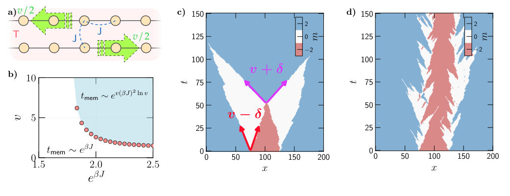 
FIG. 1. a) Schematic of the dynamics. Two ferromagnetically coupled ferromagnetic 1d Ising chains with coupling J slide past one another at relative velocity v, and both couple to a bath at temperature T. b) Scaling of the memory time in the eβJ-v plane. In the white region, the memory time scales like eO(βJ), just as in the equilibrium 1d Ising model. In the blue region, the memory time is enhanced to eO(v(βJ)2 ln v). The pink points mark the crossover between the two, and are drawn by fixing eβJ, and then finding the smallest value of v such that tmem(v) &gt; 10tmem(0) (with the constant 10 chosen rather arbitrarily). c) A spacetime history of the magnetization, with β = ∞, v = 2. The...

📷 Fig 2

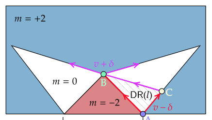 
FIG. 2. How a minority domain of size l is eroded under ideal sliding dynamics with v &gt; 2 in the limit βJ →∞. The white regions have zero magnetization, and are metastable. The red arrows indicate interfaces that move with expected speed v −δ, and the purple arrows those with speed v + δ. The danger region DR(l) indicated by the shaded triangle is the spacetime region where spin flips in the metastable zero- magnetization area can propagate to prevent the erosion of the m = −2 (red) part of the initial minority domain.

📷 Fig 3

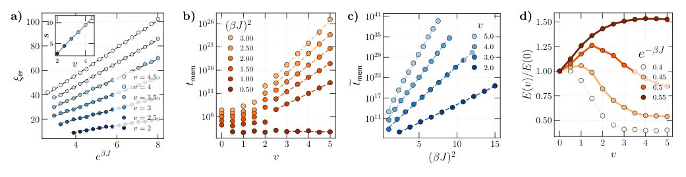 
FIG. 3. a) The erosion length ξer against eβJ for different values of v. The inset shows the slopes s of linear fits of ξer to eβJ

📷 Fig 4

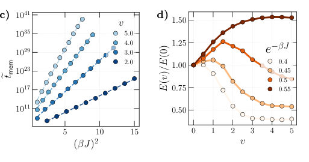 
Fig. 3 b shows the FFS estimate of tmem plotted against v for different values of βJ. As expected, we observe tmem to grow exponentially in v as long as v &gt; 2. Confirming the scaling of tmem with βJ is slightly more subtle. As discussed above, the seeding event where a small minority domain is nucleated contributes a factor of ecβJ to tmem. Creating a minority domain of just size 1 already gives c = 8 (the first flipped spin costs energy ∆E = 6J, and the second costs ∆E = 2J). Since the ecβJ factor can compete with the eO((βJ)2) factor at modest values of βJ, we will find it convenient to get rid of the former by considering dynamics where the nucleation of an initial minority domain is not...

📷 Fig 5

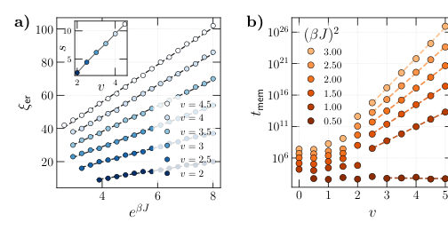 
Fig. 3 a shows the result of measuring (9) in numerics, and confirms the predicted scaling (7) at large enough

**Summary.** This paper analyzes a system of two coupled 1D Ising chains driven out of equilibrium by sliding past each other. The authors demonstrate that the resulting magnetic friction dramatically increases the memory time, allowing the system to retain its initial magnetization for much longer than expected at equilibrium. This provides a simple mechanism showing how non-equilibrium driving can stabilize ordered states against thermal decay.

**Why it may be interesting.** This work provides an explicit, analytically derived mechanism (magnetic friction) for parametrically slowing down thermalization and enhancing memory retention in low-dimensional magnetic systems, which has parallels in understanding slow relaxation in complex quantum or classical many-body systems.

Detailed structure

**Main problem.** The study investigates how physical systems, particularly those driven out of equilibrium, can retain memory of their initial magnetization state.

**Main result.** Magnetic friction from sliding chains significantly enhances the system's ability to order and retain memory, increasing the relaxation time exponentially with parameters like $eta J$ and $v$.

**Method.** The analysis uses theoretical derivations based on minority domain dynamics, comparing shearing rates to contraction rates to estimate the characteristic memory time scale.

**Model / system.** The model is two ferromagnetic one-dimensional Ising chains coupled to a thermal bath, driven out of equilibrium by sliding past each other at a constant relative speed $v$.

**Key observables.** Memory time ($t_{	ext{mem}}$), minority domain size ($\xi_{er}$), and steady-state energy $E(v)$.

**Important parameters / regimes.** Inverse temperature ($eta$), Ising coupling ($J$), and sliding speed ($v$). The scaling regimes include equilibrium ($v=0$) and non-equilibrium ($v>0$).

**Assumptions / limitations.** The analysis assumes that the memory time is finite in the thermodynamic limit for $T>0$, and relies on comparing domain shearing rates to contraction rates.

**Figures summary.** Figures schematically show dynamics, plot the enhancement of $t_{	ext{mem}}$ vs. $v$, illustrate minority domain erosion defining a 'danger region,' and confirm scaling laws for $\xi_{er}$ and $t_{	ext{mem}}$.

**Paper structure.** The paper progresses by first establishing the memory problem in 1D magnets, then analyzing how sliding introduces a shearing mechanism that prevents rapid thermalization. The core argument builds from comparing equilibrium to non-equilibrium dynamics via domain analysis.

Abstract

We study a system of two ferromagnetic one-dimensional Ising chains coupled to a thermal bath, which are driven out of equilibrium by being moved past one another at a constant speed. We show that even at modest speeds, magnetic friction between the two chains significantly increases the ability of the system to order. In particular, at inverse temperature $β$, Ising coupling $J$, and sliding speed $v$, the dynamics retains memory of its initial magnetization for a time that increases from $\exp(O(βJ))$ at $v = 0$ to $\exp(O((βJ)^2v\ln v))$ when $v>v_c$, where $v_c$ is a small constant. Magnetic friction thus provides a simple mechanism for parametrically slowing down thermalization in a one-dimensional magnet.

[↑ back to top](#top)

### [Phonons in low-dimensional confined systems: Emergent non-reciprocity in 1D](http://arxiv.org/abs/2607.14232v1)

**Authors:** Yuan Gao, K. A. Muttalib  
**Type:** theory · **Category:** other · **PDF:** <https://arxiv.org/pdf/2607.14232v1>  
**Analysis basis:** full PDF text, analyzed in chunks
**Topic relevance:** 🔥 `analog quantum simulation` **4/5** · `Frenkel-Kontorova` **3/5** · `methods for driven-dissipative` **3/5** · `Keldysh / 2PI / non-Gaussian methods` **2/5** · `driven-dissipative phase transition` **2/5** · `non-equilibrium dynamics` **2/5** · `correlated / nonlocal dissipation` **1/5** · `entanglement & information structure` **1/5** · `exotic spin models in light-matter` **1/5** · `non-equilibrium universality` **1/5**

📷 Fig 1

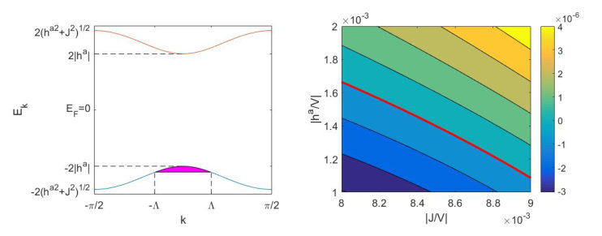 
FIG. 1: Left: Dispersion relation of the model (10), with shaded unstable momentum shell in the effective theory. Right: Phase diagram with |ha/V |, |J /V | as control parameters, for Λ = 0.5. Red line is the boundary between reciprocal (positive values) and non-reciprocal phase (negative values).

📷 Fig 2

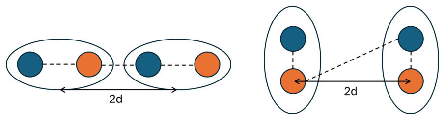 
FIG. 2: Schematic sublattice configurations in realistic basis (left) and featureless basis (right). Dashed lines represent bonds and d = 1 is chosen for original lattice spacing.

**Summary.** This theoretical work develops a framework to model phonons in confined 1D systems by mapping displacements to spin variables. It shows that adding anharmonic interactions can induce a phase transition leading to non-reciprocity characterized by broken time-reversal symmetry. This non-reciprocal order is experimentally detectable by measuring the system's response (inductivity) to artificial gauge fields.

**Why it may be interesting.** It connects concepts from condensed matter physics (phonons, low dimensions) with emergent quantum phenomena like broken time-reversal symmetry and gauge field response, which are highly relevant to AMO systems.

Detailed structure

**Main problem.** The work addresses how conventional phonon descriptions fail for low-dimensional confined systems, proposing a method to capture emergent non-reciprocity arising from out-of-plane confinement.

**Main result.** Introducing anharmonicities drives the system through a quantum phase transition into a non-reciprocal state characterized by spontaneous time reversal symmetry breaking (TRSB).

**Method.** The authors use a 'soft-corization' mapping to transform displacement fields into spin degrees of freedom, followed by diagonalization and mean-field analysis.

**Model / system.** The model is based on a 1D harmonic chain analyzed via an effective Hamiltonian mapped onto bipartite fermions. The system exhibits Dirac fermion behavior at long distances due to confinement.

**Key observables.** Nonreciprocity order parameter ($\Delta$), charge current density ($ar{J}_c$), heat current density ($ar{J}_h$), and the change in inductivity ($\delta K$) probed by artificial gauge fields.

**Important parameters / regimes.** Gap energy, interaction strength (anharmonicities), and the ratio of coupling constants ($|h_a/V|$ vs $|J/V|$).

**Assumptions / limitations.** The analysis is performed at zero temperature ($T=0$) and relies on mapping displacement fields to spin operators.

**Figures summary.** Figure 1 illustrates dispersion relations and a phase diagram showing the boundary between reciprocal and non-reciprocal phases; Figure 2 compares sublattice configurations in different bases.

**Paper structure.** The paper progresses from establishing the need for confinement modeling (soft-corization) to diagonalizing the resulting Hamiltonian, analyzing symmetry breaking via anharmonicities, and finally quantifying non-reciprocity using inductive current measurements.

Abstract

An important feature of solid-state or cold atom systems in low dimensions is the restricted oscillations of ionic/atomic degrees of freedom in the confining directions, for which the conventional phonon from canonical quantization is not an ideal description. In this work we propose a general recipe to introduce this feature to otherwise unrestricted systems by mapping displacement fields to spin degrees of freedom. We demonstrate the validity of the approach with a 1D harmonic chain, and the results lead to massive Dirac fermions at long distances, showing the absence of acoustic modes as the signature of confined out-of-plane motion of the entire chain. We then introduce a short-range interaction via anharmonicities and show that for energy scale slightly above the gap, it gives rise to a (quantum) phase transition to a nonreciprocal state with spontaneous time reversal symmetry breaking (TRSB) of the type $\hat{T}^2=+1$. Despite the non-conserved total particle number, the model holds an under-appreciated $U(1)$ symmetry with conserved "polarization charge", so that the nonreciprocity can be probed by measuring the change of inductivity to artificial gauge fields in and out of the ordered phase.

[↑ back to top](#top)

### [Coulomb blockade in microscopic material defects as a source of decoherence and noise in solid-state quantum circuits](http://arxiv.org/abs/2607.15252v1)

**Authors:** R. Banerjee, L. P. Lindoy, M. Hegedus, A. Hutcheson, T. Hawkins, E. Daghigh-Ahmadi, S. Samaddar, T. Barker, J. P. Goff, A. Ya. Tzalenchuk, I. Rungger, S. E. de Graaf  
**Type:** both · **Category:** quantum information and computing · **PDF:** <https://arxiv.org/pdf/2607.15252v1>  
**Analysis basis:** full PDF text, analyzed in chunks
**Topic relevance:** 🔥 `QC/QI experiment` **4/5** · `Kondo & dissipative impurity` **3/5** · `methods for driven-dissipative` **3/5** · `Keldysh / 2PI / non-Gaussian methods` **2/5** · `driven-dissipative phase transition` **2/5** · `non-equilibrium dynamics` **2/5** · `analog quantum simulation` **1/5** · `correlated / nonlocal dissipation` **1/5** · `non-equilibrium universality` **1/5**

📷 Fig 1

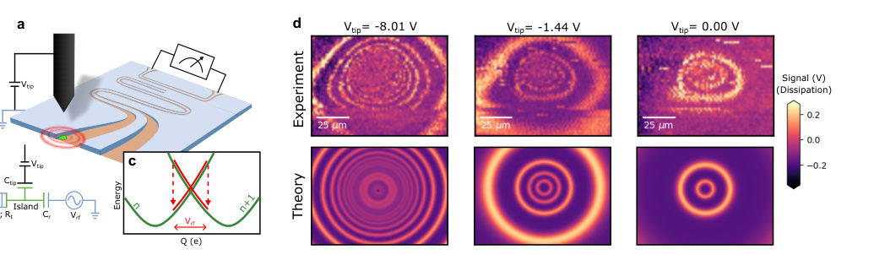 
FIG. 1. Coulomb blockade in tunnel-coupled microscopic islands causes dissipation in superconducting quantum circuits. (a) Schematic of the experimental setup: A conducting scanning probe tip (black) with voltage Vtip is placed above a grounded superconducting resonator, whose S21 response at a frequency freadout slightly off resonance is continuously monitored. A microscopic island (green) acts as a defect coupling to the microwave electric fields of the resonator. Sweeping the tip voltage varies the island’s electrostatic potential, inducing a change in its charge state. (b) Equivalent circuit of the setup. (c) Microwave voltage Vrf from the device drives the system along the energy...

📷 Fig 2

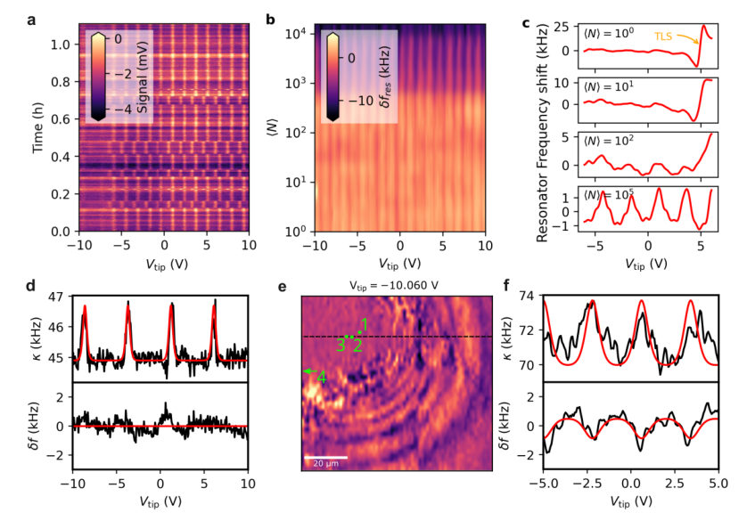 
FIG. 2. Quantifying dissipation and frequency shifts. (a) Measured heterodyne response from the resonator when keeping the tip fixed 10 µm above the defect in Fig. 1 and repeatedly ramping Vtip. A large number of equidistant peaks and stochastic temporal fluctuations of the defect offset charge are observed. Each voltage sweep is 2 seconds long. Defect charge state fluctuations occur on the timescale of minutes. (b) Resonator frequency as a function of tip voltage and resonator driving power for a different defect, showing a Sisyphus response unaffected by power. T = 350 mK, Ztip = 10µm. (c) Resonator transmission and the extracted centre frequency as a function of tip voltage for...

📷 Fig 3

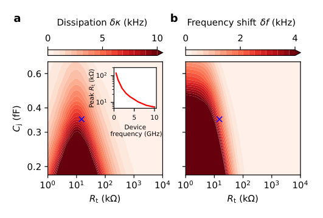 
FIG. 3. Decoherence parameter space. Theoretical nu- merical evaluation of the expected (a) peak loss rate and (b) frequency shift as a function of defect tunnel resistance Rt and tunnel junction capacitance Cj for a device with fres = 6.7 GHz. The inset in (a) shows the tunnelling resistance Rt at which the maximum dissipation occurs as a function of device frequency. The cross indicates the location in the parameter space for defect 3 detected and fitted to theory in Fig. 2e–f.

📷 Fig 4

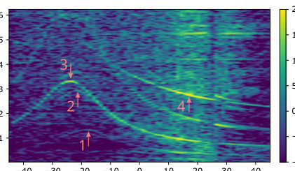 
FIG. 4. Abundance of defects. Spectrogram showing Fourier decomposition of the dataset in Fig. 2e along the black dashed line. See text for explanations. We identify four distinct defects (green dots in Fig. 2e). The concentric ring pattern in Fig. 2e is dominated by defect 3, with defect 4 residing outside of the frame.

**Summary.** The authors report discovering a significant source of decoherence in superconducting quantum circuits caused by Coulomb blockade effects within microscopic metallic grains. Using scanning gate microscopy, they distinguish this mechanism from standard TLS defects through unique spectroscopic signatures. Eliminating these grains during fabrication is proposed as a practical method to improve qubit coherence times.

**Why it may be interesting.** This work provides a concrete example of how localized, non-equilibrium charge dynamics (Coulomb blockade) can dominate decoherence in solid-state qubits, offering new physical insights beyond simple tunneling models relevant to open quantum systems.

Detailed structure

**Main problem.** Identifying intrinsic decoherence sources in solid-state quantum circuits that are distinct from previously understood mechanisms like Two-Level System (TLS) defects.

**Main result.** A novel, widespread decoherence mechanism originating from Coulomb blockade and charge tunneling in ubiquitous metallic grains was identified, challenging the TLS-centric view of coherence limitation.

**Method.** The study combines scanning gate microscopy on live superconducting circuits with theoretical modeling using an Anderson–Holstein-type impurity model to characterize defect dynamics.

**Model / system.** The system involves a metallic grain (acting as an 'electron box') tunnel-coupled to the superconducting circuit reservoir, whose charging energy dictates its discrete charge states. The dynamics are analyzed via microwave transmission spectroscopy ($S_{21}$).

**Key observables.** $S_{21}$ microwave transmission response vs. tip voltage; periodic peaks in $S_{21}$ contours (concentric rings); measurable loss rate ($\kappa$) and frequency shift ($\delta f$).

**Important parameters / regimes.** Charging energy ($E_c$); tunneling coupling strength ($\Gamma$); operating temperature/power regimes; grain size (estimated 10–30 nm).

**Assumptions / limitations.** Conventional characterization techniques might misattribute this loss to other, microwave power-independent processes; the analysis relies on distinguishing the Sisyphus response from TLS saturation.

**Figures summary.** Figures show setup schematics and equivalent circuits. Key results include $S_{21}$ contours showing concentric rings (Fig. 1d) and periodic voltage/power dependence in loss rate and frequency shift, which are distinct from power-saturating TLS features.

**Paper structure.** The paper progresses by first establishing the experimental platform (SGM on superconducting circuits), developing a theoretical model for charge tunneling defects, presenting key diagnostic measurements (concentric rings, periodic response), and concluding with practical implications for device fabrication.

Abstract

A critical limitation of solid-state quantum devices arises from the materials from which they are fabricated: uncontrolled surfaces, interfaces, and structural imperfections introduce numerous sources of loss and decoherence. Despite extensive efforts, linking these decoherence mechanisms to their microscopic material origins -- essential for developing effective mitigation strategies -- remains an outstanding challenge that has slowed coherence improvements. Here, using scanning gate microscopy on live superconducting circuits we identify a previously unrecognised decoherence mechanism originating from Coulomb blockade and microwave-driven charge tunnelling in metallic grains. Such grains are ubiquitous in thin-film devices fabricated by standard lithography processes. By characterising multiple defects across different devices, we find such defects to be as common and as debilitating to device performance as two-level system (TLS) defects, while originating from a fundamentally different physical mechanism. Importantly, conventional characterisation techniques would misattribute this loss to other, microwave power-independent processes. Our observations thus reveal a widespread source of decoherence in superconducting circuits, challenging the prevailing paradigm that coherence lifetimes are primarily limited by TLS defects. Eliminating metallic grains during fabrication provides a clear and practical route to suppress this mechanism, offering a pathway towards improved coherence and reduced noise in microwave-based solid-state quantum devices.

[↑ back to top](#top)

### [Disorder-enhanced compressibility of Floquet random quantum circuits](http://arxiv.org/abs/2607.14296v1)

**Authors:** Francesca De Franco, Dante M. Kennes, David J. Luitz, Matteo Rizzi, Markus Schmitt  
**Type:** theory · **Category:** disordered systems and neural networks · **PDF:** <https://arxiv.org/pdf/2607.14296v1>  
**Analysis basis:** full PDF text, analyzed in chunks
**Topic relevance:** 🔥 `entanglement & information structure` **4/5** · `methods for driven-dissipative` **3/5** · `non-equilibrium dynamics` **3/5** · `non-equilibrium universality` **2/5** · `scars & prethermalization` **2/5** · `Keldysh / 2PI / non-Gaussian methods` **1/5** · `analog quantum simulation` **1/5** · `correlated / nonlocal dissipation` **1/5** · `driven-dissipative phase transition` **1/5**

📷 Fig 1

 
FIG. 1. Dynamics of ⟨OPEEmax⟩for N = 10 qubit circuits in units of the Page value (6). Shaded regions represent the standard error on the mean value. For α = 1, the maximum entropy saturates to unity. For α = 10, data displays a loga- rithmic growth over the accessible time window. The number of circuit realizations is reported in Table I. The dashed line represents the logarithmic growth trend and is included to guide the reader’s eye.

📷 Fig 2

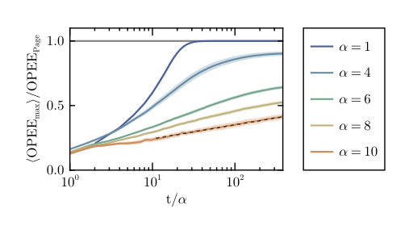 
Fig. 2 shows ⟨OPEEmax⟩for circuits with N = 100 qubits. To better distinguish the dynamics for different disorder strengths, the data are displayed in log-linear scale (Panel a) and log-log scale (Panel b). The max- imum entanglement entropy shows a rapid increase at small α, which limits the accessible time window. De- spite the high computational cost, the limited time win- dow suffices to identify clearly non-logarithmic growth of the entropy. In particular, as shown in Fig. 2(a), the ⟨OPEEmax⟩ for α ≤ 6 displays a pronounced curvature on a

📷 Fig 3

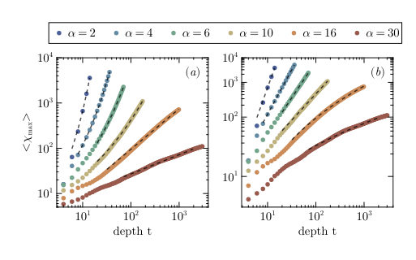 
FIG. 3. Dynamics of ⟨χmax⟩for circuits with N = 100 qubits as a function of circuit depth (t). The number of realiza- tions is reported in Table II, the error bars are within marker size. Panel (a) uses a log-log scale while panel (b) uses double-logarithmic (y-axis) and logarithmic (x axis) scales. At α = 30 we can observe a very long time window as the bond dimension is at most ≈O(102). At α ∈[16, 30] the bond dimension grows as a power-law up to t = 103, consis- tently with the logarithmic behavior observed for the OPEE for these disorder values. For α ∈[2 −10] the growth looks like a stretched exponential χ ≈atb, that is always smaller than &lt; 4⌈t/2⌉which is the largest possible bond...

📷 Fig 4

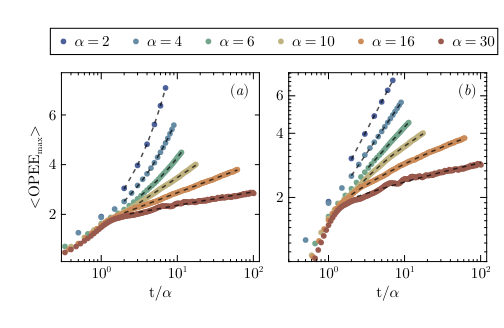 
FIG. 2. Dynamics of ⟨OPEEmax⟩for circuits with N = 100 qubits. The results are shown in log-linear scale (a) and log- log scale (b). Error bars are within marker size. The dashed lines are fit to the data. ⟨OPEEmax⟩is fitted to a power- law a(t/α)β for α ≤6, while data for α ≥10 are fitted to a + b · log(t/α). The number of circuit realizations is reported in Table II.

📷 Fig 5

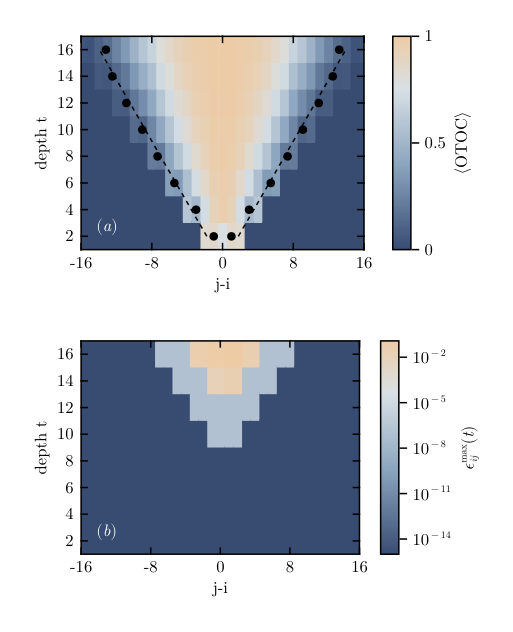 
FIG. 4. (a):⟨OTOC⟩and relative front position (circles) spreading for α = 1. The averaged front error bars are within marker size. The front position is determined by the OTOC threshold η = 0.1. The power-law (a · tβ) fit to the front, give an exponent β ≈1, and velocity ≈0.9. The number of realiza- tions is reported in Table III. (b):Maximum truncation errors of the MPO ZjZi(t) for the data in subplot (a). For each pairs of sites (i, j), ϵmax ij (t) = maxNc(t) (ϵij(t)), where Nc(t) denotes the number of circuit realizations at depth t. Different depth t corresponds to independent simulations. The MPO results from multiple stacking of Nsc staircase circuits. For a given t, the bond...

**Summary.** This paper analyzes Floquet random circuits to understand how system disorder affects the complexity and scrambling of quantum information. By measuring operator entanglement and correlators, the authors find that strong disorder slows down dynamics, enabling significant compression of required quantum circuit depths compared to weakly disordered systems. This suggests localized or slowly evolving dynamics are favorable for building reliable quantum simulators on noisy hardware.

**Why it may be interesting.** It directly connects concepts from condensed matter physics (MBL, disorder) with practical quantum computing limitations (noise, circuit depth), suggesting a physical mechanism for robust quantum simulation.

Detailed structure

**Main problem.** The study investigates how the compressibility of time-evolution operators changes based on the dynamical regime of a many-body system, particularly concerning noise limitations in quantum hardware.

**Main result.** Strong disorder regimes lead to slow operator scrambling and allow for circuit compression to substantially smaller depths compared to weak disorder circuits at fixed fidelity levels.

**Method.** The research employs tensor-network simulations (TEBD) to calculate key diagnostics like Operator Entanglement Entropy (OPEE) and Out-of-Time Ordered Correlators (OTOCs), followed by variational circuit compression optimization.

**Model / system.** The testbed is a one-dimensional Floquet random quantum circuit, which models dynamics with tunable competition between local disorder (random rotations) and interactions via two-qubit gates.

**Key observables.** Operator Entanglement Entropy (OPEE), Out-of-Time Ordered Correlators (OTOCs), and the minimal required circuit depth ($\langle D_{\min} 
angle$).

**Important parameters / regimes.** Disorder strength ($\alpha$), system size ($N$), and fidelity threshold ($f$). The regimes studied include weak vs. strong disorder, correlating with MBL physics.

**Assumptions / limitations.** The analysis relies on tensor-network approximations (e.g., truncation error set to $10^{-7}$) for simulating the time evolution of complex operators.

**Figures summary.** Figures illustrate OPEE and bond dimension growth curves showing transitions between power-law and logarithmic scaling based on disorder strength, alongside t-SNE plots visualizing structured gate distributions at high disorder.

**Paper structure.** The paper introduces the Floquet random circuit model, analyzes dynamics using OPEE/OTOCs to characterize scrambling regimes (weak vs. strong disorder), and finally optimizes shallow brickwall circuits to demonstrate compression benefits in the strongly disordered case.

Abstract

Current quantum hardware is limited by noise and decoherence, which restrict the depth of unitary circuits that can be implemented with high fidelity. We investigate how the compressibility of time-evolution operators depends on the dynamical regime of the underlying many-body system. As a testbed, we study a one-dimensional Floquet random circuit with a tunable competition between interactions and on-site disorder. Using tensor-network simulations, we characterize operator growth through the operator-entanglement entropy of the Floquet unitary as well as of out-of-time-ordered correlators (OTOCs). We find rapid operator scrambling at weak disorder, while strong disorder leads to slow OTOC-front propagation and logarithmic or near-logarithmic operator-entanglement growth over the accessible time window. We then optimize shallow brickwall circuits to approximate the Floquet evolution and show that strong-disorder circuits can be compressed to substantially smaller depths than weak-disorder circuits at fixed logarithmic fidelity density. These results suggest that localized or slowly scrambling dynamics provide a favorable regime for compressed quantum simulation on noisy devices.

[↑ back to top](#top)

### [Pareto-optimal work extraction and the thermodynamic cost of precision in quantum information engines](http://arxiv.org/abs/2607.14973v1)

**Authors:** Jonas Berx, Ted Olander, Henning Kirchberg  
**Type:** theory · **Category:** statistical mechanics · **PDF:** <https://arxiv.org/pdf/2607.14973v1>  
**Analysis basis:** full PDF text, analyzed in chunks
**Topic relevance:** 🔥 `quantum measurements` **4/5** · `entanglement & information structure` **3/5** · `measurement-induced transitions` **3/5** · `non-equilibrium dynamics` **2/5** · `non-equilibrium universality` **2/5** · `Keldysh / 2PI / non-Gaussian methods` **1/5** · `correlated / nonlocal dissipation` **1/5** · `driven-dissipative phase transition` **1/5** · `methods for driven-dissipative` **1/5**

📷 Fig 1

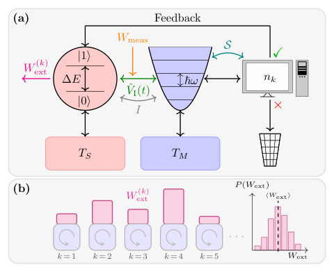 
Figure 1. (a) Schematic of a single information-engine cycle, showing a concrete model in which the system is a two-level system (TLS) and the meter is a quantum harmonic oscilla- tor (QHO). Coupling them via the time-dependent interac- tion ˆVI costs the measurement work Wmeas and goes along with information transfer I. In the k-th cycle, the QHO is projectively measured in its energy eigenstate nk with a clas- sical measurement device with a corresponding entropy flow S. Via feedback a stimulated emission is initiated, leading to the extracted work W (k) ext , which can be zero for unfavourable measurement outcomes nk. After each cycle the TLS and the QHO are coupled to thermal baths at...

📷 Fig 2

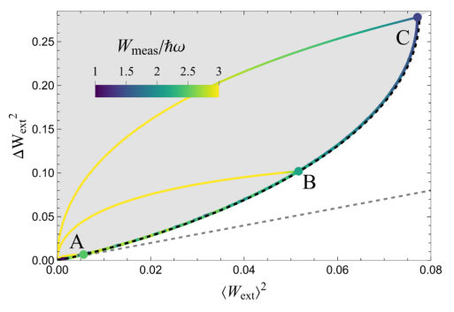 
Figure 2. Pareto front (thick, colour gradient curve, starting at the origin going through points A, B and C) for simultane- ously minimising ∆W 2 ext and maximising ⟨Wext⟩2 (measured in appropriate units of kBTS). All sub-optimal engine config- urations lie above the front in the shaded region. Three sets of sub-optimal configurations obtained by changing the di- mensionless measurement time ωtm starting away from their Pareto-optimal points A, B and C are shown by full lines. The dashed gray line indicates ∆W 2 ext/⟨Wext⟩2 = 1; the dashed black line is the Pareto front corresponding to the exact limit λ →∞, Eq. (26). The colour scale shows that the measure- ment cost, Wmeas (12),...

📷 Fig 3

 
Fig. 2 portrays the resulting trade-off between ∆W 2 ext and ⟨Wext⟩2 resulting from the numerical optimisation protocol. It can be seen that near the origin of the Pareto

📷 Fig 4

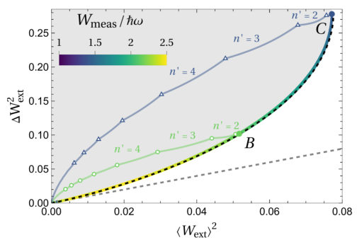 
Figure 4. Pareto front (thick, colour gradient curve) for simul- taneously minimising ∆W 2 ext and maximising ⟨Wext⟩2 (mea- sured in appropriate units of kBTS). All sub-optimal engine configurations lie above the front in the shaded region; sets of sub-optimal configurations obtained by changing the ratio TM/TS away from their Pareto-optimal values are shown by full lines. Engine designs where n′ changes along sub-optimal lines are indicated by open symbols, i.e., where the threshold n′ jumps to the next integer. The dashed gray line indicates ∆W 2 ext/⟨Wext⟩2 = 1; the dashed black line is the Pareto front corresponding to the exact limit λ →∞. The colour scale shows that the measurement...

📷 Fig 5

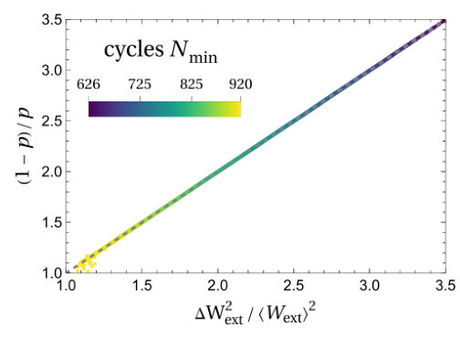 
Figure 3. Collapse of the Pareto front (coloured points) ac- cording to equation (25) onto a linear function (dashed line), in the cold meter limit ℏω/kBTM ≫1. From the collapse, it can be seen that indeed the noise-to-signal ratio is bounded from below by unity. The colouring shows the minimal num- ber of engine cycles Nmin needed to resolve the corresponding operating point on the front with accuracy ϵ = 0.05 in the es- timated success fraction q, Eq. (27), within failure tolerance δ = 0.01 according to Eq. (28).

**Summary.** This paper analyzes the trade-off between average work extraction and noise in quantum information engines using a TLS coupled to an oscillator meter. By employing multi-objective optimization and Fisher Information bounds, it shows that improving precision (reducing fluctuations) comes at a measurable thermodynamic cost. The results offer a comprehensive description of energy conversion limits governed by information theory.

**Why it may be interesting.** This work provides a rigorous thermodynamic constraint on quantum engines by linking extractable work directly to information geometry (FIM). This framework is crucial for understanding fundamental limits in measurement-based energy conversion, relevant to open quantum systems dynamics.

Detailed structure

**Main problem.** The study investigates the fundamental trade-off between maximizing extractable work and minimizing its fluctuations (precision) in a quantum information engine.

**Main result.** Reducing work fluctuations requires incurring higher thermodynamic costs, such as increased information consumption and longer operation times. The optimal designs are found near points where the system operates close to theoretical speed limits defined by Fisher information bounds.

**Method.** The authors employ multi-objective optimization (Pareto front analysis) combined with deriving rigorous upper bounds on power extraction using the Fisher Information Matrix (FIM).

**Model / system.** The model is a finite-time quantum information engine consisting of a two-level system coupled to a quantum harmonic oscillator meter. Work is extracted conditionally based on measurement outcomes.

**Key observables.** Extractable Work ($\langle W_{	ext{ext}} 
angle$), Work Fluctuations ($\Delta W^2_{	ext{ext}}$), Mutual Information, and Fisher Information ($I(t_m)$).

**Important parameters / regimes.** Operation time ($t_m$), coupling strength ($g$), oscillator frequency ($\omega$), and the cold-meter limit ($\hbar\omega \gg k_B T_M$).

**Assumptions / limitations.** The analysis assumes negligible erasure work cost for classical readout and heavily utilizes the cold meter limit to simplify calculations.

**Figures summary.** Figures illustrate the schematic of one engine cycle, the distribution of extracted work over multiple cycles, and plots showing optimal operating points on the Pareto front relative to speed limits derived from Fisher information.

**Paper structure.** The paper progresses by first establishing the multi-objective optimization framework (Pareto front), then deriving analytical results for the highly accurate meter limit, and finally bounding the average power output using the Fisher Information Matrix in both general and simplified cold-meter regimes.

Abstract

We study a finite-time quantum information engine in which a two-level system is measured by a quantum harmonic oscillator acting as a meter and where useful work is extracted conditionally on the measurement outcome. Using multi-objective optimisation, we find a Pareto-optimal trade-off between extractable work and its fluctuations and show that reducing fluctuations entails higher thermodynamic costs: greater information consumption, more engine cycles, longer operation time, and reduced average work output. In the limit of a highly accurate meter, we obtain the work distribution, its moments, and the Pareto front analytically. In this regime, the work statistics of the engine reduce to those of a qubit in contact with a single thermal bath. We further analyse the associated information flows by examining the mutual information and Fisher information, and show that the Pareto-optimal engine designs lie very close to local maxima of the latter with respect to the operation time of the device. Our results provide a compact description of the trade-offs between work, its fluctuations, and thermodynamic costs in quantum information engines.

[↑ back to top](#top)

### [Spin-Resolved Decay of Axion-Like Particles into Electron--Positron Pairs in Strong Electromagnetic Fields](http://arxiv.org/abs/2607.14558v1)

**Authors:** Xiaodan Mao, Yue-Yue Chen, Pei-Lun He  
**Type:** theory · **Category:** other · **PDF:** <https://arxiv.org/pdf/2607.14558v1>  
**Analysis basis:** full PDF text, analyzed in chunks
**Topic relevance:** 🔥 `Keldysh / 2PI / non-Gaussian methods` **4/5** · `entanglement & information structure` **3/5** · `methods for driven-dissipative` **3/5** · `non-equilibrium dynamics` **3/5** · `non-equilibrium universality` **2/5** · `correlated / nonlocal dissipation` **1/5** · `driven-dissipative phase transition` **1/5** · `interference shaping light` **1/5**

📷 Fig 1

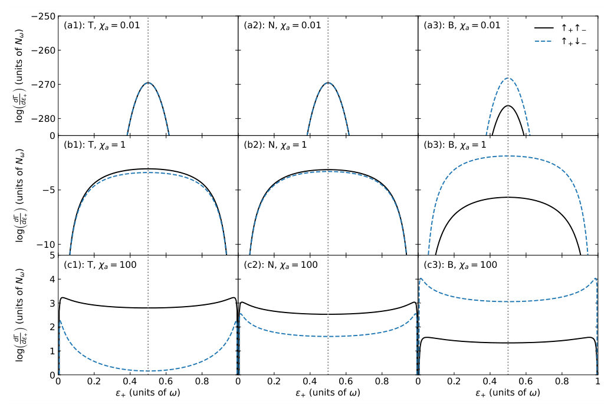 
FIG. 2. Logarithm of the spin-resolved differential decay rate dΓ/dε+ in units of Nω = g2 ae 16π m2 e ω2 , as a function of the positron energy fraction δ+ = ε+/ω for different spin configurations. The top, middle, and bottom rows correspond to χa = 0.01, 1, and 100, illustrating the weak-field, intermediate-field, and asymptotic strong-field regimes, respectively. The spin polarization of the produced positron in the left, middle, and right columns is fixed along the positive T, N, and B directions, respectively. Solid black curves denote parallel electron–positron spin projections, while dashed blue curves denote antiparallel projections. The ALP energy is ω = 1 GeV, and δm = 0.

📷 Fig 2

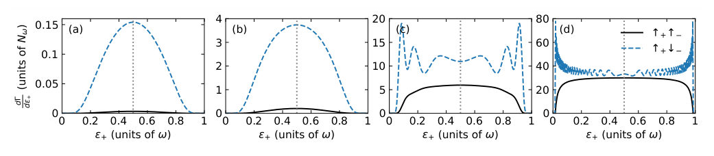 
FIG. 3. Spin-resolved differential decay rate dΓ/dε+ in units of Nω as a function of the positron energy fraction δ+ = ε+/ω, at fixed χa = 1, with the positron spin fixed along the positive B direction. Solid black curves denote the configuration in which the electron spin is parallel to the positron spin, while dashed blue curves denote the antiparallel configuration. Panels (a)–(d) correspond to δm = 0, 2, 4, and 8, respectively.

📷 Fig 3

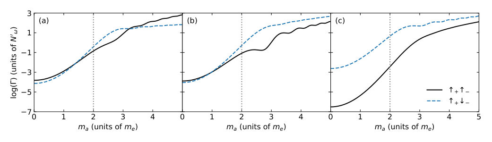 
FIG. 4. Logarithm of the spin-resolved total pair-production rate Γ in units of N ′ ω = g2 ae 16π m2 e ω as a function of the ALP mass, at fixed χa = 1. Solid black curves denote the configuration in which the electron and positron spins are parallel, while dashed blue curves denote the antiparallel configuration. Panels (a)–(c) correspond to the positron spin quantized along T, N, and B, respectively.

📷 Fig 4

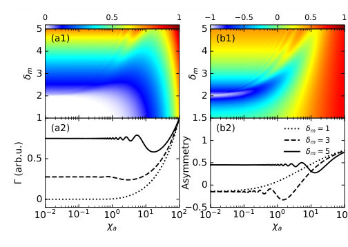 
FIG. 5. Total pair-production rate and the corresponding spin asymmetry as functions of the quantum nonlinearity param- eter χa and the dimensionless ALP mass δm, for spin quanti- zation along T. Panel (a1): spin-summed total rate Γ in the (χa, δm) plane. Panel (b1): corresponding spin asymmetry A, defined in Eq. (20). Panels (a2) and (b2) show representative cuts of panels (a1) and (b1) at δm = 1, 3, and 5, represented by dotted, dashed, and solid curves, respectively. The ALP energy is fixed at ω = 1 GeV.

📷 Fig 5

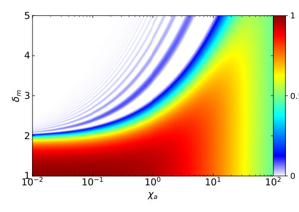 
FIG. 6. Net positron polarization ⟨ζB⟩[Eq. (25)] as a function of the quantum nonlinearity parameter χa and the dimension- less ALP mass δm = ma/me, with the spin quantization axis along B. The ALP energy is ω = 1 GeV.

**Summary.** This theoretical paper calculates the decay rate of an Axion-Like Particle into electron-positron pairs within intense laser fields. By analyzing spin correlations and pair entanglement, the authors establish that these observables provide unique fingerprints for detecting finite ALP mass effects near kinematic thresholds. The methodology combines advanced quantum field theory techniques with semiclassical approximations.

**Why it may be interesting.** The detailed study of pair production and entanglement signatures in strong fields is highly relevant to quantum optics and open quantum systems, as it models particle creation dynamics far from equilibrium using semiclassical methods.

Detailed structure

**Main problem.** The study investigates the spin-resolved decay rate of an Axion-Like Particle (ALP) into an electron--positron pair within the presence of a strong, intense electromagnetic laser field.

**Main result.** The analysis reveals that spin correlations and entanglement in the produced pair serve as unique signatures distinguishing finite ALP mass effects and threshold physics from standard decay processes. The rate exhibits distinct functional forms depending on whether the process is vacuum-dominated or field-assisted.

**Method.** The authors employ the Baier–Katkov quasiclassical operator formalism, utilizing the locally constant field approximation to derive an analytic expression for the differential decay rate.

**Model / system.** The system involves a pseudoscalar coupling interaction between ALPs and leptons ($	ext{a} 	o e^+e^-$) propagating in intense background fields (laser). The analysis covers regimes from massless limits to finite ALP masses, examining spectral reorganization across the vacuum threshold.

**Key observables.** Spin-resolved decay rate ($	ext{d}\Gamma / 	ext{d}\epsilon_+$), pair entanglement (concurrence), and spin correlations of the produced $e^+e^-$ pair.

**Important parameters / regimes.** ALP mass ($m_a$), electron/positron energies ($\epsilon_\pm$), dimensionless field strength parameters ($\chi_a$), and the threshold parameter $\Delta$.

**Assumptions / limitations.** The derivation relies on the locally constant field approximation (LCFA) and assumes relativistic final states.

**Figures summary.** Figure 1 illustrates the Feynman diagram for the decay, noting that oscillatory structures appear when $m_a > 2m_e$ due to vacuum–field crossover.

**Paper structure.** The paper develops the rate calculation using quasiclassical methods, deriving an analytic expression incorporating spin dependence. It then analyzes the behavior across kinematic thresholds ($\Delta=0$), showing a transition from Bessel functions ($K_
u$) in one regime to oscillatory forms ($J_\pm$) in another, unified by Airy functions.

Abstract

We investigate spin-resolved decay of an axion-like particle (ALP) into an electron--positron pair in an intense laser field. Using the Baier--Katkov quasiclassical operator formalism and the locally constant field approximation, we derive a compact analytic rate retaining finite ALP-mass effects and the lepton spin degrees of freedom. In the massless limit, the spin-summed rate has the same weak- and strong-field asymptotic scalings as the corresponding photon-induced pair-creation rate, while the pseudoscalar coupling induces distinct spin-resolved channels and spin correlations. A finite ALP mass reorganizes the spectrum across the vacuum threshold, producing purely field-induced pair creation below threshold and spin-dependent oscillatory modulations above threshold through the coherent interplay of vacuum and field-assisted contributions. The entanglement of the produced pair reflects the dominant production mechanism. Near the vacuum threshold in weak fields, the pair is nearly maximally entangled and singlet-like. Away from threshold, the reduced spin state becomes triplet-like, retaining a concurrence of \(1/2\) when strong-field production dominates but becoming separable when vacuum decay dominates. These results identify spin-resolved spectra and entanglement as signatures of finite-mass and threshold effects in strong-field ALP searches.

[↑ back to top](#top)

### [Stochastic binary networks with asymmetric and time-delayed interactions](http://arxiv.org/abs/2607.15215v1)

**Authors:** Hantao Zhang, Sidra Gibeault, Matthew W. Daniels, Philippe Talatchian, Ursula Ebels, Advait Madhavan, Mark D. Stiles  
**Type:** both · **Category:** statistical mechanics · **PDF:** <https://arxiv.org/pdf/2607.15215v1>  
**Analysis basis:** full PDF text, analyzed in chunks
**Topic relevance:** 🔥 `non-equilibrium dynamics` **4/5** · `exotic spin models in light-matter` **3/5** · `spintronics-quantum-optics interface` **3/5** · `methods for driven-dissipative` **2/5** · `non-equilibrium universality` **2/5** · `Keldysh / 2PI / non-Gaussian methods` **1/5** · `analog quantum simulation` **1/5** · `correlated / nonlocal dissipation` **1/5** · `driven-dissipative phase transition` **1/5**

📷 Fig 1

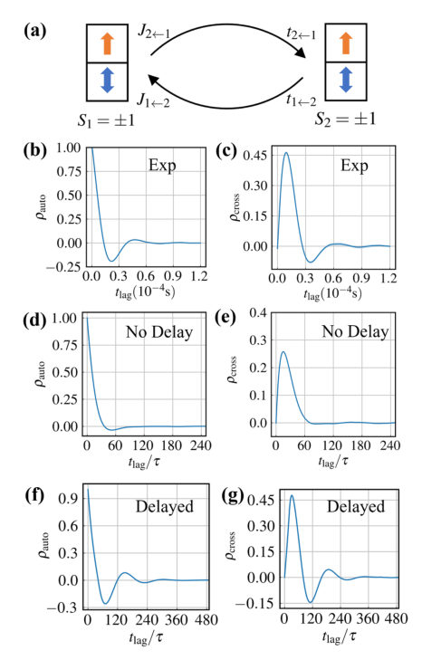 
FIG. 1. (a) Two coupled SMTJs, modeled as two Ising spins S1 and S2, with interaction strengths J1←2 and J2←1, as well as finite time delays t1←2 and t2←1. Experimen- tal auto- and cross-correlation data are shown in (b) and (c) respectively, with maximum coupling strength allowed by the circuit and J1←2 ≈−J2←1. Results from simulations with anti-symmetric coupling, for instantaneous interactions is shown in (d,e) and time-delayed interactions in (f,g) for the auto-correlation function (d,f) and for the cross-correlation function (e,g) as a function of tlag, the time difference be- tween measurements of digitized SMTJ voltage states or spin states. The intrinsic characteristic time scale of...

📷 Fig 2

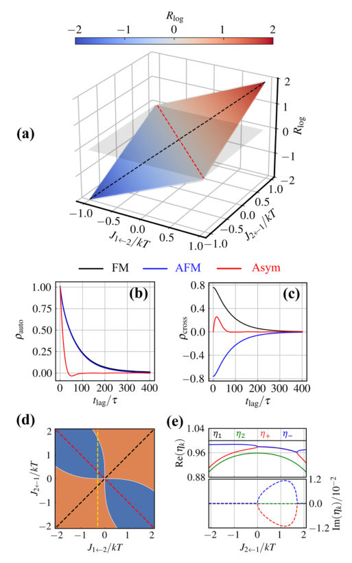 
FIG. 2. (a) Steady-state probability distribution as char- acterized by Rlog as a function of interaction strengths. The auto- and cross-correlation functions are shown in (b,c) for ferromagnetically (J1←2 = J2←1 &gt; 0, FM), antiferromagnet- ically (J1←2 = J2←1 &lt; 0, AFM), and anti-symmetrically (J1←2 = −J2←1 &gt; 0, Asym) coupled spins. tlag is the time difference between two measurements of spin states and τ = 1/λ0 flip is the intrinsic characteristic time scale of each spin. (d) Phase diagram of oscillatory and non-oscillatory correlation functions. Blue and orange regions have the os- cillatory and non-oscillatory correlation function depending on J1←2 and J2←1, respectively. Black and red...

📷 Fig 3

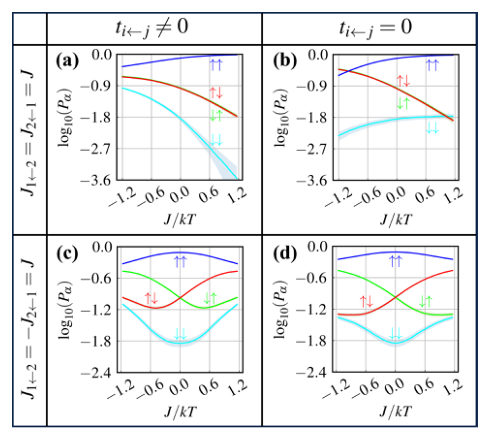 
FIG. 4. Probability distributions in the presence of bias and time delay. Spins are coupled with symmetric coupling in (a,b), or with anti-symmetric coupling in (c,d). There exists time delay t1←2 = t2←1 = 500∆t in (a,c), or there is no time delay t1←2 = t2←1 = 0 in (b,d). Bias is h1 = h2 = kT in (a)-(d). Overlapped lines are slightly shifted for visual clarity. Simulations are performed with τ = 4.98∆t, ∆Ei = 4kT. Each data point gives the mean value averaged over 104

📷 Fig 4

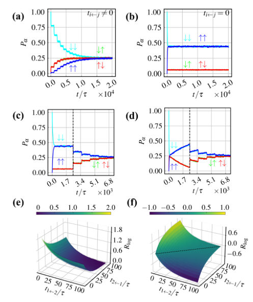 
FIG. 3. Evolution of probability distribution of ferromag- netically coupled spins (J1←2 = J2←1 &gt; 0), where ini- tial states are ↓↓for t ≤0, with long time delay and without time delay shown in (a,b), respectively. In (c,d), two spins initially evolve without time delay and with con- stant J1←2(t) = J2←1(t) = kT in (c) or linearly increasing J1←2(t) = J2←1(t) = kTt/2510τ in (d) until t = 2510τ (in- dicated by the dashed line). After that, two spins evolve with long time delay and constant J1←2(t) = J2←1(t) = kT. t is the evolving time. Steady-state distribution of spin states, reflected by Rlog, as a function of time delay t1←2 and t2←1 with ferromagnetic and anti-symmetric coupling (J1←2 =...

📷 Fig 5

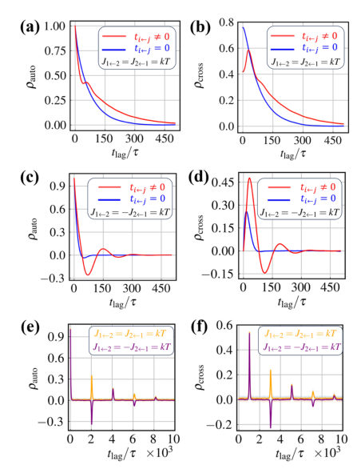 
FIG. 5. Correlation functions with short time delay, long time delay and without time delay. Spins are coupled fer- romagnetically in (a,b,e,f), and anti-symmetrically in (c)-(f). Auto- and cross-correlation functions are shown in (a,c,e) and (b,d,f), respectively. The time delay in (a)-(d) is short as t1←2 = t2←1 = 100∆t for ti←j ̸= 0 lines, and is long in (e,f) as t1←2 = t2←1 = 5000∆t. Overlap lines in (e,f) are slightly shifted for visual clarity. tlag is the time difference between two measurements of spin states and τ = 1/λ0 flip is the intrinsic characteristic time scale of each spin. Simula- tions are performed with τ = 4.98∆t, ∆Ei = 4kT. Each data point gives the mean value averaged...

**Summary.** This paper analyzes stochastic binary networks featuring asymmetric interactions and time delays, motivated by experiments on magnetic tunnel junctions. It demonstrates that these non-ideal features fundamentally alter system dynamics, leading to observable temporal oscillations or universal uniform steady states. The work establishes a general framework showing how asymmetry and delay can be harnessed as functional resources in complex network modeling.

**Why it may be interesting.** The findings provide a detailed understanding of non-equilibrium dynamics in coupled systems where memory effects (delay) and directional coupling (asymmetry) are crucial, which is highly relevant for modeling complex physical or computational substrates.

Detailed structure

**Main problem.** The study investigates stochastic binary networks incorporating both asymmetric interactions and finite time delays, features often neglected by conventional theoretical models.

**Main result.** Time delay fundamentally reshapes dynamics induced by anti-symmetric couplings, causing strong oscillations in temporal correlations. Furthermore, long delays drive the steady state toward uniform probability distributions unless symmetry is explicitly broken.

**Method.** The authors combine theoretical analysis (deriving conditions for doubly stochastic matrices) with numerical simulations and comparisons to experimental data from coupled superparamagnetic tunnel junctions.

**Model / system.** The system is modeled using stochastic binary networks of Ising spins ($	ext{S}_i = \pm 1$) whose dynamics are governed by probabilistic updates incorporating time delays ($t_{i\leftarrow j}$) and non-reciprocal couplings ($J_{i\leftarrow j} 
eq J_{j\leftarrow i}$).

**Key observables.** Auto-correlation ($
ho_{	ext{auto}}$) and cross-correlation ($
ho_{	ext{cross}}$) functions, steady-state joint probability distributions, and the symmetry-breaking parameter $R_{\log}$.

**Important parameters / regimes.** Asymmetry in coupling ($J_{i\leftarrow j}$ vs $J_{j\leftarrow i}$) and the magnitude of time delays ($t_{i\leftarrow j}$).

**Assumptions / limitations.** The analysis relies on extending beyond simple Markov models, assuming global symmetry constraints for proving uniform steady states, and using approximations related to long delay times.

**Figures summary.** Figures illustrate experimental correlation data from SMTJs, compare simulation results for auto-correlation under different coupling regimes (FM, AFM, Asym), and show the dependence of the steady-state distribution on couplings and biases with long delays.

**Paper structure.** The paper progresses by first identifying the limitations of standard models due to delay/asymmetry. It then presents theoretical results showing how these features induce oscillations or uniform distributions in the steady state, culminating in a unified framework applicable to neuromorphic hardware design.

Abstract

Stochastic binary networks are widely used to describe collective dynamics in complex systems and to perform neuromorphic computation, yet realistic networks often contain both asymmetric interactions and finite signal propagation times that fall outside conventional theories. Here we study stochastic binary networks with asymmetric and time-delayed interactions motivated by experimental observations in coupled superparamagnetic tunnel junctions. We find that time delay fundamentally reshapes the dynamics induced by anti-symmetric couplings, producing strong oscillatory temporal correlations consistent with experiment. At the same time, sufficiently long delays drive the steady-state probabilities toward equal state occupations even in strongly coupled systems. These apparently featureless probability distributions coexist with pronounced temporal correlations, distinguishing them from equilibrium high-temperature behavior. We further show analytically that delay-induced uniform distributions emerge in a broad class of stochastic networks, while symmetry-breaking bias fields restore interaction-dependent steady states with qualitatively modified behavior. Simulations of networks with five coupled spins demonstrate that these effects persist beyond minimal systems with only two spins. Our results establish a unified framework for stochastic binary networks in the intermediate regime between symmetric instantaneous interactions and asymmetric or time-delayed interactions, and suggest that asymmetry and delay can be exploited as functional resources in neuromorphic hardware and complex network dynamics.

[↑ back to top](#top)

### [Collective dynamics of harmonically trapped 1D quantum droplets under linear gravitational-like confinement](http://arxiv.org/abs/2607.14969v1)

**Authors:** Saurab Das, Jayanta Bera, Ajay Nath  
**Type:** theory · **Category:** quantum gases · **PDF:** <https://arxiv.org/pdf/2607.14969v1>  
**Analysis basis:** full PDF text, analyzed in chunks
**Topic relevance:** 🔥 `analog quantum simulation` **4/5** · `non-equilibrium dynamics` **3/5** · `Keldysh / 2PI / non-Gaussian methods` **2/5** · `driven-dissipative phase transition` **2/5** · `non-equilibrium universality` **2/5** · `Frenkel-Kontorova` **1/5** · `entanglement & information structure` **1/5** · `methods for driven-dissipative` **1/5** · `quantum measurements` **1/5**

📷 Fig 1

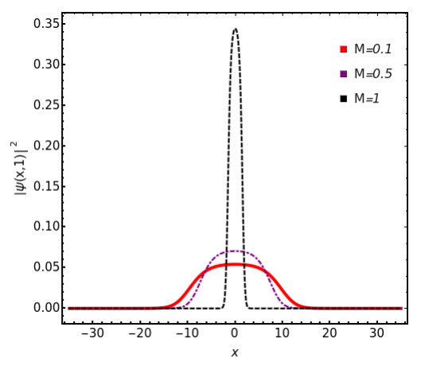 
FIG. 1: Density profiles for (a) harmonic trap: t = 1, µ = −2/9, G1 = −1, G2 = 0.9999, along with M = 0.1 (red thin line), 0.5 (purpole dotdashed), 1 (black dashed); (b) har- monic trap along linear gravitational like trap: regular har- monic trap with V (x, t) = 1

📷 Fig 2

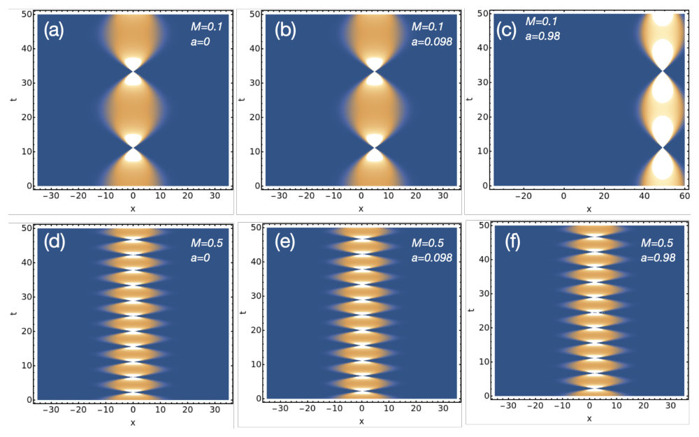 
FIG. 2: Temporal evolution of the QDs density with two different harmonic oscillator strength (M) under different gravitational- like acceleration strengths a. Subfigures (a)–(c) and (d)-(f) correspond to a = 0, 0.098, 0.98, for M = 0.1, and M = 0.5 respectively. The results illustrate the effect of M and a strengths on the dynamical response of the QD, including increase in breathing mode frequency. The simulations are carried out for the parameters µ = µ0 = −2

📷 Fig 3

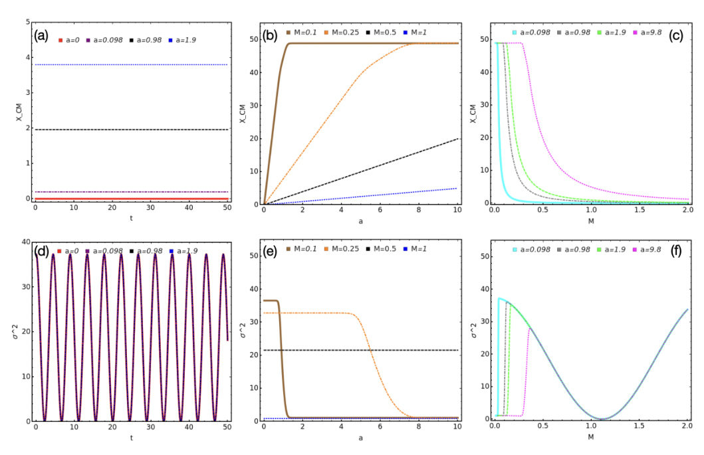 
FIG. 3: Dependence of the COM position (XCM), and width (σ2) of the QD on the linear gravitational-like potential strength (a) and the harmonic trap frequency M. (a) Time evolution of XCM and (d) σ2 for a = 0 (red solid), 0.098 (purple dot-dashed), 0.98 (black dot-dashed), and 1.9 (blue dotted) with M = 0.5. (b) XCM and (e) σ2 as functions of a at t = 1 for M = 0.1 (brown solid), 0.25 (orange dot-dashed), 0.5 (black dashed), and 1 (blue dotted). (c) XCM and (f) σ2 as functions of M for a = 0.098 (cyan solid), 0.98 (gray dot-dashed), 1.9 (green dashed), and 9.8 (magenta dotted). The remaining parameters are fixed at µ = µ0 = −2/9, G1 = −1, and G2 = 0.9999 .

📷 Fig 4

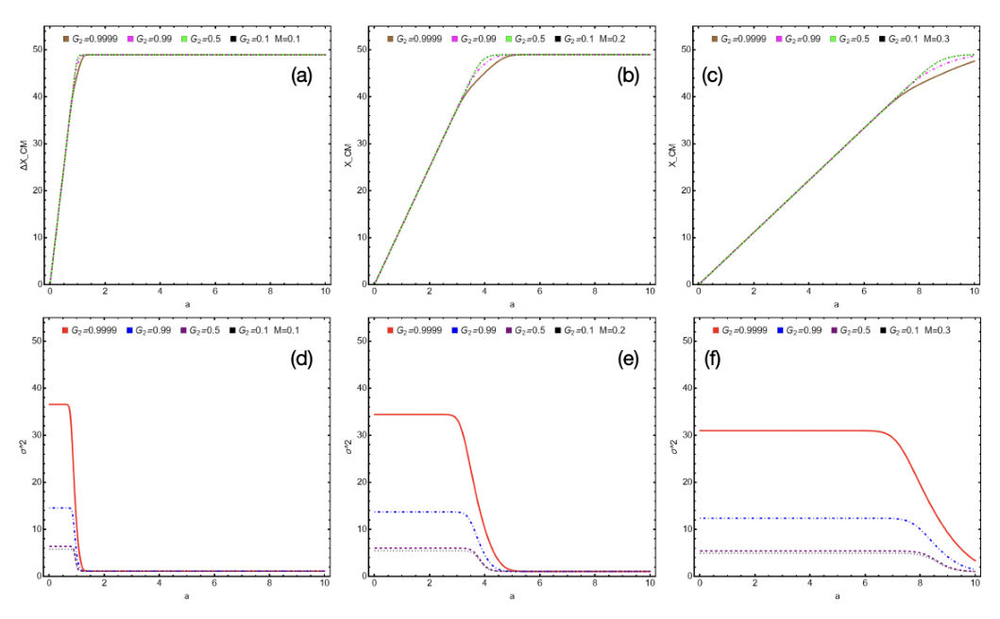 
FIG. 4: Dependence of the (a)–(c) center-of-mass position, XCM, and (d)–(f) droplet width, σ2, on the EMF strength G2 as functions of the linear gravitational-like trap strength a for harmonic confinement strengths M = 0.1 [(a),(d)], M = 0.2 [(b),(e)], and M = 0.3 [(c),(f)]. The curves correspond to G2 = 0.9999 (brown, red solid), 0.99 (magenta, blue dot-dashed), 0.5 (green, purple dashed), and 0.1 (black dotted) for both cases. Increasing M shifts the EMF-sensitive regime to larger values of a, resulting in a stronger dependence of both XCM and σ2 on the EMF strength over a wider range of gravitational-like trap strengths. The remaining parameters are t = 1, µ = µ0 = −2/9, and G1 = −1. .

📷 Fig 5

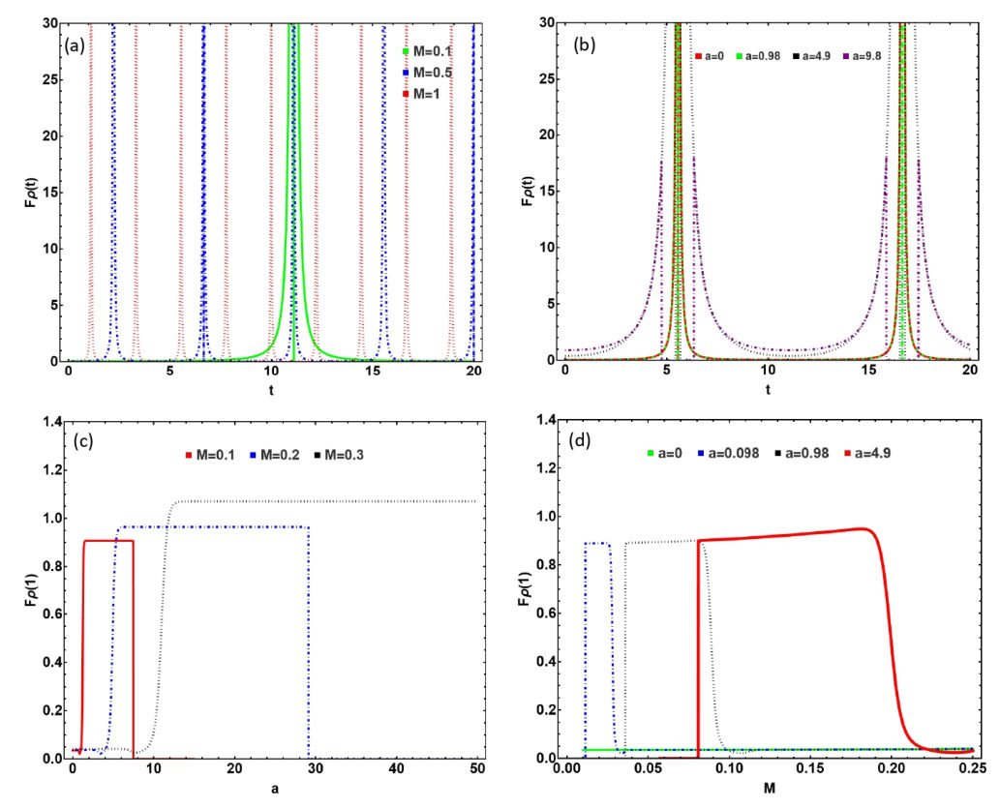 
FIG. 5: Quantum Fisher information Fρ(t) of the QDs. (a) Time evolution for a purely harmonic trap (a = 0) with M = 0.1, 0.5, and 1. (b) Time evolution for M = 0.2 and different linear gravitational-like trap strengths a. (c) Fρ(1) as a function of a for different M. (d) Fρ(1) as a function of M for different a. The linear gravitational-like potential extends the temporal and parameter regimes of enhanced quantum sensitivity.

**Summary.** The paper analyzes the collective dynamics of 1D quantum droplets confined by both harmonic and linear trapping potentials. It demonstrates that while the breathing mode is robust against the linear force, the center-of-mass motion is highly sensitive to confinement strength. Crucially, it shows that this controlled external forcing can be utilized to generate quantum states with enhanced sensitivity for metrology applications.

**Why it may be interesting.** This work bridges fundamental many-body physics (quantum droplets) with applied topics like quantum sensing, showing how external potentials can be tuned to enhance measurement precision while maintaining stability in internal excitations.

Detailed structure

**Main problem.** Investigating the collective dynamics, transport properties, and quantum metrological potential of harmonically trapped 1D quantum droplets under a linear gravitational-like confinement.

**Main result.** The breathing mode remains robust against linear forcing, while the center-of-mass (COM) motion exhibits strong dependence on trap strength; furthermore, the linear potential enables controlled generation of states with enhanced metrological sensitivity.

**Method.** Analytical treatment using ansatz solutions for the extended Gross-Pitaevskii equation (eGPE), supplemented by numerical simulations via the split-step Fourier method and analysis using Quantum Fisher Information (QFI).

**Model / system.** The system models a binary Bose-Einstein condensate forming quantum droplets in one dimension, governed by the 1D eGPE which incorporates Lee-Huang-Yang (LHY) corrections. The confinement potential is a combination of harmonic trapping and a linear gravitational-like term.

**Key observables.** Center-of-mass (COM) dynamics, breathing mode frequency, Quantum Fisher Information (QFI), and Wigner quasi-probability distributions.

**Important parameters / regimes.** Harmonic trap strength ($M$), linear potential strength ($a$), interaction coefficients ($\delta g(t)$, $g_1(t)$).

**Assumptions / limitations.** The system is effectively one-dimensional (assuming $\omega_x \ll \omega_\perp$). The analysis relies on specific ansatz solutions for the wavefunction.

**Figures summary.** Figures illustrate the time evolution of QFI showing revival patterns, Wigner distributions showing phase-space changes due to confinement parameters ($a$ and $M$), and density profiles confirming dynamical stability under noise.

**Paper structure.** The paper analyzes the dynamics by first establishing the governing eGPE with LHY corrections. It then examines the COM transport vs. trap strength, contrasts this with the robust breathing mode, and finally uses QFI and Wigner functions to characterize how linear forcing controls quantum metrological sensitivity.

Abstract

We investigate the dynamics of harmonically confined quantum droplets in a binary Bose Einstein condensate within the one dimensional extended Gross Pitaevskii framework, including LHY corrections, under a constant linear (gravitational like) potential. By analyzing the COM and width dynamics, we show that the monopole (breathing) mode remains governed by the harmonic confinement, with a frequency asymptotically insensitive to the linear perturbation, demonstrating the robustness of internal collective excitations against uniform external forcing. In contrast, the COM exhibits interaction-dependent transport, with weak confinement producing large susceptibility and rapid displacement, whereas strong confinement suppresses transport even under large forcing. The COM response decreases monotonically with increasing trap frequency. We further characterize the evolving quantum state through the quantum Fisher information and Wigner quasi-probability distributions, showing that the linear potential enables controlled generation of states with enhanced metrological sensitivity over finite times, while stronger confinement shifts the onset of the high-sensitivity regime to larger forcing strengths. Numerical simulations based on the split-step Fourier method confirm the dynamical stability of the obtained solutions. These results illustrate the impact of linear gravitational like trap on the collective excitations, transport, and quantum metrological properties of 1D ultradilute quantum fluids.

[↑ back to top](#top)

### [Tunable Mpemba effect in a polymer-bead system with inertia](http://arxiv.org/abs/2607.15266v1)

**Authors:** Hosung Kwak, Yongjoo Baek, Hawoong Jeong  
**Type:** theory · **Category:** statistical mechanics · **PDF:** <https://arxiv.org/pdf/2607.15266v1>  
**Analysis basis:** full PDF text, analyzed in chunks
**Topic relevance:** 🔥 `non-equilibrium dynamics` **4/5** · `methods for driven-dissipative` **3/5** · `non-equilibrium universality` **3/5** · `driven-dissipative phase transition` **2/5** · `scars & prethermalization` **2/5** · `Frenkel-Kontorova` **1/5** · `Keldysh / 2PI / non-Gaussian methods` **1/5** · `correlated / nonlocal dissipation` **1/5**

📷 Fig 1

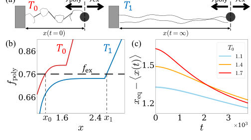 
Figure 1. (a) Schematic of the polymer–bead model and the thermal quenching protocol. One end of the polymer is fixed, while the other is attached to a bead of mass m pulled by a constant external force fex. The bath temperature is in- stantaneously reduced from T0 to T1 at t = 0, and the DNA extension x subsequently relaxes from a value x(0) sampled from the initial equilibrium distribution towards the mean value xeq = ⟨x(∞)⟩of the final equilibrium distribution. (b) Temperature-dependent force–extension relations fpoly(x; T) at the initial temperature T0 (red) and at the final tempera- ture T1 (blue), shown together with the constant applied force fex (dashed line). The intersections with...

📷 Fig 2

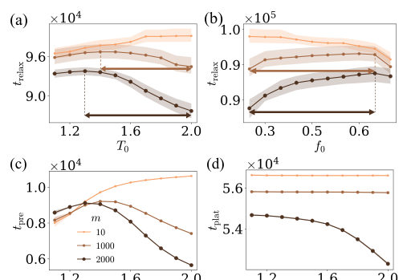 
Figure 2. Simulation results demonstrating the Mpemba effect induced by a point mass attached to an overstretched DNA. Relaxation times trelax (a) for a temperature quench from T0 to T1 = 0.4 with fixed fex = 0.76 and (b) for a force quench from f0 to f1 = 0.76 with fixed T = 0.4 are shown for different masses m. The ranges of T0 and f0 exhibiting the Mpemba effect are highlighted by horizontal arrows. We also show contributions of (c) the pre-plateau regime and (d) the plateau regime to trelax after the temperature quench shown in (a). Lines are to guide the eye, and shaded bands represent the 95% bootstrap confidence intervals.

📷 Fig 3

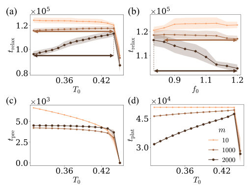 
Figure 3. Simulation results demonstrating the inverse Mpemba effect induced by a point mass attached to an over- stretched DNA. Relaxation times trelax (a) for a temperature quench from T0 to T1 = 0.5 with fixed fex = 0.76 and (b) for a force quench from f0 to f1 = 0.76 with T = 0.5 are shown for different masses m. The ranges of T0 and f0 exhibiting the inverse Mpemba effect are highlighted by horizontal arrows. We also show contributions of (c) the pre-plateau regime and (d) the plateau regime to trelax after the temperature quench shown in (a). Lines are to guide the eye, and shaded bands represent the 95% bootstrap confidence intervals.

📷 Fig 4

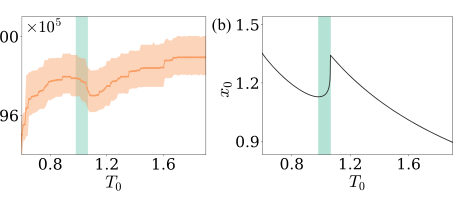 
Figure 4. The Mpemba-like effect at small mass (m = 10). (a) Relaxation time trelax versus initial temperature T0, shown over an extended temperature range beyond the main window discussed in Fig. 2. A Mpemba-like interval (green shaded) appears even in the nearly overdamped regime. The curve is obtained from five independent random seeds, and the orange shaded band denotes the bootstrap 95% confi- dence interval. (b) Temperature dependence of the equi- librium extension estimated from the force-balance condition fpoly(x; T0) = fex, showing a corresponding nonmonotonic- ity in the shaded window. This implies that increasing T0 can place the initial equilibrium position closer to the final...

**Summary.** The paper models the Mpemba effect in a polymer-bead system by coupling underdamped bead dynamics to the polymer's force landscape. It demonstrates that the bead's inertia (mass) acts as a control parameter, allowing researchers to tune the anomalous relaxation time through kinetic energy accumulation across structural plateaus. This provides a theoretical framework for understanding how initial conditions dictate relaxation rates in complex soft matter systems.

**Why it may be interesting.** This work connects non-equilibrium statistical mechanics concepts (like anomalous relaxation) to mesoscopic physical systems (polymers), offering a clear, tunable mechanism based on inertial effects that could be relevant for understanding complex biological or soft matter dynamics.

Detailed structure

**Main problem.** The study investigates the Mpemba effect—an anomalous relaxation phenomenon where initial conditions lead to faster relaxation times—and proposes that system inertia can control this effect.

**Main result.** Inertia, controlled by bead mass, provides a tunable mechanism for observing the Mpemba effect in polymer dynamics; larger masses allow the bead to retain kinetic energy memory across force plateaus, accelerating relaxation.

**Method.** The authors use numerical simulations solving an underdamped Langevin equation coupled to a polymer's force-extension relation, analyzing time evolution after thermal or mechanical quenches.

**Model / system.** The system models a point mass (bead) attached to a polymer (like DNA) undergoing denaturation. The dynamics are governed by the bead's underdamped motion coupled to the polymer's force landscape, which features a plateau regime.

**Key observables.** Relaxation time ($\tau_{\text{relax}}$), kinetic energy $\langle K(t) \rangle$, and mean extension $\langle x(t) \rangle$ as functions of initial temperature ($T_0$) or force quench magnitude.

**Important parameters / regimes.** Bead mass ($m$), initial temperature ($T_0$), applied external force ($f_{\text{ex}}$), and the operational definition of the plateau regime ($|df_{\text{poly}}/dx| < 0.05$).

**Assumptions / limitations.** The polymer is assumed to follow an equilibrium force–extension relation even during non-equilibrium bead motion, and hydrodynamic memory effects are neglected.

**Figures summary.** Figures demonstrate the Mpemba effect via overtaking relaxation curves (Fig. 1(c)) and show how $\tau_{\text{relax}}$ exhibits nonmonotonicity with $T_0$ for different bead masses.

**Paper structure.** The paper establishes the physical model using a Langevin equation, details simulation protocols involving equilibration and quenching, analyzes the role of inertia (mass) in controlling relaxation dynamics across force plateaus, and compares thermal vs. mechanical quench mechanisms.

Abstract

We propose an experimentally motivated model in which the Mpemba effect can be controlled through the system's inertia. The model describes a polymer undergoing a denaturation transition whose force-extension curve contains a plateau that slows relaxation. When the system is initially prepared at a higher temperature or under a weaker stretching force, the bead accumulates greater kinetic energy, allowing it to cross the plateau more rapidly and thereby producing the Mpemba effect. Increasing the bead mass broadens the range of initial temperatures over which this mechanism operates. A similar mechanism also generates the inverse Mpemba effect.

[↑ back to top](#top)

### [Collapse and Inversion of the Josephson Potential in a Strongly Driven Superconducting Circuit](http://arxiv.org/abs/2607.14344v1)

**Authors:** Sercan Deve, Marius Villiers, Marijn A. Morssink, Robin C. Dekker, Gary A. Steele  
**Type:** experiment · **Category:** quantum information and computing · **PDF:** <https://arxiv.org/pdf/2607.14344v1>  
**Analysis basis:** full PDF text, analyzed in chunks
**Topic relevance:** 🔥 `QC/QI experiment` **4/5** · `driven-dissipative phase transition` **3/5** · `non-equilibrium dynamics` **3/5** · `non-equilibrium universality` **2/5** · `Frenkel-Kontorova` **1/5** · `methods for driven-dissipative` **1/5** · `quantum measurements` **1/5** · `quantum optics experiment` **1/5**

📷 Fig 1

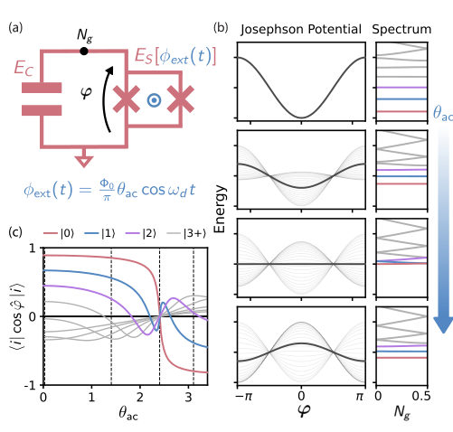 
FIG. 1. Concept. (a) A transmon circuit with charging energy EC embedding a symmetric SQUID with Josephson energy ES[ϕext] is flux-driven at frequency ωd with a reduced amplitude θac. (b) Potential energy vs phase (left) and spec- trum vs offset charge (right) under increasing drive strength (top to bottom, amplitudes marked as vertical dashed lines in panel (c)). The thin potential lines are instantaneous pro- files plotted during one drive period, while the thick ones are time-averaged. The spectra are computed with the averaged potentials. (c) Diagonal matrix element of cos ˆφ for the eigen- states of Hamiltonian Eq. (1), averaged over offset charge, vs reduced drive strength.

📷 Fig 2

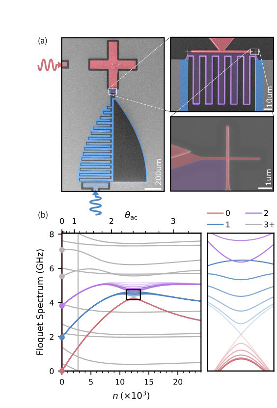 
FIG. 2. Implementation. (a) False-colored SEM picture of the device, with the transmon island (EC/h = 103 MHz) and the SQUID junctions (EJ/2h = 2.6 GHz) in salmon, and the readout resonator in blue. Drive ports and input signals (wiggly arrows) have matching colors. A meander inductor (purple) forms the lower arm of the SQUID (area in light pur- ple). Insets: zoom on the SQUID coupler and one junction. (b) Bare eigenenergies (dots on y-axis) and Floquet spectrum (lines) of the transmon flux-driven at ωd/2π = 8.054 GHz vs resonator occupation. Levels 0 to 2 are plotted with varying offset charge from 0 to 0.5 (dark to light colors). Levels above 3 are plotted with Ng = 0.2. Inset: zoom on...

📷 Fig 3

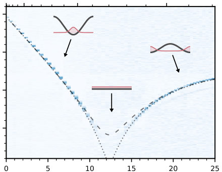 
FIG. 3. Qubit spectroscopy through collapse and in- version. Frequency shift of the qubit transition measured by two-tone spectroscopy as a function of resonator occupation. The color represents the digitizer signal in arbitrary units. The black dashed and dotted lines are fits to the measured spectrum based on diagonalization of the Hamiltonian Eq. (1) for offset charges Ng = 0.0 and Ng = 0.5, respectively. Above, we indicate the renormalized Josephson potential profiles in black, and the corresponding ground-state wavefunctions in phase representation in salmon. The resonator occupation is calibrated from the fit. The top axis indicates the equivalent flux-drive amplitude θac.

📷 Fig 4

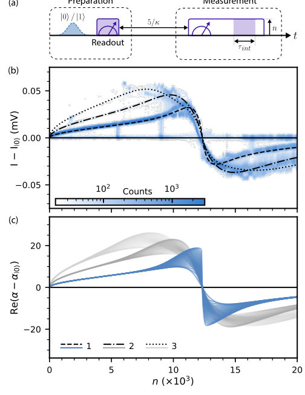 
FIG. 4. Collapse and inversion revealed through read- out (a) Pulse sequence. An optional π pulse prepares the transmon in either the ground |0⟩or first excited |1⟩state, followed by a post-selection readout pulse. After an idling time of 5/κ, a long measurement pulse is applied. IQ distri- butions are acquired by integrating over an interval of length τint = 600 ns at the end of the pulse (shaded area), which en- sures a measurement of the steady-state resonator field only. We repeat this sequence for increasing measurement ampli- tude, which we convert into a resonator steady-state occu- pation n. (b) Measured histogram of the I quadrature for transmon prepared in |1⟩as a function of...

**Summary.** The research investigates strongly driven superconducting transmon circuits to push operational limits. By engineering the circuit to suppress unwanted transitions, the authors observe that increasing drive power causes the Josephson potential to first collapse and then invert its sign. This inversion reveals a novel physical mechanism—dynamical stabilization analogous to an inverted pendulum—opening new avenues for quantum state control.

**Why it may be interesting.** This work provides concrete experimental evidence of non-trivial dynamical phenomena (potential collapse/inversion) in superconducting circuits under strong driving, which has implications for designing robust quantum control protocols beyond simple resonance avoidance.

Detailed structure

**Main problem.** The primary challenge is overcoming dynamic range limitations in strongly driven superconducting circuits caused by unwanted transitions, which obscures fundamental physics.

**Main result.** The authors experimentally demonstrate the collapse of the Josephson potential to zero, followed by a clear sign inversion as drive power increases. This inversion dynamically stabilizes the transmon at its unstable equilibrium point, analogous to an inverted pendulum.

**Method.** The study employs spectroscopy and readout experiments on a carefully engineered transmon-resonator system to track the time evolution of the Josephson potential under increasing microwave drive power.

**Model / system.** The physical platform is a transmon-resonator circuit embedding a symmetric SQUID, described by a Hamiltonian involving Josephson energy modulated by an external flux drive. The engineering minimizes spurious modes via native cosine-cosine coupling.

**Key observables.** Time evolution of the Josephson potential (collapse and inversion), qubit frequency shifts ($\chi_i(n)$), and the measured sign reversal of $\langle \cos \hat{\varphi} 
angle$ during readout.

**Important parameters / regimes.** Drive power ($P$) leading to specific photon numbers ($n$), operating in regimes where $\omega_a/\omega_{01} \gg 1$, and the critical point around $12.5 	imes 10^3$ photons.

**Assumptions / limitations.** The interpretation relies on fitting nonlinear qubit frequency shifts to a renormalized Hamiltonian, with final confirmation of inversion coming from direct measurement of $\langle \cos \hat{\varphi} 
angle$.

**Figures summary.** Figures illustrate the transmon circuit concept and potential energy vs. phase; subsequent figures detail the three spectroscopic regimes (flattening, collapse, revival) showing the clear sign reversal in the readout signal.

**Paper structure.** The paper progresses from establishing the physical system and overcoming spurious mode limitations to performing spectroscopy that reveals potential renormalization, culminating in a direct readout measurement confirming the potential's inversion.

Abstract

Superconducting circuits embedding Josephson junctions leverage microwave drives for control and measurement of quantum states. Although increasing the drive power is desirable for improving the efficiency of these operations, it eventually triggers unwanted transitions to uncontrolled states. While careful choice of circuit symmetries and parameters can mitigate these effects, the presence of spurious circuit modes spoils the resilience to high power. In this work, we engineer a transmon-resonator system free of any detrimental unwanted transitions. This resilience enables us to access drive powers at which we uncover a remarkable physical phenomenon: the collapse and inversion of the Josephson potential. Through spectroscopy and readout experiments, we confirm that the driven potential goes to zero and inverts as the power increases. The inversion corresponds to the dynamical stabilization of the transmon at its unstable equilibrium point, directly analogous to an inverted pendulum. This result reveals a new limitation of strongly driven superconducting circuits beyond drive-induced transitions. In addition, the dynamical renormalization of the Josephson potential opens up novel avenues for the control of superconducting circuits, and the autonomous stabilization of noise-resilient quantum states.

[↑ back to top](#top)

### [Benchmarking quantum simulation at scale](http://arxiv.org/abs/2607.14212v1)

**Authors:** Jeremy Hartse, Mohsin Raza, Shravan Shravan, Ivan H. Deutsch, Niklas Mueller  
**Type:** theory · **Category:** quantum information and computing · **PDF:** <https://arxiv.org/pdf/2607.14212v1>  
**Analysis basis:** full PDF text, analyzed in chunks
**Topic relevance:** 🔥 `scars & prethermalization` **4/5** · `non-equilibrium dynamics` **3/5** · `entanglement & information structure` **2/5** · `non-equilibrium universality` **2/5** · `Keldysh / 2PI / non-Gaussian methods` **1/5** · `analog quantum simulation` **1/5** · `driven-dissipative phase transition` **1/5** · `methods for driven-dissipative` **1/5**

📷 Fig 1

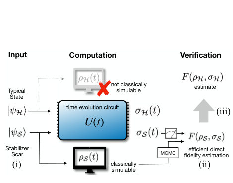 
FIG. 1. Benchmarking Quantum Simulations at Scale. A pro- tocol for benchmarking the fidelity of quantum simulations of non-equilibrium dynamics in regimes beyond classical simula- bility. We consider models which are non-integrable, for which typical states, |ψH⟩, thermalize. Such dynamics are not effi- ciently classically simulable, and benchmarking performance for such states is intractable. For models that host stabilizer scars, under consideration here, we can exploit the fact that for initial states in this subspace, |ψS⟩dynamics are classi- cally simulable and we can perform direct fidelity estimation efficiently. Assuming local depolarizing noise, we demonstrate for a specific...

📷 Fig 2

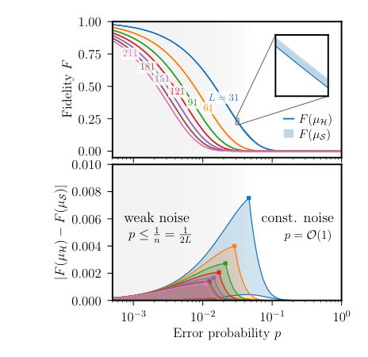 
FIG. 2. Noise acting on scar vs. non-scar states. Compar- ison between the fidelity under a local depolarizing channel, averaged over Haar-random input from the full Hilbert space, F(µH) (solid lines), and bounds of the respective fidelity for scar states F(µS) (shaded bands, Eq. (15) and SM S3). The difference, shown in the lower panel, vanishes as n →∞or for small p, and (trivially) for p →1. The tighter bound is shown, and the crossover between where Eq. (15) is tighter and where the SM result applies is marked by square markers.

📷 Fig 3

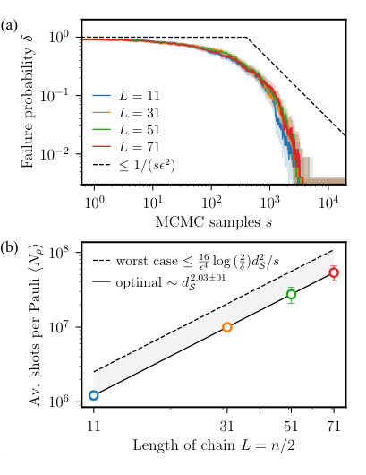 
FIG. 3. Numerical MCMC demonstration. (a) Failure prob- ability to reach precision ϵ = 5 · 10−2 of MCMC-based DFE between a target ρ ∈S and a reference state σ ∈S as a function of the number of sampled Pauli operators with exact measurements. Results shown for L = 11, 31, 51, 71 (n = 22, 62, 102, 142 qubits) compared with the bound s = ⌈1/(ϵ2δ)⌉[69] are independent of system size when expecta- tion values are known exactly. (b) Finite-shot estimation. For ρ ∈S, we show the maximal shot number ⟨Nρ⟩(dashed black) versus the optimal shot cost (points; solid black fit), attain- able if exact expectation values were known (see SM S4) for precision ϵ = 5 · 10−2 and failure probability δ = 1 ·...

📷 Fig 4

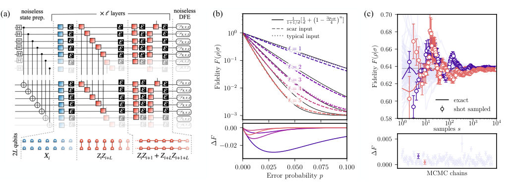 
FIG. 4. Circuit Simulation. (a) Quantum circuit used to simulate Eq. (11), consisting of state preparation, (random or Trotterized) time evolution, and DFE. Local depolarizing noise is assumed, except during state preparation and measurement. The state preparation circuit consists of L = n/2 two-qubit Bell-pair sub-circuits and is applied to an input computational basis product state |s⟩, where s is an n-qubit bitstring. For special s, the circuit prepares QMBS basis states, while for all others it produces orthogonal non-scar states. (b) Classical emulation of the circuit in (a) for n = 10 qubits comparing fidelities as a function of p for different circuit depths ℓ, comparing scar basis...

**Summary.** This paper introduces a novel benchmarking protocol for non-equilibrium quantum simulation using 'quantum many-body scars.' By restricting the simulation fidelity measurement to a special, classically simulable subspace, the authors create a quantifiable benchmark. This allows researchers to test if quantum hardware can simulate dynamics that are intractable for classical computers.

**Why it may be interesting.** It provides a concrete, mathematically rigorous framework for testing quantum advantage in dynamics by isolating measurable quantities (fidelity) that are sensitive to computational hardness.

Detailed structure

**Main problem.** The authors propose a scalable verification scheme for non-equilibrium quantum simulation to benchmark performance beyond classical computational limits.

**Main result.** They show that fidelity estimation within the specialized 'scar subspace' provides a quantifiable benchmark against the full Hilbert space, even under local depolarizing noise.

**Method.** The protocol uses Direct Fidelity Estimation (DFE) applied to states confined to a quantum many-body scar subspace, leveraging stabilizer properties for efficient measurement scaling.

**Model / system.** The study utilizes an Ising model on $n=2L$ qubits with periodic boundary conditions. The key feature is the existence of a polynomially large 'scar subspace' embedded in the exponentially large Hilbert space.

**Key observables.** Fidelity ($F$), Stabilizer Rényi entropy ($\mathcal{M}_\alpha$), and expectation values of Pauli observables ($	ext{Tr}[
ho W_k]$).

**Important parameters / regimes.** Local depolarizing noise strength ($p$), system size ($L$ or $n$), and required measurement precision ($\epsilon, \delta$).

**Assumptions / limitations.** The dominant error is approximated by local depolarizing noise, and the method relies on the existence of a polynomially large scar subspace.

**Figures summary.** Figures compare fidelities in the full vs. scar subspaces under noise (Fig 2), demonstrate MCMC estimation accuracy independent of system size (Fig 3a), and show how shot counts affect statistical uncertainty estimates (Fig S4).

**Paper structure.** The paper develops a three-part benchmarking protocol: defining the QMBS, showing DFE efficiency via stabilizer entropy bounds, and deriving quantitative relationships between scar and full-space fidelities under noise.

Abstract

The applications for which quantum computers will clearly outperform classical computers are still being identified and benchmarking such an advantage is challenging. We propose a scalable verification scheme for non-equilibrium quantum simulation based on stabilizer scars, a special class of quantum many-body scars, whose structure ensures both classical simulability and efficient direct fidelity estimation. Assuming a physically motivated error model, we show that the fidelity of quantum simulating these states bounds the fidelity of classically intractable simulations, providing a benchmark for quantum-advantage experiments in non-equilibrium dynamics.

[↑ back to top](#top)

### [Geometric Mode Steering of the Quantum Mpemba Effect](http://arxiv.org/abs/2607.14501v1)

**Authors:** Yingying Hong, Longxing Xu, Weiwei Zhang, Jie Ren, Jianhui Wang  
**Type:** theory · **Category:** other · **PDF:** <https://arxiv.org/pdf/2607.14501v1>  
**Analysis basis:** full PDF text, analyzed in chunks
**Topic relevance:** 🔥 `quantum measurements` **4/5** · `measurement-induced transitions` **3/5** · `methods for driven-dissipative` **3/5** · `non-equilibrium dynamics` **2/5** · `correlated / nonlocal dissipation` **1/5** · `driven-dissipative phase transition` **1/5** · `non-equilibrium universality` **1/5**

📷 Fig 1

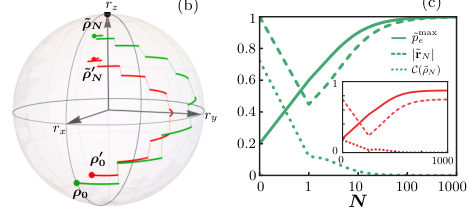 
FIG. 1. (a) Geometric mode-steering protocol. The se- quence of N + 1 unitary segments and N nonselective mea- surements maps r 7→RtotTNr, preparing a nearly diago- nal ˜ρN with enhanced target population. (b) Bloch tra- jectories for N = 8 measurements, steering the pure ρ0 (|r0| = 1, θ = arccos(−0.8), ϕ = 0) and mixed ρ′ 0 (|r′ 0| = 0.75, θ = arccos(−0.8), ϕ = 0) initial states to ˜ρN and ˜ρ′ N, respectively. Solid arcs: unitaries; dotted chords: measure- ment projections. (c) Optimal population ˜p max e , Bloch length |˜rN|, and coherence C(˜ρN) versus N; inset: mixed input. The solid curve is bounded by (1 + |r0|)/2. Parameters: T = 0.1, Ω= 0.1, ∆= 2.0.

📷 Fig 2

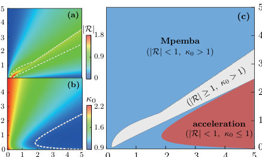 
FIG. 2. Parameter-induced acceleration of relaxation. (a) Slow-mode amplitude ratio |R|. (b) Initial distance ratio κ0. (c) Trace-distance acceleration factor. The blue region |R| &lt; 1, κ0 &gt; 1 is the Mpemba regime. Parameters: |r0| = 1, θ = arccos(−0.6), ϕ = 0, T = 0.1, γ = 1.0, N = 100. Contours use the modulus condition |a+1| &lt; |a+X|, valid for real and complex λ2 [48].

📷 Fig 3

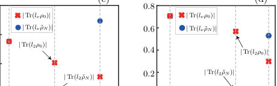 
FIG. 3. Quantum Mpemba effect in a driven dissipative qubit with complex (a,c) and real (b,d) spectral gaps. (a,b) Trace distance to ρss for ρ0 (red) and ˜ρN (blue); insets: spectrum of L. (c,d) Modal weights |Tr(lνρ)| versus |Re(λν)|. The preparation suppresses the slowest modal weights, including both members of the complex-conjugate pair in (c). Other parameters as in Fig. 2. Since Tγ ≪1, the crossing persists when the preparation time is included in the total time.

📷 Fig 4

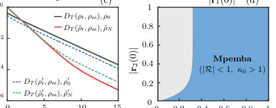 
FIG. 4. Trace-distance dynamics and Mpemba regions for M = 6: beyond-Davies (a,b) and zero-temperature Davies- type (c,d) cases. In (a,c), solid and dashed curves corre- spond to two product initial states, differing only in the first qubit, and to their prepared states. In (b,d), blue de- notes |R| &lt; 1 and κ0 &gt; 1. Parameters: (|r1(0)|, θ1, ϕ1) = (1, arccos(−0.6), 0) and (0.75, arccos(−0.8), 0), Ω= 1.2, J = 0.5, N = 100; beyond Davies: (γ1 = 1, γj&gt;1 = 1.2, Ωd = 0.1); Davies-type: (γj = 1 ∀j, Ωd = 0).

**Summary.** The paper introduces a novel pre-dissipative geometric mode-steering protocol to accelerate the relaxation of open quantum systems toward equilibrium. By strategically interleaving coherent rotations with nonselective measurements, the protocol suppresses coupling to slow Liouvillian modes. This suppression enables the realization of the quantum Mpemba effect in various qubit platforms.

**Why it may be interesting.** This work provides a concrete, experimentally implementable quantum control scheme (measurement-based) to overcome fundamental relaxation bottlenecks in open systems, which is highly relevant for quantum computing hardware characterization and optimization.

Detailed structure

**Main problem.** The research addresses how open quantum systems approach their steady state, specifically aiming to realize the quantum Mpemba effect where a state farther from equilibrium relaxes faster.

**Main result.** A pre-dissipative geometric mode-steering protocol was developed that suppresses overlap with slow Liouvillian modes, enabling accelerated relaxation dynamics in driven qubit and multiqubit systems.

**Method.** The core method involves interleaving coherent unitary evolution segments with nonselective projective measurements to geometrically steer the state's Bloch direction along geodesic paths before dissipation begins.

**Model / system.** The system is modeled as an open quantum system governed by a Lindblad master equation, analyzed using generalized Bloch representations for qubit and multiqubit systems. The dynamics are characterized by Liouvillian operators and spectral gaps.

**Key observables.** Slow-mode Overlap Ratio ($R$), initial distance to stationarity ($\kappa_0$), trace distance $D_T(
ho_t, 
ho_{ss})$, and the final excited-state population $	ilde{p}_e$.

**Important parameters / regimes.** The Mpemba regime requires two conditions: reduced slow-mode overlap ($|R|<1$) and a larger initial distance to stationarity ($\kappa_0 > 1$). The analysis covers both real and complex spectral gaps.

**Assumptions / limitations.** The protocol is distinct from Zeno protocols as measurements are preparatory. The framework treats real and complex spectral gaps uniformly, though some derivations rely on approximations for the moderately driven regime.

**Figures summary.** Figures illustrate the geometric steering sequence (Fig. 1a), Bloch trajectories (Fig. 1b), parameter dependence of the Mpemba regime in $(\Omega, \Delta)$ planes (Fig. S2), and time evolution of relaxation dynamics showing slow mode suppression (Fig. 3).

**Paper structure.** The paper introduces the problem using the Lindblad master equation, details the pre-dissipative geometric steering protocol involving unitary steps and measurements, derives the necessary conditions ($|R|<1$ and $\kappa_0>1$), and demonstrates robust Mpemba acceleration across various qubit architectures.

Abstract

The slowest Liouvillian mode often bottlenecks the relaxation of an open quantum system to its steady state. Standard strategies circumvent this bottleneck by selecting special initial states or engineering the dissipator. Here we show that neither is necessary. We introduce a pre-dissipative geometric steering protocol that reshapes any given pure or mixed state before relaxation begins -- coherent rotations interleaved with nonselective projective measurements -- at fixed Lindblad generator. By steering the state's Bloch direction along geodesic paths, the protocol suppresses its overlap with the slowest Liouvillian modes. The prepared state then starts farther from equilibrium yet relaxes faster, realizing the quantum Mpemba effect, whenever two computable conditions hold: reduced slow-mode overlap and a larger initial distance to stationarity. Our framework treats real and complex spectral gaps uniformly, and we demonstrate robust Mpemba acceleration in driven qubit and multiqubit systems using operations available in trapped-ion and superconducting platforms.

[↑ back to top](#top)

### [Parallel analog quantum simulation in homogeneous quantum gases](http://arxiv.org/abs/2607.14977v1)

**Authors:** Diego Hernández Rajkov, Alberto Terenzi, Marcia Frómeta Fernández, Nicola Grani, Massimo Inguscio, Giulia Del Pace, Giacomo Roati  
**Type:** experiment · **Category:** quantum gases · **PDF:** <https://arxiv.org/pdf/2607.14977v1>  
**Analysis basis:** full PDF text, analyzed in chunks
**Topic relevance:** 🔥 `analog quantum simulation` **4/5** · `non-equilibrium dynamics` **3/5** · `non-equilibrium universality` **2/5** · `correlated / nonlocal dissipation` **1/5** · `driven-dissipative phase transition` **1/5** · `entanglement & information structure` **1/5** · `exotic spin models in light-matter` **1/5**

📷 Fig 1

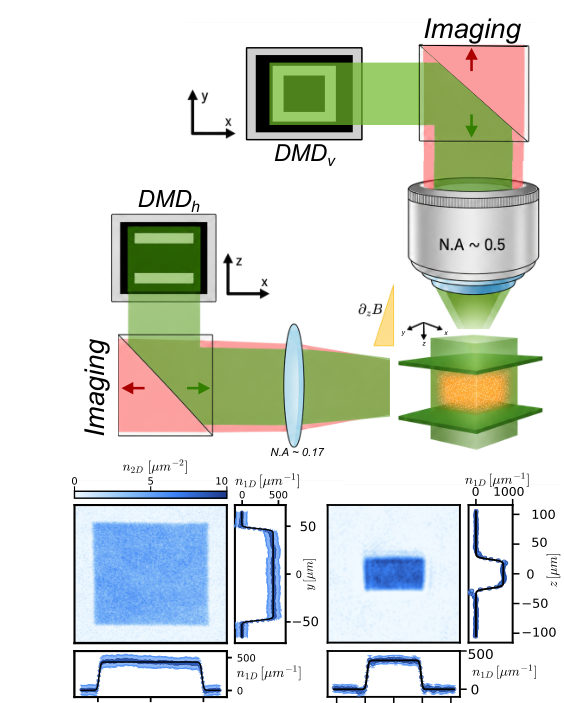 
FIG. 1. Experimental setup for production of ho- mogeneous Fermi gases. The atomic gas is con- fined by optically repulsive potentials generated with two DMDs, projected along the vertical (DMDv) and horizontal (DMDh) directions, which also define our imaging axes. A magnetic-field gradient levitates the gas, compensating grav- ity for both hyperfine states. Bottom panels: representative column-density images of a homogeneous gas at unitarity, ac- quired along both imaging axes, for a system of dimensions 100(x) × 100(y) × 50(z) µm3. Side panels show the integrated 1D profiles along each axis, black curve correspond to the ideal homogeneous profile.

📷 Fig 2

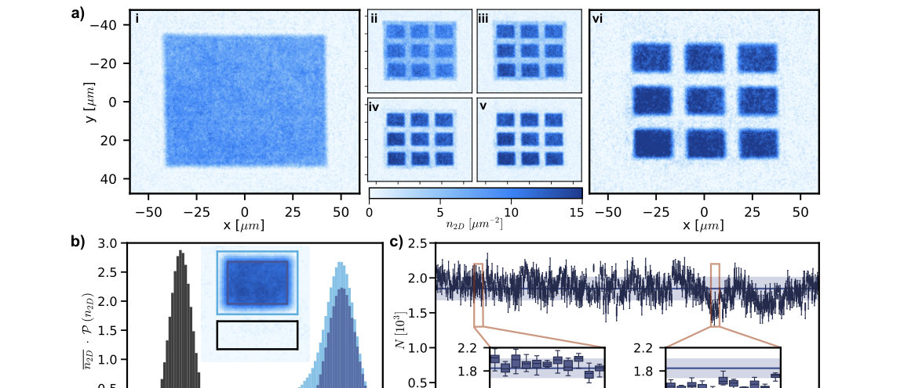 
FIG. 2. Similarity analysis of QSU arrays for unitary Fermi gases. a) Procedure for multiplexing continuum systems, starting from an initial system of size 70(x) × 85(y) × 20(z) µm3. Representative in situ images are shown at t = 0 (i), 12 (ii), 24 (iii), 36 (iv), 48 (v), and 100 (vi) ms. The initial system is partitioned into smaller rectangular QSUs following the procedure described in the main text. Images are averaged over 5 experimental repetitions. b) Measured probability density P(n2D) of the column-integrated density n2D, where n2D denotes the average bulk density. Histogram colors indicate the regions from which n2D is sampled. c) Box plot showing the minimum, quartiles, and...

📷 Fig 3

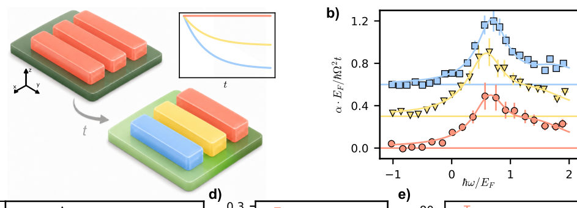 
FIG. 3. Control of local temperature and degeneracy of Fermi gases at unitarity. a) Local evaporative cooling implemented by dynamically engineering the DMDh pattern intensity over time. b) Measured RF response for each QSU, obtained using a t = 4 ms pulse. Here, ω = 0 corresponds to the bare atomic transition. The continuous lines are a guide to the eye. c) Full width at half maximum Γ as a function of the peak position ¯hωp of the spectral response. Calibration data from Ref. [26] are shown as open symbols. d) Extracted T/TF obtained following the RF thermometry protocols of Refs. [26–28]. The gray band indicates the expected critical temperature for superfluidity, Tc = 0.16(1) TF . e)...

📷 Fig 4

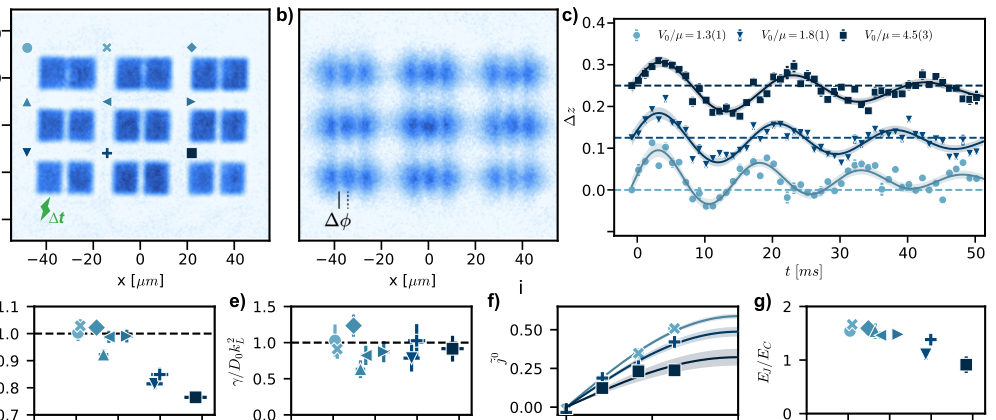 
FIG. 4. Parallel probing of the weak-link to tunneling crossover. Experimental realization of nine independent QSUs implementing atomic Josephson junctions in the molecular BEC regime. a) In situ and b) time-of-flight images after 2 ms of expansion. Both panels show averages over 5 experimental repetitions. Each QSU implements a different tunneling barrier, with height V0/µ ranging from 1 to 4 specified by the symbols. c) Time evolution of the imbalance ∆z after imprinting an initial phase difference ϕ0 = 0.4π, shown for selected values of V0/µ. Measurements are fitted with the damped-oscillation

**Summary.** The research demonstrates an advanced technique to create multiple, independently controllable quantum simulation units (QSUs) using ultracold atomic gases. This multiplexed setup allows researchers to simultaneously study complex phenomena like the superfluid transition and Josephson junction dynamics across an array of junctions. It establishes a powerful tool for investigating transport physics in strongly correlated matter.

**Why it may be interesting.** This work provides a highly versatile, scalable experimental platform for studying non-equilibrium dynamics in strongly correlated quantum matter, directly addressing fundamental questions about transport and phase transitions in mesoscopic arrays.

Detailed structure

**Main problem.** To study strongly correlated quantum systems, particularly dynamics and transport Hamiltonians, beyond classical computational reach.

**Main result.** The authors successfully demonstrated parallel analog quantum simulation in two settings: characterizing the superfluid transition across multiple units and simulating Josephson junctions with independent control over local parameters.

**Method.** They utilized a multiplexed configuration of ultracold atomic gases confined in configurable optical box potentials, allowing for independent manipulation of multiple quantum simulation units (QSUs).

**Model / system.** The platform uses homogeneous quantum gases (e.g., Fermi gas) to simulate models like the unitary Fermi gas and Josephson junctions. Control is achieved by shaping optical traps and controlling local cooling/phase.

**Key observables.** Density, Temperature ($T$), Superfluid fractions, population imbalance ($\Delta z$), and relative phase ($\Delta\phi$) measured via in situ imaging and time-of-flight interference.

**Important parameters / regimes.** Tunneling strength ($E_J$), charging energy ($E_C$), local temperature ($T/T_F$), and barrier height ($V_0/\mu$).

**Assumptions / limitations.** The process assumes quasi-adiabatic evolution during trap reshaping, and the RF thermometry method supports the assumption of local thermal equilibrium.

**Figures summary.** Figures illustrate the experimental setup using DMDs for confinement, show density distribution verification across multiple units (multiplexing), detail local temperature control via RF spectroscopy, and map out Josephson junction dynamics showing frequency/damping evolution with barrier height.

**Paper structure.** The paper progresses by first establishing the multiplexed QSU architecture, then demonstrating independent local control over temperature and superfluidity. Subsequently, it applies this framework to simulate coupled Josephson junctions, analyzing the crossover between weak-link and tunneling regimes.

Abstract

Analog quantum simulation offers a powerful way to study strongly correlated quantum systems that are beyond the reach of classical computation. In this context, ultracold atomic gases have been demonstrated to be an exceptionally versatile and well-controlled platform for implementing various quantum Hamiltonians. In this work, we extend this level of control to a multiplexed configuration in which distinct quantum-simulation units are independently controlled and engineered starting from a single atomic cloud. We demonstrate multiplexed operation in two representative settings. First, by shaping box-trap potentials and separately controlling the evaporative cooling trajectories, we prepare subsystems at various temperatures across the superfluid transition of the unitary Fermi gas. Second, we demonstrate parallel quantum simulation of the Josephson Hamiltonian across distinct Josephson-junction quantum simulation units with individually tunable parameters, including local phase control to initialize the dynamics. Our scheme provides a versatile route toward systematic studies of dynamics and transport Hamiltonians in strongly correlated ultracold matter. Moreover, it is readily extendable to a wide range of atomic species, geometries, and dimensionalities.

[↑ back to top](#top)

### [Emulation of Entanglement Distribution Networks on a Quantum Computer](http://arxiv.org/abs/2607.14260v1)

**Authors:** Ashley N. Tittelbaugh, Jerry Horgan, Rohan Bali, Marco Ruffini, Daniel C. Kilper, Shelbi L. Jenkins, Boulat A. Bash  
**Type:** both · **Category:** quantum information and computing · **PDF:** <https://arxiv.org/pdf/2607.14260v1>  
**Analysis basis:** full PDF text, analyzed in chunks
**Topic relevance:** 🔥 `QC/QI experiment` **4/5** · `entanglement & information structure` **3/5** · `correlated / nonlocal dissipation` **2/5** · `driven-dissipative phase transition` **1/5** · `methods for driven-dissipative` **1/5** · `non-equilibrium dynamics` **1/5**

📷 Fig 1

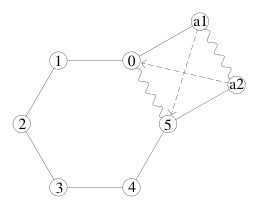 
Fig. 1: Ring graph state; edge (0,5) is realized via a teleported virtual CZ using a cut Bell pair (Fig. 2).

📷 Fig 2

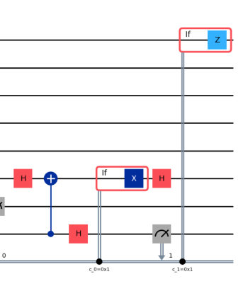 
Fig. 2: Cut graph-state circuit The base form of the cut graph state circuit runs in all experiments.

📷 Fig 3

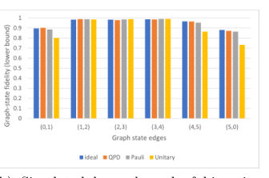 
Fig. 3: Simulation at 99.6% ZALM fidelity and 10ns classical communi- cation Individual graph state stabilizer values and a lower-bound for pair-wise graph state fidelities. For both stabilizers and fidelity, a unity value indicates perfect entanglement with no errors.

📷 Fig 4

 
Fig. 3b further illustrates that the lower-bounded fidelity across the cut edge (0,5) is the smallest, while the lower-bounded fidelities of neighboring edges (0,1) and (4,5) exhibit more moderate degradation. This behavior is again consistent with the results of Carrera Vazquez et al. [4]. Mirroring the stabilizer behavior, edge (0,1) exhibits a lower fidelity than its counterpart edge (4,5), which we similarly attribute to the directionality of the cz operation. Depolarization differences are most pronounced near the cut edge, where uni- tary depolarization performs notably worse due to its additional gate overhead. QPD and Pauli perform close to ideal, with Pauli slightly lower due to...

📷 Fig 5

 
Fig. 4 presents the hardware results for the output stabilizers and lower-bounded fidelities when the depolarized runs are configured to emulate a 99.6% ZALM- generated fidelity. The error bars indicate shot-based statistical uncertainty. We

**Summary.** This paper models entanglement distribution across simulated and real quantum networks to build multipartite graph states. It rigorously tests the impact of noise sources, including depolarizing channels and classical communication delays, on network fidelity. The work is important because it demonstrates that hardware implementation details can drastically alter expected performance compared to idealized theoretical models.

**Why it may be interesting.** It provides concrete benchmarks for resource estimation in distributed quantum computing architectures, which is crucial for theorists designing fault-tolerant protocols that must account for realistic physical constraints.

Detailed structure

**Main problem.** The study investigates how quantum computers can emulate complex quantum networks and assess their performance when subjected to practical noise sources like degraded entanglement and communication latency.

**Main result.** Hardware constraints lead to profound differences in results compared to simulations, highlighting that the choice of error model (e.g., QPD vs. Pauli) significantly impacts achievable network fidelity.

**Method.** The authors modeled imperfect Bell-pair sources using depolarizing noise and classical delays by implementing various depolarization channels (Stinespring dilation, random Pauli errors, QPD).

**Model / system.** The system involves emulating entanglement distribution networks to construct multipartite graph states, tested on superconducting quantum hardware (IQM Emerald) and in simulation.

**Key observables.** Bipartite-entanglement fidelity, stabilizer expectations for the resulting graph state, and the required network-distributed entanglement fidelity ($\ge 90\%$).

**Important parameters / regimes.** Classical communication delay (tested up to 10 ns and conceptually up to tens of kilometers); initial ZALM source fidelity (e.g., 99.6%).

**Assumptions / limitations.** The study assumes mathematical equivalence between noise models but finds hardware implementation introduces discrepancies; rate investigation is left for future work.

**Figures summary.** Figures illustrate the ring graph state structure and circuit, compare stabilizer values across different depolarization channels (simulation vs. hardware), show fidelity sweeps versus network-distributed entanglement, and map fidelity loss against classical delay.

**Paper structure.** The paper progresses by defining the problem of noisy quantum networking, detailing multiple noise models for Bell pairs, presenting comparative results on graph state construction fidelity under these noises, and finally discussing the implications of hardware vs. simulation discrepancies.

Abstract

We investigate how quantum computers can be used to emulate quantum networks and study their performance under practical impairments. In particular, we evaluate how degraded entanglement and communication latency affect teleportation-based distributed multipartite-entanglement-state construction. We model imperfect Bell-pair sources using depolarizing noise channels and classical communication delays using thermal relaxation. We implement the depolarization using Stinespring dilation, randomly applied Pauli errors, and quasi-probability decompositions, evaluating the latter two on IQM quantum hardware and all three in simulation. We then study the performance of the entanglement distribution under noise generated by the aforementioned models. Although these noise models are mathematically equivalent, we find that hardware constraints result in profound differences in the corresponding results, highlighting the importance of careful experiment design.

[↑ back to top](#top)

### [Towards a monolithic platform for coupling superconducting circuits to low-loss microwave phonons in AlScN on 4H-SiC](http://arxiv.org/abs/2607.14319v1)

**Authors:** Yuanchen Deng, William W. Roberts, Sueli Skinner-Ramos, Dalton Anderson, Katherine Hewey, Xingyu Du, Michael Miller, Brandon Smith, Hwijong Lee, Pingping Chen, Charles Thomas Harris, Roy H. Olsson, Lisa Hackett, Rupert Lewis, Matt Eichenfield  
**Type:** experiment · **Category:** quantum information and computing · **PDF:** <https://arxiv.org/pdf/2607.14319v1>  
**Analysis basis:** full PDF text, analyzed in chunks
**Topic relevance:** 🔥 `QC/QI experiment` **4/5** · `quantum optics experiment` **2/5** · `spintronics-quantum-optics interface` **2/5** · `analog quantum simulation` **1/5** · `correlated / nonlocal dissipation` **1/5** · `correlated cavity matter` **1/5** · `driven-dissipative phase transition` **1/5**

📷 Fig 1

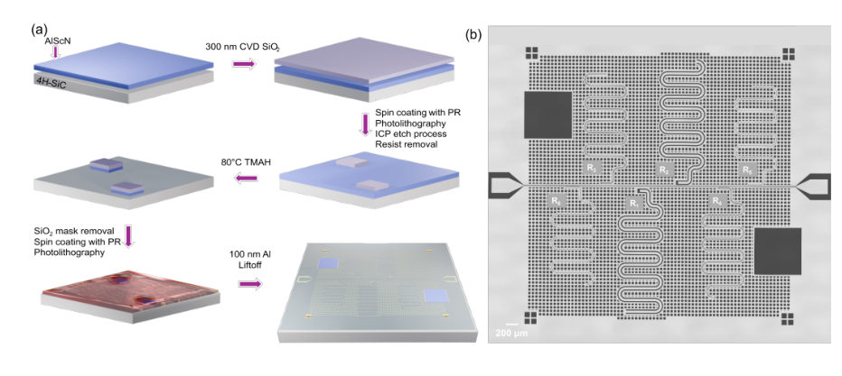 
Fig. 1. (a) Fabrication process flow of the combined AlScN waveguides and superconducting resonators on SiC. (b) Optical image of six superconducting coplanar waveguides (CPWs) with different design parameters as shown in Table I.

📷 Fig 2

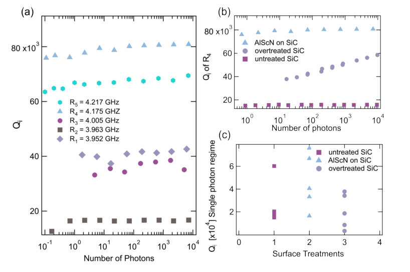 
Fig. 2. (a) Quality factor measurements of five resonators fabricated on AlScN-on-SiC. Among these, the resonator R4 (4.175 GHz) demonstrates the best performance at lower power, featuring a gap of 5 µm. (b) The quality factor of R4 improves by a factor of 4 after undergoing the AlScN-on-SiC surface treatment compared to untreated sample. (c) Quality factor measurements at the single-photon limit for the designed resonators subjected to different surface treatment processes.

📷 Fig 3

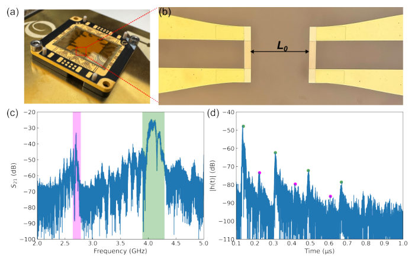 
Fig. 3. (a) A photograph of the AlScN-on-SiC chip with phononic delay lines. (b) A microscope image of the phononic delay line with propagation length L0 = 500 µm. (c) Example normalized S21 transmission data for the phononic delay line with L0 = 500 µm at 7 mK. The Rayleigh mode and Sezawa mode peaks are marked with pink and green background respectively. (d) The impulse response of the phononic delay line with L0 = 500 µm at 7 mK, normalized to the full measurement bandwidth. The peaks of the Rayleigh and Sezawa echoes are marked with pink and green dots, respectively.

📷 Fig 4

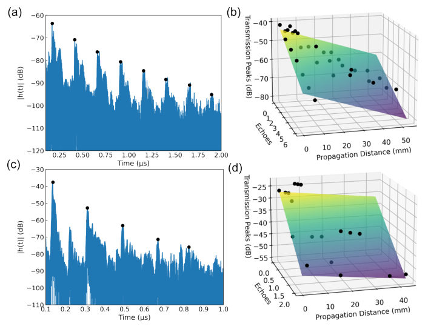 
Fig. 4. (a) The impulse response |h| of the Rayleigh mode in the 500 µm delay line at 7 mK, normalized to the filter passband. (b) The amplitudes of the Rayleigh mode echo peaks are fitted into a plane against the number of echoes and propagation distances. (c) The impulse response |h| of the Sezawa mode in the 500 µm delay line at 7 mK, normalized to the filter passband. (d) The amplitudes of the Sezawa mode echo peaks are fitted into a plane against the number of echoes and propagation distances.

📷 Fig 5

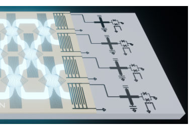 
Fig. 5. Conceptual picture of a phononic static Gaussian boson sampling circuit in AlScN-on-SiC.

**Summary.** The paper presents an experimental demonstration of a monolithic platform integrating superconducting microwave circuits with low-loss piezoelectric phonons using $	ext{AlScN}$ grown on $	ext{SiC}$. By selectively etching the material, they create a structure that supports both high-quality superconducting resonators and long-lived acoustic waveguides. This establishes a promising starting point for building complex quantum processors utilizing phonon mediation.

**Why it may be interesting.** This work directly addresses the integration challenge in quantum hardware by proposing a material system ($	ext{AlScN/SiC}$) that allows for coexisting superconducting and phononic elements on one chip, which is crucial for realizing scalable hybrid quantum processors.

Detailed structure

**Main problem.** The goal is to develop a scalable, monolithic platform that can efficiently couple superconducting microwave circuits with low-loss microwave phonons for quantum applications.

**Main result.** The authors demonstrated the feasibility of an Al-on-SiC/AlScN-on-SiC architecture, achieving measurable lifetimes ($	ext{T}_1 \approx 2.9 \mu	ext{s}$, phonon $	au \approx 7.6 \mu	ext{s}$) and a coupling coefficient ($eta \approx 4.3\%$) suitable for hybrid quantum systems.

**Method.** The methodology involves fabricating superconducting resonators directly on exposed SiC regions while preserving adjacent AlScN-on-SiC regions for phonon transduction, followed by cryogenic characterization of both components.

**Model / system.** The physical system is a monolithic heterostructure combining aluminum superconducting circuits (CPW resonators) with piezoelectric Aluminum Scandium Nitride ($	ext{AlScN}$) grown on a Silicon Carbide ($	ext{SiC}$) substrate. The coupling mechanism relies on the piezoelectric effect to mediate interaction between microwave photons and acoustic phonons.

**Key observables.** Superconducting resonator coherent lifetime ($2.9 \mu	ext{s}$), low phononic propagation loss at $4.05 	ext{ GHz}$, estimated phonon lifetime ($7.6 \mu	ext{s}$), and electromechanical coupling coefficient ($\approx 4.3\%$).

**Important parameters / regimes.** Operating frequency around $4.175 	ext{ GHz}$; coherence times in the microsecond regime; theoretical upper bound for $eta$ of $8\%$.

**Assumptions / limitations.** The primary assumption is that selective etching and material deposition can create a stable, low-loss interface supporting both superconducting metal films and piezoelectric phononic layers simultaneously.

**Figures summary.** Figure 5 conceptually illustrates the potential application of this platform for quantum acoustic circuits, such as Gaussian boson sampling, within the AlScN-on-SiC structure.

**Paper structure.** The paper establishes the need for a monolithic coupling platform, details the proposed $	ext{Al}$-on-$	ext{SiC}/	ext{AlScN}$-on-$	ext{SiC}$ architecture via selective etching, and presents characterization results showing compatible lifetimes and measurable electromechanical coupling.

Abstract

Hybrid superconducting-phonon quantum processing is promising for cavity QED, measurement-based quantum computing, and other quantum applications. Relative to microwave photons at the same frequency, phonons can provide ultra-compact footprints, extremely low losses, and greater connectivity. Phonons can also couple strongly to superconducting circuits through the piezoelectric effect. However, this promise rests on scalable platforms that achieve these benefits without degrading superconducting circuit performance. This motivates a monolithic platform combining low phononic loss, strong electromechanical coupling, and superconducting-circuit compatibility without requiring suspended phononics. Here, we characterize a monolithic quantum acoustic platform combining aluminum superconducting circuits on exposed silicon carbide (SiC) with piezoelectric aluminum scandium nitride (AlScN) on SiC for integrated phononics. This architecture is enabled by selective removal of AlScN from selected chip regions, allowing aluminum superconducting microwave resonators to be fabricated directly on the SiC while preserving adjacent AlScN-on-SiC regions for phonon transduction. The resulting Al-on-SiC resonators exhibit a coherent lifetime of 2.9 μs, demonstrating compatibility with aluminum superconducting quantum devices. In parallel, cryogenic surface acoustic delay-line measurements on the retained AlScN-on-SiC regions show low phononic propagation loss at 4.05 GHz, corresponding to an estimated phonon lifetime of 7.6 μs. Together with a previously demonstrated electromechanical coupling coefficient of about 4.3% and a theoretical upper bound of 8%, these results establish Al-on-SiC/AlScN-on-SiC as a promising monolithic platform for integrating superconducting microwave circuits with piezoelectric phononic components for quantum acoustic networking and hybrid quantum systems.

[↑ back to top](#top)

### [Exact No Signaling in Time without Temporal Classicality](http://arxiv.org/abs/2607.14583v1)

**Authors:** Minsu Kim, Jeongho Bang, Han Seb Moon  
**Type:** theory · **Category:** other · **PDF:** <https://arxiv.org/pdf/2607.14583v1>  
**Analysis basis:** full PDF text, analyzed in chunks
**Topic relevance:** 🔥 `quantum measurements` **4/5** · `measurement-induced transitions` **3/5** · `correlated / nonlocal dissipation` **1/5** · `driven-dissipative phase transition` **1/5** · `entanglement & information structure` **1/5** · `methods for driven-dissipative` **1/5**

📷 Fig 1

 
FIG. 1. Analytic separation on the CFP manifold. (a) Equal-spacing LGI margin K1 −1 over time and CFP weight; the white dashed line marks λ = 2/3 and the cross marks Ωt = π/9. (b) The exact maximum margin and branch displacement vanish only at the dark state; the vertical line marks λ = 2/3.

📷 Fig 2

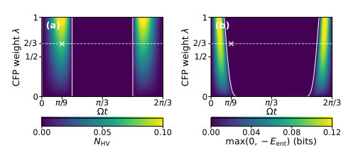 
FIG. 2. Hard hidden-variable and entropic scans. (a) Full-manifold signed hidden-variable negativity NHV from a 1201 × 801 compat- ibility calculation, with LP spot checks. (b) Entropic LGI violation strength max(0, −Eent) on the same grid. White contours are zero- obstruction boundaries; dashed lines mark ˆI/3, and crosses mark Ωt = π/9.

📷 Fig 3

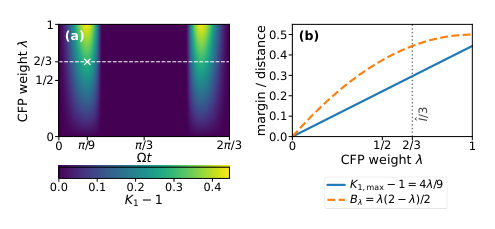 
Figure 1 visualizes this result: the dashed λ = 2/3 slice and the cross at Ωt = π/9 lie in the positive-margin region, while panel (b) shows that both K1,max −1 and Bλ vanish only at λ = 0. Every λ &gt; 0 therefore violates an LGI despite exact NSIT; the maximally mixed state gives K1,max = 35/27.

📷 Fig 4

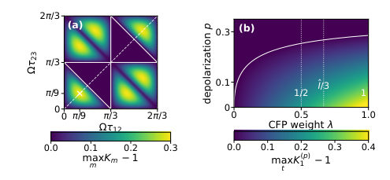 
FIG. 3. Numerical stress tests. (a) Full two-interval landscape for the maximally mixed CFP; the dashed line is the equal-spacing slice and the cross is Ωτ12 = Ωτ23 = π/9. (b) Optimized depolarizing-noise phase diagram. The white curve is the classical boundary; dotted cuts indicate the representative CFP weights λ = 1/2, 2/3, 1.

**Summary.** The paper investigates whether 'No Signaling in Time' (NSIT), which requires that outcome-erased measurements leave marginal statistics unchanged, implies a classical temporal history. By analyzing the Common Fixed Points of a qutrit ring system, the authors prove that NSIT is merely a statement about marginal signal erasure and does not preclude violations of macrorealist inequalities like the Leggett–Garg inequality.

**Why it may be interesting.** This work provides a rigorous theoretical tool to distinguish between purely marginal constraints (like NSIT) and deeper assumptions about quantum reality, such as macrorealism or noninvasive measurement.

Detailed structure

**Main problem.** The paper addresses the interpretational ambiguity of No-Signaling-in-Time (NSIT): whether satisfying NSIT implies noninvasive measurability and thus a classical temporal history.

**Main result.** They show that exact pairwise NSIT is insufficient to guarantee a classical temporal history, as states satisfying NSIT can still violate Leggett–Garg inequalities (LGI).

**Method.** The authors analyze the Common Fixed Points (CFPs) of nonselective measurement channels on a specific quantum system and test these points against LGI violations using various diagnostics.

**Model / system.** The model is a qutrit ring subject to local degenerate Lüders measurements, analyzed by considering the full manifold of CFPs derived from time evolution and measurement processes.

**Key observables.** Pairwise NSIT ($\eta_{	ext{NSIT}}$), Leggett–Garg inequality violation strength ($K_1$), Hidden-Variable Negativity (NHV), and Branch Displacement ($B_\lambda$).

**Important parameters / regimes.** The parameter $\lambda$ characterizing the state on the CFP manifold, and time intervals for sequential measurements.

**Assumptions / limitations.** The analysis focuses on a specific protocol involving equal spacing of measurement times; the conclusion is limited to pairwise NSIT conditions.

**Figures summary.** Figures illustrate the analytic separation on the CFP manifold showing LGI margins vs. $\lambda$, and show NHV/entropic LGI violation strength over the CFP-time grid, confirming violations for non-trivial states.

**Paper structure.** The paper establishes NSIT via CFPs, then analyzes the resulting state manifold ($\hat{
ho}^*(\lambda)$). It demonstrates that while all $\lambda>0$ satisfy NSIT, they violate LGI, contrasting this with the unique classical point at $\lambda=0$.

Abstract

No signaling in time (NSIT) has often been treated as the clean operational remnant of noninvasive measurability. If an earlier measurement leaves every later marginal unchanged, the temporal process appears classical. We show that this inference is false. We introduce common fixed points (CFPs) of nonselective measurement channels as an exact mechanism that erases all marginal evidence of invasiveness while preserving disturbed outcome conditioned branches. For a qutrit ring subject to a local degenerate Luders measurement, we solve the full CFP manifold analytically. Every state on this manifold satisfies exact pairwise NSIT, yet every nontrivial member violates a Leggett Garg inequality, including the maximally mixed state. The violation is governed by finite branch displacement, not by residual signaling. Hidden variable reconstruction, entropic witnesses, protocol landscape scans, noise robustness, and finite shot simulations show that exact NSIT certifies only the disappearance of marginal signals after outcome erasure, not the existence of a classical temporal history.

[↑ back to top](#top)

### [A generalized variational quantum linear solver on photonic platform](http://arxiv.org/abs/2607.14477v1)

**Authors:** Kang Gao, Zhao-An Wang, Ze-Guo Wang, Mao-Mao Huang, Hai Wei, Kai Wen  
**Type:** both · **Category:** quantum information and computing · **PDF:** <https://arxiv.org/pdf/2607.14477v1>  
**Analysis basis:** full PDF text, analyzed in chunks
**Topic relevance:** 🔥 `QC/QI experiment` **4/5** · `analog quantum simulation` **3/5** · `quantum optics experiment` **2/5** · `methods for driven-dissipative` **1/5**

📷 Fig 1

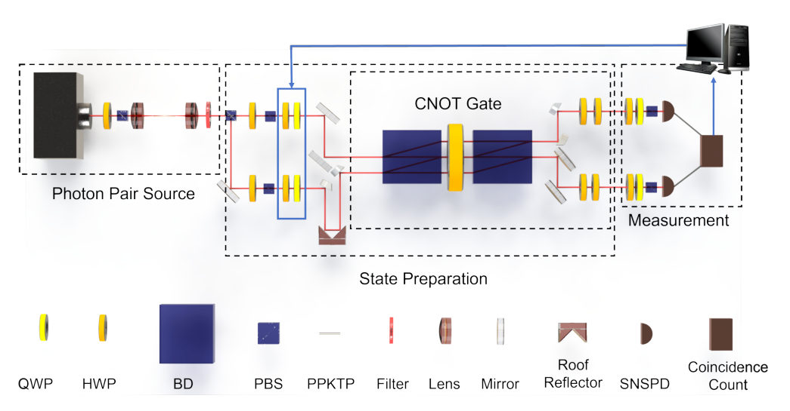 
Fig. 1. Experimental setup. Telecom-band photon pairs are generated and pass through a state preparation process including a CNOT gate and are subjected to coincidence measurement. The measurement results are analyzed and exploited to update the angles of waveplates enclosed in the blue frame. QWP: quarter waveplate, HWP: half waveplate, BD: beam displacer, PBS: polarization beam splitter, SNSPD: superconducting nanowire single photon detector.

📷 Fig 2

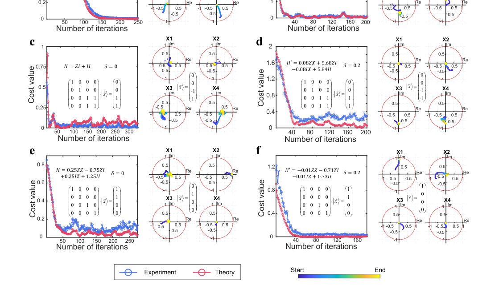 
Fig. 2. Demonstration of VQLS in complex field. a-b: The coefficient matrix A is non-singular and the linear system has a unique solution. c-d: A is singular and the system has infinitely many solutions. The system is solved without (c) and with Tikhonov regularization (δ = 0.2, d), respectively. An approximated solution can be obtained in the latter circumstances. e-f. The system has no solution and is solved without (e) and with Tikhonov regularization (δ = 0.2, f), respectively. The final |˜x⟩in neither circumstances is verified the solution of the system. The left subplot in each panel is the optimization process of the cost value. The blue and red points and lines represent...

📷 Fig 3

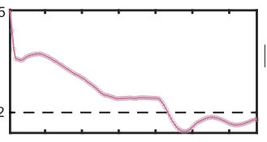 
Fig. 3. Demonstration of Modulo 2 VQLS. Four Hamiltonians are introduced according to the rows of A and restrictions are imposed on the entries of |˜x⟩via the Pauli measurements. The upper subplot is the optimiza- tion process of the cost value. The blue and red points and lines represent experimental cost value and the theoreti- cal results from the same set of θ. The lower two subplots exhibit the trajectories of the entries of |x⟩and γ. Dotted lines indicate the true solution values for both the entries of |x⟩and γ.

**Summary.** This paper experimentally validates a generalized Variational Quantum Linear Solver (VQLS) using a photonic platform to solve linear equations over both complex numbers and the finite field $\mathbb{F}_2$. The authors successfully tackle practical challenges, such as system singularity in the complex domain via regularization, while developing a robust modulo-2 approach for applications like stabilizer coding. This work establishes an experimental foundation for applying VQLS in real quantum computing scenarios.

**Why it may be interesting.** The direct experimental implementation of quantum algorithms like VQLS on photonic hardware provides crucial physical validation. The extension to finite fields ($\mathbb{F}_2$) is particularly relevant for applications in coding theory and quantum computation over non-real fields.

Detailed structure

**Main problem.** The paper addresses the challenge of solving linear equation systems ($A|	ilde{x}
angle = |	ilde{b}
angle$) in both the complex field and the finite field $\mathbb{F}_2$. It aims to develop a robust Variational Quantum Linear Solver (VQLS) applicable across different mathematical domains.

**Main result.** The VQLS was experimentally validated on a photonic platform for 4D systems, successfully handling non-singular cases in the complex field and demonstrating inherent immunity to singularity issues when adapted for $\mathbb{F}_2$.

**Method.** The core method involves variational optimization using a cost function minimized via gradient descent. For ill-conditioned problems, Tikhonov regularization is introduced; for $\mathbb{F}_2$, the cost function is redesigned using modulo 2 arithmetic.

**Model / system.** The work utilizes a photonic computing platform employing telecom-band photon pairs encoded in polarization to implement quantum gates (e.g., CNOT). The mathematical models involve solving linear systems over $\mathbb{C}$ and $\mathbb{F}_2$.

**Key observables.** Deviation $D = ||A |	ilde{x}
angle - |	ilde{b}
angle||^2$, minimum cost value, and the convergence of the trial state $|	ilde{\mathbf{x}}
angle$ to the expected solution.

**Important parameters / regimes.** The regularization parameter $\delta$ (for Tikhonov), the field type ($\mathbb{C}$ or $\mathbb{F}_2$), and system dimensions (e.g., 4D systems).

**Assumptions / limitations.** In the complex case, singularity requires regularization; in $\mathbb{F}_2$, constraints are necessary because minimizing cost alone is insufficient due to indeterminate phases.

**Figures summary.** Figure 1 details the experimental setup using photonic components. Figure 2 illustrates VQLS performance for non-singular, singular, and no-solution cases in the complex field, showing regularization effects. Figure 3 demonstrates the successful application of Modulo 2 VQLS.

**Paper structure.** The paper systematically develops the VQLS framework, first applying it to solve linear systems over the complex field (addressing singularity via Tikhonov regularization). It then extends and adapts this methodology for the finite field $\mathbb{F}_2$, concluding with a demonstration of its practical potential across both domains.

Abstract

Based on a photonic computing platform, we experimentally validate a generalized variational quantum linear solver (VQLS) by systematically solving four-dimensional linear equation systems across different fields. In the complex field, in addition to solving non-singular systems that admit a unique solution, we investigate ill-conditioned problems arising from singularity--an issue frequently encountered in practical applications. To tackle these challenges, we introduce perturbation terms, a treatment inspired by Tikhonov regularization, and develop an algorithm capable of handling a wide range of systems. Furthermore, we extend the VQLS to the finite field F2 by redesigning the cost function to incorporate modulo 2 and imposing several constraints on the solution vector. This modulo 2 VQLS is inherently free from singularity. It is adapt to stabilizer coding theory and may find applications in areas such as decoders and the design of quantum gate sequences. Therefore, our work demonstrates the practical potential of VQLS in quantum computing, providing a solid experimental foundation and methodological guidance for its real-world applications.

[↑ back to top](#top)

### [A Geometric Theory of Fermion-to-Qubit Encodings](http://arxiv.org/abs/2607.14883v1)

**Authors:** Lakshya Nagpal, Nishith Reen, S. R. Hassan  
**Type:** theory · **Category:** strongly correlated electrons · **PDF:** <https://arxiv.org/pdf/2607.14883v1>  
**Analysis basis:** full PDF text, analyzed in chunks
**Topic relevance:** 🔥 `analog quantum simulation` **4/5** · `entanglement & information structure` **3/5** · `Kondo & dissipative impurity` **1/5** · `methods for driven-dissipative` **1/5** · `non-equilibrium dynamics` **1/5**

📷 Fig 1

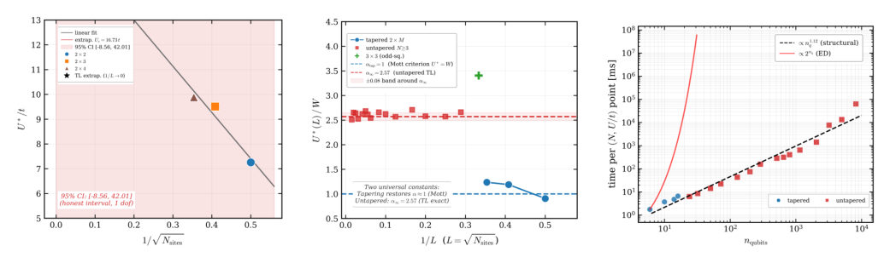 
FIG. 1: Emergence of two geometric universality classes in the Bravyi–Kitaev encoding. (a) Finite-size scaling of the characteristic geometric interaction scale U ∗for tapered BK encodings. Extrapolation to the thermodynamic limit yields Uc/t = 8.87 ± 2.18. The untapered 4 × 4 lattice is shown for comparison but is excluded from the extrapolation because it belongs to a different universality class. (b) Dimensionless interaction ratio α = U ∗/W, where W is the non-interacting bandwidth. Tapered and untapered encodings form two clearly separated branches, demonstrating that the distinction is intrinsic to the geometry of the encoding rather than the lattice size. (c) Computational cost of...

📷 Fig 2

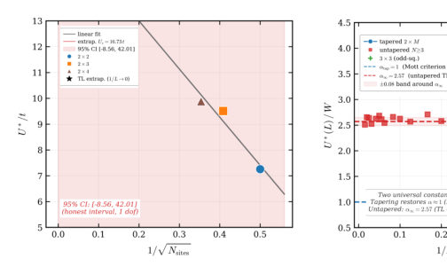 
Figure 1(c) demonstrates that these geometric observ- ables can be computed efficiently using sparse graph op- erations. The computational cost grows smoothly with system size and remains many orders of magnitude below that required for direct many-body diagonalization, em- phasizing that the proposed framework probes structural information contained in the encoded Hamiltonian itself. The existence of two universality classes immediately raises a fundamental question. Why should all untapered Bravyi–Kitaev encodings converge toward the same char- acteristic interaction scale despite their increasing lattice size? Answering this question requires moving beyond the Fiedler eigenvalue and...

📷 Fig 3

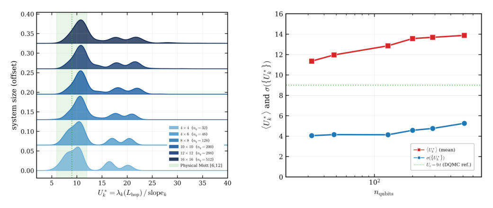 
FIG. 2: Universal spectral organization of the Bravyi–Kitaev hypergraph. (a) Distribution of the characteristic interaction scales U ∗ k obtained from the complete Laplacian spectrum for systems ranging from 4 × 4 to 16 × 16. Rather than forming a continuous distribution, the spectrum separates into two robust branches that remain well separated as the system size increases. (b) Mean value and spectral width of the distributions shown in (a). Both quantities vary only weakly with system size, demonstrating that the overall spectral organization rapidly approaches a universal limit. Together these observations reveal that the Bravyi–Kitaev encoding possesses an intrinsic spectral structure...

📷 Fig 4

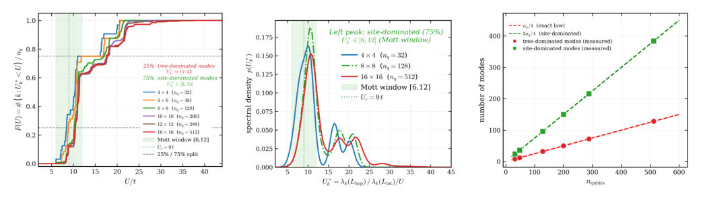 
FIG. 3: Exact spectral partition of the Bravyi–Kitaev interaction hypergraph. (a) Spectral crossing fraction F(U) for representative system sizes. (b) Representative distributions of U ∗ k illustrating the persistence of the two spectral families. (c) Number of tree-dominated modes as a function of the number of qubits. Every system satisfies the exact relation Ntree = nq/4, demonstrating that the interaction spectrum possesses a universal internal organization determined solely by the geometry of the Bravyi–Kitaev encoding.

📷 Fig 5

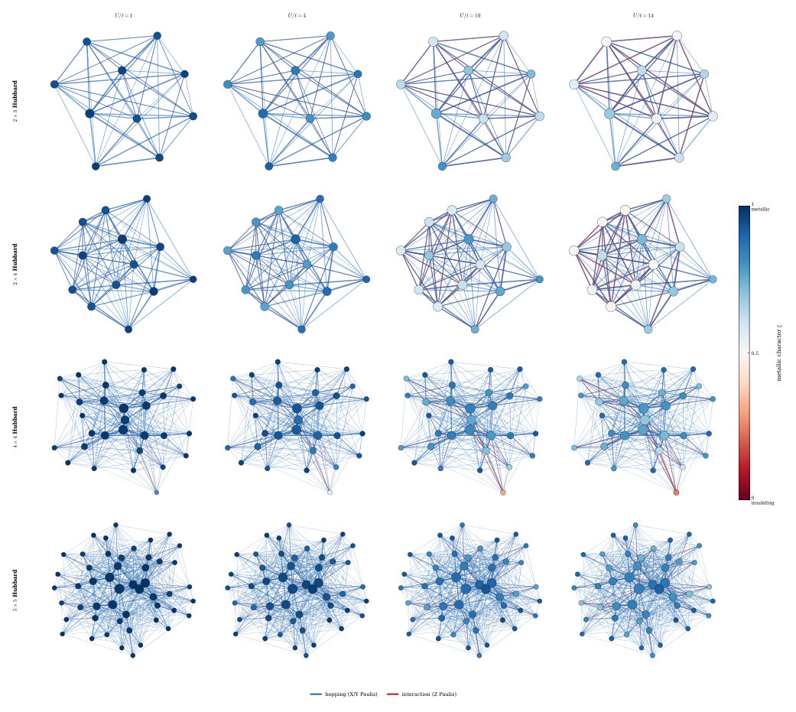 
FIG. 4: Interaction-driven reweighting of the encoded hypergraph. Rows correspond to different Hubbard clusters, while columns show increasing interaction strengths. Blue edges represent hopping-derived Pauli interactions and red edges represent interaction-derived Pauli interactions. Node colour denotes the local metallic character ξ, while node size is proportional to the weighted degree. Increasing interaction strength produces a continuous redistribution of coupling weight from kinetic to interaction sectors without changing the underlying connectivity of the network.

**Summary.** This work introduces a geometric framework using weighted hypergraphs to analyze fermion-to-qubit mappings. It shows that these encodings encode more than just spectral information by defining measurable geometric structures. By comparing connectivity metrics (BK) and transport measures (XBK), the authors provide a universal tool to track structural changes in complex quantum Hamiltonians like the Hubbard model.

**Why it may be interesting.** It provides powerful, non-spectral diagnostic tools (hypergraph geometry) to analyze how quantum information encoding schemes map physical interactions into structural constraints, which is highly relevant for understanding complex many-body physics simulations.

Detailed structure

**Main problem.** To determine if fermion-to-qubit encodings reveal physical structure beyond merely reproducing the spectrum of the original many-body Hamiltonian.

**Main result.** The framework establishes hypergraph geometry as a general tool, showing that connectivity and transport metrics consistently capture the structural evolution of encoded Hamiltonians across diverse correlated systems.

**Method.** Developing a geometric framework using weighted hypergraphs to analyze two complementary views: spectral connectivity (via graph Laplacians in BK encoding) and coupling-space reorganization (via optimal transport in XBK encoding).

**Model / system.** The analysis applies to general interacting fermionic Hamiltonians, exemplified by the Hubbard model, spinless tV chain, single-impurity Anderson model, and Kitaev chain.

**Key observables.** Geometric observables like $
ho(U) = \lambda_2(L_{hop})/\lambda_2(L_{int})$ (BK) and Wasserstein distance $W(\mu_1, \mu_2)$ (XBK).

**Important parameters / regimes.** Interaction strength ($U$), hopping parameters ($t$), and the characteristic crossover scale $U^*$.

**Assumptions / limitations.** The analysis relies on mapping the hypergraph to an equivalent weighted graph using standard clique expansion, and that geometric observables capture physical reorganization.

**Figures summary.** Figures illustrate the structural evolution across multiple correlated models, showing consistent signatures of interaction-driven reorganization via spectral observables (BK) and distance comparisons.

**Paper structure.** The paper develops a general hypergraph geometry framework, applies it to specific encodings (BK and XBK), derives key geometric observables that quantify connectivity changes, and demonstrates the consistency of these findings across several canonical strongly correlated models.

Abstract

Exact fermion to qubit transformations are conventionally regarded as algorithmic tools that translate many-body Hamiltonians into qubit representations for quantum simulation. Here we show that they also define intrinsic geometric representations whose structure encodes physically meaningful information beyond spectral equivalence. We develop a geometric framework based on weighted hypergraphs and coupling space representations constructed from the Bravyi--Kitaev (BK) and Xia--Bian--Kais (XBK) encodings. Within the BK representation, we introduce a geometric observable that compares the algebraic connectivities of the kinetic and interaction hypergraphs, derive its exact analytical dependence on interaction strength, and uncover two geometric universality classes together with an exact spectral organization originating from the binary tree architecture of the encoding. The complementary XBK representation describes the evolution of encoded Hamiltonians through probability measures in coupling space, where optimal transport quantifies interaction-driven reorganization independently of the spectral analysis. Applications to the Hubbard, spinless tV , single impurity Anderson, and Kitaev models demonstrate that these connectivity and transport based geometric descriptions consistently capture the structural evolution of encoded quantum Hamiltonians across distinct classes of many-body systems. Our results establish hypergraph geometry as a new framework for understanding fermion-to-qubit encodings,revealing that they serve not only as computational mappings but also as geometric representations of quantum many-body Hamiltonians.

[↑ back to top](#top)

### [A magnetic monopole in a superfluid bubble](http://arxiv.org/abs/2607.15093v1)

**Authors:** Marianna Sorba, Andrea Richaud  
**Type:** both · **Category:** quantum gases · **PDF:** <https://arxiv.org/pdf/2607.15093v1>  
**Analysis basis:** full PDF text, analyzed in chunks
**Topic relevance:** 🔥 `analog quantum simulation` **4/5** · `non-equilibrium dynamics` **2/5** · `Keldysh / 2PI / non-Gaussian methods` **1/5** · `correlated / nonlocal dissipation` **1/5** · `driven-dissipative phase transition` **1/5** · `methods for driven-dissipative` **1/5**

📷 Fig 1

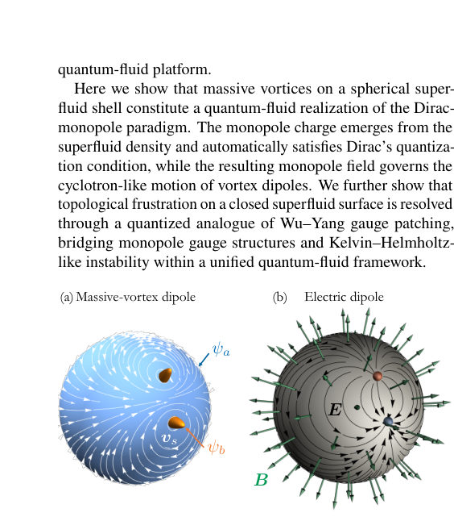 
FIG. 1. Analogy between a massive vortex dipole and an electric dipole in a magnetic monopole field. (a) Massive vortex dipole in an immiscible binary superfluid confined on a spherical surface. The density of component-𝑎, |𝜓𝑎|2, is shown in blue, while the density of component-𝑏, |𝜓𝑏|2, localized within the vortex cores, is shown in orange. The white arrows denote the superfluid velocity field 𝒗𝑠 of component-𝑎. (b) Electric dipole constrained to the surface of a sphere in the presence of a magnetic monopole field 𝑩. Black and green arrows denote the electric and magnetic fields, respectively. The dynamics of massive vortices on the sphere is formally analogous to that of charged particles...

📷 Fig 2

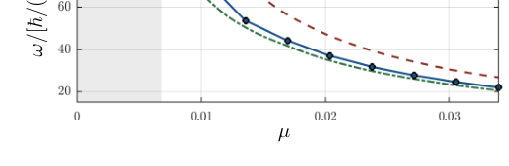 
FIG. 2. Dynamics of a massive vortex dipole on a spherical superfluid. (a) Density profile |𝜓𝑎|2 of a vortex dipole symmetrically located with respect to the equator. The density is approximately uniform over the sphere (blue) except at the vortex cores, where it vanishes (white). The white curves show the vortex trajectories, which result from the superposition of a uniform azimuthal precession and a small-amplitude oscillation of frequency 𝜔. (b) Corresponding phase field arg(𝜓𝑎). (c) Dimensionless oscillation frequency 𝜔𝑚𝑎𝑅2/ℏas a function of the dimensionless vortex mass 𝜇= 𝑀𝑏/𝑀𝑎. Blue dots: numerical simulations; error bars obtained from the sinusoidal fit are smaller than the symbol...

📷 Fig 3

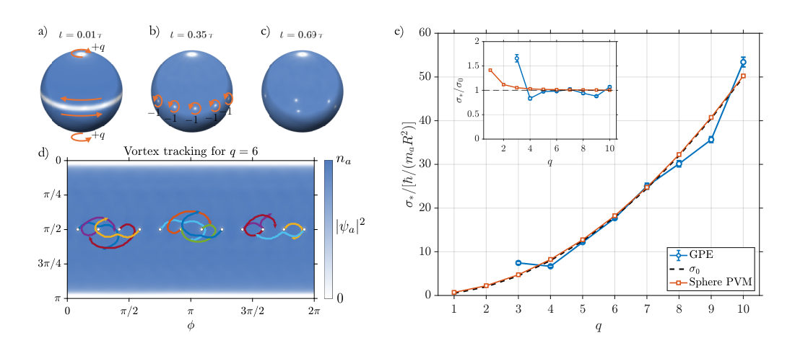 
FIG. 3. Rise and fall of a superfluid shear layer on a sphere. (a) Initial state with two vortices of charge +𝑞imprinted at the poles and separated by an equatorial barrier. The characteristic time scale of the system is 𝜏= 𝑚𝑎𝑅2/ℏ≃0.145 s. (b) Formation of an equatorial vortex necklace composed of 2𝑞vortices of charge −1. (c) Kelvin–Helmholtz-like breakup of the vortex necklace. (d) Trajectories of the 2𝑞vortices on the planisphere obtained from Gross–Pitaevskii simulations following the removal of the equatorial barrier. (e) Maximum instability growth rate 𝜎∗, normalized by the frequency unit 𝜏−1 = ℏ/(𝑚𝑎𝑅2), as a function of the polar vortex charge 𝑞. Blue circles (connected by blue...

**Summary.** The authors demonstrate that the dynamics of vortices in a spherical superfluid naturally generate an effective magnetic monopole field, confirming the system's utility for studying Dirac-monopole physics. They analyze vortex motion analogous to charged particles in this field and further study the instability growth of related vortex structures. This establishes spherical superfluids as a versatile platform for exploring fundamental topological quantum phenomena.

**Why it may be interesting.** This work provides a concrete, controllable quantum fluid realization of fundamental topological physics (monopoles), linking superfluid dynamics directly to concepts from high-energy theory like Dirac quantization and geometric phases.

Detailed structure

**Main problem.** To establish a unified framework realizing the Dirac-monopole paradigm using controllable quantum fluid systems, and to study vortex instabilities related to this structure.

**Main result.** The dynamics of massive vortices in a spherical superfluid naturally generate an effective gauge potential equivalent to that of a magnetic monopole, and the system exhibits predicted cyclotron-like motion and subsequent instability growth rates.

**Method.** The work combines theoretical derivations (effective Lagrangian, normal-mode analysis) with numerical simulations using the Gross-Pitaevskii equation on a spherical geometry.

**Model / system.** The physical platform is an immiscible binary Bose–Einstein condensate confined to a thin spherical shell. The model incorporates vortex interactions and derives effective gauge fields leading to monopole dynamics.

**Key observables.** Cyclotron frequency ($\omega_c$), instability growth rate ($\sigma^*$), superfluid density distributions, and the emergent magnetic field ($B_j$).

**Important parameters / regimes.** Superfluid density ($
ho_a, 
ho_b$), vortex charge quantization ($q_j g = n\hbar/2$), and effective mass ($M_b$).

**Assumptions / limitations.** The analysis assumes the immiscible regime for the condensate and relies on mapping dynamics to an effective gauge structure.

**Figures summary.** Figures illustrate the analogy between vortex dipoles and charged particles in a monopole field, show dipole trajectories, and plot the exponential growth of vortex necklace amplitudes over time.

**Paper structure.** The paper first establishes the monopole emergence from vortex dynamics on a sphere, then analyzes the resulting cyclotron motion via normal modes and GPE simulations. Finally, it investigates the instability of an equatorial vortex necklace configuration related to Wu-Yang gauge patching.

Abstract

Magnetic monopoles lie at the crossroads of gauge fields, topology, geometric phases, and charge quantization, yet they remain elusive as fundamental particles. Here we show that an emergent Dirac-monopole framework arises naturally from the dynamics of massive quantum vortices in a spherical superfluid shell. Their dynamics is formally equivalent to that of interacting charged particles constrained to a sphere in the field of a magnetic monopole. The monopole charge is fixed by the superfluid density and automatically satisfies Dirac's quantization condition. The emergent monopole description predicts cyclotron-like vortex motion, in quantitative agreement with Gross--Pitaevskii simulations. We further show that topological frustration induced by two like-charged polar vortices gives rise to the formation of an equatorial vortex necklace, a configuration reminiscent of the polygonal cyclone clusters observed around Jupiter's poles, before its subsequent breakup through a Kelvin--Helmholtz-like instability. Within this framework, the vortex necklace may be viewed as a quantized analogue of Wu--Yang gauge patching. Our results establish spherical superfluids as a versatile platform for realizing and exploring fundamental aspects of Dirac-monopole physics.

[↑ back to top](#top)

### [Quantum correlations of tripartite mixed states in the black hole quantum atmosphere](http://arxiv.org/abs/2607.14462v1)

**Authors:** Anqi Zhang, Yanze Zheng, Xiaofen Huang, Tinggui Zhang  
**Type:** theory · **Category:** other · **PDF:** <https://arxiv.org/pdf/2607.14462v1>  
**Analysis basis:** full PDF text, analyzed in chunks
**Topic relevance:** 🔥 `entanglement & information structure` **4/5** · `correlated / nonlocal dissipation` **2/5** · `Keldysh / 2PI / non-Gaussian methods` **1/5** · `driven-dissipative phase transition` **1/5** · `methods for driven-dissipative` **1/5** · `non-equilibrium dynamics` **1/5**

📷 Fig 1

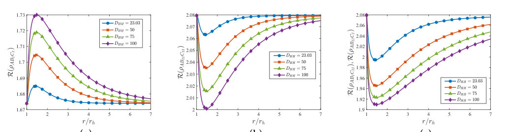 
FIG. 1: Quantum state textures versus the normalized distance r/rh for different constants DHH. Panel (a): R(ρABICI ) versus r/rh; Panel (b): R(ρABIICII ) versus r/rh; and Panel (c): R(ρABICII ) = R(ρABIICI ) versus r/rh. The parameters are set as α = √

📷 Fig 2

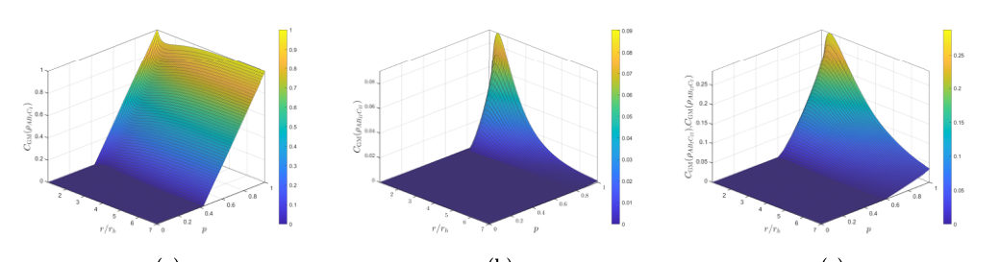 
FIG. 2: Genuine multipartite concurrence CGM as a function of the Werner parameter p and the normalized radial distance r/rh for the four reduced states, with DHH = 50 and α = √

📷 Fig 3

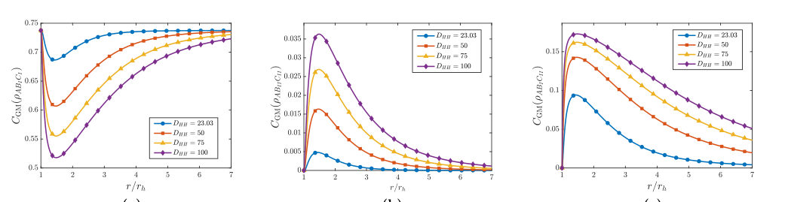 
FIG. 3: Genuine multipartite concurrence CGM versus the normalized radial distance r/rh for different values of DHH. Panel (a): CGM(ρABICI ); Panel (b): CGM(ρABIICII ); and Panel (c): CGM(ρABICII ) = CGM(ρABIICI ). The parameters are fixed as p = 0.85, α = √

📷 Fig 4

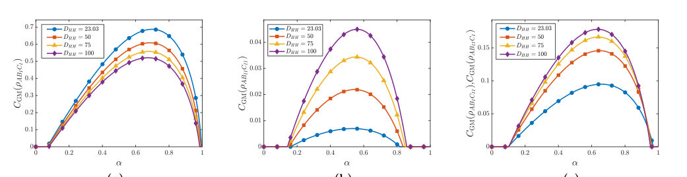 
FIG. 4: Genuine multipartite concurrence CGM versus the state parameter α for different values of DHH, with r/rh = 1.5 and p = 0.85. Panel (a): CGM(ρABICI ); Panel (b): CGM(ρABIICII ); and Panel (c): CGM(ρABICII ) = CGM(ρABIICI ).

📷 Fig 5

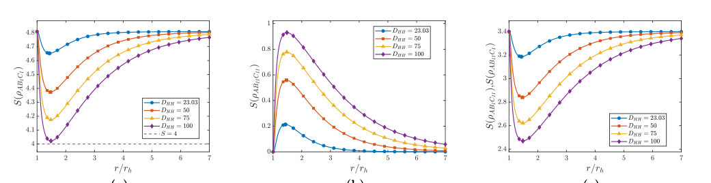 
FIG. 5: Svetlichny value S versus the normalized radial distance r/rh for different values of DHH. Panel (a): S(ρABICI ); Panel (b): S(ρABIICII ); and Panel (c): S(ρABICII ) = S(ρABIICI ). The parameters are fixed as p = 0.85, α = √

**Summary.** This paper analyzes the fate of tripartite quantum correlations—including entanglement and nonlocality—in a mixed state situated in the vicinity of a black hole. By incorporating the local Hawking temperature, the authors demonstrate that while all three resources are sensitive to the near-horizon region, genuine multipartite nonlocality is particularly fragile against increasing local thermal effects.

**Why it may be interesting.** This work provides a theoretical framework for understanding how fundamental quantum correlations are modified by extreme gravitational environments, offering insights into information loss mechanisms beyond standard Hawking radiation calculations.

Detailed structure

**Main problem.** The study investigates how quantum state texture, genuine multipartite entanglement, and tripartite nonlocality are affected by the local Hawking effect in a black hole's quantum atmosphere.

**Main result.** All three quantum resources show their extrema tracking the same near-horizon region, but tripartite nonlocality is found to be significantly more fragile than entanglement under stronger local Hawking effects.

**Method.** The authors use Bogoliubov transformations and partial tracing techniques to derive physically accessible reduced density matrices for a tripartite mixed state. They quantify correlations using quantum state texture, genuine multipartite concurrence, and the Svetlichny inequality.

**Model / system.** The system is modeled as a tripartite mixed state ($
ho_{ABC}$) near a Schwarzschild black hole horizon, incorporating the Hartle-Hawking local temperature ($T_{HH}$). The analysis focuses on the physically accessible reduced state $
ho_{ABICI}$.

**Key observables.** Quantum state texture $R(
ho)$, Genuine multipartite entanglement (using CGM), and Tripartite nonlocality (violation of Svetlichny inequality, $S > 4$).

**Important parameters / regimes.** Local Hawking temperature ($T_{HH}$), mixing parameter $p$, and the black hole characteristic scale factor $D_{HH}$.

**Assumptions / limitations.** The analysis assumes a specific X-state structure for the density matrix and models the environment using the Hartle-Hawking vacuum approach.

**Figures summary.** Figures illustrate the radial dependence of quantum state texture, CGM, and Svetlichny value ($S$) near the horizon, showing how these quantities track $T_{HH}(r)$ and are suppressed by increasing $D_{HH}$.

**Paper structure.** The paper systematically analyzes three distinct measures of quantum correlation (texture, entanglement, nonlocality) across varying radial positions and environmental parameters, culminating in a unified characterization of resource redistribution.

Abstract

We investigate quantum state texture, genuine multipartite entanglement, and tripartite nonlocality of a tripartite mixed state in the black hole quantum atmosphere. By introducing the Hartle-Hawking local temperature into the Bogoliubov coefficients, we characterize the influence of the local Hawking effect on both physically accessible and inaccessible reduced states. We find that the extrema of these three quantities all lie in the same near horizon region and shift outward with increasing local Hawking temperature, coinciding with the peak region of the local Hawking temperature and indicating that different aspects of tripartite quantum information are most sensitive to the local Hawking effect in the same atmospheric region. In contrast to genuine multipartite entanglement, tripartite nonlocality is more fragile and is suppressed under stronger local Hawking effects. These results provide a unified characterization of density matrix restructuring, entanglement redistribution, and nonlocality in tripartite mixed states affected by the black hole quantum atmosphere.

[↑ back to top](#top)

### [Efficient quantum algorithm for Heisenberg spin systems](http://arxiv.org/abs/2607.14401v1)

**Authors:** Sergey Bravyi, David Gosset, Yinchen Liu, Benjamin Wong  
**Type:** theory · **Category:** quantum information and computing · **PDF:** <https://arxiv.org/pdf/2607.14401v1>  
**Analysis basis:** full PDF text, analyzed in chunks
**Topic relevance:** 🔥 `analog quantum simulation` **4/5** · `exotic spin models in light-matter` **3/5** · `Keldysh / 2PI / non-Gaussian methods` **1/5** · `entanglement & information structure` **1/5**

📷 Fig 1

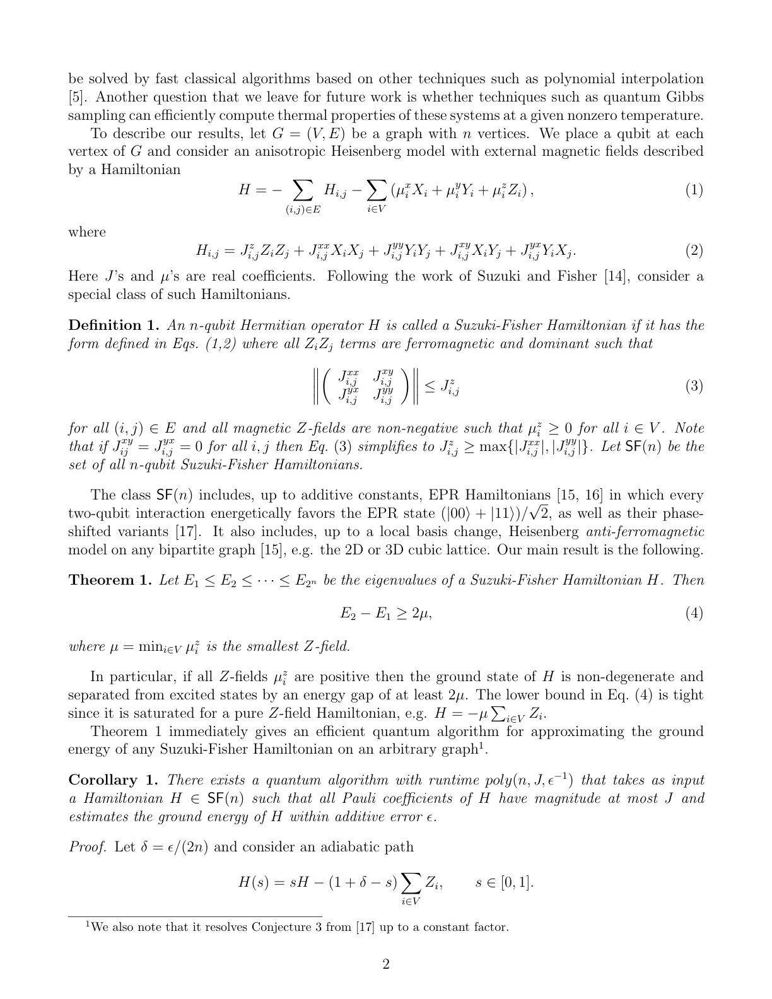 
Low-resolution page preview, page 2

📷 Fig 2

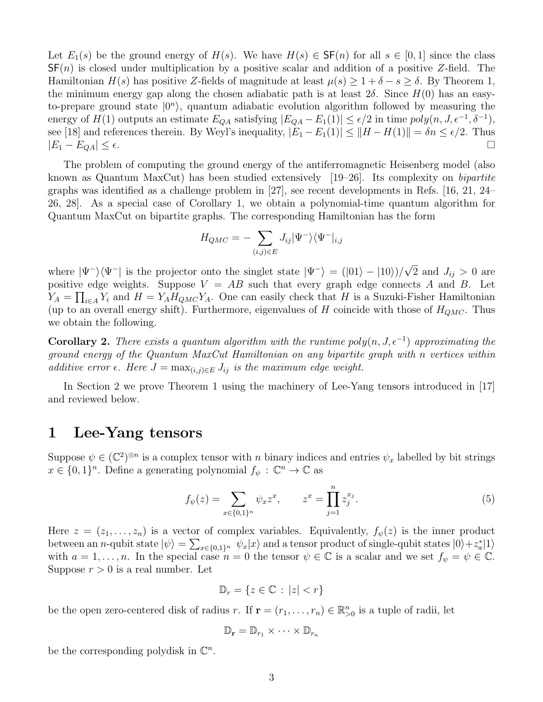 
Low-resolution page preview, page 3

📷 Fig 3

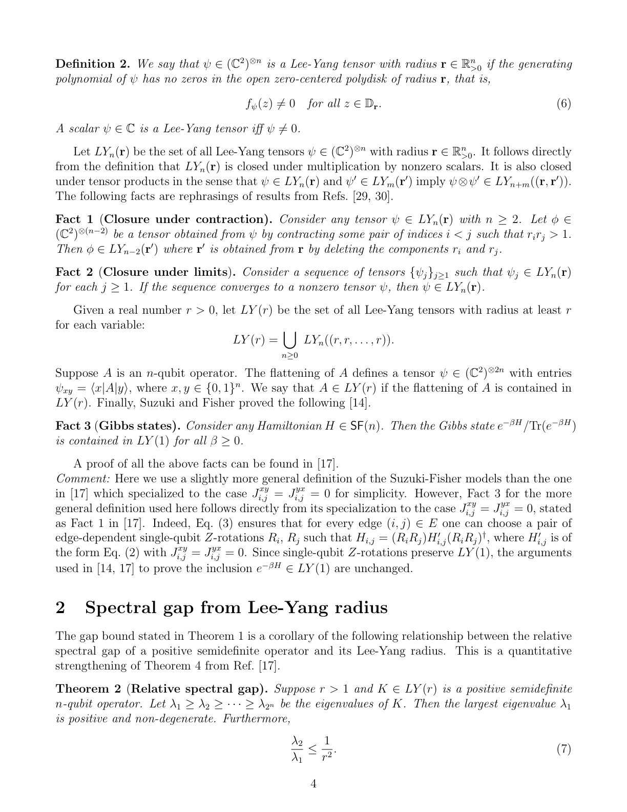 
Low-resolution page preview, page 4

📷 Fig 4

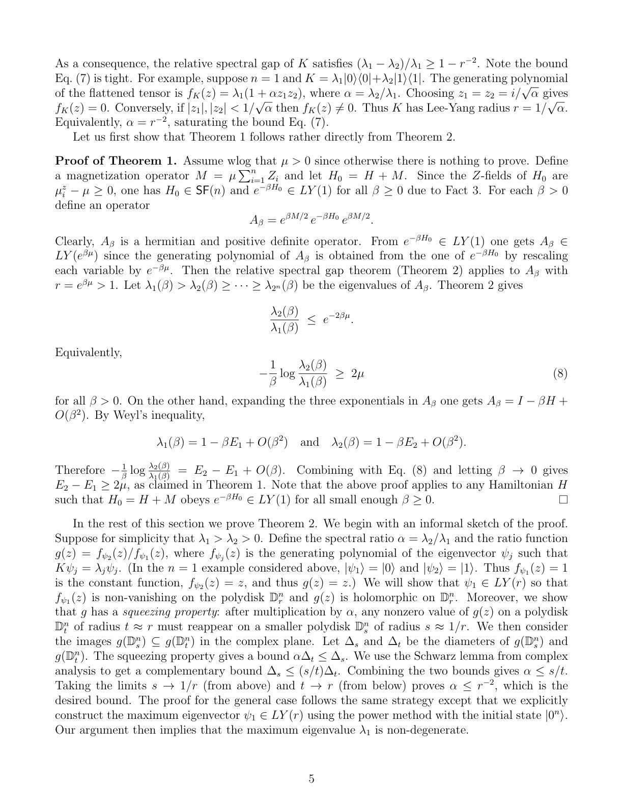 
Low-resolution page preview, page 5

📷 Fig 5

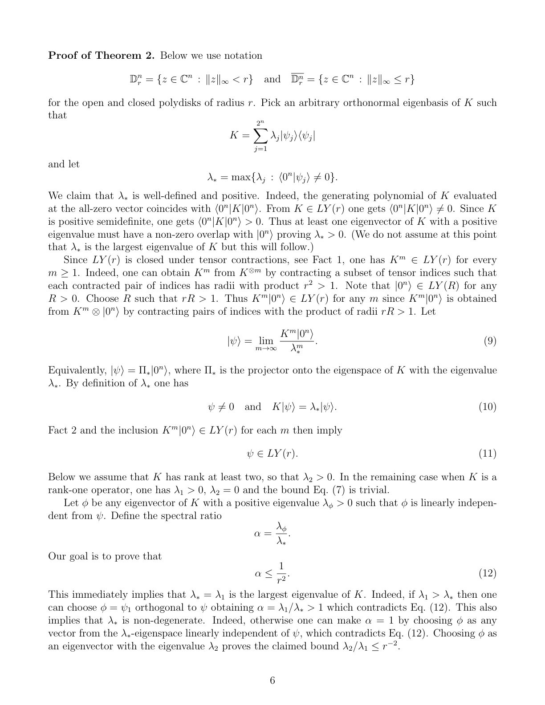 
Low-resolution page preview, page 6

**Summary.** This paper develops an efficient quantum adiabatic algorithm to find the ground energy of specific Heisenberg spin systems. It achieves this by proving a novel mathematical inequality that links the spectral gap of these Hamiltonians to their Lee-Yang radius. This work provides a powerful theoretical framework connecting complex analysis tools to fundamental problems in quantum many-body physics.

**Why it may be interesting.** The connection drawn between algebraic properties (Lee-Yang radii) and physical observables (spectral gaps/ground state energy) provides a powerful, non-standard mathematical tool for analyzing hard problems in condensed matter physics, which is highly relevant for understanding computational complexity bounds.

Detailed structure

**Main problem.** The primary goal is developing an efficient quantum algorithm to compute the ground energy of specific, complex Heisenberg spin systems.

**Main result.** The authors prove that for a broad family of Suzuki-Fisher type Hamiltonians, the spectral gap between the first excited and ground state is lower bounded by $2\mu$, enabling an efficient adiabatic quantum computation approach.

**Method.** The proof combines techniques from complex analysis (using Lee-Yang polynomials) to establish a quantitative relationship between the relative spectral gap of an operator and its associated Lee-Yang radius. This mathematical tool is then applied to bound the energy gap for the physical Hamiltonians.

**Model / system.** The study focuses on a family of Heisenberg-type quantum spin systems, including the antiferromagnet on bipartite graphs, governed by anisotropic Heisenberg Hamiltonians (Suzuki-Fisher type). The analysis uses concepts derived from Lee-Yang theory applied to these many-body operators.

**Key observables.** Ground state energy, spectral gap ($\Delta E$), and the relative spectral gap $(\lambda_1 - \lambda_2)/\lambda_1$.

**Important parameters / regimes.** The magnetic field strength $\mu$ (specifically $\min \mu_{z,i}$), and the Lee-Yang radius $r$.

**Assumptions / limitations.** The analysis relies on the operator being positive semidefinite and belonging to a specific class defined by its generating polynomial's zero-freeness property (Lee-Yang tensors).

**Paper structure.** The paper first establishes a general mathematical inequality relating the spectral gap of a positive semidefinite operator $K$ to its Lee-Yang radius ($r$). This result is then specialized and applied to prove a lower bound on the spectral gap for Hamiltonians in the Suzuki-Fisher family, leading directly to the construction of an efficient quantum adiabatic algorithm.

Abstract

We consider a broad family of Heisenberg-type quantum spin systems that were studied by Suzuki and Fisher in 1971. This family includes, for example, the Heisenberg antiferromagnet on any bipartite graph. The ground and Gibbs states of these models are Lee-Yang tensors with radius 1: they are associated with multilinear polynomials that possess an extraordinary zero-freeness property inside the unit polydisk in the complex plane. For each Hamiltonian in this family we show that the spectral gap between the first-excited and ground-state energies is lower bounded by $2μ$, where $μ$ is the magnetic field along the $Z$ direction. Using this result we obtain an efficient quantum adiabatic algorithm for the ground energy of any model in this family. The proof is based on a new inequality that relates the spectral gap of a positive semidefinite operator to its Lee-Yang radius -- a quantitative strengthening of prior work of the authors that may find applications elsewhere.

[↑ back to top](#top)

### [Entanglement Detection for Two-Qubit and Three-Qubit Pure States via Unitary Transformations and Ancilla State Measurements](http://arxiv.org/abs/2607.15201v1)

**Authors:** Yu-Hang Liu, Yuan-Hong Tao, Yi-Wen Liu, Ying-Huan Zhou, Shao-Ming Fei  
**Type:** theory · **Category:** quantum information and computing · **PDF:** <https://arxiv.org/pdf/2607.15201v1>  
**Analysis basis:** full PDF text, analyzed in chunks
**Topic relevance:** 🔥 `entanglement & information structure` **4/5** · `QC/QI experiment` **2/5** · `quantum measurements` **2/5** · `measurement-induced transitions` **1/5**

📷 Fig 1

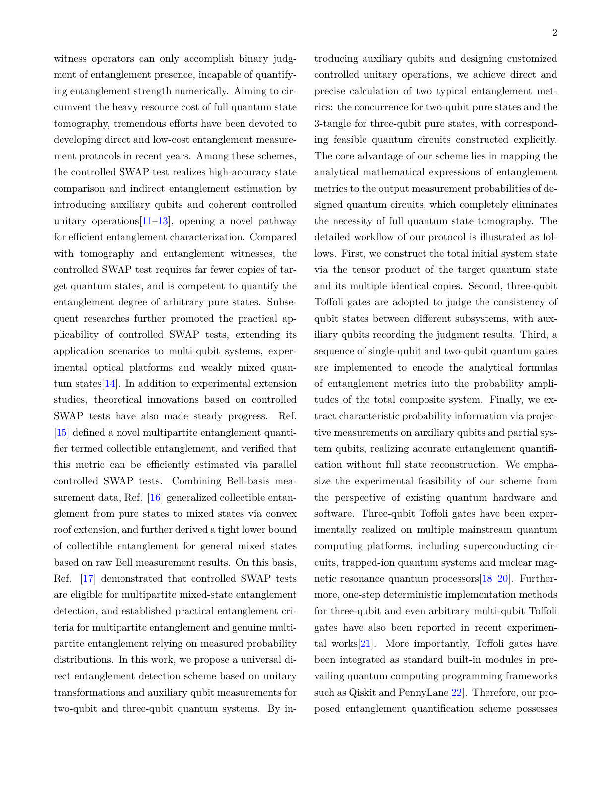 
Low-resolution page preview, page 2

📷 Fig 2

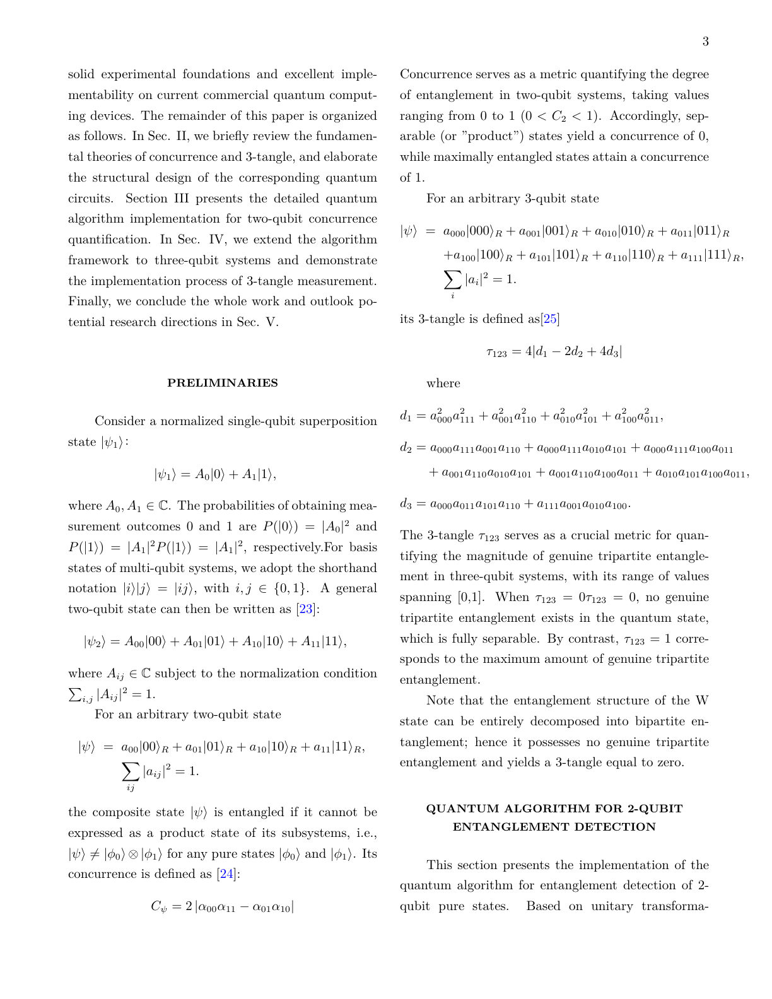 
Low-resolution page preview, page 3

📷 Fig 3

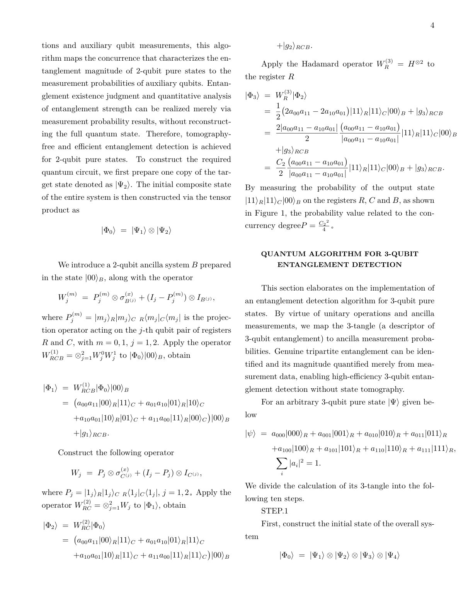 
Low-resolution page preview, page 4

📷 Fig 4

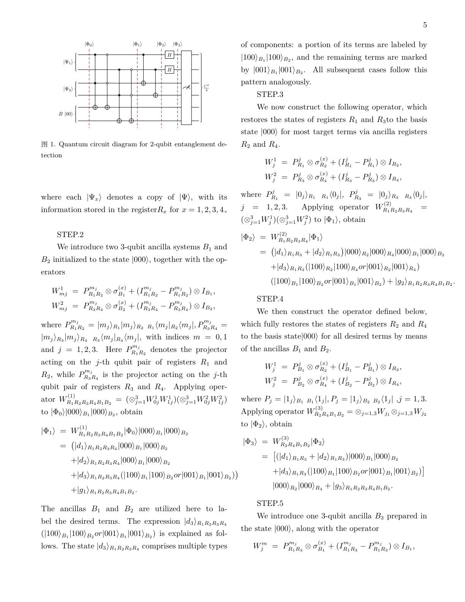 
Low-resolution page preview, page 5

📷 Fig 5

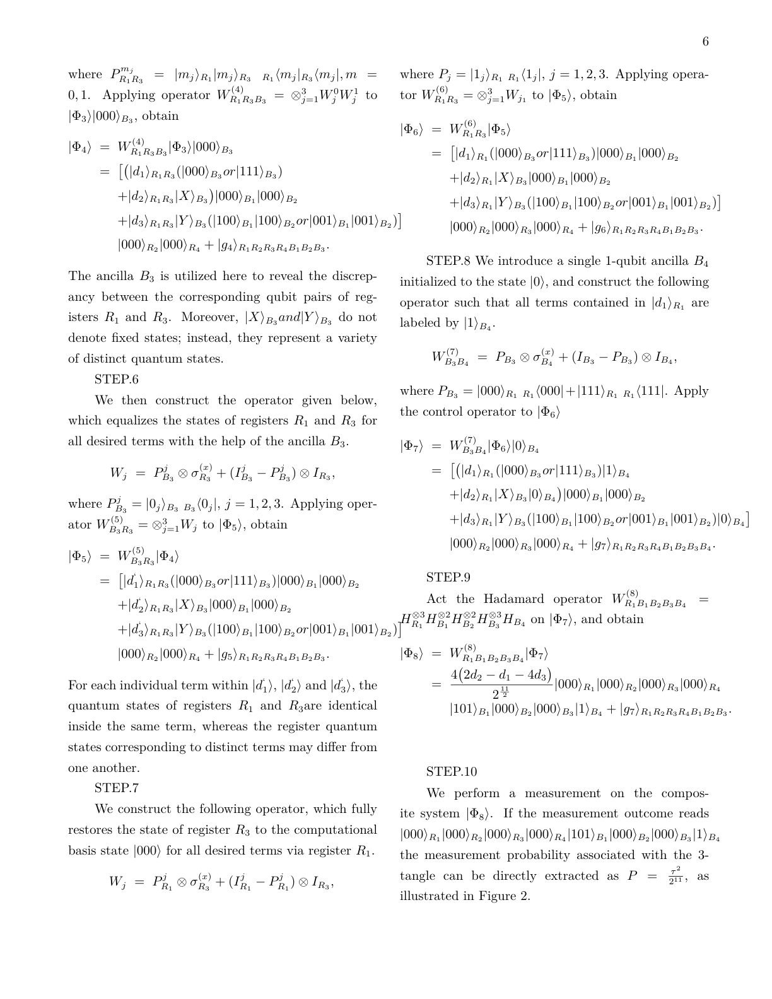 
Low-resolution page preview, page 6

**Summary.** This paper introduces novel quantum circuit schemes to directly measure bipartite concurrence and tripartite 3-tangle for pure states. By mapping the analytical definitions of these entanglement measures onto measurable output probabilities using unitary transformations and ancilla qubits, it offers an efficient alternative to resource-heavy full state tomography. This provides a practical technical roadmap for experimental characterization of multipartite quantum resources.

**Why it may be interesting.** This work is highly relevant because it provides concrete, circuit-level blueprints for experimentally verifying fundamental quantum resources like entanglement, which is crucial for advancing quantum computation and communication protocols.

Detailed structure

**Main problem.** The core problem is developing efficient, direct measurement schemes to quantify quantum entanglement (specifically bipartite concurrence and tripartite 3-tangle) for pure states without resorting to full quantum state tomography.

**Main result.** The authors propose a set of quantum circuit protocols that successfully map the analytical expressions for these two key entanglement measures directly onto measurable probabilities from output quantum circuits.

**Method.** The method relies on constructing specific quantum circuits involving unitary transformations and measurements on auxiliary qubits. This maps complex mathematical formulas into observable measurement outcomes, bypassing resource-intensive full state tomography.

**Model / system.** The focus is on two-qubit and three-qubit pure quantum states ($|\psi_2
angle$ and $|\psi_3
angle$). The protocols are designed to be implementable using standard quantum gates like Toffoli gates, suggesting applicability across platforms like superconducting circuits or trapped ions.

**Key observables.** Bipartite Concurrence ($C_\psi$) for two qubits and the tripartite 3-tangle ($	au_{123}$) for three qubits. These are extracted as measurement probabilities from the quantum circuit output.

**Important parameters / regimes.** The entanglement measures themselves (Concurrence $\in [0, 1]$, 3-tangle $\in [0, 1]$). The efficiency gain is measured against the exponential resource overhead of full state tomography.

**Assumptions / limitations.** It assumes the availability and reliable implementation of necessary quantum gates, such as three-qubit Toffoli gates, on current or near-future quantum hardware platforms.

**Figures summary.** Figure 1 illustrates the quantum circuit diagram for two-qubit entanglement detection, while Figure 2 details the multi-step quantum circuit required for three-qubit entanglement detection.

**Paper structure.** The paper systematically develops protocols: first addressing the general need to bypass tomography; then detailing the specific unitary and measurement sequence for bipartite concurrence (2-qubits); finally extending this methodology through a complex, multi-stage protocol for tripartite 3-tangle (3-qubits).

Abstract

Quantum entanglement is the fundamental hallmark of quantum mechanics and a core resource for realizing long-distance quantum communication and scalable linear quantum computing. Accordingly, the precise detection and quantitative quantification of entanglement constitute a foundational and critical problem in quantum information theory. To date, researchers have proposed numerous sufficient conditions for entanglement detection as well as a variety of entanglement measures to characterize the entanglement strength of quantum states; nevertheless, efficient and direct measurement schemes for core entanglement parameters remain underdeveloped. Based on unitary transformations and auxiliary measurements, this paper proposes a set of quantum circuit schemes capable of directly measuring the bipartite concurrence and the tripartite 3-tangle entanglement measure. By introducing auxiliary qubits and constructing specific controlled unitary operations, the proposed scheme maps the analytical expressions of the two entanglement measures onto the measurement probabilities of output states from quantum circuits. It enables efficient and direct quantitative measurement of bipartite and tripartite entanglement without performing full quantum state tomography. This work provides a feasible technical route for the experimental characterization of entanglement properties and lays a groundwork for the practical deployment of multipartite entanglement resources in quantum information processing.

[↑ back to top](#top)

### [Real-Time Detection of Charge Jumps in Superconducting Qubits with a Convolutional Neural Network](http://arxiv.org/abs/2607.14293v1)

**Authors:** Daniel Gaytan-Villarreal, Peter Meiring, Daniel Baxter, Daniel Bowring, Grace Bratrud, Matteo Cremonesi, Giuseppe Di Guglielmo, Grace Wagner, Bowen Xiao  
**Type:** experiment · **Category:** quantum information and computing · **PDF:** <https://arxiv.org/pdf/2607.14293v1>  
**Analysis basis:** full PDF text, analyzed in chunks
**Topic relevance:** 🔥 `QC/QI experiment` **4/5** · `quantum measurements` **3/5** · `methods for driven-dissipative` **1/5**

📷 Fig 1

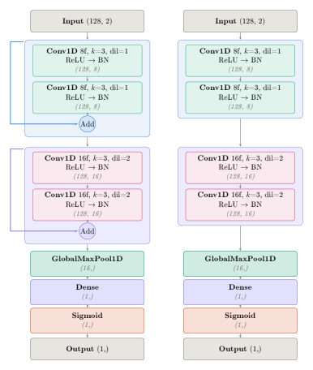 
FIG. 1. Proposed architectures: TCN (left) and DCCNN (right). Note that the DCCNN has the same architecture as the TCN minus the residual connections. Tensor shapes are annotated inside each block.

📷 Fig 2

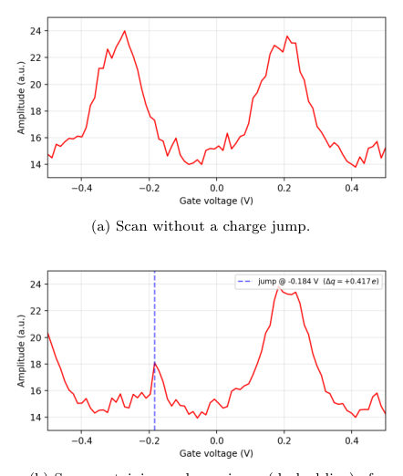 
FIG. 2. Example synthetic Ramsey scans generated for Qubit 1 (SC). Each scan covers 80 samples spanning gate voltage [−0.5, +0.5] V. Top: a typical no-jump scan, showing the peri- odic charge-modulation response. Bottom: a scan containing an injected charge jump (dashed line) of ∆q = +0.417 e at gate voltage −0.184 V.

**Summary.** The paper presents a Convolutional Neural Network (DCCNN) designed for real-time, online detection of charge jumps in superconducting qubits caused by cosmic radiation. By deploying this model onto FPGA hardware, the authors successfully transitioned error detection from a slow diagnostic tool to a fast control-loop primitive, enabling adaptive quantum error mitigation.

**Why it may be interesting.** This work directly addresses the practical engineering challenge of integrating advanced ML diagnostics into quantum hardware control loops, moving error detection from a post-processing step to an active component of quantum computation protocols.

Detailed structure

**Main problem.** The primary challenge is developing a real-time method to detect charge jumps in superconducting qubits, which are induced by ionizing radiation and cause correlated errors.

**Main result.** A Dilated Causal CNN (DCCNN) was developed that achieves detection efficiency comparable to established offline methods while operating with fixed, low latency suitable for direct integration into quantum control loops.

**Method.** The authors trained a DCCNN on synthetic Ramsey tomography scans and deployed it onto an FPGA platform using quantization-aware training for high-speed inference.

**Model / system.** The system involves superconducting qubits monitored via charge-sweep scans, utilizing the QICK hardware platform. The detection mechanism relies on classifying time-series data from these scans to identify abrupt changes in the qubit's offset charge.

**Key observables.** Detection efficiency (e.g., $0.843 \pm 0.022$ vs. $\chi^2$'s $0.866 \pm 0.020$), inference latency ($6.19\ \mu	ext{s}$), and classification metrics like Precision, Recall, and F1 score.

**Important parameters / regimes.** Charge jump magnitude $|\Delta q| \in [0.1, 0.5] e$; the target deployment platform is the Zynq UltraScale+ RFSoC ZCU216 FPGA.

**Assumptions / limitations.** The DCCNN architecture is assumed to maintain performance parity with the $\chi^2$ algorithm while providing a fixed-latency forward pass, which is crucial for in-situ control.

**Figures summary.** Figures illustrate the TCN and DCCNN architectures, show example synthetic Ramsey scans (with/without jumps), and tables compare detection efficiencies across different qubits and hardware resource utilization.

**Paper structure.** The paper introduces the problem of real-time error detection in superconducting qubits. It details the proposed DCCNN architecture over traditional methods ($\chi^2$), presents training procedures using simulated data, and concludes with performance benchmarks demonstrating its viability for control-loop deployment on FPGA hardware.

Abstract

Ionizing radiation from cosmic rays and gammas can induce discontinuous jumps in the environmental charge of superconducting qubits (charge jumps), causing correlated errors that challenge fault-tolerant quantum computing while simultaneously providing a detection signature for quantum sensing applications. Current detection methods operate offline, introducing latency incompatible with in-the-loop qubit control. In this paper, an online detector of charge jumps for superconducting qubits, based on a dilated causal convolutional neural network (DCCNN) designed for in-the-loop deployment on the Quantum Instrumentation Control Kit (QICK) platform, is presented. The network is trained on synthetic Ramsey tomography scans generated from qubit templates measured at the Northwestern Experimental Underground Site (NEXUS) at Fermilab, and translated to FPGA firmware via hls4ml with ap_fixed$\langle 16,6 \rangle$ quantization, reaching a per-inference latency of $6.19 μ$s on the Zynq UltraScale+ RFSoC ZCU216. At this operating point the DCCNN matches the detection efficiency of the established offline $χ^2$ algorithm ($0.843 \pm 0.022$ vs. $0.866 \pm 0.020$ on $|Δq| \in [0.1, 0.5] e$ at matched false-positive rate), while requiring no per-qubit hyperparameter tuning. This shifts charge-jump detection from a post-hoc diagnostic to a control-loop primitive, enabling adaptive protocols that respond to radiation-induced events in situ, with applications to quantum-computing error mitigation and to the use of superconducting qubits as particle detectors.

[↑ back to top](#top)

### [Binary Gauss Stabilizers for Abelian Lattice Gauge Theories](http://arxiv.org/abs/2607.14861v1)

**Authors:** Matteo Turco, Luca Spagnoli, Alessandro Roggero  
**Type:** theory · **Category:** quantum information and computing · **PDF:** <https://arxiv.org/pdf/2607.14861v1>  
**Analysis basis:** full PDF text, analyzed in chunks
**Topic relevance:** 🔥 `analog quantum simulation` **4/5** · `entanglement & information structure` **1/5** · `methods for driven-dissipative` **1/5** · `non-equilibrium dynamics` **1/5**

📷 Fig 1

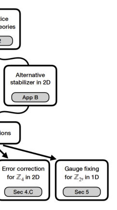 
FIG. 1: Organization of the paper.

📷 Fig 2

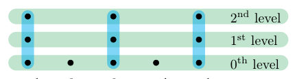 
FIG. 4: Representation of links and sites encoded on qubits for the Z8 theory in one dimension, requiring three qubits per link. The black dots are qubits, the vertical cyan stripes are links. We also depict with the horizontal green stripes the partition of the qubits in levels as introduced in the text.

📷 Fig 3

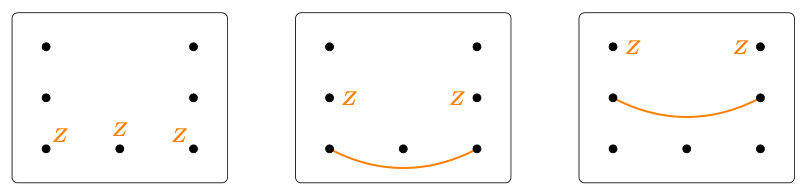 
FIG. 5: Generators of the binary Gauss stabilizer group for the Z8 theory in one dimension. The orange lines represent controlled-Z operators. In each box, we show the qubits of site s and the two links s−1 and s.

📷 Fig 4

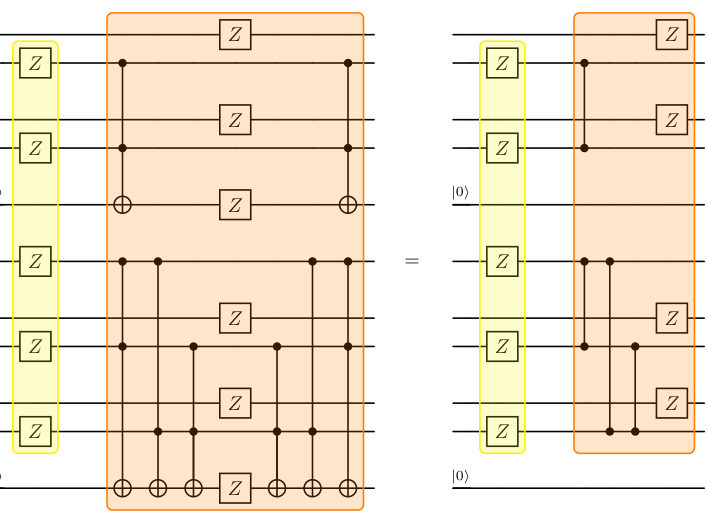 
FIG. 6: Generators for the stabilizer group of the Z4 theory in two dimensions. The ancillary qubits (α, 1) and (β, 1) are initially set in the |0⟩state. The operator in the yellow box is gs,0, the one in the orange box on the left-hand side is g′ s,1, and the one in the orange box on the right-hand side is gs,1.

📷 Fig 5

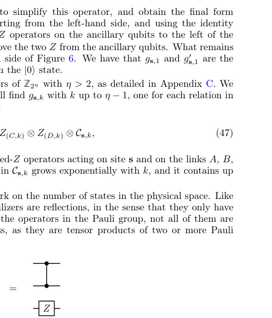 
FIG. 7: Circuital representation of the identity Xc a,bZcXc a,b = ZcZa,b.

**Summary.** This paper develops 'binary Gauss stabilizers' as an alternative mathematical tool to the standard Gauss operators used to define the physical subspace of Abelian lattice gauge theories. This novel set of stabilizers allows researchers to construct practical quantum error-correcting codes directly from the system's inherent gauge symmetries. The work provides new tools for both understanding lattice gauge theory and advancing quantum simulation techniques.

**Why it may be interesting.** The direct link between gauge symmetries in lattice field theory and stabilizer codes provides a powerful framework for designing fault-tolerant quantum simulations of fundamental physics models.

Detailed structure

**Main problem.** To find an alternative set of stabilizers for Abelian lattice gauge theories that can be used to build practical quantum error-correcting codes without adding extra qubits, and to develop a new strategy for gauge fixing.

**Main result.** The authors introduce 'binary Gauss stabilizers,' an alternative stabilizer group to the standard Gauss operators, which allows for constructing error-correcting codes exploiting gauge symmetries.

**Method.** The work involves deriving these alternative stabilizers by analyzing the constraints defining the physical Hilbert space and translating them into bitwise equations suitable for quantum circuit representation.

**Model / system.** The system is a discrete Abelian lattice gauge theory described by a Z_N gauge group on a hypercubic lattice, coupled with fermionic matter. The Hamiltonian structure involves material, hopping, electric, and plaquette terms.

**Key observables.** Dimension (D) of the physical Hilbert space; the set of Pauli stabilizers defining the gauge-invariant subspace.

**Important parameters / regimes.** The gauge group order N (specifically Z_{2\eta}); lattice dimension d.

**Assumptions / limitations.** The analysis initially focuses on 1D and 2D lattices, with generalizations to higher dimensions left for future work. The derivation relies heavily on specific circuit identities for Pauli operator conjugation.

**Figures summary.** Figures illustrate notation (controlled-Z, Toffoli), qubit decompositions for operators on links (e.g., Z_8 theory), and the structure of the derived binary Gauss stabilizers in 1D and 2D.

**Paper structure.** The paper first establishes the problem by comparing standard Gauss constraints to alternative stabilizer methods. It then derives these 'binary Gauss stabilizers' for 1D and 2D systems, showing their equivalence to the physical subspace defined by Gauss operators. Finally, it details the explicit construction of these generators using quantum circuit identities.

Abstract

Gauge theories and quantum error-correcting codes share the same underlying structure: both use constraints to identify a specific subspace of the full Hilbert space. In quantum error correction, these constraints are known as stabilizers, while in gauge theories they correspond to Gauss law. In this work, we consider a family of discrete Abelian lattice gauge theories described by a $\mathbb{Z}_{N}$ gauge group with $N$ an arbitrary power of two. In this setting, we find a set of stabilizers for the gauge-invariant subspace which is an alternative to the Gauss operators, and we call them binary Gauss stabilizers. We use this alternative stabilizer group to build practical error-correcting codes exploiting the gauge symmetries of the system without the addition of extra qubits. The applications of our finding are not limited to error correction though. We also provide a new strategy of gauge fixing to remove the redundancies based on our alternative stabilizer, which might provide advantages with respect to already-existing approaches such as the axial gauge. Our results provide new tools to study lattice gauge theories and their quantum simulation, and opens directions for future work at the interface of lattice gauge theory and quantum information.

[↑ back to top](#top)

### [Electrons Hopping across a Molecular Network: Spectra and Symmetries](http://arxiv.org/abs/2607.14687v1)

**Authors:** Ludwig Schulz, Max Best, Carsten Henkel  
**Type:** theory · **Category:** strongly correlated electrons · **PDF:** <https://arxiv.org/pdf/2607.14687v1>  
**Analysis basis:** full PDF text, analyzed in chunks
**Topic relevance:** 🔥 `analog quantum simulation` **4/5** · `entanglement & information structure` **1/5** · `exotic spin models in light-matter` **1/5** · `non-equilibrium dynamics` **1/5**

📷 Fig 1

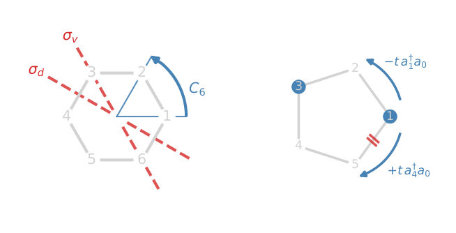 
Figure 1. Typical features of ring networks. Left: mirror axes and elementary rotation for an even number of sites. Right: sign of hopping matrix elements. The amplitudes for an electron hopping from site 1 to neighboring sites may have opposite signs. After the hop 1 →5 across the “ring-closing” edge (red barrier), a reordering is needed to restore the canonical ordering of creation operators. This leads to a minus sign if there is an odd number of other electrons on the ring.

📷 Fig 2

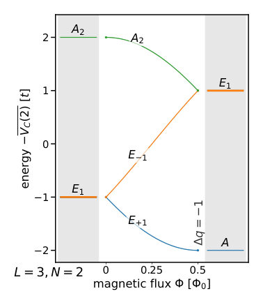 
Figure 2. Zeeman spectrum for triangular ring with (left) one and (right) two electrons.

📷 Fig 3

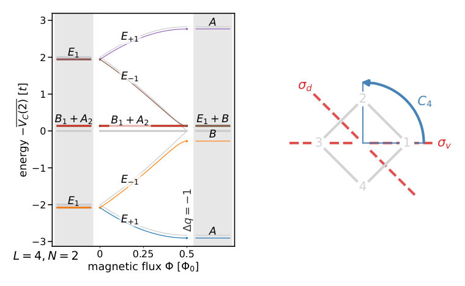 
Figure 3. Left: Zeeman spectrum for a square with two electrons. Thick (thin) lines denote two-fold (singly) degenerate levels. We subtract the mean Coulomb interaction VC(2). The irreps B1 + A2 remain degenerate because they are dual to each other (half-filled network). Gray lines indicate energy levels without Coulomb interaction. For the symmetry assignment in the right column, a total momentum −1 has been subtracted. Right: network geometry with its generating symmetry elements. For each type σv and σd, there are two equivalent mirror axes.

📷 Fig 4

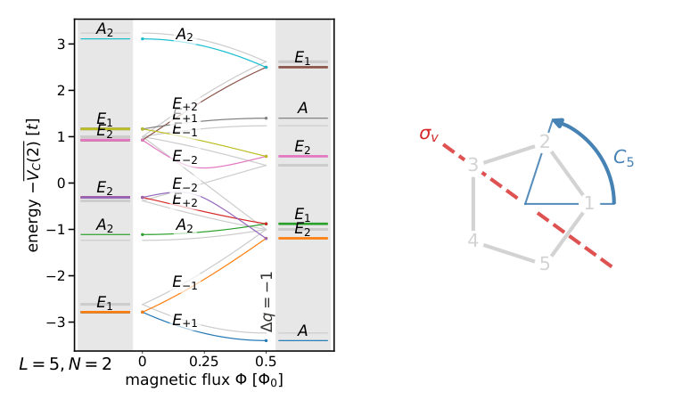 
Figure 4. Left: Zeeman spectrum for a pentagon ring with two electrons. The line thickness indicates the degeneracy (single or double). Gray lines indicate the spectra without Coulomb interaction. Note the avoided crossing between two E−2 terms, while levels with different symmetries cross. Right: network geometry and its symmetry elements. Five other equivalent σv axes exist.

📷 Fig 5

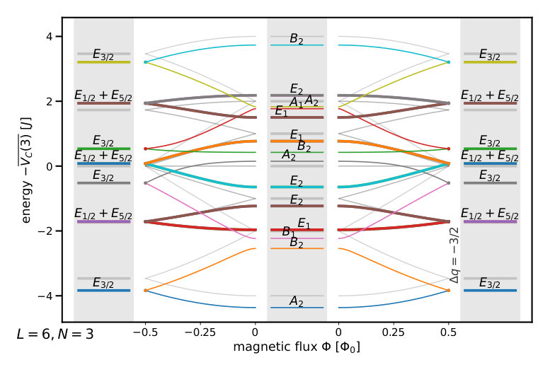 
Figure 5. Same as Figs. 3, 4 for a hexagonal ring with three electrons. Note the doubly degenerate levels (thick lines, E1 and E2): their splitting is forbidden by duality which exchanges the two momentum components.

**Summary.** This paper theoretically investigates the energy spectra of interacting spinless electrons on finite molecular rings using a Hubbard model. It leverages group theory and symmetry analysis to predict spectral features, such as avoided crossings due to magnetic flux and the protection of certain states by particle-hole symmetry at half-filling.

**Why it may be interesting.** This work provides a detailed theoretical framework for understanding how fundamental symmetries dictate electronic behavior in low-dimensional quantum materials, which is highly relevant to designing correlated quantum devices or simulating molecular electronics.

Detailed structure

**Main problem.** The study investigates how lattice geometry, Coulomb interactions, and discrete symmetries govern the many-body energy spectrum of interacting spinless electrons on molecular ring networks.

**Main result.** The analysis reveals qualitative differences in spectra based on whether the number of particles is even or odd, and demonstrates that particle-hole symmetry protects certain spectral sectors from Zeeman splitting at half-filling.

**Method.** Group-theoretical methods are employed to analyze symmetries (using $C_L$ and $D_L$), leading to state classification into irreducible representations. The spectrum is calculated using a tight-binding Hubbard Hamiltonian, often requiring the construction of effective Hamiltonians for coupled symmetry sectors.

**Model / system.** The system models interacting spinless electrons on finite molecular ring networks (size L), governed by a tight-binding Hubbard Hamiltonian incorporating hopping ($t_{st}$), on-site repulsion ($U$), and two-body interactions ($V_{st}$). The effects of an external magnetic flux ($\Phi$) are included via Peierls substitution.

**Key observables.** Many-body spectrum (energy eigenvalues), persistent current, magnetization, and the splitting/avoided crossing patterns as a function of magnetic flux $\Phi$.

**Important parameters / regimes.** Lattice size L ($3 \le L \le 6$), number of electrons N (1, 2, or 3), external magnetic flux $\Phi$, and interaction strengths $U$ and $V_{st}$.

**Assumptions / limitations.** The analysis assumes spinless fermions obeying the Pauli principle. The use of group theory heavily constrains the possible spectral degeneracies and splittings.

**Figures summary.** Figures illustrate typical features of ring networks, Zeeman spectra for small rings ($L=3$), flux-dependent energy levels showing avoided crossings, and scaling plots comparing Coulomb energy across different lattice geometries.

**Paper structure.** The paper systematically analyzes the Hamiltonian using group theory to classify states. It then examines how external fields (Zeeman effect) and interactions cause spectral changes, paying special attention to symmetry protection mechanisms like particle-hole duality at half-filling.

Abstract

We investigate interacting spinless electrons on finite molecular ring networks described by a tight-binding Hubbard Hamiltonian. The interplay between lattice geometry, Coulomb interactions and discrete symmetries is analysed for rings with $L=3,4,5,6$ nodes, filled with one, two or three electrons. Special attention is devoted to the role of the network symmetries in determining the structure of the many-body spectrum and the Mulliken classification of the eigenstates. Using group-theoretical methods, we examine the evolution of the spectra in the presence of an external magnetic flux. The Zeeman effect lifts degeneracies and results in combination with the Coulomb interaction to avoided crossings in symmetry sectors. We identify a qualitatively distinction between systems with an even and odd number of particles. At half-filling, particle-hole symmetry (duality) protects selected symmetry sectors against Zeeman splitting.

[↑ back to top](#top)

### [Limits on Broadcasting Genuine Multipartite Entanglement in Quantum Networks](http://arxiv.org/abs/2607.14864v1)

**Authors:** Pritam Roy, William John Munro, Shashank Gupta  
**Type:** theory · **Category:** quantum information and computing · **PDF:** <https://arxiv.org/pdf/2607.14864v1>  
**Analysis basis:** full PDF text, analyzed in chunks
**Topic relevance:** 🔥 `entanglement & information structure` **4/5** · `correlated / nonlocal dissipation` **1/5** · `methods for driven-dissipative` **1/5** · `non-equilibrium dynamics` **1/5**

📷 Fig 1

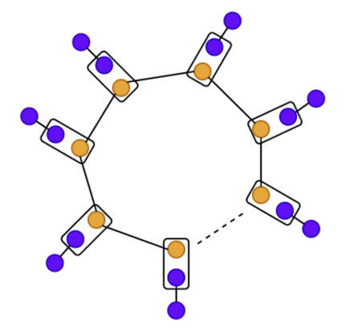 
Figure 1: N-party GME broadcasting protocol. Each party’s input qubit interacts with one ancilla qubit at a beam splitter (BS) of reflectiv- ity R. The product map ˆUbroad = ∏k ˆUeff k yields two approximate N-partite copies in the transmitted and reflected modes. The factor- ised structure means each beam splitter contributes an independent degradation factor.

📷 Fig 2

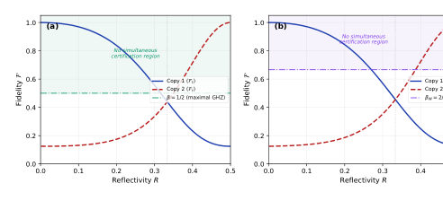 
Figure 2: No-go for simultaneous GME certification. (a) 3-party GHZ: the fidelity curves for Copy 1 (transmitted, solid blue) and Copy 2 (reflected, dashed red) never simultaneously exceed the witness threshold β = 1/2 (green dash-dot line). The shaded region indicates where GME certification would require the fidelity to lie. (b) 3-party W: both copy fidelities remain below the W-state threshold βW = 2/3 (purple dash-dot line) for all R.

📷 Fig 3

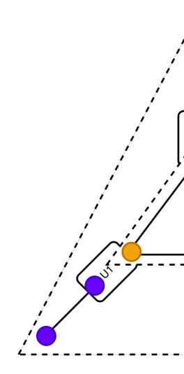 
Figure 3: Tripartite genuine entanglement broadcasting protocol.

📷 Fig 4

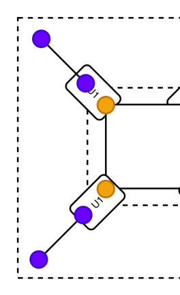 
Figure 4: Four-party genuine entanglement broadcasting protocol.

📷 Fig 5

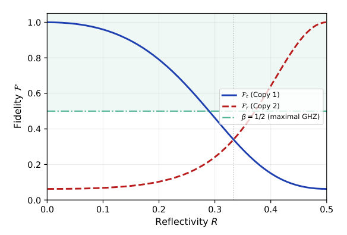 
Figure 5: Fidelity of the transmitted and reflected broadcast copies for the 4-party GHZ state with α = 1/ √

**Summary.** The authors derive operational limits for broadcasting multipartite entanglement (GME) using local beam-splitter cloning. They prove a strong no-go theorem showing that it is impossible to simultaneously certify both resulting broadcast copies as genuinely entangled using standard fidelity witnesses. This work delineates fundamental trade-offs between the physical distribution and verifiable certification of quantum entanglement.

**Why it may be interesting.** This work provides quantitative, fundamental bounds on how entanglement can be distributed or copied in realistic quantum network settings, directly impacting the feasibility assessment of quantum communication protocols.

Detailed structure

**Main problem.** The paper establishes operational limits on broadcasting Genuine Multipartite Entanglement (GME) across quantum networks and investigates the possibility of simultaneously certifying multiple broadcast copies.

**Main result.** A fundamental no-go result is proven: for any reflectivity $R$, the two resulting broadcast copies cannot be simultaneously certified as genuinely multipartite entangled using standard fidelity-based witnesses.

**Method.** The analysis uses theoretical derivations based on local optimal 1 $\to$ 2 cloning implemented via beam-splitter interactions, calculating entanglement fidelity decay rates for GHZ and W states.

**Model / system.** The model is an N-partite quantum system where GME states (GHZ, W) are subjected to a broadcasting protocol involving local beam-splitter operations at each party.

**Key observables.** Broadcast fidelity ($F$), entanglement witness thresholds ($eta$), and the exponential decay factor $[c]^N$.

**Important parameters / regimes.** Reflectivity $R$ (ranging from 0 to 1), system size $N$, and specific state families (GHZ, W).

**Assumptions / limitations.** The results are strictly limited to the framework of fidelity-based entanglement witnesses and the specific local beam-splitter cloning protocol used.

**Figures summary.** Figures illustrate the N-party GME broadcasting setup and show that for various $R$, the calculated fidelities for both broadcast copies fall below the required GME certification thresholds.

**Paper structure.** The paper first derives the effective transformation from local beam-splitter interactions, calculates the fidelity decay rates for GHZ and W states, and then presents the core argument proving that no single reflectivity $R$ allows both resulting copies to pass the simultaneous GME certification test.

Abstract

We establish operational limits on the broadcasting of genuine multipartite entanglement (GME) in quantum networks. Using a distributed protocol in which each of N parties locally implements optimal 1 $\to$ 2 cloning via beam-splitter interactions, we derive exact expressions for the broadcast fidelity of Greenberger-Horne-Zeilinger (GHZ), W states, and Cluster states in a limited setting. We show that the fidelity decays exponentially with system size as [c(R)]$^N$, providing a quantitative expression of multipartite entanglement monogamy in the broadcasting setting, and that both state families share a universal normalisation factor arising from independent post-selection probabilities. Most significantly, we prove a no-go result for simultaneous GME certification: for all reflectivities and all system sizes, the two broadcast copies cannot be simultaneously certified as genuinely multipartite entangled within the standard framework of fidelity-based witnesses. We further check this behaviour for three- and four-party cluster states, finding consistent results that support the generality of the no-go beyond the GHZ and W families. This obstruction arises from the redistribution of multipartite coherence, which both reduces the achievable fidelity and increases the corresponding certification threshold. Our results reveal a fundamental trade-off between the broadcastability of multipartite entanglement and its operational certifiability, and delineate intrinsic limits on entanglement distribution in quantum networks.

[↑ back to top](#top)

### [Principles of Quantum Optimization for Constrained Problems](http://arxiv.org/abs/2607.14227v1)

**Authors:** Einar Gabbassov, Gurpahul Singh, Achim Kempf  
**Type:** theory · **Category:** quantum information and computing · **PDF:** <https://arxiv.org/pdf/2607.14227v1>  
**Analysis basis:** full PDF text, analyzed in chunks
**Topic relevance:** 🔥 `entanglement & information structure` **4/5** · `scars & prethermalization` **2/5** · `non-equilibrium dynamics` **1/5**

📷 Fig 1

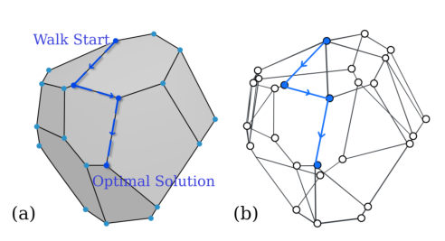 
FIG. 1. (a) A three-dimensional bounded polyhedron D de- fined by linear constraints. The interior and the boundaries of a polyhedron contain all feasible solutions. The optimal solution is situated on one of the vertices. The blue path is a walk on the vertices along the edges performed by the sim- plex algorithm. In the nondegenerate case, each vertex hop along the path decreases the objective function value. (b) The induced transition graph of the feasible polyhedron: vertices are feasible solutions, and edges represent allowable transi- tions between adjacent vertices.

📷 Fig 2

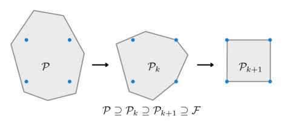 
FIG. 2. Conceptual illustration of iterative tightening in LP- based methods for solving 0–1 IPs. Starting from the LP re- laxation P, the goal is to generate a sequence of progressively tighter polyhedral relaxations Pk and Pk+1 that continue to contain the discrete feasible set F (four blue points).

📷 Fig 3

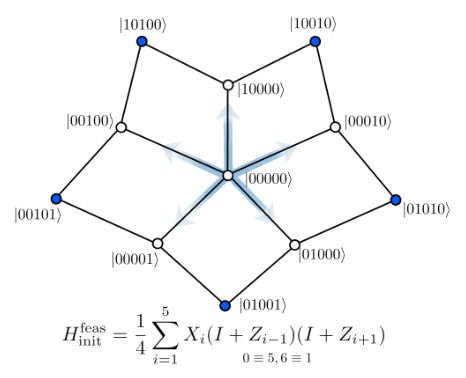 
FIG. 3. Transition graph induced by a feasibility-preserving mixer for the Maximum Independent Set Problem on the cy- cle graph C5, [see Section B 1]. Each vertex is a feasible bit string |x⟩encoding an independent set, and each edge rep- resents an allowed transition that preserves feasibility. The transparent blue arrows illustrate wavefunction propagation in superposition from |00000⟩to adjacent feasible states. The outer blue vertices are the maximum independent sets of C5 and therefore the optimal solutions.

📷 Fig 4

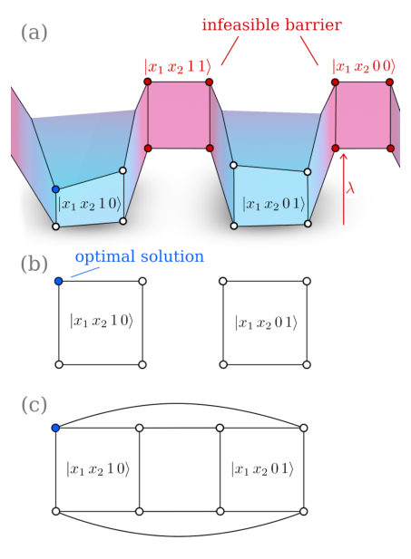 
FIG. 5. Transition graphs for three quantum optimization methods. (a) Penalty-based method with its transition graph (4-d hypercube) overlaid over the energy landscape. Vertices with higher energy are raised upward. Infeasible vertices are raised by the penalty λ, creating an energetic barrier between feasible regions. The initial state has support on all vertices, and reaching the optimal solution requires some amplitudes to traverse the barriers and concentrate at the optimal so- lution (blue vertex). For visual clarity, only representative transitions are shown. (b) Transition graph for the penalty- free method with Hfeas init = −X1 −X2. The energy landscape is trivial and given by a...

📷 Fig 5

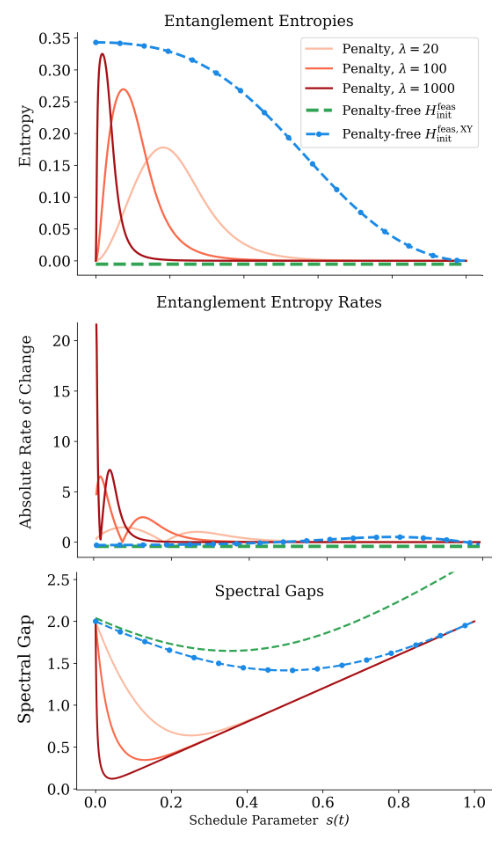 
FIG. 4. Bipartite entanglement entropy of the reduced sys- tem state (top), the absolute rate of change of the entropy (mid), and spectral gaps (bottom) for penalty-based and penalty-free methods. For the penalty-based method, increas- ing the penalty strength makes entanglement restructuring more abrupt, producing narrower peaks with steeper slopes and hence narrowing the spectral gap. For the penalty-free methods (with mixers Hfeas init and Hfeas,XY init ), the entropy rates are either zero or close to zero, showing that entanglement restructuring is either removed or minimal; correspondingly, the relevant spectral gap remains wide throughout the evolu- tion.

**Summary.** This paper introduces a unified spectral theory explaining that computational slowdown in constrained quantum optimization stems from entanglement restructuring. It shows that by designing dynamics that respect the algebraic structure of the constraints, one can avoid unnecessary entanglement changes, leading to superior performance over standard penalty methods.

**Why it may be interesting.** It provides a deep theoretical link between the geometric structure of mathematical constraints (polyhedra) and fundamental quantum information measures (entanglement), which is highly relevant for understanding resource scaling in quantum computation.

Detailed structure

**Main problem.** Developing a unified theoretical framework for quantum optimization algorithms applied to constrained combinatorial problems.

**Main result.** The computational slowdown in these quantum processes is fundamentally driven by the restructuring of entanglement, which can be mitigated using constraint-aware dynamics.

**Method.** The authors develop a spectral theory connecting constrained optimization structures (like LPs and MIPs) to entanglement dynamics within Hamiltonian evolution frameworks.

**Model / system.** The model involves mapping combinatorial problems onto Hamiltonians ($H_p$) evolving under time-dependent mixers ($H(t)$). The system is analyzed across both continuous-time adiabatic and discrete circuit-based quantum paradigms.

**Key observables.** Entanglement restructuring, spectral gaps, and the overlap between the final state and the optimal solution's basis state.

**Important parameters / regimes.** The degree of entanglement change required by the constraints; the time evolution schedule $s(t)$ in adiabatic processes.

**Assumptions / limitations.** The analysis assumes that computational complexity is dictated by how much entanglement must be changed to satisfy problem constraints, contrasting with generic penalty-based approaches.

**Figures summary.** Figure 9(a) illustrates the eigenvalue trajectory descending through penalized suboptimal levels during adiabatic evolution for an exact cover problem.

**Paper structure.** The paper progresses from reviewing classical constrained optimization (LP/MIP), establishing a general Hamiltonian framework, deriving that entanglement restructuring drives slowdown, and finally proposing constraint-aware dynamics to control this restructuring.

Abstract

Constrained combinatorial optimization underlies many industrial and technological decision problems. We develop a spectral theory that unifies many quantum optimization algorithms. We show that computational slowdown is driven by entanglement restructuring: the creation, redistribution, and destruction of entanglement during system evolution. The severity of the slowdown depends on how much entanglement must be changed. We show that algebraic properties of constraints induce such restructuring, and that constraint-aware dynamics reduce the associated slowdown by avoiding unnecessary restructuring. This framework explains why constraint-aware quantum methods can outperform generic penalty-based approaches. The theory connects constrained optimization, computational complexity, entanglement dynamics, and Hamiltonian spectral structure across continuous-time and circuit-based quantum optimization paradigms.

[↑ back to top](#top)

### [Improving Dynamical Decoupling for Trapped-Ion QCCD Quantum Computers](http://arxiv.org/abs/2607.14441v1)

**Authors:** William M. Watkins, Leigh M. Norris, Ross Hutson, Maxwell Urmey, Peter Siegfried, Charles H. Baldwin  
**Type:** both · **Category:** other · **PDF:** <https://arxiv.org/pdf/2607.14441v1>  
**Analysis basis:** full PDF text, analyzed in chunks
**Topic relevance:** 🔥 `QC/QI experiment` **4/5** · `Keldysh / 2PI / non-Gaussian methods` **1/5** · `non-equilibrium dynamics` **1/5**

📷 Fig 1

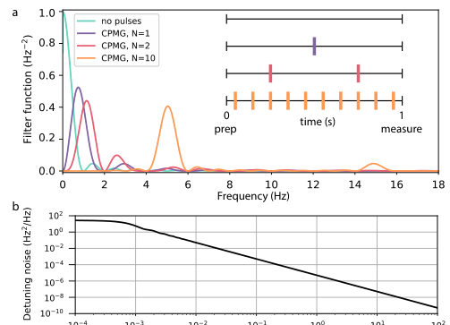 
FIG. 1: Dynamical decoupling filter functions. (a) Filter functions of CPMG pulse sequences (inset) with varying N and T = 1 s. The first harmonic of a sequence with N pulses occurs at ω0/2π = N/2T Hz. (b) Approximate PSD of the longitudinal magnetic field fluctuations that generate memory error.

📷 Fig 2

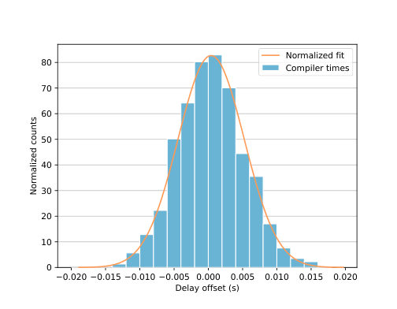 
FIG. 2: Empirical distribution of the timing offset P(ϵ) from Quantinuum H2 with 28 qubits. The circuits consist of single-qubit gates on each qubit iterated with two-qubit gates between each pair of qubits (282/2 = 392), and all repeated for four rounds. The pulses are injected at compile time and placed as close to T/2 as possible, where T is the idle time between single-qubit gates on a given qubit. A CPMG or PDD sequence with N = 1 prescribes that the pulse takes place at T/2, but because of a limited number of gate zones, the pulse is applied either earlier or later than desired. The blue bins show the offset from T/2 for each pulse instance during the circuit. The orange line shows a...

📷 Fig 3

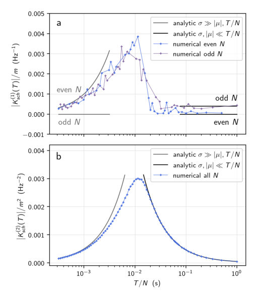 
FIG. 3: Scheduling error cumulants for CPMG plotted over a range of average pulse spacings T/N. Here, the CPMG pulse number N is varied with fixed T = 1 s, µ = 2 × 10−4 s, and σ = 4.8 × 10−3 s. The magnitudes of the first scheduling error cumulant |K(1) sch(T)| (a) and the second scheduling error cumulant |K(2) sch(T)| (b) are computed numerically for each T/N. In the limits where the pulse spacing T/N is either much smaller or much larger than σ, the numerically computed cumulants converge to the analytic expressions given in Sec. III C. When σ ≫|µ|, T/N, the numerical value of |K(1) sch(T)| lies between the analytic expression for odd and even N due to pulses falling outside the idle time...

📷 Fig 4

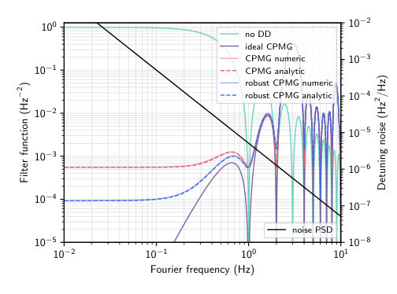 
FIG. 4: Effect of scheduling errors on FFs. For T = 1 s, µ = 2 × 10−4 s, and σ = 4.8 × 10−3 s, FFs are shown for free evolution without DD (cyan), CPMG with N = 6, and robust CPMG with N = 6. The FFs of CPMG averaged over scheduling error (pink solid/dashed) have a significantly larger DC component than the ideal CPMG FF without scheduling error (purple), which falls off quadratically in the DC regime. Scheduling-error-robust DD (blue solid/dashed) reduces the DC component of the FF by almost an order of magnitude. Numerical FFs for CPMG (pink solid) and robust CPMG (blue solid), which were generated by averaging over 1000 realizations of scheduling error, show excellent agreement with the...

📷 Fig 5

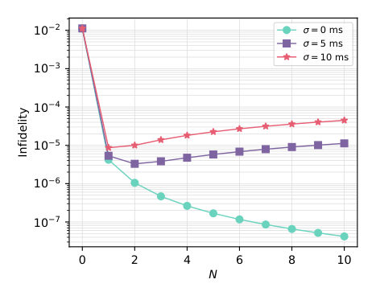 
FIG. 5: Infidelity versus pulse number N for compile-time CPMG and free evolution. Memory error is modeled as purely stochastic (m = 0) with the 1/ω2 PSD shown in Fig. 1. For three different values of σ, µ = 0 s, and a fixed idle time T = 1 s, the infidelity of the trapped-ion qubit is plotted for CPMG with 1 ≤N ≤10 and free evolution with N = 0 (no pulses). When σ = 0 ms (cyan), the infidelity decreases with increasing N since no scheduling error accompanies the pulses. When σ = 5 ms (purple) and σ = 10 ms (pink), infidelity is minimized at N = 2 and N = 1 or, equivalently, at a DD pulse frequency of 2 Hz and 1 Hz, respectively. The optimal N values suppress memory error while minimizing...

**Summary.** This paper investigates the impact of timing inaccuracies, or scheduling errors, on Dynamical Decoupling sequences used to protect qubits in trapped-ion QCCD quantum computers. Using advanced noise filtering techniques, the authors show that these real-world hardware imperfections limit the effectiveness of standard error suppression protocols. They introduce a novel, adaptive DD protocol that dynamically adjusts refocusing pulses during idle times to maintain high fidelity.

**Why it may be interesting.** This work is highly relevant as it bridges fundamental quantum control theory (DD) with practical hardware limitations (scheduling jitter), providing actionable insights for building fault-tolerant trapped-ion quantum processors.

Detailed structure

**Main problem.** The paper addresses how scheduling errors, inherent in trapped-ion QCCD architectures, degrade the performance of Dynamical Decoupling (DD) sequences designed to suppress memory errors.

**Main result.** Scheduling errors increase DD sensitivity to low-frequency noise, making high pulse frequencies counterproductive; a real-time protocol that opportunistically refocuses pulses is proposed as an improvement.

**Method.** The analysis employs the Filter Function formalism and cumulant expansion techniques to model noise suppression in the presence of stochastic timing deviations from ideal gate sequences.

**Model / system.** The system is trapped-ion QCCD quantum computers, modeled using an effective qubit Hamiltonian subject to low-frequency magnetic field fluctuations ($\propto \sigma_z$). The analysis extends DD theory from deterministic control to stochastic control incorporating pulse timing jitter.

**Key observables.** Survival probability ($P$), the second cumulant $C^{(2)}(T)$, and the Control Filter Function $F(\omega, T)$.

**Important parameters / regimes.** The critical threshold for DD pulse frequency (around 2 Hz) where scheduling errors become dominant; the spectral dependence of noise ($S(2\pi f)$).

**Assumptions / limitations.** Key assumptions include treating $\pi$-pulses as instantaneous and assuming that scheduling errors are independent and identically distributed (i.i.d.).

**Figures summary.** Figures show filter functions for CPMG sequences, empirical distributions of timing offsets ($\epsilon$), and survival probabilities demonstrating the plateauing fidelity improvement due to accumulated scheduling error.

**Paper structure.** The paper progresses from analyzing standard DD theory using the Filter Function formalism to incorporating stochastic scheduling errors via cumulant expansions. It culminates in proposing and analyzing a real-time, opportunistic refocusing protocol for improved robustness.

Abstract

We examine the impact of scheduling errors on dynamical decoupling (DD) in trapped-ion quantum charge-coupled devices (QCCDs) and develop better strategies for reducing memory errors. In the QCCD architecture, qubit transport and control introduce stochastic pulse delays that impact the efficiency of DD. Using the filter-function formalism, we analyze the performance of DD in the presence of scheduling-induced timing errors, showing that they increase the sensitivity of standard DD to low-frequency fluctuations. For typical memory errors in trapped-ion platforms, we numerically demonstrate that increasing the DD pulse frequency beyond 2 Hz is generally counterproductive due to scheduling-induced timing errors. Furthermore, we introduce a real-time DD protocol that inserts refocusing pulses opportunistically during idle periods. We demonstrate our methods on Quantinuum H2-1 with Ramsey delay-type experiments.

[↑ back to top](#top)

### [Unified monogamy and polygamy relations for multipartite systems](http://arxiv.org/abs/2607.14370v1)

**Authors:** Yue Cao, Naihuan Jing, Kailash Misra, Yiling Wang  
**Type:** theory · **Category:** quantum information and computing · **PDF:** <https://arxiv.org/pdf/2607.14370v1>  
**Analysis basis:** full PDF text, analyzed in chunks
**Topic relevance:** 🔥 `entanglement & information structure` **4/5** · `non-equilibrium dynamics` **1/5**

📷 Fig 1

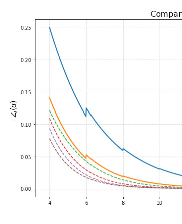 
Figure 1. Comparison of six lower bounds Zi (i = 1, . . . , 6) for the α-th power monogamy relation of concurrence under the three-qubit state from Ex- ample 3.6. Bounds Z1 and Z2 are derived via piecewise expansion based on Corollary 3.6 and Theorem 3.1, respectively, and exhibit a staircase structure with respect to α. This stepwise structure reflects the piecewise refinement induced by increasing m: each “step” corresponds to activation of a higher- order correction term when α crosses 2γ, mirroring the discrete nature of entanglement sharing in multi-qubit systems. Bounds Z3 to Z6 correspond to previously proposed results. Among them, Z1 (which incorporates the state- dependent...

📷 Fig 2

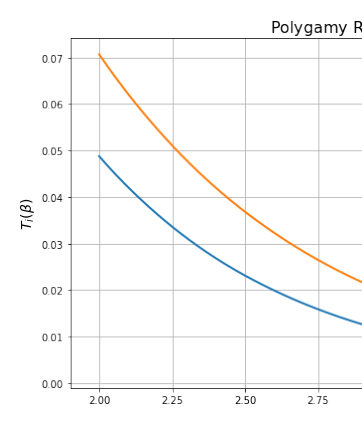 
Figure 2. Comparisons between two upper bounds T1 and T2 associated with the β-th power polygamy relation of the concurrence of assistance, under the specific three-qubit quantum state |ψ⟩constructed in Example 4.6. The bound T1 corresponds to the newly proposed inequality in Corollary 4.5, which incor- porates the state-dependent refinement via the parameter ν = 10

**Summary.** This paper introduces a unified, tunable framework to significantly strengthen existing monogamy and polygamy inequalities for multipartite entanglement. By introducing a hierarchy parameter $m$, the authors derive progressively tighter bounds on how entanglement is distributed among multiple subsystems. This offers enhanced mathematical tools for applications in quantum communication and information processing.

**Why it may be interesting.** This work provides advanced mathematical tools that refine fundamental constraints on entanglement, which are crucial for designing robust quantum communication protocols and understanding multi-partite correlations in quantum computing architectures.

Detailed structure

**Main problem.** The research aims to develop a unified, tunable framework to refine and strengthen existing monogamy and polygamy relations governing entanglement distribution in multipartite quantum systems.

**Main result.** They derive hierarchical families of tightened $\alpha$-power monogamy and $eta$-power polygamy inequalities, which become progressively tighter as the tuning parameter $m$ increases.

**Method.** The approach introduces a parameterized framework indexed by $m \ge 1$, utilizing mathematical tools like analyzing binomial functions to establish generalized lower (monogamy) and upper (polygamy) bounds on entanglement measures.

**Model / system.** The study focuses on multipartite quantum states, particularly involving bipartite entanglement measures ($E$) and their assisted counterparts ($E_a$), applicable to general quantum information theory contexts like quantum networks.

**Key observables.** Entanglement measures such as Concurrence ($C$) and Assisted Concurrence ($C_a$); the degree of entanglement distribution across multiple subsystems.

**Important parameters / regimes.** The hierarchy parameter $m \ge 1$, and exponents $\alpha$ (for monogamy) and $eta$ (for polygamy), which define the validity regimes for the derived inequalities.

**Assumptions / limitations.** The framework assumes that existing entanglement measures satisfy initial power-law monogamy ($\gamma$-power) and polygamy ($\delta$-power) inequalities, and it incorporates state-dependent asymmetry parameters ($\mu, 
u$) to capture physical imbalances.

**Figures summary.** Figure 1 compares multiple lower bounds for the $\alpha$-th power monogamy relation of concurrence, showing that one bound incorporating state-dependent asymmetry is the tightest. Figure 2 compares two upper bounds for the $eta$-th power polygamy relation, demonstrating the new derived bound is strictly tighter.

**Paper structure.** The paper builds from establishing a unified parameterized framework ($m$) to derive specific theorems (e.g., Theorem 3.1 for monogamy and Theorem 4.1 for polygamy). It then strengthens these results by applying them to concrete measures like Concurrence, showing how the bounds tighten as $m$ increases.

Abstract

For a bipartite entanglement measure $\mathcal{E}$ that satisfies the $γ$th-power monogamy inequality (Eq.~\eqref{e:chap1-ineq1}), and for its assisted counterpart $\mathcal{E}_a$ that obeys the $δ$th-power polygamy inequality (Eq.~\eqref{e:chap1-ineq2}), we introduce a unified, tunable framework indexed by a parameter $m\geq1$. Within this framework, we derive two hierarchical families of refined inequalities:    a tightened $α$-power monogamy relation for $\mathcal{E}$, valid for all $α\geq mγ$;    a tightened $β$-power polygamy relation for $\mathcal{E}_a$, applicable for $(m-1)δ< β\leq mδ$.    As $m$ increases, the bounds become progressively tighter, recovering known results at $m=1$. Notably, the optimal monogamy bound emerges as a piecewise function of $α$, with additional correction terms activated as $α$ crosses successive integer thresholds, thereby offering a sharper characterization of entanglement distribution.   We demonstrate that our results generalize and strengthen existing monogamy and polygamy relations through analytical comparisons and numerical evaluations using concurrence and concurrence of assistance. This hierarchical, parameterized approach offers enhanced and flexible tools for applications in quantum communication, quantum networks, and multipartite quantum information processing.

[↑ back to top](#top)

### [Counterexamples to additivity of minimum output $p$-Rényi entropy of quantum channels for $p>3/4$ and $0\leq p<1/4$](http://arxiv.org/abs/2607.15210v1)

**Authors:** Debbie Leung, Benjamin Lovitz, Peixue Wu  
**Type:** theory · **Category:** quantum information and computing · **PDF:** <https://arxiv.org/pdf/2607.15210v1>  
**Analysis basis:** full PDF text, analyzed in chunks
**Topic relevance:** 🔥 `entanglement & information structure` **4/5**

📷 Fig 1

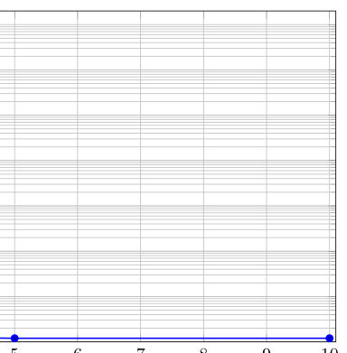 
Fig. 1: Numerical values of khigh(p) with khigh(1) = 182.

📷 Fig 2

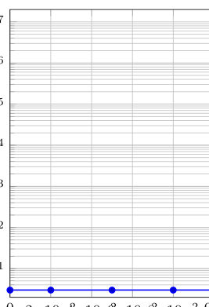 
Fig. 2: Numerical values of klow(p). The growth near p = 1/4 is klow(p) ∼1/[12( 1

**Summary.** This paper tackles the long-standing problem of additivity for minimum output $p$-Rényi entropy of quantum channels. By constructing explicit counterexamples using random projections, the authors prove nonadditivity holds for large ranges of the Rényi order parameter $p$, thereby significantly constraining the remaining unknown regime to $[1/4, 3/4]$. This advances the theoretical understanding of entanglement measures in quantum information theory.

**Why it may be interesting.** This work provides deep theoretical insights into fundamental properties of quantum information measures, which are crucial for understanding channel capacity and entanglement quantification in open quantum systems.

Detailed structure

**Main problem.** The central problem is determining the additivity of the minimum output $p$-Rényi entropy ($	ext{S}_{\min}^p(\Phi)$) for quantum channels, which asks if $	ext{S}_{\min}^p(\Phi \otimes\Psi) = 	ext{S}_{\min}^p(\Phi) + 	ext{S}_{\min}^p(\Psi)$.

**Main result.** The authors prove that additivity fails for all Rényi orders $p$ in the ranges $[0, 1/4) \cup (3/4, \infty)$, significantly narrowing the unresolved interval to $[1/4, 3/4]$.

**Method.** The proof employs sophisticated random-projection constructions and asymptotic analysis, utilizing specific witnesses (product–conjugate Bell-state witness for $p>3/4$ and transpose-complement rank-defect witness for $p<1/4$).

**Model / system.** The study focuses on quantum channels ($\Phi$) acting on finite-dimensional systems, specifically those induced by Haar-distributed projections ($P_{AB,n}$) on a bipartite system.

**Key observables.** Minimum output $p$-Rényi entropy ($	ext{S}_{\min}^p(\Phi)$), and the limiting one-channel output body $K_{k,t}$.

**Important parameters / regimes.** The Rényi order parameter $p$, and the asymptotic rank ratio parameter $t \in (0, 1)$.

**Assumptions / limitations.** The analysis relies on establishing the almost sure convergence of the actual output set $	ext{C}_n$ to a theoretical limit $K_{k,t}$ as system size $n 	o \infty$.

**Paper structure.** The paper systematically analyzes the additivity failure by constructing explicit counterexamples for specific ranges of $p$, combining random-projection techniques with asymptotic entropy calculations.

Abstract

Additivity of minimum output entropies is a central problem in quantum information theory. Nonadditivity is known for every Rényi order $p>1$, at the von Neumann point $p=1$, and near $p=0$, while most of the interval $0<p<1$ has remained open. We prove that for every Rényi order $p$ satisfying either $p>3/4$ or $0\leq p<1/4$, there exist finite-dimensional projection-induced quantum channels such that additivity of the minimum output $p$-Rényi entropy fails. The proof combines two correlated random-projection constructions: a product-conjugate Bell-state witness for $p>3/4$, and a transpose-complement rank-defect witness for $p<1/4$. Thus the unresolved part of $0<p<1$ is reduced to $[1/4,3/4]$. Our estimates also improve the output dimension threshold for additivity violation of minimum output von Neumann entropy, first established in Belinschi, Collins and Nechida.

[↑ back to top](#top)

### [Exploring the shell structure of trapped superfluid gases](http://arxiv.org/abs/2607.14214v1)

**Authors:** G. Palkanoglou, R. Curry, S. Gandolfi  
**Type:** theory · **Category:** quantum gases · **PDF:** <https://arxiv.org/pdf/2607.14214v1>  
**Analysis basis:** full PDF text, analyzed in chunks
**Topic relevance:** 🔥 `analog quantum simulation` **4/5**

📷 Fig 1

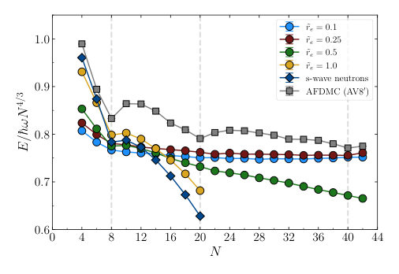 
FIG. 2. The ground state energy (in units of ℏωN 4/3) approaching unitarity in a range of effective ranges ˜re = 0.1, 0.25, 0.5, 1 plotted with blue, red, green, and yellow cir- cles, respectively. We plot in dark blue diamonds the ground state energy of N atoms in a harmonic trap of ℏω = 10 MeV and a two-particle interaction tuned to reproduce the known neutron-neutron scattering length and effective range (re = 2.7 fm and a = −18.5 fm). We also include the AFDMC re- sults of Ref. [61] for neutron matter

📷 Fig 2

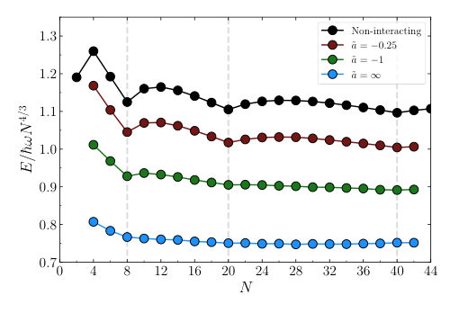 
FIG. 1. The energy as a function of the number of particles for different scattering length and fixed effective range.

📷 Fig 3

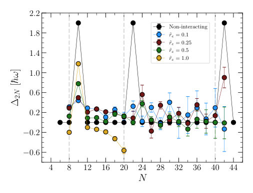 
FIG. 4. The two particle shell gap (in units of ℏω) approach- ing unitarity in a range of effective ranges ˜re = 0.1, 0.25, 0.5, 1 plotted with blue, red, green, and yellow circles, respectively. Shell closure can be identified from pronounced peaks along the curve of fixed ˜re.

📷 Fig 4

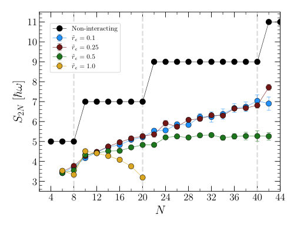 
FIG. 3. Two particle separation energies (in units of ℏω) approaching unitarity in a range of effective ranges ˜re = 0.1, 0.25, 0.5, 1.0 plotted with blue, red, green, and yellow cir- cles, respectively. To compare, we also show the two-particle separation energies in the absence of two-particle interactions where shell-effects are most pronounced.

📷 Fig 5

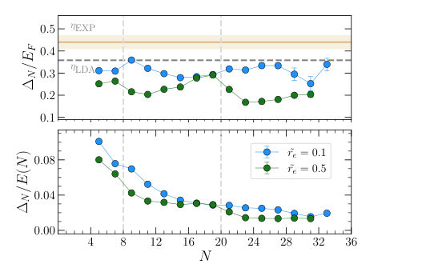 
FIG. 6. The OES approaching unitarity, for ˜re = 0.1, 0.5 plotted in blue and green circles, scaled by the Fermi energy (top panel) and the ground state energy (bottom panel). The shell-closures are displayed with dashed vertical lines. The solid lines correspond to Bertsch’s parameter for the pairing gap as was measured in Ref. [64] and calculated for unitary Fermi gases in harmonic traps in Ref. [65] within LDA; see text for details.

**Summary.** The paper uses Quantum Monte Carlo simulations to study trapped superfluid Fermi gases, examining how their shell structure changes as the interaction strength approaches unitarity. The key finding is that strong pairing correlations effectively wash out the characteristic shell gaps observed at weaker interactions. This provides a theoretical model relevant for understanding nuclear physics phenomena in exotic neutron-rich isotopes.

**Why it may be interesting.** This work directly bridges cold atomic physics (ultracold Fermi gases) with fundamental nuclear structure questions (shell evolution in neutron-rich nuclei), providing a clean quantum simulation platform for understanding complex many-body phenomena like pairing and correlation effects.

Detailed structure

**Main problem.** The study investigates how shell structure, a characteristic feature of quantum systems, evolves when superfluid Fermi gases are tuned towards the unitary limit.

**Main result.** Shell effects are observed at finite interaction strengths but demonstrably vanish as the system approaches unitarity, suggesting strong pairing correlations suppress single-particle behavior.

**Method.** The research employs Quantum Monte Carlo (QMC) methods, specifically Diffusion Monte Carlo (DMC), alongside Variational Monte Carlo (VMC) calculations to determine ground state energies and gaps.

**Model / system.** The system modeled is a two-component Fermi gas confined in a harmonic trap. The interactions are characterized by tunable scattering length ($a$) and effective range ($r_e$), allowing exploration across different interaction regimes, including the unitary limit.

**Key observables.** Two-particle separation energies ($S_{2N}$), two-particle shell gaps ($\Delta_{2N}$), and Odd-Even Staggering (OES) quantifying pairing correlations.

**Important parameters / regimes.** Scattering length ($a$), effective range ($r_e$), particle number ($N$), and the unitary limit ($a 	o \infty$).

**Assumptions / limitations.** The analysis uses a harmonic trap potential, which differs from the finite-depth potentials found in real nuclei; furthermore, discrepancies exist between calculated pairing gap scaling parameters ($\eta$) and experimental values.

**Figures summary.** Figures illustrate how energy gaps and separation energies diminish towards unitarity as interaction parameters are varied, confirming the suppression of shell structure by strong correlations.

**Paper structure.** The paper progresses by first establishing the theoretical framework using QMC for trapped Fermi gases. It then systematically analyzes observables like $S_{2N}$ and $\Delta_{2N}$ across varying interaction strengths to demonstrate the vanishing of shell effects at unitarity, linking this mechanism to pairing correlations.

Abstract

We provide quantum Monte Carlo calculations of a two-component Fermi system interacting with an attractive interaction confined in harmonic traps. We investigate the role of the interaction's scattering length and effective range and show its important role in modifying shell effects in the structure of these systems. We show that in the strongly interacting regime, where the scattering length is large, the dominant role to shell effects is due to the effective range. These conclusions are very relevant for nuclear physics, in particular for neutron-rich systems, and open the way to perform new atomic experiments that can help to explain the disappearance of shell-effects in nuclei.

[↑ back to top](#top)

### [Phase coherence control of a programmable high-Tc superconductor created by light](http://arxiv.org/abs/2607.14567v1)

**Authors:** Viktoria Yursa, Igor Vaskivskyi, Anze Mraz, Damjan Svetin, Sergej Raznjevic, Vinko Srsan, Saso Sturm, Tomaz Mertelj, Mikhail Feigelman, Dragan Mihailovic  
**Type:** both · **Category:** strongly correlated electrons · **PDF:** <https://arxiv.org/pdf/2607.14567v1>  
**Analysis basis:** full PDF text, analyzed in chunks
**Topic relevance:** `analog quantum simulation` **3/5** · `driven-dissipative phase transition` **3/5** · `non-equilibrium dynamics` **3/5** · `interference shaping light` **2/5** · `non-equilibrium universality` **2/5** · `quantum optics experiment` **2/5** · `Frenkel-Kontorova` **1/5** · `QC/QI experiment` **1/5** · `correlated / nonlocal dissipation` **1/5** · `correlated cavity matter` **1/5** · `exotic spin models in light-matter` **1/5** · `methods for driven-dissipative` **1/5** · `quantum measurements` **1/5**

📷 Fig 1

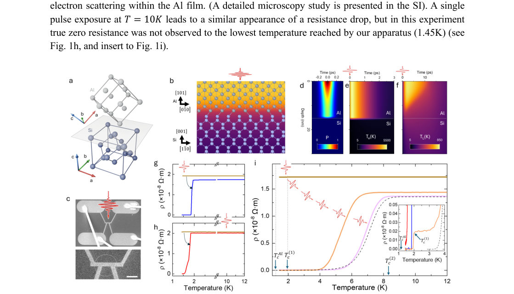 
Figure 1. Switching to a superconducting state by light pulses. a) A schematic diagram of the Al and Si unit cell orientations at the heterostructure interface. b) a cross-section of the interface showing the lattice mismatch. The colour indicates the temperature on the same scale as f). c) The SEM images show the 4-probe device geometry with Al-wire-bonded Al contacts. The length of the bar is 20 𝜇m. d) The absorbed energy profile within the Al film on Si vs. time. e) and f) The calculated electron and lattice temperature profiles 𝑇!(𝑥, 𝑡) and 𝑇"(𝑥, 𝑡) respectively as a function of time for maximum fluence. g) 𝜌(𝑇) measured before (brown line) and after (blue line) a single 200 fs light...

📷 Fig 2

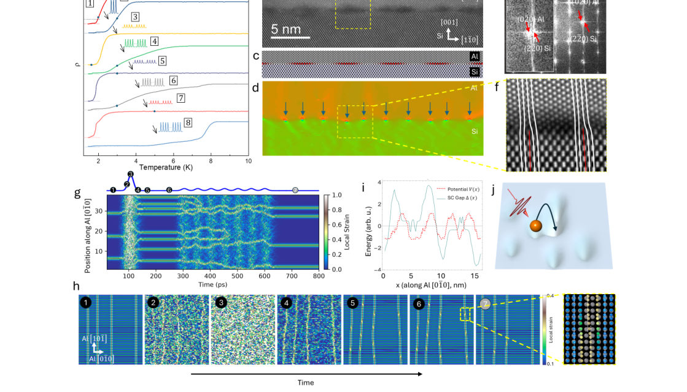 
Figure 2. Manipulating superconductivity with light pulses. a) A progression of 𝜌(𝑇) curves measured after a series of light pulse sequences sequentially raise and lower 𝑇#. The dot indicates the temperature at which the light is applied and the pulse sequences are as indicated. The incident fluences are (in mJ/cm2): 1 : 50 (1 pulse), 2 : 50 (3 pulses), 3 : 10 (1000 pulses), 4 : 25 (1000 pulses), 5 : 10 (1000 pulses), 6 : 25 (1000 pulses), 7 : 10 (1000 pulses) and 8 : 30 (1000 pulses) respectively. Note than only ~3% of the incident light is absorbed. b) A cross-section of the Al-Si interface imaged by HAADF STEM shows a periodic structural modulation due to MDs along the Al [11011]...

📷 Fig 3

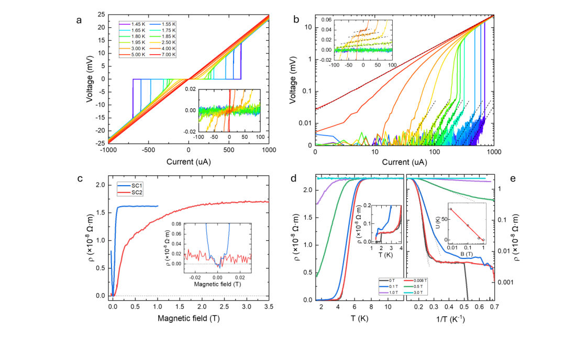 
Figure 3. Properties of the light-induced superconducting state. a) V-I characteristics of the SC2 state at different temperatures. The insert shows the linear V-I behaviour at the origin. b) V-I curves of the SC2 state on a log-log plot show

**Summary.** The research demonstrates the creation and precise control of a Light-Induced Superconducting (LiPS) state in an Al-Si heterojunction using femtosecond laser pulses. By manipulating the underlying structural superlattice formed by misfit dislocations, the authors can tune the superconducting critical temperature between $1.8 	ext{ K}$ and $8.5 	ext{ K}$. This work opens a pathway for engineering metastable, long-range phase coherent quantum states for future quantum devices.

**Why it may be interesting.** This work bridges quantum optics (femtosecond pulsing) with condensed matter superconductivity in a highly tunable manner. The concept of using light to engineer metastable, phase-coherent superconducting states is directly relevant to designing novel quantum circuits and local gap tuning mechanisms.

Detailed structure

**Main problem.** The central goal is to achieve direct, controllable evidence of a true zero-resistance superconducting state whose macroscopic quantum phase coherence can be created and controlled using light.

**Main result.** The authors report creating and fully controlling a Light-Induced Superconducting (LiPS) state in an Al-Si heterojunction, demonstrating tunable critical temperatures ($1.8-8.5 	ext{ K}$) via tailored laser pulse sequences.

**Method.** The study combines ultrafast optical excitation using femtosecond lasers with electrical transport measurements ($
ho(T)$, $V$-$I$, $
ho(B)$) and structural characterization using HRTEM.

**Model / system.** The physical system is an aluminum-silicon heterojunction, where the superconductivity arises from light pulse control over a Moiré-like superlattice formed by misfit dislocations (MDs). The state exhibits features of Berezinski-Kosterlitz-Thouless transitions and 2D vortex dynamics.

**Key observables.** Superconducting critical temperature ($T_c$), resistivity ($
ho(T)$), upper critical fields ($H_{c}$), superfluid stiffness ($\Theta$), and the structural periodicity of MDs.

**Important parameters / regimes.** Femtosecond laser pulse duration (e.g., $220 	ext{ fs}$), superconducting temperatures ($1.8-8.5 	ext{ K}$), and applied magnetic fields up to $\sim 3 	ext{ T}$.

**Assumptions / limitations.** The LiPS effect is attributed to light pulse control of the structural modulation (MD superlattice) at the interface, which imparts metastability.

**Figures summary.** Figures illustrate the switching mechanism using pulses, show temperature profiles calculated from optical excitation, and detail superconducting properties like $V$-$I$ curves and magnetic field dependence for two distinct states ($	ext{SC}1$ and $	ext{SC}2$).

**Paper structure.** The paper progresses by establishing the difficulty of observing light-controlled superconductivity, presenting the LiPS effect in Al-Si heterojunctions via laser pulses, characterizing two distinct superconducting states ($	ext{SC}1$ and $	ext{SC}2$) through transport measurements, and finally attributing the mechanism to structural control over misfit dislocations.

Abstract

The quest for superconductivity created by light extends for more than half a century, yet direct evidence of a true zero-resistance state -whose macroscopic quantum phase coherence is both created and controlled by light -- has remained elusive. Here we report for the first time on a complex but robust light-programmable superconducting (LiPS) state at an aluminium-silicon heterojunction that is created and fully controlled with femtosecond laser pulses. The superconducting critical temperatures -- ranging from 1.8-8.5 K, can be increased or erased at will by the application of tailored pulse sequences. At low temperatures the LiPS state shows features characteristic of a Berezinski-Kosterlitz-Thouless topological transition, but another distinct state appears at temperatures above 2 K, which shows clear signatures of quantum phase disorder. In the presence of a magnetic field we observe behaviour characteristic of vortex pinning and creep consistent with the 2-dimensional (2D) nature of the phase coherent system. The origin of the LiPS effect is attributed to light pulse control of the Moire-like superlattice of misfit dislocations (MDs) that naturally occur as a result of discommensurations between Al and Si lattices at the interface, and is clearly observable by high-resolution electron microscopy. We show how light pulses can be used to control the superlattice periodicity and highlight the appearance of topologically protected soliton-like kinks along the dislocation lines, important for imparting metastability to the system. The demonstration of LiPS opens a route to the design of metastable long-range phase coherent superconducting states, leading to light-engineering of quantum circuits, local gap tuning in quantum processors and novel devices utilizing switchable superconductivity.

[↑ back to top](#top)

### [Tomographic flow regime vs even-odd effect for the magnetotransport in the Corbino geometry](http://arxiv.org/abs/2607.14929v1)

**Authors:** Grigory A. Starkov  
**Type:** theory · **Category:** statistical mechanics · **PDF:** <https://arxiv.org/pdf/2607.14929v1>  
**Analysis basis:** full PDF text, analyzed in chunks
**Topic relevance:** `methods for driven-dissipative` **3/5** · `non-equilibrium dynamics` **3/5** · `driven-dissipative phase transition` **2/5** · `non-equilibrium universality` **2/5** · `Keldysh / 2PI / non-Gaussian methods` **1/5** · `Kondo & dissipative impurity` **1/5** · `analog quantum simulation` **1/5** · `correlated / nonlocal dissipation` **1/5** · `spintronics-quantum-optics interface` **1/5**

📷 Fig 1

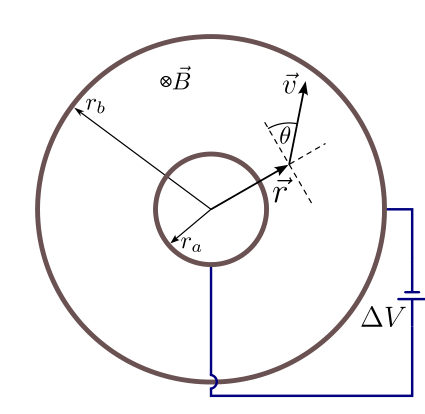 
FIG. 1: Schematic representation of a Corbino disk.

📷 Fig 2

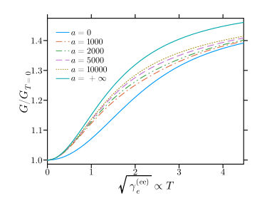 
FIG. 2: Normalized total conductance G/GT =0 of the

📷 Fig 3

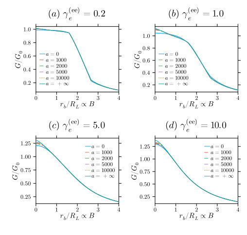 
FIG. 3: Normalized total conductance G/G0 of the Corbino disk as a function of the inverse Larmor radius rb/RL ∝B for different values of the phenomenological parameter a and the even electron-electron scattering rate γ(ee) e . The case a = 0 corresponds to the Callaway’s dual relaxation time approx- imation, while the case a = +∞describes the model with an infinite number of the long-lived harmonics. See the main text for the definition of G0.

📷 Fig 4

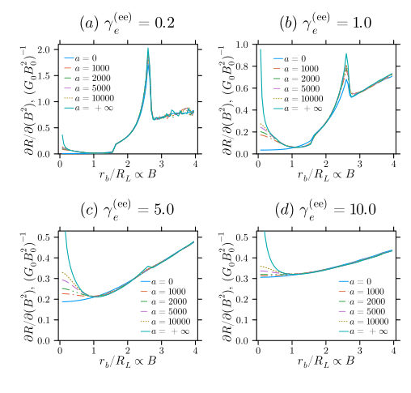 
FIG. 4: Sensitivity ∂R/∂(B2) of the resistance R = 1/G to the square of the magnetic field as a function of the in- verse Larmor radius rb/RL ∝B for different values of the phenomenological parameter a and the even electron-electron scattering rate γ(ee) e . The case a = 0 corresponds to the Call- away’s dual relaxation time approximation, while the case a = +∞describes the model with an infinite number of the long-lived harmonics. See the main text for the definition of G0 and B0.

📷 Fig 5

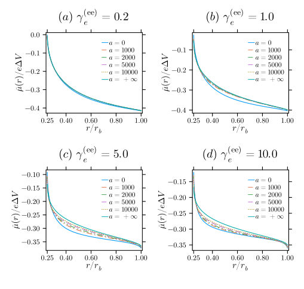 
FIG. 5: Normalized electrochemical potential ¯µ(r)/e∆V = (eΦ(r) + δµ(r))/e∆V inside the Corbino disk as a function of the distance r to the disk center for different values of the phenomenological parameter a and the even electron-electron scattering rate γ(ee) e . The case a = 0 corresponds to the Call- away’s dual relaxation time approximation, while the case a = +∞describes the model with an infinite number of the long-lived harmonics.

**Summary.** This theoretical work analyzes electron transport in a Corbino disk geometry by comparing two effects: the tomographic flow regime and the even-odd effect arising from electron-electron scattering. The authors predict that the even-odd effect should manifest as an enhancement in resistance sensitivity at low magnetic fields, providing a diagnostic tool for understanding quantum kinetic phenomena in 2D materials.

**Why it may be interesting.** While focused on condensed matter transport, the detailed analysis of non-equilibrium dynamics using the Boltzmann equation and harmonic decomposition touches upon advanced kinetic theory relevant to open quantum systems far from equilibrium.

Detailed structure

**Main problem.** The paper investigates magnetotransport in the Corbino geometry, comparing the influence of geometric constraints (tomographic flow regime) against intrinsic electron-electron scattering effects (even-odd effect).

**Main result.** The authors predict a distinct signature of the even-odd effect—an enhancement of $\partial R/\partial(B^2)$ at small magnetic fields ($B 	o 0$)—which is most visible near the crossover from ballistic to tomographic flow.

**Method.** Numerical analysis solving the linearized Boltzmann equation by expanding the distribution function in angular eigenmodes (Fourier series).

**Model / system.** The study models two-dimensional electron systems confined to a Corbino disk geometry under an applied magnetic field, using the linearized Boltzmann equation to describe non-equilibrium electron flows.

**Key observables.** Resistance sensitivity ($\partial R/\partial(B^2)$) at low fields, and dimensionless conductance ($G/G_0$).

**Important parameters / regimes.** Temperature ($T$), magnetic field strength ($B$), ratio of scattering rates for even vs. odd harmonics ($\gamma_{e}^{ee}/\gamma_{o}^{ee}$), and the crossover parameter $v_F 	au_{	ext{even}} / r_b$.

**Assumptions / limitations.** The analysis is performed in the linearized regime, assuming a degenerate electron gas ($T \ll E_F$), and relies on specific approximations for scattering interactions (e.g., $I_{	ext{ex}} \approx -I_{	ext{dir}}/2$).

**Figures summary.** Figures show normalized conductance and resistance sensitivity ($\partial R/\partial(B^2)$) as a function of the ratio of Larmor radius to disk size ($r_b/R_L$), demonstrating parameter dependence.

**Paper structure.** The paper develops theoretical frameworks by deriving scattering rates for odd and even harmonics, solving the linearized Boltzmann equation across different flow regimes (ballistic to tomographic), and finally predicting observable signatures in magnetotransport measurements.

Abstract

In two dimensions, the geometric constraints due to Pauli blocking and conservation laws lead to the even-odd effect exhibited by the electron-electron scattering lengths: electron-electron collisions are more efficient at relaxing the even angular harmonics of the distribution function than the odd ones. Inspired by a recent experiment on the magnetotransport in the Corbino disk geometry, we numerically analyze the electron flows in this geometry across all the regimes.   We predict a clear signature of the even-odd effect - enhancement of the resistance sensitivity $\partial R/\partial(B^2)$ at small magnetic fields $B\rightarrow 0$. This enhancement is most prominent at the crossover from the ballistic to the tomographic regime, and gradually disappears when the temperature is further increased. Our estimates suggest that in the temperature range of the experiment, the effect should be small. This implies that the attribution of the anomalous scaling of the kinematic viscosity, that was observed in the experiment, to the even-odd effect might need more careful consideration.   As a side note, we show how the method of characteristics can be extended to treat the long-lived odd harmonics, which allows one to recast the linearized Boltzmann equation as a system of integral ones.

[↑ back to top](#top)

### [Local Variance-Based Calibration of Programmable Photonic Interferometer Meshes](http://arxiv.org/abs/2607.14759v1)

**Authors:** Gökhan Elmas, Igor A. Litvin, Janis Nötzel  
**Type:** experiment · **Category:** other · **PDF:** <https://arxiv.org/pdf/2607.14759v1>  
**Analysis basis:** full PDF text, analyzed in chunks
**Topic relevance:** `interference shaping light` **3/5** · `quantum optics experiment` **3/5** · `analog quantum simulation` **2/5** · `quantum measurements` **2/5** · `QC/QI experiment` **1/5** · `correlated cavity matter` **1/5** · `driven-dissipative phase transition` **1/5** · `methods for driven-dissipative` **1/5**

📷 Fig 1

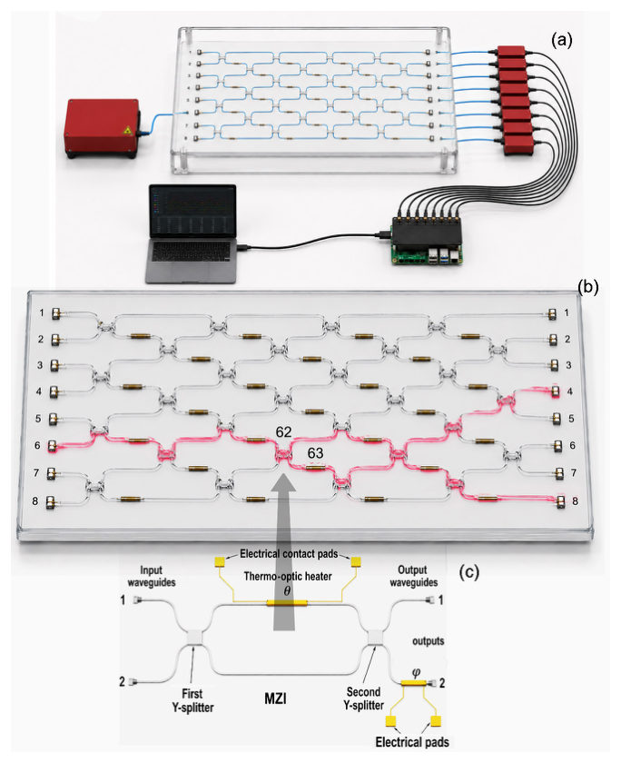 
Figure 1: Experimental platform and programmable photonic processor. (a) Experimental arrangement used for intensity-based characterization of the eight-mode programmable photonic processor. Light from a continuous-wave laser is coupled into a selected input port through a polarization-maintaining fiber. The eight output ports are connected to individual photodetectors, whose electrical signals are digitized by an eight-channel analog-to-digital conversion stage and recorded on a computer. Blue lines denote optical fiber connections, whereas black lines denote electrical connections. (b) Rendered layout of the 8×8 interferometric mesh, showing the arrangement of tunable Mach–Zehnder...

📷 Fig 2

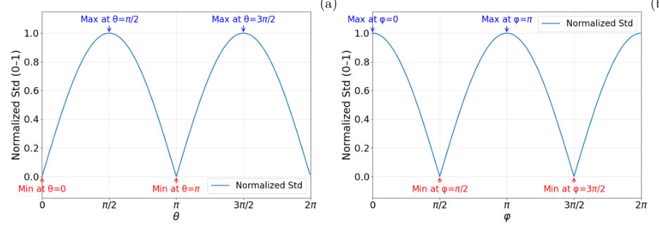 
Figure 2: Theoretical variance-based calibration signatures. (a) Normalized standard deviation of the monitored MZI output intensity as a function of the internal phase θ, showing the characteristic | sin θ| dependence. The minima at θ = 0 and θ = π identify the bar and cross operating points, respectively. (b) Normalized standard deviation of the phase-shifter calibration signal as a function of the phase-shifter phase ϕ under balanced-interference conditions, showing the characteristic | cos ϕ| dependence. The minima at ϕ = π/2 and ϕ = 3π/2 identify the quadrature operating points.

📷 Fig 3

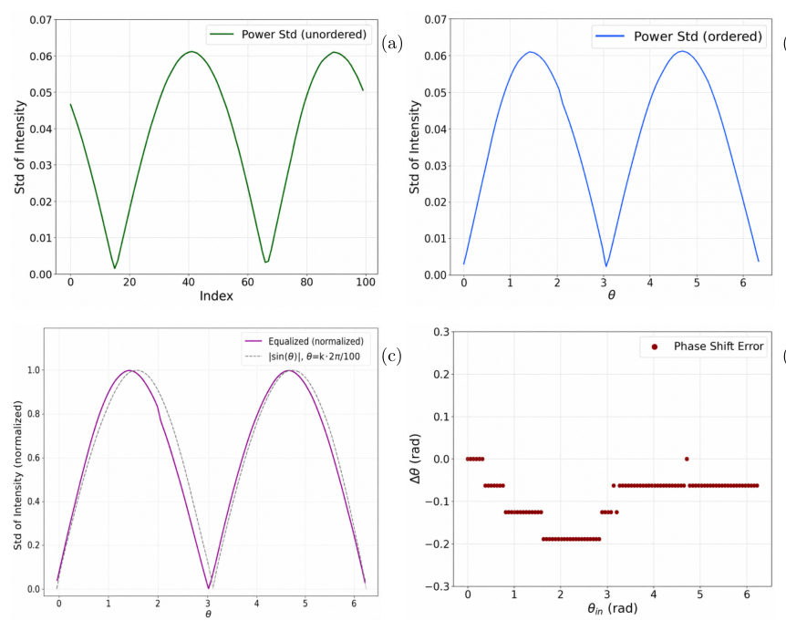 
Figure 3: Experimental variance-based MZI calibration for MZI62. (a) Raw unnormalized output variance as a function of heater phase θ (unordered). (b) Same data after ordering. (c) Ordered and normalized variance following the theoretical | sin θ| dependence. (d) Extracted residual phase error ∆θ after calibration.

📷 Fig 4

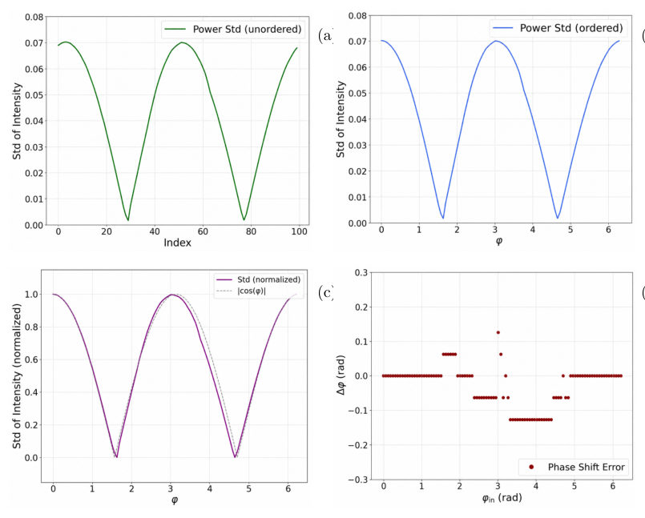 
Figure 4: Experimental variance-based PS calibration for PS63. (a) Raw unnormalized output variance as a function of input phase ϕ (unordered). (b) Same data after ordering. (c) Ordered and normalized variance exhibiting the expected | cos ϕ| dependence with minima at quadrature. (d) Extracted residual phase error ∆θ after calibration.

📷 Fig 5

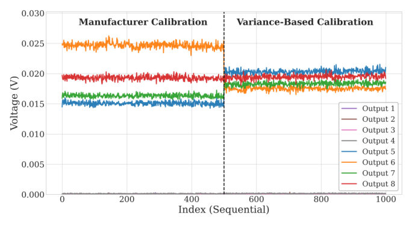 
Figure 5: System-level comparison between the manufacturer-provided factory calibration and the proposed variance-based calibration for an implemented 4×4 Hadamard transformation. The variance-based calibration yields more uniform output levels and reduced temporal fluctuations across the measured output channels.

**Summary.** The paper presents a novel local variance-based method to self-calibrate programmable photonic interferometer meshes. By measuring the statistical variance of output intensity under controlled phase perturbations, the authors can accurately determine operating points for MZIs and phase shifters without needing complex node isolation or global training fields. This makes the technique highly practical for building scalable, self-stabilizing photonic processors.

**Why it may be interesting.** This work provides a highly practical, low-overhead calibration primitive for scalable integrated photonics, which is crucial for realizing complex quantum optical circuits and photonic quantum computing architectures.

Detailed structure

**Main problem.** Accurately calibrating programmable photonic interferometer meshes is difficult using conventional methods due to requirements like node isolation or complex characterization procedures, especially in large, thermally tuned systems.

**Main result.** The authors introduce and validate a local variance-based self-calibration method that uses only intensity measurements to determine operating points for MZIs and phase shifters without requiring dedicated routing paths or orthogonal training states.

**Method.** Calibration is achieved by applying controlled phase perturbations and identifying the calibration point from the minima of the measured output-power variance, which follows characteristic $|\sin 	heta|$ (for MZIs) or $|\cos \phi|$ (for PSs) dependencies.

**Model / system.** The work focuses on programmable photonic interferometer meshes implemented on silicon nitride platforms, featuring Mach-Zehnder Interferometers (MZIs) and phase shifters arranged in large arrays (e.g., $8 	imes 8$ processors).

**Key observables.** Output-intensity variance ($	ext{Var}(P_{out})$), which exhibits characteristic $|\sin	heta|$ or $|\cos\phi|$ minima at operating points.

**Important parameters / regimes.** The method is robust to random phase settings and requires only a small, finite ensemble of measurements per calibration step.

**Assumptions / limitations.** It assumes that local input fields are non-zero and that the variance observable can be used locally without needing global knowledge or perfect isolation between elements.

**Figures summary.** Figures illustrate the experimental setup on an $8 	imes 8$ processor, showing theoretical signatures of the variance dependence for both MZIs ($|\sin	heta|$) and PSs ($|\cos\phi|$).

**Paper structure.** The paper first establishes the limitations of existing calibration techniques. It then derives the statistical relationship between output power variance and operating parameters ($\sigma(	heta) \propto |\sin 	heta|$, $\sigma(\phi) \propto |\cos \phi|$). Finally, it validates this method experimentally on a large processor using an automated two-stage procedure.

Abstract

Programmable photonic interferometer meshes enable reconfigurable linear optical transformations, but their performance depends critically on accurate calibration of Mach-Zehnder interferometers and phase shifters. Conventional methods often require node isolation, dedicated routing paths, orthogonal training states, reference channels, or prior phase-voltage characterization, which become increasingly difficult in large thermally tuned meshes.   We introduce a local variance-based self-calibration method using intensity-only measurements. Controlled phase perturbations are applied, and calibration points are identified from minima of the measured output-power variance. For Mach-Zehnder interferometers, the variance follows a characteristic |sin(theta)| dependence, allowing bar and cross operating points to be found without conventional node isolation. For phase shifters, balanced interference produces a complementary |cos(phi)| variance signature, enabling quadrature calibration through the same statistical principle.   We validate the method experimentally on an 8 x 8 silicon nitride programmable photonic processor using a fully automated two-stage procedure. Starting from random phase settings, all Mach-Zehnder interferometers are calibrated first, followed by phase-shifter calibration under balanced-interference conditions. As a system-level test, we implement an embedded 4 x 4 Hadamard transformation on the 8 x 8 processor using a Clements decomposition.   These results establish local output variance as a simple calibration observable for programmable photonic meshes. The method is compatible with discrete random phase ensembles and requires neither conventional node isolation nor orthogonal training fields, making it a practical calibration primitive for scalable self-stabilizing photonic processors.

[↑ back to top](#top)

### [Parameter-Shift Rules for Gradients in Boson Sampling Experiments](http://arxiv.org/abs/2607.15160v1)

**Authors:** Marius Trudeau, Pierre-Emmanuel Emeriau, Nicolás Quesada  
**Type:** theory · **Category:** quantum information and computing · **PDF:** <https://arxiv.org/pdf/2607.15160v1>  
**Analysis basis:** full PDF text, analyzed in chunks
**Topic relevance:** `methods for driven-dissipative` **3/5** · `quantum optics experiment` **3/5** · `QC/QI experiment` **2/5** · `quantum measurements` **2/5** · `Keldysh / 2PI / non-Gaussian methods` **1/5** · `analog quantum simulation` **1/5** · `correlated / nonlocal dissipation` **1/5** · `driven-dissipative phase transition` **1/5**

📷 Fig 1

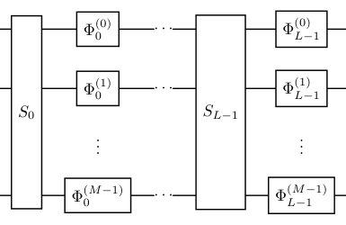 
FIG. 1. A lossy interferometer decomposed as a sequence of L unparameterized sub-unitary blocks and parametrized diagonal phase-shift matrices.

📷 Fig 2

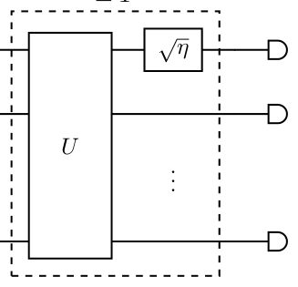 
FIG. 2. Example of a sub-unitary matrix with diagonalizable loss after the unitary.

📷 Fig 3

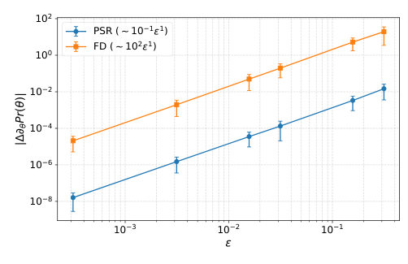 
FIG. 3. Absolute derivative error as a function of the phase error amplitude ε for FD with δ = 10−4 (orange) and the PSR (blue). Results are shown for a four-mode random optical component with input state ⃗i = (1, 1, 1, 1) and output state ⃗j = (2, 0, 2, 0) using the SLOS model [57]. Each data point represents the mean over 100 independent trials, with error bars indicating one standard deviation.

📷 Fig 4

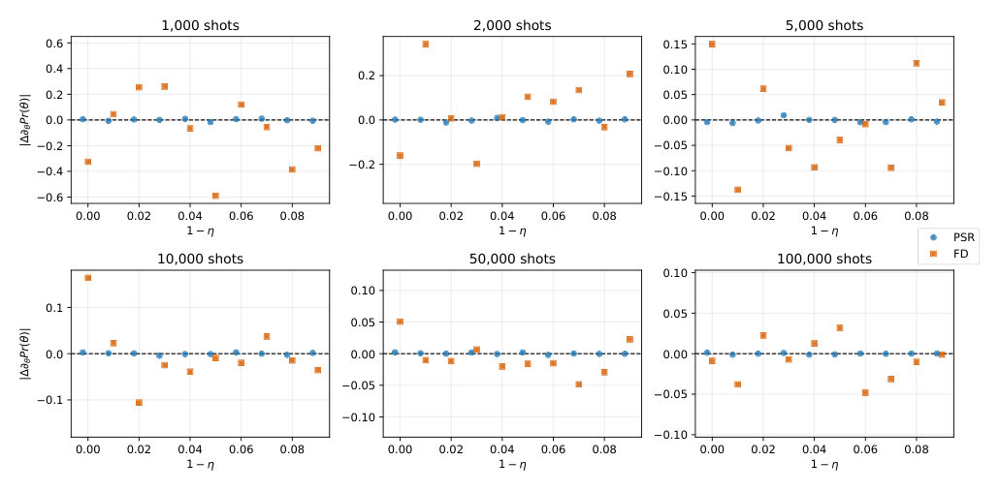 
FIG. 4. Derivative estimation error as a function of loss for FD with δ = 10−4 (orange) and the PSR (blue). Results are shown for a four-mode random optical component with input state ⃗i = (1, 1, 1, 1) and output state ⃗j = (2, 0, 2, 0), using Perceval’s uniform noise model. Each data point corresponds to the mean derivative error over 10 independent trials.

📷 Fig 5

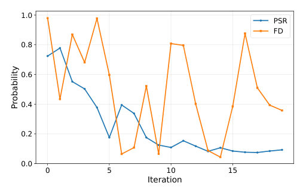 
FIG. 5. Cost function, corresponding to the coincidence prob- ability Pr(⃗j = (1, 1)), as a function of gradient descent it- erations on Quandela’s Belenos QPU. The experiment was performed for two modes with initial state ⃗i = (1, 1) and a uniformly chosen initial parameter angle and a specified shot count of 1000. The optimization was performed using a fixed step size of 0.1 for 25 iterations for FD with δ = 10−4 (or- ange) and the PSR (blue).

**Summary.** This paper develops advanced Parameter-Shift Rules (PSRs) to accurately calculate gradients for boson sampling experiments operating with photon loss in integrated photonics. It provides a robust mathematical framework, showing when and how these rules can be applied to both Fock and Gaussian boson sampling regimes. The results are validated by comparing the method's performance against finite difference techniques on real hardware.

**Why it may be interesting.** This work directly addresses the practical challenges of implementing quantum algorithms on noisy photonic hardware by providing mathematically rigorous gradient estimation techniques that outperform simple finite differencing.

Detailed structure

**Main problem.** The primary goal is deriving robust parameter-shift rules (PSRs) to compute gradients of transition probabilities in photonic boson sampling experiments that incorporate photon loss.

**Main result.** PSRs are derived for Fock boson sampling with a lossy model, showing limitations when generalizing to Gaussian boson sampling unless specific factorization conditions on the transmission matrix are met.

**Method.** The authors derive PSRs by relating derivatives of observables to linear combinations of shifted function evaluations, comparing this method's performance against standard finite difference techniques.

**Model / system.** The system involves bosonic modes in photonic quantum experiments, where lossy evolution is modeled by embedding the process into a larger unitary transformation acting on system and environment modes. The core mathematical tools are ladder operators and Fock/coherent states.

**Key observables.** Fock boson sampling transition probabilities, measurement outcome probabilities, average photon number, and photon-number correlators.

**Important parameters / regimes.** The order of the parameter shift rule ($n$), the total number of photons detected, and the loss parameters embedded in the transmission matrix $T$.

**Assumptions / limitations.** The derivation assumes that cross-talk between modes is negligible, allowing phase-shift loss to commute with the phase shift. The method also relies on the observable being representable as a finite Fourier series.

**Figures summary.** Not specified in the notes; however, the text refers to figures illustrating the interferometer structure and potentially comparing PSR performance vs. FD.

**Paper structure.** The paper first establishes the physical model of lossy evolution using an enlarged unitary transformation $W$. It then develops the mathematical framework for Parameter-Shift Rules (PSRs) applicable to this lossy setting, deriving specific rules for Fock boson sampling and analyzing the conditions under which Gaussian boson sampling can also be addressed.

Abstract

Using a robust photon loss model for photonic quantum experiments, we derive $n-$th order parameter-shift rules for computing gradients of Fock boson sampling transition probabilities where $n$ photons are sent into a lossy interferometer. We also show that in general it is not possible to generalize this gradient recipe to the case of Gaussian boson sampling. Only in the specific case where the transmission matrix of the interferometer can be factorized as a diagonal loss matrix premultiplied by a pure unitary it is possible to obtain parameter-shift rules with a finite order given by twice the total number of photons detected. We demonstrate the efficacy of the proposed method by comparing its performance against finite differences on real hardware.

[↑ back to top](#top)

### [Derivation and application of a general scaling relation between the dc and asymptotic high-frequency optical Hall responses](http://arxiv.org/abs/2607.15043v1)

**Authors:** E. Abelev, R. Romero, N. P. Armitage  
**Type:** both · **Category:** strongly correlated electrons · **PDF:** <https://arxiv.org/pdf/2607.15043v1>  
**Analysis basis:** full PDF text, analyzed in chunks
**Topic relevance:** `exotic spin models in light-matter` **3/5** · `spintronics-quantum-optics interface` **3/5** · `non-equilibrium dynamics` **2/5** · `non-equilibrium universality` **2/5** · `Keldysh / 2PI / non-Gaussian methods` **1/5** · `driven-dissipative phase transition` **1/5** · `methods for driven-dissipative` **1/5**

📷 Fig 1

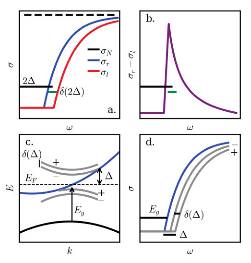 
FIG. 1. a) In the dirty limit TRSB superconductor case the real part of the conductivity may manifest a different super- conducting gap for the right and left absorptive channels. The energy scales, 2∆and δ(2∆) are denoted in black and green respectively. b) The difference of the conductivities shown in a). When this quantity is finite it is of order the normal state conductivity σN, but falls off quickly with increasing frequency. c) Schematic of the band structure for TRSB SC in a multiband system. The grey bands could be spin-split Bogoliubon branches which modify the optical conductivity as shown in. d) The optical conductivity for this case.

📷 Fig 2

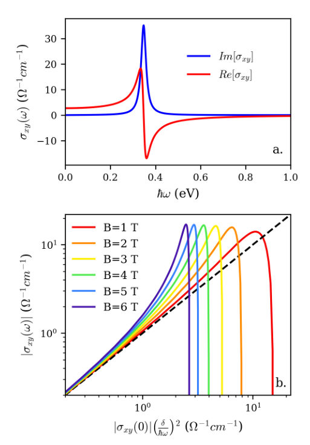 
FIG. 2. Hall conductivity of cyclotron resonance in Drude model. a) Real and imaginary parts of Hall conductivity spec- trum at 6 T. b) Convergence of real part of Hall conductivity from the Drude model with Eq. 11. γ = 2 × 1013 s−1, m = 2 × 10−3 me, n = 1020 electrons/cm3. The data approaches the unity line at large ω (left side of the plot) in accord with Eq. 11.

📷 Fig 3

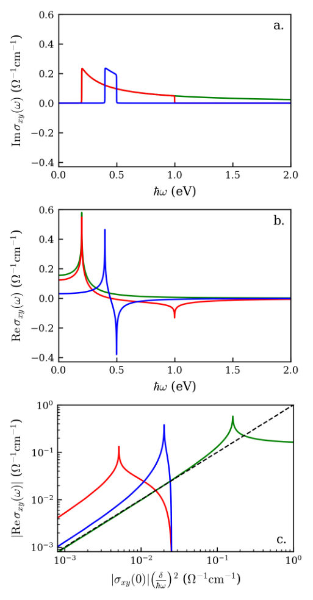 
FIG. 3. Hall conductivity of truncated and untruncated Dirac cone models. a) Real, b) imaginary parts of conductivity. c) Convergence of real part of Hall conductivity from the Dirac model and Eq. 8. Green: untruncated, m = 0.1 eV, µ = 0.1 eV . Red: truncated, m = 0.1 eV, µ1 = 0.1 eV, µ2 = 0.5 eV . Blue: truncated, m = 0.2 eV, µ1 = 0.2 eV, µ2 = 0.25 eV

📷 Fig 4

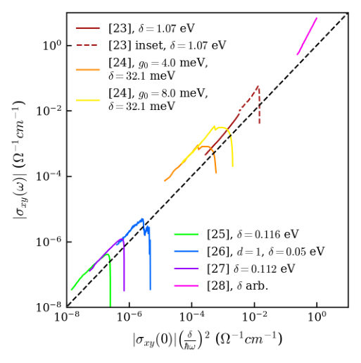 
FIG. 4. Real part of Hall conductivity predicted theoretically in various superconductors [23–28], plotted against Eq. 8.

📷 Fig 5

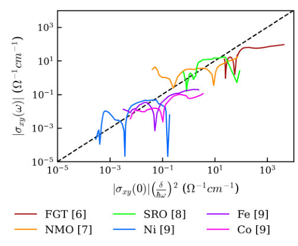 
FIG. 5. Real part of Hall conductivity experimentally mea- sured in various TRSB ferromagnets [6–9]. FGT: Fe3GeTe2, NMO: Nd2Mo2O7, SRO: SrRuO3.

**Summary.** This work establishes a general scaling relation linking the DC Hall conductivity to the high-frequency optical Hall response in time-reversal symmetry breaking systems. By applying this relationship, the authors make a quantitative prediction for the anomalous Hall effect in cuprate superconductors based on their measurable Kerr rotation signals.

**Why it may be interesting.** It provides a powerful, universal diagnostic tool—a scaling law—to connect disparate measurements (DC vs. optical) in complex quantum materials exhibiting broken symmetries, which is relevant for understanding exotic electronic states.

Detailed structure

**Main problem.** The paper derives a general scaling relation connecting the low-frequency (quasi-dc) Hall conductivity to the asymptotic high-frequency optical Hall response in Time-Reversal Symmetry Breaking (TRSB) materials.

**Main result.** A scaling relation, $	ext{Re}|\sigma_{xy}(\omega)| \propto |\sigma_{xy}(0)| (\delta/\omega)^2$, is derived and shown to hold for several models. This is used to predict a measurable anomalous Hall effect in cuprate superconductors based on their Kerr effect measurements.

**Method.** The derivation relies on the Kramers-Kronig relations, connecting $\sigma_{1,xy}(\omega 	o 0)$ to $\sigma_{1,xy}(\omega \gg 	ext{gap})$ by analyzing the frequency dependence of the optical conductivity in different limits.

**Model / system.** The study applies to TRSB states like ferromagnets and superconductors (e.g., cuprates), modeled using concepts from cyclotron resonance, Dirac continua, and superconducting gap structures.

**Key observables.** Hall conductivity ($\sigma_{xy}$), Kerr effect signal ($	heta_K$), quasi-dc Hall conductivity ($\sigma_{1,xy}(\omega 	o 0)$), and high-frequency optical response ($\sigma_{1,xy}(\omega \gg 	ext{gap})$).

**Important parameters / regimes.** Characteristic energy scales like the superconducting gap ($2\Delta$) or cyclotron frequency ($\omega_c$); the ratio $\delta/\omega$.

**Assumptions / limitations.** The derivation assumes specific functional forms for conductivity in high and low-frequency limits, and the application to cuprates relies on relating the Kerr effect magnitude to the DC Hall response.

**Figures summary.** Figures illustrate the derivation using dirty limit TRSB superconductors (Fig. 1) and compare $\sigma_{1,xy}$ and $\sigma_{2,xy}$ for cyclotron resonance in Drude/Dirac models (Figs. 2 & 3).

**Paper structure.** The paper proceeds by deriving the general scaling relation using KK relations, testing it against idealized models (cyclotron resonance), validating it with theoretical TRSB models, and finally applying the derived relationship to predict a specific measurable quantity in cuprate superconductors.

Abstract

Based on the Kramers-Krong relations, we derive and apply a quite general expression that that relates the low frequency quasi-dc Hall conductivity to the asymptotic high frequency optical Hall response (and its manifestations in Kerr and Faraday effects) for time-reversal symmetry breaking (TRSB) states of matter like ferromagnets and time-reversal symmetry breaking superconductors as well as metals in magnetic field. Parametric plots shows this relation is obeyed exactly for the trivial single-mode case of sharp cyclotron resonance, and approximately for theoretical models for ferromagnets and TRSB superconductors. We also apply it to the experimental data from a variety of ferromagnetic systems and show reasonable agreement there as well. We use the relation to predict, from the size of the spontaneous Kerr effect at the pseudogap temperature of the cuprate superconductors that cuprates should exhibit an anomalous Hall effect of approximately 0.1 Ohm$^{-1}\cdot$cm$^{-1}$. This is a small value, but one within experimental reach and we encourage the search for it. Although not explicitly quantum geometric, our treatment has some similarities to efforts to set bounds on physical quantities based on quantum geometric relations and limited physical information.

[↑ back to top](#top)

### [Lyapunov spectrum scaling transition for quasiperiodic nonlinear unitaries](http://arxiv.org/abs/2607.14549v1)

**Authors:** Xiaodong Zhang, Barbara Dietz, Sergej Flach  
**Type:** theory · **Category:** disordered systems and neural networks · **PDF:** <https://arxiv.org/pdf/2607.14549v1>  
**Analysis basis:** full PDF text, analyzed in chunks
**Topic relevance:** `non-equilibrium dynamics` **3/5** · `Frenkel-Kontorova` **2/5** · `analog quantum simulation` **2/5** · `Kondo & dissipative impurity` **1/5** · `driven-dissipative phase transition` **1/5** · `entanglement & information structure` **1/5** · `methods for driven-dissipative` **1/5** · `non-equilibrium universality` **1/5** · `scars & prethermalization` **1/5**

📷 Fig 1

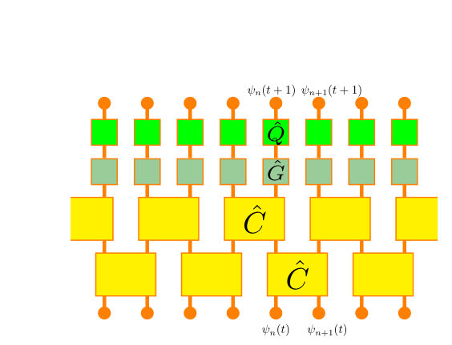 
FIG. 1. A schematic representation of the unitary circuit map. The evolution proceeds from bottom to top and com- prises alternating large yellow blocks, small dark green blocks, and light green blocks. These represent unitary matrices ˆC, which are parameterized by the angle θ, local nonlinear trans- formation maps ˆG (dark green), governed by the nonlinearity strength g, and local quasiperiodic potential maps ˆQ (light green), characterized by site-dependent phases ϵn. The states ψn(t) and ψn+1(t) evolve to ψn(t + 1) and ψn+1(t + 1), re- spectively, through successive applications of these transfor- mations. Each complete time step consists of four substeps.

📷 Fig 2

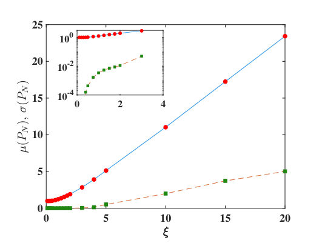 
FIG. 2. Participation number PN as a function of the localization length ξ at g = 0. The red circles show the mean value µ(PN), and the green squares exhibit the standard deviation σ(PN). The inset shows a zoomed-in view of the small-ξ regime, where the y axis is plotted on a logarithmic scale. The localization length is sampled at ξ = 0.1, 0.2, 0.3, 0.4, 0.5, 0.75, 1, 1.25, 1.5, 1.75, 2, 3, 4, 5, 10, 15, 20. The system consists of N = 100 unit cells.

📷 Fig 3

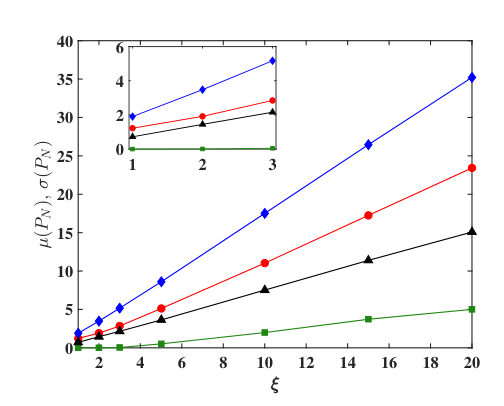 
FIG. 3. Participation number PN as a function of the lo- calization length ξ for quasiperiodic and disorder systems for the linear case, g = 0. The quasiperiodic data are shown as red circles for the mean value µ(PN) and green squares for the standard deviation σ(PN), following the notation in Fig. 2. The disorder results are indicated by blue diamonds for µ(PN) and black triangles for σ(PN). The inset displays a magnified view in the small-ξ regime (ξ = 1, 2, 3). All data are obtained for a system of size N = 100.

📷 Fig 4

 
FIG. 4. The largest Lyapunov exponent Λmax as a function of the nonlinearity strength g for the quasiperiodic case. Different curves correspond to various localization lengths ξ, as indicated in the legend. Data points are sampled for g = 0.001, 0.0025, 0.005, 0.0075, 0.01, 0.025, 0.05, 0.075, 0.1, 0.25, 0.5. The scaling behavior of Λmax varies systematically with ξ. The system size is N = 100, and the evolution time is 108.

📷 Fig 5

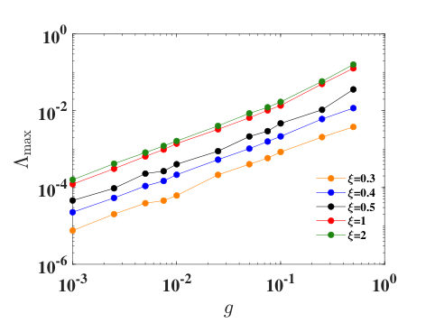 
Figure 4 shows for the quasiperiodic case the depen- dence of the largest Lyapunov exponent Λmax on the non- linearity strength g for various localization lengths ξ, as indicated in the legend. The data points correspond to different values of g, spanning three orders of magnitude. For all values of ξ, Λmax decreases as expected monoton- ically with decreasing g, indicating a systematic suppres- sion of chaos as nonlinearity weakens. Figure 5 presents the rescaled Lyapunov spectrum ¯Λ as a function of the rescaled index ρ for a fixed localization length ξ = 1. Panel (a) corresponds to the disordered case, while panel (b) illustrates the quasiperiodic poten- tial case. Different curves...

**Summary.** This work analyzes how nonlinearity affects the transition between long-range and short-range scaling of Lyapunov spectra in quasiperiodically driven unitary maps. By comparing these results to random disorder, the authors find that quasiperiodic potentials exhibit unexpected behavior, suggesting that long-range correlations persist even when interactions break integrability.

**Why it may be interesting.** The investigation bridges concepts from quantum chaos (Lyapunov exponents), localization theory (Anderson/quasiperiodic models), and nonlinear dynamics, which are central to understanding energy transport and thermalization in complex quantum systems relevant to AMO physics.

Detailed structure

**Main problem.** The study investigates the Lyapunov spectrum scaling transition for thermal weakly-nonlinear unitary maps when subjected to quasiperiodic potentials, comparing this behavior against known Anderson disorder.

**Main result.** Contrary to expectations based on linear analysis, the numerical results show that the scaling crossover in the quasiperiodic case is strongly delayed and occurs at anomalously small localization lengths ($\xi$), suggesting a role for long-range correlations.

**Method.** The authors employ numerical analysis of Lyapunov exponents using the tangent-space approach, alongside statistical measures like the Participation Number ($P_N$) to characterize state localization in both nonlinear and linear regimes.

**Model / system.** The system is a one-dimensional lattice evolving under a unitary circuit map incorporating quasiperiodic potentials ($\hat{Q}$), nonlinear site-dependent phase shifts ($\hat{G}$), and nearest-neighbor rotations ($\hat{C}$).

**Key observables.** Lyapunov spectrum scaling, Localization length ($\xi$), Participation Number ($P_N$), and Kolmogorov-Sinai (KS) entropy ($\kappa$).

**Important parameters / regimes.** Nonlinearity strength ($g$), localization length ($\xi$), and the comparison between quasiperiodic potentials and random Anderson disorder.

**Assumptions / limitations.** The analysis assumes a unique choice of action-angle coordinates and utilizes periodic boundary conditions for simulations.

**Figures summary.** Figures compare $P_N$ distributions and $\mu(P_N)$ vs. $\xi$, showing strong localization in the linear quasiperiodic case; they also contrast Lyapunov scaling ($ar{\Lambda}$) and KS entropy ($\kappa$) between disordered and quasiperiodic potentials across varying nonlinearity.

**Paper structure.** The paper progresses by first establishing the model (unitary circuit map), analyzing the linear limit ($g=0$) using $P_N$ to characterize localization, then extending the analysis to nonlinear regimes by studying Lyapunov spectrum scaling ($ar{\Lambda}$ and $\kappa$), culminating in a direct comparison between quasiperiodic and disordered potentials.

Abstract

We study the Lyapunov spectrum scaling of thermal weakly-nonlinear unitary maps in the presence of quasiperiodic potentials. We search for the crossover from long-range to short-range scaling as the localization length ξ decreases and compare the details to the case of uncorrelated Anderson disorder [Phys. Rev. Res. 6 L012064 (2024)]. A comparative statistical analysis of the eigenstates for the linear case shows that quasiperiodicity has a stronger localization impact at the same value of ξ. Therefore we expect that the scaling crossover should be enhanced as well. However, the numerical analysis shows that it is strongly delayed as compared to Anderson disorder, and is observed at anomalously small values of ξ. These findings hint at the potential impact of long range correlations of quasiperiodic localized eigenstates, which persist in the presence of interactions even in the case of integrability breaking and thermalization.

[↑ back to top](#top)

### [Non-Hermitian Holographic Flows to Little Rip Cosmologies](http://arxiv.org/abs/2607.14284v1)

**Authors:** Daniel Arean, David Garcia-Fariña, Juan F. Pedraza  
**Type:** theory · **Category:** other · **PDF:** <https://arxiv.org/pdf/2607.14284v1>  
**Analysis basis:** full PDF text, analyzed in chunks
**Topic relevance:** `Keldysh / 2PI / non-Gaussian methods` **3/5** · `driven-dissipative phase transition` **3/5** · `Kondo & dissipative impurity` **2/5** · `non-equilibrium dynamics` **2/5** · `correlated / nonlocal dissipation` **1/5** · `methods for driven-dissipative` **1/5** · `non-equilibrium universality` **1/5**

📷 Fig 1

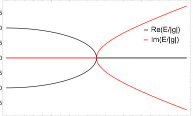 
Figure 1: Energy levels in the two-level system (1.2). For |Γ/g| &gt; 1 the energies become complex conjugate and PT symmetry is broken.

📷 Fig 2

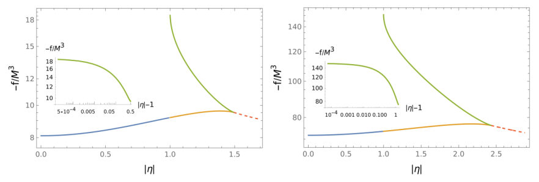 
Figure 2: Free energy of solutions with v = 1 and T/M = 0.5 (left) and T/M = 1 (right) as a function of η. For |η| &gt; 1 two branches of solutions exist. The green branch has lower free energy and is thus thermodynamically preferred. The two branches meet at |ηc| ≈1.49 (left) and |ηc| ≈2.43 (right). For |η| &gt; |ηc| only complex geometries exist: the red dashed line shows the real part of their free energy. In the insets we plot the free energy of the green branch in a log-log plot: it approaches a constant as |η| →1+.

📷 Fig 3

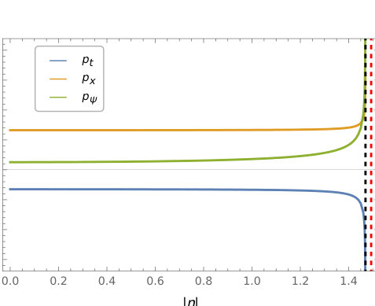 
Figure 3: Kasner coefficients for the non-Hermitian model with v = 1 at T/M = 0.5 in the PT -symmetric phase (|η| &lt; 1) and in the subdominant branch of the PT - restored phase (1 &lt; |η| &lt; ηc ≈1.49). The Kasner coefficients are continuous and diverge as |η| →ηs ≈1.47. For ηs &lt; |η| &lt; ηc the subdominant branch of the PT -restored phase does not have a Kasner singularity and instead has the same singularity as in the dominant branch. In the plot, the red dashed line corresponds to ηc and the black dashed line to ηs.

📷 Fig 4

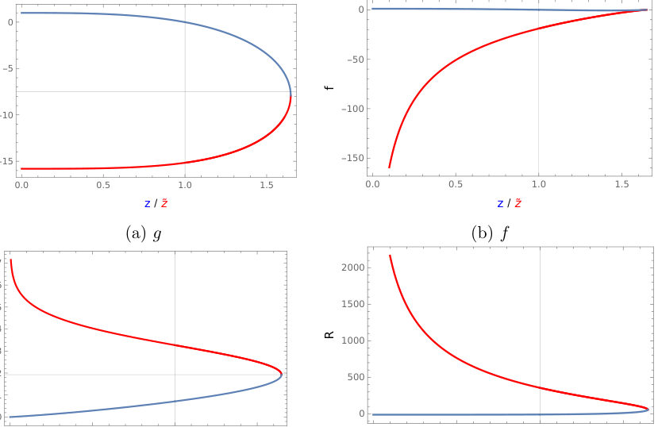 
Figure 4: Fields and Ricci scalar in the dominant branch of the PT -restored phase for a solution with v = 1, T/M = 0.5 and η = 1.45. The blue line represents the patch with coordinate z while the red line denotes the patch with coordinate ˜z. As ˜z →0, g goes to a constant but f and ψ diverge. We conclude that ˜z →0 is a singularity as R diverges as we approach that point.

📷 Fig 5

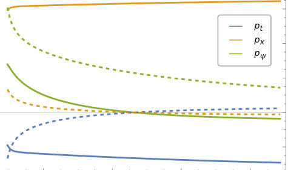 
Figure 5: Kasner coefficients for the non-Hermitian model with v = 1 at T/M = 0.5 in the PT -broken phase. The solid lines denote the real part of the Kasner coefficients and the dashed line the imaginary part. In this phase the geometry is complex and so are the Kasner coefficients.

**Summary.** This paper develops a holographic framework to model cosmological singularities beyond the standard BKL description. By introducing controlled violations of the Null Energy Condition through non-Hermitian quantum field theories, the authors predict the existence of a Little Rip cosmology in black hole interiors. This work establishes a potential 'Little Rip/CFT correspondence' using advanced diagnostic tools like heavy-operator correlators.

**Why it may be interesting.** The explicit connection between open quantum systems physics (PT-symmetry, non-Hermiticity) and fundamental gravitational/cosmological endpoints (Little Rip) provides a powerful theoretical tool for studying extreme spacetime regimes.

Detailed structure

**Main problem.** The research aims to understand cosmological singularities beyond the standard BKL paradigm by analyzing holographic flows derived from non-Hermitian quantum field theories.

**Main result.** Controlled violations of the Null Energy Condition via non-Hermiticity lead to a novel, isotropic Little Rip cosmology in the black hole interior, distinct from standard Kasner behavior.

**Method.** The study employs holographic techniques (AdS/CFT) to map bulk geometry dynamics onto boundary QFT observables, utilizing analysis of two-sided heavy-operator correlators and thermal state properties.

**Model / system.** The model is a holographic dual to a strongly coupled non-Hermitian PT-symmetric QFT. The system involves analyzing the evolution of black hole interiors under conditions violating the NEC.

**Key observables.** Two-sided heavy-operator correlators, geodesic length $L_{	ext{ren}}(E)$, and the equation of state $p = -\epsilon - 2\alpha$.

**Important parameters / regimes.** The ratio $\eta = |s_{nh}/s_h|$ governing the balance between non-Hermitian ($s_{nh}$) and Hermitian ($s_h$) sources, and the asymptotic behavior of energy density ($\epsilon \propto \log a$).

**Assumptions / limitations.** The connection between the deep interior geometry (bulk) and boundary observables (correlators) via the holographic dictionary is central; approximations are used for near-horizon expansion.

**Figures summary.** Figures illustrate energy level spectra in PT-symmetric regimes, compare numerical vs. analytical field values ($	ilde{g}, 	ilde{f}, \psi, R$) across vast scales, and show diagnostic plots related to geodesic length decay rates.

**Paper structure.** The paper progresses by first establishing the theoretical framework connecting non-Hermiticity to NEC violation (Chunk 1), then analyzing this using toy models of thermal states and PT symmetry restoration (Chunk 2), culminating in a detailed geometric analysis comparing Little Rip scaling against Kasner metrics (Chunk 3).

Abstract

Spacelike singularities supported by matter satisfying the null energy condition (NEC) are expected to fall within the Belinski--Khalatnikov--Lifshitz (BKL) paradigm. We show that controlled violations of the NEC in holography can lead to different black hole interiors. In a holographic model dual to a strongly coupled non-Hermitian $\mathcal{PT}$-symmetric QFT, we uncover a novel non-Kasner regime within its real, $\mathcal{PT}$-restored phase. The deep-interior geometry describes an isotropic FLRW cosmology undergoing super-accelerated expansion and approaching a Little Rip. This regime leaves a characteristic imprint on two-sided heavy-operator correlators, allowing it to be distinguished from a standard Kasner interior. Our construction provides a concrete holographic realization of a Little Rip cosmology and lays the groundwork for a Little Rip/CFT correspondence, in which such cosmological regimes can be explored through observables in a non-Hermitian quantum field theory.

[↑ back to top](#top)

### [Analytic gradients for low-rank quantum optimal control](http://arxiv.org/abs/2607.14217v1)

**Authors:** Leo Goutte, Vincenzo Savona  
**Type:** theory · **Category:** quantum information and computing · **PDF:** <https://arxiv.org/pdf/2607.14217v1>  
**Analysis basis:** full PDF text, analyzed in chunks
**Topic relevance:** `methods for driven-dissipative` **3/5** · `QC/QI experiment` **2/5** · `non-equilibrium dynamics` **2/5** · `Keldysh / 2PI / non-Gaussian methods` **1/5** · `analog quantum simulation` **1/5** · `correlated / nonlocal dissipation` **1/5** · `driven-dissipative phase transition` **1/5** · `quantum measurements` **1/5**

📷 Fig 1

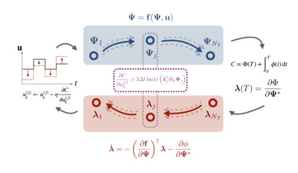 
FIG. 1. Schematic of the LROC algorithm. A forward pass is evaluated with a candidate pulse and the states {Ψj} are stored in memory (blue block). From these, the loss is com- puted and the adjoint state is initialized and λ(T) evolves backward in time following Eq. (9) (red block), computing the gradient at every time tj = (j −1)∆t and subsequently discarding the forward state Ψj. The parameters are up- dated through gradient descent or Adam [34] and the process is repeated until convergence. A similar procedure holds for multi-state objectives by parallelizing over many states (faded dashed arrows). Further details on the numerical implemen- tation are provided in Appendix C 1.

📷 Fig 2

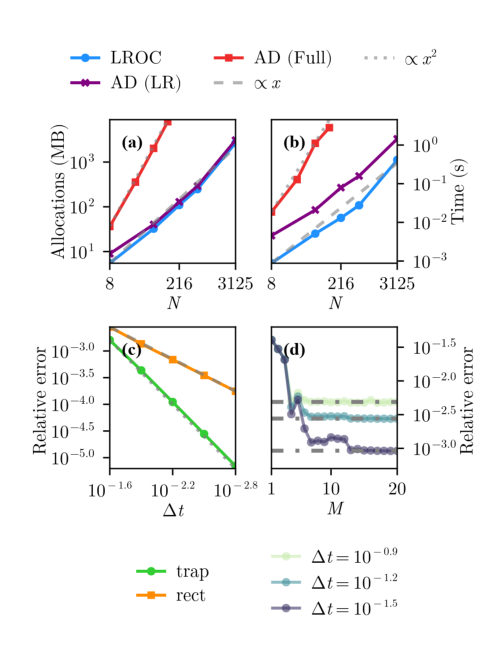 
FIG. 2. (a) Memory footprint and (b) total runtime as a func- tion of the Hilbert space dimension N for LROC (blue), AD with low-rank (purple), and AD with the full master equa- tion (red). (c) The accuracy of the gradient is controlled by ∆t and (d) M, with the latter hitting the plateau given by the trapezoidal error (dash-dotted gray lines). All plots are shown for a three-qubit GHZ state (see Sec. III A) where N is increased by increasing the Hilbert space dimension of the individual multilevel transmons and M = 2 [except for (d)]. The AD results were obtained with the Enzyme.jl [37, 38] package.

📷 Fig 3

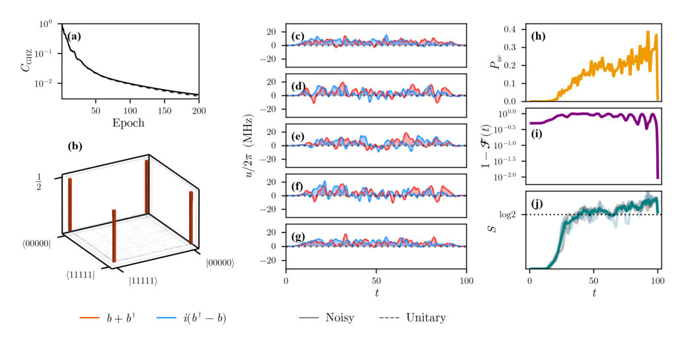 
FIG. 3. Preparation of a 5-qubit GHZ state. (a) Evolution of the loss function (13) as a function of the optimization epoch. (b) Final GHZ state tomography. (c)–(g) Optimal control pulses subject to smoothing and clipping constraints (see Appendix C 2). (h)–(j): Dynamics of the optimized pulse: (h) Population in the non-computational subspace Pnc; (i) Evolution of the infidelity 1 −F = CGHZ; (j) von Neumann entanglement entropy −tr(ˆρk log ˆρk) of each qubit’s reduced density matrix ˆρk = tr\k(ˆρ) (faded lines) and their average (bold line). Parameters: M = 2, J/2π = 50 MHz, ω/2π = 5 GHz, α/2π = 300 MHz, γ/2π = 10 kHz, T = 100 ns.

📷 Fig 4

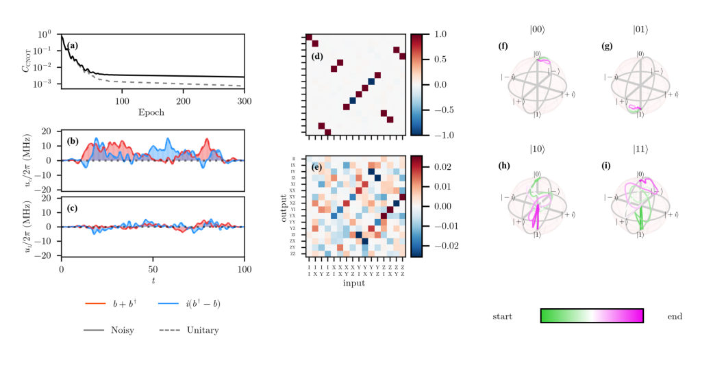 
FIG. 4. Optimization of a the cross-resonance CNOT gate. (a) Loss function (18) during training. (b) Optimized pulses on the control and (c) target qubits. The unitary pulses are overlaid and match quite closely, though they yield an error one order of magnitude lower. (d) Pauli transfer matrices and (e) error relative to the ideal CNOT gate. (f)–(i) Path of the target qubit on its Bloch sphere for each computational basis state under the optimized pulse evolution. Parameters: M = 2, J/2π = 20 MHz, α = 300 MHz, ωc/2π = 5 GHz, ωt/2π = 4.75 GHz, γ/2π = 10 kHz, T = 100 ns.

📷 Fig 5

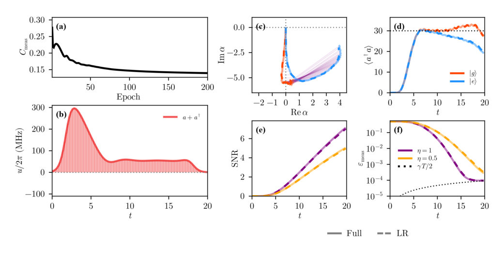 
FIG. 5. Optimal control of the balanced cross-Kerr transmon readout. (a) Convergence of the loss function Eq. (23) and (b) optimized two-step pulse of the sole . (c) Phase-space trajectories and (d) photon number in the resonator computed with the full (faded lines) and low-rank (dashed lines) dynamics. The loss incurs a penalty when a†a &gt; nmax = 30 (dotted black line) to stave off ionization [29, 44, 60]. (e) Signal-to-noise ratio and (f) assignment error for measurement efficiency η = 1 (purple lines) and η = 0.5 (orange lines). Parameters: EC/2π = 300 MHz, EJc + EJ = 50EC, EJC/2π = 8 GHz, ωr/2π = 9.375 GHz, γ/2π = 1.5 kHz, T = 20 ns.

**Summary.** This paper presents Low-Rank Optimal Control (LROC), a novel technique to optimize control pulses for open quantum systems like superconducting circuits. By exploiting the low-rank nature of the evolving density matrix, LROC calculates necessary gradients with significantly reduced computational cost compared to standard methods. This breakthrough extends gradient-based optimization to much larger and more complex physical systems.

**Why it may be interesting.** This is highly relevant as it provides a scalable framework for optimizing quantum operations in realistic, dissipative hardware platforms by circumventing exponential scaling issues inherent in full density matrix simulations.

Detailed structure

**Main problem.** The primary challenge is designing optimal control pulses for open quantum systems where simulating the full density matrix evolution is computationally prohibitive.

**Main result.** The authors introduce Low-Rank Optimal Control (LROC), which achieves an analytic gradient calculation with a quadratic improvement in time and memory scaling compared to full master equation methods.

**Method.** LROC combines the Low-Rank Approximation (LRA) of the density matrix ($\hat{
ho} \simeq \Psi\Psi^\dagger$) with the adjoint state method, allowing for efficient gradient computation via an adapted Pontryagin maximum principle framework.

**Model / system.** The work models open quantum systems using superconducting circuits (transmons), governed by a Lindblad master equation. The control Hamiltonian allows for time-dependent external driving fields.

**Key observables.** State preparation fidelity (e.g., GHZ state) and average gate fidelity (e.g., CNOT gate).

**Important parameters / regimes.** The low-rank approximation size ($M$) relative to the Hilbert space dimension ($N$), and the time step ($\Delta t$).

**Assumptions / limitations.** The method assumes that quantum protocols preserve purity, enabling the accurate low-rank factorization of the density matrix. The gradient derivation involves approximations in discretization.

**Figures summary.** Figure 1 schematically illustrates the LROC algorithm flow: forward state propagation, loss calculation, backward adjoint evolution for gradients, and parameter update via gradient descent.

**Paper structure.** The paper develops the theory by first establishing the low-rank master equation, then deriving the analytic gradient using the adjoint method (Weak Pontryagin maximum principle), and finally demonstrating its application to various physical tasks like state preparation and gate fidelity optimization.

Abstract

We introduce low-rank optimal control (LROC), a method for designing control pulses in open quantum systems whose full density-matrix simulation is prohibitively expensive. The method exploits a feature of quantum computing itself: because protocols are designed to preserve purity, the density matrix is dominated by a few pure states and admits an accurate low-rank factorization. LROC propagates only this factorized form and, by deriving the corresponding adjoint equation, obtains the gradient of any differentiable objective at the same reduced cost as the simulation, leading to a quadratic improvement in time and memory compared to the full master equation. We illustrate the breadth of the method on four superconducting-circuit tasks: preparation of a five-qubit GHZ state, a CNOT gate, qubit readout, and an error correction primitive, modeled with realistic multilevel transmons, decay, and strong drives, in each case reaching fidelities consistent with the intrinsic dissipation limits. LROC thereby extends pulse-level optimization to system sizes beyond the reach of existing gradient-based methods.

[↑ back to top](#top)

### [Thermodynamic theory of voting and EU elections](http://arxiv.org/abs/2607.15119v1)

**Authors:** Klaus M. Frahm, Dima L. Shepelyansky  
**Type:** theory · **Category:** statistical mechanics · **PDF:** <https://arxiv.org/pdf/2607.15119v1>  
**Analysis basis:** full PDF text, analyzed in chunks
**Topic relevance:** `driven-dissipative phase transition` **3/5** · `non-equilibrium dynamics` **3/5** · `non-equilibrium universality` **2/5** · `Frenkel-Kontorova` **1/5** · `Keldysh / 2PI / non-Gaussian methods` **1/5** · `correlated / nonlocal dissipation` **1/5** · `methods for driven-dissipative` **1/5**

📷 Fig 1

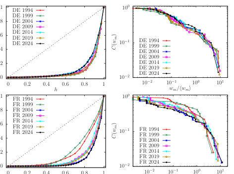 
Fig. 1: (Color on-line) Left: Lorenz curves of EU elections of Germany (DE; top) and France (FR, bottom) since 1994. The x-axis corresponds to the cumulated fraction of house- holds/political parties (h) and the y-axis to the cumulated frac- tion of wealth/obtained votes (w). The dashed black line corre- sponds to the line of perfect equipartition w = h. The Gini co- efficients G and number of political parties Np for all cases can be found in Table 1. Right: Pareto curves C(wm) for the same data where C(wm) represents the fraction of parties with a vote fraction larger than wm (analogous to wealth). The x-axis cor- responds to rescaled values wm/⟨wm⟩where ⟨wm⟩= 1/Np is the average vote...

📷 Fig 2

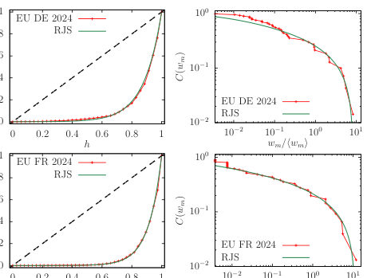 
Fig. 2: (Color on-line) As Fig. 1 for the EU 2024 elections of DE (top) and FR (bottom). In addition, to the real data (red points) also the (green) theoretical RJS Lorenz curves (left panels) are shown (see Table 1 for specific values of G, ε and Np). For the Pareto curves (right panels) the average ⟨wm⟩is either 1/Np (real data) or ε (RJS curves). See also SupMat Figs. S1 and S2 for similar figures for the DE/FR EU elections of 1994 (Fig. S1) and 2014 (Fig. S2) (these Figs. also show curves for RJE model being very close to the RJS ones).

📷 Fig 3

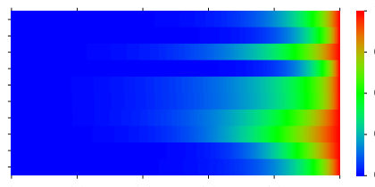 
Fig. 3: (Color on-line) Density color plot of Lorenz curves for 10 countries (2024 EU elections) obtained from the RJS model for the 6 countries DE, FR, IT, ES, NL, CZ and from the op- timal RJE model for the 4 countries PL, RO, BE, SE (cases with a visible difference between RJS and optimal RJE curve). The x-axis corresponds to the cumulated fraction of house- holds/political parties (h) and the y-axis to the countries (with order of increasing population from bottom to top). The color value according to the colorbar shows the cumulated fraction of wealth/obtained votes (w). See also SupMat Figs. S3-S6 for figures in the style of Fig. 2 with Lorenz and Pareto curves for the 2024 EU...

📷 Fig 4

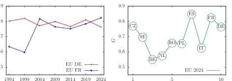 
Fig. 4: (Color on-line) Left: Dependence of the Gini coeffi- cient G for the EU elections of DE (red) and FR (blue) on the election year (using the same data as in Fig. 1). Right: Gini coefficient G for the EU elections 2024 for 10 European coun- tries (green) ordered with increasing size of population (from left to right; using the same data as in Fig. 3).

📷 Fig 5

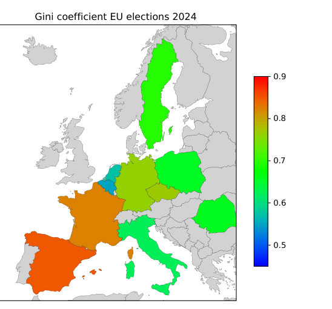 
Fig. 5: (Color on-line) Europe map color plot of the Gini co- efficient of the EU elections of 2024 of 10 countries using the data of the right panel of Fig. 4.

**Summary.** This paper proposes a Thermodynamic Theory of Voting (TTV) that models political vote distribution using principles from statistical mechanics. It shows that the observed inequality in election results closely follows patterns predicted by Rayleigh-Jeans thermalization and condensation phenomena. This suggests that electoral outcomes can be analyzed using tools developed for studying wealth or energy distributions in physical systems.

**Why it may be interesting.** While not directly quantum, the core mathematical machinery—thermalization, energy conservation, and phase transitions leading to condensation—is central to non-equilibrium statistical mechanics, which informs open quantum systems dynamics.

Detailed structure

**Main problem.** To develop a Thermodynamic Theory of Voting (TTV) that statistically describes the distribution of party votes in large-scale elections, drawing parallels with established physical models.

**Main result.** The TTV successfully provides a good statistical description for vote distributions in EU and French elections by modeling them using Rayleigh-Jeans (RJ) thermalization and condensation phenomena.

**Method.** The authors adapt concepts from statistical mechanics, particularly the Wealth Thermalization Hypothesis, to model political interactions as an energy conservation system governed by RJ statistics.

**Model / system.** The system models party votes/political power distribution using coupled nonlinear oscillators whose energies are analogous to vote fractions. The theory relies on deriving distributions from conserved total energy and probability norm.

**Key observables.** Lorenz curves, Pareto curves, and the Gini coefficient ($G$) are used as primary diagnostics to quantify inequality in vote shares.

**Important parameters / regimes.** Temperature/Energy ($\epsilon$), number of parties ($N_p$), and model parameters derived from fitting real data (e.g., $a$ parameter for RJE).

**Assumptions / limitations.** The theory assumes that opinion formation results from complex, classical nonlinear interactions leading to thermalization; the analysis is based on the RJ distribution.

**Figures summary.** Figures compare empirical Lorenz and Pareto curves from EU/French elections (2014-2024) against theoretical predictions derived from the RJS model. Maps show Gini coefficients across various EU countries.

**Paper structure.** The paper introduces TTV, establishes parallels with wealth inequality models exhibiting RJ condensation, details the use of Lorenz/Pareto curves and Gini coefficients, and applies these methods systematically to multiple historical election datasets (EU and French).

Abstract

We introduce a thermodynamic theory of voting and show that it provides a good description of distribution of party votes in EU elections. The theory traces parallels between system energies of coupled nonlinear oscillators and party vote fractions. Such a classical system evolution is characterized by the conservation of total energy and probability norm that leads to the Rayleigh-Jeans (RJ) thermalization and condensation at low energy states. A similar thermalization also describes the wealth inequality in society. This feature belongs to the phenomena of constraint driven condensation known in statistical mechanics. We show that the RJ theory well depicts the Lorenz and Pareto curves obtained from the EU vote results. The theory also recovers the dispersion of votes between candidates of first round presidential elections in France.

[↑ back to top](#top)

### [Avoiding Dilution: Using Diffusion and Vision Transformers to resolve Majorana Features in Nanowires at High Temperature](http://arxiv.org/abs/2607.14949v1)

**Authors:** Jacob R. Taylor, Haining Pan, Jay D. Sau, Sankar Das Sarma  
**Type:** both · **Category:** disordered systems and neural networks · **PDF:** <https://arxiv.org/pdf/2607.14949v1>  
**Analysis basis:** full PDF text, analyzed in chunks
**Topic relevance:** `analog quantum simulation` **3/5** · `methods for driven-dissipative` **3/5** · `driven-dissipative phase transition` **2/5** · `Keldysh / 2PI / non-Gaussian methods` **1/5** · `Kondo & dissipative impurity` **1/5** · `non-equilibrium dynamics` **1/5**

📷 Fig 1

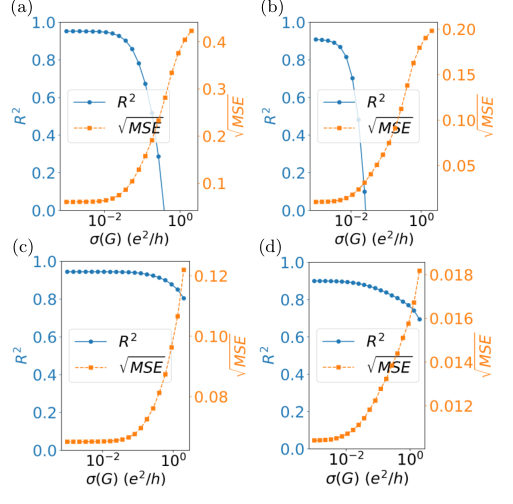 
FIG. 2: Local (left) and nonlocal (right) conductance reconstruction fidelity for varying levels of error. The first (second) row is for networks without (with) measurement error during the training stage.

📷 Fig 2

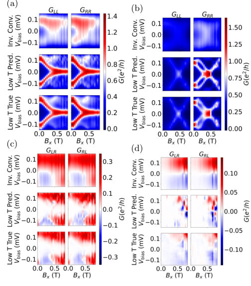 
FIG. 1: Low-temperature conductance reconstructed from high-temperature data by reverse convolution (1st row), measured directly (2nd row), and predicted by a neural network using high-temperature data (3rd row). Local conductances are shown in (a,b), and nonlocal conductances in (c,d). Additional maps can be found in Fig. 12-23, including the corresponding high temperature maps. The chemical potential shown is 0.4 meV.

📷 Fig 3

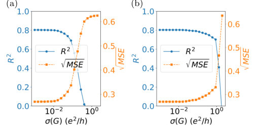 
FIG. 3: TV prediction fidelity for varying levels of Gaussian measurement noise of standard deviation σ(G). R2(TV ) vs. σ(G) for the neural network without (a) and with (b) noise added during the training stage.

📷 Fig 4

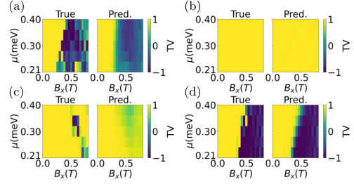 
FIG. 4: Comparison of expected and predicted TV from high-T conductance. Panels (a)-(d) are different device realizations with left being the expected TV and right being the predicted TV. The disorder levels are σdis = (a) 0.716 meV, (b) 3.55 meV, (c) 0.237 meV, and (d) 1.586 meV, with correlation lengths of (a) 27 nm, (b) 31.9 nm, (c) 47 nm, and (d) 48 nm respectively.

📷 Fig 5

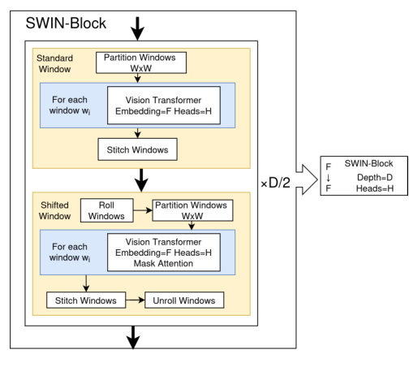 
FIG. 5: Schematic of the SWIN-Block used in the Conductance U-Net. The block alternates standard and shifted-window attention: features are partitioned into W × W windows, processed by a window-wise transformer with H heads, stitched back together, and repeated for depth D. The shifted-window stage enables information exchange between neighboring windows.

**Summary.** This work introduces a machine-learning pipeline to overcome the experimental bottleneck of measuring Majorana zero modes at ultra-low temperatures. By training neural networks on simulated paired high- and low-temperature conductance data, the authors demonstrate that key topological features can be reliably inferred from simpler, higher-temperature measurements. This offers a practical acceleration tool for quantum device development.

**Why it may be interesting.** The application of advanced deep learning architectures like diffusion models and Vision Transformers to extract fundamental quantum signatures from noisy, experimentally accessible data is highly relevant for open quantum systems characterization.

Detailed structure

**Main problem.** Characterizing Majorana zero modes (MZMs) in nanowires typically requires slow, resource-intensive ultra-low temperature measurements.

**Main result.** Machine learning models can successfully reconstruct low-temperature conductance and predict topological visibility using only easier-to-measure high-temperature data.

**Method.** The authors employed two machine learning approaches: a diffusion-inspired U-Net Transformer for conductance reconstruction, and a Video Vision Transformer (ViViT) for direct prediction of topological visibility.

**Model / system.** The study models semiconductor–superconductor hybrid nanowires hosting topological superconductors, governed by a Bogoliubov-de Gennes Hamiltonian. The analysis compares high-temperature simulations to target low-temperature MZM properties.

**Key observables.** Local and nonlocal conductances ($G_{ii}, G_{ij}$), and the Topological Visibility (TV).

**Important parameters / regimes.** Ultra-low temperatures ($\approx 50 	ext{ mK}$), high-temperature measurements, disorder strength, superconducting gap $\Delta_0$.

**Assumptions / limitations.** The primary assumption is that ML models can learn the underlying physics to invert the thermal broadening effect inherent in high-temperature measurements.

**Figures summary.** Figures illustrate network architectures (SWIN-Block, UNETR upsampling) and compare reconstruction/prediction results against direct measurement or inverse convolution methods.

**Paper structure.** The paper first establishes the difficulty of low-T MZM detection. It then details using ML on paired high/low-T simulations to train two networks: one for conductance reconstruction (diffusion model) and one for TV prediction (ViViT). Results demonstrate high fidelity in both tasks.

Abstract

Identifying Majorana zero modes in semiconductor--superconductor nanowires requires ultra-low temperature transport measurements in dilution refrigerators, making device screening slow and resource-intensive. Here, we investigate whether high-temperature conductance data can be used to infer low-temperature Majorana nanowire properties before committing devices to dilution-refrigerator characterization. We generate paired high- and low-temperature conductance simulations for disordered Majorana nanowires and train neural networks to perform two related tasks. First, we use a Shifted Window U-Net Transformer diffusion-inspired architecture to reconstruct low-temperature conductance from thermally broadened high-temperature measurements, achieving high-fidelity recovery with $R^2 \approx {0.95}$ for local conductance and $R^2 \approx {0.91}$ for nonlocal conductance. Second, we train a Video Vision Transformer-based network to predict the low-temperature topological visibility directly from high-temperature conductance, obtaining $R^2 \approx {0.80}$. These results demonstrate that machine-learning models can recover and infer low-temperature Majorana features from experimentally easier high-temperature data, providing a practical route for rejecting poor devices early thus avoiding slow and resource-intensive dilution refrigeration for non-promising devices. This high-temperature screening approach could substantially accelerate the experimental feedback loop for Majorana nanowire device development.

[↑ back to top](#top)

### [Moment-Resolved Readout and Reservoir Diversity in Nonequilibrium Langevin Computing](http://arxiv.org/abs/2607.14520v1)

**Authors:** JiZheng Duan, MingYang Zhao, YanWei Chen, Lei Yang  
**Type:** theory · **Category:** statistical mechanics · **PDF:** <https://arxiv.org/pdf/2607.14520v1>  
**Analysis basis:** full PDF text, analyzed in chunks
**Topic relevance:** `methods for driven-dissipative` **3/5** · `non-equilibrium dynamics` **3/5** · `non-equilibrium universality` **2/5** · `Keldysh / 2PI / non-Gaussian methods` **1/5** · `correlated / nonlocal dissipation` **1/5** · `driven-dissipative phase transition` **1/5**

📷 Fig 1

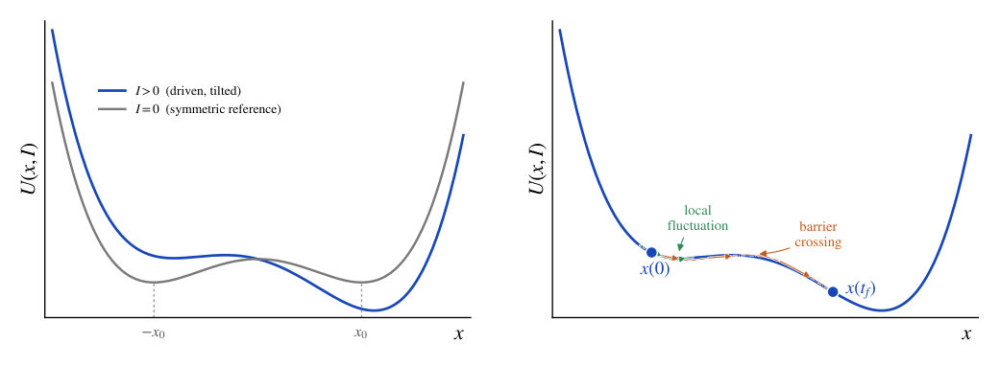 
FIG. 1. Physical mechanism of the thermodynamic neuron. (a) Driven quartic potential U(x, I) = J2x2 + J4x4 −Ix showing input-induced symmetry deformation relative to the symmetric reference case I = 0. (b) Representative schematic overdamped Langevin paths on the driven nonlinear energy landscape, illustrating finite-time thermal excursions and nonlinear distribution reshaping.

📷 Fig 2

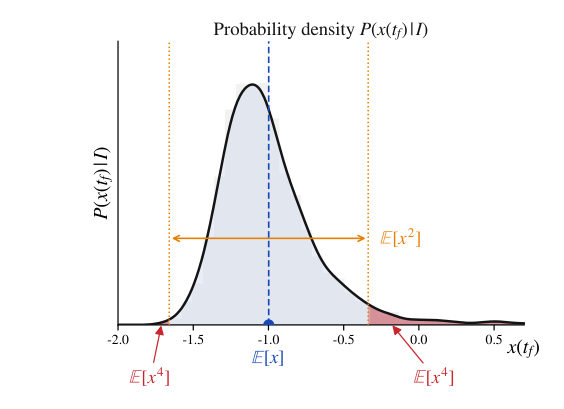 
FIG. 2. Moment-resolved thermodynamic response represen- tation. Schematic finite-time probability density P(x(tf) | I), whose raw moment channels E[x], E[x2], and E[x4] encode mean displacement, fluctuation scale, and high-amplitude nonlinear excursions, respectively. These channels define the local moment-resolved response representation.

📷 Fig 3

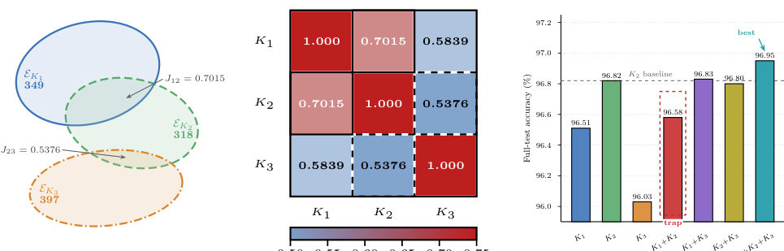 
FIG. 3. Error-mode decorrelation analysis on the MNIST full test set. (a) Schematic error sets EKr; numbers denote misclassified test samples, and Jij denotes the Jaccard overlap between wrong sets. (b) Pairwise wrong-set Jaccard overlap matrix, with solid boxes marking the highly overlapping K1–K2 pair and dashed boxes marking the more decorrelated K2–K3 pair. (c) Ablation accuracy for individual, pairwise, and full three-reservoir response representations. The K1 + K2 result illustrates the performance degradation under concatenation, whereas full feature-level fusion gives the best observed test accuracy among the compared configurations.

📷 Fig 4

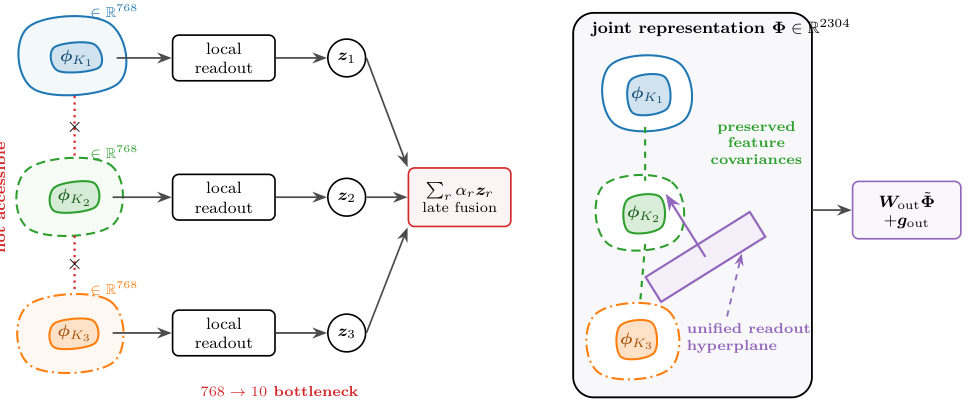 
FIG. 4. Geometric schematic of information mapping in decision-level and feature-level fusion. (a) In decision-level late fusion, each reservoir response block ϕKr ∈R768 is first compressed by an independent local readout into a 10-dimensional logit vector zr. This early bottleneck constrains each reservoir to an independently optimized representation, preventing the final fusion layer from leveraging the full uncompressed feature geometry. (b) In feature-level fusion, the three response blocks are concatenated into the full thermodynamic response representation Φ ∈R2304. A unified readout hyperplane acts directly on the uncompressed joint feature manifold, jointly optimizing all...

**Summary.** This paper advances nonlinear thermodynamic computing by replacing simple mean readout with moment-resolved statistics ($\mathbb{E}[\mathbf{x}], \mathbb{E}[\mathbf{x}^{\odot 2}], \mathbb{E}[\mathbf{x}^{\odot 4}]$). They demonstrate that combining multiple, independently trained reservoirs using feature-level fusion significantly boosts classification accuracy on MNIST. This suggests that capturing higher-order fluctuations and leveraging reservoir heterogeneity are key design principles for these physical computing systems.

**Why it may be interesting.** This work connects concepts from non-equilibrium statistical mechanics (Langevin dynamics, finite-time observables) directly to machine learning architectures, providing a physical mechanism for feature extraction beyond simple mean measurements.

Detailed structure

**Main problem.** The research aims to improve nonlinear thermodynamic computing by extending readout mechanisms from using only the mean expectation value to utilizing higher-order polynomial raw moments.

**Main result.** A heterogeneous multi-reservoir architecture employing feature-level fusion of moment-resolved readouts achieved state-of-the-art classification accuracy (96.95%) on MNIST, suggesting that joint optimization over multiple reservoirs is beneficial.

**Method.** The authors use Langevin dynamics to simulate non-equilibrium systems and construct a response vector from the first, second, and fourth raw polynomial moments of the system's state variables.

**Model / system.** The model is based on nonlinear thermodynamic computers driven by overdamped Langevin dynamics with quartic confinement. The dynamics are generally nonconservative, meaning they do not derive from a global scalar energy landscape.

**Key observables.** Raw polynomial moments: $\mathbb{E}[\mathbf{x}]$, $\mathbb{E}[\mathbf{x}^{\odot 2}]$, and $\mathbb{E}[\mathbf{x}^{\odot 4}]$; Test Accuracy on MNIST (e.g., 96.95%).

**Important parameters / regimes.** Finite observation time ($t_f$); Reservoir coupling weights ($\mathbf{W}$); Temperature/Fluctuation scale ($k_B T$).

**Assumptions / limitations.** The readout is based on finite-time Monte Carlo sampling of the stochastic dynamics, and the analysis assumes that feature-level fusion (concatenation) allows for joint optimization while maintaining an additive linear classifier structure.

**Figures summary.** Figures likely compare performance metrics like test accuracy across different reservoir combination strategies (single vs. fused) and show error overlap analyses using Jaccard coefficients to support the benefit of heterogeneity.

**Paper structure.** The paper progresses by first establishing the limitations of mean-only readout, then proposing moment-resolved observables ($\mathbb{E}[\mathbf{x}], \mathbb{E}[\mathbf{x}^{\odot 2}], \mathbb{E}[\mathbf{x}^{\odot 4}]$), and finally demonstrating superior performance using a heterogeneous multi-reservoir architecture with feature-level fusion.

Abstract

Nonlinear thermodynamic computers based on Langevin dynamics exploit thermal fluctuations as a physical substrate for computation. Recent work has shown that quartic-confined fluctuating degrees of freedom can act as thermodynamic neurons capable of nonlinear function approximation at finite observation times. Here we extend this paradigm from mean-only readout to moment-resolved readout. Instead of representing each driven reservoir solely by its first moment, we construct a response vector from the elementwise raw polynomial moments   \(\mathbb{E}[\bm{x}]\),   \(\mathbb{E}[\bm{x}^{\odot 2}]\), and   \(\mathbb{E}[\bm{x}^{\odot 4}]\).   These observables combine displacement and central-shape contributions and are naturally aligned with the linear, quadratic, and quartic terms of the local driven dynamics.   We further introduce a heterogeneous multi-reservoir architecture in which three reservoirs with distinct initialization and training histories form a joint \(2304\)-dimensional response representation. Under the fixed MNIST \(60000/10000\) reproduction protocol, feature-level fusion achieves the best observed accuracy of \(9695/10000=96.95\%\), compared with \(9682/10000=96.82\%\) for the strongest single-reservoir model and \(9684/10000=96.84\%\) for equal-weight logit averaging. An exact paired McNemar test does not establish a statistically significant improvement over the strongest single reservoir, but the ablation and wrong-set overlap results provide suggestive evidence of complementary classification errors. These results motivate higher-order polynomial-moment readout and reservoir heterogeneity as candidate design principles for finite-time Langevin computing.

[↑ back to top](#top)

### [On the origin of finite entanglement scaling](http://arxiv.org/abs/2607.15124v1)

**Authors:** Luke Hodgkiss, Laurens Lootens, Atsushi Ueda, Bram Vanhecke, Frank Verstraete  
**Type:** theory · **Category:** numerical methods · **PDF:** <https://arxiv.org/pdf/2607.15124v1>  
**Analysis basis:** full PDF text, analyzed in chunks
**Topic relevance:** `entanglement & information structure` **3/5** · `methods for driven-dissipative` **3/5** · `non-equilibrium dynamics` **2/5** · `analog quantum simulation` **1/5** · `driven-dissipative phase transition` **1/5** · `non-equilibrium universality` **1/5**

📷 Fig 1

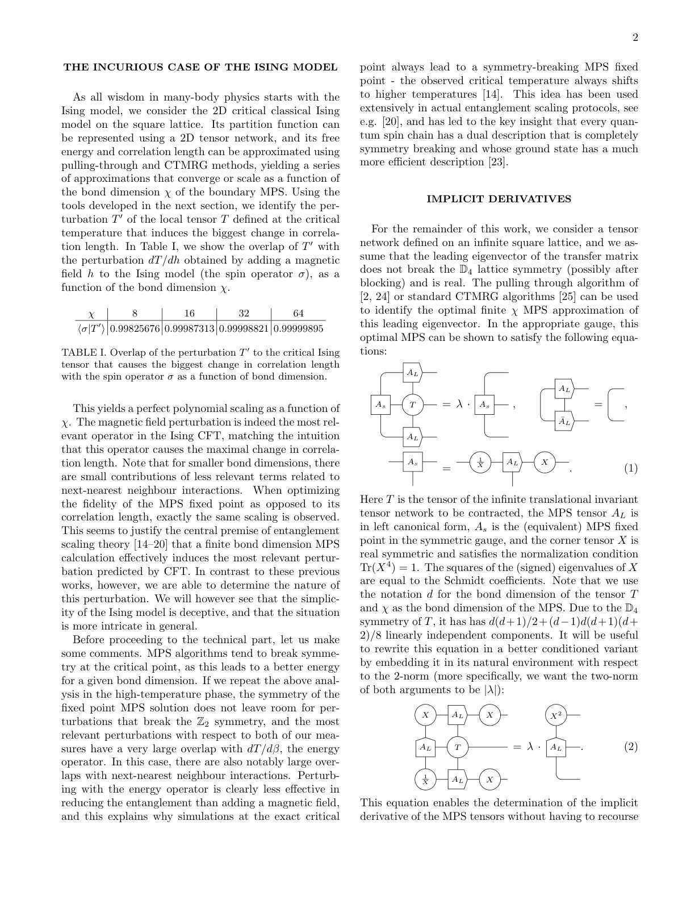 
Low-resolution page preview, page 2

📷 Fig 2

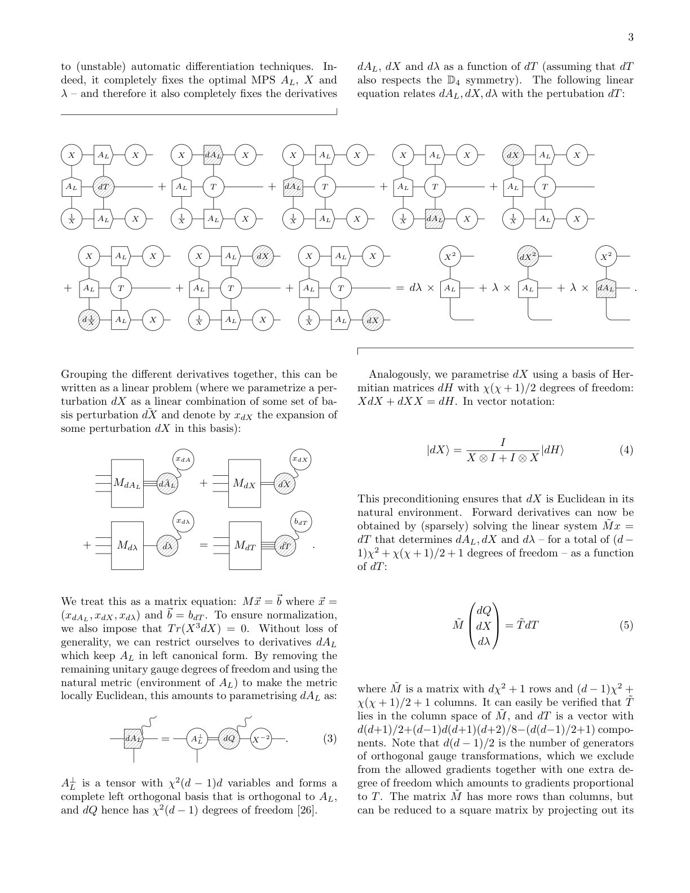 
Low-resolution page preview, page 3

📷 Fig 3

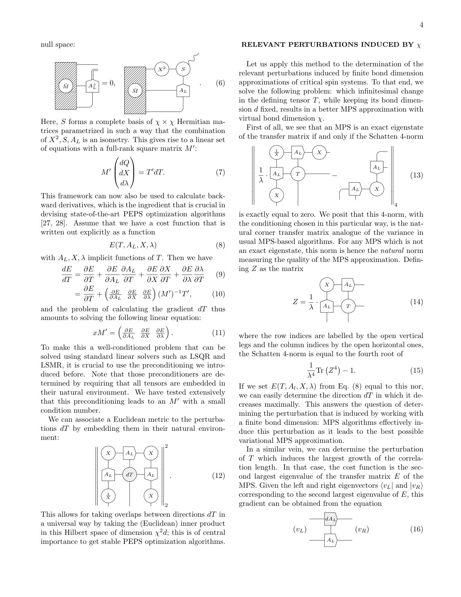 
Low-resolution page preview, page 4

📷 Fig 4

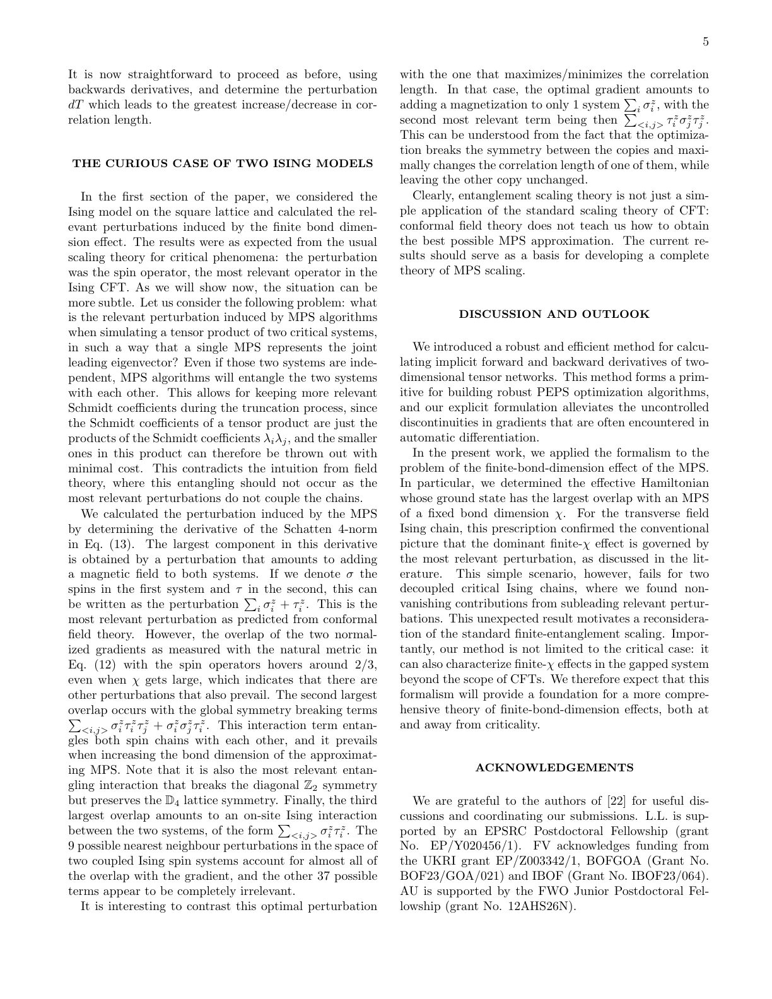 
Low-resolution page preview, page 5

📷 Fig 5

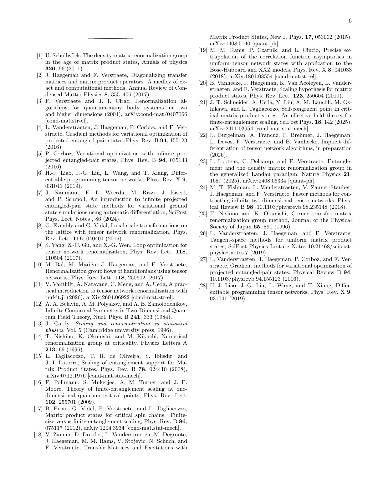 
Low-resolution page preview, page 6

**Summary.** This paper tackles the fundamental problem of quantifying errors when approximating critical quantum ground states using tensor networks like MPS and PEPS. The authors introduce a novel, stable linear algebra technique to calculate necessary derivatives for optimization. This allows them to precisely determine the physical nature of finite-entanglement scaling perturbations in models like the Ising chain.

**Why it may be interesting.** This work provides a powerful, stable computational tool for optimizing complex quantum states (PEPS/MPS), which is crucial for simulating strongly correlated materials or open quantum systems where exact diagonalization fails.

Detailed structure

**Main problem.** The paper addresses determining the actual physical perturbations induced by approximating critical quantum systems using Matrix Product States (MPS) and developing a robust method to calculate derivatives of 2D tensor networks.

**Main result.** They show that MPS approximations induce relevant perturbations, which can be calculated precisely via implicit differentiation, providing insights into finite entanglement scaling beyond simple CFT predictions.

**Method.** The core methodology involves developing a sparse linear solver to compute forward and backward derivatives of 2D tensor networks implicitly, circumventing instabilities in traditional automatic differentiation techniques.

**Model / system.** The study focuses on critical quantum Hamiltonians modeled by MPS (1D) and two-dimensional lattice models like the Ising model represented by PEPS. The analysis is performed on square lattices using tensor network representations.

**Key observables.** Perturbation ($\delta$), Correlation Length ($\xi$), Overlap between induced perturbation and physical operators, and the Schatten 4-norm of the transfer matrix.

**Important parameters / regimes.** Bond Dimension ($\chi$) is the key parameter controlling the approximation quality; finite size/entanglement scaling are central concepts.

**Assumptions / limitations.** The analysis is simplified by restricting to tensor networks on square lattices with real, rotationally/reflectionally invariant tensors for initial demonstrations.

**Figures summary.** TABLE I demonstrates that the overlap of the perturbation causing the largest change in correlation length exhibits perfect polynomial scaling with bond dimension $\chi$.

**Paper structure.** The paper develops the mathematical machinery (sparse linear solver, implicit differentiation) first, and then applies it to analyze finite-$\chi$ effects in critical 1D and 2D systems, comparing results against established CFT predictions.

Abstract

The concept of finite entanglement scaling forms one of the pillars on which the tensor network ecosystem is built. In this paper, we resolve the open problem of determining the actual perturbations induced by matrix product state approximations of critical systems, and we demonstrate that these can be quite different than the ones predicted by conformal field theory. To that aim, we develop a sparse linear solver to calculate the forward and backward derivatives of 2-dimensional tensor networks with respect to their defining parameters in an implicit way. This algorithm is of independent interest as it provides a primitive for the variational optimization of projected entangled pair states that circumvents the instabilities plaguing traditional automatic differentiation methods.

[↑ back to top](#top)

### [Quantum Markov Chains for an Asymmetric Mixed Ising-XY Model on a Cayley Tree](http://arxiv.org/abs/2607.14343v1)

**Authors:** Farrukh Mukhamedov  
**Type:** theory · **Category:** statistical mechanics · **PDF:** <https://arxiv.org/pdf/2607.14343v1>  
**Analysis basis:** full PDF text, analyzed in chunks
**Topic relevance:** `methods for driven-dissipative` **3/5** · `entanglement & information structure` **2/5** · `non-equilibrium dynamics` **2/5** · `Keldysh / 2PI / non-Gaussian methods` **1/5** · `correlated / nonlocal dissipation` **1/5** · `driven-dissipative phase transition` **1/5** · `non-equilibrium universality` **1/5**

📷 Fig 1

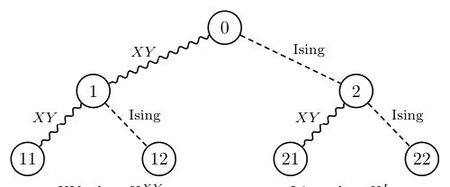 
Figure 1: The first levels of Γ2 + and the locally asymmetric mixed Ising–XY assignment of interactions.

📷 Fig 2

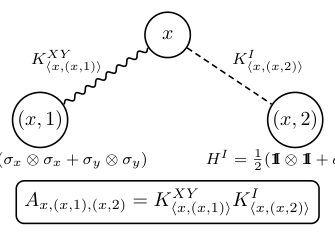 
Figure 2: The local three-site interaction block at a vertex x. The left child edge is the coherent XY exchange edge, while the right child edge is the diagonal Ising edge.

📷 Fig 3

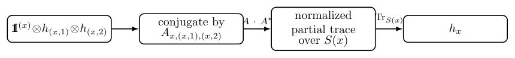 
Figure 3: The local transfer operator as a one-step boundary-law update: successor boundary data are inserted at the two children, conjugated by the local interaction block, and traced over the successors to produce the parent boundary operator.

**Summary.** This paper rigorously analyzes the quantum dynamics of a mixed Ising-XY model situated on an infinite Cayley tree. By utilizing Quantum Markov Chain theory, the authors prove that the system admits a unique translation-invariant steady state solution. This establishes strong mathematical constraints on the possible physical states achievable by this complex interacting spin system.

**Why it may be interesting.** This work provides rigorous mathematical tools (QMCs) to characterize equilibrium states in complex quantum spin systems on infinite lattices, which is crucial for understanding critical phenomena and phase transitions in condensed matter theory.

Detailed structure

**Main problem.** The study investigates Quantum Markov Chains (QMC) associated with a mixed Ising-XY model defined on an infinite Cayley tree structure.

**Main result.** The paper proves the existence and uniqueness of a translation-invariant QMC solution for all coupling constants, alongside demonstrating that the reduced dynamics possess no periodic points beyond period one.

**Method.** The analysis employs the compatibility criterion for tree-indexed QMCs, deriving boundary equations solved via transfer operators and analyzing the resulting finite-dimensional dynamical system.

**Model / system.** The model is a mixed Ising-XY Hamiltonian defined on the semi-infinite rooted Cayley tree of order two. The interactions are locally asymmetric: XY coupling acts along one branch, and Ising coupling acts along the other.

**Key observables.** Local two-site entanglement; the boundary law parameters (Bloch coefficients); existence/uniqueness of translation-invariant solutions.

**Important parameters / regimes.** Coupling strengths ($J_I, J_{XY}$), inverse temperature ($eta$), and the structure of the tree ($\Gamma_2^+$).

**Assumptions / limitations.** The analysis relies on working with the normalized trace convention and assuming the existence of a unique positive translation-invariant solution to proceed.

**Figures summary.** Figure 1 illustrates the locally asymmetric mixed Ising–XY assignment (XY on one edge, Ising on the other) on the Cayley Tree. Figure 2 shows the local three-site interaction block at a vertex.

**Paper structure.** The paper establishes the QMC framework using compatibility criteria, derives the boundary equation and transfer operator, analyzes the resulting reduced dynamical system for periodic points, proves uniqueness theorems for the translation-invariant solution, and concludes with entanglement calculations.

Abstract

We study a mixed quantum Ising-$XY$ model on the semi-infinite rooted Cayley tree of order two. For every vertex $u$, the edge $\langle u,(u,1)\rangle$ carries an $XY$ interaction and the edge $\langle u,(u,2)\rangle$ carries an Ising interaction. Using the compatibility criterion for tree-indexed quantum Markov chains and consistently working with the normalized trace, we derive the translation-invariant boundary equation and compute explicitly the associated local transfer operator, namely the one-step partial-trace map which propagates successor boundary data to the parent vertex. We prove that the boundary equation has a unique positive translation-invariant solution for all $J_I,J_{XY}\in\mathbb R$ and $β>0$. Hence the model admits a unique translation-invariant quantum Markov chain generated by a positive translation-invariant boundary condition. We also show that the reduced boundary-law dynamics, i.e. the induced finite-dimensional recursion for the boundary-law parameters, has no admissible periodic points of period greater than one and compute the local two-site entanglement on the natural three-site cluster of the tree.

[↑ back to top](#top)

### [Worldline-Susceptibility Scheduling for Quantum Annealing Beyond Local-Adiabatic Evolution](http://arxiv.org/abs/2607.14282v1)

**Authors:** Suraj Singh, Lakshya Nagpal, Vikas Chauhan, S. R. Hassan  
**Type:** theory · **Category:** disordered systems and neural networks · **PDF:** <https://arxiv.org/pdf/2607.14282v1>  
**Analysis basis:** full PDF text, analyzed in chunks
**Topic relevance:** `methods for driven-dissipative` **3/5** · `non-equilibrium dynamics` **2/5** · `Keldysh / 2PI / non-Gaussian methods` **1/5** · `analog quantum simulation` **1/5** · `correlated / nonlocal dissipation` **1/5** · `driven-dissipative phase transition` **1/5** · `exotic spin models in light-matter` **1/5** · `non-equilibrium universality` **1/5**

📷 Fig 1

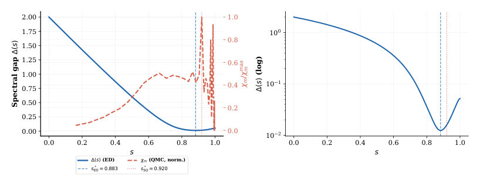 
FIG. 1. Comparison between the exact instantaneous spectral gap and the normalized worldline magnetization susceptibility measured in SQA for a representative n = 10 Sherrington–Kirkpatrick instance. The minimum of ∆(s) occurs at sED = 0.883, while the maximum of χm(s) occurs at sSQ = 0.920. Left: gap and normalized susceptibility over the full annealing path. Right: logarithmic representation of the spectral gap, highlighting the proximity of the two characteristic locations. The susceptibility identifies the minimum-gap region without using spectral information.

📷 Fig 2

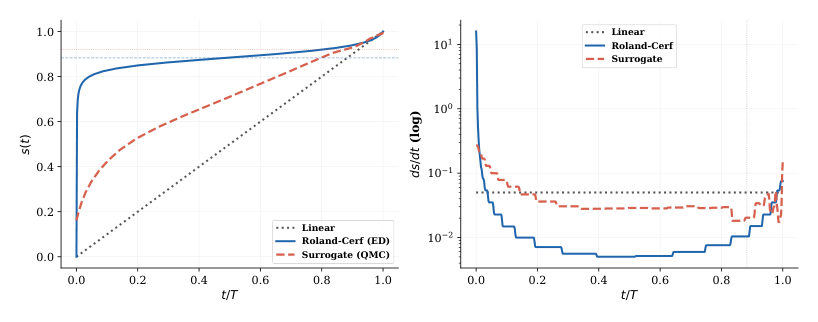 
FIG. 2. Comparison of the three annealing schedules for the representative n = 10 instance at total annealing time T = 20. Left: annealing parameter s(t) as a function of normalized time t/T. Right: instantaneous annealing velocity ds/dt on a logarithmic scale. The Roland–Cerf schedule produces an approximately four-orders-of-magnitude slowdown within a narrow interval surrounding the minimum gap, whereas the worldline-susceptibility schedule distributes the slowdown more smoothly over the broader critical region identified by χm(s).

📷 Fig 3

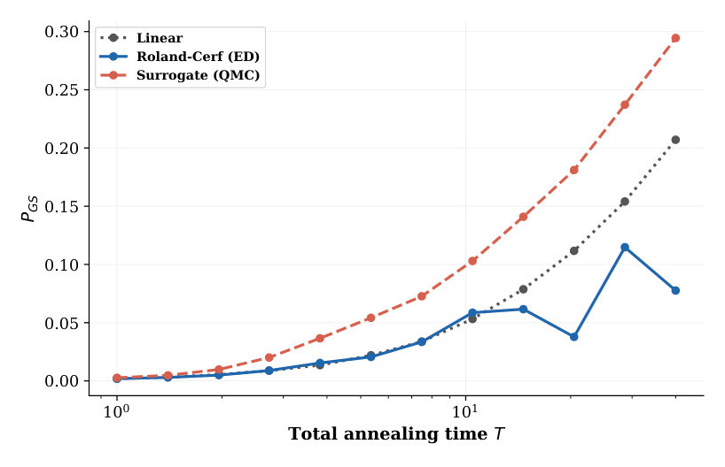 
FIG. 3. Final ground-state probability as a function of total annealing time for a representative n = 10 Sherrington–Kirkpatrick instance. The worldline-susceptibility schedule consistently outperforms the linear schedule and varies smoothly with T. In contrast, the Roland–Cerf schedule exhibits pronounced non-monotonic behaviour, including a strong suppression near T ≈20, despite being constructed from the exact instantaneous spectral gap.

📷 Fig 4

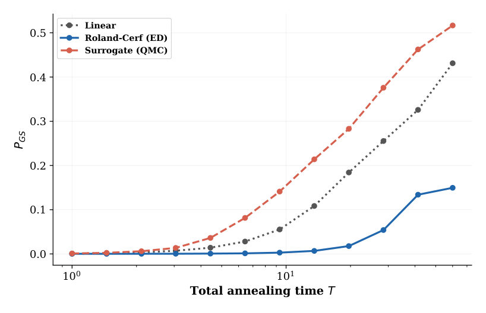 
FIG. 4. Final ground-state probability as a function of total annealing time for a representative n = 12 Sherrington–Kirkpatrick instance. The exact minimum gap lies at the terminal point, sED = 1, and the Roland–Cerf schedule remains strongly suppressed throughout the runtime interval. The worldline-susceptibility schedule, whose susceptibility maximum occurs at the interior point sSQ = 0.876, consistently produces the highest success probability.

📷 Fig 5

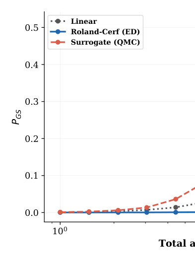 
Figure 5 illustrates these two representative cases. For the n = 12 instance, nearly the entire runtime accumulates near the endpoint of the anneal, producing the boundary- gap trap. For the n = 10 instance, the runtime is instead compressed into a narrow interval surrounding the interior minimum gap. Although both schedules satisfy exactly the same local-adiabatic condition, they produce two qualitatively different finite-time dynamical pathologies.

**Summary.** The paper introduces a novel scheduling technique for quantum annealing using the worldline magnetization susceptibility as a proxy for the spectral gap. This surrogate method allows for constructing an optimized anneal schedule without needing to solve the full Hamiltonian spectrum. The results prove that this observable-based approach is robust and can outperform theoretically ideal schedules when considering realistic finite-time limitations.

**Why it may be interesting.** This work is highly relevant because it provides a practical, computationally tractable alternative to the theoretically optimal but inaccessible local-adiabatic schedule for quantum annealing simulations, directly impacting how open quantum systems are modeled.

Detailed structure

**Main problem.** The primary challenge is developing a computationally feasible, optimal annealing schedule for quantum annealing that surpasses the theoretical but impractical local-adiabatic evolution.

**Main result.** A surrogate schedule based on worldline magnetization susceptibility consistently outperforms conventional linear annealing and, under realistic finite-time conditions, can surpass the exact spectral gap-based Roland–Cerf schedule.

**Method.** The authors propose using Simulated Quantum Annealing (SQA) to calculate the worldline magnetization susceptibility ($\chi_m$), which serves as a surrogate observable for the instantaneous spectral gap to construct the annealing time distribution.

**Model / system.** The system is quantum annealing, modeled by evolving a Hamiltonian $\hat{H}(s)$ from a driver to a problem Hamiltonian. The analysis uses Sherrington–Kirkpatrick spin-glass instances and extends to open systems using Lindblad master equations for decoherence testing.

**Key observables.** Worldline magnetization susceptibility ($\chi_m$), ground-state probability ($P_{GS}$), spectral gap ($\Delta(s)$), and the derived failure threshold ($\Delta^*$).

**Important parameters / regimes.** Annealing time $T$, system size $n$ (up to 20), decoherence rate $\gamma$, and Trotter slice number $M$.

**Assumptions / limitations.** The method assumes that robust scheduling based on inexpensive equilibrium observables can outperform exact spectral gap strategies under realistic, finite-time conditions.

**Figures summary.** Figures demonstrate the comparative performance of schedules under decoherence (Fig. 10 vs Fig. 11), confirm the stability of failure mechanisms across system sizes (Fig. 14), and validate a critical failure threshold ($\Delta^*$) using held-out statistical tests (Fig. 13).

**Paper structure.** The paper progresses from establishing the computational bottleneck of exact scheduling, proposing $\chi_m$ as a surrogate observable via SQA, demonstrating its superior performance over RC in ideal cases, and finally rigorously validating this robustness against decoherence and finite-size effects.

Abstract

The performance of quantum annealing depends critically on how the available annealing time is distributed along the evolution. Although the Roland Cerf local adiabatic schedule is theoretically optimal, it requires complete knowledge of the instantaneous spectral gap, making it impractical for large optimization problems. We propose a computationally inexpensive surrogate schedule based on the worldline magnetization susceptibility measured during simulated quantum annealing. The susceptibility is obtained directly from equilibrium Monte Carlo sampling and identifies the critical region of the anneal without requiring spectral information. Using exact diagonalization of Sherrington Kirkpatrick spin glass instances as ground truth, we show that the resulting schedule consistently outperforms conventional linear annealing and, for a substantial fraction of instances, also surpasses the exact Roland Cerf schedule. We demonstrate that this unexpected behaviour originates from two finite time failure modes of exact local adiabatic scheduling a boundary gap trap, in which the minimum spectral gap occurs at the end of the anneal, and an oscillatory instability caused by excessively localized time allocation around an interior minimum gap. These results suggest that robust scheduling based on inexpensive equilibrium observables can outperform exact spectral gap based strategies under realistic finite time conditions. The complete methodology is implemented in the open source Qanneal framework.

[↑ back to top](#top)

### [Residual-Based Time Discretization on Nonlinear Approximation Manifolds: Analysis and Gaussian Applications](http://arxiv.org/abs/2607.15086v1)

**Authors:** Eddy de Leon, Caroline Lasser  
**Type:** theory · **Category:** numerical methods · **PDF:** <https://arxiv.org/pdf/2607.15086v1>  
**Analysis basis:** full PDF text, analyzed in chunks
**Topic relevance:** `methods for driven-dissipative` **3/5** · `analog quantum simulation` **2/5** · `Keldysh / 2PI / non-Gaussian methods` **1/5** · `Tavis-Cummings & cavity-many-emitter` **1/5** · `correlated cavity matter` **1/5** · `driven-dissipative phase transition` **1/5** · `non-equilibrium dynamics` **1/5**

📷 Fig 1

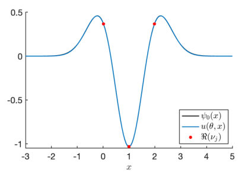 
Figure 1. Approximation of two types of wave packets by L = 3 Gaussians. The top and bottom row show the approximation of the single Gaussian ψEx.1 0 = N0e−(x−2)2 and of the excited state ψEx.2 0 = N0H2(x −1)e−(x−1)2, respectively, where N0 are normalization constants. The plots to the left show the approxi- mation with steps (i)–(iii), and the plots to the right show the improvement with step (iv).

📷 Fig 2

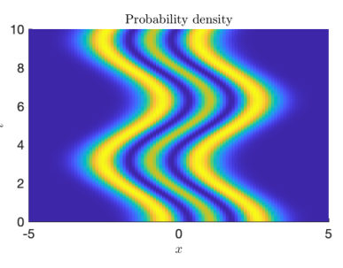 
Figure 2. Contour plots of the position density |ψ(t, x)|2 for the harmonic os- cillator. The left plot shows the dynamics for the Gaussian initial data, the right plot for the excited initial condition with a three-Gaussian approximation.

📷 Fig 3

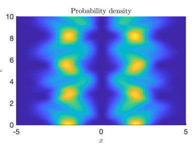 
Figure 3. Contour plots of the position density |ψ(t, x)|2 for the double-well. The left plot shows the dynamics of the first excited state (two-Gaussian approx- imation), the right plot shows the superposition (six-Gaussian approximation).

📷 Fig 4

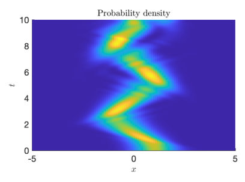 
Figure 4. Evolution of a single Gaussian initial condition in a hyperbolic cosine potential using multi-Gaussian approximations. Step-size: h = 10−3.

📷 Fig 5

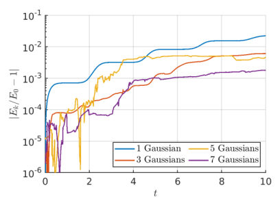 
Figure 5. Discretize–then approach. Comparison of the attained residual and energy deviation of the evolution of a single initial Gaussian condition in a double- well (left) and hyperbolic cosine (right) potential using L = 1, 3, 5, 7 Gaussian basis functions. The plots in the top row show the squared residual norm Fk(θk+1) = ∥rk(θk+1, ·)∥2. Numerical parameters: ζ = 1

**Summary.** This paper presents a unified theoretical framework for analyzing time-stepping methods that approximate solutions to evolution equations by minimizing residuals on low-dimensional nonlinear manifolds. It rigorously separates and bounds the errors arising from both the time discretization scheme ($\zeta$-methods) and the residual minimization process itself. This is highly valuable for developing stable and accurate numerical solvers for quantum dynamics simulations.

**Why it may be interesting.** This work provides rigorous mathematical tools to analyze the convergence of complex numerical schemes used in quantum dynamics, particularly those involving variational parameterizations common in AMO physics.

Detailed structure

**Main problem.** Developing a unified error analysis for time-discrete parametric approximations of evolution equations posed in Hilbert spaces.

**Main result.** The global approximation error can be decomposed into separate residual and time discretization components, achieving convergence rates up to second order under various stability assumptions.

**Method.** The core method involves iteratively minimizing a residual norm (derived from either discretizing the equation then parameterizing, or parametrizing then discretizing the variational principle) at each time step.

**Model / system.** The theory is applied to general evolution equations in Hilbert spaces, specifically illustrated using time-dependent Schrödinger and Fokker–Planck equations. The solution is approximated by a parametrized ansatz on a low-dimensional nonlinear manifold.

**Key observables.** Global approximation error, residual norms, and gradients of the cost function $F_k(	heta) = \|r_k(	heta, \cdot)\|^2_H$.

**Important parameters / regimes.** Time step size ($h$), total time ($T$), and the structure/conditioning of the parametrization map.

**Assumptions / limitations.** The analysis relies on Lipschitz, one-sided Lipschitz, or dissipativity assumptions for convergence guarantees; stability conditions involving parametrization map conditioning arise naturally in certain formulations.

**Figures summary.** Figure 10 shows the evolution of a single Gaussian wave packet under different regimes of the Fokker–Planck equation. Figure 11 illustrates the squared $L_2$-norm difference between exact and numerical solutions for this example, showing convergence with step size.

**Paper structure.** The paper introduces an abstract framework (Section 2), derives explicit residual formulations based on two paradigms (Section 3), develops a unified error analysis for $\zeta$-methods (Section 4), and details closed-form formulas for Gaussian manifolds (Section 5).

Abstract

We study time-discrete parametric approximations of evolution equations in Hilbert spaces based on residual minimization. The solution is represented by a parametrized ansatz belonging to a low-dimensional nonlinear manifold, and time stepping is performed by minimizing suitably defined residuals at each step. Two natural residual formulations are considered: discretization followed by parametrization of the evolution equation, and discretization of the Dirac--Frenkel variational principle governing the parameter dynamics. A unified error analysis is developed for both approaches within the family of $ζ$-methods. The resulting bounds separate the effects of time discretization from those of residual minimization and yield first- and second-order convergence under Lipschitz, one-sided Lipschitz, and dissipativity assumptions. For the variational formulation, additional stability conditions involving the conditioning of the parametrization map arise naturally. The framework is applied to Gaussian approximation manifolds, for which residual norms and gradients admit explicit closed-form expressions when polynomial operators are involved. This enables efficient implementation without spatial discretization. Numerical experiments for time-dependent Schrödinger equations illustrate the theoretical convergence rates and the influence of residual accuracy on conservation properties.

[↑ back to top](#top)

### [Single-component twisted $\mathbb{Z}_3$ orthogonal metal in an $e/3$-anyon fluid](http://arxiv.org/abs/2607.15274v1)

**Authors:** Zhaoyu Han, Ashvin Vishwanath, Eslam Khalaf  
**Type:** theory · **Category:** strongly correlated electrons · **PDF:** <https://arxiv.org/pdf/2607.15274v1>  
**Analysis basis:** full PDF text, analyzed in chunks
**Topic relevance:** `Keldysh / 2PI / non-Gaussian methods` **3/5** · `analog quantum simulation` **2/5** · `methods for driven-dissipative` **2/5** · `correlated cavity matter` **1/5** · `driven-dissipative phase transition` **1/5** · `non-equilibrium dynamics` **1/5**

📷 Fig 1

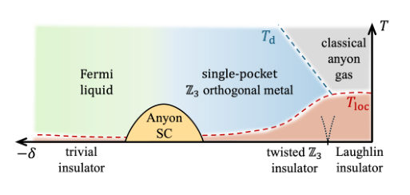 
FIG. 1. A possible phase diagram as a function of doping charge density δ and temperature T. Td and Tloc are, respec- tively, the quantum degeneracy and localization scales of the anyons. An alternative possibility, not shown, is that the Z3 orthogonal metal and the Fermi liquid (and correspondingly their zero temperature insulating phases) are separated by a first order transition.

**Summary.** This work introduces a theoretical model for a twisted $\mathbb{Z}_3$ orthogonal metal formed by doping a Fractional Chern Insulator. The metallic phase is characterized by emergent $e/3$ fermions and exhibits unique transport signatures like fractional shot noise. Crucially, pairing this state allows the realization of superconducting phases whose topological properties are controllable via band structure analysis.

**Why it may be interesting.** The explicit prediction of fractional charge carriers ($e/3$) and the connection between orbital magnetism, fractionalization, and tunable chiral central charges are highly relevant for designing novel topological quantum materials.

Detailed structure

**Main problem.** The paper proposes an unconventional metallic phase, a twisted $\mathbb{Z}_3$ orthogonal metal, emerging when doping a Fractional Chern Insulator (FCI). This state serves as a parent for realizing anyon superconductivity with arbitrary chiral central charge.

**Main result.** The resulting metal exhibits fractionalized transport signatures ($e/3$ shot noise, $6\pi$ Josephson effect) and can pair into superconductors whose topological properties are dictated by the BdG band topology of the paired fermions.

**Method.** The analysis uses parton decomposition on a low-energy Lagrangian derived from the parent FCI state to separate physics into itinerant (f) and gapped (g) sectors, followed by detailed theoretical predictions for transport and pairing.

**Model / system.** The system models doping the $1/3$ Laughlin state on a lattice, characterized by three degenerate valleys due to fractional background flux. The effective low-energy theory is described by an interacting Lagrangian involving emergent charge-$e/3$ fermions coupled to a $\mathbb{Z}_3$ gauge field.

**Key observables.** Fractional charge ($e/3$), anomalous quantum oscillations (frequency factor of 9), $6\pi$ ac Josephson effect, and the chiral central charge ($c_{-}$) of the resulting superconductor.

**Important parameters / regimes.** Doping parameter ($\delta$), temperature regimes relative to localization scale ($T_{loc}$) and degeneracy scale ($T_d$), and the ratio of inter-valley to intra-valley repulsions ($r$).

**Assumptions / limitations.** The stability of the single-pocket OM is argued based on net inter-valley repulsion, and the analysis assumes that the f-fermion sector governs low-energy charge dynamics.

**Figures summary.** Figure 1 schematically shows a $\delta$-$T$ phase diagram illustrating critical temperatures for different metallic and superconducting phases.

**Paper structure.** The paper first establishes the parent state (FCI) and then uses parton decomposition to derive an effective Lagrangian. It analyzes transport properties, predicts fractionalized signatures, discusses competing metallic states (triple-pocket vs. single-pocket OM), and finally details how pairing leads to specific superconducting topological orders.

Abstract

We propose an unconventional metallic phase emerging on doping the $1/3$ Fractional Chern insulator, which can serve as a parent state to anyon superconductivity with arbitrary chiral central charge. It is a twisted $\mathbb{Z}_3$ orthogonal metal: a state with vanishing electron quasiparticle weight but a single well-defined Fermi surface of emergent charge-$e/3$ fermions coupled to a Dijkgraaf-Witten twisted $\mathbb{Z}_3$ gauge field. It is manifestly valley-symmetric and valley-gapped. Pairing this fractionalized Fermi surface then removes the topological order and produces a family of superconductors whose chiral central charge is directly set by the BdG band topology of the paired $e/3$ fermions, while the angular momentum of the physical order parameter is constrained to be a multiple of three. This scenario provides a route to superconducting states beyond anyon-superconductivity constructions based on $2e/3$ anyons. The metallic phase itself carries distinctive ``fractional Fermiology'' signatures: $e/3$ shot noise, anomalous quantum oscillations, and a $6π$ ac Josephson effect when it mediates the Josephson coupling between superconductors. We construct explicit wavefunction ansatz realizing the phase, and argue that inter-valley repulsion between anyons stabilizes this phase compared to competing states. We show that the construction extends to higher Laughlin states but not to Jain states.

[↑ back to top](#top)

### [Spinless charged excitation at the interface between a conventional topological insulator and a topological Mott insulator](http://arxiv.org/abs/2607.14221v1)

**Authors:** Cesar A. Gallegos, Andrew J. Millis, Steven R. White  
**Type:** theory · **Category:** strongly correlated electrons · **PDF:** <https://arxiv.org/pdf/2607.14221v1>  
**Analysis basis:** full PDF text, analyzed in chunks
**Topic relevance:** `analog quantum simulation` **3/5** · `methods for driven-dissipative` **3/5** · `Kondo & dissipative impurity` **1/5** · `entanglement & information structure` **1/5** · `exotic spin models in light-matter` **1/5** · `non-equilibrium dynamics` **1/5**

📷 Fig 1

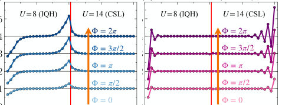 
FIG. 1. (a) Magnetic unit cell of the triangular lattice with flux π/2 per triangle. Nonzero Peierls hopping phases are shown. (b) Representative IQH–CSL YC6 cylinder under flux insertion Φ. Change in position dependent charge den- sity nΦ −nΦ=0 (c) and spin density Sz Φ −Sz Φ=0 (d) caused by threading the same and opposite fluxes for the two spin species, respectively, in 40 × 6 cylinders. The charge and spin pumped for different fluxes are shifted by 0.1 for clarity. The vertical red line in (b)-(d) indicates the IQH–CSL interface, and the orange large arrows indicate the pumping progres- sion.

📷 Fig 2

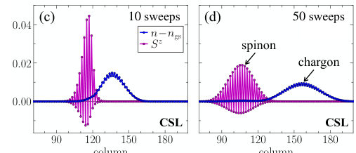 
FIG. 2. Single-particle bulk excitations in the [(a), (b)] IQH and [(c), (d)] CSL phases at U =8 and U =14, respectively, in a 240×3 cylinder keeping a bond dimension χ=800. The solid blue and purple lines show the deviation of the charge density from the ground state, n −ngs, and the local magnetization, Sz, respectively, for different sweeps. The electron-like exci- tation in the IQH and its spin-charge separation into a spinon and chargon in the CSL phase are indicated.

📷 Fig 3

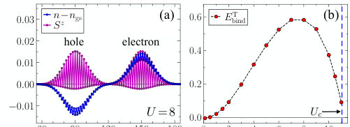 
FIG. 4. (a) A separated electron-hole pair in the IQH phase at U =8 in a 240×3 cylinder. The solid blue and purple lines show the deviation of the charge density from the ground state, n−ngs, and the local magnetization, Sz, respectively. (b) The spin-triplet electron-hole binding energy from Eq. (2) as a function of U in the IQH phase. The blue dashed line indicates the IQH–CSL transition point Uc.

📷 Fig 4

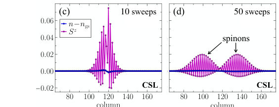 
FIG. 3. Same as Fig. 2, but for the charge-neutral spin-triplet bulk excitation. The spin-triplet exciton in the IQH phase and the fractionalization into two spatially separated spinons in the CSL phase are indicated.

📷 Fig 5

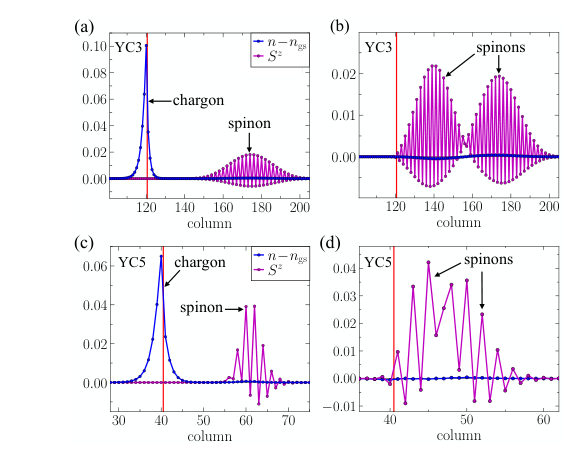 
FIG. 5. Excited states at the IQH–CSL interface. The [(a), (c)] single-particle and [(b), (d)] charge-neutral spin-triplet excitation for [(a), (b)] YC3 (length 240) and [(c), (d)] YC5 (length 80) cylinders. The solid red line marks the IQH–CSL interface. The solid blue and purple lines show the deviation of the charge density from the ground state, n−ngs, and the local magnetization, Sz, respectively. The spinless charged excitations, chargon and holon, and the fractionalized spin excitation, spinon, are indicated.

**Summary.** This theoretical work uses DMRG on the Hofstadter-Hubbard model to examine an interface between a Quantum Hall insulator and a Chiral Spin Liquid. The primary finding is the existence of a gapless, spinless charged excitation localized at this boundary. The research also details how bulk excitations in both phases exhibit characteristic signatures of fractionalization or electron-hole binding.

**Why it may be interesting.** The study of topological interfaces and fractionalized excitations is highly relevant to understanding emergent phenomena in strongly correlated electron systems, which often exhibit complex quantum ground states beyond simple band theory predictions.

Detailed structure

**Main problem.** The study investigates exotic excitations at the interface separating two distinct topological insulating phases: an Integer Quantum Hall (IQH) phase and a Chiral Spin Liquid (CSL) phase.

**Main result.** The IQH–CSL interface hosts a unique, gapless spinless charged excitation. Furthermore, bulk analysis reveals fractionalization in the CSL phase and exciton formation in the IQH phase.

**Method.** Density Matrix Renormalization Group (DMRG) calculations were extensively used to study both topological response to fluxes and low-lying excited states across the interface.

**Model / system.** The system is modeled using the triangular-lattice Hofstadter-Hubbard model, parameterized with spatially varying interaction strengths ($U$) to realize the IQH (TI) and CSL (TMI) regimes.

**Key observables.** Charge density deviation ($	ext{n} - 	ext{n}_{	ext{gs}}$), local magnetization ($S_z$), charge/spin pumping, and binding energies of spin-triplet excitons.

**Important parameters / regimes.** The analysis focuses on the half-filled ground state regime, comparing regimes with $U=8$ (IQH) and $U=14$ (CSL).

**Assumptions / limitations.** The calculations are performed on finite-radius cylinders (YC3, YC5), and results rely on DMRG sweeps which serve as diagnostics for identifying characteristic fractionalized structures.

**Figures summary.** Figures illustrate charge/spin density profiles under flux insertion, compare single-particle excitations in bulk IQH vs CSL phases, and track the energy evolution of two-particle states across different bond dimensions ($\chi$).

**Paper structure.** The paper systematically analyzes the interface by first characterizing bulk excitations (fractionalization in CSL, excitons in IQH), then using pumping measurements to identify the gapless edge mode, and finally analyzing two-particle excited states to confirm spinon/chargon separation at the boundary.

Abstract

We investigate the interface separating two topologically distinct insulating phases of matter using extensive density-matrix renormalization group calculations to study the triangular-lattice Hofstadter-Hubbard model with a spatially varying interaction strength, chosen to realize both integer quantum Hall and chiral spin liquid states in different spatial regions. We find that the integer quantum Hall-chiral spin liquid interface hosts a spinless charged excitation that is bound to the interface. This mode at the interface is identified through charge and spin pumping, and by direct calculations of low-lying excited states. We also characterize bulk excitations in both phases, finding evidence for fractionalization in the chiral spin liquid and for spin-triplet exciton formation in the integer quantum Hall phase.

[↑ back to top](#top)

### [Backpropagating Pauli Propagation](http://arxiv.org/abs/2607.15184v1)

**Authors:** Sheng-Hsuan Lin, Etienne Granet, Kevin Hémery, Henrik Dreyer  
**Type:** theory · **Category:** strongly correlated electrons · **PDF:** <https://arxiv.org/pdf/2607.15184v1>  
**Analysis basis:** full PDF text, analyzed in chunks
**Topic relevance:** `analog quantum simulation` **3/5** · `methods for driven-dissipative` **3/5** · `entanglement & information structure` **1/5** · `exotic spin models in light-matter` **1/5** · `non-equilibrium dynamics` **1/5**

📷 Fig 1

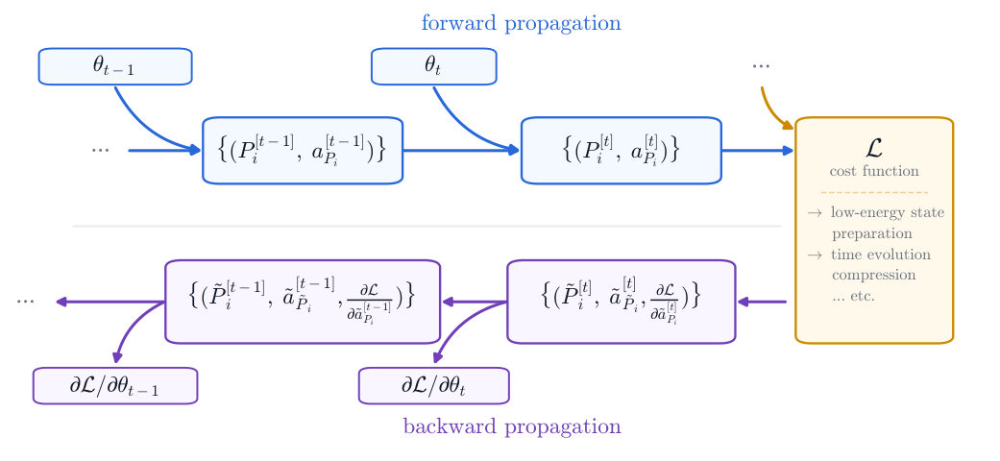 
FIG. 1. An illustration of the forward propagation and backward propagation workflow of the SPD optimization. The workflow resembles reverse-mode automatic differentiation on a computational graph. The difference is that we do not store values of the intermediate nodes. Instead, we utilize the reversibility of the quantum circuit and recompute the values on the nodes on the fly in the backward pass. Our directional terminology follows the operator propagation rather than the Schr¨odinger-picture state evolution: “forward” means applying the Heisenberg updates Os = U † s Os−1Us in circuit order, thereby growing the observable toward the circuit input, whereas “backward” means traversing the...

📷 Fig 2

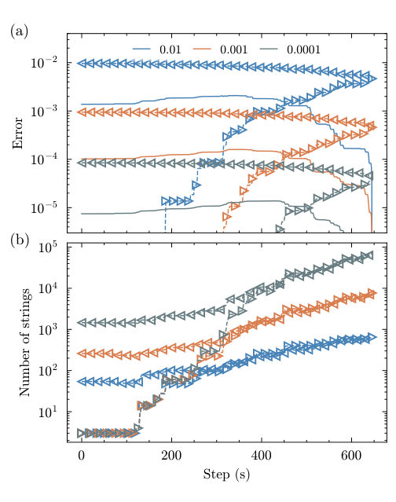 
FIG. 2. Error (a) and the number of strings (b) for forward ▷and backward ◁propagation of the Hamiltonian operator with different truncation thresholds: 10−2 (blue), 10−3 (or- ange), and 10−4 (grey). (a): The triangle markers track the truncation error in l2 norm, i.e., 1 −∥O(s)∥/∥O(0)∥ for both forward ▷and backward ◁step s. The solid line indicates the error in overlap between operators from the forward and backward pass at the same step, i.e., 1 − |⟨Of(s)|Ob(s)⟩|/(∥Of(s)∥∥Ob(s)∥). (b): The number of Pauli strings at each step under forward and backward propagation.

📷 Fig 3

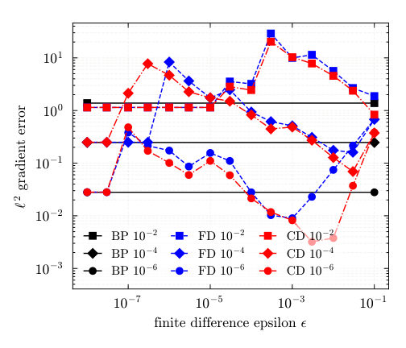 
FIG. 3. We compare the ℓ2 error of the gradient com- puted with the backpropagation (BP) method and two finite- difference methods using forward difference (FD) and cen- tral difference (CD), respectively. We consider the five-layer symmetry-breaking ansatz of Eq. (27) with 15 parameters for the 1D TFI model with N = 13, g = 1.3, and periodic boundary condition. The high-accuracy reference gradient is computed in double precision using BP with threshold 10−12. Markers denote truncation thresholds δ = 10−2, 10−4, 10−6.

📷 Fig 4

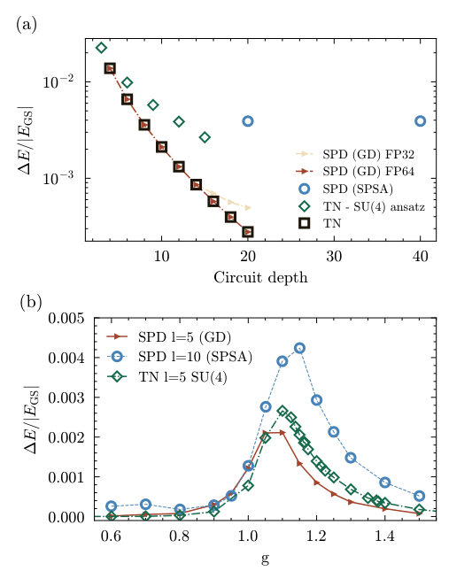 
FIG. 4. (a) Relative energy error of the 1D TFI g = 1.1 against circuit depth in terms of entangling two-qubit gates for several optimization methods and ansatz choices. The first set of data points (green diamond) is a generic SU(4) brick- work ansatz optimized with tensor network methods [34]. The second (black square), third, and fourth set of data points use the HVA ansatz optimized by gradient descent, where the gradient is obtained through tensor network methods [39] or through SPD backpropagation at two numerical precisions. The last set of data points comes from the SPSA optimiza- tion of the generic ansatz including the symmetry-breaking term taken from [25]. (b) Relative energy...

📷 Fig 5

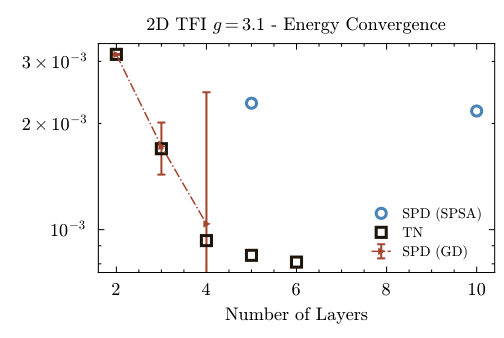 
FIG. 5. Relative energy error of the 2D TFI g = 3.1 against the number of repeated layers in the variational ansatz. We compare the optimization of the HVA circuit using SPD back- propagation based gradient descent (red) and the iPEPS- based gradient descent method [44] (black). We also include data taken from [25] with the generic ansatz in Eq. (25) op- timized by SPSA and SPD on a (10, 10) PBC lattice.

**Summary.** This paper introduces an efficient backpropagation algorithm tailored for calculating gradients in quantum circuits simulated using Pauli propagation. By exploiting circuit reversibility, it achieves significant memory savings compared to standard automatic differentiation techniques. This enables accurate and scalable classical optimization of quantum models relevant to condensed matter physics.

**Why it may be interesting.** This work provides a crucial computational tool for optimizing quantum circuits applied to condensed matter models (like Ising/Heisenberg), enabling efficient parameter tuning that was previously limited by memory constraints in gradient estimation.

Detailed structure

**Main problem.** The primary goal is developing a memory-efficient backpropagation algorithm to calculate parameter gradients for quantum circuits simulated via Pauli propagation.

**Main result.** The proposed method achieves computational complexity comparable to standard sparse Pauli simulation while offering significant memory savings ($\mathcal{O}(n_{	ext{param}})$) over conventional reverse-mode automatic differentiation.

**Method.** It employs a specialized backpropagation technique that exploits the reversibility of quantum circuits, allowing gradient calculation by recomputing intermediate operators rather than storing them all.

**Model / system.** The work focuses on simulating quantum circuits applied to models like the transverse-field Ising model and the Heisenberg model, which are relevant in condensed matter physics.

**Key observables.** Parameter gradients ($\partial L / \partial 	heta$), observable expectation values, and operator-complexity measures such as the operator stabilizer Rényi entropy.

**Important parameters / regimes.** The number of parameters ($n_{	ext{param}}$) in the circuit is crucial for determining computational scaling and memory savings.

**Assumptions / limitations.** The method relies on finite truncation thresholds ($\delta$) during Pauli propagation, which introduces controlled errors; it also assumes the cost function depends only on the final layer's observable state.

**Figures summary.** Figure 1 illustrates the forward (Heisenberg updates) and backward (gradient calculation) propagation workflow. Figure 2 compares norm error and operator infidelity between forward and backward passes, showing consistency with the truncation threshold $\delta$.

**Paper structure.** The paper introduces the problem of gradient computation in Pauli simulation, details the forward pass using Heisenberg evolution rules for observables, presents the novel memory-efficient reverse-mode algorithm utilizing circuit reversibility, and validates it by applying it to state preparation and time-evolution compression tasks.

Abstract

We develop a backpropagation algorithm for evaluating parameter gradients in quantum circuits using Pauli propagation simulation. The method has computational complexity comparable to that of standard sparse Pauli simulation techniques, while producing gradients whose accuracy is of the same order as the corresponding observable expectation values. By exploiting the reversibility of quantum circuits, the algorithm reduces the memory cost by a factor of $\mathcal{O}(n_\text{param})$ compared with conventional reverse-mode automatic differentiation, where $n_\text{param}$ denotes the number of parameters in the circuit. Compared with finite difference methods, the algorithm is $\mathcal{O}(n_\text{param})$ more efficient in function evaluations. These features enable efficient and accurate classical optimization of quantum circuits for applications such as state preparation and time-evolution compression, while also allowing operator-complexity measures such as the operator stabilizer Rényi entropy to be monitored and regularized during optimization. We demonstrate the method by optimizing low-energy state-preparation circuits for transverse-field Ising models in one, two, and three dimensions and for the three-dimensional Heisenberg model, and by compressing two-dimensional time-evolution circuits.

[↑ back to top](#top)

### [Evolution-Level Quantum Optimal Control of Single-Qubit Gates with Physics-Informed Neural Networks](http://arxiv.org/abs/2607.14884v1)

**Authors:** Yao Du, Jian-Jian Cheng, Lin Zhang, Ming-Liang Hu, Xingang Wang  
**Type:** theory · **Category:** quantum information and computing · **PDF:** <https://arxiv.org/pdf/2607.14884v1>  
**Analysis basis:** full PDF text, analyzed in chunks
**Topic relevance:** `methods for driven-dissipative` **3/5** · `non-equilibrium dynamics` **2/5** · `correlated / nonlocal dissipation` **1/5** · `driven-dissipative phase transition` **1/5** · `quantum measurements` **1/5**

📷 Fig 1

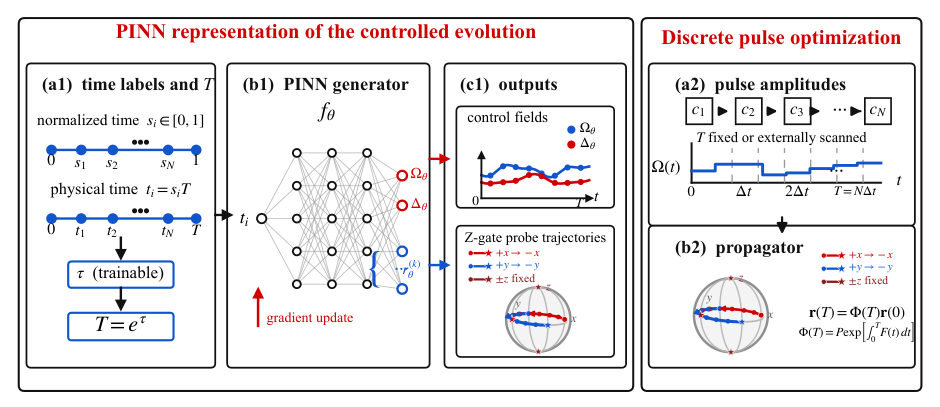 
FIG. 1. Discrete-pulse optimization and a PINN representation of controlled gate dynamics. Left: PINN representation. (a1) Sample labels are mapped to physical times through the trainable duration T = eτ. (b1) A physics-informed neural network (PINN) maps ti to controls and probe trajectories. (c1) The outputs are differentiable over the gate interval; the Bloch sphere sketches representative Z-gate probe motion. The learned fields are checked after training by independent fourth-order Runge–Kutta (RK4) propagation. Right: discrete-pulse reference. (a2) The optimized object is a list of pulse amplitudes on a fixed or externally scanned time grid. (b2) State motion is obtained by propagating...

📷 Fig 2

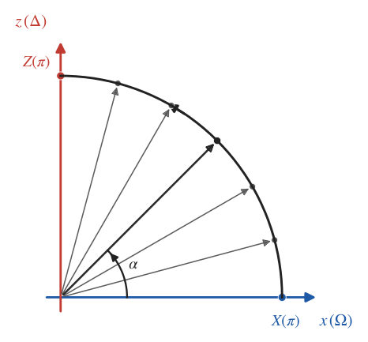 
FIG. 2. Rotation axes in the controlled x–z plane. The family ˆn(α) = (cos α, 0, sin α) interpolates between X(π) and Z(π) using the available Ωand ∆channels.

📷 Fig 3

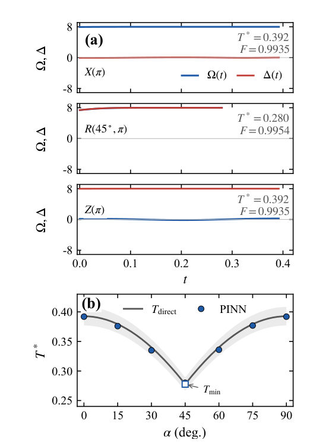 
FIG. 3. Organization under the minimal prescription. (a) Representative controls for X(π), R(45◦, π), and Z(π) recover saturated square-pulse structure without prescribing a square- pulse ansatz. (b) The optimized durations T ∗for all seven in-plane gates follow the Pontryagin-based direct-control pre- diction Tdirect of Eq. (16); the shaded band marks ±4%.

📷 Fig 4

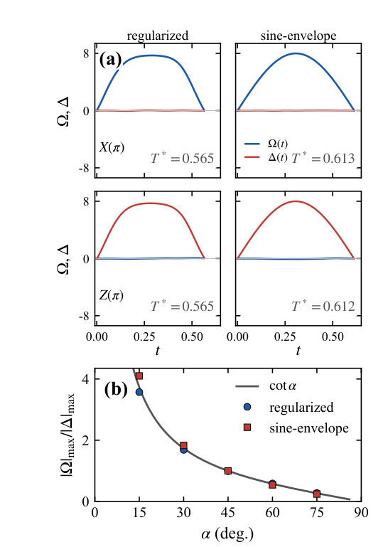 
FIG. 4. Pulse-shape prescriptions and the geometric channel- division law. (a) Regularized and sine-envelope controls for the in-plane X(π) and Z(π) gates, with T ∗marked in each panel. (b) The peak-amplitude ratio |Ω|max/|∆|max follows cot α for both prescriptions, showing that the channel-division law is set by the target geometry and survives pulse-shape constraints. Numerical weights are listed in Appendix B.

📷 Fig 5

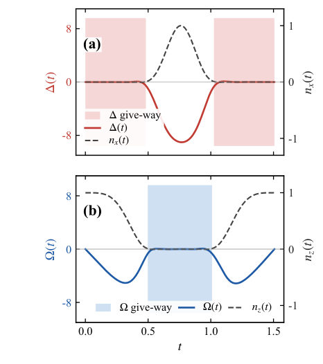 
FIG. 6. Automatic coordination in the geometric Z gate, shown on a common time axis with the same color convention as Fig. 5. (a) ∆(t) (red) versus nx(t) (dashed). The red-shaded bands mark where |nx| →0, which forces ∆→0 because E = 1 2(Ωnx + ∆nz) then reduces to 1

**Summary.** This paper pioneers an evolution-level approach to quantum optimal control using Physics-Informed Neural Networks (PINNs). Instead of optimizing pulses, it optimizes the entire controlled dynamical process on the Bloch sphere. This method allows researchers to design gates that are not only high-fidelity but also physically diagnosable and adaptable to complex hardware constraints.

**Why it may be interesting.** This work provides a powerful, modern computational tool for quantum control that moves beyond simple time-domain pulse shaping by enforcing physical laws directly into the optimization objective, which is highly relevant for designing robust quantum hardware protocols.

Detailed structure

**Main problem.** The paper addresses how to optimize quantum gate design by treating the entire controlled evolution, rather than just the input pulse amplitudes, as the object of optimization.

**Main result.** Using Physics-Informed Neural Networks (PINNs) allows for a unified, differentiable framework that optimizes control fields, trajectories, and duration simultaneously, yielding physically readable controls.

**Method.** The authors employ PINNs to encode the Bloch equation dynamics as constraints within the loss function, enabling end-to-end optimization of the quantum process.

**Model / system.** The system is a single qubit whose evolution is modeled on the Bloch sphere and governed by a dissipative Bloch vector field ($\dot{\mathbf{r}} = \mathbf{F}[\mathbf{r}, \Omega, \Delta]$).

**Key observables.** Process fidelity ($	ext{F}_{	ext{proc}}$), average gate fidelity ($	ext{F}_{	ext{avg}}$), and the residual geometric error for path constraints.

**Important parameters / regimes.** Dissipation rates ($\Gamma_1, \Gamma_2$), optimization weights ($\alpha_{	ext{dyn}}, eta_{	ext{gate}}$), and the trainable duration $T$.

**Assumptions / limitations.** The primary assumption is that the continuous dynamics can be accurately represented by a differentiable function learned via PINNs, which unifies previously separated optimization steps.

**Figures summary.** Figures compare discrete pulse optimization methods against the proposed PINN generator approach for visualizing control field and trajectory learning.

**Paper structure.** The paper introduces the limitation of traditional pulse optimization, proposes the continuous PINN framework to model the full evolution, details the loss function incorporating dynamics and gate requirements, and validates this method on both standard rotation gates and geometrically constrained gates.

Abstract

Quantum gate design is often represented as pulse optimization, although the physical object that implements a gate is the full controlled evolution generated by the pulse. Here we use physics-informed neural networks to represent single-qubit gate design at this evolution level: the control fields, the Bloch-state trajectories, and the total duration are learned together under the Bloch equation. This changes the optimized object from pulse amplitudes to a differentiable physical process whose structure can be inspected and refined. For rotation gates, the optimized evolutions recover the physical organization expected for bounded single-qubit control, with no prescribed pulse ansatz or duration scan. For a geometric gate, the representation identifies localized bottlenecks in maintaining the geometric condition and turns this diagnosis into feedback, reducing the residual path error while preserving high fidelity. Thus physics-informed learning is used not only to synthesize gates, but also to make optimized quantum controls physically readable, diagnosable, and locally refinable. This process-level view may be especially useful for adapting gates to hardware-specific, task-specific, and locally varying experimental constraints.

[↑ back to top](#top)

### [Fast two-dimensional tensor-network contraction via subspace iteration](http://arxiv.org/abs/2607.15158v1)

**Authors:** Yining Zhang, Philippe Corboz  
**Type:** theory · **Category:** numerical methods · **PDF:** <https://arxiv.org/pdf/2607.15158v1>  
**Analysis basis:** full PDF text, analyzed in chunks
**Topic relevance:** `methods for driven-dissipative` **3/5** · `analog quantum simulation` **2/5** · `entanglement & information structure` **1/5** · `exotic spin models in light-matter` **1/5** · `non-equilibrium dynamics` **1/5**

📷 Fig 1

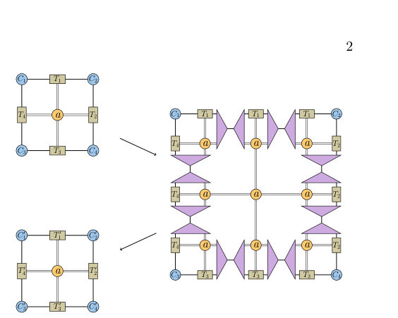 
FIG. 1. One full CTMRG step. The single-site environ- ment (C1,...,4, T1,...,4) (top left) grows in all directions (right). Each corner becomes an enlarged corner, and each edge is enlarged by inserting the bulk tensor a. Projectors are con- structed to truncate the χD2 bonds back to χ. Contracting the enlarged corners and edges yields the updated environ- ment (C′ 1,...,4, T ′ 1,...,4) (bottom left).

📷 Fig 2

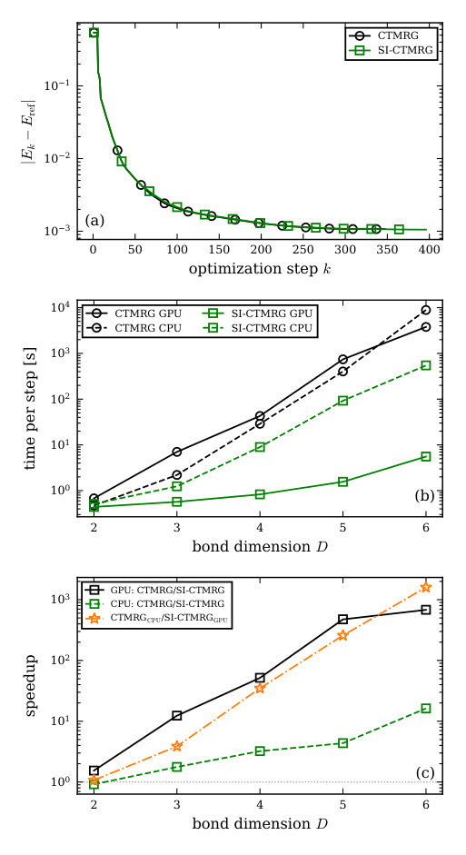 
FIG. 2. CTMRG vs. SI-CTMRG for the triangular Heisen- berg model. (a) Convergence of the energy, |Ek−Eref| per L-BFGS iteration at D=5, χ=100, where Eref = −0.55160 is the thermodynamic-limit reference energy of Ref. [12]. (b) Time per optimization step (forward+backward) vs. D at χ=20, 45, 80, 100, 144 for D=2, . . . , 6 on a single H100 GPU (solid lines) and an 8-core CPU (dashed lines). (c) Speedup ratios: algorithmic (CTMRG/SI-CTMRG at fixed hard- ware) on GPU and on CPU, and the combined ratio CTMRGCPU/SI-CTMRGGPU.

📷 Fig 3

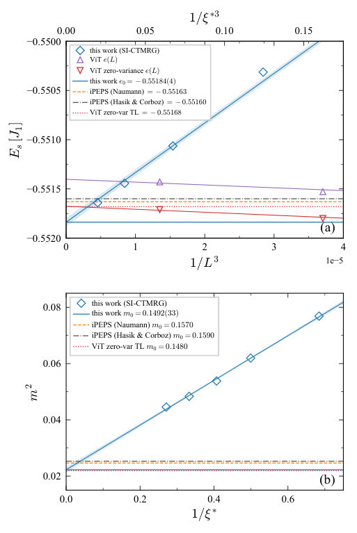 
FIG. 3. Triangular-lattice Heisenberg benchmark. (a) En- ergy per site of our D = 4, . . . , 8 optimized states plotted against 1/ξ∗3 (top axis) together with the ViT wave func- tion energies and its corresponding zero-variance extrapolated points of Ref. [54] against 1/L3 (bottom axis); the solid blue line is our linear FCLS extrapolation giving e0 = −0.55184(4). Horizontal lines show other thermodynamic-limit (TL) refer- ence values: iPEPS results by Naumann et al. [53] (−0.55163), Hasik &amp; Corboz [12] (−0.55160), and the ViT zero-variance result [54] (−0.55168). (b) Squared sublattice magnetiza- tion m2 vs. 1/ξ∗for the same states; the solid blue line shows the linear extrapolation m2(ξ∗)...

📷 Fig 4

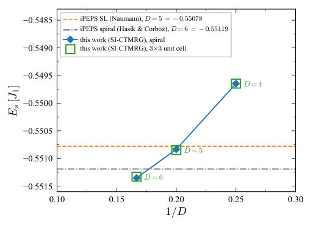 
FIG. 4. Ground-state energy per site Es of the triangular Heisenberg antiferromagnet versus 1/D, obtained with SI- CTMRG. Blue diamonds show the single-site spiral ansatz and green open squares the three-sublattice 3 × 3 unit-cell ansatz (D = 4, 5, 6); the two ans¨atze yield matching energies at each D. Horizontal lines mark the D = 5 square-lattice iPEPS result of Naumann et al. [53] (−0.55078) and the D = 6 spiral iPEPS result of Hasik &amp; Corboz [12] (−0.55119). The 3 × 3 unit-cell energies are optimized at χopt = 80, 100, 144 and evaluated up to χmax = 800, 800, 656 for D = 4, 5, 6, re- spectively.

**Summary.** This paper introduces Subspace Iteration CTMRG (SI-CTMRG) to drastically improve the computational efficiency of calculating properties on infinite projected entangled-pair states (iPEPS). By replacing costly large-matrix Singular Value Decompositions with smaller, iterative updates, the method shifts the bottleneck to GPU-friendly tensor contractions. It successfully applies this technique to the triangular Heisenberg antiferromagnet, achieving state-of-the-art results much faster than previous methods.

**Why it may be interesting.** While focused on condensed matter models, the core contribution is a highly efficient numerical technique for tensor network contractions (iPEPS/CTMRG), which has broad applicability in simulating quantum many-body systems beyond standard DMRG limits.

Detailed structure

**Main problem.** The primary goal is to improve the computational efficiency of calculating observables on infinite projected entangled-pair states (iPEPS) by accelerating the Corner Transfer Matrix Renormalization Group (CTMRG) contraction step.

**Main result.** The proposed SI-CTMRG method shifts the dominant cost from computationally expensive SVDs to tensor contractions, yielding significant speedups (up to two orders of magnitude) and achieving state-of-the-art results for the triangular Heisenberg antiferromagnet on modern GPUs.

**Method.** It introduces Subspace Iteration CTMRG (SI-CTMRG), a QR-based projector construction that replaces large-matrix SVDs with smaller, iterative updates followed by a small SVD. This makes the method highly suitable for GPU acceleration and fixed-point automatic differentiation.

**Model / system.** The method is demonstrated on two-dimensional quantum lattice systems, specifically using the spin-1/2 nearest-neighbor Heisenberg antiferromagnet Hamiltonian on the triangular lattice, which exhibits 120-degree magnetic order.

**Key observables.** Energy per site ($e$), local magnetic moment ($m$), and correlation length ($\xi$).

**Important parameters / regimes.** Bond dimension ($\chi$), oversampling parameter ($p$), and computational time/GPU resources (H100).

**Assumptions / limitations.** The standard CTMRG bottleneck is the cubic scaling of large-matrix SVDs, which SI-CTMRG circumvents by using subspace iteration updates.

**Figures summary.** Figures compare energy convergence and time per step between standard CTMRG and SI-CTMRG; Figure 3 shows linear extrapolation plots for ground state properties ($e$ vs $1/\xi^{*3}$) comparing results to other methods.

**Paper structure.** The paper introduces the limitations of standard CTMRG, details the novel SI-CTMRG algorithm using QR decomposition and subspace iteration, applies it to the triangular Heisenberg model, validates its efficiency via speedup comparisons, and finally presents extrapolated ground state properties consistent across different ansatz sizes.

Abstract

The corner transfer matrix renormalization group (CTMRG) is one of the standard contraction methods for infinite projected entangled-pair states (iPEPS), but its computational cost is dominated by repeated truncated singular value decompositions (SVDs). We introduce subspace-iteration CTMRG (SI-CTMRG), a QR-based projector construction that replaces each large-matrix SVD with an SVD of a much smaller matrix. The resulting algorithm shifts the dominant cost from decompositions to tensor contractions, making it highly suited to GPU acceleration and yielding speedups of up to two orders of magnitude over standard CTMRG. We demonstrate the efficiency and accuracy of the method for the triangular-lattice Heisenberg antiferromagnet, reaching state-of-the-art iPEPS results on a single H100 GPU in approximately 10 hours of computation.

[↑ back to top](#top)

### [Monopole Spin Density Wave States in Magnetic Weyl Semimetals](http://arxiv.org/abs/2607.14829v1)

**Authors:** Xi Luo  
**Type:** theory · **Category:** strongly correlated electrons · **PDF:** <https://arxiv.org/pdf/2607.14829v1>  
**Analysis basis:** full PDF text, analyzed in chunks
**Topic relevance:** `exotic spin models in light-matter` **3/5** · `spintronics-quantum-optics interface` **3/5** · `Keldysh / 2PI / non-Gaussian methods` **1/5** · `analog quantum simulation` **1/5**

📷 Fig 1

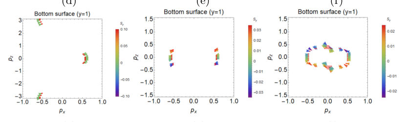 
FIG. 1. (color online) (a), (b), and (c) are the bulk bands along pz axis. px = py = 0 and V0 = 0.4. (a) Without the HM term. (b) κ1 = 0.4 and κ2 = 0. (c) κ1 = 0 and κ2 = 0.4. (d), (e), and (f) are the band structures with finite length (Ny = 20 sites) along y direction that correspond to (a), (b), and (c), respectively. (g), (h), and (i) are the spin polarizations along the Fermi arcs of the bottom surfaces in (d), (e), and (f), respectively. (e) and (f) are plotted within the folded (magnetic) Brillouin zone. The red points stand for the momentum locations of the Fermi arc states. The arrows indicate the directions of spins in the Sx-Sz plane and their color labels the magnitude of Sy.

📷 Fig 2

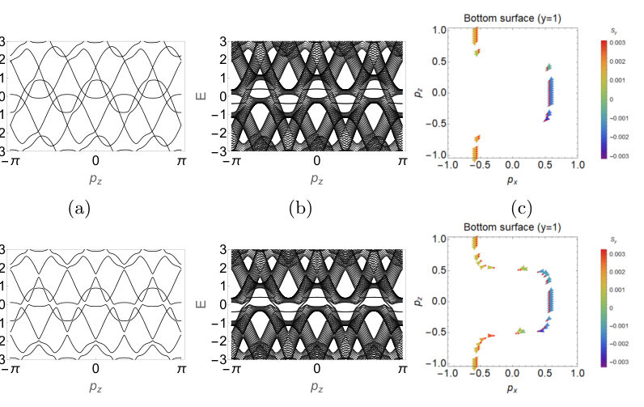 
FIG. 2. (color online) (a) and (d) are the bulk bands along pz axis for Q = 2π/3. px = py = 0 and V0 = 0.4. (a) κ1 = 0.4 and κ2 = 0. (d) κ1 = 0 and κ2 = 0.4. (b) and (e) are the band structures with finite length (Ny = 20 sites) along y direction that correspond to (a) and (d), respectively. (c) and (f) are the spin polarizations along the Fermi arcs within the folded Brillouin zone of the bottom surfaces in (b) and (e), respectively. The red points stand for the momentum locations of the Fermi arc states. The arrows indicate the directions of spins in the Sx-Sz plane and their color labels the magnitude of Sy.

**Summary.** This work explores monopole Spin Density Wave (SDW) phases in magnetic Weyl semimetals by developing a theoretical framework based on monopole harmonic functions. The research demonstrates that different types of SDW ordering yield unique, measurable signatures in electronic band structures and surface spin polarizations. It unifies the understanding of topologically ordered states across various pairing channels.

**Why it may be interesting.** The explicit connection between topological invariants (Berry curvature, quantum geometric tensor) and magnetically induced pairing states provides a powerful framework for understanding emergent phenomena in correlated materials relevant to spintronics.

Detailed structure

**Main problem.** The study investigates monopole Spin Density Wave (SDW) states arising from particle-hole pairing in magnetic Weyl semimetals, extending the understanding of topologically ordered phases.

**Main result.** The SDW order parameter is described by monopole harmonic functions and realizes ideal quantum geometry in the weak-coupling limit. Helical and cycloidal orders produce distinct signatures observable via spin-ARPES.

**Method.** Theoretical derivation using mean-field Hamiltonians, projection onto low-energy Fermi surfaces, and analysis of topological invariants like the pairing quantum geometric tensor.

**Model / system.** The system is a magnetic Weyl semimetal modeled with nested Fermi surfaces. The Hamiltonian includes terms for the underlying band structure ($h_0$) and the SDW mean field ($H_M$).

**Key observables.** Band structures, Fermi arc distributions, surface spin polarization patterns, and the quantum geometric tensor.

**Important parameters / regimes.** Weak-coupling limit; chirality of enclosed Weyl nodes; nesting vector Q (e.g., $Q=2\pi/3$ vs. same-chirality pairing).

**Assumptions / limitations.** Assumes particle-hole pairing occurs between Fermi surfaces enclosing Weyl nodes of the same chirality for the primary focus, though comparisons are made with other nesting vectors.

**Figures summary.** Figures illustrate bulk and surface band structures, showing distinct spin polarization patterns along Fermi arcs depending on whether the SDW order is helical or cycloidal. Comparisons are drawn between different pairing scenarios.

**Paper structure.** The paper first introduces the concept of monopole SDW states in Weyl semimetals, deriving the necessary gap functions using monopole harmonics. It then analyzes specific magnetic orders (helical vs. cycloidal) by solving a lattice model Hamiltonian and calculating diagnostic observables like spin polarization and quantum geometry tensors. Finally, it compares these results to other nesting conditions.

Abstract

The interplay between topology and magnetism in Weyl semimetals has recently emerged as a fertile ground for novel quantum phases. While monopole harmonic order parameters have been established for superconductivity and charge density waves in these systems, their spin density wave counterparts remain unexplored. Here we introduce monopole spin density wave (SDW) states arising from particle-hole pairing between nested Fermi surfaces enclosing Weyl nodes of the same chirality. We demonstrate that the SDW order parameter inherits a nontrivial pairing Berry phase and is described by monopole harmonic functions that exhibit topologically protected nodal structures in the gap function. Through a concrete lattice model, we show that helical and cycloidal SDW orders produce distinct signatures in band structures, Fermi arc distributions, and surface spin polarization patterns, which can be directly resolved by spin- and angle-resolved photoemission spectroscopy. Remarkably, we find that the quantum geometric tensor of the monopole pairing realizes ideal quantum geometry in the weak-coupling limit, where quantum distance fluctuations are entirely governed by Berry curvature. Our results not only unify the understanding of monopole ordered states across pairing channels but also provide experimental avenues for distinguishing competing magnetic orders in ReAlX (Re=rare earth elements, X=Si, Ge) materials and suggest potential applications in topological spintronics.

[↑ back to top](#top)

### [Analytical and Numerical Study of Quartic Nonlinear Electrodynamics in Holographic Fermion Systems](http://arxiv.org/abs/2607.15236v1)

**Authors:** Vitor Neves da Silva, Luiz Antonio Barreiro  
**Type:** theory · **Category:** strongly correlated electrons · **PDF:** <https://arxiv.org/pdf/2607.15236v1>  
**Analysis basis:** full PDF text, analyzed in chunks
**Topic relevance:** `Keldysh / 2PI / non-Gaussian methods` **3/5** · `Kondo & dissipative impurity` **1/5** · `analog quantum simulation` **1/5** · `methods for driven-dissipative` **1/5** · `non-equilibrium dynamics` **1/5**

📷 Fig 1

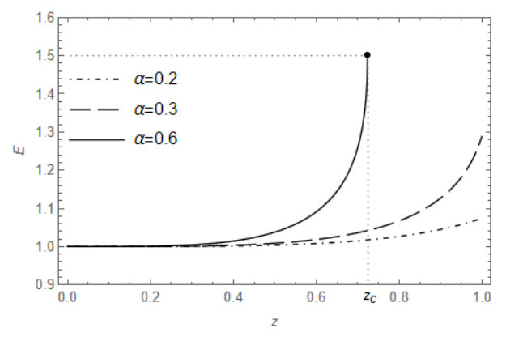 
Figure 1: Radial electric field E(z) for different values of the nonlinear coupling α′, with ρ = β = 1. For sufficiently small nonlinear coupling, the electric field remains regular throughout the holographic interval. As the coupling increases, the physical branch devel- ops a critical point at z = zc, where the differential constitutive response vanishes. Beyond this point, no globally continuous positive solution connected to the Maxwell branch exists.

📷 Fig 2

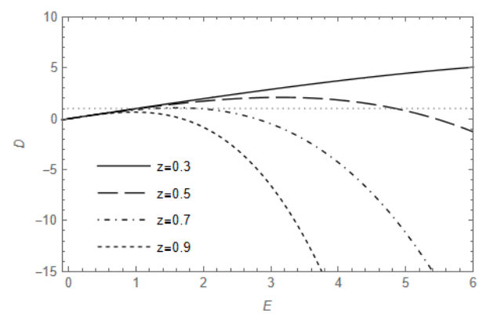 
Figure 2: Constitutive relation D(E, z) for representative values of the holographic co- ordinate. Near the AdS boundary the constitutive response is essentially linear, whereas toward the infrared region the quartic interaction progressively deforms the curve into a cubic profile. The horizontal line D = ρ intersects the constitutive curve at a unique pos- itive solution for z &lt; zc, becomes tangent at z = zc, and no longer intersects the physical branch for z &gt; zc, illustrating the loss of invertibility of the constitutive map

📷 Fig 3

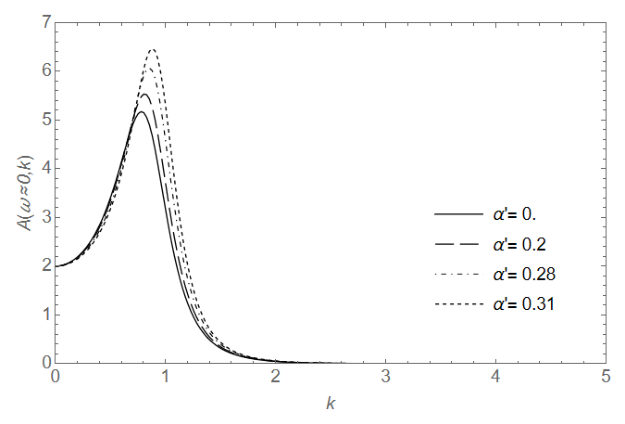 
Figure 3: Momentum dependence of the fermionic spectral function A(ω ≃0, k) for different values of the nonlinear coupling α′. Increasing the quartic gauge interaction shifts the spectral peak toward larger momenta while simultaneously enhancing its intensity, indicating a systematic modification of the holographic Fermi surface.

📷 Fig 4

 
Figure 3 shows that the spectral function develops a well-defined quasiparticle-like peak for every value of α′ considered. The persistence of this sharp maximum demonstrates that the holographic Fermi surface remains robust under the quartic electromagnetic correction. Nevertheless, both the peak position and its spectral weight evolve consistently as the nonlinear interaction is increased.

📷 Fig 5

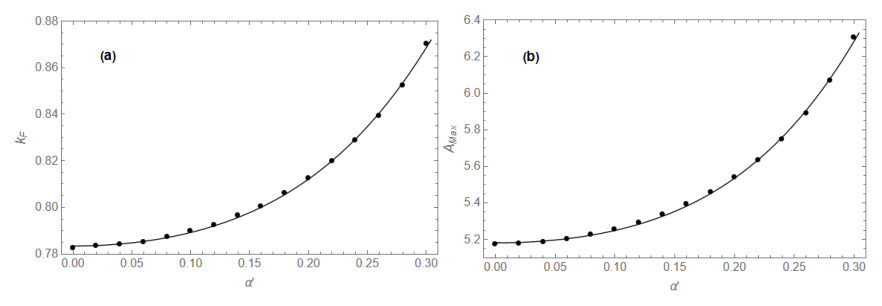 
Figure 4: Dependence of the fermionic observables on the nonlinear coupling α′. (a) Fermi momentum kF as a function of α′. (b) Maximum spectral weight Amax = A(ω ≃0, kF ) as a function of α′. Filled circles denote the numerical data, while the solid curves represent least-squares polynomial fits containing only even powers of α′. The excellent agreement confirms the even-power dependence predicted by the analytical structure of the nonlinear gauge sector discussed in Sec. III.

**Summary.** This paper analyzes how quartic nonlinearities in the gauge field affect charged fermions propagating holographically. By solving the modified electrodynamics background, the authors calculate the fermionic spectral function and find that these nonlinear terms shift the Fermi momentum and enhance the excitation weight. This demonstrates a clear mechanism by which bulk nonlinearities propagate to observable boundary physics.

**Why it may be interesting.** While focused on condensed matter/gravity duality, the explicit calculation of fermionic spectral functions and quasiparticle renormalization due to nonlinear bulk couplings provides a theoretical analogue for understanding how higher-order interactions modify low-energy excitations in strongly correlated systems.

Detailed structure

**Main problem.** The study investigates how leading string-inspired quartic corrections modify holographic fermionic observables within a bottom-up AdS4/CFT3 model.

**Main result.** The quartic interaction increases the chemical potential and enhances the spectral weight of fermions, causing the Fermi momentum to shift without destroying the holographic Fermi surface.

**Method.** The authors analyze the nonlinear electrostatic background derived from the gauge sector using an exact first integral, then solve the resulting radial Dirac equation for charged probe fermions.

**Model / system.** The system involves charged probe Dirac fermions propagating in a fixed Reissner–Nordström-AdS geometry. The gauge field dynamics are governed by Maxwell electrodynamics supplemented by a quartic nonlinear term ($\alpha'^2 F^4$).

**Key observables.** Retarded Green's function, spectral function $A(\omega, k)$, chemical potential ($\mu$), and Fermi momentum ($k_F$).

**Important parameters / regimes.** Quartic coupling strength ($\alpha'$), black hole charge ($q$), fermion charge ($q_f$), and the ratio $T/\mu$.

**Assumptions / limitations.** The analysis operates within the probe approximation, meaning the fermions do not backreact on the geometry or gauge field. The treatment is restricted to the leading $\alpha'^2 F^4$ correction.

**Figures summary.** Figure 3 illustrates the momentum dependence of the spectral function for varying $\alpha'$, showing peak shifting and enhancement; Figure 4 shows the polynomial fits for $k_F$ and maximum spectral weight ($A_{max}$) versus $\alpha'$.

**Paper structure.** The paper first analyzes the nonlinear gauge sector to find an exact constitutive relation for the electric field. Subsequently, it uses this background to solve the radial Dirac equation for fermions, calculating observables like the Green's function and spectral function.

Abstract

We study how the leading string-inspired quartic correction $α'^2 F^4$ modifies holographic fermionic observables in a bottom-up $AdS_4/CFT_3$ model. The gauge sector is described by Maxwell electrodynamics supplemented by the quartic interaction, while the geometry is kept fixed in the probe approximation. We first analyze the nonlinear electrostatic background and derive an exact first integral of the gauge equation, the associated constitutive relation for the radial electric field, the critical coupling for globally regular solutions, and weak-coupling expansions for the electrostatic potential and chemical potential. We then use these backgrounds to compute the retarded Green's function and spectral function of charged probe fermions. The quartic interaction increases the chemical potential, lowers the effective ratio $T/μ$, shifts the Fermi momentum, and enhances the spectral weight without destroying the holographic Fermi surface. We further show that the fermionic observables inherit the even-power dependence on $α'$ implied by the analytic structure of the gauge sector. The resulting probe-limit analysis makes explicit how quartic bulk nonlinearities propagate from the bulk to boundary fermionic observables.

[↑ back to top](#top)

### [Circuit complexity lower bounds for quantum spin glasses](http://arxiv.org/abs/2607.14384v1)

**Authors:** Omar Al-Ghattas, David Gamarnik  
**Type:** theory · **Category:** disordered systems and neural networks · **PDF:** <https://arxiv.org/pdf/2607.14384v1>  
**Analysis basis:** full PDF text, analyzed in chunks
**Topic relevance:** `exotic spin models in light-matter` **3/5** · `entanglement & information structure` **2/5** · `analog quantum simulation` **1/5** · `non-equilibrium dynamics` **1/5**

📷 Fig 1

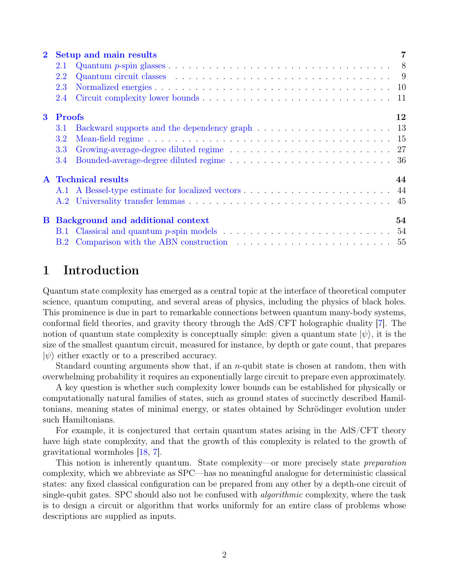 
Low-resolution page preview, page 2

📷 Fig 2

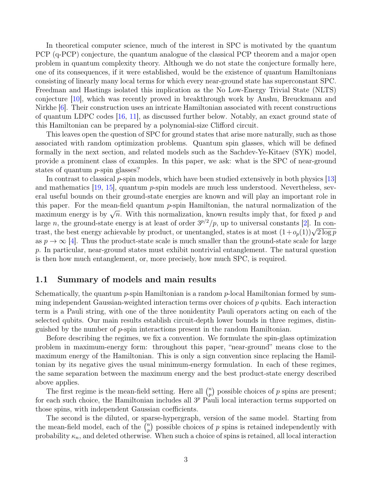 
Low-resolution page preview, page 3

📷 Fig 3

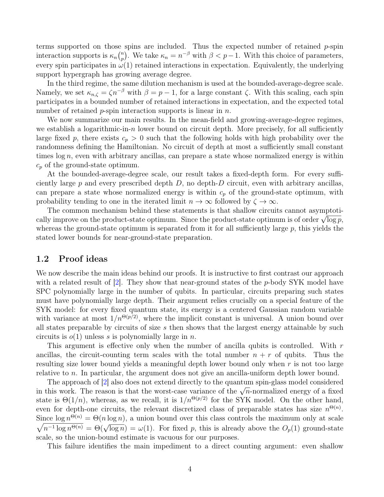 
Low-resolution page preview, page 4

📷 Fig 4

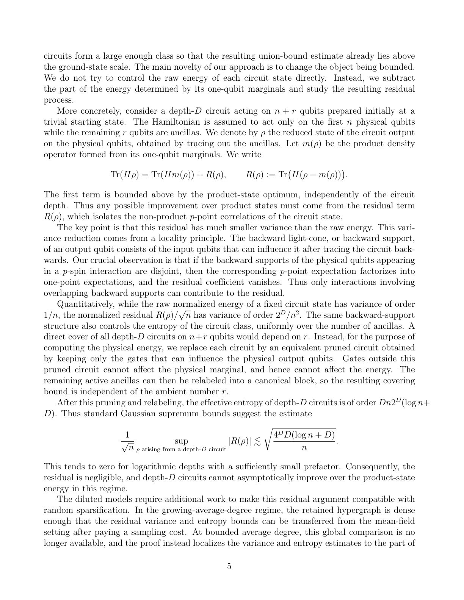 
Low-resolution page preview, page 5

📷 Fig 5

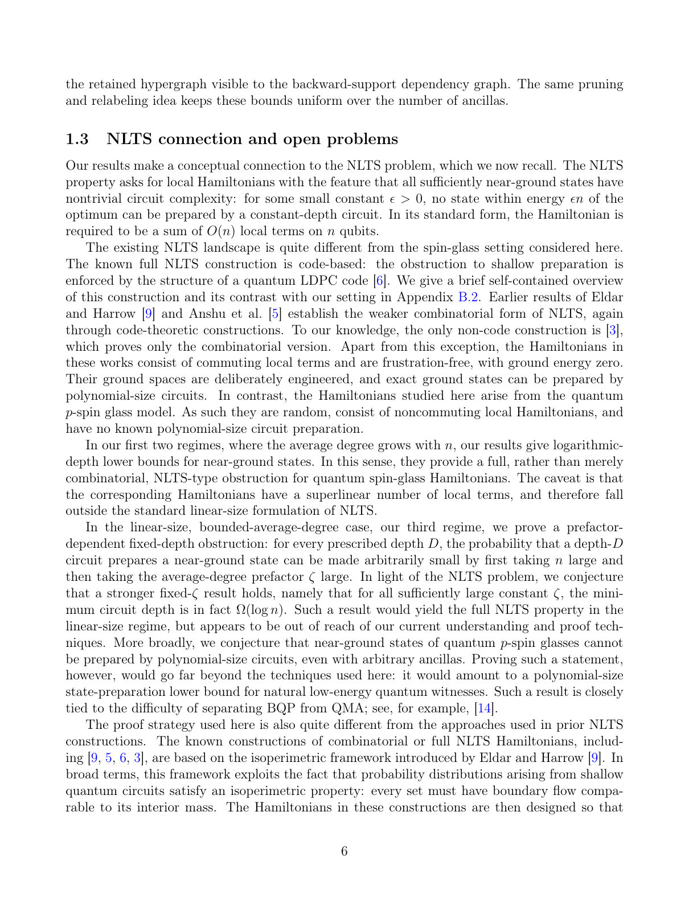 
Low-resolution page preview, page 6

**Summary.** This paper establishes fundamental circuit complexity lower bounds for preparing near-ground states of random quantum $p$-spin glasses. By analyzing the required entanglement structure, the authors prove that achieving low energy necessitates deep quantum circuits unless the interaction structure is highly constrained. This offers a probabilistic route to understanding state preparation difficulty in disordered quantum matter.

**Why it may be interesting.** This work provides a rigorous, complexity-theoretic lower bound on how efficiently quantum information can be encoded in disordered physical systems, which has implications for understanding quantum simulation and computation limits.

Detailed structure

**Main problem.** The central question is determining the circuit complexity (state preparation complexity) required to prepare quantum states near the ground state of random many-body Hamiltonians.

**Main result.** The authors prove that for quantum $p$-spin glasses, preparing near-ground states requires a minimum circuit depth of $\Omega(p \log n)$ in the growing average degree regime, and establishes a fixed-depth obstruction in the bounded average degree regime.

**Method.** The analysis uses techniques involving studying the 'residual process' relative to product states and applying concentration inequalities (like Gaussian supremum bounds) to derive lower bounds on circuit depth.

**Model / system.** The study focuses on quantum $p$-spin glasses, defined by random Hamiltonians acting on $n$ qubits via Pauli strings. The model is analyzed in different regimes: mean-field, growing average degree, and bounded average degree.

**Key observables.** Circuit depth ($D$), normalized energy of the prepared state relative to the true ground state optimum, and the residual term quantifying deviation from product states.

**Important parameters / regimes.** Number of qubits ($n$), spin interaction order ($p$), and parameters defining the sparsity/average degree ($\kappa_n$ or $\zeta$).

**Assumptions / limitations.** The results hold uniformly over circuits with an arbitrary number of ancilla qubits, and comparisons are drawn to related models like code-based Hamiltonians.

**Paper structure.** The paper establishes the problem by contrasting ground state preparation complexity with product-state achievable energies. It then presents separate proofs for the growing average degree regime (yielding $\Omega(\log n)$ depth) and the bounded average degree regime (yielding fixed-depth obstructions). The context is set by comparing these findings to related problems like NLTS.

Abstract

A central question in quantum information theory is the circuit complexity of states arising from standard many-body models. We study this question for quantum $p$-spin glasses, random Hamiltonians whose interactions act on $p$-tuples of qubits through Pauli strings. Anschuetz, Gamarnik, and Kiani (arXiv:2404.07231) showed that the optimum energy is separated from the best energy achievable by product states. This leaves open whether shallow circuits can close the gap, since even depth-one circuits can generate entanglement.   We show that the entanglement needed to close the product-state gap cannot be generated at shallow depth. When the average interaction degree grows with $n$, we prove that, for all sufficiently large fixed $p$, any circuit preparing an $n$-qubit state whose normalized energy is within a fixed positive constant of the optimum must have depth $Ω_p(\log n)$. In the bounded-average-degree regime, we prove a fixed-depth obstruction: for every fixed $D$, a sufficiently large degree prefactor rules out depth-$D$ preparation of near-ground states. Both results hold uniformly over circuits with an arbitrary number of ancilla qubits.   Our results give an obstruction in the spirit of the No Low-Energy Trivial States problem of Freedman and Hastings (arXiv:1301.1363), but for random quantum spin glasses rather than code-based Hamiltonians such as those of Anshu, Breuckmann, and Nirkhe (arXiv:2206.13228), whose ground states admit polynomial-size preparation circuits. This setting opens a probabilistic route to NLTS-like questions: we recast state-preparation lower bounds for random quantum Hamiltonians as uniform control of Gaussian processes indexed by shallow circuits.

[↑ back to top](#top)

### [Imaginarity as a Resource within Quantum Coherence: Geometric Decomposition and Operational Conversion](http://arxiv.org/abs/2607.14435v1)

**Authors:** Meng-Li Guo, Nannan Guan, Bo Li, Bin Hu, Shao-Ming Fei  
**Type:** theory · **Category:** quantum information and computing · **PDF:** <https://arxiv.org/pdf/2607.14435v1>  
**Analysis basis:** full PDF text, analyzed in chunks
**Topic relevance:** `entanglement & information structure` **3/5** · `correlated / nonlocal dissipation` **1/5** · `driven-dissipative phase transition` **1/5** · `methods for driven-dissipative` **1/5** · `non-equilibrium dynamics` **1/5**

📷 Fig 1

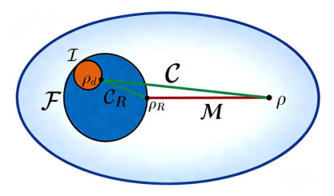 
FIG. 1. Geometric scheme of quantum resource measures. The total coherence of a state is bounded by the sum of its imaginarity (dis- tance to nearest real state) and the residual coherence (distance be- tween real and incoherent reference states), showing that imaginarity is a resource strictly contained within coherence.

📷 Fig 2

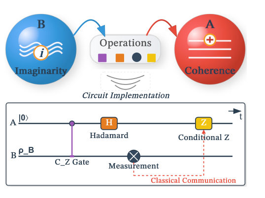 
FIG. 2. Operational conversion of imaginarity into coherence. Upper panel: schematic illustration of the protocol converting imag- inarity in subsystem B into coherence in subsystem A via real op- erations and a Y -basis measurement. Lower panel: corresponding quantum circuit, consisting of a controlled-Z gate, a Hadamard gate on A, a Y -basis measurement on B, and a conditional ZA cor- rection (dashed red line). The protocol achieves the exact equality C′ tr(ρfinal A ) = Mtr(ρB).

**Summary.** This paper introduces imaginarity as a quantifiable resource distinct from total quantum coherence. Using geometric decomposition and operational protocols, the authors establish fundamental trade-off relations showing that coherence is bounded by the sum of its imaginary part (imaginarity) and a residual term. This provides crucial theoretical insights for managing resources in distributed quantum technologies.

**Why it may be interesting.** This work provides a deep theoretical understanding of how different mathematical components of quantum state structure relate to physical capabilities, offering concrete resource management tools applicable to quantum communication and computation.

Detailed structure

**Main problem.** The paper establishes a rigorous framework to quantify imaginarity as a fundamental, quantifiable resource within quantum coherence.

**Main result.** It proves that total coherence is bounded by the sum of its purely imaginary component (imaginarity) and a residual component related to basis misalignment. Furthermore, it provides an operational protocol to convert imaginarity into usable coherence.

**Method.** The authors use geometric decomposition techniques based on metric distances (like trace distance) to partition quantum states and derive fundamental trade-off inequalities between different resource measures.

**Model / system.** The analysis is performed on general quantum states, extending from single qubits to bipartite systems. Dynamics are characterized under diagonal Hamiltonians, showing complementary oscillations of imaginarity and residual coherence.

**Key observables.** Quantum Coherence ($C(
ho)$), Imaginarity ($M(
ho)$), Residual Coherence ($CR(
ho)$), and total correlations in bipartite settings.

**Important parameters / regimes.** The relationship $C(
ho) \le M(
ho) + CR(
ho)$ is the central constraint, with specific bounds derived for qubit states using trace distance.

**Assumptions / limitations.** The analysis relies on defining resource measures via metric distances and assumes physical admissibility of operations for conversion protocols.

**Figures summary.** Figures illustrate the geometric relationship $C \le M + CR$ and provide a schematic circuit diagram detailing an operational protocol to convert imaginarity in one subsystem to coherence in another.

**Paper structure.** The paper progresses from defining resource measures geometrically, establishing fundamental trade-off theorems for single and bipartite systems, providing explicit conversion protocols (operational proofs), and finally characterizing the dynamics under specific Hamiltonians.

Abstract

We establish a rigorous framework that identifies imaginarity as a fundamental resource inherent in quantum coherence. By means of a geometric decomposition, we partition coherence into distinct imaginarity and residual components, thereby revealing a universal hierarchical relationship among these resources. For bipartite systems, this decomposition provides explicit bounds on the extent to which nonlocal correlations and imaginarity limit local coherence generation. Furthermore, we devise an explicit operational protocol that converts imaginarity into usable coherence, demonstrating the direct interconvertibility of these resources under physically admissible operations. The dynamical evolution under diagonal Hamiltonians is fully characterized, showing that while total coherence is conserved, imaginarity and residual coherence exhibit complementary oscillations. Our results provide a rigorous geometric and operational characterization of imaginarity as a fundamental constituent of quantum coherence, offering concrete insights for resource management in distributed quantum technologies. The geometric framework and theoretical bounds established herein are fully general, while the explicit conversion protocol and dynamical analysis serve as a compelling proof-of-principle demonstration in qubit systems.

[↑ back to top](#top)

### [Quantum Lock-In Detection via Successive Adiabatic Evolution](http://arxiv.org/abs/2607.15121v1)

**Authors:** Kangze Li, Siqi Chen, Hao Zhang, Jiazhao Tian, Liantuan Xiao, Gerardo Adesso  
**Type:** both · **Category:** other · **PDF:** <https://arxiv.org/pdf/2607.15121v1>  
**Analysis basis:** full PDF text, analyzed in chunks
**Topic relevance:** `quantum measurements` **3/5** · `QC/QI experiment` **1/5** · `measurement-induced transitions` **1/5** · `methods for driven-dissipative` **1/5** · `spintronics-quantum-optics interface` **1/5**

📷 Fig 1

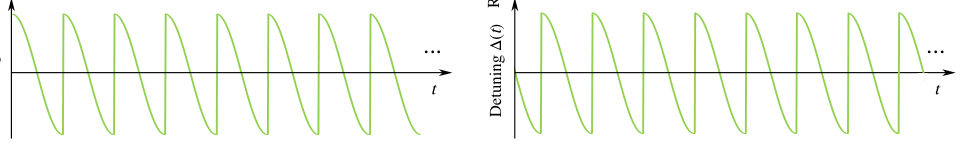 
FIG. 1. Schematic of adiabatic quantum lock-in detection using NV centers in diamond. (a) Flow diagram of adiabatic quantum lock-in detection. The top row shows the laser pulse sequence used to initialize and read out the electron spin state of NV centers. The middle row shows the driving microwave field used to implement the measurement process and gate operations. The bottom row shows the target signal and noise. (b) Rabi frequency and detuning of the driving microwave field used in the measurement process of the in-phase component Isig. (c) Rabi frequency and detuning of the driving microwave field used in the measurement process of the quadrature component Qsig.

📷 Fig 2

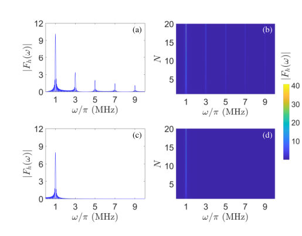 
FIG. 2. Comparison between the filter functions generated by the proposed adiabatic detection sequence and those generated by the conventional dynamical decoupling sequence. (a) The filter function of the conventional dynamical decoupling sequence with N = 5 is plotted as a function of ω. (b) The filter function of the conventional dynamical decoupling sequence is plotted as a function of ω and N. (c) The filter function generated by the proposed adiabatic detection sequence with N = 5 is plotted as a function of ω. (d) The filter function generated by the proposed adiabatic detection sequence is plotted as a function of ω and N.

📷 Fig 3

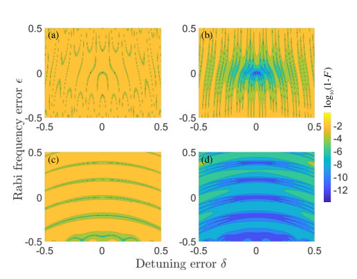 
FIG. 5. Performance of the control sequences under the influence of control errors. The infidelities 1 −F of the control sequences are plotted as functions of the Rabi frequency error strength ϵ and the detuning error strength δ on a logarithmic scale. (a) The CPMG sequence with eight rectangular pulses. (b) The XY8 sequence with rectangular pulses. (c) The sequence consisting of eight repeated adiabatic evolution processes. (d) The adiabatic XY8 sequence used for quantum lock-in detection.

📷 Fig 4

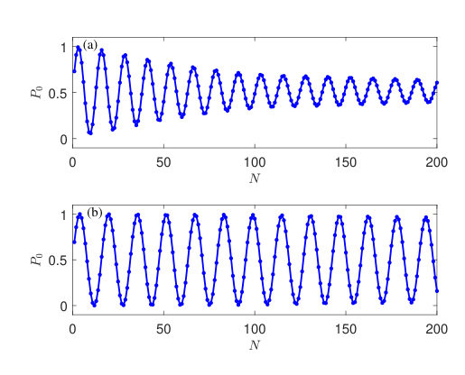 
FIG. 6. Performance of the detection sequences under the influence of random magnetic field fluctuations. The population P0 of the state |0⟩is plotted as a function of the number N of repetitions of each sequence. (a) The XY8 sequence with rectangular pulses. (b) The adiabatic XY8 sequence used for quantum lock-in detection.

**Summary.** This paper introduces an advanced quantum protocol for lock-in detection by utilizing successive adiabatic evolution to generate ideal triangular modulation functions. This approach fundamentally overcomes spectral leakage issues present in current methods, enabling the robust and accurate measurement of weak alternating signals. The technique is demonstrated using NV centers in diamond and is presented as a general framework applicable to various controllable quantum systems.

**Why it may be interesting.** This work provides a sophisticated theoretical framework for quantum sensing that directly addresses fundamental limitations (spectral leakage) in measurement protocols. The reliance on adiabatic passage connects concepts from quantum control theory to real-world high-sensitivity measurements, which is highly relevant to AMO physics research.

Detailed structure

**Main problem.** The core problem is achieving accurate quantum lock-in detection for weak signals buried in noise, overcoming limitations imposed by spectral leakage inherent in existing pulse-based control protocols.

**Main result.** The authors propose and demonstrate a general protocol using successive adiabatic evolution that implements triangular modulation, fundamentally solving spectral leakage and providing a robust sensing method.

**Method.** The technique relies on adiabatically controlling the time evolution of a quantum probe through carefully designed sequences of Hamiltonian parameters to extract signal components via accumulated relative phases.

**Model / system.** The model uses a driven two-level quantum probe described by a Hamiltonian incorporating control and signal terms. Practical implementations are demonstrated using nitrogen-vacancy (NV) centers in diamond, but the protocol is generalizable to other controllable two-level systems.

**Key observables.** The key observables measured are relative accumulated phases ($\alpha$ and $eta$) derived from successive quantum evolution steps, which are proportional to integrals involving the unknown signal $M(t)$.

**Important parameters / regimes.** Key parameters include the control field strengths ($\Omega_R(t), \Delta(t)$) and the modulation function shape (achieving triangular profiles). The method is robust against experimental imperfections.

**Assumptions / limitations.** The primary assumption involves treating the signal coupling term ($H_{	ext{sig}}(t)$) as a weak perturbation during the adiabatic evolution process. It also assumes the applicability of the rotating-wave approximation.

**Figures summary.** Not specified, but the notes detail mathematical derivations involving propagators $U(T, 0)$ calculated through sequential application of time-evolution operators for different measurement components ($I_{	ext{sig}}$ and $Q_{	ext{sig}}$).

**Paper structure.** The paper first identifies the limitations of current quantum sensing methods. It then introduces the general protocol based on successive adiabatic evolution to achieve triangular modulation. The methodology is detailed by deriving the necessary propagators for measuring in-phase and quadrature components, followed by a discussion of its practical realization using NV centers.

Abstract

In recent years, quantum lock-in detection has emerged as a promising technique to accurately detect weak signals submerged in background noise. However, the signal-to-noise ratio of existing protocols is severely limited by spectral leakage resulting from control operations implemented in pulse form. Here, we propose a general protocol for realizing quantum lock-in detection by employing successive quantum adiabatic evolution. In our protocol, the signal modulation is achieved by adiabatically controlling the time evolution of the quantum probe, which enables the implementation of triangular modulation functions. The realization of triangular-wave modulation fundamentally solves the problem of spectral leakage and facilitates the extraction of the complete characteristics of the target signals. We present a practical implementation scheme of adiabatic quantum lock-in detection based on nitrogen-vacancy centers in diamond, and demonstrate that the proposed protocol possesses strong resilience against experimental imperfections. Our results establish adiabatic quantum lock-in detection as a robust and experimentally accessible approach to detection of weak alternating signals in noisy environments, thus promoting the advance of real-world quantum sensing technologies.

[↑ back to top](#top)

### [Sizable Ligand-Mediated Bond-Dependent Interactions in a Spin-1 Triangular Antiferromagnet NiI$_2$](http://arxiv.org/abs/2607.14893v1)

**Authors:** Hao Xu, Weiqin Zhu, Shufan Cheng, Yanyan Shangguan, Song Bao, Junbo Liao, Bo Zhang, Zihang Song, Shuai Dong, Maofeng Wu, Stanislav E. Nikitin, Travis J. Williams, Changsong Xu, Jinsheng Wen  
**Type:** both · **Category:** strongly correlated electrons · **PDF:** <https://arxiv.org/pdf/2607.14893v1>  
**Analysis basis:** full PDF text, analyzed in chunks
**Topic relevance:** `analog quantum simulation` **3/5** · `exotic spin models in light-matter` **3/5** · `spintronics-quantum-optics interface` **1/5**

📷 Fig 1

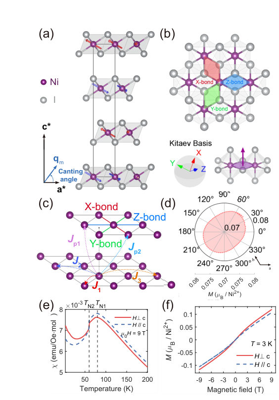 
FIG. 1. Magnetic structure, Kitaev geometry, and mag- netization of single-crystalline NiI2. (a) Schematic magnetic structure with propagation vector qm and canting angle θ. (b) Kitaev geometry in a single layer and the Kitaev basis. The normal of a representative Ni-I-Ni bond plane (rhombus) defines the type of the bond. (c) Exchange paths and corre- sponding X, Y , and Z bonds. (d) Angle-dependent magneti- zation M at T = 2 K under a 6 T field rotated in the a-b plane. (e) Magnetic susceptibility χ(T) measured under µ0H = 9 T applied parallel (dashed) and perpendicular (solid) to c; ver- tical lines mark TN1 ≈80 K and TN2 = 60 K. (f) Field depen- dence of M up to 9 T with µ0H ∥(dashed)...

📷 Fig 2

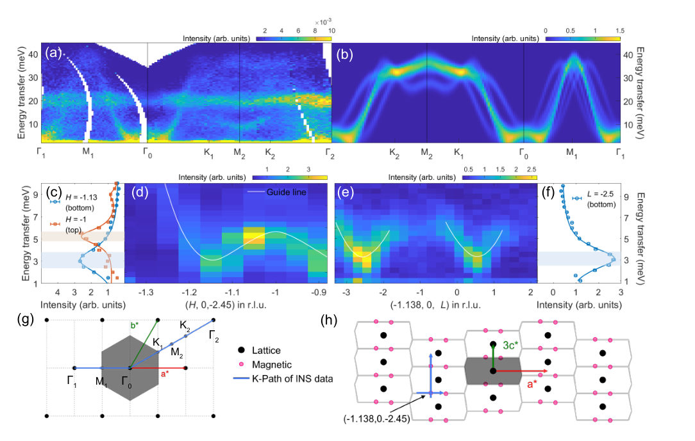 
FIG. 2. INS data and LSWT calculations in the canted PS phase of NiI2. (a) Symmetrized INS intensity along the path shown in (g) measured at T = 5 K. Because of the weak dispersion along L as shown in (e), the data are integrated over L ∈[−1, 1]. Features near 20 meV arise from phonons and Al background. (b) Corresponding LSWT dispersions, averaged over six magnetic domains and integrated over L ∈[−1, 1]. (c) Const-Q cut at H = −1.13 showing a 3.1 meV gap and a kink at 5.2 meV. (d),(e) Low-energy dispersions near (−1.138, 0, −2.45) along H and L at T = 1.7 K. White lines are guides to the eye. (f) Const-Q cut at L = −2.5 confirming the 3.1 meV gap. Error bars denote √

📷 Fig 3

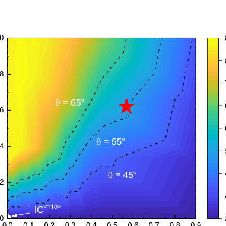 
FIG. 3. Phase diagram of Eq. 1. Parameters are fixed to J1 = −1, J2 = 0.086, J3 = 0.33, and Jp2 = 0.14. The IC⟨110⟩

📷 Fig 4

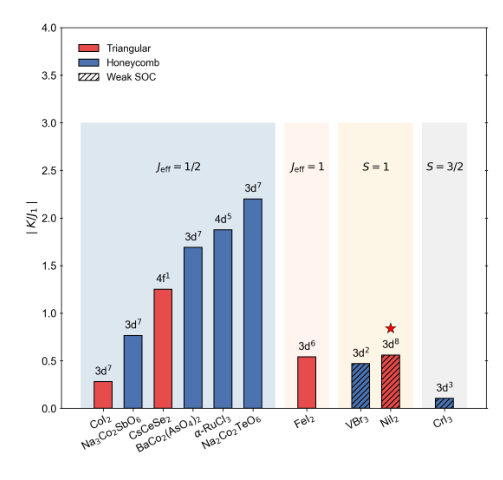 
FIG. 4. List of experimentlly identified Kitaev materials.The y axis shows |K/J1|. Red (blue) bars denote triangular (hon- eycomb) lattices. Hatched bars indicate weak magnetic-ion SOC. Refs. [9, 18, 51–56]

**Summary.** This work experimentally confirms the presence of sizable bond-dependent Kitaev interactions in NiI2, a triangular antiferromagnet. By combining neutron scattering and magnetization data with advanced spin-wave theory, the authors establish that these crucial interactions are mediated by the ligand ions' strong SOC rather than the magnetic metal ion itself. This discovery significantly expands the predicted material landscape for realizing quantum spin liquid physics.

**Why it may be interesting.** The finding that ligand SOC can mediate Kitaev physics provides a new theoretical pathway for designing quantum magnets, which is highly relevant for understanding emergent quantum phenomena in condensed matter systems.

Detailed structure

**Main problem.** The study investigates how bond-dependent anisotropic interactions, such as Kitaev terms, can be realized in magnetic materials where the primary magnetic ions have weak spin-orbit coupling.

**Main result.** The authors provide compelling experimental evidence for a ligand-driven Kitaev mechanism in NiI2, showing that strong SOC on the non-magnetic ligand ions can induce significant bond anisotropy. This broadens the scope of potential Kitaev materials beyond those with intrinsically strong SOC on the magnetic ion.

**Method.** A combination of inelastic neutron scattering (INS), magnetization measurements, and first-principles calculations are used to constrain an effective spin Hamiltonian analyzed via linear spin-wave theory (LSWT).

**Model / system.** The system is NiI2, a van der Waals magnet with S=1 spins arranged on a triangular lattice. The model incorporates Heisenberg exchange ($J$), Kitaev ($K$), and off-diagonal ($\Gamma$) interactions.

**Key observables.** Inelastic neutron scattering (INS) magnon dispersion curves (showing gaps and kinks), magnetic transition temperatures, and the canting angle of the magnetic ground state.

**Important parameters / regimes.** Optimal fitted parameters include $J_1 \approx -5.86$ meV, $K \approx 3.33$ meV, $\Gamma \approx 0.37$ meV, and a resulting canting angle near $53^\circ$.

**Assumptions / limitations.** The analysis assumes that conventional Heisenberg interactions alone are insufficient to explain the observed magnetic anisotropy and ground state.

**Figures summary.** Figures illustrate the schematic magnetic structure, Kitaev geometry, magnetization data ($\chi(T)$ vs $H$), and the calculated/measured magnon dispersion curves showing characteristic gaps and kinks.

**Paper structure.** The paper proceeds by analyzing multiple experimental observables (magnetization, INS) to constrain an effective spin Hamiltonian. LSWT is then used to fit the resulting parameters ($J_1, K, \Gamma$, etc.) against the measured spectral features, confirming the necessity of ligand-driven anisotropic terms.

Abstract

The bond-dependent anisotropic Kitaev interactions are the key for the Kitaev model, which has attracted intense interest for its potential to host quantum-spin-liquid states and fractional excitations. However, experimental realizations of such interactions remain scarce. Here, we investigate the magnetic excitations of NiI$_2$, a van der Waals magnet with spin $S=1$. By combining inelastic neutron scattering, magnetization measurements, magnetic structure analysis, first-principles calculations, and linear-spin-wave simulations, we identify a minimal model that features substantial Kitaev and off-diagonal $Γ$ interactions, which together stabilize the canted magnetic ground state and open a gap in the spin-wave spectrum. Notably, these interactions arise from strong spin-orbit coupling on the ligand ions, despite the quenched orbital moment of the magnetic Ni$^{2+}$ ions. Our results provide compelling experimental evidence for the ligand-driven Kitaev mechanism. This demonstrates a concrete pathway to generating strong bond-dependent anisotropy in systems where the magnetic ions themselves have weak spin-orbit coupling, thereby substantially broadening the range of potential Kitaev materials.

[↑ back to top](#top)

### [Adaptive Entanglement Management in Quantum Multi-Core Architectures](http://arxiv.org/abs/2607.14592v1)

**Authors:** Rajeswari Suance P S, Anubhab Dutta, Ruchika Gupta, John Jose  
**Type:** theory · **Category:** quantum information and computing · **PDF:** <https://arxiv.org/pdf/2607.14592v1>  
**Analysis basis:** full PDF text, analyzed in chunks
**Topic relevance:** `entanglement & information structure` **3/5** · `correlated / nonlocal dissipation` **1/5** · `methods for driven-dissipative` **1/5** · `non-equilibrium dynamics` **1/5**

📷 Fig 1

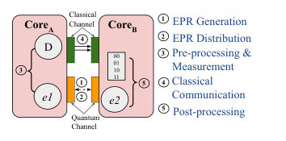 
Fig. 1. Quantum Teleportation with steps

📷 Fig 2

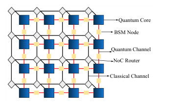 
Fig. 2. Multi-Core Quantum System with Distributed Entanglement Generation [7]

📷 Fig 3

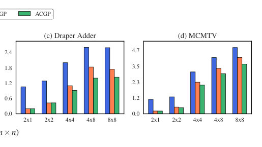 
Fig. 3. Comparison of average teleportation latency for proposed protocols across different mesh topologies

📷 Fig 4

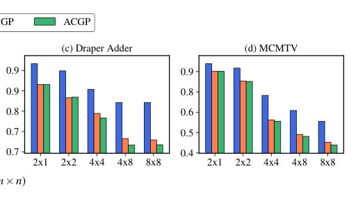 
Fig. 4. Comparison of entanglement fidelity for proposed protocols across different mesh topologies

📷 Fig 5

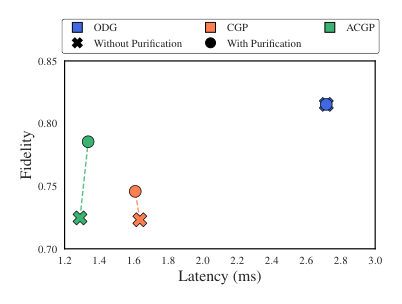 
Fig. 5. Latency–fidelity trade-off achieved through purification

**Summary.** This paper analyzes entanglement management strategies for multi-core quantum processors communicating via a Quantum Network-on-Chip. It compares reactive, proactive, and an adaptive approach (ACGP) for generating necessary entangled pairs. The results show that ACGP significantly minimizes communication latency while maintaining high fidelity through background purification.

**Why it may be interesting.** The focus on optimizing communication overhead through adaptive resource scheduling is highly relevant to scaling quantum computation architectures and managing decoherence effects in large-scale quantum networks.

Detailed structure

**Main problem.** Efficient entanglement generation is critical for performance in multi-core quantum processors because inter-core communication relies on entanglement-assisted quantum teleportation.

**Main result.** The proposed Adaptive Continuous Pre-Generation (ACGP) strategy significantly reduces average teleportation latency compared to reactive or uniformly proactive methods. Furthermore, entanglement purification can restore fidelity lost during pre-generation with minimal performance penalty.

**Method.** A comparative study evaluating three entanglement management paradigms—On-Demand Generation (ODG), Continuous Pre-Generation (CGP), and ACGP—using simulation on mesh-based architectures.

**Model / system.** The system models multi-core quantum processors interconnected via a Quantum Network-on-Chip (NoC). Inter-core communication is simulated using entanglement-assisted quantum teleportation across various mesh topologies ($2	imes1$ to $8	imes8$).

**Key observables.** Average teleportation latency (ms) and Entanglement Fidelity.

**Important parameters / regimes.** Mesh size ($m 	imes n$), coherence time, and the degree of adaptation in entanglement generation probability.

**Assumptions / limitations.** The model assumes all-to-all qubit connectivity within each core for simplification; pre-generation introduces fidelity degradation due to storage time.

**Figures summary.** Figures compare average teleportation latency across ODG, CGP, and ACGP for various topologies (Fig. 3), and show entanglement fidelity comparisons (Fig. 4).

**Paper structure.** The paper establishes the need for multi-core quantum systems $
ightarrow$ identifies entanglement generation as the bottleneck $
ightarrow$ compares three management protocols (ODG, CGP, ACGP) using simulation on benchmark circuits $
ightarrow$ demonstrates ACGP's superior performance in latency while addressing fidelity loss via purification.

Abstract

Scalable quantum computing architectures increasingly rely on multi-core designs, where qubits are distributed across multiple processing cores interconnected through a quantum Network-on-Chip (NoC). In such systems, inter-core communication is typically realized through entanglement-assisted quantum teleportation, making efficient entanglement generation critical for performance. In this paper, we perform a comparative study of three entanglement management paradigms for multi-core quantum processors: reactive on-demand generation (ODG), proactive continuous pre-generation (CGP), and an adaptive continuous pre-generation approach (ACGP). While ODG generates entanglement only when required, CGP reduces average teleportation latency by pre-generating EPR pairs in the background. To improve upon this, we propose ACGP which dynamically adjusts entanglement generation probabilities based on observed inter-core communication patterns. We evaluate these approaches using an extended SeQUeNCe simulator on mesh-based multi-core architectures on real benchmark circuits. Results show that ACGP significantly reduces average teleportation latency compared to ODG and CGP. Although pre-generation introduces fidelity degradation due to storage time, entanglement purification effectively restores fidelity with minimal impact on latency. These results demonstrate that adaptive entanglement managements can substantially improve communication efficiency in scalable quantum multi-core systems.

[↑ back to top](#top)

### [Dynamic Entanglement Distribution for Multi-User and Multi-Protocol Quantum Networking](http://arxiv.org/abs/2607.15262v1)

**Authors:** Rui Wang, Marcus J. Clark, Obada Alia, Sima Bahrani, Djeylan Aktas, Matej Peranić, Mario Stipčević, Martin Lončarić, John Rarity, Siddarth K. Joshi, Dimitra Simeonidou  
**Type:** both · **Category:** quantum information and computing · **PDF:** <https://arxiv.org/pdf/2607.15262v1>  
**Analysis basis:** full PDF text, analyzed in chunks
**Topic relevance:** `quantum optics experiment` **3/5** · `QC/QI experiment` **1/5** · `entanglement & information structure` **1/5** · `interference shaping light` **1/5**

📷 Fig 1

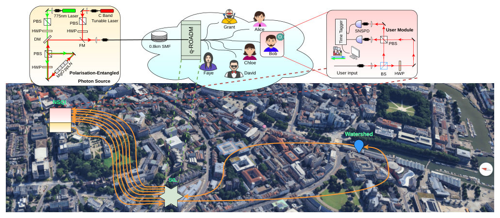 
Figure 1: A 6-user entanglement-based quantum communication network architecture enabled by a q-ROADM. A type-0 SPDC broadband polarisation entangled photon source is connected to a q-ROADM via 0.8 km campus fibre between SIL and NSQI, supporting scalable, dynamic entanglement distribution. The 6 user modules are also deployed at NSQI connecting to the q-ROADM via the loop-back of another 0.8 km campus link for user A, B,C,F,G, and Bristol metropolitan fibre looping back from Watershed (user D). At each user, there is a polarisation analysis module, two SNSPDs, a time tagger and a computer to exchange the classical information with other users.

📷 Fig 2

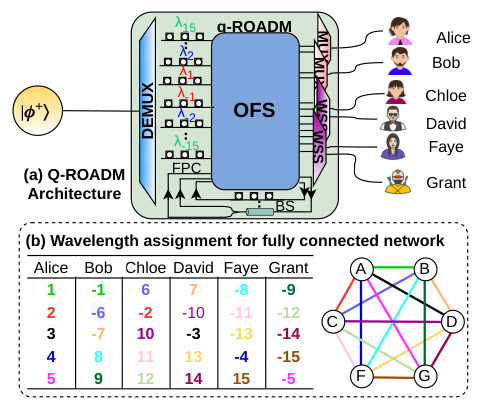 
Figure 2: (a) q-ROADM architecture for dynamic entan- glement distribution to multiple users. (B) Wavelength assignment for the six-user full-mesh configuration, where each table entry denotes the channel λi assigned to the corresponding link.

📷 Fig 3

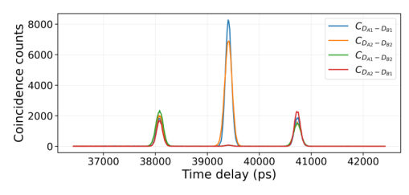 
Figure 3: Temporal correlation histogram between Alice and Bob when the network is configured to support only the A–B link, with 10-minute integration time and bin- width of 10 ps.

📷 Fig 4

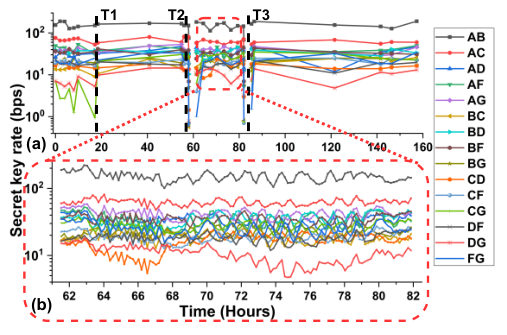 
Figure 4: SKR of all 15 links in the six-user full-mesh quantum network. (a) SKR over ≈7 days; (b) zoomed-in SKR over ≈20 hours.

📷 Fig 5

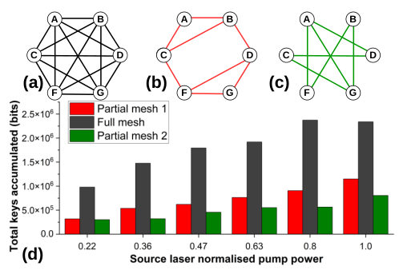 
Figure 5: Comparison between full-mesh and time-shared partial-mesh configurations under different normalised source pump powers. (a) Six-user full-mesh topology. (b,c) Two complementary partial-mesh topologies. (d) Total accumulated secret keys over 40 minutes for the full-mesh configuration, compared with two 20-minute partial-mesh configurations under the favourable network operating condition.

**Summary.** The paper presents an experimental demonstration of a metropolitan-scale quantum network using a q-ROADM to dynamically distribute entanglement among multiple users. It proves the feasibility of flexible, service-oriented networking by supporting full-mesh topologies and complex multi-protocol tasks like secure user onboarding (SIAT). This work advances the practical realization of scalable quantum internet infrastructure over existing optical fiber.

**Why it may be interesting.** This work directly addresses the physical implementation challenges of quantum networking by proposing a reconfigurable hardware solution (q-ROADM), which is highly relevant for researchers working on photonic quantum information infrastructure and network protocols.

Detailed structure

**Main problem.** The core challenge addressed is achieving scalable, dynamic entanglement distribution necessary for multi-user and multi-protocol quantum networks.

**Main result.** A quantum reconfigurable optical add-drop multiplexer (q-ROADM) architecture was demonstrated to enable stable, service-oriented entanglement distribution over metropolitan fiber, supporting full-mesh connectivity and complex protocols like SIAT.

**Method.** The authors combine hardware demonstration using a q-ROADM with theoretical analysis of key rates and time complexity for establishing authenticated links.

**Model / system.** The system is an entanglement-based quantum communication network built upon deployed metropolitan fiber, utilizing a q-ROADM to dynamically allocate polarization-entangled photon pairs from a broadband source to multiple users (up to six).

**Key observables.** Secret Key Rate (SKR), Quantum Bit Error Rate (QBER), and total time required for establishing authenticated links (SIAT time).

**Important parameters / regimes.** Source heralding efficiency ($\approx 15\%$ favourable, $\approx 3\%$ challenging), detector jitter ($< 100 	ext{ ps}$ favourable), and security parameters ($\epsilon_c$).

**Assumptions / limitations.** The analysis assumes that the full link-dependent ratio for authentication can be approximated by the time-tagging contribution, and performance is compared between ideal (favourable) and realistic (challenging) operating conditions.

**Figures summary.** Figures illustrate the 6-user network architecture using q-ROADM components. Key plots show the stable SKR of all links over $>150$ hours in full-mesh mode, and time analyses compare total SIAT time for different security levels ($\epsilon_c$) and operational conditions.

**Paper structure.** The paper first establishes the need for dynamic distribution using a q-ROADM. It then details experimental demonstrations of stable multi-user connectivity (full/partial mesh) and compares key generation rates. Finally, it analyzes the time complexity required to establish secure links using the SIAT protocol across varying link conditions.

Abstract

Dynamic entanglement distribution is a key requirement for scalable, multi-user and multi-protocol quantum networks. We demonstrate a metropolitan-scale entanglement-based quantum communication network enabled by a quantum reconfigurable optical add-drop multiplexer (q-ROADM), which dynamically distributes polarisation-entangled photon pairs from a broadband source to six users over deployed campus and metropolitan fibre. The network supports programmable full-mesh, partial-mesh and sliced sub-network configurations, enabling flexible allocation of entanglement resources according to link condition and service requirement. We demonstrate stable six-user full-mesh operation over more than 150 hours, compare full-mesh and time-shared partial-mesh strategies under different source and detector conditions, and realise quantum network slicing with optional/additional interconnection links. We also show that the same infrastructure can support different quantum protocols by showcasing Secure Inaugural Authentication-Transfer (SIAT) combined with Network flooding over multiple paths to improve the security of onboarding a new user. These results demonstrate a q-ROADM-enabled entanglement distribution architecture as a novel route towards reconfigurable, service-oriented quantum networking over optical fibre infrastructure.

[↑ back to top](#top)

### [Implicit differentiation of tensor network algorithms](http://arxiv.org/abs/2607.15030v1)

**Authors:** Lander Burgelman, Anna Francuz, Paul Brehmer, Lukas Devos, Jutho Haegeman, Frank Verstraete, Bram Vanhecke  
**Type:** theory · **Category:** numerical methods · **PDF:** <https://arxiv.org/pdf/2607.15030v1>  
**Analysis basis:** full PDF text, analyzed in chunks
**Topic relevance:** `methods for driven-dissipative` **3/5** · `analog quantum simulation` **2/5** · `Keldysh / 2PI / non-Gaussian methods` **1/5**

📷 Fig 1

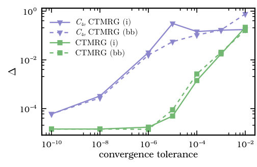 
FIG. 1. Relative distance ∆of the directional derivative of the PEPS energy density Eq. (6) computed with implicit differ- entiation (i) and with black-box reverse-mode differentiation (bb) as in Eq. (A6), to the value obtained using a symmet- ric first-order finite difference scheme with step size ε = 10−3. The differences were averaged over three random PEPS points and directions with D = 3 and χ = 20, and are shown as a function of the convergence tolerance of the contraction algo- rithm.

📷 Fig 2

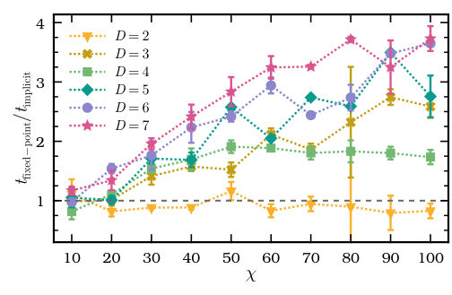 
FIG. 2. Speedup tfixed-point/timplicit of the implicit differ- entiation approach over fixed-point differentiation, obtained from timing the gradient linear problem convergence for C4v- invariant CTMRG on the Heisenberg model of Eq. (89).

📷 Fig 3

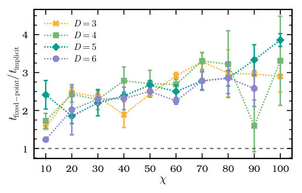 
FIG. 4. Speedup tfixed-point/timplicit of the implicit over the fixed-point gradient linear problem, for boundary MPS with- out spatial symmetries on the sublattice-rotated Heisenberg model.

📷 Fig 4

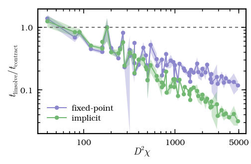 
FIG. 3. Gradient linear problem convergence times tlinsolve, normalized by the C4v-invariant CTMRG contraction time tcontract, for both the implicit and fixed-point differentia- tion approaches on the Heisenberg model. We plot the data as a function of the matrix dimension of the D2χ × D2χ- dimensional enlarged corner from Eq. (22) on a log-log scale.

📷 Fig 5

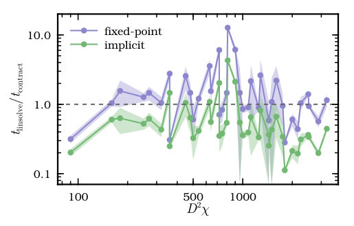 
FIG. 5. Times for solving the gradient linear problem, nor- malized by the boundary MPS contraction time, for both the fixed-point and implicit gradient on the Heisenberg model. The data is shown on a log-log scale as a function of the com- bined dimension D2χ as before.

**Summary.** This paper tackles the numerical instability and high cost associated with calculating gradients during PEPS optimization. By employing implicit differentiation techniques on the underlying contraction environment, the authors create a more stable and computationally efficient method for gradient computation. This advancement significantly simplifies implementing advanced variational quantum algorithms for many-body physics.

**Why it may be interesting.** This work provides a powerful mathematical tool (implicit differentiation) that directly addresses computational bottlenecks in simulating complex quantum many-body systems using tensor networks, which is crucial for modern condensed matter theory.

Detailed structure

**Main problem.** The primary challenge is efficiently and stably calculating the energy gradient for variational optimization of Projected Entangled-Pair States (PEPS).

**Main result.** The authors propose using implicit differentiation techniques, reformulating the gradient calculation via a characteristic equation to reduce computational cost and eliminate numerical instabilities.

**Method.** They replace direct automatic differentiation through complex contraction subroutines with an algebraic approach based on solving a single characteristic equation derived from the environment contraction.

**Model / system.** The work focuses on variational optimization of PEPS, which is used to approximate ground states for quantum many-body systems on lattices like the infinite square lattice.

**Key observables.** The energy gradient $\partial E/\partial p$, which dictates the optimization path.

**Important parameters / regimes.** The local variational degrees of freedom ($p$) and the environment variables ($x$) defining the PEPS ansatz.

**Assumptions / limitations.** The method assumes that the core contraction step can be accurately characterized by a single algebraic equation $F(y, p) = 0$.

**Figures summary.** Not specified in detail; notes focus on mathematical equations and index structures for tensor contractions (e.g., Equations F2-F8).

**Paper structure.** The paper progresses from identifying the bottleneck of AD in PEPS optimization to introducing implicit differentiation theory, applying it by reformulating the gradient calculation around a characteristic equation, and finally demonstrating its practical simplification.

Abstract

The current leading approach to the variational optimization of projected entangled-pair states (PEPS) is based on automatic differentiation, which allows for a convenient evaluation of the energy gradient with respect to the local variational degrees of freedom. However, evaluating the energy gradient not only remains a major computational bottleneck of the optimization procedure, but also suffers from frequent numerical instabilities. In this work, we adopt recent advances in implicit differentiation techniques to address these challenges in PEPS optimization. By reformulating the core step of the gradient computation in terms of a single characteristic equation for the contraction environment, we reduce the cost of the gradient computation and improve its scaling with the problem size. By choosing a suitable parametrization of this characteristic equation based on the intrinsic symmetries of the contraction environment, we can directly remove instabilities from the global gradient computation that would otherwise arise from the derivatives of subroutines of the contraction algorithm. Finally, we demonstrate how this approach drastically simplifies the practical implementation of stable gradient-based PEPS optimization.

[↑ back to top](#top)

### [Spin Hall Effect in Collinear Ferromagnets from Spin-Group Symmetry](http://arxiv.org/abs/2607.15112v1)

**Authors:** Qing Zhang, Yizhuo Song, Jiahao Shentu, Jianting Dong, Jia Zhang  
**Type:** theory · **Category:** strongly correlated electrons · **PDF:** <https://arxiv.org/pdf/2607.15112v1>  
**Analysis basis:** full PDF text, analyzed in chunks
**Topic relevance:** `spintronics-quantum-optics interface` **3/5** · `Keldysh / 2PI / non-Gaussian methods` **1/5** · `analog quantum simulation` **1/5** · `non-equilibrium dynamics` **1/5**

📷 Fig 1

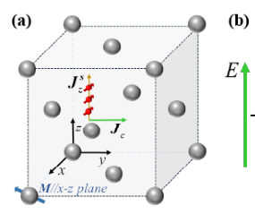 
Fig. 1. (a) Generation of a spin Hall current propagating along the z direction by applying an

📷 Fig 2

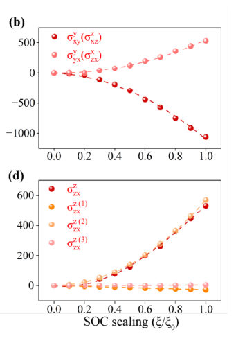 
Fig. 2. (a) T-even and (b) T-odd SHCs as a function of the SOC scaling factor ξ/ξ0 for fcc

📷 Fig 3

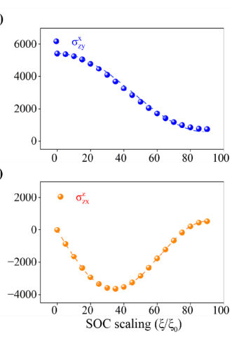 
Fig. 3. SHCs of Ni0.8Fe0.2 as a function of the angle θ between the magnetic moment m and the

**Summary.** This work develops a comprehensive symmetry-based theory to uncover the microscopic origins of the Spin Hall Effect in ferromagnets. By treating spin-orbit coupling as a perturbation, the authors systematically derive distinct T-even and T-odd contributions to the spin Hall conductivity. The findings clarify how magnetic order dictates the magnitude and nature of these spin current sources for spintronic applications.

**Why it may be interesting.** While focused on condensed matter magnetism, the rigorous use of symmetry group theory to decompose transport coefficients based on fundamental interactions (like SOC) provides a powerful theoretical template applicable across many areas of quantum physics.

Detailed structure

**Main problem.** The paper aims to elucidate the microscopic origins of the Spin Hall Effect (SHE) in collinear ferromagnets, specifically detailing how magnetic order activates distinct spin Hall responses.

**Main result.** It identifies multiple SHE mechanisms—including magnetization-independent and dependent T-even contributions, and a leading T-odd Magnetic Spin Hall Effect (MSHE)—whose origins are determined by the order of SOC perturbation.

**Method.** The study employs symmetry analysis based on magnetic point-group symmetries and treats Spin-Orbit Coupling (SOC) as a systematic perturbation to expand the Spin Hall Conductivity (SHC).

**Model / system.** The focus is on collinear ferromagnets, where SOC breaks spin-group symmetry. The theory is validated using first-principles calculations on materials like fcc ferromagnets.

**Key observables.** Spin Hall Conductivity ($\sigma_{ij}^k$), decomposed into Time-Reversal-Even (T-even) and Time-Reversal-Odd (T-odd) components, including the MSHE and Planar Spin Hall Effect (PSHE).

**Important parameters / regimes.** The strength of SOC ($\xi$) is treated as a small parameter for perturbation expansion; magnetization direction ($\mathbf{m}$) dependence is crucial.

**Assumptions / limitations.** The analysis assumes collinear ferromagnetism and develops the theory by treating SOC perturbatively up to second order in the expansion.

**Figures summary.** Figures illustrate spin current generation using an electric field, schematic interactions with magnetization $\mathbf{m}$, and show the calculated dependence of SHCs on SOC scaling factors and magnetization angle ($	heta$).

**Paper structure.** The paper develops a theoretical framework by applying symmetry constraints to expand the SHC in powers of SOC. It systematically identifies contributions at first order (T-even/T-odd) and second order (PSHE), validating these findings with first-principles calculations.

Abstract

Magnetic materials support both time-reversal-even (T-even) and time-reversal-odd (T-odd) spin Hall currents, yet their underlying microscopic origins remain elusive. Here, we elucidate the spin Hall effect (SHE) in collinear ferromagnets by treating spin-orbit coupling (SOC) as a perturbation that breaks spin-group symmetry, thereby revealing how magnetic order activates distinct spin Hall response. To first order in SOC, we identify two dominant T-even SHE mechanisms: a magnetization-independent conventional contribution and a magnetization-dependent channel associated with anomalous Hall charge transport. At the same order, the leading T-odd magnetic spin Hall effect (MSHE) originates from the exchange interaction between the conventional spin current and the local magnetization. At second order in SOC, we further uncover a distinct T-odd planar spin Hall mechanism. Our spin-symmetry analysis is corroborated by first-principles calculations, which reveal a pronounced anisotropic magnetic spin Hall effect whose magnitude can be comparable to the T-even spin Hall conductivity (SHC) when the magnetic moment is tilted away from the principal crystallographic axes. These findings clarify the microscopic origins of the SHC in collinear ferromagnets and pave the way for ferromagnet-based spin current sources with versatile properties in spintronic applications.

[↑ back to top](#top)

### [High-rate continuous-variable quantum key distribution coexisting with Tb/s coherent classical transmission in hollow-core fiber](http://arxiv.org/abs/2607.14704v1)

**Authors:** Xitao Ji, Siyu Chen, Peng Li, Mingming Zhang, Yilun Chen, Jun Gao, Rui Lin, Bacco Davide, Siqi Yan, Ming Tang  
**Type:** experiment · **Category:** quantum information and computing · **PDF:** <https://arxiv.org/pdf/2607.14704v1>  
**Analysis basis:** full PDF text, analyzed in chunks
**Topic relevance:** `quantum optics experiment` **3/5** · `QC/QI experiment` **1/5** · `interference shaping light` **1/5**

📷 Fig 1

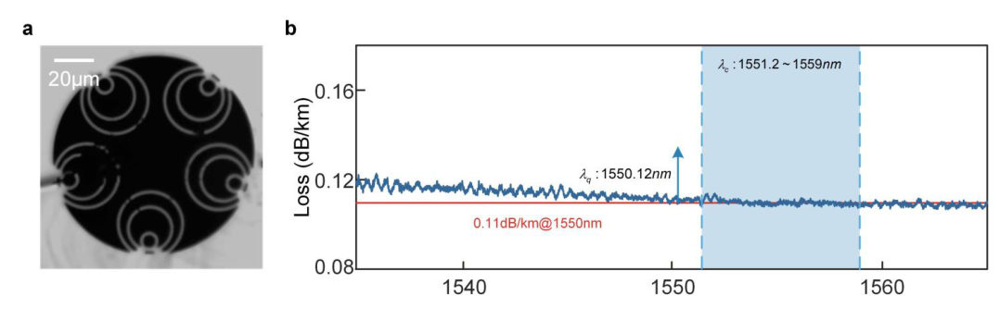 
Fig. 1 | Structural and transmission characteristics of the hollow-core link. (a) Optical micrograph of the AR-HCF cross-section. (b) Measured attenuation spectrum of the 24.3-km HCF link.

📷 Fig 2

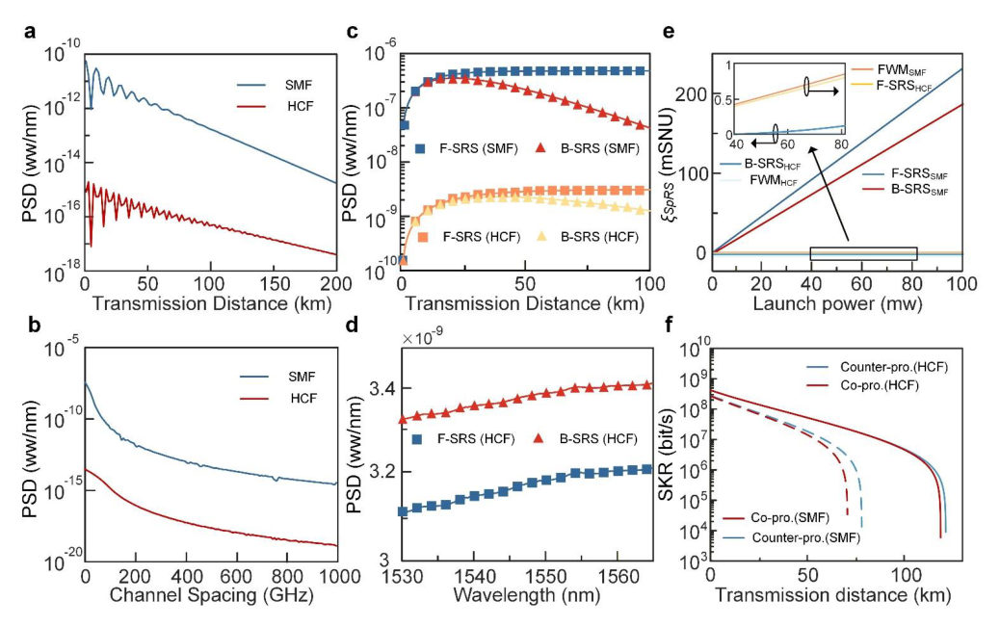 
Fig. 2 | Measurement and analysis of spontaneous Raman-scattering (SpRS) noise and SKR. (a) FWM noise PSD versus transmission distance in SMF and HCF. (b) F-SRS and B-SRS noise PSD versus channel spacing in SMF and HCF. (c) F-SRS and B-SRS noise PSD versus transmission distance in SMF and HCF. (d) SpRS noise PSD in HCF versus quantum signal wavelength under a fixed classical wavelength condition. (e) Excess noise induced by FWM and SpRS noise versus total classical launch power. (f) SKR versus transmission distance for SMF and HCF platforms under co-propagating (Co-pro.) and counter-propagating (Counter-pro.) configurations.

📷 Fig 3

 
Fig. 2 illustrates the nonlinear-noise characteristics relevant to QKD-classical coexistence in conventional

📷 Fig 4

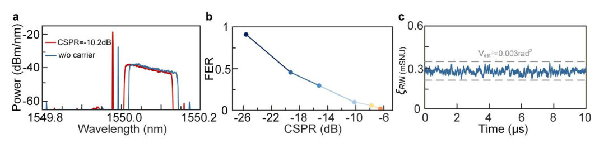 
Fig. 3 | Optimization of residual-carrier-assisted phase recovery in DM CV-QKD. (a) Transmitted optical spectra with and without the residual carrier. (b) Measured FER versus CSPR. (c) Residual-phase-noise-induced excess noise

📷 Fig 5

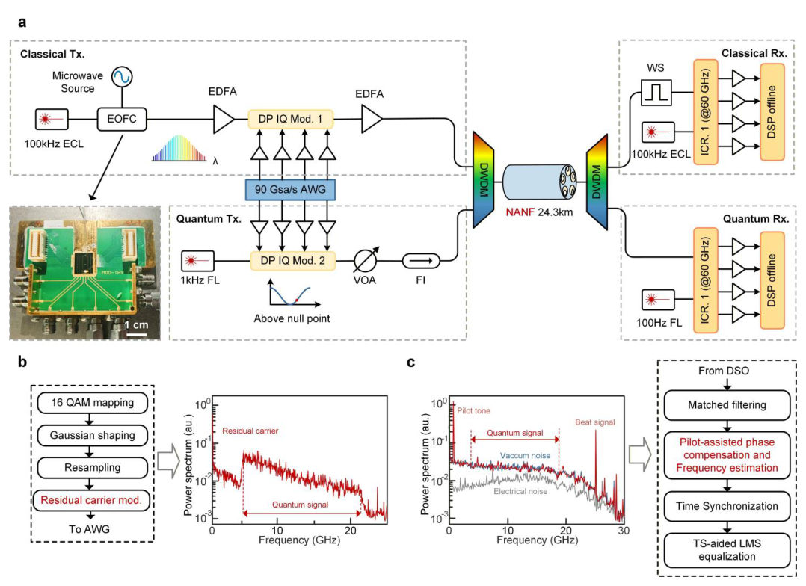 
Fig. 4 | Experimental setup for co-propagating coherent classical transmission and DM CV-QKD over AR-HCF. (a) The classical channels are generated from an electro-optic frequency comb and modulated with dual-polarization probabilistically shaped 16-QAM. The quantum channel uses dual-polarization probabilistically shaped 16-QAM with a residual optical carrier. ECL, external-cavity laser; FL, fiber laser; EOFC, electro-optic frequency comb; DWDM, dense wavelength-division multiplexer; DP-IQ Mod, dual-polarization IQ modulator; EDFA, erbium-doped fiber amplifier; VOA, variable optical attenuator; FI, Faraday isolator; AR-HCF, anti-resonant hollow-core fiber; WS, wave shaper; ICR, integrated...

**Summary.** The paper presents an experimental demonstration showing how to integrate high-rate continuous-variable QKD with Tb/s classical communication in a shared optical link. By utilizing anti-resonant hollow-core fiber, the system effectively suppresses noise accumulation that typically limits quantum transmission. This approach establishes a promising pathway for realizing secure, high-capacity quantum internet infrastructure.

**Why it may be interesting.** This work is highly relevant as it pushes the boundaries of practical quantum networking by solving the critical engineering problem of integrating weak quantum signals with powerful classical channels over long distances using novel fiber platforms.

Detailed structure

**Main problem.** The primary challenge addressed is enabling high-rate continuous-variable quantum key distribution (CV-QKD) to operate reliably alongside massive classical optical data streams within a shared fiber infrastructure.

**Main result.** The authors demonstrated that using an anti-resonant hollow-core fiber combined with residual-carrier assistance allows for achieving simultaneous rates of 153.22 Mb/s quantum key rate and 7.2 Tb/s classical data rate over 24.3 km.

**Method.** The system employs dual-polarization, high-baudrate modulation (15 Gbaud for QKD) and utilizes advanced digital signal processing (DSP) techniques at the receiver end for phase recovery and equalization.

**Model / system.** The physical platform is an anti-resonant hollow-core fiber (AR-HCF), which confines light primarily in air to minimize nonlinear interactions with silica glass. The quantum channel uses CV-QKD, while the classical channel supports multiple wavelength-division multiplexed channels.

**Key observables.** Secret Key Rate (SKR) ($	ext{Mb/s}$), aggregate data rate ($	ext{Tb/s}$), and sustained positive SKR under high classical launch power.

**Important parameters / regimes.** 24.3 km link length, 15 Gbaud modulation, up to $15 	ext{ dBm}$ classical launch power, and projected extension to a $100	ext{-km-equivalent}$ condition.

**Assumptions / limitations.** The performance relies on the physical advantage of air-core propagation to suppress noise sources like Four-Wave Mixing (FWM) and Spontaneous Raman Scattering (SpRS).

**Figures summary.** Figures illustrate the AR-HCF structure and low attenuation, compare nonlinear noise spectra between SMF and HCFs, and show simulated SKR vs. distance curves demonstrating superior performance in HCF.

**Paper structure.** The paper progresses by first identifying the coexistence challenge, then detailing the physical solution (AR-HCF) to mitigate noise, followed by implementing advanced signal processing techniques (DSP/equalization) for robust quantum reception, and finally quantifying the high achievable rates.

Abstract

Quantum key distribution (QKD) can provide secret keys with security rooted in quantum mechanics, but operation alongside high-capacity classical traffic remains limited by the excess-noise budget of weak quantum states in conventional solid-core fiber. Here, we combine ultralow-loss anti-resonant hollow-core fiber with residual-carrier-assisted discrete-modulation continuous-variable QKD (DM-CV-QKD) to address both propagation-induced coexistence noise and low-SNR phase recovery. Over a 24.3-km hollow-core link with 3.3-dB end-to-end loss, a dual-polarization 15-Gbaud DM-CV-QKD channel achieves an average asymptotic secret-key rate (SKR) of 153.22 Mb/s and a finite-size SKR of 149.99 Mb/s, while 39 coherent wavelength-division-multiplexed channels deliver an aggregate data rate of 7.6 Tb/s and a net data rate of 7.2 Tb/s. The system can even sustain a positive SKR under a high classical launch power of up to 15 dBm, without an optical bandpass filter (BPF). Finite-size analysis against collective attacks further yields a projected positive secret-key rate at a 100-km-equivalent condition. These results show that an anti-resonant hollow-core fiber, combined with carrier-assisted phase recovery, can greatly extend the operating regime of shared-fiber quantum-secured coherent links, pointing to a promising approach for integrating high-rate CV-QKD with high-capacity optical networks.

[↑ back to top](#top)

### [State-independent uncertainty relations on multipartite spin $1/2$-systems](http://arxiv.org/abs/2607.14376v1)

**Authors:** Yiling Wang, Kailash Misra, Naihuan Jing  
**Type:** theory · **Category:** quantum information and computing · **PDF:** <https://arxiv.org/pdf/2607.14376v1>  
**Analysis basis:** full PDF text, analyzed in chunks
**Topic relevance:** `entanglement & information structure` **3/5** · `exotic spin models in light-matter` **1/5**

📷 Fig 1

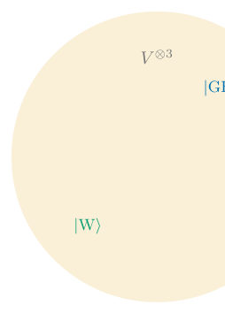 
Figure 2. Visualization of the tripartite system ( 1

**Summary.** This paper develops a novel representation-theoretic framework to derive exact state-independent uncertainty relations for multipartite spin 1/2 systems. By analyzing the total spin variance using Clebsch–Gordan decomposition, the authors establish universal algebraic bounds up to five qubits. These results provide the first unified approach to quantifying fundamental measurement limits in large qubit ensembles.

**Why it may be interesting.** This work provides fundamental algebraic tools (representation theory) to quantify limits on simultaneous measurements in multi-qubit quantum systems, which is central to understanding quantum metrology and entanglement.

Detailed structure

**Main problem.** The primary goal is developing state-independent uncertainty relations (SIURs) for multipartite spin 1/2 systems, specifically focusing on variance-based formulations beyond the bipartite level.

**Main result.** The authors derive exact state-independent variance bounds up to quintipartite systems, establishing a structural dichotomy where odd $n$ enforce strictly positive universal bounds while even $n$ allow for vanishing variance in certain sectors.

**Method.** They employ a representation-theoretic framework utilizing Clebsch–Gordan decomposition and extremal analysis of the total spin variance ($\Delta^2(\mathfrak{su}_2)$).

**Model / system.** The system is modeled as multipartite collective spin-$1/2$ systems, analyzed using operators forming representations of $\mathfrak{su}(2)$ on an $n$-qubit Hilbert space.

**Key observables.** Total variance ($\Delta^2(\mathfrak{su}_2)$) and the Casimir operator expectation value are key diagnostics for bounding uncertainty.

**Important parameters / regimes.** The number of qubits ($n$), which dictates the complexity of the representation decomposition, is a crucial parameter.

**Assumptions / limitations.** The analysis relies on extending known techniques from one- and bi-partite systems to higher multipartite settings via algebraic structure theorems.

**Figures summary.** Figure 1 illustrates the bipartite structure for $(1/2)\otimes(1/2)$, showing variance bounds related to irreducible components $V(0)$ and $V(1)$.

**Paper structure.** The paper progresses by first establishing bounds for single $su_2$ systems, then analyzing direct sum representations via Clebsch–Gordan decomposition, culminating in the derivation of universal bounds up to quintipartite systems.

Abstract

Uncertainty relations quantify fundamental limits on simultaneous measurement of quantum observables. While conventional formulations are state-dependent, state-independent uncertainty relations (SIURs) impose universal bounds determined solely by the algebraic structure of the operators, with applications across metrology, quantum cryptography, and entanglement detection. Despite extensive study, exact analytical variance-based SIURs have so far been established primarily for one- and bi-partite systems, while entropic SIURs have been extended to multipartite and memory-assisted settings through information-theoretic constructions. In contrast, exact variance-based SIURs beyond the bipartite level have remained analytically unresolved.} Here we develop a representation-theoretic framework for multipartite SIURs in collective spin-$\tfrac{1}{2}$ systems. Using the Clebsch--Gordan decomposition and extremal analysis of total spin variance, we derive exact state-independent bounds up to quintipartite systems. A clear structural dichotomy emerges: odd $n$ systems exhibit strictly positive universal bounds (e.g., $Δ^2(\mathfrak{su}_2)\!\ge\!4/11$ for $n=3$), whereas even $n$ admit vanishing variance on trivial sectors but retain positive reduced-space bounds (e.g., $Δ^2(\mathfrak{su}_2)\!\ge\!1/8$ for $n=4$). These results establish the first unified, algebraic framework for multipartite variance-based SIURs in qubit ensembles.

[↑ back to top](#top)

### [Strong $O$-valued contextuality: ruling out discrete nondeterministic alternatives to quantum theory](http://arxiv.org/abs/2607.14931v1)

**Authors:** Ravishankar Ramanathan  
**Type:** theory · **Category:** other · **PDF:** <https://arxiv.org/pdf/2607.14931v1>  
**Analysis basis:** full PDF text, analyzed in chunks
**Topic relevance:** `quantum measurements` **3/5**

📷 Fig 1

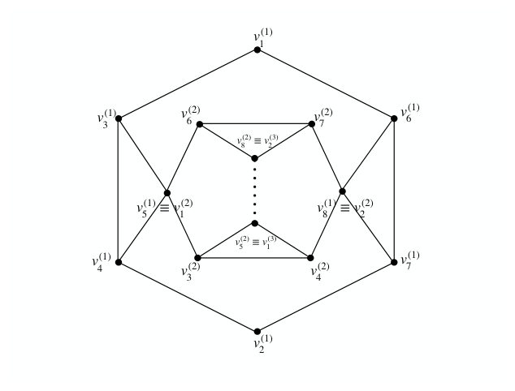 
FIG. 1. The k-nested Clifton graph with the recursive structural nesting as explained in the text. The dotted central line indicates that the recursive nesting with the m + 1-th nesting replacing the edge {v(m) 5 , v(m) 8 } with a Clifton graph as explained in the text. The optimal quantum (and no-disturbance) values for the Hardy test of contextuality built using this graph are derived in Thms. 3 and 2.

📷 Fig 2

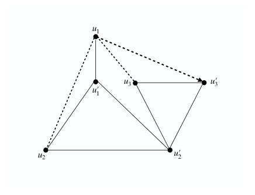 
FIG. 3. In this gadget graph used in the proof of step one, the directed dashed edge denotes the gadget from Fig. 2. As explained in the text, this gadget ensures the property that when f(u1) = 1 it holds that f(u2) ≤wq and f(u3) ≤wq−1 in any O∗-valued outcome assignment.

📷 Fig 3

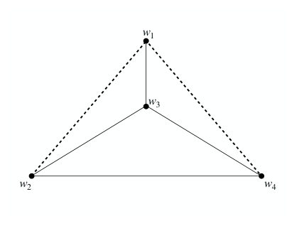 
FIG. 2. In this gadget graph used in the proof of step one, the dashed edge denotes the nested Clifton graph. As explained in the text, this gadget ensures the property that when f(w1) = 1 it holds that 0 &lt; f(w2) &lt; 1 and 0 &lt; f(w4) &lt; 1.

📷 Fig 4

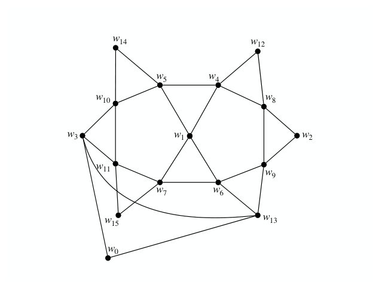 
FIG. 4. The gadget graph used to establish step three of the proof. Namely that when f(w1) = f(w2) = f(w3) = 0, then under the KS constraints of exclusivity and normalisation, it holds that f(w12) = f(w13) = f(w14) = f(w15) = 0 giving f(w0) = 1.

**Summary.** The paper generalizes the Kochen-Specker theorem by constructing finite tests to rule out noncontextual models where outcome probabilities are drawn from any arbitrary finite set O. Using sheaf theory and logical gadgets, it proves that quantum mechanics exhibits 'strong $O$-valued contextuality,' demonstrating that such discrete alternatives cannot consistently describe quantum measurements.

**Why it may be interesting.** This work provides deep mathematical constraints on the structure of quantum reality, showing that even if one restricts possible outcomes to discrete values beyond $\{0,1\}$, contextuality remains a necessary feature.

Detailed structure

**Main problem.** To construct finite measurement configurations that rule out noncontextual empirical models whose outcome probabilities are drawn from an arbitrary finite subset O of [0,1], thereby generalizing the Kochen-Specker theorem.

**Main result.** The paper proves a generalized KS theorem showing that quantum theory evades global sections of all finite-valued presheaves defined over such $O$-valued assignments. This rules out many-valued logics as viable ontological models for quantum mechanics.

**Method.** The authors employ sheaf theory, propositional logic (Compactness Theorem), and construct specific 'gadgets' involving vector sets in $\mathbb{C}^3$ to derive contradictions from assumed context-independent probability assignments.

**Model / system.** The focus is on quantum measurements represented by projectors $P \in \mathcal{P}(H)$ on a Hilbert space, testing noncontextual models where outcome probabilities are restricted to an arbitrary finite set $O$.

**Key observables.** Contextuality itself, quantified by the failure of global assignments $\lambda_O: V 	o O$ to satisfy structural constraints derived from measurement compatibility.

**Important parameters / regimes.** The structure of the allowed value set $O$, particularly when it includes 0 and 1, and the dimension of the Hilbert space ($d \ge 3$).

**Assumptions / limitations.** The analysis assumes that any alternative theory must assign probabilities from a finite set $O$ to all measurements, allowing for the application of logical compactness arguments.

**Figures summary.** Figures illustrate specific 'gadget' graphs (e.g., nested Clifton graph) used in the proof structure to enforce constraints on assignments, leading to contradictions when assuming context-independent values.

**Paper structure.** The paper builds from Gleason's theorem and KS theorem by first introducing $O$-valued valuations. It then develops constructive tests using Hardy-type measurements (Chunk 2), culminating in a formal proof using sheaf theory and propositional logic gadgets (Chunks 3 & 4) to establish the generalized KS theorem for finite $O$.

Abstract

Gleason's theorem identifies the Born rule via non-contextuality over an infinite continuous lattice of projectors, while its corollary the Kochen-Specker (KS) theorem rules out the specific class of deterministic ($\{0,1\}$-valued) noncontextual models using finite sets of projectors. Gleason's theorem also indicates the existence of KS-type finite vector constructions to rule out other discrete nondeterministic alternatives to quantum theory beyond the $\{0, 1\}$ case. Here, we construct finite measurement configurations to rule out noncontextual empirical models with outcome probabilities drawn from an arbitrary finite subset $O \subset [0,1]$. We do this by two means: (i) constructing a family of experimentally feasible state-dependent Hardy-type tests, and (ii) proving a generalized KS theorem for a broad class of $O$ that includes prior results as special cases. In the sheaf-theoretic framework of Abramsky and Brandenburger, a hierarchy of probabilistic-possibilistic-strong contextuality has been established quantifying contextuality as a resource. We extend this framework by introducing strong $O$-valued contextuality, showing that quantum theory evades global sections of all finite-valued presheaves. We also discuss the implications of the result on finite many-valued logics as viable ontological models for quantum theory and for contextuality-based (semi)-device-independent protocols.

[↑ back to top](#top)

### [Unified Uncertainty Quantification Framework Bridging Noisy Quantum Backends Across Variational Quantum Algorithms and Quantum Signal Processing](http://arxiv.org/abs/2607.14392v1)

**Authors:** Priyabrata Senapati, Vibin Abraham, Qiang Guan, Bo Peng  
**Type:** theory · **Category:** quantum information and computing · **PDF:** <https://arxiv.org/pdf/2607.14392v1>  
**Analysis basis:** full PDF text, analyzed in chunks
**Topic relevance:** `QC/QI experiment` **2/5** · `non-equilibrium dynamics` **2/5** · `Keldysh / 2PI / non-Gaussian methods` **1/5** · `analog quantum simulation` **1/5** · `correlated / nonlocal dissipation` **1/5** · `driven-dissipative phase transition` **1/5** · `entanglement & information structure` **1/5** · `methods for driven-dissipative` **1/5** · `non-equilibrium universality` **1/5**

📷 Fig 1

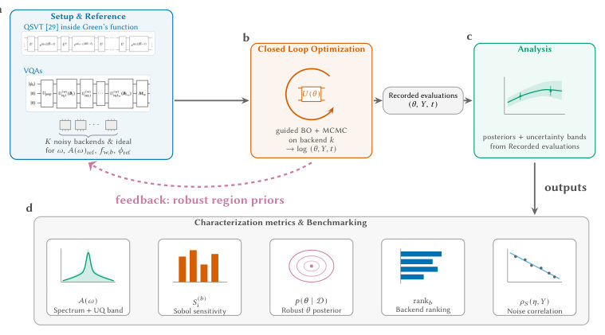 
Fig. 1. Shared UQ workflow for application level benchmarking across VQAs and QSVT Green’s function construction. The pipeline starts from workload and backend setup for both VQAs and QSVT as shown in panel (a), performs backend aware closed loop optimization in (b), performs uncertainty analysis in (c), and produces spectra, sensitivity fingerprints, robust parameter regions, backend rankings, and noise performance correlations in (d). This common structure lets variational and non-variational workloads be compared under one UQ driven benchmarking framework. A phase by phase walkthrough of the diagram, including the saved workflow outputs contract and the offline branches, appears in...

📷 Fig 2

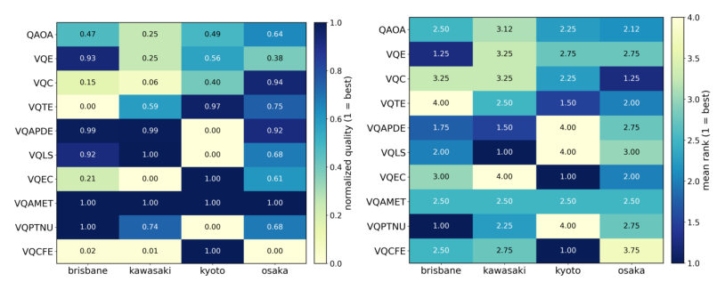 
Fig. 2. Four backends VQA benchmark views built from §3.1: each of the ten VQA workloads is run on Brisbane, Kawasaki, Kyoto, and Osaka through the Bayesian optimization plus posterior refinement engine of §2.3, with four refinement settings (none, Langevin, MH, VI) per (workload, backend) cell. The left panel plots quality_norm ∈[0, 1], defined per workload as a min-max rescaling of the achieved task quantity so that 1 marks the best result and 0 the worst across the four backends, then averaged across the four refinement settings. The right panel plots the within workload rank of each backend, with 1 denoting the best backend for that workload. The average ranks across the ten workloads...

📷 Fig 3

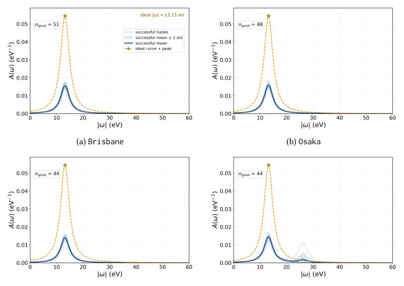 
Fig. 3. QSVT spectral function reconstructions across the four backends, built from the 100 evaluations of Bayesian optimization+VI of §3.2 on the H2 27 dimensional QSVT phase vector. Each successful phase vector 𝜽produces a backend reconstruction of the time domain Green’s function 𝐺(ℎ) 𝑗𝑗(𝑡;𝑏, 𝜽) through the QSVT pipeline of Eqs. (5)-(7); we apply exponential damping at 𝜂= 0.15 a.u. and Fourier transform to the frequency axis through Eq. (8) to obtain the spectral function 𝐴𝑗(𝜔) drawn in each panel. Light curves are individual good tuple reconstructions, the dark curve and the band show the mean and the one standard deviation envelope after sign aligning each successful spectrum to the...

📷 Fig 4

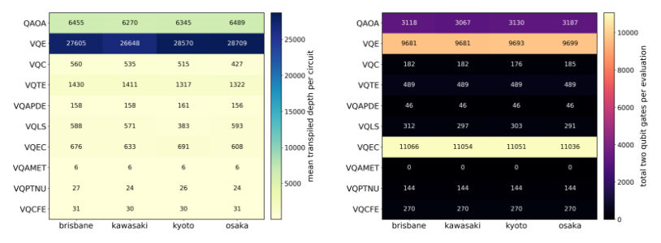 
Fig. 4. VQA resource summary built from the same runs as Figure 2. Every circuit produced during the 100 evaluation Bayesian optimization+VI loop is transpiled onto the coupling map and basis gate set of each backend at Qiskit’s transpiler optimization_level=3, and we then aggregate the two heatmap quantities across that history. The left panel reports the mean compiled depth per circuit, that is, the mean of the per circuit transpiled depths across the backends, and therefore tracks how heavy one circuit becomes once it is routed. The right panel reports the total two qubit gate count per objective evaluation, summing over every circuit a single evaluation produces, which credits workloads...

📷 Fig 5

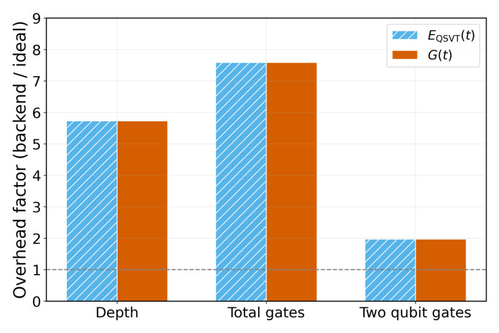 
Fig. 5. QSVT resource summary built from the QSVT block encoding circuit of §2.2 evaluated across a sweep of polynomial degrees 𝑑. For every degree, we first construct the abstract QSVT circuit using the ideal basis (no routing constraint), then transpile it onto each of the four backends’ coupling maps and basis gate sets at Qiskit’s transpiler optimization_level=3 and record routed depth and gate counts. Each bar reports the overhead factor backend/ideal averaged over the four matched backends. We collapse the backends into one bar set because their overheads agree closely: routed depth inflates by 5.6× to 5.8×, total gate count by 7.4× to 7.7×, and two qubit count by about 2× on every...

**Summary.** This paper introduces a unified Uncertainty Quantification framework designed to benchmark noisy quantum computers across diverse computational tasks. By integrating Variational Quantum Algorithms (VQAs) and Green's function reconstruction via QSVT, it moves beyond simple hardware metrics. The resulting common benchmark quantifies the reliability of backends to achieve useful task-level results.

**Why it may be interesting.** It provides a rigorous, quantitative method to benchmark quantum hardware beyond simple gate fidelity, directly assessing if the noise profile allows for meaningful physical conclusions in complex applications like many-body physics or chemistry.

Detailed structure

**Main problem.** To develop a unified Uncertainty Quantification (UQ) framework for application-level benchmarking of noisy quantum backends, bridging Variational Quantum Algorithms (VQAs) and non-variational methods like QSVT.

**Main result.** The framework provides a common benchmark that measures how reliably different quantum backends can achieve useful task-level behavior across diverse workloads, identifying robust parameter regions and failure modes.

**Method.** It combines Bayesian optimization with posterior distribution refinement to quantify uncertainty for both VQA objective functions and Green's function reconstructions derived via QSVT.

**Model / system.** The work evaluates performance on NISQ quantum hardware backends using two primary workload classes: general variational tasks (chemistry, optimization, PDEs) and spectral reconstruction from time-propagators (Green's functions).

**Key observables.** Backend rankings across workloads, robust parameter regions geometry, residual gaps to ideal behavior, mean regret trajectories, and quality vs. speed Pareto frontiers.

**Important parameters / regimes.** The workload parameters ($\vec{\lambda}$) defining the task observable $\mathcal{O}_w$, the optimization parameters ($oldsymbol{	heta}$), and the noise characteristics of the quantum backend.

**Assumptions / limitations.** The analysis relies on IBM fake backend noise models instead of live QPUs, and assumes that a single statistical interface can unify both variational and non-variational workloads for consistent comparison.

**Figures summary.** Figures illustrate shared UQ workflows connecting VQA and QSVT branches; they show cross-backend sensitivity summaries (Morris/SHAP), density maps of robust parameter regions, and application-level performance comparisons (Pareto views).

**Paper structure.** The paper introduces the unified UQ framework by first defining the two workload classes (VQA and QSVT) and then detailing the combined methodology. It presents results comparing backend performance across multiple domains using sensitivity analysis and optimization convergence metrics.

Abstract

We present an uncertainty quantification (UQ) framework for application level benchmarking and characterization of noisy quantum backends. The framework compares two workload classes under one statistical pipeline: noisy intermediate scale quantum (NISQ) variational quantum algorithms (VQAs) and Quantum Singular Value Transformation (QSVT) based Green's function reconstruction. For the VQA branch, we evaluate ten benchmark families spanning chemistry, optimization, simulation, compiling, linear solving, partial differential equations, metrology, error correction, tomography, and channel fidelity estimation. For the QSVT branch, we reconstruct orbital resolved Green's functions and spectral peaks from a block encoded real time propagator. The workflow combines Bayesian optimization, posterior distribution refinement, sensitivity analysis, robust parameter density estimation, backend ranking, noise correlation, and resource estimation analysis. Instead of reporting only one best parameter vector, the framework identifies robust parameter regions, residual gaps to ideal behavior, backend specific failure modes, and calibration sensitive uncertainty. The result is a common benchmark for variational and non-variational workloads that measures how reliably each backend reaches useful task level behavior.

[↑ back to top](#top)

### [Memory of Initial Conditions in Self-Similar Diffusion: A Renormalization-Group Perspective](http://arxiv.org/abs/2607.14388v1)

**Authors:** Ko Okumura  
**Type:** theory · **Category:** statistical mechanics · **PDF:** <https://arxiv.org/pdf/2607.14388v1>  
**Analysis basis:** full PDF text, analyzed in chunks
**Topic relevance:** `non-equilibrium dynamics` **2/5** · `non-equilibrium universality` **2/5** · `Keldysh / 2PI / non-Gaussian methods` **1/5** · `analog quantum simulation` **1/5** · `correlated / nonlocal dissipation` **1/5** · `driven-dissipative phase transition` **1/5** · `entanglement & information structure` **1/5** · `methods for driven-dissipative` **1/5**

📷 Fig 1

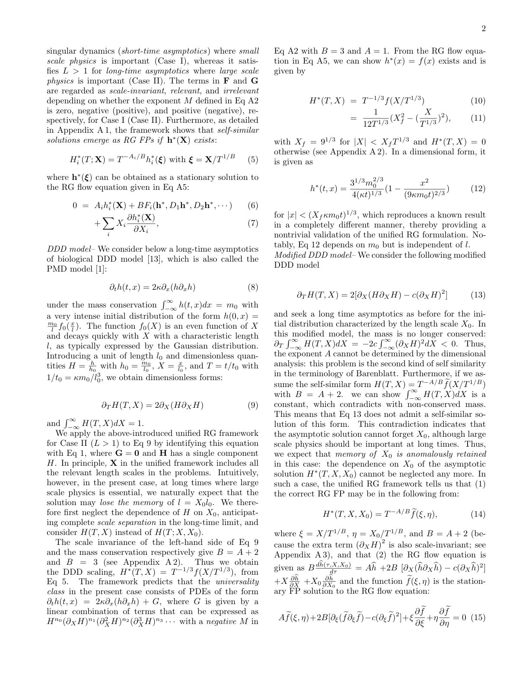 
Low-resolution page preview, page 2

📷 Fig 2

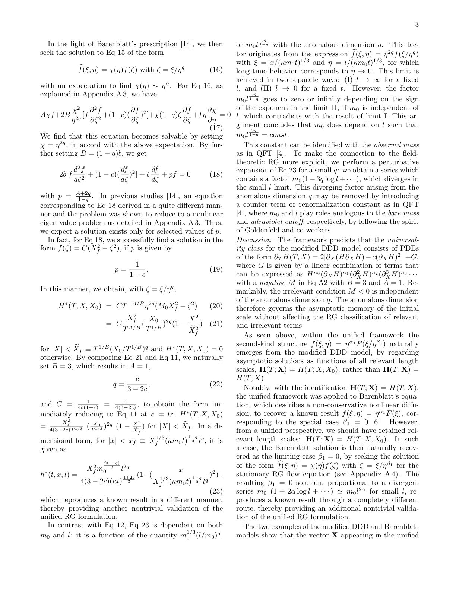 
Low-resolution page preview, page 3

📷 Fig 3

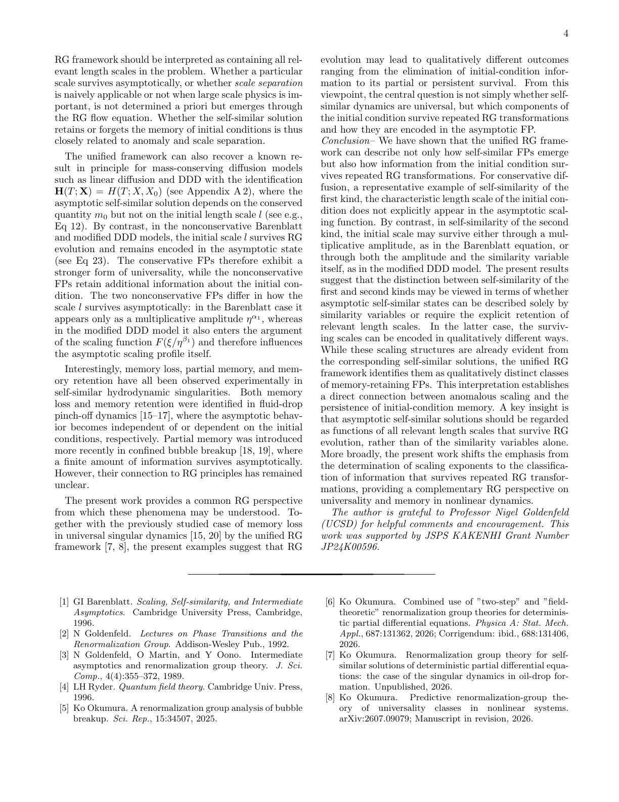 
Low-resolution page preview, page 4

📷 Fig 4

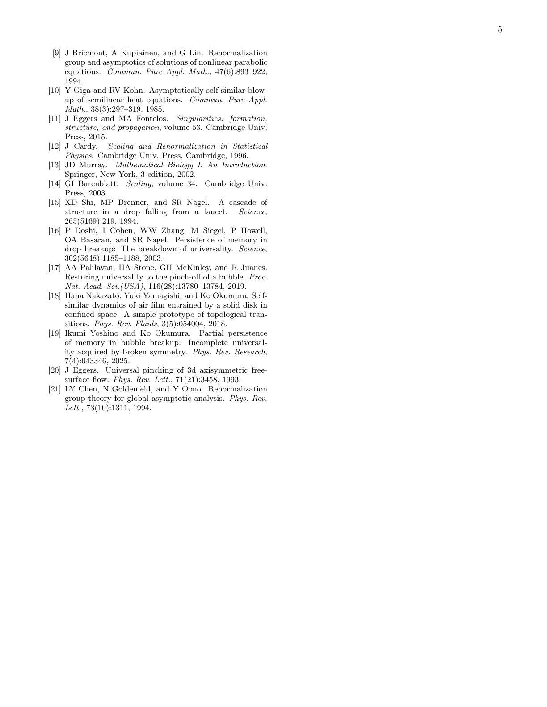 
Low-resolution page preview, page 5

📷 Fig 5

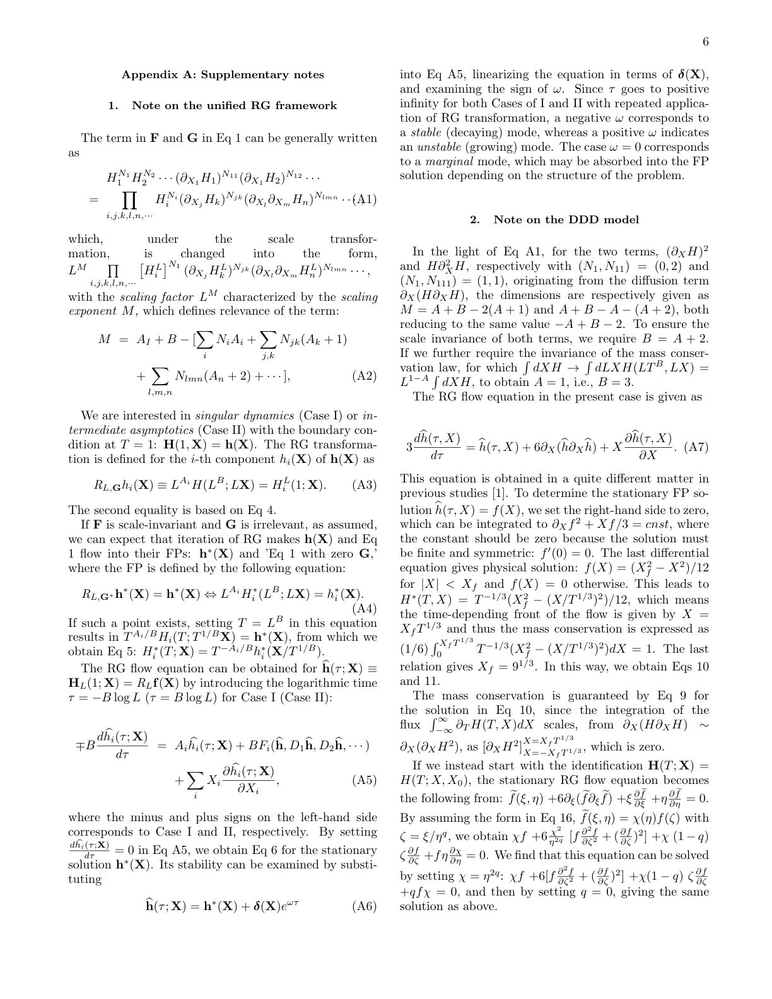 
Low-resolution page preview, page 6

**Summary.** This work applies a unified Renormalization Group framework to study self-similar diffusion processes. It demonstrates that whether an initial condition's memory survives the asymptotic limit depends critically on whether the underlying physical model conserves mass. This provides a refined understanding of universality beyond simple scale invariance.

**Why it may be interesting.** While focused on classical PDEs, the concept of scale invariance breaking down due to retained initial conditions mirrors complex phenomena in open quantum systems or strongly correlated materials where boundary effects or finite size are crucial.

Detailed structure

**Main problem.** The paper investigates how information from initial conditions persists or is lost during self-similar evolution governed by nonlinear diffusion equations.

**Main result.** For non-conservative systems, the memory of the initial length scale survives the Renormalization Group (RG) flow; conversely, conservative systems exhibit stronger universality where this memory is lost asymptotically.

**Method.** A unified Renormalization Group (RG) framework is employed to analyze scaling dynamics by treating asymptotic solutions as functions of all relevant length scales.

**Model / system.** The analysis focuses on self-similar diffusion processes, specifically the Density-Dependent Diffusion (DDD) model and its modified version, which are nonlinear partial differential equations.

**Key observables.** Memory retention of initial length scales ($l$ or $X_0$), scaling exponents ($eta$, $q$), and the functional dependence on multiple length scales in the asymptotic solution.

**Important parameters / regimes.** Diffusion parameters ($\kappa$), anomalous dimension ($q$), and initial scale factors ($m_0, l$).

**Assumptions / limitations.** The analysis assumes that self-similar solutions can be characterized by RG Fixed Points (FPs) derived from scale transformations.

**Paper structure.** The paper develops the unified RG framework for scaling dynamics, applies it to the DDD model showing memory loss in the conservative case, and then analyzes the modified DDD model where non-conservation forces the retention of initial condition memory.

Abstract

Universality is usually associated with asymptotic behavior becoming independent of details of the initial state. Using a unified renormalization-group (RG) framework for self-similar dynamics, we show that retaining relevant length scales leads naturally to distinct classes of memory-retaining fixed points. A modified density-dependent diffusion model reveals a general scaling structure in which initial-condition information remains asymptotically relevant, with the Barenblatt equation emerging as a special case. These results provide a new perspective on universality and anomalous scaling.

[↑ back to top](#top)

### [An end-to-end quantum algorithm for weakly nonlinear plasma physics with superquadratic speedup](http://arxiv.org/abs/2607.14308v1)

**Authors:** Bjorn K. Berntson, David Jennings, Matteo Lostaglio, Scott Parker  
**Type:** theory · **Category:** quantum information and computing · **PDF:** <https://arxiv.org/pdf/2607.14308v1>  
**Analysis basis:** full PDF text, analyzed in chunks
**Topic relevance:** `analog quantum simulation` **2/5** · `non-equilibrium dynamics` **2/5** · `Keldysh / 2PI / non-Gaussian methods` **1/5** · `driven-dissipative phase transition` **1/5** · `entanglement & information structure` **1/5** · `methods for driven-dissipative` **1/5** · `non-equilibrium universality` **1/5**

📷 Fig 1

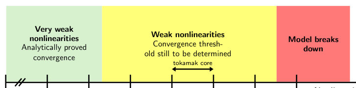 
FIG. 1. Narrowing down the convergence regime. Schematic illustration of convergence regimes for the weakly nonlinear Vlasov-Poisson model with collisions used to benchmark our quantum algorithm. As the nonlinearity strength φmax increases, the problem of simulating the plasma model defined by Eqs. (4–5) passes from an analytically certified Carleman-convergence regime, through a weakly nonlinear regime whose practical convergence threshold remains to be determined numerically or by alternative methods. Finally we pass to the limits of the model φmax = O(1), where the weakly nonlinear plasma model itself ceases to apply. The indicated values are computed for the Gaussian example in Fig. 3.

📷 Fig 2

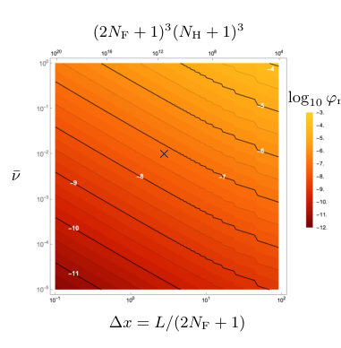 
FIG. 2. Provably resolved plasma nonlinearities for plane-wave initial data. Shown in the above contour plot is nonlinearity measure φmax from Theorem 1 for which we can rigorously prove exponential convergence of the quan- tum algorithm. This places a simple analytic bound on the strength of nonlinearities that can be resolved. Further anal- ysis is needed to determine if stronger nonlinearities can also be simulated. We set n0 = (1, 0, 0), τ = 1, L = 103, and NH = ⌈NF/10⌉. The point (∆x, ¯ν) = (π, 10−2), on which φmax = 7.12 × 10−8, is indicated by the ×.

📷 Fig 3

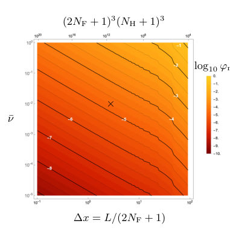 
FIG. 3. Provably resolved plasma nonlinearities for Gaussian initial data. Shown in the above contour plot is nonlinearity measure φmax corresponding to the Gaussian initial data (13) for which we can rigorously prove exponential convergence of the quantum algorithm. We set σ = 10, τ = 1, L = 103, and NH = ⌈NF/10⌉. The point (∆x, ¯ν) = (π, 10−2), on which φmax = 2.08 × 10−5, is indicated by the ×. See Section II C 5 for details.

📷 Fig 4

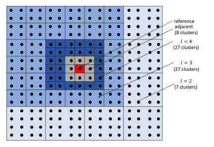 
FIG. 4. Hierarchical decomposition of a 2-d kernel: The combinatorics of the hierarchical decomposition for a 2-d kernel, with N = 16, ℓmax = log2 16 = 4. The red square is the reference, and the selected 2-clusters, 3-clusters and 4-clusters have been highlighted. Can be extended to 3 dimensions in a straightforward manner.

**Summary.** This paper presents a novel end-to-end quantum algorithm designed to simulate weakly nonlinear plasma physics, which is classically demanding. It overcomes key quantum bottlenecks by employing advanced techniques like Lyapunov transforms and hierarchical block-encoding for dense matrices. The resulting algorithm promises exponential memory savings and superquadratic time speedups over existing classical spectral methods.

**Why it may be interesting.** While focused on plasma physics, the core technical contributions—developing block-encoding for nonlinear dynamics and achieving superquadratic speedups in quantum simulation of complex PDEs—are highly relevant to simulating general non-equilibrium many-body systems.

Detailed structure

**Main problem.** Developing an end-to-end quantum algorithm capable of simulating weakly nonlinear plasma physics with a superquadratic speedup over classical methods.

**Main result.** The proposed quantum algorithm achieves rigorous convergence guarantees, yielding exponential memory savings and superquadratic time improvements relative to standard spectral solvers for the kinetic energy estimation.

**Method.** The approach combines three novel ingredients: using a Lyapunov transform for an exponentially converging Carleman linear embedding, developing a hierarchical block-encoding protocol for dense matrices, and introducing a specialized subroutine for information extraction from the full history state.

**Model / system.** The system is a 3D electron–ion plasma modeled by the Vlasov-Poisson system. The dynamics are simplified via Fourier–Hermite truncation to a high-dimensional quadratic ordinary differential equation, analyzed in a controlled perturbative regime.

**Key observables.** Spacetime-averaged kinetic energy moment ($\langle K 
angle$), and the nonlinearity strength ($\varphi_{\max}$).

**Important parameters / regimes.** Nonlinearity strength $\varphi(x, t)$, Fourier cutoff ($N_F$), Hermite cutoff ($N_H$), simulation time $T$, and error tolerance $\epsilon$.

**Assumptions / limitations.** The analytical convergence guarantees are strictly limited to nonlinearities significantly weaker than those typically encountered in practice ($\varphi_{\max} \ll 1$).

**Figures summary.** Figures illustrate the convergence regimes based on nonlinearity strength ($\varphi_{\max}$), showing transitions between analytically certified Carleman-convergence and breakdown limits for different initial data types (Fourier vs. Gaussian).

**Paper structure.** The paper establishes the physical model, addresses quantum bottlenecks (nonlinear embedding, dense encoding), presents the combined algorithmic framework with complexity analysis, and concludes by deriving bounds on key parameters like $\varphi_{\max}$ and estimating observables like $\langle K 
angle$.

Abstract

Nonlinear kinetic plasma simulation is high-dimensional and classically demanding, while quantum algorithms face different bottlenecks: embedding nonlinear dynamics into a linear computation, loading dense field-interaction data, and efficiently extracting information. We present an end-to-end quantum algorithm, with rigorous convergence guarantees, for a weakly nonlinear kinetic plasma model. The system describes a 3D electron-ion plasma with adiabatic electrons, kinetic ions, Debye screening, and Krook relaxation. After Fourier-Hermite truncation, the dynamics reduces to a high-dimensional quadratic ordinary differential equation. To tackle quantum bottlenecks we combine three key ingredients. First, we use a plasma free energy to identify a Lyapunov transform under which a Carleman linear embedding converges exponentially in the truncation order within a certified weakly nonlinear regime. Second, we develop a hierarchical block-encoding protocol for dense matrices, exploiting the spatial decay of the field to avoid polynomial overhead from sparse access encodings. Third, we introduce a subroutine for information extraction that exploits nonlinear components encoded in the full Carleman history state to improve the estimation of linear observables. We construct a quantum algorithm to estimate the spacetime-averaged kinetic energy using $\widetilde{O}\!\left( N_F N_H^{1/2} \operatorname{polylog}\!\left(\frac{T}ε\right)\frac{1}ε\right)$ gates and $\widetilde{O}\!\left(\log\!\left(N_F N_H^{1/2}T\right)\log\!\left(\frac{1}ε\right)\right)$ qubits, where $N_F$ and $N_H$ are the Fourier and Hermite cutoffs. Relative to a Fourier-Hermite spectral solver, this yields exponential memory savings and superquadratic improvements in time. Together, these results establish a controlled nonlinear plasma benchmark for quantum simulation.

[↑ back to top](#top)

### [Recent progress on liquid transport growth of quantum materials](http://arxiv.org/abs/2607.15032v1)

**Authors:** Jiaqiang Yan, Brenden Ortiz  
**Type:** both · **Category:** strongly correlated electrons · **PDF:** <https://arxiv.org/pdf/2607.15032v1>  
**Analysis basis:** full PDF text, analyzed in chunks
**Topic relevance:** `non-equilibrium dynamics` **2/5** · `non-equilibrium universality` **2/5** · `Keldysh / 2PI / non-Gaussian methods` **1/5** · `analog quantum simulation` **1/5** · `correlated / nonlocal dissipation` **1/5** · `driven-dissipative phase transition` **1/5** · `methods for driven-dissipative` **1/5**

📷 Fig 1

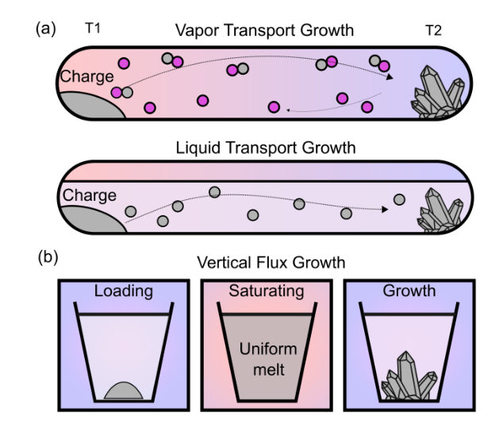 
FIG. 1. (color online) Schematic comparison of chemical vapor transport (CVT), liquid transport growth (LTG), and con- ventional vertical flux growth. In both CVT and LTG, the source material is transported from a hot region to a colder crystallization region under a temperature gradient. The key distinction is that the transport medium is a vapor in CVT and a molten flux in LTG. In conventional vertical flux growth, crystallization occurs from a homogeneous melt during cooling.

📷 Fig 2

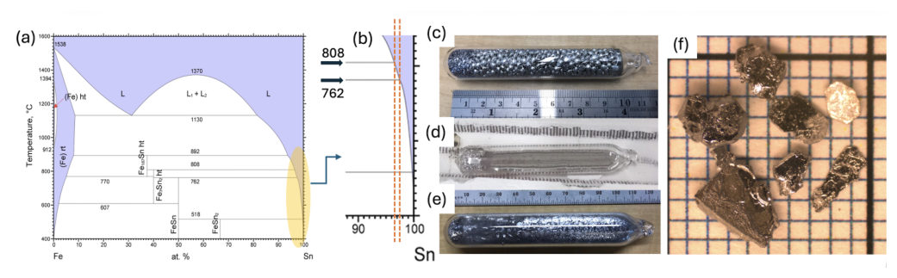 
FIG. 2. (color online) Liquid transport growth of Fe3Sn2. (a) Phase diagram of Fe-Sn from Reference [40]. (b) Portion of the phase diagram highlighting the narrow composition (vertical dashed lines) and temperature (horizontal solid arrows) ranges for the conventional vertical flux growth. (c) The sealed growth ampoule with Fe pieces staying at one end of the ampoule and not mixed with Sn flux. (d) Growth ampoule at 300◦C after Sn flux melts. (e) The ampoule after growth. (f) Picture of Fe3Sn2 crystals on a millimeter grid.

📷 Fig 3

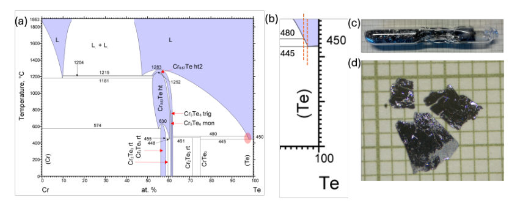 
FIG. 3. (color online) Liquid transport growth of CrTe3. (a) Cr-Te binary phase diagram from Reference [40]. The region covered by an oval shaped circle is highlighted in (b) to illustrate the composition and temperature range good for the conventional vertical flux growth. (c) The growth ampoule on a millimeter grid. Part of the quartz tube was collapsed using a torch in order to reduce the amount of flux needed for the growth. See the Section on growth ampoule for more details. (d) CrTe3 crystals on a millimeter grid.

📷 Fig 4

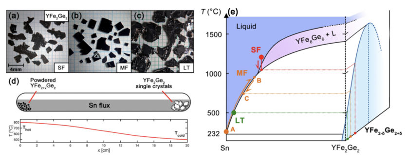 
FIG. 4. (color online) Single crystal growth of YFe2Ge2. (a-c) Pictures of single crystals grown using (a) standard flux (SF), (b) modified flux (MF), and (c) liquid transport (LT) techniques. (d) Schematic illustration of the growth ampoule and temperature gradient used in the LTG. (e) Schematic phase diagram for the growths of YFe2Ge2 single crystals out of Sn flux. Reproduced with permission from [19].

📷 Fig 5

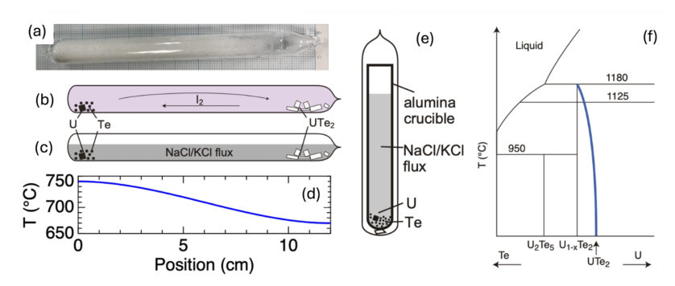 
FIG. 5. (color online) Single crystal growth of UTe2. (a) Ampoule for the liquid transport growth of UTe2 out of NaCl/KCl flux. (b) Schematic illustration of the vapor transport growth of UTe2 using I2 as the transport agent. (c) Schematic illustration of the liquid transport growth of UTe2 out of NaCl/KCl flux. (d) Temperature profile for the liquid transport growth. (e) Schematic illustration of the growth of UTe2 out of NaCl/KCl flux using the conventional vertical configuration. (f) Schematic U-Te phase diagram with the blue curve showing possible temperature dependent nonstoichiometry of UTe2. Reproduced with permission from [18].

**Summary.** This review details Liquid Transport Growth (LTG), an advanced crystal growth technique superior to conventional methods for synthesizing complex quantum materials. LTG achieves this by spatially separating the dissolution and precipitation of material using a molten flux under a temperature gradient. The work highlights how this method allows precise control over stoichiometry and defect chemistry, paving the way for predictive synthesis protocols.

**Why it may be interesting.** While focused on materials synthesis, the core concept of controlling non-equilibrium phase boundaries via imposed gradients relates to open quantum systems dynamics and driven processes in condensed matter theory.

Detailed structure

**Main problem.** Developing advanced, controllable techniques for synthesizing high-quality single crystals of diverse quantum materials.

**Main result.** Liquid Transport Growth (LTG) offers significant advantages over conventional flux methods by spatially separating dissolution and crystallization zones, enabling the growth of temperature-sensitive compounds with higher yields.

**Method.** The authors review LTG, a horizontal flux growth technique that uses a molten flux under an imposed temperature gradient to control crystal precipitation.

**Model / system.** The physical system is the crystal growth process itself, modeled by controlling solute transport between a hot dissolution end and a cooler crystallization end. The materials studied include various quantum compounds like $	ext{UTe}_2$, $	ext{MoTe}_2$, and $	ext{LuNb}_6	ext{Sn}_6$.

**Key observables.** Crystal yield, stoichiometry, defect concentration, physical properties (superconductivity, electronic structure).

**Important parameters / regimes.** Temperature gradient ($\Delta T$), crystallization temperature (ideally constant), solute transport rate, and initial charge/flux ratio.

**Assumptions / limitations.** The primary assumption is that separating dissolution and crystallization zones allows for independent control over growth conditions, overcoming equilibrium solubility constraints.

**Figures summary.** Figure 1 schematically compares CVT, LTG, and conventional flux growth. Figure 2 details the LTG setup and results for $	ext{Fe}_3	ext{Sn}_2$, while Figure 3 does the same for $	ext{CrTe}_3$.

**Paper structure.** The paper introduces LTG as an improvement over conventional methods, details its mechanism by separating dissolution/precipitation zones, provides case studies ($	ext{Fe}_3	ext{Sn}_2$, $	ext{CrTe}_3$), and concludes by outlining future work to make the technique predictive rather than empirical.

Abstract

Liquid transport growth (LTG) is a horizontal flux growth technique that is closely analogous to chemical vapor transport, with the key distinction that a molten flux rather than a vapor serves as the transport agent. Unlike conventional flux growth, LTG spatially separates charge dissolution and crystal precipitation and couples them through continuous solute transport under a deliberately imposed temperature gradient. This enables crystal growth to begin before the charge is completely dissolved, removes the equilibrium solubility constraint on the starting charge/flux ratio, and allows large yields of single crystals to be obtained from a single growth. Recent studies have further shown that by spatially separating dissolution and crystallization and maintaining crystallization at a nearly constant temperature, LTG is particularly effective for two classes of materials: compounds that crystallize only within a narrow temperature and/or composition window, and compounds whose stoichiometry, defect concentration, and thus physical properties are sensitive to the crystallization temperature. In this review, we discuss representative examples including Fe$_3$Sn$_2$, CrTe$_3$, YFe$_2$Ge$_2$, UTe$_2$, CeRh$_2$As$_2$, MoTe$_2$, WTe$_2$, and LuNb$_6$Sn$_6$ to illustrate the unique capabilities of LTG for producing high quality single crystals of diverse quantum materials. We also summarize practical considerations for LTG experimental design, including furnace selection, growth time, melt stability, and ampoule geometry, and discuss future opportunities for transforming LTG from an empirical growth method into a more predictive crystal growth technique.

[↑ back to top](#top)

### [Stochastic process model of rough surface contact](http://arxiv.org/abs/2607.14953v1)

**Authors:** Yang Xu, Yunong Zhou  
**Type:** theory · **Category:** statistical mechanics · **PDF:** <https://arxiv.org/pdf/2607.14953v1>  
**Analysis basis:** full PDF text, analyzed in chunks
**Topic relevance:** `non-equilibrium dynamics` **2/5** · `Keldysh / 2PI / non-Gaussian methods` **1/5** · `analog quantum simulation` **1/5** · `correlated / nonlocal dissipation` **1/5** · `driven-dissipative phase transition` **1/5** · `methods for driven-dissipative` **1/5** · `non-equilibrium universality` **1/5**

📷 Fig 1

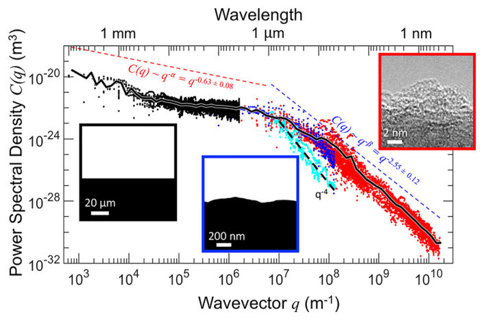 
Figure 1: Power spectral density of a rough topography across eight orders of magnitude in length scale. Reproduced with permission from Gujrati et al. (2018), Copyright 2018 American Chemical Society.

📷 Fig 2

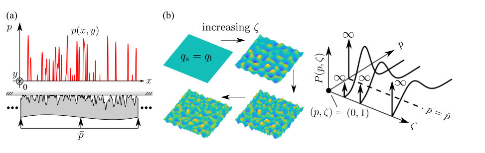 
Figure 3: Schematic of (a) purely normal contact problem and (b) evolution of contact pressure with magnification. Reproduced with permission from Xu et al. (2024b), Copyright 2024 Elesvier.

📷 Fig 3

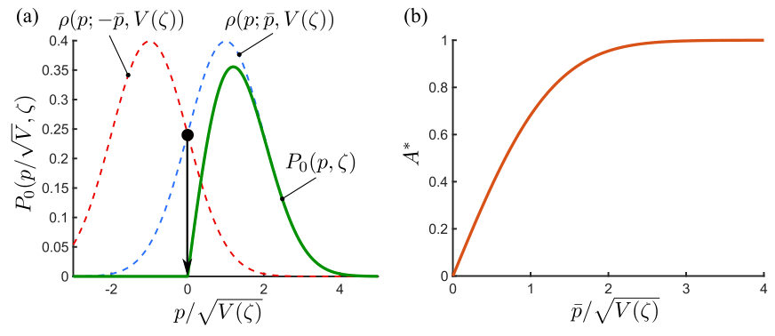 
Figure 4: Schematic of (a) P0(p, ζ) PDF of contact pressure and (b) A∗(¯p) relation; Contact occurs between a nominally flat rigid rough surface and an elastic half-space. The Gaussian distribution ρ(p; x, V ) = 1 √

📷 Fig 4

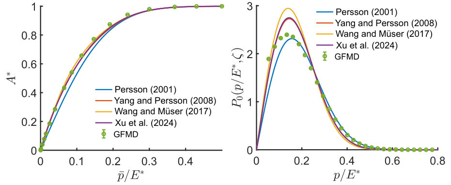 
Figure 5: Comparison between A∗(¯p) relations predicted by Persson’s theory with various fudge factors and Green’s Function Molecular Dynamics. Reproduced with permission from Xu et al. (2022). Copyright 2024 Springer Nature.

📷 Fig 5

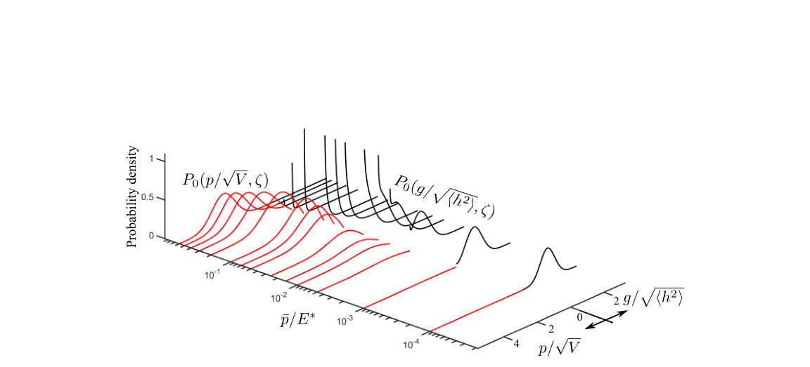 
Figure 6: Evolution of P0(g, ζ) and P0(p, ζ) with ζ. Reproduced with permission from Xu et al. (2024a). Copyright 2024 Elsevier.

**Summary.** This review article thoroughly examines Persson's theory for modeling contact mechanics between rough surfaces. It details how the stochastic nature of surface roughness is incorporated by deriving a differential equation that governs the evolution of the contact pressure probability density function with increasing magnification scale. The work aims to provide researchers with a comprehensive understanding of this state-of-the-art multi-scale theoretical framework.

**Why it may be interesting.** While focused on classical mechanics, the rigorous use of stochastic processes (stochastic differential equations) to model system evolution based on scale separation ($\zeta$) shares mathematical parallels with analyzing open quantum systems or complex many-body dynamics where coarse-graining is necessary.

Detailed structure

**Main problem.** The primary problem is modeling tribological phenomena arising from rough surface contact by integrating the multi-scale nature of surface texture into contact mechanics theory.

**Main result.** The paper details Persson's theory, which develops a differential equation describing how the probability density function (PDF) of contact pressure evolves deterministically with increasing magnification ($\zeta$).

**Method.** The methodology involves characterizing rough topography using stochastic processes and solving partial differential equations to track the evolution of the contact pressure PDF.

**Model / system.** The system is the contact between two uncorrelated rough surfaces. The model centers on Persson's theory, treating the variation as a Markov process whose statistics are governed by diffusion-like equations.

**Key observables.** Interfacial gap, real area of contact, interfacial contact stiffness, and the magnification-dependent Probability Density Function (PDF) of contact pressure $P(p, \zeta)$.

**Important parameters / regimes.** Magnification $\zeta = \lambda_l/\lambda_s$, upper cut-off wavelength ($\lambda_l$), lower cut-off wavelength ($\lambda_s$).

**Assumptions / limitations.** The roughness is assumed to be random, bandwidth-limited, self-affine, and isotropic. Key assumptions include that the pressure variation follows a Markov process.

**Figures summary.** Figures illustrate the Power Spectral Density (PSD) of rough topography across various length scales and map the historical development of multi-scale contact models leading up to Persson's theory.

**Paper structure.** The review first introduces the background of Persson's theory, thoroughly discusses its application to purely normal elastic contact by solving the PDF evolution via PDEs, examines subsequent applications in other tribological fields, and concludes with recommendations for future research directions.

Abstract

The stochastic process model of rough surface contact, widely known as Persson's theory of contact, serves as a representative multi-scale model that has been extensively applied across various fields of tribology. In this chapter, we briefly introduce the background of the development of Persson's theory of contact. We thoroughly discuss Persson's theory for purely normal elastic contact, with a special focus on solving the probability density of the contact pressure and the interfacial gap using partial differential equations. Subsequent applications of these fundamental results in addressing more complex interfacial properties in other fields of tribology are also examined. Finally, several recommendations regarding future studies of Persson's theory are proposed. This review article is expected to assist researchers in quickly familiarizing themselves with the current state of the art of Persson's theory and to attract more attention from tribologists and solid mechanicians, thereby contributing to the development and application of Persson's theory of contact.

[↑ back to top](#top)

### [Machine-Learning-Empowered Quantum Sensing of the Plaquette Phase in a Three-Level Delta System](http://arxiv.org/abs/2607.15040v1)

**Authors:** Lorenzo Vitale, Shreyasi Mukherjee, Dario Fasone, Enrico Martello, Elisabetta Paladino, Luigi Giannelli, Giuseppe Falci  
**Type:** theory · **Category:** other · **PDF:** <https://arxiv.org/pdf/2607.15040v1>  
**Analysis basis:** full PDF text, analyzed in chunks
**Topic relevance:** `analog quantum simulation` **2/5** · `quantum measurements` **2/5** · `driven-dissipative phase transition` **1/5** · `methods for driven-dissipative` **1/5**

📷 Fig 1

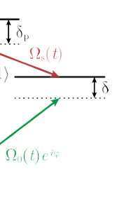 
Figure 1: Three-level system in a ∆configuration.

📷 Fig 2

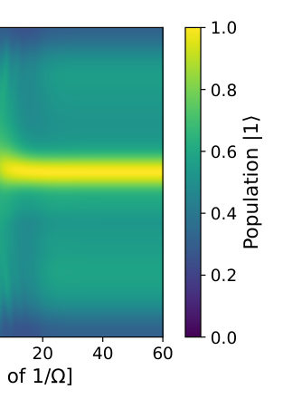 
Figure 2: Time- and phase-resolved population of the target state |1⟩during the STIRAP protocol, obtained under the operational two-photon detuning condition of Eq. (9). The Gaussian pulses given by Eq. (10) are taken with equal peak amplitudes, Ωmax p = Ωmax s = Ω. Simulation parameters: ΩT = 15, τ = 0.7 T, and δp = 0.

📷 Fig 3

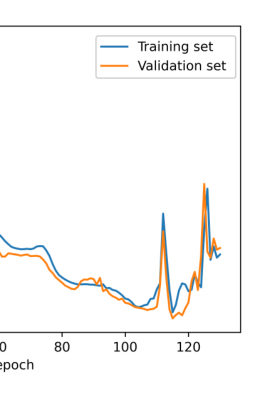 
Figure 3: Training progress. The value of the cost function, given by Eq. (14), for the training sets (solid blue line) and the validation sets (solid orange line) vs. the number of epochs of training.

📷 Fig 4

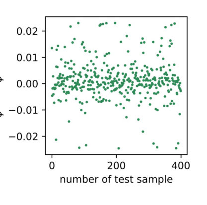 
Figure 4: Performance of the neural network on the test dataset. Left: predicted phase versus the corresponding target value (the true value). Right: prediction accuracy as a function of the test sample index.

**Summary.** The research proposes using machine learning to sense the plaquette phase in a three-level atomic system by analyzing how this unknown phase perturbs STIRAP population transfer efficiencies. By training an MLP on simulated data, the authors demonstrate that these accessible quantum control measurements encode enough information to accurately reconstruct the underlying gauge-invariant phase.

**Why it may be interesting.** This work provides a concrete, modern example of leveraging machine learning in quantum physics—specifically turning a difficult-to-measure physical parameter (a gauge phase) into a measurable diagnostic signal via controlled dynamics.

Detailed structure

**Main problem.** The paper addresses the quantum sensing of the plaquette phase ($\phi$) within a three-level $\Delta$ system, which is a gauge-invariant quantity affecting system dynamics.

**Main result.** A Multi-Layer Perceptron (MLP) trained on simulated STIRAP population transfer efficiencies can accurately reconstruct the unknown plaquette phase with high fidelity.

**Method.** The methodology involves framing the problem as an inverse mapping, using supervised machine learning to predict $\phi$ from multiple measured quantum control observables.

**Model / system.** The system is a three-level $\Delta$-type atomic configuration described by a Hamiltonian that includes the unknown plaquette phase. The dynamics are probed using Stimulated Raman Adiabatic Passage (STIRAP) protocols.

**Key observables.** Stimulated Raman Adiabatic Passage (STIRAP) population transfer efficiencies ($\eta$), which depend non-trivially on the plaquette phase $\phi$.

**Important parameters / regimes.** The plaquette phase $\phi$, system coupling strengths ($\Omega_0, \Omega_p, \Omega_s$), and detuning parameters.

**Assumptions / limitations.** It is assumed that the STIRAP efficiency measurements provide sufficient information to uniquely determine the unknown gauge-invariant phase $\phi$.

**Figures summary.** Figures illustrate the three-level system setup; one shows the dependence of STIRAP efficiency on $\phi$, and later figures demonstrate the convergence and test performance of the MLP model in reconstructing the true phase.

**Paper structure.** The paper first introduces the physical model and the concept of the plaquette phase. It then details how this phase breaks Coherent Population Trapping (CPT) and influences STIRAP dynamics. The core is the development and training of an MLP using simulated data derived from these dynamic measurements to achieve phase estimation.

Abstract

We propose a machine-learning-empowered approach to the quantum sensing of the plaquette phase, a gauge-invariant quantity arising in three-level $Δ$ systems. This phase profoundly affects the system dynamics, breaking coherent population trapping and inducing a non-trivial phase dependence of the dynamics. We demonstrate that a multi-layer perceptron (MLP), trained in a supervised-learning framework, can accurately estimate the plaquette phase from STImulated Raman Adiabatic Passage (STIRAP) population transfer efficiencies measured under different driving conditions, which provide experimentally accessible observables. Our results highlight how the combination of coherent control and machine learning (ML) enables effective phase identification in closed-loop quantum systems, opening new perspectives for quantum technologies, specifically quantum sensing applications including synthetic gauge fields.

[↑ back to top](#top)

### [Moment Optimization in the Navascués-Pironio-Acín Hierarchy](http://arxiv.org/abs/2607.14755v1)

**Authors:** Francesco Flora, Losel Matos, Tim Heightman, Tamás Kriváchy, Adan Garriga, Antonio Acín  
**Type:** theory · **Category:** quantum information and computing · **PDF:** <https://arxiv.org/pdf/2607.14755v1>  
**Analysis basis:** full PDF text, analyzed in chunks
**Topic relevance:** `analog quantum simulation` **2/5** · `entanglement & information structure` **2/5** · `Keldysh / 2PI / non-Gaussian methods` **1/5** · `methods for driven-dissipative` **1/5**

📷 Fig 1

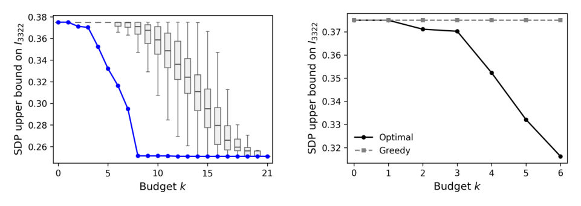 
Figure 1: Complete distribution of I3322 relaxation values across all 221 moment subsets, stratified by Hamming weight k. The structural transition in the range 5 &lt; k ≤19 — where distributions are widest and the optimal value improves most rapidly — identifies the combinatorially active regime of the landscape. The wide spread of bound values at each k, with subsets of the same size spanning nearly the full range from the NPA1 to the NPA2 bound, is a direct signature of strong higher-order interactions among moments. (a) Distribution of relaxation values at each Hamming weight k over all 21 k  subsets. Each box spans the interquartile range (Q1–Q3), with the median marked by the interior...

📷 Fig 2

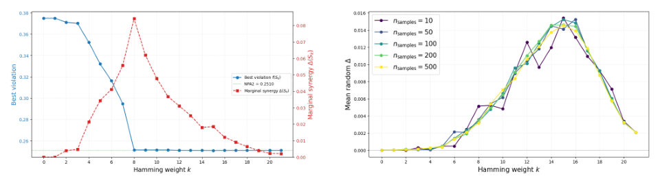 
Figure 2: Synergy as a diagnostic for subset saturation. Left: Best violation f(Sk) (blue, left axis) and marginal synergy ∆(Sk) (red, right axis) as a function of k, with Sk taken as the globally optimal k-subset of the I3322 NPA1→NPA2 adding set. The cost curve flattens abruptly at k = 8 as the NPA2 bound is reached (green dotted line), and the synergy attains its maximum ∆(S⋆ 8) ≈0.084 at exactly the same step — every element of the saturating 8-subset is essential, no single removal preserves saturation. Past k = 8 additional elements are redundant and the synergy decays smoothly toward zero. Right: Convergence of the statistical synergy estimate in nsamples. Mean random-subset synergy...

📷 Fig 3

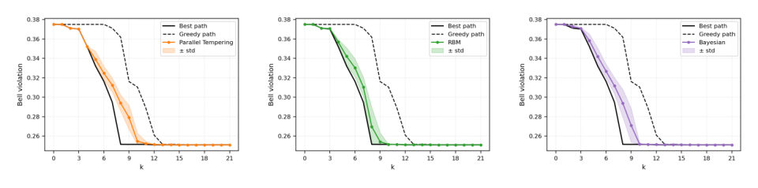 
Figure 3: Individual method performance on the I3322 moment-selection problem. Each panel shows the mean I3322 violation (colored curve with markers) as a function of k, averaged over 30 independent runs, with the shaded band indicating one standard deviation. The solid black curve is the ground-truth optimal path; the dashed black curve is the greedy baseline. (a) PT (R = 5, T ∈[0.1, 2.0], 5 000 SDP evaluations) tracks the optimal curve closely from k ≈3, with a moderate variance band that narrows as k passes the transition region. (b) RBM (500 gradient steps, ADAM η = 0.01, 501 SDP evaluations) achieves close tracking of the optimal path, reaching the NPA2 convergence value at k ≈9–10...

📷 Fig 4

 
Figure 4b shows the normalized runtime of each method as a function of k, expressed relative to the greedy algorithm and plotted on a logarithmic scale. The brute-force curve peaks at 21 10  = 352 716 normalized evaluations at k = 10 — several orders of magnitude above all three methods across the full range. BO maintains the lowest runtime throughout, remaining within one to two orders of magnitude of the greedy baseline. This reflects its fundamental design principle; with 250 SDP evaluations, the surrogate amortizes the cost of expensive function calls, and the dominant overhead is model fitting and candidate sampling rather than SDP evaluation. The RBM occupies an intermediate...

📷 Fig 5

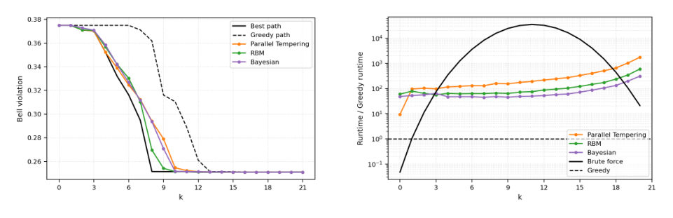 
Figure 4: Solution quality and computational cost of the three optimization methods on the I3322 moment- selection problem. (a) Mean I3322 violation achieved by PT (orange), RBM (green), and BO (purple) as a function of k, averaged over 30 independent runs. The solid black curve is the ground-truth optimal path from exhaustive enumeration; the dashed black curve is the greedy baseline. PT tracks the optimum closely from k ≈3; the RBM achieves a substantially closer approach to optimal throughout the hard transition regime despite ten times fewer SDP evaluations (see Fig. 5). BO converges later but requires a factor of 20 fewer SDP evaluations than PT. (b) Runtime of each method normalized...

**Summary.** This paper addresses the computational bottleneck of moment optimization in the NPA hierarchy by treating moment selection as a combinatorial search problem. The authors develop and compare advanced machine learning and sampling techniques (RBM, BO) that efficiently select optimal subsets of moments. This establishes a scalable framework for obtaining tighter, certified bounds on quantum correlations and energy gaps.

**Why it may be interesting.** This work provides a crucial computational tool for rigorously bounding physical quantities in quantum systems where exact calculation is intractable due to high dimensionality or non-commutativity.

Detailed structure

**Main problem.** The core problem is optimizing moment selection within the Navascués-Pironio-Acín (NPA) hierarchy to efficiently bound solutions to noncommutative polynomial optimization problems.

**Main result.** The developed framework allows for scalable moment selection, significantly improving certified bounds on quantum correlations and ground-state energies by orders of magnitude compared to greedy or full brute-force methods.

**Method.** The authors reframe moment selection as a combinatorial subset selection problem and compare three optimization techniques: Parallel Tempering (PT), RBM-based Reinforcement Learning, and Bayesian Optimization (BO).

**Model / system.** Applications include bounding Bell inequalities (e.g., $I_{3322}$) and certifying ground-state energies for many-body Hamiltonians like the one-dimensional Heisenberg spin chain.

**Key observables.** Bound quality (gap $\Delta C$), synergy diagnostic ($\Delta(S_k)$), and convergence behavior across different Bell inequalities.

**Important parameters / regimes.** Computational budget (fixed resource constraint) and moment selection level ($n$ in the NPA hierarchy).

**Assumptions / limitations.** The NPA relaxation sequence provides an outer approximation to the true quantum expectation value, but its computational cost grows combinatorially with the number of moments.

**Figures summary.** Figures compare optimization strategies (PT) for energy and observable gap certification on the Heisenberg chain, showing that warm-starting from local solutions significantly improves bounds for long-range correlations.

**Paper structure.** The paper establishes the NPA framework, identifies moment selection as a combinatorial challenge, introduces synergy diagnostics, and then develops/compares advanced optimization algorithms (PT, RBM, BO) using quantum information benchmarks like Bell inequalities and spin chains.

Abstract

The Navascués-Pironio-Acín (NPA) hierarchy provides a convergent sequence of semidefinite programming (SDP) relaxations for noncommutative polynomial optimisation, ubiquitous in quantum physics. However, its practical applicability is limited by the combinatorial growth in operator moments required at each level. Since not all moments contribute equally to bound tightness, selecting moments within a fixed computational budget is a relevant problem.   We reframe moment selection as combinatorial subset selection and show it is governed by strong higher-order synergistic interactions among moments, quantified through a marginal synergy diagnostic adapted from complex systems theory. We develop and compare three optimisation methods: Parallel Tempering (PT), an RBM-based reinforcement learning policy, and Bayesian Optimisation (BO). On the $I_{3322}$ Bell inequality benchmark, all three substantially outperform greedy approaches at costs around two orders of magnitude below brute force, with the RBM achieving the closest approach to optimal throughout the hard transition regime.   We apply the framework to the 174 Bell inequalities in the $(4,4,2,2)$ scenario, finding heterogeneous convergence behaviour across inequalities, and to the one-dimensional Heisenberg spin chain, demonstrating that physically motivated monomial bases are internally compressible and are not globally optimal in general. A budget-aware search over a broader pool improves certified bounds on long-range correlations by nearly two orders of magnitude. These results establish a scalable framework for moment selection in noncommutative polynomial optimisation, with broad applications across quantum physics and quantum information.

[↑ back to top](#top)

### [Quantum Remote Implementation of Hybrid Operations on Hyperstates Using Hyperentangled States](http://arxiv.org/abs/2607.14819v1)

**Authors:** Satish Kumar, Anirban Pathak  
**Type:** theory · **Category:** quantum information and computing · **PDF:** <https://arxiv.org/pdf/2607.14819v1>  
**Analysis basis:** full PDF text, analyzed in chunks
**Topic relevance:** `quantum measurements` **2/5** · `entanglement & information structure` **1/5** · `interference shaping light` **1/5** · `measurement-induced transitions` **1/5** · `quantum optics experiment` **1/5**

📷 Fig 1

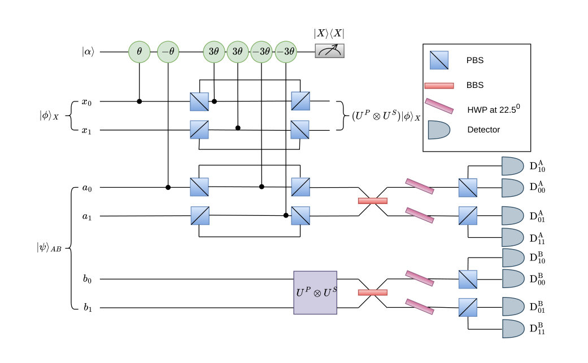 
FIG. 1: (Color Online) The pictorial representation of the QRIO protocol using a hyperentangled state, where both the spatial and polarization DOFs are utilized simultaneously.

📷 Fig 2

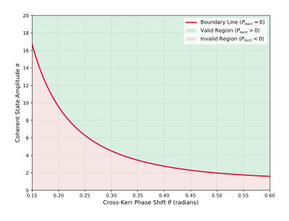 
FIG. 2: (Color online) Parameter region for positive success probability of the proposed QRIO protocol in the (θ, α) plane. The boundary curve (Psucc = 0) separates the valid region ((Psucc &gt; 0), shaded green) from the invalid region ((Psucc &lt; 0), shaded red). For a given cross-Kerr phase shift θ, the coherent state amplitude α must lie above the boundary to ensure a positive success probability.

📷 Fig 3

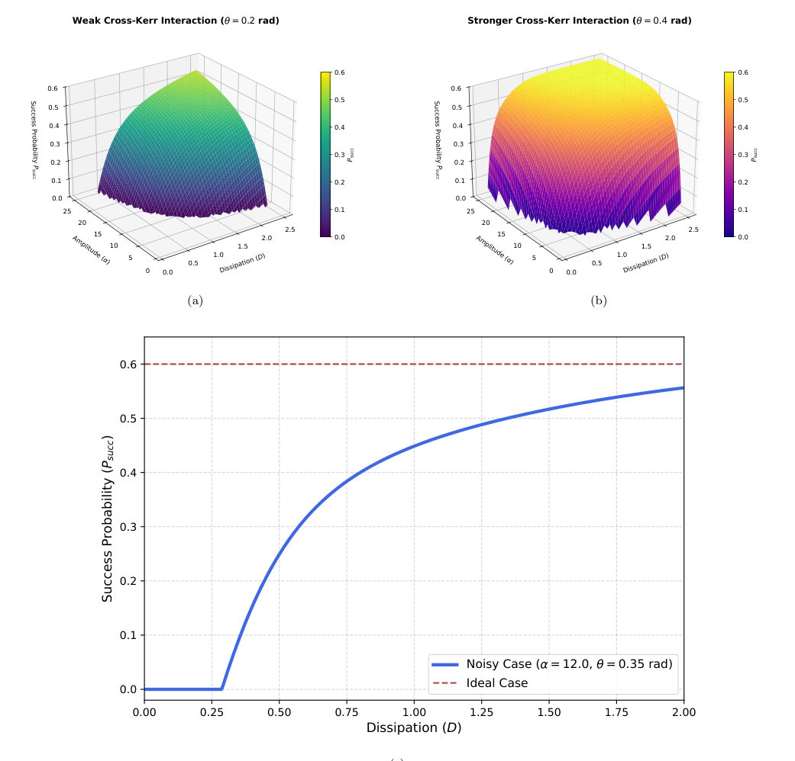 
FIG. 3: (Color online) Effect of coherent state dissipation on the success probability of the proposed QRIO protocol. (a) Three-dimensional variation of the success probability Psucc as a function of the dissipation parameter D and coherent state amplitude α for a weak cross-Kerr phase shift (θ = 0.2 rad). (b) Corresponding success probability landscape for a stronger cross-Kerr phase shift (θ = 0.4 rad). In both cases, larger values of α and weaker dissipation (D →1) enhance the protocol performance. (c) Comparison of the ideal (D = 1) and noisy success probabilities as a function of the dissipation parameter for α = 12 and θ = 0.35 rad, illustrating the degradation in performance caused...

**Summary.** This work proposes a quantum remote implementation protocol that operates on two-qubit hyperstates by simultaneously leveraging both polarization and spatial degrees of freedom. The scheme uses cross-Kerr nonlinear interactions and homodyne measurements, demonstrating enhanced performance over previous methods. The analysis rigorously accounts for realistic noise sources like dissipation, confirming the feasibility of hybrid quantum communication.

**Why it may be interesting.** It provides a concrete, resource-efficient blueprint for hybrid quantum operation implementation in photonic systems, directly relevant to developing distributed quantum information processing networks.

Detailed structure

**Main problem.** The paper addresses the challenge of remotely implementing an arbitrary hybrid quantum operator on a single-photon two-qubit hyperstate.

**Main result.** A novel protocol is proposed that successfully utilizes both polarization and spatial degrees of freedom simultaneously, significantly enhancing performance compared to schemes using only one DOF.

**Method.** The method involves entangling the unknown state with a shared hyperentangled resource via cross-Kerr nonlinear interactions and subsequent homodyne measurements on a probe coherent state.

**Model / system.** The system uses two-qubit hyperentangled states encoded across polarization (H/V) and spatial modes ($x0/x1$). The protocol is realized using linear optical elements and cross-Kerr nonlinear interactions, making it compatible with photonic quantum communication.

**Key observables.** Success probability ($P_{	ext{succ}}$), which is analyzed in the presence of measurement errors and dissipation.

**Important parameters / regimes.** Cross-Kerr phase shift ($	heta$), coherent state amplitude ($\alpha$), and environmental dissipation rate ($\gamma$).

**Assumptions / limitations.** The analysis explicitly models and accounts for two sources of error: finite distinguishability of coherent states during homodyne detection, and coherent state dissipation.

**Figures summary.** Figures illustrate the protocol components (Fig. 1), summarize local Pauli operations based on measurement outcomes (Table II), and show 3D landscapes demonstrating how $P_{	ext{succ}}$ is affected by $\alpha$, dissipation ($D$), and $	heta$ (Fig. 2, Fig. 3).

**Paper structure.** The paper details the protocol steps: initial state transformation using cross-Kerr interaction, measurement on an auxiliary coherent state to generate entanglement, conditional local operations, application of the desired operator $U$, and final recovery via Pauli corrections.

Abstract

Quantum remote control, also known as quantum remote implementation of an operator (QRIO), enables the remote manipulation of an arbitrary quantum state by implementing a desired quantum operation at a distant location. Significant progress has recently been made in developing QRIO protocols and their variants. Most existing schemes employ hyperentangled states where entanglement is shared across multiple degrees of freedom (DOFs). However, these protocols typically exploit only one degree of freedom at a time. In this work, we propose a QRIO protocol that simultaneously utilizes the polarization and spatial DOFs of a two-qubit hyperentangled state to remotely implement an arbitrary hybrid operator on an unknown single-photon two-qubit hyperstate. The shared hyperentangled resource is realized using the polarization and spatial modes of photons, while the protocol is constructed using linear optical elements and cross-Kerr nonlinear interactions to facilitate effective photon-photon coupling. Furthermore, the effects of measurement errors arising from finite coherent state distinguishability and coherent state dissipation are analyzed and the corresponding success probability of the protocol is evaluated. The results demonstrate that an appropriate choice of the cross-Kerr phase shift and coherent state amplitude significantly enhances the protocol performance, making the proposed scheme a promising candidate for hybrid quantum communication and distributed quantum information processing.

[↑ back to top](#top)

### [Fermiology of the kagome compound LuNb6Sn6 probed by de Haas-van Alphen oscillations](http://arxiv.org/abs/2607.15248v1)

**Authors:** Tucker Beekmann, Caue Kaufmann Ribeiro, Kyryl Shtefiienko, Jiaqiang Yan, Brenden R. Ortiz, Christopher A. Mizzi, Keshav Shrestha  
**Type:** both · **Category:** strongly correlated electrons · **PDF:** <https://arxiv.org/pdf/2607.15248v1>  
**Analysis basis:** full PDF text, analyzed in chunks
**Topic relevance:** `driven-dissipative phase transition` **2/5** · `Kondo & dissipative impurity` **1/5** · `analog quantum simulation` **1/5** · `non-equilibrium dynamics` **1/5**

📷 Fig 1

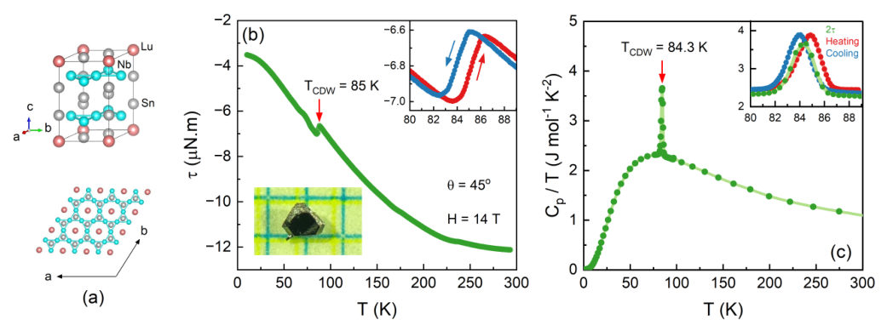 
FIG. 1. (a) Crystal structure of LuNb6Sn6: the unit cell (top) and top view (bottom), highlighting the Nb kagome network. (b) Temperature dependence of the magnetic torque at fixed field magnitude and direction for a LuNb6Sn6 single crystal (Sample S1). A clear anomaly at TCDW = 85 K (arrow) indicates the onset of CDW order. Upper inset: zoomed-in view near TCDW, showing the transition and hysteresis between cooling and heating curves. Lower inset: Optical image of one of the measured single crystals. (c) Temperature dependence of the heat capacity of LuNb6Sn6. A pronounced anomaly at 84.3 K marks the CDW transition. Inset: zoomed-in view near TCDW highlighting the transition and the...

📷 Fig 2

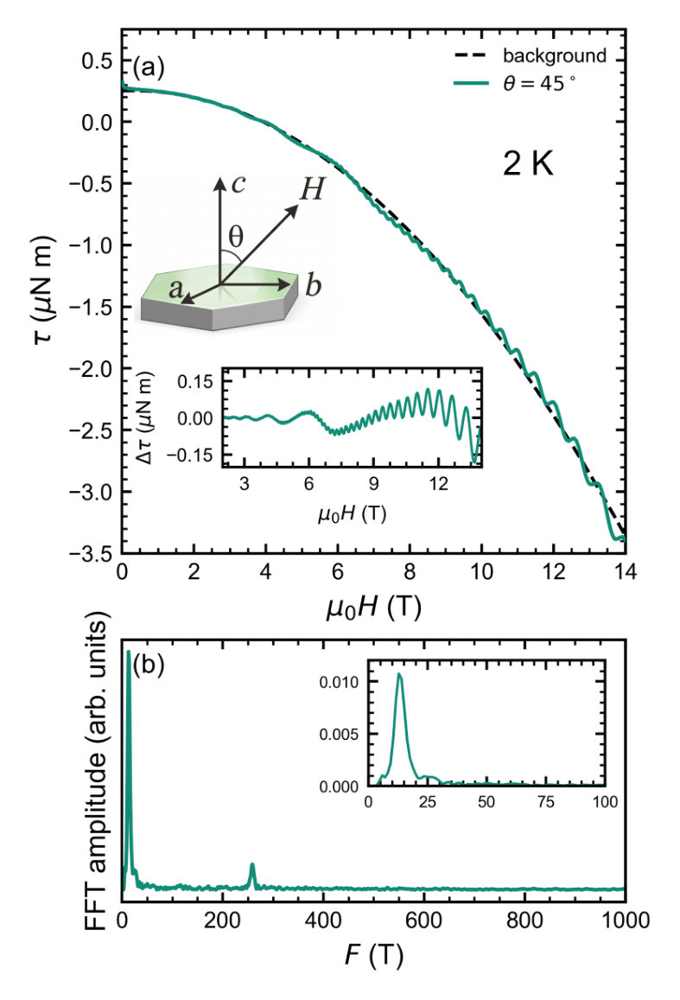 
FIG. 2. (a) Torque τ as a function of magnetic field H for a LuNb6Sn6 single crystal (Sample S1) measured at 2 K with the field applied at an angle θ = 45◦. τ(H) exhibits clear dHvA oscillations above 2 T. The black, dashed line represents a second-order polynomial fit to the background. Inset: schematic illustration of the tilt angle and background-subtracted torque signal showing the dHvA oscillations. (b) FFT spectrum of the oscillatory signal shown in (a). Two dominant frequencies are observed at Fα = 12.8 T and Fβ = 259 T.

📷 Fig 3

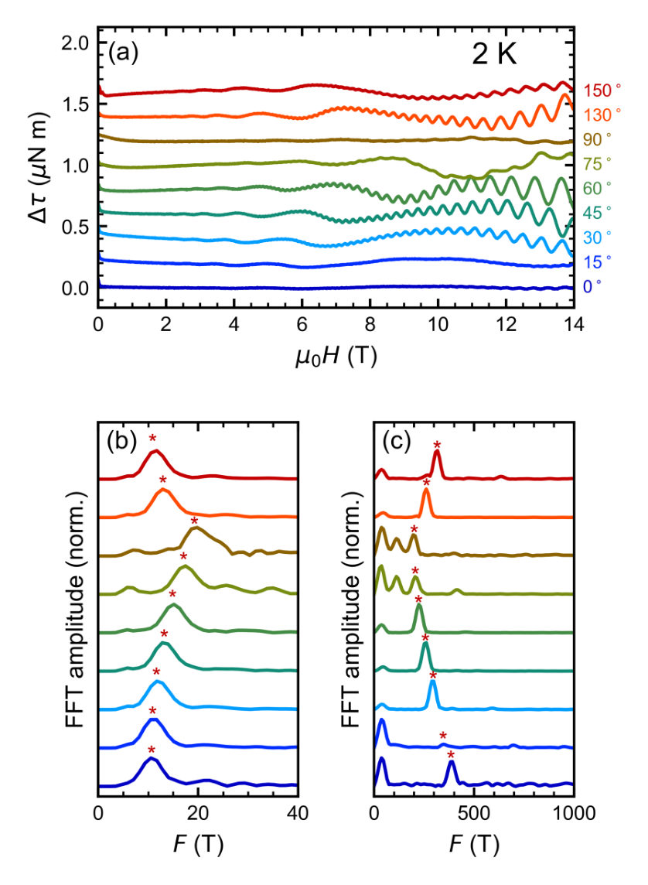 
FIG. 3. (a) Background-subtracted angle-dependent torque data for a LuNb6Sn6 single crystal (Sample S1) at 2 K. dHvA oscillations are observed for all tilt angles. (b) Frequency spectra in the low-frequency range with FFT analysis performed between 2–14 T. (c) Frequency spectra in the high-frequency range with FFT analysis performed between 8–14 T. In both (b) and (c) FFT amplitudes have been normalized by the maximum peak amplitude and offset by a constant to emphasize the angular dependence. Frequencies marked with an asterisk are the focus of the quantitative analysis.

📷 Fig 4

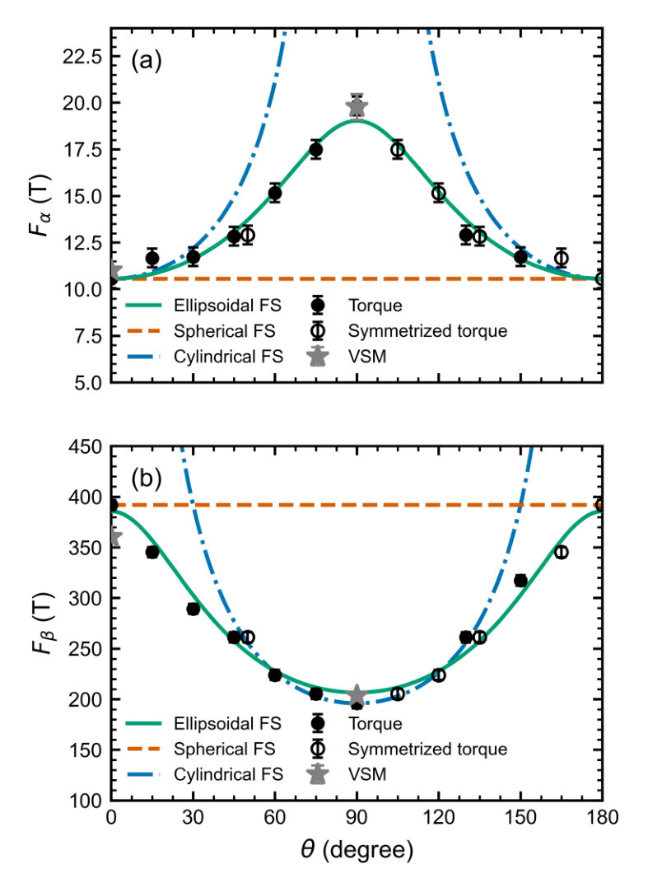 
FIG. 4. Angle dependence of (a) Fα and (b) Fβ for LuNb6Sn6 (Sample S1). Solid circles represent data obtained from torque measurements and open circles are symmetrized data. Gray stars correspond to VSM measurements. The solid curves in both panels represent the frequency–angle relation expected for an ellipsoidal FS, indicating that both Fα and Fβ originate from ellipsoidal Fermi pockets. The dashed lines are expected frequency-angle relations for spherical or cylindrical FS. The values and uncertainties of the frequencies in both panels are from fitting a pseudo-Voigt function for each peak. All data acquired at T = 2 K.

📷 Fig 5

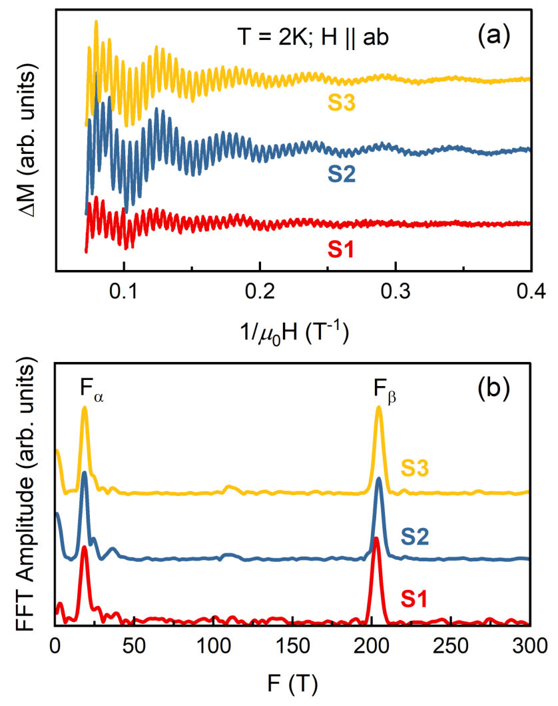 
FIG. 5. (a) Background-subtracted magnetization as a function of inverse magnetic field with H ∥ab for three LuNb6Sn6 samples (S1, S2, and S3) measured at 2 K. (b) In all three samples, FFTs of the background-subtracted magnetization reveal two main quantum oscillation frequencies near Fα ≈19 T and Fβ ≈204 T, emphasizing the reproducibility of the results. The magnetization data and FFTs have been offset by constants for visual clarity.

**Summary.** This work uses de Haas-van Alphen oscillations and thermal measurements on the kagome metal LuNb6Sn6 to map its Fermi surface topology. The research reveals two distinct electronic pockets whose behavior is significantly altered by a first-order Charge Density Wave transition. By combining quantum oscillation data with DFT calculations, the authors establish that CDW reconstruction dictates the material's ground state electronic structure.

**Why it may be interesting.** While focused on condensed matter magnetism/transport, the interplay between symmetry breaking (CDW formation) and the resulting changes in electronic band structure and topological features (Berry phase evidence) is highly relevant to understanding emergent quantum phases in strongly correlated systems.

Detailed structure

**Main problem.** To investigate the Fermi surface topology and electronic structure of the kagome metal LuNb6Sn6, particularly in relation to its Charge Density Wave (CDW) transition.

**Main result.** The study confirms two major quantum oscillation frequencies ($F_\alpha$ and $F_eta$) originating from ellipsoidal Fermi pockets, while also showing that CDW-induced Fermi surface reconstruction is crucial for understanding the ground state electronic structure.

**Method.** A combination of experimental measurements (dHvA oscillations via torque magnetometry, heat capacity) and theoretical calculations (DFT band structure analysis) was employed.

**Model / system.** The physical system is the kagome compound LuNb6Sn6. The investigation focuses on its electronic properties near the Fermi level, particularly how these are modified by a temperature-dependent CDW transition.

**Key observables.** dHvA frequencies ($F_\alpha \approx 20	ext{ T}, F_eta \approx 200	ext{ T}$), CDW transition temperatures ($	ext{T}_{	ext{CDW}} = 85	ext{ K}$), and the angular dependence of quantum oscillation frequencies.

**Important parameters / regimes.** Low temperature (2 K), magnetic fields up to 14 T, and electronic parameters derived from Lifshitz-Kosevich analysis ($m^*$, $T_D$).

**Assumptions / limitations.** The primary assumption is that the observed quantum oscillations are governed by well-defined Fermi surface pockets whose topology can be mapped using standard solid-state physics models (e.g., ellipsoidal FS).

**Figures summary.** Figures show thermal anomalies confirming a first-order CDW transition, dHvA oscillations in torque vs. H, FFT spectra identifying two main frequencies, and plots showing the angle dependence of these frequencies consistent with ellipsoidal pockets.

**Paper structure.** The paper proceeds by characterizing the material's phase transitions (CDW) using thermal measurements, followed by detailed quantum oscillation measurements to map the Fermi surface topology, and finally comparing experimental findings against first-principles electronic structure calculations.

Abstract

We report a detailed de Haas-van Alphen (dHvA) study of the recently discovered kagome metal LuNb6Sn6 using torque magnetometry, magnetization, and heat-capacity measurements. Temperature-dependent torque and heat-capacity data reveal a charge density wave (CDW) transition at T_CDW = 85 K. The thermal hysteresis observed in both measurements establishes the first-order nature of the transition. Quantum oscillation measurements identify two major dHvA frequencies: F_alpha ~ 20 T and F_beta ~ 200 T, and their angular dependence is consistent with ellipsoidal Fermi surface (FS) pockets. Landau fan diagram analysis reveals evidence for a nontrivial Berry phase associated with the F_alpha pocket, indicating possible nontrivial electronic topology in LuNb6Sn6. Analysis of the temperature and magnetic field dependence of the oscillations using the Lifshitz-Kosevich formula yields electronic parameters that indicate anisotropic quantum transport properties. First-principles calculations provide further insight into the electronic structure, revealing Dirac-like band crossings, a flat band, and multiple van Hove singularities near the Fermi level. Our calculations based on the pristine phase cannot fully reproduce the experimentally observed quantum oscillation frequencies, suggesting that CDW-induced FS reconstruction plays a crucial role in the ground-state electronic structure of LuNb6Sn6. These results provide new insight into the FS topology and electronic structure of LuNb6Sn6, enriching our understanding of the electronic properties of kagome materials.

[↑ back to top](#top)

### [Ridge-Spin-Layer Coupling and Emergent Ridgetronics in 2D Altermagnets](http://arxiv.org/abs/2607.15009v1)

**Authors:** Mu Tian, Run-Wu Zhang, Chaoxi Cui, Zhi-Ming Yu, Yugui Yao  
**Type:** theory · **Category:** strongly correlated electrons · **PDF:** <https://arxiv.org/pdf/2607.15009v1>  
**Analysis basis:** full PDF text, analyzed in chunks
**Topic relevance:** `analog quantum simulation` **2/5** · `exotic spin models in light-matter` **1/5** · `non-equilibrium dynamics` **1/5** · `spintronics-quantum-optics interface` **1/5**

📷 Fig 1

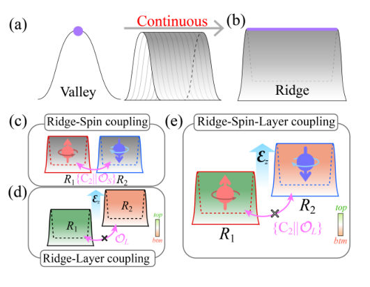 
Figure 1. (a) Zero-dimensional valley (localized extremum) versus (b) ridge state (macroscopically continuous along ki). (c) Two ridges R1 and R2 are connected by {C2||OS} and exhibit opposite spin polarization in the nonrelativistic case. (d) Two ridges R1 and R2 have opposite layer polarization, connected by OL, and tunable via an out-of-plane electric field Ez. (e) Combining (c) and (d): R1 and R2 are linked by {C2||OL}, with opposite spin polarization (nonrelativistic) and opposite layer polarization.

📷 Fig 2

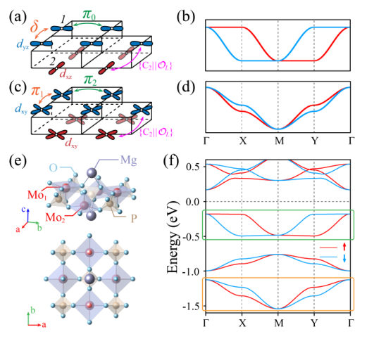 
Figure 2. (a) Schematic lattice model for RSLC based on dxz/dyz hopping. (b) Tight-binding band structure corre- sponding to the lattice in (a). (c) Schematic lattice model based on dxy hopping. (d) Tight-binding band structure cor- responding to the lattice in (c). (e) Crystal structure of mono- layer Mg2Mo2(PO5)2 in side and top views. (f) Nonrelativis- tic band structure of monolayer Mg2Mo2(PO5)2. Red and blue lines denote spin-up and spin-down channels, respec- tively. The green box highlights the dxz/dyz hopping (ridge states) near the Fermi level, while the orange box marks the dxy-based states.

📷 Fig 3

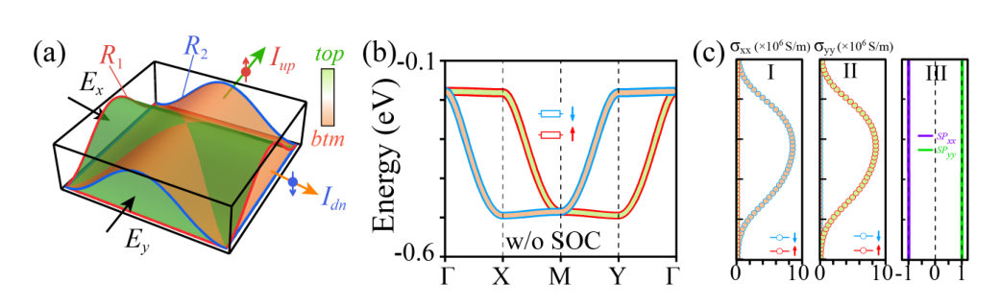 
Figure 3. (a) Illustration of layer-dependent Q1D spin transport. (b) Layer-resolved analysis of the ridge states [highlighted by the green box in (b)]. Red and blue edges denote spin-up and spin-down components, respectively, while the fill color indicates layer polarization P(k). The inset shows the first Brillouin zone with high-symmetry points marked. (c) From left to right: (I) calculated electric conductivity σxx for up-spin (red-edged circles) and down-spin (blue-edged circles) channels in monolayer Mg2Mo2(PO5)2; (II) calculated electric conductivity σyy for up-spin and down-spin channels; (III) calculated spin polarization of conductivities, SPxx and SPyy. The filling color of the...

📷 Fig 4

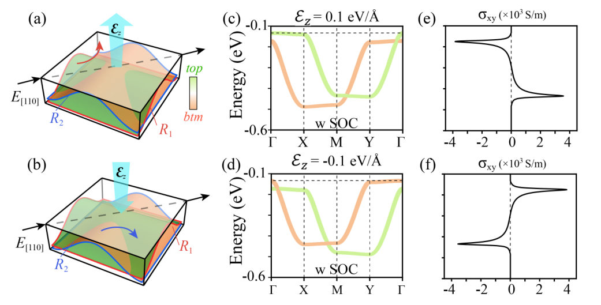 
Figure 4. (a,b) Illustration of the layer-dependent electric Hall effect under opposite electric fields Ez. (c,d) Relativistic ridge state of monolayer Mg2Mo2(PO5)2 under applied electric fields Ez = 0.1 and -0.1 eV/˚A applied separately. (e,f) Anomalous hall conductivity of monolayer Mg2Mo2(PO5)2 under the same field conditions as in (c,d).

**Summary.** This paper introduces 'ridgetronics,' a novel platform for electrical control over charge transport in 2D altermagnets. It achieves this by exploiting Ridge-Spin-Layer Coupling (RSLC), which locks electronic states into continuous, dispersionless lines in momentum space. The resulting material properties allow for highly directional, spin-polarized currents and electric field-tunable Hall effects.

**Why it may be interesting.** While focused on solid-state magnetism, the concept of controlling electronic states via symmetry constraints (Spin Layer Group Theory) and achieving highly directional, tunable current flow echoes principles used in designing quantum devices where coupling between multiple degrees of freedom is key.

Detailed structure

**Main problem.** The research aims to extend valleytronics by developing 'ridgetronics,' which controls directional current flow using continuous lines of electronic states in momentum space.

**Main result.** Ridge-Spin-Layer Coupling (RSLC) is established in 2D altermagnets, allowing electric field control over spin-filtered transport and inducing an Electric Hall Effect.

**Method.** The work uses symmetry group theory to derive conditions for ridge states and employs tight-binding models combined with band structure calculations.

**Model / system.** The system is based on 2D altermagnets on a square lattice, featuring continuous lines of dispersionless electronic states (ridges) coupled to spin polarization and atomic sublayers. The Hamiltonian describes this coupling using specific orbital hopping terms.

**Key observables.** Direction-discriminating currents, layer-selective switching via electric field ($E_z$), spin-polarized conductivities ($\sigma_{xx}, \sigma_{yy}$), and the Electric Hall Response ($\sigma_{xy}$).

**Important parameters / regimes.** The coupling strength (RSLC) is crucial; the system must be altermagnetic with specific symmetry operations $\{C_2||O_L\}$ connecting orthogonal ridges.

**Assumptions / limitations.** The analysis assumes a 2D square lattice structure and relies on the existence of specific spin-layer group symmetries to support the coupling mechanism.

**Figures summary.** Figures illustrate the transition from discrete valleys to continuous ridges, show band structures derived from tight-binding models for candidate materials like Mg2Mo2(PO5)2, and demonstrate layer-dependent Q1D spin transport and EHE effects.

**Paper structure.** The paper progresses by first defining the concept of ridgetronics via RSLC in altermagnets. It then uses symmetry analysis to identify suitable candidate materials ($	ext{Mg}_2	ext{Mo}_2(	ext{PO}_5)_2$, etc.). Finally, it details how electric fields control spin-polarized transport and induce novel electrical responses.

Abstract

Extending valleytronics from discrete points to continuous lines in momentum space transforms dispersionless bands into a controllable degree of freedom. Here we introduce ridge--spin--layer coupling (RSLC) in two-dimensional (2D) altermagnets, where a one-dimensional continuous line of dispersionless electronic states (a ridge) in momentum space locks to both spin polarization and atomic sublayer. This ridge-induced quenching of kinetic energy mimics flat-band physics, yet crucially, RSLC grants external control, allowing for layer-selective switching of ridge orientation in reciprocal space, spin-filtered transport in real space, and a distinct electric Hall response. Guided by collinear spin layer group symmetry, we identify three 2D candidate materials, namely Mg$_2$Mo$_2$(PO$_5$)$_2$, Ca(FeP)$_2$, and Mg$_2$V$_2$(SO$_5$)$_2$, each featuring a crossed-ridge structure with two ridges, one per spin channel and sublayer. Our work establishes ridgetronics as a controllable platform for direction-discriminating currents, bridging dispersionless bands with multifunctional device operation.

[↑ back to top](#top)

### [Structure-Aware Variational State Preparation for Quantum Basket Option Pricing](http://arxiv.org/abs/2607.14518v1)

**Authors:** Dongwoo Kim, Zhenyu Cui, Daniel K. Park, Chihoon Lee  
**Type:** both · **Category:** quantum information and computing · **PDF:** <https://arxiv.org/pdf/2607.14518v1>  
**Analysis basis:** full PDF text, analyzed in chunks
**Topic relevance:** `entanglement & information structure` **2/5** · `Keldysh / 2PI / non-Gaussian methods` **1/5** · `analog quantum simulation` **1/5** · `methods for driven-dissipative` **1/5**

📷 Fig 1

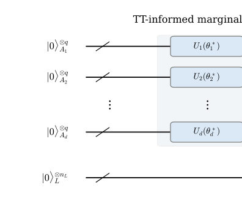 
Fig. 1: General circuit architecture of the marginal-TT loader with a latent depen- dence block. The registers A1, . . . , Ad denote the d asset registers, with q uncertainty qubits assigned to each asset, and L denotes an auxiliary latent register with nL qubits. Ua(θ∗ a) is a TT-informed marginal loader trained to prepare the marginal distribu- tion of asset a. The latent dependence block Udep(ϕ) is then applied to the prepared asset registers and the latent register. If the final state is |Ψϕ⟩, then the asset-register measurement distribution is obtained by measuring in the computational basis and marginalizing over the latent outcome: epϕ(x) = P

📷 Fig 2

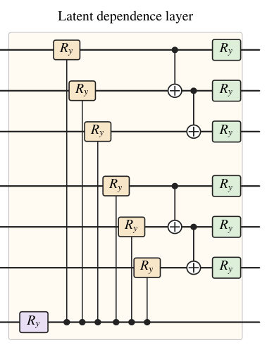 
Fig. 2: Marginal-TT + latent basket-projection loader for a two-asset example with q = 3 uncertainty qubits per asset. TT-informed marginal loaders act locally on each asset register, followed by a latent-conditioned dependence layer. The auxiliary latent qubit z controls rotations on the asset qubits, while CNOT chains are restricted to individual asset registers.

📷 Fig 3

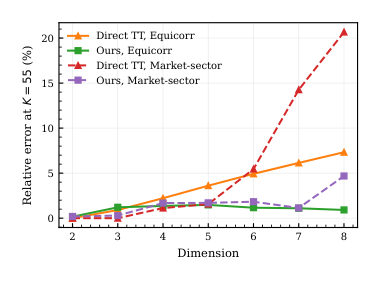 
Fig. 3: Correlated-basket comparison for q = 2 uncertainty qubits per asset. (a) Relative pricing error at strike K = 55. (b) Transpiled state-preparation depth on a logarithmic scale. Exact loading is shown only in panel (b), since it prepares the discretized target state exactly. See Table D1 for the full results.

📷 Fig 4

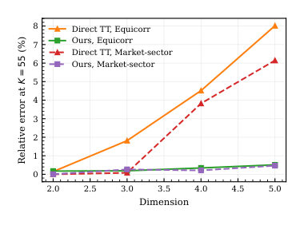 
Fig. 4: Correlated-basket comparison for q = 3 uncertainty qubits per asset. (a) Rel- ative pricing error at K = 55. (b) Transpiled state-preparation depth on a logarithmic scale. Exact loading is shown only in panel (b), since it prepares the discretized target state exactly. See Table D2 for the full results.

**Summary.** This paper addresses the resource bottleneck of preparing complex joint states for quantum option pricing by introducing a structure-aware state preparation framework. It uses Tensor-Train ranks to design shallow variational circuits that efficiently encode asset correlations, achieving linear scaling in circuit depth while maintaining high accuracy in estimating basket payoffs.

**Why it may be interesting.** While focused on finance, the core technical contribution—using tensor decomposition structure (TT ranks) to efficiently design shallow variational quantum circuits for encoding complex high-dimensional probability distributions—is highly relevant to general quantum simulation tasks in condensed matter physics and quantum chemistry.

Detailed structure

**Main problem.** The primary challenge is overcoming the exponential circuit depth required for exact state preparation of high-dimensional joint probability distributions in Quantum Amplitude Estimation (QAE) for multi-asset derivative pricing.

**Main result.** The proposed structure-aware framework reduces the state preparation depth from exponential to linear scaling by utilizing Tensor-Train ranks and targeting the basket pushforward distribution directly.

**Method.** It employs a variational quantum circuit guided by Tensor-Train (TT) rank information, which is used to design shallow circuits that encode asset marginals locally and model cross-asset dependence via a compact latent block trained on the Basket-CDF objective.

**Model / system.** The system models multi-asset financial derivatives (basket options) whose joint probability distribution $p(x)$ must be encoded into an amplitude-encoded quantum state $|\psi_p
angle$ for QAE.

**Key observables.** Circuit depth, low-percent basket-pricing errors, and the fidelity of reproducing empirical payoff curves/Basket-CDF values.

**Important parameters / regimes.** The number of assets ($d$), the TT ranks ($r_k$) which dictate entanglement structure, and the option strike price ($K$).

**Assumptions / limitations.** The method assumes that basket payoffs depend only on the distribution of the basket projection (pushforward) rather than the full joint state. It also treats amplitude estimation as a downstream subroutine.

**Figures summary.** Figure 1 illustrates the general circuit architecture combining TT-informed marginal loaders and a latent dependence block for state preparation; Figure E3 shows the successful reproduction of empirical payoff curves and the basket CDF using historical scenario data.

**Paper structure.** The paper introduces the bottleneck (state prep depth), proposes the structure-aware framework utilizing TT ranks to guide ansatz design, details the two-part circuit (marginal loaders + latent block trained via Basket-CDF objective), validates this approach with numerical experiments showing linear scaling, and concludes with end-to-end integration studies.

Abstract

Basket option pricing often relies on Monte Carlo estimation, for which quantum amplitude estimation (QAE) provides a quadratic speed-up. However, the practical benefit of QAE can be limited by the depth of the state-preparation circuit. We propose a structure-aware quantum state-preparation framework for QAE-based basket option pricing. The framework uses tensor-train (TT) rank information to design shallow variational state-preparation circuits. In the independent regime, TT ranks remove unnecessary entangling links from a hardware-efficient ansatz. In correlated basket settings, we instead prepare asset-wise marginals locally and train a compact latent block to match the basket cumulative distribution function. The Basket-CDF objective targets the basket pushforward distribution rather than the full joint state, directly aligning state preparation with basket-dependent payoffs. Numerical experiments show that the proposed circuits replace the exponential state-preparation depth scaling of exact amplitude loading with linear scaling, while maintaining low-percent basket-pricing errors. Additional sampling-based training experiments and an end-to-end QAE integration study support compatibility with sample-estimated training and standard QAE-based pricing workflows.

[↑ back to top](#top)

### [AutoHF: a general Hartree-Fock solver utilizing direct energy minimization with automatic differentiation](http://arxiv.org/abs/2607.14263v1)

**Authors:** Ryan Levy, Brandon Eskridge, Lukas Weber, Miguel A. Morales, Shiwei Zhang  
**Type:** theory · **Category:** strongly correlated electrons · **PDF:** <https://arxiv.org/pdf/2607.14263v1>  
**Analysis basis:** full PDF text, analyzed in chunks
**Topic relevance:** `analog quantum simulation` **2/5** · `Keldysh / 2PI / non-Gaussian methods` **1/5** · `methods for driven-dissipative` **1/5**

📷 Fig 1

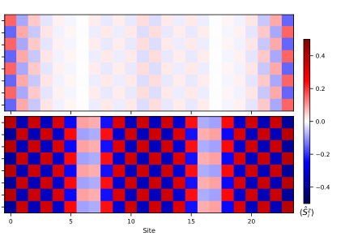 
Figure 1: Left: Measured staggered spin density (−1)ix+iy〈ˆSz i 〉using a UHF autohf calculation of a Hubbard model with edge-pinning at n = 11/12 i.e. 1/12-doping), on a width-8 cylinder, with lengths 24, 48, and 72. The top (U = 1) shows the absence of long range order while the bottom (U = 4) shows consistent order. Right: Explicit spin density 〈ˆSz i 〉of the 24 × 8 cylinders.

📷 Fig 2

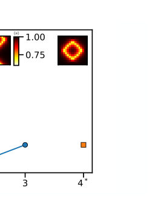 
Figure 2: Energy differences from four different random realizations of a square 16 × 16 Hubbard model with 20 holes and U = 4. The 4th seed was run with an additional energy term to penalize symmetry breaking. Inset: Charge density plots for each of the different realizations.

📷 Fig 3

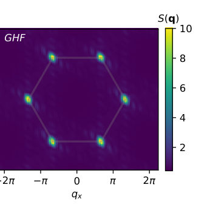 
Figure 3: Measured static spin structure factor S(q) using a UHF autohf (left) and GHF autohf (right) calculation of a 12×12 U = 8 Hubbard model on the triangular lattice at half-filling (n = 1) with periodic boundaries. The UHF solution cannot properly form the 120◦order and creates a frustrated order, while the GHF solution easily obtains the correct 120◦magnetic order.

📷 Fig 4

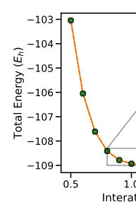 
Figure 4: UHF energy for the bond stretching of N2, using PYSCF (Naive), PYSCF with stability analysis, and autohf for solutions. For autohf, the Coulomb interaction is represented by a Cholesky decomposition. Inset: zoomed in region showing the instability as the molecule dissociates.

**Summary.** This paper presents AutoHF, a flexible solver that calculates Hartree-Fock solutions by directly minimizing the variational energy functional. By leveraging automatic differentiation, it bypasses the need to write specialized code for every unique many-body Hamiltonian. This makes advanced electronic structure calculations significantly more general and easier to implement across diverse physical models.

**Why it may be interesting.** While focused on condensed matter theory, the reliance on automatic differentiation and gradient-based optimization techniques makes this methodology highly relevant for developing general quantum simulation tools applicable in AMO physics or open quantum systems where complex energy functionals need efficient minimization.

Detailed structure

**Main problem.** The core challenge is solving the interacting many-electron problem, which scales exponentially with system size.

**Main result.** The authors introduce AutoHF, a general framework that allows direct variational minimization of the energy functional for Hartree-Fock solutions across various Hamiltonians without requiring bespoke code development.

**Method.** Instead of traditional Self-Consistent Field (SCF) iterations, the method minimizes the variational energy by optimizing parameters defining the single Slater determinant using automatic differentiation and modern optimization tools.

**Model / system.** The theory applies to interacting N-fermion systems described by Hamiltonians containing both non-interacting (T) and quartic interaction terms (e.g., Hubbard U, density/spin interactions). The state is approximated by a single Slater determinant $|\Psi
angle$, supporting RHF, UHF, and GHF ansätze.

**Key observables.** Variational energy ($\langle H 
angle$), the 1-body reduced density matrix ($
ho$).

**Important parameters / regimes.** The system Hamiltonian $\hat{H}$, electron number ($N_{	ext{elec}}$), and variational parameters ($\alpha$) defining the orbital coefficients.

**Assumptions / limitations.** The primary assumption is that the interacting ground state can be accurately approximated by a single Slater determinant (the Hartree-Fock approximation), neglecting true electron correlation effects.

**Figures summary.** Not specified, but notes mention successful convergence tests on molecular systems ($	ext{N}_2$, 3d TM Oxides) and lattice models (Hubbard cylinder).

**Paper structure.** The paper introduces the general framework by contrasting direct variational optimization with traditional SCF methods. It details the implementation using automatic differentiation to minimize the energy functional for various HF ansätze, demonstrating its applicability across molecular and solid-state Hamiltonians.

Abstract

We present autohf, a general, easy-to-use mean-field solver for quantum many-fermion Hamiltonians. It allows the user to bypass the process of deciphering the mean-field form for each many-body Hamiltonian $H$ and thus avoid setting up a tailored program for each $H$. Rather, autohf finds the optimal Slater determinant $|Ψ\rangle$, written in terms of orbital coefficients and subject to symmetry constraints, by directly minimizing the variational energy $\langle H \rangle$. By embracing this variational approach, autohf makes use of the growing power of automatic differentiation and optimization tools developed by the machine learning community.

[↑ back to top](#top)

### [Competing Orders Driven by Wigner Crystal Phase in Rhombohedral Graphene](http://arxiv.org/abs/2607.15014v1)

**Authors:** Zekang Zhou, Kilian Krötzsch, Raphaël Ayache, Yonggen Li, Sandeep Joy, Kenji Watanabe, Takashi Taniguchi, Moty Heiblum, Preden Roulleau, Mitali Banerjee  
**Type:** experiment · **Category:** strongly correlated electrons · **PDF:** <https://arxiv.org/pdf/2607.15014v1>  
**Analysis basis:** full PDF text, analyzed in chunks
**Topic relevance:** `analog quantum simulation` **2/5** · `driven-dissipative phase transition` **1/5** · `non-equilibrium dynamics` **1/5**

📷 Fig 1

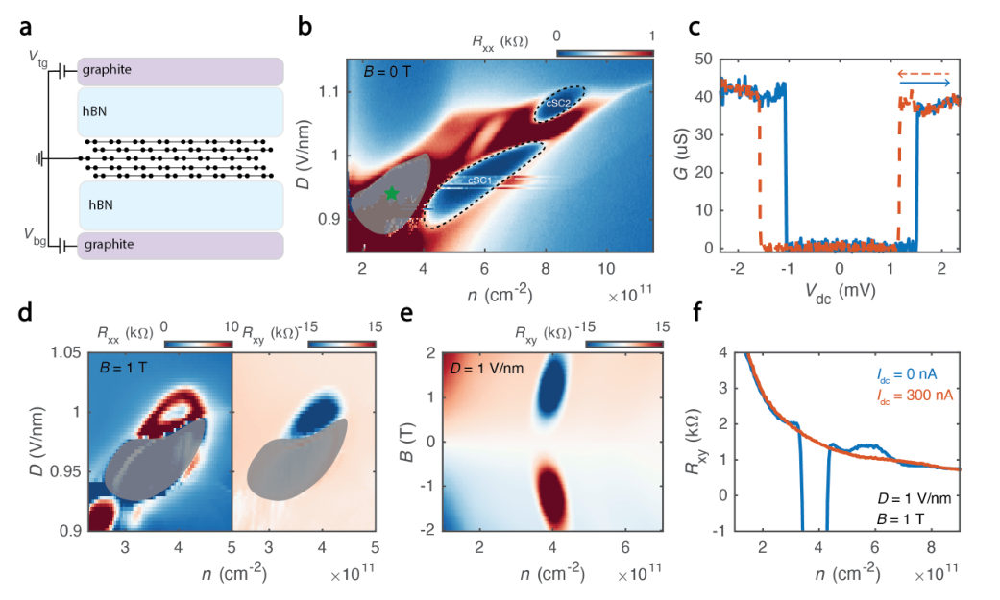 
FIG. 1. Wigner and metallic Wigner crystals in R5G. a, Schematic of the dual-graphite-gated device geometry that enables independent tuning of the carrier density and the displacement field. b, n–D map of Rxx at B = 0 T (T = 20 mK). Two chiral superconducting states (cSC1 and cSC2) are visible in this region. At low carrier densities, we observe a region of extremely high resistance, highlighted by the light-gray shaded area, where current injection into the system is suppressed. c, Conductance as a function of DC bias voltage at the point marked by the green star in b. The blue and orange curves represent forward and backward sweeps, respectively. Shape switching and hysteresis are...

📷 Fig 2

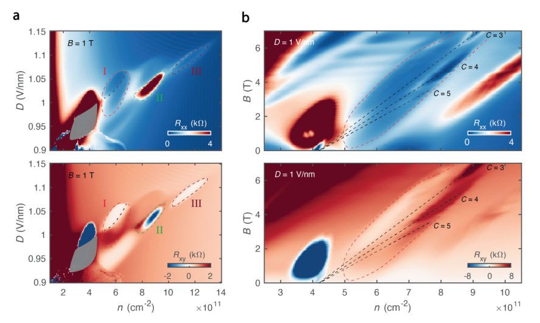 
FIG. 2. Bifurcation of region I. a, n–D maps of Rxx and Rxy at B = 1 T, obtained by symmetrizing and antisymmetrizing the data measured B = ±1 T. Apart from the regions in the phase diagram that host cSC1 and cSC2, we identify three distinct regions, I, II, and III, in the remaining portions of the n–D phase space. I lies above cSC1, II lies below cSC2, and III resides at the highest electron density. We will focus on region I, enclosed by the red dashed line, which is clearly divided into two parts. The black dashed line within region I marks the boundary between these two distinct parts. b, Landau fan diagram of Rxx and Rxy at D = 1 V/nm. The red dashed line marks the boundary of region I...

📷 Fig 3

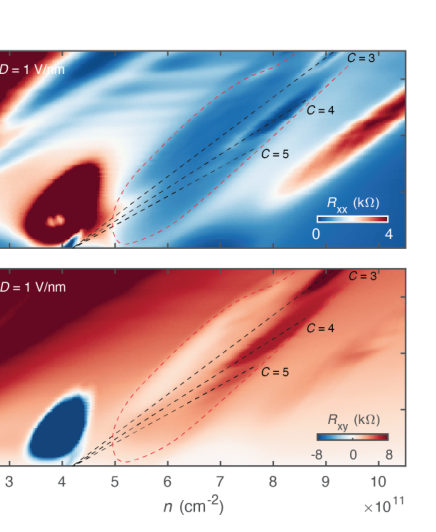 
Fig. 2b shows the Landau fan diagrams of Rxx and Rxy at D = 1 V/nm. At both low and high carrier densities,

📷 Fig 4

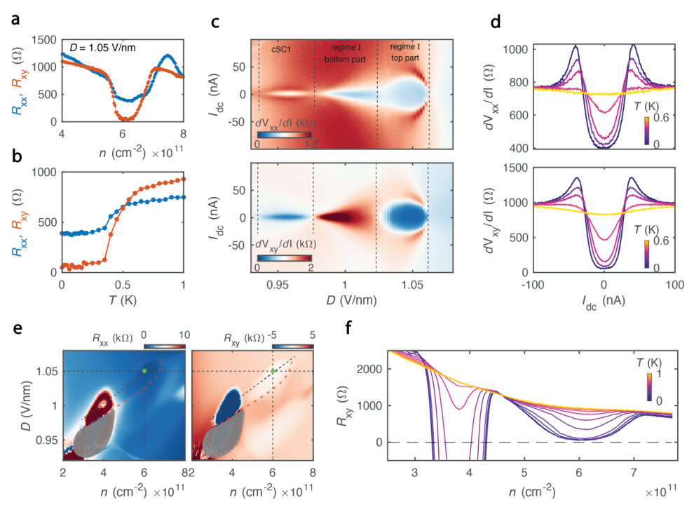 
FIG. 3. Magnetic-field-stabilized superconductivity near the metallic Wigner crystal. a, Rxx (symmetrized) and Rxy (antisymmetrized) as a function of carrier density n at B = 1 T and D = 1.05 V/nm (horizontal dashed line in e). Both Rxx and Rxy show a sudden drop, with Rxy approaching zero. b, Temperature dependence of Rxx and Rxy at the optimal doping point in a, corresponding to a carrier density of n = 0.628 × 1012 cm−2. c, dVxx/dI and dVxy/dI as a function of DC bias current Idc and displacement field at a fixed carrier density of n = 0.6 × 1012 at B = 1 T(vertical dashed line in e). d, Temperature dependence of dVxx/dI (symmetrized) and dVxy/dI (antisymmetrized) at D = 1.05 V/nm and n...

📷 Fig 5

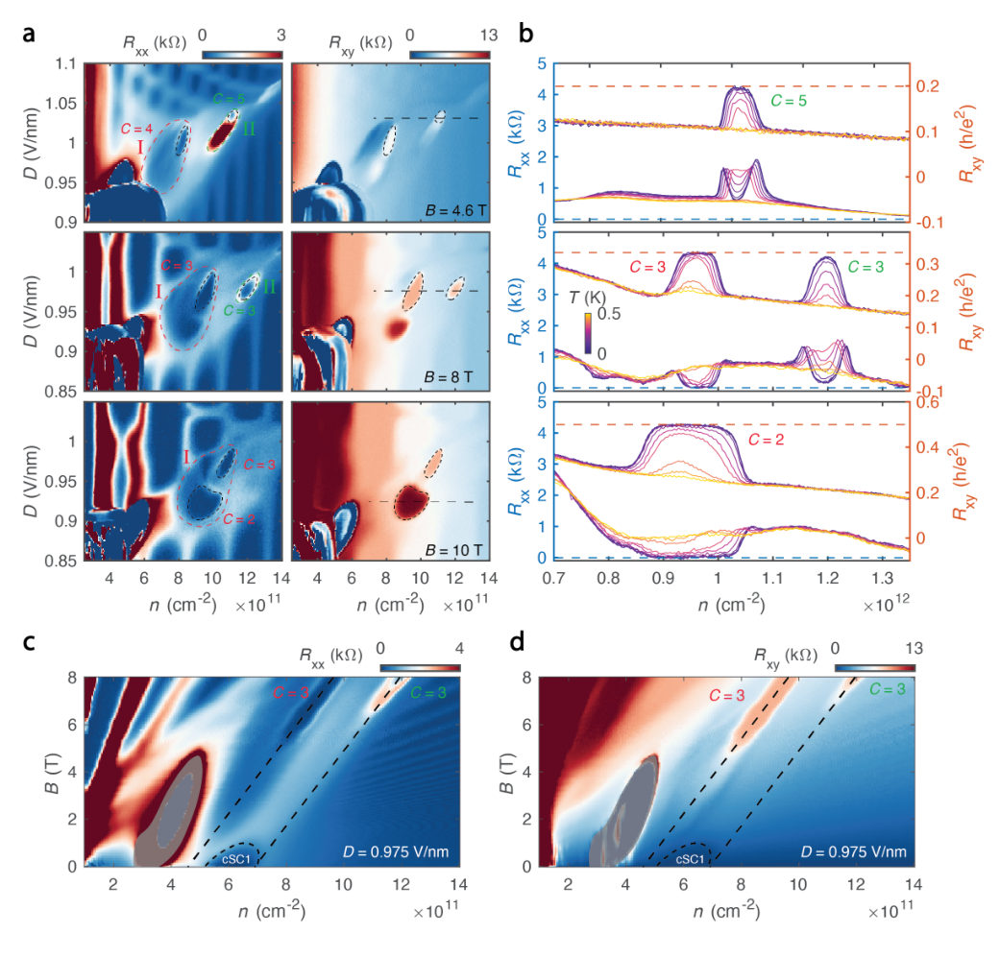 
FIG. 4. Unconventional RIQH states. a, n–D maps of Rxx and Rxy at B = 4.6 T, B = 8 T and B = 10 T. The phase boundaries of regions I and II are indicated by red and green dashed lines, respectively. b, Temperature dependence of Rxx and Rxy at B = 4.6 T and D = 1.034 V/nm, B = 8 T and D = 0.975 V/nm, and B = 10 T and D = 0.925 V/nm. The black dashed lines in the right column of panel a indicate the positions of the temperature measurements at fixed displacement fields. c, d, Landau fan diagram of Rxx and Rxy at D = 0.975 V/nm. (T = 20 mK)

**Summary.** This work investigates the rich phase diagram of rhombohedral graphene, demonstrating that strong electron interactions drive the system into a Wigner Crystal (WC) state at low carrier densities. Under magnetic fields, this WC phase competes with superconducting and unconventional Quantum Hall states, establishing the WC's central role in governing these emergent correlated electronic orders.

**Why it may be interesting.** The study provides experimental evidence of strongly correlated insulating states (WC) coexisting with topological/superconducting phases in a tunable 2D material platform, which is highly relevant for understanding emergent quantum phenomena.

Detailed structure

**Main problem.** The study aims to understand the complex, emergent electronic phases arising from strong electron-electron interactions in rhombohedral graphene.

**Main result.** The highly insulating state at low carrier density is identified as a Wigner Crystal (WC) phase, which coexists and competes with superconducting (fSC) and reentrant quantum Hall (RIQH) states under magnetic fields.

**Method.** Transport measurements, including $n-D$ maps of resistance ($	ext{R}_{xx}, 	ext{R}_{xy}$), differential conductance ($V-I$), and Landau fan diagrams, are used across varying magnetic fields and temperatures.

**Model / system.** The physical system is rhombohedral multilayer graphene (specifically pentalayer graphene, R5G) encapsulated in hBN, allowing independent tuning of carrier density ($n$) and displacement field ($D$).

**Key observables.** Longitudinal resistance ($	ext{R}_{xx}$), Hall resistance ($	ext{R}_{xy}$), nonlinear $V-I$ characteristics, and quantized Hall plateaus.

**Important parameters / regimes.** Low carrier densities, out-of-plane magnetic fields ($B$), and the interplay between Coulomb interaction energy and kinetic energy.

**Assumptions / limitations.** The analysis relies on mapping distinct phase boundaries (WC/mWC, cSC1, cSC2) observed through characteristic transport signatures like threshold behavior or sign reversals.

**Figures summary.** Figures map out $n-D$ phase diagrams showing regions corresponding to WC, $	ext{fSC}$, and $	ext{RIQH}$ states; Landau fan diagrams confirm the origin of these quantized/structured states from WC boundaries.

**Paper structure.** The paper systematically maps the phase diagram by varying carrier density ($n$) and displacement field ($D$), analyzing transport signatures (resistance, $V-I$ curves) at fixed magnetic fields to delineate competing orders like Wigner Crystals and superconductivity.

Abstract

Rhombohedral graphene systems provide a unique platform where strong electronic interactions and nontrivial band topology coexist at low carrier densities and high displacement fields, giving rise to a rich landscape of emergent electronic phases. Here, we report that the highly insulating state on the low-density side of chiral superconductivity in rhombohedral pentalayer graphene (R5G) corresponds to a Wigner crystal (WC) phase. In addition, a hole-doped metallic Wigner crystal (h-mWC) phase emerges near the WC boundary. Under an out-of-plane magnetic field, the system hosts competing magnetic-field-stabilized superconductivity (fSC) and unconventional reentrant quantum Hall (RIQH) states. These emergent phases are closely connected to the underlying WC and mWC states and evolve continuously across phase boundaries. Our results establish that WC phase plays an important role in the phase diagram of rhombohedral multilayer graphene and highlight its connection to a rich landscape of emergent phases.

[↑ back to top](#top)

### [Perturbation Analysis of Maximal Quantum Leakage](http://arxiv.org/abs/2607.14469v1)

**Authors:** Zijia Zhao, Shuixin Xiao, Farhad Farokhi  
**Type:** theory · **Category:** quantum information and computing · **PDF:** <https://arxiv.org/pdf/2607.14469v1>  
**Analysis basis:** full PDF text, analyzed in chunks
**Topic relevance:** `entanglement & information structure` **2/5** · `Keldysh / 2PI / non-Gaussian methods` **1/5** · `driven-dissipative phase transition` **1/5**

📷 Fig 1

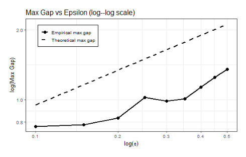 
Fig. 1. Maximum deviation of 2MQL under fidelity-based perturbations as a function of the radius ε.

📷 Fig 2

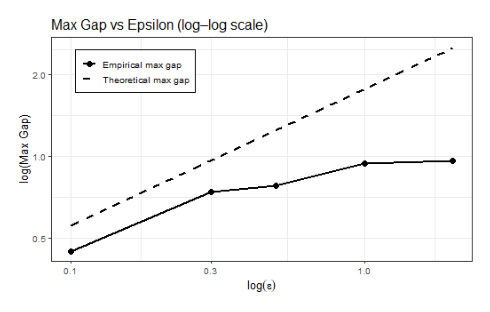 
Fig. 2. Maximum deviation of 2MQL under relative-entropy-based pertur- bations as a function of the radius ε.

**Summary.** This paper rigorously investigates the robustness of Maximal Quantum Leakage (MQL), a measure of worst-case information leakage, to small perturbations in the quantum encoding. The authors establish a tight continuity bound using the trace distance metric, demonstrating that MQL varies quadratically with the perturbation size. This work provides essential theoretical tools for quantifying noise resilience in quantum data processing.

**Why it may be interesting.** Understanding the stability of information-theoretic quantities like MQL under physical noise or imperfect implementation is crucial for designing robust quantum communication protocols and secure quantum computation schemes.

Detailed structure

**Main problem.** The paper analyzes how sensitive the Maximal Quantum Leakage (MQL) measure is to small perturbations in the quantum states used to encode classical data.

**Main result.** A Lipschitz-type continuity bound for MQL with respect to the trace distance is established, showing that the leakage variation scales quadratically ($\epsilon^2$) with the perturbation size $\epsilon$ in the worst case.

**Method.** The authors derive bounds by analyzing the difference between ideal and perturbed quantum states using the trace distance, fidelity, and relative entropy metrics.

**Model / system.** The model involves an information leakage setting where a classical variable $X$ is encoded into an ensemble of quantum states $\{p_X(x), 
ho_x\}_{x\in X}$ on a Hilbert space $H$. Perturbations create a new ensemble $\{\dots, 
ho'_x\}_{x\in X}$.

**Key observables.** Maximal Quantum Leakage ($2Q_{
ho}$), trace distance ($\|\cdot\|_1$), Fidelity ($F$), and Quantum Relative Entropy ($D$).

**Important parameters / regimes.** Perturbation radius $\epsilon$, size of the random variable domain $|X|$, and Hilbert space dimension $d$.

**Assumptions / limitations.** The analysis relies on establishing continuity bounds, though the derived fidelity and relative-entropy bounds are shown to be potentially loose compared to the trace distance bound.

**Figures summary.** Figures 1 and 2 compare the empirical maximum deviation of $2MQL$ versus $\epsilon$ for both fidelity-based and relative-entropy-based perturbations against their respective theoretical upper bounds, showing a gap.

**Paper structure.** The paper first introduces MQL and its robustness issue. It then derives the primary continuity bound using the trace distance, followed by deriving secondary bounds based on fidelity and relative entropy, concluding with numerical illustrations of these results.

Abstract

Maximal quantum leakage (MQL) is a worst-case information leakage measure that quantifies an adversary's inference advantage gained from accessing quantum encoding of classical data with arbitrary measurements. While MQL admits an exact characterization for a given ensemble of quantum states, its robustness to implementation imperfections has not been systematically studied. In this paper, we analyze the sensitivity of maximal quantum leakage under perturbations of the quantum encoding. We establish a continuity bound in terms of the trace distance between ideal and perturbed quantum states, and show, via an example, that this bound is attainable. We further derive fidelity-based and relative-entropy-based sufficient conditions for bounding the variation of maximal quantum leakage, and illustrate numerically that these conditions can be loose.

[↑ back to top](#top)

### [Optimization dynamics of Transformer backflow neural quantum states for the two-dimensional Hubbard model](http://arxiv.org/abs/2607.14875v1)

**Authors:** Zong-Yu Liao, Jia-Qi Wang, Rong-Qiang He, Zhong-Yi Lu  
**Type:** theory · **Category:** strongly correlated electrons · **PDF:** <https://arxiv.org/pdf/2607.14875v1>  
**Analysis basis:** full PDF text, analyzed in chunks
**Topic relevance:** `analog quantum simulation` **2/5** · `methods for driven-dissipative` **1/5**

📷 Fig 1

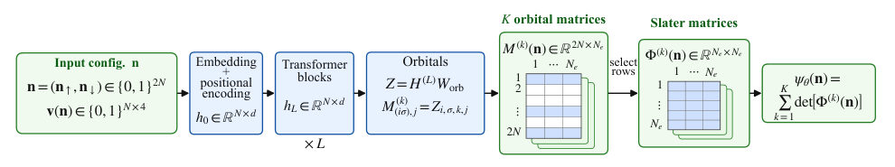 
FIG. 1. Schematic architecture of the main-training Transformer backflow NQS. The input configuration is mapped to local one-hot tokens and processed by an embedding layer with positional encoding, followed by L Transformer blocks. The orbital head produces K configuration- dependent orbital matrices M(k)(n) ∈R2N×Ne. For each determinant channel, the occupied spin-orbital rows specified by I(n) are selected to form the Slater matrix Φ(k)(n) ∈RNe×Ne, and the final wave-function amplitude is obtained by summing the determinants over k.

📷 Fig 2

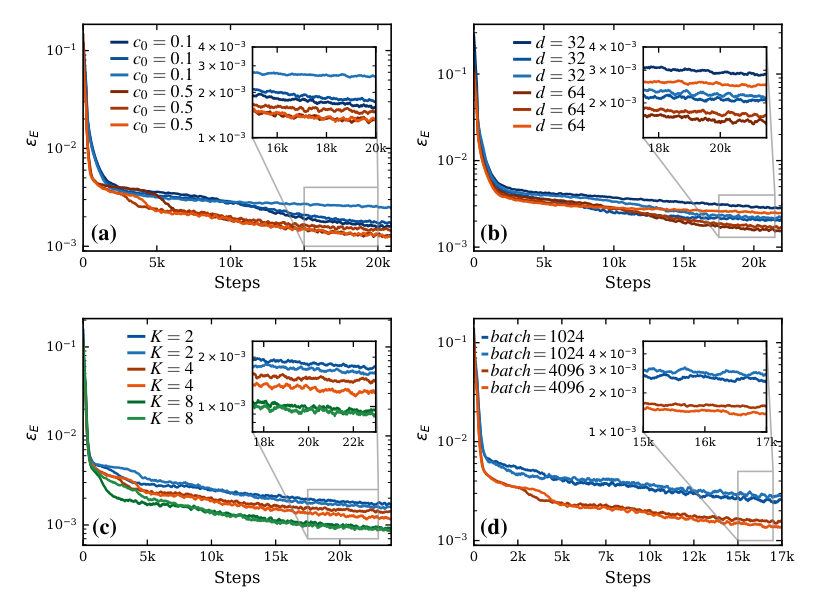 
FIG. 2. Baseline ablation results for the doped 4 × 4 PBC Hubbard model at U = 8 and Ne = 14. The four panels compare (a) the initial update-norm threshold c0, (b) the Transformer hidden dimension d, (c) the number of determinant channels K, and (d) the Monte Carlo batch size B. In each panel, only the indicated parameter is varied, while the remaining main-training settings are fixed for that comparison. In panel (a), the less restrictive choice c0 = 0.5 reaches the 10−3 error level more efficiently, whereas c0 = 0.1 remains at errors of a few 10−3. In panel (b), increasing the width from d = 32 to d = 64 lowers the late-time error from the several-10−3 range toward the 10−3 level. In...

📷 Fig 3

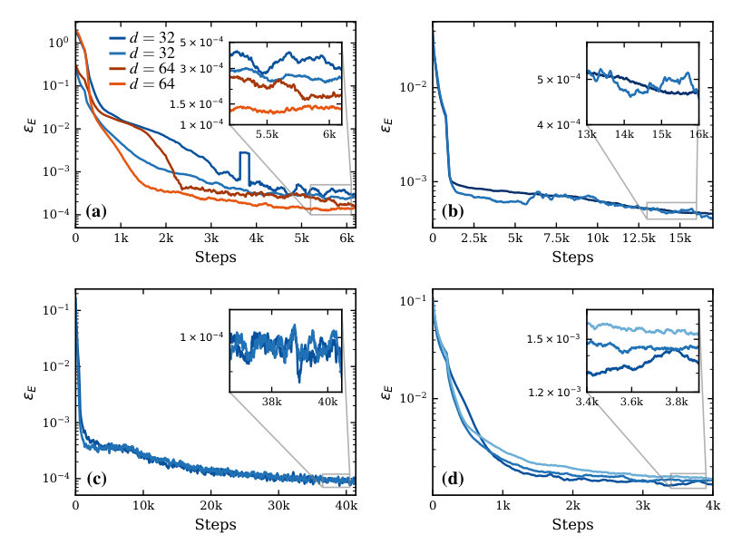 
FIG. 3. Optimization behavior across different 4×4 Hubbard-model settings. The panels show (a) the half-filled PBC system at U = 8, (b) the doped PBC system at weaker interaction U = 4, (c) the half-filled OBC system at U = 8, and (d) the doped OBC system at U = 8. Panel (a) compares d = 32 and d = 64 with K = 4, B = 4096, and c0 = 0.1, making it directly comparable to the width ablation of the strongly correlated doped U = 8 baseline in Fig. 2(b). The half-filled PBC system in panel (a) reaches the 10−4 error level, whereas the corresponding doped U = 8 baseline in Fig. 2(b) remains mainly at the 10−3 level. Panel (b) uses the same main Transformer/MARCH settings as the c0 = 0.5 baseline...

📷 Fig 4

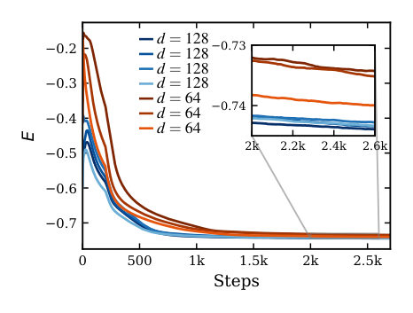 
FIG. 4. Optimization on the larger doped 8 × 8 PBC Hubbard lat- tice at U = 8 and Ne = 56. Because a strict reference energy is not used for this larger system in the present comparison, we plot the variational energy per site, denoted by E in this figure. The calcula- tion uses K = 4, B = 1024, and c0 = 0.5, and compares Transformer widths d = 64 and d = 128. Both widths lead to stable optimiza- tion on the larger lattice, with the energy per site decreasing to the E ≃−0.73–−0.74 range. The wider Transformer reaches a lower late-time energy, with a visible separation from the d = 64 curves on the 10−3–10−2 energy-per-site scale, indicating that increased model capacity remains beneficial...

**Summary.** This paper develops and analyzes a sophisticated, multi-stage training protocol using Transformer backflow Neural Quantum States (NQS) to simulate the 2D Hubbard model. It systematically investigates how hyperparameters—such as network width and update constraints—affect the convergence and accuracy of the variational energy calculation. The findings establish practical best practices for applying deep learning models to challenging strongly correlated quantum systems.

**Why it may be interesting.** This work directly advances the computational tools used to tackle strongly correlated electron systems by providing rigorous guidelines for optimizing advanced machine learning representations (Transformers) in quantum many-body physics.

Detailed structure

**Main problem.** The study investigates how the optimization dynamics of Transformer backflow Neural Quantum States (NQS) perform when applied to calculate ground states for the two-dimensional Hubbard model.

**Main result.** The research identifies practical optimization trends, showing that a balance between ansatz expressivity (Transformer width/channels), update stability (update constraint), and sampling quality (MC batch size) is crucial for convergence.

**Method.** A multi-stage training workflow involving NNB initialization, supervised Transformer pre-training, and main energy minimization using the Moment-Adaptive ReConfiguration Heuristic (MARCH) within Variational Monte Carlo (VMC).

**Model / system.** The primary system is the two-dimensional Hubbard model on a square lattice. The Hamiltonian includes hopping terms ($t, t'$) and an on-site repulsion term ($U$). Studies cover doped and half-filled regimes, using both Periodic and Open Boundary Conditions.

**Key observables.** Variational energy per site ($	ext{E}$), convergence behavior of the VMC optimization, and local energy $E_{loc}(n)$.

**Important parameters / regimes.** Update-norm threshold ($c_0$), Transformer width ($d$), number of determinant channels ($K$), Monte Carlo batch size ($B$), interaction strength ($U$), and doping level.

**Assumptions / limitations.** The use of a multi-stage training protocol (NNB $
ightarrow$ Pre-training $
ightarrow$ MARCH) is necessary to stabilize the optimization of the highly expressive Transformer architecture.

**Figures summary.** Figures illustrate the optimization behavior across various Hubbard model settings (half-filled vs. doped, PBC vs. OBC) and show how increasing Transformer width leads to lower late-time variational energies on larger lattices.

**Paper structure.** The paper details a multi-stage training protocol: 1) NNB initialization for lightweight orbital generation; 2) Supervised pre-training of the full Transformer architecture using NNB outputs as targets; and 3) Main energy optimization via MARCH within VMC, analyzing parameter dependencies at each stage.

Abstract

Building on the multi-determinant Transformer backflow neural quantum state (NQS) ansatz and the associated multi-stage training workflow for the doped two-dimensional Hubbard model, we investigate how the optimization dynamics of the NQS depend on several key optimization and architectural hyperparameters. The workflow consists of neural-network backflow (NNB) initialization, supervised Transformer pre-training, and main energy optimization using the Moment-Adaptive ReConfiguration Heuristic (MARCH) within variational Monte Carlo. Using the doped $4\times4$ periodic Hubbard model at $U=8$ as a baseline, we examine how the update-norm threshold, Transformer width, number of determinant channels, and Monte Carlo batch size affect convergence. We find that a moderate update constraint improves the efficiency of MARCH optimization, larger Transformer width and more determinant channels improve the expressive capacity of the ansatz, and larger Monte Carlo batches reduce sampling noise in the update direction. We further test the same workflow at half filling, weaker interaction strength, open boundary conditions, and on a larger $8\times8$ doped lattice. These results identify practical optimization trends for Transformer backflow NQSs and highlight the balance between ansatz expressivity, MARCH update stability, and Monte Carlo sampling quality.

[↑ back to top](#top)

### [Towards logical entanglement creation in trivalent planar architectures](http://arxiv.org/abs/2607.15044v1)

**Authors:** Lukas Bödeker, Luis Colmenarez, Sergey Blinov, Ants Remm, Simon Gustavsson, Markus Müller  
**Type:** theory · **Category:** quantum information and computing · **PDF:** <https://arxiv.org/pdf/2607.15044v1>  
**Analysis basis:** full PDF text, analyzed in chunks
**Topic relevance:** `QC/QI experiment` **2/5** · `quantum measurements` **1/5**

📷 Fig 1

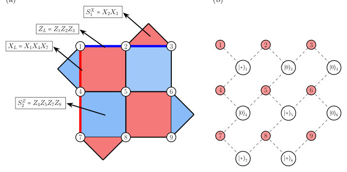 
Figure 1. Illustrations of a distance d = 3 rotated surface code or surface-17 patch. In (a) the definition of the code in terms of its stabilizer generators and logical operators is indicated. Generally, red stands for X-type operators and blue stands for Z-type operators. The support of the stabilizer generators corresponds to corner qubits of the colored plaquette, while the logical operators have support on the colored lines. In (b) the qubit layout for the trivalent surface code is given with the same data-qubit numbering. A valid initialization state of the ancilla qubits is indicated.

📷 Fig 2

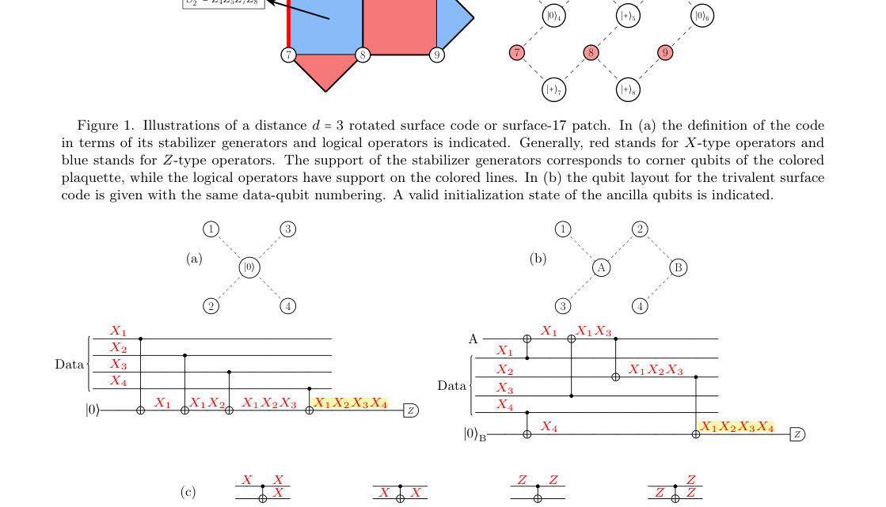 
Figure 2. Comparison of the measurement circuits of single weight-four Z plaquette stabilizer parity between the four-valent measurement scheme (a) and the trivalent measurement scheme (b). The respective qubit layouts, including their valencies (upper row) and the circuitry are shown (lower row). In the two measurement circuits, the propagation of potential single X errors incident on the data qubits is tracked to show explicitly how the respective error is recorded by measuring the ancilla. The notation of Xi being present shall be understood as a potential error on each of the data qubits. The ancilla initialization and measurement for the trivalent measurement scheme is adapted compared...

📷 Fig 3

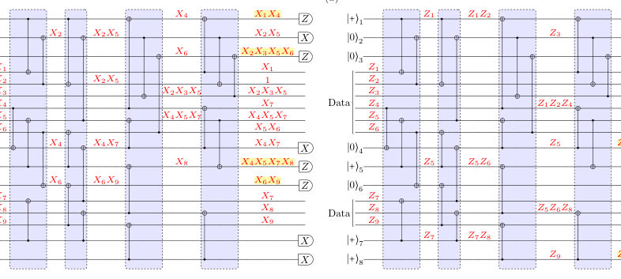 
Figure 3. Circuitry for conducting a single QEC cycle for the trivalent measurement scheme. The next readout cycle would correspond to the execution of an altered circuit and is given in Fig. 4. The panels (a) and (b) show the same circuit, but demonstrate the measurement of Z-type stabilizers and X-type stabilizers by showing the propagation of X and Z-type data-qubit errors. After initializing the ancilla qubits, entangling gates are conducted in four time steps. Finally, the ancilla qubits are measured in the appropriate basis to obtain the stabilizer value. The X and Z stabilizers are measured in an intertwined manner, but still maintaining the same gate count as in the four-valent...

📷 Fig 4

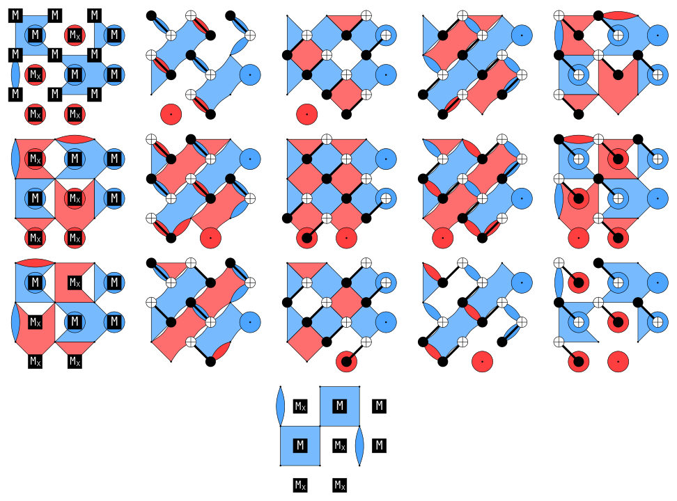 
Figure 4. Circuitry for initializing the ∣0⟩L state of the d = 3 rotated surface code fault tolerantly by conducting three rounds of stabilizer measurements using the trivalent circuit design. To be read from left to right and then top to bottom.

📷 Fig 5

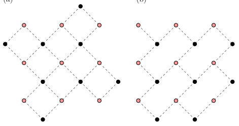 
Figure 6. Comparison of the qubit layout and connec- tivity for the distance-d = 3 surface code in the four-valent (a) and trivalent (b) readout schemes. For distance d, the trivalent layout has (d −1)2 physical couplings less com- pared to the four-valent layout. Data qubits are indicated in red, while ancilla qubits are black. The dashed lines in- dicate the qubit connectivity that is used to execute the respective scheme.

**Summary.** This paper proposes and analyzes the use of trivalent lattice surgery as an efficient alternative to conventional four-valent methods for implementing surface code QEC. By reducing resource overheads in planar architectures, it paves a scalable path toward realizing logical quantum processors using hardware with limited qubit connectivity.

**Why it may be interesting.** This work directly addresses hardware constraints (connectivity) in realizing fault-tolerant quantum computation, which is a major bottleneck for building large-scale quantum processors based on superconducting circuits or similar planar platforms.

Detailed structure

**Main problem.** The core problem is developing low-overhead quantum error-correction (QEC) schemes for planar architectures with limited qubit connectivity.

**Main result.** A trivalent lattice-surgery protocol significantly reduces required resources compared to standard four-valent methods, potentially improving logical fidelity by up to 25% in near-term superconducting implementations.

**Method.** The authors compare the resource scaling and logical performance of two stabilizer measurement schemes—trivalent versus four-valent—within the framework of lattice surgery for surface codes.

**Model / system.** The study focuses on implementing the surface code, particularly using a rotated geometry suitable for planar qubit layouts like those realized with fluxonium qubits. The comparison is between circuits requiring 3-neighbor (trivalent) versus 4-neighbor (four-valent) interactions for stabilizer measurements.

**Key observables.** Logical fidelity ($\approx 25\%$ improvement potential), required physical resources ($O(d)$ reduction in qubits/gates), and the logical error rate ($\epsilon_L$) under various noise models.

**Important parameters / regimes.** Code distance ($d=3$ benchmarked), qubit connectivity (trivalent vs. four-valent), and noise parameters including gate errors ($p$), measurement errors ($q$), and idling noise ($I$).

**Assumptions / limitations.** The analysis assumes the ability to embed plaquettes correctly for fault tolerance, and later sections compare performance using leading-order quadratic expansions of $\epsilon_L$ based on specific noise sources.

**Figures summary.** Figures illustrate distance $d=3$ surface code patches, comparing measurement circuits (four-valent vs. trivalent), and showing comparisons of logical error rates ($p_L$) under different noise assumptions.

**Paper structure.** The paper progresses by establishing the need for low-overhead QEC on planar lattices, detailing the structural advantages of trivalent lattice surgery over four-valent methods in terms of resource scaling, and concluding with quantitative benchmarking of logical fidelity using realistic noise models.

Abstract

Low-overhead quantum error-correction schemes are essential for enabling quantum computation on registers containing multiple logical qubits. For planar architectures with limited nearest-neighbor qubit connectivity, the surface code has emerged as the leading paradigm. Recent theoretical and experimental work has shown that a physical-qubit connectivity of degree three is sufficient to implement fault-tolerant quantum error correction. In this work, we study lattice surgery in the context of such trivalent architectures and introduce scalable circuit constructions to implement it. Compared with the four-valent measurement scheme, the trivalent lattice-surgery protocol reduces the required resources by $\mathcal{O}(d)$ qubits out of a total qubit count of $\mathcal{O}(d^2)$ and by $\mathcal{O}(d)$ two-qubit gates out of a total two-qubit gate count of $\mathcal{O}(d^3)$. We benchmark the logical fidelity of both lattice-surgery schemes in terms of experimentally realistic simulations targeting an implementation with a fluxonium qubit based architecture and find a potential improvement of up to $\approx25\%$ for distance-three. These results open a way for scalable planar trivalent qubit architectures to host a surface-code-based logical quantum processor.

[↑ back to top](#top)

### [No Finite NPA Level Characterizes the Complete Quantum Set in the Simplest Bell Scenario](http://arxiv.org/abs/2607.14569v1)

**Authors:** Anubhav Chaturvedi  
**Type:** theory · **Category:** quantum information and computing · **PDF:** <https://arxiv.org/pdf/2607.14569v1>  
**Analysis basis:** full PDF text, analyzed in chunks
**Topic relevance:** `entanglement & information structure` **2/5**

📷 Fig 1

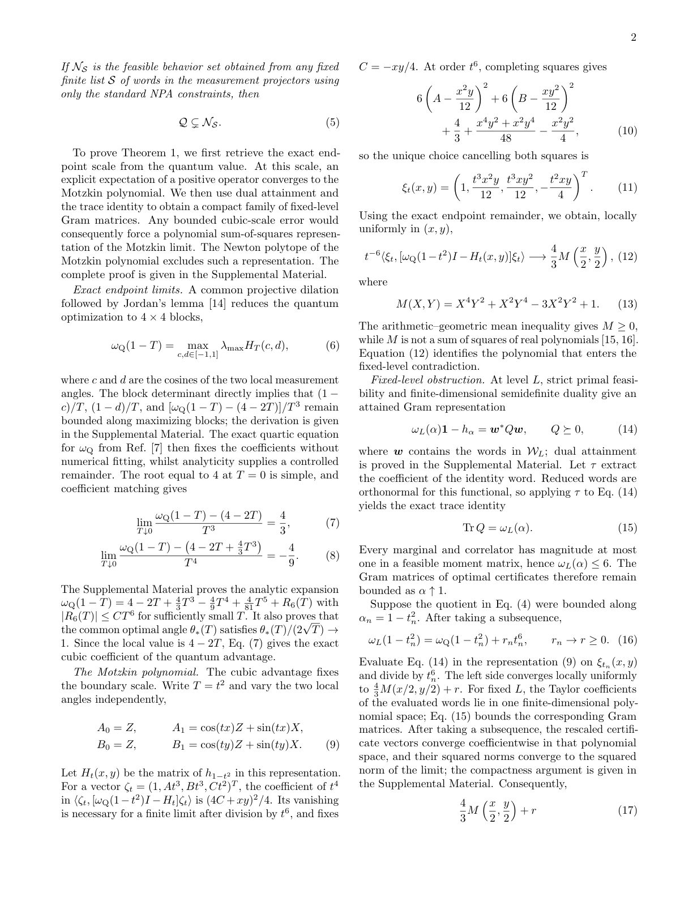 
Low-resolution page preview, page 2

📷 Fig 2

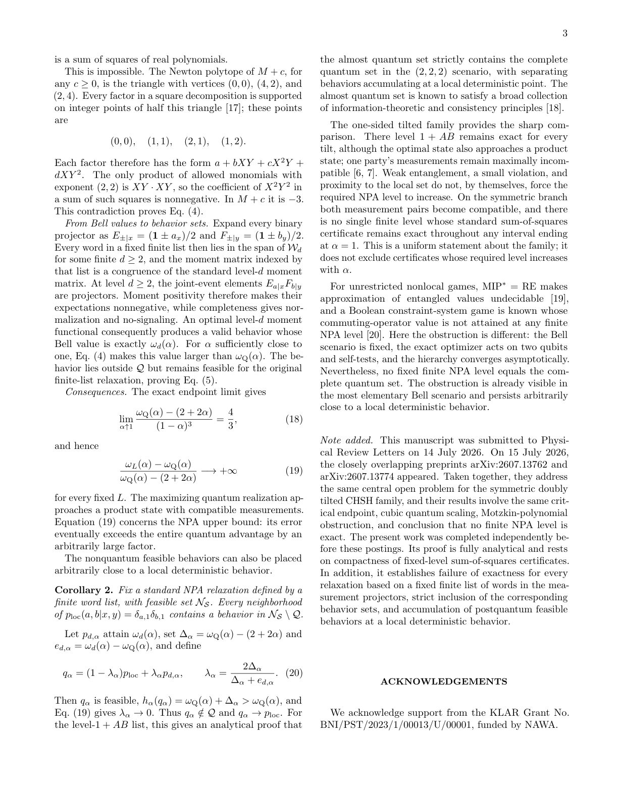 
Low-resolution page preview, page 3

📷 Fig 3

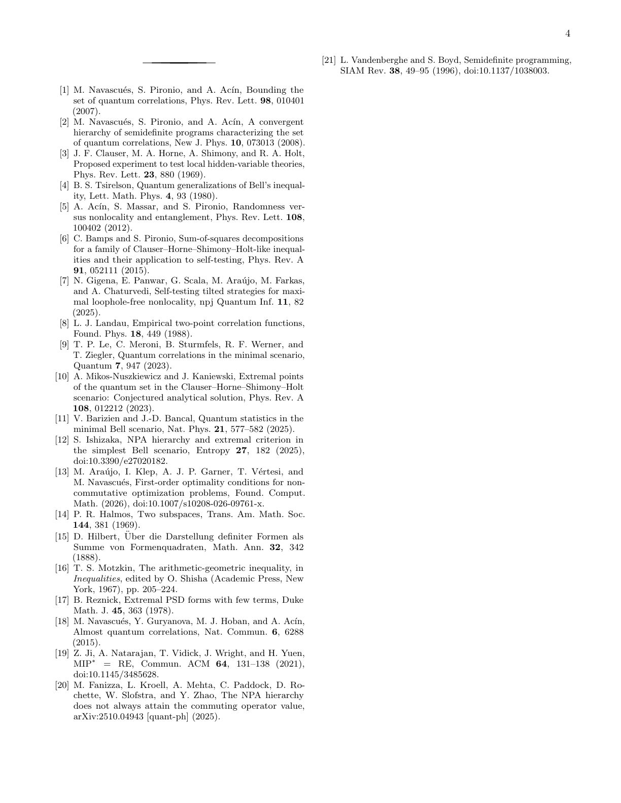 
Low-resolution page preview, page 4

📷 Fig 4

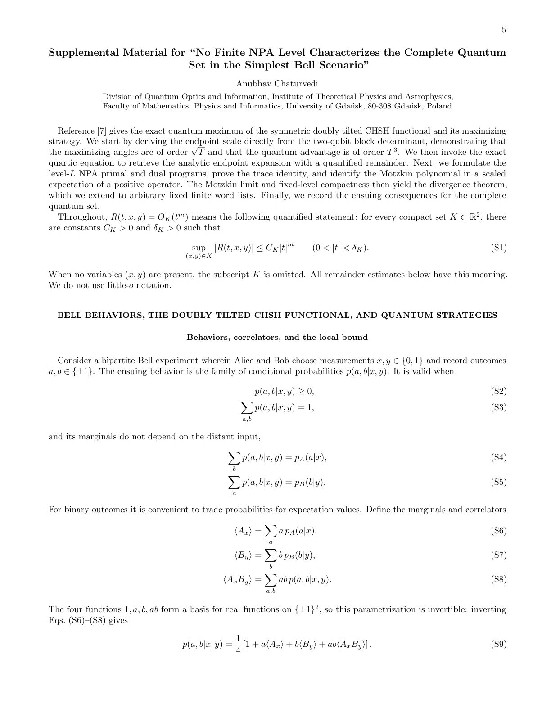 
Low-resolution page preview, page 5

📷 Fig 5

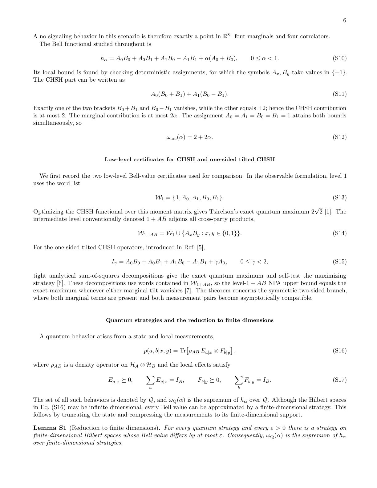 
Low-resolution page preview, page 6

**Summary.** The paper rigorously proves that the standard NPA hierarchy fails to provide an exact characterization of quantum correlations in simple Bell tests. By analyzing asymptotic limits and using polynomial sum-of-squares techniques, the authors show a persistent gap between the best finite approximation and the true quantum maximum. This establishes a fundamental limitation on the power of fixed-level semidefinite programming relaxations for certifying quantum nonlocality.

**Why it may be interesting.** This work provides fundamental theoretical limits on how well classical or semi-classical relaxation techniques (like those used in semidefinite programming) can capture true quantum correlations, which is crucial for understanding resource theories.

Detailed structure

**Main problem.** The core problem is determining if any finite level of the Navascués–Pironio–Acín (NPA) hierarchy can exactly characterize the complete quantum set in the simplest bipartite Bell scenario.

**Main result.** The authors prove that no fixed, finite NPA relaxation level can perfectly describe the true quantum correlations, demonstrating a strict inclusion $\mathcal{Q} \subsetneq 	ext{NS}$.

**Method.** The proof uses asymptotic analysis by comparing the quantum maximum value ($\omega_Q$) with the bound derived from fixed-level moment constraints ($\omega_L$), showing their difference diverges.

**Model / system.** The system is a bipartite Bell experiment involving two binary measurements per party. The analysis focuses on the doubly tilted CHSH functional, $h_\alpha$, which quantifies correlations between measurement outcomes.

**Key observables.** Quantum maximum value ($\omega_Q(\alpha)$), fixed-level NPA bound ($\omega_L(\alpha)$), and the Motzkin polynomial ($M(X, Y)$).

**Important parameters / regimes.** The tilt parameter $\alpha$ (or $T=1-\alpha$), which is taken to approach 1 in the asymptotic analysis.

**Assumptions / limitations.** The analysis assumes standard NPA constraints based on moment positivity and linear identities; it specifically excludes state- or operator-optimality conditions.

**Paper structure.** The paper establishes the problem using the CHSH functional, develops the asymptotic comparison between $\omega_Q$ and $\omega_L$, uses polynomial sum-of-squares arguments involving the Motzkin polynomial to show a contradiction, and concludes with the strict inequality $\mathcal{Q} \subsetneq 	ext{NS}$.

Abstract

The Navascués--Pironio--Acín (NPA) hierarchy gives the standard semidefinite outer approximations to quantum behaviors. Whether \emph{any} finite level can already equal the quantum set has remained open even in the bipartite scenario with two binary measurements per party. We demonstrate that \emph{no finite level} is exact. For the symmetric doubly tilted CHSH functional $h_α=A_0B_0+A_0B_1+A_1B_0-A_1B_1+α(A_0+B_0)$, set $T=1-α$. Its quantum maximum satisfies $[ω_{\rm Q}(1-T)-(4-2T)]/T^3\to4/3$, whereas every fixed NPA level satisfies $[ω_L(1-T)-ω_{\rm Q}(1-T)]/T^3\to+\infty$. Under the corresponding boundary rescaling, an explicit expectation of the positive operator $ω_{\rm Q}(1-t^2)I-H_t$ converges to the Motzkin polynomial. A bounded fixed-level error would therefore make the Motzkin polynomial plus a nonnegative constant a sum of squares, which is impossible. Consequently, every standard NPA relaxation based on a fixed finite list of words in the measurement projectors strictly contains the complete quantum set, and its nonquantum behaviors accumulate at a local deterministic behavior. Thus, the finite-level exactness of CHSH and all one-sided tilted CHSH maxima does not extend to an exact finite-level description of the complete quantum set in the minimal scenario.

[↑ back to top](#top)

### [The distribution of eccentricities in random regular graphs](http://arxiv.org/abs/2607.14799v1)

**Authors:** Dor Lev-Ari, Ofer Biham, Eytan Katzav  
**Type:** theory · **Category:** statistical mechanics · **PDF:** <https://arxiv.org/pdf/2607.14799v1>  
**Analysis basis:** full PDF text, analyzed in chunks
**Topic relevance:** `Keldysh / 2PI / non-Gaussian methods` **1/5** · `analog quantum simulation` **1/5** · `correlated / nonlocal dissipation` **1/5** · `driven-dissipative phase transition` **1/5** · `entanglement & information structure` **1/5** · `methods for driven-dissipative` **1/5** · `non-equilibrium dynamics` **1/5** · `non-equilibrium universality` **1/5**

📷 Fig 1

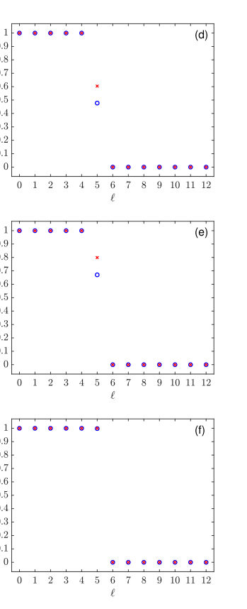 
Figure 1. Analytical results (×) for the distribution of eccentricities P(E &gt; ℓ) of nodes in RRGs that consist of nodes of degree c = 5 and network sizes of (a) N = 160; (b) N = 242; (c) N = 272; (d) N = 296; (e) N = 322 and (f) N = 440. The analytical results, obtained from Eq. (14), are in reasonable agreement with the results obtained from computer simulations (◦), where the deviations are due to finite-size effects. The simulation results were averaged over 20 network instances. For N = 160 the eccentricity of essentially all the nodes is E = 5. As N is increased, nodes of eccentricity E = 6 emerge and their weight increases until at N = 440 essentially all the nodes are of eccentricity E...

📷 Fig 2

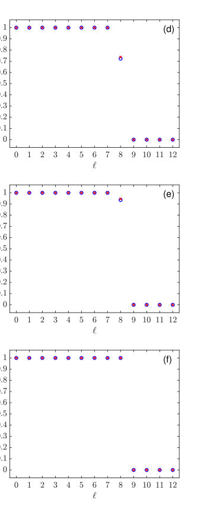 
Figure 2. Analytical results (×) for the distribution of eccentricities P(E &gt; ℓ) of nodes in RRGs that consist of nodes of degree c = 5 and network sizes of (a) N = 7, 500; (b) N = 10, 000; (c) N = 11, 000; (d) N = 12, 000; (e) N = 13, 000 and (f) N = 20, 000. The analytical results, obtained from Eq. (14), are in very good agreement with the results obtained from computer simulations (◦). The simulation results were averaged over 20 network instances. For N = 7, 500 the eccentricity of essentially all the nodes is E = 8. As N is increased, nodes of eccentricity E = 9 emerge and their weight increases until at N = 20, 000 essentially all the nodes are of eccentricity E = 9.

📷 Fig 3

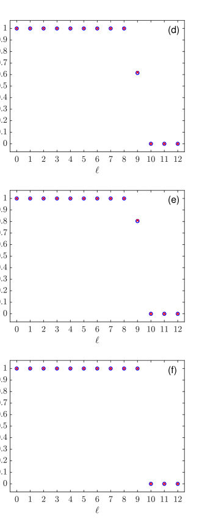 
Figure 3. Analytical results (×) for the distribution of eccentricities P(E &gt; ℓ) of nodes in RRGs that consist of nodes of degree c = 5 and network sizes of (a) N = 22, 000; (b) N = 36, 000; (c) N = 39, 000; (d) N = 41, 000; (e) N = 43, 000 and (f) N = 55, 000. The analytical results, obtained from Eq. (14), are in excellent agreement with the results obtained from computer simulations (◦). The simulation results were averaged over 20 network instances. For N = 22, 000 the eccentricity of essentially all the nodes is E = 9. As N is increased, nodes of eccentricity E = 10 emerge and their weight increases until at N = 55, 000 essentially all the nodes are of eccentricity E = 10.

📷 Fig 4

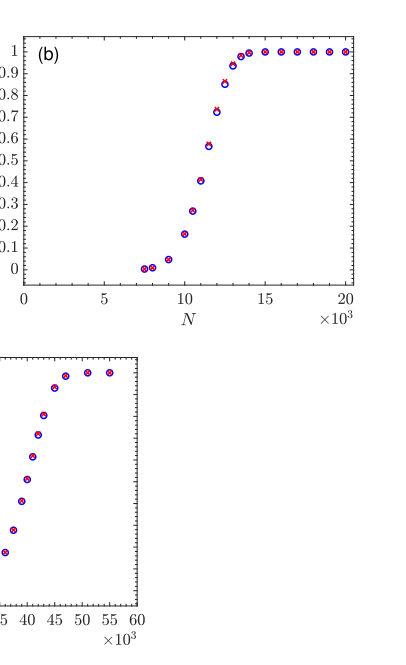 
Figure 4. Analytical results (×) for the probability (a) P(E &gt; 5); (b) P(E &gt; 8) and (c) P(E &gt; 9), as a function of the network size N for RRGs consisting of nodes of degree c = 5, obtained from Eq. (14). The analytical results are found to be systematically larger than the corresponding simulation results (◦). For each value of ℓ, the probability P(E &gt; ℓ) is shown for the window of network sizes in which it changes from zero to one. The discrepancy between the theory and simulation results decreases as the network size is increased.

📷 Fig 5

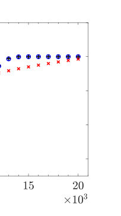 
Figure 5. Analytical results (×) and simulation results (◦) for the mean eccentricity ⟨E⟩in RRGs that consist of nodes of degree c = 5, as a function of the network size N. While the simulation results tend to lock in to integer values, the analytical results, obtained from Eq. (38), follow a smoothed-out contour. We also present approximate results (+), obtained from Eq. (40). These results, which are based on an approximate form of the tail-sum formula, are in very good agreement with the simulation results. However, the analytical expression given by Eq. (38) elucidates the scaling of ⟨E⟩as a function of N and c in a more transparent way.

**Summary.** This paper provides rigorous analytical results for the distribution of eccentricities in Random Regular Graphs. By deriving closed-form expressions for key statistical measures like the mean and variance, it offers a detailed understanding of network structure based on graph theory principles. The methods developed using extreme value statistics are valuable benchmarks for analyzing global properties in large complex systems.

**Why it may be interesting.** While focused on graph theory, the mathematical techniques used—analyzing extreme value statistics (eccentricity) in large complex systems—are highly relevant to characterizing rare events or global properties in quantum many-body systems or disordered lattices.

Detailed structure

**Main problem.** The primary goal is deriving a closed-form analytical expression for the distribution of eccentricities (DoE) in random regular graphs (RRGs). This provides a detailed view of the large-scale structure beyond just characteristic length scales.

**Main result.** A closed-form tail distribution $P(E > \ell)$ is derived, along with asymptotic expressions for the mean eccentricity $\langle E 
angle$ and variance $	ext{Var}(E)$. The mode is found to be close to the rounded value of the mean eccentricity.

**Method.** The analysis employs Extreme Value Theory (EVT) and utilizes tail-sum formulas combined with approximations like the Euler-Maclaurin formula to analyze moments ($\langle E 
angle, \langle E^2 
angle$).

**Model / system.** The model is a Random Regular Graph (RRG) consisting of $N$ nodes, where every node has a fixed degree $c$. Eccentricity quantifies the maximum shortest path distance from any node to all others.

**Key observables.** Distribution of eccentricities ($P(E > \ell)$), Mean eccentricity ($\langle E 
angle$), Mode of DoE ($E_{	ext{mode}}$), and Variance ($	ext{Var}(E)$).

**Important parameters / regimes.** Number of nodes $N$, constant degree $c$ (with $c \ge 3$). The analysis is focused on the large $N$ limit.

**Assumptions / limitations.** The derivations rely on approximations derived from the tail distribution of shortest path lengths and assume that correlations between distances can be managed or neglected in the asymptotic limit.

**Figures summary.** Figures compare analytical predictions ($	imes$, $+$) against simulation results ($\circ$) for the mode ($E_{	ext{mode}}$) and variance ($	ext{Var}(E)$) as a function of network size $N$ for fixed degree $c=5$.

**Paper structure.** The paper progresses by first establishing the tail distribution using EVT, then deriving closed-form expressions for higher moments like $\langle E^2 
angle$, and finally analyzing the resulting variance and mode behavior as functions of network size.

Abstract

We derive a closed-form analytical expression for the distribution of eccentricities (DoE) in random regular graphs (RRGs) that consist of $N$ nodes of degree $c$. The DoE is given by the tail distribution $P(E > \ell) \simeq 1 - \exp \left[ - \exp \left( - \frac{ e^{b \ell} - μ}β \right) \right]$, where the distance $\ell$ takes integer values, $b = \ln (c-1)$ is the shape parameter, $β= \frac{c-2}{c} N$ is the scale parameter and $μ= \frac{c-2}{c} N \ln N$ is the location parameter. By providing the full distribution rather than a single characteristic length scale, we present a detailed view of the large-scale structure. In spite of the fact that the degrees of all the nodes are the same, their eccentricities exhibit non-trivial variations. We derive a closed-form expression for the mean eccentricity, which is given by $\langle E \rangle \simeq \frac{\ln N}{\ln (c-1)} + \frac{\ln \ln N}{\ln (c-1)} - \frac{ \ln c - \ln (c-2) }{ \ln (c-1) } + \frac{1}{2}$. We calculate the mode of the DoE, which exhibits a staircase profile as a function of the network size. Interestingly, the mode is given by $E_{\rm mode} ={\rm Round} \left( \langle E \rangle \right)$, where ${\rm Round}( x )$ is the nearest integer to $x$. We also calculate the variance ${\rm Var}(E)$ and show that it exhibits oscillations as a function of the network size $N$. The results presented in this paper may serve as benchmarks for algorithmic approaches to eccentricity calculations in large sparse networks. The eccentricities are important in practical applications such as broadcasting and global dissemination, where the network performance is determined by the longest delay times.

[↑ back to top](#top)

### [Star-triangle duality estimates for triangular and honeycomb permutation models](http://arxiv.org/abs/2607.14917v1)

**Authors:** Masayuki Ohzeki  
**Type:** theory · **Category:** disordered systems and neural networks · **PDF:** <https://arxiv.org/pdf/2607.14917v1>  
**Analysis basis:** full PDF text, analyzed in chunks
**Topic relevance:** `analog quantum simulation` **1/5** · `driven-dissipative phase transition` **1/5** · `entanglement & information structure` **1/5** · `exotic spin models in light-matter` **1/5** · `non-equilibrium dynamics` **1/5** · `non-equilibrium universality` **1/5**

📷 Fig 1

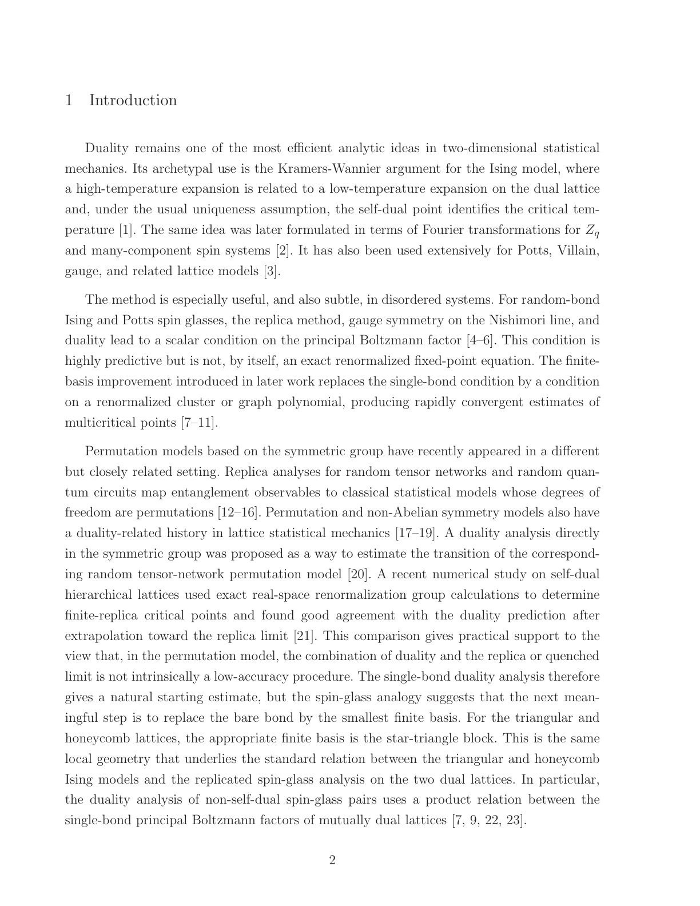 
Low-resolution page preview, page 2

📷 Fig 2

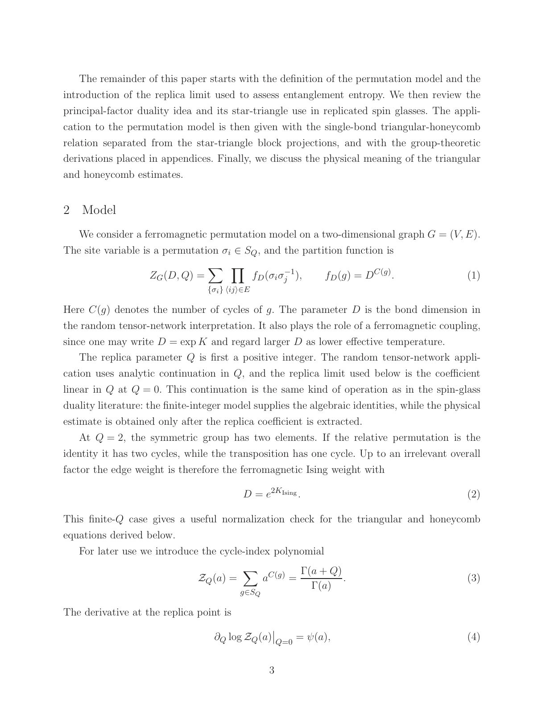 
Low-resolution page preview, page 3

📷 Fig 3

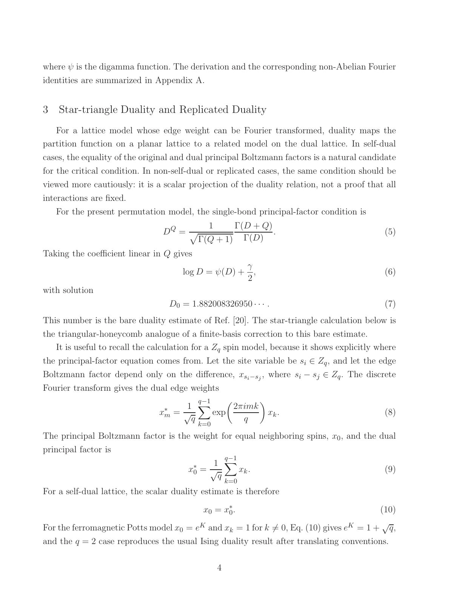 
Low-resolution page preview, page 4

📷 Fig 4

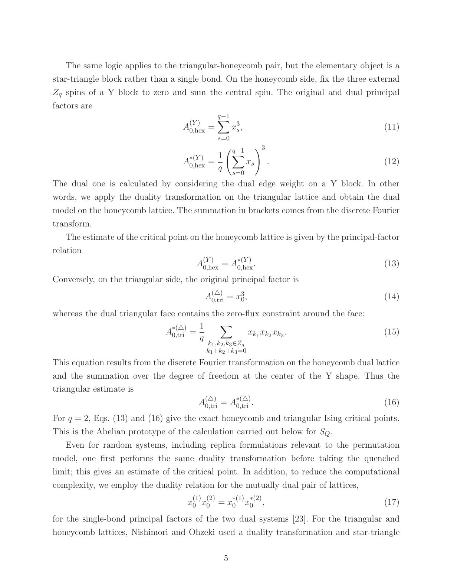 
Low-resolution page preview, page 5

📷 Fig 5

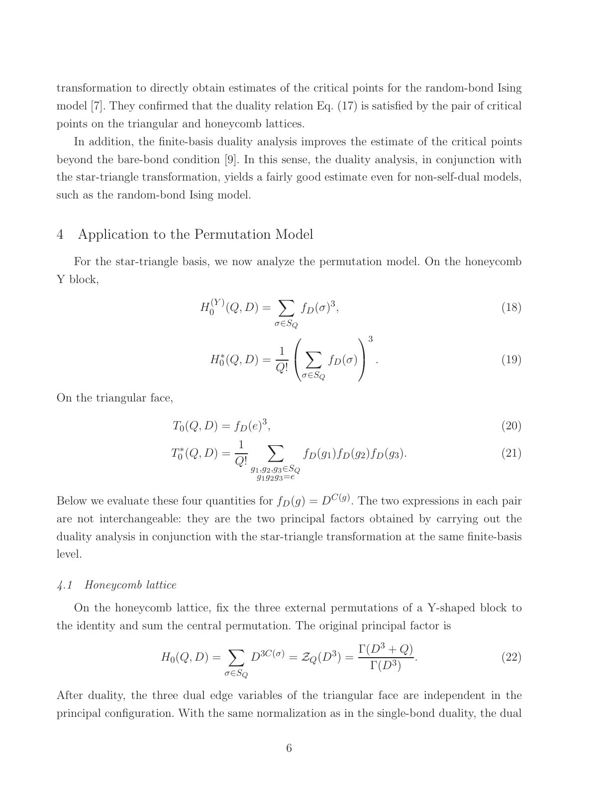 
Low-resolution page preview, page 6

**Summary.** This paper applies star-triangle duality analysis to permutation models on triangular and honeycomb lattices. By treating the fundamental interaction unit as a star-triangle block, the authors estimate critical bond dimensions for both geometries. The results suggest that the lattice geometry significantly influences the system's phase behavior.

**Why it may be interesting.** While focused on statistical mechanics, the use of permutation models and duality techniques is highly relevant to understanding complex interactions in disordered systems, which share mathematical structures with quantum many-body problems.

Detailed structure

**Main problem.** The study investigates star-triangle duality estimates for permutation models defined on triangular and honeycomb lattices.

**Main result.** The analysis yields critical bond dimension estimates: approximately 2.635 for the honeycomb lattice and 1.476 for the triangular lattice, suggesting different phases of matter based on geometry.

**Method.** The core method combines duality analysis with the star-triangle transformation, treating the fundamental unit as a star-triangle block rather than a bare bond.

**Model / system.** The system is a ferromagnetic permutation model defined on 2D lattices (triangular and honeycomb). The site variable is a permutation $\sigma_i \in S_Q$, and the partition function depends on edge weights involving these permutations.

**Key observables.** Critical bond dimension ($D^c$), principal factors ($H, T$) for the lattice blocks, and duality relations between original and dual principal factors.

**Important parameters / regimes.** Bond dimension ($D$), replica parameter ($Q$), and the structure of the underlying lattices (triangular vs. honeycomb).

**Assumptions / limitations.** The analysis relies on using a finite-basis unit (star-triangle block) for duality, and physical estimates are derived in the replica limit ($Q 	o 0$).

**Figures summary.** Not specified; notes refer to equations and tables detailing finite-$Q$ results comparing honeycomb and triangular lattice dimensions.

**Paper structure.** The paper develops the theory by defining principal factors for both lattices, applying the star-triangle duality condition at a finite basis level, deriving replica limit equations, and finally calculating the critical estimates for both geometries.

Abstract

We study a duality analysis in conjunction with the star-triangle transformation for symmetric-group permutation models on the triangular and honeycomb lattices. The calculation is motivated by the permutation-model description of random tensor networks and by earlier duality analyses of replicated spin glasses. The essential point is that the finite-basis unit is not a bare bond but a star-triangle block. Our analysis estimates the critical bond dimension for the honeycomb lattice to be 2.634929344884, and the associated single-bond duality relation yields the triangular-lattice estimate 1.475661534848.

[↑ back to top](#top)

### [Magnetic Order in bilayer Ruddlesden-Popper Nickelates](http://arxiv.org/abs/2607.15228v1)

**Authors:** Yiming Wang, Guijing Duan, Zhiguang Liao, Kuan-Sen Lin, Rong Yu, Qimiao Si  
**Type:** theory · **Category:** strongly correlated electrons · **PDF:** <https://arxiv.org/pdf/2607.15228v1>  
**Analysis basis:** full PDF text, analyzed in chunks
**Topic relevance:** `Keldysh / 2PI / non-Gaussian methods` **1/5** · `analog quantum simulation` **1/5** · `exotic spin models in light-matter` **1/5** · `spintronics-quantum-optics interface` **1/5**

📷 Fig 1

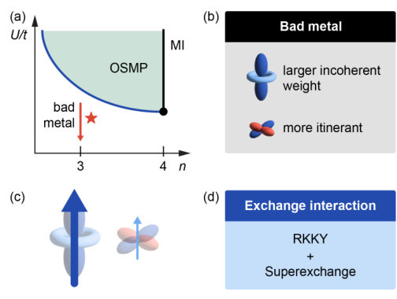 
FIG. 1: (a) Sketched ground-state phase diagram as a function of the correlation strength U/t and electron occupation number N of the bilayer two-orbital Hubbard model for La3Ni2O7. The physical system, indicated by the red star near N = 3 (where N counts the Ni eg electrons per unit cell) resides in the bad-metal regime, situated in proximity to an orbital-selective Mott phase (OSMP). The black line above the solid circle denotes a Mott insulator (MI) at the (so-far not-reached) heavily-electron doped case of N = 4. Adapted from Ref. [49]. (b) Orbital-differentiated properties of the bad-metal state. The dz2 orbital exhibits a relatively large incoherent spectral weight, which contributes...

📷 Fig 2

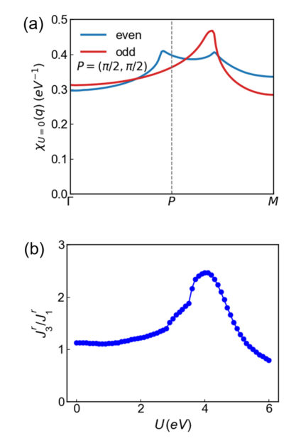 
FIG. 2: (a) Static spin susceptibility for x2 −y2 orbitals at N = 3 and U = 0. (b) Ratio of the intralayer RKKY interactions Jr 3/Jr 1 as a function of U.

📷 Fig 3

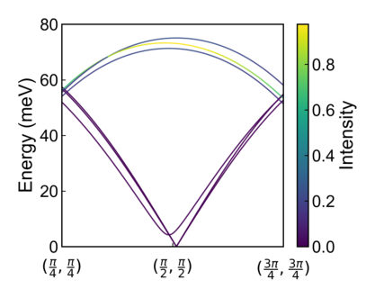 
FIG. 4: Intensity-weighted spin-wave spectrum along (π/4, π/2)–(3π/4, π/2) of the 2-Ni Brillouin zone in the antiferromagnetic ground state with ordering wave vector Q = (0.508π, 0.508π) at U = 4.0 eV. The corresponding exchange parameters are J⊥S = 75 meV, J1S = 1.9 meV, J3S = 4.6 meV, J′ 1S = 1.38 meV (see the main text).

📷 Fig 4

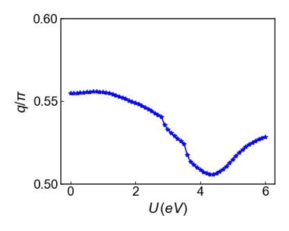 
FIG. 3: The U dependence of the component q of the ordering wave vector Q = (q, q) of the magnetic ground state of an effective local spin model involving superexchange and RKKY interactions obtained via variational optimization. The wave vector is close to Q = (π/2, π/2).

**Summary.** This work develops a theoretical model for bilayer nickelates, treating the system as having two coupled electronic sectors: an itinerant $d_{x^2-y^2}$ band and localized $d_{z^2}$ moments. By combining RKKY interactions mediated by the former with superexchange among the latter, the authors predict robust antiferromagnetic order near Q = (pi/2, pi/2), offering a unified explanation for magnetism in these unconventional superconductors.

**Why it may be interesting.** The explicit separation of electronic degrees of freedom into itinerant quasiparticles mediating long-range RKKY forces and localized moments governed by superexchange provides a powerful theoretical framework applicable to other correlated Mott insulators where orbital physics is crucial.

Detailed structure

**Main problem.** The study aims to elucidate the nature of density wave order and understand the microscopic physics driving high-temperature superconductivity in bilayer Ruddlesden-Popper Nickelates.

**Main result.** The model predicts an antiferromagnetic ground state with an ordering wavevector near Q = (pi/2, pi/2), driven by the interplay between RKKY and superexchange interactions. This magnetic order is consistent with experimental findings regarding spin dynamics in these materials.

**Method.** The authors use a slave-spin mean-field approach on a two-orbital Hubbard model to derive an effective spin Hamiltonian incorporating both RKKY (from itinerant quasiparticles) and superexchange (from local moments).

**Model / system.** The system is the bilayer nickelate La3Ni2O7, modeled by a two-orbital Hubbard Hamiltonian. The low-energy physics separates into an itinerant $d_{x^2-y^2}$ sector mediating RKKY interactions and localized $d_{z^2}$ moments contributing superexchange.

**Key observables.** Antiferromagnetic ordering wavevector Q, spin-wave spectrum softening at Q ~ (pi/2, pi/2), static magnetic susceptibility $\chi(q)$, and orbital-dependent quasiparticle spectral weights Z_alpha(U).

**Important parameters / regimes.** Hubbard interaction strength U, which controls the degree of orbital selectivity; temperature T relative to N's ordering temperatures.

**Assumptions / limitations.** The analysis relies on projecting susceptibility vertices onto the $d_{x^2-y^2}$ orbital and assuming that correlation effects can be incorporated into an effective quasiparticle tight-binding Hamiltonian via slave-spin mean-field theory.

**Figures summary.** Figures illustrate phase diagrams, static spin susceptibilities $\chi(q)$ showing peaks near (0.5pi, 0.5pi), the dependence of the ordering wave vector Q on U, and the calculated spin-wave spectrum softening at the predicted magnetic ordering point.

**Paper structure.** The paper first establishes the physical context using experimental data to motivate a theoretical model. It then details the slave-spin mean-field calculation to derive an effective Hamiltonian that separates itinerant (RKKY) and localized (superexchange) interactions, culminating in predictions for the magnetic ground state.

Abstract

The recent discovery of high-temperature superconductivity in the bilayer nickelate La$_3$Ni$_2$O$_7$ has led to extensive interest in the correlation physics of its normal state. Given that the superconducitivity develops near a density wave order in the phase diagram, it is important to elucidate the nature of this order. Based on the accumulated experimental evidence for a bad metal state in proximity to an orbital-selective Mott phase, here we describe magnetic correlations of the system in a conceptually new way -- in terms of effective local moments experiencing a combination of RKKY and superexchange interactions. This gives rise to a magnetic order with a wavevector that is close to $\mathbf{Q}=(π/2,π/2)$ and, at the same time, yields a clear understanding of the associated spin dynamics. Our results are consistent with the rapidly emerging experiments about the magnetic correlations in the density wave order of the bilayer nickelate. Implications for unconventional superconductivity in this and related multiorbital systems are discussed.

[↑ back to top](#top)

### [Numerical and experimental framework for bending elasticity of highly flexible slender structures](http://arxiv.org/abs/2607.14594v1)

**Authors:** Shunsuke Nomura, Satsuki Shibuya, Isamu Hashiguchi, Ryuichi Tarumi, Tomohiko G. Sano  
**Type:** both · **Category:** numerical methods · **PDF:** <https://arxiv.org/pdf/2607.14594v1>  
**Analysis basis:** full PDF text, analyzed in chunks
**Topic relevance:** `Frenkel-Kontorova` **1/5** · `Keldysh / 2PI / non-Gaussian methods` **1/5** · `analog quantum simulation` **1/5** · `methods for driven-dissipative` **1/5**

📷 Fig 1

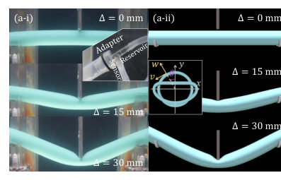 
Fig. 1 Bending test of hollow structures; (a) tubes and (b) tapes. Corresponding snapshots of our (a-i)(b-i) experiments and (a-ii)(b-ii) simulations. (a-i) The deformation sequences of pressurized bending tubes of (h, R) = (1.5, 6.5) mm and p = 2 kPa. The inset shows a close-up view of the tube extremity, which is connected to the fluid reservoir and pressure sensor. (a-ii) Simulation snapshots of the tube under the same conditions as (a-i). (b-i) The deformation process of tape springs with (h, R, w) = (0.1, 8.85, 15.0) mm. The yellow rigid plate is moved downward to indent the tape spring. (b-ii) The corresponding simulation counterparts are shown. The insets of (a-ii) and (b-ii) show...

📷 Fig 2

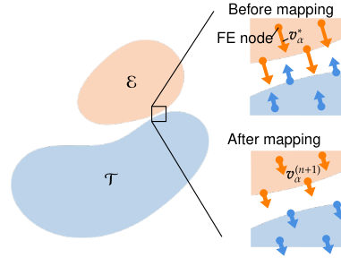 
Fig. 2 Schematic illustration of the mapping operation used to obtain the contact-corrected velocity v(n+1) α from the intermediate FE nodal velocity v∗ α by incorporating contact interactions based on the contact method of Bardenhagen et al. [58]

📷 Fig 3

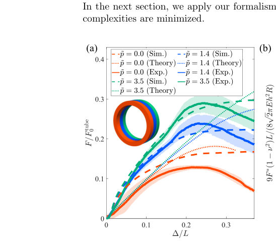 
Fig. 3 Comparison between experiments, simulations, and theory for the bending force of tubes. (a) Comparison of the rescaled force-displacement curves for h = 1.5 mm thickness. The colored solid and dashed lines represent the experimental and numerical results, respectively. The shaded regions represent the standard deviation of the experimental results. The corresponding dotted curves represent the predictions of Eq. (5). The insets represent the cross-section of the tube with ∆= 0 for each ˜p. The colors indicate the corresponding ˜p. (b) Comparison of the maximum force of the force displacement curve, F ∗, for various internal pressures, p. Red and blue data points represent the...

📷 Fig 4

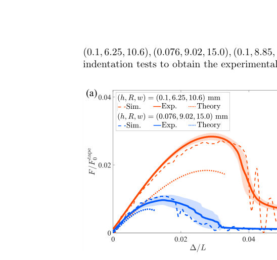 
Fig. 4 Comparison between experiments, simulations, and theory for tape springs. (a) Comparison of the rescaled force-displacement curves. The solid and dashed lines represent the experimental and numerical results, respectively. The shaded regions represent the standard deviation of the exper- imental results. (b) Comparison of the maximum force of the force-displacement curve, F ∗. The horizontal axis represents the theoretical maximum force, F ∗, Eq. (18), calculated from the set of relevant parameters for each experimental and simulation setting, and the vertical axis represents the corresponding maximum force, ˆF, obtained from experiments and numerical simulations. Red and blue data...

**Summary.** This paper introduces a novel hybrid Material Point Method (hybrid-MPM) framework to accurately simulate the bending elasticity of very flexible structures like tubes and tape springs. The methodology successfully couples cross-sectional and lengthwise deformations, allowing for robust prediction of mechanical response under complex contact conditions. Validation against physical experiments confirms its utility for modeling soft robots and deployable systems.

**Why it may be interesting.** While focused on classical mechanics, the development of advanced numerical techniques like hybrid-MPM for large deformation and contact mechanics is highly relevant to simulating complex geometries encountered in quantum device modeling or soft matter systems where continuum assumptions break down.

Detailed structure

**Main problem.** The study aims to develop a robust computational framework to simulate the complex, large-deformation bending elasticity of highly flexible slender structures.

**Main result.** The developed hybrid-MPM framework shows excellent agreement when validating numerical simulations against desktop experiments for both tubes and tape springs.

**Method.** A hybrid Material Point Method (hybrid-MPM) is employed, integrating Lagrangian finite element and Eulerian finite difference frameworks to handle complex contact mechanics during large deformation analysis.

**Model / system.** The physical systems studied are slender structures like tubes and tape springs, whose bending behavior exhibits coupling between cross-sectional deformation (e.g., ovalization) and lengthwise bending, particularly near instability points like the Brazier instability.

**Key observables.** Bending moment (M), applied force (F), displacement ($\Delta$), curvature ($\kappa$), and the resulting force-displacement curve.

**Important parameters / regimes.** Young's modulus ($E$), Poisson ratio ($
u$), structure dimensions ($R, h, L$), and internal pressure ($p$).

**Assumptions / limitations.** Theoretical derivations assume linear constitutive laws and inextensible centerlines; computationally, the framework is validated against experimental measurements.

**Figures summary.** Figure 1 compares experimental snapshots of bending tests on tubes and tapes with corresponding simulation results. Figure 4 compares force-displacement curves for tape springs across experiments, simulations, and theory.

**Paper structure.** The paper systematically develops the theoretical moment-curvature relations via energy minimization, extends this to include internal pressure effects, implements a computational framework using hybrid-MPM, and validates this approach by comparing simulation results against physical three-point bending tests on fabricated samples.

Abstract

Slender structures are highly flexible, spanning several orders of magnitude in length scale. Their deformation depends on the slenderness of their cross sections, highlighting that the elasticity and geometry of structures are intrinsically coupled. The deformation of the cross-section becomes significant, particularly when tubes and pipes are subjected to bending, known as the Brazier instability. Although the bending performance of slender structures is quantified experimentally using a canonical three-point bending test, their numerical counterparts remain under-explored because complex contact mechanics must be implemented in simulations. In this study, we develop a computational framework to simulate experimental three-point bending tests using a hybrid material point method (hybrid-MPM) approach, which integrates Lagrangian finite element and Eulerian finite difference frameworks. We adapt our framework to elastic tubes and tape springs as canonical examples that exhibit characteristic bending deformation in which the cross-sectional and lengthwise bending are coupled. The predictions of numerical simulations are validated against desktop experiments and classical theory. The excellent agreement between the simulation and the experiments implies that the hybrid-MPM framework provides a robust computational framework for predicting the large deformation of structures involving complex contact, such as soft robots and deployable structures.

[↑ back to top](#top)

### [Robustness of periodicity in Grover walks under a magnetic vector potential](http://arxiv.org/abs/2607.14797v1)

**Authors:** Hiroto Sekido, Etsuo Segawa  
**Type:** theory · **Category:** quantum information and computing · **PDF:** <https://arxiv.org/pdf/2607.14797v1>  
**Analysis basis:** full PDF text, analyzed in chunks
**Topic relevance:** `analog quantum simulation` **1/5** · `driven-dissipative phase transition` **1/5** · `methods for driven-dissipative` **1/5** · `non-equilibrium dynamics` **1/5**

📷 Fig 1

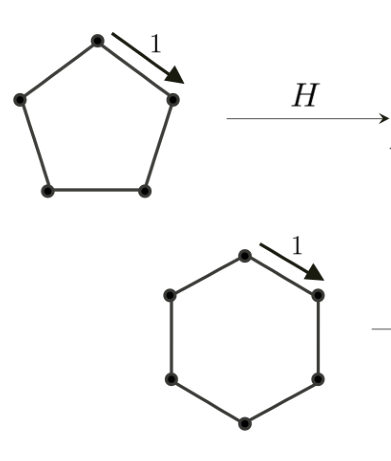 
Figure 1: H on C5 : The left figure represents Hδi = 3 25δi − 2 25 (δi+1 + δi+2 + δi+3 + δi+4) (i ∈Z5). H on C6 : The right figure repre- sents Hδj = 1

📷 Fig 2

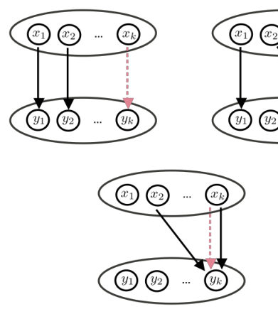 
Figure 2: Configurations of directed edges corresponding to the entries of H: The five configurations shown above correspond to the five cases in the definition of H. The two solid directed edges represent the indices of an entry of H, while the dashed directed edge represents the reference edge a.

📷 Fig 3

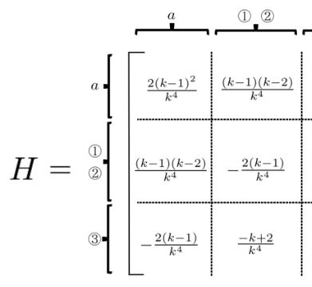 
Figure 3: Values of the entries of H corresponding to each edge configuration.

**Summary.** This paper analyzes how magnetic vector potentials perturb periodic Grover walks on finite graphs. By treating the potential as a small perturbation, the authors derive an effective continuous-time Hamiltonian $H$. The key finding is that the graph's spectral structure dictates the robustness of periodicity, providing quantitative measures for this stability.

**Why it may be interesting.** This work connects fundamental concepts of quantum walks and graph theory to the stability of quantum dynamics under external fields, which is highly relevant for understanding decoherence or engineered robustness in quantum computation architectures.

Detailed structure

**Main problem.** The study investigates how magnetic vector potential perturbations affect the periodicity of Grover walks executed on finite quantum graphs.

**Main result.** The perturbed dynamics can be shown to converge asymptotically to a continuous-time quantum walk generated by a Hermitian matrix $H$, whose spectral structure characterizes the robustness of the original periodicity.

**Method.** The analysis employs spectral theory, treating the vector potential as a small perturbation ($eta 	o 0$) and deriving an effective Hamiltonian $H$ from the discrete-time evolution operator.

**Model / system.** The model is a quantum graph representing Grover walks on finite graphs ($P_n, C_n, K_{n,n}$). The dynamics are governed by a time evolution operator modified by a magnetic vector potential $eta$.

**Key observables.** Periodicity ($	au$), Robustness of Periodicity ($R_p = \dim \ker H / |A|$), and the spectrum of the effective Hamiltonian $H$.

**Important parameters / regimes.** The perturbation strength $eta$, which is assumed to be small; graph structure (e.g., presence of non-simple eigenvalues).

**Assumptions / limitations.** The analysis assumes the underlying graph possesses at least one non-simple eigenvalue to derive the characterizing Hermitian matrix $H$. The convergence relies on the small-$eta$ limit.

**Figures summary.** Figures illustrate specific entries and structures of the derived Hamiltonian matrix $H$ for cycle graphs ($C_n$) and complete bipartite graphs ($K_{k,k}$), detailing dependencies on edge configurations.

**Paper structure.** The paper progresses by defining the perturbed walk dynamics, deriving the effective continuous-time Hamiltonian $H$, analyzing its spectral properties based on graph structure (e.g., path vs. cycle), and quantifying periodicity robustness using dimension counts ($\dim S_{	ext{sim}}, \dim T_{	ext{per}}, \dim L^{\perp}$).

Abstract

We study the effect of magnetic vector potentials on periodic Grover walks on finite graphs. The magnetic vector potential is introduced through the framework of quantum graphs, which induces the Grover walk as a special case. We regard the vector potential as a perturbation of a periodic Grover walk and investigate the robustness of its periodicity. Our analysis reveals that the response to such perturbations depends on the spectral structure of the underlying graph. In particular, when the graph possesses at least one non-simple eigenvalue, we derive a Hermitian matrix that characterizes the robustness of its periodicity. As a consequence, we show that the perturbed dynamics is asymptotically described by a continuous-time quantum walk generated by this Hermitian matrix.

[↑ back to top](#top)

### [Spin fluctuation-mediated unconventional superconductivity in ThFeAsN from first-principles](http://arxiv.org/abs/2607.14677v1)

**Authors:** Guang-Yu Guo, Jau-Wen Liu, Mitsuaki Kawamura  
**Type:** theory · **Category:** strongly correlated electrons · **PDF:** <https://arxiv.org/pdf/2607.14677v1>  
**Analysis basis:** full PDF text, analyzed in chunks
**Topic relevance:** `Keldysh / 2PI / non-Gaussian methods` **1/5** · `analog quantum simulation` **1/5** · `exotic spin models in light-matter` **1/5** · `spintronics-quantum-optics interface` **1/5**

📷 Fig 1

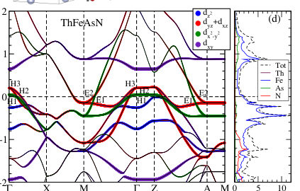 
FIG. 1. (a) Crystal structure and (b) Brillouin zone of ThFeAsN. (c) Fe d orbital-projected band structure and (d) total and atom-decomposed DOS of ThFeAsN. In (c), the Fe d orbital weights are proportional to the line widths.

📷 Fig 2

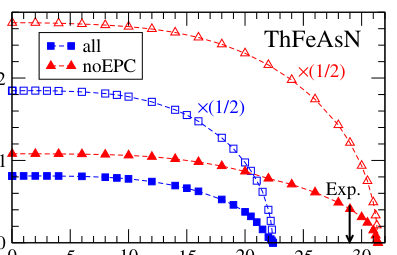 
FIG. 2. Averaged (solid symbols) and maximum (open sym- bols) SC gap ∆vs. temperature T from the full (squares) and no EPC (up-triangles) SCDFT calculations.

📷 Fig 3

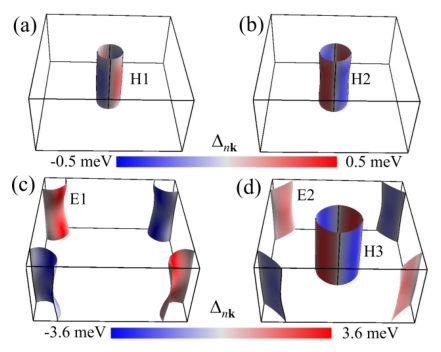 
FIG. 3. Momentum k-dependent SC gap ∆nk on the Fermi surface at 0 K: hole pockets H1 (a) and H2(b), electron pocket E1 (c), hole pocket H3 and electron pocket E2 (d). The black vertical lines denote the nodal lines.

📷 Fig 4

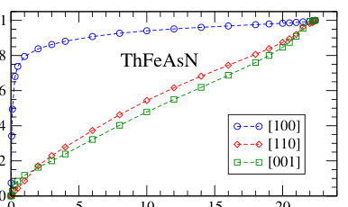 
FIG. 5. Normalized longitudinal ultrasonic attenuation coeffi- cients αS/αN(T ) where αS (αN) is the ultrasonic attenuation coefficient in the superconducting (normal) state.

📷 Fig 5

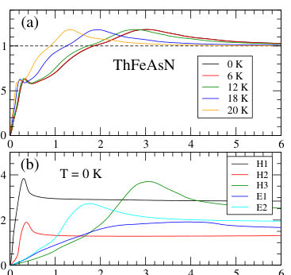 
FIG. 4. (a) Normalized SC quasiparticle DOS NS/NF vs. energy for several temperatures. (b) FS sheet-decomposed normalized NS/NF at T = 0 K.

**Summary.** This theoretical study investigates superconductivity in ThFeAsN by calculating superconducting properties using advanced first-principles methods. The authors determined that spin fluctuation interactions are the dominant pairing mechanism, leading to an unconventional $d_{xy}$-wave order parameter and a calculated critical temperature consistent with experiments.

**Why it may be interesting.** While focused on solid-state physics, the methodology of using first-principles calculations to map out competing many-body interactions ($	ext{EPC}$ vs. $	ext{SF}$) to determine the ground state pairing symmetry is highly relevant to understanding complex quantum phases in strongly correlated systems.

Detailed structure

**Main problem.** Understanding the superconducting (SC) pairing mechanism, the origin of high critical temperature ($T_c$), and the symmetry of the SC order parameter in Fe-based superconductors.

**Main result.** The calculations reveal that ThFeAsN is an unconventional superconductor with a $d_{xy}$-wave order parameter, driven primarily by spin fluctuation (SF) mediated interactions rather than electron-phonon coupling.

**Method.** Ab initio superconducting density functional theory (SCDFT) was employed to calculate pairing interactions and the resulting SC gap structure across multiple Fermi surface sheets.

**Model / system.** The study focuses on $	ext{ThFeAsN}$, an Fe-based high $T_c$ superconductor, analyzing its electronic structure using DFT methods incorporating electron-phonon coupling (EPC), screened Coulomb repulsion ($\mu_{ee}$), and spin fluctuation interactions ($\mu_{SF}$).

**Key observables.** Calculated critical temperature ($T_c = 22.4 	ext{ K}$), $d_{xy}$-wave SC order parameter symmetry, quasiparticle density of states (QPDOS), and ultrasonic attenuation coefficient.

**Important parameters / regimes.** $T_c$ comparison with experiment ($\sim 29 	ext{ K}$); relative strengths of pairing interactions ($\mu_{SF}^{nk} > \mu_{ee}^{nk} > \lambda_{nk}$).

**Assumptions / limitations.** The calculations rely on solving the SC gap equation while treating EPC, Coulomb repulsion, and SF interaction effects separately to determine the dominant pairing mechanism.

**Figures summary.** Figures illustrate the crystal structure, momentum-dependent SC gap ($\Delta_{\mathbf{k}}$) across five Fermi surface sheets showing $d_{xy}$-wave character, and comparisons of calculated $	ext{QPDOS}$ and ultrasonic attenuation coefficients.

**Paper structure.** The paper systematically compares different pairing mechanisms (EPC only vs. EPC + e-e repulsion vs. SF interaction) to determine the dominant attractive force, leading to the final conclusion that SF mediation dictates the unconventional $d_{xy}$-wave superconductivity.

Abstract

Superconducting (SC) pairing mechanism, origin of high $T_c$ and symmetry of SC order parameter in Fe-based superconductors are among the important unsolved problems in condensed matter and materials physics. We study the SC properties of ThFeAsN, a Fe-based high $T_c$ superconductor, by {\it ab initio} superconducting density functional theory calculations with electron-phonon coupling, screened static and dynamic electron-electron Coulomb repulsion and spin fluctuation (SF) mediated pair-interaction fully taken into account. Our calculations reveal that ThFeAsN is a SF-mediated multiband superconductor with the calculated $T_c$ of 22.4 K and the $d_{xy}$-wave SC order parameter with different signs on different Fermi surface sheets, in consistent with experiments. We also present distinct SC properties such as quasiparticle density of states and ultrasonic attenuation coefficient which can be immediately verified by experiments.

[↑ back to top](#top)

### [The two-particle density matrix of a Luttinger liquid](http://arxiv.org/abs/2607.14402v1)

**Authors:** Harini Radhakrishnan, Matthias Thamm, Hatem Barghathi, Bernd Rosenow, Adrian Del Maestro  
**Type:** theory · **Category:** strongly correlated electrons · **PDF:** <https://arxiv.org/pdf/2607.14402v1>  
**Analysis basis:** full PDF text, analyzed in chunks
**Topic relevance:** `Keldysh / 2PI / non-Gaussian methods` **1/5** · `analog quantum simulation` **1/5** · `entanglement & information structure` **1/5** · `non-equilibrium dynamics` **1/5**

📷 Fig 1

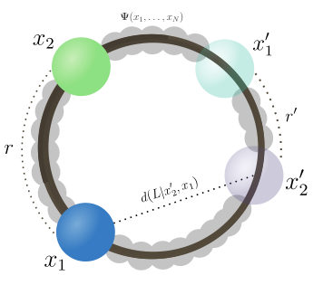 
FIG. 1. Graphical depiction of the two-body density of a one dimensional N-body system of length L with wavefunc- tion Ψ(x1, . . . xN). The quantity ρ2(x′ 2, x′ 1; x1, x2) denotes the matrix element obtained when two fermions are annihilated at sites x1 and x2 while two are created at coordinates x′ 1 and x′ 2. For periodic boundary conditions, d(L|x′ 2, x1) is the chord length across the ring.

📷 Fig 2

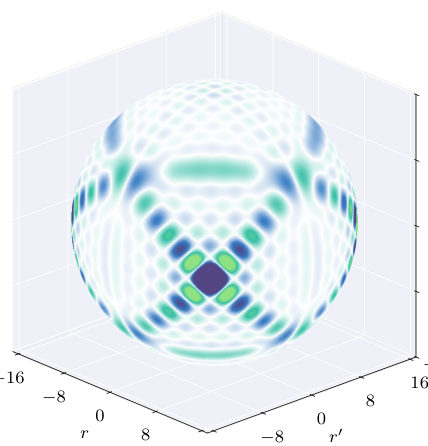 
FIG. 2. The 2-RDM ρ2(x′ 2, x′ 1; x1, x2) plotted on the surface of a sphere with ∆R2 + r2/2 + r′2/2 = 144, L = 40, K = 8/5 (attractive), n0 = 1/2, and ϵ = 1 (see Section IV for parame- ter details). The colormap corresponds to a range from −0.03 (blue) to 0.03 (green). Alternating blue-green regions signal the sign change from fermion antisymmetry, while the van- ishing of ρ2 along r = 0, r′ = 0 is due to the Pauli exclusion principle.

📷 Fig 3

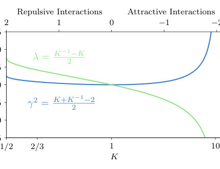 
FIG. 3. Dependence of the two interaction-dependent expo- nents in the correlation function, γ2 and λ, on the Luttinger parameter K. γ2 is non-negative, while λ, the new exponent in this work, can attain negative values.

📷 Fig 4

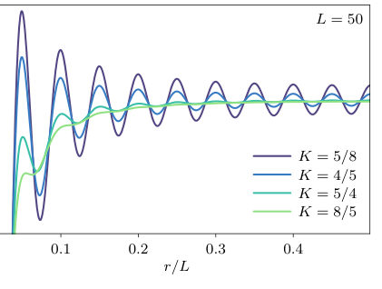 
FIG. 4. The density-density correlation function g2(r) at fixed L = 50 for different values of the Luttinger parameter K.

📷 Fig 5

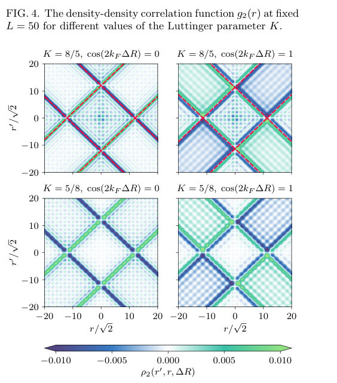 
FIG. 5. The 2-RDM of the Luttinger model on a ring for attractive K = 8/5, (top row) and repulsive K = 5/8 (bottom row) at two fixed values of ∆R = L/5 + 1/2 (left column) and ∆R = L/5 (right column) where L = 40. The values of ∆R are chosen to suppress (enhance) the first oscillating fermionic term in Eq. (34) as indicated in the panel titles. Red dashed lines denote the lines corresponding to the limits (hyperplanes) x′ 1 →x1, x′ 2 →x2, x′ 2 →x1, and x′ 1 →x2.

**Summary.** This paper derives a closed-form expression for the two-particle reduced density matrix ($
ho_2$) of spinless fermions in a Tomonaga-Luttinger liquid. By using constructive bosonization, the authors reveal a second correlation exponent $\lambda$ that governs off-diagonal coherence beyond what single-particle measurements can capture. The result successfully connects universal Luttinger liquid scaling theory with quantitative predictions for finite microscopic systems.

**Why it may be interesting.** This work provides an exact analytical tool (the 2-RDM) for quantifying complex many-body correlations in 1D systems, connecting universal field theory results to measurable quantities in finite microscopic models, which is highly relevant for understanding quantum materials.

Detailed structure

**Main problem.** The primary goal is deriving an explicit, analytically controlled expression for the equal-time two-particle reduced density matrix ($
ho_2$) in strongly correlated 1D systems.

**Main result.** The authors derive a closed form for $
ho_2$ showing two characteristic exponents: one familiar exponent $\gamma_2$ and a new exponent $\lambda$, which controls off-diagonal correlations between opposite chiralities.

**Method.** The calculation employs constructive bosonization techniques combined with the introduction of an explicit ultraviolet cutoff to manage divergences inherent in calculating higher-order correlation functions.

**Model / system.** The system studied is spinless fermions modeled as a Tomonaga-Luttinger liquid (TLL) on a ring, which is analyzed using continuum field theory methods derived from the fermionic Hamiltonian.

**Key observables.** Two-particle reduced density matrix ($
ho_2$), pair distribution function ($g_2$), static structure factor, and specific correlation signatures like $2k_F$ charge-density-wave correlations.

**Important parameters / regimes.** The Luttinger parameter $K$, the interaction strength parameters (J/V ratio), and the derived exponents $\gamma_2 = (K+K^{-1}-2)/2$ and $\lambda = (K^{-1}-K)/2$.

**Assumptions / limitations.** The derivation relies on bosonization, assuming the system is in the Luttinger liquid regime, and requires fixing the cutoff based on results from the one-particle density matrix.

**Figures summary.** Figure 1 graphically illustrates $
ho_2$ for a 1D N-body system. Figure 2 visualizes $
ho_2$ on a spherical surface in $(r, r', \Delta R)$ space, particularly highlighting correlation structures for attractive interactions.

**Paper structure.** The paper systematically builds the theory by first introducing the general formalism of reduced density matrices ($
ho_n$), then applying constructive bosonization to derive the TLL result, followed by detailed analysis of the resulting correlations, and finally validating the analytic result against numerical DMRG calculations.

Abstract

Two-particle coherence is the first level of the reduced-density-matrix hierarchy that contains correlations inaccessible to single-particle observables, yet analytic two-particle density matrices are rare even in one dimension. We derive a closed, finite-size expression for the equal-time two-particle reduced density matrix of spinless fermions in a Tomonaga-Luttinger liquid using constructive bosonization with an explicit ultraviolet cutoff. In addition to the familiar Luttinger parameter $K$-dependent exponent $γ^2=(K+K^{-1}-2)/2$ which governs the spatial decay of matrix elements, the result exposes a second exponent, $λ=(K^{-1}-K)/2$, which encodes correlations between opposite chiralities and controls the off-diagonal structure. The diagonal limit of the two-particle reduced density matrix yields density correlations and the static structure factor, while its coherences resolve algebraic $2k_F$ charge-density-wave correlations for repulsion and odd-parity p-wave pairing correlations for attraction. After fixing the cutoff from the one-particle density matrix, the analytic result quantitatively reproduces density matrix renormalization group calculations of the interacting J-V chain within the Luttinger liquid regime. The result connects universal Luttinger liquid scaling with observables in finite microscopic systems.

[↑ back to top](#top)

### [Fermion-doubling problem in Chiral discretizations of Quantum field theory: Definitive proof, Fixing, and Computation of two-point correlation function](http://arxiv.org/abs/2607.14874v1)

**Authors:** Dogukan Bakircioglu, Pablo Arnault  
**Type:** theory · **Category:** other · **PDF:** <https://arxiv.org/pdf/2607.14874v1>  
**Analysis basis:** full PDF text, analyzed in chunks
**Topic relevance:** `Keldysh / 2PI / non-Gaussian methods` **1/5** · `analog quantum simulation` **1/5** · `methods for driven-dissipative` **1/5**

📷 Fig 1

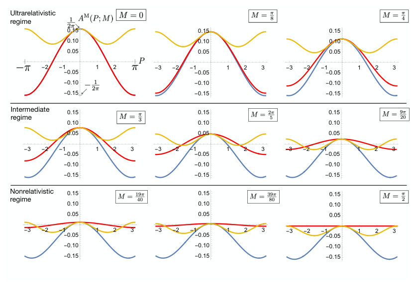 
Figure 1. Comparison between the AM(P; M)/(2π)’s for the three models M = Dirac (blue), M = QW (red), and M = LGT (gold), as functions of P := ϵp, for 9 values of M := ϵm. Remember that these AM(P; M)/(2π)’s are the factors, within the integrands of the momentum integral yielding the one-time-step Green’s function, which are independent from the considered transition distance D = (x −x′)/ϵ ∈Z. We have called the top row “Ultrarelativistic regime” because of the following reason: in this regime, the rescaled mass M is small enough with respect to, say, the maximum P = π that the rescaled momentum P takes for the discrete models—actually, because of symmetry reasons, the reference value...

📷 Fig 2

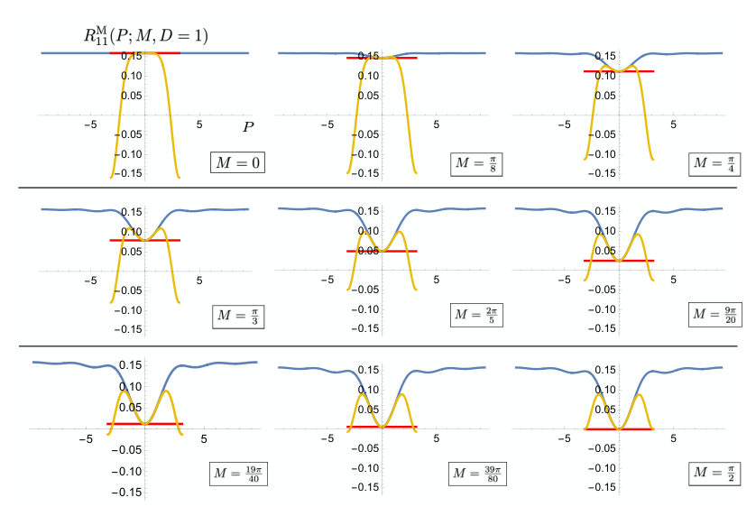 
Figure 2. Comparison of the real parts RM 11(P; M, D = 1) of the 11 matrix components of the Fourier integrands of the one- time-step Green’s functions of the three models M = Dirac (blue), M = QW (red), and M = LGT (gold), respectively, for a transition of D = +1 spatial lattice step (in the direction of growing positions, hence the + in D = +1). The lecture order of the plots in the order of increasing rescaled masses M is, graphically, , from the most relativistic situation for M = 0 in the top left corner—“relativistic” in the sense defined in Fig. 1—, to the less relativistic one for M = π/2 in the bottom right corner. We see that, the more the situation is relativistic (i.e., the...

📷 Fig 3

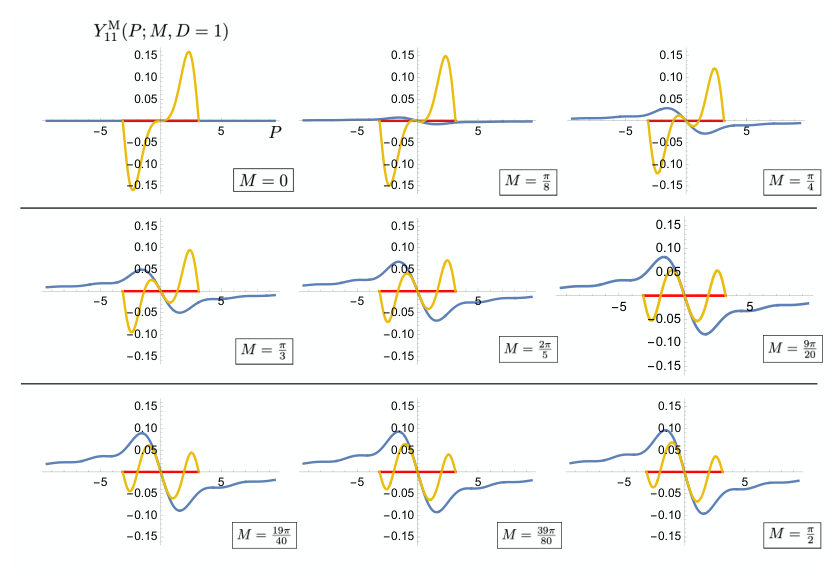 
Figure 3. Same as Fig. 2 but for the imaginary parts parts Y M 11 (P; M, D = 1)—of the 11 matrix components of the Fourier integrands of the one-time-step Green’s functions of the three models M = Dirac (blue), M = QW (red), and M = LGT (gold), respectively. This imaginary part is zero for the QW model. It is also zero for the naive continuum model in the case M = 0. The more M gets close to π/2 coming from lower values (starting at 0) and increasing, the more the LGT model approximates well the naive continuum model, although of course this is just an approximation, which is the best when P = pϵ is small enough, that is, close to P = 0, but this is not an exact match of the naive continuum...

📷 Fig 4

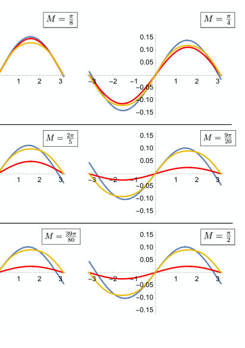 
Figure 4. Same as Fig. 1 but for the BM(P; M)/(2π)’s.

📷 Fig 5

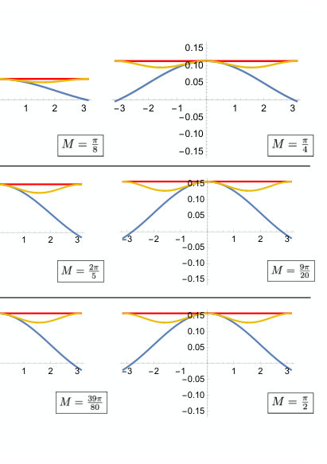 
Figure 5. Same as Fig. 1 but for the CM(P; M)/(2π)’s.

**Summary.** This paper tackles the persistent Fermion-Doubling problem in chiral QFT discretizations by analyzing the Dirac Quantum Cellular Automaton (QCA). It proves that while FD exists, the QCA offers a superior approximation to the continuum limit in ultrarelativistic regimes compared to standard LGTs. The authors provide explicit calculations for the Green's functions of both the original and fixed models.

**Why it may be interesting.** This work is highly relevant as it provides rigorous theoretical benchmarks for lattice discretizations of fundamental quantum field theories, which are crucial for developing and interpreting results from quantum simulation platforms.

Detailed structure

**Main problem.** The paper definitively proves that the Dirac Quantum Cellular Automaton (QCA) exhibits Fermion Doubling (FD) in its chiral discretization, and compares its approximation quality to continuous-time Lattice Gauge Theories (LGTs). It also computes the Green's function for a fixed version of this model.

**Main result.** The QCA is shown to be superior to continuous-time LGTs for describing ultrarelativistic regimes, while the latter performs better in non-relativistic ones. The resulting two-point correlation functions are found to possess an 'astonishing simplicity'.

**Method.** The analysis involves rigorous mathematical proofs, calculating one-time-step two-point correlation functions (Green's functions) using both direct and Fourier space methods, and performing systematic comparisons between lattice approximations and the continuum Dirac equation.

**Model / system.** The primary model is the $(1+1)$D Dirac Quantum Cellular Automaton (QCA), which serves as a discrete spacetime discretization for QFT like QED. It is compared against continuous-time LGTs and an advanced, FD-fixed variant called Flavored Dirac QCA (FQCA).

**Key observables.** The one-time-step two-point correlation function (Green's function, GF) of the Dirac QCA and FQCA; comparison metrics for approximating the continuum Dirac equation.

**Important parameters / regimes.** Energy regimes (ultrarelativistic vs. non-relativistic); lattice spacing ($\epsilon$); momentum ($p$) and energy ($E$).

**Assumptions / limitations.** The analysis focuses on the single-particle sector (free models) when studying and fixing FD, although comparisons are made to experimental limitations in quantum simulation.

**Figures summary.** Figures compare ratios of matrix elements for different lattice models across momentum space, illustrating performance differences between regimes.

**Paper structure.** The paper proceeds by first proving the existence and nature of FD in the Dirac QCA. It then quantitatively compares the QCA to continuous-time LGTs regarding their approximation quality in specific energy regimes. Finally, it computes the GF for the specialized FQCA model.

Abstract

We give the definitive proof that the Dirac Quantum Cellular Automaton (QCA) used for both quantum simulation and algorithmic foundations of Quantum Field Theory (QFT), and especially of Quantum Electrodynamics (QED), as put forward in References https://doi.org/10.1007/s11128-019-2555-4 and https://doi.org/10.22331/q-2023-11-08-1179, does exhibit Fermion Doubling (FD), albeit thrice as less severe as discrete-time standard Lattice Gauge Theories (LGTs) -- as shown in Reference arXiv:2505.07900 -- , which are naive regarding the spacetime discretization of differential operators acting on fermionic fields. The proof is done for the $(1 + 1)$D Dirac-QCA model. We show that the (one-time-step) two-point correlation function, also called Green's function (GF), of the Dirac QCA, is of astonishing simplicity, which is in contrast with the GF of the Dirac equation. We also compare, both qualitatively and quantitatively, this Dirac QCA to the continuous-time-LGT spatial discretization of Dirac fermions regarding how well these two lattice models approximate their naive continuum limit -- which is nothing but the Dirac equation -- even when far away from that limit, a situation which must be considered because of experimental limitations in quantum simulation -- : the Dirac QCA is better for ultrarelativistic regimes, whereas continuous-time LGT is better for non-relativistic regimes. In a second part of this work, we compute the GF of the FD-fixed model put forward in the last cited reference, called Flavored Dirac QCA (FQCA) -- which staggers an extra, artificial flavor \emph{only}, on a diamond spacetime lattice, and does not stagger chirality as staggered fermions in usual LGT. The structure of this FQCA two-point correlation function is of extreme simplicity, and can be expressed in a very simple manner in terms of the four chiral components of the FD-suffering, original-model GF.

[↑ back to top](#top)

### [Overlapping Network Community Detection Using Sparse Backbones](http://arxiv.org/abs/2607.14531v1)

**Authors:** Zihe Zhou, Samin Aref  
**Type:** theory · **Category:** statistical mechanics · **PDF:** <https://arxiv.org/pdf/2607.14531v1>  
**Analysis basis:** full PDF text, analyzed in chunks
**Topic relevance:** `analog quantum simulation` **1/5** · `driven-dissipative phase transition` **1/5** · `entanglement & information structure` **1/5**

📷 Fig 1

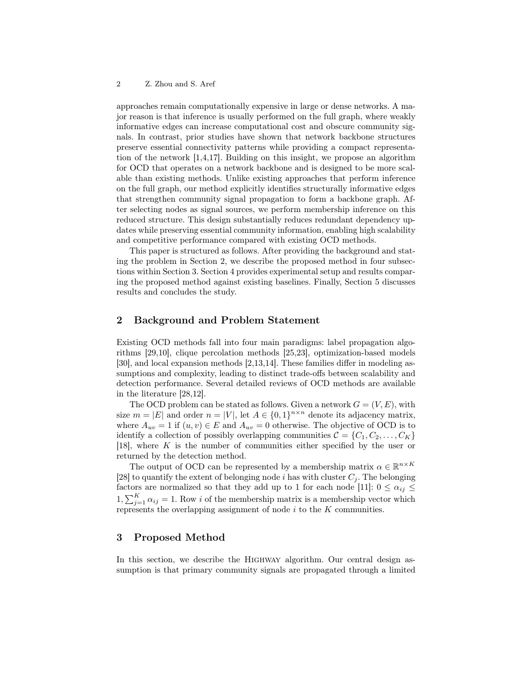 
Low-resolution page preview, page 2

📷 Fig 2

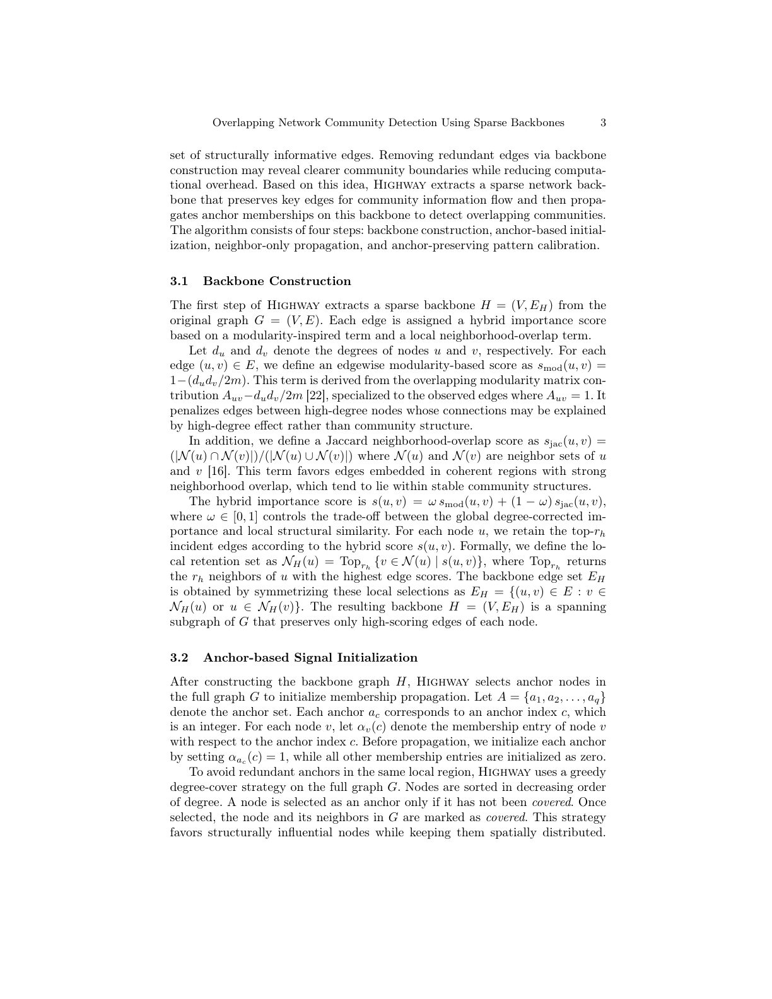 
Low-resolution page preview, page 3

📷 Fig 3

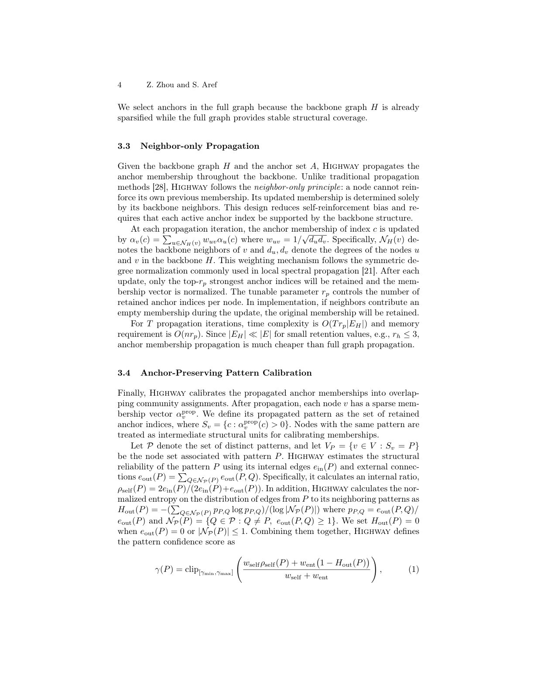 
Low-resolution page preview, page 4

📷 Fig 4

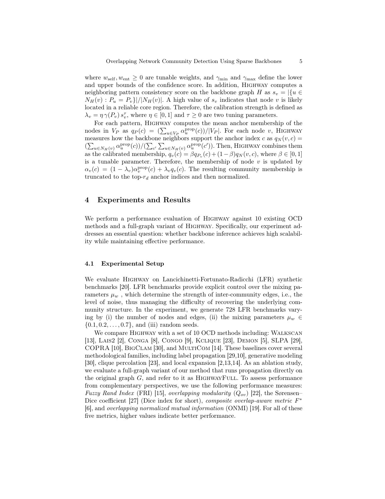 
Low-resolution page preview, page 5

📷 Fig 5

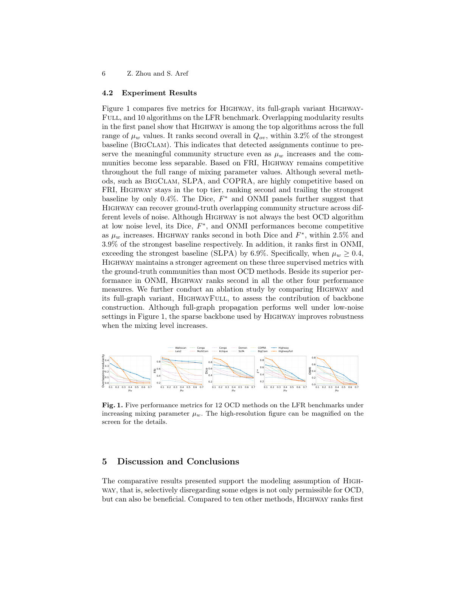 
Low-resolution page preview, page 6

**Summary.** This paper introduces Highway, a novel and scalable algorithm for Overlapping Community Detection (OCD) that improves efficiency by utilizing the sparse backbone of an input network. By combining modularity and Jaccard scores to build this backbone, Highway accurately infers overlapping community structures. The method demonstrates superior performance across multiple metrics when tested against numerous benchmark networks.

**Why it may be interesting.** While focused on network science rather than quantum physics directly, the underlying mathematical framework of community detection shares conceptual parallels with finding emergent structures or ground states in complex physical systems, which can sometimes be modeled using graph theory techniques relevant to condensed matter analysis.

Detailed structure

**Main problem.** The core problem is Overlapping Community Detection (OCD) in complex networks, where nodes can belong to multiple clusters.

**Main result.** The proposed Highway algorithm achieves state-of-the-art performance on 728 benchmark networks, ranking first in overlapping normalized mutual information with a significant improvement over existing methods.

**Method.** Highway is a scalable OCD algorithm that leverages the sparse backbone of the input network to perform efficient community inference through anchor initialization and neighbor propagation.

**Model / system.** The system analyzed is general network data represented by a graph G=(V, E). The method constructs a sparse backbone H using a hybrid edge scoring function combining modularity and Jaccard overlap scores.

**Key observables.** Membership matrix (alpha), Pattern confidence score (gamma(P)), Calibration strength (lambda_v), Fuzzy Rand Index (FRI), overlapping modularity (Q_ov), Dice index, F*, and Overlapping Normalized Mutual Information (ONMI).

**Important parameters / regimes.** The backbone construction uses a hybrid weight $\omega$ for the edge scoring function. The final membership update involves tuning parameters like $eta$, $\eta$, and $	au$.

**Assumptions / limitations.** The method assumes that primary community signals propagate effectively through a limited set of structurally informative edges (the sparse backbone).

**Paper structure.** The paper introduces the problem, details the Highway algorithm in stages: Backbone Construction, Anchor-based Signal Initialization, Neighbor-only Propagation, and final Anchor-Preserving Pattern Calibration. It concludes with extensive comparative results on benchmark networks.

Abstract

Community structures are common in real networks, and extracting them provides valuable insight in applications ranging from drug discovery to market segmentation. Overlapping community detection (OCD) is the task of clustering networked data in which nodes may belong to multiple clusters. Existing OCD algorithms often struggle to achieve a suitable balance between detection quality and scalability. We, therefore, propose Highway, a scalable OCD algorithm that exploits the sparse backbone of the input network to perform efficient community inference. We used 728 Lancichinetti-Fortunato-Radicchi benchmark networks to compare Highway and its ablated version against 10 existing OCD algorithms. Our results, based on five performance measures, demonstrate a competitive performance for Highway. It ranks first in overlapping normalized mutual information with a 6.9% improvement over the strongest baseline. It also ranks second in all the other four performance measures. These comparative results suggest that Highway coupled with its backbone procedure offers a suitable accuracy-efficiency trade-off. The Highway algorithm is open-source and available as part of the CDlib library.

[↑ back to top](#top)

### [$c$-axis strain tuning of superconductivity and symmetric elastoresistivity in CsV$_3$Sb$_5$](http://arxiv.org/abs/2607.14803v1)

**Authors:** Xiaoran Yang, Yutong Li, Chunyi Li, Qi Tang, Jiawen Zhang, Yu Song, Huiqiu Yuan, Xingye Lu  
**Type:** experiment · **Category:** strongly correlated electrons · **PDF:** <https://arxiv.org/pdf/2607.14803v1>  
**Analysis basis:** full PDF text, analyzed in chunks
**Topic relevance:** `Frenkel-Kontorova` **1/5** · `analog quantum simulation` **1/5**

📷 Fig 1

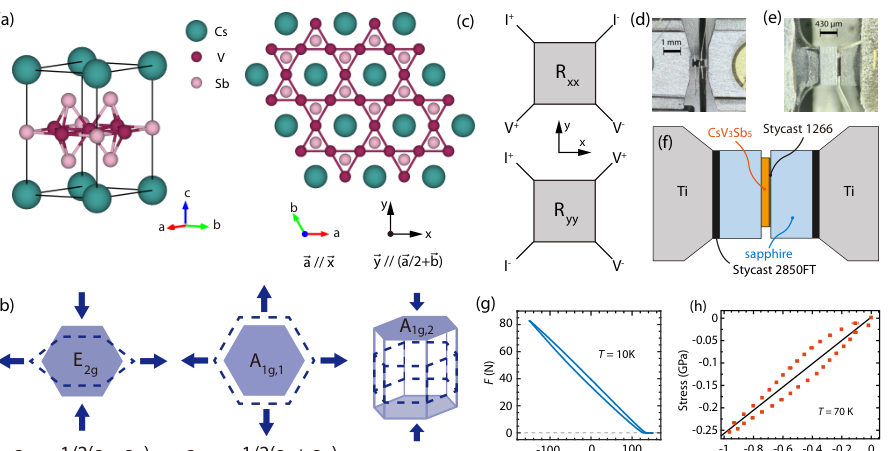 
FIG. 1. Crystal structure, strain symmetries, and experimental configurations for in-plane and c-axis measurements in CsV3Sb5. (a) Crystal structure of CsV3Sb5 and top view of the V–Sb kagome layer, with crystallographic axes indicated. (b) Schematic illustration of the symmetry- resolved strain components in the hexagonal D6h point group: E2g anisotropic in-plane strain εE2g = 1

📷 Fig 2

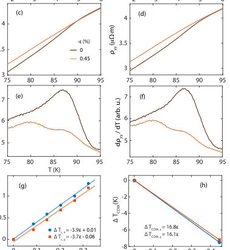 
FIG. 2. c-axis compressive strain tuning of Tc and TCDW in CsV3Sb5. (a,b) Normalized in-plane resistivity ρxx(T)/ρxx(6 K) (a) and ρyy(T)/ρyy(6 K) (b) measured through the superconducting tran- sition under a series of c-axis compressive strains. The legend de- notes the applied compression plotted as −ε, such that larger −ε cor- responds to stronger compression. Dashed lines indicate the crite- rion used to determine ∆Tc. (c,d) Temperature-dependent resistiv- ity ρxx(T) (c) and ρyy(T) (d) in the vicinity of the CDW transition under representative c-axis compressive strains. (e,f) Correspond- ing temperature derivatives dρxx/dT (e) and dρyy/dT (f), from which TCDW is identified by the peak...

📷 Fig 3

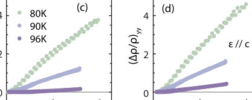 
FIG. 3. Linear strain dependence of the in-plane resistive response under a-axis strain and c-axis compression. (a,b) Fractional resistiv- ity change ∆ρ/ρ measured at selected temperatures (80 K, 90 K, and 96 K) as a function of in-plane uniaxial strain applied along the crys- tallographic a axis (ε ∥a). Panel (a) shows the response of (∆ρ/ρ)xx (current along x ∥a), while panel (b) shows (∆ρ/ρ)yy (current along y ⊥a). (c,d) Corresponding ∆ρ/ρ measured under c-axis compres- sion (ε ∥c), plotted versus −ε such that increasing values denote in- creasing compression. Panel (c) shows (∆ρ/ρ)xx and panel (d) shows (∆ρ/ρ)yy.

📷 Fig 4

 
Figure 3 presents the fractional resistivity changes, ∆ρii/ρii, at representative temperatures (80 K, 90 K, and 96 K) across the CDW transition. The responses are shown for both in- plane uniaxial strain [Figs. 3(a) and 3(b)] and direct c-axis compression [Figs. 3(c) and 3(d)]. In all configurations, the strain-induced resistivity changes remain linear over the ac- cessible strain range, ensuring a robust and well-defined ex- traction of the underlying elastoresistivity coefficients. As noted above, a weakly strained fraction may be present under c-axis compression, which would mainly dilute the absolute magnitude of ∆ρii/ρii, rather than change the sign or temper- ature dependence....

📷 Fig 5

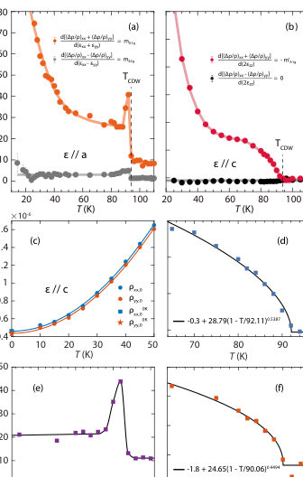 
FIG. 4. Symmetry-resolved elastoresistivity coefficients and isola- tion of the in-plane and out-of-plane cross-coupling coefficients in CsV3Sb5. (a) Temperature dependence of the symmetry-resolved elastoresistivity coefficients extracted from in-plane strain sweeps: the anisotropic channel mE2g (gray symbols) and the effective sym- metric response mA1g (orange symbols). (b) Temperature dependence of the effective symmetric elastoresistivity coefficient under c-axis compression, plotted as −m′ A1g (red symbols), together with the dif- ference channel (black symbols), which remains near zero within un- certainty. Vertical lines mark the CDW transition temperature TCDW. Solid symbols are...

**Summary.** This work precisely disentangles the roles of in-plane and out-of-plane lattice strains in $	ext{CsV}_3	ext{Sb}_5$ by combining independent mechanical strain controls. It reveals that $c$-axis compression is the dominant tuning mechanism, strongly enhancing superconductivity while suppressing CDW order. Crucially, it isolates symmetry-specific coupling coefficients, showing a clear link between the CDW order parameter and out-of-plane lattice distortions.

**Why it may be interesting.** The ability to decouple and quantify anisotropic coupling mechanisms (like $m_{13}$) in strongly correlated systems under external tuning fields provides general principles for understanding strain effects on quantum phases, which can be relevant to designing artificial lattice potentials in AMO or condensed matter simulations.

Detailed structure

**Main problem.** The study aims to independently determine the roles of in-plane ($	ext{A}_{1g,1}$) and out-of-plane ($	ext{A}_{1g,2}$) symmetric strain channels governing the interplay between Charge-Density-Wave (CDW) order and superconductivity in $	ext{CsV}_3	ext{Sb}_5$.

**Main result.** Out-of-plane lattice control via $c$-axis compression dominates the phase competition, causing a massive linear enhancement of $T_c$ while suppressing $T_{	ext{CDW}}$. Furthermore, the out-of-plane cross-coupling coefficient ($m_{13}$) exhibits an order-parameter-like onset across the CDW transition.

**Method.** The researchers combined in-plane uniaxial strain with direct $c$-axis compression using specialized mechanical setups to measure resistivity components and extract symmetry-resolved elastoresistivity coefficients.

**Model / system.** The physical system is the kagome metal $	ext{CsV}_3	ext{Sb}_5$, which exhibits intertwined CDW and superconducting states. The analysis models the strain dependence of $T_c$ and $T_{	ext{CDW}}$ as linear functions of applied uniaxial strains ($\epsilon_{xx}$ and $\epsilon_{zz}$).

**Key observables.** Superconducting transition temperature ($T_c$), Charge-Density-Wave transition temperature ($T_{	ext{CDW}}$), and symmetry-resolved elastoresistivity coefficients ($m_{11}+m_{12}$ and $m_{13}$).

**Important parameters / regimes.** $c$-axis compression efficiency significantly exceeds in-plane strain efficiency; the CDW order parameter coupling exponent $eta \approx 0.5$.

**Assumptions / limitations.** The primary assumption is that by independently controlling both in-plane and out-of-plane strains, the intrinsic mixing of contributions found in conventional piezo experiments can be resolved.

**Figures summary.** Figures illustrate the crystal structure and strain symmetries; data show linear $\Delta T_c$ vs. strain dependence for both directions, and temperature plots reveal order-parameter-like onsets for extracted pure elastoresistivity coefficients below $T_{	ext{CDW}}$.

**Paper structure.** The paper first establishes the physical problem of mixed strain responses in $	ext{CsV}_3	ext{Sb}_5$. It then details the combined experimental methodology using independent uniaxial strain control. The core results demonstrate that out-of-plane lattice control is dominant, followed by a detailed symmetry decomposition of the elastoresistivity coefficients.

Abstract

The kagome metal CsV$_{3}$Sb$_{5}$ hosts an intriguing interplay between charge-density-wave (CDW) order and superconductivity that is highly sensitive to lattice distortions. However, determining the specific roles of the in-plane ($A_{1g,1}$) and out-of-plane ($A_{1g,2}$) symmetric strain channels has been hindered by their intrinsic mixing in conventional piezo-based experiments. Here, we combine in-plane uniaxial strain with direct $c$-axis compression to independently access and disentangle these symmetry-resolved responses in CsV$_{3}$Sb$_{5}$. We reveal that $c$-axis compression drives a massive, linear enhancement of the superconducting transition temperature ($T_c$) alongside a suppression of $T_{\rm CDW}$. The tuning efficiency of this out-of-plane deformation acts with an opposite sign and far exceeds that of in-plane strain, demonstrating that $c$-axis lattice control dictates the phase competition. Furthermore, by isolating the pure elastoresistivity coefficients, we find that the out-of-plane cross-coupling coefficient ($m_{13}$) is comparable in magnitude but opposite in sign to the in-plane response ($m_{11}+m_{12}$). Unlike the sharply peaked in-plane response, $m_{13}$ exhibits a distinct, order-parameter-like onset across the CDW transition. Our results establish that out-of-plane lattice control plays a dominant role in tuning the intertwined states in CsV$_{3}$Sb$_{5}$ and provide a general pathway for resolving strain-coupled electronic responses in layered quantum materials.

[↑ back to top](#top)

### [A Compass on the Quantum State Sphere: The Hopf Ansatz for Arbitrary Pure-State Optimization](http://arxiv.org/abs/2607.14231v1)

**Authors:** Ruge Lin, Guangxi Li  
**Type:** theory · **Category:** quantum information and computing · **PDF:** <https://arxiv.org/pdf/2607.14231v1>  
**Analysis basis:** full PDF text, analyzed in chunks
**Topic relevance:** `quantum measurements` **1/5**

📷 Fig 1

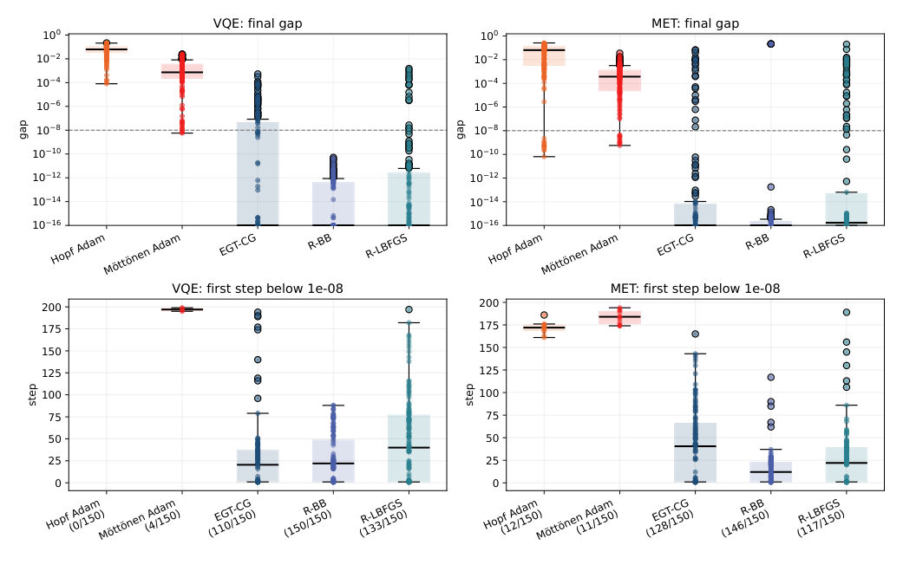 
Figure 1: Aggregate final precision and threshold hitting over all stress tests and system sizes n = 6, . . . , 10. The top row shows final optimality gaps after 200 accepted updates; the gray dashed line marks the 10−8 reference threshold. The bottom row shows the first accepted update at which each crossing trace reaches that threshold; the parenthetical labels report the number crossing within 200 updates out of the total number of traces. In every box plot, the box spans the interquartile range, the horizontal line marks the median, and the whiskers extend to the most extreme values within 1.5 interquartile ranges. Colored circles are the individual task-size-seed traces. Optimizer...

📷 Fig 2

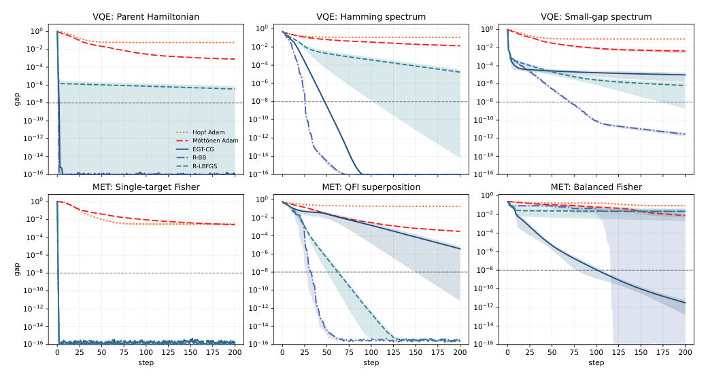 
Figure 2: Per-task convergence at n = 10, with ten deterministic pseudo-random initial-state seeds per task. The top row shows the parent-Hamiltonian, scrambled-Hamming-spectrum, and small-gap-spectrum VQE tasks. The bottom row shows the single-target Fisher, QFI extremal-superposition, and balanced two-target Fisher tasks. Each curve is the mean optimality gap across the ten seeds, and each translucent band is the corresponding standard error of the mean. Optimizer colors match Fig. 1, and the legend’s line styles are used consistently in all six panels. The gray dashed line marks the 10−8

📷 Fig 3

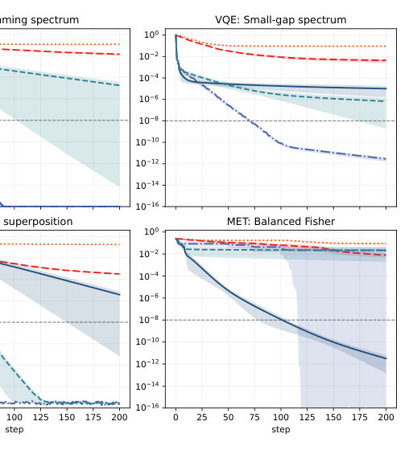 
Figure 2 shows where the aggregate differences arise at n = 10. The parent-Hamiltonian and single-target Fisher objectives are the easiest tasks: most Hopf-geometric traces rapidly reach the target scale. On the Hamming, small-gap, QFI, and balanced Fisher tasks, the mean curves often overlap after the fast initial descent, so the important differences are the slow tails and the traces that fail to cross the 10−8 threshold within 200 accepted iterations. The balanced two-target Fisher objective is the most diagnostic nonlinear test, especially for identi- fying such slow-tail behavior.

📷 Fig 4

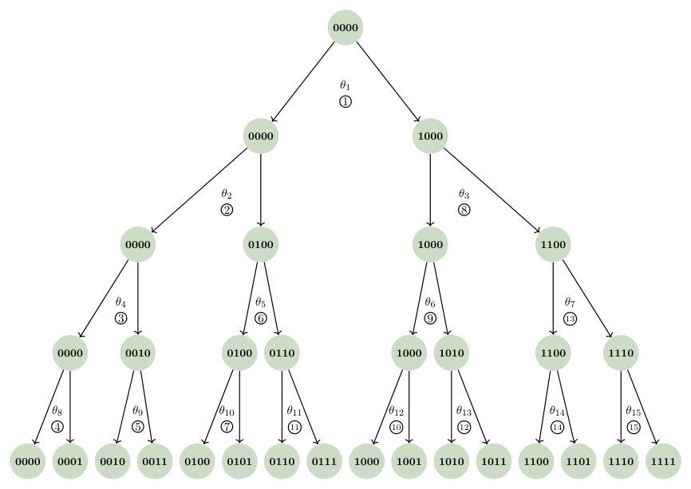 
Figure 3: Binary tree for preparing a 4-qubit state in Hopf coordinates. A bit-0 branch multiplies the amplitude by cos θj, and a bit-1 branch multiplies it by sin θj. The displayed θj labels are the Hopf magnitude parameters associated with internal nodes, while the blue labels θ16, . . . , θ31 are the complex leaf phases. Circled numbers indicate the gate-application order generated by Algorithms 1 and 2. The binary labels inside the nodes are padded path labels identifying the corresponding subtree or leaf, rather than the breadth-first internal-node indices.

📷 Fig 5

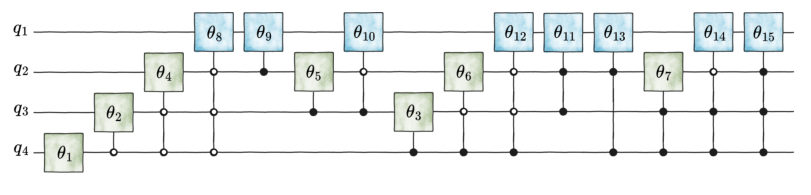 
Figure 4: Four-qubit Hopf ansatz circuit derived from the tree in Fig. 3. The green gates are the magnitude rotations shared by the real-state and complex-state versions of the Hopf ansatz. In the complex ansatz, each final-layer gate θj with 8 ≤j ≤15 is promoted to an RC gate carrying the magnitude angle θj and the two sibling leaf phases listed in Table I. All quantum circuit diagrams in this work were produced using the quantum-circuit-drawio-library [54].

**Summary.** This paper introduces the Hopf ansatz, a novel binary-tree circuit parameterization designed to map and optimize arbitrary pure quantum states on the unit sphere. It successfully provides analytic expressions for the metric tensor and demonstrates how to prepare necessary tangent states directly within the circuit structure. This turns state preparation into a fully navigable framework for advanced quantum optimization algorithms.

**Why it may be interesting.** This work provides a powerful, geometrically rigorous tool for variational quantum algorithms by transforming state optimization from an abstract manifold problem into a concrete, efficiently measurable circuit decomposition.

Detailed structure

**Main problem.** The core problem is developing a systematic method for optimizing arbitrary pure quantum states on the unit sphere in Hilbert space, requiring more than just knowing if a target state is reachable.

**Main result.** The Hopf ansatz provides a unified, navigable framework that yields coordinates, local distance metrics, and preparable gradient directions for any pure-state optimization problem.

**Method.** The authors introduce the Hopf ansatz, a binary-tree circuit structure parameterized by angles. This structure allows for the explicit calculation of the state's metric tensor components and the preparation of necessary tangent states to compute gradients efficiently.

**Model / system.** The system is an arbitrary pure quantum state $|\psi
angle$ in a Hilbert space, which is constrained to the unit sphere ($S^{N-1}$ or $S^{2N-1}$). The optimization process is framed as navigating this geometric manifold using variational quantum algorithms (VQE).

**Key observables.** Local distance information derived from the diagonal induced metric; gradient components calculated via measurable expectation values involving tangent states.

**Important parameters / regimes.** The parameters are the angles ($	heta$) defining the state preparation circuit, which govern both probability splitting (internal angles) and complex phases (leaf phases).

**Assumptions / limitations.** The analysis relies on the existence of a fixed binary-tree gate skeleton and assumes operation within the 'regular set' where certain subtree weights are non-zero.

**Figures summary.** Not specified by notes, but the structure implies diagrams illustrating the binary tree circuit for state preparation and subsequent gradient measurement circuits.

**Paper structure.** The paper builds from defining the geometric challenge of pure-state optimization to introducing the Hopf ansatz as a solution. It then rigorously derives the diagonal metric tensor components (real and complex cases) and proves that the necessary derivative states can be synthesized using local trigonometric shifts within the same circuit structure.

Abstract

Optimizing arbitrary quantum state vectors is like navigating the unit sphere in Hilbert space: beyond target reachability, optimization asks for coordinates, local distance information, and measurable directions. We introduce the Hopf ansatz, a binary-tree circuit for arbitrary normalized real and complex state vectors. Internal angles steer probability between subtrees, leaf phases carry the complex degrees of freedom, and the same tree gives state preparation and an explicit inverse map from amplitudes to physical angles. Together these structures act as a compass for the search: the inverse map gives coordinates, the diagonal induced metric gives local distance information, and nonzero coordinate tangents become preparable normalized states.   For Hamiltonian objectives, and for objectives with the same local transition-moment form, each gradient component is a known scale factor times a transition moment between the current state and a tangent state. A branch-state construction expresses these moments through expectation-value measurements, while the tree organizes the compiled gradient settings by magnitude layer and leaf-indexed phase family. Thus the number of distinct compiled gradient-access circuit families grows only logarithmically with Hilbert-space dimension, while the measurement budget required for a chosen precision remains a separate statistical cost. In deterministic real-state benchmarks with exact costs, exact gradients, and known global optima, metric-aware Hopf optimizers reach numerical-precision median gaps, with the clearest baseline gains in smaller VQE mean final gaps and stronger concentration of metrology-inspired traces at numerical precision. The Hopf ansatz turns universal state preparation into a navigable framework for arbitrary pure-state optimization.

[↑ back to top](#top)

### [A Three-Point Continuous-Variable Quantum MacWilliams Identity](http://arxiv.org/abs/2607.14920v1)

**Authors:** Yinzi Xiao  
**Type:** theory · **Category:** quantum information and computing · **PDF:** <https://arxiv.org/pdf/2607.14920v1>  
**Analysis basis:** full PDF text, analyzed in chunks
**Topic relevance:** `entanglement & information structure` **1/5**

📷 Fig 1

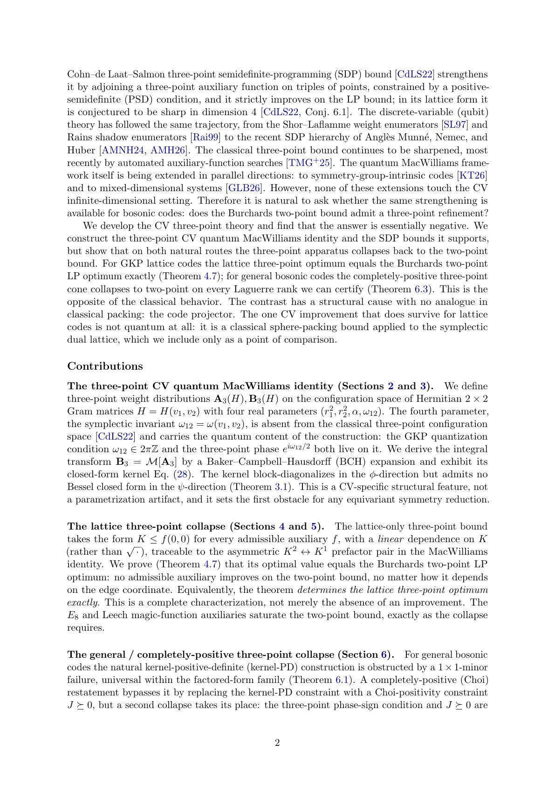 
Low-resolution page preview, page 2

📷 Fig 2

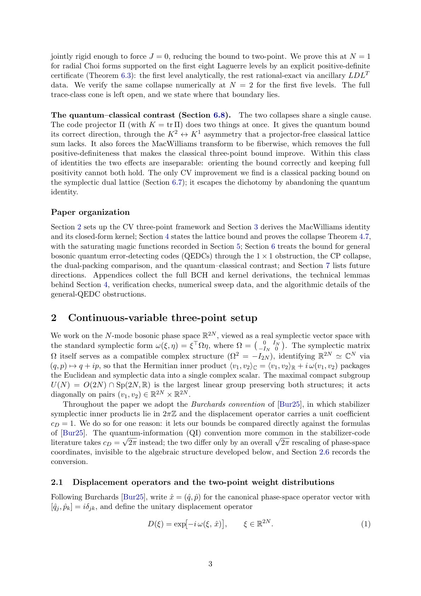 
Low-resolution page preview, page 3

📷 Fig 3

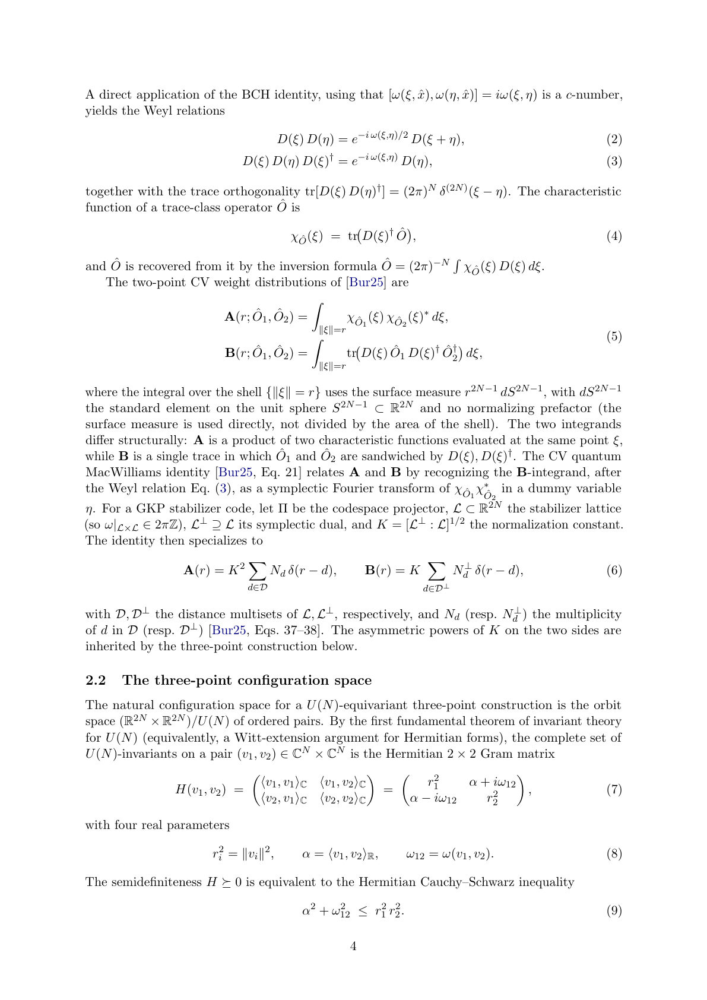 
Low-resolution page preview, page 4

📷 Fig 4

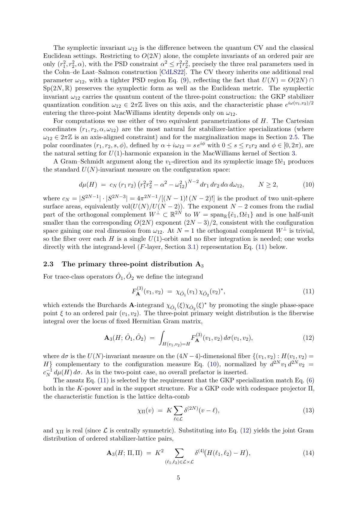 
Low-resolution page preview, page 5

📷 Fig 5

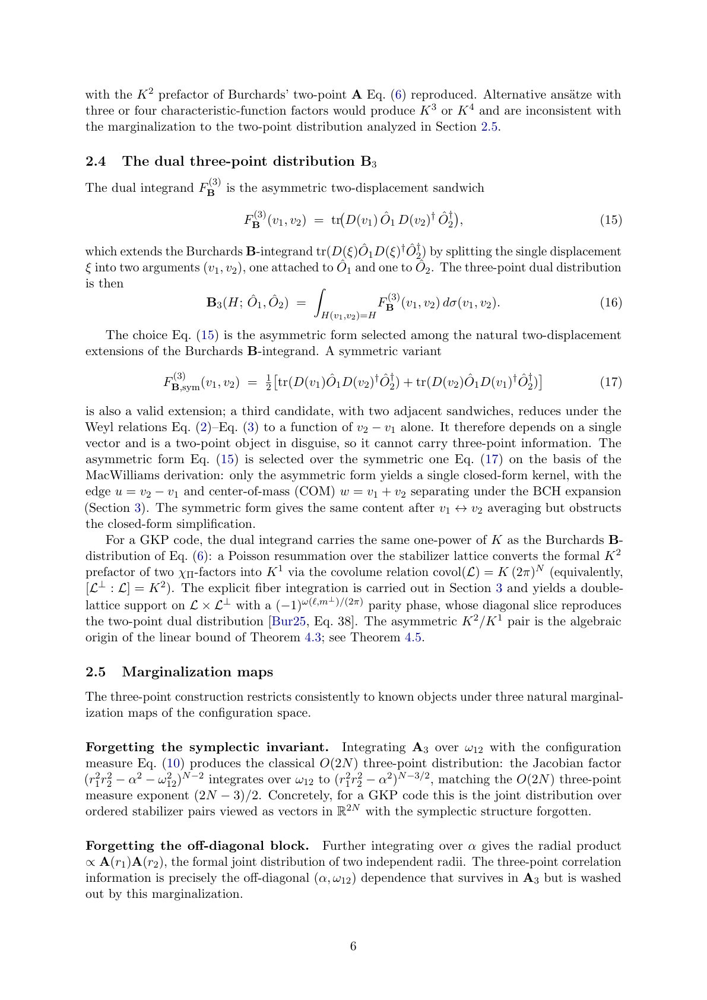 
Low-resolution page preview, page 6

**Summary.** This paper develops a three-point continuous-variable quantum MacWilliams identity for bosonic error-correcting codes. It uses advanced techniques involving characteristic functions and SDPs to derive bounds on code dimension. The key finding is that this sophisticated three-point bound collapses back to the established two-point bound for important classes of codes, providing deep structural insight into the limitations of current QEC theory.

**Why it may be interesting.** This work provides deep mathematical constraints on quantum error correction codes beyond simple stabilizer assumptions, linking algebraic structures (MacWilliams identities) directly to fundamental physical limitations imposed by positivity.

Detailed structure

**Main problem.** The authors construct a three-point continuous-variable (CV) quantum MacWilliams identity to derive tighter semidefinite-programming (SDP) bounds on the dimension of CV quantum error-correcting codes.

**Main result.** They prove that for GKP lattice codes, the three-point bound does not improve upon the existing two-point linear-programming optimum; furthermore, general bosonic code analysis shows a collapse to the two-point bound due to structural constraints imposed by the code projector.

**Method.** The work involves constructing and analyzing complex integral kernels (the three-point identity) using characteristic functions derived from displacement operators, followed by rigorous SDP bounding techniques and positive-definiteness proofs in exact arithmetic.

**Model / system.** The system studied is bosonic quantum error-correcting codes, particularly those based on the Gottesman–Kitaev–Preskill (GKP) construction within an infinite-dimensional harmonic oscillator Hilbert space. The analysis focuses on weight distributions over the configuration space of Gram matrices.

**Key observables.** Code dimension ($K$), protection distance ($d$), and the minimum eigenvalue ($\lambda_{\min}$) of positive combination matrices $P(\mu)$ used as SDP certificates.

**Important parameters / regimes.** The lattice structure (GKP), the number of modes ($N$), and the truncation level ($M$) are key parameters governing the bounds and analysis complexity.

**Assumptions / limitations.** The analysis often relies on an envelope-cut approximation ($\sigma > 0$) for physical realization, and certain structural assumptions about the form of the weight distributions ($A_3$ and $B_3$).

**Figures summary.** Figures/tables summarize calculated values for admissibility distances and ratios comparing different bounding techniques (e.g., $
ho_N = K_{ne}/K_{Lev}$), confirming theoretical bounds.

**Paper structure.** The paper builds from the construction of the three-point identity kernel, through deriving its relationship to known two-point identities via BCH expansion, and culminates in proving the non-improvement of this bound for specific code types using SDP techniques.

Abstract

We construct the three-point continuous-variable (CV) quantum MacWilliams identity, extending the two-point framework of Burchards, and give its closed-form integral kernel. Its configuration space carries a symplectic invariant with no classical counterpart, which encodes the GKP quantization condition and a three-point sign phase. Using the identity, we derive the semidefinite-programming bounds it supports on the dimension of CV quantum error-correcting codes, and we prove, in two collapse theorems, that the three-point apparatus does not improve on the two-point bound. For GKP lattice codes the three-point optimum equals the Burchards two-point linear-programming optimum identically. This is an exact determination of the lattice three-point optimum, so the $E_8$ and Leech magic functions saturate it rather than beat it. For general bosonic codes a completely-positive reformulation bypasses the positivity obstruction that rules out the natural factored-form constructions; the phase-sign condition together with Choi positivity then force the three-point term to vanish. We certify this collapse for radial Choi forms on the first eight Laguerre levels at one mode, and leave the full trace-class cone open. Both collapses have a single cause with no classical analogue, the code projector: it orients the bound correctly but also removes the full positivity that powers the classical three-point improvement.

[↑ back to top](#top)

### [Casimir effect for a massive scalar field confined between parallel plates with a spatially varying effective mass](http://arxiv.org/abs/2607.15070v1)

**Authors:** R. L. Araújo Xavier, M. H. B. Chaves, E. R. Bezerra de Mello, Herondy Mota  
**Type:** theory · **Category:** other · **PDF:** <https://arxiv.org/pdf/2607.15070v1>  
**Analysis basis:** full PDF text, analyzed in chunks
**Topic relevance:** `Keldysh / 2PI / non-Gaussian methods` **1/5**

📷 Fig 1

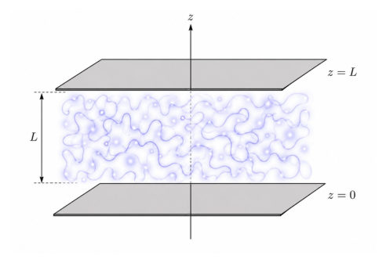 
Figure 1. Schematic illustration of two perfectly reflecting parallel plates of area A, separated by a distance L.

📷 Fig 2

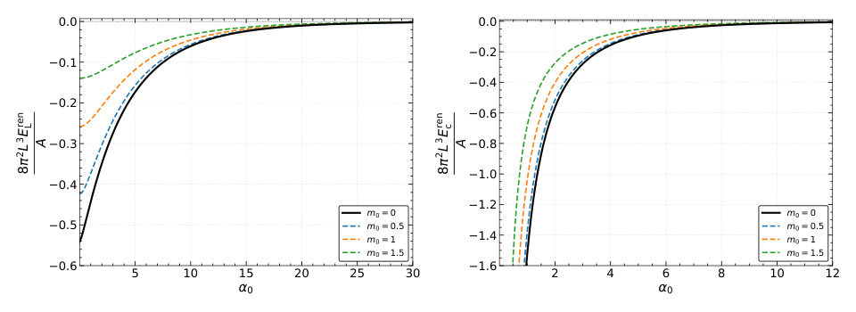 
Figure 2. Renormalized vacuum energy contributions as functions of the dimensionless parameter α0 for several values of the dimensionless mass parameter m0. The left panel displays the contribution Eren L , while the right panel displays the contribution Eren c . In both panels, the solid black curve corresponds to the massless case, m0 = 0.

📷 Fig 3

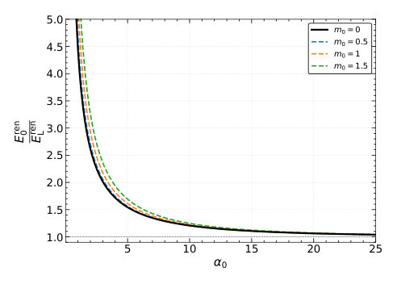 
Figure 3. Ratio between the total renormalized vacuum energy, Eren 0 , and the contribution, Eren L , as a function of the dimensionless parameter α0 for several values of the dimensionless mass parameter m0. The solid black curve corresponds to the massless case, m0 = 0. The horizontal dotted line indicates the value unity, for which the additional contribution Eren c vanishes.

**Summary.** This paper calculates the renormalized vacuum energy (Casimir effect) for a massive scalar field confined between plates with a spatially varying effective mass. Using zeta-function regularization, the authors show the total energy splits into two parts: one standard Landau-like contribution and an additional term from the mass variation. The results confirm that while both terms are suppressed in strong coupling, the system's physics is largely governed by the standard boundary effect unless near a singular limit.

**Why it may be interesting.** This work provides an exactly solvable framework for analyzing Casimir effects in inhomogeneous relativistic media, which is relevant for understanding boundary conditions and vacuum energy renormalization in complex quantum field theories.

Detailed structure

**Main problem.** The study investigates the Casimir effect for a massive scalar field confined between parallel plates when the effective mass term varies spatially.

**Main result.** The renormalized vacuum energy separates into two contributions: a Landau-like sector and an additional term from mass variation. For large coupling, both are exponentially suppressed, showing the Landau-like part dominates except near singular limits.

**Method.** The authors solve the Klein-Gordon equation using separation of variables, derive the normal mode spectrum, and calculate the vacuum energy via generalized zeta-function regularization and renormalization.

**Model / system.** The system is a massive real scalar field confined between two parallel plates (separated by L), governed by a Klein-Gordon equation incorporating a position-dependent effective mass term ($m_{	ext{eff}}^2 = m^2 + \alpha^2
ho^2$).

**Key observables.** Renormalized vacuum energy per unit area ($E_{	ext{ren}}^0$), the Landau-like contribution ($E_{	ext{ren}}^L$), and the additional mass-induced contribution ($E_{	ext{ren}}^c$).

**Important parameters / regimes.** Plate separation $L$, coupling constant $\alpha$ (related to magnetic field strength), scalar mass $m$, and the dimensionless parameter $\alpha_0 = \alpha L^2$.

**Assumptions / limitations.** The analysis relies on generalized zeta-function regularization for renormalization, and the results are noted to be singular in the limit where the additional term's validity breaks down ($\alpha 	o 0$).

**Figures summary.** Figure 2 shows both renormalized energy contributions ($E_{	ext{ren}}^L$ and $E_{	ext{ren}}^c$) exhibit exponential suppression for large $\alpha_0$. Figure 3 illustrates the ratio of total to Landau-like energy, showing it approaches unity for large $\alpha_0$.

**Paper structure.** The paper first establishes the solvable model by solving the Klein-Gordon equation to find the quantized spectrum. It then calculates the vacuum energy using zeta-regularization, separating the result into two components based on the mass variation. Finally, it performs asymptotic analysis in different coupling regimes ($\alpha_0 \gg 1$ vs $\alpha_0 \ll 1$) to analyze the physical implications.

Abstract

We investigate the Casimir effect for a massive real scalar field confined between two perfectly reflecting parallel plates in the presence of a position-dependent effective mass, a mechanism for coupling a scalar background to a scalar field. Exact normal modes are obtained by solving the corresponding Klein-Gordon equation, leading to a transverse energy spectrum that exhibits a characteristic Landau-like structure despite the absence of an external magnetic field. Upon quantization of the field, the vacuum energy is evaluated by means of generalized zeta-function regularization together with an appropriate renormalization procedure. The renormalized vacuum energy naturally separates into a Landau-like contribution and an additional term induced by the spatial dependence of the effective mass. We show analytically and numerically that both contributions are exponentially suppressed in the strong-coupling regime. In the opposite limit, the Landau-like contribution smoothly reproduces the standard vacuum energy for a massive scalar field confined between parallel plates, whereas the additional contribution becomes singular owing to the restricted domain of validity of the exact spectrum. Except in the vicinity of this singular limit, the vacuum energy is shown to be dominated by the Landau-like sector. Our results establish a direct connection between position-dependent effective masses and boundary-induced quantum vacuum phenomena, providing a new exactly solvable framework for the investigation of Casimir effects in spatially inhomogeneous relativistic systems.

[↑ back to top](#top)

### [Emergence and Recovery of (logical) Kochen-Specker Contextuality via Hamilton Extension](http://arxiv.org/abs/2607.14629v1)

**Authors:** Jayashree Karmakar, Biswadeep Chatterjee, Rafiuddin Gazi, Anushko Chattopadhyay, Ananya Chakraborty, Snehasish Roy Chowdhury, Amit Mukherjee, Manik Banik  
**Type:** theory · **Category:** other · **PDF:** <https://arxiv.org/pdf/2607.14629v1>  
**Analysis basis:** full PDF text, analyzed in chunks
**Topic relevance:** `quantum measurements` **1/5**

📷 Fig 1

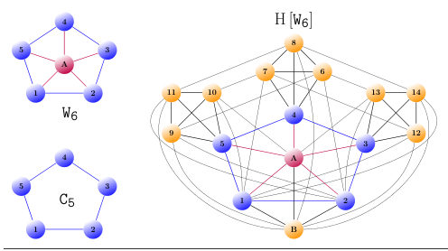 
Figure 1. (Color online) Illustration of apex augmentation and Hamilton extension. The cycle graph C5 (bottom left) admits an orthogonal representation in R3. Adding an apex vertex adjacent to all vertices of C5 yields the wheel graph W6 (top left), which admits an orthogonal representation in R4. The Hamilton extension H[W6] is shown on the right. Each parent vertex generates a Hamilton context, while additional edges give rise to emergent contexts, e.g. {⃗vB,⃗v2,⃗v9,⃗v11}.

📷 Fig 2

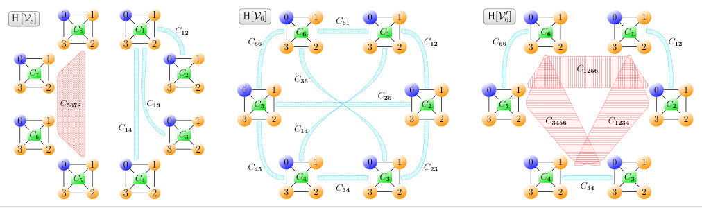 
Figure 2. (Color online) Hamilton extensions generating logical KS contextuality. Left: the extension H[V8] of Theorem 1, yielding a new 32-vector logical KS set in R4. Middle: the extension H[V6] of Theorem 2, which coincides with the Peres-24 [28]. Green, cyan, and red indicate Hamilton contexts, emergent contexts of Type (2-2), and emergent contexts of Type (1-1-1-1), respectively. The set P24 contains as subsets the KS constructions K20 [32] and C18 [33]. Right: 24-vector KS set H [V′ 6]. It contains 12 Type (1-1-1-1) and 6 Type (2-2) emergent contexts and structurally different than Peres-24 construction which contains 18 Type (2-2) emergent contexts; additional structural relations...

📷 Fig 3

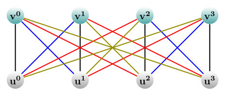 
Figure 3. (Color online) Graphical representation of the inner-product relations between the elements of H[u] and H[v] for u, v ∈RP3. Each edge color labels a distinct inner-product value; edges sharing the same color represent equal inner products.

📷 Fig 4

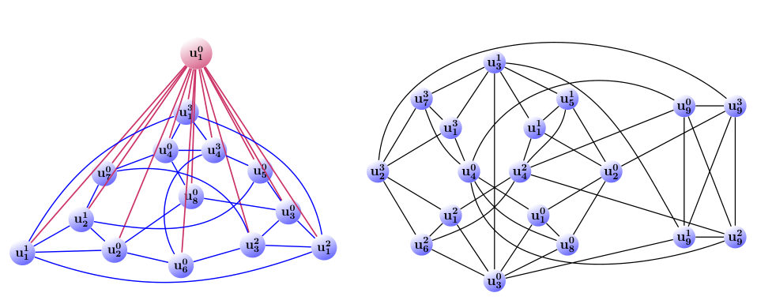 
Figure 4. (Color online) Left: Orthogonality graph of the set YO14. The red vertex (top) is the apex vertex. The graph obtained by removing the apex admits an orthogonal representation in R3, while the full graph admits one only in R4. Right: Orthogonality graph of the set CN18. For both graphs, the classical chromatic number exceeds the corresponding quantum chromatic number [41, 47].

**Summary.** This paper introduces the Hamilton extension as a method to systematically generate and recover logical Kochen-Specker contextuality in quantum systems. By analyzing how this construction transforms vector sets, the authors establish that six vectors constitute the smallest set capable of generating a contradiction with noncontextual hidden variables. This offers a new structural route for understanding fundamental limitations on quantum theories.

**Why it may be interesting.** The work provides a systematic, constructive framework to engineer quantum nonclassicality using algebraic structures, which is highly relevant for theoretical understanding of contextuality beyond standard Bell tests.

Detailed structure

**Main problem.** The research investigates how logical Kochen-Specker (KS) contextuality, a hallmark of quantum mechanics, can emerge from mathematically structured vector sets rather than just being observed in specific configurations.

**Main result.** A constructive procedure called the Hamilton extension is shown to generate logical KS contradictions when applied to six or more parent vectors, establishing six as the minimum size required for this emergence.

**Method.** The authors employ the Hamilton extension, a construction based on quaternion algebra, to augment vector sets and analyze the resulting orthogonality graphs using graph coloring arguments related to KS colorings.

**Model / system.** The model involves quantum measurements represented by vector sets in $\mathbb{R}^4$ or $\mathbb{C}^d$, analyzed through their associated orthogonality graphs. The core mathematical tool is the Hamilton extension, $H[V]$.

**Key observables.** Logical Kochen-Specker contextuality (non-colorability of the derived graph structure) and the existence/structure of emergent measurement contexts.

**Important parameters / regimes.** The minimum parent set cardinality required to generate contradiction is six vectors. The analysis distinguishes between five-vector sets (always colorable) and six-vector sets (can be uncolorable).

**Assumptions / limitations.** The proof for the threshold relies on exhaustive case analysis of emergent contexts generated by five Hamilton-distinct projectors, showing they are always KS-colorable.

**Figures summary.** Figures illustrate apex augmentation effects and the structure of Hamiltonian extensions ($H[V]$), detailing how parent vectors generate 'Hamilton contexts' and additional edges create 'emergent contexts.'

**Paper structure.** The paper progresses by first defining the Hamilton extension, then demonstrating its ability to recover contextuality lost via apex augmentation. It establishes a sharp threshold theorem regarding the minimum size of the parent set required for contradiction (six vectors). Finally, it provides detailed proofs showing that five-vector sets are always colorable while specific six-vector sets yield contradictions.

Abstract

Logical Kochen-Specker (KS) contextuality is widely regarded as an intrinsic property of specially constructed measurement configurations. We show instead that it can emerge from KS-colorable vector sets through a constructive procedure we call the Hamilton extension. Defined for four-dimensional vector sets, the Hamilton extension associates each real vector with a measurement context while inducing additional measurement contexts among Hamilton-extended children of distinct parent vectors. These emergent contexts fundamentally alter the compatibility structure, transforming KS-colorable configurations into KS-uncolorable ones and recovering logical contextuality lost under apex-vertex augmentation. We establish a sharp and optimal threshold -- the Hamilton extension of every five-vector parent set remains KS-colorable, whereas suitably chosen six-vector parent sets already generate logical KS contradictions. Thus, six vectors constitute the smallest parent set capable of generating KS contradiction through this mechanism. Our results reveal a new structural route to contextuality, provide a systematic framework for constructing compact KS sets, and have implications for contextuality-based quantum information protocols and graph-theoretic approaches to nonclassicality.

[↑ back to top](#top)

### [Learning the Fermion sign structure in path-integral Monte Carlo](http://arxiv.org/abs/2607.15060v1)

**Authors:** Jarvist Moore Frost  
**Type:** theory · **Category:** statistical mechanics · **PDF:** <https://arxiv.org/pdf/2607.15060v1>  
**Analysis basis:** full PDF text, analyzed in chunks
**Topic relevance:** `methods for driven-dissipative` **1/5**

📷 Fig 1

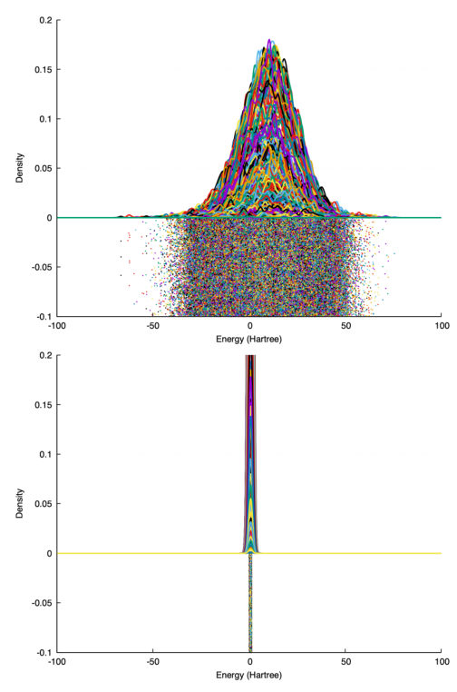 
FIG. 1: Up to 1000 energy samples taken from each permutation-family in an N = 19 spin-polarised UEG simulation, with the Yakub-Ronchi potential and Kelbg smoothing. Tempearature in both figs is ‘low’ (Θ = 0.125). Top is high-density rs = 1.0, bottom is low-density rs = 10.0. The higher density clearly forces much larger variance in the energy. On the bottom is a ‘rug’ plot with the different sectors different colours, and the datapoints jittered (offset randomly in the y-axis) for visibility. On the upper, with the same colour, are kernel density estimators over the same data with a bandwidth of 1.0 (Hartree). Typically the low ranked cycles (fewer permutations) seem to have a smaller...

📷 Fig 2

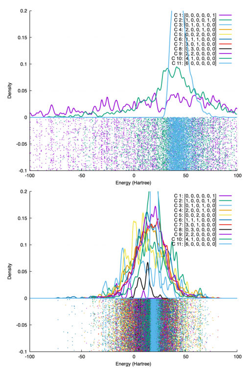 
FIG. 2: Up to 1000 energy samples from each permutation-family in an N = 6 2D harmonic trap at higher temperature β = 0.3 (top) and lower temperature β = 1.0 (bottom). The 11 permutation-families are explicitly labelled with their permutation vector. It is very noticeable that in this system the energies are not symmetrically distributed around a mean nor Gaussian. Particularly, the trivial 6 × 1-mer permutation cycle (C : 11) is highly skewed, and some degree of banding structure is visible in the larger permutations.

**Summary.** This paper tackles the notorious Fermion sign problem in PIMC by reframing the calculation as a statistical inference task. It develops sophisticated machine learning models, such as LSTMs, trained on permutation families to learn the underlying sign structure. This approach allows for stable and accurate energy extraction even in strongly correlated regimes where traditional Monte Carlo methods fail.

**Why it may be interesting.** This work provides advanced computational tools for simulating interacting quantum many-body systems where sign problems are prohibitive, offering insights into the limitations of current numerical methods in condensed matter theory.

Detailed structure

**Main problem.** The primary challenge is overcoming the Fermion sign problem encountered when calculating fermionic observables using path-integral Monte Carlo (PIMC) simulations.

**Main result.** The proposed statistical inference framework successfully extracts stable energy estimates in regimes where direct ratio estimation fails due to severe sign fluctuations, demonstrating robustness across benchmark systems.

**Method.** The authors recast the calculation as a statistical inference problem, training machine learning models (like LSTM networks) on permutation families derived from Monte Carlo samples, guided by physical priors.

**Model / system.** The work applies to fermionic systems simulated via PIMC, focusing on modeling the sign structure associated with exchange permutations within conjugacy classes ('permutation-families').

**Key observables.** Fermionic energy ($\langle \hat{E} 
angle_F$), average sign ($\langle \sigma 
angle_B$), and cycle-count vectors $\mathbf{C}$ characterizing permutation families.

**Important parameters / regimes.** System parameters include particle number ($N$), density regimes (low/high), temperature proxies, and simulation steps (e.g., $10^6$ to $300 	imes 10^6$).

**Assumptions / limitations.** The methodology relies on imposing physical understanding as inductive priors within a Bayesian framework, treating the problem as an inference task rather than a direct ratio calculation.

**Figures summary.** Tables present numerical results for energy and sign estimates across varying simulation steps and system parameters ($N=7$ vs $N=33$), comparing different model fits (Linear, LSTM) against raw estimators.

**Paper structure.** The paper progresses from identifying the failure of direct ratio estimation to developing a statistical inference framework based on permutation families. It details specific modeling techniques (MaxEnt, MAP, LSTM) and validates them through applications to electron gas models.

Abstract

Starting from a \emph{probabilistic numerics} approach to the Fermion sign problem in path integral Monte Carlo, we recast the arithmetic calculation of a Fermionic observable as a statistical inference problem. We develop approaches that learn the behaviour of Fermion exchange cycles binned by the conjugacy class of the permutation group (which we term `permutation family'). This extends the work of DuBois, Brown and Alder\cite{dubois2017overcoming} to inhomogeneous and more complex systems. Monte Carlo samples are used to train models for both the probability of a permutation family and the energy of this set of exchange permutations. The overall Fermionic energy is then directly inferred from these models, without using a direct ratio estimator on the Monte Carlo samples.   By imposing physical understanding as inductive priors, we produce accurate and useful fits that remain robust even in regimes with severe sign problems. We generalise the linear (ideal-gas style) models of DuBois et al. with Bayesian priors that enforce the intuitive models of Feynman\cite{Feynman1953A} at their asymptotic limits. These linear models serve as the baseline for a Long Short-Term Memory (LSTM) neural network, which is tasked with learning only the residual many-body \emph{correlations} on top of the physical model. We develop active important sampling methods driven by these models, which direct the Monte Carlo chains toward undersampled permutation regions, to efficiently reduce the variance in the observable.   We apply this framework to small experiments on benchmark systems: the spin-polarised uniform electron gas, and electrons in a 2D harmonic confining potential. In both cases we demonstrate that this inference-based framework can extract stable energies in regimes where direct Monte Carlo sampling fails due to the sign problem.

[↑ back to top](#top)

### [SevenNet-Polar for MultiTask Prediction of Energy, Forces, Stress, and Born Effective Charges: Development and Application to ZrO$_2$, Li$_3$PO$_4$, and Perovskites](http://arxiv.org/abs/2607.14827v1)

**Authors:** Anh Khoa Augustin Lu, Shungo Arai, Yutack Park, Seungwu Han, Tsuyoshi Miyazaki, Satoshi Watanabe  
**Type:** theory · **Category:** disordered systems and neural networks · **PDF:** <https://arxiv.org/pdf/2607.14827v1>  
**Analysis basis:** full PDF text, analyzed in chunks
**Topic relevance:** `methods for driven-dissipative` **1/5**

📷 Fig 1

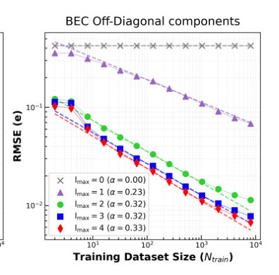 
Fig. 1 Power-law scaling of SevenNet-PS models on BEC diagonal (left) and off-diagonal (right) component prediction errors on a test set for lmax ranging from 0 to 4. The scaling exponent α is derived from fits performed between Ntrain ∈[64, 512].

📷 Fig 2

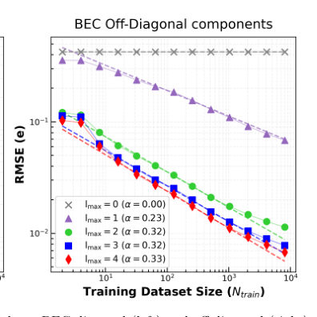 
Figure 2 presents the results for the SevenNet-PS-L (SevenNet-Polar Specialized Large)

📷 Fig 3

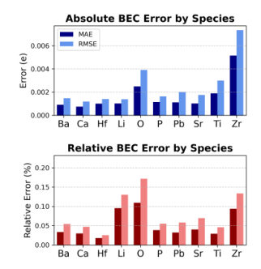 
Fig. 2 Evaluation of the accuracy of SevenNet-PS-M on the combined multi-material test set (ZrO2, Li3PO4, and perovskite). (left) Parity plots comparing BEC tensor components predicted by SevenNet- Polar and DFPT data. (right) Distribution of prediction errors for each of the ten chemical species.

📷 Fig 4

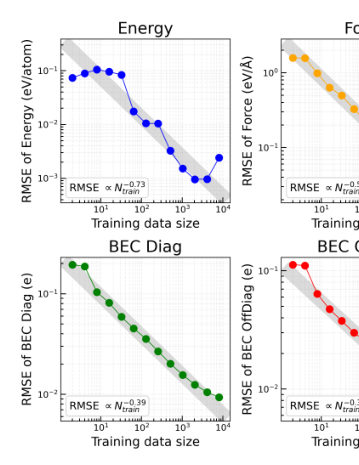 
Fig. 3 Scaling behavior of SevenNet-PM-M on the ZrO2 data set. Root-mean-square errors (RMSE) for energy, forces, stress, and Born effective charge (BEC) components, alongside the total loss, are plotted against the training data set size (Ntrain) on a log-log scale. The thick gray bands represent power-law fits (RMSE ∝N−α train) calculated for the intermediate data regime (64 ≤Ntrain ≤512). The extracted scaling exponents (α) are provided in the insets.

📷 Fig 5

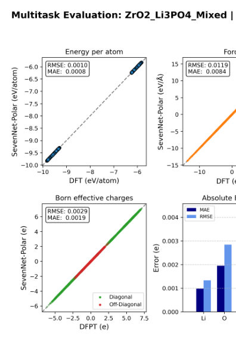 
Fig. 4 Parity plots for total energy, forces, stress tensor and BEC tensor for SevenNet-PM-L. This model has been trained on the ZrO2 and Li3PO4 data sets.

**Summary.** This paper introduces SevenNet-Polar, an equivariant graph neural network designed for fast and accurate multi-task prediction of key material properties, including the Born effective charge (BEC). By training on diverse materials under extreme conditions, it achieves high accuracy while maintaining computational efficiency for simulating large systems with applied electric fields. This makes advanced, charge-aware molecular dynamics simulations significantly more accessible.

**Why it may be interesting.** While focused on solid-state physics potentials, the use of advanced equivariant GNNs to model complex tensor properties like BEC bridges ML techniques with fundamental quantum mechanical response functions relevant for understanding material polarization in external fields.

Detailed structure

**Main problem.** The primary challenge is developing computationally efficient methods for accurately predicting the Born effective charge (BEC) tensor, which is essential for simulating materials under external electric fields.

**Main result.** The proposed SevenNet-Polar framework achieves state-of-the-art accuracy across multiple properties (Energy, Forces, Stress, BEC), enabling large-scale simulations up to 1.5 million atoms on supercomputers.

**Method.** The authors developed an equivariant graph neural network architecture, SevenNet-Polar, which is trained in a multi-task setting to predict several material properties simultaneously.

**Model / system.** The model is applied to crystalline materials like $	ext{ZrO}_2$, $	ext{Li}_3	ext{PO}_4$, and perovskites. It handles complex structural environments such as high temperatures, defects, Nudged Elastic Band (NEB) trajectories, and grain boundaries.

**Key observables.** Energy (meV/atom), Forces ($	ext{meV}/^\circ	ext{\AA}$), Stress ($	ext{GPa}$), and the Born Effective Charge (BEC) tensor components ($e$).

**Important parameters / regimes.** The model's performance is analyzed using power-law scaling exponents ($\alpha$) related to training data size, and hyperparameters like maximum spherical harmonic order ($l_{\max}$).

**Assumptions / limitations.** It is assumed that the network can generalize robustly to structural environments not present in the training set. The loss function requires careful tuning due to differing variance scales between properties.

**Figures summary.** Figures illustrate power-law scaling of errors for BEC components versus training size, and show predicted tensor values along NEB trajectories or grain boundaries compared to DFT results.

**Paper structure.** The paper introduces the SevenNet-Polar framework, details its multi-task learning capabilities (Energy, Force, Stress, BEC), presents quantitative performance benchmarks across various materials and conditions, analyzes data scaling laws, and discusses computational scalability via FlashTP integration.

Abstract

Accurate prediction of the Born effective charge (BEC) tensor is crucial for modeling materials under electric fields but remains computationally expensive. To bridge this gap, we present SevenNet-Polar, an equivariant graph neural network framework based on the SevenNet architecture for fast and accurate BEC predictions. Our BEC-only predictors can achieve an RMSE as low as 0.0043 e on ZrO$_2$, Li$_3$PO$_4$, and perovskites, despite the presence of high-temperature (up to 2,000 K) and defect-laden training data. Our all-in-one multitask models for predicting energy, forces, stress, and BEC in ZrO$_2$ and Li$_3$PO$_4$ achieve high accuracy with an RMSE of 1.0 meV/atom for energy, 12 meV/angstrom for forces, 0.05 GPa for stress, and 0.0029 e for BEC. BEC accuracy is not degraded by multitask training. Scaling analysis reveals distinct exponents for diagonal and off-diagonal BEC components, both of which exhibit less favorable scaling than energy, force and stress errors. SevenNet-Polar generalizes robustly when tested on scenarios containing structural environments absent from the training set, such as along nudged elastic band (NEB) trajectories or grain boundaries in ZrO$_2$. Accelerated by FlashTP, SevenNet-Polar enables simulations containing up to 1.5 million atoms on multi-GPU supercomputers and up to approximately 15,000 atoms on a single consumer-grade GPU. This makes charge-aware molecular dynamics simulations under electric fields more accessible.

[↑ back to top](#top)

### [Worst-Case Quantum Algorithm for Optimal Polynomial Intersection Beyond Decoded Quantum Interferometry](http://arxiv.org/abs/2607.14650v1)

**Authors:** Shuji Horinaga, Takashi Yamakawa  
**Type:** theory · **Category:** quantum information and computing · **PDF:** <https://arxiv.org/pdf/2607.14650v1>  
**Analysis basis:** full PDF text, analyzed in chunks
**Topic relevance:** `entanglement & information structure` **1/5**

📷 Fig 1

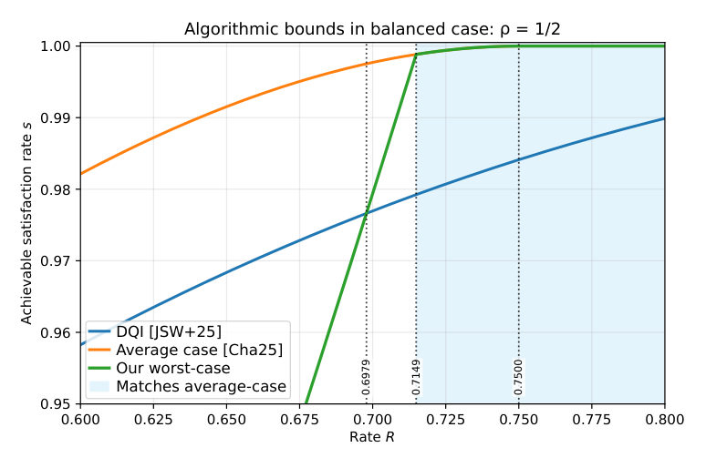 
Figure 1: Comparison of achievable algorithmic satisfaction rates in the balanced case ρ = 1/2.

📷 Fig 2

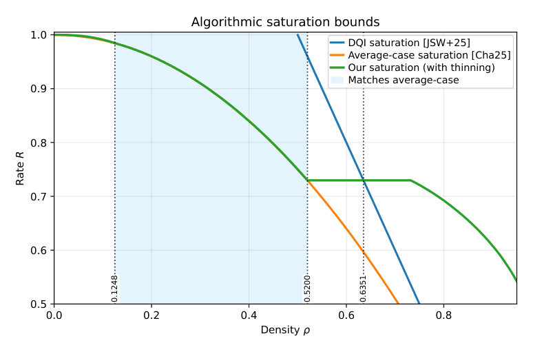 
Figure 2: Comparison of algorithmic saturation bounds as functions of ρ. The direct application of Theorem 6.1 yields a non-monotone curve, with a bump for ρ &gt; 0.5200. This bump is only an artifact of the proof. Indeed, by a simple thinning argument (see Lemma A.1), we may replace the sets by smaller subsets, and hence replace ρ by a smaller value, without reducing the target satisfaction rate. Thus, for ρ &gt; 0.5200, we use the horizontal bound obtained by applying Theo- rem 6.1 at ρ ≈0.5200, wherever this improves upon the bound obtained from a direct application of Theorem 6.1 at the actual value of ρ.

📷 Fig 3

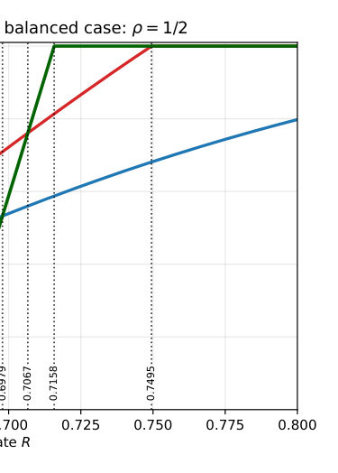 
Figure 3: Comparison of existential satisfaction rates in the balanced case ρ = 1/2.

📷 Fig 4

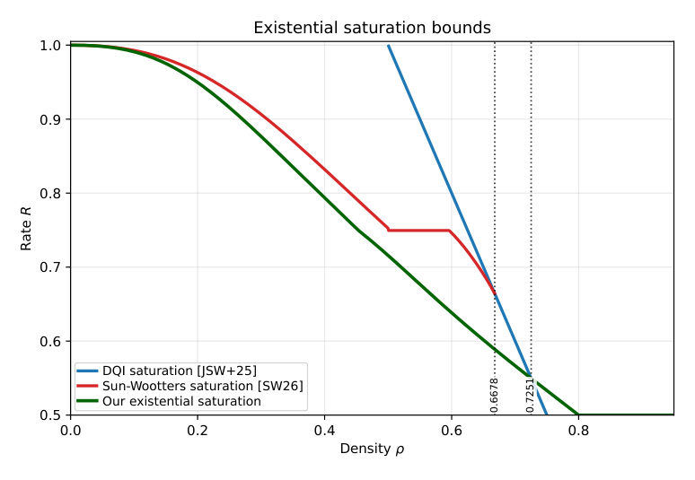 
Figure 4: Comparison of existential saturation bounds as functions of ρ. The Sun–Wootters curve is based on [SW26, Theorems 1.6 and 1.9]. While [SW26, Theorem 1.9] gives a bound for general ρ, it has a bump for ρ &gt; 1/2. On the other hand, [SW26, Theorem 1.6] gives a better bound in the balanced case ρ ≈1/2. By a thinning argument similar to the one discussed in Appendix A, one can increase the density ρ without sacrificing the satisfaction rate. Thus, in the regime ρ ≥1/2, whenever the bound from [SW26, Theorem 1.9] is worse, we plot the thinned balanced-case bound, which gives R ≈0.7495.

**Summary.** This paper develops a new worst-case quantum algorithm for solving the Optimal Polynomial Intersection problem. It significantly improves upon prior theoretical bounds by achieving high satisfaction rates ($s=1$) in regimes previously unreachable by DQI, particularly when analyzing MDS codes. The work advances the understanding of quantum computational limits for structured algebraic problems.

**Why it may be interesting.** While highly abstract, the techniques involving quantum algorithms to solve hard combinatorial/coding theory problems (like list decoding or polynomial intersection) are foundational to understanding the limits of quantum computation for structured data processing.

Detailed structure

**Main problem.** The paper addresses the Optimal Polynomial Intersection (OPI) problem, which seeks to find a low-degree polynomial satisfying membership constraints on many inputs.

**Main result.** The authors present a novel quantum algorithm that solves OPI in the worst-case regime beyond what is achievable by Decoded Quantum Interferometry (DQI).

**Method.** The core methodology involves applying a novel application of a Brascamp--Lieb-type inequality within the framework of Maximum Distance Separable (MDS) codes.

**Model / system.** The problem is framed abstractly over finite fields ($\mathbb{F}_q$) and relies on quantum oracle access to membership information for prescribed subsets $\{S_i\}$.

**Key observables.** Satisfaction rate ($s$), the ratio parameter $R=k/n$, and the existence threshold for a solution.

**Important parameters / regimes.** The density $
ho = |S_i|/q$ is crucial, with specific focus on the balanced case $
ho=1/2$.

**Assumptions / limitations.** General algorithmic results are restricted to MDS codes whose dual admits an efficient list decoder; initial guarantees were based on random choices of sets.

**Figures summary.** Figure 1 compares achievable satisfaction rates ($s$) for DQI, average-case bounds, and the new worst-case algorithm in the balanced case. Figure 2 and Figure 3 compare saturation/satisfaction bounds across different regimes.

**Paper structure.** The paper builds from establishing the OPI problem definition to comparing algorithmic bounds against prior work (DQI, average-case). It then develops the novel quantum algorithm using advanced inequalities in the MDS setting, culminating in improved worst-case and existential bounds for OPI and MaxLINSAT.

Abstract

The Optimal Polynomial Intersection (OPI) problem asks us to find a low-degree polynomial over a finite field whose values lie in prescribed subsets on as many given inputs as possible. Decoded quantum interferometry (DQI) gives a quantum algorithm for OPI in parameter regimes beyond those achieved by the best known classical heuristics. Follow-up works improve the parameter regimes, but their analyses are limited to average-case settings. Recently, Sun and Wootters showed that, even in the worst case, OPI has a solution in a larger parameter regime than the one covered by DQI. However, they left open whether one can design a quantum algorithm that solves OPI in the worst-case beyond the DQI regime.   We give such a quantum algorithm. As a byproduct, we also improve the existential bound of Sun and Wootters in certain parameter regimes. In particular, when each subset contains roughly half of the field elements, our algorithm finds a solution with satisfaction rate $s=1$ whenever the rate satisfies $R>0.75$. This matches the previous average-case bound, whereas DQI cannot achieve $s=1$ unless $R=1$. Our existential bound guarantees the existence of a solution when $R> 0.7158$, improving over the previous threshold $R>0.7495$. More generally, our existential results extend to the Max-LINSAT problem with respect to arbitrary maximum distance separable (MDS) codes. The corresponding algorithmic results apply only to MDS codes whose dual admits an efficient list decoder. Our results are obtained through a novel application of a Brascamp--Lieb-type inequality in the MDS setting, which may have further applications.

[↑ back to top](#top)

## Other papers (5)

*Papers from primary archives without highlighted authors or any topic match. Click to expand.*

Show other papers

### [Boson peak and medium-range elastic heterogeneity in calcium silicate hydrate probed by terahertz spectroscopy and low-temperature calorimetry](http://arxiv.org/abs/2607.14764v1)

**Authors:** Xiangyu Li, Ying Chen, Jipeng Luo, Ya Chen, Linhao Wang, Lidan Tian, Gan Ding, Zeyu Lu, Zhangli Hu, Biqin Dong, Yue Li, Zongjin Li  
**Type:** experiment · **Category:** disordered systems and neural networks · **PDF:** <https://arxiv.org/pdf/2607.14764v1>  
**Analysis basis:** full PDF text, analyzed in chunks

📷 Fig 1

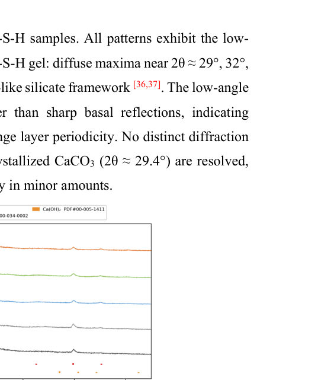 
Fig. 1 XRD patterns of C-S-H at Ca/Si = 0.5–1.7, showing the broad, low-crystallinity

📷 Fig 2

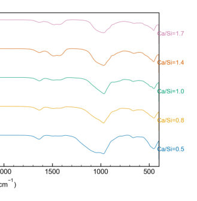 
Fig. 2 FTIR spectra of C-S-H at Ca/Si = 0.5–1.7. The Si-O stretching band (900–1100

📷 Fig 3

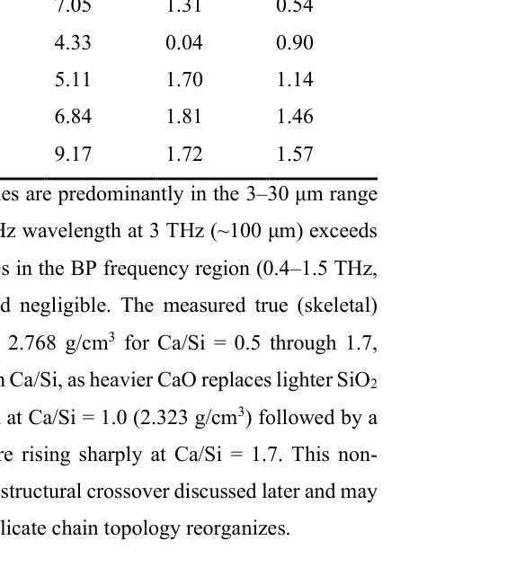 
Fig. 3a displays representative time-domain waveforms after transmission through the C-

📷 Fig 4

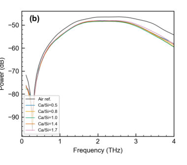 
Fig. 3 (a) THz time-domain waveforms and (b) power spectra for the five C-S-H/COC

📷 Fig 5

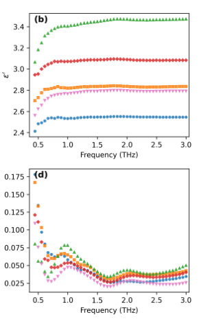 
Fig. 4 Intrinsic THz optical properties of C-S-H after Bruggeman effective-medium

**Summary.** The study investigates the Boson Peak and elastic heterogeneity in C-S-H using THz spectroscopy and calorimetry. By analyzing how these vibrational signatures change with composition, the authors identify a structural crossover mechanism governing material properties like creep. This dual-probe approach offers a quantitative link between nanoscale dynamics and concrete durability.

**Why it may be interesting.** This work provides an experimental link between low-frequency vibrational anomalies (like the BP) and macroscopic material properties (creep/thermal transport) in amorphous solids, which is relevant to understanding energy dissipation mechanisms in complex disordered systems.

Detailed structure

**Main problem.** The study aims to characterize the Boson Peak (BP) and medium-range elastic heterogeneity in Calcium Silicate Hydrate (C-S-H), linking nanoscale vibrational dynamics to macroscopic material durability.

**Main result.** Both terahertz spectroscopy and calorimetry locate the BP near 1 THz, revealing a structural crossover marked by the evolution of an elastic heterogeneity parameter ($\gamma$) from 0.98 to 0.48 as Ca/Si increases.

**Method.** The research employs a dual-probe approach combining Terahertz Time-Domain Spectroscopy (THz-TDS) and low-temperature calorimetry to probe vibrational dynamics in C-S-H samples synthesized with varying Ca/Si ratios.

**Model / system.** The physical system is Calcium Silicate Hydrate (C-S-H), the binding phase of hardened cement, which acts as a disordered solid. The analysis involves fitting spectral data to models like Damped Harmonic Oscillators and analyzing the vibrational density of states.

**Key observables.** Boson Peak frequency ($
u_{BP}$), medium-range dynamical correlation length ($\xi$), coherent-potential elastic-heterogeneity parameter ($\gamma$), THz integrated spectral weight, and calorimetric $C_p/T^3$ peak.

**Important parameters / regimes.** Ca/Si ratios (0.5 to 1.7); BP frequency near 1 THz; $\gamma$ ranging from 0.98 to 0.48.

**Assumptions / limitations.** The use of Bruggeman correction for crystalline impurities and the assumption that the dual-probe approach provides a comprehensive view beyond single-technique limitations.

**Figures summary.** Not specified in detail, but comparisons are made between THz spectral weight vs. Ca/Si ratio and calorimetric $C_p/T^3$ peak vs. Ca/Si ratio to track structural crossovers.

**Paper structure.** The paper systematically characterizes the BP using two complementary vibrational probes (THz-TDS and calorimetry) across varying compositions, analyzes the trends in spectral weight and heterogeneity parameters ($\gamma$), and interprets these findings as evidence of a structural crossover mechanism.

Abstract

The boson peak (BP), a universal vibrational anomaly of disordered solids, has been predicted but not systematically characterized in calcium silicate hydrate (C-S-H), the binding phase of hardened cement. Building on a preliminary terahertz survey, we characterize the BP across five Ca/Si ratios (0.5-1.7) using terahertz time-domain spectroscopy (THz-TDS) and low-temperature calorimetry, two probes of vibrational dynamics that complement the static picture of conventional structural methods. After Bruggeman correction for crystalline impurities, both probes locate the BP near 1 THz; they agree on frequency but diverge in intensity. The terahertz integrated spectral weight and the calorimetric Cp/T3 peak both fall monotonically with Ca/Si, whereas the apparent terahertz peak height is maximal at Ca/Si = 1.0, where damping is low and oscillator strength still substantial. This decoupling marks a structural crossover between silicate-chain depolymerization and interlayer calcium filling. From the BP we obtain a medium-range dynamical correlation length of order 1 nm (0.3-2 nm) and a coherent-potential elastic-heterogeneity parameter that decreases from gamma = 0.98 to 0.48 as Ca/Si rises; the Debye-normalized BP frequency (nu_BP/nu_D = 0.15-0.17) places C-S-H within the range reported for silicate glasses. Because gamma governs the distribution of energy barriers for local structural rearrangements, it provides a quantitative, composition-resolved descriptor relevant to the intrinsic creep and thermal transport of C-S-H, linking nanoscale vibrational dynamics to the macroscopic durability of concrete. The dual-probe boson-peak approach is transferable to other amorphous solids, including the supplementary cementitious materials of low-carbon cements.

[↑ back to top](#top)

### [LDGM-Based Quantum Codes for Fault-Tolerant Quantum Computation](http://arxiv.org/abs/2607.15159v1)

**Authors:** Yumin Li, Kejing Liu, Hanqing Lou, Javier Garcia-Frias  
**Type:** theory · **Category:** quantum information and computing · **PDF:** <https://arxiv.org/pdf/2607.15159v1>  
**Analysis basis:** full PDF text, analyzed in chunks

📷 Fig 1

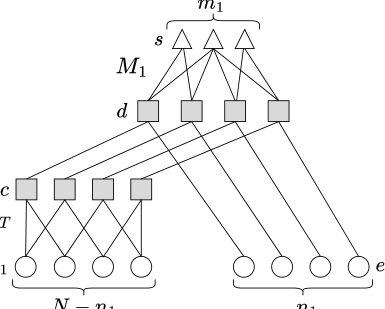 
Fig. 1: Decoding graph for matrix H, consisting of the X-containing stabilizer generators, utilized to decode ez

📷 Fig 2

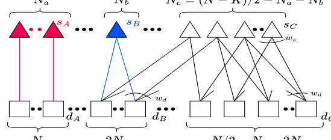 
Fig. 2: Graph associated with proposed matrix M. Each doping/sA syndrome node is connected to one d node

📷 Fig 3

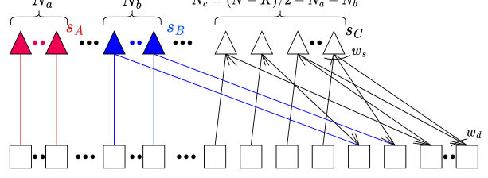 
Fig. 3: Graph associated with the matrix M utilized in the upper layer for the design of codes well suited for

📷 Fig 4

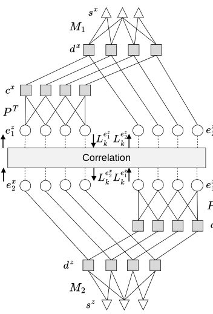 
Fig. 4: Decoding graph for a CSS code with matrices H = M1[P T I] and G = M2[I P] utilized in the depolarizing

📷 Fig 5

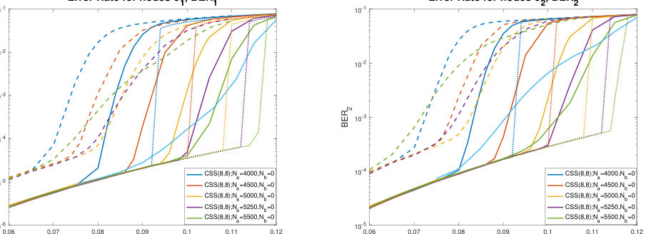 
Fig. 5: DDE predictions and simulated residual error rate in both e1 and e2 for a family of quantum codes designed

**Summary.** This paper introduces a method to construct high-performance quantum error-correcting codes by adapting Low-Density Generator Matrix (LDGM) codes into Calderbank-Shor-Steane (CSS) structures. The authors analyze the performance of these codes under depolarizing noise using iterative decoding and Density Evolution, showing that careful structural design can yield excellent fault-tolerance capabilities.

**Why it may be interesting.** The detailed analysis of error thresholds and error floors using established coding theory tools (LDGM codes) provides concrete benchmarks for designing robust quantum computation protocols relevant to open quantum systems.

Detailed structure

**Main problem.** The primary goal is developing quantum error-correcting codes suitable for fault-tolerant quantum computation.

**Main result.** The authors propose a new family of CSS codes built from LDGM matrices, demonstrating that optimizing the code structure can significantly improve performance thresholds while maintaining low error floors.

**Method.** They construct the codes using row operations on LDGM generator and parity-check matrices, employing iterative message passing decoding (belief propagation) optimized via Discrete Density Evolution (DDE).

**Model / system.** The system is a quantum stabilizer code structured as a CSS code. The construction leverages the sparsity of classical LDGM codes to satisfy necessary mathematical constraints for quantum error correction.

**Key observables.** Residual error rates ($	ext{BER}_1, 	ext{BER}_2$), convergence threshold, and error floor performance under depolarizing noise.

**Important parameters / regimes.** Depolarizing parameter ($p$), LDGM code degree (e.g., $(8, 8)$ to $(12, 12)$), and structural parameters like $N_a$ and $N_b$.

**Assumptions / limitations.** The analysis relies on the equivalence between iterative message passing decoding simulations and predictions derived from Discrete Density Evolution (DDE).

**Figures summary.** Figures illustrate how optimizing structural parameters ($N_b$) improves thresholds, how code degree affects error floors versus thresholds, and general performance trends across varying noise levels.

**Paper structure.** The paper progresses from establishing the mathematical framework for CSS codes using LDGM matrices (satisfying commutativity conditions) to detailing the decoding process via message passing. It then moves into rigorous performance analysis by simulating residual errors under depolarizing noise, comparing results against DDE predictions while varying structural and code parameters.

Abstract

We construct a new family of Calderbank-Shor-Steane (CSS) codes using the generator and parity-check matrices of Low-Density Generator Matrix (LDGM) codes, with row operations applied to both matrices in order to achieve the desired quantum rate. Decoding is performed in an iterative manner, by applying message passing over the associated graph, and discrete Density Evolution (DDE) is used to optimize performance in the depolarizing channel. The proposed construction offers high flexibility and easiness in the design, producing quantum codes that possess excellent error correction capabilities. By properly designing the structure of the code, we are able to control and bound the weight of the stabilizer generators to a small value, which results in codes particularly well suited for fault-tolerant quantum computation. At the same time, these codes achieve very good performance in terms of error correction capability.

[↑ back to top](#top)

### [Quantum XYZ Stabilizer Codes](http://arxiv.org/abs/2607.14988v1)

**Authors:** Alessio Baldelli, Davide Orsucci, Francisco Lázaro, Massimo Battaglioni  
**Type:** theory · **Category:** quantum information and computing · **PDF:** <https://arxiv.org/pdf/2607.14988v1>  
**Analysis basis:** full PDF text, analyzed in chunks

📷 Fig 1

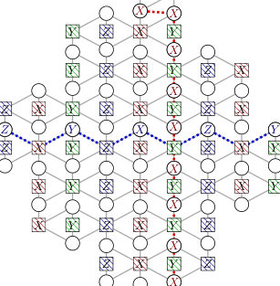 
Fig. 1. Tanner graph of the CXYZ´2DJ50, 1, 5K. Circles represent qubits and squares represent stabilizers. The qubits joined by a dashed line form minimum-weight logical operators of pure type (in red, weight 2d ´ 1 “ 9) and mixed type (in blue, weight d “ 5).

📷 Fig 2

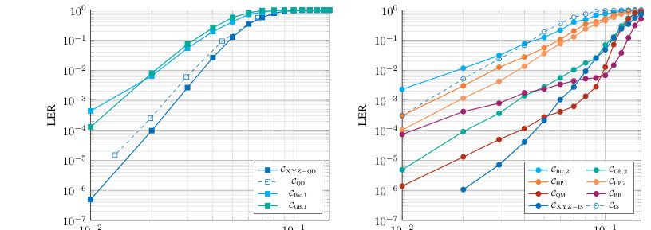 
Fig. 2. Monte Carlo simulations of the LER under BP4 CN serial decoding over a code-capacity noise model, as a function of p. (a): comparison between the LER of CXYZ´QD and some state-of-the-art CSS codes. With dashed lines and empty squares, we report the code CQD decoded using the CAMEL decoder of [20]. (b): comparison between the LER of CXYZ´IS and several state-of-the-art CSS codes. With dashed lines and empty dots, we report the code CIS.

**Summary.** This paper introduces quantum XYZ stabilizer codes as a generalization beyond traditional CSS structures in Quantum Error Correction. The authors derive conditions to characterize this new structure and construct sparse qLDPC families using IS and QD methods. Simulations demonstrate that these XYZ codes can achieve lower error rates than comparable CSS codes, suggesting improved performance for near-term quantum computation.

**Why it may be interesting.** It pushes the boundaries of structured quantum error correction by exploring non-CSS stabilizer constraints, which is crucial for designing practical fault-tolerant quantum hardware architectures.

Detailed structure

**Main problem.** To extend standard Calderbank–Shor–Steane (CSS) Quantum Error Correction Codes by introducing quantum XYZ stabilizer codes, which incorporate Y-type generators.

**Main result.** The proposed XYZ qLDPC constructions show superior finite-length performance in terms of Logical Error Rate (LER) compared to comparable CSS qLDPC instances under belief propagation decoding.

**Method.** Theoretical characterization involves deriving algebraic and rank conditions for the non-CSS nature of the code, complemented by numerical simulations using Monte Carlo methods.

**Model / system.** The system is a quantum error correcting code defined over Pauli operators on $n$ qubits. The model generalizes stabilizer codes from the CSS framework to incorporate three pairwise orthogonal parity-check matrices for X-, Y-, and Z-type generators.

**Key observables.** Quantum minimum distance ($d$), Logical Error Rate (LER), coding rate ($R=k/n$).

**Important parameters / regimes.** Depolarizing noise probability ($p$), block length ($n$), code parameters derived from Intersecting Subset (IS) and Quasi-dyadic (QD) families.

**Assumptions / limitations.** The comparison relies on finite-length evidence from simulations, and the authors characterize when the XYZ structure collapses back to a CSS structure.

**Figures summary.** Figure 2 compares LER vs. noise probability ($p$) for $C_{	ext{XYZ}}^{	ext{QD}}$ and $C_{	ext{XYZ}}^{	ext{IS}}$ against several state-of-the-art CSS qLDPC benchmarks, showing performance advantages for the XYZ codes.

**Paper structure.** The paper defines the XYZ code structure, analyzes minimum distance bounds theoretically, proposes new sparse finite-length constructions based on IS and QD families, and concludes with simulations comparing these against existing CSS benchmarks.

Abstract

Stabilizer codes are often constructed within the Calderbank--Shor--Steane (CSS) framework, where two mutually orthogonal binary classical codes define $X$ and $Z$-type stabilizer generators. While this structure is algebraically convenient, additional non-CSS constraints may help suppress low-weight logical operators and improve decoding performance in the finite-length regime. We thus introduce quantum XYZ stabilizer codes, whose parity-check matrix (PCM) is built from three pairwise orthogonal binary PCMs associated with $X$-, $Y$-, and $Z$-type stabilizer generators. A nontrivial point is that an XYZ code instance is not automatically genuinely non-CSS: the same stabilizer group may admit a CSS generating set. We characterize this collapse, obtaining algebraic and rank conditions for deciding when the $Y$-type checks are redundant and when they define genuinely non-CSS stabilizer constraints. We also derive upper and lower bounds on the quantum minimum distance, including bounds for mixed Pauli logical operators. The novel framework includes a known non-CSS topological code, namely the XYZ$^2$ hexagonal code, and yields also sparse finite-length quantum low-density parity-check (qLDPC) constructions from intersecting-subset and quasi-dyadic code families. Simulations under depolarizing code-capacity noise and quaternary belief propagation decoding show that the proposed XYZ qLDPC instances can outperform representative CSS qLDPC instances with similar finite-length parameters.

[↑ back to top](#top)

### [SQD-Enabled Circuit Compression for Resource-Efficient Quantum Chemistry](http://arxiv.org/abs/2607.15076v1)

**Authors:** Kangyu Zheng, Yidong Zhou, Jinglei Cheng, Zhemin Zhang, Shaohua Li, Zhiding Liang  
**Type:** both · **Category:** quantum information and computing · **PDF:** <https://arxiv.org/pdf/2607.15076v1>  
**Analysis basis:** full PDF text, analyzed in chunks

📷 Fig 1

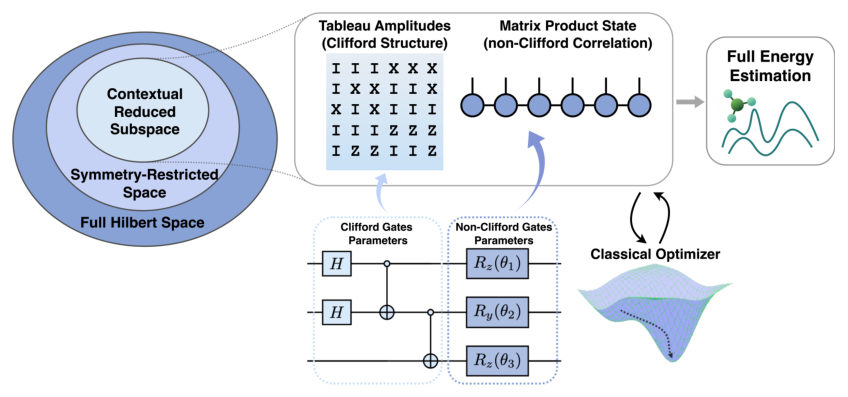 
Fig. 1. Overview of the proposed pipeline. The full Hilbert space is compressed into a contextual reduced subspace capturing the dominant low-energy structure of the molecule. Inside this subspace, the quantum state is expressed via a dual representation: a stabilizer-tableau component encoding Clifford-compatible structure and an MPS component capturing non-Clifford correlations. During variational optimization, Clifford gates act only on the tableau representation and non-Clifford gates act only on the MPS component, coordinated by a classical optimizer. The optimized reduced-space state is finally lifted back to the full orbital space using a precomputed inverse mapping, enabling...

📷 Fig 2

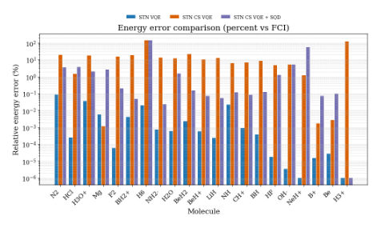 
Fig. 2. Relative energy error versus FCI comparison under full parameters mode

📷 Fig 3

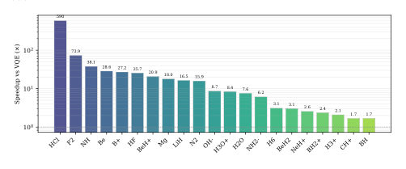 
Fig. 3. Runtime speedup of CS-VQE+SQD vs. standard VQE across 21 molecules (uncompressed baseline, fg=1, fc=1). Molecules are sorted by descending speedup. HCl achieves 590× due to aggressive qubit reduction (20→3 qubits); molecules with large contextual subspaces (BH, CH+) show modest gains.

📷 Fig 4

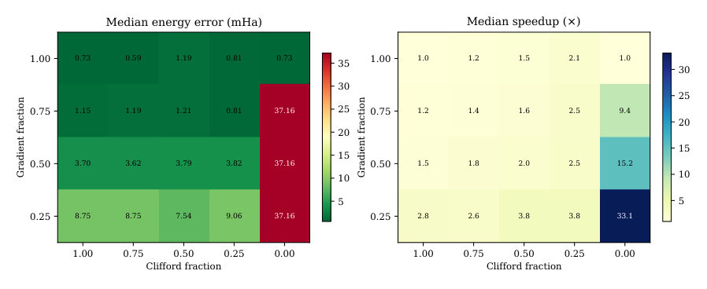 
Fig. 4. Ablation heatmap across 21 molecules. Left: median SQD energy error (mHa). Right: median simulation speedup (×). Rows vary gradient fraction fg; columns vary Clifford fraction fc. Error remains within chemical accuracy (1.6 mHa, bold in Table I) for the top-left region; speedup increases toward the bottom-right. The fc = 0.00 column shows a phase transition: accuracy collapses when no non-Clifford gates remain, but speedup peaks.

📷 Fig 5

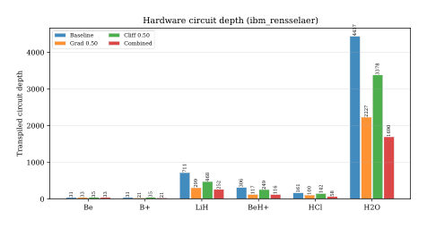 
Fig. 5. Absolute transpiled circuit depth on ibm_rensselaer across four configurations. The depth reduction scales with molecule size: H2O (168 parameters) drops from 4437 to 1690; small molecules (Be, B+) are already shallow and show no change.

**Summary.** The paper introduces a resource-efficient workflow for quantum chemistry simulations that tackles NISQ constraints. It combines qubit reduction and circuit compression techniques (pruning/rounding) with a post-processing Subspace Quantum Diagonalization (SQD). This methodology allows for substantial speedups while preserving chemical accuracy by leveraging SQD's tolerance to imperfect input circuits.

**Why it may be interesting.** This work directly addresses hardware limitations in quantum simulation by decoupling the need for high variational accuracy (VQE) from the requirement of deep circuits, making complex chemistry problems feasible on current noisy devices.

Detailed structure

**Main problem.** The primary challenge is performing quantum chemistry simulations on noisy, resource-constrained Near-term Intermediate-Scale Quantum (NISQ) hardware while maintaining chemical accuracy.

**Main result.** The proposed pipeline achieves significant runtime speedups (up to $33	imes$) by aggressively compressing the required quantum circuit depth without losing energy accuracy due to a post-processing Subspace Quantum Diagonalization (SQD) step.

**Method.** The approach combines qubit reduction, applying two compression techniques—gradient-based operator pruning and Clifford rounding—to the VQE ansatz, followed by SQD for final energy recovery.

**Model / system.** The system studied is molecular electronic structure calculation using Hamiltonians mapped to qubits (e.g., $	ext{H}_2	ext{O}$, $	ext{N}_2$). The process involves projecting the full Hamiltonian onto a low-energy contextual subspace.

**Key observables.** Ground-state energies, relative energy error compared to Full Configuration Interaction (FCI), and circuit depth/runtime speedup.

**Important parameters / regimes.** Chemical accuracy threshold ($1.6 	ext{ mHa}$), compression levels (e.g., 50% reduction on both axes).

**Assumptions / limitations.** The core assumption is that SQD's ability to classically diagonalize sampled bitstrings allows the preceding quantum circuit (VQE) to be significantly degraded without compromising the final energy result.

**Figures summary.** Figure 1 illustrates the entire pipeline: contextual subspace projection $
ightarrow$ compressed VQE $
ightarrow$ SQD recovery. Other figures compare relative energy errors vs FCI and show runtime speedups across multiple molecules.

**Paper structure.** The paper details a multi-stage pipeline: first, qubit reduction via contextual subspace methods; second, constructing a compressed VQE ansatz using gradient pruning and Clifford rounding; and third, utilizing SQD to recover the final ground-state energy from the resulting limited sampling circuit.

Abstract

Subspace Quantum Diagonalization (SQD) recovers ground-state energies by classically diagonalizing a Hamiltonian in the subspace spanned by quantum samples, requiring only bitstrings with sufficient ground-state overlap rather than an accurate variational energy. We reveal and exploit this underexplored robustness property: how much non-Clifford and variational expressivity can be removed from the sampling circuit before SQD accuracy degrades? We answer through two complementary compression techniques: gradient-based operator pruning, which discards low-impact excitation operators, and Clifford rounding, which snaps remaining parameters to the nearest Clifford angle. Both of these techniques can be applied to a VQE ansatz on a qubit-reduced Hamiltonian. A systematic ablation study across 21 molecules shows that median SQD error stays within chemical accuracy even at 50\% compression on both axes, while simulation speedup reaches $33\times$. Hardware validation on 6 molecules on IBM quantum hardware confirms up to $2.8\times$ transpiled-depth reduction with zero loss in SQD accuracy.

[↑ back to top](#top)

### [Syndrome-as-Header: A Quantum Label-Switching Architecture via Uncorrectable Error Injection](http://arxiv.org/abs/2607.14484v1)

**Authors:** IlKwon Sohn, Ju-Bong Kim, Kwangil Bae, Wooyeong Song, Wonhyuk Lee  
**Type:** theory · **Category:** quantum information and computing · **PDF:** <https://arxiv.org/pdf/2607.14484v1>  
**Analysis basis:** full PDF text, analyzed in chunks

📷 Fig 1

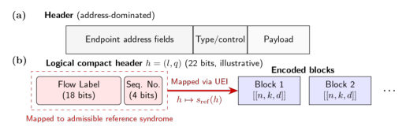 
Fig. 1. Illustrative comparison of forwarding-header abstractions. (a) An address-dominated classical header carries endpoint address fields, type/control information, and payload. (b) The proposed logical compact header h = (ℓ, q) contains only a flow label and a sequence number, which are mapped via UEI to an admissible reference syndrome sref(h) and embedded across encoded blocks. The comparison highlights compact syndrome-domain forwarding without requiring a classical frame format for quantum packets.

📷 Fig 2

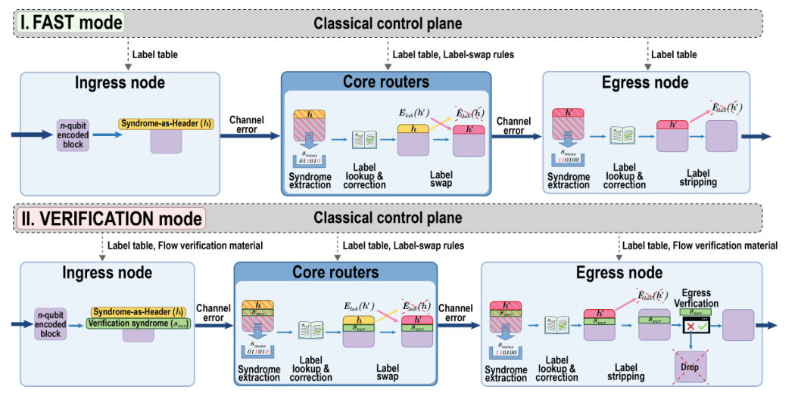 
Fig. 2. Overview of the proposed SAH architecture in FAST and VERIFICATION modes. The ingress embeds a per-block compact header h into an encoded block via a UEI labeling operator Elab(h) with reference syndrome sref(h) = f(h) = s(Elab(h)); core routers identify the in-band header, infer the residual channel-error component, apply the corresponding correction, and swap labels without decoding the logical payload. FAST mode performs autonomous label switching using the in-band header and pre-installed swap rules, whereas VERIFICATION mode additionally embeds a flow-specific verification component Ever with sver = s(Ever) and checks it at the egress before payload release. The classical...

📷 Fig 3

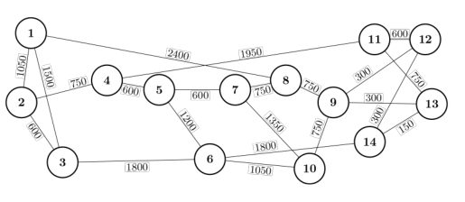 
Fig. 3. NSFNet topology used in the performance evaluation. Edge labels indicate link lengths in kilometers.

📷 Fig 4

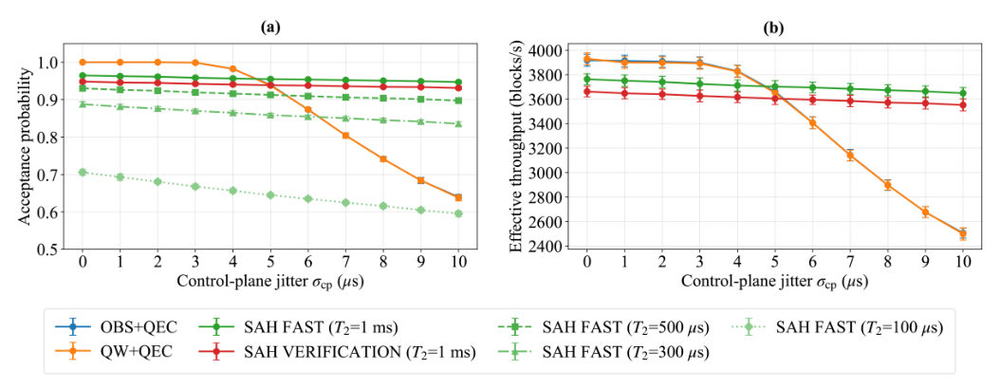 
Fig. 4. Evaluation under control-plane jitter in the QEC-normalized timing benchmark, averaged over 30 independent random seeds. (a) Acceptance probability. SAH FAST is evaluated with the physical-T2-mapped memory-residence penalty for T2 ∈{1 ms, 500 µs, 300 µs, 100 µs}, while SAH VERIFICATION is shown at T2 = 1 ms. (b) Effective accepted-block throughput. The SAH curves in (b) use the T2 = 1 ms setting. Because all schemes use the same offered traffic trace, the throughput trend in (b) follows the acceptance behavior in (a). OBS+QEC and QW+QEC nearly coincide in both panels.

📷 Fig 5

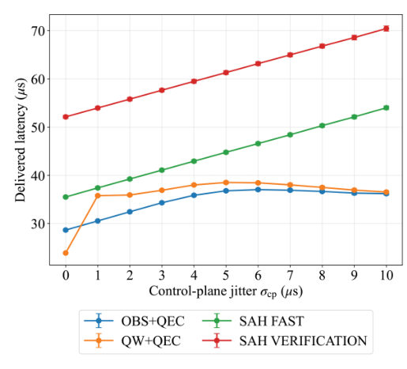 
Fig. 5. Mean delivered latency under control-plane jitter in the QEC- normalized timing benchmark, averaged over 30 independent random seeds. For SAH, the delivered-block population is evaluated under the T2 = 1 ms setting. The reported latency includes the processing stages specified in the simulation model and is averaged over accepted payload blocks.

**Summary.** This paper introduces Syndrome-as-Header (SAH), a new quantum label-switching architecture designed to enable scalable quantum networking. SAH embeds routing labels within the syndrome structure of encoded qubits using Uncorrectable Error Injection. This method bypasses critical timing alignment issues inherent in existing protocols, allowing for robust forwarding even under high control-plane jitter.

**Why it may be interesting.** It provides a novel protocol for network routing that integrates directly into the error correction framework, making it highly relevant for quantum communication hardware design where timing jitter is a major bottleneck.

Detailed structure

**Main problem.** Scaling quantum networks beyond point-to-point links requires packet forwarding that can tolerate control-plane timing uncertainty, which existing methods fail to achieve.

**Main result.** The proposed Syndrome-as-Header (SAH) architecture eliminates the strict external-header/payload alignment condition by embedding routing labels directly into the syndrome structure of the encoded payload.

**Method.** SAH uses Uncorrectable Error Injection (UEI) to map flow labels to reference syndromes, allowing core routers to swap labels solely by extracting and manipulating the syndrome header without decoding the logical payload.

**Model / system.** The system models a quantum label-switching network inspired by MPLS, using qubits encoded via an $[[n, k, d]]$ stabilizer code. Forwarding relies on local per-hop memory residence rather than long-term end-to-end storage.

**Key observables.** Acceptance probability and throughput under high jitter; delivered latency; syndrome header extraction success rate.

**Important parameters / regimes.** Router memory coherence time ($T_2$); physical error rate per hop ($p_{ch}$); code parameters ($n, k, d$).

**Assumptions / limitations.** The advantage depends on sufficient router memory coherence ($T_2$); the classical control plane is assumed reliable for distributing label bindings.

**Figures summary.** Figures compare SAH performance against OBS+QEC and QW+QEC under jitter, showing superior throughput; other figures detail syndrome-space header mapping and mode operation (FAST/VERIFICATION).

**Paper structure.** The paper introduces the limitations of current quantum packet switching, proposes the SAH mechanism using UEI to embed labels in syndromes, details the FAST and VERIFICATION modes, and validates performance against benchmarks showing timing robustness.

Abstract

Scaling quantum networks beyond point-to-point links requires packet forwarding that can tolerate control-plane timing uncertainty. Existing optical-burst switching (OBS) and quantum-wrapper-based packet switching (QW) rely on external classical headers whose jitter-prone processing must remain aligned with in-flight quantum payloads, creating guard-window or fiber-delay-line budget failures. This paper proposes Syndrome-as-Header (SAH), a quantum label-switching architecture that embeds routing labels into the syndrome structure of an encoded payload. The proposed scheme uses Uncorrectable Error Injection (UEI) to map flow labels to reference syndromes and builds a syndrome-space header codebook whose decoding regions remain distinguishable under correctable channel-induced syndrome deviations. Core routers extract the syndrome header, suppress the correctable residual channel-error component, and swap labels without measuring or decoding the logical payload. SAH supports FAST forwarding and VERIFICATION mode, the latter providing end-to-end consistency checking while retaining swappable labels. In NSFNet timing benchmarks with common per-hop quantum error correction (QEC), SAH eliminates the external-header/payload alignment condition, so timing uncertainty appears as memory residence and delivered latency rather than alignment-budget drops. With a $T_2$-based memory-residence penalty, the advantage depends on router memory coherence; for sufficiently long coherence, SAH maintains higher acceptance and throughput than OBS+QEC and QW+QEC under high jitter.

[↑ back to top](#top)

## Secondary cond-mat archives

*Papers from  mes-hall, other, soft, supr-con. These archives are de-prioritized — they appear at the end regardless of relevance score.*

### Relevant in secondary archives (12)

### [Long-range and steady-state entanglement of driven-dissipative nitrogen vacancy centers using microwaves as a drive and synthetic antiferromagnet as a dissipator](http://arxiv.org/abs/2607.15259v1)

**Authors:** Federico Garcia-Gaitan, Branislav K. Nikolic  
**Type:** theory · **Category:** quantum information and computing · **PDF:** <https://arxiv.org/pdf/2607.15259v1>  
**Analysis basis:** full PDF text, analyzed in chunks
**Topic relevance:** 🔥 `correlated / nonlocal dissipation` **4/5** · 🔥 `entanglement & information structure` **4/5** · 🔥 `methods for driven-dissipative` **4/5** · `non-equilibrium dynamics` **3/5** · `spintronics-quantum-optics interface` **3/5** · `Keldysh / 2PI / non-Gaussian methods` **2/5** · `QC/QI experiment` **2/5** · `driven-dissipative phase transition` **2/5** · `analog quantum simulation` **1/5** · `exotic spin models in light-matter` **1/5** · `non-equilibrium universality` **1/5**

📷 Fig 1

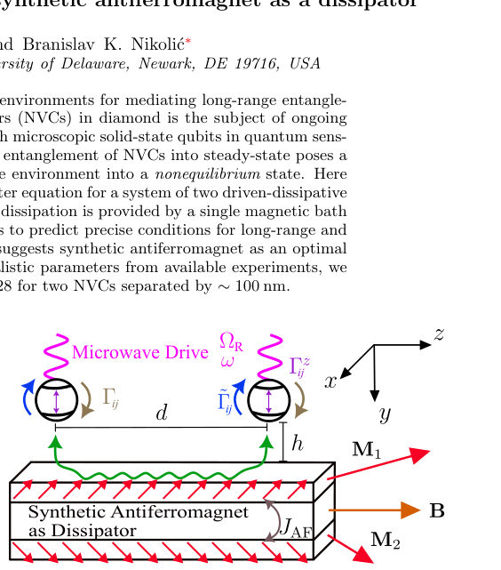 
FIG. 1. Schematic view of two NVCs (balls separated by a distance d) driven by microwaves (of frequency ω and am- plitude imposing Rabi frequency [1] ΩR) and dipolarly inter- acting (across distance h) with SAF acting as a dissipative bath. The SAF, routinely fabricated in spintronics [23], con- sists of two ferromagnetic monolayers with antiferromagnetic interlayer tunable exchange interaction JAF, where an exter- nal in-plane magnetic field B cants magnetizations M1 and M2 of two monolayers. Stray-field fluctuations (green wavy line) due to magnon excitations of the SAF couple to induce cooperative (as NVCs interact with a shared single SAF bath) decay Γij, pump ˜Γij, and dephasing Γz ij...

📷 Fig 2

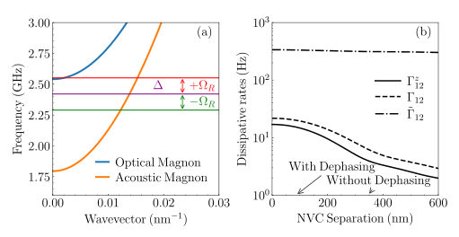 
FIG. 3. (a) Energy-momentum dispersion of magnons in SAF [Eq. (8)], where the horizontal lines denote frequencies at which parameters for decay, pump, and dephasing rates are evaluated [Eq. (6)] in (b) as a function of the distance d be- tween two NVCs. The maximum distances ensuring nonzero entanglement in Fig. 2(a) are indicated by arrows at the ab- scissa. The shorter distance estimate is for the dephasing- induced constraint shown in Fig. 2(c). The optimal position of the horizontal lines in (a) can be tuned by the Rabi fre- quency ΩR and energy splitting ∆of NVCs.

📷 Fig 3

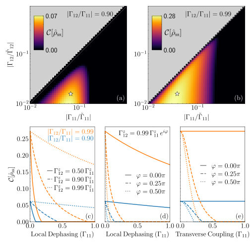 
FIG. 2. Steady-state entanglement of two NVCs in the setup of Fig. 1 with generic bath (not necessarily SAF), as quan- tified by the concurrence C[ˆρSS] of the steady-state density matrix [Eq. (7)]. Panels (a) and (b) show C[ˆρSS] vs. the local and nonlocal pump-to-decay ratios |Γ11/˜Γ11| and |Γ12/˜Γ12| for the case in which the bath-induced dephasing [Eq. (6c)] and coherent couplings [Eq. (5)] are switched off. So, in this case, entanglement is generated solely by the cooperative de- cay [Eq. (6a)] and pump [Eq. (6b)] rates, at fixed coopera- tivity |Γ12/Γ11| = 0.90 in panel (a) and |Γ12/Γ11| = 0.99 in panel (b). The grey upper triangle in panels (a) and (b) de- notes unphysical...

**Summary.** The paper theoretically demonstrates how long-range, steady-state entanglement can be engineered between distant NV centers using microwave driving coupled to a synthetic antiferromagnet bath. By solving the resulting Lindblad master equation, the authors predict measurable concurrence values at separations of 100 nm, offering a robust platform for quantum memory and computation.

**Why it may be interesting.** This work provides a concrete theoretical pathway for engineering quantum coherence in solid-state systems by leveraging non-equilibrium dissipation mechanisms (driven baths), which is highly relevant to open quantum system dynamics and scalable qubit architectures.

Detailed structure

**Main problem.** The primary goal is to establish a method for generating and maintaining long-range, steady-state entanglement between two distant Nitrogen-Vacancy (NV) centers in diamond.

**Main result.** The authors predict that steady-state entanglement can be achieved using microwave driving and coupling the NVCs to a synthetic antiferromagnet (SAF) bath, reaching concurrence values up to $\mathcal{C} \simeq 0.28$ at separations of $\sim 100$ nm.

**Method.** The analysis relies on deriving and solving a Lindblad quantum master equation (QME) for the driven-dissipative system, utilizing Non-Equilibrium Green's Functions (NEGF) to calculate dissipation parameters.

**Model / system.** The system consists of two NVC qubits coupled via dipolar interactions ($\hat{H}_{	ext{int}}$), subjected to microwave driving ($\hat{H}_{	ext{NVCs}}$), and dissipating into a magnetic bath modeled as an SAF. The dynamics are governed by the QME: $\partial_t\hat{
ho}(t) = -i[\hat{H}_I, \hat{
ho}(t)] + L[\hat{
ho}(t)]$.

**Key observables.** Steady-state concurrence ($C[\hat{
ho}_{SS}]$), which quantifies the degree of entanglement.

**Important parameters / regimes.** Separation distance ($d \sim 100$ nm), microwave driving frequency ($\Omega_R$), and bath parameters derived from SAF susceptibilities.

**Assumptions / limitations.** The derivation assumes weak system-bath coupling, short bath correlation times (standard Lindblad assumptions), and that the magnetic bath remains in thermal equilibrium while the NVCs are driven out of equilibrium.

**Figures summary.** Figures illustrate the setup showing microwave driving and SAF dissipation; one figure analyzes entanglement dependence on various decay/pump rates ($\Gamma_{ij}, 	ilde{\Gamma}_{ij}$); another shows the magnon dispersion relation for the SAF bath, guiding parameter selection.

**Paper structure.** The paper first establishes the physical problem (long-range steady-state entanglement) and derives the Lindblad QME. It then uses NEGF to calculate necessary dissipative parameters ($\Gamma_{ij}, 	ilde{\Gamma}_{ij}$). Finally, it analyzes the resulting steady-state density matrix to predict achievable concurrence under optimized driving conditions.

Abstract

The search for optimal schemes and dissipative environments for mediating long-range entanglement between two distant nitrogen-vacancy centers (NVCs) in diamond is the subject of ongoing vigorous efforts due to potential applications of such microscopic solid-state qubits in quantum sensing and quantum computing. However, stabilizing entanglement of NVCs into steady-state poses a significant challenge, typically requiring tuning the environment into a {\em nonequilibrium} state. Here we microscopically derive a Lindblad quantum master equation for a system of two driven-dissipative NVCs, where the drive is microwave radiation and dissipation is provided by a single magnetic bath that is kept in {\em equilibrium}. This equation allows us to predict precise conditions for long-range and steady-state entanglement of NVCs, while it also suggests synthetic antiferromagnet as an optimal choice for a dissipative environment. By using realistic parameters from available experiments, we estimate steady-state concurrence reaching $\mathcal{C}\simeq 0.28$ for two NVCs separated by $\sim 100 \: \mathrm{nm}$.

[↑ back to top](#top)

### [Imaging and characterization of spontaneous vortices in a proximity-induced superconductor](http://arxiv.org/abs/2607.14697v1)

**Authors:** Iku Nakaaki, Kotaro Taki, Mio Nomura, Haruna Ishimaru, Minagi Yono, Jun Chen, Hiroyo Segawa, Akiko Nakamura, Taku Moronaga, Minoru Tachiki, Shuuichi Ooi, Shunichi Arisawa, Tsutomu Nojima, Takashi Uchino  
**Type:** experiment · **Category:** statistical mechanics · **PDF:** <https://arxiv.org/pdf/2607.14697v1>  
**Analysis basis:** full PDF text, analyzed in chunks
**Topic relevance:** 🔥 `non-equilibrium dynamics` **4/5** · 🔥 `non-equilibrium universality` **4/5** · `driven-dissipative phase transition` **3/5** · `scars & prethermalization` **2/5** · `Frenkel-Kontorova` **1/5** · `Keldysh / 2PI / non-Gaussian methods` **1/5** · `analog quantum simulation` **1/5** · `correlated / nonlocal dissipation` **1/5** · `methods for driven-dissipative` **1/5**

📷 Fig 1

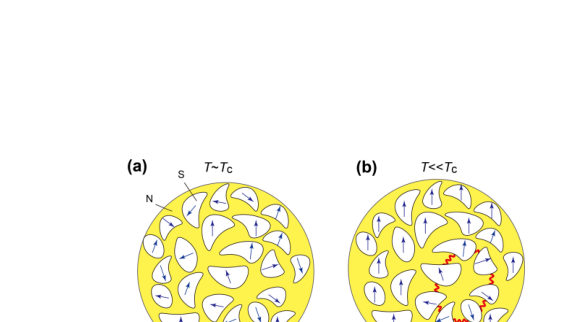 
FIG. 1. |Schematic representation of a proximity-coupled nanocomposite. (a) At temperatures near the transition temperature Tc, each superconducting (S) domain embedded in the normal (N) matrix reaches internal equilibrium with a different phase (represented by arrows), meaning that the respective S domains are uncoupled. (b) At temperatures well below Tc, the entire system goes towards a global phase coherence state, in which the respective S domains have an identical phase state, owing to the proximity effect, although topological defects where the sum of the phases around a loop (represented by a red wavy circle) exceeds ±2𝜋 may be created during a thermal quench.

📷 Fig 2

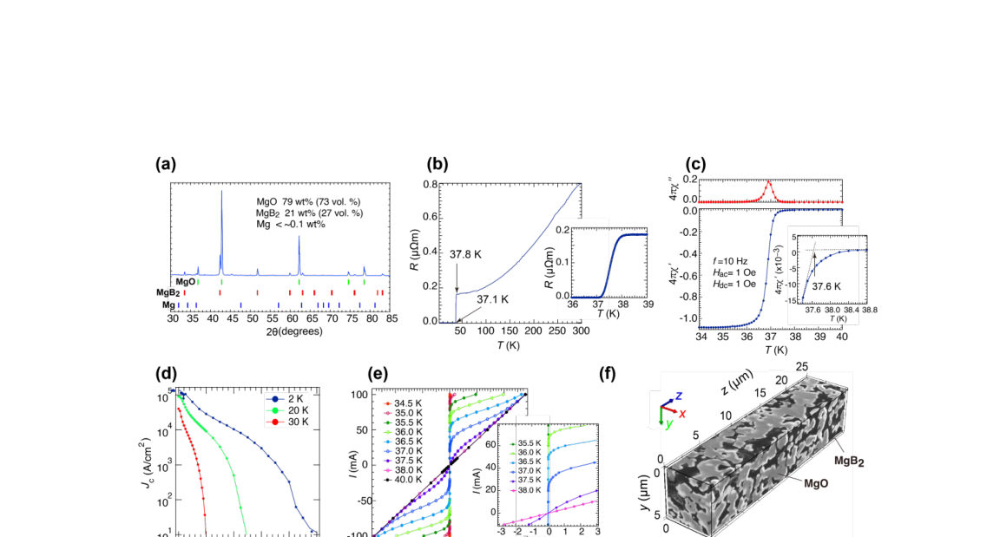 
FIG. 2. Structural and superconducting properties of the NS nanocomposite. (a) XRD pattern and the wight fractions of MgO, MgB2 and Mg obtained from a Rietveld analysis along with the corresponding approximate volume fractions. (b) Temperature- dependent resistivity. The inset shows an expanded plot of resistivity around the transition temperature Tc. (c) Temperature dependence of the real (4𝜋𝜒′) and imaginary (4𝜋𝜒′′) parts of the ac susceptibility observed in a dc magnetic field hdc of 1 Oe using an ac frequency f of 10 Hz at an ac amplitude hac of 1 Oe. The inset shows an expanded plot of 4𝜋𝜒′ around Tc. (d) Critical current density measured at 2, 20 and 30 K obtained from the magnetic...

📷 Fig 3

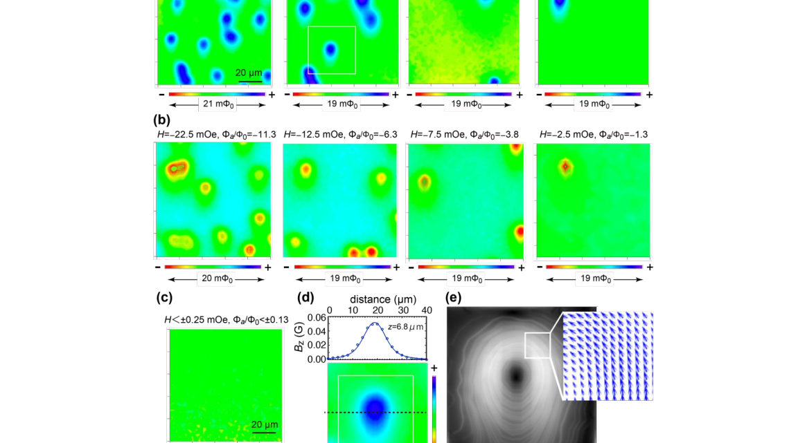 
FIG. 3. Scanning SQUID microscope (SSM) images of the superconducting nanocomposite taken at a temperature of 4 K over the same area of 100 × 100 m2 under (a) positive field-cooling FC, (b) negative FC, and (c) nearly zero applied field (H≤±0.25 mOe) conditions with a pixel size of 2 × 2 m2. (d) The enlarged plot of the white box region in (a) (lower panel) and the field profile measured along the broken line in the SSM image (upper panel). In the upper panel, the solid line is a fitting based on the monopole model, which allows us to estimate the distance z from the sample surface to the SQUID pickup loop (z = 6.8 m) by assuming that the penetration depth  is negligibly smaller than z....

📷 Fig 4

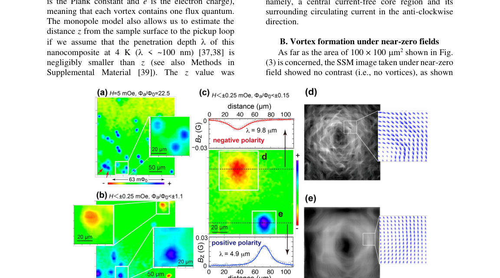 
FIG. 4. SSM images taken at a temperature of 4 K over the same area of 300 × 300 m2 under (a) positive FC (H=5 mOe), and (b) nearly zero applied field (H≤±0.25 mOe) conditions with a pixel size of 3 × 3 m2. The insets show the enlarged images of the corresponding white box regions (50 × 50 m2). The vortex images indicated by the red arrows in (a) are the vortices that are rather extended in shape. (c) SSM image taken at a temperature of 4 K over an area of 110 × 110 m2 under nearly zero applied field (H≤±0.25 mOe) conditions (middle panel) with a pixel size of 2.5 × 2.5 m2. The upper and lower panels show the field profiles measured along the dotted lines on the vortices with negative...

📷 Fig 5

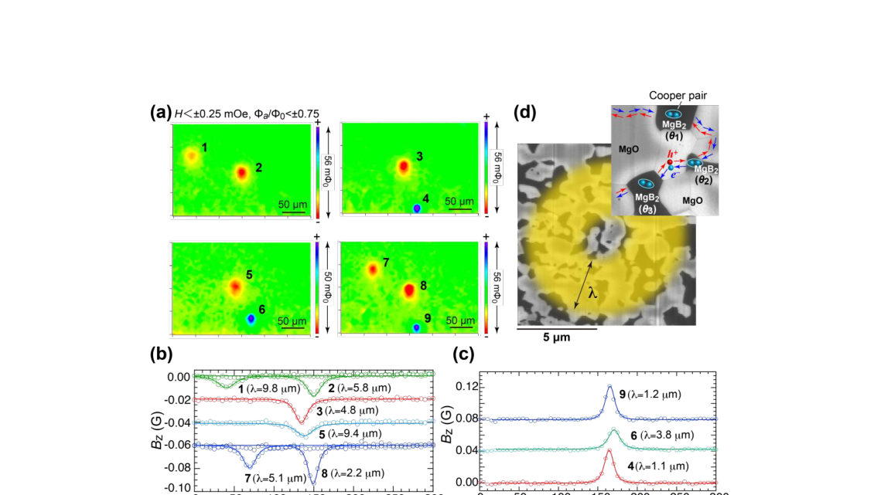 
FIG. 5. (a) A series of SSM image taken at a temperature of 4 K over the same area of 300 × 200 m2 under nearly zero applied field (H≤±0.25 mOe) conditions with a pixel size of 5 × 5 m2. Each SSM image was taken consecutively after heating the sample up to ~50 K and then cooled down to 4 K to erase the previous history. (b, c) The field profiles measured for the vortices with the same numbering shown in (a). The solid lines are fittings based on the monopole model. The values of penetration depth  obtained by using the monopole fitting (z = 6.7 mm) are shown in parentheses. (d) A possible vortex structure superimposed on a typical scanning electron microscope (SEM) image of the present...

**Summary.** This work investigates spontaneous quantized vortices in a proximity-coupled superconducting nanocomposite using SSM imaging. By observing vortex characteristics under near-zero fields, the authors find that these defects are geometrically distinct from field-induced ones. This evidence strongly suggests that these vortices form via non-equilibrium processes related to phase coherence freezing during cooling.

**Why it may be interesting.** The investigation into defect dynamics far from equilibrium provides a tangible platform for studying quench dynamics and phase transition universality, concepts central to statistical mechanics and many-body physics.

Detailed structure

**Main problem.** The study aims to understand the formation and characteristics of spontaneous quantized vortices, which are topological defects arising during a continuous second-order phase transition in superconductors.

**Main result.** Spontaneous vortices observed under near-zero fields exhibit significantly larger penetration depths ($\sim 1-10 \mu	ext{m}$) compared to field-induced ones, suggesting they exist in a non-equilibrium or quenched state rather than thermodynamic equilibrium.

**Method.** The research employs scanning superconducting quantum interference device microscope (SSM) measurements on a proximity-coupled nanocomposite film to image local magnetic fields and current distributions.

**Model / system.** The physical system is a proximity-coupled superconductor nanocomposite ($	ext{MgB}_2/	ext{MgO}$), modeled as an ensemble of Josephson junctions. The underlying physics relates to spontaneous symmetry breaking and defect formation dynamics, drawing parallels with the Kibble-Zurek mechanism.

**Key observables.** Vortex polarity, size, shape, local magnetic field distributions, estimated penetration depth ($\lambda$), and current density maps.

**Important parameters / regimes.** Near zero applied magnetic fields ($H \le \pm 0.25 	ext{ mOe}$), temperature near $T_c$, Josephson coupling energy ($E_J$).

**Assumptions / limitations.** The analysis relies on fitting field profiles using the monopole model, which assumes certain geometric relationships that may be compromised for highly extended vortices.

**Figures summary.** Figures show schematic representations of phase coherence and defects (Fig. 1); structural/superconducting characterization ($	ext{XRD}$, $
ho(T)$, $\chi'(T)$) (Fig. 2); SSM images demonstrating stochastic vortex generation in near-zero fields (Figs. 3, 4, 5a); and field profiles fitted to estimate large penetration depths (Figs. 3, 4, 5b/c).

**Paper structure.** The paper progresses from establishing the theoretical context of topological defects during phase transitions, detailing the experimental setup using nanocomposites, presenting measurements showing stochastic vortex formation in zero fields, and finally contrasting these spontaneous vortices with field-induced ones to conclude they are non-equilibrium structures.

Abstract

Observation of spontaneous symmetry breaking is crucial to our understanding of a continuous second-order phase transition from a disordered system into an ordered one, which often leads to the formation of topological defects. In the case of superconductors, such topological defects are identified as quantized vortices. However, their geometrical characteristics have not been well investigated and understood yet. For the imaging of spontaneous vortices, we employ a proximity-coupled superconducting nanocomposite. Here we show from scanning superconducting quantum interference device microscope measurements that vortices with different polarities, size and shapes are observed stochastically especially under near zero-field conditions. The field distributions of the spontaneous vortices are more extended and intricate than those of the field induced Abrikosov vortices, yielding longer penetration depths ranging from ~1 to ~10 micrometer. The spontaneous vortices are created during cooling as a result of the competition between Josephson coupling and thermal phase fluctuation, both of which are inherently present in this proximity-coupled system. The morphology of the vortices most likely imprints the information that is frozen at the time of vortex formation, providing insights into the local phase differences that are present in the early stage of the phase transition.

[↑ back to top](#top)

### [Tunable Magneto-Excitonic Coupling in Alloyed van der Waals Antiferromagnet](http://arxiv.org/abs/2607.14723v1)

**Authors:** Maciej Smiertka, Oliwia Janikowska, Katarzyna Olkowska-Pucko, Grzegorz Krasucki, Katarzyna Posmyk, Paulina Peksa, Alessandro Surrente, Dimitar Pashov, Kseniia Mosina, Zdenek Sofer, Mark van Schilfgaarde, Adam Babinski, Maciej R. Molas, Gabriela Komorowska, Esteban Zamora-Amo, Andres Castellanos-Gomez, Federico Mompean, Mar Garcia-Hernandez, Michal Baranowski, Swagata Acharya, Paulina Plochocka  
**Type:** both · **Category:** other · **PDF:** <https://arxiv.org/pdf/2607.14723v1>  
**Analysis basis:** full PDF text, analyzed in chunks
**Topic relevance:** 🔥 `spintronics-quantum-optics interface` **4/5** · `exotic spin models in light-matter` **3/5** · `Keldysh / 2PI / non-Gaussian methods` **1/5** · `analog quantum simulation` **1/5** · `driven-dissipative phase transition` **1/5**

📷 Fig 1

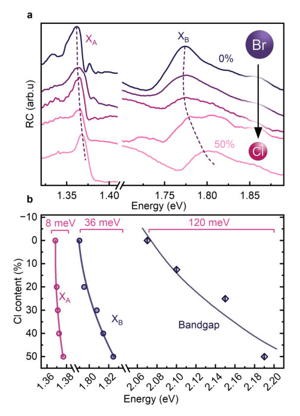 
FIG. 1. Optical response of CrSBr1−xClx. (a) Low-temperature (∼10 K) reflectance contrast spectra of CrSBr1−xClx flakes measured for different Cl content. The top curve corresponds to pristine CrSBr, and the subsequent curves represent the results for chlorine contents of 20%, 30%, 40%, and 50% Cl, respectively. The dashed lines mark the po- sitions of two prominent excitonic features labelled XA and XB. (b) Composition dependence of the XA and XB exciton resonance energies, extracted from reflectance measurements, as a function of Cl content. Dots denote the experimentally determined excitonic feature positions, while diamonds are bandgap values extracted from first-principles...

📷 Fig 2

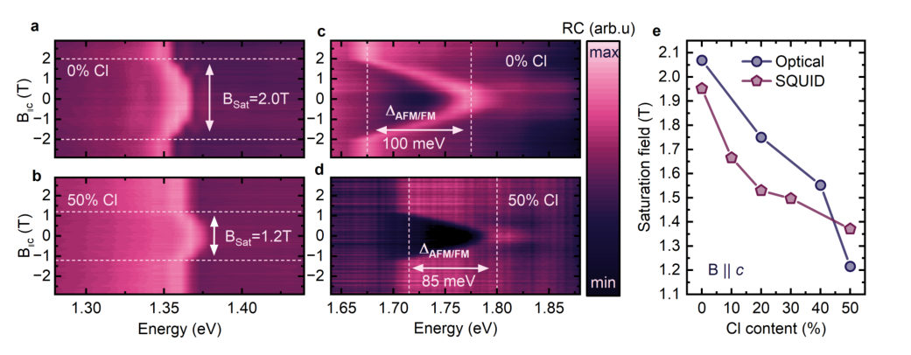 
FIG. 2. Impact of alloying on the magneto-optical response. (a-d) Evolution of reflectance contrast spectra around XA (a,b) and XB (c,d) energy range as a function of the magnetic field presented in a false-colour map for flakes of pristine CrSBr and CrSBr0.5Cl0.5. The arrow marks the values of the critical field. (e) Comparison of the magnetic saturation field Bsat with increasing chlorine concentration, extracted from optical measurements and SQUID.

📷 Fig 3

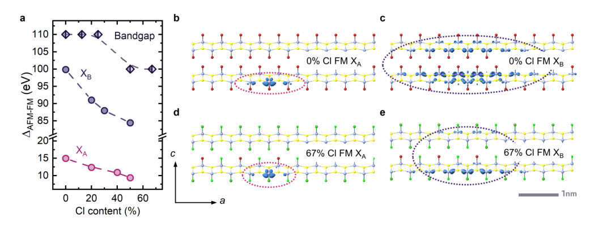 
FIG. 3. Evolution of AFM/FM energy shifts and simulations of the exciton wavefunction spread with Cl content (a) Evolution of ∆AF M/F M as a function of Cl content for thin flakes. Magenta and purple points represent absolute values of the energy shift between 0 T and 3 T of XA and XB transitions. Diamonds are the results of the calculated bandgap energy shifts predicted by our QSGW calculations. The dash lines are guides to the eye. (b) Exciton wavefunction isosurface simulations for pristine CrSBr XA and XB (b-c) and for 67% Cl (d-e).

📷 Fig 4

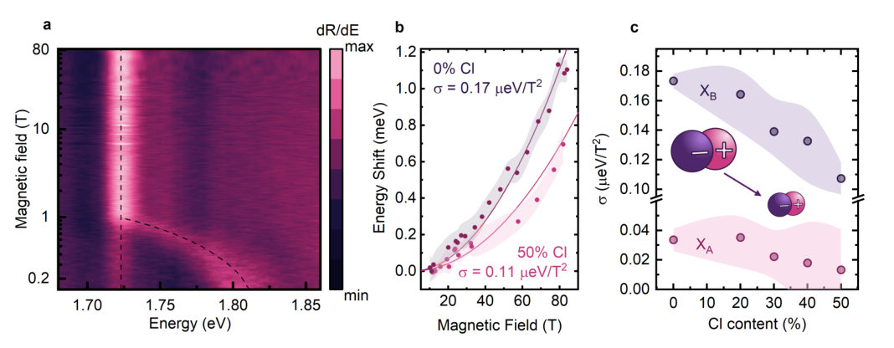 
FIG. 4. Probing spatial extension of excitonic transitions of CrSBr1−xClx. (a) False colour plot of dR/dE and energy vs magnetic field plotted on a logarithmic scale for the XB range in high field regime for bulk crystal with 50% Cl. The dashed lines are guide to the eye (b) Extracted energy shifts in the FM phase for pristine CrSBr and 50% Cl sample showing a quadratic dependence. The solid lines are parabola fits used to extract the values of the diamagnetic coefficients (c) Diamagnetic coefficients σ of XA and XB excitons plotted as a function of Cl content. The shading represents an error of the fit to the exciton energy.

**Summary.** This study demonstrates that alloying $	ext{CrSBr}$ with Chlorine ($	ext{Cl}$) allows precise tuning of the magneto-excitonic coupling in van der Waals antiferromagnets. By analyzing both spectroscopy and theory, the authors show that Cl incorporation forces excitons toward a more localized (Frenkel) state, which systematically weakens the magnetic field's influence on the exciton energy levels.

**Why it may be interesting.** This work provides a clear, materials-based demonstration of how chemical doping can be used to tune fundamental quantum interactions—specifically, controlling the spatial extent (localization) of excitons which dictates their coupling strength with magnetic order. This has direct implications for designing next-generation spintronic or optomagnetic devices.

Detailed structure

**Main problem.** The study investigates how tuning the composition of a van der Waals antiferromagnet ($	ext{CrSBr}_{1-x}	ext{Cl}_x$) can control the magneto-optical coupling between magnetic order and photo-generated excitons.

**Main result.** Chlorine alloying systematically drives both localized (Frenkel-like) and delocalized (Wannier-Mott-like) excitonic states toward a more localized regime, which is correlated with a measurable reduction in the field-induced magneto-excitonic coupling strength.

**Method.** The research combines advanced experimental techniques like high-field magneto-optical spectroscopy with state-of-the-art theoretical calculations using quasiparticle self-consistent GW (QSGW).

**Model / system.** The physical system is the layered magnetic semiconductor $	ext{CrSBr}_{1-x}	ext{Cl}_x$, which exhibits antiferromagnetic and ferromagnetic phases. The focus is on two distinct excitonic states: the localized XA exciton and the delocalized XB exciton.

**Key observables.** Exciton resonance energies ($	ext{XA}$ and $	ext{XB}$), magneto-excitonic coupling strength, diamagnetic coefficient ($\sigma$), and the critical field for the AFM-to-FM transition ($B_{	ext{crit}}$).

**Important parameters / regimes.** Chlorine concentration ($x$ in $	ext{CrSBr}_{1-x}	ext{Cl}_x$), magnetic field up to 85 T, and exciton character (Frenkel vs. Wannier-Mott limit).

**Assumptions / limitations.** The primary assumption is that chemical alloying provides a systematic tuning knob to engineer the coupling between optical and magnetic properties in these materials.

**Figures summary.** Figures show reflectance contrast spectra revealing blueshifts and field-induced kinks related to phase transitions. Calculations map out wavefunction isosurfaces confirming spatial shrinkage, while high-field data quantify this localization via the decreasing diamagnetic coefficient ($\sigma$).

**Paper structure.** The paper systematically presents evidence showing that Cl incorporation modifies electronic structure (QSGW), alters exciton character (comparing XA/XB shifts), and quantifies the resulting change in magneto-optical response across both spectroscopic measurements and theoretical wavefunction analysis.

Abstract

The unique coupling between magnetic order and photo-generated excitons, electron-hole pairs bound by Coulomb interaction, in layered magnetic semiconductors offers a powerful mechanism for controlling light-matter interactions. In the van der Waals antiferromagnet CrSBr, this coupling is exceptionally strong and manifests distinctly between two coexisting excitonic states: the localised, Frenkel-like XA exciton and the more delocalised, Wannier-Mott-like XB exciton, providing a unique playground for the optical control of magnetism. Here, we reveal how chlorine incorporation reshapes the magneto-optical interplay in CrSBr1-xClx by simultaneously modifying its electronic structure, excitonic properties, and magnetic interactions. Combining magneto-optical spectroscopy up to 85 T with state-of-the-art quasiparticle self-consistent GW (QSGW) calculations on alloy supercells, we show that Cl insertion progressively localises the excitonic wavefunctions and drives both states toward a more Frenkel-like regime. This evolution is accompanied by a systematic reduction of the magnetic-field-induced energy renormalisation, most prominently for the XB exciton. Our work connects exciton character directly to magneto-excitonic coupling. Furthermore, it establishes compositional alloying as an effective strategy for engineering the coupling between magnetic and optical properties in van der Waals magnetic semiconductors.

[↑ back to top](#top)

### [Dispersive Readout of a SiMOS Quantum Dot Using a Flip-Chip Integrated Microwave Resonator](http://arxiv.org/abs/2607.14559v1)

**Authors:** Vo Kim Hieu Van, Santiago Serrano, Cédric Bohémier, Ajit Dash, Fay E. Hudson, Tuomo Tanttu, Chih Hwan Yang, MengKe Feng, Ensar Vahapoglu, Florian K. Unseld, Wee Han Lim, Andrea Morello, Andrew S. Dzurak, Kok Wai Chan  
**Type:** experiment · **Category:** quantum information and computing · **PDF:** <https://arxiv.org/pdf/2607.14559v1>  
**Analysis basis:** full PDF text, analyzed in chunks
**Topic relevance:** 🔥 `QC/QI experiment` **4/5** · `quantum measurements` **2/5** · `measurement-induced transitions` **1/5**

📷 Fig 1

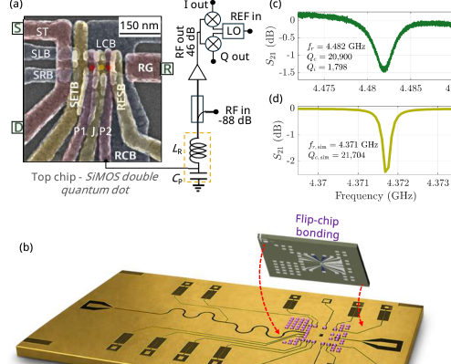 
FIG. 1. Flip-chip integrated SiMOS quantum dot-resonator architecture. (a) False-coloured scanning electron micrograph of the three-layer aluminum gate-stack architecture SiMOS double quantum dot device. The first, second and third alu- minum gate layers are shown in blue, red and yellow, respec- tively. (b) The quantum dot chip is flip-chip bonded to a su- perconducting aluminium resonator chip using indium bump interconnects. The readout circuit consists of an on-chip su- perconducting resonator with effective capacitance (CP ) and inductance (LR) coupled to the quantum dot gate (P2), with the reflected microwave signal amplified and demodulated us- ing an IQ mixer. (c) The measured and...

📷 Fig 2

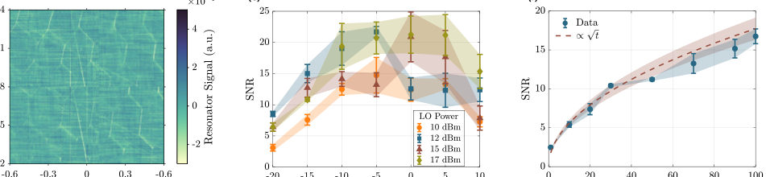 
FIG. 2. Dispersive readout of the flip-chip integrated SiMOS double quantum dot. (a-c) Resonator response in reservoir mode measured as a function of the plunger gate voltages VP1 and VP2, showing charge transitions of the SiMOS quantum dot system detected through the superconducting microwave resonator. (d) Resonator response in isolated mode as a function of the exchange gate voltage (VJ) and the detuning voltage (∆VP1−P2), showing repeated charge transitions over an extended voltage range. (e) Signal-to-noise ratio (SNR) as a function of applied microwave power for different local oscillator (LO) powers. (f) SNR as a function of integration time. The dashed line shows a √

📷 Fig 3

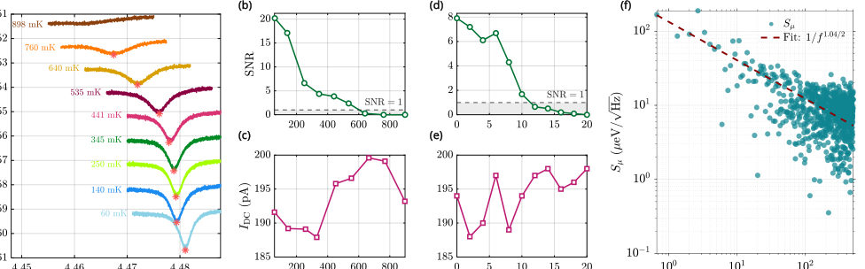 
FIG. 3. Cryogenic performance and noise characterization of the flip-chip integrated dispersive readout device. (a) Mi- crowave transmission S21 of the superconducting resonator measured at different temperatures from 60 mK to 898 mK. The resonator response remains visible up to 760 mK, with the resonance dips marked by asterisks. The data are vertically shifted for clarity. (b, d) Charge-readout SNR as a function of temperature and in-plane magnetic field, respectively. The dashed lines indicate SNR = 1. (c, e) The corresponding dc transport current through the SiMOS device as a function of temper- ature and magnetic field, respectively, showing that the flip-chip bonded device remains...

**Summary.** The research demonstrates the successful integration of SiMOS quantum dot devices with superconducting microwave resonators using a flip-chip bonding technique. By measuring changes in the resonator's response, they achieve dispersive readout of charge transitions in the quantum dots. This establishes a robust and scalable platform crucial for advancing solid-state quantum computing architectures.

**Why it may be interesting.** This work directly addresses scalability in solid-state quantum computing by proving a robust, integrated platform for coupling qubits (the QD) to high-quality microwave measurement circuits (the resonator).

Detailed structure

**Main problem.** The primary goal is to demonstrate a viable, scalable integration method for reading out charge states in Silicon Metal-Oxide-Semiconductor (SiMOS) quantum dot devices using superconducting microwave resonators.

**Main result.** The authors successfully demonstrated dispersive readout of SiMOS double quantum dots on a flip-chip integrated platform, showing that the Signal-to-Noise Ratio (SNR) scales as $\sqrt{t}$ and remains measurable across varying temperature and magnetic field regimes.

**Method.** The experiment uses reflectometry measurements at cryogenic temperatures to couple microwave signals through an indium bump interconnect between the SiMOS QD chip and a superconducting aluminum resonator chip.

**Model / system.** The system comprises a SiMOS double quantum dot (DQD) coupled capacitively to a superconducting aluminum resonator. The readout mechanism relies on measuring shifts in the resonator's frequency or transmission spectrum due to changes in the DQD's charge state.

**Key observables.** Resonator resonance frequency ($f_r$), Signal-to-Noise Ratio (SNR), DC transport current ($I_{dc}$), and electrochemical-potential noise spectrum ($	ext{S}_{\mu}(f)$).

**Important parameters / regimes.** Cryogenic temperatures (down to 60 mK), integration time dependence ($\propto \sqrt{t}$), magnetic field range (up to 10 mT), and coupling regimes (strongly/weakly coupled).

**Assumptions / limitations.** The superconducting resonator properties are sensitive to temperature and magnetic fields, which limits the readout performance; the $	ext{SNR} \propto \sqrt{t}$ dependence suggests white noise limited measurements.

**Figures summary.** Figures illustrate the device architecture (SEM images), charge stability maps showing transitions in different coupling regimes, and quantitative plots demonstrating SNR scaling with integration time and input power, alongside temperature/field dependencies for both microwave response and DC current.

**Paper structure.** The paper details the physical setup using flip-chip bonding to integrate SiMOS QDs and superconducting resonators. It then presents characterization results by measuring charge stability maps, quantifying readout performance via SNR analysis across varying environmental parameters (T, B), and finally analyzing noise spectra.

Abstract

Heterogeneous integration provides a promising route to combine semiconductor quantum dot devices and superconducting microwave circuits, while allowing each component to be fabricated using an optimized process flow. Here, we demonstrate a flip-chip integrated platform for dispersive readout of silicon metal-oxide semiconductor (SiMOS) quantum dot devices. A SiMOS double quantum dot chip is bonded to a superconducting aluminum resonator chip using indium bump interconnects to enable microwave coupling to the quantum dot gate. We show that the developed flip-chip process is compatible with cryogenic operation of both the SiMOS device and the superconducting resonator, and demonstrate resonator-based detection of charge transitions in the quantum dot system. The readout signal-to-noise ratio follows a dependence of $\sqrt{t}$ with the integration time, reaching SNR = 1 at an integration time of approximately 0.3 ms. These results establish flip-chip bonding as a viable integration approach for SiMOS quantum dot devices operating at both dc and microwave frequencies, with potential applications for resonator-based techniques such as spin-photon coupling.

[↑ back to top](#top)

### [High-Q superconducting microwave resonators using MBE titanium nitride](http://arxiv.org/abs/2607.15230v1)

**Authors:** Anand Ithepalli, Haoran Lu, Eegene Clara Chung, Xiangqin Wang, Amit Rohan Rajapurohita, Keun-Yeol Park, Celesta S. Chang, Peter McMahon, Huili Grace Xing, David Muller, Valla Fatemi, Debdeep Jena  
**Type:** experiment · **Category:** quantum information and computing · **PDF:** <https://arxiv.org/pdf/2607.15230v1>  
**Analysis basis:** full PDF text, analyzed in chunks
**Topic relevance:** 🔥 `QC/QI experiment` **4/5** · `quantum optics experiment` **1/5**

📷 Fig 1

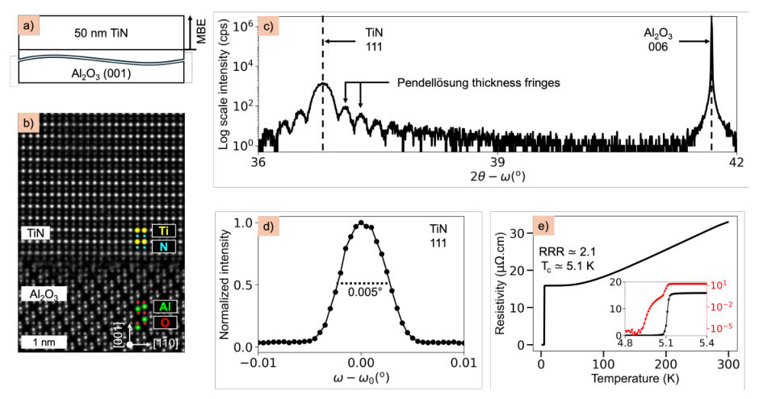 
FIG. 1. a) Sample schematic of the MBE-grown TiN film used in this study. b) Experimental multislice electron ptychography (MEP) STEM image of the film shown in a) with the lattice models of both TiN and sapphire. c) Symmetric coupled 2θ −ω XRD scans indicating a single-crystal TiN film. d) Rocking curve around the symmetric TiN 111 reflection with a record-low FWHM of 18 arcsecs. e) Temperature-dependent resistivity of the 50 nm TiN film indicating a residual resistivity ratio of 2.1 with inset e) showing the superconducting transition around 5.1 K.

📷 Fig 2

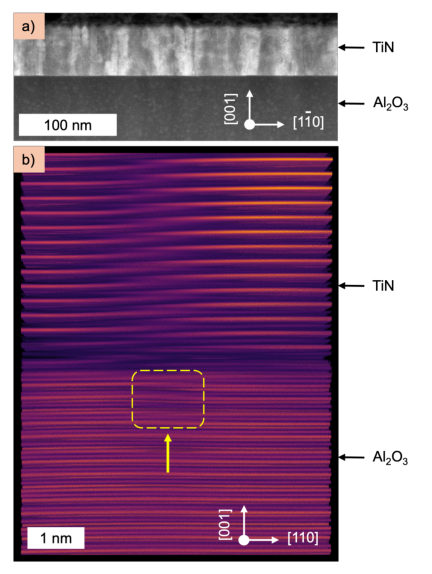 
FIG. 2. a) Columnar growth of TiN is seen from a broader view of the HAADF-STEM image. b) 3D visualization of MEP reconstruction showing a different zone axis compared to that of a). The yellow box and arrow indicate the sub- surface dislocation in sapphire which nucleates a screw-type dislocation in TiN film.

📷 Fig 3

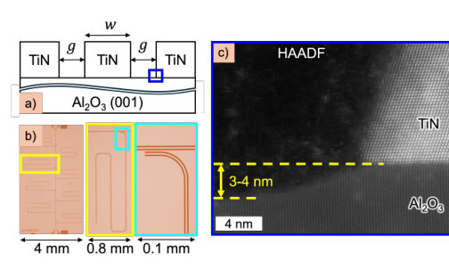 
FIG. 3. a) Cross-section schematic of the processed resonator from the 50 nm TiN film. The central signal line is w = 6 µm wide and the gaps between the signal line and ground planes are g = 3 µm. b) Representative optical images at various magnifications of a processed resonator chip with the same mask used for the sample discussed in this work. c) HAADF image of the same sidewall region of the processed chip, viewed along sapphire [110] axis. Although sapphire acts as a natural etch stop, 3-4 nm of sapphire seems to be etched in the trenches, which has a negligible effect on the metal-air and substrate-air loss energy participation ratio, compared with no overetch case, per HFSS...

📷 Fig 4

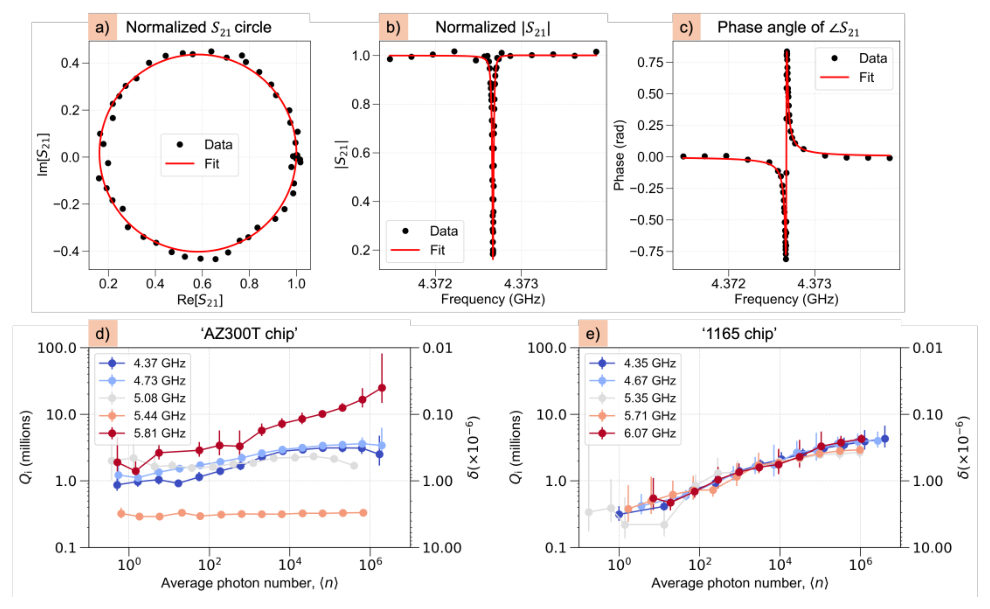 
FIG. 4. Measured data (black, solid circles) of the TiN resonator with f0 ≃4.37 GHz that underwent AZ300T photoresist stripping bath in the single-photon regime, and fitting curves (red, solid lines) of: a) normalized S21 circle in the Argand plane, b) normalized magnitude |S21| frequency dependence, and c) phase angle ∠S21 frequency dependence. Internal quality factor vs average photon number of TiN resonators from d) the ‘AZ300T chip’ and e) the ‘1165 chip’.

📷 Fig 5

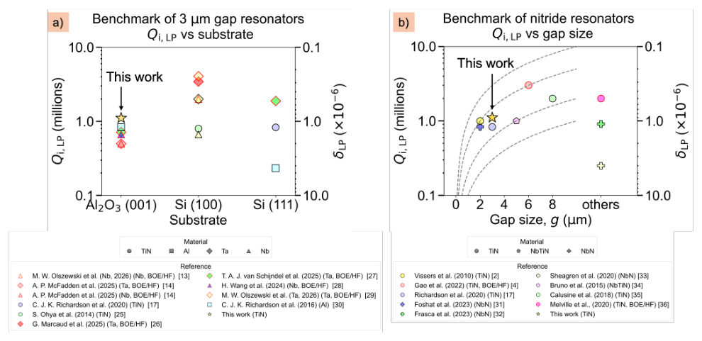 
FIG. 5. Benchmark plots of representative results from literature a) low power ⟨n⟩≃1 intrinsic loss of thin film superconductors with g = 3 µm vs substrate choices for widely used superconductors taken from references [13, 14, 17, 25–30] and b) low power ⟨n⟩≃1 intrinsic loss of nitride thin film superconductors vs gap g [2, 4, 17, 31–36]. The gray dashed lines in b) correspond to δLP ∝g. The references where g is not reported or is not applicable are listed on the “others” gap size. Red outline of the markers indicates that resonators are treated with HF or BOE solutions in those studies to remove the native oxides.

**Summary.** This research reports on the fabrication of high-quality superconducting microwave resonators using epitaxial titanium nitride grown by MBE on sapphire. By achieving state-of-the-art crystalline quality and demonstrating extremely high intrinsic quality factors ($>10^6$), the work provides a robust platform for developing next-generation, high-coherence quantum superconducting circuits.

**Why it may be interesting.** High-$Q$ resonators are fundamental components for superconducting qubits (e.g., transmon or flux qubits) as they dictate coherence times ($T_1$) and coupling strengths, making this work directly relevant to quantum hardware development.

Detailed structure

**Main problem.** The primary goal is achieving superconducting microwave resonators with extremely high quality factors ($Q$) using epitaxial titanium nitride (TiN) thin films.

**Main result.** The fabricated TiN resonators achieved internal quality factors exceeding $10^6$ in the single-photon limit, rising to over $20 	imes 10^6$ at higher photon numbers.

**Method.** The study combines advanced epitaxial growth (MBE) for material synthesis with microwave characterization using quarter-wavelength coplanar waveguide (CPW) resonators cooled to milliKelvin temperatures.

**Model / system.** The physical system is a superconducting circuit built from MBE-grown TiN thin films deposited on c-plane sapphire substrates. The performance is characterized by the resonator's quality factor ($Q_i$) under varying photon occupation numbers ($\langle n 
angle$).

**Key observables.** Internal quality factor ($Q_i$), X-ray rocking curve width (FWHM), superconducting transition temperature ($T_c$), and energy participation ratios ($	ext{pr}$).

**Important parameters / regimes.** Operating temperatures of $10	ext{ mK}$, microwave frequency of 5.8 GHz, and high quality factor values ($>10^6$).

**Assumptions / limitations.** The high performance is attributed to the crystalline nature of the TiN film and low intrinsic surface oxide loss tangent, despite observing sub-surface defects in the sapphire substrate.

**Figures summary.** Figures illustrate structural characterization (XRD rocking curves showing 18 arcsec FWHM) and electrical measurements (temperature-dependent resistivity and $S_{21}$ data used to extract high $Q$ factors).

**Paper structure.** The paper details the MBE growth process, characterizes the material structure using STEM/XRD, measures superconducting properties ($T_c$, RRR), and finally reports microwave resonator performance by measuring $Q_i$ in both single-photon and high-photon regimes.

Abstract

Using molecular beam epitaxy, we have realized thin films of titanium nitride (TiN) on c-plane sapphire that exhibit the lowest observed full-width at half maximum X-ray rocking curve width of 18 arcsec. Though the (111) oriented TiN exhibits an abrupt and crystalline interface with sapphire, for the first time we observe sub-surface defects in the sapphire substrate, which nucleate structural defects in the epitaxial TiN layer. Using quarter-wavelength coplanar waveguide (CPW) resonators in a 3 \textmu m/6 \textmu m/3 \textmu m gap/strip/gap lines in a hanger geometry, we find the internal quality factor of the TiN resonators to be $>10^{6}$ in the single-photon $\langle n \rangle \sim 1$ limit at 5.8 GHz and 10 mK, rising to $>20 \times 10^{6}$ at $\langle n \rangle \sim 10^{6}$. The results are of high interest for applications of superconducting TiN in several areas, and provide a path towards epitaxial Josephson junctions with crystalline barriers in the future for high coherence qubits.

[↑ back to top](#top)

### [Type I/II Vortex Dynamics With Excited Normal Modes](http://arxiv.org/abs/2607.15187v1)

**Authors:** Steffen Krusch, Morgan Rees, Thomas Winyard  
**Type:** theory · **Category:** other · **PDF:** <https://arxiv.org/pdf/2607.15187v1>  
**Analysis basis:** full PDF text, analyzed in chunks
**Topic relevance:** `non-equilibrium dynamics` **3/5** · `driven-dissipative phase transition` **2/5** · `non-equilibrium universality` **2/5** · `Frenkel-Kontorova` **1/5** · `Keldysh / 2PI / non-Gaussian methods` **1/5** · `analog quantum simulation` **1/5** · `correlated / nonlocal dissipation` **1/5** · `methods for driven-dissipative` **1/5** · `scars & prethermalization` **1/5**

📷 Fig 1

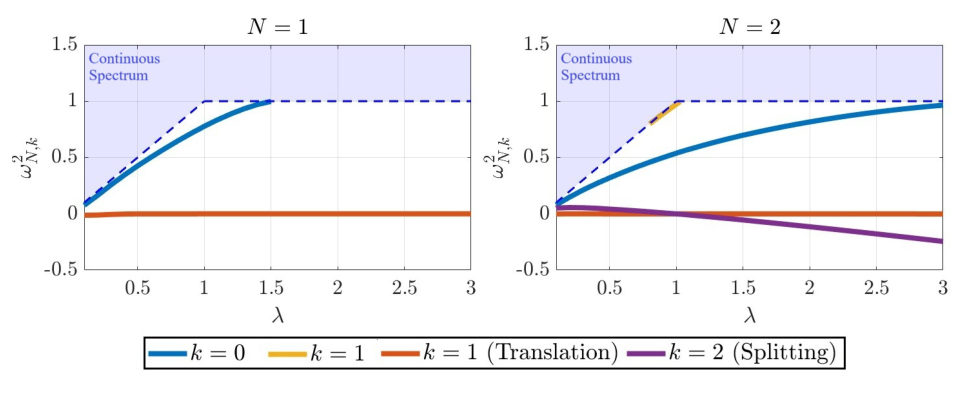 
Figure 2.1: The frequency of the vortex normal modes as a function of λ ∈[0.1, 3] for N = 1, 2 and wave number k ≤N. The shaded region indicates the continuous spectrum.

📷 Fig 2

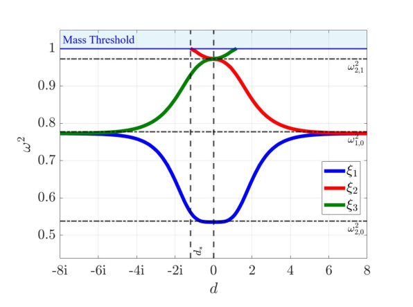 
Figure 5.1: The angular frequency of the normal modes for a 2-vortex configuration at critical coupling λ = 1, as a function of the half-separation d. The three branches correspond to the in-phase excitation ξ1, out-of-phase excitation ξ2, and a third branch ξ3 which emerges from the continuous spectrum. As d →0, the ξ1 and ξ2 branches tend towards the k = 0 and k = 1 modes of the coincident N = 2 vortex respectively (see figure 2.1). The shaded region indicates the continuous spectrum, and the point where ξ2 and ξ3 meet the continuous spectrum defines the spectral wall at d = d∗.

📷 Fig 3

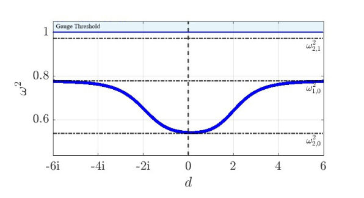 
Figure 5.2: Flow of the angular frequency ω2 as a function of vortex distance from the origin d, where s = 2d. Initial velocity vin = 0.01, initial intensity I(0) = 0.01, where I(0) = 1

📷 Fig 4

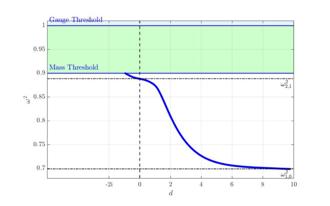 
Figure 6.1: Angular frequency flow for a two-vortex system (λ = 0.9) as a function of vortex sepa- ration d from the origin (blue). The green area indicates the gauge threshold, and the blue area the mass threshold. A d4 approximation is shown in dashed red.

📷 Fig 5

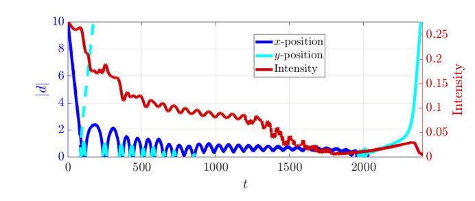 
Figure 6.2: Trajectories of a two-vortex system (λ = 0.9, vin = 0.1, I(0) = 0.3) as a function of time, where I(0) = 1

**Summary.** This paper analyzes vortex dynamics in the Abelian Higgs model by incorporating the effects of excited normal modes. The authors show that these dynamic excitations compete with static forces, leading to complex interactions like repulsion switching to attraction and vice versa. This work provides a detailed theoretical understanding of how mode coupling dictates the stability and long-term orbital behavior of topological defects.

**Why it may be interesting.** While focused on condensed matter topology, the concept of excited modes competing with classical forces to dictate long-lived quasi-stationary states is relevant to understanding non-equilibrium dynamics in quantum many-body systems or open quantum systems where coupling to environmental modes occurs.

Detailed structure

**Main problem.** The study investigates how excited normal modes influence the dynamics of vortices within the Abelian Higgs model, particularly comparing Type I (attractive) and Type II (repulsive) regimes.

**Main result.** Excited normal modes compete with static inter-vortex forces, potentially reversing attraction/repulsion. The analysis predicts spectral walls that stabilize or destabilize bound states, leading to long-lived orbital dynamics for vortex pairs.

**Method.** The authors combine linear perturbation theory (normal mode analysis) with numerical simulations of the full field equations to track time evolution and scattering trajectories.

**Model / system.** The system is based on the Abelian Higgs model in (2+1) dimensions, which reduces to Ginzburg-Landau theory. The dynamics are analyzed by linearizing perturbations around static vortex solutions.

**Key observables.** Vortex interaction energy ($E_{	ext{Int}}$), normal mode frequencies ($\omega$), spectral walls, and the long-lived trajectories of vortex-antivortex pairs.

**Important parameters / regimes.** The coupling parameter $\lambda$ dictates the regime (Type I: $\lambda < 1$, Type II: $\lambda > 1$). The analysis also depends on the excitation level and separation distance $s$.

**Assumptions / limitations.** The analysis relies on linearizing perturbations ($\epsilon \ll 1$) for normal mode calculations, and numerical simulations often employ damping boundary conditions.

**Figures summary.** Figures illustrate vortex trajectories showing annihilation or stable orbits depending on initial velocity and regime. Heat maps visualize energy density and magnetic field profiles during scattering events.

**Paper structure.** The paper progresses by first establishing the model and static solutions, then deriving the normal mode spectrum via eigenvalue problems, and finally applying these tools to simulate and analyze vortex dynamics in Type I and Type II regimes.

Abstract

We investigate the effects of excited normal modes on vortex dynamics in the Abelian Higgs model in the type I (static attraction) and type II (static repulsion) regimes. We demonstrate that shape normal modes compete with the static inter-vortex forces. This can result in excited type I (II) vortices repelling (attracting). In addition we observe the existence of spectral walls that prevent the formation (break up) of bound states in type I (II) systems. We study the long lived quasi-bound states and orbits induced by their competing forces and the effective centrifugal forces. Finally, we observe that the effect is strong enough to induce vortex-antivortex pairs to follow long-lived orbits.

[↑ back to top](#top)

### [Plug Flow and Cavitation in Rough Lubricated Contacts: Molecular Dynamics of Single- vs. Two-Component Fluids](http://arxiv.org/abs/2607.15008v1)

**Authors:** Shubham Agarwal, Martin H. Müser  
**Type:** theory · **Category:** statistical mechanics · **PDF:** <https://arxiv.org/pdf/2607.15008v1>  
**Analysis basis:** full PDF text, analyzed in chunks
**Topic relevance:** `non-equilibrium dynamics` **3/5** · `driven-dissipative phase transition` **2/5** · `non-equilibrium universality` **2/5** · `Frenkel-Kontorova` **1/5** · `Keldysh / 2PI / non-Gaussian methods` **1/5** · `analog quantum simulation` **1/5** · `correlated / nonlocal dissipation` **1/5** · `methods for driven-dissipative` **1/5**

📷 Fig 1

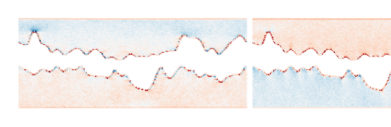 
Figure 1: Residual stresses in the simulation blocks after equilibration σxx (left), σyy (center) and σzz (right). Tensile stress has a positive sign and is indicated in red while compressive is shown as blue. The color range was set to ±4 GPa for reasons of better vi- sualization. Maximum values for tensile and compressive stress are 4.7 GPa and −5.4 GPa for σxx, 4.5 GPa and −3.3 GPa for σyy and 4.3 GPa and −5.9 GPa for σzz.

📷 Fig 2

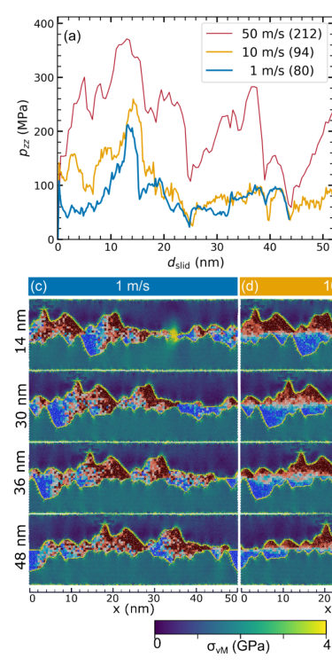 
Figure 3: Water-lubricated contact at three sliding velocities. (a) Mean normal pressure pzz and (b) shear stress τ vs. slid-distance dslid. Mean values are given in parentheses in the legend. Configurational snapshots at four slid-distances are shown for (c) 50 m/s, (d) 10 m/s, and (e) 1 m/s. The corresponding slid-distance (dslid) is mentioned at the left. The copper blocks are colored by the von-Mises stress, the fluid by the normalized coarse-grained flow field ˜vx(x, z). The scalebar represent 10 nm.

📷 Fig 3

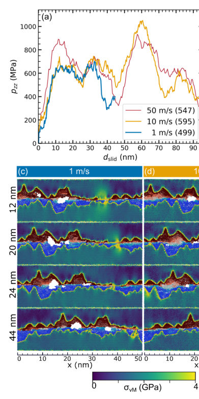 
Figure 4: n-Dodecane-lubricated contact at three sliding velocities. (a) Mean normal pressure pzz and (b) shear stress τ vs. slid-distance dslid. Mean values are given in parentheses in the legend. Configurational snapshots at four slid-distances are shown for (c) 50 m/s, (d) 10 m/s, and (e) 1 m/s. The corresponding slid-distance (dslid) is mentioned at the left. The copper blocks are colored by the von-Mises stress, the fluid by the normalized coarse-grained flow field ˜vx(x, z).

📷 Fig 4

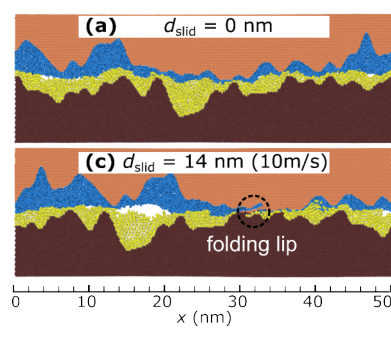 
Figure 5: Interface evolution for mixed lubricated contact. Water is represented in blue near the top wall while n-dodecane in yellow near the bottom wall. The top wall moves towards the right while the bottom wall moves towards the left.

📷 Fig 5

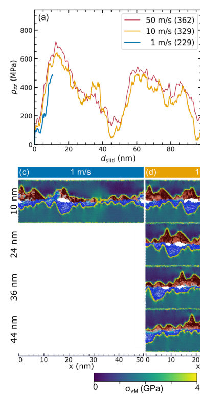 
Figure 6: Mixed-lubricated contact at three sliding velocities. (a) Mean normal pressure pzz and (b) shear stress τ vs. slid-distance dslid. Mean values are given in parentheses in the legend. Configurational snapshots at four slid-distances are shown for (c) 1 m/s, (d) 10 m/s, and (e) 50 m/s. The corresponding slid-distance (dslid) is mentioned at the left. The copper blocks are colored by the von-Mises stress, the fluid by the normalized coarse-grained flow field ˜vx(x, z).

**Summary.** This work uses molecular dynamics simulations to study friction and lubrication in rough contacts using single or mixed fluids. It reveals that fluid behavior is highly dependent on roughness gradients, leading to phenomena like plug flow and cavitation. The findings are crucial for understanding real-world tribology where continuum models fail.

**Why it may be interesting.** While focused on classical mechanics, the analysis of non-equilibrium energy dissipation, stress localization, and phase transitions (cavitation/plug flow) touches upon concepts relevant to open quantum systems dynamics and thermalization in complex media.

Detailed structure

**Main problem.** The study aims to bridge the gap between idealized smooth interface simulations and real, rough, load-bearing contacts in lubricated sliding.

**Main result.** The mixed lubricant showed the lowest friction and maintained plug flow at low velocities, while cavitation was identified as a key mechanism for abrupt shear-stress release in single-component systems like water.

**Method.** Non-equilibrium molecular dynamics (NEMD) simulations were employed to model the complex fluid-solid interactions under various loading conditions.

**Model / system.** The system involves lubricated sliding between rough, deformable surfaces (modeled with self-affine profiles) using three fluids: water, n-dodecane, and their immiscible mixture.

**Key observables.** Time-resolved normal and shear stresses, average friction, load-bearing capacity, local kinetic temperatures ($T_k$), and evidence of plug flow/cavitation.

**Important parameters / regimes.** Lubricant type (single vs. mixed), sliding velocity (low to high speed regimes), surface roughness parameters, and confinement strength.

**Assumptions / limitations.** The simulations use elastic coupling methods to match normal loading conditions across different lubricants; limitations include the inability of periodic boundary conditions to account for fluid replenishment from neighboring regions.

**Figures summary.** Figures illustrate local temperature maps during asperity engagement and cavitation collapse, showing spatial heterogeneity in energy dissipation.

**Paper structure.** The paper progresses by first establishing the physical model (rough contacts, three fluids), then analyzing single-component behavior (water vs. dodecane) to identify phenomena like cavitation, and finally detailing the unique tribological response of the mixed lubricant system.

Abstract

We present non-equilibrium molecular dynamics simulations of lubricated sliding between rough, deformable surfaces under conditions representative of boundary and mixed lubrication. One aim is to reduce the gap between highly idealized simulations of smooth interfaces and real, rough, load-bearing contacts. Another aim is to determine whether favorable tribological properties of two-fluid lubrication reported for solvated hydrophilic-hydrophobic polymer-brush interfaces can also be realized in rough contacts without brushes. To this end, we compare aqueous (water), hydrocarbon ($n$-dodecane), which has a similar equilibrium viscosity to water at ambient conditions, and immiscible two-fluid lubrication under identical geometric conditions. For the single-component lubricants, the simulations reproduce established trends: Water shows stronger speed dependence but reduced load-bearing capacity than $n$-dodecane, despite their similar ambient viscosities. Beyond this expected behavior, the simulations reveal that the combination of strong confinement and large height gradients can cause plug flow and cavitation after asperity collisions. For a high-surface-tension liquid like water, cavitation provides a mechanism for abrupt shear-stress release observable on scales much exceeding the size of the cavity. The mixed lubricant exhibits the lowest friction and material transfer, while maintaining plug flow to the lowest sliding velocity. It is also the only system in which folding lips form, occasionally developing into transient wear particles at high speeds.

[↑ back to top](#top)

### [Altermagnetic spin textures coupled to superconductors: Domain wall spin-triplet superconductivity and supercurrent-induced torques](http://arxiv.org/abs/2607.15249v1)

**Authors:** Yasir Dar, Mathias S. Scheurer, Constantin Schrade  
**Type:** theory · **Category:** other · **PDF:** <https://arxiv.org/pdf/2607.15249v1>  
**Analysis basis:** full PDF text, analyzed in chunks
**Topic relevance:** `Keldysh / 2PI / non-Gaussian methods` **3/5** · `spintronics-quantum-optics interface` **3/5** · `driven-dissipative phase transition` **1/5** · `exotic spin models in light-matter` **1/5** · `methods for driven-dissipative` **1/5**

📷 Fig 1

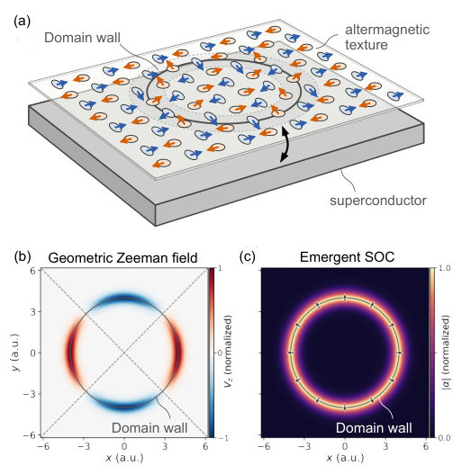 
FIG. 1. Circular altermagnetic Néel domain wall proximitized by a superconductor. (a) Altermagnetic texture on a superconducting layer. Orange and blue ellipses denote the two sublattices (τz = ±). Arrows show the lo- cal in-plane Néel vector orientation. The circle marks the wall radius, R, and the shaded annulus marks the domain wall region where the Néel vector rotates. (b) Geometric Zee- man field, Vz(r), normalized by its maximum. The d-wave altermagnetic order gives a fourfold multipolar pattern. (c) Emergent spin-orbit coupling, α(r), normalized by its maxi- mum. It is localized at the wall and points radially. Panel (a) is schematic and not to scale.

📷 Fig 2

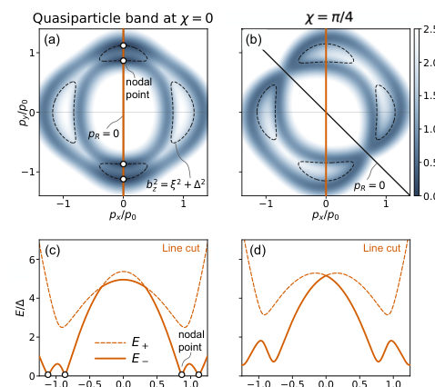 
FIG. 2. Local quasiparticle spectrum for different points along a proximitized circular altermagnetic do- main wall. (a,b) Lower positive-energy quasiparticle band, E−(R, p)/∆, evaluated on the radial domain wall at the wall positions χ = 0 and χ = π/4. Dashed contours indicate the condition b2 z = ξ2 + ∆2. A nodal point additionally requires pR = 0, so that the emergent spin-orbit coupling vanishes. (c,d) At χ = 0, four nodal points appear in the quasiparticle spectrum. At χ = π/4, the quasiparticle spectrum is fully gapped. The momentum normalization is p0 = p

📷 Fig 3

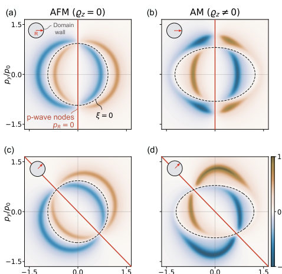 
FIG. 3. Radial altermagnetic domain wall generates spin-polarized triplet correlations. Equal-spin triplet correlator, F↑↑(R, p), for a proximitized radial altermagnetic domain wall normalized to its maximum. Insets indicate the position, R, on the wall. (a,c) Antiferromagnetic limit, ϱz = 0. The emergent spin-orbit coupling generates a p-wave triplet component with nodes at pR = p · ˆR = 0 (red line). Additional nodes arise at ξ(R, p) = 0 (dashed line). (b,d) Altermagnetic case, ϱz ̸= 0. The p-wave triplet component is now modulated by the d-wave altermagnetic form factor. Hence, the additional nodes arise at ξ(R, p) −bz(R, p) = 0.

📷 Fig 4

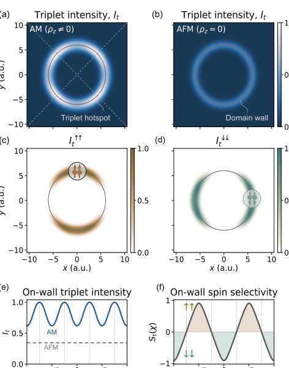 
FIG. 4. Spin-polarized triplet hotspots at a proximi- tized radial altermagnetic domain wall. (a) Equal-spin triplet intensity, It(r), for a radial AM wall, ϱz ̸= 0. The wall generates triplets, while the d-wave AM splitting pro- duces a fourfold hotspot pattern. (b) Non-AM limit (ϱz = 0). Triplets remain localized at the wall, but the angular mod- ulation is absent. (c,d) Spin-resolved intensities: I↑↑ t peaks near χ = ±π/2, whereas I↓↓ t peaks near χ = 0, π. (e) On-wall cut of It, comparing AM and non-AM cases. (f) On-wall spin selectivity St(χ), with positive (negative) values denoting ↑↑ (↓↓) dominance.

📷 Fig 5

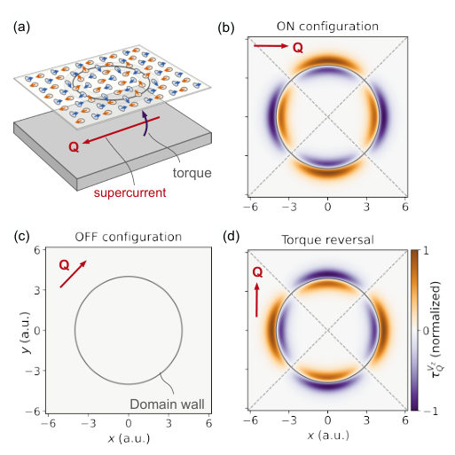 
FIG. 5. Supercurrent-induced torque hotspots at a radial altermagnetic domain wall. (a) A supercurrent produces an out-of-plane torque on the in-plane Néel vector of the altermagnetic texture. (b) Altermagnetic torque contri- bution, τ Vz Q , for a current along the x direction. The torque is localized near the domain wall and has the quadrupolar pat- tern set by the d-wave order parameter. (c) For a diagonal current, χQ = π/4, the altermagnetic torque vanishes. (d) Rotating the current from x to y reverses the torque pattern. All torques are normalized by their maximum.

**Summary.** This paper theoretically explores the proximity effect between superconductors and altermagnets with complex spin textures. It shows that while altermagnetism generally suppresses standard singlet pairing, spatial variations induce localized spin-triplet superconducting regions near domain walls. Crucially, it models how supercurrents exert torques on these magnetic textures, suggesting a pathway for local control of Cooper pairs using magnetism.

**Why it may be interesting.** This work provides a detailed theoretical framework for engineering superconducting properties using magnetic textures, offering insights into how symmetry breaking in magnetism can dictate exotic pairing symmetries (like triplet superconductivity) at interfaces.

Detailed structure

**Main problem.** The study investigates how spatially varying altermagnetic textures affect Cooper pair formation and induce unique superconducting properties, including spin-triplet pairing and supercurrent-induced torques.

**Main result.** Altermagnetism suppresses conventional spin-singlet pairing but induces localized triplet components near domain walls; furthermore, supercurrents generate a quadrupolar torque that can deform the magnetic texture.

**Method.** The analysis uses the Bogoliubov-de Gennes (BdG) Hamiltonian in conjunction with semiclassical approximations and gradient expansions of the free energy functional to derive superconducting properties.

**Model / system.** The system is a heterostructure coupling an s-wave superconductor to an altermagnet exhibiting spatial textures, such as planar radial domain walls. The theory develops effective Hamiltonians incorporating emergent Zeeman fields and spin-orbit couplings arising from the magnetic order parameter variations.

**Key observables.** Local quasiparticle spectra (nodal vs. gapped), induced triplet pairing components ($\mathbf{d}$ vector), superfluid stiffness coefficients ($ar{C}_{ij}^z$), and supercurrent-induced torques ($	au_Q$).

**Important parameters / regimes.** Altermagnetic order parameter variations, domain wall structure, superconducting gap $\Delta$, and applied supercurrent momentum $Q$.

**Assumptions / limitations.** The unperturbed superconductor is assumed to be in a conventional spin-singlet state. The analysis relies on semiclassical approximations (Wigner transform) and gradient expansions of the free energy functional.

**Figures summary.** Figures schematically illustrate domain walls, emergent fields ($V_z(\mathbf{r})$, $\alpha(\mathbf{r})$), local quasiparticle spectra at different points, and the resulting superconducting correlations/triplet intensities.

**Paper structure.** The paper systematically develops the effective Hamiltonian in a rotating frame, projects it onto low-energy subspaces to analyze pairing structure (singlet vs. triplet), and finally uses free energy functionals and gradient expansions to calculate superfluid stiffness and torques induced by supercurrents interacting with texture gradients.

Abstract

Motivated by the absence of sizable stray fields and the recently discovered highly non-trivial impact of altermagnetic textures on itinerant electrons, we here study the form of Cooper pairs in spatially varying altermagnets coupled to conventional $s$-wave superconductors. As a consequence of the detrimental impact of altermagnetism on spin-singlet pairing and the local symmetry reduction caused by textures in the magnetic order parameter, we show that superconductivity predominantly impacts the regions between altermagnetic domains. Focusing on a planar radial domain wall for concreteness, we show that emergent Zeeman and spin-orbit fields create spatially separated triplet hotspots and transitions between nodal and fully gapped superconducting regions, whose structure is set by both the domain wall and the altermagnetic order parameter. We also identify a reciprocal effect, where a supercurrent generates a quasiparticle-mediated quadrupolar torque that inherits the symmetry of the altermagnetic order. Our results show that accounting for spatial inhomogeneities in the altermagnetic order parameter is essential for an understanding of the superconducting proximity effect and suggest that hybrid systems of altermagnetic textures and superconductors offer unique opportunities for local engineering of Cooper pairs and for detecting altermagnetic order.

[↑ back to top](#top)

### [Growth-controlled suppression of electrically active defects in CrSBr](http://arxiv.org/abs/2607.15120v1)

**Authors:** Sara R. Tulchinsky, Sergii Grytsiuk, Shen van Hassel, Iva Plutnarová, Rami Dana, David Sedmidubský, Zdenek Sofer, Malte Rösner, Frances M. Ross, Julian Klein  
**Type:** both · **Category:** other · **PDF:** <https://arxiv.org/pdf/2607.15120v1>  
**Analysis basis:** full PDF text, analyzed in chunks
**Topic relevance:** `spintronics-quantum-optics interface` **3/5** · `Kondo & dissipative impurity` **1/5** · `analog quantum simulation` **1/5** · `exotic spin models in light-matter` **1/5** · `non-equilibrium dynamics` **1/5**

📷 Fig 1

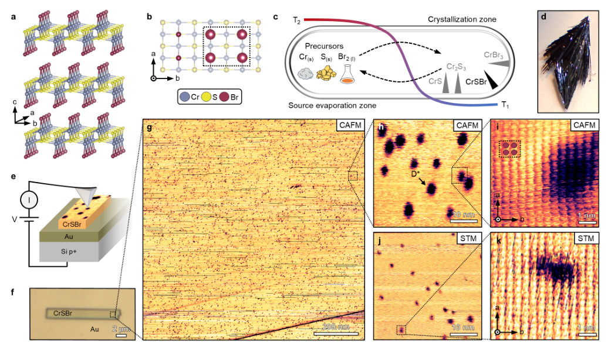 
FIG. 1. Defect detection in bulk CrSBr by conductive atomic force microscopy. a, Schematic crystal structure of CrSBr. b, Top view of the CrSBr lattice, with the unit cell and surface Br atoms highlighted. c, Schematic of the CVT growth ampoule, showing the starting elements Cr(s), S(s), and Br2(l), the applied temperature gradient (∆T = T2 −T1), and the formation of CrSBr together with possible secondary phases, including Cr2S3, CrS, and CrBr3. d, Optical micrograph of a bulk CrSBr crystal. e, Schematic illustration of the CAFM measurement geometry and the electronic contrast associated with defects in CrSBr. f, Optical micrograph of an exfoliated CrSBr flake on a Au substrate. g,...

📷 Fig 2

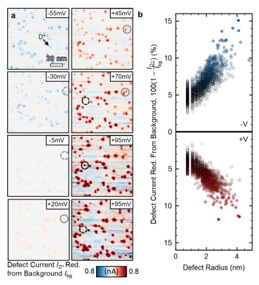 
FIG. 2. Bias-dependent imaging and statistical analy- sis of the characteristic defect. a, Bias-dependent CAFM current maps acquired over a 100 × 100 nm2 area at biases ranging from −55 mV to +95 mV. Circles mark defects that change during scanning. Dotted circles indicate the absence of a defect, while solid circles indicate its presence. b, De- fect radius as a function of current reduction, extracted from negative- and positive-bias CAFM images acquired over a 500 × 500 nm2 area.

📷 Fig 3

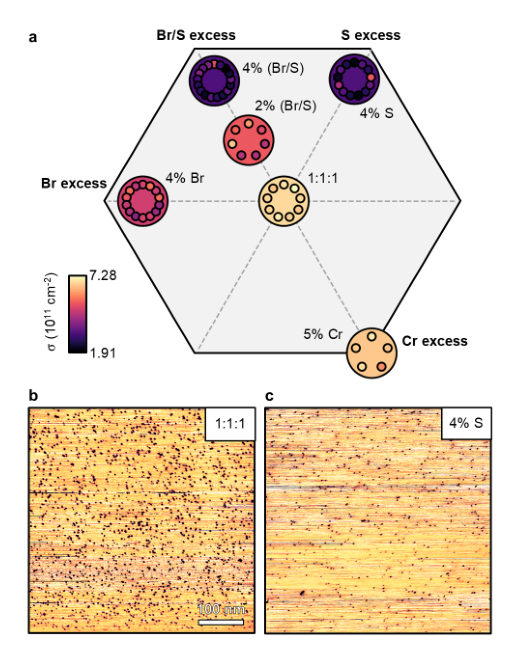 
FIG. 3. Defect density as a function of elemen- tal excess during CrSBr growth. a, Ternary growth- composition map showing defect densities extracted from CAFM measurements. All samples were grown using a tem- perature profile of 800-900◦C. Small circles represent individ- ual measurements from 500 × 500 nm2 CAFM images, while large circles indicate the mean defect density for each growth condition. b,c, Representative CAFM current maps of CrSBr grown under stoichiometric conditions and with 4% S excess, respectively.

📷 Fig 4

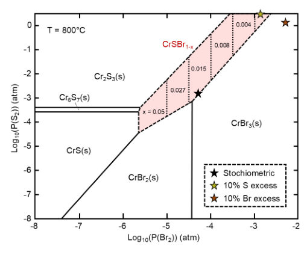 
FIG. 4. Thermodynamic modeling of CrSBr growth. Calculated Kellogg-type phase stability diagram at 800◦C showing the thermodynamically favored condensed phases as a function of the S and Br partial pressures. The ⋆symbols mark the modeled growth conditions for the nominally stoi- chiometric composition and for compositions with 10% S or 10% Br excess.

📷 Fig 5

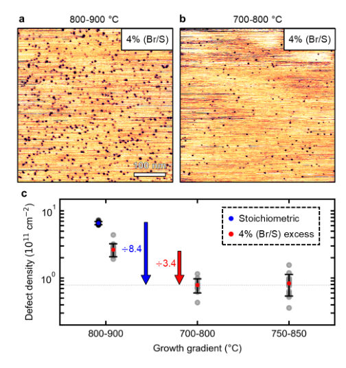 
FIG. 5. Effect of growth temperature gradient on de- fect density. a,b, Representative CAFM current maps of CrSBr grown with 4% Br/S excess at temperature profiles of 800-900◦C and 700-800◦C, respectively. c, Statistical compar- ison of defect densities for three different growth temperature profiles: 800-900◦C, 700-800◦C, and 750-850◦C.

**Summary.** This work demonstrates that the electrical defects in $	ext{CrSBr}$ can be actively controlled during crystal growth by tuning precursor stoichiometry and lowering absolute temperatures. By correlating CAFM measurements with DFT calculations, the authors provide practical guidelines to grow high-quality material with suppressed defect concentrations.

**Why it may be interesting.** While focused on solid-state defects rather than quantum information protocols, the rigorous use of advanced characterization (CAFM/STM) combined with first-principles theory to link processing parameters to electronic properties is highly relevant for understanding defect engineering in novel quantum materials.

Detailed structure

**Main problem.** The primary challenge is systematically controlling the type and density of electrically active defects within $	ext{CrSBr}$ single crystals to tailor its magneto-electrical properties.

**Main result.** Defect concentration can be significantly suppressed (up to an order of magnitude) by optimizing growth conditions, specifically by using sulfur- or bromine-rich precursor stoichiometry and lowering the absolute growth temperature while maintaining the temperature gradient.

**Method.** The study combines experimental characterization using Conductive Atomic Force Microscopy (CAFM) with theoretical validation via thermodynamic modeling and Density Functional Theory (DFT) calculations.

**Model / system.** The physical system is $	ext{CrSBr}$, which crystallizes in the orthorhombic $Pmmn$ space group. Defects are studied using CAFM to measure electronic signatures, while DFT models predict local lattice distortions around vacancy complexes.

**Key observables.** Defect density ($\sigma$), defect current relative to background ($I_{D^*}/I_{bg}$), and atomic displacements ($\Delta Q$) around vacancies.

**Important parameters / regimes.** Growth temperature range ($700-900^\circ	ext{C}$), precursor stoichiometry (S/Br excess), and the applied bias voltage in CAFM measurements.

**Assumptions / limitations.** The electronic contrast observed via CAFM is confirmed to be intrinsic to defects, not surface topography; the background current ($I_{bg}$) is approximated by histogram shifting.

**Figures summary.** Figures detail defect maps from CAFM showing density variation with growth conditions (Fig 3), and DFT calculations illustrate lattice distortion ($\Delta Q$) around different vacancy types (Fig S14).

**Paper structure.** The paper establishes the need for defect control, presents experimental results correlating growth parameters (stoichiometry, temperature) to measured defect suppression via CAFM, analyzes the electronic nature of defects using topography comparisons, and concludes with DFT modeling identifying the likely vacancy complex structure.

Abstract

In CrSBr, as in many crystalline materials, the type and density of defects are expected to strongly influence material behavior. Identifying the underlying atomic defect configurations and controlling their populations during growth are therefore important steps toward understanding and ultimately tailoring its rich magneto-electrical properties. However, systematic control of defects in CrSBr during chemical vapor transport (CVT) growth has not yet been established. Here, we correlate CVT growth conditions with defect concentrations measured using conductive atomic force microscopy (CAFM). We focus on a characteristic defect with a strong electronic fingerprint, labeled D*, and decrease its concentration by up to an order of magnitude through optimized growth conditions. We show that defect densities can be tuned by adjusting precursor stoichiometry, where sulfur- and bromine-rich conditions suppress defect formation, and by lowering the absolute growth temperatures while maintaining the same temperature gradient. Thermodynamic modeling and density functional theory calculations suggest that D* is most consistent with a sulfur-related vacancy complex rather than an isolated point defect. These results provide practical strategies for growing high-quality CrSBr with controlled defect densities.

[↑ back to top](#top)

### [Interlayer sliding direction as a symmetry selector in altermagnetic bilayer Fe2WS4: Switchable anomalous Hall and anomalous valley Hall effects](http://arxiv.org/abs/2607.14459v1)

**Authors:** Quan Shen, Jianing Tan, Tao Yao, Wenhu Liao, Jiansheng Dong  
**Type:** theory · **Category:** other · **PDF:** <https://arxiv.org/pdf/2607.14459v1>  
**Analysis basis:** full PDF text, analyzed in chunks
**Topic relevance:** `spintronics-quantum-optics interface` **3/5**

📷 Fig 1

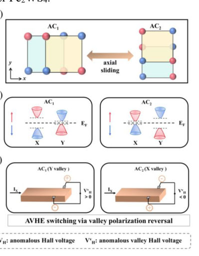 
FIG. 1. Schematic illustration of sliding direction selective coupling in bilayer Fe2WS4. (a)

📷 Fig 2

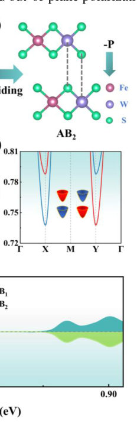 
FIG. 2. (a),(c) Side views of the AB1 and AB2 configurations, which are connected by the 2100

📷 Fig 3

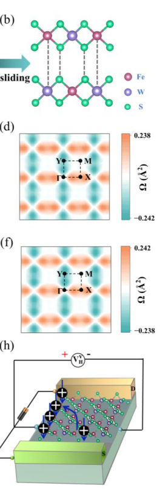 
FIG. 3. (a),(b) Side views of the AC1 and AC2 configurations connected by axial interlayer

**Summary.** This work demonstrates that in altermagnetic bilayer $	ext{Fe}_2	ext{WS}_4$, the direction of interlayer sliding acts as a structural symmetry selector. This mechanism allows researchers to independently switch between ferroelectric polarization and anomalous Hall effects (via diagonal sliding) or induce switchable valley polarization and anomalous valley Hall effects (via axial sliding). The findings establish a powerful, nonvolatile control principle for multifunctional 2D magnetic materials.

**Why it may be interesting.** While focused on condensed matter magnetism, the concept of using structural degrees of freedom (interlayer sliding) as a nonvolatile switch for multiple quantum responses (FE, spin, valley Hall effects) is highly relevant to designing advanced quantum materials.

Detailed structure

**Main problem.** The challenge is achieving nonvolatile and selective control over intertwined degrees of freedom (spin, valley, ferroelectricity) in altermagnetic materials without external mechanical deformation.

**Main result.** The direction of interlayer sliding acts as a symmetry-selective control knob, enabling the switching of both the Anomalous Hall Effect (AHE) via diagonal sliding and the Anomalous Valley Hall Effect (AVHE) via axial sliding.

**Method.** First-principles calculations using DFT (VASP) were employed to model structural changes and calculate electronic properties like Berry curvature and anomalous conductivities.

**Model / system.** The study focuses on the altermagnetic bilayer $	ext{Fe}_2	ext{WS}_4$, investigating four metastable stacking configurations derived from interlayer sliding: diagonal (AB1, AB2) and axial (AC1, AC2).

**Key observables.** Anomalous Hall conductivity ($\sigma_{xy}$), Anomalous Valley Hall Effect (AVHE), out-of-plane ferroelectric polarization ($z_P$), spin texture, and valley polarization.

**Important parameters / regimes.** The direction of interlayer sliding (diagonal vs. axial) is the key structural parameter controlling symmetry breaking.

**Assumptions / limitations.** The study relies on first-principles calculations; the initial AA-stacked bilayer serves as the reference structure for analyzing sliding configurations.

**Figures summary.** Figures illustrate the schematic switching mechanisms: diagonal sliding breaks inversion symmetry to switch AHE, while axial sliding preserves inversion but breaks valley symmetry to switch AVHE via Berry curvature analysis at X and Y valleys.

**Paper structure.** The paper establishes the platform using first-principles methods. It then systematically analyzes two distinct sliding modes—diagonal and axial—showing how each mode selectively breaks different symmetries ($\mathcal{P}$ vs $xy_M$) to control specific transport phenomena (AHE vs AVHE).

Abstract

Altermagnets combine compensated collinear magnetic order with momentum-dependent spin splitting, offering a promising platform for coupling spin and valley degrees of freedom with ferroelectricity and Berry-curvature driven transport in the absence of net magnetization. However, achieving nonvolatile and selective control of these intertwined degrees of freedom remains a key challenge. Here, using first-principles calculations, we show that the direction of interlayer sliding serves as a symmetry selective control parameter in altermagnetic bilayer Fe2WS4. Diagonal sliding breaks inversion symmetry and produces two sliding ferroelectric states with opposite out-of-plane polarizations. Reversal of the ferroelectric polarization switches the momentum-dependent spin texture and reverses the anomalous Hall conductivity, revealing strong magnetoelectric coupling and enabling a ferroelectrically switchable anomalous Hall effect. In contrast, axial sliding preserves inversion symmetry but breaks the crystalline symmetry relating the X and Y valleys, leading to reversible valley polarization and a switchable anomalous valley Hall effect. These results establish the direction of interlayer sliding as a nonvolatile symmetry selector for controlling ferroelectricity, spin texture, valley polarization, and Hall transport responses in two-dimensional altermagnetic bilayers.

[↑ back to top](#top)

### [Confined acoustic phonon mode filtering in free-standing nanocrystalline silicon membranes](http://arxiv.org/abs/2607.14417v1)

**Authors:** Tiago E. C. Magalhães, Tânia M. Ribeiro, Oili Ylivaara, Jouni Ahopelto, Clivia M. Sotomayor Torres  
**Type:** experiment · **Category:** other · **PDF:** <https://arxiv.org/pdf/2607.14417v1>  
**Analysis basis:** full PDF text, analyzed in chunks
**Topic relevance:** `non-equilibrium dynamics` **2/5** · `analog quantum simulation` **1/5** · `correlated / nonlocal dissipation` **1/5** · `driven-dissipative phase transition` **1/5** · `interference shaping light` **1/5** · `non-equilibrium universality` **1/5**

📷 Fig 1

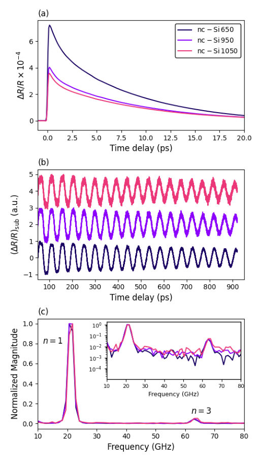 
FIG. 1. Ultrafast acoustic phonon modes in nanocrystalline silicon. (a) First 20 picoseconds after pump excitation. (b) Coherent phonon oscillations after multiexponential fitting subtraction. (c) Magnitude of the FFT, normalized to the first mode, revealing the first and third modes. The inset shows the data in logarithm scale.

📷 Fig 2

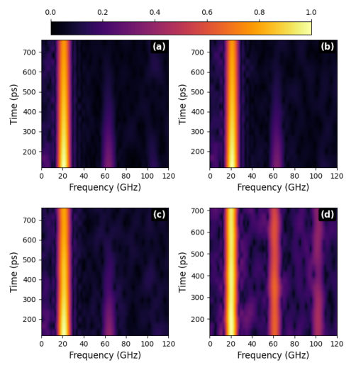 
FIG. 2. Short-time Fourier transform of the background- subtracted reflectivity signal ∆R/Rsub. The color scale rep- resents the normalized square root of the magnitude |S(f, t)| of the short-time Fourier transform. (a) nc-Si 650, (b) nc-Si 950, (c) nc-Si 1050, and (d) c-Si. The fundamental (n = 1), third and fifth modes are clearly resolved in the crystalline sample, while a strong suppression of the higher-order mode is observed in the nanocrystalline membranes, where the fifth mode is hardly observed.

📷 Fig 3

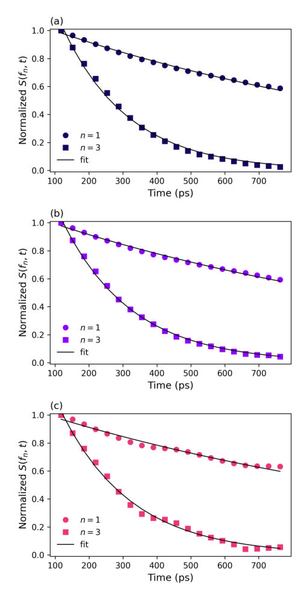 
FIG. 3. Decay curves with fitting for modes n = 1 and n = 3 for the three nc-Si samples. (a) nc-Si 650. (b) nc-Si 950. (c) nc-Si 1050.

📷 Fig 4

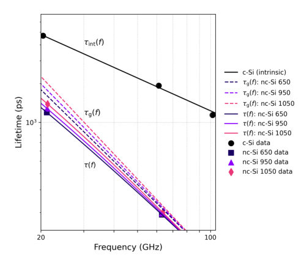 
FIG. 4. Phonon lifetimes as a function of frequency for crys- talline and nanocrystalline silicon membranes. Symbols cor- respond to experimental data, while solid lines represent the total fitted model τ(f) = [τ −1 int (f)+Bf p]−1. The black circles denote the crystalline Si reference, and the solid black line corresponds to the intrinsic lifetime τint(f) given by Eq. (4).

**Summary.** This work uses ultrafast spectroscopy to probe acoustic phonons in nanocrystalline silicon membranes. The researchers find that grain boundaries introduce a strong, frequency-dependent scattering mechanism that selectively filters out high-frequency phonon modes. This demonstrates that microstructure critically controls the vibrational properties and thermal transport of nanoscale materials.

**Why it may be interesting.** While focused on condensed matter acoustics, the concept of spectral filtering due to structural disorder is analogous to engineered loss mechanisms in quantum waveguides or photonic bandgap structures, making it relevant to open quantum systems modeling.

Detailed structure

**Main problem.** The study investigates how grain boundaries affect the propagation of confined acoustic phonons in free-standing nanocrystalline silicon membranes compared to bulk crystalline silicon.

**Main result.** Grain boundaries act as an effective spectral filter, causing a strong, frequency-dependent suppression of higher-order (higher-frequency) acoustic phonon modes. This scattering is quantified by a power-law decay rate proportional to $f^2$.

**Method.** Femtosecond time-resolved pump-probe transmission measurements were used to excite and monitor the coherent acoustic strain pulse in the membranes.

**Model / system.** The physical system is free-standing nanocrystalline silicon (nc-Si) membranes, whose microstructure is controlled by thermal annealing. The analysis models phonon decay using Matthiessen's rule, separating intrinsic scattering from grain boundary contributions.

**Key observables.** Phonon lifetimes ($	au(f)$), effective mean free path ($\Lambda(f)$), and the frequency dependence of the acoustic damping rate.

**Important parameters / regimes.** Grain size distribution (controlled by annealing temperature), phonon frequency ($f$), and the scattering exponent $p$ (found to be $\approx 2$).

**Assumptions / limitations.** The measurement assumes that reflectivity modulation directly tracks coherent phonon dynamics via thickness oscillation, neglecting photoelastic effects.

**Figures summary.** Figures compare time-resolved data and STFT maps showing mode resolution differences between nc-Si and c-Si; Figure 3 shows decay curves for different modes across varying annealing temperatures.

**Paper structure.** The paper follows a structure of presenting measurements on multiple samples (varying grain sizes), analyzing the frequency dependence of phonon damping, fitting the total decay rate to separate intrinsic and grain boundary contributions, and concluding with implications for thermal transport.

Abstract

We report the femtosecond time-resolved measurements of confined acoustic phonons in free-standing nanocrystalline silicon membranes and compare them directly with the crystalline silicon counterpart. While the latter exhibit well-resolved higher-order modes, a strong suppression of these modes is observed in nanocrystalline samples with grain size distribution controlled by thermal annealing. The suppression is strongly frequency dependent and becomes more pronounced as the phonon wavelength approaches the characteristic grain size. By separating intrinsic and extrinsic contributions to the phonon lifetime, we identify an additional frequency-dependent decay channel associated with grain boundaries, with scattering rates following a power-law dependence close to $f^{2}$, where $f$ is the frequency. The measured sound velocity is consistent with previous reports for nanocrystalline silicon and indicates an effective elastic response arising from multiple crystallographic orientations. These results establish coherent phonons as a sensitive probe of microstructure-dependent scattering in nanocrystalline materials and indicate that grain boundaries act as an effective spectral filter for high-frequency acoustic phonons.

[↑ back to top](#top)

### [Gyrotropy from Extrinsic Geometry in Twisted Materials](http://arxiv.org/abs/2607.15189v1)

**Authors:** Spenser Talkington, Eugene J Mele  
**Type:** theory · **Category:** other · **PDF:** <https://arxiv.org/pdf/2607.15189v1>  
**Analysis basis:** full PDF text, analyzed in chunks
**Topic relevance:** `Keldysh / 2PI / non-Gaussian methods` **2/5** · `driven-dissipative phase transition` **2/5** · `methods for driven-dissipative` **1/5** · `non-equilibrium dynamics` **1/5** · `non-equilibrium universality` **1/5**

📷 Fig 1

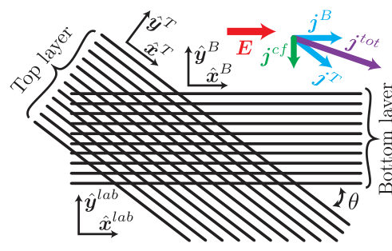 
FIG. 1. A bilayer array of classical wires with relative twist θ between layers and no interlayer coupling exhibits finite gyrotropy, σc′ xy = σc xy in this model. This gyrotropy means that a uniform electric field can drive a transverse (magnetic dipole) current: E (red) is uniform in both layers, and so the antisymmetric electric field Ecf is zero, but jcf = jT −jB

📷 Fig 2

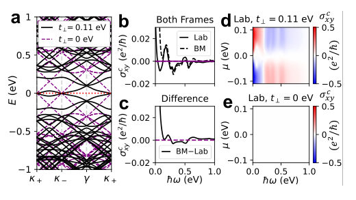 
FIG. 2. Chiral optical conductivity of twisted bilayer graphene (TBG) at 2◦as a function of interlayer coupling t⊥. For real TBG, t⊥≈0.11 eV. (a) Band structure: t⊥= 0.11 eV is in black, t⊥= 0 is dashed in purple; note the emer- gence of the van Hove singularity between κ+ and κ−at finite t⊥. Chemical potential is at charge neutrality (dotted red line). (b-c) Lab and BM frame gyrotropies σc xy for µ = 0. The lab frame response has peaks corresponding to inter-van Hove singularity transitions. The BM frame has an additional spurious contribution which emerges from mixing longitudi- nal total and counterflow responses into the gyrotropy which is particularly visible when the difference of σc...

📷 Fig 3

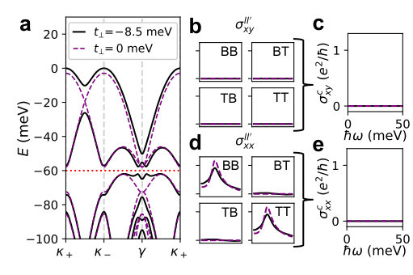 
FIG. 3. Twisted bilayer MoTe2 lacks chiral optical activity in the continuum model. (a) Band structure at 5◦for interlayer tunneling, t⊥, equal to its physical value (black), and to zero (purple); the chemical potential µ = −60 meV is indicated by the dotted red line. (b-c) Layer-resolved and chiral σxy both exactly vanish due to the combination of C3z, T and accidental antiunitary layer-exchange symmetry Λ as detailed in the main text. (d-e) Layer-resolved σxx is non-vanishing, but C2x constrains σT T xx = σBB xx and Onsager T reciprocity ensures σT B xx = σBT xx ; therefore σc xx vanishes.

📷 Fig 4

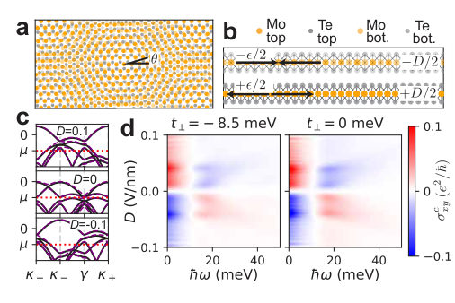 
FIG. 4. Chiral optical activity can appear in twisted bilayer MoTe2 under weak heterostrain ϵ in the presence of a displace- ment field D. Heterostrain breaks C3z, but this is insufficient to enable optical gyrotropy as λτzλ−1 = −τz imposes that the gyrotropy is odd in D and so at D = 0 the response is zero. (a) Top view of bilayer MoTe2 with a 5◦relative twist and 0.1% heterostrain. (b) Side view of zigzag direction il- lustrating strain direction and displacement field. (c) Band structure for select displacement fields. Chemical potential µ = −60 meV is indicated in red, and as before black lines are for the physical t⊥, while dashed purple lines are for the decoupled bilayer. (d) Chiral...

**Summary.** This paper investigates gyrotropy in twisted materials like graphene and MoTe2 to distinguish between effects arising purely from the material's physical geometry versus those stemming from its electronic band structure. By analyzing symmetry constraints and comparing results across different theoretical frames, the authors prove that geometric contributions can be substantial, necessitating careful separation of these two sources for accurate physical interpretation.

**Why it may be interesting.** While focused on condensed matter transport, the rigorous separation of geometry from electronic structure is a fundamental concept applicable to any system where external boundary conditions or physical embedding dictate observable quantum responses (e.g., topological insulators in curved geometries).

Detailed structure

**Main problem.** The central goal is to rigorously separate the contribution of extrinsic physical geometry from the intrinsic electronic structure when analyzing chiral optical gyrotropy in twisted materials.

**Main result.** The study demonstrates that a significant portion of the observed gyrotropy can arise purely from the system's geometric arrangement (extrinsic) rather than solely from interlayer electronic coherence (intrinsic).

**Method.** The authors employ symmetry analysis, layer-resolved current relations, and comparison between conductivities calculated in the physical laboratory frame versus the local Bistritzer-MacDonald frame.

**Model / system.** The primary systems studied are twisted bilayer graphene (TBG) and twisted bilayer MoTe2. The analysis uses continuum models derived from low-energy Hamiltonians for moiré superlattices.

**Key observables.** Gyrotropy ($\sigma_{c,xy}$), chiral optical conductivity, total vs. counterflow conductivities, and the difference between lab-frame and BM-frame responses.

**Important parameters / regimes.** Twist angle ($	heta$), interlayer coupling strength, and strain/displacement fields (for TMDs).

**Assumptions / limitations.** The analysis relies on symmetry constraints ($C_{3z}, T$) to decompose the total response into geometric and electronic components; it also highlights discrepancies between different theoretical frames.

**Figures summary.** Figure 1 illustrates the purely geometric gyrotropy in a classical bilayer array of 1D wires, showing a non-zero transverse counterflow current driven by an electric field.

**Paper structure.** The paper progresses from a minimal classical model to general moiré bilayers (TBG) using continuum models, emphasizing frame dependence. It then applies these concepts to TMDs ($	ext{MoTe}_2$) to show geometric effects dominating under strain.

Abstract

Gyrotropy in twisted bilayer graphene can be used as a signature of interlayer electronic coherence. Gyrotropy can emerge in the absence of interlayer coupling in time-reversal symmetric bilayer systems. This gyrotropy originates from the extrinsic geometry associated with the physical geometry of the system and is independent of the structure of the electronic states. We first illustrate this effect for a purely classical bilayer array of one-dimensional wires. Next we study twisted bilayer graphene and show that the gyrotropy is entirely due to interlayer coherence. In doing so we observe that conductivities calculated in the Bistritzer-MacDonald frame differ significantly from conductivities measurable in the lab frame. Finally we consider twisted bilayer MoTe2, first as a pristine model where the gyrotropy exactly vanishes, and then with weak strain and displacement fields where we show that the geometric gyrotropy can dominate the coherent gyrotropy. Our results call attention to the necessity to separate the contribution of extrinsic physical geometry from the contribution of intrinsic electronic states to the properties of twisted materials.

[↑ back to top](#top)

### Other secondary papers (1)

Show other secondary papers

### [A Modern Multimodal Assistant on a 6 GB 2011 GPU: Stage-Validated, All-GPU CUDA Inference for Fermi](http://arxiv.org/abs/2607.14568v1)

**Authors:** A. C. Opus, J. Q. Lu  
**Type:** experiment · **Category:** other · **PDF:** <https://arxiv.org/pdf/2607.14568v1>  
**Analysis basis:** full PDF text, analyzed in chunks

📷 Fig 1

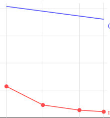 
Figure 1: The O(N2) wall and its removal. The naive attention kernel’s throughput collapses with prompt length (114 →21 tok/s); the per-head cuBLAS rewrite — writing scores into the pre-existing attention buffer, zero new device memory — is nearly flat (408 →361 tok/s). A 2k-token benchmark alone would never have shown the wall.

📷 Fig 2

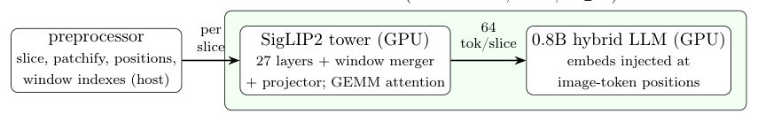 
Figure 2: Production pipeline. The host preprocessor reproduces the reference’s slicing and index arithmetic (calling the reference operator for bucketization, Section 4.2); the resident tower encodes each slice independently (16× compression); the language engine replaces image- placeholder tokens with the tower’s embeddings during prefill.

**Summary.** This paper details the engineering feat of running a modern, multimodal AI assistant entirely on an outdated 2011 GPU. The authors achieved this by rewriting core computational kernels, particularly the attention mechanism, to leverage vendor-optimized matrix multiplication routines. This demonstrates advanced low-level hardware optimization for state-of-the-art AI models.

**Why it may be interesting.** Not directly relevant

Detailed structure

**Main problem.** To deploy a modern, large multimodal assistant model entirely on the GPU using severely constrained, legacy hardware.

**Main result.** The authors successfully achieved an all-GPU inference pipeline for MiniCPM-V-4.6, significantly boosting prefill throughput by rewriting attention kernels to use vendor GEMM calls.

**Method.** The methodology involved rigorous stage-validated porting of vision and language components to CUDA, coupled with low-level kernel optimization (e.g., chunked recurrence, GEMM reformulation) for the legacy GPU architecture.

**Model / system.** The system uses MiniCPM-V-4.6, which combines a SigLIP2 vision encoder and a gated delta-net language backbone. The entire computation is constrained to run on an NVIDIA Tesla C2075 (Fermi, 6GB).

**Key observables.** End-to-end image question answering time (1.7s); Prefill throughput improvement from naive $\mathcal{O}(N^2)$ scaling to a flat profile ($\sim 360$ tok/s at 10k tokens).

**Important parameters / regimes.** Hardware: Fermi GPU (sm_20, 6GB); Model Size: MiniCPM-V-4.6; Context Length: up to 10k tokens.

**Assumptions / limitations.** The performance ceiling and bug locations are only reliable when measured physically on the target hardware, not through abstract reasoning.

**Figures summary.** Figures illustrate the dramatic speedup of prefill throughput (tok/s) and wall-clock time for varying prompt lengths when switching from naive attention to GEMM attention, showing a restored linear scaling profile.

**Paper structure.** The paper details achieving all-GPU residency first, then optimizes three core components: projections via vendor BLAS calls; recurrent layers via chunked delta-rule rewrite; and the vision side porting/attention kernel optimization for long context handling.

Abstract

A companion study ran a 35B mixture-of-experts model on a 2011 NVIDIA Tesla C2075 (Fermi, sm_20, 6GB) as a GPU-prefill/CPU-decode hybrid, because the 4-bit model did not fit in device memory (arXiv:2606.24031). This report keeps the hardware and asks what a model that fits can do: we deploy MiniCPM-V-4.6, a modern multimodal assistant pairing a SigLIP2 vision encoder and window-attention merger (16x visual token compression) with a compact hybrid gated-delta-net backbone, entirely on the GPU. Three results. (i) An all-GPU engine built on measured foundations: projections that dequantize 8-bit weights once and call the vendor SGEMM still in the last Fermi toolchain (64% of FP32 peak; our best hand-written GEMM hit 37%, wrongly called the ceiling); a chunked delta-rule rewrite of the recurrent layers, 2.8x faster than the sequential scan once attribution exposed one bad kernel; and a measured negative: 4-bit weights make decode slower than 8-bit here, since Fermi issues nibble-unpacking shifts at half rate. (ii) The vision side is a port with a proof obligation: we translate tower, merger, and projector to sm_20 CUDA, validating every stage against a locally generated reference forward (full tower 1.4e-5). One failure, position-embedding bucketization differing on exact rational ties, generalizes to a rule: float tie-breaking in index arithmetic is implementation-defined; call the reference operator, do not reimplement it. (iii) Long context exposes an O(N^2) wall short benchmarks hide: prefill falls from 114 tok/s at 2k tokens to 21 at 10k in a naive attention kernel; per-head vendor-GEMM calls writing into the existing score buffer (zero extra memory) restore a flat profile (408 at 2k, 361 at 10k; 17x), verified by exact needle retrieval from 60% depth. The same rewrite cuts image encoding 6x, to 0.93s. The system answers an image question end-to-end in 1.7s.

[↑ back to top](#top)

