
# arxiv digest (quant-ph + cond-mat) — 2026-07-21

*103 papers · 32 relevant · 0 highlighted*

## 🔥 Most relevant (32)

*Every paper with at least one nonzero topic score, sorted by best-matching score. 🔥 marks scores ≥4/5. Click the title to jump to the full entry below; click [arXiv] to open the paper page. `(secondary)` marks papers from de-prioritized cond-mat archives.*

Show 32 relevant papers

- [Manipulating non-intrinsic outputs of a non-Hermitian coupled system by weak external driving](#paper-2607.15770) [[arXiv]](http://arxiv.org/abs/2607.15770v1) — 🔥 `quantum measurements` **5/5** · 🔥 `measurement-induced transitions` **4/5** · `driven-dissipative phase transition` **3/5** · `interference shaping light` **3/5** · `correlated / nonlocal dissipation` **2/5** · `methods for driven-dissipative` **2/5** · `non-equilibrium dynamics` **2/5** · `non-equilibrium universality` **2/5** · `Keldysh / 2PI / non-Gaussian methods` **1/5** · `Tavis-Cummings & cavity-many-emitter` **1/5** · `correlated cavity matter` **1/5**
- [Long range spatial correlations in the periodically driven transverse field Ising model](#paper-2607.15665) [[arXiv]](http://arxiv.org/abs/2607.15665v1) `(secondary)` — 🔥 `non-equilibrium dynamics` **5/5** · 🔥 `non-equilibrium universality` **4/5** · `driven-dissipative phase transition` **3/5** · `methods for driven-dissipative` **3/5** · `Keldysh / 2PI / non-Gaussian methods` **2/5** · `analog quantum simulation` **2/5** · `correlated / nonlocal dissipation` **1/5** · `entanglement & information structure` **1/5** · `exotic spin models in light-matter` **1/5** · `scars & prethermalization` **1/5**
- [Nonequilibrium thermodynamics of feedback-control: a phase-space perspective](#paper-2607.16186) [[arXiv]](http://arxiv.org/abs/2607.16186v1) — 🔥 `quantum measurements` **5/5** · 🔥 `measurement-induced transitions` **4/5** · `methods for driven-dissipative` **3/5** · `non-equilibrium dynamics` **3/5** · `non-equilibrium universality` **2/5** · `Keldysh / 2PI / non-Gaussian methods` **1/5** · `correlated / nonlocal dissipation` **1/5** · `driven-dissipative phase transition` **1/5** · `entanglement & information structure` **1/5**
- [Parameter Estimation in a Continuously Monitored Non-Markovian Quantum System](#paper-2607.15978) [[arXiv]](http://arxiv.org/abs/2607.15978v1) — 🔥 `quantum measurements` **5/5** · 🔥 `measurement-induced transitions` **4/5** · `methods for driven-dissipative` **3/5** · `correlated / nonlocal dissipation` **2/5** · `non-equilibrium dynamics` **2/5** · `Keldysh / 2PI / non-Gaussian methods` **1/5** · `driven-dissipative phase transition` **1/5** · `entanglement & information structure` **1/5** · `quantum optics experiment` **1/5**
- [Fragmented ETH: Prethermalization, Timescales, and Ensemble Inequivalence](#paper-2607.15350) [[arXiv]](http://arxiv.org/abs/2607.15350v1) — 🔥 `scars & prethermalization` **5/5** · `non-equilibrium dynamics` **3/5** · `non-equilibrium universality` **2/5** · `Keldysh / 2PI / non-Gaussian methods` **1/5** · `analog quantum simulation` **1/5** · `driven-dissipative phase transition` **1/5** · `entanglement & information structure` **1/5** · `methods for driven-dissipative` **1/5**
- [Rigorous Time-dependent Hamiltonian Learning via Continuous Weak Measurements](#paper-2607.16047) [[arXiv]](http://arxiv.org/abs/2607.16047v1) — 🔥 `quantum measurements` **5/5** · `measurement-induced transitions` **3/5** · `analog quantum simulation` **1/5** · `driven-dissipative phase transition` **1/5** · `methods for driven-dissipative` **1/5**
- [Controlling charge and spin currents through nonreciprocal dissipative processes](#paper-2607.15767) [[arXiv]](http://arxiv.org/abs/2607.15767v1) — 🔥 `methods for driven-dissipative` **4/5** · 🔥 `spintronics-quantum-optics interface` **4/5** · `analog quantum simulation` **3/5** · `correlated / nonlocal dissipation` **3/5** · `driven-dissipative phase transition` **3/5** · `exotic spin models in light-matter` **3/5** · `non-equilibrium dynamics` **3/5** · `Keldysh / 2PI / non-Gaussian methods` **2/5** · `non-equilibrium universality` **2/5** · `Kondo & dissipative impurity` **1/5** · `entanglement & information structure` **1/5** · `measurement-induced transitions` **1/5** · `quantum measurements` **1/5**
- [Deconfined quantum critical point in a dissipative spin-1/2 chain](#paper-2607.16039) [[arXiv]](http://arxiv.org/abs/2607.16039v1) — 🔥 `driven-dissipative phase transition` **4/5** · 🔥 `methods for driven-dissipative` **4/5** · `correlated / nonlocal dissipation` **3/5** · `exotic spin models in light-matter` **3/5** · `non-equilibrium universality` **3/5** · `non-equilibrium dynamics` **2/5** · `Keldysh / 2PI / non-Gaussian methods` **1/5** · `Kondo & dissipative impurity` **1/5** · `analog quantum simulation` **1/5**
- [Non-Hermitian Quantum Adiabatic Algorithm](#paper-2607.15343) [[arXiv]](http://arxiv.org/abs/2607.15343v1) — 🔥 `analog quantum simulation` **4/5** · `correlated / nonlocal dissipation` **3/5** · `driven-dissipative phase transition` **3/5** · `methods for driven-dissipative` **3/5** · `Kondo & dissipative impurity` **2/5** · `Rydberg arrays` **2/5** · `non-equilibrium dynamics` **2/5** · `Keldysh / 2PI / non-Gaussian methods` **1/5** · `entanglement & information structure` **1/5** · `non-equilibrium universality` **1/5**
- [Dynamical Polarization from Hidden Spin and Orbital Textures in p-Wave Magnets](#paper-2607.15353) [[arXiv]](http://arxiv.org/abs/2607.15353v1) — 🔥 `non-equilibrium dynamics` **4/5** · `Keldysh / 2PI / non-Gaussian methods` **3/5** · `methods for driven-dissipative` **3/5** · `spintronics-quantum-optics interface` **3/5** · `driven-dissipative phase transition` **2/5** · `non-equilibrium universality` **2/5** · `Kondo & dissipative impurity` **1/5** · `analog quantum simulation` **1/5** · `exotic spin models in light-matter` **1/5**
- [Quantum and classical entropic complexity of the thermal state: coherence, decoherence, and the ergodic-to-localized crossover in random-matrix and many-body models](#paper-2607.15798) [[arXiv]](http://arxiv.org/abs/2607.15798v1) — 🔥 `entanglement & information structure` **4/5** · `methods for driven-dissipative` **3/5** · `non-equilibrium dynamics` **3/5** · `analog quantum simulation` **2/5** · `correlated / nonlocal dissipation` **2/5** · `driven-dissipative phase transition` **2/5** · `scars & prethermalization` **2/5** · `Keldysh / 2PI / non-Gaussian methods` **1/5** · `non-equilibrium universality` **1/5**
- [The Complexity of Dynamical Correlators: Operator Shadows and Exponential Learning Separations](#paper-2607.15493) [[arXiv]](http://arxiv.org/abs/2607.15493v1) — 🔥 `entanglement & information structure` **4/5** · 🔥 `quantum measurements` **4/5** · `measurement-induced transitions` **3/5** · `methods for driven-dissipative` **3/5** · `non-equilibrium dynamics` **2/5** · `Keldysh / 2PI / non-Gaussian methods` **1/5** · `analog quantum simulation` **1/5** · `driven-dissipative phase transition` **1/5** · `non-equilibrium universality` **1/5**
- [Enhanced Rydberg-Atom Superheterodyne Detection of Hidden-Photon Dark Matter on Chips](#paper-2607.15612) [[arXiv]](http://arxiv.org/abs/2607.15612v1) — 🔥 `Rydberg arrays` **4/5** · `correlated cavity matter` **3/5** · `quantum optics experiment` **3/5** · `Tavis-Cummings & cavity-many-emitter` **2/5** · `analog quantum simulation` **2/5** · `quantum measurements` **2/5** · `QC/QI experiment` **1/5** · `driven-dissipative phase transition` **1/5** · `interference shaping light` **1/5**
- [Fate of dynamical quantum phase transitions from sudden quench to slow quench limit](#paper-2607.15649) [[arXiv]](http://arxiv.org/abs/2607.15649v1) — 🔥 `non-equilibrium dynamics` **4/5** · 🔥 `non-equilibrium universality` **4/5** · `driven-dissipative phase transition` **3/5** · `methods for driven-dissipative` **3/5** · `analog quantum simulation` **2/5** · `Keldysh / 2PI / non-Gaussian methods` **1/5** · `entanglement & information structure` **1/5** · `scars & prethermalization` **1/5**
- [Harnessing resonant dipolar interactions in a hybrid atom-molecule quantum system](#paper-2607.15976) [[arXiv]](http://arxiv.org/abs/2607.15976v1) — 🔥 `QC/QI experiment` **4/5** · 🔥 `analog quantum simulation` **4/5** · `Rydberg arrays` **3/5** · `entanglement & information structure` **3/5** · `quantum measurements` **2/5** · `correlated cavity matter` **1/5** · `non-equilibrium dynamics` **1/5** · `quantum optics experiment` **1/5**
- [Negative quantum friction in nanoscale water flows: the Wigner picture](#paper-2607.16011) [[arXiv]](http://arxiv.org/abs/2607.16011v1) `(secondary)` — 🔥 `Keldysh / 2PI / non-Gaussian methods` **4/5** · `Frenkel-Kontorova` **3/5** · `methods for driven-dissipative` **3/5** · `non-equilibrium dynamics` **3/5** · `driven-dissipative phase transition` **2/5** · `non-equilibrium universality` **2/5** · `Kondo & dissipative impurity` **1/5** · `correlated / nonlocal dissipation` **1/5**
- [Zigzag ordering, defects, and anomalous relaxation in antiferromagnetic Kuramoto lattices](#paper-2607.15911) [[arXiv]](http://arxiv.org/abs/2607.15911v1) — 🔥 `analog quantum simulation` **4/5** · 🔥 `non-equilibrium universality` **4/5** · `non-equilibrium dynamics` **3/5** · `driven-dissipative phase transition` **2/5** · `methods for driven-dissipative` **2/5** · `Frenkel-Kontorova` **1/5** · `correlated / nonlocal dissipation` **1/5** · `exotic spin models in light-matter` **1/5** · `scars & prethermalization` **1/5**
- [Three-dimensional three-photon Stark spectroscopy of a single Rb Rydberg atom in an ultrahigh-vacuum glass cell with eight electrodes](#paper-2607.15764) [[arXiv]](http://arxiv.org/abs/2607.15764v1) — 🔥 `analog quantum simulation` **4/5** · `QC/QI experiment` **3/5** · `Rydberg arrays` **3/5** · `quantum measurements` **2/5** · `quantum optics experiment` **2/5** · `correlated cavity matter` **1/5** · `entanglement & information structure` **1/5** · `non-equilibrium dynamics` **1/5**
- [Constructing far-from-equilibrium patterns in a cross-diffusion vegetation-autotoxicity model](#paper-2607.15692) [[arXiv]](http://arxiv.org/abs/2607.15692v1) `(secondary)` — 🔥 `non-equilibrium dynamics` **4/5** · `driven-dissipative phase transition` **3/5** · `methods for driven-dissipative` **3/5** · `non-equilibrium universality` **3/5** · `Frenkel-Kontorova` **1/5** · `Keldysh / 2PI / non-Gaussian methods` **1/5** · `correlated / nonlocal dissipation` **1/5**
- [Property-dependent material times](#paper-2607.15920) [[arXiv]](http://arxiv.org/abs/2607.15920v1) — 🔥 `non-equilibrium dynamics` **4/5** · `non-equilibrium universality` **3/5** · `scars & prethermalization` **2/5** · `Keldysh / 2PI / non-Gaussian methods` **1/5** · `driven-dissipative phase transition` **1/5** · `methods for driven-dissipative` **1/5**
- [Deterministic atom-shuttle interconnects via ultrafast atom-ion entangling gate](#paper-2607.15597) [[arXiv]](http://arxiv.org/abs/2607.15597v1) — 🔥 `Rydberg arrays` **4/5** · `QC/QI experiment` **3/5** · `analog quantum simulation` **2/5** · `entanglement & information structure` **1/5** · `non-equilibrium dynamics` **1/5**
- [Isothermal compression of a Fermi gas to deep quantum degeneracy](#paper-2607.15616) [[arXiv]](http://arxiv.org/abs/2607.15616v1) — 🔥 `analog quantum simulation` **4/5** · `non-equilibrium dynamics` **2/5** · `correlated / nonlocal dissipation` **1/5** · `driven-dissipative phase transition` **1/5** · `methods for driven-dissipative` **1/5** · `non-equilibrium universality` **1/5** · `scars & prethermalization` **1/5**
- [Microscopic Side Information Controls Ordered Hayden--Preskill Recovery](#paper-2607.15537) [[arXiv]](http://arxiv.org/abs/2607.15537v1) — 🔥 `entanglement & information structure` **4/5** · `non-equilibrium universality` **2/5** · `Keldysh / 2PI / non-Gaussian methods` **1/5** · `correlated / nonlocal dissipation` **1/5** · `driven-dissipative phase transition` **1/5** · `methods for driven-dissipative` **1/5** · `non-equilibrium dynamics` **1/5**
- [Nonuniform pressure helps structural superlubricity](#paper-2607.15967) [[arXiv]](http://arxiv.org/abs/2607.15967v1) `(secondary)` — 🔥 `Frenkel-Kontorova` **4/5** · `non-equilibrium universality` **3/5** · `driven-dissipative phase transition` **2/5** · `methods for driven-dissipative` **1/5** · `non-equilibrium dynamics` **1/5**
- [Photoelectrical readout and Ramsey interferometry of single shallowly implanted NV centers in diamond](#paper-2607.15869) [[arXiv]](http://arxiv.org/abs/2607.15869v1) — 🔥 `QC/QI experiment` **4/5** · `spintronics-quantum-optics interface` **3/5** · `quantum measurements` **2/5** · `interference shaping light` **1/5** · `quantum optics experiment` **1/5**
- [Quantum Fisher information of magnetic quantum phase transition on Kondo lattice](#paper-2607.16150) [[arXiv]](http://arxiv.org/abs/2607.16150v1) — 🔥 `entanglement & information structure` **4/5** · `Kondo & dissipative impurity` **3/5** · `analog quantum simulation` **2/5** · `Keldysh / 2PI / non-Gaussian methods` **1/5** · `driven-dissipative phase transition` **1/5**
- [The statistical disturbance bound of quantum measurements](#paper-2607.15874) [[arXiv]](http://arxiv.org/abs/2607.15874v1) — 🔥 `quantum measurements` **4/5** · `measurement-induced transitions` **3/5** · `entanglement & information structure` **2/5** · `Keldysh / 2PI / non-Gaussian methods` **1/5** · `correlated / nonlocal dissipation` **1/5**
- [Generation and detection of squeezed light on a single silicon photonic chip](#paper-2607.15461) [[arXiv]](http://arxiv.org/abs/2607.15461v1) — 🔥 `quantum optics experiment` **4/5** · `QC/QI experiment` **2/5** · `analog quantum simulation` **1/5** · `interference shaping light` **1/5** · `quantum measurements` **1/5**
- [Operator Entanglement in Quantum Dynamics Simulations: Formalism and Analysis Tools](#paper-2607.16070) [[arXiv]](http://arxiv.org/abs/2607.16070v1) — 🔥 `entanglement & information structure` **4/5** · `methods for driven-dissipative` **1/5** · `non-equilibrium dynamics` **1/5**
- [Boundary-Phase Control of Sequentially Addressed Trapped-Ion ZZ Interactions](#paper-2607.15688) [[arXiv]](http://arxiv.org/abs/2607.15688v1) — 🔥 `QC/QI experiment` **4/5** · `quantum measurements` **1/5**
- [Quantum states supported by matroids](#paper-2607.15548) [[arXiv]](http://arxiv.org/abs/2607.15548v1) — 🔥 `entanglement & information structure` **4/5**
- [Radiopurity material assays and radiation exposure projections for superconducting qubit measurements at SNOLAB](#paper-2607.16151) [[arXiv]](http://arxiv.org/abs/2607.16151v1) — 🔥 `QC/QI experiment` **4/5**

## All papers (74, sorted by relevance)

*Papers from quant-ph and your primary cond-mat archives (quant-gas, stat-mech, str-el, dis-nn). Highlighted papers (⭐) come first, then everything else sorted by topic-relevance score, highest first.*

### [Manipulating non-intrinsic outputs of a non-Hermitian coupled system by weak external driving](http://arxiv.org/abs/2607.15770v1)

**Authors:** He Feng, Yi-Fan Xiang, Wei Li, Xue-Hua Wang  
**Type:** theory · **Category:** other · **PDF:** <https://arxiv.org/pdf/2607.15770v1>  
**Analysis basis:** full PDF text, analyzed in chunks
**Topic relevance:** 🔥 `quantum measurements` **5/5** · 🔥 `measurement-induced transitions` **4/5** · `driven-dissipative phase transition` **3/5** · `interference shaping light` **3/5** · `correlated / nonlocal dissipation` **2/5** · `methods for driven-dissipative` **2/5** · `non-equilibrium dynamics` **2/5** · `non-equilibrium universality` **2/5** · `Keldysh / 2PI / non-Gaussian methods` **1/5** · `Tavis-Cummings & cavity-many-emitter` **1/5** · `correlated cavity matter` **1/5**

📷 Fig 1

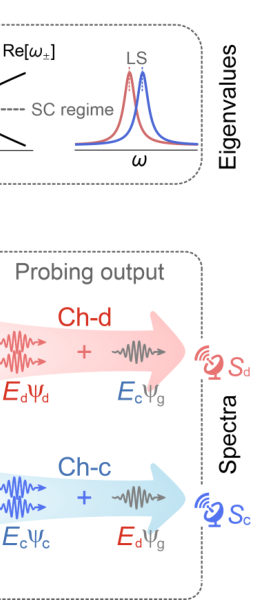 
Fig. 1 | Mechanism of spectral-eigenlevel deviation. a, Intrinsic eigenlevel structure of

📷 Fig 2

 
Fig. 2. Figure 2a illustrates the outputs of both channels in (i) the weak-coupling regime

📷 Fig 3

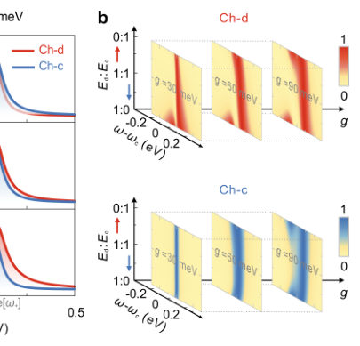 
Fig. 2 | On-demand spectral manipulation. a, Normalized spectra from Ch-d and Ch-c

📷 Fig 4

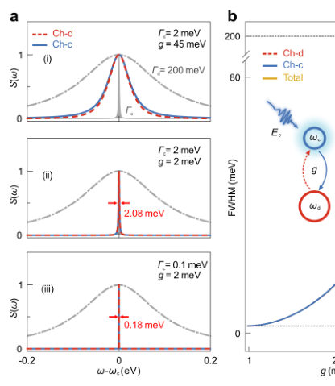 
Fig. 3 | Substantial suppression of modal losses. a, Normalized output spectra from Ch-

📷 Fig 5

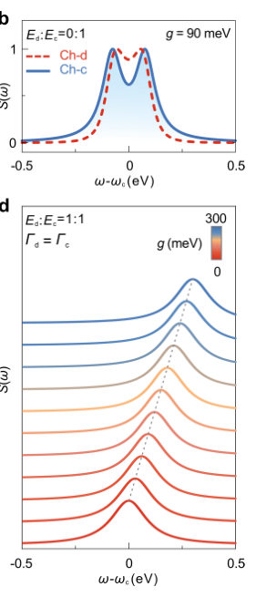 
Fig. 4 | Disappearance of SRS. a,b, Normalized output spectra from Ch-d and Ch-c,

**Summary.** The paper reveals that dissipation in non-Hermitian coupled quantum systems generates 'non-intrinsic' output signals when probed by weak external driving. By controlling the ratio of applied drives, researchers can achieve remarkable effects like suppressing energy loss or inducing giant frequency shifts instead of expected spectral splittings. This offers a new paradigm for manipulating quantum measurements.

**Why it may be interesting.** This work provides profound insight into measurement backaction in open quantum systems, showing that the measurement process itself can be engineered to yield novel, controllable spectral features beyond intrinsic system properties.

Detailed structure

**Main problem.** The work challenges the assumption that weak external driving used in measurement minimally disturbs a probed quantum system, especially when dissipation is present.

**Main result.** Dissipation induces non-intrinsic outputs through interference between self-excitation and coupling-excitation spectral functions. This allows for on-demand manipulation of these outputs, including extreme loss suppression and giant frequency shifts.

**Method.** The analysis uses theoretical derivations based on solving Heisenberg equations of motion under weak driving, employing the Laplace transform method to calculate spectral responses.

**Model / system.** The system is modeled as a non-Hermitian quantum coupled system (e.g., plasmonic modes coupled to emitters) described by an effective Hamiltonian incorporating dissipation ($\Gamma$).

**Key observables.** Non-intrinsic outputs ($S_{	ext{total}}$), eigenlevel splitting (LS), Spectral Rabi Splitting (SRS), Full Width at Half Maximum (FWHM), and spectral resonance frequency shifts.

**Important parameters / regimes.** Ratio of weak external driving strengths ($E_\# : E_\%$), coupling strength ($g$), and dissipation rates ($\Gamma$).

**Assumptions / limitations.** The interference effect is shown to originate directly from the presence of dissipation; it vanishes when $\Gamma=0$. The theory is validated across both quantum and classical coupled systems.

**Figures summary.** Figures illustrate spectral manipulation by varying driving ratios, demonstrating loss suppression (linewidth compression) and the disappearance of SRS under balanced driving conditions. Other figures show frequency shifts in cavity structures.

**Paper structure.** The paper progresses from establishing the non-intrinsic nature of outputs due to dissipation interference, detailing how external driving ratio controls these outputs, deriving a Pythagorean relation linking key spectral parameters, and finally confirming these effects with numerical simulations across various coupling regimes.

Abstract

Measurement provides access to exploring and understanding nature and finds widespread applications. It is generally believed that the weak external driving used in measurement introduces negligible disturbance to the intrinsic output of the probed system. Here, we reveal that dissipation in a non-Hermitian quantum coupled system induces interference between self-excitation and coupling-excitation spectral functions, giving rise to non-intrinsic outputs. These non-intrinsic outputs can be effectively manipulated by the ratio of weak external driving strengths applied to two channels, leading to significant phenomena: extreme suppression of dissipation by convergence effect of high-loss mode towards low-loss mode, and giant shift of resonant frequency instead of original spectral Rabi splitting. Crucially, we discover the Pythagorean relation linking eigenlevel splitting, spectral Rabi splitting and average total decay rate, enabling precise measurement of the eigenlevel splitting and coupling strength. Numerical simulations confirm that the interference outputs also exist in classical coupled systems. Our work provides a profound insight into measurement and non-Hermitian physics.

[↑ back to top](#top)

### [Nonequilibrium thermodynamics of feedback-control: a phase-space perspective](http://arxiv.org/abs/2607.16186v1)

**Authors:** José A. Almanza-Marrero  
**Type:** theory · **Category:** statistical mechanics · **PDF:** <https://arxiv.org/pdf/2607.16186v1>  
**Analysis basis:** full PDF text, analyzed in chunks
**Topic relevance:** 🔥 `quantum measurements` **5/5** · 🔥 `measurement-induced transitions` **4/5** · `methods for driven-dissipative` **3/5** · `non-equilibrium dynamics` **3/5** · `non-equilibrium universality` **2/5** · `Keldysh / 2PI / non-Gaussian methods` **1/5** · `correlated / nonlocal dissipation` **1/5** · `driven-dissipative phase transition` **1/5** · `entanglement & information structure` **1/5**

📷 Fig 1

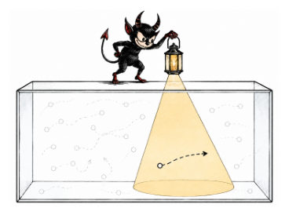 
FIG. 1. A Maxwell’s demon shines its lantern on particles moving in the dark to gather information about their positions and velocities.

📷 Fig 2

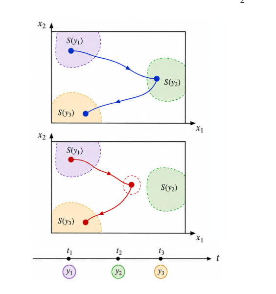 
FIG. 2. Examples of trajectories that are compatible (blue) and incompatible (red) with a given measurement record. The colored regions denote the parts of phase space associ- ated with the outcomes obtained during the forward feedback- controlled process. In the backward experiment, the system evolves under the time-reversed protocol but without feed- back, so its intrinsic stochastic dynamics may generate tra- jectories that leave these allowed regions. Such trajectories are incompatible with the original measurement record, as il- lustrated by the red path.

📷 Fig 3

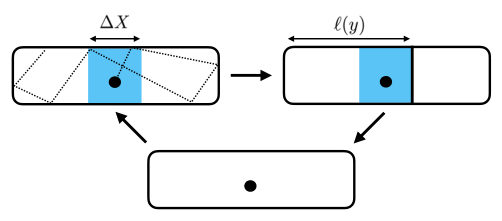 
FIG. 3. Szilard engine with spatial resolution ∆X. The de- mon localizes the particle to within one pixel, so decreasing the pixel size allows it to extract more information.

**Summary.** This paper generalizes fluctuation theorems to account for imperfect measurements and feedback control, introducing the concept of 'unavailable information.' By applying this framework to a finite-resolution Szilard engine, it demonstrates that while acquired information can diverge with precision, the extractable work remains bounded by the available information.

**Why it may be interesting.** It provides a rigorous thermodynamic bound on work extraction that explicitly accounts for measurement limitations (unavailable information), which is crucial for understanding non-ideal quantum measurements or feedback protocols in open quantum systems.

Detailed structure

**Main problem.** The work extends fluctuation relations for nonequilibrium processes involving measurement and feedback control, specifically addressing cases where measurements do not have full support over the system's phase space.

**Main result.** A generalized detailed fluctuation relation is derived, showing that the extractable work in a finite-resolution Szilard engine remains finite even when the acquired information diverges logarithmically with resolution.

**Method.** The derivation uses trajectory probabilities and introduces the concept of 'unavailable information' ($I_u$) to generalize standard fluctuation theorems for singular measurement channels.

**Model / system.** The analysis is primarily developed using a stochastic thermodynamic system, exemplified by a Brownian particle in a 1D box undergoing measurements with finite spatial resolution ($\Delta X$).

**Key observables.** Total entropy production ($S_{tot}$), trajectory transfer entropy ($I_c$), and generalized unavailable information ($I_u$).

**Important parameters / regimes.** Measurement resolution ($\Delta X$) relative to system size ($L$); the ratio $r = \Delta X/L$.

**Assumptions / limitations.** The standard fluctuation theorem is assumed to fail when measurement channels are singular or lack full support; calculations rely on approximations in the high-resolution limit.

**Figures summary.** Figure 1 illustrates Maxwell's demon contextually. Figure 2 shows compatible vs. incompatible trajectories restricted by a measurement record. Figure 3 illustrates the Szilard engine with finite spatial resolution $\Delta X$.

**Paper structure.** The paper first introduces the generalized fluctuation relation for feedback systems, then applies this framework to the concrete example of the finite-resolution Szilard engine, deriving explicit formulas for average information and work extraction.

Abstract

Maxwell demons can convert knowledge into thermodynamic advantage by using measurement-acquired information. However, standard formulations of this problem assume that the demon has access to the system's entire phase space, an assumption that fails in many practical applications. Here, I address this problem by deriving fluctuation relations for general feedback-controlled systems, including such singular cases. The central quantity is a generalized notion of unavailable information: a portion of the acquired information that cannot be used to extract useful work. Finally, a Szilard engine with finite resolution illustrates these results. In the high-resolution limit, the information acquired by the demon may diverge, yet the extractable work remains finite. This work shows that this occurs because an equally divergent amount of information becomes unavailable.

[↑ back to top](#top)

### [Parameter Estimation in a Continuously Monitored Non-Markovian Quantum System](http://arxiv.org/abs/2607.15978v1)

**Authors:** Erik L. André, Pharnam Bakhshinezhad, Patrick P. Potts, Luis A. Correa, Mohammad Mehboudi  
**Type:** theory · **Category:** other · **PDF:** <https://arxiv.org/pdf/2607.15978v1>  
**Analysis basis:** full PDF text, analyzed in chunks
**Topic relevance:** 🔥 `quantum measurements` **5/5** · 🔥 `measurement-induced transitions` **4/5** · `methods for driven-dissipative` **3/5** · `correlated / nonlocal dissipation` **2/5** · `non-equilibrium dynamics` **2/5** · `Keldysh / 2PI / non-Gaussian methods` **1/5** · `driven-dissipative phase transition` **1/5** · `entanglement & information structure` **1/5** · `quantum optics experiment` **1/5**

📷 Fig 1

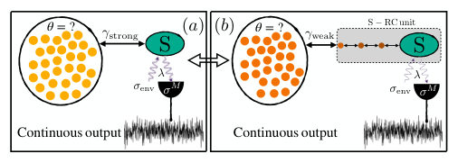 
Figure 1. (a) We consider a continuously monitored system that is strongly coupled to a bath and therefore exhibits non- Markovian dynamics. The output signal is not straightfor- wardly interpretable; hence it cannot be immediately used to infer unknown bath parameters. (b) The reaction coordi- nate mapping resolves this issue by recasting the problem as a Markovian one, allowing the output signal to be analyzed efficiently. Our proposal works for arbitrary Gaussian mea- surements, represented by the covariance matrix σM (e.g., homodyne detection), performed on an environmental mode initially prepared in a Gaussian state represented by its co- variance matrix σenv.

📷 Fig 2

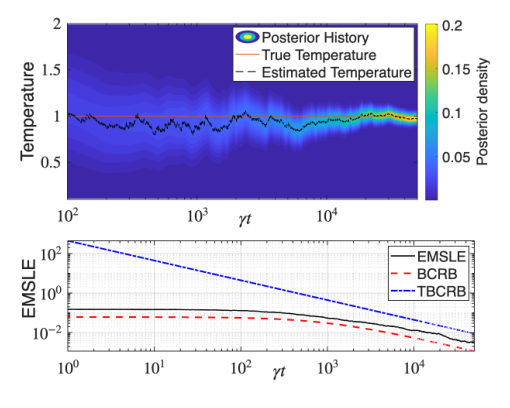 
Figure 2. Top: A sample Monte Carlo simulation of the ho- modyne outcomes is used for Bayesian inference. The con- tour plot shows the posterior density function conditioned on the observed data. Here, the red and black lines indi- cate the true and estimated temperatures, respectively. As more data are collected, the posterior becomes sharper and the estimator is more precise (on average). Bottom: We es- timate the EMSLE using 320 Monte Carlo simulations. We use the Fisher information to lower bound the EMSLE us- ing the Bayesian Cramér-Rao bound (red dashed). We also use the FI to evaluate the tight Bayesian Cramér-Rao bound (blue dashed-dotted). The bound holds only for unbiased es-...

📷 Fig 3

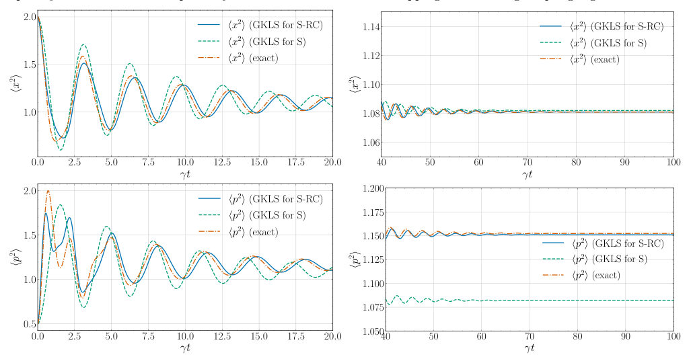 
Figure 3. Comparison of the position and momentum variances evaluated using the exact quantum Langevin equation, the global RC master equation, and the local bare master equation. System parameters are set to ΩS = 1.0, α1 = 1, α2 = 10, γ = 1, and T = 1.

**Summary.** This paper develops a novel method to estimate unknown parameters in quantum systems undergoing continuous monitoring when the underlying dynamics are non-Markovian. By employing a Reaction Coordinate mapping, the authors transform the difficult non-Markovian problem into an augmented system whose evolution is mathematically tractable using standard Bayesian and Kalman filtering techniques. This allows for precise quantitative analysis of physical processes like bath thermometry.

**Why it may be interesting.** This work provides a powerful theoretical framework for extracting precise physical parameters from noisy measurements on open quantum systems where standard Markovian assumptions fail. It bridges advanced concepts in quantum estimation theory with complex non-Markovian dynamics.

Detailed structure

**Main problem.** The core challenge is extending quantum parameter estimation techniques from well-understood Markovian dynamics to complex, non-Markovian regimes using continuous monitoring data.

**Main result.** The authors propose a Reaction Coordinate (RC) mapping that transforms the problem into an augmented system whose evolution remains CP-divisible, allowing for the application of standard Bayesian inference tools.

**Method.** They utilize the RC mapping to embed the non-Markovian dynamics into a larger, effectively Markovian S–RC unit, enabling the use of quantum Kalman filtering and Bayesian estimation techniques.

**Model / system.** The model involves a linear bosonic system strongly coupled to an environment bath, monitored via Gaussian continuous measurements like homodyne detection. The analysis focuses on the evolution of the System-Reaction Coordinate (S–RC) unit.

**Key observables.** Fisher information, estimation precision scaling, posterior density function $p(	heta|\# 
angle_{W m})$, and Mean Square Logarithmic Error ($	ext{EMSLE}$).

**Important parameters / regimes.** The parameter being estimated is often temperature ($	heta$ or $T$), and the dynamics are characterized by drift ($A$) and diffusion ($D$) matrices.

**Assumptions / limitations.** The method assumes linearity, Gaussian measurements, and relies on the RC mapping to simplify the non-Markovian evolution into a CP-divisible form.

**Figures summary.** Figures illustrate how the RC mapping resolves the difficulty of interpreting non-Markovian output signals for parameter inference. Simulations show the posterior density sharpening over time and $	ext{EMSLE}$ approaching theoretical bounds.

**Paper structure.** The paper first establishes the difficulty in non-Markovian estimation, then introduces the RC mapping to achieve CP-divisibility. It details the application of Bayesian theory using quantum Kalman filtering for the S–RC unit, culminating in analytical results and a demonstration via bosonic bath thermometry.

Abstract

Continuous monitoring is a powerful tool for analyzing quantum systems and is increasingly used as a non-demolition technique in quantum metrology. In this context, noisy data acquired through continuous monitoring can be used to precisely pinpoint unknown parameters of the system. However, extending the theoretical framework that connects these data to the underlying parameters beyond Markovian dynamics is notoriously difficult, primarily because such dynamics cannot be expressed as completely positive divisible maps. To overcome this, we propose a method based on the reaction coordinate mapping to extend these parameter-estimation techniques beyond the Markovian regime. Our approach specifically targets linear systems with non-Markovian dynamics undergoing Gaussian continuous measurements, such as homodyne detection. Within this framework, we analyze Bayesian estimation and provide an analytical expression for the Fisher information, alongside the asymptotic scaling of the estimation precision for arbitrary parameters. Finally, we demonstrate the efficacy of our method through the example of thermometry of a bosonic bath.

[↑ back to top](#top)

### [Fragmented ETH: Prethermalization, Timescales, and Ensemble Inequivalence](http://arxiv.org/abs/2607.15350v1)

**Authors:** C. L. Sriram, Soumya Kanti Pal, Lea F. Santos  
**Type:** theory · **Category:** statistical mechanics · **PDF:** <https://arxiv.org/pdf/2607.15350v1>  
**Analysis basis:** full PDF text, analyzed in chunks
**Topic relevance:** 🔥 `scars & prethermalization` **5/5** · `non-equilibrium dynamics` **3/5** · `non-equilibrium universality` **2/5** · `Keldysh / 2PI / non-Gaussian methods` **1/5** · `analog quantum simulation` **1/5** · `driven-dissipative phase transition` **1/5** · `entanglement & information structure` **1/5** · `methods for driven-dissipative` **1/5**

📷 Fig 1

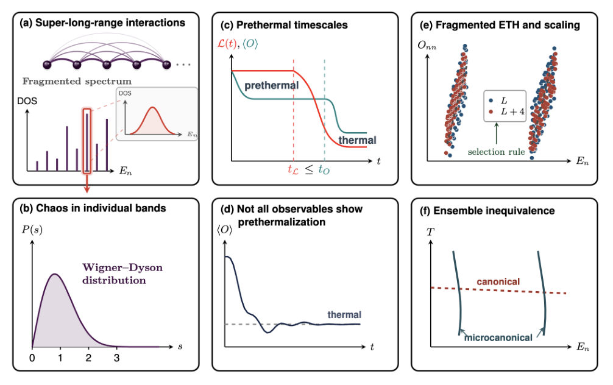 
FIG. 1. Schematic roadmap of the main concepts and results presented in this work. The panels correspond to items (a)–(f) discussed in the overview in Sec. II

📷 Fig 2

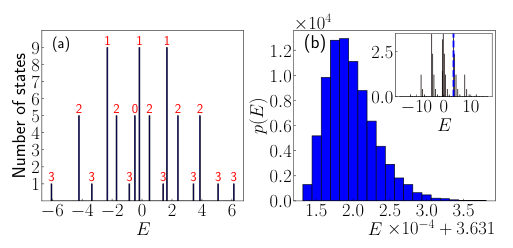 
FIG. 2. Density of states for (a) the whole spectrum of the LMG Hamiltonian ˆH(0) LMG in Eq. (3) for L = 6 sites. The value of s for each band is indicated in red. (b) Density of states for a single energy band of ˆH(α) in Eq. (1) for L = 16 and α = 10−4. The distribution is a skewed Gaussian. The inset shows that the full spectrum of ˆH(α) retains the band structure of the fully connected model, and the vertical dashed blue line shows the band which has been magnified in the main panel.

📷 Fig 3

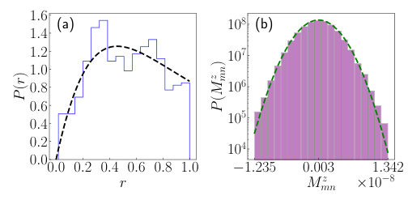 
FIG. 3. (a) Distribution of the ratio of consecutive level spac- ings and (b) distribution of the off-diagonal elements of the total z-magnetization M z for a single energy band of ˆH(α); L = 16, α = 10−4. In (b): 264 eigenstates are selected in the middle of the energy band.

📷 Fig 4

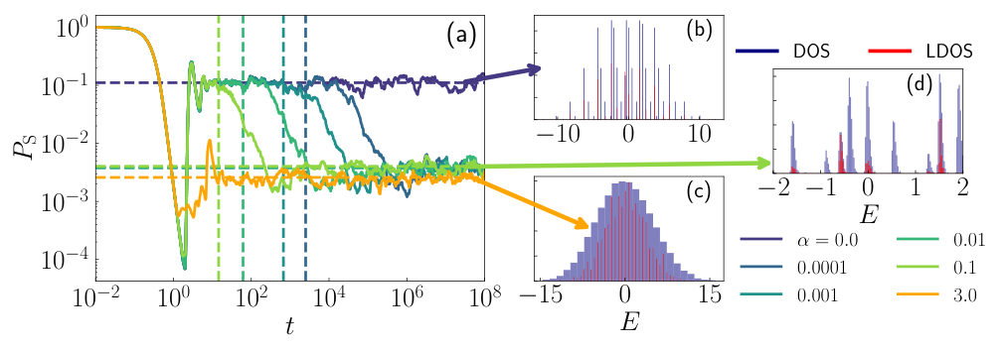 
FIG. 4. (a) Evolution of the survival probability, PS(t), for a product state in the z-basis for different values of α shown in the legend at the bottom right of the figure. Horizontal lines indicate the saturation values; PS (α=0) coincides with the prethermal plateau for 0 &lt; α &lt; 1. Vertical dashed lines mark the analytical predictions for the prethermal lifetime derived in Eq. (27). Panels (b), (c) and (d) show the DOS (blue) and LDOS (red) for (b) all-to-all couplings, α = 0, (c) effective short-range interactions, α = 3, and (d) super-long-range interactions, α = 0.1. The LDOS has been scaled to enable visibility on the same scale as the DOS. Panel (d) shows a small slice of the total...

📷 Fig 5

 
FIG. 5. Evolution of the (a) entanglement entropy, (b) magnetization along the z-direction Mz and (c) first moment of the excitation density Cz for an initial product state and different interaction-range exponets α, as indicated in panel (b). The magnetization does not exhibit a prethermal plateau.

**Summary.** This paper analyzes how quantum systems with long-range interactions approach equilibrium by developing the fragmented ETH (fETH). It shows that Hilbert space fragmentation causes slow prethermalization and predicts ensemble inequivalence because different statistical ensembles sample different parts of the energy spectrum. The work provides analytical tools to quantify these non-equilibrium dynamics.

**Why it may be interesting.** This work directly addresses non-equilibrium dynamics in complex many-body systems, providing a refined theoretical framework (fETH) for understanding thermalization when standard assumptions of ergodicity break down due to system structure or interactions.

Detailed structure

**Main problem.** The paper investigates how finite quantum systems with strong long-range interactions approach thermal equilibrium when global ergodicity is lost due to Hilbert space fragmentation.

**Main result.** It proposes the fragmented ETH (fETH) as a band-resolved description of thermalization, identifying that ensemble inequivalence arises because microcanonical ensembles are confined to single energy bands while canonical ensembles sample across multiple bands.

**Method.** The authors develop a perturbative theory to analytically predict prethermal plateau heights and timescales, alongside developing a symmetry-constrained finite-size scaling framework for fETH.

**Model / system.** The study focuses on finite quantum systems with super long-range interactions (e.g., the spin-1/2 transverse-field Ising chain). The Hamiltonian exhibits fragmentation due to nearly conserved quantities inherited from the fully connected limit.

**Key observables.** Prethermal plateau height and timescale, survival probability ($P_S(t)$), microcanonical vs. canonical ensemble predictions.

**Important parameters / regimes.** The interaction decay exponent $\alpha$ (super-long-range regime $\alpha < d$), system size $N$, and the ratio of coupling strengths to local fields.

**Assumptions / limitations.** The hybridization between neighboring energy bands is assumed to be weak enough ($\alpha < d$) for the band structure approximation to hold; conventional ETH fails due to fragmentation.

**Figures summary.** Figure 1 schematically maps out spectrum fragmentation, quantum chaos within bands, prethermal timescales, conditions governing prethermalization, and the symmetry-imposed selection rule for fETH.

**Paper structure.** The paper progresses by first establishing the physical problem (fragmentation due to long-range interactions), then proposing fETH as the necessary modification to ETH, deriving analytical tools (perturbative theory), and finally demonstrating the consequences of this fragmentation on equilibrium statistical mechanics via ensemble inequivalence.

Abstract

We investigate how finite quantum systems with strong long-range interactions approach thermal equilibrium. Nearly conserved quantities inherited from the fully connected limit fragment the Hilbert space and give rise to a many-body spectrum split into energy bands. As a result, equilibration becomes anomalously slow and proceeds through long-lived prethermal plateaus. This two-stage equilibration process is, however, not universal. We uncover the mechanism that determines which observables and initial states exhibit, or evade, prethermal plateaus. We also develop a perturbative theory that provides analytical expressions for both the height of the prethermal plateau and its timescale. Despite the lack of global ergodicity, quantum chaos develops within individual energy bands, enabling the definition of microcanonical ensembles within the bands. This supports a band-resolved formulation of thermalization, which we term fragmented eigenstate thermalization hypothesis (fETH). Unlike conventional ETH, finite-size scaling in fETH obeys a symmetry-imposed selection rule that restricts which system sizes can be compared. This band-resolved description has direct consequences for equilibrium statistical mechanics. While microcanonical ensembles remain confined to a single band, canonical ensembles mix different bands. This mismatch explains ensemble inequivalence without invoking equilibrium phase transitions. Our results apply to a broad class of Hamiltonians exhibiting Hilbert-space fragmentation.

[↑ back to top](#top)

### [Rigorous Time-dependent Hamiltonian Learning via Continuous Weak Measurements](http://arxiv.org/abs/2607.16047v1)

**Authors:** Jesús Jiménez-Rodríguez, Giacomo Franceschetto, Antonio Acín, Luciano Pereira  
**Type:** theory · **Category:** quantum information and computing · **PDF:** <https://arxiv.org/pdf/2607.16047v1>  
**Analysis basis:** full PDF text, analyzed in chunks
**Topic relevance:** 🔥 `quantum measurements` **5/5** · `measurement-induced transitions` **3/5** · `analog quantum simulation` **1/5** · `driven-dissipative phase transition` **1/5** · `methods for driven-dissipative` **1/5**

📷 Fig 1

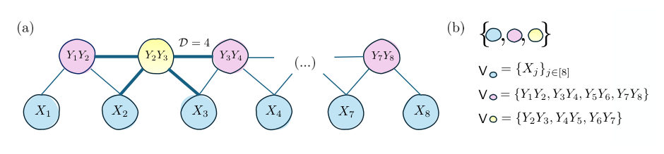 
Figure 1: Interaction graph for the transverse field Ising model-like chain. Vertices represent the Hamiltonian terms Xj and YjYj+1, and edges connect terms with overlapping support. Panel (a) shows the graph structure, with maximum degree D = 4. Panel (b) gives a valid three-coloring, which partitions the terms into disjoint sets that can be addressed in parallel in the probe-construction step.

📷 Fig 2

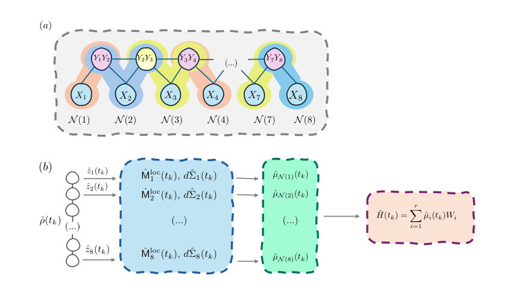 
Figure 2: Local structure of the weak measurements reconstruction protocol. Panel (a) shows the active neighborhoods N(j) for the TFIM-like chain, highlighted on the interaction graph. Each active neighborhood contains the Hamiltonian terms contributing to the first-order evolution of the monitored record at site j. Panel (b) sketches the reconstruction at a fixed time tk. The weak measurement records ˆzj(tk) are converted into finite-difference data vectors d ˆΣj(tk), which define local inverse problems with matrices Mloc j (tk). Solving these local problems gives estimates of the neighborhood coefficients ˆµN (j)(tk), which are then combined into the global Hamiltonian estimate ˆH(tk) = P

📷 Fig 3

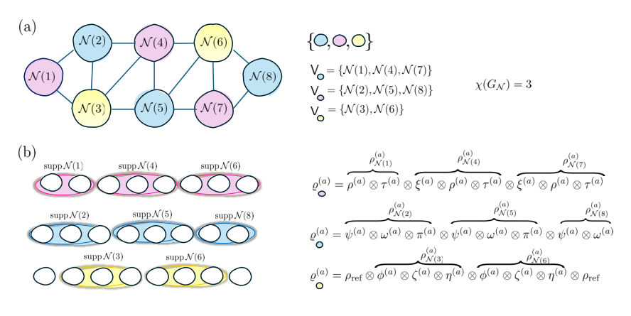 
Figure 3: Graph-coloring construction of separable probe configurations for the TFIM-like chain. Panel (a) shows the active- neighborhood graph GN , whose vertices are the local inverse problems N(j). The three-coloring χ(GN ) = 3 groups neighbor- hoods with disjoint physical support. Panel (b) displays these supports on the physical qubit chain and shows the corresponding global product probes: neighborhoods with the same color are prepared simultaneously, while spectator qubits are assigned fixed reference states. Repeating the construction for the local probe labels a gives the separable ensemble used to initialize all local inversions.

📷 Fig 4

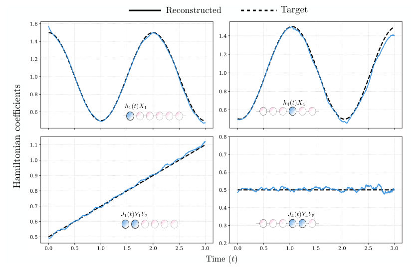 
Figure 4: Time-dependent Hamiltonian reconstruction from weak measurement records. Dashed black curves show the target coefficients, while solid colored curves show the reconstructed trajectories. The panels display representative local fields hj(t) and nearest-neighbor couplings Jj(t). The protocol tracks the coefficient trajectories over the reconstruction window, with larger fluctuations appearing for terms whose local inverse problems are more sensitive to noise and conditioning effects.

📷 Fig 5

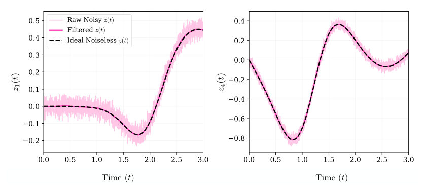 
Figure 5: Preprocessing of averaged weak measurement records prior to reconstruction. The raw records contain visible finite- sampling fluctuations, while the Savitzky–Golay filtered signals closely track the ideal noiseless trajectories. This filtering step stabilizes the finite-difference estimates used in the inversion protocol.

**Summary.** This paper presents a rigorous protocol to learn the time-dependent Hamiltonian of a many-body quantum system using continuous weak measurements. By leveraging the sparsity (locality) of interactions, it reduces the complex global problem into smaller, solvable local inverse problems. The key contribution is providing mathematically proven error bounds and sample complexity guarantees for this process.

**Why it may be interesting.** This work directly addresses a critical bottleneck in quantum hardware characterization: reliably determining time-varying control parameters from noisy measurements. The theoretical framework for sparse reconstruction is highly valuable for scaling up diagnostics on larger quantum processors.

Detailed structure

**Main problem.** The central problem is developing a rigorous, experimentally feasible protocol to reconstruct time-dependent many-body Hamiltonians H(t) from continuous weak measurement records.

**Main result.** The authors establish that by exploiting Hamiltonian locality (sparsity), the global reconstruction problem decomposes into manageable local inverse problems, yielding explicit error bounds and sample complexity theorems.

**Method.** The protocol uses graph coloring to decompose the system's interaction structure, reducing the required probe measurements from system size dependence to a dependency on the local interaction connectivity degree. Error analysis rigorously separates statistical noise from deterministic bias.

**Model / system.** The study considers an $n$-qubit system whose dynamics are governed by a time-dependent Hamiltonian H(t) with a sparse Pauli structure. Measurements are simulated via continuous weak monitoring of local Pauli observables ($\sigma^{(j)}_z$).

**Key observables.** Time-dependent coefficients $\mu_i(t)$ defining the Hamiltonian, and the measured expectation values $\hat{z}_j(t)$ from noisy measurement trajectories.

**Important parameters / regimes.** The interaction connectivity degree $D$, the weak measurement rate ($\Gamma_j$), and the time step $\Delta t$ are crucial parameters governing error bounds.

**Assumptions / limitations.** The primary assumption is the locality (sparsity) of interactions in the Hamiltonian. The analysis also assumes sufficient regularity for bounding local truncation errors.

**Figures summary.** Figure 1 illustrates the interaction graph for a TFIM chain, showing vertices as Pauli terms and edges based on support overlap, leading to a maximum degree $D=4$. Figure 8 shows the full reconstruction of Hamiltonian coefficients for $n=6$ qubits.

**Paper structure.** The paper progresses from defining the weak measurement model and dynamics (Chunk 2) to developing the core protocol by localizing the problem via graph coloring. It then provides rigorous error analysis, deriving bounds on state estimation errors ($\|\hat{
ho} - 
ho\|_1$) and sample complexity, culminating in numerical validation.

Abstract

Characterizing the Hamiltonian that a quantum processor actually implements is central to calibrating and validating current quantum hardware. Many devices, however, operate with generators that are time dependent by design. Here we develop a rigorous and experimentally friendly protocol for learning time-dependent many-body Hamiltonians from continuous weak measurement records. The key observation is that interaction sparsity reduces the global reconstruction to a set of local inverse problems, whose number is controlled by the interaction connectivity rather than by the system size. Pure separable probe states suffice to drive these inversions, and a graph-coloring construction embeds them into a small number of global product-state preparations. We derive explicit reconstruction-error bounds and a sample-complexity theorem that cleanly separates the finite-sampling statistical noise from the deterministic bias of the iterative state update, and we validate the protocol on time-dependent spin chains with up to $n=8$ qubits. Beyond these results, our analysis provides a rigorous foundation for time-dependent Hamiltonian learning from continuous monitoring in many-body systems, establishing a framework that extends naturally to many platforms and probe ensembles.

[↑ back to top](#top)

### [Controlling charge and spin currents through nonreciprocal dissipative processes](http://arxiv.org/abs/2607.15767v1)

**Authors:** Catalin-Mihai Halati, Jean-Sébastien Bernier  
**Type:** theory · **Category:** other · **PDF:** <https://arxiv.org/pdf/2607.15767v1>  
**Analysis basis:** full PDF text, analyzed in chunks
**Topic relevance:** 🔥 `methods for driven-dissipative` **4/5** · 🔥 `spintronics-quantum-optics interface` **4/5** · `analog quantum simulation` **3/5** · `correlated / nonlocal dissipation` **3/5** · `driven-dissipative phase transition` **3/5** · `exotic spin models in light-matter` **3/5** · `non-equilibrium dynamics` **3/5** · `Keldysh / 2PI / non-Gaussian methods` **2/5** · `non-equilibrium universality` **2/5** · `Kondo & dissipative impurity` **1/5** · `entanglement & information structure` **1/5** · `measurement-induced transitions` **1/5** · `quantum measurements` **1/5**

📷 Fig 1

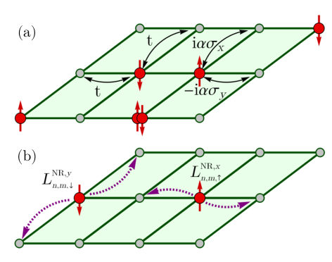 
FIG. 1: Sketch of the model considering spinful fermions in a two-dimensional lattice. The fermionic particles experience Hamiltonian, Eq. (1), and dissipative processes, Eq. (3). In panel (a), we sketch the coherent tunneling processes with amplitude t which are spatially isotropic and do not change the spin state of the particles, and the coherent spin-orbit Rashba coupling of amplitude α for which the tunneling is associated with a spin flip process for which the phase de- pends on the spatial direction (see Sec. II A). In panel (b), we sketch the action of two of the dissipative channels considered, Eq. (4). The jump operators depicted act differently on the two spin states, with LNR,x...

📷 Fig 2

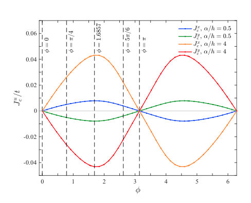 
FIG. 2: Steady-state charge currents in the x-direction, Jx c , and y-direction, Jy c , as a function of the phase ϕ for two ra- tios α/h = {0.5, 4}, no dephasing (Γd = 0) and small ΓNR considering a half-filled system of size L × L = 10 × 10 with periodic boundary conditions. The amplitude and direction of the charge currents are strongly dependent on ϕ. The ampli- tude of both currents also increases with α/h. For 0 &lt; ϕ &lt; π, Jx c flows in the positive x-direction while Jy c flows in the neg- ative y-direction, while the flows are reversed for π &lt; ϕ &lt; 2π. Both currents are zero at ϕ = {0, π, 2π}.

📷 Fig 3

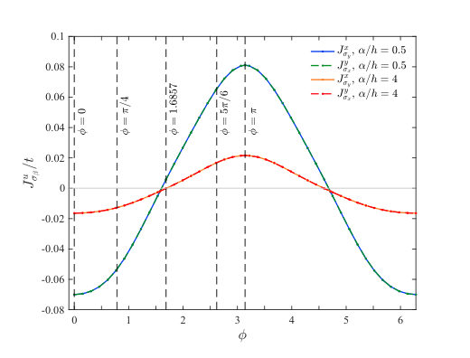 
FIG. 4: Steady-state spin-y component of the spin current in the x-direction, Jx σy, and spin-x component of the spin cur- rent in the y-direction, Jy σx, as a function of the phase ϕ for two ratios α/h = {0.5, 4}, small ΓNR and Γd = 0 consider- ing a half-filled system of size L × L = 10 × 10 with periodic boundary conditions. Both spin currents Jx σy and Jy σx have the same value and the direction of both currents can be re- versed by changing ϕ.

📷 Fig 4

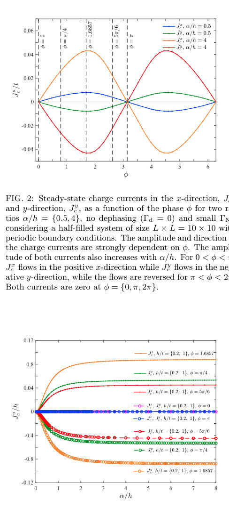 
FIG. 3: Ratio of the steady-state charge currents in the x- direction, Jx c /h, and y-direction, Jy c /h, as a function of the ratio of the Rashba coupling to the magnetic field, α/h, in the absence of dephasing (Γd = 0), small ΓNR, two field strengths h/t = 0.2, 1 and five presentative ϕ values: 0, π/4, 1.6875, 5π/6 and π. The system is half-filled and of size L × L = 10 × 10 with periodic boundary conditions. Both charge currents are zero when ϕ is equal to 0 and π. For the other ϕ considered, when the charge current in x flows in the positive direction, the current in y flows in the negative di- rection.

📷 Fig 5

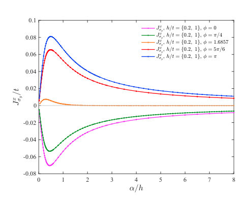 
FIG. 5: Steady-state spin-y component of the spin current in the x-direction as a function of the ratio of the Rashba cou- pling to the magnetic field, α/h, in the absence of dephasing (Γd = 0) and small ΓNR, two field strengths h/t = 0.2, 1 and five presentative ϕ values: 0, π/4, 1.6875, 5π/6 and π. The system is half-filled and of size L × L = 10 × 10 with periodic boundary conditions. For ϕ = 1.6875, the spin current goes to zero as α/h increases. For all five values of ϕ, the spin current presents a maximum for α/h &lt; 1.

**Summary.** The paper demonstrates a method to control charge and spin currents in fermionic quantum systems by engineering nonreciprocal dissipative couplings. Using the GKSL master equation formalism, the authors show that specific dissipation channels can induce finite currents even when starting from a coherent Hamiltonian. This mechanism is robust against dephasing noise, offering a pathway for current manipulation using engineered open system dynamics.

**Why it may be interesting.** This work directly addresses open quantum systems dynamics in condensed matter contexts, showing how engineered dissipation can mimic or enhance coherent transport phenomena like spin-charge conversion, which is highly relevant to spintronics and topological materials research.

Detailed structure

**Main problem.** The study investigates how charge and spin currents can be generated and precisely controlled in a quantum system by utilizing nonreciprocal dissipative processes.

**Main result.** The combination of specific nonreciprocal jump operators is sufficient to generate both charge and spin currents, and tuning the nonreciprocity allows switching the dominant transport mechanism between spin and charge.

**Method.** The analysis employs the Gorini-Kossakowski-Sudarshan-Lindblad (GKSL) master equation formalism within the weakly dissipative coupling regime, utilizing a time-dependent generalized Gibbs ensemble approach to find steady states.

**Model / system.** The model is a two-dimensional spinful fermionic atom quantum system on a square lattice. The dynamics are governed by a Hamiltonian incorporating kinetic, Rashba SOC, and Zeeman terms, coupled to nonreciprocal dissipative jump operators.

**Key observables.** Charge current ($J^c$) and Spin current ($J^{\sigmaeta}$), derived using U(1) and SU(2) gauge transformations.

**Important parameters / regimes.** Nonreciprocity strength (phases $\phi$), tunneling amplitude ($t$), Rashba coupling ($\alpha$), magnetic field ($h$), and the degree of dephasing noise.

**Assumptions / limitations.** The analysis is performed in the weak dissipative coupling regime, and approximations are made for small phase variations and small angles during gauge transformations.

**Figures summary.** Figure 1 sketches the model setup, illustrating coherent tunneling and Rashba coupling alongside the action of two specific nonreciprocal dissipative channels required to induce currents.

**Paper structure.** The paper proceeds by first defining the physical model (Hamiltonian and dissipation), then deriving the current operators using gauge transformations, detailing the generalized Gibbs ensemble method for steady states, and finally presenting results on current generation, necessary ingredients, and noise robustness.

Abstract

We investigate the generation and control of both charge and spin currents via nonreciprocal dissipative mechanisms in a two-dimensional spinful fermionic atom quantum system with broken inversion and time-reversal symmetries. Within the Gorini-Kossakowski-Sudarshan-Lindblad master equation formalism and using an approach based on the time-dependent generalized Gibbs ensemble, we identify in the weak dissipative coupling regime the minimal set of nonreciprocal jump operators required to induce charge and spin currents and to control both their direction and magnitude. We find that in the presence of finite tunneling, Rashba coupling and magnetic field, the combine application of two jump operators nonreciprocally coupling each spin species to a different spatial direction of motion is sufficient to generate both types of current. Furthermore, by tuning the degree of nonreciprocity of the jump operators we modify the dominant transport mechanism from spin to charge. Finally, we checked that this nonreciprocal current generation mechanism is robust to the application of dephasing noise as even in the presence of this additional dissipative process the steady-state occupation distributions for the quasiparticle modes of the Hamiltonian remains non-trivial, an essential requirement to obtain non-zero currents.

[↑ back to top](#top)

### [Deconfined quantum critical point in a dissipative spin-1/2 chain](http://arxiv.org/abs/2607.16039v1)

**Authors:** Longye Lu, Shifeng Cui, Wenan Guo  
**Type:** theory · **Category:** strongly correlated electrons · **PDF:** <https://arxiv.org/pdf/2607.16039v1>  
**Analysis basis:** full PDF text, analyzed in chunks
**Topic relevance:** 🔥 `driven-dissipative phase transition` **4/5** · 🔥 `methods for driven-dissipative` **4/5** · `correlated / nonlocal dissipation` **3/5** · `exotic spin models in light-matter` **3/5** · `non-equilibrium universality` **3/5** · `non-equilibrium dynamics` **2/5** · `Keldysh / 2PI / non-Gaussian methods` **1/5** · `Kondo & dissipative impurity` **1/5** · `analog quantum simulation` **1/5**

📷 Fig 1

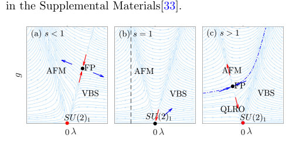 
FIG. 1. (a) -(c) The RG flow diagram of beta function for s &lt; 1, s = 1, and s &gt; 1, respectively. The short arrows near the FP are the eigen-directions. The black dashed line indicate the RG starting points of dissipative Heisenberg chain. The blue dot-dashed line indicates the phase boundary of QLRO phase and AFM phase.

📷 Fig 2

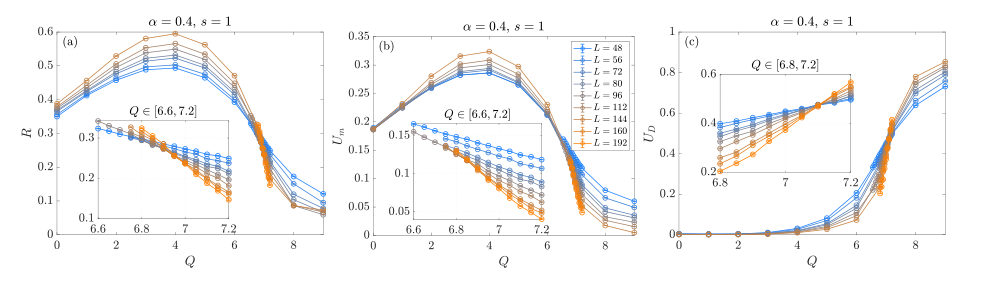 
FIG. 2. (a)R, (b)Um, and (c) UD versus Q for different system sizes at coupling α = 0.4 for the Ohmic dissipation.

📷 Fig 3

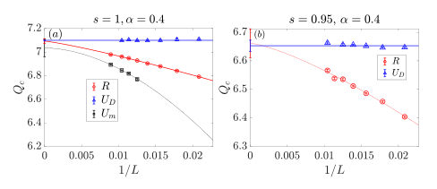 
FIG. 3. Crossing-point analysis for the Ohmic (a) and sub- Ohmic (s = 0.95) (b) cases with α = 0.4. The symbols mark the crossings of the Um, R, and UD curves between L and 2L. For s = 0.95, the crossings of Um are omitted because of poor convergence resulting from strong corrections to scaling. Solid lines are power-law fits to crossings of Um and R, and cubic polynomial fit to crossings of UD. The extrapolated Qc are indicated at 1/L = 0.

📷 Fig 4

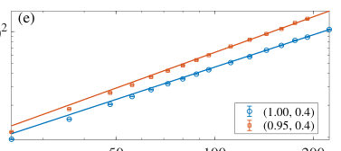 
FIG. 4. Log-Log plots of C(L/2) (a), m2 s(L)(b), D2(L)(c), CD(L/2)(d), and ξτ (e) at the AFM-VBS critical points for different (s, α). Solid lines are fits.

**Summary.** The paper investigates the nature of quantum phase transitions in a dissipative spin-1/2 chain by competing AFM and VBS orders. Using advanced RG theory and QMC simulations, it maps out the phase diagram across different dissipation strengths. The key finding is the existence of continuous critical points, notably an O(4) symmetric DQCP when Ohmic dissipation is present.

**Why it may be interesting.** This work bridges concepts from quantum criticality (DQCP), open quantum systems (dissipation/bath coupling), and strongly correlated magnetism, providing a detailed theoretical roadmap for understanding how environmental coupling can stabilize or modify exotic quantum phases.

Detailed structure

**Main problem.** The study investigates realizing a Deconfined Quantum Critical Point (DQCP) in an open quantum spin system by analyzing the competition between Antiferromagnetic (AFM) order and Valence-Bond Solid (VBS) states under environmental dissipation.

**Main result.** Continuous AFM-VBS transitions are found at finite dissipation, with the Ohmic case ($s=1$) exhibiting a DQCP characterized by emergent O(4) symmetry. Strong dissipation generally stabilizes an AFM phase across various bath regimes.

**Method.** The research employs non-Abelian bosonization and Renormalization Group (RG) analysis, supplemented by large-scale Quantum Monte Carlo (QMC) simulations using wormhole algorithms for retarded interactions.

**Model / system.** The model is a spin-1/2 J-Q3 chain where each spin component interacts with an independent bosonic bath, introducing dissipation characterized by the spectral density exponent $s$ (sub-, Ohmic, or super-Ohmic).

**Key observables.** Binder cumulants ($U_m, U_D$) for AFM and VBS order, correlation ratio ($R$), spin correlation functions ($\langle \Phi(r)\Phi(0) 
angle$), and the imaginary-time correlation length $\xi_	au$.

**Important parameters / regimes.** Dissipation exponent $s$ (sub-Ohmic $s<1$, Ohmic $s=1$, super-Ohmic $s>1$), multi-spin interaction strength ($Q$), and coupling constants ($\lambda, g$).

**Assumptions / limitations.** The analysis relies on perturbative RG techniques and assumes the validity of bosonization methods for describing the critical behavior in dissipative systems.

**Figures summary.** Figures illustrate RG flow diagrams showing fixed points and phase boundaries across different dissipation regimes; other figures show size-dependent scaling plots (e.g., $R$ vs $L$) used to pinpoint critical coupling strengths ($Q_c$).

**Paper structure.** The paper progresses by first establishing the theoretical framework using bosonization and RG, then applying QMC simulations across different dissipation regimes ($s$), determining phase boundaries, and finally extracting critical exponents and symmetries at specific points like the Ohmic DQCP.

Abstract

Open quantum spin systems offer a previously unexplored route to realizing deconfined quantum criticality. We consider a spin-1/2 $J$-$Q_3$ chain, consisting of an antiferromagnetic (AFM) Heisenberg exchange and a competing multi-spin interaction favoring a valence-bond solid (VBS) state, with each spin component coupled to a bosonic bath. Using non-Abelian bosonization and renormalization-group (RG) analysis, combined with large-scale quantum Monte Carlo (QMC) simulations, we determine the phase diagram and the associated phase transitions of the model. We show that strong dissipation stabilizes an AFM phase for sub-Ohmic, Ohmic, and super-Ohmic baths. Continuous AFM-VBS transitions at finite dissipation are found upon increasing the multi-spin interaction in both the sub-Ohmic and Ohmic regimes. Critical properties are obtained through perturbative RG analysis and QMC simulations. In the Ohmic case, the critical point features spinon deconfinement and emergent O(4) symmetry. In the sub-Ohmic regime, the transition may also involve spinon deconfinement, provided that spinons remain deconfined in the dissipative VBS phase. In addition, in the super-Ohmic regime, we propose a transition from AFM phase to a quasi-long-range ordered phase.

[↑ back to top](#top)

### [Non-Hermitian Quantum Adiabatic Algorithm](http://arxiv.org/abs/2607.15343v1)

**Authors:** Zi-Bo Jin, Yi Zhang  
**Type:** theory · **Category:** quantum information and computing · **PDF:** <https://arxiv.org/pdf/2607.15343v1>  
**Analysis basis:** full PDF text, analyzed in chunks
**Topic relevance:** 🔥 `analog quantum simulation` **4/5** · `correlated / nonlocal dissipation` **3/5** · `driven-dissipative phase transition` **3/5** · `methods for driven-dissipative` **3/5** · `Kondo & dissipative impurity` **2/5** · `Rydberg arrays` **2/5** · `non-equilibrium dynamics` **2/5** · `Keldysh / 2PI / non-Gaussian methods` **1/5** · `entanglement & information structure` **1/5** · `non-equilibrium universality` **1/5**

📷 Fig 1

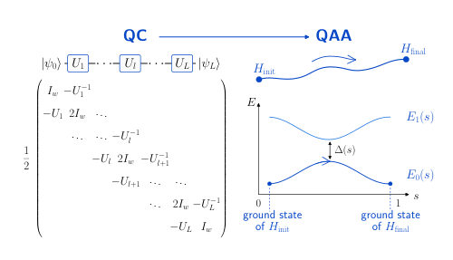 
FIG. 1. A schematic illustration of the mapping from QC to QAA, where the gate sequence of the QC (top left) is con- verted to a continuous Hamiltonian path H(s) (right) from Hinit to Hfinal (lower left). The spectrum remains gapped ∆(s) = E1(s) −E0(s), thereby protecting the adiabatic evo- lution of the ground state, which, upon reaching Hfinal, yields the target solution.

📷 Fig 2

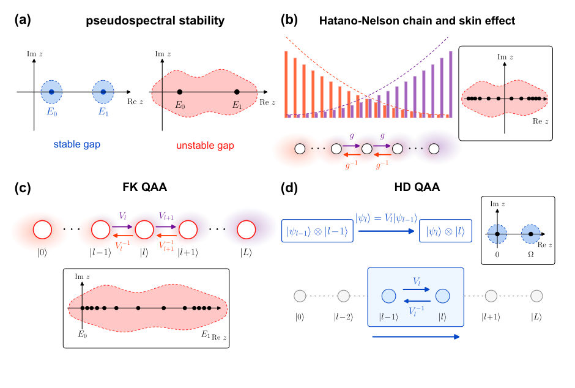 
FIG. 2. (a) A gap with an isolated (merged) pseudospectrum is stable (unstable) under perturbations. (b) The non-Hermitian Hatano-Nelson model exhibits a highly unstable pseudospectrum, thus the non-Hermitian skin effect and sensitivity to pertur- bations such as boundary conditions. (c) The FK QAA’s effective model resembles a non-reciprocal Hatano-Nelson chain, in which the non-normality of the similarity transformation accumulates, leading to an unstable pseudospectrum. (d) In com- parison, the HD QAA converts non-unitary gates Vl and V −1 l and establishes non-reciprocal coupling locally, thereby ensuring overall pseudospectral stability and, thus, adiabaticity under perturbations.

📷 Fig 3

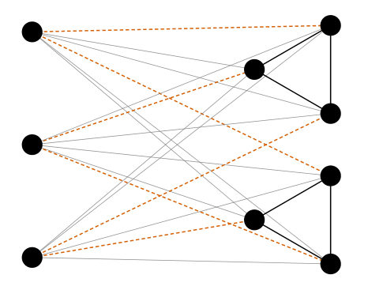 
FIG. 3. A schematic illustration of the CK graph (Gm, m = 3) and its modifications (G′ m, m = 3) of the MIS problem. Solid black circles represent vertices, and lines represent edges. In the CK graph G3, the left (isolated dots) and right (triangles) sections are fully connected (both solid and dashed lines). Its MIS consists of the three vertices on the left, while the trian- gles on the right generate competing local minima. A CK-like graph G′ 3 is obtained by randomly removing connections (or- ange dashed lines) between the G3’s two sides.

📷 Fig 4

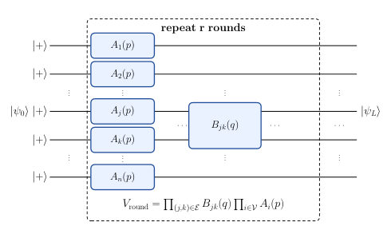 
FIG. 4. A schematic illustration of the non-unitary QC for solving the MIS problem: given an initial state |ψ0⟩with equal-weight superposition |+⟩⊗n, the output is obtained af- ter repeated r rounds of operations. Within each round (dashed box), vertex-amplification gates Ai(p) and two-qubit edge-constraint gates Bjk(q) are applied according to the ver- tices and edges of the MIS graph.

📷 Fig 5

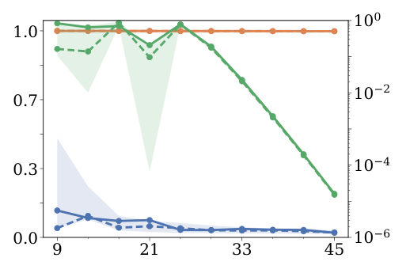 
FIG. 5. The success probability P (0) MIS of the three QAAs exhibits qualitatively different scalings versus the problem size n. The HM QAA (green, right log axis) suffers an exponential decrease, whereas the non-Hermitian QAAs’ P (0) MIS (left linear axis) decrease much more slowly. Note the difference in the vertical axis. Still, the HD QAA (orange) leads with a success probability P (0) MIS ∼1 versus the polynomial scaling of the FK QAA (blue). Here, the solid lines indicate results on the CK graphs Gm, while the dashed lines and shaded regions denote the medians and the ranges across 200 CK-like graphs G′ m.

**Summary.** This paper introduces a novel, stable framework for Non-Hermitian Quantum Adiabatic Algorithms. By proposing a history-decoupled mapping, it overcomes critical spectral instabilities found in previous non-Hermitian approaches. This work establishes pseudospectral stability as a key requirement, offering a practical route for quantum computation suitable for current noisy hardware.

**Why it may be interesting.** This is highly relevant as it provides a concrete, theoretically sound pathway to implementing quantum algorithms on hardware that naturally supports dissipation (like Rydberg arrays), bypassing the exponential overheads associated with purely unitary models.

Detailed structure

**Main problem.** Developing a robust non-Hermitian Quantum Adiabatic Algorithm (QAA) that overcomes spectral instabilities inherent in standard adiabatic quantum computation methods.

**Main result.** The authors propose a history-decoupled construction (HD QAA) which successfully maintains both pseudospectral stability and a real, gapped spectrum for non-Hermitian evolution.

**Method.** They map non-unitary quantum circuits to local Hamiltonian paths using a novel 'history-decoupled' mapping, avoiding the severe instabilities of direct extensions like the Feynman-Kitaev construction.

**Model / system.** The work focuses on abstract non-Hermitian Hamiltonians governing adiabatic evolution for optimization problems, benchmarked against Maximum Independent Set (MIS) problems. The underlying physics involves open quantum systems with gain/loss mechanisms.

**Key observables.** Real and gapped spectrum ($\Delta(s)$), stable pseudospectrum ($\Lambda_\epsilon(H)$), and polynomial evolution time.

**Important parameters / regimes.** The degree of spectral instability quantified by the condition number $\kappa(S)$, and the circuit depth $L$ (which dictates complexity).

**Assumptions / limitations.** A real, gapped spectrum alone is insufficient; pseudospectral stability is a necessary key principle for practical non-Hermitian QAA.

**Figures summary.** Figure 1 schematically illustrates mapping QC gates to continuous Hamiltonian paths. Table I compares three constructions (HM QAA, FK QAA, HD QAA) based on adiabatic time and pseudospectrum stability.

**Paper structure.** The paper establishes the theoretical necessity of pseudospectral stability for non-Hermitian QAA, contrasts it with unstable methods like FK construction, proposes the stable HD mapping, and validates its polynomial scaling using MIS benchmarks.

Abstract

Non-Hermitian systems offer new opportunities for quantum optimization and computation. Here, we show that non-Hermitian quantum adiabatic algorithms require not only a real, gapped spectrum, but also a stable pseudospectrum. We propose a novel framework by mapping non-unitary quantum circuits to local Hamiltonian paths, thereby preserving their optimization advantages and shallow depth. While a direct non-Hermitian extension of the Feynman-Kitaev construction suffers severe pseudospectral instability, our history-decoupled construction yields both a controlled pseudospectrum and a real, gapped spectrum. Using the CK benchmark family of maximum independent set problems, we demonstrate polynomial-evolution-time non-Hermitian adiabatic computation that remains robust against perturbations. We further discuss a feasible optical implementation using coupled waveguides with an auxiliary lossy channel. Our work establishes pseudospectral stability, alongside real, gapped spectra, as key principles and a practical route for non-Hermitian quantum adiabatic computation.

[↑ back to top](#top)

### [Dynamical Polarization from Hidden Spin and Orbital Textures in p-Wave Magnets](http://arxiv.org/abs/2607.15353v1)

**Authors:** Yantao Li, Jacob Linder, Pavlo Sukhachov  
**Type:** theory · **Category:** strongly correlated electrons · **PDF:** <https://arxiv.org/pdf/2607.15353v1>  
**Analysis basis:** full PDF text, analyzed in chunks
**Topic relevance:** 🔥 `non-equilibrium dynamics` **4/5** · `Keldysh / 2PI / non-Gaussian methods` **3/5** · `methods for driven-dissipative` **3/5** · `spintronics-quantum-optics interface` **3/5** · `driven-dissipative phase transition` **2/5** · `non-equilibrium universality` **2/5** · `Kondo & dissipative impurity` **1/5** · `analog quantum simulation` **1/5** · `exotic spin models in light-matter` **1/5**

📷 Fig 1

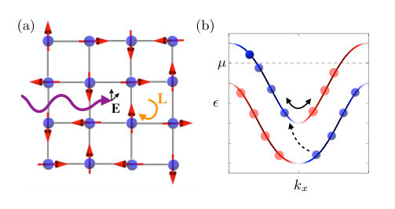 
FIG. 1. Panel (a) shows the schematics of a light-driven p- wave magnet. Light, via an electric field E, induces oscillat- ing spin polarization and rectified orbital angular momentum L. Panel (b) illustrates the SEE, where the electric field re- distributes carriers within the spin-polarized bands (solid ar- rows), while the dashed arrow denotes an interband transition responsible for the resonant response near the minimum di- rect gap. Red and blue indicate opposite spin polarizations.

📷 Fig 2

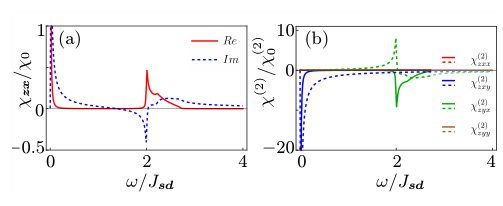 
FIG. 3. Panels (a) and (b) show the spin Edelstein response coefficient χzx and the orbital angular momentum response coefficient χ(2) ijl , respectively, as functions of the driving fre- quency ω. We used the Kubo formulae (9) and (10) in panel (a) and density matrix approach in panel (b). Solid and dashed lines correspond to real and imaginary parts, respec- tively. In all panels, we fix α = 0.5 k⋆with k⋆= √2mJsd, µ = 2 Jsd, and τ = 100 J−1 sd . The normalization coeficients are χ0 = e p

**Summary.** This paper theoretically investigates dynamical spin and orbital polarizations in p-wave magnets under periodic driving. It shows that the time-averaged picture fails to capture key physics, demonstrating that driving converts hidden momentum-odd textures into measurable ac spin and static dc orbital responses. The methodology combines Floquet theory with Kubo response calculations.

**Why it may be interesting.** This work provides a concrete theoretical framework for understanding how non-equilibrium driving can unlock novel, measurable quantum responses in magnetic materials, which is crucial for designing advanced spintronic devices.

Detailed structure

**Main problem.** The study addresses how periodic driving can reveal essential dynamical polarization effects (spin and orbital) in p-wave magnets that are entirely missed by standard period-averaged descriptions.

**Main result.** Periodic driving generates a measurable, static, momentum-even orbital polarization and an oscillating ac spin polarization, both of which originate from hidden, momentum-odd textures invisible to time-averaging.

**Method.** The analysis employs Floquet theory combined with the Kubo linear response formalism to calculate time-dependent expectation values for spin and orbital angular momenta.

**Model / system.** The system is a p-wave magnet described by an effective Hamiltonian, analyzed using continuum models incorporating exchange coupling ($J_{sd}$) and subjected to periodic driving fields (e.g., electric field $E(t)$).

**Key observables.** Spin polarization ($\langle\langle \hat{S} 
angle
angle$), Orbital Angular Momentum ($\langle\langle \hat{L} 
angle
angle$), Dynamical Spin Edelstein Response ($\chi^{(S)}$), and Rectified Orbital Polarization ($\chi^{(L),(2)}$).

**Important parameters / regimes.** The resonant enhancement occurs near the interband gap set by nonrelativistic exchange splitting, and the analysis depends on the drive frequency $\omega$.

**Assumptions / limitations.** Key approximations include using the Floquet formalism for time evolution and employing the relaxation time approximation in the density matrix equations.

**Figures summary.** Figures illustrate schematics of light-induced oscillating spin polarization and rectified orbital angular momentum, comparing period-averaged versus instantaneous texture components for both spin and orbital moments.

**Paper structure.** The paper builds from defining the Floquet formalism to calculating time-dependent expectation values. It then applies Kubo linear response theory to derive the dynamical spin Edelstein effect (linear response) and subsequently calculates second-order terms to find the rectified, static orbital polarization.

Abstract

Period-averaged descriptions often miss essential features of driven quantum matter. We show that the micromotion of an optically driven $p$-wave magnet unveils a hidden net spin polarization, absent from both the equilibrium and period-averaged spin textures, which remain odd in momentum. This spin polarization oscillates at the drive frequency and is resonantly enhanced at the interband gap set by nonrelativistic exchange splitting. The drive further activates an orbital angular momentum governed by interband quantum geometry. While its linear response remains momentum-odd, nonlinear rectification yields a static, momentum-even orbital polarization for suitably oriented driving fields. These results establish $p$-wave magnets as a source of resonant ac spin and rectified dc orbital polarization: effects invisible to any period-averaged treatment.

[↑ back to top](#top)

### [Quantum and classical entropic complexity of the thermal state: coherence, decoherence, and the ergodic-to-localized crossover in random-matrix and many-body models](http://arxiv.org/abs/2607.15798v1)

**Authors:** Imre Varga, Onur Aktan  
**Type:** theory · **Category:** disordered systems and neural networks · **PDF:** <https://arxiv.org/pdf/2607.15798v1>  
**Analysis basis:** full PDF text, analyzed in chunks
**Topic relevance:** 🔥 `entanglement & information structure` **4/5** · `methods for driven-dissipative` **3/5** · `non-equilibrium dynamics` **3/5** · `analog quantum simulation` **2/5** · `correlated / nonlocal dissipation` **2/5** · `driven-dissipative phase transition` **2/5** · `scars & prethermalization` **2/5** · `Keldysh / 2PI / non-Gaussian methods` **1/5** · `non-equilibrium universality` **1/5**

📷 Fig 1

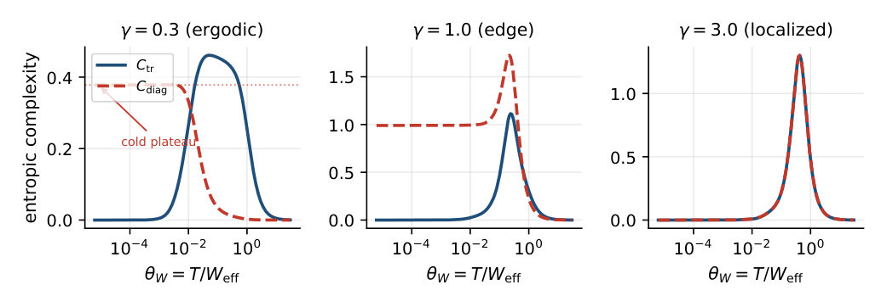 
FIG. 1. Temperature dependence of the trace (Ctr, solid) and diagonal (Cdiag, dashed) complexities, illustrated for the RP model (N = 1600) at three values of γ. At γ = 3 (localized) both curves are single, coincident, broadened peaks. At γ = 1 (edge) Cdiag develops a peak above a residual low-T shoulder. At γ = 0.3 (ergodic) Cdiag has no interior maximum: it rises to a cold plateau as T →0 (the ground-state site complexity) while Ctr remains a clean interior peak. Temperature is in bandwidth units θW = T/Weff.

📷 Fig 2

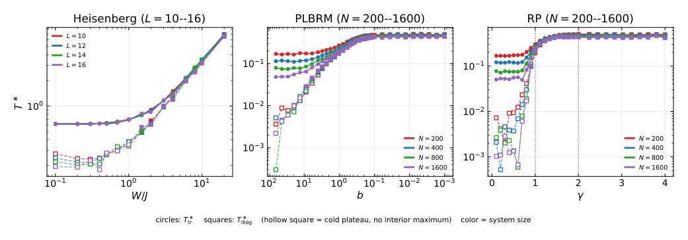 
FIG. 2. Trace versus diagonal characteristic temperatures across the three models and their full range of system sizes: Heisenberg (L = 10–16) vs disorder W, PLBRM (N = 200–1600) vs bandwidth b, and RP (N = 200–1600) vs γ, with color marking size (red, blue, green, violet for the smallest to largest size in each model, as in Figs. 4 and 5) and marker shape marking the two temperatures (T ∗ tr: circles, T ∗ diag: squares). The b axis in the center panel is reversed (increasing rightward, toward the PLBRM localized limit) so that all three panels share the same left-to-right ergodic-to-localized direction. In each case T ∗ tr and T ∗ diag coincide on the localized side (Heisenberg large W,...

📷 Fig 3

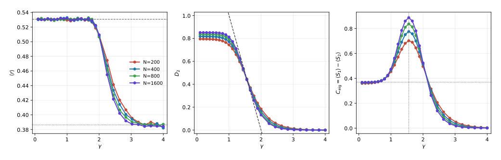 
FIG. 3. Rosenzweig–Porter model, N = 200–1600. Left: mean gap ratio ⟨r⟩(γ), pinned to the GOE value (dashed) throughout the ergodic and fractal phases and falling toward Poisson (dotted) only past γ = 2. Center: fractal dimension D2(γ), tracking 2 −γ (dashed) with finite-size rounding at the boundaries. Right: eigenstate entropic complexity Ceig(γ), peaking at γ∗≈1.5– 1.6 (vertical dotted line at γ∗≈1.56); the horizontal dotted line marks the analytic GOE plateau CGOE = ln 3

📷 Fig 4

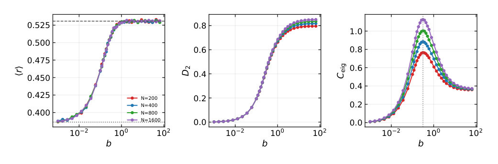 
FIG. 4. Power-law banded random matrix model, Eq. (8), µ = 1, N = 200–1600. Left: mean gap ratio ⟨r⟩(b), interpolating continuously between Poisson (dotted) and GOE (dashed) values – unlike RP, spectral statistics are not pinned to GOE through the crossover. Center: fractal dimension D2(b), smooth and featureless. Right: eigenstate entropic complexity Ceig(b), peaking at b∗= 0.31 ± 0.01 (dotted line), essentially independent of N, with peak height growing systematically with N.

📷 Fig 5

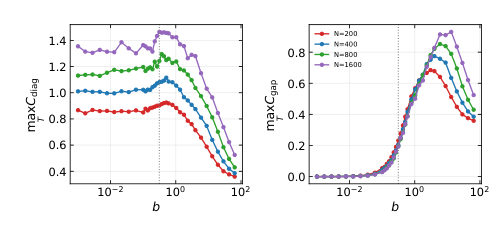 
FIG. 5. PLBRM thermal analysis, N = 200–1600, high- statistics scan (vertical dotted line marks b∗≈0.31). Left: maxT Cdiag(b); on top of an otherwise broad plateau, a weak (≈10–13%) but reproducible bump is resolved at b∗itself for every size studied. Right: the temperature-maximized coher- ence gap maxT Cgap(b), a smooth unimodal function peaking at b∗ edge ≫b∗; b∗ edge recedes sub-linearly with N (approxi- mately b∗ edge ∝N 0.6) even though b∗itself does not.

**Summary.** The paper uses entropic complexity to probe how quantum information encoded in individual energy eigenstates survives thermal averaging across disorder-induced phase transitions. It finds that while thermal mixing strongly suppresses eigenstate signatures, it also reveals a distinct 'edge' feature unique to the mixed Gibbs state, thereby cleanly separating eigenstate physics from thermal dynamics.

**Why it may be interesting.** This work provides quantitative tools (entropic complexity) to distinguish between intrinsic quantum state properties (eigenstates) and the effects of thermalization/decoherence, which is crucial for understanding open quantum systems dynamics.

Detailed structure

**Main problem.** The study investigates whether thermal averaging processes preserve intrinsic signatures of eigenstate complexity as a quantum system undergoes an ergodic-to-localized crossover.

**Main result.** Thermal averaging strongly suppresses the characteristic mid-phase peaks found in individual eigenstates, suggesting that the two types of complexity features (eigenstate vs. thermal) are governed by distinct physical mechanisms.

**Method.** The authors employ entropic complexity measures ($C = S_1 - S_2$) applied to both pure energy eigenstates and the full thermal (Gibbs) state ($
ho_T$).

**Model / system.** Three disordered models are analyzed: the Rosenzweig–Porter (RP) ensemble, the Power-law banded random matrix (PLBRM), and the Random-field Heisenberg chain. These systems model transitions between ergodic and localized quantum regimes.

**Key observables.** Entropic complexity ($C$), Eigenstate Complexity ($	ext{Ceig}$), Trace complexity ($C_{	ext{tr}}$), Diagonal complexity ($C_{	ext{diag}}$), and the Coherence Gap ($C_{	ext{gap}}$).

**Important parameters / regimes.** Disorder strength ($\gamma$ in RP model), Temperature ($T$), and system size ($N$). The crossover is studied across ergodic, intermediate (multifractal), and localized regimes.

**Assumptions / limitations.** The analysis relies on comparing wavefunction-level quantities to thermal observables; specific approximations are used for calculating complexity in the microcanonical limit.

**Figures summary.** Figures illustrate temperature dependence of $C_{	ext{tr}}$ and $C_{	ext{diag}}$ (e.g., RP model), showing distinct features like a 'cold plateau' versus an interior peak, and show how PLBRM washout scales differently than predicted by independent assumptions.

**Paper structure.** The paper systematically compares complexity measures across three models, identifying two key phenomena: a mid-phase eigenstate feature (seen in RP/PLBRM) and a distinct edge-of-ergodicity feature (visible only in thermal observables). It uses scaling indicators to separate these physical origins.

Abstract

Does thermal averaging preserve signatures of eigenstate complexity? We study the entropic complexity C = S_1 - S_2 (Shannon minus second-order Renyi entropy) across the ergodic-to-localized crossover of three disordered models: the Rosenzweig-Porter (RP) ensemble, the power-law banded random matrix (PLBRM) ensemble, and the random-field Heisenberg chain. We compare a wavefunction-level quantity C_eig to the complexity of the thermal (Gibbs) state before and after pointer-basis dephasing, via the trace (C_tr) and diagonal (C_diag) complexities. The answer is mostly no: thermal averaging strongly suppresses, but does not eliminate, eigenstate-complexity signatures. C_eig develops a pronounced mid-phase maximum in RP and, at matching fractal dimension, in the structurally independent PLBRM model; a high-statistics scan resolves a weak (about 10%) but reproducible thermal shadow of this peak in the thermal diagonal complexity. This feature is confined to the two random-matrix models; in the Heisenberg chain the eigenstate complexity instead peaks at the many-body localization transition. A second, genuinely thermal feature, an edge just inside the ergodic phase, has no eigenstate counterpart and, in PLBRM, recedes with system size. Both features are tracked by scale-invariant crossover indicators: the log-ratio of the trace and diagonal crossover temperatures, which vanishes upon localization, and the relative entropy of coherence. Entropic complexity thus cleanly separates thermal-state and eigenstate physics: a sharp wavefunction-level feature, reproducible across unrelated random-matrix constructions, leaves only a faint, structurally distinct imprint on thermal observables.

[↑ back to top](#top)

### [The Complexity of Dynamical Correlators: Operator Shadows and Exponential Learning Separations](http://arxiv.org/abs/2607.15493v1)

**Authors:** Shao-Hen Chiew, Armando Angrisani, Zoe Holmes  
**Type:** theory · **Category:** quantum information and computing · **PDF:** <https://arxiv.org/pdf/2607.15493v1>  
**Analysis basis:** full PDF text, analyzed in chunks
**Topic relevance:** 🔥 `entanglement & information structure` **4/5** · 🔥 `quantum measurements` **4/5** · `measurement-induced transitions` **3/5** · `methods for driven-dissipative` **3/5** · `non-equilibrium dynamics` **2/5** · `Keldysh / 2PI / non-Gaussian methods` **1/5** · `analog quantum simulation` **1/5** · `driven-dissipative phase transition` **1/5** · `non-equilibrium universality` **1/5**

📷 Fig 1

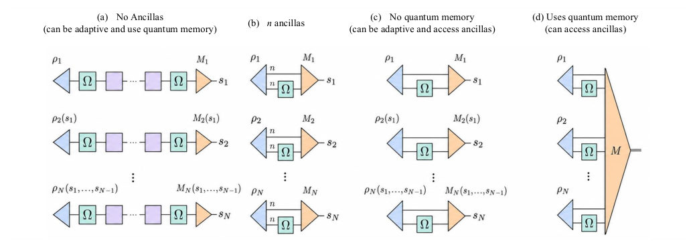 
Figure 1. Classes of protocols for learning OTOCs considered in our work, which also captures the majority of existing protocols. For compactness we here write Ω= OE,O to denote the generalized Loschmidt echo channel.

📷 Fig 2

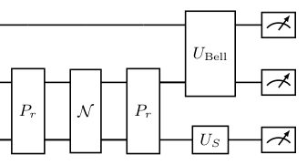 
Figure 2. Circuit for computing the diagonal PTM elements of N using n + nanc qubits. An instance of the (n + nanc)-qubit circuit to be run, for a specific choice of S ∈O and Pr ∈Pn. All qubits are measured in the computational basis in the end. UBell is the Bell basis transformation, while US transforms to the basis { ϕS e }e∈Z2nanc 2 /S.

**Summary.** The paper develops advanced measurement techniques using 'operator shadows' to efficiently estimate dynamical quantum correlators like OTOCs and two-point functions. By establishing both algorithmic upper bounds and rigorous information-theoretic lower bounds, the authors precisely characterize the minimum resources needed for these measurements. This advances our ability to diagnose complex many-body dynamics from limited experimental data.

**Why it may be interesting.** This work provides a powerful theoretical toolkit for quantum characterization, directly addressing how to extract complex dynamic information from limited experimental measurements—a critical bottleneck in simulating real physical systems like quantum processors or condensed matter models.

Detailed structure

**Main problem.** The core problem is developing scalable measurement protocols to estimate complex dynamical quantum correlators, such as OTOCs and two-point functions, which are intractable via full state readout.

**Main result.** The authors introduce the 'operator shadow' technique, achieving efficient estimation of large families of these correlators using Pauli or Clifford shadows. They also establish information-theoretic lower bounds proving the measurement efficiency advantages of their vectorized approach.

**Method.** They utilize randomized measurements (shadow techniques) applied to time-evolved operators, recasting Heisenberg dynamics into state preparation tasks in the Schrödinger picture. The analysis involves deriving and matching upper bounds with rigorous information-theoretic lower bounds.

**Model / system.** The work applies to general many-body quantum systems whose dynamics are governed by unitaries or quantum channels ($\mathcal{E}$). The focus is on estimating expectation values involving time evolution, such as $	ext{tr}(O(t) P O(t) Q)/2^n$.

**Key observables.** Out-of-Time-Ordered Correlators (OTOCs), two-point Pauli correlators ($	ext{tr}(P_k P_l(t))/2^n$), and general Process Tomography Matrix (PTM) elements.

**Important parameters / regimes.** The complexity bounds depend on the system size ($n$ qubits), the weight of operators ($w$), the number of observables to estimate ($M$), and the desired precision ($\epsilon$).

**Assumptions / limitations.** The analysis assumes the ability to prepare states corresponding to time-evolved operators via unitaries applied to maximally entangled states, and that lower bounds can be derived by distinguishing specific quantum states.

**Figures summary.** Figure 1 summarizes various protocols for learning OTOCs based on adaptivity, quantum memory requirements, and ancilla access, comparing different shadow techniques.

**Paper structure.** The paper progresses from establishing the need to measure dynamics beyond static snapshots. It introduces the operator shadow framework, details specific algorithms (Pauli/Clifford shadows) for OTOCs and two-point functions, and culminates in deriving rigorous information-theoretic lower bounds that characterize the optimal query complexity.

Abstract

Quantum platforms can realize many-body dynamics beyond classical simulation yet complete readout remains intractable: the cost of extracting accessible information scales exponentially with system size. Classical shadows and Bell sampling offer scalable, multi-observable estimation from randomized or entanglement-assisted measurements. Here we aim to push these ideas beyond static snapshots to dynamical correlators, including out-of-time-ordered correlators (OTOCs) and two-point functions. In particular, we introduce the notion of the shadow of an operator, defined as the classical shadow of the vectorized time-evolved operator. Pauli operator-shadows enable simultaneous estimation of all local OTOCs, while Clifford operator-shadows enable efficient simultaneous estimation of all two-point correlators. Alternatively, Bell sampling allows one to simultaneously compute all diagonal OTOCs. We also prove information-theoretic lower bounds for learning OTOCs, fully characterizing their query complexities in many cases, and yielding exponential separations that formalize when the vectorized approach provides measurement-efficiency advantages.

[↑ back to top](#top)

### [Enhanced Rydberg-Atom Superheterodyne Detection of Hidden-Photon Dark Matter on Chips](http://arxiv.org/abs/2607.15612v1)

**Authors:** Xiaochen Li, Bo Gao, Shigeki Matsumoto, Jie Sheng, Chuan-Yang Xing, Hong Ding  
**Type:** experiment · **Category:** other · **PDF:** <https://arxiv.org/pdf/2607.15612v1>  
**Analysis basis:** full PDF text, analyzed in chunks
**Topic relevance:** 🔥 `Rydberg arrays` **4/5** · `correlated cavity matter` **3/5** · `quantum optics experiment` **3/5** · `Tavis-Cummings & cavity-many-emitter` **2/5** · `analog quantum simulation` **2/5** · `quantum measurements` **2/5** · `QC/QI experiment` **1/5** · `driven-dissipative phase transition` **1/5** · `interference shaping light` **1/5**

📷 Fig 1

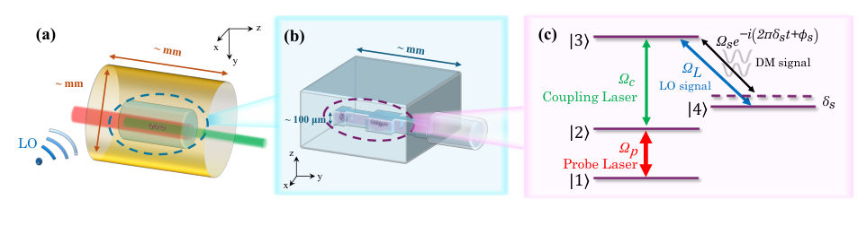 
FIG. 1: Schematic illustration of hidden-photon DM detection using a Rydberg-atom superheterodyne scheme. (a) Proposed experimental setup with an atomic vapor cell placed inside a resonant microwave cavity. (b) Chip-scale Rydberg-atom vapor cell used for optical readout. (c) Response of the superheterodyne detection scheme to the DM-induced electric field.

📷 Fig 2

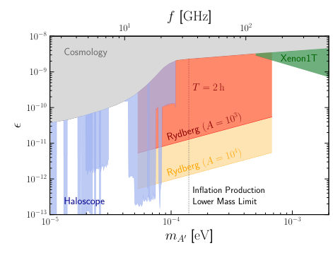 
FIG. 2: Projected reach of the cavity-enhanced Rydberg-atom superheterodyne search. The integration time is 2 hours for each tuning point. The electric-field amplification factor is set to A = 103 (red) and 104 (yellow). Existing bounds from haloscope searches (blue) [69], cosmology (gray) [7], and XENON1T direct absorption (green) [70] are shown for com- parison. The vertical dashed line marks the lower mass limit for inflationary hidden-photon DM production (1).

📷 Fig 3

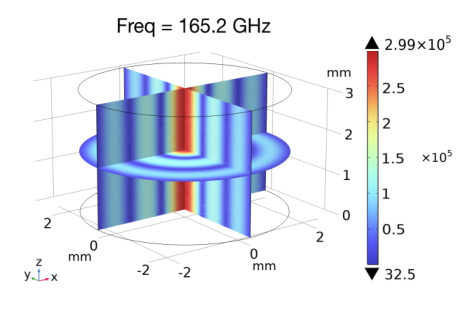 
FIG. 3: Simulation of the electric-field enhancement in a cylindrical cavity with radius 2.5 mm and height 3 mm. The selected cavity mode is TM030, corresponding to a resonant frequency of f = 165.2 GHz. The color scale represents the electric-field amplification factor.

**Summary.** The paper proposes an advanced experimental technique to search for hidden-photon dark matter using chip-scale Rydberg atoms. By employing superheterodyne spectroscopy on a resonant cavity platform, the method enhances sensitivity by converting extremely weak, high-frequency signals into measurable low-frequency modulations. This approach promises unprecedented reach in probing specific mass ranges of dark matter candidates.

**Why it may be interesting.** This work represents a cutting-edge application of quantum optics—specifically Rydberg atom physics and cavity QED—to fundamental particle astrophysics problems, pushing sensing limits into previously inaccessible regimes.

Detailed structure

**Main problem.** The primary goal is the direct detection of hidden-photon dark matter, which induces a weak oscillating electric field in the meV mass range.

**Main result.** The proposed method can probe this dark matter signal with sensitivities 3–4 orders of magnitude beyond existing experimental limits by combining resonant enhancement and Rydberg atom spectroscopy.

**Method.** A superheterodyne detection scheme is employed, using Electromagnetically Induced Transparency (EIT) to convert the weak high-frequency microwave coupling from the DM field into a measurable low-frequency beat note.

**Model / system.** The system utilizes chip-scale Rydberg atoms in a compact cavity setup. The interaction involves probing the EIT resonance, which is modulated by the oscillating electric field induced by kinetic mixing between hidden photons and Standard Model photons.

**Key observables.** The key diagnostic parameter is the low-frequency beat note ($\delta s$) derived from the modulation of the transmitted probe power ($\delta P(t)$).

**Important parameters / regimes.** Target mass range: $5 	imes 10^{-5}	ext{--}7	imes 10^{-4}\,\mathrm{eV}$. Sensitivity scales depend on integration time ($T$) and coherence time ($	au_c$).

**Assumptions / limitations.** The analysis assumes the DM field is non-relativistic, that superheterodyne conversion is necessary due to signal weakness, and uses approximations regarding phase randomization (incoherent vs. coherent detection).

**Figures summary.** Figure 2 compares the projected reach of this method against existing bounds from haloscope searches and cosmology.

**Paper structure.** The paper develops the theoretical framework for sensing weak fields using Rydberg atoms in an EIT superheterodyne setup, analyzes signal-to-noise scaling laws (both coherent and incoherent), and projects the achievable sensitivity to constrain dark matter parameters.

Abstract

Although hidden-photon dark matter with masses above $10^{-4}\,\mathrm{eV}$ is well motivated by inflationary production, it remains largely unexplored by terrestrial experiments. Through kinetic mixing, hidden photons induce a weak oscillating electric field above $10\,\mathrm{GHz}$. We propose to amplify this signal using a compact high-frequency distributed cavity and detect it with chip-scale Rydberg-atom superheterodyne spectroscopy. Combining resonant enhancement, large dipole moments of Rydberg atoms, and long-term stable integration, this approach can probe hidden-photon dark matter in the mass range $5 \times 10^{-5}\text{--}7\times 10^{-4}\,\mathrm{eV}$ with sensitivities $3$--$4$ orders of magnitude beyond existing limits.

[↑ back to top](#top)

### [Fate of dynamical quantum phase transitions from sudden quench to slow quench limit](http://arxiv.org/abs/2607.15649v1)

**Authors:** Xiang Zhang, Fuxiang Li  
**Type:** theory · **Category:** statistical mechanics · **PDF:** <https://arxiv.org/pdf/2607.15649v1>  
**Analysis basis:** full PDF text, analyzed in chunks
**Topic relevance:** 🔥 `non-equilibrium dynamics` **4/5** · 🔥 `non-equilibrium universality` **4/5** · `driven-dissipative phase transition` **3/5** · `methods for driven-dissipative` **3/5** · `analog quantum simulation` **2/5** · `Keldysh / 2PI / non-Gaussian methods` **1/5** · `entanglement & information structure` **1/5** · `scars & prethermalization` **1/5**

📷 Fig 1

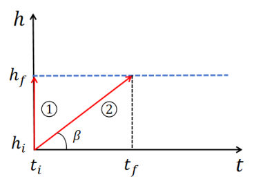 
FIG. 1. Schematic of the quench protocols: Sudden quench protocol 1 ○and slow quench protocol 2 ○. Here, for both quench protocols, the initial hi and final values hf of quench parameter h are fixed. For the slow quench protocol 2 ○, h is changed as a function of time t with quench rate β, i.e., hf = hi + βt.

📷 Fig 2

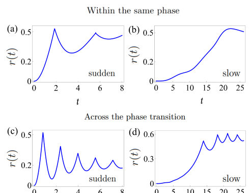 
FIG. 2. DQPTs in the XY chain under sudden and slow quench protocols when the system is quenched within the same ferromagnetic phase and across the phase transition from ferromagnetic phase to paramagnetic phase, respec- tively. (a) and (b) The rate function r(t) of the Loschmidt amplitude under sudden and slow quench protocol within the same phase. (a) Parameter h is suddenly changed from hi = 0 to hf = 0.9 at time t = 0 while γ = 0.3. (b) The quench pa- rameter h is slowly changed as h(t) = hi +βt with the quench rate β = 0.05. (c) and (d) The rate function r(t) of the Loschmidt amplitude under sudden and slow quench proto- col across the equilibrium phase transition. (c) h is suddenly...

📷 Fig 3

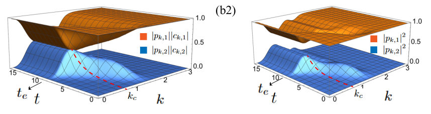 
FIG. 3. The condition (11) for quench rate β = 0.08 (a1) and β = 0.1 (b1) in the XY chain within the same phase. Occupation amplitudes pk,1 and pk,2 for quench rate β = 0.08 (a2) and β = 0.1 (b2). te represents the ending time of slow quench protocols. After te, the subsequent temporal evolution will be governed by the final time-independent Hamiltonian. In (b1) and (b2), the red dotted lines represent the time evolution for critical momentum kc.

📷 Fig 4

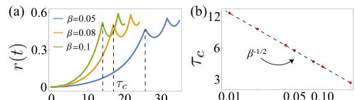 
FIG. 4. The scaling behavior of critical time of DQPT when the system is slowly quenched across the phase transition in the XY chain. (a) Rate function r(t) calculated by the initial state |ψ(ti)⟩with different quench rate. (b) The first critical time τc as a function of the quench rate β.

📷 Fig 5

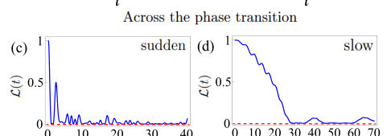 
FIG. 5. Loschmidt echo L(t) (blue lines) with sudden ((a) and (c)) and slow quench ((b) and (d)) in the Aubry-Andr´e model. (a) The commensurate potential V is suddenly changed from Vi = 0 to Vf = 1.8 at time t = 0. (b) Slow quench protocol: V (t) = Vi + βt, quench rate β = 0.1. The pre-quench and post-quench Hamtonians are both are in the delocalization phase. (c) and (d) Quench protocol crosses the delocaliza- tion–localization phase boundary (Vi = 0 →Vf = 3). Here, the red dashed lines represent L(t) = 0.

**Summary.** This paper explores the fate of Dynamical Quantum Phase Transitions by comparing sudden and slow quenching protocols. It demonstrates that while sudden quenches can show spurious transitions, only slow quenches reveal DQPTs intrinsically linked to true equilibrium quantum phase transitions. This establishes a robust method for using non-equilibrium dynamics as a probe for identifying critical points.

**Why it may be interesting.** This work provides a powerful diagnostic tool—the slow quench limit—to rigorously connect non-equilibrium dynamics (DQPTs) directly to static critical points (QPTs), which is highly relevant for understanding quantum criticality in driven systems.

Detailed structure

**Main problem.** The study systematically investigates how Dynamical Quantum Phase Transitions (DQPTs) behave when the quench protocol is varied from a sudden switch to a slow, adiabatic-like change.

**Main result.** Slow quenches can distinguish intrinsic DQPTs—those linked to equilibrium quantum phase transitions—from 'accidental' ones that occur within a single equilibrium phase.

**Method.** The analysis relies on calculating the Loschmidt echo and its associated rate function, comparing results obtained from sudden versus slow quench protocols across various models.

**Model / system.** The work applies to general 1D two-band models, specifically analyzing the XY chain, the Aubry-André model, and the trimer Su-Schrieffer-Heeger (SSH3) model. The dynamics are governed by time-dependent Hamiltonians.

**Key observables.** Loschmidt echo ($L(t)$), rate function ($r(t)$), and nonanalyticities in $r(t)$ which signal a DQPT.

**Important parameters / regimes.** The quench rate ($eta$), the initial and final Hamiltonian parameters ($h_i, h_f$), and the crossing of an equilibrium quantum phase transition are critical parameters.

**Assumptions / limitations.** It is assumed that slow quenches reveal the intrinsic connection between DQPTs and underlying equilibrium quantum criticality, provided a bulk gap closure occurs during the process.

**Figures summary.** Figures compare rate functions $r(t)$ for sudden versus slow quenches in the SSH3 model, demonstrating how the slow quench filters out spurious transitions and reveals scaling laws related to critical exponents.

**Paper structure.** The paper progresses by first establishing the general framework using Loschmidt echoes, then contrasting the results of sudden vs. slow quenches, and finally applying this rigorous test to multiple physical models (XY chain, Aubry-André, SSH3) to confirm the theoretical predictions.

Abstract

Previous investigations of dynamical quantum phase transition (DQPT) have predominantly focused on sudden quench protocols. In this work, we systematically explore the fate of DQPT from the sudden to the slow quench regime. We establish that DQPT remains robust under slow quenching when the protocol crosses an equilibrium quantum phase transition. Conversely, we show that accidental DQPTs,which occur when the pre and post quench Hamiltonians reside in the same equilibrium phase, can be filtered out in the slow quench limit. This demonstrates that slow quenches can reveal the intrinsic connection between DQPT and equilibrium quantum phase transitions, thereby enabling DQPT to serve as a dynamical probe for identifying equilibrium quantum critical points. We illustrate these findings with examples from the XY chain, the Aubry-André model, and the trimer Su-Schrieffer-Heeger model.

[↑ back to top](#top)

### [Harnessing resonant dipolar interactions in a hybrid atom-molecule quantum system](http://arxiv.org/abs/2607.15976v1)

**Authors:** Daniel K. Ruttley, Tom R. Hepworth, Juan M. García-Garrido, Caleb J. H. Rich, Rosario González-Férez, Alexander Guttridge, Simon L. Cornish  
**Type:** experiment · **Category:** other · **PDF:** <https://arxiv.org/pdf/2607.15976v1>  
**Analysis basis:** full PDF text, analyzed in chunks
**Topic relevance:** 🔥 `QC/QI experiment` **4/5** · 🔥 `analog quantum simulation` **4/5** · `Rydberg arrays` **3/5** · `entanglement & information structure` **3/5** · `quantum measurements` **2/5** · `correlated cavity matter` **1/5** · `non-equilibrium dynamics` **1/5** · `quantum optics experiment` **1/5**

📷 Fig 1

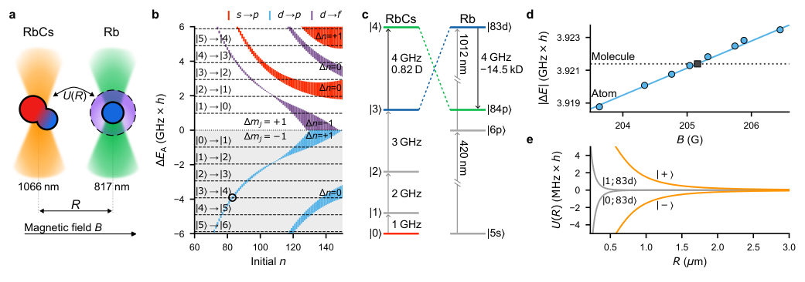 
FIG. 1. Engineering resonant interactions between a molecule and an atom. a, Schematic of the experiment showing a RbCs molecule and a Rb Rydberg atom which are prepared in species-specific optical tweezers. b, Energies of transitions, ∆EA, between the Rydberg levels of Rb as a function of the initial principal quantum number, n. The height of the lines show the energy range accessible by varying a magnetic field over 100 G. The dashed lines show when the atomic transitions become resonant with molecular transitions labelled as |N⟩→|N ′⟩. The highlighted point shows the transitions that we use in this work. c, Energy levels used in this work, as described in the text. We tune the pair state...

📷 Fig 2

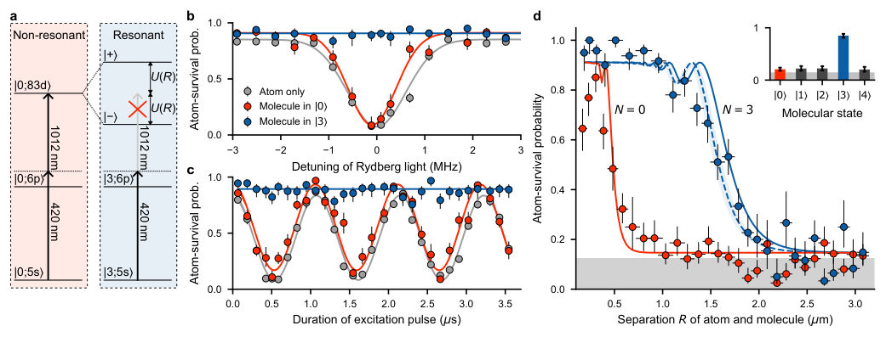 
FIG. 2. Rydberg blockade caused by resonant atom–molecule interactions. a, Energy levels of the atom–molecule system for the non-resonant (red) and resonant (blue) cases at R ≈1 µm, as described in the text. b, Atomic survival probability as a function of the two-photon detuning of the Rydberg excitation light. Red and blue points show data for molecules prepared in the states |0⟩and |3⟩, respectively, at R = 0.9(1) µm. Grey points show the spectrum measured in the absence of a molecule. When the molecule is prepared in |3⟩, excitation of the atom is strongly suppressed. c, Atomic survival probability as a function of the duration of the Rydberg-excitation pulse. Colours are as in b. d,...

📷 Fig 3

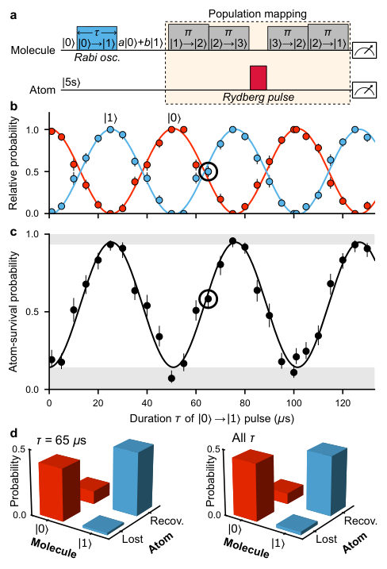 
FIG. 3. Molecular readout with a Rydberg atom. a, Schematic of the experimental sequence used to map the state of a molecule onto an atom. First, we drive a Rabi oscillation on the molecular transition |0⟩→|1⟩to prepare it in a super- position. Then, we map the population of one of the compo- nent states (here, |1⟩) to the resonant state |3⟩with a series of microwave π pulses. Next, we attempt to resonantly excite the atom to the Rydberg state. This is blockaded state selec- tively and any Rydberg atoms are ejected from the tweezer. Finally, the molecule is returned to its original state and we readout both particles. b, Rabi oscillations on the molecu- lar transition |0⟩→|1⟩. We show the...

📷 Fig 4

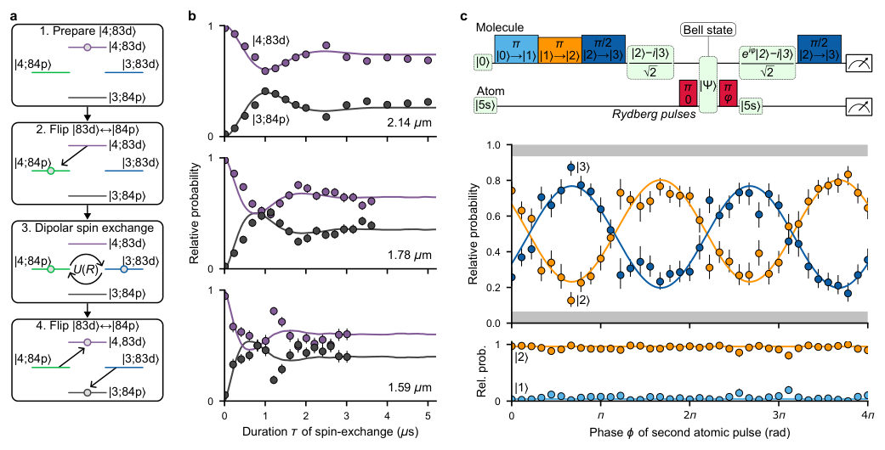 
FIG. 4. Dipolar spin-exchange and entanglement of an atom and molecule. a, Experimental sequence (see text) that we use to observe atom–molecule spin exchange. b, Relative populations of the states |4⟩|83d⟩(purple) and |3⟩|84p⟩(black) with varying spin-exchange duration τ. The different panels show different interparticle separations. We perform a global fit to extract the parameters given in the text. c, Entanglement of the atom and molecule using state-selective dipolar interactions. Upper: experimental sequence, as described in the text. Lower: Entanglement-mediated phase transfer between particles. We prepare the maximally entangled Bell state |Ψ⟩by performing a CNOT gate on the atom...

**Summary.** The researchers demonstrated coherent dipole-dipole coupling between Rydberg atoms and polar molecules trapped in optical tweezers. By exploiting resonance, they achieved strong, controlled interactions necessary for quantum information processing tasks. This establishes a scalable hybrid platform capable of mapping molecular quantum information onto atomic states.

**Why it may be interesting.** This work represents a significant step toward building hybrid quantum processors by establishing a robust, controllable interface between two distinct quantum matter systems (atoms and molecules) using long-range dipolar interactions.

Detailed structure

**Main problem.** The primary goal was to realize controlled, coherent dipolar interactions between an individual Rydberg atom and an individual polar molecule within a scalable optical tweezer platform.

**Main result.** The authors successfully demonstrated these coherent dipolar interactions, enabling molecular state readout, observation of spin exchange, and the generation of entanglement via a blockade-based CNOT operation.

**Method.** They used species-specific optical tweezers to trap atoms (e.g., Rb) and molecules (e.g., RbCs), tuning atomic and molecular states into resonance to engineer strong dipole-dipole coupling.

**Model / system.** The system is a hybrid quantum platform combining neutral Rydberg atoms and polar molecules, governed by an engineered dipole-dipole interaction Hamiltonian ($H_{dd} \propto 1/R^3$). The interactions are controlled by tuning the energy levels into resonance using external fields.

**Key observables.** Coherent dipolar coupling strength ($	ext{MHz}$-scale), blockade signatures (suppression of atomic excitation), molecular state readout fidelity, and entanglement fidelity ($F$).

**Important parameters / regimes.** Resonance condition achieved by matching transition energies; interaction strengths scale as $1/R^3$ at resonance; measurement fidelities reached $\approx 0.91$.

**Assumptions / limitations.** The dipolar description is accurate for separations $R \gtrsim 1 \mu	ext{m}$; the analysis relies on postselection to filter out certain error channels.

**Figures summary.** Figures illustrate the schematic setup, energy level diagrams showing resonant pairs, and experimental results demonstrating blockade dependence on distance and molecular state, as well as Rabi oscillations used for readout.

**Paper structure.** The work progresses from establishing the feasibility of controlled dipolar interactions in optical tweezers to demonstrating specific quantum operations: first, molecular-state readout via Rydberg blockade; second, observing coherent spin exchange dynamics; and finally, generating entanglement using a CNOT gate.

Abstract

Hybrid quantum systems offer a route to combining the complementary strengths of distinct quantum platforms while mitigating their limitations. A particularly promising architecture combines neutral atoms and polar molecules: atoms provide fast, controllable interactions through excitation to Rydberg states, while molecules possess long-lived rotational states that are attractive for quantum memories and qudits. Although dipolar interactions between atoms and molecules have been observed in gas-phase and beam experiments, they have not previously been explored in a scalable optical tweezer platform that enables the controlled coherent interactions needed for quantum state transfer and entanglement. Here, we realise this goal, demonstrating coherent dipolar interactions between an individual Rydberg atom and an individual polar molecule. The separation of the particles is controlled using species-specific optical tweezers and their dipolar interactions are made strongly state-dependent by tuning two atom-molecule pair states into resonance. We exploit these interactions to demonstrate atom-mediated state readout of a molecular qubit, observe coherent spin exchange between the particles, and generate entanglement using a blockade-based controlled-NOT operation. Together, these results establish a coherent atom-molecule interface in which long-lived molecular quantum information can be rapidly mapped onto internal states of a Rydberg atom for readout or onward coherent transfer. This platform can be scaled to realise hybrid quantum processors utilising atom-mediated readout and entanglement of molecular qubits and mixed-species quantum simulators of dipolar systems.

[↑ back to top](#top)

### [Zigzag ordering, defects, and anomalous relaxation in antiferromagnetic Kuramoto lattices](http://arxiv.org/abs/2607.15911v1)

**Authors:** Priyanka D. Bhoyar, Prashant M. Gade  
**Type:** theory · **Category:** statistical mechanics · **PDF:** <https://arxiv.org/pdf/2607.15911v1>  
**Analysis basis:** full PDF text, analyzed in chunks
**Topic relevance:** 🔥 `analog quantum simulation` **4/5** · 🔥 `non-equilibrium universality` **4/5** · `non-equilibrium dynamics` **3/5** · `driven-dissipative phase transition` **2/5** · `methods for driven-dissipative` **2/5** · `Frenkel-Kontorova` **1/5** · `correlated / nonlocal dissipation` **1/5** · `exotic spin models in light-matter` **1/5** · `scars & prethermalization` **1/5**

📷 Fig 1

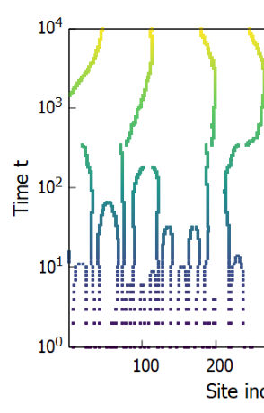 
Figure 1: * The defect positions along a 1D Kuramoto chain are plotted as a function of time. Initially, the defects move and annihilate along constrained paths, but eventually settle into nearly equidistant configurations.

📷 Fig 2

 
Figure 2: Scatter plot of defect positions along a 1D Kuramoto chain as a function of time. The y-axis is logarithmic to capture both early and late time dynamics. Defects initially move and annihilate along constrained paths, but eventually settle into nearly equidistant configurations.

📷 Fig 3

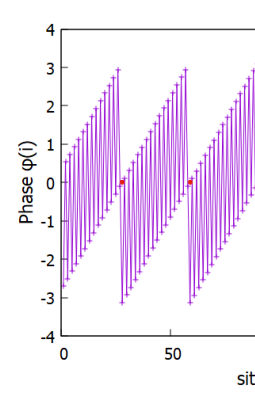 
Figure 3: Asymptotic phase configuration for sites i = 1–200 in a 1D Kuramoto AFM chain. The purple points shows the phase profile ϕ(i), while red dots indicate the remaining defect sites. Most defects have annihilated, leaving a few residual defects that are roughly equidistant and pinned by the zigzag order. This illustrates the constrained mobility of defects at late times.

📷 Fig 4

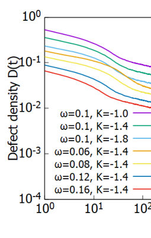 
Figure 4: Log-log plot of time evolution of the defect density D(t) for different values of ω and K in a 1D Kuramoto chain of size N = 50000. After short transients, all curves collapse onto a universal power-law decay D(t) ∼t−1/4, demonstrating parameter independent anomalous coarsening in the AFM Kuramoto chain. The y-axis is multiplied by arbitrary constants for clarity.

📷 Fig 5

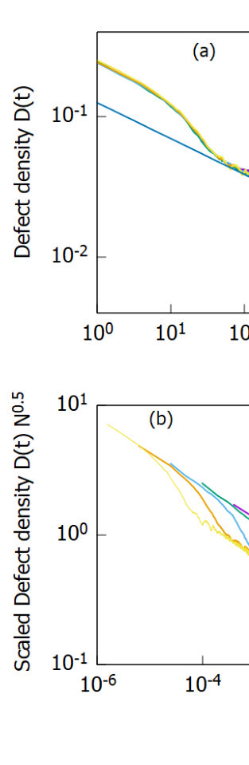 
Figure 5: (a) Time evolution of defect density D(t) for various system sizes N = 50, 100, 200, 400, 800. The reference line shows D(t) ∼ t−1/4. (b) shows the finite-size scaling collapse of defect density: scaled time t/N 2 vs D(t)N 0.5 for 1D Kuramoto AFM chains. Each color corresponds to a different system size N.

**Summary.** This work analyzes the nonequilibrium ordering of antiferromagnetically coupled Kuramoto oscillators, revealing anomalous coarsening dynamics. The key finding is that deterministic geometric frustration alone can cause slow relaxation characterized by unique power-law and stretched-exponential decay exponents. This establishes a new universality class for defect annihilation in continuous phase variable systems.

**Why it may be interesting.** The findings demonstrate how deterministic nonlinear interactions and geometric frustration can generate anomalous slow relaxation dynamics in many-body systems, providing a non-disordered mechanism for complex scaling behavior relevant to glassy or frustrated quantum/classical models.

Detailed structure

**Main problem.** The study investigates anomalous coarsening dynamics, defect kinetics, and relaxation behavior in systems exhibiting geometric frustration.

**Main result.** The system displays anomalous slow decay of defect density ($D(t) \sim t^{-1/4}$) and persistence probability ($\exp(-ct^{1/4})$), indicating a distinct universality class driven purely by deterministic nonlinear dynamics.

**Method.** Theoretical analysis involves continuum approximations, coarse-grained partial differential equations (PDEs), and linear stability analysis to derive scaling laws.

**Model / system.** The model uses coupled Kuramoto oscillators with negative nearest-neighbor coupling, simulating an antiferromagnetic lattice structure in 1D and 2D.

**Key observables.** Defect density $D(t)$, local persistence probability $P(t)$, characteristic exponents ($\alpha=1/4$, $\delta=1/4$), and dynamical exponent ($z=2$).

**Important parameters / regimes.** Negative coupling strength ($K<0$), system size ($N$), and the presence of geometric frustration.

**Assumptions / limitations.** The dynamics are purely deterministic, lacking quenched disorder or stochastic noise; continuum approximations are used for theoretical explanation.

**Figures summary.** Figures illustrate defect positions over time in 1D chains, showing initial movement followed by settling into nearly equidistant configurations, and show the space-time trajectories of defects.

**Paper structure.** The paper analyzes the dynamics in 1D first, deriving anomalous scaling laws ($\delta=1/4$, $\alpha=1/4$) from continuum theory. It then discusses the implications for 2D systems where frustration leads to long-lived domain walls, fundamentally modifying coarsening.

Abstract

We investigate the nonequilibrium ordering dynamics of coupled Kuramoto oscillators with negative nearest-neighbor coupling, which induces a zigzag antiferromagnetic ordering. In one dimension, the defect density exhibits anomalously slow coarsening, decaying as $(D(t)\sim t^{-1/4})$ before saturating at a system-size-dependent time $(t_c(N)\sim N^z)$ with (z=2). The local persistence probability follows a stretched-exponential form, $(P(t)\sim \exp(-c t^α))$, with $(α=1/4)$. These exponents are observed are independent of the magnitude of the coupling, which merely rescales the characteristic time scale. The equality $(α=δ=1/4)$ together with (z=2) is consistent with a distinct universality class. These results demonstrate that deterministic nonlinear dynamics and geometric frustration alone are sufficient to generate slow relaxation and anomalous scaling, without quenched disorder or stochastic noise. A continuum approximation and the corresponding coarse-grained partial differential equation provide a theoretical explanation for the observed anomalous exponents, while linear stability analysis accounts for the emergence of the zigzag ordered state. In two dimensions, geometric frustration inhibits complete ordering and gives rise to long-lived metastable domain-wall structures. An initial transient defect decay is observed before crossover and saturation. These results demonstrate how frustration and continuous phase variables can fundamentally modify coarsening dynamics and generate anomalously slow relaxation in deterministic many-body systems.

[↑ back to top](#top)

### [Three-dimensional three-photon Stark spectroscopy of a single Rb Rydberg atom in an ultrahigh-vacuum glass cell with eight electrodes](http://arxiv.org/abs/2607.15764v1)

**Authors:** S. A. Spirin, E. A. Yakshina, A. K. Sologub, G. Suliman, A. M. Minnigaliev, V. V. Gromyko, P. I. Betleni, D. B. Tretyakov, V. M. Entin, N. N. Bezuglov, I. I. Beterov, I. I. Ryabtsev  
**Type:** experiment · **Category:** other · **PDF:** <https://arxiv.org/pdf/2607.15764v1>  
**Analysis basis:** full PDF text, analyzed in chunks
**Topic relevance:** 🔥 `analog quantum simulation` **4/5** · `QC/QI experiment` **3/5** · `Rydberg arrays` **3/5** · `quantum measurements` **2/5** · `quantum optics experiment` **2/5** · `correlated cavity matter` **1/5** · `entanglement & information structure` **1/5** · `non-equilibrium dynamics` **1/5**

📷 Fig 1

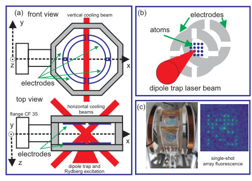 
FIG. 1. (a) Design of the UHV vacuum glass cell for our experiments with arrays of ultracold neutral atoms. The oc- tagonal multi-facet cell is placed vertically. The large round window on the front side of the cell is used simultaneously for passing the horizontal MOT cooling beams and the beam of the optical dipole trap. The vertical cooling beam is sent through two facets of the octagon on the opposite sides. The coaxial ring-shape electrodes are deposited on the inner sur- face of the glass cell. Each ring has four identical segments. (b) Sketch of the atomic array located between the electrodes. (c) Photo of the UHV glass cell in the experimental setup and the single-shot fluorescence...

📷 Fig 2

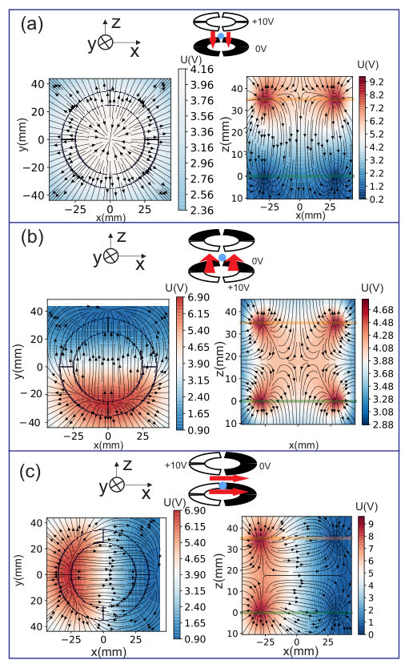 
FIG. 2. The calculated distribution of electric potential and directions of the electric field in the xy and xz planes passing through the geometric center of the system. (a) The electric field is pointed to the z direction, when voltage U = +10 V is applied to one of the rings, and the second ring is grounded. (b) The electric field is pointed to the y direction, when volt- age U = +10 V is applied to the pair of neighboring segments of each ring, and the remaining segments are grounded. (c) The electric field is pointed to the x direction, when voltage U = +10 V is applied to the other pair of neighboring seg- ments of each ring, and the remaining segments are grounded.

📷 Fig 3

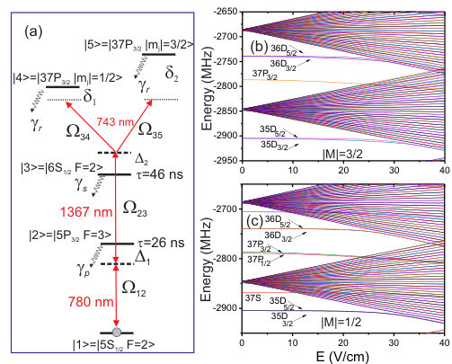 
FIG. 3. (a) Scheme of the three-photon Rydberg excitation of two Stark sublevels of the Rb 37P3/2 state. (b),(c) Numer- ically calculated Stark diagrams for (b) |mj| = 3/2 and (c) |mj| = 1/2 indicate a quadratic Stark shift of the Rydberg 37P3/2 state.

📷 Fig 4

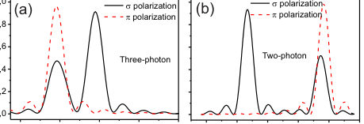 
FIG. 4. Numerically calculated spectra of (a) three-photon Rydberg excitation of Rb 37P 3/2 state and (b) two-photon Rydberg excitation of Rb 36D3/2 state in the DC electric field E = 2.5 V/cm for two cases of π and σ polarization of laser light. For π polarization the effective two-photon and three-photon Rabi frequencies are 5 MHz which ensures 100 ns π-pulse duration. For σ polarization the laser intensities in our simulations remain unchanged compared to the case of π polarization.

📷 Fig 5

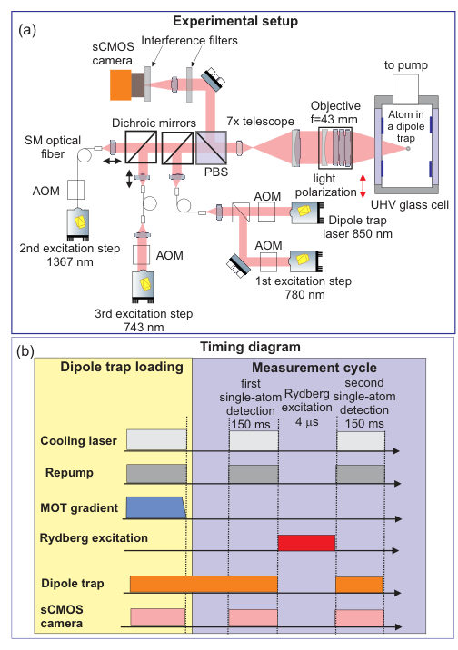 
FIG. 5. (a) Scheme of the experimental setup. Three beams of laser radiation exciting Rydberg atoms are overlapped with the beam of the optical dipole trap and focused into the MOT thorugh the window of the UHV glass cell. A sCMOS camera is used for detection of single atoms using resonance fluores- cence. (b) Timing diagram of the experiment. Single Rb atoms are loaded into the optical dipole trap. After detection of single atom, the gradient magnetic field is switched off, and the measurement cycle starts. The single-atom retention is measured after each pulse of Rydberg excitation.

**Summary.** The researchers performed three-dimensional three-photon Stark spectroscopy on a single Rb Rydberg atom using a custom UHV cell with eight electrodes. This setup allows precise, independent control over the electric field in all three spatial directions. The results confirm that the measured spectral shifts and splittings match theory, demonstrating a robust tool for quantum simulation requiring accurate knowledge of external field environments.

**Why it may be interesting.** This work provides a highly controlled experimental platform for probing fundamental atomic interactions in extreme electromagnetic environments, which is crucial for developing reliable quantum simulators based on Rydberg arrays.

Detailed structure

**Main problem.** Achieving precise three-dimensional control of the electric field is essential for quantum computing and simulation using ultracold neutral atoms due to the high sensitivity of Rydberg states.

**Main result.** The experiment successfully demonstrated independent tuning of the electric field along all three spatial directions, with measured Stark shifts and splittings agreeing well with theoretical calculations.

**Method.** Spectroscopic study using three-photon Rydberg excitation of a single Rb atom in an optical dipole trap within a custom UHV cell equipped with eight electrodes to generate controlled DC electric fields.

**Model / system.** The physical system is a single Rb Rydberg atom trapped in an optical dipole trap inside an ultrahigh-vacuum glass cell. The field control relies on depositing eight electrodes whose potential solves Laplace's equation, allowing for precise 3D biasing.

**Key observables.** Stark shift and splitting of the three-photon resonance; ability to independently tune electric fields along x, y, and z directions.

**Important parameters / regimes.** Electric field strengths up to several V/cm; polarizabilities ($\alpha_{P}^{1/2} = 38.8 	ext{ MHz}/(	ext{V/cm})^2$, $\alpha_{P}^{3/2} = 32.5 	ext{ MHz}/(	ext{V/cm})^2$).

**Assumptions / limitations.** The three-photon excitation scheme is used because it theoretically eliminates light shifts that complicate analysis in two-photon schemes.

**Figures summary.** Figure 1 illustrates the octagonal UHV quartz cell design and electrode placement. Figure 9 compares experimental and theoretical Stark spectra showing field dependence for different magnetic quantum numbers.

**Paper structure.** The paper details the necessity of 3D electric field control, describes the custom electrode setup and its electrostatic modeling (using MoM), presents the three-photon spectroscopic measurements on Rb atoms, and validates the results by comparing measured shifts/splittings against theory.

Abstract

Quantum computing and quantum simulation with ultracold neutral atoms require Rydberg excitation of individual atoms in atomic arrays. Rydberg states are extremely sensitive to external electric fields, therefore precise three-dimensional control of the electric field is essential. We performed a spectroscopic study of three-photon Rydberg excitation of a single Rb atom in an optical dipole trap in the presence of an external DC electric field. The field was generated by eight electrodes deposited on the inner surfaces of an ultrahigh-vacuum glass cell. The used three-photon scheme of laser excitation of Rydberg \textit{nP} states allows the Stark shift and the splitting of the resonances to be observed simultaneously, which simplifies calibration of the electric field. In addition, in the commonly used two-photon Rydberg excitation schemes, the light shifts can complicate accurate determination of the DC Stark shift, particularly when the external electric field is scanned across different spatial directions, and different Stark components are excited. These shifts are absent in the three-photon excitation scheme used in our experiment. We demonstrated the ability to independently tune the electric field along all three spatial directions and to compensate for stray electric fields. The measured three-photon spectra exhibit Stark shifts and splittings of the three-photon resonance that are in good agreement with theoretical calculations. These results are also of interest for Rydberg electrometry.

[↑ back to top](#top)

### [Property-dependent material times](http://arxiv.org/abs/2607.15920v1)

**Authors:** Aude Y. Amari, Lorenzo Costigliola, Jeppe C. Dyre  
**Type:** theory · **Category:** disordered systems and neural networks · **PDF:** <https://arxiv.org/pdf/2607.15920v1>  
**Analysis basis:** full PDF text, analyzed in chunks
**Topic relevance:** 🔥 `non-equilibrium dynamics` **4/5** · `non-equilibrium universality` **3/5** · `scars & prethermalization` **2/5** · `Keldysh / 2PI / non-Gaussian methods` **1/5** · `driven-dissipative phase transition` **1/5** · `methods for driven-dissipative` **1/5**

📷 Fig 1

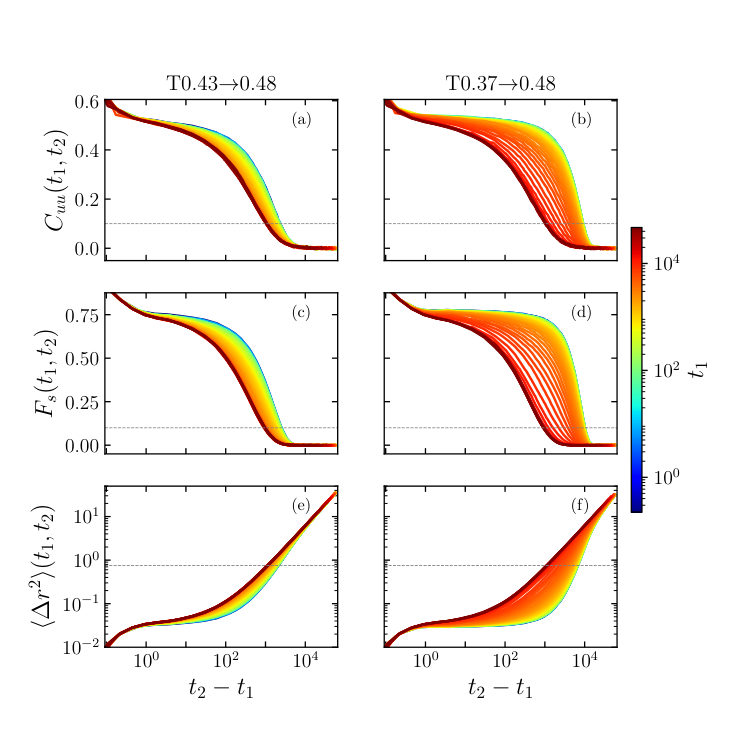 
FIG. 1: Relaxation following two temperature-up jumps to T = 0.48 of a binary LJ mixture. The explicit dependence of the two-time functions on the waiting time t1 of the two-time functions demonstrates that time-translation invariance is broken. (a-b) Single-particle potential-energy time-autocorrelation function (normalized), (c-d) incoherent intermediate scattering function (ISF), and (e-f) mean-square displacement (MSD) during aging, all plotted as functions of the time difference t2 −t1 for different values of t1 (t2 ≥t1). The curve colors vary from blue for small values of t1 to red as this value increases. Data for a moderate and a large jump are shown in the left and right columns,...

📷 Fig 2

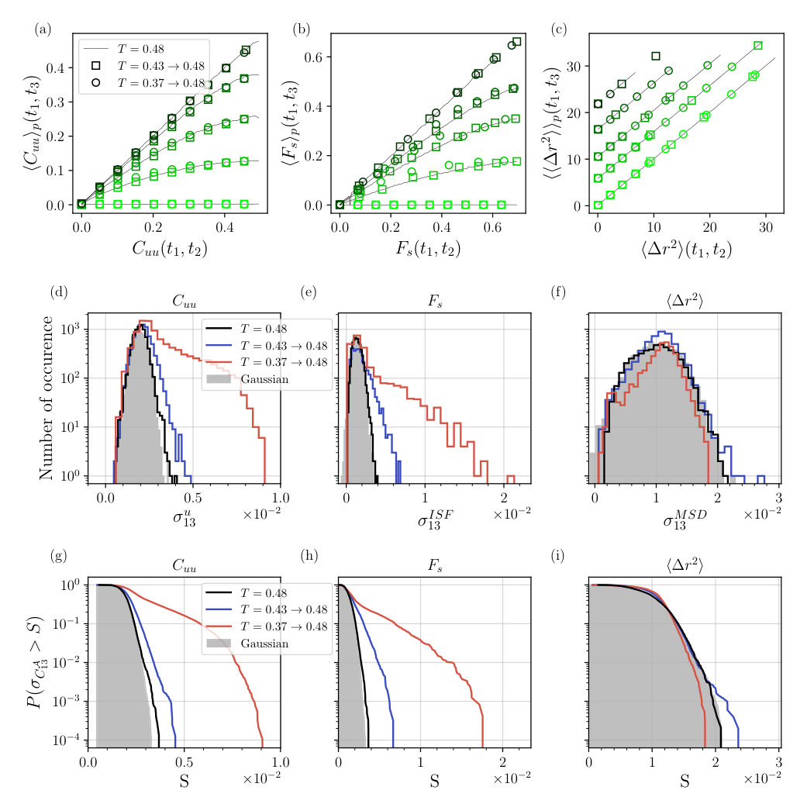 
FIG. 2: Triangular relation Eq. (4) at equilibrium, as well as for a moderate and a large temperature up jump for: (a,d,g) the potential autocorrelation function, (d,e,h) the self part of the ISF, and (c,f,i) the MSD. (a-c) Per pixel average of CA 13

📷 Fig 3

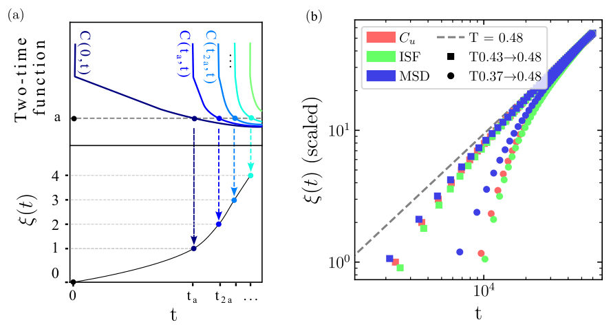 
FIG. 3: (a) Illustration of how the material times are defined and determined numerically. (b) Material time for the potential-energy time-autocorrelation function, incoherent ISF, and MSD, as functions of time for the two jump to T = 0.48 starting from T = 0.43 (circles) and T = 0.37 (squares). The difference between the material times is especially visible for the large jump.

📷 Fig 4

 
Figure 6(a) shows one of the main result of this paper by plotting col[f](ξ1) as a function of ξ1. The left and right columns show the moderate and large jumps, respectively; from top to bottom is investigated how well Cuu, ISF, and MSD collapse after reparametrization by ξu, ξISF , and ξMSD in red, green and blue, respectively.

📷 Fig 5

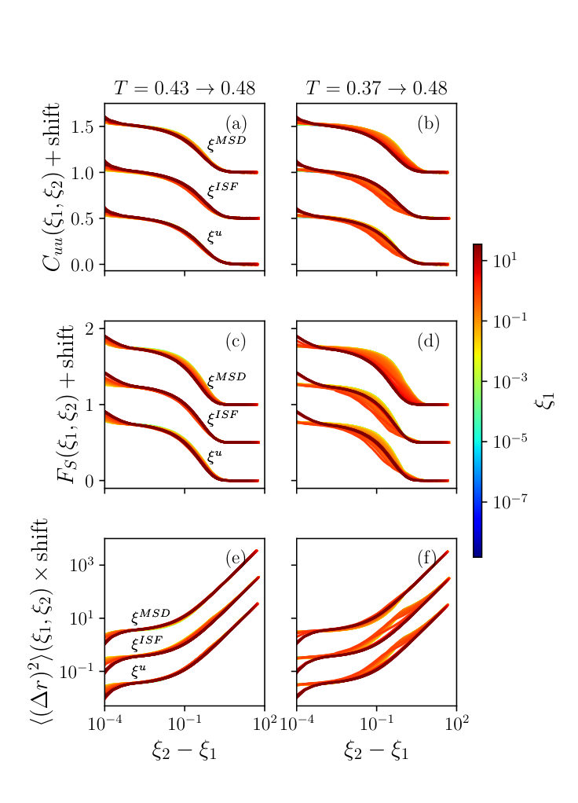 
FIG. 4: Two-time observables during aging after reparametrization by the material times defined from the potential-energy time-autocorrelation function ξu, ξISF from the ISF, and ξMSD from the MSD, plotted as functions of the corresponding material time differences, ξ(t2) −ξ(t1). The color of the curves vary from red for small values of ξ(t1) to blue as this value increases. (a-b) Potential-energy time-autocorrelation function, (c-d) self part of the ISF, (e-f) MSD. Results for the moderate and large jumps are shown on the left column and right column, respectively. The data collapse is better for the moderate jump than for the large one, to a varying degree depending on the...

**Summary.** This paper analyzes the aging dynamics of a binary Lennard-Jones mixture following large temperature jumps. The authors test if assigning a unique material time parameterization to different physical observables (like MSD or ISF) improves the description compared to using a single universal time scale. They find that individual material times provide the best data collapse for all measured properties, highlighting the complexity of relaxation in glassy systems.

**Why it may be interesting.** This work directly addresses non-equilibrium relaxation in glassy systems using advanced concepts like 'material time,' which is highly relevant to understanding structural arrest and slow dynamics in complex materials studied by AMO physicists.

Detailed structure

**Main problem.** The study investigates physical aging dynamics following large temperature up-jumps, specifically testing if parameterizing different observables by their own material time improves the effectiveness of the Tool-Narayanaswamy (TN) formalism.

**Main result.** For all analyzed properties—potential energy autocorrelation, ISF, and MSD—the best data collapse is achieved when each observable is parameterized by its unique material time. The improvement is most pronounced for the mean-square displacement.

**Method.** The authors analyze two-time correlation functions ($C_{uu}, F_s, \langle\Delta r^2
angle$) and test their consistency with a generalized 'material time' concept derived from satisfying necessary conditions like the triangular relation.

**Model / system.** The simulations are performed on a binary Lennard-Jones (LJ) mixture (mBLJ system), modeling structural relaxation in a glassy or amorphous material context. The analysis focuses on non-equilibrium dynamics far from equilibrium.

**Key observables.** Potential-energy time-autocorrelation function ($C_{uu}$), A-particle incoherent intermediate scattering function ($F_s$), and A-particle mean-square displacement ($\langle\Delta r^2
angle$).

**Important parameters / regimes.** Temperature jump magnitudes (e.g., $0.43 	o 0.48$); the material time parameterization constant 'a'.

**Assumptions / limitations.** The analysis assumes that defining a separate material time for each observable can improve data collapse, even when standard universal material time concepts fail during large temperature jumps.

**Figures summary.** Figures show simulation results for $C_{uu}$, $F_s$, and $\langle\Delta r^2
angle$ following up-jumps. Later figures illustrate the collapse of these two-time functions when plotted against differences in their respective material times.

**Paper structure.** The paper analyzes aging dynamics by comparing the effectiveness of universal vs. property-specific material time parameterizations for three key observables, confirming that individual material times yield superior data collapses, especially for MSD.

Abstract

We analyze simulations of physical aging following large temperature up-jumps from equilibrated, slowly relaxing states. Specifically, we consider up-jumps from temperatures T=0.43 and T=0.37 to T=0.48 in a binary Lennard-Jones mixture. The Tool-Narayanaswamy (TN) concept of a universal material time was recently shown to become less effective in rationalizing the aging response for such large jumps [Amari et al., Phys. Rev. E 113, 045411 (2026)]. Here, we investigate whether the performance of the TN formalism can be improved by assigning a separate material time to each observable. We examine the potential-energy time-autocorrelation function, the self-intermediate scattering function, and the time-dependent mean-square displacement. As part of this study, we perform a detailed analysis of the extent to which the triangular relation, a necessary condition for the existence of a material time, is satisfied. We find that, for all three properties, the best data collapse is obtained when each property is parameterized by its own material time. The degree of improvement varies considerably among the observables, however; it is most pronounced for the mean-square displacement.

[↑ back to top](#top)

### [Deterministic atom-shuttle interconnects via ultrafast atom-ion entangling gate](http://arxiv.org/abs/2607.15597v1)

**Authors:** Mu Qiao  
**Type:** theory · **Category:** other · **PDF:** <https://arxiv.org/pdf/2607.15597v1>  
**Analysis basis:** full PDF text, analyzed in chunks
**Topic relevance:** 🔥 `Rydberg arrays` **4/5** · `QC/QI experiment` **3/5** · `analog quantum simulation` **2/5** · `entanglement & information structure` **1/5** · `non-equilibrium dynamics` **1/5**

📷 Fig 1

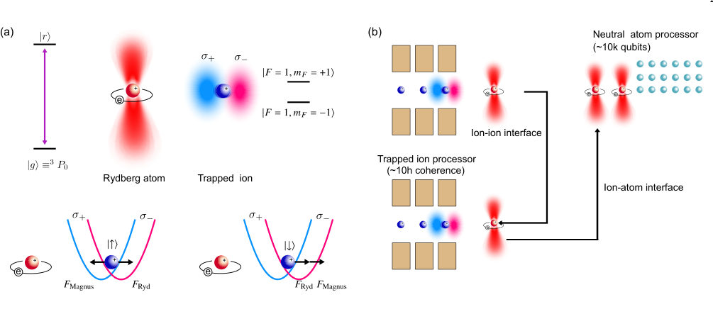 
FIG. 1. Atom–ion interface and hybrid quantum architecture. (a) Schematic of the entangling gate. The neutral 171Yb atom uses a metastable clock state |g⟩≡3P0 and a Rydberg state |r⟩as the qubit. The 171Yb+ ion is encoded in stretched Zeeman states (|F = 1, mF = ±1⟩) to use spin-dependent optical Magnus forces. (b) Hybrid compute-store quantum architecture. Trapped-ion modules (left) serve as robust quantum memories with demonstrated ∼10 h coherence times [4], using standard ion–ion quantum gates for local operations. Neutral-atom arrays (right) provide parallel processing at the thousand- qubit scale [17]. The proposed hybrid gate gives a deterministic ion–atom interface, letting atoms act...

📷 Fig 2

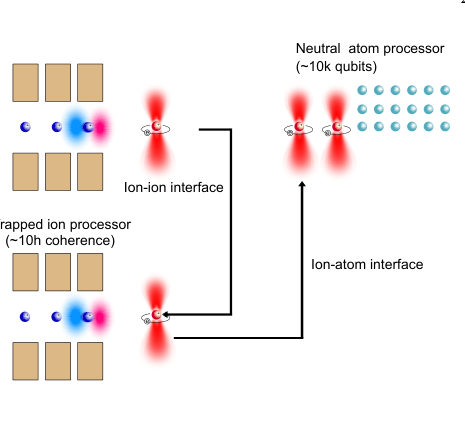 
Figure 3 summarizes the per-gate infidelity versus ion- chain length N at 4 K, for both Rydberg choices, along- side the required gate duration Tgate(N). At small N the gate completes in one trap period and the infidelity is N-independent, saturating at the per-ion Rydberg-decay floor. Above a crossover N⋆≈25 set by the microwave π- pulse width (τpulse ≈20 ns), the ∼2N toggle segments of the mode-closure schedule (see SM) no longer fit inside one trap period and Tgate grows linearly with N. For the low-ℓ3P2 ↔3D2 pair (τr ≈100 µs) this pushes the decay error from 2.5% at N=1 to ∼7% at N=100 and dominates the N-dependence. Circular Rydberg states (τr ≈120 ms, see SM) suppress the decay floor...

📷 Fig 3

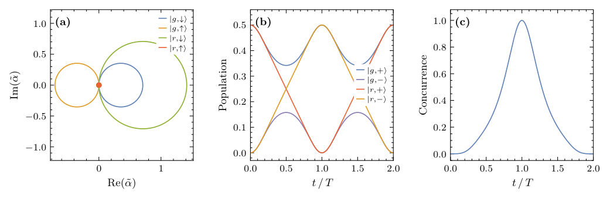 
FIG. 2. Single-ion CZ gate. (a) Phase-space trajectories (rotating frame) of the ion motional mode for each logical state. The |r,↑⟩state remains at the origin (forces cancel), while |r,↓⟩traces the largest loop. (b) Populations in the |g/r⟩⊗|±⟩basis, where |±⟩= (|↓⟩± |↑⟩)/ √

📷 Fig 4

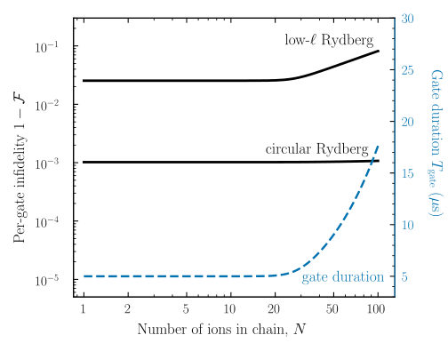 
FIG. 3. Per-gate infidelity vs. ion-chain size N. Or- ange: low-ℓ3P2 ↔3D2 toggle pair. Green: circular Rydberg. Both at 4 K, EIT-cooled ¯n = 1, standard technical budget (Table S3). Blue dashed (right axis): required gate dura- tion Tgate(N), set by the toggle-schedule feasibility constraint ∆tmin ≥τpulse = 20 ns. For N ≲25 the schedule fits within one trap period; beyond, Tgate grows linearly with N and the decay contribution 1

📷 Fig 5

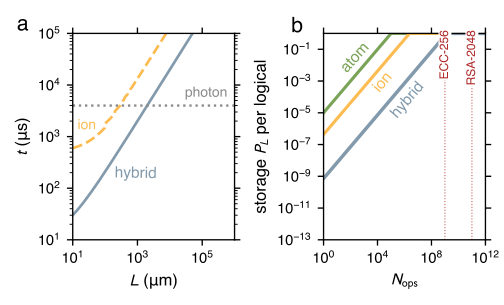 
FIG. 4. Hybrid architecture advantages. (a) Inter- connect time vs. separation L for atom shuttle, QCCD ion shuttle, and heralded photonic link [31]; atom shuttle domi- nates out to ∼2 mm. (b) Storage logical error per algorithm operation, P store L /Nops, for BB[[72, 12, 6]] at 99.9% atom CZ. Pure-atom and pure-ion architectures pay a constant per-op cost set by their continuous syndrome extraction. Hybrid memory error is the one-shot transfer cost 2pT , amortized over Nops, so the per-op cost decreases with algorithm length and overtakes pure ion at Nops ∼103. Vertical lines: ECC-256 and RSA-2048 op budgets [36].

**Summary.** The paper presents a breakthrough method to deterministically link neutral-atom arrays and trapped-ion crystals using ultrafast atom shuttling ($\sim 5 	ext{ kHz}$) and microsecond $	ext{CZ}$ gates. By leveraging the charge-induced-dipole force, they demonstrate a hybrid quantum architecture that significantly boosts computational power and offers superior long-term storage capabilities compared to single-platform systems.

**Why it may be interesting.** This work directly addresses the physical bottleneck of connecting disparate quantum hardware modules. The use of Rydberg physics (specifically circular states) combined with ion trapping dynamics provides an advanced, scalable protocol for realizing high-fidelity quantum interconnects.

Detailed structure

**Main problem.** The primary challenge is developing a fast, deterministic method to enable reliable quantum entanglement and interconnectivity between two leading platforms: neutral-atom arrays and trapped-ion crystals.

**Main result.** The authors propose a hybrid architecture using ultrafast atom shuttling ($\sim 5 	ext{ kHz}$) combined with microsecond $	ext{CZ}$ gates, which significantly outperforms single-platform approaches for scaling quantum computation.

**Method.** The core mechanism involves generating a controlled-$Z$ gate via the charge–induced-dipole ($	ext{C}4$) force between a Rydberg atom and a trapped ion, modulated by a spin-dependent optical Magnus force to close phase-space trajectories rapidly.

**Model / system.** The system combines neutral atoms in optical tweezers with trapped ions. The gate relies on the $	ext{C}4$ interaction Hamiltonian, which is controlled by toggling Rydberg states or using circular Rydberg states for enhanced coherence and sign control of the force.

**Key observables.** Gate time ($\sim \mu	ext{s}$), Interconnect rate ($\sim 5 	ext{ kHz}$), Logical error rates ($p_T$), and Fidelity ($F$).

**Important parameters / regimes.** Rydberg state parameters (e.g., $n=60, 80$), $	ext{C}4$ coupling strength, detuning ($\delta_d$), and separation distance ($L \le 2 	ext{ mm}$).

**Assumptions / limitations.** The ion block can act as a passive storage zone for hybrid memory schemes; the gate fidelity is limited by Rydberg decay or technical noise sources.

**Figures summary.** Figures illustrate phase-space trajectories showing distinct closed loops for $	ext{CZ}$ gates, and comparative plots show that atom shuttling dominates interconnect rates up to $2 	ext{ mm}$, while error scaling shows hybrid memory improving with algorithm length.

**Paper structure.** The paper first establishes the need for fast interconnects. It then details the microsecond $	ext{CZ}$ gate mechanism using $	ext{C}4$ and Magnus forces, followed by demonstrating its application to high-rate atom shuttling and a superior hybrid quantum memory architecture compared to pure-platform methods.

Abstract

Neutral-atom arrays and trapped-ion crystals offer complementary strengths for fault-tolerant quantum computing but lack a fast way to deterministically interact. Here we propose a controlled-$Z$ gate generated by the charge-induced-dipole ($C_4$) force between a Rydberg-excited atom and a trapped ion, balanced by a spin-dependent optical Magnus force on the ion that closes phase-space trajectories within a few microseconds. Toggling the Rydberg state extends the scheme to multi-ion crystals at negligible overhead. The resulting ${\sim}5\,$kHz atom shuttle accelerates short-distance QCCD links and enables hybrid qLDPC memories in which atom logical qubits are written onto an ion block treated as a passive storage zone. We perform circuit-level Monte Carlo simulations and find that the hybrid architecture supports orders of magnitude more operations than atom-only or ion-only architectures at fixed code distance and logical error rate.

[↑ back to top](#top)

### [Isothermal compression of a Fermi gas to deep quantum degeneracy](http://arxiv.org/abs/2607.15616v1)

**Authors:** Kirill Karpov, Jonas Auch, Eduard Heidt, Florian Kiesel, Alexandre De Martino, Christian Groß  
**Type:** experiment · **Category:** quantum gases · **PDF:** <https://arxiv.org/pdf/2607.15616v1>  
**Analysis basis:** full PDF text, analyzed in chunks
**Topic relevance:** 🔥 `analog quantum simulation` **4/5** · `non-equilibrium dynamics` **2/5** · `correlated / nonlocal dissipation` **1/5** · `driven-dissipative phase transition` **1/5** · `methods for driven-dissipative` **1/5** · `non-equilibrium universality` **1/5** · `scars & prethermalization` **1/5**

📷 Fig 1

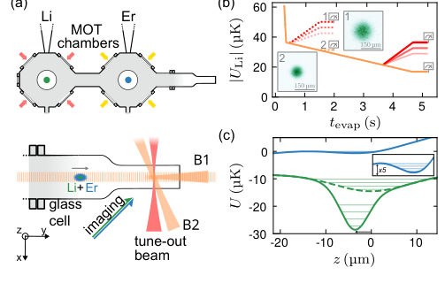 
FIG. 1. Experimental setup and compression of Li. (a) Vac- uum system and ODT setup. The vacuum system consists of spatially separated MOT chambers for Er (blue) and Li (green), each with its own Zeeman slower. After the first cooling steps, Er and Li are transported together to a high optical access glass cell by a running lattice. B1 propagates in the y direction and is crossed by the almost perpendicularly oriented B2. Additionally, the tune-out beam and the imag- ing beams are indicated. (b) Dual-species evaporation trajec- tory and TF tuning by compression with the tune-out beam (red). The 1064 nm-trap depth is decreased by two linear power ramps (orange). To perform the isothermal...

📷 Fig 2

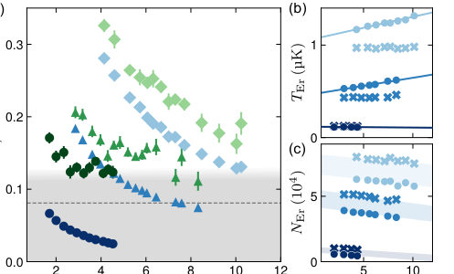 
FIG. 2. Isothermal compression at three different initial tem- peratures. (a) Temperature of the fermions measured directly (green) and via the bosons (blue). The three initial tem- peratures (TEr = 1.1 µK, 0.5 µK and 0.1 µK) are marked by the decreasing brightness of the color and additionally by the symbol. For the bosonic measurements, we normalize to the TF directly measured by the ToF expansion of the fermions. The fade-in of the gray shading indicates the increasing sys- tematic effect on the direct temperature extraction, with the dashed line marking the temperature we would extract for a zero-temperature gas. (b) Er bath temperature TEr measured with (circles) and without (crosses)...

📷 Fig 3

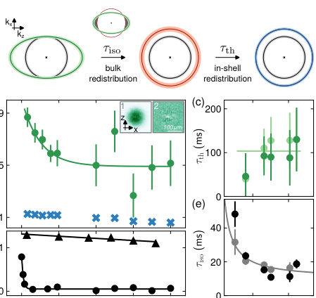 
FIG. 3. (a) Sketch of the isotropization and thermalization processes in a 2D situation (for better illustration), to scale for T/TF ≈0.1. The initial Fermi sea in the kx, kz plane is illus- trated by the chemical potential µ (black circle) surrounded by the thermally active shell (lighter region); the cross marks the origin. The quench induces an anisotropic chemical poten- tial (green), lifting a large fraction of the Fermi sea (dark gray in the smaller upper picture) above the isothermal equilibrium chemical potential (red); this fraction is redistributed between the directions within τiso, with Pauli blocking effective in it. The subsequent thermalization to the bath’s temperature (the...

**Summary.** The research overcomes the fundamental entropy limitations of traditional evaporative cooling in ultracold atomic gases. By implementing isothermal compression using a bosonic bath to cool fermionic atoms, the authors achieved deep quantum degeneracy. This method paves the way for direct state preparation in complex traps without relying on slow adiabatic ramps.

**Why it may be interesting.** This work provides an alternative pathway for reaching strongly interacting many-body regimes by replacing slow, entropy-limited adiabatic cooling with fast, controlled isothermal processes, which is highly relevant for quantum simulation.

Detailed structure

**Main problem.** The standard adiabatic cooling methods limit the entropy available for reaching deeply degenerate quantum gas states.

**Main result.** The authors successfully demonstrated that isothermal compression, achieved via a bosonic bath, can bypass entropy limitations to reach deep degeneracy ($T/T_F = 0.024$).

**Method.** They utilized species-selective trapping with an optical tune-out beam in a dual-species mixture ($	ext{Er}/	ext{Li}$) to maintain constant temperature during compression.

**Model / system.** The system is a two-component fermionic quantum gas (Li) cooled by coupling it to a bosonic bath ($	ext{Er}$) within an optical trap setup. The process involves isothermal compression, which maintains $T$ while decreasing entropy via the bath interaction.

**Key observables.** Reduced temperature ($T/T_F$), entropy per particle ($S/N$), and interspecies thermalization time ($	au_{	ext{thermal}}$).

**Important parameters / regimes.** $T/T_F = 0.024^{+0.007}$; the thermalization time is found to be independent of $T/T_F$.

**Assumptions / limitations.** Sympathetic thermometry using the bosonic component ($	ext{Er}$) is necessary for accurate low-$T/T_F$ measurements due to noise broadening.

**Figures summary.** Figures illustrate the experimental setup, dual-species evaporation trajectories, and time evolution of temperature and atom number during compression protocols.

**Paper structure.** The paper first establishes the problem with adiabatic cooling limitations. It then details the isothermal compression protocol using a bosonic bath to bypass entropy constraints. Finally, it characterizes the efficiency and speed of thermalization in this deep degenerate regime.

Abstract

The standard approach for generating deeply degenerate quantum gases is evaporative or sympathetic cooling in a harmonic trap, after which the gas has reached its minimum entropy. All subsequent state transformations rely on adiabatic changes of a closed system, and coupling to the environment or non-adiabatic processes monotonically increase the entropy. Here, we demonstrate that this experimental paradigm can be bypassed by utilizing species-selective trapping with a low-dissipation optical tune-out trap in a dual-species mixture. We successfully reduce the entropy of a two-component fermionic quantum gas via isothermal compression within a bosonic bath, reaching deep quantum degeneracy of $T/T_F = 0.024^{+0.007}$, with $T_F$ the Fermi temperature. By characterizing the cross-dimensional relaxation and thermalization, we demonstrate that cooling light fermions with heavy bosons remains efficient and fast, even deep in the degenerate regime, where the thermalization time is found to be independent of $T/T_F$. Our results pave the way for direct cooling within optical lattices, box traps, or other complex potentials, thereby eliminating the reliance on adiabatic state transformations to reach strongly interacting many-body regimes.

[↑ back to top](#top)

### [Microscopic Side Information Controls Ordered Hayden--Preskill Recovery](http://arxiv.org/abs/2607.15537v1)

**Authors:** Joao V. R. Alencar, Allan R. P. Moreira, Joao B. R. Silva  
**Type:** theory · **Category:** quantum information and computing · **PDF:** <https://arxiv.org/pdf/2607.15537v1>  
**Analysis basis:** full PDF text, analyzed in chunks
**Topic relevance:** 🔥 `entanglement & information structure` **4/5** · `non-equilibrium universality` **2/5** · `Keldysh / 2PI / non-Gaussian methods` **1/5** · `correlated / nonlocal dissipation` **1/5** · `driven-dissipative phase transition` **1/5** · `methods for driven-dissipative` **1/5** · `non-equilibrium dynamics` **1/5**

📷 Fig 1

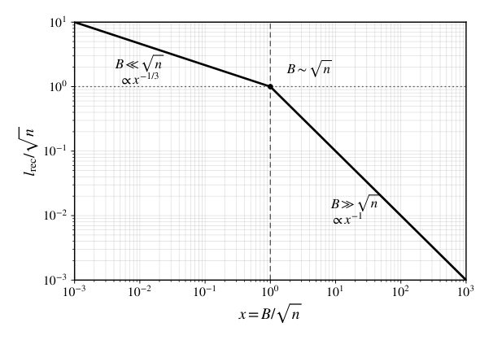 
FIG. 1. Scaling form of the fixed-error recovery phase diagram. With x = B/√n, one has ℓrec/√n ≍x−1/3 in the many-survivor-per-block regime and ℓrec/√n ≍x−1 in the sparse-block regime. The two branches meet at B ≍√n and ℓrec ≍√n. The plotted branches represent the two asymptotic scaling regimes; the crossover profile for B/√n = Θ(1) is not determined by these bounds.

**Summary.** This paper analyzes the robustness of quantum state recovery (Hayden--Preskill) when side information about the measured qubits is incomplete, such as only knowing their relative order or block origin. It derives precise scaling laws showing that this limited classical information fundamentally changes the required quantum output size needed for successful recovery.

**Why it may be interesting.** While focused on quantum information theory, the analysis of structured noise channels and scaling laws ($\ell_{	ext{rec}} \sim n^{2/3}$) provides general tools for understanding how partial knowledge constrains physical processes in complex quantum systems.

Detailed structure

**Main problem.** The study investigates quantum recovery protocols, specifically the Hayden--Preskill protocol, when the decoder lacks full microscopic identity of output qubits, retaining only relative order or partial block location.

**Main result.** The optimal entanglement fidelity convergence and the required operational recovery length ($\ell_{	ext{rec}}$) are determined by the type of side information available, yielding critical scaling exponents like $\Theta(n^{2/3})$ for ordered deletion.

**Method.** The analysis employs quantum channel theory, utilizing normalized Choi state purity bounds derived from moment calculations and establishing converse bounds via information-theoretic tools like R\'enyi divergences.

**Model / system.** The model is the Hayden--Preskill protocol applied to an $n$-qubit scrambled register. The noise channels considered are ordered deletion (preserving relative order) or block-resolved partial labels, which act on subsequences of qubits.

**Key observables.** Optimal entanglement fidelity ($F_{	ext{opt}}^e$), recovery length ($\ell_{	ext{rec}}$), and the normalized Choi state purity ($G_{n,\ell}$).

**Important parameters / regimes.** $n$ (total size), $\ell$ (subsequence length), $k$ (diary size), $B$ (number of blocks); critical scaling exponents include $2/3$.

**Assumptions / limitations.** The analysis assumes the decoder only has access to relative order or block origin information, not absolute positions.

**Figures summary.** Figure 1 illustrates the fixed-error recovery phase diagram showing how $\ell_{	ext{rec}}/\sqrt{n}$ scales with $B/\sqrt{n}$ across different asymptotic regimes.

**Paper structure.** The paper defines protocols and operational quantities (Section II), states the main results for ordered/block-resolved recovery laws (Section III), and details the rigorous proofs using moment estimates and information bounds (Section IV).

Abstract

In the Hayden--Preskill protocol, the decoder is usually assumed to know the microscopic identity of the collected output qubits. We study what happens when these labels are unavailable and only the relative order of the received qubits is preserved. The resulting order-preserving deletion channel maps an $n$-qubit scrambled register to a subsequence of length $\ell$. For a diary of fixed size $k$, we prove that the optimal entanglement fidelity converges to the no-output value $4^{-k}$ when $\ell=o(n^{2/3})$, uniformly over the scrambling unitary. For a Haar-random scrambling unitary, it converges to one when $\ell=ω(n^{2/3})$ and $\ell=o(n)$. Monotonicity then gives the fixed-error recovery scale $\ell_{\mathrm{rec}}=Θ(n^{2/3})$. We also consider partial position information obtained by dividing the register into $B$ consecutive blocks and revealing the block of origin of each received qubit. The recovery scale becomes $\ell_{\mathrm{rec}}(n,B)\asymp n^{2/3}B^{-1/3}$ for $B\leq\sqrt n$ and $\ell_{\mathrm{rec}}(n,B)\asymp n/B$ for $B\geq\sqrt n$. The exponent $2/3$ is traced to rank-aligned coincidences between random subsequences, which control both the converse and the recovery argument. Thus, even purely classical information about the origin of the received subsystems can change the amount of quantum output required for Hayden--Preskill recovery.

[↑ back to top](#top)

### [Photoelectrical readout and Ramsey interferometry of single shallowly implanted NV centers in diamond](http://arxiv.org/abs/2607.15869v1)

**Authors:** Ilia Chuprina, Christoph Findler, Johannes Lang, Petr Siyushev, Fedor Jelezko  
**Type:** experiment · **Category:** quantum information and computing · **PDF:** <https://arxiv.org/pdf/2607.15869v1>  
**Analysis basis:** full PDF text, analyzed in chunks
**Topic relevance:** 🔥 `QC/QI experiment` **4/5** · `spintronics-quantum-optics interface` **3/5** · `quantum measurements` **2/5** · `interference shaping light` **1/5** · `quantum optics experiment` **1/5**

📷 Fig 1

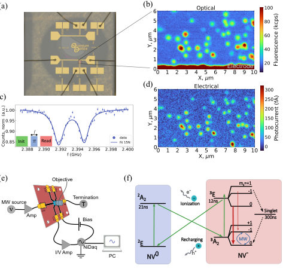 
FIG. 1. Main characteristics of photoelectric readout of im- planted NV centers. (a) Microscope image of the diamond chip used for the experiments. The position of the electrodes coincides with the ion implantation regions. The confocal scanned area is marked on the selected electrode B2 near the top of two electrodes and the microwave strip line. The electrodes and microwave strip line pads are wire-bonded to the circuit board. (b) Optical and (d) photoelectrical con- focal imaging of the region near the electrode exhibiting the strongest signal, resolving multiple isolated NV centers. Ex- citation was performed at 560 nm (5 mW, CW) with an ap- plied bias of +3 V. (c) Pulsed optically...

📷 Fig 2

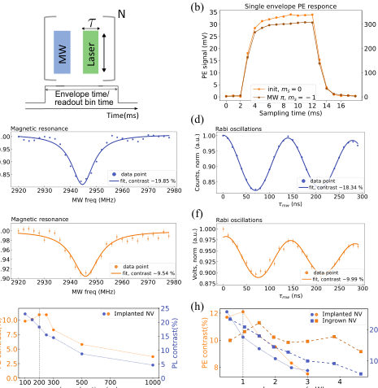 
FIG. 2. Pulsed photoelectrically detected magnetic resonance (PDMR) and Rabi oscillations. (a) Pulse envelope sequence utilized to detect spin-depended photocurrent. It consists of a microwave (MW) spin manipulation pulse followed by in- tense readout (spin initialization) laser pulse which is being optimized. (b) Measured averaged PE response from the pulse envelope. Initialization to ms = 0 without microwave pulses (bright curve) and by using microwave π pulse to flip the spin into ms = −1. (c) optically detected magnetic resonance and (d) corresponding Rabi oscillations. Photoelectrically de- tected (e) magnetic resonance and (f) corresponding Rabi os- cillations. (g) PE(orange) and...

📷 Fig 3

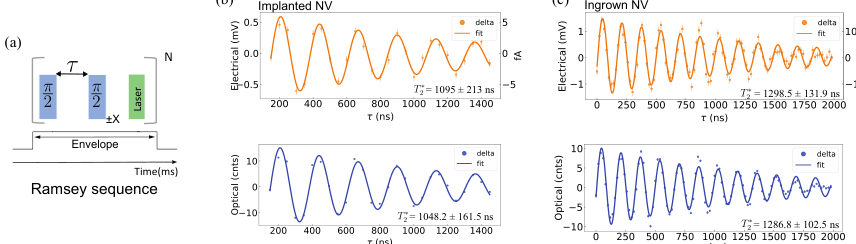 
FIG. 3. Electrical and optical Ramsey T ∗ 2 dephasing measurements of implanted and ingrown NV centers. Ramsey sequence encoded in the pulse envelope (a) where blue π/2 are microwave control pulses and green is short 200 ns polarization/readout intense laser pulse. The Ramsey sequence for implanted single (b) and ingrown NV centers (c).

**Summary.** The researchers successfully demonstrated photoelectrical readout and coherent control of single NV centers implanted near the surface of diamond. By using photocurrent measurements instead of fluorescence, they proved that these engineered shallow qubits can be read out electrically with coherence times matching deep centers. This breakthrough paves the way for integrating quantum sensing and computing components onto semiconductor chips.

**Why it may be interesting.** This work directly addresses hardware implementation challenges in solid-state quantum memories. The ability to use electrical detection for spin readout is crucial for scalable, chip-based quantum devices, providing a pathway beyond purely optical methods.

Detailed structure

**Main problem.** The primary challenge is demonstrating reliable photoelectrical readout and coherent control of single, shallowly implanted Nitrogen-Vacancy (NV) centers in diamond.

**Main result.** Photoelectric readout was successfully demonstrated for shallow NV centers, showing that the measured Ramsey coherence time agrees with conventional fluorescence measurements. This establishes PE readout as a viable route for chip-integrated quantum sensing.

**Method.** The study uses photoelectrical detection (measuring photocurrent) to read out spin states and measure dephasing times ($T_2^*$) via pulsed microwave sequences like Ramsey interferometry.

**Model / system.** The system is single NV centers in diamond, specifically focusing on those that have been artificially implanted at shallow depths ($\sim 10$ nm) and subsequently covered by overgrowth. Measurements compare these to naturally occurring (ingrown) deep centers.

**Key observables.** Ramsey dephasing time ($T_2^*$), spin contrast (photocurrent vs. fluorescence), Rabi oscillation visibility, and background photocurrent levels.

**Important parameters / regimes.** Shallow implantation depth ($\sim 10$ nm), overgrowth thickness, applied bias voltage ($\pm 3 	ext{ V}$), and laser power/duration optimization.

**Assumptions / limitations.** The PE readout assumes that the spin-dependent charge conversion mechanism is robust against background photocurrents from defects, which are mitigated by diamond overgrowth.

**Figures summary.** Figures show optical/photoelectrical confocal imaging, pulsed ODMR and Rabi measurements comparing implanted vs. ingrown centers, and Ramsey $T_2^*$ decay curves demonstrating agreement between PE and PL readouts.

**Paper structure.** The paper progresses by first establishing the feasibility of PE readout for shallow NVs, confirming coherence times match optical methods, then detailing the measurement techniques (Rabi/Ramsey), and finally discussing how overgrowth improves signal quality while noting power-dependent decoherence effects.

Abstract

Photoelectrical readout of the electronic spin state of the nitrogen-vacancy (NV) center in diamond is attracting significant interest due to the numerous advantages it possesses compared with conventional fluorescence readout. The higher charge carrier rate compared to the photon rate and the integration of the detection scheme on a chip can significantly advance quantum sensing and computing with color centers in diamond. Until now, photoelectric readout has been performed on ensembles of NV centers or single NV centers deep in ultrapure diamond substrates. However, many applications require the artificial creation and precise placement of shallow NV centers, and photoelectric detection of such centers has been challenging. Here we demonstrate photoelectrical readout and coherent control of the electronic spin of implanted shallow ($\sim$10 nm) NV centers buried by diamond overgrowth. The photoelectrically measured Ramsey $T_2^*$ agrees with conventional fluorescence readout and shows no measurable dependence on the readout photocurrent, for both shallow implanted and deep ingrown NV centers. We further find that overgrowth improves photoelectric readout by suppressing the background photocurrent. These results establish photoelectric readout as a viable route to chip-integrated, electrically detected nanoscale sensing and to spin registers based on engineered shallow NV centers.

[↑ back to top](#top)

### [Quantum Fisher information of magnetic quantum phase transition on Kondo lattice](http://arxiv.org/abs/2607.16150v1)

**Authors:** Yuan Fang, Lei Chen, Mounica Mahankali, Fang Xie, Yiming Wang, Shouvik Sur, Qimiao Si  
**Type:** theory · **Category:** strongly correlated electrons · **PDF:** <https://arxiv.org/pdf/2607.16150v1>  
**Analysis basis:** full PDF text, analyzed in chunks
**Topic relevance:** 🔥 `entanglement & information structure` **4/5** · `Kondo & dissipative impurity` **3/5** · `analog quantum simulation` **2/5** · `Keldysh / 2PI / non-Gaussian methods` **1/5** · `driven-dissipative phase transition` **1/5**

📷 Fig 1

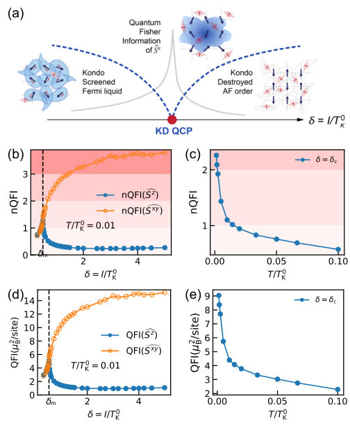 
FIG. 1. (a) Quantum Fisher information of the operator c Sz reveals amplified entanglement at the Kondo destruction (KD) QCP, which separates a Kondo-screened Fermi-liquid phase and a Kondo-destroyed AF-ordered phase. Here the spin direction z is the direction of the magnetic order parame- ter. The control parameter δ = I/T 0 K is the ratio between the RKKY interaction and Kondo temperature. Adapted from Ref. [8]. (b) Normalized QFI density (nQFI) of the longitudi- nal c Sz i and transverse c Sx i (or c Sy i ) spin operators as a function of the control parameter δ = I/T 0 K, where I is the RKKY interaction and T 0 K is Kondo temperature. Here the temper- ature is fixed at a relatively low...

📷 Fig 2

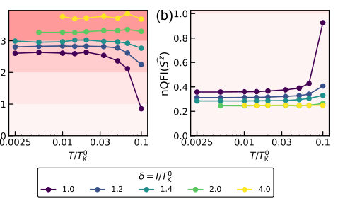 
FIG. 2. (a) Normalized QFI density (nQFI) of transverse spin operator c Sx i (or c Sy i ) as a function of temperature at dif- ferent values of the control parameter δ = I/T 0 K in the AF- ordered part of the phase diagram [cf. Fig. 1(a)]; (b) nQFI of longitudinal spin operator c Sz i as a function of temperature at different δ.

📷 Fig 3

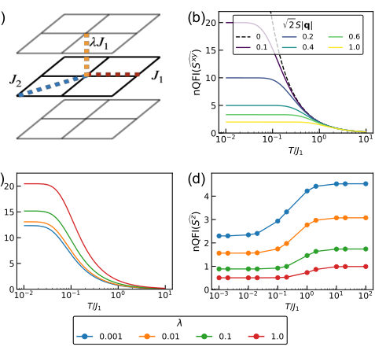 
FIG. 3. (a) Schematic of the quasi-2D Heisenberg model. (b) nQFI of c Sx i as a function of temperature with different √

📷 Fig 4

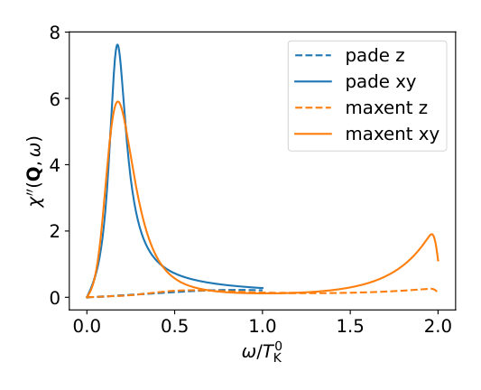 
FIG. 4. Analytic continued χ′′(Q, ω) using Padé and maximum entropy for longitudinal and transverse spin operators. Here δ = I/T 0 K = 1.0 and T/T 0 K = 0.01. Both methods generate similar χ′′ at low frequency ω ∼T. Although maximum entropy has artificial features at large frequency ω ≫T does not affect our QFI calculation.

📷 Fig 5

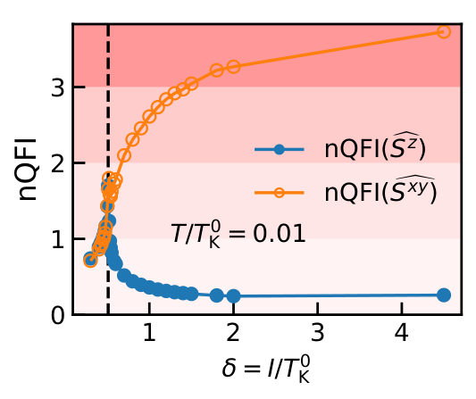 
FIG. 5. Normalized QFI density determined through maximum entropy method. Only converged points are shown here.

**Summary.** The authors use Quantum Fisher Information to characterize multipartite entanglement across the quantum phase transition in the Kondo lattice model. They demonstrate that transverse spin correlations are necessary to witness this entanglement specifically in the magnetically ordered state. This provides a powerful tool for understanding complex many-body physics in heavy fermion materials.

**Why it may be interesting.** This work provides a concrete link between quantum information measures (QFI) and the fundamental physics of strongly correlated electron systems undergoing magnetic transitions, offering new diagnostic tools beyond standard thermodynamic measurements.

Detailed structure

**Main problem.** The study investigates how multipartite entanglement, quantified by the Quantum Fisher Information (QFI), characterizes quantum phase transitions in strongly interacting magnetic systems.

**Main result.** The QFI associated with transverse spin components reveals multipartite entanglement in the magnetically ordered Kondo-destroyed phase, while longitudinal components remain trivial.

**Method.** The analysis employs theoretical techniques including Extended Dynamical Mean-Field Theory (EDMFT), Spin Wave Theory, and calculating the QFI via analytic continuation of dynamic susceptibilities.

**Model / system.** The primary model is the Kondo lattice Hamiltonian, which captures the competition between local moment coupling (Kondo effect) and RKKY interactions. Theoretical insights are also drawn from the quasi-2D Heisenberg $J_1$-$J_2$ model.

**Key observables.** Quantum Fisher Information density ($f_Q$), normalized QFI ($	ext{nQFI}$), transverse vs. longitudinal spin components ($\mathbf{c}_{S\pm x}, \mathbf{c}_{Sz}$), and the dynamical susceptibility $\chi''$.

**Important parameters / regimes.** The control parameter is $\delta = I/T_{0K}$, which tunes the system across different magnetic regimes, including the Kondo-destroyed AF phase ($\delta > \delta_m$).

**Assumptions / limitations.** Approximations include using linear spin wave theory for the ordered phase and employing analytic continuation methods (Padé, maximum entropy) to extract real-frequency data from imaginary time simulations.

**Figures summary.** Figures illustrate QFI behavior across the transition ($\delta$ dependence), temperature evolution of $	ext{nQFI}$ for different spin components in the AF phase, and comparisons between different numerical calculation methods (Padé vs. Maximum Entropy).

**Paper structure.** The paper systematically analyzes the Kondo lattice model by first establishing the theoretical framework linking QFI to magnetic susceptibilities. It then applies this formalism across various regimes—paramagnetic, Fermi-liquid, and AF-ordered—to pinpoint which spin operators best witness entanglement in each phase.

Abstract

Strange metals exemplify highly collective quantum many-body systems that call for new means of characterization, and there is considerable potential for quantum information approaches contributing to the cause. We investigate multipartite entanglement across the quantum phase transition of a Kondo lattice model using the quantum Fisher information (QFI). We show that the QFI associated with the spin components transverse to the order parameter characterizes the destruction of heavy quasiparticles in the Kondo-destroyed magnetic-ordered phase. The physical origin of this observation is elucidated through an analysis of the antiferromagnetic Heisenberg model. We propose to test the results in terms of both unpolarized and polarized inelastic neutron scattering measurements in the ordered part of the heavy fermion phase diagram. Our findings illustrate how different operators of a many-body system can be employed to not only witness multipartite entanglement in different sectors and but also elucidate the overall physics across different parts of the phase diagram.

[↑ back to top](#top)

### [The statistical disturbance bound of quantum measurements](http://arxiv.org/abs/2607.15874v1)

**Authors:** Ties-A. Ohst, Sebastian Schlösser, Roope Uola  
**Type:** theory · **Category:** quantum information and computing · **PDF:** <https://arxiv.org/pdf/2607.15874v1>  
**Analysis basis:** full PDF text, analyzed in chunks
**Topic relevance:** 🔥 `quantum measurements` **4/5** · `measurement-induced transitions` **3/5** · `entanglement & information structure` **2/5** · `Keldysh / 2PI / non-Gaussian methods` **1/5** · `correlated / nonlocal dissipation` **1/5**

📷 Fig 1

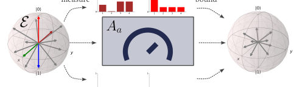 
Figure 1: Sketch of the statistical disturbance estimation of a measurement with uncharacterised measurement effects Aa. A sufficiently large set of probe states ρi (colored arrows) is prepared and measured to determine the corresponding conditional probabilities p(a|i) (col- ored bar charts). These measurement statistics are then processed using the weighted state exclusion technique to obtain an upper bound on the maximum average fi- delity achievable by any compatible measurement chan- nel with respect to the input ensemble E.

📷 Fig 2

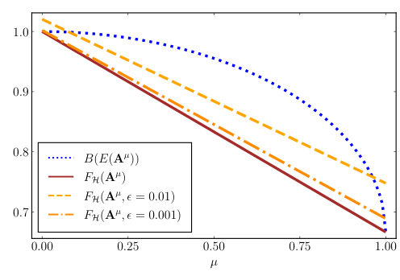 
Figure 2: Comparison between depolarisation noise and sample loss for a qubit computational-basis measure- ment. The solid curve shows the statistical disturbance bound for a lossy measurement as a function of the transmission probability µ. The dotted curve shows the information-disturbance bound B2(E(Aµ)), which co- incides with the statistical disturbance bound of the de- polarised measurement with the same value of µ. Thin solid curves illustrate the robust weighted state exclu- sion bounds for different preparation uncertainties ϵ. Even for moderate preparation errors, the statistical dis- turbance bound remains significantly tighter than the information-disturbance relation over a...

📷 Fig 3

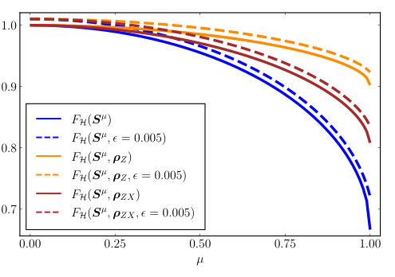 
Figure 3: Weighted state exclusion with incomplete state preparations. The lowest solid curve shows the exact statistical disturbance bound for the noisy SIC POVM defined in Eq. (31). The upper solid curves show the ex- perimentally accessible weighted state exclusion bounds obtained using only the preparation sets ρZ and ρZX. Neither preparation set is sufficient for detector tomog- raphy, yet both certify nonzero measurement distur- bance. Dashed curves show the corresponding robust bounds for preparation uncertainty ϵ = 0.005.

📷 Fig 4

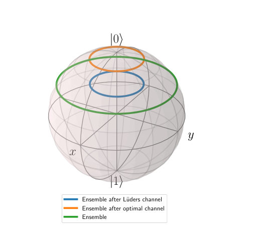 
Figure 4: The latitude ensemble Eθ for a polar angle θ in the northern hemisphere is represented by a ring on the Bloch sphere at fixed latitude. The Lüders instrument associated with the amplitude-damped measurement acts as a partially dephasing channel, reducing the ra- dius of the ring while leaving its polar angle unchanged. By contrast, concatenating the Lüders instrument with an outcome-dependent bit flip shifts the ring further towards the north pole, resulting in a higher average fidelity between the input and output states.

📷 Fig 5

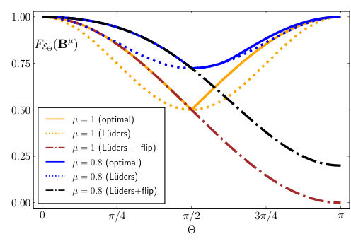 
Figure 5: Statistical disturbance bounds for latitude ensembles. The statistical disturbance bound of the amplitude-damped measurement in Eq. (32) is shown as a function of the polar angle θ. For latitude ensembles in the northern hemisphere, the Lüders instrument is no longer optimal. Instead, the instrument augmented with an outcome-dependent bit flip achieves the optimal average fidelity.

**Summary.** The paper introduces the statistical disturbance bound, a novel measure connecting the statistics of a quantum measurement (POVM) to the minimum state disturbance it must cause. By formulating this as an SDP problem, the authors provide a powerful tool that can be experimentally determined without full knowledge of the measurement apparatus. This has direct applications in quantifying security limits for quantum information tasks like randomness generation.

**Why it may be interesting.** This work provides a rigorous, quantifiable tool—the statistical disturbance bound—to assess the fundamental trade-off between information gain and physical disturbance in quantum measurements, which is crucial for device-independent security proofs.

Detailed structure

**Main problem.** To establish a fundamental 'statistical disturbance bound' that quantifies the minimum state disturbance induced by any quantum measurement channel compatible with observed statistical outcomes.

**Main result.** The derived bound, $FE(A)$, successfully links the statistical description (POVM) to the physical disturbance, proving it is superior to existing information-disturbance relations because it constrains the entire statistical structure.

**Method.** The bound is formulated as an optimization problem solved via Semidefinite Programming (SDP), allowing for efficient computation and theoretical derivation of tight limits.

**Model / system.** The analysis concerns quantum measurements on a $d$-dimensional system, characterized by a Positive Operator-Valued Measure (POVM) $\{A_a\}$, and the associated dynamical process described by an instrument $I$.

**Key observables.** Average fidelity ($F_E(A)$), Informativeness ($E(A)$), and the eavesdropper's guessing probability ($p_g$).

**Important parameters / regimes.** The dimension of the system ($d$), the specific input state ensemble ($\mu_E$, e.g., Haar ensemble $H$), and the POVM elements $\{A_a\}$.

**Assumptions / limitations.** The initial focus is on pure input states, though extensions consider general ensembles; the method relies on solving SDPs.

**Figures summary.** Figure 1 sketches the weighted state exclusion technique using probe states. Figure 6 illustrates how the certified fidelity bound restricts Eve's guessing probability in quantum randomness generation protocols as a function of dimension $d$.

**Paper structure.** The paper progresses by defining the statistical disturbance bound via optimization, solving it for specific ensembles (like Haar), proving its relationship to informativeness, and finally applying it to practical scenarios like bounding eavesdropper knowledge.

Abstract

Quantifying the disturbance caused by a quantum measurement typically requires detailed knowledge of the underlying measurement channel. In this work, we introduce a statistical disturbance bound, which connects the statistical properties of a quantum measurement to the state disturbance induced by any compatible measurement channel. Specifically, we show that the average fidelity between input and output with respect to an arbitrary ensemble of pure input states is fundamentally bounded in terms of the measurement, described as a positive operator-valued measure (POVM). We further develop the weighted state exclusion technique, which enables an experimental determination of the statistical disturbance bound without requiring explicit knowledge of the measurement effects. To see the advantages of our approach over existing information-disturbance relations, we show that our bound distinguishes between measurements with equivalent informativeness. Furthermore, we demonstrate that the weighted state exclusion technique can detect and quantify measurement-induced disturbance using state preparations that are insufficient for tomographic reconstruction of the measurement operators. Finally, we illustrate how disturbance bounds defined with respect to specific input ensembles can be used to bound an eavesdropper's guessing probability in a simple protocol for quantum randomness generation.

[↑ back to top](#top)

### [Generation and detection of squeezed light on a single silicon photonic chip](http://arxiv.org/abs/2607.15461v1)

**Authors:** Oliver M. Green, Bethany Puzio, Rowan A. Hoggarth, Rachel N. Clark, Edward C. R. Deacon, Alex S. Clark, Jonathan C. F. Matthews, Giacomo Ferranti  
**Type:** experiment · **Category:** quantum information and computing · **PDF:** <https://arxiv.org/pdf/2607.15461v1>  
**Analysis basis:** full PDF text, analyzed in chunks
**Topic relevance:** 🔥 `quantum optics experiment` **4/5** · `QC/QI experiment` **2/5** · `analog quantum simulation` **1/5** · `interference shaping light` **1/5** · `quantum measurements` **1/5**

📷 Fig 1

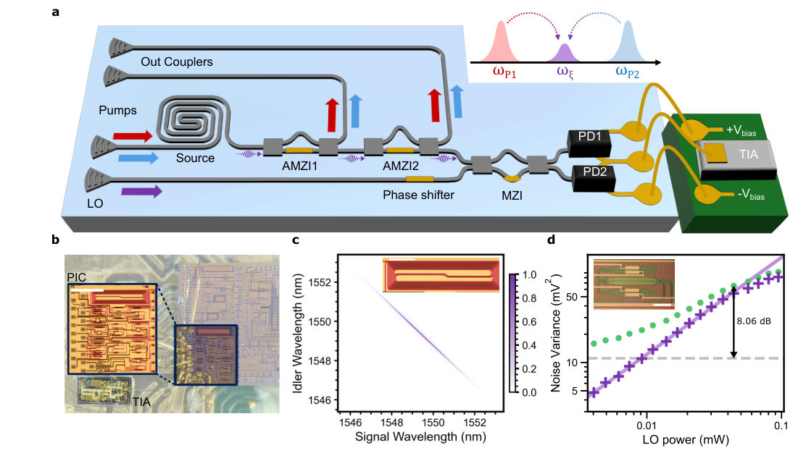 
FIG. 1. The photonic chip (a) Layout of the SOI photonic integrated circuit (PIC). A bi-chromatic pump and local oscillator (LO) couple into the PIC via separate grating couplers. The pump generates degenerate squeezing, as shown in the insert, by spontaneous four-wave mixing in a spiral waveguide. Two cascaded asymmetric Mach Zehnder interferometers (AMZIs) separate squeezed light from pump. The former is then routed to the on-chip homodyne detector, composed of waveguide- coupled germanium photodiodes at each output of a Mach Zehnder interferometer (MZI). The LO field couples directly from its input grating coupler into the homodyne MZI, where it interferes with the squeezed light. (b)...

📷 Fig 2

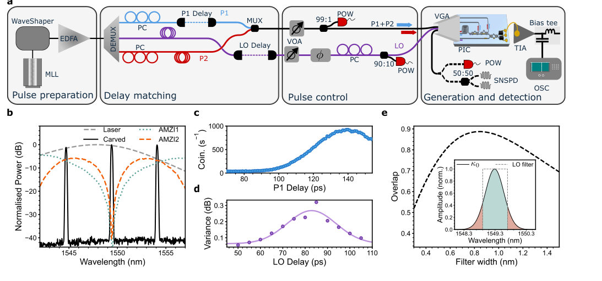 
FIG. 2. Dual-pump preparation scheme (a) Schematic of the experiment, divided into four stages. Pulse preparation: Three spectral lines carved by the WaveShaper from a spectrally-broad pulsed pump enter an erbium-doped fibre amplifier (EDFA). Delay matching: The three wavelengths are demultiplexed (DEMUX) and tunable delay lines correct the temporal mismatch between them. Pumps P1 and P2 are recombined in a wavelength multiplexer (MUX) to act as a bi-chromatic pump field. A variable optical attenuator (VOA) sets the pump intensity which is monitored by a 99:1 splitter and a power meter (POW). A VOA and phase modulator (ϕ) are used to control the power and phase of the local oscillator (LO)....

📷 Fig 3

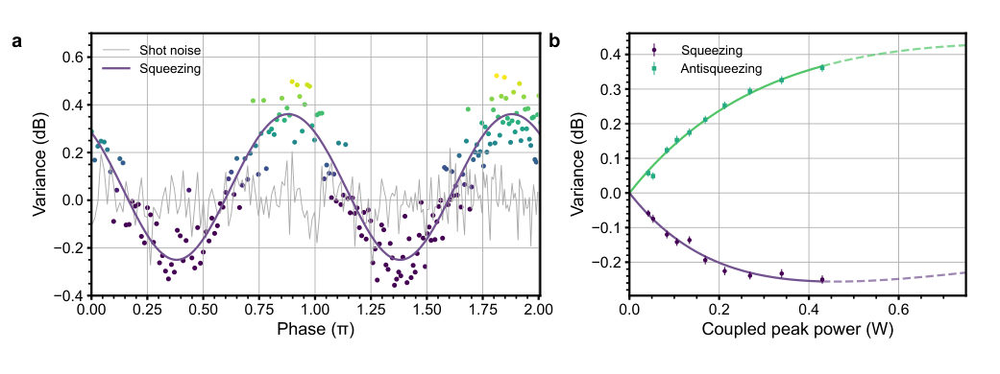 
FIG. 3. Squeezed light measurement (a) The evolution of the variance of the signal recorded on the integrated homodyne detector as the LO phase is swept, exhibiting clear sub-shot noise fluctuations reaching 0.25(1) dB of squeezing. (b) The dependence of the squeezing (purple circles) and antisqueezing (green squares) generated and detected on chip as peak pump power is varied, reaching a maximum detected squeezing level of 0.25(1) dB. The data is fitted with the theoretical scaling from Eq. 2. An extension of the fit to higher optical powers (dashed lines) shows generated squeezing saturates due to the effects of nonlinear loss.

**Summary.** The paper reports on the successful demonstration of generating and detecting squeezed light entirely on a single silicon photonic chip. By integrating the nonlinear source (SFWM) and the homodyne detector onto one SOI platform, they overcome previous limitations in footprint and complexity. This work advances the feasibility of scalable, room-temperature quantum photonic devices for applications like quantum sensing.

**Why it may be interesting.** This is highly relevant as it provides a concrete, scalable platform for continuous-variable quantum optics experiments, directly addressing integration challenges crucial for building quantum networks or sensors.

Detailed structure

**Main problem.** The necessity of generating and detecting quantum states of light on a single integrated photonic device to scale quantum photonics into useful technologies.

**Main result.** The authors demonstrated the monolithic generation and detection of squeezed light on a silicon-on-insulator chip, achieving a measured squeezing level of 0.25(1) dB.

**Method.** Squeezed light was generated via spontaneous four-wave mixing in a silicon waveguide and detected using an integrated pulsed homodyne detector configuration.

**Model / system.** The platform is a single monolithic Silicon-on-Insulator (SOI) photonic integrated circuit, which integrates the nonlinear source (SFWM) and the detection apparatus (homodyne detector) at room temperature.

**Key observables.** Measured squeezing level (0.25(1) dB), inferred entering squeezing (0.42(2) dB), total generated squeezing (0.83(3) dB), and nonlinear refractive index ($n_2$).

**Important parameters / regimes.** Room temperature operation, monolithic integration footprint ($	ext{1.44 mm}^2$), pulsed laser source.

**Assumptions / limitations.** The analysis includes detailed consideration of contributions from waveguide propagation loss and detection inefficiency; the primary limitation noted is intrinsic nonlinear loss in SOI waveguides.

**Figures summary.** Figures illustrate the PIC layout, the dual-pump preparation scheme involving multiple optical components (WaveShapers, MZI), and the measurement process showing sinusoidal variance variation with LO phase and dependence on pump power.

**Paper structure.** The work details the physical setup using an SOI chip for monolithic operation. It covers the generation mechanism (SFWM), the complex detection scheme (pulsed homodyne detector with AMZIs), rigorous characterization of squeezing via quadrature measurements, and analysis of loss mechanisms.

Abstract

The ability to generate and detect quantum states of light on a single integrated photonic device is essential to scale quantum photonics into useful quantum technologies. Integrating the required capabilities into complementary-metal-oxide-semiconductor compatible monolithic chips can reduce cost and unlock new functionality through miniaturisation. In this work we demonstrate a single silicon-on-insulator photonic integrated circuit for the monolithic generation and detection of quantum light on a commercially available platform that operates entirely at room temperature. Specifically, we leverage spontaneous four-wave mixing in silicon waveguides to produce squeezed light which is subsequently detected by photodiodes operating in a pulsed homodyne detector configuration on the same chip as the source. We directly measure $0.25(1)$ dB of squeezing, including contributions from waveguide propagation loss and detection inefficiency, and include a detailed analysis of the impact of nonlinear loss on the squeezing levels achievable using this platform.

[↑ back to top](#top)

### [Operator Entanglement in Quantum Dynamics Simulations: Formalism and Analysis Tools](http://arxiv.org/abs/2607.16070v1)

**Authors:** Tzu Yu Wang, Michael Schuurman, Simon Neville  
**Type:** theory · **Category:** other · **PDF:** <https://arxiv.org/pdf/2607.16070v1>  
**Analysis basis:** full PDF text, analyzed in chunks
**Topic relevance:** 🔥 `entanglement & information structure` **4/5** · `methods for driven-dissipative` **1/5** · `non-equilibrium dynamics` **1/5**

📷 Fig 1

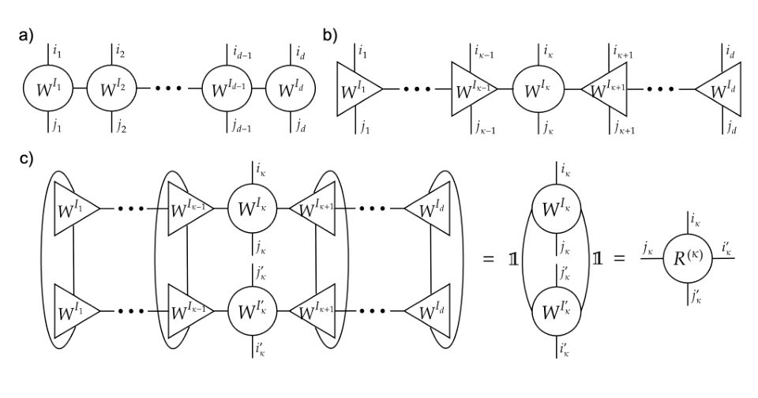 
Figure 1: Diagrammatic representation for obtaining the 1-SRDM from MPOs. a) General MPO diagrammatic representation. b) Mixed canonical form with the right (left) pointing triangles representing a left (right) orthogonal tensor. c) Obtaining the 1-SRDM from a mixed canonical form. In this case the traces over the right and left orthogonal tensors evaluates to the identity. All the 1-SRDMs can be obtained by shifting the orthogonality centre down the chain and repeating procedure.

📷 Fig 2

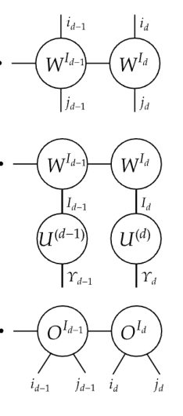 
Figure 2: Diagrammatic representation for obtaining the Natural MPO

📷 Fig 3

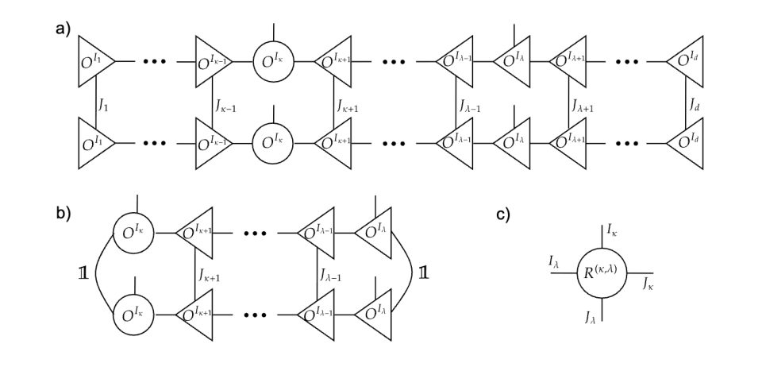 
Figure 3: Diagrammatic representation for how the 2-SRDM is constructed from an MPO. a) The orthogonality center is set at one of the degree of freedom. b) The core tensors to the left and right of the κ and λ degree of freedom evaluates to identity due to orthonormality. The core tensors between κ and λ needs to be contracted explicitly, but the bond dimension of Jκ can be significantly less than the primitive operator basis Iκ. c) The 2-SRDM in the NSPO basis has dimensions R(κ,λ) ∈RMκMλ×MκMλ

📷 Fig 4

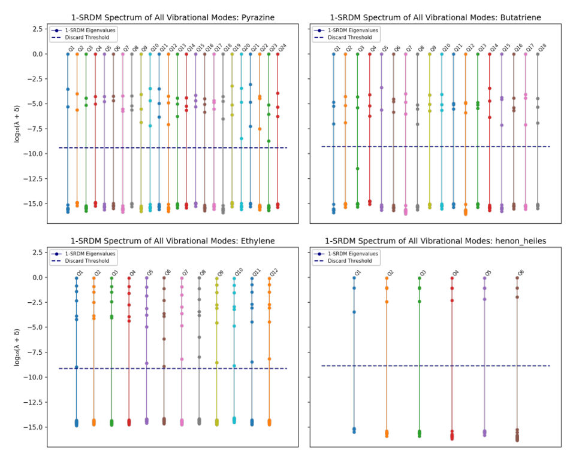 
Figure 4: 1-SRDM eigenvalue distribution for pyrazine, butatriene, sextic ethylene and Henon-Heiles Hamiltonian. Each vertical line in the plot corresponds to the 1-SRDM for one of the modes, with the mode number labelled at the top. The dashed horizontal line is the threshold value (δ = 10−8/d). The percentage of retained eigenvalues relative to the total number has a maximum rmax and minimum rmin value of: rmax = 0.91% and rmin = 0.68% for pyrazine and butatriene, rmax = 5.79% and rmin = 4.96% for ethylene, and rmax = rmin = 0.68% for Henon-Heiles

📷 Fig 5

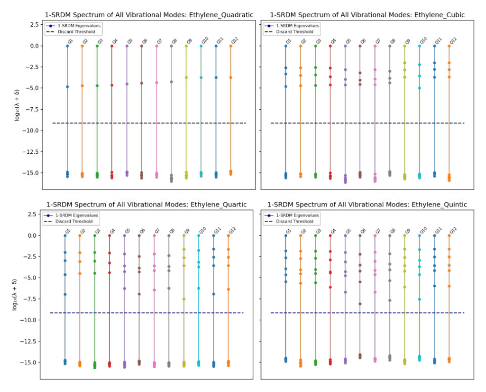 
Figure 5: Compressibility of different order ethylene expansion. The percentage of retained eigenvalues relative to the total number has a maximum rmax and minimum rmin value of: rmax = rmin = 4.96% for the quintic model, rmax = 4.13% and rmin = 3.31% for the quartic model, and rmax = rmin = 3.31% for the cubic model

**Summary.** This paper develops advanced formalisms, including Super Reduced Density Matrices (SRDMs) and Super Mutual Information (SMI), to quantify entanglement within operators governing quantum dynamics. By extending state-based concepts to operator spaces, it provides a powerful method for compressing Hamiltonians and systematically revealing subtle coupling mechanisms in molecular systems like those found in vibronic chemistry.

**Why it may be interesting.** This is highly relevant as it provides rigorous mathematical tools to analyze correlations in complex molecular dynamics simulations that are often intractable due to the exponential scaling of the Hilbert space.

Detailed structure

**Main problem.** The core challenge addressed is representing quantum states and operators in high-dimensional molecular systems where basis size scales exponentially.

**Main result.** The authors introduce Super Reduced Density Matrices (SRDMs) and Super Mutual Information (SMI), demonstrating that these tools allow for systematic, quantitative analysis of operator entanglement and reveal both direct and indirect couplings in vibronic Hamiltonians with high compression accuracy.

**Method.** The work extends state-based entanglement measures to the space of linear operators using the Hilbert-Schmidt space formalism. Key techniques include defining SRDMs and developing efficient numerical algorithms for their calculation.

**Model / system.** The analysis is applied to quantum dynamics simulations involving vibrational and vibronic Hamiltonians, which are prototypical models in molecular physics. The methods are generalizable to any system described by operators on a Hilbert space.

**Key observables.** Super Reduced Density Matrices (SRDMs), Super Mutual Information (SMI), Operator Entanglement Entropy (OEE), and Natural Single Particle Operators (NSPOs).

**Important parameters / regimes.** The accuracy of compression is controlled by the eigenvalues ($\lambda_{iA}$) of the reduced density operators.

**Assumptions / limitations.** The analysis relies on extending concepts from state vectors to operators in the Hilbert-Schmidt space, and computational efficiency depends on the structure (unit, diagonal, or full) of underlying factor matrices used in SOP representations.

**Figures summary.** Not specified by notes; however, the discussion references FLOP scaling analysis for calculating tensor components.

**Paper structure.** The paper progresses from reviewing state truncation error bounds to defining operator generalizations (SRDMs), introducing entanglement measures like SMI, and finally developing efficient algorithms for computing these higher-order tensors using SOP factorizations.

Abstract

We review the framework of operator Hilbert space and introduce the one- and two-particle super reduced density matrices (1-SRDMs and 2-SRDMs), as well as the super mutual information (SMI). The eigenvectors of the 1-SRDMs define what we term natural single particle operator bases, and provide a way to compress vibrational and vibronic Hamiltonians with controlled error. The SMI is defined from the operator entanglement entropy of the 1-SRDMs and 2-SRDMs, and captures the correlation between operators acting on different one-mode subspaces, which may be used to reveal and quantify both direct and indirect couplings that might otherwise be difficult to extract. Efficient numerical approaches for the calculation of SRDMs and the SMI are developed and applied to a set of prototypical vibrational and vibronic Hamiltonians, as well as approximations to the corresponding time-evolution operators. Through this, we demonstrate that: (i) commonly used vibronic Hamiltonians are amenable to extremely high levels of compression without compromising accuracy, and; (ii) SMI analysis can be used to systematically and quantitatively reveal both direct and indirect couplings that might otherwise be difficult to extract, including indirect couplings of vibrational modes via intermediary electronic-vibrational interactions.

[↑ back to top](#top)

### [Boundary-Phase Control of Sequentially Addressed Trapped-Ion ZZ Interactions](http://arxiv.org/abs/2607.15688v1)

**Authors:** Chun-Yang Luan, Haiyu Ding, Cheng-Kang Pan, Xiangjie Li, Lin Cheng, Gangxi Wang, Yuting Lei, Peilin Zheng, Shixin Hu, Xiang Zhang, Fei Wang  
**Type:** theory · **Category:** other · **PDF:** <https://arxiv.org/pdf/2607.15688v1>  
**Analysis basis:** full PDF text, analyzed in chunks
**Topic relevance:** 🔥 `QC/QI experiment` **4/5** · `quantum measurements` **1/5**

📷 Fig 1

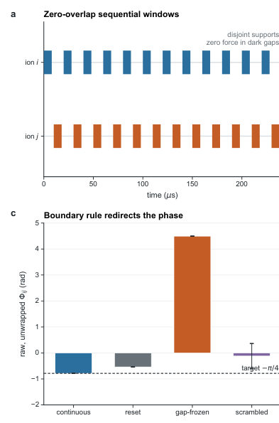 
Fig. 1 Zero-overlap mechanism and boundary-phase control discriminant. (a) Mechanism baseline A with disjoint target windows and zero dark-gap force. (b) Ordered increments and signed symplectic area. (c) Raw, unwrapped Φij at zero leakage; the scrambled bar shows one standard deviation. (d) Conditional contrast evaluated within the linear reduced model. The matched-envelope protocol in Fig. 4 removes envelope differences between the boundary-phase controls.

📷 Fig 2

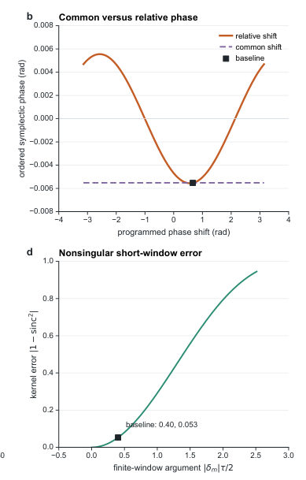 
Fig. 2 Symplectic window geometry and exact finite-duration kernel. (a) Exact win- dow increments and their oriented parallelogram; in two-dimensional phase space, the Weyl product Im(δαjδα∗ i ) is the signed oriented area. (b) Common- and relative-phase shifts; the square marks the baseline. (c) Exact and short-window phases versus detuning. (d) The nonsingular kernel error ϵK = |1 −sinc2(δτ/2)|, which remains finite when the exact pair phase crosses zero.

📷 Fig 3

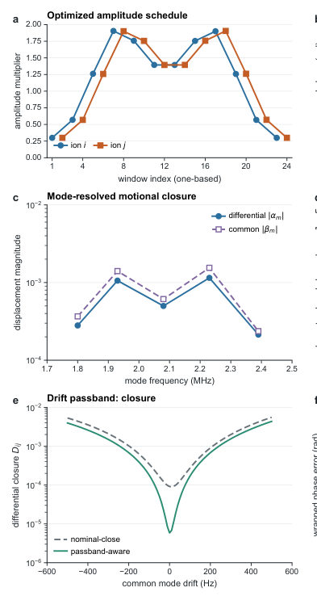 
Fig. 3 Optimized zero-overlap waveform, idealized single-projector motion, and drift passband. (a,b) One-based amplitudes and relative phases for the passband-aware schedule. (c) Mode-resolved differential displacement α and projector-common displacement β. (d) Reduced- channel errors within the coherent Hamiltonian model after deterministic local-Z correction. (e) Closure and (f) absolute target-referenced wrapped phase error under common-mode drift.

📷 Fig 4

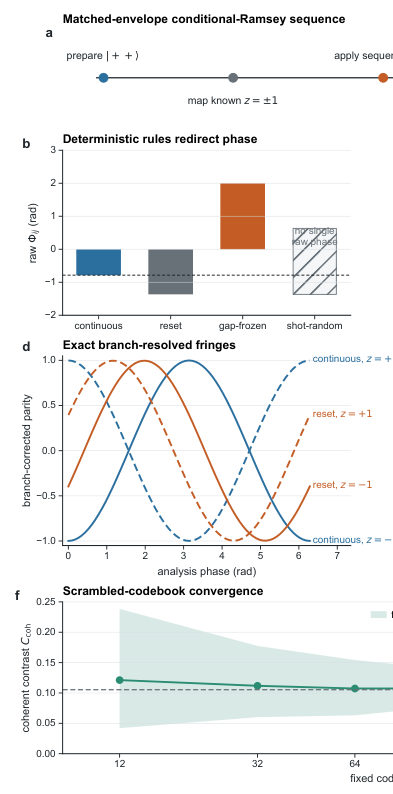 
Fig. 4 Matched-envelope conditional-Ramsey test of the reduced boundary-phase model. (a) Preparation, branch mapping, zero-overlap interaction, virtual-Z correction, and parity analysis. (b,c) Raw phase and reduced-model contrast. (d) Continuous and reset fringes. (e) Ideal and nuisance-aware detected-shot bounds. (f) Fixed-codebook Ccoh convergence; the dashed line is the shot-random limit.

📷 Fig 5

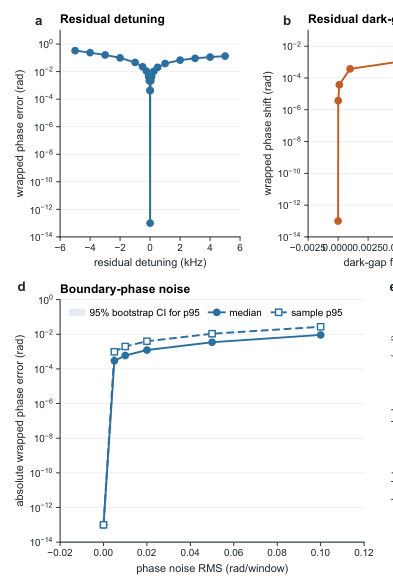 
Fig. 5 Simulated robustness to control imperfections. (a–c) Deterministic detuning, residual dark-gap-force, and common-mode-drift scans. (d,e) Seeded boundary-phase noise and timing jitter: circles are medians, squares are p95 values, and bars are 95% bootstrap intervals for p95. Stochastic grids use 512 realizations per point.

**Summary.** The paper develops advanced theoretical protocols to precisely control two-qubit ZZ interactions in trapped ions using alternating addressing channels. By designing matched-envelope controls, the authors successfully isolate the desired boundary-phase response from common experimental errors like closure error. The key finding is that while sequential addressing offers a distinct control mechanism, it incurs a higher resource cost (force action) than simultaneous methods unless channel concurrency is severely limited.

**Why it may be interesting.** This work provides detailed, quantitative guidelines on optimizing gate sequences in trapped ions by rigorously separating coherent phase control from motional error sources, which is crucial for scaling up quantum computation using ion traps.

Detailed structure

**Main problem.** The paper addresses how to control two-qubit ZZ interactions in trapped ions when using sequentially addressed force windows, specifically designing controls that isolate the boundary-phase response from experimental errors.

**Main result.** Sequential addressing can provide an experimentally testable control resource for inter-window phase generation, although it requires a significantly higher normalized squared-force action compared to simultaneous addressing schemes.

**Method.** The authors use matched-envelope conditional-Ramsey protocols and analyze the ordered symplectic product of displacement vectors derived from a near-resonant Hamiltonian description.

**Model / system.** The system is trapped ions interacting via motion-mediated gates, modeled using a linear spin-dependent-force Hamiltonian within the Rotating-Wave Approximation (RWA). The dynamics are analyzed by calculating pair phases ($\Phi_{ij}$) from ordered symplectic products of displacement vectors.

**Key observables.** Pair phase ($\Phi_{ij}$), conditional contrast ($C_{	ext{cond}}$), motional closure error ($D_{ij}$), and the required normalized squared-force action for different addressing schemes.

**Important parameters / regimes.** The relative phase between successive windows, which acts as an independent control coordinate; the ratio of force actions between sequential vs. simultaneous control (e.g., 1.826 times).

**Assumptions / limitations.** Calculations rely on the linear RWA Hamiltonian and assume ideal dark gaps where external forces are zero; the results are model-based predictions.

**Figures summary.** Figures compare phase rules affecting raw ZZ phase versus conditional contrast, illustrate symplectic window geometry errors, summarize optimized waveforms showing reduced motional closure, and detail resource trade-offs between sequential and simultaneous control.

**Paper structure.** The paper develops the theoretical framework for calculating pair phases using ordered symplectic products for nonoverlapping windows. It then introduces matched-envelope protocols to separate phase generation from contrast loss. Finally, it compares the resource costs (force action vs. channel concurrency) of sequential versus simultaneous addressing schemes.

Abstract

Motion-mediated trapped-ion gates typically apply synchronized state-dependent forces to both target ions. We consider the complementary setting in which one addressing channel alternates between the targets, so their force windows do not overlap. In a complex-amplitude near-resonant description, each window generates a displacement vector, and ordered symplectic products of vectors on different ions produce the ZZ phase. For fixed envelopes and timings, relative rotations of the window displacement vectors redirect the sign and magnitude of this phase, whereas a common rotation of all displacement vectors leaves the pair phase invariant. Motivated by experimental alternating-addressing protocols, we design matched-envelope phase and contrast controls that distinguish the boundary-phase response from closure error and residual force in dark gaps. Waveform synthesis suppresses differential motion, while a reduced-spin map that is exact within the linear spin-dependent-force model accounts for projector-common motion, deterministic local-Z phases, spectator coupling, and control-parameter drift. A conditional-Ramsey protocol predicts continuous and reset contrasts of 0.998 and 0.996, with the reset rule redirecting the extracted pair phase by 0.581 rad relative to the continuous rule, modulo pi/2. In the representative comparison, sequential control uses only one active target channel at a time, but requires 1.826 times the normalized squared-force action of independently calibrated simultaneous control. For representative experimental parameters and within the stated approximations, the inter-window force-quadrature reference therefore provides an experimentally testable control resource for sequential trapped-ion interactions.

[↑ back to top](#top)

### [Quantum states supported by matroids](http://arxiv.org/abs/2607.15548v1)

**Authors:** Xiaowei Huang, Fei Shi, Lijun Zhang, Lvzhou Li  
**Type:** theory · **Category:** quantum information and computing · **PDF:** <https://arxiv.org/pdf/2607.15548v1>  
**Analysis basis:** full PDF text, analyzed in chunks
**Topic relevance:** 🔥 `entanglement & information structure` **4/5**

📷 Fig 1

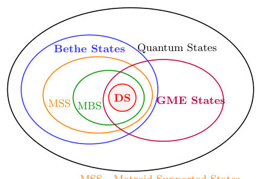 
FIG. 2. The classification of quantum states discussed in this article. Their inclusion relationships are shown in the figure. By Corollary 3, Dicke states |Dk n⟩with k ̸= 0, n are gen- uinely entangled. As can be seen from Example 5, there exist matroid-base states that are not GME.

📷 Fig 2

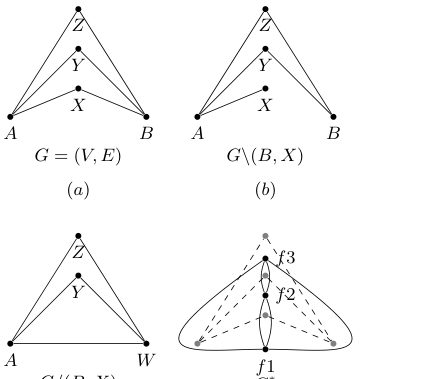 
FIG. 3. (a) The graphic matroid M(G) corresponding to graph G is clearly connected; for any two distinct edges in G, a cycle contains them. (b) Deletion. The graph obtained by deleting edge (B, X), the corresponding graphic matroid is disconnected. (c) Contraction. The graph obtained by con- tracting edge (B, X), replacing vertices B and X with a new vertex W, and connecting the edges associated with B and X to W. The corresponding graphic matroid is connected. (d) Duality. The dual graph of G with vertices {f1, f2, f3} and edges set consisting of a pair of parallel edges between each pair of vertices. The dual matroid of M(G) is the the corresponding graphic matroid of G∗, i.e.,M(G)∗=...

**Summary.** This paper establishes a deep structural link between the theory of quantum states and matroid combinatorics. It shows that key properties like genuine multipartite entanglement can be characterized purely by whether the state's underlying structure forms a connected matroid. This framework also introduces a notion of quantum state duality based on matroid duality.

**Why it may be interesting.** It provides an entirely new mathematical lens (matroid theory) through which to understand fundamental concepts in quantum information like entanglement, potentially leading to new classification schemes or necessary conditions for quantum resource theories.

Detailed structure

**Main problem.** The work establishes a structural correspondence between quantum states and matroid theory to characterize key properties of quantum states using purely combinatorial terms.

**Main result.** A matroid-supported state is genuinely entangled if and only if its underlying matroid is connected, providing a powerful combinatorial criterion for entanglement.

**Method.** The authors use algebraic representations (generating polynomials) and structural graph theory concepts (matroid minors/duality) to link quantum properties like entanglement to purely combinatorial properties of matroids.

**Model / system.** The focus is on $n$-qubit quantum states, specifically those whose support structure corresponds exactly to the set of bases of a given matroid. The analysis involves concepts like genuine multipartite entanglement (GME) and local measurements in the Z-basis.

**Key observables.** Genuine Multipartite Entanglement (GME), connectivity of the underlying matroid, and the resulting minor structure after local measurement.

**Important parameters / regimes.** The number of qubits ($n$), the specific matroid $M$, and the coefficients $\alpha_S$ defining the state $|\psi
angle$.

**Assumptions / limitations.** The analysis primarily focuses on states whose support is precisely defined by the bases of a matroid (matroid-supported states).

**Figures summary.** Figure 1 links polynomial irreducibility, GME, and connected matroids. Figure 2 provides a classification diagram showing inclusion relationships among various types of quantum states related to matroids.

**Paper structure.** The paper develops the correspondence by first defining matroid-supported states, then proving necessary and sufficient conditions for GME based on matroid connectivity, followed by analyzing measurement outcomes via matroid minors, and concluding with proposing a notion of quantum state duality inspired by matroid duality.

Abstract

In this work, we establish a structural correspondence between quantum states and matroid theory. This connection demonstrates that key properties of quantum states, including entanglement and measurement, can be characterized in purely combinatorial terms via matroids, despite the apparent conceptual distance between these two fields. Using this framework, we show that a matroid-supported state is genuinely entangled when its underlying matroid is connected. Moreover, a uniform superposition over all bases of a matroid is genuinely entangled if and only if the matroid is connected. We also demonstrate that a local measurement in the $Z$-basis on such a state yields another matroid-supported state, whose underlying matroid is a minor of the original one. Inspired by matroid duality, we further propose a notion of quantum state duality, uncovering a deep structural symmetry in state transformations.

[↑ back to top](#top)

### [Radiopurity material assays and radiation exposure projections for superconducting qubit measurements at SNOLAB](http://arxiv.org/abs/2607.16151v1)

**Authors:** Y. Ahmed, B. Binoy, R. Bunker, D. Chauhan, P. Delsing, R. Germond, J. Hall, Z. Hong, A. Iqbal, V. Iyer, A. Klepikova, A. Kubik, S. P. Mantry, A. C. Masuskapoe, C. C. Monk, G. Peng, P. Qin, W. Rau, T. Reynolds, M. Stukel, C. M. Wilson, B. Zatschler, S. Zatschler, A. Zuniga  
**Type:** both · **Category:** quantum information and computing · **PDF:** <https://arxiv.org/pdf/2607.16151v1>  
**Analysis basis:** full PDF text, analyzed in chunks
**Topic relevance:** 🔥 `QC/QI experiment` **4/5**

📷 Fig 1

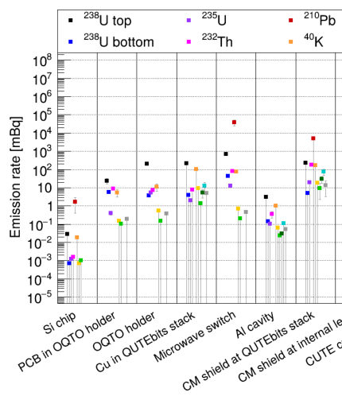 
Figure 1: Emission rate of each component for each measured isotope or decay chain. The emission rate is calculated per piece, not taking into account the actual quantity of components to be used in the QUTEbits setup. A line extending from the marker to the bottom of the plot indicates an upper limit of the corresponding assay result at 90% C.L., while all other values are measurements with symmetric error bars, which appear asymmetric on logarithmic scale.

📷 Fig 2

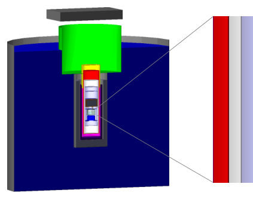 
Figure 2: Visualization of the CUTE geometry in Geant4. Left: components from outside to inside include: PE block on top (gray), water tank (blue), stainless steel cans (green, yellow, gray), two layers of lead (lilac, dark purple), mu-metal magnetic shield (dark gray), OVC (pink) and cryogenic stages (50 K – red, 4 K – white, 1 K – light blue, 100 mK – mid blue, MC – blue). The internal lead shield (dark gray) is encased in copper (brown) and a CM shield (mint green). Right: above the QUTEbits stack, there are an additional MC plate (blue) and microwave switches (gray, brown). The QUTEbits stack is enclosed by a CM shield (mint green) and hosts Al cavities (light gray) mounted to the top....

📷 Fig 3

 
Figure 3: Simulated event rates in one of the Si chips according to the assay results and corre- sponding emission rates for various components. The Si chip itself, as well as components in direct line of sight, are the dominating backgrounds. A line extending from a marker to the bottom of the plot indicates a 90% C.L. upper limit.

📷 Fig 4

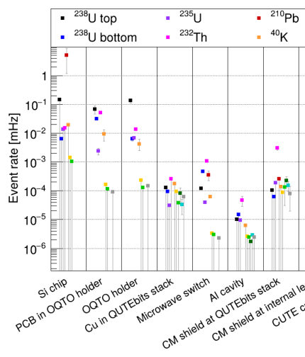 
Figure 3 indicates that the dominating background contribution for the Si chip originates from the substrate itself as well as the PCB (see appendix B for a comparison of different PCBs) and the OQTO holder, i.e. the components which are in direct contact with it. While the BF-6 glue is also in direct contact with the Si chip, due to its radiopurity and tiny mass, its contribution is two orders of magnitude lower.

📷 Fig 5

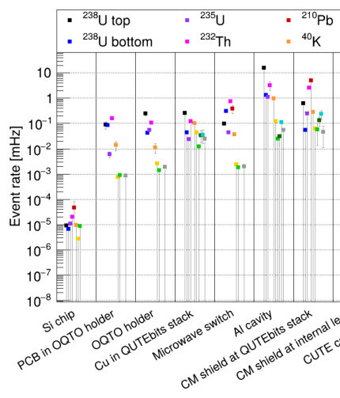 
Figure 4: Simulated event rates in one of the Al cavities according to the assay results and corresponding emission rates for various components. The dominant background originates from the Al cavity itself and components which are in direct line of sight. A line extending from a marker to the bottom of the plot indicates a 90% C.L. upper limit.

**Summary.** This paper assesses the radiation environment for superconducting qubits planned for underground testing at SNOLAB. It combines material assays to measure background radioactivity with detailed Monte Carlo simulations using Geant4. The goal is to quantify expected energy deposition rates and propose strategies, including crystal dynamics modeling, to mitigate environmental noise affecting quantum coherence.

**Why it may be interesting.** This work is crucial for realizing fault-tolerant quantum computation outside of controlled lab environments, directly addressing environmental noise sources that limit qubit coherence times in solid-state quantum systems.

Detailed structure

**Main problem.** Ionizing radiation from cosmic rays and natural radioactivity poses a significant threat to the reliable operation and coherence of superconducting qubits.

**Main result.** The authors provide detailed estimates of expected background energy deposition rates by combining material assay measurements with advanced Monte Carlo simulations, guiding mitigation strategies for underground quantum computing facilities.

**Method.** The study combines extensive radiochemical material assays (using HPGe detectors) to quantify contamination levels with sophisticated Geant4 Monte Carlo simulations, extended with G4CMP for crystal dynamics modeling.

**Model / system.** The system under study is superconducting qubits fabricated on semiconductor substrates and operated in the deep underground SNOLAB facility. The analysis models interactions between high-energy particles (cosmic rays/radioactivity) and the qubit components (Si chips, Al films).

**Key observables.** Energy deposit rates from radiogenic sources, spectral components of background radiation, phonon energy collection time, and Qubit hit multiplicity.

**Important parameters / regimes.** Radioactivity levels ($	ext{mBq}/	ext{kg}$) for isotopes like $	ext{}^{238}	ext{U}$ and $	ext{}^{210}	ext{Pb}$, superconducting gap ($\Delta_{Al}$), and phonon mean free path ($\lambda(E_{ph})$).

**Assumptions / limitations.** The background simulation adopts a conservative approach, assuming contamination is dominated by the measured radiopurity of silicon components. The G4CMP analysis relies on specific energy levels for primary calculations.

**Figures summary.** Tables summarize assay results (radioactivity levels) and G4CMP parameters (phonon absorption/escape probabilities). Figures illustrate emission rate summaries and background contributions from various materials.

**Paper structure.** The paper progresses by first detailing the material assaying program to quantify contamination, followed by a comprehensive Monte Carlo simulation workflow using Geant4. It then presents results analyzing expected background rates and concludes by applying crystal dynamics simulations (G4CMP) to suggest mitigation techniques.

Abstract

Interactions of cosmic rays and other forms of ionizing radiation pose a significant challenge to the reliable operation of state-of-the-art quantum devices and error correction in quantum computing based on superconducting circuits which are typically fabricated on semiconductor substrates. Shielded by 2 km of rock overburden, the Cryogenic Underground TEst facility (CUTE) at SNOLAB provides a unique ultra-low radiation environment to probe the performance of quantum technologies with a particular interest in quantum coherence studies. In this article, we present the findings of an extensive material assaying program in preparation for the first underground operation of superconducting qubits at SNOLAB. The radioactivity levels identified by the material assays enter a thorough Monte Carlo study based on the Geant4 particle physics tracking code. From these simulations, we estimate the rates of energy deposits from radiogenic sources expected for a quantum-device assembly operated in the CUTE facility. We further characterize the spectral components of the projected background and identify the dominant particle interaction types. Finally, we outline how crystal dynamics simulations using the G4CMP solid-state physics extension for Geant4 can inform the community-wide efforts to identify effective strategies to mitigate the effects of high-energy particle impacts.

[↑ back to top](#top)

### [A Mesoscopic Ginzburg--Landau Model for Vibrational Strong Coupling Enhanced Rayleigh Scattering in Molecular Liquids](http://arxiv.org/abs/2607.15497v1)

**Authors:** Wenxiang Ying, Abraham Nitzan  
**Type:** theory · **Category:** statistical mechanics · **PDF:** <https://arxiv.org/pdf/2607.15497v1>  
**Analysis basis:** full PDF text, analyzed in chunks
**Topic relevance:** `correlated cavity matter` **3/5** · `driven-dissipative phase transition` **3/5** · `analog quantum simulation` **2/5** · `correlated / nonlocal dissipation` **2/5** · `methods for driven-dissipative` **2/5** · `non-equilibrium dynamics` **2/5** · `non-equilibrium universality` **2/5** · `Keldysh / 2PI / non-Gaussian methods` **1/5** · `Tavis-Cummings & cavity-many-emitter` **1/5** · `exotic spin models in light-matter` **1/5** · `interference shaping light` **1/5** · `spintronics-quantum-optics interface` **1/5**

📷 Fig 1

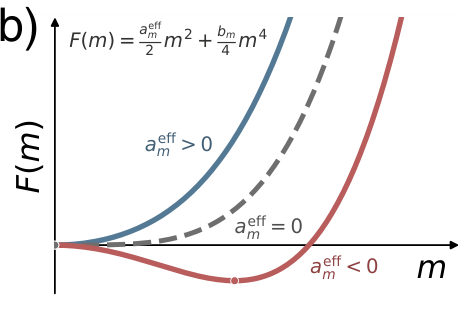 
Figure 1: VSC-associated clustering as a mesoscopic Ginzburg–Landau instability. (a) Schematic comparison of a dispersed molec- ular ensemble outside the cavity and a clus- tered mesoscopic state formed inside a Fabry– P´erot cavity under VSC. (b) Schematic Lan- dau free-energy landscape for the structural or- der parameter m, written in terms of an ef- fective inverse susceptibility aeff m (Eq. 4) and F(m) = aeff m m2/2 + bmm4/4. In the normal liquid, aeff m &gt; 0 stabilizes the dispersed state at m = 0. The −g

📷 Fig 2

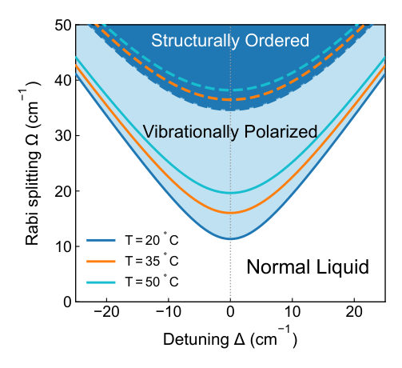 
Figure 2: Phase diagram in the (∆, Ω) plane. The temperatures are T = 20, 35, 50 ◦C. Solid curves: primary vibrational GL boundary aP = 0. Dashed curves: struc- tural spinodal aeff m = 0, equivalently gP 2 = am (Eq. 4). Below the solid curve lies the normal liquid; between the solid and dashed curves lies the vibrationally polarized regime, where IR/polaritonic signatures are present but Rayleigh enhancement remains weak; beyond the dashed curve lies the structurally ordered regime where the Rayleigh enhancement be- comes strong. Raising temperature shifts both boundaries upward, shrinking the ordered win- dow.

📷 Fig 3

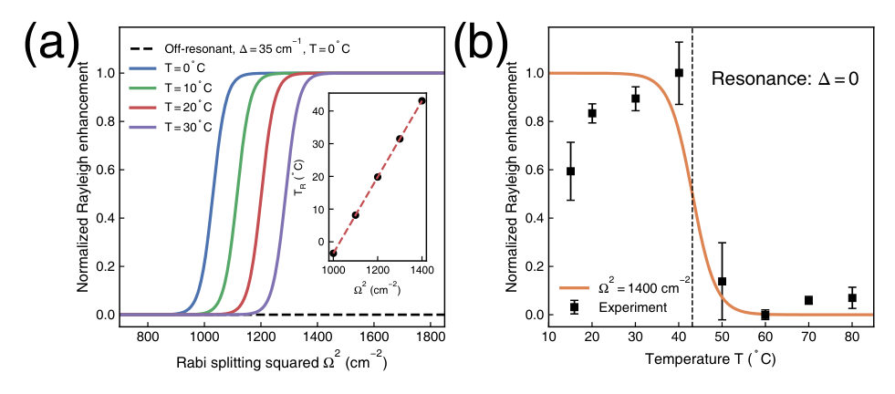 
Figure 3: Collective coupling threshold and thermal collapse of the Rayleigh enhance- ment. The Rayleigh enhancement ratios are calculated from Eqs. 5-6 with intensities normalized. (a) Normalized Rayleigh enhancement vs Rabi splitting squared Ω2 at T = 0, 10, 20, 30 ◦C (on resonance, ∆= 0) and an off-resonance case at detuning ∆= 35 cm−1, T = 0 ◦C (dashed). The off-resonance threshold lies outside the plotted window, so the signal stays at background. In- set: Rayleigh collapse temperature TR, defined by aeff m (TR) = 0, vs Ω2 (circles) with linear fit (red dashed). (b) Normalized Rayleigh enhancement vs temperature at Ω2 = 1400 cm−2, ∆= 0. The sharp collapse near TR reflects the...

📷 Fig 4

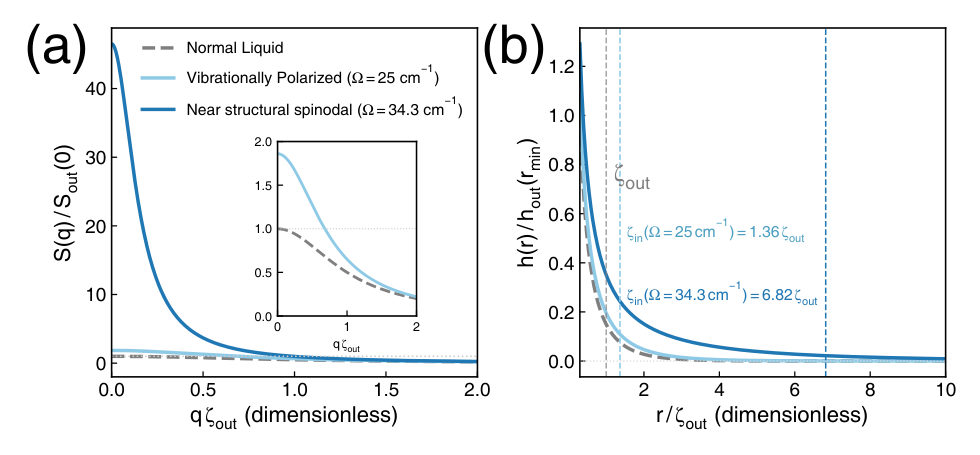 
Figure 4: Implications of the GL model for the structure factor and the pair correlations. (a) OZ response S(q) = kBT/(aeff m + κq2) normalized to Sout(0), valid for aeff m &gt; 0. Gray dashed: outside cavity (aeff m = am = 1.0). Light blue: vibrationally polarized regime at Ω= 25 cm−1, ∆= 0, T = 20 ◦C, with weak low-q enhancement (S(0)/Sout(0) ≈1.86). Dark blue: stable-side representative approaching the structural spinodal at Ω≈34.3 cm−1, ∆= 0, T = 20 ◦C (aeff m = σa ≈ 0.0215, just above the spinodal). Low-q enhancement: S(0)/Sout(0) ≈46.5. Inset: low-q view of the outside-cavity and vibrationally polarized curves. (b) Real-space OZ tail h(r) ≡g(r)−1 ∝e−r/ζ/r, the inverse-Fourier counterpart...

**Summary.** The paper develops a mesoscopic Ginzburg-Landau model to explain how Vibrational Strong Coupling drives collective phenomena like enhanced Rayleigh scattering in molecular liquids. It posits a two-step process: first, the cavity induces vibrational polarization ($P$), which then acts back onto the structural degrees of freedom ($m$) to trigger a secondary instability and observable enhancement. This provides testable predictions for X-ray/neutron scattering experiments.

**Why it may be interesting.** This work bridges quantum optics (cavity QED/VSC) with condensed matter physics (structural phase transitions/scattering). The use of a GL framework to model the interplay between light-matter coupling and structural degrees of freedom is highly relevant to open quantum systems in complex media.

Detailed structure

**Main problem.** To theoretically explain mesoscopic phenomena, such as resonantly enhanced Rayleigh scattering and abrupt concentration thresholds, observed in molecular liquids due to Vibrational Strong Coupling (VSC).

**Main result.** The authors developed a two-step model showing that the structural instability required for strong Rayleigh enhancement occurs only after the vibrational polarization field $P$ has first established itself via VSC.

**Method.** A mesoscopic Ginzburg-Landau (GL) model is constructed using two coupled order parameters: the collective vibrational polarization ($P$) and a secondary structural field ($m$).

**Model / system.** The system models molecular liquids undergoing VSC, described by a free energy functional $F[m, P]$ coupling $P$ and $m$. The key mechanism is the renormalization of the structural susceptibility by the vibrational intensity ($a_{	ext{eff}, m} = a_m - g P^2$).

**Key observables.** Resonantly enhanced Rayleigh scattering (probed via small-angle X-ray/neutron scattering), collective scaling relations, and slow structural dynamics.

**Important parameters / regimes.** Temperature ($T$), detuning ($\Delta$), Rabi splitting ($\Omega$), and the coupling constant $g$. The model predicts two critical boundaries: $a_P=0$ (vibrational instability) and $a_{	ext{eff}}^m = 0$ (structural instability).

**Assumptions / limitations.** The structural field $m(\mathbf{r})$ captures long-wavelength fluctuations, while the vibrational polarization $P$ is assumed to be spatially uniform ($
abla P \approx 0$). The GL functional itself is a phenomenological parametrization.

**Figures summary.** Figure 1 schematically compares dispersed vs. clustered states using the Landau free-energy landscape $F(m)$ dependence on $a_{	ext{eff}, m}$. Figure 2 (mentioned in notes) likely shows the phase diagram mapping out the two critical boundaries ($a_P=0$ and $a_{	ext{eff}}^m = 0$) in the $(\Delta, \Omega)$ plane.

**Paper structure.** The paper establishes the physical motivation from experiments, develops the coupled mesoscopic Ginzburg-Landau free energy functional, analyzes the two sequential instabilities ($P$ onset followed by $m$ ordering), and predicts measurable consequences for scattering and dynamics.

Abstract

Recent experiments by Sandeep \textit{et al.} [Angew. Chem. Int. Ed. 65, e16917 (2026)] suggest that vibrational strong coupling (VSC) in molecular liquids can generate mesoscopic phenomena beyond single-molecule observables, including resonantly enhanced Rayleigh scattering, abrupt concentration thresholds, and thermal collapse. Motivated by these observations, we construct a mesoscopic Ginzburg--Landau model with two coupled fields: a cavity-controlled collective vibrational polarization $P$ and a secondary structural field $m$ whose long-wavelength susceptibility is renormalized by the collective vibrational polarization intensity $P^2$, assumed to govern long-wavelength density/dielectric fluctuations. With calibrated parameters, the model captures the observed Rayleigh enhancement, collective scaling relations, and threshold-like behavior, while explaining why polaritonic/IR signatures may persist when Rayleigh scattering disappears. The model further predicts enhanced long-wavelength density/dielectric correlations, enlarged mesoscopic correlation lengths, and slowed structural dynamics in the regime with strong Rayleigh enhancement, providing direct experimental tests through small-angle X-ray/neutron scattering and dynamic light-scattering probes.

[↑ back to top](#top)

### [Probing Lorentz-invariance-violation with quantum coherence of Unruh-DeWitt detector](http://arxiv.org/abs/2607.15551v1)

**Authors:** Yihao Wu, Xiaobao Liu, Zehua Tian  
**Type:** theory · **Category:** other · **PDF:** <https://arxiv.org/pdf/2607.15551v1>  
**Analysis basis:** full PDF text, analyzed in chunks
**Topic relevance:** `correlated / nonlocal dissipation` **3/5** · `methods for driven-dissipative` **3/5** · `quantum measurements` **3/5** · `Keldysh / 2PI / non-Gaussian methods` **2/5** · `driven-dissipative phase transition` **2/5** · `non-equilibrium dynamics` **2/5** · `non-equilibrium universality` **2/5** · `Kondo & dissipative impurity` **1/5** · `analog quantum simulation` **1/5** · `entanglement & information structure` **1/5** · `measurement-induced transitions` **1/5**

📷 Fig 1

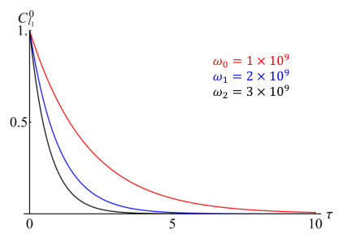 
FIG. 1. Quantum coherence C0 l1 of the UDW detector cou- pled to the usual massless quantum field. Here, energy-level spacing ω0 = (109, 2×109, 3×109)Hz correspond to red, blue and black curves, respectively, the initial state θ = π/2 and the coupling strength µ = 10−3 have been taken.

📷 Fig 2

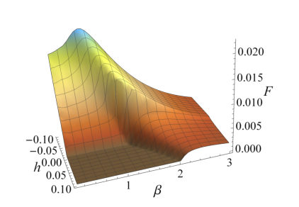 
FIG. 2. Transition rates F PQ ± in the polymer quantized field theory as functions of detector’s rapidity β and energy-level spacing h. The positive and negative parts at h axis corre- spond to excitation and deexcitation rates, respectively.

📷 Fig 3

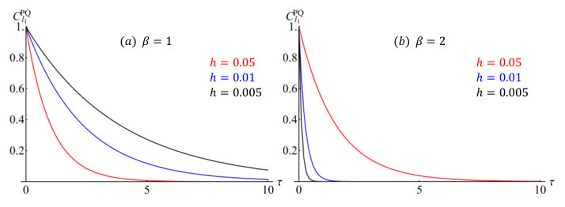 
FIG. 3. Time evolution of quantum coherence CPQ l1 with different h for the rapidity β below (left) and above (right) the critical value βc cases. Here h = (0.05, 0.01, 0.005) corresponding to red, blue and black curve, respectively. Energy-level spacing ω0 = 109Hz, initial state θ = π/2 and coupling strength µ = 10−3 have been taken.

📷 Fig 4

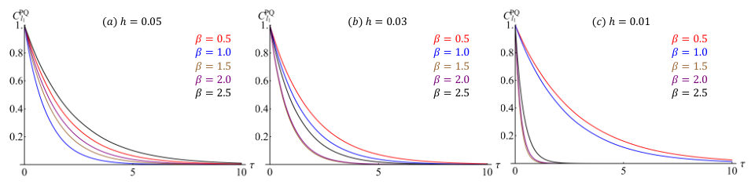 
FIG. 4. Time evolution of quantum coherence CPQ l1 for several values of rapidity β with different h. Here β = (0.5, 1.0, 1.5, 2.0, 2.5) corresponding to red, blue, brown, purple and black curve, respectively. Energy-level spacing ω0 = 109Hz, initial state θ = π/2 and coupling strength µ = 10−3 have been taken.

📷 Fig 5

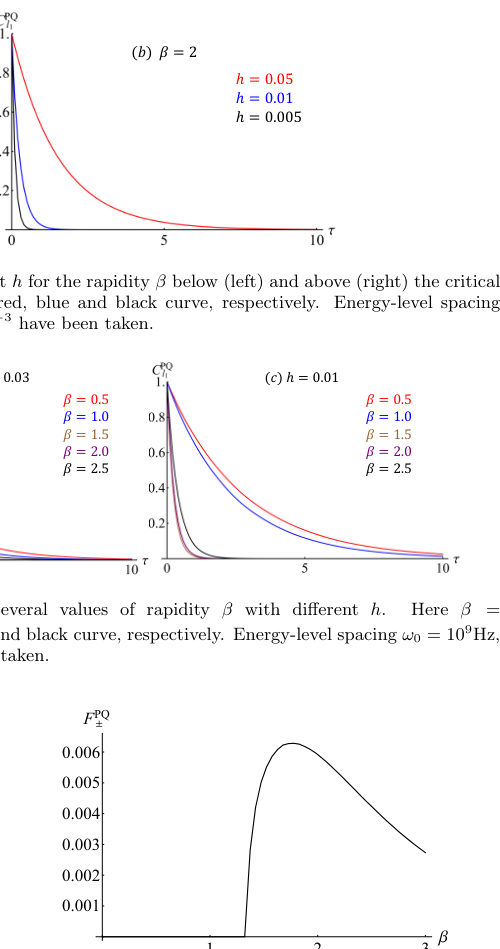 
FIG. 6. The transition rates F PQ ± as a function of the detec- tor’s rapidity in the limit h →0.

**Summary.** This theoretical paper proposes that measuring the quantum coherence decay of an Unruh-DeWitt detector can serve as a sensitive, low-energy probe for Lorentz Invariance Violation. By analyzing how this coherence depends on the detector's relativistic rapidity ($eta$), the authors predict a sharp transition point ($eta_c$) unique to LIV models like polymer quantization.

**Why it may be interesting.** While focused on high-energy physics/QG, the use of open quantum system dynamics (Lindblad equation) and decoherence as a diagnostic tool is highly relevant to AMO physics for probing fundamental symmetries.

Detailed structure

**Main problem.** The primary goal is to develop a low-energy, practical method to test for violations of Lorentz Invariance (LIV), which are typically probed at extremely high energy scales.

**Main result.** The quantum coherence decay of an Unruh-DeWitt detector interacting with a field exhibits a strong dependence on the detector's rapidity ($eta$) when LIV is present, showing a sharp transition near $eta_c \approx 1.3675$.

**Method.** The analysis involves calculating the time evolution of the detector's quantum coherence using master equations (Lindblad form) under weak coupling approximations.

**Model / system.** The system consists of an inertial Unruh-DeWitt (UDW) detector coupled to a massless scalar field. The model incorporates Lorentz violation via modified dispersion relations, specifically examining polymer quantization inspired by loop quantum gravity.

**Key observables.** Quantum coherence of the UDW detector, measured by its $l_1$ norm, and the transition rates ($\gamma_\pm$) derived from the field's Wightman function.

**Important parameters / regimes.** The critical rapidity $eta_c \approx 1.3675$, the detector energy spacing ($\omega_0$), and the characteristic scale of LIV ($M_\star$).

**Assumptions / limitations.** Weak coupling limit (Born/Markov approximations) is used, and the analysis compares results derived from standard QFT with those incorporating polymer quantization effects.

**Figures summary.** Figures illustrate the time evolution of $l_1$ coherence versus rapidity ($eta$) for both Lorentz-invariant and polymer quantized cases, highlighting the sharp transition near $eta_c$.

**Paper structure.** The paper establishes the theoretical framework by defining the UDW detector coupled to a field. It contrasts the rapidity-independent coherence decay in the standard (Lorentz-invariant) case with the rapidity-dependent behavior found when incorporating LIV, culminating in an application using polymer quantization.

Abstract

Testing Lorentz invariance violation (LIV) is notoriously difficult, as its characteristic energy scale, $M_\star$, in modified dispersion relations typically lies beyond current experimental reach. To enable a low-energy probe, we investigate the quantum coherence of an inertial Unruh-DeWitt (UDW) detector interacting with a massless scalar field with a Lorentz-violating dispersion relation $ω_{|\textbf{k}|}=|\textbf{k}|f(|\textbf{k}|/M_\star)$. Unlike the Lorentz-invariant case where quantum coherence is rapidity-independent, we find for the Lorentz-violating quantum field case the dynamics of detector's quantum coherence exhibits a strong dependence on its rapidity -- offering a potential low-energy signature of LIV. Applying this to the polymer-quantized scalar field theory inspired by loop quantum gravity, we show that the detector's quantum coherence exhibits a pronounced dependence on rapidity and undergoes a sharp transition near a critical rapidity $β_c \approx 1.3675$, a value within reach of existing facilities like the Relativistic Heavy Ion Collider. We also show how the detector's rapidity and its energy-level spacing enhance the response to the test of LIV. Our results establish quantum coherence as a sensitive and practical probe of LIV, providing a complementary avenue for testing quantum gravity-induced modifications to field theory.

[↑ back to top](#top)

### [Reconstruction of the noise correlation spectral density from the cavity emission in a two-qubit system](http://arxiv.org/abs/2607.15909v1)

**Authors:** Nadine Lenke, Guido Burkard  
**Type:** theory · **Category:** other · **PDF:** <https://arxiv.org/pdf/2607.15909v1>  
**Analysis basis:** full PDF text, analyzed in chunks
**Topic relevance:** `Keldysh / 2PI / non-Gaussian methods` **3/5** · `correlated / nonlocal dissipation` **3/5** · `correlated cavity matter` **3/5** · `methods for driven-dissipative` **3/5** · `Tavis-Cummings & cavity-many-emitter` **2/5** · `quantum measurements` **2/5** · `analog quantum simulation` **1/5** · `driven-dissipative phase transition` **1/5** · `exotic spin models in light-matter` **1/5** · `non-equilibrium dynamics` **1/5**

📷 Fig 1

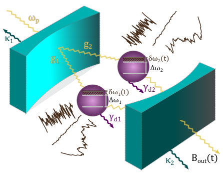 
Figure 1. The system under consideration consists of a cavity (turquoise), here schematically represented by two mirrors, and two qubits (k = 1, 2; purple), each of which is coupled to the cavity mode of frequency ωc with transversal coup- ling strength gk. The qubits are arranged such that there is no direct correlation or coupling between them. We aim to detect indirect correlations between the qubits caused by cor- related noise (brown) through the emission from the cavity. The qubits undergo additional dephasing processes with rates γϕk and relaxation processes with rates γk. Both are captured in the total decoherence rate γdk = γk +2γϕk. The cavity loss rates at the two ports are...

📷 Fig 2

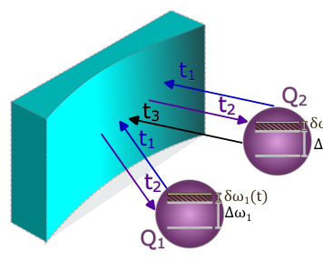 
Figure 2. (a) Example illustrating consecutive third-order photon-exchange processes (∼g3 k) between the qubits and the cavity, consequently resulting in noise correlations in the output of the cavity. At time t1 a photon, which is affected by noise in Q1, is emitted from Q1 into the cavity and absorbed at time t2 by Q2. Finally, at time t3 a photon is emitted by Q2 into the cavity, accumulating the noise effects from both Q1 and Q2, such that the cavity output contains noise cross-correlations. (b) Example of consecutive fifth-order (∼ g5 k) photon-exchange processes between the qubits and the cavity. This leads to further noise correlations effects in the output of the cavity, which are...

📷 Fig 3

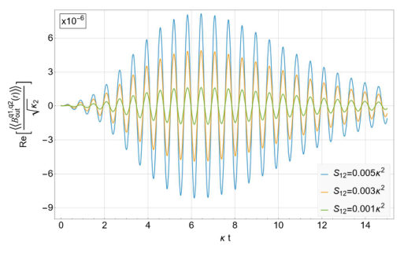 
Figure 3. The effect of noise cross-correlations on the time- dependent cavity emission in the presence of quasi-static noise. We plot the contribution of the cavity emission containing the noise cross-correlations, ⟨⟨Bq1,q2 out (t)⟩⟩qs, from Eq. (33), in second order in λ. The parameters are cho- sen equally for both dots, as g/(2π) = 0.5 MHz, ⟨ˆσ−,0⟩= 0.5, ⟨ˆσz,0⟩ = 0, κ2 = κ 2 = 0.5 MHz, λ = 0.9, γd = 1 MHz, ∆/(2π) = −10 MHz, ∆c = 0. The condition Eq. (30) restricts the validity of the second-order approximation to times t ≲10/κ.

📷 Fig 4

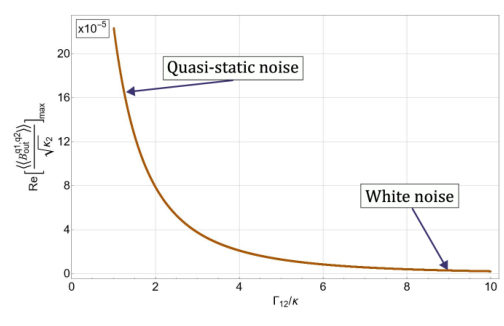 
Figure 4. Dependence of the correlation decay rate on the maximum value of ⟨⟨Bq1,q2 out (t)⟩⟩OU. For low correlation de- cay rate values, the slope of this curve is approximately li- near, which resembles the situation of quasi-static noise. Con- versely, if Γ12 is high, the impact of noise correlation is dimi- nished, and the case of white noise is recovered. The pa- rameters are chosen fully symmetric between the two qubits, as g/(2π) = 0.5 MHz, ⟨ˆσ−,0⟩= 0.5, ⟨ˆσz,0⟩= 0, κ2 = κ 2 = 0.5 MHz, λ = 0.9, γd = 1 MHz, ∆/(2π) = −10 MHz, ∆c = 0.

**Summary.** This paper develops a method to characterize correlated noise affecting two coupled qubits by analyzing the output field from a mediating cavity. By examining how the cross-correlation of the emitted light changes under different noise assumptions (white vs. quasi-static), the authors demonstrate that the spectral density of these correlations can be robustly extracted, providing vital diagnostic capability for quantum error correction research.

**Why it may be interesting.** This work is highly relevant as it provides an advanced theoretical tool—using cavity emission spectroscopy—to diagnose subtle correlated noise effects in solid-state quantum hardware, which is crucial for scaling up quantum computation.

Detailed structure

**Main problem.** The primary challenge addressed is characterizing correlated noise sources affecting qubits, which severely degrades performance in fault-tolerant quantum computation.

**Main result.** The cavity emission signal allows for the reconstruction of the noise correlation spectral density $S_{12}(\omega)$ by analyzing cross-correlation terms. Furthermore, it shows that white noise effects are strongly suppressed compared to quasi-static noise.

**Method.** The analysis uses quantum Langevin equations and averages over many noise realizations to relate measured cavity emission correlations to underlying noise spectral densities via the convolution theorem.

**Model / system.** The system consists of two qubits coupled indirectly via a single electromagnetic cavity mode, subjected to longitudinal correlated noise affecting their energy splittings. The dynamics are modeled using a Lindblad master equation approach.

**Key observables.** The primary observable is the cross-correlation function of the output cavity emission $\langle\langle B_{q1,q2}^{	ext{out}}(t)
angle
angle$, which serves as a diagnostic for noise correlations.

**Important parameters / regimes.** Key parameters include the coupling constants ($g_k$), cavity decay rates ($\kappa$), and the scaling behavior of noise effects (e.g., fifth order for white noise vs. third order for quasi-static noise).

**Assumptions / limitations.** The analysis assumes that direct qubit coupling is negligible, the qubits are subject to longitudinal noise, and the noise follows a multivariate Gaussian distribution.

**Figures summary.** Figure 1 illustrates the physical setup involving two cavity-coupled qubits and correlated noise sources. The paper analyzes time-dependent correlation functions for different noise types (white, quasi-static, OU).

**Paper structure.** The paper establishes the theoretical framework using a Hamiltonian and master equation, derives expressions for noise correlations based on specific noise models (White, Quasi-static, OU), and concludes with a general method utilizing the convolution theorem to extract $S_{12}(\omega)$ from measurements.

Abstract

A significant challenge in the field of large-scale fault-tolerant quantum computation is the influence of noise. In addition to the influence of noise on individual qubits, the smaller additional effect of noise correlations is also of high significance because correlated errors pose a challenge for quantum error correction. We describe the dynamics of two cavity-coupled qubits that are subject to correlated noise, assuming that the qubits are affected by longitudinal noise and not coupled directly. We find that the cavity emission enables the characterization of the noise correlations and describe the cases of white noise, quasi-static noise, and Ornstein-Uhlenbeck noise. For a known frequency spectrum, the reconstruction of the noise correlation spectral density from the cavity emission is possible by averaging over many different noise realizations. We demonstrate that, in the case of white noise, the noise correlation effects scale with the fifth order of the cavity-qubit coupling constant and are thus strongly suppressed compared with the case of quasi-static noise, where they scale with the third order. Furthermore, we present a method for extracting the noise correlation spectral density from the cavity emission in the case where the underlying noise type remains unidentified. This can be achieved by applying the convolution theorem.

[↑ back to top](#top)

### [The Trinity of Markovian Quantum Thermodynamics: Unifying the Axiomatic, Microscopic, and Operational Paradigms](http://arxiv.org/abs/2607.15376v1)

**Authors:** Yutong Luo, Jakub Czartowski, Felix Hubmann, Simon Milz, Felix C. Binder  
**Type:** theory · **Category:** statistical mechanics · **PDF:** <https://arxiv.org/pdf/2607.15376v1>  
**Analysis basis:** full PDF text, analyzed in chunks
**Topic relevance:** `correlated / nonlocal dissipation` **3/5** · `driven-dissipative phase transition` **3/5** · `methods for driven-dissipative` **3/5** · `non-equilibrium dynamics` **3/5** · `Keldysh / 2PI / non-Gaussian methods` **2/5** · `non-equilibrium universality` **2/5** · `Kondo & dissipative impurity` **1/5** · `analog quantum simulation` **1/5** · `entanglement & information structure` **1/5** · `scars & prethermalization` **1/5**

📷 Fig 1

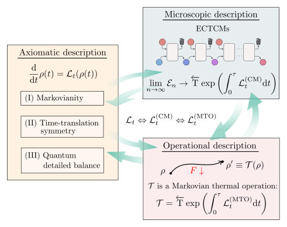 
FIG. 1. Equivalence between three paradigms of Markovian quantum thermodynamics. The axiomatic description (left) characterises the dynamics through a GKSL master equation subject to three thermodynamic axioms: Markovianity, time- translation symmetry, and quantum detailed balance. The microscopic description (top right) realises such dynamics via energy-conserving thermal collision models (ECTCMs), where repeated interactions with thermal ancillae converge in the continuous-time limit to a time-ordered exponential gen- erated by L(CM) t . The operational description (bottom right) arises from the resource theory of athermality, where admis- sible dynamics are Markovian thermal operations...

📷 Fig 2

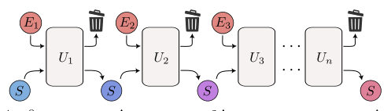 
FIG. 2. Quantum collision models. The system S (blue discs) sequentially interacts with environmental ancillae (red discs) {Ei}n i=1 inside an interaction box representing the sys- tem–ancilla unitary Ui. After each collision occurring over a time interval ∆t the ancilla is discarded, resulting in memory- less dynamics, while the system gradually thermalises (tran- sitions from blue to red).

📷 Fig 3

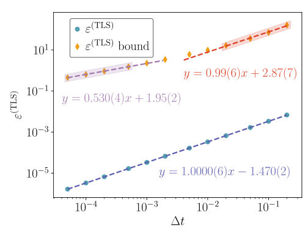 
FIG. 3. Error scaling of the ECTCM simulation of the TLS model. The initial state is ρS(0) = |ψ⟩⟨ψ|S with |ψ⟩S = (|g⟩S + √

📷 Fig 4

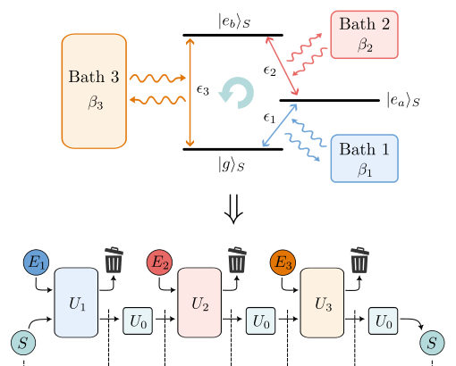 
FIG. 4. Three-level autonomous thermal machine and its ECTCM realisation. Top: A three-level system with energy eigenstates |g⟩S, |ea⟩S, and |eb⟩S, where the three transitions with energy gaps ϵ1, ϵ2, and ϵ3 are each coupled to indepen- dent thermal baths at inverse temperatures β1, β2, and β3, respectively, with β1 ≥β3 ≥β2. In this regime, the machine can operate as a refrigerator, absorbing heat from both the cold and hot baths and dumping it into the bath at interme- diate temperature. Bottom: An energy-conserving thermal collision model (ECTCM) realisation of this thermal machine, in which the system sequentially interacts with three thermal ancillae prepared at the corresponding...

📷 Fig 5

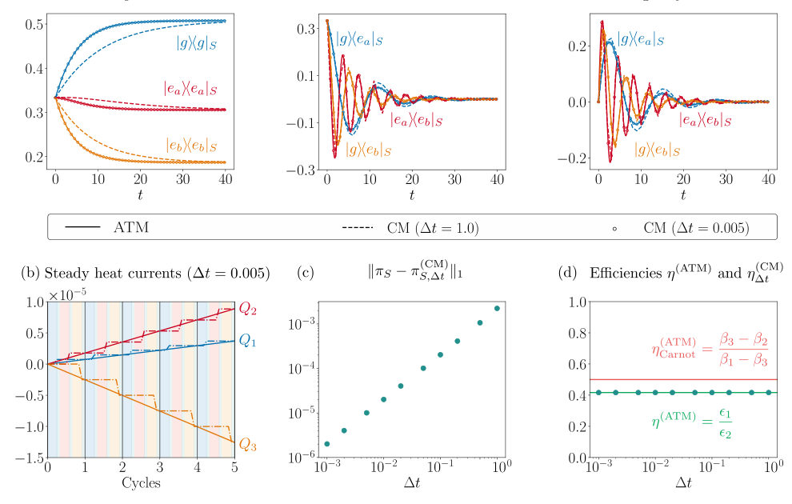 
FIG. 5. Numerical comparison between the three-level autonomous thermal machine (ATM) and its ECTCM realisations (CM). Parameters: ϵ1 = 0.5, ϵ2 = 1.2, β1 = 1, β2 = 0.4, β3 = 0.6 and Γ = 0.05. (a) Population and coherence dynamics of the ATM (solid lines) and its ECTCM realisations with ∆t = 1.0 (dashed lines) and ∆t = 0.005 (circles). The initial state is ρS(0) = |ψ⟩⟨ψ|S where |ψ⟩S = (|g⟩S + |ea⟩S + |eb⟩S)/ √

**Summary.** This paper unifies the theory of Markovian quantum thermodynamics by proving the exact equivalence between axiomatic constraints, underlying microscopic collision models, and operational resource theories. It establishes a universal framework for understanding how quantum systems thermalize while providing concrete simulation protocols for implementing these processes. This unification is vital for developing consistent theoretical tools in non-equilibrium quantum physics.

**Why it may be interesting.** This work provides a crucial theoretical bridge for researchers working on open quantum systems, showing that different seemingly disparate approaches (axiomatic vs. microscopic) converge under specific thermodynamic conditions.

Detailed structure

**Main problem.** The core problem is establishing a rigorous, unified understanding of Markovian quantum thermodynamics by reconciling three distinct theoretical frameworks: axiomatic constraints, microscopic collision models, and operational resource theories.

**Main result.** The authors prove the exact equivalence between these three paradigms in the Markovian regime, providing a universal foundation for describing thermal processes.

**Method.** The work uses mathematical proofs to establish pairwise equivalences between the generators derived from the axiomatic constraints (e.g., detailed balance), microscopic collision models (ECTCMs), and operational restrictions (MTOs).

**Model / system.** The analysis concerns general quantum systems undergoing thermalization via interaction with a bosonic environment, described mathematically by the Lindblad master equation in the Markovian limit.

**Key observables.** Free energy monotonicity ($F \downarrow$), energy conservation, and the structure of the time-dependent generator $L_t$.

**Important parameters / regimes.** The analysis is restricted to the Markovian regime; finite-time simulation errors are controlled by a specific scaling law.

**Assumptions / limitations.** The primary assumption is that the system dynamics can be accurately modeled within the memoryless, Markovian approximation.

**Figures summary.** Figure 1 illustrates the central theme: the equivalence mapping between the Axiomatic description, the Microscopic (ECTCMs), and the Operational (MTOs) formulations of quantum thermodynamics.

**Paper structure.** The paper develops the theory by first defining the three paradigms separately, then proving their mutual consistency via mathematical theorems, and finally demonstrating this universality through explicit simulation protocols applied to physical examples like qubit thermalization and autonomous machines.

Abstract

Thermodynamics imposes fundamental constraints on the evolution of quantum systems. These constraints and their dynamical consequences have been formulated within distinct paradigms, including axiomatic approaches based on quantum master equations, microscopic descriptions of open-system dynamics, and operational formulations rooted in resource theories. While each perspective has yielded important insights into thermodynamically consistent quantum dynamics, their precise relationship has remained unresolved. Here we establish the exact equivalence of these three paradigms in the Markovian regime. We prove that thermal Lindbladians satisfying Markovianity, time-translation symmetry, and quantum detailed balance are precisely those admitting a microscopic realisation as an energy-conserving thermal collision model and, equivalently, those generating Markovian thermal operations. This unifies the existing approaches to Markovian quantum thermodynamics and identifies its dynamical underpinnings. We further provide an explicit microscopic protocol for simulating thermal Markovian processes with controlled finite-time simulation errors. We illustrate its applicability by providing faithful thermal collision-model implementations of a qubit thermalising in a bosonic environment and of a three-level autonomous thermal machine. In the latter case, the protocol gives rise to a finite-stroke thermal engine that not only reproduces the continuous-time dynamics but also its steady-state thermodynamic performance. As a whole, these results establish a unified foundation for Markovian quantum thermodynamics, showing that its axiomatic, microscopic, and operational formulations are exactly equivalent and providing a universal protocol for implementing thermal processes and machines.

[↑ back to top](#top)

### [Data-efficient reconstruction of critical quantum dynamics via blind fractional-envelope extrapolation](http://arxiv.org/abs/2607.15458v1)

**Authors:** Hyunju Kim, Hyun-Yong Lee, Heung-Sik Kim  
**Type:** theory · **Category:** strongly correlated electrons · **PDF:** <https://arxiv.org/pdf/2607.15458v1>  
**Analysis basis:** full PDF text, analyzed in chunks
**Topic relevance:** `methods for driven-dissipative` **3/5** · `non-equilibrium dynamics` **3/5** · `analog quantum simulation` **2/5** · `non-equilibrium universality` **2/5** · `Keldysh / 2PI / non-Gaussian methods` **1/5** · `correlated / nonlocal dissipation` **1/5** · `driven-dissipative phase transition` **1/5** · `entanglement & information structure` **1/5**

📷 Fig 1

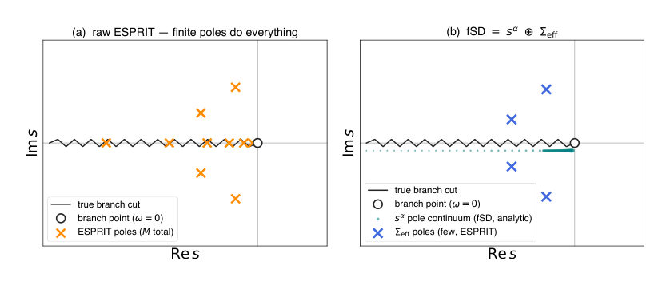 
FIG. 1. Analytic structure underlying the method, in the complex-frequency (s) plane. In both panels the true critical branch cut (zigzag line) runs along the negative real axis and terminates at the branch point s = 0 (open circle). (a) A finite-pole estimator must represent the dynamics with discrete poles (×); to mimic the cut it tiles the negative real axis, under-resolving the ω →0 edge and missing the asymptotic t−α tail. (b) The fractional closure writes the inverse propagator as sα + ˜Σeff(s): the cut is carried analytically by sα, so that the propagator behaves as sα−1 near the branch point; the pole continuum shown (offset for clarity), with power-law weight growing toward the...

📷 Fig 2

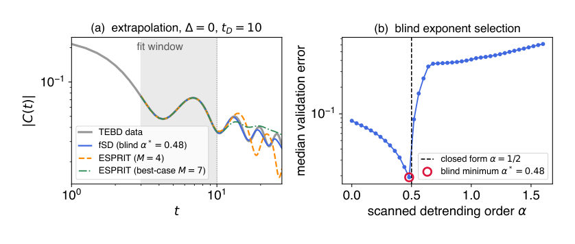 
FIG. 2. An example comparison between the fSD and ESPRIT on the XXZ chain at ∆= 0 (and h = 0). (a) |C(t)| from TEBD (gray), with the fSD (blue solid, blind α∗) and finite-pole ESPRIT (orange dashed) extrapolations fitted on the short window t ∈[3, 10] (shaded, identical settings and pole count M = 4 for both); beyond the window the finite-pole fit departs from the data, while fSD tracks the algebraic tail (out- of-window error 0.07 vs. 0.54). The green dash-dotted curve shows ESPRIT at its best-case pole count (M = 7, chosen with knowledge of the exact tail, App. A): the error improves to 0.19 but remains 2.7× that of fSD. (b) Blind exponent selection: median walk-forward validation error...

📷 Fig 3

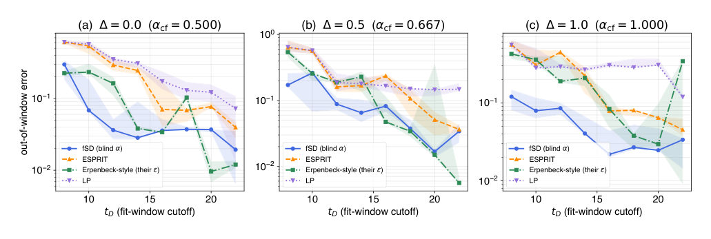 
FIG. 3. Data efficiency under a fully symmetric, blind procedure. Out-of-window extrapolation error versus fit-window cutoff tD for the XXZ critical line at ∆= 0 (a), 0.5 (b), and 1 (c), comparing fSD (blue; residual fit with auto-selected pole count, α identified blind from the fit window alone) with three finite-pole baselines on the same data and the same grid: plain ESPRIT (orange, shared auto-M), the Erpenbeck- style extrapolator of Ref. [13] run with its authors’ prescriptions (L = 0.4N, mode number from their singular-value threshold 10−6, growing modes discarded, Vandermonde amplitudes; green), and a time-domain LP extension in the spirit of Ref. [14] (purple, shared auto-M). Lines...

📷 Fig 4

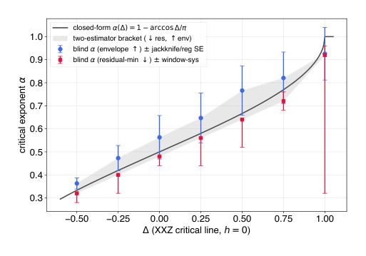 
FIG. 4. Blind identification of the critical exponent. Blind esti- mates of α along the XXZ critical line compared with the closed- form Luttinger value (gray, not used in the identification). Two in- dependent blind estimators — envelope power-law fit (blue, with jackknife/regression error bars) and residual-minimization (red, with window-systematic bars) — bracket the closed form across ∆∈ [−0.5, 0.75] (shaded). At ∆= 1 both estimators undershoot, re- flecting the known bias from the multiplicative logarithmic correc- tion t−1(ln t)1/2 (see text).

📷 Fig 5

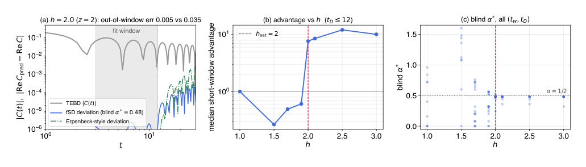 
FIG. 5. Magnetic-field scan at ∆= 1 under the same fully blind procedure as Fig. 3. (a) Real-time comparison at the saturation field h = 2.0: |C(t)| from TEBD (gray) and the deviations |Re Cpred −Re C| — evaluated on the real part, matching the error metric of Eq. (A1) — of fSD (blue, blind α∗= 0.48) and of the Erpenbeck-style baseline (green), both fitted on t ∈[3, 12] (shaded). The small in-window fSD residual reflects its conservative auto-M pole budget (M = 4 vs. 6 retained by the baseline’s 10−6 threshold); the baseline interpolates the window three orders of magnitude more closely yet extrapolates an order of magnitude worse — the interpolation-versus-extrapolation contrast of Fig. 2....

**Summary.** This work introduces a novel fractional envelope extrapolation method (fSD) designed to overcome the limitations of simulating quantum dynamics at criticality. By treating the low-energy spectrum as a branch cut rather than discrete poles, the technique accurately reconstructs long-time decay tails from short simulation data. This is particularly valuable for studying strongly correlated electron models and critical phenomena.

**Why it may be interesting.** It provides a powerful, data-driven tool to extract long-time dynamical information from short numerical simulations in strongly correlated systems where standard spectral analysis fails due to power-law continua.

Detailed structure

**Main problem.** Simulating real-time dynamics of quantum systems is limited by entanglement growth, especially at criticality where the spectrum exhibits a power-law continuum.

**Main result.** A fractional-calculus-motivated envelope extrapolation method (fSD) accurately reconstructs short-time critical dynamics, significantly outperforming standard finite-pole methods.

**Method.** The technique involves blind selection of the critical exponent $\alpha$, detrending the signal by $t^\alpha$, fitting the residual with a stable finite-pole model, and then restoring the algebraic envelope.

**Model / system.** The method is tested on quantum systems exhibiting criticality, including the XXZ spin chain and the single-orbital Hubbard model studied via Dynamical Mean-Field Theory (DMFT).

**Key observables.** Real-time correlation functions $G(t)$, spectral function $A(\omega)$, and the critical exponent $\alpha$.

**Important parameters / regimes.** The critical exponent $\alpha$, system parameters like magnetic field ($h$) or interaction ratios ($U/D$), and time windows for fitting.

**Assumptions / limitations.** The method assumes that the low-energy physics is dominated by a power-law continuum $t^{-\alpha}$ at criticality, allowing the use of fractional calculus techniques.

**Figures summary.** Figures compare fSD extrapolation against finite-pole methods on critical chains (XXZ), showing superior agreement with theoretical tails; other figures track exponent $\alpha$ across varying fields or show spectral function resolution in DMFT transitions.

**Paper structure.** The paper establishes the failure of standard pole fitting at criticality, introduces the fSD framework based on fractional calculus, details the operational procedure (blind search), and validates it by comparing results against known critical points and non-critical regimes.

Abstract

Simulating real-time dynamics of quantum systems is often limited to short times by entanglement growth. Finite-pole reconstructions such as linear prediction and related machineries extrapolate such data reliably when the spectrum is a finite set of excitations, but at criticality the low-energy spectrum is a power-law continuum $A(ω)\sim|ω|^{α-1}$ -- a branch cut whose real-time tail $G(t)\sim t^{-α}$ finitely many poles cannot represent. Here we develop a fractional-calculus-motivated envelope extrapolation for such data. Its structure is motivated by a fractional form of Schwinger--Dyson (fSD) equation, in which the Laplace symbol $s^α$ carries the branch cut analytically while the residual self-energy remains meromorphic. On real data we employ the corresponding operational alternative -- the exponent $α$ is selected blindly inside the fit window, the signal is detrended by $t^α$, the residual is fitted by a stabilized finite-pole model, and the algebraic envelope is restored. On the critical XXZ chain this blind fractional-envelope method (fSD for short) extrapolates short-time data typically several-fold more accurately than finite-pole methods, with the exponent $α$ identified blindly from the fit window alone and bracketing the closed-form Luttinger value at weak coupling. The same blind search finds the $z=2$ dilute-magnon exponent $α=1/2$ at the $Δ=1$ saturation transition, and the advantage persists in the gapped free-magnon phase with its sharp band edges. On noncritical dynamical mean-field spectra, whose low-frequency response is regular, fSD by contrast fails to select any stable fractional envelope and reduces to the standard pole result rather than manufacturing a spurious power law, making it an efficient and accurate route to quantum critical dynamics when only short simulation times are accessible.

[↑ back to top](#top)

### [Conditional Euclidean-Hamiltonian reductions for sign-problem toy models](http://arxiv.org/abs/2607.15950v1)

**Authors:** Tsogtgerel Gantumur  
**Type:** theory · **Category:** strongly correlated electrons · **PDF:** <https://arxiv.org/pdf/2607.15950v1>  
**Analysis basis:** full PDF text, analyzed in chunks
**Topic relevance:** `Keldysh / 2PI / non-Gaussian methods` **3/5** · `methods for driven-dissipative` **3/5** · `analog quantum simulation` **2/5** · `driven-dissipative phase transition` **2/5** · `Kondo & dissipative impurity` **1/5** · `non-equilibrium dynamics` **1/5** · `quantum measurements` **1/5**

📷 Fig 1

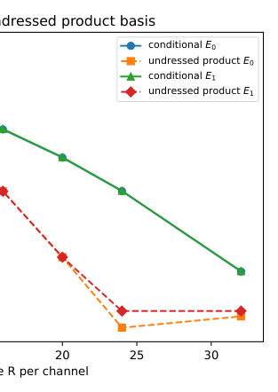 
Figure 1. Low-energy errors versus R per channel.

📷 Fig 2

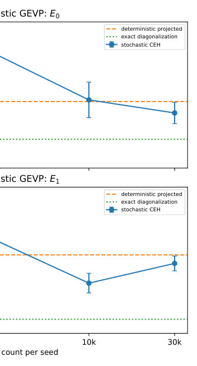 
Figure 2. Stochastic GEVP energies versus sample count.

📷 Fig 3

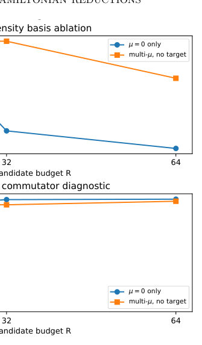 
Figure 3. Hubbard active-space diagnostics.

**Summary.** This paper introduces Conditional Euclidean-Hamiltonian (CEH) reduction to circumvent the sign problem plaguing Monte Carlo simulations of finite-density quantum systems. Instead of calculating problematic scalar weights, CEH keeps the residual physics as an operator, projecting it onto a manageable, low-rank effective Hamiltonian. This offers a structured alternative for simulating strongly correlated models where standard methods fail due to complex phases.

**Why it may be interesting.** It provides a rigorous theoretical framework for handling sign problems in lattice simulations by shifting the computational bottleneck from complex weights to controlled matrix approximations, which is relevant for simulating strongly correlated materials.

Detailed structure

**Main problem.** The primary challenge is overcoming the sign problem encountered when using Euclidean Monte Carlo methods for finite-density fermion systems, which leads to complex or sign-changing path integral weights.

**Main result.** The Conditional Euclidean-Hamiltonian (CEH) reduction offers a viable alternative by replacing scalar sign reweighting with a monitored active-space approximation in structured, finite models.

**Method.** CEH combines aspects of Euclidean Monte Carlo and Hamiltonian formulations by keeping the residual active degrees of freedom operator-valued rather than tracing them into a determinant or scalar weight.

**Model / system.** The method is applied to quantum many-body systems, specifically addressing finite-density effects ($\mu 
eq 0$) in lattice field theories, with benchmarks including the Hubbard ring model.

**Key observables.** Projected correlation matrices, effective Hamiltonians (H_eff), and diagnostics such as basis enlargement metrics and number-sector leakage.

**Important parameters / regimes.** Finite chemical potential ($\mu$), temperature ($eta$), and the rank ($R$) of the projected active space.

**Assumptions / limitations.** The method assumes that the residual active dynamics are low-rank approximable, allowing for a controlled projection onto a finite basis set.

**Figures summary.** Not specified (Notes describe diagnostics like sign values ($	ext{sgn}$) and convergence of projected thermal density ($
ho_R$) across different active space ranks $R$).

**Paper structure.** The paper introduces the CEH concept as a trade-off against scalar reweighting, details its mathematical construction using operator projection onto correlation matrices, and validates it through three finite benchmarks (oscillator, stochastic calculation, Hubbard ring).

Abstract

Euclidean Monte Carlo methods are effective when the path-integral weight is real and nonnegative, but finite-density fermion systems often produce sign-changing or complex scalar weights after the fermionic sector is traced out. Hamiltonian formulations avoid this complex-weight sampling problem but face rapid Hilbert-space growth. This paper studies a conditional Euclidean-Hamiltonian (CEH) reduction that combines these two descriptions.   The calculation is organized around a Monte Carlo-tractable reference problem and a residual active sector. Instead of tracing the active sector into a determinant or scalar weight, CEH keeps it operator-valued and uses the reference calculation to determine projected correlation or transfer matrices. These matrices define a finite effective Hamiltonian, with the remaining finite-density dependence introduced after projection. At finite rank, the result is an effective model whose accuracy must be tested through basis enlargement, metric conditioning, stochastic matrix-element errors, and number-sector diagnostics.   The construction is examined in three finite benchmarks. A two-channel oscillator tests conditional basis compression; a positive-measure stochastic calculation tests correlation-matrix harvesting and GEVP extraction, including a comparison with a PDMS-style estimator; and a four-site Hubbard ring combines a finite-budget determinant-sign stress test with finite-density continuation in non-target active spaces. The benchmarks support the proposed trade from scalar sign reweighting to a monitored active-space approximation in structured finite models, but they do not provide an end-to-end stochastic CEH treatment of the Hubbard sign problem or establish favorable scaling. Usefulness requires both low-rank approximability and efficient extraction of the required projected matrix data.

[↑ back to top](#top)

### [Boosting State Discrimination in Quantum Brownian Motion Channel via Memory-Induced Coherence Preservation](http://arxiv.org/abs/2607.15405v1)

**Authors:** João C. P. Porto, Pedro R. Dieguez, Carlos H. S. Vieira, Irismar G. da Paz, Giandomenico Palumbo, Lucas S. Marinho  
**Type:** theory · **Category:** quantum information and computing · **PDF:** <https://arxiv.org/pdf/2607.15405v1>  
**Analysis basis:** full PDF text, analyzed in chunks
**Topic relevance:** `methods for driven-dissipative` **3/5** · `non-equilibrium dynamics` **2/5** · `quantum measurements` **2/5** · `Keldysh / 2PI / non-Gaussian methods` **1/5** · `correlated / nonlocal dissipation` **1/5** · `driven-dissipative phase transition` **1/5** · `entanglement & information structure` **1/5** · `non-equilibrium universality` **1/5**

📷 Fig 1

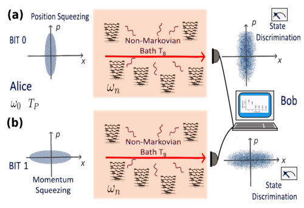 
Fig. 1. Sketch of a quantum state discrimination protocol. First, Alice prepares a bosonic probe, P (with frequency ω0 and initial temperature TP ), and applies squeezing along ei- ther the position quadratures (a) or momentum quadratures (b) in phase-space. For example, these distinct preparations can encode logical bits 0 and 1, respectively. She then sends these states through a non-Markovian bath at temperature TB, modeled by a Quantum Brownian Motion (QBM) channel comprising an ensemble of harmonic oscillators with frequen- cies ωn. Finally, at the receiving end, Bob performs measure- ments to discriminate between these states and, by doing so, decode the logical information for...

📷 Fig 2

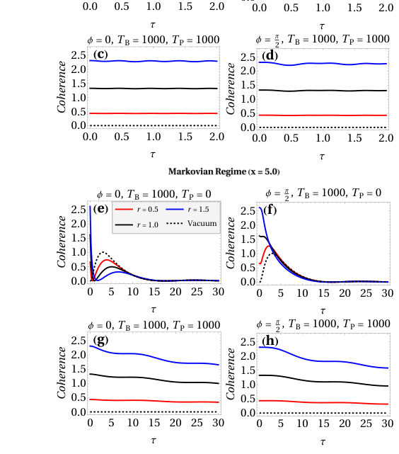 
Fig. 2. Dynamics of the relative entropy of coherence across non-Markovian (x = 0.15, top block) and Markovian (x = 5.0, bottom block) regimes for a fixed bath temper- ature (TB = 1000) and zero displacement (α = 0). We contrast initial probe temperatures TP = 0 [(a,b,e,f)] and TP = 1000 [(c,d,g,h)], alongside position (ϕ = 0) and momen- tum (ϕ = π/2) squeezing. Initial squeezing amplitudes are r = 0.5 (red), 1.0 (solid black), 1.5 (blue), with the vacuum case (r = 0) as a dashed black line.

📷 Fig 3

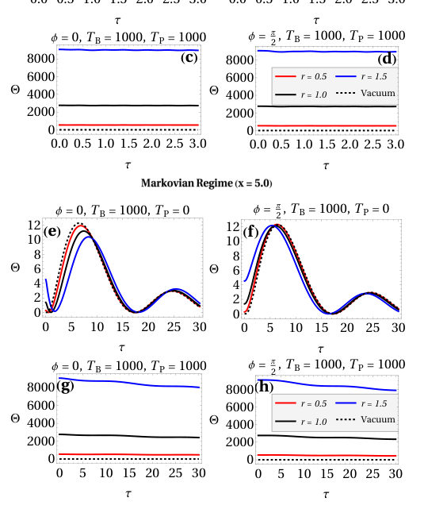 
Fig. 3. Dynamics of the non-thermal excitation witness Θ across non-Markovian (x = 0.15, panels a-d) and Marko- vian (x = 5.0, panels e-h) regimes for a fixed bath tem- perature (TB = 1000) and zero displacement (α = 0). We contrast initial probe temperatures TP = 0 [(a,b,e,f)] and TP = 1000 [(c,d,g,h)], alongside position (ϕ = 0) and momen- tum (ϕ = π/2) squeezing. Initial squeezing amplitudes are r = 0.5 (red), 1.0 (solid black), 1.5 (blue), with the vacuum case (r = 0) as a dashed black line.

📷 Fig 4

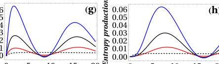 
Fig. 4. Dynamics of the entropy production rate across non- Markovian (x = 0.15, panels a-d) and Markovian (x = 5.0, panels e-h) regimes for a fixed bath temperature (TB = 1000) and zero displacement (α = 0). We contrast initial probe temperatures TP = 0 [(a,b,e,f)] and TP = 1000 [(c,d,g,h)], alongside position (ϕ = 0) and momentum (ϕ = π/2) squeez- ing. Initial squeezing amplitudes are r = 0.5 (red), 1.0 (solid black), 1.5 (blue), with the vacuum case (r = 0) as a dashed black line.

📷 Fig 5

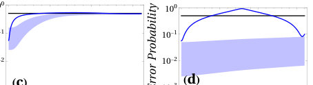 
Fig. 6. Error probabilities for discriminating between orthog- onal squeezing directions (ϕ = 0 versus ϕ = π/2) in variance- encoded Gaussian states across non-Markovian (x = 0.15, panels a,b) and Markovian (x = 5.0, panels c,d) regimes for a fixed bath temperature (TB = 1000) and zero displacement (α = 0). We contrast initial probe temperatures TP = 0 (left panels) and TP = 1000 (right panels). The standard classi- cal limit (r = 0) is marked by a solid black line at 0.5. For high squeezing (r = 1.5), the fundamental uncertainty win- dow bounded by Helstrom limits (p±) is shaded blue, with the solid blue line denoting the exact error probability via optimal position-quadrature homodyne...

**Summary.** This paper investigates state discrimination in the presence of environmental noise using the Quantum Brownian Motion model. It demonstrates that contrary to intuition, increasing initial thermal noise can actually boost performance by preserving coherence through non-Markovian dynamics when squeezing is applied. The findings suggest a robust physical architecture for quantum communication even in high-temperature settings.

**Why it may be interesting.** This work is highly relevant as it provides a concrete physical mechanism—exploiting transient non-thermalization dynamics—to enhance quantum information processing capabilities (state discrimination) in realistic, noisy environments, moving beyond simple loss models.

Detailed structure

**Main problem.** The study addresses how quantum state discrimination can be improved when transmitting quantum states through noisy, dissipative environments like a Quantum Brownian Motion (QBM) channel.

**Main result.** Counterintuitively, the research shows that increasing initial thermal noise, when combined with squeezing in a QBM channel, can enhance state discrimination by inducing coherence preservation mechanisms. The achievable performance approaches the theoretical Helstrom limit using quadrature homodyne detection.

**Method.** The analysis employs quantum information metrics like Bures distance and fidelity to quantify distinguishability, alongside developing specific error probability formulas for continuous-variable Gaussian states measured via homodyne detection.

**Model / system.** The system models single-mode Gaussian probes interacting with a bosonic environment characterized by the QBM channel. The evolution is governed by master equations analyzed across non-Markovian and Markovian regimes.

**Key observables.** Error probability for state discrimination, Quantum Coherence (quantified via relative entropy or coherence witness $\Theta$), Bures Distance ($D_B$).

**Important parameters / regimes.** Initial probe temperature ($T_P$) vs bath temperature ($T_B$), squeezing amplitudes ($r$), and the non-Markovianity parameter ($x = \omega_c/\omega_0$).

**Assumptions / limitations.** The analysis often assumes weak coupling, utilizes Gaussian state representations, and sometimes restricts calculations to zero-displacement states or equal prior probabilities for discrimination.

**Figures summary.** Figures illustrate the dynamics of coherence measures (relative entropy) under varying thermal/memory conditions, and one figure details the optimal decision boundaries ($\pm q_c$) for homodyne detection using squeezed states.

**Paper structure.** The paper builds from establishing the theoretical framework for state evolution in QBM channels to quantifying coherence resources. It then applies these tools to show how noise can be leveraged for improved discrimination, culminating in specific measurement protocols and error bounds.

Abstract

Preserving quantum resources in dissipative environments is a fundamental challenge in quantum information processing. While environmental interactions usually degrade quantum resources, we theoretically show that in a Quantum Brownian Motion (QBM) channel, continuous-variable state discrimination can be improved by increasing, rather than minimizing, the initial thermal noise. Specifically, without suppressing the inherent environmental dissipation, when combined with squeezing, this initial noise induces a coherence preservation mechanism driven by the transient non-thermalization of the probe with the bath. This preservation translates into a pronounced reduction in error probabilities for state discrimination between orthogonal squeezing directions. Furthermore, we also show that quadrature homodyne detection achieves near-optimal performance, approaching the Helstrom limit. These results highlight the advantage of exploiting thermal-squeezed states, offering a robust physical architecture for quantum communication in high-temperature environments.

[↑ back to top](#top)

### [Symmetry extension by condensation defects II: general dimensions and higher-groups](http://arxiv.org/abs/2607.16099v1)

**Authors:** Matteo Bertolini, Lorenzo Di Pietro, Stefano C. Lanza, Antonio Santaniello  
**Type:** theory · **Category:** other · **PDF:** <https://arxiv.org/pdf/2607.16099v1>  
**Analysis basis:** full PDF text, analyzed in chunks
**Topic relevance:** `Keldysh / 2PI / non-Gaussian methods` **3/5** · `analog quantum simulation` **2/5** · `correlated / nonlocal dissipation` **1/5** · `correlated cavity matter` **1/5** · `driven-dissipative phase transition` **1/5** · `entanglement & information structure` **1/5** · `methods for driven-dissipative` **1/5** · `non-equilibrium dynamics` **1/5** · `non-equilibrium universality` **1/5**

📷 Fig 1

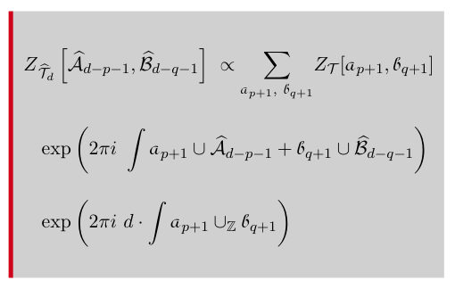 
Figure 1: The red line denotes the insertion of a codimension-1 defect of the C(0) symmetry. We show explicitly the expressions of the partition functions on the two sides of the defect, to point out the insertion of the operator Ud on the right half-space.

📷 Fig 2

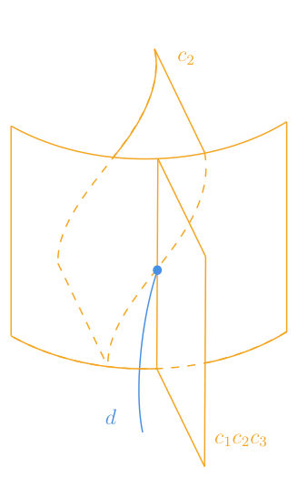 
Figure 3: Illustration of a junction between topological defects that reflects the existence of a (r + 2)-group structure. The yellow planes are the topological defects associated with C(r). When we fuse three of them we generate a fourth C(r) defect and a defect for D(r+1) (represented as a blue line) which is fixed by d = Φr [tr+3] (c1, c2, c3).

📷 Fig 3

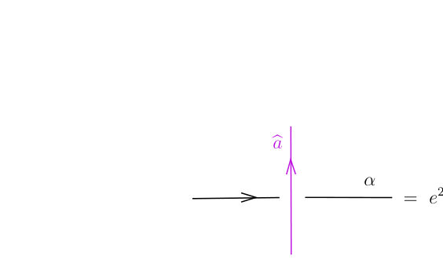 
Figure 4: Two-component linking action of Uba[Σp+1] on Oα[γd−p−2].

📷 Fig 4

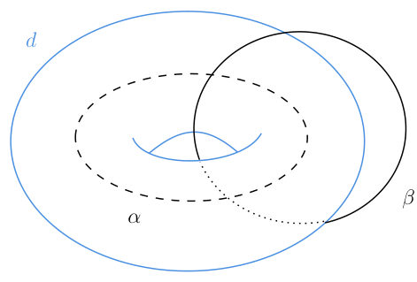 
Figure 5: The configuration of charged operators Oα[γd−p−2], Oβ[γd−q−2] and topological defect Ud[Σp+q+2] that activates the triple linking (2.44). This implies that Ud[Σp+q+2] measures a charge, as in equation (2.43).

📷 Fig 5

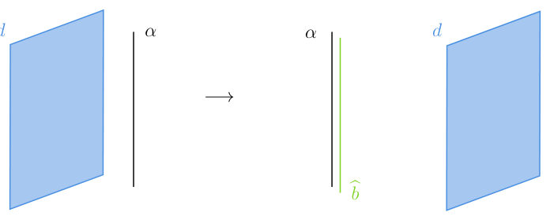 
Figure 6: As we slide the condensation defect Ud[Σp+q+2] through the operator Oα[γd−p−2], a charge Ubb[eΣp+q+3 ∩γd−p−2] is deposited, where bb = (−1)p(d+1)d · (φα ⊗Z −).

**Summary.** This work develops a general framework for determining how symmetry structures are modified when gauging symmetries in QFTs characterized by a cubic mixed 't Hooft anomaly. It shows that the resulting theory features an extended symmetry, which can be classified as either a simple group extension or a more complex higher-group structure. This is achieved by analyzing the behavior of condensation defects associated with dual symmetries.

**Why it may be interesting.** While highly theoretical, the concept of emergent higher-group symmetries and topological defects is relevant to understanding complex many-body ground states or effective theories derived from condensed matter systems with strong topological order.

Detailed structure

**Main problem.** The paper investigates novel symmetry structures that emerge in Quantum Field Theories (QFTs) when gauging symmetries associated with a cubic mixed 't Hooft anomaly.

**Main result.** The resulting symmetry structure is an extension of the original symmetry $C(r)$ by a $\mathbb{Z}_{D(n+r-1)}$ group, which can manifest as either a standard group extension or a higher-group structure depending on the specific parameters.

**Method.** The analysis uses anomaly inflow formulas and examines how gauging symmetries affects the topological defects and fusion rules of the resulting dual theory.

**Model / system.** The study is general, starting with a $d$-dimensional QFT possessing three interacting Abelian discrete symmetries ($A(p)$, $B(q)$, and $C(r)$) characterized by a cubic mixed anomaly. Examples include QED3 and $\mathcal{N}=4$ supersymmetric QED3.

**Key observables.** The nature of the symmetry extension (standard vs. higher-group), the resulting discrete group structure ($\mathbb{Z}_{D(n+r-1)}$), and the fusion rules of topological operators.

**Important parameters / regimes.** The dimensions $d$, the charges/indices $(p, q, r)$, and the anomaly coefficients defining the cubic term are crucial parameters.

**Assumptions / limitations.** The analysis fundamentally relies on the existence and structure of a cubic mixed 't Hooft anomaly in the theory under consideration.

**Paper structure.** The paper proceeds by establishing the general framework using the anomaly inflow formula, analyzing the consequences of gauging $A 	imes B$, deriving constraints on background fields from partition function invariance, and finally classifying the resulting symmetry extension based on the defect structure.

Abstract

We discuss a class of symmetry structures in general spacetime dimension that arise when gauging symmetries in theories with a cubic 't Hooft anomaly. The anomaly mixes two Abelian discrete symmetries $A$ and $B$ with a characteristic class for an additional symmetry $C$, and we gauge $A\times B$. The novelty of this construction is that the resulting symmetry structure involves certain condensation defects of the dual symmetry $\widehat{A}\times\widehat{B}$. Specifically, these defects generate an invertible symmetry that extends $C$, either as an ordinary group extension or as a higher-group, depending on the characteristic class. We describe the corresponding charged operators and states, and illustrate the mechanism in several examples.

[↑ back to top](#top)

### [The Paradox of the Third Particle is classical](http://arxiv.org/abs/2607.15351v1)

**Authors:** Ladina Hausmann, Renato Renner  
**Type:** theory · **Category:** other · **PDF:** <https://arxiv.org/pdf/2607.15351v1>  
**Analysis basis:** full PDF text, analyzed in chunks
**Topic relevance:** `entanglement & information structure` **3/5** · `quantum measurements` **3/5** · `measurement-induced transitions` **2/5** · `correlated / nonlocal dissipation` **1/5** · `driven-dissipative phase transition` **1/5** · `methods for driven-dissipative` **1/5** · `non-equilibrium dynamics` **1/5**

📷 Fig 1

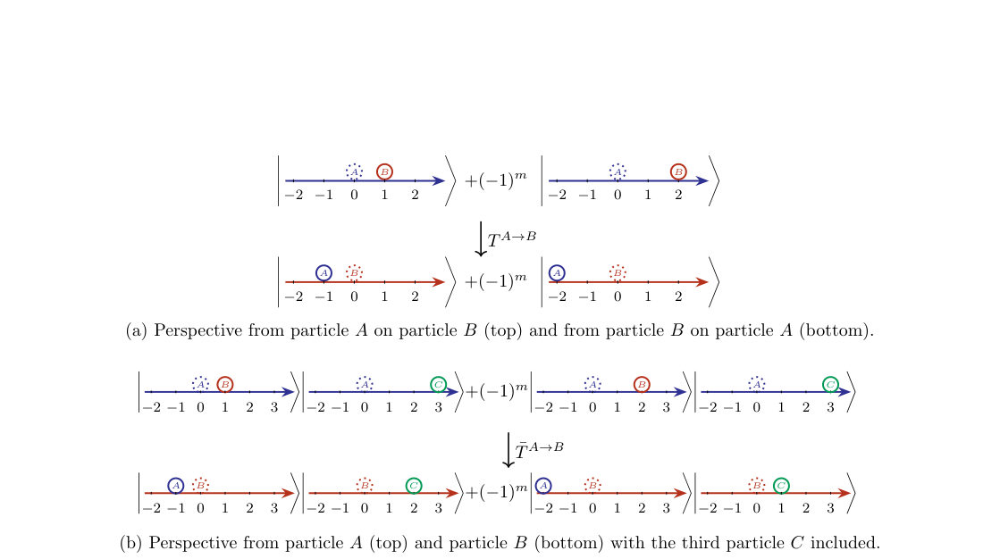 
Figure 1: Quantum Paradox of the Third Particle. From the perspective of one particle (dotted), the state of other particles (solid) depends on the value m of a bit. From A’s perspective, the state of particle B is the same independently of whether the third particle C is ignored, as in (a), or included in the description, as in (b). The paradox arises because, after transforming to B’s perspective (vertical arrow), the state of A is different depending on whether C is considered. This difference is operationally relevant: in (a), the value m is retrievable by acting on A only, whereas this is not the case in (b).

📷 Fig 2

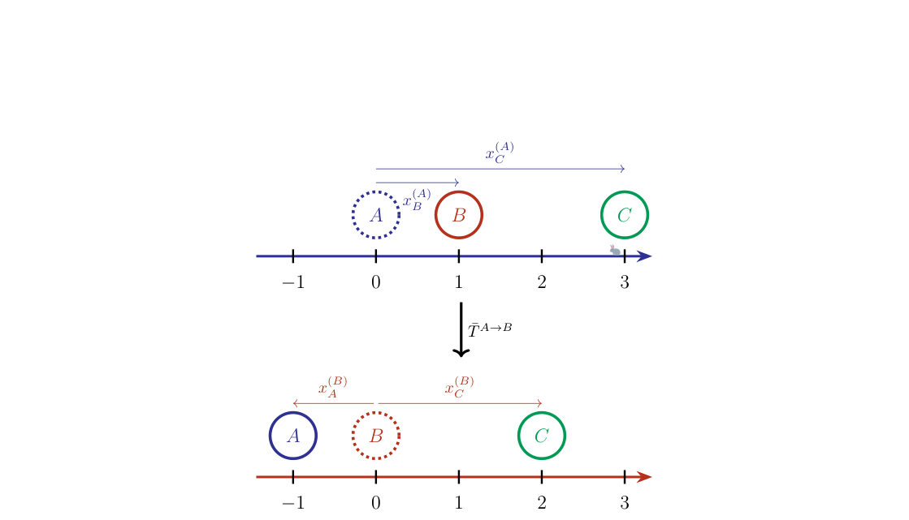 
Figure 3: Geometric intuition. The upper part shows the perspective from particle A (dotted) on particles B and C (solid). The lower part shows the perspective from particle B (dotted) on particles A and C (solid). The reference frame transformation ¯T A→B from A’s perspective to B’s perspective corresponds to a shift of the origin from the location of A to the location of B.

📷 Fig 3

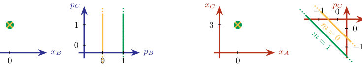 
Figure 4: The classical Paradox of the Third Particle. From A’s perspective, B’s state depends on the value m of the bit M, regardless of whether the third particle C is ignored, as in (a), or included, as in (b). However, upon transforming to B’s perspective, a discrepancy arises: the state of A depends on m if C is ignored when transforming, as on the right-hand side of (a), whereas it is independent of m if C is accounted for, as in (c).

📷 Fig 4

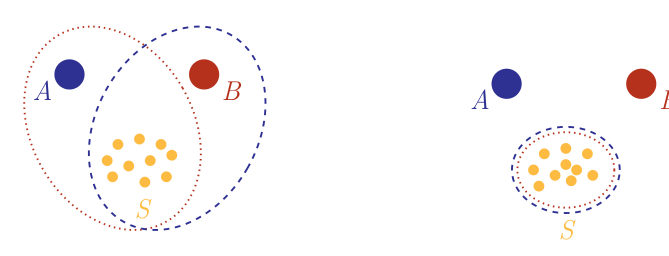 
Figure 6: Heisenberg cuts. Originally, the notion of a Heisenberg cut was introduced in quantum theory as the boundary between the world described by quantum theory and the rest. Here, we use this notion more generally: the boundary between the systems described from a perspective and the rest. Figure (a) shows the case relevant to the Paradox of the Third Particle, and Figure (b) the standard situation.

**Summary.** This theoretical paper analyzes the 'Paradox of the Third Particle' by extending its analysis from quantum mechanics into classical mechanics. The authors prove a no-go theorem demonstrating that any consistent physical theory describing subsystems relative to different reference frames must violate at least one fundamental principle (like information preservation or relationality). This suggests deep constraints on how we can mathematically partition and describe reality across multiple perspectives.

**Why it may be interesting.** This work tackles fundamental issues regarding the structure of physical reality and measurement theory, which underpins how we model quantum systems relative to observers/reference frames. It challenges foundational assumptions about locality and separability in physics.

Detailed structure

**Main problem.** The paper investigates whether the 'Paradox of the Third Particle,' typically discussed in quantum mechanics regarding reference frames, persists when considering classical systems.

**Main result.** A no-go theorem is established showing that if one demands information-preserving frame transformations for physical subsystems (classical or quantum), it is impossible to meaningfully partition the world into independent subsystems from every perspective.

**Method.** The authors analyze both quantum and classical analogues of reference frame transformations, using joint probability distributions (classical) or density operators/unitary transformations (quantum). They establish consistency conditions based on three postulates: Geometry, Position/momentum separation, and Information preservation.

**Model / system.** The system involves three particles (A, B, C) whose states are described by phase space coordinates (classically) or quantum states. The analysis focuses on how the description of one particle depends on a reference frame defined by another.

**Key observables.** Information retrieval success probability ($P_{succ}$), joint probability distributions $P(A)_{BM}$, and the consistency of state descriptions across different perspectives (the 'atlas of perspectives').

**Important parameters / regimes.** The number of particles (three is central), the nature of the reference frame transformation ($ar{T}_{A	o B}$), and the assumption of information preservation.

**Assumptions / limitations.** The analysis assumes that reference frames are physical systems, leading to postulates defining the transformations, most critically the requirement that these transformations must be information-preserving (symplectomorphisms classically, unitaries quantum mechanically).

**Figures summary.** Figures illustrate the paradox using state dependence on a third particle and show geometric intuition for frame transformations in both quantum and classical settings.

**Paper structure.** The paper first establishes the paradox in the quantum setting, then extends the analysis to a fully classical framework. It develops a no-go theorem by showing that maintaining information preservation forces a violation of either relationality or decomposability when comparing different perspectives.

Abstract

The Paradox of the Third Particle arises when particles are described relative to one of them serving as a reference frame. Although it is typically attributed to quantum superpositions, we show that the paradox and its ramifications$\unicode{x2014}$such as the relativity of subsystems$\unicode{x2014}$already occur classically. In light of this insight, we establish a no-go theorem that holds whenever physical subsystems, whether classical or quantum, are used as reference frames: if one demands that frame transformations be information-preserving, then it is impossible to meaningfully partition the world into subsystems, like individual particles, from the perspective of each frame.

[↑ back to top](#top)

### [Optimization of multistate STIRAP by pulse shaping](http://arxiv.org/abs/2607.15915v1)

**Authors:** Julian K. Dimitrov, Nikolay V. Vitanov  
**Type:** theory · **Category:** other · **PDF:** <https://arxiv.org/pdf/2607.15915v1>  
**Analysis basis:** full PDF text, analyzed in chunks
**Topic relevance:** `analog quantum simulation` **3/5** · `methods for driven-dissipative` **2/5** · `non-equilibrium dynamics` **2/5** · `Keldysh / 2PI / non-Gaussian methods` **1/5** · `correlated / nonlocal dissipation` **1/5** · `driven-dissipative phase transition` **1/5** · `interference shaping light` **1/5**

📷 Fig 1

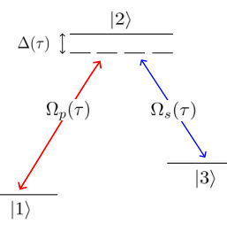 
Figure 1. Three-state Λ configuration for STIRAP on two- photon resonance. The pump field Ωp(τ) couples the initial state |1⟩to the intermediate state |2⟩, while the Stokes field Ωs(τ) couples state |2⟩to the target state |3⟩. The interme- diate state has the single-photon detuning ∆(τ).

📷 Fig 2

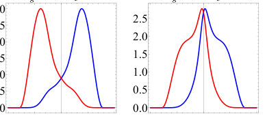 
Figure 2. Normalized pump and Stokes pulse shapes for the systems considered in this paper. Each individual pulse has area π for Ω0 = 1. The three-state fields are defined by Eqs. (11) and (12), while the multistate fields follow Eq. (23), with linkage-dependent parallelizing functions derived begin- ning in Sec. III C and in Appendix A.

📷 Fig 3

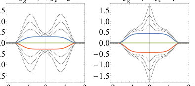 
Figure 3. Resonant adiabatic eigenenergies corresponding to the pulse shapes in Fig. 2. The systems differ only through the Clebsch-Gordan coefficients listed in Table I, and each individual pulse has area π for Ω0 = 1. The Je = Jg linkages retain a larger central dark-bright gap than the corresponding Je = Jg −1 linkages, consistent with Table II and the transfer results in Fig. 4.

📷 Fig 4

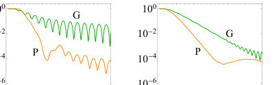 
Figure 4. Population-transfer error 1−PN as a function of the temporal pulse area for the resonant Gaussian and parallel- STIRAP pulses. The optimized pulses produce lower errors for all chain lengths, while the Je = Jg linkages generally outperform the corresponding Je = Jg −1 linkages because of their larger dark-bright gaps. The labels G and P denote Gaussian and parallel-STIRAP pulses, respectively.

📷 Fig 5

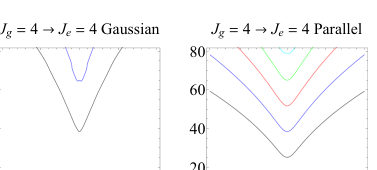 
Figure 5. Two-dimensional maps of the population-transfer error 1 −PN as functions of the temporal pulse area and the constant single-photon detuning ∆0/π for the Je = Jg family. All systems are on multiphoton resonance δ = 0. The left col- umn shows the Gaussian fields of Eq. (13), while the right col- umn shows the resonantly optimized parallel-STIRAP fields evaluated at the indicated detuning. The optimized pulses retain broader low-error regions, although the pulse area re- quired for high-fidelity transfer increases with the number of states.

**Summary.** This paper introduces a sophisticated pulse-shaping technique to enhance population transfer fidelity in complex multistate STIRAP systems. By tailoring the driving laser fields based on keeping system eigenenergies parallel to the dark state, the authors achieve error reductions of several orders of magnitude over standard pulses. This method proves highly effective for controlling quantum transitions in atomic ensembles and remains robust even when accounting for environmental decoherence.

**Why it may be interesting.** This work directly addresses high-fidelity quantum control in open quantum systems by optimizing external driving fields. The extension of adiabatic passage techniques to complex, multi-level atomic structures is highly relevant for quantum memory and quantum simulation using trapped atoms or superconducting circuits.

Detailed structure

**Main problem.** The primary goal is improving population transfer efficiency in multistate Stimulated Raman Adiabatic Passage (STIRAP) protocols.

**Main result.** Optimized pulse shaping can reduce the population transfer error by several orders of magnitude compared to standard Gaussian pulses, and this improvement remains robust against parameter variations and spontaneous emission.

**Method.** The authors propose a novel pulse-shaping method extending the quasiparallel-eigenenergy approach. This involves analytically designing pump and Stokes field shapes to keep relevant eigenenergies nearly parallel to the dark state during critical interaction periods.

**Model / system.** The system models multistate STIRAP chains, specifically using magnetic sublevels of degenerate angular momenta ($J_g 	o J_e$). The dynamics are governed by time-dependent Hamiltonian evolution under coupling from right- and left-circularly polarized pulses.

**Key observables.** Population transfer error (fidelity), instantaneous eigenenergies ($\eta$), and the dark-bright energy gap separation.

**Important parameters / regimes.** Pulse shapes, Rabi frequencies ($\Omega_p, \Omega_s$), single-photon detuning ($\Delta$), multiphoton detuning ($\delta$), and the number of states in the chain (odd numbers $N=2n+1$).

**Assumptions / limitations.** The method is restricted to odd-numbered state chains because these generically possess a zero-eigenvalue dark state. The approach avoids introducing auxiliary shortcut fields.

**Figures summary.** Figures illustrate the three-state $\Lambda$ configuration, show optimized pulse shapes for various multi-state systems, and present 2D maps comparing population transfer error versus parameter variations (e.g., Gaussian vs. optimized pulses).

**Paper structure.** The paper builds from the basic three-state STIRAP model to generalize the concept of quasiparallel eigenenergies to arbitrary odd-numbered state chains, deriving analytic pulse prescriptions and validating them through extensive numerical simulations.

Abstract

We propose a pulse-shaping method for improving population transfer in multistate stimulated Raman adiabatic passage (STIRAP) with nearest-neighbour couplings only. The method extends the quasiparallel-eigenenergy approach, previously used for two- and three-state systems, to multistate chains without introducing additional shortcut fields. The pump and Stokes fields are shaped so that the eigenenergies closest to the dark state remain nearly parallel to it during the central part of the interaction, where nonadiabatic transitions are most likely to occur. We derive analytic prescriptions for the required pulse shapes and apply them to five-, seven-, and nine-state chains formed by magnetic sublevels of degenerate manifolds with angular momenta $J_g\rightarrow J_e=J_g$ and $J_g\rightarrow J_e=J_g-1$ driven by a pair of right- and left-circularly polarized pulses. Numerical simulations show that the optimized pulses can reduce the population transfer error by several orders of magnitude compared to standard Gaussian pulses. The same shapes also improve robustness against variations of the peak Rabi frequency, the single-photon detuning, and the multiphoton detuning. The comparison between the two angular-momentum families shows that the $J_g\rightarrow J_g$ chains are generally more favourable, because their Clebsch-Gordan coefficients keep the relevant bright-state gap larger in the region where the dark state changes most rapidly. Finally, simulations with spontaneous emission show that the optimized resonant pulses remain advantageous in the lossy regime as well.

[↑ back to top](#top)

### [Scaling regimes of the Kuramoto-Sivashinsky equation from the functional renormalization group](http://arxiv.org/abs/2607.15784v1)

**Authors:** Liubov Gosteva, Nicolás Wschebor, Léonie Canet  
**Type:** theory · **Category:** statistical mechanics · **PDF:** <https://arxiv.org/pdf/2607.15784v1>  
**Analysis basis:** full PDF text, analyzed in chunks
**Topic relevance:** `non-equilibrium universality` **3/5** · `driven-dissipative phase transition` **2/5** · `non-equilibrium dynamics` **2/5** · `Frenkel-Kontorova` **1/5** · `Keldysh / 2PI / non-Gaussian methods` **1/5** · `correlated / nonlocal dissipation` **1/5** · `methods for driven-dissipative` **1/5**

📷 Fig 1

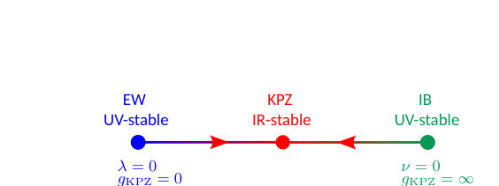 
FIG. 1. Fixed points of the 1D KPZ equation, with gKPZ = λ2D/ν3.

📷 Fig 2

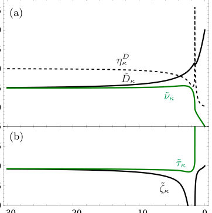 
FIG. 2. Flow of the parameters (a) ˜Dκ, ˜νκ and ηD κ , (b) ˜ζκ and ˜τκ defined in Eqs. (30), (43) as functions of the RG time s = ln(κ/Λ) calculated within the simple DE approximation. The flow starts from the KS initial condition, and reaches in the IR the KPZ fixed point, with emergent time-reversal symmetry and KPZ scaling exponents.

📷 Fig 3

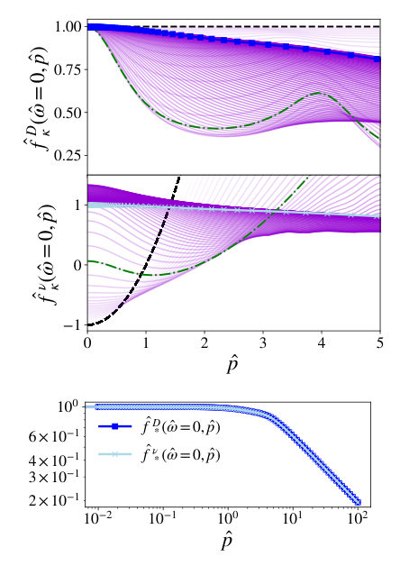 
FIG. 3. NLO flow of the functions (a) ˆf D κ and (b) ˆf ν κ (in the flow-A before the continuation). The dashed black line marks the initial condition, darker violet indicate later RG times (larger length scales), the green dash-dotted line highlights the scale at which the effective viscosity just crosses zero, the blue lines with symbols mark the fixed point functions, which are compared in (c).

📷 Fig 4

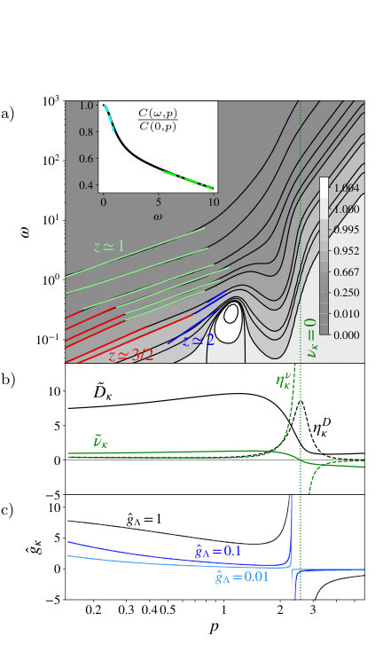 
FIG. 4. (a): Correlation function C(ω, p)/C(0, p) in the (ω, p) plane obtained within the flow-A NLO approximation, calculated for ˆgΛ = 1 (λ = DΛ = −νΛ = 1). The red, blue, and green lines show linear fit of the contour lines. The fits yield a slope z in the range z ∈[1.32, 1.44] for the red lines (onset of the KPZ regime), in the range z ∈[1.94, 2.14] for the blue lines (EW regime), and in the range z ∈[1.01, 1.15] for the green lines (IB regime). (Inset): Fit of the frequency dependence of correlation function at p = 2.07 (black) close to the scale when νκ = 0 with the Fourier representations of the asymptotic prediction (62) (cyan and green). (b): Effective noise ˜Dκ ≡κη∗Dκ and...

📷 Fig 5

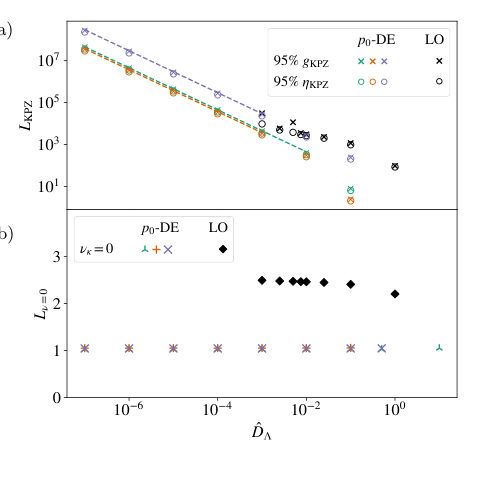 
FIG. 5. (a): Length scale at which the KPZ regime is attained, as a function of the noise amplitude ˆDΛ. Crosses represent the scale when the effective coupling parameter ˆgκ reaches 95% of its KPZ fixed point value, circles represent the same for ηD κ . (b): Length scale at which the effective viscosity vanishes as a function of the noise amplitude. For both panels, colored symbols show p0-DE results with regulator (60) and parameters Cν = 0.25, α = 6, β = 0.5 (green), Cν = 0.25, α = 6, β = 1 (orange), Cν = 0.5, α = 6, β = 1 (violet), while black symbols show LO results (Cν = 1, α = 8, β = 0.5). The dashed lines indicate a linear fit.

**Summary.** This work rigorously re-examines the scaling behavior of the stochastic Kuramoto-Sivashinsky equation using the Functional Renormalization Group (FRG). By employing a smooth cutoff, the authors successfully identify three distinct universal scaling regimes: KPZ, Edwards-Wilkinson, and an inviscid regime. This provides a powerful theoretical tool for understanding crossover dynamics in nonlinear physical systems.

**Why it may be interesting.** The rigorous application of advanced non-perturbative field theory tools like FRG to nonlinear PDEs provides deep insights into universality classes in non-equilibrium statistical mechanics, which is highly relevant for understanding complex dynamics in condensed matter systems.

Detailed structure

**Main problem.** The study aims to correctly characterize the universal scaling regimes of the one-dimensional stochastic Kuramoto-Sivashinsky (KS) equation by improving upon flawed Renormalization Group (RG) techniques.

**Main result.** The analysis establishes three distinct universal scaling regimes—KPZ ($z=3/2$), Edwards-Wilkinson ($z=2$), and an inviscid regime ($z=1$)—by employing the Functional Renormalization Group (FRG).

**Method.** The core method is the Functional Renormalization Group (FRG) framework, which uses a smooth cutoff to derive flow equations for the effective average action, avoiding divergences encountered with sharp cutoffs.

**Model / system.** The model analyzed is the stochastic Kuramoto-Sivashinsky (KS) equation, which describes dynamics in nonlinear field theories relevant to interface growth and pattern formation. It is compared against the Kardar-Parisi-Zhang (KPZ) universality class.

**Key observables.** The full two-point correlation function, characterized by its dynamical exponent $z$ across different momentum/frequency ranges.

**Important parameters / regimes.** Dynamical exponents ($z=3/2, 2, 1$), the noise strength ($D_{	ext{KS}}$), and the effective viscosity ($
u$).

**Assumptions / limitations.** The use of the FRG framework with smooth regulators is crucial; previous perturbative Wilsonian RG approaches using sharp cutoffs are deemed invalid.

**Figures summary.** Figure 1 illustrates the fixed points of the 1D KPZ equation, showing stable IR (KPZ) and UV/intermediate regimes (EW, IB). Figure 6 shows the flow of expansion parameters in both standard and specialized p0-DE approximations.

**Paper structure.** The paper first establishes the necessity of FRG over older RG methods. It then derives the flow equations for the KS model within the FRG framework using various approximations (DE, NLO). Finally, it analyzes the resulting flow to identify and characterize the three distinct universal scaling regimes by calculating correlation functions.

Abstract

We revisit the renormalization group (RG) approach to the one-dimensional stochastic Kuramoto-Sivashinsky (KS) equation and show that previous approaches based on perturbative Wilsonian RG with a sharp cutoff are not valid, even though they yield a qualitatively correct picture. The reason is that taking momentum derivatives while using the sharp cutoff is not well-defined in some cases and leads to intrinsic divergencies. This is a well-known problem of Wilsonian RG, which can be simply cured by using a smooth cutoff, and employing the functional renormalization group (FRG) framework. We establish the flow equations for the KS model within the FRG, and demonstrate that it flows to the Kardar-Parisi-Zhang (KPZ) fixed point at large scales. We then calculate the full two-point correlation function over a wide range of momenta and frequencies. We show that it exhibits three universal scaling regimes that we characterize: the KPZ regime (with dynamical exponent $z=3/2$), the Edwards-Wilkinson regime (with $z=2$) and the recently discovered inviscid regime (with $z=1$). The latter develops over an extended range of large wavenumbers and originates from the vanishing of the effective viscosity. Lastly, we investigate the large-scale behavior of the deterministic KS equation by studying the limit of vanishing noise and we determine the scales where the KPZ regime can emerge in the deterministic case.

[↑ back to top](#top)

### [Maximal quantum leakage: operational interpretation and quantum channel analysis](http://arxiv.org/abs/2607.15853v1)

**Authors:** Shuixin Xiao, Zijia Zhao, Jingge Zhu, Farhad Farokhi  
**Type:** theory · **Category:** quantum information and computing · **PDF:** <https://arxiv.org/pdf/2607.15853v1>  
**Analysis basis:** full PDF text, analyzed in chunks
**Topic relevance:** `quantum measurements` **3/5** · `entanglement & information structure` **2/5** · `measurement-induced transitions` **2/5** · `correlated / nonlocal dissipation` **1/5** · `driven-dissipative phase transition` **1/5** · `methods for driven-dissipative` **1/5**

📷 Fig 1

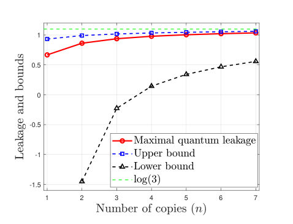 
Fig. 1. Maximal quantum leakage as a function of the number of copies n. The red solid line represents the calculated leakage, bounded by the theoretical limits (blue and black dashed lines) derived in (25) and (26). The value approaches the limit log(3) (green dashed line) as n increases.

📷 Fig 2

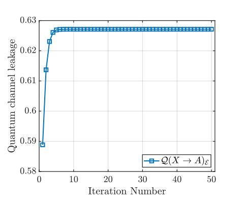 
Fig. 2. Convergence of Algorithm 1 for quantum channel leakage.

**Summary.** This work establishes a computable operational definition for maximal quantum leakage by proving its equivalence to minimum-error state discrimination. The authors develop an iterative algorithm to calculate this leakage when considering noisy quantum channels. This advances the field by providing concrete mathematical tools to quantify information privacy in quantum systems.

**Why it may be interesting.** It provides rigorous mathematical tools (SDP formulation) to quantify information leakage in quantum systems, which is crucial for secure quantum communication protocols and understanding channel capacity limitations.

Detailed structure

**Main problem.** The paper aims to provide a computable operational interpretation for quantifying 'maximal quantum leakage,' which measures privacy when classical data is encoded into a quantum system.

**Main result.** Maximal quantum leakage has been proven equivalent to minimum-error quantum state discrimination with equal priors, allowing it to be formulated as a solvable Semidefinite Programming (SDP) problem.

**Method.** The authors establish the equivalence via mathematical proofs and develop an iterative algorithm that alternates optimization between input states and measurements for channel analysis.

**Model / system.** The study operates within quantum information theory, analyzing leakage quantified by POVMs, quantum channels ($\mathcal{E}$), and ensembles of quantum states $\{
ho_x\}$.

**Key observables.** Maximal Quantum Leakage ($Q(X 	o A)$), minimum-error discrimination probability.

**Important parameters / regimes.** Number of copies ($n$), number of distinct inputs ($N=|X|$), dimension of the Hilbert space ($d$).

**Assumptions / limitations.** The equivalence proof relies on constructing optimal measurement sets from arbitrary POVMs; the iterative algorithm is proposed for non-convex optimization.

**Figures summary.** Figure 1 shows the monotonic increase of leakage with copies towards a limit. Figure 2 illustrates the convergence of the iterative algorithm for channel leakage over multiple steps.

**Paper structure.** The paper first defines maximal quantum leakage, proves its equivalence to minimum-error state discrimination (Theorem 1), analyzes its behavior for collective measurements (monotonicity and asymptotic limits), and finally extends the framework to develop an iterative algorithm for quantifying leakage through quantum channels.

Abstract

Maximal quantum leakage quantifies privacy against adversaries with arbitrary intentions. In this work, we prove that computing this leakage is equivalent to minimum-error quantum state discrimination with equal priors. This establishes a computable operational interpretation, addressing the previous difficulty in computing maximal quantum leakage. We further analyze the impact of collective measurements on multiple copies of a state, demonstrating that leakage increases monotonically with the number of copies, which leads to explicitly characterizing the maximal leakage in the asymptotic limit. Extending this framework to quantum channels, we develop an iterative algorithm for the jointly designing of input states and measurements. Numerical examples involving collective measurements and the maximal channel leakage demonstrate our theoretical findings.

[↑ back to top](#top)

### [Quantum-classical crossover in fault-tolerant quantum dynamics simulation](http://arxiv.org/abs/2607.16116v1)

**Authors:** Jinzhao Sun, Bozhen Zhou, Jue Xu, Yuan Yao, Zhenyu Du, Zixu Zhang, Yuntian Gu, Junxiang Huang, Shuo Zhou, Ziruo Wang, Alexander Yosifov, Wenzheng Dong, Yiming Huang, Daniel Serrano, Xinzhao Wang, Tianfeng Feng, Shreyas Sadugol, Wenjun Yu, Zhou You, Dayue Qin, Xiao-Ming Zhang, Yantao Wu, Aditya Iyer, You Zhou, Tongyang Li, Ying Li, Xiongfeng Ma, Qi Zhao, Pei Zeng, Pan Zhang, Xiao Yuan  
**Type:** theory · **Category:** quantum information and computing · **PDF:** <https://arxiv.org/pdf/2607.16116v1>  
**Analysis basis:** full PDF text, analyzed in chunks
**Topic relevance:** `analog quantum simulation` **3/5** · `non-equilibrium dynamics` **2/5** · `entanglement & information structure` **1/5** · `methods for driven-dissipative` **1/5** · `non-equilibrium universality` **1/5**

📷 Fig 1

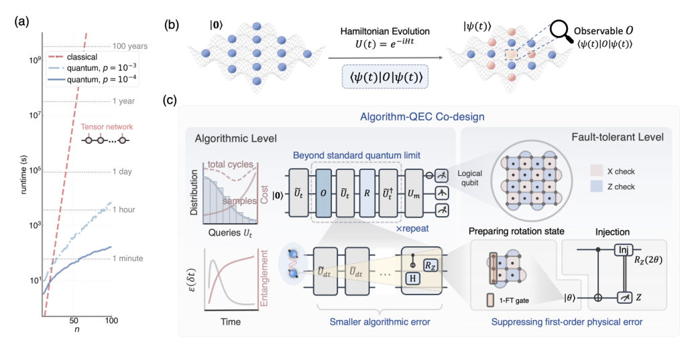 
FIG. 1. Full-stack framework for fault-tolerant quantum dynamics simulation and runtime comparison to classical approaches. (a) Quantum-classical runtime crossover for 1D mixed-field Ising models. Runtimes are evaluated at physical error rates p = 10−3 and 10−4 (detailed in Fig. 3). (b) Quantum simulation task. The goal is to estimate the expectation value ⟨ψ(t)| O |ψ(t)⟩of a time-evolved state |ψ(t)⟩= U(t) |0⟩to a specified precision. (c) Schematic of the algorithm-QEC co- design framework. Left panel: Logical-level illustration of the quantum algorithm. Upper left: Observable estimation built upon the amplitude amplification circuit [56], surpassing the standard quantum limit for which...

📷 Fig 2

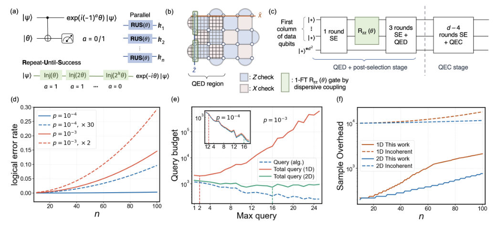 
FIG. 2. Fault-tolerant logical rotation states preparation and optimisation of the query complexity and sampling overhead. (a) Protocol for implementing small-angle Z rotations in parallel on n qubits. Upper left: Basic state-injection gadget using the ancillary rotation state |θ⟩. Bottom: RUS procedure: if the measurement outcome indicates failure, a rotation state with doubled angle is injected and the protocol is repeated until success at round k +1. Upper right: Parallel execution of a single layer of rotation gates across n qubits. The expected number of RUS rounds required for all n qubits to complete their rotations scales as O(log n). (b) Preparation of |θ⟩L on a 4 × 5 rotated...

📷 Fig 3

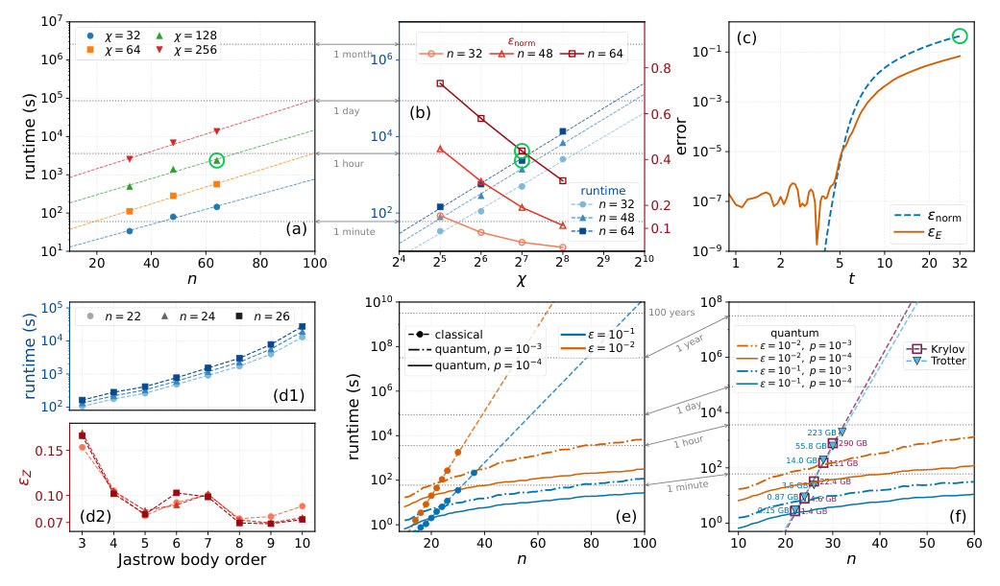 
FIG. 3. Classical simulation cost and quantum-classical crossover for the 1D mixed-field Ising model. Top row: MPS benchmarks at fixed bond dimension (n = 32, 48, 64 and χ = 32, 64, 128, 256) evolved to t = n/2. (a) Runtime versus system size n at fixed χ. Dashed lines are exponential fits. (b) Runtime (left axis) and final norm-loss error εnorm (right axis) versus χ. Dashed lines are power-law fits. (c) Time evolution of εnorm and the energy-density error εE for n = 64 and χ = 128. Green open circles in (a)–(c) mark the same run (n=64, χ=128). This run illustrates that the truncation error grows rapidly during the time evolution at fixed χ, so bounding it requires χ to grow exponentially...

📷 Fig 4

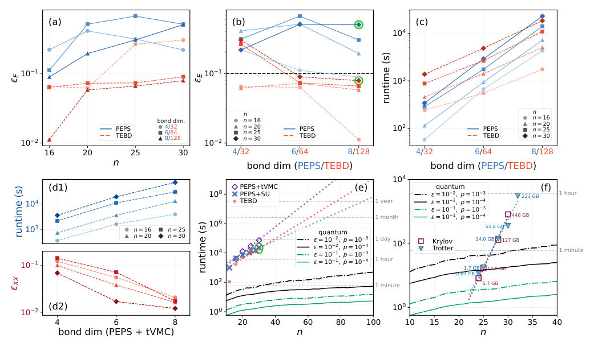 
FIG. 4. Classical simulation error and quantum-classical crossover for the 2D mixed-field Ising model. The 2D system is evolved to t = √n (open Nx × Ny lattices with n = NxNy = 16, 20, 25, 30). (a, b) Final-time energy-density error εE for PEPS with simple-update truncation (blue solid lines with bond dimension χ = 4, 6, 8) and for TEBD on a 1D snake mapping (red dashed lines with χ = 32, 64, 128), shown versus system size n in (a) and versus bond dimension in (b). (c) Corresponding CPU wall times of the time evolution versus bond dimension. In (b, c) the paired x-ticks list the PEPS/TEBD bond dimensions. Green circles in (b) mark the n = 30 data at the largest bond dimension (PEPS χ = 8,...

📷 Fig 5

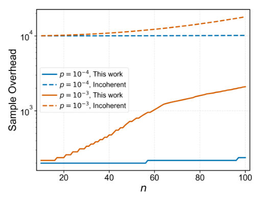 
FIG. 5. Error mitigation sampling overhead for p = 10−3 and p = 10−4 in the 1D case.

**Summary.** The paper develops a comprehensive, fault-tolerant framework to simulate complex quantum many-body dynamics, specifically using the mixed-field Ising model. By co-designing error correction with observable estimation, they establish concrete benchmarks showing that quantum computation can achieve an exponential speedup over classical tensor network methods for simulating non-equilibrium quantum systems.

**Why it may be interesting.** This work directly addresses the 'quantum advantage' question by providing quantitative engineering targets and a scalable roadmap for fault-tolerant quantum simulation in condensed matter physics, which is highly relevant to AMO and open quantum systems research.

Detailed structure

**Main problem.** The central challenge is establishing a concrete, quantifiable crossover point where fault-tolerant quantum computation surpasses the best available classical simulation algorithms for complex many-body dynamics.

**Main result.** For realistic error rates ($p=10^{-3}$), the authors demonstrate that fault-tolerant quantum simulation of 1D systems requires significantly less time and fewer qubits than classical tensor network methods, projecting minutes or seconds for 2D models under better error control.

**Method.** The work introduces a full-stack framework that co-designs observable estimation protocols with fault-tolerant Quantum Error Correction (QEC) techniques, specifically improving the implementation of non-Clifford rotations to suppress logical errors.

**Model / system.** The study focuses on simulating quantum many-body dynamics using the mixed-field Ising model in both 1D and 2D lattices. The goal is estimating time-evolved expectation values $\langle\psi(t)| O | \psi(t)
angle$ under a Hamiltonian $H$.

**Key observables.** Observable expectation value $\langle\psi(t)| O | \psi(t)
angle$, physical qubit count, required runtime (hours/minutes), and logical error accumulation.

**Important parameters / regimes.** Physical error rates ($p=10^{-3}, p=10^{-4}$); system sizes (1D up to 100 sites, 2D lattices); target precision $\epsilon$.

**Assumptions / limitations.** The analysis assumes the feasibility of implementing a hybrid fault-tolerant architecture combining Clifford+T synthesis with optimized rotation state injection.

**Figures summary.** Figures illustrate the quantum-classical runtime crossover for 1D Ising models, schematic diagrams detailing the algorithm-QEC co-design, and error analyses comparing different simulation methods (e.g., PEPS vs. Trotter) on 2D lattices.

**Paper structure.** The paper establishes the problem by defining the quantum dynamics task; it then details a novel fault-tolerant framework that integrates observable estimation with QEC protocols; finally, it benchmarks this approach against state-of-the-art classical methods (TN/VMC) to quantify the crossover point.

Abstract

While quantum computers promise to solve classically intractable problems, identifying the point at which fault-tolerant quantum computation outperforms the best classical algorithms for practical applications remains an outstanding challenge. Here we establish a concrete quantum-classical crossover for quantum many-body dynamics under realistic hardware conditions. We introduce a scalable fault-tolerant framework that combines coherent observable estimation with a space-time-efficient implementation of non-Clifford rotations, suppressing the residual logical errors that limit existing partially fault-tolerant approaches. A benchmark against state-of-the-art tensor-network and variational Monte Carlo algorithms reveals a concrete crossover for mixed-field Ising dynamics at modest system sizes. For a physical error rate of $p=10^{-3}$, fault-tolerant simulation requires approximately 2 hours and $3.7 \times 10^5$ physical qubits for a 100-site 1D system, whereas tensor network approaches would require about 100 years. For 2D models, where rapid entanglement growth limits the classical evolution time, we project quantum runtimes within minutes. A physical error rate of $p=10^{-4}$ leads to at least an order of magnitude reduction in qubit count ($3.1 \times 10^4$ physical qubits) and runtime (minutes for 1D and seconds for 2D). The reduction in quantum runtime arises from our improved rotation-state injection and co-design of quantum error correction and observable-estimation protocols, which jointly suppress logical-error accumulation and reduce sampling overhead. Our results establish a scalable route towards practical quantum advantage and identify quantitative engineering targets for future fault-tolerant architectures.

[↑ back to top](#top)

### [Beyond the Positive Partial Transpose Squared Conjecture: The Qutrit Case](http://arxiv.org/abs/2607.15947v1)

**Authors:** Junhyeong An, Soojoon Lee  
**Type:** theory · **Category:** quantum information and computing · **PDF:** <https://arxiv.org/pdf/2607.15947v1>  
**Analysis basis:** full PDF text, analyzed in chunks
**Topic relevance:** `entanglement & information structure` **3/5** · `Keldysh / 2PI / non-Gaussian methods` **1/5** · `correlated / nonlocal dissipation` **1/5** · `methods for driven-dissipative` **1/5**

📷 Fig 1

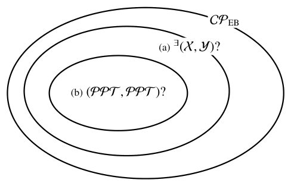 
FIG. 1: Schematic illustration of the EB-composability problem. Let CPEB be the set of ordered pairs (Φ, Ψ) of CP maps such that Φ ◦Ψ is entanglement breaking. (a) An ordered pair of cones (X, Y) is EB- composable precisely when CPEB contains the Cartesian product of the two cones X×Y; in the figure, we identify the ordered pair (X, Y) with this product. (b) In particular, if, in every dimension, an EB- composable pair (X, Y) satisfies PPT ⊆X and PPT ⊆Y, then the PPT squared conjecture holds.

📷 Fig 2

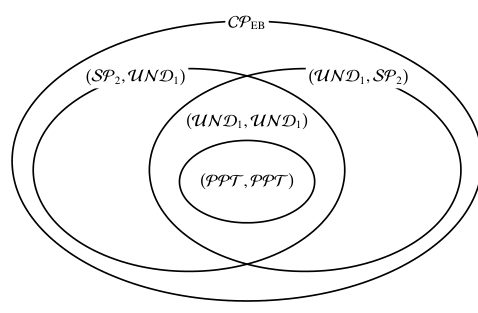 
FIG. 2: Schematic illustration of our EB-composability results in the qutrit setting. For qutrit CP maps, PPT ⊆UND1 ⊆SP2 [22], and both UND1 × SP2 and SP2 × UND1 are contained in CPEB (see Theorem 4). Consequently, (UND1 × SP2) ∩(SP2 × UND1) = UND1 × UND1 ⊆CPEB (Corollary 7). Since UND1 contains non-PPT maps, PPT × PPT ⊊UND1 × UND1. Moreover, when either component is fixed to be SP2, the largest compatible cone for the other component is exactly UND1 (see Theorem 6).

📷 Fig 3

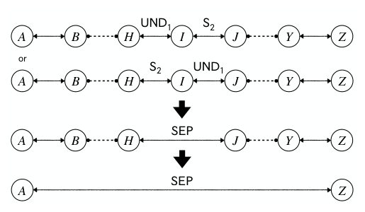 
FIG. 3: Entanglement-swapping obstruction caused by a 1- undistillable link. When a two-qutrit link in UND1 is joined to a link in S2, in either order, every post-selected entanglement swapping outcome is separable. Consequently, the resulting state is separable, and subsequent entanglement swapping cannot generate end-to-end entanglement between A and Z.

**Summary.** This paper extends the study of entanglement preservation beyond the standard PPT conjecture by analyzing map composition in the qutrit setting. It proves that combining 1-undistillable channels with low-Schmidt number channels results in entanglement breaking. This has direct implications for understanding limitations in quantum repeaters and entanglement swapping protocols.

**Why it may be interesting.** This work provides rigorous mathematical tools for characterizing when quantum operations fail to preserve entanglement, which is crucial for designing robust quantum communication protocols.

Detailed structure

**Main problem.** The paper investigates the EB-composability problem, which generalizes the PPT squared conjecture by analyzing whether the composition of two specific cones of quantum channels is always entanglement breaking.

**Main result.** For qutrit systems, the composition of maps from the 1-undistillable cone ($	ext{UND}_1$) and the Schmidt number $\le 2$ cone ($	ext{SP}_2$) is proven to be entanglement breaking in both orders.

**Method.** The authors utilize the Choi–Jamiołkowski correspondence to translate state properties (like separability) into map properties, proving composition theorems for defined cones of completely positive maps.

**Model / system.** The analysis focuses on quantum channels acting on two-qutrit systems ($d=3$), specifically characterizing the behavior of $	ext{UND}_1$ and $	ext{SP}_2$ cones under map composition.

**Key observables.** Entanglement breaking (EB) property of composed maps, separability ($\in 	ext{SEP}$), and the Schmidt number of Choi matrices.

**Important parameters / regimes.** The dimension $d=3$ (qutrit case); the structure of the two cones $	ext{UND}_1$ and $	ext{SP}_2$.

**Assumptions / limitations.** The results are proven specifically for the two-qutrit setting; map composition is compared against general selective measurements.

**Figures summary.** Figures illustrate the schematic for EB-composability, showing $(	ext{PPT}, 	ext{PPT})$ as a special case, and confirm inclusions like $	ext{PPT} \subseteq 	ext{UND}_1 \subseteq 	ext{SP}_2$ in the qutrit setting.

**Paper structure.** The paper progresses by defining the EB-composability problem, proving composition theorems for $(	ext{UND}_1, 	ext{SP}_2)$ (Theorem 4), establishing the maximality of $	ext{UND}_1$ (Theorem 6), and finally translating these map results to a state-level entanglement swapping condition (Corollary 10).

Abstract

Entanglement swapping is a fundamental operation in quantum repeaters for establishing entanglement between distant parties. The positive partial transpose (PPT) squared conjecture asks whether two PPT entangled links can generate terminal entanglement through entanglement swapping, or equivalently, whether the composition of two PPT maps is always entanglement breaking. Motivated by this conjecture, we investigate the map-composition problem beyond the PPT setting. For qutrit completely positive (CP) maps, we prove that the composition of any CP map whose Choi matrix is $1$-undistillable with any CP map whose Choi matrix has Schmidt number at most two is entanglement breaking in either order. Moreover, we show that the cone of $1$-undistillable CP maps is exactly the largest qutrit cone of CP maps whose composition with every CP map whose Choi matrix has Schmidt number at most two is entanglement breaking in both orders. Finally, although map composition captures only the standard maximally entangled outcome in entanglement swapping, we prove that any $1$-undistillable two-qutrit state and any state of Schmidt number at most two cannot generate terminal entanglement under an arbitrary selective measurement on the intermediate systems.

[↑ back to top](#top)

### [Spectral Attack on Continuous-Variable Quantum Key Distribution Systems](http://arxiv.org/abs/2607.15668v1)

**Authors:** Chen Gong, Mingxuan Guo, Peng Huang, Tao Wang, Guihua Zeng  
**Type:** both · **Category:** quantum information and computing · **PDF:** <https://arxiv.org/pdf/2607.15668v1>  
**Analysis basis:** full PDF text, analyzed in chunks
**Topic relevance:** `interference shaping light` **3/5** · `quantum optics experiment` **3/5**

📷 Fig 1

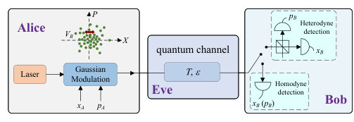 
FIG. 1. Prepare-and-measure model of the GMCS-CVQKD protocol.

📷 Fig 2

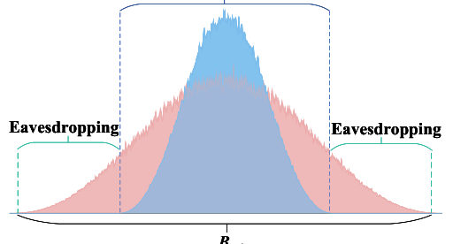 
FIG. 2. Schematic illustration of eavesdropping on out-of- band frequency components under bandwidth mismatch con- ditions, where blue denotes the transmitter signal and pink denotes the receiver detection signal.

📷 Fig 3

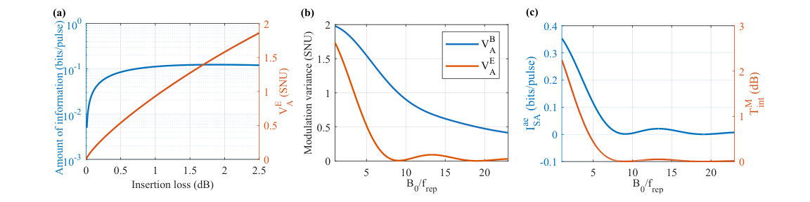 
FIG. 3. Simulation results. (a) Required eavesdropped information and corresponding minimum required V E A for rendering the system insecure under different insertion losses, where V B A is 2 shot noise units (SNU); (b) The relationship of V B A and V E A with the normalized bandwidth B0/frep; (c) The relationship of Iae SA and the maximum allowable insertion loss T M int with the normalized bandwidth B0/frep. The detection efficiency is 0.48, the electrical noise is 0.5 SNU, the peak value of the transmitter-side signal spectrum is √

📷 Fig 4

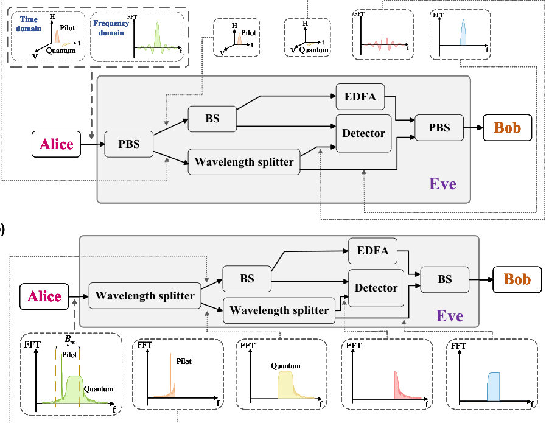 
FIG. 4. Schematic diagram of the spectral attack based on bandwidth mismatch. (a) Attack scheme for a PDM-LLO-CVQKD system; (b) Attack scheme for a FDM-LLO-CVQKD system.

📷 Fig 5

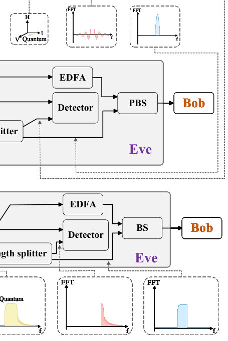 
Fig. 4(b) illustrates the specific implementation of the attack scheme in the FDM-LLO-CVQKD system. To be- gin with, Eve separates the frequency-multiplexed light emitted by Alice using a first-stage wavelength splitter, directing the pilot signal and the quantum signal into different paths. Similar to the PDM scheme, the pi- lot branch is split by a BS, and one output is sent to an EDFA for amplification to improve the signal-to-noise ratio of the pilot utilized by the legitimate parties. The other output is sent to a detector to acquire phase ref- erence information. The quantum signal branch is fur- ther separated by a second-stage wavelength splitter into frequency components within and...

**Summary.** This paper reveals that bandwidth mismatch in CVQKD systems creates a security loophole allowing an eavesdropper to extract key information from out-of-band spectral components. By developing a spectral attack model and verifying it with simulations, the authors demonstrate how this leakage necessitates revising security estimates, providing crucial guidelines for designing robust quantum communication hardware.

**Why it may be interesting.** It provides a concrete, practical vulnerability assessment for quantum communication protocols, bridging the gap between idealized theoretical models and real-world hardware limitations like bandwidth mismatch.

Detailed structure

**Main problem.** The paper addresses a practical security loophole in Continuous-Variable Quantum Key Distribution (CVQKD) caused by bandwidth mismatch between the transmitter and receiver.

**Main result.** This loophole allows an eavesdropper to directly obtain raw key information from out-of-band frequency components, significantly lowering the achievable secret key rate compared to conventional estimates.

**Method.** The authors propose a spectral attack scheme based on Fourier analysis of signal spectra and construct a proof-of-principle attack verified through numerical simulations and experimental considerations.

**Model / system.** The study focuses on Gaussian-modulated coherent states (GMCS) CVQKD, specifically analyzing Local-Oscillator (LLO)-CVQKD systems operating under spectral spreading due to channel imperfections.

**Key observables.** Leaked information ($\chi_{bE}$), secret key rate (estimated vs. modified), and the required signal-to-noise ratio for eavesdropping.

**Important parameters / regimes.** Bandwidth mismatch, insertion loss from wavelength splitters, transmission distance (e.g., 25 km), and cutoff frequencies (e.g., 100 MHz to 150 MHz).

**Assumptions / limitations.** The analysis relies on asymptotic limits and heterodyne-detection conditions for calculating leaked information; it also models spectral broadening via a spreading kernel $L(f)$.

**Figures summary.** Figures compare Eve's obtained information against security thresholds at various distances/losses, and show the reduction in the secret key rate when accounting for out-of-band leakage.

**Paper structure.** The paper first identifies the bandwidth mismatch loophole using spectral analysis, then develops the mathematical framework for the attack, presents simulations showing quantitative vulnerabilities across varying loss/bandwidths, and concludes by proposing defense strategies involving both system design (bandwidth) and key rate correction.

Abstract

Continuous-variable quantum key distribution (CVQKD) has attracted extensive attention due to its compatibility and low costs. However, bandwidth mismatch exists to varying degrees between the transmitter and receiver. This may prevent frequency components carrying modulation information from being fully perceived by the legitimate party. In this paper, we identify a practical security loophole caused by bandwidth mismatch and propose a corresponding spectral attack scheme. Different from previous approaches that exploit security loopholes to conceal the excess noise introduced by intercept-resend attacks, this scheme can directly obtain raw-key information without introducing additional disturbances. A proof-of-principle attack on a CVQKD system with filtering operation is constructed to verify the feasibility. Experimental results indicate that Eve can obtain enough information to render the system insecure if this practical security loophole is ignored. Based on the identified security loophole, corresponding defense strategies are proposed. This work helps bridge the gap between theoretical models and practical implementations, providing a reference for defense design in practical quantum communication systems.

[↑ back to top](#top)

### [Absence of Spin-Glass Order on Migdal--Kadanoff Hierarchical Lattices near Three Dimensions](http://arxiv.org/abs/2607.15676v1)

**Authors:** Manaka Okuyama, Masayuki Ohzeki  
**Type:** theory · **Category:** disordered systems and neural networks · **PDF:** <https://arxiv.org/pdf/2607.15676v1>  
**Analysis basis:** full PDF text, analyzed in chunks
**Topic relevance:** `exotic spin models in light-matter` **3/5** · `Keldysh / 2PI / non-Gaussian methods` **1/5** · `analog quantum simulation` **1/5**

📷 Fig 1

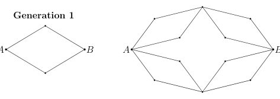 
FIG. 1. First two generations of the MK hierarchical lattice for s = b = 2. Each bond is replaced by two parallel chains of two bonds.

**Summary.** This paper rigorously proves that for Ising spin glasses on specific Migdal--Kadanoff hierarchical lattices, spin-glass order is absent by relating the problem to bond percolation. The authors establish a sufficient criterion using exact RG steps, providing strong theoretical evidence contrasting previous numerical estimates regarding critical dimensions.

**Why it may be interesting.** While focused on classical statistical mechanics, the techniques involving renormalization group flow and critical phenomena are foundational tools used in analyzing quantum phase transitions and many-body systems in AMO physics.

Detailed structure

**Main problem.** The research aims to rigorously determine the existence or absence of spin-glass order in Ising spin glass models on Migdal--Kadanoff (MK) hierarchical lattices, particularly near three dimensions.

**Main result.** The authors provide a sufficient condition based on bond percolation that proves the absence of spin-glass order and stiffness for specific lattice constructions, even when their fractal dimension approaches three from below.

**Method.** The methodology employs an exact Renormalization Group (RG) step combined with a connectivity argument derived from bond percolation theory to analyze the decay of correlations.

**Model / system.** The system is the Ising spin glass model with symmetric binary couplings, studied on MK hierarchical lattices defined by scale factors and branching numbers. The Hamiltonian involves nearest-neighbor interactions across generations of the lattice structure.

**Key observables.** Spin-glass correlation ($\langle \sigma_A \sigma_B 
angle^2$), stiffness parameter ($	heta$), and vacancy probability ($\Psi(q)$) relative to the percolation threshold.

**Important parameters / regimes.** The branching number ($s$) must be even, and the lattice structure is characterized by its fractal dimension $d = 1 + \log s / \log b$.

**Assumptions / limitations.** The derived criterion is only sufficient (not necessary) for proving the absence of order; the method relies on discrete couplings and specific RG steps.

**Figures summary.** Figure 1 illustrates the first two generations of the MK hierarchical lattice structure used in the analysis, showing its recursive nature.

**Paper structure.** The paper develops a rigorous criterion based on an exact single-step RG transformation that maps the spin glass problem onto bond percolation. The core proof involves comparing induced dilution probabilities against known percolation thresholds to establish the decay of order parameters across generations.

Abstract

We derive a rigorous sufficient condition for the absence of spin-glass order in the Ising spin glass with symmetric binary couplings on Migdal--Kadanoff (MK) hierarchical lattices with even branching number. The key observation is that a single exact renormalization-group step creates zero effective bonds with positive probability, thereby reducing the problem to bond percolation on the corresponding hierarchical lattice. When the induced dilution exceeds the percolation threshold, both spin-glass order and stiffness are absent at all temperatures, including zero temperature. As a consequence, our criterion gives a rigorous proof that the Ising spin glass on the square lattice does not exhibit a spin-glass phase within the MK approximation. More unexpectedly, by choosing sufficiently large scale factors and branching numbers, we construct MK hierarchical lattices whose fractal dimensions are arbitrarily close to three from below but still exhibit no spin-glass order. This sharply contrasts with numerical estimates obtained for MK hierarchical lattices with relatively small scale factors and branching numbers, which placed the lower critical dimension near \(2.52\).

[↑ back to top](#top)

### [Fast logical operations in quantum LDPC codes using simple resource states](http://arxiv.org/abs/2607.16166v1)

**Authors:** Mark Webster, Nicolas Delfosse  
**Type:** theory · **Category:** quantum information and computing · **PDF:** <https://arxiv.org/pdf/2607.16166v1>  
**Analysis basis:** full PDF text, analyzed in chunks
**Topic relevance:** `quantum measurements` **3/5** · `QC/QI experiment` **1/5** · `measurement-induced transitions` **1/5**

📷 Fig 1

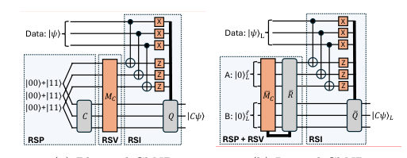 
FIG. 1: Physical and Logical CliNR Circuits: in physical CliNR, resource state preparation (RSP) and verification (RSV) are separate steps followed by injection (RSI). In logical CliNR, RSP and RSV are merged and implemented at the logical level and RSI is implemented at the physical level.

📷 Fig 2

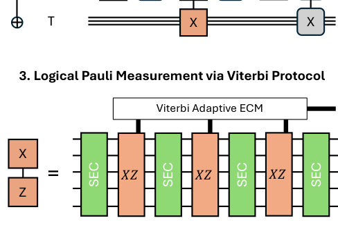 
FIG. 2: Viterbi Gate-Based Protocol for implementing Clifford operations. We illustrate the protocol using a circuit composed of CNOT and CZ gates. Each logical CNOT between control qubit C and target qubit T is implemented using a logical auxiliary qubit A and three Pauli measurements. Each Pauli measurement employs the Viterbi measurement protocol which requires on average 5.06 cat-based measurements for our default error rate parameters.

📷 Fig 3

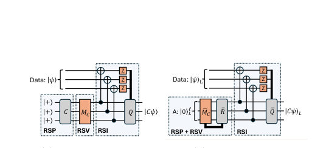 
FIG. 3: Physical and Logical CZNR Circuits: see main text for an explanation of the notation used here.

📷 Fig 4

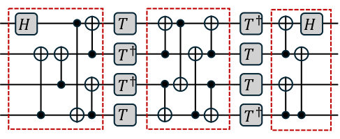 
FIG. 4: Toffoli Circuit Used for Simulation of Logical CliNR Protocol

**Summary.** This paper introduces a novel, resource-efficient method for performing joint logical measurements in quantum LDPC codes by utilizing only cat states. By introducing a scheduler code, the authors significantly accelerate the process of implementing complex gates like Clifford and Toffoli circuits compared to previous state-of-the-art methods. This work is crucial for advancing the feasibility and speed of fault-tolerant quantum computation.

**Why it may be interesting.** While focused on abstract quantum coding theory, the underlying concepts of resource state management and efficient measurement scheduling are highly relevant to designing practical fault-tolerant quantum computation architectures using physical platforms like trapped ions or superconducting qubits.

Detailed structure

**Main problem.** The primary goal is to develop significantly faster protocols for performing joint logical measurements of multiple commuting Pauli operators within quantum LDPC codes.

**Main result.** The proposed cat-state measurement approach achieves up to a $74	imes$ speed-up over Viterbi measurements for random Clifford circuits, and shows substantial gains for Toffoli gates as well.

**Method.** The authors propose using a scheduler code to manage the joint measurement sequence of $\ell$ commuting operators, relying solely on cat states rather than complex resource states used in prior work.

**Model / system.** The study focuses on quantum LDPC codes, specifically mentioning implementations suitable for platforms like trapped ions or neutral atoms (the 'walking cat architecture'). The operations involve implementing logical Clifford and Toffoli gates via the CliNR partial error correction scheme.

**Key observables.** Speed-up factor compared to Viterbi measurements; Logical Measurement Counts ($	ext{LM}$) and Cat-based Measurement Counts ($	ext{CM}$); Logical Error Rate ($\epsilon$).

**Important parameters / regimes.** $\ell$ (number of commuting operators), code sizes (Q70, Q102), target error rates ($10^{-10}$).

**Assumptions / limitations.** The approach assumes that fault-tolerance is not required to achieve the target logical error rate for a specific algorithm, and it utilizes specialized scheduler codes.

**Figures summary.** Table IV compares Logical Measurements (LM) and Cat-based Measurements (CM) across Viterbi gate-based, Viterbi CliNR, and MEDM CliNR protocols for Toffoli circuits and random Cliffords.

**Paper structure.** The paper introduces the problem of fast logical operations in LDPC codes. It details the proposed cat-state measurement protocol using a scheduler code (MEDM/MECM). The core argument involves comparing this new method against established Viterbi protocols for implementing logical Clifford gates via CliNR, culminating in quantitative speed-up results.

Abstract

Quantum LPDC codes provide a substantial reduction in qubit overhead required for fault-tolerant quantum computation compared to surface code, thanks to their high encoding rate. However, operating simultaneously on multiple logical qubits encoded in the same block is more challenging and may slow down logical operations. Prior work addresses this problem by designing complex resource states to perform logical measurements in LDPC codes. Here, we propose an approach that only consumes cat states. Whereas previous work on cat-based measurements focuses on a single logical measurement, we design a protocol for the joint measurement of $\ell$ commuting logical operators. The key ingredient is the design of a scheduler code determining the measurement sequence and allowing for the decoding of all logical measurement outcomes. Numerical simulations with the LDPC codes Q70 and Q102 of the walking cat architecture show a speed-up of nearly $3\times$ over Viterbi measurements for the measurement of $\ell=20$ commuting logical operators. Combining our fast logical measurements with a new variant of the CliNR partial error correction scheme, we achieve a speed up of up to up to $74\times$ for random Clifford circuits. Our approach also applies to non-Clifford gates, producing a speed up of up to $5\times$ for Toffoli gates.

[↑ back to top](#top)

### [Quantum Mechanics on Lie Groups: II. Path Integrals](http://arxiv.org/abs/2607.16029v1)

**Authors:** Mathieu Beauvillain, Blagoje Oblak, Marios Petropoulos  
**Type:** theory · **Category:** other · **PDF:** <https://arxiv.org/pdf/2607.16029v1>  
**Analysis basis:** full PDF text, analyzed in chunks
**Topic relevance:** `Keldysh / 2PI / non-Gaussian methods` **3/5** · `methods for driven-dissipative` **1/5**

📷 Fig 1

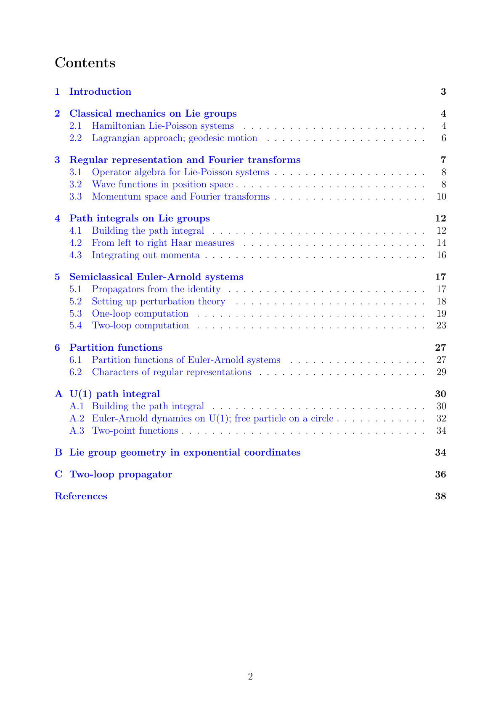 
Low-resolution page preview, page 2

📷 Fig 2

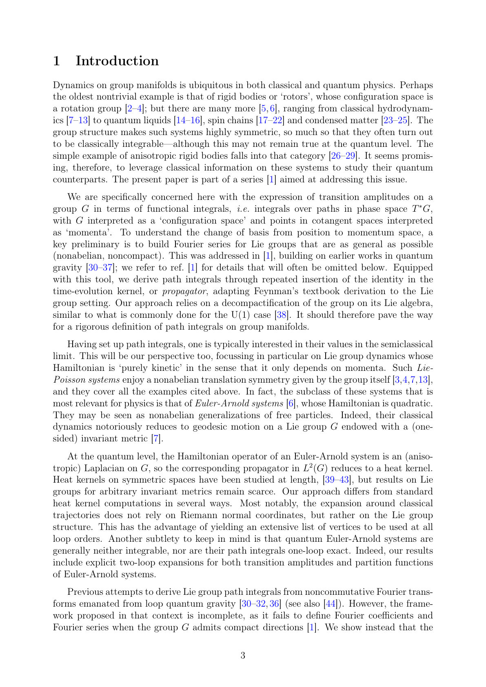 
Low-resolution page preview, page 3

📷 Fig 3

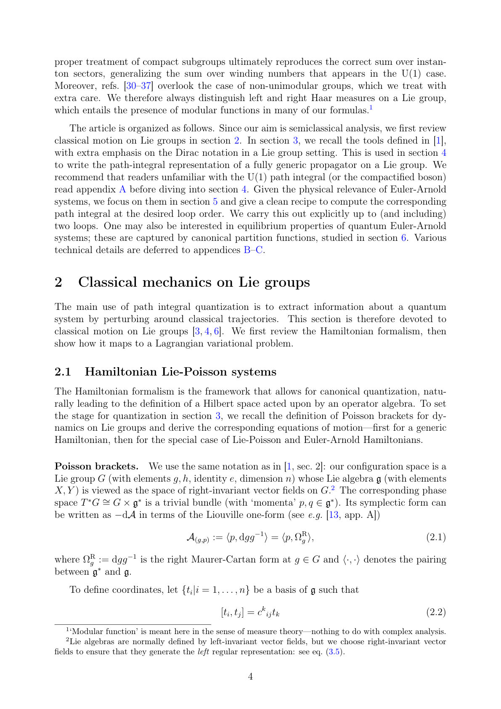 
Low-resolution page preview, page 4

📷 Fig 4

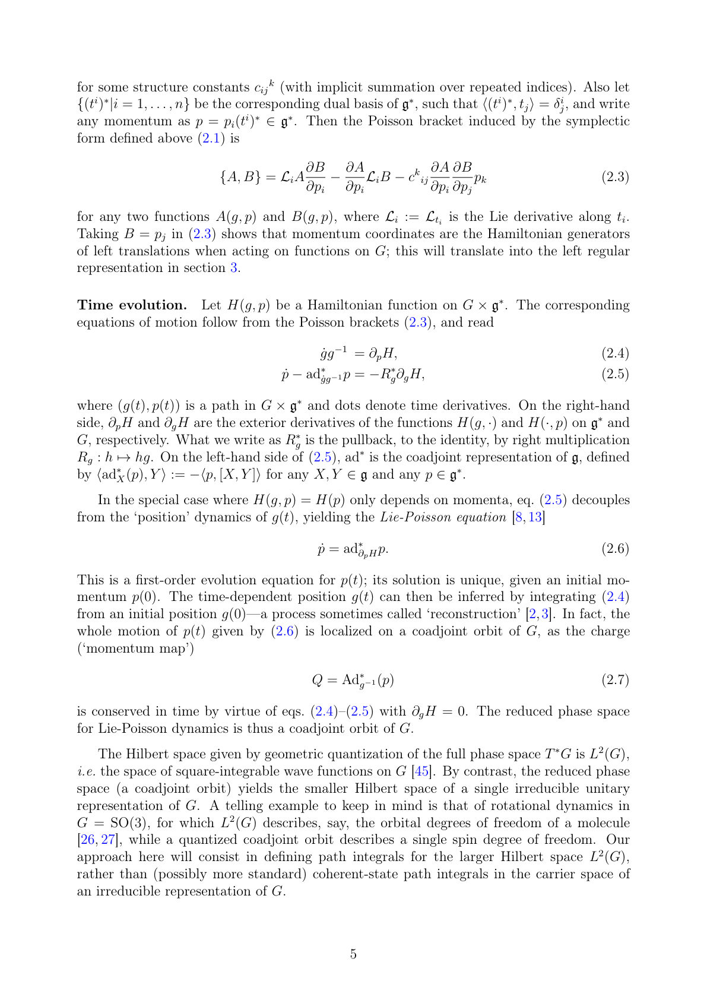 
Low-resolution page preview, page 5

📷 Fig 5

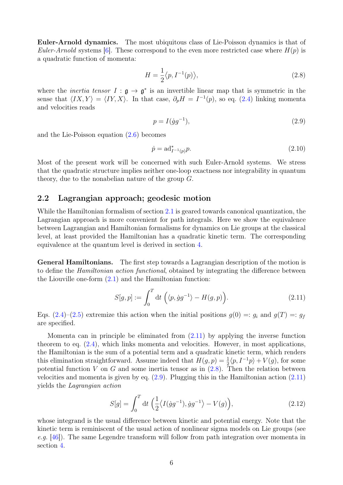 
Low-resolution page preview, page 6

**Summary.** This paper develops the path integral formalism for quantum mechanics on an arbitrary Lie group G, extending previous work by rigorously handling compact directions via winding number sums. It applies this framework to compute semiclassical approximations up to two-loop order for systems like the Euler-Arnold model. This advances the theoretical understanding of quantum dynamics in highly symmetric, non-Euclidean settings.

**Why it may be interesting.** While highly abstract, the techniques developed for quantizing constrained or geometrically structured systems (like those on Lie groups) are foundational to understanding quantum field theories in curved backgrounds or effective descriptions of many-body dynamics where symmetries play a crucial role.

Detailed structure

**Main problem.** The study focuses on developing a rigorous path integral formulation for quantum dynamics occurring on a general Lie group G.

**Main result.** The authors provide explicit, two-loop order semiclassical approximations for propagators and partition functions associated with Euler-Arnold systems on the group manifold.

**Method.** The methodology involves adapting Feynman's path integral approach to the non-commutative setting of a Lie group, utilizing techniques like summing over winding numbers in maximal tori and performing systematic loop expansions.

**Model / system.** The system is quantum mechanics defined on a Lie Group G. The primary physical model analyzed is the Euler-Arnold system, whose dynamics are governed by Hamiltonians derived from quadratic kinetic terms on the group manifold.

**Key observables.** Propagators, partition functions, and semiclassical approximations of transition amplitudes for Euler-Arnold systems.

**Important parameters / regimes.** The order of approximation (up to two-loop), the structure constants of the Lie algebra, and the geometry of the maximal tori within G.

**Assumptions / limitations.** The analysis assumes a quadratic kinetic term for simplification in deriving the Lagrangian action, and it addresses complexities arising from compact directions and non-unimodular groups.

**Figures summary.** Not specified (Notes refer to mathematical equations and expansions rather than figure content).

**Paper structure.** The paper builds upon previous work by first establishing the path integral framework on L^2(G), then deriving the classical dynamics via Hamiltonian/Lagrangian formalisms for Euler-Arnold systems, and finally executing complex two-loop perturbative calculations.

Abstract

We continue our study of quantum dynamics on a Lie group $G$, initiated in arXiv:2512.19840, by building the path integral that governs transition amplitudes in the Hilbert space $L^2(G)$. This relies on the proper handling of both a noncommutative momentum space and the presence of compact directions in $G$. We show that compactness can be handled through a sum over winding numbers in maximal tori of $G$, generalizing the similar sum commonly encountered for path integrals on a circle. As applications, we compute semiclassical approximations of propagators and partition functions of Euler-Arnold systems, up to (and including) two-loop order.

[↑ back to top](#top)

### [Combinatorial aspects of holographic quantum secret sharing](http://arxiv.org/abs/2607.16110v1)

**Authors:** Ning Bao, Keiichiro Furuya, Jacob March  
**Type:** theory · **Category:** quantum information and computing · **PDF:** <https://arxiv.org/pdf/2607.16110v1>  
**Analysis basis:** full PDF text, analyzed in chunks
**Topic relevance:** `entanglement & information structure` **3/5**

📷 Fig 1

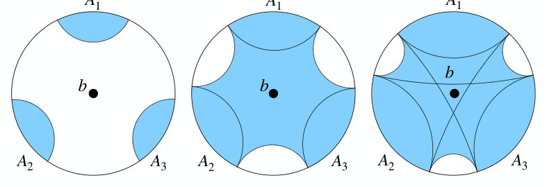 
Figure 1: Three distinct holographic phases for n = 3 boundary subregions. The RT surfaces of the element in P[n] = {A1, A2, A3, A1A2, A1A3, A2A3, A1A2A3} are drawn with a black line. The entanglement wedge of A1A2A3 is highlighted blue. The black dot represents a spatial point in the bulk subregion b: (a) Disconnected phase, (b) Only the tripartite entanglement wedge, EW(A1A2A3), is connected, (c) The entanglement wedges of all combinations of boundary subre- gions are connected.

📷 Fig 2

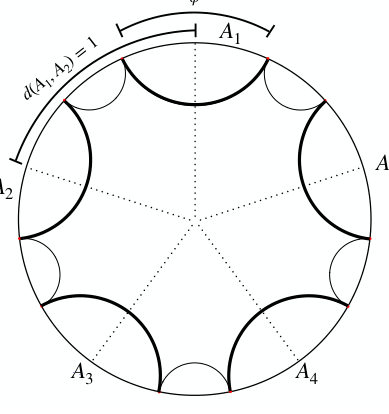 
Figure 2: The symmetric setup for n = 5 on a constant time slice of AdS3. The entanglement wedges of A1, A2, A3, A4, A5, and A1A2A3A4A5 are drawn. The angular interval of each boundary subregion is ϕ. The directed distance between A1 and A2 is d(A1, A2) = 1.

📷 Fig 3

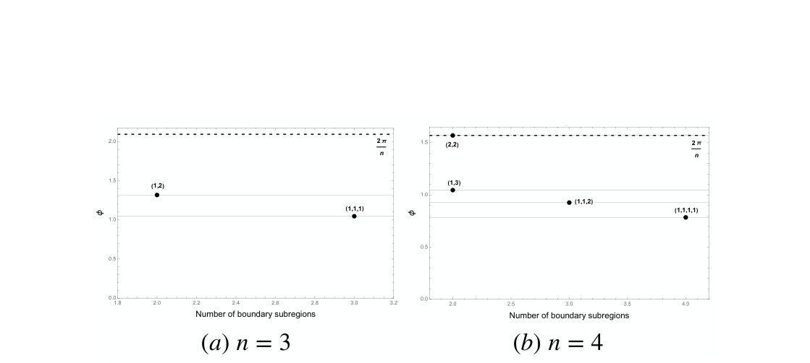 
Figure 3: The plots of phase transition points for n = 3, 4. The horizontal axis m is the number of boundary subregions for m-partite entanglement wedges. The vertical axis is the angular interval 0 ≤ϕ ≤2π/n. We put the black dotted line when ϕ = 2π/n. The gray lines represent the value of transition points ϕt. For n = 3, we have ϕ0 = 1.05 ∼π/3 and ϕ1 = 1.32 radians. For n = 4, we have ϕ0 = 0.785, ϕ1 = 0.927, ϕ2 = 1.05 ∼π/3 and ϕ3 = 1.57 ∼2π/4 radians. The lowest gray horizontal line corresponds to the transition point ϕt=0 from the fully disconnected phase to the first connected phase. The labels (xi1, · · · , xi3) for ip ∈{1, 2, 3} and (xi1, · · · , xi4) for ip ∈{1, 2, 3, 4} are the sets...

📷 Fig 4

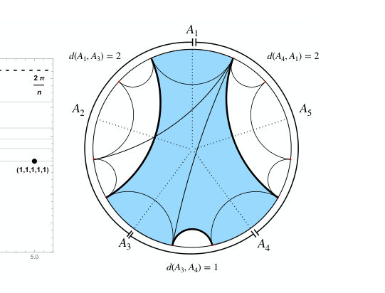 
Figure 4: (a) The plot for the transition points for n = 5. We have five transition points, ϕ0 = 0.628 ∼π/5, ϕ1 = 0.715, ϕ2 = 0.781, ϕ3 = 0.857, ϕ4 = 1.04 radians. (b) The configuration of entanglement wedges of A1, A2, A3, A4, A5, A1A2, A1A2A3, A1A2A3A4, A1A2A3A4A5, and A1A3A4 when ϕ ≥ϕt=4 on a constant time slice of AdS3. The entanglement wedge of A1A3A4 is highlighted blue.

📷 Fig 5

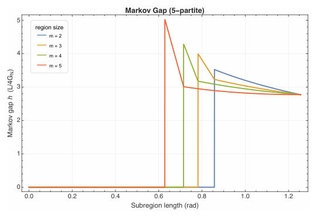 
Figure 5: The Markov gaps of adjacent unions of m = 2, · · · , 5 boundary subregions in the symmetric n = 5 setup, as functions of the angular interval ϕ. The transition points coincide with the transition points in figure 4-(a).

**Summary.** This paper develops and analyzes Combinatorial Holographic Quantum Secret Sharing (CHQSS) within the AdS3/CFT2 correspondence. It introduces key metrics—distance, reconstruction threshold, and secret threshold—to quantify the scheme's robustness against boundary erasures. The research demonstrates how these quantum information properties are dictated by the underlying holographic geometry and its phase transitions.

**Why it may be interesting.** This work connects advanced concepts from quantum information theory (secret sharing) directly to gravitational physics via holography, providing a concrete framework for understanding how geometric properties encode quantum security features.

Detailed structure

**Main problem.** The paper characterizes combinatorial holographic quantum secret sharing (CHQSS) for a bulk subregion in AdS3/CFT2 to understand how logical information is encoded on the boundary while remaining protected from erasures of boundary parts.

**Main result.** They derive relations between the distance, reconstruction threshold, and secret threshold characterizing CHQSS schemes, constructing families including perfect threshold and non-threshold types.

**Method.** The analysis involves defining combinatorial parameters ($d_b, r_b, s_b$) based on holographic entanglement structures (entanglement wedges) in AdS3/CFT2.

**Model / system.** The model is a holographic setup involving $n$ boundary subregions $\{A_1, \dots, A_n\}$ on the boundary of AdS3. The geometry is analyzed using an RT-region graph structure to study entanglement wedges.

**Key observables.** Distance ($d_b$), reconstruction threshold ($r_b$), and secret threshold ($s_b$) are key observables used to quantify the security and encoding quality of the scheme.

**Important parameters / regimes.** The number of boundary subregions ($n$), the holographic phase, and the specific choice of bulk subregion determine the values of the thresholds and distance.

**Assumptions / limitations.** The analysis relies on coarse-graining the holographic geometry using an RT-region graph and assumes that access structures satisfy monotonicity and no-cloning theorems derived from entanglement wedge nesting.

**Figures summary.** Figures illustrate three distinct holographic phases for $n=3$ boundary subregions, showing reconstructability dependence on phase. Other figures plot parameter values ($d_b, r_b, s_b$) versus distance along a path in the symmetric $n=5$ setup.

**Paper structure.** The paper introduces CHQSS, defines characterizing parameters ($d_b, r_b, s_b$), analyzes holographic phase transitions of entanglement wedges, derives relations between these parameters, and finally constructs specific families of CHQSS schemes in the symmetric setting.

Abstract

We introduce combinatorial holographic quantum secret sharing (CHQSS) for a bulk subregion in AdS$_3$/CFT$_2$ to study how logical information of the bulk subregion is encoded in the boundary and protected from erasures of boundary subregions. We introduce a distance, a reconstruction threshold, and a secret threshold to characterize CHQSS schemes. We present the phase transitions of multipartite entanglement wedges in a symmetric setup and observe multiple distinct phase transition points. The distance and thresholds depend on the holographic phase and the choice of bulk subregion. We derive the maximum distance. Moreover, we derive the relations between the distance and the thresholds. We construct a family of CHQSS schemes in the symmetric setting that includes perfect threshold CHQSS and perfect non-threshold CHQSS.

[↑ back to top](#top)

### [Fermion parity of an Andreev molecule probed by nonlocal Josephson effect](http://arxiv.org/abs/2607.15786v1)

**Authors:** S. Annabi, H. Riechert, K. Watanabe, T. Taniguchi, J. Griesmar, E. Arrighi, L. Bretheau, J. -D. Pillet  
**Type:** both · **Category:** other · **PDF:** <https://arxiv.org/pdf/2607.15786v1>  
**Analysis basis:** full PDF text, analyzed in chunks
**Topic relevance:** `analog quantum simulation` **2/5** · `correlated / nonlocal dissipation` **2/5** · `driven-dissipative phase transition` **2/5** · `quantum measurements` **2/5** · `Kondo & dissipative impurity` **1/5** · `QC/QI experiment` **1/5** · `measurement-induced transitions` **1/5** · `methods for driven-dissipative` **1/5** · `non-equilibrium dynamics` **1/5**

📷 Fig 1

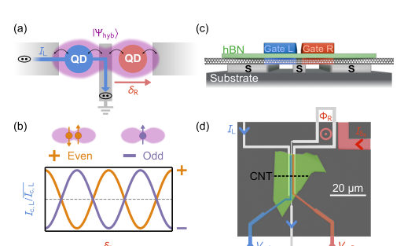 
Figure 1. Fermion parity detection in a carbon nan- otube Andreev molecule. (a) Schematic of an Andreev molecule formed by two quantum-dot Josephson junctions (blue and red) coupled through a common superconduct- ing electrode (grey). The hybridized molecular state |Ψhyb⟩ (purple) extends across both junctions and mediates a non- local Josephson effect (NLJE), whereby the supercurrent IL through the left junction depends on the superconducting phase difference δR across the right junction. (b) Schematic of parity detection through the NLJE, which manifests as the critical current Ic,L of the left junction exhibiting a pe- riodic dependence on δR. Different parity configurations of the...

📷 Fig 2

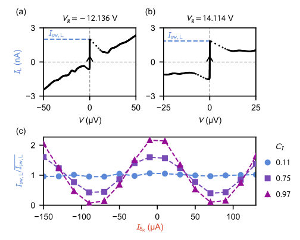 
Figure 2. Nonlocal Josephson effect. (a)-(b) Current- voltage characteristics IL(V ) measured at different back-gate voltages Vg. The current is swept from negative to positive values, and the switching current Isw,L is defined as the maxi- mum current sustained by the supercurrent branch. (c) Isw,L as a function of the flux current IδR controlling the phase difference δR across the right junction, shown at three differ- ent Vg values (14.395 V, 13.938 V and 14.281 V for respectively circle, square and triangle markers). The periodic modula- tion demonstrates a pronounced nonlocal Josephson response that is quantified with a modulation contrasts CI extracted for each curve.

📷 Fig 3

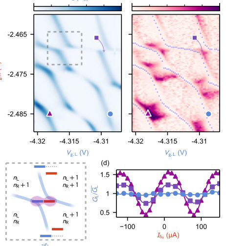 
Figure 3. Hybridization of Andreev molecular states. (a) Zero-bias conductance GL of the left junction in device T averaged over the flux current IδR as a function of the local gate voltages Vg,L/R. Resonance lines correspond to the align- ment of discrete quantum-dot levels with the chemical po- tential of the superconducting electrodes, providing access to the electronic spectrum of the double quantum dot. Conduc- tance is expressed in units of f G0 = 10−2e2/h. (b) Schematic of the region highlighted by the dashed square in (a), where the energy levels ϵL and ϵR are tuned into resonance. At the avoided crossing, the two levels hybridize into bonding and antibonding Andreev molecular...

📷 Fig 4

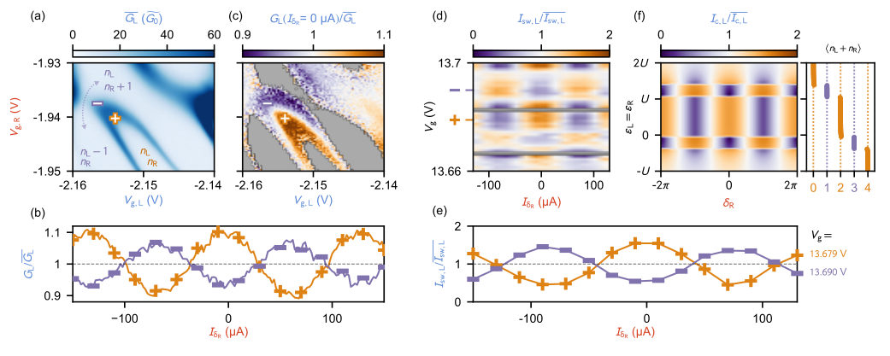 
Figure 4. Probing the global fermion parity through the nonlocal Josephson effect. (a) Zero-bias conductance GL of device T averaged over IδR, as a function of the local gate voltages Vg,L/R. The highlighted region exhibits superconducting avoided crossings connecting charge states differing by two electrons, specified by (nL, nR). (b) Flux-dependent nonlocal response measured at two operating points of opposite parity (indicated by +/−in (a) and (c)). (c) Zero-bias conductance GL, normalized by its average value GL and measured at fixed flux current IδR = 0 µA, in the same gate-voltage region as in (a). Abrupt changes in the phase of the nonlocal response, for example from operating points...

**Summary.** The research demonstrates that the global fermion parity of an Andreev molecule can be measured locally by observing the nonlocal Josephson effect. By coupling two quantum dots via superconducting junctions, researchers found that changes in the molecular ground-state parity cause a distinct $\pi$-phase shift in the supercurrent response. This establishes the NLJE as a powerful tool for probing fundamental quantum numbers in hybrid superconducting circuits.

**Why it may be interesting.** This work provides a concrete experimental realization of measuring a fundamental quantum number (fermion parity) in superconducting circuits by exploiting non-local transport phenomena, which is highly relevant for understanding topological superconductivity and charge quantization in mesoscopic devices.

Detailed structure

**Main problem.** The primary goal is to detect the global fermion parity of a delocalized superconducting state using only local measurements.

**Main result.** The nonlocal Josephson effect (NLJE) was shown to manifest characteristic $\pi$-phase shifts in its response, providing an experimentally accessible signature for changes in the system's global fermion parity.

**Method.** The study combines experimental measurement of the nonlocal supercurrent modulation with theoretical modeling based on a minimal Andreev-molecule Hamiltonian.

**Model / system.** The physical platform is an Andreev molecule realized using two coupled quantum-dot Josephson junctions within a carbon nanotube. The model treats superconducting correlations and interdot hybridization effects.

**Key observables.** Nonlocal Josephson response (periodic modulation of critical current $I_{c,L}$ vs. flux bias $\delta R$), and the signature diagnostic is the abrupt $\pi$-phase shift in this nonlocal signal.

**Important parameters / regimes.** The system operates at very low temperatures (10 mK) and depends critically on controlling gate voltages to tune between different charge/parity regimes.

**Assumptions / limitations.** The authors assume that the observed nonlocal transport signatures are directly traceable to the delocalization of Andreev molecular states, which is confirmed by comparing results across different control schemes (Device B vs. Device T).

**Figures summary.** Figures illustrate schematics of the device and the parity detection mechanism; key figures show $I_{sw,L}$ modulation as a function of flux bias ($\delta R$) demonstrating NLJE, conductance maps revealing avoided crossings, and theoretical calculations mapping out superconducting parity islands.

**Paper structure.** The paper progresses by first establishing the physical system (Andreev molecule in CNT), then demonstrating the nonlocal Josephson effect via measurements, linking this effect to wavefunction delocalization, and finally using theory/further experiments to confirm that the phase shift directly maps onto global fermion parity changes.

Abstract

Fermion parity is a fundamental property of superconducting many-body states. Here, we show that the global fermion parity of a delocalized superconducting state can be detected locally by exploiting the nonlocal Josephson effect. Using a carbon nanotube-based Andreev molecule formed by two coupled quantum-dot Josephson junctions, we observe a pronounced nonlocal Josephson response and demonstrate the formation of delocalized Andreev molecular states extending across both junctions. We further show that changes in the molecular ground-state parity manifest as characteristic $π$-phase shifts in the nonlocal response. Supported by a minimal theoretical model, these results identify global fermion parity as an experimentally accessible degree of freedom in hybrid superconducting circuits that can be readily revealed through the nonlocal Josephson effect.

[↑ back to top](#top)

### [A Flickering Resonance Degeneracy on Entropy-Ruled Charge Transport in the Extended Hopping Sites for Biological Systems: Role of Static-to-Dynamic Disorder Transition](http://arxiv.org/abs/2607.15785v1)

**Authors:** K. Navamani, M. Pavalamuthu  
**Type:** theory · **Category:** disordered systems and neural networks · **PDF:** <https://arxiv.org/pdf/2607.15785v1>  
**Analysis basis:** full PDF text, analyzed in chunks
**Topic relevance:** `non-equilibrium dynamics` **2/5** · `Keldysh / 2PI / non-Gaussian methods` **1/5** · `correlated / nonlocal dissipation` **1/5** · `driven-dissipative phase transition` **1/5** · `entanglement & information structure` **1/5** · `methods for driven-dissipative` **1/5** · `non-equilibrium universality` **1/5**

📷 Fig 1

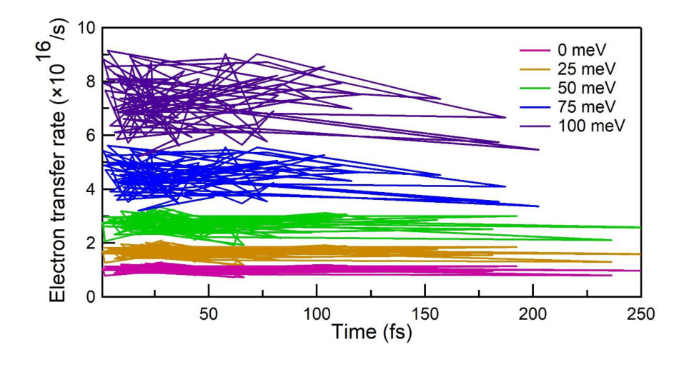 
FIG. 1. The variation in electron transfer rate at each time step of the simulation is noted under different sets of electric field-assisted site energy difference values of 0, 25, 50, 75, and 100 meV. For the dynamical system of extended sites (long range), the applied bias or electric field drifts the electron transfer rate/kinetics up to a few hopping sites only; after that, it limits the carrier hopping due to the significant loss in rate by energy dispersion at each hopping step, which causes charge trapping. Here, the energy loss at each hopping steps is more for the larger amplitude of site energy fluctuation, which can be analysed by the dispersive parameter (see ref. 11). At the...

📷 Fig 2

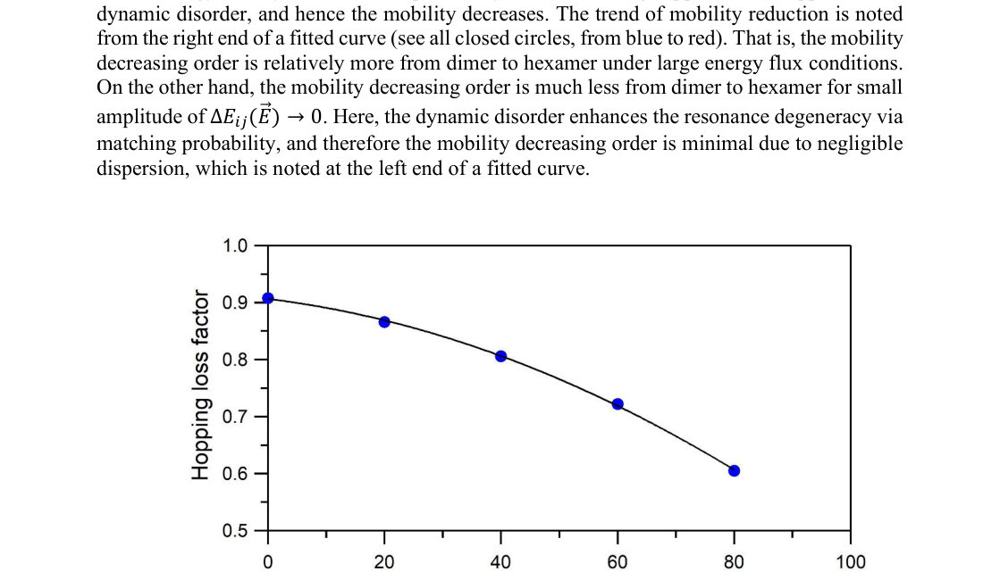 
FIG. 3. Electron hopping delay is noted while increasing the applied electric field via the site energy difference (0, 20, 40, 60, and 80 meV) along the π-stacked molecular units of BDHTT- BBT. In this numerical simulation (Monte-Carlo) study, the structural oscillation time is fixed as 1 ps, and the molecular dynamics time step is 1 fs. The carrier propagation state is averaged from every 100 steps of position and velocity coordinates to get a better-approximation. The results are reproduced here from the previous study; see ref. 11 to validate the method. The carrier energy dispersion occurs over the hopping sites in an extended dynamical system, and it increases as the amplitude of...

📷 Fig 3

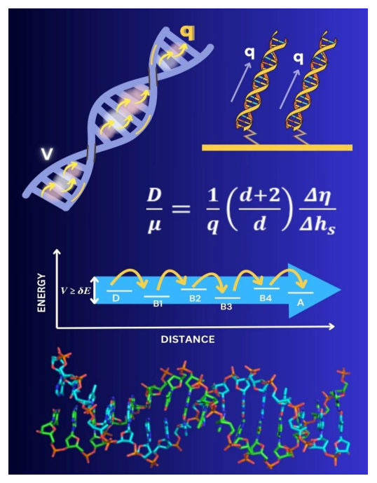 
FIG. 4. The dynamic disorder-driven flickering resonance effect on charge mobility is incorporated by the entropy-ruled method. The site energy matching probability enhances the degeneracy, which is quantified by differential entropy, ℎ𝑆= 𝑙𝑛(√2𝜋𝑒𝜎𝐺), where 𝜎𝐺 is the Gaussian width. In this relation, 𝜎𝐺 is a deterministic parameter to decide the typical transport; whether it is a localization or delocalization transport. The static-to-dynamic disorder transition transport is here generalized using flickering resonance along with the entropy-ruled method,

📷 Fig 4

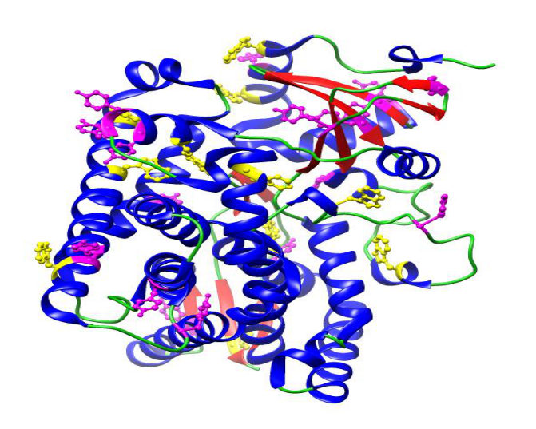 
FIG. 5. Structural model of human mitochondrial cholesterol-metabolizing cytochrome P450 (CYP11A1, PDB ID: 3N9Y). The tryptophan (Trp) and tyrosine (Tyr) are shown in yellow and purple colours, respectively.

**Summary.** The paper develops a novel entropy-ruled theory for charge transport in biomolecules subjected to dynamic disorder. It quantifies the role of degeneracy using differential entropy, showing that this quantum effect can fundamentally alter the expected transport mechanism. The findings suggest that under optimal conditions, charge movement resembles coherent band conduction rather than simple thermally activated hopping.

**Why it may be interesting.** This work provides a sophisticated quantum mechanical framework to model charge transfer in complex, disordered biological media, bridging concepts from condensed matter physics (band theory) with biophysics (redox chemistry).

Detailed structure

**Main problem.** The study addresses charge transport in biological systems, focusing on how dynamic disorder influences electron transfer rates and mobility across different ordering regimes.

**Main result.** The theory demonstrates that for ultra-fast dynamical and degenerate cases, the electronic mobility transitions from thermally activated hopping to band-like behavior, quantified by differential entropy.

**Method.** It proposes a 'flickering resonance-coupled entropy-ruled charge transport theory' formalism incorporating dynamic disorder effects via differential entropy ($h_S$).

**Model / system.** The system models charge transport in biomolecules with extended hopping sites, relevant for bioenergetics and redox catalysis. The model incorporates coupling between electronic and nuclear dynamics (dynamic disorder).

**Key observables.** Electron transfer rate ($k_{CT}$), diffusion-based mobility ($	ext{D}/\mu$), and the degeneracy-weighted differential entropy ($h_S$).

**Important parameters / regimes.** Dynamic disorder strength, applied electric field ($\vec{E}$), site energy difference ($\Delta E_{ij}$), and the degree of resonance degeneracy.

**Assumptions / limitations.** The theory assumes that dynamic disorder can be quantified by differential entropy and models the transition between hopping and band transport regimes using generalized rate equations.

**Figures summary.** Figures illustrate how electron transfer rates change with applied electric fields, showing charge trapping at high bias in extended systems, and demonstrating mobility enhancement when degeneracy is maximized near zero energy flux.

**Paper structure.** The paper develops a theoretical formalism by first introducing the concept of entropy-ruled transport, then deriving generalized rate equations that account for dynamic disorder via $h_S$, and finally analyzing the transition between hopping, band, and intermediate regimes under varying external biases.

Abstract

Charge transport (CT) in biological systems is of great interest due to its role in various functional activities like photobiology, bioenergetics, redox catalytic and other metabolic activities, etc. It has been observed by various studies that the presence of a dynamic disorder in biomolecules facilitates charge dynamics in the intermediate transport regime, i.e., far from hopping and towards a bank-like mechanism. Hitherto, the dynamic disorder (in a time scale, coupling between electronic and nuclear dynamics) weightage on CT in molecules is not well-established for the measurement of molecular conductivity from small to long-range ordering. With this motivation, we propose the flickering resonance-coupled entropy-ruled charge transport theory for transfer-rate and diffusion-based mobility (D/μ) calculations. The proposed analytical formalism incorporates the impact of dynamic disorder-correlated degeneracy (in a flickering-resonance manner) on the entropy-ruled electron transfer rate and diffusion-mobility, which are valid for localized hopping, delocalized band transport, and regimes in between. By this approach, it has been observed that the dynamics-driven electronic site matching probability enhances the degeneracy, which is quantified by the differential entropy. The analysis clearly shows that for ultra-fast dynamical and degenerate cases, the entropy-ruled mobility is transformed as band mobility, rather than the thermally activated hopping or diffusion process.

[↑ back to top](#top)

### [Circulation Statistics in Rayleigh-Bénard Convection](http://arxiv.org/abs/2607.15489v1)

**Authors:** Giovanni Saisse, Roshan J. Samuel, Luca Moriconi, Jörg Schumacher, Katepalli R. Sreenivasan  
**Type:** theory · **Category:** statistical mechanics · **PDF:** <https://arxiv.org/pdf/2607.15489v1>  
**Analysis basis:** full PDF text, analyzed in chunks
**Topic relevance:** `non-equilibrium dynamics` **2/5** · `non-equilibrium universality` **2/5** · `Keldysh / 2PI / non-Gaussian methods` **1/5** · `analog quantum simulation` **1/5** · `driven-dissipative phase transition` **1/5**

📷 Fig 1

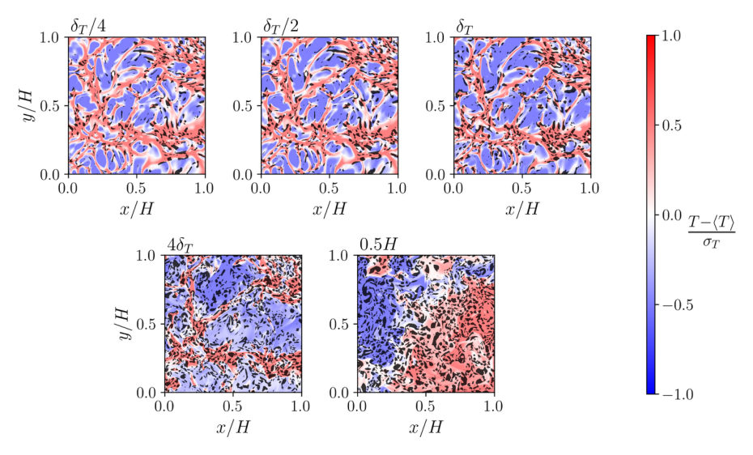 
FIG. 1: Overlay of vortex cross-sections (shown as dark spots) on the temperature field. The

📷 Fig 2

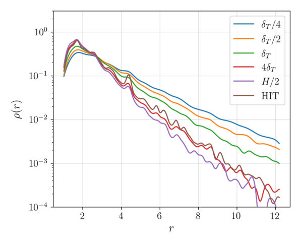 
FIG. 2: Aspect-ratio PDFs of the identified vortex spots, with the best-fitting ellipses determined

📷 Fig 3

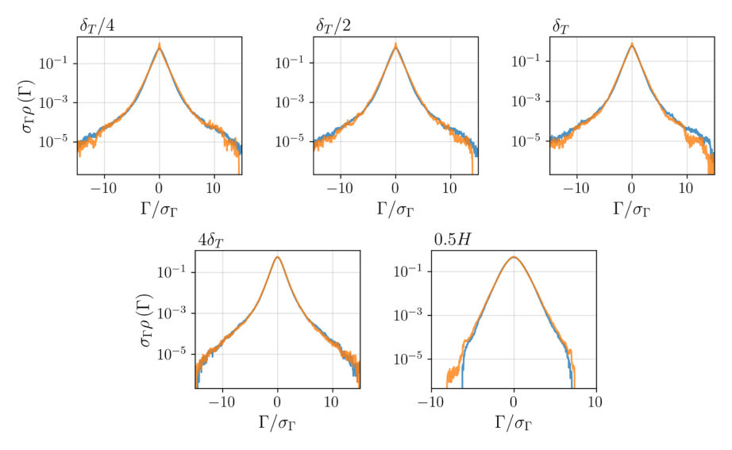 
FIG. 3: Standardized circulation PDFs for square contours of size 50 × 50 grid cells, evaluated at

📷 Fig 4

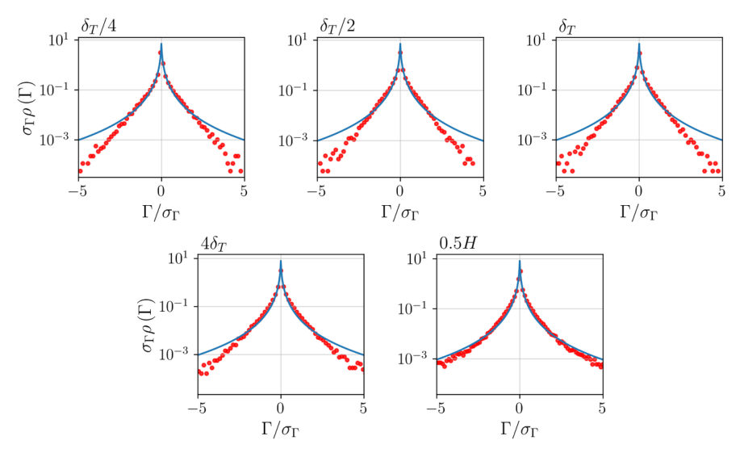 
FIG. 4: Comparison of the analytical circulation PDFs for elementary vortices (HIT), given by

📷 Fig 5

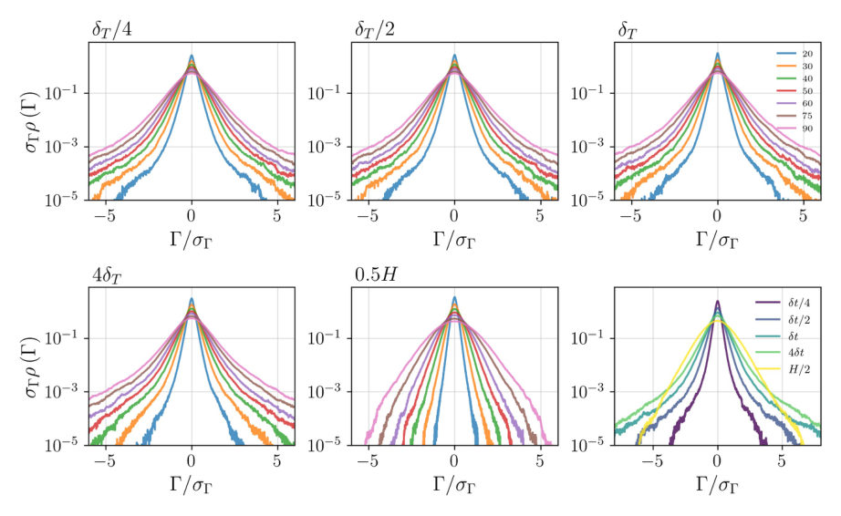 
FIG. 5: Circulation PDFs for square contours of different sizes (side lengths indicated in the upper-

**Summary.** This paper investigates how turbulence statistics, specifically velocity circulation, behave in Rayleigh-Bénard convection compared to idealized homogeneous isotropic turbulence. The authors find that while the statistical signatures of HIT persist within the thermal boundary layer, the local vortex dynamics are strongly influenced by temperature gradients and buoyancy effects. They employ advanced statistical mechanics tools to model the underlying physics governing vortex shape and circulation fluctuations.

**Why it may be interesting.** While focused on classical fluid dynamics, the use of concepts like effective Boltzmann distributions for geometric parameters (aspect ratio) and the analysis of non-equilibrium fluctuations in confined systems share mathematical parallels with approaches used in analyzing quantum many-body systems or complex energy landscapes.

Detailed structure

**Main problem.** To investigate whether statistical properties of velocity circulation observed in Homogeneous Isotropic Turbulence (HIT) persist or are modified in Rayleigh–Bénard convection (RBC).

**Main result.** Circulation statistics within the thermal boundary layer show features akin to HIT, and the Area Rule remains well satisfied; outside this region, behavior resembles HIT governed by energy dissipation.

**Method.** Direct Numerical Simulations (DNS) of Boussinesq equations combined with statistical analysis of circulation probability density functions (PDFs) and vortex geometry.

**Model / system.** The study analyzes turbulent Rayleigh-Bénard Convection (RBC) using the Boussinesq approximation, comparing its statistics to established models for HIT. The analysis focuses on local vortex structures and global circulation fluxes.

**Key observables.** Velocity circulation ($\Gamma[C]$), elementary vortex distribution, vortex aspect ratios ($r$), and standardized Circulation Probability Density Functions (PDFs).

**Important parameters / regimes.** Rayleigh number ($	ext{Ra} = 10^9$) and Prandtl number ($	ext{Pr} = 0.7$); boundary layer thickness ($\delta T$).

**Assumptions / limitations.** The analysis assumes that circulation fluctuations are dominated by localized vortex spots (Vortex Gas Model hypothesis) and models the aspect ratio distribution using an effective Boltzmann weight.

**Figures summary.** Figures compare exact vs. reconstructed circulation PDFs, show collapse of PDFs for varying contour sizes within the TBL, and illustrate aspect-ratio distributions showing deviations from HIT near walls.

**Paper structure.** The paper progresses by first establishing the comparison between RBC and HIT statistics in the TBL; it then analyzes vortex shape correlations with temperature; finally, it develops a theoretical framework using statistical mechanics to model the stationary distribution of vortex aspect ratios.

Abstract

Important statistical properties of velocity circulation in homogeneous isotropic turbulence (HIT) have been unveiled in recent years, raising the question of whether they persist, or are modified, in other classes of turbulent flows. Motivated by the dominant role of small-scale structures in the circulation fluctuations of HIT, we investigate their relevance in direct numerical simulations of Rayleigh-Bénard convection at a Rayleigh number of $10^9$ and Prandtl number of $O(1)$. Within the thermal boundary layer (TBL), the distribution of elementary vortices is found to be strongly correlated with the temperature field, while the statistics of their core aspect ratios is significantly altered. Additionally, the probability distribution functions of circulation, computed for planar contours which are parallel to the walls, display salient features closely akin to those observed in HIT, with the {\it Area Rule} (a connection between circulation statistics and minimal surfaces) remaining particularly well satisfied -- except for a possible transitional region at a distance of a few TBL thicknesses. Away from the TBL, as expected, the overall statistical behavior of these structures likewise resembles that of HIT, where the intermittent spatial distribution of small vortex tubes is instead determined by the energy dissipation field.

[↑ back to top](#top)

### [Hanbury-Brown Twiss effect, squeezed gravitons and the photon correlations](http://arxiv.org/abs/2607.15964v1)

**Authors:** Massimo Giovannini  
**Type:** theory · **Category:** other · **PDF:** <https://arxiv.org/pdf/2607.15964v1>  
**Analysis basis:** full PDF text, analyzed in chunks
**Topic relevance:** `quantum optics experiment` **2/5** · `Keldysh / 2PI / non-Gaussian methods` **1/5** · `correlated cavity matter` **1/5** · `interference shaping light` **1/5** · `quantum measurements` **1/5**

📷 Fig 1

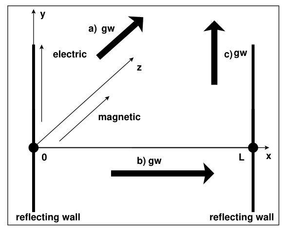 
Figure 1: We illustrate the geometry of a cavity where the walls are located along the ˆx direction. If ˆk = ˆx the gravitational wave propagates long the cavity axis. In the other cases the gravitational wave propagates orthogonally to the axis of the cavity.

📷 Fig 2

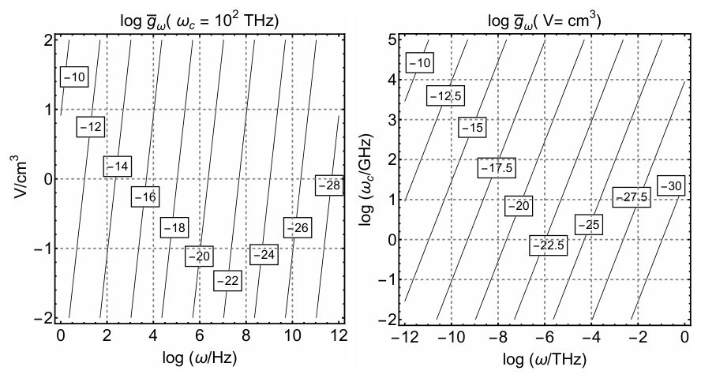 
Figure 2: The common logarithm of the effective coupling is illustrated as a function of the frequen- cies of the gravitons and of the photons.

📷 Fig 3

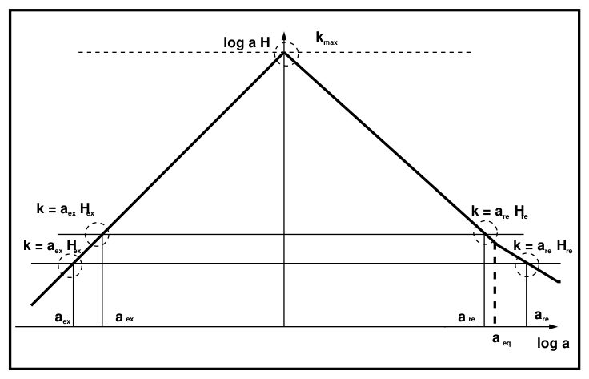 
Figure 3: We approximately illustrate here the effective evolution of the comoving Hubble radius H as a function of the scale factor a. Common logarithms are employed on both axes. During the inflationary stage H ∝a while during the radiation and matter stages H ∝a−1 and H ∝a−1/2, respectively. What matters for the evolution of the field operators are the exit and reentry times corresponding to the moments where a given wavenumber crosses the comoving horizon. The reentry and the exit approximately coincide close to the maximal wavenumber of the spectrum kmax.

**Summary.** This paper investigates the possibility of measuring relic gravitational wave statistics using photon interference in an optical cavity. By analyzing the coupled action and coherence functions, the authors prove that due to underlying symmetries, the measured Hanbury-Brown Twiss correlations of the photons are completely insensitive to the statistical properties of the gravitons. This places a fundamental limit on what can be inferred about the early universe's gravitational background from current photon measurements.

**Why it may be interesting.** It provides a rigorous theoretical framework demonstrating fundamental limitations on experimental detection methods by proving that certain quantum correlations (graviton statistics) cannot be accessed via simpler measurements (photon intensity correlation).

Detailed structure

**Main problem.** To determine if Hanbury-Brown Twiss (HBT) correlations measured from photons confined in an optical cavity can reveal the super-Poissonian statistical properties of relic gravitons interacting with them.

**Main result.** The HBT correlations of the cavity photons are insensitive to the second-order coherence of the gravitons, meaning the graviton statistics cannot be inferred from photon intensity measurements.

**Method.** The analysis uses generalized Glauber correlators extended to tensor fields (for gravitons) and electromagnetic fields (for photons), analyzing the total action derived from coupling gravity and electromagnetism.

**Model / system.** The system models the interaction between cosmic relic gravitons (from zero-point fluctuations) and a quantized electromagnetic field confined within a closed optical resonator. The Hamiltonian analysis shows that the cavity photon number operator commutes with the full Hamiltonian, leading to the decoupling of coherence measurements.

**Key observables.** Hanbury-Brown Twiss correlations ($g^{(2)}$), first-order coherence ($g^{(1)}$), and the degree of second-order coherence for both photons and gravitons.

**Important parameters / regimes.** Cosmic graviton wavenumbers $O(k_p)$ ($\approx 0.002 	ext{ Mpc}^{-1}$); tensor-to-scalar ratio ($r_T$); small coupling limits.

**Assumptions / limitations.** The analysis relies on extending Glauber correlators to tensor cases and assumes a conformally flat background metric for the action derivation.

**Figures summary.** Not specified in notes, but the structure implies derivations of correlators (Eq. 2.16) and Hamiltonian evolution equations (B.10-B.17).

**Paper structure.** The paper progresses by first establishing generalized Glauber correlators for vector/tensor fields, then applying these to derive the total action coupling photons and gravitons, culminating in a symmetry argument showing that photon coherence is decoupled from graviton statistics.

Abstract

Unlike the gravitational waves classically generated by moving macroscopic masses, the diffuse backgrounds of gravitons originate most likely from zero-point fluctuations of the gravitational field amplified by the evolution of the space-time curvature. The resulting entangled states lead to specific second-order correlation effects that could be eventually detected. For a quantitative analysis of this empirical expectation we scrutinize the interactions between the cosmic gravitons and the fundamental mode of a quantized electromagnetic field confined inside a closed optical resonator with perfectly-reflecting walls. We show that the Hanbury-Brown Twiss correlations of the photons are insensitive to the degrees of second-order coherence of the gravitons even barring for the exceedingly small couplings of the problem. Since the degree of second-order coherence of the photons does not reflect the correlation properties of the gravitons, the statistical properties of the gravitons (and their super-Poissonian statistics) cannot be inferred, even in principle, from the intensity correlations of the cavity modes.

[↑ back to top](#top)

### [Saturating the Bayesian Nagaoka-Hayashi bound within numerical precision for the depolarization SU(2) rotation channel](http://arxiv.org/abs/2607.15398v1)

**Authors:** Leo Bia, Christos N. Gagatsos  
**Type:** theory · **Category:** quantum information and computing · **PDF:** <https://arxiv.org/pdf/2607.15398v1>  
**Analysis basis:** full PDF text, analyzed in chunks
**Topic relevance:** `quantum measurements` **2/5** · `correlated / nonlocal dissipation` **1/5** · `entanglement & information structure` **1/5** · `methods for driven-dissipative` **1/5**

📷 Fig 1

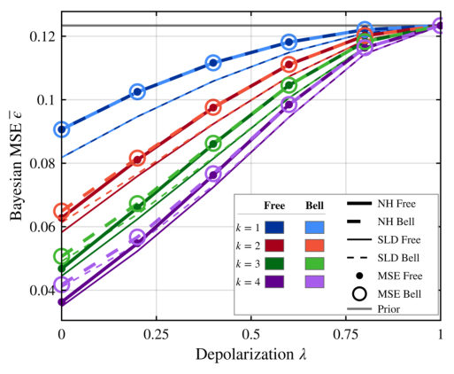 
FIG. 1. Bayes risk and bounds for the SU(2) channel as a function of the depolarizing strength λ. Each number of chan- nel uses k is one hue, dark solid lines for the optimized probe and bright dashed lines of the same hue for the tensored Bell probe. Thick lines are the NH bound and thin lines the SLD bound. Markers are the achieved risk ¯ϵ⋆, filled dots for the optimized probe and open circles for the Bell probe. Markers lying on the thick lines show attainment of the NH bound, and the offset to the thin lines is the incompatibility cost. The two achieved-risk curves of each hue meet as λ grows, past which the tensored Bell probe is optimal. The gray line is the prior risk r2 p/5,...

**Summary.** The authors investigate the fundamental limits of estimating multiple parameters characterizing an SU(2) qubit rotation corrupted by noise. They show that the optimized measurement strategy achieves the tight Bayesian Nagaoka-Hayashi bound within numerical precision. This confirms the optimality of the protocol relative to this advanced theoretical limit for the studied channel family.

**Why it may be interesting.** This work provides a rigorous test case demonstrating how advanced information-theoretic bounds (like NH) can be numerically verified as achievable in quantum estimation protocols, which is crucial for designing optimal quantum sensors.

Detailed structure

**Main problem.** The paper addresses the problem of multiparameter quantum estimation, aiming to find the minimum achievable error (Bayes risk) when estimating several parameters simultaneously using noisy quantum measurements.

**Main result.** The optimized estimation strategy for a qubit rotation channel under depolarizing noise was shown to attain the Bayesian Nagaoka-Hayashi bound within numerical precision, suggesting this bound is tight for this specific channel family.

**Method.** The problem is formulated as minimizing the weighted Bayesian Mean Square Error (MSE) using Semidefinite Programming (SDP), exploiting rotational symmetry to reduce the complexity of the joint optimization over probe and measurement.

**Model / system.** The system models the single-shot estimation of parameters governing an SU(2) qubit rotation channel that is corrupted by depolarizing noise. The analysis considers $k$ parallel uses of this noisy channel.

**Key observables.** Bayes risk ($ar{\epsilon}^*$), Bayesian Nagaoka-Hayashi bound ($ar{\epsilon}_{	ext{NH}}$), and the SLD Cramér-Rao bound ($ar{\epsilon}_{	ext{SLD}}$).

**Important parameters / regimes.** Depolarizing noise strength ($\lambda$) and the number of parallel uses ($k$).

**Assumptions / limitations.** The analysis is restricted to the class of parallel ancilla-assisted quantum strategies, and the attainment of the NH bound remains an open theoretical problem.

**Figures summary.** Figure 1 compares the achieved risk ($ar{\epsilon}^*$) against the two theoretical bounds ($ar{\epsilon}_{	ext{SLD}}$ and $ar{\epsilon}_{	ext{NH}}$) as a function of noise strength ($\lambda$) for $k=1$ to $4$, showing the convergence of curves.

**Paper structure.** The paper establishes the hierarchy of quantum estimation bounds, formulates the minimization problem via SDPs exploiting rotational symmetry, computes integrals exactly using quadrature methods, and compares the achieved risk against these theoretical limits across varying noise levels and uses.

Abstract

The Bayesian Nagaoka--Hayashi (NH) bound is a semidefinite lower bound on the Bayes risk of multiparameter estimation, tighter than the Bayesian symmertic logarithmic derivative (SLD) Cramér--Rao bounds, and whether it can be attained is an open problem. We study the single-shot estimation of a qubit rotation, all three parameters at once, under depolarizing noise and a uniform prior, with $k$ parallel uses of the channel. Rotational covariance reduces the joint optimization of probe, measurement, and estimator, and the NH bound itself, to small semidefinite programs, solvable through $k=4$. At every number of uses and noise strength the optimized strategy reaches the NH bound within the numerical precision of the calculation, numerical evidence that the bound is attained for this channel family, while the SLD bound lies strictly below and is never attained. As the noise grows the optimal probe collapses to the tensored Bell state.

[↑ back to top](#top)

### [Agnostic learning of qudit stabilizer states](http://arxiv.org/abs/2607.15559v1)

**Authors:** Wentao Qi, Boyan Xu, Shiguang Feng, Lvzhou Li  
**Type:** theory · **Category:** quantum information and computing · **PDF:** <https://arxiv.org/pdf/2607.15559v1>  
**Analysis basis:** full PDF text, analyzed in chunks
**Topic relevance:** `quantum measurements` **2/5** · `entanglement & information structure` **1/5** · `measurement-induced transitions` **1/5**

📷 Fig 1

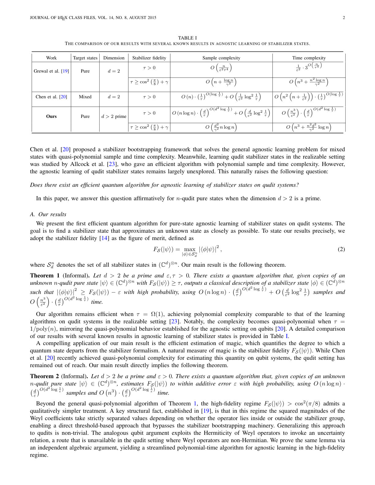 
Low-resolution page preview, page 2

📷 Fig 2

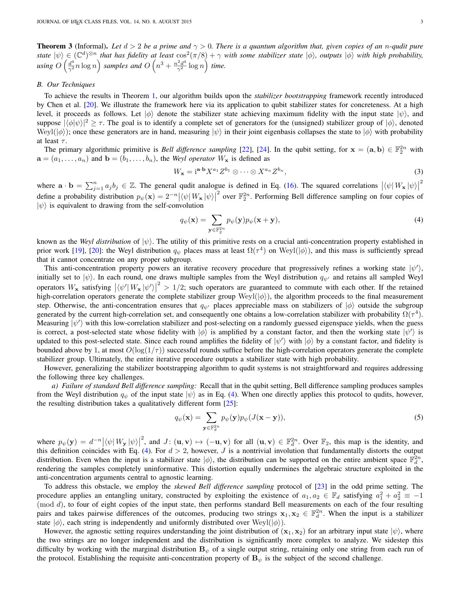 
Low-resolution page preview, page 3

📷 Fig 3

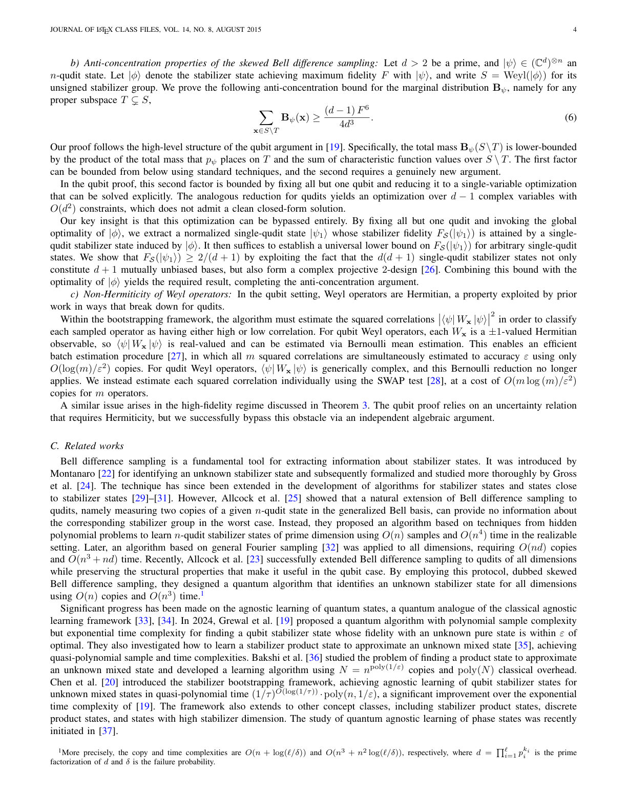 
Low-resolution page preview, page 4

📷 Fig 4

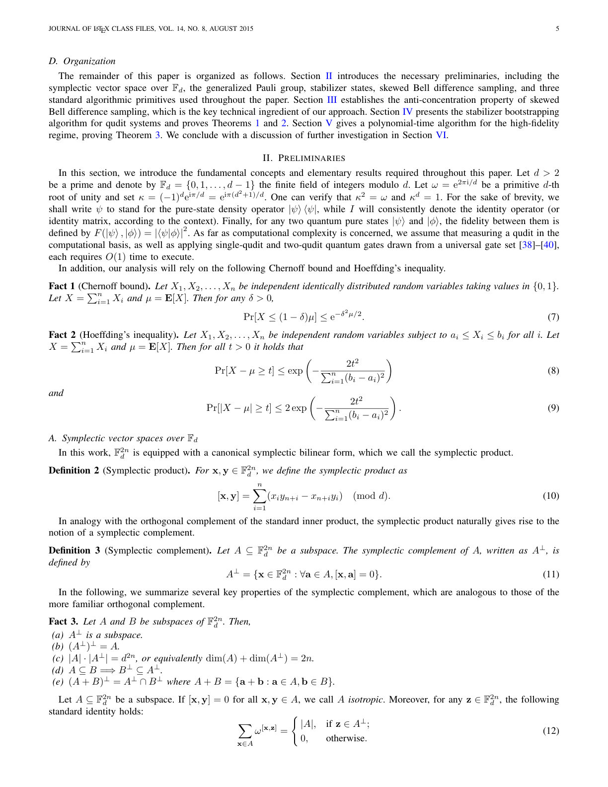 
Low-resolution page preview, page 5

📷 Fig 5

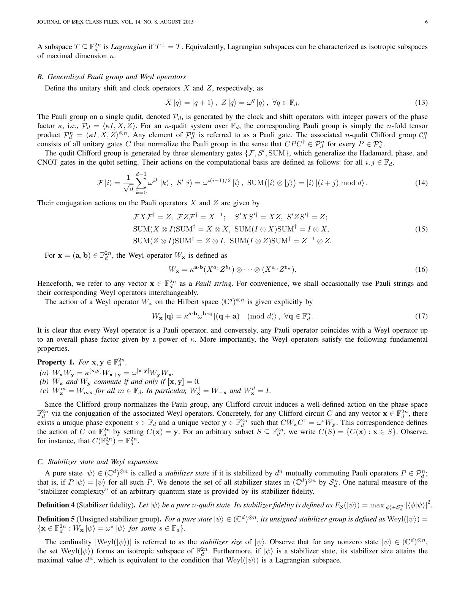 
Low-resolution page preview, page 6

**Summary.** This paper introduces an efficient quantum algorithm to estimate the best approximation of an unknown qudit state within the set of stabilizer states. It achieves this by generalizing a known qubit technique, overcoming structural hurdles specific to higher dimensions using advanced sampling methods. This advancement is vital for developing robust quantum error correction and characterizing complex quantum states in qudit systems.

**Why it may be interesting.** This work extends fundamental quantum information protocols from qubits to higher-dimensional qudits, which is crucial for realizing fault-tolerant quantum computation using physical systems that naturally support qudit encoding (e.g., superconducting circuits or photon polarization).

Detailed structure

**Main problem.** The core problem is agnostic learning of stabilizer states, which involves finding the best approximation of an unknown quantum state $|\psi
angle$ within the restricted set of stabilizer states $S$, especially when noise corrupts the state.

**Main result.** The authors present the first efficient quantum algorithm for this task in qudit systems ($d>2$), successfully generalizing a known qubit framework. The algorithm achieves high fidelity estimation with complexity scaling polynomially in system parameters and inversely with the target fidelity $	au$.

**Method.** The technique generalizes the stabilizer bootstrapping framework using skewed Bell difference sampling, which is necessary because standard methods fail for qudits. This involves iterative refinement based on measuring correlations over Weyl operators.

**Model / system.** The system under study consists of $n$-qudit pure states $|\psi
angle$ in a dimension $d$, where $d$ is assumed to be an odd prime. The target set of states are the stabilizer states, which are central to quantum error correction theory.

**Key observables.** Stabilizer Fidelity ($	ext{FS}(|\psi
angle)$), $|\langle\phi|\psi
angle|^2$, and correlation measurements $\left|\langle\psi| W_x |\psi
angle
ight|^2$.

**Important parameters / regimes.** $d$ (odd prime dimension), $n$ (number of qudits), $	au$ (target fidelity threshold), and $\epsilon$ (approximation error).

**Assumptions / limitations.** The primary assumption is that the dimension $d$ is an odd prime, which allows for the use of skewed Bell difference sampling. The analysis also relies on establishing anti-concentration properties for certain marginal distributions.

**Figures summary.** Figure 1 illustrates the quantum circuit required for the SWAP test between two $n$-qudit states; other figures detail the transformation process using Clifford gates in a related context (Chunk 3 notes).

**Paper structure.** The paper develops the theory by first addressing the generalization of the learning framework to qudits, detailing the necessary sampling techniques (skewed Bell difference sampling), and then presenting the complexity bounds for state estimation and magic number calculation. A separate section details circuit construction rules for subspace transformations.

Abstract

Learning a classical description of a quantum state is a fundamental task in quantum computation. Among the most important classes of quantum states are stabilizer states, which play a central role in quantum error correction and fault-tolerant computation. To mitigate the effects of realistic noise, agnostic learning of stabilizer states has emerged as a natural and well-motivated problem. Recently, Chen \textit{et al.} [STOC'25, p. 429-438] resolved this problem for qubit systems by using a stabilizer bootstrapping framework. However, the agnostic learning of qudit stabilizer states remains largely unexplored, since the qudit setting introduces fundamental structural differences that prevent a direct generalization of existing qubit techniques. In this paper, we successfully generalize the stabilizer bootstrapping framework to qudit systems and present the first efficient quantum algorithm for agnostic learning of qudit stabilizer states. Specifically, given copies of an unknown $n$-qudit pure state $|ψ\rangle$ that has fidelity $τ$ with some stabilizer state, our algorithm outputs a stabilizer state $|φ\rangle$ such that $\left| \braket{φ|ψ} \right|^2 \geq τ- \varepsilon$ with high probability. The algorithm uses only single-copy and four-copy measurements, and its sample and time complexity scale as $(d/τ)^{O(d^2 \log(1/τ))} \cdot \mathrm{poly}(n, 1/\varepsilon)$, where the dimension $d$ is an odd prime. As a direct corollary, our algorithm enables efficient estimation of the magic of a quantum state, as quantified by its stabilizer fidelity. Completing the picture, we also present a streamlined algorithm for the high-fidelity regime $τ> \cos^2(π/8)$, establishing a qudit analogue of the threshold-based approach in prior qubit work.

[↑ back to top](#top)

### [Altermagnetism without a long-range order](http://arxiv.org/abs/2607.15954v1)

**Authors:** V. E. Valiulin, A. V. Mikheyenkov, K. I. Kugel  
**Type:** theory · **Category:** strongly correlated electrons · **PDF:** <https://arxiv.org/pdf/2607.15954v1>  
**Analysis basis:** full PDF text, analyzed in chunks
**Topic relevance:** `analog quantum simulation` **2/5** · `Keldysh / 2PI / non-Gaussian methods` **1/5** · `entanglement & information structure` **1/5**

📷 Fig 1

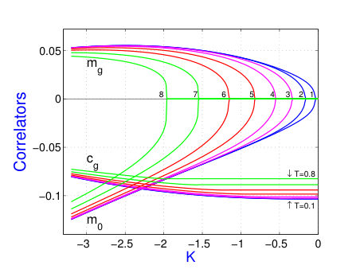 
Figure 1: (Color online) Dependence of the spin–spin correlation function 𝑐𝑔at nearest neighbors and of the spin–pseudospin on-site 𝑚0 and inter-site 𝑚𝑔correlation functions on 𝑇and on the inter- subsystem exchange 𝐾. The curves forming the “platypus nose” are 𝑚0 (𝑚0 &lt; 0) and 𝑚𝑔(𝑚𝑔&gt; 0). The numbers 1 ÷ 8 enumerate the temperature values: 1 – 𝑇= 0.1, 2 – 𝑇= 0.2, etc. The lower curves correspond to 𝑐𝑔(the limits of 𝑇are indicated).

📷 Fig 2

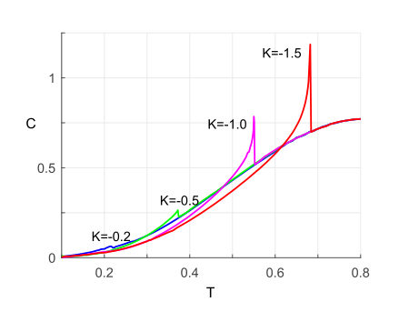 
Figure 2: (Color online) 2D lattice. Evolution of the heat capacity with a change in 𝑇at a fixed exchange parameter 𝐾. The colors correspond to different values of 𝐾(values of 𝐾are indicated near the peaks). Upon reaching the critical value 𝐾𝑐, a peak is observed, the height of which increases with |𝐾𝑐|.

📷 Fig 3

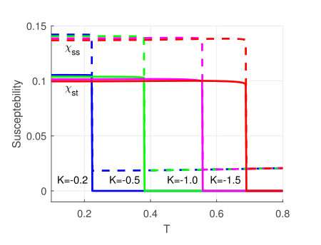 
Figure 3: (Color online) 2D lattice. Susceptibility as a function of temperature 𝑇at the fixed inter-subsystem exchange 𝐾. The dashed line corresponds to the spin–spin susceptibility 𝜒𝑠𝑠and the solid line – to the spin–pseudospin susceptibility 𝜒𝑠𝑡. Colors correspond to different values of 𝐾.

📷 Fig 4

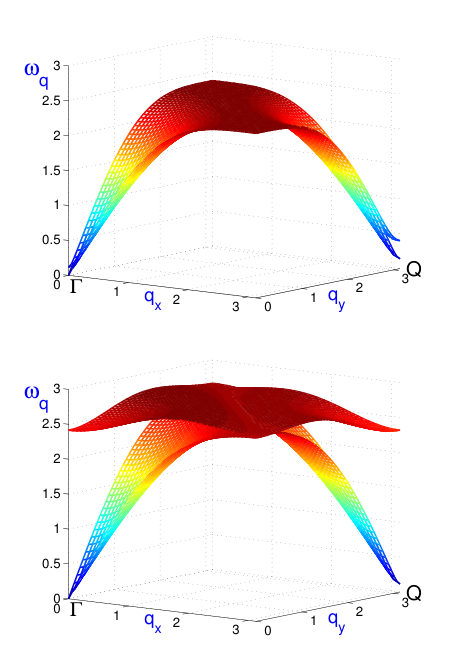 
Figure 4: (Color online) Spectra of elementary excitations 𝜔𝑎𝑐(𝐪) and 𝜔𝑜𝑝𝑡(𝐪) (17) at 𝑇= 0.3. Top: 𝐾= −0.4, weak splitting. Bottom: 𝐾= −3.0, strong splitting. In the second case, the upper regions of the spectral branches form a nearly dispersionless region. A quarter of the Brillouin zone is shown. For any 𝑇and 𝐾at the symmetrical points 𝚪= (0, 0) and 𝐐= (𝜋, 𝜋) in the Brillouin zone 𝜔𝑜𝑝𝑡(𝚪) ≥𝜔𝑎𝑐(𝚪) = 0 and 𝜔𝑎𝑐(𝐐) ≥𝜔𝑜𝑝𝑡(𝐐) ≥0.

📷 Fig 5

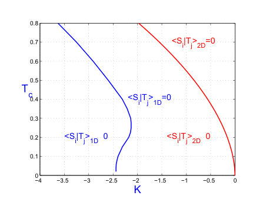 
Figure 5: (Color online) Phase diagram - regions with zero and nonzero spin–pseudospin correlations are presented. The blue curve is the phase boundary in 1𝐷and the red curve – in 2𝐷.

**Summary.** This theoretical work explores altermagnetism—a magnetic state characterized by specific symmetries—in models lacking conventional long-range order. Using advanced Green's function techniques, the authors demonstrate that a unique 'altermagnetic liquid' phase can exist at finite temperatures. This finding expands the understanding of correlated electron physics beyond traditional magnetically ordered states.

**Why it may be interesting.** While focused on condensed matter magnetism, the concept of emergent order parameters (like spin-pseudospin correlation) existing without breaking translational symmetry is highly relevant to understanding quantum criticality in complex correlated systems.

Detailed structure

**Main problem.** The study investigates how altermagnetic behavior can emerge in quantum materials without requiring conventional long-range magnetic or orbital order.

**Main result.** The authors establish the concept of an 'altermagnetic paramagnet' by showing that a composite state with nonzero spin-pseudospin correlations exists above a critical coupling, even when average spins are zero.

**Method.** Theoretical analysis employing the rotation-invariant Green's function method (RGM) to calculate correlation functions and excitation spectra.

**Model / system.** The system is modeled using the Kugel–Khomskii spin–pseudospin model, an SU(2) x SU(2) symmetric Hamiltonian applied to lattices (square lattice and linear chain).

**Key observables.** Spin-spin and spin-pseudospin correlation functions, excitation spectra (acoustic and optical branches), heat capacity, and susceptibilities.

**Important parameters / regimes.** Critical intersubsystem exchange coupling Kc(T); temperature T; and the ratio of various exchange couplings J, I, and K.

**Assumptions / limitations.** The analysis relies on the RGM approach to handle finite-temperature effects while maintaining zero single-site average magnetization ($\langle \mathbf{S}_i 
angle = 0$).

**Figures summary.** Figures illustrate correlation functions showing non-zero values at critical points, heat capacity exhibiting step changes, and excitation spectra splitting into distinct acoustic and optical branches.

**Paper structure.** The paper systematically analyzes the model on 2D and 1D lattices, deriving Green's function expressions for various correlations and excitations, culminating in a phase diagram mapping out the transition to the altermagnetic liquid state.

Abstract

The Kugel-Khomskii spin-pseudospin model, originally developed for transition-metal compounds with orbital degrees of freedom, has recently been reinterpreted in the context of altermagnetism. In this work, we theoretically investigate the emergence of altermagnetic behavior in the absence of long-range magnetic or orbital order. Using the rotation-invariant Green's function method for the SU(2) x SU(2) symmetric model on a square lattice and on a linear chain, we analyze spin-spin and spin-pseudospin correlation functions, excitation spectra, heat capacity, and susceptibilities. We show that beyond a critical intersubsystem exchange Kc(T), a composite state arises with nonzero spin-pseudospin correlations, even though the average spin and pseudospin at each site are zero. The excitation spectrum splits into acoustic and optical branches, with nodal lines along qx = qy - a direct signature of altermagnetic symmetry. A peak in heat capacity and a jump in susceptibility are observed at the phase boundary. In 1D, the phase boundary is nonmonotonic and demonstrates reentrant transition. These results establish the concept of an "altermagnetic paramagnet" or "altermagnetic liquid" without long-range order, relevant for low-dimensional and strongly fluctuating systems.

[↑ back to top](#top)

### [Neural Non-Equilibrium Hamiltonian Monte Carlo for Corrected Boltzmann Sampling](http://arxiv.org/abs/2607.15682v1)

**Authors:** Moxian Qian  
**Type:** theory · **Category:** statistical mechanics · **PDF:** <https://arxiv.org/pdf/2607.15682v1>  
**Analysis basis:** full PDF text, analyzed in chunks
**Topic relevance:** `non-equilibrium dynamics` **2/5** · `methods for driven-dissipative` **1/5** · `non-equilibrium universality` **1/5**

📷 Fig 1

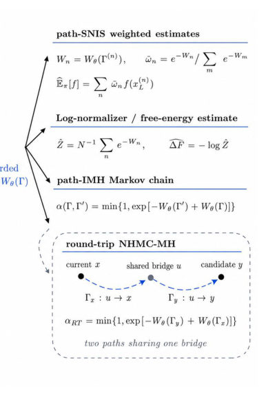 
Figure 1: NHMC path construction and recorded-work corrections. After training, the learned proposal parameters are fixed, and the resulting proposal generates complete stochastic Hamil- tonian paths. The recorded work combines endpoint target/base terms with per-stage forward– reverse momentum log-ratios and, when present, discrete-move log-ratios. The stage formula shown in the schematic suppresses this optional discrete term. The same quantity supports path- SNIS, normalizer/free-energy estimation, and independent path-IMH. The round-trip branch instead acts directly on configurations: starting from the current x, it traverses the forward-oriented path Γx : u →x in reverse to a shared...

📷 Fig 2

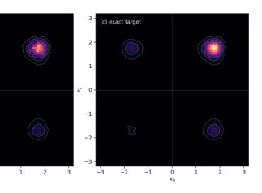 
Figure 2: Neural NHMC on the DW4 target. The complete learned path proposal, including the recorded stochastic sign-flip move, covers all four sign modes, while path-IMH correction shifts the empirical mode masses to the asymmetric target induced by the linear tilt. White contours give the exact target reference.

📷 Fig 3

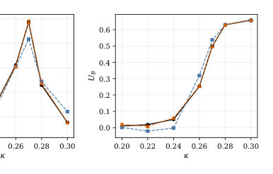 
Figure 3: Two-dimensional lattice ϕ4 benchmark on the 8 × 8 κ scan using NHMC proposal evalua- tions with SNIS correction. Curves compare raw proposal observables, SNIS-corrected observables, and the high-statistics HMC reference for ⟨|M|⟩, susceptibility, and the Binder cumulant. The SNIS ESS fraction ranges from 0.054 to 0.599 across the scan.

📷 Fig 4

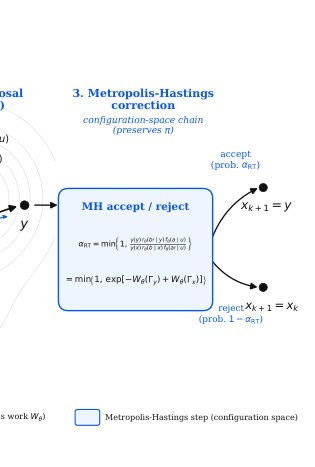 
Figure 4: Shared-bridge round-trip NHMC-MH transition. Starting from xk, the algorithm traverses the forward-oriented path Γx : u →xk in reverse to recover u, then follows Γy : u →y to the candidate. One Metropolis decision accepts y or retains xk. The curves are realized invertible path maps conditional on the sampled auxiliary records; their forward orientations define the two work values.

📷 Fig 5

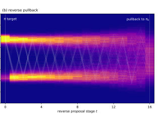 
Figure 5: DW2 neural NHMC time trace. The left panel follows real forward trajectories from the Gaussian base through the learned Hamiltonian path, with proposal stage t on the horizontal axis and the double-well coordinate x0 on the vertical axis. The right panel applies the learned reverse path to exact target samples and traces the pullback toward the base. For this fixed proposal, path-SNIS ESS is 43.4% and the reverse pullback standard deviation is 1.16.

**Summary.** This paper introduces Neural Non-Equilibrium Hamiltonian Monte Carlo (NHMC), a novel sampler that learns stochastic paths and corrects their statistical weights using non-equilibrium work derived from path ratios. It demonstrates that NHMC significantly improves sampling quality for complex systems like lattice $\phi^4$ models by providing robust estimators for free energies and observables even when direct endpoint densities are hard to calculate.

**Why it may be interesting.** The rigorous application of non-equilibrium fluctuation theorems to machine learning proposals provides a powerful, theoretically grounded way to improve sampling efficiency in many-body physics simulations beyond standard HMC or simple flow matching.

Detailed structure

**Main problem.** The core problem is accurately sampling from unnormalized Boltzmann densities, which is difficult for classical methods when modes are separated or proposals fail to preserve the target distribution.

**Main result.** The proposed Neural Non-Equilibrium Hamiltonian Monte Carlo (NHMC) method successfully generates corrected estimates of free energies and expectation values by utilizing recorded non-equilibrium work derived from path ratios.

**Method.** NHMC is a 'train-then-correct' learned Hamiltonian sampler that learns stochastic paths toward the target distribution. Corrections are achieved using identities related to non-equilibrium work (like Jarzynski's equality) applied via Path-SNIS or path-IMH sampling.

**Model / system.** The method is tested on various physical targets, including double-well potentials ($\phi^4$ models), finite-volume lattice $\phi^4$ systems, and molecular internal coordinates (e.g., Ala4, Ala6).

**Key observables.** Action overlap, log-weight spread, integrated autocorrelation time ($	au_{	ext{int}}$), free-energy differences, magnetization ($|M|$), and susceptibility ($\chi$).

**Important parameters / regimes.** Path overlap sufficiency is critical; the method performs well when sufficient path overlap exists between proposal and reference paths.

**Assumptions / limitations.** The derivation relies on the mutual absolute continuity of the forward and reverse path laws, and performance degrades significantly if path overlap is poor.

**Figures summary.** Figures illustrate NHMC path construction and recorded-work corrections; specific tables compare $\phi^4$ observables (like $|M|$ and $\chi$) across different sampling chains (HMC vs. round-trip NHMC-MH) and show action overlap improvements.

**Paper structure.** The paper introduces the theoretical framework of NHMC using non-equilibrium work, derives estimators like Path-SNIS, validates it on simple potentials (DW), and then applies and compares its performance against established methods (HMC, MD) across complex lattice ($\phi^4$) and molecular systems.

Abstract

Sampling from an unnormalized Boltzmann density requires proposals that move probability mass globally while retaining enough path-probability information for statistical correction. We introduce Neural Non-Equilibrium Hamiltonian Monte Carlo (NHMC), a train-then-correct learned Hamiltonian sampler. Starting from a tractable base distribution, NHMC learns stochastic Hamiltonian-style paths toward the target. Once training is complete, the learned proposal parameters are fixed; the proposal then generates complete paths and endpoint configurations, which are statistically corrected using the recorded non-equilibrium work. This dimensionless generalized work is determined by the probability ratio between the forward proposal path and a reverse reference path. During training, minimizing its mean reduces a path-space KL divergence and controls an upper bound on endpoint mismatch. During evaluation, the same quantity defines weights for self-normalized importance sampling on paths (path-SNIS), estimates normalizing constants or free-energy differences, and gives the acceptance ratio for path-space independent Metropolis-Hastings (path-IMH). The same forward-reverse laws also define a shared-bridge round-trip Metropolis kernel that acts directly on configurations and preserves the Boltzmann target. On double-well and finite-volume lattice $φ^4$ targets, the NHMC construction gives corrected estimates when path overlap is sufficient; when overlap is poor, weight degeneracy, low acceptance, and long autocorrelation expose proposal failure. We additionally report a molecular internal-coordinate feasibility study using an MD prior and learned-force path proposal.

[↑ back to top](#top)

### [Grover's algorithm for image edge detection](http://arxiv.org/abs/2607.15744v1)

**Authors:** Pulak Ranjan Giri, Kazuhiro Saito  
**Type:** both · **Category:** quantum information and computing · **PDF:** <https://arxiv.org/pdf/2607.15744v1>  
**Analysis basis:** full PDF text, analyzed in chunks
**Topic relevance:** `QC/QI experiment` **2/5** · `quantum measurements` **1/5**

📷 Fig 1

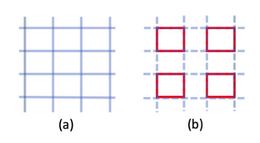 
Fig. 1. (a) A 4×4 digital image represented as a two-dimensional lattice of size 4 × 4, (b) four 2 × 2 blocks of the 4 × 4 two-dimensional lattice.

📷 Fig 2

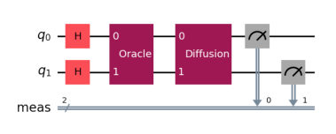 
Fig. 2. Qiskit circuit for Grover’s search algorithm with N = 4 elements for the quantum edge detection.

📷 Fig 3

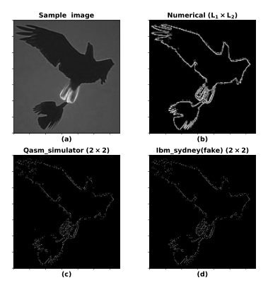 
Fig. 3. (a) A L1 × L2 = 330 × 350 image taken from the BSDS500 database, (b) edge detected by numerical analysis of Grover’s search on the full image, edge detected by Grover’s search on 2 × 2 blocks of the image with (c) qasm simulator and with (d) ibm sydney(fake) device with noise.

**Summary.** This paper proposes using Grover's quantum search algorithm to accelerate the edge detection process in digital images. By restricting the problem to small $2 	imes 2$ blocks, they demonstrate a method robust enough for current noisy quantum hardware simulations. The work shows that this quantum approach offers high success probability compared to existing methods.

**Why it may be interesting.** This work directly applies a fundamental quantum algorithm (Grover's) to a practical signal processing problem. For AMO physicists interested in quantum computation, it serves as an example of mapping physical measurement tasks onto quantum circuits suitable for near-term devices.

Detailed structure

**Main problem.** The core problem is performing edge detection on a digital image, which requires locating gradients across pixel intensities.

**Main result.** The authors demonstrate that using Grover's algorithm provides a robust method for quantum edge detection with high success probability, outperforming other quantum approaches tested on current NISQ devices.

**Method.** They adapt Grover's search algorithm to find the marked 'edge pixels' within an image block, simulating this process using Qiskit circuits.

**Model / system.** The model is a digital image ($L_1 	imes L_2$ lattice) whose edge detection problem is mapped onto a quantum search problem. The implementation is restricted to small $2 	imes 2$ blocks for compatibility with NISQ hardware.

**Key observables.** The measurement result $
ho_i = |\langle t_i|\psi_f
angle|^2$, which indicates the presence of an edge pixel with high probability.

**Important parameters / regimes.** The search space size $N$ (total pixels in a block) and the number of marked elements $M$ (edge pixels). The simulation uses qubits for small blocks ($N=4$).

**Assumptions / limitations.** The primary assumption is that Grover's algorithm can be effectively applied to image processing tasks. A major limitation noted is the necessity of dividing the large image into smaller, manageable blocks.

**Figures summary.** Figure 1 illustrates the division of a $4 	imes 4$ lattice into four $2 	imes 2$ blocks. Figure 2 shows the Qiskit circuit for Grover's search on $N=4$. Figure 3 compares sample edges from numerical analysis, simulation on $2 	imes 2$ blocks, and noisy device simulation.

**Paper structure.** The paper introduces edge detection as a problem solvable by quantum search. It details the adaptation of Grover's algorithm for this task, presents the implementation using small image blocks ($2	imes 2$), and validates the results through comparison with classical numerical analysis and noisy hardware simulations.

Abstract

Grover's algorithm is one of the most significant quantum algorithms, enabling the search for a marked element in an unsorted database quadratically faster than classical search algorithms. We utilize Groves's algorithm to detect the edges of a digital image faster than any classical edge detection methods. The high success probability of our method in detecting image edges, compared to most existing quantum edge detection methods, makes it a more suitable candidate for use in the presence of noise on current quantum devices. We implemented our model for the $2\times 2$ blocks of the image using a two-qubit Qiskit circuit with the QASM simulator and the noisy IBM Sydney(fake) device, making it suitable for most of the current NISQ devices.

[↑ back to top](#top)

### [Non-Gaussianity in cat codes: global incompatibility and local geometric alignment with the magic resource](http://arxiv.org/abs/2607.15739v1)

**Authors:** Yuwei Zhu, Seungbeom Chin, William J. Munro, Kae Nemoto  
**Type:** theory · **Category:** quantum information and computing · **PDF:** <https://arxiv.org/pdf/2607.15739v1>  
**Analysis basis:** full PDF text, analyzed in chunks
**Topic relevance:** `entanglement & information structure` **2/5** · `Keldysh / 2PI / non-Gaussian methods` **1/5**

📷 Fig 1

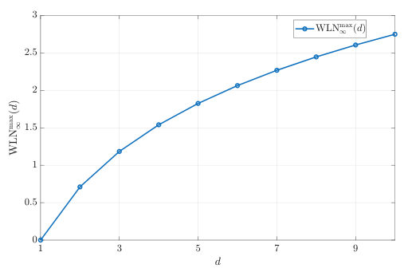 
FIG. 1. Asymptotic upper bound of the WLN for d- component cat states in the large-separation regime, d = 1, ..., 10. The bound is attained for the equal-amplitude su- perposition and increases logarithmically with the number of coherent components d, according to Eq. (11).

📷 Fig 2

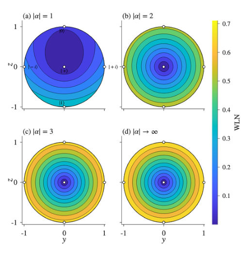 
FIG. 2. WLN contours on the logical Bloch sphere for the even/odd cat code, viewed along the positive logical x-axis. (d) shows the ideal large-separation limit |α| →∞, where the equal-WLN contours are concentric circles centered on the x-axis; the minimum occurs rigorously at |±⟩L, while the maximum is attained on the outer boundary corresponding to the equator x = 0. (a)–(c) display the exact WLN landscapes for finite |α| = 1, 2, 3. As |α| increases, the WLN landscapes converge toward the asymptotic geometry: the contour dis- tortions diminish, the level sets become more nearly circular, and the minimum shifts toward |±⟩L.

📷 Fig 3

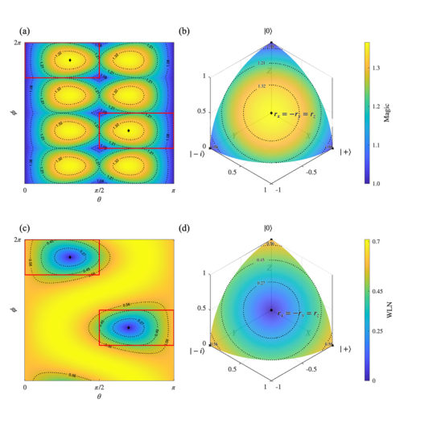 
FIG. 3. Qubit illustration of the local level-set alignment between the magic measure and asymptotic WLN under the SU(2) ACC. (a) Magic-measure landscape on the flattened Bloch sphere. The two opposite sign sectors with coordinate signatures (+, −, +) and (−, +, −) are highlighted. The full landscape is symmetric over the eight octants, with one local maximum and circular level sets in each sign sector. (b) Lo- cal view of the sector (+, −, +). The local maximum of the magic measure lies along the sector eigenaxis rx = −ry = rz, and the equal-M contours form concentric circles around this axis. (c) Asymptotic WLN landscape after applying the SU(2) ACC. The WLN landscape is divided into two...

📷 Fig 4

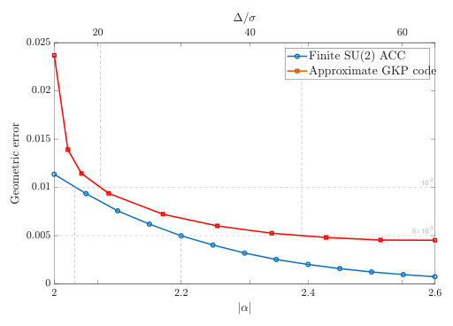 
FIG. 4. Geometric error for the approximate qubit GKP en- coding and the finite SU(2) cat encoding, plotted as functions of the control parameters ∆/σ and |α|. The error E measures the radial deviation of equal-WLN contours from the ideal circular level sets in the target Bloch-sphere octant. We ex- tract 80 WLN contours from an 80×80 logical-state grid. For the GKP data, we use a truncated finite-energy model with fixed spike width σ0 ≃0.28, and varying envelope width ∆. In both encodings, E decreases as the corresponding physical parameter increases. More numerical details can be found in Appendix D 1.

**Summary.** This paper analyzes the relationship between non-Gaussianity and the magic resource in cat codes, comparing their respective geometric structures. While finding global incompatibility with the established GKP equivalence, the authors prove a constructive local alignment exists asymptotically within the large-separation limit. This suggests a geometry-based approach for understanding quantum resource correspondences.

**Why it may be interesting.** This work provides a geometric framework for understanding resource relations (like NG and magic resources) beyond specific encoding schemes, suggesting general principles applicable to quantum information theory.

Detailed structure

**Main problem.** The study investigates whether the correspondence between non-Gaussianity (NG) and the magic resource, established for GKP encoding, holds true in cat codes.

**Main result.** Cat codes globally fail to inherit the GKP equivalence, but their asymptotic Wigner logarithmic negativity geometry allows for a constructive local alignment with the magic measure geometry under an SU(d) code.

**Method.** The authors compare the Wigner logarithmic negativity (WLN) and a phase-operator based magic measure by analyzing $d$-peaked cat states in the large-separation asymptotic limit.

**Model / system.** The system involves continuous-variable quantum states, specifically non-degenerate $d$-peaked cat states $|\psi_d
angle$, analyzed within the context of GKP and SU(d) encoding frameworks.

**Key observables.** Wigner logarithmic negativity (WLN), Magic measure ($M$), Geometric error ($E$).

**Important parameters / regimes.** The analysis is performed in the large-separation regime, $|\alpha_i - \alpha_j| \gg 1$, and involves parameters related to the number of peaks $d$ and amplitudes $|c_i|$.

**Assumptions / limitations.** The results rely heavily on the non-degenerate large-separation limit for cat states, which simplifies the Wigner function analysis significantly.

**Figures summary.** Figures illustrate the asymptotic upper bound of WLN for $d$-component cat states and show how finite $|\alpha|$ landscapes converge to this ideal asymptotic structure.

**Paper structure.** The paper establishes the problem by noting the GKP equivalence, then analyzes the cat code setting using WLN vs. magic measure comparison. It proves global incompatibility but demonstrates local alignment based on shared phase-rotation invariance in the large-separation limit.

Abstract

Non-Gaussianity is an essential resource for genuine quantum advantages in continuous-variable quantum systems and is regarded as a counterpart of the magic resource in discrete-variable systems. Recently, an exact correspondence between non-Gaussianity (NG) and the magic resource was identified within the Gottesman--Kitaev--Preskill (GKP) encoding framework. Whether such a relation persists beyond GKP encoding, however, remains unclear. Here, we address this question in the cat-code setting. By comparing the Wigner logarithmic negativity (WLN) and a magic measure defined from a phase-operator basis, we analyze the resource geometry of non-degenerate $d$-peaked cat states. We find that cat codes do not inherit the global value-preserving GKP magic--NG equivalence, but their asymptotic WLN geometry allows a constructive local alignment with the magic-measure geometry. Specifically, under a distinguished SU($d$) asymptotic cat code, we establish a sector-dependent alignment between WLN level sets and magic-measure level sets based on their intrinsic local geometries. These results identify both the global incompatibility and the locally constructive relation between magic and non-Gaussian resources in cat codes, suggesting a geometry-based approach to resource correspondences beyond the GKP framework.

[↑ back to top](#top)

### [Reverse engineering of single-qubit quantum gates](http://arxiv.org/abs/2607.16124v1)

**Authors:** Gustavo Fernandes da Costa, Leonardo K. Castelano, Emanuel Fernandes de Lima  
**Type:** theory · **Category:** quantum information and computing · **PDF:** <https://arxiv.org/pdf/2607.16124v1>  
**Analysis basis:** full PDF text, analyzed in chunks
**Topic relevance:** `QC/QI experiment` **2/5** · `quantum measurements` **1/5**

📷 Fig 1

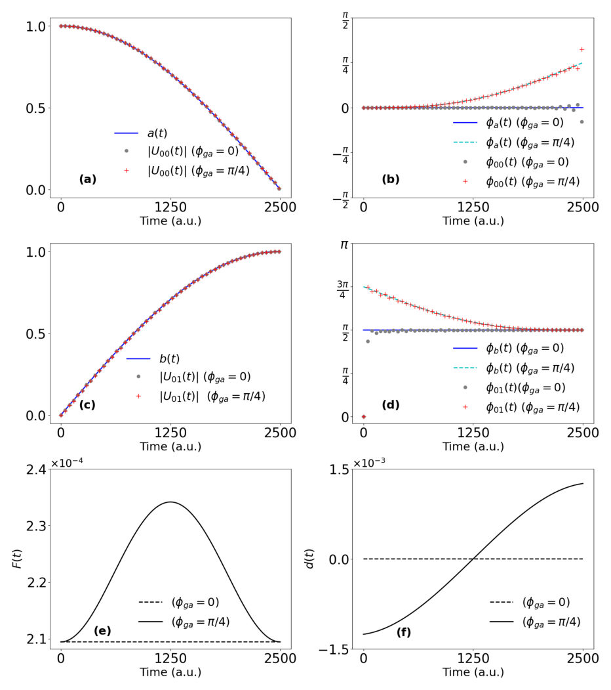 
FIG. 1: Comparison between the chosen dynamical functions for the evolution operator and

📷 Fig 2

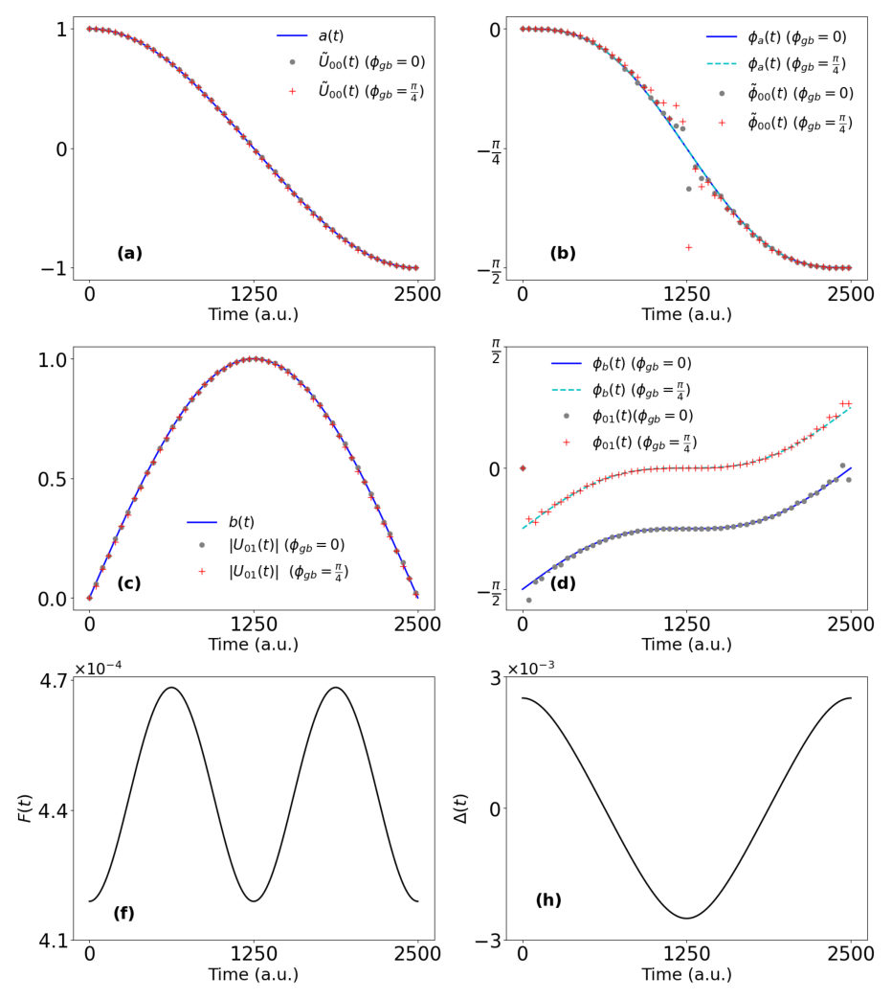 
FIG. 2: Comparison between the chosen dynamical functions for the evolution operator and the

📷 Fig 3

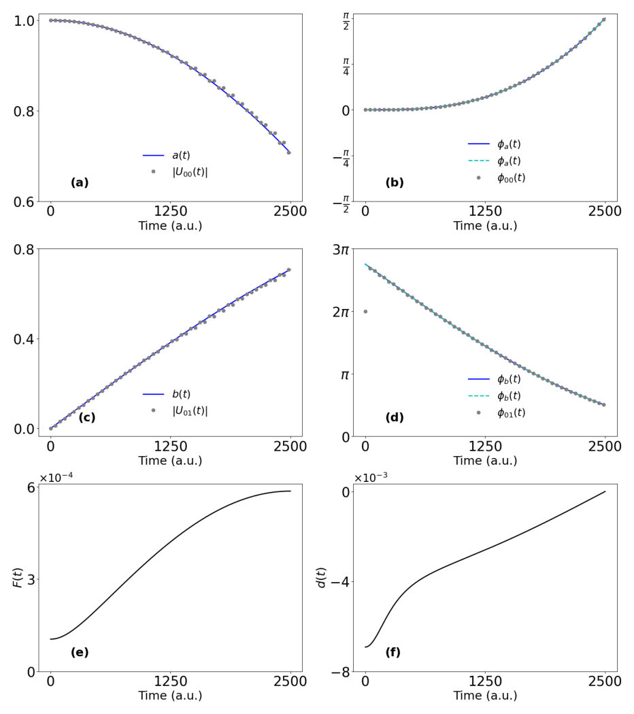 
FIG. 3: Comparison between the chosen dynamical functions for the evolution operator and the

📷 Fig 4

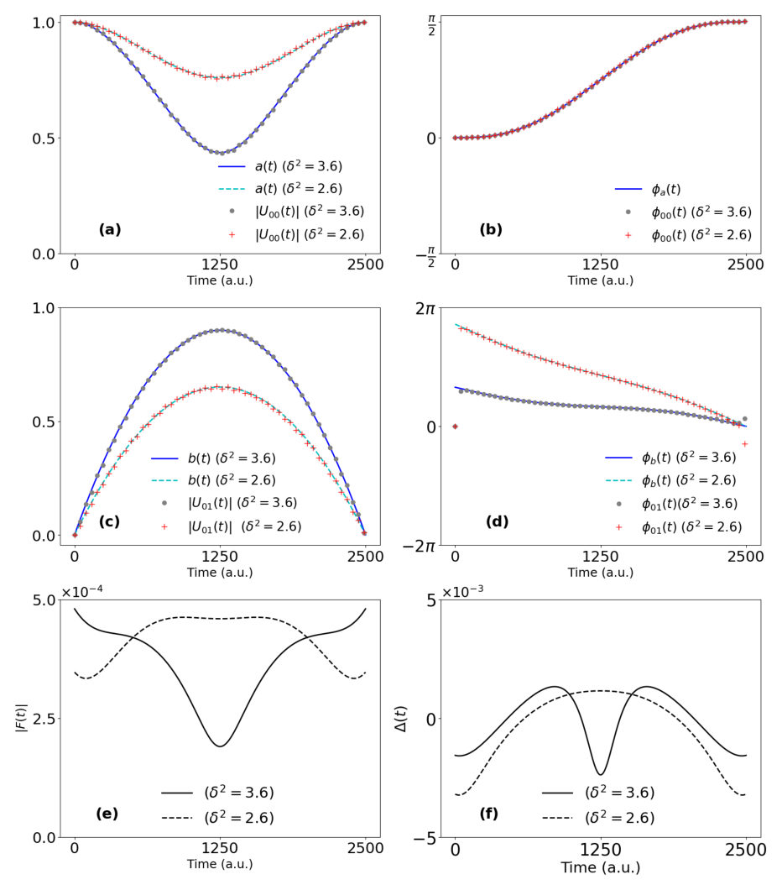 
FIG. 4: Comparison between the chosen dynamical functions for the evolution operator and

📷 Fig 5

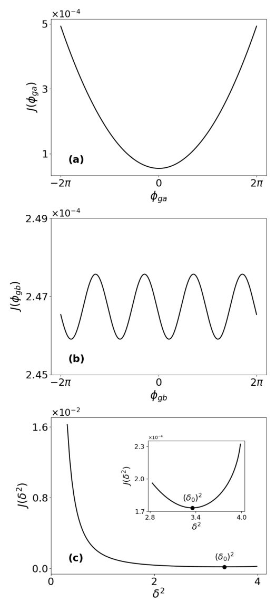 
FIG. 5: Pulse fluency J as a function of the free parameters for the optimization of the control

**Summary.** This paper develops a rigorous inverse engineering technique to determine the exact time-dependent electric field required to realize any desired single-qubit quantum gate. By solving the system's equations of motion and minimizing an associated cost functional, the authors provide optimal pulse shapes that ensure high fidelity while remaining analytically tractable.

**Why it may be interesting.** This work provides concrete, analytically derived recipes for quantum control, which is crucial for experimental realization of quantum gates in platforms like trapped ions or superconducting qubits where precise microwave/laser pulses are used.

Detailed structure

**Main problem.** The core problem is designing the precise time-dependent control pulse required to implement an arbitrary single-qubit quantum gate using only a linearly-polarized external field.

**Main result.** The authors provide general closed analytical formulas for the control field, demonstrating that optimal pulses can be found by minimizing a cost functional (fluency) over free parameters derived from solving the system's equations of motion.

**Method.** They employ an inverse engineering approach: deriving the required time-dependent Hamiltonian evolution operator and then inverting the resulting differential equations to determine the necessary field amplitude and phase functions.

**Model / system.** The model is a two-level quantum system (qubit) governed by a Hamiltonian $H(t) = -\omega_0/2 \sigma_z - \mu E(t)\sigma_x$. The evolution is analyzed using the Rotating-Wave Approximation (RWA).

**Key observables.** Gate fidelity ($F$), control field amplitude $F(t)$, detuning $\Delta(t)$, and pulse fluency ($J$, a cost functional).

**Important parameters / regimes.** The initial/final state parameters of the target gate, such as $\phi_{ga}$ or $\delta^2$, which act as free parameters to optimize performance.

**Assumptions / limitations.** The analysis fundamentally relies on the Rotating-Wave Approximation (RWA). Furthermore, achieving analytical tractability often requires assuming specific functional forms for intermediate dynamical functions.

**Figures summary.** Figures compare numerical simulations against derived analytical functions for implementing gates like $i\sigma_x$ and $i\sigma_z$, while Figure 5 maps the pulse fluency cost as a function of various free parameters to identify optimal control settings.

**Paper structure.** The paper proceeds by deriving general formulas for the control field using dynamical functions, then applies this framework to specific gates ($i\sigma_x$, $i\sigma_z$), and finally optimizes the resulting pulse parameters by minimizing a cost functional (fluency) via numerical comparison with full Hamiltonian simulations.

Abstract

In this work, we address the problem of designing single-qubit quantum gates by means of a linearly-polarized field. We show that any desired one-qubit gate corresponding to a special unitary matrix can be generated by a modulated sinusoidal field. The only approximation involved is the rotating-wave-approximation. The formula for the control field is obtained by inverting the equation of motion for the evolution operator and imposing the conditions for the desired gate. We give a simple procedure to obtain closed analytical formulas for the fields in terms of a priori chosen dynamical functions. Additionally, these dynamical functions can depend on tunable free parameters intentionally introduced to meet a desired performance criteria.

[↑ back to top](#top)

### [Topology and compact molecular orbitals in twisted bilayer WSe$_2$](http://arxiv.org/abs/2607.15611v1)

**Authors:** Chenyuan Li, Rwik Dutta, Fang Xie, James R. Chelikowsky, Jennifer Cano, Mit H. Naik, Qimiao Si  
**Type:** theory · **Category:** strongly correlated electrons · **PDF:** <https://arxiv.org/pdf/2607.15611v1>  
**Analysis basis:** full PDF text, analyzed in chunks
**Topic relevance:** `analog quantum simulation` **2/5** · `Keldysh / 2PI / non-Gaussian methods` **1/5**

📷 Fig 1

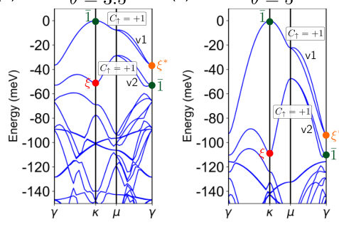 
FIG. 1. Band structures for tWSe2 at twist angles (a) 3.5◦and (b) 5.0◦. The two isolated spin-polarized bands are labeled by their Chern numbers, C↑= +1. The labels denote the spinful C3 rotation eigenvalues of the spin up states at the high- symmetry points, with ξ = eiπ/3, ξ∗= e−iπ/3 and ¯1 = −1. The corresponding eigenvalues for spin down states are related by time-reversal symmetry. In the top two bands, the C3z eigenvalues for κ and κ′ points are identical for the same spin.

📷 Fig 2

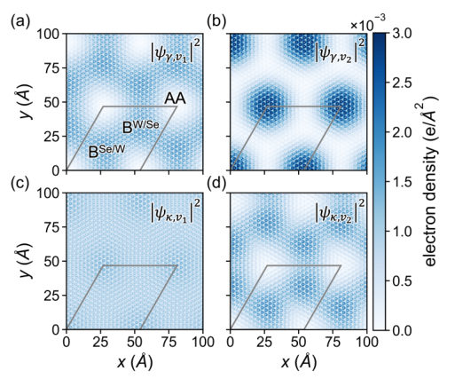 
FIG. 2. Distribution of Kohn-Sham states |ψγ(r)|2 and |ψκ(r)|2 averaged along the out-of-plane (z) direction for the top two valence bands at twist angle θ = 3.5◦. Panels (a,b) are evaluated at the moir´e γ point, and panels (c,d) at the moir´e κ point. Panels (a,c) show the topmost band, while panels (b,d) show the second top band. Dashed parallelgrams mark one moir´e unit cell.

📷 Fig 3

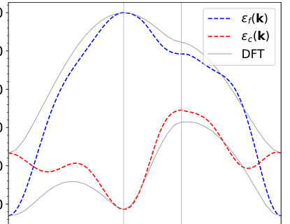 
FIG. 4. The band structure of the effective model in the ab- sence of f-c hybridization for θ = 3.5◦. The blue dashed curve denotes the dispersion of the localized f orbital (MLWF), while the red dashed curve stands for the energy of the con- duction c band. The grey lines show the corresponding DFT bands. Without hybridization, f and c bands cross near the γ point.

📷 Fig 4

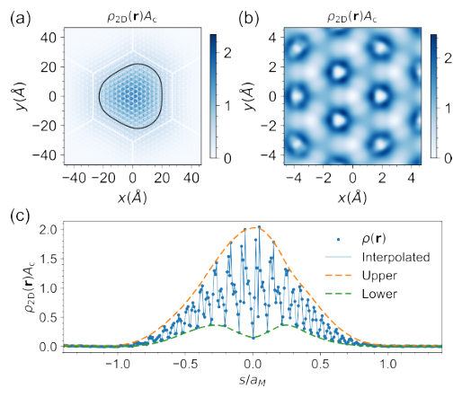 
FIG. 3. (a) Real space distribution of the z-integrated Wan- nier density ρ2D(r) at twist angle θ = 3.5◦. The density is shown in units of A−1 c , where Ac is the area of the moir´e unit cell. The black contour provides a smoothed guide to the Wannier function’s spatial profile, corresponding to half of its maximum value. The white hexagon marks the moir´e unit cell. (b) Zoomed-in view of the same density distribution to atomic scale. (c) Line cut of ρ2D(r)Ac along the a1 direction, plotted as a function of distance s/aM, where aM is the moir´e lattice constant. Blue points show the sampled density, and the solid blue line is the interpolated profile. The dashed or- ange and green curves...

**Summary.** The paper investigates the electronic structure of twisted bilayer WSe2 to understand its superconducting properties by incorporating band topology. Using DFT and partial Wannierization, the authors confirm the bands are topologically non-trivial and construct an effective Hamiltonian based on two derived molecular orbitals. This provides a crucial theoretical benchmark for studying correlated electron physics in moiré TMDs.

**Why it may be interesting.** This work provides a rigorous *ab initio* foundation for modeling strongly correlated systems using topological band theory, which is highly relevant for understanding unconventional superconductivity in 2D materials.

Detailed structure

**Main problem.** The central question is whether band topology plays an essential role in understanding the correlation physics, particularly superconductivity, observed in twisted bilayer WSe2.

**Main result.** The top moiré valence bands are found to be topologically non-trivial, carrying Chern numbers C=(+1,+1) for the K valley. The authors successfully derived an effective low-energy Hamiltonian using compact molecular orbitals.

**Method.** The study combines first-principles Density Functional Theory (DFT) calculations with a partial Wannierization procedure guided by symmetry representations to construct localized molecular orbitals.

**Model / system.** The system is twisted bilayer WSe2, modeled via its moiré bands. The effective Hamiltonian is constructed in a $2 	imes 2$ basis spanned by two derived orbitals: a compact 'f' orbital and a topological 'c' orbital.

**Key observables.** Chern numbers (C), hopping amplitudes ($t_{	ext{f}}$), hybridization strengths ($V_{	ext{hyb}}$), and on-site Coulomb interaction ($U$).

**Important parameters / regimes.** Twist angles ($	heta$), moiré lattice constant ($a_M$), and the ratio $t_f/U$.

**Assumptions / limitations.** The analysis relies on constructing compact molecular orbitals via partial Wannierization, which separates the physics into a localized component ('f') and a topological obstruction ('c').

**Figures summary.** Figures illustrate band structures showing Chern numbers; spatial distributions show orbital localization patterns at high-symmetry points ($\gamma, \kappa$); and plots track hopping parameters and hybridization strength as functions of twist angle.

**Paper structure.** The work progresses from DFT calculation of moiré bands to identifying their topological nature (Chern numbers). It then employs a partial Wannierization technique guided by symmetry to construct an effective Hamiltonian in terms of two molecular orbitals, allowing for the extraction of key hopping and interaction parameters.

Abstract

Recent observations of superconductivity in twisted bilayer WSe$_2$ (tWSe$_2$) have motivated theoretical proposals for unconventional pairing mechanisms. A central question is whether band topology plays an essential role in the system's correlation physics. In this letter, we develop a first-principles-based description of the top moiré valence bands in tWSe$_2$. Using density functional theory (DFT) calculations, we identify the bands in the relevant range of twist angles to be topologically non-trivial, with the top valence bands carrying Chern numbers $C=(+1,+1)$ for the $K$ valley. In order to treat the strong correlation physics, we construct compact molecular orbitals directly from the DFT wave functions through a partial Wannierization procedure and with the guidance of spinful $C_{3z}$ symmetry representations. This yields a localized $f$ orbital together with a complementary topological $c$ orbital, allowing us to extract hopping and hybridization amplitudes from first principles. The resulting parameters provide an ab initio benchmark for the effective Hamiltonian. Our work establishes a foundation for understanding superconductivity in moiré TMDs and highlights tWSe$_2$ as a promising platform for exploring topological superconductivity.

[↑ back to top](#top)

### [Causality from the spectrum: Emergence of causal order from process-matrix mereology](http://arxiv.org/abs/2607.15345v1)

**Authors:** Varun Kushwaha, Nicolas Loizeau, Alexei Grinbaum, Oliver Friedrich  
**Type:** theory · **Category:** other · **PDF:** <https://arxiv.org/pdf/2607.15345v1>  
**Analysis basis:** full PDF text, analyzed in chunks
**Topic relevance:** `correlated / nonlocal dissipation` **1/5** · `driven-dissipative phase transition` **1/5** · `entanglement & information structure` **1/5** · `methods for driven-dissipative` **1/5** · `non-equilibrium dynamics` **1/5**

📷 Fig 1

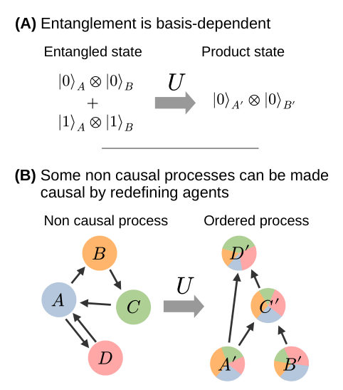 
FIG. 1. (A) Entanglement is basis-dependent, i.e. it depends on the definition of subsystems. Given an entangled pure state |ψ⟩, one can always find a unitary transformation U towards new subsystems on which |ψ⟩becomes a product state. (B) Similarly, by redefining the decomposition into agents, one can make some non-causal process causal. This redefinition of agents is performed via a unitary U on the global Hilbert space from the old to the new agents’ input and output sub- systems and time order.

📷 Fig 2

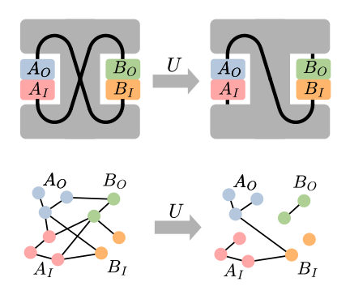 
FIG. 2. Top: Given a process matrix W with indefinite causal order, we look for a unitary transformation U such that UWU † is causally ordered. Bottom: The above prob- lem can be solved numerically by considering the following many-body problem: given an operator W, find an isospec- tral operator W ′ supported on a restricted set of Pauli strings {Pi} . Here the nodes represent spins belonging to the differ- ent subspaces and the edges represent Pauli strings {Pi} that couple these spins.

📷 Fig 3

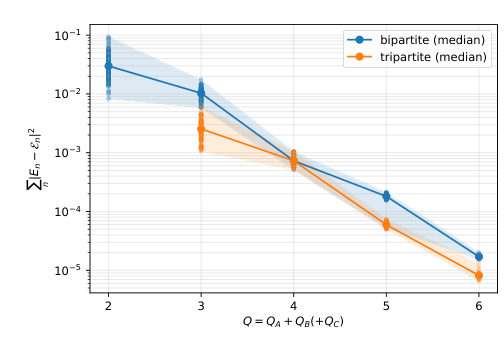 
FIG. 3. Minimum of the spectral cost in Eq. (4) for spec- tra sampled from the Wishart ensemble. We draw ρ = GG†/ tr(GG†) and, for a fixed total causal order π, minimize over all valid process matrices in Wπ. The total Hilbert-space dimension is D = 2Q, where Q is the total number of ele- mentary qubits. The residual cost decreases rapidly with Q, showing that random high-dimensional spectra approach the set of spectra realized by valid processes with the fixed total order. Each point is averaged over 100 independent realiza- tions.

📷 Fig 4

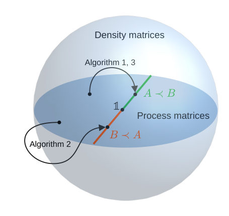 
FIG. 4. Representation of the optimization routes the dif- ferent methods described in this section take in the space of process matrices. The space of process matrices satisfying A ≺B is a convex subset of the space of the process matri- ces, itself a convex subset of the space of the density matrices. Algorithms 1 and 3 exit the space of the valid process matri- ces during the optimization, but stay in the space of density matrices because they conserve the spectrum. Algorithm 2 does not conserve the spectrum during the procedure, and therefore it can exit the space of density matrices.

**Summary.** The paper investigates whether definite causal order can emerge solely from the spectrum of a process matrix in higher-order quantum theory. By analyzing how unitaries transform these matrices, the authors demonstrate that generic processes approach a causally ordered state in the thermodynamic limit. This suggests a fundamental mechanism for classical causality arising purely from algebraic constraints.

**Why it may be interesting.** This work is highly relevant as it tackles fundamental questions about the emergence of physical principles (like causality) from purely mathematical or algebraic structures, which resonates with foundational studies in quantum information and open systems theory.

Detailed structure

**Main problem.** The central problem is determining if definite causal order (the 'when') can emerge purely from algebraic ingredients, specifically from the spectrum of a process matrix, mirroring how locality has been shown to emerge in quantum mereology.

**Main result.** In the thermodynamic limit, generic quantum processes are shown to admit a preferred decomposition into agents that brings the process close to a causally separable state, suggesting an emergence mechanism for classical causality from algebraic structure alone.

**Method.** The authors use spectral analysis and unitary transformations on the process matrix $W$ within the framework of higher-order quantum theory. They derive necessary conditions (like divisibility constraints) that must be met if a process is to possess a definite causal order $\mathcal{O}$.

**Model / system.** The model uses the process-matrix framework for higher-order quantum theory, describing interactions between multiple agents (A, B, etc.). The system's structure is encoded in the process matrix $W$, which acts on a total Hilbert space formed by tensor products of input and output spaces for each agent.

**Key observables.** The spectrum ($	ext{spec}(W)$) of the process matrix $W$ is the primary diagnostic tool, as it is basis-independent. Other observables include spectral distance metrics ($C(\mathbf{w})$).

**Important parameters / regimes.** The analysis focuses on the thermodynamic limit and the structure imposed by sequential agent interactions (e.g., $	ext{A} \prec 	ext{B}$). Dimension constraints, such as $d_{k,O} | d_{k+1,I}$, are crucial.

**Assumptions / limitations.** The work assumes that defining an agent minimally involves grouping input and output Hilbert spaces, and it relies on dimension divisibility assumptions for the sufficiency of spectral conditions.

**Figures summary.** Figure 1 illustrates how redefining agents via a unitary $U$ can make non-causal processes appear causal. Figure 2 details the numerical approach to finding such unitaries by minimizing a spectral distance cost function.

**Paper structure.** The paper progresses from establishing the problem (causality vs. spectrum) to deriving necessary spectral constraints for fixed order, then showing that these constraints can be satisfied constructively via specific unitary transformations in the thermodynamic limit.

Abstract

In Hamiltonian systems, the only basis-independent quantity is the spectrum. Given a spectrum, quantum mereology seeks preferred tensor-product decompositions into local subsystems, leading to the emergence of locality. Causal order, however, remains fixed by the Hamiltonian time evolution. In contrast, higher-order quantum theory permits more general processes that need not possess a definite global causal order. In the process-matrix framework, specifying a process requires a choice of subsystems corresponding to the input and output Hilbert spaces of each agent. A change of basis redefines both the agents and the corresponding decompositions into subsystems, while leaving the spectrum of the process matrix invariant. Here, we study how causality arises from this spectrum. First, we derive spectral constraints on processes compatible with definite causal order. Second, we show that, in the thermodynamic limit, generic quantum processes admit a preferred decomposition with a definite causal order. This suggests a mechanism for the emergence of classical causality only from algebraic ingredients.

[↑ back to top](#top)

### [Programming with Quantum-Controlled Quantum Channels](http://arxiv.org/abs/2607.15873v1)

**Authors:** Kengo Hirata, Takeshi Tsukada  
**Type:** theory · **Category:** quantum information and computing · **PDF:** <https://arxiv.org/pdf/2607.15873v1>  
**Analysis basis:** full PDF text, analyzed in chunks
**Topic relevance:** `analog quantum simulation` **1/5** · `correlated / nonlocal dissipation` **1/5** · `driven-dissipative phase transition` **1/5** · `methods for driven-dissipative` **1/5** · `non-equilibrium dynamics` **1/5**

📷 Fig 1

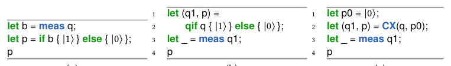 
Fig. 2. Dilation of a program with no qif. (a) Source program. (b) Deferring the measurement. (c) Moving the qubit creation operations |0⟩and |1⟩to the beginning. Here CX is the controlled X gate.

📷 Fig 2

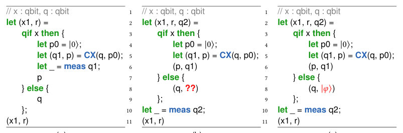 
Fig. 3. An example of the program transformation. (a) Source program. (b) Hoisting the measurement outside qif results in an ill-typed program. (c) Adding a dummy value |𝜑⟩makes the program well-typed. Then, moving the qubit creations let𝑝0 = |0⟩before qif and replacing |𝜑⟩with 𝑈𝑝0 yields a dilation. Here 𝑈is a unitary satisfying 𝑈|0⟩= |𝜑⟩.

📷 Fig 3

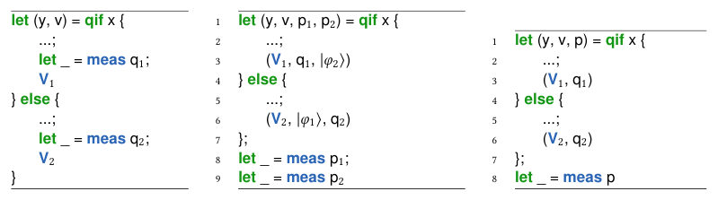 
Fig. 4. Comparison between the previous and new transformations. The previous transformation introduces the else-branch dummy value |𝜑1⟩corresponding to meas𝑞1 in the then-branch and the then-branch dummy value |𝜑2⟩corresponding to meas𝑞2 in the else-branch. The new transformation moves a pair of measurements from the then- and else-branches, so it does not require any dummy qubit values.

📷 Fig 4

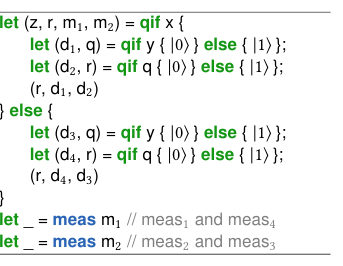 
Fig. 5. Correspondence of measurements affects the translation.

📷 Fig 5

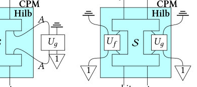 
Fig. 14. Visualisation of syntactic dilation in a string diagram

**Summary.** This paper addresses the ambiguity in defining quantum control flow by distinguishing between controlled operations and the quantum SWITCH. It introduces a novel quantum programming language enforced by a linear type system to correctly model the quantum SWITCH over arbitrary noisy channels. This provides a mathematically sound framework for writing complex quantum algorithms involving conditional logic.

**Why it may be interesting.** It provides rigorous foundational tools for programming with general open quantum systems, which is crucial for simulating realistic physical processes involving dissipation or measurement.

Detailed structure

**Main problem.** The paper distinguishes between 'controlled operations' and the 'quantum SWITCH,' arguing they are fundamentally different control mechanisms in quantum computation.

**Main result.** It develops a novel, well-behaved quantum programming language with a linear type system capable of expressing the quantum SWITCH over general quantum channels.

**Method.** The authors use semantic analysis based on program transformations and develop both denotational and operational semantics to formalize the control flow structures.

**Model / system.** The model is abstract quantum computation using qubits, quantum channels (represented by CPTP maps/Kraus operators), and programming language constructs like quantum conditional branching ($	ext{qif}$).

**Key observables.** Well-definedness of control mechanisms; preservation of semantics under translation between formalisms.

**Important parameters / regimes.** Linearity constraints, the structure of Kraus decompositions, and the distinction between unitary vs. general channel operations.

**Assumptions / limitations.** The core assumption is that controlled operations and the quantum SWITCH must be treated as distinct control primitives to maintain mathematical rigor for arbitrary channels.

**Figures summary.** Figures illustrate the definition of controlled operations, the syntactic dilation rules mapping constructs from $	ext{QUGCL}'$ to $	ext{QifUnitary}$, and the semantics of various control flow structures using Kraus operators.

**Paper structure.** The paper establishes the theoretical distinction between quantum control types, develops a formal language framework incorporating linearity constraints, and proves semantic preservation theorems by translating constructs between different formalisms (e.g., $	ext{Vac}$ to $	ext{QifUnitary}$).

Abstract

In contrast to a classical bit, which can only take the value $0$ or $1$, its quantum counterpart -- a qubit -- can exist in a superposition of $0$ and $1$. This is a superposition of data values, naturally raising the question of whether one can superpose not only data but also programs. For example, a particular superposition of programs, known as the quantum SWITCH, has attracted much attention, and its implementations and computational advantages have been studied extensively within the physics community.   A naive way to control a program by a qubit is by means of a controlled operation. Given an operation $F$, this amounts to considering an operation that behaves as $F$ when the control qubit is $|1\rangle$, and as the identity operation when the control qubit is $|0\rangle$. This idea works well when $F$ is a unitary operation, but it is not well-defined for a general quantum channel. By contrast, the quantum SWITCH is free from the well-definedness issue. This contrast leads to the key insight of this paper: controlled operations and the quantum SWITCH should be regarded as different kinds of quantum control mechanisms.   Building on this insight, we develop a novel quantum programming language with quantum control and measurement that can express the quantum SWITCH over quantum channels. Using a semantic analysis based on program transformations, we identify the source of the ill-behavedness of controlled operations as the \emph{correspondence problem}: a lack of coordination between the measurements performed in the then- and else-branches of quantum conditional branching. We address this problem with a linear type system that enforces alignment of the quantum operations used in the two branches, yielding a well-behaved language capable of expressing the quantum SWITCH.

[↑ back to top](#top)

### [Thermal Order by Disorder in Resonating-Valence Bond States on the Checkerboard Lattice](http://arxiv.org/abs/2607.15813v1)

**Authors:** Giorgi Gogaberishvili, Nika Kurdadze, Kirill Shtengel  
**Type:** theory · **Category:** strongly correlated electrons · **PDF:** <https://arxiv.org/pdf/2607.15813v1>  
**Analysis basis:** full PDF text, analyzed in chunks
**Topic relevance:** `analog quantum simulation` **1/5** · `correlated / nonlocal dissipation` **1/5** · `driven-dissipative phase transition` **1/5** · `exotic spin models in light-matter` **1/5**

📷 Fig 1

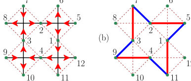 
FIG. 2. A flippable plaquette in the six-vertex representation (a) and the corresponding pinwheel arrangement of singlets (b) consisting of the original singlets (red) and their rear- rangement after the flip (blue).

📷 Fig 2

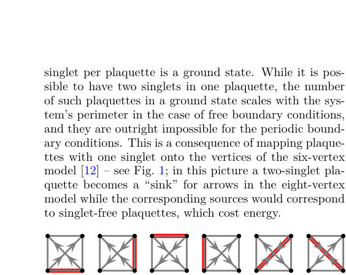 
FIG. 1. Mapping between singlets (shown in red) and six- vertex configurations

📷 Fig 3

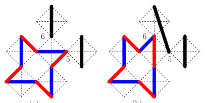 
FIG. 3. Clockwise (red) and anticlockwise (blue) flippable configurations of singlets (a) before, and (b) after the action of operator ˆP56. Black singlets are not affected by the flips.

📷 Fig 4

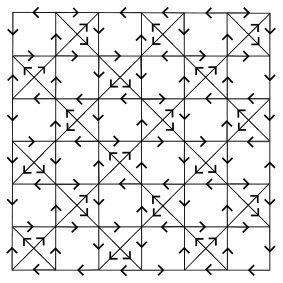 
FIG. 4. Singlet orientations that result in the positive parity Fp = +1 for each pinwheel are indicted by arrows. Note that the parity is positive for each individual triangle and open square.

📷 Fig 5

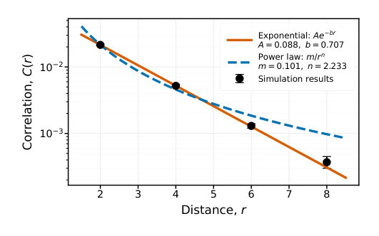 
FIG. 5. Singlet–singlet correlation function between two hor- izontal singlets in the same vertical column as a function of distance, for a 24 × 24 lattice. The data are consistent with exponential decay, well described by e−r/1.41 law; the best power-law fit, r−2.23, is also shown for comparison.

**Summary.** This theoretical work examines how thermal fluctuations can induce quasi-long-range order in RVB states on the checkerboard lattice. By showing that decoherence suppresses destructive quantum interference, the system's correlations transition from an expected exponential decay to a power-law decay characteristic of dimer models. The paper rigorously proves the mathematical basis for this state using advanced techniques involving local projector operators.

**Why it may be interesting.** The concept of thermal order by disorder, where temperature drives a system into an ordered phase by suppressing quantum interference effects, is highly relevant for understanding exotic phases in strongly correlated electron systems like high-Tc superconductors.

Detailed structure

**Main problem.** The paper investigates a novel mechanism for 'thermal Order by Disorder' within Resonating Valence Bond (RVB) states on the checkerboard lattice.

**Main result.** Thermal decoherence suppresses destructive quantum interference, causing singlet-singlet correlations to decay with a power law ($1/r^2$) rather than exponentially, indicating quasi-long-range order.

**Method.** The authors derive an effective local spin Hamiltonian and analyze correlation functions by comparing the pure RVB state (exponential decay) against the mixed state resulting from thermal decoherence (power-law decay).

**Model / system.** The system is a spin-1/2 model on the checkerboard lattice, modeled using Resonating Valence Bond (RVB) states and related to Quantum Dimer models. The Hamiltonian involves complex local projectors and twelve-spin interactions.

**Key observables.** Singlet–singlet correlation function $C(r)$ and dimer–dimer correlations; the diagnostic is the transition from exponential decay to power-law decay.

**Important parameters / regimes.** The analysis focuses on the temperature regime $K \gg T \gg J$.

**Assumptions / limitations.** The conclusion regarding power-law decay hinges on the linear independence of Valence Bond (VB) states, which is established through a detailed patch expansion procedure assuming periodic boundary conditions.

**Figures summary.** Figures illustrate mappings between singlets and six-vertex configurations, show the action of plaquette operators, and detail the iterative process of proving linear independence by expanding patches on the lattice.

**Paper structure.** The paper progresses from defining the Hamiltonian and RVB state to analyzing correlation functions in different regimes. It then dedicates significant effort to mathematically proving the linear independence of singlet coverings via a patch expansion procedure using local projector operators.

Abstract

We derive a local spin-1/2 Hamiltonian with a resonating valence bond ground state on the checkerboard lattice. The state is characterized by the exponential decay of singlet-singlet correlations, whereas dimer-dimer correlations decay with a power law in the corresponding Quantum Dimer model. This observation leads to a novel mechanism for thermal Order by Disorder whereby thermal decoherence suppresses destructive quantum interference between different contributions to the correlations in the ground state and results in a qualitatively different, quasi-long-range ordered mixed state.

[↑ back to top](#top)

### [Field-induced first order transitions and phase coexistence in the Kitaev quantum spin liquid candidate BaCo2(AsO4)2](http://arxiv.org/abs/2607.15346v1)

**Authors:** Tanner J. Legvold, Bin Gao, Rong-Zhu Lin, Violet Williams, Tong Chen, Dehong Yu, Chien-Lung Huang, Gage Eichman, Renjie Lui, Benedetta Flebus, Pengcheng Dai, Douglas Natelson  
**Type:** both · **Category:** strongly correlated electrons · **PDF:** <https://arxiv.org/pdf/2607.15346v1>  
**Analysis basis:** full PDF text, analyzed in chunks
**Topic relevance:** `analog quantum simulation` **1/5** · `exotic spin models in light-matter` **1/5** · `spintronics-quantum-optics interface` **1/5**

📷 Fig 1

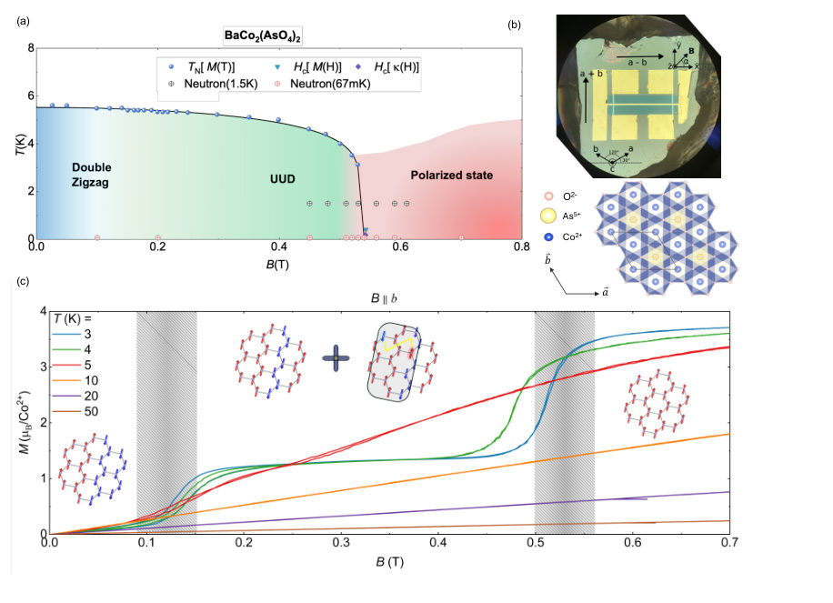 
FIG. 1. Crystal structure and magnetic phase diagram of BaCo2(AsO4)2 (BCAO). (a)

📷 Fig 2

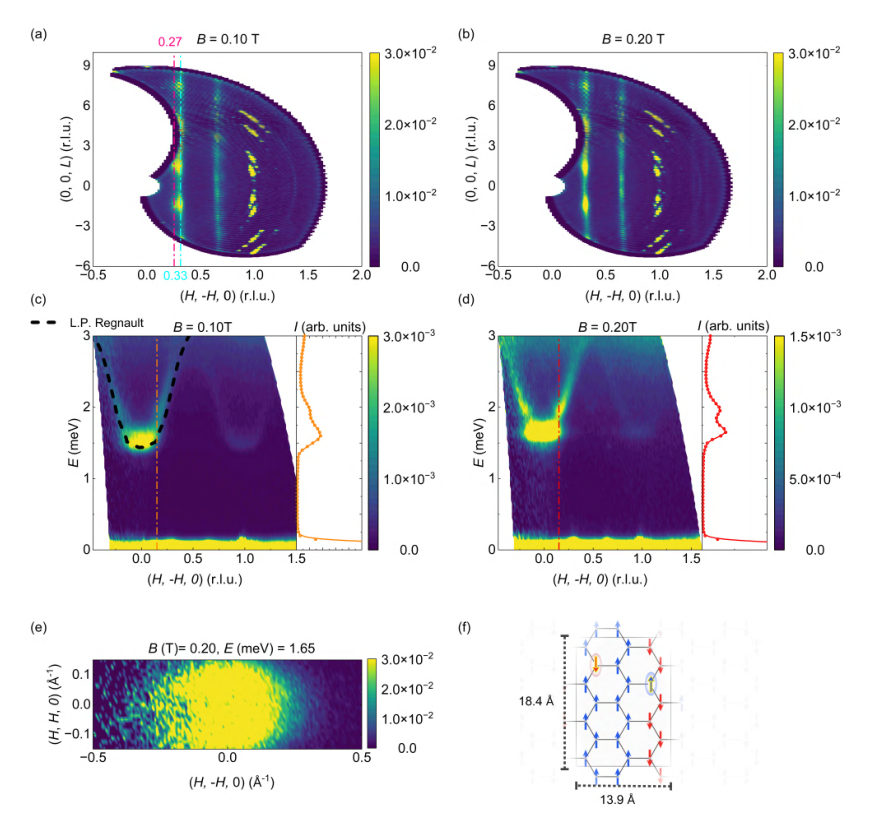 
FIG. 2. Field-dependent magnetic structures and excitations. (a, b) Elastic neutron

📷 Fig 3

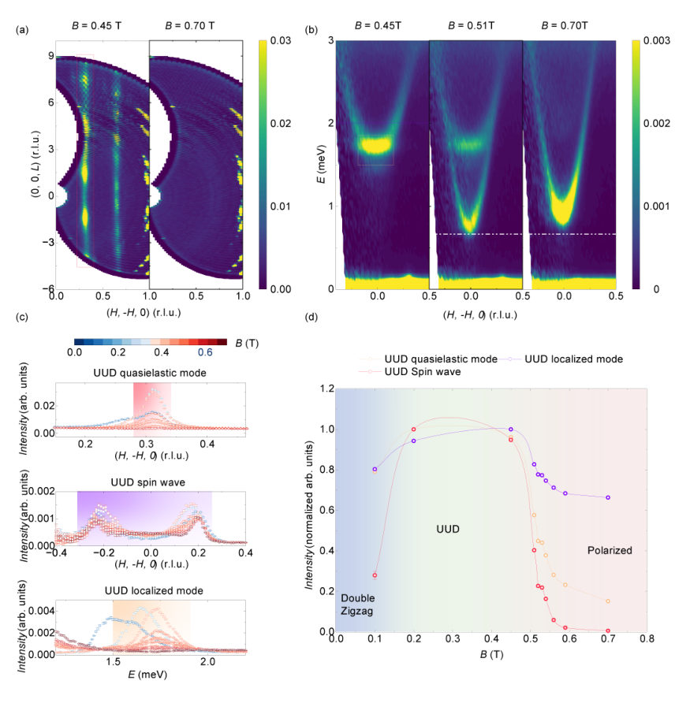 
FIG. 3. Collapse of the UUD state and mode evolution driven by magnetic field.

📷 Fig 4

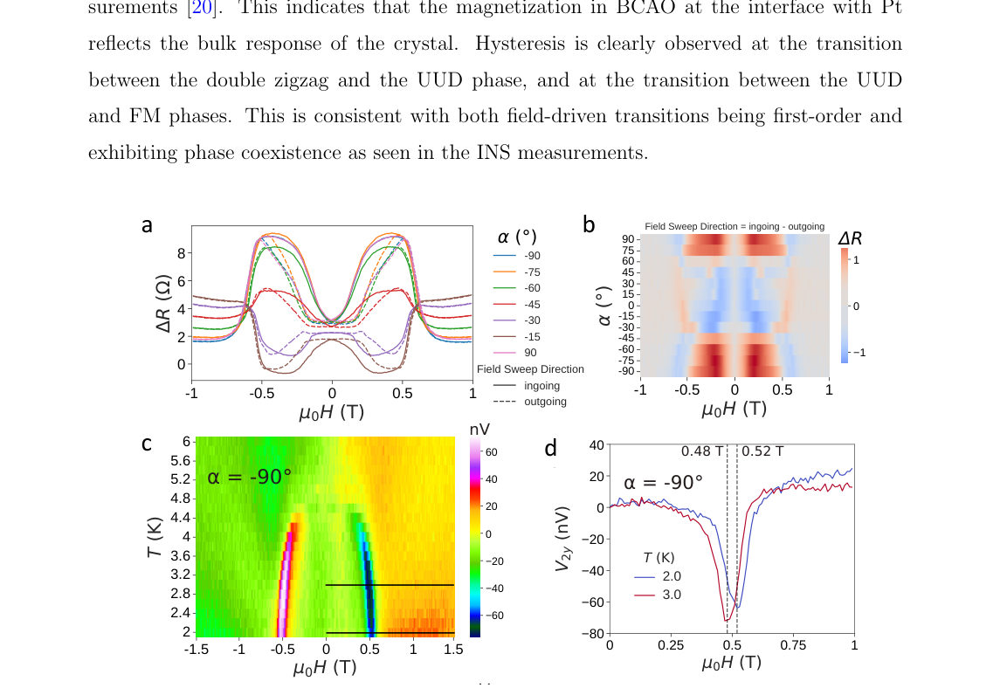 
FIG. 4. Spin transport results on BCAO single crystals. (a) Spin Hall magnetoresistance traces as

📷 Fig 5

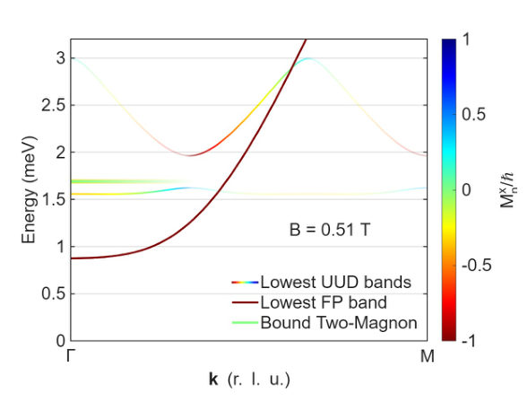 
FIG. 5. Short-wavelength excitation spectrum along Γ–M in the coexistence regime (B = 0.51

**Summary.** This study experimentally investigates field-induced transitions in the Kitaev candidate BaCo2(AsO4)2. Using neutron scattering and spin transport measurements, the authors find evidence for first-order phase coexistence rather than a continuous quantum liquid evolution. They conclude that observed excitations are better explained by bound magnon pairs, challenging previous interpretations of anomalous thermal transport.

**Why it may be interesting.** This work is highly relevant because it uses advanced spectroscopic and transport techniques to test the boundaries between exotic quantum states (QSLs) and conventional magnetically ordered phases, providing crucial insights into strongly correlated magnetic materials dynamics.

Detailed structure

**Main problem.** The study investigates field-induced first-order magnetic transitions and phase coexistence within BaCo2(AsO4)2, a material proposed as a Kitaev quantum spin liquid candidate.

**Main result.** Neutron scattering and transport measurements reveal that the transitions are first-order, characterized by phase coexistence (UUD/FM), rather than continuous evolution toward a QSL state. Theoretical modeling suggests observed excitations arise from bound spin-flip pairs.

**Method.** The research combines inelastic neutron scattering to probe magnetic excitations with transport measurements like the Spin Seebeck effect and theoretical modeling of magnon interactions.

**Model / system.** The system is BaCo2(AsO4)2, an insulating material with Co2+ ions arranged on a honeycomb lattice. It exhibits multiple magnetic phases (double-zigzag, UUD, FM) whose transitions are studied under applied magnetic fields.

**Key observables.** Magnetic order parameters (UUD, FM), excitation spectra (spin waves, localized modes), thermal conductivity ($\kappa/T$), and the sign/magnitude of the Spin Seebeck coefficient.

**Important parameters / regimes.** Applied in-plane magnetic field ($B$) near critical fields like 0.15 T and 0.5 T; temperature ($T$); energy scales (meV).

**Assumptions / limitations.** The analysis assumes that observed excitations can be modeled by bound spin-flip pairs rather than requiring a gapless spinon Fermi surface characteristic of a true QSL.

**Figures summary.** Figures illustrate the magnetic phase diagram, field-dependent excitation spectra showing mode separation and collapse at transitions, and transport measurements (SMR/SSE) confirming hysteresis associated with first-order changes.

**Paper structure.** The paper progresses from establishing the complex magnetic phase diagram via neutron scattering to detailing evidence of first-order transitions through multiple probes (INS, SMR, SSE), culminating in theoretical modeling that reinterprets anomalous transport signals as bound excitations rather than QSL signatures.

Abstract

BaCo2(AsO4)2 (BCAO) is an insulating Kitaev quantum spin liquid candidate with a rich low-temperature phase diagram. Below 5 K, it exhibits double-zigzag magnetic order. Upon application of an in-plane magnetic field, the magnetic structure first transforms into an up-up-down (UUD) state near 0.12 T and then enters a fully spin-polarized ferromagnetic (FM) state near 0.5 T. In the narrow field regime close to the polarized phase, a finite residual thermal conductivity has been reported, suggesting a possible field-induced quantum spin liquid phase. Using neutron scattering, we show that the field-induced double-zigzag-to-UUD transition near 0.15 T is accompanied by the emergence of a cluster of localized UUD spin excitations that coexist with conventional spin waves. Upon further increasing field, BCAO undergoes a first-order UUD-to-FM transition with coexistence of UUD and FM phases, accompanied by a sharp response in the spin Seebeck coefficient. These results do not support a quantum spin liquid scenario near the UUD-to-FM critical field. Instead, modeling indicates that the broad excitations arise from bound spin-flip pairs, while a low-lying dispersive branch near the FM phase boundary carries the same sign of magnetization as the FM order. These excitations naturally account for the observed sign of the spin Seebeck response and are likely relevant to the thermal conductivity near the critical field.

[↑ back to top](#top)

### [How Topology Shapes the Phase Behavior of Polyelectrolytes](http://arxiv.org/abs/2607.15703v1)

**Authors:** David Beyer, Pierre J. Walker, Lena Tarrach, Zhen-Gang Wang, Christian Holm  
**Type:** theory · **Category:** statistical mechanics · **PDF:** <https://arxiv.org/pdf/2607.15703v1>  
**Analysis basis:** full PDF text, analyzed in chunks
**Topic relevance:** `Keldysh / 2PI / non-Gaussian methods` **1/5** · `analog quantum simulation` **1/5** · `driven-dissipative phase transition` **1/5**

📷 Fig 1

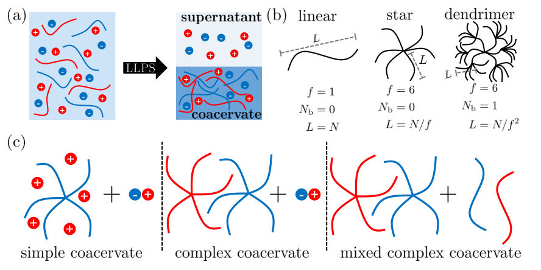 
FIG. 1. (a): Polyelectrolyte solutions can split into a supernatant with a low polyelectrolyte concentration and a coacervate with a high polyelectrolyte concentration through LLPS. Blue and red chains correspond to polyanions and polycations, respectively. (b): Schematic representation of the different polymer topologies investigated in this work: linear chains, stars, and dendrimers. Note that for visual clarity, the different topologies are not shown at the same scale. (c): Overview of the different mixtures of polyelectrolytes studied in this work: simple coacervates (left panel), complex coacervates (middle panel), and salt-free, mixed complex coacervates (right panel).

📷 Fig 2

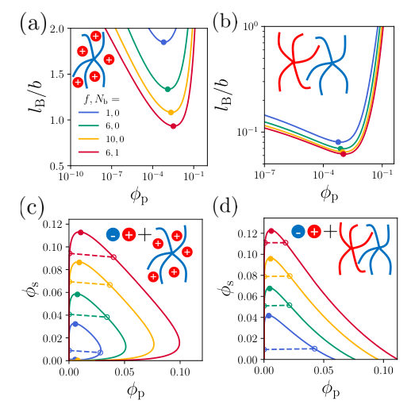 
FIG. 2. Phase diagrams of simple (subfigure (a) and (c)) and complex (subfigure (b) and (d)) coacervates of varying topology. Subfigures (a) and (b) show salt-free phase dia- grams as a function of the polymer volume fraction and the Bjerrum length. Subfigures (c) and (d) show diagrams in the presence of salt as a function of the polymer volume fraction and the salt volume fraction (the Bjerrum length is set to lB = b). Solid lines correspond to the co-existence bound- ary; dashed lines correspond to tie lines connecting coexist- ing phases (empty markers); solid markers denote the critical points.

📷 Fig 3

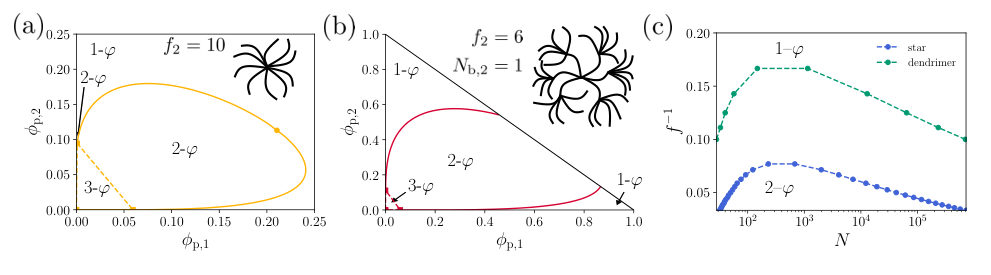 
FIG. 3. Phase behavior of mixed complex coacervates where symmetric pairs are considered for all topologies, i.e. the same number of polyanions and polycations is always added to the system for a particular topology. “1-φ”, “2-φ” and “3-φ” denote regions where one, two or three phases coexist, respectively. (a): Phase diagram of a salt-free mixture of linear chains (volume fraction ϕp,1) and stars (f2 = 10, volume fraction ϕp,2). (b): Phase diagram of a salt-free mixture of linear chains (volume fraction ϕp,1) and dendrimers with one generation of branching (f2 = 6, Nb,2 = 1, volume fraction ϕp,2). (c): Global phase diagram of a salt- and solvent-free blend of linear chains with stars...

**Summary.** This work establishes a theory showing that polymer topology dictates the phase behavior of polyelectrolytes, enabling control over coacervation independent of simple chemical changes. By using RPA within a statistical mechanics framework, the authors demonstrate that compact architectures enhance liquid-liquid phase separation propensity. This provides a powerful design principle for charged macromolecular systems.

**Why it may be interesting.** While focused on classical polyelectrolyte physics, the rigorous application of mean-field approximations (RPA) to complex many-body systems and the development of topology-dependent interaction parameters share conceptual links with modeling correlations in quantum many-body systems.

Detailed structure

**Main problem.** To develop a topology-specific theory for polyelectrolyte coacervation and understand how polymer architecture influences the phase behavior of charged macromolecules.

**Main result.** Polymer topology acts as a powerful design lever, allowing fine-tuning of phase separation propensity independently of molecular weight or net charge. More compact topologies exhibit a greater tendency for liquid-liquid phase separation (LLPS).

**Method.** The study employs a minimal theory combining the Flory-Huggins free energy with an electrostatic correlation term derived within the Random Phase Approximation (RPA).

**Model / system.** The system consists of polyelectrolytes (charged macromolecules) forming simple or complex coacervates. Topologies studied include linear chains, stars, and dendrimers.

**Key observables.** Propensity for liquid-liquid phase separation (coacervation), effective $\chi$ parameter, charge–charge structure factor $S_{cc}(k)$, and salt partition coefficients.

**Important parameters / regimes.** Bjerrum length ($\lambda_B$), polymer topology parameters (e.g., number of arms $f$, generations $N_b$), molecular weight ($N$), and salt concentration.

**Assumptions / limitations.** The analysis relies on the Random Phase Approximation (RPA) for electrostatic interactions and assumes Gaussian chain statistics for structure factor derivations.

**Figures summary.** Figures illustrate phase diagrams showing coexistence boundaries as a function of $\lambda_B$ or salt concentration, comparing different topologies. Other figures show salt partitioning behavior and scaling laws related to topology.

**Paper structure.** The paper develops the free energy functional using RPA, applies it to model various polymer topologies (linear, star, dendrimer), calculates phase diagrams for simple/complex coacervation under varying salt conditions, and analyzes the scaling dependence of effective interactions on molecular weight.

Abstract

We develop a topology-specific theory of polyelectrolyte coacervation using the random phase approximation and apply it to both simple and complex coacervation. Our results for stars and dendrimers show that more compact chain topologies display a greater propensity for liquid-liquid phase separation, as a function of both Bjerrum length and salt concentration. For mixtures of different topologies, we demonstrate that differences in polymer topology alone are sufficient to drive multiphase coacervation of polyelectrolytes, which we rationalize in terms of an effective $χ$ parameter. Analysis of a simplified global phase diagram reveals that the propensity for such topology-driven phase separation is largest at a finite molecular weight. Overall, our results establish polymer topology as a powerful design lever for tuning the phase diagram of charged macromolecules independently of molecular weight, net charge, and monomer chemistry, since changes in topology enable fine-tuning of the effective charge density without altering these molecular characteristics.

[↑ back to top](#top)

### [Strong intervalley mixing between copropagating quantum Hall edge channels in a silicon MOSFET](http://arxiv.org/abs/2607.15675v1)

**Authors:** Gento Yamahata, Takase Shimizu  
**Type:** experiment · **Category:** other · **PDF:** <https://arxiv.org/pdf/2607.15675v1>  
**Analysis basis:** full PDF text, analyzed in chunks
**Topic relevance:** `QC/QI experiment` **1/5** · `interference shaping light` **1/5** · `spintronics-quantum-optics interface` **1/5**

📷 Fig 1

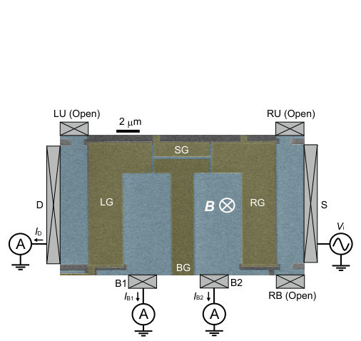 
FIG. 1. Device and measurement setup. A scanning electron micrograph of the double-layer-

📷 Fig 2

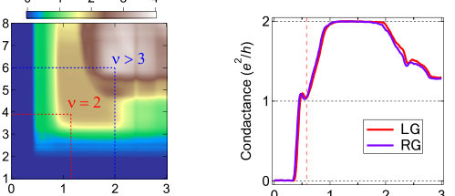 
FIG. 2. Gate control of the quantum Hall filling factor. (a) Two-terminal conductance measured

📷 Fig 3

 
Figure 2(b) shows the two-terminal conductance measured between S and D as a function

📷 Fig 4

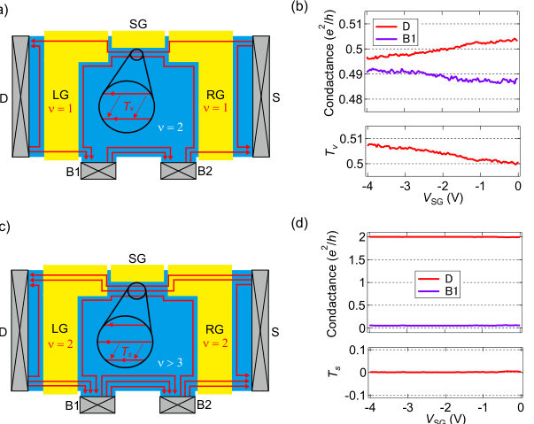 
FIG. 3. Transition measurements between copropagating quantum Hall edge channels. (a)

📷 Fig 5

 
Figure 3(d) shows the conductances measured at D and B1, together with the transition

**Summary.** The researchers demonstrated strong intervalley mixing between edge channels in a silicon MOSFET operating in the Quantum Hall regime. This finding establishes that the valley degree of freedom acts as an effective 'valley beam splitter' for quantum information processing. The results confirm this capability while simultaneously showing that spin-flip processes are strongly suppressed, making Si a promising platform.

**Why it may be interesting.** This work demonstrates how engineered valley coupling in a solid-state platform can mimic quantum beam-splitter operations, which is highly relevant for building scalable quantum interferometers.

Detailed structure

**Main problem.** The study investigates strong intervalley mixing between copropagating quantum Hall edge channels to establish a fundamental building block for compact silicon quantum Hall interferometers.

**Main result.** Strong intervalley mixing was observed with a transition probability near 1/2, while interchannel transport requiring spin-flip scattering showed negligible probability, confirming the utility of valley degrees of freedom in Si MOSFETs.

**Method.** Measurements were performed on a double-layer-gated Si MOSFET in the Quantum Hall regime using low-frequency lock-in techniques to measure conductance and extract transition probabilities via Landauer–Büttiker formalism.

**Model / system.** The physical system is a double-layer-gated Silicon Metal-Oxide-Semiconductor Field-Effect Transistor (Si MOSFET) operating under high magnetic fields in the Quantum Hall regime. The valley degree of freedom is exploited as an alternative to spin for channel manipulation.

**Key observables.** Transition probability ($T_v$) between valley edge channels, and transition probability ($T_s$) for spin-flip interchannel transport.

**Important parameters / regimes.** Bulk filling factor ($
u=2$), low temperature (280 mK), high magnetic field (12.92 T).

**Assumptions / limitations.** The analysis relies on accurately subtracting parasitic resistances from raw conductance measurements using the Landauer–Büttiker formalism.

**Figures summary.** Figures illustrate the device setup, two-terminal conductance plateaus confirming filling factors ($
u=2$), and schematics detailing the geometry for measuring intervalley transitions ($T_v$) versus spin-flip transport ($T_s$).

**Paper structure.** The paper details the experimental setup and measurement techniques using gate voltages to tune edge channel populations, followed by quantitative analysis using Landauer–Büttiker equations to extract the transition probabilities $T_v$ and $T_s$.

Abstract

Copropagating quantum Hall edge channels provide a promising platform for compact electron interferometry and flying quantum states. In silicon, the valley degree of freedom offers a natural alternative to spin-resolved edge channels because spin-flip scattering is strongly suppressed by the weak spin-orbit interaction. Here, we investigate interchannel transitions between copropagating valley edge channels in a double-layer-gated silicon metal-oxide-semiconductor field-effect transistor. With the bulk filling factor set to $ν=2$, two spin-polarized valley edge channels are brought into close proximity near a depleted side gate. We observe strong intervalley mixing, with a transition probability close to 1/2, indicating nearly complete equilibration between the two valley edge channels. In contrast, interchannel transport between edge channels with different spin orientations shows negligible transition probability, consistent with suppressed spin-flip scattering in silicon. These results demonstrate that intervalley coupling at a Si/SiO$_2$ interface can provide a beam-splitter-like operation for copropagating valley edge channels, establishing a key building block toward compact silicon quantum Hall interferometers.

[↑ back to top](#top)

### [Ultrametric organization of energy landscapes on random Erdős--Rényi graphs: topological origin of barrier hierarchy](http://arxiv.org/abs/2607.15902v1)

**Authors:** A. P. Zubarev  
**Type:** theory · **Category:** disordered systems and neural networks · **PDF:** <https://arxiv.org/pdf/2607.15902v1>  
**Analysis basis:** full PDF text, analyzed in chunks
**Topic relevance:** `driven-dissipative phase transition` **1/5** · `non-equilibrium dynamics` **1/5** · `non-equilibrium universality` **1/5**

📷 Fig 1

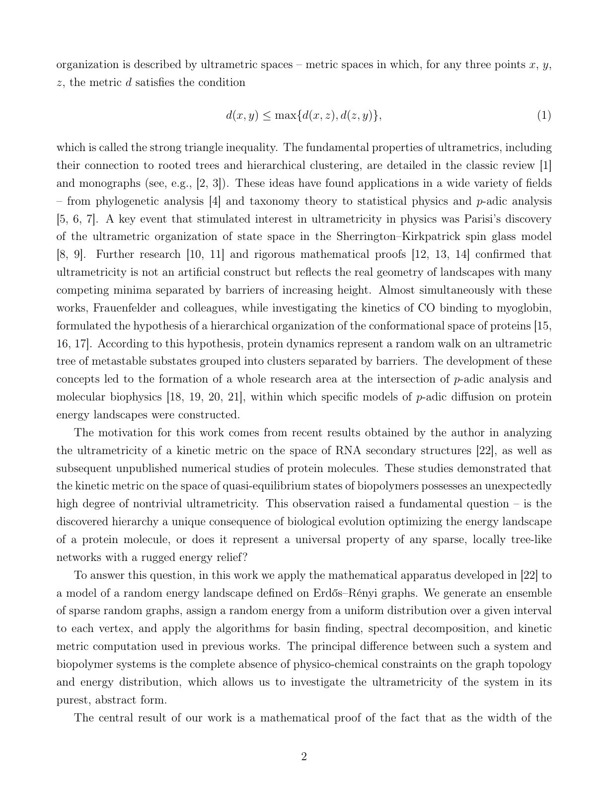 
Low-resolution page preview, page 2

📷 Fig 2

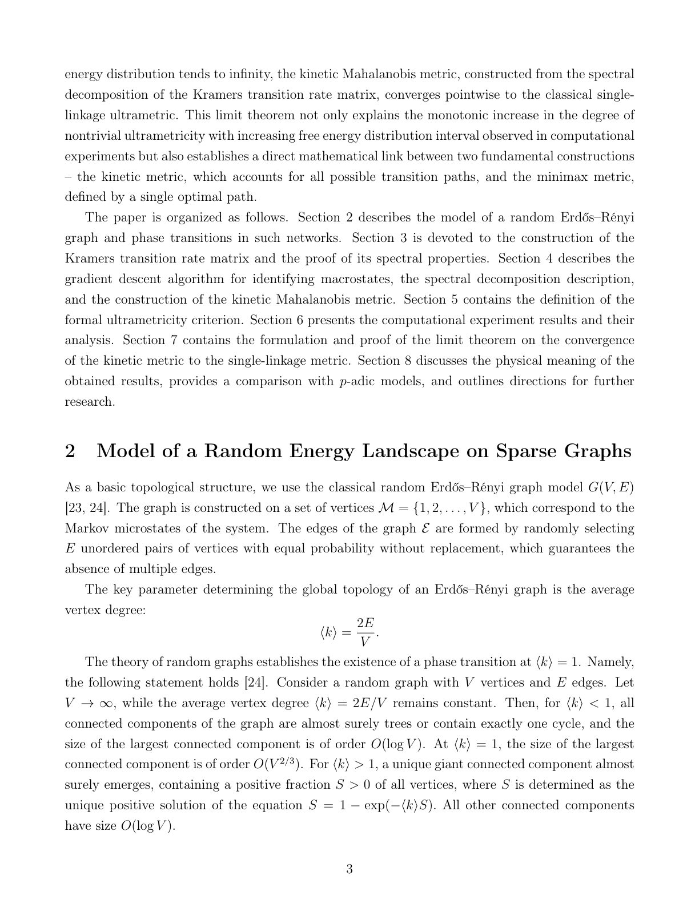 
Low-resolution page preview, page 3

📷 Fig 3

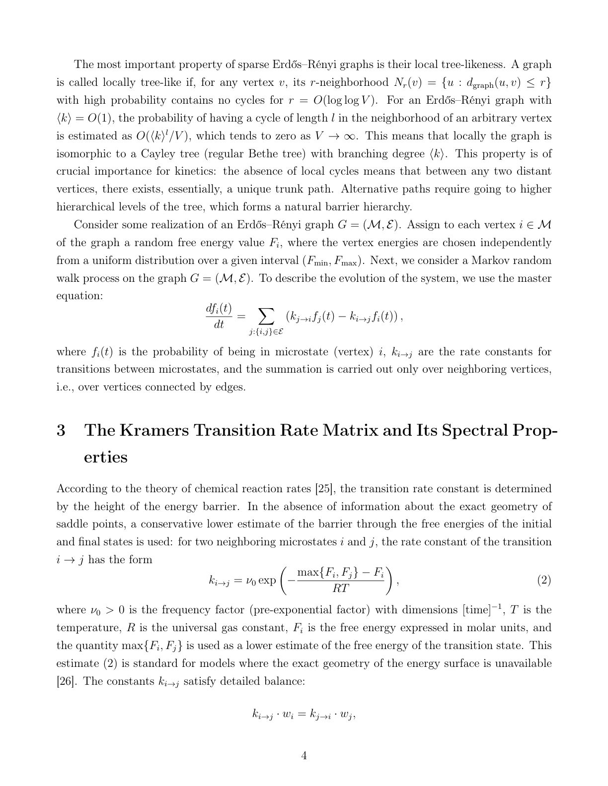 
Low-resolution page preview, page 4

📷 Fig 4

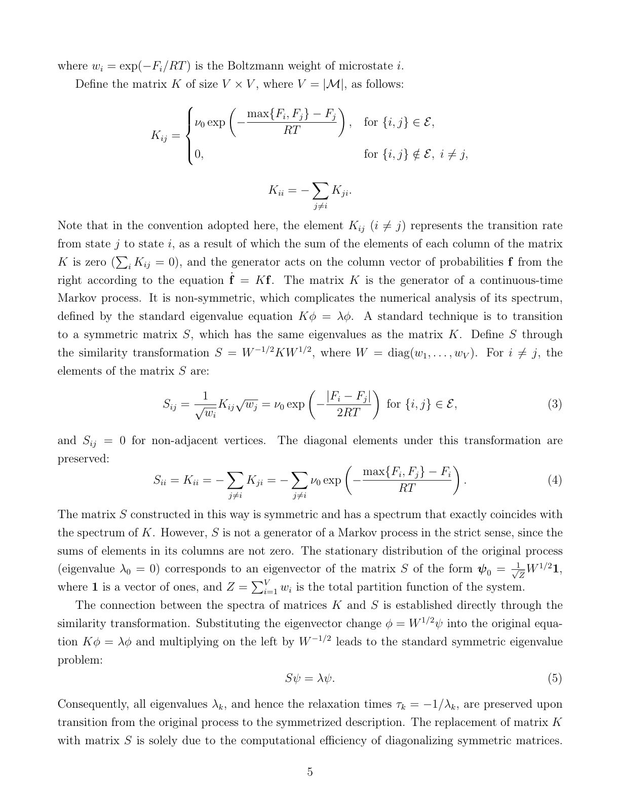 
Low-resolution page preview, page 5

📷 Fig 5

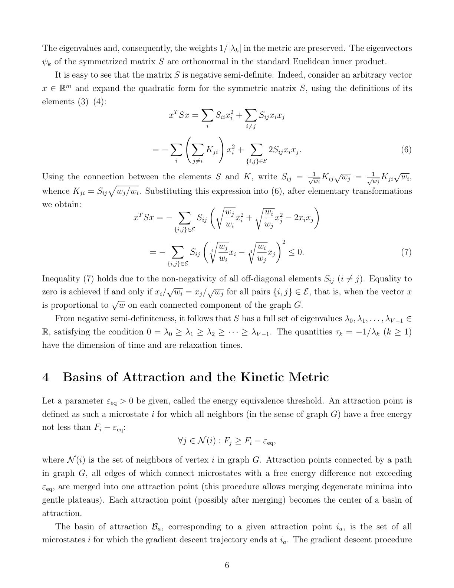 
Low-resolution page preview, page 6

**Summary.** This theoretical work analyzes the energy landscapes on sparse random graphs to determine if they possess a universal ultrametric organization. By comparing a kinetically derived metric with the ideal single-linkage ultrametric, the authors prove that this hierarchy emerges robustly when the energy differences are large. This suggests that local tree-like topology dictates the long-term dynamical structure of such complex systems.

**Why it may be interesting.** The concept of energy landscape organization into an ultrametric structure is highly relevant for understanding complex dynamics, relaxation pathways, and metastable states in disordered quantum systems or molecular folding processes.

Detailed structure

**Main problem.** The study investigates whether the energy landscape organization on sparse random graphs exhibits universal ultrametricity in the limit of large energy spreads.

**Main result.** The kinetic metric between basins converges pointwise to the classical single-linkage ultrametric as the energy spread ($\Delta F$) tends to infinity, suggesting ultrametricity is a universal property for such systems.

**Method.** The authors use spectral decomposition on a transformed rate matrix (Mahalanobis metric) and prove limit theorems comparing this kinetic distance to the minimax/single-linkage distance.

**Model / system.** The system models energy landscapes defined by random free energies ($F_i$) assigned to vertices of sparse Erdős–Rényi graphs. Dynamics are governed by a continuous-time Markov process described by transition rates derived from these free energies.

**Key observables.** Degree of nontrivial ultrametricity, kinetic Mahalanobis metric $D(B_a, B_b)$, and the single-linkage ultrametric $
ho(0)(B_a, B_b)$.

**Important parameters / regimes.** Energy spread ($\Delta F$), Temperature ($T$), Graph connectivity (sparse/locally tree-like).

**Assumptions / limitations.** The analysis assumes that for large $\Delta F$, the contribution from suboptimal paths is exponentially suppressed, allowing the kinetic metric to be dominated by the minimax path.

**Figures summary.** Not specified in notes.

**Paper structure.** The paper progresses from defining the Markovian dynamics and constructing a computable symmetric metric (Chunk 2), to establishing the mathematical link between this kinetic metric and the single-linkage ultrametric via limit theorems (Chunks 1 & 3), culminating in a discussion of topological origins (Chunk 4).

Abstract

We investigate the ultrametric organization of energy landscapes defined on sparse random Erdős--Rényi graphs. Each graph vertex is assigned a random free energy from a uniform distribution over an interval of width $ΔF$, and the kinetics are modeled by a Markov process with Kramers transition rates. Using spectral decomposition of the rate matrix, we construct a kinetic Mahalanobis metric between basins of attraction. Computational experiments for graphs with $V=5000$ vertices and $E=5000$ edges show that the degree of nontrivial ultrametricity increases monotonically from $\approx42\%$ for $ΔF=10$ kJ/mol to $\approx96\%$ for $ΔF=1000$ kJ/mol. We prove a limit theorem: as $ΔF\to\infty$, the logarithmic asymptotics of this metric converge pointwise to the classical single-linkage ultrametric. For finite $ΔF$, corrections from suboptimal paths are exponentially suppressed with increasing $ΔF$, so that the metric becomes asymptotically ultrametric. Our results suggest that ultrametricity is a universal property of sparse, locally tree-like networks with rugged energy landscapes in the limit of large energy spreads.

[↑ back to top](#top)

### [Classical codes violate the conjectured square-root bound for quantum random access codes](http://arxiv.org/abs/2607.15617v1)

**Authors:** Kangqiao Liu  
**Type:** theory · **Category:** quantum information and computing · **PDF:** <https://arxiv.org/pdf/2607.15617v1>  
**Analysis basis:** full PDF text, analyzed in chunks
**Topic relevance:** `entanglement & information structure` **1/5** · `quantum measurements` **1/5**

📷 Fig 1

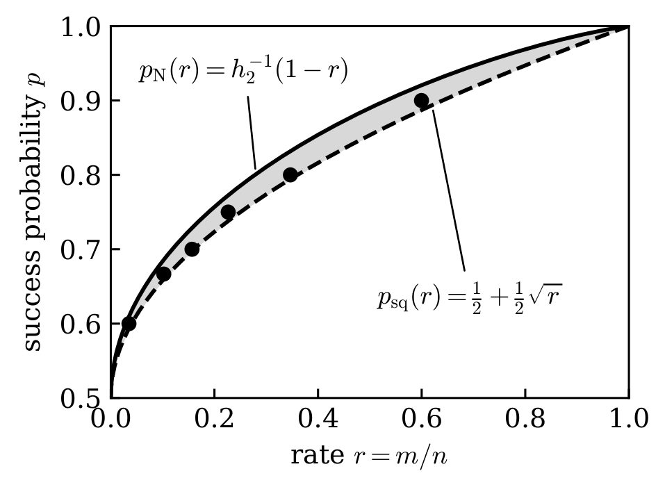 
FIG. 1. Counterexamples fill the asymptotic interval between the conjectured and Nayak bounds.

**Summary.** This work proves that classical random access codes can violate a conjectured square-root bound governing Quantum Random Access Codes (QRACs). By embedding these classical structures into the QRAC model, the authors construct explicit counterexamples showing the violation holds across an entire open interval of success probabilities. This reveals that the separation stems from the inclusion of classical coding rate limitations within the general quantum framework.

**Why it may be interesting.** While focused on quantum information theory, the rigorous violation of an expected bound highlights fundamental limitations in current theoretical models for quantum communication protocols.

Detailed structure

**Main problem.** The paper investigates whether a conjectured square-root bound for Quantum Random Access Codes (QRACs) holds true.

**Main result.** Classical random access codes with private randomness violate this conjectured quantum bound, demonstrating that the classical coding rate is the source of separation from the theoretical limit.

**Method.** The authors embed known classical RAC constructions into the general QRAC model using specific encoding and measurement assumptions. They then apply established achievability theorems for classical codes to construct explicit counterexamples.

**Model / system.** The study centers on Quantum Random Access Codes (QRACs), which encode $n$ classical bits into $m$ qubits, aiming for a worst-case success probability $p$. The analysis compares the conjectured bound with bounds derived from information theory and classical coding limits.

**Key observables.** Worst-case success probability ($p$), input length ($n$), number of qubits ($m$), and the rate $r = m/n$.

**Important parameters / regimes.** The comparison is made across a full open interval for fixed compression rates $r \in (0, 1)$, showing violations for any $p$ between the conjectured bound and Nayak's bound.

**Assumptions / limitations.** The analysis relies on embedding classical codes via diagonal encoding states and commuting decoding measurements. Results are often established in the asymptotic limit ($n 	o \infty$).

**Figures summary.** Figure 1 illustrates that counterexamples fill an open rate window between the conjectured square-root bound and the information-theoretic Nayak bound.

**Paper structure.** The paper first establishes the equivalence between certain QRAC statistics and classical RACs with private randomness. It then uses this embedding to construct explicit, asymptotically large counterexamples that violate the conjectured bound across a continuous range of success probabilities $p$.

Abstract

We consider whether every quantum random access code (QRAC) with density-operator encodings and arbitrary decoding measurements obeys the conjectured bound $p\leq(1+\sqrt{m/n})/2$, where $n$ classical bits are encoded into $m$ qubits and $p$ is the worst-case success probability. We find that classical random access codes with private randomness, which form a subclass of this QRAC model, violate the bound. We embed these classical codes as QRACs with diagonal encoding states and commuting decoding measurements, and construct pure-state realizations with identical decoding statistics. The achievability theorem of Ambainis, Nayak, Ta-Shma, and Vazirani then yields violations for every fixed $p\in(1/2,1)$ at sufficiently large input length. The counterexamples span the full open interval between the conjectured and Nayak bounds at each fixed compression rate. A finite-blocklength analysis further yields order-optimal logarithmic qubit scaling for a recovery bias scaling as $\sqrt{\log_2 n/n}$ with a sufficiently large prefactor. These results identify the classical coding rate as the source of the separation and motivate restricted bounds based on quantitative spectral properties of decoding measurements.

[↑ back to top](#top)

### [Efficient routing and spectrum allocation in arbitrary flex-grid entanglement networks](http://arxiv.org/abs/2607.15465v1)

**Authors:** Zachary Goisman, Matthew L. Stevens, Maxwell Goisman, Taman Truong, Gayane Vardoyan, Don Towsley, Nicholas A. Peters, Nageswara S. V. Rao, Guoliang Xue, Joseph M. Lukens  
**Type:** theory · **Category:** quantum information and computing · **PDF:** <https://arxiv.org/pdf/2607.15465v1>  
**Analysis basis:** full PDF text, analyzed in chunks
**Topic relevance:** `entanglement & information structure` **1/5** · `interference shaping light` **1/5**

📷 Fig 1

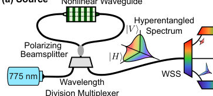 
Fig. 1. Envisioned hardware components for generic (a) source and (b) user nodes, with wavelength-selective switches (WSSs) for arbitrary forwarding of input frequencies to and from adjacent nodes. Here both are shown with 𝑁= 3 edges, for a total of four WSSs including add-drop. All future topology figures assume these designs, but are simplified to single symbols for clarity.

📷 Fig 2

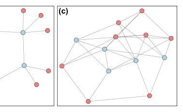 
Fig. 2. Example network topologies solvable by the quantum RSA workflow: (a) star, (b) ring, and (c) densely connected. Sources are represented by blue circles, users by red circles.

📷 Fig 3

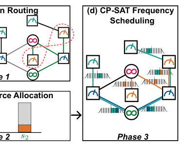 
Fig. 3. Overview of proposed quantum RSA pipeline. (a) Example network topology with two sources (infinity signs within a circle) and six users (measure operation squares). Links are represented by two users with the same color: ℓ= 1 is teal, ℓ= 2 orange, and ℓ= 3 blue. (b) Phase 1: double Yen routing. This image shows one possible pair of paths from each source to the two users comprising the orange link. (c) Phase 2: APOPT spectrum allocation. From the pink 𝑠1 source, the teal link is allocated two channels and the blue link one channel, while the orange link receives a single channel from the green 𝑠2 source. For both sources, a total of 𝐾= 4 bin pairs are assumed. (d) Phase 3: CP-SAT...

📷 Fig 4

 
Figure 3(b) depicts an example of the 𝑁= 1 case (chosen for visual simplicity), where the pink and green lines denote the lowest-loss pair of paths for (𝑢𝐴2, 𝑢𝐵2) to the sources 𝑠1 and 𝑠2,

📷 Fig 5

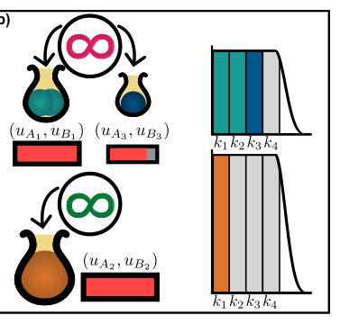 
Fig. 4. Depiction of the EFA problem (Phase 2 of Fig. 3) in terms of a knapsack problem. (a) An example inefficient case, where source 𝑠1 allocates a channel that maximally fills the knapsack of the blue link ℓ= 3, preventing it from further filling the teal link ℓ= 1, while source 𝑠2 assigns all four channel pairs to its single orange link ℓ= 2. (b) An improved solution in which the flux of 𝑠1 is reduced such that three channels spread across its two links, and the flux of 𝑠2 is increased to require only one channel instead of all four. In all examples, the size of the knapsack and corresponding slider symbolizes the maximum flux each link can receive, the size of the balls stand in for...

**Summary.** This paper presents an efficient, three-stage pipeline to solve the complex routing and spectrum allocation problem in large-scale quantum networks using hyperentangled photons. By combining classical optimization tools like Yen's algorithm, APOPT, and CP-SAT, the authors achieve significant improvements in speed and accuracy over previous methods. This workflow offers a practical heuristic for deploying broadband entanglement distribution across existing fiber optic infrastructure.

**Why it may be interesting.** This work directly tackles the engineering bottleneck of scaling quantum networks by providing a computationally efficient framework for resource management in existing optical infrastructure.

Detailed structure

**Main problem.** The paper addresses the challenge of efficiently allocating frequency spectrum and routing entanglement links for large-scale, repeater-less quantum networks.

**Main result.** A novel three-stage heuristic pipeline was developed that significantly outperforms prior genetic algorithm methods in speed and accuracy for optimizing broadband entanglement distribution.

**Method.** The approach combines Yen's algorithm for pathfinding, the Advanced Process Optimizer (APOPT) for rate maximization under fidelity constraints, and a CP-SAT solver for contention-free frequency bin assignment.

**Model / system.** The model describes an arbitrary quantum network using hyperentangled photons in a flex-grid WDM setup. Links are characterized by fidelity ($F_\ell$) and coincidence rates ($R_\ell$), which depend on allocated frequencies and optical losses.

**Key observables.** Fidelity ($F_\ell$), total coincidence rate ($R_\ell$), network utility ($U$), and solution runtime.

**Important parameters / regimes.** Source flux ($\mu_{m\ell}$), optical losses ($\eta_{A\ell}, \eta_{B\ell}$), and the number of available frequency bins ($K$).

**Assumptions / limitations.** The model assumes that channel distortion effects are fully compensated, and it focuses on the resource allocation aspects applicable to existing lightwave infrastructure.

**Figures summary.** Figures illustrate the hardware components (WSSs) and detail the three-stage pipeline: pathfinding (Double Yen), spectrum optimization (APOPT), and frequency scheduling (CP-SAT) applied to example topologies like ring or Manhattan networks.

**Paper structure.** The paper is structured around defining the NP-hard Quantum Resource Allocation problem, proposing a novel three-stage heuristic pipeline (Route Finding $
ightarrow$ Spectrum Allocation $
ightarrow$ Bin Assignment), and validating this workflow on representative network topologies.

Abstract

As practical quantum networks approach large-scale deployment, the need for efficient user-to-user frequency allocation is increasing, yet current approaches only provide partial solutions to the routing and spectrum allocation problem for an arbitrary quantum network. We address this challenge for repeater-less flex-grid quantum networks based on hyperentangled photons using an efficient three-stage pipeline combining leading tools in classical networking with recent advances in numerical optimization. First, double instantiations of Yen's algorithm obtain low-loss route candidates between each pair of users and the entanglement sources. Second, the advanced process optimizer (APOPT) obtains frequency channel allocations that maximize distribution rates under fidelity constraints. Finally, the constraint programming solver using satisfiability methods (CP-SAT) assigns specific frequency bins to each link, ensuring that there is no contention between frequencies from different sources. We numerically demonstrate this approach on a representative ring network and a Manhattan incumbent local exchange carrier topology, realizing significant improvements over prior genetic algorithm approaches in speed, accuracy, and scalability. Overall, this pipeline provides an efficient heuristic workflow for optimizing broadband entanglement distribution, applicable to arbitrarily connected quantum networks integrated within the existing lightwave infrastructure.

[↑ back to top](#top)

### [Growth of quartet correlations in neutron-rich Tellurium isotopes within quartet Bardeen-Cooper-Schrieffer theory](http://arxiv.org/abs/2607.15700v1)

**Authors:** Yixin Guo, Hiroyuki Sagawa, Masaaki Kimura  
**Type:** theory · **Category:** quantum gases · **PDF:** <https://arxiv.org/pdf/2607.15700v1>  
**Analysis basis:** full PDF text, analyzed in chunks
**Topic relevance:** `Keldysh / 2PI / non-Gaussian methods` **1/5**

📷 Fig 1

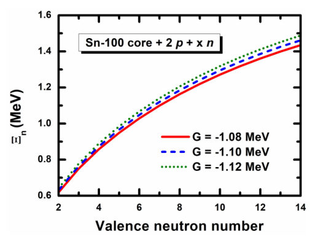 
FIG. 1. The degeneracy-weighted neutron gap Ξn as a function of valence neutron number outside the 100Sn core.

📷 Fig 2

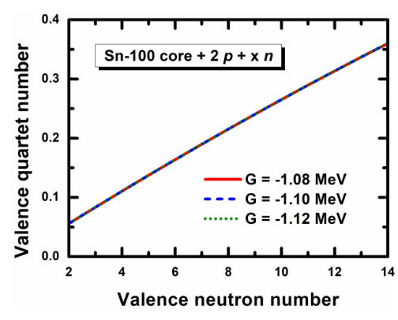 
FIG. 2. The valence quartet number as a function of valence neutron number out of 100Sn core.

📷 Fig 3

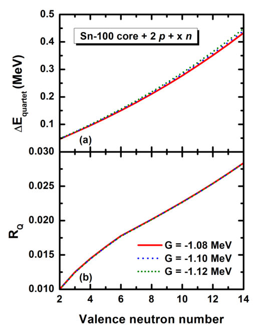 
FIG. 3. (a) Quartet-induced energy gain ∆Equartet = EqBCS noQ −EqBCS full as a function of valence neutron number out of the 100Sn core. (b) Corresponding fraction RQ = ∆Equartet/Ecorr, where Ecorr = Eref −EqBCS full and Eref is the uncorrelated filling energy in the same valence space.

📷 Fig 4

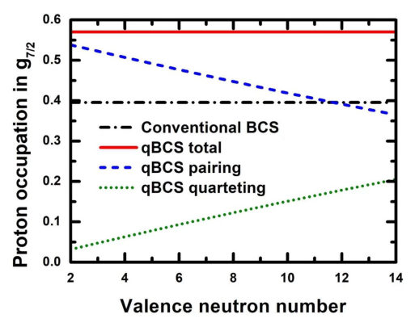 
FIG. 4. Proton occupation fraction of the 1g7/2 orbit as a function of valence neutron number out of the 100Sn core. The dash-dotted line denotes the conventional BCS result. The solid line shows the total qBCS occupation, while the dashed and dotted lines show its pair-like and quartet-induced contributions, respectively. The pair-like and quartet-induced contributions are defined in Eqs. (44) and (45), respectively.

📷 Fig 5

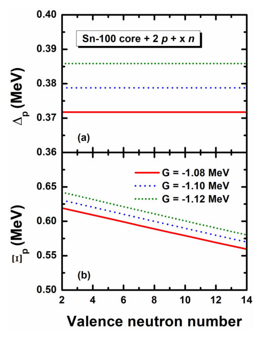 
FIG. 5. Proton pairing quantities as functions of valence neutron number out of the 100Sn core. (a) Conventional BCS proton gap ∆p, obtained from the factorized like-particle BCS reference. (b) Quartet BCS proton gap-like quantity Ξp. The three curves correspond to G = −1.08, −1.10, and −1.12 MeV.

**Summary.** This theoretical work applies the Quartet BCS framework to model correlations in neutron-rich Tellurium isotopes. It demonstrates that increasing valence neutrons significantly enhances quartet admixtures and alters proton orbital occupation by shifting weight from conventional pair configurations to higher-order quartet terms. This provides a microscopic understanding of enhanced superfluidity in exotic nuclei.

**Why it may be interesting.** The explicit inclusion of four-body (quartet) pairing amplitudes provides a mechanism to enhance correlation effects beyond standard BCS theory, offering insights into exotic nuclear superfluidity analogous to pairing in ultracold Fermi gases.

Detailed structure

**Main problem.** The study investigates how quartet correlations develop in neutron-rich Tellurium isotopes, extending beyond standard BCS pairing descriptions.

**Main result.** Increasing the number of valence neutrons enhances the quartet admixture in the correlated state and causes a redistribution of proton weight from pair-like to quartet configurations.

**Method.** The authors solve variational equations derived from the Quartet Bardeen-Cooper-Schrieffer (qBCS) theory, treating four-body pairing amplitudes explicitly.

**Model / system.** The system models valence protons and neutrons in neutron-rich Te isotopes, using a ${}^{100}	ext{Sn}$ core and considering particles in the $2d_{5/2} \oplus 1g_{7/2}$ model space with an isovector pairing interaction.

**Key observables.** Valence quartet number ($N_Q$), condensed quartet component, proton occupation fraction of the $1g_{7/2}$ orbit ($	ext{P}_{\pi,g}$), and quartet-induced energy gain ($\Delta E_{	ext{Quartet}}$).

**Important parameters / regimes.** The analysis scans the isotopic chain from $^{104}	ext{Te}$ to $^{116}	ext{Te}$, constrained by empirical neutron pairing gaps.

**Assumptions / limitations.** The theory assumes a charge-independent isovector pairing interaction and neglects isoscalar proton-neutron pairing correlations for simplicity in the initial analysis.

**Figures summary.** Figures illustrate the monotonic increase of $N_Q$ and $\Delta E_{	ext{Quartet}}$ with neutron number, and show how the total proton occupation fraction ($	ext{P}_{\pi,g}$) is composed of pair-like and quartet contributions.

**Paper structure.** The paper establishes the qBCS framework by solving variational equations for pairing amplitudes. It then calculates key observables like $N_Q$ and $\Delta E_{	ext{Quartet}}$ across an isotopic chain to show increasing correlations, followed by a detailed analysis of proton orbital occupation showing weight redistribution.

Abstract

Quartet correlations in neutron-rich Te isotopes are investigated within the quartet Bardeen-Cooper-Schrieffer (BCS) framework. Taking \(^{100}\)Sn as an inert core, we consider two valence protons and valence neutrons occupying the \(2d_{5/2}\oplus1g_{7/2}\) model space, and solve the quartet BCS variational equations with a charge-independent isovector pairing interaction. The effective pairing strength is constrained from empirical neutron pairing gaps in the Te isotopic chain. We find that the valence quartet number increases as the valence neutron number is enlarged from \(N_{\rm val}=2\) to \(14\). The same increasing behavior is also found for the condensed quartet component. The proton occupation of the \(1g_{7/2}\) orbit is strongly enhanced relative to the conventional like-particle BCS reference and is driven close to the degeneracy-weighted limit. These results suggest that additional valence neutrons enhance the quartet admixture in the correlated quartet BCS state, while redistributing the fixed proton weight from pair-like configurations to quartet configurations.

[↑ back to top](#top)

### [Kinetic Theory for the Shear Viscosity of Dense Binary Dipolar Fluid Mixtures](http://arxiv.org/abs/2607.15691v1)

**Authors:** Christopher Devik Fjeldstad, Roberto Troncoso, Astrid S. de Wijn  
**Type:** theory · **Category:** statistical mechanics · **PDF:** <https://arxiv.org/pdf/2607.15691v1>  
**Analysis basis:** full PDF text, analyzed in chunks
**Topic relevance:** `Keldysh / 2PI / non-Gaussian methods` **1/5**

📷 Fig 1

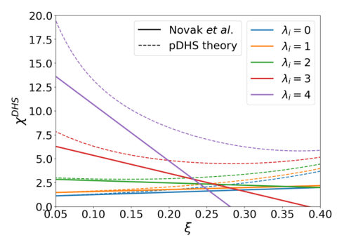 
FIG. 1. Prediction for χDHS i using the cluster expansion de- rived by Novak et al. [8] in the pure limit (full lines) along with, for comparison, the equivalent prediction using pDHS theory for pure fluids [7] (dashed lines). At low density, as long as λi ≲2, the Novak et al. prediction is very similar to pDHS theory. However, the higher-order terms in the density become significant, and Novak et al.’s expansion for mixtures fails.

📷 Fig 2

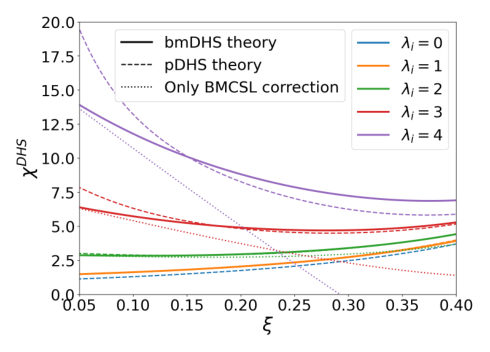 
FIG. 2. Prediction for χDHS i in the pure limit: fully corrected expression for χij, denoted bmDHS theory (full lines), the equivalent prediction using pDHS theory for pure fluids [7] (dashed lines), and only the BMCSL correct for the hard- sphere contribution (dotted lines). Although some improve- ment can be seen in the latter, especially for weak dipoles, it still fails when λi = 4. In contrast, bmDHS theory, which uses both corrections, shows far better agreement with pDHS theory, although very strong dipoles still present an quan- titative issue. Crucially, bmDHS theory satisfies the sanity requirement that χDHS i &gt; 0 for all densities.

📷 Fig 3

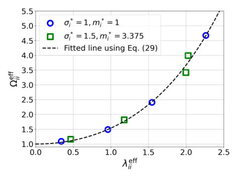 
FIG. 4. The values calculated for Ωeff ii are plotted as a function of λeff ii for both the small particle (circles) and large particle (squares) pure fluids (σ∗ i = 1 and m∗ i = 1, and σ∗ i = 1.5 and m∗ i = 3.375 respectively). The figure also includes the curve (dashed line) which results from fitting Eq. (30) to the pure fluid data.

📷 Fig 4

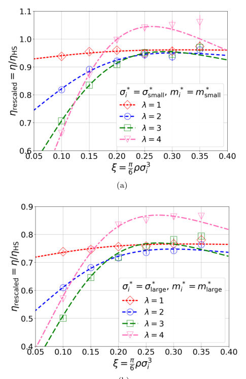 
FIG. 3. Rescaled shear viscosity from simulations for pure DHS fluids with λ = 1, 2, 3 and 4. The rescaling uses the Enskog expression for a pure hard-sphere fluid at the same volume fraction with σ∗ i = 1, mass m∗ i = 1, and reduced tem- perature T ∗= 1.5. The predictions are made using bmDHS theory for fluids with small particles (σ∗ i = 1, m∗ i = 1) (a) and large particle fluids (σ∗ i = 1.5, m∗ i = 3.375) (b). The associated fit parameters can be found in tables I.

📷 Fig 5

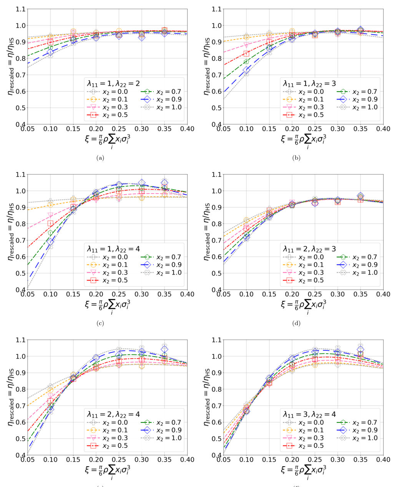 
FIG. 5. Rescaled shear viscosity from simulations of mixtures where both components have equally sized cores and (a) (λ11, λ22) = (1, 2), (b) (λ11, λ22) = (1, 3), (c) (λ11, λ22) = (1, 4), (d) (λ11, λ22) = (2, 3), (e) (λ11, λ22) = (2, 4), and (f) (λ11, λ22) = (3, 4), along with the predicted shear viscosity of the binary DHS fluid mixtures using bmDHS theory. The rescaling uses the Enskog expression for a pure hard-sphere fluid at the same volume fraction with σ∗ i = 1, mass m∗ i = 1, and reduced temperature T ∗= 1.5.

**Summary.** This paper develops an advanced kinetic theory for calculating the shear viscosity of binary mixtures of dipolar hard spheres. By extending Enskog-Thorne theory and incorporating structural corrections, the authors derive an accurate expression that matches molecular dynamics simulations across a range of densities. It provides a robust theoretical tool for understanding transport properties in complex, strongly interacting classical fluids.

**Why it may be interesting.** While focused on classical fluids, the rigorous application of kinetic theory and the handling of long-range, anisotropic interactions (dipoles) in a dense fluid context provide valuable methodological insights applicable to complex quantum many-body systems where simple approximations fail.

Detailed structure

**Main problem.** The primary goal is constructing a kinetic theory for the shear viscosity of dense binary fluid mixtures composed of strongly-interacting dipolar hard spheres.

**Main result.** The derived expression successfully captures the density and composition dependence of the shear viscosity up to packing fractions around 0.3 without requiring mixture-derived fit parameters, showing good agreement with molecular dynamics simulations.

**Method.** The approach extends Enskog-Thorne theory, building upon Pousaneh and de Wijn's work for pure dipolar fluids by incorporating structural corrections derived from cluster expansions and resumming the residual dipolar contributions exponentially.

**Model / system.** The system modeled is a binary mixture of Dipolar Hard Spheres (DHS). The interactions include both hard-core repulsion and long-range dipole-dipole forces, making it a complex many-body classical fluid system.

**Key observables.** Shear viscosity ($\eta$), partial pair distribution functions ($\chi_{ij}$), and effective collision cross sections ($\Omega_{	ext{bmDHS}, ij}$).

**Important parameters / regimes.** Packing fraction ($\xi$), dipolar coupling constants ($\lambda_{ii}$, $\lambda_{jj}$), and particle sizes ($\sigma_i$). The theory is tested in regimes where dipolar energy can be much larger than $k_B T$.

**Assumptions / limitations.** The theory assumes momentum transfer is dominated by hard-sphere core collisions, allowing the use of Enskog-Thorne formalism. It relies on approximations like replacing the hard-sphere contribution with BMCSL results and resumming dipolar terms exponentially.

**Figures summary.** Figures compare the predicted shear viscosity ($\eta$) for mixtures with equally sized cores and those with differently sized cores across various combinations of dipolar coupling constants, showing good agreement with simulation data up to $\xi \approx 0.3$.

**Paper structure.** The paper develops the theory by first establishing the framework based on Enskog-Thorne theory for binary mixtures. It then details the necessary structural inputs ($\chi_{ij}$) by correcting cluster expansion results, leading to the final expression for shear viscosity, which is validated against molecular dynamics simulations.

Abstract

We construct a kinetic theory for the shear viscosity of dense binary fluid mixtures of strongly-interacting dipolar hard spheres. We derive an expression for the pairwise correlations in the binary mixtures that is accurate up to packing fractions around 0.35. The approach is based on Enskog-Thorne theory, and inspired by the theory for dense pure fluids developed by Pousaneh and de Wijn. It relies on effective coupling parameters obtained from the pure fluids combined with mixing rules and a heuristic expression for the collision integral. We compare our results to viscosities obtained numerically from molecular-dynamics simulations of dipolar hard-sphere fluids. Our expression for the shear viscosity of the binary mixtures captures the density and composition dependent behavior of the binary dipolar fluids up to packing fraction of $ξ\lesssim 0.3$ without any mixture-derived fit parameters.

[↑ back to top](#top)

### [Machine-learning test of the single-ion model for $dd$ excitations in cuprates](http://arxiv.org/abs/2607.15763v1)

**Authors:** Maryia Zinouyeva, Leonardo Martinelli, Riccardo Arpaia, Nicholas B. Brookes, Daniele Di Castro, Kurt Kummer, Floriana Lombardi, Giacomo Merzoni, Francesco Rosa, Alessandro Tarasio, Enrico Tassi, Flora Yakhou-Harris, Ezio Puppin, Marco Moretti Sala, Giacomo Ghiringhelli  
**Type:** both · **Category:** strongly correlated electrons · **PDF:** <https://arxiv.org/pdf/2607.15763v1>  
**Analysis basis:** full PDF text, analyzed in chunks
**Topic relevance:** `methods for driven-dissipative` **1/5**

📷 Fig 1

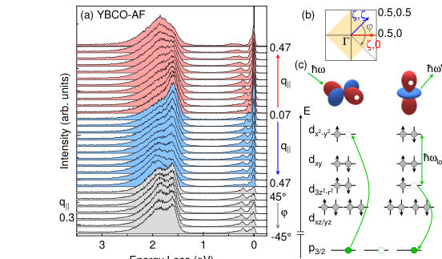 
FIG. 1. (a) RIXS spectra at the Cu L3 edge for YBCO-AF, with σ-polarized incident light. The scans along the (ζ,0) and (ζ,ζ) directions were measured on the 50-nm-thick sam- ple, whereas the azimuthal φ scan at fixed q∥= 0.3 r.l.u. was measured on the 100-nm-thick sample. The corresponding re- gions of reciprocal space are shown in (b). (c) Schematic of the dd excitation process at the Cu L3 edge, showing the crystal- field splitting of the Cu 3d orbitals. Within the single-ion model, the relative dd excitation intensities are determined by the scattering geometry, while the energies are extracted from the spectral analysis.

📷 Fig 2

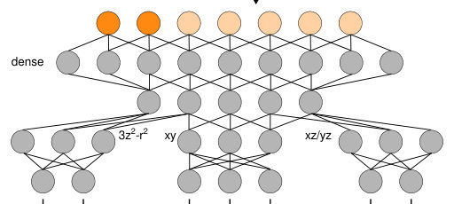 
FIG. 3. (a) Four simulated spectra corresponding to different experimental geometries, sharing the dd excitation energies (dashed lines), linewidth and α (not shown). (b) Construction of three input variants. In each variant, one selected dd peak is rescaled to a common intensity, and are then reordered ac- cording to the increasing area of another peak: fixed A3z2−r2 with increasing Axy (v1, gray), fixed A3z2−r2 with increas- ing Axz/yz (v2, blue), and fixed Axy with increasing A3z2−r2 (v3, red). (c) Network input construction. For each geome- try index k = 1, . . . , 4, we form one input by taking, for each variant v = 1, 2, 3, the spectrum at index k, I(v) k (E), together with its...

📷 Fig 3

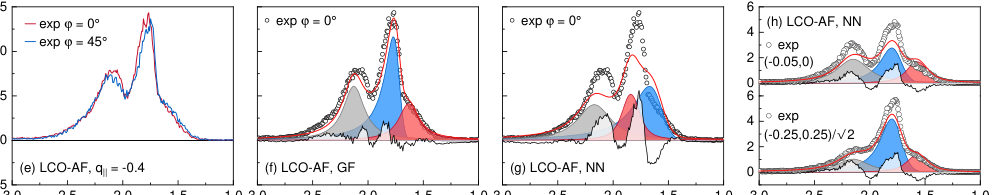 
FIG. 4. (a) RIXS spectra of YBCO-AF measured at φ = 0◦and 45◦with σ-polarized incident light. (b) Global fit (GF) of a YBCO-AF RIXS spectrum at φ = 0◦. The black curve with white filling shows the difference between the experimental data and the total fit. (c,d) Neural-network (NN) results for the φ scan and (ζ, 0), (ζ, ζ) scans. The NN predicts the peak energies, total FWHMs, and α. These parameters are used to reconstruct the spectrum within the single-ion line-shape model; a common Gaussian width is adjusted for all peaks, while the Lorentzian width of each peak is fixed by the NN-predicted total FWHMs. (e-h) Same as panels (a-d), but for LCO-AF.

**Summary.** This work analyzes RIXS spectra of cuprates using the single-ion model, comparing results obtained via conventional global fitting and advanced neural network analysis. While the ML approach successfully validates the model for $	ext{YBa}_2	ext{Cu}_3	ext{O}_{6}$, discrepancies found in $	ext{La}_2	ext{CuO}_4$ suggest that describing high-energy excitations requires incorporating physics beyond a purely local picture.

**Why it may be interesting.** The application of ML/NN techniques to interpret complex spectroscopic data from strongly correlated materials like cuprates is highly relevant. The comparison between different fitting methods provides a rigorous test of theoretical models against experimental reality.

Detailed structure

**Main problem.** The study aims to test the applicability of the local single-ion model for describing $dd$ excitations in cuprate superconductors using Resonant Inelastic X-ray Scattering (RIXS) spectra.

**Main result.** Agreement between machine learning and conventional fitting methods validates the single-ion picture for YBCO, while discrepancies observed in $	ext{La}_2	ext{CuO}_4$ suggest that additional physics beyond a purely local model is necessary.

**Method.** The analysis combines experimental RIXS data fitting (Global Fitting) with advanced machine learning techniques (Convolutional Neural Networks) trained on synthetic spectra derived from the single-ion Hamiltonian.

**Model / system.** The system under study is cuprates ($	ext{YBa}_2	ext{Cu}_3	ext{O}_{6}$ and $	ext{La}_2	ext{CuO}_4$), focusing on $dd$ excitations within the $	ext{Cu}\ 3d$ orbitals. The theoretical framework employed is the local single-ion model.

**Key observables.** Excited state energies ($E_{xy}$, $E_{3z^2-r^2}$, $E_{xz/yz}$), Full Width at Half Maximum (FWHM), and asymmetry parameters ($\alpha$) derived from RIXS spectra.

**Important parameters / regimes.** The analysis depends on scattering geometry, polarization channels ($\sigma 	o \sigma$, etc.), and the distinction between spin-flip ($sf$) and non-spin-flip ($nsf$) contributions.

**Assumptions / limitations.** Key assumptions include assuming negligible superexchange interaction (equal excitation energy for spin-flip/non-spin-flip) and relying on the single-ion model to describe high-energy excitations.

**Figures summary.** Figures illustrate RIXS spectra measurements under varying scattering geometries ($\phi$ scans, $(\zeta, 0), (\zeta, \zeta)$) comparing experimental data against predictions from both global fitting and neural network models for YBCO and LCO.

**Paper structure.** The paper progresses by first establishing the physical problem using RIXS data on two cuprates. It then develops a robust analysis pipeline incorporating machine learning to analyze these spectra, culminating in comparisons that validate the model in one case (YBCO) while highlighting its limitations in another (LCO).

Abstract

We investigate $dd$ excitations in Resonant Inelastic X-ray Scattering spectra of YBa$_2$Cu$_3$O$_6$ and La$_2$CuO$_4$ using the local single-ion model. The data are analyzed by conventional global fitting and by a convolutional neural network trained within the same theoretical framework. For YBa$_2$Cu$_3$O$_6$, the excited state energies obtained with the two methods coincide, leading to the $xy$, $3z^2-r^2$, $xz/yz$ sequence for increasing energy. This result validates the use of machine learning tools for the analysis of RIXS spectra dominated by $dd$ excitations. By contrast, for La$_2$CuO$_4$, the two methods do not converge to a single solution, revealing the limitations of the single-ion model in describing $dd$ excitations in cuprates and pointing to the role of additional contributions beyond a purely local picture in shaping high-energy excitations.

[↑ back to top](#top)

### [Object-relative ultraviolet weighting of electromagnetic modes and one-loop ultraviolet finiteness in quantum electrodynamics](http://arxiv.org/abs/2607.16096v1)

**Authors:** Christian Rembe  
**Type:** theory · **Category:** other · **PDF:** <https://arxiv.org/pdf/2607.16096v1>  
**Analysis basis:** full PDF text, analyzed in chunks
**Topic relevance:** `Keldysh / 2PI / non-Gaussian methods` **1/5**

📷 Fig 1

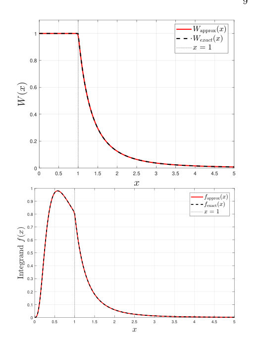 
FIG. 1. Comparison of the piecewise effective mode weight- ing W(x) with the differentiable approximation Wapp(x; a) with a = 100 for a representative smoothing parameter (top), and comparison of the corresponding weighted kernel f(x) entering the one-loop matching integral (bottom). The ver- tical line at x = 1 marks the crossover scale. The figure shows that the smooth approximation preserves the infrared plateau and the ultraviolet x−3 asymptotics, while modifying the physically relevant kernel only in a narrow region around the crossover.

**Summary.** This theoretical paper proposes a novel method to regularize ultraviolet divergences in Quantum Electrodynamics by applying an object-relative weighting factor to internal electromagnetic modes. This weighting, dependent on the mode frequency measured in the interaction's rest frame, successfully makes several key one-loop calculations finite while maintaining Ward identity consistency. It suggests that localization effects can be modeled through such scale-dependent modifications of vacuum contributions.

**Why it may be interesting.** Although focused on QED renormalization, the concept of introducing an 'effective' scale dependence into field theory calculations to tame UV divergences echoes themes in effective field theories relevant to AMO physics when considering short-range interactions or high-energy cutoffs.

Detailed structure

**Main problem.** The work investigates whether localized electromagnetic interactions can be modeled by introducing an effective, object-relative ultraviolet weighting of internal quantum electrodynamics (QED) modes.

**Main result.** Applying this specific weighting successfully renders selected one-loop QED contributions UV finite while preserving a restricted form of the Ward identity. The results suggest that different physical observables may probe distinct effective localization scales.

**Method.** The authors propose an ansatz for the weighting factor, $W(k; k_c)$, which depends on the object-relative covariant mode variable $u \cdot k$, and test its consistency by calculating one-loop corrections to key QED processes.

**Model / system.** The theoretical framework is Quantum Electrodynamics (QED), focusing on how internal electromagnetic modes behave when interactions are assumed to be highly localized relative to a characteristic scale, $l_c$.

**Key observables.** Anomalous magnetic moment, Bethe-type low-energy Lamb shift estimate, and the Casimir effect.

**Important parameters / regimes.** Characteristic localization scale ($l_c$) leading to wave number $k_c$, and the object-relative mode frequency measured in the interaction's rest frame ($u \cdot k$).

**Assumptions / limitations.** The weighting is introduced as a heuristic ansatz, not derived from an underlying action. The consistency check is restricted to one-loop diagrams where the weighting acts as a common scalar factor.

**Paper structure.** The paper introduces the problem of modeling localized interactions via mode weighting, develops the object-relative covariant weighting ansatz based on heuristic arguments, proves its consistency with Ward identities at one loop, and validates it through four specific physical test cases.

Abstract

This work explores whether localized electromagnetic interactions can be modeled in terms of an effective object-relative ultraviolet weighting of internal modes. The proposal is motivated heuristically by two considerations: a weak-field self-backreaction estimate for sufficiently localized energy-carrying modes and a three-dimensional overlap argument for localized interactions. In the resulting ansatz, the infrared sector remains unchanged up to a characteristic scale the at angular wavenumber $k_c$, while ultraviolet contributions are suppressed asymptotically by a factor of order $k_c^3/k^3$ with the angular wavenumber $k$. Because a crossover based solely on $k^μk_μ$ is not well suited to the intended mode-based interpretation, the weighting is formulated in terms of the object-relative covariant mode variable $u_μ k^μ$ with the four-velocity $u^μ$, i.e. the mode frequency measured in the rest frame of the localized interaction object. Within this restricted framework, selected one-loop QED contributions considered here become ultraviolet finite, and a restricted one-loop Ward-consistency check is preserved when the same scalar weighting is assigned consistently to the same internal photon mode in self-energy and vertex corrections. Four initial test cases are discussed: the anomalous magnetic moment, a Bethe-type low-energy Lamb-shift estimate, the Casimir effect, and a compact ultraviolet one-loop test. In the first three cases, the weighting leads to physically sensible characteristic scales associated with the electron Compton scale, an atomic bound-state scale, and plate distance, respectively. The results suggest that different observables may probe different effective localization scales. Action-level derivation, spectral consistency, and extension beyond one loop remain open problems.

[↑ back to top](#top)

### [Rethinking Quantum Continual Learning with Quantum Fisher Information](http://arxiv.org/abs/2607.16030v1)

**Authors:** Yu-Chao Hsu, Yu-Cheng Lin, Tai-Yue Li, Nan-Yow Chen, En-Jui Kuo  
**Type:** theory · **Category:** quantum information and computing · **PDF:** <https://arxiv.org/pdf/2607.16030v1>  
**Analysis basis:** full PDF text, analyzed in chunks
**Topic relevance:** `entanglement & information structure` **1/5**

📷 Fig 1

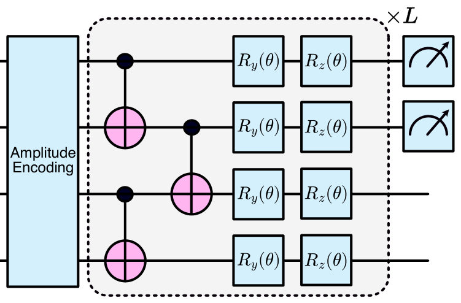 
Figure 1: A L layer of the variational ansatz of our quantum classifier. All single qubit gates in this ansatz are rotation gates (Ry(θ) = exp  −iθ

📷 Fig 2

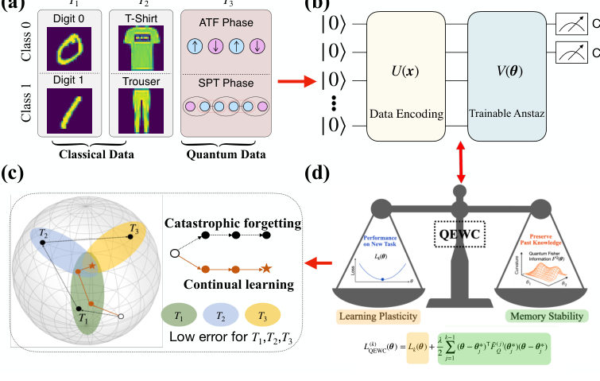 
Figure 2: Overview of the proposed quantum elastic weight consolidation (QEWC) framework. (a) continual learning tasks considered in this work, including classical image- classification tasks and a quantum-state classification task involving ATF and SPT phases. (b) Variational quantum classifier used for sequential binary classification. Classical input data are embedded into the amplitudes of an n-qubit quantum state through amplitude encoding U(x), processed by a trainable ansatz V (θ), and mapped to class predictions through measurement readout. (c) Illustration of catastrophic forgetting and continual learning in the parameter/state manifold. Without knowledge consolidation, training on...

📷 Fig 3

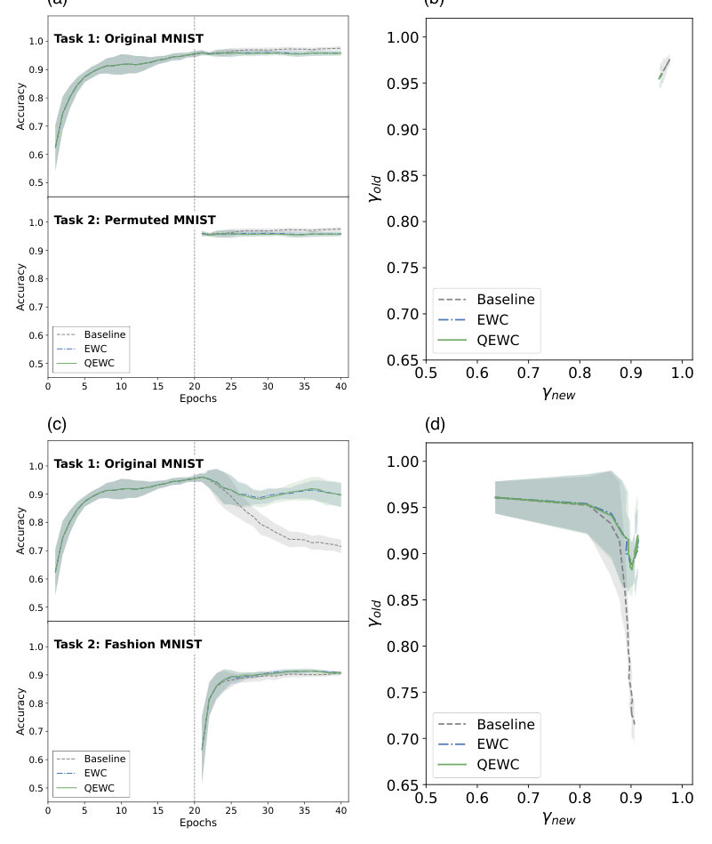 
Figure 3: Performance benchmarking for the EWC and QEWC frameworks. (a) Learning curves of two similar tasks: classifying the original and pixel-permuted MNIST images. Gray lines plot the accuracies for the two tasks respectively trained without the EWC or QEWC framework, whereas blue and green lines show the corresponding results with using of EWC and QEWC frameworks respectively. (b) Forgetting curve for two tasks with large similarity. Here, γold (γnew) represents the accuracy of the quantum classifier on the old (new) task. (c) Learning curves of two dissimilar tasks: classifying the original MNIST hand-written images and fashion-MNIST clothing images. (d) Forgetting curve of two...

📷 Fig 4

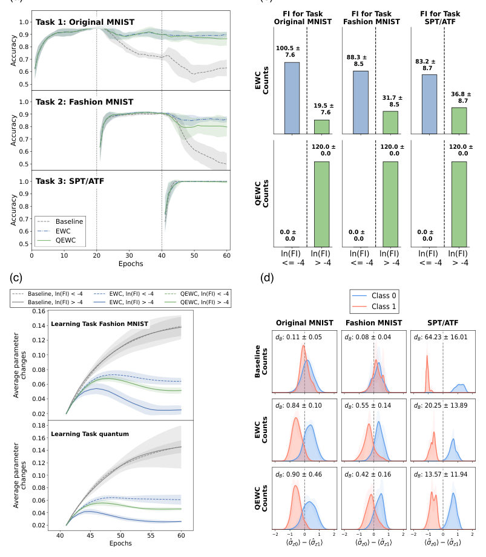 
Figure 4: Experimental results for continually learning three tasks. (a) The prediction accuracy for three sequential tasks at each epoch during the continual learning process of the quantum classifier. (b) Distribution of Fisher information for all parameters after learning each task. (c) Average parameter change compared to the obtained parameters for previous tasks during the learning stage for the new task. The top (bottom) figure corresponds to the learning for T2 (T3) (d) Distribution of the measured expected values which determine the prediction label of input data. For each task, red and blue correspond to two classes of data samples, respectively. A greater separation between the...

📷 Fig 5

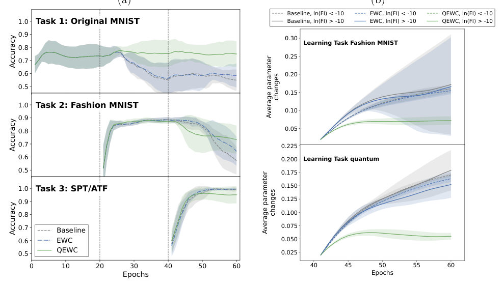 
Figure 5: Continual-learning performance and parameter dynamics under noise for the three-task sequence. (a) Classification accuracy of the baseline, EWC, and QEWC frameworks at each epoch under depolarizing noise (p = 0.01), with dashed vertical line indicating task boundaries. (b) Mean absolute parameter displacement of the high-FI and low-FI groups relative to the previous task optimum during T2 and T3 training.

**Summary.** This paper proposes Quantum Elastic Weight Consolidation (QEWC) to combat catastrophic forgetting in Variational Quantum Classifiers. It replaces classical Fisher Information with the measurement-independent Quantum Fisher Information (QFI) to quantify parameter importance geometrically. The results establish QEWC as a robust, physically motivated method for training quantum models on sequential tasks.

**Why it may be interesting.** It directly addresses model robustness in quantum machine learning by grounding regularization in fundamental quantum geometric measures like QFI, which is crucial for understanding information flow in quantum computation.

Detailed structure

**Main problem.** The core problem is mitigating catastrophic forgetting in quantum models trained sequentially on different tasks.

**Main result.** Quantum Elastic Weight Consolidation (QEWC), which uses the Quantum Fisher Information (QFI), successfully mitigates forgetting and provides a physically motivated regularization framework superior to classical methods.

**Method.** The authors adapt the EWC framework by replacing the classical Fisher Information with QFI, providing an information-geometric measure of parameter sensitivity for quantum states.

**Model / system.** The study uses Variational Quantum Classifiers (VQCs) implemented via parameterized quantum circuits (PQCs) to perform sequential binary classification tasks.

**Key observables.** Catastrophic forgetting, QFI matrix ($ar{F}^{(j)}_{Q}$), and the resulting task-specific loss function $\mathcal{L}_{	ext{EWC}}$.

**Important parameters / regimes.** The regularization strength hyperparameter ($\lambda$) controls the stability-plasticity trade-off.

**Assumptions / limitations.** A key assumption for tractability is the use of a diagonal approximation for the full QFI matrix, which neglects off-diagonal correlations.

**Figures summary.** Not specified in detail, but comparisons are made between unregularized training, CFI-based EWC, and QFI-based QEWC across sequential tasks.

**Paper structure.** The paper introduces the problem of quantum continual learning, derives the QEWC objective using QFI, compares it to classical methods (CFI), analyzes its performance under noise, and provides theoretical bounds on state stability.

Abstract

Quantum continual learning aims to train quantum models on sequential tasks without losing previously learned knowledge. However, variational quantum classifiers (VQCs) are prone to catastrophic forgetting under nonstationary task distributions. We propose quantum elastic weight consolidation (QEWC), a quantum Fisher information (QFI)-informed regularization method for mitigating forgetting. Unlike conventional elastic weight consolidation based on classical Fisher information (CFI), which measures parameter importance through measurement-dependent output statistics, QEWC uses QFI to quantify the intrinsic sensitivity of the parameterized quantum state. This gives an information-geometric view in which important parameters are identified by the local response of the quantum state manifold. We evaluate QEWC on VQCs trained on sequential binary classification tasks, including classical image-classification and quantum phase-classification tasks. Simulations show that sequential training without regularization causes severe forgetting, while both CFI-based EWC and QFI-based QEWC improve retention of previous tasks. Mechanistic analyses further show that the two methods impose different regularization geometries: CFI acts selectively on measurement-sensitive directions, whereas QFI imposes a denser state-geometric constraint over parameter space. Under depolarizing noise, CFI values are strongly suppressed by degraded measurement statistics, while QFI preserves a more stable sensitivity structure of the noisy parameterized quantum state. These results establish QEWC as a physically motivated approach for studying and mitigating forgetting in quantum continual learning through quantum-state geometry.

[↑ back to top](#top)

### [Spectral amplification for ground-state energy estimation of electronic structure in first quantization](http://arxiv.org/abs/2607.15358v1)

**Authors:** Alicja Dutkiewicz, Alec F. White, Guang Hao Low, A. Eugene DePrince, Matthew P. Harrigan, Marika Kieferova, Ryan Babbush, Dominic W. Berry, Nicholas C. Rubin  
**Type:** theory · **Category:** quantum information and computing · **PDF:** <https://arxiv.org/pdf/2607.15358v1>  
**Analysis basis:** full PDF text, analyzed in chunks
**Topic relevance:** `correlated cavity matter` **1/5**

📷 Fig 1

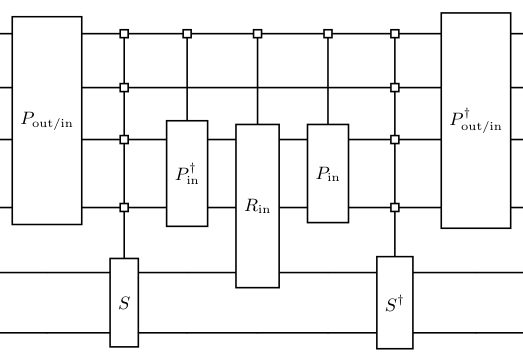 
FIG. 1. Overall structure of the circuit for the block-encoding. For clarity we have grouped the registers as follows: “branch” indicates the qubits used to control the application of the T, V , and X branches, “outer” indicates those qubits involved only in the outer state preparation (nested boxes and the w register), “mix” indicates the shared index register and nuclear flag which are part of the outer or inner prepare depending on which term is being applied, “inner” indices qubits involved only in the inner state preparation (the r register and the b flag), “overflow” indicates overflow bits, and |Ψ⟩is the system register. We use a small square to indicate some kind of generalized...

📷 Fig 2

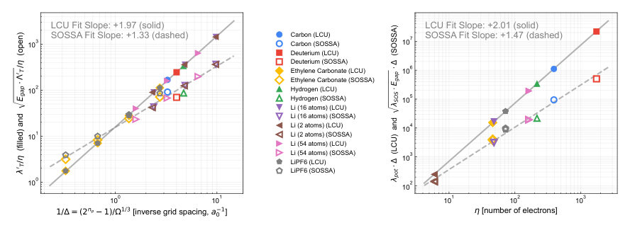 
FIG. 2. ΛT and Λpotential for LCU method from [16] vs SOSSA (effective scaling after gap amplification). The lower slopes for SOSSA recover the expected scaling from Eq. (58).

📷 Fig 3

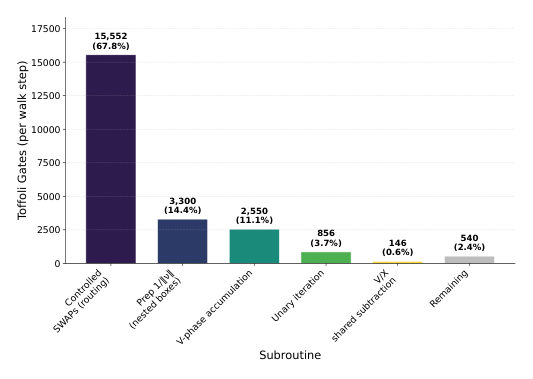 
FIG. 3. The top five subroutines and summed remainder costs for the Hydrogen system in Table V. The 1/∥ν∥preparation cost is three times the base nested-boxes cost because we use amplitude amplification for the state preparation for this system. The V-phase accumulation is the efficient Add-and-phase circuit with O(n2 p) described in Appendix B 4 b.

📷 Fig 4

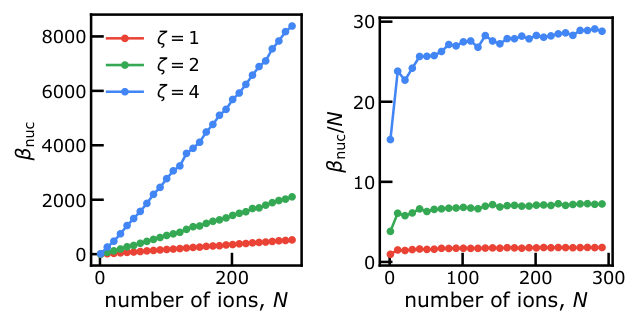 
FIG. 4. βnuc for randomly distributed ions of charge ζ = 1, 2, 4 at fixed total density and fixed kinetic energy cutoff. βnuc appears to be asymptotically linear both when plotted directly (left) and when normalized by the number of ions (right). Each point is computed from an average of 100 randomly initialized configurations.

📷 Fig 5

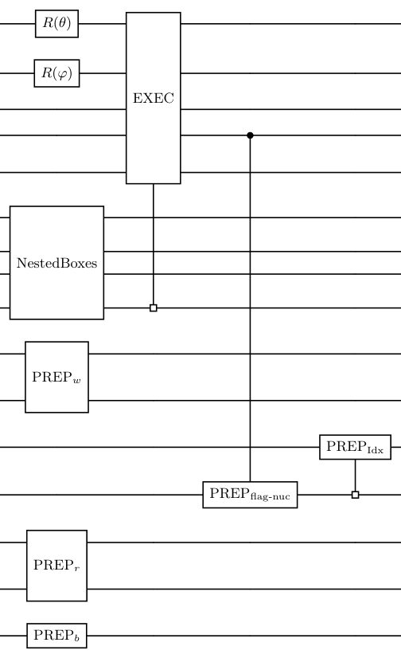 
FIG. 5. Structure of the mixed outer/inner prepare Pout/in. The labels on the right-hand-side are for comparison with Fig. 1.

**Summary.** This paper presents an advanced quantum computational technique to estimate ground-state energies for electronic structure problems. It improves upon existing methods by utilizing Sum-of-Squares Spectral Amplification on a first-quantized Hamiltonian representation. The resulting protocol offers substantial, provable reductions in the required quantum resources for simulating materials and chemical systems.

**Why it may be interesting.** This work directly addresses quantum algorithm efficiency by providing a provable, significant speedup in simulating fundamental physical systems (chemistry/materials) using first-quantized representations.

Detailed structure

**Main problem.** The primary goal is to improve the asymptotic gate complexity for estimating the ground-state energy of electronic structure Hamiltonians using quantum algorithms.

**Main result.** By employing a Sum-of-Squares Spectral Amplification (SOSSA) protocol based on the total charge density operator, the authors achieve an asymptotic reduction in resource estimates for ab initio simulations by a factor up to $44	imes$.

**Method.** The core method involves reformulating the first-quantized Hamiltonian into a Sum-of-Squares form and applying spectral gap amplification techniques within Quantum Phase Estimation (QPE).

**Model / system.** The system is the electronic structure of chemical or material systems, modeled using a non-relativistic Hamiltonian ($H = T + V + U$) represented in a plane wave basis.

**Key observables.** Gate complexity, Block Encoding Normalization ($\lambda$), and the effective 1-norm ($\lambda_{eff}$), which dictate resource requirements.

**Important parameters / regimes.** Number of electrons ($\eta$), simulation grid spacing ($\Delta$), and the gap energy ($E_{gap}$).

**Assumptions / limitations.** The Born-Oppenheimer approximation is used, and the analysis relies on deriving an analytical SOS representation using the total charge density operator.

**Figures summary.** Not specified by notes; the focus is on mathematical scaling improvements ($\lambda$ comparisons) rather than visual figure descriptions.

**Paper structure.** The paper develops the theoretical framework for applying SOSSA to first-quantized Hamiltonians, deriving improved scaling laws for block encoding costs compared to prior LCU methods, and quantifying the resulting resource reduction factor.

Abstract

We demonstrate an asymptotic gate complexity improvement in first-quantized ground-state energy estimation of electronic structure Hamiltonians in a plane wave basis by employing the sum-of-squares spectral gap amplification protocol. The improvement relies on identifying a sum-of-squares representation of the Hamiltonian which provides a lower bound certificate and low cost block encoding that leads to a provably lower quantum phase estimation gate cost. This is achieved by using a sum-of-squares operator generated by the total charge density operator resulting in a block encoding normalization improvement of $λ= \mathcal{O}\left(ηΔ^{-1.5}+η^{1.5}Δ^{-1} \right)$ compared to prior work $λ= \mathcal{O}(ηΔ^{-2}+η^2Δ^{-1})$ where $η$ is the number of electrons and $Δ$ is the simulation grid spacing. The asymptotic reduction in block encoding normalization and similar block encoding costs to prior work is demonstrated to reduce resource estimates for materials and chemical systems by a factor of $2 - 44\times$ corresponding to the lowest cost estimates for ab initio materials simulation.

[↑ back to top](#top)

## Other papers (7)

*Papers from primary archives without highlighted authors or any topic match. Click to expand.*

Show other papers

### [Alleviating the Sparse Matrix Scaling Bottleneck in Adaptive VQE via Greedy Operator Commutativity Partitioning and High-Order Taylor State Evolution](http://arxiv.org/abs/2607.15906v1)

**Authors:** Hermawan Kresno Dipojono  
**Type:** theory · **Category:** strongly correlated electrons · **PDF:** <https://arxiv.org/pdf/2607.15906v1>  
**Analysis basis:** full PDF text, analyzed in chunks

📷 Fig 1

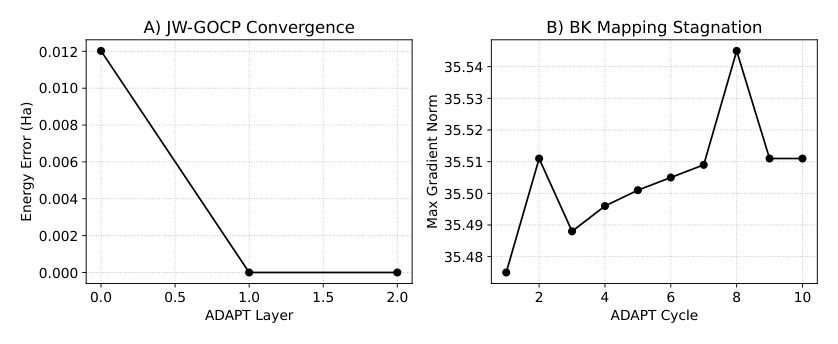 
Figure 1. Benchmark performance of the GOCP-optimized pipeline. (A) Convergence profile of GOCP-optimized ADAPT-VQE for stretched H2O. (B) Landscape sensitivity analysis showing gradient stagnation under the Bravyi-Kitaev mapping, indicating a decoupling of the operator family from the energy gradient.

**Summary.** This paper introduces a novel framework combining Greedy Operator Commutativity Partitioning (GOCP) with high-order Taylor series expansion to overcome the exponential scaling bottleneck in simulating quantum circuit evolution for molecular electronic structure calculations. By replacing dense matrix exponentiation with sparse operations, it enables accurate ground-state energy determination for large, strongly correlated systems previously deemed intractable.

**Why it may be interesting.** This work provides a crucial algorithmic breakthrough for quantum chemistry simulations, directly addressing the memory and computational scaling limits that restrict the size of systems solvable by current VQE implementations.

Detailed structure

**Main problem.** The primary challenge is overcoming the exponential computational bottleneck encountered when simulating the growth of adaptive quantum circuits (ansatz evolution) in VQE variants for strongly correlated systems.

**Main result.** The proposed framework maintains high numerical fidelity while achieving sub-chemical accuracy in ground-state energy calculations, enabling simulations on operator manifolds exceeding $2.68 	imes 10^8$ elements efficiently.

**Method.** It combines Greedy Operator Commutativity Partitioning (GOCP) to manage the operator space with a deterministic fifth-order Taylor series expansion ($\mathcal{O}(5)$) to approximate unitary evolution using sparse matrix-vector operations instead of explicit matrix exponentiation.

**Model / system.** The study applies these methods to molecular electronic structures, benchmarking on systems like BeH2 and H2O. The underlying physics involves mapping fermionic Hamiltonians ($	ext{H}_{	ext{ferm}}$) onto qubit Pauli strings ($	ext{H}_{	ext{qubit}}$) using JW or BK mappings.

**Key observables.** Ground-state energy expectation value ($E_0$), state fidelity (maintained $> 1 - 10^{-6}$), and the ability to handle large operator manifolds.

**Important parameters / regimes.** The framework is tested across varying qubit numbers (up to 14 qubits) and molecular geometries, demonstrating scalability with high-dimensional operator spaces.

**Assumptions / limitations.** The core assumption is that the $\mathcal{O}(5)$ Taylor expansion provides sufficient accuracy for achieving chemical precision in the state evolution approximation.

**Figures summary.** Figure 1 shows convergence profiles for stretched H2O and gradient stagnation under BK mapping. Table II compares scaling metrics (Hilbert Space Dimension vs. Operator Pool size) for JW/BK mappings across H2O and BeH2. Table III summarizes benchmark energy convergence for multiple systems.

**Paper structure.** The paper introduces GOCP to partition the operator pool, followed by the $\mathcal{O}(5)$ Taylor expansion technique to simulate evolution via sparse SpMV operations. Performance is then evaluated across various molecular benchmarks (BeH2, H2O) using both JW and BK mappings.

Abstract

The Variational Quantum Eigensolver (VQE) and its adaptive variants, such as ADAPT-VQE, are central to the study of strongly correlated quantum systems. However, the classical simulation of the ansatz growth process remains constrained by the exponential scaling of operator space and the associated computational cost of unitary evolution. We introduce the Greedy Operator Commutativity Partitioning (GOCP) framework, an analytical methodology designed to optimize both operator selection and state evolution. By reformulating complex unitary rotations as a chained sequence of fifth-order O(5) Taylor series expansions, GOCP bypasses the need for explicit matrix exponentiation, reducing the computational task to a sequence of sparse matrix-vector operations. We evaluate the performance of this framework across diverse molecular systems, including BeH2 and strongly correlated H2O geometries, utilizing both Jordan-Wigner and Bravyi-Kitaev mappings. Our results demonstrate that the GOCP framework maintains exceptional numerical fidelity-exceeding 1 - 10^-6 in state fidelity-while achieving sub-chemical accuracy in ground-state energy calculations. By enabling the simulation of operator manifolds exceeding 2.68 x 10^8 elements with high efficiency, this approach provides a scalable and rigorous pathway for exploring deep variational circuits in complex quantum many-body systems.

[↑ back to top](#top)

### [Benchmarking Hybrid Quantum-Classical Algorithms for Power Grid Optimization Problems](http://arxiv.org/abs/2607.15543v1)

**Authors:** Igor Gaidai, Rick Mukherjee  
**Type:** theory · **Category:** quantum information and computing · **PDF:** <https://arxiv.org/pdf/2607.15543v1>  
**Analysis basis:** full PDF text, analyzed in chunks

📷 Fig 1

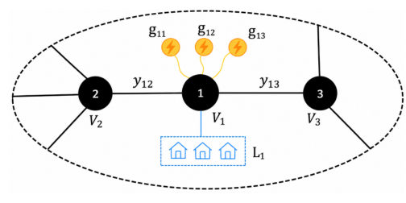 
Figure 1. A section of an input graph. The nodes represent buses and have associated voltage phasors (V ), cumulative loads (L), and connected generators (g). The edges represent electrical lines and have associated admittances (y).

📷 Fig 2

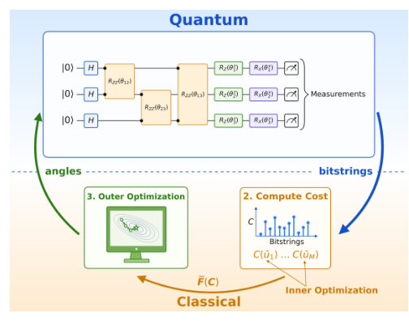 
Figure 2. Schematic representation of the workflow of the algorithm described in Section III D. Bitstrings (¯u1, ..., ¯uM) are measured from the quantum circuit. Their costs are eval- uated classically by optimizing continuous degrees of freedom. Then an average target metric ¯F(C) is passed to the outer op- timization layer over variational angles. The new variational angles proposed by the optimizer are applied to the quantum circuit. See the text for more details.

📷 Fig 3

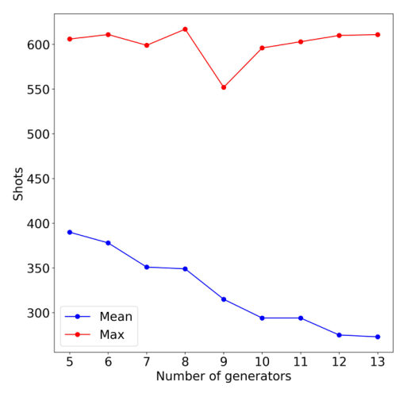 
Figure 3. Mean and maximum number of shots necessary to converge mean sample AR to within 0.05 of its expected value with probability 90%. The mean and maximum is taken over different random variational angles and random instances at a given system size N = |G|.

📷 Fig 4

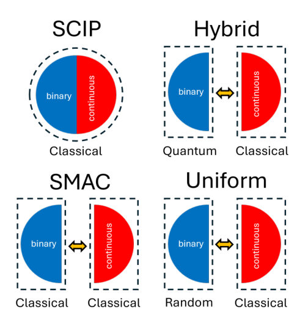 
Figure 4. Schematic representation of the AC-OPF-UC solvers considered in this work. Binary and continuous vari- ables for SCIP are optimized together with a single mixed integer optimizer. For other solvers they are optimized sepa- rately with 2 different optimizers indicated at the bottom.

📷 Fig 5

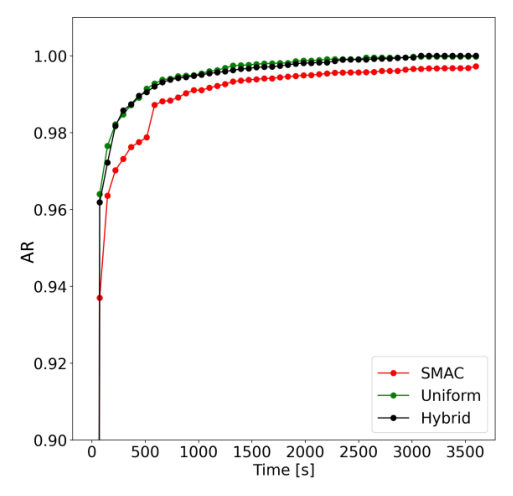 
Figure 6. Instance-averaged approximation ratio of the best incumbent solution vs time for the 13 generators dataset.

**Summary.** This work evaluates the potential of hybrid quantum-classical algorithms, specifically QAOA variants, to solve the challenging AC Optimal Power Flow Unit Commitment problem. The authors tested qubit-efficient encoding methods on small grids but found no performance improvement over classical random sampling. They conclude that demonstrating a true quantum advantage requires scaling up to much larger, currently intractable system sizes.

**Why it may be interesting.** It directly applies quantum optimization techniques (QAOA) to a major, highly constrained engineering optimization problem, providing a concrete test case for near-term quantum hardware feasibility in applied physics/engineering.

Detailed structure

**Main problem.** The paper benchmarks hybrid quantum-classical variational algorithms for solving the complex Alternating Current Optimal Power Flow Unit Commitment (AC-OPF-UC) problem.

**Main result.** The qubit-efficient hybrid method did not outperform uniform random sampling on small instances, suggesting that much larger system sizes are needed to demonstrate a potential quantum advantage over classical solvers.

**Method.** Two hybrid approaches were investigated: applying QAOA directly to a discretized formulation (requiring too many qubits) and a qubit-efficient approach encoding only binary variables while classically optimizing continuous power flow variables.

**Model / system.** The system is an electrical power grid modeled by the AC-OPF-UC problem, which involves minimizing cost subject to nonconvex AC power-flow constraints and discrete generator commitment decisions. The optimization is formulated using penalty terms within a Hamiltonian for VQA/QAOA.

**Key observables.** Active power (P), reactive power (Q), node voltages, phase angles, and the total system cost function.

**Important parameters / regimes.** System size (number of generators, 5 to 13 tested); required qubit count for full discretization ($\gg$ current capacity).

**Assumptions / limitations.** The primary assumption is that a quantum advantage might exist, but the authors note this requires testing systems much larger than their computational capacity allows.

**Paper structure.** The paper introduces AC-OPF-UC as a difficult MINLP problem. It details two candidate hybrid algorithms (direct QAOA vs. qubit-efficient encoding). The core is the benchmarking process comparing these methods against established classical solvers like SCIP and uniform sampling.

Abstract

Alternating Current Optimal Power Flow Unit Commitment (AC-OPF-UC) is a difficult mixed-integer nonlinear optimization problem that combines binary generator commitment decisions with nonconvex continuous AC power-flow constraints. In this work, we investigate whether hybrid quantum-classical variational algorithms can improve the solution of single-period AC-OPF-UC relative to classical approaches. To the best of our knowledge, this is the first study to directly evaluate quantum or hybrid quantum-classical algorithms for the full AC-OPF-UC problem. We consider two candidate algorithms for improving AC-OPF-UC solution quality relative to purely classical methods on ideal quantum hardware. The first applies QAOA directly to a fully discretized formulation of the problem, with equality and inequality constraints incorporated through penalty terms and slack variables. Although conceptually straightforward, this approach requires a prohibitively large number of qubits even for small instances. The second, qubit-efficient approach encodes only the binary generator status variables on a quantum computer, while optimizing the continuous power-flow variables classically for each sampled bitstring. We benchmark this method on randomly generated AC-OPF-UC instances with 5 to 13 generators and compare it against SCIP, SMAC, and uniform random sampling. Our simulations show that the qubit-efficient hybrid method does not outperform uniform sampling. These results suggest that in order to establish potential advantage of the variational hybrid strategy considered here over the best classical algorithms, if any, much larger system sizes (25+ generators) need to be tested, which is beyond our computational capacity. Alternatively, different approaches, such as quantum versions of branch-and-bound methods, may be more promising.

[↑ back to top](#top)

### [Causality in Pure Quantum Computation with Quantum Control](http://arxiv.org/abs/2607.15926v1)

**Authors:** Kengo Hirata, Takeshi Tsukada  
**Type:** theory · **Category:** quantum information and computing · **PDF:** <https://arxiv.org/pdf/2607.15926v1>  
**Analysis basis:** full PDF text, analyzed in chunks

📷 Fig 1

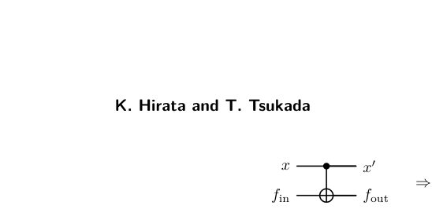 
Figure 1 Causality violation in naive higher-order quantum control in (∗∗). (Left) The function f acts as a NOT gate controlled by the qubit x. Each fin and fout represents the input and output of f. (Right) Applying f to the control qubit itself creates a closed loop.

**Summary.** This work develops a sophisticated type system for higher-order quantum computation that explicitly incorporates physical causality constraints. By extending linear logic with causal connectives, the authors prove that certain programs leading to unphysical operations are rejected by the type checker. This advances the formal understanding of what constitutes a physically realizable quantum computation.

**Why it may be interesting.** It provides rigorous mathematical tools for determining which abstract quantum computational models are physically implementable, which is crucial for designing fault-tolerant or causality-respecting quantum hardware protocols.

Detailed structure

**Main problem.** The paper investigates causality issues that arise when combining quantum control mechanisms (like conditional branching) with higher-order functions in pure quantum computation.

**Main result.** It proposes a novel typed lambda calculus equipped with an intuitionistic BV logic type system, proving that this structure can successfully restrict the language to only define physically realizable supermaps.

**Method.** The authors use proof theory and categorical semantics, developing a specialized type system ($\lambda qif$) grounded in causal linear logic to enforce physical causality constraints on quantum operations.

**Model / system.** The model is pure quantum computation formalized using supermaps (transformations acting on quantum channels) and extended with higher-order functions and quantum conditional branching ($	ext{qif}$).

**Key observables.** Causality violation, physical realizability of supermaps, the structure of resulting linear maps when causality fails.

**Important parameters / regimes.** The type system relies on extensions of Multiplicative Linear Logic (MLL) and intuitionistic BV logic.

**Assumptions / limitations.** The analysis assumes that physically unrealizable processes correspond to violations of causal constraints enforced by the proposed type system.

**Figures summary.** Figures illustrate causality violation in naive higher-order control, basic inference rules for the logical framework ($	ext{sequentIBV}$), and programs mapping to proofs.

**Paper structure.** The paper builds from identifying the problem (causality failure with $	ext{qif}$) to proposing a solution via a type system based on causal logic, culminating in formal proofs within categorical semantics.

Abstract

Indefinite causal order is a characteristic phenomenon in quantum computation, with examples including the quantum SWITCH and the OCB process. Not all such processes are believed to be physically realizable: while some implementations of the quantum SWITCH have been proposed, the OCB process is suspected to be unrealizable. This difference in realizability is commonly attributed to constraints imposed by physical causality.   This paper studies such a causality issue in a higher-order setting, proposing a typed lambda calculus with quantum control and its categorical semantics. Our calculus extends pure quantum computation with higher-order functions and quantum conditional branching, and it is equipped with a type system based on intuitionistic BV logic to enforce causality. We also present a novel model that is closely related to the Caus construction, by which we prove that some physically-unrealizable processes are not definable in our language.

[↑ back to top](#top)

### [From hyperplanes to hyperellipsoids: characterizing the inherent interpretability of linear and single-qubit mixed-state binary classification models](http://arxiv.org/abs/2607.15433v1)

**Authors:** Kaitlin Gili  
**Type:** theory · **Category:** disordered systems and neural networks · **PDF:** <https://arxiv.org/pdf/2607.15433v1>  
**Analysis basis:** full PDF text, analyzed in chunks

📷 Fig 1

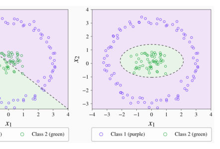 
Figure 1: Toy classification example for two data features. (a) The model can only learn the slope of a line to separate the data. (b) The model can only learn the semi-axis lengths of an ellipsoid to separate the data.

**Summary.** This paper compares the geometric and interpretability differences between standard linear classifiers and a quantum model based on single-qubit mixed states for binary classification. It shows that the quantum model restricts the decision boundary to an ellipsoid rather than a simple hyperplane. This offers an accessible pedagogical bridge for introducing quantum machine learning concepts using familiar classical ML tools.

**Why it may be interesting.** It provides a concrete, low-dimensional analogy showing how physical constraints (like those imposed by single-qubit measurements) translate into specific structural limitations (ellipsoidal boundaries) on machine learning models, which is relevant to understanding model capacity in quantum information processing.

Detailed structure

**Main problem.** The paper characterizes and compares the inherent interpretability of standard linear models versus single-qubit mixed-state models for supervised binary classification.

**Main result.** A single-qubit mixed state model results in a decision boundary shaped like a hyperellipsoid, which is mathematically an 'ellipsoid version' of the linear hyperplane boundary.

**Method.** The comparison uses standard supervised binary classification setups, analyzing the geometric constraints and feature importance derived from both the linear weight vector and the probabilistic semi-axes of the ellipsoid.

**Model / system.** The models are a standard linear classifier ($f_w(\mathbf{x})$) and a single qubit mixed state model ($	ext{Tr}[
ho_{	ext{mixed}} O]$). The latter constrains the decision boundary to an hyperellipsoid $\sum x_d^2 / a_d^2 = 1$.

**Key observables.** Feature importance (derived from weights $|w_d|$ vs. probabilities $p_d$), and the shape of the decision boundary (hyperplane vs. hyperellipsoid).

**Important parameters / regimes.** The relative feature importances, represented by the probabilities $p_d$, which determine the semi-axis lengths $a_d$.

**Assumptions / limitations.** The analysis is kept accessible to readers with no quantum background and assumes a standard supervised binary classification setup.

**Figures summary.** Figure 1 illustrates the difference between the two models using toy data, showing the linear model learning a line and the single-qubit mixed state model learning an ellipsoid in a low-dimensional setting.

**Paper structure.** The paper introduces both models, mathematically derives the hyperellipsoidal form for the quantum case, compares their geometric inductive biases (hyperplane vs. hyperellipsoid), analyzes feature importance differences, and concludes with pedagogical suggestions for teaching Quantum ML.

Abstract

We characterize and compare the inherent interpretability offerings of a standard linear model with a single qubit mixed state model for the task of supervised binary classification. A side by side comparison reveals that a single qubit mixed state model for binary classification is just the ``ellipsoid version" of standard linear model classification. More precisely, rather than learning a hyperplane to classify data, we learn a hyperellipsoid. We discuss the consequences of the geometric inductive biases of both models, as well as how each model contains a different feature importance inductive bias. This short characterization offers an accessible route to quantum machine learning (ML) ideas for readers who have zero background in quantum and are only familiar with linear classification in ML. In support of ML pedagogy, we encourage instructors to utilize this piece to smoothly introduce quantum ML ideas into the undergraduate ML classroom.

[↑ back to top](#top)

### [Parameterized Quantum Circuit Semantics Through Enriched Categories](http://arxiv.org/abs/2607.16114v1)

**Authors:** Neil J. Ross, Scott Wesley  
**Type:** theory · **Category:** quantum information and computing · **PDF:** <https://arxiv.org/pdf/2607.16114v1>  
**Analysis basis:** full PDF text, analyzed in chunks

📷 Fig 1

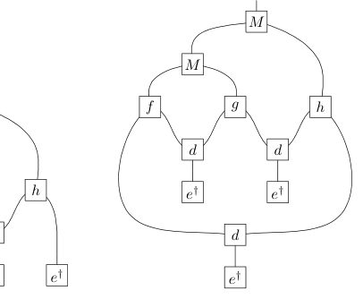 
Figure 4. Network topologies obtained from the pair-of-pants comonoids.

📷 Fig 2

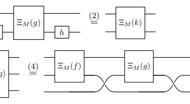 
Figure 5. Circuit equations satisfied by ΞM. Relations (1) through to (3) correspond to the properties in Thm. 6.6, whereas relation (4) is Thm. 6.7.

**Summary.** This paper develops an advanced semantic framework using enriched category theory to model parameterized quantum circuits beyond what standard monoidal categories can handle. By enriching the circuit semantics over a parameter category, it successfully incorporates continuous or weighted dependencies inherent in modern quantum machine learning models. This provides a powerful mathematical tool for analyzing complex quantum control structures.

**Why it may be interesting.** This work provides a highly abstract mathematical language (enriched categories) to rigorously analyze the structure of parameterized quantum circuits, which is crucial for understanding variational algorithms and QML models where parameter dependence is key.

Detailed structure

**Main problem.** The paper addresses the need for a semantic model capable of representing parameterized families of quantum circuits, which standard monoidal category approaches fail to capture.

**Main result.** It introduces an enriched category theory framework that successfully models parameterized circuit semantics, providing insights into controlled operations and unifying different perspectives on quantum control.

**Method.** The approach uses enriched category theory, enriching the semantic domain over a parameter category V to encode the necessary structure for continuous or parameterized composition rules.

**Model / system.** The model concerns general quantum circuits, particularly those arising in variational quantum algorithms and Quantum Machine Learning (QML) that involve free parameters (e.g., Pauli-Z rotations $RZ_{p_1} \otimes RZ_{p_2}$).

**Key observables.** Circuit transformations, controlled operations, and the structure of parameterized unitaries.

**Important parameters / regimes.** The continuous or discrete nature of the parameters (weights) governing the circuit gates.

**Assumptions / limitations.** It assumes that standard models fail due to insufficient handling of parameter dependence, necessitating enrichment over a suitable base category V.

**Figures summary.** Figure 1 illustrates the structure of a Frobenius algebra with its components; Figure 2 shows an example of a two-layer real amplitude ansatz circuit parameterized by weights.

**Paper structure.** The paper builds from standard monoidal categories to address parameterization limitations, introducing enriched category theory. It studies special cases like Cartesian and monoidal closed parameters, culminating in showing how this framework unifies quantum control perspectives via dagger structures and control functors.

Abstract

It is well-known that combinatorial circuits are modeled mathematically by string diagrams in monoidal categories. Given a gate set $Σ$, the circuits over $Σ$ can be thought of as string diagrams in the free monoidal category generated by $Σ$. In this model, circuit semantics are then given by monoidal functors out of this free category. For quantum circuits, this functor is often valued in the category of unitary matrices. This model suffices for concrete quantum circuits, but fails to describe parameterized families of quantum circuits, such as those which arise in the analysis of ansatz circuits. In this paper, we introduce an approach to parameterized circuit semantics, which is based on enriched category theory. We first introduce an abstract categorical construction, and use this to gain new insights on controlled operations and quantum communication. We then study the special cases of Cartesian monoidal parameters and monoidal closed parameters, both endowing the parameterized semantics with useful constructions.We conclude by showing that the monoidal closed case can be used to unify two perspectives on quantum control.

[↑ back to top](#top)

### [Performance Model for Hybrid Quantum-Classical Workflows](http://arxiv.org/abs/2607.15426v1)

**Authors:** Pooja Rao, Dimitar Trenev, Jerome Gonthier, Taylor Patti, Sebastian Stern, Tyler Takeshita, Yuri Alexeev, Cedric Lin, Sam McArdle, Justin Lietz, Katherine Klymko, Ermal Rrapaj, Norm Tubman, Krysta Svore, Peter Komar, Elica Kyoseva  
**Type:** theory · **Category:** quantum information and computing · **PDF:** <https://arxiv.org/pdf/2607.15426v1>  
**Analysis basis:** full PDF text, analyzed in chunks

📷 Fig 1

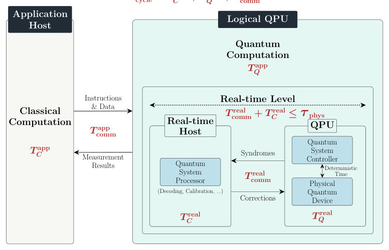 
Fig. 1 The compute cycle: a complete round trip of information between the classical host and quantum accelerator. The total cycle time Tcycle = TC + TQ + Tcomm decomposes into classical compute time (TC), quantum compute time (TQ), and communication overhead (Tcomm). At the real-time level, classical processing and communication must satisfy TC,step + Tcomm,step ≤τ phys to preserve correctness.

📷 Fig 2

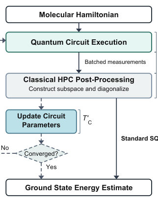 
Fig. 2 Compute cycle for Sample-Based Quantum Diag- onalization (SQD). The standard workflow (solid lines) performs a single quantum sampling phase followed by classical subspace construction and diagonalization. The closed-loop variant (dashed lines) iteratively refines the cir- cuit ansatz based on diagonalization results. In both cases, the communication frequency is F = 1 per iteration, yield- ing a low communication-to-computation ratio (Rcc ≪1).

📷 Fig 3

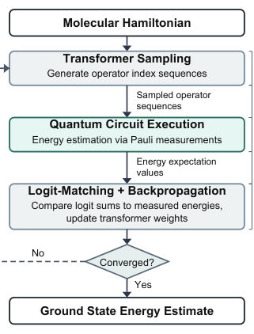 
Fig. 3 Compute cycle for the Generative Quantum Eigen- solver (GQE), assuming training from scratch. The trans- former samples operator index sequences that define quan- tum circuits, whose measured energies provide the training signal. The classical cost is dominated by the backprop- agation step (logit-matching loss), while the transformer forward pass (sampling) is computationally trivial. As with SQD, the workflow is quantum-dominated due to the large shot budget required for energy estimation.

**Summary.** This paper introduces a comprehensive runtime model to analyze hybrid quantum-classical workflows, separating performance concerns into abstract application levels and strict real-time physical constraints. It demonstrates that while communication overhead can be quantified by a ratio, achieving fault tolerance requires careful consideration of timing feasibility dictated by the underlying hardware coherence times.

**Why it may be interesting.** It provides essential architectural guidelines by quantifying when hardware co-location benefits are negligible versus when tight integration is mandatory for feasibility, which guides the roadmap for quantum hardware development.

Detailed structure

**Main problem.** The field lacks a shared framework for analyzing performance when integrating quantum processors with classical High-Performance Computing (HPC) resources in hybrid workflows.

**Main result.** A runtime model decomposes workflow execution into quantum, classical, and communication costs, allowing quantification of whether the bottleneck is computation or communication at different operational regimes.

**Method.** The authors introduce a comprehensive runtime model that analyzes performance at both an abstract application level (using communication-to-computation ratios) and a physical real-time level (using feasibility constraints).

**Model / system.** The system analyzed is the hybrid quantum-classical workflow, decomposed into $	ext{T}_{	ext{cycle}} = 	ext{T}_{	ext{C}} + 	ext{T}_{	ext{Q}} + 	ext{T}_{	ext{comm}}$. The analysis distinguishes between application-level timing (logical qubits) and real-time constraints (physical coherence times).

**Key observables.** Communication-to-computation ratio ($	ext{R}_{	ext{cc}}$), Real-time feasibility constraint, Logical error probability ($P_L(r)$)

**Important parameters / regimes.** Classical/Quantum Costs ($	ext{CC}, 	ext{CQ}$), Communication Latency ($L$), Bandwidth ($B$), Physical coherence time ($	au_{	ext{phys}}$), Code distance ($d$)

**Assumptions / limitations.** The model assumes distinct levels of analysis (application vs. real-time) and provides specific formulas for decomposing cycle time components.

**Figures summary.** Figure 1 illustrates the decomposition of total cycle time; Figure D2 shows how logical error probability increases with syndrome extraction cycles ($r$) for different code distances ($d$).

**Paper structure.** The paper first establishes the need for a shared framework, then introduces the runtime model decomposing costs into three components. It analyzes performance across application and real-time regimes, applies this to various algorithms (like SQSP-MaF), and finally discusses error accumulation in fault tolerance.

Abstract

Hybrid quantum-classical workflows are expected to underpin practical quantum computing applications, yet the quantum and HPC communities lack a shared framework for reasoning about where and when their integration requirements matter most. Such a framework must separate two distinct levels of analysis: the application level, where communication overhead affects runtime performance, and the real-time level, where it determines feasibility. To address this, we introduce a runtime model that decomposes workflow execution into quantum compute, classical compute, and communication costs. At the application level, a communication-to-computation ratio from this decomposition quantifies whether a workflow is communication-bound or compute-bound; at the real-time level, a feasibility constraint determines whether timing requirements can be met at all, with the reaction time setting the logical clock speed of fault-tolerant computation once they are. Application of this model to representative workflows demonstrates that co-location of quantum processors with HPC infrastructure offers negligible performance benefit for compute-intensive applications today, while tight integration remains crucial for real-time tasks such as quantum error correction needed for large scale quantum computations. However, we discuss how even at the application level these assessments may shift with hardware evolution, illustrating how the model can identify specific crossover conditions, and how, under fault tolerance, the reaction time can set application-level performance.

[↑ back to top](#top)

### [The Fourier Wall: Why Public Tabular Datasets Refuse Quantum Advantage, and a Certified Recipe for Where It Lives](http://arxiv.org/abs/2607.15815v1)

**Authors:** Javier Mancilla, Tomás Tagliani  
**Type:** theory · **Category:** disordered systems and neural networks · **PDF:** <https://arxiv.org/pdf/2607.15815v1>  
**Analysis basis:** full PDF text, analyzed in chunks

📷 Fig 1

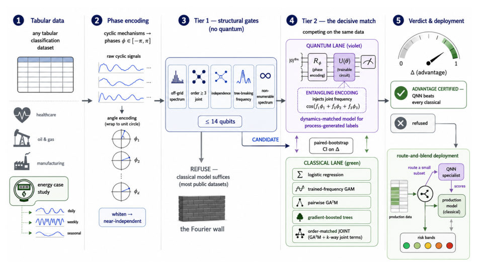 
Figure 1: The SPECTRA pipeline, end to end. (1) Any tabular classification dataset (the energy meter is this paper’s case study; healthcare, oil &amp; gas and manufacturing are candidate domains). (2) Cyclic mechanisms re-expressed as phases ϕ ∈[−π, π], whitened to near-independence. (3) Tier 1: the structural gates (off-grid spectrum, order ≥3 joint, independence, tree-breaking frequency, ≤14 qubits), which run in minutes without a quantum simulator; most public datasets exit here at the Fourier wall, where the classical model suffices. (4) Tier 2: the decisive match between the quantum lane (entangling encoding injecting the joint frequency) and the tuned classical lane (trained-frequency...

📷 Fig 2

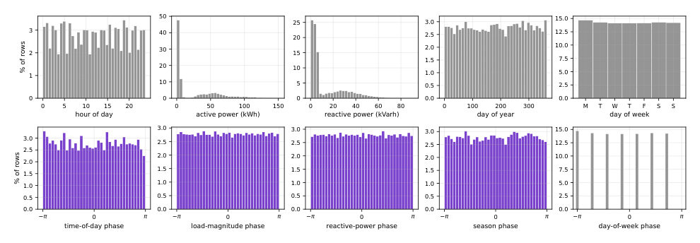 
Figure 2: From genuine meter fields to encodable phases. Top row, the raw operational fields as measured (share of rows on the vertical axis): the power draws are heavy-tailed while the calendar fields are close to uniform over their cycles; nothing here is synthesized. Bottom row, the phase each field becomes on [−π, π], by rank transform of the log magnitude or by mapping the calendar cycle. The four continuous phases (violet) enter the quantum-encoded block with uniform support by construction, so no region of the encoding is starved of data. The day-of-week phase (gray) remains seven discrete levels and is kept out of the encoded block, since a low-cardinality phase hands the “joint”...

📷 Fig 3

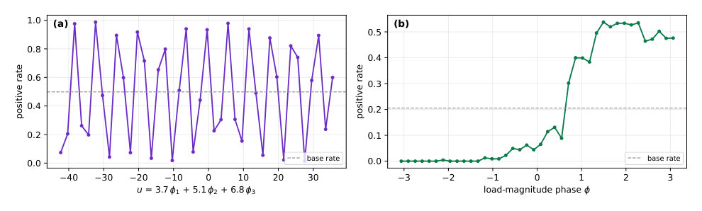 
Figure 3: Positive rate along one coordinate, with the dataset base rate dashed. (a) The sparse engineered pocket along the joint coordinate u = 3.7ϕ1 + 5.1ϕ2 + 6.8ϕ3: a clean high-frequency, non-integer oscillation that trees cannot tile and additive/pairwise Fourier models cannot represent. But the very cleanness is the tell: one oscillating coordinate means an enumerable spectrum, and a supervised search finds u in seconds, so C5 assigns this substrate to the order-matched classical (Section 6.2). (b) The real peak-regime target along its dominant axis (load-magnitude phase): smooth, monotone, low-order, ideal tree territory, hence the refusal of Section 6.1.

📷 Fig 4

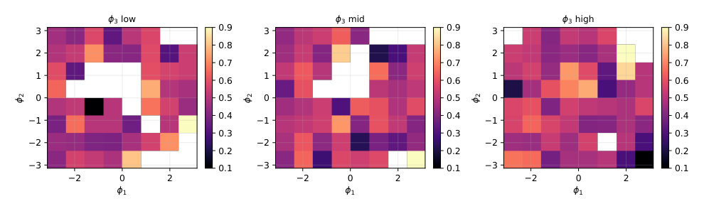 
Figure 4: Order-3 non-separability, visible without a model: positive rate over the first two phases (ϕ1, ϕ2), conditioned on the third (ϕ3 low / mid / high terciles). The two-phase pattern changes across the slices. Any additive or pairwise model produces the same (ϕ1, ϕ2) response in every slice, so this dependence is structurally out of its reach (condition C2).

📷 Fig 5

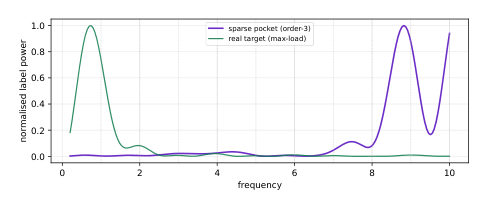 
Figure 5: Label spectral power along the dominant coor- dinate; integer harmonics dotted. The sparse engineered pocket (violet) concentrates its mass between the integer frequencies (condition C1, Eq. 4), out of reach of a fixed- grid surrogate, but concentrated at one joint frequency, which is exactly what makes it enumerable, so C5 places it with the order-matched classical: a supervised scan walks straight to the peak. The real target’s mass (green) sits at low frequency, where every classical model operates com- fortably. The certified dense-spectrum substrate has no such single peak to find.

**Summary.** This paper argues that current QML failures on public datasets stem from the inherent structure of the data, which rarely meets strict mathematical criteria for quantum advantage. The authors introduce SPECTRA, a two-tier certificate to test for these rare structures, demonstrating that true potential lies in analyzing signals with high-order, non-separable spectral interactions.

**Why it may be interesting.** It provides a rigorous, quantifiable framework—a 'recipe'—to distinguish genuine quantum computational advantages from mere model tuning or dataset artifacts in the context of structured physical data analysis.

Detailed structure

**Main problem.** Quantum Machine Learning (QML) models consistently underperform classical baselines on public tabular datasets, leading to skepticism about quantum advantage in ML.

**Main result.** A genuine quantum advantage is structurally limited to highly specific data regimes characterized by high-order, off-grid spectral interactions. The authors propose a 'Fourier Wall' certificate to identify these rare candidates.

**Method.** They introduce SPECTRA, a two-tier certification process: a structural screen checking five necessary conditions (e.g., non-separable order $\ge 3$) followed by a decisive comparison against a complete set of tuned classical benchmarks using paired-bootstrap confidence bounds.

**Model / system.** The core model is an angle-encoded variational quantum network (QNN) implementing a partial Fourier series, tested against various classical ML models like Gradient-boosted trees and Joint Additive Models on structured data.

**Key observables.** ROC-AUC scores, the confidence bound of performance gap ($\Delta$), and the exponential scaling cost of exact classical simulation vs. quantum circuit depth.

**Important parameters / regimes.** Interaction order $\ge 3$, off-grid spectrum ratio ($
ho_{	ext{off}}$), system size ($n \approx 13-40$ sites), and the crossover point where classical simulation becomes intractable.

**Assumptions / limitations.** The advantage is structural, requiring data to possess a hidden structure of jointly interacting periodic rhythms; failure to include an order-matched classical twin invalidates the claim.

**Figures summary.** Figures illustrate the SPECTRA pipeline (Tier 1 gates), performance gaps in controlled energy load tests (showing QNN beating classical when conditions are met), and resource scaling showing exponential classical cost growth versus flat quantum budget.

**Paper structure.** The paper establishes the problem of null results, introduces the structural criteria for advantage (the five necessary conditions), details the two-tier SPECTRA certificate methodology, validates it on controlled synthetic data demonstrating success, and concludes with a discussion of resource scaling and deployment recipes.

Abstract

Across public tabular benchmarks, quantum machine-learning (QML) models usually lose to carefully tuned classical baselines. We argue that this is a structural property of the datasets rather than merely a limitation of current models. Because an angle-encoded quantum neural network is a partial Fourier series, a genuine advantage can arise only when the target spectrum is simultaneously off-grid, of interaction order at least three, high-frequency, supported by near-independent features, and dense beyond practical enumeration. We call the failure to satisfy these conditions the Fourier wall. We operationalize the conditions as SPECTRA, a two-tier certificate: a simulator-free structural screen followed by a decisive comparison between a matched quantum model and five tuned classical twins using paired-bootstrap confidence bounds. On industrial smart-meter data, SPECTRA correctly refuses the real peak-load target, for which gradient-boosted trees reach a held-out ROC-AUC of 0.999. On the same real energy phases with labels generated by an interacting quantum process, the dynamics-matched quantum model reaches 0.994 versus 0.699 for the best generic classical baseline, and collapses to chance when its interaction couplings are ablated. An exact classical simulator ties the quantum model at small width but incurs measured exponential evaluation cost, with an estimated hardware crossover near 13-19 sites. These results provide a practical recipe for identifying, engineering, and deploying quantum-advantage candidates in tabular data.

[↑ back to top](#top)

## Secondary cond-mat archives

*Papers from  mes-hall, other, soft, supr-con. These archives are de-prioritized — they appear at the end regardless of relevance score.*

### Relevant in secondary archives (22)

### [Long range spatial correlations in the periodically driven transverse field Ising model](http://arxiv.org/abs/2607.15665v1)

**Authors:** Lazar Paroski, Ivan Iorsh  
**Type:** theory · **Category:** statistical mechanics · **PDF:** <https://arxiv.org/pdf/2607.15665v1>  
**Analysis basis:** full PDF text, analyzed in chunks
**Topic relevance:** 🔥 `non-equilibrium dynamics` **5/5** · 🔥 `non-equilibrium universality` **4/5** · `driven-dissipative phase transition` **3/5** · `methods for driven-dissipative` **3/5** · `Keldysh / 2PI / non-Gaussian methods` **2/5** · `analog quantum simulation` **2/5** · `correlated / nonlocal dissipation` **1/5** · `entanglement & information structure` **1/5** · `exotic spin models in light-matter` **1/5** · `scars & prethermalization` **1/5**

📷 Fig 1

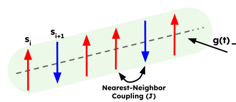 
FIG. 1. Schematic of the 1D transverse-field Ising chain. Spins si (red and blue arrows) denote up and down configura- tions that interact via the nearest-neighbor coupling J. The entire chain is subject to a uniform, time-dependent trans- verse field g(t) following a periodic rectangular drive.

📷 Fig 2

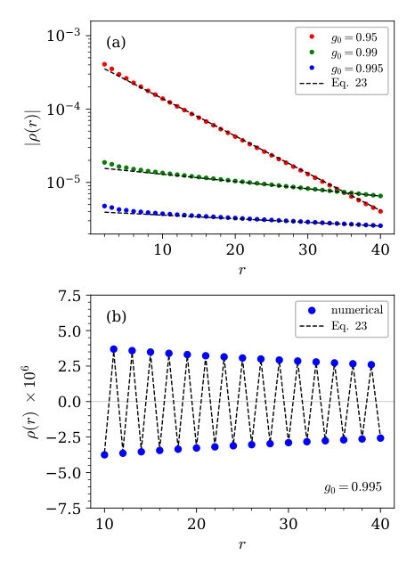 
FIG. 2. Correlation function ρ(r) at fixed period T = π/2, compared to Eq. (23). (a) |ρ(r)| for g0 ∈{0.95, 0.99, 0.995}. (b) Signed ρ(r) at g0 = 0.995 over r ∈[10, 40].

📷 Fig 3

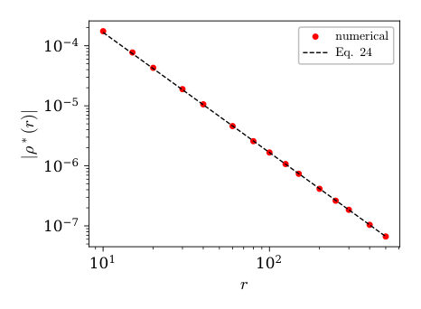 
FIG. 3. Optimally-tuned envelope |ρ∗(r)| = maxδg |ρ(r, δg)| at T = π/2, compared to Eq. (24).

**Summary.** This paper investigates spatial correlations in a periodically driven transverse field Ising model. By analyzing the pole structure of the correlation function, the authors show that tuning the drive period allows for constructive interference between different excitation sources (Kibble-Zurek and Floquet resonances). This interference leads to an unusually slow, algebraic decay of correlations, suggesting control over quantum coherence in driven many-body systems.

**Why it may be interesting.** This work directly addresses non-equilibrium dynamics in periodically driven quantum systems, which is highly relevant to understanding Floquet engineering and how external driving can manipulate correlation decay rates beyond equilibrium predictions.

Detailed structure

**Main problem.** The study focuses on determining the long-time spatial correlations of excitations within a periodically driven transverse field Ising model.

**Main result.** The correlation length can be made arbitrarily large by tuning the drive period, due to constructive interference between contributions from the Kibble-Zurek mechanism and Floquet resonances, leading to an optimal algebraic decay rate of r^-2.

**Method.** The analysis uses Jordan-Wigner transformations to map spins to fermions, followed by analyzing the pole structure of the correlation function in momentum space near the unit circle.

**Model / system.** The system is a one-dimensional Transverse Field Ising Model (TFIM) subjected to a periodic drive $g(t)$. The Hamiltonian involves nearest-neighbor interactions and a time-dependent transverse field term.

**Key observables.** Longest correlation length ($\xi$) and the spatial correlation function $
ho(r, t)$ for excitations.

**Important parameters / regimes.** The driving period ($T$), which must satisfy specific conditions related to Floquet resonances; the coupling constants $g_0$ and $g_1$.

**Assumptions / limitations.** The analysis relies on identifying poles in the correlation function integral, specifically requiring the interference between two distinct pole contributions.

**Figures summary.** Figure 2 illustrates numerical calculations of $|
ho(r)|$ for varying drive amplitudes. Figure 3 compares the analytically derived optimal envelope $|
ho^*(r)|$ with its calculated form at specific resonance conditions.

**Paper structure.** The paper analyzes the system's dynamics by transforming it into a fermionic problem, deriving the correlation function from four-fermion expectation values, and then performing a detailed pole analysis to identify the mechanism responsible for long-range correlations.

Abstract

We consider a periodically driven transverse field Ising model and study the long-time behavior of the correlations between the excitations in the spin chain. We show that the longest correlation length is defined by the interference between the topological defects induced by the analog of the Kibble-Zurek mechanism and those induced by the Floquet resonance. We show that although the correlations always have a finite correlation length since the system is integrable, the correlation length can be made arbitrarily large by tuning the drive period.

[↑ back to top](#top)

### [Negative quantum friction in nanoscale water flows: the Wigner picture](http://arxiv.org/abs/2607.16011v1)

**Authors:** Adriano Tiribocchi, Marco Lauricella, Efthimios Kaxiras, Sauro Succi  
**Type:** theory · **Category:** statistical mechanics · **PDF:** <https://arxiv.org/pdf/2607.16011v1>  
**Analysis basis:** full PDF text, analyzed in chunks
**Topic relevance:** 🔥 `Keldysh / 2PI / non-Gaussian methods` **4/5** · `Frenkel-Kontorova` **3/5** · `methods for driven-dissipative` **3/5** · `non-equilibrium dynamics` **3/5** · `driven-dissipative phase transition` **2/5** · `non-equilibrium universality` **2/5** · `Kondo & dissipative impurity` **1/5** · `correlated / nonlocal dissipation` **1/5**

📷 Fig 1

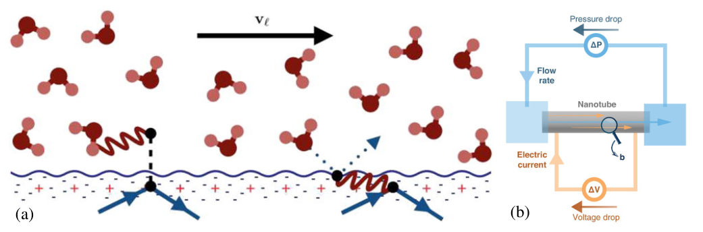 
Figure 1. (a) Schematic representation of the mechanisms driving the electronic current: hydrons (charged fluctuations of water molecules, red particles) transfer momentum to the electrons in the solid (black particles) through screened Coulomb interactions (black dotted line) and phonons (wavy lines), resulting from hits against the wall. (b) Schematic functioning of a hydronic generator. As the liquid flows through a nanotube connected to an external circuit, an electric current, caused by the hydroelectronic drag, results from the flow of the liquid. Figures adapted from Refs.[6, 7].

📷 Fig 2

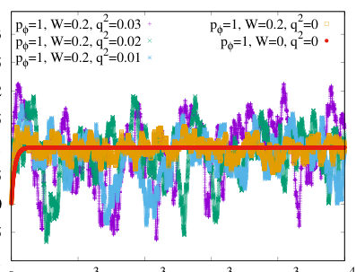 
Figure 2. Time evolution of the current J of a single particle (extracted from N = 100 different realizations) for pϕ = 1, W = 0, 0.2 and q2 = 0, 0.01, 0.02, 0.03. The solid curve represents the deterministic case, without water fluctuations, whereby the particle is driven towards the steady state condi- tion p = pϕ on a time scale 1/γ (classical friction). Increasing q2 leads to larger amplitude fluctuations and a slight decrease of the average current.

📷 Fig 3

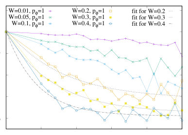 
Figure 3. Current vs q2, averaged over time (T = 20, 000) and realizations (N = 100) for different values of W and pϕ = 1. A net decrease of the electronic current at increasing q2 is visible, amounting to about 30 percent at q2 = 0.05 (semi-quantum) regime. The curve obeys a fit of the form J(q2) = J(0) −∆J(1 −exp(−q2/Q2)), with ∆J/J(0) ∼0.32 and Q2 ∼0.015 for W=0.2 (dashed curve), ∆J/J(0) ∼0.37 and Q2 ∼0.013 for W = 0.3 (dotted curve), ∆J/J(0) ∼0.4 and Q2 ∼0.009 for W = 0.4 (dot-dashed curve).

📷 Fig 4

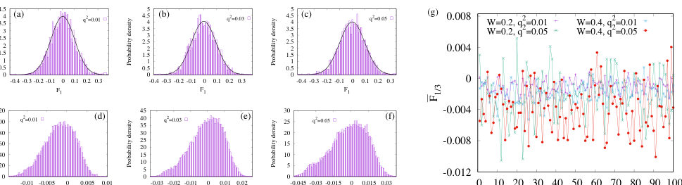 
Figure 4. The probability density of F1 (a,b,c) and F1/3 (d,e,f) for pϕ = 0.1, W = 0.2 and q2 = 0.01, q2 = 0.03, q2 = 0.05. Regardless of the values of q2, F1 closely follows a Gaussian distribution where µ ∼0 and σ ∼0.1. By contrast, F1/3 shows a negative skewness, with an increasingly heavy left tail, as q2 augments, with the skewness approximately ranging from -0.3 for q2 = 0.01 to −0.4 for q2 = 0.05. We associate the progressive increase of negative skewness with the reduction of ⟨¯J⟩. In panel (g) we show the typical trend of ¯F1/3 over N = 100 realizations. Increasing q2 leads to a shift towards negative values with a concurrent increase of the fluctuation amplitude.

📷 Fig 5

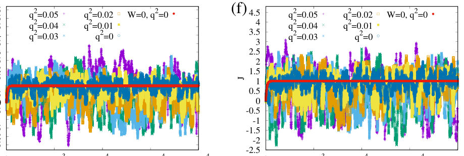 
Figure 5. Time evolution of the current J of a single particle for different values of q2 and W = 0.1 (a,b), W = 0.3 (c,d), W = 0.4 (e,f). These ones are compared to the classical unperturbed case, where q2 = 0 and W = 0. The left column shows systems whose absolute value of the time averages is minimum among all realizations, while in the right column the time average is maximum. On a general basis, increasing q2 and W enhances the amplitude of the fluctuations, with a progressive shift towards values considerably lower than 1.

**Summary.** This paper theoretically investigates how quantum effects modify friction in confined water flows by modeling electron interactions using the Wigner equation. Numerical simulations reveal a signature of negative quantum friction, which substantially reduces the drag force experienced by the liquid. This work establishes a theoretical bridge between continuum kinetic theories and particle dynamics for nanoscale energy transport.

**Why it may be interesting.** This work provides a concrete example of non-equilibrium statistical mechanics where quantum corrections significantly alter macroscopic transport properties (friction), offering insights into energy conversion at the nanoscale boundary between classical and quantum regimes.

Detailed structure

**Main problem.** The study investigates the phenomenon of 'quantum' friction occurring during nanoscale water flows, specifically examining how quantum fluctuations modify energy dissipation.

**Main result.** Negative quantum friction is predicted and observed, leading to a significant reduction (up to 40%) in the frictional drag experienced by the flowing water compared to classical predictions.

**Method.** The research employs numerical simulations solving a fractional Langevin equation derived from modeling electron dynamics using the Wigner picture.

**Model / system.** The system models electrons moving in a solid wall confining nanoscale water flows, where interactions are mediated by charge fluctuations ('hydrons') in the liquid. The theory bridges continuum kinetic descriptions with particle-based simulations.

**Key observables.** Negative quantum friction (net momentum transfer from electrons to water), average current $\langle ar{J} 
angle$, and force profiles ($F_{1/3}(x)$).

**Important parameters / regimes.** Quantumness parameter ($q$), fluctuation amplitude ($W$), and the degree of coupling between classical and quantum fluctuations.

**Assumptions / limitations.** The analysis utilizes the Wigner formulation as an alternative to Keldysh formalism, and approximations include quasi-static updates for the potential $V(x)$.

**Figures summary.** Figures illustrate the time evolution of current $J$ showing decay with increasing quantum parameters, quantifying the reduction in average current $\langle ar{J} 
angle$, and displaying probability density functions of the fractional force components.

**Paper structure.** The paper builds a theoretical framework using the Wigner equation to model electron-water interaction. It then uses numerical simulations on a fractional Langevin equation to calculate observables, demonstrating how quantum effects manifest as negative friction coefficients that reduce drag.

Abstract

We explore the phenomenon of "quantum" friction based on a single-particle model patterned after the Wigner equation describing electrons flow in a solid wall confining nanoscale water flows. The numerical simulations show a clear signature of negative quantum friction, namely a net momentum transfer from the electrons in the solid wall to the flowing water molecules. Such net momentum transfer results into a sizeable reduction of the water friction, up to forty percent, depending on the strength of the coupling between classical and quantum fluctuations. Our results offer the prospect of a theoretical framework bridging classical and quantum description by using continuum kinetic theories and particle-based simulations.

[↑ back to top](#top)

### [Constructing far-from-equilibrium patterns in a cross-diffusion vegetation-autotoxicity model](http://arxiv.org/abs/2607.15692v1)

**Authors:** Annalisa Iuorio, Cinzia Soresina, Frits Veerman  
**Type:** theory · **Category:** statistical mechanics · **PDF:** <https://arxiv.org/pdf/2607.15692v1>  
**Analysis basis:** full PDF text, analyzed in chunks
**Topic relevance:** 🔥 `non-equilibrium dynamics` **4/5** · `driven-dissipative phase transition` **3/5** · `methods for driven-dissipative` **3/5** · `non-equilibrium universality` **3/5** · `Frenkel-Kontorova` **1/5** · `Keldysh / 2PI / non-Gaussian methods` **1/5** · `correlated / nonlocal dissipation` **1/5**

📷 Fig 1

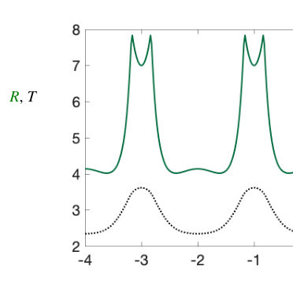 
Figure 1: Double-peaked stationary pattern in 1D (green solid line: R-profile (roots biomass), black dotted line: T-profile (toxicity concentration) obtained by continuation in pde2path and numerical simulations of the cross-diffusion system for plant-biomass and toxicity studied in [30].

📷 Fig 2

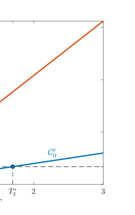 
Figure 2: The projection of the critical manifold C0 (3.9) onto (T, P)-space for 0 &lt; ρ &lt; 1/2 (orange) and for 1/2 &lt; ρ &lt; 1 (blue). In the latter case, there is a bistability regime for the layer problem (3.12). The vertical dotted lines indicate the location of T = 1/(2ρ) and T = 1, respectively, dividing the critical manifold in the three pieces Cl 0 (left), Cm 0 (middle), and Cr 0 (right). The horizontal dashed line at a fixed value of P = ¯P shows the existence of three intersection points (dots) for T = T ∗ i , i = 1, 2, 3, as defined in Eq. (3.13).

📷 Fig 3

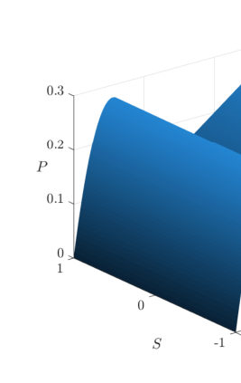 
Figure 3: Critical manifold C0 (3.9) in (T, S, P)-space for 1/2 &lt; ρ &lt; 1.

📷 Fig 4

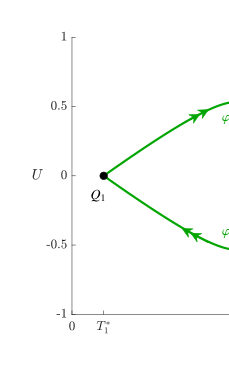 
Figure 4: Double heteroclinic connection φ± h for ρ = 0.9 and P∗(ρ) ≈0.15 in (T, U)-space between Q1 and Q3.

📷 Fig 5

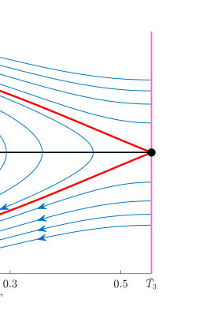 
Figure 5: Sketch of the dynamics for the reduced problem (3.23) on Cl 0 in (T, S )-space with ρ = 0.9. The black, dashed line corresponds to T = T ∗ l (ρ); the magenta vertical line is located at T = ¯T3. The red curves correspond to the level set {Hl(T, S ) = Hl( ¯T3, 0)}. The orange (resp. purple) curve represents the touch-down (resp. take-off) set T l d (resp. T l o), see eq. (3.26). The black dots mark the equilibria at ( ¯T1, 0) and ( ¯T3, 0), whereas the arrows indicate the flow direction.

**Summary.** This theoretical paper uses Geometric Singular Perturbation Theory to study pattern formation in a cross-diffusion model for plant growth under toxicity. By analyzing the geometry of the system's critical manifold, the authors determine necessary conditions for the existence of stable front-type patterns based on the specific functional forms governing the reaction kinetics.

**Why it may be interesting.** While focused on ecology/biology, the mathematical machinery—GSPT applied to reaction-diffusion systems exhibiting far-from-equilibrium dynamics and complex geometric structures like heteroclinic connections—is highly relevant to non-equilibrium statistical mechanics models in physics.

Detailed structure

**Main problem.** The paper aims to construct and prove the existence of stationary, periodic, front-type far-from-equilibrium patterns in a cross-diffusion model describing plant growth influenced by autotoxicity.

**Main result.** Front-type patterns can exist for certain functional forms (like power functions) but are shown not to exist for others (like Holling-type II functions) within the general model class analyzed.

**Method.** The primary tool is Geometric Singular Perturbation Theory (GSPT), which allows extending 1D pattern analysis techniques to include cross-diffusion terms by analyzing the fast-reaction limit and the geometry of the critical manifold.

**Model / system.** The system is a cross-diffusion vegetation-autotoxicity model governed by coupled PDEs involving biomass (R) and toxicity (T). The analysis focuses on reducing this PDE system to an autonomous ODE layer problem using the small parameter $\epsilon$ approximation.

**Key observables.** Pattern formation profiles (fronts, pulses), the geometry of the critical manifold ($C_0$), and the existence/stability of heteroclinic connections between different segments of $C_0$.

**Important parameters / regimes.** Cross-diffusion coefficient ($\alpha$), diffusion coefficients ($d_R, d_T$), growth rates, and parameters defining the reaction terms (e.g., $
ho$ in the layer problem).

**Assumptions / limitations.** The analysis relies on the fast-reaction limit approximation ($\epsilon \ll 1$) and makes structural assumptions about the monotonicity of the transition rate functions $f(T)$ and $g(T)$.

**Figures summary.** Figures illustrate the structure of the critical manifold $C_0$ in various parameter spaces (e.g., $(T, P)$-space) and show numerical profiles confirming where pattern existence conditions are met or violated.

**Paper structure.** The paper progresses by first introducing the physical model and its general mathematical framework using GSPT. It then analyzes specific simplified cases to derive the layer problem, focusing on characterizing the critical manifold structure through algebraic analysis before concluding with functional form comparisons (power vs. Holling-type II) to determine pattern existence.

Abstract

Using geometric singular perturbation theory, we construct stationary, periodic, front-type far-from-equilibrium patterns in a cross-diffusion model for plant growth under the influence of toxicity. We show how existing techniques for the analysis of far-from-equilibrium patterns in one spatial dimension can be extended to include cross-diffusion terms and prove the existence of a one-parameter family of these patterns. For a general cross-diffusion model class, we show when front-type patterns may appear depending on the shape of the critical manifold, which is determined by the specific properties of the reaction terms.

[↑ back to top](#top)

### [Nonuniform pressure helps structural superlubricity](http://arxiv.org/abs/2607.15967v1)

**Authors:** Melisa M. Gianetti, Viet Hung Ho, Bjørn Haugen, Graham Cross, Astrid S. de Wijn  
**Type:** theory · **Category:** statistical mechanics · **PDF:** <https://arxiv.org/pdf/2607.15967v1>  
**Analysis basis:** full PDF text, analyzed in chunks
**Topic relevance:** 🔥 `Frenkel-Kontorova` **4/5** · `non-equilibrium universality` **3/5** · `driven-dissipative phase transition` **2/5** · `methods for driven-dissipative` **1/5** · `non-equilibrium dynamics` **1/5**

📷 Fig 1

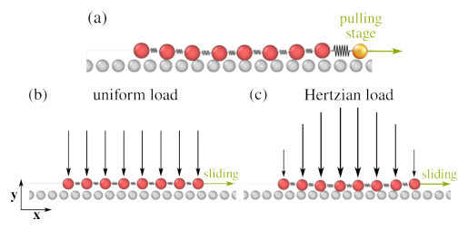 
FIG. 1. (a) Sketch of the model for a slider of n = 8 particles. (b) Uniform and (c) Hertzian loads applied to the system.

📷 Fig 2

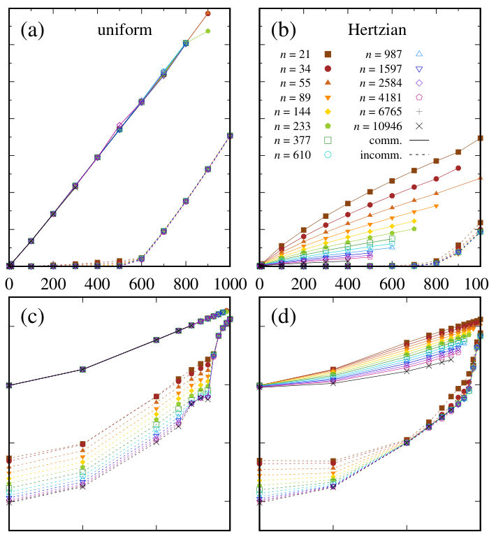 
FIG. 2. Average friction per particle as a function of the load per particle for commensurate and incommensurate systems with (a) and (c) uniform and (b) and (d) Hertzian pressure distributions. (a) and (b) linear scale, (c) and (d) log-log scale. Solid lines represent the commensurate contacts, and dashed lines represent incommensurate contacts. Different colors represent different slider sizes (n). The incommensurate system has lower friction than the commensurate for both uniform and nonuniform pressure distributions.

📷 Fig 3

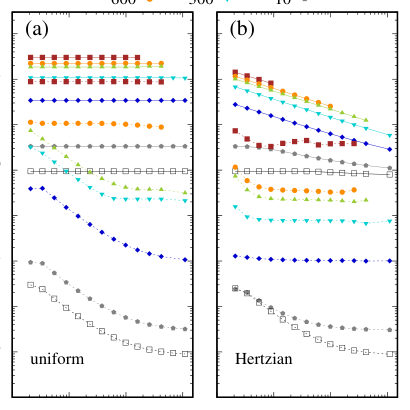 
FIG. 3. Average friction per particle as a function of the number of particles, log-log plot for both commensurate and incommensurate systems with (a) uniform and (b) Hertzian pressure distribution. Solid and dashed lines correspond to commensurate and incommensurate contacts respectively. The observation of figure 2 is confirmed. Both systems show lower friction when the distribution of the pressure is non uni- form.

📷 Fig 4

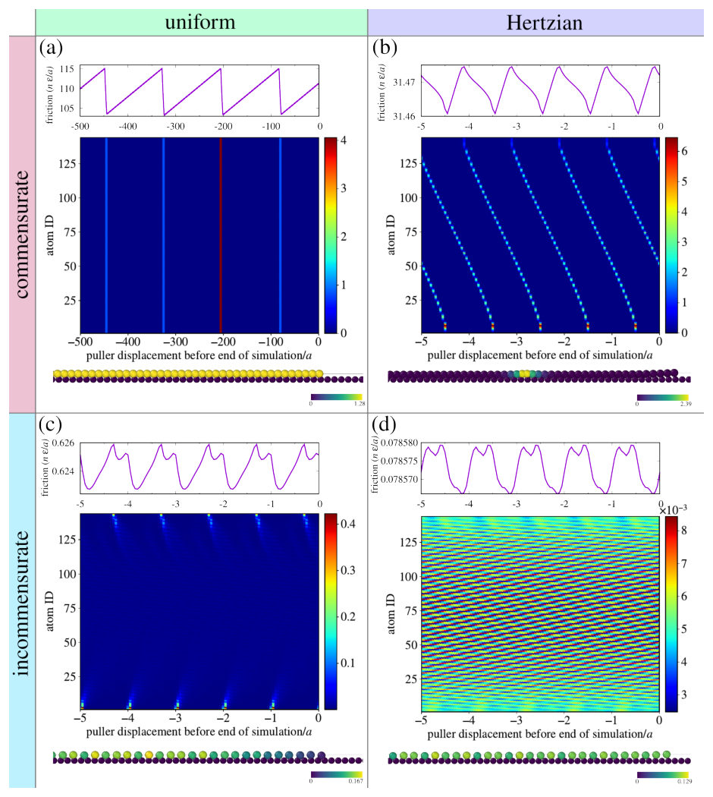 
FIG. 4. Kinetic energy maps at load/n = 300ϵ/a (below the Aubry transition), n = 144 for a small displacement during the steady state, (a) commensurate configuration - uniform pressure, (b) commensurate configuration - Hertzian pressure, (c) incommensurate configuration - uniform pressure, (d) incommensurate configuration - Hertzian pressure. On each panel on top, the friction per particle as a function of the displacement reported on the kinetic energy map, on the center the kinetic energy map, on the bottom a snapshot of the head of the slider with each particle colored by its velocity magnitude. Atom ID = 1 is the first atom of the slider, what we call the “head atom”.

📷 Fig 5

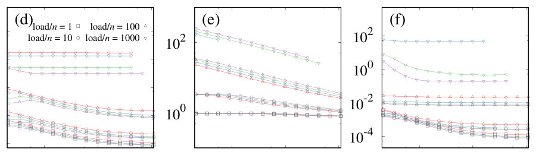 
FIG. 5. Elasticity effect on commensurate and incommensurate contacts under uniform and nonuniform load. Average friction per particle as a function of load per particle for (a) incommensurate, uniform load, (b) commensurate, nonuniform load and (c) incommensurate, nonuniform load for different bond elasticities. Average friction per particle as a function of the number of particles, log-log plot for (d) incommensurate, uniform load, (e) commensurate, nonuniform load and (f) incommensurate, nonuniform load for different bond elasticities.

**Summary.** This paper analyzes structural superlubricity by examining the role of pressure distribution during sliding contact. It demonstrates that nonuniform pressure, which is more realistic than idealized uniform loading, actually promotes lower friction. The findings suggest that gently curved interfaces with specific elastic properties can achieve highly efficient energy dissipation mechanisms.

**Why it may be interesting.** While focused on classical friction, the analysis of depinning transitions (Aubry transition) and size-dependent critical behavior touches upon concepts relevant to driven many-body systems and non-equilibrium statistical mechanics.

Detailed structure

**Main problem.** The study investigates how nonuniform pressure distributions affect structural superlubricity, a state of near-zero friction between crystalline surfaces.

**Main result.** Contrary to expectations, the presence of nonuniform pressure profiles actually enhances structural superlubricity compared to uniform loading conditions.

**Method.** The research employs both analytical calculations for rigid contacts and molecular-dynamics simulations incorporating elastic effects.

**Model / system.** The system models sliding contact between two crystalline surfaces (commensurate or incommensurate) under applied load, using an elastic chain slider interacting with a substrate.

**Key observables.** Average friction per particle, scaling exponent of friction with contact size ($n$), and the transition behavior near the Aubry point.

**Important parameters / regimes.** Pressure profile (uniform vs. Hertzian/nonuniform), incommensurability, slider elastic constant ($k_b$), and applied load.

**Assumptions / limitations.** Early calculations assume rigid contacts; later simulations simplify to a 2D chain on a 1D surface for computational tractability.

**Figures summary.** Figures compare friction vs. load/size dependence under uniform versus nonuniform loads, demonstrating lower friction and altered scaling exponents (e.g., $\propto n^{-0.37}$) in the latter case.

**Paper structure.** The paper progresses from analytical models of rigid contacts showing improved scaling with nonuniform pressure, to molecular dynamics simulations incorporating elasticity, culminating in a detailed comparison across various loading regimes and interface types.

Abstract

Structural superlubricity, nearly vanishing friction between two structurally incommensurate crystalline surfaces, is a promising avenue for reducing friction in applications, but requires very specific and well-controlled conditions. One of those conditions is perfectly uniform atomically flat surfaces. Real-world surfaces are generally rough, leading to nonuniform pressure distributions. We investigate the effects of nonuniform pressure distributions on structural superlubricity, using analytical calculations for rigid contacts as a basis, and molecular-dynamics simulations for a simple model to include the crucial effects of elasticity. We show that a key ingredient is the vanishing pressure at the edge of the contact, and that this leads to improved scaling depinning and scaling behaviour, leading to lower friction. We thus show that nonuniform pressure distributions actually help structural superlubricity, rather than hinder it.

[↑ back to top](#top)

### [Sub-microsecond conformational dynamics in an optical nanocavity](http://arxiv.org/abs/2607.15925v1)

**Authors:** Heehun Sung, Sam C Scholten, Pavlina Sasheva, Igor Marinkovic, Warwick P Bowen  
**Type:** experiment · **Category:** other · **PDF:** <https://arxiv.org/pdf/2607.15925v1>  
**Analysis basis:** full PDF text, analyzed in chunks
**Topic relevance:** `quantum measurements` **3/5** · `quantum optics experiment` **3/5** · `Tavis-Cummings & cavity-many-emitter` **2/5** · `analog quantum simulation` **2/5** · `correlated cavity matter` **2/5** · `driven-dissipative phase transition` **2/5** · `Kondo & dissipative impurity` **1/5** · `QC/QI experiment` **1/5** · `measurement-induced transitions` **1/5** · `methods for driven-dissipative` **1/5** · `non-equilibrium dynamics` **1/5** · `non-equilibrium universality` **1/5**

📷 Fig 1

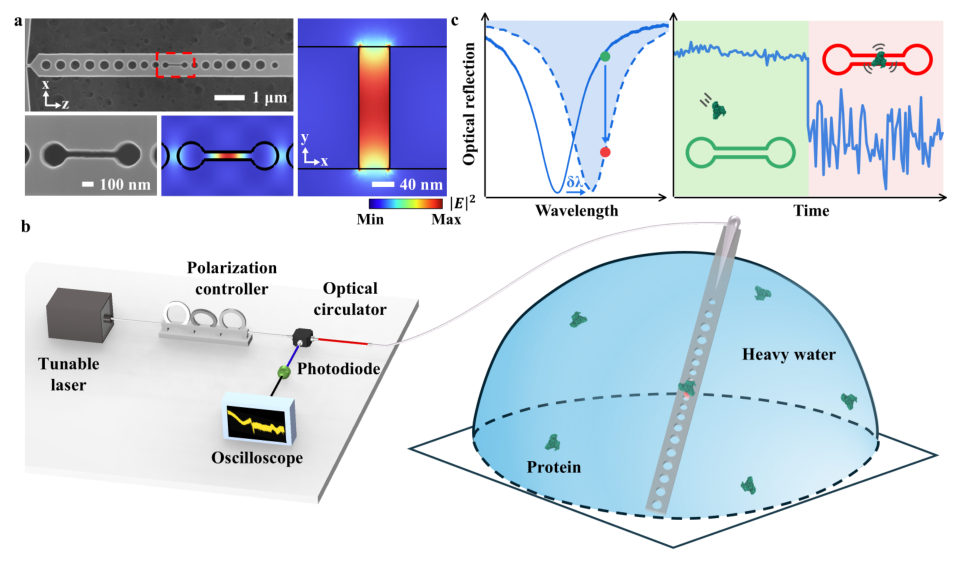 
FIG. 1. Photonic crystal cavity for single molecule sensing. a, Scanning electron microscope image (greyscale) and finite element method simulation (color) of the silicon nanobeam cavities. The design combines strong and uniform field confinement within the slot region. b, Experimental configuration for single protein measurements. A tapered fibre is bonded to individual cavities, before cleaving from the chip for measurement in solution. A tunable laser (1550 nm) supplies light to the cavity, and the reflection is monitored via an optical circulator, photodiode and digital oscilloscope. c, The cavity resonance shifts when a protein enters the slot (left). By tuning the laser to one side of...

📷 Fig 2

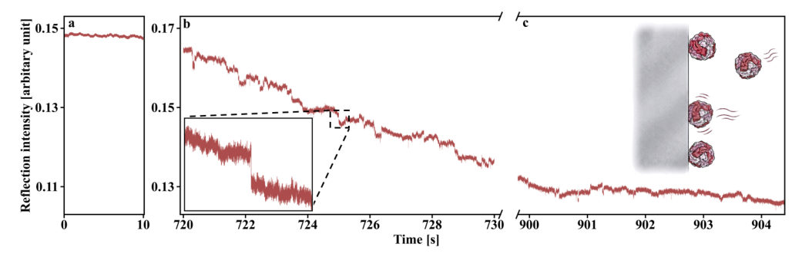 
FIG. 2. Ferritin monolayer formation via adsorption onto the cavity surface. a, Signal measured prior to the addition of proteins to the solution (150 mM NaCl). b, After the addition of proteins (1 nM apo-ferritin), a gradual shift in cavity resonance is observed as a monolayer of the protein is formed across the nanobeam surface. The inset highlights a single ferritin adsorption event within the slot region. c, Stabilized signal observed after several minutes. Once the monolayer has been formed and stabilised, the laser is retuned to the side of the cavity resonance for subsequent measurements.

📷 Fig 3

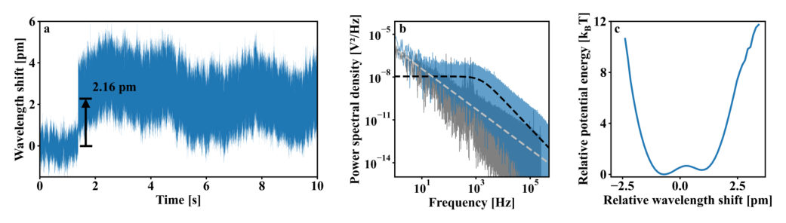 
FIG. 3. Optical tracking of fast ferritin motions. a, Recording of a single holoferritin attaching to a holoferritin monolayer. Compared with direct binding to the cavity, these events are rare, transient, and feature an increase in signal fluctuations. b, The corresponding power spectral density of post-binding fluctuations (blue), compared with the bare device signal (grey). The protein signal is fit to a Lorentzian model (black dashed), and the baseline noise to a linear curve (grey dashed). c, The wavelength shift histogram is plot as a relative potential landscape, displaying a bimodal distribution. A 10 Hz high-pass filter is applied to remove measurement drift.

📷 Fig 4

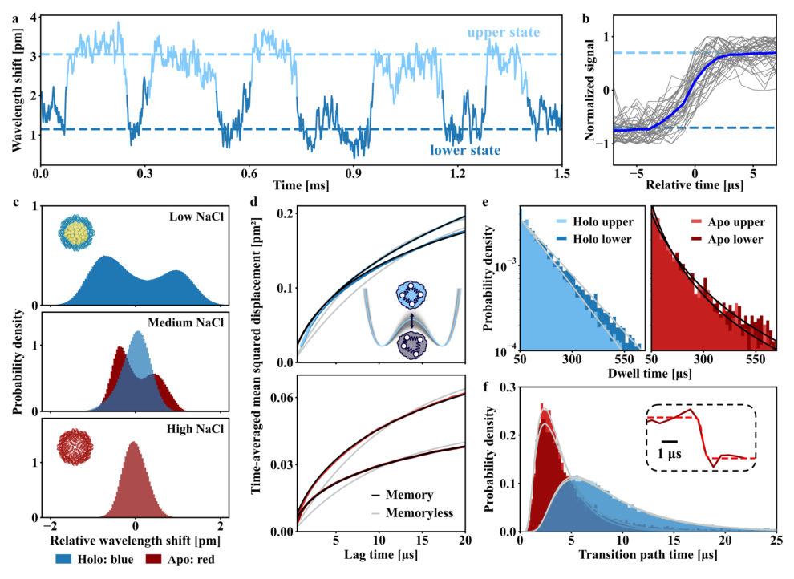 
FIG. 4. Analysis of stepping dynamics in ferritin. a, Short time scale view of single-holoferritin signal from Fig. 3a, displaying stepping between an ‘upper’ and ‘lower’ state. b, Forty different upward transition of holoferritin in a, with the blue solid curve showing their average. c, Histograms of the wavelength shift for holoferritin at low NaCl (4 mM, top), holoferritin and apoferritin at medium NaCl (10 mM, middle), and apoferritin at high NaCl (150 mM, bottom). A 10 Hz high-pass filter is applied before data analysis to remove measurement drift. In this figure, blue-toned data represent holoferritin, while red-toned data represent apoferritin. d, Time-averaged mean squared...

**Summary.** The researchers developed and employed a novel silicon-photonic nanocavity sensor capable of monitoring single protein dynamics at sub-microsecond resolution. By measuring minute shifts in the optical resonance frequency upon conformational change, they resolved complex kinetic pathways in ferritin that were previously obscured by noise or ensemble averaging. This work establishes a powerful new tool for understanding fundamental biophysical processes.

**Why it may be interesting.** This work directly applies advanced optical sensing techniques to study molecular dynamics, which is a core area of AMO physics. The use of cavity resonance shifts as a highly sensitive probe for local changes in polarizability mimics quantum coupling measurements, making it relevant to open quantum systems characterization.

Detailed structure

**Main problem.** Observing protein conformational dynamics occurring on microsecond timescales is challenging due to limitations in measurement speed, Brownian motion noise, and the need for label-free techniques.

**Main result.** The authors successfully resolved tens of thousands of transitions in ferritin over sub-microsecond timescales using a novel photonic sensor, revealing hidden kinetic details like switching kinetics and memory effects.

**Method.** They utilized a fibre-integrated silicon-photonic nanocavity to measure the resonance frequency shift caused by protein binding, achieving high temporal resolution while suppressing Brownian motion noise.

**Model / system.** The system is a slot photonic crystal cavity fabricated on silicon, used as a single-molecule sensor. The dynamics are analyzed using Hidden Markov Models (HMM) and potential energy landscape derivations from probability distributions.

**Key observables.** Cavity resonance frequency shift ($\delta\omega$), Power Spectral Density (PSD), double-well potential shape, transition stepping events, and Mean Squared Displacements (MSDs).

**Important parameters / regimes.** Sub-microsecond resolution, Brownian motion suppression factor of sixty, ionic strength (NaCl concentration) for tuning dynamics.

**Assumptions / limitations.** The analysis assumes that the observed fluctuations can be mapped to an effective potential energy landscape via the Boltzmann relation; transition path time calculations assume low energy barriers.

**Figures summary.** Figures illustrate the photonic crystal structure and setup, show ferritin monolayer formation and signal stabilization, track fast motions revealing a bimodal potential, and demonstrate stepping dynamics tunable by ionic strength.

**Paper structure.** The paper progresses from establishing the physical sensor platform (photonic cavity) to demonstrating high-speed measurements on single molecules (ferritin), followed by detailed kinetic analysis using HMMs and PSD fitting to map out the underlying energy landscape and its tunability.

Abstract

Microsecond conformational changes underlie many protein functions, but ensemble averaging has been needed to observe them without labels. Single-shot measurements on individual proteins have had insufficient speed, while protein Brownian-motion has obscured signals. Here, we report a fibre-integrated silicon-photonic sensor that overcomes these barriers, resolving protein dynamics at sub-microsecond speeds in continuous single-shot measurements that can extend over minutes. This is achieved by combining far-sub-wavelength optical field confinement with high optical field uniformity that suppresses protein Brownian-motion by a factor of sixty. In single-shot measurements on ferritin molecules, we observe tens of thousands of transitions consistent with conformational fluctuations of the ferritin shell, resolving them over timescales as short as 400 ns. The ability to continuously monitor transitions over long times reveals switching kinetics, memory effects and molecular heterogeneity hidden in ensemble averages. This opens a new path to improved mechanistic understanding of protein function.

[↑ back to top](#top)

### [Magnons reveal topology and dynamics of a skyrmion crystal](http://arxiv.org/abs/2607.16023v1)

**Authors:** Raphael Ayache, Nilotpal Chakraborty, Manabendra Kuiri, Quentin Benichou, Antonio Lacerda-Santos, Lilian Seyve, Himadri Chakraborti, Leo Pugliese, Kenji Watanabe, Takashi Taniguchi, Cosimo Gorini, Roderich Moessner, Benoit Doucot, Preden Roulleau  
**Type:** experiment · **Category:** strongly correlated electrons · **PDF:** <https://arxiv.org/pdf/2607.16023v1>  
**Analysis basis:** full PDF text, analyzed in chunks
**Topic relevance:** `analog quantum simulation` **3/5** · `exotic spin models in light-matter` **3/5** · `spintronics-quantum-optics interface` **3/5** · `driven-dissipative phase transition` **2/5** · `non-equilibrium dynamics` **2/5** · `non-equilibrium universality` **2/5** · `Frenkel-Kontorova` **1/5** · `correlated / nonlocal dissipation` **1/5** · `methods for driven-dissipative` **1/5** · `quantum measurements` **1/5**

📷 Fig 1

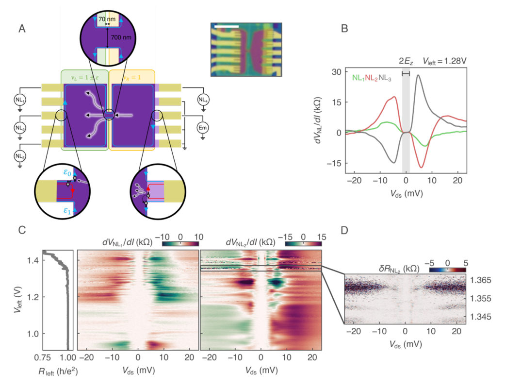 
FIG. 1. Device schematic and magnon detection. a, Schematic of the device. A monolayer graphene flake is encapsulated between hexagonal boron nitride (hBN) layers and placed on a patterned graphite back gate split into two electrically isolated sections separated by a ∼70 nm gap. Independent gate voltages control the carrier density on the left and right sides of the graphene. A silicon gate beneath the right side locally increases the filling factor near the ohmic contacts to enhance magnon emission. The graphene is etched above the split gate to define a 700 nm-wide constriction. Magnons are injected at the emitter contact, where the local filling factor is tuned to ν &gt; 1, and are...

📷 Fig 2

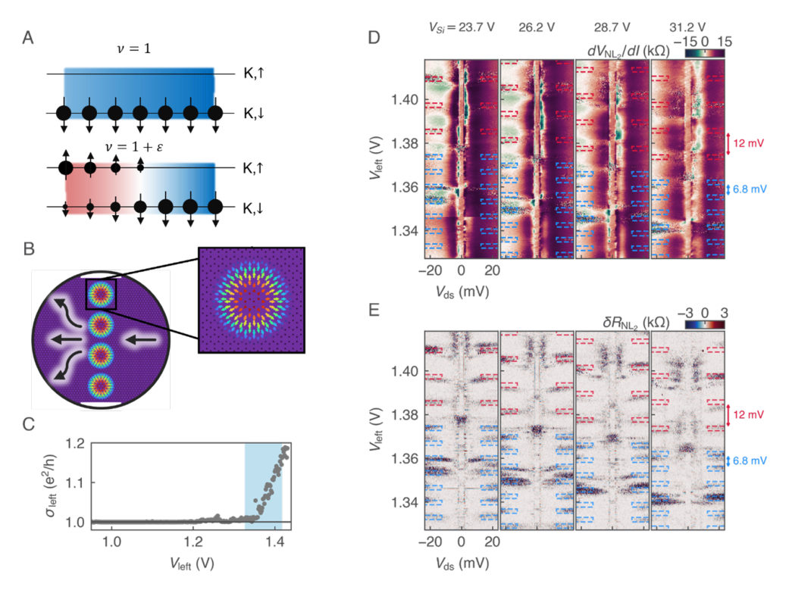 
FIG. 2. Magnon response probing the real-space topology of a skyrmion crystal. a,b, Schematics of the skyrmion crystal junction. Upon doping the lowest Landau level beyond ν = 1, the added charge is accommodated by topological spin textures (skyrmions) (a). Slightly away from ν = 1, these skyrmions crystallize into a topological Wigner crystal confined within the junction (b). Magnons emitted from a single injector (Em2) are scattered by the crystal and detected through the nonlocal response. c, Hall conductance as a function of the left-gate voltage. The light-blue region, slightly away from ν = 1, marks the gate-voltage window where sharp fluctuations in the nonlocal signal are observed....

📷 Fig 3

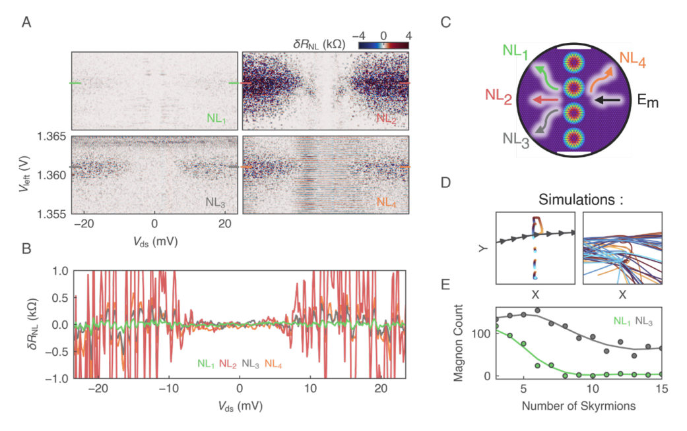 
FIG. 3. Spatially correlated magnon fluctuations induced by a skyrmion crystal. a, Background-subtracted nonlocal resistance measured at detectors NL1, NL2, NL3 and NL4 as a function of drain–source voltage. b, Fluctuations in the nonlocal signal measured at fixed gate voltage as a function of drain–source voltage. The fluctuations are strongly correlated across all detectors, demonstrating a common microscopic origin. c, Schematic of magnon propagation through the junction. Transmitted magnons are detected by nonlocal detectors NL1, NL2 and NL3 on the left side of the junction, whereas reflected magnons are detected by NL4. d,e, Phenomenological model of magnon scattering by a skyrmion...

📷 Fig 4

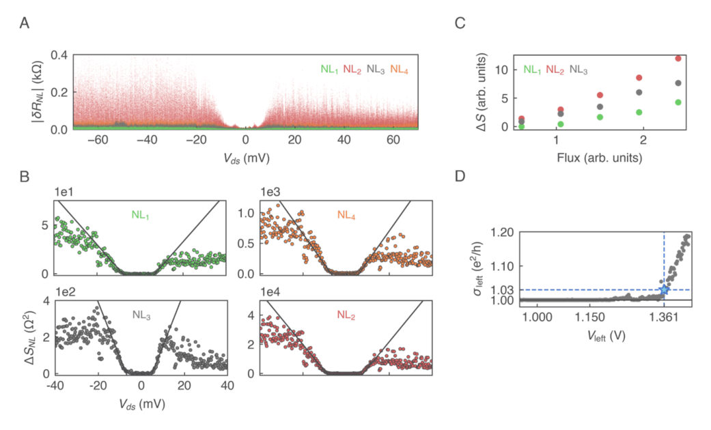 
FIG. 4. Noise signatures of magnon–skyrmion interactions in a low-stiffness crystal. a, Background-subtracted nonlocal magnon signal measured simultaneously at detectors NL1, NL2, NL3 and NL4, averaged over 400 repetitions at each bias point. Sharp fluctuations emerge within narrow gate-voltage windows and are attributed to magnon-induced non- equilibrium dynamics of the skyrmion crystal. As magnons perturb the soft crystal, the resulting fluctuations in the effective scattering potential generate correlated noise across all detectors. b, Variance of the nonlocal signal as a function of drain– source voltage. Above the magnon-emission threshold, the variance increases linearly with bias...

**Summary.** Researchers used magnon transport measurements on a graphene junction hosting a skyrmion Wigner crystal to study its internal dynamics. By monitoring sharp, periodic fluctuations in the magnon signal as the gate voltage was tuned, they provided direct evidence that individual skyrmions are added sequentially to the crystal lattice. This establishes magnons as a powerful real-space probe for correlated, topologically ordered phases.

**Why it may be interesting.** This work provides an experimental realization of probing collective dynamics in a topologically ordered state (the skyrmion crystal) using quasiparticle excitations (magnons), which is highly relevant to understanding correlated electron behavior beyond simple band theory.

Detailed structure

**Main problem.** The primary challenge is probing the internal dynamics and topology of a skyrmion crystal, whose cooperative crystalline order is inherently fragile.

**Main result.** The detection of near-periodic fluctuations in magnon count confirms that individual skyrmions are added sequentially to the quasi-1D array, providing real-space insight into the lattice stiffness reduction during this process.

**Method.** The study uses non-local magnon transport measurements ($	ext{dV}_{	ext{NL},i}/	ext{dI}$) in a nanoscale graphene junction, acting as a sensitive probe for topological spin textures.

**Model / system.** The system is a nanoscale graphene junction hosting a skyrmion Wigner crystal within the Quantum Hall Effect regime. The physics involves interacting electrons forming topologically protected skyrmions stabilized by Coulomb interaction.

**Key observables.** Near-periodic windows of sharp fluctuations in magnon count, and the non-local signal onset above the Zeeman energy ($E_Z$).

**Important parameters / regimes.** Gate voltage (controlling filling factor $
u$), bias voltage ($V_{ds}$), and the excess charge ($\epsilon$) driving skyrmion formation.

**Assumptions / limitations.** The analysis assumes that the non-local response is dominated by bulk magnons propagating across the sample, and that the observed fluctuations correspond to discrete single-skyrmion additions.

**Figures summary.** Figures illustrate the setup (graphene junction with gates), show the magnon signal onset at $E_Z$ vs. bias voltage, and display $	ext{dV}_{	ext{NL},i}/	ext{dI}$ dependence on gate voltages to highlight the fluctuation regimes.

**Paper structure.** The paper establishes the physical platform (graphene QHE junction), details the measurement technique using non-local magnon transport, presents evidence for skyrmion crystallization via voltage tuning, and interprets the resulting periodic fluctuations as single-skyrmion addition events.

Abstract

Although individual skyrmions are topologically protected objects, their cooperative crystalline order is fragile, easily disrupted by thermal fluctuations or other external perturbations. Probing the internal dynamics of such a crystal is both compelling and challenging, as its intricate and delicate spin texture must remain stable during measurement. Here, we engineer a nanoscale graphene junction hosting a skyrmion Wigner crystal, embedded between magnon emitters and detectors. The skyrmion crystal geometry leaves a striking imprint on magnon transport: as the gate voltage is varied, near-periodic windows of sharp fluctuations in magnon count are detected across the entire sample. We develop an interpretation that this results from skyrmions being added one by one to a quasi-one-dimensional array. Each burst of the fluctuations thus corresponds to the entry of an additional skyrmion, during which the lattice stiffness reduces. The impinging magnons induce and act as a probe of non-equilibrium collective dynamics of the crystal. These results establish a real-space probe of topological spin textures in quantum Hall-type insulating ground states via magnon transport and open opportunities to explore correlated, topologically ordered phases in moire and multilayer graphene systems.

[↑ back to top](#top)

### [Drift-Induced Nonreciprocal Hyperbolic Polaritons in Graphene/$α$-MoO$_3$ Heterostructures](http://arxiv.org/abs/2607.15722v1)

**Authors:** Rajveer Fandan, Jorge Pedrós  
**Type:** theory · **Category:** other · **PDF:** <https://arxiv.org/pdf/2607.15722v1>  
**Analysis basis:** full PDF text, analyzed in chunks
**Topic relevance:** `Keldysh / 2PI / non-Gaussian methods` **3/5** · `methods for driven-dissipative` **3/5** · `spintronics-quantum-optics interface` **3/5** · `driven-dissipative phase transition` **2/5** · `non-equilibrium dynamics` **2/5** · `analog quantum simulation` **1/5** · `correlated / nonlocal dissipation` **1/5** · `correlated cavity matter` **1/5** · `interference shaping light` **1/5** · `non-equilibrium universality` **1/5**

📷 Fig 1

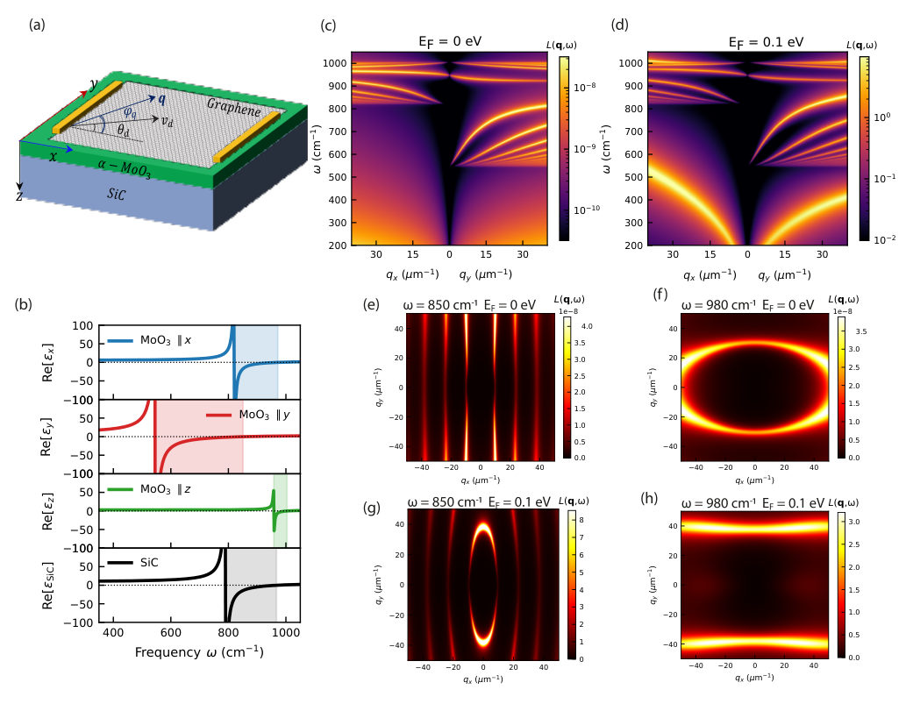 
FIG. 1. Graphene/α-MoO3/SiC heterostructure and tunable polaritonic dispersion. (a) Schematic of the graphene/α-MoO3/SiC device geometry. (b) Real parts of the relative permittivities of α-MoO3 and SiC versus frequency. The shaded regions denote the Reststrahlen bands bounded by the transverse optical (TO) and longitudinal optical (LO) phonon frequencies. (c) Polariton dispersion of the graphene/α-MoO3 (d = 100 nm)/SiC structure for EF = 0 eV, calculated from the loss function with β = 0 [Eq. (6)]. Without graphene plasmons, the spectrum is dominated by the phonon-polariton modes of α-MoO3, with multiple hyperbolic branches along both the x- and y-directions within the Reststrahlen bands....

📷 Fig 2

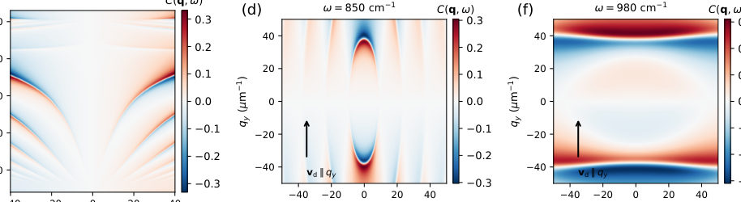 
FIG. 2. Drift-induced nonreciprocal contrast in the polariton dispersion and IFCs. (a,b) Momentum-space contrast induced by a carrier drift with β = 0.05, computed from the loss-function asymmetry [Eq. (6)] along the qx and qy directions, respectively. In (a), the drift is aligned with qx, while in (b) it is aligned with qy. In both cases, the drift breaks the q ↔−q symmetry of the loss function, leading to nonreciprocal polariton dispersion. When the drift is orthogonal to the propagation direction, the dispersion remains nearly unchanged because q · vd = 0. (c,d) Contrast maps of the IFCs at ω = 850 cm−1

📷 Fig 3

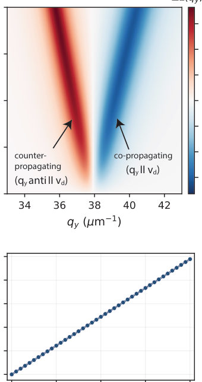 
FIG. 3. Drift-induced nonreciprocity and wavelength asymmetry of graphene–MoO3 hybrid polaritons. a, Density map of the differential loss function ∆L(qy, ω) = L(+qy, ω)−L(−qy, ω) at ω = 850 cm−1 for a graphene/MoO3 (100 nm)/SiC heterostructure with EF = 0.1 eV. The elec- tron drift velocity is along +y and parameterized by β = vd/vF . At β = 0, the system is reciprocal and ∆L = 0. Finite drift breaks q →−q symmetry through a Doppler shift of the graphene response, producing momentum splitting between counter-propagating hybrid plasmon–phonon polaritons. The co-propagating mode (qy ∥β) shifts to larger wavevectors (shorter wavelength), while the counter-propagating mode (qy anti ∥ β) shifts...

📷 Fig 4

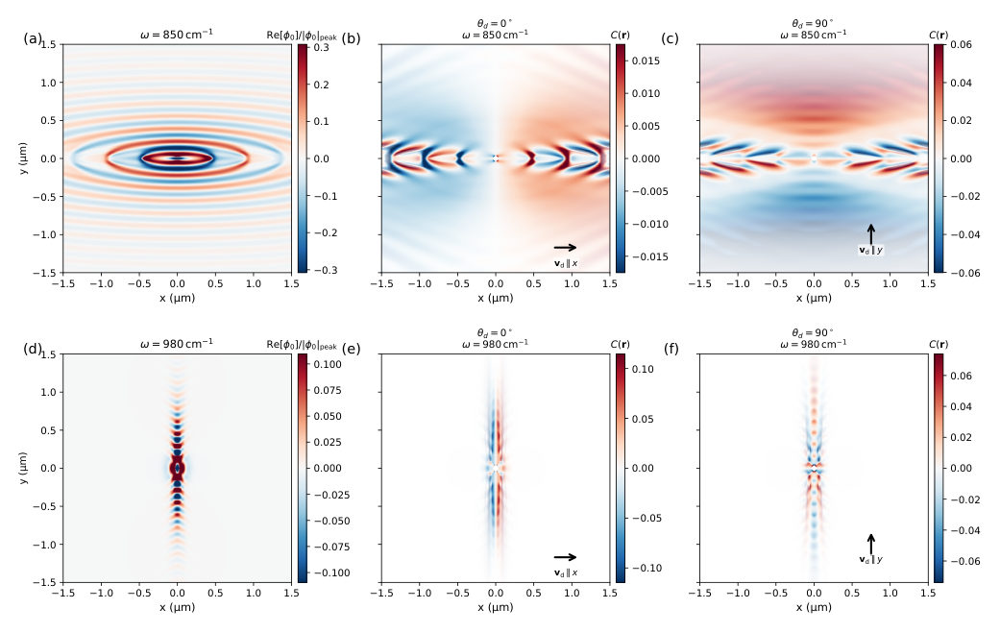 
FIG. 4. Frequency- and direction-resolved real-space signatures of nonreciprocal polariton propagation under carrier drift. (a,d) Real part of the equilibrium potential, Re[ϕ0]/|ϕ0|peak, in the absence of drift (β = 0), at excitation frequencies ω = 850 cm−1 (top row) and ω = 980 cm−1 (bottom row), showing reciprocal polariton fringes launched by a point source. (b,e) Spatial contrast map C(r) [Eq. (9)] for carrier drift along the x-direction (θd = 0◦). (c,f) Same as (b,e), but for drift along the y-direction (θd = 90◦). The contrast isolates the non-reciprocal component of the response by comparing opposite drift configurations ±β, with red (blue) regions indicating enhanced (suppressed)...

**Summary.** The paper presents a theoretical study demonstrating how applying a DC current in graphene can induce strong, controllable nonreciprocity in hybrid plasmon-phonon polaritons within a van der Waals heterostructure. By modeling the Doppler shift effect on the material response, the authors predict measurable spectral and spatial asymmetries that enable magnet-free optical isolation for mid-infrared applications.

**Why it may be interesting.** This work is highly relevant to quantum optics and open quantum systems because it proposes an electrically tunable platform for directional light control—a key requirement for integrated quantum photonic circuits or advanced sensing applications where optical isolation is paramount.

Detailed structure

**Main problem.** The core challenge addressed is achieving optical isolation by breaking symmetry between forward- and backward-propagating light at the nanoscale without relying on bulky magnetic materials.

**Main result.** The authors theoretically demonstrate that applying a DC current (drift) in graphene induces tunable, momentum-dependent nonreciprocity in hybrid plasmon-phonon polaritons within a van der Waals heterostructure. This effect can be quantified by a contrast reaching $\sim 0.3$ at modest drift velocities.

**Method.** The study employs theoretical modeling using a drift-corrected Random Phase Approximation (RPA) framework to calculate the modified dielectric screening function and subsequent polariton dispersion relations.

**Model / system.** The physical system is a Graphene/$\alpha$-MoO$_3$/SiC heterostructure operating in the mid-infrared. The model incorporates the coupling between graphene plasmons and hyperbolic phonon polaritons, whose hybridization and resulting nonreciprocity are controlled by an applied electric field (gate voltage) and carrier drift.

**Key observables.** Nonreciprocal contrast $C(\mathbf{q}, \omega)$, momentum-dependent spectral weight imbalance ($\Delta L$), and the real-space near-field intensity modulation $C(r)$.

**Important parameters / regimes.** Drift velocity $\mathbf{v}_d$ (set as a fraction of Fermi velocity, e.g., 5% of $v_F$), graphene doping ($E_F$), and the hyperbolic dispersion characteristics of $\alpha$-MoO$_3$.

**Assumptions / limitations.** The analysis neglects local-field (exchange–correlation) corrections, which are assumed to be negligible at the relevant wavevectors.

**Figures summary.** Figures illustrate the device geometry, phonon/plasmon polariton dispersion curves showing anticrossing gaps, and crucially, momentum-space maps ($\Delta L$) and real-space intensity contrast maps ($C(r)$) demonstrating directional asymmetry locked to the drift direction.

**Paper structure.** The paper progresses from establishing the physical platform (heterostructure), detailing the theoretical mechanism (drift-induced Doppler shift modifying RPA calculations), quantifying the effect in momentum space (polariton dispersion and contrast $C$), and finally translating this into a measurable, spatially resolved near-field signature via inverse Fourier transform.

Abstract

Achieving optical isolation requires breaking symmetry between forward- and backward-propagating light, a long-standing challenge at the nanoscale in the absence of magnetic fields. Here we theoretically demonstrate electrically tunable nonreciprocal phonon-plasmon polaritons in a graphene/$α$-MoO$_3$/SiC heterostructure operating in the mid-infrared. A dc current in graphene induces a wavevector-dependent Doppler shift that breaks reciprocity and generates strong directional asymmetry in hybrid plasmon-phonon propagation. In the reciprocal regime, hybridization between graphene plasmons and hyperbolic phonon polaritons in $α$-MoO$_3$, further shaped by the SiC substrate, enables gate-controlled transitions of isofrequency contours, including canalization along orthogonal crystal axes. At drift velocities of 5% of the Fermi velocity, the system exhibits pronounced momentum-dependent nonreciprocity with contrast reaching $\sim$ 0.3, while directions orthogonal to the drift remain unaffected due to symmetry imposed constraints. Real-space calculations confirm that this momentum-space asymmetry translates into directional near-field intensity modulation. These results establish current-biased van der Waals heterostructures as a platform for electrically tunable, magnet-free nonreciprocal nanophotonics in the mid-infrared.

[↑ back to top](#top)

### [Phase-controlled quasi-bound states in the continuum and thermoelectric enhancement in Majorana-quantum-dot nanostructures](http://arxiv.org/abs/2607.15990v1)

**Authors:** Alejandro Garrido, David Zambrano, Hishan Farfán-Bachiloglu, Juan Pablo Ramos-Andrade, Vladimir Juričić, Pedro Orellana  
**Type:** theory · **Category:** other · **PDF:** <https://arxiv.org/pdf/2607.15990v1>  
**Analysis basis:** full PDF text, analyzed in chunks
**Topic relevance:** `Keldysh / 2PI / non-Gaussian methods` **3/5** · `spintronics-quantum-optics interface` **3/5** · `Kondo & dissipative impurity` **2/5** · `methods for driven-dissipative` **2/5** · `non-equilibrium dynamics` **2/5** · `analog quantum simulation` **1/5** · `correlated / nonlocal dissipation` **1/5** · `driven-dissipative phase transition` **1/5** · `interference shaping light` **1/5**

📷 Fig 1

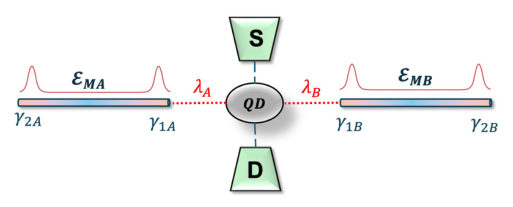 
FIG. 1. Schematic of the crossbar-shaped QD–TSCN device. A central quantum dot (gray) is coupled to two normal leads, source S and drain D (light green), and to two topological- superconductor nanowires A and B (blue and orange). Each wire hosts two MZMs, γ1A(B) and γ2A(B), whose finite-length hybridization energy is εMA(B).

📷 Fig 2

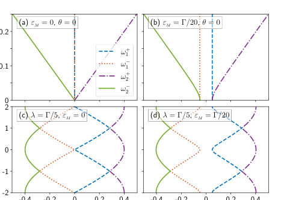 
FIG. 2. Top panels: dependence of the eigenvalues ω± j on the coupling λ = λA(B) at zero phase difference, θ = 0. Bot- tom panels: dependence on the superconducting phase differ- ence for λ = Γ/5. The left column shows the long-wire limit, εMA(B) = 0, and the right column the finite-wire regime, εMA(B) = Γ/20. The doubly degenerate eigenvalues ω± 0 = 0 from Eq. (9) are not shown.

📷 Fig 3

 
Figure 3 examines wire-length asymmetry, εMA = εM + ∆0 and εMB = εM −∆0, with εM = 0.05Γ and ∆0 = 0.005Γ. In the symmetric configuration, the wire spectral functions contain zero-linewidth BIC contribu- tions at ω = ±0.05Γ, whereas these states are absent from the smooth QD LDOS. Unequal hybridization en- ergies give the formerly dark states finite linewidths and convert them into quasi-BICs, producing narrow QD resonances near the same energies. The corresponding electrical and electronic thermal conductances display closely related lateral resonances. The Seebeck coeffi- cient changes sign across each quasi-BIC; for the symmet- ric case it is negligible on the scale shown and vanishes...

📷 Fig 4

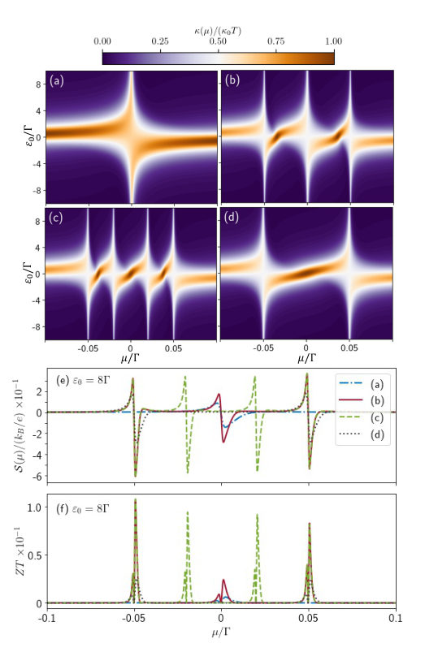 
FIG. 4. Electronic thermal conductance κel/(κ0T) versus QD energy ε0 and chemical potential µ for (a) εMA = εMB = 0, (b) εMA = 0.05Γ and εMB = 0, (c) εMA = 0.05Γ and εMB = 0.02Γ, and (d) εMA = εMB = 0.05Γ. Panels (e) and (f) show S and ZTel, respectively at ε0 = 8Γ. We set θ = 0 and kBT/Γ = 8.6173 × 10−5.

📷 Fig 5

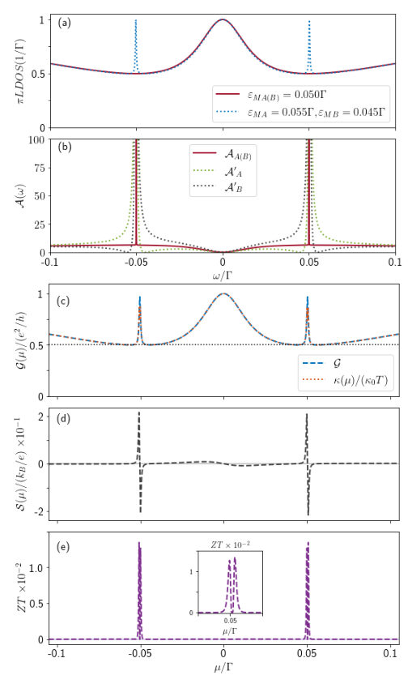 
FIG. 3. (a) QD LDOS and (b) Majorana spectral functions versus ω (c) electrical conductance G and electronic thermal conductance κel; (d) Seebeck coefficient S; and (e) electronic figure of merit ZTel versus µ. Wire-length asymmetry is in- troduced through εMA = 0.055Γ and εMB = 0.045Γ , corre- sponding to ∆0 = 0.005Γ around εM = 0.05Γ. We set ε0 = 0 , θ = 0, and kBT/Γ = 8.6173 × 10−5. The finite height of the exact-BIC peaks in panel (b) depends on the numerical broadening.

**Summary.** The paper theoretically investigates how coupling Majorana zero modes (MZMs) to a quantum dot can enhance the thermoelectric response. By controlling the superconducting phase difference ($	heta$), the system exhibits strong enhancement of the figure of merit ($ZT_{el}$) via quadratic transmission zeros. This establishes phase-tunable control over electronic transport in topological nanostructures.

**Why it may be interesting.** This work provides a concrete theoretical demonstration of engineering thermoelectric properties in topological hybrid systems by exploiting quantum interference effects related to superconducting phases and MZMs, which is highly relevant for advanced solid-state quantum devices.

Detailed structure

**Main problem.** The study investigates how the interplay between Majorana zero modes (MZMs) and bound states in the continuum (BICs) dictates the electronic thermoelectric response of a complex nanostructure.

**Main result.** Superconducting phase control is shown to be an efficient mechanism, generating a strong enhancement ($ZT_{el} \simeq 0.75$) by creating quadratic transmission zeros, leading to universal low-temperature transport signatures.

**Method.** The analysis employs the Green-function formalism combined with exact linear-response energy integrals and low-temperature Sommerfeld expansions to calculate thermoelectric coefficients.

**Model / system.** The system modeled is a crossbar-shaped quantum dot (QD) coupled to two topological-superconductor nanowires hosting MZMs. The Hamiltonian incorporates terms for leads, the QD level, MZM couplings, and hybridization energies.

**Key observables.** Thermoelectric figure of merit ($ZT_{el}$), electrical conductance ($G$), Seebeck coefficient ($S$), electronic thermal conductance ($\kappa_{	ext{el}}$), and the Lorenz ratio ($L/L_0$).

**Important parameters / regimes.** Superconducting phase difference ($	heta$), QD detuning ($\epsilon_0$), and nanowire length asymmetry (affecting MZM coupling strengths).

**Assumptions / limitations.** The calculations are limited to electronic thermal conductance ($\kappa_{el}$), excluding phonon heat transport. The wide-band approximation is used for normal lead self-energies.

**Figures summary.** Figures schematically illustrate the device structure and show how spectral functions (LDOS) and transport quantities ($ZT_{el}$) vary as a function of phase difference, QD energy, and chemical potential, highlighting resonance features.

**Paper structure.** The paper develops the theory using Green's functions in the Nambu basis to calculate linear-response currents for charge and heat. It then analyzes how symmetry breaking (via phase control or detuning) converts BICs into transport-active quasi-BICs, leading to quantitative comparisons of $ZT_{el}$ enhancements.

Abstract

We investigate how the interplay between Majorana zero modes (MZMs) and bound states in the continuum (BICs) governs the electronic thermoelectric response of a crossbar-shaped quantum dot (QD) coupled to two topological-superconductor nanowires. Using the Green-function formalism, exact linear-response energy integrals, and their low-temperature Sommerfeld expansion, we analyze the spectral and thermoelectric properties of the system. We show that symmetry breaking converts BICs into quasi-BICs, allowing them to contribute to electrical and thermal transport and thereby generate a finite thermoelectric response. While unequal nanowire lengths, reflected in different intra-Majorana coupling strengths, produce only a modest enhancement of $ZT_{el}$, detuning the QD level increases $ZT_{el}$ by approximately one order of magnitude. Superconducting-phase control produces a much stronger enhancement, reaching $ZT_{el} \simeq 0.75$ through a quadratic transmission zero and a pronounced violation of the Wiedemann-Franz law. The low-temperature values $ZT^{max}_{el} \simeq 0.755$ and $\mathscr{L} /\mathscr{L}_{0} = 21/5$ are universal consequences of this quadratic antiresonance. Our results establish phase-tunable thermoelectric signatures of the Majorana-coupled interference structure and identify superconducting-phase control as an efficient means of engineering the electronic response of topological hybrid nanostructures.

[↑ back to top](#top)

### [Coherent driving of displacive Higgs fluctuations in superconductors](http://arxiv.org/abs/2607.16055v1)

**Authors:** Jacopo Fiore, Irene Zanotti, Kota Katsumi, N. P. Armitage, Claudio Castellani, Goetz Seibold, Lara Benfatto  
**Type:** both · **Category:** strongly correlated electrons · **PDF:** <https://arxiv.org/pdf/2607.16055v1>  
**Analysis basis:** full PDF text, analyzed in chunks
**Topic relevance:** `driven-dissipative phase transition` **3/5** · `methods for driven-dissipative` **3/5** · `non-equilibrium dynamics` **3/5** · `non-equilibrium universality` **2/5** · `Keldysh / 2PI / non-Gaussian methods` **1/5** · `analog quantum simulation` **1/5** · `correlated / nonlocal dissipation` **1/5** · `correlated cavity matter` **1/5**

📷 Fig 1

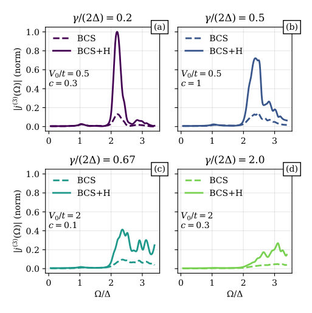 
FIG. 1. Nonlinear first-harmonic current response j(3)(Ω) as a function of Ω/∆, where Ωdenotes the frequency of the ap- plied field and ∆is the spectral order parameter. The differ- ent values γ/(2∆) are obtained for different combinations of the impurity concentration (c) and impurity strength (V0/t), indicated in each panel, with the same electron filling n = 0.5. We show the nonlinear current with (solid line) and without (dashed line) Higgs fluctuations. All panels share a common scale set by the maximum value in panel (a).

📷 Fig 2

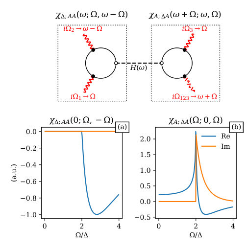 
FIG. 2. Top: Feynman’s diagram of the amplitude-mode con- tribution to the nonlinear FH. Here photons are represented as wavy lines, fermions by solid lines, and the amplitude mode by a dashed line. Filled/empty circles represent σ0/σ2 vertices in the Nambu notation (see [44]). Bottom: sketch of the real and imaginary part of the left (a) and right (b) bubbles in the top panel computed at T = 0 within the quasiparticle analytical approximation [44] as a function of Ωfor ω = 0.

📷 Fig 3

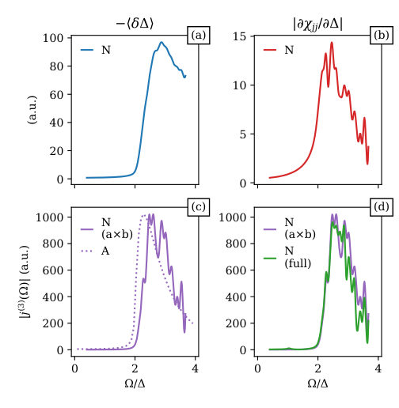 
FIG. 3. (a) Static δ∆(0) order-parameter fluctuations and (b) derivative of the linear susceptibility |∂χjj/∂∆| as a func- tion of the pump frequency Ω, as obtained by numerical (N) solution of the model (3). Here we show results for impu- rity strength V0/t = 0.5 and concentration c = 1, with elec- tronic filling n = 0.875. (c) Comparisons between the prod- uct δ∆(0)(∂χ/∂∆) in Eq. (9) obtained from the numerical results of panels (a) and (b) (solid line) and the analytical result (dotted line, denoted by A) based on the Zimmermann approximation [44], setting γ/(2∆) ∼0.7 and η/(2∆) ∼0.02 consistent with numerical simulations. Panel (d): comparison between the amplitude of the full...

📷 Fig 4

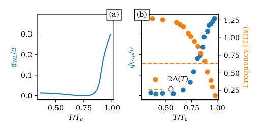 
FIG. 4. (a): Theoretical phase shift on the nonlinear FH simulated in the Zimmermann approximation (see SI) using γ/(2∆) = 1.5 and η/(2∆) = 0.05. (b): Experimental phase shift (blue) of the nonlinear first harmonic measured on a NbN sample with Tc ≈14.9 K and 2∆(T = 0) ≈1.2 THz through a narrowband THz pulse with central frequency Ω≈0.63 THz (orange dashed line). The orange dots represent twice the SC gap 2∆(T) against temperature measured via THz linear spectroscopy in Ref. [18].

📷 Fig 5

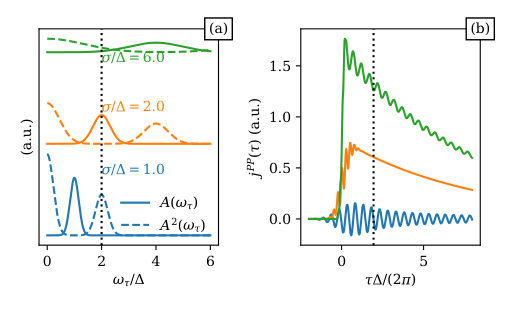 
FIG. 5. (a): The spectral envelope A(ωτ) of the pump pulse (solid lines), centered at Ω, and the squared pulse A2(ωτ) (dashed lines), centered at the sum-frequency combination 2Ωand at the difference-frequency combination around zero. The Higgs mode can be excited at 2∆either via a sum- frequency process (blue lines), or via a difference-frequency process (green lines), as in the diagram described in Fig. 2. The displacive character depends on the value of Ωwith re- spect to the onset of quasiparticle excitations (black dotted line), making it “impulsive” (blue lines) or “displacive” (or- ange and green lines). (b): Time evolution of the pump-probe signal for varying pump frequency Ω. When...

**Summary.** This paper explores how intense THz laser pulses can coherently drive superconducting fluctuations via a mechanism analogous to phonon excitation, termed the displacive Higgs fluctuation. By calculating the nonlinear optical response, the authors demonstrate that this non-resonant coupling significantly enhances measurable signals near the superconducting gap edge in both s-wave and d-wave superconductors.

**Why it may be interesting.** The work directly bridges quantum optics/driven systems with many-body physics by using intense light fields to probe collective, non-equilibrium degrees of freedom (Higgs mode), which is highly relevant for understanding correlated materials dynamics.

Detailed structure

**Main problem.** Investigating the nonlinear optical response of superconductors driven by intense terahertz (THz) laser pulses, focusing on mechanisms beyond standard resonant linear response.

**Main result.** The displacive mechanism, involving a non-resonant static displacement of the superconducting order parameter, is shown to enhance the nonlinear first harmonic signal in both s-wave and d-wave superconductors.

**Method.** Combining numerical simulations (using density matrix expansion) with analytical derivations based on diagrammatic methods to calculate nonlinear response functions.

**Model / system.** Superconductors (s-wave and d-wave) modeled using a tight-binding Hamiltonian, incorporating disorder potentials. The analysis distinguishes between BCS quasiparticle contributions and bosonic collective modes like the Higgs mode.

**Key observables.** Nonlinear first harmonic current ($j_{NL}(\Omega)$), phase shift of the FH vs temperature, and time-domain signal decay rate ($\eta$).

**Important parameters / regimes.** THz pulse frequency ($\Omega$), superconducting gap magnitude ($\Delta$), disorder strength ($\gamma$), and temperature ($T$).

**Assumptions / limitations.** The analysis often assumes a monochromatic pulse limit for simplicity; the treatment of disorder uses an 'exact configuration approach' in some parts.

**Figures summary.** Figures illustrate the enhancement of $j_{NL}(\Omega)$ at $\Omega=2\Delta$ when Higgs fluctuations are included (BCS+Higgs vs BCS), and compare theoretical predictions for static order-parameter fluctuations ($\delta\Delta(0)$) used in the nonlinear current formula.

**Paper structure.** The paper progresses from establishing the need to study non-resonant response, developing the theoretical framework using density matrix expansions up to third order, demonstrating the mechanism via $j_{NL}(\Omega)$, and validating predictions through temperature dependence measurements (s-wave) or discussing limitations in unconventional pairing (d-wave).

Abstract

Intense phase-stable terahertz (THz) laser pulses can drive collective modes coherently via multi-photon excitation pathways in a manner different than the standard resonant mechanism operative in linear response. Here we show that in superconductors the nonlinear optical response can be enhanced when excited quasiparticles activate a (non-resonant) static displacement of the superconducting order parameter, in full analogy with the displacive excitation of coherent phonons in opaque materials. By combining numerical simulations with analytical results we demonstrate that the displacive mechanism to excite the Higgs mode is operative in both $s$-wave and $d$-wave superconductors. We validate this prediction experimentally by the temperature dependence of the phase of the nonlinear first harmonic in superconducting $s$-wave NbN. We also discuss how the order-parameter relaxation at large times, which can be experimentally accessed via pump-probe protocols is connected to energy-dissipative processes. Our results offer a novel perspective on the ability of intense THz fields to measure, and eventually control, the parametric dependence of the optical response on collective degrees of freedom.

[↑ back to top](#top)

### [First-Order Topological FFLO Transition and Superconducting Diode Sign Reversal in Altermagnetic Nanowires](http://arxiv.org/abs/2607.15720v1)

**Authors:** Bo Fu, Kaizhi Bai, Chang-An Li, Shun-Qing Shen  
**Type:** theory · **Category:** other · **PDF:** <https://arxiv.org/pdf/2607.15720v1>  
**Analysis basis:** full PDF text, analyzed in chunks
**Topic relevance:** `Keldysh / 2PI / non-Gaussian methods` **3/5** · `spintronics-quantum-optics interface` **3/5** · `driven-dissipative phase transition` **2/5** · `methods for driven-dissipative` **2/5** · `Kondo & dissipative impurity` **1/5** · `analog quantum simulation` **1/5** · `exotic spin models in light-matter` **1/5** · `non-equilibrium dynamics` **1/5** · `non-equilibrium universality` **1/5**

📷 Fig 1

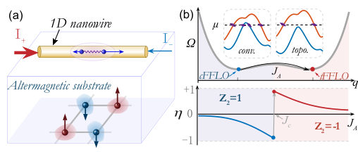 
FIG. 1. (a) Schematic of a 1D spin-orbit-coupled nanowire proxim- itized to a 𝑑-wave altermagnetic substrate. The emergence of FFLO states stabilizes finite-momentum pairing and an intrinsically nonre- ciprocal superconducting state with unequal critical currents 𝐼+ ≠𝐼−. (b) Illustration of the first-order topological FFLO transition driven by altermagnetism. The proximity-induced altermagnetic filed tilts energy bands of the spin-orbit-coupled nanowire and reshape their spin texture, producing band-resolved competing pairing channels (two insets). Upon tuning 𝐽𝐴, the system undergoes a first-order topological phase transition between conventional (Z2 = +1) and topological (Z2 = −1) FFLO...

📷 Fig 2

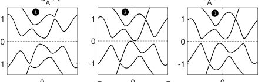 
FIG. 2. (a) Normal-state band structure 𝐸(𝑘): the dashed curve, mirror-symmetric spectrum at 𝐽𝐴= 0 (SOC only); solid curves, tilted, asymmetric bands at finite 𝐽𝐴. Inset: schematic finite-𝑞pair- ing between shifted Fermi points leading to FFLO order. (b) Phase diagram in the (𝑈, 𝐽𝐴) plane at 𝜇= 0.55𝑡. Colors indicate the super- conducting mini-gap (blue: nodal FFLO; red: gapped FFLO). Black and blue dashed lines mark first-order boundaries between cFFLO– nFFLO and cFFLO–tFFLO, respectively; the solid red line marks the (continuous) transition between nFFLO and tFFLO. (c) Self- consistent optimal pairing amplitude Δ (blue circles, left axis) and Cooper-pair momentum 𝑞(red squares, right...

📷 Fig 3

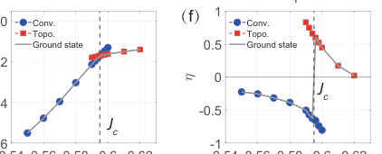 
FIG. 3. (a,b) Representative condensation-energy density Ω(Δ, 𝑞) at 𝑈= 1.5𝑡for two altermagnetic strengths 𝐽𝐴= 0.59𝑡and 𝐽𝐴= 0.60𝑡, just below and above the critical value 𝐽𝑐≈0.595𝑡. Both panels display two minima — cFFLO (Z2 = +1) and tFFLO (Z2 = −1) — separated by a saddle point. White markers denote global and local extrema; the white curve traces the optimal Δ(𝑞) that minimizes Ω at each 𝑞. (c,d) Corresponding cuts showing Ω(𝑞) (blue) and the super- current density 𝐽(𝑞) (red) along the optimal Δ(𝑞) line. The shift of the global minimum between (c) and (d) signals the first-order tran- sition. Open symbols represent the numerical results, while dashed lines denote the corresponding...

📷 Fig 4

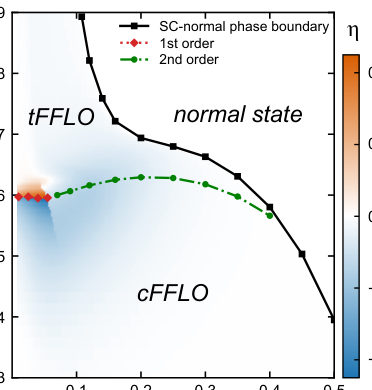 
FIG. 4. Finite-temperature phase diagram in the (𝐽𝐴,𝑇) plane at 𝑈= 1.6𝑡. The black dashed curve marks the superconducting– normal boundary; above it the system is in normal states. Below the boundary (black solid line), the system resides in either a tFFLO or cFFLO phase. The color map shows the superconducting diode efficiency 𝜂: blue (red) indicates negative (positive) 𝜂, white corre- sponds to 𝜂≈0. At low temperatures, the cFFLO–tFFLO boundary (red dashed line) is first order and 𝜂changes sign discontinuously; at higher temperatures this boundary (green dashed line) becomes con- tinuous and 𝜂evolves smoothly across it.

📷 Fig 5

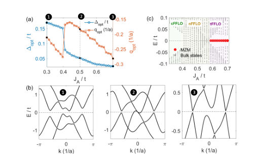 
FIG. 5. Self-consistent evolution across the cFFLO →nFFLO → tFFLO sequence [gray cut in Fig. 2(b)]. (a) Optimal pairing ampli- tude (blue circles, left axis) and Cooper-pair momentum (red squares, right axis) versus 𝐽𝐴/𝑡, showing a first-order jump at the cFFLO– nFFLO boundary and a smooth crossover at the nFFLO–tFFLO boundary. (b) Periodic-boundary BdG spectra at the three 𝐽𝐴values indicated by symbols in (a), illustrating the transition from gapped cFFLO to nodal nFFLO to gapped tFFLO. (c) Corresponding open- boundary spectra versus 𝐽𝐴/𝑡, highlighting the appearance of MZMs only in the tFFLO phase.

**Summary.** This theoretical work demonstrates that proximity coupling to altermagnets can induce a first-order transition into a topological FFLO state in nanowires. This abrupt phase change is predicted to manifest as a sharp sign reversal in the superconducting diode effect, offering a novel transport fingerprint for these exotic quantum states.

**Why it may be interesting.** The connection between topological quantum phases (characterized by $Z_2$ invariants) and measurable transport properties like diode efficiency provides a concrete, experimentally accessible signature for exotic superconducting states.

Detailed structure

**Main problem.** The research investigates realizing a first-order topological Fulde-Ferrell-Larkin-Ovchinnikov (FFLO) transition in superconducting nanowires proximitized to altermagnets.

**Main result.** This first-order transition is shown to be marked by discontinuous jumps in the pairing amplitude and momentum, which simultaneously drives a sharp sign reversal in the superconducting diode efficiency ($\eta$).

**Method.** The analysis employs Ginzburg-Landau theory applied to the free energy functional derived from mean-field calculations of the Bogoliubov-de Gennes (BdG) Hamiltonian.

**Model / system.** The system is a spin-orbit-coupled nanowire coupled to a $d$-wave altermagnetic substrate. The physics is modeled using BdG Hamiltonians and analyzed via minimizing an effective free energy functional $\Omega(\mathbf{q}, \Delta)$.

**Key observables.** Topological invariant ($Z_2$), superconducting diode efficiency ($\eta$), optimal pairing amplitude ($\Delta_{opt}$), and pairing momentum ($\mathbf{q}_{opt}$).

**Important parameters / regimes.** Altermagnetic coupling strength ($J_A$), chemical potential ($\mu$), and temperature ($T$).

**Assumptions / limitations.** The analysis relies on mean-field approximations, the use of a phenomenological Ginzburg-Landau functional, and sometimes quadratic approximations for simplicity.

**Figures summary.** Figures illustrate the band structure evolution, the calculation of the topological invariant across phases (cFFLO $	o$ tFFLO), and crucially, show how the superconducting diode efficiency ($\eta$) exhibits a sharp sign reversal at the first-order transition boundary.

**Paper structure.** The paper develops the Hamiltonian for the system, derives the necessary free energy functional via mean-field theory, maps out the phase diagram showing three FFLO states (cFFLO, nFFLO, tFFLO), and finally uses GL analysis to link the first-order nature of the transition to the observable sign reversal in $\eta$.

Abstract

Fulde-Ferrell-Larkin-Ovchinnikov (FFLO) state conventionally emerges via a second-order phase transition driven by finite magnetization. Here we show that a spin-orbit-coupled nanowire proximitized to $d$-wave altermagnets -- with zero net magnetization -- can realize topological FFLO states through a first-order transition, marked by a sharp sign-reversing superconducting diode effect. The altermagnetic field generates band-resolved competing pairing channels, giving rise to a double-valley free energy landscape whose global minimum switches discontinuously. It consequently leads to a first-order topological FFLO transition with simultaneous jumps in the Cooper pairing amplitude and finite center-of-mass momentum. Remarkably, this discontinuous topological reconfiguration substantially enhances the diode efficiency and drives a characteristic sharp sign reversal across the transition. The mechanism of such exotic phenomena is captured by Ginzburg--Landau theory. Our results provide a field-free altermagnetic route to topological FFLO states and identify their direct transport fingerprint.

[↑ back to top](#top)

### [Amplitude-Defect Mediated Transition to Partial Incoherence -- From Experiment to Theory](http://arxiv.org/abs/2607.15924v1)

**Authors:** Nicolas Thomé, Yukiteru Murakami, Yannick Schöhs, Katharina Krischer  
**Type:** both · **Category:** statistical mechanics · **PDF:** <https://arxiv.org/pdf/2607.15924v1>  
**Analysis basis:** full PDF text, analyzed in chunks
**Topic relevance:** `driven-dissipative phase transition` **3/5** · `methods for driven-dissipative` **3/5** · `non-equilibrium dynamics` **2/5** · `non-equilibrium universality` **2/5** · `Frenkel-Kontorova` **1/5** · `Keldysh / 2PI / non-Gaussian methods` **1/5** · `analog quantum simulation` **1/5** · `correlated / nonlocal dissipation` **1/5**

📷 Fig 1

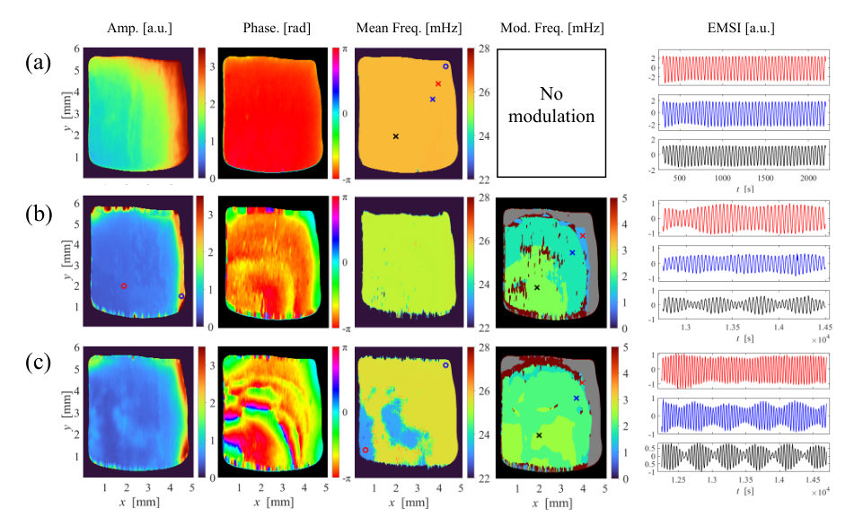 
Figure 1: Experimental Heatmaps: Experimentally measured spatial distribution of time-averaged amplitude (first column), representative snapshots of phase distribution (second column), and time- averaged frequency distribution (third column), amplitude-modulation frequency (fourth column) on an electrode surface, and local EMSI signals at three representative points marked with red, blue, and black crosses (fifth column). Circular markers indicate locations we use for FFT analysis in Figure 4. From (a) to (c), the illumination intensity was decreased in steps: (a) 3.13 mW/cm2, (b) 0.94 mW/cm2, (c) 0.85 mW/cm2. Gray regions in the fourth column indicate locations where no clear amplitude...

📷 Fig 2

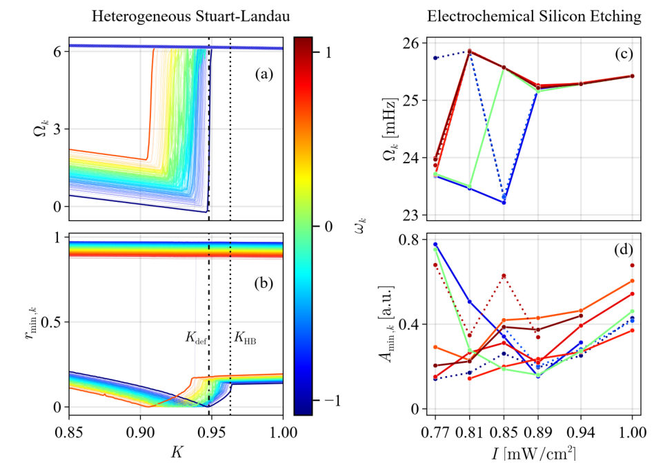 
Figure 2: Transition from coherence to partial incoherence: In the first two panels, (a) and (b), the numerical results are plotted for a system initialized at a bimodal-amplitude solution for N = 5000, C1 = −0.5, C2 = −7, and K = 1.0, and adiabatically decreased by steps of ∆K = 0.001 until K = 0.85. The heterogeneity originates from the intrinsic frequencies ωk ∼N(µ = 0, σ = 0.3) and oscillators are colored according to their ωk. The top panel in (a) displays the mean frequency Ωk of each oscillator k, whereas panel (b) displays the minimum of the radius for each oscillator rmin, k. The vertical dotted line indicates KHB, where the lowest amplitude oscillator passed the localized Hopf...

📷 Fig 3

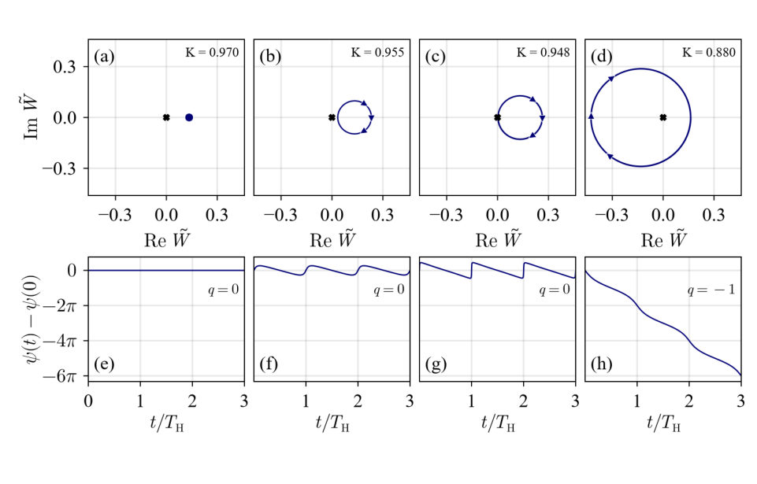 
Figure 3: Representative complex plane representations: Four representative complex plane representations of the low-amplitude, dark-blue highlighted oscillator from Fig. 2. We plot the trajectories of the oscillator’s complex amplitude f W in the comoving frame Ωfor three Hopf periods TH. Additionally, we plot the time series of the comoving phase ψ and indicate the winding number q. The K-values are K = 0.970 (a) and (e), K = 0.955 (b) and (f), K = 0.948 (c) and (g) and K = 0.880 in (d) and (h).

📷 Fig 4

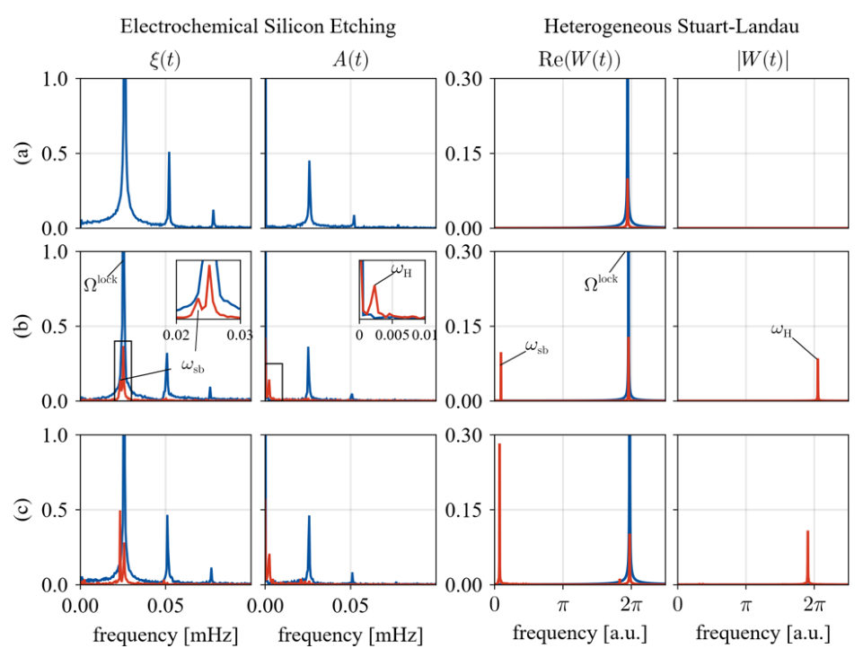 
Figure 4: Fast Fourier Transformation: One-sided fast Fourier transformation for three rep- resentative values of the illumination intensity and the coupling strength, respectively. The two columns on the left represent the experimental results, whereas the two columns on the right give the numerical results. Blue data corresponds to an oscillator with high amplitude, and red to one with low amplitude. In panel (a), the illumination intensity is set to I = 3.13 mW/cm2, and the coupling strength is set to K = 1.0. In (b), I = 0.94 mW/cm2, K = 0.955, and we labelled the mean locked frequency with Ω, the Hopf frequency with ωH and the sideband peak by ωsb. In panel, (c) I = 0.85 mW/cm2 and K =...

📷 Fig 5

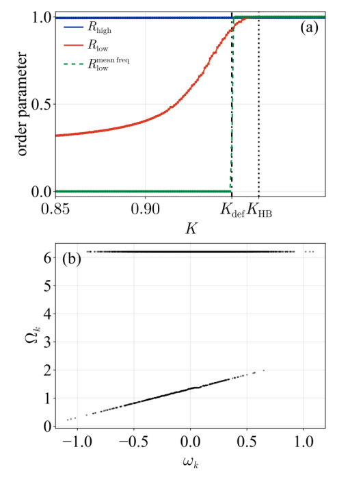 
Figure 5: Macroscopic Transition: In part (a), we plot different order parameters for the adiabatic continuation plotted in Fig. 2. We plot the Kuramoto order parameter for two subgroups: high- amplitude (blue) and low-amplitude oscillators (red). Additionally, we plot the mean-frequency order parameter for the low-amplitude oscillators in green. In panel (b), we plot the distribution of the mean frequencies Ωk against the intrinsic frequencies ωk for K = 0.88.

**Summary.** The paper analyzes the transition from synchronized coherence to partial incoherence in coupled nonlinear oscillators, using both electrochemical experiments and theoretical models based on Stuart-Landau equations. The key finding is that this transition is mediated by amplitude defects arising from Hopf bifurcations in low-amplitude components. This mechanism proves that simple phase descriptions are insufficient for capturing the full dynamics of frequency dispersion.

**Why it may be interesting.** This work provides a concrete example of how non-amplitude degrees of freedom (i.e., amplitude dynamics) are crucial for describing complex collective behavior in nonlinear oscillators, which has parallels in driven quantum systems or interacting quantum media.

Detailed structure

**Main problem.** The study investigates a transition from complete frequency coherence to partial incoherence, demonstrating that this process is mediated by amplitude defects in a way that phase-only models fail to capture.

**Main result.** The transition occurs when low-amplitude oscillators undergo successive Hopf bifurcations, causing an amplitude defect that shifts the mean frequency of one group while another remains locked, leading to partial incoherence.

**Method.** The research combines experimental measurements (Ellipsomicroscopy on silicon etching) with theoretical analysis using globally coupled heterogeneous Stuart-Landau oscillators and linear stability theory.

**Model / system.** The system is modeled by globally coupled heterogeneous Stuart-Landau oscillators, which are used to simulate the nonlinear feedback dynamics observed during electrochemical dissolution of silicon in fluoride electrolytes.

**Key observables.** Amplitude ($A$), Phase ($\phi$), Mean Frequency, Amplitude Modulation Frequency (Mod. Freq.), and the Participation Ratio (PR) derived from eigenvalue analysis.

**Important parameters / regimes.** Coupling strength ($K$) and illumination intensity ($I$); the transition is characterized by crossing critical coupling strengths ($K_{HB}$) leading to Hopf bifurcations.

**Assumptions / limitations.** The theoretical analysis relies on linear stability theory applied in a rotating frame, assuming the existence of a well-defined frequency-locked state $X^*$.

**Figures summary.** Figures show experimental heatmaps tracking amplitude and phase across different illumination intensities; numerical/theoretical figures illustrate transitions from coherence to partial incoherence via Hopf bifurcations and winding number changes.

**Paper structure.** The paper progresses by first establishing the phenomenon experimentally (varying illumination intensity), then modeling it with coupled oscillators, and finally using advanced stability analysis (Hopf bifurcation, PR calculation) to pinpoint the mechanism of amplitude-defect mediated frequency shifts.

Abstract

Phase-only models have contributed significantly to the understanding of synchronization; however, they do not account for dynamical scenarios where amplitude dynamics matter. This study identifies an amplitude-mediated transition from complete frequency coherence to partial incoherence, observed both in an electrochemical silicon-etching experiment and within a population of globally coupled heterogeneous Stuart-Landau oscillators. Strong coupling introduces a bimodal-amplitude distribution from which the transition to partial incoherence is triggered by successive secondary Hopf bifurcations in low-amplitude oscillators. When these modulations cause oscillators to experience amplitude defects, the winding number changes, converting the secondary frequency into a new, oscillator-specific mean frequency. This mechanism results in a partially incoherent state, in which one amplitude group maintains frequency locking while another develops a dispersed frequency branch. These findings demonstrate that amplitude defects offer a pathway to incoherence that phase-only models cannot capture.

[↑ back to top](#top)

### [Electrothermal control of spin-reorientation transition in Co/Fe_3GaTe_2 heterostructures](http://arxiv.org/abs/2607.15844v1)

**Authors:** Po-Wei Chen, Ming-Hsien Hsu, Cheng-Ying Hsiao, Ming-Yang Ho, Masahiro Haze, Yan-Ru Chu, Yu-Cheng Shao, Po-Chun Chang, Chen-Yu Ou, Ruei Chen, Ko-Fan Chen, Chung-Ting Ke, Chao-Hung Du, Yukio Hasegawa, Wen-Chin Lin, .  
**Type:** experiment · **Category:** other · **PDF:** <https://arxiv.org/pdf/2607.15844v1>  
**Analysis basis:** full PDF text, analyzed in chunks
**Topic relevance:** `spintronics-quantum-optics interface` **3/5** · `driven-dissipative phase transition` **2/5** · `analog quantum simulation` **1/5** · `exotic spin models in light-matter` **1/5** · `non-equilibrium dynamics` **1/5** · `non-equilibrium universality` **1/5**

📷 Fig 1

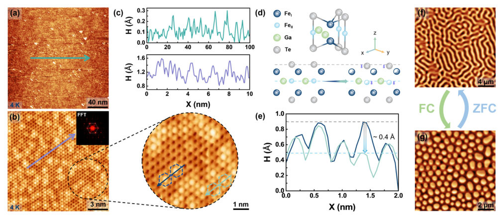 
Figure 1. Atomic-scale deficiency signatures characterized by scanning tunneling microscope (STM) on cleaved Fe3GaTe2 (FGaT). (a) Large-area STM topograph of cleaved FGaT measured at 4 K, showing a flat terrace-like surface without visible step edges in the scanned region. (b) Atomic-resolution STM image showing a hexagonal Te lattice; the fast Fourier transform (FFT) inset confirms sixfold in-plane (IP) symmetry. The dashed circle marks the region enlarged in the central inset, in which dark- and light-blue hexagons mark two representative local motifs used for line-profile comparison. (c) Height profiles along the arrows marked in (a) (top) and (b) (bottom). The large-area profile varies...

📷 Fig 2

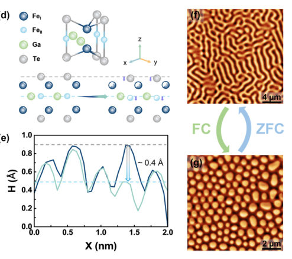 
Fig. 1 shows the surface morphology and atomic- scale defect-related signatures of cleaved FGaT mea- sured by low-temperature scanning tunneling micro- scope (STM). After cleaving the FGaT crystal in the preparation chamber to minimize surface oxida- tion and contamination, a large-area STM topograph was first acquired at 4 K. The surface showed an ex- tended, terrace-like morphology without visible step edges within the scanned region, indicating that the exposed vdWs surface was sufficiently flat for atomic- resolution imaging. This step-free morphology is fur- ther supported by the height profile in Fig. 1(c) (top panel), which varies by less than approximately 0.3 Å over a 100 nm span...

📷 Fig 3

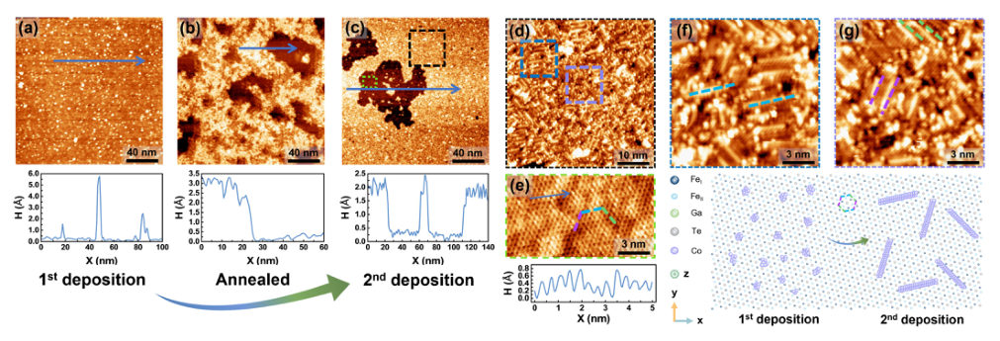 
Figure 2. In situ STM characterization of Co growth on cleaved FGT: initially isolated Co clusters evolve into quasi- continuous Co coverage with lattice-aligned stripe-like features upon annealing and higher-dose deposition. Apparent Co- covered areas were estimated from levelled STM topographs by absolute-height-threshold mask analysis in Gwyddion [28]. (a) Large-area STM topograph after low-dose Co deposition on FGaT, showing dense nanoscale Co clusters with an apparent Co-covered area of 13.6%. The height profile along the blue arrow (bottom panel) shows isolated clusters up to approximately 5.5 Å in height. (b) STM topograph after annealing at 180 °C for 1 h. The apparent Co-covered...

📷 Fig 4

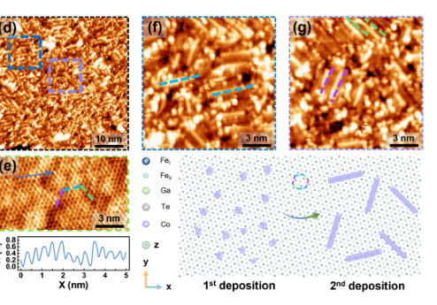 
Fig. 2 examines the early-stage morphology and ther- mal redistribution of Co deposited on cleaved FGaT. To avoid oxidation or ambient contamination during metal deposition, Co was evaporated in situ in the preparation chamber of the STM system, and the sam- ple was subsequently transferred back to 4 K for STM imaging. The apparent Co-covered area was estimated from levelled STM topographs using a Gwyddion grain- analysis workflow, in which Co-rich protrusions were marked by an absolute-height threshold, converted into binary masks and normalized by the total scanned area[28]. A small amount of Co was first deposited on FGaT, giving an apparent Co-covered area of 13.6% in Fig. 2(a) (the...

📷 Fig 5

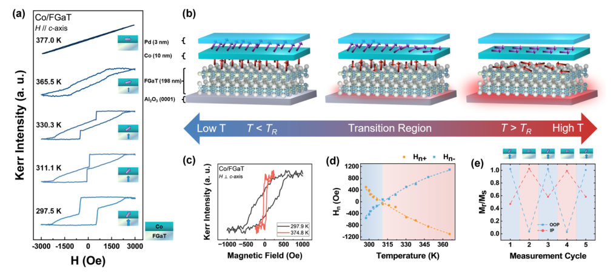 
Figure 3. Temperature-driven spin-reorientation transition in Co/FGaT. (a) Temperature-dependent out-of-plane (OOP) MOKE hysteresis loops of a Pd(3 nm)/Co(10 nm)/FGaT(198 nm) heterostructure on an Al2O3(0001) substrate. The magnetic field was applied along the crystallographic c-axis. The OOP loop evolves from a square, remanent state at low temperature to a nearly linear hard-axis-like response at high temperature, indicating a progressive reduction of the perpendicular magnetic contribution. (b) Schematic illustration of the temperature-driven spin-reorientation tansition (SRT) process. Below the reorientation temperature TR, the heterostructure is dominated by the perpendicular magnetic...

**Summary.** This work demonstrates that applying controlled electrical power can induce a reversible spin-reorientation transition in Co/Fe3GaTe2 heterostructures. By utilizing Joule heating, the magnetic anisotropy of the system can be tuned from out-of-plane to in-plane states at temperatures below the Curie point. This establishes electrothermal control as a viable method for engineering magnetism in next-generation 2D spintronic devices.

**Why it may be interesting.** While focused on magnetism, the concept of controlling phase transitions (SRT) using localized, non-equilibrium energy input (Joule heating) is relevant to understanding thermal management in quantum devices or engineered quantum materials.

Detailed structure

**Main problem.** The study investigates how electrothermal effects can control the spin-reorientation transition (SRT) in Co/Fe3GaTe2 van der Waals heterostructures.

**Main result.** Joule heating causes a reversible switch from an out-of-plane to an in-plane magnetization state at a temperature below the Curie point, demonstrating electrothermal anisotropy competition for controlling vdW magnetism.

**Method.** The research employs Magneto-Optical Kerr Effect (MOKE) measurements and power-controlled electrical biasing on the heterostructures.

**Model / system.** The physical system is a Co/Fe3GaTe2 van der Waals magnet heterostructure, where magnetic anisotropy competition between the deposited Co overlayer and the underlying FGaT substrate dictates the magnetization state.

**Key observables.** Spin-reorientation transition temperature (approx. 311 K), hysteresis loop evolution under applied power (80-100 mW window), and field-assisted domain reversal thresholds ($\sim 15$ mW).

**Important parameters / regimes.** The control mechanism is electrothermal, involving Joule heating that modifies the magnetic anisotropy energy balance.

**Assumptions / limitations.** The observed electrical response is attributed to an electrothermal origin rather than purely electrostatic effects due to oxide leakage.

**Figures summary.** Figures detail STM images showing surface morphology and Co growth evolution on FGaT, alongside MOKE traces illustrating temperature-dependent magnetic switching behavior.

**Paper structure.** The paper establishes the context of electrical control in vdW magnets, presents measurements demonstrating the temperature-driven SRT via Joule heating, and confirms this tunability using controlled power application.

Abstract

Electrical control of magnetic anisotropy in van der Waals (vdWs) magnets is a key step toward reconfigurable two-dimensional spintronics, yet how a conventional metallic ferromagnet competes with a van der Waals magnet across a direct interface has remained largely unexplored. Here we demonstrate reversible thermal and electrothermal control of a spin-reorientation transition in Co/Fe_3GaTe_2 (FGaT) heterostructures. As Joule heating weakens the FGaT anisotropy, the heterostructure switches from an out-of-plane- to an in-plane-dominated state at a reorientation temperature of approximately 311 K, well below the Curie temperature, consistent with an exchange-mediated anisotropy competition between the Co overlayer and FGaT. An electrically driven device shows a closely matching loop evolution within an 80-100 mW power window, reversibly over five measurement cycles, consistent with an electrothermal origin. In a Co-free FGaT device, Kerr microscopy traces the switching to a power-tunable domain nucleation barrier and demonstrates power-thresholded, field-assisted magnetization reversal at a threshold near 15 mW. These results demonstrate electrothermal anisotropy competition as a route to heat-assisted and device-level control of vdWs magnetism.

[↑ back to top](#top)

### [Phase-Field Simulation of Dendrite Evolution in All-Solid-State Sodium Batteries during Cycling](http://arxiv.org/abs/2607.15387v1)

**Authors:** Chengyin Wu, Wolfgang Windl, Jung-Hyun Kim, Yanzhou Ji  
**Type:** theory · **Category:** numerical methods · **PDF:** <https://arxiv.org/pdf/2607.15387v1>  
**Analysis basis:** full PDF text, analyzed in chunks
**Topic relevance:** `Keldysh / 2PI / non-Gaussian methods` **3/5** · `non-equilibrium dynamics` **2/5** · `driven-dissipative phase transition` **1/5** · `methods for driven-dissipative` **1/5** · `non-equilibrium universality` **1/5**

📷 Fig 1

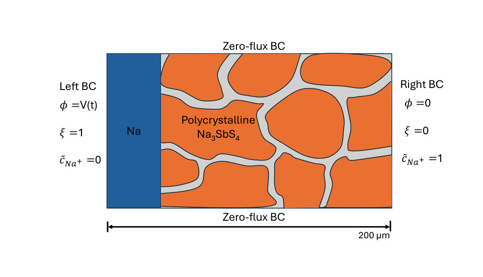 
Figure 1: Schematic illustration of phase-field model setup and boundary conditions (BCs). The blue, orange and grey colors correspond to the Na anode, NAS grains, and NAS GBs, respectively

📷 Fig 2

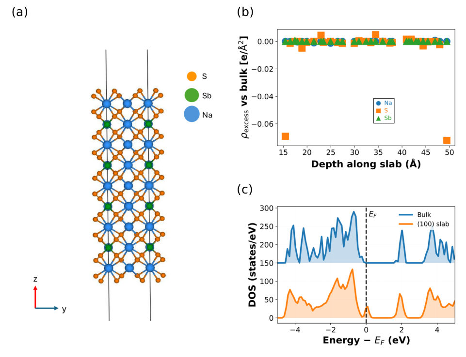 
Figure 2: (a) NAS slab of (100) direction with elements marked Na (blue), S (orange), and Sb (green). (b) DFT results for excess electron charge densities from Bader charges for the NAS (100) surface. (c) Electronic density of states (DOS) of the NAS (100) slab in comparison to the bulk DOS.

📷 Fig 3

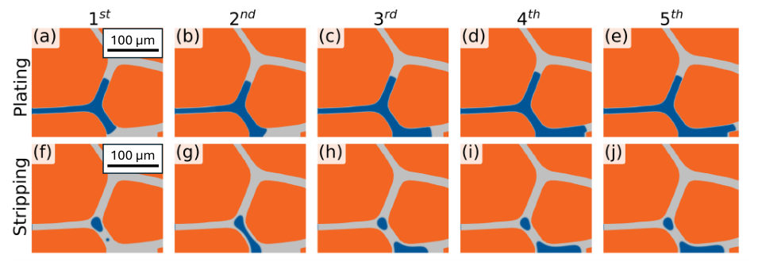 
Figure 3: Snapshots of the Na dendrite(blue)– polycrystalline NAS SE(orange)- GBs(gray) during five consecutive electrochemical cycles under an applied voltage of 0.2 V. Panels (a–e) show the plating process, and panels (f–j) show the corresponding stripping process. The sequence highlights the role of isolated Na remnants formed during stripping, which act as preferential sites for subsequent Na deposition and progressively promote dendrite growth over repeated cycling. Full cycling animation is provided in Supplementary Figure S9.

📷 Fig 4

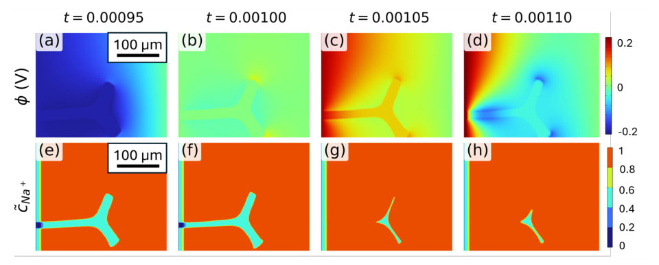 
Figure 4: Electric potential (a–d) and Na+ concentration (e–h) distributions immediately before and after dendrite stripping. Early stripping initiates along the Na–grain-boundary sidewalls due to sharp potential gradients (a,b). Following electronic disconnection, a lo- calized negative-potential basin forms around the isolated Na, indicating field redistribution and current bypass (c,d). The corresponding Na+ shielding and curvature contrast between the narrowed neck and the triple-junction Na highlight transport-limited dissolution and kinetic stabilization of isolated Na (e–h).

📷 Fig 5

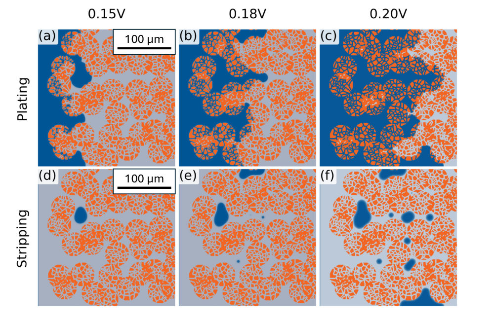 
Figure 5: Snapshots of the fifth plating–stripping cycle in a SE microstructure with multiple polycrystalline NAS particles (Na metal (blue), SE (orange), and either void or GBs (gray)) at applied voltages of (a,d) 0.15 V, (b,c) 0.18 V, and (c,f) 0.20 V. Full cycling animation for each applied voltage is listed in Supplementary Figures S10-S12

**Summary.** This work uses a sophisticated phase-field model coupled with DFT to simulate dendrite growth in sodium solid-state batteries. It reveals that grain boundary geometry causes asymmetric stripping, trapping residual Na metal which accelerates future dendrite penetration. The findings provide crucial design rules by linking microstructure and anode chemistry to improve battery safety.

**Why it may be interesting.** While focused on electrochemistry, the rigorous application of multi-scale phase-field modeling, coupling continuum physics (diffusion/potential) with quantum inputs (DFT), showcases advanced computational techniques relevant for complex non-equilibrium systems.

Detailed structure

**Main problem.** Dendrite growth during cycling is a critical, poorly understood challenge limiting the safety and energy density of all-solid-state sodium batteries (SSBs).

**Main result.** The study shows that dendrite stripping is intrinsically asymmetric due to grain boundary geometry, leading to residual, kinetically stabilized Na metal that accelerates subsequent dendrite penetration.

**Method.** A phase-field model, informed by Density Functional Theory (DFT) calculations, was applied to simulate microstructure evolution during electrodeposition cycles.

**Model / system.** The system is a 2D half-cell of Sodium (Na) SSBs using polycrystalline $	ext{Na}_3	ext{SbS}_4$ electrolyte. The model couples Allen-Cahn equations for phase evolution with reaction-diffusion and electric potential equations.

**Key observables.** Dendrite penetration depth, isolated Na metal formation size, microstructure evolution ($\xi$, $\phi_g$), and local current/potential distributions.

**Important parameters / regimes.** Applied voltage, solid-electrolyte microstructure (GB density), anode chemistry ($	ext{Na}$ vs. $	ext{Na}_3	ext{Sb}$ alloy).

**Assumptions / limitations.** The model assumes no side reactions occur during plating and stripping; DFT surface electron densities are used to inform the phase-field parameters.

**Figures summary.** Figures illustrate schematic setups, charge distributions from DFT analysis on different crystal planes ((100), (110), (111)), and snapshots showing potential/concentration profiles across various SE microstructures during cycling.

**Paper structure.** The paper establishes the physical problem, details the coupled phase-field methodology informed by DFT, presents results demonstrating asymmetric stripping leading to memory effects, and concludes with design principles based on microstructure control.

Abstract

Dendrite growth during cycling remains a critical challenge for all-solid-state batteries (SSBs), limiting the full realization of their inherent safety and high energy density. In particular, the mechanisms of continuous dendrite penetration during charge-discharge cycling remain poorly understood and are difficult to characterize experimentally. This study applies a phase-field model, informed by density functional theory calculations, to rationalize and visualize the dendrite penetration behaviors during cycling in sodium (Na) SSBs with pure Na or Na-Sb alloy anodes and polycrystalline Na$_3$SbS$_4$ electrolyte. We show that dendrite stripping is intrinsically asymmetric with respect to plating due to grain boundary geometry, leading to the formation of isolated Na metal that persists between cycles. This residual Na metal becomes kinetically stabilized at grain-boundary junctions and is readily reactivated during subsequent plating, thereby accelerating and amplifying dendrite penetration. We further investigate the effects of applied voltage, solid-electrolyte microstructure, and anode chemistry on this phenomenon. These findings establish isolated Na metal as a key contributor for continued dendrite propagation in Na SSBs and provide design principles for stabilizing anode/electrolyte interfaces in Na SSBs.

[↑ back to top](#top)

### [Disentangling topological and anomalous Hall contributions of skyrmions using Kerr microscopy and thermal transport measurements](http://arxiv.org/abs/2607.15946v1)

**Authors:** H. Heyen, M. Vogel, F. Gossing, J. Walowski, K. Dahmen, J. McCord, M. Münzenberg  
**Type:** experiment · **Category:** other · **PDF:** <https://arxiv.org/pdf/2607.15946v1>  
**Analysis basis:** full PDF text, analyzed in chunks
**Topic relevance:** `spintronics-quantum-optics interface` **3/5** · `analog quantum simulation` **1/5** · `driven-dissipative phase transition` **1/5** · `exotic spin models in light-matter` **1/5** · `non-equilibrium dynamics` **1/5**

📷 Fig 1

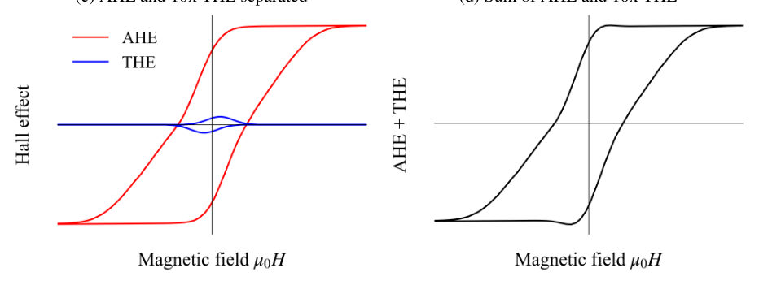 
Figure 1: Schematic AHE and THE hysteresis loops based on measurement data to reveal the different contributions for varied relative strength. In (a,b) the THE peak height is 249(18) pΩ m, around 8.2 % of the saturation magnetization like measured for Ta/CoFeB/MgO, while for (c,d) the THE is multiplied by 10 and for (e,f) shifted slightly. In Hall effect measurements of (b), the THE signal is hidden at the hysteresis loop edges, where skyrmions get nucleated and becomes clearly visible for higher THE peaks like in (d) or barely visible if it only gets shifted to a different region of the hysteresis loop like in (f).

📷 Fig 2

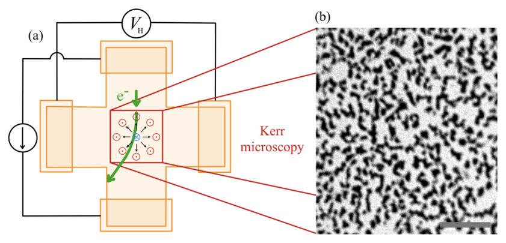 
Figure 2: (a) Schematic of a topological Hall effect (THE) measurement setup showing a Néel skyrmion with the winding number 𝑄= −1 as an example centered inside the Hall cross. Elec- trons flowing through skyrmions are deflected by the magnetic field generated by the skyrmion spin structure. This electron deflection (THE) is detected in a Hall-cross configuration. This configuration requires separating the dominating anomalous Hall effect contribution, always present in the measurement signal, e.g. through magnetization measurements with Kerr mi- croscopy (b). The image (b), also found in Figure 6b, was acquired at −0.28(5) mT and its scale bar corresponds to 5 µm. During measurements only...

📷 Fig 3

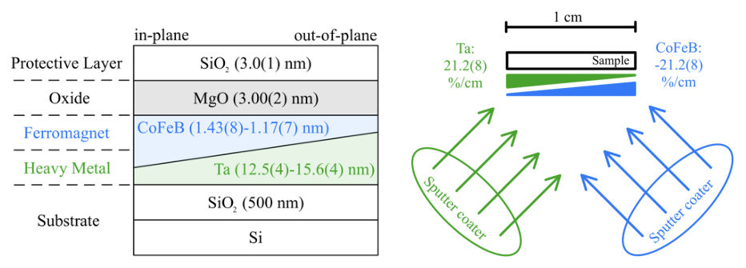 
Figure 3: (a) Layer stack for skyrmion creation using sputter coating for Ta and CoFeB with opposing thickness gradients of ±21.2(8) %/cm and e-beam evaporation for MgO and SiO2. The layer thicknesses are measured with quartz crystal microbalances and are calculated for both sample edges along the thickness gradient using reference [35]. The CoFeB thickness gradient generates a landscape of regions with magnetic out-of-plane and in-plane anisotropies. At the transition region between both anisotropy types, skyrmions can be created. These parameters are valid for the MOKE-Hall sample and the Nernst-Hall sample differs by using CoFeB thicknesses of 1.50(8) nm to 1.23(7) nm. (b) Schematic of...

📷 Fig 4

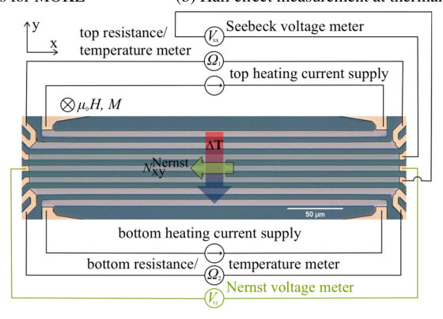 
Figure 4: Optical microscope images of the investigated devices. (a,b) Cross structures for Hall effect measurements with out-of-plane magnetic fields. (a) has a larger surface area, better suited for MOKE measurements and (b) is smaller allowing for larger temperature gradients when measuring the Nernst effect in (c). Both use constant measurement currents. (c) Micro structure and electrical measurement circuit for measuring the Nernst effect. Its structure is adapted from [14] with minor modifications in the cross width. The sightly greenish shimmering cross in the center consist of the skyrmion material shown in Figure 3a. Above and below it, are temperature sensors located, while...

📷 Fig 5

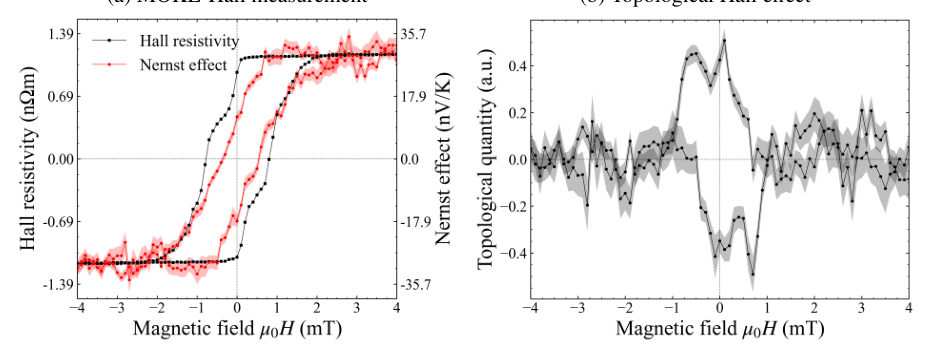 
Figure 5: (a) Relative normalized hysteresis loops of the Hall resistivity (black) and magnetization (red) measured at the MOKE-Hall sample. (b) THE, is calculated from the difference of the normalized Hall resistivity and the magnetization presented in (a). (c) The Hall resistivity (black) and Nernst effect (red) measured at the Nernst-Hall sample. (d) Topological quantity 𝑁TQ calculated from (c) by Equation 5. The results in Figure (a),(b) and (c),(d) differ in the exact shape, because of slightly different positions on the CoFeB thickness wedge chosen, but reveal the quantitatively same behavior by independent experimental realization. Both experiments prove for the same related...

**Summary.** This work addresses the challenge of isolating the subtle topological Hall effect originating from skyrmions within thin magnetic films where it is masked by a dominant anomalous contribution. By combining magneto-optical imaging with both electrical and thermal transport measurements, the authors successfully quantify the characteristic topological response ($
ho_{THE}$), providing strong evidence for topologically protected spin textures in these nanoscale systems.

**Why it may be interesting.** While focused on condensed matter magnetism, the rigorous separation of emergent topological responses from conventional extrinsic effects (like AHE) using multiple complementary physical probes (electrical vs. thermal) is highly relevant to understanding complex many-body dynamics in engineered quantum materials.

Detailed structure

**Main problem.** The primary challenge is separating the small topological Hall effect (THE) signal from the much larger, overlapping anomalous Hall effect (AHE) when measuring skyrmion-related transport phenomena.

**Main result.** The authors successfully measured a finite topological Hall resistivity of $249(18)\, 	ext{p}\Omega	ext{ m}$ at room temperature and confirmed the existence of topologically protected skyrmions using multiple independent measurements.

**Method.** A combination of Magneto-optical Kerr microscopy (MOKE) to image magnetization, electrical transport measurements for THE, and thermal transport measurements for the Topological Nernst Effect (TNE) were employed.

**Model / system.** The study investigates single-layer thick films of Ta/CoFeB/MgO that host topologically protected skyrmion spin structures. The analysis models the total measured resistivity ($
ho_{Hall}$) and Nernst effect ($N_{xy}$) as sums of Ordinary, Anomalous, and Topological contributions.

**Key observables.** Topological Hall resistivity ($
ho_{THE}$), Topological Nernst coefficient ($N_{TNE}$), surface magnetization images (MOKE), and coercive field decay parameters.

**Important parameters / regimes.** Room temperature measurements; film thicknesses in the nanometer range; magnetic anisotropy controlling skyrmion stability.

**Assumptions / limitations.** The topological contribution can be isolated by modeling the total signal as a sum of components, and that comparison between THE and TNE provides robust confirmation of topology despite domain wall scattering effects.

**Figures summary.** Figures schematically illustrate how AHE and THE hysteresis loops can be separated; one figure shows the setup for measuring THE via electron deflection in a Hall cross configuration.

**Paper structure.** The paper proceeds by first establishing the difficulty of separating THE from AHE, then detailing the use of MOKE to confirm skyrmion presence. It rigorously disentangles contributions using both electrical (Hall) and thermal (Nernst) transport measurements, culminating in a quantitative measurement of $
ho_{THE}$ and $N_{TNE}$.

Abstract

The topological Hall effect is a valuable tool to indicate the presence of topologically protected magnetic structures. In this work, we present topological Hall effect measurements originating from topologically protected skyrmions in Ta/CoFeB/MgO single-layer thick films with a one nanometer thick magnetic layer. The simultaneous occurrence of the small topological Hall effect and the dominating anomalous Hall effect in this material system makes direct detection challenging as compared to bulk or multilayer systems. In electronic transport measurements, both effects' contributions impact electron trajectories in the same way, overlapping in the measurement signal, and require disentanglement. Magneto-optical Kerr microscopy was used to image the surface magnetization, enabling the separation of the topological Hall effect from other Hall effect contributions. These measurements reveal a topological Hall resistivity of $249(18)\,$\si{\pico\ohm\meter} for Ta/CoFeB/MgO layer stacks at room temperature. Magneto-optical Kerr effect (MOKE) measurements also allow tracking skyrmion formation during external magnetic field sweeps to confirm their occurrence when measuring the topological Hall effect. We verify this outcome by comparing the results with thermal and electrical transport measurements from which we calculate the overall topological quantity that gives rise to the topological Nernst and Hall effect, respectively.

[↑ back to top](#top)

### [Enhanced Third-Harmonic Generation in Diamond Photonic Crystal Slabs via Doubly Resonant Quasi-Bound States in the Continuum](http://arxiv.org/abs/2607.15526v1)

**Authors:** Sangmin Ji, Satoshi Iwamoto, Hideki Gotoh  
**Type:** theory · **Category:** other · **PDF:** <https://arxiv.org/pdf/2607.15526v1>  
**Analysis basis:** full PDF text, analyzed in chunks
**Topic relevance:** `correlated cavity matter` **3/5** · `analog quantum simulation` **1/5** · `driven-dissipative phase transition` **1/5** · `interference shaping light` **1/5** · `methods for driven-dissipative` **1/5**

📷 Fig 1

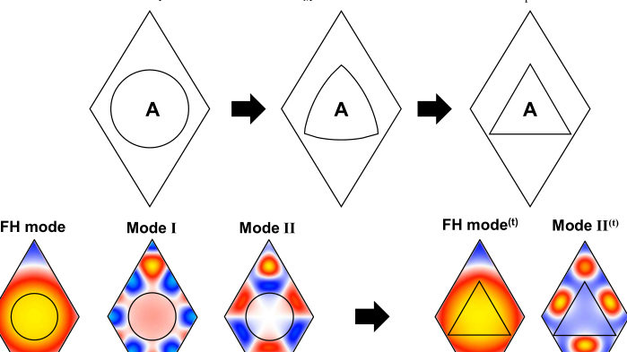 
Fig. 1. (a) 2D TE band structure of the circular-hole hexagonal lattice (n = 2.42, r = 0.27a). The FH mode and two BICs (Mode I and Mode II) are indicated. (b) Continuous deformation of a circular hole into an equilateral triangular hole, with its centroid fixed at the unit-cell center, at constant area A = 𝜋𝑟2. (c) Frequency shift of Mode I and Mode II upon the circular-to-triangular-hole transformation. Solid (dashed) lines indicate the bands for circular (triangular) hole. (d) Spatial distribution (H field perpendicular to the PhC) of the FH mode, Mode I, and mode II in the circular-hole lattice (left), and of FH mode(t) and Mode II(t) in the triangular- hole lattice (right).

📷 Fig 2

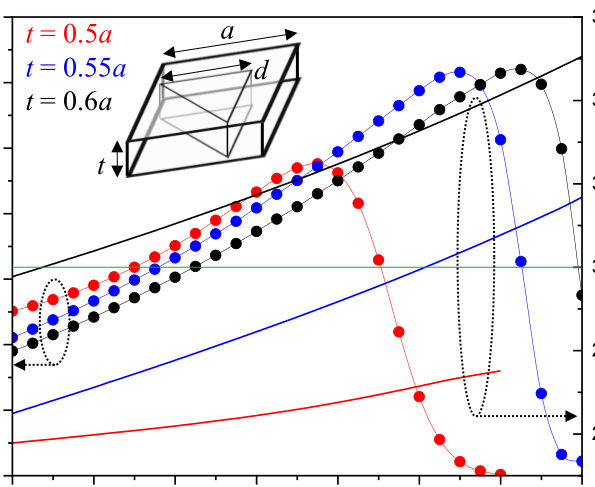 
Fig. 2. Figure of merit Q3|β3|2 (left axis) and the TH-to-FH frequency ratio ω3/ω1 (right axis) as a function of hole size (d/√3)/a for slab thickness t/a = 0.5, 0.55, and 0.6 (Inset: schematic of the unit cell structure with lattice constant a, hole size d, and slab thickness t). The frequency tripling condition ω3/ω1 = 3 is indicated as a green line.

📷 Fig 3

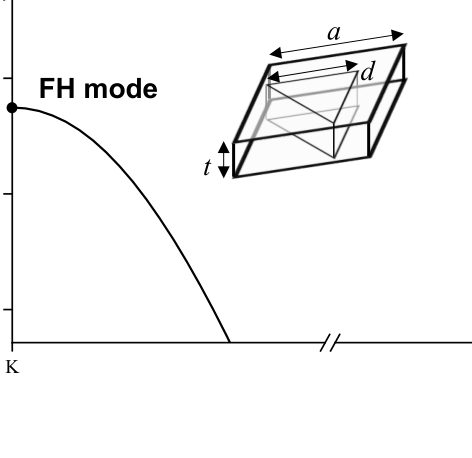 
Fig. 3. Three-dimensional band structure of the triangular-hole diamond PhC slab (d = 0.451√3a, t = 0.55a). The equivalent filling factor for the circular-hole PhC is r = 0.29a.

📷 Fig 4

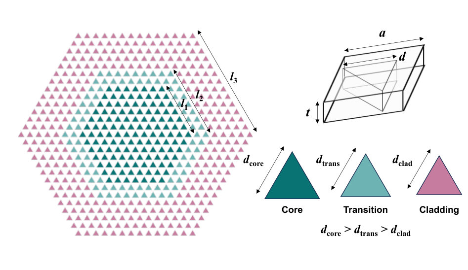 
Fig. 4. Schematic of the PhC heterostructure cavity comprising core, transition and cladding layers. Each layer contains ncore, ntrans, and nclad periods respectively, such that the hexagon side lengths are l1 = ncorea, l2 = (ncore + ntrans)a, and l3 = (ncore + ntrans + nclad)a. The side length of equilateral triangular holes for each layer are dcore, dtrans, and dclad, respectively, where the graded hole size dcore &gt; dtrans &gt; dclad shifts the band maxima of core region into the mode gap of the cladding region.

📷 Fig 5

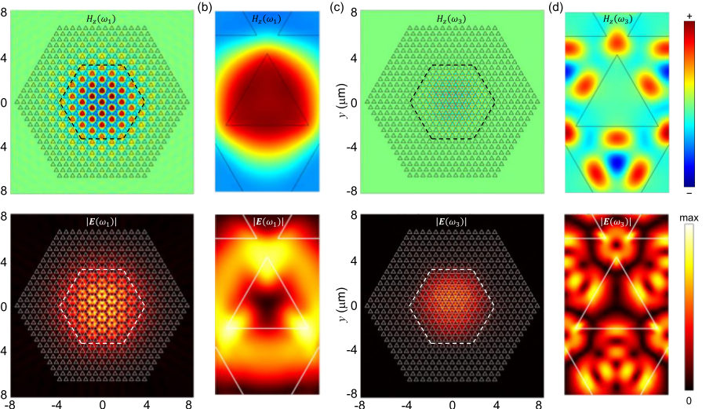 
Fig. 6. 3D-FDTD simulated PhC heterostructure cavity (a = 0.584 µm, t = 0.55a, (dcore, dtrans, dclad) = (0.46√3a, 0.44√3a, 0.4√3a), (ncore, ntrans, nclad) = (6, 2, 5)). Top row: Hz Field distributions; bottom row: |E| field distributions, for the FH mode[(a), (b)] and the TH mode [(c), (d)], shown as full cavity view and zoomed core view, respectively. The core region boundary is indicated by a dashed line.

**Summary.** The paper presents a design for enhancing Third-Harmonic Generation (THG) using a Photonic Crystal cavity embedded in diamond. By engineering the lattice structure to create doubly resonant quasi-bound states at both the fundamental and third harmonic frequencies, they overcome symmetry limitations that typically suppress nonlinear coupling. The resulting device promises highly efficient, monolithic on-chip frequency conversion applicable across multiple wavelengths.

**Why it may be interesting.** This work is highly relevant as it demonstrates advanced photonics engineering—using photonic band structure control (BICs) in a solid-state platform like diamond—to enhance nonlinear optical processes, which is a key area of quantum optics and cavity QED research.

Detailed structure

**Main problem.** The core problem is achieving efficient, monolithic on-chip frequency conversion, specifically Third-Harmonic Generation (THG), within a centrosymmetric material like diamond for quantum and nonlinear photonics.

**Main result.** The authors designed a photonic crystal heterostructure cavity that achieves a high projected THG efficiency ($\sim 0.034 	ext{ W}^{-2}$ at $Q=200,000$), establishing a robust route for on-chip frequency conversion across various wavelengths.

**Method.** The study uses coupled-mode theory and 3D Finite Difference Time Domain (FDTD) simulations to model the THG process in a doubly resonant cavity.

**Model / system.** The system is a diamond Photonic Crystal (PhC) slab with a hexagonal lattice containing triangular air holes. It is engineered as a heterostructure cavity designed to support simultaneous resonance for the Fundamental Harmonic ($\omega$) and the Third Harmonic ($3\omega$).

**Key observables.** Normalized THG efficiency ($\eta$), Quality Factors ($Q_1, Q_3$), and the nonlinear overlap integral ($eta_3$).

**Important parameters / regimes.** The frequency tripling condition ($3\omega \approx \omega_3$) must be met; high quality factors ($Q \sim 200,000$) are crucial for enhancement.

**Assumptions / limitations.** The analysis assumes that breaking the in-plane symmetry by using triangular holes is necessary to activate a non-zero nonlinear coupling ($eta_3$).

**Figures summary.** Figures illustrate band structures (showing FH and TH modes), optimization plots of the Figure of Merit ($Q_3|eta_3|^2$), and 3D field distributions for both fundamental and third harmonic fields in the optimized cavity.

**Paper structure.** The paper progresses by establishing the theoretical framework using coupled-mode theory, detailing the design strategy involving symmetry breaking (circular to triangular holes) to activate nonlinear coupling, optimizing the heterostructure parameters ($n_{core}, n_{trans}, n_{clad}$), and finally presenting high-Q simulation results demonstrating superior THG performance.

Abstract

We propose and numerically demonstrate doubly resonant third-harmonic generation (THG) in a diamond photonic crystal (PhC) slab, in which the fundamental harmonic (FH) and the third harmonic (TH) modes are simultaneously resonant within the same membrane. A hexagonal-lattice slab with triangular air holes is designed so that a K-point band-edge FH mode and a $Γ$-point quasi-bound-state-in-the-continuum (quasi-BIC) TH mode satisfy the frequency-tripling condition $3ω_1\approxω_3$. Modifying the hole shape from circular to equilateral triangular breaks the in-plane symmetry that otherwise forces the nonlinear coupling to vanish, thereby converting a TH mode with negligible overlap into one with finite while simultaneously reducing the required slab thickness. Guided by a closed-form expression for THG efficiency derived from coupled-mode theory, we design the unit cell and a PhC heterostructure cavity. Three-dimensional simulations of the designed cavity yield a normalized THG efficiency $η=2.7\times10^{-7}~\mathrm{W}^{-2}$ under moderate quality factors, which is projected to reach ~$0.034~\mathrm{W}^{-2}$ at the fabrication-limited quality factor (Q = 200,000). Because the operating wavelength is set by the lattice constant, this design, combined with the ultra-wide transparency window of diamond, can map a single geometry across various fabricable wavelengths, spanning from telecommunication bands to color-center-resonant visible and deep-UV outputs. These results establish a robust route toward efficient, monolithic on-chip frequency conversion in an all-diamond platform for quantum and nonlinear photonics.

[↑ back to top](#top)

### [Drosophila of phonon-mediated superconductivity: Full Eliashberg theory of the jellium model](http://arxiv.org/abs/2607.15996v1)

**Authors:** Christophe Berthod, Louk Rademaker, Dirk van der Marel  
**Type:** theory · **Category:** strongly correlated electrons · **PDF:** <https://arxiv.org/pdf/2607.15996v1>  
**Analysis basis:** full PDF text, analyzed in chunks
**Topic relevance:** `Keldysh / 2PI / non-Gaussian methods` **3/5** · `methods for driven-dissipative` **1/5**

📷 Fig 1

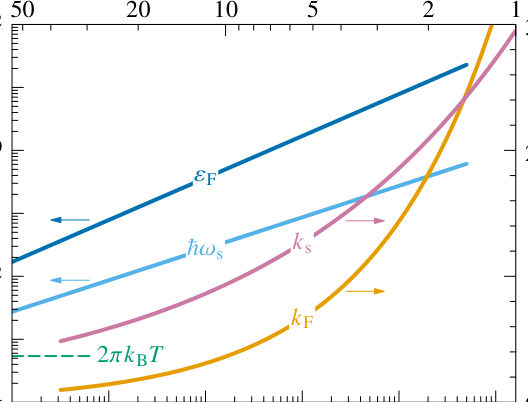 
FIG. 1. Fermi energy 𝜀F, plasma frequency of the charge compensating background 𝜔s (left axis), Fermi

📷 Fig 2

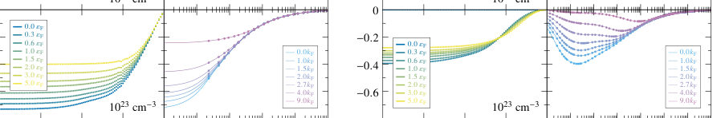 
FIG. 2. (a) Real and (b) imaginary parts of the self-consistent dynamical self-energy Σ11(𝑘, 𝑖𝜔𝑛)−Σ11(𝑘, 𝑖∞),

📷 Fig 3

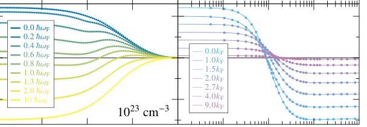 
FIG. 4. Self-consistent anomalous self-energy Σ12(𝑘, 𝑖𝜔𝑛) at 𝑇= 1 mK for the (starting) values of 𝑛e

📷 Fig 4

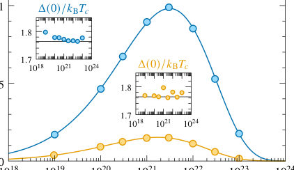 
FIG. 5. (a) Superconducting gap at 1 mK on the Fermi surface for the lowest Matsubara frequency

📷 Fig 5

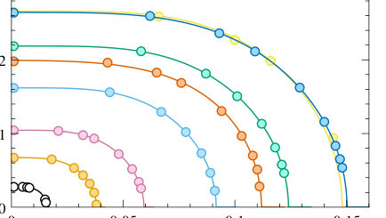 
FIG. 6. Self-consistent gap function on the Fermi surface versus temperature (dots) and fitted temperature

**Summary.** This work provides a rigorous, numerically intensive solution to the Migdal-Eliashberg equations for phonon-mediated superconductivity within the jellium model. The authors demonstrate that accounting for full momentum and frequency dependence drastically lowers predicted critical temperatures ($T_c < 1$ K). This result cautions against overestimating high-$T_c$ superconductivity using simplified models.

**Why it may be interesting.** While focused on BCS-like pairing in a simple metal, the rigorous application of full Eliashberg theory and the discussion of necessary approximations (RPA, momentum/frequency dependence) are highly relevant methodologies for analyzing strongly coupled quantum systems in AMO physics or condensed matter theory.

Detailed structure

**Main problem.** The primary goal is to accurately determine the critical temperature ($T_c$) for phonon-mediated superconductivity in the jellium model, specifically challenging previous overestimations of high-$T_c$. The authors investigate whether the simple jellium model can support room-temperature superconductivity.

**Main result.** The full Eliashberg theory calculation yields very low critical temperatures ($T_c < 1$ K) for the jellium model, contradicting earlier optimistic claims. This suggests that more complex physics beyond the basic jellium framework is required for high-$T_c$.

**Method.** The study employs a full numerical solution of the Migdal-Eliashberg equations in their momentum and frequency-dependent form, requiring advanced techniques to handle singularities near the Fermi surface.

**Model / system.** The system modeled is the jellium background for phonon-mediated superconductivity. The theory relies on solving the self-consistent Eliashberg equations using approximations like Random Phase Approximation (RPA) for screening.

**Key observables.** Critical temperature ($T_c$), anomalous self-energy ($\Sigma_{12}$), quasiparticle residue ($Z$), and the gap function ($\Delta$).

**Important parameters / regimes.** Electron density ($n_e$), Chemical Potential ($\mu$), Fermi wavevector ($k_F$), and phonon frequencies ($\omega_{	ext{ph}}$).

**Assumptions / limitations.** The jellium model is used, which employs the Thomas-Fermi approximation for screening and neglects effects like Friedel oscillations. The full ME equations are solved numerically, requiring approximations for momentum and frequency integration.

**Figures summary.** Figures illustrate characteristic energy scales ($\epsilon_F$, $\omega_s$, $k_F$) vs density; they also show the real part of the normal self-energy ($\Sigma_{11}$) and the temperature dependence of the anomalous self-energy, confirming renormalization effects.

**Paper structure.** The paper progresses by first establishing the theoretical framework (ME equations), then tackling numerical challenges related to momentum/frequency integration, and finally presenting convergence studies leading to a low $T_c$ estimate for the jellium model.

Abstract

We present a full numerical solution of the Migdal--Eliashberg equations for the jellium model of phonon-mediated superconductivity. We find very low critical temperatures below 1~K, in contrast to earlier claims that the jellium model for hydrogen solids might reach room-temperature superconductivity. Our results suggest that full momentum and frequency dependence of the gap function and normal self-energy should be taken into account for accurate $T_c$ estimates.

[↑ back to top](#top)

### [Near-field Dressing of Thermal Emission](http://arxiv.org/abs/2607.15622v1)

**Authors:** Victor Guillemot, Raphael Mol, Riccardo Messina, Valentina Krachmalnicoff, Philippe Ben-Abdallah, Wilfrid Poirier, Yannick De Wilde  
**Type:** both · **Category:** other · **PDF:** <https://arxiv.org/pdf/2607.15622v1>  
**Analysis basis:** full PDF text, analyzed in chunks
**Topic relevance:** `quantum optics experiment` **2/5** · `Keldysh / 2PI / non-Gaussian methods` **1/5** · `analog quantum simulation` **1/5** · `correlated / nonlocal dissipation` **1/5** · `driven-dissipative phase transition` **1/5** · `methods for driven-dissipative` **1/5** · `non-equilibrium dynamics` **1/5**

📷 Fig 1

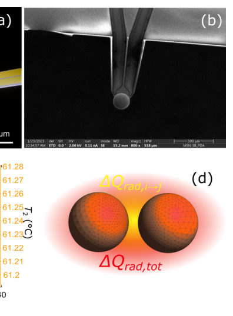 
Fig. 1 Dual-probe platform for resolving individual radiative balances in a coupled thermal dimer. (a) Schematic of the experimental configuration. Two 42.3 µm-diameter borosili- cate microspheres are attached to the apices of opposing scanning thermal microscopy probes and separated by a controllable gap d. Each cantilever integrates a platinum resistive thermometer pro- viding both local temperature readout (T1, T2) and Joule heating through an injected electrical power PJoule. The experiment is performed under high vacuum (P = 10−6 mbar) to suppress heat transfer by conduction and convection through air. Each sphere exchanges thermal radiation both with the neighboring sphere and with...

📷 Fig 2

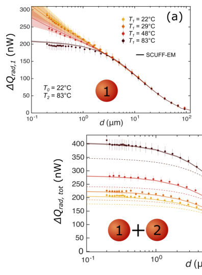 
Fig. 2 Direct observation of asymmetric radiative balances in near-field-coupled thermal emitters (a) Variation of radiative heat flux of the sphere 1, ∆Qrad,1(d), measured for four different temperatures T1 while sphere 2 is maintained at T2 = 83 ◦C and the environment at T0 = 22 ◦C. Experimental data are compared with full-wave fluctuational-electrodynamics calculations performed with SCUFF-EM (solid lines). In the far field, the radiative flux of sphere 1 depends weakly on T1, whereas at short separations it becomes strongly temperature dependent due to the onset of near- field coupling between the two spheres. (b) Variation of the radiative heat flux of the sphere 2, ∆Qrad,2(d). In...

📷 Fig 3

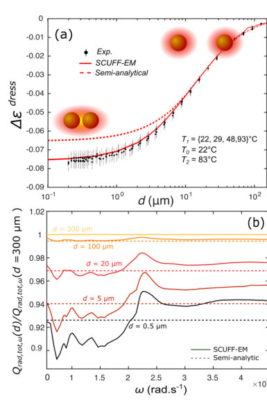 
Fig. 3 Renormalization of far-field emission by near-field coupling. (a) Distance-dependent dressed emissivity of the coupled two-sphere system, defined from the total radiative exchange with the environment. Experimental measurements (for all values of T1) are represented with dots, cal- culations performed with SCUFF-EM are represented as solid lines and the semi-analytical model described in the Online Methods is represented as dashed lines. As the spheres approach each other in the far-field, the dressed emissivity decreases, as predicted by the semi-analytical model. At short distance, deviations from the geometrical model indicate that near-field coupling modifies the far-field...

📷 Fig 4

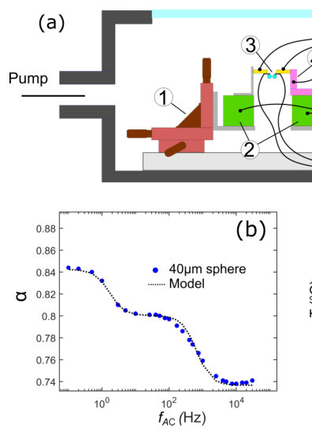 
Fig. 4 Description of the experimental setup. (a) Schematic of the vacuum chamber. The position of each probe is controlled by a manual micrometric stage combined with a fine piezoelectric stage. (b) Frequency dependence of the bridge response. Two thermal cutoff frequencies are observed. The highest frequency is related to the diffusivity of the cantilever alone, while the lowest comes from the adding of the microsphere. The system is operated above the highest cutoff frequency to avoid temperature oscillations during the measurements. (c)Calibration curves of the two probes used in our experiment. The probes are placed in an oven while monitoring their electrical resistance. The...

📷 Fig 5

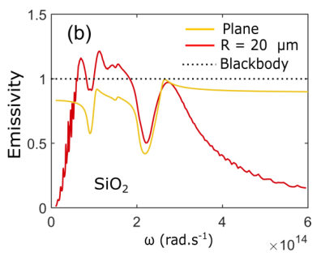 
Fig. 5 Dielectric constant and emissivity of the glass microsphere (a) Real and imaginary part of the dielectric function of silica as a function of the frequency. (b) Emissivity of a R = 20 µm silica spheres calculated in the framework of fluctuational electrodynamics according to [34].

**Summary.** This paper experimentally and theoretically proves that near-field electromagnetic coupling between objects alters their far-field thermal emission. By measuring the radiative balance of two microspheres across varying separations, the authors quantify a 'dressed emissivity.' This finding establishes a measurable thermal analogue to the Purcell effect, showing that the surrounding photonic environment dictates the emitted radiation spectrum.

**Why it may be interesting.** This work provides a direct, measurable thermal analogue of the Purcell effect, demonstrating how coupling to an electromagnetic environment modifies fundamental radiation properties (emissivity) in nanoscale systems, which is highly relevant to quantum optics and open system dynamics.

Detailed structure

**Main problem.** The study investigates whether near-field electromagnetic coupling between two bodies modifies their far-field thermal radiation, moving beyond simply quantifying the enhanced energy exchange between neighbors.

**Main result.** The authors experimentally and theoretically demonstrate that near-field interactions renormalize the far-field thermal emission by inducing a distance-dependent 'dressed emissivity,' establishing a thermal analogue of the Purcell effect.

**Method.** The work combines high-precision differential calorimetry experiments with advanced theoretical modeling using fluctuational electrodynamics (e.g., SCUFF-EM solvers).

**Model / system.** The system consists of two borosilicate microspheres placed in a vacuum chamber, allowing for controlled separation distances spanning from the far field ($\gg \lambda$) down to the near field ($d \sim 100$ nm).

**Key observables.** Asymmetric heat fluxes, non-monotonic temperature responses, and the extracted distance-dependent dressed emissivity ($\Delta\epsilon_{	ext{dress}}(d)$).

**Important parameters / regimes.** Separation distance ($d$), which is varied from $120 \mu	ext{m}$ down to hundreds of nanometers; the thermal wavelength ($\lambda_{Wien}$).

**Assumptions / limitations.** The analysis relies on decomposing total radiative power into sphere-bath, sphere-sphere, and external bath components. Semi-analytical models are limited when $d$ approaches $\lambda_{Wien}$.

**Figures summary.** Figures illustrate the setup (dual-probe platform), temperature variations showing asymmetry vs. separation, and comparisons between full-wave simulations (SCUFF-EM) and semi-analytical predictions for heat flux and dressed emissivity.

**Paper structure.** The paper establishes the physical problem by noting the gap in understanding near-field effects on emitted radiation. It details the experimental platform and measurement techniques to quantify radiative balance, develops theoretical frameworks using fluctuational electrodynamics, and presents results showing spectral renormalization via the dressed emissivity.

Abstract

Radiative heat transfer at subwavelength distances is generally understood as enhanced energy exchange mediated by photon tunnelling between neighboring bodies. While near-field interactions can dramatically increase mutual heat transfer, whether they also modify the thermal radiation emitted by the bodies themselves remains an open question. Here we experimentally show that near-field electromagnetic coupling reshapes far-field thermal emission through a distance-dependent dressed emissivity. Using a dual-probe calorimetric platform, we independently monitor the radiative balance of two borosilicate microspheres over separations ranging from 120 micrometers to a few hundred nanometers, spanning the transition from the far field to the near field. Nanowatt-resolved differential radiometry reveals asymmetric heat fluxes and a non-monotonic response of the hotter sphere, demonstrating that thermal radiation is governed not only by emitter-bath interactions but also by coupling to the surrounding photonic environment. By analyzing the total power exchanged between the coupled system and the external thermal bath, we directly extract a dressed emissivity and show that near-field interactions renormalize the far-field thermal emission of the pair through a redistribution of the electromagnetic modes available to thermal fluctuations. These observations provide direct experimental evidence that thermal emitters are dressed by their electromagnetic environment, establishing a thermal analogue of the Purcell effect.

[↑ back to top](#top)

### [Reversible and irreversible dynamical topological transitions of magnetic Hopfions](http://arxiv.org/abs/2607.15777v1)

**Authors:** S. Y. Lu, H. M. Dong, D. X. Yu, K. Chang  
**Type:** theory · **Category:** other · **PDF:** <https://arxiv.org/pdf/2607.15777v1>  
**Analysis basis:** full PDF text, analyzed in chunks
**Topic relevance:** `driven-dissipative phase transition` **2/5** · `analog quantum simulation` **1/5** · `exotic spin models in light-matter` **1/5** · `non-equilibrium dynamics` **1/5** · `non-equilibrium universality` **1/5** · `spintronics-quantum-optics interface` **1/5**

📷 Fig 1

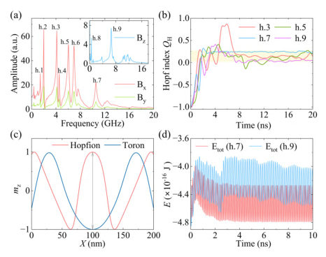 
FIG. 2. (a) Fourier spectrum of the Hopfion response to a weak sinc magnetic-field pulse, revealing intrinsic resonance modes. (b) Time evolution of the Hopf invariant QH under weak sinusoidal AM fields at selected resonance frequencies with B0 = 50 mT. Resonant driving produces an irreversible Hopfion-to-toron transition. (c) Line profiles of mz along the central line of the Hopfion and toron states. The toron state is distinguished by central magnetization reversal. (d) Total energy evolution during the irreversible transition.

📷 Fig 2

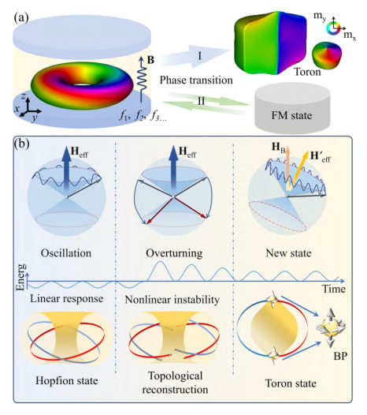 
FIG. 1. (a) Schematic of the cylindrical multilayer nanos- tructure used to confine a magnetic Hopfion, together with the two dynamical regimes studied in this work. In regime I, weak resonant driving induces an irreversible Hopfion-to- toron transition. In regime II, strong AM driving produces reversible switching between a topologically trivial FM state and a Hopfion state. (b) Schematic of the transition mecha- nism I and the energy landscape for the irreversible Hopfion- to-toron reconfiguration, as well as the evolution of energy. Resonant nonlinear excitation drives the system over an ef- fective topological barrier, accompanied by local magnetiza- tion overturning and the formation...

📷 Fig 3

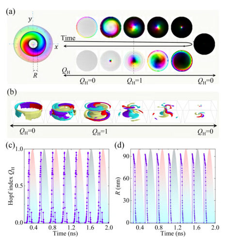 
FIG. 3. (a) Temporal evolution of the magnetization tex- ture during breathing-mediated reversible switching under a strong AM field with B0 = 11 T and f = 2 GHz. (b) Evo- lution of representative preimage links, showing the periodic emergence and disappearance of Hopfion topology. (c) Time evolution of the Hopf invariant QH synchronized with the ap- plied AM field. (d) Evolution of the characteristic radius R of the central topological structure, demonstrating breathing- type contraction and expansion.

📷 Fig 4

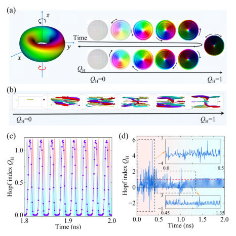 
FIG. 4. (a) Temporal evolution of the magnetization texture during nonresonant rotational topological switching under a strong AM field with B0 = 10 T and f = 40 GHz. The frequency is above the intrinsic Hopfion-mode spectrum ob- tained in the weak-field regime, indicating that the rotational pathway is driven by strong Zeeman torque and field locking rather than by linear eigenmode resonance. (b) Evolution of representative preimage links during the first half-cycle. (c) Hopf invariant QH as a function of time, showing reversible switching synchronized with the applied field. (d) Detailed time evolution of QH, showing an initial transient regime, a metastable locking regime, and a final...

**Summary.** This paper explores the complex dynamics of magnetic Hopfions under alternating magnetic fields, revealing that the field regime dictates the outcome. Weak fields cause irreversible topological decay, whereas strong fields enable coherent, reversible switching between different topological states. The frequency of the applied field acts as a switch, selecting distinct physical pathways for this controlled topological manipulation.

**Why it may be interesting.** This work demonstrates controlled topological switching using external fields, providing a platform analogous to controlling quantum states or phase transitions in engineered magnetic systems, which has implications for spintronics and nonlinear dynamics modeling.

Detailed structure

**Main problem.** The study investigates how magnetic Hopfions, which are 3D topological solitons, undergo dynamical transitions when subjected to alternating magnetic (AM) fields.

**Main result.** The system exhibits two distinct regimes: an irreversible transition from Hopfion to toron in weak fields, and a reversible, frequency-dependent switching between ferromagnetic and Hopfion states in strong fields.

**Method.** The research employs 3D micromagnetic simulations combined with analytical mode analysis to track the evolution of topological invariants under time-varying magnetic fields.

**Model / system.** The system models magnetization dynamics within a confined nanostructure containing chiral magnetic layers, governed by the Landau–Lifshitz–Gilbert equation incorporating exchange, DMI, anisotropy, and dipolar interactions.

**Key observables.** Hopf invariant (QH), magnetization texture evolution, total energy, and intrinsic mode amplitudes.

**Important parameters / regimes.** Field amplitude ($B_0$) and driving frequency ($f$), which act as independent control knobs determining the switching pathway.

**Assumptions / limitations.** The dynamics are analyzed by solving micromagnetic equations; the distinction between weak-field (resonant) and strong-field (nonresonant/field-locked) responses is key.

**Figures summary.** Figures illustrate schematic comparisons of irreversible vs. reversible transitions, time evolution of QH under resonant driving showing breakdown, and detailed temporal traces of magnetization and $Q_H$ for both 2 GHz (breathing) and 40 GHz (rotational) switching pathways.

**Paper structure.** The paper systematically contrasts the outcomes of weak-field excitation (leading to instability/irreversibility) against strong-field excitation, demonstrating how frequency selects between low-frequency collective motion paths and high-frequency field-locked limit cycles for reversible control.

Abstract

Magnetic Hopfions are three-dimensional (3D) topological solitons characterized by a nonzero Hopf invariant and offer a promising platform for 3D spintronics. While their static stabilization has been widely studied, their nonlinear dynamics under alternating magnetic (AM) fields remain largely unexplored. We show, using 3D micromagnetic simulations and analytical mode analysis, that an AM field drives two qualitatively distinct dynamical regimes of a confined magnetic Hopfion. In the weak-field regime, resonant excitation of intrinsic Hopfion modes induces a nonlinear instability and an irreversible topological reconfiguration from a Hopfion to a toron. In contrast, in the strong-field regime, the system undergoes reversible field-locked topological switching at GHz frequencies, with the magnetization periodically alternating between a topologically trivial ferromagnetic configuration and a Hopfion state. The switching pathway is selected by the driving frequency: a 2 GHz field drives a breathing pathway associated with the low-frequency collective response, whereas a 40 GHz field produces a nonresonant rotational pathway governed by strong Zeeman-torque-driven precession and field locking. These results identify field amplitude and frequency as independent control knobs and reveal that reversible Hopfion switching can arise either from nonlinear continuation of low-frequency collective motion or from nonresonant high-frequency field locking.

[↑ back to top](#top)

### [Contactless terahertz mapping of wafer-scale superconducting NbTiN thin films](http://arxiv.org/abs/2607.15757v1)

**Authors:** Yayi Lin, Marc Neis, Marcello Pio Guardascione, Janine Lorenz, Thomas J. Smart, F. Stefan Tautz, Felix Lüpke, Frederik Bolle, Martin Dressel, Rami Barends, Pavel A. Bushev, Marc Scheffler  
**Type:** experiment · **Category:** other · **PDF:** <https://arxiv.org/pdf/2607.15757v1>  
**Analysis basis:** full PDF text, analyzed in chunks
**Topic relevance:** `quantum optics experiment` **2/5** · `QC/QI experiment` **1/5** · `quantum measurements` **1/5**

📷 Fig 1

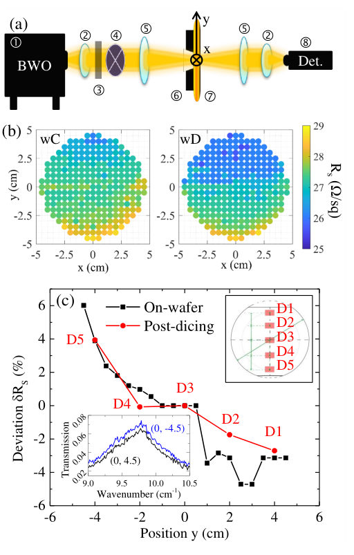 
Fig. 1. Overview of room-temperature mapping in THz-FDS. (a) THz-FDS setup. ①Backward wave oscillator (BWO), a continuous-wave THz source in the frequency range 8–13 cm-1, ②Teflon THz lenses to collimate output THz beam, ③Attenuator to avoid detector saturation, ④chopper to modulate THz beam, ⑤lenses to focus THz beam on the sample, ⑥sample holder with 6-mm diameter aperture, ⑦the measured wafer with NbTiN thin film, and ⑧Golay cell as THz detector. (b) Rs maps of two 4-inch wafers, wC (left) and wD (right). (c) Rs deviation for positions along y-axis with respect to the center D3 of wafer wD. The black data are from the on-wafer measurements shown in (b), while the red data are measured...

📷 Fig 2

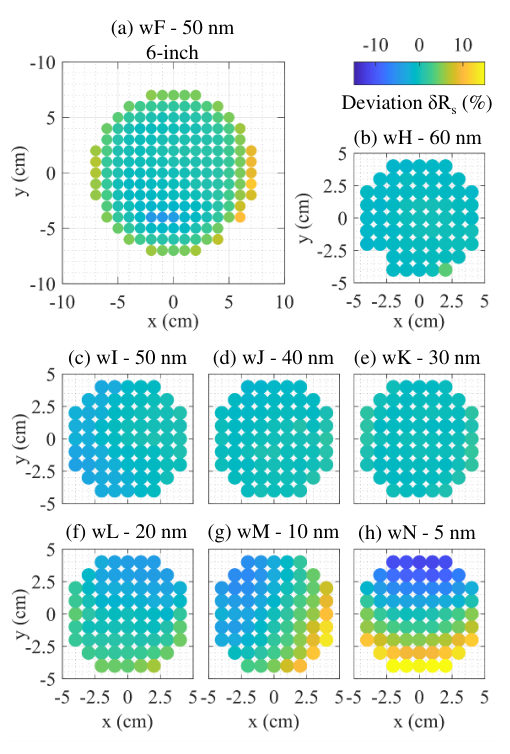 
Fig. 2. Percentage Rs deviation wafer-scale maps of (a) one 6-inch wafer wF and (b–h) seven 4-inch wafers wH–wN with different NbTiN film thicknesses between 60 nm to 5 nm. The deviations of Rs are indicated with respect to the center of each wafer.

📷 Fig 3

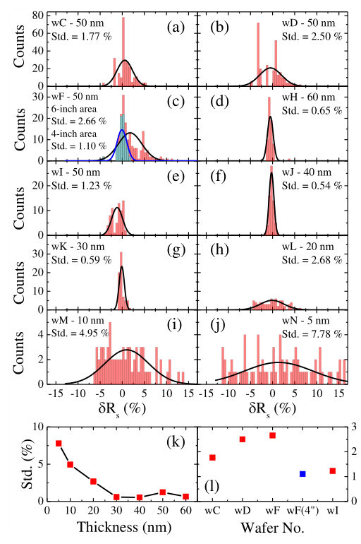 
Fig. 3. (a–j) The δRs histograms of the wafers shown in Table I. The solid lines are Gaussian fits and the fit width represents the standard deviation (Std.) of δRs. In (c), the red histogram and black line indicate the δRs across the full 6-inch wafer wF, while the cyan histogram and blue line concern the smaller, center 4-inch area of the same wafer wF. (k, l) is the Std. obtained from the Gaussian fit. (k) is the standard deviation (Std.) as a function of film thickness, relating to (d–j). (l) is Std. for different wafers with 50-nm thin films, where the blue dot is related to the cyan and blue data in (c) and the red dots are for Std. across the full wafers.

📷 Fig 4

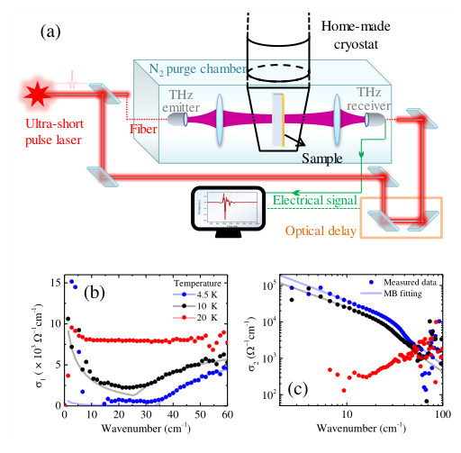 
Fig. 4. Overview of THz-TDS measurements. (a) THz-TDS setup with home-made cryostat. (b) Frequency-dependent complex optical conductivity of sample D3 for temperature below and above the superconducting transition (T c ≈13.8 K). Data points are from measurements, and lines are the fits by Mattis-Bardeen (MB) theory.

📷 Fig 5

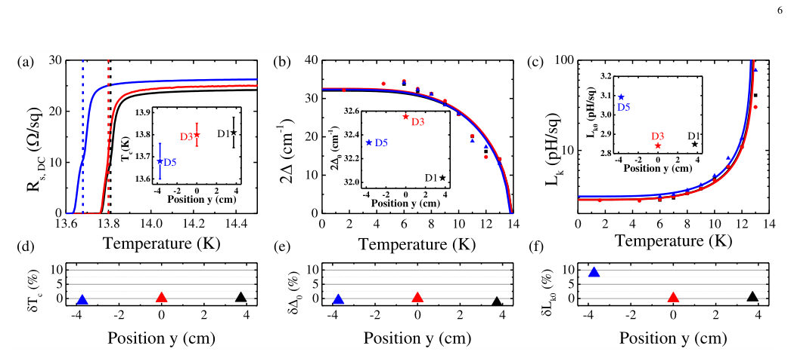 
Fig. 5. Comparison of superconducting properties between samples D1 (black), D3 (red) and D5 (blue). (a) DC transport measurements of Rs, DC near the critical temperature T c. The inset shows T c and the respective transition width as a function of position on wafer wD. (b, c) The temperature dependence of superconducting energy gap 2∆and sheet kinetic inductance Lk respectively. Dots represent experimental data and the solid lines are fitting curves. The insets show the spatial distributions of 2∆0 and Lk0 on wafer wD. (d–f) Position-dependent deviations of T c, 2∆0 and Lk0, respectively, with respect to sample D3.

**Summary.** This paper demonstrates a powerful, contactless technique using Terahertz spectroscopy to map the homogeneity of superconducting $	ext{NbTiN}$ thin films across entire wafers. By correlating spatial variations in normal-state resistance ($R_s$) with changes in the superconducting kinetic inductance ($L_k$), the authors provide a crucial pre-fabrication quality control method for quantum computing components.

**Why it may be interesting.** While focused on materials characterization rather than fundamental AMO physics, the use of non-contact THz spectroscopy to probe collective quantum phenomena (superconducting condensate) at wafer scale is highly relevant for developing superconducting quantum hardware.

Detailed structure

**Main problem.** The primary goal is to ensure the homogeneity of superconducting thin films across entire wafers for reliable use in large-scale quantum devices.

**Main result.** THz mapping proves that local variations in normal-state resistance ($R_s$) correlate with deviations in the zero-temperature kinetic inductance ($L_{k0}$), enabling pre-lithography quality control.

**Method.** The study employs contactless Terahertz (THz) spectroscopy, combining room-temperature frequency-domain mapping for $R_s$ and cryogenic time-domain measurements to probe superconducting gaps and kinetic inductance.

**Model / system.** The system involves Niobium Titanium Nitride ($	ext{NbTiN}$) thin films on silicon wafers. Analysis relies on the Drude model for normal state resistance and Mattis-Bardeen theory for extracting the superconducting energy gap ($2\Delta$).

**Key observables.** Sheet resistance ($R_s$), critical temperature ($T_c$), superconducting energy gap ($2\Delta$), and sheet kinetic inductance ($L_k$).

**Important parameters / regimes.** Wafer sizes (4-inch, 6-inch), THz frequency range ($\sim 0.1 - 3 	ext{ THz}$), and temperature regimes (room to cryogenic).

**Assumptions / limitations.** The extraction of $R_s$ from raw spectra assumes the scattering rate is much larger than in the THz regime; fitting superconducting properties uses established BCS/Mattis-Bardeen models.

**Figures summary.** Figures show room-temperature maps of sheet resistance deviations ($\delta R_s$) and cryogenic measurements comparing spatial distributions of $2\Delta$ and $L_{k0}$ across different wafer locations.

**Paper structure.** The work progresses from establishing the need for homogeneity in quantum technology, detailing the THz mapping methodology (room vs. cryo), presenting results showing correlations between normal-state and superconducting property variations, and concluding on the technique's feasibility as a pre-screening tool.

Abstract

For large-scale superconducting quantum technology, e.g. quantum computing, the homogeneity of wafer-scale superconducting thin films is vital for consistent performance of the fabricated devices. Terahertz (THz) spectroscopy as a contactless and non-destructive measurement technique is a powerful tool to characterize the superconducting films. In this work, a set of niobium titanium nitride (NbTiN) thin films on 4-inch and 6-inch silicon wafers, grown via plasma-enhanced magnetron sputtering, are investigated via THz spectroscopy: full wafers are mapped at room temperatures and exemplary segments are characterized at cryogenic temperatures. The deviations in observed sheet resistance depend on the used deposition device and the film thickness. While the deviations in superconducting sheet kinetic inductance match those of the normal-state sheet resistance, the critical temperature and energy gap exhibit little variation. This THz mapping technique demonstrates the feasibility of evaluating wafer-scale superconducting thin films before lithography, facilitating preparation of the thin films for reproducible device fabrication.

[↑ back to top](#top)

### [Qubit encodings in the p-orbital-valley spectrum for enhanced coherence and tunable two-qubit interaction](http://arxiv.org/abs/2607.15993v1)

**Authors:** John H. Caporaletti, J. P. Kestner  
**Type:** theory · **Category:** quantum information and computing · **PDF:** <https://arxiv.org/pdf/2607.15993v1>  
**Analysis basis:** full PDF text, analyzed in chunks
**Topic relevance:** `Keldysh / 2PI / non-Gaussian methods` **1/5** · `analog quantum simulation` **1/5** · `correlated / nonlocal dissipation` **1/5** · `driven-dissipative phase transition` **1/5** · `methods for driven-dissipative` **1/5** · `spintronics-quantum-optics interface` **1/5**

📷 Fig 1

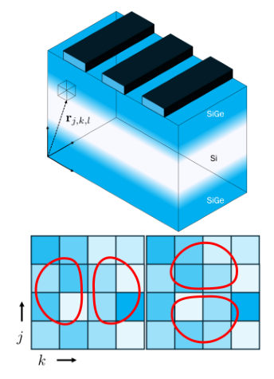 
FIG. 1. Top: cartoon depiction of SiGe/Si/SiGe heterostruc- ture where color indicates the concentration of Ge atoms. Bottom: top-down view of a lateral cut through layer l with cell discretization. Due to alloy disorder, different p orbitals have different valley splittings.

📷 Fig 2

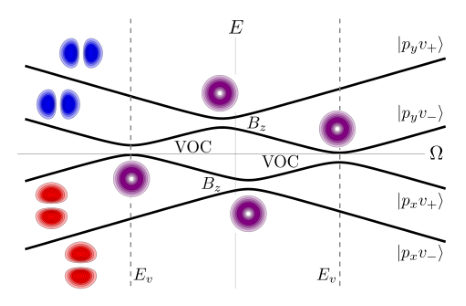 
FIG. 2. Schematic of the low-lying spectrum as a function of dot anisotropy for a fixed orientation, displaying four avoided crossings that function as sweet spots against charge noise. The 2D charge distributions of the eigenstates are shown in red and blue on the left side, while the valley-orbit labels are shown on the right side. The charge distributions of any eigenstate at a sweet spot are shown in purple, with the level coupling source labeled.

📷 Fig 3

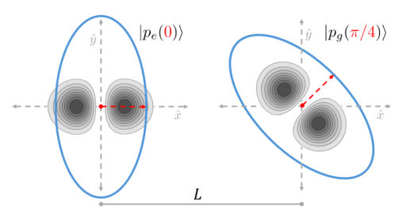 
FIG. 3. Adjacent quantum dots where the excited (ground) p-orbital charge distribution is depicted in the left (right) dot. The orientation of each dots semi-minor axis is shown via the red dashed arrow.

📷 Fig 4

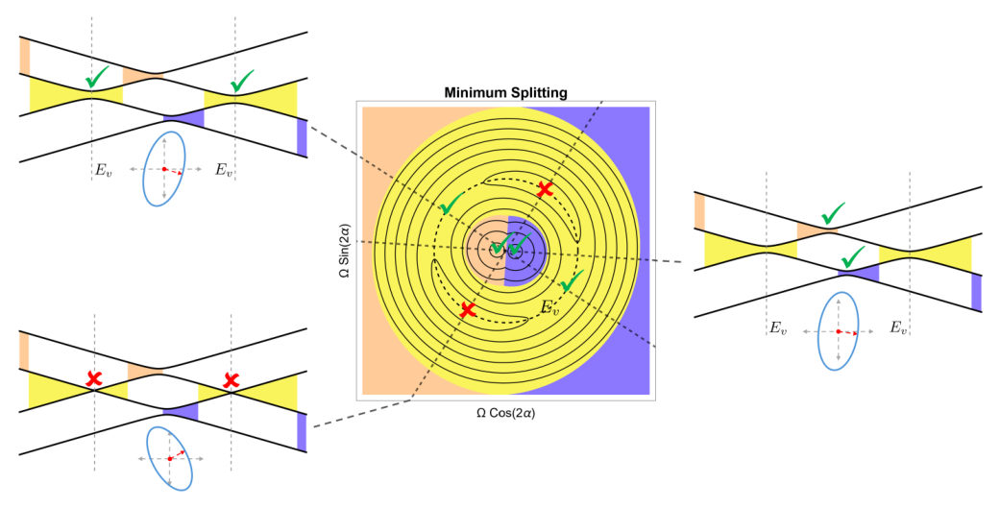 
FIG. 4. The center panel is a polar contour plot of the minimum of the 3 level splittings between the 4 eigenenergies of Eq. (7) vs. dot anisotropy and orientation. The background color denotes which pair gives the minimal splitting, corresponding to the colors in the line cuts of the spectrum shown in the side panels. The line cuts are taken along fixed dot orientations marked by dashed lines in the center panel. Sweet spots are marked with green check marks and level crossings are marked with red crosses. Vertical dashed lines in the spectrum cuts and the circular dashed line in the contour plot mark where Ω= Ev. The dot orientations corresponding to the line cuts are shown beneath each...

📷 Fig 5

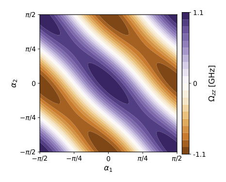 
FIG. 5. Quadrupole-quadrupole interaction strength as a function of each dots orientation using the parameters in Ta- ble I. The white stripes correspond to zero interaction.

**Summary.** The paper introduces the pOv qubit, an encoding scheme leveraging valley-orbit coupling in semiconductor quantum dots. It demonstrates that this system offers enhanced coherence by operating at noise-immune 'sweet spots' and provides a novel pathway for implementing tunable two-qubit gates using the quadrupole-quadrupole interaction.

**Why it may be interesting.** This work directly addresses key challenges in solid-state quantum computing: achieving long coherence times ($T_2^*$) through engineered Hamiltonian symmetries (sweet spots) and enabling scalable, controllable interactions between qubits via electric field tuning.

Detailed structure

**Main problem.** The goal is to develop a robust qubit encoding in semiconductor quantum dots that maintains fast electrical control while suppressing decoherence from charge noise.

**Main result.** A novel pOv qubit utilizing valley-orbit coupling (VOC) was proposed, which exhibits tunable two-qubit gates mediated by the quadrupole-quadrupole interaction. This system achieves coherence times up to $10 \mu	ext{s}$ at specific 'sweet spots'.

**Method.** The analysis involves deriving effective Hamiltonians for the pOv qubit and calculating noise susceptibility using a phenomenological Two-Level Fluctuator (TLF) dipole noise model.

**Model / system.** The system is based on electrons confined in SiGe/Si/SiGe quantum dots, utilizing the coupling between orbital ($	ext{p}_O$) and valley degrees of freedom. The Hamiltonian incorporates Valley-Orbit Coupling (VOC), leading to the pOv qubit subspace.

**Key observables.** Dephasing time ($T_2^*$), two-qubit gate interaction strength (tunable from zero to $\sim 1 	ext{ GHz}$), and noise insensitivity at sweet spots.

**Important parameters / regimes.** Valley splitting energy ($E_v/h \sim 1-10 	ext{ GHz}$); Noise strength ($\delta/E_v \sim 10^{-3}-10^{-4}$).

**Assumptions / limitations.** The analysis treats VOC as a perturbation and uses the quadrupole-quadrupole Coulomb interaction for two-qubit gates, neglecting kinetic exchange in some calculations.

**Figures summary.** Figures illustrate the SiGe/Si/SiGe heterostructure, how alloy disorder causes valley splittings, and schematic representations of avoided crossings (sweet spots) as a function of dot anisotropy.

**Paper structure.** The paper progresses from defining the pO qubit to proposing the more complex pOv qubit via VOC. It then analyzes coherence improvement at sweet spots using noise models and finally details the electrically tunable two-qubit gate mechanism.

Abstract

We propose encoding a qubit in a two-level subspace spanned by the lowest $p$-orbital state in the excited valley of an anisotropic quantum dot and the excited $p$-orbital in the ground valley, which we dub the $pOv$ qubit. There is an avoided crossing between these states due to valley-orbit coupling (VOC) induced by alloy disorder, enabling complete single-qubit control using baseband electrical control of the dot anisotropy. We find that `sweet spots' exist at specific dot orientations where the instantaneous eigenstates are first-order insensitive to charge noise. Using a phenomenological two-level fluctuator (TLF) dipole noise model, we estimate an average dephasing time of $T_2^*\approx 10\,μ\text{s}$ and a quality factor of $Q\sim 10^4$. Alternatively, encoding in the $p$-orbital states in the ground valley near the isotropic dot point, we show that one can induce a similar sweet spot via an out-of-plane magnetic field. Finally, we find that two-qubit gates for the $pOv$ qubit are mediated by the quadrupole-quadrupole Coulomb interaction and can be electrically tuned from zero to $\sim 1~\text{GHz}$ by adjusting the relative orientation of the anisotropic dots, providing a novel pathway towards scalable quantum computation.

[↑ back to top](#top)

### [Excitonic structure in CsPbBr$_3$ nanocubes, nanorods and nanoplatelets: the effect of dimensionality](http://arxiv.org/abs/2607.16142v1)

**Authors:** Jose L. Movilla, Josep Planelles, Juan I. Climente  
**Type:** theory · **Category:** other · **PDF:** <https://arxiv.org/pdf/2607.16142v1>  
**Analysis basis:** full PDF text, analyzed in chunks
**Topic relevance:** `Keldysh / 2PI / non-Gaussian methods` **1/5** · `superradiant laser` **1/5**

📷 Fig 1

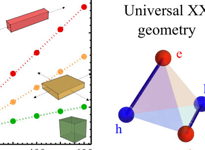 
Figure 1: TOC graphic

📷 Fig 2

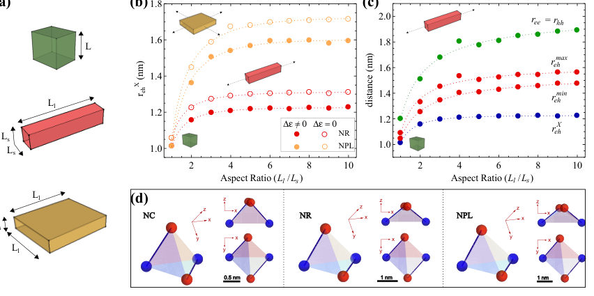 
Figure 2: Influence of shape on the spatial charge distribution of X and XX. (a) Schematic of the nanocrystal shapes under consideration. (b) Effect of anisotropy on the mean electron- hole distance of X in nanocrystals with Ls = 3 nm.. The weakly confined direction is influential unless the aspect ratio is large. The number of confined dimensions imposes significant differences in rX eh. The presence (solid dots, ∆ε ̸= 0) or absence (empty dots, ∆ε = 0) of dielectric mismatch plays a secondary role. (c) Same but including XX carrier- carrier distances, in NRs. Electron-hole distances are enlarged as compared to X. (d) XX geometry as inferred from the distances. A distorted tetrahedron is...

📷 Fig 3

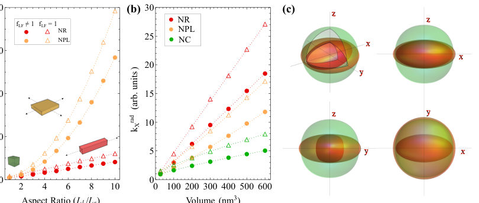 
Figure 3: Influence of shape on the X recombination rate. (a) Effect of anisotropy, staring from a NC with L = 3 nm. The aspect ratio has a greater influence on NPLs because of the larger volume. The local field factor is a relevant, yet secondary contribution. (b) Radiative rate for nanocrystals of different shape but equal volume. NRs give the fastest recombination, because of the smaller electron-hole distance. (c) Surfaces containing 90% of excitonic electron probability when the hole is at the center of the nanocrystal. Red, orange and green represent NR, NPL and NC. In all cases, Ls = 3 nm and V = 500 nm3. The smaller the dimensionality, the smaller the volume of charge distribution,...

📷 Fig 4

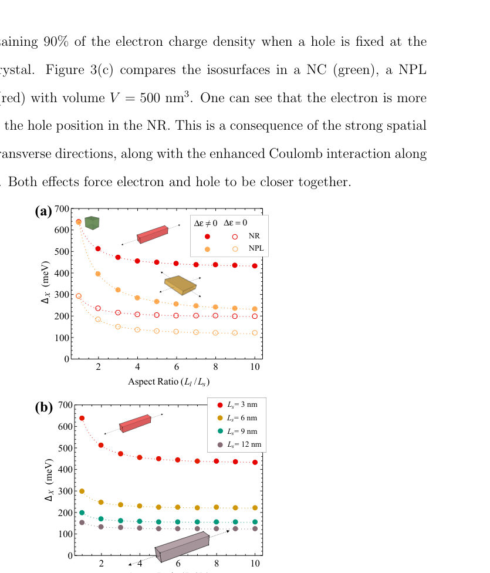 
Figure 4: Influence of shape and size on the exciton binding energy, ∆X. In general, the strong confinement directions play a leading role. (a) Effect of anisotropy on different shapes (NCs, NPLs and NRs) whose shortest edge is Ls = 3 nm. Solid (empty) dots: dielectric mismatch is (not) taken into account. The weakly confined direction is influential unless aspect ratio is large. The number of confined directions imposes substantial differences in ∆X. (b) Effect of anisotropy on NRs with different size of the cross-section. The impact of longitudinal confinement becomes weaker with increasing cross-section.

📷 Fig 5

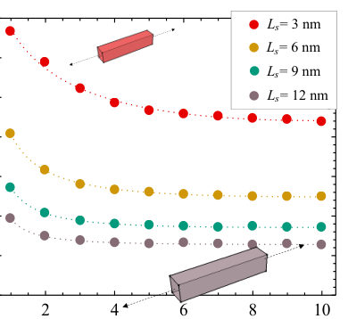 
Figure 5: Same as Fig. 4, but for biexciton binding energy, ∆XX. The effect of shape and size is the same as for ∆X, despite the latter being mostly a charge-charge interaction and the former a dipole-dipole one.

**Summary.** This theoretical study investigates how the dimensionality of CsPbBr3 nanocrystals affects their excitonic structure and light emission. Using a variational effective mass model, the authors find that confinement leads to superradiance, speeding up recombination rates from cubes to rods. The results highlight the crucial role of dielectric confinement and confirm that biexcitons adopt a stable, distorted tetrahedral geometry regardless of crystal shape.

**Why it may be interesting.** This work is highly relevant as it models complex many-body interactions (electron-hole correlation, polarons) in strongly confined semiconductor nanostructures, providing quantitative predictions for optical response based on geometric control.

Detailed structure

**Main problem.** To systematically compare the excitonic structure (binding energy and radiative recombination rate) of CsPbBr3 nanocrystals with different dimensionalities: nanorods, nanoplatelets, and nanocubes.

**Main result.** The study shows that superradiance enhances radiative rates from cubes to platelets to rods, and the biexciton geometry is consistently a distorted tetrahedron across all dimensions. Dielectric confinement plays a major role in determining binding energies.

**Method.** A general variational effective mass model incorporating quantum confinement, dielectric confinement, electron-hole correlations, and polaronic effects (Haken model) was employed.

**Model / system.** The physical system is CsPbBr3 metal halide perovskite nanocrystals in three dimensions: 1D nanorods, 2D nanoplatelets, and 3D nanocubes. The theory uses a variational effective mass approach to calculate exciton (X) and biexciton (XX) ground state properties.

**Key observables.** Exciton binding energy ($\Delta X$), radiative recombination rate ($k_{rad}^X$), biexciton geometry, electron-hole distances ($r_{eh}$), and carrier-carrier distances ($r_{ee}, r_{hh}$).

**Important parameters / regimes.** Dimensionality (1D, 2D, 3D); confinement strength; dielectric mismatch ($\Delta\epsilon$); aspect ratios.

**Assumptions / limitations.** The standard Bohr radius formulas are insufficient due to complex confinement effects. The analysis for $\Delta XX$ assumes the same dielectric constants for X and XX, potentially underestimating the true value.

**Figures summary.** Figures compare schematics of NCs, NRs, and NPLs; show the effect of anisotropy on electron-hole distance; illustrate the increased e-h distances upon XX formation; and confirm the distorted tetrahedron geometry for XX charge distribution across all shapes.

**Paper structure.** The paper systematically compares excitonic properties by first establishing the theoretical framework (variational effective mass model) to calculate key observables like binding energies and radiative rates. It then analyzes how dimensionality dictates these properties, concluding with specific findings on superradiance enhancement and biexciton geometry.

Abstract

We present a theoretical study comparing the excitonic ground state properties of CsPbBr$_3$ nanocrystals with different dimensionality: nanorods (1D), nanoplatelets (2D) and nanocubes (3D). All three systems are described on equal footing, by means of a general variational effective mass model, which captures the influence of quantum confinement, dielectric confinement, electron-hole correlations and polaronic effects (within a Haken model). The strongly confined directions squeeze the exciton (X) wavefunction and enhance Coulomb attractions along the weakly confined directions. This stimulates superradiance, thus making radiative recombination rates speed up from cubes to platelets and to rods, in line with recent experiments. The anisotropic local field factor is a secondary, yet non-negligible, mechanism further enhancing radiative rates. X binding energies are also determined primarily by the directions of strong confinenement, which is also consistent with experiments. Weakly confined directions become however influential for small aspect ratios. Dielectric confinement plays a major role in determining the binding energies, and less so in the interparticle-distances. For all dimensionalities, the biexciton (XX) geometry is that of a distorted tetrahedron, rather than squared or linear distributions that would result in Coulomb-governed 2D and 1D structures.

[↑ back to top](#top)

### [Hot-Carrier Distribution Spectroscopy by Transconductance in Two-Dimensional Field-Effect Transistors](http://arxiv.org/abs/2607.15578v1)

**Authors:** Katsunori Wakabayashi  
**Type:** both · **Category:** other · **PDF:** <https://arxiv.org/pdf/2607.15578v1>  
**Analysis basis:** full PDF text, analyzed in chunks
**Topic relevance:** `non-equilibrium dynamics` **1/5**

📷 Fig 1

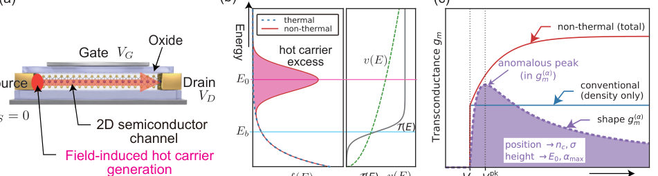 
FIG. 1. Concept, device, and measurement principle (schematic). (a) A gated monolayer 2D-semiconductor field-effect transis- tor: a gate voltage tunes the carrier density in the channel between source and drain contacts, while field-induced hot-carrier generation drives the distribution out of equilibrium. (b) Physical mechanism (energy on the vertical axis). Left: the carrier distribution f(E) is either thermal (dotted) or non-thermal (red), the latter carrying a localized hot-carrier excess near E0. Right: the transport kernel—an energy-selective transmission T (E) that turns on near the onset Eb and a velocity v(E) that grows with energy—weights high-energy carriers more heavily, so each...

📷 Fig 2

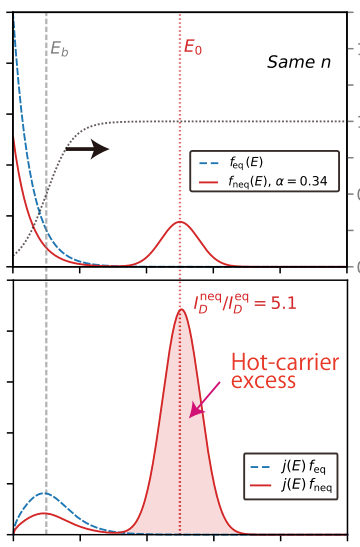 
FIG. 2. (a) Carrier distribution functions f(E) for the equi- librium (Boltzmann, blue dashed) and nonequilibrium (Boltz- mann + Gaussian bump, red solid, α = 0.34) cases, both normalized to the same carrier density n. The gray dotted curve on the right axis shows the transmission T (E); vertical dashed lines mark the onset energy Eb and the hot-carrier peak energy E0. (b) Spectral current integrand j(E)f(E) for both distributions (shared energy axis with (a)). The shaded region is the hot-carrier excess contribution to the current. Despite identical carrier densities, the nonequilibrium current is enhanced by Ineq D /Ieq D ≈5.1 at this density, reflecting the larger per-carrier current of...

📷 Fig 3

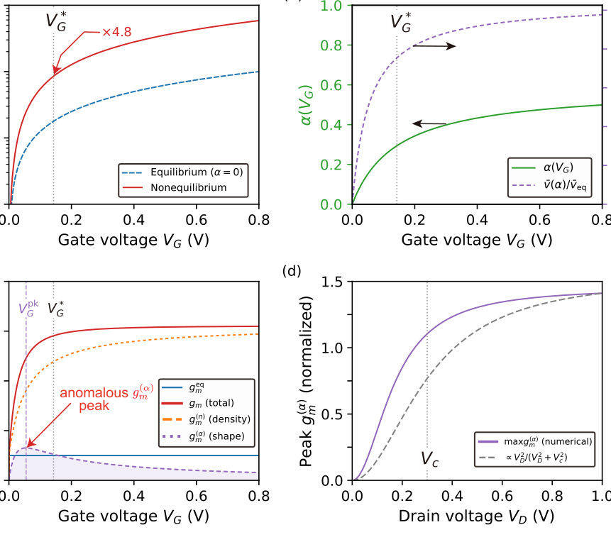 
FIG. 3. Main steady-state prediction, combining the current–voltage and transconductance characteristics. (a) Drain current ID vs gate voltage VG at VD = 0.5 V (logarithmic scale), normalized to the equilibrium saturation current. The nonequilibrium current (red solid) exceeds the equilibrium baseline (blue dashed) due to the hot-carrier velocity enhancement ¯v(α); the vertical dotted line marks V ∗ G where n = nc. (b) Left axis: nonequilibrium amplitude α(VG), showing saturation for VG ≫V ∗ G. Right axis: effective velocity ratio ¯v(α)/¯veq, which reaches its maximum as α →αmaxh(VD). (c) Transconductance gm(VG) for the equilibrium (geq m , blue solid) and nonequilibrium (total, red solid)...

📷 Fig 4

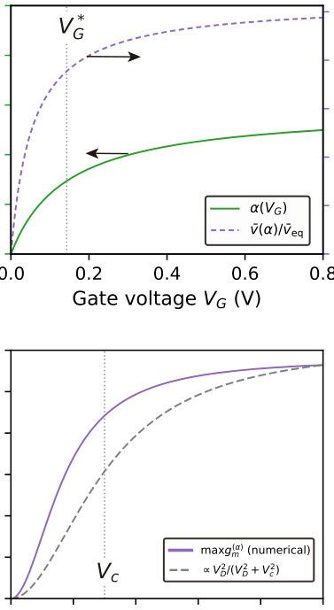 
Figure 3(a) shows ID(VG) at VD = 0.5 V. Both curves increase linearly with VG, as expected from ID ∝n, but the nonequilibrium current is enhanced by a factor that grows with VG up to n ∼nc and then saturates. This sat- uration is traced in Fig. 3(b): as n ≫nc, α(n) saturates at αmaxh(VD), and ¯v(α) approaches a constant. The ver-

📷 Fig 5

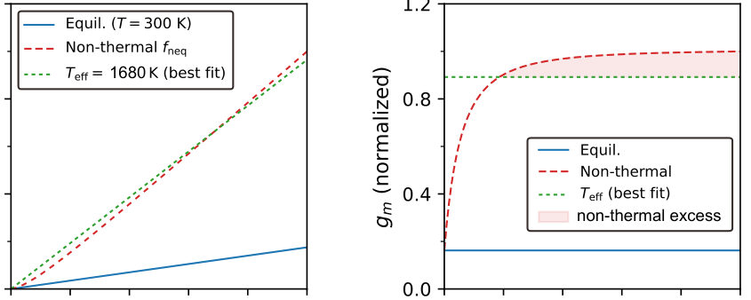 
FIG. 4. Discrimination of the non-thermal distribution-shape peak from quasi-equilibrium descriptions. Top row—exclusion of a mobility-rolloff peak. (a) Density map of the shape-driven transconductance g(α) m (VG, VD), normalized to the equilibrium plateau geq m ; the overlaid curve is the peak trajectory V pk G (VD), which shifts to lower VG (≈70 mV from VD = 0.1 to 1.0 V) while the ridge intensity saturates at large VD. (b) The two fingerprints versus VD: the peak position V pk G (red, left axis) shifts and saturates, and the peak height (purple, right axis) saturates as h(VD); a separable mobility model [Eq. (21)] instead predicts a VD-independent position (blue dashed) and a height...

**Summary.** The authors demonstrate that the transconductance of 2D FETs acts as a spectroscopic tool sensitive to the detailed shape of the hot-carrier energy distribution. By decomposing $g_m$, they isolate an anomalous peak whose existence and parameters allow for all-electrical determination of key hot-carrier properties like energy ($E_0$) and spectral width ($\sigma$). This establishes a powerful, non-optical diagnostic technique for understanding non-equilibrium carrier dynamics.

**Why it may be interesting.** This work provides a novel, purely electrical method for characterizing non-equilibrium carrier energy distributions in nanoscale devices, which is highly relevant for understanding transport limitations in next-generation quantum electronic components.

Detailed structure

**Main problem.** To develop a spectroscopic probe using transconductance ($g_m$) that measures the *shape* of the carrier energy distribution $f(E)$ in 2D FETs, rather than just its integrated weight (carrier density).

**Main result.** The anomalous peak observed in the shape-driven residual term, $g_m(\alpha)$, confirms that hot carriers introduce spectral features inaccessible to simple density or effective temperature models.

**Method.** The transconductance is decomposed into a conventional density-modulation term and a distribution-shape-driven residual term. This technique is applied using both steady-state DC/lock-in measurements and time-resolved pump-probe spectroscopy.

**Model / system.** The study uses two-dimensional (2D) Field-Effect Transistors (FETs), particularly those based on TMDs, where the carrier distribution $f(E)$ is modeled as a combination of thermal and non-equilibrium Gaussian hot-carrier components. The transport physics is analyzed via spectral integrals.

**Key observables.** The anomalous peak in transconductance ($g_m(\alpha)$), drain current ($I_D$), and transient decay times ($	au_E, 	au_n$).

**Important parameters / regimes.** Hot-carrier energy ($E_0$), spectral width ($\sigma$), generation threshold ($n_c$), and carrier relaxation time ($	au$).

**Assumptions / limitations.** The analysis relies on a gate-independent spectral-kernel approximation, and the hot-carrier distribution is often modeled phenomenologically (e.g., Gaussian bump).

**Figures summary.** Figures illustrate the concept by contrasting featureless equilibrium responses with anomalous peaks in $g_m(	ext{VG})$ due to hot carriers; time-resolved measurements show characteristic exponential decays allowing separation of energy and density relaxation times.

**Paper structure.** The paper progresses from establishing the theoretical decomposition of $g_m$ into shape and density components, demonstrating the anomalous peak signature in steady-state measurements, and finally extending the analysis to time-domain pump-probe experiments to extract dynamic parameters like $	au_E$.

Abstract

The transconductance $g_m = dI_D/dV_G$ of a field-effect transistor (FET) is conventionally read as a proxy for carrier density. We show that it is instead a spectroscopic probe of the carrier distribution: because $g_m$ weights the spectral current $j(E)$ by the gate-voltage derivative $\partial f(E)/\partial V_G$ and integrates over energy, it is sensitive to the \emph{shape} of $f(E)$, not merely its integrated weight $n$. We develop an energy-resolved transport framework for two-dimensional (2D) FETs and, within a gate-independent spectral-kernel approximation, derive the decomposition $g_m = g_m^{(n)} + g_m^{(α)}$ into the conventional density-modulation term $g_m^{(n)}$ and a distribution-shape-driven term $g_m^{(α)}$. The latter, obtained as the residual after subtracting the smooth density-modulation background from the measured $g_m$, exhibits a characteristic anomalous peak at a gate voltage $V_G^{\rm pk}$. This peak has no counterpart in equilibrium transport and \emph{cannot be explained by carrier density modulation alone}. With the spectral kernel calibrated, the peak position and height -- extracted from standard DC/lock-in $g_m$ sweeps -- constrain the hot-carrier energy $E_0$, spectral width $σ$, and generation threshold $n_c$, realizing a steady-state, all-electrical spectroscopy of the carrier distribution. An optional time-resolved extension further recovers the carrier relaxation time $τ$ from the transient response following a pump excitation, establishing the 2D FET as a distribution-function spectrometer that requires no optical readout.

[↑ back to top](#top)
