
# arxiv digest (quant-ph + cond-mat) — 2026-07-22

*191 papers · 72 relevant · 3 highlighted*

## 🔥 Most relevant (72)

*Every paper with at least one nonzero topic score, sorted by best-matching score. 🔥 marks scores ≥4/5. Click the title to jump to the full entry below; click [arXiv] to open the paper page. `(secondary)` marks papers from de-prioritized cond-mat archives.*

Show 72 relevant papers

- [Chiral Entangled-State Generation through Dissipative Quantum Dynamics](#paper-2607.17302) [[arXiv]](http://arxiv.org/abs/2607.17302v1) — 🔥 `quantum optics experiment` **5/5** · 🔥 `entanglement & information structure` **4/5** · 🔥 `methods for driven-dissipative` **4/5** · `analog quantum simulation` **3/5** · `correlated / nonlocal dissipation` **3/5** · `driven-dissipative phase transition` **3/5** · `non-equilibrium dynamics` **3/5** · `Keldysh / 2PI / non-Gaussian methods` **2/5** · `QC/QI experiment` **2/5** · `non-equilibrium universality` **2/5** · `Tavis-Cummings & cavity-many-emitter` **1/5** · `correlated cavity matter` **1/5** · `interference shaping light` **1/5** · `measurement-induced transitions` **1/5** · `quantum measurements` **1/5**
- ⭐ [Truncated Wigner approximation for spins in continuous phase space](#paper-2607.17295) [[arXiv]](http://arxiv.org/abs/2607.17295v1) — 🔥 `methods for driven-dissipative` **5/5** · 🔥 `Keldysh / 2PI / non-Gaussian methods` **4/5** · `correlated / nonlocal dissipation` **3/5** · `driven-dissipative phase transition` **3/5** · `exotic spin models in light-matter` **3/5** · `non-equilibrium dynamics` **3/5** · `analog quantum simulation` **2/5** · `non-equilibrium universality` **2/5** · `spintronics-quantum-optics interface` **2/5** · `Kondo & dissipative impurity` **1/5** · `entanglement & information structure` **1/5** · `measurement-induced transitions` **1/5** · `quantum measurements` **1/5** · `scars & prethermalization` **1/5**
- [Stroboscopic stability of a Floquet chiral spin liquid beyond the folding frequency](#paper-2607.16515) [[arXiv]](http://arxiv.org/abs/2607.16515v1) — 🔥 `scars & prethermalization` **5/5** · 🔥 `analog quantum simulation` **4/5** · 🔥 `non-equilibrium dynamics` **4/5** · `driven-dissipative phase transition` **3/5** · `exotic spin models in light-matter` **3/5** · `methods for driven-dissipative` **2/5** · `non-equilibrium universality` **2/5** · `Keldysh / 2PI / non-Gaussian methods` **1/5** · `entanglement & information structure` **1/5**
- [Neural Gauge-P Representation for Open Quantum Dynamics of Interacting Bosons](#paper-2607.17534) [[arXiv]](http://arxiv.org/abs/2607.17534v1) — 🔥 `methods for driven-dissipative` **5/5** · 🔥 `non-equilibrium dynamics` **4/5** · `analog quantum simulation` **3/5** · `driven-dissipative phase transition` **3/5** · `non-equilibrium universality` **2/5** · `Keldysh / 2PI / non-Gaussian methods` **1/5** · `correlated / nonlocal dissipation` **1/5**
- [Sensing relativistic quantum fields with minimally perturbing local measurements](#paper-2607.17920) [[arXiv]](http://arxiv.org/abs/2607.17920v1) — 🔥 `quantum measurements` **5/5** · `measurement-induced transitions` **3/5** · `Keldysh / 2PI / non-Gaussian methods` **1/5** · `correlated / nonlocal dissipation` **1/5** · `entanglement & information structure` **1/5** · `non-equilibrium dynamics` **1/5**
- [Active Optical Frequency Measurements with Superradiance Prolonged by a Modulated Magnetic Field](#paper-2607.17647) [[arXiv]](http://arxiv.org/abs/2607.17647v1) — 🔥 `Dicke superradiance` **4/5** · 🔥 `quantum optics experiment` **4/5** · 🔥 `superradiant laser` **4/5** · `Tavis-Cummings & cavity-many-emitter` **3/5** · `analog quantum simulation` **3/5** · `correlated cavity matter` **3/5** · `driven-dissipative phase transition` **3/5** · `methods for driven-dissipative` **3/5** · `Keldysh / 2PI / non-Gaussian methods` **2/5** · `correlated / nonlocal dissipation` **2/5** · `non-equilibrium dynamics` **2/5** · `non-equilibrium universality` **2/5** · `entanglement & information structure` **1/5** · `interference shaping light` **1/5** · `measurement-induced transitions` **1/5** · `quantum measurements` **1/5** · `spintronics-quantum-optics interface` **1/5**
- [Variational non-gaussian approach to interacting spin-boson models](#paper-2607.17934) [[arXiv]](http://arxiv.org/abs/2607.17934v1) — 🔥 `Keldysh / 2PI / non-Gaussian methods` **4/5** · 🔥 `analog quantum simulation` **4/5** · 🔥 `methods for driven-dissipative` **4/5** · `Dicke superradiance` **3/5** · `Tavis-Cummings & cavity-many-emitter` **3/5** · `correlated cavity matter` **3/5** · `exotic spin models in light-matter` **3/5** · `spintronics-quantum-optics interface` **3/5** · `superradiant laser` **2/5** · `correlated / nonlocal dissipation` **1/5** · `driven-dissipative phase transition` **1/5** · `entanglement & information structure` **1/5** · `non-equilibrium dynamics` **1/5**
- [Scaling law for optimal excitation storage and superradiant release in waveguide QED systems](#paper-2607.17320) [[arXiv]](http://arxiv.org/abs/2607.17320v1) — 🔥 `Tavis-Cummings & cavity-many-emitter` **4/5** · 🔥 `methods for driven-dissipative` **4/5** · `analog quantum simulation` **3/5** · `correlated / nonlocal dissipation` **3/5** · `correlated cavity matter` **3/5** · `driven-dissipative phase transition` **3/5** · `non-equilibrium dynamics` **3/5** · `Dicke superradiance` **2/5** · `non-equilibrium universality` **2/5** · `superradiant laser` **2/5** · `Keldysh / 2PI / non-Gaussian methods` **1/5** · `entanglement & information structure` **1/5** · `exotic spin models in light-matter` **1/5**
- [Dissipative Stabilization of Floquet-Engineered Many-Body Order](#paper-2607.16391) [[arXiv]](http://arxiv.org/abs/2607.16391v1) — 🔥 `analog quantum simulation` **4/5** · 🔥 `driven-dissipative phase transition` **4/5** · 🔥 `methods for driven-dissipative` **4/5** · 🔥 `non-equilibrium dynamics` **4/5** · `correlated / nonlocal dissipation` **3/5** · `exotic spin models in light-matter` **3/5** · `non-equilibrium universality` **3/5** · `Keldysh / 2PI / non-Gaussian methods` **2/5** · `entanglement & information structure` **1/5** · `scars & prethermalization` **1/5**
- [Strong Quantum Mpemba Effect from Exact Slow-Mode Selection in Constrained Rydberg Chains](#paper-2607.17975) [[arXiv]](http://arxiv.org/abs/2607.17975v1) — 🔥 `Rydberg arrays` **4/5** · 🔥 `analog quantum simulation` **4/5** · 🔥 `non-equilibrium dynamics` **4/5** · `correlated / nonlocal dissipation` **3/5** · `driven-dissipative phase transition` **3/5** · `methods for driven-dissipative` **3/5** · `non-equilibrium universality` **2/5** · `scars & prethermalization` **2/5** · `Frenkel-Kontorova` **1/5** · `Keldysh / 2PI / non-Gaussian methods` **1/5** · `entanglement & information structure` **1/5**
- [Topological magnon noises](#paper-2607.16574) [[arXiv]](http://arxiv.org/abs/2607.16574v1) `(secondary)` — 🔥 `Keldysh / 2PI / non-Gaussian methods` **4/5** · 🔥 `non-equilibrium dynamics` **4/5** · `correlated / nonlocal dissipation` **3/5** · `driven-dissipative phase transition` **3/5** · `exotic spin models in light-matter` **3/5** · `methods for driven-dissipative` **3/5** · `non-equilibrium universality` **3/5** · `analog quantum simulation` **2/5** · `spintronics-quantum-optics interface` **2/5** · `Kondo & dissipative impurity` **1/5**
- [Multibath Influence Matrices: Universal Scaling from Real-Time Dynamics](#paper-2607.16411) [[arXiv]](http://arxiv.org/abs/2607.16411v1) — 🔥 `Kondo & dissipative impurity` **4/5** · 🔥 `methods for driven-dissipative` **4/5** · 🔥 `non-equilibrium dynamics` **4/5** · 🔥 `non-equilibrium universality` **4/5** · `Keldysh / 2PI / non-Gaussian methods` **3/5** · `driven-dissipative phase transition` **3/5** · `correlated / nonlocal dissipation` **2/5** · `analog quantum simulation` **1/5** · `entanglement & information structure` **1/5** · `scars & prethermalization` **1/5**
- [Experimental Nanoscale Thermodynamics](#paper-2607.16861) [[arXiv]](http://arxiv.org/abs/2607.16861v1) — 🔥 `entanglement & information structure` **4/5** · `non-equilibrium dynamics` **3/5** · `non-equilibrium universality` **3/5** · `analog quantum simulation` **2/5** · `correlated / nonlocal dissipation` **2/5** · `driven-dissipative phase transition` **2/5** · `methods for driven-dissipative` **2/5** · `Keldysh / 2PI / non-Gaussian methods` **1/5** · `Kondo & dissipative impurity` **1/5** · `Rydberg arrays` **1/5** · `correlated cavity matter` **1/5** · `measurement-induced transitions` **1/5** · `quantum measurements` **1/5** · `scars & prethermalization` **1/5**
- [Non-Abelian Gauge Field Mechanics](#paper-2607.18215) [[arXiv]](http://arxiv.org/abs/2607.18215v1) — 🔥 `analog quantum simulation` **4/5** · `driven-dissipative phase transition` **3/5** · `exotic spin models in light-matter` **3/5** · `non-equilibrium dynamics` **3/5** · `Kondo & dissipative impurity` **2/5** · `QC/QI experiment` **2/5** · `non-equilibrium universality` **2/5** · `correlated / nonlocal dissipation` **1/5** · `entanglement & information structure` **1/5** · `measurement-induced transitions` **1/5** · `methods for driven-dissipative` **1/5** · `quantum measurements` **1/5** · `spintronics-quantum-optics interface` **1/5**
- [Stochastic Resetting: A Non-Equilibrium Framework for Prediction, Inference and Design](#paper-2607.16474) [[arXiv]](http://arxiv.org/abs/2607.16474v1) — 🔥 `methods for driven-dissipative` **4/5** · 🔥 `non-equilibrium dynamics` **4/5** · 🔥 `non-equilibrium universality` **4/5** · `Keldysh / 2PI / non-Gaussian methods` **3/5** · `driven-dissipative phase transition` **3/5** · `correlated / nonlocal dissipation` **2/5** · `Kondo & dissipative impurity` **1/5** · `analog quantum simulation` **1/5** · `scars & prethermalization` **1/5**
- [Temporal Diffraction Grating for Engineered Superconducting Qubit Dissipation](#paper-2607.17562) [[arXiv]](http://arxiv.org/abs/2607.17562v1) — 🔥 `interference shaping light` **4/5** · `correlated / nonlocal dissipation` **3/5** · `driven-dissipative phase transition` **3/5** · `methods for driven-dissipative` **3/5** · `non-equilibrium dynamics` **3/5** · `non-equilibrium universality` **2/5** · `Keldysh / 2PI / non-Gaussian methods` **1/5** · `QC/QI experiment` **1/5** · `correlated cavity matter` **1/5** · `quantum measurements` **1/5**
- [Impurity-induced Inverse Faraday Effect](#paper-2607.17802) [[arXiv]](http://arxiv.org/abs/2607.17802v1) `(secondary)` — 🔥 `spintronics-quantum-optics interface` **4/5** · `Kondo & dissipative impurity` **3/5** · `exotic spin models in light-matter` **3/5** · `non-equilibrium dynamics` **3/5** · `Keldysh / 2PI / non-Gaussian methods` **2/5** · `driven-dissipative phase transition` **2/5** · `methods for driven-dissipative` **2/5** · `interference shaping light` **1/5** · `non-equilibrium universality` **1/5**
- [Resonant excitations via low frequency pumping in driven magnon systems](#paper-2607.18073) [[arXiv]](http://arxiv.org/abs/2607.18073v1) — 🔥 `driven-dissipative phase transition` **4/5** · `exotic spin models in light-matter` **3/5** · `methods for driven-dissipative` **3/5** · `non-equilibrium dynamics` **3/5** · `spintronics-quantum-optics interface` **3/5** · `non-equilibrium universality` **2/5** · `Keldysh / 2PI / non-Gaussian methods` **1/5** · `analog quantum simulation` **1/5** · `correlated / nonlocal dissipation` **1/5**
- [High-frequency dual-channel lock-in detection via rapidly oscillating driving](#paper-2607.17854) [[arXiv]](http://arxiv.org/abs/2607.17854v1) — 🔥 `QC/QI experiment` **4/5** · `methods for driven-dissipative` **3/5** · `quantum measurements` **3/5** · `driven-dissipative phase transition` **2/5** · `non-equilibrium dynamics` **2/5** · `quantum optics experiment` **2/5** · `Keldysh / 2PI / non-Gaussian methods` **1/5** · `analog quantum simulation` **1/5** · `measurement-induced transitions` **1/5** · `spintronics-quantum-optics interface` **1/5**
- [$p$-Body $\simeq$ Range $p-1$: Exact Order-Range Mapping and Dual-Unitarity](#paper-2607.16642) [[arXiv]](http://arxiv.org/abs/2607.16642v1) — 🔥 `entanglement & information structure` **4/5** · 🔥 `non-equilibrium dynamics` **4/5** · `analog quantum simulation` **3/5** · `non-equilibrium universality` **3/5** · `Keldysh / 2PI / non-Gaussian methods` **1/5** · `correlated / nonlocal dissipation` **1/5** · `driven-dissipative phase transition` **1/5** · `exotic spin models in light-matter` **1/5** · `methods for driven-dissipative` **1/5**
- [Graph State Generation Based on Quantum Photonic Devices, Enabling Measurement-Based Quantum Computing](#paper-2607.16667) [[arXiv]](http://arxiv.org/abs/2607.16667v1) — 🔥 `QC/QI experiment` **4/5** · `correlated cavity matter` **3/5** · `quantum optics experiment` **3/5** · `analog quantum simulation` **2/5** · `measurement-induced transitions` **2/5** · `Tavis-Cummings & cavity-many-emitter` **1/5** · `driven-dissipative phase transition` **1/5** · `entanglement & information structure` **1/5** · `interference shaping light` **1/5** · `quantum measurements` **1/5**
- [LLM-Driven Cross-Paradigm Design for Quantum Optimal Control](#paper-2607.17498) [[arXiv]](http://arxiv.org/abs/2607.17498v1) — 🔥 `analog quantum simulation` **4/5** · `Rydberg arrays` **3/5** · `exotic spin models in light-matter` **3/5** · `methods for driven-dissipative` **2/5** · `non-equilibrium dynamics` **2/5** · `correlated / nonlocal dissipation` **1/5** · `correlated cavity matter` **1/5** · `driven-dissipative phase transition` **1/5** · `entanglement & information structure` **1/5** · `non-equilibrium universality` **1/5**
- [Operational Relation Between One-Time and Two-Time Work Protocols and Measurement-Resolution-Induced Transitions in Quantum Work Statistics](#paper-2607.16951) [[arXiv]](http://arxiv.org/abs/2607.16951v1) — 🔥 `measurement-induced transitions` **4/5** · `driven-dissipative phase transition` **3/5** · `quantum measurements` **3/5** · `non-equilibrium dynamics` **2/5** · `non-equilibrium universality` **2/5** · `Keldysh / 2PI / non-Gaussian methods` **1/5** · `QC/QI experiment` **1/5** · `entanglement & information structure` **1/5** · `methods for driven-dissipative` **1/5** · `spintronics-quantum-optics interface` **1/5**
- [Quiescent and traveling solitons in the fractional parametrically driven damped nonlinear Schrödinger equation](#paper-2607.17446) [[arXiv]](http://arxiv.org/abs/2607.17446v1) `(secondary)` — 🔥 `driven-dissipative phase transition` **4/5** · `correlated / nonlocal dissipation` **3/5** · `methods for driven-dissipative` **3/5** · `non-equilibrium dynamics` **3/5** · `non-equilibrium universality` **2/5** · `Keldysh / 2PI / non-Gaussian methods` **1/5** · `analog quantum simulation` **1/5** · `correlated cavity matter` **1/5** · `superradiant laser` **1/5**
- [Rigorous characterization of continuous-variable quantum states via optical parametric amplifiers](#paper-2607.17023) [[arXiv]](http://arxiv.org/abs/2607.17023v1) — 🔥 `QC/QI experiment` **4/5** · `quantum measurements` **3/5** · `quantum optics experiment` **3/5** · `entanglement & information structure` **2/5** · `measurement-induced transitions` **2/5** · `Keldysh / 2PI / non-Gaussian methods` **1/5** · `analog quantum simulation` **1/5** · `driven-dissipative phase transition` **1/5** · `methods for driven-dissipative` **1/5**
- [Spin-Independent Dissipation Induces Emergent Spin Mobility Polarization in Donor-Double-Stranded DNA-Acceptor Systems](#paper-2607.17189) [[arXiv]](http://arxiv.org/abs/2607.17189v1) `(secondary)` — 🔥 `methods for driven-dissipative` **4/5** · `Keldysh / 2PI / non-Gaussian methods` **3/5** · `spintronics-quantum-optics interface` **3/5** · `Kondo & dissipative impurity` **2/5** · `non-equilibrium dynamics` **2/5** · `correlated / nonlocal dissipation` **1/5** · `driven-dissipative phase transition` **1/5** · `exotic spin models in light-matter` **1/5** · `non-equilibrium universality` **1/5**
- [Suppression of Non-Hermitian Skin Effect by Pseudomagnetic Field in Honeycomb Lattice](#paper-2607.17703) [[arXiv]](http://arxiv.org/abs/2607.17703v1) `(secondary)` — 🔥 `analog quantum simulation` **4/5** · `driven-dissipative phase transition` **3/5** · `methods for driven-dissipative` **3/5** · `correlated / nonlocal dissipation` **2/5** · `non-equilibrium dynamics` **2/5** · `non-equilibrium universality` **2/5** · `Keldysh / 2PI / non-Gaussian methods` **1/5** · `Kondo & dissipative impurity` **1/5**
- ⭐ [Coexistence of long- and quasi-long range spatial order in 1D quantum quasicrystals](#paper-2607.17334) [[arXiv]](http://arxiv.org/abs/2607.17334v1) — 🔥 `analog quantum simulation` **4/5** · `Keldysh / 2PI / non-Gaussian methods` **3/5** · `correlated cavity matter` **3/5** · `Tavis-Cummings & cavity-many-emitter` **2/5** · `driven-dissipative phase transition` **2/5** · `Frenkel-Kontorova` **1/5** · `methods for driven-dissipative` **1/5** · `quantum optics experiment` **1/5**
- [Large scale behavior in the Kuramoto-Sivashinsky equation: The Schwinger-Dyson route](#paper-2607.17915) [[arXiv]](http://arxiv.org/abs/2607.17915v1) — 🔥 `Keldysh / 2PI / non-Gaussian methods` **4/5** · `methods for driven-dissipative` **3/5** · `non-equilibrium universality` **3/5** · `driven-dissipative phase transition` **2/5** · `non-equilibrium dynamics` **2/5** · `Frenkel-Kontorova` **1/5** · `analog quantum simulation` **1/5** · `correlated / nonlocal dissipation` **1/5**
- [Unifying Charge-Learnability Transitions in U(1)-Symmetric Quantum Circuits through Informational Power of Local Measurement](#paper-2607.17886) [[arXiv]](http://arxiv.org/abs/2607.17886v1) — 🔥 `entanglement & information structure` **4/5** · 🔥 `measurement-induced transitions` **4/5** · `quantum measurements` **3/5** · `driven-dissipative phase transition` **2/5** · `correlated / nonlocal dissipation` **1/5** · `methods for driven-dissipative` **1/5** · `non-equilibrium dynamics` **1/5** · `non-equilibrium universality` **1/5**
- [Glauber dynamics phase transitions in athermal random field Blume-Capel and Blume-Emery-Grifitths models](#paper-2607.16561) [[arXiv]](http://arxiv.org/abs/2607.16561v1) — 🔥 `non-equilibrium dynamics` **4/5** · 🔥 `non-equilibrium universality` **4/5** · `driven-dissipative phase transition` **3/5** · `methods for driven-dissipative` **3/5** · `Keldysh / 2PI / non-Gaussian methods` **1/5** · `correlated / nonlocal dissipation` **1/5**
- [Heralded Leakage Detection with Preserved Computational-State Coherence in a Fixed-Frequency Transmon](#paper-2607.17204) [[arXiv]](http://arxiv.org/abs/2607.17204v1) — 🔥 `QC/QI experiment` **4/5** · `quantum measurements` **3/5** · `Tavis-Cummings & cavity-many-emitter` **2/5** · `measurement-induced transitions` **2/5** · `correlated / nonlocal dissipation` **1/5** · `correlated cavity matter` **1/5** · `driven-dissipative phase transition` **1/5** · `methods for driven-dissipative` **1/5** · `quantum optics experiment` **1/5**
- [Observation of Critical Current Minimum in Super-Honeycomb Josephson Junction Arrays](#paper-2607.16500) [[arXiv]](http://arxiv.org/abs/2607.16500v1) — 🔥 `analog quantum simulation` **4/5** · `exotic spin models in light-matter` **3/5** · `driven-dissipative phase transition` **2/5** · `non-equilibrium dynamics` **2/5** · `non-equilibrium universality` **2/5** · `Keldysh / 2PI / non-Gaussian methods` **1/5** · `methods for driven-dissipative` **1/5** · `spintronics-quantum-optics interface` **1/5**
- [Spatial nonlocality imaging via metasurface](#paper-2607.17618) [[arXiv]](http://arxiv.org/abs/2607.17618v1) — 🔥 `entanglement & information structure` **4/5** · `interference shaping light` **3/5** · `quantum optics experiment` **3/5** · `QC/QI experiment` **2/5** · `quantum measurements` **2/5** · `measurement-induced transitions` **1/5** · `methods for driven-dissipative` **1/5**
- [Bridging Relativistic Twisted Fermion Beams and Photonic OAM Flux in Gauged Hopf Lattices: Emergent Topological Analogs](#paper-2607.16520) [[arXiv]](http://arxiv.org/abs/2607.16520v1) — 🔥 `analog quantum simulation` **4/5** · `methods for driven-dissipative` **3/5** · `non-equilibrium dynamics` **2/5** · `correlated / nonlocal dissipation` **1/5** · `driven-dissipative phase transition` **1/5** · `entanglement & information structure` **1/5** · `exotic spin models in light-matter` **1/5** · `interference shaping light` **1/5** · `non-equilibrium universality` **1/5**
- [Depth Determination of Individual Shallow NV-Centers via Spin-Lock NMR](#paper-2607.17734) [[arXiv]](http://arxiv.org/abs/2607.17734v1) — 🔥 `QC/QI experiment` **4/5** · `methods for driven-dissipative` **3/5** · `spintronics-quantum-optics interface` **3/5** · `quantum measurements` **2/5** · `Keldysh / 2PI / non-Gaussian methods` **1/5** · `correlated / nonlocal dissipation` **1/5** · `driven-dissipative phase transition` **1/5**
- ⭐ [Entanglement Entropy in Quantum Networks with Tunable Geometry](#paper-2607.16394) [[arXiv]](http://arxiv.org/abs/2607.16394v1) — 🔥 `entanglement & information structure` **4/5** · `analog quantum simulation` **3/5** · `non-equilibrium dynamics` **3/5** · `non-equilibrium universality` **2/5** · `correlated / nonlocal dissipation` **1/5** · `driven-dissipative phase transition` **1/5** · `methods for driven-dissipative` **1/5**
- [Multi-level Random-Telegraph Noise Mitigation using a Single Spectator Qubit](#paper-2607.17202) [[arXiv]](http://arxiv.org/abs/2607.17202v1) — 🔥 `quantum measurements` **4/5** · `measurement-induced transitions` **3/5** · `methods for driven-dissipative` **3/5** · `non-equilibrium dynamics` **2/5** · `Keldysh / 2PI / non-Gaussian methods` **1/5** · `correlated / nonlocal dissipation` **1/5** · `driven-dissipative phase transition` **1/5**
- [On the Information Required for Feedback Control](#paper-2607.16639) [[arXiv]](http://arxiv.org/abs/2607.16639v1) — 🔥 `quantum measurements` **4/5** · `non-equilibrium dynamics` **3/5** · `non-equilibrium universality` **2/5** · `Keldysh / 2PI / non-Gaussian methods` **1/5** · `correlated / nonlocal dissipation` **1/5** · `driven-dissipative phase transition` **1/5** · `entanglement & information structure` **1/5** · `measurement-induced transitions` **1/5** · `methods for driven-dissipative` **1/5**
- [Split-quaternionic structure and canonical quantization of the Bateman dual oscillator](#paper-2607.16516) [[arXiv]](http://arxiv.org/abs/2607.16516v1) — 🔥 `methods for driven-dissipative` **4/5** · `Keldysh / 2PI / non-Gaussian methods` **3/5** · `correlated / nonlocal dissipation` **2/5** · `driven-dissipative phase transition` **2/5** · `non-equilibrium dynamics` **2/5** · `Kondo & dissipative impurity` **1/5** · `non-equilibrium universality` **1/5**
- [The Information Content of Krylov Observables: A Machine Learning Approach](#paper-2607.17346) [[arXiv]](http://arxiv.org/abs/2607.17346v1) — 🔥 `entanglement & information structure` **4/5** · `methods for driven-dissipative` **3/5** · `non-equilibrium dynamics` **3/5** · `non-equilibrium universality` **2/5** · `Keldysh / 2PI / non-Gaussian methods` **1/5** · `analog quantum simulation` **1/5** · `driven-dissipative phase transition` **1/5**
- [A Unified Discrete and Continuous Theory of Core-Halo Complexity Maximizers](#paper-2607.17907) [[arXiv]](http://arxiv.org/abs/2607.17907v1) — 🔥 `entanglement & information structure` **4/5** · `analog quantum simulation` **2/5** · `non-equilibrium dynamics` **2/5** · `non-equilibrium universality` **2/5** · `Keldysh / 2PI / non-Gaussian methods` **1/5** · `correlated / nonlocal dissipation` **1/5** · `driven-dissipative phase transition` **1/5** · `methods for driven-dissipative` **1/5**
- [Interpreting Quantum Learning Models via Stochastic Processes](#paper-2607.17327) [[arXiv]](http://arxiv.org/abs/2607.17327v1) — 🔥 `quantum measurements` **4/5** · `measurement-induced transitions` **3/5** · `methods for driven-dissipative` **3/5** · `Keldysh / 2PI / non-Gaussian methods` **1/5** · `correlated / nonlocal dissipation` **1/5** · `driven-dissipative phase transition` **1/5** · `entanglement & information structure` **1/5**
- [Particle-scale structure of granular suspensions](#paper-2607.18090) [[arXiv]](http://arxiv.org/abs/2607.18090v1) — 🔥 `non-equilibrium dynamics` **4/5** · `methods for driven-dissipative` **3/5** · `non-equilibrium universality` **3/5** · `Keldysh / 2PI / non-Gaussian methods` **1/5** · `analog quantum simulation` **1/5** · `correlated / nonlocal dissipation` **1/5** · `driven-dissipative phase transition` **1/5**
- [quchip: A Differentiable Toolkit for Modeling Quantum Devices](#paper-2607.17081) [[arXiv]](http://arxiv.org/abs/2607.17081v1) — 🔥 `QC/QI experiment` **4/5** · `methods for driven-dissipative` **3/5** · `non-equilibrium dynamics` **2/5** · `analog quantum simulation` **1/5** · `correlated / nonlocal dissipation` **1/5** · `driven-dissipative phase transition` **1/5** · `quantum measurements` **1/5**
- [Universal Dynamic Scaling of 2D Quantum Ising Transition on the Fuzzy Sphere](#paper-2607.18028) [[arXiv]](http://arxiv.org/abs/2607.18028v1) — 🔥 `non-equilibrium universality` **4/5** · `non-equilibrium dynamics` **3/5** · `analog quantum simulation` **2/5** · `Keldysh / 2PI / non-Gaussian methods` **1/5** · `driven-dissipative phase transition` **1/5** · `entanglement & information structure` **1/5** · `methods for driven-dissipative` **1/5**
- [Holographic quantum codes with trapped ions](#paper-2607.16503) [[arXiv]](http://arxiv.org/abs/2607.16503v1) — 🔥 `QC/QI experiment` **4/5** · `entanglement & information structure` **2/5** · `quantum measurements` **2/5** · `analog quantum simulation` **1/5** · `correlated / nonlocal dissipation` **1/5** · `methods for driven-dissipative` **1/5** · `non-equilibrium dynamics` **1/5**
- [Removing inhomogeneous broadening in cross-relaxation spectra via hole burning](#paper-2607.16839) [[arXiv]](http://arxiv.org/abs/2607.16839v1) — 🔥 `QC/QI experiment` **4/5** · `spintronics-quantum-optics interface` **3/5** · `quantum measurements` **2/5** · `exotic spin models in light-matter` **1/5** · `interference shaping light` **1/5** · `quantum optics experiment` **1/5**
- [Variance-Reduced Trajectory Unravelings for GPU Noisy Quantum-Circuit Simulation: Characterization and a Qiskit-Aer Integration Gap](#paper-2607.17678) [[arXiv]](http://arxiv.org/abs/2607.17678v1) — 🔥 `methods for driven-dissipative` **4/5** · `quantum measurements` **3/5** · `non-equilibrium dynamics` **2/5** · `correlated / nonlocal dissipation` **1/5** · `driven-dissipative phase transition` **1/5** · `measurement-induced transitions` **1/5**
- [Expansion of a free Fermi gas released from an isotropic trapping potential](#paper-2607.18007) [[arXiv]](http://arxiv.org/abs/2607.18007v1) — 🔥 `non-equilibrium dynamics` **4/5** · `non-equilibrium universality` **3/5** · `analog quantum simulation` **2/5** · `Keldysh / 2PI / non-Gaussian methods` **1/5** · `methods for driven-dissipative` **1/5**
- [Geometric quantum discord in the black hole quantum atmosphere](#paper-2607.16641) [[arXiv]](http://arxiv.org/abs/2607.16641v1) — 🔥 `entanglement & information structure` **4/5** · `correlated / nonlocal dissipation` **2/5** · `non-equilibrium dynamics` **2/5** · `Keldysh / 2PI / non-Gaussian methods` **1/5** · `driven-dissipative phase transition` **1/5** · `methods for driven-dissipative` **1/5**
- [Host-guest Crystal Engineering Tailors the Room Temperature Spin Dynamics in Molecular Quantum Devices](#paper-2607.16466) [[arXiv]](http://arxiv.org/abs/2607.16466v1) — 🔥 `spintronics-quantum-optics interface` **4/5** · `exotic spin models in light-matter` **3/5** · `QC/QI experiment` **1/5** · `correlated / nonlocal dissipation` **1/5** · `driven-dissipative phase transition` **1/5** · `methods for driven-dissipative` **1/5**
- [Remote Infrared Absorption Spectroscopy with Undetected Photons](#paper-2607.16419) [[arXiv]](http://arxiv.org/abs/2607.16419v1) — 🔥 `quantum optics experiment` **4/5** · `interference shaping light` **3/5** · `quantum measurements` **2/5** · `driven-dissipative phase transition` **1/5** · `methods for driven-dissipative` **1/5**
- [80 Channel Photon Pair Source from a Thin-Film Lithium Niobate Racetrack Microresonator](#paper-2607.16575) [[arXiv]](http://arxiv.org/abs/2607.16575v1) — 🔥 `quantum optics experiment` **4/5** · `correlated cavity matter` **3/5** · `QC/QI experiment` **1/5** · `driven-dissipative phase transition` **1/5** · `interference shaping light` **1/5**
- [Beyond Orbital Rotations: Correlation-Rank Limits and Clifford-Accessible Measurement, from Algebra and Global Optimization](#paper-2607.16869) [[arXiv]](http://arxiv.org/abs/2607.16869v1) — 🔥 `quantum measurements` **4/5** · `measurement-induced transitions` **3/5** · `Keldysh / 2PI / non-Gaussian methods` **1/5** · `analog quantum simulation` **1/5** · `entanglement & information structure` **1/5**
- [Two-dimensional solitons in extended GPE models with Lee-Huang-Yang corrections](#paper-2607.16820) [[arXiv]](http://arxiv.org/abs/2607.16820v1) — 🔥 `analog quantum simulation` **4/5** · `non-equilibrium dynamics` **2/5** · `Keldysh / 2PI / non-Gaussian methods` **1/5** · `correlated / nonlocal dissipation` **1/5** · `driven-dissipative phase transition` **1/5** · `methods for driven-dissipative` **1/5**
- [A projection-free approach toward mapping the structured polarization fields](#paper-2607.16672) [[arXiv]](http://arxiv.org/abs/2607.16672v1) — 🔥 `quantum optics experiment` **4/5** · `interference shaping light` **3/5** · `QC/QI experiment` **1/5** · `quantum measurements` **1/5**
- [Attosecond delay metrology beyond the photon coherence time with spectrally resolved Hong-Ou-Mandel interferometry](#paper-2607.16849) [[arXiv]](http://arxiv.org/abs/2607.16849v1) — 🔥 `quantum optics experiment` **4/5** · `interference shaping light` **3/5** · `QC/QI experiment` **1/5** · `quantum measurements` **1/5**
- [Tuning superconducting pairing symmetry via a staggered potential in the doped honeycomb Hubbard model](#paper-2607.16663) [[arXiv]](http://arxiv.org/abs/2607.16663v1) — 🔥 `analog quantum simulation` **4/5** · `methods for driven-dissipative` **3/5** · `Keldysh / 2PI / non-Gaussian methods` **1/5** · `driven-dissipative phase transition` **1/5**
- [Uncountably many inequivalent maximally entangled measurements for two qutrits](#paper-2607.16396) [[arXiv]](http://arxiv.org/abs/2607.16396v1) — 🔥 `entanglement & information structure` **4/5** · `quantum measurements` **3/5** · `measurement-induced transitions` **2/5**
- [Scanless quantum Fourier-transform mid-infrared spectroscopy for rapid high-sensitivity hyperspectral mapping](#paper-2607.17964) [[arXiv]](http://arxiv.org/abs/2607.17964v1) — 🔥 `quantum optics experiment` **4/5** · `interference shaping light` **3/5** · `quantum measurements` **1/5**
- [Universality of Magic in Local Quantum Field Theory](#paper-2607.16403) [[arXiv]](http://arxiv.org/abs/2607.16403v1) — 🔥 `entanglement & information structure` **4/5** · `analog quantum simulation` **1/5** · `driven-dissipative phase transition` **1/5** · `methods for driven-dissipative` **1/5** · `non-equilibrium dynamics` **1/5**
- [Frustration induced dimensional reduction and coexistence of long and short-range magnetic order in NdCl$_{3}$](#paper-2607.17995) [[arXiv]](http://arxiv.org/abs/2607.17995v1) — 🔥 `analog quantum simulation` **4/5** · `exotic spin models in light-matter` **3/5**
- [Contrasting $Γ$- and K-Valley Moiré Physics in Twisted Monolayer/Bilayer WSe$_2$](#paper-2607.18212) [[arXiv]](http://arxiv.org/abs/2607.18212v1) `(secondary)` — 🔥 `analog quantum simulation` **4/5** · `driven-dissipative phase transition` **1/5** · `non-equilibrium dynamics` **1/5**
- [Entanglement geometry separates circuit cutting, classical hardness, and trainability](#paper-2607.17872) [[arXiv]](http://arxiv.org/abs/2607.17872v1) — 🔥 `entanglement & information structure` **4/5** · `methods for driven-dissipative` **1/5** · `non-equilibrium dynamics` **1/5**
- [Fully-connected three-mode squeezed vacuum: Gaussian entanglement, steering, and collective photon subtraction](#paper-2607.17629) [[arXiv]](http://arxiv.org/abs/2607.17629v1) — 🔥 `entanglement & information structure` **4/5** · `Keldysh / 2PI / non-Gaussian methods` **1/5** · `correlated / nonlocal dissipation` **1/5**
- [Certified Optimal Measurement Reduction over Quantum Context Landscapes](#paper-2607.16866) [[arXiv]](http://arxiv.org/abs/2607.16866v1) — 🔥 `quantum measurements` **4/5** · `measurement-induced transitions` **1/5**
- [Hardware Robustness of Sample-Based Quantum Diagonalization](#paper-2607.18196) [[arXiv]](http://arxiv.org/abs/2607.18196v1) — 🔥 `QC/QI experiment` **4/5** · `methods for driven-dissipative` **1/5**
- [Image Classification on IBM Quantum Computers](#paper-2607.17705) [[arXiv]](http://arxiv.org/abs/2607.17705v1) — 🔥 `QC/QI experiment` **4/5** · `methods for driven-dissipative` **1/5**
- [Bargmann invariants and local unitary equivalence](#paper-2607.16878) [[arXiv]](http://arxiv.org/abs/2607.16878v1) — 🔥 `entanglement & information structure` **4/5**
- [Entanglement Quantification via Symmetric Extensions: A Resource Theory Hierarchy](#paper-2607.16960) [[arXiv]](http://arxiv.org/abs/2607.16960v1) — 🔥 `entanglement & information structure` **4/5**
- [Phase-Sensitive Benchmarking of Composite Quantum Gates with Chiral-Interference Circuits on Quantum Hardware](#paper-2607.18137) [[arXiv]](http://arxiv.org/abs/2607.18137v1) — 🔥 `QC/QI experiment` **4/5**

## ⭐ Highlighted (3)

*Papers by authors on your watch list. Click the title to jump to the full entry below; click [arXiv] to open the paper page.*

Show 3 highlighted papers

- ⭐ [Entanglement Entropy in Quantum Networks with Tunable Geometry](#paper-2607.16394) [[arXiv]](http://arxiv.org/abs/2607.16394v1) — Andrew J. Daley
- ⭐ [Truncated Wigner approximation for spins in continuous phase space](#paper-2607.17295) [[arXiv]](http://arxiv.org/abs/2607.17295v1) — Michael Fleischhauer
- ⭐ [Coexistence of long- and quasi-long range spatial order in 1D quantum quasicrystals](#paper-2607.17334) [[arXiv]](http://arxiv.org/abs/2607.17334v1) — T. Donner, F. Piazza

## All papers (143, sorted by relevance)

*Papers from quant-ph and your primary cond-mat archives (quant-gas, stat-mech, str-el, dis-nn). Highlighted papers (⭐) come first, then everything else sorted by topic-relevance score, highest first.*

### ⭐ [Truncated Wigner approximation for spins in continuous phase space](http://arxiv.org/abs/2607.17295v1)

**Highlighted author(s):** Michael Fleischhauer  
**Authors:** Jens Hartmann, Tom Schlegel, Viktoria Noel, Christopher D. Mink, Michael Fleischhauer  
**Type:** theory · **Category:** other · **PDF:** <https://arxiv.org/pdf/2607.17295v1>  
**Analysis basis:** full PDF text, analyzed in chunks
**Topic relevance:** 🔥 `methods for driven-dissipative` **5/5** · 🔥 `Keldysh / 2PI / non-Gaussian methods` **4/5** · `correlated / nonlocal dissipation` **3/5** · `driven-dissipative phase transition` **3/5** · `exotic spin models in light-matter` **3/5** · `non-equilibrium dynamics` **3/5** · `analog quantum simulation` **2/5** · `non-equilibrium universality` **2/5** · `spintronics-quantum-optics interface` **2/5** · `Kondo & dissipative impurity` **1/5** · `entanglement & information structure` **1/5** · `measurement-induced transitions` **1/5** · `quantum measurements` **1/5** · `scars & prethermalization` **1/5**

↔ Scroll figures horizontally

<figure class="paper-figure-card">
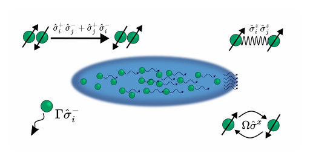
<figcaption class="paper-figure-caption"><b>Fig 1.</b> FIG. 1. The microscopic basis of a large class of quantum- many-body problems, ranging from magnetism to collective light emission, are interacting, open spin systems. The faith- ful description of their dynamics in large-scale systems re- mains, however, a major challenge.</figcaption>
</figure>
<figure class="paper-figure-card">
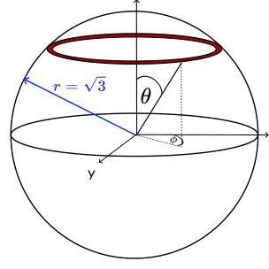
<figcaption class="paper-figure-caption"><b>Fig 2.</b> FIG. 2. Continuous phase-space representation of | ↑⟩state</figcaption>
</figure>
<figure class="paper-figure-card">
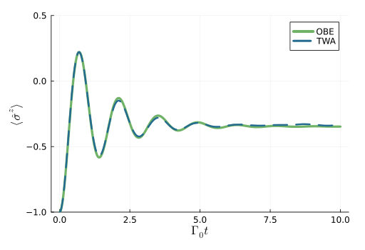
<figcaption class="paper-figure-caption"><b>Fig 3.</b> FIG. 3. Expectation value of ˆσz of a driven single spin starting in the ground state calculated with the optical Bloch equa- tions (green) as well as the TWA result (blue) for 104 trajec- tories. Here Ω= 2Γ0, and ∆= 1Γ0.</figcaption>
</figure>
<figure class="paper-figure-card">
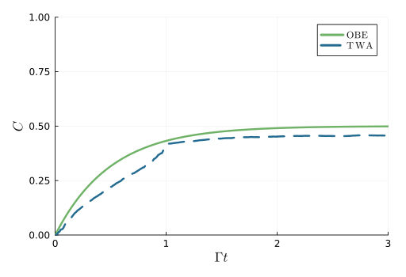
<figcaption class="paper-figure-caption"><b>Fig 4.</b> FIG. 4. Comparison of two-spin concurrence between exact dynamics from 2-particle OBE and TWA simulation upon Dicke decay. The initial state is |↑⟩|↓⟩.</figcaption>
</figure>
<figure class="paper-figure-card">
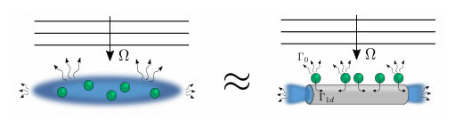
<figcaption class="paper-figure-caption"><b>Fig 5.</b> FIG. 6. Cigar-shaped ensemble of atoms driven perpendicular to the z-axis (left) and approximate one-dimensional waveg- uide model used for TWA simulations (right).</figcaption>
</figure>

**Summary.** This paper introduces and reviews the Truncated Wigner Approximation (TWA) as an efficient method to simulate complex, dissipative many-body spin systems. By mapping the density matrix onto a continuous phase space, it derives solvable stochastic differential equations governing system evolution. This allows for calculating key quantum observables like correlations and thermal states in systems ranging from magnetism to light emission.

**Why it may be interesting.** This work provides a powerful, computationally tractable tool (TWA) to study open quantum dynamics in spin systems, bridging the gap between exact quantum descriptions and classical stochastic simulations, which is highly relevant for quantum optics and magnetism.

Detailed structure

**Main problem.** The primary challenge is accurately simulating the complex, non-equilibrium dynamics of interacting and/or dissipative open spin systems.

**Main result.** The authors successfully derive a computationally inexpensive stochastic differential equation (SDE) framework for describing these dynamics using the Truncated Wigner Approximation (TWA). This method allows calculation of expectation values, correlations, and thermal states.

**Method.** The paper employs the Wigner-Moyal mapping to represent the density matrix in continuous phase space. The resulting evolution equation is approximated into a Fokker-Planck equation equivalent to Ito SDEs for the spin variables.

**Model / system.** The focus is on open spin systems, modeled using a continuous SU(2) representation on an enlarged Bloch sphere. The dynamics are governed by mapping the Lindblad master equation onto phase-space evolution equations.

**Key observables.** Expectation values of operators, multi-time correlations, spectra, thermal states, and ground state energies.

**Important parameters / regimes.** The approximation quality depends on neglecting higher-order derivatives in the Fokker-Planck expansion; the method is benchmarked against exactly solvable models.

**Assumptions / limitations.** Key assumptions include using controlled approximations to map the master equation to SDEs, and exploiting gauge freedom in the continuous phase space representation. It assumes that the path integral formulation can be rigorously mapped onto the curved phase space.

**Figures summary.** Not specified by notes; the mathematical derivations focus on explicit formulas relating Pauli matrices to derivatives of the phase-point operator $\hat{\Delta}$ with respect to spherical coordinates $(	heta, \phi)$.

**Paper structure.** The paper reviews the TWA framework, details the mapping from the Lindblad equation to SDEs via Wigner function evolution, discusses mathematical tools for this mapping (derivatives of phase-point operators), and benchmarks the method on various physical problems.

Abstract

We review the truncated Wigner approximation (TWA) for spins as a computationally inexpensive numerical approximation method to describe interacting and / or dissipative many-body spin systems. Using the Wigner-Moyal mapping from Hilbert space to a suitable phase space, the many-body density matrix is represented by a c-number distribution, the Wigner function. The gauge freedom in continuous phase space can be exploited to find positive Wigner functions for a large class of spin states, including entangled ones. Employing different sets of correspondence rules, we derive equations of motion for the Wigner function, which, applying controlled approximations, can be mapped to stochastic differential equations. This allows a computationally inexpensive simulation of expectation values. Using a phase-space analog of the quantum regression theorem also multi-time correlations and spectra can be obtained. To illustrate the potential of the method, we benchmark the TWA for spins with some exactly solvable problems of interacting, dissipative spin systems, and then discuss its application to collective processes, such as the superradiant emission of light. Extending the TWA to imaginary time furthermore provides a tool to approximately calculate thermal and ground states of spin Hamiltonians. Finally, we show that the TWA stochastic equations can equivalently be derived within a path-integral approach, provided that the operator products in the dissipator are rigorously mapped onto the curved phase space.

[↑ back to top](#top)

### ⭐ [Coexistence of long- and quasi-long range spatial order in 1D quantum quasicrystals](http://arxiv.org/abs/2607.17334v1)

**Highlighted author(s):** T. Donner, F. Piazza  
**Authors:** A. Mendoza-Coto, M. Grossklags, J. Stefaniak, T. Donner, F. Piazza  
**Type:** both · **Category:** other · **PDF:** <https://arxiv.org/pdf/2607.17334v1>  
**Analysis basis:** full PDF text, analyzed in chunks
**Topic relevance:** 🔥 `analog quantum simulation` **4/5** · `Keldysh / 2PI / non-Gaussian methods` **3/5** · `correlated cavity matter` **3/5** · `Tavis-Cummings & cavity-many-emitter` **2/5** · `driven-dissipative phase transition` **2/5** · `Frenkel-Kontorova` **1/5** · `methods for driven-dissipative` **1/5** · `quantum optics experiment` **1/5**

↔ Scroll figures horizontally

<figure class="paper-figure-card">
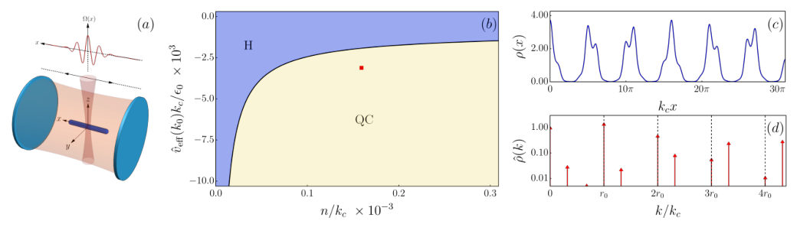
<figcaption class="paper-figure-caption"><b>Fig 1.</b> Figure 1. (a) Schematic cavity QED experimental setup for the implementation of laser painted interactions. The elongated BEC is coupled to the standing wave of the cavity and periodically scanned by the structured laser inducing a finite range on demand effective interaction. (b) Ground-state phase diagram of the system for a laser beam profile ˆΩ(k) exciting a finite wave vector k0, with ˆveff(k0)kc/ϵ0 and the density n/kc used as running parameters. The red square corresponds to n/kc = 0.159 × 10−3 and ˆveff(k0)kc/ϵ0 = −3.140 × 103. (c) and (d) Typical QC density profile in real and momentum space corresponding to the highlighted red square in (b), in (d) r0 has been chosen as |k0...</figcaption>
</figure>
<figure class="paper-figure-card">
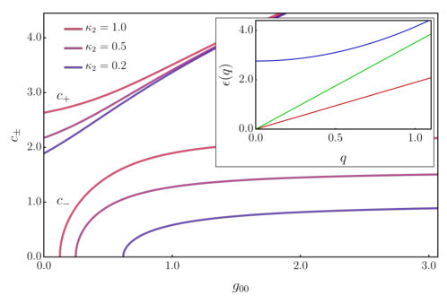
<figcaption class="paper-figure-caption"><b>Fig 2.</b> Figure 2. Velocity of the two gapless modes as a function of the hydrodynamic action parameters g00 and κ2, while the others are fixed as follows: Γ = (1 + √</figcaption>
</figure>
<figure class="paper-figure-card">
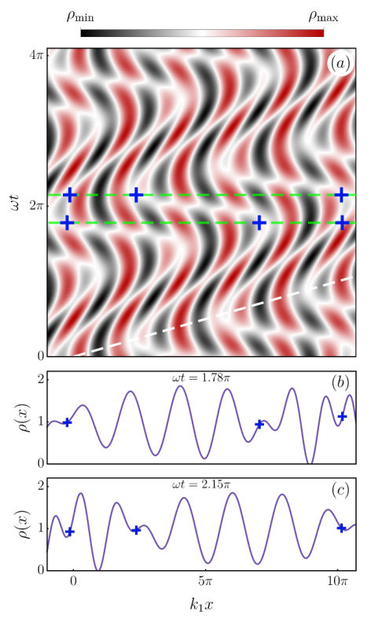
<figcaption class="paper-figure-caption"><b>Fig 3.</b> Figure 3. (a) Space-time local density behavior of a 1D QC phase under the propagation of a long-wavelength excitation in the model considered for gapless excitations. The white dashed line corresponds to the curve x = cst, where cs rep- resents the sound velocity of the excitation mode. The green lines corresponds to two different values of t at which the in- stantaneous density profiles are presented in (b) and (c). The blue crosses marks the position of the defects in the corre- sponding modulated patterns.</figcaption>
</figure>
<figure class="paper-figure-card">
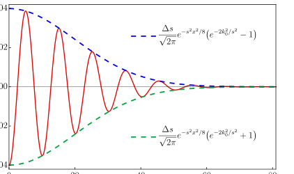
<figcaption class="paper-figure-caption"><b>Fig 4.</b> Figure 4. Real-space behavior of the cavity-mediated interac- tion veff(x), shown as a solid red line. Dashed blue and green lines correspond to the upper and lower envelopes of the po- tential, respectively.</figcaption>
</figure>

**Summary.** This paper theoretically investigates 1D quantum quasicrystals realized using ultracold bosonic atoms in optical cavities. By analyzing the low-energy excitations, the authors demonstrate a unique mechanism where selective gapping of Goldstone modes allows for the coexistence of true long-range order and quasi-long-range order simultaneously. This provides a novel platform to study complex ordering phenomena beyond standard periodic systems.

**Why it may be interesting.** This work is highly relevant as it bridges concepts from quantum optics (cavity QED implementation) with advanced condensed matter physics (quasicrystals), providing a concrete platform for studying exotic many-body order parameters in ultracold atom systems.

Detailed structure

**Main problem.** The study investigates the unique physical scenario in one-dimensional quantum quasicrystals where Goldstone modes can selectively gap, leading to a coexistence of true long-range order and quasi-long-range order.

**Main result.** The system exhibits distinct ordering regimes: true long-range order is found at the gapped wave vector component, while quasi-long-range order persists at the remaining gapless component due to sustained fluctuations.

**Method.** The analysis employs a combination of spectral variational methods and the coherent-state path-integral formalism to derive an effective hydrodynamic action for low-energy excitations.

**Model / system.** The model is a quasi-one-dimensional Bose-Einstein condensate (BEC) trapped in an optical cavity, whose interactions are engineered via laser-painted potentials to mimic quasicrystalline coupling.

**Key observables.** Gap structure of Goldstone modes (gapped vs. gapless), phase correlation functions ($\langle\hat{\delta}_1\hat{\delta}_1
angle$, $\langle\hat{\delta}_2\hat{\delta}_2
angle$), and the excitation velocities ($c_\pm$).

**Important parameters / regimes.** The coupling parameters ($\kappa_2$) controlling mode hybridization, system size ($L$), and the ratio of incommensurate wave vectors ($\Gamma = k_2/k_1$).

**Assumptions / limitations.** The analysis assumes a 1D reduction from transverse dimensions and relies on approximations within the hydrodynamic regime for low-energy excitations.

**Figures summary.** Figures illustrate the schematic setup using cavity QED, ground-state phase diagrams showing transitions between phases (H and QC), and space-time local density behavior under propagating long-wavelength excitations.

**Paper structure.** The paper proceeds by deriving the effective quadratic action for fluctuations ($\delta S$) in the hydrodynamic limit. It then analyzes the resulting dispersion relations, identifying three modes: one gapped mode ($\omega_1 \propto q^2$) and two gapless modes ($\omega_\pm \propto q$). Finally, it calculates correlation functions to confirm the distinct ordering regimes.

Abstract

Quasicrystals exhibit long-range positional order without periodicity, arising from multiple incommensurate wave vectors. In self-assembled quasicrystals, the spontaneous breaking of translational invariance gives rise to two Goldstone modes-phonons and phasons-associated with two competing wave vectors. Here, we demonstrate a unique scenario exclusive to quasicrystals: a mechanism that gaps out only one Goldstone mode (associated with one wave vector), while the other remains gapless. In one dimension, this leads to the coexistence of long-range order at the gapped wave vector and quasi-long-range order at the gapless one, due to sustained fluctuations. We show that this phenomenon can be realized using ultracold bosonic atoms in optical cavities.

[↑ back to top](#top)

### ⭐ [Entanglement Entropy in Quantum Networks with Tunable Geometry](http://arxiv.org/abs/2607.16394v1)

**Highlighted author(s):** Andrew J. Daley  
**Authors:** Andrea Azzali, Sridevi Kuriyattil, Andrew J. Daley, Marilù Chiofalo  
**Type:** theory · **Category:** disordered systems and neural networks · **PDF:** <https://arxiv.org/pdf/2607.16394v1>  
**Analysis basis:** full PDF text, analyzed in chunks
**Topic relevance:** 🔥 `entanglement & information structure` **4/5** · `analog quantum simulation` **3/5** · `non-equilibrium dynamics` **3/5** · `non-equilibrium universality` **2/5** · `correlated / nonlocal dissipation` **1/5** · `driven-dissipative phase transition` **1/5** · `methods for driven-dissipative` **1/5**

↔ Scroll figures horizontally

<figure class="paper-figure-card">
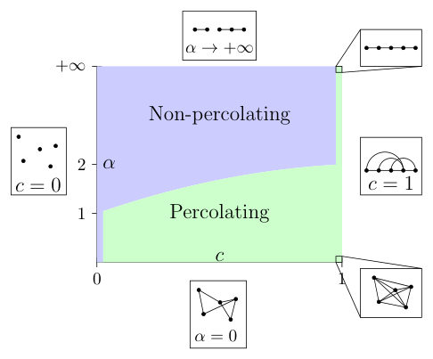
<figcaption class="paper-figure-caption"><b>Fig 1.</b> FIG. 1. Schematic view of the classical phase diagram [36] for the graph model in Eq. (1) in the space of the two param- eters (c, α). The non-percolating region comprises the upper area of the plot and the c = 0 line (here enlarged for clarity). The percolating region includes the lower area and the c = 1 line (also enlarged). The insets show typical graphs for spe- cific values of the parameters corresponding to the following benchmarks: totally disconnected (c = 0); nearest-neighbors connected (c = 1), including the 1D chain (α →+∞) and the fully-connected (α = 0); the Erd˝os - R´enyi model (α = 0); the 1D chain with missing links (α →+∞). It should be noticed that, tuning the...</figcaption>
</figure>
<figure class="paper-figure-card">
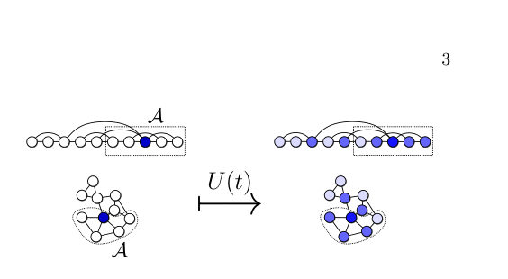
<figcaption class="paper-figure-caption"><b>Fig 2.</b> FIG. 2. Schematic depiction of the simulation performed on each graph sample. The figure shows the system before (left) and after (right) unitary time evolution U(t); the two snap- shots are represented according to the Euclidean geometry (top) and highlighting the graph structure (bottom). For each graph sample, the simulation is performed in the follow- ing way: The system is divided into two halves, subsystem A and its complementary A, and is initialized with a single particle in A. Then, unitary time evolution U(t) induced by the Hamiltonian of (3) acts on the system. This schematic figure highlights that the spreading is more easily understood in terms of the graph geometry, rather...</figcaption>
</figure>
<figure class="paper-figure-card">
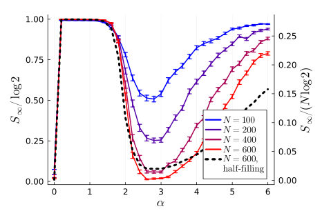
<figcaption class="paper-figure-caption"><b>Fig 3.</b> FIG. 3. Asymptotic entanglement entropy S∞as a func- tion of α at c = 1. This figure represents one main result: The asymptotic entanglement entropy exhibits a new local- ized regime at intermediate values of α, while recovering the limiting behaviors at nearest-neighbors and all-to-all. This behavior is present both in the single-particle case (solid lines, left y axis) and in the half-filling case (dashed line, right y axis).</figcaption>
</figure>
<figure class="paper-figure-card">
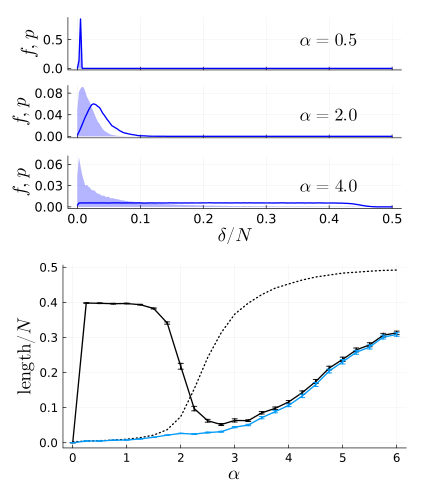
<figcaption class="paper-figure-caption"><b>Fig 4.</b> FIG. 4. (a,b,c) Classical vs. quantum distributions for the graphs, with respect to α. For different values of α in each subplot, we show the fraction f(δ) of nodes (solid lines) and the probability p(δ) at a graph distance δ (shaded regions). (d) Asymptotic wavefunction spreading as a function of α. The curves represent the spreading length-scale in the Eu- clidean (black, solid line) and graph (light blue line) geome- try. The dotted line is the maximum graph distance from the site located at N/2. All data in this figure refer to N = 400.</figcaption>
</figure>

**Summary.** This paper analyzes how varying the geometric structure of quantum interactions on a random graph affects quantum dynamics. By tuning the interaction range via parameter $\alpha$, the authors find an unexpected intermediate regime exhibiting structural disorder-induced localization, which is diagnosed robustly through asymptotic entanglement entropy measurements.

**Why it may be interesting.** The work provides a concrete model for structural disorder (amorphous materials) where connectivity is tunable, offering insights into localization mechanisms beyond standard Anderson models using entanglement entropy as the diagnostic tool.

Detailed structure

**Main problem.** The study investigates how the geometric structure of quantum graphs, defined by tunable long-range interactions, influences quantum dynamics, particularly entanglement growth and localization.

**Main result.** The authors identify a novel intermediate localized regime for entanglement entropy ($S_\infty$) as the interaction range parameter ($\alpha$) is tuned, contradicting simple expectations based on increasing connectivity.

**Method.** The research employs numerical simulations to compute entanglement entropy ($S$) in both single-particle and half-filling fermionic regimes, comparing results against theoretical benchmarks like random Gaussian states.

**Model / system.** The model uses quantum many-body Hamiltonians with two-body interactions represented on a random graph. The connectivity is controlled by an effective range parameter $\alpha$, allowing interpolation between nearest-neighbor and all-to-all couplings.

**Key observables.** Asymptotic entanglement entropy ($S_\infty$), Inverse Participation Ratio (IPR), and the saturation timescale ($t^*$).

**Important parameters / regimes.** The geometric control parameter $\alpha$ (power-law decay of link probability) and connectivity parameters $c$.

**Assumptions / limitations.** For the half-filling case, hard-core bosons are approximated by spinless fermions. The analysis relies on studying the asymptotic behavior in the thermodynamic limit.

**Figures summary.** Figures illustrate how $S_\infty$ varies non-monotonically with $\alpha$, showing a localized minimum; they also compare entanglement entropy calculations across different bipartitions (e.g., even/odd vs. left/right) and analyze saturation timescales ($t^*$) versus $\alpha$.

**Paper structure.** The paper systematically analyzes the single-particle case, establishing the dependence of $S_\infty$ on $\alpha$, before extending these findings to the half-filling fermionic system. The analysis is reinforced by comparing results from different bipartitions and examining scaling properties in the large-$\alpha$ limit.

Abstract

Quantum many-body Hamiltonians with two-body interactions can be represented by graphs, with sites as nodes and two-site couplings as edges. We investigate how the geometry of these graphs affects transport and entanglement growth. To do so, we study dynamics for quantum hopping on a random graph model with an effective range parameter. Tuning it, we interpolate between nearest-neighbor and all-to-all graphs, identifying a new localization regime that is robust in both single-particle and finite-density cases. This provides a model of Anderson localization induced by structural disorder, with implications for amorphous materials and tunable-range analog quantum simulators.

[↑ back to top](#top)

### [Chiral Entangled-State Generation through Dissipative Quantum Dynamics](http://arxiv.org/abs/2607.17302v1)

**Authors:** Huixia Gao, Konghao Sun, Yiwen Han, Lei Xiao, Dengke Qu, Kunkun Wang, Xiang Zhan, Wei Yi, Peng Xue  
**Type:** both · **Category:** quantum information and computing · **PDF:** <https://arxiv.org/pdf/2607.17302v1>  
**Analysis basis:** full PDF text, analyzed in chunks
**Topic relevance:** 🔥 `quantum optics experiment` **5/5** · 🔥 `entanglement & information structure` **4/5** · 🔥 `methods for driven-dissipative` **4/5** · `analog quantum simulation` **3/5** · `correlated / nonlocal dissipation` **3/5** · `driven-dissipative phase transition` **3/5** · `non-equilibrium dynamics` **3/5** · `Keldysh / 2PI / non-Gaussian methods` **2/5** · `QC/QI experiment` **2/5** · `non-equilibrium universality` **2/5** · `Tavis-Cummings & cavity-many-emitter` **1/5** · `correlated cavity matter` **1/5** · `interference shaping light` **1/5** · `measurement-induced transitions` **1/5** · `quantum measurements` **1/5**

↔ Scroll figures horizontally

<figure class="paper-figure-card">
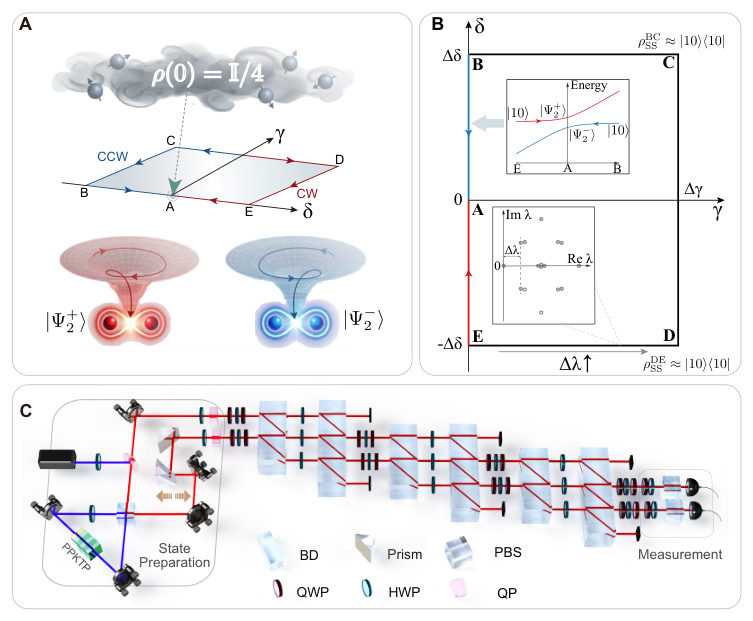
<figcaption class="paper-figure-caption"><b>Fig 1.</b> FIG. 1. Chiral Bell-state generation on a programmable photonic platform. (a) Conceptual illustration of our protocol. The system is initialized in the maximally mixed state ρ(0) = I/4. Slow parametric variation along a closed rectangu- lar loop in the (γ, δ) plane prepares different Bell states depending on the chirality of the path: clockwise (CW, red) evolution yields |Ψ+ 2 ⟩, whereas counterclockwise (CCW, blue) evolution yields |Ψ− 2 ⟩. The tilted rectangle schematically indicates the control loop in the parameter space spanned by γ and δ. (b) Encircling path and mechanism. The system evolves along a rectangular path labeled by ABCDE, with red (blue) arrows indicating the CW (CCW)...</figcaption>
</figure>
<figure class="paper-figure-card">
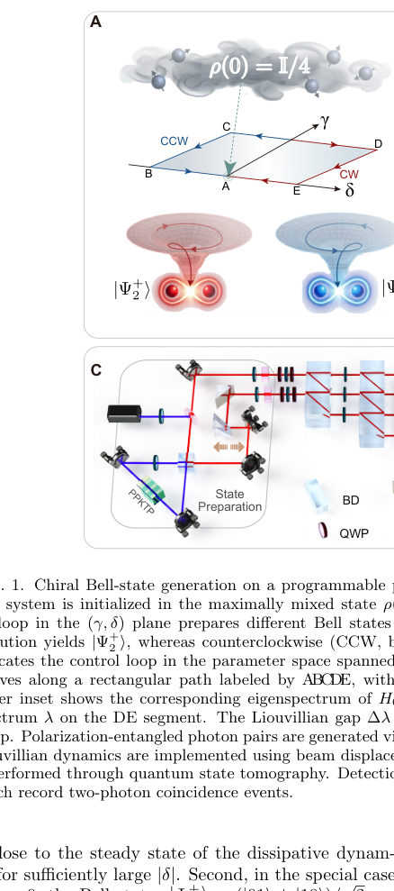
<figcaption class="paper-figure-caption"><b>Fig 2.</b> Figure 1(a) summarizes the central results of our work. Starting from the maximally mixed state ρ(0) = I/4, a slow closed-loop variation of the system param- eters in the (γ, δ) plane prepares different Bell states depending solely on the chirality of the loop: clockwise (CW) encircling drives the system to |Ψ+ 2 ⟩, whereas counterclockwise (CCW) encircling drives it to |Ψ− 2 ⟩. While the chiral entanglement generation is appar- ently similar to chiral state transfer close to excep- tional points (EPs), our scheme is based on more gen- eral mechanisms that do not necessarily involve EPs.</figcaption>
</figure>
<figure class="paper-figure-card">
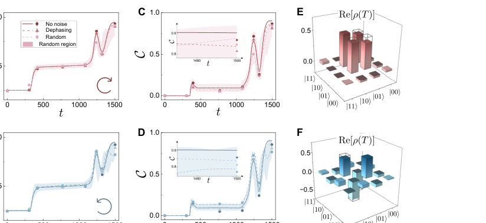
<figcaption class="paper-figure-caption"><b>Fig 3.</b> FIG. 2. Chiral Bell-state generation. (a), (b) Time evolution of the fidelities F+ 2 (t) and F− 2 (t) for the CW and CCW encircling, respectively. (c), (d) Time evolution of the concurrence for the CW and CCW encircling, respectively. (e), (f) Reconstructed final density matrices obtained from quantum state tomography following the CW and CCW encircling, respectively. Parameters: ξ = 1, g = 0.01, ϵ = 1.2, T = 1500, N = 200. Red curves denote the CW evolution, and blue curves denote the CCW evolution. Solid, dashed and dash-dotted curves correspond to results without noise, with dephasing, and with random perturbations, respectively. Shaded regions indicate the range of outcomes from 10...</figcaption>
</figure>
<figure class="paper-figure-card">
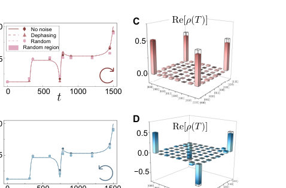
<figcaption class="paper-figure-caption"><b>Fig 4.</b> FIG. 3. Chiral preparation of multi-qubit entanglement. (a), (b) The fidelities between the evolved states and the target entangled states are shown for CW and CCW encir- cling, respectively. (c), (d) Reconstructed final density ma- trices obtained from quantum state tomography following the CW and CCW encircling, respectively. The encircling time is T = 1500, the initial state is I/8, and the parameter Jx = 1.</figcaption>
</figure>
<figure class="paper-figure-card">
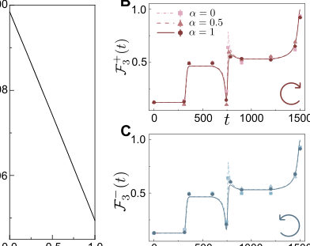
<figcaption class="paper-figure-caption"><b>Fig 5.</b> FIG. 4. Chiral generation of GHZ states under the hy- brid Liouvillian formalism. (a) Final-state fidelity F + 3 (T) (F − 3 (T)) with respect to Ψ+ 3 ( Ψ− 3 ) under CW (CCW) encircling as a function of the post-selection strength α. (b), (c) Time evolution of the fidelities with respect to Ψ+ 3 and Ψ− 3 under CW encircling in (b) and CCW encircling in (c), for three representative post-selection strengths α = 0, 0.5, and 1. The other parameters are the same as those used in Fig. 3.</figcaption>
</figure>

**Summary.** The authors propose a new paradigm for generating entangled quantum states using dissipative dynamics, where the final state depends on whether the system's evolution follows a clockwise or counterclockwise path. By simulating this process with photon pairs and extending it to three qubits, they demonstrate that chiral control offers a robust, high-fidelity method for scalable entanglement generation.

**Why it may be interesting.** This work is highly relevant for AMO/Quantum Optics as it provides an experimentally verifiable method (using photon pairs) to generate high-quality entanglement deterministically by controlling the path topology in parameter space, moving beyond simple steady-state preparation.

Detailed structure

**Main problem.** The paper demonstrates a novel method for generating entangled quantum states where the final state is determined by the chirality (direction) of the evolution path in parameter space.

**Main result.** Chiral dynamics provides a scalable, robust, and controllable route to high-fidelity entanglement generation in dissipative systems, confirmed across two and three qubits.

**Method.** The protocol combines driven-dissipative steady-state engineering with adiabatic passage by simulating Liouvillian dynamics using the quantum Langevin equation for experimental realization.

**Model / system.** The system uses an interacting two-qubit or three-qubit platform, where qubits are encoded in photon polarizations. The evolution is governed by a Lindblad master equation incorporating non-Hermitian effective Hamiltonians and dissipation terms.

**Key observables.** Fidelity ($F$) with respect to target Bell/GHZ states and Concurrence ($C$), which are monitored as functions of time and path chirality.

**Important parameters / regimes.** The parameters include the coupling strengths ($\gamma, \delta$), the post-selection strength $\alpha$ (ranging from 0 to 1), and the path geometry in parameter space.

**Assumptions / limitations.** The scheme relies on careful design of the Hamiltonian, quantum jump processes, and the encircling path; fidelity decreases with increasing $\alpha$ due to reduced state purity.

**Figures summary.** Figures illustrate conceptual protocols showing CW vs CCW evolution leading to different Bell states. Time evolution plots show high fidelities and concurrences maintained across varying parameters ($\alpha$) for both chiral paths.

**Paper structure.** The paper develops the concept by first establishing the two-qubit case, demonstrating chirality dependence via path encircling. It then extends this robust mechanism to three qubits using a hybrid Liouvillian formalism, confirming persistence across different levels of dissipation control ($\alpha$).

Abstract

Dissipation, though often detrimental to quantum entanglement, can be manipulated for the preparation of entangled states, wherein ingeniously designed quantum jump processes drive the system toward the desired steady state. Here we venture beyond this paradigm, and demonstrate a new type of entanglement generation in dissipative quantum dynamics. Combining driven-dissipative steady-state engineering and adiabatic passage, we propose a general protocol where the final entangled state depends on the chirality of the evolution path in the parameter space, a scheme that is further extendable to multipartite entanglement. By simulating the Liouvillian dynamics through the quantum Langevin equation for a pair of photons, we experimentally confirm the noise-resistant chiral preparation of various entangled states with high fidelity and concurrence. Our work establishes parametric chiral dynamics as a scalable and robust tool for controllable entanglement generation, paving the way for its applications in quantum information.

[↑ back to top](#top)

### [Stroboscopic stability of a Floquet chiral spin liquid beyond the folding frequency](http://arxiv.org/abs/2607.16515v1)

**Authors:** Didier Poilblanc  
**Type:** theory · **Category:** strongly correlated electrons · **PDF:** <https://arxiv.org/pdf/2607.16515v1>  
**Analysis basis:** full PDF text, analyzed in chunks
**Topic relevance:** 🔥 `scars & prethermalization` **5/5** · 🔥 `analog quantum simulation` **4/5** · 🔥 `non-equilibrium dynamics` **4/5** · `driven-dissipative phase transition` **3/5** · `exotic spin models in light-matter` **3/5** · `methods for driven-dissipative` **2/5** · `non-equilibrium universality` **2/5** · `Keldysh / 2PI / non-Gaussian methods` **1/5** · `entanglement & information structure` **1/5**

↔ Scroll figures horizontally

<figure class="paper-figure-card">
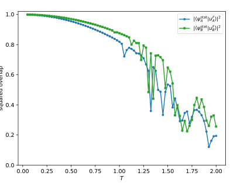
<figcaption class="paper-figure-caption"><b>Fig 1.</b> Figure 1: Left: doublet splitting ∆F AB and isolation ∆F iso measured on the quasienergy circle, versus the drive period T. Dotted lines: static values rescaled by 1/2 (high-frequency limit HF →H/2). Right: squared overlaps of the Floquet doublet eigenstates with the static CSL doublet.</figcaption>
</figure>
<figure class="paper-figure-card">
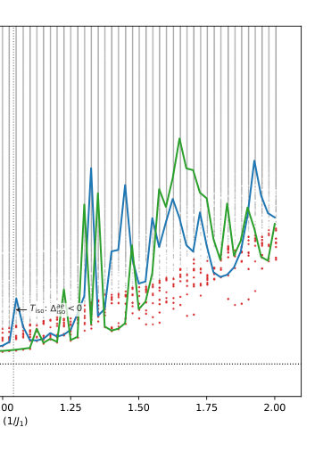
<figcaption class="paper-figure-caption"><b>Fig 2.</b> Figure 2: Average-energy spectrum versus T (grey: all 12870 levels; red: lowest eight; blue/green: the topological doublet followed by overlap). The key periods Tfold, Tdeg, Tres, Tiso are marked. The doublet remains the isolated bottom of the average-energy spectrum far beyond Tres, up to Tiso ≃1.04.</figcaption>
</figure>
<figure class="paper-figure-card">
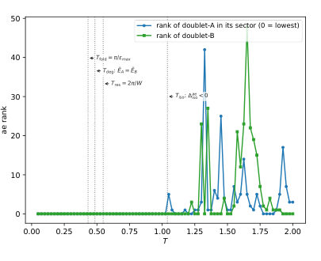
<figcaption class="paper-figure-caption"><b>Fig 3.</b> Figure 3: Left: doublet splitting and signed isolation in average energy (negative if an intruder lies below the doublet top). Right: rank of the doublet states in the average-energy ordering of their own symmetry sector (0 = lowest).</figcaption>
</figure>
<figure class="paper-figure-card">
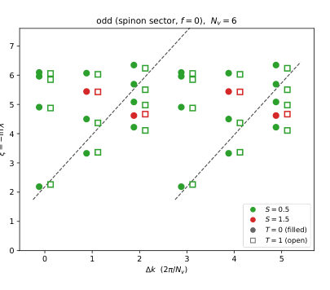
<figcaption class="paper-figure-caption"><b>Fig 4.</b> Figure 4: Spin-resolved entanglement spectrum of the optimal chiral PEPS on an infinite cylinder of circumference Nv = 6, in the physical vacuum sector [even parity, flux f=π; left] and spinon sector [odd parity, f=0; right], for the static (T=0, filled circles) and Floquet-optimized (T=1, open squares) tensors, versus ∆k, the momentum measured from the tower base along the chirality direction. Colors encode the total spin S of each multiplet. Dashed lines: a single straight chiral branch, fitted through the degeneracy-weighted barycenters of the first four even tower levels (left), and the same branch (identical slope, as required for the SU(2)1 chiral edge) anchored at the two degenerate...</figcaption>
</figure>
<figure class="paper-figure-card">
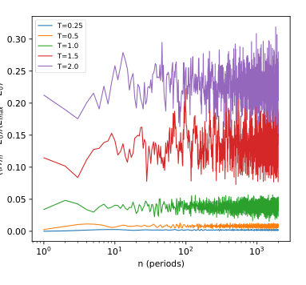
<figcaption class="paper-figure-caption"><b>Fig 5.</b> Figure 5: Stroboscopic evolution |ψ(nT)⟩= Un F |ψstat A ⟩up to n = 2000 periods, for several drive periods T. Left: fidelity to the initial state. Right: absorbed energy normalized to the full many-body bandwidth.</figcaption>
</figure>

**Summary.** The paper investigates how a chiral spin liquid remains stable when subjected to rapid, periodic driving (Floquet engineering). By analyzing the system's quasienergy spectrum and average energy, the authors show that the topological properties persist deep into the folded regime, suggesting stability is governed by local physics rather than global bandwidth. This confirms the potential for robust prethermal quantum states in driven correlated matter.

**Why it may be interesting.** This work directly addresses non-equilibrium many-body physics in strongly correlated systems, providing concrete evidence for prethermalization mechanisms that stabilize topological order under periodic driving, which has implications for quantum simulation and engineered materials.

Detailed structure

**Main problem.** The study investigates the stroboscopic stability of a Floquet chiral spin liquid (CSL) when driven by an alternating Hamiltonian, specifically examining its persistence beyond the frequency where folded states first cross the quasienergy spectrum.

**Main result.** The topological doublet survives the drive far past the initial crossing point ($\omega_{	ext{res}}$), suggesting stability is controlled by local energy scales rather than the extensive bandwidth. This implies a prethermal CSL phase should persist in the thermodynamic limit.

**Method.** The authors compute the one-period propagator exactly and use multiple diagnostics—including quasienergy splitting, average energy ordering, and stroboscopic time evolution—to track the topological doublet's stability across varying driving frequencies.

**Model / system.** The system is modeled by a chiral J1–J2–K Heisenberg model on a $4	imes4$ torus. The dynamics are governed by two-step Floquet evolution alternating between a non-chiral part ($H_{	ext{AF}}$) and a chiral plaquette part ($H_K$).

**Key observables.** Topological doublet quasienergy splitting ($\Delta_{F}^{	ext{AB}}$), isolation gap ($\Delta_{F}^{	ext{iso}}$), time-averaged energy ($ar{E}_n$), and stroboscopic heating rates.

**Important parameters / regimes.** The driving frequency ($\omega$) relative to the resonance frequency ($\omega_{	ext{res}} \simeq 11.5 J_1$), and the optimal parameter point for the static CSL state: $(	heta/\pi, K, J_2) = (0.325, 0.20, 0.40)$.

**Assumptions / limitations.** The analysis relies on geometric Floquet theory to define meaningful diagnostics when quasienergies fold; the PEPS description assumes the state can be captured by a $D=3$ chiral ansatz.

**Figures summary.** Figures track the doublet's spectrum vs. period, showing spectral folding patterns and confirming that the average energy remains ordered at the bottom of the spectrum even after quasienergy crossings occur.

**Paper structure.** The paper first establishes the static model and its topological CSL phase via optimization. It then analyzes the Floquet dynamics by computing the one-period propagator and applying multiple diagnostics (quasienergy, average energy) to track stability as the driving frequency is varied across resonance points.

Abstract

We study the two-step Floquet dynamics of the chiral $J_1$-$J_2$-$K$ Heisenberg model on the $4\times4$ torus, alternating its non-chiral Heisenberg part $H_{\rm AF}$ and its chiral plaquette part $H_K$, at the parameter point where the static model (recovered in the infinite frequency limit) hosts a quasi-degenerate, spectrally isolated chiral-spin-liquid (CSL) topological doublet. The one-period propagator is computed exactly in all momentum/rotation symmetry sectors. It is shown that, decreasing the frequency, the topological doublet survives the drive far beyond the frequency $ω_{\mathrm{res}}\simeq 11.5 J_1$ at which folded states first cross it in quasienergy: the time-averaged energy of the Floquet eigenstates, which orders the folded Floquet spectrum, shows that the doublet remains the isolated bottom of the spectrum down to $ω\simeq6J_1$, while stroboscopic time evolution over thousands of periods shows no heating for $ω\gtrsim ω_{\mathrm{res}}$ and only slow absorption below. The quasienergy resonances that occur in the folded regime are invisible in the average energy, identifying them as parametrically weak avoided crossings. We argue that this mechanism -- stability controlled by local energy scales rather than by the extensive many-body bandwidth -- is precisely the one expected to survive in the thermodynamic limit, where a prethermal Floquet CSL should persist for $ω$ above a threshold set by local scales, with heating times exponentially long in $ω/J_1$. Consistently, the optimal $D=3$ chiral PEPS of the static problem still describes the driven doublet deep in the folded regime, with an essentially unchanged local tensor.

[↑ back to top](#top)

### [Neural Gauge-P Representation for Open Quantum Dynamics of Interacting Bosons](http://arxiv.org/abs/2607.17534v1)

**Authors:** Xiaodong Cao, Zhicheng Zhong  
**Type:** theory · **Category:** quantum gases · **PDF:** <https://arxiv.org/pdf/2607.17534v1>  
**Analysis basis:** full PDF text, analyzed in chunks
**Topic relevance:** 🔥 `methods for driven-dissipative` **5/5** · 🔥 `non-equilibrium dynamics` **4/5** · `analog quantum simulation` **3/5** · `driven-dissipative phase transition` **3/5** · `non-equilibrium universality` **2/5** · `Keldysh / 2PI / non-Gaussian methods` **1/5** · `correlated / nonlocal dissipation` **1/5**

↔ Scroll figures horizontally

<figure class="paper-figure-card">
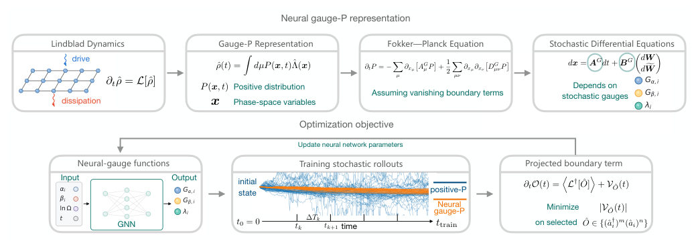
<figcaption class="paper-figure-caption"><b>Fig 1.</b> FIG. 1. Neural gauge-P representation. The gauge-P expansion maps the Lindblad equation to a Fokker–Planck equation when the boundary terms generated by integration by parts vanish. The corresponding SDEs contain drift and diffusion gauges. A graph neural network maps the phase-space variables α and β, the complex log weight ln Ω, and time t to the local drift gauges Gαi and Gβi and diffusion gauge λi. Training rollouts are scored by covariance-normalized residuals of exact moment equations, which probe selected projections of the boundary term. The residual loss is then used to update the network parameters.</figcaption>
</figure>
<figure class="paper-figure-card">
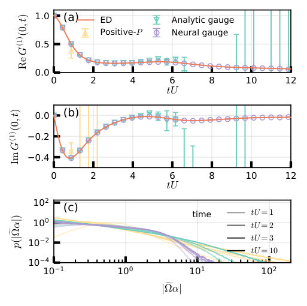
<figcaption class="paper-figure-caption"><b>Fig 2.</b> FIG. 2. Single-site Kerr dynamics for U = 1, γ = 0.3U, F = 0, ∆= 0, initialized with α(0) = β(0) = Ω(0) = 1. The neural gauges are trained up to ttrainU = 8 using a GNN with one message-passing layer and hidden dimension h = 256. For positive-P, gauge-P with the analytic gauge, and neural gauge-P, the observables are estimated from Nw = 106</figcaption>
</figure>
<figure class="paper-figure-card">
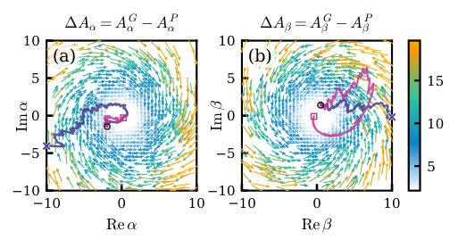
<figcaption class="paper-figure-caption"><b>Fig 3.</b> FIG. 4. Gauge-induced drift fields for the single-site Kerr system of Fig. 2 at tU = 3. Panels (a) and (b) show ∆Aα = AG α −AP α and ∆Aβ = AG β −AP β , respectively, projected onto the complex α and β planes. The arrow length and color indicate the local field magnitude. The blue and purple lines show trajectories generated by positive-P and neural gauge- P, respectively. Both trajectories start from the same initial condition and are propagated using the same Wiener-noise realization. The open circle marks the initial point, the open squares mark the final points, and the cross marks where the positive-P trajectory exits the displayed region.</figcaption>
</figure>
<figure class="paper-figure-card">
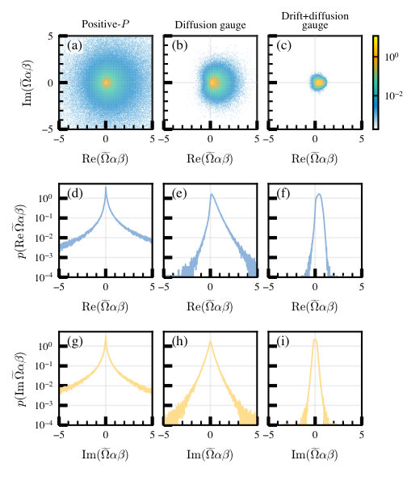
<figcaption class="paper-figure-caption"><b>Fig 4.</b> FIG. 3. Empirical distributions of the weighted occupation estimator eΩαβ, estimated from stochastic trajectories at tU = 3 for the undriven single-site system of Fig. 2. Panels (a)–(c) show the joint empirical distributions in the complex plane for positive-P, neural gauge-P with only the learned diffusion gauge retained, and full neural gauge-P with both learned drift and diffusion gauges, respectively. Panels (d)–(f) and (g)–(i) show the corresponding marginal distributions of the real and imaginary parts, respectively.</figcaption>
</figure>
<figure class="paper-figure-card">
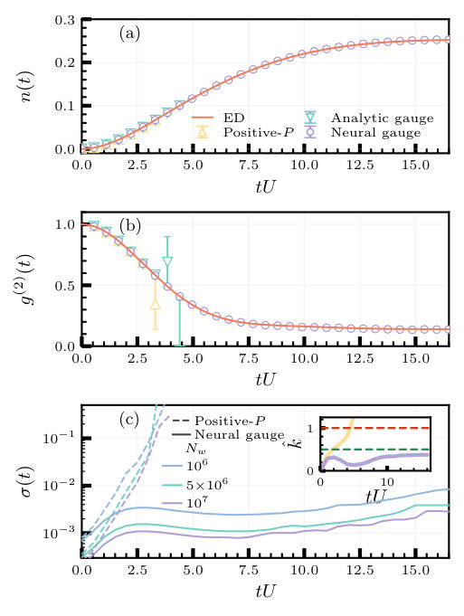
<figcaption class="paper-figure-caption"><b>Fig 5.</b> FIG. 5. Coherently driven single-site dynamics for U = 1, γ = 0.3U, ∆= 0, and F = 0.1U, initialized in the vacuum state. The neural gauges are trained up to Uttrain = 12 using a GNN with one message-passing layer and hidden dimension h = 256. Panels (a) and (b) show n(t) and g(2)(t), respectively, obtained from exact diagonalization (red solid line), positive-P (yellow upward triangles), gauge-P with the analytic gauge (green downward triangles), and neural gauge- P (purple circles). The stochastic estimates use Nw = 107</figcaption>
</figure>

**Summary.** The paper introduces the neural gauge-P representation, an advanced technique for simulating open quantum systems like interacting bosons. By using Graph Neural Networks trained on moment equation residuals, it enforces mathematical consistency that allows simulations to remain accurate during long-time evolution toward steady states. This overcomes limitations faced by traditional phase-space methods.

**Why it may be interesting.** This work directly addresses a major computational bottleneck in open quantum dynamics by integrating machine learning (GNNs) into established theoretical frameworks (Gauge-P representation) to ensure numerical consistency over extended time scales.

Detailed structure

**Main problem.** Simulating the nonequilibrium dynamics of interacting open quantum systems remains challenging beyond small system sizes due to limitations in standard phase-space representations.

**Main result.** The proposed neural gauge-P representation maintains accuracy during long-time evolution toward steady states for the Bose-Hubbard model, significantly outperforming ungauged methods.

**Method.** It introduces a novel framework that parameterizes stochastic gauges using Neural Networks (GNN) and optimizes these parameters by minimizing residuals derived from exact moment equations.

**Model / system.** The study focuses on interacting open bosonic systems, specifically modeling the driven-dissipative Bose–Hubbard model on both single sites and square lattices. The dynamics are governed by a Lindblad master equation.

**Key observables.** Lattice-averaged density n(t) and normalized local second-order correlation g^(2)(t).

**Important parameters / regimes.** The Hamiltonian includes hopping (J), on-site interaction (U), and external driving/dissipation terms (F, F*). The optimization involves minimizing residuals related to projected boundary terms.

**Assumptions / limitations.** The method relies on projecting the challenging operator-valued boundary term onto a selected set of normally ordered monomial operators, under the assumption that these projections are sufficient for accurate simulation.

**Figures summary.** Figures illustrate the workflow involving gauge expansion, Fokker-Planck equations, and SDEs trained using moment equation residuals. Results show comparisons of observables like n(t) and g^(2)(t) across different methods (Positive-P vs. Neural Gauge-P).

**Paper structure.** The paper introduces the limitations of existing phase-space methods, details the construction of the neural gauge-P representation using GNNs trained on moment equation residuals, applies this to the Bose-Hubbard model, and presents comparative results showing long-time stability.

Abstract

Simulating the nonequilibrium dynamics of interacting open quantum systems remains challenging beyond small system sizes. Quantum phase-space representations provide a scalable approach, but their useful simulation time can be limited by broad distribution tails and the associated boundary terms. We introduce the neural gauge-$P$ representation for open bosonic systems, in which stochastic gauges are parameterized by neural networks and optimized using exact moment equation residuals. For the driven-dissipative Bose--Hubbard model in both single-site and square-lattice settings, the neural gauge-$P$ representation remains accurate during long-time evolution toward the steady state, whereas the corresponding ungauged representation becomes unreliable at substantially earlier times. These results demonstrate the potential of the neural gauge-$P$ representation for accurate simulations of nonequilibrium open quantum many-body dynamics.

[↑ back to top](#top)

### [Sensing relativistic quantum fields with minimally perturbing local measurements](http://arxiv.org/abs/2607.17920v1)

**Authors:** F. Daem, L. Ballesteros Ferraz, A. Zampeli, A. Matzkin  
**Type:** theory · **Category:** other · **PDF:** <https://arxiv.org/pdf/2607.17920v1>  
**Analysis basis:** full PDF text, analyzed in chunks
**Topic relevance:** 🔥 `quantum measurements` **5/5** · `measurement-induced transitions` **3/5** · `Keldysh / 2PI / non-Gaussian methods` **1/5** · `correlated / nonlocal dissipation` **1/5** · `entanglement & information structure` **1/5** · `non-equilibrium dynamics` **1/5**

↔ Scroll figures horizontally

<figure class="paper-figure-card">
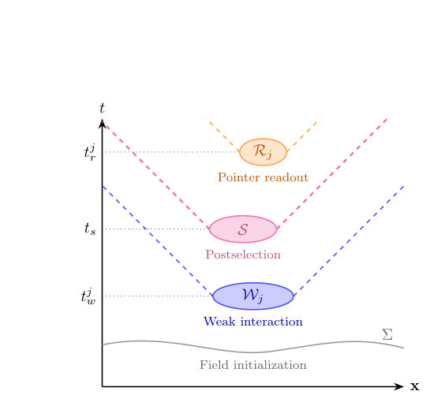
<figcaption class="paper-figure-caption"><b>Fig 1.</b> Figure 1. Spacetime geometry of the protocol. The quantum field state |ψ⟩is prepared on the initial hypersurface Σ. The weak interaction between the field and the jth pointer occurs in Wj around time tj w, postselection in S around ts, and the jth pointer readout in Rj around tj r.</figcaption>
</figure>
<figure class="paper-figure-card">
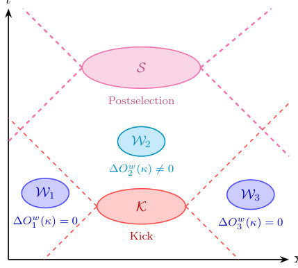
<figcaption class="paper-figure-caption"><b>Fig 2.</b> Figure 2. Non destructive causal mapping of a local change of the field. A kick in region K is probed by weakly coupled pointers in regions Wj. Our protocol shows, using the dif- ference ∆Ow j (κ) = Ow j (κ) −Ow j (κ = 0), that the shift of the jth pointer after postselection in S has no dependence on κ (∆Ow j (κ) = 0) if Wj (blue) is outside the lightcone of K, but is κ-dependent (∆Ow j (κ) ̸= 0) if Wj (cyan) is causally con- nected to K.</figcaption>
</figure>
<figure class="paper-figure-card">
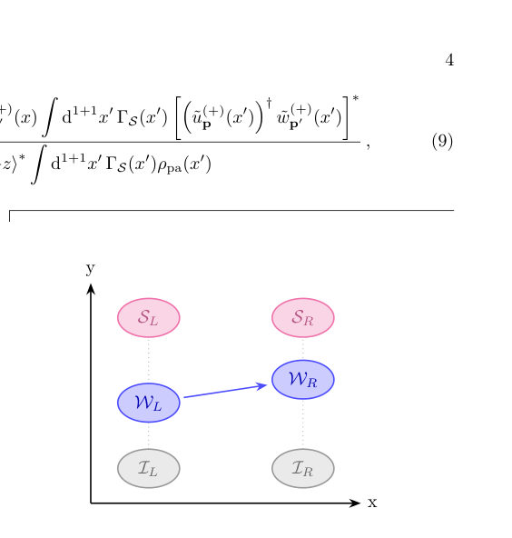
<figcaption class="paper-figure-caption"><b>Fig 3.</b> Figure 4. 2D spatial setup (x = (x, y)) for discriminating an entangled state from a classical mixture. A 2-particle field state (entangled or mixture) is prepared with a particle in region IL, another in region IR. In region WL, the field is weakly coupled to a pointer. The pointer is moved to region WR and coupled there to the field. Finally the field is posts- elected in regions SL and SR.</figcaption>
</figure>
<figure class="paper-figure-card">
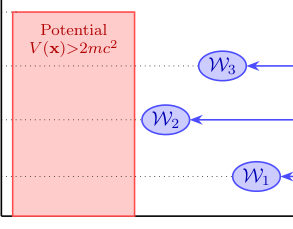
<figcaption class="paper-figure-caption"><b>Fig 4.</b> Figure 3. Schematics of non-destructive detection of the local particle density produced by a supercritical background field (V (x) &gt; 2mc2). The space-time diagram shows regions Wj where weak unitary couplings take place during a short time interval centered on tj w. The field is postselected in region S at time ts.</figcaption>
</figure>

**Summary.** This paper establishes a general theory for non-destructive measurements on relativistic quantum fields using weakly coupled pointers. By analyzing the resulting 'effective weak values,' the authors show that one can probe local quantities like particle density and test for entanglement by observing specific shifts in the measurement statistics. This framework is vital for developing quantum sensing protocols in high-energy or condensed matter contexts.

**Why it may be interesting.** This work provides a rigorous theoretical toolset for quantum measurement in relativistic settings, which is crucial for understanding how local probes can extract information about fundamental field properties without destroying the system's coherence or violating causality.

Detailed structure

**Main problem.** The paper develops a theoretical framework for performing minimally perturbing, non-destructive local measurements on relativistic quantum fields.

**Main result.** It demonstrates that the measurement outcome (effective weak value) can probe local field properties like particle density or distinguish between entangled states and classical mixtures, while respecting causality constraints.

**Method.** The approach uses weak unitary coupling to localized 'pointers' coupled to the field, followed by postselection defined by Kraus operators derived from relativistic measurement theory.

**Model / system.** The system is a charged scalar quantum field in flat spacetime. The interactions are modeled via weak Hamiltonians involving local field observables ($\hat{O}_j(x)$) and pointer variables.

**Key observables.** Effective weak values ($O_{W_j}$ or $\Omega_w^j$), particle-creation densities, and the difference in pointer shifts ($\Delta O_{W_j}(\kappa)$).

**Important parameters / regimes.** Weak coupling strength ($\lambda$), causal structure (spacelike/timelike separation), and postselection conditions.

**Assumptions / limitations.** The analysis heavily relies on the weak coupling approximation ($\lambda$ small) and the use of postselection to define the measured state.

**Figures summary.** Figures illustrate the spacetime geometry of the measurement protocol, non-destructive causal mapping (showing zero shift outside the lightcone), and setups for particle density counting or entanglement discrimination.

**Paper structure.** The paper builds from defining the general framework for weak coupling measurements to calculating effective weak values. It then applies this formalism sequentially to three distinct physical problems: causality testing, pair creation monitoring, and state discrimination.

Abstract

We develop a framework for minimally perturbing local measurements in relativistic quantum field theory, with the aim to sense local properties of the field in a non-destructive manner. The field properties are sensed by weakly coupled pointers and encapsulated in conditional expectation values dependent on a postselection of the field state. Our operational protocol uses causally admissible Kraus updates for the field, in line with recent relativistic measurement theories, keeping in mind restrictions related to ``impossible measurements''. We illustrate our approach with three applications: a spacelikeness detector for causal-structure sensing, counting particle-creation densities in a supercritical potential and non-destructive discrimination between entangled states of the field and mixtures.

[↑ back to top](#top)

### [Active Optical Frequency Measurements with Superradiance Prolonged by a Modulated Magnetic Field](http://arxiv.org/abs/2607.17647v1)

**Authors:** Huihui Yu, Shi-Lei Su, Chongxin Shan, Klaus Mølmer, Yuan Zhang  
**Type:** both · **Category:** other · **PDF:** <https://arxiv.org/pdf/2607.17647v1>  
**Analysis basis:** full PDF text, analyzed in chunks
**Topic relevance:** 🔥 `Dicke superradiance` **4/5** · 🔥 `quantum optics experiment` **4/5** · 🔥 `superradiant laser` **4/5** · `Tavis-Cummings & cavity-many-emitter` **3/5** · `analog quantum simulation` **3/5** · `correlated cavity matter` **3/5** · `driven-dissipative phase transition` **3/5** · `methods for driven-dissipative` **3/5** · `Keldysh / 2PI / non-Gaussian methods` **2/5** · `correlated / nonlocal dissipation` **2/5** · `non-equilibrium dynamics` **2/5** · `non-equilibrium universality` **2/5** · `entanglement & information structure` **1/5** · `interference shaping light` **1/5** · `measurement-induced transitions` **1/5** · `quantum measurements` **1/5** · `spintronics-quantum-optics interface` **1/5**

↔ Scroll figures horizontally

<figure class="paper-figure-card">
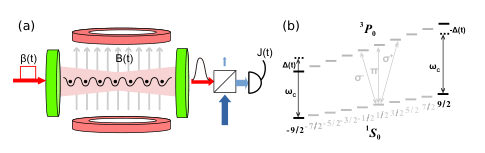
<figcaption class="paper-figure-caption"><b>Fig 1.</b> Figure 1. System schematic and energy level diagram. Panel (a) depicts optical lattice-trapped strontium-87 atoms, sub- ject to a magnetic field B (t), in an optical cavity field, driven by a laser pulse β(t). The emitted signal is mixed with a reference laser beam and detected by a photodetector, gen- erating the photocurrent J (t). Panel (b) shows the atomic energy diagram with ten hyperfine levels mF = −9/2, ..., 9/2 (gray lines) of the electronic ground state 1S0 and excited state 3P0, and σ+, π, σ−transitions between these levels with ∆mF = +1, 0, −1 (gray arrows). The black arrows show the nearly-resonant coupling of two atomic sub-ensembles in the extreme levels mF = −9/2, 9/2 to the...</figcaption>
</figure>
<figure class="paper-figure-card">
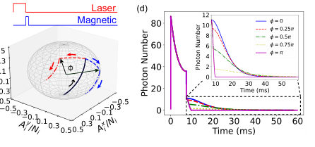
<figcaption class="paper-figure-caption"><b>Fig 2.</b> Figure 2. Magnetic field-controlled superradiance. Panel (a) shows the sequential application of a laser pulse and a mag- netic field (top), causing the rotation and subsequent preces- sion of the Bloch vectors A9/2,A−9/2 of the two atomic sub- ensembles (red dashed and blue solid curves). Panel (b) shows how the intra-cavity photon number decays after its transient excitation by the input pulse and then follows the oscillating coherent atomic dipole moment resulting from addition of the two Bloch vectors. Panel (c) illustrates the rotations of the two Bloch vectors subjected to the laser and magnetic field pulses shown at the top of the panel. Panel (d) shows the monotonous decay of the...</figcaption>
</figure>
<figure class="paper-figure-card">
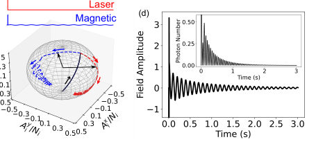
<figcaption class="paper-figure-caption"><b>Fig 3.</b> Figure 3. Superradiance engineered by a train of short mag- netic pulses (a,b) and by a sinusoidal modulation of the mag- netic field (c,d). The corresponding frequency detuning ∆(t) has an amplitude of 2π × 100 Hz and a period of 0.63 ms for the pulses shown at the top of panel (a), and an amplitude 2π×2.5 Hz and a period 0.1 s for the modulation shwon at the top of panel (b). Panels (a,c) show the dynamics of the sub- ensemble Bloch vectors and panels (b,d) show the dynamics of the intra-cavity field amplitude and photon number (insets).</figcaption>
</figure>
<figure class="paper-figure-card">
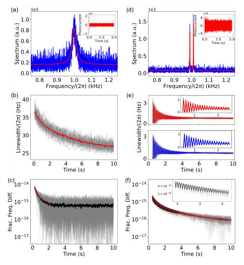
<figcaption class="paper-figure-caption"><b>Fig 4.</b> Figure 4. Active optical frequency measurements with short (a,b,c) and prolonged (d,e,f) superradiant pulses as shown in Fig. 2 (d) and Fig. 3(d). Panels (a) and (d) show the power spectra (blue), obtained by Fourier transform of τ = 5 s long simulated noisy photocurrents (insets), and correspond- ing Lorentzian fits (red curves). Panels (b) and (e) show the dependence of the extracted linewidth on the duration of the measurement, where the colored and gray curves show the mean and the overlap of 30 simulations respectively. In panel (e), the upper and lower part show the results for the left and right frequency peaks shown in panel (d). Panels (c) and (f) show the mean (black curves) of...</figcaption>
</figure>

**Summary.** The paper demonstrates how modulating an external magnetic field can actively control superradiant emission from an atom-cavity system, transforming rapid pulses into sustained or periodic trains. This engineered coherence leads to dramatically narrower spectral features when measured via heterodyne detection. The result shows a significant enhancement in the precision of optical frequency measurements.

**Why it may be interesting.** This work directly addresses quantum control in cavity QED systems by using external fields (magnetic) to manipulate collective atomic emission dynamics, which is a core topic in AMO physics and quantum optics.

Detailed structure

**Main problem.** The goal is to actively control the release of superradiant excitation energy, which is normally rapid and spectrally broad, by modulating atomic transition frequencies using a magnetic field.

**Main result.** Modulating the magnetic field allows for the prolongation of superradiant pulses or generating pulse trains, leading to significantly sharper spectral features and substantially reduced frequency uncertainty in heterodyne detection.

**Method.** The study uses theoretical modeling based on the stochastic master equation solved via cumulant mean-field approaches, supplemented by numerical simulations.

**Model / system.** The system involves superradiant emission from a long-lived excited state of an atomic ensemble (Sr-87) confined within an optical cavity. The dynamics are controlled by applying time-dependent magnetic fields that induce Zeeman shifts on the atomic transitions.

**Key observables.** Superradiant emission intensity, intra-cavity photon number, Bloch vectors ($\mathbf{A}_{9/2}, \mathbf{A}_{-9/2}$), and frequency uncertainty quantified via Fractional Frequency Difference (FFD).

**Important parameters / regimes.** Cavity frequency ($\omega_c$), damping rate ($\kappa$), coupling strength ($g$), and the time-dependent magnetic field modulation $\mathbf{B}(t)$.

**Assumptions / limitations.** The analysis relies on stochastic master equations solved using cumulant mean-field approximations, which are necessary to incorporate measurement backaction from heterodyne detection.

**Figures summary.** Figures illustrate system schematics, Bloch vector rotations under magnetic control, and power spectra comparing short vs. prolonged superradiance pulses, demonstrating linewidth narrowing.

**Paper structure.** The paper develops the theoretical framework using stochastic master equations, details the application of cumulant mean-field approximations for heterodyne detection, simulates the effect of time-dependent magnetic fields to engineer pulse trains, and quantifies the resulting improvement in frequency measurement precision.

Abstract

Superradiant emission from long-lived excited states of an atomic ensemble confined in an optical cavity constitutes a practical source of light with narrow linewidth. In the pulsed regime, however, superradiance implies rapid emission and a broadening of the spectrum. Recent experiments have demonstrated constructive and destructive interference of superradiant emission by different strontium atomic transitions. In this article, we show that by modulating the atomic transition frequencies with a magnetic field, it is possible to control the release of the atomic excitation energy as a prolonged pulse or a train of superradiant pulses. By simulations, we show that heterodyne detection of the prolonged superradiance shows extremely sharp spectral features, which leads to significantly reduced frequency uncertainty and fluctuation.

[↑ back to top](#top)

### [Variational non-gaussian approach to interacting spin-boson models](http://arxiv.org/abs/2607.17934v1)

**Authors:** João Pedro Mendonça, Yao Wang, Krzysztof Jachymski  
**Type:** theory · **Category:** other · **PDF:** <https://arxiv.org/pdf/2607.17934v1>  
**Analysis basis:** full PDF text, analyzed in chunks
**Topic relevance:** 🔥 `Keldysh / 2PI / non-Gaussian methods` **4/5** · 🔥 `analog quantum simulation` **4/5** · 🔥 `methods for driven-dissipative` **4/5** · `Dicke superradiance` **3/5** · `Tavis-Cummings & cavity-many-emitter` **3/5** · `correlated cavity matter` **3/5** · `exotic spin models in light-matter` **3/5** · `spintronics-quantum-optics interface` **3/5** · `superradiant laser` **2/5** · `correlated / nonlocal dissipation` **1/5** · `driven-dissipative phase transition` **1/5** · `entanglement & information structure` **1/5** · `non-equilibrium dynamics` **1/5**

↔ Scroll figures horizontally

<figure class="paper-figure-card">
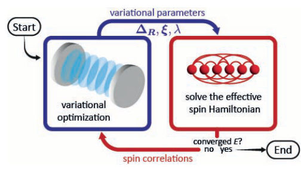
<figcaption class="paper-figure-caption"><b>Fig 1.</b> FIG. 1. Self-consistent optimization loop. For fixed bosonic variational parameters, the effective spin Hamiltonian is solved (DMRG), yielding spin expectation values and corre- lations that update the variational energy functional. The procedure is iterated until convergence of the energy and se- lected observables.</figcaption>
</figure>
<figure class="paper-figure-card">
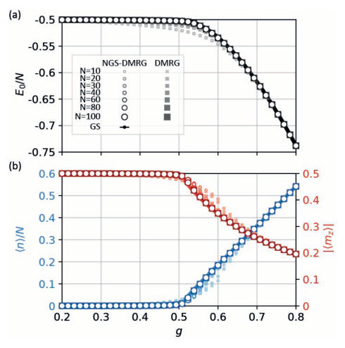
<figcaption class="paper-figure-caption"><b>Fig 2.</b> FIG. 2. Dicke model observables for the three solvers and various N. (a) Average energy, (b) photon number per spin and absolute magnetization as a function of g. Marker sizes scale proportionally with the N. For reference DMRG, we fix nmax = 40, 40, 60, 60, 80, 100, and 140 for N = 10, 20, 30, 40, 60, 80, and 100, respectively.</figcaption>
</figure>
<figure class="paper-figure-card">
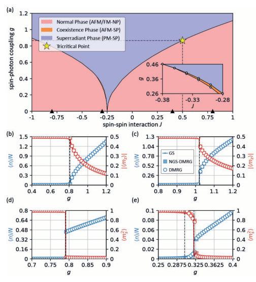
<figcaption class="paper-figure-caption"><b>Fig 3.</b> FIG. 3. Dicke-Ising model phase diagram and observables. (a) Phase diagram in the Gaussian limit as a function of the spin-spin interaction J and spin-photon coupling g, depicting first- and second-order phase boundaries alongside a tricrit- ical point. The mapped regions include the normal phases (AFM/FM-NP), the superradiant phase (PM-SP), and a co- existence phase (AFM-SP) detailed in the inset. (b)-(e) Sys- tem observables evaluated along vertical cuts at fixed N = 100 for representative J values, indicated by triangles in (a). The panels correspond to (b) J = 0.4, (c) J = 0.8, (d) J = −0.8, and (e) J = −0.3. Results from the three solvers are shown for comparison in each panel....</figcaption>
</figure>
<figure class="paper-figure-card">
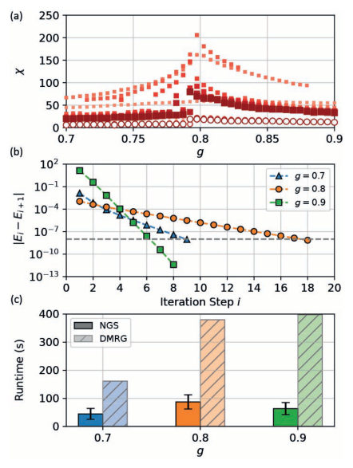
<figcaption class="paper-figure-caption"><b>Fig 4.</b> FIG. 5. Computational cost comparison for the Dicke-Ising model for J = −0.8. (a) Maximum MPS bond dimension χ as a function of g for the NGS-DMRG (circles) and refer- ence DMRG (squares) across distinct N. Marker sizes scale proportionally with N. (b) Energy difference per iteration step i demonstrating exponentially fast convergence of the self-consistent NGS loop for N = 100 and selected values of g. (c) Total execution runtime comparing the NGS-DMRG and reference DMRG solvers for N = 100 and selected values of g. For the reference DMRG baseline, the photon cutoff nmax is chosen according to the number of atoms as nmax = 30, 60, 80, 160, 160, 300, and 350 for N = 10, 20, 30, 40, 60, 80,...</figcaption>
</figure>
<figure class="paper-figure-card">
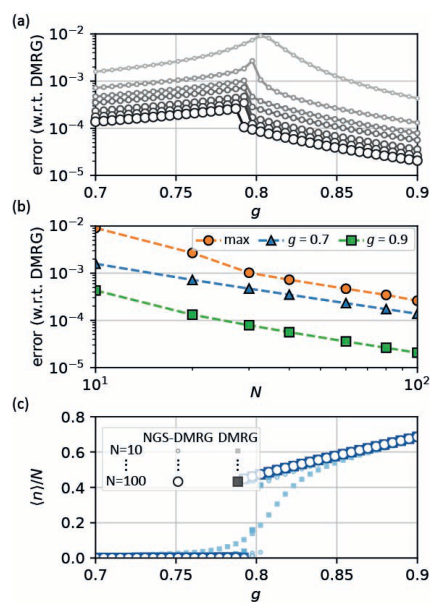
<figcaption class="paper-figure-caption"><b>Fig 5.</b> FIG. 4. Accuracy of the NGS-DMRG approach for the Dicke- Ising model for J = −0.8 and various N. (a) Ground-state energy error relative to the reference DMRG solution as a function of the spin-photon coupling g. (b) Energy error eval- uated at selected coupling strengths as a function of N. (c) Photon number per spin ⟨n⟩/N versus g for both NGS-DMRG (circles) and reference DMRG (squares). Marker sizes scale proportionally with the N. For the reference DMRG base- line, the photon cutoff nmax is chosen according to the num- ber of atoms as nmax = 30, 60, 80, 160, 160, 300, and 350 for N = 10, 20, 30, 40, 60, 80, and 100, respectively.</figcaption>
</figure>

**Summary.** The paper introduces a novel variational non-Gaussian approach to simulate complex interacting spin-boson models. It systematically captures strong quantum correlations by parameterizing the bosonic and spin sectors within a compact manifold. This method is validated against established DMRG techniques for systems like the Dicke model, offering an accurate alternative for strongly correlated light-matter interactions.

**Why it may be interesting.** This work directly addresses key challenges in quantum optics and AMO physics by providing a systematic, variational tool to handle strong correlations in light-matter coupling regimes where mean-field or simple truncation methods fail.

Detailed structure

**Main problem.** The primary goal is developing a robust simulation method for interacting spin-boson systems that are challenging due to unbounded bosonic Hilbert spaces and strong many-body correlations.

**Main result.** The proposed variational non-Gaussian approach yields accurate ground-state solutions for benchmark models like the Dicke model, often with reduced computational cost compared to standard DMRG methods.

**Method.** A hybrid variational framework is employed that maps the bosonic and spin-boson correlations onto a compact non-Gaussian variational manifold. Minimization involves an iterative loop where the effective spin Hamiltonian is solved using DMRG.

**Model / system.** The study focuses on general interacting spin-boson Hamiltonians, including specific examples like the Dicke model and the Dicke-Ising model, which describe light-matter coupled quantum systems (e.g., cavity QED).

**Key observables.** Ground-state energy, photon number expectation value ($\langle n 
angle$), spin magnetization ($\langle S_z 
angle$), and comparison of bond dimensions.

**Important parameters / regimes.** Coupling strengths ($g$, $J$), bosonic frequencies ($\omega$), and the variational parameters defining the non-Gaussian state ($\Delta R, \Gamma, \lambda$).

**Assumptions / limitations.** The method assumes the ground state can be accurately represented within the constructed non-Gaussian variational manifold. It avoids eliminating or truncating the photonic field explicitly.

**Figures summary.** Figures illustrate the self-consistent optimization loop involving fixing bosonic parameters, solving the effective spin Hamiltonian via DMRG, and updating the energy functional using variational parameters.

**Paper structure.** The paper details the construction of the non-Gaussian state ansatz using a unitary dressing transformation ($U_\lambda$), deriving an effective spin Hamiltonian ($\hat{H}_{	ext{eff}}$), and outlining the self-consistent minimization procedure involving DMRG solutions for the spin sector.

Abstract

We apply a hybrid variational framework to interacting spin-boson Hamiltonians, targeting regimes where simulations are limited by the unbounded bosonic Hilbert space and strong many-body correlations. The bosonic sector and spin-boson correlations are captured within a compact non-Gaussian variational manifold, while the minimized spin sector is obtained as the solution to an effective spin Hamiltonian. Minimization is carried out inside a self-consistent energy-minimization loop, where variational parameters are minimized and the effective Hamiltonian is solved via DMRG. The results are obtained without eliminating or truncating the photonic field. We benchmark the method on the Dicke and Dicke-Ising models by comparison to converged spin-boson DMRG, finding accurate ground-state solutions with reduced bond dimension.

[↑ back to top](#top)

### [Scaling law for optimal excitation storage and superradiant release in waveguide QED systems](http://arxiv.org/abs/2607.17320v1)

**Authors:** Wei Chen, Kuan-Ting Lin, Guin-Dar Lin, Hsiang-Hua Jen  
**Type:** theory · **Category:** other · **PDF:** <https://arxiv.org/pdf/2607.17320v1>  
**Analysis basis:** full PDF text, analyzed in chunks
**Topic relevance:** 🔥 `Tavis-Cummings & cavity-many-emitter` **4/5** · 🔥 `methods for driven-dissipative` **4/5** · `analog quantum simulation` **3/5** · `correlated / nonlocal dissipation` **3/5** · `correlated cavity matter` **3/5** · `driven-dissipative phase transition` **3/5** · `non-equilibrium dynamics` **3/5** · `Dicke superradiance` **2/5** · `non-equilibrium universality` **2/5** · `superradiant laser` **2/5** · `Keldysh / 2PI / non-Gaussian methods` **1/5** · `entanglement & information structure` **1/5** · `exotic spin models in light-matter` **1/5**

↔ Scroll figures horizontally

<figure class="paper-figure-card">
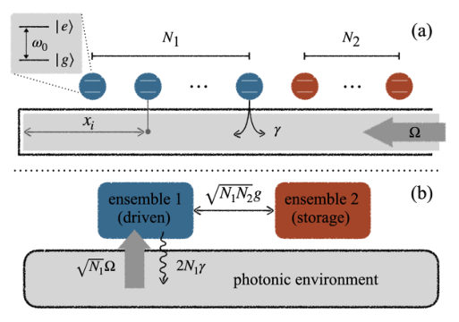
<figcaption class="paper-figure-caption"><b>Fig 1.</b> FIG. 1. Schematic of the system setup. (a) Two emitter arrays, driven and storage ensemble, consisting of N1 and N2 emitters, in- teracting via an infinite-range DDI mediated by a 1D semi-infinite waveguide (with individual emitter decay rate of γ). Each emitter is a two-level system with ground state |g⟩, excited state |e⟩, and tran- sition frequency ω0. The distance of the i-th emitter from the closed end of the waveguide is xi. Additionally, the system is driven by a coherent waveguide field from the open end with driving strength of Ω. (b) In the case of Eq. (3), the system turns into two coupled col- lective spin, ensemble 1 (driven) and 2 (storage). Driven ensemble is...</figcaption>
</figure>
<figure class="paper-figure-card">
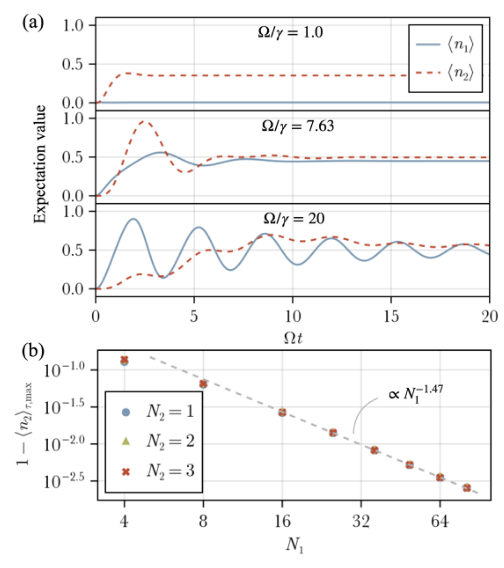
<figcaption class="paper-figure-caption"><b>Fig 2.</b> FIG. 2. Time evolution and scaling law of the excitation number in storage ensemble.. (a) Time evolution of the excitation number ⟨n2⟩for a system with (N1, N2) = (12, 1) at Ω/γ = 1.0, 7.63, and 20, shown from top to bottom. (b) Deviation of the maximum excitation number from unity, 1−⟨n2⟩τ,max, as a function of N1 for different system sizes (N1, N2). We simulate N2 = 1, 2, and 3, and find that the results converge in the limit N1 ≫N2.</figcaption>
</figure>
<figure class="paper-figure-card">
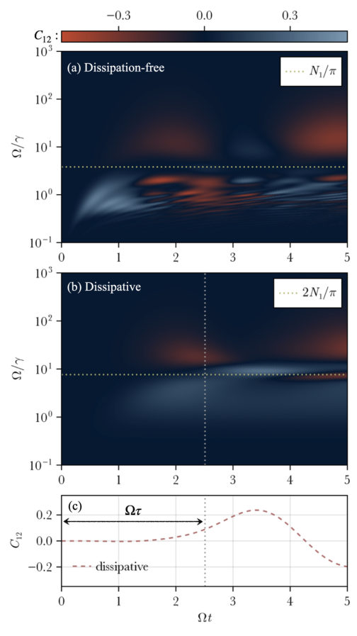
<figcaption class="paper-figure-caption"><b>Fig 3.</b> FIG. 3. Time evolution of the inter-ensemble correlator in dif- ferent coupling regimes. We calculate the connected correlator C12 from the density matrix obtained from Eq. (4). Panels (a) ex- clude the dissipative contribution, whereas panel (b) shows the dy- namics including the effect of the dissipator. The system size is (N1, N2) = (12, 1) in both panels. The yellow dotted line in (a) in- dicates the transition point separating different coupling regime and the one in (b) marks the optimal ratio (Ω/γ)max. By comparing (a) and (b), we further show that the dissipator induces inter-ensemble mixing and leads to the accumulation of correlations during the time evolution. (c) Time evolution...</figcaption>
</figure>
<figure class="paper-figure-card">
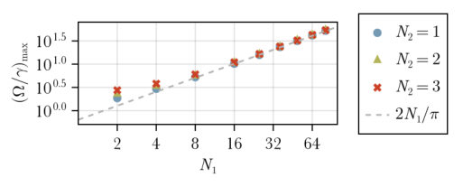
<figcaption class="paper-figure-caption"><b>Fig 4.</b> FIG. 4. Scaling law of the optimal ratio (Ω/γ)max. By numeri- cally simulating the system dynamics according to Eq. (4), we ex- tract the optimal ratio between the coupling strength γ and the driv- ing strength Ω. The numerical results are compared with the scaling relation in Eq. (9), showing good agreement in the regime N1 ≫N2.</figcaption>
</figure>
<figure class="paper-figure-card">
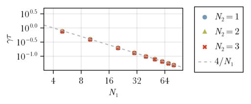
<figcaption class="paper-figure-caption"><b>Fig 5.</b> FIG. 6. Optimal driving duration τ. For the case of N1 ≫N2 the optimal driving duration scales ∼4/N1 (dashed gray line) with the emitter number in driven ensemble.</figcaption>
</figure>

**Summary.** This paper develops a theoretical framework to control excitation storage and release in coupled emitter arrays embedded in waveguides. By analyzing the system's master equation, the authors derive a simple scaling law showing optimal transfer occurs when one ensemble is much larger than the other. This leads to a proposed three-stage protocol for programmable quantum energy management.

**Why it may be interesting.** This work directly addresses controllable energy management in open quantum systems using waveguide QED, providing quantitative scaling laws that simplify complex many-body dynamics into predictable protocols for quantum memory and energy harvesting.

Detailed structure

**Main problem.** The study aims to develop controllable mechanisms for storing and releasing quantum excitations using driven-dissipative emitter ensembles, overcoming challenges posed by complex interplay between driving, dissipation, and correlations.

**Main result.** The authors uncover a simple scaling law showing that optimal excitation transfer occurs when the size of the driven ensemble ($N_1$) greatly exceeds the storage ensemble ($N_2$), allowing for a three-stage protocol for energy management.

**Method.** The analysis involves deriving and solving a Markovian master equation governing the collective spin dynamics, utilizing mean-field approximations in specific limits to simplify the many-body problem.

**Model / system.** The system consists of two spatially separated ensembles of quantum emitters coupled to a semi-infinite waveguide. The dynamics are modeled by an effective Hamiltonian and master equation describing coherent driving, dissipation, and inter-ensemble coupling.

**Key observables.** Time evolution of excitation number ($\langle n_2 
angle$) in the storage ensemble; optimal transfer efficiency $\langle n_2 
angle_{	au, 	ext{max}}$.

**Important parameters / regimes.** System size ratio ($N_1/N_2$), driving strength ($\Omega/\gamma$), and detuning ($\delta$). The limit $N_1 \gg N_2$ is crucial.

**Assumptions / limitations.** The analysis relies on identifying a nearly uncorrelated transfer regime when the driven ensemble size greatly exceeds the storage ensemble size, enabling a mean-field description.

**Figures summary.** Figure 2 illustrates the time evolution of excitation number $\langle n_2 
angle$ for varying $N_1$, confirming that results converge in the limit where the driven ensemble is much larger than the storage ensemble ($N_1 \gg N_2$).

**Paper structure.** The paper establishes the physical model via a master equation, analyzes the dynamics by examining correlation regimes (dissipation-free vs. dissipative), derives scaling laws for optimal transfer, and concludes with a proposal for a three-stage storage-and-release protocol.

Abstract

Driven-dissipative quantum emitters provide a powerful platform for controllable excitation storage and release, with promising applications in quantum batteries and quantum storage. Yet, transient excitation transfer in collective many-body systems is often obscured by the intricate interplay among coherent driving, dissipation, and correlation dynamics. Here, we uncover a scalable excitation-storage mechanism in two emitter ensembles coupled to a semi-infinite waveguide. A coherently driven ensemble acts as an effective excitation reservoir, while a second ensemble positioned near a dissipative node serves as a subradiant storage medium. Surprisingly, when the driven ensemble largely exceeds the storage ensemble in size, the transfer dynamics enters a nearly correlation-free regime, allowing the driven ensemble to behave effectively as a classical excitation source. This reveals a simple scaling law for optimal excitation transfer, under which the storage ensemble approaches near-complete population inversion as the driven ensemble size increases. Building on this mechanism, we propose a three-stage storage-and-release protocol enabling fast excitation storage and controllable photon emission. Our results demonstrate how coherent and dissipative collective interactions can be jointly harnessed for quantum energy storage and programmable nonequilibrium dynamics in waveguide QED platforms.

[↑ back to top](#top)

### [Dissipative Stabilization of Floquet-Engineered Many-Body Order](http://arxiv.org/abs/2607.16391v1)

**Authors:** Shreyas Raman, Robin Schafer, Alicia J. Kollar, Anushya Chandran  
**Type:** theory · **Category:** statistical mechanics · **PDF:** <https://arxiv.org/pdf/2607.16391v1>  
**Analysis basis:** full PDF text, analyzed in chunks
**Topic relevance:** 🔥 `analog quantum simulation` **4/5** · 🔥 `driven-dissipative phase transition` **4/5** · 🔥 `methods for driven-dissipative` **4/5** · 🔥 `non-equilibrium dynamics` **4/5** · `correlated / nonlocal dissipation` **3/5** · `exotic spin models in light-matter` **3/5** · `non-equilibrium universality` **3/5** · `Keldysh / 2PI / non-Gaussian methods` **2/5** · `entanglement & information structure` **1/5** · `scars & prethermalization` **1/5**

↔ Scroll figures horizontally

<figure class="paper-figure-card">
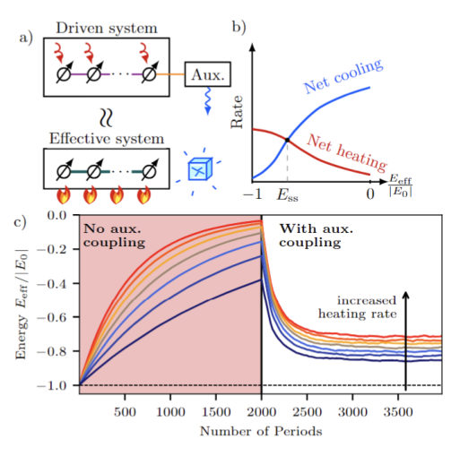
<figcaption class="paper-figure-caption"><b>Fig 1.</b> FIG. 1. (a) A driven system coupled to a dissipative auxil- iary maps to an effective static system subject to heating and cooling processes. (b) The steady-state effective energy Ess is set by the balance between net heating and net cooling rates. (c) Normalized effective energy Eeff/|E0| for the driven Ising chain in Eq. 5 with period-jitter noise and L = 18. The sys- tem starts in the ground state of Heff with energy E0, and the auxiliary coupling is switched on after 2000 periods. Without the auxiliary, the system heats toward infinite temperature; with the auxiliary, the system relaxes to a low-energy steady state, whose energy varies with the heating rate.</figcaption>
</figure>
<figure class="paper-figure-card">
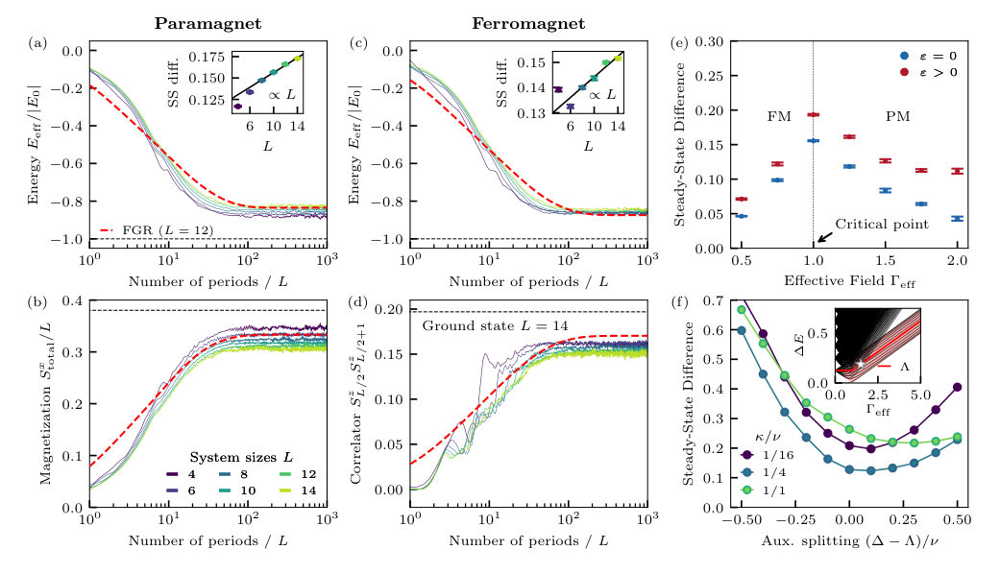
<figcaption class="paper-figure-caption"><b>Fig 2.</b> FIG. 2. Cooling into low-energy states of a Floquet-engineered transverse-field Ising chain using a single auxiliary coupled at one end. (a),(b) Paramagnetic (Γeff = 1.5) and (c),(d) ferromagnetic (Γeff = 0.75) regimes, starting from the infinite- temperature state, versus rescaled time. (a),(c) Normalized effective energy; red dashed curves show the FGR rate-equation prediction [Eq. 2]; black dotted lines mark ground-state values. Insets: steady-state energy difference Ess−E0</figcaption>
</figure>
<figure class="paper-figure-card">
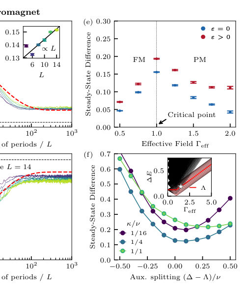
<figcaption class="paper-figure-caption"><b>Fig 3.</b> Fig. 2 demonstrates cooling across the effective Ising phase diagram, shows quantitative agreement with the</figcaption>
</figure>
<figure class="paper-figure-card">
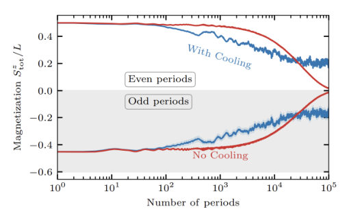
<figcaption class="paper-figure-caption"><b>Fig 4.</b> FIG. 3. Steady-state stabilization of a discrete time crys- tal. The stroboscopic z-magnetization is plotted for even and odd periods starting from the fully polarized state. At early times, Sz tot(t + T) ≃−Sz tot(t). Without the auxiliary (red), the period-doubled response dies out at late times. With the auxiliary (blue), it survives in the steady state. Parameters: L = 12, ω = 16, B/J = 2.256, ϵ = 0.1, ∆= 0.5, g = 0.5, κ = 0.125.</figcaption>
</figure>

**Summary.** The paper addresses the challenge of stabilizing exotic quantum orders created by periodic driving (Floquet engineering) against intrinsic energy heating. By coupling the system to controlled dissipative baths, the authors demonstrate that they can actively cool the system into a stable non-equilibrium steady state. This provides a powerful theoretical tool for realizing and controlling complex many-body physics in open quantum systems.

**Why it may be interesting.** This work provides an analytical handle on achieving stable non-equilibrium states in open quantum systems, which is crucial for understanding engineered quantum matter beyond simple thermal equilibrium assumptions.

Detailed structure

**Main problem.** To stabilize non-equilibrium quantum orders, such as those generated by Floquet driving, which are otherwise transient due to intrinsic energy heating in isolated systems.

**Main result.** The coupling of the system to dissipative auxiliaries successfully cools the system toward a stable, non-equilibrium steady state, robustly stabilizing exotic orders like discrete time crystals.

**Method.** The analysis employs rate theory derived from Fermi's Golden Rule (FGR) to model the balance between intrinsic heating and engineered cooling rates in the Lindblad master equation framework.

**Model / system.** The system is a many-body spin chain (e.g., Ising chain) subjected to periodic Floquet driving, coupled to stochastically dissipative auxiliaries acting as a narrow-band cold bath.

**Key observables.** Steady-state energy difference ($	ext{E}_{	ext{ss}} - 	ext{E}_0$), transverse magnetization, and nearest-neighbor Ising correlator, used to diagnose cooling and order stabilization.

**Important parameters / regimes.** High drive frequency ($\omega$), weak coupling ($g$), auxiliary splitting ($\Delta$), and noise/jitter strength ($\epsilon$).

**Assumptions / limitations.** The analysis relies on perturbative expansions (e.g., Schrieffer-Wolff) and assumes the system operates in a regime where quasiparticle density is low.

**Figures summary.** Figures illustrate the concept of cooling via auxiliary coupling versus intrinsic heating, showing quantitative results for energy and magnetization evolution across different phases of the driven Ising chain.

**Paper structure.** The paper first establishes the problem of Floquet heating in isolated systems. It then introduces the dissipative auxiliary mechanism, deriving rate equations based on FGR to predict steady-state cooling. Finally, it numerically confirms this stabilization by demonstrating robust cooling and time-crystalline order in a driven Ising chain.

Abstract

Floquet driving underlies Hamiltonian and gate engineering, and produces dynamical orders with no equilibrium counterpart. These phenomena are, however, transient in well-isolated systems. We show that statically coupled dissipative auxiliaries cool the system toward low-energy states of the Floquet-engineered Hamiltonian, stabilizing orders in the steady state. The excess energy density is controllably small at high drive frequency and weak coupling and is captured by rate theory based on Fermi's Golden Rule. We numerically confirm robust cooling in a Floquet-engineered transverse-field Ising chain in both phases, and demonstrate discrete time-crystalline order, with a period-doubled magnetization response, in the steady state of a long-range Ising chain. Our results provide a rare analytical handle on the steady states of driven dissipative systems.

[↑ back to top](#top)

### [Strong Quantum Mpemba Effect from Exact Slow-Mode Selection in Constrained Rydberg Chains](http://arxiv.org/abs/2607.17975v1)

**Authors:** Mingdi Xu, Kaixiang Lu, Xiang-Ping Jiang, Haiping Hu, Lei Pan  
**Type:** theory · **Category:** other · **PDF:** <https://arxiv.org/pdf/2607.17975v1>  
**Analysis basis:** full PDF text, analyzed in chunks
**Topic relevance:** 🔥 `Rydberg arrays` **4/5** · 🔥 `analog quantum simulation` **4/5** · 🔥 `non-equilibrium dynamics` **4/5** · `correlated / nonlocal dissipation` **3/5** · `driven-dissipative phase transition` **3/5** · `methods for driven-dissipative` **3/5** · `non-equilibrium universality` **2/5** · `scars & prethermalization` **2/5** · `Frenkel-Kontorova` **1/5** · `Keldysh / 2PI / non-Gaussian methods` **1/5** · `entanglement & information structure` **1/5**

↔ Scroll figures horizontally

<figure class="paper-figure-card">
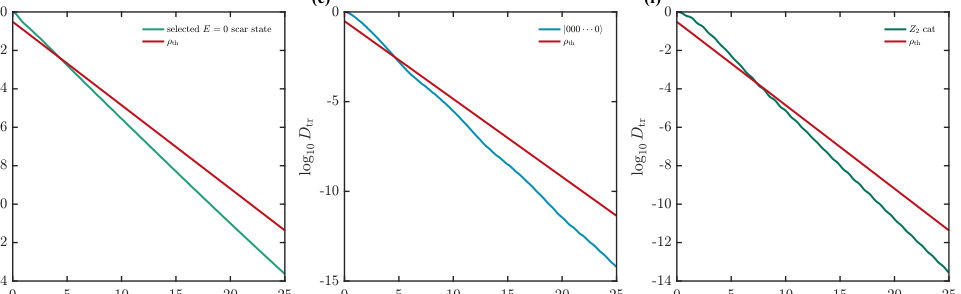
<figcaption class="paper-figure-caption"><b>Fig 1.</b> FIG. 1. Strong quantum Mpemba effect in the locally dephased PXP chain. Periodic boundary conditions, L = 18, D = 5778, γ = 0.4, and β = 0.25 are used. (a) Spectral weight Wn used to identify the representative zero-energy scar eigenstate. (b) Energy-basis diagonal weights of ρss and ρth. (c) Control states violating one of the two selection conditions in Eq. (2). (d–f) Three selected states satisfying Eq. (2) relax faster asymptotically than the same thermal reference.</figcaption>
</figure>
<figure class="paper-figure-card">
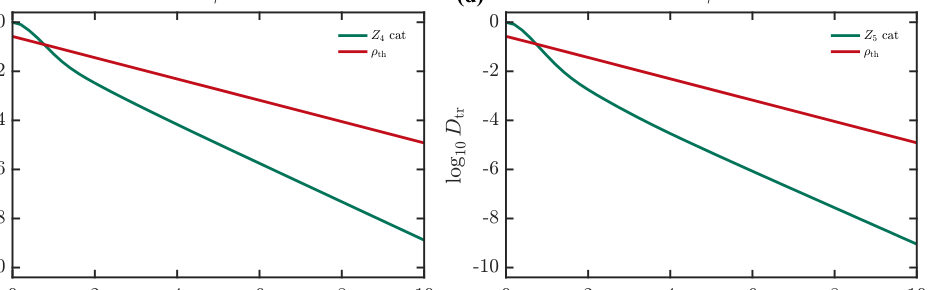
<figcaption class="paper-figure-caption"><b>Fig 2.</b> FIG. 2. Cross-model SQME from the same selection rule. Each panel compares a translation-invariant cat state with Tr(Hρ0) = 0 to the thermal reference ρth. Periodic boundary conditions, γ = 0.1, β = 0.25, and γt ≤10 are used. The models are (a) the (2, 3) model, L = 12, D = 1499; (b) PPXPP, L = 21, D = 3063; (c) PPPXPPP, L = 24, D = 2287; and (d) PPPPXPPPP, L = 30, D = 4612.</figcaption>
</figure>
<figure class="paper-figure-card">
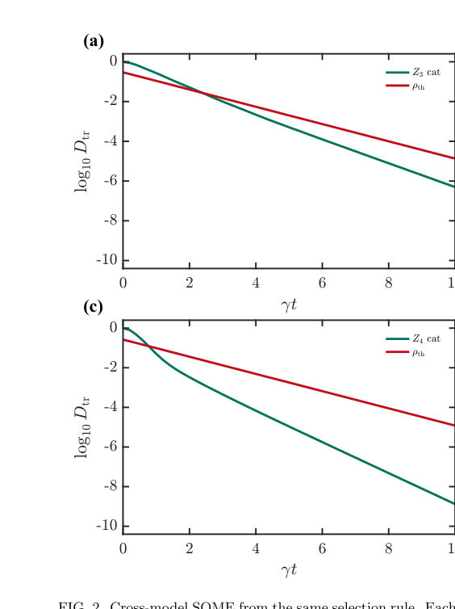
<figcaption class="paper-figure-caption"><b>Fig 3.</b> Figure 4 provides a direct mode-resolved check in the standard PXP chain. Some of the globally slow nonsteady modes lie in nonzero-Q sectors and are therefore invisible to translationally invariant density matrices. Within the visible Q = 0 sector, the exact H-like mode is the slowest thermal channel, while the next non-H mode decays faster. This explains why the thermal state has a slower tail, whereas states satisfying Eq. (2) bypass this tail and relax through the faster Q = 0 channel. The spectral structure in Fig. 4 is therefore the mode-space counterpart of the time-domain crossings shown in Figs. 1 and 2.</figcaption>
</figure>
<figure class="paper-figure-card">
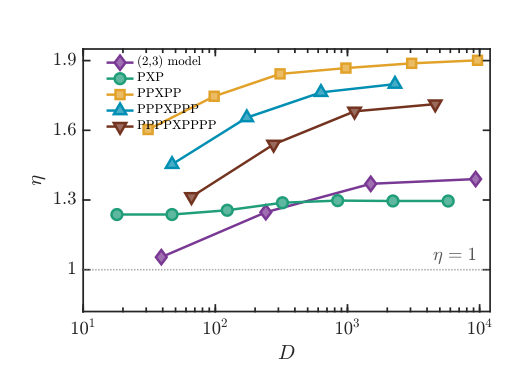
<figcaption class="paper-figure-caption"><b>Fig 4.</b> FIG. 3. Visible-rate ratio η = rfast/rth versus constrained Hilbert-space dimension D. The (2, 3) model is not an R- blockade member. All data use periodic boundary conditions, local dephasing, γ = 0.1, and β = 0.25. Values above unity indicate asymptotically faster relaxation than the thermal reference; the accessible-size trend shows no rapid collapse of the selected-state advantage.</figcaption>
</figure>
<figure class="paper-figure-card">
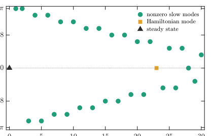
<figcaption class="paper-figure-caption"><b>Fig 5.</b> FIG. 4. Operator momenta of slow Liouvillian modes in the locally dephased PXP chain with L = 18 and γ = 0.4. Translationally invariant density matrices couple only to Q = 0 modes. The H-like mode has rate rH = γ, while the next visible non-H mode in the Q = 0 sector has a larger decay rate. Imposing Tr(Hρ0) = 0 removes the H-like mode and leaves the faster visible channel.</figcaption>
</figure>

**Summary.** The paper reveals that an anomalously fast relaxation, or strong quantum Mpemba effect, can occur in constrained Rydberg chains due to a mechanism of exact slow-mode selection. This selection rule forces the system's evolution away from the slowest thermal decay channel into faster visible modes. The finding establishes this spectral criterion as a general principle for understanding accelerated non-equilibrium dynamics.

**Why it may be interesting.** This work provides a general organizing principle—exact slow-mode selection—for understanding anomalous fast relaxation in open quantum systems, linking spectral properties (Liouvillians) directly to macroscopic non-equilibrium dynamics like the Mpemba effect.

Detailed structure

**Main problem.** Investigating anomalous fast relaxation phenomena, specifically a 'strong quantum Mpemba effect,' where an initially farther state relaxes faster than a closer one in non-equilibrium dynamics.

**Main result.** The strong quantum Mpemba effect is shown to arise from the exact selection of slow Liouvillian modes when specific constraints (energy and symmetry) are met, rather than relying on special wave functions.

**Method.** Theoretical analysis involving the structure of the left Liouvillian ($\mathcal L^\dagger(H)=- \gamma H$) and analyzing decay rates using the trace distance in time evolution.

**Model / system.** The study focuses on locally dephased constrained Rydberg chains, exemplified by the PXP model and its generalizations like the (2, 3) model. The dynamics are governed by single-spin-flip Hamiltonians under local dephasing.

**Key observables.** The rate of decay measured by the trace distance ($	ext{D}_{	ext{tr}}$); the ratio $\eta$ comparing fast vs. thermal relaxation rates.

**Important parameters / regimes.** Local dephasing strength ($\gamma$); system size (Hilbert-space dimension $D$).

**Assumptions / limitations.** The mechanism relies on the specific structure of single-spin-flip Hamiltonians under local dephasing, and the selection rule is shown to be general.

**Figures summary.** Figures demonstrate that selected initial states relax asymptotically faster than the thermal reference state in the PXP chain across different constrained models.

**Paper structure.** The paper establishes the physical problem (SQME), derives the necessary two-part selection rule based on Liouvillian structure, and then demonstrates this rule's applicability to various constrained Rydberg chain models.

Abstract

Can a many-body state relax faster because it is blind to the slowest decay channel? We show that this mechanism gives rise to a robust strong quantum Mpemba effect in locally dephased constrained Rydberg chains. The key observation is that, for constrained single-spin-flip Hamiltonians, local dephasing turns the Hamiltonian itself into an exact left Liouvillian slow mode,   $\mathcal L^\dagger(H)=-γH$.   A thermal state generically retains this slow channel, whereas translationally invariant states with vanishing energy expectation remove it and are forced to relax through faster visible modes. This exact selection rule produces a strong quantum Mpemba effect in the locally dephased PXP chain, including for a zero-energy scar eigenstate, the $|0\cdots0\rangle$ product state, and a translation-invariant $Z_2$ cat state. We further show that the same mechanism persists in the $(2,3)$ model and in the longer-range blockade family. Our results identify exact slow-mode selection, rather than special scar wave functions, as a general organizing principle for anomalously fast relaxation in constrained open quantum systems.

[↑ back to top](#top)

### [Multibath Influence Matrices: Universal Scaling from Real-Time Dynamics](http://arxiv.org/abs/2607.16411v1)

**Authors:** Matan Lotem, Michael Sonner, Valentin Link, Alessio Lerose, Dmitry A. Abanin  
**Type:** theory · **Category:** strongly correlated electrons · **PDF:** <https://arxiv.org/pdf/2607.16411v1>  
**Analysis basis:** full PDF text, analyzed in chunks
**Topic relevance:** 🔥 `Kondo & dissipative impurity` **4/5** · 🔥 `methods for driven-dissipative` **4/5** · 🔥 `non-equilibrium dynamics` **4/5** · 🔥 `non-equilibrium universality` **4/5** · `Keldysh / 2PI / non-Gaussian methods` **3/5** · `driven-dissipative phase transition` **3/5** · `correlated / nonlocal dissipation` **2/5** · `analog quantum simulation` **1/5** · `entanglement & information structure` **1/5** · `scars & prethermalization` **1/5**

↔ Scroll figures horizontally

<figure class="paper-figure-card">
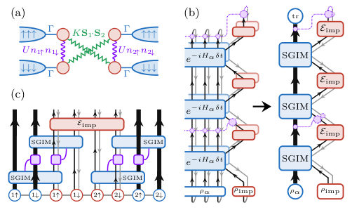
<figcaption class="paper-figure-caption"><b>Fig 1.</b> FIG. 1. (a) The two-impurity Anderson model with four fermionic baths, interimpurity exchange, and intraimpurity Coulomb interactions. (b) Single-bath unitary dynamics (left) map to an influence matrix and impurity channel (right) with operator insertions and trailing Jordan-Wigner strings for a propagator calculation (purple). (c) MPS and Trotter de- composition of the full dynamical map with single-site parity MPOs (purple) attached to the SGIMs (blue) and a four-site impurity channel (red).</figcaption>
</figure>
<figure class="paper-figure-card">
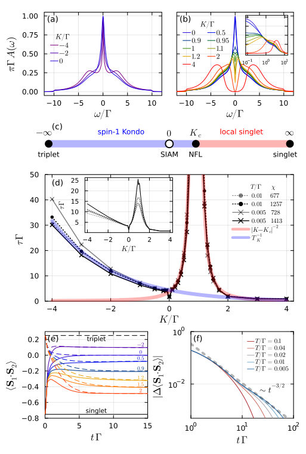
<figcaption class="paper-figure-caption"><b>Fig 2.</b> FIG. 2. Spectral functions for selected K in (a) the spin-1 Kondo regime, and (b) across the quantum phase transition. (c) 2IAM phase diagram with full circles for the fixed points. (d) Finite temperature and SGIM bond dimension collapse to the T →0 equilibration time after a sudden quench to K with the critical divergence (red) and spin-1 Kondo temper- ature (blue) superimposed. (e) Quench dynamics from ini- tial impurity singlet (solid) and triplet (dashed) for selected K, computed up to t = 100/Γ but plotted up to 15/Γ to visibly resolve the decay. (f) Critical quench dynamics at K = 0.9Γ ≈Kc showing a power-law decay consistent with t−3/2 that breaks down to exponential at different...</figcaption>
</figure>
<figure class="paper-figure-card">
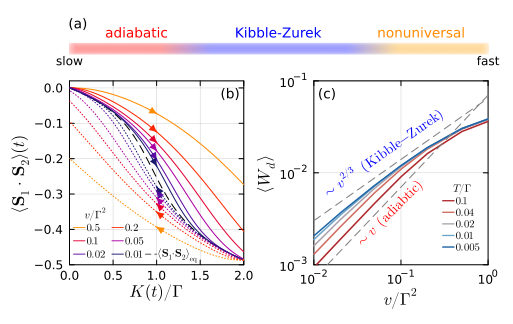
<figcaption class="paper-figure-caption"><b>Fig 3.</b> FIG. 3. (a) Scaling regimes as a function of the ramp veloc- ity, with the onset of the adiabatic regime dictated by the temperature (or other low-energy cutoff). (b) Interimpurity correlations during ramps of K(t) = K0 + vt across the phase transition, starting from K0 = 0 (solid) or K0 = 2Γ (dotted) and varying v at T = 0.01Γ. (c) Dissipated work as a function of v for the forward ramps at different temperatures. Adia- batic and universal scalings are plotted for reference (dashed). Model and simulation parameters are taken as in Fig. 2.</figcaption>
</figure>

**Summary.** The paper introduces multibath influence matrices as a powerful tensor network technique to simulate real-time dynamics in complex open quantum systems like the two-impurity Anderson model. By compressing bath interactions into SGIMs, it successfully maps out evolution across critical points and non-Fermi liquid regimes. This establishes a general framework for studying strongly correlated materials under time-dependent or dissipative conditions.

**Why it may be interesting.** This work provides advanced, scalable numerical machinery to tackle non-equilibrium dynamics in interacting quantum impurity models, which is crucial for understanding transport and criticality in correlated materials.

Detailed structure

**Main problem.** The primary challenge addressed is simulating real-time quantum dynamics in strongly correlated multi-orbital systems, particularly those exhibiting critical behavior with diverging timescales.

**Main result.** The authors establish multibath influence matrices as a practical and general tool for mapping the evolution across complex quantum phases, such as Kondo resonance to non-Fermi liquid criticality.

**Method.** They employ tensor network methods (MPS/MPOs) combined with the Keldysh contour formalism to compress bath back-action into Semigroup Influence Matrices (SGIMs), allowing simulation of open quantum systems.

**Model / system.** The study benchmarks on the two-impurity Anderson model (2IAM) involving four fermionic species, which exhibits a transition through a non-Fermi liquid critical point characterized by Kondo screening.

**Key observables.** Spectral functions ($A_\alpha(\omega)$), relaxation time ($	au$), and universal scaling of dissipated work ($\langle W_d 
angle$) during non-equilibrium quenches (e.g., Kibble-Zurek ramps).

**Important parameters / regimes.** The critical coupling strength $K_c$, the Kondo exponent $
u=2$ for relaxation, and the quench rate dependence ($v^{2/3}$ scaling).

**Assumptions / limitations.** The core assumption is that the multiple environments (baths) are mutually independent. The method also relies on mapping complex fermionic operators using a superfermion picture to manage Keldysh contour ordering.

**Figures summary.** Figures illustrate the 2IAM setup, the structure of SGIMs attached via MPS decomposition, and plots showing spectral function evolution across different quantum phases.

**Paper structure.** The paper develops a systematic machinery for constructing dynamical maps by stitching together individual SGIMs using tensor network techniques (MPS/MPOs) while enforcing fermionic anticommutation relations via superfermion operators on the Keldysh contour.

Abstract

Diverging timescales are the hallmark of critical dynamics and the bottleneck to their classical and quantum simulation. To tame this, we compress a spacetime tensor network: temporally into semigroup influence matrices and spatially via matrix-product states. Benchmarking on the two-impurity Anderson model with its four fermionic species, we compute spectral functions to map the evolution from a Kondo resonance, across a non-Fermi-liquid quantum critical point, and into a gapped singlet phase. Resolving transient through asymptotic dynamics in sudden quenches and Kibble-Zurek ramps, we obtain the universal two-channel-Kondo exponent. Together, these results establish multibath influence matrices as a practical tool for real-time dynamics in strongly correlated multi-orbital systems.

[↑ back to top](#top)

### [Experimental Nanoscale Thermodynamics](http://arxiv.org/abs/2607.16861v1)

**Authors:** G. Andrew D. Briggs, Jörg Schmiedmayer  
**Type:** both · **Category:** statistical mechanics · **PDF:** <https://arxiv.org/pdf/2607.16861v1>  
**Analysis basis:** full PDF text, analyzed in chunks
**Topic relevance:** 🔥 `entanglement & information structure` **4/5** · `non-equilibrium dynamics` **3/5** · `non-equilibrium universality` **3/5** · `analog quantum simulation` **2/5** · `correlated / nonlocal dissipation` **2/5** · `driven-dissipative phase transition` **2/5** · `methods for driven-dissipative` **2/5** · `Keldysh / 2PI / non-Gaussian methods` **1/5** · `Kondo & dissipative impurity` **1/5** · `Rydberg arrays` **1/5** · `correlated cavity matter` **1/5** · `measurement-induced transitions` **1/5** · `quantum measurements` **1/5** · `scars & prethermalization` **1/5**

↔ Scroll figures horizontally

<figure class="paper-figure-card">
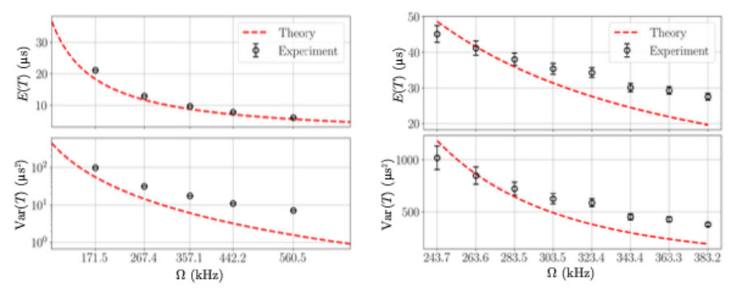
<figcaption class="paper-figure-caption"><b>Fig 1.</b> Fig. 4 Superconducting quantum clock. Statistics of the period T as a function of the qubit drive amplitude Ω, compared with theory based on kinetic uncertainty relations, for: (a) oscillatory clock; (b) jump clock.23</figcaption>
</figure>
<figure class="paper-figure-card">
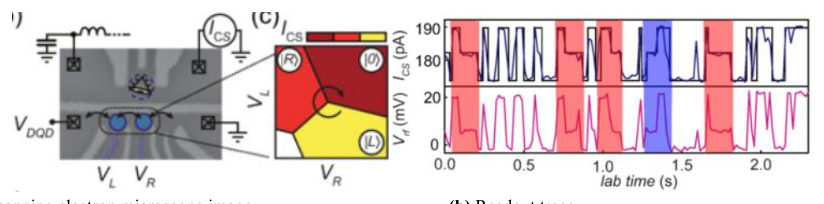
<figcaption class="paper-figure-caption"><b>Fig 2.</b> Fig. 5 A quantum clock formed by a double quantum dot device. (a) Scanning electron microscope image. Blue circles represent the DQD and the eye represents the charge sensor dot used for classical readout. Gate electrode voltages 𝑉𝐿 and 𝑉𝑅 control the number of charges in the left and right dot, respectively. Charge transport can occur from source to drain, or drain to source, or any intermediary process (black arced arrows), influenced by an applied source-drain voltage 𝑉DQD across the DQD. The charge stability diagram illustrates the charge state as a function of 𝑉𝐿 and 𝑉𝑅. Intersection of charge occupation states |0⟩, |𝐿⟩ and |𝑅⟩ is a triple point. Fluctuations about this point cause a...</figcaption>
</figure>
<figure class="paper-figure-card">
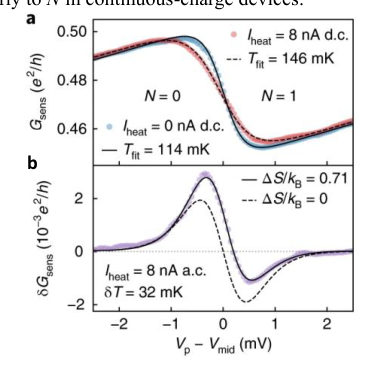
<figcaption class="paper-figure-caption"><b>Fig 3.</b> Fig. 7a shows the results of experiments with two different d.c. currents through the heater quantum point contact. The data in 7b were measured with an oscillating temperature amplitude 32 mK. The fitted conductance difference curve indicated that the entropy change for N = 0 → 1 was ∆S = 0.71 kB. This is comparable with the entropic cost of erasing one bit of information. Operationally, the Maxwell relation Eq. (15) lets us convert the experimentally measured charge-sensor response into a state-space entropy of the dot — Shannon for a classical occupation distribution, or its von Neumann generalisation when quantum coherences matter.</figcaption>
</figure>
<figure class="paper-figure-card">
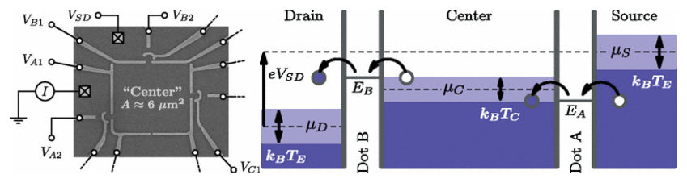
<figcaption class="paper-figure-caption"><b>Fig 4.</b> Fig. 9 Quantum dot refrigerator (left) and the corresponding energies (right). Thermal broadening in the three two-dimensional electron gases (2DEGs; Source, Center, and Drain) is shown by the light shading around their electrochemical potentials (𝜇𝑆, 𝜇𝐶, 𝜇𝐷). The net flow of an electron from Source to Drain removes an energy 𝐸𝐵 − 𝐸𝐴 from Center. 𝐸𝐴 (𝐸𝐵) is the ground state addition energy of dot 𝐴 (𝐵).38</figcaption>
</figure>
<figure class="paper-figure-card">
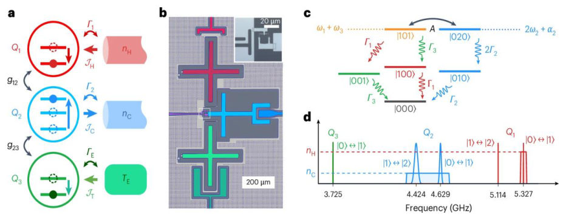
<figcaption class="paper-figure-caption"><b>Fig 5.</b> Fig. 10 Quantum refrigerator comprised of three superconducting devices. a Conceptual scheme with two qubits and a three- level qutrit. Qubit Q1 couples directly to a waveguide at a rate Γ1; and qutrit Q2, to another waveguide at a rate Γ2. Qubit Q3 couples undesirably to an uncontrolled bath in its environment. This bath keeps Q3 at an effective temperature TE. The coupling rate ΓE determines the natural energy-relaxation time of Q3. The waveguides can operate as heat baths containing photons of average numbers nH and nC. The inter qudit couplings (g12, g23) engender a process in which one excitation in Q1 and one excitation in Q3 are simultaneously exchanged with a double excitation in...</figcaption>
</figure>

**Summary.** This paper redefines thermodynamics for the nanoscale by showing that entropy generation is fundamentally linked to the loss of accessible information and correlations. It analyzes how classical concepts break down when individual quantum states become resolvable, providing a framework to assess the fundamental energy costs associated with computation and physical processes.

**Why it may be interesting.** It provides a rigorous, information-theoretic lens through which to view non-equilibrium processes in mesoscopic systems, connecting fundamental statistical mechanics concepts directly to device engineering limits relevant for AMO/quantum optics applications.

Detailed structure

**Main problem.** The core problem is modifying classical thermodynamics, designed for macroscopic systems, to accurately describe nanoscale physics where information and quantum effects dominate.

**Main result.** Irreversibility at the nanoscale arises fundamentally from the loss of accessible information or correlations when describing a system using only coarse-grained observables. This has profound implications for energy efficiency in computation.

**Method.** The authors employ conceptual frameworks by comparing multiple definitions of entropy (Gibbs, Shannon, von Neumann) and analyzing thought experiments like Maxwell's Demon to quantify the thermodynamic cost of information processing.

**Model / system.** The analysis spans various systems: gas mixtures (testing indistinguishability), quantum dots/superconducting circuits (nanoscale devices), and abstract computational models (MOSFETs, learning machines).

**Key observables.** Entropy ($\Delta S$), information content (bits), energy efficiency ($	ext{J}$ per operation), and fluctuations around mean behavior.

**Important parameters / regimes.** Nanometre length scale, Landauer's limit ($k_B \ln 2$ cost), Avogadro scale vs. resolvable states, and the degree of 'ignorance' in measurement.

**Assumptions / limitations.** The approach refines existing thermodynamics rather than overturning it; the definition of work and heat in closed quantum systems remains a complex area.

**Paper structure.** The paper progresses by first establishing the need for new thermodynamic concepts at small scales, then using gas mixing/Maxwell's Demon to introduce information theory into entropy, followed by applying these principles to modern computational architectures (CMOS, quantum), and finally synthesizing the concept of 'engineering ignorance' as the source of irreversibility.

Abstract

Modern fabrication techniques have allowed artificial systems to be constructed on a nanometre length scale. The ideas underlying thermodynamics, a field invented to describe large macroscopic systems, need to be modified to describe much smaller systems. There are implications for our understanding of entropy, cooling, the arrow of time, heat flow, engines, erasure, and mutual information. The theoretical concepts have been implemented and tested in a wide range of experiments, many of which are at low temperatures. Nanoscale thermodynamics is not only a descriptive tool of nanoscale systems, but a design principle that helps us to build new architectures, processors and learning machines.

[↑ back to top](#top)

### [Non-Abelian Gauge Field Mechanics](http://arxiv.org/abs/2607.18215v1)

**Authors:** Ivan Velkovsky, Carlos Camacho, Tomoki Ozawa, Hannah Price, Bryce Gadway  
**Type:** experiment · **Category:** other · **PDF:** <https://arxiv.org/pdf/2607.18215v1>  
**Analysis basis:** full PDF text, analyzed in chunks
**Topic relevance:** 🔥 `analog quantum simulation` **4/5** · `driven-dissipative phase transition` **3/5** · `exotic spin models in light-matter` **3/5** · `non-equilibrium dynamics` **3/5** · `Kondo & dissipative impurity` **2/5** · `QC/QI experiment` **2/5** · `non-equilibrium universality` **2/5** · `correlated / nonlocal dissipation` **1/5** · `entanglement & information structure` **1/5** · `measurement-induced transitions` **1/5** · `methods for driven-dissipative` **1/5** · `quantum measurements` **1/5** · `spintronics-quantum-optics interface` **1/5**

↔ Scroll figures horizontally

<figure class="paper-figure-card">
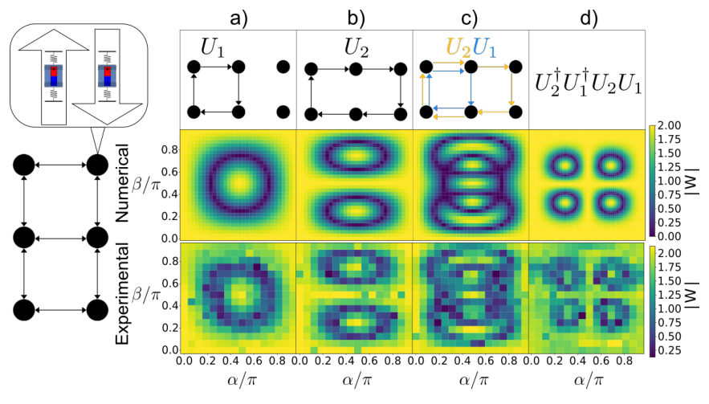
<figcaption class="paper-figure-caption"><b>Fig 1.</b> FIG. 1. Left: Schematic of the 6-site mechanical lattice. Two classical oscillators encode a local pseudo-spin-1/2 degree of freedom at each site. Each oscillator consists of a mass with a small dipole magnet suspended by springs between a pair of anti-Helmholtz coils. The current through these coils, and hence the force exerted on the masses, is determined dynamically through real-time feedback and measurement via an embedded accelerometer. Using these forces, we can map the hopping of phonons in our mechanical lattice to the dynamics of a particle moving under the Hamiltonian in Eq. 1. (a)-(d) Magnitude of the Wilson loop, |W|, for different choices of loop in our 6-site mechanical...</figcaption>
</figure>
<figure class="paper-figure-card">
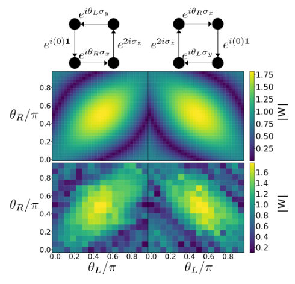
<figcaption class="paper-figure-caption"><b>Fig 2.</b> FIG. 2. Magnitude of the Wilson loop, |W|, for (a) counter- clockwise and (b) clockwise single-plaquette loop operators, as indicated schematically (top row). Corresponding numeri- cal calculations (middle row) and experimental measurements (bottom row) as a function of θR and θL with θD = 0, θU = 2 [c.f Eq. 4]. Non-Hermiticity breaks the symmetry between the clockwise and counter-clockwise Wilson loops, making this measurement orientation-dependent.</figcaption>
</figure>
<figure class="paper-figure-card">
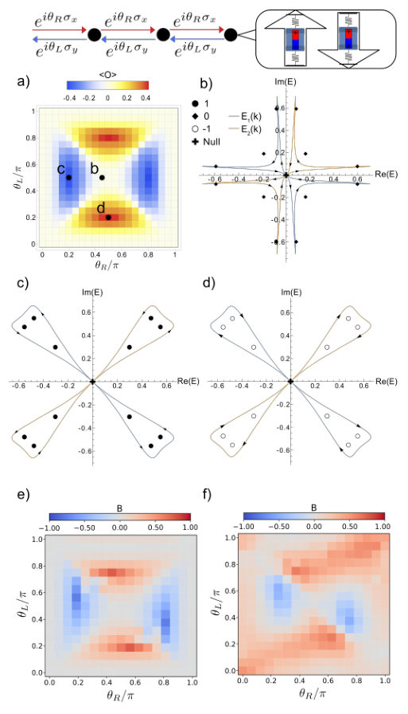
<figcaption class="paper-figure-caption"><b>Fig 3.</b> FIG. 3. (Top row) Schematic of the 1D non-Abelian Hatano- Nelson model [Eq. 5]. Non-Hermiticity is introduced by hop- pings to the left/right having different pseudo-spin rotations. (a) The left-right bias [Eq. 7] for the OBC eigenstates of a 7-site chain, showing that (θR, θL) can induce and switch the NHSE. (e) The numerical and (f) experimental left-right bias extracted from the oscillation amplitudes after excitation of the middle site and evolution for T = 60 s, showing quali- tative agreement. (b)-(d) The PBC spectrum [Eq. 6] (solid lines) and the 7-site OBC eigenvalues (symbols), with param- eters in (a). For each OBC eigenvalue, the symbol indicates if, with respect to that energy,...</figcaption>
</figure>
<figure class="paper-figure-card">
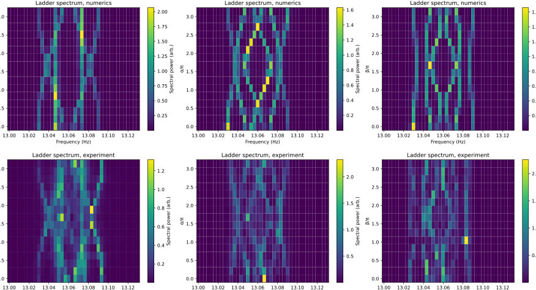
<figcaption class="paper-figure-caption"><b>Fig 4.</b> FIG. 4. The energy spectrum of our 6-site non-Abelian Hermitian ladder [c.f. Eq. 1 in the main text], as extracted using a ringdown measurement observing 300 s of dynamics. In each case, we excite the spin-up bottom-left site in the lattice, before allowing the system to dynamically evolve. We then take the Fourier power spectrum of each oscillator’s position x versus experimental time and sum to obtain the full spectrum of the system. Numerically simulated and experimentally measured spectrum, respectively, for (a,b) varying β with α = π/2, (c,d) varying α with β = π/2, (e,f) varying α with β = 5π/16.</figcaption>
</figure>
<figure class="paper-figure-card">
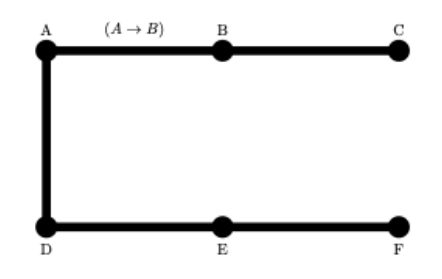
<figcaption class="paper-figure-caption"><b>Fig 5.</b> FIG. 5. A choice of spanning tree for our 6-site mechanical lattice. We have labelled the vertices/lattice sites as A, B, C, D, E and F. All vertices are connected through nearest- neighbour edges, such that there is a path joining every vertex to every other vertex but without loops in the system. As an example, we have labelled one edge as (A →B) indicating the (directional) edge between vertices A and B.</figcaption>
</figure>

**Summary.** The research demonstrates the ability to create and control non-Abelian gauge fields in a programmable platform built from active mechanical oscillators. By measuring Wilson loops and engineering non-Hermitian couplings, the authors prove genuine non-Abelian behavior and explore related phenomena like mode localization switching.

**Why it may be interesting.** This work provides an unprecedented physical realization of abstract concepts from high-energy physics (non-Abelian gauge fields) using macroscopic mechanical oscillators, making it highly relevant for experimental quantum simulation techniques.

Detailed structure

**Main problem.** The goal is to experimentally realize and study genuinely non-Abelian gauge fields, and subsequently explore their interplay with non-Hermitian dynamics.

**Main result.** The authors successfully demonstrated the creation of a tuneable non-Abelian gauge field using mechanical oscillators and showed that non-Hermiticity leads to direction-dependent Wilson loops in 2D and mode localization switching in 1D.

**Method.** The experiment uses an active mechanical lattice where local pseudo-spins are encoded by pairs of coupled classical oscillators. Gauge fields and hoppings are engineered using real-time measurement and feedback control.

**Model / system.** The system is a programmable active mechanical lattice simulating spin-1/2 particles hopping on lattices (square or 1D). The dynamics are governed by Hamiltonians parameterized by gauge potentials, allowing for non-reciprocal couplings to explore non-Hermitian physics.

**Key observables.** Wilson loop observables ($W_i$), which diagnose the Abelian vs. non-Abelian nature of the field; and the left-right localization bias ($B$) in 1D systems.

**Important parameters / regimes.** Coupling amplitudes ($\alpha, eta$); tuning angles ($	heta_R, 	heta_L$); and the ability to engineer non-reciprocal hoppings.

**Assumptions / limitations.** The experiment operates in a classical regime, and sources of error include incomplete energy transfer during coupling links.

**Figures summary.** Figures illustrate the measurement of Wilson loop magnitudes ($|W|$), comparing numerical simulations with experimental results for both Abelian and non-Abelian regimes. Another figure shows the measurable left-right bias ($B$) in 1D systems, confirming control over non-Hermitian skin modes.

**Paper structure.** The paper progresses by first establishing the platform's capability to generate a non-Abelian field via Wilson loop measurements on a 2D lattice. It then extends this control to engineer non-reciprocal hoppings, demonstrating distinct signatures of non-Hermiticity in both 2D and 1D systems.

Abstract

Non-Abelian gauge fields play a key role in describing the behavior of particles whose motion is coupled to internal degrees of freedom, such as their spin. Here, we experimentally realize a tuneable non-Abelian gauge field in an active mechanical lattice by using pairs of oscillators to encode a local pseudo-spin for each site, with inter-site spin-dependent couplings engineered via real-time measurement and feedback. We experimentally extract Wilson-loop observables in our set-up and hence demonstrate that we can create a genuinely non-Abelian gauge field. We then exploit the controllability of our mechanical lattice to engineer non-reciprocal hoppings to explore non-Hermitian non-Abelian gauge potentials. For a two-dimensional (2D) lattice, we demonstrate that the non-Hermiticity can manifest in direction-dependent Wilson loops for a single plaquette, while for a one-dimensional (1D) system, we show that a non-Abelian gauge potential can switch the localization of non-Hermitian skin modes between opposite ends of a chain. Our work establishes active mechanical lattices as a flexible and programmable platform for probing non-Abelian gauge fields and exploring their interplay with non-Hermitian dynamics.

[↑ back to top](#top)

### [Stochastic Resetting: A Non-Equilibrium Framework for Prediction, Inference and Design](http://arxiv.org/abs/2607.16474v1)

**Authors:** Tommer D. Keidar, Sagi Meir, Nir Sherf, Rémi Goerlich, Shlomi Reuveni, Yael Roichman, Barak Hirshberg  
**Type:** theory · **Category:** statistical mechanics · **PDF:** <https://arxiv.org/pdf/2607.16474v1>  
**Analysis basis:** full PDF text, analyzed in chunks
**Topic relevance:** 🔥 `methods for driven-dissipative` **4/5** · 🔥 `non-equilibrium dynamics` **4/5** · 🔥 `non-equilibrium universality` **4/5** · `Keldysh / 2PI / non-Gaussian methods` **3/5** · `driven-dissipative phase transition` **3/5** · `correlated / nonlocal dissipation` **2/5** · `Kondo & dissipative impurity` **1/5** · `analog quantum simulation` **1/5** · `scars & prethermalization` **1/5**

↔ Scroll figures horizontally

<figure class="paper-figure-card">
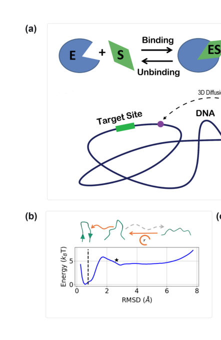
<figcaption class="paper-figure-caption"><b>Fig 1.</b> Figure 1</figcaption>
</figure>
<figure class="paper-figure-card">
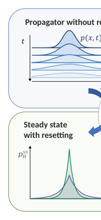
<figcaption class="paper-figure-caption"><b>Fig 2.</b> Figure 2</figcaption>
</figure>
<figure class="paper-figure-card">
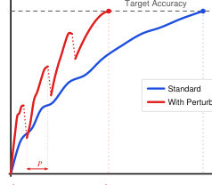
<figcaption class="paper-figure-caption"><b>Fig 3.</b> Figure 3</figcaption>
</figure>
<figure class="paper-figure-card">
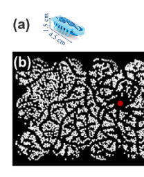
<figcaption class="paper-figure-caption"><b>Fig 4.</b> Figure 4</figcaption>
</figure>
<figure class="paper-figure-card">
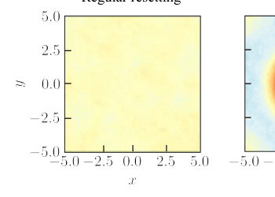
<figcaption class="paper-figure-caption"><b>Fig 5.</b> Figure 5</figcaption>
</figure>

**Summary.** This review establishes stochastic resetting as a universal framework for analyzing non-equilibrium dynamics. It details the mathematical tools—based on renewal theory and Laplace transforms—to predict how periodic resets accelerate kinetics and establish unique steady states. The work is crucial for understanding controlled, non-equilibrium processes in physical chemistry and beyond.

**Why it may be interesting.** This work provides a powerful, general theoretical tool to analyze non-equilibrium steady states and kinetic acceleration mechanisms that are highly relevant when studying open quantum systems or molecular processes driven far from equilibrium.

Detailed structure

**Main problem.** The paper develops a general framework for predicting, inferring, and controlling stochastic dynamics that occur far from equilibrium using the concept of stochastic resetting.

**Main result.** Stochastic resetting fundamentally alters system dynamics by creating non-equilibrium steady states and accelerating first-passage kinetics compared to unperturbed processes.

**Method.** The analysis heavily relies on renewal theory and solving differential equations via Laplace transforms to derive universal prediction tools for reset dynamics.

**Model / system.** The framework applies to general stochastic processes, such as diffusion or molecular simulations, where the system state is periodically interrupted and re-initialized (reset).

**Key observables.** Mean First-Passage Time (FPT), non-equilibrium steady-state distributions ($p_{ss}^R(x)$), and probability density functions $p_R(x, t)$.

**Important parameters / regimes.** The resetting rate ($r$) is a key parameter controlling the acceleration and the resulting steady state.

**Assumptions / limitations.** The analysis assumes that the underlying process can be described by standard stochastic evolution equations amenable to renewal theory treatment.

**Figures summary.** Not specified, but figures illustrate how the probability density function changes with and without resetting, and how FPT is affected.

**Paper structure.** The paper reviews the underlying renewal theory, derives mathematical solutions (using Laplace transforms) for reset dynamics, discusses applications in state preparation and enhanced sampling, and concludes by reviewing advanced topics like adaptive resetting and thermodynamic costs.

Abstract

Stochastic resetting has evolved from a simple model of diffusive search acceleration into a general framework for predicting, inferring, and controlling stochastic dynamics far from equilibrium. Its defining features, i.e., the creation of non-equilibrium steady states and the acceleration of first-passage kinetics, are increasingly relevant across physical chemistry, from biological restart mechanisms to molecular simulations and colloidal experiments. We review the renewal theory underlying stochastic resetting and show how it enables prediction of reset dynamics from properties of the underlying process, while also allowing the latter to be inferred from the resetting-accelerated dynamics. We then discuss applications to state preparation, enhanced sampling, kinetic inference, and training and sampling of machine learning models. Finally, we review recent advances in adaptive resetting, environmental feedback, many-body dynamics, and thermodynamic costs of resetting. These developments establish new opportunities for controlling stochastic dynamics with resetting across theory, simulations, and experiments.

[↑ back to top](#top)

### [Temporal Diffraction Grating for Engineered Superconducting Qubit Dissipation](http://arxiv.org/abs/2607.17562v1)

**Authors:** Pratik J. Barge, Kater W. Murch  
**Type:** both · **Category:** other · **PDF:** <https://arxiv.org/pdf/2607.17562v1>  
**Analysis basis:** full PDF text, analyzed in chunks
**Topic relevance:** 🔥 `interference shaping light` **4/5** · `correlated / nonlocal dissipation` **3/5** · `driven-dissipative phase transition` **3/5** · `methods for driven-dissipative` **3/5** · `non-equilibrium dynamics` **3/5** · `non-equilibrium universality` **2/5** · `Keldysh / 2PI / non-Gaussian methods` **1/5** · `QC/QI experiment` **1/5** · `correlated cavity matter` **1/5** · `quantum measurements` **1/5**

↔ Scroll figures horizontally

<figure class="paper-figure-card">
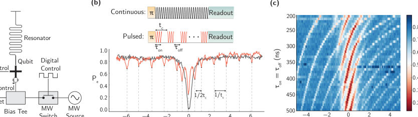
<figcaption class="paper-figure-caption"><b>Fig 1.</b> FIG. 1. Experimental protocol and dissipation spectra for continuous and pulsed parametric mod- ulation schemes. (a) Schematic of the flux-modulation setup. A microwave source is gated by a microwave switch and combined with a DC flux bias through a bias tee before being applied to the qubit via the fast flux line (FFL). (b) Pulse sequences and excited-state probability (Pe) for continuous (black) modulation produces a single broad Purcell-enhanced decay feature near resonance, while pulsed (red) modulation produces multiple interference features as a function of modulation detuning ∆m/2π. The pulse sequence consists of repeated on modulation windows of duration τon = 400 ns separated by...</figcaption>
</figure>
<figure class="paper-figure-card">
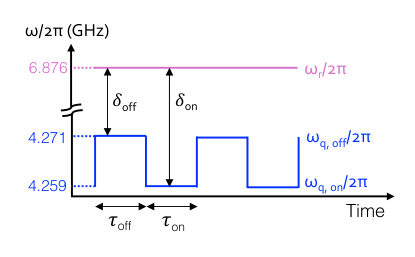
<figcaption class="paper-figure-caption"><b>Fig 2.</b> FIG. 2. Qubit-resonator dynamics is governed by two different detunings during on and off periods.</figcaption>
</figure>
<figure class="paper-figure-card">
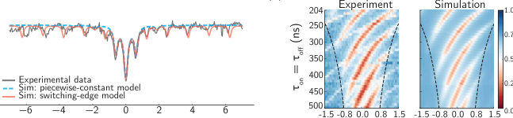
<figcaption class="paper-figure-caption"><b>Fig 3.</b> FIG. 3. Comparison between experimental data and numerical simulations based on Eq. (3). Filled circles denote measured excited-state probabilities, while solid lines denote numerical simulations based on the repeated-block expression for Pe in Eq. (3). (a) Continuous modulation response, showing a single Purcell- enhanced decay feature near the sideband resonance. (b) Pulsed modulation response for τon = τoff = 440 ns with different numbers of on/off blocks N, illustrating the buildup of interference features as the sequence is repeated. (c) Representative pulsed-modulation spectrum showing the two families of spectral features: prominent, central interference dips near ∆m/2π = 0 and...</figcaption>
</figure>
<figure class="paper-figure-card">
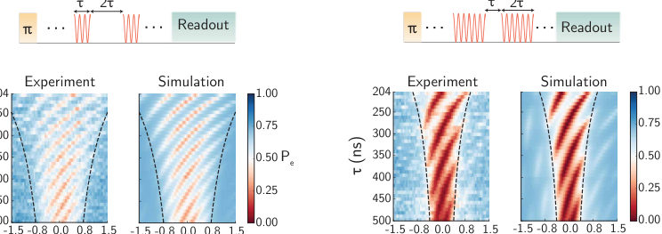
<figcaption class="paper-figure-caption"><b>Fig 4.</b> FIG. 4. Effect of duty-cycle variation on dissipation spectra. Measured and simulated two-dimensional maps of the Pe as a function of modulation detuning and pulse duration for two asymmetric on/off sequences. Experimental data and simulation of (a) longer-off sequences, (τon, τoff) = (2τ, τ), and (b) longer-on sequences, (τon, τoff) = (τ, 2τ). Because both cases have the same total cycle time tc = τon + τoff, the interference spacing is similar, while the fringe contrast and single-slit envelope (dashed black curves) is different in both cases.</figcaption>
</figure>

**Summary.** The paper demonstrates that by rapidly pulsing the parametric modulation coupling between a transmon qubit and a resonator, one can engineer structured interference patterns into the qubit's decay spectrum. This technique treats pulsed modulation as an effective temporal aperture, providing unprecedented control over open quantum system dynamics beyond simple average decay rates.

**Why it may be interesting.** This work provides a novel, time-domain control knob for open quantum systems dynamics in superconducting circuits, allowing precise spectral shaping of engineered dissipation channels.

Detailed structure

**Main problem.** The research aims to move beyond simple time-averaged descriptions of qubit decay by engineering structured dissipation spectra in superconducting qubits.

**Main result.** Pulsing the parametric modulation channel reorganizes the engineered dissipation spectrum into a distinct, controllable interference pattern analogous to N-slit diffraction.

**Method.** The authors use a Chebyshev-propagator model applied to the time evolution governed by alternating 'on' and 'off' coupling periods.

**Model / system.** The system is a flux-tunable transmon qubit coupled dispersively to a lossy resonator. Control is achieved via parametric frequency modulation, which is pulsed on and off.

**Key observables.** Excited-state probability ($P_e$) and the structured dissipation spectrum measured by sweeping the modulation detuning ($\Delta_m/2\pi$).

**Important parameters / regimes.** Pulse duration ($	au_{on}, 	au_{off}$), duty cycle, and the total cycle time ($t_c = 	au_{on} + 	au_{off}$).

**Assumptions / limitations.** The off-segment Hamiltonian assumes negligible coupling ($g_{	ext{off}} \approx 0$) and only accounts for resonator decay ($\kappa$).

**Figures summary.** Figures compare continuous vs. pulsed modulation spectra, showing multiple interference dips for the latter; one figure illustrates $P_e$ evolution over time.

**Paper structure.** The paper develops from describing the physical setup and the limitations of simple averaging to deriving the full block propagator ($M$), calculating its N-th power using Chebyshev polynomials, and finally mapping the resulting probability structure onto a diffraction grating analogy.

Abstract

Parametric frequency modulation is a standard tool in superconducting circuits for activating tunable interactions and implementing quantum gates. Here, we engineer dissipation in a flux-tunable transmon qubit by using sideband modulation to bring it into resonance with a lossy resonator, opening an on-demand Purcell decay channel. We find that pulsing this channel on and off does not simply lower the time-averaged decay rate; instead, it reorganizes the dissipation spectrum into a structured interference pattern. A Chebyshev-propagator model for the repeated on/off block reproduces the measured spectra and reveals a close structural correspondence to N-slit Fraunhofer diffraction, with each on-window acting as a temporal aperture. By varying the pulse duration and duty cycle, we demonstrate control over the spacing, contrast, and envelope of the dissipation spectrum. These results establish pulsed parametric modulation as a direct method for shaping engineered dissipation in superconducting circuits and provide a new control knob for open quantum system dynamics.

[↑ back to top](#top)

### [Resonant excitations via low frequency pumping in driven magnon systems](http://arxiv.org/abs/2607.18073v1)

**Authors:** Jan Mathis Giesen, Alexandre Abbass Hamadeh, Imke Schneider, Philipp Pirro, Sebastian Eggert  
**Type:** theory · **Category:** other · **PDF:** <https://arxiv.org/pdf/2607.18073v1>  
**Analysis basis:** full PDF text, analyzed in chunks
**Topic relevance:** 🔥 `driven-dissipative phase transition` **4/5** · `exotic spin models in light-matter` **3/5** · `methods for driven-dissipative` **3/5** · `non-equilibrium dynamics` **3/5** · `spintronics-quantum-optics interface` **3/5** · `non-equilibrium universality` **2/5** · `Keldysh / 2PI / non-Gaussian methods` **1/5** · `analog quantum simulation` **1/5** · `correlated / nonlocal dissipation` **1/5**

↔ Scroll figures horizontally

<figure class="paper-figure-card">
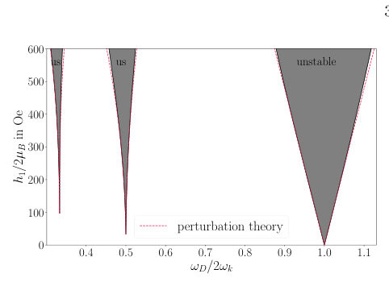
<figcaption class="paper-figure-caption"><b>Fig 1.</b> FIG. 2. Stability chart for excitations at k = 2.5 rad</figcaption>
</figure>
<figure class="paper-figure-card">
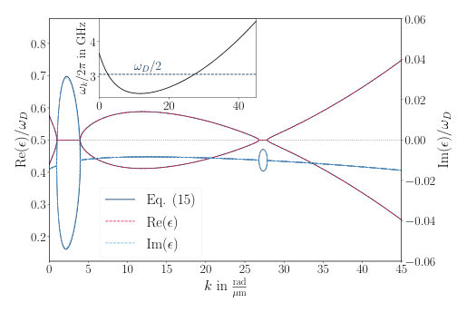
<figcaption class="paper-figure-caption"><b>Fig 2.</b> FIG. 1. Analytical quasi-energies of Eq. (15) (solid) compared with numerical solution of Eq. (8) (dashed) for ωD =6.13 GHz, static field h0 = 700 Oe, driving amplitude h1 = 400 Oe, film thickness d = 0.5µm and damping α = 0.02. The inset shows the dispersion ωk in Eq. (6) with half the driving frequency plotted as a dashed line.</figcaption>
</figure>
<figure class="paper-figure-card">
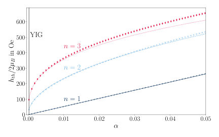
<figcaption class="paper-figure-caption"><b>Fig 3.</b> FIG. 3. The behavior of the minimal threshold for the mode k=2.5 rad</figcaption>
</figure>
<figure class="paper-figure-card">
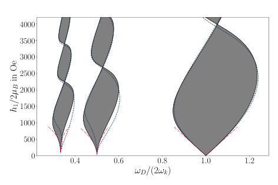
<figcaption class="paper-figure-caption"><b>Fig 4.</b> FIG. 4. Stability regions for k = 5 rad</figcaption>
</figure>
<figure class="paper-figure-card">
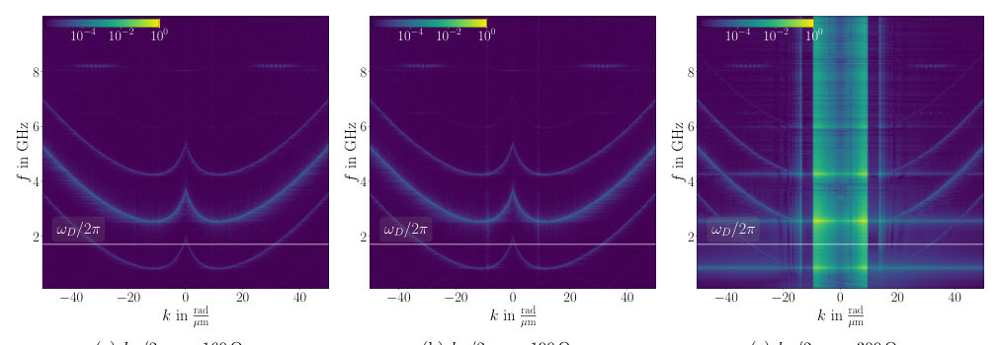
<figcaption class="paper-figure-caption"><b>Fig 5.</b> FIG. 5. Colormap of the simulated magnon spectrum of YIG under periodic drive at the n = 3 resonance ωD</figcaption>
</figure>

**Summary.** This paper theoretically investigates how low-frequency microwave pumping can induce resonant excitations in ferromagnetic magnons within thin films like YIG. Using Floquet theory and perturbation methods, the authors predict specific resonance conditions and calculate the critical driving amplitudes required to excite these modes. The findings offer a pathway for targeted control of quantum magnetic states using external electromagnetic fields.

**Why it may be interesting.** This work is highly relevant as it uses advanced techniques from periodically driven quantum systems (Floquet theory) to model collective excitations in magnetic materials, providing a theoretical framework for controlling magnon dynamics using external fields.

Detailed structure

**Main problem.** The study analyzes resonant excitations of ferromagnetic magnons driven by low-frequency microwave pumping, focusing on parametric resonances occurring when driving frequencies are below the natural magnon energy.

**Main result.** The theory predicts regions of parametric resonance and determines threshold amplitudes for excitation, showing a characteristic power-law dependence on damping. These results are compared with micromagnetic simulations.

**Method.** The primary methods involve applying Floquet theory to analyze time-periodic systems, utilizing degenerate perturbation theory in the resulting quasi-energy spectrum, and comparing these analytical predictions against full micromagnetic simulations solving the LLG equation.

**Model / system.** The system modeled is thin films of ferro- or ferri-magnetic materials like YIG. The dynamics are governed by an effective spin-$S$ Heisenberg model Hamiltonian, analyzed using linear spin wave approximations and bosonic operators.

**Key observables.** Quasi-energies ($\epsilon$), resonance thresholds ($h_{th}$), instability regions ($	ext{Im}(\epsilon)>0$), and magnon density increase above the threshold.

**Important parameters / regimes.** Damping constant ($\alpha$), microwave driving amplitude ($h_1$), and driving frequency ($\omega_D$). Resonance conditions are linked to $\omega_D = 2\omega_k/n$.

**Assumptions / limitations.** The analysis relies on the linear spin wave approximation, the uniform-mode approximation, and perturbative expansions for small or intermediate driving amplitudes; higher-order magnon-magnon scattering is neglected in the analytic models.

**Figures summary.** Figures illustrate analytical quasi-energies vs. numerical solutions showing resonance structure (Fig 1), stability charts mapping instability regions ($	ext{Im}(\epsilon)>0$) vs. drive parameters (Fig 2, Fig 4), and simulation results comparing magnon dispersion below and above the predicted threshold (Fig 5).

**Paper structure.** The paper progresses from establishing the Hamiltonian and linear spin wave framework to applying Floquet theory for time-periodic driving. It then develops analytical predictions for resonance thresholds using perturbation theory, addresses strong driving fields via gauge transformations involving Bessel functions, and concludes by comparing these findings with full micromagnetic simulations.

Abstract

We analyse resonant excitations of ferromagnetic magnons via microwave pumping using Floquet theory. Special focus is put on driving frequencies that are below the corresponding magnon energy, which can be excited in large parameter regions via parametric resonances. We develop a theoretical framework that analytically predicts the regions of resonances and resonance thresholds in thin films of ferro- and ferri-magnetic materials like YIG as a function of damping, amplitude and frequency. Resonance regions are separated by exceptional points of the quasi-energies and the results are compared with micromagnetic simulations. The corresponding threshold amplitudes can be estimated from a characteristic powerlaw with damping, leading to the possibility of targeted exciatations at selected wavenumbers using low frequency drive.

[↑ back to top](#top)

### [High-frequency dual-channel lock-in detection via rapidly oscillating driving](http://arxiv.org/abs/2607.17854v1)

**Authors:** Kangze Li, Xu Zhao, Liantuan Xiao, Gerardo Adesso  
**Type:** both · **Category:** other · **PDF:** <https://arxiv.org/pdf/2607.17854v1>  
**Analysis basis:** full PDF text, analyzed in chunks
**Topic relevance:** 🔥 `QC/QI experiment` **4/5** · `methods for driven-dissipative` **3/5** · `quantum measurements` **3/5** · `driven-dissipative phase transition` **2/5** · `non-equilibrium dynamics` **2/5** · `quantum optics experiment` **2/5** · `Keldysh / 2PI / non-Gaussian methods` **1/5** · `analog quantum simulation` **1/5** · `measurement-induced transitions` **1/5** · `spintronics-quantum-optics interface` **1/5**

↔ Scroll figures horizontally

<figure class="paper-figure-card">
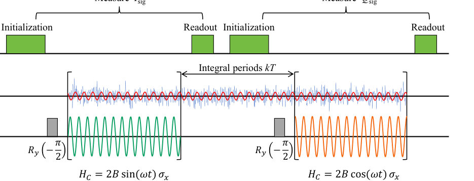
<figcaption class="paper-figure-caption"><b>Fig 1.</b> FIG. 1. Schematic diagram of the high-frequency quantum dual-channel lock-in detection protocol based on NV centers. The top row shows the laser pulse sequence used to initialize and read out the electron spin state of NV centers. The middle row shows the target signal and background noise. The bottom row shows the driving microwave field used to implement the detection process and gate operations.</figcaption>
</figure>
<figure class="paper-figure-card">
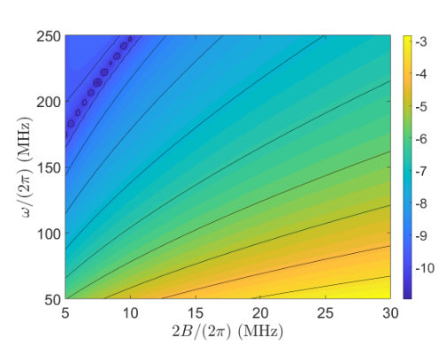
<figcaption class="paper-figure-caption"><b>Fig 2.</b> FIG. 2. The validity of the second-order Magnus approximation. The quantity log10(1 −F) is plotted as a function of signal frequency ω and driving-field amplitude 2B.</figcaption>
</figure>
<figure class="paper-figure-card">
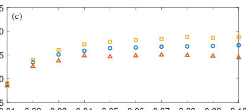
<figcaption class="paper-figure-caption"><b>Fig 3.</b> FIG. 3. Performance of the proposed high-frequency dual-channel lock-in detection protocol under different types of background noise. (a) RMSE of the amplitude. (b) RMSE of the phase. (c) SNIR of the proposed protocol. White noise (blue circles), 1/ f noise (red triangles), and harmonic noise (orange squares).</figcaption>
</figure>

**Summary.** This paper proposes and demonstrates a novel dual-channel lock-in detection protocol for measuring weak, high-frequency AC signals using quantum probes like NV centers in diamond. By applying rapidly oscillating driving fields, the system's dynamics are effectively modulated to allow simultaneous measurement of both signal amplitude and initial phase from two simple population measurements. This significantly enhances noise resistance and extends sensing capabilities into previously inaccessible high-frequency regimes.

**Why it may be interesting.** This work is highly relevant to AMO physics as it pushes quantum sensing into higher frequency regimes by engineering effective Hamiltonians through time-dependent driving fields. The use of solid-state qubits (NV centers) for this purpose provides a concrete platform for realizing advanced quantum metrology protocols.

Detailed structure

**Main problem.** The primary goal is developing a general protocol for dual-channel lock-in detection of high-frequency AC signals, overcoming limitations faced by conventional methods in the high-frequency regime.

**Main result.** The proposed quantum protocol successfully extends lock-in detection to high frequencies by using rapidly oscillating driving fields, enabling simultaneous estimation of both signal amplitude and initial phase from only two population measurements.

**Method.** The method involves deriving an effective Hamiltonian via the Magnus expansion after applying a rapidly oscillating driving field. This allows measuring in-phase ($I_{	ext{sig}}$) and quadrature ($Q_{	ext{sig}}$) components separately by tuning the driving field's phase.

**Model / system.** The protocol is demonstrated using nitrogen-vacancy (NV) centers in diamond as a two-level quantum probe. The system dynamics are governed by an effective Hamiltonian derived from the time evolution under both the target signal and the rapidly oscillating drive fields.

**Key observables.** Measurable quantities include the state populations ($P_0, P_1$), which determine $I_{	ext{sig}}$ and $Q_{	ext{sig}}$. Performance is quantified by Root Mean Squared Errors (RMSEs) for amplitude/phase and Signal-to-Noise Improvement Ratio (SNIR).

**Important parameters / regimes.** Key parameters include the target signal amplitude ($A$), initial phase ($\varphi$), driving field strength ($B$), and frequency ($\omega$). The protocol works even when background noise power is much larger than the signal power.

**Assumptions / limitations.** The derivation relies on the Magnus expansion approximation, which is assumed valid for short evolution times relative to the total measurement time. The analysis also considers various noise models (white, 1/f, harmonic).

**Figures summary.** Figure 1 schematically illustrates the protocol steps using initialization, target signal application, and microwave driving fields. Figure 3 compares performance metrics like RMSEs and SNIR across different noise types (White, 1/f, Harmonic) under varying noise intensities.

**Paper structure.** The paper first introduces the general theoretical framework for dual-channel lock-in detection using rapidly oscillating drives. It then details the implementation on NV centers in diamond, deriving the measurement scheme and analyzing performance metrics like SNR improvement against various noise sources.

Abstract

Here we propose a general protocol for dual-channel lock-in detection of high-frequency ac signals. We find that the effect of a high-frequency target signal can be modulated through the application of rapidly oscillating driving fields. Based on this mechanism, we develop a quantum dual-channel lock-in detection protocol for high-frequency signals, which not only extends the accessible frequency range of quantum sensing but also enables the simultaneous estimation of the signal amplitude and initial phase. Furthermore, we present a feasible implementation scheme of the protocol based on nitrogen-vacancy centers in diamond. Numerical simulations demonstrate that the proposed protocol can effectively filter out background noise and significantly improve the signal-to-noise ratio. Our results provide a promising approach for realizing noise-resistant detection of weak signals in the high-frequency regime.

[↑ back to top](#top)

### [$p$-Body $\simeq$ Range $p-1$: Exact Order-Range Mapping and Dual-Unitarity](http://arxiv.org/abs/2607.16642v1)

**Authors:** Tanay Pathak  
**Type:** theory · **Category:** statistical mechanics · **PDF:** <https://arxiv.org/pdf/2607.16642v1>  
**Analysis basis:** full PDF text, analyzed in chunks
**Topic relevance:** 🔥 `entanglement & information structure` **4/5** · 🔥 `non-equilibrium dynamics` **4/5** · `analog quantum simulation` **3/5** · `non-equilibrium universality` **3/5** · `Keldysh / 2PI / non-Gaussian methods` **1/5** · `correlated / nonlocal dissipation` **1/5** · `driven-dissipative phase transition` **1/5** · `exotic spin models in light-matter` **1/5** · `methods for driven-dissipative` **1/5**

↔ Scroll figures horizontally

<figure class="paper-figure-card">
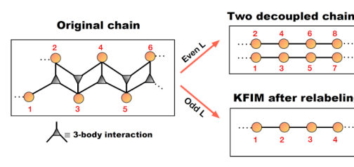
<figcaption class="paper-figure-caption"><b>Fig 1.</b> FIG. 1. Schematic of interaction order-range mapping for minimal case of 3-body kicked Ising model and interaction strength π 4 . In the Floquet setting the 3-body interaction model is mapped to another model with 2-body interactions with maximal (possible) range of 2. The mapping further depends on the length of chain, L. For even L the model maps onto two independent, decoupled chains, while for odd L it is equivalent to KFIM after relabeling, as we later show.</figcaption>
</figure>
<figure class="paper-figure-card">
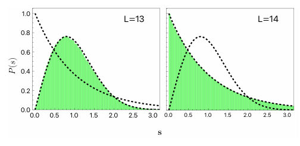
<figcaption class="paper-figure-caption"><b>Fig 2.</b> FIG. 2. Level spacing distribution of the (unfolded) quasi energies of the unitary operator for 3-body case (a) L = 13 (b) L = 14. The black dashed curves correspond to the Wigner surmise for COE (= 1</figcaption>
</figure>
<figure class="paper-figure-card">
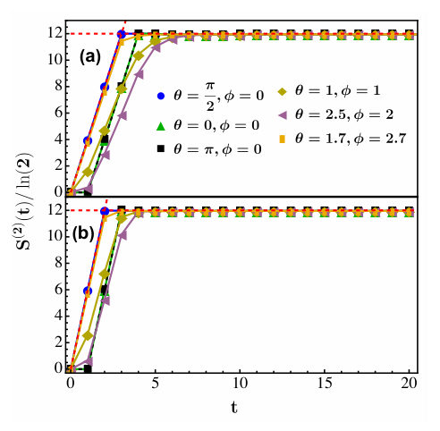
<figcaption class="paper-figure-caption"><b>Fig 3.</b> FIG. 3. Time evolution of 2-R´enyi entanglement entropy (in units of ln(2)) for (a) p = 3 model with hi = π 4 (b) p = 4 model with hi = 1. In both cases the total system size is L = 29 and subsystem size is N = 12. The initial states are of T -type, L-type and generic type with their parameter values given in the legend. The inclined dashed lines indicate the predicted linear growth of 4t in (a) and 6t in (b), while the horizontal dashed lines correspond to the saturation value of N.</figcaption>
</figure>

**Summary.** This paper introduces an exact mathematical mapping showing that the dynamics of a $p$-body interacting Ising model can be simplified to an equivalent two-body model with a reduced interaction range. This 'order-range' duality provides a systematic method for constructing and studying solvable, dual-unitary Floquet quantum systems.

**Why it may be interesting.** The explicit construction of dual-unitary models and the systematic reduction of high-order interactions into simpler, lower-dimensional effective Hamiltonians provide powerful tools for analyzing complex quantum many-body physics relevant to non-equilibrium statistical mechanics.

Detailed structure

**Main problem.** The study focuses on understanding non-equilibrium dynamics of interacting quantum many-body systems, specifically extending concepts like dual unitarity to models with high-order $p$-body interactions.

**Main result.** The paper establishes an exact Floquet interaction order-range mapping, showing that the evolution of a $p$-body model can be mapped onto an equivalent two-body Ising model with maximum range $p-1$.

**Method.** The authors use algebraic proofs involving Pauli matrices and induction to derive the mapping theorems, followed by analyzing spectral statistics and entanglement dynamics.

**Model / system.** The system is a periodically kicked one-dimensional spin-$1/2$ Ising model featuring contiguous $p$-body interactions. The analysis focuses on the Floquet evolution operator derived from this Hamiltonian.

**Key observables.** Entanglement dynamics (e.g., $\alpha$-Rényi entropies) and spectral statistics (Poisson vs. Wigner-Dyson distributions).

**Important parameters / regimes.** Interaction strengths ($J=n\pi/4$), kicking strength ($b=\pi/4$), and the system size parity ($L$ even or odd).

**Assumptions / limitations.** The mapping relies on specific tuning of interaction strengths (e.g., $J = n\pi/4$) and assumes periodic boundary conditions.

**Figures summary.** Figures illustrate level spacing distributions for $p=3$, showing Poisson for even $L$ and Wigner-Dyson for odd $L$. Figure 3 shows the time evolution of 2-$	ext{Rényi}$ entanglement entropy for $p=3$ and $p=4$ under different initial state types.

**Paper structure.** The paper systematically develops proofs (Lemma 2, Theorem 1) establishing the order-range mapping from $p$-body to $(p-1)$-range 2-body interactions. It then analyzes the consequences of this mapping based on the parity of system length $L$, concluding with entanglement dynamics calculations.

Abstract

We introduce and study a periodically kicked version of a one-dimensional spin-$1/2$ Ising model with contiguous $p$-body interactions. At specific interaction strengths of the model, we establish an exact Floquet interaction $\textit{order-range}$ mapping: the Floquet evolution operator of the $p$-body Ising model is exactly mapped to a two body Ising model with interactions having maximum range $p-1$ and exactly determined couplings. Upon further tuning the kicking strength, the mapped model becomes dual-unitary, thus providing an explicit family of $p$-body dual unitary models. We then determine exact entanglement dynamics of the $p$-body model for a class of solvable initial states at all times. We further illustrate the nontrivial structures that can emerge from the $\textit{order-range}$ mapping using a minimal example of $p=3$ and generalize it for all odd $p$. These findings provide a systematic route to constructing and studying $p$-body dual-unitary Floquet models.

[↑ back to top](#top)

### [Graph State Generation Based on Quantum Photonic Devices, Enabling Measurement-Based Quantum Computing](http://arxiv.org/abs/2607.16667v1)

**Authors:** Masoud Hakimi Heris  
**Type:** both · **Category:** quantum information and computing · **PDF:** <https://arxiv.org/pdf/2607.16667v1>  
**Analysis basis:** full PDF text, analyzed in chunks
**Topic relevance:** 🔥 `QC/QI experiment` **4/5** · `correlated cavity matter` **3/5** · `quantum optics experiment` **3/5** · `analog quantum simulation` **2/5** · `measurement-induced transitions` **2/5** · `Tavis-Cummings & cavity-many-emitter` **1/5** · `driven-dissipative phase transition` **1/5** · `entanglement & information structure` **1/5** · `interference shaping light` **1/5** · `quantum measurements` **1/5**

↔ Scroll figures horizontally

<figure class="paper-figure-card">
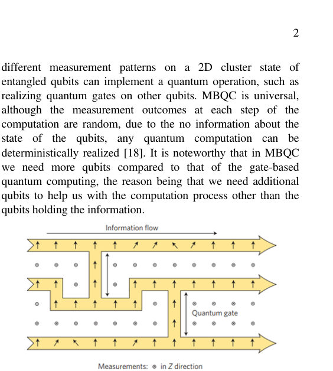
<figcaption class="paper-figure-caption"><b>Fig 1.</b> Fig. 2. Quantum computation by measuring qubits in differene bases on a lattice. Before the measurements the qubits are in the 2D cluster state. Circles symbolize measurements of Z direction, vertical arrows are measurements of X direction, while tilted arrows refer to measurements in X-Y plane [12].</figcaption>
</figure>
<figure class="paper-figure-card">

<figcaption class="paper-figure-caption"><b>Fig 2.</b> Figure 3 shows a practical example of MBQC, specifically showcasing the realization of a CNOT gate through single- particle measurements [12]. In Figure 3 (a), a simplified setup for implementing the CNOT gate is shown. The &quot;target in&quot; and &quot;target out&quot; qubits represent the target qubit’s initial and final states, respectively, while the &quot;control&quot; qubit influences the target through the entangled state. The arrows indicate measurements in various bases, and the results of these measurements determine the outcome of the computation.</figcaption>
</figure>
<figure class="paper-figure-card">
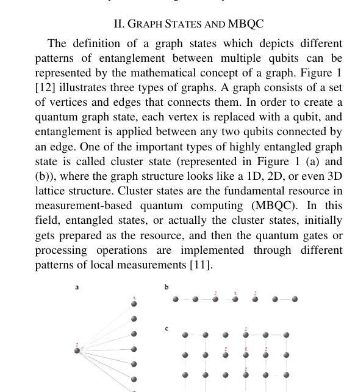
<figcaption class="paper-figure-caption"><b>Fig 3.</b> Fig. 1. Different types of graphs states, (a) GHZ graph states, (b) 1D and (c) 2D cluster states [12].</figcaption>
</figure>
<figure class="paper-figure-card">
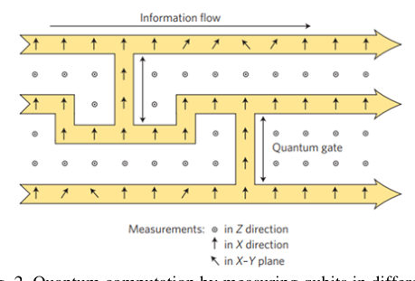
<figcaption class="paper-figure-caption"><b>Fig 4.</b> Figure 3 (b) further demonstrates this by showing a cluster- state-based implementation of the CNOT gate in MBQC. The horizontal and vertical connections demonstrate how the entanglement structure enables control-target interactions which</figcaption>
</figure>
<figure class="paper-figure-card">
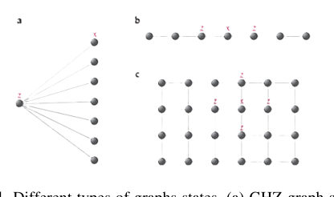
<figcaption class="paper-figure-caption"><b>Fig 5.</b> Figure 2 illustrates the MBQC process, showing how</figcaption>
</figure>

**Summary.** This paper addresses the challenge of building scalable quantum computers by focusing on photonic cluster states for Measurement-Based Quantum Computing. It details how optimizing cavity Q-factors and emitter cooperativity, using advanced design techniques, is essential to generate these highly entangled resource states deterministically.

**Why it may be interesting.** It provides a concrete roadmap connecting fundamental AMO physics challenges (optimizing light-matter coupling in cavities) directly to the engineering requirements for next-generation quantum computation hardware.

Detailed structure

**Main problem.** The primary goal is enabling scalable, fault-tolerant quantum computation using Measurement-Based Quantum Computing (MBQC) via photonic cluster states.

**Main result.** The paper demonstrates that optimizing cavity parameters, particularly achieving high Q-factors (>5000) through inverse design, is crucial for generating the necessary highly entangled photonic resource states.

**Method.** The work combines theoretical review of MBQC principles with experimental/computational optimization techniques (like Genetic Algorithms) applied to engineered cavity quantum electrodynamics systems.

**Model / system.** The system involves single-photon emitters (Quantum Dots) coupled into highly engineered optical microcavities. The process relies on generating and manipulating photonic cluster states, which serve as the resource for computation.

**Key observables.** High Q-factor (>5000), near-Gaussian far-field emission pattern, and high cooperativity ($C$) of the spin-photon interface.

**Important parameters / regimes.** Cooperativity parameter $C = 2g^2 / (\kappa\gamma)$, cavity quality factor (Q-factor), and optical coupling strength ($g$).

**Assumptions / limitations.** The feasibility of deterministic cluster state generation requires significant improvements in cavity performance beyond conventional designs.

**Figures summary.** Figures illustrate graph states, the MBQC process using 2D cluster states to implement gates like CNOT, and show optimized cavities exhibiting near-Gaussian far-field emission patterns with high Q-factors.

**Paper structure.** The paper reviews MBQC theory, details the physical implementation using QD/cavity systems for deterministic state generation (1D $
ightarrow$ 2D), and concludes by focusing on advanced cavity design optimization techniques like inverse design to boost performance metrics.

Abstract

Photonic cluster states are fundamental resource for measurement-based quantum computing (MBQC), which is a promising approach for scalable quantum computing. These highly entangled states enable computation with applying local measurements rather than gate operations, which makes them essential for fault-tolerant quantum computing. Generation of the photonic cluster states requires high-quality entanglement and stability, which can be done by making use of cavity quantum electrodynamics (cavity QED), which is embedding quantum dots (QDs) into photonic microcavities. This method enables controlled single-photon emission and the entanglement of them, helping with key challenges in generating photonic cluster states. Enhancing the generation of the photonic cluster state requires improvement in the quality factor (Q-factor) and therefore, cooperativity of cavity and QD systems. A high Q-factor helps with reduction in photon loss and decoherence, ensuring more stable and high-fidelity quantum states. It also enables better light-matter interactions, improving cluster state quality. Cooperativity, which is a measure for the light-matter coupling strength relative to dissipation, directly impacts photon emission efficiency. Optimization of these parameters improves entanglement generation, which is essential for producing high-quality photonic cluster states. Therefore, optimized cavities are essential for improving the generation of the photonic cluster states. Scalability is also an important parameter for the generation of the large-scale cluster states used in quantum computing. In this paper, after reviewing MBQC, cluster states, and the generation of the photonic cluster states, we investigate the deterministic generation of the photonic cluster state resource for the purpose of MBQC, and highlights the importance of the inverse design techniques for this goal.

[↑ back to top](#top)

### [LLM-Driven Cross-Paradigm Design for Quantum Optimal Control](http://arxiv.org/abs/2607.17498v1)

**Authors:** Yu-Qin Chen, Shi-Xin Zhang  
**Type:** theory · **Category:** other · **PDF:** <https://arxiv.org/pdf/2607.17498v1>  
**Analysis basis:** full PDF text, analyzed in chunks
**Topic relevance:** 🔥 `analog quantum simulation` **4/5** · `Rydberg arrays` **3/5** · `exotic spin models in light-matter` **3/5** · `methods for driven-dissipative` **2/5** · `non-equilibrium dynamics` **2/5** · `correlated / nonlocal dissipation` **1/5** · `correlated cavity matter` **1/5** · `driven-dissipative phase transition` **1/5** · `entanglement & information structure` **1/5** · `non-equilibrium universality` **1/5**

↔ Scroll figures horizontally

<figure class="paper-figure-card">
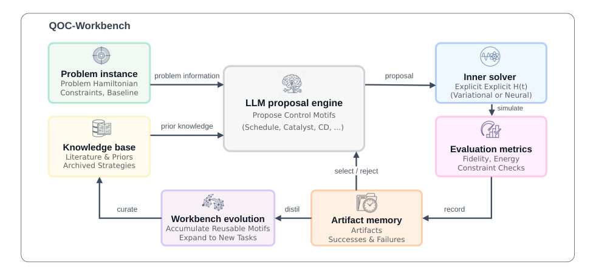
<figcaption class="paper-figure-caption"><b>Fig 1.</b> FIG. 1. LLM-driven cross-paradigm design for quantum control protocols. The workflow couples Hamiltonian instances, an LLM proposal engine, inner solvers or neural generators, direct quantum simulation and artifact memory. The aim is to make the generation–evaluation–selection loop auditable and transferable across Hamiltonian families.</figcaption>
</figure>
<figure class="paper-figure-card">
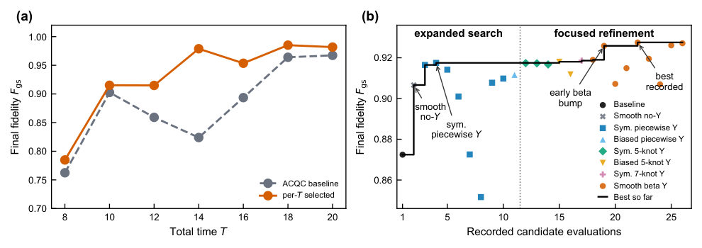
<figcaption class="paper-figure-caption"><b>Fig 2.</b> FIG. 2. Rydberg MIS control-pulse design and exploration history. a, Fixed C6 instance evaluated at seven total times. The gray dashed curve shows the final fidelity of the reproduced smooth ACQC baseline as a function of T. The orange curve shows the final fidelity of the best candidate selected independently at each T from 62 candidate slots evaluated separately for each total time. Averaging the seven plotted values gives 0.882 for the baseline and 0.931 for the selected protocols. b, Ten- site C10 search trace at fixed T = 30. Points show hardware-compatible candidates proposed by QOC-Workbench, recorded in chronological order. The black staircase marks the best final fidelity found so...</figcaption>
</figure>
<figure class="paper-figure-card">
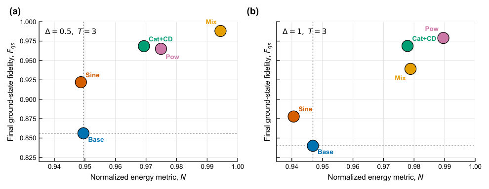
<figcaption class="paper-figure-caption"><b>Fig 3.</b> FIG. 3. XXZ catalyst and schedule design. Both panels use an eight-site periodic XXZ spin chain evolved for total time T = 3. a, Results for anisotropy ∆= 0.5. Points compare the reproduced baseline with representative improved candidates from four LLM-designed families in the plane of normalized final-energy metric N and final ground-state fidelity Fgs. b, Results for anisotropy ∆= 1 after replacing endpoint-nonsmooth schedule variants by endpoint-clean alternatives, shown with the same axes and protocol colors. Dashed guide lines mark the reproduced baseline in each panel. Protocol abbreviations used as point labels are detailed in the Supplementary Information.</figcaption>
</figure>
<figure class="paper-figure-card">
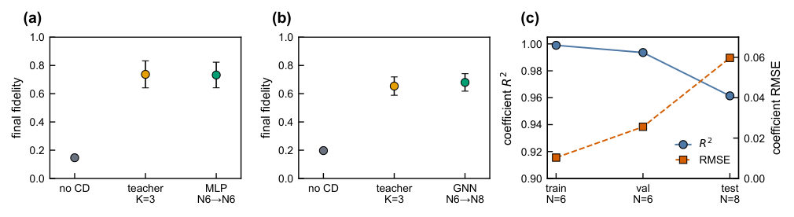
<figcaption class="paper-figure-caption"><b>Fig 4.</b> FIG. 4. Amortized weighted-CD generation for random TFIM instances. a, Fixed-size generalization at T = 1.5 for no CD, exact weighted-CD teacher and the node-wise MLP generator on 12 unseen 2 × 3 (N = 6) test instances. Points show mean final fidelity and error bars denote one standard deviation over test instances. b, Cross-size transfer at T = 2.5 for no CD, exact weighted-CD teacher and the GNN generator on six unseen 2 × 4 (N = 8) test instances, with the same mean and standard-deviation notation. Here K = 3 denotes the hyperparameter for the weighted variational-CD teacher loss, which biases the fit toward the low-energy subspace; details are given in the Supplementary Information. c,...</figcaption>
</figure>

**Summary.** The paper introduces QOC-Workbench, an LLM-driven framework designed to automate Quantum Optimal Control protocol design. It moves beyond simple parameter tuning by allowing the system to propose entirely new structural hypotheses for Hamiltonians across diverse physical models like Rydberg arrays and spin chains. This establishes a powerful, autonomous methodology for quantum state engineering.

**Why it may be interesting.** This work directly tackles the bottleneck of applying theoretical quantum control concepts to real hardware by creating an automated, cross-paradigm design methodology that bridges theory and experimental constraints.

Detailed structure

**Main problem.** The core challenge is automating Quantum Optimal Control (QOC) protocol design, which traditionally requires immense expert effort for each unique physical instance.

**Main result.** The proposed LLM-driven workflow successfully autonomously discovers hardware-compliant auxiliary controls and structural deformations that outperform existing literature baselines across diverse quantum systems.

**Method.** It introduces QOC-Workbench, an LLM-guided loop that parses physics literature to propose novel structural hypotheses for Hamiltonians, which are then validated via direct simulation rather than simple parameter tuning.

**Model / system.** The work applies to various physical models including Rydberg-atom arrays (MIS problem), interacting XXZ spin chains, and random transverse-field Ising models (TFIM). The control is governed by time-dependent Hamiltonians $H(t)$.

**Key observables.** Final ground-subspace fidelity ($F_{gs}$), normalized energy ($\mathcal{N}$), and adiabatic following metrics.

**Important parameters / regimes.** Control functions $\{u_k(t)\}$, Hamiltonian parameters (e.g., $\Delta$ for XXZ, graph size $N$), and the variational action minimization parameter $K$.

**Assumptions / limitations.** The primary assumption is that LLMs can reliably parse literature to propose novel functional forms and structural modifications beyond what human experts might enumerate.

**Figures summary.** Figures illustrate the workflow components (LLM proposal engine, solver), show control-pulse design histories for Rydberg MIS (comparing baselines to refined protocols), and compare performance metrics ($\mathcal{N}$ vs $F_{gs}$) across different protocol deformations.

**Paper structure.** The paper is structured around demonstrating the QOC-Workbench workflow across three distinct physical cases: Rydberg atoms, XXZ chains, and TFIMs. It moves from basic parameter refinement to structural Hamiltonian path engineering, culminating in a transferable GNN generator for large systems.

Abstract

Quantum optimal control (QOC) underpins adiabatic quantum computation, quantum annealing, and quantum state engineering, yet practical deployment is fundamentally bottlenecked by strict hardware constraints and substantial expert effort required to design protocols for each problem instance. To overcome this, we introduce QOC-Workbench, an auditable, large language model (LLM)-driven workflow that acts as an automated quantum co-scientist for cross-paradigm protocol design. Going beyond traditional numerical optimizers that merely tune parameters within a fixed formula, the LLM autonomously parses physics literature, proposes structural hypotheses, and writes code to validate them by direct simulation. This workflow supports cross-paradigm design by accumulating control motifs across tasks. We demonstrate this approach across three distinct settings: Case 1, Rydberg-atom maximum-independent-set arrays; Case 2, interacting XXZ spin chains; and Case 3, random transverse-field Ising models. In Cases 1 and 2, the workflow autonomously discovers hardware-compliant auxiliary controls, target catalysts, and schedule deformations that outperform literature baselines. In Case 3, it addresses the computational bottleneck of variational counterdiabatic driving by escalating from per-instance optimization to an amortized graph-neural-network generator, successfully transferring learned coefficient paths to larger unseen systems. By actively bridging the gap between theoretical algorithms and experimental restrictions across distinct control paradigms and Hamiltonian families, QOC-Workbench establishes a continuously evolving, cross-paradigm methodology for autonomous quantum control.

[↑ back to top](#top)

### [Operational Relation Between One-Time and Two-Time Work Protocols and Measurement-Resolution-Induced Transitions in Quantum Work Statistics](http://arxiv.org/abs/2607.16951v1)

**Authors:** Daniel Alonso, Antonia Ruiz-García  
**Type:** both · **Category:** statistical mechanics · **PDF:** <https://arxiv.org/pdf/2607.16951v1>  
**Analysis basis:** full PDF text, analyzed in chunks
**Topic relevance:** 🔥 `measurement-induced transitions` **4/5** · `driven-dissipative phase transition` **3/5** · `quantum measurements` **3/5** · `non-equilibrium dynamics` **2/5** · `non-equilibrium universality` **2/5** · `Keldysh / 2PI / non-Gaussian methods` **1/5** · `QC/QI experiment` **1/5** · `entanglement & information structure` **1/5** · `methods for driven-dissipative` **1/5** · `spintronics-quantum-optics interface` **1/5**

↔ Scroll figures horizontally

<figure class="paper-figure-card">
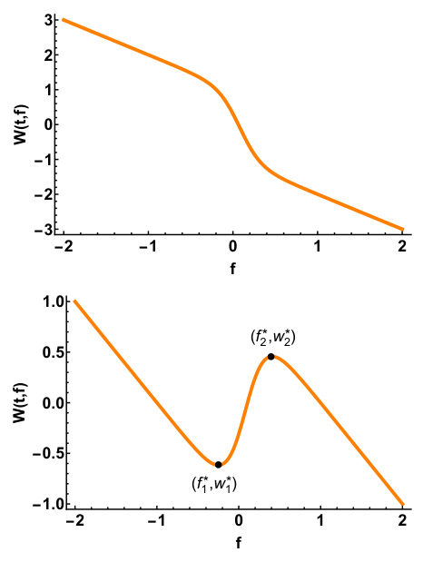
<figcaption class="paper-figure-caption"><b>Fig 1.</b> FIG. 1. Function W(t, f) for a given final time t with positive (top) and negative (bottom) A1. For A1(t) &gt; 0 the inverse f = W −1(w) has a single branch and yields a smooth PW (w). For A1(t) &lt; 0 three branches appear and there are work val- ues w∗ 1,2 for which dW/df = 0. If PF (f ∗ 1,2) is non-negligible, PW (w) develops peaks at w∗ 1,2.</figcaption>
</figure>
<figure class="paper-figure-card">
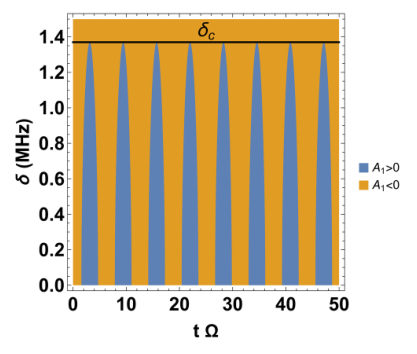
<figcaption class="paper-figure-caption"><b>Fig 2.</b> FIG. 2. Sign of A1 as a function of final time t and detuning δ. The horizontal dashed line marks the critical detuning δc. Parameters as in Ref. [11]: ω = 3.0 × 109 Hz and ω1 = 1.37 × 106 Hz.</figcaption>
</figure>
<figure class="paper-figure-card">
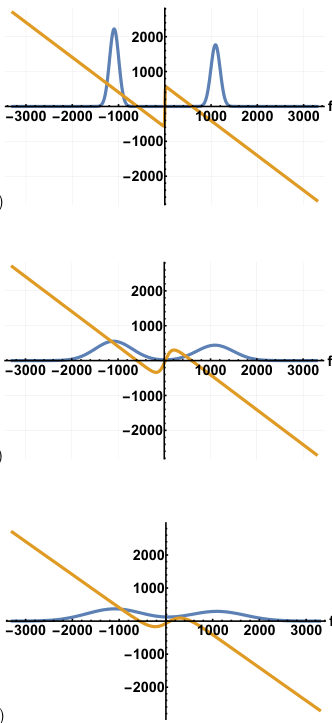
<figcaption class="paper-figure-caption"><b>Fig 3.</b> FIG. 3. Sequence of work probability distributions for decreasing values of λ and A1 &lt; 0. For each value of λ, the left panel shows PF (f) and W(t, f), while the right panel depicts the resulting PW (w). Large λ corresponds to ideal measurements, while smaller λ approaches the weak-measurement limit. The model parameters are: ω = 3 × 109 Hz, ω1 = 1.37 × 106 Hz, δ = 0, and t = 1 × Ω−1, yielding A1 &lt; 0. In panels (a)-(b): λ = 21.9, (c)-(d): λ = 5.47, (e)-(f): λ = 3.65. Energies f, w, and W(t, f) are expressed in units of ℏΩ.</figcaption>
</figure>
<figure class="paper-figure-card">
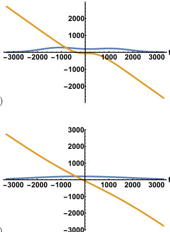
<figcaption class="paper-figure-caption"><b>Fig 4.</b> FIG. 4. The same as Fig. 3. In panels (a)-(b): λ = 2.72, which corresponds to ω∗ 1 = ω∗ 2, and in panels (c)-(d) λ = 1.46. This last value approaches the weak-measurement regime.</figcaption>
</figure>
<figure class="paper-figure-card">
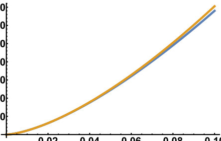
<figcaption class="paper-figure-caption"><b>Fig 5.</b> FIG. 5. Peak separation ∆W = w2 −w1 in the NV-center system as a function of the scaling parameter ε = (σc −σ)/σc. The</figcaption>
</figure>

**Summary.** The authors demonstrate that information about one-time quantum work protocols can be extracted from standard two-time measurement data through classical post-processing. They predict a unique, resolution-dependent statistical transition in the work distribution, which manifests as singular peaks. This provides an experimentally accessible method to quantify coherence using only energy measurements on systems like NV centers.

**Why it may be interesting.** This work bridges quantum thermodynamics with measurement theory, providing a concrete, measurable signature (the non-analytic peak structure) that quantifies fundamental resources like coherence using only energy measurements. This is highly relevant for understanding open quantum systems dynamics.

Detailed structure

**Main problem.** The paper establishes an operational link between one-time and two-time quantum work measurement protocols, focusing on how coherence information can be extracted from standard energy measurements.

**Main result.** It predicts a resolution-driven statistical transition in the work distribution, characterized by non-analytic square-root divergent peaks when the measurement resolution is below a critical value. Furthermore, it shows that this distribution encodes the relative entropy of coherence.

**Method.** The analysis involves deriving operational relations between different quantum work definitions (OTM vs TTM) and analyzing the resulting probability distributions using techniques from non-equilibrium statistical mechanics.

**Model / system.** The primary model is a driven two-level system, which is demonstrated experimentally using a nitrogen-vacancy (NV) center in diamond. The dynamics are governed by a time-dependent Hamiltonian.

**Key observables.** Work statistics ($W^{(1)}$ vs $W^{(2)}$), relative entropy of coherence ($C_{\hat{H}}(t)$), and the work probability distribution $P_W(w)$.

**Important parameters / regimes.** Measurement resolution ($\sigma$), critical resolution ($\sigma_c$), and dynamical factors like $A_1(t)$.

**Assumptions / limitations.** The analysis relies on modeling non-ideal measurements using Positive Operator Valued Measures (POVMs) and assumes the ability to perform classical post-processing of TTM data.

**Figures summary.** Figures illustrate the work value $W(t, f)$ for different measurement regimes (projective vs. weak) and show the development of non-analytic peaks in the work distribution as resolution changes.

**Paper structure.** The paper first establishes the operational equivalence between OTM and TTM protocols. It then analyzes the resulting work statistics, deriving relations involving entropy measures. The core is the analysis of the statistical transition governed by measurement resolution, culminating in experimental demonstrations using the NV center platform.

Abstract

We establish a direct operational connection between the one-time measurement (OTM) and two-time measurement (TTM) protocols for quantum work statistics, showing that OTM work values, including coherence signatures, can be reconstructed from standard TTM data through classical post-processing without any modification of the experimental setup. This reveals that coherence information commonly attributed to OTM schemes is already latent within TTM data and becomes explicit upon a natural post-processing step. For a driven two-level system subject to finite-resolution energy measurements, this reconstruction unveils a resolution-driven statistical transition in the work distribution: whereas projective and weak measurements yield smooth distributions, intermediate resolutions produce non-analytic structures whose character is determined by the dynamics and a critical meter resolution. We show that the non-analyticity of the OTM work distribution takes the form of square-root divergent peaks at specific work values, and that the separation between these singular points is an experimentally accessible quantity that vanishes at the critical resolution with a universal exponent. The same dynamical quantities that govern the transition also encode the relative entropy of coherence of the driven state, enabling coherence quantification from energy measurements alone. We demonstrate experimental accessibility in a nitrogen-vacancy center platform with parameters drawn from current experiments, where both sides of the transition and the coherence signatures are within reach of existing technology.

[↑ back to top](#top)

### [Rigorous characterization of continuous-variable quantum states via optical parametric amplifiers](http://arxiv.org/abs/2607.17023v1)

**Authors:** Manthan Badbaria, Fumiya Hanamura, Maxime Garnier, Ulysse Chabaud, Rajveer Nehra  
**Type:** both · **Category:** quantum information and computing · **PDF:** <https://arxiv.org/pdf/2607.17023v1>  
**Analysis basis:** full PDF text, analyzed in chunks
**Topic relevance:** 🔥 `QC/QI experiment` **4/5** · `quantum measurements` **3/5** · `quantum optics experiment` **3/5** · `entanglement & information structure` **2/5** · `measurement-induced transitions` **2/5** · `Keldysh / 2PI / non-Gaussian methods` **1/5** · `analog quantum simulation` **1/5** · `driven-dissipative phase transition` **1/5** · `methods for driven-dissipative` **1/5**

↔ Scroll figures horizontally

<figure class="paper-figure-card">
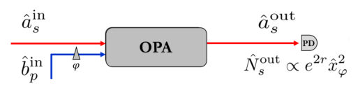
<figcaption class="paper-figure-caption"><b>Fig 1.</b> FIG. 1. Illustration of the experimental scheme for sign-free quadrature measurement. The operators represent the input signal and pump modes ˆain s ˆbin p , respectively. The unknown quantum state is first amplified with a high-gain OPA. Sub- sequently, a quadrature power measurement is performed on the amplified state, directly detecting the squared quadrature selected by the pump phase.</figcaption>
</figure>
<figure class="paper-figure-card">
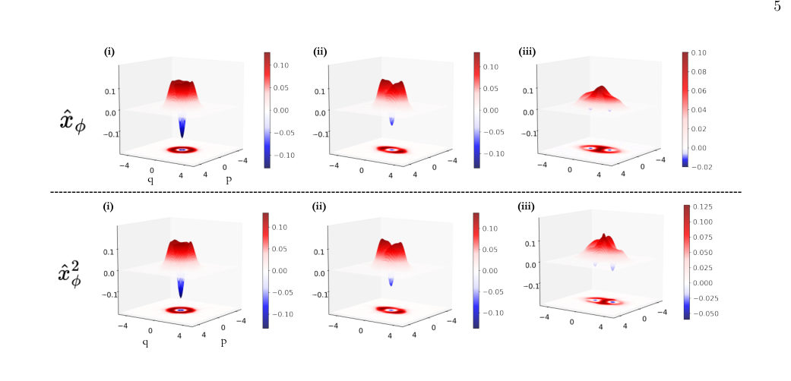
<figcaption class="paper-figure-caption"><b>Fig 2.</b> FIG. 2. Comparison of quantum state reconstruction using conventional homodyne detection and the proposed OPA-based measurement protocol. Experimental homodyne data for the generalized quadrature xφ are taken from the experiments in Refs. [49–51]. Top row: Wigner functions reconstructed for representative non-Gaussian states—single-photon, Schr¨odinger cat, and Gottesman–Kitaev–Preskill (GKP) states (left to right)—using balanced homodyne detection (BHD). The reconstruc- tion employs the quadrature POVM |xϕ⟩⟨xϕ| together with the semidefinite program in Eq. 8. Bottom row: Wigner functions reconstructed from the proposed OPA-based measurement using the POVM defined in Eq. 5 and the...</figcaption>
</figure>
<figure class="paper-figure-card">
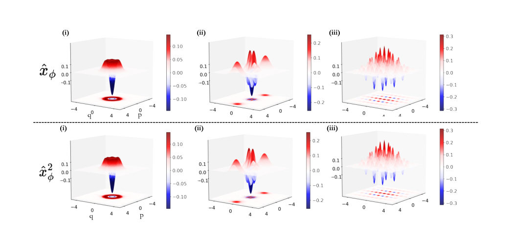
<figcaption class="paper-figure-caption"><b>Fig 3.</b> FIG. 3. Comparison of quantum state reconstruction using homodyne and OPA-based measurements for representative non- Gaussian states. From left to right: single-photon, Schr¨odinger cat, and Gottesman–Kitaev–Preskill (GKP) states. Top row: Wigner functions reconstructed from conventional homodyne tomography using the generalized quadrature distribution P(xφ) within the semidefinite-program (SDP) reconstruction framework. Bottom row: Wigner functions reconstructed from the proposed OPA-assisted protocol using the phase-insensitive quadrature-power distribution P(|xφ|) together with the corresponding OPA POVM in the same SDP framework.</figcaption>
</figure>
<figure class="paper-figure-card">
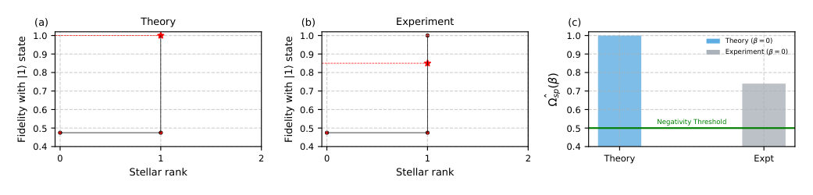
<figcaption class="paper-figure-caption"><b>Fig 4.</b> FIG. 4. Certification of a single-photon state |1⟩[62] using using experimental homodyne tomography data and simulated sign-free quadrature data. (a) Stellar-rank witness for the simulated state obtained via direct fidelity estimation, together with the stellar robustness profile of a target single-photon state. (b) Stellar-rank witness for the experimental |1⟩state [62] obtained using the same procedure. In both panels, the red star denotes the measured fidelity mapped onto the stellar robustness profile, certifying stellar rank 1. (c) Wigner-negativity witness for the simulated and experimental states using the expectation value of the operator Ωsp := ˆD(β) (|1⟩⟨1| + |3⟩⟨3| + |5⟩⟨5|)...</figcaption>
</figure>
<figure class="paper-figure-card">
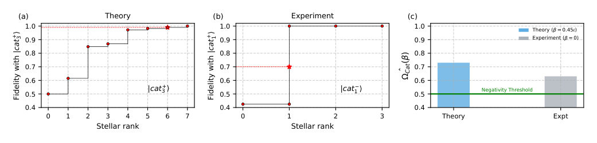
<figcaption class="paper-figure-caption"><b>Fig 5.</b> FIG. 5. Certification of cat states using the homodyne tomography data from experiments in Ref. [63] and simulated sign-free quadrature measurement data. (a) Stellar rank witnessing of simulated sign-free |cat+ 3 ⟩state using our direct fidelity estimation method together with the stellar robustness profile of a target |cat+ 3 ⟩state. (b) Stellar rank witnessing of experimental small amplitude cat state [63] using our direct fidelity estimation method together with the stellar robustness profile of a target |cat− 1 ⟩ state. (c) Wigner negativity witnessing of the simulated and experimental small amplitude cat state using our direct fidelity estimation method together with the Wigner...</figcaption>
</figure>

**Summary.** This paper presents an integrated framework to characterize non-Gaussian continuous-variable quantum states using optical parametric amplification. By employing sign-free quadrature measurements analyzed via semidefinite programming (SDP), the method achieves loss tolerance for state tomography and certifies non-classicality. This offers a practical toolset for advancing photonic quantum information processing.

**Why it may be interesting.** This work provides a highly practical and experimentally accessible roadmap for verifying complex quantum states in photonic systems, directly addressing bottlenecks in current quantum networking and computation hardware.

Detailed structure

**Main problem.** The primary challenge is developing robust methods to characterize non-Gaussian quantum states essential for continuous-variable (CV) quantum information processing.

**Main result.** The authors introduce a unified, loss-tolerant framework using high-gain OPA measurements and semidefinite programming (SDP) that successfully reconstructs complex states like cat and GKP states.

**Method.** They combine sign-free quadrature measurements obtained via optical parametric amplification with computationally efficient SDP solvers for state tomography and non-Gaussianity certification.

**Model / system.** The work focuses on continuous-variable quantum states, particularly parity-symmetric states such as single-photon, Schrödinger cat, and Gottesman-Kitaev-Preskill (GKP) states, implemented using photonic systems.

**Key observables.** Quadrature distributions $P(|x_\varphi|)$, Wigner negativity, stellar rank ($	ext{r}^\star$), and reconstruction fidelity ($F$).

**Important parameters / regimes.** Detector efficiency, measurement bandwidth, and the specific parameters defining the target states (e.g., amplitude $\alpha$ for cat states).

**Assumptions / limitations.** The method is shown to be effective even when the sign-free measurement is not fully tomographically complete; low fidelity in reconstruction highlights practical limitations due to optical loss.

**Figures summary.** Figures compare Wigner function reconstructions from conventional homodyne detection versus OPA-based tomography using both full and sign-free quadrature data for various states (e.g., GKP).

**Paper structure.** The paper progresses by first identifying the limitations of standard CV state characterization, then proposing the OPA/SDP framework for loss-tolerant reconstruction, followed by developing direct certification methods using witnesses like stellar rank.

Abstract

Characterizing non-Gaussian quantum states is of paramount importance for continuous-variable quantum information processing, yet conventional homodyne-measurement-based state tomography remains limited by optical loss, detector efficiency, and measurement bandwidth. Here, we introduce an integrated framework for loss-tolerant characterization and certification using high-gain phase-sensitive optical parametric amplification and power measurements. Our computationally efficient semidefinite programming approach enables faithful reconstruction of parity-symmetric quantum states from amplified quadrature measurements while substantially relaxing detector-efficiency requirements and increasing the measurement bandwidth. We further develop a certification framework that directly quantifies non-Gaussianity via stellar-rank witnesses and Wigner negativity, using the same quadrature-power measurements. We demonstrate the efficacy of the proposed framework through both simulated and experimental data for representative quantum states, including single-photon, Schrodinger cat, and Gottesman-Kitaev-Preskill (GKP) states. By unifying loss-tolerant measurements, state tomography, and nonclassical-state certification within a single experimentally accessible framework, our approach provides a practical pathway toward verifying increasingly complex states and can be readily implemented with current quantum photonic technologies.

[↑ back to top](#top)

### [Large scale behavior in the Kuramoto-Sivashinsky equation: The Schwinger-Dyson route](http://arxiv.org/abs/2607.17915v1)

**Authors:** Olivier Coquand  
**Type:** theory · **Category:** statistical mechanics · **PDF:** <https://arxiv.org/pdf/2607.17915v1>  
**Analysis basis:** full PDF text, analyzed in chunks
**Topic relevance:** 🔥 `Keldysh / 2PI / non-Gaussian methods` **4/5** · `methods for driven-dissipative` **3/5** · `non-equilibrium universality` **3/5** · `driven-dissipative phase transition` **2/5** · `non-equilibrium dynamics` **2/5** · `Frenkel-Kontorova` **1/5** · `analog quantum simulation` **1/5** · `correlated / nonlocal dissipation` **1/5**

↔ Scroll figures horizontally

<figure class="paper-figure-card">
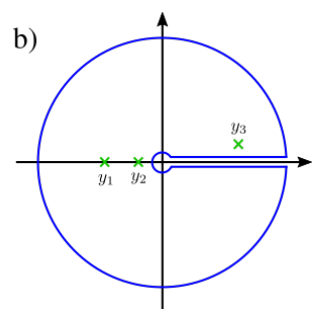
<figcaption class="paper-figure-caption"><b>Fig 1.</b> Figure 1: a) Integration contour for ν &gt; 0. There is one pole on the positive real axis. b) Integration contour for ν &lt; 0. All the poles are inside the contour.</figcaption>
</figure>

**Summary.** This paper rigorously analyzes the large-scale behavior of the Kuramoto-Sivashinsky equation using advanced field theory techniques. By applying Schwinger-Dyson equations, the authors prove that any stable scaling solution must exhibit a sign change in its effective viscosity. This result strongly suggests that the system universally falls into the KPZ universality class.

**Why it may be interesting.** While focused on classical PDEs, the techniques used—renormalization group flow analysis and field-theoretic methods applied to non-equilibrium dynamics—are highly relevant to understanding critical phenomena and long-range correlations in quantum many-body systems.

Detailed structure

**Main problem.** The study aims to determine the large-scale (infrared) behavior of solutions to the Kuramoto-Sivashinsky (KS) equation.

**Main result.** The authors prove that for stable scaling in the infrared limit, the effective viscosity must exhibit a sign change, suggesting the system belongs to the KPZ universality class regardless of initial conditions.

**Method.** The analysis employs the Schwinger-Dyson framework combined with renormalization group techniques applied to the field theory formulation derived from the KS equation's dynamics.

**Model / system.** The primary model is the Kuramoto-Sivashinsky (KS) equation, a nonlinear Partial Differential Equation used to describe phenomena like flame front perturbations and interface dynamics. It belongs to the class of PDE chaos.

**Key observables.** Effective viscosity ($
u$), scaling exponents ($z$, $\eta_
u$, $\eta_D$), and the polarization bubble ($\Pi(\Omega,p)$).

**Important parameters / regimes.** The analysis focuses on the Infrared (IR) limit, comparing regimes like Edwards-Wilkinson (EW) and Kardar-Parisi-Zhang (KPZ). The viscosity parameter $
u$ is crucial.

**Assumptions / limitations.** The central assumption is that an infrared stable scaling regime exists for the system under study. The method also assumes equivalence between forced and spontaneous stochastic formulations.

**Figures summary.** Figures illustrate integration contours used in the Schwinger-Dyson calculation, distinguishing between cases where poles lie on or off the positive real axis based on the sign of viscosity ($
u$).

**Paper structure.** The paper builds by first establishing the theoretical framework using MSRJD and Schwinger-Dyson equations. It then analyzes the polarization bubble integral in different regimes (EW vs. KPZ) to constrain the possible scaling behaviors, culminating in a proof that sign change of viscosity is necessary for stability.

Abstract

The present paper is a study of the large scale properties of the Kuramoto-Sivashinsky equation. By using a Schwinger-Dyson framework, we aim to provide a proof that the only solutions that can sustain a stable scaling in the infrared limit have a negative effective viscosity (in the Kuramoto-Sivashinsky sense) with a minimal set of hypotheses, thereby showing that this constitutes a general property of the wave equation that does not depend on a specific set of truncations of a renormalisation group flow, or limitations of a given numerical scheme for example.

[↑ back to top](#top)

### [Unifying Charge-Learnability Transitions in U(1)-Symmetric Quantum Circuits through Informational Power of Local Measurement](http://arxiv.org/abs/2607.17886v1)

**Authors:** Yi-Fan Gong, Dan-Bo Zhang  
**Type:** theory · **Category:** quantum information and computing · **PDF:** <https://arxiv.org/pdf/2607.17886v1>  
**Analysis basis:** full PDF text, analyzed in chunks
**Topic relevance:** 🔥 `entanglement & information structure` **4/5** · 🔥 `measurement-induced transitions` **4/5** · `quantum measurements` **3/5** · `driven-dissipative phase transition` **2/5** · `correlated / nonlocal dissipation` **1/5** · `methods for driven-dissipative` **1/5** · `non-equilibrium dynamics` **1/5** · `non-equilibrium universality` **1/5**

↔ Scroll figures horizontally

<figure class="paper-figure-card">
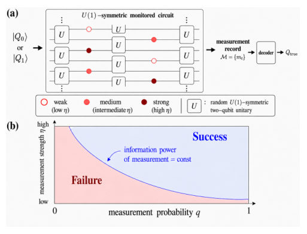
<figcaption class="paper-figure-caption"><b>Fig 1.</b> FIG. 1. Schematic of charge learnability in a monitored U(1)-symmetric quantum circuit and its phase diagram in terms of the measurement probability q and measurement strength η. (a) The circuit is initialized in one of two neigh- boring charge sectors. Random charge-conserving two-qubit gates are arranged in alternating even- and odd-bond lay- ers, each followed by a probabilistic local weak-measurement layer. The resulting spacetime record is processed by a de- coder to infer the hidden charge label. (b) A transition bound- ary separates the failure and success regimes and is organized by the measurement informational power.</figcaption>
</figure>
<figure class="paper-figure-card">
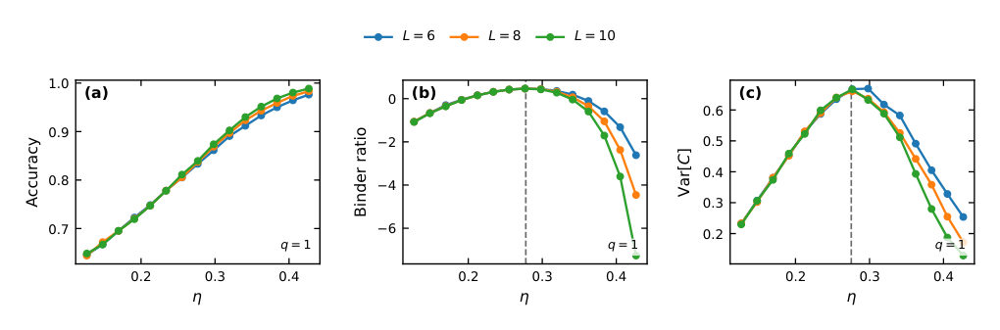
<figcaption class="paper-figure-caption"><b>Fig 2.</b> FIG. 2. Finite-size diagnostics for the unbiased decoder at measurement probability q = 1, with measurement strength η varied along the horizontal axis. The representative condition Iloc ≃0.20 predicts η0 ≃0.277. (a) Decoding accuracy. (b) Binder ratio of the binary posterior entropy. (c) Cross-entropy variance Var(C). The vertical dashed line marks the selected Binder crossing or variance peak.</figcaption>
</figure>
<figure class="paper-figure-card">
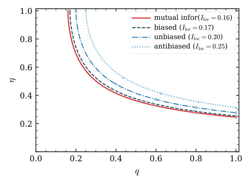
<figcaption class="paper-figure-caption"><b>Fig 3.</b> FIG. 4. Decoder-independent and decoder-dependent charge-learnability boundaries in the plane of measurement probability q and measurement strength η. The red solid curve denotes the decoder-independent finite-size boundary inferred from the exact record–label mutual information, Iloc ≃0.16. The three blue curves denote the biased, un- biased, and antibiased transition estimates, with Iloc ≃0.17, 0.20, and 0.25, respectively. Open markers indicate represen- tative finite-size scan points. All curves satisfy qIread(η) = Iloc.</figcaption>
</figure>
<figure class="paper-figure-card">
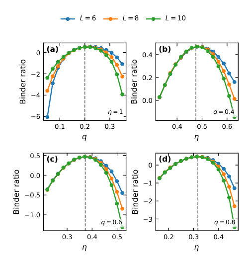
<figcaption class="paper-figure-caption"><b>Fig 4.</b> FIG. 3. Binder-ratio tests for the unbiased decoder along the representative line Iloc ≃0.20. (a) Measurement-probability scan at the projective limit η = 1, with predicted transition q0 = 0.20. (b)–(d) Measurement-strength scans at fixed q = 0.40, 0.60, and 0.80, with predicted transitions η0 = 0.480, 0.371, and 0.314, respectively. The vertical dashed lines mark the selected finite-size Binder crossings.</figcaption>
</figure>
<figure class="paper-figure-card">
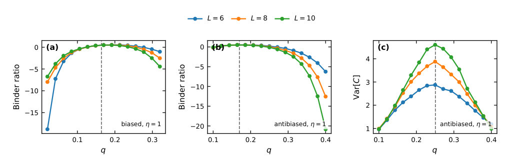
<figcaption class="paper-figure-caption"><b>Fig 5.</b> FIG. 5. Finite-size decoder diagnostics in the projective limit η = 1, with the measurement probability q varied along the horizontal axis. (a) For the biased decoder, the posterior-entropy Binder ratio locates the transition near q0 ≃0.17. (b) For the antibiased decoder, the same label-blind diagnostic gives an apparent estimate near q0 ≃0.17. (c) The label-sensitive cross-entropy variance Var(C) instead peaks near q0 ≃0.25. Vertical dashed lines mark the selected crossings or peak.</figcaption>
</figure>

**Summary.** This paper analyzes how reliably one can infer a conserved charge in a quantum circuit by monitoring it using weak measurements. The authors demonstrate that the transition point where inference becomes possible is fundamentally governed by the local informational power extracted during the measurement process. This establishes a unified theoretical principle linking different types of quantum monitoring protocols.

**Why it may be interesting.** It provides a rigorous framework connecting fundamental concepts from quantum information theory (mutual information) with physical observables in open quantum systems (measurement records), which is highly relevant for understanding measurement-induced dynamics and control.

Detailed structure

**Main problem.** The research extends the study of charge learnability transitions from standard projective measurements to probabilistic weak measurements in quantum circuits.

**Main result.** The learnability phase boundary is shown to be organized by the local informational power of the measurement, providing a unifying principle across different monitoring protocols.

**Method.** The authors use Bayesian decoding techniques and calculate various information-theoretic measures, including cross entropy and record–label mutual information, to diagnose charge inference capability.

**Model / system.** The system is a one-dimensional U(1)-symmetric quantum circuit (chain of L qubits) evolving under random charge-conserving two-qubit gates. Monitoring involves probabilistic weak measurements controlled by probability (q) and strength (eta).

**Key observables.** Charge learnability, Cross Entropy, Record–Label Mutual Information, Binder Ratio.

**Important parameters / regimes.** Measurement probability ($q$) and measurement strength ($\eta$); the local informational power $I_{	ext{loc}}(q, \eta)$.

**Assumptions / limitations.** The analysis compares different decoder variants (unbiased, biased, antibiased) to isolate the fundamental information limit from decoding efficiency.

**Figures summary.** Figures illustrate phase diagrams showing how transition boundaries are organized by constant values of local informational power ($I_{	ext{loc}}$), comparing results across various decoders and measurement regimes.

**Paper structure.** The paper progresses by first defining the weak measurement protocol, then introducing multiple diagnostic tools (cross-entropy, mutual information) to characterize learnability, ultimately establishing the role of local informational power as the unifying organizing principle for the transition boundary.

Abstract

Charge-learnability transitions in monitored symmetric quantum circuits reveal how local measurement records acquire sufficient information to infer a conserved charge. Here we extend charge learnability to probabilistic weak measurements, for which the measurement probability and measurement strength are independently tunable. We find that the learnability phase boundary is organized by the informational power of local measurement. We further introduce cross entropy as a label-sensitive diagnostic that distinguishes unbiased, biased, and antibiased decoder variants. Finally, the exact record--label mutual information provides a decoder-independent benchmark for the information fundamentally available for charge inference. Our results establish informational power of local measurement as a unifying principle for charge learnability under general monitoring protocols.

[↑ back to top](#top)

### [Glauber dynamics phase transitions in athermal random field Blume-Capel and Blume-Emery-Grifitths models](http://arxiv.org/abs/2607.16561v1)

**Authors:** Sumedha, Aldrin B E  
**Type:** theory · **Category:** statistical mechanics · **PDF:** <https://arxiv.org/pdf/2607.16561v1>  
**Analysis basis:** full PDF text, analyzed in chunks
**Topic relevance:** 🔥 `non-equilibrium dynamics` **4/5** · 🔥 `non-equilibrium universality` **4/5** · `driven-dissipative phase transition` **3/5** · `methods for driven-dissipative` **3/5** · `Keldysh / 2PI / non-Gaussian methods` **1/5** · `correlated / nonlocal dissipation` **1/5**

↔ Scroll figures horizontally

<figure class="paper-figure-card">
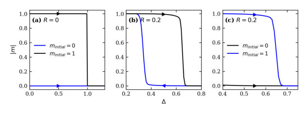
<figcaption class="paper-figure-caption"><b>Fig 1.</b> FIG. 1: Plot of steady state magnetisation(|m|) as a function of ∆, with ∆increased quasi-statically. a) No disorder case with R = 0 for two initial states:m = 0 and |m| = 1 with increasing ∆from ∆= 0. For m = 0 initial condition the system continues to stay in m = 0 state for all values of ∆, whereas for m = 1 initial condition there is a first order transition to m = 0 at ∆= 1; b) For R = 0.2 system is evolved from m = 1 initial state at ∆= 0. This state transitions to m = 0 state at ∆≈0.64. On the other hand the state with m = 0 at ∆= 1 on decreasing ∆transitions to m = 1 at ∆≈0.33 ; c) For R = 0.2 and starting at ∆= 0.4 while the m = 0 initial state continues to be m = 0 with increasing...</figcaption>
</figure>
<figure class="paper-figure-card">
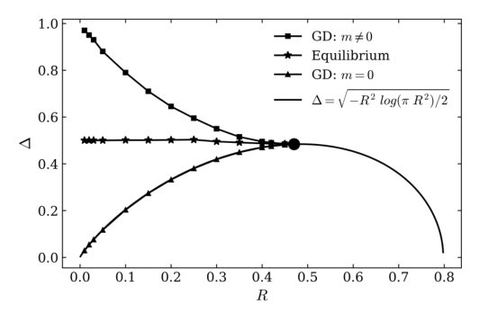
<figcaption class="paper-figure-caption"><b>Fig 2.</b> FIG. 2: Phase diagram of RFBCM under Glauber dynamics with initial state m = 1 and m = 0 and the equilibrium phase diagram are shown. The black solid circle represents the tricritical point with Rtcp = ∆tcp = 0.483. For R ≥Rtcp, the three phase diagrams coincide and there is a continuous transition between m = 0 and m ̸= 0 states. On the other hand for R &lt; Rtcp, even though the nature of the transition ( first order ) is the same in all the cases, the point of transition are different.</figcaption>
</figure>
<figure class="paper-figure-card">
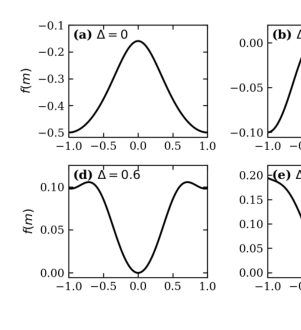
<figcaption class="paper-figure-caption"><b>Fig 3.</b> FIG. 3: For R = 0.2, the function f(m) is plotted for few representative values of ∆.</figcaption>
</figure>
<figure class="paper-figure-card">
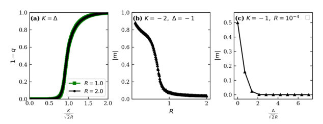
<figcaption class="paper-figure-caption"><b>Fig 4.</b> FIG. 4: Plots for RFBEGM Glauber steady state with K ≤∆for : a) For K = ∆we plot 1−q as a function of K/ √</figcaption>
</figure>
<figure class="paper-figure-card">
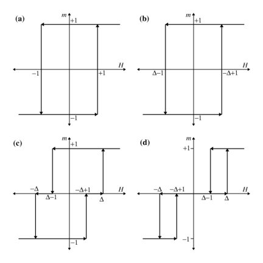
<figcaption class="paper-figure-caption"><b>Fig 5.</b> FIG. 5: Different shapes of hysteresis loops in m−H plane for Blume-Capel model that depend on the value of the crystal field ∆ : a) ∆≤0 : rectangular with the coercive field (Hc) independent of the value of ∆; b) 0 &lt; ∆≤0.5 : Rectangular with ; Hc = ±(∆−1) c) 0.5 &lt; ∆&lt; 1 : Wasp waisted with Hc = ±(∆−1) and ±∆and d) ∆&gt; 1 : Double rectangular with Hc = ±(∆−1) and ±∆.</figcaption>
</figure>

**Summary.** This paper investigates the phase transitions of random field spin models (Blume-Capel and Blume-Emery-Griffiths) by comparing their equilibrium behavior with non-equilibrium steady states reached via Glauber dynamics. Key findings include a critical disorder strength ($R_c$) beyond which the dynamics match equilibrium, and the observation of complex, path-dependent hysteresis loops whose shapes are analytically derived.

**Why it may be interesting.** The comparison between equilibrium and non-equilibrium phase transitions in disordered systems is a fundamental topic in statistical mechanics, providing insights into aging and memory effects relevant to complex materials.

Detailed structure

**Main problem.** The study compares phase transitions between equilibrium states and non-equilibrium steady states governed by Glauber dynamics in random field spin models.

**Main result.** For low disorder, the non-equilibrium steady state depends on initial conditions, but beyond a critical disorder variance ($R_c$), it coincides with the equilibrium state. The system exhibits rich hysteresis loops whose shapes are determined by zero-disorder behavior.

**Method.** The authors solve self-consistent equations for order parameters and use large deviation principles to analyze the free energy functional for equilibrium, contrasting this with direct analysis of the Glauber steady state dynamics.

**Model / system.** The models analyzed are the Random Field Blume-Capel (RFBCM) and Random Field Blume-Emery-Griffiths (RFBEGM) models, which are three-state spin systems ($\sigma_i \in \{+1, -1, 0\}$). The dynamics follow Glauber single spin-flip rules at zero temperature.

**Key observables.** Magnetization ($m$), quadrupole moment ($q$), critical disorder variance ($R_c$), and the shape/area of hysteresis loops in the $m-H$ plane.

**Important parameters / regimes.** Disorder variance ($R$), crystal field ($\Delta$), bi-quadratic coupling ($K$), and external magnetic field ($H$).

**Assumptions / limitations.** The analysis is performed at zero temperature ($T=0$) to study the non-equilibrium steady state, which breaks detailed balance.

**Figures summary.** Figures illustrate $m-H$ phase diagrams showing hysteresis loops with various shapes (rectangular, hexagonal, etc.) that vanish as disorder increases past $R_c$, and show path dependence in the BEGM model.

**Paper structure.** The paper systematically compares equilibrium calculations (using LDP) against non-equilibrium steady state solutions derived from Glauber dynamics for both RFBCM and RFBEGM, detailing how different coupling regimes lead to distinct transition behaviors and hysteresis patterns.

Abstract

We solve the two models for Glauber dynamics and in equilibrium, both in the presence and absence of the external magnetic field on a complete graph. We compare the steady state of the Glauber dynamics with equilibrium and find that for low values of variance $R$ of the Gaussian random field, the steady state of the Glauber dynamics depends on the initial state. Beyond a critical value $R_{c}$ the equilibrium and non equilibrium steady states coincide. The variance $R$ in random field models behaves similar to the temperature. The location of both the continuous and first order transitions can be obtained exactly for the Glauber dynamics steady state. The frustration is introduced by considering repulsive bi-quadratic interaction for Blume-Emery-Griffiths model. We also. consider repulsive bi-quadratic interaction and show that $R_c$ can become zero depending on the value of the crystal field. Interestingly, we also find that even when a system has $R_c=0$ at the start of quasi-static evolution with Glauber dynamics, with increasing $R$, in some regime of the couplings, the model undergoes a crossover to a random field Ising model universaility with $R_c$ changing from $0$ to $\sqrt{\frac{2}π}$. In the presence of uniform magnetic field, regions of first order transition exhibit hysteresis under Glauber dynamics. These models exhibit rectangular, hexagonal, parallelogram, wasp-waisted, and double hysteresis loops. We derive the shapes of hysteresis loops analytically giving the equation for the value of the coercive field and show that while the area under the hysteresis loop depends on $R$, the shape is determined by the behavior of the models at $R=0$. In particular, in the case of Blume-Emery-Griffiths model the hysteresis plots have regions of continuous and first order transitions both, resulting in a rich phase diagram that depends non-trivially on the initial state.

[↑ back to top](#top)

### [Heralded Leakage Detection with Preserved Computational-State Coherence in a Fixed-Frequency Transmon](http://arxiv.org/abs/2607.17204v1)

**Authors:** Takeaki Miyamura, Zhiling Wang, Peter A. Spring, Hiroto Mukai, Kohei Matsuura, Jesper Ilves, Yoshiki Sunada, Yasunobu Nakamura  
**Type:** experiment · **Category:** quantum information and computing · **PDF:** <https://arxiv.org/pdf/2607.17204v1>  
**Analysis basis:** full PDF text, analyzed in chunks
**Topic relevance:** 🔥 `QC/QI experiment` **4/5** · `quantum measurements` **3/5** · `Tavis-Cummings & cavity-many-emitter` **2/5** · `measurement-induced transitions` **2/5** · `correlated / nonlocal dissipation` **1/5** · `correlated cavity matter` **1/5** · `driven-dissipative phase transition` **1/5** · `methods for driven-dissipative` **1/5** · `quantum optics experiment` **1/5**

↔ Scroll figures horizontally

<figure class="paper-figure-card">
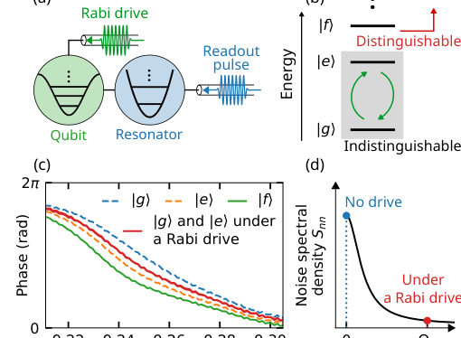
<figcaption class="paper-figure-caption"><b>Fig 1.</b> FIG. 1. (a) Scheme of the leakage-detection protocol. (b) Energy-level diagram of the qubit. When the computa- tional subspace is driven with sufficient power, the states |g⟩ and |e⟩cannot be distinguished, while the higher states such as |f⟩can be detected through dispersive readout. (c) Mea- sured resonator phase response as a function of the readout frequency for |g⟩(blue dashed), |e⟩(orange dashed), |f⟩(green solid), and the computational subspace under the Rabi drive of strength Ωq/2π = 74 MHz (red solid). (d) Illustration of the photon-number noise spectral density Snn(ω). The blue (red) dot indicates the case without (with) a Rabi drive.</figcaption>
</figure>
<figure class="paper-figure-card">
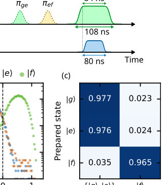
<figcaption class="paper-figure-caption"><b>Fig 2.</b> FIG. 3. (a) Pulse sequence for the leakage detection experi- ment. (b) Single-shot readout histograms for prepared states |g⟩(blue), |e⟩(orange), and |f⟩(green). The dashed line indi- cates the classification threshold. (c) Assignment matrix for binary {|g⟩, |e⟩} or |f⟩classification.</figcaption>
</figure>
<figure class="paper-figure-card">
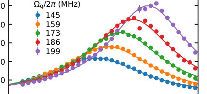
<figcaption class="paper-figure-caption"><b>Fig 3.</b> FIG. 2. (a) Pulse sequence to measure Rabi oscillations under a simultaneous probe pulse. A qubit drive at frequency ωd = ωeg + δ and a readout pulse are applied concurrently for a duration t, followed by a standard dispersive measurement. (b) Observed Rabi oscillations with drive strength Ωq/2π = 186 MHz, drive detuning δ/2π = −20 MHz, and mean photon number ¯n = 2.41. The red curve is the exponential fit of the envelope, from which the decay time TRabi is extracted. (c) TRabi as a function of the drive detuning δ for different drive strengths Ωq at ¯n = 2.41. Solid lines are the Lorentzian fits. Data points affected by a spurious mode are omitted.</figcaption>
</figure>
<figure class="paper-figure-card">
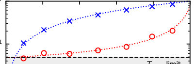
<figcaption class="paper-figure-caption"><b>Fig 4.</b> FIG. 4. (a) Pulse sequence for the leakage detection and post- selection experiment. (b) Real part of the density matrix for the prepared state (|f⟩⟨f| + |+⟩⟨+|)/2. (c) Real part of the density matrix after leakage detection and conditioning on the {|g⟩, |e⟩} outcome, starting from the same initial state shown in (b). (d) Pauli transfer matrix R of the leakage detection for the |g⟩–|e⟩subspace, measured at pf = 0.5. (e) Average state infidelity 1 −¯F as a function of |f⟩-state population pf. Blue dotted curve and crosses are theoretical prediction and the experimental results without leakage detection. Red dotted curve and circles are with leakage detection and conditioning on the...</figcaption>
</figure>

**Summary.** The paper introduces a novel technique to detect leakage out of the computational subspace in transmon qubits during readout. By applying a specific Rabi drive, the authors make the desired computational states invisible to the measurement probe while allowing higher-energy leakage states to be detected. This method achieves high fidelity error flagging while minimizing back-action on the encoded quantum information.

**Why it may be interesting.** This work directly addresses fundamental limitations in superconducting quantum hardware by providing a robust, non-invasive method for monitoring leakage errors, which is crucial for scaling up quantum computation.

Detailed structure

**Main problem.** Leakage out of the computational subspace is a major error source in superconducting quantum processors, requiring detection without disturbing encoded quantum information.

**Main result.** The authors achieved a leakage-detection fidelity of 97.1% while preserving high coherence (92.9% average state fidelity) on the remaining computational states.

**Method.** They apply a tailored Rabi drive during dispersive readout, which makes computational states indistinguishable to the probe while leaving higher excited leakage states distinguishable.

**Model / system.** The system is a fixed-frequency transmon qubit coupled dispersively to a readout resonator (Circuit-QED). The analysis treats the system in at least a qutrit subspace ($\{|g
angle, |e
angle, |f
angle\}$).

**Key observables.** Leakage-detection fidelity ($F_d$), false-flag rate ($\epsilon_{FF}$), post-detection average state fidelity ($ar{F}$), and Rabi oscillation decay time ($T_{	ext{Rabi}}$).

**Important parameters / regimes.** Detection window (80 ns), qubit anharmonicity, drive detuning ($\delta$), and coupling strengths ($\chi$).

**Assumptions / limitations.** The protocol requires no flux tunability or additional hardware components beyond standard dispersive readout elements.

**Figures summary.** Figures illustrate the Rabi pulse sequence for characterization (measuring $T_{	ext{Rabi}}$) and the scheme itself, showing how the drive makes computational states invisible to the probe while leakage states remain visible.

**Paper structure.** The paper details the physical problem of measurement back-action, introduces the specific Rabi driving protocol to selectively couple/decouple subspaces, presents quantitative measurements of fidelity and coherence preservation, and discusses error decomposition.

Abstract

Leakage out of the computational subspace is a major error mechanism in superconducting quantum processors. Detecting leakage without disturbing the encoded quantum information can provide a heralded error signal that error-correction decoders exploit. However, standard dispersive readout collapses all qubit eigenstates indiscriminately. Here, we demonstrate heralded leakage detection on a fixed-frequency transmon by applying a Rabi drive on the computational transition during dispersive readout. The drive makes the computational states indistinguishable to the probe on the resonator while leaving the second and higher excited states distinguishable from the computational states. We achieve a leakage-detection fidelity of 97.1(3)% within the 80-ns detection window, with a false-flag rate of 2.3(3)% from the computational subspace. Conditioned on the no-leakage outcome, the post-detection state retains an average fidelity of 92.9(5)% across the six cardinal states for an equal mixture of computational and leakage population. The scheme requires no circuit elements beyond those used for standard dispersive readout, making it applicable to various types of superconducting qubits without hardware modification.

[↑ back to top](#top)

### [Observation of Critical Current Minimum in Super-Honeycomb Josephson Junction Arrays](http://arxiv.org/abs/2607.16500v1)

**Authors:** Melissa Mikalsen, Alexander-Georg Penner, Samuel D. Escribano, Nadav Drechsler, Arunav Bordoloi, Jacob Issokson, Felix von Oppen, Yuval Oreg, Javad Shabani  
**Type:** both · **Category:** other · **PDF:** <https://arxiv.org/pdf/2607.16500v1>  
**Analysis basis:** full PDF text, analyzed in chunks
**Topic relevance:** 🔥 `analog quantum simulation` **4/5** · `exotic spin models in light-matter` **3/5** · `driven-dissipative phase transition` **2/5** · `non-equilibrium dynamics` **2/5** · `non-equilibrium universality` **2/5** · `Keldysh / 2PI / non-Gaussian methods` **1/5** · `methods for driven-dissipative` **1/5** · `spintronics-quantum-optics interface` **1/5**

↔ Scroll figures horizontally

<figure class="paper-figure-card">
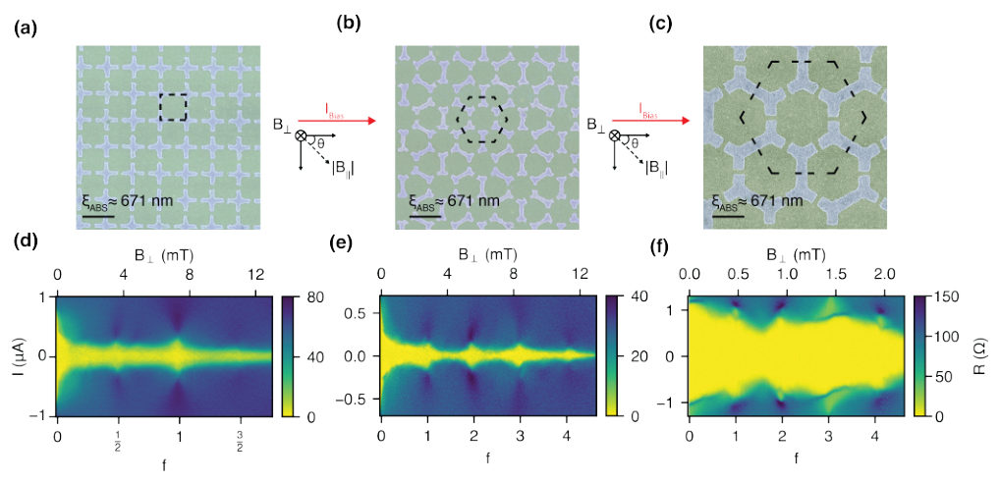
<figcaption class="paper-figure-caption"><b>Fig 1.</b> FIG. 1. Josephson junction arrays in perpendicular magnetic field. Scanning electron micrograph of a few plaquettes of a representative device for the square (a) and the super-honeycomb array with ξABS &gt; dJJ (b) and ξABS ≲dJJ (c). The superconductor (blue) and semiconductor (green) are falsely colored, the unit cell is outlined (dashed black line), and the scale bar is 671 nm. We plot the resistance as a function of current bias (I (µA) ) and frustration (f = B⊥AUC/Φ0) for the square (d) and the super-honeycomb array with ξABS &gt; dJJ (e) and ξABS ≲dJJ (f).</figcaption>
</figure>
<figure class="paper-figure-card">
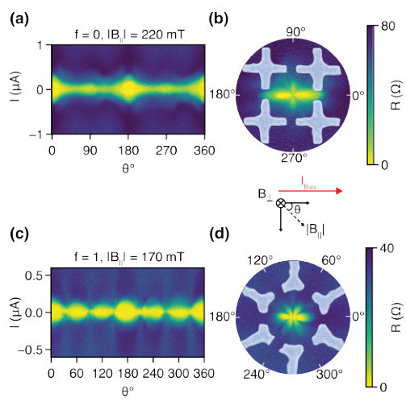
<figcaption class="paper-figure-caption"><b>Fig 2.</b> FIG. 2. In-plane magnetic field angle dependence of critical current. Resistance, R (Ω) as a function of current bias, I (µA), and angle of in-plane magnetic field, θ. Measure- ments for the square array were taken at f = 0, corresponding to B⊥= 0 mT, and a magnitude of in-plane field of B|| = 220 mT (a,b). For the super-honeycomb array, measurements were taken at f = 1, corresponding to B⊥= 2.802 mT, and a magnitude of in-plane field of B|| = 170 mT (c,d). The data from both array geometries is plotted on a polar plot with the corresponding representative unit cell SEM image over- laid. Only the data from the positive current bias is plotted on the polar plot for both the square array(b)...</figcaption>
</figure>
<figure class="paper-figure-card">
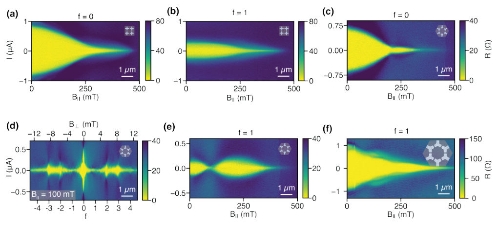
<figcaption class="paper-figure-caption"><b>Fig 3.</b> FIG. 3. Josephson junction arrays at finite frustration with in-plane magnetic field. Resistance as a function of current bias (I (µA)) and in-plane magnetic field pointing along θ = 0◦(B|| (mT)) for the square array at constant f = 0 (a) and f = 1 (b) and the ξABS &gt; dJJ super-honeycomb array at f = 0 (c) and f = 1 (e). Resistance as a function of current bias (I (µA)) and frustration (f = B⊥AUC/Φ0) for the super-honeycomb array at constant in-plane magnetic field, |B||(θ = 0◦)| = 100 mT (d). Resistance as a function of current bias (I (µA)) and in-plane magnetic field pointing along θ = 0◦(B|| (mT)) the ξABS ≲dJJ super-honeycomb array at f = 1 (f).</figcaption>
</figure>
<figure class="paper-figure-card">
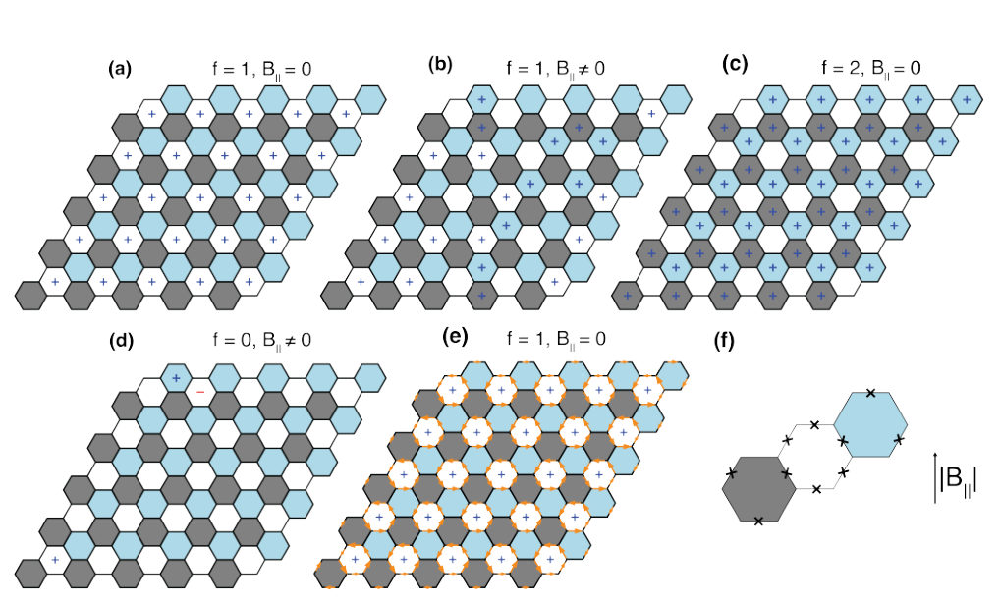
<figcaption class="paper-figure-caption"><b>Fig 4.</b> FIG. 4. Vortex configurations in Josephson junction arrays. Calculated vortex configurations, for a super-honeycomb Josephson junction array for f = 1 with B|| = 0 (a) and B|| = 0.6 (b), f =2 with B|| = 0 (c), and f = 0 wih B|| = 0.6 (d). Calculation of the current distribution in the array for f = 0 and B|| = 0, represented by orange arrows, magnitude of the arrows represent the relative magnitude of the current (e). White hexagons represent plaquettes with 6 junctions, blue and gray hexagons represent plaquettes with 3 junctions, an example unit cell is shown in (f). Blue plus symbols are vortices and red minus symbols are anti-vortices. The in-plane magnetic field is pointing...</figcaption>
</figure>

**Summary.** This work examines Josephson junction arrays in superconducting semiconductors to study collective quantum behavior influenced by magnetic fields. By comparing square and super-honeycomb geometries, the authors report observing a unique critical current minimum in the closely spaced super-honeycomb array at $f=1$. This finding suggests that long-range inter-junction hybridization is crucial for understanding vortex lattice stability beyond simple XY model predictions.

**Why it may be interesting.** The study probes how geometric frustration and intrinsic spin-orbit coupling interact to create novel quantum signatures (like the critical current minimum) that deviate from standard mean-field models, relevant for understanding topological superconductivity.

Detailed structure

**Main problem.** The study investigates collective quantum phenomena, specifically critical current behavior, in superconducting Josephson junction arrays under applied magnetic fields.

**Main result.** A distinct critical current minimum is observed uniquely in the closely spaced super-honeycomb array at a specific flux filling factor ($f=1$), which cannot be explained by simple XY model physics alone.

**Method.** The research combines magnetotransport measurements of critical current ($I_c$) with numerical simulations based on the frustrated 2D XY model.

**Model / system.** The physical system is an Al-InAs Josephson junction array, studied in both square and super-honeycomb geometries. The physics is modeled using a frustrated XY Hamiltonian incorporating Andreev bound states (ABS) hybridization ($\xi_{ABS}>d_{JJ}$) and Rashba spin-orbit coupling.

**Key observables.** Critical current ($I_c$), vortex localization patterns, resistance vs. bias/field measurements.

**Important parameters / regimes.** Frustration factor ($f = B_{\perp}A_{uc}/\Phi_0$), in-plane field magnitude and angle ($	heta$, $B_{||}$), junction spacing relative to coherence length ($\xi_{ABS}/d_{JJ}$).

**Assumptions / limitations.** The simple XY model is insufficient, necessitating the inclusion of long-range inter-junction hybridization effects for accurate description.

**Figures summary.** Figures show SEM images of the arrays and plots detailing $I_c$ vs. perpendicular field (showing vortex peaks) and $R$ vs. $I$ dependence on in-plane field angle ($	heta$) or magnitude ($B_{||}$), highlighting geometry-dependent features.

**Paper structure.** The paper establishes the platform, compares different geometries (square vs. super-honeycomb), analyzes vortex localization via out-of-plane fields, and then investigates the unique $I_c$ minimum induced by in-plane fields, contrasting theoretical model limitations with experimental observations.

Abstract

Superconductor-semiconductor Josephson junction arrays are a uniquely tunable platform for studying collective quantum phenomena, particularly in the regime where localized Andreev bound states can hybridize across the lattice when the physical separation between adjacent junctions is smaller than their coherence length ($ξ_{\text{ABS}}>d_{\text{JJ}}$). Here, we investigate three distinct Al-InAs Josephson junction arrays: a square array and super-honeycomb array fabricated within this ${ξ_{\text{ABS}}>d_{\text{JJ}}}$ regime, as well as a larger-spacing super-honeycomb control device designed such that $ξ_{\text{ABS}}\lesssim\!~d_{\text{JJ}}$. Under an out-of-plane field, critical current peaks emerge at rational filling factors, reflecting stable vortex configurations in the lattices. In the super-honeycomb lattice, vortices localize to distinct non-identical plaquettes at different filling factors, as predicted by frustrated XY model simulations. A rotating in-plane field yields periodic critical current oscillations that reflect the Rashba spin-orbit coupling inherent to the InAs quantum well. Surprisingly, at $f = 1$, the closely spaced super-honeycomb array exhibits a distinct critical current minimum as the magnitude of the in-plane field increases, a signature absent in the square array and large-spacing super-honeycomb array. These results indicate that this signature is jointly influenced by the unique geometry of the super-honeycomb vortex lattice and by long-range inter-junction hybridization.

[↑ back to top](#top)

### [Spatial nonlocality imaging via metasurface](http://arxiv.org/abs/2607.17618v1)

**Authors:** Jian Li, Zi-Mu Fan, Qing-Yuan Wu, Wen-Kai Yu, Zhe Meng, Xing-Yan Fan, Wen-Hao Wang, Jie Ma, Xia Guo, An-Ning Zhang  
**Type:** both · **Category:** quantum information and computing · **PDF:** <https://arxiv.org/pdf/2607.17618v1>  
**Analysis basis:** full PDF text, analyzed in chunks
**Topic relevance:** 🔥 `entanglement & information structure` **4/5** · `interference shaping light` **3/5** · `quantum optics experiment` **3/5** · `QC/QI experiment` **2/5** · `quantum measurements` **2/5** · `measurement-induced transitions` **1/5** · `methods for driven-dissipative` **1/5**

↔ Scroll figures horizontally

<figure class="paper-figure-card">
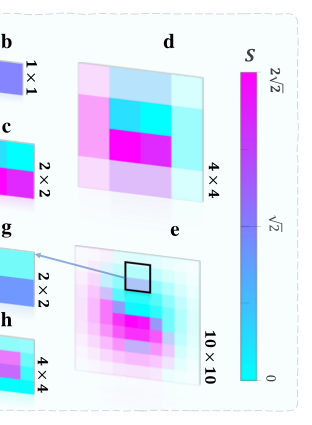
<figcaption class="paper-figure-caption"><b>Fig 1.</b> Fig. 1 Spatial-resolution–dependent manifestation of quantum nonlocality. a, simulated bipartite entangled field distribution resembling the Taiji-like spatial pattern, where blue regions show no detectable Bell violation (S = 0), magenta regions exhibit Bell violation (S = 2 √</figcaption>
</figure>
<figure class="paper-figure-card">
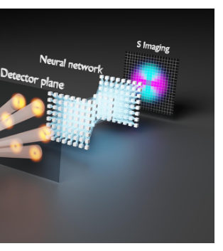
<figcaption class="paper-figure-caption"><b>Fig 2.</b> Fig. 2 Spatially resolved reconstruction of quantum nonlocality using a metasurface and quantum-swin fusion network (Quantum-SFNet). A spatially structured entangled photon field is incident on a polarization-analyzing metasurface, which spatially separates Alice’s photons according to their Pauli measurement outcomes. The resulting polarization-resolved intensity patterns are projected onto a detection plane and recorded together with photon arrival times and output-port information. From these sparse, photon-limited measurement data, a neural network (Quantum- SFNet) reconstructs the spatial distribution of CHSH nonlocality, producing a pixel-resolved CHSH S map of the entangled field. It...</figcaption>
</figure>
<figure class="paper-figure-card">
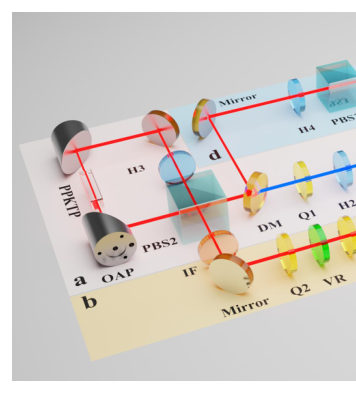
<figcaption class="paper-figure-caption"><b>Fig 3.</b> Fig. 3 Experimental setup for spatially resolved nonlocality imaging. The setup comprises four modules: source preparation, spatial encoding, and detection (Alice and Bob). a, Source Prepa- ration (white zone): a 405-nm continuous-wave laser pumps a Sagnac interferometric loop containing a PPKTP crystal, producing polarization-entangled photon pairs 1 √</figcaption>
</figure>
<figure class="paper-figure-card">
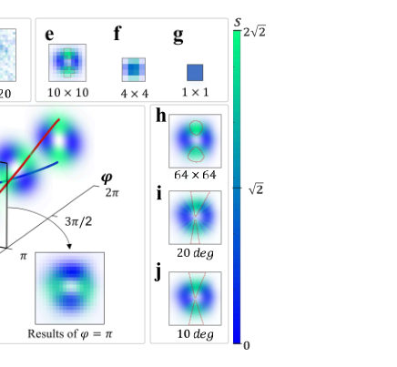
<figcaption class="paper-figure-caption"><b>Fig 4.</b> Fig. 4 Experimental reconstruction and image-based analysis of spatially distributed Bell nonlocality. a, theoretical CHSH parameter (S-value) distribution of the prepared spatially structured polarization–OAM hybrid entangled states. b, raw photon-count data (intensity maps) recorded under ultralow-photon conditions (average of 1.70 coincidence pairs per pixel per projection configuration); no spatial structure is discernible. c, direct CHSH parameter reconstruction from raw data without neural-network enhancement; severe statistical fluctuations completely obscure the underlying nonlocality. d, Simulated and experimentally reconstructed spatial CHSH distributions for different...</figcaption>
</figure>
<figure class="paper-figure-card">
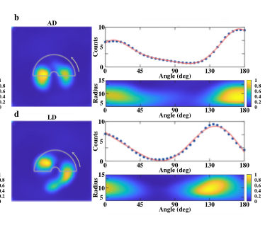
<figcaption class="paper-figure-caption"><b>Fig 5.</b> Fig. 5 Reconstruction of Bell-type nonlocality via Quantum-SFNet-assisted imaging. a– d, Experimental results under four distinct two-photon polarization bases (ΠA = A, L; ΠB = A, D). The left panels display the normalized 2D spatial intensity maps output by the neural network. The red annular boundaries define the region of interest (ROI), with the solid red line marking the azimuthal zero-angle reference (θ = 0◦). The bottom-right panels show the corresponding unwrapped polar-to-Cartesian intensity distributions (Radius vs. θ). The top-right panels plot the integrated angular coincidence counts (blue dots) along with their sinusoidal fits (red curves). Using the corre- lated intensities...</figcaption>
</figure>

**Summary.** The paper introduces a novel 'spatial nonlocality imaging' technique to overcome the measurement cost barrier when testing Bell inequalities across large entangled fields. By integrating metasurfaces for parallel projections and using a specialized neural network, they can map the spatial distribution of quantum nonlocality with unprecedented resource efficiency. This opens new avenues for practical, large-scale photonic quantum technologies.

**Why it may be interesting.** This work provides a crucial pathway toward scaling up entanglement verification in photonic systems by replacing resource-intensive sequential measurements with parallel, data-driven reconstruction techniques, which is highly relevant to scalable quantum communication protocols.

Detailed structure

**Main problem.** The primary challenge is visualizing and certifying spatial nonlocality (Bell nonlocality) across large, spatially multimode photonic fields due to the prohibitive measurement cost of traditional projective tests.

**Main result.** The authors developed a resource-efficient imaging scheme that successfully maps the two-dimensional spatial distribution of Bell violations using metasurfaces and neural networks, demonstrating high fidelity even with few detected coincidence pairs.

**Method.** The approach combines hardware parallelization via a metasurface for simultaneous Pauli projections with a quantum-adaptive neural network (Quantum-SFNet) to reconstruct spatially resolved CHSH parameters from sparse data.

**Model / system.** The system utilizes bipartite entangled states, specifically polarization-OAM hybrid entangled biphotons generated via SPDC. The measurement process involves mapping multiple Pauli measurements onto distinct spatial locations on a detector plane.

**Key observables.** Bell nonlocality (CHSH parameter $S$), the spatial distribution of Bell violations across the optical field, and reconstructed density matrices ($
ho$).

**Important parameters / regimes.** Low photon resource requirements (e.g., $\sim 1.7$ coincidence pairs per pixel per basis), high spatial resolution (400-pixel field).

**Assumptions / limitations.** The method assumes that the measured state can be accurately reconstructed from sparse, spatially resolved measurements using physics-informed machine learning constraints.

**Figures summary.** Figures illustrate the recovery of nonlocality patterns as spatial resolution increases, contrasting coarse (no violation) vs. fine (clear violation) detection regimes. Other figures detail the experimental setup involving metasurfaces and network reconstruction results.

**Paper structure.** The paper progresses from identifying the resource scaling bottleneck in Bell testing to proposing a hybrid hardware/ML imaging scheme. It then details the implementation using specific entangled states, validates the method by showing state tomography fidelity metrics (MSE, SSIM, Trace Distance), and concludes with implications for quantum networking.

Abstract

Bell nonlocality is both a defining signature of entanglement and a key quantum information resource. However, visualizing and certifying nonlocal correlations across a spatially multimode photonic field remains challenging due to the rapidly growing measurement cost of spatially resolved projective tests. To address this issue, we build a spatial nonlocality imaging scheme that directly reveals the spatial distribution of quantum nonlocality by integrating a metasurface that performs parallel polarization projections with a quantum-adaptive neural network. Spatially resolved Clauser--Horne--Shimony--Holt (CHSH) tests are realized over a 400-pixel biphoton field using an average of only 1.7 detected coincidence pairs per pixel per basis. This approach yields a nonlocality image that maps the two-dimensional spatial distribution of Bell violations across the optical field and reveals the target-state-dependent spatial evolution of Bell violations. It provides a highly resource-efficient route to large-scale Bell certification and opens new possibilities for exploiting spatially multimode entanglement in quantum imaging, quantum networking, and scalable photonic quantum technologies.

[↑ back to top](#top)

### [Bridging Relativistic Twisted Fermion Beams and Photonic OAM Flux in Gauged Hopf Lattices: Emergent Topological Analogs](http://arxiv.org/abs/2607.16520v1)

**Authors:** Aaron Michael Kinder  
**Type:** theory · **Category:** other · **PDF:** <https://arxiv.org/pdf/2607.16520v1>  
**Analysis basis:** full PDF text, analyzed in chunks
**Topic relevance:** 🔥 `analog quantum simulation` **4/5** · `methods for driven-dissipative` **3/5** · `non-equilibrium dynamics` **2/5** · `correlated / nonlocal dissipation` **1/5** · `driven-dissipative phase transition` **1/5** · `entanglement & information structure` **1/5** · `exotic spin models in light-matter` **1/5** · `interference shaping light` **1/5** · `non-equilibrium universality` **1/5**

↔ Scroll figures horizontally

<figure class="paper-figure-card">

<figcaption class="paper-figure-caption"><b>Fig 1.</b> FIG. 1. Conceptual bridge between regimes. Left: non- diffractive τTL core (antiparallel configuration) for a relativis- tic twisted fermion beam, with overall diffraction of the inten- sity envelope. Center: OAM flux transfer from an LG twisted photon packet. Bottom: deposition into a gauged Hopf lattice of flux flywheels, with labels highlighting e−2 survival at crit- ical λt = 2 (mystery convention), golden-angle correlations, and topological residuals. This figure frames the fermionic ↔ photonic analogy developed in the present work. (Simulation stack: oam flux v0.5-preprint.)</figcaption>
</figure>
<figure class="paper-figure-card">
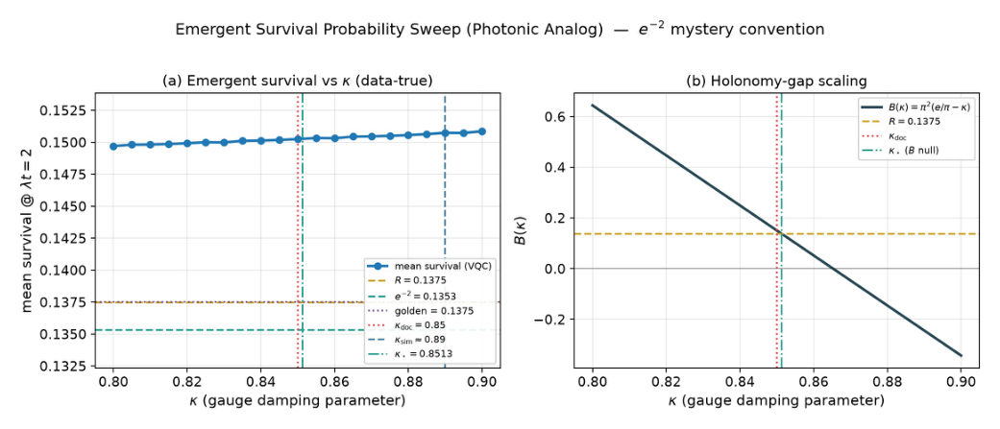
<figcaption class="paper-figure-caption"><b>Fig 2.</b> FIG. 2. Data-true emergent survival sweep from frozen oam flux emergence probes (report.json; ℓ= 3, λt = 2). (a) Mean survival after pump–relax versus gauge damping κ ∈[0.80, 0.90]. Horizontal lines: residual R ≈0.1375, mystery scale e−2 ≈ 0.1353, and golden-angle fraction. Vertical markers: κdoc = 0.85, κ⋆≈0.851, κsim ≈0.89. Measured mean survival ≈0.150 (∼11% above e−2, ∼9% above R). (b) Holonomy gap B(κ) = π2(e/π −κ) crosses zero at κ⋆and meets R near κdoc.</figcaption>
</figure>
<figure class="paper-figure-card">
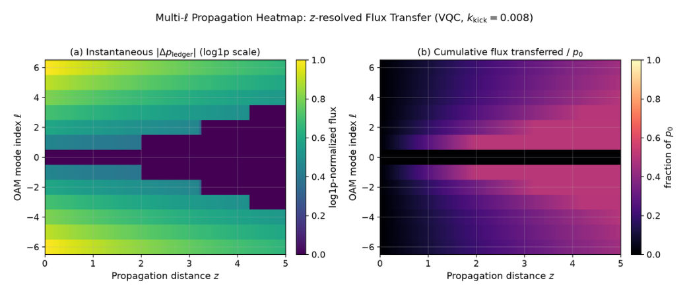
<figcaption class="paper-figure-caption"><b>Fig 3.</b> FIG. 3. Data-true multi-ℓz-resolved flux transfer from live VQC coupling (oam flux; kkick = 0.008 so the photon reservoir drains over many z steps rather than in a single kick). (a) Instantaneous ledger deposit |∆pledger| (log1p-normalized): transfer scales with |ℓ| (dark band at ℓ= 0 where OAM momentum vanishes) and extinguishes earlier for low-|ℓ| modes as p0 is exhausted. (b) Cumulative fraction of initial OAM momentum p0 transferred to the lattice; mid-|ℓ| channels approach ∼50% transfer by z = 5 in this kick window.</figcaption>
</figure>
<figure class="paper-figure-card">
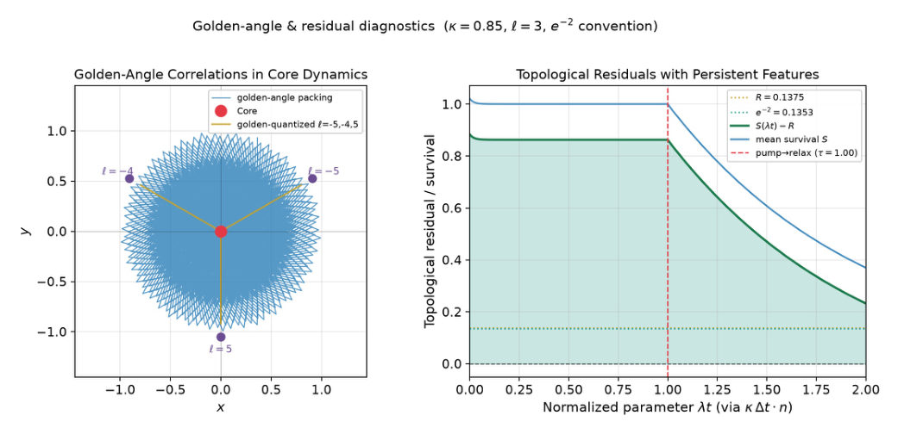
<figcaption class="paper-figure-caption"><b>Fig 4.</b> FIG. 4. Data-true golden-angle and residual diagnostics (κ = 0.85, ℓ= 3). Left: Vogel golden-angle packing in the transverse plane with the dynamical core at the origin; spokes mark golden-quantized OAM modes ℓ∈{−5, −4, 5} selected by the emergence probe (phase increments closest to multiples of ≈137.5◦). Right: instrumented pump–relax trajectory versus normalized λt. Mean survival S (blue) and residual feature S −R (green) plateau through the pump half-interval, then decay in pure PDE relaxation toward the {R, e−2} band (horizontal references). The red dashed line marks the pump→relax switch at τ = 1.</figcaption>
</figure>

**Summary.** This paper develops a computational bridge by simulating the behavior of twisted photons coupled into a gauged Hopf lattice. The study finds that these photonic systems exhibit emergent topological features, such as persistent core structures and specific quantized correlations, mirroring non-diffractive textures observed in relativistic fermion beams. This suggests photonics is an accessible analog platform for exploring universal concepts in topological matter waves.

**Why it may be interesting.** This work is highly relevant as it uses quantum optics (OAM/photonic lattices) to model complex many-body physics concepts (topological protection in fermions), offering a concrete platform for testing universal physical principles.

Detailed structure

**Main problem.** The primary goal is to establish a computational bridge by finding analogous topological phenomena between relativistic twisted fermion beams and photonic systems.

**Main result.** The simulations show that coupling OAM flux into a gauged Hopf lattice results in emergent core features, persistent survival rates near specific constants ($e^{-2}$), and golden-angle correlations mirroring fermionic findings.

**Method.** Numerical simulations are employed to model the evolution of Laguerre-Gaussian (LG) twisted photon packets coupled to a gauged Hopf lattice using relaxation PDEs.

**Model / system.** The system involves two parts: 1) A reference fermionic model exhibiting non-diffractive topological spin textures, and 2) The photonic analog, which uses LG OAM packets propagating through a lattice governed by a PDE incorporating gauge damping torque.

**Key observables.** Mean survival of twist ($\approx 0.150$), Topological Residual ($R \approx 0.1375$), Golden-Angle Correlations in the OAM ladder, and z-resolved flux transfer.

**Important parameters / regimes.** Critical normalization $\lambda_t = 2$, Gauge damping parameter $\kappa$, and the characteristic constants $e^{-2} \approx 0.1353$ and $R$.

**Assumptions / limitations.** The analogy is based on shared geometric/continuity constraints rather than a direct microscopic duality; the lattice PDE is calibrated, not derived from first principles.

**Figures summary.** Figures illustrate the conceptual bridge between fermion cores and OAM flux transfer into the Hopf lattice. Figure 2 shows mean survival vs. gauge damping ($\kappa$), and Figure 4 displays golden-angle packing and the pump–relax trajectory near $\{R, e^{-2}\}$.

**Paper structure.** The paper first establishes the fermionic context, then details the photonic model (LG packets on Hopf lattice), presents simulations showing emergent topological signatures (survival plateau, flux transfer), and concludes by formalizing the computational bridge between the two domains.

Abstract

Recent work has demonstrated non-diffractive topological spin textures (Skyrmion- and meron-like) that persist in the core of diffracting relativistic twisted fermion beams [1]. Here we present numerical simulations of an analogous photonic system: Laguerre-Gaussian (LG) twisted photon packets coupled to a gauged Hopf lattice with discrete flux flywheels. Our results reveal emergent behavior of the same qualitative class, including persistent core features under propagation, mean survival approx 0.150 at critical lambdat = 2 clustering tightly with the mystery scale e^{-2} approx 0.1353 and residual R approx 0.1375, golden-angle correlations in the OAM mode ladder, and topological residuals with long-lived structure. Multi-l simulations further exhibit z-resolved flux transfer and twist dynamics that play a role analogous to probability-current continuity in the fermionic setting. These findings suggest photonic platforms as accessible analogs for exploring topological textures in structured waves, and they formalize a concrete computational bridge between relativistic twisted matter waves and topological photonics.

[↑ back to top](#top)

### [Depth Determination of Individual Shallow NV-Centers via Spin-Lock NMR](http://arxiv.org/abs/2607.17734v1)

**Authors:** Aaron Daniel, Beat Bürgler, Patrick Maletinsky, Patrick Potts  
**Type:** both · **Category:** other · **PDF:** <https://arxiv.org/pdf/2607.17734v1>  
**Analysis basis:** full PDF text, analyzed in chunks
**Topic relevance:** 🔥 `QC/QI experiment` **4/5** · `methods for driven-dissipative` **3/5** · `spintronics-quantum-optics interface` **3/5** · `quantum measurements` **2/5** · `Keldysh / 2PI / non-Gaussian methods` **1/5** · `correlated / nonlocal dissipation` **1/5** · `driven-dissipative phase transition` **1/5**

↔ Scroll figures horizontally

<figure class="paper-figure-card">
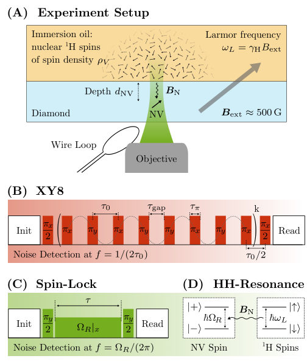
<figcaption class="paper-figure-caption"><b>Fig 1.</b> FIG. 1. Experimental arrangement for depth deter- mination of single NV centers. (A) The diamond surface is coated with immersion oil which contains 1H nuclear spins at a density ρV . In an external magnetic field Bext these nu- clear spins produce magnetic fluctuations BN that peak at the Larmor frequency ωL. By applying a suitable NMR con- trol sequence with a gold wire loop, these fluctuations can be detected by a shallow NV spin. Since the 1H spin noise ampli- tude depends on the NV depth dNV, the latter can be deter- mined by fitting the NMR signal with a quantitative theoreti- cal model. (B) The established sequence for such 1H NMR is XY8, a dynamical decoupling sequence comprised of...</figcaption>
</figure>
<figure class="paper-figure-card">
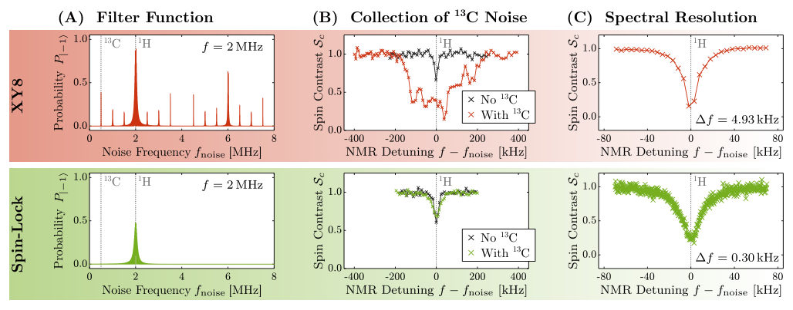
<figcaption class="paper-figure-caption"><b>Fig 2.</b> FIG. 2. Comparison of XY8 and Spin-Lock for 1H NMR. (A) Numerically computed filter functions of these two sequences, describing the probability P|−1⟩of the NV spin to be in state |−1⟩at the end of the sequence given that it was initially prepared in |0⟩, and plotted as a function of the applied noise frequency fnoise = ωL/(2π). Each sequence is constructed such that its detection frequency f is 2 MHz (= resonant with 1H spins at Bext ≈500 G). Our simulation shows that XY8, simulated for realistic pulses with τπ/τ0 = 20 %, collects not only the 1H noise at 2 MHz but also noise at various harmonics of f. In particular, there is a subharmonic on resonance with 13C noise (0.5 MHz). Spin-Lock,...</figcaption>
</figure>
<figure class="paper-figure-card">
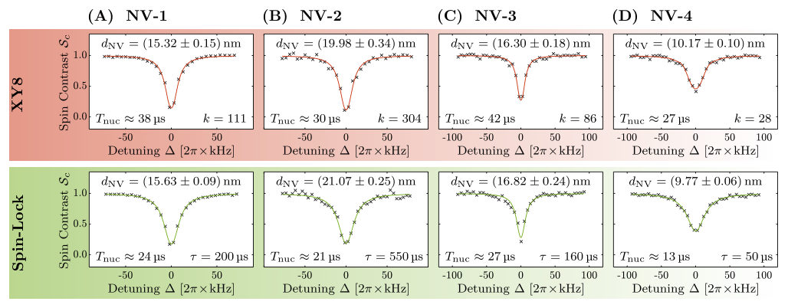
<figcaption class="paper-figure-caption"><b>Fig 3.</b> FIG. 3. Comparison of XY8 and Spin-Lock depth determination on immersion oil 1H spins. We measure the 1H NMR signal of immersion oil on the diamond surface with both sequences on four different NVs. These NVs, labeled NV-1 to NV-4, are located in an isotopically purified diamond crystal and were created by nitrogen ion implantation at an incidence angle of 7◦and an energy of 6 keV, resulting in a nominal implantation depth estimated by SRIM to be 9 nm. For each NV, the Spin-Lock duration τ is chosen to maximize the NMR SNR, and each XY8 measurement is performed with an XY8 repetition number k such that the total XY8 sequence duration 8kτ0 is equal to τ. To extract the NV depth dNV, we fit...</figcaption>
</figure>
<figure class="paper-figure-card">
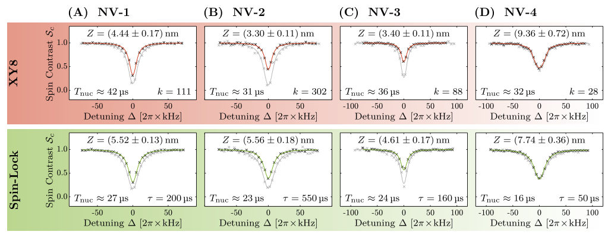
<figcaption class="paper-figure-caption"><b>Fig 4.</b> FIG. 4. Analysis of an adsorbate surface layer containing 1H spins. NMR data taken on the same NVs as in Fig. 3, acquired before the immersion oil was applied, i.e. the measurements were performed with a clean (oxygen-terminated) diamond surface. The resulting data taken by XY8 and Spin-Lock sequences are shown in green and red respectively, and the immersion oil data from Fig. 3 are shown in grey for comparison. Clearly, even in the absence of oil, all four NVs still show an 1H NMR signature, which is commonly assigned to a ∼1 nm thick, 1H-containing adsorbate layer on the diamond surface, as previously reported in [15, 40–46]. Similar to the approach taken in Refs. [15] and [40], we fit...</figcaption>
</figure>
<figure class="paper-figure-card">
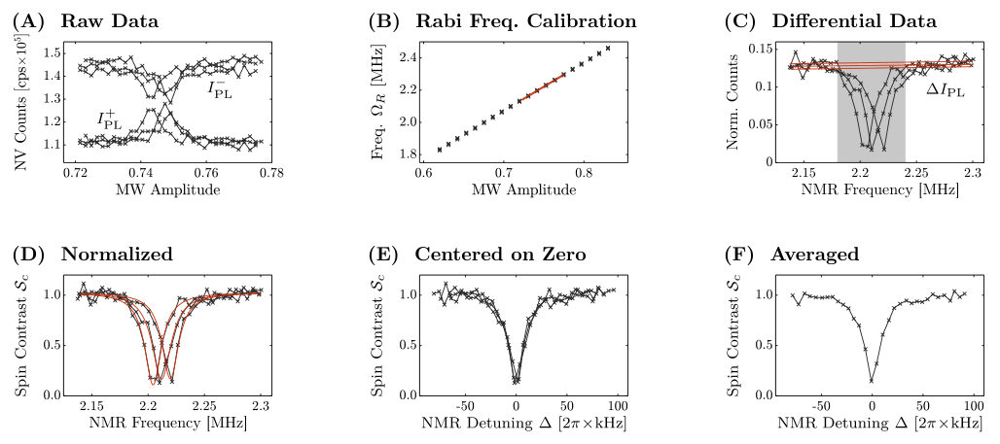
<figcaption class="paper-figure-caption"><b>Fig 5.</b> FIG. 5. NMR data treatment. (A) The raw data acquired in the lab is a number of NMR spectra, given in units of NV counts and taken as a function of MW amplitude. Here we show three such spectra as an example. Each of them consists of two separate lines I± PL, one for a final +π/2-pulse and one for a final −π/2-pulse. Each spectrum is the result of exactly one hour of measurement time, and between their acquisition, we recalibrate the NV spin transition frequency and all required microwave pulses (π and π/2) in order to eliminate the effect of slow drifts due to temperature fluctuations. (B) For each NMR spectrum, we also record a calibration of MW amplitude to Rabi frequency by measuring a...</figcaption>
</figure>

**Summary.** This paper presents Spin-Lock Nuclear Magnetic Resonance (NMR) as an advanced, robust method for determining the depth of individual NV centers in diamond. By tuning the microwave field to the ${}^1	ext{H}$ Larmor frequency, it avoids spectral artifacts present in older techniques like XY8 while achieving higher resolution. This establishes a reliable tool for quantitative quantum sensing measurements.

**Why it may be interesting.** This work is highly relevant as it develops a sophisticated open quantum system measurement technique (Spin-Lock NMR) to characterize the local environment of a solid-state qubit (NV center), directly impacting the fidelity and utility of quantum sensors.

Detailed structure

**Main problem.** The primary goal is to accurately determine the depth of individual shallow Nitrogen-Vacancy (NV) centers within diamond, a crucial parameter for quantitative quantum sensing applications.

**Main result.** The authors introduce Spin-Lock NMR as a robust alternative method that achieves excellent agreement with established protocols while overcoming spectral limitations and harmonic ambiguities inherent in older techniques like XY8.

**Method.** They derive a quantitative fit function from a Markovian master equation describing the NV interaction with the ${}^1	ext{H}$ nuclear spin bath, measured via Spin-Lock NMR spectroscopy.

**Model / system.** The system involves shallow NV centers in diamond interacting with surface ${}^1	ext{H}$ spins. The theoretical framework uses a Quantum Master Equation (QME) solved in the dressed-state basis derived from the Spin-Lock Hamiltonian, which filters noise at the target Larmor frequency.

**Key observables.** The measured ${}^1	ext{H}$ NMR spectrum's spin contrast ($S_c$) and its dependence on the NV depth ($d_{	ext{NV}}$).

**Important parameters / regimes.** Spin-Lock Rabi frequency ($\Omega_R$), ${}^1	ext{H}$ Larmor frequency ($\omega_L$), and the spectral resolution ($\Delta f$).

**Assumptions / limitations.** The analysis assumes a Markovian evolution for the nuclear bath and utilizes approximations within the dressed-state basis to simplify the QME.

**Figures summary.** Figure 1 illustrates the comparison between the XY8 sequence and the proposed Spin-Lock alternative. Figure 2(B) likely compares depth measurements using both methods on diamonds with varying ${}^{13}	ext{C}$ content.

**Paper structure.** The paper first identifies the limitations of existing NMR techniques (XY8), then introduces the theoretical basis for Spin-Lock NMR via a master equation, demonstrates its superior performance in noise immunity and resolution, validates it against established methods, and finally applies it to study signals on clean diamond surfaces.

Abstract

Quantitative quantum sensing with shallow electron spins, such as those hosted by nitrogen-vacancy (NV) centers in diamond, requires accurate knowledge of the spin's depth below the host material's surface. A widely used approach infers this depth from the 1H nuclear magnetic resonance (NMR) signal of immersion oil on the diamond surface that can be detected using dynamical decoupling sequences such as XY8. However, finite-width pulses make XY8 sensitive to subharmonic responses, including unwanted contributions from nearby 13C spins, and its instrument-limited spectral resolution provides only sparse sampling of the narrow 1H NMR lineshape. Here, we introduce Spin-Lock NMR as an alternative approach to single-NV depth determination. By tuning the Spin-Lock Rabi frequency to the 1H Larmor frequency, the NV probes the 1H NMR signal through the Hartmann-Hahn resonance without the harmonic ambiguities of pulsed decoupling sequences and with substantially higher instrument-limited spectral resolution. We derive a quantitative Spin-Lock NMR fit function from a Markovian master equation that directly relates the measured spectrum to the NV depth. Our approach yields NV depth estimates in excellent agreement with the established XY8-based protocol across multiple NV centers and establishes Spin-Lock NMR as a robust alternative for quantitative single-NV depth determination. To demonstrate its applicability, we employ our method to investigate the 1H nuclear spin signal that is regularly reported to be present on diamond, even in the absence of immersion oil.

[↑ back to top](#top)

### [Multi-level Random-Telegraph Noise Mitigation using a Single Spectator Qubit](http://arxiv.org/abs/2607.17202v1)

**Authors:** Yanan Liu, Hongting Song, Areeya Chantasri, Howard M. Wiseman  
**Type:** theory · **Category:** quantum information and computing · **PDF:** <https://arxiv.org/pdf/2607.17202v1>  
**Analysis basis:** full PDF text, analyzed in chunks
**Topic relevance:** 🔥 `quantum measurements` **4/5** · `measurement-induced transitions` **3/5** · `methods for driven-dissipative` **3/5** · `non-equilibrium dynamics` **2/5** · `Keldysh / 2PI / non-Gaussian methods` **1/5** · `correlated / nonlocal dissipation` **1/5** · `driven-dissipative phase transition` **1/5**

↔ Scroll figures horizontally

<figure class="paper-figure-card">
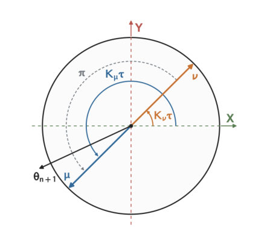
<figcaption class="paper-figure-caption"><b>Fig 1.</b> FIG. 1. An illustration of the measurement angle and time that are used in the Heuristic Adaptive Algorithm. The or- ange and blue arrows describe the state vectors of the two plausible SQ’s phases: ∣Φ⟩s = ∣Kµτ⟩s and ∣Φ⟩s = ∣Kντ⟩s, cor- responding to the noise levels µ and ν, respectively. The al- gorithm chooses τn+1 based on the time when the two phases are at an angle π apart as in Eq. (44). The black arrow describes the measurement angle θn+1, which is now shown to be at a random angle in the plot, but it should be equal to max{Kµτn+1, Kντn+1}, i.e., either aligned with ∣Kµτ⟩s or ∣Kντ⟩s, following Eq. (45).</figcaption>
</figure>
<figure class="paper-figure-card">
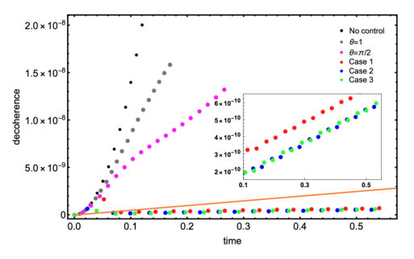
<figcaption class="paper-figure-caption"><b>Fig 2.</b> FIG. 2. The decoherence as a function of time under different measurement strategies. The black dots correspond to the no-control case. The gray dots represent a fixed measurement angle and time: θ = 1 and τ = π/Mean(K). The magenta dots correspond to the fixed measurement angle and time: θ = π/2 and τ = π/Mean(K). The red, blue, and green curves show the results of the Heuristic Adaptive Algorithm with three initial measurement settings, i.e., case 1, case 2 and case 3. The orange solid line is the upper bound from (52). The inset displays a zoomed-in view.</figcaption>
</figure>

**Summary.** This paper introduces a novel method to protect quantum coherence in a data qubit from general multi-level environmental noise using measurements on a spectator qubit. The core contribution is a memory-efficient, adaptive protocol that dynamically optimizes measurement timing and angles based on the estimated noise state. This demonstrates robust decoherence suppression even when the noise environment is significantly more complex than previously modeled.

**Why it may be interesting.** This work directly addresses open quantum systems by providing an advanced, adaptive control strategy to combat realistic, complex environmental noise sources beyond simple two-level approximations.

Detailed structure

**Main problem.** The primary challenge is preserving quantum coherence of a data qubit (DQ) when subjected to complex, multi-level environmental noise.

**Main result.** A proposed heuristic adaptive protocol successfully suppresses decoherence under general multi-level noise, achieving performance comparable to simpler two-state noise models.

**Method.** The authors developed a mitigation scheme that infers the unknown noise state from sequential measurements performed on an auxiliary spectator qubit (SQ) and uses this information for phase correction.

**Model / system.** The system consists of a DQ and an SQ interacting with an environment causing multi-level random telegraph noise, modeled by $L$ discrete noise levels. The dynamics are governed by time-dependent frequency shifts ($	ilde{\kappa}(t), 	ilde{K}(t)$) derived from the noise state.

**Key observables.** Coherence ($C_c$), decoherence rate ($\Gamma$), and the probability vector $\vec{A}_n$ tracking the estimated noise state.

**Important parameters / regimes.** The number of noise levels $L$, the transition rates $\gamma_{ij}$, and the measurement parameters (time $	au_n$ and angle $	heta_n$).

**Assumptions / limitations.** It is assumed that the SQ sensitivities ($K_j$) are non-degenerate relative to the DQ sensitivities ($\kappa_j$), otherwise, the noise distinction fails.

**Figures summary.** Figure 2 numerically compares decoherence vs. time for 'no-control,' fixed measurements, and the Heuristic Adaptive Algorithm, showing the adaptive method significantly outperforms others and stays below the analytical upper bound.

**Paper structure.** The paper progresses from deriving coherence dynamics under multi-level noise to developing a measurement-based mitigation scheme using map-based formalism. It then introduces and details a memory-efficient heuristic adaptive protocol for selecting optimal measurement settings ($	au_{n+1}, 	heta_{n+1}$) based on the current noise estimate.

Abstract

Preserving quantum coherence in the presence of environmental noise is one of the principal challenges for quantum technologies. Noise mitigation using spectator qubits (SQs) has recently emerged as a promising approach, enabling indirect probing of the noise without disturbing the data qubit (DQ). However, existing analyses that probe ultimate performance have been restricted to two-state random telegraph process noise, which does not capture more complex noise processes that may arise in the environment. Therefore, we here develop a SQ-based noise mitigation for DQs subject to general multi-level fluctuator noise. We first derive the coherence dynamics of the DQ under such noise, then develop a mitigation scheme in which information about the noise is inferred from sequential SQ measurements and used for phase correction. A memory-efficient heuristic adaptive protocol is proposed to dynamically select the SQ measurement time and angle based on the current noise estimate. Numerical simulations demonstrate that the proposed strategy significantly suppresses decoherence under multi-level noise, achieving performance comparable to that in the two-level case despite the increased complexity of the noise process.

[↑ back to top](#top)

### [On the Information Required for Feedback Control](http://arxiv.org/abs/2607.16639v1)

**Authors:** Matthew P. Leighton, Jose M. Betancourt, Thierry Emonet, Benjamin B. Machta, Michael C. Abbott  
**Type:** theory · **Category:** statistical mechanics · **PDF:** <https://arxiv.org/pdf/2607.16639v1>  
**Analysis basis:** full PDF text, analyzed in chunks
**Topic relevance:** 🔥 `quantum measurements` **4/5** · `non-equilibrium dynamics` **3/5** · `non-equilibrium universality` **2/5** · `Keldysh / 2PI / non-Gaussian methods` **1/5** · `correlated / nonlocal dissipation` **1/5** · `driven-dissipative phase transition` **1/5** · `entanglement & information structure` **1/5** · `measurement-induced transitions` **1/5** · `methods for driven-dissipative` **1/5**

↔ Scroll figures horizontally

<figure class="paper-figure-card">
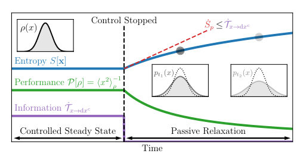
<figcaption class="paper-figure-caption"><b>Fig 1.</b> FIG. 1. Schematic illustrating the setup and our bound. A diffusive Brownian particle in one dimension (passive dynam- ics dxp t = √</figcaption>
</figure>
<figure class="paper-figure-card">
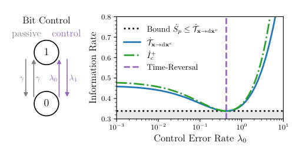
<figcaption class="paper-figure-caption"><b>Fig 2.</b> FIG. 2. Controlling a noisy bit. Left: schematic, with passive bit flips at rate γ = 1. The performance measure is P[ρ] = ρ0, the steady-state probability of being in state 0. Right: infor- mation rate vs control error rate λ0, always achieving a fixed performance ρ0 = 0.7. Given ρ0 and γ, λ0 uniquely fixes λ1. Black dotted line: the bound Eq. (12). Blue line: information rate ˙Tx→dxc. Green dot-dashed line: instantaneous informa- tion rate ˙I+ c ≥˙Tx→dxc, Eq. (13). Purple dashed line: optimal rate λ0 which saturates the bound by time-reversing the pas- sive dynamics.</figcaption>
</figure>
<figure class="paper-figure-card">
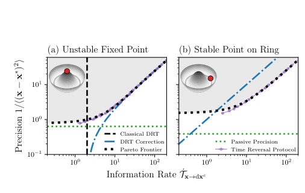
<figcaption class="paper-figure-caption"><b>Fig 3.</b> FIG. 3. Controlling a Brownian particle in a Mexican–hat potential, with the target being either (a) the unstable fixed point x∗ 1 = (0, 0), or (b) the stable fixed point x∗ 2 = (1, 0). With no control, the performance P[ρ] = 1/⟨|x −x∗|2⟩re- mains finite (green dotted lines). The Data Rate Theorem (DRT), Eq. (23), provides a lower bound on the informa- tion rate required for stabilization (vertical dashed line) only in the unstable case (a). Blue dot-dashed curves: the DRT generalized to account for diffusion, Eq. (24). Black dotted curves: Pareto frontier from Eq. (12), with the forbidden re- gion shaded in grey. Purple points: time-reversal protocol, Eq. (C16), with information rate...</figcaption>
</figure>
<figure class="paper-figure-card">
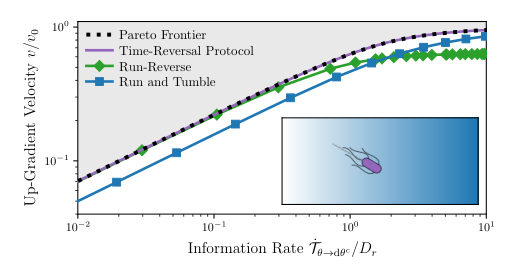
<figcaption class="paper-figure-caption"><b>Fig 4.</b> FIG. 4. Up-gradient velocity vs information rate for navi- gation in 2D (inset: schematic). Black dotted line: Pareto frontier, Eq. (28). Purple: time-reversal protocol. Blue Squares: optimized Run-and-Tumble navigation. Green Dia- monds: optimized Run-Reverse navigation, with information rate computed using TE-PWS [38].</figcaption>
</figure>
<figure class="paper-figure-card">
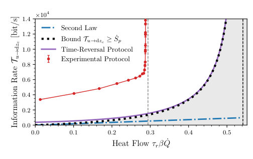
<figcaption class="paper-figure-caption"><b>Fig 5.</b> FIG. 5. Information rate vs heat extracted from the bath for an information engine. Blue: second law of information thermodynamics. Black dotted line: Pareto frontier (30). Red points: simulations of the experimentally implemented control protocol from Ref. [43] plotted parametrically, vary- ing the measurement noise σm, with information rate evalu- ated using TE-PWS [38]. Purple line: Time-reversal proto- col. Black dot-dashed line: second law of bipartite thermo- dynamics. Vertical dashed lines: maximum heat flow with no average work (black) and with no work for each controller action (grey). Parameters are ts/τr = 1/41, δg = 0.8, and τr = 0.8 × 10−3s, from the experimental setup in Ref....</figcaption>
</figure>

**Summary.** This paper develops a general framework to quantify the minimum amount of information needed to control a stochastic physical system toward a target steady state. It derives a fundamental lower bound relating this required information rate to the passive entropy production rate of the uncontrolled dynamics. This has implications for understanding optimal feedback control in fields ranging from biology to engineering.

**Why it may be interesting.** The work provides a rigorous information-theoretic lens—a generalized second law—for understanding control in complex, noisy systems, which has parallels in open quantum system dynamics where dissipation is key.

Detailed structure

**Main problem.** The study focuses on deriving fundamental lower bounds for the information rate required by a controller to guide a stochastic system toward a desired steady state.

**Main result.** A key theoretical result establishes that the minimum required information rate is bounded below by the passive entropy rate of the uncontrolled dynamics ($\dot{S}_p \le \dot{T}_{x 	o 	ext{d}x_c}$).

**Method.** The analysis employs information theory, relating changes in system entropy to mutual and conditional entropies derived from stochastic differential equations (SDEs).

**Model / system.** The models involve general stochastic systems with passive dynamics (e.g., Brownian motion, bit flipping) coupled to an active control input. The framework is general but applied to localization and navigation problems.

**Key observables.** Information Rate ($\dot{T}_{x 	o 	ext{d}x_c}$), Passive Entropy Rate ($\dot{S}_p$), Performance functional ($P[
ho]$).

**Important parameters / regimes.** The analysis is sensitive to the nature of passive dynamics (e.g., state-independent vs. general) and operates in limits like low information content ($\epsilon \ll 1$).

**Assumptions / limitations.** Assumptions include stationarity for steady-state analysis, and approximations using instantaneous rates or Gaussian distributions when deriving explicit protocols.

**Figures summary.** Figures illustrate the relationship between performance, entropy, and required information rate for various control scenarios (e.g., Brownian particle localization).

**Paper structure.** The paper builds from defining the stochastic system dynamics to establishing the core information-theoretic bound ($\dot{S}_p \le \dot{T}_{x 	o 	ext{d}x_c}$), deriving optimal time-reversal protocols for specific cases, and applying this framework to diverse physical examples like particle localization and information engines.

Abstract

Biological systems across scales, along with many engineering problems, must control noisy systems with limited information. Here we study information-limited feedback control of stochastic systems to achieve target steady states, and derive a lower bound on the information rate from controlled system to controller. This framework allows us to obtain performance-information Pareto frontiers for wide-ranging control problems with limited information. For systems with state-independent passive dynamics, the bound is saturated by an explicit optimal control protocol which probabilistically time-reverses the passive dynamics. We showcase these results through applications to nonlinear particle localization, microbial navigation, and experimentally realized information engines.

[↑ back to top](#top)

### [Split-quaternionic structure and canonical quantization of the Bateman dual oscillator](http://arxiv.org/abs/2607.16516v1)

**Authors:** Mathieu Beau  
**Type:** theory · **Category:** other · **PDF:** <https://arxiv.org/pdf/2607.16516v1>  
**Analysis basis:** full PDF text, analyzed in chunks
**Topic relevance:** 🔥 `methods for driven-dissipative` **4/5** · `Keldysh / 2PI / non-Gaussian methods` **3/5** · `correlated / nonlocal dissipation` **2/5** · `driven-dissipative phase transition` **2/5** · `non-equilibrium dynamics` **2/5** · `Kondo & dissipative impurity` **1/5** · `non-equilibrium universality` **1/5**

↔ Scroll figures horizontally

<figure class="paper-figure-card">
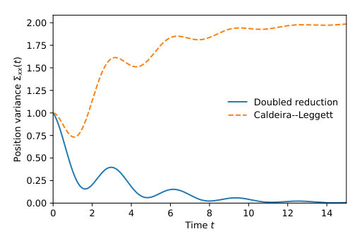
<figcaption class="paper-figure-caption"><b>Fig 1.</b> FIG. 1. Reduced position variance for the specified factorized doubled Gaussian and for the high-temperature Markovian Caldeira–Leggett model in the underdamped harmonic case. Parameters are m = ℏ= 1, ω0 = 1, γ = 0.3, ℓ= 1, and kBT = 2. The doubled result is a coherent, auxiliary-state-dependent reduction; the Caldeira–Leggett curve contains bath-induced diffusion.</figcaption>
</figure>
<figure class="paper-figure-card">
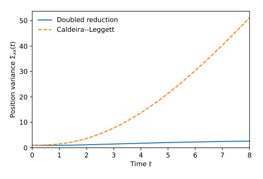
<figcaption class="paper-figure-caption"><b>Fig 2.</b> FIG. 2. Same comparison in the free damped limit ω0 = 0, with the remaining parameters as in Fig. 1. For the cho- sen doubled state the reduced variance saturates, whereas the Caldeira–Leggett variance grows because of momentum diffu- sion.</figcaption>
</figure>

**Summary.** This paper quantizes the Bateman dual oscillator using an advanced split-quaternionic algebraic structure. It successfully derives the system's propagator and shows that this mathematical framework describes a reversible, zero-noise embedding of damping. Crucially, it distinguishes its approach from standard open quantum system theories like Caldeira–Leggett by analyzing the resulting reduced density matrix.

**Why it may be interesting.** It provides a novel mathematical tool (split-quaternions) to handle non-Hermitian or doubled dynamics in quantum mechanics, offering insights into how damping can be treated symmetrically without invoking explicit environmental coupling.

Detailed structure

**Main problem.** The paper develops a unified algebraic framework using split-quaternionic structures to canonically quantize the Bateman dual oscillator, which models damped harmonic motion.

**Main result.** The formulation successfully provides an exact quadratic propagator and Gaussian evolution for the doubled system, clarifying that it represents a coherent zero-noise embedding rather than a true microscopic reservoir theory.

**Method.** The authors employ split-quaternionic algebra to construct operator-valued generalizations of the dynamics on the doubled phase space, leading to canonical quantization rules.

**Model / system.** The system is the Bateman dual oscillator, which couples a damped harmonic oscillator with an independent anti-damped adjoint coordinate. The analysis extends this classical model into a quantum domain using hypercomplex algebra.

**Key observables.** Robertson–Schrödinger uncertainty relation; reduced position density $
ho_{SQ}(x, t)$; the propagator $K(q_f, q_i; t)$.

**Important parameters / regimes.** Damping coefficient ($\gamma$), natural frequency ($\omega_0$), and Planck's constant ($\hbar$).

**Assumptions / limitations.** The comparison with Caldeira–Leggett dynamics assumes the doubled model is a coherent embedding, not a standard bath coupling; the recovery of single-oscillator relations requires selecting only one normal mode.

**Figures summary.** Figures compare the reduced position variance ($	ext{xx}(t)$) for both the split-quaternionic and Caldeira–Leggett models, showing saturation versus diffusive growth.

**Paper structure.** The paper systematically develops the classical dynamics via Lagrangian reduction to known damped forms, then introduces the split-quaternionic quantization framework. It calculates the quantum propagator and finally contrasts the resulting reduced density matrix with standard open system descriptions like Caldeira–Leggett theory.

Abstract

Bateman's dual oscillator embeds a damped harmonic oscillator and an independent anti-damped adjoint coordinate in a conservative doubled system. We develop a split-quaternionic formulation that remains consistent from the classical equations through ordinary complex canonical quantization. The doubled dynamics is written as a two-sided hypercomplex evolution whose conserved indefinite quadratic form is the split norm, while the sign of the generator square unifies the underdamped, overdamped, and critical regimes. The Bateman Lagrangian is recovered as a real scalar action on the split-complex configuration subalgebra. After quantization, operator-valued split quaternions belong to the complexified algebra $\mathbb C\otimes_{\mathbb R}\mathbb H_s\simeq M_2(\mathbb C)$. Noncommuting mechanical components require a symmetrized quantum split norm, which exactly reproduces the symmetrically ordered canonical Hamiltonian. Null idempotents resolve the crossed canonical structure of the doubled phase space. In particular, damping yields $[m\dot{\widehat y},m\dot{\widehat x}]=\mathrm{i}\hbar mγ$ and a Robertson--Schrödinger uncertainty relation. The limit $γ\to0$ retains the doubled positive/negative geometry; the ordinary single-oscillator Heisenberg relation is recovered only after selecting the positive normal mode, or by undoubling before quantization. The scalar split action gives the exact quadratic propagator and Gaussian evolution. A formal trace over the auxiliary coordinate is finally compared with high-temperature Caldeira--Leggett dynamics, clarifying that the doubled model is a coherent zero-noise embedding rather than a microscopic reservoir theory.

[↑ back to top](#top)

### [The Information Content of Krylov Observables: A Machine Learning Approach](http://arxiv.org/abs/2607.17346v1)

**Authors:** Ritam Basu  
**Type:** theory · **Category:** disordered systems and neural networks · **PDF:** <https://arxiv.org/pdf/2607.17346v1>  
**Analysis basis:** full PDF text, analyzed in chunks
**Topic relevance:** 🔥 `entanglement & information structure` **4/5** · `methods for driven-dissipative` **3/5** · `non-equilibrium dynamics` **3/5** · `non-equilibrium universality` **2/5** · `Keldysh / 2PI / non-Gaussian methods` **1/5** · `analog quantum simulation` **1/5** · `driven-dissipative phase transition` **1/5**

↔ Scroll figures horizontally

<figure class="paper-figure-card">
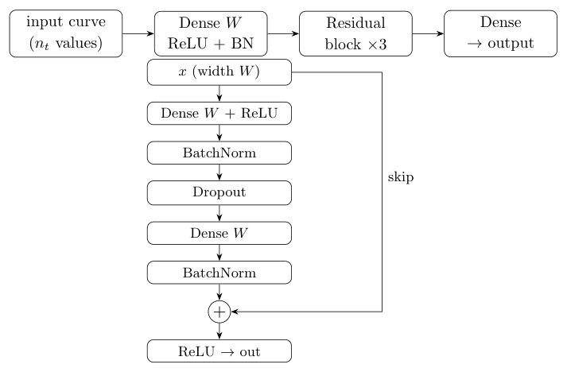
<figcaption class="paper-figure-caption"><b>Fig 1.</b> Figure 1. Left: the residual MLP used for every task in this paper, with W = 16 (random-matrix scans) or W = 32 (CFT and interpolation). Right: One residual block. The identity skip lets each block learn a correction to its input, which stabilises training at small width/neurons.</figcaption>
</figure>
<figure class="paper-figure-card">
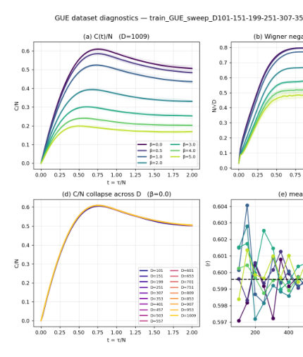
<figcaption class="paper-figure-caption"><b>Fig 2.</b> Figure 2. GUE dataset diagnostics (13,650 samples; D = 101–701, seven temperatures). (a) C/D per β at the largest D; (b) N/ √</figcaption>
</figure>
<figure class="paper-figure-card">
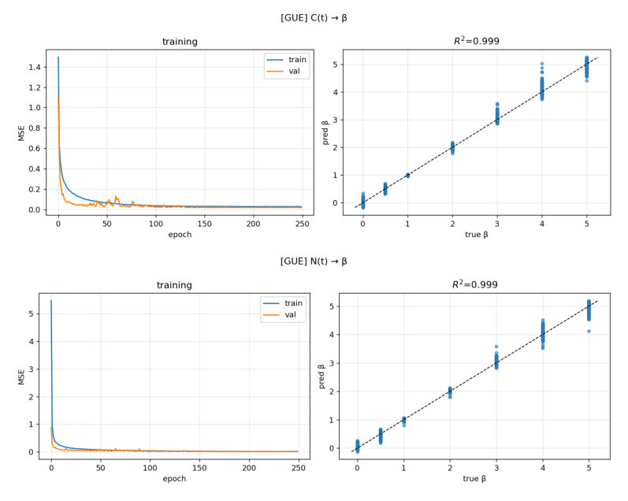
<figcaption class="paper-figure-caption"><b>Fig 3.</b> Figure 3. GUE temperature regression. Top: C(t) →β, R2 = 0.999. Bottom: N(t) →β, R2 = 0.998. Left panels: train/validation losses (no overfitting); right panels: predicted vs true β on held-out samples.</figcaption>
</figure>
<figure class="paper-figure-card">
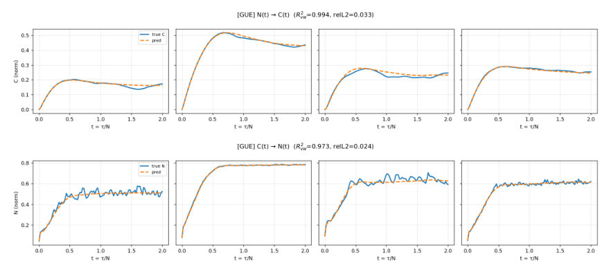
<figcaption class="paper-figure-caption"><b>Fig 4.</b> Figure 4. GUE curve reconstructions on held-out samples (true solid, prediction dashed). Top: N →C, R2 vw = 0.994, relL2 = 0.035. Bottom: C →N, R2 vw = 0.973, relL2 = 0.024. The two metrics order the directions oppositely; per our protocol no surplus is claimed from this data.</figcaption>
</figure>
<figure class="paper-figure-card">
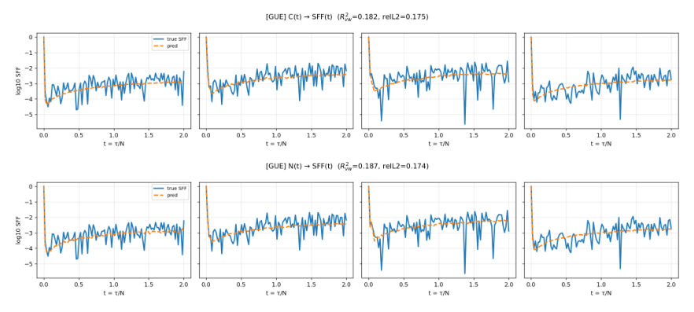
<figcaption class="paper-figure-caption"><b>Fig 5.</b> Figure 5. The lossiness result on GUE. Top: C →SFF, R2 vw = 0.185. Bottom: N →SFF, R2 vw = 0.188. In every held-out sample the prediction (dashed) reproduces the dip and the smooth envelope and none of the sample-specific ramp fluctuations.</figcaption>
</figure>

**Summary.** The authors use machine learning to analyze three Krylov observables derived from quantum time evolution in various chaotic and integrable systems. They find that while all observables retain some information (e.g., temperature), the normalized negativity ($\chi(t)$) uniquely captures an 'informational surplus' that grows precisely as the system enters a chaotic regime. This establishes $\chi(t)$ as a powerful, quantifiable signature of quantum chaos.

**Why it may be interesting.** This work provides a sophisticated data-driven diagnostic tool for characterizing the degree of quantum chaos, moving beyond simple spectral statistics by quantifying *how* information is encoded across different moments of the wave function evolution.

Detailed structure

**Main problem.** The study aims to quantitatively estimate the information content carried by three specific Krylov-space observables ($C(t)$, $N(t)$, $\chi(t)$) to probe underlying quantum chaotic dynamics.

**Main result.** The normalized negativity ($\chi(t)$) is shown to carry a unique 'surplus' of information that switches on with chaos, suggesting it is a robust signature of the transition from integrable to chaotic regimes.

**Method.** Machine learning techniques (residual networks and boosted trees) are employed to train models on time-evolved data generated across various quantum ensembles. The performance metrics quantify the mutual information content between observables and physical parameters.

**Model / system.** The analysis concerns quantum dynamics governed by a Hamiltonian $H$, simulated via the Lanczos procedure, covering random matrix ensembles (GUE, GOE, Poisson), integrable CFT sectors, and interpolating Hamiltonians. The diagnostics are applied to time-evolved wavepackets on a tridiagonal chain.

**Key observables.** Spread complexity $\mathcal{C}(t)$, discrete Wigner negativity $N(t)$, normalized negativity $\chi(t) = N(t)/|S(t)|$, and the Spectral Form Factor (SFF).

**Important parameters / regimes.** The analysis spans different spectral ensembles (GUE, GOE, Poisson), varying coupling constants $(h, \alpha)$ in CFT, and the chaos interpolation parameter $\epsilon$.

**Assumptions / limitations.** ML test-set scores provide operational lower bounds on mutual information; the decay of certain gaps ($	ext{gap}_N$) deep in chaos is attributed to dynamic-range artifacts rather than physical loss of information.

**Figures summary.** Figures illustrate how the $\chi$-surplus grows and saturates with system dimension $D$ as a thermodynamic limit effect, while other diagnostics show collapse or saturation patterns across different ensembles.

**Paper structure.** The paper establishes the problem by defining observables, uses ML to test their predictive power against known physical labels (like temperature), compares performance across various quantum regimes (integrable vs. chaotic), and culminates in identifying $\chi(t)$'s unique informational signature of chaos.

Abstract

We employ machine learning to quantify the information carried by three Krylov-space observables: the spread complexity $\mathcal{C}(t)$, the discrete Wigner negativity $N(t)$, and the normalized negativity $χ(t)=N(t)/|S(t)|$, with $S(t)$ the survival amplitude, recently proposed as a second-moment infall probe (arXiv:2607.04065). Small residual networks (16-32 neurons) and boosted trees are trained on half of $\sim 57{,}000$ labeled evolutions spanning the GUE, GOE and Poisson ensembles, the integrable $SL(2,\mathbb{R})$/CFT sector, and the chaos interpolation $H(\varepsilon)=H_{SL(2,\mathbb{R})}+\varepsilon R_0 W_{GUE}$. Either moment determines the thermofield temperature at $R^2\simeq 0.999$. Neither reconstructs the fine spectral form factor ($R^2\simeq 0.18$ in every ensemble); smoothing the target does not repair this, and windows wide enough to help erase the dip-ramp physics itself: the SFF strictly refines both moments. The coarse $e^S$ plateau is nevertheless recovered at $R^2=0.861$, mostly from the first 20% of $\mathcal{C}(t)$. A single curve identifies the symmetry class at up to 98% accuracy. In the integrable sector the observables are informationally equivalent, as exact negative-binomial slaving demands, while the negativity best resolves the $(h,α)$ degeneracy ($N\to h$: 0.999). Along the interpolation the asymmetry gap of $χ$ over $\mathcal{C}$ switches on with chaos, growing from +0.33 to +0.77 as the level statistics cross to GUE, while the raw-$N$ gap decays to zero. The second-moment informational surplus is therefore a signature of chaos, carried specifically by the normalized negativity, and we derive an analytical mechanism and a quantitative bound for it.

[↑ back to top](#top)

### [A Unified Discrete and Continuous Theory of Core-Halo Complexity Maximizers](http://arxiv.org/abs/2607.17907v1)

**Authors:** Akshat Sharma  
**Type:** theory · **Category:** statistical mechanics · **PDF:** <https://arxiv.org/pdf/2607.17907v1>  
**Analysis basis:** full PDF text, analyzed in chunks
**Topic relevance:** 🔥 `entanglement & information structure` **4/5** · `analog quantum simulation` **2/5** · `non-equilibrium dynamics` **2/5** · `non-equilibrium universality` **2/5** · `Keldysh / 2PI / non-Gaussian methods` **1/5** · `correlated / nonlocal dissipation` **1/5** · `driven-dissipative phase transition` **1/5** · `methods for driven-dissipative` **1/5**

↔ Scroll figures horizontally

<figure class="paper-figure-card">
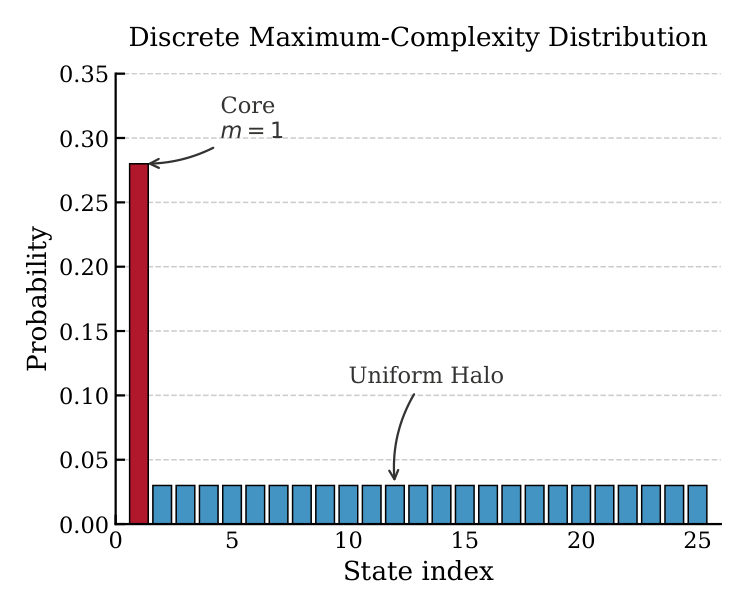
<figcaption class="paper-figure-caption"><b>Fig 1.</b> Figure 1: Schematic representation of the complexity-maximizing discrete distribution. One dominant component forms the core, while the remaining components constitute a uniform halo.</figcaption>
</figure>
<figure class="paper-figure-card">
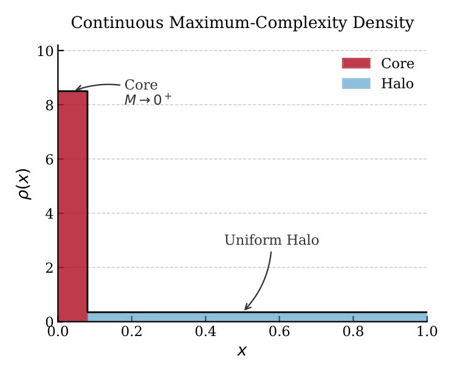
<figcaption class="paper-figure-caption"><b>Fig 2.</b> Figure 2: Schematic representation of the complexity-maximizing continuous density. A local- ized high-density core is embedded within an extended low-density halo.</figcaption>
</figure>

**Summary.** This paper unifies the characterization of statistical complexity across both discrete and continuous probability spaces using a generalized variational framework involving Shannon and Rényi entropies. It proves that any state maximizing this complexity must exhibit a universal two-level 'core-halo' structure. This provides a complete analytical tool for understanding how complex organization emerges mathematically in diverse physical systems.

**Why it may be interesting.** While not directly about quantum dynamics, the rigorous mathematical framework for characterizing emergent structure (core-halo) based on information theory is highly relevant for analyzing complexity in many-body quantum systems or open quantum systems far from equilibrium.

Detailed structure

**Main problem.** To develop a unified mathematical framework for quantifying statistical complexity that measures deviation from both perfect order and complete disorder.

**Main result.** The global maximum of the generalized statistical complexity is universally attained by distributions possessing exactly two probability levels (a core-halo structure), regardless of whether the underlying space is discrete or continuous.

**Method.** The authors developed a general variational framework using Shannon and Rényi entropies, deriving common stationary equations applicable across both discrete and continuous probability spaces.

**Model / system.** The theory applies to general probability distributions in both finite discrete systems (probability masses) and continuous probability spaces (densities). The complexity measure is generalized from standard entropy concepts.

**Key observables.** Generalized statistical complexity ($C_q$), Shannon Entropy ($H_1$), Rényi Entropies ($H_q$, $H_{2q}$), and the core-halo structure.

**Important parameters / regimes.** The multiplicity parameter ($m$) in discrete systems, and the continuous core measure ($M$); the optimization depends on these parameters.

**Assumptions / limitations.** The framework assumes that complexity can be constructed from entropic measures and relies heavily on variational calculus techniques like the Envelope Theorem for simplification.

**Paper structure.** The paper progresses by first establishing the need for a unified measure, developing the generalized variational functional ($\Phi$), deriving common stationary equations for discrete/continuous cases, and finally using differentiation (Envelope Theorem) to prove that optimization leads to the smallest possible core size.

Abstract

The maximization of statistical complexity has long been associated with the emergence of probability distributions lying between perfect order and complete disorder. While previous studies have shown that complexity-maximizing distributions exhibit a two-level structure in finite discrete systems, an analogous unified treatment for both discrete and continuous probability spaces has remained unavailable. In this work, we develop a general variational framework for a generalized statistical complexity constructed from Shannon and Renyi entropies. We derive a common stationary equation governing both discrete probability masses and continuous probability densities and prove that every stationary solution necessarily possesses exactly two probability levels, establishing a universal core-halo structure. We further demonstrate that the optimization problem reduces to a single multiplicity parameter and prove that the global complexity maximum is attained by the smallest admissible core, corresponding to a single dominant state in the discrete case and an infinitesimal core in the continuous limit. These results provide a complete analytical characterization of the complexity-maximizing distributions and reveal a common mathematical structure underlying complexity optimization in both discrete and continuous settings. The framework establishes a unified foundation for generalized statistical complexity with potential applications in statistical mechanics, information theory, and the analysis of complex systems.

[↑ back to top](#top)

### [Interpreting Quantum Learning Models via Stochastic Processes](http://arxiv.org/abs/2607.17327v1)

**Authors:** Johannes Fankhauser, Lukas J. Fiderer, Hans J. Briegel  
**Type:** theory · **Category:** quantum information and computing · **PDF:** <https://arxiv.org/pdf/2607.17327v1>  
**Analysis basis:** full PDF text, analyzed in chunks
**Topic relevance:** 🔥 `quantum measurements` **4/5** · `measurement-induced transitions` **3/5** · `methods for driven-dissipative` **3/5** · `Keldysh / 2PI / non-Gaussian methods` **1/5** · `correlated / nonlocal dissipation` **1/5** · `driven-dissipative phase transition` **1/5** · `entanglement & information structure` **1/5**

↔ Scroll figures horizontally

<figure class="paper-figure-card">
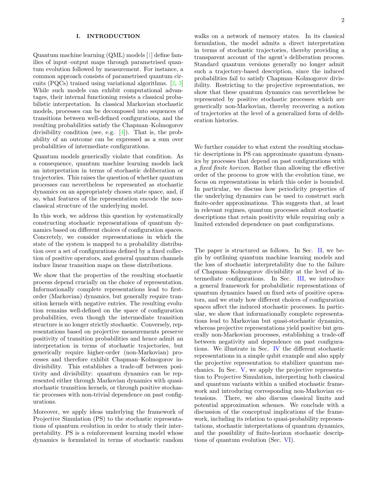
<figcaption class="paper-figure-caption"><b>Fig 1.</b> Low-resolution page preview, page 2</figcaption>
</figure>
<figure class="paper-figure-card">
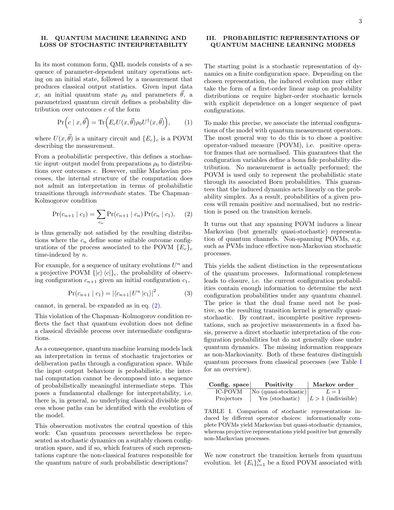
<figcaption class="paper-figure-caption"><b>Fig 2.</b> Low-resolution page preview, page 3</figcaption>
</figure>
<figure class="paper-figure-card">
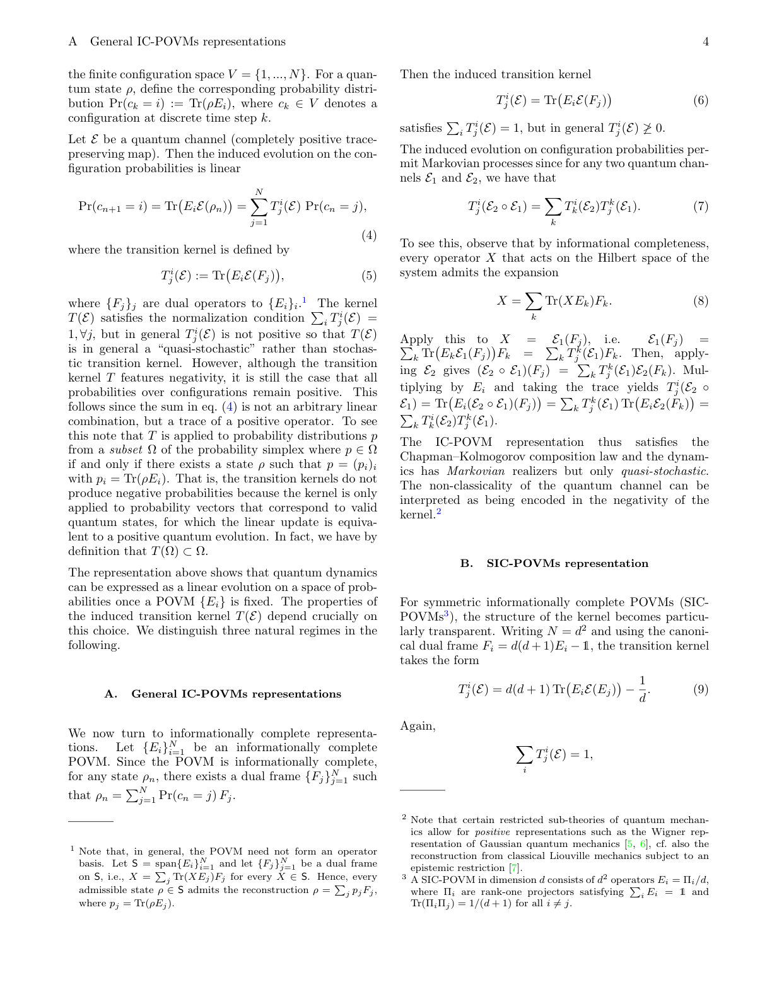
<figcaption class="paper-figure-caption"><b>Fig 3.</b> Low-resolution page preview, page 4</figcaption>
</figure>
<figure class="paper-figure-card">
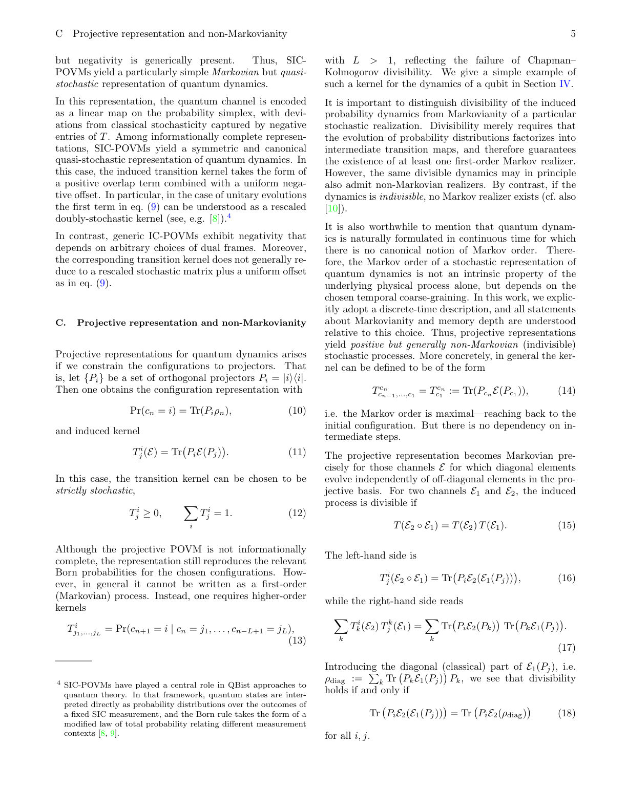
<figcaption class="paper-figure-caption"><b>Fig 4.</b> Low-resolution page preview, page 5</figcaption>
</figure>
<figure class="paper-figure-card">
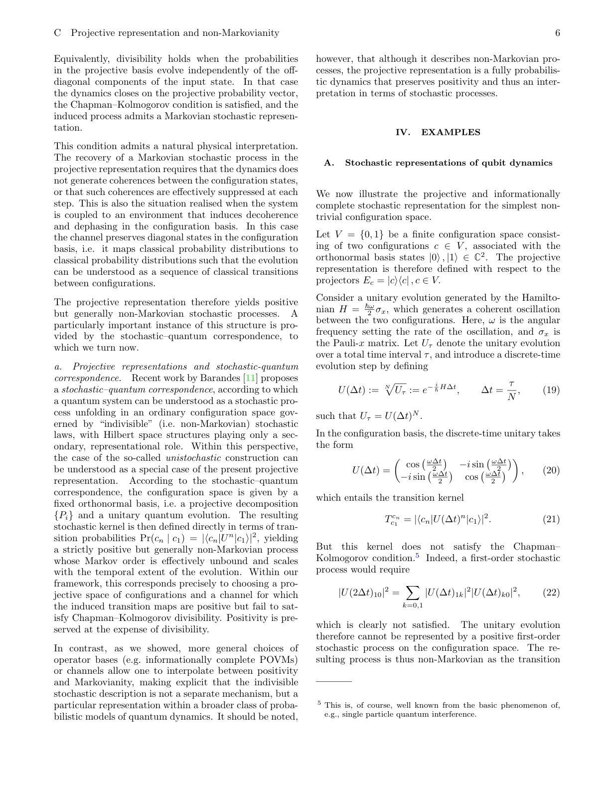
<figcaption class="paper-figure-caption"><b>Fig 5.</b> Low-resolution page preview, page 6</figcaption>
</figure>

**Summary.** The paper tackles the challenge of interpreting Quantum Machine Learning models by translating their unitary evolution into probabilistic stochastic processes. It reveals an inherent trade-off: achieving a simple Markovian description requires introducing negative probabilities (quasi-stochasticity), whereas maintaining strictly positive transition probabilities forces the dynamics to become non-Markovian and history-dependent.

**Why it may be interesting.** This work provides a deep mathematical lens through which to view quantum computation's operational semantics, linking fundamental concepts like non-classicality directly to the failure of classical stochastic process assumptions.

Detailed structure

**Main problem.** The core problem is interpreting Quantum Machine Learning (QML) models, whose probabilistic mapping arises from coherent quantum evolution, because their internal dynamics resist description using classical stochastic trajectories.

**Main result.** A fundamental trade-off exists: representing dynamics via Markovian processes requires quasi-stochastic kernels with negativity (using IC-POVMs), while maintaining positive stochasticity necessitates non-Markovian dynamics requiring memory of past states (using Projective Spaces).

**Method.** The authors develop a probabilistic framework mapping quantum channels to linear maps on probability distributions over configuration spaces defined by POVMs, comparing the mathematical properties of these induced kernels.

**Model / system.** The model centers on QML circuits whose evolution is described by unitary gates followed by measurements characterized by a Positive Operator-Valued Measure (POVM). The analysis compares representations based on Informationally Complete POVMs versus Projective Spaces.

**Key observables.** Transition kernels ($T^i_j$), negativity of the kernel, Markov order ($	ext{L}$), and adherence to the Chapman–Kolmogorov divisibility condition.

**Important parameters / regimes.** The choice between IC-POVMs (leading to quasi-stochasticity) and Projective Spaces (leading to positive but non-Markovian dynamics).

**Assumptions / limitations.** The analysis adopts a discrete-time description, and the comparison hinges on whether one prioritizes Markovian structure or positivity of transition probabilities.

**Figures summary.** Not specified in the notes, but the discussion implies comparisons (like Table I) summarizing the trade-offs between different POVM representations regarding stochasticity and memory order.

**Paper structure.** The paper first establishes the difficulty of interpreting quantum dynamics stochastically due to C-K violation. It then develops a general probabilistic framework using POVMs, culminating in a detailed comparison showing the inherent trade-off between Markovian structure (quasi-stochastic) and positivity (non-Markovian).

Abstract

Quantum machine learning models define probabilistic input--output maps through coherent quantum evolution and measurement. While such models can exhibit computational advantages, their internal functioning and decision making generally resists interpretation in terms of stochastic trajectories through intermediate configurations. In contrast to classical (Markovian) stochastic processes, quantum dynamics generically violates the Chapman--Kolmogorov divisibility condition, preventing a decomposition into probabilistically meaningful intermediate transitions. We develop a probabilistic framework for representing quantum learning models as stochastic processes over configuration spaces where the dynamics are modeled as linear maps on probability distributions. Starting from a fixed POVM, arbitrary quantum channels induce transition kernels on the associated probability representation. For informationally complete POVMs, and in particular SIC-POVMs, these kernels are Markovian but generally quasi-stochastic, with non-classicality appearing as negativity. By contrast, projective spaces admit positive stochastic kernels but generally require non-Markovian dynamics due to the failure of Chapman--Kolmogorov divisibility. This yields a trade-off between negativity and dependence on past configurations, i.e. quantum dynamics can be represented either by Markovian quasi-stochastic maps or by positive stochastic processes with higher Markov order. We discuss how such representations of quantum dynamics can be interpreted as stochastic walks through a memory space in the spirit of Projective Simulation, a model of learning and agency in which decisions arise from random walks over an episodic memory network. We further outline how finite-order stochastic kernels can approximate such quantum deliberation processes and show in what regimes the classical machine learning model is recovered.

[↑ back to top](#top)

### [Particle-scale structure of granular suspensions](http://arxiv.org/abs/2607.18090v1)

**Authors:** Santos Bravo Yuste y Antonio M. Puertas  
**Type:** theory · **Category:** statistical mechanics · **PDF:** <https://arxiv.org/pdf/2607.18090v1>  
**Analysis basis:** full PDF text, analyzed in chunks
**Topic relevance:** 🔥 `non-equilibrium dynamics` **4/5** · `methods for driven-dissipative` **3/5** · `non-equilibrium universality` **3/5** · `Keldysh / 2PI / non-Gaussian methods` **1/5** · `analog quantum simulation` **1/5** · `correlated / nonlocal dissipation` **1/5** · `driven-dissipative phase transition` **1/5**

↔ Scroll figures horizontally

<figure class="paper-figure-card">
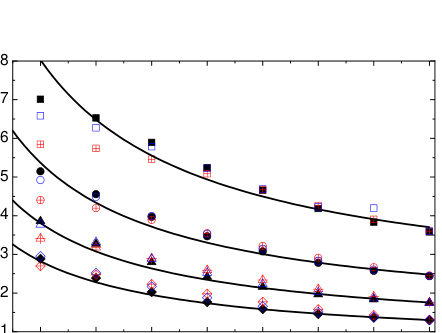
<figcaption class="paper-figure-caption"><b>Fig 1.</b> FIG. 1. Simulation values of g(σ) versus the inelasticity coef- ficient α for ϕ = 0.1 (diamonds), 0.2 (triangles), 0.3 (circles), and 0.4 (squares). The solid, open, and crossed symbols cor- respond to γ∗= 0.2, 1, and 5, respectively. The solid lines correspond to Eq. (3) for ϕ = 0.1, 0.2, 0.3, and 0.4, from bot- tom to top.</figcaption>
</figure>
<figure class="paper-figure-card">
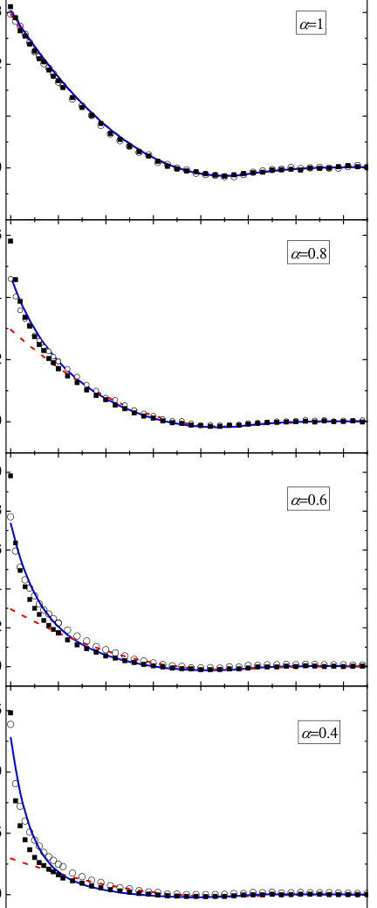
<figcaption class="paper-figure-caption"><b>Fig 2.</b> FIG. 2. Radial distribution function g(r) as a function of the scaled distance r/σ for ϕ = 0.1. Symbols denote simulation results: circles for γ∗= 0.2 and squares for γ∗= 5. The PY and RFA predictions are shown by the red dashed and blue solid lines, respectively. Panels (a)–(d), from top to bottom, correspond to α = 1, 0.8, 0.6, and 0.4.</figcaption>
</figure>
<figure class="paper-figure-card">
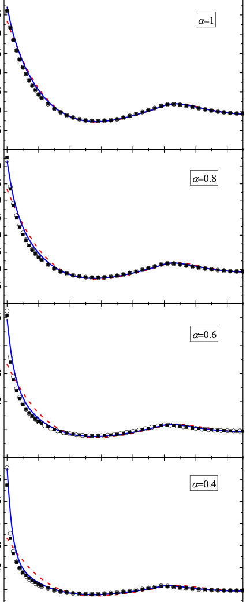
<figcaption class="paper-figure-caption"><b>Fig 3.</b> FIG. 3. Same as in Fig. 2, but for ϕ = 0.4.</figcaption>
</figure>
<figure class="paper-figure-card">
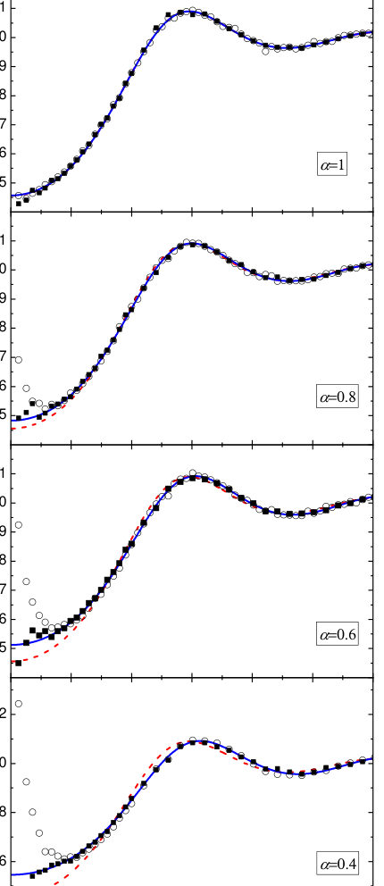
<figcaption class="paper-figure-caption"><b>Fig 4.</b> FIG. 4. Static structure factor S(q) versus qσ for ϕ = 0.1. Symbols denote simulation results: circles for γ∗= 0.2 and squares for γ∗= 5. The PY and RFA predictions are rep- resented by the red dashed and blue solid lines, respectively. Panels (a)–(d), from top to bottom, correspond to α = 1, 0.8, 0.6, and 0.4.</figcaption>
</figure>
<figure class="paper-figure-card">
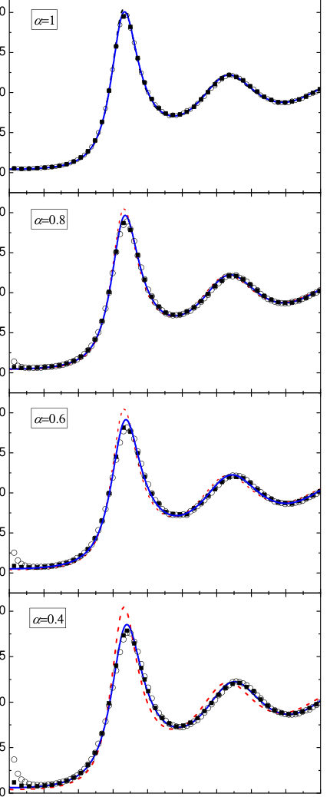
<figcaption class="paper-figure-caption"><b>Fig 5.</b> FIG. 5. Same as in Fig. 4, but for ϕ = 0.4.</figcaption>
</figure>

**Summary.** This work investigates the particle structure of dissipative granular suspensions by comparing simulations with theoretical models derived from equilibrium statistical mechanics. The authors find that while an adapted Rational Function Approximation provides excellent structural predictions over most length scales, it fundamentally misses long-wavelength correlations present in the non-equilibrium steady state at small wave numbers.

**Why it may be interesting.** While focused on classical granular matter, the methodology of adapting equilibrium statistical mechanics tools (like RFA) to predict non-equilibrium steady states is highly relevant for understanding complex many-body systems in AMO physics, such as driven quantum gases or open quantum systems far from equilibrium.

Detailed structure

**Main problem.** The study aims to determine how well equilibrium-inspired approximations can describe the particle-scale structure of intrinsically non-equilibrium granular suspensions.

**Main result.** An equilibrium-based Rational Function Approximation (RFA) accurately describes short- and intermediate-range structure, but fails at small wave numbers ($q 	o 0$) due to uncaptured long-wavelength nonequilibrium correlations.

**Method.** The authors compare Langevin dynamics simulations with theoretical predictions derived from an adapted Rational Function Approximation (RFA), comparing results against the Percus-Yevick approximation.

**Model / system.** The system is a granular suspension modeled by inelastic hard spheres immersed in a thermal bath, governed by Langevin dynamics. This setup allows for both dissipative grain-grain collisions and solvent-induced forcing, leading to a non-equilibrium steady state (NESS).

**Key observables.** Radial distribution function $g(r)$ and static structure factor $S(q)$.

**Important parameters / regimes.** Density ($\phi$), drag coefficient ($\gamma^*$), and inelasticity ($\alpha$). The system is analyzed across varying regimes, including the dry limit (HCS) and the wet NESS.

**Assumptions / limitations.** The primary assumption tested is that an equilibrium-based structural theory (RFA) can be adapted to describe a non-equilibrium steady state. A key limitation noted is the failure of this approach at small $q$ due to missing long-wavelength hydrodynamic correlations.

**Figures summary.** Figures compare simulation results for $g(\sigma)$ and $S(q)$ against theoretical predictions, showing good agreement in intermediate ranges but clear deviations at low $q$.

**Paper structure.** The paper establishes the physical model (Langevin dynamics for granular suspensions), develops an adapted RFA using equilibrium inputs ($g(\sigma)$, $\hat{\kappa}$), and then systematically compares the resulting structural predictions against molecular dynamics simulations across various parameters.

Abstract

Granular suspensions are intrinsically nonequilibrium systems in which dissipative grain-grain collisions coexist with solvent-induced forcing. We study the particle-scale structure of a granular suspension modeled by inelastic hard spheres immersed in a thermal bath and compare Langevin-dynamics simulation results for the radial distribution function $g(r)$ and the static structure factor $S(q)$ with predictions of an equilibrium-inspired rational function approximation (RFA). The equilibrium hard-sphere RFA is supplied with nonequilibrium input for the contact value and a reduced isothermal-compressibility-like quantity, yielding analytical expressions for $g(r)$ in Laplace space and for $S(q)$. We find that the RFA gives a very good description of the short- and intermediate-range structure of the suspension over a broad range of densities, drag coefficients, and inelasticities. It reproduces $g(r)$ substantially better than the Percus-Yevick approximation in inelastic states, especially near contact, and gives a good account of $S(q)$ except at the smallest wave numbers. There, simulations show a drag-dependent enhancement over the RFA prediction, indicating additional long-wavelength nonequilibrium correlations beyond the present equilibrium-like description. These results show that an equilibrium-based hard-sphere approach provides an accurate description of the particle-scale structure of the present Langevin model with inelastic hard spheres (except in the smallest-$q$ region), and suggest that similar equilibrium-inspired approaches may also be useful for related nonequilibrium hard-sphere suspension models, including multicomponent systems.

[↑ back to top](#top)

### [quchip: A Differentiable Toolkit for Modeling Quantum Devices](http://arxiv.org/abs/2607.17081v1)

**Authors:** Ibraheem AlYousef  
**Type:** both · **Category:** quantum information and computing · **PDF:** <https://arxiv.org/pdf/2607.17081v1>  
**Analysis basis:** full PDF text, analyzed in chunks
**Topic relevance:** 🔥 `QC/QI experiment` **4/5** · `methods for driven-dissipative` **3/5** · `non-equilibrium dynamics` **2/5** · `analog quantum simulation` **1/5** · `correlated / nonlocal dissipation` **1/5** · `driven-dissipative phase transition` **1/5** · `quantum measurements` **1/5**

↔ Scroll figures horizontally

<figure class="paper-figure-card">
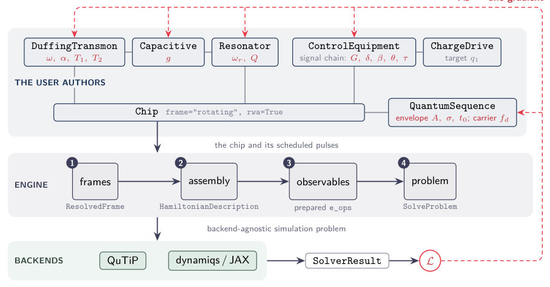
<figcaption class="paper-figure-caption"><b>Fig 1.</b> Figure 1: The quchip pipeline. Forward (top to bottom): a four-stage engine converts devices, couplings, drives, and the classical signal chain into a backend-agnostic physics description, which each backend packs into its native solver form. Backward (dashed red): gradients of a scalar loss reach device frequencies, coupling strengths, crosstalk entries, carriers, and envelope shapes.</figcaption>
</figure>
<figure class="paper-figure-card">
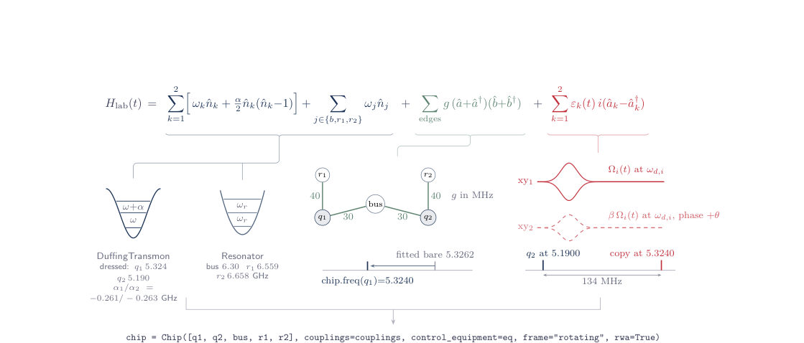
<figcaption class="paper-figure-caption"><b>Fig 2.</b> Figure 2: The five-device model used throughout the paper. Each Duffing transmon couples to the shared bus and its own readout resonator. Two charge lines drive the transmons with crosstalk in both directions; each source–victim path has an independent amplitude and phase. Colors match the device, coupling, and drive terms in the Hamiltonian.</figcaption>
</figure>
<figure class="paper-figure-card">
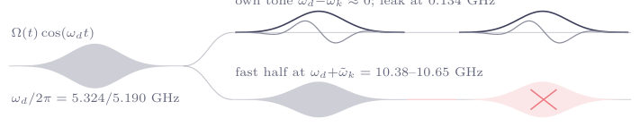
<figcaption class="paper-figure-caption"><b>Fig 3.</b> Figure 3: Stages 1 and 2 for the running chip. Rows group the device, coupling, and drive terms of Eq. (7); columns show the declared lab-frame model, resolved frame, and assembled solver terms. Frame resolution leaves residual device detunings; assembly retains the difference-frequency coupling and drive bands and records the sum-frequency bands in dropped_terms. Filled bands denote frequencies too high to draw to scale; curves denote slow content.</figcaption>
</figure>
<figure class="paper-figure-card">
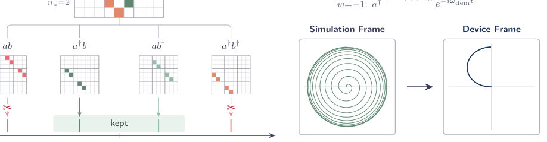
<figcaption class="paper-figure-caption"><b>Fig 4.</b> Figure 4: Band decomposition in assembly and readout. (a) Matrix elements of a capacitive coupling (a+a†)(b+b†) separate by excitation change into difference-frequency bands retained by the RWA and sum-frequency bands that are dropped and recorded. (b) A requested quadrature separates into its w = ±1 band matrices and is recombined at the demodulation frequency, returning the observable in the device’s reference frame.</figcaption>
</figure>
<figure class="paper-figure-card">
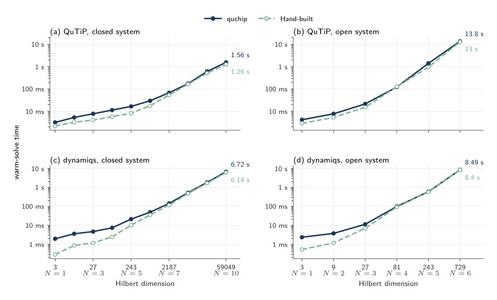
<figcaption class="paper-figure-caption"><b>Fig 5.</b> Figure 5: Warm-solve times for driven chains of N three-level transmons constructed through quchip and directly in each backend. (a) QuTiP, closed system; (b) QuTiP, open system; (c) dynamiqs, closed system; and (d) dynamiqs, open system. Closed-system simulations reach d = 310 = 59049; open-system simulations reach d = 36 = 729 and propagate d × d density matrices. Each point is the median of five solves on the same 401-point time grid after one-time construction and compilation.</figcaption>
</figure>

**Summary.** The paper introduces quchip, an open-source Python toolkit designed to model superconducting quantum chips by explicitly linking all physical components—from Hamiltonians to measurement readouts. It achieves end-to-end differentiability, allowing researchers not only to simulate device behavior but also to perform inverse problems like parameter recovery and active crosstalk correction using gradient descent.

**Why it may be interesting.** This work provides a crucial software infrastructure that bridges complex physical device descriptions with modern machine learning/optimization techniques by guaranteeing differentiability through the entire simulation loop, which is vital for quantum control theory.

Detailed structure

**Main problem.** Predictively modeling superconducting quantum chips requires integrating diverse physical components—device physics, control lines, dissipation, and measurement observables—in a unified framework.

**Main result.** The developed toolkit successfully allows for end-to-end differentiable simulation, enabling the suppression of crosstalk leakage by over two orders of magnitude and recovering unknown device parameters with high precision.

**Method.** The authors introduce 'quchip,' an open-source Python toolkit that explicitly models physical components and assembles backend-independent simulations using differentiability through solvers like dynamiqs.

**Model / system.** The system is a superconducting quantum chip, modeled using multiple coupled qubits (e.g., Duffing Transmons) and resonators, governed by Hamiltonians incorporating couplings and external microwave drives.

**Key observables.** Crosstalk parameters ($eta, 	heta$), population measurements after pulses, and reconstructed expectation values from simulated tomography.

**Important parameters / regimes.** Frequencies spanning GHz to MHz; crosstalk amplitudes and phases; Hilbert space dimension reduction (e.g., 576 to 16).

**Assumptions / limitations.** The model relies on sequential component definition and utilizes the Rotating Wave Approximation (RWA) in certain derivations, though it also tests its limitations.

**Figures summary.** Figures illustrate the quchip pipeline showing forward and backward differentiable paths; one figure details the five-device structure with couplings/drives; another shows band decomposition from frame resolution; and later figures demonstrate crosstalk identification sweeps and gradient recovery of parameters.

**Paper structure.** The paper introduces the need for integrated modeling, presents the quchip toolkit architecture (explicit component assembly), demonstrates its use on a multi-device model to identify and correct crosstalk via phase sweeps, and finally showcases differentiable parameter recovery using tomography gradients.

Abstract

Predictive modeling of a superconducting quantum chip requires more than a Hamiltonian: the model must connect device physics, control-line transformations, chosen frames and approximations, dissipation, and measured observables. We present quchip, an open-source Python toolkit that represents these parts explicitly and assembles backend-independent simulations for QuTiP or dynamiqs; with dynamiqs, device and control parameters remain differentiable through the solve. We demonstrate the resulting experimental loop on a five-device model fitted to dressed observables. Simulated phase sweeps identify the complex crosstalk between two control lines, and inversion of the inferred response suppresses the effective leakage by more than two orders of magnitude. Over sixteen simultaneous $π$ pulses, the corrected pulse-end populations remain within $0.3$ percentage points of the crosstalk-free response. Adiabatically eliminating the bus and readout resonators reduces the Hilbert-space dimension from 576 to 16, after which gradients through simulated tomography recover the four injected crosstalk parameters with a maximum complex error of $1.5\times10^{-5}$. A single explicit model can therefore support prediction, correction, and inverse parameter recovery.

[↑ back to top](#top)

### [Universal Dynamic Scaling of 2D Quantum Ising Transition on the Fuzzy Sphere](http://arxiv.org/abs/2607.18028v1)

**Authors:** Meng Zeng, Shuai Yin, Roderich Moessner  
**Type:** theory · **Category:** statistical mechanics · **PDF:** <https://arxiv.org/pdf/2607.18028v1>  
**Analysis basis:** full PDF text, analyzed in chunks
**Topic relevance:** 🔥 `non-equilibrium universality` **4/5** · `non-equilibrium dynamics` **3/5** · `analog quantum simulation` **2/5** · `Keldysh / 2PI / non-Gaussian methods` **1/5** · `driven-dissipative phase transition` **1/5** · `entanglement & information structure` **1/5** · `methods for driven-dissipative` **1/5**

↔ Scroll figures horizontally

<figure class="paper-figure-card">
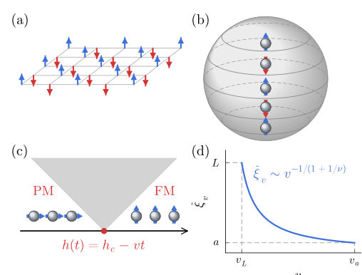
<figcaption class="paper-figure-caption"><b>Fig 1.</b> Figure 1: Schematic figures. (a) 2d Ising model on con- ventional square lattice. (b) Effective Ising model in the Landau orbital basis on the fuzzy sphere. (c) Linear quench protocol with rate v for the transverse field across the critical point at hc from the paramagnetic (PM) phase to the ferromagnetic (FM) phase. (d) Dynami- cal correlation length ˆξv as a function of quench rate v, compared to linear system size L and the short-distance cutoff a, with the corresponding rates labeled by vL and va respectively.</figcaption>
</figure>
<figure class="paper-figure-card">
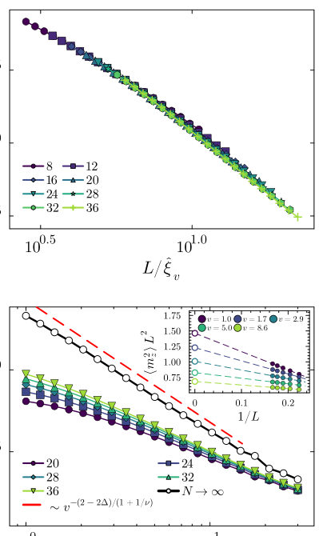
<figcaption class="paper-figure-caption"><b>Fig 2.</b> Figure 2: (a) Data collapse of ⟨m2 z⟩for system sizes rang- ing from N = 8 to 36. The known critical exponents for the 3D Ising universality class are used for the plots. (b) Extrapolation of ⟨m2 z⟩L2 to the thermodynamic limit at each quench rate (black empty circle), with the inset showing the linear extrapolation at five representative quench rates. The red dashed line shows the KZ predic- tion [75] as a guide to the eye. The error bar from linear extrapolation is smaller than marker size. The error due to the finite time-step of the evolution is not directly re- flected in the plot, but is estimated to be small enough that the conclusion is not changed qualitatively (see End Matter).</figcaption>
</figure>
<figure class="paper-figure-card">
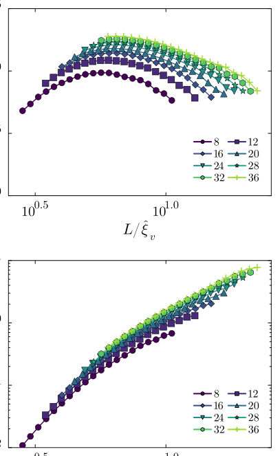
<figcaption class="paper-figure-caption"><b>Fig 3.</b> Figure 3: Excitation energy density Q, defined in Eq. (10), measured at the critical point. (a) Scaling of Q by ˆξ3 v shows no satisfactory data collapse for the available sizes, in contrast to Fig. 2(a). (b) Scaling of Q by L3 only shows signs of collapsing on the slow quench end.</figcaption>
</figure>
<figure class="paper-figure-card">
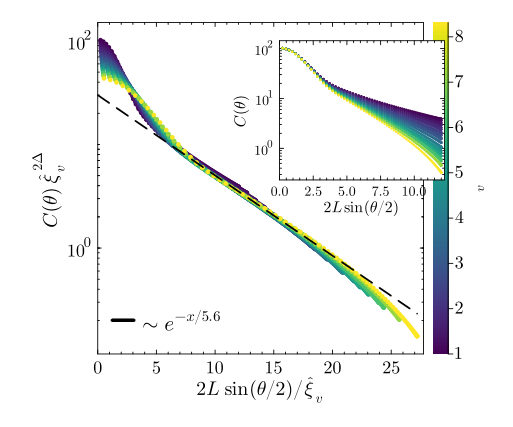
<figcaption class="paper-figure-caption"><b>Fig 4.</b> Figure 4: Two-point correlation function on the sphere for N = 36 electrons across a wide range of quench rates (chosen such that they are approximately equally spaced on logarithmic scale). Data collapse is done based on Eq. (13). The collapsed part follows exponential decay indicated by the dashed line. Inset shows the raw data.</figcaption>
</figure>
<figure class="paper-figure-card">
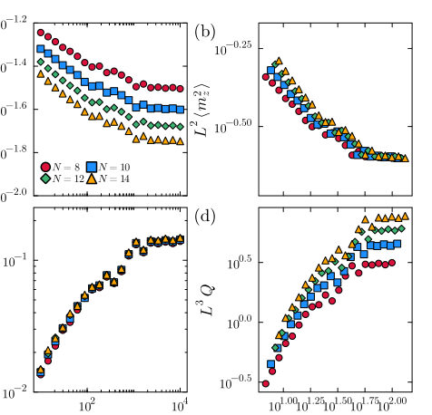
<figcaption class="paper-figure-caption"><b>Fig 5.</b> Figure 6: Fast quench regime.</figcaption>
</figure>

**Summary.** This work analyzes the real-time evolution of the 2D transverse-field Ising model on a fuzzy sphere as it passes through a quantum critical point. By simulating observables like magnetization and correlation functions during controlled quenches, the authors confirm predictions from Kibble-Zurek theory for certain quantities. Crucially, they demonstrate that this method provides a powerful tool to study non-equilibrium dynamics in strongly coupled Conformal Field Theories.

**Why it may be interesting.** The combination of non-equilibrium dynamics (quenches), critical phenomena scaling laws (KZ theory), and advanced mathematical frameworks like fuzzy geometry makes this highly relevant for understanding universal behavior in many-body quantum systems.

Detailed structure

**Main problem.** The study investigates the real-time quantum dynamics of a system driven through a continuous phase transition, specifically testing Kibble-Zurek scaling and finite-time scaling in two dimensions.

**Main result.** The squared order parameter $\langle m_z^2 
angle$ successfully follows conventional Kibble-Zurek predictions at intermediate quench rates, while the fuzzy sphere construction provides a route to studying real-time dynamics of strongly coupled CFTs.

**Method.** Numerical simulations using Time-Dependent Variational Principle (TDVP) on an effective Hamiltonian derived via fuzzy sphere regularization, supplemented by Exact Diagonalization for benchmarking.

**Model / system.** The paradigmatic two-dimensional transverse-field Ising model realized on the fuzzy sphere geometry. The system is quenched by linearly ramping the transverse field across its critical point.

**Key observables.** Squared order parameter $\langle m_z^2 
angle$, excitation energy density $Q$, and the two-point correlation function $C(	heta)$.

**Important parameters / regimes.** Quench rate ($v$), system size ($L$ or $N$), and the quench regimes (adiabatic, intermediate, fast).

**Assumptions / limitations.** The analysis relies on finite-size scaling arguments; a key limitation is that symmetry constraints cause the excitation energy density $Q$ to fail to reach predicted scaling regimes.

**Figures summary.** Figures illustrate data collapse for $\langle m_z^2 
angle$ and $C(	heta)$ confirming KZM, while also showing evidence of level sparsity in the energy spectrum due to symmetries.

**Paper structure.** The paper establishes the physical model (Ising on fuzzy sphere), details the quench protocol, analyzes three key observables ($\langle m_z^2 
angle$, $Q$, $C(	heta)$) across different quench rates, and concludes by generalizing the findings to other strongly coupled CFTs.

Abstract

We revisit the problem of \textit{real-time} quantum dynamics of the paradigmatic two dimensional transverse-field Ising model using the recently developed fuzzy sphere regularization scheme. By linearly ramping the transverse field from the paramagnetic phase to criticality, we study the finite-time scaling behavior of the squared order parameter $\langle m_z^2 \rangle$, the excitation energy density $Q$, and the two-point correlation function of $m_z$. We establish numerically that, at intermediate quench rate, $\langle m_z^2 \rangle$ follows the conventional Kibble-Zurek prediction set by the critical exponents of the $3$D Ising universality class, and the correlation function exhibits the expected exponential decay whose correlation length can be used to estimate the non-universal scaling coefficient in the freeze-out time/length. In contrast, the excitation energy density $Q$ does not reach the same scaling regime at available system sizes due to large effective finite-size gap from symmetry-enforced level sparsity in the energy spectrum. At slow quench rates the universal quasi-adiabatic scaling for both $\langle m_z^2 \rangle$ and $Q$ is recovered. Since the fuzzy sphere construction can realize not only the Ising conformal field theory (CFT), but a broad family of $(2+1)d$ CFTs, our results establish a route to the real-time critical dynamics of strongly coupled CFTs that are otherwise computationally challenging to study.

[↑ back to top](#top)

### [Holographic quantum codes with trapped ions](http://arxiv.org/abs/2607.16503v1)

**Authors:** Alex Steiner, Gerard Anglès Munné, Robert Freund, Ivan Pogorelov, Michael Meth, Robert J. Harris, Gavin Brennen, Thomas M. Stace, Thomas Monz, Rainer Blatt, Felix Huber, Martin Ringbauer  
**Type:** experiment · **Category:** quantum information and computing · **PDF:** <https://arxiv.org/pdf/2607.16503v1>  
**Analysis basis:** full PDF text, analyzed in chunks
**Topic relevance:** 🔥 `QC/QI experiment` **4/5** · `entanglement & information structure` **2/5** · `quantum measurements` **2/5** · `analog quantum simulation` **1/5** · `correlated / nonlocal dissipation` **1/5** · `methods for driven-dissipative` **1/5** · `non-equilibrium dynamics` **1/5**

↔ Scroll figures horizontally

<figure class="paper-figure-card">
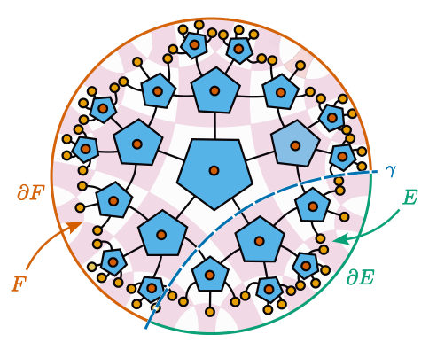
<figcaption class="paper-figure-caption"><b>Fig 1.</b> FIG. 1: Holographic pentagon code. The tensor net- work encodes k bulk qubits (inner dots) into n boundary qubits (outer dots). Each pentagon represents an abso- lutely maximally entangled state of 6 qubits (center plus five legs). For particular cuts γ, the geometry of the ten- sor network allows for partial decoding, i.e. one recovers the qubits from the bulk region E by reading only the qubits from its nearby boundary ∂E.</figcaption>
</figure>
<figure class="paper-figure-card">
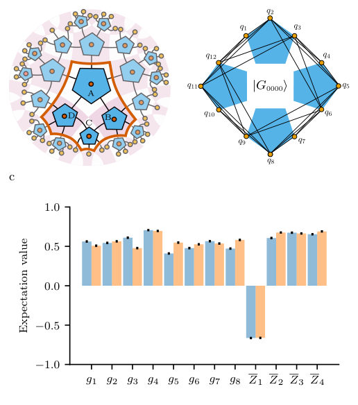
<figcaption class="paper-figure-caption"><b>Fig 2.</b> FIG. 2: A holographic graph code. (a) Highlights a small instance of the pentagon code, which we prepare experimentally. The four logical bulk qubits are labeled by A,B,C,D. (b) The logical-zero graph state |G0000⟩of the code instance in (a), after being mapped to a graph code. Recall that |G0000⟩is the boundary state that re- sults from encoding the bulk state |0000⟩. Hence, the bulk qubits are collectively encoded in the state and can- not be associated with specific boundary qubits. (c) The simulated (orange) and measured (blue) expectation val- ues of the stabilizer generators and logical Z−operators of the initialization of the pentagon code in the |1000⟩ state. The error bars are...</figcaption>
</figure>
<figure class="paper-figure-card">
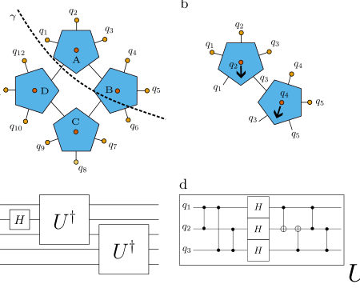
<figcaption class="paper-figure-caption"><b>Fig 3.</b> FIG. 3: Cut 1: Partial decoding of two bulk qubits. (a) A possible cut γ allowing for partial decoding using the code instance from Fig. 2(a). (b) The information of two bulk qubits A and B can be recovered from the five boundary qubits q1 to q5. This recovery is performed via a unitary operator constructed from the concatenation of two AME states as illustrated in (b). The arrows indicate the direction of the unitary, showing that qubits q2 and q4 will contain the information of the bulk qubits A and B after the operator is applied. (c) Recovery unitary circuit derived from the concatenation of the two AME states in (b), where each AME state corresponds to a unitary U. An additional...</figcaption>
</figure>
<figure class="paper-figure-card">
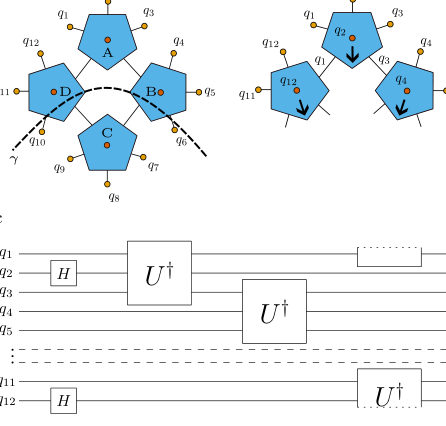
<figcaption class="paper-figure-caption"><b>Fig 4.</b> FIG. 4: Cut 2: Partial decoding of three bulk qubits. (a) From the cut γ, one can recover three bulk qubits from seven boundary qubits (q1, q2, q3 q4, q5, q11 and q12). (b) The recovery can be done via a unitary op- eration that can be expressed as a concatenation of three AME states. The arrows indicate the direction of the uni- tary, showing that qubits q2, q4, and q12 will contain the information of the bulk qubits A, B, and D after the oper- ator is applied. (c) The recovery operator is decomposed in the following circuit, where the box U † corresponds to the reverse of Fig. 3(d). Additional Hadamard gates H are needed to perform the partial decoding, since we are using the graph code...</figcaption>
</figure>
<figure class="paper-figure-card">
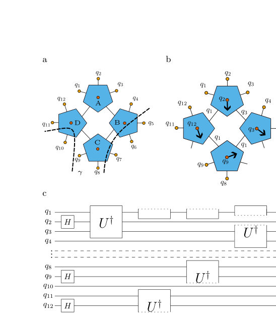
<figcaption class="paper-figure-caption"><b>Fig 5.</b> FIG. 5: Cut 3: Partial decoding of four bulk qubits. (a) The cut γ allows one to recover four bulk qubits from eight boundary qubits (q1, q2, q3 q4, q8, q9, q11 and q12). (b) The recovery unitary can be ex- pressed as a concatenation of four AME states as shown in Fig. 5(b). The arrows show the direction of the uni- tary, indicating that qubits q2, q3, q9 and q12 will contain the information of the bulk qubits A, B, C and D after the operator is applied. (c) The unitary is decomposed in the following circuit, where the box U † corresponds to the reverse of Fig. 3(d). Additional Hadamard gates H are needed to perform partial decoding since we used the the graph code derived in [23] for the...</figcaption>
</figure>

**Summary.** This paper experimentally implements holographic quantum codes, specifically the pentagon and heptagon codes, on a trapped-ion quantum processor. The research tests how encoding information based on geometric principles allows for partial recovery of quantum data from boundary measurements. This work advances the field by demonstrating a physical pathway toward using gravity-inspired concepts in fault-tolerant quantum computation.

**Why it may be interesting.** This work directly connects fundamental concepts from quantum gravity (holography) into a tangible platform for quantum information processing using trapped ions, providing an experimental testbed for advanced QEC theory.

Detailed structure

**Main problem.** The research investigates the experimental realization and testing of holographic quantum error correcting codes to bridge concepts from gravity (holography) with practical quantum computation.

**Main result.** The authors successfully implemented holographic pentagon and heptagon codes using trapped ions, demonstrating partial recovery of logical information and performing basic logical gates.

**Method.** They utilized trapped ions for physical implementation, testing code properties like partial decoding (recovering bulk qubits from boundary measurements) and measuring fidelity against theoretical predictions.

**Model / system.** The system is a trapped-ion quantum processor using $^{40}	ext{Ca}^+$ ions. The model involves encoding information into graph codes derived from holographic principles, specifically the pentagon and heptagon structures.

**Key observables.** Logical qubit fidelity (DFE), expectation values of stabilizer generators ($g_1$ to $g_{10}$), and successful recovery of logical bulk qubits from boundary measurements.

**Important parameters / regimes.** The code sizes tested include the pentagon code (4 logical qubits) and heptagon code. The physical platform uses Mølmer-Sørensen gates for entanglement.

**Assumptions / limitations.** The analysis relies on the theoretical framework of partial recovery, which differs from traditional full decoding requirements; experimental measurements are subject to quantum projection noise.

**Figures summary.** Figures illustrate the holographic structure (pentagon/heptagon), show the process of partial decoding via cuts $\gamma$, and compare measured expectation values of stabilizer generators against numerical simulations for gate operations.

**Paper structure.** The paper progresses from introducing the theoretical concept of holographic codes to detailing the experimental implementation on trapped ions, testing specific code structures (pentagon/heptagon), and finally demonstrating logical operations and error detection capabilities.

Abstract

Holography is a central concept at the intersection of gravity, condensed matter theory, and quantum information, linking the interior bulk of a system to its boundary. A model realizing key features of holographic systems is the holographic pentagon code by Pastawski et al. Here we experimentally implement instances of the holographic pentagon and heptagon codes with trapped ions and test their properties: For the pentagon code, we recover logical bulk qubits from their nearby boundary and test the Ryu-Takayanagi entanglement area law. For the heptagon code, we show that the transversal Hadamard gate native to the constituent Steane codes induces a single-qubit, correctable error in the holographic code. Our implementation paves the way towards the use of holographic quantum codes for quantum information processing.

[↑ back to top](#top)

### [Removing inhomogeneous broadening in cross-relaxation spectra via hole burning](http://arxiv.org/abs/2607.16839v1)

**Authors:** Fei Kong, Zhehua Huang, Zhengze Zhao, Pengju Zhao, Zhecheng Wang, Ya Wang, Fazhan Shi  
**Type:** experiment · **Category:** other · **PDF:** <https://arxiv.org/pdf/2607.16839v1>  
**Analysis basis:** full PDF text, analyzed in chunks
**Topic relevance:** 🔥 `QC/QI experiment` **4/5** · `spintronics-quantum-optics interface` **3/5** · `quantum measurements` **2/5** · `exotic spin models in light-matter` **1/5** · `interference shaping light` **1/5** · `quantum optics experiment` **1/5**

↔ Scroll figures horizontally

<figure class="paper-figure-card">
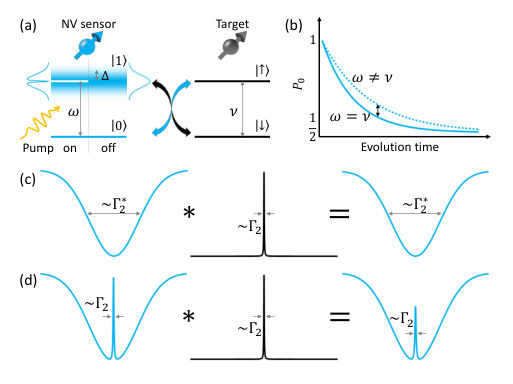
<figcaption class="paper-figure-caption"><b>Fig 1.</b> FIG. 1. Hole burning in cross-relaxation spectra. (a) Cross- relaxation model. The energy level of the NV sensor is broad- ened by inhomogeneous noise ∆, whose distribution gives the NV line shape. A weak pump field will heat a specific NV from its initial |0⟩state to the thermal equilibrium state, and thus destroy its sensing ability. (b) Relaxation measurement. The population of |0⟩(P0) has a exponential decay with a rate of Γ1. When the energy levels of the NV sensor and the target match, the decay rate will be faster, giving a resonant cross-relaxation signal. (c)(d) Cross-relaxation spectra with pump off (c) and on (d). The measured spectrum is a con- volution of the NV line shape and...</figcaption>
</figure>
<figure class="paper-figure-card">
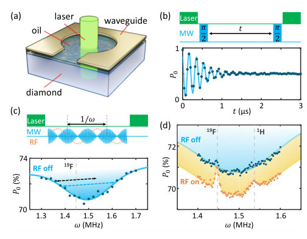
<figcaption class="paper-figure-caption"><b>Fig 2.</b> FIG. 2. Experimental demonstration of hole-burning spec- tra. (a) Schematic diagram of the key component of the exper- imental setup. It is placed on the sample stage of a wide-field microscope. The NV centers are located ∼10 nm below the diamond-sample interface. (b) Ramsey measurement. The points are experimental results, where P0 is given by the flu- orescence intensity normalized by Rabi oscillation. The line is a cosine fit with damping of exp  −(t/tc)2 , where the fit- ting result gives tc = 0.63(2) µs. (c) Measurement of cross- relaxation spectra. The data points are measured using the pulse sequence shown in the upper panel with pump RF turn- ing off, κ = 2.0, and evolution time...</figcaption>
</figure>
<figure class="paper-figure-card">
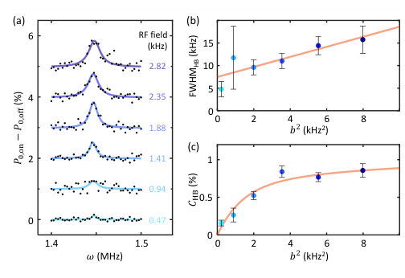
<figcaption class="paper-figure-caption"><b>Fig 3.</b> FIG. 3. Performance of hole burning at different pump strength. (a) Hole-burning spectra with different strength of RF fields. The data points are given by the difference between two cross-relaxation measurements with RF on and off. Meaningless offsets are added for ease of comparison. The solid lines are Lorentz fits. (b) Dependence of hole-burning linewidth on RF strength. The points are fitted FWHM with error bars given by the fitting errors. The solid line is a linear fit with intercept and slope of 7(2) kHz and 1.1(5) kHz−1, respectively. (c) Dependence of hole-burning contrast on RF strength. The points are fitted peak heights with error bars given by the fitting errors. The solid...</figcaption>
</figure>

**Summary.** The paper introduces and experimentally validates a hole-burning technique to overcome inhomogeneous broadening in cross-relaxation spectra measured using NV centers in diamond. By selectively depleting specific sensor states, the method dramatically improves spectral resolution, enabling the clear spectroscopic identification of weakly coupled nuclear spins like $^{19}	ext{F}$ and ${}^1	ext{H}$. This advancement enhances the utility of NV magnetometry for high-resolution studies in complex materials.

**Why it may be interesting.** This work provides a powerful spectroscopic tool for quantum sensors, directly addressing spectral limitations inherent in solid-state quantum platforms by adapting techniques from atomic physics (hole burning) to measure local magnetic environments with high fidelity.

Detailed structure

**Main problem.** Inhomogeneous broadening significantly limits the spectral resolution of cross-relaxation spectra obtained using Nitrogen-Vacancy (NV) centers in diamond for magnetic noise detection.

**Main result.** A hole-burning technique successfully removes inhomogeneous broadening, allowing the clear resolution of distinct nuclear spin frequencies ($^{19}	ext{F}$ and ${}^1	ext{H}$) that were previously unresolved.

**Method.** The authors adapted an optical hole-burning technique by applying a weak pump RF field during cross-relaxation measurements to selectively deplete specific NV centers, creating narrow spectral features.

**Model / system.** The system utilizes Nitrogen-Vacancy (NV) centers in diamond as quantum sensors for magnetic noise detection. The measurement relies on cross-relaxation spectroscopy between the NV center and target nuclear spins ($^{19}	ext{F}$, ${}^1	ext{H}$).

**Key observables.** Cross-relaxation spectrum $S(\omega)$, hole-burning linewidth ($	ext{FWHM}_{	ext{HB}}$), and contrast of the burned holes.

**Important parameters / regimes.** Dephasing rate ($\Gamma^{*}_2$), coherence rate ($\Gamma_2$), weak pump field strength ($b_2$), and resonance frequencies (e.g., $1.446\ 	ext{MHz}$ for $^{19}	ext{F}$).

**Assumptions / limitations.** The method retains the convenience of NV relaxometry while improving spectral resolution; approximations are used in deriving theoretical spectra.

**Figures summary.** Figure 2 compares initial cross-relaxation spectra (broad) with hole-burning spectra (narrow, resolving two distinct peaks for $^{19}	ext{F}$ and ${}^1	ext{H}$). Figure 3 shows the dependence of the burned linewidth on pump strength ($b_2$).

**Paper structure.** The paper first establishes the limitation posed by inhomogeneous broadening in NV cross-relaxation. It then details the hole-burning methodology, demonstrating its application to resolve specific nuclear spin frequencies experimentally. Finally, it compares this technique's performance against other advanced sensing methods.

Abstract

Quantum relaxometry based on nitrogen-vacancy (NV) centers in diamond is an easy-to-use technique that detects magnetic noise by measuring the longitudinal relaxation of NV centers. It is favored in chemical and biological applications due to the robustness against imperfect spin control. By tuning the energy level, NV relaxometry can detect magnetic noise generated by other spins and obtain magnetic resonance spectra through cross relaxation. However, the inhomogeneous broadening of NV centers greatly limits the spectral resolution of cross-relaxation spectra. Here we demonstrate a hole-burning technique to remove the inhomogeneous broadening. We utilize a weak pump field to deplete specific NV centers during the relaxation measurement, which contribute a reverse signal in the cross-relaxation spectra with a much narrower linewidth. Our method retains the convenience and sensitivity of NV relaxometry, opening up new avenues for high-resolution magnetic resonance spectroscopy in complex scenarios.

[↑ back to top](#top)

### [Variance-Reduced Trajectory Unravelings for GPU Noisy Quantum-Circuit Simulation: Characterization and a Qiskit-Aer Integration Gap](http://arxiv.org/abs/2607.17678v1)

**Authors:** Chun-Yeol You  
**Type:** theory · **Category:** numerical methods · **PDF:** <https://arxiv.org/pdf/2607.17678v1>  
**Analysis basis:** full PDF text, analyzed in chunks
**Topic relevance:** 🔥 `methods for driven-dissipative` **4/5** · `quantum measurements` **3/5** · `non-equilibrium dynamics` **2/5** · `correlated / nonlocal dissipation` **1/5** · `driven-dissipative phase transition` **1/5** · `measurement-induced transitions` **1/5**

↔ Scroll figures horizontally

<figure class="paper-figure-card">
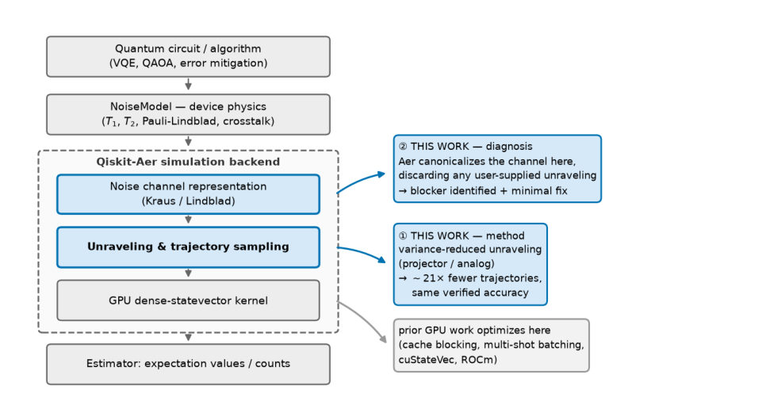
<figcaption class="paper-figure-caption"><b>Fig 1.</b> Figure 1: Where this work intervenes in the Qiskit-Aer stack. Left: the simulation pipeline. A quantum circuit and a NoiseModel carrying measured device physics (T1, T2, Pauli-Lindblad rates, crosstalk) are passed to the Qiskit-Aer backend (dashed box), which (i) represents the noise as a channel (Kraus/Lindblad), (ii) unravels that channel into sampled quantum-jump trajectories, and (iii) evolves each trajectory on a GPU dense-statevector kernel, finally producing expectation values or counts. Right: the two contributions of this paper, both localized to the highlighted blue stages. 1○Method—we replace the standard Pauli-flip unraveling at the sampling stage with variance-reduced...</figcaption>
</figure>
<figure class="paper-figure-card">
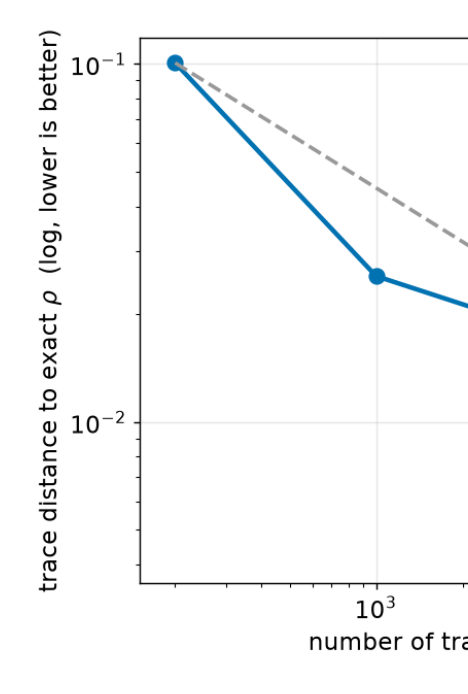
<figcaption class="paper-figure-caption"><b>Fig 2.</b> Figure 2: Correctness of the GPU trajectory engine. We reconstruct the density matrix ρ = 1</figcaption>
</figure>
<figure class="paper-figure-card">
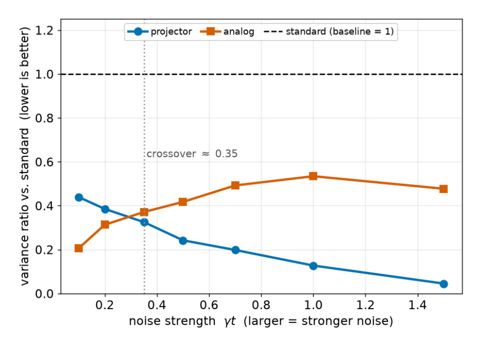
<figcaption class="paper-figure-caption"><b>Fig 3.</b> Figure 3: Regime map of unraveling efficiency. The x-axis is the accumulated noise strength γt (larger = stronger noise); the y-axis is the per-trajectory variance of the estimator relative to the standard unraveling, so lower is better and the black dashed line at 1 is the standard baseline. Blue circles are projector, orange squares are analog (single dephasing channel, n = 12, N = 2 × 103). Both curves lie entirely below 1, i.e. both variance-reduced unravelings beat standard at every noise level. The projector ratio falls monotonically to 0.045 at γt = 1.5 (a ∼22× variance reduction), while analog is lowest at weak noise; the two curves cross near γt ≈0.35 (grey dotted). Practical...</figcaption>
</figure>
<figure class="paper-figure-card">
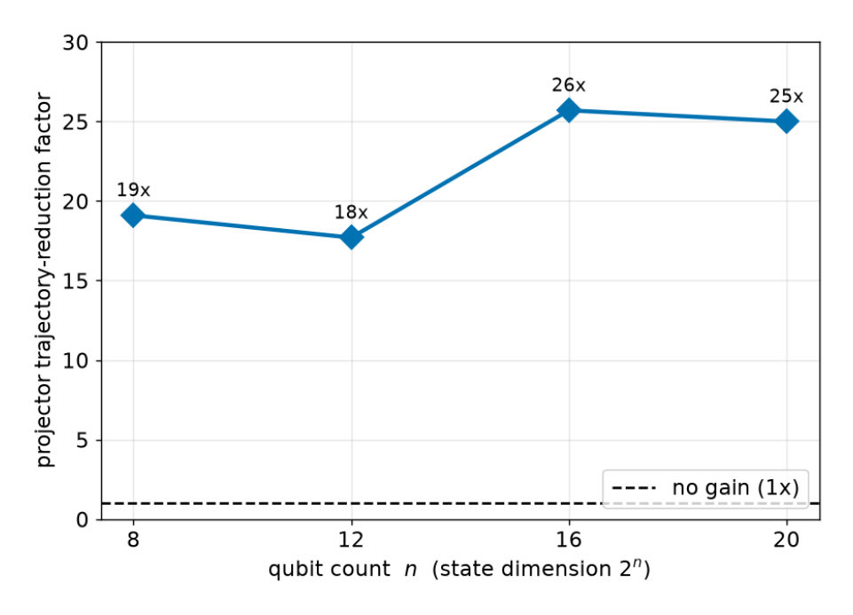
<figcaption class="paper-figure-caption"><b>Fig 4.</b> Figure 4: Scaling of the trajectory-reduction factor. The x-axis is the qubit count n (state dimension 2n, i.e. 256 to ∼106 amplitudes); the y-axis is how many times fewer trajectories the projector unraveling needs than standard to reach the same target standard error (SE ≤10−2, strong noise γt = 1.5). Each blue marker is a measured ratio (Table 3); the black dashed line at 1 marks “no advantage”. The factor stays in the 19–26× band with no downward trend across n = 8–20, so the benefit is a statistical property of the unraveling rather than a small-system artifact. Statevector memory is only 16.8 MB at n = 20, four orders of magnitude below the 8 GB budget, indicating the method is...</figcaption>
</figure>
<figure class="paper-figure-card">
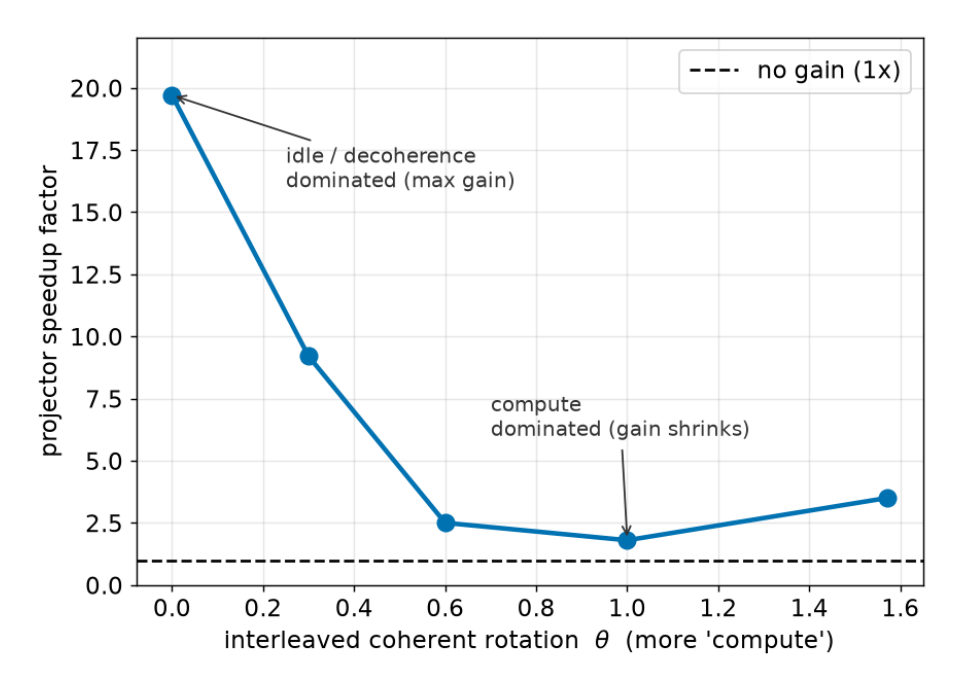
<figcaption class="paper-figure-caption"><b>Fig 5.</b> Figure 5: Applicability map: coherent dynamics erodes the projector advantage. The x-axis is the angle θ of RY (θ) rotations interleaved between noise windows—a proxy for how much coherent “compute” the circuit performs relative to idle decoherence; the y-axis is the projector trajectory-reduction factor (n = 8, γt = 1.5). At θ = 0 (pure idle/dephasing, the absorbing-window ideal) the speedup is largest, 19.7×; it falls monotonically to 1.8× at θ = 1.0 as RY (which does not commute with the measured X) repeatedly rotates collapsed states back out of the absorbing subspace, with a partial rebound to 3.5× at θ = π/2. Crucially the estimator mean remains unbiased at every θ (it always tracks...</figcaption>
</figure>

**Summary.** This paper introduces variance-reduced Monte Carlo trajectory unravelings—specifically projector and analog sampling—to overcome the massive computational cost of simulating noisy quantum circuits. By implementing these methods on a GPU engine, the authors demonstrate significant reductions (up to 26x) in the number of required simulation trajectories compared to existing tools like Qiskit-Aer. The work also identifies a critical software gap preventing immediate adoption within current production APIs.

**Why it may be interesting.** This work directly addresses the statistical bottleneck in simulating open quantum systems, providing a concrete algorithmic improvement (variance reduction) that is crucial for applying noisy circuit simulations to complex problems like VQE or error mitigation.

Detailed structure

**Main problem.** The primary challenge is efficiently simulating noisy quantum circuits, as exact density-matrix methods are memory-prohibitive for large systems.

**Main result.** Variance-reduced unravelings (projector and analog sampling) significantly reduce the required number of Monte Carlo trajectories needed to achieve a target standard error by factors up to 26x compared to standard GPU simulation tools.

**Method.** The authors implement and compare projector and analog sampling techniques, which are variance reduction methods applied to quantum-jump (Monte-Carlo trajectory) simulations running on a GPU dense-statevector engine.

**Model / system.** The work models open-system dynamics using Lindblad generators for noisy quantum circuits. Simulations use the GPU dense-statevector representation ($\psi \in \mathbb{C}^{2^n}$) and are validated against the exact density matrix evolution.

**Key observables.** Standard error of expectation values, required number of trajectories ($N$), fidelity (compared to ideal circuit), and variance ratios between unraveling methods.

**Important parameters / regimes.** Circuit size ($n=8$ to $20$), noise strength ($\gamma t \approx 0.35$ crossover point), and the target standard error ($\le 10^{-2}$).

**Assumptions / limitations.** The primary limitation is that Qiskit-Aer's public API canonicalizes the noise channel, preventing the direct use of these advanced variance-reduced unravelings.

**Figures summary.** Figures illustrate the performance gains (trajectory savings) and present a regime map showing where analog sampling or projector unraveling is optimal based on noise strength.

**Paper structure.** The paper establishes the problem (memory limits), introduces variance reduction techniques, details the GPU implementation and validation against exact methods, presents quantitative results comparing trajectory counts across different noise regimes, and concludes by identifying the necessary API modification for production use.

Abstract

Monte-Carlo trajectory (quantum-jump) methods are the practical route to simulating noisy quantum circuits once the exact density-matrix method is precluded by its $4^n$ memory cost. Their bottleneck is estimator variance: resolving one expectation value can demand thousands of trajectories. Recent tensor-network work shows that \emph{variance-reduced unravelings} -- projector and analog sampling -- sharply cut this variance, but only on CPU matrix-product-state backends, with no path into production tooling. We implement both unravelings on a \emph{GPU dense-statevector} trajectory engine and validate them against the exact density matrix (ideal-circuit fidelity $1-2.2\times10^{-16}$; $1/\sqrt{N}$ convergence; all unravelings unbiased to trace distance $<0.01$). On a single consumer GPU, projector unraveling reaches a target standard error with $20.8\times$ fewer trajectories than Qiskit-Aer's \texttt{batched\_shots\_gpu} at $n=10$, a factor that holds at $19$--$26\times$ across $n=8$--$20$. A regime map places analog sampling optimal at weak noise and projector at strong noise, crossing near $γt\approx0.35$. We further report a systems finding: Qiskit-Aer applies noise at the \emph{channel} level and reconstructs a canonical Kraus decomposition at apply time, discarding any user-supplied unraveling, so variance-reduced unravelings cannot be delivered through its public API. Because Aer's Born-rule collapse machinery already exists, we specify a minimal change that would unlock the technique in production.

[↑ back to top](#top)

### [Expansion of a free Fermi gas released from an isotropic trapping potential](http://arxiv.org/abs/2607.18007v1)

**Authors:** J M Luck, P L Krapivsky  
**Type:** theory · **Category:** statistical mechanics · **PDF:** <https://arxiv.org/pdf/2607.18007v1>  
**Analysis basis:** full PDF text, analyzed in chunks
**Topic relevance:** 🔥 `non-equilibrium dynamics` **4/5** · `non-equilibrium universality` **3/5** · `analog quantum simulation` **2/5** · `Keldysh / 2PI / non-Gaussian methods` **1/5** · `methods for driven-dissipative` **1/5**

↔ Scroll figures horizontally

<figure class="paper-figure-card">
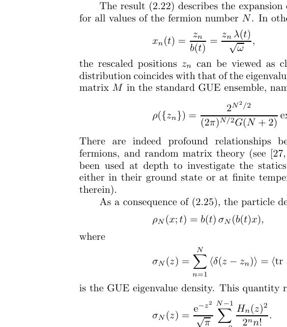
<figcaption class="paper-figure-caption"><b>Fig 1.</b> Figure 1 shows how successive individual levels contribute to build up this quantity. The sum entering (2.29) can be performed by means of the Christoffel-Darboux formula. The outcome appears in several guises in the literature, including</figcaption>
</figure>
<figure class="paper-figure-card">
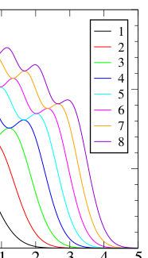
<figcaption class="paper-figure-caption"><b>Fig 2.</b> Figure 1. GUE eigenvalue density σN(z) given by (2.29) plotted against z, for N = 1 to 8 (see legend).</figcaption>
</figure>
<figure class="paper-figure-card">
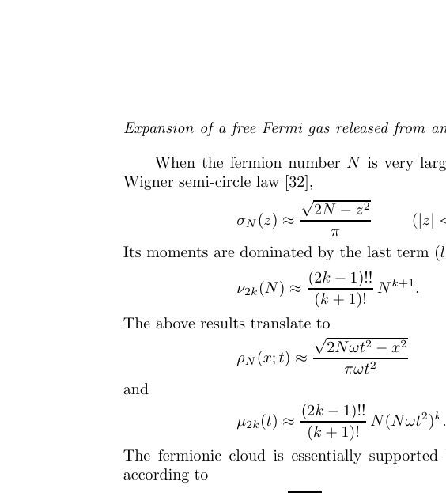
<figcaption class="paper-figure-caption"><b>Fig 3.</b> Figure 2 shows a scaling plot of σN(z)/ √</figcaption>
</figure>
<figure class="paper-figure-card">
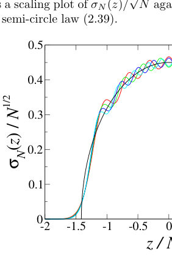
<figcaption class="paper-figure-caption"><b>Fig 4.</b> Figure 2. Scaling plot of σN(z)/ √</figcaption>
</figure>
<figure class="paper-figure-card">
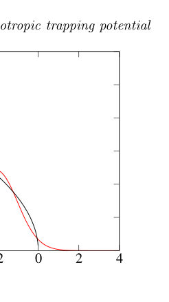
<figcaption class="paper-figure-caption"><b>Fig 5.</b> Figure 3. Function A(ξ) entering the scaling law (2.47). Black curve: leading term of the asymptotic expansion (2.49), matching the Wigner semi-circle law (2.39).</figcaption>
</figure>

**Summary.** This paper theoretically analyzes the expansion of a free Fermi gas released from an isotropic trap. Using semi-classical methods, it derives universal power-law scaling laws for the density profile in arbitrary dimensions and for potentials with any exponent. The results generalize fundamental distributions like the Wigner semi-circle law to non-equilibrium dynamics.

**Why it may be interesting.** This work provides a rigorous theoretical framework for understanding non-equilibrium dynamics in quantum many-body systems, particularly how initial confinement dictates long-time ballistic spreading, which is crucial for modeling trapped atomic gases or quantum fluids.

Detailed structure

**Main problem.** The study investigates the time evolution and late-time spatial profile of a free Fermi gas after its confining isotropic potential is suddenly removed.

**Main result.** The paper derives explicit, universal power-law scaling for the density profile $
ho_N(r; t)$ in arbitrary dimensions $d$ and for potentials with general exponents $a$, generalizing known results like the Wigner semi-circle law.

**Method.** Semi-classical techniques are employed to analyze the large-$N$ limit, treating the dynamics via expectation values derived from the initial many-body ground state wavefunction.

**Model / system.** The system is a non-interacting Fermi gas confined by an isotropic trapping potential $V(x)$ in any dimension. The analysis covers both the exactly solvable harmonic case and general power-law potentials $V(x) \sim |x|^a$.

**Key observables.** Total fermion density $
ho_N(r; t)$, momentum distribution, and moments $\mu_{2k}(t)$ of the expanding cloud.

**Important parameters / regimes.** Fermion number ($N$), dimensionality ($d$), potential exponent ($a$), and time ($t$).

**Assumptions / limitations.** The analysis relies on the semi-classical limit for large fermion numbers ($N \gg 1$) and assumes sudden release of the trapping potential.

**Figures summary.** Figures illustrate scaling functions $A(\xi)$ (harmonic trap) and $F(\xi)$ (square-well potential), showing how the density profile evolves away from initial equilibrium distributions.

**Paper structure.** The paper progresses by first establishing the general formalism for calculating time-dependent expectation values, solving the exactly solvable harmonic case using GUE statistics, and finally generalizing the results to arbitrary power-law potentials in the semi-classical limit.

Abstract

We consider a system of non-interacting fermions prepared in the many-body ground state of an isotropic trapping potential in any dimension, and investigate the ballistic expansion of the fermionic cloud after the potential is suddenly released. Using semi-classical techniques, we derive the full late-time profile of the expanding cloud in the regime when the fermion number is large. We thus obtain explicit expressions for power-law potentials with arbitrary exponent $a$ and in all dimensions $d$. The momentum distribution and the spatial profile of the cloud exhibit a universal edge exponent $d/a$, thus generalizing the Wigner semi-circle law and the Thomas-Fermi distribution.

[↑ back to top](#top)

### [Geometric quantum discord in the black hole quantum atmosphere](http://arxiv.org/abs/2607.16641v1)

**Authors:** Siwei Li, Xiaofen Huang  
**Type:** theory · **Category:** quantum information and computing · **PDF:** <https://arxiv.org/pdf/2607.16641v1>  
**Analysis basis:** full PDF text, analyzed in chunks
**Topic relevance:** 🔥 `entanglement & information structure` **4/5** · `correlated / nonlocal dissipation` **2/5** · `non-equilibrium dynamics` **2/5** · `Keldysh / 2PI / non-Gaussian methods` **1/5** · `driven-dissipative phase transition` **1/5** · `methods for driven-dissipative` **1/5**

↔ Scroll figures horizontally

<figure class="paper-figure-card">
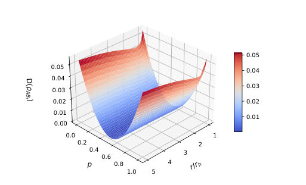
<figcaption class="paper-figure-caption"><b>Fig 1.</b> FIG. 2. Physically accessible quantum discord D(ρABI) as functions of the normalized distance r/rh and the state pa- rameter p at DHH = 100.</figcaption>
</figure>
<figure class="paper-figure-card">
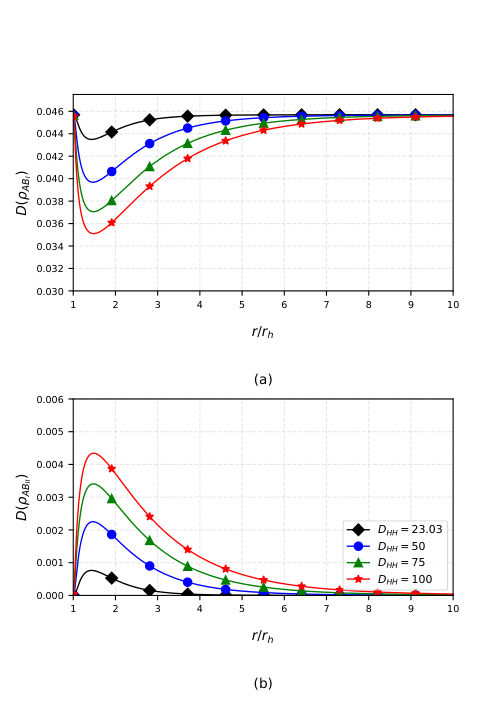
<figcaption class="paper-figure-caption"><b>Fig 2.</b> FIG. 1. Quantum discord of the quantum systems as func- tions of the normalized distance r/rh for different constant values of DHH. Panel (a): Physically accessible quantum dis- cord D(ρABI); Panel (b): Physically inaccessible quantum dis- cord D(ρABII). The state parameter p is fixed at p = p</figcaption>
</figure>
<figure class="paper-figure-card">
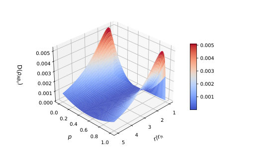
<figcaption class="paper-figure-caption"><b>Fig 3.</b> FIG. 3. Physically inaccessible quantum discord D(ρABII) as functions of the normalized distance r/rh and the state parameter p at DHH = 100.</figcaption>
</figure>
<figure class="paper-figure-card">
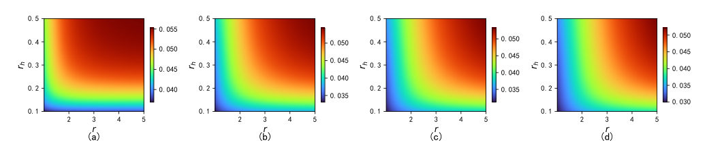
<figcaption class="paper-figure-caption"><b>Fig 4.</b> FIG. 4. Physically accessible quantum discord D(ρABI) as a function of the distance from the black hole center (r) and the event horizon radius (rh). Panel (a): DHH = 23.03, panel (b): DHH = 50, panel (c): DHH = 75, panel (d): DHH = 100. The parameter p = 1 is adopted for all panels.</figcaption>
</figure>
<figure class="paper-figure-card">
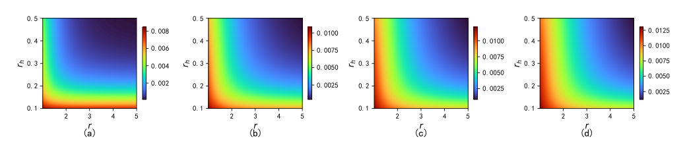
<figcaption class="paper-figure-caption"><b>Fig 5.</b> FIG. 5. Physically inaccessible quantum discord D(ρABII) as a function of the distance from the black hole center r and the event horizon radius rh. Panel (a): DHH = 23.03, panel (b): DHH = 50, panel (c): DHH = 75, panel (d): DHH = 100. The parameter p = 1 is adopted for all panels.</figcaption>
</figure>

**Summary.** This paper analyzes the geometric quantum discord of bipartite Werner states influenced by Hawking radiation near a black hole. It finds that the quantum correlation exhibits distinct, opposing nonmonotonic behaviors in regions accessible and inaccessible to observers. The results highlight that these correlations are strongly modulated by both the black hole's geometry and the associated thermal effects.

**Why it may be interesting.** This work connects fundamental concepts from general relativity (Hawking radiation) with quantum information theory (quantum discord), providing insights into how spacetime curvature affects entanglement measures.

Detailed structure

**Main problem.** The study investigates how Hawking radiation affects the geometric quantum discord of bipartite Werner states within the quantum atmosphere surrounding a Schwarzschild black hole.

**Main result.** The geometric quantum discord exhibits nonmonotonic behavior, decreasing then increasing in the physically accessible region and showing the opposite trend in the inaccessible region. Extremal values occur near the peak intensity of Hawking radiation.

**Method.** The analysis involves calculating the geometric quantum discord for reduced density matrices derived from an initial Werner state subjected to Hawking radiation effects using Bogoliubov transformations.

**Model / system.** The system models a bipartite quantum state (Werner states) near a Schwarzschild black hole, considering both physically accessible and inaccessible regions due to Hawking radiation.

**Key observables.** Geometric quantum discord, $D(
ho)$, for subsystems like $
ho_{ABI}$ and $
ho_{ABII}$.

**Important parameters / regimes.** Normalized radial distance ($r/r_h$), Hartle–Hawking constant ($D_{HH}$), and event horizon radius ($r_h$).

**Assumptions / limitations.** The analysis assumes the use of natural units and models the evolution using specific reduced density matrices derived from Hawking field theory.

**Figures summary.** Figures illustrate the opposing trends of quantum discord in accessible vs. inaccessible regions as a function of normalized distance, highlighting extrema near the peak Hawking radiation intensity.

**Paper structure.** The paper progresses by defining the physical system and observables (Werner states, geometric discord), deriving the reduced density matrices under Hawking effects, analyzing the dependence on radial distance, and finally discussing the roles of $D_{HH}$ and $r_h$.

Abstract

We investigate the geometric quantum discord of bipartite Werner states influenced by Hawking radiation in the quantum atmosphere of a Schwarzschild black hole. We find that the geometric quantum discord in the physically accessible region exhibits a nonmonotonic behavior: it first decreases and then increases as the normalized radial distance increases, while the discord in the physically inaccessible region shows the exact opposite trend. A pronounced extremum of geometric quantum discord occurs precisely at the position corresponding to the peak intensity of Hawking radiation. Furthermore, we find that the Hartle Hawking constant and the event horizon radius exert opposite effects on the strength of quantum correlation redistribution: a larger Hartle Hawking constant enhances the redistribution effect, whereas a larger event horizon radius suppresses it.

[↑ back to top](#top)

### [Host-guest Crystal Engineering Tailors the Room Temperature Spin Dynamics in Molecular Quantum Devices](http://arxiv.org/abs/2607.16466v1)

**Authors:** Ziqiu Huang, Angus Cowley-Semple, Irena Nevjestic, Yifan Yu, Mark Oxborrow, Sam L. Bayliss, Sarah K. Mann, Max Attwood  
**Type:** experiment · **Category:** other · **PDF:** <https://arxiv.org/pdf/2607.16466v1>  
**Analysis basis:** full PDF text, analyzed in chunks
**Topic relevance:** 🔥 `spintronics-quantum-optics interface` **4/5** · `exotic spin models in light-matter` **3/5** · `QC/QI experiment` **1/5** · `correlated / nonlocal dissipation` **1/5** · `driven-dissipative phase transition` **1/5** · `methods for driven-dissipative` **1/5**

↔ Scroll figures horizontally

<figure class="paper-figure-card">
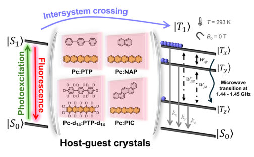
<figcaption class="paper-figure-caption"><b>Fig 1.</b> Figure 1. Schematic of the photophysical processes in pentacene host–guest crystals. A strongly spin po- larised triplet state is formed after optical excitation from the ground (|S0⟩) to the excited (|S1⟩) singlet state, followed by spin-selective intersystem crossing (ISC) and relaxation to |T1⟩[15]. In |T1⟩, electron dipole interactions result in a zero- field splitting (ZFS), characterised by axial (D ≈1.45 GHz) and rhombic (|E| ≈50 MHz) energies that split the triplet state into well-defined |Tx⟩, |Ty⟩and |Tz⟩spin-sublevels. Spin- lattice relaxation between these sublevels (ωij, where i and j are initial and final states) takes several 10s of microseconds, allowing the population...</figcaption>
</figure>
<figure class="paper-figure-card">
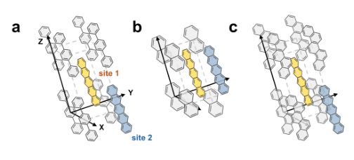
<figcaption class="paper-figure-caption"><b>Fig 2.</b> Figure 2. Representative crystal structures of the host-guest systems. Each system (a) Pc:PTP, (b) Pc:NAP and (c) Pc:PIC, adheres to a monoclinic crystal structure. Two possible crystallographic substitution sites for pentacene are shown in blue and yellow [52, 53].</figcaption>
</figure>
<figure class="paper-figure-card">
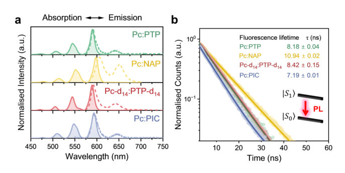
<figcaption class="paper-figure-caption"><b>Fig 3.</b> Figure 3. Optical characterisation of Pc host–guest crystals measured at room temperature. (a) Normalised UV–vis absorption (solid lines) and emission spectra (λex = 530 nm, dashed lines) for Pc:PTP (green), Pc:NAP (yellow), Pc-d14:PTP-d14 (red), and Pc:PIC (blue). (b) Normalised time-correlated single photon counting (TCSPC) measurements of the fluorescence decay with inset weight-averaged fluorescence lifetimes.</figcaption>
</figure>
<figure class="paper-figure-card">
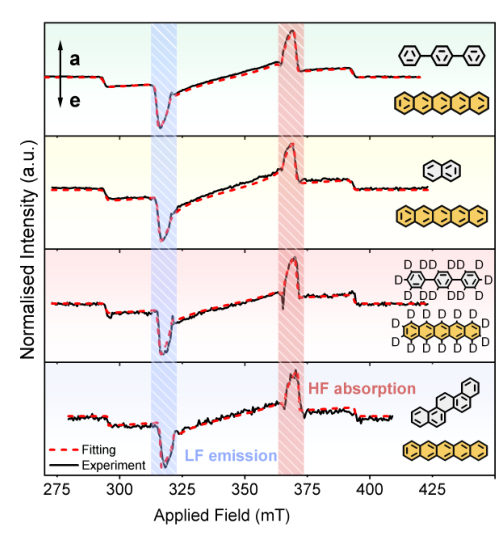
<figcaption class="paper-figure-caption"><b>Fig 4.</b> Figure 4. Room-temperature trEPR experiments of all host-guest mixtures. From top to bottom: experimen- tal (black) and fitted (red) EPR spectra of 0.1% Pc:PTP, 0.01% Pc:NAP, 0.1% Pc-d14:PTP-d14 and 0.1% Pc:PIC taken at t = 600 ns, representing the point of maximum signal in- tensity. Each spectrum was recorded using 590 nm light ex- citation, except for Pc:PIC which used 530 nm.</figcaption>
</figure>
<figure class="paper-figure-card">
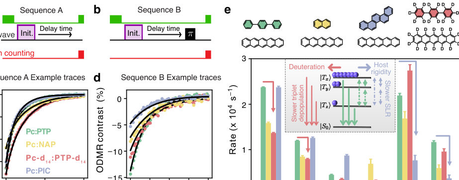
<figcaption class="paper-figure-caption"><b>Fig 5.</b> Figure 5. Triplet spin dynamics from optically detected relaxation measurements. (a, b) Pulse sequences A and B used to determine the dynamics (see Figure S13 for details of the pulse sequences, including the control and microwave initialisation sequences). (c, d) Example relaxation curves for Pc:PTP (reproduced from ref. [20]), d14-Pc:d14-PTP, Pc:NAP and Pc:PIC recorded using a sequence A (Init 1.), and b sequence B (Init 1. |Tx⟩↔|Tz⟩readout), along with global fits (black lines). (e) Best-fit values of the spin dynamics rates. The arrows and inset illustrate the most significant differences between the materials.</figcaption>
</figure>

**Summary.** The research demonstrates how molecular host-guest crystal engineering can precisely tailor room-temperature electron spin dynamics in pentacene-based quantum devices. By systematically comparing different hosts, the authors identify perdeuterated p-terphenyl as the optimal material for achieving low-loss, continuous wave maser operation. This work establishes a powerful design principle for molecular quantum technologies.

**Why it may be interesting.** This work directly addresses the challenge of realizing solid-state quantum emitters at ambient conditions by showing that crystal engineering offers precise control over spin Hamiltonian parameters (like zero-field splitting and hyperfine coupling) through host modification.

Detailed structure

**Main problem.** The central goal is developing molecular materials capable of coherent control over electron spin states at room temperature for use in quantum technologies like masers.

**Main result.** Host-guest engineering, particularly using perdeuterated pentacene in perdeuterated p-terphenyl (Pc-d14:PTP-d14), proves to be a highly effective and practical method for tuning spin dynamics toward building continuous wave masers.

**Method.** The study employs advanced spectroscopic techniques including Electron Paramagnetic Resonance (EPR) and Optically Detected Magnetic Resonance (ODMR) at room temperature to probe spin relaxation, triplet population, and coherence times.

**Model / system.** The physical system consists of pentacene molecules acting as spin-active guests embedded within various crystalline host matrices (e.g., PTP, NAP, PIC). The dynamics are analyzed using coupled rate equations describing singlet and triplet sublevel populations.

**Key observables.** Spin-lattice relaxation rates ($\omega_{ij}$), triplet population ratios ($P_x:P_y:P_z$), Rabi oscillation damping rates ($\Gamma$), fluorescence lifetimes ($	au_f$), and maser cooperativity ($\eta_{maser}$).

**Important parameters / regimes.** Room temperature operation, high guest concentrations ($\sim 10^{24} 	ext{ m}^{-3}$), and the influence of host lattice rigidity and vibrational coupling.

**Assumptions / limitations.** The analysis relies on fitting time-domain signals to Bessel functions for Rabi oscillations and solving coupled rate equations for population dynamics; some rates are estimated based on literature or assumed equal across systems.

**Figures summary.** Figures illustrate photophysical processes, crystal structures, fitted Rabi oscillation curves showing field dependence, zero-field ODMR linewidths, and the setup/results for maser operation.

**Paper structure.** The paper progresses from establishing the need for room-temperature spin control to characterizing various host-guest systems using optical and magnetic resonance techniques. It details how structural changes modulate ISC efficiency and relaxation pathways, culminating in a quantitative assessment of suitability for maser applications.

Abstract

Molecular materials that enable coherent control over an electron's spin state at room temperature are promising candidates for quantum technologies, including quantum sensors and ultra-low noise microwave amplifiers, known as masers. Host-guest molecular crystals enable independent control of spin-active guests and their local environments to enhance molecular spin properties and so improve device performance. Using electron paramagnetic resonance and optically-detected magnetic resonance, we demonstrate the ability to tune triplet population, depopulation, and spin-lattice relaxation by modulating host-dependent lattice rigidity and vibrational coupling to significantly reduce the operating requirements for building useful masers. Importantly, the most rigid host, picene, reveals the ability to slow spin-lattice relaxation without lengthening triplet lifetime, though at the cost of strain-induced line width broadening and reduced triplet spin polarisation. We also find that deuteration reduces the triplet resonance line width and vibrationally-mediated triplet depopulation. Consequently, we find that perdeuterated pentacene in perdeuterated p-terphenyl is the most viable candidate for building a continuous wave maser. This work demonstrates host-guest engineering as an important and practical method for tuning the spin-dependent performance of room-temperature molecular quantum technologies.

[↑ back to top](#top)

### [Remote Infrared Absorption Spectroscopy with Undetected Photons](http://arxiv.org/abs/2607.16419v1)

**Authors:** Simon Neves, Fériel Armbruster, Jean-Pierre Wolf  
**Type:** experiment · **Category:** other · **PDF:** <https://arxiv.org/pdf/2607.16419v1>  
**Analysis basis:** full PDF text, analyzed in chunks
**Topic relevance:** 🔥 `quantum optics experiment` **4/5** · `interference shaping light` **3/5** · `quantum measurements` **2/5** · `driven-dissipative phase transition` **1/5** · `methods for driven-dissipative` **1/5**

↔ Scroll figures horizontally

<figure class="paper-figure-card">
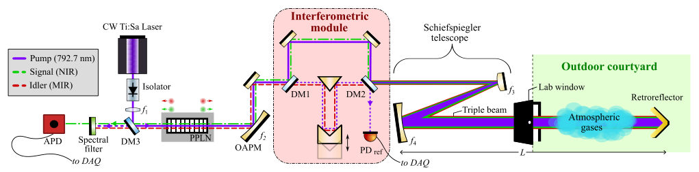
<figcaption class="paper-figure-caption"><b>Fig 1.</b> FIG. 1: Stable nonlinear interferometer used for remote QFTIR spectroscopy over long open-path. The retroreflector was placed at different locations, at arbitrary distances L ≤43.4 m from the telescope’s output.</figcaption>
</figure>
<figure class="paper-figure-card">
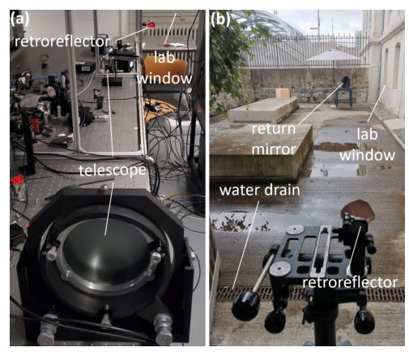
<figcaption class="paper-figure-caption"><b>Fig 2.</b> FIG. 2: Pictures of (a) the indoor part of the experiment, when the retroreflector is placed inside the lab, (b) the outdoor part of the experiment, when the retroreflector is placed on a tripod outside the lab, 19.8 m away from the telescope.</figcaption>
</figure>
<figure class="paper-figure-card">
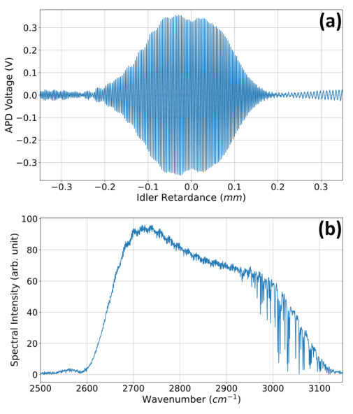
<figcaption class="paper-figure-caption"><b>Fig 3.</b> FIG. 3: (a) Signal-photon interferogram averaged over 100 iterations, for biphotons traveling over a 43.4 m open-path in the atmosphere, and interfering in our novel interferometer. (b) Corresponding Fourier-reconstructed infrared spectrum.</figcaption>
</figure>
<figure class="paper-figure-card">
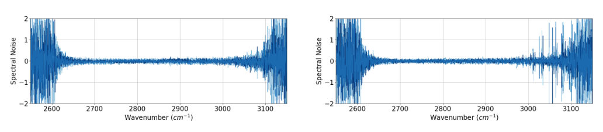
<figcaption class="paper-figure-caption"><b>Fig 4.</b> FIG. 4: Spectral noise in the Fourier-reconstructed infrared spectrum, averaged over n = 10 scans, for photons traveling over L = 3.0 m and L = 43.4 m in the open atmosphere.</figcaption>
</figure>
<figure class="paper-figure-card">
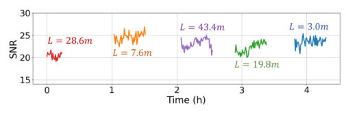
<figcaption class="paper-figure-caption"><b>Fig 5.</b> FIG. 5: Evolution of the SNR during the 22-05-2025 after- noon measurement campaign. The open-path’s length L is specified for each data set.</figcaption>
</figure>

**Summary.** The paper presents a breakthrough technique for remote infrared gas sensing using quantum light sources (biphotons) in an open-path geometry. By detecting only near-infrared photons while probing mid-infrared absorption features, the method bypasses limitations of traditional IR detectors. This allows for long-distance, field-deployable measurements of atmospheric gases like methane and butane.

**Why it may be interesting.** This work represents a significant application of quantum optics to fundamental sensing problems. The ability to perform remote spectroscopy without complex mid-IR detectors is highly relevant for developing field-deployable quantum sensors, bridging quantum physics with atmospheric science and metrology.

Detailed structure

**Main problem.** To develop a novel, remote method for Fourier-transform infrared (FTIR) spectroscopy capable of measuring gas concentrations in the open atmosphere by utilizing quantum light sources.

**Main result.** The authors successfully demonstrated this technique over distances up to 43.4 m, achieving the first measurement of atmospheric methane and butane using undetected photons.

**Method.** The method relies on a nonlinear interferometric setup driven by Spontaneous Parametric Down-Conversion (SPDC) to generate correlated photon pairs, allowing the mid-infrared spectrum to be reconstructed solely by detecting near-infrared signal photons.

**Model / system.** The system uses a quantum nonlinear interferometer interrogated by a triple beam (pump, signal, idler) sent over an open path. The core principle involves measuring the signal photon flux as a function of tunable idler retardance to reconstruct the absorption spectrum via Fourier transform.

**Key observables.** Signal photon flux $P_s(x)$, reconstructed spectral intensity $I(
u)$, and calculated absorbance $A(
u)$ for specific gases like $	ext{CH}_4$ and n-butane.

**Important parameters / regimes.** Open path length ($L$) up to 43.4 m; low gain regime ($n \ll 1$); spectral resolution limited by the window function (e.g., $0.53 	ext{ cm}^{-1}$).

**Assumptions / limitations.** The analysis assumes a monochromatic pump laser and that the ambient air is relatively non-dispersive for initial simplifications; saturation of water vapor remains a major limitation.

**Figures summary.** Figures show stable nonlinear interferometers over long paths, measured signal-photon interferograms corresponding to reconstructed spectra (e.g., methane/water vapor), and comparisons of calculated absorbance against HITRAN data.

**Paper structure.** The paper details the quantum physical setup using SPDC in PPLN, describes the measurement process involving an open-path nonlinear interferometer, derives the relationship between signal flux and spectral absorbance, and validates the technique by measuring known gases ($	ext{CH}_4$, n-butane) over long outdoor paths.

Abstract

We demonstrate a novel method for remote open-path Fourier-transform infrared spectroscopy with undetected photons. Similar to previous quantum spectroscopy works, a mid-infrared spectrum is reconstructed by detecting a near-infrared radiation only, thus bypassing important limitations of infrared detectors. Our study however relies on the co-propagation of the photon-pair and the pump-laser over the same optical path, which allows the probing of the open atmosphere over long distances. By sending the photons over unprecedented distances of up-to 43.4m in the outdoor atmosphere, we were able to detect butane released in the open-path, as well as natural atmospheric methane, thus demonstrating the first use of infrared spectroscopy with undetected photons for atmospheric measurements.

[↑ back to top](#top)

### [80 Channel Photon Pair Source from a Thin-Film Lithium Niobate Racetrack Microresonator](http://arxiv.org/abs/2607.16575v1)

**Authors:** Mihir Chaudhari, Ian Christen, Xinyi Ren, Chun-Ho Lee, Tushar Sanjay Karnik, Reshma Kopparapu, Clayton Cheung, Kai-Chi Chang, Mengjie Yu  
**Type:** experiment · **Category:** quantum information and computing · **PDF:** <https://arxiv.org/pdf/2607.16575v1>  
**Analysis basis:** full PDF text, analyzed in chunks
**Topic relevance:** 🔥 `quantum optics experiment` **4/5** · `correlated cavity matter` **3/5** · `QC/QI experiment` **1/5** · `driven-dissipative phase transition` **1/5** · `interference shaping light` **1/5**

↔ Scroll figures horizontally

<figure class="paper-figure-card">
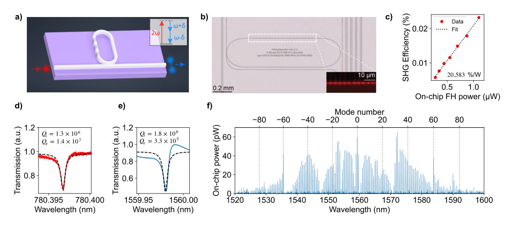
<figcaption class="paper-figure-caption"><b>Fig 1.</b> FIG. 1. Device design and performance. (a) Multi-channel photon pair device schematic. (b) Microscope image of the fabricated racetrack microresonator on X-cut TFLN. The inset is a SHG confocal image of the periodically-poled region. (c) Normalized SHG efficiency fitted to be 20,583 %/W. (d) Visible transmission. (e) Telecom transmission. (f) Downconverted spectrum using 26.2 mW of on-chip visible power near 780 nm.</figcaption>
</figure>
<figure class="paper-figure-card">
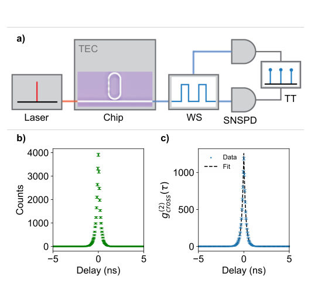
<figcaption class="paper-figure-caption"><b>Fig 2.</b> FIG. 2. Cross-correlation measurements. (a) Simplified measure- ment setup schematic. TEC: thermoelectric cooler; WS: waveshaper; SNSPD: superconducting nanowire single-photon detector; TT: time tagger (b) Raw time tagger counts with a 50 ps bin width and a 300 s measurement time of the 9th channel pair. (c) Normalized g(2) cross(τ) correlation function of the 9th channel pair.</figcaption>
</figure>
<figure class="paper-figure-card">
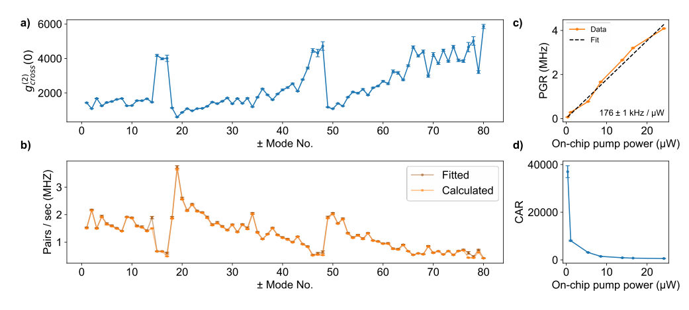
<figcaption class="paper-figure-caption"><b>Fig 3.</b> FIG. 3. Multi-mode and multi-power characterizations of the photon pair source. (a) g(2) cross(0) values and (b) PGRs of 80 photon pair channels each measured for 300 s with 21 μW of on-chip pump power near 780 nm. The fitted and calculated PGRs show good agreement with each other. Calculated PGRs use a coincidence window of 2.2 ns. (c) PGRs (calculated) and (d) CAR values of the 9th channel pair at different pump powers.</figcaption>
</figure>
<figure class="paper-figure-card">
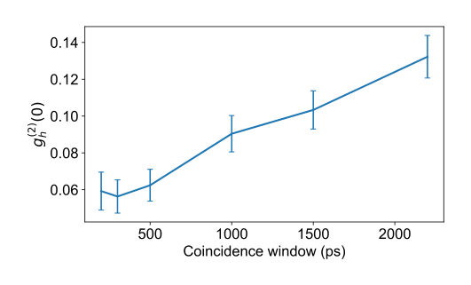
<figcaption class="paper-figure-caption"><b>Fig 4.</b> FIG. 5. Coincidence window’s effect on calculated heralded g(2) h (0). All data points are obtained using the same raw time tags, leading to all error bars being the same.</figcaption>
</figure>
<figure class="paper-figure-card">
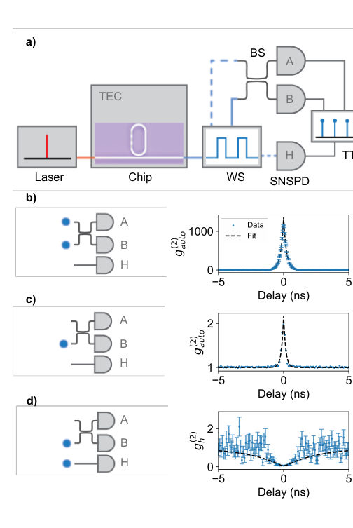
<figcaption class="paper-figure-caption"><b>Fig 5.</b> FIG. 4. Auto-correlation measurements. (a) Simplified measure- ment setup schematic. TEC: thermoelectric cooler; WS: waveshaper; SNSPD: superconducting nanowire single-photon detector; TT: time tagger; BS: 50:50 beamsplitter (b) Frequency-degenerate schematic and g(2) auto(τ) histogram, using the same measurement settings as the non-degenerate correlation measurements. (c) Schematic and g(2) auto(τ) of the lower frequency photon from the 9th channel pair which exhibits thermal source statistics. The measurement is con- ducted using the same raw time tags as the heralded single pho- ton measurement. (d) Heralded single photon schematic and g(2) h (τ) from 9th channel pair using a bin width...</figcaption>
</figure>

**Summary.** The research presents an 80-channel correlated photon pair source built into an X-cut TFLN microresonator, setting a record for channel count. By leveraging the strong nonlinearity of TFLN, the system achieves high generation rates and confirms single-photon antibunching. This work establishes TFLN as a highly promising platform for integrating complex quantum light sources.

**Why it may be interesting.** This work directly addresses the hardware requirements for scalable quantum technologies by demonstrating high-density wavelength multiplexing of entangled sources on a highly integrable platform (TFLN).

Detailed structure

**Main problem.** The primary goal is developing a high-channel count, robust source of correlated photon pairs necessary for scaling quantum applications like QKD or quantum networking.

**Main result.** The authors demonstrated an unprecedented 80-channel photon pair source using X-cut TFLN, achieving heralded single-photon operation and confirming its potential for integrated quantum optics.

**Method.** The experiment involves pumping a periodically-poled thin-film lithium niobate racetrack microresonator with visible light to generate correlated photon pairs via SPDC/SFWM, followed by detailed characterization using cross-correlation and auto-correlation measurements.

**Model / system.** The physical system is an X-cut TFLN racetrack microresonator. Photon pair generation relies on the strong second-order nonlinearity ($\chi^{(2)}$) of TFLN within a resonant cavity, which enhances interaction and filters photons spectrally.

**Key observables.** Second-order correlation function ($g^{(2)}(	au)$), Pair Generation Rate (PGR), Coincidence-to-Accidental Ratio (CAR), and heralded auto-correlation dip ($g^{(2)}_h(0)$).

**Important parameters / regimes.** 80 measured photon pair channels spanning the C and L bands with 49.5 GHz spacing; $125.7 	ext{ kHz}/\mu	ext{W}$ pair generation rate.

**Assumptions / limitations.** The source is engineered to be overcoupled ($Q_e < Q_i$) to maximize escape efficiency ($\eta_{esc} = 85\%$).

**Figures summary.** Figures illustrate the device design, spectral characteristics (SHG/telecom transmission), and quantitative results for cross-correlation measurements showing $g^{(2)}(	au)$ decay, auto-correlation measurements confirming thermal statistics, and heralded single photon anti-bunching.

**Paper structure.** The paper details the platform's advantages over previous sources, presents experimental characterization of 80 channels across multiple metrics (coherence, rate), confirms quantum properties via $g^{(2)}$ measurements, and concludes by positioning TFLN as a leading material for integrated quantum photonics.

Abstract

Nanophotonic platforms have multiple properties and features desirable for producing correlated photon pairs. In these platforms, spontaneous parametric down-conversion (SPDC) and spontaneous four-wave-mixing (SFWM) have been used to achieve photon pair production. By placing the nonlinear region in a resonant cavity, the source obtains an enhanced nonlinear interaction and naturally filters out photons by frequency according to the cavity linewidth. Among various platforms, X-cut thin-film lithium niobate (TFLN) stands out for its strong second-order optical nonlinearity ($χ^{(2)}$) and access to a strong platform for modulating light. Although previously demonstrated, present sources are limited in their photon pair channel availability, limiting the potential of quantum applications in quantum information processing, communication, and sensing that can scale in robustness by having access to multiple photon pair channels. To this end, we demonstrate a photon pair source on X-cut TFLN with 80 measured photon pair channels spanning the C and L optical bands with a frequency spacing of 49.5 GHz between photons. We characterize the second-order correlation function and pair generation rate (PGR) of 80 channels, the highest number of channels demonstrated to date, and achieve a pair generation of 125.7 kHz / μW after accounting for the cavity's escape efficiency. We also demonstrate heralded single photon operation by calculating a heralded auto-correlation dip of 0.0544 $\pm$ 0.0054 with 2.2 mW of on-chip pump power. These findings demonstrate the promise of X-cut TFLN as a strong platform for quantum optical applications.

[↑ back to top](#top)

### [Beyond Orbital Rotations: Correlation-Rank Limits and Clifford-Accessible Measurement, from Algebra and Global Optimization](http://arxiv.org/abs/2607.16869v1)

**Authors:** Federico Zahariev, Vanda Glezakou  
**Type:** theory · **Category:** quantum information and computing · **PDF:** <https://arxiv.org/pdf/2607.16869v1>  
**Analysis basis:** full PDF text, analyzed in chunks
**Topic relevance:** 🔥 `quantum measurements` **4/5** · `measurement-induced transitions` **3/5** · `Keldysh / 2PI / non-Gaussian methods` **1/5** · `analog quantum simulation` **1/5** · `entanglement & information structure` **1/5**

↔ Scroll figures horizontally

<figure class="paper-figure-card">
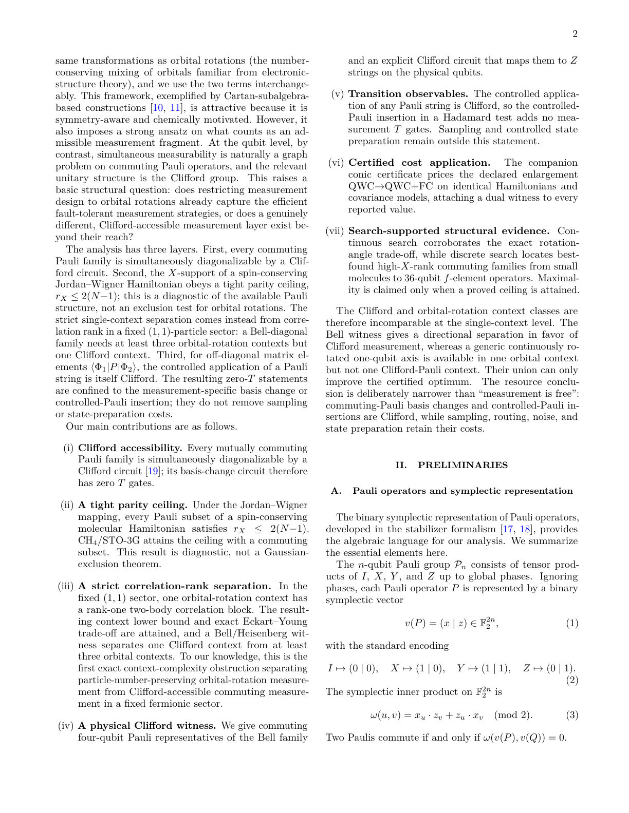
<figcaption class="paper-figure-caption"><b>Fig 1.</b> Low-resolution page preview, page 2</figcaption>
</figure>
<figure class="paper-figure-card">
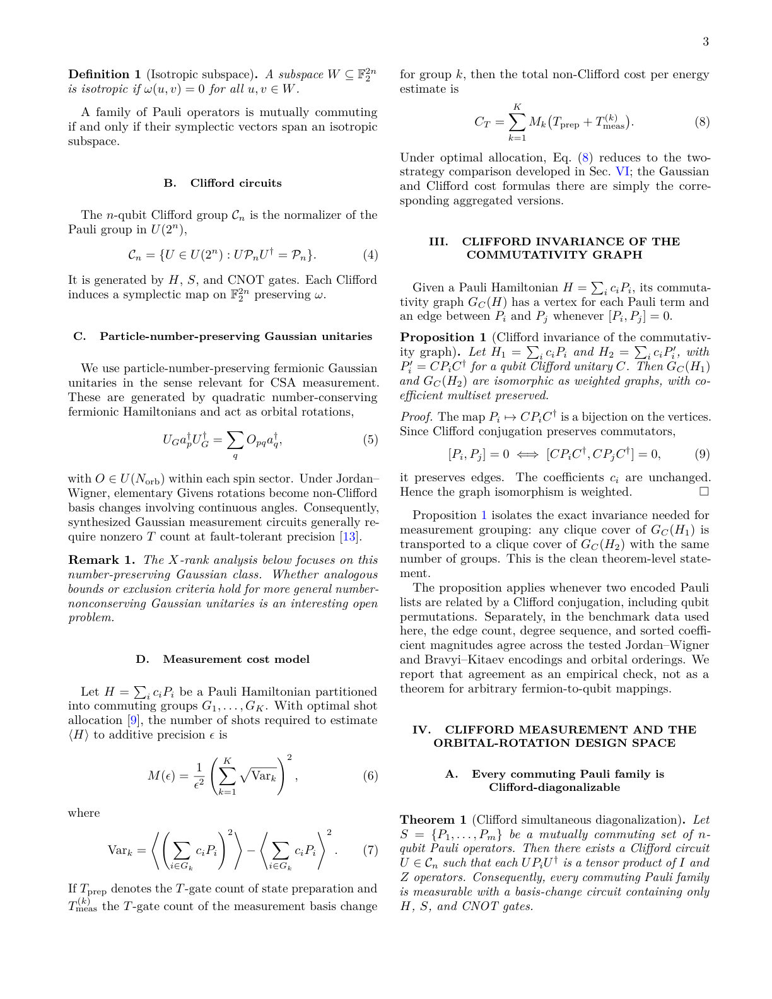
<figcaption class="paper-figure-caption"><b>Fig 2.</b> Low-resolution page preview, page 3</figcaption>
</figure>
<figure class="paper-figure-card">
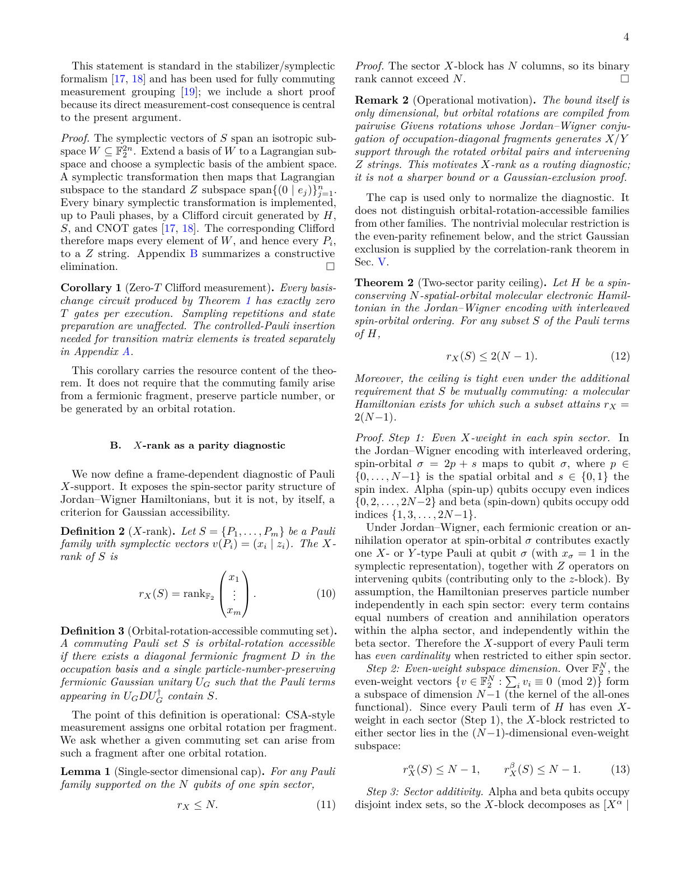
<figcaption class="paper-figure-caption"><b>Fig 3.</b> Low-resolution page preview, page 4</figcaption>
</figure>
<figure class="paper-figure-card">
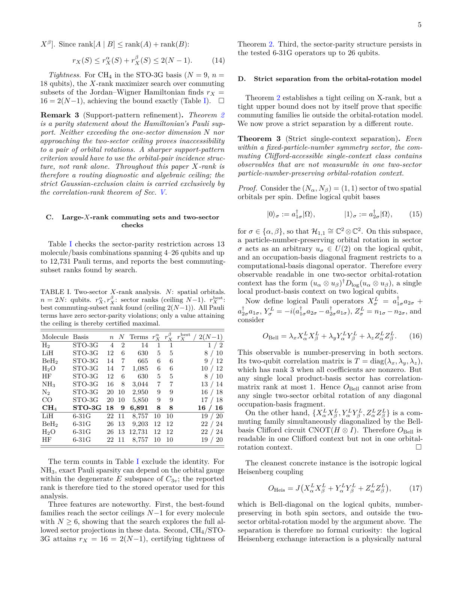
<figcaption class="paper-figure-caption"><b>Fig 4.</b> Low-resolution page preview, page 5</figcaption>
</figure>
<figure class="paper-figure-card">
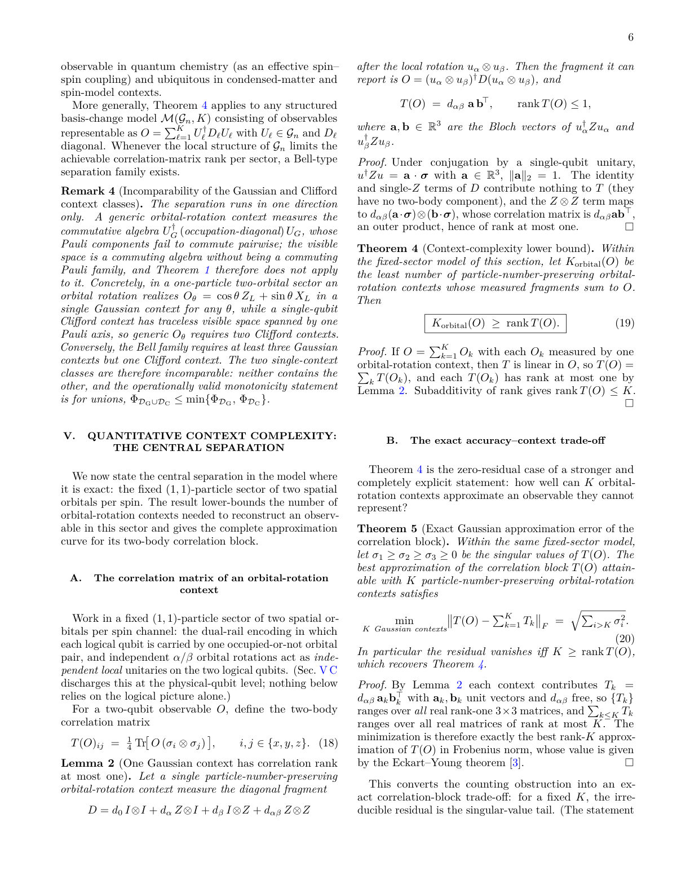
<figcaption class="paper-figure-caption"><b>Fig 5.</b> Low-resolution page preview, page 6</figcaption>
</figure>

**Summary.** This work rigorously compares two ways to measure quantum observables: physically motivated 'orbital rotations' versus those achievable with Clifford gates. Using algebraic bounds and optimization techniques on fermionic Hamiltonians, the authors prove that leveraging Clifford-accessible measurement contexts offers substantial resource savings (up to 70%) over purely orbital-rotation methods for large molecular systems.

**Why it may be interesting.** It provides a rigorous theoretical framework for determining the minimal quantum resources needed to simulate complex electronic structure problems, directly impacting the feasibility assessment of quantum chemistry algorithms.

Detailed structure

**Main problem.** The paper compares the measurement resource requirements for quantum observables, contrasting those achievable via physical 'orbital rotations' against those accessible using purely Clifford-circuit measurements.

**Main result.** Clifford-accessible measurement contexts provide a significant computational advantage, reducing the certified leading shot cost by 31–70% compared to orbital-rotation contexts when applied to large f-element Hamiltonians.

**Method.** The authors use algebraic proofs (correlation rank) and global optimization searches (RANGE) to establish rigorous lower bounds on measurement context complexity and compare resource costs.

**Model / system.** The analysis focuses on fermionic Hamiltonians mapped onto Pauli operators, specifically examining the fixed (1,1)-particle sector with two spatial orbitals per spin, often involving heavy-element systems like NdO or CeO.

**Key observables.** Correlation Rank, X-rank ($r_X$), and measurement shot cost $M(\epsilon)$ are key diagnostics used to quantify context complexity and resource requirements.

**Important parameters / regimes.** The parity ceiling $r_X \le 2(N-1)$ is a crucial theoretical bound derived for spin-conserving Hamiltonians; the reduction factor (31–70%) quantifies the practical advantage of Clifford circuits.

**Assumptions / limitations.** The resource conclusion is limited to basis changes and controlled-Pauli insertions being Clifford; sampling, state preparation, and noise costs are assumed to retain their full cost structure.

**Figures summary.** Tables summarize empirical results for various molecules (e.g., CH4) showing high X-rank values approaching theoretical ceilings, and another table compares the resource savings on f-element Hamiltonians when using Clifford vs. orbital rotation contexts.

**Paper structure.** The paper builds from algebraic proofs establishing context obstructions (correlation rank), to continuous optimization corroboration (RANGE), and culminates in applying these findings to estimate practical measurement costs for complex molecular/f-element systems, showing the superiority of Clifford methods.

Abstract

Algebra and RANGE global optimization play complementary, explicitly separated roles in identifying measurement structure beyond orbital rotations. In the fixed (1,1)-particle sector of two spatial orbitals per spin, algebra proves that one particle-number-preserving orbital-rotation context contributes a rank-one two-body correlation block $T$: an observable needs at least $\mathrm{rank}\,T$ such contexts, and its best $K$-context correlation-block approximation is exactly the Eckart-Young singular-value tail, attained by the truncated SVD. A continuous RANGE search over the physical rotation angles independently corroborates this exact trade-off. A Bell-diagonal, Heisenberg-type witness has correlation rank three: it needs at least three orbital-rotation contexts, while one explicit physical Clifford circuit measures its commuting Pauli representatives. For spin-conserving Jordan-Wigner molecular Hamiltonians we also prove the parity ceiling $r_X \le 2(N-1)$ for any Pauli subset, tight even within commuting subsets; $X$-rank is a routing diagnostic, and the strict separation is carried by the correlation-rank theorem. The discrete mode of RANGE locates high-$X$-rank commuting families across molecular and production f-element Hamiltonians, finding ceiling-saturating witnesses for CH4 and NdO; values are best found unless a proved ceiling is attained. Applying the companion certificate framework, enlarging product settings by fully commuting, Clifford-accessible settings reduces the certified leading shot cost by 31-70% on four 29-35-qubit f-element Hamiltonians, a QWC-versus-QWC+FC result rather than a Gaussian-versus-Clifford pricing. Controlled-Pauli insertions in Hadamard tests are Clifford; these zero-$T$ statements concern measurement circuitry only, while shot counts and state preparation retain their full costs.

[↑ back to top](#top)

### [Two-dimensional solitons in extended GPE models with Lee-Huang-Yang corrections](http://arxiv.org/abs/2607.16820v1)

**Authors:** G. N. Koutsokostas, F. Bristy, E. C. Psychogiou, G. A. Bougas, G. C. Katsimiga, S. I. Mistakidis, P. G. Kevrekidis, D. J. Frantzeskakis  
**Type:** theory · **Category:** quantum gases · **PDF:** <https://arxiv.org/pdf/2607.16820v1>  
**Analysis basis:** full PDF text, analyzed in chunks
**Topic relevance:** 🔥 `analog quantum simulation` **4/5** · `non-equilibrium dynamics` **2/5** · `Keldysh / 2PI / non-Gaussian methods` **1/5** · `correlated / nonlocal dissipation` **1/5** · `driven-dissipative phase transition` **1/5** · `methods for driven-dissipative` **1/5**

↔ Scroll figures horizontally

<figure class="paper-figure-card">
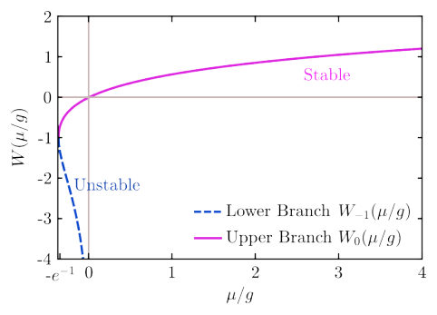
<figcaption class="paper-figure-caption"><b>Fig 1.</b> FIG. 1. The upper and lower branches of the Lambert W function (see legend) with respect to scaled chemical potential µ/g. The upper (lower) branch is associated to modulational stable (unstable) droplet background. The 2D solitons (see also Fig. 2) exist on the modulationally stable branch. The horizontal and vertical pink solid lines mark the W(µ/g) = 0 and µ = 0 cases respectively.</figcaption>
</figure>
<figure class="paper-figure-card">
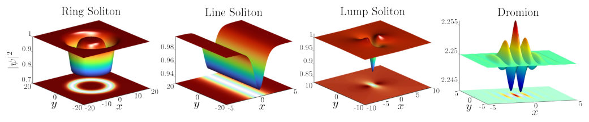
<figcaption class="paper-figure-caption"><b>Fig 2.</b> FIG. 2. Density contours and theoretical projections along the x-y plane corresponding to the different solitary wave solutions. The parameters for the ring-soliton are g = 1, ξ0 = 1, ϵ = 0.1, κ1 = 1, ρ0 = 1 in Eq. (36a); for the line soliton the parameters are g = 1, ξ0 = 0, ϵ = 0.1, κ1 = 1, κ2 = 0, ρ0 = 1 in Eq. (32a). For the lump soliton, we use g = 1, ϵ = 0.1, λ1 = 0, λ2 = 1, ρ0 = 1 in Eq. (33), and for the dromion the parameter values are g = 1, ϵ = 0.01, k = 1.2, ρ0 = 2.25, A = −0.22, c0 = −6.48, c1 = −1.35, c2 = −6.15, c3 = −28.64, c4 = 14.30 in Eq. (37).</figcaption>
</figure>
<figure class="paper-figure-card">
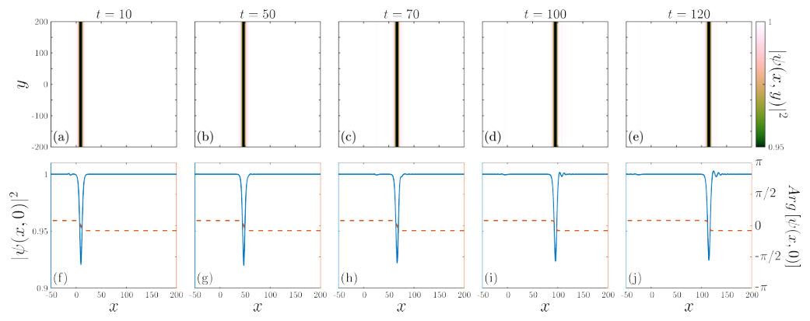
<figcaption class="paper-figure-caption"><b>Fig 3.</b> FIG. 3. Spatiotemporal density evolution of the 2D line soliton described by Eq. (32a) at selected time-instants (see legends). (a)-(e) 2D density profiles |Ψ(x, y)|2, and (f)-(j) the corresponding 1D density cross-sections along x at y = 0 (blue solid line and left axis) together with the associated wavefunction phase Arg[ψ(x, 0)] (dashed orange lines and right axis). The moving 2D line soliton propagates to the left, while emitting a relatively small amount of radiation. The characteristics of the initial line soliton at t = 0 are g = 1, ξ0 = 0, ϵ = 0.1, κ1 = 1.2, κ2 = 0, ρ0 = 1 respectively.</figcaption>
</figure>
<figure class="paper-figure-card">
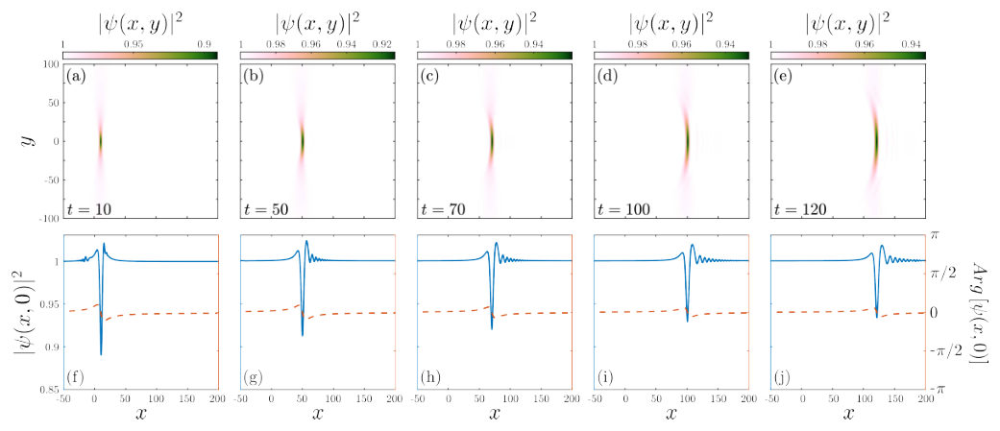
<figcaption class="paper-figure-caption"><b>Fig 4.</b> FIG. 4. (a)-(e) Density snapshots along the x-y plane and (f)-(j) their profiles across the x-direction at y = 0 of the 2D lump soliton [Eq. (33)] at different times (see legends) in the course of the evolution. The phase, Arg[ψ(x, 0)], of the underlying wavefunction is also depicted in the lower panels with dashed orange lines (with its axis lying on the right side of the graph). As can be seen, the 2D lump moves to the left becoming shallower and acquiring curvature at longer evolution times. Emission of radiation occurs simultaneously which is attributed to the approximate nature of the solution in the droplet background. The parameters of the initial lump configuration correspond to g =...</figcaption>
</figure>
<figure class="paper-figure-card">
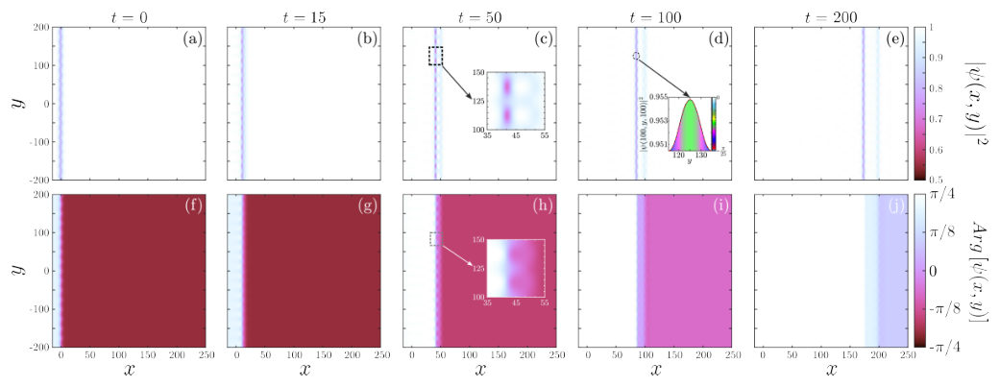
<figcaption class="paper-figure-caption"><b>Fig 5.</b> FIG. 5. (a)-(e) Density and (f)-(j) phase profiles of the 2D bent line soliton at different evolution times (see the individual panels). The gradual development of transverse destabilization manifests itself through the dissolvement of the line soliton into an array of lump solitons characterized by phase jumps much smaller than π. The insets in panels (c) and (h) show a magnification of the density and phase, respectively, of two selected lump solitons. The inset in panel (d) presents the density profile of a single lump soliton across x and at y = 0. The colormap mark the underlying phase of the structure. The parameters of the initial line soliton are the same as in Fig. 3, while the...</figcaption>
</figure>

**Summary.** The paper analyzes 2D solitons in quantum droplets governed by an extended Gross-Pitaevskii equation that includes Lee-Huang-Yang corrections. By using multiscale asymptotic methods, the complex dynamics are reduced to integrable models like KP and DS equations. The results provide approximate analytical solutions for various soliton shapes, confirming their potential observability in current ultracold atom experiments.

**Why it may be interesting.** This work directly addresses nonlinear wave phenomena in quantum matter systems relevant to ultracold atom experiments, bridging mean-field theory with quantum fluctuation corrections.

Detailed structure

**Main problem.** Investigating the existence and dynamics of two-dimensional solitary waves (solitons) within a quantum droplet environment.

**Main result.** The study constructs approximate analytical solutions for various soliton types (line, lump, ring, dromion), revealing unprecedented multidimensional solutions in models balancing mean-field and quantum fluctuations.

**Method.** Multiscale asymptotic methods are employed to reduce the extended Gross-Pitaevskii equation (eGPE) to effective integrable nonlinear models like KP and Davey-Stewartson equations.

**Model / system.** The system is modeled by a 2D eGPE incorporating logarithmic mean-field and Lee-Huang-Yang interactions, describing quantum droplets in an ultracold atom setting. The analysis focuses on excitations above the modulationally stable background state.

**Key observables.** Line solitons, algebraically localized lump solitons, ring solitons, and exponentially localized dromions embedded on the droplet background.

**Important parameters / regimes.** The competition between mean-field interactions and quantum fluctuations; operation in the modulationally stable regime ($\delta a \lesssim 0$).

**Assumptions / limitations.** The analysis relies on asymptotic expansions (small amplitude excitations $\epsilon \ll 1$) and assumes the background state is modulationally stable.

**Figures summary.** Figure 2 illustrates density contours for various soliton solutions, including ring, line, lump, and dromion examples.

**Paper structure.** The paper proceeds by introducing the 2D eGPE (Sec. II), analyzing modulational stability, reducing it to integrable models using multiscale analysis (Sec. III), constructing approximate solutions (Sec. IV), and concluding with a summary (Sec. V).

Abstract

We investigate the existence and dynamics of two-dimensional solitary waves in a quantum droplet environment described by the extended Gross-Pitaevskii equation featuring logarithmic mean-field and Lee-Huang-Yang interactions. In the modulationally stable regime of the background, we employ suitable multiscale asymptotic methods to derive effective nonlinear integrable models corresponding to the Kadomtsev-Petviashvili and Davey-Stewartson equations. Based on these reduced models, we construct approximate analytical solutions describing line solitons, algebraically localized lump solitons, ring solitons, and exponentially localized dromions embedded on the droplet background. The dynamical robustness of these solutions is monitored through numerical simulations. Line, lump and ring solitons stay closest to the theoretical predictions, although progressively deviate due to the emergence of small-amplitude radiation, while dromions depart from their analytical waveform the most, although they roughly maintain their shape. Our results unveil unprecedented multidimensional soliton solutions in models featuring the competition of mean-field and quantum fluctuations and as such are amenable to current ultracold atom experiments.

[↑ back to top](#top)

### [A projection-free approach toward mapping the structured polarization fields](http://arxiv.org/abs/2607.16672v1)

**Authors:** Sandeep Singh, G. K. Samanta  
**Type:** experiment · **Category:** other · **PDF:** <https://arxiv.org/pdf/2607.16672v1>  
**Analysis basis:** full PDF text, analyzed in chunks
**Topic relevance:** 🔥 `quantum optics experiment` **4/5** · `interference shaping light` **3/5** · `QC/QI experiment` **1/5** · `quantum measurements` **1/5**

↔ Scroll figures horizontally

<figure class="paper-figure-card">
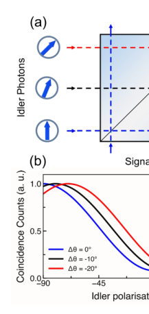
<figcaption class="paper-figure-caption"><b>Fig 1.</b> Figure 1: (a) Pictorial representation of change in coincidence counts with the relative change of polarization angle between signal and idler photons. (b) Variation of coinci- dence counts as a function of polarization rotation of the idler for different polarization angles of the signal from the vertical axis. The optical delay between the photons is zero. The vertical dotted lines represent vertical polarization of signal photons.</figcaption>
</figure>
<figure class="paper-figure-card">
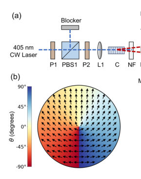
<figcaption class="paper-figure-caption"><b>Fig 2.</b> Figure 2: (a) Optical layout of the experimental setup. P1-3: half-wave plates; PBS: po- larizing beam splitter cube; L1-2: plano-convex lenses, PPKTP: periodically poled KTP crystal; NF: Notch filter; PM: prism mirror, M1-i 3: dielectric mirrors, V: vector-vortex plate, Q: quarter wave plate, BS: 50:50 beam splitter cube, F1-2: interference filter; C1-2: fiber couplers, SMF1-2: single-mode fiber, SPCM1-2: single-photon counting modules; TDC: time to digital converter, (b) Spatial distribution of fast axis orienta- tion of a zero-order vortex half-wave plate of m=1 (V) over its circular aperture.</figcaption>
</figure>
<figure class="paper-figure-card">
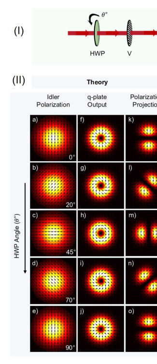
<figcaption class="paper-figure-caption"><b>Fig 3.</b> Figure 3: (I) working principle used for classical polarization projection. HWP: Half- wave plate, V: vortex waveplate, A: Analyzer. (II)) Evolution of a linearly polar- ized Gaussian beam through a first-order q-plate and its polarization projections. Left panel (Theory): (a–e) Input idler polarization states for half-wave plate angles θ = 0◦, 20◦, 45◦, 70◦, 90◦. (f–j) Corresponding q-plate output showing transverse inten- sity and polarization distribution. (k–o) Simulated intensity after vertical polarization projection. Black arrows denote local polarization orientations. Right panel (Exper- iment): (p–t) Measured intensity distribution of the idler photons after propagation through the...</figcaption>
</figure>
<figure class="paper-figure-card">
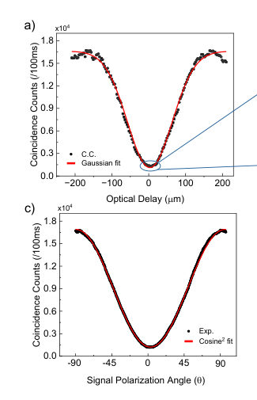
<figcaption class="paper-figure-caption"><b>Fig 4.</b> Figure 4: (a) Coincidence counts as a function of the relative optical delay between a pair of photons with identical polarization states, showing the characteristic HOM interference dip. (b) Magnified view of the HOM dip near zero relative optical delay. (c) Coincidence counts as a function of the signal-photon polarization angle for a fixed horizontal polarization of the idler photon, with the relative optical delay maintained at zero. (d) Enlarged view of the linear region of the polarization-dependent HOM curve, illustrating the polarization sensitivity and resolution of the measurement. The solid red lines represent fits to the experimental data.</figcaption>
</figure>
<figure class="paper-figure-card">
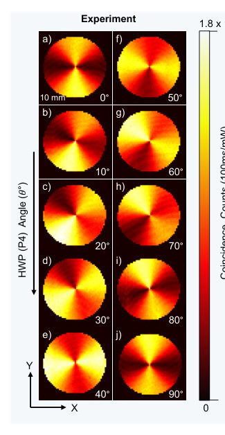
<figcaption class="paper-figure-caption"><b>Fig 5.</b> Figure 5: (a–j) Experimental and (k–t) theoretical reconstructed HOM coincidence- count distributions representing the transverse polarization distribution of the vortex waveplate for different angles of HWP (P4) on the signal-photons.</figcaption>
</figure>

**Summary.** This paper introduces a novel, high-precision technique for mapping polarization fields by utilizing Hong-Ou-Mandel (HOM) interference with entangled photon pairs. By measuring coincidence counts instead of performing multiple intensity projections, the method overcomes systematic errors inherent in traditional polarimetry. This provides a simple and scalable quantum-optical tool for characterizing structured birefringence.

**Why it may be interesting.** This work is highly relevant to open quantum systems and quantum optics, as it uses fundamental quantum interference phenomena (HOM) to perform complex characterization tasks in a non-destructive, projection-free manner.

Detailed structure

**Main problem.** The primary goal is to develop a projection-free method for accurately mapping two-dimensional polarization distributions within structured materials.

**Main result.** The authors successfully demonstrated that the coincidence counts from Hong-Ou-Mandel (HOM) interference can directly reconstruct the spatial polarization pattern with high fidelity ($\sim$95%).

**Method.** They exploit the sensitivity of two-photon bunching to polarization indistinguishability at a balanced beam splitter, bypassing conventional projection measurements.

**Model / system.** The experiment uses HOM interferometry driven by a spontaneous parametric down-conversion (SPDC) photon-pair source. The system involves analyzing coincidence counts ($P_c$) as a function of the sample's polarization transformation.

**Key observables.** Coincidence counts ($N_c$), which are mapped to the local polarization orientation ($	heta$) and fast-axis orientation map ($\phi$).

**Important parameters / regimes.** High coincidence-to-accidental ratio (CAR), angular resolution ($\sim 0.4^\circ$), and interference visibility ($\alpha$).

**Assumptions / limitations.** The method assumes the use of high-brightness sources for rapid acquisition, and theoretical derivations rely on approximations like narrow-bandpass Gaussian filters.

**Figures summary.** Figures illustrate how coincidence counts change with polarization angle relative to the signal photon's initial polarization, showing characteristic dips/peaks used for reconstruction.

**Paper structure.** The paper progresses from identifying the limitations of conventional polarimetry (Stokes) to introducing the quantum-optical HOM technique. It details the theoretical dependence of $P_c$ on polarization indistinguishability and concludes with experimental demonstration of mapping structured fields.

Abstract

We present a projection-free method for mapping two-dimensional polarization distributions using Hong-Ou -Mandel (HOM) interference. Conventional polarization characterization techniques, such as Stokes polarimetry, rely on sequential intensity measurements under multiple polarization projections, making their accuracy and sensitivity susceptible to the extinction ratio, calibration errors, and stability of the polarization analysis optics. Our approach overcomes these limitations by exploiting the sensitivity of two-photon bunching to polarization indistinguishability at a balanced beam splitter. Using a HOM interferometer driven by a high-brightness spontaneous parametric down-conversion photon-pair source at 810 nm, we introduced a birefringent vortex waveplate with spatially varying polarization rotations in one interferometer arm and measured the resulting coincidence counts with a high signal-to-noise ratio, enabling projection-free characterization of the sample-induced polarization transformations. This configuration maps spatially dependent polarization variations directly onto coincidence counts, providing a projection-free reconstruction of the polarization distribution. We demonstrate high-fidelity ($\sim$95$\%$) reconstruction of the spatial polarization pattern with an angular resolution of approximately $\sim0.4^\circ$. The use an estimator that saturates the Cramer-Rao bound, computed from the Fisher information, can improve resolution further at the cost of longer acquisition. The proposed quantum-optical technique offers a simple, scalable, and high-precision framework for characterizing structured polarization fields in birefringent materials.

[↑ back to top](#top)

### [Attosecond delay metrology beyond the photon coherence time with spectrally resolved Hong-Ou-Mandel interferometry](http://arxiv.org/abs/2607.16849v1)

**Authors:** Yingwen Zhang, Kyle Jordan, Duncan England, Vincenzo Tamma, Ebrahim Karimi, Benjamin Sussman  
**Type:** experiment · **Category:** other · **PDF:** <https://arxiv.org/pdf/2607.16849v1>  
**Analysis basis:** full PDF text, analyzed in chunks
**Topic relevance:** 🔥 `quantum optics experiment` **4/5** · `interference shaping light` **3/5** · `QC/QI experiment` **1/5** · `quantum measurements` **1/5**

↔ Scroll figures horizontally

<figure class="paper-figure-card">
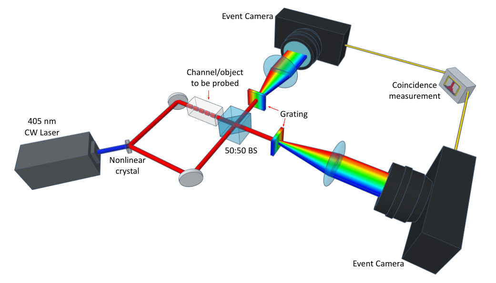
<figcaption class="paper-figure-caption"><b>Fig 1.</b> FIG. 1. Conceptual setup for spectrally resolved HOM interferometry. Broadband spectrally entangled photon pairs are generated in a nonlinear crystal pumped by a 405 nm CW laser. One photon propagates through a channel or object that introduces an optical path delay to be monitored or measured. The two photons are then recombined at a 50:50 beamsplitter (BS), where they undergo HOM interference. The output photons are directed to custom spectrometers based on time-tagging event cameras. In each spectrometer, the photons are spectrally dispersed by a diffraction grating and imaged onto the camera. SPDC photon pairs are identified through coincidence analysis using their detection times on...</figcaption>
</figure>
<figure class="paper-figure-card">
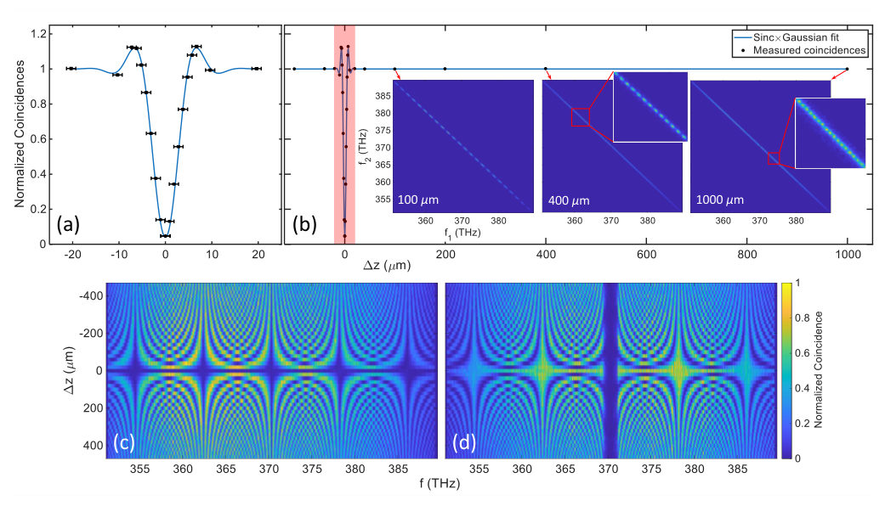
<figcaption class="paper-figure-caption"><b>Fig 2.</b> FIG. 2. JSI of photon pairs exiting the HOM interferometer. (a) Spectrally unresolved HOM interference dip measured without the use of spectral filters through avalanche photon diode detectors giving a HOM interference visibility V = 0.92. Horizontal error bar indicates the quoted actuator accuracy used to adjust the path delay. Blue line is the fitted function 1 −α sinc(β∆z) exp(−∆z2/γ), giving a 5.7 µm FWHM of the dip. (b) HOM dip measured over a much longer range with the highlighted red region showing the range displayed in (a). Inset shows the measured JSI at ∆z = 100 µm, 400 µm and 1000 µm. (c, d) Cross-sections of the measured JSI projected onto f1 plotted as a function of path delay...</figcaption>
</figure>
<figure class="paper-figure-card">
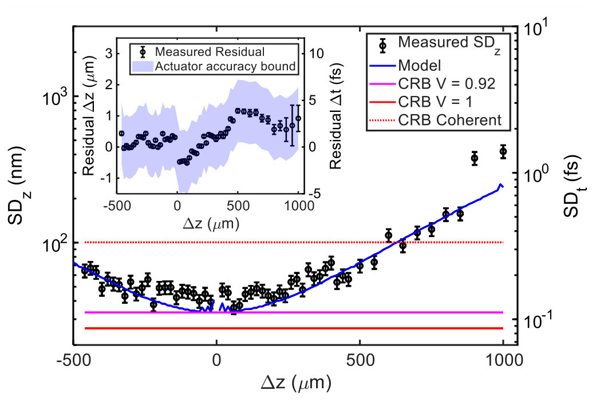
<figcaption class="paper-figure-caption"><b>Fig 3.</b> FIG. 3. Measurement precision of spectrally resolved HOM interferometry. Standard deviation of the estimated delay as a function of interferometer path difference ∆z, obtained from Nc = 104 detected photon pairs with 50 repeated measurements at each delay. The left axis shows the displacement precision SDz while the right axis shows the corresponding temporal precision SDt = SDz/c. Error bars represent the statistical uncertainty in the measured standard deviation due to the finite number of repeats. The purple line indicates the Cram´er–Rao bound (CRB) calculated using the highest experimentally measured effective visibility V = 0.92 at ∆z = 0 with avalanche photo-diode detectors, the red...</figcaption>
</figure>
<figure class="paper-figure-card">

<figcaption class="paper-figure-caption"><b>Fig 4.</b> FIG. 4. Thickness measurement of a BBO crystal. Measured thickness d of a BBO crystal (left axis) and the corresponding interferometer path difference ∆z (right axis) as a function of the rotation angle θ. Error bars are obtained from 60 repeated measurements using 2.5 × 104 detected photons pair per measurement. The dashed blue curve shows a fit to the data using Eq. (9), yielding a zero-angle thickness of d0 = 309716 ± 30 nm. The blue shaded region indicates the manufacturer-specified surface flatness tolerance of the crystal (λ/8 at 633 nm). The schematic on the right illustrates the geometry used to relate the measured optical delay to the crystal thickness.</figcaption>
</figure>
<figure class="paper-figure-card">
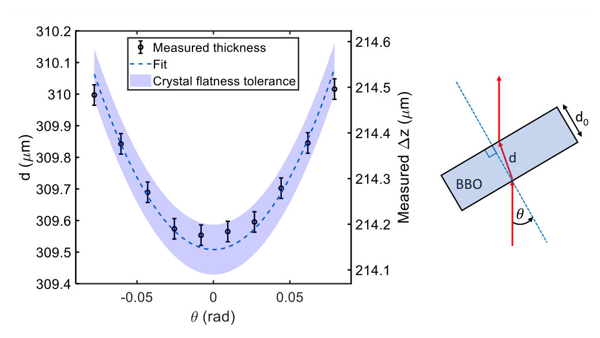
<figcaption class="paper-figure-caption"><b>Fig 5.</b> Figure 4 shows the measured crystal thickness d as a function of the crystal rotation angle θ relative to the beam axis. Each data point is obtained from 60 repeated measurements using 2.5 × 104 detected photon pairs. Fitting Eq. (9) to the measured delay using nA = 1.00028, the refractive index of air at 810 nm, and nB = 1.6919, the ordinary refractive index of BBO at 810 nm, yields a zero-angle thickness of d0 = 309716 ± 30 nm. Here we use the refractive indices evaluated at the degenerate photon wavelength because HOM interference is inherently insensitive to spectral dispersion, so the measured delay depends only on the group delay at the central wavelength [9–11]. The slight deviations...</figcaption>
</figure>

**Summary.** The authors present a method to perform high-precision path-delay measurements using spectrally resolved Hong-Ou-Mandel interferometry. By analyzing the periodicity of spectral interference fringes, they overcome the limitation imposed by photon coherence time, achieving attosecond precision over vastly extended ranges. This technique is robust and demonstrated its utility in real-world nanometer-scale sensing applications.

**Why it may be interesting.** This work represents a significant advancement in quantum metrology by extending the operational regime of an established quantum optical technique (HOM interferometry) far beyond its fundamental coherence limit using spectral domain analysis.

Detailed structure

**Main problem.** The primary challenge addressed is overcoming the conventional dynamic range limitation of Hong-Ou-Mandel (HOM) interferometry for path-delay sensing, which is traditionally restricted by the coherence time of the interfering photons.

**Main result.** By analyzing the periodicity of spectral interference fringes rather than just the dip depth, the method achieves near-optimal sensitivity over ranges exceeding the photon coherence time by over two orders of magnitude.

**Method.** Delay information is extracted from the Fast Fourier Transform (FFT) applied to the spectral interference fringes generated by spectrally entangled photon pairs. This approach is robust because it relies on fringe periodicity rather than absolute coincidence rates.

**Model / system.** The experiment uses a Hong-Ou-Mandel interferometer setup employing spectrally entangled photon pairs generated via Spontaneous Parametric Down-Conversion (SPDC). The measurement utilizes custom two-photon spectrometers based on time-tagging event cameras to resolve the spectral correlations.

**Key observables.** Spectral interference fringe periodicity, measured path delay ($\Delta t$ or $\Delta z$), and measurement precision ($	ext{SD}t$ or $	ext{SD}_z$).

**Important parameters / regimes.** Attosecond time-delay precision (20 as); operational range exceeding coherence time by $>10^2$; spectral resolution ($\xi$) and photon bandwidth ($4\sigma^2$).

**Assumptions / limitations.** The analysis involves modeling the measurement using approximations for the large-delay regime, where sensitivity is governed by the periodicity of the joint spectral amplitude fringes.

**Figures summary.** Figures illustrate the conceptual setup (Figure 1), show spectral interference fringes persisting at large delays (Figure 2), plot achieved precision against theoretical limits (CRB) over extended ranges (Figure 3), and demonstrate practical thickness measurements using path delay tracking (Figure 4).

**Paper structure.** The paper progresses from establishing the limitation of standard HOM sensing to introducing spectral resolution as a solution. It details the theoretical framework based on joint spectral amplitudes, presents experimental results showing enhanced range and precision, and concludes with practical demonstrations like thickness measurement.

Abstract

Hong-Ou-Mandel (HOM) interferometry enables delay estimation at the quantum precision limit but is traditionally constrained to path differences within the coherence time of the interfering photons. Here, we demonstrate single-measurement path-delay sensing at the measurement Cramer-Rao bound using spectrally resolved HOM interference, thereby removing the conventional dynamic-range limitation imposed by the photon coherence window, with no scanning required for calibration. By extracting delay information from the spectral interference fringes of spectrally entangled photon pairs, we retain near-optimal sensitivity over an operational range exceeding the photon coherence time by over two orders of magnitude. Using one million detected photon pairs, we achieve a time-delay precision of 20 attosecond (6 nm), while real-time operation (at 1 Hz) yields 330 attosecond (100 nm) precision. Because the estimator relies on fringe periodicity rather than absolute coincidence rates, the method is intrinsically robust to photon losses and variations in interference visibility, eliminating the need for recalibration. As a practical demonstration, we measure the thickness of a 300 um transmissive target with nanometer-scale precision. These results mark a significant step towards deploying quantum-limited measurements in real-world sensing applications using HOM interferometry.

[↑ back to top](#top)

### [Tuning superconducting pairing symmetry via a staggered potential in the doped honeycomb Hubbard model](http://arxiv.org/abs/2607.16663v1)

**Authors:** Yanmei Cai, Yicheng Xiong, Ying Liang, Tianxing Ma  
**Type:** theory · **Category:** strongly correlated electrons · **PDF:** <https://arxiv.org/pdf/2607.16663v1>  
**Analysis basis:** full PDF text, analyzed in chunks
**Topic relevance:** 🔥 `analog quantum simulation` **4/5** · `methods for driven-dissipative` **3/5** · `Keldysh / 2PI / non-Gaussian methods` **1/5** · `driven-dissipative phase transition` **1/5**

↔ Scroll figures horizontally

<figure class="paper-figure-card">
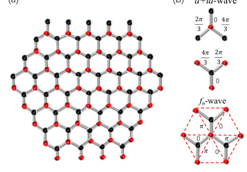
<figcaption class="paper-figure-caption"><b>Fig 1.</b> FIG. 1: (a) Sketch of graphene with double-48 sites; (b) Phases of the d +id-wave and fn-wave pairing symmetries on the honeycomb lattice.</figcaption>
</figure>
<figure class="paper-figure-card">
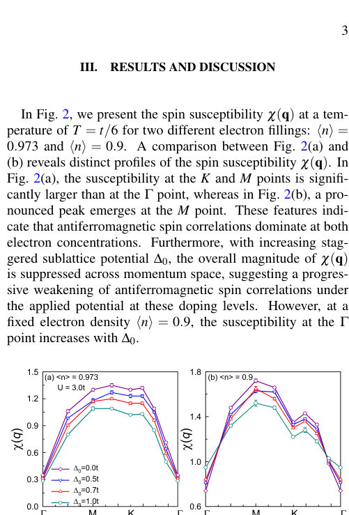
<figcaption class="paper-figure-caption"><b>Fig 2.</b> FIG. 2: The spin susceptibility χ(q) in q space for different stag- gered sublattice potential for (a) ⟨n⟩= 0.973; (b) ⟨n⟩= 0.9 with T = t/6 on a double-48 lattice.</figcaption>
</figure>
<figure class="paper-figure-card">
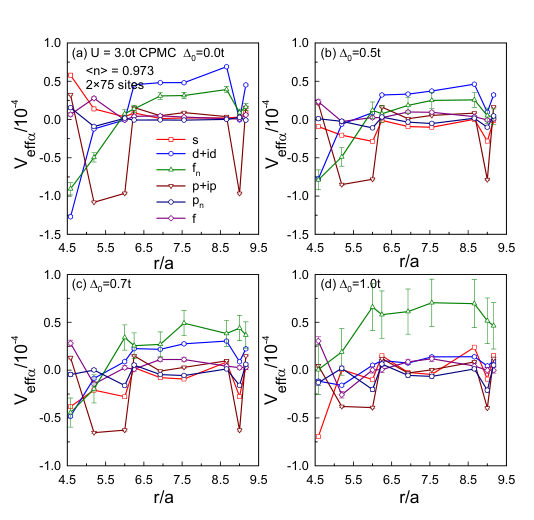
<figcaption class="paper-figure-caption"><b>Fig 3.</b> FIG. 4: Vertex contributions as a function of the normalized distance r/a for different pairing symmetries obtained by CPMC on a double- 75 lattice at filling ⟨n⟩= 0.973. Panels (a)–(d) correspond to different values of the staggered sublattice potential: (a) ∆0 = 0.0t; (b) ∆0 = 0.5t; (c) ∆0 = 0.7t; (d) ∆0 = 1.0t. Here a denotes the lattice constant.</figcaption>
</figure>
<figure class="paper-figure-card">
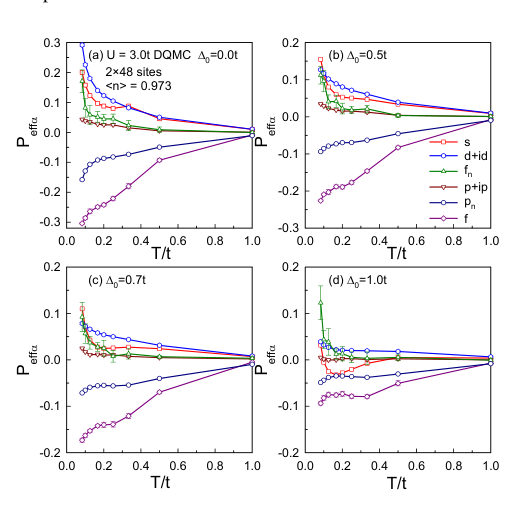
<figcaption class="paper-figure-caption"><b>Fig 4.</b> FIG. 3: Temperature dependence of the effective pairing suscep- tibilities for different pairing symmetries obtained by DQMC on a double-48 lattice at filling ⟨n⟩= 0.973, under various staggered sub- lattice potentials: (a) ∆0 = 0.0t; (b) ∆0 = 0.5t; (c) ∆0 = 0.7t; (d) ∆0 = 1.0t.</figcaption>
</figure>
<figure class="paper-figure-card">
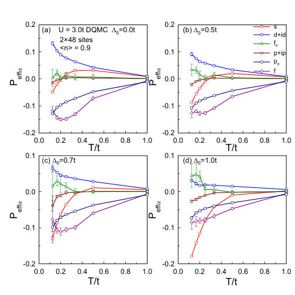
<figcaption class="paper-figure-caption"><b>Fig 5.</b> FIG. 5: Temperature dependence of the effective pairing suscep- tibilities for different pairing symmetries obtained by DQMC on a double-48 lattice at filling ⟨n⟩= 0.9, under various staggered sub- lattice potentials: (a) ∆0 = 0.0t; (b) ∆0 = 0.5t; (c) ∆0 = 0.7t; (d) ∆0 = 1.0t.</figcaption>
</figure>

**Summary.** This work investigates how a tunable staggered sublattice potential ($\Delta_0$) controls the superconducting pairing symmetry in the doped honeycomb Hubbard model. Using advanced Quantum Monte Carlo simulations, the authors demonstrate that $\Delta_0$ can drive a transition from $d+id$-wave to $f_n$-wave pairing at low doping. This provides a powerful theoretical blueprint for engineering unconventional superconductors without altering the material's chemical composition.

**Why it may be interesting.** The ability to tune superconducting pairing symmetries using an artificial potential (band engineering) is highly relevant for designing novel quantum materials and understanding exotic superconductivity mechanisms.

Detailed structure

**Main problem.** The study addresses the challenge of controlling superconducting pairing symmetry in unconventional superconductors using tunable parameters beyond simple chemical doping.

**Main result.** Applying a staggered sublattice potential ($\Delta_0$) can induce a phase transition, switching the dominant superconducting pairing symmetry from $d+id$-wave to $f_n$-wave at low doping levels. This establishes $\Delta_0$ as a practical band-engineering tool for material design.

**Method.** The research employs advanced quantum Monte Carlo techniques (DQMC and CPMC) alongside Cluster Mean-Field Theory calculations to probe pairing correlations in the Hubbard model.

**Model / system.** The system modeled is the doped honeycomb Hubbard model, whose Hamiltonian includes hopping ($t$), on-site interactions ($U$), chemical potential ($\mu$), and a tunable staggered sublattice potential ($\Delta_0$).

**Key observables.** Pairing correlation functions (for $d+id$-wave and $f_n$-wave), spin susceptibilities ($\chi(q)$), and effective pairing susceptibilities ($	ext{P}_{	ext{eff}}$).

**Important parameters / regimes.** Staggered potential ($\Delta_0$), doping level ($\langle n 
angle$), and on-site interaction strength ($U$).

**Assumptions / limitations.** The calculations rely on sophisticated numerical methods like DQMC/CPMC, and while comparisons with ED benchmarks are made, finite-size effects remain a consideration.

**Figures summary.** Figures illustrate the phase diagrams showing symmetry transitions (e.g., $d+id$ to $f_n$) as $\Delta_0$ is varied at fixed doping, and show how pairing vertices depend on both $\Delta_0$ and $U$.

**Paper structure.** The paper systematically analyzes the effect of varying $\Delta_0$ across different doping regimes using multiple QMC methods. It first establishes the role of $\Delta_0$ in suppressing magnetic fluctuations, then details the symmetry transition at low doping, contrasts this with high-doping behavior, and finally confirms the correlation dependence via $U$.

Abstract

The ability to control superconducting pairing symmetry is crucial for designing unconventional and topological superconductors, yet practical tuning parameters beyond chemical doping remain limited. In this study, we investigate the effect of a tunable sublattice staggered potential on the pairing symmetry in the doped honeycomb Hubbard model. Determinant quantum Monte Carlo at finite temperature and constrained-path quantum Monte Carlo at zero temperature are employed to compute spin susceptibilities and pairing correlations in different channels. We find that increasing the staggered potential suppresses antiferromagnetic fluctuations and, at low doping, induces a transition in the dominant pairing tendency from $d+id$-wave to $f_n$-wave, with consistent results from both quantum Monte Carlo methods. In contrast, at higher doping levels, the system remains dominated by $d+id$-wave pairing even under an enhanced staggered potential. Moreover, strengthening the on-site interaction $U$ enhances the dominant pairing channel, underscoring the essential role of electronic correlations. Our results establish the staggered potential as a practical band-engineering tool for selecting unconventional pairing symmetries without varying the doping concentration, providing inspiration for designing graphene-based artificial superconductors and related doped band insulators such as Li${}_x$MNCl.

[↑ back to top](#top)

### [Uncountably many inequivalent maximally entangled measurements for two qutrits](http://arxiv.org/abs/2607.16396v1)

**Authors:** Elna Svegborn, Jef Pauwels, Nicolas Gisin, Alejandro Pozas-Kerstjens  
**Type:** theory · **Category:** quantum information and computing · **PDF:** <https://arxiv.org/pdf/2607.16396v1>  
**Analysis basis:** full PDF text, analyzed in chunks
**Topic relevance:** 🔥 `entanglement & information structure` **4/5** · `quantum measurements` **3/5** · `measurement-induced transitions` **2/5**

↔ Scroll figures horizontally

<figure class="paper-figure-card">
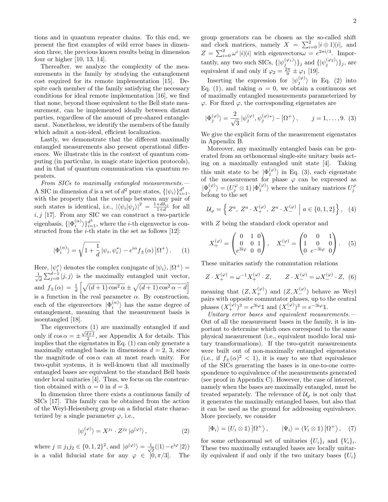
<figcaption class="paper-figure-caption"><b>Fig 1.</b> Low-resolution page preview, page 2</figcaption>
</figure>
<figure class="paper-figure-card">
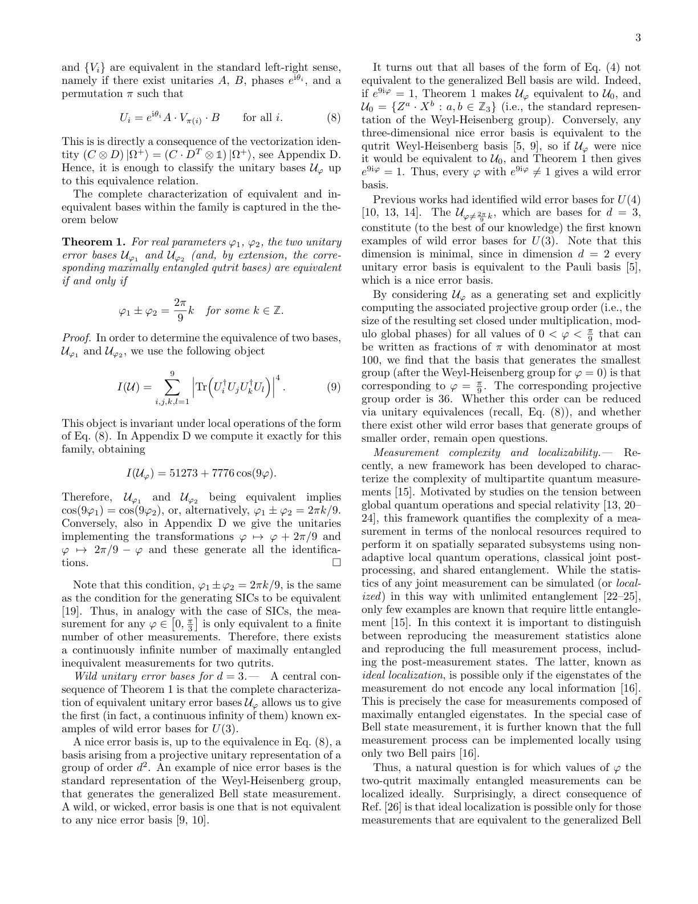
<figcaption class="paper-figure-caption"><b>Fig 2.</b> Low-resolution page preview, page 3</figcaption>
</figure>
<figure class="paper-figure-card">
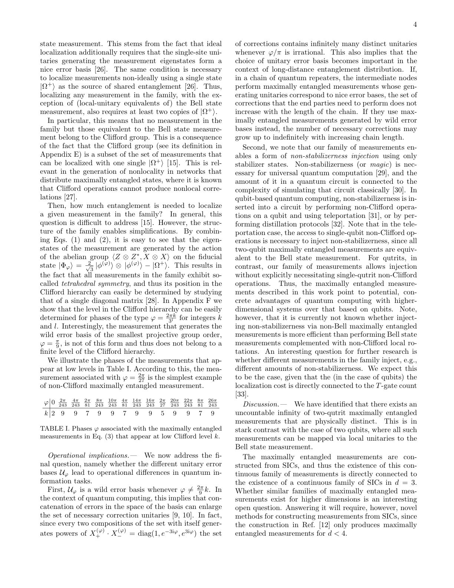
<figcaption class="paper-figure-caption"><b>Fig 3.</b> Low-resolution page preview, page 4</figcaption>
</figure>
<figure class="paper-figure-card">
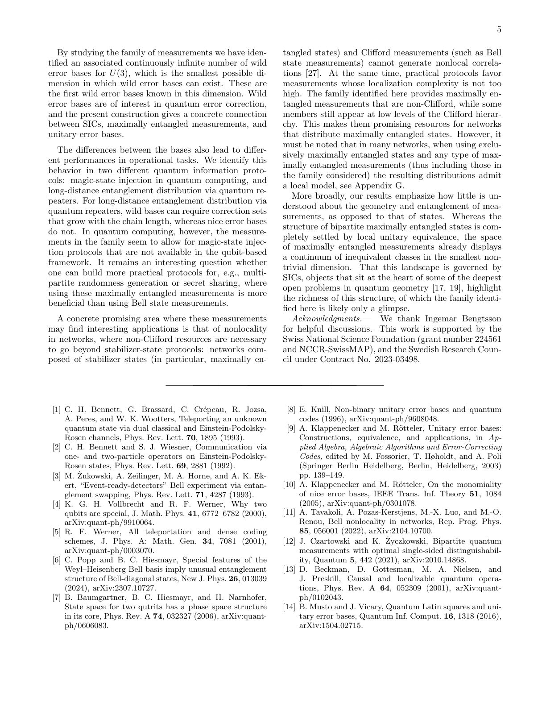
<figcaption class="paper-figure-caption"><b>Fig 4.</b> Low-resolution page preview, page 5</figcaption>
</figure>
<figure class="paper-figure-card">
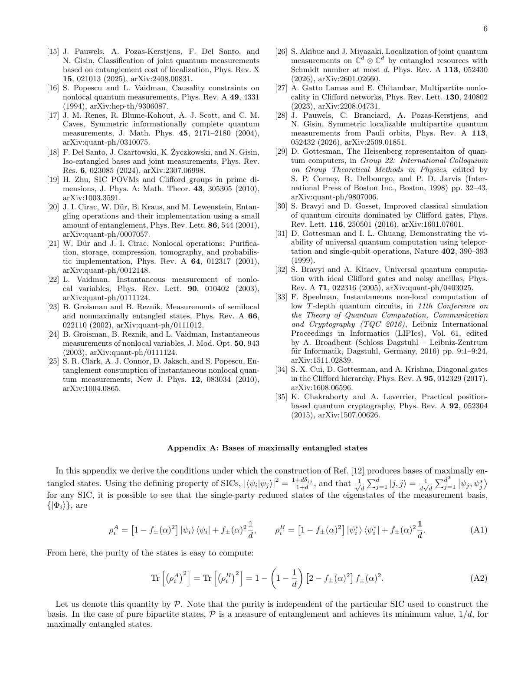
<figcaption class="paper-figure-caption"><b>Fig 5.</b> Low-resolution page preview, page 6</figcaption>
</figure>

**Summary.** This theoretical work characterizes maximally entangled measurements on two qutrits, demonstrating the existence of an uncountably infinite set of inequivalent bases. The authors use advanced techniques involving SIC sets and polynomial analysis to prove this non-uniqueness, showing that these distinct measurements have measurable operational differences in quantum information tasks.

**Why it may be interesting.** The findings provide a deep structural understanding of entanglement measurement limitations in higher dimensions, revealing complex non-equivalent structures that have direct implications for quantum communication protocols like quantum repeaters.

Detailed structure

**Main problem.** The paper investigates maximally entangled measurement bases for two qutrits ($d=3$), contrasting them with the unique case of qubits, to determine when these bases are equivalent under local unitary transformations.

**Main result.** It proves that there exists an uncountably infinite number of inequivalent maximally entangled measurement bases for two qutrits, which is a significant departure from the qubit case. These distinct measurements also exhibit operational differences in quantum information protocols.

**Method.** Equivalence is tested using an invariant object $I(U)$ derived from the generating unitaries, and complexity is analyzed by mapping the structure onto both the Vaidman and Clifford hierarchies via phase polynomials.

**Model / system.** The system involves bipartite quantum measurements on two qutrits. The measurement bases are constructed from a continuous family of Symmetric Informationally Complete (SIC) sets of states in dimension three.

**Key observables.** The parameter $\varphi$ characterizing the basis, the invariant $I(U)$, and the resulting Clifford level ($k$) or Vaidman level ($V_k$).

**Important parameters / regimes.** The dimension $d=3$, the continuous phase parameter $\varphi$, and integer indices related to unitary transformations.

**Assumptions / limitations.** The analysis focuses specifically on maximally entangled measurements, requiring separate treatment from non-maximally entangled cases. The Vaidman hierarchy analysis is computationally limited to low levels.

**Figures summary.** Figure 1 illustrates the relationship between SIC sets, measurement bases, and generating unitaries; Table I lists phases associated with low Clifford levels; Table II summarizes Vaidman levels for various $\varphi$; and Table III summarizes results based on polynomial degree $m$ and level $k$.

**Paper structure.** The paper systematically establishes the continuous family of inequivalent bases using SIC sets, derives the mathematical condition for equivalence ($\cos(9\varphi_1) = \cos(9\varphi_2)$), and then analyzes the complexity of these measurements by mapping them onto both the Vaidman and Clifford hierarchies using phase polynomials.

Abstract

Every two-qubit measurement basis composed of maximally entangled eigenstates can be transformed into the Bell basis via local unitary operations. For higher dimensions, in contrast, there exist inequivalent bases composed of maximally entangled eigenstates. Here, we provide a single-parameter family of two-qutrit maximally entangled measurement bases, and demonstrate that none of the bases are equivalent to each other under local unitaries. These bases are constructed from the continuous family of symmetric informationally complete sets of states in dimension three. By studying the local unitary bases that generate the family of two-qutrit maximally entangled measurement bases, we construct the first examples of wild error bases in the smallest dimension where these can exist. Finally, we discuss how distinct measurements in the family lead to differences in performance in several scenarios relevant in quantum information.

[↑ back to top](#top)

### [Scanless quantum Fourier-transform mid-infrared spectroscopy for rapid high-sensitivity hyperspectral mapping](http://arxiv.org/abs/2607.17964v1)

**Authors:** Paul Gattinger, Bettina Heise, Andreas W. Schell, Kristina Duswald, Markus Brandstetter, Ivan Zorin  
**Type:** both · **Category:** other · **PDF:** <https://arxiv.org/pdf/2607.17964v1>  
**Analysis basis:** full PDF text, analyzed in chunks
**Topic relevance:** 🔥 `quantum optics experiment` **4/5** · `interference shaping light` **3/5** · `quantum measurements` **1/5**

↔ Scroll figures horizontally

<figure class="paper-figure-card">
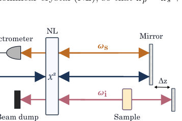
<figcaption class="paper-figure-caption"><b>Fig 1.</b> Figure 1: Linear schematic of sQFTIR spectroscopy. Pump photons ωp are converted (with a low probability) to broad- band entangled signal, ωs and idler, ωi photons in the forward or backward path through a nonlinear crystal (NL). Due to the indistinguishability of the photon paths, interference be- tween ωs photons generated in forward and backward prop- agation can be observed at the spectrometer. This spectral interference pattern is defined by the path difference ∆z. A sample inserted in the ωi path disturbs the interference pat- tern (phase shift or loss of interference, i.e. absorption)</figcaption>
</figure>
<figure class="paper-figure-card">
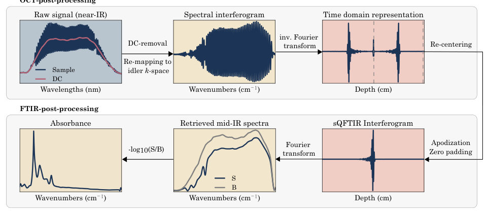
<figcaption class="paper-figure-caption"><b>Fig 2.</b> Figure 2: Processing steps of sQFTIR spectroscopy. A raw spectral interferogram is DC corrected, remapped to k-space; an inverse Fourier transform is then applied (OCT post-processing). The coherence burst of a single reflector (i.e., the sample) is isolated, centered, apodized, zero-padded and Fourier transformed. The demodulated sample and background spectra are further processed according to standard IR spectroscopy protocols in order to receive absorbance spectra.</figcaption>
</figure>
<figure class="paper-figure-card">
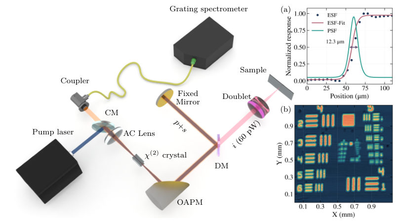
<figcaption class="paper-figure-caption"><b>Fig 3.</b> Figure 3: Nonlinear interferometer for sQFTIR-based hyperspectral mapping. A 660 nm pump laser is focused by an achromatic (AC) lens and triggers spontaneous parametric down-conversion (SPDC) in the nonlinear crystal. The pump, signal, and idler beams are collimated by an off-axis parabolic mirror (OAPM). A dichroic mirror (DM) separates the idler beam from the pump and signal beams, and the idler photons are focused onto the sample using an AC doublet. After reflection, the pump, signal, and idler beams are overlapped in the nonlinear crystal, where SPDC can occur a second time. The resulting signal-photon interference is coupled to the spectrometer via a cold mirror (CM). Insets (a) and...</figcaption>
</figure>
<figure class="paper-figure-card">
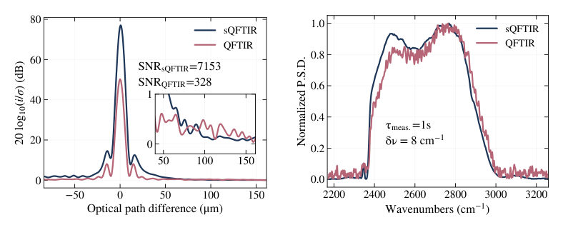
<figcaption class="paper-figure-caption"><b>Fig 4.</b> Figure 4: Demonstration of sensitivity advantage: signal-to-noise ratios in the time and Fourier domains for a measurement time of 1 s obtained in the same nonlinear interferometer. (a) Time-domain representation: signal-to-noise ratios (i/σ) evaluated for sQFTIR and QFTIR from their respective signal magnitudes. (b) Frequency-domain representation: sQFTIR and QFTIR spectra calculated from the respective time-domain coherence functions. Differences in the shapes of sQFTIR and QFTIR spectra can be attributed to non-uniform instrument responses. The higher signal-to-noise ratio is preserved between the domains as manifested by Parseval’s theorem.</figcaption>
</figure>
<figure class="paper-figure-card">
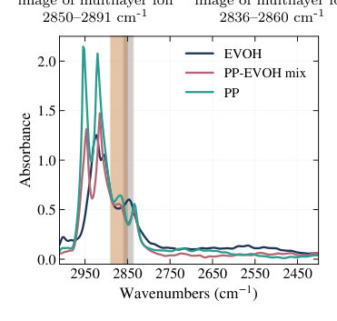
<figcaption class="paper-figure-caption"><b>Fig 5.</b> Figure 5: Rapid hyperspectral transflection mapping of the cross section (sectioned to a thickness of 5 µm) of a poly- mer multilayer foil (packaging) with layers of EVOH, PP and PP-EVOH mix recorded at 10 ms per pixel. The positions from which individual (single-pixel) PP, EVOH, and mixed spectra were extracted are indicated with color-coded trian- gles. Chemical images obtained by integrating absorbance from baseline over (a) 2850–2891 cm-1; (b) 2836–2860 cm-1</figcaption>
</figure>

**Summary.** The paper introduces scanless quantum Fourier-transform mid-infrared (sQFTIR) spectroscopy, a technique that overcomes the speed and sensitivity limits of classical FTIR by using entangled photons. By performing measurements in the frequency domain with an interferometric setup, it achieves substantial theoretical signal enhancement and demonstrates rapid hyperspectral mapping capabilities on biological and polymeric samples.

**Why it may be interesting.** This work represents a significant advancement in quantum optical sensing, directly applying quantum entanglement principles to overcome fundamental measurement limitations in established analytical techniques like FTIR spectroscopy.

Detailed structure

**Main problem.** Classical Fourier-transform infrared (FTIR) spectroscopy is limited by slow, scan-based time-domain measurements, restricting both speed and signal-to-noise ratio.

**Main result.** The proposed scanless quantum FTIR (sQFTIR) technique achieves a theoretical sensitivity advantage of 26.8 dB over conventional methods and enables rapid hyperspectral mapping with high spatial and spectral resolution.

**Method.** It utilizes entangled photons from SPDC to perform frequency-domain measurements using a static interferometer, followed by advanced reconstruction algorithms involving multiple Fourier transforms.

**Model / system.** The system is based on quantum metrology principles applied to mid-IR spectroscopy. It uses spontaneous parametric down-conversion (SPDC) to generate entangled photon pairs ($\omega_s$ and $\omega_i$), where the sample interaction modulates the interference pattern in the frequency domain.

**Key observables.** Mid-IR spectra ($3000 	ext{ cm}^{-1}$ to $2380 	ext{ cm}^{-1}$) reconstructed from near-IR measurements ($\approx 780 	ext{ nm}$ to $820 	ext{ nm}$), and the spectral interferogram recorded in the signal photon domain.

**Important parameters / regimes.** Sensitivity advantage of 26.8 dB (factor of 21.8); spatial resolution down to $12.3 	ext{ µm}$; acquisition times as low as $10 	ext{ ms}$.

**Assumptions / limitations.** The method operates in the low-gain regime of the nonlinear interferometer, and subsequent mathematical derivations neglect high-order dispersion terms.

**Figures summary.** Figure 1 shows the linear schematic of sQFTIR spectroscopy using interference between signal photons modulated by the sample in the idler path. Figure 2 details the multi-step processing workflow from raw spectral interferogram to final mid-IR spectrum via sequential Fourier transforms.

**Paper structure.** The paper first establishes the limitations of classical FTIR, then introduces the sQFTIR quantum approach using entangled photons and frequency-domain measurements. It provides theoretical derivations comparing SNR in time vs. frequency domains, details the multi-step reconstruction protocol (involving multiple FTs), and concludes with experimental demonstrations on various materials.

Abstract

Fourier-transform infrared (FTIR) spectroscopy is a well-established technique for qualitative and quantitative chemical analysis. Classical FTIR systems rely, however, on direct mid-infrared (mid-IR) scan-based time-domain measurements of coherence functions; thus, the signal-to-noise ratio and measurement speed are constrained by design. In this paper, we demonstrate a scanless quantum FTIR (sQFTIR) technique that exploits principles of metrology with entangled photons to circumvent the limitations inherent to classical FTIR systems. The approach exploits the interferometric nature of the sensing paradigm and relies on frequency-domain measurements performed with a static, low-gain nonlinear interferometer. A robust reconstruction algorithm is used to retrieve time-domain signals and reconstruct respective mid-infrared (mid-IR) spectra (3000$~$cm$^{-1}$ to 2380$~$cm$^{-1}$) from near-IR measurements (approx. 780$~$nm to 820$~$nm). The suggested sQFTIR protocol eliminates the need for optical delay scanning and leverages inherent mapping between the related domains. In the theoretical section, we evaluate the intrinsic signal-to-noise advantage of the proposed method over conventional scan-based time-domain measurements; a difference of 26.8 dB (factor of 21.8) is demonstrated. Building on the enhanced sensitivity of the scheme, we demonstrate rapid sQFTIR-based hyperspectral imaging with a spatial resolution of 12.3$~μ$m and a spectral resolution down to 8$~$cm$^{-1}$. Hyperspectral mapping of human colon tissue, microplastics, and multilayer polymer samples composed of polypropylene and ethylene vinyl alcohol yield high-quality single-pixel spectra with acquisition times down to 10$~$ms.

[↑ back to top](#top)

### [Universality of Magic in Local Quantum Field Theory](http://arxiv.org/abs/2607.16403v1)

**Authors:** Valentin Benedetti, Atish Dabholkar, Marcello Dalmonte  
**Type:** theory · **Category:** other · **PDF:** <https://arxiv.org/pdf/2607.16403v1>  
**Analysis basis:** full PDF text, analyzed in chunks
**Topic relevance:** 🔥 `entanglement & information structure` **4/5** · `analog quantum simulation` **1/5** · `driven-dissipative phase transition` **1/5** · `methods for driven-dissipative` **1/5** · `non-equilibrium dynamics` **1/5**

↔ Scroll figures horizontally

<figure class="paper-figure-card">
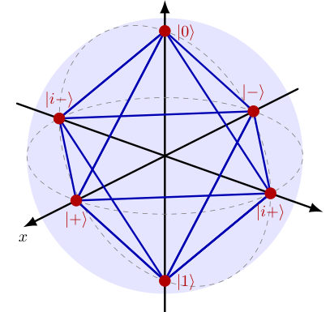
<figcaption class="paper-figure-caption"><b>Fig 1.</b> Figure 1. Stabilizer octahedron defined by the six stabilizer states on a single qubit Hilbert space inside the Bloch sphere</figcaption>
</figure>
<figure class="paper-figure-card">
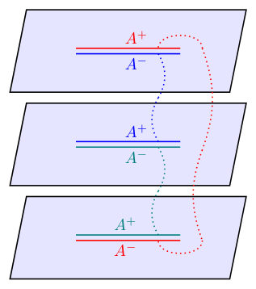
<figcaption class="paper-figure-caption"><b>Fig 2.</b> Figure 2. Schematic representation of the replica trick for a single-interval entangling region A with R´enyi index n = 3.</figcaption>
</figure>
<figure class="paper-figure-card">
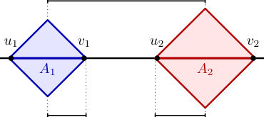
<figcaption class="paper-figure-caption"><b>Fig 3.</b> Figure 3. Causal domain of two disjoint intervals [u1, v1] and [u2, v2] of length 2r1 = v1 −u1 and 2r2 = v2 −u2 respectively in D = 2 space-time dimensions with separation l.</figcaption>
</figure>
<figure class="paper-figure-card">
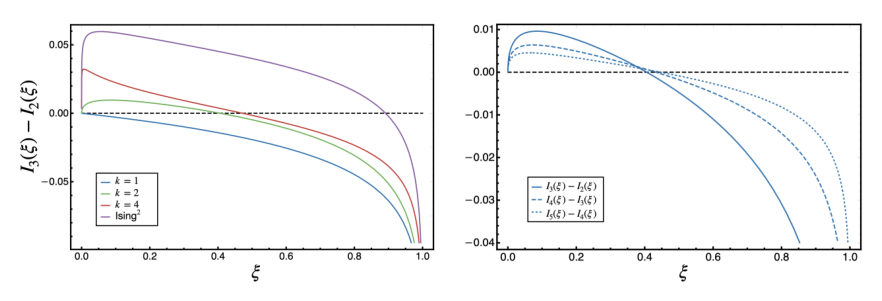
<figcaption class="paper-figure-caption"><b>Fig 4.</b> Figure 4. Difference between mutual informations In−1 −In of two disjoint intervals as a function of the cross-ratio ξ for n = 2 and different c = 1 CFT2 given by (4.8) at k = 1, 2, 4 and (4.9) (left) and for n = 2, 3, 4 in the k = 1 case (right).</figcaption>
</figure>
<figure class="paper-figure-card">
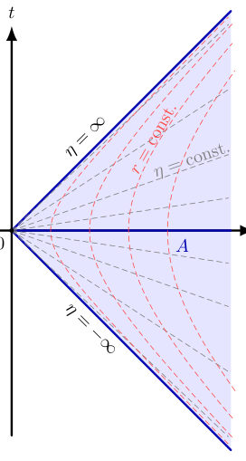
<figcaption class="paper-figure-caption"><b>Fig 5.</b> Figure 5. Right Rindler wedge A in D = 2 Minkowski space-time described by the Rindler coordinates η ∈(−∞, ∞) and r = [0, ∞).</figcaption>
</figure>

**Summary.** This work demonstrates that the simple structure of stabilizer states is fundamentally incompatible with the entanglement properties required by local Quantum Field Theories. By analyzing the entanglement spectrum and leveraging the type $	ext{III}_1$ nature of QFT algebras, the authors conclude that simulating realistic QFTs necessitates quantum resources beyond those provided by stabilizer codes.

**Why it may be interesting.** It provides a rigorous theoretical boundary on what quantum computation models (like those based on Clifford gates/stabilizers) can simulate in terms of physical reality, connecting quantum information theory directly to fundamental physics constraints.

Detailed structure

**Main problem.** The paper investigates whether stabilizer states, which are computationally simple, can accurately simulate the complex quantum states found in local Quantum Field Theories (QFTs). It specifically tests if such a state can evolve into or resemble the vacuum of a continuum QFT.

**Main result.** It proves that no stabilizer state realizing a discrete version of a local QFT can flow to the continuum vacuum because the required entanglement spectrum properties conflict with the inherent flatness of stabilizer states. This implies simulating physical QFTs requires resources beyond Clifford operations.

**Method.** The analysis compares the entanglement spectra of stabilizer states (which are flat) against those expected for physically relevant QFT states, leveraging the mathematical structure imposed by type III_1 von Neumann algebras.

**Model / system.** The study focuses on Local Quantum Field Theories (QFTs), using a discrete realization setup initially. The core comparison is between idealized stabilizer states and the vacuum state of a continuum QFT defined over local observables.

**Key observables.** Entanglement spectrum, 'Magic' (a measure of non-stabilizerness), Rényi entropies ($S_n$), and the structure of von Neumann algebras ($	ext{III}_1$ type).

**Important parameters / regimes.** The continuum limit, short distances, and the dimensionality/structure of local subregions.

**Assumptions / limitations.** The primary assumption is that physically relevant QFTs are governed by local observables whose associated algebras are of type $	ext{III}_1$. The authors also note potential exceptions like Rindler or Boulware vacua.

**Paper structure.** The paper develops the argument by first establishing the properties of entanglement spectra for stabilizer states, then contrasting these with the necessary spectral properties dictated by local QFTs due to their algebraic structure, leading to the conclusion about computational resource requirements.

Abstract

We show that no stabilizer state in a discrete realization of a local quantum field theory can flow in the continuum to the vacuum or to any state that resembles the vacuum at short distances. The argument rests on the fact that the entanglement spectrum is flat for stabilizer states but non-flat for cyclic and separating states in a local QFT as a consequence of the type III$_1$ nature of the von Neumann algebras associated with arbitrary subregions. Our result implies that simulating physically relevant QFT states necessarily requires quantum resources beyond stabilizer states and Clifford operations. We comment on the implications for holography.

[↑ back to top](#top)

### [Frustration induced dimensional reduction and coexistence of long and short-range magnetic order in NdCl$_{3}$](http://arxiv.org/abs/2607.17995v1)

**Authors:** Eli Zoghlin, Matthew B. Stone, Vasile O. Garlea, Matthias D. Frontzek, Andrew D. Christianson, Andrew F. May  
**Type:** experiment · **Category:** strongly correlated electrons · **PDF:** <https://arxiv.org/pdf/2607.17995v1>  
**Analysis basis:** full PDF text, analyzed in chunks
**Topic relevance:** 🔥 `analog quantum simulation` **4/5** · `exotic spin models in light-matter` **3/5**

↔ Scroll figures horizontally

<figure class="paper-figure-card">
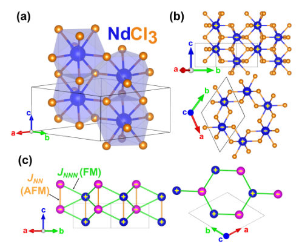
<figcaption class="paper-figure-caption"><b>Fig 1.</b> FIG. 1. (a) Illustration of the crystal structure of NdCl3. The black solid line represents the hexagonal unit cell. The transparent blue polyhedra show the trigonal coordination of Nd by Cl. (b) Projection views of the structure along the [2 1 0] and [0 0 1] lattice directions (top and bottom, respectively). The yellow “+” and “-” signs indicate the relative shifts of Nd ions into or out of the page. (c) Illustration of the NN (JNN, orange) and NNN (JNNN, green) exchange bonds for views along the [1 1 0] and [0 0 1] lattice directions (left and right, respectively). Only the Nd ions are shown and the different coloring represents the bipartite shifted chains, as discussed in the main text.</figcaption>
</figure>
<figure class="paper-figure-card">
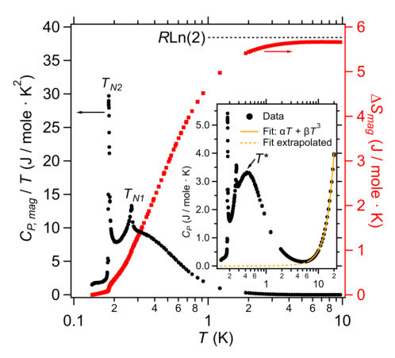
<figcaption class="paper-figure-caption"><b>Fig 2.</b> FIG. 2. Magnetic contribution to the low-temperature heat capacity plotted as CP,mag/T (black circles, left axis) and the resulting in- tegrated magnetic entropy release ∆Smag (red squares, right axis). The dashed black line shows the position of ∆Smag = RLn(2). In- set: Plot of the total heat capacity signal, CP , highlighting the broad feature centered at T ∗. The solid orange curve shows the fit used to estimate the non-magnetic contribution and the dashed orange curve is the extrapolation of the fit to the lowest T.</figcaption>
</figure>
<figure class="paper-figure-card">
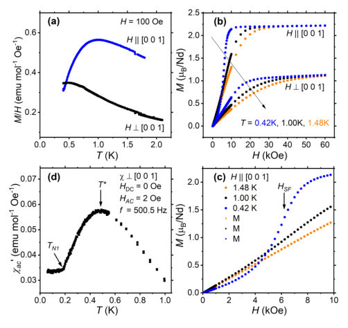
<figcaption class="paper-figure-caption"><b>Fig 3.</b> FIG. 3. Bulk magnetic characterization data collected on a single crystal with field parallel or perpendicular to the [0 0 1] lattice direc- tion. (a) Temperature dependence of the dc magnetic susceptibility ≡M / H. (b) Field dependence of the magnetization, M, at vari- ous temperatures. The arrow indicates the direction of increasing T for both sets of of measurements. (c) Low-field region of the H || [0 0 1] magnetization data. The arrow labels the position of the spin flop transition, HSF , determined from the peak in the derivative with respect to field. (d) Temperature dependence of the ac magnetic sus- ceptibility, χ′ ac. The arrows label features corresponding to those in the heat...</figcaption>
</figure>
<figure class="paper-figure-card">
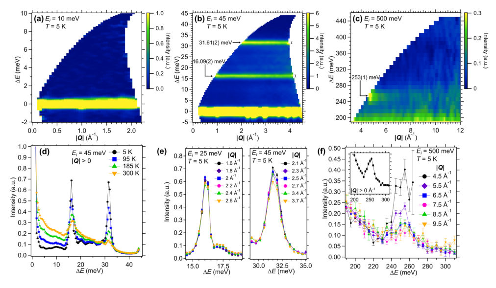
<figcaption class="paper-figure-caption"><b>Fig 4.</b> FIG. 4. Inelastic neutron scattering data collected on a powder sample of NdCl3 at various incident energies. The background from an empty can measurement has been subtracted in all plots. ∆E versus | ⃗Q| slices of the data are shown for (a) Ei = 10 meV, (b) Ei = 45 meV (intramultiplet CEF mode positions labeled by black arrows), and (c) Ei = 500 meV (intermultiplet CEF mode labeled by black arrow). (d) Line cut along ∆E for Ei = 45 meV with the data integrated over all | ⃗Q| values showing peaks corresponding to the two modes seen in (b). (e) Line cuts along ∆E at various | ⃗Q| for Ei = 25 meV (left) and Ei = 45 meV (right). The | ⃗Q| integration range is ± 0.1 ˚A−1 about each value in the...</figcaption>
</figure>
<figure class="paper-figure-card">
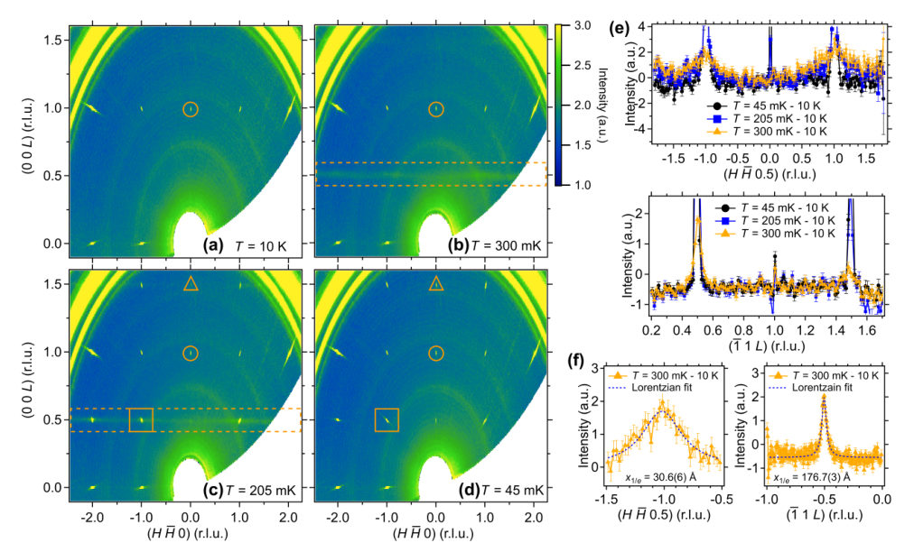
<figcaption class="paper-figure-caption"><b>Fig 5.</b> FIG. 5. Reciprocal space maps from single crystal neutron diffraction in the (H ¯H L) scattering plane collected at (a) 10 K &gt;&gt; TN1 (PM regime), (b) 300 mK &gt; TN1 (correlated PM regime), (c) TN1 &lt; 205 mK &lt; TN2 (intermediate regime), and (d) 45 mK &lt; TN2 (fully ordered regime). The orange solid and dashed lines highlight specific features discussed in the main text. In all cases the data was integrated across the full coverage of the out-of-plane (H H 0) reciprocal lattice direction with the range (H H 0) = [-0.35, 0.35]. (e) Line cuts along (H ¯H 0.5) (upper) and (¯1 1 L) (lower) at different temperatures following subtraction of the T = 10 K data. For the cut parallel to H ¯H 0) the...</figcaption>
</figure>

**Summary.** This paper experimentally investigates the magnetic ordering in NdCl3, a frustrated quantum magnet. Using neutron scattering and heat capacity measurements, the authors reveal distinct transitions indicating a progression from short-range to long-range magnetic order. They attribute this complex behavior, including the coexistence of different orders, to the frustration inherent in the anisotropic exchange interactions.

**Why it may be interesting.** The study provides experimental evidence of dimensional crossover and competing orders in a frustrated quantum magnet, which is highly relevant for understanding complex many-body ground states.

Detailed structure

**Main problem.** The study investigates how magnetic frustration influences dimensional reduction and the coexistence of different types of magnetic order in quantum magnets.

**Main result.** The research observed staged magnetic ordering in NdCl3, characterized by coexisting short-range (quasi-1D) and long-range (3D) magnetic order regimes driven by anisotropic exchange interactions.

**Method.** A combination of bulk property measurements (heat capacity, magnetization) and single crystal elastic neutron scattering techniques were employed to probe the magnetic transitions and ordering states.

**Model / system.** The physical system is NdCl3, a rare-earth trichloride known for its frustrated lattice topology. The analysis focuses on the interplay between anisotropic exchange interactions and the resulting magnetic ground state.

**Key observables.** Magnetic transitions at T_N1 = 270 mK and T_N2 = 180 mK; broad heat capacity peak at T* ≈ 450 mK; highly anisotropic magnetic diffuse scattering and sharp Bragg peaks.

**Important parameters / regimes.** The key regimes are the temperature ranges defining short-range order (T*), coexisting order (T_N2 < T < T_N1), and full long-range order (below T_N2).

**Assumptions / limitations.** The authors propose that frustration of anisotropic exchange interactions is the driving mechanism for the observed dimensional reduction and coexistence.

**Figures summary.** Figure 1 illustrates the crystal structure of NdCl3, detailing nearest-neighbor and next-nearest-neighbor exchange bonds relevant to magnetic interactions.

**Paper structure.** The paper proceeds by characterizing multiple magnetic transitions using heat capacity and magnetization measurements. Neutron scattering data then maps out the evolution from short-range order (diffuse scattering) through coexisting regimes to full long-range order (Bragg peaks).

Abstract

The phenomenon of frustration greatly enriches the accessible physics of quantum magnets. With this in mind we study the magnetism of NdCl$_{3}$ using a combination of bulk properties measurements and neutron scattering techniques. The low-temperature heat capacity reveals two magnetic transitions at $T_{N1}$ = 270 mK and $T_{N2}$ = 180 mK. However, much of the magnetic entropy is released above $T_{N1}$, manifesting as a broad peak centered at $T^{*} \approx$ 450 mK. Single crystal elastic neutron scattering reveals highly anisotropic magnetic diffuse scattering above $T_{N2}$, confirming that quasi-one-dimensional, short-range, antiferromagnetic order is the origin of the broad peak in the heat capacity. Magnetic Bragg peaks characterized by a $\vec{k}$ = ($0$ $0$ $\frac{1}{2}$) propagation vector emerge below $T_{N1}$. Interestingly, the magnetic diffuse scattering persists for $T_{N2} < T < T_{N1}$, indicating a regime of coexisting short and long-range order. The magnetic Bragg peaks exhibit an additional increase in intensity below $T_{N2}$ with no change in $\vec{k}$. Concomitantly, the diffuse scattering disappears indicating the attainment of full long-range order. While the precise nature of the ordered magnetic ground state remains unresolved, the observed magnetic scattering indicates predominate $c$-axis moments with a small $ab$-plane component. We propose that the quasi-one-dimensional behavior and the coexistence of short and long-range order are driven by frustration of anisotropic exchange interactions.

[↑ back to top](#top)

### [Entanglement geometry separates circuit cutting, classical hardness, and trainability](http://arxiv.org/abs/2607.17872v1)

**Authors:** Maria Gragera Garces, Sabina Drăgoi, Lirandë Pira  
**Type:** theory · **Category:** quantum information and computing · **PDF:** <https://arxiv.org/pdf/2607.17872v1>  
**Analysis basis:** full PDF text, analyzed in chunks
**Topic relevance:** 🔥 `entanglement & information structure` **4/5** · `methods for driven-dissipative` **1/5** · `non-equilibrium dynamics` **1/5**

↔ Scroll figures horizontally

<figure class="paper-figure-card">
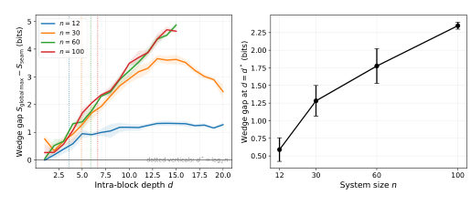
<figcaption class="paper-figure-caption"><b>Fig 1.</b> Fig. 1. MPS verification of the wedge across n ∈{12, 30, 60, 100} (k = 1 seam CNOT, random SU(4) brickwork, bond dimension χ ≤256). Left: wedge gap Sglobal max −Sseam vs. intra-block depth d; dotted verticals mark d∗= log2 n per curve. Sseam stays below 1 bit at every n and d; the gap opens and grows with n. Right: gap at d = d∗vs. n, growing as Θ(log2 n). The wedge is a structural property, not a finite-size artefact.</figcaption>
</figure>
<figure class="paper-figure-card">
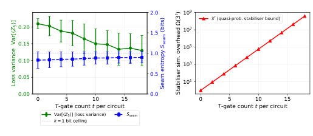
<figcaption class="paper-figure-caption"><b>Fig 2.</b> Fig. 2. Corollary 4 verification on C(12, d=3, k=1); 50 seeds × 200 parameter samples each. Left: conditions (i) and (iii) vs. T-count — Sseam (blue, right axis) stays below the k=1 bit ceiling for all T-counts, while loss variance (green, left axis) remains in [0.13, 0.21], both flat. Right: stabiliser hardness grows with T-count — sampling overhead 3t rises by eight orders of magnitude while cutting and trainability metrics are unchanged, confirming magic as the independent hardness lever. Mean ± 1 s.d. over 50 seeds.</figcaption>
</figure>

**Summary.** This work analyzes the fundamental trade-offs required for a quantum circuit to be useful: it must be easy to distribute ('cuttable'), hard to simulate classically, and trainable for machine learning. The authors show that these three goals conflict under standard entanglement assumptions but can be reconciled by using magic states as the primary source of computational hardness.

**Why it may be interesting.** It provides rigorous theoretical constraints on what is physically achievable in near-term quantum computation, particularly concerning the interplay between resource requirements (cutting vs. simulation) and algorithmic utility (training).

Detailed structure

**Main problem.** The paper investigates whether a quantum circuit family can simultaneously possess cheap circuit cutting, classical hardness (non-simulability), and trainability for variational quantum algorithms.

**Main result.** Standard entanglement-based circuits face conflicting depth requirements for hardness versus trainability; however, using magic gates as the hardness resource bypasses this conflict.

**Method.** The analysis uses entanglement geometry to constrain circuit properties, comparing MPS/TTN simulation costs against sampling overheads and analyzing required circuit depths.

**Model / system.** The study analyzes quantum circuits, specifically focusing on Matrix Product State (MPS) and Tree Tensor Network (TTN) representations applied to structures like the 'two-block wedge' circuit $C(n, d, k)$.

**Key observables.** Seam bond dimension ($\chi_{seam}$), global MPS bond dimension ($\chi_{global}$), sampling overhead ($\epsilon$ dependence), and loss variance for training.

**Important parameters / regimes.** System size ($n$), circuit depth ($d$), seam width ($k$), and the number of T-gates ($t$).

**Assumptions / limitations.** The analysis assumes that cheap cutting requires bounded seam entanglement, and it contrasts standard entanglement resources with magic state resources.

**Figures summary.** Figure 1 shows the gap between global and seam entropy in MPS verification; Figure 2 verifies that for Clifford+T circuits, the stabiliser overhead grows exponentially while training metrics remain low.

**Paper structure.** The paper first establishes a negative baseline showing that simple MPS/TTN circuits are easily cuttable but classically simulable. It then constructs a two-block circuit to show how global entanglement can be made hard while keeping seam cutting cheap, ultimately proving the conflict between hardness and trainability for general circuits before resolving it using magic gates.

Abstract

Circuit cutting promises to scale quantum computations beyond current hardware, but variational quantum advantage also requires low cutting overhead, classical hardness, and trainability. We show that these properties are strongly constrained by entanglement geometry. Matrix product state (MPS) and tree tensor network (TTN) circuits with constant seam bond dimension can be cut with \(O(1/\varepsilon^2)\) sampling overhead, but remain efficiently classically simulable, ruling out asymptotic quantum advantage within these families. By independently controlling seam and intra-block entanglement, we construct a two-block circuit family that remains cheaply cuttable while requiring a super-polynomial global MPS bond dimension, as supported numerically up to \(n=100\). However, MPS hardness and trainability require incompatible depth regimes, \(d=ω(\log n)\) and \(d=O(\log n)\), respectively. Using magic rather than entanglement as the hardness resource avoids this conflict: shallow Clifford+\(T\) circuits remain cuttable and trainable while their stabiliser-simulation cost grows exponentially with the \(T\)-count.

[↑ back to top](#top)

### [Fully-connected three-mode squeezed vacuum: Gaussian entanglement, steering, and collective photon subtraction](http://arxiv.org/abs/2607.17629v1)

**Authors:** Manjia Mai, Jifeng Sun, Teng Zhao, Ming Zhang, Liyun Hu  
**Type:** theory · **Category:** quantum information and computing · **PDF:** <https://arxiv.org/pdf/2607.17629v1>  
**Analysis basis:** full PDF text, analyzed in chunks
**Topic relevance:** 🔥 `entanglement & information structure` **4/5** · `Keldysh / 2PI / non-Gaussian methods` **1/5** · `correlated / nonlocal dissipation` **1/5**

↔ Scroll figures horizontally

<figure class="paper-figure-card">
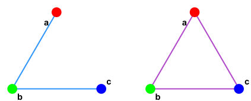
<figcaption class="paper-figure-caption"><b>Fig 1.</b> FIG. 1. (a) Chain-type coupling (a-b-c). (b) Fully-connected (triangle) coupling. Solid lines represent direct nonlinear in- teractions.</figcaption>
</figure>
<figure class="paper-figure-card">
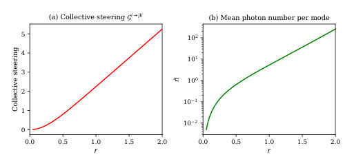
<figcaption class="paper-figure-caption"><b>Fig 2.</b> FIG. 2. (Color online) (a) Collective steering Gi→jk as a function of r at θ = 0. (b) Mean photon number per mode ¯n = 2 sinh2 r+ 4</figcaption>
</figure>
<figure class="paper-figure-card">
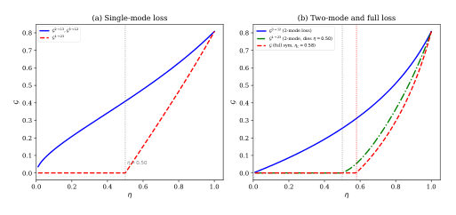
<figcaption class="paper-figure-caption"><b>Fig 3.</b> FIG. 3. (Color online) One-to-two collective steering under vacuum loss for r = 0.5, θ = 0. (a) Single-mode loss on mode 1: G3→12 and G2→13 (blue solid, identical curves) from lossless modes survive for all η, while G1→23 (red dashed, from lossy mode) vanishes at η ≈0.50. (b) Two-mode loss (blue solid: G3→12 from lossless mode 3; green dash-dotted: G1→23</figcaption>
</figure>
<figure class="paper-figure-card">
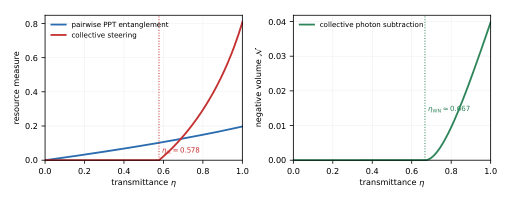
<figcaption class="paper-figure-caption"><b>Fig 4.</b> FIG. 4. (Color online) Loss robustness of pairwise and col- lective resources under full symmetric loss at r = 0.5. (a) Physical pairwise PPT entanglement survives for all η &gt; 0, whereas the plotted one-to-two collective steering Gi→jk dies at η ≈0.58. (b) The Wigner negativity generated by collective-mode photon subtraction vanishes at ηWN ≈0.667.</figcaption>
</figure>
<figure class="paper-figure-card">
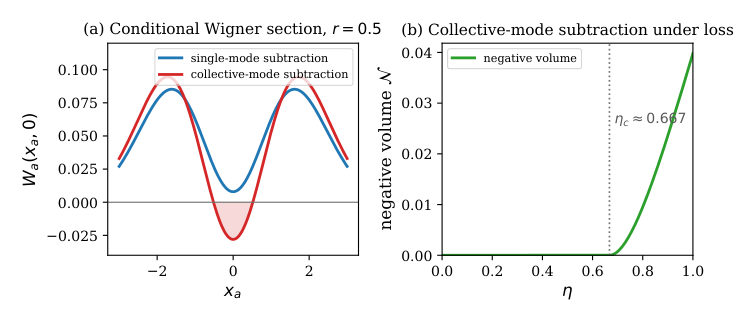
<figcaption class="paper-figure-caption"><b>Fig 5.</b> FIG. 5. (Color online) Photon subtraction on physical and collective modes at r = 0.5. (a) Cross-section Wa(xa, 0) in the lossless case. Subtraction on a physical mode b leaves the Wigner function non-negative, whereas subtraction on the collective mode d = (b + c)/ √</figcaption>
</figure>

**Summary.** The paper theoretically investigates the fully-connected three-mode squeezed vacuum state to characterize its entanglement and steering properties. It establishes that while the state possesses genuine tripartite entanglement, any two-mode Gaussian steering vanishes due to the complete graph topology. The key finding is that nonclassical resources like Wigner negativity are only generated when considering collective measurements, distinguishing these global correlations from simple pairwise ones.

**Why it may be interesting.** This work provides a detailed theoretical characterization of quantum correlations in structured multi-mode systems, specifically demonstrating a clean separation between local (pairwise) and global (collective) nonclassical resources, which is crucial for designing quantum communication protocols.

Detailed structure

**Main problem.** The study investigates entanglement, Gaussian steering, and nonclassical resources generated by a fully-connected three-mode squeezed vacuum state (FC-C3MSV). It aims to distinguish between pairwise and collective quantum correlations in this specific topology.

**Main result.** The FC-C3MSV is genuinely tripartite entangled, but it exhibits zero two-mode Gaussian steering; instead, the resource is purely collective. Furthermore, Wigner negativity can only be generated by subtracting from a collective mode, not from single modes.

**Method.** The analysis employs techniques including deriving the covariance matrix via Bogoliubov transformations and using specific entanglement witnesses (Armstrong-type) to quantify quantum resources like steering and nonclassicality.

**Model / system.** The system is modeled as a three-mode vacuum state coupled in a fully-connected (triangle, $K_3$) topology via nonlinear interactions. The analysis compares this to a chain-type coupling structure.

**Key observables.** Genuine tripartite entanglement, two-mode Gaussian steering ($G_{i	o j}$), collective one-mode-versus-two steering ($G_{i	o jk}$), and Wigner negativity.

**Important parameters / regimes.** Squeezing parameter $r$, loss transmittance $\eta$, and coupling strength $\chi$. Critical thresholds for resource survival are calculated (e.g., $\eta \approx 0.58$ for one-to-two steering).

**Assumptions / limitations.** The analysis assumes symmetric coupling ($\chi_{12} = \chi_{13} = \chi_{23}$) and models vacuum losses using independent amplitude damping channels.

**Figures summary.** Figure 1 compares the properties of chain vs. fully-connected coupling. Other figures illustrate collective steering measures ($G_{i	o jk}$) and mean photon number versus squeezing strength $r$.

**Paper structure.** The paper first derives the state's properties using IWOP/Bogoliubov transformations, establishes genuine tripartite entanglement via witnesses, then quantifies the vanishing two-mode steering while highlighting the collective resource. Finally, it analyzes how independent vacuum losses and photon subtraction reveal the distinct nature of these pairwise versus collective resources.

Abstract

We investigate a fully-connected three-mode squeezed vacuum (FC-C3MSV) state, where all three modes are pairwise coupled through nonlinear interactions in a triangle ($K_3$) topology. Using the integration-within-ordered-product technique, we derive the normal product form of the squeezing operator and obtain the covariance matrix directly from the Bogoliubov transformation. Under symmetric coupling, the physical state is genuinely tripartite entangled for any nonzero squeezing, while the three Armstrong-type witnesses provide a finite-window sufficient experimental test; in the chain-type C3MSV only one of these witnesses is violated. We find that, despite two-mode entanglement, the fully-connected topology admits \emph{no} two-mode Gaussian steering ($\mathcal{G}^{i\to j}=0$) between any pair of physical modes; the steering resource is instead collective one-mode-versus-two steering $\mathcal{G}^{i\to jk}$, which is $θ$-independent and grows with $r$. We analyze independent vacuum losses and obtain critical transmittances for steering survival: under full symmetric loss at $r=0.5$, one-to-two collective steering disappears at $η\approx0.58$, whereas reverse two-to-one collective steering survives down to $η\approx0.502$ and the underlying two-mode entanglement persists for all $η>0$. Finally, we revisit photon subtraction using a normalized phase-space derivation. A photon subtraction on a single physical mode does not generate Wigner negativity on another single mode, consistent with the absence of two-mode steering. Wigner negativity can instead be generated when Bob subtracts from the collective mode $(b+c)/\sqrt{2}$, with a loss threshold $η_c\approx0.667$ at $r=0.5$. These results distinguish pairwise and collective nonclassical resources in the FC-C3MSV and clarify the operational role of the complete-graph topology.

[↑ back to top](#top)

### [Certified Optimal Measurement Reduction over Quantum Context Landscapes](http://arxiv.org/abs/2607.16866v1)

**Authors:** Federico Zahariev, Vanda Glezakou  
**Type:** theory · **Category:** quantum information and computing · **PDF:** <https://arxiv.org/pdf/2607.16866v1>  
**Analysis basis:** full PDF text, analyzed in chunks
**Topic relevance:** 🔥 `quantum measurements` **4/5** · `measurement-induced transitions` **1/5**

↔ Scroll figures horizontally

<figure class="paper-figure-card">
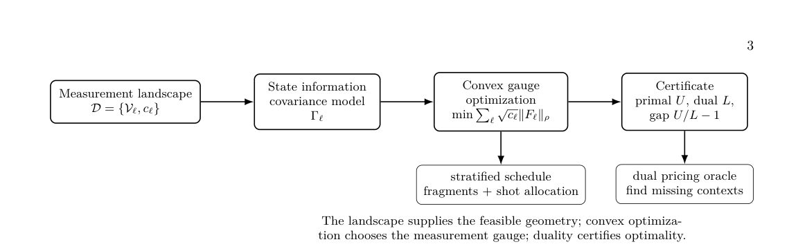
<figcaption class="paper-figure-caption"><b>Fig 1.</b> FIG. 1. Measurement reduction as geometry plus optimization. The allowed contexts define visible subspaces. A covariance model, obtained from a proxy state or from pilot data, turns each visible subspace into a variance norm. The optimal decomposition and shot allocation are obtained by a conic program. The dual returns a certificate that lower-bounds every schedule in the declared landscape and, through column generation, identifies whether useful contexts are missing.</figcaption>
</figure>

**Summary.** This paper presents a comprehensive theoretical framework for optimizing quantum measurement reduction by estimating observable expectation values. It tackles the problem using a combination of Second-Order Cone Programming (SOCP) for continuous allocation and advanced global optimization techniques for dictionary design. The key contribution is providing mathematically certified lower bounds on the required shot count, making resource estimation rigorous and verifiable.

**Why it may be interesting.** This work provides rigorous, mathematically verifiable tools to determine the minimum required experimental resources (shots) needed to estimate quantum observables, moving beyond heuristic optimization methods common in quantum simulation and characterization.

Detailed structure

**Main problem.** The core problem is optimizing quantum measurement reduction, which requires solving two coupled global optimization layers: an inner continuous shot allocation problem and an outer nonconvex dictionary design problem.

**Main result.** The authors develop a framework that solves the inner layer certifiably using Second-Order Cone Programming (SOCP) and uses a robust optimizer (RANGE) for the outer layer, achieving significant compression of measurement dictionaries while maintaining certified optimality bounds.

**Method.** The methodology combines convex optimization (SOCP) for shot allocation with adaptive global optimization (RANGE) for dictionary design. Crucially, it establishes verifiable lower-bound certificates via the conic dual and incorporates robust analysis using covariance sandwiching for finite-sample guarantees.

**Model / system.** The theory applies to estimating expectation values $\langle H 
angle$ of observables $H$ in quantum systems. The measurement process is modeled by defining a dictionary of available contexts, each associated with a visible subspace and an estimated covariance model.

**Key observables.** Minimum leading shot cost ($\Phi$), expected value $\langle H 
angle$, certified lower/upper bounds ($L, U$), and the required number of shots ($N_\ell$).

**Important parameters / regimes.** Shot costs ($c_\ell$), measurement context definitions ($	ext{V}_\ell$), covariance matrices ($\Gamma_\ell$), and confidence parameters ($\delta$ for finite-sample bounds).

**Assumptions / limitations.** The framework assumes the existence of a measurable dictionary of contexts. Robustness theorems address uncertainty in estimating the covariance matrices from pilot data.

**Figures summary.** Figure 1 illustrates measurement reduction as a combination of geometric constraints (visible subspaces) and optimization, with the dual providing a certificate bounding all possible schedules.

**Paper structure.** The paper builds by first defining the two-layer optimization problem. It then solves the inner layer via SOCP, establishing the primal/dual relationship. Subsequent sections introduce robust analysis for finite samples using covariance bounds (Theorem 3 & 4), culminating in a certified repair procedure to ensure mathematical validity.

Abstract

Quantum-measurement reduction contains two distinct global-optimization layers: a continuous problem of splitting an observable and allocating shots within a fixed measurement dictionary, and a nonconvex outer problem of designing the dictionary and calibrating its data-driven uncertainty model. We solve the inner layer globally and certifiably as a second-order cone program (SOCP), and use RANGE, a robust adaptive nature-inspired global optimizer, for the combinatorial and statistical outer layer. For any declared set of contexts, per-shot costs, score functions, and covariance model, the SOCP returns the minimum leading shot cost among unbiased linear stratified estimators. The conic dual supplies an independently checkable lower-bound witness; after feasibility repair, an external verifier recomputes $L \le Φ\le U$ from stored data without trusting the optimizer. Pilot measurements yield simultaneous finite-sample covariance brackets, and the dual becomes a pricing oracle for omitted contexts. Discrete RANGE searches covering sub-dictionaries, Pareto compression fronts, and candidate contexts; continuous RANGE performs an explicitly empirical, coverage-constrained calibration of covariance-radius models, while rigorous certificates retain the proved finite-sample radius. RANGE compresses molecular context dictionaries by 4.3-6.1x at 0.2-2.1% certified-frontier excess. Standard strategies are exactly optimal for H2 yet leave factors of 2.1-7.7 in shots within their own settings by H2O. Adding fully commuting contexts lowers the certified optimum by up to 56%; on 29-35-qubit production f-element Hamiltonians under a declared Hartree-Fock-proxy covariance model, the capped-dictionary enlargement saves 31-70% of the shots, and transformations reducing block-encoding cost need not reduce sampling cost.

[↑ back to top](#top)

### [Hardware Robustness of Sample-Based Quantum Diagonalization](http://arxiv.org/abs/2607.18196v1)

**Authors:** Ahatesham Bhuiyan, Cheng Chu, Qian Lou, Mengxin Zheng  
**Type:** both · **Category:** strongly correlated electrons · **PDF:** <https://arxiv.org/pdf/2607.18196v1>  
**Analysis basis:** full PDF text, analyzed in chunks
**Topic relevance:** 🔥 `QC/QI experiment` **4/5** · `methods for driven-dissipative` **1/5**

↔ Scroll figures horizontally

<figure class="paper-figure-card">
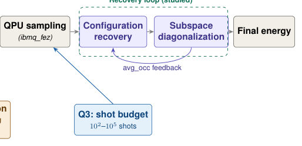
<figcaption class="paper-figure-caption"><b>Fig 1.</b> Fig. 1. SQD workflow and the three robustness probes (Q1–Q3) analyzed in this work.</figcaption>
</figure>
<figure class="paper-figure-card">
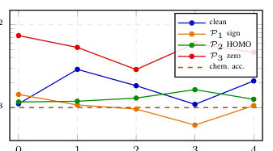
<figcaption class="paper-figure-caption"><b>Fig 2.</b> Fig. 2. H2O SQD error under structured t2 perturbations.</figcaption>
</figure>
<figure class="paper-figure-card">
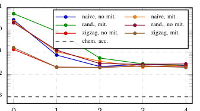
<figcaption class="paper-figure-caption"><b>Fig 3.</b> Fig. 3. N2 SQD error across layout and mitigation settings.</figcaption>
</figure>
<figure class="paper-figure-card">
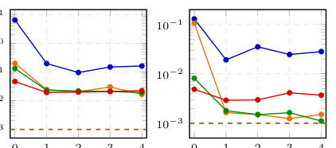
<figcaption class="paper-figure-caption"><b>Fig 4.</b> Fig. 4. SQD energy error vs. recovery-loop iteration on ibmq_fez for N2 (a) and H2O (b) at four shot budgets.</figcaption>
</figure>

**Summary.** This paper rigorously tests the operational robustness of Sample-based Quantum Diagonalization (SQD) for calculating molecular energies using real quantum hardware. By systematically varying initial conditions, qubit layouts, and sample sizes, the authors show that the self-consistent recovery loop effectively mitigates many expected sources of noise and error. The findings provide crucial guidelines on when and how SQD can reliably be deployed in practice.

**Why it may be interesting.** This work is highly relevant as it directly tests the viability of quantum algorithms for chemistry on near-term, noisy hardware by quantifying how much classical post-processing can salvage results from imperfect quantum measurements.

Detailed structure

**Main problem.** The study assesses the hardware robustness of Sample-based Quantum Diagonalization (SQD), a hybrid quantum-classical method used for estimating molecular ground-state energies.

**Main result.** SQD demonstrates genuine deployment robustness, as errors from classical input perturbations and variations in qubit layout diminish significantly after only a few self-consistent recovery iterations. Furthermore, accuracy saturates at moderate shot budgets rather than improving indefinitely with more samples.

**Method.** The authors analyze SQD by subjecting it to three probes: perturbing initial CCSD amplitudes (Q1), varying hardware choices like qubit layouts and noise mitigation (Q2), and scaling the QPU shot budget (Q3).

**Model / system.** The calculations model electronic structure for small molecules ($	ext{BeH}_2$, $	ext{H}_2	ext{O}$, $	ext{N}_2$) using the Local Unitary Cluster Jastrow (LUCJ) ansatz, initialized by CCSD amplitudes. The work is performed on IBM Heron hardware.

**Key observables.** The primary observable is the final recovered energy error ($\Delta E = |	ext{E}_{	ext{SQD}} - 	ext{ECASCI}|$) after a fixed number of recovery iterations ($T=5$).

**Important parameters / regimes.** Key parameters include the CCSD amplitude perturbations (e.g., zeroing $t_2$), qubit layout types (naive, randomized, zigzag), noise mitigation status, and the QPU shot budget ($	ext{Nshots}$).

**Assumptions / limitations.** The analysis assumes that the final energy accuracy depends on whether the recovered subspace contains important determinants rather than solely on raw sample quality.

**Figures summary.** Figures illustrate how the energy error evolves across recovery iterations under structured amplitude perturbations (Fig. 2) and show post-recovery errors comparing different hardware configurations for $	ext{N}_2$ (Fig. 3).

**Paper structure.** The paper introduces SQD, details its application to molecular electronic structure using LUCJ/CCSD, and then systematically analyzes robustness across three dimensions: classical input perturbations (Q1), hardware choices (Q2), and shot budget scaling (Q3), concluding with an assessment of the method's practical limits.

Abstract

Sample-based Quantum Diagonalization (SQD) is a hybrid quantum-classical method that replaces variational optimization with a self-consistent recovery loop over QPU samples. Although SQD is considered robust to noisy samples and imperfect classical inputs, its robustness across practical deployment choices has not been systematically analyzed. As a result, shot budgets, qubit layouts, noise mitigation strategies, and the coupled-cluster singles and doubles (CCSD) amplitudes that initialize the ansatz are often chosen without clear empirical guidance. We analyze SQD robustness on IBM Heron hardware across these dimensions. Structured CCSD-amplitude perturbations, including complete zeroing, produce only modest energy shifts from the clean baseline. Differences across layouts and noise-mitigation settings are large in the first recovery iteration but narrow within a few iterations. Accuracy saturates at moderate shot budgets, while very large budgets slightly worsen recovered energies, likely because working-set selection limits the value of additional samples. These results identify where SQD provides genuine deployment robustness and where its limits remain.

[↑ back to top](#top)

### [Image Classification on IBM Quantum Computers](http://arxiv.org/abs/2607.17705v1)

**Authors:** Junghoon Justin Park, Jiook Cha, Jun-gyeong Park, Hwidong Yoo, Kwangmin Yu  
**Type:** experiment · **Category:** quantum information and computing · **PDF:** <https://arxiv.org/pdf/2607.17705v1>  
**Analysis basis:** full PDF text, analyzed in chunks
**Topic relevance:** 🔥 `QC/QI experiment` **4/5** · `methods for driven-dissipative` **1/5**

↔ Scroll figures horizontally

<figure class="paper-figure-card">
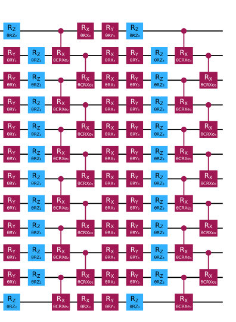
<figcaption class="paper-figure-caption"><b>Fig 1.</b> Fig. 1: Logical VQC ZigZag circuit (nq = 12, L = 3): a Y -axis angle embedding (RY ) of the encoder output, then L layers of single-qubit RX, RY , RZ rotations and two brick-wall CRX sublayers (even then odd adjacent pairs, no wrap-around), and a Pauli-Z readout on all 12 qubits. Gate labels are symbolic rather than numerical: zi is the encoder output angle applied to qubit i (twelve distinct, sample-dependent values), and θ(ℓ) RX, θ(ℓ) RY , θ(ℓ) RZ, θ(ℓ) CRX,even, θ(ℓ) CRX,odd are the five trainable angles of layer ℓ; the figure carries the layer index as a subscript and abbreviates the even- and odd-pair sublayers as e and o. Each angle is shared across all twelve qubits of its layer,...</figcaption>
</figure>
<figure class="paper-figure-card">
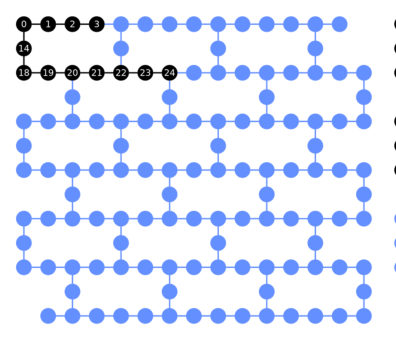
<figcaption class="paper-figure-caption"><b>Fig 2.</b> Fig. 2: Pinned physical-qubit layout on the ibm yonsei heavy-hex topology (high- lighted = active). (a) K = 1 runs use Circuit 1; (b) K = 4 QMP concatenates four routing-disconnected 12-qubit circuits with no inter-circuit coupling. Circuit 1 (the K = 1 layout) is reused as the first of the four circuits.</figcaption>
</figure>
<figure class="paper-figure-card">
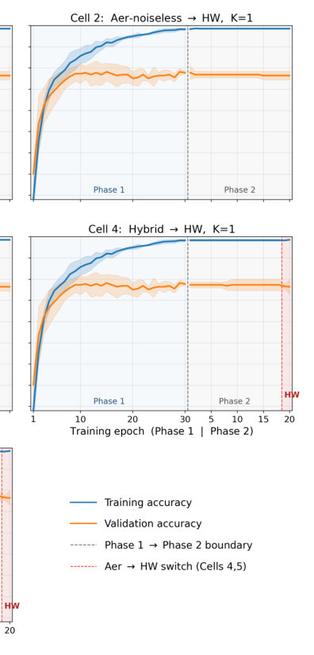
<figcaption class="paper-figure-caption"><b>Fig 3.</b> Fig. 3: Two-phase training curves for VQC ZigZag (12q/3L, MNIST 350/75/75; mean ± s.d. over three seeds). Phase 1 (Adam, 30 epochs, classical layers) raises validation accuracy to ∼78%, while Phase 2 (COBYLA, 20 epochs, quantum parameters) is essentially flat in every cell. The red dashed line marks the Aer →hardware switch at Phase 2 epoch 19 for the hybrid-trained Cells 4–5. The flat Phase 2 traces visualize the central result of Claim 3: gradient-free quantum-parameter optimization, whether on a simulator or on hardware, does not move the classification decisions.</figcaption>
</figure>

**Summary.** This paper demonstrates a practical workflow for running multi-class image classification using variational quantum circuits on current NISQ hardware. By proposing a two-phase training protocol and implementing Quantum Multi-Programming, the authors significantly boost inference throughput while concluding that classical simulation should handle training, reserving expensive hardware time only for forward passes.

**Why it may be interesting.** While focused on ML, the core technical contributions—decoupling optimization steps and maximizing device utilization via multi-programming—are highly relevant to developing robust quantum algorithms for near-term devices.

Detailed structure

**Main problem.** The primary challenge is demonstrating a feasible, high-throughput workflow for multi-class Quantum Machine Learning (QML) on current Noisy Intermediate-Scale Quantum (NISQ) hardware.

**Main result.** The authors established an 'inference-only' workflow: training classically and reserving the quantum processor solely for inference. They achieved significant throughput gains using Quantum Multi-Programming without sacrificing accuracy.

**Method.** A two-phase hybrid protocol was used, decoupling classical optimization from gradient-free quantum parameter optimization (COBYLA). Inference efficiency was boosted by packing multiple circuit copies onto one job submission.

**Model / system.** The work uses a variational quantum classifier applied to the ten-class MNIST dataset on an IBM 127-qubit Eagle processor. The model architecture is a hybrid classical-quantum structure utilizing a VQC ZigZag ansatz.

**Key observables.** Classification accuracy (compared to classical MLP), end-to-end wall time/throughput, and circuit metrics like depth and CNOT count.

**Important parameters / regimes.** The system size involves 12 qubits ($n_q=12$) for the quantum module. The key operational parameters are the packing factor $K$ (e.g., $K=4$).

**Assumptions / limitations.** The work assumes that training on hardware is prohibitively expensive and yields no measurable accuracy benefit over simulator training, thus necessitating an inference-only workflow.

**Figures summary.** Figure 3 illustrates the flat optimization loss during Phase 2 (quantum parameter tuning), showing no movement in classification decisions when switching from simulation to hardware. Other figures detail circuit structures and performance metrics for varying $K$.

**Paper structure.** The paper follows a structure of identifying limitations (training cost, low throughput) $
ightarrow$ proposing novel protocols (two-phase training, QMP) $
ightarrow$ validating the workflow on real hardware $
ightarrow$ concluding that classical simulation/hardware inference separation is the practical path forward.

Abstract

Quantum machine learning on real noisy intermediate-scale quantum (NISQ) hardware has remained largely confined to binary or few-class tasks, limited by the cost of on-hardware training and the underuse of large devices at inference. We present a unified framework that classifies ten-class MNIST end-to-end on a $127$-qubit IBM Eagle processor, with three central contributions. First, a two-phase protocol decouples a gradient-based classical optimization of the encoder and readout from a gradient-free optimization of the quantum parameters, removing the parameter-shift gradient cost that makes on-hardware training impractical. Second, we introduce Quantum Multi-Programming to a trained quantum classifier for the first time, packing multiple circuit copies onto one device to deliver parallel inference at no mean-accuracy cost while cutting quantum-processor job submissions proportionally. Third, a controlled comparison shows that on-hardware fine-tuning yields no measurable accuracy gain, motivating a practical NISQ workflow: train on a classical simulator and reserve the hardware for inference only. Benchmarked against a matched-capacity classical network, the quantum module shows no per-parameter accuracy advantage at this scale; we therefore frame the work as a feasibility-and-workflow demonstration for multi-class quantum image classification on current hardware.

[↑ back to top](#top)

### [Bargmann invariants and local unitary equivalence](http://arxiv.org/abs/2607.16878v1)

**Authors:** Minghui Ma, Rui Shi  
**Type:** theory · **Category:** quantum information and computing · **PDF:** <https://arxiv.org/pdf/2607.16878v1>  
**Analysis basis:** full PDF text, analyzed in chunks
**Topic relevance:** 🔥 `entanglement & information structure` **4/5**

↔ Scroll figures horizontally

<figure class="paper-figure-card">
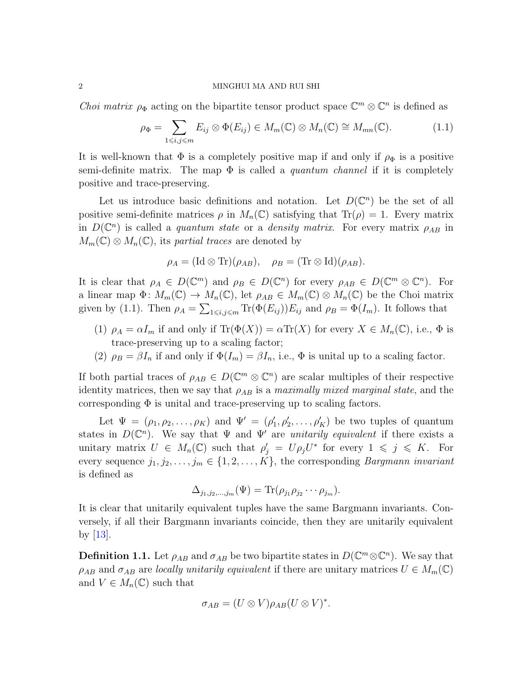
<figcaption class="paper-figure-caption"><b>Fig 1.</b> Low-resolution page preview, page 2</figcaption>
</figure>
<figure class="paper-figure-card">
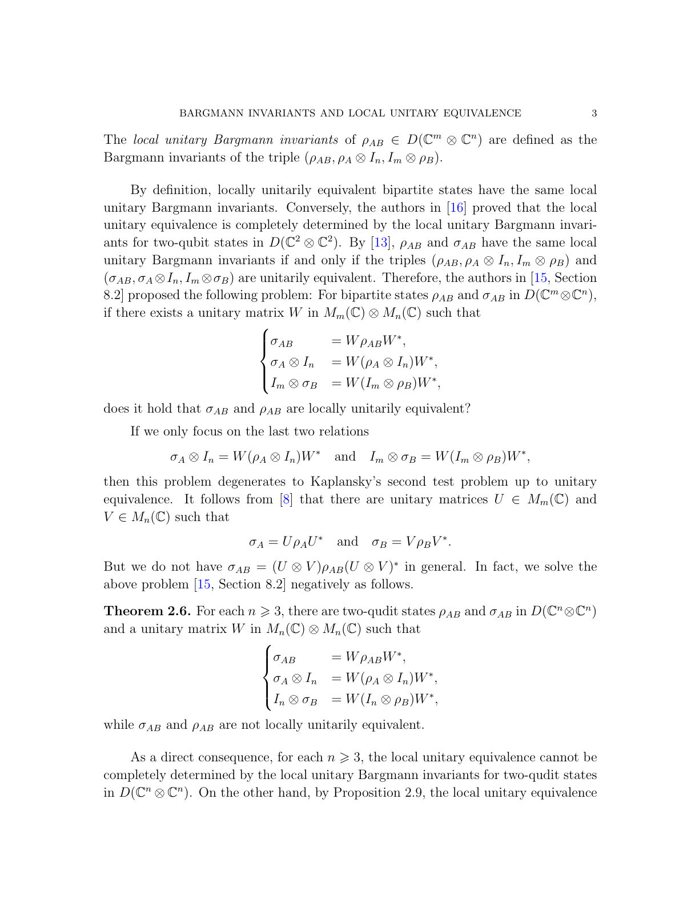
<figcaption class="paper-figure-caption"><b>Fig 2.</b> Low-resolution page preview, page 3</figcaption>
</figure>
<figure class="paper-figure-card">
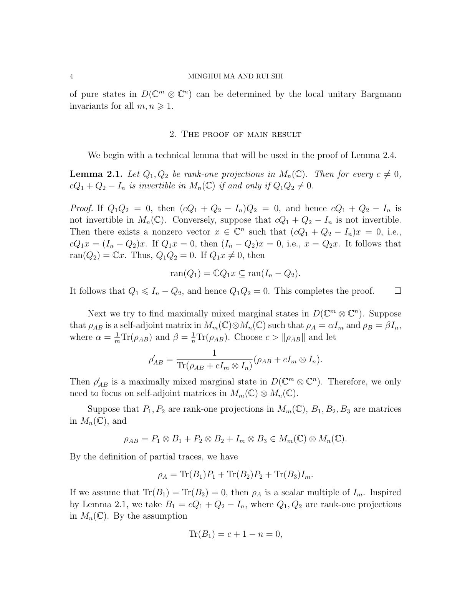
<figcaption class="paper-figure-caption"><b>Fig 3.</b> Low-resolution page preview, page 4</figcaption>
</figure>
<figure class="paper-figure-card">
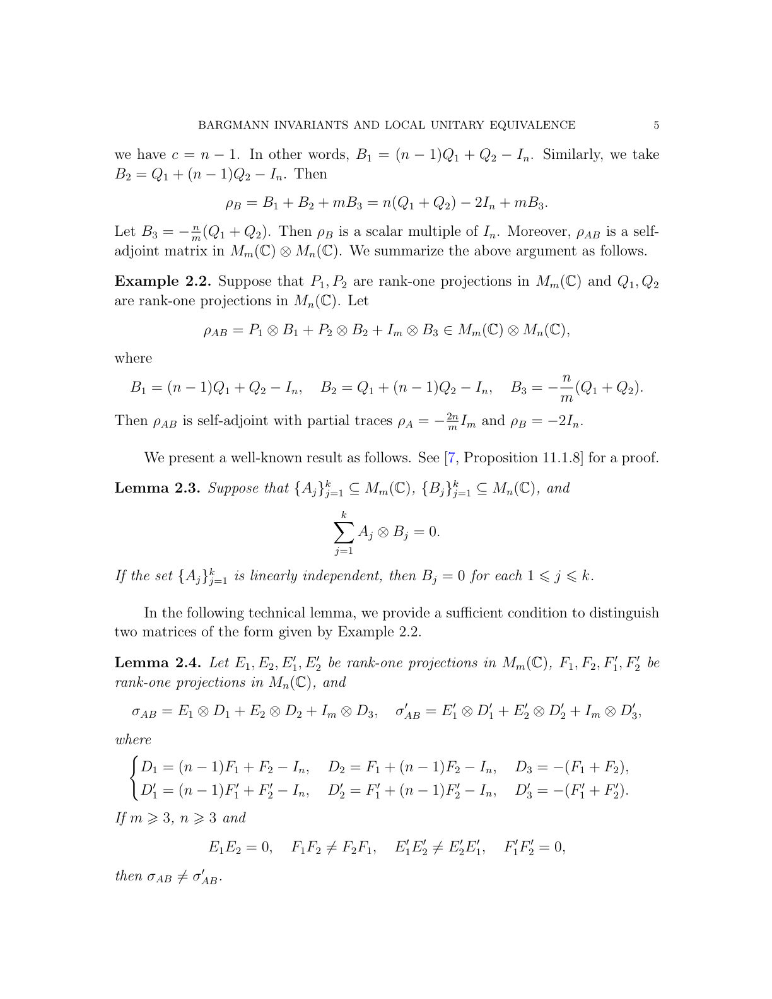
<figcaption class="paper-figure-caption"><b>Fig 4.</b> Low-resolution page preview, page 5</figcaption>
</figure>
<figure class="paper-figure-card">
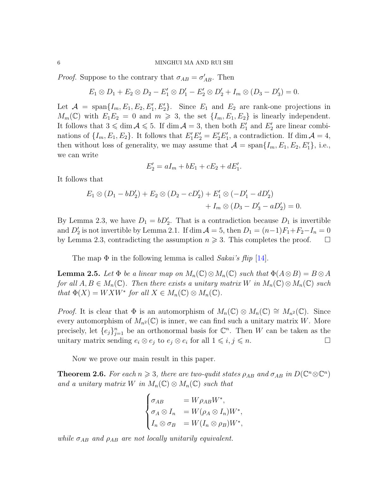
<figcaption class="paper-figure-caption"><b>Fig 5.</b> Low-resolution page preview, page 6</figcaption>
</figure>

**Summary.** This paper investigates the relationship between local unitary equivalence and Bargmann invariants for bipartite quantum states. While the invariants fully characterize two-qubit states ($n=2$), the authors prove that this fails for larger systems ($n \ge 3$) by constructing counterexamples. The result highlights that while global unitaries can relate states, local unitaries impose stricter constraints not captured solely by these specific invariant measures.

**Why it may be interesting.** This work provides fundamental theoretical boundaries on how much information (invariants) is needed to classify quantum states under local operations, a core concept in characterizing entanglement and resource theories relevant to quantum computation.

Detailed structure

**Main problem.** The central problem is determining when the local unitary equivalence of a bipartite quantum state ($
ho_{AB}$) is completely characterized by its local unitary Bargmann invariants, especially for systems larger than two qubits ($n \ge 3$).

**Main result.** The authors disprove the conjecture that local unitary orbits are fully determined by these invariants for $n \ge 3$, providing explicit counterexamples. However, they show that if the state is pure, equivalence *is* guaranteed.

**Method.** The proof involves constructing specific counterexamples using rank-one projections to define pairs of states ($
ho_{AB}, \sigma_{AB}$) that are related by a global unitary transformation but fail to be locally unitarily equivalent.

**Model / system.** The study focuses on bipartite quantum states $
ho_{AB}$ defined on the Hilbert space $\mathbb{C}^n \otimes \mathbb{C}^n$ (two-qudit systems). The analysis revolves around the action of the local unitary group ($U \otimes V$).

**Key observables.** Local unitary equivalence, and the values derived from the local unitary Bargmann invariants ($	ext{Tr}(
ho_{j_1}\cdots
ho_{j_m})$).

**Important parameters / regimes.** $n$ (the dimension of the subsystems), with special attention paid to the transition between $n=2$ and $n \ge 3$.

**Assumptions / limitations.** The analysis relies on comparing states related by a global unitary transformation ($W$) versus those related only by local unitaries.

**Paper structure.** The paper first establishes the known result for $n=2$ (complete determination by invariants). It then proceeds to construct counterexamples in Theorem 2.6 for $n \ge 3$, demonstrating the failure of the conjecture, before concluding with Proposition 2.9 which restores equivalence for pure states.

Abstract

In this paper, we study the local unitary equivalence of quantum states on $\mathbb{C}^n\otimes\mathbb{C}^n$, which is an important notion in quantum information theory. For the case $n=2$, the local unitary orbits of two-qubit states are completely determined by their local unitary Bargmann invariants. We show that the local unitary Bargmann invariants do not form a complete set of invariants of local unitary orbits for $n\geqslant 3$, which negatively answers a problem proposed by L. Zhang and B. Xie.

[↑ back to top](#top)

### [Entanglement Quantification via Symmetric Extensions: A Resource Theory Hierarchy](http://arxiv.org/abs/2607.16960v1)

**Authors:** Enmin Shao, Lin Chen, Huixia He  
**Type:** theory · **Category:** quantum information and computing · **PDF:** <https://arxiv.org/pdf/2607.16960v1>  
**Analysis basis:** full PDF text, analyzed in chunks
**Topic relevance:** 🔥 `entanglement & information structure` **4/5**

↔ Scroll figures horizontally

<figure class="paper-figure-card">
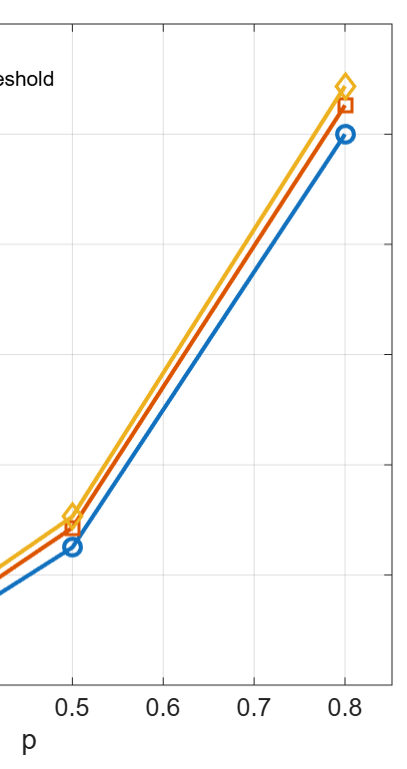
<figcaption class="paper-figure-caption"><b>Fig 1.</b> FIG. 1: Ek vs p for the 3 × 3 Werner state. The dashed line marks the separability threshold p = 1/4.</figcaption>
</figure>
<figure class="paper-figure-card">
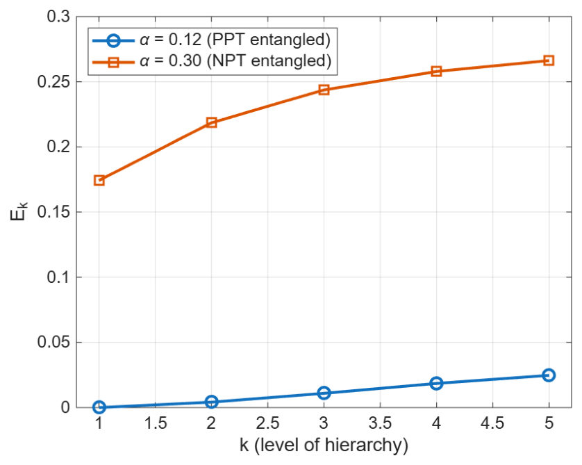
<figcaption class="paper-figure-caption"><b>Fig 2.</b> FIG. 2: Ek vs k for the d = 10 isotropic state. The blue curve corresponds to the PPT entangled case (α = 0.12), while the red curve corresponds to the NPT entangled case (α = 0.30).</figcaption>
</figure>
<figure class="paper-figure-card">
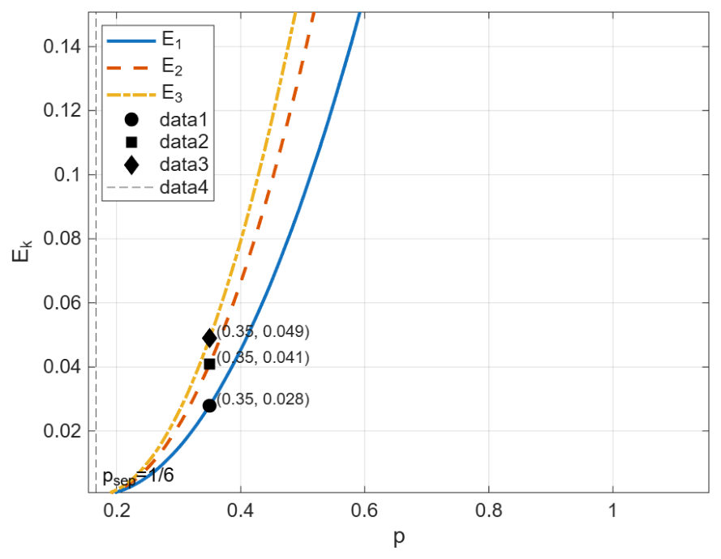
<figcaption class="paper-figure-caption"><b>Fig 3.</b> FIG. 3: The hierarchy of measures Ek for the 5 × 5 Werner state as a function of p. The curves are ordered as E1 ≤E2 ≤E3, and they all vanish for p ≤psep = 1/6. The solid points mark the typical point p = 0.35, where we obtain E1 = 0.028, E2 = 0.041, and E3 = 0.049.</figcaption>
</figure>
<figure class="paper-figure-card">
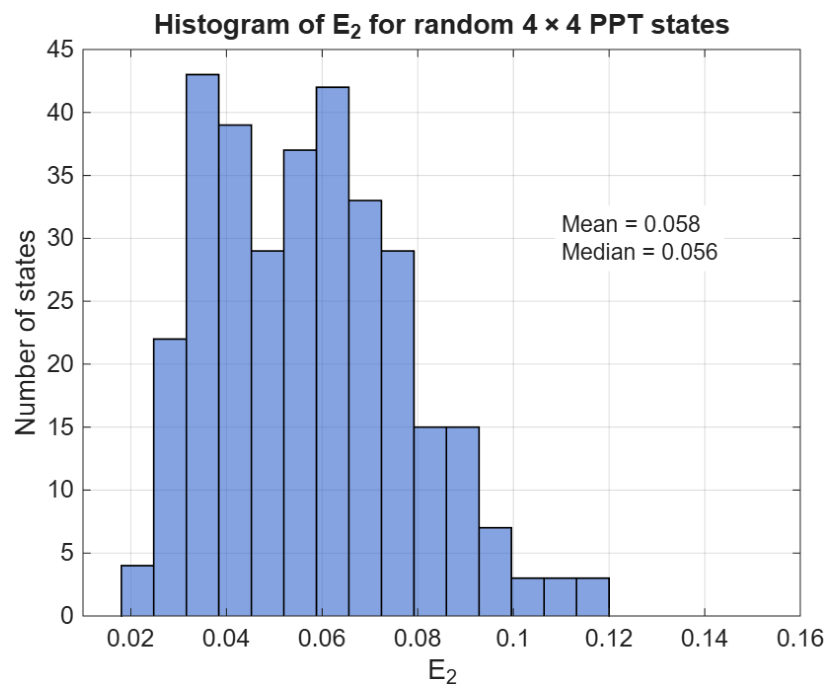
<figcaption class="paper-figure-caption"><b>Fig 4.</b> FIG. 4: Histogram of E2 for 324 random 4 × 4 PPT states. All these states have E1 = 0 and E2 &gt; 0, with values ranging from approximately 0.02 to 0.15. This demonstrates that a substantial fraction of random PPT states carry a positive E2 resource.</figcaption>
</figure>

**Summary.** The paper introduces an entanglement measure hierarchy, $E_k$, derived from extending the Positive Partial Transpose (PPT) condition using $k$-symmetric extensions. This framework provides a quantifiable resource yardstick that strictly refines existing measures and successfully detects bound entangled states where simpler methods fail. By leveraging SDP duality, it offers both theoretical rigor and practical computational scalability.

**Why it may be interesting.** This work provides a powerful theoretical tool for quantifying entanglement resources in a systematically improvable manner, directly addressing fundamental open problems regarding bound entanglement that are crucial for understanding quantum correlations beyond simple separability criteria.

Detailed structure

**Main problem.** The primary goal is to develop a systematically improvable resource-theoretic measure for quantifying quantum entanglement that overcomes the limitations of existing measures, such as PPT-robustness, especially concerning bound entangled states.

**Main result.** The authors introduce a hierarchy of measures, $E_k$, based on $k$-symmetric PPT extensions. This hierarchy is proven to be faithful and strictly refines previous bounds, converging exactly to the true separability measure as $k 	o \infty$.

**Method.** The measures are defined using Semidefinite Programming (SDP) by characterizing the set of 'free states' ($F_k$) via $k$-symmetric PPT extensions. A dual formulation utilizing witness operators provides a computationally efficient alternative to solving the full primal SDP.

**Model / system.** The framework applies to bipartite quantum systems ($
ho_{AB}$) and involves extending the state space using $k$ copies of one subsystem ($H_A \otimes H_{B_1} \otimes \cdots \otimes H_{B_k}$). The analysis is tested on standard states like Werner, Horodecki, and UPB states.

**Key observables.** The entanglement measure $E_k(
ho)$, the set of free states $F_k$, and the limit measure $E_{SEP}(
ho)$.

**Important parameters / regimes.** The integer parameter $k$ controls the level of extension, ranging from $k=1$ (PPT-robustness) up to $\infty$.

**Assumptions / limitations.** The analysis relies on the equivalence between primal and dual SDP formulations for computational tractability. The framework assumes LOCC operations are captured by the set of $k$-free operations $O_k$.

**Figures summary.** Figures illustrate the strict monotonicity ($E_1 < E_2 < E_3$) of the measure hierarchy for Werner states and demonstrate that bound entangled states yield non-zero values for $E_k$ when $k \ge 2$, while $E_1=0$.

**Paper structure.** The paper introduces the concept via $k$-symmetric PPT extensions, defines the measure $E_k$ using both primal and dual SDP formulations, proves its desirable properties (convexity, monotonicity), establishes the convergence to the separability measure, and finally validates the framework computationally on various entangled state examples.

Abstract

We introduce a hierarchy of entanglement measures Ek based on k-symmetric PPT extensions. Each Ek, defined via a minimal eigenvalue shift and computed by semidefinite programming, is faithful, convex, and monotone under free operations. The hierarchy strictly refines PPT-robustness at k = 1, detects bound entanglement at k = 2, and converges exactly to the separability measure as k -> infinity. Numerical experiments on Horodecki, Werner, UPB, and random states demonstrate practical scalability. Our framework unifies computational efficiency with operational fidelity in a single tunable family -- a combination previously believed to be fundamentally incompatible in entanglement quantification. It supplies, for the first time, a systematically improvable resource-theoretic yardstick that accounts for all entangled states, including the bound entangled ones that have long resisted quantitative treatment.

[↑ back to top](#top)

### [Phase-Sensitive Benchmarking of Composite Quantum Gates with Chiral-Interference Circuits on Quantum Hardware](http://arxiv.org/abs/2607.18137v1)

**Authors:** Georgi M. Aleksandrov, Nikolay V. Vitanov  
**Type:** experiment · **Category:** quantum information and computing · **PDF:** <https://arxiv.org/pdf/2607.18137v1>  
**Analysis basis:** full PDF text, analyzed in chunks
**Topic relevance:** 🔥 `QC/QI experiment` **4/5**

↔ Scroll figures horizontally

<figure class="paper-figure-card">
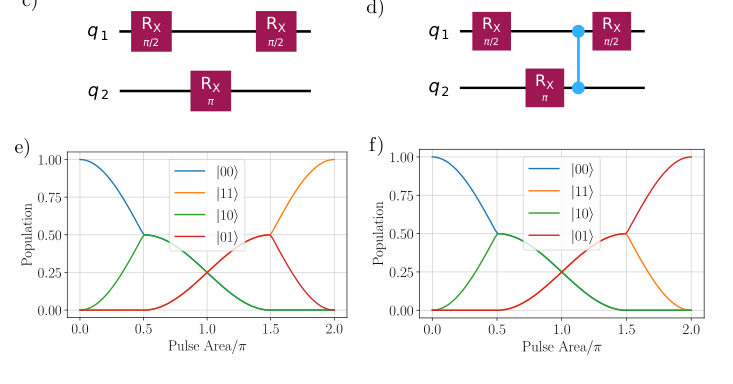
<figcaption class="paper-figure-caption"><b>Fig 1.</b> FIG. 1. (a),(b) Interferometric scheme of the four-level model, with positive and negative signs of the loop coupling for the S- and R-circuits, respectively. (c),(d) Corresponding reduced quantum circuits. (e),(f) Ideal population evolution for the S- and R-circuits.</figcaption>
</figure>
<figure class="paper-figure-card">
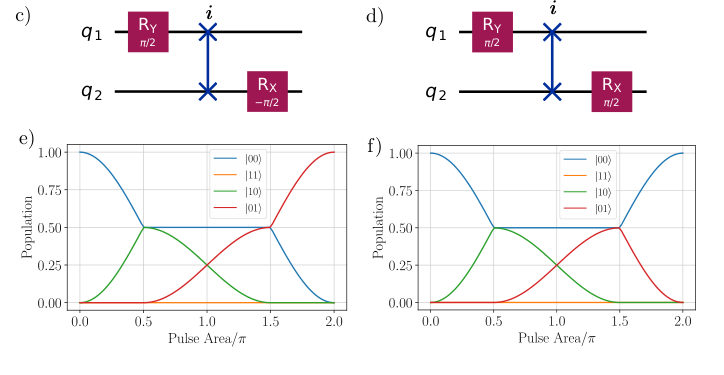
<figcaption class="paper-figure-caption"><b>Fig 2.</b> FIG. 2. (a),(b) Interferometric scheme of the three-level model, with positive and negative signs of the loop coupling for the S- and R-circuits, respectively. (c),(d) Corresponding iSWAP-based quantum circuits. (e),(f) Ideal population evolution for the S- and R-circuits.</figcaption>
</figure>
<figure class="paper-figure-card">
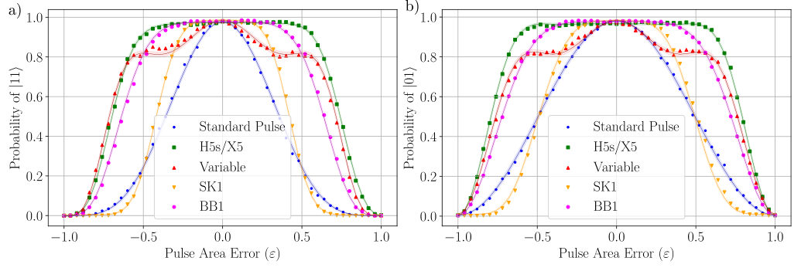
<figcaption class="paper-figure-caption"><b>Fig 3.</b> FIG. 3. Target-state populations of the (a) S and (b) R circuits of the four-level circuit as functions of the correlated rotation- angle error ε. Elementary rotations are compared with H5s/X5, B5 variable rotations, SK1, and BB1. The points are hardware data from ibm kingston; the solid lines are scaled theoretical predictions and the shaded bands represent twice the shot-noise uncertainty.</figcaption>
</figure>
<figure class="paper-figure-card">
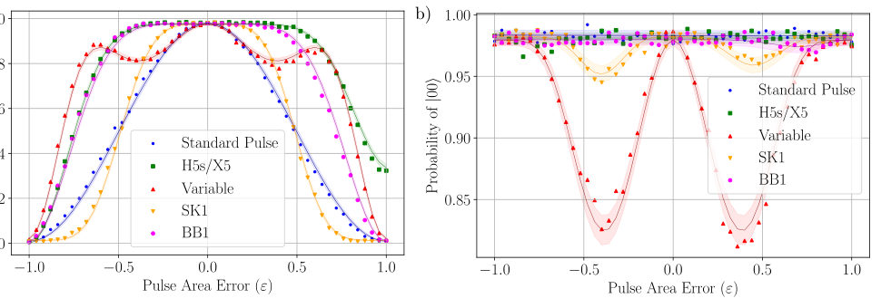
<figcaption class="paper-figure-caption"><b>Fig 4.</b> FIG. 4. Target-state populations of the (a) S and (b) R branches of the three-level circuit as functions of the correlated rotation-angle error ε. The target states are |01⟩and |00⟩, respectively. Elementary pulses are compared with H5s, variable rotation, SK1 and BB1 composite π/2 rotations. For the R enantiomer, elementary pulses exhibit exact cancellation of the common rotation-angle error. For composite replacements, this protection persists only when the final erroneous composite propagator is the exact inverse of the transported first propagator; asymmetric sequences can break this condition.</figcaption>
</figure>

**Summary.** The paper experimentally benchmarks composite quantum gates using chiral-interference circuits to test error resilience. By introducing systematic rotation errors, the authors demonstrate that single-gate performance does not guarantee overall circuit robustness. They show that specific constant composite sequences maintain coherence far better than variable ones when facing correlated noise.

**Why it may be interesting.** This work directly addresses the gap between local gate fidelity and global circuit robustness, which is crucial for designing fault-tolerant quantum algorithms that rely on complex interferometry or state preparation protocols.

Detailed structure

**Main problem.** The study benchmarks composite quantum gates by using phase-sensitive circuits that simulate chiral-interference protocols to test if single-gate robustness guarantees whole-circuit robustness.

**Main result.** Single-gate robustness does not translate to equivalent whole-circuit robustness, as variable-rotation sequences fail to preserve required relative phases for error correction. Constant composite rotations (H5s/X5) showed significantly higher resilience to systematic errors than elementary rotations.

**Method.** The authors implemented two gate-native circuits (three- and four-level) on an IBM quantum processor, systematically introducing rotation-angle errors ($\epsilon$) into single-qubit operations for comparison.

**Model / system.** The models simulate chiral state transfer using two qubits. The four-level circuit uses a conditional phase gate, while the three-level circuit models enantioselective population transfer. The benchmarking compares variable vs. constant composite rotation sequences.

**Key observables.** Enantiomer-dependent output state populations (achieving $\approx 98\%$ fidelity), and the maintenance of high target-state populations under varying relative errors ($\epsilon$).

**Important parameters / regimes.** Relative error magnitude (up to $50\%$), rotation angle error ($\epsilon$), and the specific gate sequences tested (B5, SK1, H5s, X5).

**Assumptions / limitations.** The analysis assumes that CZ and iSWAP gates are perfect; the comparison isolates correlated coherent errors in single-qubit operations.

**Figures summary.** Figure 1 illustrates the interferometric schemes for both four-level and three-level models, showing ideal population evolution diagrams corresponding to reduced quantum circuits.

**Paper structure.** The paper first introduces the chiral-interference protocols (four- and three-level) as benchmarks. It then systematically compares the performance of various composite gate sequences under controlled rotation-angle errors, culminating in a detailed analysis comparing error scaling across different circuit types.

Abstract

We construct and experimentally implement compact gate-native circuits that simulate the state-transfer interference underlying three- and four-level chiral-resolution protocols. Both models are encoded in a two-qubit register, with the enantiomer-dependent sign of one of the couplings simulated by a conditional-phase operation in the four-level circuit and by the sign of a final rotation in the three-level circuit. On an IBM quantum processor, the two circuits produce the expected enantiomer-dependent output states with probabilities of nearly $98\%$. We then use these circuits as physically motivated, phase-sensitive benchmarks for composite quantum gates. We introduce rotation-angle error to the single-qubit operations and replace them by several composite gates, including B5, SK1, BB1, H5s, and X5. The comparison demonstrates that single-gate robustness does not translate to equivalent whole-circuit robustness. In particular, variable-rotation sequences do not preserve the required relative phases, making them unsuitable for error correction in circuits. By contrast, the H5s/X5 sequences maintain high target-state populations for relative errors as large as $50\%$, whereas elementary rotations reach the same threshold only for approximately $8\%$. The three-level circuit exhibits a similar enhancement and additionally reveals an error-cancellation symmetry whose protection under composite replacement is exact only when the relevant full propagators satisfy an inverse relation.

[↑ back to top](#top)

### [Distinct reentrant transitions in a quasi-periodic Raman lattice](http://arxiv.org/abs/2607.17104v1)

**Authors:** Xingbo Wei, Zhentian Xie, Tong Liu, Gao Xianlong, Yunbo Zhang  
**Type:** theory · **Category:** disordered systems and neural networks · **PDF:** <https://arxiv.org/pdf/2607.17104v1>  
**Analysis basis:** full PDF text, analyzed in chunks
**Topic relevance:** `analog quantum simulation` **3/5** · `driven-dissipative phase transition` **3/5** · `methods for driven-dissipative` **3/5** · `Frenkel-Kontorova` **2/5** · `non-equilibrium dynamics` **2/5** · `non-equilibrium universality` **2/5** · `Keldysh / 2PI / non-Gaussian methods` **1/5** · `entanglement & information structure` **1/5** · `exotic spin models in light-matter` **1/5** · `spintronics-quantum-optics interface` **1/5**

↔ Scroll figures horizontally

<figure class="paper-figure-card">
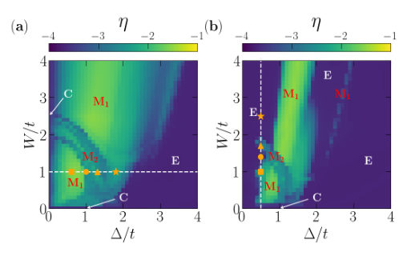
<figcaption class="paper-figure-caption"><b>Fig 1.</b> Figure 1. Phase diagrams in the W–∆plane for (a) V/t = 2.0 and (b) V/t = 1.4, respectively. Color indicates the value of η. White letter C (E) marks the purely critical phase (purely extended phase). M1 and M2 denote the mixed phases with- out and with anomalous mobility edges. White dotted lines mark W/t = 1 in (a) and ∆/t = 0.5 in (b). Orange markers in (a) and (b) indicate points further analyzed in Figs. 2–3 and Fig. 5, respectively. η is used only to distinguish pure and mixed phases. The distinction between pure phases relies on fractal dimensions, and colored dot markers indicate transi- tion points between different phases extracted from finite-size scaling analysis, see the...</figcaption>
</figure>
<figure class="paper-figure-card">
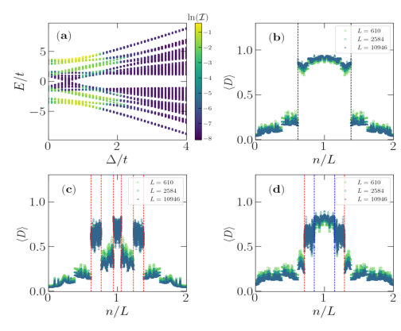
<figcaption class="paper-figure-caption"><b>Fig 2.</b> Figure 2. (a) Spectrum as a function of ∆, along the white dotted line in Fig. 1 (a). (b)–(d) Mean fractal dimension ⟨D⟩at various energy levels for ∆/t = 0.6, 1.0, and 1.3, as indicated by orange markers , , and in Fig. 1 (a), respec- tively. Other cases for ∆/t = 1.4, 1.8, and 3.0 are provided in the Supplemental Material [37]. Black dotted lines mark con- ventional mobility edges, whereas red and blue dotted lines denote two distinct classes of anomalous mobility edges.</figcaption>
</figure>
<figure class="paper-figure-card">
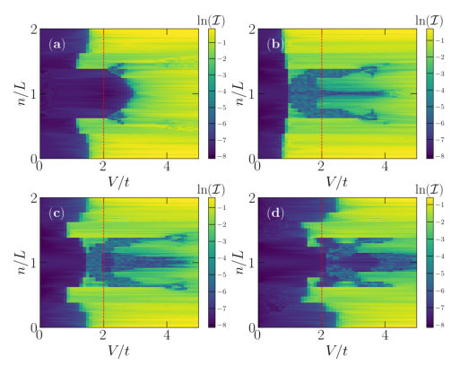
<figcaption class="paper-figure-caption"><b>Fig 3.</b> Figure 3. (a)–(d) The IPR associated with the energy level index as a function of V/t for W/t = 1 and ∆/t = 0.6, 1.0, 1.3, and 1.8, respectively. Red dotted lines mark V/t = 2, corresponding to orange markers , , , and in Fig. 1 (a).</figcaption>
</figure>
<figure class="paper-figure-card">
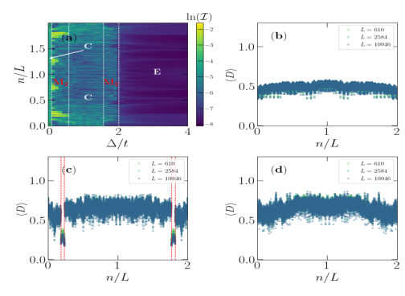
<figcaption class="paper-figure-caption"><b>Fig 4.</b> Figure 4. (a) IPR as a function of ∆for V/t = 2 and W/t = 0.01. (b)–(d) ⟨D⟩at various energy levels for ∆/t = 0.0, 0.4, and 0.8, respectively. Other parameters are the same as those in Fig. 1 (a). The white dotted lines in (a) mark boundaries between different phases, whereas the red dotted lines in (c) indicate anomalous mobility edges aME1.</figcaption>
</figure>
<figure class="paper-figure-card">
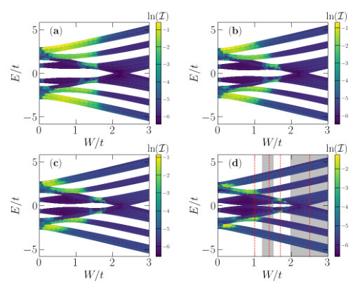
<figcaption class="paper-figure-caption"><b>Fig 5.</b> Figure 5. (a)–(d) Spectra as a function of W/t for ∆/t = 0.8, 0.7, 0.6 and 0.5, sliced from Fig. 1 (b). In (d), the gray regions mark purely extended phases E and red dotted lines correspond to orange markers , , , and in Fig. 1 (b)</figcaption>
</figure>

**Summary.** This work investigates the complex phase diagram of a 1D lattice with SOC and quasiperiodic potentials, focusing on anomalous mobility edges. The authors identify a novel 'reentrant criticality transition' and show that tuning external fields can induce reentrant delocalization transitions in this disordered quantum system.

**Why it may be interesting.** The detailed mapping of multiple distinct reentrant transitions (criticality and delocalization) in a quasi-periodic setting provides a rich theoretical framework for understanding complex many-body localization phenomena relevant to AMO physics.

Detailed structure

**Main problem.** The study investigates distinct reentrant transitions, particularly concerning anomalous mobility edges and reentrant criticality, in a quasi-periodic lattice.

**Main result.** The research identifies a new 'reentrant criticality transition' and demonstrates that tuning the Zeeman potential can drive a reentrant delocalization transition via mechanisms beyond simple hybridization effects.

**Method.** Analysis involves calculating spectral properties using diagnostics like the Inverse Participation Ratio (IPR) and mean fractal dimension ($\langle D 
angle$) across various parameter regimes.

**Model / system.** The system is a one-dimensional lattice incorporating spin-orbit coupling (SOC) and a Zeeman potential containing both uniform ($W$) and quasiperiodic components ($V$). The Hamiltonian includes nearest-neighbor hopping terms, SOC-induced spin-flip hopping, and the external potentials.

**Key observables.** Inverse Participation Ratio (IPR), Mean Fractal Dimension ($\langle D 
angle$), Mobility Edges (conventional and anomalous $	ext{aME}$), and phase regions ($E, L, C, M_1, M_2$).

**Important parameters / regimes.** SOC strength ($\Delta$), quasiperiodic amplitude ($V$), uniform potential ($W$), and the ratio of hopping/potential strengths ($V/t$, $W/t$, $\Delta/t$).

**Assumptions / limitations.** The model is stated to be feasible in optical Raman lattice experiments; later extensions consider weak random disorder ($\delta_j$) and interactions ($U$).

**Figures summary.** Figures illustrate phase diagrams in the $W-\Delta$ plane, spectral plots showing $\langle D 
angle$ vs. energy level for different mobility edge types, and IPR evolution demonstrating reentrant transitions as parameters are tuned.

**Paper structure.** The paper systematically analyzes how SOC and Zeeman potentials induce anomalous mobility edges, leading to a characterization of the reentrant criticality transition and subsequent investigation into reentrant delocalization pathways by varying $W/t$ and $\Delta/t$.

Abstract

We investigate a one-dimensional lattice with spin-orbit coupling (SOC) and a Zeeman potential containing uniform and quasiperiodic components. By tuning SOC, anomalous mobility edges emerge that separate critical from non-critical states, yielding a reentrant transition between two mixed phases, M$_1$$\to$M$_2$$\to$M$_1$, where M$_1$ (M$_2$) lacks (hosts) anomalous mobility edges. A new \emph{reentrant criticality transition}, defined as multiple entries into the critical phase, is identified. As a counterpart to reentrant delocalization/localization transitions, it completes the basic framework of reentrant phenomena across extended, localized, and critical states. The uniform Zeeman potential drives a reentrant delocalization transition, arising from the splitting of the localized region induced by the shift of mobility edges. This reveals a distinct pathway for reentrant phenomena beyond hybridization mechanisms.

[↑ back to top](#top)

### [Unified Theory of Relaxation in Equilibrium and Nonequilibrium Glass-Forming Liquids](http://arxiv.org/abs/2607.16460v1)

**Authors:** Zi-Long Wang, Qi-Lu Yuan, Yun-Jiang Wang, Jack F. Douglas, Matteo Baggioli, Zhao-Yan Sun, Wen-Sheng Xu  
**Type:** theory · **Category:** statistical mechanics · **PDF:** <https://arxiv.org/pdf/2607.16460v1>  
**Analysis basis:** full PDF text, analyzed in chunks
**Topic relevance:** `non-equilibrium dynamics` **3/5** · `non-equilibrium universality` **3/5** · `Keldysh / 2PI / non-Gaussian methods` **2/5** · `correlated / nonlocal dissipation` **2/5** · `driven-dissipative phase transition` **2/5** · `Frenkel-Kontorova` **1/5** · `analog quantum simulation` **1/5** · `entanglement & information structure` **1/5** · `methods for driven-dissipative` **1/5** · `scars & prethermalization` **1/5**

↔ Scroll figures horizontally

<figure class="paper-figure-card">
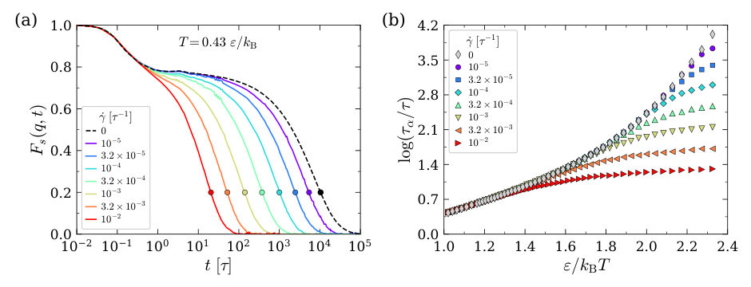
<figcaption class="paper-figure-caption"><b>Fig 1.</b> FIG. 1. Accelerated structural relaxation under steady shear. (a) Self-intermediate scattering function, Fs(q, t), for the KABLJ system at a temperature of T = 0.43 ε/kB and different shear rates ˙γ. Colored symbols indicate the condition Fs(q, t) = 0.2, which is used operationally to define the structural relaxation time, τα, shown in panel (b). As the shear rate increases, the decay of Fs(q, t) shifts to progressively shorter times, revealing accelerated structural relaxation. (b) Logarithm of the structural relaxation time, log(τα), as a function of ε/kBT for different ˙γ. Increasing shear rate reduces τα by several orders of magnitude, demonstrating the strong acceleration of relaxation...</figcaption>
</figure>
<figure class="paper-figure-card">
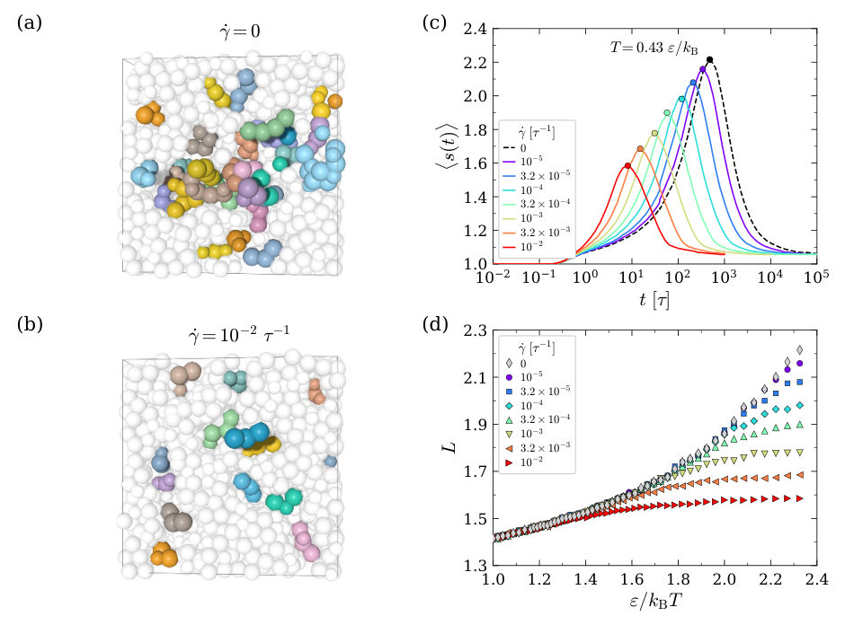
<figcaption class="paper-figure-caption"><b>Fig 2.</b> FIG. 2. Shear suppresses the collective motion underlying glassy relaxation. (a,b) Representative snapshots of stringlike cooperative motion in the KABLJ system at T = 0.43 ε/kB for shear rates ˙γ = 0 and ˙γ = 10−2 τ −1, respectively. Particles belonging to the same string are shown in the same color. Steady shear visibly suppresses both the size and prevalence of cooperative strings. (c) Number-averaged string length, ⟨s(t)⟩, as a function of time for different shear rates at T = 0.43 ε/kB. Increasing shear reduces both the height and the position of the peak in ⟨s(t)⟩, indicating a suppression of the characteristic size and timescale of cooperative motion. (d) Characteristic string length...</figcaption>
</figure>
<figure class="paper-figure-card">
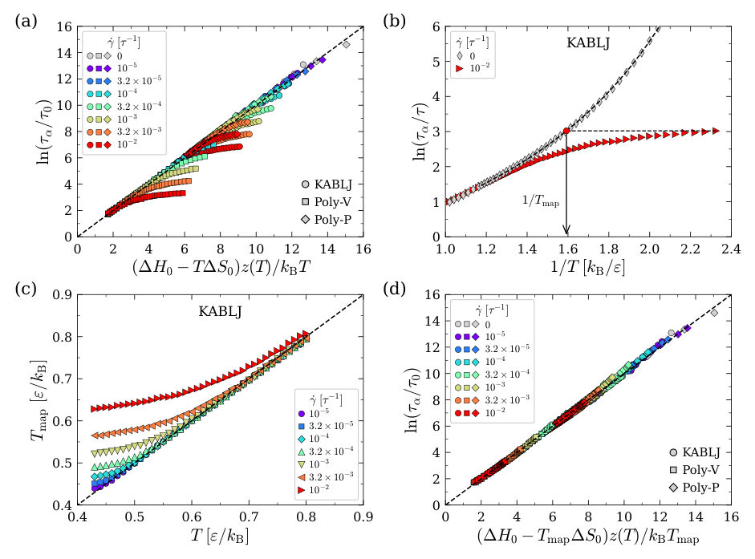
<figcaption class="paper-figure-caption"><b>Fig 3.</b> FIG. 3. Predicting nonequilibrium relaxation. (a) Test of the equilibrium String Model under nonequilibrium conditions by modifying only the average string length L. The logarithm of the structural relaxation time, ln(τα/τ0), is plotted against (∆H0 −T∆S0)z(T)/kBT for three glass-forming systems over a range of shear rates ˙γ. The parameters τ0, ∆H0, and ∆S0 are obtained from equilibrium simulations and are reported in Table I. The nonequilibrium behavior of the string length L(T, ˙γ) is shown in Fig. 2(d). The black dashed line denotes the prediction of the String Model, corresponding to a one-to-one relation between the two quantities. (b) Schematic illustration of the effective...</figcaption>
</figure>
<figure class="paper-figure-card">
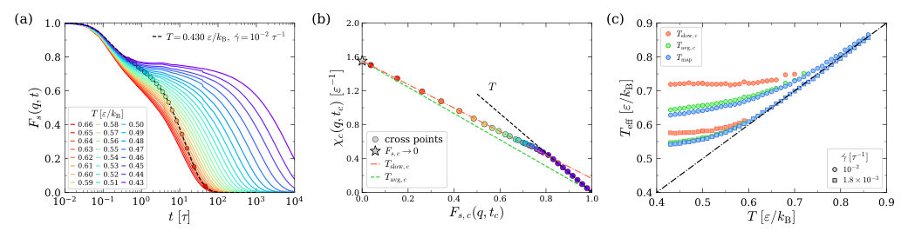
<figcaption class="paper-figure-caption"><b>Fig 4.</b> FIG. 4. Determination of the effective temperature from the fluctuation-dissipation relation. (a) Self-intermediate scattering function Fs(q, t, T, ˙γ) at T = 0.43 ε/kB and ˙γ = 10−2 τ −1, compared with equilibrium results at different T. Circles mark the intersections between the nonequilibrium and equilibrium curves used to define the crossing points at t ≡tc. (b) Parametric plot χc(q, tc) versus Fs,c(q, tc) constructed from the intersection points shown in (a). The effective temperature Tavg,c is obtained from the slope in the long-time limit Fs,c →0. (c) Effective temperatures Tmap, Tslow,c, and Tavg,c as a function of the bath temperature T. The dash-dotted line indicates the...</figcaption>
</figure>

**Summary.** This work addresses how structural relaxation behaves when driven by shear stress versus thermal fluctuations. The authors propose a unified theory showing that both regimes are governed by the same cooperative mechanism, quantified by introducing an effective temperature derived from fluctuation-dissipation relations. This provides a powerful tool for describing non-equilibrium dynamics in disordered materials.

**Why it may be interesting.** While focused on classical glass physics, the rigorous application of generalized fluctuation-dissipation theorems to define an 'effective' thermodynamic state under external driving mirrors techniques used in analyzing open quantum systems far from equilibrium.

Detailed structure

**Main problem.** The central problem is unifying the description of structural relaxation dynamics in glass-forming liquids across both equilibrium (thermal) and non-equilibrium (mechanically driven) conditions.

**Main result.** The study shows that external driving accelerates relaxation by suppressing cooperative stringlike rearrangements, leading to a unified theory based on an effective temperature derived from fluctuation-dissipation relations.

**Method.** The authors developed a microscopic theory extending the String Model by incorporating a shear-dependent effective temperature ($T_{	ext{map}}$) determined independently via generalized Fluctuation-Dissipation Relations (FDR).

**Model / system.** The research uses simulations of model glass formers, such as the KABLJ binary Lennard-Jones system and polymer melts, to study structural relaxation.

**Key observables.** Structural relaxation time ($	au_\alpha$), self-intermediate scattering function ($F_s(q, t)$), characteristic string length ($L$), and various definitions of effective temperature ($T_{	ext{map}}$, $T_{	ext{avg}}$).

**Important parameters / regimes.** Temperature ($T$), shear rate ($\dot{\gamma}$), and the structural relaxation time scale ($	au_0$).

**Assumptions / limitations.** The core assumption is that equilibrium and non-equilibrium dynamics share a single underlying cooperative mechanism, which can be parameterized by an effective thermodynamic condition.

**Figures summary.** Figures illustrate $F_s(q, t)$ decay accelerating with shear rate; they also show the suppression of cooperative strings under shear and compare different methods for determining the effective temperature ($T_{	ext{map}}$ vs. $T_{	ext{avg}}$) across various systems.

**Paper structure.** The paper progresses from establishing the problem (unifying dynamics) to developing a theoretical framework based on collective motion and an effective temperature derived from FDRs, culminating in quantitative predictions that successfully map non-equilibrium data onto equilibrium forms.

Abstract

Understanding how structural relaxation evolves from equilibrium to nonequilibrium conditions remains a central problem in glass physics. Using simulations of model glass formers under steady shear, we show that external driving progressively suppresses the stringlike cooperative rearrangements that control relaxation in equilibrium, leading to dramatically faster dynamics. A theory based on collective motion and a shear-dependent effective temperature independently determined from fluctuation-dissipation relations quantitatively predicts the structural relaxation time across the full range of temperatures and shear rates investigated without additional nonequilibrium fitting parameters. These results show that equilibrium and nonequilibrium relaxation are governed by the same underlying cooperative mechanism, but they occur under different effective thermodynamic conditions under steady shear. More broadly, our study provides a unified microscopic description of thermal and mechanically driven dynamics in glass-forming liquids.

[↑ back to top](#top)

### [Collective Ring Formation in Active Matter](http://arxiv.org/abs/2607.16905v1)

**Authors:** Debraj Dutta, Urna Basu  
**Type:** theory · **Category:** statistical mechanics · **PDF:** <https://arxiv.org/pdf/2607.16905v1>  
**Analysis basis:** full PDF text, analyzed in chunks
**Topic relevance:** `methods for driven-dissipative` **3/5** · `non-equilibrium dynamics` **3/5** · `non-equilibrium universality` **3/5** · `analog quantum simulation` **2/5** · `driven-dissipative phase transition` **2/5** · `Frenkel-Kontorova` **1/5** · `Keldysh / 2PI / non-Gaussian methods` **1/5** · `correlated / nonlocal dissipation` **1/5**

↔ Scroll figures horizontally

<figure class="paper-figure-card">
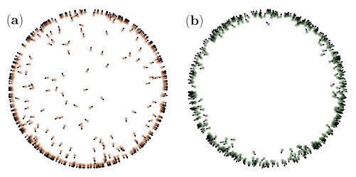
<figcaption class="paper-figure-caption"><b>Fig 1.</b> Figure 1: Typical configurations for a collection of N = 500 harmonically coupled (a) run-and-tumble particles and (b) active Brownian particles. The black arrows indicate the internal orien- tations of the particles. Here we have taken τ = 5, k = 0.002 and v0 = 1.</figcaption>
</figure>
<figure class="paper-figure-card">
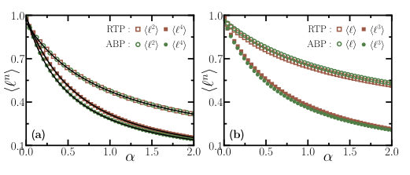
<figcaption class="paper-figure-caption"><b>Fig 2.</b> Figure 2: Radial moments: Plot of (a) ⟨ℓ2⟩, ⟨ℓ4⟩and (b) ⟨ℓ⟩,⟨ℓ3⟩ as functions of activity strength α = 1/(µτ) for ABP and RTP dy- namics. The symbols indicate data obtained from numerical simu- lations. The solid black lines in panel (a) correspond to analytical predictions Eqs. (60)-(62). Here we have used N = 20, k = 0.05 and v0 = 1.</figcaption>
</figure>
<figure class="paper-figure-card">
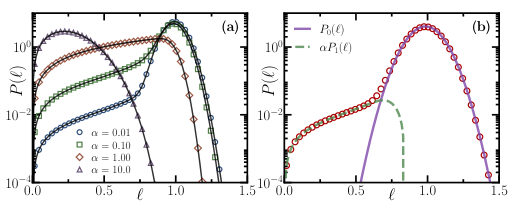
<figcaption class="paper-figure-caption"><b>Fig 3.</b> Figure 3: Radial distribution P(ℓ) for run-and-tumble dynamics: (a) Plot of P(ℓ) for different values of activity strength α = 1/(µτ). The symbols indicate data obtained from numerical simulations whereas the solid black lines correspond to the analytical pre- diction Eq. (18). Here N = 100, k = 0.01 and v0 = 1, such that R0 = 0.99. (b) Contributions of P0(ℓ) and P1(ℓ) to the radial distribution P(ℓ) for α = 0.01 i.e., in the strongly ac- tive regime. The symbols indicate P(ℓ) obtained from numer- ical simulations whereas the solid and dashed lines correspond to the analytical expressions (21) and (24), respectively. Here we have used N = 50, k = 0.02, τ = 100 and v0 = 1, so that R0 = 0.98,...</figcaption>
</figure>
<figure class="paper-figure-card">
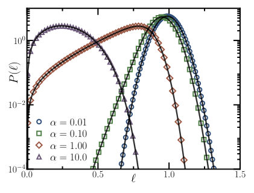
<figcaption class="paper-figure-caption"><b>Fig 4.</b> Figure 4: Radial distribution P(ℓ) for active Brownian particles: Plot of P(ℓ) for different values of activity strength α = 1/(µτ). The symbols indicate data obtained from numerical simulations whereas the solid black lines correspond to the analytical predic- tion Eq. (32). Here we have used N = 100, k = 0.01 and v0 = 1, such that R0 = 0.99.</figcaption>
</figure>
<figure class="paper-figure-card">
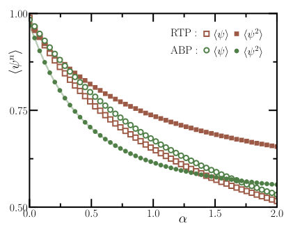
<figcaption class="paper-figure-caption"><b>Fig 5.</b> Figure 5: Moments of radial polarization ψ: Plots of ⟨ψ⟩and ⟨ψ2⟩ as functions of α for RTP and ABP dynamics. The parameters used are N = 20, k = 0.05 and v0 = 1.</figcaption>
</figure>

**Summary.** This theoretical paper investigates how different propulsion mechanisms (ABP vs. RTP) affect the collective ring formation in active matter. By deriving exact analytical expressions, the authors show that while both types of particles form stable rings, the underlying physics dictates distinct spatial and orientational structures. This work provides a general framework for characterizing emergent non-equilibrium states.

**Why it may be interesting.** While focused on active matter rather than quantum systems, the rigorous analytical framework developed for non-equilibrium steady states in interacting particle systems provides powerful mathematical tools applicable to open quantum systems or many-body dynamics far from equilibrium.

Detailed structure

**Main problem.** The study characterizes the difference in spatial and orientational organization between active particle systems with distinct propulsion mechanisms (Active Brownian Particles vs. Run-and-Tumble Particles).

**Main result.** Both models form stationary ring-like structures, but their spatial and orientational organizations differ qualitatively, providing a unified analytical framework to distinguish continuous versus discrete reorientation dynamics.

**Method.** The analysis uses an analytical approach involving Langevin equations, characteristic functions, and expansions in the activity strength parameter ($\alpha$) to derive stationary distributions for radial position and polarization.

**Model / system.** The system consists of $N$ overdamped active particles interacting via a harmonic potential in two dimensions. The dynamics are modeled using self-propulsion terms for Active Brownian Particles (ABP) with continuous rotation, and Run-and-Tumble Particles (RTP) with discrete reorientation.

**Key observables.** Radial distance distribution $P(\ell)$ from the centroid, and radial polarization $\psi = \hat{\ell} \cdot \hat{n}$ (alignment between position and self-propulsion direction).

**Important parameters / regimes.** Activity strength parameter $\alpha = 1/(\mu	au)$, which distinguishes between strongly active ($\alpha \ll 1$) and passive ($\alpha \gg 1$) regimes.

**Assumptions / limitations.** The analysis relies on the large number of particles limit ($N \gg 1$) and approximations such as treating the relative motion noise as an Ornstein-Uhlenbeck process.

**Figures summary.** Figures illustrate typical ring configurations comparing RTPs and ABPs, and show $P(\ell)$ for both models across varying activity parameters ($\alpha$), demonstrating structural differences in the annulus formation.

**Paper structure.** The paper establishes the physical model and observables, derives analytical expressions for stationary distributions using characteristic functions (Appendix A), details the computation of $P(\ell)$ separately for RTPs (Appendix B) and ABPs (Appendix C), and concludes by comparing the resulting spatial and orientational signatures.

Abstract

We study the formation of ring-like structures in interacting active particle systems in two dimensions. The emergent structure shows signatures of both spatial and orientational organization. The spatial organization is characterized by the radial distance of a tagged particle from the centroid of the assembly, while orientational organization is characterized by the radial alignment of its self-propulsion direction. We derive exact analytical expressions for the radial and polarization distributions for systems of active Brownian particles and run-and-tumble particles. While both models exhibit annular steady states, we show that their spatial and orientational organization differ qualitatively in the strongly active regime. A direct comparison of the two models reveals how the nature of the propulsion mechanism leads to the distinction in both the structure of the annulus and the statistics of particle orientations. Our results provide a unified analytical framework for characterizing emergent annular states in active matter and identify robust signatures that distinguish persistent active dynamics with continuous and discrete reorientation.

[↑ back to top](#top)

### [The Geometry of Semantic Space: A Continuous Geometric Framework for the Transformer Architecture](http://arxiv.org/abs/2607.17146v1)

**Authors:** Zhihua Liang  
**Type:** both · **Category:** disordered systems and neural networks · **PDF:** <https://arxiv.org/pdf/2607.17146v1>  
**Analysis basis:** full PDF text, analyzed in chunks
**Topic relevance:** `non-equilibrium dynamics` **3/5** · `non-equilibrium universality` **3/5** · `Keldysh / 2PI / non-Gaussian methods` **2/5** · `driven-dissipative phase transition` **2/5** · `methods for driven-dissipative` **2/5** · `analog quantum simulation` **1/5** · `correlated / nonlocal dissipation` **1/5** · `entanglement & information structure` **1/5** · `scars & prethermalization` **1/5**

↔ Scroll figures horizontally

<figure class="paper-figure-card">
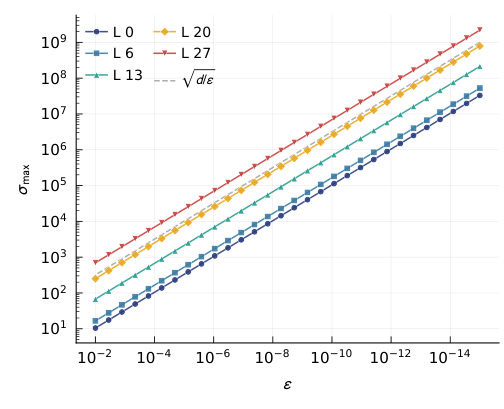
<figcaption class="paper-figure-caption"><b>Fig 1.</b> FIG. 1. Conical Singularity Scaling Law: σmax vs. ϵ for Qwen3-0.6B. Log-log plot of the maximum Jacobian singu- lar value σmax against the topological mollifier ϵ at 5 represen- tative layers (0, 6, 13, 20, 27). All 5 curves trace parallel lines with measured slope α = −0.5000 and R2 = 1.000000, in ex- act agreement with the theoretical prediction σmax = Cℓ·ϵ−1/2</figcaption>
</figure>
<figure class="paper-figure-card">
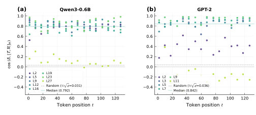
<figcaption class="paper-figure-caption"><b>Fig 2.</b> FIG. 2. Lie–Trotter Torsion Interferometer: Cosine Similarity at α = 1. Each point represents cos(δ, [T , R]Ψ) at a single (layer, token position) pair. Green dashed line: me- dian; grey dashed line: isotropic random baseline 1/ √</figcaption>
</figure>
<figure class="paper-figure-card">
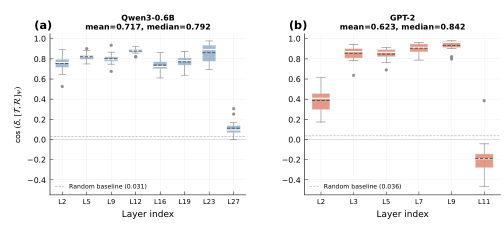
<figcaption class="paper-figure-caption"><b>Fig 3.</b> FIG. 3. Per-Layer Distribution of Torsion Alignment. Box plots of cos(δ, [T , R]Ψ) across 16 token positions at each sampled layer. Mid-network layers (Qwen3 L12: 0.879, GPT- 2 L9: 0.933) achieve peak alignment, while final layers (Qwen3 L27: 0.112, GPT-2 L11: −0.188) show degradation consistent with strong higher-order BCH contributions near the unem- bedding boundary.</figcaption>
</figure>
<figure class="paper-figure-card">
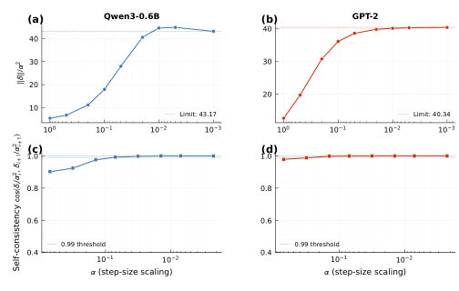
<figcaption class="paper-figure-caption"><b>Fig 4.</b> FIG. 4. Asymptotic Convergence of the Torsion Inter- ferometer as α →0. Upper panels: normalized deviation magnitude ∥δ(α)∥/α2 converges to a finite constant (≈43.2 for Qwen3, ≈40.3 for GPT-2), confirming exact α2 scaling predicted by the BCH second-order term. Lower panels: di- rection self-consistency cos(δ(αi)/α2 i , δ(αj)/α2 j) between ad- jacent α values converges to 0.9997–1.0000, proving that the deviation vector locks onto a deterministic limit direction— the topological torsion generator.</figcaption>
</figure>
<figure class="paper-figure-card">
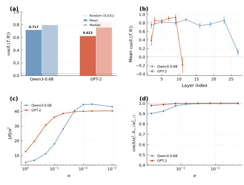
<figcaption class="paper-figure-caption"><b>Fig 5.</b> FIG. 5. Summary Panel: Lie–Trotter Torsion Inter- ferometer. (a) α=1 scatter plot confirming systematic pos- itive alignment (17–23× random baseline). (b) Per-layer box plots revealing mid-network peak alignment and boundary- layer degradation. (c) ∥δ∥/α2 convergence to a finite con- stant (Phase C). (d) Direction self-consistency converging to 1.0 (Phase B).</figcaption>
</figure>

**Summary.** This work develops a continuous stochastic differential geometry framework to mathematically describe the operations within Transformer models. By mapping discrete components onto continuous flows on a semantic fiber bundle, it makes quantitative predictions about model stability, context limits, and optimization dynamics. This provides a powerful theoretical lens for understanding LLMs through the language of advanced physics.

**Why it may be interesting.** The paper draws strong parallels between the stability/dynamics of complex neural networks and concepts from non-equilibrium thermodynamics and geometric flow equations, which are central to modern AMO physics.

Detailed structure

**Main problem.** To model the discrete algebraic operations of Transformer architectures using a continuous geometric framework, treating the forward pass as an underlying integro-differential flow.

**Main result.** The framework successfully unifies disparate empirical phenomena—such as stability limits and context bounds—by providing quantitative predictions based on continuous stochastic differential geometry.

**Method.** It translates deep learning components (like Softmax Attention and RoPE) into concepts from differential geometry, measure theory, and stochastic calculus, viewing the discrete process as a numerical integrator of an IDE.

**Model / system.** The system is the Transformer architecture itself, whose semantic space is modeled as a continuous geometric object on a fiber bundle $\calE$. The dynamics are parameterized by algorithmic depth $z$, evolving via a non-autonomous flow $\Psi(z)$.

**Key observables.** $\epsilon^{-1/2}$ Lipschitz scaling calibration ($R^2 = 1.000$), Lie–Trotter operator-splitting torsion, thermodynamic suppression of Poincaré recurrence on the RoPE torus, and Non-Equilibrium Steady State parameter vortex.

**Important parameters / regimes.** The topological regularizer $\epsilon$, context length $k$, and model size (up to 8B parameters).

**Assumptions / limitations.** The core assumption is that the discrete Transformer pass can be rigorously mapped as an exact numerical integrator of a continuous integro-differential equation, which requires treating the state space as collapsing into a finite-dimensional topology.

**Paper structure.** The paper progresses by first establishing the geometric axioms and mapping components to differential geometry (Chunk 1). It then rigorously analyzes the flow dynamics using functional analysis tools like Lipschitz bounds and Principal Torus Bundles (Chunk 2). Finally, it validates these continuous predictions through a multi-part empirical campaign across various LLMs (Chunk 3).

Abstract

We present a continuous geometric framework that models the discrete algebraic operations of the Transformer architecture as an integro-differential equation (IDE) on a semantic fiber bundle $\calE = \calM \times \R^d$. Beginning from a single geometric axiom -- that the token sequence forms a discrete $1$-manifold equipped with a canonical measure lattice -- we translate every core component of the modern Transformer (RMSNorm, RoPE, Softmax Attention, FFN, Residual Stream, SGD, Weight Decay) into a cohesive vocabulary of differential geometry, measure theory, and stochastic calculus. The resulting framework yields quantitative predictions spanning entropic optimal transport (Attention as a Schrödinger bridge) and non-equilibrium thermodynamics (SGD as Itô diffusion violating detailed balance). We conduct a six-part experimental campaign across five architectures (Qwen3, LLaMA\nobreakdash-3.1, Gemma\nobreakdash-3, GPT-2, Mistral) spanning $124$M to $8$B parameters. The empirical observables are quantitatively consistent with the geometric predictions: the $ε^{-1/2}$ Lipschitz scaling calibration at machine precision ($R^2 = 1.000$), the Lie--Trotter operator-splitting torsion, the symmetric ablation instability confirming the Dual-Law of Topological Stability, the $\calO(1/\sqrt{k})$ thermodynamic suppression of Poincaré recurrence on the RoPE torus, the thermodynamic context-limit phase transition, and the Non-Equilibrium Steady State parameter vortex -- verified across two optimizers (AdamW and Pure SGD) to exclude momentum artifacts. The results demonstrate that analyzing Transformers through the lens of continuous stochastic differential geometry provides a predictive descriptive vocabulary for the stability limits, context bounds, and optimization dynamics of Large Language Models.

[↑ back to top](#top)

### [A principled closure framework for higher-order SIS epidemic models on networks](http://arxiv.org/abs/2607.18003v1)

**Authors:** Kevin Teo, Peter L Simon, István Zoltán Kiss  
**Type:** theory · **Category:** statistical mechanics · **PDF:** <https://arxiv.org/pdf/2607.18003v1>  
**Analysis basis:** full PDF text, analyzed in chunks
**Topic relevance:** `Keldysh / 2PI / non-Gaussian methods` **3/5** · `methods for driven-dissipative` **3/5** · `analog quantum simulation` **2/5** · `non-equilibrium dynamics` **2/5** · `correlated / nonlocal dissipation` **1/5** · `correlated cavity matter` **1/5** · `driven-dissipative phase transition` **1/5** · `entanglement & information structure` **1/5** · `non-equilibrium universality` **1/5**

↔ Scroll figures horizontally

<figure class="paper-figure-card">
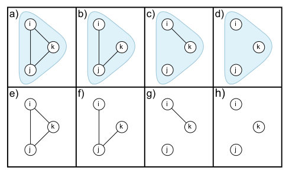
<figcaption class="paper-figure-caption"><b>Fig 1.</b> Figure 1: Diagrams of all possible 3-node sub-graphs with pairwise edges and hyperedges. Hyperedges are shown in blue in panels (a)–(d).</figcaption>
</figure>
<figure class="paper-figure-card">
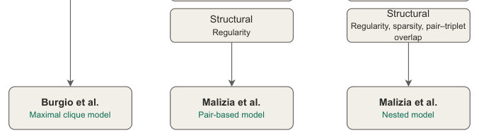
<figcaption class="paper-figure-caption"><b>Fig 2.</b> Figure 3: Schematic illustrating the pipeline used in deriving specific higher-order contagion models from the exact microscopic rate equations.</figcaption>
</figure>
<figure class="paper-figure-card">
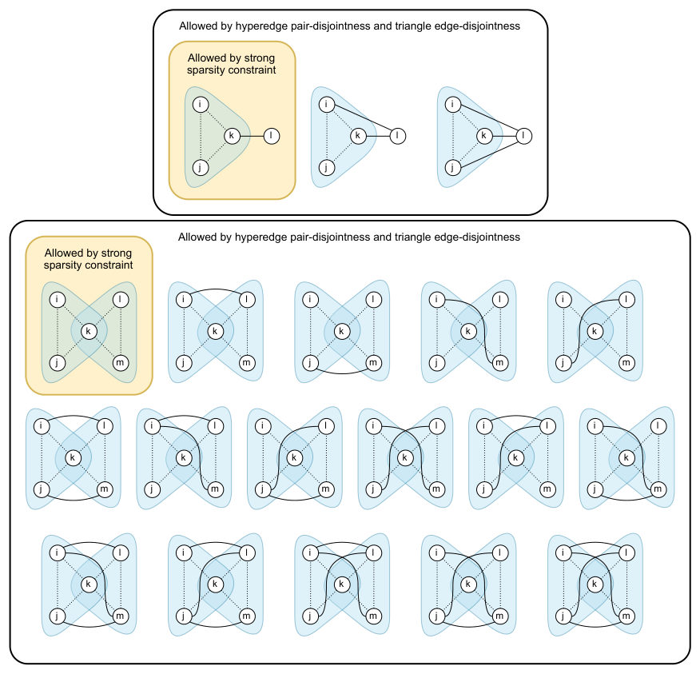
<figcaption class="paper-figure-caption"><b>Fig 3.</b> Figure 4: Allowed motif configurations under the explicit (weaker) assumptions of Assumption 6.16 on hyperedge pair-disjointedness (two hyperedges cannot share more than 1 node) and triangle edge- disjointedness (two pairwise triangles cannot share more than 1 node), versus the strong sparsity condition of Assumption 6.25. Hyperedges are represented by the filled blue borders; edges are represented by lines. Dotted lines indicate possible edges. The closures generated by the closure operator would produce different approximations for each motif.</figcaption>
</figure>

**Summary.** This work introduces a rigorous, bottom-up framework for modeling epidemic spread (SIS) on networks that include group interactions via hyperedges. It systematically derives the necessary moment equations and provides a principled closure operator to manage the resulting mathematical complexity. The paper is significant because it moves beyond heuristic approximations by explicitly quantifying the underlying structural assumptions required in mean-field descriptions of complex interacting systems.

**Why it may be interesting.** While focused on epidemiology, the mathematical machinery—developing systematic closures for high-dimensional moment equations based on local topology and combinatorial identities—is directly analogous to techniques used in analyzing complex interacting quantum systems or many-body physics models where exact solutions are intractable.

Detailed structure

**Main problem.** The paper develops a principled, systematic framework for deriving mean-field approximations for higher-order Susceptible-Infected-Susceptible (SIS) epidemic models on complex networks.

**Main result.** It establishes a network-dependent closure operator that rigorously derives higher-order dynamics and explicitly reveals the often-unstated structural and dynamical assumptions underlying existing heuristic epidemic models.

**Method.** The methodology involves deriving coupled rate equations for increasing moments (up to triplets) of the system state, followed by systematically truncating the resulting moment hierarchy using topological constraints and closure operators.

**Model / system.** The model is an SIS epidemic process occurring on a higher-order network structure defined by nodes, pairwise edges ($E$), and hyperedges ($H$). The dynamics are governed by continuous-time Markov chain rate equations.

**Key observables.** State probabilities (e.g., $\langle I_i 
angle$, $\langle S_i I_j 
angle$, $\langle S_i S_j I_k 
angle$), motif densities, and global network parameters like the clustering coefficient ($\phi$).

**Important parameters / regimes.** Infection rates ($eta_1$ for edges, $eta_2$ for hyperedges) and recovery rate ($\gamma$). The analysis depends on local and global topological descriptors.

**Assumptions / limitations.** The framework relies on truncating the moment hierarchy at the triplet level. Specific derivations assume dynamical homogeneity (Assumption 5.1), topological homogeneity (Assumption 5.2), and strong sparsity conditions to simplify complex motif contributions.

**Paper structure.** The paper proceeds by first establishing the microscopic rate equations for low-order moments, then systematically introducing the closure problem due to hierarchical coupling. It develops the network-dependent closure operator through bottom-up derivation, culminating in detailed term-by-term derivations showing how higher-order contributions simplify under specific assumptions.

Abstract

Susceptible-infected-susceptible (SIS) epidemic models on networks are governed by hierarchical moment equations where the dynamics of smaller subsystems depend on the state of larger ones. Moment closure approximations, which truncate this hierarchy by expressing higher-order state probabilities in terms of lower-order ones, are essential for obtaining tractable reduced systems. Higher-order networks, which extend the pairwise structure to include group interactions, introduce a combinatorial explosion of closure configurations, making systematic derivation harder. Consequently, existing higher-order SIS models are derived heuristically, where structural and dynamical assumptions underpinning their closures are not always apparent from the formulation alone. We develop a bottom-up derivation of higher-order SIS dynamics, building systematically from node-level equations to pairs, triplets, and three-body interactions. Central to our approach is a network-dependent closure operator that generates topologically appropriate approximations from local pairwise and triadic structure. Using this framework, we recover three existing higher-order SIS models--Burgio et al.'s maximal clique, Malizia et al.'s pair-based and inter-order models--as special cases, each arising under specific topological and dynamical assumptions. Our derivation reveals assumptions that are invisible from heuristic approaches: for instance, Malizia et al.'s inter-order overlap parameter is insufficient alone to express the model within our framework despite performing well against simulations, with the original derivation implicitly invoking additional structural assumptions. Our framework offers both a foundation for higher-order epidemic modeling and a constructive pathway for understanding the assumptions implicit in heuristically derived mean-field closures and provides a principled method of generating new models.

[↑ back to top](#top)

### [How the Quantum Sorites Phenomenon Strengthens the Bell Argument and How a Random-Matrix Collapse Dynamics Answers It](http://arxiv.org/abs/2607.17894v1)

**Authors:** Malcolm Forster  
**Type:** theory · **Category:** other · **PDF:** <https://arxiv.org/pdf/2607.17894v1>  
**Analysis basis:** full PDF text, analyzed in chunks
**Topic relevance:** `measurement-induced transitions` **3/5** · `methods for driven-dissipative` **3/5** · `quantum measurements` **3/5** · `non-equilibrium dynamics` **2/5** · `Keldysh / 2PI / non-Gaussian methods` **1/5** · `correlated / nonlocal dissipation` **1/5** · `driven-dissipative phase transition` **1/5** · `entanglement & information structure` **1/5**

↔ Scroll figures horizontally

<figure class="paper-figure-card">
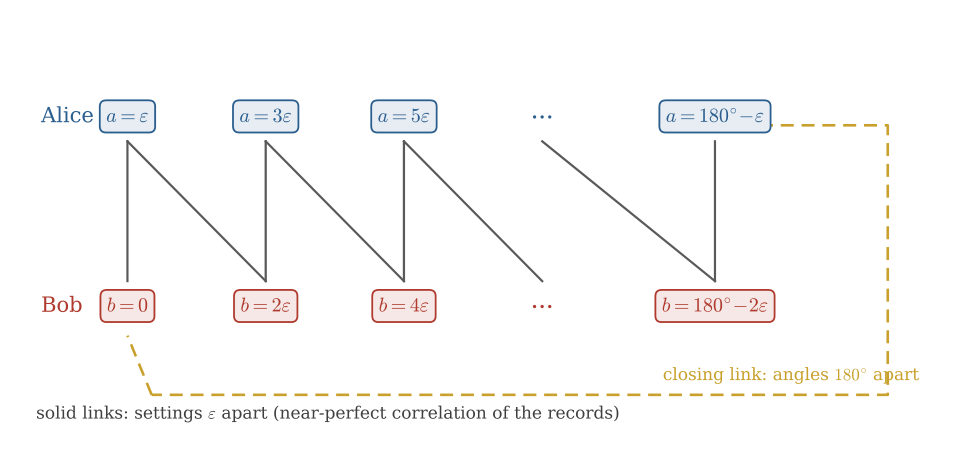
<figcaption class="paper-figure-caption"><b>Fig 1.</b> Figure 1: The quantum Sorites phenomenon arises from a chained family of measurement settings on singlet pairs. Solid links join adjacent settings (ε apart), where the recorded bits agree with probability approaching one; the dashed closing link joins the two ends of the chain, where the settings differ by 180◦and the bits disagree with certainty.</figcaption>
</figure>
<figure class="paper-figure-card">
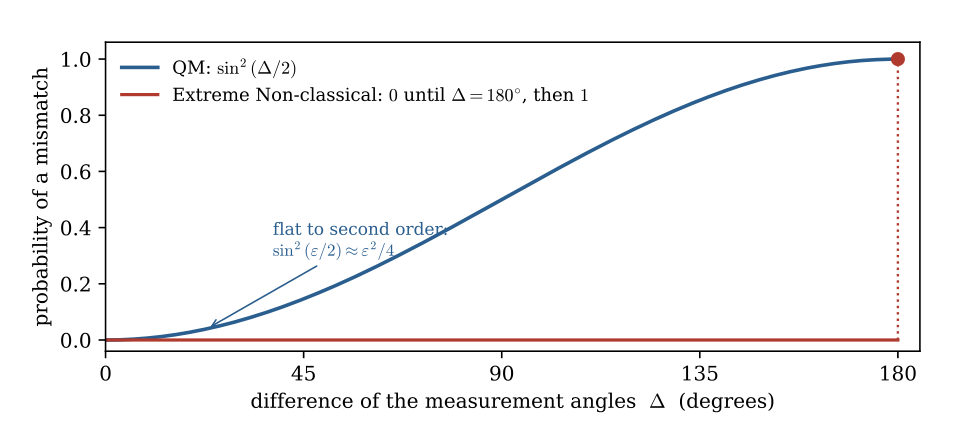
<figcaption class="paper-figure-caption"><b>Fig 2.</b> Figure 2: The quantum probability of a mismatch between the recorded bits as a function of the difference in measurement angles, sin2(∆/2), and its Extreme Non-classical idealization: no mismatches until the settings are fully opposed, then certain mismatch. The quadratic flatness at small angles is what allows a chain of N near-certainties to remain a near-certainty jointly.</figcaption>
</figure>
<figure class="paper-figure-card">
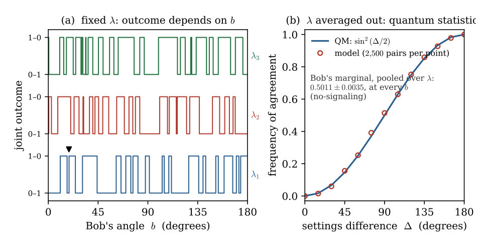
<figcaption class="paper-figure-caption"><b>Fig 3.</b> Figure 3: The simulation. (a) Fixed stream λ, swept setting b: the joint outcome (1–0 = Bob up–Alice down, 0–1 = the reverse) holds steady over stretches of b and then jumps — roughly thirty jumps as b sweeps from 0◦to 180◦— and the jump pattern differs erratically from stream to stream (λ1, λ2, λ3). Zooming in on the marked jump, again and again, always finds the same thing: a b below which the outcome is one way and a b above which it is the other, boxed here inside an interval of 1.5 × 10−11 degrees. A change of Bob’s setting smaller than a hundred-billionth of a degree reverses both records: Parameter Independence is violated, deterministically and violently. (b) The same model with the...</figcaption>
</figure>

**Summary.** This paper advances Bell's theorem by using the 'quantum Sorites phenomenon' to show that local hidden variable theories must reject Parameter Independence. It then proposes a random-matrix collapse model where this violation occurs naturally, resolving the conflict with special relativity while preserving the experimentally robust No-Signaling condition.

**Why it may be interesting.** It provides a concrete, relativity-respecting mechanism (random state evolution) for violating Parameter Independence, which is a major conceptual hurdle in interpreting Bell tests.

Detailed structure

**Main problem.** To strengthen Bell's theorem by deriving a contradiction without assuming Outcome Independence, thereby forcing hidden variable theories to reject Parameter Independence.

**Main result.** The quantum Sorites phenomenon forces any local hidden variable theory that improves upon quantum predictions to abandon Parameter Independence (PI). A random-matrix collapse model shows this violation is possible while preserving No-Signaling.

**Method.** The paper uses a chained family of experiments (Sorites argument) combined with a novel stochastic dynamics model (random-matrix collapse) to test the assumptions underlying Bell's theorem.

**Model / system.** The system involves spin-1/2 particles in the singlet state measured at two distant locations. The theoretical framework uses random walks driven by independent, fixed random streams ($\lambda$) to model measurement collapse dynamics.

**Key observables.** Correlation probabilities $P(X 
eq Y)$ across a chain of settings; violation of Parameter Independence (PI); maintenance of No-Signaling (NS).

**Important parameters / regimes.** Measurement angles ($a, b$); the degree of correlation change ($\Delta$); the structure of the random matrix ensemble.

**Assumptions / limitations.** The initial argument assumes standard autonomy; the model assumes measurement is a stochastic random walk driven by fixed hidden streams $\lambda$.

**Figures summary.** Figure 1 illustrates the quantum Sorites phenomenon via chained measurements. Figure 2 shows the quadratic dependence of correlation on angle difference. Figure 3 simulates setting-dependent outcome jumps (violating PI) while maintaining average statistics (preserving NS).

**Paper structure.** Part 1 establishes the Stronger Theorem using the quantum Sorites argument to target PI directly. Part 2 introduces the random-matrix collapse dynamics, showing how this framework violates PI deterministically while keeping OI and NS true.

Abstract

Bell proved that no theory of pre-existing local values can reproduce the predictions of quantum mechanics, but his proof leaves the culprit ambiguous: one may reject either of two independence conditions, Outcome Independence or Parameter Independence, and most commentators have found Outcome Independence the safer sacrifice. The first part of this paper presents, in a form adapted to spin-1/2 particles in the singlet state, an argument (Forster 2014) that removes the ambiguity: using a chained family of experiments in which quantum mechanics predicts an extreme pattern of correlations -- the quantum Sorites phenomenon -- a contradiction is derived without ever assuming Outcome Independence. Under the resulting theorem, anyone who holds that hidden variables could improve on the quantum probabilities must give up Parameter Independence itself. That looks like a heavy price, because Parameter Independence appears to be protected twice over: rejecting it seems to put superluminal influences into spacetime, and its statistical shadow -- the No-Signaling condition -- is experimentally beyond reproach The second part of the paper shows that the price is payable. In the random-matrix collapse dynamics proposed by Kryukov, measurement is a random walk of the quantum state, and the hidden variable is not a stock of values fixed at the source but the random stream that drives the walk -- like the stored random numbers of a computer simulation, with the measurement settings playing the role of seeds. In that framework Parameter Independence is false while Outcome Independence and No-Signaling are both true, and one can say exactly how the Sorites argument is blocked, why the violation involves no process propagating in spacetime, and why the influence of one wing's setting on the other wing's outcome -- demonstrated here in a simulation -- can never be used to send a message.

[↑ back to top](#top)

### [Noise structuring in fixed-depth Trotter simulation: stationary channels and observable-level depolarization](http://arxiv.org/abs/2607.17936v1)

**Authors:** G. L. Stavisskii, W. V. Pogosov, L. E. Fedichkin, A. V. Lebedev  
**Type:** theory · **Category:** quantum information and computing · **PDF:** <https://arxiv.org/pdf/2607.17936v1>  
**Analysis basis:** full PDF text, analyzed in chunks
**Topic relevance:** `methods for driven-dissipative` **3/5** · `non-equilibrium dynamics` **3/5** · `entanglement & information structure` **2/5** · `non-equilibrium universality` **2/5** · `Keldysh / 2PI / non-Gaussian methods` **1/5** · `analog quantum simulation` **1/5** · `correlated / nonlocal dissipation` **1/5** · `driven-dissipative phase transition` **1/5**

↔ Scroll figures horizontally

<figure class="paper-figure-card">
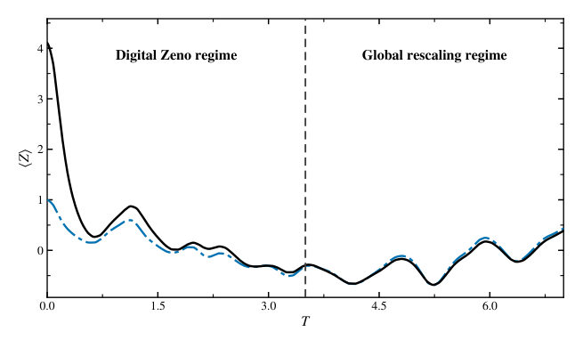
<figcaption class="paper-figure-caption"><b>Fig 1.</b> FIG. 1. Qualitative illustration of the two parts of a fixed-depth noisy time trace for a six-spin transverse-field Ising chain. The average magnetization is shown as a function of dimensionless time. The initial state is |0 . . . 0⟩, the chain is homogeneous with Ji = J and hi = h, and the plotted example uses J = h. The dashed line shows the ideal Trotterized evolution for N = 100 layers. The solid line is the affinely reconstructed noisy signal at gate error probability p = 0.001, not a physical magnetization curve. Its unphysical short-time values diagnose the failure of a stationary affine correction in the Zeno-like transient. The vertical dashed line marks the estimated crossover to...</figcaption>
</figure>
<figure class="paper-figure-card">
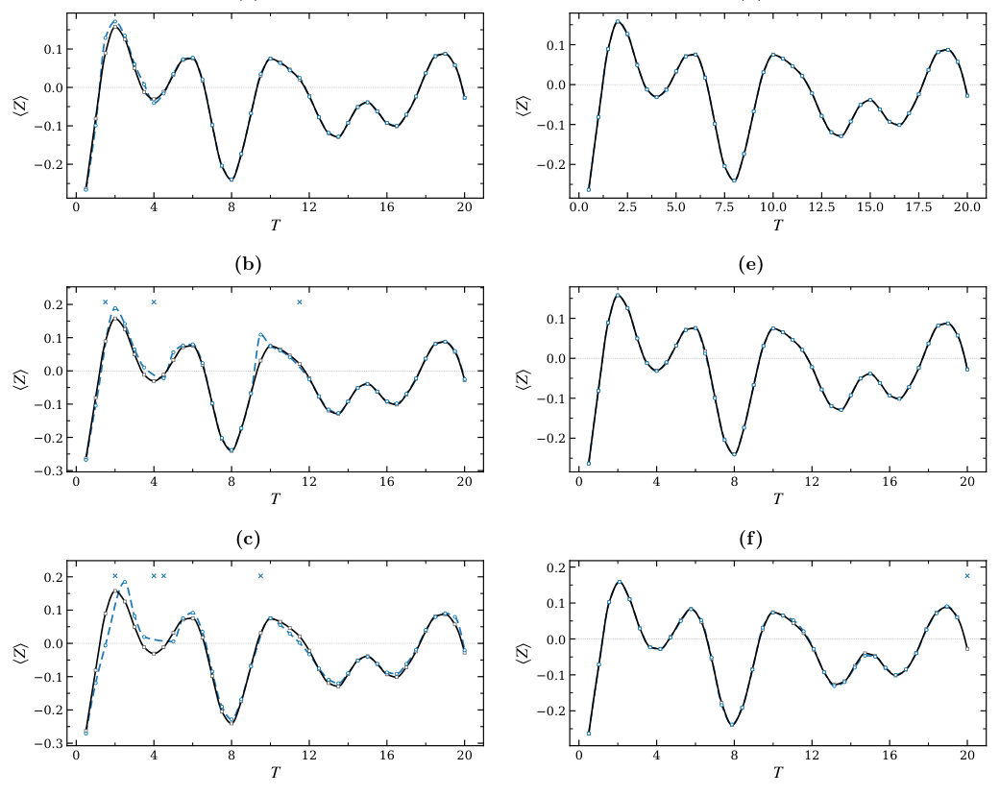
<figcaption class="paper-figure-caption"><b>Fig 2.</b> FIG. 2. Results of a multiexponential ZNE procedure for the numerically simulated mean magnetization of a six-qubit transverse-field Ising model with J = 4h and initial state |110110⟩. The dynamics is simulated with a depth-N = 200 Trotter circuit at several per-qubit noise levels. The first column, (a)–(c), corresponds to p = 0.0001, 0.0002, 0.0004 and uses a single- exponential approximation, whereas the second column, (d)–(f), uses an optimally chosen number of exponents at the same noise levels. The solid line depicts the ideal, noiseless simulation result, whereas the dashed data shows the ZNE-reconstructed data obtained from a Trotter circuit with the corresponding noise level per...</figcaption>
</figure>
<figure class="paper-figure-card">
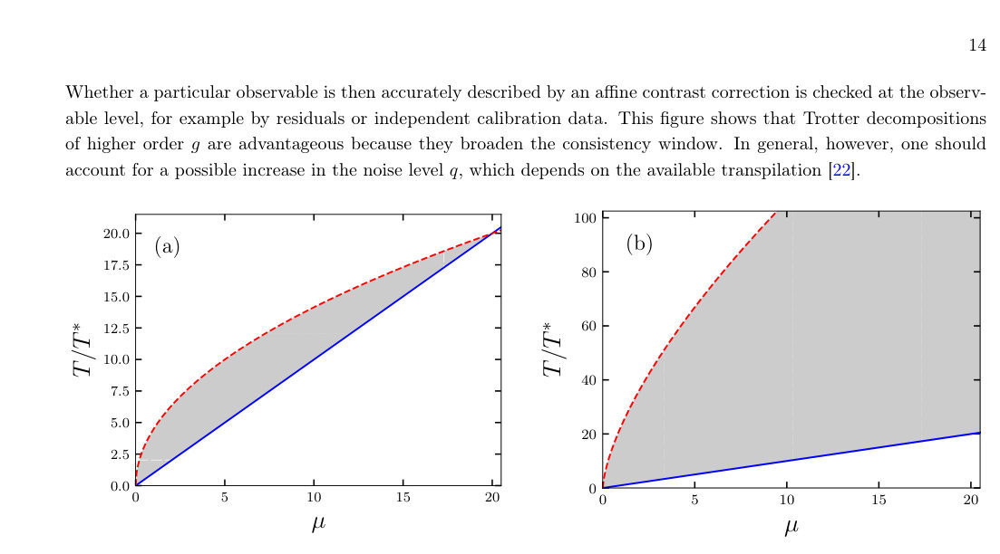
<figcaption class="paper-figure-caption"><b>Fig 3.</b> FIG. 3. Illustrative conservative windows for the stationary-channel description in first- and second-order Trotter circuits, (a) and (b), respectively. The axes show the mean number of faulty layers µ and normalized endpoint time T/T ∗. The solid lines represent the conservative self-averaging condition T &gt; µT ∗, while the dashed lines show the upper bound imposed by the Trotterization-error tolerance. The highlighted regions between these lines are therefore consistency regions for the channel-level approximation; the affine projection for a given observable is an additional observable-level condition. The plotted examples correspond to the transverse-field Ising model with parameters Nq...</figcaption>
</figure>

**Summary.** This work rigorously analyzes how fixed-depth Trotter simulation structures hardware noise by showing that the accumulated errors converge to a stationary channel. This stationarity allows for an almost time-independent correction factor at the observable level, which is crucial for developing robust error mitigation protocols in quantum computing simulations.

**Why it may be interesting.** It provides concrete theoretical tools for understanding how structured noise accumulates over time in quantum simulations, offering practical insights into error mitigation techniques beyond simple depolarization models.

Detailed structure

**Main problem.** The paper analyzes fixed-depth Trotter simulation as a method for structuring hardware noise in digital many-body quantum dynamics.

**Main result.** For large times, the noisy evolution approaches a stationary channel characterized by an almost time-independent affine contrast correction at the observable level, which is useful for error mitigation.

**Method.** The analysis involves deriving the factorization of the noisy circuit into ideal evolution followed by a stationary binomial or Poissonian channel using superoperator techniques and moment expansions.

**Model / system.** The model simulates quantum dynamics governed by local Hamiltonians (e.g., TFIM) using first-order Trotterization, subjected to local stochastic Pauli errors at each gate layer.

**Key observables.** Observable depolarization factor, mismatch norm $\Delta M(T)$, Loschmidt echo signal $G(t)$, and the affine contrast correction coefficients ($a_O(\mu), c_O(\mu)$).

**Important parameters / regimes.** Fixed depth $N$, noise dose (made endpoint-independent), mean number of faults $\mu$, and crossover time scales $T_{	ext{stat}}(\delta)$.

**Assumptions / limitations.** The analysis relies on the assumption that propagated faults lose memory of their insertion layer, allowing factorization into a stationary channel; approximations are made using moment expansions for large times.

**Figures summary.** Figure 1 illustrates the operational separation between ideal evolution and the noisy signal, showing unphysical short-time values before reaching the stationary regime.

**Paper structure.** The paper progresses by first establishing the fixed-depth protocol, deriving the factorization into a stationary channel (binomial/Poissonian), analyzing the crossover from Zeno-like transients to stationarity, and finally comparing the mathematical rigor of the Poisson vs. binomial approximations in the large depth limit.

Abstract

We analyze fixed-depth Trotter simulation as a method for structuring hardware noise in digital many-body dynamics. The number of layers is chosen using the largest endpoint time and is then kept fixed throughout the time scan, making the total noise dose approximately independent of the endpoint time. For local stochastic faults, we show that, once propagated faults lose memory of their insertion layer, the noisy circuit factorizes into ideal evolution followed by a stationary finite-depth binomial channel. In the dilute-layer limit, this channel reduces to a Poissonian exponential. The memory time of a single fault is related to a Loschmidt echo. An important consequence is observable-level depolarization: for selected macroscopic observables at low to moderate noise levels, the stationary channel can act as an almost time-independent affine contrast correction, even though the full channel need not be depolarizing, which is crusial for error mitigation purposes. At short times, the same protocol produces a digital Zeno-like transient, in which a fixed number of noise opportunities competes with a vanishing coherent angle per layer. Our results also reveal limitations of naive zero-noise extrapolatin strategies based on oversimplified functions.

[↑ back to top](#top)

### [Theory of associating polymers with annealed and quenched sticker disorder: Mean-field solution and phase behavior](http://arxiv.org/abs/2607.16807v1)

**Authors:** Sofia Moschin, Achille Giacometti, Amos Maritan, Angelo Rosa  
**Type:** theory · **Category:** statistical mechanics · **PDF:** <https://arxiv.org/pdf/2607.16807v1>  
**Analysis basis:** full PDF text, analyzed in chunks
**Topic relevance:** `Keldysh / 2PI / non-Gaussian methods` **3/5** · `driven-dissipative phase transition` **2/5** · `methods for driven-dissipative` **2/5** · `non-equilibrium universality` **2/5** · `Frenkel-Kontorova` **1/5** · `analog quantum simulation` **1/5** · `correlated / nonlocal dissipation` **1/5** · `exotic spin models in light-matter` **1/5** · `non-equilibrium dynamics` **1/5**

↔ Scroll figures horizontally

<figure class="paper-figure-card">
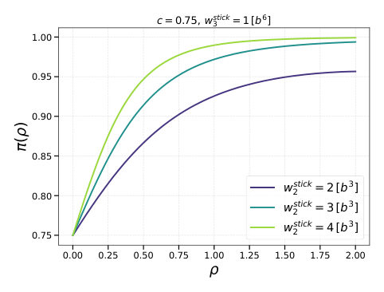
<figcaption class="paper-figure-caption"><b>Fig 1.</b> FIG. 1. Sticker probability π (Eq. (39)) as a function of monomer density ρ, for w2/b3 = w3/b6 = wstick 3 /b6 = 1, q = 1 and for c = 0.75 and wstick 2 /b3 = 2, 3, 4 (see legend). The probability π is bounded as c ≤π ≤1, and for the same ρ it increases as a function of the sticker attraction strength wstick 2 .</figcaption>
</figure>
<figure class="paper-figure-card">

<figcaption class="paper-figure-caption"><b>Fig 2.</b> Fig. 2 shows an example of this geometric construction for the annealed system with N = 1 and c = 0.5 and the rest of the parameters fixed as reported in the beginning</figcaption>
</figure>
<figure class="paper-figure-card">
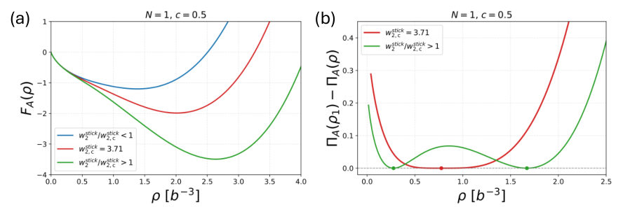
<figcaption class="paper-figure-caption"><b>Fig 3.</b> FIG. 2. (a) Free energy profiles for the annealed model FA(ρ) (Eq. (38) with the solution of the mass-action relation Eq. (39)) as a function of the monomer density ρ, for N = 1 and c = 0.5 and parameters w2/b3 = 1, w3/b6 = wstick 3 /b6 = 1 and q = 1 (see Sec. III for details). The profiles are for representative values of the sticker-mediated attraction strength wstick 2 smaller than (blue line), equal to (red line), and larger than (green line) the critical value wstick 2,c ≃3.71 (see legend). (b) Corresponding osmotic pressure profiles ΠA(ρ1) −ΠA(ρ) (Eq. (57)) as a function of the monomer density ρ, measured at the coexistence of the two stable phases ρ1 &lt; ρ2. The dashed horizontal line...</figcaption>
</figure>
<figure class="paper-figure-card">
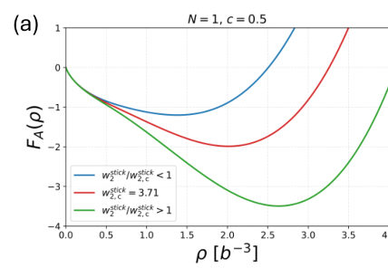
<figcaption class="paper-figure-caption"><b>Fig 4.</b> Fig. 3 shows curves of phase diagrams in the “monomer density / sticker-mediated attraction strength (ρ, wstick 2 )” plane, for associating polymers with annealed (red solid lines) and quenched (blue solid lines) sticker disorder and sticker fraction c = 0.50. Panels (a1) and (a2) are for the limiting case of very short polymers (N = 1), while panels (b1) and (b2) are for long polymers (N = 100). In all considered cases the system undergoes a liquid- liquid phase separation bounded by a binodal termi- nating at a critical point (filled circle), arising from the competition between excluded-volume repulsion and sticker-mediated interactions. The parameter wstick 2 con- trols the effective...</figcaption>
</figure>
<figure class="paper-figure-card">
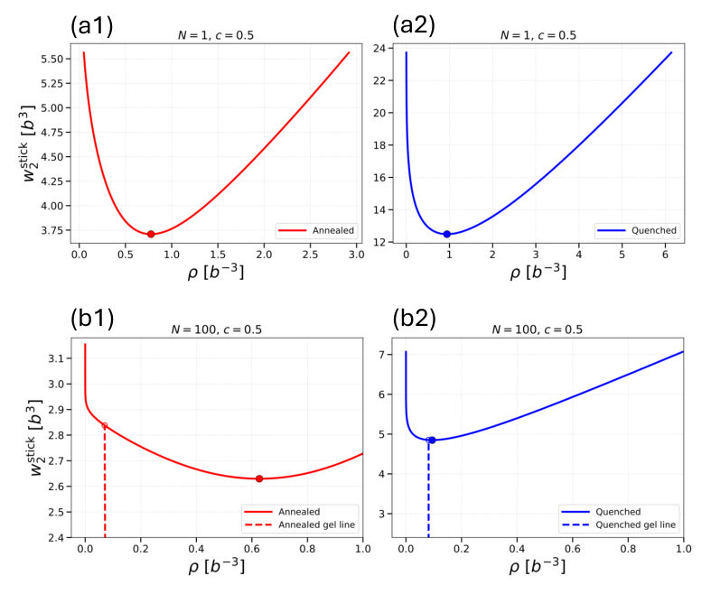
<figcaption class="paper-figure-caption"><b>Fig 5.</b> FIG. 3. Annealed (red lines) and quenched (blue lines) phase diagrams in the “monomer density / sticker-mediated attraction strength (ρ, wstick 2 )” plane, for sticker fraction c = 0.50 and parameters w2/b3 = 1, w3/b6 = wstick 3 /b6 = 1 and q = 1 (see Sec. III for details). (a1, a2) Results for polymer chains of N = 1 monomers. (b1, b2) Results for polymer chains of N = 100 monomers. In each panel, the position of the critical point is marked by the filled circle. For N = 100, the dashed lines denote the sol-gel transition (from left to right). Increasing N suppresses the translational entropy contribution and favors phase separation.</figcaption>
</figure>

**Summary.** This paper develops a mean-field density-functional theory for associating polymers with sticker interactions under both mobile (annealed) and frozen (quenched) disorder. It rigorously shows that the statistical treatment of disorder leads to qualitatively different thermodynamic predictions, particularly regarding the emergence of an order parameter. This work advances the understanding of complex self-assembly processes relevant to biomolecular condensates.

**Why it may be interesting.** While focused on polymer physics, the rigorous comparison between annealed and quenched disorder statistics in a complex many-body system is highly relevant to understanding glassy dynamics or disordered quantum materials where local environments are fluctuating versus fixed.

Detailed structure

**Main problem.** The study develops a density-functional theory to determine the phase behavior of associating polymers when the sticker interactions are subject to either annealed (mobile) or quenched (fixed) disorder.

**Main result.** The theory yields distinct results for the two disorder types: the annealed case supports an independent bonding order parameter, while the quenched case primarily causes renormalization of interaction parameters. Both approaches provide a systematic starting point for fluctuation corrections.

**Method.** The authors employ field-theoretic methods, extending existing schemes to formulate the model at the mean-field level using saddle point approximations for both annealed (ensemble averaging) and quenched (replica trick) disorder treatments.

**Model / system.** The system consists of polymer chains with monomers possessing binary 'stickers' that mediate reversible attractions. The Hamiltonian includes terms for chain connectivity, volume interactions ($w_2, w_3$), and sticker-sticker interactions ($\propto w_{	ext{stick}}^2, w_{	ext{stick}}^3$).

**Key observables.** Free energy density ($eta F/V$), scalar order parameter (for the annealed case), and renormalized effective interaction parameters.

**Important parameters / regimes.** Sticker concentration ($c$ or $
ho_{st}$), monomer density ($
ho$), and interaction strengths ($w_{	ext{stick}}$). Key regimes include low sticker density limits and comparisons between annealed/quenched statistics.

**Assumptions / limitations.** The primary approximations are the mean-field solution via saddle point methods, and for the quenched case, the use of the replica trick. The theory is microscopic but provides a starting point beyond these approximations.

**Figures summary.** Figure 4 likely shows phase diagrams illustrating distinct coexistence boundaries and critical points in the $(
ho/
ho_c, w_{	ext{stick}}^2/w_{	ext{stick},c}^2)$ plane for annealed versus quenched disorder.

**Paper structure.** The paper develops the theory by first establishing the Hamiltonian and reformulating it using density fields. It then derives separate mean-field solutions for the annealed (ensemble average) and quenched (replica trick) cases, comparing their resulting free energy functionals and phase behavior.

Abstract

We develop a density-functional theory for solutions of associating polymers where attractions among charged monomers (stickers) are represented by local binary degrees of freedom, which are randomly placed along the chains. Extending the original Garel and Orland's field-theoretic scheme for single-chain systems to an ensemble of interacting chains, we give the exact formulations of the model in both cases of annealed and quenched distributions of charges which we solve at the mean-field level. The solution produces qualitatively different free energy functionals. In the annealed case, the theory naturally yields a nontrivial scalar order parameter for the fraction of bonded sticker monomers and a self-consistent mass-action law at the saddle point. By contrast, in the quenched case no independent bonding order parameter emerges and the main effect is a renormalization of the effective two-body and three-body interaction parameters. The formulation is microscopic at the Hamiltonian level and, within the same field-theoretic framework, provides a systematic starting point for fluctuation corrections beyond the mean-field approximation.

[↑ back to top](#top)

### [Geometric Power Capacity of Coherent Ergotropy in Quantum Batteries](http://arxiv.org/abs/2607.16645v1)

**Authors:** Dong-Ping Xuan, Zhi-Xi Wang, Shao-Ming Fei  
**Type:** theory · **Category:** other · **PDF:** <https://arxiv.org/pdf/2607.16645v1>  
**Analysis basis:** full PDF text, analyzed in chunks
**Topic relevance:** `methods for driven-dissipative` **3/5** · `non-equilibrium dynamics` **3/5** · `entanglement & information structure` **2/5** · `non-equilibrium universality` **2/5** · `Keldysh / 2PI / non-Gaussian methods` **1/5** · `correlated / nonlocal dissipation` **1/5** · `driven-dissipative phase transition` **1/5**

↔ Scroll figures horizontally

<figure class="paper-figure-card">
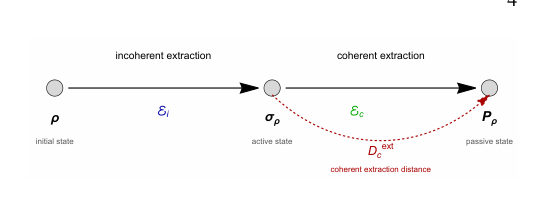
<figcaption class="paper-figure-caption"><b>Fig 1.</b> FIG. 2: The initial state ρ yields active state σρ after incoherent er- gotropy extraction. The unitary process σρ →Pρ extracts coherent ergotropy Ec over distance Dext c , defining the geometric power capac- ity Πc(ρ) = Ec/Dext c .</figcaption>
</figure>
<figure class="paper-figure-card">
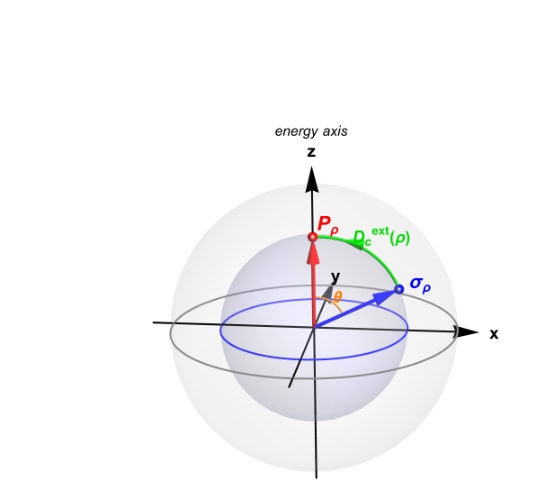
<figcaption class="paper-figure-caption"><b>Fig 2.</b> FIG. 1: Geometric illustration of the coherent extraction distance Dext c (ρ) for a qubit battery. The green arc shows the minimal unitary distance from the active state σρ to the passive state Pρ, with the z- axis defined by H0.</figcaption>
</figure>
<figure class="paper-figure-card">
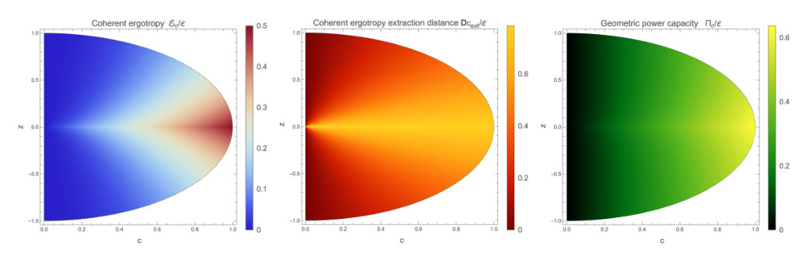
<figcaption class="paper-figure-caption"><b>Fig 3.</b> FIG. 3: Analytical qubit example. In this work, we take ϵ = 1. The three panels show, respectively, the coherent ergotropy Ec(ρ)/ϵ[Eq. (19)], the coherent ergotropy extraction distance Dext c (ρ)[Eq. (20)], and the geometric power capacity for coherent ergotropy Πc(ρ)/ϵ [Eq. (21)] as functions of the coherence amplitude c = p</figcaption>
</figure>
<figure class="paper-figure-card">
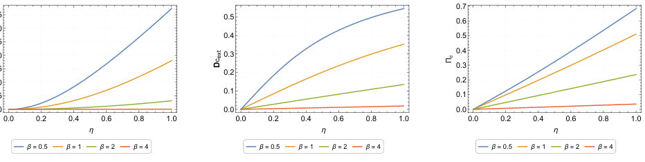
<figcaption class="paper-figure-caption"><b>Fig 4.</b> FIG. 4: Qutrit example. The three panels show the coherent ergotropy Ec [Eq. (25)], the coherent ergotropy extraction distance Dext c [Eq. (26)], and the geometric power capacity of coherent ergotropy Πc [Eq. (27)] as functions of the normalized coherence strength η = |c|/ √g1g3. Different curves correspond to fixed inverse temperatures β = 0.5, 1, 2, 4.</figcaption>
</figure>
<figure class="paper-figure-card">
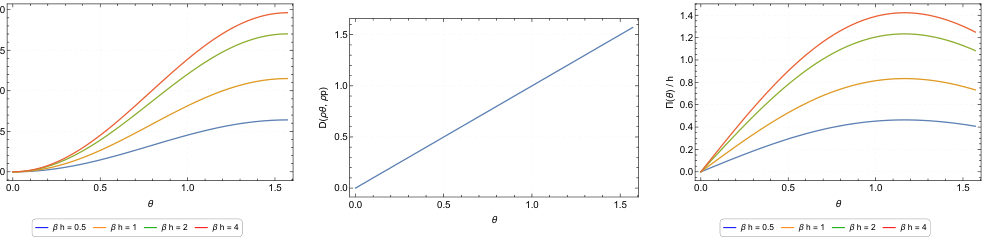
<figcaption class="paper-figure-caption"><b>Fig 5.</b> FIG. 5: Coherent extension of the three-level discharging model. The three panels show the total ergotropy E(ρθ) [Eq. (35)], the extraction distance D(ρθ, ρp) = θ [Eq. (36)], and the corresponding the geometric power capacity of coherent ergotropy Π(ρθ) [Eq. (37)] as functions of the rotation angle θ. Different curves correspond to different values of βh.</figcaption>
</figure>

**Summary.** This paper introduces the 'geometric power capacity' ($\Pi_c(
ho)$) as a unified resource measure for quantifying coherent work extractable from quantum batteries. It defines this capacity by dividing the coherent ergotropy by the minimal geometric distance required for extraction. The main result establishes $\Pi_c(
ho)$ as an upper bound on the actual achievable power, providing a powerful theoretical tool for analyzing energy harvesting rates in quantum systems.

**Why it may be interesting.** This work provides a rigorous, geometric measure ($\Pi_c$) that unifies energy extraction (ergotropy) with operational constraints (distance/time), which is highly relevant for understanding non-equilibrium quantum processes in open or driven systems.

Detailed structure

**Main problem.** The paper aims to develop a geometric characterization of coherent ergotropy extraction from quantum batteries by defining a 'geometric power capacity' ($\Pi_c(
ho)$). This capacity quantifies the maximum rate at which coherence-derived work can be extracted relative to the minimal unitary distance required.

**Main result.** The derived quantity, $\Pi_c(
ho) = \mathcal{E}_c(
ho)/D_{	ext{ext}}^c(
ho)$, is proven to serve as a true capacity, bounding the actual coherent discharging power $P_{	ext{ext}}^c$ by $
u\Pi_c(
ho)$ for any driving Hamiltonian with norm $\le 
u$.

**Method.** The methodology combines concepts from quantum thermodynamics (ergotropy), geometric quantum information theory (quantum charging distance), and resource theories to define a ratio that acts as an upper bound on achievable power.

**Model / system.** The model is the quantum battery, described by an initial state $
ho$ and governed by a Hamiltonian $H_0$. The analysis is applied to various systems including qubits, qutrits, and three-level systems, allowing for explicit calculation of $\Pi_c(
ho)$ in these specific settings.

**Key observables.** Coherent Ergotropy ($\mathcal{E}_c(
ho)$), Coherent Extraction Distance ($D_{	ext{ext}}^c(
ho)$), Geometric Power Capacity ($\Pi_c(
ho)$), and actual coherent discharging power ($P_{	ext{ext}}^c$).

**Important parameters / regimes.** Driving Hamiltonian norm ($
u$), coherence parameters (e.g., $R, |z|$ for qubits; $\epsilon_i$ for qutrits).

**Assumptions / limitations.** The analysis assumes that the coherent extraction process can be characterized by a ratio of extractable work to the minimal geometric distance required for that transformation.

**Paper structure.** The paper first introduces the concepts of ergotropy and quantum charging distance, defining $\Pi_c(
ho)$. It then proves the capacity bound relating actual power to $\Pi_c(
ho)$ using general Hamiltonian constraints. Finally, it derives explicit formulas for $\Pi_c(
ho)$ by applying the framework to specific models like qubits, qutrits, and three-level systems.

Abstract

We explore coherent ergotropy extraction in quantum batteries from a resource-geometric point of view. For an initial state $ρ$, we quantify the coherent extraction process by the coherent ergotropy $\mathcal{E}_c(ρ)$ and the coherent extraction distance $D_c^{\rm ext}(ρ)$ between the active state $σ_ρ$ and the passive state $P_ρ$. This defines the geometric power capacity $Π_c(ρ)=\mathcal{E}_c(ρ)/D_c^{\rm ext}(ρ)$, which measures the coherent ergotropy released unit minimal unitary distance. We prove that, for any driving Hamiltonian satisfying $\|V_t\|\leqν$, the actual coherent discharging power is bounded by $P_c^{\rm ext}(ρ;V_t)\leq νΠ_c(ρ)$, showing that $Π_c(ρ)$ is a capacity under unit driving norm rather than the power of a particular protocol. General bounds on $Π_c(ρ)$ are derived by combining relative entropy bounds on coherent ergotropy with geometric bounds on the coherent extraction distance. We also formulate coherence measure induced bounds and protocol-corrected capacities involving the effective speed of a given Hamiltonian. Qubit and qutrit examples demonstrate that $Π_c(ρ)$ captures a resource-geometric feature of coherent discharging beyond coherent ergotropy or coherence measures alone.

[↑ back to top](#top)

### [Quantum dynamics of a levitated ferromagnetic gyroscope](http://arxiv.org/abs/2607.16592v1)

**Authors:** Derek F. Jackson Kimball  
**Type:** theory · **Category:** other · **PDF:** <https://arxiv.org/pdf/2607.16592v1>  
**Analysis basis:** full PDF text, analyzed in chunks
**Topic relevance:** `exotic spin models in light-matter` **3/5** · `spintronics-quantum-optics interface` **3/5** · `analog quantum simulation` **2/5** · `quantum measurements` **2/5** · `correlated cavity matter` **1/5** · `driven-dissipative phase transition` **1/5** · `non-equilibrium dynamics` **1/5**

↔ Scroll figures horizontally

<figure class="paper-figure-card">
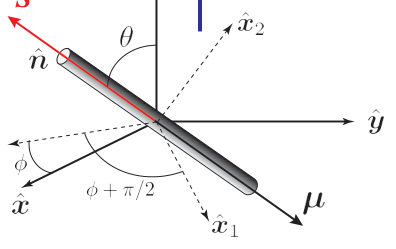
<figcaption class="paper-figure-caption"><b>Fig 1.</b> FIG. 1. Schematic diagram of the geometry used in our model of a levitated ferromagnetic gyroscope (LFG). The LFG is represented by the cylinder. The magnetic field B (blue ar- row) is along ˆz. The spin S (red arrow), pointing along ˆn, is antiparallel to the magnetic moment µ. The direction of the unit vector is specified as ˆn = (sin θ cos ϕ, sin θ sin ϕ, cos θ). ˆx1 is perpendicular to ˆn and lies in the xy-plane.</figcaption>
</figure>
<figure class="paper-figure-card">
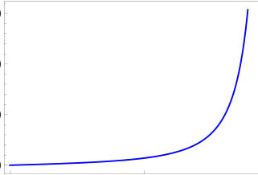
<figcaption class="paper-figure-caption"><b>Fig 2.</b> FIG. 3. The LFG precession frequency ω as a function of the tilt angle θ for the case of Jz = 0.</figcaption>
</figure>
<figure class="paper-figure-card">
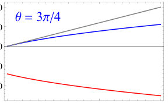
<figcaption class="paper-figure-caption"><b>Fig 3.</b> FIG. 2. The precession frequency ω/(2π) as a function of the Larmor frequency Ω/(2π) for a fixed angle of the LFG axis with respect to the vertical z-axis (along B) for the case of no libration (i.e., no nutation). The Einstein-de Haas frequency is chosen to be ωI = 2π × 50 Hz. The upper plot shows the behavior for positive cos θ, specifically for θ = π/4, where the fast precession (the red curve starting at ω = ωI/ cos θ for Ω= 0) and the slow precession (the blue curve starting at ω = 0 for Ω= 0) converge at the “branch point” where Ω= ωI/(4 cos θ) and ω = ωI/(2 cos θ) (marked by the purple dot). The lower plot shows the behavior for negative cos θ, specifically for θ = 3π/4 (the fast...</figcaption>
</figure>
<figure class="paper-figure-card">
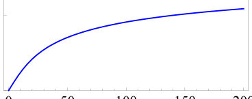
<figcaption class="paper-figure-caption"><b>Fig 4.</b> FIG. 4. The LFG precession frequency ω/(2π) (blue curve, upper plot) and the tilt angle θ (lower plot) as a function of the Larmor frequency Ω/(2π) ∝B for the case of Jz = 0. The Einstein-de Haas frequency is chosen to be ωI = 2π × 50 Hz. The ω = Ωline is shown in gray for reference in the upper plot.</figcaption>
</figure>
<figure class="paper-figure-card">
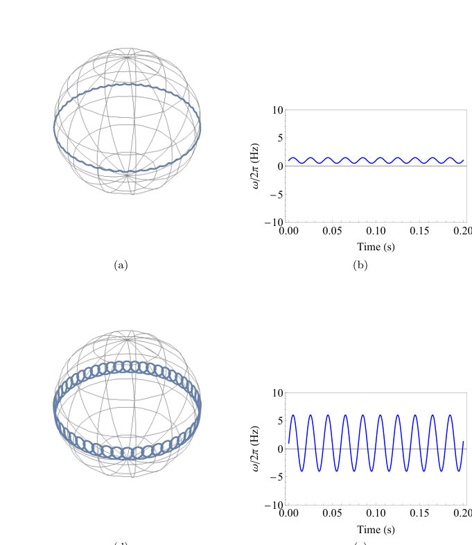
<figcaption class="paper-figure-caption"><b>Fig 5.</b> FIG. 5. Precession of an LFG with relatively small amplitude oscillations of the tilt angle θ corresponding to libration (nutation). Details of the calculations used to generate the plots are given in Appendix B. For all plots we choose the Einstein-de Haas frequency to be ωI = 2π ×50 Hz, the Larmor frequency to be Ω= 2π ×1 Hz, and the projection of the total angular momentum along z (the magnetic field axis) to be zero. The upper plots [(a), (b), and (c)] correspond to a libration amplitude of δθ0 = 0.01 radians and the lower plots correspond to a larger libration amplitude of δθ0 = 0.1 radians. Plots (a) and (d) show the path of the unit vector ˆn along the direction of the spin S (see...</figcaption>
</figure>

**Summary.** This paper models the quantum dynamics of a levitated ferromagnetic gyroscope, treating it as a coupled spin-rotor system. By quantizing the rotational motion, the authors predict discrete energy levels and demonstrate that radio-frequency fields can induce controlled transitions between these states. This establishes the LFG as a highly controllable mesoscopic quantum sensor platform.

**Why it may be interesting.** This work directly addresses quantum control and sensing using macroscopic quantum objects (the LFG). The ability to drive specific transitions ($\Delta m = \pm 1$, $\Delta n = \pm 1$) via RF fields is analogous to manipulating qubits or performing spectroscopy in cavity QED systems.

Detailed structure

**Main problem.** The paper develops a quantum model for the rotational dynamics of a levitated ferromagnetic gyroscope (LFG), focusing on the interplay between intrinsic spin, mechanical angular momentum, and magnetic torque.

**Main result.** It establishes that LFGs can function as controllable mesoscopic quantum systems, enabling ladder spectroscopy via radio-frequency driving and providing a platform to search for exotic interactions like dark matter couplings.

**Method.** The analysis involves deriving the Hamiltonian from classical mechanics, quantizing the system using angular momentum operators, and employing approximations for small librational amplitudes near specific orientations.

**Model / system.** The physical system is a freely floating LFG. The model incorporates both intrinsic spin ($\mathbf{S}$) and mechanical angular momentum ($\mathbf{L}$), leading to conserved total angular momentum projection $J_z$. The dynamics are governed by the interplay of these two coupled degrees of freedom.

**Key observables.** Precession frequency ($\omega$), energy levels ($E_{m,n}$), magnetization $\langle S_z 
angle$, and transition probabilities driven by RF fields.

**Important parameters / regimes.** Quantum precession scale $\Omega_Q = \hbar/I$; magnetic field strength ($\mathbf{B}$); Larmor frequency ($\Omega$); intrinsic spin $S$.

**Assumptions / limitations.** The macrospin $\mathbf{S}$ is treated as a classical variable locked to the lattice direction, and the analysis often relies on small-angle approximations for libration.

**Figures summary.** Figure 1 schematically illustrates the LFG geometry with the magnetic field applied along the z-axis, showing the relationship between spin ($\mathbf{S}$) and the external field ($\mathbf{B}$).

**Paper structure.** The paper progresses from defining the coupled classical/quantum dynamics via Lagrangian/Hamiltonian formulations to deriving simplified Hamiltonians near the equator. It then quantizes these models to find discrete energy levels, culminating in predictions for spectroscopic measurements and applications.

Abstract

We develop a quantum model for the rotational dynamics of a freely floating levitated ferromagnetic gyroscope (LFG), emphasizing the interplay between intrinsic spin $\boldsymbol{S}$, mechanical angular momentum $\boldsymbol{L}$, and magnetic torque. The conserved total angular momentum projection along the $z$-directed magnetic field $\boldsymbol{B}$, $J_z=S_z+L_z$, is quantized, leading in the small-libration-amplitude limit to discrete precessional states $|m\rangle$ (eigenstates of $J_z$ with eigenvalues $J_z = m\hbar$) and librational harmonic oscillator states $|n\rangle$ ($n=0,1,2,\ldots$). The discreteness of the energies and dynamical variables is governed by the quantum precession scale $Ω_Q=\hbar/I$, where $I$ is the moment of inertia of the LFG. We find that the phenomenon of LFG precession persists into high-field regimes where the magnitude of the rotational angular momentum associated with precession exceeds the total intrinsic spin. We analyze the complementary quantum limits of localized semiclassical LFG orientation wave packets and exact $J_z$-eigenstates $|m\rangle$, clarifying the relation between classical precession signals and the underlying quantized spin-rotor dynamics. We further show that radio-frequency fields can drive $Δm = \pm 1$ and $Δn = \pm 1$ transitions, enabling ladder spectroscopy, tilt-angle control, and sideband-like coupling between precession and libration. The coupled dynamics also exhibit branch-point magnetic resonances where precession and librational motion become strongly coupled. These results establish a framework for using LFGs not only as ultrasensitive torque and magnetic-field sensors, but also as controllable mesoscopic quantum systems. The techniques developed here may be applied to searches for exotic, beyond-the-standard model spin-dependent interactions, ultralight dark matter, and spin-gravity couplings.

[↑ back to top](#top)

### [Signal amplification in simple metal-insulator transition devices](http://arxiv.org/abs/2607.16566v1)

**Authors:** Victor Palin, Nareg Ghazikhanian, Matthew Frame, Yayoi Takamura, Ivan K. Schuller, Pavel Salev  
**Type:** experiment · **Category:** disordered systems and neural networks · **PDF:** <https://arxiv.org/pdf/2607.16566v1>  
**Analysis basis:** full PDF text, analyzed in chunks
**Topic relevance:** `driven-dissipative phase transition` **3/5** · `methods for driven-dissipative` **3/5** · `spintronics-quantum-optics interface` **2/5** · `analog quantum simulation` **1/5** · `correlated / nonlocal dissipation` **1/5** · `exotic spin models in light-matter` **1/5** · `non-equilibrium dynamics` **1/5** · `non-equilibrium universality` **1/5**

↔ Scroll figures horizontally

<figure class="paper-figure-card">
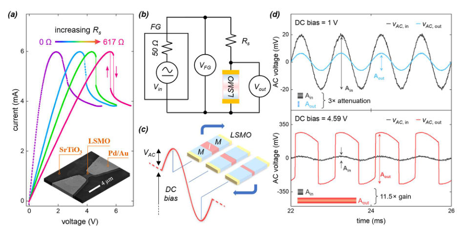
<figcaption class="paper-figure-caption"><b>Fig 1.</b> Fig. 1. a. I-V characteristics recorded using several series resistors, Rs. All curves display a characteristic NDR and a rapid MIT switching, which can be tuned by varying Rs. The inset shows an SEM image of a 2×1 µm² LSMO device. b. Electrical circuit used for the amplification measurements. A function generator supplies a superimposed small AC excitation + DC bias signal. Two oscilloscope channels, VFG and Vout, are used to monitor the voltages. c. Schematic illustrating the modulation of the LSMO insulating barrier size by a small AC excitation. d. Input and output AC signals recorded using a DC bias of 1 V (top panel) and 4.59 V (bottom panel). When the LSMO device is biased far away...</figcaption>
</figure>

**Summary.** This work demonstrates that Metal-Insulator Transition (MIT) devices can function as highly efficient, local amplifiers suitable for neuromorphic hardware. By biasing the device into a Negative Differential Resistance (NDR) regime near the phase transition, the authors achieved amplification factors exceeding 10x. This establishes a framework for integrating artificial neurons and axons using nonlinear electronic materials.

**Why it may be interesting.** While focused on solid-state electronics, the core concept—using strong nonlinearities (like those found in correlated materials or phase transitions) to engineer non-linear signal processing elements—is relevant for understanding energy dissipation and information transfer in complex quantum/many-body systems.

Detailed structure

**Main problem.** Signal dissipation in large-scale neural networks requires local signal amplification at neuron-synapse connections, which is difficult to achieve with conventional electronics.

**Main result.** The authors demonstrated robust signal amplification (up to ~11.5x) using simple two-terminal devices made from a metal-insulator transition material.

**Method.** Amplification was achieved by operating the device near its phase transition verge and exploiting negative differential resistance (NDR) within a voltage divider circuit.

**Model / system.** The physical platform is a Metal-Insulator Transition (MIT) material, specifically LSMO film on $	ext{SrTiO}_3$, integrated into a two-terminal amplifier circuit. The operation relies on the strong nonlinearity associated with MIT switching.

**Key observables.** Signal amplification factor ($\sim 11.5	imes$), AC gain ($A_{C	ext{gain}}$), and the device's $I–V$ characteristics exhibiting NDR.

**Important parameters / regimes.** DC bias voltage, AC excitation amplitude, series resistance ($R_s$), and temperature are key parameters controlling the amplification gain.

**Assumptions / limitations.** High amplification is intrinsically linked to operating in the MIT switching regime where strong nonlinearities (NDR) exist; distortion is a trade-off for high gain.

**Figures summary.** Figures illustrate non-linear I-V curves showing NDR and tunable MIT switching, comparing attenuated vs. strongly amplified AC output signals based on DC bias settings.

**Paper structure.** The paper establishes the need for local signal amplification in neuromorphic hardware, details the use of MIT devices to achieve this via NDR operation, demonstrates dynamic control over gain by adjusting bias/excitation, and proposes a model linking gain to transport characteristics.

Abstract

Signal dissipation in large-scale neural networks can lead to information loss and ultimately to computational failures, necessitating local signal amplification at neuron - synapse connections. In biological nervous systems, axons are responsible for local signal amplification. Translating axon functionality into hardware, i.e., the ability to amplify and transmit signals without loss, is non-trivial because emulating the human brain implies building networks composed of ~10 billion interconnected neurons, each requiring a dedicated compact and scalable amplifier. Here, we demonstrate signal amplification in simple two-terminal devices made of a metal-insulator transition material. By operating the devices on the verge of the phase transition and taking advantage of negative differential resistance, we achieve robust signal amplification up to a factor of ~11.5. We also demonstrate the amplification of spiking sequences generated by a real neuristor, opening new exciting opportunities for the direct integration of artificial neurons and axons. The amplification can be controlled by easily adjustable experimental parameters, including DC bias, AC excitation, series resistance, and temperature. We further propose a model that predicts the gain using readily observable transport characteristics. Our results establish a framework for developing and optimizing axon-like amplification functionalities in nonlinear electronic materials.

[↑ back to top](#top)

### [Single-atom sensor for low-frequency electric field](http://arxiv.org/abs/2607.17583v1)

**Authors:** Quan Yuan, Shuang-Qing Dai, Tai-Hao Cui, Pei-Dong Li, Yuan-Zhang Dong, Zhuo-Zhu Wu, Ji Li, Fei Zhou, Jian-Qi Zhang, Liang Chen, Mang Feng  
**Type:** experiment · **Category:** other · **PDF:** <https://arxiv.org/pdf/2607.17583v1>  
**Analysis basis:** full PDF text, analyzed in chunks
**Topic relevance:** `quantum measurements` **3/5** · `analog quantum simulation` **2/5** · `non-equilibrium dynamics` **2/5** · `QC/QI experiment` **1/5** · `driven-dissipative phase transition` **1/5** · `measurement-induced transitions` **1/5** · `methods for driven-dissipative` **1/5** · `quantum optics experiment` **1/5**

↔ Scroll figures horizontally

<figure class="paper-figure-card">
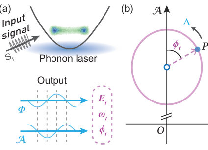
<figcaption class="paper-figure-caption"><b>Fig 1.</b> FIG. 1. Principle of the beat frequency measurement by single-ion phonon laser. (a) The scheme of the beat fre- quency measurement by single-ion phonon laser, where the vibrational motion of the single ion is modulated by the input signal St, and the responses are characterized by the evolution of the phase Φ and amplitude A of the phonon laser. (b) Trajectories in phase-amplitude coor- dinate of the phonon laser.</figcaption>
</figure>
<figure class="paper-figure-card">
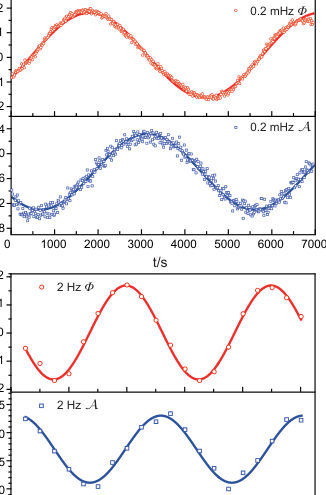
<figcaption class="paper-figure-caption"><b>Fig 2.</b> FIG. 2. Beat frequency measurement of sinusoidal input signals. Evolution of the measured phase Φ (red) and amplitude A (blue) of the phonon laser with input signal of (a) 0.2 mHz and (b) 2 Hz. The red and blue lines are the sinusoidal fitting results of the data points.</figcaption>
</figure>
<figure class="paper-figure-card">
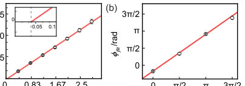
<figcaption class="paper-figure-caption"><b>Fig 3.</b> FIG. 3. Evaluation of the accuracy of Φ. (a) The fitting amplitude Efit of Φ versus the given amplitude Vt of the input signal (Vt, 0.05 Hz,0), with Vt varying from 0.42 mV to 2.92 mV. The red line is a linear fit of the data points with the slope of ∂Efit/∂Vt = 136.8 mrad/mV. (b) The fitting phase ϕfit of Φ versus the given phase ϕt of the input signal (1.25 mV, 0.05 Hz, ϕt). Error bars are statistical standard errors from 10 measurements for each data point with ttot = 20 s for each measurement.</figcaption>
</figure>
<figure class="paper-figure-card">
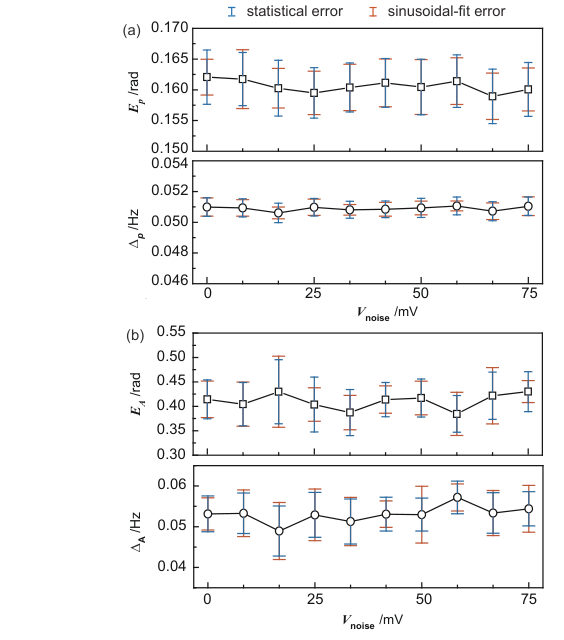
<figcaption class="paper-figure-caption"><b>Fig 4.</b> FIG. 4. The influence of different noise amplitudes on the fitted amplitude and frequency obtained via the evo- lution of the phonon laser’s (a) phase and (b) ampli- tude with an input signal (1.25 mV, 0.05 Hz, 0), where the fitted amplitude/frequency obtained via fitting the evolution of phonon laser’s phase and amplitude to Eq. (2) and Eq. (3) respectively are marked as Ep/∆p and EA/∆A.Blue error bars are the statistical standard error of 10 measurements, and red error bars are the sinusoidal fitting error.</figcaption>
</figure>

**Summary.** The paper introduces a novel single-atom sensor utilizing a trapped $	ext{40Ca}^+$ ion acting as an injection-locked phonon laser to measure low-frequency electric fields. By employing the beat frequency technique, the method efficiently extracts the amplitude, frequency, and phase of the weak input signal in one measurement. This approach achieves state-of-the-art sensitivity while remaining robust against noise, opening pathways for biomedical and geophysical monitoring.

**Why it may be interesting.** This work represents an advanced application of trapped-ion quantum systems for precision sensing outside typical quantum computing regimes. The use of phonon lasers and beating techniques demonstrates sophisticated control over mechanical/vibrational modes coupled to external fields, which is highly relevant to open quantum system dynamics.

Detailed structure

**Main problem.** The challenge is achieving high-sensitivity, miniaturized detection of low-frequency electric field (LFEF) signals (30 kHz to 300 kHz), as conventional antennas are severely limited by the long signal wavelengths.

**Main result.** The authors demonstrated a practical single-ion sensor achieving a sensitivity of $404 	ext{ µV}/(	ext{m} \cdot 	ext{Hz}^{1/2})$ and a detection limit of $61.5 	ext{ µV}/	ext{m}$.

**Method.** They combine the beat frequency technique with an injection-locked phonon laser oscillation to simultaneously extract the input signal's frequency, phase, and amplitude from a single measurement.

**Model / system.** The physical system is a single trapped ion ($	ext{40Ca}^+$) confined in a surface-electrode trap (SET), which acts as an injection-locked phonon laser. The sensing mechanism exploits the ion's high intrinsic sensitivity to external electric fields via Coulomb interaction.

**Key observables.** The evolution of the phonon laser's phase ($\Phi$) and amplitude ($A$), monitored by fitting accumulated photon counts from scattering.

**Important parameters / regimes.** Frequency range (30 kHz to 300 kHz); Sensitivity: $404 	ext{ µV}/(	ext{m} \cdot 	ext{Hz}^{1/2})$; Detection Limit: $61.5 	ext{ µV}/	ext{m}$.

**Assumptions / limitations.** The analysis assumes approximations like $V_t \ll V_i$ and $|\Delta| \ll \omega_i$. The technique is presented as robust against noise.

**Figures summary.** Figure 1 illustrates the beat frequency setup. Figure 2 shows measured $\Phi$ and $A$ evolving for sinusoidal inputs, demonstrating the beating principle. Figures 3 and 4 detail parameter extraction relationships and robustness against white noise.

**Paper structure.** The paper establishes the problem of LFEF sensing limitations with conventional antennas. It then details the methodology using a single-ion phonon laser combined with beat frequency analysis to enable simultaneous measurement of signal parameters. Finally, it presents the achieved high sensitivity and discusses applications.

Abstract

Precision measurement of low-frequency electric field (LFEF) signals with frequency from 30 kHz to 300 kHz is crucial for advancing both fundamental science and practical applications, owing to their unique frequency regime. For conventional electromagnetic antennas, the long wavelength (i.e., several kilometers) of the LFEF leads to a severe size constraint that efficient radiation becomes challenging to achieve when the antenna size is much smaller than the long wavelength of the LFEF signals, which in turn results in a reduction of measurement sensitivity and compromises antenna's performance. By exploiting the high intrinsic sensitivity of cold trapped ions to weak alternating electric signals via Coulomb interaction, we demonstrate a single-ion phonon laser sensor acted by an injection-locked 40Ca+ ion confined in a surface-electrode trap. Combining the beat frequency technique with the injection-locked phonon laser oscillation, we demonstrate a practical and efficient approach for simultaneous extraction of the frequency, phase, and amplitude from a single measurement, without the need for sideband cooling. This approach achieves precision detection for LFEF signals with the sensitivity of 404 uV/(m * Hz1/2) and the detection limit of 61.5 uV/m. Besides, this approach also shows remarkable robustness against noise. Our study helps realizing practical single-atom sensors in the low-frequency regime, opening avenues for applications in subsurface communication, precision metrology, mass spectrometry, and biomedical monitoring.

[↑ back to top](#top)

### [Floquet Driving of Enzymatic Reactions: Counting Statistics and Long-Time Currents](http://arxiv.org/abs/2607.17072v1)

**Authors:** Yuki Watanabe, Yuki Ishiguro, Takashi Oka  
**Type:** theory · **Category:** statistical mechanics · **PDF:** <https://arxiv.org/pdf/2607.17072v1>  
**Analysis basis:** full PDF text, analyzed in chunks
**Topic relevance:** `methods for driven-dissipative` **3/5** · `non-equilibrium dynamics` **3/5** · `non-equilibrium universality` **2/5** · `Keldysh / 2PI / non-Gaussian methods` **1/5** · `correlated / nonlocal dissipation` **1/5** · `driven-dissipative phase transition` **1/5**

↔ Scroll figures horizontally

<figure class="paper-figure-card">
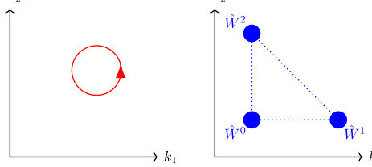
<figcaption class="paper-figure-caption"><b>Fig 1.</b> Fig. 1. Driving protocols schematically shown for (Left) continuous modulation, and for (Right) stepwise constant switching of the reaction rates studied in this work.</figcaption>
</figure>
<figure class="paper-figure-card">
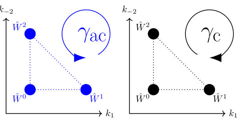
<figcaption class="paper-figure-caption"><b>Fig 2.</b> Fig. 3. Schematic representation of the driving sequences. (Left) Anti-clockwise driving sequence γac = { ˆ W 0, ˆ W 1, ˆ W 2}. (Right) Clockwise driving sequence γc = { ˆ W 0, ˆ W 2, ˆ W 1}. Each generator ˆ W a is represented by a node, and changes to the next generator every one third of the period T.</figcaption>
</figure>
<figure class="paper-figure-card">
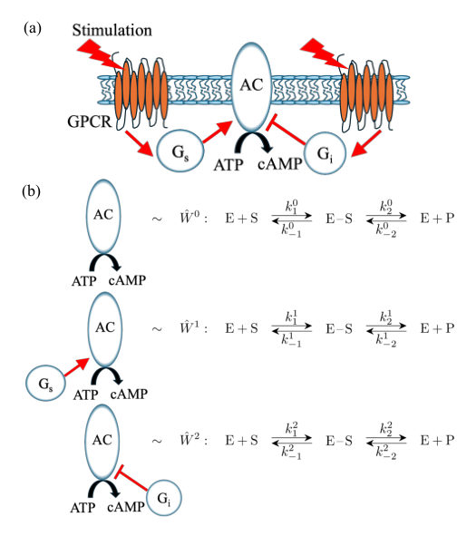
<figcaption class="paper-figure-caption"><b>Fig 3.</b> Fig. 2. Schematic of the cAMP production system motivating discrete Floquet driving. (a) AC catalyzes the conversion of ATP into cAMP, which correspond to the enzyme E, substrate S, and product P, respectively, in the Michaelis–Menten-type reaction in Eq. (1). The regulatory proteins Gs and Gi modulate the activation state of AC and thereby alter the catalytic rates in response to external stimu- lation of GPCRs. (b) AC-state-dependent chemical reactions, together with the corresponding assumed generators and chemical reaction rates introduced in Eqs. (51)–(53).</figcaption>
</figure>
<figure class="paper-figure-card">

<figcaption class="paper-figure-caption"><b>Fig 4.</b> Figure 4 shows the dynamics of the net production NP(t). Panels (b) and (c) show the high- (Ω= 10π) and low-frequency (Ω= 0.2π) results, respectively. Blue curves correspond to γac, while black curves correspond to γc in Fig. 3. As for the short-time dynamics, a</figcaption>
</figure>
<figure class="paper-figure-card">
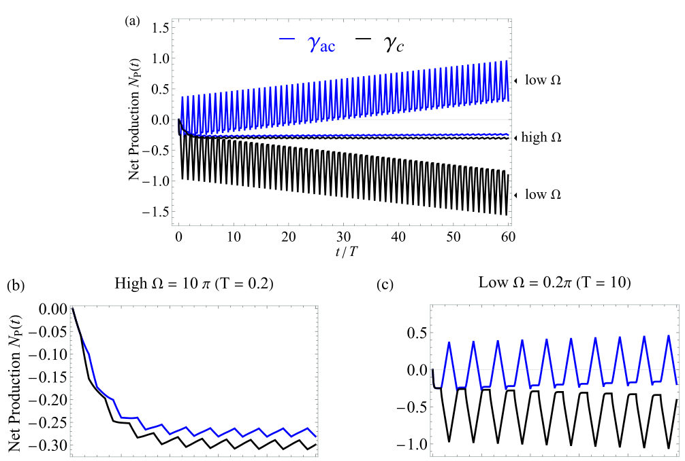
<figcaption class="paper-figure-caption"><b>Fig 5.</b> Fig. 4. (a) NP(t) for different driving sequences and frequencies. Blue and black curves correspond to anti-clockwise and clockwise sequences γac and γc, respectively. (b,c) Enlarged views in the high- and low-frequency regimes. We take Ω= 10π and Ω= 0.2π, respectively.</figcaption>
</figure>

**Summary.** This paper extends Floquet theory to classical stochastic processes to study chemical reaction rates under periodic external driving. By developing a counting field formalism, the authors derive general expressions for the long-time current and its statistics. The results are particularly valuable as they provide non-perturbative insights into how fast or slow modulation affects steady-state chemical output.

**Why it may be interesting.** This work provides a powerful theoretical framework—Floquet analysis combined with counting statistics—to analyze non-equilibrium steady states in open quantum/stochastic systems driven periodically, which is highly relevant to quantum control.

Detailed structure

**Main problem.** The paper develops a Floquet theory for classical stochastic processes to analyze reaction dynamics under periodic, time-dependent control.

**Main result.** It derives general expressions for the long-time product current and its counting statistics, showing that high-frequency driving modifies effective chemical rates.

**Method.** The authors use a counting field formalism applied to the master equation, developing systematic asymptotic expansions (high- and low-frequency) based on Floquet theory.

**Model / system.** The model is an enzymatic reaction (Michaelis–Menten type) whose rate constants are periodically modulated. The dynamics are described by a time-dependent master equation recast into a Schrödinger-like form using a counting field.

**Key observables.** Long-time product current ($J_\infty(\Omega)$), net production ($	ext{NP}(t)$), and the cumulant generating function $S(\chi; t)$.

**Important parameters / regimes.** Driving frequency ($\Omega$), modulation period ($T$), and the high/low-frequency limits of $\Omega$.

**Assumptions / limitations.** The theory is designed to handle non-perturbative, stepwise switching protocols where smooth approximations fail. Approximations involve systematic expansions in powers of $1/\Omega$ (high frequency).

**Figures summary.** Figure 1 schematically compares continuous vs. discrete/stepwise driving protocols; Figure 7 illustrates the exponential convergence of the calculated current to its long-time steady state.

**Paper structure.** The paper first establishes the counting-field formalism for time-periodic generators, then derives general expressions for $J_\infty(\Omega)$, followed by detailed derivations and asymptotic expansions in both high-frequency (van Vleck) and low-frequency regimes.

Abstract

Technologies for artificially controlling chemical reaction systems, such as optogenetics, are rapidly advancing, making it increasingly important to understand reaction dynamics under time-dependent control. When the modulation of reaction rates is periodic in time, the Floquet formalism provides a systematic framework. We develop a Floquet theory for classical stochastic processes that enables the calculation of the current and its counting statistics under such periodic modulation. In particular, we formulate the theory in terms of a counting field and derive general expressions for the first cumulant and the corresponding current. The current is expressed using the effective Floquet generator and the kicked state, and we further obtain general asymptotic expressions for the current in both the high- and low-frequency regimes. As a concrete example to test our analytical expressions, we then apply the results to discrete Floquet driving -- a non-perturbative, stepwise protocol. The setup is motivated by a biochemical system known as cyclic adenosine monophosphate (cAMP) production, which is an enzymatic reaction activated and inhibited by G-proteins. This is formulated as a discretely driven Michaelis--Menten-type reaction model, in which the catalytic activity is switched on and off abruptly in time, and we obtain analytical expressions and numerical results showing how periodic switching of reaction rates generates a long-time product current. In particular, in the high-frequency limit, we show that the effect of the periodic driving can be interpreted through an effective modification of the chemical reaction rates. These results provide a basis for Floquet analysis of periodically driven chemical reactions.

[↑ back to top](#top)

### [Locally Scrambled Quantum Memories for Loss-Tolerant Entanglement-Assisted Optical Interferometry](http://arxiv.org/abs/2607.17321v1)

**Authors:** Jianqi Sheng  
**Type:** theory · **Category:** quantum information and computing · **PDF:** <https://arxiv.org/pdf/2607.17321v1>  
**Analysis basis:** full PDF text, analyzed in chunks
**Topic relevance:** `interference shaping light` **3/5** · `entanglement & information structure` **2/5** · `quantum measurements` **2/5** · `correlated / nonlocal dissipation` **1/5** · `driven-dissipative phase transition` **1/5** · `methods for driven-dissipative` **1/5** · `non-equilibrium dynamics` **1/5**

↔ Scroll figures horizontally

<figure class="paper-figure-card">
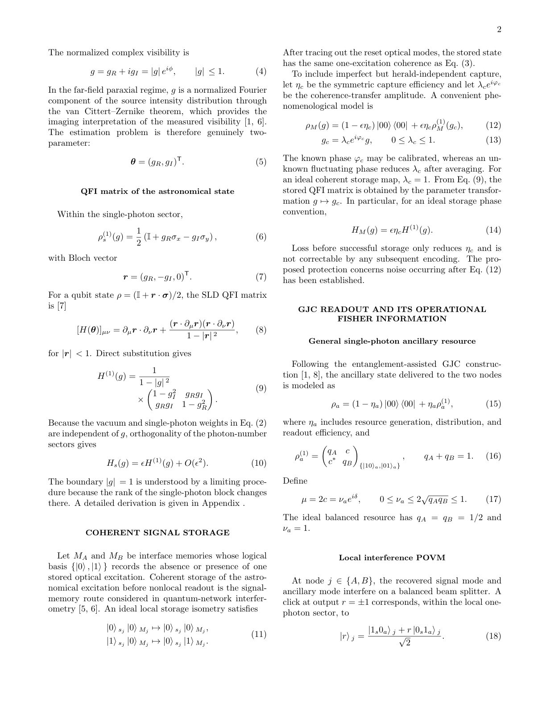
<figcaption class="paper-figure-caption"><b>Fig 1.</b> Low-resolution page preview, page 2</figcaption>
</figure>
<figure class="paper-figure-card">
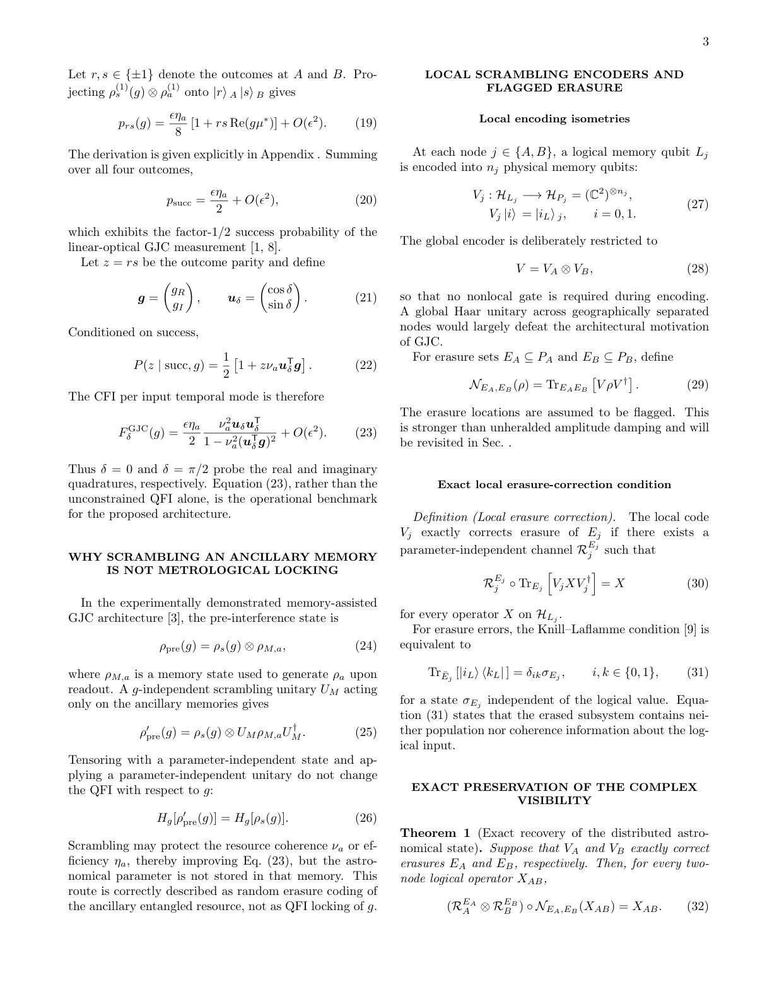
<figcaption class="paper-figure-caption"><b>Fig 2.</b> Low-resolution page preview, page 3</figcaption>
</figure>
<figure class="paper-figure-card">
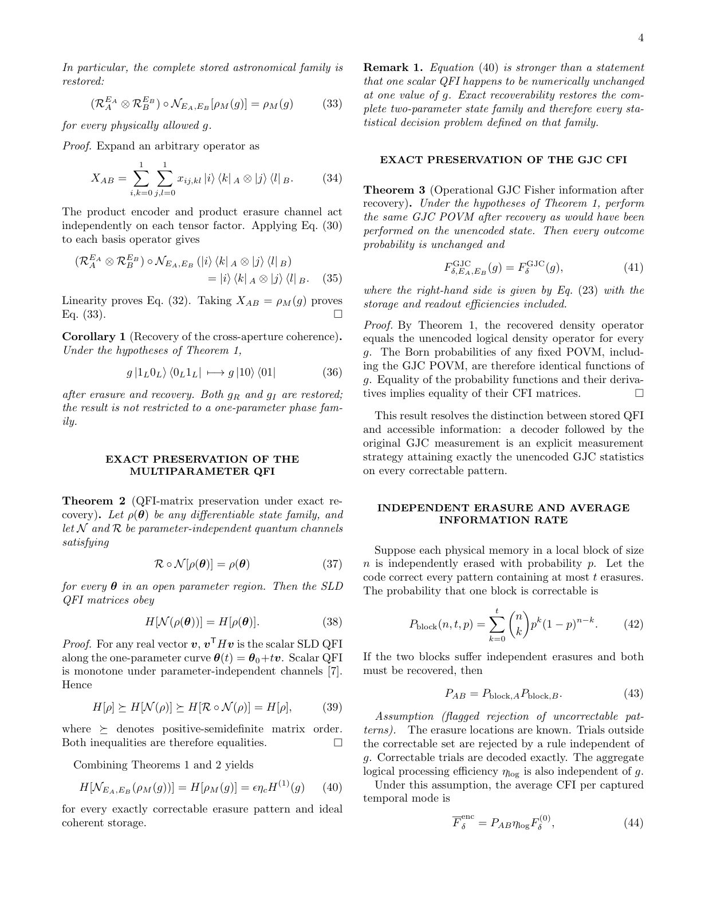
<figcaption class="paper-figure-caption"><b>Fig 3.</b> Low-resolution page preview, page 4</figcaption>
</figure>
<figure class="paper-figure-card">
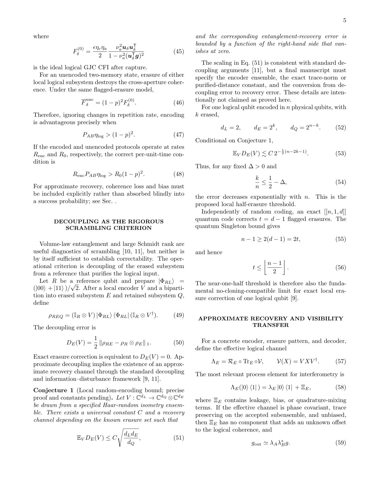
<figcaption class="paper-figure-caption"><b>Fig 4.</b> Low-resolution page preview, page 5</figcaption>
</figure>
<figure class="paper-figure-card">
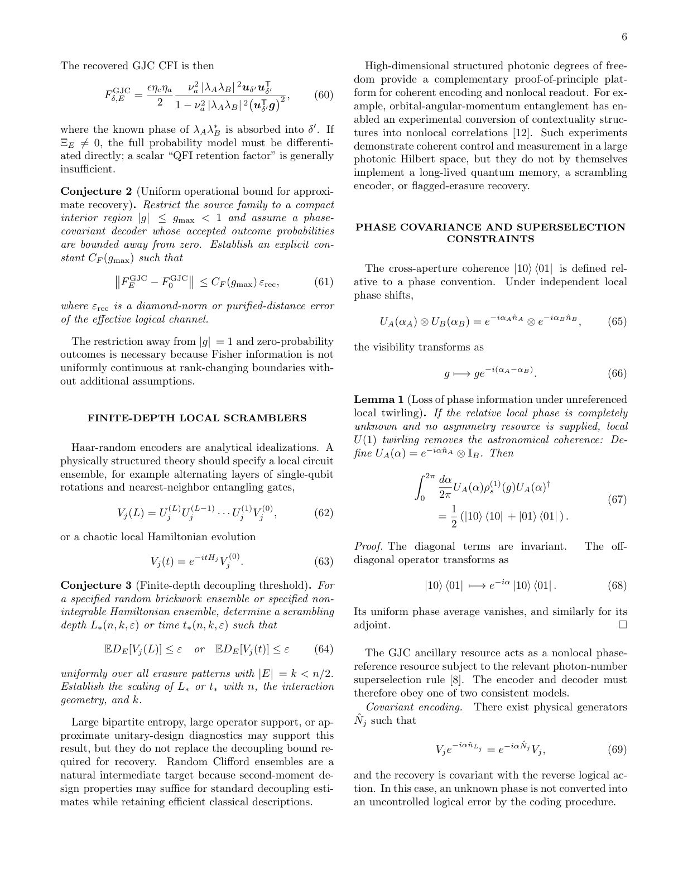
<figcaption class="paper-figure-caption"><b>Fig 5.</b> Low-resolution page preview, page 6</figcaption>
</figure>

**Summary.** This paper proposes a robust method for long-baseline optical interferometry using distributed quantum memories. It introduces local scrambling encoders that protect the stored astronomical coherence against photon loss and erasure. The key finding is that under specific conditions of exact local correction, the measurement's sensitivity (quantified by QFI) is fully preserved, enabling practical quantum sensing in noisy channels.

**Why it may be interesting.** This work directly addresses quantum communication challenges in noisy environments by providing rigorous mathematical guarantees (QFI preservation) for resource-limited quantum measurements, which is highly relevant to quantum networking and sensing.

Detailed structure

**Main problem.** To develop a loss-tolerant protocol for long-baseline optical interferometry by mapping astronomical coherence into quantum memories protected by local scrambling encoders.

**Main result.** The authors prove that exact local erasure correction restores the complex visibility, Quantum Fisher Information (QFI), and operational GJC Fisher Information (CFI) of the stored state.

**Method.** Theoretical derivation involving modeling weak-thermal-light sources, applying concepts of quantum channel preservation under recovery operations, and establishing necessary decoupling criteria.

**Model / system.** The system models a distributed network connecting two telescopes using quantum memories to store the astronomical optical coherence. The process involves coherent signal storage followed by local scrambling encoding and erasure correction.

**Key observables.** Complex visibility ($g$), Quantum Fisher Information (QFI) matrix, Classical Fisher Information (CFI), and the Decoupling Error ($	ext{DE}(V)$).

**Important parameters / regimes.** The critical threshold for successful recovery is established as fewer than half of the physical memories erased per node ($k/n < 1/2$).

**Assumptions / limitations.** The protocol relies on assuming exact local erasure correction and that protection is governed by reference–environment decoupling rather than just volume-law entanglement.

**Paper structure.** The paper proceeds by deriving the weak-thermal-light model, establishing the QFI/CFI diagnostics for GJC readout, proving the restoration of coherence and Fisher information under local recovery operations (Theorem 1 & 2), and finally outlining necessary constraints like U(1) covariance.

Abstract

We formulate a loss-tolerant extension of entanglement-assisted long-baseline optical interferometry in which the astronomical optical coherence is first mapped coherently to distributed quantum memories and is subsequently protected by local scrambling encoders. The proposal must be distinguished from existing memory-assisted Gottesman--Jennewein--Croke (GJC) interferometers, in which quantum memories store an ancillary single-photon-entangled reference rather than the astronomical state itself. We derive the weak-thermal-light model, its two-parameter quantum Fisher information (QFI) matrix, the GJC measurement probabilities, and the associated classical Fisher information (CFI). We then prove that exact local correction of flagged erasures restores the complete complex visibility, its QFI matrix, and the operational GJC CFI. The relevant protection criterion is reference--environment decoupling, not volume-law entanglement alone. We state, as conjectures, quantitative decoupling bounds for local random encoders and finite-depth scramblers, and derive the expected threshold of fewer than one half of the physical memories erased per node. Finally, we formulate the phase-covariance and superselection-rule constraints required for a physically meaningful distributed protocol.

[↑ back to top](#top)

### [AIMS: An uncertainty-aware AI experimentalist for quantum matter](http://arxiv.org/abs/2607.16544v1)

**Authors:** Siyuan Qiu, Philip D. Suh, Nhat Huy Tran, Xirui Wang, Heonjoon Park, Kutay Akin, Kevin K. S. Multani, Seungwon Jung, Wenkai Cai, Xinyu Liu, Ziyan Zhu, Chunjing Jia, Zhantao Chen, Zhixun Shen, Zhurun Ji  
**Type:** both · **Category:** strongly correlated electrons · **PDF:** <https://arxiv.org/pdf/2607.16544v1>  
**Analysis basis:** full PDF text, analyzed in chunks
**Topic relevance:** `analog quantum simulation` **3/5** · `methods for driven-dissipative` **3/5** · `quantum measurements` **2/5** · `Keldysh / 2PI / non-Gaussian methods` **1/5** · `driven-dissipative phase transition` **1/5**

↔ Scroll figures horizontally

<figure class="paper-figure-card">
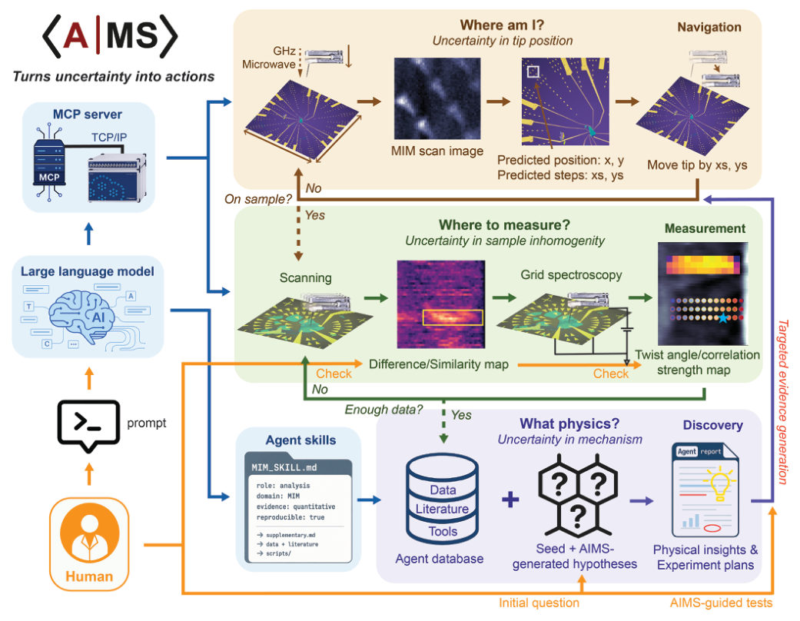
<figcaption class="paper-figure-caption"><b>Fig 1.</b> FIG. 1. AIMS turns three generic experimental uncertainties into action through three nested loops. AIMS converts uncertainty at three stages of a cryogenic MIM experiment into targeted actions. A human researcher initiates a task prompt through large language model interface, after which AIMS calls the requisite instrument control and real-time data analysis tools from the MCP server as each loop proceeds. In the navigation loop, it acquires MIM images, estimates the tip position and confidence, moves toward the sample, and invokes recovery procedures when localization is unreliable. In the measurement loop, large-area gate-dependent imaging and grid spectroscopy map sample inhomogeneity...</figcaption>
</figure>
<figure class="paper-figure-card">
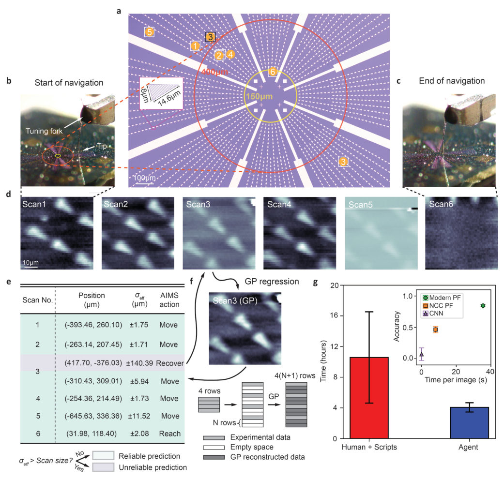
<figcaption class="paper-figure-caption"><b>Fig 2.</b> FIG. 2. AIMS locates the sample under cryogenic drift and recovers from unreliable position estimates. (a) Optical image of the marker chip. The white squares in numerical order mark the predicted positions of MIM scans taken at each step. The black square marks the predicted position of Scan 3 after GP regression reconstruction. The yellow and orange circles highlight 150 µm and 400 µm from the pattern’s center respectively. The inset shows the design geometry of the lateral triangular arrow marker. (b) &amp; (c) Optical image of the tip with respect to the marker pattern at initial position after approaching (Scan 1) and final position after the sample locating process ends (Scan 6)...</figcaption>
</figure>
<figure class="paper-figure-card">
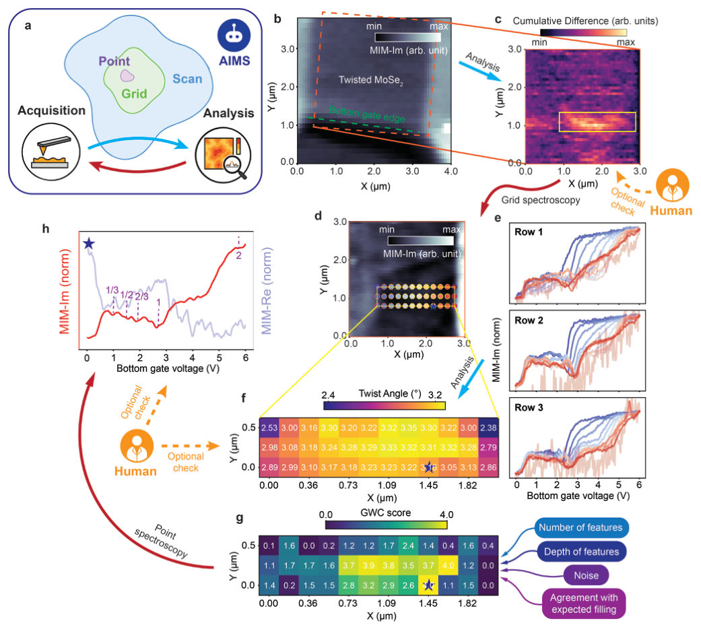
<figcaption class="paper-figure-caption"><b>Fig 3.</b> FIG. 3. AIMS selects measurement sites in a disordered twisted MoSe2 device and resolves fractional generalized Wigner crystal states. (a) Schematic of AIMS-driven measurement loop. The process iterates between data acquisition and analysis, progressively narrowing the region of interest from a large scan area to a smaller grid and ultimately to the single optimal measurement point, thereby improving experimental efficiency. Red and blue arrows in the remaining panels denote the acquisition-to-analysis and analysis-to-acquisition directions, respectively. The orange dashed lines coupled to human represents the optional checks that human researcher can perform. (b) MIM-Im scan on the twisted...</figcaption>
</figure>
<figure class="paper-figure-card">
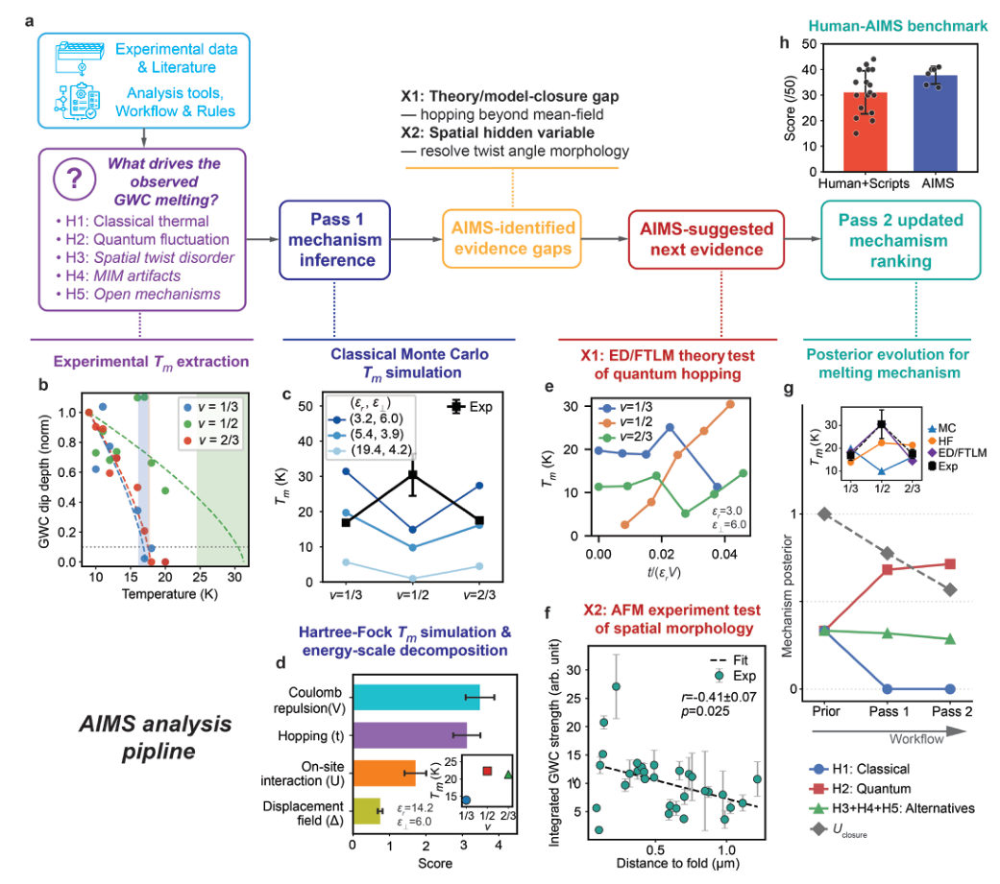
<figcaption class="paper-figure-caption"><b>Fig 4.</b> FIG. 4. A closed AIMS discovery loop traces the anomalous stability of the half-filled generalized Wigner crystal to quantum fluctuations. (a) Discovery workflow of AIMS. A curated database of literature [30, 35, 46, 49–56] and experimental data, together with data analysis tools, workflows and rules as MIM discovery skills, is supplied to AIMS prior to each run. A scientific question is posed by human to AIMS as prompt alongside the physics priors and hypotheses (H1 – H2). With these information, AIMS adds its new hypotheses (H3 – H5), performs the first pass of analysis and score each hypothesis with Bayesian inference. To improve the credibility of its judgment, AIMS identifies the...</figcaption>
</figure>

**Summary.** This work introduces AIMS, an advanced AI agent that autonomously guides experiments on quantum materials to resolve fundamental physical questions. By integrating perception recovery, targeted measurement selection based on local disorder, and iterative hypothesis testing, it successfully identified the role of quantum fluctuations in stabilizing fractional Wigner crystal states.

**Why it may be interesting.** It provides a blueprint for how AI can tackle complex many-body physics problems by systematically mapping out the parameter space of uncertainty, which is crucial for understanding emergent quantum phases in strongly correlated systems.

Detailed structure

**Main problem.** To autonomously discover the physical mechanism responsible for the anomalous stability of fractional Wigner crystal states in quantum materials.

**Main result.** The study demonstrates that the exceptional robustness of the $
u=1/2$ state is primarily due to quantum-fluctuation renormalization effects involving electron hopping, rather than purely classical charge ordering.

**Method.** An uncertainty-aware closed-loop AI agent (AIMS) was developed to guide experiments by managing perception errors, selecting optimal measurement sites based on local inhomogeneity, and iteratively refining physical hypotheses.

**Model / system.** The system involves twisted bilayer $	ext{MoSe}_2$ moiré superlattices exhibiting correlated insulating states. The analysis compares results from classical Monte Carlo simulations against advanced quantum models like Hartree-Fock and Exact Diagonalization.

**Key observables.** Melting temperature ($T_m$) hierarchy across different filling factors ($
u=1/3, 1/2, 2/3$), Generalized Wigner Crystal (GWC) score maps, and local twist angle distributions.

**Important parameters / regimes.** Twist angle disorder ($	heta \approx 3.13^\circ$), hopping energy ($t$), Coulomb repulsion strength, and various energy scale ratios used in theoretical models.

**Assumptions / limitations.** The framework assumes that the physical mechanism can be uncovered by iteratively testing hypotheses and quantifying uncertainty across multiple experimental passes.

**Figures summary.** Figures illustrate AIMS's three nested loops (Navigation, Measurement Selection via GWC scoring, Discovery/Hypothesis Testing), showing recovery from poor data quality using GP reconstruction and comparing model predictions against measured $T_m$ values.

**Paper structure.** The paper is structured around the AIMS framework: first demonstrating robust navigation under uncertainty; second, narrowing down measurement regions on inhomogeneous samples (GWC scoring); and finally, executing a closed-loop discovery process to distinguish between competing physical mechanisms governing correlated states.

Abstract

Autonomous scientific agents are beginning to accelerate discovery, but most demonstrations operate in digital or highly structured settings where the objects, actions, and objectives are largely predefined. Quantum materials experiments pose a harder problem where uncertainties involve: the instrument state can drift, the useful signal may occupy only rare regions of an inhomogeneous sample, and the physical mechanism is often under-determined. Here we introduce the AI agent for Inference and Measurement in Science (AIMS), an uncertainty-aware closed-loop AI experimentalist for cryogenic microwave impedance microscopy that converts uncertainty into experimental action. AIMS links three nested loops: navigation under uncertain perception, measurement selection under sample inhomogeneity, and scale-resolved mechanism attribution under ambiguous physics. In navigation, it relocates the sample after cryogenic displacement, flags unreliable position estimates, and invokes recovery strategies, significantly reducing sample-locating time. In measurement, it maps twist angle distribution and generalized Wigner crystal score of twisted bilayer MoSe$_2$ to identify regions with the strongest correlated response. In discovery, AIMS asks not whether melting is simply classical or quantum, but how the competition of Coulomb repulsion, hopping, and other energy scales shapes the observed hierarchy. By testing the classical limit, varying hopping and Coulomb scales, and preserving sample morphology as a secondary testable variable, AIMS prioritizes a quantum-fluctuation-renormalized origin of the anomalously robust $ν= 1/2$ crystal. AIMS demonstrates uncertainty-aware experimental agency for quantum matter with perception recovery, measurement choice, and energy-scale-resolved mechanism attribution in one closed loop.

[↑ back to top](#top)

### [Nonlocal Electrostatic Field Theory from Microscopic Description](http://arxiv.org/abs/2607.16429v1)

**Authors:** Varazdat Stepanyan, Yevgeni Sh. Mamasakhlisov, Armen E. Allahverdyan  
**Type:** theory · **Category:** statistical mechanics · **PDF:** <https://arxiv.org/pdf/2607.16429v1>  
**Analysis basis:** full PDF text, analyzed in chunks
**Topic relevance:** `Keldysh / 2PI / non-Gaussian methods` **3/5** · `non-equilibrium dynamics` **2/5** · `analog quantum simulation` **1/5** · `correlated / nonlocal dissipation` **1/5** · `driven-dissipative phase transition` **1/5** · `methods for driven-dissipative` **1/5** · `non-equilibrium universality` **1/5**

↔ Scroll figures horizontally

<figure class="paper-figure-card">
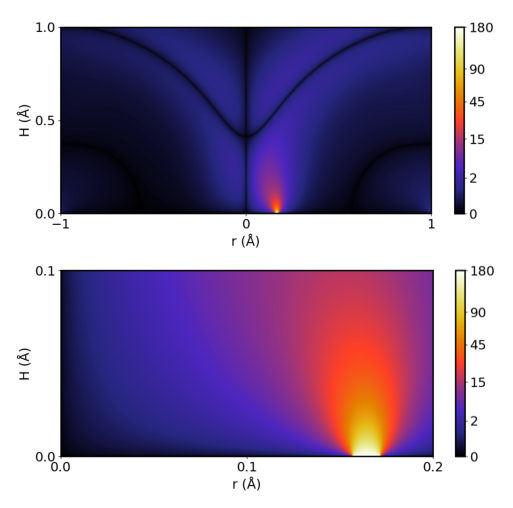
<figcaption class="paper-figure-caption"><b>Fig 1.</b> FIG. 2. Angle between Displacement (D) and Polarization (P ) for two point charges 2 e and 1 e at 2 ˚A distance. Here H is the height from the axis connecting the two charges. The rest of the parameters are T = 300 K, a = 0.5 ˚A, q = 1 e, c = 55 mol/l. The colormap is a power law with γ = 0.368.</figcaption>
</figure>
<figure class="paper-figure-card">
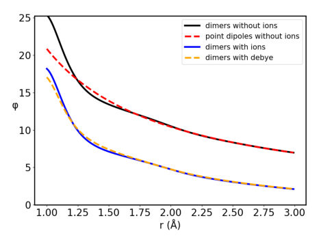
<figcaption class="paper-figure-caption"><b>Fig 2.</b> FIG. 1. The profile of electric field potential in a dimer solu- tion without ions (black, solid), point dipole solution without ions (red, dashed), dimer solution with ions (blue, solid) and dimer solution with Debye screening applied at post (yellow, dashed).</figcaption>
</figure>

**Summary.** This paper constructs a unified mean-field theory for non-equilibrium electrostatics in soft matter by starting from microscopic Langevin dynamics. It derives a generalized Poisson-Boltzmann equation that accounts for the finite size and structure of charged particles, moving beyond simple point-charge approximations. This framework allows for calculating macroscopic properties like permittivity without assuming a fixed solvent dielectric constant.

**Why it may be interesting.** While focused on classical electrostatics, the rigorous derivation using stochastic processes (Langevin/Fokker-Planck) mirrors techniques used in open quantum systems theory when deriving master equations from microscopic Hamiltonians.

Detailed structure

**Main problem.** To develop a unified theoretical framework for electrostatics in soft matter that moves beyond conventional theories by treating particles as extended, non-point-like structures.

**Main result.** The authors derive a generalized Poisson-Boltzmann equation (GPBE) and an electrostatic free energy expression applicable to nonlocal nonlinear systems.

**Method.** The theory starts from microscopic equations of motion (Langevin dynamics), derives the corresponding Fokker-Planck equation, and applies mean-field approximations to solve for equilibrium and non-equilibrium electrostatics.

**Model / system.** The model considers a general mixture of charged molecular species or rigid bodies in an electrolyte solution. The formalism is built upon deriving stochastic equations (Langevin) and their corresponding probability density evolution (Fokker-Planck).

**Key observables.** Electric potential ($\varphi$), polarization ($P$), displacement ($D$), anisotropic susceptibility, and the static permittivity $\hat{\varepsilon}(k, 0)$.

**Important parameters / regimes.** Temperature ($T$), inverse temperature ($eta$), charge densities ($N_\alpha$), and molecular structure operators ($T_\alpha(\Omega)$).

**Assumptions / limitations.** The mean-field approximation is used throughout. For equilibrium, detailed balance is assumed, and the initial derivation relies on assuming rigid internal structures.

**Figures summary.** Not specified by notes; the focus is on deriving key equations (GPBE, linear response forms) rather than summarizing figure content.

**Paper structure.** The paper progresses from establishing the microscopic dynamics via Langevin equations for rigid bodies to deriving the associated Fokker-Planck equation. This leads to the generalized Poisson-Boltzmann equation in equilibrium and its linearization for calculating dielectric properties.

Abstract

The study of electric fields in soft materials converges either to the study of point-like particles (local) in nonlinear theories or to the use of particles with finite sizes in nonlocal linear theories. In this work we start from the microscopic equations of motion and construct a unified mean field Fokker-Planck equation that describes the non-equilibrium electrostatics of nonlocal nonlinear systems. We obtain a generalized Poisson-Boltzmann equation for such systems as well as their electrostatic free energy expression. In the linear approximation we obtain an anisotropic susceptibility in an isotropic fluid which allows for local linear response inversion in electrostatics.

[↑ back to top](#top)

### [Transport-Weighted Coercivity in Granular CrO2: Why Magnetoresistance and Magnetization Can Disagree](http://arxiv.org/abs/2607.16984v1)

**Authors:** E. Yu. Beliayev, I. G. Mirzoiev, V. A. Horielyi, I. A. Chichibaba  
**Type:** both · **Category:** disordered systems and neural networks · **PDF:** <https://arxiv.org/pdf/2607.16984v1>  
**Analysis basis:** full PDF text, analyzed in chunks
**Topic relevance:** `spintronics-quantum-optics interface` **3/5** · `non-equilibrium dynamics` **2/5** · `analog quantum simulation` **1/5** · `correlated / nonlocal dissipation` **1/5** · `driven-dissipative phase transition` **1/5** · `exotic spin models in light-matter` **1/5** · `non-equilibrium universality` **1/5**

↔ Scroll figures horizontally

<figure class="paper-figure-card">
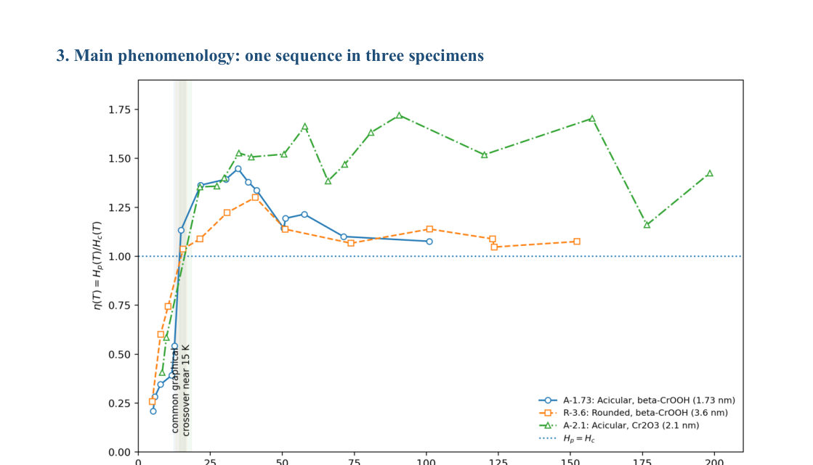
<figcaption class="paper-figure-caption"><b>Fig 1.</b> Fig. 1. Normalized ratio η(T) = Hp(T)/Hc(T) for three compacted CrO2 specimens. The Hp(T) and Hc(T) values were digitized from Fig. 3 of Ref. [13], and η(T) was calculated from these values. The vertical shaded ranges show the uncertainty in locating the low-temperature crossings from the digitized curves; they are not experimental confidence intervals. The three datasets suggest a common graphical crossover near 15 K, with baseline estimates spanning approximately 14–16 K. Fig. 1 condenses the central experimental observation. At elevated temperature, H/p is close to Hс. On cooling, Hp rises above Hc and reaches a sample-dependent maximum. At still lower temperature, the ratio crosses...</figcaption>
</figure>
<figure class="paper-figure-card">
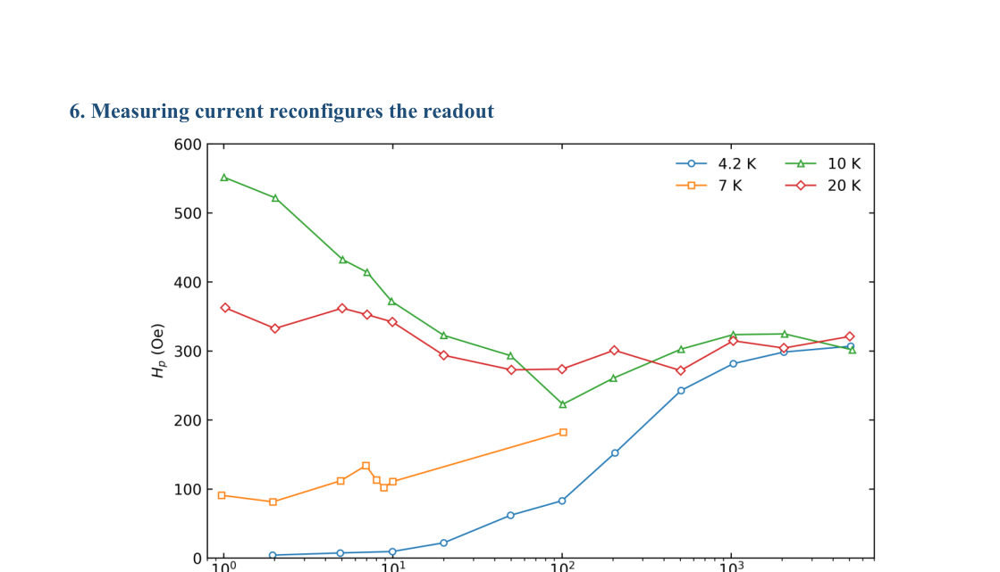
<figcaption class="paper-figure-caption"><b>Fig 2.</b> Fig. 2. Field Hp of the magnetoresistance maximum versus measuring current for specimen R-3.6. The temperature assignment follows the published caption: circles, 4.2 K; squares, 7 K; triangles, 10 K; diamonds, 20 K. Data were digitized from Fig. 7 of Ref. [13]. Lines are guides to the eye. The current dependence confirms that Hp is not a fixed property of the bulk magnet alone. At 20 K, Hp remains close to the bulk coercive-field scale. At 10 K it first decreases, consistent with local heating of the most resistive links, and then returns toward approximately 300 Oe as additional branches become electrically active. At 4.2 and 7 K, Hp rises from a low-current value toward the same bulk...</figcaption>
</figure>

**Summary.** This work demonstrates that measuring magnetoresistance hysteresis to find the coercive field in granular magnets is misleading because current flows only through a few critical junctions. The authors propose 'transport-weighted coercivity' as a diagnostic tool, showing how this electrical measurement can reveal information about local magnetic barriers distinct from the bulk magnetization average.

**Why it may be interesting.** The concept of 'transport-weighted' properties in disordered magnetic systems mirrors concepts in neural networks where activity patterns dictate effective connectivity, making it relevant for understanding emergent macroscopic behavior from localized microscopic interactions.

Detailed structure

**Main problem.** The coercive field estimated from magnetoresistance hysteresis ($H_p$) often disagrees with the bulk coercive field ($H_c$) in granular magnetic conductors.

**Main result.** This discrepancy is due to electrical current paths being localized to a small, highly sensitive subset of interparticle junctions, leading to a 'transport-weighted coercivity' that differs from the volume average.

**Method.** The authors reanalyzed magnetotransport and magnetometry data on $	ext{CrO}_2$ powders, comparing $H_p$ (from MR peak) against $H_c$ (from magnetization zero crossing).

**Model / system.** The system is compacted powder of the half-metallic ferromagnet $	ext{CrO}_2$, where electrical conduction occurs via spin-dependent tunneling through insulating barriers between magnetic grains.

**Key observables.** The ratio $\eta = H_p/H_c$; $H_p$ vs. measuring current; and the temperature dependence of this ratio.

**Important parameters / regimes.** Temperature (especially crossover near 15 K); measuring bias current; particle shape and insulating shell thickness.

**Assumptions / limitations.** The analysis relies on Cohn's network-sensitivity theorem, which weights contacts by the square of the local current flow. The low-temperature behavior is interpreted via a 'soft-bottleneck picture'.

**Figures summary.** Figure 1 shows that the ratio $\eta(T) = H_p(T)/H_c(T)$ exhibits a common qualitative sequence across different samples, crossing unity near 15 K.

**Paper structure.** The paper establishes the failure of equating $H_p$ and $H_c$, introduces Cohn's theorem to define transport weights, analyzes how temperature controls which junctions dominate the current path (leading to the $\eta$ sequence), and concludes that the difference $H_p - H_c$ is a diagnostic tool.

Abstract

Magnetoresistance hysteresis is often used to estimate the coercive field of a magnetic material. We reanalyse our published magnetotransport and magnetometry data on compacted powders of the half-metallic ferromagnet CrO2 and show that this identification can fail in a granular conductor. The field Hp at the resistance maximum may be close to, above, or below the bulk coercive field Hc, depending on temperature and measuring current. For three samples with different particle shapes and insulating-shell thicknesses, the digitized ratio Hp/Hc follows the same qualitative sequence and suggests a common crossover near 15 K. We interpret this behaviour as a change in which interparticle junctions control the electrical response. Bulk magnetometry averages over the entire magnetic volume, whereas tunnelling resistance gives the largest weight to the small set of links that carries the current. Cohn's exact network-sensitivity theorem provides a rigorous linear-response definition of these transport weights. In simple terms, Cohn showed that the influence of a given contact on the total resistance is proportional to the square of the current flowing through that contact. Combined with known magnetic pair-correlation effects, this leads to the concept of transport-weighted coercivity. In granular sensors and spin-dependent composites, the resistance peak cannot automatically be treated as the bulk coercive field. Conversely, the difference Hp - Hc may serve as a diagnostic of current-path localization, barrier evolution, and device-to-device variability.

[↑ back to top](#top)

### [Against Many Worlds](http://arxiv.org/abs/2607.17086v1)

**Authors:** Emily Adlam, Jacob A. Barandes  
**Type:** theory · **Category:** other · **PDF:** <https://arxiv.org/pdf/2607.17086v1>  
**Analysis basis:** full PDF text, analyzed in chunks
**Topic relevance:** `quantum measurements` **3/5** · `measurement-induced transitions` **2/5** · `Keldysh / 2PI / non-Gaussian methods` **1/5** · `correlated / nonlocal dissipation` **1/5** · `driven-dissipative phase transition` **1/5** · `entanglement & information structure` **1/5**

↔ Scroll figures horizontally

<figure class="paper-figure-card">
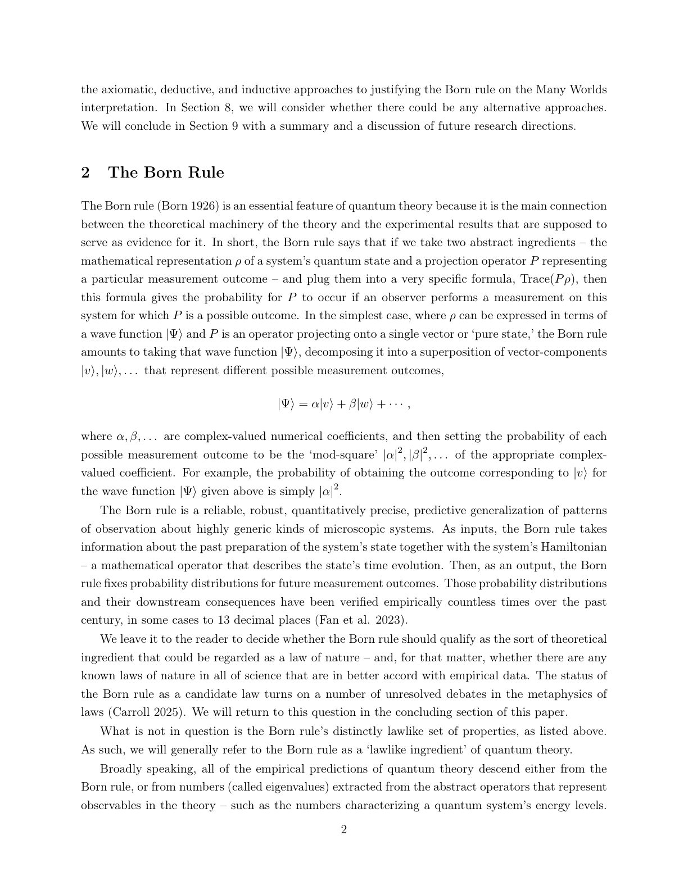
<figcaption class="paper-figure-caption"><b>Fig 1.</b> Low-resolution page preview, page 2</figcaption>
</figure>
<figure class="paper-figure-card">
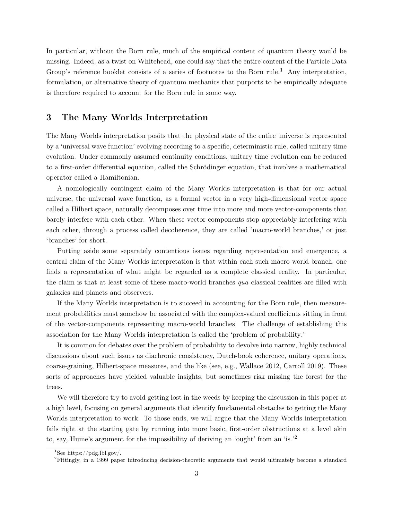
<figcaption class="paper-figure-caption"><b>Fig 2.</b> Low-resolution page preview, page 3</figcaption>
</figure>
<figure class="paper-figure-card">
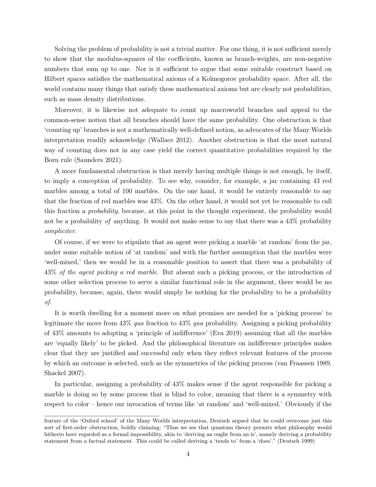
<figcaption class="paper-figure-caption"><b>Fig 3.</b> Low-resolution page preview, page 4</figcaption>
</figure>
<figure class="paper-figure-card">
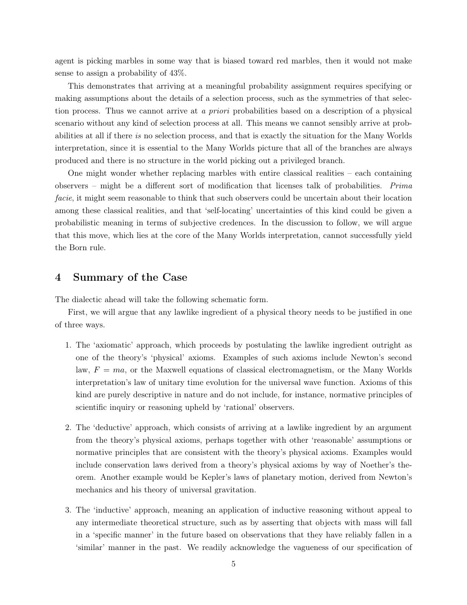
<figcaption class="paper-figure-caption"><b>Fig 4.</b> Low-resolution page preview, page 5</figcaption>
</figure>
<figure class="paper-figure-card">
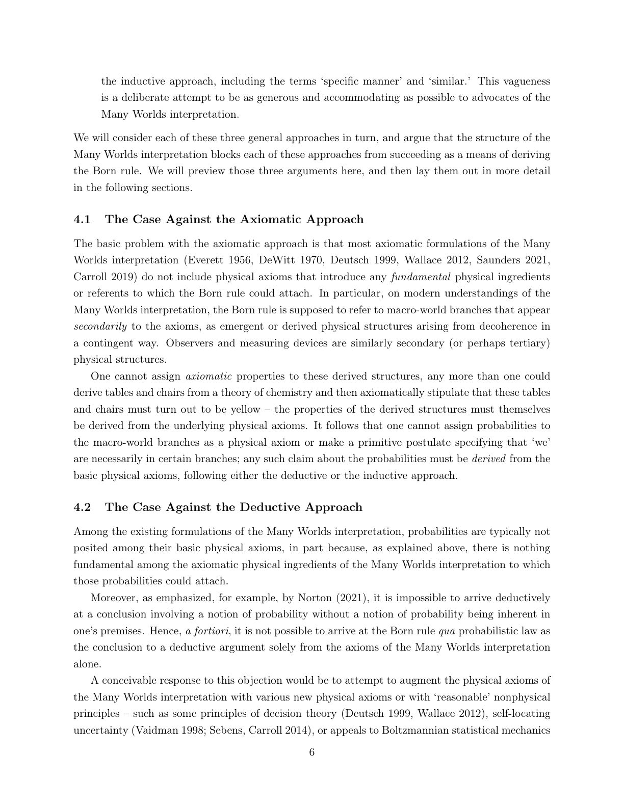
<figcaption class="paper-figure-caption"><b>Fig 5.</b> Low-resolution page preview, page 6</figcaption>
</figure>

**Summary.** This paper provides a rigorous philosophical and physical critique of how the Born rule can be justified within the Many Worlds Interpretation. The authors argue that standard logical tools—axioms, deduction, and induction—all fail to bridge the gap between unitary quantum evolution and observed probabilities. It highlights that MWI lacks an inherent mechanism to select or weight outcomes into measurable probabilities.

**Why it may be interesting.** While not focused on specific AMO platforms, the deep theoretical critique of probability assignment methods is highly relevant for any field dealing with open quantum systems or measurement processes where probabilistic outcomes are central.

Detailed structure

**Main problem.** The central problem is deriving the Born rule—the probabilistic link between quantum theory's unitary evolution and its empirical predictions—within the Many Worlds Interpretation (MWI). The authors argue that standard methods fail to provide this derivation.

**Main result.** Structurally, none of the three primary approaches (axiomatic, deductive, or inductive) can successfully account for the Born rule within MWI due to fundamental obstructions related to selection processes.

**Method.** The paper employs a critical analysis by examining and critiquing the logical requirements of axiomatic postulation, deduction from first principles, and induction in the context of MWI's ontology.

**Model / system.** The physical system is quantum theory evolving unitarily according to the Schrödinger equation. The model analyzed is the Many Worlds Interpretation (MWI), where universal wave functions decompose into non-interfering branches.

**Key observables.** Probabilities derived from the modulus-square of complex coefficients ($|\alpha|^2$), which must be justified as a lawlike ingredient.

**Important parameters / regimes.** The structure of the Hamiltonian and the nature of the wave function decomposition are central, but no specific numerical parameters are discussed.

**Assumptions / limitations.** The analysis assumes standard frameworks for scientific justification (axiomatic, deductive, inductive) and critiques the assumption that a physical process inherently dictates probability measures.

**Paper structure.** The paper systematically analyzes the problem of the Born rule in MWI by first outlining the necessity of the rule. It then dedicates sections to critiquing the axiomatic, deductive, and inductive approaches separately before concluding with a generalized statement about the difficulty of deriving probabilities.

Abstract

Any viable interpretation of quantum theory needs to account for the Born rule, from which the theory gets its probabilistic empirical predictions. In this paper, we give an overview of possible approaches to this problem in the context of the Many Worlds interpretation. We argue that, for structural reasons, none of them can possibly succeed. More precisely, we argue that the Many Worlds interpretation must obtain the Born rule by proceeding either axiomatically, deductively, or inductively, and that all three of these approaches run into general, fundamental obstructions.

[↑ back to top](#top)

### [Color superconductors and holon metals from doping a Fractional Chern insulator](http://arxiv.org/abs/2607.18238v1)

**Authors:** Ya-Hui Zhang  
**Type:** theory · **Category:** strongly correlated electrons · **PDF:** <https://arxiv.org/pdf/2607.18238v1>  
**Analysis basis:** full PDF text, analyzed in chunks
**Topic relevance:** `Keldysh / 2PI / non-Gaussian methods` **3/5** · `analog quantum simulation` **2/5** · `correlated cavity matter` **1/5** · `driven-dissipative phase transition` **1/5** · `entanglement & information structure` **1/5** · `methods for driven-dissipative` **1/5**

↔ Scroll figures horizontally

<figure class="paper-figure-card">
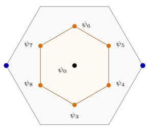
<figcaption class="paper-figure-caption"><b>Fig 1.</b> FIG. 1. Momentum assignment of the nine fields in Eq. (6). The black center is the singlet under the SU(3)v symmetry after the locking U = V , the blue pair is the C6 orbit (ψ1, ψ2), and the orange inner hexagon is the six-field orbit (ψ3, . . . , ψ8).</figcaption>
</figure>

**Summary.** This theoretical paper develops a unified framework for understanding the metallic and superconducting phases resulting from doping a Fractional Chern Insulator. By treating holons as quarks, it connects the physics to color superconductivity while detailing how various pairing instabilities lead to specific topological states. The work is significant for mapping out complex phase diagrams in strongly correlated quantum materials.

**Why it may be interesting.** The work provides a rich playground for studying emergent topological order and symmetry breaking in strongly correlated electron systems, drawing parallels between high-energy color superconductivity and condensed matter phenomena like FCI doping.

Detailed structure

**Main problem.** The paper develops a unified theoretical framework to describe both metallic and superconducting phases that emerge when doping a Fractional Chern Insulator (FCI). It connects this problem to color superconductivity found in high-energy physics.

**Main result.** The analysis predicts multiple stable states, including charge-$2e$ superconductors arising from color-antisymmetric pairing, and various holon metal phases ($\mathbb{Z}_3$ or $	ext{U}(1)_2$) depending on the doping level and symmetry preservation.

**Method.** The study employs a parton construction approach to derive low-energy effective theories characterized by $	ext{SU}(3)_{\mathrm{gauge}}	imes 	ext{SU}(3)_{\mathrm{valley}}$ symmetry. Pairing instabilities are analyzed using gap equations derived from bilinears added to the kinetic term.

**Model / system.** The system is an FCI doped with $C=1/3$, modeled by nine charge-$e/3$ holon pockets ($\psi_{ab}$) whose dynamics are governed by a low-energy effective Hamiltonian incorporating gauge and pairing terms. The underlying lattice structure is triangular, though square lattice analogues are also analyzed for symmetry constraints.

**Key observables.** Chiral central charge ($c_-=m/2$), superconducting gap structures (e.g., gapless Bogoliubov Fermi surface), and the nature of emergent symmetries ($	ext{SU}(3)_v$ vs $S_3$).

**Important parameters / regimes.** Doping level ($n = 1/3 - x$), chemical potential ($\mu$), and the specific pairing channel (e.g., color-antisymmetric).

**Assumptions / limitations.** The analysis assumes that only doped holes are dynamical degrees of freedom in the $x 	o 0$ limit, and certain symmetry reductions (like $	ext{SU}(3)_v 	o S_3$) are considered approximations.

**Figures summary.** Figure 1 maps the nine field momenta ($\psi_0$ to $\psi_8$) onto the Brillouin zone; Figure 2 shows the momentum assignment for a square lattice realization, detailing three distinct space-group orbits.

**Paper structure.** The paper builds from establishing the general symmetry framework using the parton construction, analyzing superconducting pairing instabilities (color superconductivity), then examining metallic phases via Higgsing mechanisms ($\mathbb{Z}_3$ or $	ext{U}(1)_2$), and finally discussing the continuous transition between these regimes.

Abstract

We develop a unified framework for metallic and superconducting phases obtained by doping a fractional Chern insulator (FCI) with $C=1/3$. Starting from the parton construction $c(\mathbf r)=f_1(\mathbf r)f_2(\mathbf r)f_3(\mathbf r)$, the low-energy theory has $SU(3)_{\mathrm{gauge}}\times SU(3)_{\mathrm{valley}}$ symmetry and nine Fermi pockets formed by charge-$-e/3$ holons $ψ_{ab}$, where $a$ and $b$ label color and valley. Viewing the holons as quarks connects this problem to color superconductivity in high-energy physics. Color-antisymmetric pairing produces a class of charge-$2e$ superconductors with angular momentum $L=3n$ and chiral central charge $c_-=m/2$, where $m$ is odd. Thus a gas of charge-$e/3$ anyons can enter a superconducting phase directly without binding. Particle--hole color--valley Higgs fields instead produce two $Z_3$ orthogonal metals with one or three pockets, transforming respectively as a singlet or triplet of $SU(3)_{\mathrm{valley}}$. A $U(1)^2$ holon metal with three identical pockets can preserve the triangular-lattice space group while reducing the emergent valley symmetry down to $S_3$. Its pairing instabilities include a gapped charge $2e$ $f-if$ superconductor and a gapless charge-$2e$ orthogonal superconductor with $\langle cc\rangle=0$ and a Bogoliubov Fermi surface at $Γ$. Finally, we discuss the possibility of a chemical-potential-tuned transition from the FCI to superconductivity and argue that all nine fermions may be required if the transition preserves the full emergent $SU(3)_v$ symmetry.

[↑ back to top](#top)

### [Occupation-condensation transition of a sublinearly vertex-reinforced random walk on regular tree](http://arxiv.org/abs/2607.16971v1)

**Authors:** Bon A Koo, Edward Ju  
**Type:** theory · **Category:** statistical mechanics · **PDF:** <https://arxiv.org/pdf/2607.16971v1>  
**Analysis basis:** full PDF text, analyzed in chunks
**Topic relevance:** `non-equilibrium dynamics` **3/5** · `analog quantum simulation` **2/5** · `non-equilibrium universality` **2/5** · `driven-dissipative phase transition` **1/5** · `methods for driven-dissipative` **1/5**

↔ Scroll figures horizontally

<figure class="paper-figure-card">
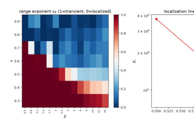
<figcaption class="paper-figure-caption"><b>Fig 1.</b> Figure 1: Condensation of the sublinear VRRW on the binary tree (b = 2). Left: range exponent νR in the (a, β) plane; νR = 1 (dark red) is linear spreading, small νR (dark blue) the condensed regime. Middle: transition line βc(a) from νR = 1/2, on a logarithmic β axis; βc decreases with a and rises steeply as a falls below ≈0.4. Right: condensate fraction m1 at t = 106 against β for several a; the rise marks the onset of condensation.</figcaption>
</figure>
<figure class="paper-figure-card">
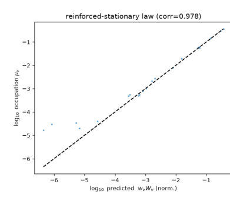
<figcaption class="paper-figure-caption"><b>Fig 2.</b> Figure 2: Occupation of the condensed core (a = 0.7, β = 4, t = 3 × 105). Left: measured occupation µv against the reversible prediction wvWv of Eq. (4) (both normalized); the dashed line is µv = wvWv. Right: occupation of the most visited vertex at each depth, showing the core droplet peaked a few levels below the root.</figcaption>
</figure>
<figure class="paper-figure-card">
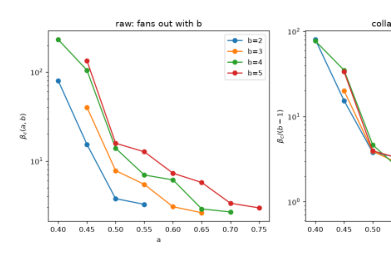
<figcaption class="paper-figure-caption"><b>Fig 3.</b> Figure 3: The branching-number law (11). Left: measured lines βc(a, b) for b = 2, 3, 4, 5 (from νR = 1/2), which fan out with b. Middle: the same divided by b −1; the four lines collapse, confirming βc ∝b −1 (see Table 1 for the quantitative version with confidence intervals). Right: the occupancy scale ¯m(a) = ((b−1)/βc)1/a, which is b-independent and increases with a.</figcaption>
</figure>
<figure class="paper-figure-card">
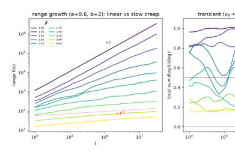
<figcaption class="paper-figure-caption"><b>Fig 4.</b> Figure 4: Observation-time analysis at a = 0.6, b = 2, to t = 3 × 107 (24 realizations). Left: mean range R(t); the range grows for every β, linearly below βc and very slowly above (the ∝t0.1 guide is an effective-exponent reference; held-out extrapolation favours logarithmic growth). Middle: local exponent νR(t); it tends to 1 below βc and to a small value ≈0.1 above, without reaching zero. Right: the νR = 1/2 crossing βc(tmax), showing no systematic drift across the accessible decades (scatter of order 0.1).</figcaption>
</figure>
<figure class="paper-figure-card">
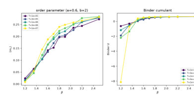
<figcaption class="paper-figure-caption"><b>Fig 5.</b> Figure 5: Occupancy statistics at a = 0.6, b = 2, with t from 105 to 107. From left: ensemble mean ⟨m1⟩; Binder cumulant U, which tends to 2/3 in the condensed phase and dips negative on the spreading side; susceptibility χ = t Var(m1), whose peak near β ≈1.5 grows with t; and the distribution of m1 at t = 107, a spike at m1 ≈0 coexisting with a broad condensed lobe. The signatures are of a coexistence-type crossover; we do not claim a proven first-order transition.</figcaption>
</figure>

**Summary.** This work characterizes the occupation-condensation transition in a vertex-reinforced random walk on regular trees. The transition occurs at a critical reinforcement strength $\beta_c$, causing the walker's time spent to concentrate (condense) onto a small core set of vertices. This study uses scaling arguments and geometric constraints to map out this non-equilibrium phase boundary.

**Why it may be interesting.** The study of non-equilibrium dynamics in geometrically constrained systems, like random walks on trees, provides a rich analogy for understanding energy/information localization or phase transitions in complex quantum many-body systems.

Detailed structure

**Main problem.** The paper investigates the occupation-condensation transition of a sublinearly vertex-reinforced random walk (VRRW) on regular trees.

**Main result.** A sharp condensation transition exists at $\beta_c(a, b)$, where above this threshold, the walker's occupation concentrates on a few vertices while the overall range grows only logarithmically with time.

**Method.** The analysis combines simulation studies of range exponents and condensate fractions with theoretical derivations based on reversible stationary measures for the core region.

**Model / system.** The model is a VRRW on a rooted $b$-ary tree, where movement probability to a neighbor depends on previous visit counts via a sublinear reinforcement term ($1 + \beta n^a$).

**Key observables.** Range exponent ($\nu_R$), condensate fraction ($m_1$), and the transition line $\beta_c(a, b)$.

**Important parameters / regimes.** Memory strength $a \in (0, 1)$, reinforcement coupling $\beta$, and tree branching number $b$.

**Assumptions / limitations.** The analysis relies on distinguishing between condensation and finite-range localization, and uses a 'frozen environment' approximation to determine the transition scaling law.

**Figures summary.** Figures illustrate the range exponent crossing at $\beta_c$, show the collapse of the transition line $\beta_c/(b-1)$ for different $b$, and display the condensate fraction plateauing above threshold.

**Paper structure.** The paper systematically analyzes the phase diagram by defining observables ($
u_R, m_1$), deriving theoretical predictions from reversible measures (the core), and confirming scaling laws ($\beta_c \propto b-1$) through data collapse across multiple geometries ($b=2, 3, 4$).

Abstract

A vertex-reinforced random walk steps to a neighbour with probability proportional to $1+βn^{a}$, where $n$ counts previous visits to that neighbour and $a\in(0,1)$ sets the memory strength. On the rooted $b$-ary tree the exponential growth of the vertex set drives the walk outward while the reinforcement pulls it back. We report a sharp condensation transition of the occupation measure at a finite $β_c(a,b)$: below it the occupation spreads and the range grows linearly; above it a single vertex holds an $O(1)$ fraction of the time, stable in the observation time, while the range keeps growing very slowly, at a rate better described by $\log t$ than by any power. We do not find the range to be bounded, and keep this condensation distinct from finite-range localization. Four estimators locate the same threshold, which shows no systematic drift out to $t=3\times10^{7}$. In a frozen environment the walk is reversible, with edge conductances $c_{uv}=w_{u}w_{v}$, $w_{v}=1+βn_{v}^{a}$, and measure $μ_{v}\propto w_{v}\sum_{u\sim v}w_{u}$ describing the condensed core, whose neighbour coupling we test directly. Reversibility places the escape at the frontier within the branching-number criterion for biased walks on trees, predicting $β_c\propto b-1$; the measured lines for $b=2,3,4$ collapse under division by $b-1$ to a few percent (bootstrap). The value $a=1/2$ that governs the walk on $\mathbb{Z}$ enters only as the marginal exponent of the condensed profile. Near $β_c$ the occupancy is non-self-averaging and bimodal, a coexistence-type phenomenology.

[↑ back to top](#top)

### [On the use of the Belopol'skaya-Daletskii representation of a diffusion on a Riemann manifold to construct path integrals](http://arxiv.org/abs/2607.17871v1)

**Authors:** Paolo Muratore-Ginanneschi  
**Type:** theory · **Category:** statistical mechanics · **PDF:** <https://arxiv.org/pdf/2607.17871v1>  
**Analysis basis:** full PDF text, analyzed in chunks
**Topic relevance:** `Keldysh / 2PI / non-Gaussian methods` **3/5** · `non-equilibrium dynamics` **2/5** · `correlated / nonlocal dissipation` **1/5** · `driven-dissipative phase transition` **1/5** · `methods for driven-dissipative` **1/5** · `non-equilibrium universality` **1/5**

↔ Scroll figures horizontally

<figure class="paper-figure-card">
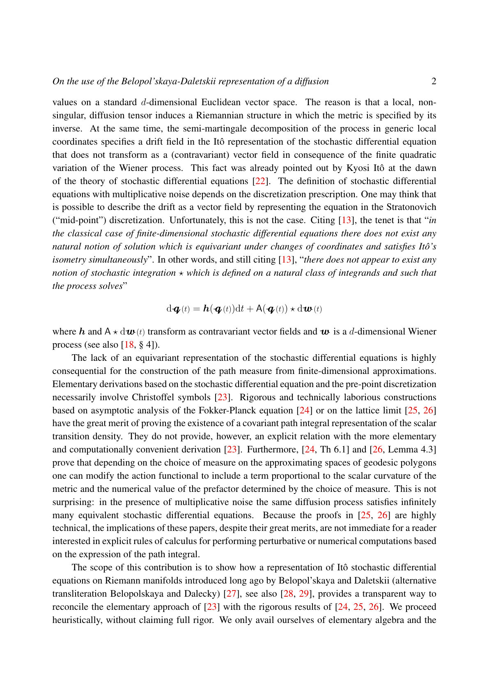
<figcaption class="paper-figure-caption"><b>Fig 1.</b> Low-resolution page preview, page 2</figcaption>
</figure>
<figure class="paper-figure-card">
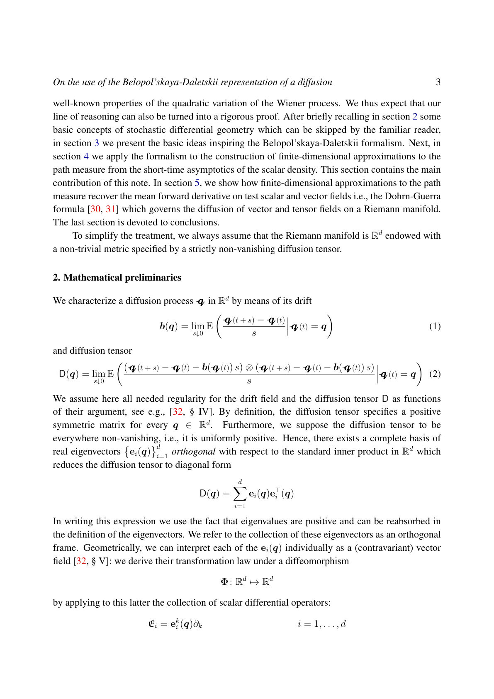
<figcaption class="paper-figure-caption"><b>Fig 2.</b> Low-resolution page preview, page 3</figcaption>
</figure>
<figure class="paper-figure-card">
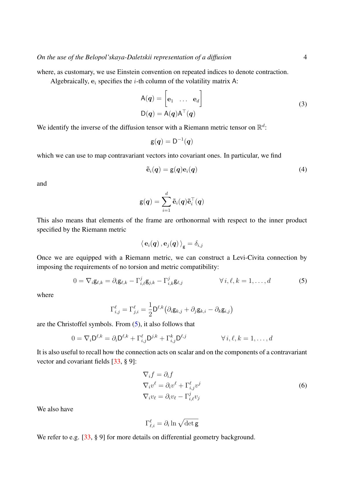
<figcaption class="paper-figure-caption"><b>Fig 3.</b> Low-resolution page preview, page 4</figcaption>
</figure>
<figure class="paper-figure-card">
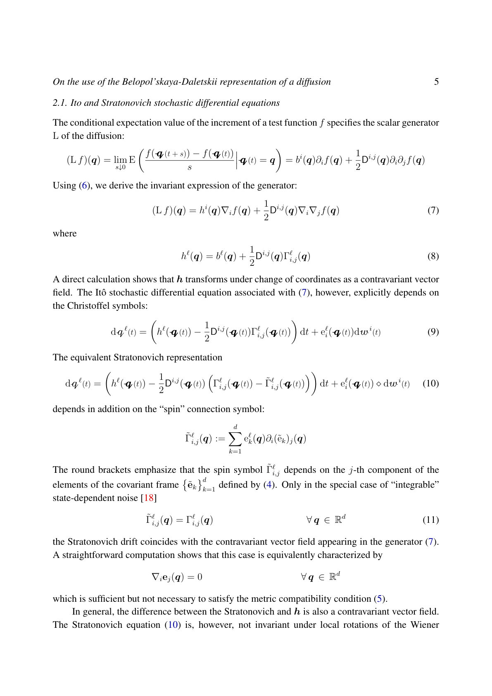
<figcaption class="paper-figure-caption"><b>Fig 4.</b> Low-resolution page preview, page 5</figcaption>
</figure>
<figure class="paper-figure-card">
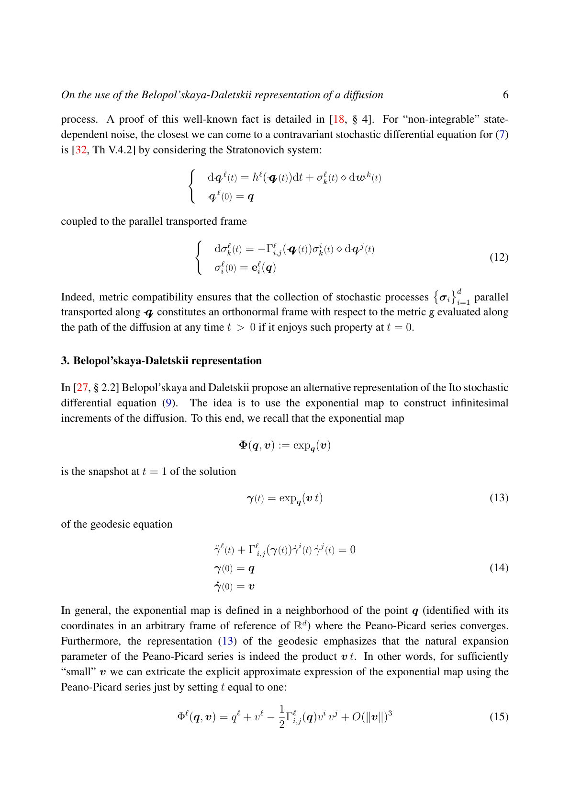
<figcaption class="paper-figure-caption"><b>Fig 5.</b> Low-resolution page preview, page 6</figcaption>
</figure>

**Summary.** This work develops a mathematical framework using the Belopol'skaya-Daletskii representation to analyze diffusion processes on Riemann manifolds. It constructs approximations for the path integral measure by comparing different forms of stochastic differential equations (Itô vs. Stratonovich). The findings provide deep connections between geometric structures, such as curvature, and the statistical mechanics of noisy systems.

**Why it may be interesting.** The rigorous handling of stochastic processes on curved manifolds is crucial for non-equilibrium statistical mechanics, especially when modeling open quantum systems or complex fluid dynamics where geometry plays a role.

Detailed structure

**Main problem.** The primary goal is constructing equivariant representations of finite-dimensional approximations to the path measure for a diffusion process occurring on a Riemann manifold.

**Main result.** The paper derives asymptotic forms for the path integral, showing connections between geometric quantities like curvature and the short-time behavior of the transition density.

**Method.** It employs the Belopol'skaya-Daletskii representation of SDEs, utilizing the exponential map to define stochastic increments and compare Itô vs. Stratonovich formulations.

**Model / system.** The model is a general diffusion process governed by state-dependent (multiplicative) noise on an abstract Riemann manifold. The dynamics are described by associated Stochastic Differential Equations (SDEs).

**Key observables.** The generator of the diffusion, the short-time transition probability kernel $S(	ext{s.t.})$, and the Jacobian factor $J(y_i|y_{i-1})$ in path integral approximations.

**Important parameters / regimes.** The noise tensor $D(q)$, the Christoffel symbols $\Gamma^\ell_{i,j}$, and the small time step $\epsilon$ (or large $N$ limit).

**Assumptions / limitations.** The analysis proceeds heuristically; it assumes a non-singular volatility and relies on approximations in the path integral formulation.

**Figures summary.** Not specified by notes.

**Paper structure.** The paper progresses from establishing the SDE forms (Itô vs. Stratonovich) using the Belopol'skaya-Daletskii formalism, to deriving short-time asymptotics for the transition kernel via quadratic variation identities, and finally approximating the full path integral in the large $N$ limit.

Abstract

We show that the Belopol'skaya-Daletskii formulation of stochastic differential equations on a Riemann manifold offers an elementary way to construct equivariant representations of finite-dimensional approximations to the path measure of a diffusion. The key ingredient is the use of the exponential map to describe increments of the diffusion.

[↑ back to top](#top)

### [Stripe-Order Altermagnetism](http://arxiv.org/abs/2607.17997v1)

**Authors:** Zheng-Yang Zhuang, Zhongbo Yan  
**Type:** theory · **Category:** strongly correlated electrons · **PDF:** <https://arxiv.org/pdf/2607.17997v1>  
**Analysis basis:** full PDF text, analyzed in chunks
**Topic relevance:** `exotic spin models in light-matter` **3/5** · `spintronics-quantum-optics interface` **3/5** · `analog quantum simulation` **2/5** · `Keldysh / 2PI / non-Gaussian methods` **1/5**

↔ Scroll figures horizontally

<figure class="paper-figure-card">
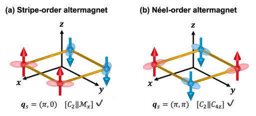
<figcaption class="paper-figure-caption"><b>Fig 1.</b> FIG. 1. Real-space comparison of (a) stripe-order and (b) N´eel- order altermagnets. Red and blue arrows denote opposite local mo- ments, and translucent lobes represent anisotropic orbital densities. The stripe and N´eel domains have ordering vectors qs = (π, 0) and qs = (π, π), respectively. For the spin patterns alone, the N´eel geometry admits spin-reversing mirror [C2∥Mi] and rotational [C2∥Cn] relations, whereas the ferromagnetic-chain geometry of stripe order naturally admits a mirror relation between chains carry- ing opposite moments. Orbital order selects which relations remain symmetries of the full spin-orbital pattern.</figcaption>
</figure>
<figure class="paper-figure-card">
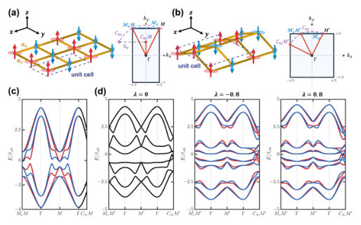
<figcaption class="paper-figure-caption"><b>Fig 2.</b> FIG. 2. Stripe-altermagnetic models and spin-resolved band struc- tures. (a) Minimal model and its reduced Brillouin zone. (b) Buck- led stripe-spin/N´eel-τx-orbital model and its reduced Brillouin zone. The labels MxM and C4zM denote the images of M under the cor- responding operations, and Gx = π is the reciprocal-lattice period along x. Panels (c) and (d) show spin-resolved bands along the paths in (a) and (b), respectively. In (d), the spectra from left to right cor- respond to λ = 0, −0.8, +0.8. Finite λ activates the spin splitting, and λ →−λ reverses its pattern. Red and blue denote opposite spins, whereas black denotes spin-degenerate bands. The opposite- spin bands are related by...</figcaption>
</figure>
<figure class="paper-figure-card">
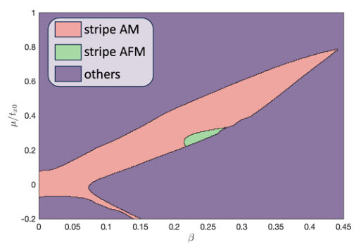
<figcaption class="paper-figure-caption"><b>Fig 3.</b> FIG. 3. RPA leading-instability diagram as a function of the chemi- cal potential µ/tx0 and hopping anisotropy β ≡ty0/tx0 = ty1/tx1. The onsite Hubbard interactions in the spin and orbital channels are fixed at Us/tx0 = 2.7 and Uo/tx0 = 2.8, respectively. The label “stripe AM” denotes the stripe AM phase of the minimal model, whereas “stripe AFM” denotes a stripe AFM phase with spin- degenerate bands that does not belong to the anti-AM class. The la- bel “others” collects parameter points for which at least one active channel has its global maximum outside the set {Γq, Xq, Yq, Mq}. Parameters: {tx0, tx1, td0, td1} = {1, 0.2, 0.4, 0.3}.</figcaption>
</figure>
<figure class="paper-figure-card">
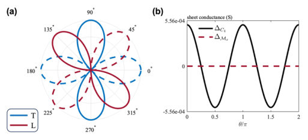
<figcaption class="paper-figure-caption"><b>Fig 4.</b> FIG. 4. Drude spin-current response and symmetry probe for the mirror-selected stripe altermagnet. (a) Normalized longitudinal (L) and transverse (T) charge-equivalent spin conductances for E = E(cos θ, sin θ). Solid and dashed curves denote opposite signs. (b) Spin-resolved diagnostics: the C4z-rotated difference is finite, while the [C2∥Mx] mirror residual vanishes. Parameters: tx0 = 0.35 eV, tx1 = 0.1225 eV, ty0 = 0.0875 eV, ty1 = 0.042 eV, td0 = 0.077 eV, td1 = 0.063 eV, J = 0.14 eV, δx = 0.105 eV.</figcaption>
</figure>

**Summary.** This work introduces and theoretically characterizes 'stripe-order altermagnetism,' a novel class of magnetically ordered state distinct from conventional types because it is governed by mirror symmetry rather than rotational symmetry. Using two-orbital models and RPA, the authors show that this state exhibits unique nematic spin splitting and provides measurable transport signatures related to its underlying symmetry protection.

**Why it may be interesting.** While focused on condensed matter magnetism, the detailed symmetry analysis (mirror vs. rotation) provides a rigorous framework for classifying exotic quantum states that could inform theoretical approaches in AMO physics concerning parity constraints in superconducting or magnetic materials.

Detailed structure

**Main problem.** To establish and classify 'stripe-order altermagnetism' (AM), distinguishing it from conventional rotation-based altermagnets.

**Main result.** Stripe AM is governed by a spin-reversing mirror symmetry, leading to unique nematic spin splitting and potentially supporting ferroelectric-like electrical control of spin splitting.

**Method.** The study employs two-orbital models analyzed using Random-Phase Approximation (RPA) calculations combined with detailed symmetry analysis.

**Model / system.** The model uses a 2D square lattice Hamiltonian involving two orbitals and stripe spin order, allowing for the interplay between spin and orbital degrees of freedom.

**Key observables.** Purely transverse Drude spin current response ($\sigma_s$) and specific symmetry probes like $\Delta M_x(	heta)$ that confirm mirror-based symmetry.

**Important parameters / regimes.** The system is predicted to be favored near half filling under strong hopping anisotropy, and the control mechanism involves an electrostatic potential imbalance ($\lambda
ho_z$).

**Assumptions / limitations.** The realization of Stripe AM requires breaking certain symmetries (lacking $	ext{C}_2\parallel P$ and $	ext{C}_2\parallel t$) while preserving a spin-reversing mirror symmetry.

**Figures summary.** Figures compare real-space patterns between stripe-order and Néel-order altermagnets, illustrating how opposite-spin bands are related by a mirror ($	ext{C}_2\parallel M_x$) rather than a rotation.

**Paper structure.** The paper establishes the theoretical framework for Stripe AM based on symmetry breaking via orbital order, derives the Hamiltonian using two-orbital models, predicts favored phases via RPA, and finally analyzes transport diagnostics related to mirror symmetry.

Abstract

Altermagnetism combines compensated magnetic order with nonrelativistic spin splitting, yet established mechanisms predominantly rely on spin-reversing rotations in Néel-order antiferromagnets. Here we establish stripe-order altermagnetism governed instead by a spin-reversing mirror, placing it outside the usual rotation-based $l$-wave classification. Using two-orbital models, we show that the interplay of stripe spin and orbital orders yields two phases: a stripe altermagnet with mirror-selected nematic spin splitting and a stripe anti-altermagnet with spin-degenerate bands. The latter can support ferroelectric-like electrical control of spin splitting in suitable buckled structures. Random-phase-approximation (RPA) calculations show that stripe-order altermagnetism is favored near half filling under strong hopping anisotropy. The spin-reversing mirror further enforces a purely transverse spin current for an electric field parallel or normal to the mirror plane, providing a direct transport diagnostic.

[↑ back to top](#top)

### [$J_{1} - J_{2} - δ$ model on a square lattice: From Altermagnet to Columnar antiferromagnet via quantum disordered phase](http://arxiv.org/abs/2607.16415v1)

**Authors:** Subharthi Paul, Darshan G. Joshi  
**Type:** theory · **Category:** strongly correlated electrons · **PDF:** <https://arxiv.org/pdf/2607.16415v1>  
**Analysis basis:** full PDF text, analyzed in chunks
**Topic relevance:** `analog quantum simulation` **3/5** · `exotic spin models in light-matter` **3/5** · `Keldysh / 2PI / non-Gaussian methods` **1/5** · `driven-dissipative phase transition` **1/5**

↔ Scroll figures horizontally

<figure class="paper-figure-card">
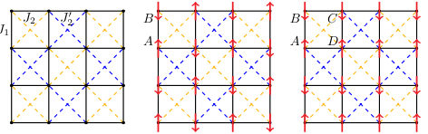
<figcaption class="paper-figure-caption"><b>Fig 1.</b> FIG. 1. (a) Figure showing the exchange interactions de- scribed in model in Eq. (1). Black bonds are NN interactions with strength J1, while yellow and blue bonds are NNN inter- actions with strength J2 = λJ(1 + δ) and J′ 2 = λJ(1 −δ) re- spectively. (b) Classical spin orientation in Néel/Altermagnet phase with A and B being the two sublattices. This state is the starting point for the spin-wave expansion for λ ≤0.5. (c) Classical spin orientation in the Columnar phase with A, B, C and D being the four sublattices. This state is the starting point for the spin-wave expansion for λ &gt; 0.5.</figcaption>
</figure>
<figure class="paper-figure-card">
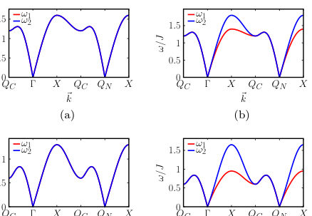
<figcaption class="paper-figure-caption"><b>Fig 2.</b> FIG. 2. Magnon dispersion in the Altermagnet/Néel phase. (a) δ = 0, λ = 0.2, (b) δ = 0.5, λ = 0.2, (c) δ = 0, λ = 0.35, (d) δ = 0.5, λ = 0.35. At δ = 0, there is no magnon band splitting and the phase is the standard Néel phase. For any δ ̸= 0 there is a splitting of magnon bands, as can be see in plots (b) and (d).</figcaption>
</figure>
<figure class="paper-figure-card">
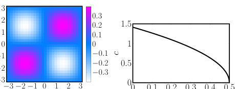
<figcaption class="paper-figure-caption"><b>Fig 3.</b> FIG. 3. (a) Magnon band splitting, δω⃗k, (Eq. 15) for λ = 0.2 and δ = 0.5. (b) Spin-wave velocity, Eq. (16), in the AM phase as a function of λ. As noted in the text, this is independent of δ.</figcaption>
</figure>
<figure class="paper-figure-card">
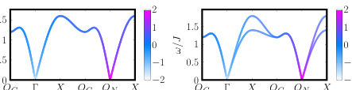
<figcaption class="paper-figure-caption"><b>Fig 4.</b> FIG. 5. Dynamic spin structure factor (Eq. (21)) in AM phase is plotted for different parameters. (a) δ = 0,λ = 0.2; (b) δ = 0.5,λ = 0.2. At δ = 0 the magnon modes are degener- ate while they split for δ ̸= 0. Moreover, the spectral weight is peaked at ⃗QN = (π, π), as expected for AM order on the square lattice.</figcaption>
</figure>
<figure class="paper-figure-card">
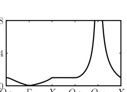
<figcaption class="paper-figure-caption"><b>Fig 5.</b> FIG. 6. Spectral weight in the dynamic structure factor in the AM phase at λ = 0.2, δ = 0.5.</figcaption>
</figure>

**Summary.** This work analyzes a Heisenberg model on a square lattice incorporating two types of frustrating second-neighbor interactions. Using Linear Spin-Wave Theory, the authors map out a phase diagram revealing three distinct magnetic phases: Altermagnet, Columnar Antiferromagnet, and an intermediate Quantum Disordered Phase. The findings quantify how quantum fluctuations stabilize this disordered region as frustration increases.

**Why it may be interesting.** While focused on magnetism, the detailed study of quantum phase transitions driven by geometric frustration ($\delta$) and the emergence of a disordered state provides general theoretical tools applicable to strongly correlated electron systems where competing interactions are common.

Detailed structure

**Main problem.** The study investigates the stability of altermagnetism against quantum fluctuations induced by magnetic frustration, mapping out the phase diagram connecting different magnetic states.

**Main result.** The model exhibits three distinct phases—Altermagnet (AM), Columnar Antiferromagnet (CAF), and a Quantum Disordered Phase (QDP)—whose relative stability is controlled by frustration parameters ($\delta$).

**Method.** Linear Spin-Wave Theory (LSWT) is employed to calculate ground-state energies, magnon dispersions, and order parameters for the various magnetic phases.

**Model / system.** The system is a Heisenberg model on a square lattice with nearest-neighbor ($J$) and two types of second-neighbor frustrating interactions ($J_2$ and $J'_2$), parameterized by $\lambda$ and $\delta$.

**Key observables.** Magnon dispersion ($\omega_{1,2}$), order parameters ($	ext{m}_N$, $	ext{m}_{	ext{CAF}}$), static/dynamic structure factors ($S(\vec{k}, \omega)$).

**Important parameters / regimes.** Frustration parameter $\delta = (J_2 - J'_2)/(J_2 + J'_2) \in [0, 1]$ and interaction strength ratio $\lambda = (J_2 + J'_2)/(2J)$.

**Assumptions / limitations.** The analysis relies on the large-$S$ limit approximation inherent to Linear Spin-Wave Theory.

**Figures summary.** Figures illustrate magnon dispersion splitting ($\delta\omega_{\vec{k}}$) for AM, show phase stability regions in a $\lambda-\delta$ diagram (Fig. 13), and plot order parameters ($m_{CAF}$) vs. frustration parameters.

**Paper structure.** The paper systematically analyzes the Hamiltonian across different parameter regimes, calculating observables like magnon spectra and order parameters to map out the transition between Néel/AM, CAF, and QDP phases.

Abstract

Altermagnetism in the case of local-moment magnets is characterized by zero net magnetization and splitting of opposite chirality magnon bands in the absence of any spin-anisotropic interactions or external field. In this work we investigate the robustness of altermagnets against quantum fluctuations arising from magnetic frustration. We consider a Heisenberg model on a square lattice with two different types of second-neighbor interactions, as in a checkboard pattern, in addition to the nearest-neighbor interaction. This model continuously interpolates between the $J_{1}-J_{2}$ Heisenberg model on the square lattice and the Heisenberg model on the checkerboard lattice. For weaker second-neighbor interactions a Néel-type altermagnet phase is realized. On the other hand, for stronger second-neighbor interactions a columnar antiferromagnet emerges. Using linear spin-wave theory we calculate the magnon dispersion, order parameter, static and dynamical structure factors for the two magnetic phases. Further, we show that there is an intermediate quantum disordered phase separating the two magnetic phases, which is connected to the one realized in the $J_{1}-J_{2}$ model. The quantum disordered region is further stabilized as we tune towards the checkerboard lattice limit.

[↑ back to top](#top)

### [Universal Jamming Criticality and Self-Organizing Principles from Disorder to the Limit of Perfect Crystalline Order](http://arxiv.org/abs/2607.17549v1)

**Authors:** Jianhua Zhang, Jiaqi Si, Ning Xu, Hua Tong  
**Type:** theory · **Category:** statistical mechanics · **PDF:** <https://arxiv.org/pdf/2607.17549v1>  
**Analysis basis:** full PDF text, analyzed in chunks
**Topic relevance:** `non-equilibrium universality` **3/5** · `driven-dissipative phase transition` **2/5** · `non-equilibrium dynamics` **2/5** · `Frenkel-Kontorova` **1/5**

↔ Scroll figures horizontally

<figure class="paper-figure-card">
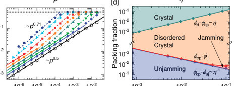
<figcaption class="paper-figure-caption"><b>Fig 1.</b> FIG. 1: Jamming criticality in solids from order to disorder. Pressure dependence of (a) the excess coordination number ∆Z and (b) the modulus ratio G/B for varied polydispersity η. Horizontal dotted lines indicate crystal behavior. Dashed and solid lines denote intermediate scalings (∆Z ∼p0.83, G/B ∼p0.71) and jamming scalings (∆Z ∼p0.5, G/B ∼p0.5), respectively. Crossover pressures pd and pj are determined by intersections of different scaling relations. (c) Phase diagram in (η, p) space. Three regions with distinct mechanical be- haviors are identified, separated by pd ∼η (green line) and pj ∼η2.5 (red line). Error bars indicate uncertainty of cros- sover pressures determined by ∆Z and...</figcaption>
</figure>
<figure class="paper-figure-card">
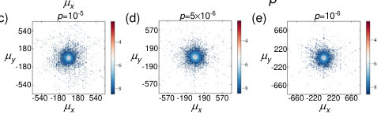
<figcaption class="paper-figure-caption"><b>Fig 2.</b> FIG. 2: Nonaffinity in solids from order to disorder. (a)-(e) Probability distribution of normalized nonaffine deformation p(µx, µy) for η = 10−2 with decreasing pressures. (f) Six-fold anisotropy C6 of p(µx, µy) versus pressure p for different η. Arrows indicate pj, below which the system is controlled by jamming criticality.</figcaption>
</figure>
<figure class="paper-figure-card">
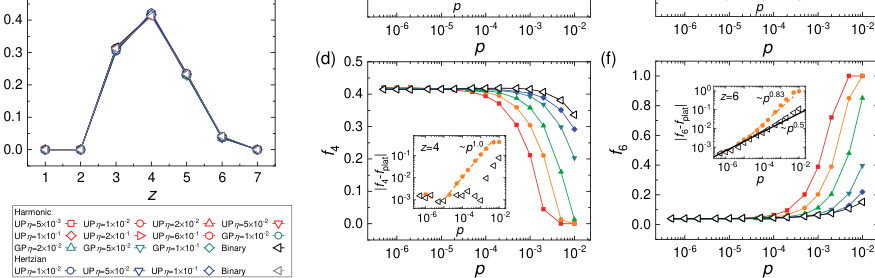
<figcaption class="paper-figure-caption"><b>Fig 3.</b> FIG. 3: Universal coordination-number distribution in marginally jammed solids. (a) Representative configurations at p = 10−6</figcaption>
</figure>

**Summary.** This work investigates how mechanical rigidity emerges universally across disordered solids by tuning structure from crystalline to amorphous. The authors demonstrate that jamming criticality dictates mechanical behavior regardless of particle-level details, suggesting a fundamental decoupling from glass transition physics. They achieve this through detailed simulations analyzing coordination number statistics and structural fluctuations.

**Why it may be interesting.** While focused on classical mechanics, the concept of universal critical scaling near a jamming transition shares mathematical parallels with phase transitions studied in statistical mechanics, particularly concerning emergent order from disorder.

Detailed structure

**Main problem.** To understand the universal underlying characteristics governing mechanical rigidity (jamming criticality) in amorphous solids by systematically tuning structural order from crystalline to fully disordered states.

**Main result.** Mechanical properties are universally governed by jamming criticality, suggesting a fundamental decoupling between this critical behavior and the physics of the glass transition. Universal coordination-number distributions and contact hyperuniformity emerge independent of particle structure.

**Method.** Systematic simulation of jammed elastic packings across varying structural disorder (polydispersity) using quasi-static densification methods.

**Model / system.** Jammed elastic packings of frictionless particles in 2D and 3D, modeled with harmonic or Hertzian repulsion. The study spans the entire order-disorder spectrum from perfect crystals to fully disordered states.

**Key observables.** Excess coordination number ($\Delta Z$), modulus ratio ($G/B$), nonaffine deformation anisotropy ($C_6$), universal coordination-number distribution ($f_z$), and contact hyperuniformity measures ($\sigma^2_Z(L)$, $S_Z(q)$).

**Important parameters / regimes.** Polydispersity ($\eta$) controls structural disorder, and pressure ($p$) tunes the system state relative to jamming transitions ($p_j$).

**Assumptions / limitations.** The study focuses on zero-temperature jamming; finite-disorder thresholds separating crystal and jamming behaviors are challenged by the results.

**Figures summary.** Figures illustrate phase diagrams showing distinct regimes (Crystal, Disordered Crystal, Jamming Critical) based on pressure and polydispersity. Other figures compare universal scaling laws for coordination number fluctuations and structure factors across different disorder levels.

**Paper structure.** The paper systematically analyzes the mechanical response by varying structural order ($\eta$) while measuring key observables like $\Delta Z$ and $G/B$, establishing three distinct mechanical regimes, before delving into microscopic diagnostics like nonaffine elasticity and hyperuniformity to prove universality.

Abstract

While crystals are defined by periodic order, the nature of amorphous solids remains elusive due to their disordered, diverse, and nonequilibrium structures. Here, we focus on jammed elastic packings and systematically tune structure from crystalline to fully disordered to unveil the universal underlying characteristics. We demonstrate that their mechanical properties are universally governed by jamming criticality, featuring characteristic scaling behaviors near the jamming transition, excepting the singular close-packed point. This is facilitated by random nonaffine elasticity arising from contact-level disorder. Consequently, the jamming density can approach close packing, suggesting a fundamental decoupling between jamming criticality and the glass transition physics. Moreover, we uncover a universal coordination-number distribution and contact hyperuniformity in marginally jammed states, independent of particle-level structure. These findings suggest a general organizing mechanism for emergent rigidity in disordered solids, underscore the broad relevance of jamming physics, and complement principles of mechanical self-organization.

[↑ back to top](#top)

### [Eddy currents and current reversal in curved magnetic thin-film Josephson junctions](http://arxiv.org/abs/2607.16399v1)

**Authors:** Einar Skoglund, Maxim A. Tjøtta, Sol H. Jacobsen  
**Type:** theory · **Category:** other · **PDF:** <https://arxiv.org/pdf/2607.16399v1>  
**Analysis basis:** full PDF text, analyzed in chunks
**Topic relevance:** `Keldysh / 2PI / non-Gaussian methods` **3/5** · `non-equilibrium dynamics` **2/5** · `methods for driven-dissipative` **1/5** · `spintronics-quantum-optics interface` **1/5**

↔ Scroll figures horizontally

<figure class="paper-figure-card">
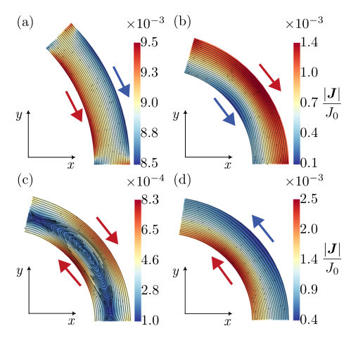
<figcaption class="paper-figure-caption"><b>Fig 1.</b> FIG. 1. Charge current density Eq. (3) in an annular sector ferromag- net. The arrows indicate direction and relative magnitude on the inner and outer boundaries. Panels (a)-(d) correspond to κL/π = 0.250, 0.410, 0.425 and 0.450, respectively.</figcaption>
</figure>
<figure class="paper-figure-card">
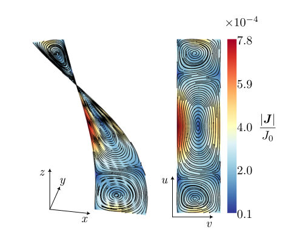
<figcaption class="paper-figure-caption"><b>Fig 2.</b> FIG. 2. Charge current density in a helicoidal ferromagnet shown in physical space (left) and in the parameter space (u, v) (right). Parameters are κ = 0.5π/L and τ = 0.7π/L.</figcaption>
</figure>

**Summary.** This work develops a generalized Green's function theory to model superconducting current flow in Josephson junctions built on curved magnetic thin films. By incorporating the geometry into the Usadel equation via tensorial calculus, the authors demonstrate that curvature directly controls the supercurrent density, leading to predictable eddy currents and current reversals. This provides a powerful theoretical tool for understanding how nanoscale geometric confinement dictates quantum transport phenomena.

**Why it may be interesting.** While focused on superconductivity, the rigorous application of differential geometry (Christoffel symbols, covariant derivatives) to derive physical transport laws provides a powerful theoretical toolkit applicable to any system where geometric constraints dictate quantum dynamics or energy flow.

Detailed structure

**Main problem.** The research investigates how geometric curvature influences superconducting transport, specifically focusing on induced eddy currents and current reversals in Josephson junctions formed by curved magnetic thin films.

**Main result.** Curvature effects introduce a geometrically driven component to the supercurrent density via non-zero Christoffel symbols, leading to controllable manipulation of current pathways and observable current reversals.

**Method.** The authors generalize the quasiclassical Green's function theory (Usadel equation) using tensorial calculus adapted for arbitrarily curved surfaces. They analyze transport in the weak proximity limit.

**Model / system.** The system is a Josephson junction involving superconducting leads separated by a ferromagnetic thin film whose geometry can be described as an annular sector or a helicoid. The physics is modeled via the Usadel equation solved on curved manifolds.

**Key observables.** Charge current density (J), decomposition of triplet components ($J^{(s)}$ and $J^{(t)}$), eddy currents, and Christoffel symbols ($\Gamma^l_{ij}$).

**Important parameters / regimes.** Curvature ($\kappa$), torsion ($	au$), proximity coupling strength ($f$), and the ratio of characteristic lengths to coherence length ($\xi$).

**Assumptions / limitations.** The analysis primarily uses the weak proximity limit ($f \ll 1$) for simplification, and superconducting leads are treated as bulk, conventional s-wave superconductors.

**Figures summary.** Figures illustrate charge current density in annular sectors showing current reversal with increasing curvature ($\kappa$), and complex eddy current patterns in helicoidal strips involving both curvature and torsion.

**Paper structure.** The paper develops a generalized tensorial framework for the Usadel equation on curved surfaces, derives expressions for geometrically induced currents based on Christoffel symbols, and applies this formalism to specific geometries (annular/helicoid) to predict current reversals and eddy currents.

Abstract

Real-space geometric curvature in magnetic thin films introduces a controllable mechanism for tailoring the pathways of superconducting steady-state Josephson currents via the proximity effect. We present a generalized Green's function method for calculating diffusive transport in arbitrarily curved surfaces, and show how the competing mechanisms of curvature and distance regulate conversion between different superconducting pairings in a proximity-coupled ferromagnet. We show how this dictates the distribution of current density, with the possibility of curvature-controlled current density manipulation, induced eddy currents and current reversal.

[↑ back to top](#top)

### [FRSB in the SK spin glass: convergence to full-interval support at zero temperature](http://arxiv.org/abs/2607.18032v1)

**Authors:** Hong-Bin Chen  
**Type:** theory · **Category:** disordered systems and neural networks · **PDF:** <https://arxiv.org/pdf/2607.18032v1>  
**Analysis basis:** full PDF text, analyzed in chunks
**Topic relevance:** `Keldysh / 2PI / non-Gaussian methods` **3/5** · `analog quantum simulation` **1/5** · `driven-dissipative phase transition` **1/5** · `exotic spin models in light-matter` **1/5** · `methods for driven-dissipative` **1/5**

↔ Scroll figures horizontally

<figure class="paper-figure-card">
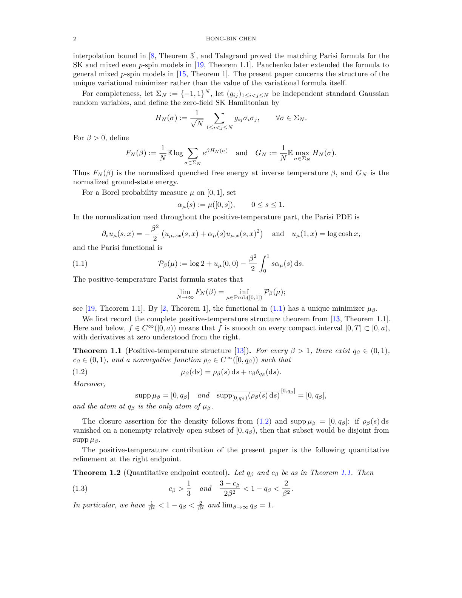
<figcaption class="paper-figure-caption"><b>Fig 1.</b> Low-resolution page preview, page 2</figcaption>
</figure>
<figure class="paper-figure-card">
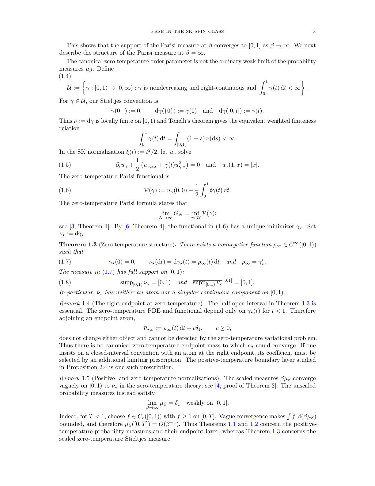
<figcaption class="paper-figure-caption"><b>Fig 2.</b> Low-resolution page preview, page 3</figcaption>
</figure>
<figure class="paper-figure-card">
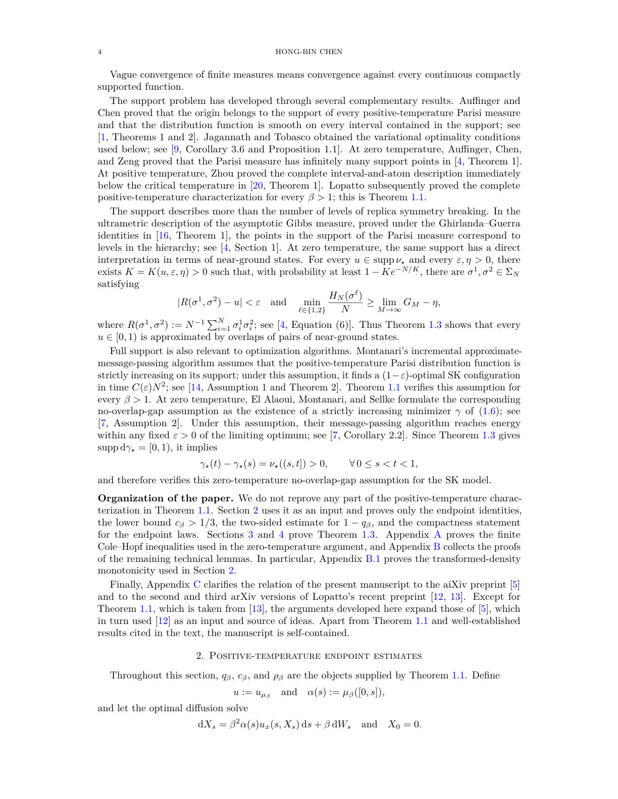
<figcaption class="paper-figure-caption"><b>Fig 3.</b> Low-resolution page preview, page 4</figcaption>
</figure>
<figure class="paper-figure-card">
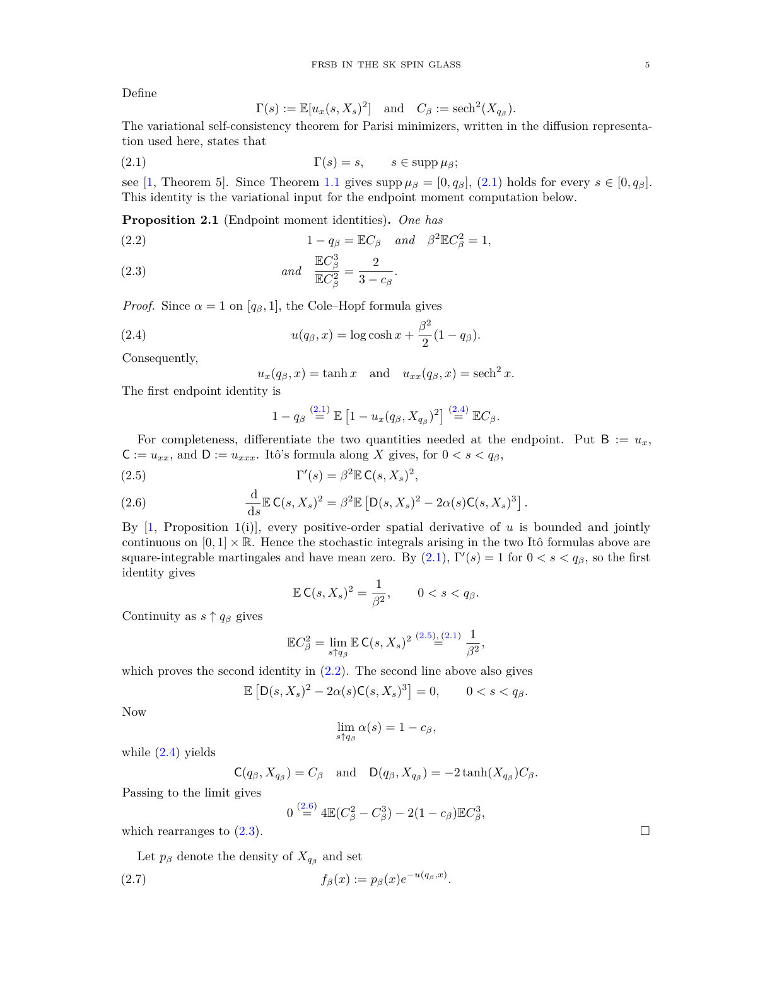
<figcaption class="paper-figure-caption"><b>Fig 4.</b> Low-resolution page preview, page 5</figcaption>
</figure>
<figure class="paper-figure-card">
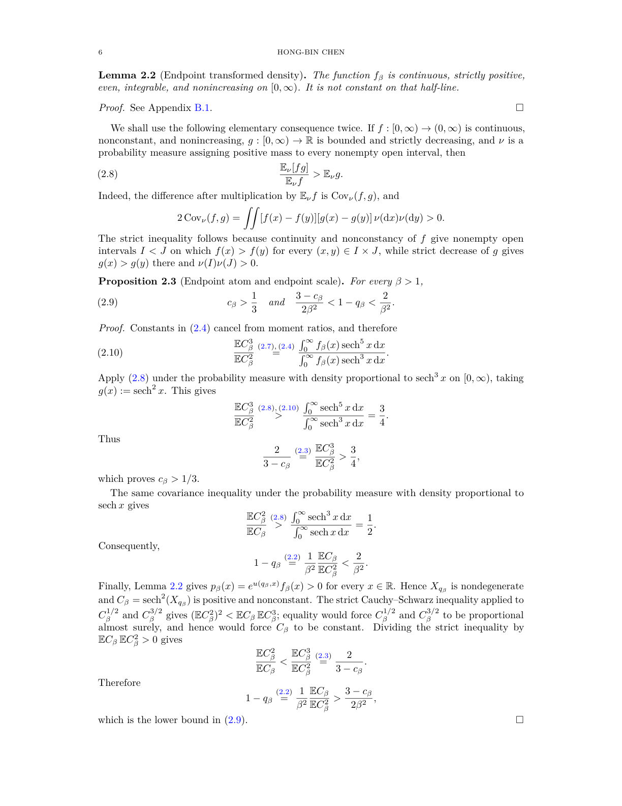
<figcaption class="paper-figure-caption"><b>Fig 5.</b> Low-resolution page preview, page 6</figcaption>
</figure>

**Summary.** This paper rigorously proves that the Sherrington-Kirkpatrick spin glass model exhibits full replica symmetry breaking at zero temperature. By analyzing the Parisi measure, the authors demonstrate that this measure has continuous support across the entire interval [0, 1). This result provides deep mathematical insight into the low-temperature phase structure of mean-field disordered systems.

**Why it may be interesting.** While focused on classical spin glasses, the mathematical machinery involving complex functional analysis, convergence theorems for measures, and solving associated PDEs is highly relevant to understanding quantum many-body systems in disordered or frustrated regimes.

Detailed structure

**Main problem.** The primary goal is proving full replica symmetry breaking (FRSB) for the Sherrington-Kirkpatrick (SK) spin glass model at zero temperature.

**Main result.** The authors prove that at zero temperature, the Parisi measure has full support on the interval [0, 1), and its density function is smooth and non-zero across this entire range.

**Method.** The analysis involves developing variational self-consistency theorems for the Parisi functional, utilizing stochastic processes (Itô's formula), and employing advanced PDE techniques to establish regularity and convergence bounds.

**Model / system.** The system is the SK spin glass model, characterized by a Hamiltonian involving random Gaussian couplings ($g_{ij}$). The analysis focuses on calculating the normalized quenched free energy and ground-state energy via Parisi measures ($\mu_eta$ or $
u_\star$).

**Key observables.** Normalized quenched free energy $F_N(eta)$, the zero-temperature Parisi measure $
u_\star$, and its associated density $
ho_\infty(t)$.

**Important parameters / regimes.** Inverse temperature $eta$, which is analyzed in limits approaching infinity ($eta 	o \infty$) and specifically at zero temperature ($T=0$).

**Assumptions / limitations.** The analysis builds upon established results for finite $eta$ (Theorem 1.1) and relies on advanced mathematical tools like Gaussian estimates and the assumption of a continuous path parameterization for the $T=0$ functional.

**Paper structure.** The paper reviews known finite-$eta$ results before focusing on the core contribution: deriving the structure of the zero-temperature Parisi functional (Theorem 1.3) and proving its full support on [0, 1). The argument flows from general variational principles to specific PDE stability proofs.

Abstract

We prove full replica symmetry breaking for the zero-field Sherrington-Kirkpatrick model at zero temperature: the Parisi minimizer is absolutely continuous, has a smooth density, and has support $[0,1)$. At inverse temperature $β>1$, [arxiv.org/abs/2607.11756v3] recently proved that the Parisi measure has support $[0,q_β]$. Here, we show $q_β$ converges to $1$ as $β\to\infty$.

[↑ back to top](#top)

### [Geometric Qubits in Programmable Atomic Trimers](http://arxiv.org/abs/2607.16846v1)

**Authors:** Julien Garaud, Antti J. Niemi  
**Type:** theory · **Category:** quantum information and computing · **PDF:** <https://arxiv.org/pdf/2607.16846v1>  
**Analysis basis:** full PDF text, analyzed in chunks
**Topic relevance:** `analog quantum simulation` **3/5** · `Rydberg arrays` **2/5** · `entanglement & information structure` **1/5** · `non-equilibrium dynamics` **1/5**

↔ Scroll figures horizontally

<figure class="paper-figure-card">
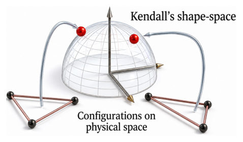
<figcaption class="paper-figure-caption"><b>Fig 1.</b> FIG. 1. Kendall’s space of triangular shapes is a hemisphere, with points identified with a different shape of a triangle up to an overall scale and spatial orientation.</figcaption>
</figure>
<figure class="paper-figure-card">
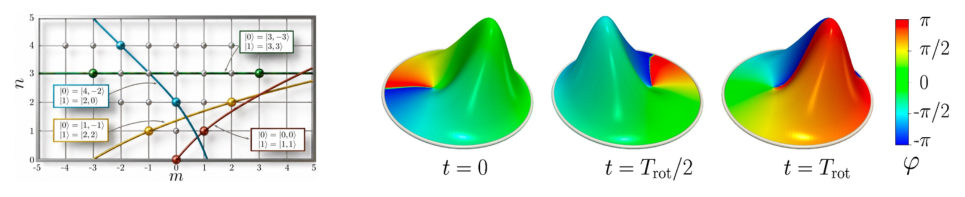
<figcaption class="paper-figure-caption"><b>Fig 2.</b> FIG. 2. The leftmost panel shows Higgs-oscillator lattice states |n, m⟩. Nontrivial relatively stationary states are supported by two lattice points on a support parabola (4). The red parabola, |0, 0⟩↔|1, 1⟩, is the energy minimizer for 0 &lt; ℓ&lt; 1; the yellow curve shows an opposite-chirality minimizer for −1 &lt; ℓ&lt; 2; the blue curve illustrates negative ℓ, and the green line a λJ = 0 degeneracy. The remaining panels display the time evolution of the k = 0, ℓ= 3/4 minimizer (6), where the elevation denotes the density |ψ| and the colormap, the phase arg ψ. The modulus and phase have different periods implying that the time evolution accumulates a geometric phase (7); see Supplemental Material...</figcaption>
</figure>

**Summary.** The authors propose encoding qubits in the collective shape modes of programmable atomic trimers trapped in optical tweezers. By modeling the dynamics using an effective Higgs oscillator Hamiltonian, they demonstrate that the system naturally supports robust two-level qubit subspaces. Furthermore, they outline a method to generate entanglement by exploiting linked geometric cycles within the array structure.

**Why it may be interesting.** This work bridges AMO physics (trapped atoms) with quantum information by proposing a novel physical mechanism—geometric phase accumulation in shape degrees of freedom—to realize fundamental quantum gates like CZ.

Detailed structure

**Main problem.** The paper develops a theoretical framework to realize robust geometric qubits and entangling gates using programmable arrays of neutral atomic trimers.

**Main result.** It shows that the system's shape-space dynamics, modeled by the Higgs oscillator, naturally supports two adjacent extremal states suitable for encoding logical qubits. Entanglement is generated via linked holonomic cycles yielding a controlled-Z gate.

**Method.** The analysis uses an exactly solvable shape-space theory derived from the Higgs oscillator Hamiltonian on Kendall's shape sphere to analyze relative stationary states and geometric phase accumulation.

**Model / system.** The physical platform is programmable optical-tweezer arrays trapping atomic trimers. The quantum information is encoded in the collective shape modes of these trimers, governed by an effective Hamiltonian derived from dynamics on Kendall's shape sphere.

**Key observables.** Geometric phase ($eta_{	ext{geom}}$), energy gaps ($\Delta E$), and the invariant two-qubit phase ($\Phi_{	ext{ent}}$).

**Important parameters / regimes.** The spectral lattice structure, detuning ($\delta$), coupling strength ($\Omega$), and geometric parameters defining the linked cycle.

**Assumptions / limitations.** The analysis assumes that relative stationarity selects only two modes for qubit encoding, and it relies on projecting dynamics onto a low-dimensional effective Hamiltonian.

**Figures summary.** Figures illustrate Kendall's shape space as a hemisphere, visualize the Higgs-oscillator lattice states showing two-point support for qubits, and depict the time evolution of the minimal energy qubit state with geometric phase accumulation.

**Paper structure.** The paper progresses from establishing the physical model (atomic trimers on $S^2_K$) to deriving the effective Hamiltonian ($\hat{H}$), analyzing single-qubit control via spectral gaps, and finally extending the theory to generate two-qubit entanglement using linked geometric cycles.

Abstract

Motivated by programmable tweezer arrays, we develop an exactly solvable shape-space theory for near-equilateral atomic trimers. The Higgs oscillator on Kendall's shape sphere gives a nonresonant spectral lattice whose fixed-angular-momentum relative-stationary minimizers are supported on two adjacent admissible sites. These symmetry-selected doublets are separated from higher relative-stationary branches by a finite branch gap. With phase-coherent shape-mode driving and Rydberg-mediated conditional phases, they furnish a candidate route to geometric qubits and entangling operations.

[↑ back to top](#top)

### [Bond reconstruction and vacancy clustering in monolayer silicon carbide from first principles](http://arxiv.org/abs/2607.16483v1)

**Authors:** Péter Udvarhelyi  
**Type:** theory · **Category:** quantum information and computing · **PDF:** <https://arxiv.org/pdf/2607.16483v1>  
**Analysis basis:** full PDF text, analyzed in chunks
**Topic relevance:** `exotic spin models in light-matter` **3/5** · `spintronics-quantum-optics interface` **3/5**

↔ Scroll figures horizontally

<figure class="paper-figure-card">
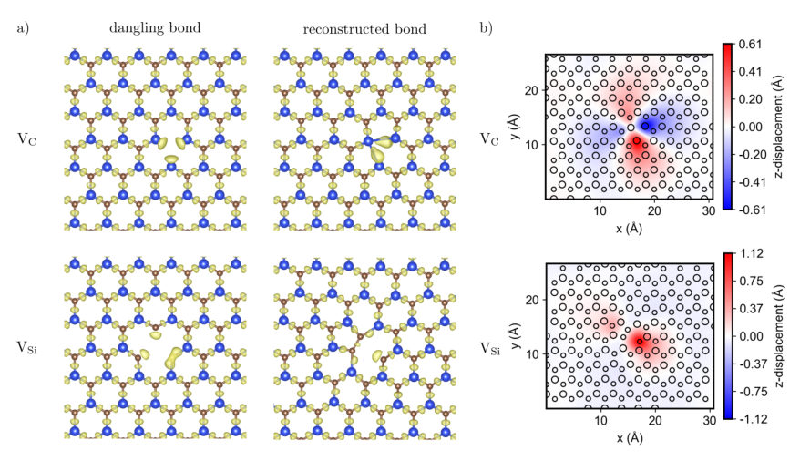
<figcaption class="paper-figure-caption"><b>Fig 1.</b> FIG. 1. Bond reconstruction and out-of-plane distortion in monovacancy defects in monolayer SiC. a) Electron localization function (ELF) at 0.7 isovalue level (yellow) in the VSi and VC defects, comparing dangling and reconstructed bond calculations. The presence of nodal planes and the localization and direction of the lobes differentiate the two cases. Silicon and carbon atoms are illustrated as blue and brown balls, respectively. b) Accompanying out-of-plane distortion after bond reconstruction in VSi and VC defects, respectively. The displacement field is visualized as a heatmap projected onto the monolayer. Atomic sites of silicon and carbon are illustrated as larger and smaller...</figcaption>
</figure>
<figure class="paper-figure-card">
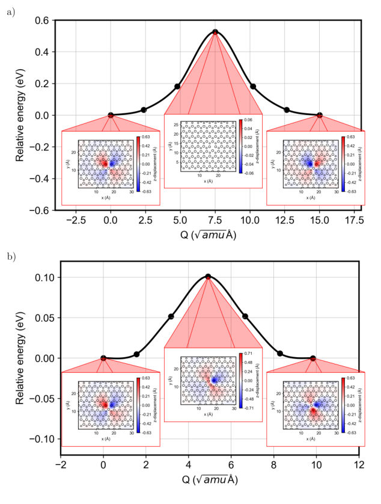
<figcaption class="paper-figure-caption"><b>Fig 2.</b> FIG. 2. Reorientation of the chirality in the VC defect calculated using the climbing image NEB method at the PBE functional level. a) Chirality swap reaction path through an in-plane barrier geometry. b) Chirality swap and rotation through an out-of-plane barrier geometry. Insets show the out-of-plane distortion heatmap projected on the SiC monolayer plane in the corresponding structures along the reaction path.</figcaption>
</figure>
<figure class="paper-figure-card">
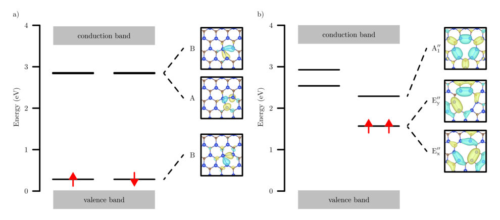
<figcaption class="paper-figure-caption"><b>Fig 3.</b> FIG. 3. Ground state Kohn-Sham level structures in spin-polarized HSE06 calculations in a) the VC and b) the VSi3VC defects. Defect orbitals inside the bandgap are labelled according to the irreducible representations in a) C2 and b) D3h point groups. Insets show the pseudo-wavefunction of the corresponding defect orbitals. Excited states are described via spin-conserving single-electron promotion to the unoccupied levels.</figcaption>
</figure>
<figure class="paper-figure-card">
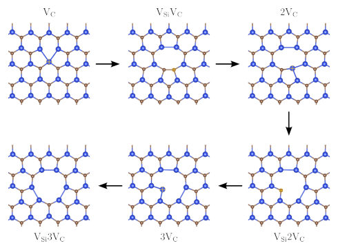
<figcaption class="paper-figure-caption"><b>Fig 4.</b> FIG. 4. Systematic construction of compact vacancy aggre- gate models. Atoms with dangling or frustrated bonds are considered as primary vacancy sites in the models as shown in the 3VC →VSi3VC and VC →VSiVC constructions, respec- tively. For the compact clusters that involve antisite defects, elements are swapped at the edge of the cluster or at recon- structed bonding sites, as illustrated in the VSi2VC →3VC and VSiVC →2VC construction, respectively.</figcaption>
</figure>
<figure class="paper-figure-card">
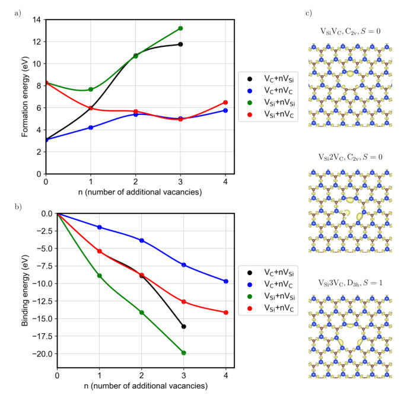
<figcaption class="paper-figure-caption"><b>Fig 5.</b> FIG. 5. Calculated structures of compact vacancy aggregates. a) and b) show the evolution of the formation and binding energies at the PBE level, respectively. Interpolated lines connect the calculation points to guide the eye. c) Geometry and ELF plots of the VSi + nVC series. The ground state point symmetry and spin are labelled for these structures.</figcaption>
</figure>

**Summary.** The research uses first-principles DFT to study how bond reconstruction stabilizes vacancy defects in 2D SiC. It identifies a specific vacancy cluster as an excellent candidate for quantum color centers, characterized by a stable triplet spin state and predictable near-infrared optical emission signatures.

**Why it may be interesting.** This work directly addresses defect engineering for solid-state quantum emitters by calculating measurable spectroscopic fingerprints ($	ext{ZFS}$, $	ext{LVMs}$) based on fundamental structural changes (bond reconstruction).

Detailed structure

**Main problem.** The study investigates how bond reconstruction mechanisms affect the formation energies, symmetries, and quantum properties of intrinsic defects (monovacancies and aggregates) in monolayer silicon carbide.

**Main result.** A specific vacancy aggregate ($	ext{VSi}_3	ext{VC}$) was identified as a promising infrared color-center candidate due to its stable triplet ground state and favorable emission characteristics.

**Method.** Density Functional Theory (DFT) calculations, utilizing advanced techniques like $	ext{HSE06}$ hybrid functionals, $	ext{cNEB}$ for relaxation paths, and analysis of hyperfine coupling parameters were employed.

**Model / system.** The physical system is monolayer silicon carbide ($	ext{SiC}$) containing various point defects, including single vacancies ($	ext{V}_{	ext{Si}}$, $	ext{V}_{	ext{C}}$) and larger vacancy clusters. The calculations model the structural relaxation and electronic state changes upon defect formation.

**Key observables.** Spin ground state ($S=1$ triplet), Zero-Field Splitting ($	ext{ZFS}$) parameter $D$, hyperfine coupling tensors, localized vibration modes ($	ext{LVMs}$), and optical transition energies (near-infrared range).

**Important parameters / regimes.** Formation energy ($E_f$), Debye-Waller factor, Huang-Rhys factor ($	ext{HR} \approx 0.59$), and the electronic structure derived from $	ext{HSE06}$ calculations.

**Assumptions / limitations.** The primary assumption is that bond reconstruction dictates the final stable quantum state of the defect; approximations are made regarding the calculation of excited states and finite-size corrections for energy levels.

**Figures summary.** Figures illustrate out-of-plane displacement patterns, reaction paths showing chirality swapping barriers, ground state Kohn-Sham level structures, and phonon sideband simulations detailing localized vibration modes ($	ext{LVMs}$).

**Paper structure.** The paper systematically analyzes isolated monovacancies first, demonstrating symmetry breaking upon reconstruction. It then moves to vacancy aggregates, culminating in the detailed quantum characterization of the $	ext{VSi}_3	ext{VC}$ cluster's optical and spin properties.

Abstract

Bond reconstruction in vacancy-related structures affects their formation energies, symmetries, and electronic and optical properties. Using density functional theory, we investigate bond reconstruction mechanisms of monovacancies and vacancy aggregates in monolayer silicon carbide. Multiple bond descriptors reveal that isolated monovacancies undergo both in-plane reconstruction and out-of-plane distortion, which together shape their stability and electronic structure. For compact vacancy aggregates, we show that bond reconstruction acts as a key stabilization mechanism. However, in carbon monovacancy, reconstruction suppresses optical activity. In contrast, a highly stable aggregate composed of three carbon vacancies surrounding a silicon vacancy emerges as a promising infrared color-center candidate, combining a triplet ground state with a favorable Debye-Waller factor of the emission. These results highlight the role of bond reconstruction in defining the quantum properties of vacancy defects in two-dimensional silicon carbide.

[↑ back to top](#top)

### [Broadband Polarization Compensation with Link Segment Reconstruction for Quantum Optical Links](http://arxiv.org/abs/2607.17400v1)

**Authors:** Qingyu Shi, Erwan Trad, Julien Chénedé, Tobias Vogl  
**Type:** experiment · **Category:** quantum information and computing · **PDF:** <https://arxiv.org/pdf/2607.17400v1>  
**Analysis basis:** full PDF text, analyzed in chunks
**Topic relevance:** `quantum optics experiment` **3/5** · `QC/QI experiment` **1/5** · `interference shaping light` **1/5** · `quantum measurements` **1/5**

↔ Scroll figures horizontally

<figure class="paper-figure-card">
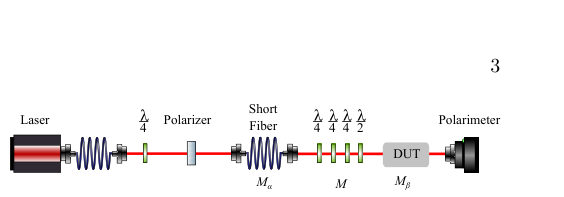
<figcaption class="paper-figure-caption"><b>Fig 1.</b> FIG. 1. Experimental setup. In the present implementation, the optical switch selects one fiber-coupled laser at a time. The input state is prepared by a QWP followed by a linear polarizer on a motorized rotation mount. The transforma- tions before the compensator, through the compensator, and after the compensator are denoted by Mα, M, and Mβ, re- spectively. The compensator is a motorized stack of three QWPs followed by one HWP in the propagation direction. DUT: device under test. The output Stokes vectors are mea- sured with a polarimeter.</figcaption>
</figure>
<figure class="paper-figure-card">
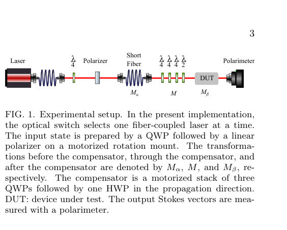
<figcaption class="paper-figure-caption"><b>Fig 2.</b> Fig. 1 shows the experimental implementation used for the two-step reconstruction and compensation procedure. The motorized Q-Q-Q-H compensator is placed between the input-side transformation Mα and the output-side transformation Mβ. For each fixed wavelength, the com- pensation setting was obtained in two steps. First, we reconstructed Mα and Mβ using the eight-Stokes vector measurement protocol. Second, we calculated the Q-Q- Q-H wave plate angles required to implement the com- pensating matrix in Eq. (3). The compensated link was then benchmarked by scan- ning the azimuth θ of a linear input polarization and mea- suring the output Stokes vector ⃗S′(θ). For ideal compen- sation, the...</figcaption>
</figure>
<figure class="paper-figure-card">
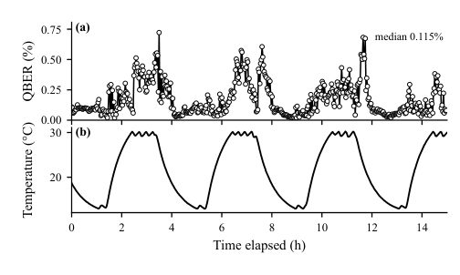
<figcaption class="paper-figure-caption"><b>Fig 3.</b> FIG. 2. Long-term monitoring of a 100 m fiber spool with active auxiliary wavelength polarization compensation. The auxiliary wavelengths were 669 nm and 671 nm, and the sig- nal wavelength was 670 nm. (a) Polarization-induced excess QBER during the measurement interval. Each symbol repre- sents one feedback/optimization iteration. (b) Temperature recorded by the home-built temperature-controlled enclosure during the same interval.</figcaption>
</figure>

**Summary.** The paper presents a robust method for compensating polarization transformations in quantum optical links using a novel four-wave plate compensator. By combining this hardware with an eight-Stokes vector protocol, the authors achieve sub-percent QBER suppression over wide bandwidths and successfully track temperature-induced drift via auxiliary wavelength measurements.

**Why it may be interesting.** This work directly addresses practical challenges in quantum networking hardware—namely, maintaining polarization fidelity across varying environmental conditions (temperature) and spectral bandwidths—which is crucial for deploying quantum communication infrastructure.

Detailed structure

**Main problem.** Polarization-encoded quantum communication requires compensating for polarization transformations induced by optical links, which is complicated by embedded compensators and non-ideal waveplate retardances.

**Main result.** The developed four-wave plate sequence suppresses polarization-induced excess QBER to the sub-percent level across broad wavelengths, and auxiliary wavelength feedback maintains low error rates during temperature drift.

**Method.** The authors introduce a novel four-plate compensator and an eight-Stokes vector protocol to reconstruct link segment Mueller matrices ($	ext{M}_\alpha, 	ext{M}_eta$) surrounding the compensator.

**Model / system.** The system models quantum optical links using polarization encoding, where transformations are described by $	ext{SO}(3)$ Mueller matrices. The experiment uses fiber spools as Device Under Test (DUTs) to simulate real-world link impairments.

**Key observables.** Excess Quantum Bit Error Rate ($	ext{QBER}_{	ext{pol}}$), reconstructed link segment Mueller matrices, and axis-angle parameters $(	ilde{\epsilon}, 	ilde{\alpha}, 	ilde{eta}, 	ilde{\gamma})$.

**Important parameters / regimes.** Wavelength range ($>100 	ext{ nm}$ bandwidth), temperature variation ($\Delta T$), and the required condition for retardance error suppression.

**Assumptions / limitations.** Polarization-dependent loss and depolarization are not treated as compensable errors; reconstruction relies on measuring known input states at specific waveplate settings.

**Figures summary.** Figures illustrate the experimental setup, long-term monitoring of polarization drift over temperature using auxiliary wavelengths, and comparisons between different compensation sequences (Q-Q-Q-H vs. Q-Q-H).

**Paper structure.** The paper first establishes the need for robust compensation in embedded links. It then details the four-plate compensator synthesis and the eight-Stokes vector reconstruction protocol. Finally, it demonstrates performance by testing broadband operation and long-term stability against temperature drift using auxiliary wavelengths.

Abstract

Polarization-encoded quantum communication requires compensation of polarization transformations induced by the optical links. If the compensator is embedded between two channel segments, the transformations before and after the compensator must be treated separately. Moreover, standard three-wave-plate polarization controllers can become non-universal when their retardances deviate from their ideal values. To address these two challenges, we introduce a four-wave plate compensator that synthesizes arbitrary SO(3) polarization transformations over a broad wavelength range, and an eight-Stokes vector protocol that reconstructs the two link-segment Mueller matrices on either side of the compensator. Our experiment reveals that the four-plate sequence suppresses polarization-induced excess quantum bit error rate (QBER) to the sub-percent level at an operating wavelength more than 100 nm from the design wavelength without further optimization. Combined with two auxiliary wavelengths, our scheme tracks the temperature-driven drift of a strongly wavelength-sensitive fiber spool while keeping the excess QBER below 1%. These results support flexible compensator placement and wavelength channel selection, as well as non-interruptive polarization control in wavelength-division-multiplexed quantum optical links.

[↑ back to top](#top)

### [Nematic Wigner crystals in rhombohedral multilayer graphene](http://arxiv.org/abs/2607.17027v1)

**Authors:** Yang Ge, Ashwini Malviya, Ethan Angerhofer, Zhengguang Lu, Jiabin Yu  
**Type:** theory · **Category:** strongly correlated electrons · **PDF:** <https://arxiv.org/pdf/2607.17027v1>  
**Analysis basis:** full PDF text, analyzed in chunks
**Topic relevance:** `Keldysh / 2PI / non-Gaussian methods` **3/5** · `analog quantum simulation` **1/5** · `methods for driven-dissipative` **1/5** · `non-equilibrium dynamics` **1/5**

↔ Scroll figures horizontally

<figure class="paper-figure-card">
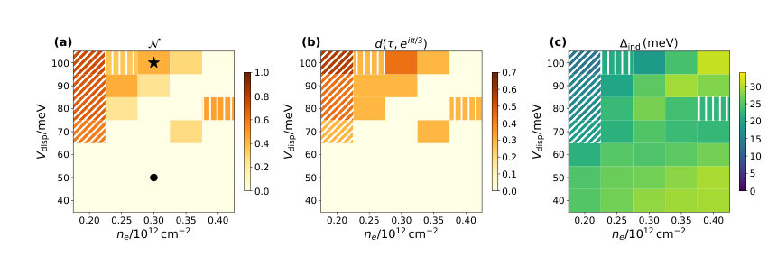
<figcaption class="paper-figure-caption"><b>Fig 1.</b> FIG. 1. HF phase diagram in the CN scheme for R4G. Vertical hatch indicates instability towards WCs with two electrons per unit cell. Diagonal hatch indicates instability towards metallic WCs, Fermi liquids, or stripe phases. (a) C3-symmetry violation in the density matrix, quantified by N as defined in Eq. (7). For C3-invariant WCs, N = 0. The star is at ne = 0.3 × 1012 cm−2 and Vdisp = 100 meV, and the circle is at ne = 0.3 × 1012 cm−2 and Vdisp = 50 meV. (b) Hyperbolic lattice distance from the Wigner lattice of the HF ground state to the triangular lattice of the C3-invariant WC, d(τ, eiπ/3). For τ representing a C3-invariant Wigner lattice, d(τ, eiπ/3) = 0. (c) HF indirect charge gap,...</figcaption>
</figure>
<figure class="paper-figure-card">
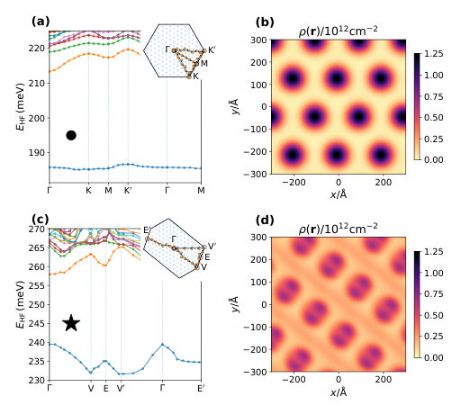
<figcaption class="paper-figure-caption"><b>Fig 2.</b> FIG. 2. (a),(c) Band structures and (b),(d) real-space charge den- sities for the representative C3-invariant WC [the circle in Fig. 1(a), displayed in (a) and (b) here], and nWC [the star in Fig. 1(a), displayed in (c) and (d) here], respectively. The insets of (a) and (c) show the first Wigner Brillouin zone within the discretized continuum k mesh. The rugged dispersion in (c) arises from imperfect commensuration between the discretized continuum k mesh and the Wigner Bloch momentum points.</figcaption>
</figure>
<figure class="paper-figure-card">
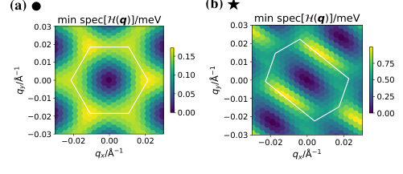
<figcaption class="paper-figure-caption"><b>Fig 3.</b> FIG. 3. Lowest eigenvalue branch of the TDHF stability matrix for (a) a C3-invariant WC [the circle in Fig. 1(a)] and (b) an nWC [the star in Fig. 1(a)]. The first Wigner Brillouin zones (BZs) are outlined in white. In both cases, the eigenvalues are positive at q ̸= 0 and zero (within numerical error) at q = 0, indicating local stability of the HF solution.</figcaption>
</figure>
<figure class="paper-figure-card">
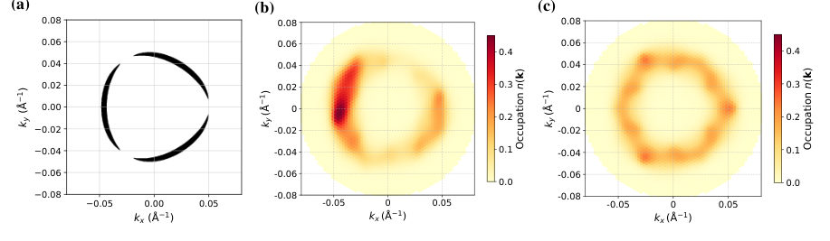
<figcaption class="paper-figure-caption"><b>Fig 4.</b> FIG. 4. Momentum-space origin of the nWC at ne = 0.25 × 1012 cm−2 and Vdisp = 90 meV. (a) Noninteracting Fermi sea of a spin-valley- polarized state, showing the three-lobed low-density Fermi surface (in black) produced by trigonal warping. (b) Occupation n(k) of the nWC ground state. (c) Occupation n(k) of the lowest-energy C3-invariant WC solution at the same parameters. This higher-energy solution preserves the threefold occupation pattern and spreads weight over the three lobes.</figcaption>
</figure>
<figure class="paper-figure-card">
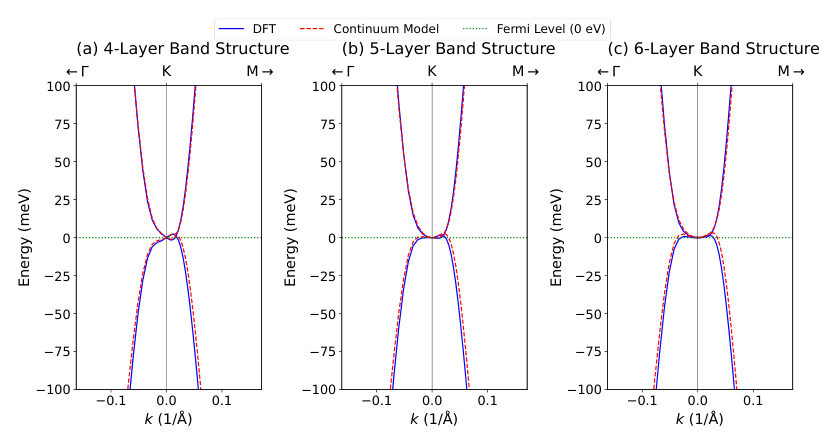
<figcaption class="paper-figure-caption"><b>Fig 5.</b> FIG. 5. Comparison of the low-energy electronic band structures calculated using density functional theory (solid blue lines) and the continuum model (dashed red lines). The panels show the bands for (a) four-layer, (b) five-layer, and (c) six-layer systems near the K valley. The k-path is part of the Γ–K–M trace that extends from K by 9.55% of the distance towards Γ, and by 20.1% of the distance towards M. The Fermi level is aligned at zero energy (green dotted line) for both models.</figcaption>
</figure>

**Summary.** The authors investigate Wigner crystallization in rhombohedral multilayer graphene, focusing on the emergence of nematic crystal states that spontaneously break rotational symmetry. Using HF and TDHF calculations, they map out the phase diagram, predicting stable nWC phases favored by kinetic energy effects over $C_3$-invariant states. The predicted stability boundaries can be experimentally verified using STM or transport measurements.

**Why it may be interesting.** This work provides a detailed theoretical framework for understanding correlated electron phases (Wigner crystals) in 2D materials like graphene, using advanced many-body techniques (HF/TDHF) to predict symmetry breaking and stability boundaries.

Detailed structure

**Main problem.** The study investigates Wigner crystallization (WC) in rhombohedral multilayer graphene, specifically determining if nematic phases (nWC) spontaneously break the threefold rotational symmetry ($C_3$) compared to standard $C_3$-invariant WC states.

**Main result.** Hartree-Fock calculations predict stable nWC regions favored over $C_3$-invariant WCs in certain parameter regimes due to kinetic energy gains, while TDHF analysis confirms stability for only half of the predicted nWC phases.

**Method.** The research employs projected Hartree-Fock (HF) and Time-Dependent Hartree-Fock (TDHF) calculations on a continuum model Hamiltonian. Stability is rigorously tested by analyzing the eigenvalues of the RPA stability matrix derived from TDHF.

**Model / system.** The system is rhombohedral tetralayer graphene ($	ext{R4G}$) modeled using a projected many-body Hamiltonian incorporating spin and valley degrees of freedom. Electron repulsion is treated via a screened Coulomb interaction.

**Key observables.** Nematicity diagnostic ($N$), stability eigenvalues from TDHF, anisotropic charge distribution (for STM), and direction-dependent depinning voltage (for transport measurements).

**Important parameters / regimes.** Electron density ($n_e$) ranging from $0.2$ to $0.4 	imes 10^{12} 	ext{ cm}^{-2}$, and displacement fields ($V_{	ext{disp}}$) between $40$ and $100 	ext{ meV}$.

**Assumptions / limitations.** The analysis relies on the projected HF framework, assuming a fixed two-body interaction; TDHF only proves local quadratic instability.

**Figures summary.** Figure 1 maps the HF phase diagram showing regions of $C_3$-symmetry violation (nWC) and instability. Figure 10 shows the smallest TDHF stability eigenvalue across the parameter space, distinguishing instabilities towards unit cell doubling (blue labels) versus metallic/stripe phases (red labels).

**Paper structure.** The paper proceeds by first using HF calculations to identify symmetry-breaking nWC states in specific phase diagram regions. It then uses TDHF theory to test the local stability of these candidate WC states, identifying which ones are stable and predicting experimental signatures for their detection.

Abstract

Recent experiments have reported evidence for Wigner crystals (WCs) in rhombohedral graphene. Here, we investigate Wigner crystallization in rhombohedral tetralayer graphene using projected Hartree-Fock (HF) calculations and time-dependent Hartree-Fock (TDHF) calculations. We first perform HF calculations with one electron per Wigner unit cell, and find nematic WCs (nWCs) that spontaneously break the threefold rotational symmetry $C_3$ and $C_3$-invariant WCs. In particular, there are two nWC regions in the phase diagram: one larger region at large displacement fields and low electron densities, and another smaller region at intermediate fields and high densities. Both the nWCs and the $C_3$-invariant WCs are valley-polarized states with zero Chern number, and have positive indirect gaps in the HF band structure. We then perform TDHF calculations to further test the local stability of the WC states. We find that all $C_3$-invariant WCs and half of the nWCs are locally stable, while the remaining nWCs are unstable towards WCs with two electrons per unit cell or metallic states. The predicted stable nWC phase can be identified experimentally by scanning tunneling microscopy through its anisotropic charge distribution or by angle-resolved transport measurements via a direction-dependent depinning voltage.

[↑ back to top](#top)

### [Valley polarization, Rashba interaction, and weak altermagnetism in inversion-asymmetric MnPS$_\text{3}|$WS$_\text{2}$ van der Waals heterostructures](http://arxiv.org/abs/2607.16454v1)

**Authors:** Purba Dutta, Soumajyoti Bid, Nirmal Ganguli  
**Type:** theory · **Category:** strongly correlated electrons · **PDF:** <https://arxiv.org/pdf/2607.16454v1>  
**Analysis basis:** full PDF text, analyzed in chunks
**Topic relevance:** `exotic spin models in light-matter` **3/5** · `spintronics-quantum-optics interface` **3/5**

↔ Scroll figures horizontally

<figure class="paper-figure-card">
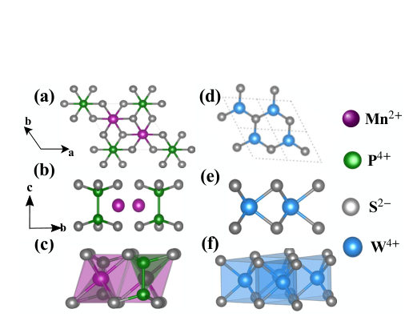
<figcaption class="paper-figure-caption"><b>Fig 1.</b> FIG. 1. The unit cell structures of the individual monolayers and their corresponding crystal field environments for MnPS3 and WS2 are illustrated here. Panels (a) and (b) show the optimized top and side views of the MnPS3 unit cell, respec- tively. MnPS3 forms a layered honeycomb lattice in which Mn and S atoms constitute tilted octahedra, while the P2 dimers form an inverted prism structure with surrounding S atoms, as depicted in (c). Similarly, (d) and (e) present the top and the side views of the WS2 unit cell after structure optimization. WS2 adopts a trigonal prismatic coordination, characteristic of the 2H-phase transition metal dichalcogenides, depicted in (f).</figcaption>
</figure>
<figure class="paper-figure-card">
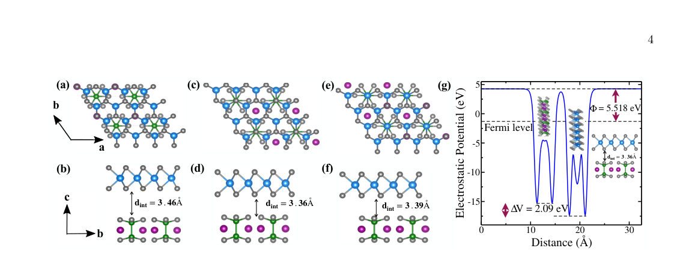
<figcaption class="paper-figure-caption"><b>Fig 2.</b> FIG. 2. The top view and the side view of the simulated MnPS3|WS2 heterostructure with stacking configuration I are depicted in (a) and (b), respectively. Similarly, (c), (d), and (e), (f) show the top and side views of stacking configuration II and III, respectively. The variation of the electrostatic potential energy along the z direction across the simulation cell is shown in (g), depicting the built-in potential difference in the heterostructure.</figcaption>
</figure>
<figure class="paper-figure-card">
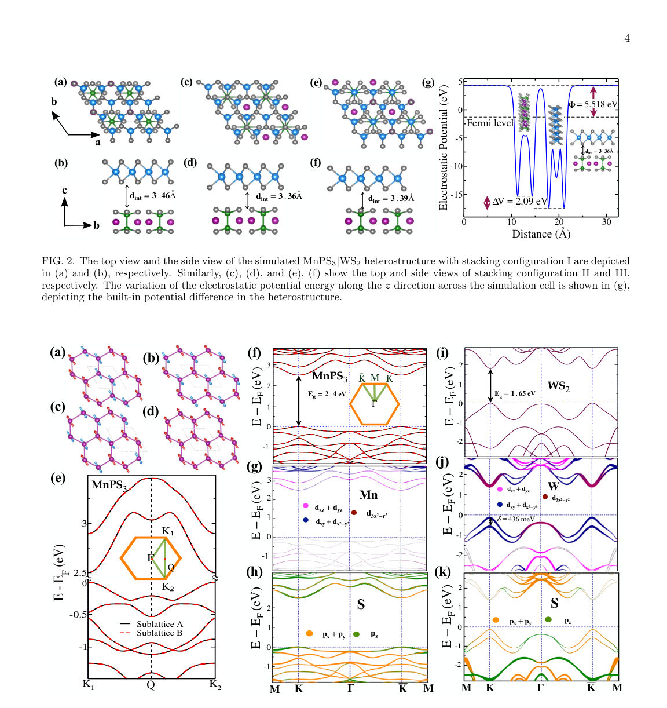
<figcaption class="paper-figure-caption"><b>Fig 3.</b> FIG. 3. The magnetic moment arrangements, spin-polarized, and orbital-projected band structures of MnPS3 and WS2 monolayers from our DFT calculations are presented here. Possible magnetic moment arrangements of MnPS3 are illustrated in (a), (b), (c), and (d), termed as zigzag-type AFM, N´eel-type AFM, stripy-type AFM, and ferromagnetic configurations, respectively. Panels (e) show the spin-polarized band dispersion of MnPS3 along the K1 →K2 path, with the inset showing the Brillouin zone, marking Γ, K1, K2, and Q-points. Panel (f) displays the spin-polarized band structure of MnPS3 along the high-symmetry path M →K →Γ →¯K →M, obtained from our DFT study. Panels (g) and (h) depict the...</figcaption>
</figure>
<figure class="paper-figure-card">
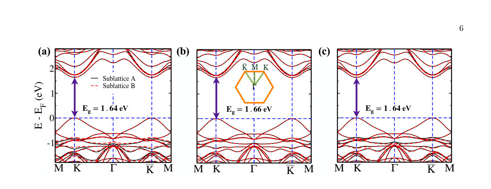
<figcaption class="paper-figure-caption"><b>Fig 4.</b> FIG. 4. Panels (a), (b), and (c) show the spin-polarized band dispersion of the heterostructure, for the stacking configurations I, II, and III, respectively, along the high-symmetry direction M →K →Γ →¯K →M from our DFT calculation. The band dispersion for three cases indicates a direct band gap ranging from 1.64 to 1.66 eV at the K and ¯K points. The inset of (b) shows the two-dimensional hexagonal Brillouin zone, marking the relevant high-symmetry points.</figcaption>
</figure>
<figure class="paper-figure-card">
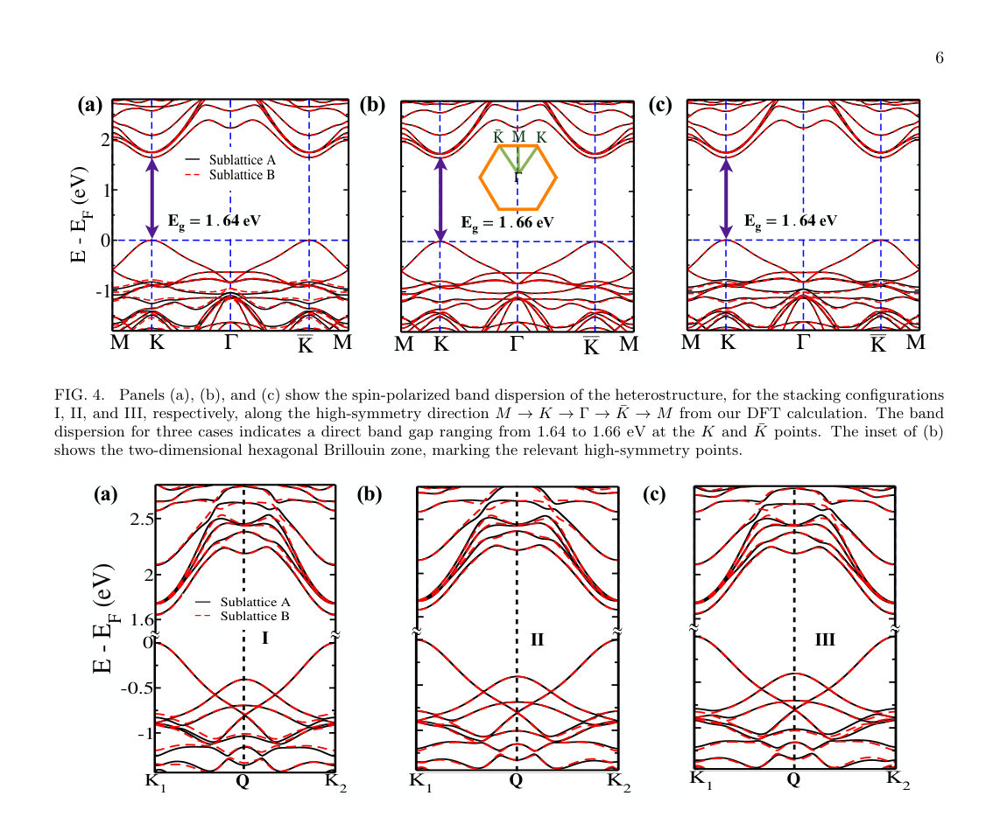
<figcaption class="paper-figure-caption"><b>Fig 5.</b> FIG. 5. The band dispersion with broken degeneracy along the K1 →Q →K2 path, as marked in the inset of Fig. 3(c), is shown here. Panels (a), (b), and (c) show the spin-polarized band dispersion of MnPS3|WS2 heterostructure for the stacking configurations I, II, and III, respectively, as obtained from our DFT calculations. These bands show that the opposite-spin bands from different sublattices are not degenerate, except at the Q-point.</figcaption>
</figure>

**Summary.** This theoretical study investigates the $	ext{MnPS}_3|	ext{WS}_2$ van der Waals heterostructure to demonstrate its potential as a tunable platform. Using DFT, the authors show that the interface supports emergent phenomena like altermagnetism and Rashba splitting. Crucially, they prove that external electric fields and strain can reversibly tune the band alignment and control these quantum electronic states.

**Why it may be interesting.** The ability to engineer multiple quantum functionalities (spin, valley, magnetism) simultaneously through symmetry control using electric fields is highly relevant for designing next-generation quantum devices and strongly correlated electronic materials.

Detailed structure

**Main problem.** Investigating emergent electronic and magnetic phenomena, such as altermagnetism, Rashba splitting, and spin-valley locking, in inversion-asymmetric van der Waals heterostructures.

**Main result.** The $	ext{MnPS}_3|	ext{WS}_2$ heterostructure exhibits a rich interplay of these effects, forming a highly tunable platform whose electronic properties can be controlled by external electric fields and strain.

**Method.** First-principles calculations using Density Functional Theory (DFT) incorporating Spin-Orbit Coupling (SOC) and DFT-D2 corrections for van der Waals interactions.

**Model / system.** The physical system is a vdW heterostructure formed by stacking $	ext{MnPS}_3$ and $	ext{WS}_2$ monolayers. The study analyzes the electronic structure, magnetic ordering (altermagnetism), and spin-splitting effects at the interface.

**Key observables.** Electronic band gap ($\approx 1.65 	ext{ eV}$), type-I/type-II band alignment, Rashba spin splitting magnitude, valley polarization, and altermagnetic signatures.

**Important parameters / regimes.** External electric field (EEF) and in-plane biaxial strain are key tuning parameters; the system is analyzed near K and $ar{	ext{K}}$ valley points.

**Assumptions / limitations.** The calculations rely on DFT approximations, which may underestimate band gaps and magnetic moments compared to experiments.

**Figures summary.** Figures illustrate unit cells, stacking configurations, electrostatic potential variations ($\Delta V$), spin-polarized band dispersions showing splitting at K/$ar{	ext{K}}$, and the evolution of band alignment under applied electric fields.

**Paper structure.** The paper details the crystal structure and methodology (DFT setup), presents results on emergent phenomena like altermagnetism, analyzes the tunability of band alignment via external fields, and concludes by establishing the material's potential for spintronics/valleytronics.

Abstract

The deliberate breaking of inversion ($\mathcal{P}$) symmetry in antiferromagnets has recently emerged as an effective means to induce various features, such as the emergence of Berry curvature, spin-valley locking, magnetoelectric coupling, and the transition from conventional antiferromagnetism to altermagnetism. Conversely, in non-magnetic systems, inversion symmetry breaking in the presence of strong spin-orbit interaction (SOI) gives rise to momentum-dependent spin splitting via the Rashba effect, enabling tunable spin polarization through external electric fields. Motivated by recent advances in two-dimensional materials, we perform first-principles calculations based on density functional theory to investigate the van der Waals (vdW) heterostructure formed by a $\mathcal{P}$-symmetric MnPS$_3$ monolayer and a WS$_2$ monolayer. We demonstrate that the interface hosts a rich interplay of emergent phenomena, including an altermagnetic phase, Rashba spin splitting, spin-valley locking, and valley polarization. Our results demonstrate that the heterostructure exhibits semiconducting behavior with a direct band gap of approximately 1.65~eV and a type-I band alignment. Remarkably, the electronic structure and band alignment can be effectively tuned between type-I and type-II regimes via an external electric field and in-plane biaxial strain. Furthermore, field-induced modulation enables strong control over the altermagnetic phase and the valley splitting. These findings establish the proposed vdW heterostructure as a highly tunable platform with significant potential for spintronic and valleytronic applications.

[↑ back to top](#top)

### [New bound on $S_{1}\times S_{2}$-setting Bell locality of a nonseparable Werner state](http://arxiv.org/abs/2607.18050v1)

**Authors:** Elena R. Loubenets  
**Type:** theory · **Category:** other · **PDF:** <https://arxiv.org/pdf/2607.18050v1>  
**Analysis basis:** full PDF text, analyzed in chunks
**Topic relevance:** `entanglement & information structure` **3/5** · `quantum measurements` **2/5**

↔ Scroll figures horizontally

<figure class="paper-figure-card">
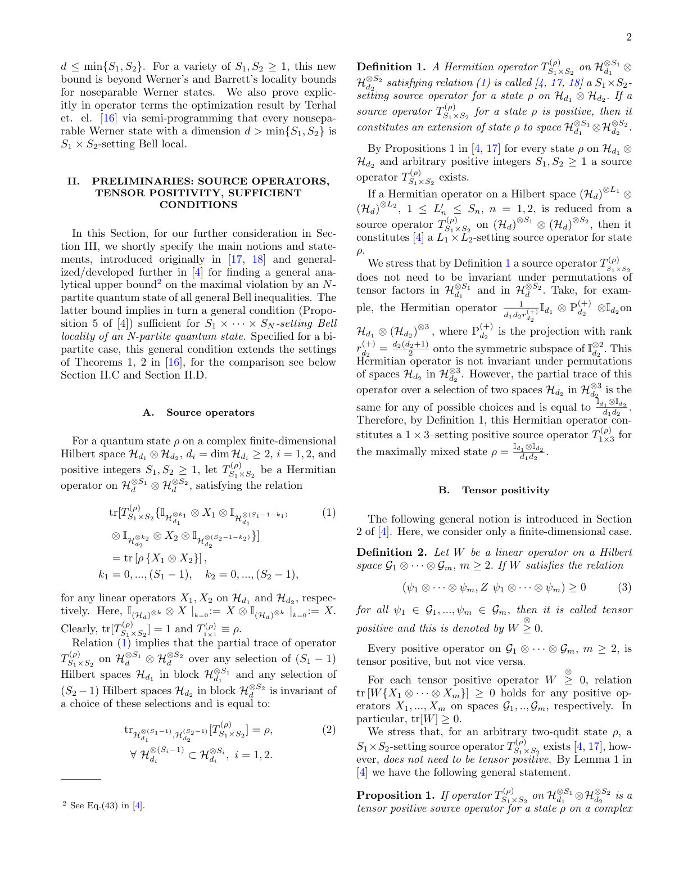
<figcaption class="paper-figure-caption"><b>Fig 1.</b> Low-resolution page preview, page 2</figcaption>
</figure>
<figure class="paper-figure-card">
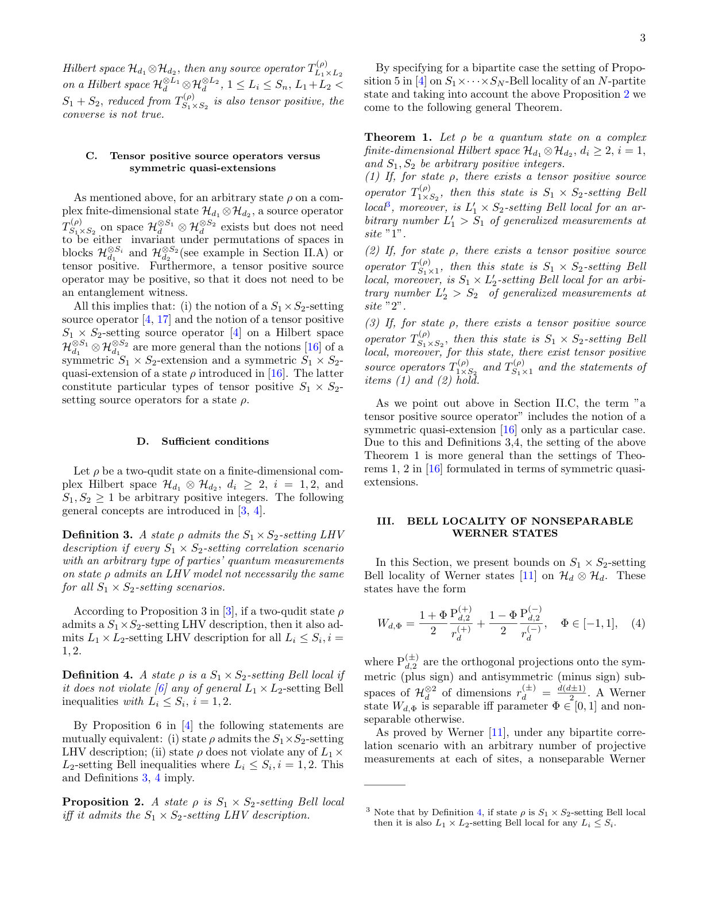
<figcaption class="paper-figure-caption"><b>Fig 2.</b> Low-resolution page preview, page 3</figcaption>
</figure>
<figure class="paper-figure-card">
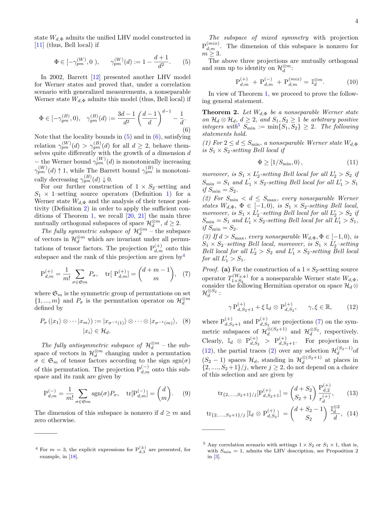
<figcaption class="paper-figure-caption"><b>Fig 3.</b> Low-resolution page preview, page 4</figcaption>
</figure>
<figure class="paper-figure-card">
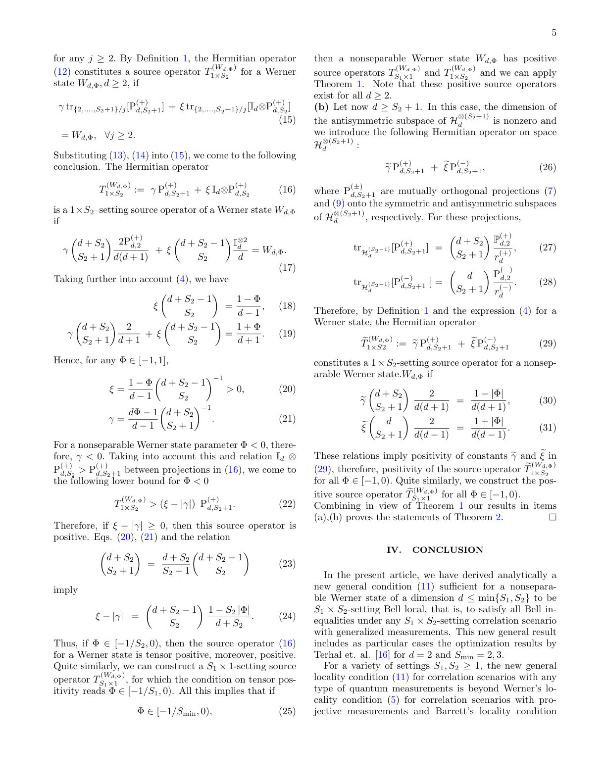
<figcaption class="paper-figure-caption"><b>Fig 4.</b> Low-resolution page preview, page 5</figcaption>
</figure>
<figure class="paper-figure-card">
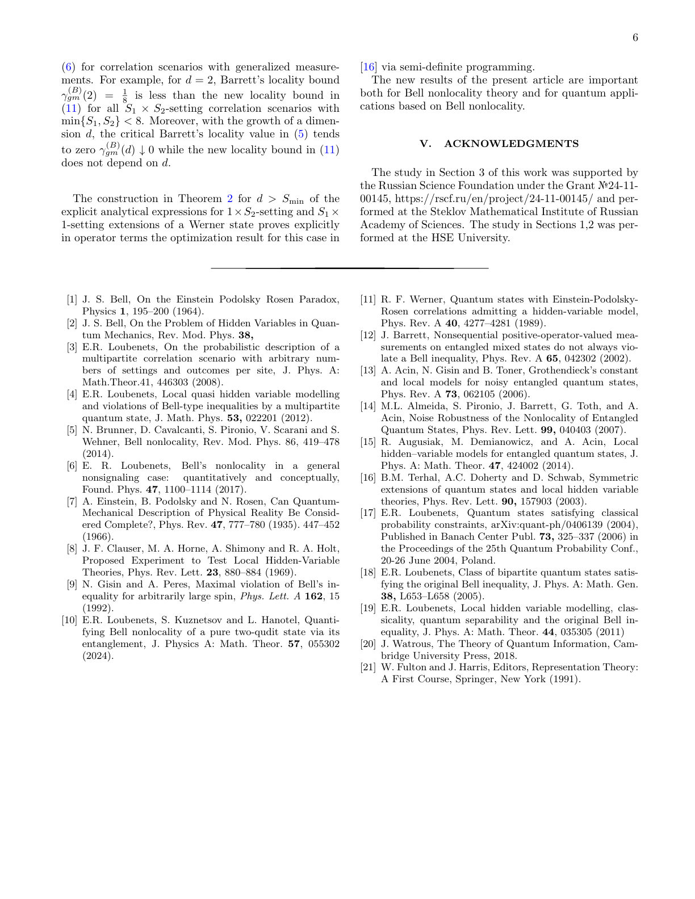
<figcaption class="paper-figure-caption"><b>Fig 5.</b> Low-resolution page preview, page 6</figcaption>
</figure>

**Summary.** This paper derives a novel, general condition to test if nonseparable Werner states remain Bell local when subjected to multiple generalized measurement settings ($S_1 	imes S_2$). The authors show this new bound is stronger than previous known limits and provide explicit proofs showing that for sufficiently high dimensions relative to the number of measurements, all such states are necessarily local.

**Why it may be interesting.** This work provides rigorous theoretical bounds on quantum correlations, which is fundamental knowledge for understanding the limits of nonlocality in quantum information protocols that rely on entanglement testing.

Detailed structure

**Main problem.** The primary goal is to find a new, general condition that determines when a nonseparable Werner state remains Bell local under arbitrary correlation scenarios involving $S_1 	imes S_2$ generalized quantum measurements.

**Main result.** A new general locality condition was derived for low-dimensional states ($d \le \min\{S_1, S_2\}$), which surpasses previous bounds. Furthermore, it is proven that high-dimensional nonseparable Werner states ($d > \min\{S_1, S_2\}$) are always $S_1 	imes S_2$-setting Bell local.

**Method.** The authors employ analytical techniques involving the construction and analysis of 'source operators' derived from the state. They establish an equivalence between Bell locality and admitting a specific type of Local Hidden Variable (LHV) description, which is then tested for tensor positivity.

**Model / system.** The study focuses on nonseparable Werner states ($	ext{W}_{d,\Phi}$) defined on a bipartite two-qudit system $\mathcal{H}_d \otimes \mathcal{H}_d$. The analysis extends to correlation scenarios involving $S_1$ and $S_2$ generalized measurements at each site.

**Key observables.** The degree of Bell nonlocality, quantified by the violation of various Bell inequalities under specific measurement settings ($S_1, S_2$).

**Important parameters / regimes.** $S_1, S_2$ (number of measurement settings), $d$ (dimension of the Hilbert space), and $\Phi$ (the parameter characterizing the Werner state).

**Assumptions / limitations.** The analysis relies on establishing an equivalence between Bell locality and the existence of a tensor positive source operator description for the correlations.

**Paper structure.** The paper first introduces the problem by defining $S_1 	imes S_2$-setting Bell locality. It then derives the new general condition using source operators and establishes its equivalence to LHV models. Finally, it compares this new bound against established results (Werner's and Barrett's) and proves optimization results for specific dimension regimes.

Abstract

In many quantum applications it is important to know whether or not a Bell nonlocal two-qudit state exhibits its nonlocality under correlation scenarios with some given numbers $S_{1},S_{2}\geq1$ of generalized quantum measurements at two sites. In the present article, we find analytically a new general condition sufficient for a nonseparable Werner state with a dimension $d\leq\min\{S_{1},S_{2}\}$ to satisfy all Bell inequalities under every $S_{1}\times S_{2}$-setting correlation scenario with outcomes of an arbitrary spectral type, discrete or continuous $-$ that is, to be $S_{1}\times S_{2}$-setting Bell local, for short. For a variety of $S_{1},S_{2}\geq1$ values, this new general locality condition is beyond Werner's and Barrett's locality conditions for a nonseparable Werner state. We also prove explicitly in the operator terms the optimization result by Terhal et. el. [Phys. Rev. Lett. \textbf{90,} 157903 (2003)] via semi-programming that every nonseparable Werner state with a dimension $d>\min\{S_{1},S_{2}\}$ is $S_{1}\times S_{2}$ -setting Bell local. The new results of the present article are important both for Bell nonlocality theory and for quantum applications based on Bell nonlocality.

[↑ back to top](#top)

### [QBism Logic](http://arxiv.org/abs/2607.17174v1)

**Authors:** Kenji Tokuo  
**Type:** theory · **Category:** other · **PDF:** <https://arxiv.org/pdf/2607.17174v1>  
**Analysis basis:** full PDF text, analyzed in chunks
**Topic relevance:** `quantum measurements` **3/5** · `measurement-induced transitions` **1/5**

↔ Scroll figures horizontally

<figure class="paper-figure-card">
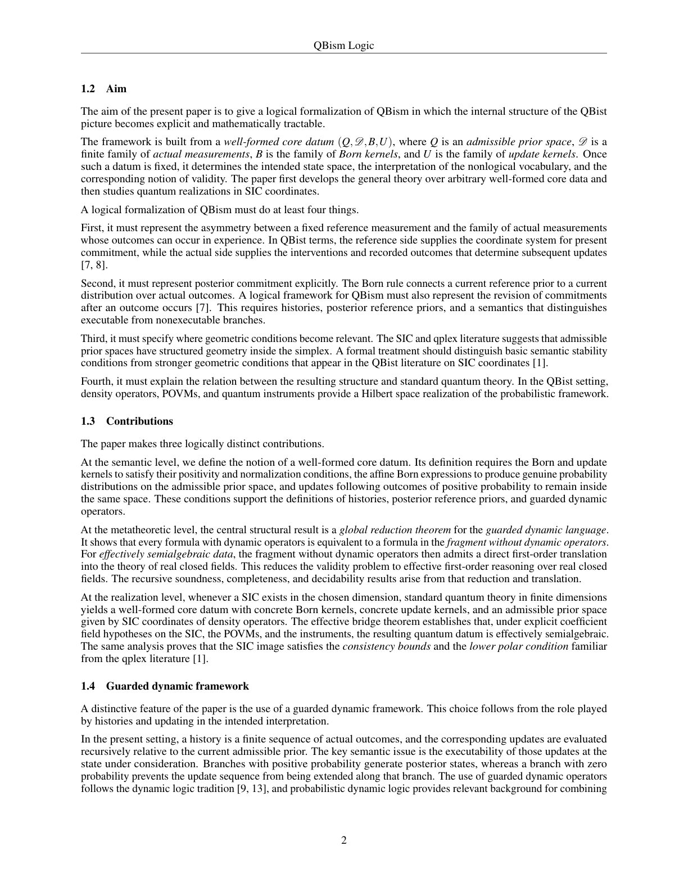
<figcaption class="paper-figure-caption"><b>Fig 1.</b> Low-resolution page preview, page 2</figcaption>
</figure>
<figure class="paper-figure-card">
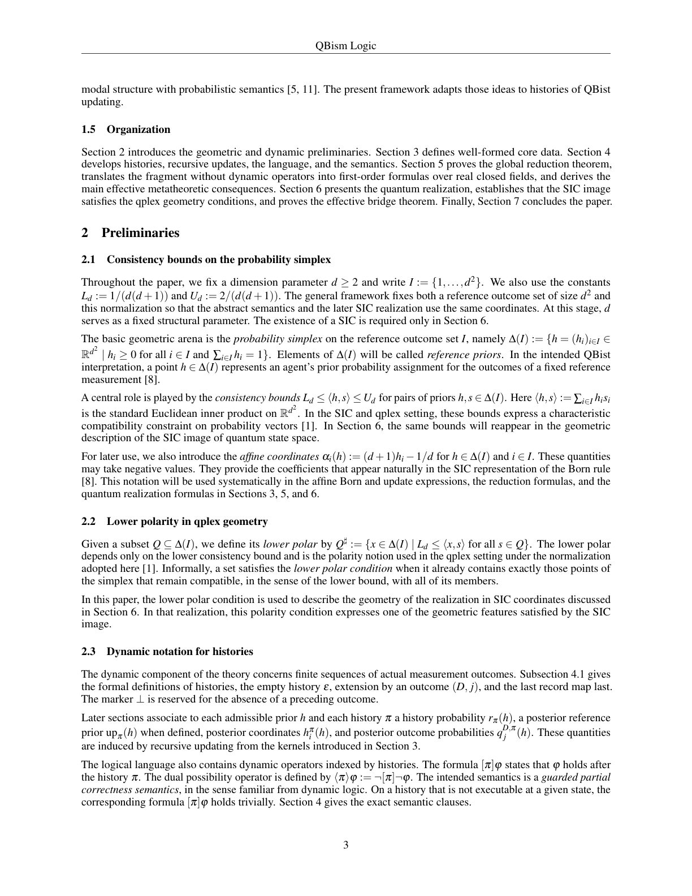
<figcaption class="paper-figure-caption"><b>Fig 2.</b> Low-resolution page preview, page 3</figcaption>
</figure>
<figure class="paper-figure-card">
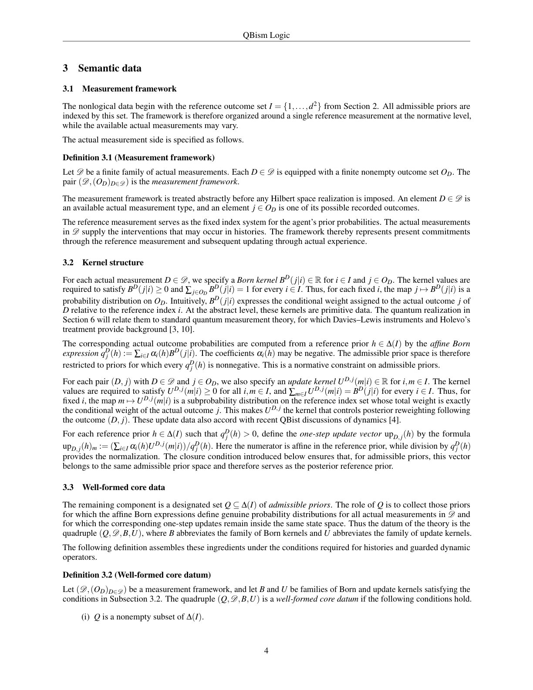
<figcaption class="paper-figure-caption"><b>Fig 3.</b> Low-resolution page preview, page 4</figcaption>
</figure>
<figure class="paper-figure-card">
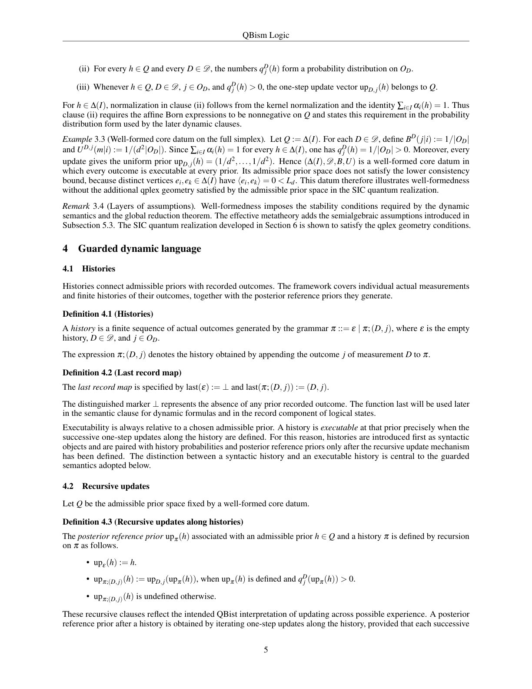
<figcaption class="paper-figure-caption"><b>Fig 4.</b> Low-resolution page preview, page 5</figcaption>
</figure>
<figure class="paper-figure-card">
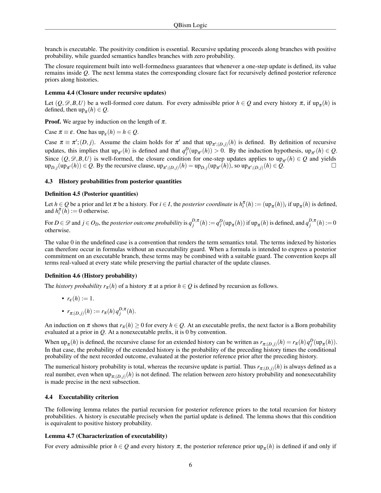
<figcaption class="paper-figure-caption"><b>Fig 5.</b> Low-resolution page preview, page 6</figcaption>
</figure>

**Summary.** This paper constructs a logical framework (QBism Logic) to formalize how agents update their beliefs based on quantum measurements. It achieves this by showing that the structure governing these updates can be translated into first-order logic over real closed fields, yielding a decidable calculus. Crucially, it demonstrates that standard finite-dimensional quantum mechanics fits perfectly within this abstract mathematical structure.

**Why it may be interesting.** This work provides a deep mathematical foundation connecting operational quantum theory to formal logic and model theory. For theorists working on open quantum systems or measurement processes, it offers a rigorous, decidable calculus for reasoning about state updates.

Detailed structure

**Main problem.** The paper develops a rigorous logical formalization of QBism (Quantum Bayesianism), interpreting quantum theory as a normative framework for an agent's probability assignments and their revision based on experience.

**Main result.** It establishes that the structure describing quantum updates, when restricted to effectively semialgebraic data over real closed fields, yields a sound, complete, and decidable recursive calculus. Furthermore, it shows standard finite-dimensional QM fits this framework using SIC coordinates.

**Method.** The methodology involves developing a guarded dynamic language for histories, translating the logic fragment into first-order formulas in ordered rings, and applying algebraic geometry tools (qplex conditions) to verify quantum realizations.

**Model / system.** The model is QBism Logic applied to finite-dimensional quantum systems. The core structure is defined by a 'well-formed core datum' $(Q, \mathcal{D}, B, U)$, involving admissible prior spaces, measurement families ($\mathcal{D}$), Born kernels ($B$), and update kernels ($U$).

**Key observables.** Posterior reference priors ($	ext{up}_\pi(h)$) and history probabilities ($r_\pi(h)$). Diagnostics include consistency bounds and the lower polar condition.

**Important parameters / regimes.** The dimension parameter $d \ge 2$, and the underlying structure is assumed to be effectively semialgebraic over a real closed field $K$.

**Assumptions / limitations.** Assumes the existence of an SIC reference measurement in finite dimensions, and relies on explicit coefficient field hypotheses for the effective semialgebraic reduction theorem.

**Paper structure.** The paper progresses by first defining the general logical structure (Chunk 2), then proving a global reduction theorem to eliminate dynamic operators (Chunk 1/4), followed by translating this into first-order logic over real closed fields for decidability (Chunk 1/4), and finally demonstrating that standard quantum mechanics realizes this framework under SIC assumptions, confirming its semialgebraic nature (Chunk 3).

Abstract

QBism interprets quantum theory as a normative discipline for an agent's probability assignments and their revision across possible experience. This paper develops a logical formalization of that picture. A well-formed core datum consists of an admissible prior space, a finite family of actual measurements, Born kernels, and update kernels. For each such datum, we introduce a guarded dynamic language for histories and posterior states and prove a global reduction theorem. We next consider effectively semialgebraic data over an effectively presented real closed field. For data in this class, we translate the fragment without dynamic operators into first-order formulas in the corresponding language of ordered rings, thereby reducing validity to first-order reasoning over real closed fields. Together, the reduction and first-order translation yield a sound and complete recursive calculus and a decision procedure for validity. Finally, assuming a symmetric informationally complete (SIC) reference measurement, we show that quantum theory in finite dimensions realizes the framework through SIC coordinates, POVMs, and quantum instruments. We also prove that the corresponding SIC image satisfies the standard qplex geometry conditions, namely the consistency bounds and the lower polar condition, and that under explicit coefficient field hypotheses the resulting quantum datum is effectively semialgebraic.

[↑ back to top](#top)

### [How many degrees of freedom describe a quantum N-particle state?](http://arxiv.org/abs/2607.16988v1)

**Authors:** Matthew J. Lake, Marek L. Miller  
**Type:** theory · **Category:** other · **PDF:** <https://arxiv.org/pdf/2607.16988v1>  
**Analysis basis:** full PDF text, analyzed in chunks
**Topic relevance:** `entanglement & information structure` **2/5** · `non-equilibrium dynamics` **2/5** · `Keldysh / 2PI / non-Gaussian methods` **1/5** · `analog quantum simulation` **1/5** · `correlated / nonlocal dissipation` **1/5** · `driven-dissipative phase transition` **1/5** · `methods for driven-dissipative` **1/5** · `non-equilibrium universality` **1/5**

↔ Scroll figures horizontally

<figure class="paper-figure-card">
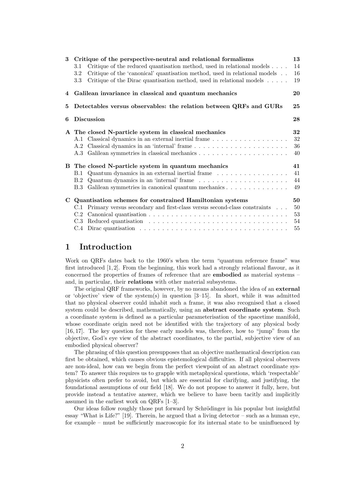
<figcaption class="paper-figure-caption"><b>Fig 1.</b> Low-resolution page preview, page 2</figcaption>
</figure>
<figure class="paper-figure-card">
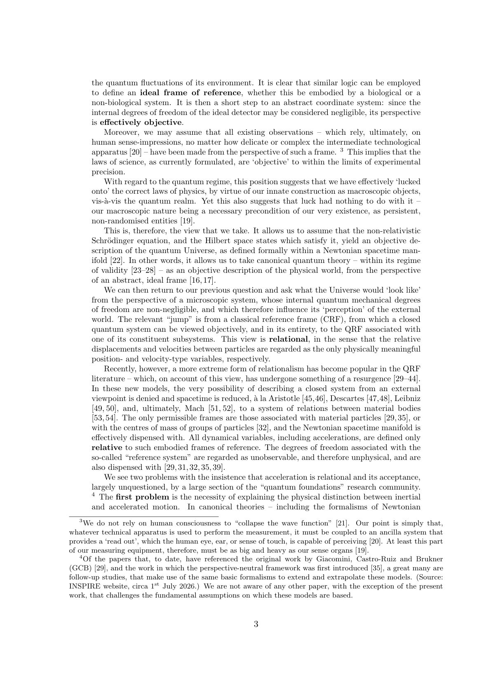
<figcaption class="paper-figure-caption"><b>Fig 2.</b> Low-resolution page preview, page 3</figcaption>
</figure>
<figure class="paper-figure-card">
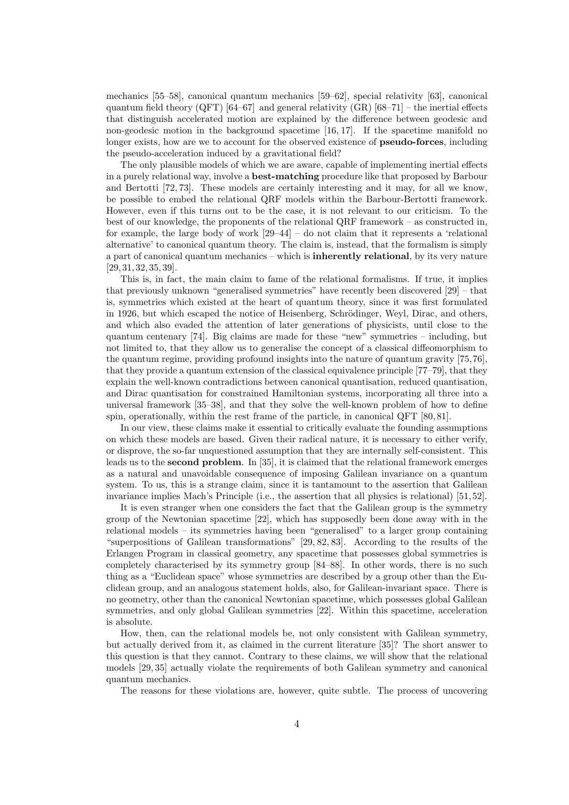
<figcaption class="paper-figure-caption"><b>Fig 3.</b> Low-resolution page preview, page 4</figcaption>
</figure>
<figure class="paper-figure-card">
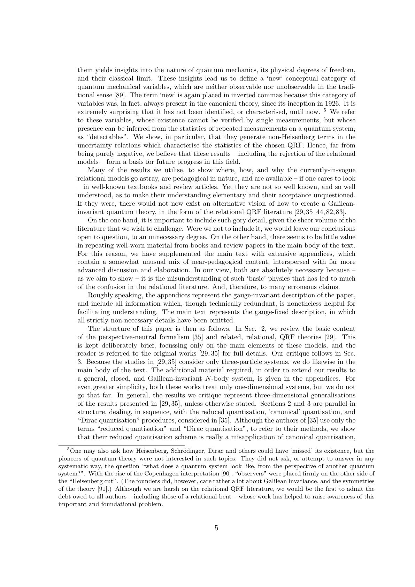
<figcaption class="paper-figure-caption"><b>Fig 4.</b> Low-resolution page preview, page 5</figcaption>
</figure>
<figure class="paper-figure-card">
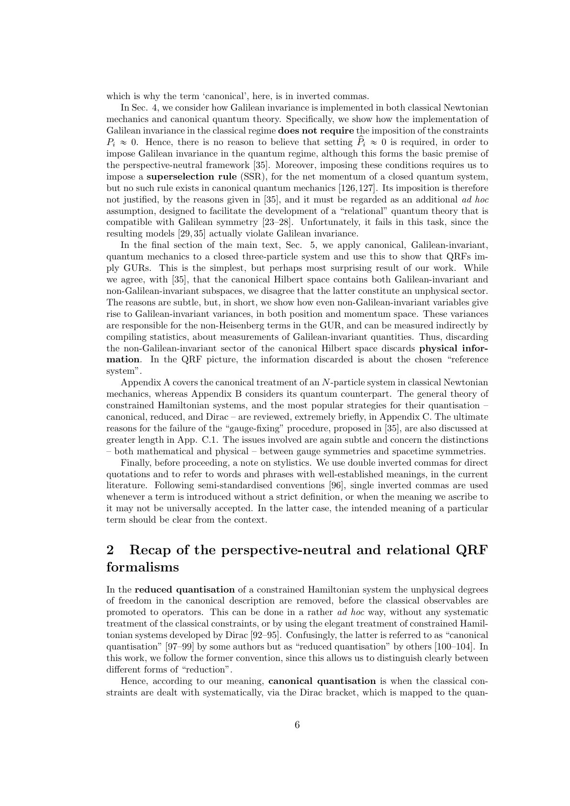
<figcaption class="paper-figure-caption"><b>Fig 5.</b> Low-resolution page preview, page 6</figcaption>
</figure>

**Summary.** This paper tackles the fundamental question of how many physical degrees of freedom describe a quantum N-particle system compared to classical expectations. It demonstrates that in quantum mechanics, constraints fail to eliminate all variables as they do classically, leading to generalized uncertainty relations defining the Quantum Reference Frame. The work critically assesses modern relational models by showing their potential inconsistencies with established symmetries like Galilean invariance.

**Why it may be interesting.** While not directly focused on AMO systems, its deep dive into foundational quantum mechanics, constraints, and reference frames is crucial background knowledge for any advanced theorist working on open quantum systems or quantum gravity where defining a 'physical' observable relative to an observer/frame is paramount.

Detailed structure

**Main problem.** The paper investigates the fundamental discrepancy between classical and quantum descriptions regarding the number of physical degrees of freedom for an N-particle system, particularly concerning constraints imposed by conservation laws.

**Main result.** Unlike classical physics where constraints eliminate unphysical center-of-mass variables, in quantum mechanics all canonical degrees of freedom are considered physical, leading to generalized uncertainty relations (GURs) that define the Quantum Reference Frame (QRF).

**Method.** The authors employ theoretical analysis, contrasting Lagrangian/Hamiltonian formalisms from classical mechanics with advanced quantization procedures and symmetry considerations in quantum theory.

**Model / system.** The system under study is a general N-particle quantum mechanical state. The formalism compares canonical descriptions to those derived from relational models (QRFs) that attempt to eliminate background spacetime dependence.

**Key observables.** Degrees of freedom, Generalized Uncertainty Relations (GURs), and the structure of the Quantum Reference Frame (QRF).

**Important parameters / regimes.** The number of particles N; constraints derived from momentum conservation.

**Assumptions / limitations.** It assumes that a canonical description is possible but critically challenges the assumption in some relational models that all physical dynamics must be purely relational or derivable solely from symmetries like Galilean invariance.

**Paper structure.** The paper first establishes the classical vs. quantum discrepancy regarding degrees of freedom, then critiques existing 'relational QRF models' by testing their consistency with fundamental symmetries (like Galilean invariance), and finally applies canonical theory to derive GURs for the QRF.

Abstract

In Newtonian spacetime, the canonical description of a classical $N$-particle system requires $3N$ degrees of freedom. Not all of these are physical, however, since the conservation of the net momentum implies that only $3(N-1)$ accelerations are independent. Hence, three constraints can be used to eliminate the unphysical centre-of-mass variables, at the level of the Lagrangian, leaving only the subset of observable displacements and momenta, which are relational. Imposing the constraints does not change the dynamics of these variables, at the classical level, and is analogous to a gauge-fixing procedure, which removes redundancy in the description of the system. In classical physics, therefore, the number of physical degrees of freedom equals the number of independent relational degrees of freedom. Here, we show that this is not the case in quantum mechanics. While an operator-analogue of the classical net momentum exists, it cannot be used to impose constraints that restrict the degrees of freedom in the theory, without a loss of physical information. This means that all $3N$ canonical degrees of freedom are physical, even though only $3(N-1)$ of them are relational. We explore the physical consequences of the non-relational variables and show that they give rise to generalised uncertainty relations (GURs), for the relational quantities that define the quantum reference frame (QRF). Hence, it is shown that the non-relational degrees of freedom refer to the frame itself and that the non-Heisenberg terms in the GURs define its Galilean-invariant spreads, in both real space and momentum space. The implications of this result for recent work on relational models, including the ``perspective neutral'' framework for QRFs, are discussed. Its implications for the wider relational program, and, in particular, the relevance of the latter to quantum gravity research, are also critically assessed

[↑ back to top](#top)

### [Richards' equation as a hydrodynamic limit: Chapman--Enskog reduction of the continuum kinetic equation for unsaturated soil water](http://arxiv.org/abs/2607.17358v1)

**Authors:** Riccardo Rigon  
**Type:** theory · **Category:** statistical mechanics · **PDF:** <https://arxiv.org/pdf/2607.17358v1>  
**Analysis basis:** full PDF text, analyzed in chunks
**Topic relevance:** `non-equilibrium dynamics` **2/5** · `non-equilibrium universality` **2/5** · `Keldysh / 2PI / non-Gaussian methods` **1/5** · `analog quantum simulation` **1/5** · `correlated / nonlocal dissipation` **1/5** · `driven-dissipative phase transition` **1/5** · `entanglement & information structure` **1/5** · `methods for driven-dissipative` **1/5**

↔ Scroll figures horizontally

<figure class="paper-figure-card">
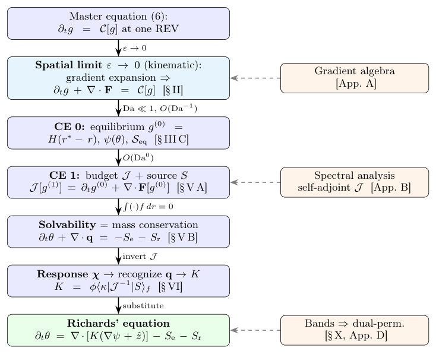
<figcaption class="paper-figure-caption"><b>Fig 1.</b> FIG. 1. The derivation, with the two limits kept separate. The spatial limit (cyan) is kinematic and produces the continuum kinetic equation; the Chapman–Enskog steps (blue) reduce it to Richards’ equation (green). Solid arrows: logical chain; dashed: supporting analysis. Finite-Da band structure branches to dual-/multiple-permeability.</figcaption>
</figure>
<figure class="paper-figure-card">
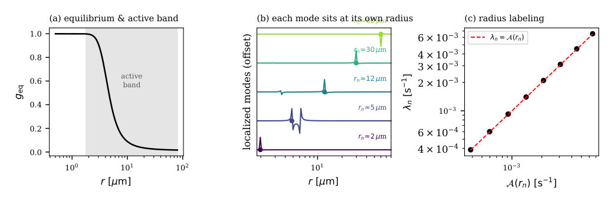
<figcaption class="paper-figure-caption"><b>Fig 2.</b> FIG. 2. The spectral structure behind the conductivity formula (60), computed for a representative log-normal loam (Sup- plemental Material, Sec. S1). (a) Equilibrium filling geq(r) and the active band of partially filled pore classes that carry the redistribution dynamics. (b) Five representative eigenmodes φn of the linearized operator J , offset vertically: each is localized on a single pore class (PRn = 1) and pinned to its own resonant radius rn, so the mode index carries a pore radius. (c) The resulting radius labeling λn ≃A(rn): each decay rate equals the local diagonal loss rate at that modes radius. The conductivity K = ϕ⟨κ|J −1|S⟩f resolves the source on this graded ladder,...</figcaption>
</figure>

**Summary.** This work provides a rigorous derivation of Richards' equation from a mesoscopic kinetic theory describing water flow in soil. It uses the Chapman-Enskog expansion to bridge the gap between microscopic pore dynamics and macroscopic continuum laws. Furthermore, it applies spectral analysis to derive advanced permeability models for structured media directly from connectivity properties.

**Why it may be interesting.** While focused on porous media flow, the mathematical machinery—using spectral analysis (eigenvectors/eigenvalues) to decompose a complex operator into simpler, interacting subsystems (two bands)—is highly analogous to techniques used in quantum many-body physics for modeling coupled quantum systems or domain decomposition in QEC.

Detailed structure

**Main problem.** The paper derives Richards' equation for unsaturated soil water flow by rigorously separating two limits—spatial and temporal—that are often conflated in standard macroscopic theories.

**Main result.** It successfully derives the continuum balance (Richards' equation) from a mesoscopic kinetic description by applying a Chapman-Enskog reduction, providing first-principles derivations for permeability models like dual-permeability.

**Method.** The core methodology involves performing a Chapman-Enskog expansion on a Continuum Kinetic Equation (CKE), which itself is obtained via a gradient expansion (spatial limit) of the pore-filling distribution dynamics.

**Model / system.** The system models unsaturated soil water flow, governed by the evolution of the pore-filling distribution $g(r, x, t)$ within Representative Elementary Volumes (REVs). The analysis extends to bimodal distributions, allowing for spectral decomposition and domain reduction techniques.

**Key observables.** Hydraulic Conductivity ($K$), Water Content ($	heta$), Retention Curve, Inter-domain Exchange Coefficient ($\Gamma_w$).

**Important parameters / regimes.** Damköhler Number (Da), which controls the temporal separation; pore size distribution characteristics (e.g., bimodal gap).

**Assumptions / limitations.** The primary assumptions are that the system can be reduced via a small Damköhler number expansion ($Da \ll 1$) and, in advanced sections, that spectral gaps exist to justify domain decomposition.

**Figures summary.** Figures illustrate the derivation path from CKE $	o$ Richards' equation; spectral analysis shows eigenvalue gaps ($\lambda_1$) confirming the validity of two-domain reductions by showing rate ratios approaching unity as separation increases.

**Paper structure.** The paper follows a multi-stage reduction: first, establishing the CKE via spatial limit; second, applying CE expansion in time to yield Richards' equation and identifying $K$; finally, using spectral theory on bimodal systems to derive inter-domain exchange coefficients from first principles.

Abstract

Richards' equation for unsaturated water flow is derived from the kinetic theory of the pore-filling distribution g(r,x,t) of a companion paper. It separates two limits that macroscopic theory usually conflates. The spatial limit is purely kinematic: contracting the representative elementary volume (REV) to a point yields the closed continuum kinetic equation (CKE) d_t g + div F = C[g], with F a pore-resolved pre-closure flux and C[g] the occupancy-gated redistribution operator. The dynamics lies in the temporal limit, the subject of this paper: a Chapman-Enskog (CE) reduction of the CKE controlled by the Damkohler number Da (redistribution time over forcing time), the structural analogue of the passage from Boltzmann to Navier-Stokes. The linearized redistribution operator J is self-adjoint and negative semidefinite in the mass inner product, with a one-dimensional kernel fixing a single invariant (water) and hence one macroscopic equation; the CE hierarchy inverts the same J at every order, only the source changing. Four results follow: the equilibrium step defines the retention curve; the linearized water budget plus the inter-REV source set the first-order equation; its solvability is mass conservation, i.e. Richards' equation; and the response function gives the macroscopic flux, identifying the conductivity K as a first-order transport coefficient, the counterpart of viscosity. Mean-field reduction recovers the standard integral formula; the serial-path correction gives Mualem's heterogeneity penalty. A bimodal pore-size distribution opens a gap in the relaxation spectrum; projecting onto the bands and applying CE within each, with cross-band relaxation surviving at O(1), derives the dual- and multiple-permeability models from first principles, the exchange coefficient set by inter-band connectivity. When Da is not small the expansion breaks down and the full CKE is needed.

[↑ back to top](#top)

### [The Dimension of Nonterminating Resampling Computations](http://arxiv.org/abs/2607.17469v1)

**Authors:** Yunbei Xu  
**Type:** theory · **Category:** statistical mechanics · **PDF:** <https://arxiv.org/pdf/2607.17469v1>  
**Analysis basis:** full PDF text, analyzed in chunks
**Topic relevance:** `entanglement & information structure` **2/5** · `non-equilibrium dynamics` **2/5** · `non-equilibrium universality` **2/5** · `Keldysh / 2PI / non-Gaussian methods` **1/5** · `correlated / nonlocal dissipation` **1/5** · `driven-dissipative phase transition` **1/5** · `methods for driven-dissipative` **1/5**

↔ Scroll figures horizontally

<figure class="paper-figure-card">
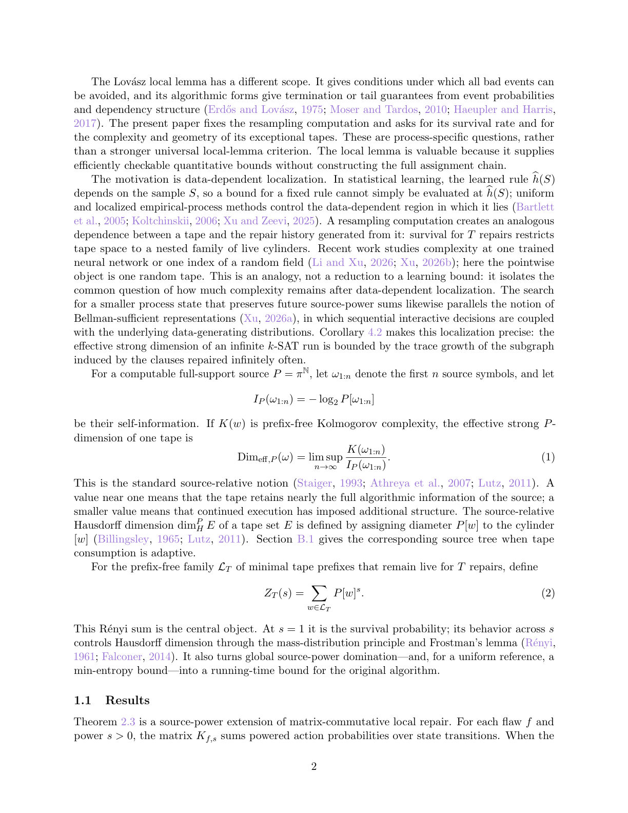
<figcaption class="paper-figure-caption"><b>Fig 1.</b> Low-resolution page preview, page 2</figcaption>
</figure>
<figure class="paper-figure-card">
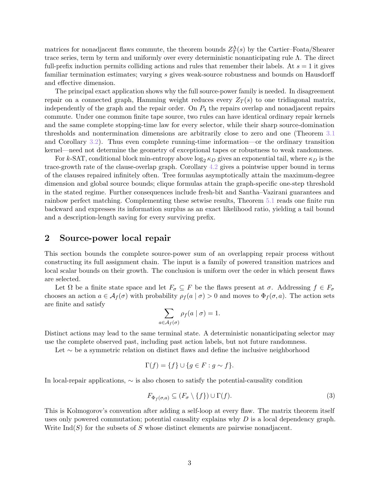
<figcaption class="paper-figure-caption"><b>Fig 2.</b> Low-resolution page preview, page 3</figcaption>
</figure>
<figure class="paper-figure-card">
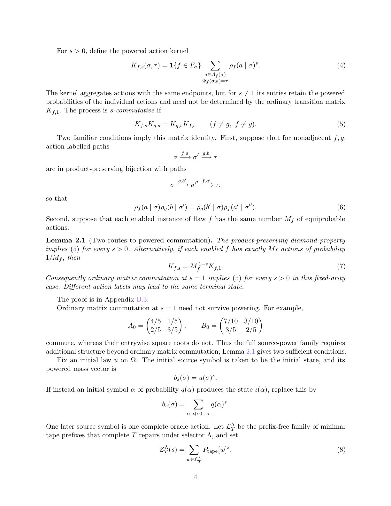
<figcaption class="paper-figure-caption"><b>Fig 3.</b> Low-resolution page preview, page 4</figcaption>
</figure>
<figure class="paper-figure-card">
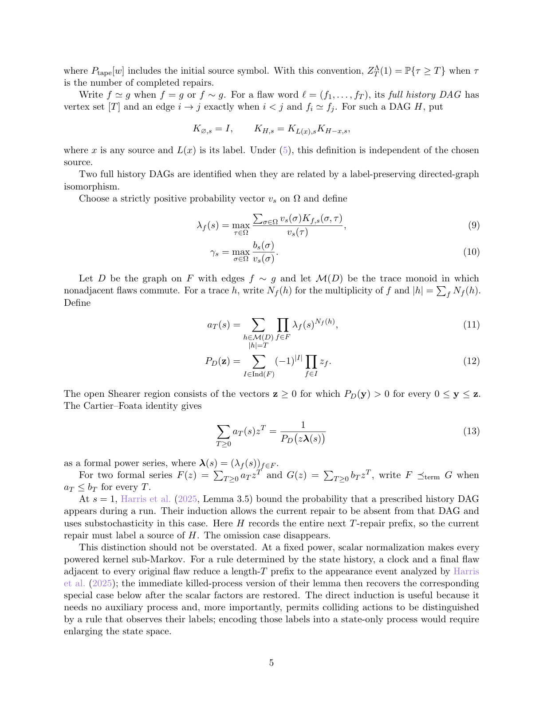
<figcaption class="paper-figure-caption"><b>Fig 4.</b> Low-resolution page preview, page 5</figcaption>
</figure>
<figure class="paper-figure-card">
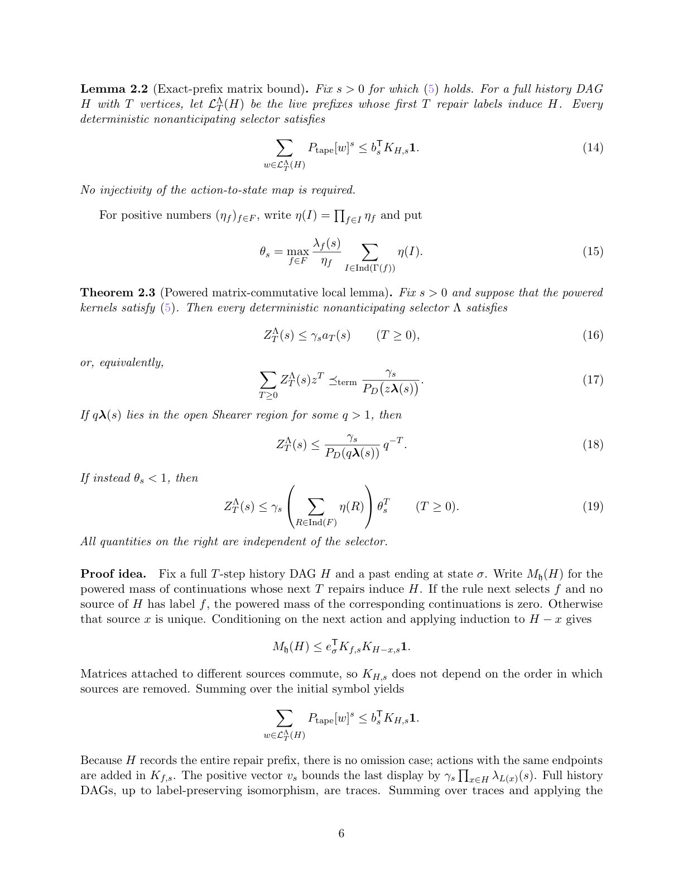
<figcaption class="paper-figure-caption"><b>Fig 5.</b> Low-resolution page preview, page 6</figcaption>
</figure>

**Summary.** This paper rigorously analyzes the mathematical properties—specifically the Hausdorff dimension and survival tail—of computational histories that run forever despite being almost surely terminating. It achieves this by developing powerful bounds on source-power sums using matrix theory, demonstrating how subtle differences in local rules can lead to vastly different global nontermination behaviors.

**Why it may be interesting.** While highly abstract, the rigorous mathematical framework developed for bounding complexity and dimension in infinite random processes has parallels with analyzing long-time behavior or rare events in non-equilibrium statistical mechanics systems.

Detailed structure

**Main problem.** The paper studies the survival tail, Kolmogorov complexity, and Hausdorff dimension of exceptional random tapes for randomized algorithms that are guaranteed to terminate almost surely.

**Main result.** It establishes bounds on source-power sums ($Z_{\Lambda}^T(s)$) using matrix commutation properties, showing that nontermination dimensions can differ drastically even when ordinary kernels match.

**Method.** The analysis employs advanced tools from information theory and probability, including Rényi entropy sums, powered action matrices, and dimension calculations derived from source-power bounds.

**Model / system.** The model is a randomized computation process defined by a source law $P$ on the tape $\omega$, focusing on the set of tapes where the repair process never stops ($	au(\omega) = \infty$).

**Key observables.** Survival tail ($P\{	au \geq T\}$), Source-power sum ($Z_{\Lambda}^T(s)$), Effective dimension ($	ext{Dimeff},_P(\omega)$), and Hausdorff dimension.

**Important parameters / regimes.** The exponent $s$ (where $s=1$ controls termination) and structural parameters related to the underlying computation graph or source law are critical.

**Assumptions / limitations.** The analysis requires specific structural conditions, such as powered action matrices commuting for certain values of $s$, and relies on definitions involving 'source-power domination'.

**Figures summary.** Not specified in the notes; the focus is on mathematical theorems and derived bounds.

**Paper structure.** The paper develops results by first defining the survival tail and source-power sums, then using matrix commutation properties (Theorem 2.3) to bound these sums for various $s$. It applies these general tools to specific problems like k-SAT and provides exact likelihood ratio identities for finite runs.

Abstract

A randomized algorithm may terminate almost surely even though exceptional random tapes make it run forever. This paper studies the survival tail, the Kolmogorov complexity of one such tape, and the Hausdorff dimension of all of them. For each $s>0$ at which the powered repair matrices commute, the main theorem bounds $\sum_wP[w]^s$ over surviving prefixes $w$, uniformly over deterministic nonanticipating selectors. The case $s=1$ controls termination; the full family gives weak-source and dimension bounds.   The source powers contain information absent even from the ordinary repair kernel and the complete stopping-time law. Under one common finite tape source, two overlapping disagreement-repair rules on a four-vertex path have the same ordinary kernels and the same stopping-time law for every selector, yet their nontermination dimensions can be arbitrarily close to zero and one. At one common source-power level, the same dominated tape source makes one rule run forever but gives the other an exponential stopping tail. The separation is caused by action labels that produce the same state transition and are therefore invisible at power one. For bounded-dependence $k$-SAT, conditional block min-entropy above the trace-growth threshold gives exponential termination, and the effective dimension of an individual infinite run is bounded by the trace growth induced by the clauses repaired infinitely often. Tree formulas asymptotically attain the maximum-degree dimension and global source bounds, while clique formulas attain the graph-specific one-step threshold in the stated regime. An exact backward likelihood identity complements these setwise results with tail and coding bounds for each run.

[↑ back to top](#top)

### [Quantum Metrological Detection of the Unruh Effect with Optimized Accelerated Two-Level Atoms](http://arxiv.org/abs/2607.16701v1)

**Authors:** Yao Jin  
**Type:** theory · **Category:** other · **PDF:** <https://arxiv.org/pdf/2607.16701v1>  
**Analysis basis:** full PDF text, analyzed in chunks
**Topic relevance:** `quantum measurements` **2/5** · `Keldysh / 2PI / non-Gaussian methods` **1/5** · `analog quantum simulation` **1/5** · `correlated / nonlocal dissipation` **1/5** · `driven-dissipative phase transition` **1/5** · `entanglement & information structure` **1/5** · `methods for driven-dissipative` **1/5** · `non-equilibrium dynamics` **1/5**

↔ Scroll figures horizontally

<figure class="paper-figure-card">
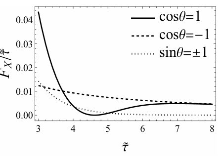
<figcaption class="paper-figure-caption"><b>Fig 1.</b> FIG. 1: FX/eτ as a function of eτ in cases with initial states cos θ = 1, cos θ = −1 and</figcaption>
</figure>
<figure class="paper-figure-card">
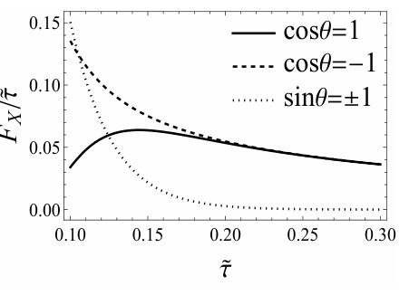
<figcaption class="paper-figure-caption"><b>Fig 2.</b> FIG. 2: FX/eτ as a function of eτ in cases with initial states cos θ = 1, cos θ = −1 and</figcaption>
</figure>
<figure class="paper-figure-card">
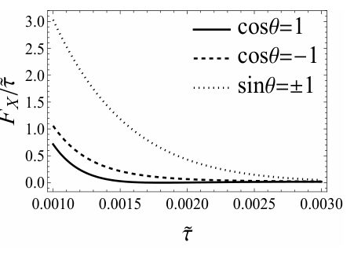
<figcaption class="paper-figure-caption"><b>Fig 3.</b> FIG. 3: FX/eτ as a function of eτ in cases with initial states cos θ = 1, cos θ = −1 and</figcaption>
</figure>
<figure class="paper-figure-card">
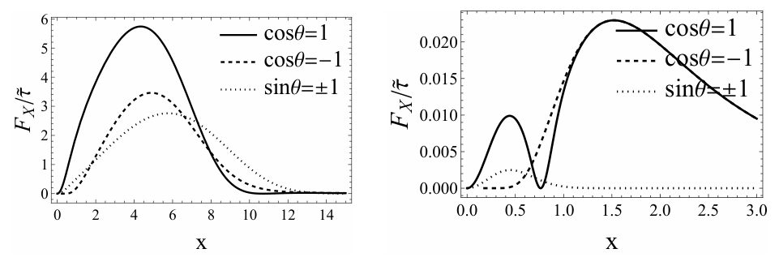
<figcaption class="paper-figure-caption"><b>Fig 4.</b> FIG. 4: FX/eτ as a function of X for initial states cos θ = 1, cos θ = −1, and sin θ = ±1,</figcaption>
</figure>

**Summary.** The paper develops a theoretical framework to detect the Unruh effect by measuring acceleration-dependent effects on an atom. It optimizes measurement parameters—including probe time and initial state—to minimize the uncertainty in estimating the acceleration factor. The results show that careful optimization can significantly reduce the required experimental time, suggesting feasibility with advanced atomic systems.

**Why it may be interesting.** This work provides a detailed roadmap for experimental verification of fundamental QFT predictions (Unruh effect) using controllable quantum systems like trapped atoms, combining advanced concepts from open quantum systems and metrology.

Detailed structure

**Main problem.** The paper addresses the quantum metrological detection of the Unruh effect, which involves verifying acceleration-dependent modifications predicted by quantum field theory for uniformly accelerated observers.

**Main result.** The minimal uncertainty in estimating the acceleration factor can be significantly reduced by optimizing the individual probe interaction time and utilizing atoms with larger transition dipole moments. The optimal initial state depends critically on whether the acceleration is small or large.

**Method.** Quantum metrology principles are applied to bound the estimation uncertainty using the Fisher information, requiring optimization over the probe evolution time, initial atomic state, and measurement basis.

**Model / system.** The system involves a two-level probe atom coupled to the vacuum electromagnetic field while undergoing uniform acceleration. The dynamics are modeled using an effective Hamiltonian derived from the multipolar coupling scheme.

**Key observables.** Minimal estimation uncertainty ($	ext{Var}(X)$) of the acceleration factor ($X = a/(c\omega_0)$), and the Fisher information ($F_X$).

**Important parameters / regimes.** Acceleration factor $X$, individual probe evolution time $	au$, total probe time $T$, initial atomic state parameters ($\cos	heta, \sin	heta$), and transition dipole moments.

**Assumptions / limitations.** The analysis assumes the electromagnetic field is initially in a vacuum state (inertial observer frame) and utilizes weak coupling approximations for the density matrix evolution.

**Figures summary.** Figures 1-3 show optimized quantities ($F_X/\epsilon_	au$) versus $\epsilon_	au^{-1}$ for various initial states at fixed accelerations. Figure 4 shows this ratio dependence on $X$ for fixed probe times, illustrating optimal parameter choices.

**Paper structure.** The paper first establishes the theoretical framework using quantum metrology bounds and then systematically optimizes the estimation uncertainty by varying the individual probe time ($	au$), initial state, and measurement basis across different acceleration regimes ($X=0.8, 5, 20$).

Abstract

For a uniformly accelerated two-level probe atom, the acceleration-dependent factor is encoded in the atomic state during the atom-field evolution. If this factor can be estimated through a large number of measurements with an uncertainty smaller than its magnitude, the Unruh effect can be experimentally verified. In this work, we show that the minimal uncertainty is inversely proportional to the square root of the total probe time. For a fixed total probe time, we minimize the estimation uncertainty by optimizing the atom-field interaction time, the initial atomic state, and the measurement basis in each probe. Results show that the uncertainty decreases as the evolution time of each individual probe becomes shorter. The optimal measurement basis is determined by the initial atomic state, while the optimal initial state depends on both the acceleration factor and the evolution time of each probe. For a fixed evolution time, we analyze the estimation uncertainty versus the acceleration factor and identify the optimal factor and minimal uncertainty for each initial state. The initial excited state outperforms other configurations in the small-acceleration regime, whereas the ground state can become advantageous for sufficiently large acceleration and long evolution time of each probe. Finally, we estimate the minimal total probe time required for testing the Unruh effect and demonstrate that it can be significantly reduced by using probe atoms with larger transition dipole moments.

[↑ back to top](#top)

### [Statistical-mechanics of a three-body Hopfield model with finite connectivity](http://arxiv.org/abs/2607.17234v1)

**Authors:** Yushi Sugawara, Koji Hukushima  
**Type:** theory · **Category:** disordered systems and neural networks · **PDF:** <https://arxiv.org/pdf/2607.17234v1>  
**Analysis basis:** full PDF text, analyzed in chunks
**Topic relevance:** `Keldysh / 2PI / non-Gaussian methods` **2/5** · `analog quantum simulation` **1/5** · `driven-dissipative phase transition` **1/5** · `entanglement & information structure` **1/5** · `exotic spin models in light-matter` **1/5** · `methods for driven-dissipative` **1/5** · `non-equilibrium dynamics` **1/5** · `non-equilibrium universality` **1/5**

↔ Scroll figures horizontally

<figure class="paper-figure-card">
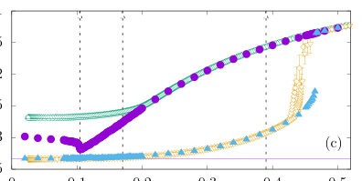
<figcaption class="paper-figure-caption"><b>Fig 1.</b> FIG. 1. Temperature dependence of the macroscopic quanti- ties for the three-body sparse Hopfield model with c = 10 and P = 2 (α = 0.2). The panels display, from top to bottom, the overlap magnetization mµ, the spin-glass (SG) order param- eter q, and the internal energy density e. The filled symbols represent the replica-symmetric (RS) solutions obtained by population dynamics initialized from the paramagnetic state (circles) and the ordered retrieval state (triangles). For com- parison, microscopic simulation results obtained via popula- tion annealing (PA) for finite system sizes (N = 1024 and N = 2048) are plotted for both the cooling (open circles) and heating (open triangles)...</figcaption>
</figure>
<figure class="paper-figure-card">
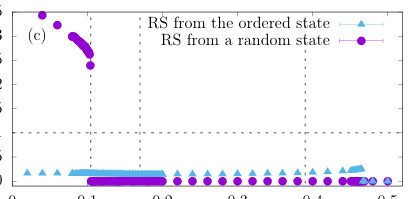
<figcaption class="paper-figure-caption"><b>Fig 2.</b> FIG. 2. Temperature dependence of the thermodynamic quantities obtained from the replica-symmetric (RS) popu- lation dynamics for the three-body sparse Hopfield model with c = 10 and P = 2. The three panels display, from top to bottom, the free energy density fRS, the entropy density eRS −fRS = TsRS, and the local stability measure λAT. The filled symbols represent the RS solutions initialized from the paramagnetic state (circles) and the ordered retrieval state (triangles). The vertical dashed lines indicate, from left to right, T RS SG , Ts=0 and Tc, where T RS SG is the onset tempera- ture of the RS SG fixed point, Ts=0 is the temperature below which the RS entropy becomes negative, and...</figcaption>
</figure>
<figure class="paper-figure-card">
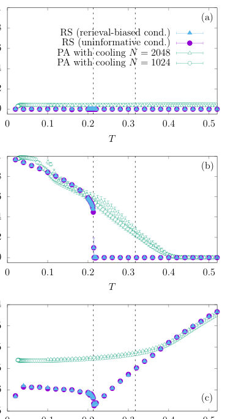
<figcaption class="paper-figure-caption"><b>Fig 3.</b> FIG. 3. Temperature dependence of the macroscopic quanti- ties for the three-body sparse Hopfield model with c = 10 and P = 8 (α = 0.8). The panels display, from top to bottom, the overlap magnetization mµ, the spin-glass (SG) order param- eter q, and the internal energy density e. The filled symbols denote the replica-symmetric (RS) solution, while the open symbols represent the microscopic PA simulation results for comparison. The vertical lines represent, from left to right, T RS SG and Ts=0.</figcaption>
</figure>
<figure class="paper-figure-card">
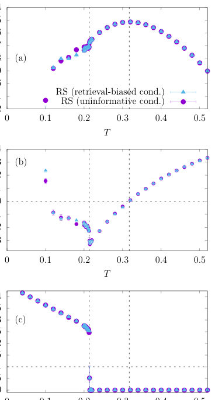
<figcaption class="paper-figure-caption"><b>Fig 4.</b> FIG. 4. Temperature dependence of the thermodynamic quantities obtained from the replica-symmetric (RS) popula- tion dynamics for the three-body sparse Hopfield model with c = 10 and P = 8. The panels display, from top to bottom, the free-energy density fRS, the entropy density sRS, and the local stability measure λAT. The vertical lines represent, from left to right, T RS SG and Ts=0.</figcaption>
</figure>
<figure class="paper-figure-card">
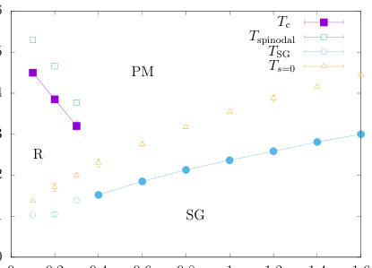
<figcaption class="paper-figure-caption"><b>Fig 5.</b> FIG. 5. Phase diagram of the three-body sparse Hopfield model for fixed mean connectivity c = 10 on the α −T plane. The filled squares denote the first-order transition temper- ature Tc between the paramagnetic (PM) and retrieval (R) phases. The open squares indicate the upper spinodal tem- perature Tspinodal of the retrieval state. The circles represent the spin-glass (SG) transition temperature TSG, at which a nontrivial SG solution appears in the PD analysis. The open triangles show the temperature Ts=0 at which the entropy of the RS solution becomes negative, indicating the breakdown of the RS description of the glassy branch.</figcaption>
</figure>

**Summary.** This paper analyzes a three-body Hopfield model on sparse random graphs using advanced replica methods. It finds that three-body interactions fundamentally alter the memory retrieval process, causing discontinuous transitions and robust glassy trapping behavior. The work clarifies how both many-body complexity and graph sparsity govern the system's storage capacity.

**Why it may be interesting.** While focused on classical neural networks, the analysis of phase transitions, glassy dynamics, and mean-field approximations in disordered systems provides methodological parallels to understanding complex quantum many-body ground states or optimization problems in quantum computing.

Detailed structure

**Main problem.** The study investigates the statistical mechanics of a three-body Hopfield model defined on sparse random graphs with finite mean connectivity.

**Main result.** Three-body interactions induce a discontinuous retrieval transition, leading to a spin-glass-like trapping mechanism at low temperatures that is distinct from conventional two-body models.

**Method.** The analysis employs the replica-symmetric (RS) functional framework combined with Population Dynamics (PD) for self-consistent equation solving, complemented by finite-size Monte Carlo simulations.

**Model / system.** The model is a three-body Hopfield network described by a Hamiltonian involving three-spin couplings ($J_{ijk}$) on sparse random graphs. The system's behavior is characterized by the interplay between many-body interactions and graph disorder.

**Key observables.** Local-field distribution $W_\xi(h)$, retrieval order parameter, spin-glass overlap $q$, and characteristic storage load $\alpha$.

**Important parameters / regimes.** Mean connectivity ($c=O(1)$), number of patterns ($P$), normalized load ($\alpha = P/c$), and temperature/inverse temperature ($eta$).

**Assumptions / limitations.** The primary analytical tool relies on the Replica Symmetric (RS) ansatz, which is acknowledged to break down in the low-temperature glassy regime.

**Figures summary.** Figure 6 illustrates the mean-connectivity dependence of critical load parameters ($\alpha_1$ and $\alpha_2$), showing that storage capacity scales linearly with connectivity ($P \propto c$).

**Paper structure.** The paper follows a structure: model introduction, free energy evaluation via replica method using functional integrals, solving self-consistent equations via Population Dynamics (PD), comparison with Monte Carlo simulations, and final discussion on the implications of many-body effects.

Abstract

A three-body Hopfield model defined on sparse random graphs with finite mean connectivity is studied using a replica-symmetric (RS) analysis. By extending the functional replica framework for conventional two-body finite-connectivity Hopfield models, self-consistent equations for the local-field distribution are derived and solved numerically by population dynamics. In contrast to two-body sparse Hopfield models, three-body interactions induce a discontinuous retrieval transition, coexistence of paramagnetic and retrieval solutions, and a distinct spinodal structure. Starting the RS population dynamics from an uninformative finite-amplitude field distribution leads to a spin-glass-like fixed point at low temperatures rather than to the retrieval state. This trapping already occurs for a single embedded pattern, where conventional cross-talk noise among stored patterns is absent, indicating that it originates from the combination of sparse connectivity and three-body interactions. Within the RS description, increasing the number of embedded patterns drives a crossing between the retrieval and glassy free-energy branches, making the glassy branch thermodynamically stable at high load. Finite-size Monte Carlo simulations using population annealing support the RS description of the retrieval branch and reproduce the trapping behavior under cooling, while deviations from the RS spin-glass branch point to replica-symmetry breaking in the low-temperature glassy regime. The characteristic storage load scales linearly with the mean connectivity, reflecting the sparse number of couplings. These results clarify how many-body discontinuity and sparse graph disorder simultaneously influence the accessibility and capacity of associative memory.

[↑ back to top](#top)

### [Adverse Selection with Quality Variance: A Maximum-Entropy Approach](http://arxiv.org/abs/2607.17239v1)

**Authors:** Zhi-Lei Zhang, Tan-Ji Zhou, C. P. Sun  
**Type:** theory · **Category:** statistical mechanics · **PDF:** <https://arxiv.org/pdf/2607.17239v1>  
**Analysis basis:** full PDF text, analyzed in chunks
**Topic relevance:** `non-equilibrium dynamics` **2/5** · `non-equilibrium universality` **2/5** · `Keldysh / 2PI / non-Gaussian methods` **1/5** · `correlated / nonlocal dissipation` **1/5** · `driven-dissipative phase transition` **1/5** · `methods for driven-dissipative` **1/5**

↔ Scroll figures horizontally

<figure class="paper-figure-card">
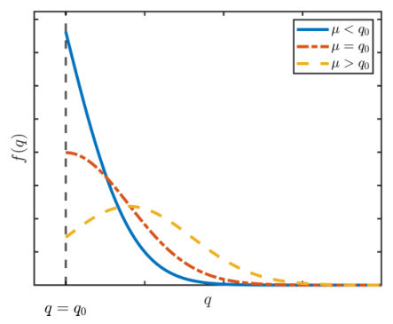
<figcaption class="paper-figure-caption"><b>Fig 1.</b> Figure 1: Truncated-Gaussian benchmark distributions for different positions of 𝜇relative to the minimum quality floor 𝑞0. The three cases show how the local mass near the floor changes when the same support is used.</figcaption>
</figure>
<figure class="paper-figure-card">
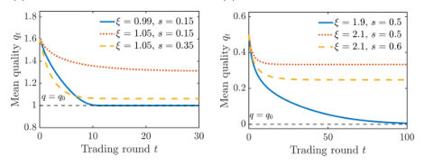
<figcaption class="paper-figure-caption"><b>Fig 2.</b> Figure 2: Mean-quality dynamics under the truncated-Gaussian benchmark. Panel (a) shows the case with a positive minimum quality floor, 𝑞0 = 1, initial mean quality ̄𝑞0 = 1.60. Panel (b) shows the case without a positive floor, 𝑞0 = 0, initial mean quality ̄𝑞0 = 0.50.</figcaption>
</figure>

**Summary.** This paper develops a statistical approach to model adverse selection, treating market quality deterioration as a dynamic truncation of the underlying quality distribution. It determines critical conditions based on buyer payment rates and initial quality variance required to prevent the market from collapsing entirely. The findings offer insights into how interventions can stabilize imperfect markets.

**Why it may be interesting.** While applied to economics, the mathematical framework of sequential conditional distribution updates and stability analysis under constraints (truncation) shares formal parallels with non-equilibrium statistical mechanics models involving filtering or boundary effects in quantum systems.

Detailed structure

**Main problem.** The paper analyzes adverse selection in markets driven by asymmetric information, which causes market deterioration by eliminating high-quality goods.

**Main result.** It establishes conditions (related to the payment rate $\xi$ and minimum quality floor $q_0$) necessary to prevent complete market collapse, showing that variance and price premium jointly determine the speed of deterioration.

**Method.** The analysis models the process as a dynamic truncation of the underlying quality distribution, using recursion relations derived from conditional probability distributions.

**Model / system.** The system is an economic model where buyers set an upper bound ($b_t = \xi ar{q}_t$) on payment, causing sellers with quality $q > b_t$ to exit. The market state evolves by retaining the conditional distribution of quality.

**Key observables.** Mean market quality ($ar{q}_t$), retained-market variance ($\sigma^2_{t+1}$), and the price premium ($a_t$).

**Important parameters / regimes.** The payment rate $\xi$, the underlying quality variance parameter ($s^2$), and the minimum quality floor ($q_0$).

**Assumptions / limitations.** The market deterioration path is assumed to be monotone ($ar{q}_{t+1} < ar{q}_t$); the analysis uses maximum-entropy principles for benchmark distributions.

**Figures summary.** Figures illustrate mean-quality dynamics showing convergence to a stable platform when $\xi > \xi_c$, and demonstrate market collapse versus avoidance based on whether a positive floor exists (comparing $\xi < 2$ vs. $\xi > 2$).

**Paper structure.** The paper first defines the dynamic truncation process, derives bounds on mean quality decline using variance and price premium, then uses maximum-entropy methods to find benchmark distributions, and finally discusses implications for market interventions.

Abstract

The adverse-selection mechanism in markets explains how asymmetric information between buyers and sellers can drive high-quality goods out of the market, thereby causing market deterioration. In its simplest formulation, only the mean quality is used to describe the market, and this is insufficient to determine how fast the market deteriorates or how the quality distribution evolves. To resolve the two problems, we describe the adverse selection as a dynamic truncation of the quality distribution: buyers set an upper bound proportional to the mean quality by a rate $ξ$ that is larger than unity, and sellers whose quality exceeds this upper bound reject an offer and exit the market. The retained market is then characterized by the conditional distribution obtained after this truncation, and the corresponding evolution process is iterated until market quality reaches a stable state. This statistical approach gives three results. (i) We identify a mechanism for preventing complete adverse selection, defined as the process where the quality of the market is driven down to the minimum quality floor. (ii) A larger quality variance or a smaller price premium, defined as the amount by which the payment upper bound exceeds the current mean quality, raises the upper bound on the deterioration in mean quality. (iii) A maximum-entropy benchmark shows numerically how quality variance and the payment rate jointly determine market deterioration and the final stable quality platform. This approach also clarifies how market interventions can slow adverse selection: they may raise buyers' payment rate, reduce quality variance, or increase the minimum quality floor.

[↑ back to top](#top)

### [Exponential Reduction of Mesh Dependence in Quantum Estimation of Parabolic PDE Observables](http://arxiv.org/abs/2607.18113v1)

**Authors:** Xiantao Li  
**Type:** theory · **Category:** quantum information and computing · **PDF:** <https://arxiv.org/pdf/2607.18113v1>  
**Analysis basis:** full PDF text, analyzed in chunks
**Topic relevance:** `analog quantum simulation` **2/5** · `non-equilibrium dynamics` **2/5** · `Keldysh / 2PI / non-Gaussian methods` **1/5** · `correlated / nonlocal dissipation` **1/5** · `driven-dissipative phase transition` **1/5** · `methods for driven-dissipative` **1/5**

↔ Scroll figures horizontally

<figure class="paper-figure-card">
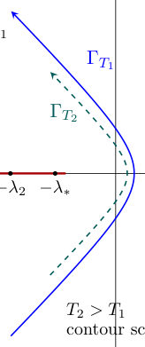
<figcaption class="paper-figure-caption"><b>Fig 1.</b> Figure 1: Schematic hyperbolic contours for the inverse-Laplace representation. The contour ΓT intersects the positive real axis and its tails extend into the second and third quadrants. Increasing the target time contracts the contour by the factor T −1.</figcaption>
</figure>

**Summary.** The paper presents a novel multilevel quantum algorithm to estimate observables derived from parabolic Partial Differential Equations. It successfully overcomes the major bottleneck of classical and direct quantum methods: the polynomial dependence on the fine spatial mesh size ($h^{-1}$). By coherently encoding fine-to-coarse level differences, it achieves an exponential reduction in complexity with respect to $h^{-1}$.

**Why it may be interesting.** This work directly addresses simulating time evolution governed by PDEs (like heat diffusion) on quantum hardware, which is crucial for modeling open quantum systems or thermalization processes in condensed matter theory.

Detailed structure

**Main problem.** To develop a quantum algorithm that estimates observables related to Parabolic PDEs without incurring a computational cost polynomial in the inverse of the spatial mesh size ($h^{-1}$).

**Main result.** A multilevel quantum algorithm is developed that achieves an end-to-end complexity independent of the finest mesh size, scaling as $\widetilde{\mathcal O}(1+(T\epsilon)^{-1})$ with only polylogarithmic dependence on $h^{-1}$.

**Method.** The core technique involves using a multilevel estimator based on encoding the fine–coarse cancellation within a shifted Ritz–Schur factorization to avoid direct block encoding of high-resolution operators.

**Model / system.** The model is the heat equation ($\partial_t u + L u = 0$) solved via finite element discretization, leading to a semi-discrete linear ODE system $\dot{\mathbf{y}}_h = -L_h \mathbf{y}_h$. The analysis covers both direct semigroup estimation and multilevel correction.

**Key observables.** Linear and quadratic observables of the solution operator, such as regional average heat content or local mass flux ($\chi=0, 1, 2$).

**Important parameters / regimes.** Target time $T$, desired accuracy $\epsilon$, and mesh size $h$. The complexity is shown to be independent of readout order $\chi$ for low-order derivatives.

**Assumptions / limitations.** The method relies on specific access assumptions regarding the block encoding of shifted Ritz maps, and the analysis uses Galerkin approximation theory results for error bounding.

**Figures summary.** Not specified in the notes; the structure is based on comparing complexity costs across different estimation methods (LMS vs. direct semigroup vs. corrected-resolvent).

**Paper structure.** The paper first establishes the problem of mesh dependence in quantum PDE algorithms, then introduces and analyzes a multilevel estimator using shifted Ritz–Schur factorization to coherently place fine–coarse cancellation before measurement.

Abstract

Can a quantum PDE algorithm avoid the polynomial cost of resolving a fine spatial mesh? For standard fixed-order discretizations, direct classical methods require work polynomial in $h^{-1}$, or equivalently in the number of spatial degrees of freedom $N_h=Θ(h^{-d})$. Direct quantum implementations of a parabolic semigroup still have coherent complexity $\widetilde{\mathcal O}(\sqrt{T}/h)$, and gradient-dependent observables such as heat flux and dissipation introduce additional mesh dependence. Decay of the solution norm will further suppress the postselection probability for preparing a normalized final state.   We develop a multilevel quantum algorithm that estimates linear and quadratic observables $directly$ and places the fine--coarse cancellation inside the circuit before measurement. A contour-based LCU reconstructs each target-time correction from a coherent family of shifted resolvent differences. Rather than block encoding the fine and coarse inverses separately, we encode their difference through a shifted Ritz--Schur factorization, exposing its $\mathcal O(h_\ell^2)$ two-grid normalization. For Fourier hierarchies, the corresponding SELECT oracle consists of a quantum Fourier or sine transform, a spectral-band selector, and reversible diagonal arithmetic. We also give a non-Fourier realization based on energy-orthogonal dyadic midpoint details in one dimension, together with structured tensor-product extensions under fixed-rank coefficient and access assumptions.   For readouts with derivative order $0\leχ\le2$, optimized amplitude estimation removes $all$ polynomial dependence on the finest mesh size. Under the stated access assumptions, both linear and quadratic observables can be estimated with complexity $\widetilde{\mathcal O}(1+(Tε)^{-1})$, with only polylogarithmic dependence on $h^{-1}$.

[↑ back to top](#top)

### [Foundry CMOS platform for multimodal quantum materials characterization](http://arxiv.org/abs/2607.18059v1)

**Authors:** Sharad Kumar Yadav, Luca Nessi, Ondrej Dyck, Jinchen Wang, Bogdan Dryzhakov, Alex Melendez, Huan Zhao, Qian Song, Doha Amer, Cole Brabec, Saleh Alqazlan, Ruonan Han, Riccardo Comin, Stephen Jesse, Dirk Englund, Jawaher Almutlaq  
**Type:** experiment · **Category:** other · **PDF:** <https://arxiv.org/pdf/2607.18059v1>  
**Analysis basis:** full PDF text, analyzed in chunks
**Topic relevance:** `QC/QI experiment` **2/5** · `quantum measurements` **2/5** · `analog quantum simulation` **1/5** · `measurement-induced transitions` **1/5** · `spintronics-quantum-optics interface` **1/5**

↔ Scroll figures horizontally

<figure class="paper-figure-card">
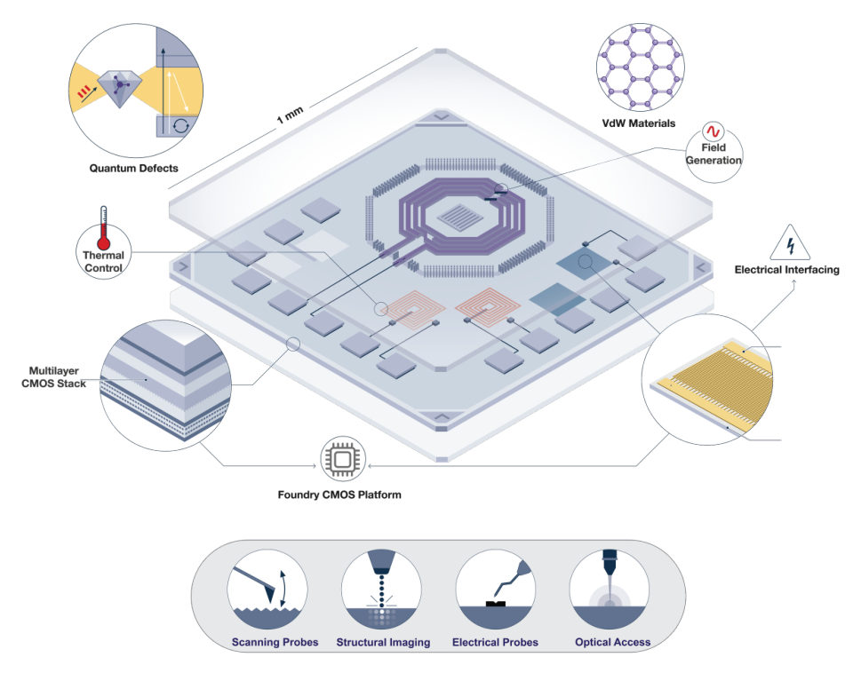
<figcaption class="paper-figure-caption"><b>Fig 1.</b> Figure 1: Foundry-fabricated CMOS platform for multimodal materials characterization. Schematic illustration of the CMOS-integrated platform implemented in a commercial semiconductor pro- cess. The architecture supports the heterogeneous integration and multimodal characterization of quantum materials. Insets highlight key platform components, including the integrated RF inductor, resistive heater, interdigitated electrodes (IDE), layered quantum materials integrated onto the chip surface, and the un- derlying CMOS stack. The bottom panel summarizes representative characterization modalities enabled by the platform, including scanning-probe measurements, structural imaging, electrical...</figcaption>
</figure>
<figure class="paper-figure-card">
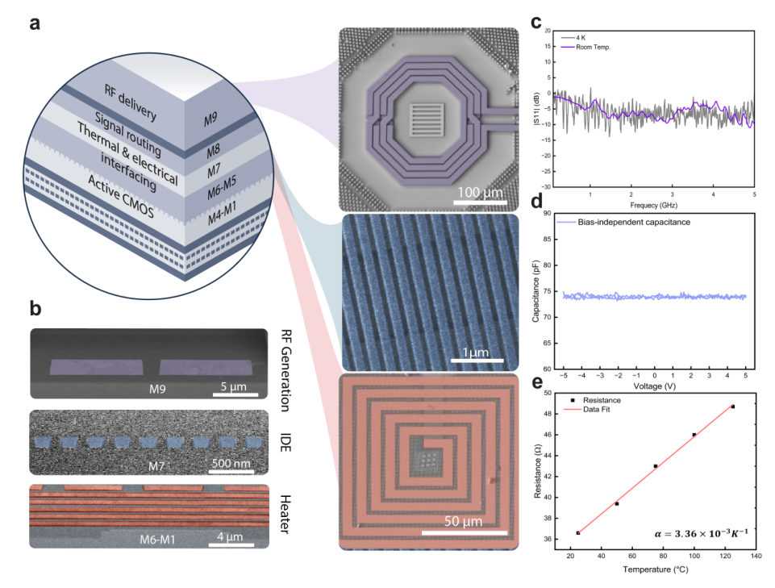
<figcaption class="paper-figure-caption"><b>Fig 2.</b> Figure 2: Fabricated CMOS-integrated platform: architecture and subsystem characterization. (a) Schematic of the layered chip stack and corresponding functional partitioning of the CMOS metal layers, together with false-colored SEM images of the realized structures: the octagonal RF inductor (100 µm scale bar), the interdigitated-electrode (IDE) array (1 µm scale bar), and the resistive heater (50 µm scale bar). (b) False-colored cross-sectional SEM images of the constituent components, showing the RF structure, IDE, and heater within the CMOS stack. (c) Measured S-parameters of the RF structure, showing the reflection coefficient (S11) across the 1–5 GHz band. (d) Measured...</figcaption>
</figure>
<figure class="paper-figure-card">
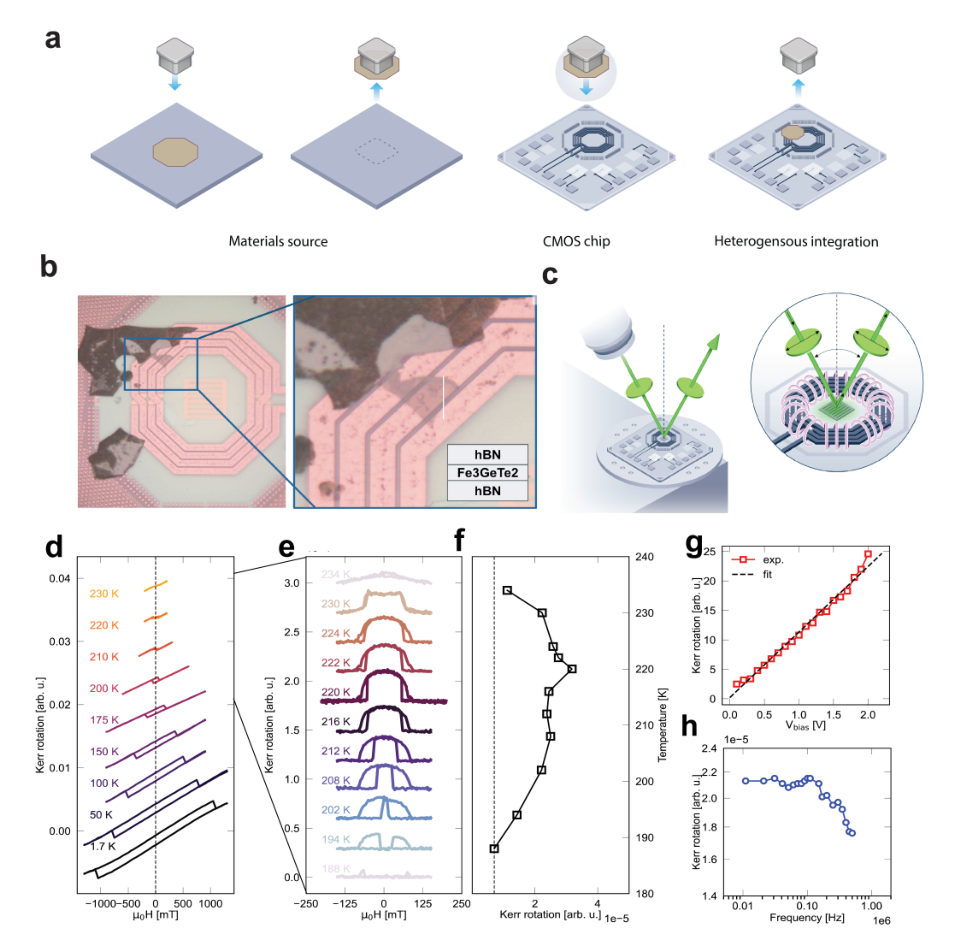
<figcaption class="paper-figure-caption"><b>Fig 3.</b> Figure 3: Cryogenic magnetic susceptibility measurements using the CMOS platform. Illus- tration of the heterogeneous integration process, showing transfer of an encapsulated hBN/Fe3GeTe2/hBN heterostructure from the source substrate onto the foundry-fabricated CMOS characterization chip. (b) Op- tical micrograph of the CMOS chip after transfer; inset shows the encapsulated heterostructure positioned over the integrated micro-inductor. (c) Schematic of the Kerr-rotation measurement configuration, where the integrated CMOS inductor provides AC magnetic excitation while Kerr rotation is detected optically. (d) Temperature-dependent Kerr-rotation hysteresis loops measured between 1.75 and 230...</figcaption>
</figure>
<figure class="paper-figure-card">
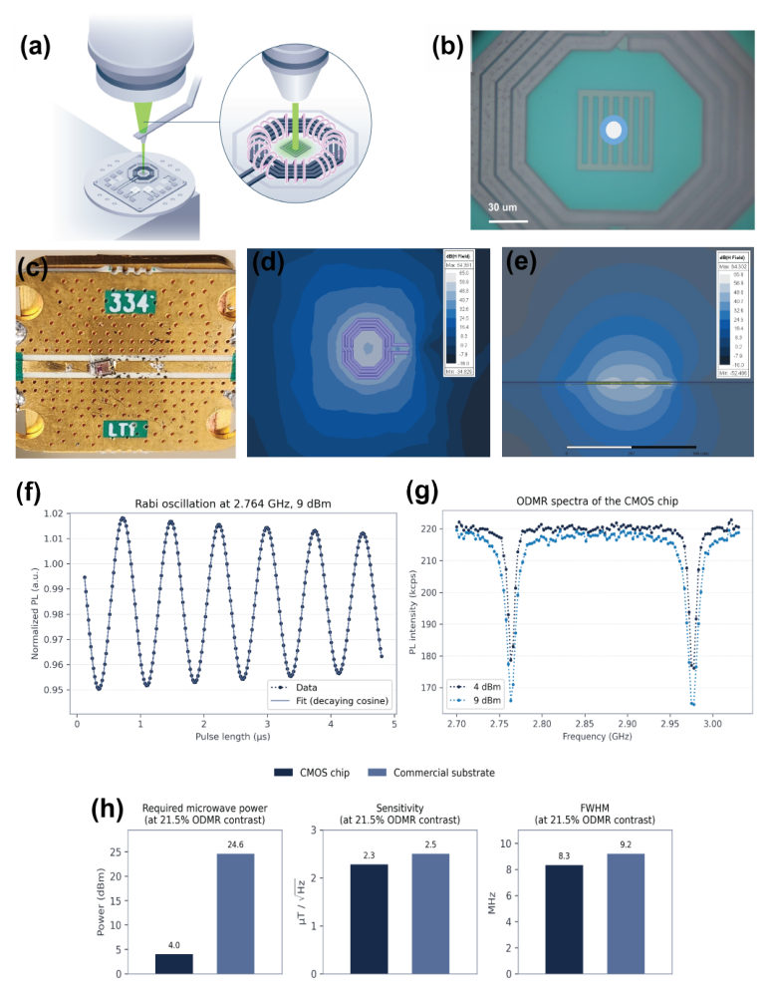
<figcaption class="paper-figure-caption"><b>Fig 4.</b> Figure 4: Benchmarking the foundry CMOS platform against a commercial microwave antenna for low-power NV spin control. (a) Schematic of the scanning NV measurement configuration, showing optical excitation and microwave delivery from the on-chip RF inductor. (b) Optical micrograph of the CMOS device highlighting the central inductor region used for spin control. (c) Experimental setup with the CMOS chip wire-bonded and interfaced for RF excitation. (d,e) Electromagnetic simulations of the RF magnetic field distribution generated by the on-chip inductor, showing spatial localization in the device plane and decay along the out-of-plane direction. (f) Rabi oscillations measured at 2.764 GHz,...</figcaption>
</figure>
<figure class="paper-figure-card">
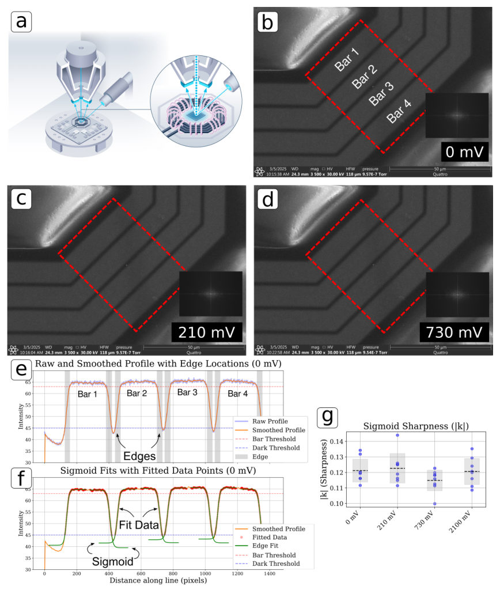
<figcaption class="paper-figure-caption"><b>Fig 5.</b> Figure 5: SEM compatibility of the CMOS platform during device operation. (a) Schematic of SEM imaging while the integrated inductor is electrically driven. (b–d) Representative SEM images acquired under different inductor bias conditions; corresponding FFTs are shown as insets. No visible image distortion or field-induced artifacts are observed during operation. (e) Overview of the knife-edge image-quality analysis used to quantify edge sharpness. (f) Representative sigmoid fits to the extracted edge profiles. (g) Extracted edge-sharpness metric for all operating conditions, showing no statistically significant variation with applied bias. Details of the analysis procedure are provided in...</figcaption>
</figure>

**Summary.** This work introduces a novel, scalable characterization platform built using standard 65-nm CMOS technology to measure multiple physical properties (microwave, thermal, electrical) simultaneously. By integrating these functions onto a single chip, the authors overcome limitations in reproducibility and scalability inherent in current bespoke experimental setups. This breakthrough enables more accessible and standardized quantum materials research.

**Why it may be interesting.** The development of standardized, foundry-compatible hardware platforms is crucial for advancing quantum science by removing significant engineering bottlenecks associated with custom cryogenic setups.

Detailed structure

**Main problem.** Current quantum materials characterization methods are limited by custom, non-scalable hardware setups that cannot easily integrate multiple measurement modalities.

**Main result.** The authors demonstrated a scalable, foundry-manufacturable CMOS platform capable of integrating microwave, thermal, and electrical probes for multimodal quantum sensing.

**Method.** They repurposed a commercial 65-nm CMOS process to functionally partition the metal stack into distinct subsystems within a small footprint.

**Model / system.** The physical system is an integrated chip built on a standard CMOS foundry platform, featuring interdigitated electrodes (IDEs) for electrical sensing and patterned inductors for microwave excitation. This allows for heterogeneous integration of various quantum measurements.

**Key observables.** Magnetic susceptibility ($\chi$), ODMR contrast ($>20\%$), $	ext{S}$-parameters, capacitance-voltage ($	ext{C–V}$) response, and SEM image sharpness metrics.

**Important parameters / regimes.** Operating temperatures down to $1.75 	ext{ K}$, microwave power levels of $4–9 	ext{ dBm}$, and a platform size limited to $1 	ext{ mm}^2$.

**Assumptions / limitations.** The approach relies on repurposing existing commercial CMOS back-end-of-line capabilities, and magnetic measurements involve transferring samples onto the chip.

**Figures summary.** Figures show schematic architecture partitioning (Fig 1), detailed measurement results including $	ext{S}$-parameters, $	ext{C–V}$ curves, and temperature dependence of susceptibility (Fig 2); ODMR benchmarking compares CMOS vs. antenna setups (Fig 4).

**Paper structure.** The paper progresses from identifying the need for scalable multimodal characterization to presenting measurements across multiple domains: RF/Microwave ($	ext{S}$-params, ODMR), Electrical ($	ext{C–V}$ on IDEs), and Thermal (resistance vs. T), culminating in a demonstration of integrated functionality.

Abstract

Quantum materials experiments increasingly rely on microwave, electrical, thermal, optical, and structural probes, but these capabilities are typically assembled from custom hardware that limits reproducibility and scalability. Here we show that a commercial 65-nm CMOS process can be repurposed as a passive, foundry-manufacturable characterization platform by functionally partitioning its metal stack into microwave, thermal, and electrical subsystems within a 1 mm2 footprint. The integrated RF architecture enables cryogenic magnetic susceptibility measurements of Fe3GeTe2 heterostructures at 1.75 K without sample-specific fabrication. We further demonstrate NV-center optically detected magnetic resonance (ODMR) with >20% contrast at 4-9 dBm microwave power, reducing power requirements by 20-25 dB relative to conventional antenna-based approaches while maintaining sensitivities of 2-3 uT/sqrt(Hz). We additionally confirm compatibility with in-situ electron-beam imaging, showing no measurable degradation in image quality upon device operation. These results establish a scalable, foundry-manufacturable platform for multimodal quantum sensing and materials characterization.

[↑ back to top](#top)

### [Gate-tunable giant anomalous Hall effect in magnetic topological insulator bilayer](http://arxiv.org/abs/2607.17988v1)

**Authors:** Basavaraja G, Mukul Kabir  
**Type:** theory · **Category:** other · **PDF:** <https://arxiv.org/pdf/2607.17988v1>  
**Analysis basis:** full PDF text, analyzed in chunks
**Topic relevance:** `driven-dissipative phase transition` **2/5** · `analog quantum simulation` **1/5** · `exotic spin models in light-matter` **1/5** · `methods for driven-dissipative` **1/5** · `non-equilibrium dynamics` **1/5** · `spintronics-quantum-optics interface` **1/5**

↔ Scroll figures horizontally

<figure class="paper-figure-card">
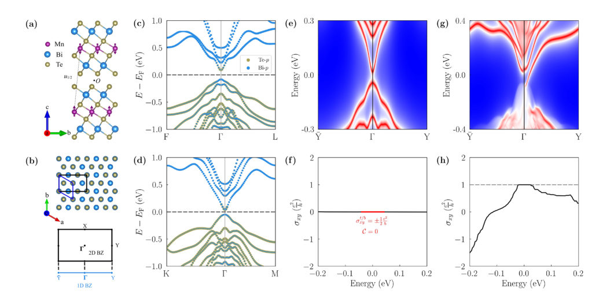
<figcaption class="paper-figure-caption"><b>Fig 1.</b> Figure 1. Crystal structure and topological phases of MnBi2Te4. (a) The schematic crystal structure of MnBi2Te4 illustrates ferromagnetic Mn layers that are coupled antiferromagnetically across the vdW gap, exhibiting A-type AFM ordering. The vector u1/2 represents the half-translation connecting these Mn layers, while O indicates the inversion center of the structure. (b) The top view along the c-axis highlights the hexagonal unit cell, outlined by solid blue lines, alongside the solid black rectangular supercell employed for surface state calculations. Additionally, it shows the two-dimensional BZ and the projected one- dimensional BZ, along which the edge modes are computed. The...</figcaption>
</figure>
<figure class="paper-figure-card">
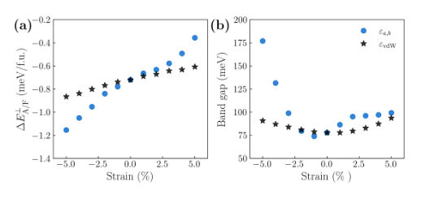
<figcaption class="paper-figure-caption"><b>Fig 2.</b> Figure 2. Lattice strain does not induce magnetic or electronic phase transitions in bilayer MnBi2Te4. (a) The interlayer ex- change coupling remains AFM (∆E⊥ A/F &lt; 0) under both in- plane biaxial strain εa,b and variations in the vdW gap εvdW. (b) The corresponding electronic structure remains gapped throughout. Consequently, the undoped bilayer retains its Axion insulating state, indicating that lattice strain alone is an insufficient perturbation to drive a transition to the con- ventional anomalous Hall regime.</figcaption>
</figure>
<figure class="paper-figure-card">
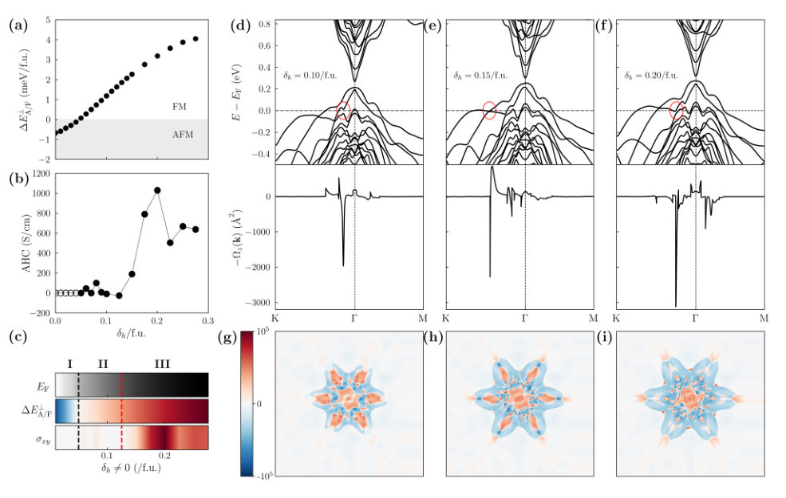
<figcaption class="paper-figure-caption"><b>Fig 3.</b> Figure 3. Magnetic and electronic evolution of bilayer MnBi2Te4 under hole doping. (a) The energy difference between the interlayer AFM and FM couplings, ∆E⊥ A/F, in bilayer MnBi2Te4 indicates a transition from AFM to FM state as the doping concentration increases. (b) The calculated anomalous Hall conductivity peaks at a doping level of approximately 0.2 holes/f.u. doping. Open circles denote configurations where the interlayer coupling remains AFM. (c) Schematic evolution of the electronic state (position of the Fermi level in the valence band from its maximum), magnetic state (∆E⊥ A/F) and transport properties (σxy), identifying three distinct regimes for δh ̸= 0. (I) Metallic AFM with...</figcaption>
</figure>
<figure class="paper-figure-card">
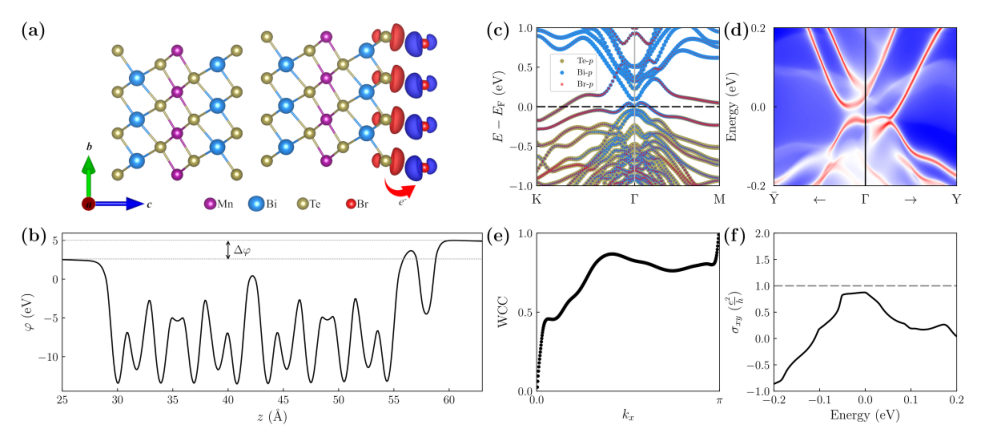
<figcaption class="paper-figure-caption"><b>Fig 4.</b> Figure 4. Surface functionalization and topological transport in Br-doped bilayer MnBi2Te4. (a) Schematic illustration of the 2SL structure with electronegative Br atoms absorbed on the top surface. Bonding charge density analysis, ∆ρ(r), reveals electron depletion (red) and accumulation (blue) at the Te and Br sites, respectively, confirming that surface functionalization effectively hole-dopes the system. (b) Calculated electrostatic potential φ, perpendicular to the two-dimensional plane. A significant potential difference, ∆φ = 2.5 eV, indicates a strong internal electric field that breaks the inversion symmetry. (c) Calculated electronic structure exhibiting metallic behavior with...</figcaption>
</figure>

**Summary.** This work explores how manipulating doping or electric fields can tune the electronic state of $	ext{MnBi}_2	ext{Te}_4$ bilayers across topological and conventional anomalous Hall regimes. By combining DFT calculations with Monte Carlo simulations, the authors demonstrate a versatile framework for engineering magnetic and transport properties in these materials. This offers direct pathways toward reconfigurable quantum devices.

**Why it may be interesting.** While focused on solid-state magnetism/topology, the concept of tuning quantum transport via external fields (gating) and controlling magnetic order parameters is highly relevant to engineered quantum materials platforms.

Detailed structure

**Main problem.** The study investigates the systematic electronic, magnetic, and topological phase transitions within ultrathin magnetic topological insulator bilayers.

**Main result.** Electrostatic gating or surface doping can drive a crossover from an insulating topological state to a conventional anomalous Hall regime, allowing for tunable quantum device engineering.

**Method.** Calculations combine first-principles DFT methods with tight-binding models and classical Heisenberg Monte Carlo simulations.

**Model / system.** The system is the $	ext{MnBi}_2	ext{Te}_4$ magnetic topological insulator, analyzed in both bulk and bilayer limits, considering changes in interlayer coupling (AFM to FM).

**Key observables.** Anomalous Hall Conductivity ($\sigma_{xy}$), Magnetic Ordering Temperature ($T_c$), Fermi Level position relative to the gap, and Interlayer Coupling type.

**Important parameters / regimes.** Doping concentration (hole/electron doping), dimensionality (bilayer limit), and magnetic coupling strength.

**Assumptions / limitations.** The analysis relies on symmetry considerations ($\mathbb{Z}_2$ invariant, $T$, $S$) to classify topological phases and uses DFT for electronic structure calculations.

**Figures summary.** Figures illustrate band structures confirming the topological insulator state, edge spectra showing quantization/suppression of $\sigma_{xy}$, and WCC plots diagnosing topological invariants in different coupling regimes.

**Paper structure.** The paper systematically analyzes the bulk properties (AFM vs FM) to establish the baseline topology, then focuses on the bilayer limit, detailing how doping or gating induces a crossover between quantized topological states and high-conductivity anomalous Hall states.

Abstract

In the two-dimensional limit, the intrinsic magnetic topological insulator MnBi2Te4 provides a compelling platform for exploring thickness-dependent quantum states and their evolution under external perturbations. Using first-principles calculations and classical Heisenberg Monte Carlo simulations, we demonstrate that electrostatic gating and surface chemical functionalization can drive a systematic crossover from the topological to the conventional anomalous Hall regime. This transition is governed by the simultaneous shift of the Fermi level away from the topological gap and a reversal of interlayer coupling from antiferromagnetic to ferromagnetic order. Results reveal that hole doping drives the Fermi level into the valence bands, inducing an exceptionally high anomalous Hall conductivity of 1127 S/cm arising from Berry curvature hot spots. In contrast, surface chemical doping drives a topological state where intrinsic $σ_{xy}$ is reduced from $e^2/h$ to $\sim 0.86\ e^2/h$ by the spectral coexistance of chiral edge mode with metallic bulk states of the two-dimensional film. Furthermore, we show that both tuning routes significantly enhance in-plane exchange interactions, leading to a substantial increase in the magnetic ordering temperature relative to the pristine bilayer. These results establish a versatile framework for the simultaneous engineering of topological, magnetic, and transport properties in ultrathin MnBi2Te4, offering direct implications for the development of reconfigurable quantum devices.

[↑ back to top](#top)

### [Relativistic quantum teleportation protected by the anti-Unruh effect](http://arxiv.org/abs/2607.17216v1)

**Authors:** Reza Hamzehofi, Davood Afshar, Mehrzad Ashrafpour  
**Type:** theory · **Category:** quantum information and computing · **PDF:** <https://arxiv.org/pdf/2607.17216v1>  
**Analysis basis:** full PDF text, analyzed in chunks
**Topic relevance:** `entanglement & information structure` **2/5** · `Keldysh / 2PI / non-Gaussian methods` **1/5** · `correlated / nonlocal dissipation` **1/5** · `driven-dissipative phase transition` **1/5** · `methods for driven-dissipative` **1/5** · `non-equilibrium dynamics` **1/5**

↔ Scroll figures horizontally

<figure class="paper-figure-card">
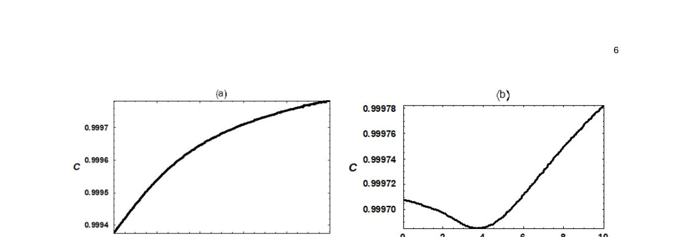
<figcaption class="paper-figure-caption"><b>Fig 1.</b> Fig. 1 Wooster&#x27;s concurrence C between Alice and Rob as a function of Rob&#x27;s proper acceleration 𝑎, for (a) 0.6 = and (b) 6 = , assuming 0.06 = and 0.4 = .</figcaption>
</figure>
<figure class="paper-figure-card">
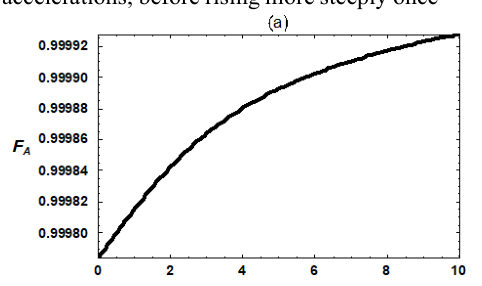
<figcaption class="paper-figure-caption"><b>Fig 2.</b> Fig. 2 Average teleportation fidelity as a function of Rob&#x27;s proper acceleration a , for (a): 0.6 = and (b): 6 = . Parameters are the same as in Fig.1.</figcaption>
</figure>

**Summary.** This paper theoretically examines quantum teleportation fidelity when one participant accelerates relative to an inertial observer. It shows that while the Unruh effect predicts entanglement loss due to acceleration, a subsequent anti-Unruh effect causes the fidelity to recover and approach perfect transmission at high accelerations. This suggests relativistic motion can actively protect or enhance quantum information transfer.

**Why it may be interesting.** This work directly addresses how fundamental spacetime effects (acceleration/Unruh effect) impact quantum communication protocols like teleportation, providing theoretical insights into relativistic quantum information processing.

Detailed structure

**Main problem.** The study investigates how relativistic acceleration affects the fidelity of quantum teleportation, specifically contrasting the expected degradation from the Unruh effect with potential recovery mechanisms from the anti-Unruh effect.

**Main result.** The anti-Unruh effect can protect and enhance quantum correlations, causing the teleportation fidelity to increase monotonically towards unity at high accelerations. This demonstrates that acceleration can be an exploitable resource for maintaining quantum information.

**Method.** The analysis uses perturbative methods to calculate the reduced density matrix of the shared entanglement resource by tracing out the field modes interacting with Unruh-DeWitt detectors.

**Model / system.** The system models standard quantum teleportation where one participant (Rob) undergoes uniform acceleration in Minkowski spacetime, while Alice remains inertial. The interaction is mediated by a massive scalar field ($\phi$) coupled to an Unruh-DeWitt detector.

**Key observables.** Teleportation fidelity ($F$ or $A_F$), entanglement (Concurrence $C$), and information gain ($\Delta S$).

**Important parameters / regimes.** Proper acceleration ($a$), detector energy gap ($\Omega$), field mass ($m$), and coupling constant ($\lambda$).

**Assumptions / limitations.** The analysis relies on a first-order perturbative truncation of the evolution operator in the weak-coupling regime.

**Figures summary.** Figures show that for small energy gaps, fidelity increases monotonically with acceleration; for larger gaps, the crossover between Unruh degradation and anti-Unruh enhancement is visible in both concurrence and fidelity plots.

**Paper structure.** The paper establishes the relativistic setup using UDW detectors coupled to a scalar field. It then calculates entanglement measures (concurrence) and average teleportation fidelity by partial tracing over field modes, analyzing the dependence on acceleration $a$ and gap $\Omega$.

Abstract

We investigate standard quantum teleportation in a relativistic setting where one participant, Rob, undergoes uniform acceleration while Alice remains inertial. Rob interacts locally with a massive scalar field modeled by an Unruh-DeWitt detector. We show that for small detector energy gaps, the entanglement shared between Alice and Rob increases monotonically with acceleration. For larger gaps, entanglement initially decreases at low accelerations due to the Unruh effect, but is subsequently restored and enhanced at higher accelerations as a consequence of the anti-Unruh effect. This behavior is associated with a reduction of the effective detector temperature, leading to a recovery of quantum coherence previously lost to the field. As a result, the teleportation fidelity increases with acceleration and approaches unity in the high-acceleration regime. Our results demonstrate that the anti-Unruh effect can protect and recover quantum information, providing a potential mechanism to mitigate relativistic degradation of quantum correlations.

[↑ back to top](#top)

### [GHZ-Equivalent State Distribution in Quantum Networks: Reducing Decoherence and Quantum Resource Consumption](http://arxiv.org/abs/2607.17101v1)

**Authors:** Chun-Hsiang Wang, Chia-Wei Tsai  
**Type:** theory · **Category:** quantum information and computing · **PDF:** <https://arxiv.org/pdf/2607.17101v1>  
**Analysis basis:** full PDF text, analyzed in chunks
**Topic relevance:** `entanglement & information structure` **2/5** · `correlated / nonlocal dissipation` **1/5** · `driven-dissipative phase transition` **1/5** · `methods for driven-dissipative` **1/5** · `non-equilibrium dynamics` **1/5**

↔ Scroll figures horizontally

<figure class="paper-figure-card">
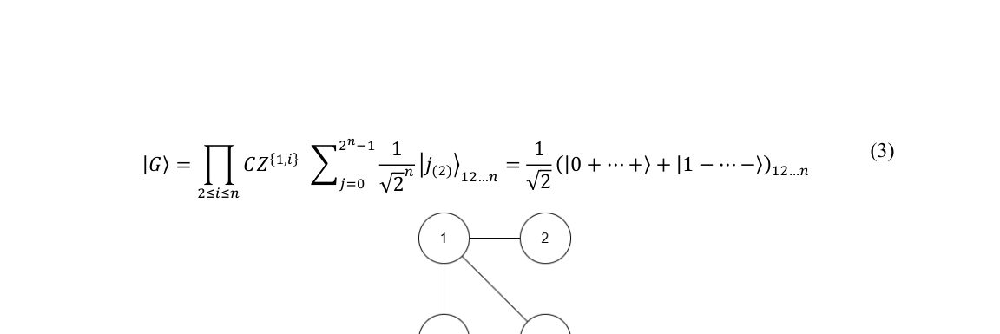
<figcaption class="paper-figure-caption"><b>Fig 1.</b> Fig. 1. An example of a 4-qubit star graph state. A complete graph state |𝐺⟩ is a special type of graph state in which all nodes are pairwise connected, as expressed in Eq. (4). Complete graph states find applications in various areas, such as QCP [8] and quantum repeaters [30].</figcaption>
</figure>
<figure class="paper-figure-card">
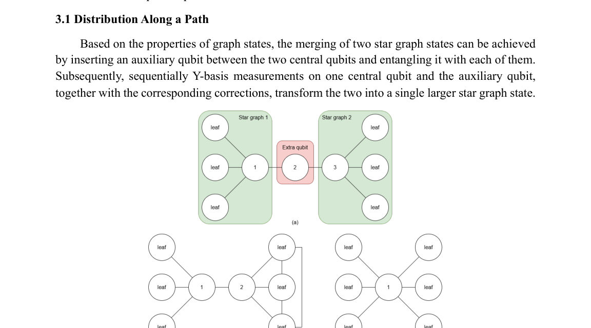
<figcaption class="paper-figure-caption"><b>Fig 2.</b> Fig. 3. The process of merging two star graph states. (a) shows the entangled state after inserting 𝑞.. (b) illustrates the state after measuring 𝑞B in the Y-basis, (c) shows the final state after 𝑞. is measured in the Y-basis.</figcaption>
</figure>
<figure class="paper-figure-card">
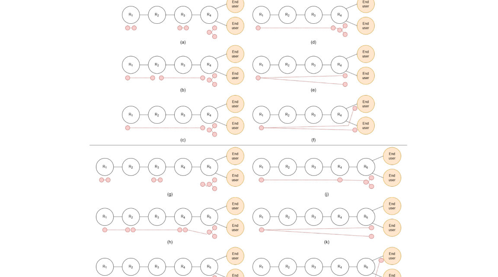
<figcaption class="paper-figure-caption"><b>Fig 3.</b> Fig. 4. Qubit distribution method, the red circles represent qubits, (a)-(f) and (g)-(l) illustrate the examples with four and five nodes in the repeater chain, respectively. (a) Initial states generated by repeaters. (b) States after qubits are transmitted to neighboring repeaters. (c) Y-basis measurements on qubits held by 𝑟. to remove unused vertices and edges. (d) Establishment of states with intermediate qubits. (e) Resulting state after Y-basis measurements. (f) final state after performing corrections and sending qubits to the corresponding end users. (g)-(i) Same as (a)-(c). (j) CZ operation on both qubits held by 𝑟G, then Y-basis measurement on the former qubit. (k) Sequentially...</figcaption>
</figure>
<figure class="paper-figure-card">
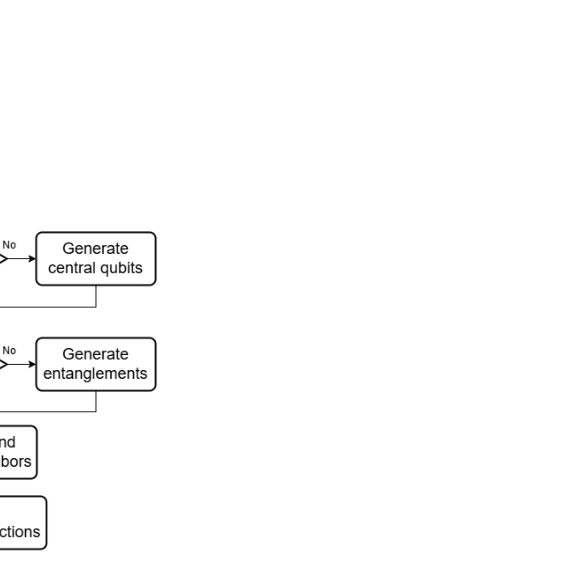
<figcaption class="paper-figure-caption"><b>Fig 4.</b> Fig. 5. A brief flow chart for the process.</figcaption>
</figure>
<figure class="paper-figure-card">
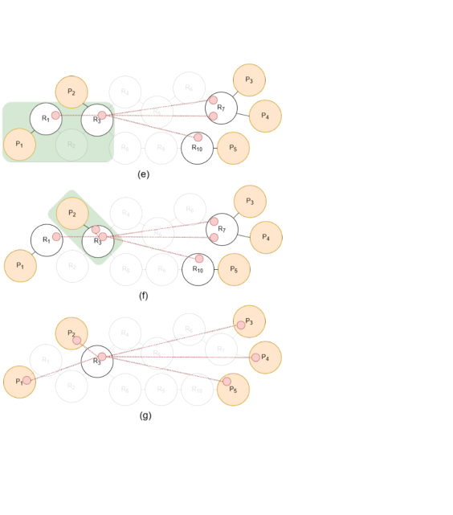
<figcaption class="paper-figure-caption"><b>Fig 5.</b> Fig. 6. Example of star graph distribution.</figcaption>
</figure>

**Summary.** This paper introduces an efficient scheme to distribute GHZ-equivalent graph states across noisy quantum repeater networks. By combining state merging with Minimum Steiner Tree optimization, the authors achieve linear scaling in resources while explicitly minimizing decoherence accumulation during transmission. This provides a practical framework for realizing large-scale quantum communication protocols.

**Why it may be interesting.** This work directly tackles practical limitations in quantum networking—namely decoherence and resource scaling—by providing a concrete, optimized protocol for distributing complex entangled states like graph states.

Detailed structure

**Main problem.** The study addresses the challenge of efficiently distributing GHZ-equivalent entangled states across large, repeater-based quantum networks while actively mitigating decoherence effects.

**Main result.** A novel scheme was proposed that achieves linear scaling in both qubit usage and controlled gate count ($O(N)$) for graph state distribution, proving its effectiveness via simulation.

**Method.** The approach combines a specialized state merging technique with an optimization framework modeled after the Minimum Steiner Tree problem to route entanglement efficiently.

**Model / system.** The physical system is a quantum network composed of repeaters connected by quantum channels. The target resource is graph states, which are LOCC-equivalent to GHZ states, used for protocols like QKD.

**Key observables.** End-to-end fidelity, qubit usage scaling ($O(N)$), controlled gate count scaling (linear), and total physical transmission length.

**Important parameters / regimes.** Decoherence rates, channel weights (physical lengths), and the number of nodes/edges in the network graph.

**Assumptions / limitations.** The primary assumption is that decoherence during long-distance transmission is the limiting factor, necessitating repeaters; future work suggests incorporating heterogeneous noise models beyond simple physical length.

**Figures summary.** Figures illustrate examples of star and complete graph states, the process flow for state merging using auxiliary qubits and Y-basis measurements, and qubit distribution methods in repeater chains.

**Paper structure.** The paper introduces the problem by defining the need for efficient resource distribution. It details a novel scheme involving state merging (Section 3.1) followed by optimizing the network topology via an MST formulation (Section 3.2). The appendices provide mathematical proofs regarding gate equivalences and measurement calculations.

Abstract

This study proposes a novel scheme for distributing GHZ-equivalent states across repeater-based quantum networks, with particular focus on the analysis and mitigation of decoherence effects during transmission. The proposed scheme enables remote users to share graph states, which can be leveraged to implement various quantum communication protocols, such as quantum key distribution and quantum secret sharing. Compared with existing approaches, the proposed distributed scheme requires only O(N) qubits without introducing redundant entanglement structures. Together with the linear-scaling merging procedure in both controlled gate count and qubit usage, the proposed framework supports more efficient large-scale graph state distribution. To evaluate its feasibility and correctness, this study utilizes the quantum network simulation tool, NetSquid, to implement the proposed scheme. Simulation results demonstrate that the proposed approach is both effective and practical for executing quantum communication protocols within quantum networks.

[↑ back to top](#top)

### [Reliability Is Not Free in Universal Quantum Work Extraction](http://arxiv.org/abs/2607.16702v1)

**Authors:** Shuai Zeng  
**Type:** theory · **Category:** statistical mechanics · **PDF:** <https://arxiv.org/pdf/2607.16702v1>  
**Analysis basis:** full PDF text, analyzed in chunks
**Topic relevance:** `non-equilibrium universality` **2/5** · `correlated / nonlocal dissipation` **1/5** · `driven-dissipative phase transition` **1/5** · `methods for driven-dissipative` **1/5** · `non-equilibrium dynamics` **1/5**

↔ Scroll figures horizontally

<figure class="paper-figure-card">
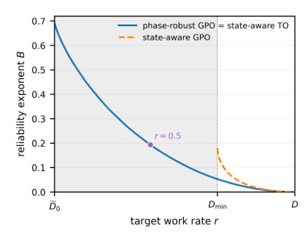
<figcaption class="paper-figure-caption"><b>Fig 1.</b> FIG. 1. Finite reliability exponents for τ = diag(0.8, 0.2) and |ψθ⟩= (|0⟩+eiθ|1⟩)/ √</figcaption>
</figure>

**Summary.** This theoretical work examines the limits of quantum work extraction reliability by comparing state-aware versus phase-independent protocols. It proves that while the average energy extracted (work rate) can be universal regardless of input knowledge, achieving optimal exponential reliability requires retaining precise knowledge of the system's initial state. The findings highlight a critical gap between these two measures of performance.

**Why it may be interesting.** It provides rigorous mathematical tools (Remez inequality) to distinguish between average thermodynamic performance and finite-time operational robustness, which is crucial when designing quantum engines or communication protocols.

Detailed structure

**Main problem.** The paper investigates whether the first-order universality observed in asymptotic quantum work extraction extends to reliability, which is characterized by the exponential decay rate of failure.

**Main result.** Input-state knowledge can be irrelevant for the average work rate but remains indispensable for achieving optimal exponential reliability bounds.

**Method.** The authors use finite-blocklength identities and apply a trigonometric Remez inequality to upgrade minimax optimization problems into pointwise theorems regarding error exponents.

**Model / system.** The analysis focuses on quantum work extraction from a coherent qubit time-translation orbit using a two-level work battery, comparing state-aware protocols against phase-independent ones.

**Key observables.** Asymptotic Work Rate ($D(
ho\|	au)$), Reliability Exponents ($B_{	ext{aware}}^{	ext{GPO}}$, $B_{	ext{aware}}^{	ext{TO}}$), and Failure Probability ($\epsilon_n \sim e^{-nB}$).

**Important parameters / regimes.** The reliability parameter $r$, the coherence time $	heta \in [0, 2\pi)$, and the block length $n$.

**Assumptions / limitations.** The analysis relies on establishing exact finite-blocklength identities between different extraction protocols and using large-deviation theory for asymptotic limits.

**Figures summary.** Figure 1 illustrates finite reliability branches, comparing common (phase-independent) exponents to state-aware GPO exponents, showing separation windows.

**Paper structure.** The paper progresses by first establishing an exact identity between Gibbs-preserving extraction on an orbit and thermal operations. It then uses Remez's theorem to upgrade this minimax result to a pointwise statement, culminating in the comparison of state-aware vs. phase-independent reliability exponents for specific qubit families.

Abstract

Universal work extraction shows that input-state knowledge is unnecessary to attain the asymptotic free-energy rate. We ask whether this first-order universality extends to reliability, the exponential decay rate of extraction failure. In the work-battery fidelity formulation, we prove that no phase-independent Gibbs-preserving protocol can retain the state-aware Gibbs-preserving exponent throughout a coherent qubit time-translation orbit: at every positive target rate, its worst pointwise exponent is bounded by the corresponding state-aware thermal-operation value. The proof first establishes an exact finite-blocklength identity between phase-robust Gibbs-preserving extraction and state-aware thermal extraction. A trigonometric Remez inequality then upgrades this minimax identity to a pointwise theorem by ruling out exponential localization of the worst phase. For an explicit coherent-qubit family, known-phase Gibbs-preserving extraction is error free, whereas every phase-independent protocol has a finite worst-pointwise exponent. Thus input-state knowledge can be irrelevant to the first-order work rate yet indispensable for optimal exponential reliability.

[↑ back to top](#top)

### [Light-Cone Scaling of In-Circuit Noise in Randomized Measurements](http://arxiv.org/abs/2607.17740v1)

**Authors:** Pan Yu, Yan He, Yadong Wu  
**Type:** theory · **Category:** quantum information and computing · **PDF:** <https://arxiv.org/pdf/2607.17740v1>  
**Analysis basis:** full PDF text, analyzed in chunks
**Topic relevance:** `quantum measurements` **2/5** · `correlated / nonlocal dissipation` **1/5** · `measurement-induced transitions` **1/5** · `methods for driven-dissipative` **1/5**

↔ Scroll figures horizontally

<figure class="paper-figure-card">
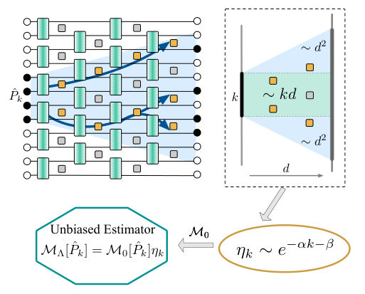
<figcaption class="paper-figure-caption"><b>Fig 1.</b> FIG. 1. Activated noise in shallow randomized mea- surements. A locally scrambled shallow circuit contains lo- cal two-qubit gates and noise channels. In the Heisenberg pic- ture, a noise channel is activated when it overlaps the evolving Pauli support, denoted as orange plaquettes, while inactive channels outside the path denoted as gray plaquettes do not damp the corresponding coefficient. For a contiguous size-k operator, the light cone contains a bulk contribution of order kd and two finite-depth fronts of order d2. The accumulated damping therefore follows ηk ∼e−αk−β, giving the displayed relation wEU ,Λ( ˆPk) = ηkwEU ,0( ˆPk) used to calibrate a noisy shadow estimator.</figcaption>
</figure>
<figure class="paper-figure-card">
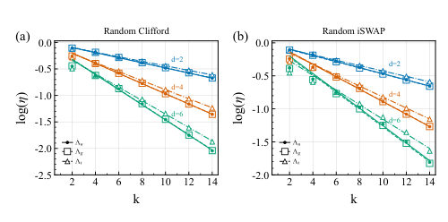
<figcaption class="paper-figure-caption"><b>Fig 2.</b> FIG. 2. Damping ratio for anisotropic and fluctu- ating in-circuit noise. Transfer-matrix simulations for N = 30 qubits with two-qubit Pauli damping rates λL = 0.06, λR = 0.02, and λLR = 0.07 for the PI, IP, and PP sec- tors, respectively. We compare uniform anisotropic noise Λu = (λL, λR, λLR), spatially fluctuating rates drawn from a narrow Gaussian centered at Λu with width Λu/5, and a deterministic linear temporal drift Λt = 2tΛu/(d −1) for t = 0, . . . , d −1, keeping the same layer-averaged rate as Λu. Markers distinguish the three noise models and same- colored straight lines are linear fits. Colors denote depths d = 2, 4, 6. The fits use k ∈[4, 14] for random Clifford gates and k...</figcaption>
</figure>
<figure class="paper-figure-card">
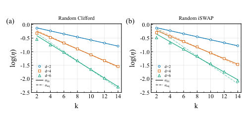
<figcaption class="paper-figure-caption"><b>Fig 3.</b> FIG. 3. Comparison with a heuristic equilibrium es- timate. Damping ratios for uniform two-qubit depolarizing noise with λu = 0.06 at depths d = 2, 4, 6. Markers show numerical data from the even-k branch. Solid lines fit both α and β in Eq. (7); dashed lines fix the heuristic first-cumulant equilibrium slope αeq = 15dλu/32 and fit only the intercept. Both fits use the even-k data from k = 4 through k = 14; the k = 2 points are shown but excluded from the fits. Panels (a) and (b) show random Clifford and locally scrambled iSWAP circuits, respectively.</figcaption>
</figure>
<figure class="paper-figure-card">
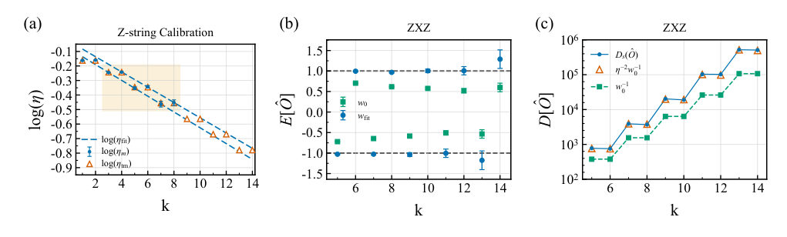
<figcaption class="paper-figure-caption"><b>Fig 4.</b> FIG. 4. Small-string calibration and prediction of larger observables. (a) Contiguous ˆZk strings measured on the product state ˆρ0 determine the geometry-resolved damping ratio. Small-k data in the shaded fitting window determine the parity-resolved dashed fits, which extrapolate to larger k and agree with the transfer-matrix results shown as triangles. (b) The calibrated coefficient corrects noisy-shadow estimates of the cluster-state string ˆOZXZ = ˆZ1 ˆY2 ˆ X3 · · · ˆ Xk−2 ˆYk−1 ˆZk, whose exact expectation value is (−1)k. The calibrated estimates, w−1 fit EU P</figcaption>
</figure>

**Summary.** This paper develops a detailed theory describing how local noise corrupts measurements used to characterize unknown quantum states. It derives an exponential scaling law for this noise bias based on the geometry (light cone) of the measured observable. The result proposes a practical calibration protocol that allows researchers to estimate properties of large observables by only measuring small, easily accessible strings.

**Why it may be interesting.** This work provides crucial theoretical tools for quantifying and mitigating hardware imperfections (noise) in quantum characterization protocols, directly impacting the feasibility of running complex algorithms on NISQ devices by linking error to operator dynamics.

Detailed structure

**Main problem.** The paper addresses how local gate and readout errors bias the reconstruction of quantum observables obtained via randomized measurements (like classical shadows) on near-term hardware.

**Main result.** It establishes an exponential scaling law for noise damping ($\log \eta_k \propto -k$) related to the 'light cone' geometry of the measured Pauli operator, enabling a small-string calibration protocol.

**Method.** The authors develop a microscopic description using the Heisenberg picture and path averaging to derive an activated formula for the noisy Pauli coefficient, analyzed via cumulant expansion.

**Model / system.** The analysis focuses on locally scrambled shallow circuits in one dimension, modeling noise as weak local CPTP channels independent of random gates. The system is studied using randomized measurements applied to quantum states.

**Key observables.** Damping ratio ($\eta_k$) quantifying the noise bias for an operator $\hat{P}_k$, and the scaling parameters $\alpha$ and $eta$.

**Important parameters / regimes.** Circuit depth ($d$), size of contiguous observable string ($k$), and the nature/strength of local Pauli noise (e.g., anisotropic, fluctuating).

**Assumptions / limitations.** The analysis assumes weak local CPTP noise independent of sampled random gates; linear scaling is assumed to hold for large $k$ away from boundaries.

**Figures summary.** Figures demonstrate the exponential decay ($\log \eta = -\alpha k - eta$) of the damping ratio for various circuits (Random Clifford, iSWAP) and show that small-string measurements can calibrate estimates for larger, complex observables.

**Paper structure.** The paper moves from developing a microscopic noise model based on activated path averaging to deriving the light-cone scaling law. It then verifies this scaling numerically using two-qubit circuits under various noise types, culminating in demonstrating a practical small-string calibration protocol.

Abstract

Randomized measurements provide an efficient way to extract physical properties of an unknown quantum state from limited data. On near-term hardware, gate and readout errors bias the reconstructed observables. Here we develop a microscopic description of this bias for locally scrambled shallow circuits. Independent local twirling reduces local implementation noise to stochastic Pauli damping, and a noise event contributes only when it overlaps the Heisenberg evolution of the measured Pauli operator. This gives an activated path-average formula for the noisy Pauli coefficient. In one-dimensional shallow circuits, the activated noise volume grows linearly with the size of a contiguous observable, leading to an exponential damping ratio. We verify this scaling for two-qubit random Clifford and locally scrambled iSWAP circuits with two-qubit Pauli noise, including spatial fluctuations and temporal drift. The scaling supports a small-string calibration protocol that predicts larger string observables without learning the full noisy measurement channel. Our result relates the noise bias of shallow-shadow protocols directly to operator-evolving dynamics.

[↑ back to top](#top)

### [Operator-centric Clifford algebra for variational eigensolvers and finite-shot adaptive selection](http://arxiv.org/abs/2607.17443v1)

**Authors:** Ginanjar Utama, Hermawan Kresno Dipojono  
**Type:** theory · **Category:** quantum information and computing · **PDF:** <https://arxiv.org/pdf/2607.17443v1>  
**Analysis basis:** full PDF text, analyzed in chunks
**Topic relevance:** `quantum measurements` **2/5** · `analog quantum simulation` **1/5** · `measurement-induced transitions` **1/5** · `methods for driven-dissipative` **1/5**

↔ Scroll figures horizontally

<figure class="paper-figure-card">
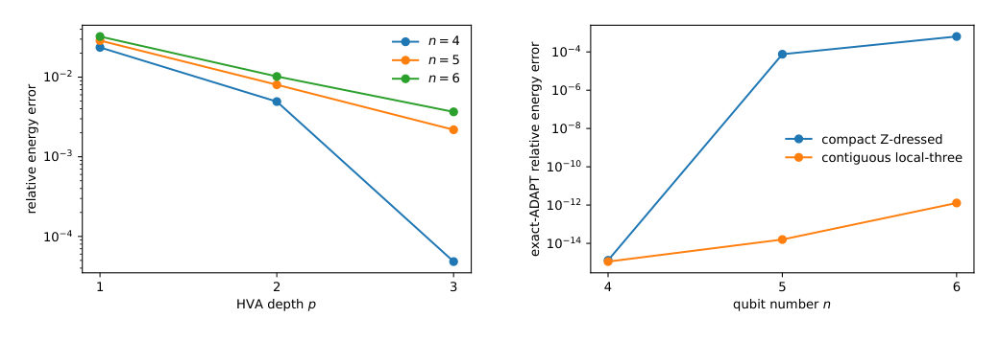
<figcaption class="paper-figure-caption"><b>Fig 1.</b> FIG. 1. Deterministic critical-point results. (a) Relative energy error of the Hamiltonian variational ansatz versus depth. (b) Exact-ADAPT error for the compact AZYZ pool and the systematic Alocal3 pool. The local-three runs use a 20-operator cap.</figcaption>
</figure>
<figure class="paper-figure-card">
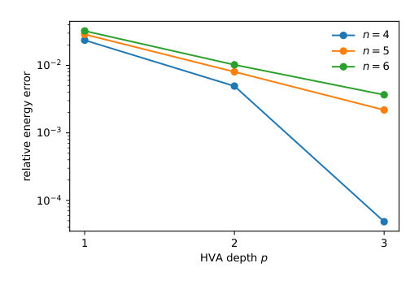
<figcaption class="paper-figure-caption"><b>Fig 2.</b> Figure 2 and Table III compare the three policies at a common base and ceiling. A single fixed batch pro- duces no successful runs: 0/100, with Wilson interval [0.0%, 3.7%]. Uniform escalation and racing both produce</figcaption>
</figure>
<figure class="paper-figure-card">
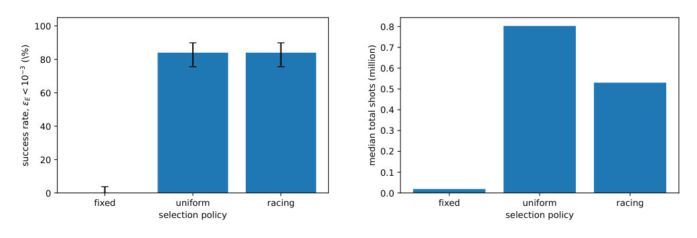
<figcaption class="paper-figure-caption"><b>Fig 3.</b> FIG. 2. Finite-shot policy comparison at n = 4, base 128 and ceiling 4096 shots per Pauli word. (a) Success probability for ϵE &lt; 10−3 with 95% Wilson intervals. (b) Median total measurements. Uniform escalation and racing have equal observed success, while racing removes clear losers and lowers the median shot count.</figcaption>
</figure>
<figure class="paper-figure-card">
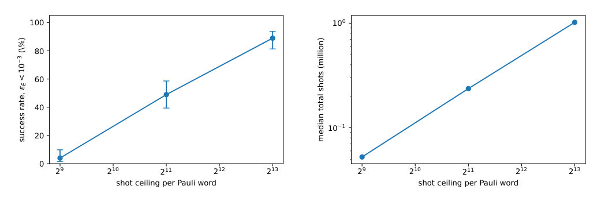
<figcaption class="paper-figure-caption"><b>Fig 4.</b> FIG. 3. Racing with a fixed base of 64 shots and a varying per-word ceiling. (a) Success probability with 95% Wilson intervals. (b) Median total measurements. The ceiling controls the smallest gradient separation that the ranking rule can resolve.</figcaption>
</figure>

**Summary.** This work presents a mathematically rigorous, operator-centric framework for variational quantum eigensolvers applied to systems like the Ising chain. It introduces an exact algebraic pruning rule and critically analyzes adaptive operator selection under realistic finite-shot measurement constraints. The findings demonstrate that advanced selection policies, particularly 'racing,' are crucial for achieving high accuracy with minimal experimental resources.

**Why it may be interesting.** The rigorous mathematical formulation connecting Pauli words to Clifford algebra and deriving an exact pruning rule is highly valuable for developing scalable quantum simulation tools that can handle the complexity of large circuits while remaining computationally tractable.

Detailed structure

**Main problem.** The paper addresses developing an efficient, operator-centric framework for variational quantum algorithms (VQE) while overcoming the practical bottleneck of selecting relevant operators from limited finite measurements.

**Main result.** A systematic local odd-Y Pauli pool achieves extremely low relative energy errors ($<1.3 	imes 10^{-12}$) for small systems, and a 'racing' selection policy significantly improves measurement efficiency over fixed or uniform strategies in finite-shot tests.

**Method.** It utilizes the complex Clifford algebra to represent quantum operators sparsely, derives an exact gradient rule based on Pauli word structure (transpose-parity rule), and compares multiple adaptive operator selection policies under noisy, finite-shot measurements.

**Model / system.** The primary model tested is the open transverse-field Ising chain ($H = -\sum Z_j Z_{j+1} - h \sum X_j$) within the context of VQE. The formalism operates on $n$-qubit systems using Pauli words.

**Key observables.** Relative energy error ($\epsilon_E$), ADAPT selection gradient components ($G_P$), and success rates/median shot counts for different selection policies.

**Important parameters / regimes.** System size ($n=4, 5, 6$), measurement budget (finite shots), and the confidence interval parameter $\kappa$ used in selection heuristics.

**Assumptions / limitations.** The analysis relies on an operator-centric algebraic formulation; finite-shot results are based on heuristic confidence bounds that do not guarantee coverage or account for full covariance.

**Figures summary.** Figures compare performance metrics (median $\epsilon E$, IQR) across different selection strategies (Fixed, Uniform, Racing) as the measurement ceiling increases, showing 'racing' maintains high success rates with fewer shots.

**Paper structure.** The paper first establishes the algebraic framework using Clifford algebra and derives pruning rules. It then applies this to the TFIM Hamiltonian for VQE ansatzes. The core contribution involves comparing selection policies (Fixed vs. Uniform vs. Racing) under finite-shot measurement constraints, culminating in quantitative performance summaries.

Abstract

We develop a sparse operator-centric realization of $n$-qubit variational quantum algorithms in the complex Clifford algebra $\mathrm{Cl}(2n,\mathbb{C}) \cong M(2^n,\mathbb{C})$. Density operators, gates, observables, channels, fermionic modes, and adaptive-selection observables are represented in one Pauli-word algebra, with the Jordan--Wigner map providing the exact bridge to anticommuting Clifford generators. We distinguish general Pauli-word rotations from Spin-group rotors and derive an exact transpose-parity rule: for real Hamiltonians and real states, every candidate Pauli word containing an even number of $Y$ factors has zero ADAPT gradient, while odd-$Y$ rotations preserve the real sector. For the critical open transverse-field Ising chain, a depth-three Hamiltonian variational ansatz gives relative energy errors $4.84\times10^{-5}$, $2.19\times10^{-3}$, and $3.67\times10^{-3}$ for $n=4,5,6$. A compact local ADAPT pool is exact at $n=4$ but leaves residual errors at larger sizes; a systematic contiguous three-local odd-$Y$ pool reaches relative errors below $1.3\times10^{-12}$ for $n\leq6$. In 100-seed finite-shot tests at $n=4$, fixed-shot selection succeeds in $0/100$ runs, whereas uniform escalation and confidence-bound racing each succeed in $84/100$ runs; racing lowers median shots by $34\%$. We claim no asymptotic speedup over matrix methods. The contribution is a corrected algebraic formulation, an exact pool-pruning rule, and a reproducible study of measurement-limited adaptive selection.

[↑ back to top](#top)

### [Constraints on recovering quantum information after erasure](http://arxiv.org/abs/2607.17319v1)

**Authors:** Mohammad A. Alhejji, Noah Lordi, Omkar Baraskar, Ariel Shlosberg, Emanuel Knill  
**Type:** theory · **Category:** quantum information and computing · **PDF:** <https://arxiv.org/pdf/2607.17319v1>  
**Analysis basis:** full PDF text, analyzed in chunks
**Topic relevance:** `entanglement & information structure` **2/5** · `correlated / nonlocal dissipation` **1/5** · `quantum measurements` **1/5**

↔ Scroll figures horizontally

<figure class="paper-figure-card">
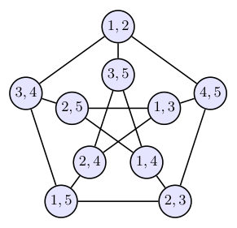
<figcaption class="paper-figure-caption"><b>Fig 1.</b> FIG. 1. The disjointness graph of the family of 2-sets in {1, 2, 3, 4, 5} is known as the Petersen graph. Its Lov´asz num- ber is 4 which equals the size of its largest independent set.</figcaption>
</figure>
<figure class="paper-figure-card">
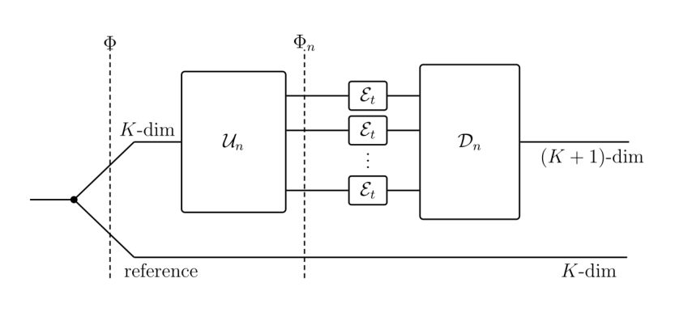
<figcaption class="paper-figure-caption"><b>Fig 2.</b> FIG. 2. A circuit depiction of the composite quantum channel DnE⊗n t Un applied to one half of the maximally entangled state Φ.</figcaption>
</figure>
<figure class="paper-figure-card">
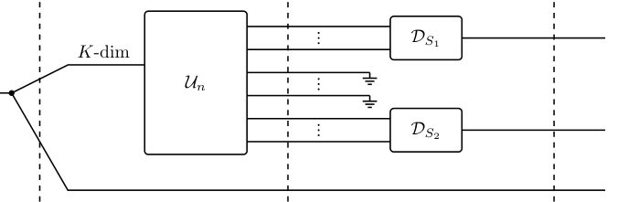
<figcaption class="paper-figure-caption"><b>Fig 3.</b> FIG. 3. A circuit depiction of the quantum channel B applied to one half of the maximally entangled state Φ giving rise to the tripartite state Γ.</figcaption>
</figure>

**Summary.** This paper investigates the mathematical limits on recovering quantum information when some physical carriers are lost due to an erasure channel. By deriving constraints based on no-cloning principles and graph theory, it proves a major conjecture about these channels. The findings show that physical realizability imposes stricter limitations than simple combinatorial bounds for systems with five or more carriers.

**Why it may be interesting.** The work establishes fundamental, non-trivial bounds on quantum information processing capabilities under noise/erasure, which is crucial for designing robust quantum communication protocols.

Detailed structure

**Main problem.** The paper determines the fundamental constraints on the probabilities with which quantum information can be perfectly recovered after arbitrary sets of physical carriers are erased.

**Main result.** It proves a conjecture regarding quantum erasure channels by establishing new no-cloning constraints, showing that for $n>4$, realizable recovery probabilities ($Q_n$) are strictly smaller than the set defined only by disjointness constraints ($T_n$).

**Method.** The analysis combines concepts from quantum coding theory, graph theory (using Lovász numbers), and semidefinite programming (SDP) to derive necessary conditions for physical realizability.

**Model / system.** The model involves encoding quantum information into $n$ physical carriers. The core mathematical object is the set $\mathcal{Q}_n$, which characterizes all possible probability tuples $(q_S)$ achievable by a quantum code under erasure channels.

**Key observables.** Recovery probabilities $q_S$; the Lovász number $\vartheta(G_F)$; and bounds on sums of these probabilities (e.g., $\sum q_{\{i,j\}} \le \sqrt{5}$ for $n=5$).

**Important parameters / regimes.** The number of carriers ($n$), the erasure probability ($t$), and the minimum distance ($d$) of the underlying quantum code.

**Assumptions / limitations.** The analysis relies on assuming the encoding channel is isometric (without loss of generality) and uses techniques like SDP to derive upper bounds based on physical constraints.

**Figures summary.** Figures illustrate circuits for composite quantum channels involving maximally entangled states, showing how recovery operations are modeled across multiple carriers.

**Paper structure.** The paper progresses by first defining the set $\mathcal{Q}_n$ and comparing it to a simpler set $\mathcal{T}_n$. It then derives constraints using graph theory (Lovász number) and finally proves results for small $n$, culminating in proving the erasure-simulation conjecture.

Abstract

Suppose that we encode quantum information into $ n $ physical carriers. With what probabilities can we perfectly recover the quantum information after sets of carriers have been erased? This question arises in the study of quantum erasure channels, for which M.B. Hastings conjectured that if each carrier is independently erased with probability $ t \geq 1/2 $, then it is impossible to recover the quantum information with asymptotically vanishing error and probability $ > 1-t $. We prove this conjecture by establishing new no-cloning constraints on realizable recovery probabilities.

[↑ back to top](#top)

### [GPU-accelerated finite-temperature Lanczos method for Heisenberg spin systems with non-Abelian permutation symmetries](http://arxiv.org/abs/2607.17429v1)

**Authors:** Shadan Ghassemi Tabrizi, Thomas D. Kühne  
**Type:** theory · **Category:** strongly correlated electrons · **PDF:** <https://arxiv.org/pdf/2607.17429v1>  
**Analysis basis:** full PDF text, analyzed in chunks
**Topic relevance:** `analog quantum simulation` **2/5** · `exotic spin models in light-matter` **1/5** · `non-equilibrium dynamics` **1/5**

↔ Scroll figures horizontally

<figure class="paper-figure-card">
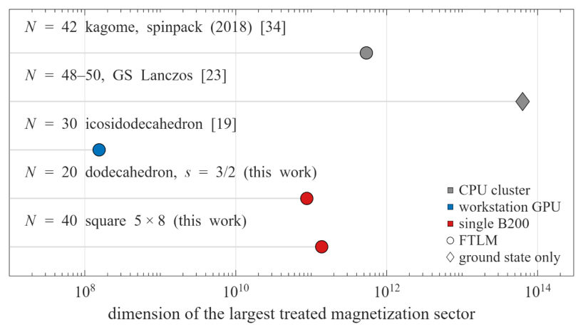
<figcaption class="paper-figure-caption"><b>Fig 1.</b> Figure 1: Dimension of the largest treated magnetization sector in representative large-scale spin-system</figcaption>
</figure>
<figure class="paper-figure-card">
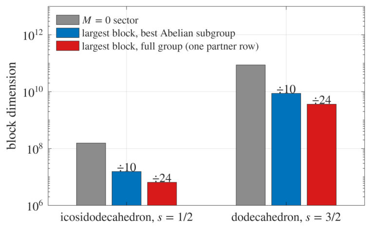
<figcaption class="paper-figure-caption"><b>Fig 2.</b> Figure 2: Block-size reduction by the full non-Abelian symmetry: for the 𝑀= 0 sectors of the 𝑠= 1/2 icosidodecahedron and the 𝑠= 3/2 dodecahedron, the sector dimension is compared with the largest block under the best Abelian subgroup of 𝐼ℎ (order 10) and with the largest single-partner-row block of the full group (Eq. (13)). For the dodecahedron the corresponding FP32 Lanczos vectors take 348 GB, 35 GB, and 14.5 GB, respectively.</figcaption>
</figure>
<figure class="paper-figure-card">
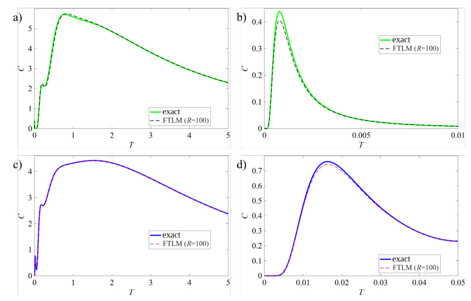
<figcaption class="paper-figure-caption"><b>Fig 3.</b> Figure 3: Heat capacity C(𝑇) of the 𝑠= 3/2 icosahedron (top row: panels (a) and (b)) and cuboctahedron (bottom row: panels (c) and (𝑑)), computed by full ED (data from Ref. [43]) and with the present FTLM code. The right-hand panels (b) and (𝑑) resolve the low-temperature peak.</figcaption>
</figure>
<figure class="paper-figure-card">
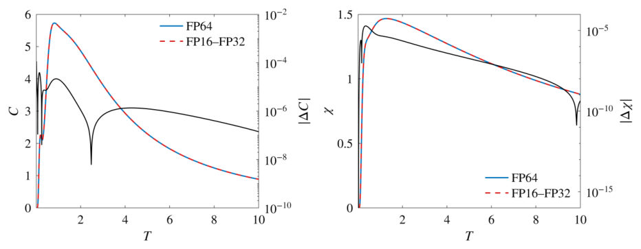
<figcaption class="paper-figure-caption"><b>Fig 4.</b> Figure 4: Heat capacity (left) and zero-field susceptibility (right) of the 𝑠= 3/2 icosahedron, computed with the</figcaption>
</figure>
<figure class="paper-figure-card">
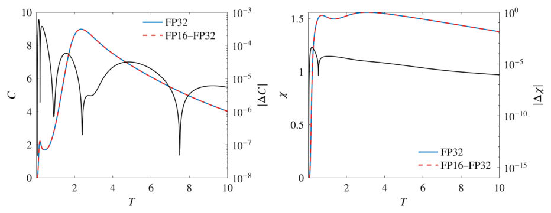
<figcaption class="paper-figure-caption"><b>Fig 5.</b> Figure 5: Same-seed comparison of FP32 and FP16 vector storage in symmetry-adapted FTLM for the 𝑠= 3</figcaption>
</figure>

**Summary.** This paper presents a major advancement in simulating Heisenberg spin systems by extending the GPU-accelerated Finite-Temperature Lanczos Method (FTLM) to handle full non-Abelian permutation symmetries. By developing a matrix-free formalism, the authors drastically reduce memory requirements and successfully compute properties for massive quantum clusters previously deemed computationally intractable.

**Why it may be interesting.** While focused on spin models (cond-mat.str-el), the development of highly efficient, scalable numerical techniques for strongly correlated quantum many-body systems is relevant to understanding complex dynamics in AMO physics simulations.

Detailed structure

**Main problem.** The authors extend the finite-temperature Lanczos method (FTLM) to incorporate full permutation symmetry, including non-Abelian point and space groups, for Heisenberg spin systems.

**Main result.** They successfully implemented a matrix-free formalism that exploits these symmetries, achieving significant computational reductions on large clusters like the dodecahedron using GPU acceleration.

**Method.** The core method is a GPU-accelerated FTLM combined with advanced group theory techniques to block-diagonalize the Hamiltonian over symmetry sectors ($\Gamma$).

**Model / system.** The study focuses on Heisenberg spin Hamiltonians ($H = J \sum_{\langle i,j
angle} (\mathbf{s}_i \cdot \mathbf{s}_j)$) applied to various cluster topologies, including icosahedral polyhedra and square lattices.

**Key observables.** Magnetic susceptibility ($\chi$), heat capacity ($C$), and partition function ($Z$).

**Important parameters / regimes.** Finite temperature ($eta = 1/k_B T$); spin values like $s=3/2$ and $s=1/2$; system sizes up to $\sim 10^{12}$ Hilbert space dimensions.

**Assumptions / limitations.** The method is matrix-free, avoiding explicit storage of the projected Hamiltonian; it assumes the Hamiltonian action is independent of the trace estimator used in FTLM.

**Figures summary.** Figure 1 compares symmetry sector dimension reduction across different computational platforms. Figure 2 compares block-size reductions for $s=1/2$ and $s=3/2$ polyhedra using various symmetry treatments.

**Paper structure.** The paper builds upon previous work by extending the FTLM from simple total-magnetization symmetry to full permutation symmetry, detailing the matrix-free formalism and demonstrating its application on large systems using GPU acceleration.

Abstract

We extend a recent GPU implementation of the finite-temperature Lanczos method (FTLM) for Heisenberg spin Hamiltonians, which uses only total-magnetization symmetry, to the full permutation symmetry, including non-Abelian point and space groups. For highly symmetric clusters such as icosahedral polyhedra, the multidimensional irreducible representations (irreps) of the permutation group reduce the block dimensions substantially further than any Abelian subgroup. Here, we provide a matrix-free formalism (avoiding explicit storage of the projected Hamiltonian) for using such symmetries. The implementation applies equally to Abelian groups, retaining the advantages of GPU acceleration. Several cluster topologies are built in; beyond these, symmetry groups can be supplied as site-permutation generators, with irrep matrices computed automatically, so that user-defined clusters run without any code changes. We demonstrate the approach in production runs on a single NVIDIA B200 accelerator for the s=3/2 Heisenberg antiferromagnet on the dodecahedron (Hilbert-space dimension 4^20 ~ 1.1x10^12) and for the s=1/2 square lattice of 5x8 sites (M=0 dimension 1.4x10^11). With R=24 random vectors per symmetry block and 60 Lanczos steps, the dodecahedron campaign (with the largest iterated symmetry block having a dimension of 3.6x10^9) requires about 50 GPU-hours. The code is openly available under the Apache-2.0 license at https://github.com/ghasdeke/ftlm-pg-gpu, archived at DOI: 10.5281/zenodo.21445872.

[↑ back to top](#top)

### [Precision dynamics of resonantly enhanced optical parametric amplifiers](http://arxiv.org/abs/2607.16885v1)

**Authors:** Evan D. Hall  
**Type:** theory · **Category:** other · **PDF:** <https://arxiv.org/pdf/2607.16885v1>  
**Analysis basis:** full PDF text, analyzed in chunks
**Topic relevance:** `Keldysh / 2PI / non-Gaussian methods` **1/5** · `correlated cavity matter` **1/5** · `driven-dissipative phase transition` **1/5** · `interference shaping light` **1/5** · `methods for driven-dissipative` **1/5** · `non-equilibrium dynamics` **1/5** · `quantum optics experiment` **1/5**

↔ Scroll figures horizontally

<figure class="paper-figure-card">
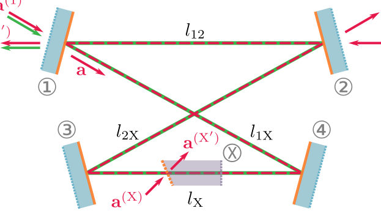
<figcaption class="paper-figure-caption"><b>Fig 1.</b> FIG. 1. Resonant optical parametric amplifier formed of a quadratically nonlinear crystal (X) and four mirrors, similar to the amplifier used in Advanced LIGO [40–42]. Mirrors 1 and 2 are partially transmissive, and mirrors 3 and 4 are assumed to be perfectly reflecting. Ingoing and outgoing sideband fields for the fundamental modes are indicated. The length l12 covers the distance from mirror 1 to mirror 2; l1X covers the distance from mirror 1 to the flat face of the crystal; l2X covers the distance from mirror 2 to the wedged face of the crystal; and lX covers the physical distance through the crystal excluding the wedge. We have drawn the optical loss in the crystal as a single...</figcaption>
</figure>
<figure class="paper-figure-card">
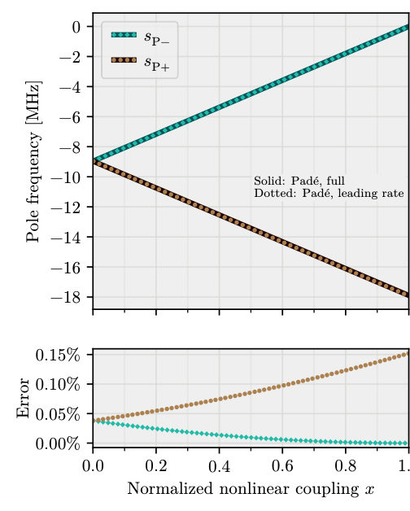
<figcaption class="paper-figure-caption"><b>Fig 2.</b> FIG. 2. The cavity poles sP± in their full (Eq. (39)) and approximate (Eq. (40)) expressions, using the parameters in Table I but allowing the nonlinear coupling to vary. Because sP−→0 as x →1 in both the full and approximate expres- sions, the error in the approximation also approaches 0.</figcaption>
</figure>
<figure class="paper-figure-card">
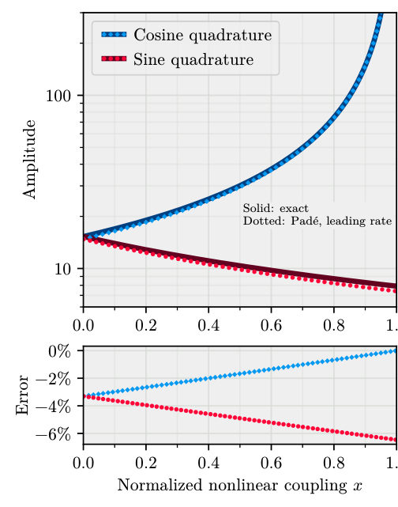
<figcaption class="paper-figure-caption"><b>Fig 3.</b> FIG. 3. The exact and approximate forms of the dc internal gain G(0). The upper element G11(0) approaches ∞as x →1, both in the exact and approximate forms, and the approxima- tion error goes to 0.</figcaption>
</figure>
<figure class="paper-figure-card">
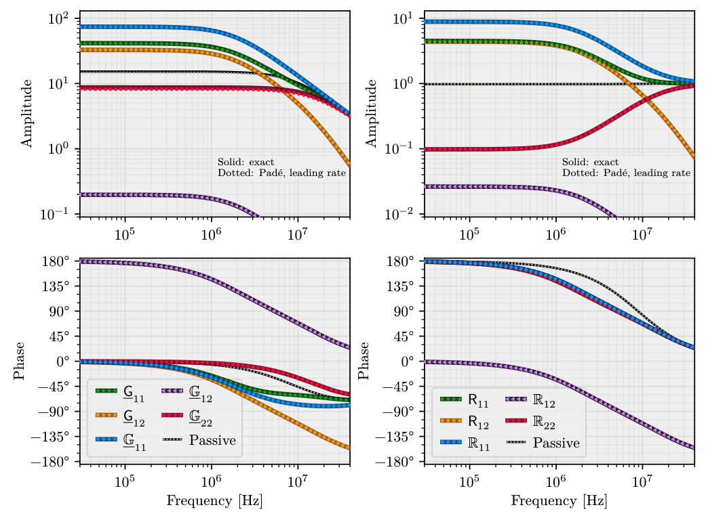
<figcaption class="paper-figure-caption"><b>Fig 4.</b> FIG. 4. Input–output relations for the internal gain (left; § V A 1) and reflection (right; § V C) for a resonant optical parametric amplifier with parameters given in Table I, showing the unique entries for both the sideband representations G and R and the quadrature representations G and R. The relations are plotted at a small but nonzero pump phase (ψb = 3 mrad) to exhibit cross-coupling of the quadratures. Solid lines show the exact expressions; dotted lines show the Pad´e expansions into zero–pole–gain form and with approximations for small decay and gain rates. The zeros at s = −2/τa contribute nonnegligibly to the phase response of G and G above 10 MHz. Also shown is the passive...</figcaption>
</figure>
<figure class="paper-figure-card">
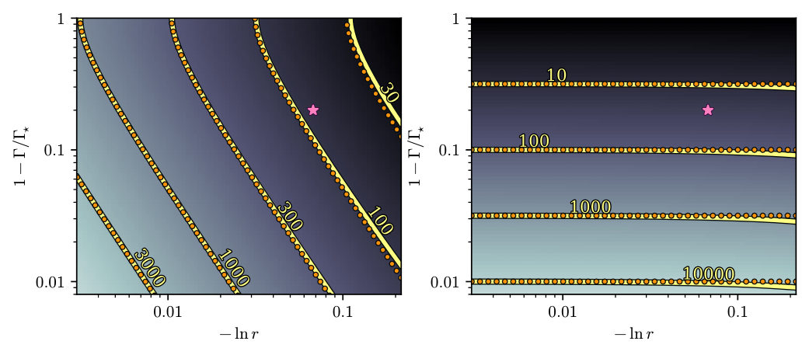
<figcaption class="paper-figure-caption"><b>Fig 5.</b> FIG. 5. Left: amplified finesse in its exact expression (solid, Eq. (36)) and in the leading-order rate approximation (dotted; Eq. (37)). Right: nonlinear gain in its exact expression (solid; Eq. (73)) and in the leading-order rate approximation (dotted; Eq. (76)). The quantities are plotted as a function of both −ln r = κτa (the decay rate relative to the cavity free spectral range) and the nonlinear interaction Γ relative to threshold Γ⋆. The limitations of the leading-order rate approximation are evident for large values of −ln r. The indicated point corresponds to the amplifier considered in Table I.</figcaption>
</figure>

**Summary.** This paper develops a rigorous frequency-domain model for optical parametric amplifiers integrated into resonant cavities, crucial for applications like gravitational-wave detectors. By solving input-output relations directly, the authors capture full cavity dynamics, providing advanced characterization methods beyond static analyses. This advances the theoretical toolkit for modeling quantum light sources in high-finesse optical systems.

**Why it may be interesting.** This work is highly relevant as it tackles open quantum systems dynamics (OPAs) by developing advanced theoretical tools (frequency-domain transfer functions) necessary for modeling high-precision quantum measurements like gravitational wave detection.

Detailed structure

**Main problem.** The work develops a comprehensive frequency-domain model for resonantly enhanced optical parametric amplifiers (OPAs) that fully incorporates complex cavity dynamics, moving beyond simpler Hamiltonian formalisms.

**Main result.** The direct input-output relation approach yields frequency-dependent transfer functions that provide complementary characterization methods compared to static measurements of amplifier performance.

**Method.** The authors solve the input-output relations directly in the frequency domain by modeling field propagation through the cavity, and they derive low-order zero-pole-gain expansions for analysis.

**Model / system.** The physical system is an OPA used in gravitational-wave interferometry, where the amplifier is coupled to an optical cavity. The model tracks input, circulating, and output optical fields using frequency-domain transfer functions.

**Key observables.** Input–output relations (transfer functions), amplifier figures of merit, squeezed quadrature variances, and frequency dependence of these relations.

**Important parameters / regimes.** Cavity decay rates, free spectral range effects, and the detuning parameters ($\Phi_a, \Phi_b$) governing resonance conditions.

**Assumptions / limitations.** The analysis compares results derived from a direct field-tracking method against those from standard Hamiltonian formalisms, noting that the direct method is necessary to capture finite free spectral range dynamics.

**Figures summary.** Figure 1 illustrates the resonant OPA setup detailing various optical paths and coupling elements; other figures likely show frequency dependence plots of transfer functions or gain.

**Paper structure.** The paper progresses by first establishing the necessity of a full cavity model, deriving the input-output relations in the frequency domain, providing low-order expansions for control analysis, analyzing key performance metrics, and comparing results to established Hamiltonian formalisms.

Abstract

Optical parametric amplification is a crucial technology for the production of continuous-wave squeezed vacuum, which is now applied to gravitational-wave interferometry and other highly sensitive measurements of optical phase. The amplifiers employed in gravitational-wave detection are resonantly enhanced with optical cavities, which introduces nontrivial dynamics to their operation and requires a frequency-domain model of the relations between optical fields. In this work, input-output relations between optical fields entering, circulating in, and exiting a model amplifier are solved directly to produce frequency-domain relations that fully incorporate the cavity dynamics. We also provide low-order zero-pole-gain expansions for these relations to facilitate their analysis from a feedback control perspective. In the limit of small cavity decay rates, our relations are shown to reduce to relations previously derived under a Hamiltonian formalism. Expressions for amplifier figures of merit and for squeezed quadrature variances are also analyzed. Along the way, we examine how information about the amplifier performance can be extracted from the frequency dependence of the input-output relations, providing characterization methods that are complementary to methods that examine the static amplifier behavior.

[↑ back to top](#top)

### [Semi-fractality and localization on a chiral Cayley tree](http://arxiv.org/abs/2607.18179v1)

**Authors:** Carlo Vanoni, Vladimir E. Kravtsov, Boris L. Altshuler  
**Type:** theory · **Category:** disordered systems and neural networks · **PDF:** <https://arxiv.org/pdf/2607.18179v1>  
**Analysis basis:** full PDF text, analyzed in chunks
**Topic relevance:** `Keldysh / 2PI / non-Gaussian methods` **1/5** · `analog quantum simulation` **1/5** · `correlated / nonlocal dissipation` **1/5** · `driven-dissipative phase transition` **1/5** · `methods for driven-dissipative` **1/5** · `non-equilibrium dynamics` **1/5**

↔ Scroll figures horizontally

<figure class="paper-figure-card">
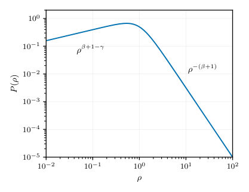
<figcaption class="paper-figure-caption"><b>Fig 1.</b> FIG. 1. Schematic representation of the distribution of the LDoS, based on the population dynamics result (see Sec. IV). The small-ρ regime is described by a power-law ρβ+1−γ, while the large-ρ regime is described by ρ−(β+1).</figcaption>
</figure>
<figure class="paper-figure-card">
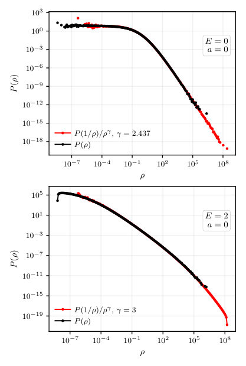
<figcaption class="paper-figure-caption"><b>Fig 2.</b> FIG. 2. Top panel: comparison between P(ρ) (black) and ργP(1/ρ) (red) for a = 0 and E = 0. The collapse of the two curves signals the validity of Eq. (15) for γ(a = 0) = 2.44, a value obtained from fitting the power-law tails of the LDoS distribution. Bottom panel: same comparison for a = 0 and E = 2. Away from E = 0, there is no chiral symmetry and the Dyson γ = 3 value is restored, with the LDoS distribution not displaying two power-law tails at small and large ρ.</figcaption>
</figure>
<figure class="paper-figure-card">
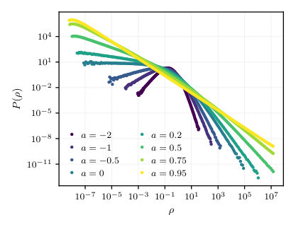
<figcaption class="paper-figure-caption"><b>Fig 3.</b> FIG. 4. Distribution function of the LDoS P(ρ) at different values of a.</figcaption>
</figure>
<figure class="paper-figure-card">
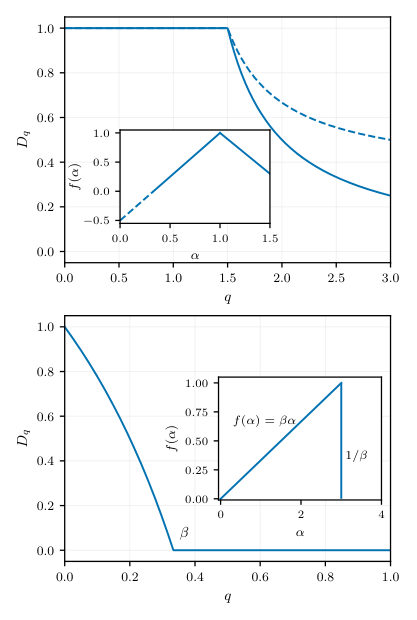
<figcaption class="paper-figure-caption"><b>Fig 4.</b> FIG. 3. Top panel: Example of a semi-fractal Dq with β = 1.5. The solid line corresponds to Dq with the rare events with large wave function amplitudes (shown by the dashed line in the inset) taken into account, while the dashed line corresponds to Dq deduced from the typical average of the moments. In the inset, the corresponding spectrum of fractal dimensions is shown, which has a linear segment f(α) = β(α− 1)+1 with the slope β = 1.5 for α &lt; 1 and the reciprocal linear segment with the slope γ −β −2 = −1.4 that corresponds to the Mirlin-Fyodorov symmetry with γ = 2.1. Bottom panel: Dq for β &lt; 1, corresponding to the localized case. The inset shows the corresponding f(α).</figcaption>
</figure>
<figure class="paper-figure-card">
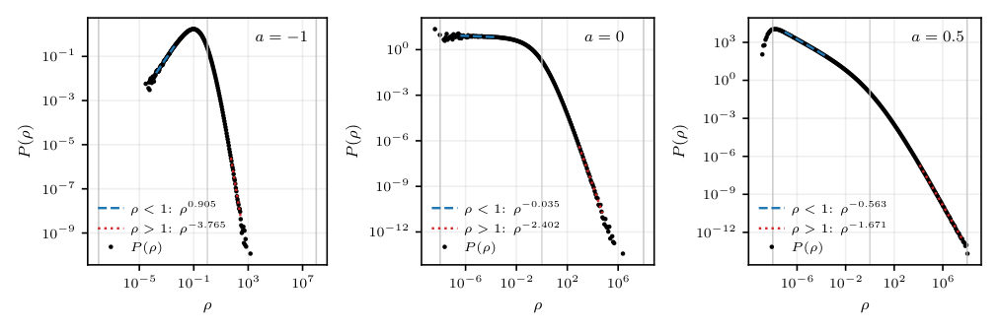
<figcaption class="paper-figure-caption"><b>Fig 5.</b> FIG. 5. LDoS distribution for a = −1, 0, 0.5 (from left to right), with the power-law fits at ρ ≪1 and ρ ≫1 indicated in blue and red, respectively.</figcaption>
</figure>

**Summary.** The paper analyzes quantum particle hopping on a chiral Cayley tree with power-law disorder, revealing novel phases of eigenfunction statistics. It demonstrates that the system transitions between 'semi-fractal' and localized states as a function of the disorder exponent '$a$'. This transition is fundamentally linked to the preservation of chiral symmetry.

**Why it may be interesting.** This work provides a detailed theoretical framework connecting graph topology (Cayley tree), specific symmetries (chiral symmetry), and emergent wave function statistics (semi-fractality/localization) in disordered quantum systems, which is highly relevant to understanding transport in complex media.

Detailed structure

**Main problem.** The study investigates the nature of quantum wave function statistics—specifically semi-fractality and localization—for a particle hopping on an infinite Cayley tree.

**Main result.** The system exhibits a continuous transition between a 'semi-fractal' regime (characterized by power-law tails in LDoS) and a localized state, mediated by the chiral symmetry of the Hamiltonian.

**Method.** The analysis employs population dynamics to solve cavity equations for the propagator, relating moments of the Local Density of States ($\langle 
ho^q 
angle$) to those of wave function amplitudes ($\langle |\psi|^{2q} 
angle$).

**Model / system.** The model is a quantum particle hopping on an infinite Cayley tree with nearest-neighbor hopping amplitudes drawn from a power-law distribution $p(t) \propto |t|^{-a}$, possessing chiral symmetry due to the graph's bipartite nature.

**Key observables.** Local Density of States (LDoS) distribution, fractal dimensions ($D_q$), and the multifractal spectrum $f(\alpha)$.

**Important parameters / regimes.** The hopping exponent '$a$' acts as a tuning parameter controlling the transition between regimes; chiral symmetry is crucial.

**Assumptions / limitations.** The analysis assumes the system maintains chiral symmetry (zero energy, link disorder only) and uses approximations relating LDoS moments to wave function moment averages.

**Figures summary.** Figures illustrate the dependence of fractal dimensions ($D_q$) on the exponent $a$, showing distinct behaviors for semi-fractal ($eta>1$) versus localized ($eta<1$) regimes.

**Paper structure.** The paper establishes a relationship between LDoS moments and wave function moments, derives explicit formulas for $D_q$ in different parameter regimes ($eta$), and discusses the physical interpretation of these fractal structures via eigenstate weight hierarchies.

Abstract

We study a quantum particle hopping on an infinite Cayley tree with nearest-neighbor hopping amplitudes drawn from a distribution singular as $|t|^{-a}$ near weak links and no on-site disorder. Because the graph is bipartite, the model has chiral symmetry, which strongly affects the statistics of eigenstates at the center of the spectrum. Using population dynamics to solve the cavity equations for the propagator, we analyze the distribution of the local density of states and show that it develops broad power-law tails. These tails imply an unusual form of wave-function statistics, which we call semi-fractality: the eigenstates occupy an extensive fraction of the system, but their higher moments behave as in a multifractal state. We find that the symmetry properties of the local-density-of-states distribution are not fixed only by the symmetry class, but vary continuously with the exponent controlling the power-law hopping distribution. As this exponent is changed, the system crosses from a semi-fractal regime to a localized one. At the transition, the wave functions realize an extreme intermediate form that we call semi-localized, simultaneously extended in their support but localized according to higher moments.

[↑ back to top](#top)

### [Symmetry-Based Microscopic Theory of the Unconventional Pairing Mechanism in La$_5$Ni$_3$O$_{11}$](http://arxiv.org/abs/2607.18094v1)

**Authors:** Guan-Hao Feng, Jun Quan  
**Type:** theory · **Category:** strongly correlated electrons · **PDF:** <https://arxiv.org/pdf/2607.18094v1>  
**Analysis basis:** full PDF text, analyzed in chunks
**Topic relevance:** `Keldysh / 2PI / non-Gaussian methods` **1/5** · `analog quantum simulation` **1/5** · `driven-dissipative phase transition` **1/5** · `methods for driven-dissipative` **1/5**

↔ Scroll figures horizontally

<figure class="paper-figure-card">
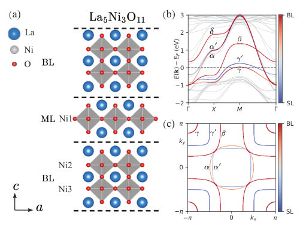
<figcaption class="paper-figure-caption"><b>Fig 1.</b> Figure 1. (a) Crystal structure of La5Ni3O11 in the P4/mmm space group drawn using VESTA [64]. The crystal structure of La5Ni3O11 is adopted from Ref. [10], corresponding to a pressure of 21 GPa. (b)–(c) Layer-resolved BS and FS.</figcaption>
</figure>
<figure class="paper-figure-card">
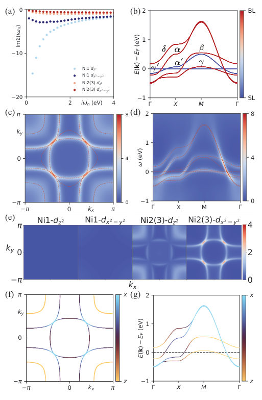
<figcaption class="paper-figure-caption"><b>Fig 2.</b> Figure 2. (a) Imaginary part of the Matsubara self-energies of the site-resolved local Ni-eg orbitals. (b) Contribution of the ML and BL systems to the QP BS after renormaliza- tion. (c) Comparison between the QP FS and the spectral function A(k, 0). (d) Comparison between the QP BS and A(k, w) for the whole system. (e) Orbital-resolved correlated FS Aσ,σ(k, 0). (f) Orbital contribution to the QP FS and (g) BS of the BL subsystem. The filling n = 1.46 per Ni-eg orbitals demonstrates that the BL subsystem is hole-doped relative to the undoped filling of n = 1.5.</figcaption>
</figure>
<figure class="paper-figure-card">
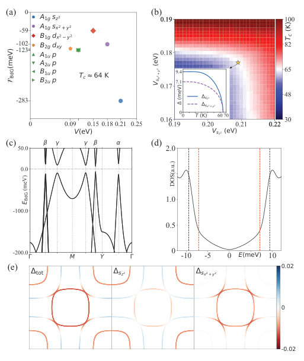
<figcaption class="paper-figure-caption"><b>Fig 3.</b> Figure 3. (a) Minimum BCS condensation energy of symmetry-allowed pairing types at Tc ≈64 K. (b) Tc as a function of the two-gap superconductivity parameters. The yellow star marks {Vsz2 , Vsx2+y2 } = {0.209, 0.177} eV, which minimizes the condensation energy at Tc ≈64 K. (c) Su- perconducting BS calculated at the marked parameters, with {∆sz2 , ∆sx2+y2 } = {9.4, 7.1} meV, yielding gap sizes of ∼ 12.1 and 9.4 meV at the β and γ pockets along Γ-M, respec- tively. (d) DOS of the superconducting state. (e) Projected gap functions ˜∆tot = ˜∆sz2 + ˜∆sx2+y2 on the QP FS.</figcaption>
</figure>
<figure class="paper-figure-card">
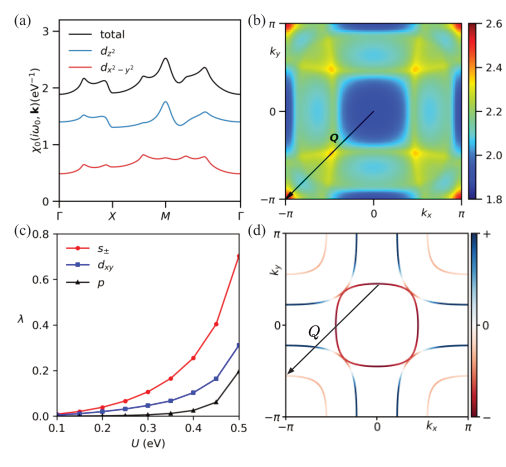
<figcaption class="paper-figure-caption"><b>Fig 4.</b> Figure 4. RPA results. (a) Total and orbital-projected bare static susceptibilities χ0(iω0, k) at T = 116 K along the high- symmetry path. (b) Total χ0(iω0, k) in the 2D BZ. (c) The eigenvalues λ of the linearized Eliashberg equation calculated with JH = J′ = 0.15U and U ′ = U −2JH. (d) Gap function at U = 0.5 eV for the leading superconducting instabilities, which exhibit s±-wave symmetry.</figcaption>
</figure>

**Summary.** This work develops a symmetry-based microscopic theory to explain superconductivity in nickelates. It finds that La5Ni3O11 exhibits a two-gap superconducting state, attributing the lower $T_c$ compared to related materials to changes in orbital hopping ratios. The methodology combines advanced electronic structure calculations with rigorous group-theoretical analysis of pairing symmetries.

**Why it may be interesting.** While focused on solid-state physics, the use of symmetry constraints and mean-field approaches to determine pairing instabilities is relevant for understanding emergent order parameters in complex quantum systems.

Detailed structure

**Main problem.** To develop a unified microscopic theory explaining the difference in superconducting pairing mechanisms between nickelate superconductors like La5Ni3O11 and pressurized La3Ni2O7.

**Main result.** The superconductivity in La5Ni3O11 is characterized by a two-gap nature, involving leading interlayer pairing ($d_{z^2}$) and subleading intralayer pairing ($d_{x^2-y^2}$), with the reduction of Tc attributed to the hopping parameter ratio $|t_{\perp}^z/t_{\parallel}^{x}|$.

**Method.** The study employs a symmetry-based approach combined with advanced many-body techniques, including DFT+DMFT and analysis via the Bogoliubov-de Gennes Hamiltonian.

**Model / system.** The system is based on nickelate superconductors (e.g., La5Ni3O11), modeled using an effective quasiparticle Hamiltonian derived from strong correlation physics involving Ni-$e_g$ orbitals.

**Key observables.** Superconducting transition temperature ($T_c$), superconducting gap structure ($\Delta_{sz^2}$ vs $\Delta_{sx^2+y^2}$), and the hopping parameter ratio $|t_{\perp}^z/t_{\parallel}^{x}|$.

**Important parameters / regimes.** $T_c \approx 64$ K for La5Ni3O11; $T_c = 80$ K for pressurized La3Ni2O7.

**Assumptions / limitations.** The low-energy physics is dominated by Ni-$e_g$ orbitals, and the pairing mechanism can be analyzed using symmetry constraints on the gap function.

**Paper structure.** The paper systematically develops a theoretical framework starting from DFT+DMFT calculations to analyze the low-energy physics, determining the superconducting state via minimizing the free energy functional derived from the BdG Hamiltonian.

Abstract

Recent experiments report high-temperature superconductivity in the hybrid nickelate $\mathrm{La}_5\mathrm{Ni}_3\mathrm{O}_{11}$, which is composed of alternating stacks of bilayer $\mathrm{La}_3\mathrm{Ni}_2\mathrm{O}_7$ and monolayer $\mathrm{La}_2\mathrm{NiO}_4$. However, the superconducting transition temperature $T_c \approx 64~\mathrm{K}$ for $\mathrm{La}_5\mathrm{Ni}_3\mathrm{O}_{11}$ is remarkably lower than the $80~\mathrm{K}$ observed for pressurized $\mathrm{La}_3\mathrm{Ni}_2\mathrm{O}_7$. Thus, an unified microscopic theory is required to address the difference in the pairing mechanisms between these systems. Here, we develop a phenomenological symmetry-based approach to systematically analyze the low-energy physics in $\mathrm{La}_5\mathrm{Ni}_3\mathrm{O}_{11}$, which is obtained by a charge self-consistent density functional theory plus dynamical mean-field theory method. We show that the superconductivity in $\mathrm{La}_5\mathrm{Ni}_3\mathrm{O}_{11}$ exhibits a two-gap nature, consisting of a leading interlayer pairing between the $d_{z^2}$ orbitals and a subleading intralayer pairing between the $d_{x^2-y^2}$ orbitals. The reduction of $T_c$ can be attributed to the diminished contribution of the interlayer pairing, as reflected by the hopping parameter ratio $|t_{\perp}^z/t_{\parallel}^{x}|$. Base on this unified picture, we discuss the possible pairing mechanism and the role of $γ$ pocket for the superconductivity in the bilayer NiO$_2$ planes of nickelate superconductors.

[↑ back to top](#top)

### [Unconventional superconductivity in ScIr$_2$ chiral crystal with a kagome lattice](http://arxiv.org/abs/2607.16689v1)

**Authors:** Keqi Xia, Jianzhou Zhao, Igor Plokhikh, Marisa Medarde, Yang Xu, Qingfeng Zhan, Dariusz Jakub Gawryluk, Toni Shiroka, Tian Shang  
**Type:** both · **Category:** strongly correlated electrons · **PDF:** <https://arxiv.org/pdf/2607.16689v1>  
**Analysis basis:** full PDF text, analyzed in chunks
**Topic relevance:** `Kondo & dissipative impurity` **1/5** · `analog quantum simulation` **1/5** · `exotic spin models in light-matter` **1/5** · `spintronics-quantum-optics interface` **1/5**

↔ Scroll figures horizontally

<figure class="paper-figure-card">
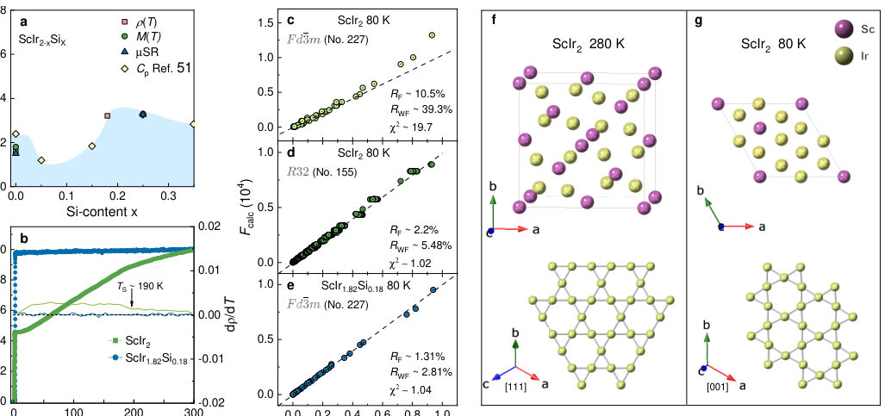
<figcaption class="paper-figure-caption"><b>Fig 1.</b> Figure 1. Phase diagram and crystal structure. a) Superconducting phase diagram of ScIr2−xSix (0 ≤x ≤0.35). Superconducting transition temperatures determined from the specific heat Cp were taken from Ref. [51]. Note that, previously the same compound was dubbed Sc2Ir4−xSix (0 ≤x ≤0.7) [51], where the nominal Si concentrations were used. b) Temperature-dependent electrical resistivity ρ(T) (left axis) and its derivative with respect to temperature dρ(T)/dT (right axis) for ScIr2 and ScIr1.82Si0.18, respectively. For clarity, the electrical resistivity data are normalized to their room-temperature value. The arrow marks a structural phase transition at TS ≈190 K in ScIr2. c-e) Refinements of...</figcaption>
</figure>
<figure class="paper-figure-card">
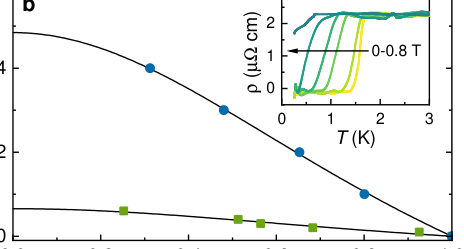
<figcaption class="paper-figure-caption"><b>Fig 2.</b> Figure 2. Characterization of superconductivity. a) Temperature-dependent magnetic susceptibility χ(T) for ScIr2 and ScIr1.82Si0.18. Magnetic susceptibility data were collected using both field-cooled (FC) and zero-field-cooled (ZFC) protocols in an applied magnetic field of 1 mT. Magnetic susceptibility data were normalized to their lowest-temperature value. b) Upper critical fields Hc2 of ScIr2 and ScIr1.82Si0.18. The inset shows the temperature-dependent electrical resistivity ρ(T) collected under different magnetic fields for ScIr2, with ScIr1.82Si0.18 showing similar features. The symbols in the main panel represent the superconducting transition temperature Tc, where the electrical...</figcaption>
</figure>
<figure class="paper-figure-card">
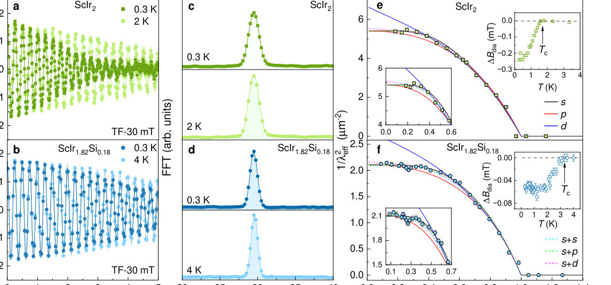
<figcaption class="paper-figure-caption"><b>Fig 3.</b> Figure 3. Exploring the superconducting pairing via TF-µSR. a,b) TF-µSR spectra collected in the superconducting and normal states in an applied magnetic field of 30 mT for ScIr2 (a) and ScIr1.82Si0.18 (b). All the spectra were collected using a FC protocol. Solid lines through the data are fits to Eq. (1). c,d) FFT of the relevant µSR spectra in panels (a) and (b) for ScIr2 (c) and ScIr1.82Si0.18 (d). e,f) Superfluid density [ρsc(T) ∝λ−2 eff (T)] as a function of the reduced temperature T/Tc for ScIr2 (e) and ScIr1.82Si0.18 (f). The upper insets plot temperature-dependent diamagnetic shift ∆Bdia. Here, ∆Bdia = Bs - Bappl, with Bs the local field sensed by implanted muons in the sample and...</figcaption>
</figure>
<figure class="paper-figure-card">
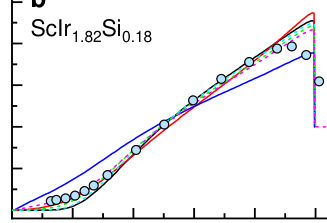
<figcaption class="paper-figure-caption"><b>Fig 4.</b> Figure 4. Electronic specific heat. a,b) Normalized electronic specific heat Ce/γnT as a function of the reduced temperature T/Tc for ScIr2 (a) and ScIr1.82Si0.18 (b). The different lines represent fits to the various models, analogous to those used to analyze the superfluid density in Figure 3e,f (see text for details). The derived fit parameters are also listed in Table 1. Zero-field specific heat data were taken from Ref. [51]. Note that, the extra phases observed in previous studies alsoresulted in lower actual Si concentrations in the doped ScIr2 samples. Since the same method was used to prepare the ScIr1−xSix samples, comparable Si concentrations are expected in both cases. For...</figcaption>
</figure>
<figure class="paper-figure-card">
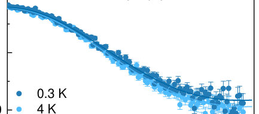
<figcaption class="paper-figure-caption"><b>Fig 5.</b> Figure 5. Preserved TRS in the superconducting state of ScIr2−xSix. a,b) ZF-µSR spectra of ScIr2 (a) and ScIr1.82Si0.18 (b), collected in their superconducting (0.3 K) and normal (2 and 4 K) states. Solid lines through the data are fits to Eq. (2) using the Kubo-Toyabe relaxation function.</figcaption>
</figure>

**Summary.** This paper reports evidence for unconventional superconductivity in the kagome lattice material $	ext{ScIr}_{2-x}	ext{Si}_x$. By combining muon-spin spectroscopy, specific heat measurements, and structural analysis, the authors determine that the SC pairing symmetry is best described by a two-gap $(s+d)$-wave model. The research highlights how topological features and strong electronic correlations govern these unusual superconducting properties.

**Why it may be interesting.** This work is highly relevant as it tackles unconventional SC in a strongly correlated material class (iridates) where topological features (chiral crystal, flat bands) are expected to dictate exotic quantum behavior. The combination of structural, magnetic, and superconducting characterization is state-of-the-art.

Detailed structure

**Main problem.** The study investigates unconventional superconductivity (SC) in $	ext{ScIr}_{2-x}	ext{Si}_x$, a material featuring a kagome lattice structure, by analyzing the interplay between band topology, spin-orbit coupling, and electronic correlations.

**Main result.** Evidence strongly suggests an unconventional SC pairing symmetry described by a two-gap $(s+d)$-wave model. Furthermore, the low-temperature phase is identified as a topological chiral crystal.

**Method.** The research combines multiple experimental techniques—including muon-spin spectroscopy ($\mu$SR), specific heat measurements, and electrical transport—with theoretical calculations like DFT band structure analysis.

**Model / system.** The physical system is the $	ext{ScIr}_{2-x}	ext{Si}_x$ compound, which possesses a structural phase transition from a high-T cubic to a low-T rhombohedral phase. The kagome lattice and strong electronic correlations are central to its exotic properties.

**Key observables.** Superconducting gap structure (two-gap model), superconducting critical temperature ($T_c$), upper critical fields ($H_{c2}$), magnetic penetration depth ($\lambda_{	ext{eff}}(T)$), and electronic specific heat ($C_e/T$).

**Important parameters / regimes.** The doping concentration $x$ in $	ext{ScIr}_{2-x}	ext{Si}_x$, the structural transition temperature $T_S \approx 190	ext{ K}$, and the superconducting pairing symmetry.

**Assumptions / limitations.** The analysis relies on fitting experimental data ($\lambda^{-2}_{	ext{eff}}(T)$ and $C_e/T$) to various theoretical gap models (s, p, d, s+d) to determine the best fit for the pairing mechanism.

**Figures summary.** Figures illustrate the superconducting phase diagram, structural transitions via SXRD, magnetic characterization ($\chi(T)$, $H_{c2}$), and detailed analysis of SC symmetry using $\mu$SR spectra and specific heat data.

**Paper structure.** The paper systematically characterizes the material's structure (phase transition, chiral lattice) before moving to a comprehensive investigation of superconductivity. This involves determining $T_c$, analyzing magnetic responses ($\mu$SR), and finally modeling the pairing symmetry using multiple thermodynamic and spectroscopic probes.

Abstract

Materials with a kagome lattice host exotic quantum phenomena driven by the interplay between band topology, spin-orbit coupling, magnetism, and electronic correlations. While magnetism of kagome materials has been widely investigated, their unconventional superconductivity (SC) remains largely unexplored due to the limited availability of suitable materials. Here, we report evidence of unconventional SC in the ScIr$_{2-x}$Si$_{x}$ family by combining muon-spin spectroscopy measurements with band-structure calculations. The parent ScIr$_2$ undergoes a structural phase transition from a high-$T$ cubic- to a low-$T$ rhombohedral phase, while the Ir kagome layer remains, albeit slightly distorted. Although the structural transition is suppressed by Si substitution, the superconducting pairing of ScIr$_{2-x}$Si$_{x}$ remains well described by a two-gap model. Since at least one of the gaps has nodes, this indicates an unconventional SC. Its unconventional nature can be explained by the distinct flat bands occurring near the Fermi level, leading to strong electronic correlations in the ScIr$_{2-x}$Si$_{x}$ family. Moreover, the low-$T$ phase of ScIr$_2$ exhibits an Ir chiral chain; therefore, it can be classified as a topological chiral crystal. Overall, the unusual properties of the ScIr$_{2-x}$Si$_{x}$ family make it an interesting, albeit rare, system for studying the interplay between unconventional SC, flat bands, and chirality.

[↑ back to top](#top)

### [Approximate thermodynamics of the two-dimensional Ising model in an external magnetic field](http://arxiv.org/abs/2607.16735v1)

**Authors:** Mathieu Gaudreault  
**Type:** theory · **Category:** statistical mechanics · **PDF:** <https://arxiv.org/pdf/2607.16735v1>  
**Analysis basis:** full PDF text, analyzed in chunks
**Topic relevance:** `Keldysh / 2PI / non-Gaussian methods` **1/5** · `analog quantum simulation` **1/5** · `driven-dissipative phase transition` **1/5**

↔ Scroll figures horizontally

<figure class="paper-figure-card">
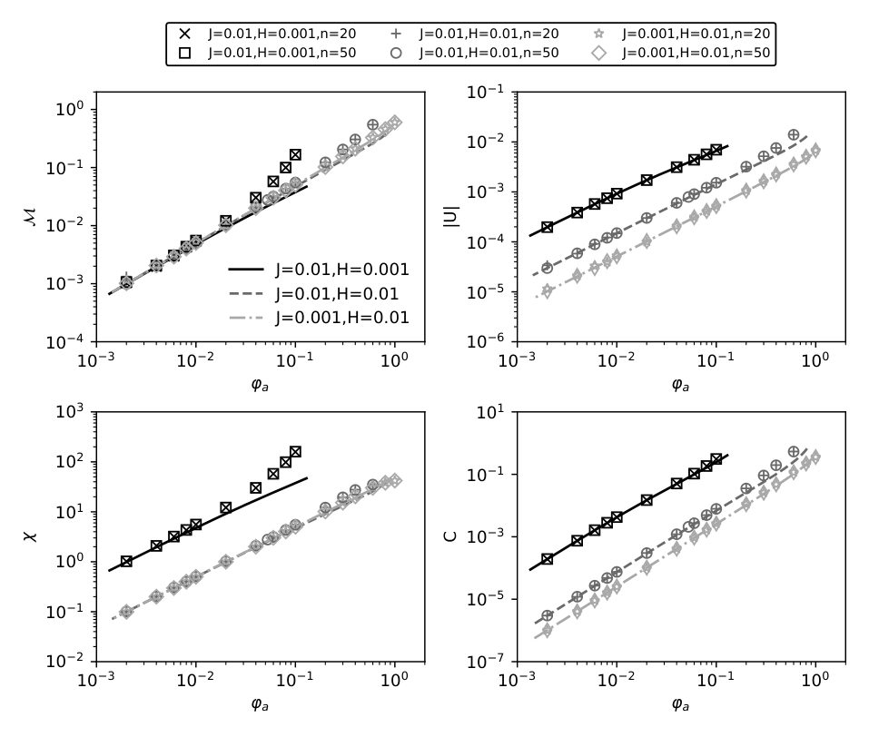
<figcaption class="paper-figure-caption"><b>Fig 1.</b> FIG. 1. Magnetization (M), susceptibility (χ), absolute value of the internal energy (|U|), and specific heat (C) of the two-dimensional Ising model as a function of the angle φa = arctan[sinh(2βH) exp(2βJ)]. Results obtained with the approximate expressions (lines) and nu- merical simulations of lattice sizes N = n×n where n = [20, 50] (symbols) are compared. The cases where J = 0.001 &lt; H = 0.01 (solid lines), J = H = 0.01 (dashed lines), and J = 0.01 &gt; H = 0.001 (dash-dotted lines) are shown. The legends apply to all plots.</figcaption>
</figure>
<figure class="paper-figure-card">
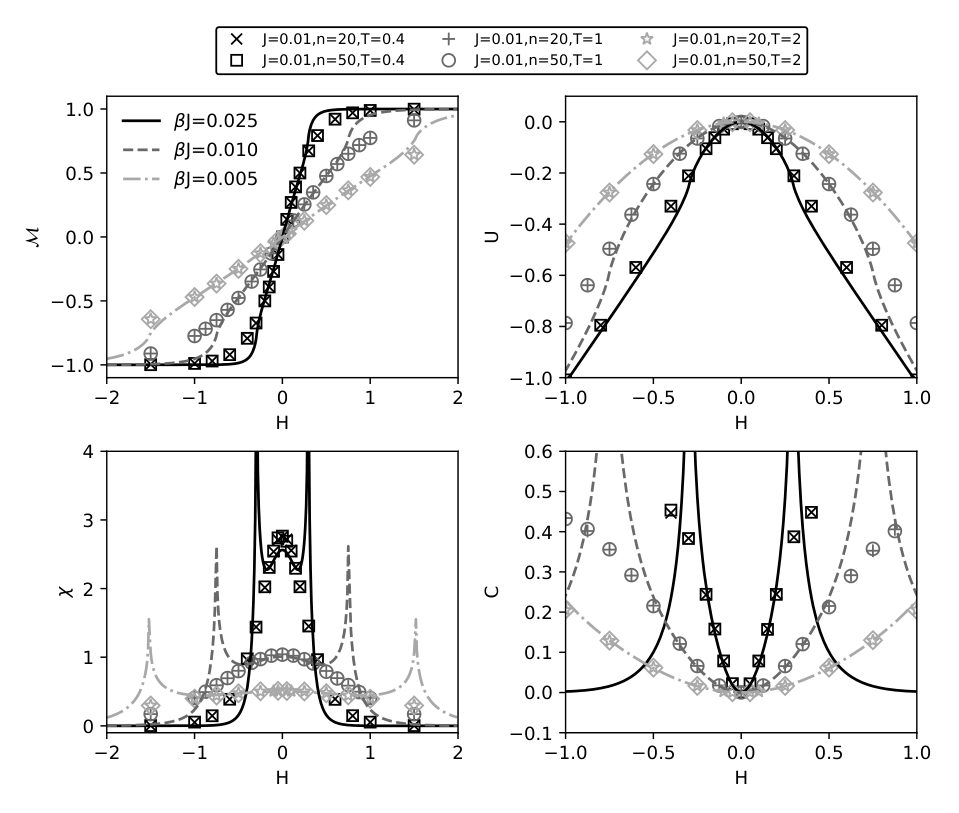
<figcaption class="paper-figure-caption"><b>Fig 2.</b> FIG. 2. Magnetization (M), susceptibility (χ), internal energy (U), and specific heat (C) of the two-dimensional Ising model shown as a function of the external magnetic field strength H. Results obtained with the approximate expressions (solid, dashed, and dash-dotted lines at T=0.4 (φa ≈0.05), 1 (φa ≈0.02), and 2 (φa ≈0.01), respectively) and numerical simulations of lattice sizes N = n × n where n = [20, 50] (symbols) are compared. The interaction energy is fixed at J = 0.01. The legends apply to all plots.</figcaption>
</figure>
<figure class="paper-figure-card">
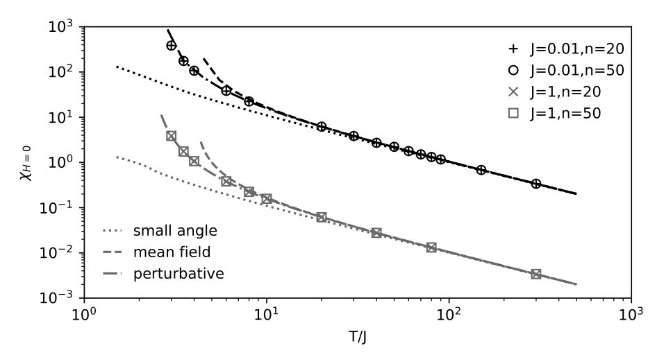
<figcaption class="paper-figure-caption"><b>Fig 3.</b> FIG. 3. Susceptibility (χH=0) of the two-dimensional Ising model with H = 0 as a function of the reduced temperature T/J, where T is the temperature and J is the interaction energy between neighboring spins. Results obtained with the approximate expressions [small angle (dotted lines), mean-field theory (dashed lines), and perturbative expansion (dash-dotted lines)] and numerical simulations of lattice sizes N = n × n where n = [20, 50] (symbols) are shown. The temperature was varied for both values of J (J = 0.01 and J = 1) considered.</figcaption>
</figure>
<figure class="paper-figure-card">
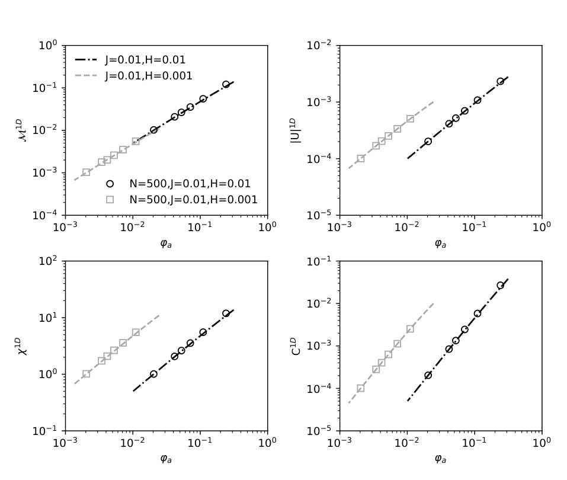
<figcaption class="paper-figure-caption"><b>Fig 4.</b> FIG. 4. Magnetization (M1D), susceptibility (χ1D), absolute value of the internal energy (|U|1D), and specific heat (C1D) of the one-dimensional Ising model as a function of the angle φa = arctan[sinh(2βH) exp(2βJ)]. Results obtained with the approximate expressions (lines) and numerical simulations of a linear chain of size N = 500 (symbols) are compared. The cases where J = H = 0.01 (dash-dotted lines), and J = 0.01 &gt; H = 0.001 (dashed lines) are shown. The legends shown apply to all plots.</figcaption>
</figure>
<figure class="paper-figure-card">
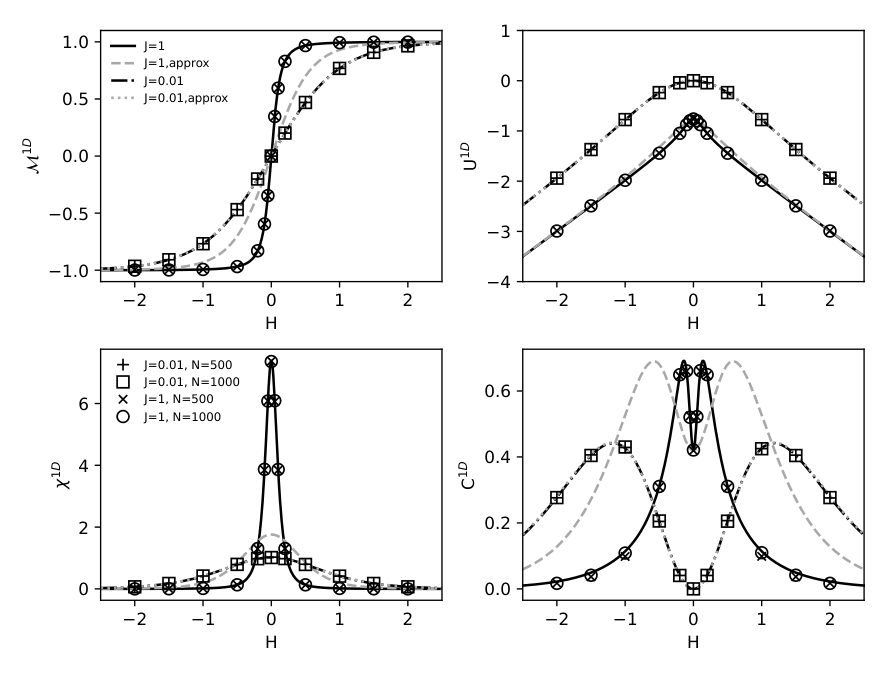
<figcaption class="paper-figure-caption"><b>Fig 5.</b> FIG. 5. Magnetization (M1D), susceptibility (χ1D), internal energy (U 1D), and specific heat (C1D) of the one-dimensional Ising model obtained with the exact and approximate expressions (lines) and the numerical simulations of a linear chain of size N = [500, 1000] (symbols) as the external field strength H is varied. The temperature is fixed at T = 1. The legends shown apply to all plots.</figcaption>
</figure>

**Summary.** This paper develops approximate analytical expressions for the thermodynamics of the 2D Ising model under an external magnetic field by employing a quaternion representation and small-angle approximation. The derived results for energy, magnetization, and susceptibility are rigorously tested against numerical simulations using the BKL algorithm. It provides valuable insight into how mathematical approximations can successfully model complex physical systems when certain limiting conditions are met.

**Why it may be interesting.** While focused on classical statistical mechanics, the use of quaternion algebra and advanced matrix diagonalization techniques mirrors mathematical tools used in quantum field theory or open quantum systems modeling, making it relevant for theoretical physics practitioners.

Detailed structure

**Main problem.** The primary goal is deriving approximate analytical expressions for the thermodynamics of the two-dimensional Ising model when subjected to a non-zero external magnetic field.

**Main result.** Approximate formulas are derived for key thermodynamic quantities (free energy, magnetization, susceptibility, etc.) which show excellent agreement with numerical simulations in regimes where the small-angle approximation is valid.

**Method.** The method involves reformulating the model using a quaternion representation and applying a small-angle approximation to simplify the transfer matrix diagonalization.

**Model / system.** The system studied is the two-dimensional Ising model on a square lattice, described by an Hamiltonian including nearest-neighbor interactions (J) and an external magnetic field (H).

**Key observables.** Free Energy (F), Magnetization (M), Magnetic Susceptibility ($\chi$), Internal Energy (U), and Specific Heat (C).

**Important parameters / regimes.** The analysis depends on the coupling constant $\phi = eta J$ and the external field parameter $\psi = eta H$, with validity requiring both to be small.

**Assumptions / limitations.** The entire derivation hinges on the application of a small-angle approximation ($\varphi_a \ll 1$), which limits its applicability when $J$ or $H$ are large relative to $T$.

**Figures summary.** Figures compare calculated thermodynamic quantities ($M, \chi, U, C$) versus varying parameters (like angle $\varphi_a$ or field $H$) for both 1D and 2D systems, validating the approximations against BKL simulation results.

**Paper structure.** The paper first establishes the general framework using quaternion algebra to handle the external field. It then applies the small-angle approximation to simplify the transfer matrix, leading to approximate expressions for all thermodynamic quantities. These analytical results are systematically compared against detailed numerical simulations (BKL algorithm) across various parameter regimes.

Abstract

We introduce approximate expressions for the thermodynamics of the two-dimensional Ising model in an external magnetic field. The external field breaks the system's symmetry, which complicates the exact calculation of the free energy. To address this, we write the model in its quaternion representation to apply a small angle approximation with respect to a reference frame. The approximation simplifies the transfer matrix to a centrosymmetric matrix for which the largest eigenvalue is known and depends on the external field strength. We therefore write an approximate expression for the system's free energy and derive the magnetization, susceptibility, internal energy, and specific heat. These results are compared with numerical simulations performed with the BKL algorithm. We find that the approximate expressions and numerical simulations agree in regions where the approximation is valid.

[↑ back to top](#top)

### [Blind Transpiler: An open-source library for universally blind and homomorphic quantum computations](http://arxiv.org/abs/2607.17131v1)

**Authors:** Mohit Joshi, Manoj Kumar Mishra, S. Karthikeyan  
**Type:** theory · **Category:** quantum information and computing · **PDF:** <https://arxiv.org/pdf/2607.17131v1>  
**Analysis basis:** full PDF text, analyzed in chunks
**Topic relevance:** `driven-dissipative phase transition` **1/5** · `entanglement & information structure` **1/5** · `methods for driven-dissipative` **1/5**

↔ Scroll figures horizontally

<figure class="paper-figure-card">

<figcaption class="paper-figure-caption"><b>Fig 1.</b> Figure 1: The outline of the blind transpiler library, which takes a quantum circuit written in Qiskit as input and converts the circuit to an object of the BQCInstruction class, which is a collection of modified gate objects BOP. This BQCInstruction object can then be converted to a blind circuit using the to circuit function based on the given setting.</figcaption>
</figure>
<figure class="paper-figure-card">
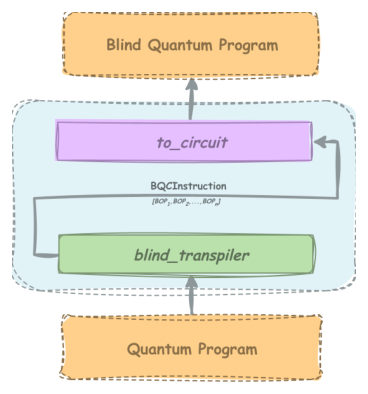
<figcaption class="paper-figure-caption"><b>Fig 2.</b> Fig. 1 shows the overview of the library functionality. The library performs this blind transpilation by taking a quantum circuit written in Qiskit as input and generat- ing an object of BQCInstruction class as output. This is an internal class of the library which intrinsically encodes a list of modified gate objects, called a blind operation (BOP). This BOP object contains the definition of the gate along with the additional information about its del- egation and classical control. The BQCInstruction object can be directly probed to provide inference about the delegation process, like the actual number of communication rounds, client and</figcaption>
</figure>
<figure class="paper-figure-card">
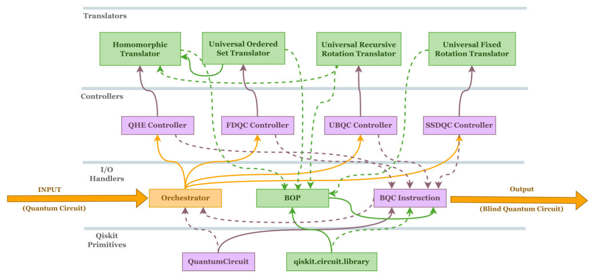
<figcaption class="paper-figure-caption"><b>Fig 3.</b> Figure 2: The UML-like relationship between library modules along with their layered architecture. Note that the layered hierarchy enables the library’s modularity, reusability, and scalability to new protocols of blindness. The dotted lines show an indirect relationship between the modules and classes.</figcaption>
</figure>
<figure class="paper-figure-card">
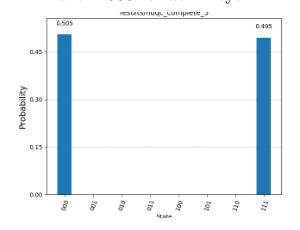
<figcaption class="paper-figure-caption"><b>Fig 4.</b> Figure 3: The comparison of the output of the original and the blind transpiled circuit for the circuit that creates the GHZ state. The transpilation has been performed as qhe format, and results are shown as averaged over the 1000 randomly sampled keys.</figcaption>
</figure>
<figure class="paper-figure-card">
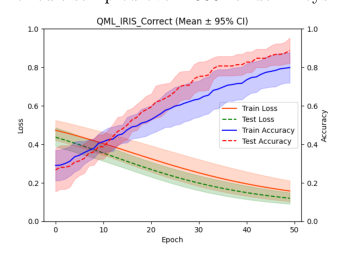
<figcaption class="paper-figure-caption"><b>Fig 5.</b> Figure 4: The comparison of the output of the original and the blind transpiled circuit. (a) shows the original parametric circuit used, (b) shows its desired output, (c) shows the output if the decryption is not performed, and (d) shows the output if the correct decryption has been performed. Note, the transpilation has been performed as qhe format, and results are shown as averaged over the 1000 randomly sampled keys.</figcaption>
</figure>

**Summary.** This paper introduces 'Blind Transpiler,' an open-source library designed to solve the lack of tools for prototyping Blind Quantum Computation (BQC). It works by transpiling standard quantum circuits into secure, blind instruction sets suitable for delegation between a client and a remote server. This enables practical testing of advanced cryptographic applications like secure machine learning in quantum settings.

**Why it may be interesting.** While not directly about AMO physics, the underlying concepts of secure computation and resource management are highly relevant to quantum networking and distributed quantum computing architectures where trust boundaries must be strictly enforced.

Detailed structure

**Main problem.** The primary problem addressed is the lack of software tools for rapidly prototyping Blind Quantum Computation (BQC) protocols, which hinders academic investigation into secure quantum computation.

**Main result.** The authors developed 'Blind Transpiler,' an open-source library that successfully transpiles standard Qiskit circuits into their blind counterparts suitable for client-server delegation.

**Method.** The method involves a modular, layered architecture where the library translates general quantum circuits into specific Blind Operation (BOP) instructions tailored for different BQC primitives like Quantum Homomorphic Encryption (QHE) and Universal Blind Quantum Computation (UBQC).

**Model / system.** The focus is on abstract quantum computation protocols rather than a physical hardware realization. The model involves simulating the delegation of circuits from a client to a remote server, assuming only basic gates are available locally.

**Key observables.** Key observables include the resulting `BQCInstruction` object, which encodes the list of Blind Operations (BOPs), and metrics like the number of client/server gates and communication rounds.

**Important parameters / regimes.** The library supports various protocols including QHE, UBQC, FDQC, and SSDQC. Key parameters involve key sizes for cryptographic security and approximations needed for non-parametric gates (e.g., Solovay-Kitaev decomposition).

**Assumptions / limitations.** It is assumed that the client side only has access to basic gates ($\{X, Z, 	ext{Swap}, 	ext{Measure}\}$), while complex operations are delegated to the server. Parametric gates often require approximation.

**Figures summary.** Figures illustrate the library flow: Input Qiskit circuit $
ightarrow$ BQCInstruction object (BOPs) $
ightarrow$ Blind Circuit. Examples show successful blind classification on the IRIS dataset, contrasting correct vs. incorrect decryption outcomes.

**Paper structure.** The paper introduces the problem gap, details the modular, layered architecture of the 'Blind Transpiler' library, describes the transpilation process for various BQC primitives (QHE, UBQC), demonstrates its application via a blind variational classifier on IRIS, and concludes with software availability information.

Abstract

Blind quantum computation is a cryptographic primitive that allows a limited-capability client to delegate its complex computation to a remote server without revealing its data and/or computation. This branch of quantum cryptography has been bifurcated into two distinct primitives, quantum homomorphic encryption (concerning the security of only data) and universal blind quantum computation (concerning the security of data and the computing algorithm). These primitives have immense applicability in problems like secure cloud computing, secure quantum variational algorithms, quantum federated learning, and secure multiparty computation. However, no software tools exist for the rapid prototyping of such protocols, hindering the academic interrogation for potential applications. In this paper, we describe the development of the first such library for transpiling circuits written in Qiskit to its blind counterpart, which can then be delegated in a client-server architecture without revealing the client's data and/or computation. The proposed library is designed in modular and reusable component layers, enabling easier scalability to newer BQC primitives and robustness against changes in underlying primitives. We show the implementation of these primitives to a blind variational quantum classifier for the IRIS dataset.

[↑ back to top](#top)

### [DFT+U+V is equivalent to DFT+U with density-dependent hybridized projectors](http://arxiv.org/abs/2607.18071v1)

**Authors:** Edward Linscott, Alberto Carta, Nicola Marzari  
**Type:** theory · **Category:** strongly correlated electrons · **PDF:** <https://arxiv.org/pdf/2607.18071v1>  
**Analysis basis:** full PDF text, analyzed in chunks
**Topic relevance:** `Keldysh / 2PI / non-Gaussian methods` **1/5** · `Kondo & dissipative impurity` **1/5** · `analog quantum simulation` **1/5**

↔ Scroll figures horizontally

<figure class="paper-figure-card">
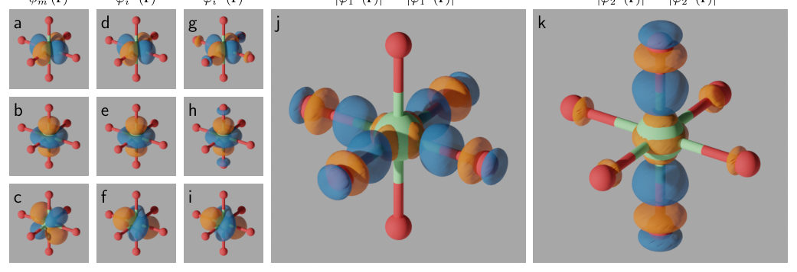
<figcaption class="paper-figure-caption"><b>Fig 1.</b> FIG. 1. The original ϕIσ m (r), block-diagonalizing φIσ i (r), and doubly hybridized Hubbard projectors ˜φIσ i (r) = e2 ˆ SφIσ i (r) of nickel in antiferromagnetic NiO for the minority spin channel. For simplicity, only one nickel atom (green) and its nearest- neighbor oxygen atoms (red) are shown. The left column (a–c) shows three of the five original Hubbard projectors, defined as orthogonalized hydrogenic orbitals oriented with the Cartesian axes. (The crystal structure happens to align with the Cartesian directions, but in general the orientation of these orbitals is arbitrary.) The second column (d–f) shows the block-diagonalizing projectors |φIσ i ⟩, i.e. the eigenvectors of nII;...</figcaption>
</figure>
<figure class="paper-figure-card">
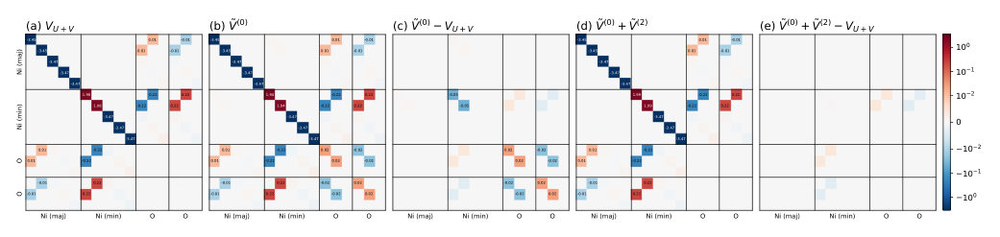
<figcaption class="paper-figure-caption"><b>Fig 2.</b> FIG. 2. The frozen-projector approximation reproduces the exact DFT+U +V potential in bulk antiferromagnetic nickel oxide to within a small residual (panels a–c), which can be almost entirely accounted for by a single analytic second-order term (panels d, e). Each panel shows the matrix elements of various potentials in the basis of block-diagonalizing orbitals {φIσ i } evaluated at the Γ-point. The matrices are subdivided by Hubbard site; one can clearly see the five d orbitals of each Ni and the three p orbitals of each O. (The unit cell contains four atoms: two Ni and two O.) Panel (a) shows the matrix elements of the full (i.e. exact) DFT+U +V potential ⟨φIσ i | ˆVU + ˆVV |φJσ j ⟩. The...</figcaption>
</figure>

**Summary.** This work mathematically proves that the inter-site $+V$ correction in $	ext{DFT}+U+V$ can be understood as an effective modification of the on-site Hubbard interaction ($+U$). This equivalence holds when using density-dependent, hybridized projectors, providing crucial physical insight into how electron correlation and covalency interact in strongly correlated materials.

**Why it may be interesting.** While focused on solid-state physics, understanding how an effective Hamiltonian (like DFT+$U$) can be rigorously mapped onto a more complex correlated model ($	ext{DFT}+U+V$) using projection techniques is highly relevant for developing accurate many-body Hamiltonians in quantum simulation.

Detailed structure

**Main problem.** The authors aim to provide a formal justification for inter-site $+V$ corrections added to DFT+$U$, which are necessary because standard $	ext{DFT}+U$ over-localizes charge and breaks covalent bonds.

**Main result.** To first order in $V/U$, the full $	ext{DFT}+U+V$ potential is shown to be exactly equivalent to an on-site $	ext{DFT}+U$ calculation performed using density-dependent, hybridized Hubbard projectors.

**Method.** The equivalence is demonstrated by defining a specific anti-Hermitian generator ($\hat{S}$) that relates the energy calculated with hybridized projectors to the full $	ext{DFT}+U+V$ energy in a perturbative expansion.

**Model / system.** The study applies to materials containing localized $d$ or $f$ electrons, such as transition metal oxides (e.g., NiO). The theoretical framework involves extending standard DFT+$U$ with an inter-site potential term ($\hat{V}$).

**Key observables.** Potential matrix elements comparing $	ext{DFT}+U+V$ to approximations using hybridized projectors; the degree of covalency enhancement.

**Important parameters / regimes.** $U$ (Hubbard parameter), $V$ (inter-site correction strength); the perturbative limit $V/U \ll 1$.

**Assumptions / limitations.** The equivalence is rigorously proven only to first order in $V/U$; using frozen projectors, a common practice, causes the formal equivalence to break down.

**Figures summary.** Figure 1 illustrates the evolution of Hubbard projectors (original vs. hybridized) for NiO, showing how hybridization incorporates neighboring orbital weights. Other figures compare potential matrix elements across different approximations and k-points.

**Paper structure.** The paper develops the equivalence by first establishing the formal relationship using a continuous parameter $\alpha$, then demonstrating that frozen projector approaches fail to reproduce the full potential, ultimately confirming the validity of the hybridized projector approach to first order in $V/U$.

Abstract

Hubbard-corrected density-functional theory (DFT+$U$) is a popular tool for first-principles modeling of materials with localized $d$ or $f$ electrons, but its on-site corrections tend to over-localize charge and break covalent bonds. Inter-site $+V$ corrections were introduced to counter this and are now widely used, but a formal justification has been lacking. Here we show that -- to first order in $V/U$ -- inter-site corrections are exactly equivalent to on-site DFT+$U$ evaluated on a density-dependent redefinition of the Hubbard projectors, hybridized with those of neighboring sites, providing insight into the explicit mechanism by which $V$ affects covalency. If the projectors are held frozen, as is common practice, the equivalence partially breaks down. Beyond reinterpreting the formalism, these results sharpen the questions of how $V$ should be computed and what the Hubbard subspaces fundamentally are.

[↑ back to top](#top)

### [Formal Verification of Continuous-Variable Quantum Programs](http://arxiv.org/abs/2607.17714v1)

**Authors:** Stefanie Muroya, Thomas A. Henzinger  
**Type:** theory · **Category:** quantum information and computing · **PDF:** <https://arxiv.org/pdf/2607.17714v1>  
**Analysis basis:** full PDF text, analyzed in chunks
**Topic relevance:** `analog quantum simulation` **1/5** · `methods for driven-dissipative` **1/5** · `quantum measurements` **1/5**

↔ Scroll figures horizontally

<figure class="paper-figure-card">
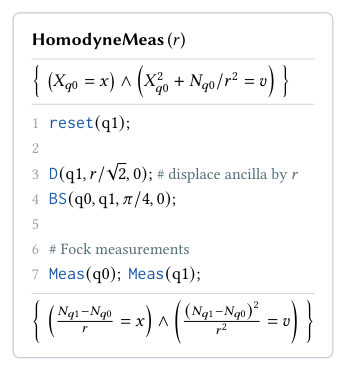
<figcaption class="paper-figure-caption"><b>Fig 1.</b> Fig. 8. Hoare triple for the program HomodyneMeas(𝑟) that measures the position of 𝑞0 via Fock measure- ments using an ancilla 𝑞1. The weakest precondition characterizes both the expected position and its variance. While the expectation is exact for every displacement 𝑟, the quadratic observable reveals an additional single-shot noise term that decreases as 1/𝑟2.</figcaption>
</figure>
<figure class="paper-figure-card">
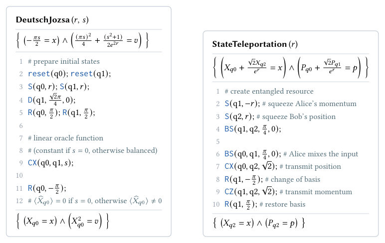
<figcaption class="paper-figure-caption"><b>Fig 2.</b> Fig. 9. (a) Hoare triple for the continuous-variable Deutsch–Jozsa program DeutschJozsa (r, s), with squeez- ing parameter 𝑟, oracle slope 𝑠, query mode 𝑞0, and ancilla 𝑞1. The derived weakest precondition proves that the expected position of the query mode is −𝜋𝑠/2, distinguishing constant (𝑠= 0) from balanced (𝑠≠0) linear oracles. The quadratic observable additionally quantifies the finite-squeezing noise, which decreases exponentially with the squeezing parameter 𝑟. (b) Hoare triple for the state teleportation program StateTeleportation (𝑞0: input, 𝑞1: Alice, 𝑞2: Bob). The derived weakest precondition certifies that the input quadratures are teleported exactly onto Bob’s mode 𝑞2 in the...</figcaption>
</figure>
<figure class="paper-figure-card">
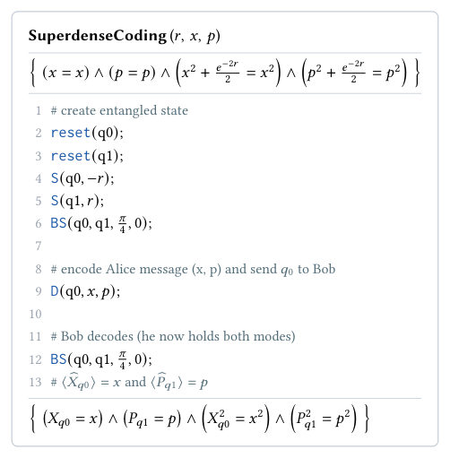
<figcaption class="paper-figure-caption"><b>Fig 3.</b> Fig. 10. Hoare triple for the SuperdenseCoding(𝑟,𝑥, 𝑝) program, with squeezing parameter 𝑟, and two real numbers (x, p) that correspond to the message that Alice (𝑞0) wants to send to Bob (𝑞1). The derived weakest precondition proves that Bob recovers the encoded position and momentum values while quantifying the finite-squeezing variance, which decreases as 𝑒−2𝑟/2.</figcaption>
</figure>

**Summary.** This paper introduces a novel formal semantics and the first Hoare logic specifically designed for Continuous-Variable Quantum Computing (CQC). By restricting state spaces and using polynomial assertions, the authors overcome mathematical obstacles related to infinite dimensions. The resulting tool allows rigorous verification of CQC algorithms and quantifies the resources needed for classical simulation.

**Why it may be interesting.** This work provides the necessary mathematical rigor—a verifiable programming model—for advancing quantum computation theory beyond discrete qubits into continuous variable systems relevant for modern photonic hardware.

Detailed structure

**Main problem.** The primary goal is to establish a formal semantics and develop the first Hoare logic for Continuous-Variable Quantum Computing (CQC). This addresses the technical challenges posed by infinite-dimensional Hilbert spaces and unbounded measurement outcomes inherent to CQC.

**Main result.** The authors successfully provide a sound and relatively complete Hoare logic for CQC, along with a symbolic weakest-precondition calculator. This tool has been shown to verify textbook CQC algorithms and compute resource requirements for classical simulation.

**Method.** They overcome technical hurdles by restricting the state space to the Schwartz subspace and basing assertions on finite polynomials over canonical observables (position and momentum). The logic interprets implication as the subset relation on sets of quantum states.

**Model / system.** The model is Continuous-Variable Quantum Computing (CQC), which operates on qumodes described by infinite-dimensional Hilbert spaces. Key components include canonical observables ($X, P$) and the use of Schwartz density operators to ensure convergence for expected values.

**Key observables.** Canonical observables ($\hat{b}_X, \hat{b}_P$), polynomial assertions built from these observables, and the number operator ($\hat{N}_{q0}$).

**Important parameters / regimes.** The accuracy of classical simulation is bounded using the Chebyshev-Cantelli inequality, which determines the required truncation dimension based on desired error bounds.

**Assumptions / limitations.** The framework assumes that CQC programs are straight-line (no loops or conditionals) and restricts analysis to states within the Schwartz subspace to ensure mathematical tractability.

**Figures summary.** Figure 11 illustrates the weakest precondition derived for the number operator under various single-mode instructions, alongside the Chebyshev-Cantelli inequality used to bound simulation accuracy. Table 1 lists verified gate decompositions.

**Paper structure.** The paper develops a formal semantics by defining the logic's components (state space restriction, assertion language) and then implements a symbolic calculator to derive weakest preconditions for various CQC operations, culminating in verification examples and resource estimation.

Abstract

We provide a formal framework for Continuous-Variable Quantum Computing (CQC). While CQC is supported by photonic quantum hardware, we are not aware of a formal semantics for continuous-variable quantum programs nor of a unary Hoare logic for their verification. There are several technical obstacles to extending to CQC any of the formal frameworks available for Discrete-Variable Quantum Computing (DQC). Most importantly, continuous-variable quantum programs act on {\em infinite-dimensional} Hilbert spaces; their measurement outcomes are often {\em unbounded} and have expected values that are defined by an improper integral (or an infinite series), which may not converge. We overcome these challenges to give a formal semantics to a universal programming language for CQC and to provide the first Hoare logic for CQC. The assertions of our logic are built from polynomials over canonical observables. Besides proving relative completeness, we implement a symbolic weakest-precondition calculator for CQC based on our logic. Our tool has successfully verified CQC algorithms from textbooks and calculated their approximation errors for physically realizable implementations, proved the correctness (i.e., equivalence) of gate decompositions for CQC hardware, and computed the resource requirements (i.e., number of photon-number states) for achieving a desired accuracy in the classical simulation of continuous-variable quantum programs.

[↑ back to top](#top)

### [Geometry-Resolved Projection of RF Imbalance to Ion Micromotion in a Same-Phase Dual-RF Blade Trap](http://arxiv.org/abs/2607.17793v1)

**Authors:** Chun-Yang Luan, Haiyu Ding, Cheng-Kang Pan, Xiangjie Li, Lin Cheng, Gangxi Wang, Yuting Lei, Peilin Zheng, Shixin Hu, Xiang Zhang, Fei Wang  
**Type:** theory · **Category:** other · **PDF:** <https://arxiv.org/pdf/2607.17793v1>  
**Analysis basis:** full PDF text, analyzed in chunks
**Topic relevance:** `QC/QI experiment` **1/5** · `methods for driven-dissipative` **1/5** · `quantum measurements` **1/5**

↔ Scroll figures horizontally

<figure class="paper-figure-card">
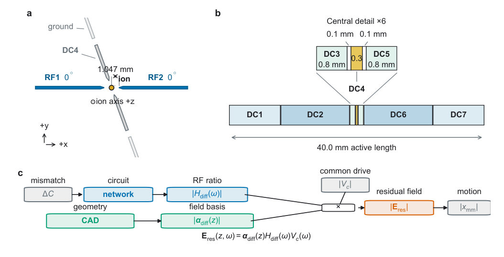
<figcaption class="paper-figure-caption"><b>Fig 1.</b> Fig. 1. Device geometry and RF-to-ion factorization. (a) CAD-derived orthographic section through the trap center; the RF-tip-to-ion distance is read directly from the STEP assembly. (b) Seven-segment DC blade drawn to the stated axial lengths, with DC3–DC5 enlarged at a common scale. (c) Parallel electrical and geometric branches: ∆C enters the circuit model to determine Hdiff, whereas the CAD geometry determines αdiff. Their product with Vc gives Eres(z, ω) = αdiff(z)Hdiff(ω)Vc(ω) and xmm = e|Eres|/(mΩ2 RF).</figcaption>
</figure>
<figure class="paper-figure-card">
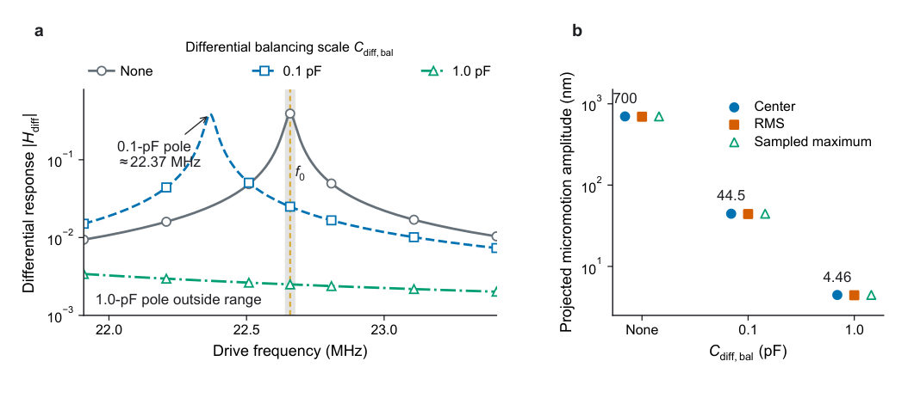
<figcaption class="paper-figure-caption"><b>Fig 2.</b> Fig. 2. Electrical imbalance and projected ion motion for ∆C = 10 fF and Vc = 100 V peak. (a) Compact-model differential response evaluated at the common reference f0 = 22.658 38 MHz. The gray band spans f0 ± f0/(2QL) for QL = 600, and the arrow identifies the 0.1 pF differential pole near 22.37 MHz. (b) Center, axial RMS, and sampled-maximum projected micromotion amplitudes evaluated at the same f0; only center values are annotated.</figcaption>
</figure>
<figure class="paper-figure-card">
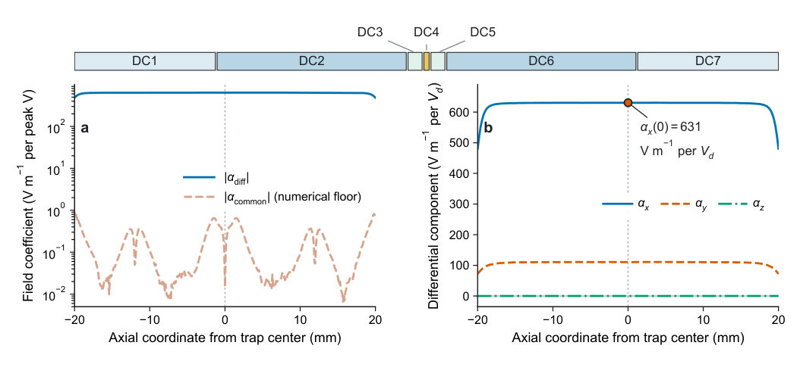
<figcaption class="paper-figure-caption"><b>Fig 3.</b> Fig. 3. Geometry-resolved field basis along the 40 mm nominal ion axis. RF1-only and RF2-only Cartesian fields were evaluated directly from the COMSOL saved solutions at 401 positions with 0.1 mm spacing; common and differential vectors and their norms were then reconstructed pointwise. No postprocessing smoothing was applied. The top bar shows the DC1–DC7 positions. (a) Differential and common coefficient norms; the pale near-zero common trace is retained as the raw numerical basis-cancellation floor, not as resolved physical structure. (b) Cartesian components of the differential basis. The center marker identifies the dominant center component reported in Eq. (7); the micromotion...</figcaption>
</figure>

**Summary.** This paper develops a sophisticated model to calculate the residual micromotion experienced by trapped ions due to imperfections in the trap's RF driving fields. By combining circuit theory with finite-element simulations, the authors provide a geometry-resolved projection that quantifies how small capacitance mismatches translate into measurable ion motion. This is vital for achieving high-precision quantum operations in trapped-ion quantum computing architectures.

**Why it may be interesting.** This work provides a crucial theoretical tool for experimentalists working with trapped ions, moving beyond simple resonator characterization to predict systematic errors arising from electrode geometry and RF imbalance.

Detailed structure

**Main problem.** The study addresses how residual RF field imbalances, which are not captured by common-mode metrics, project onto measurable micromotion of trapped ions in a dual-RF blade trap.

**Main result.** The authors successfully developed a geometry-resolved projection method showing that even small capacitance mismatches (fF scale) can lead to tens of nanometers of projected ion micromotion.

**Method.** The methodology combines a two-node differential RF circuit model with single-electrode finite-element simulations to factorize the error source into geometric and electrical components.

**Model / system.** The physical system is a trapped ion setup utilizing a same-phase dual-RF blade trap geometry. The analysis models the coupling between the RF driving fields, electrode capacitances, and the resulting force on the trapped ion.

**Key observables.** Projected micromotion amplitude (nm), differential field coefficients ($	ext{V m}^{-1}$ per $V_d$), and effective differential capacitance scale ($C_{	ext{diff,bal}}$).

**Important parameters / regimes.** Capacitance mismatch ($\Delta C$, e.g., 10 fF), loaded quality factor ($Q_{\mathrm{loaded}}=600$), and common peak voltage (e.g., 100 V).

**Assumptions / limitations.** All reported displacements are projections based on the model; no direct RF-bench or ion-side validation is claimed.

**Figures summary.** Figures illustrate the factorization of the RF-to-ion mapping ($	ext{Eres} = \alpha_{	ext{diff}} H_{	ext{diff}} V_c$) and quantify how a specific capacitance mismatch translates into measurable micromotion, comparing balanced vs. unbalanced scenarios.

**Paper structure.** The paper establishes that common metrics are insufficient, develops the combined circuit/geometry model to factorize the error source, calculates key coefficients ($\alpha_{	ext{diff}}, H_{	ext{diff}}$), and then applies this framework to quantify micromotion for representative mismatch values. Supplementary sections analyze thermal and DC bypass sensitivities.

Abstract

Common-mode metrics of a high-$Q$ helical resonator do not determine the residual ion-side field in a dual-electrode drive. We combine a two-node differential RF model with single-electrode finite-element bases to obtain a computation-only, geometry-resolved projection for a same-phase blade trap. For a 3.5 pF external load per branch, the model gives a total effective branch capacitance of 7.640 pF and an HWHM-equivalent full branch-difference scale of 12.7 fF at $Q_{\mathrm{loaded}}=600$. The seven-segment geometry gives center and axial-RMS differential field coefficients of 640 V m$^{-1}$ and 635 V m$^{-1}$ per differential peak volt. A representative 10 fF mismatch with an effective 0.1 pF balance scale projects to 44.5/44.1 nm center/RMS $^{171}\mathrm{Yb}^{+}$ micromotion at 100 V common peak voltage. Supplementary thermal, bypass-admittance, and tested numerical cases characterize model sensitivity. All reported displacements are projections; no RF-bench or ion-side validation is claimed.

[↑ back to top](#top)

### [Nanowire networks' interconnection graphs from their photomicrographs](http://arxiv.org/abs/2607.16445v1)

**Authors:** Javier Tau Anzoátegui, Juan Ignacio Diaz Schneider, Eduardo D. Martínez, Pablo Levy, Oscar Filevich, Cynthia P. Quinteros  
**Type:** both · **Category:** disordered systems and neural networks · **PDF:** <https://arxiv.org/pdf/2607.16445v1>  
**Analysis basis:** full PDF text, analyzed in chunks
**Topic relevance:** `analog quantum simulation` **1/5** · `methods for driven-dissipative` **1/5** · `non-equilibrium dynamics` **1/5**

↔ Scroll figures horizontally

<figure class="paper-figure-card">
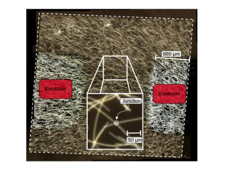
<figcaption class="paper-figure-caption"><b>Fig 1.</b> Figure 1: Infograph of a typical nanowire network (NWN) depicting the constituent units. Each NWN comprises the network of nanowires (NWs) intersecting each other, enclosed by two macro- scopic electrodes placed 1 mm apart. A zoomed-in area is included as an inset where individual NWs and their junctions can be spotted. The image represents the so-called active area, which does not cover the full substrate surface but is a laterally delimited zone containing the NWN and the elec- trodes.</figcaption>
</figure>
<figure class="paper-figure-card">
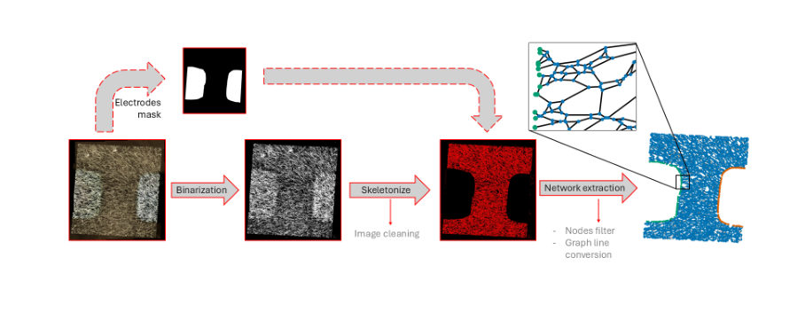
<figcaption class="paper-figure-caption"><b>Fig 2.</b> Figure 2: Sketch of the pipeline flow. Starting from the stitched picture, the procedure identifies the electrodes and binarizes the RGB-format image to facilitate the skeletonization conversion. Once the network has been converted to a set of one-pixel-wide contours, network extraction is performed. The wires and their mutual intersections (zenithal view) are interpreted as a graph comprised of nodes and edges, respectively, depicted in the zoomed-in area.</figcaption>
</figure>
<figure class="paper-figure-card">
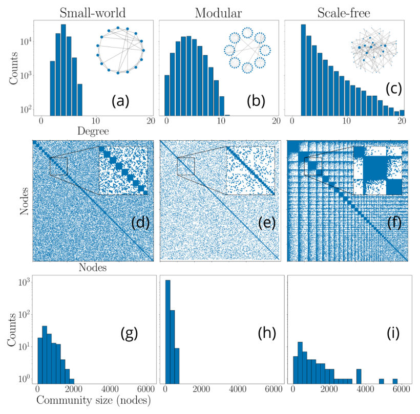
<figcaption class="paper-figure-caption"><b>Fig 3.</b> Figure 3: Different network schemes used as a reference: small-world, modular, and scale- free. The top row, (a), (b), and (c), comprises a degree histogram including an inset with sketches of a moderate size to help visualization. On the second row, (d), (e), and (f) show the adjacency matrix, while the bottom row, (g), (h), and (i), displays the distribution of community sizes for each case. Degree distributions, adjacency matrices, and their associated community size distributions are calculated for networks of a size and average degree comparable to the experimental realizations (N = 70000, k = 4).</figcaption>
</figure>
<figure class="paper-figure-card">
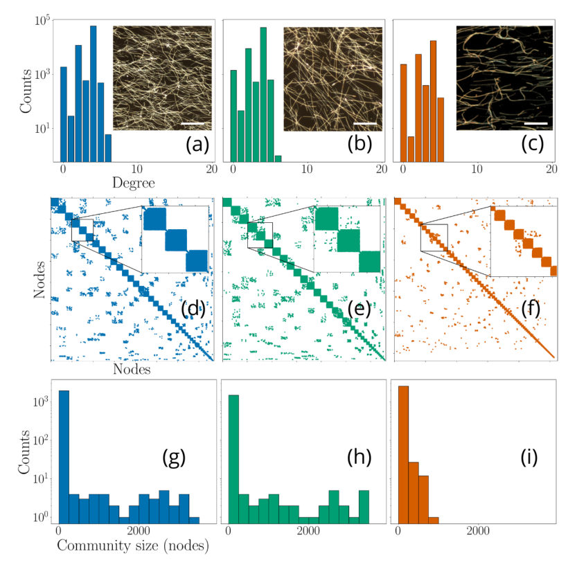
<figcaption class="paper-figure-caption"><b>Fig 4.</b> Figure 4: Network metrics of graphs generated from experimental images. Degree distribu- tions with optical images as insets with a scale bar of 100 µm ((a), (b), and (c)), adjacency matrices ((d), (e), and (f)), and community distributions ((g), (h), and (i)) for three experimental cases (sam- ples A, B, and C, respectively).</figcaption>
</figure>
<figure class="paper-figure-card">

<figcaption class="paper-figure-caption"><b>Fig 5.</b> Fig. 4 depicts the degree distribution and adjacency matrix obtained from three different samples: A, B, and C. Those labeled as A and B have the same nominal areal density, while C is smaller. This difference is noticeable in Figs. 4(a), (b), and (c) insets. Comparison of the obtained graph characteristics corresponding to the experimental samples allows for identifying a moderate range of available connectivity degrees, which is compatible with small-world-like schemes. However, adja- cency matrices show a modular arrangement as indicated by the presence and sustainable size of the squares forming around the matrices’ diagonals. Additionally, the spots appreciated outside the diagonal...</figcaption>
</figure>

**Summary.** This work develops a computational pipeline to convert optical images of nanowire networks into mathematical graphs. By analyzing topological metrics like clustering and path length, the authors show that these experimental assemblies exhibit characteristics resembling small-world and modular networks. This bridges the gap between physical device characterization and theoretical network modeling.

**Why it may be interesting.** While focused on condensed matter devices, the methodology—translating complex physical connectivity into a quantifiable graph structure for topological analysis—is highly relevant to modeling quantum network architectures or disordered superconducting circuits where connectivity is key.

Detailed structure

**Main problem.** The study aims to extract the interconnection graph from photomicrographs of nanowire networks (AgNWNs) to analyze their network architecture for use in simulation platforms.

**Main result.** Experimental assemblies exhibit topological similarities to both small-world and modular structures, suggesting complex connectivity patterns beyond simple random models.

**Method.** A pipeline is developed using image processing techniques (binarization, skeletonization) to translate physical nanowire intersections into a graph structure for subsequent topological analysis.

**Model / system.** The system under study is Silver Nanowire Networks (AgNWNs), which are self-assembled structures studied for their signal-processing capabilities, mimicking neuromorphic elements. The connectivity is modeled mathematically as a graph composed of nodes (segments) and edges (intersections).

**Key observables.** Degree distribution, clustering coefficient (CC), path length (PL), community size, and the number of nodes (N) and edges (e).

**Important parameters / regimes.** Edge removal probability (per), which is used to account for spurious junctions observed in zenithal-view optical images.

**Assumptions / limitations.** The primary limitation is that the zenithal view overestimates interconnections by failing to distinguish true physical junctions from mere overlaps between vertically displaced nanowires.

**Figures summary.** Figure 1 illustrates a typical AgNWN structure, and Figure 2 summarizes the graph generation pipeline flow (electrode identification $
ightarrow$ binarization $
ightarrow$ skeletonization $
ightarrow$ network extraction).

**Paper structure.** The paper details the development of an image processing pipeline to generate graphs from NW photomicrographs. It then applies standard network science metrics (CC, PL) and compares the resulting topology against known archetypes (small-world, modular), while also analyzing the impact of junction removal.

Abstract

Self-assemblies of tunable units are being intensively studied as physical systems with signal-processing capabilities. Specifically, silver nanowire networks (AgNWNs) have demonstrated accumulation, non-linearity, and memory retention with multiple timescales, features that enable a wide variety of neuromorphic implementations. In this study, we aim to extract the interconnection scheme to analyze the experimentally obtained network architecture and, eventually, use it as input to a previously developed simulation platform. By post-processing photomicrographs of AgNWN, we present a pipeline optimized to extract the interconnection diagram, recognizing the intersections formed among the nanowires, to determine the associated graph for each physical sample. A graph is a collection of nodes and edges whose properties can be associated with different electrical responses. It is thus possible to study graphs' metrics, such as the degree distribution, community size, clustering coefficient, and path-length, to compare the experimental assemblies' attributes to those of topological models of reference. Small-world, modular, and scale-free are well-known structures in the field of mathematical graphs. By analyzing the degree distribution, the adjacency matrices, among other useful representation means, the experimental assemblies reveal similarities to both small-world and modular topologies. All the mentioned analyses were conducted considering the interconnection scheme obtained from zenithal-view optical images, which overestimates the number of NWs' interconnections (due to the impossibility of distinguishing real junctions from spurious cross-points between vertically displaced NWs). For that reason, this communication also studies the impact of artificially removing junctions from the resulting graphs on the previously calculated clustering coefficient and path length.

[↑ back to top](#top)

### [Phonon dynamics in Chromium under pressure: absence of phonon criticality at the approach of the quantum critical point](http://arxiv.org/abs/2607.18015v1)

**Authors:** P. Rodière, J. E. Lorenzo, Q. N. Meier, L. Paolasini, A. Bosak  
**Type:** both · **Category:** strongly correlated electrons · **PDF:** <https://arxiv.org/pdf/2607.18015v1>  
**Analysis basis:** full PDF text, analyzed in chunks
**Topic relevance:** `Keldysh / 2PI / non-Gaussian methods` **1/5** · `analog quantum simulation` **1/5** · `spintronics-quantum-optics interface` **1/5**

↔ Scroll figures horizontally

<figure class="paper-figure-card">
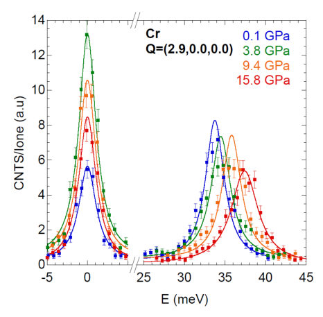
<figcaption class="paper-figure-caption"><b>Fig 1.</b> FIG. 1. Pressure dependence of the longitudinal acoustic phonon mode at 0.9Γ-H for Q=(2.9,0,0). Each point is the number of photon detected on an acquisition time of 2 min- utes/point normalized by the incident flux. Solid curves are a fit of the data.</figcaption>
</figure>
<figure class="paper-figure-card">
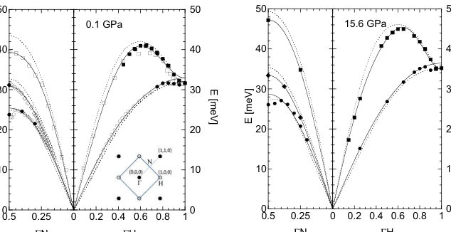
<figcaption class="paper-figure-caption"><b>Fig 2.</b> FIG. 2. Phonon spectra of the Cr along the two main Brillouin Zone directions ΓH and ΓN at 0.1 GPa (left) and at 15.6 GPa (right). The open symbols are published neutron data from Ref. 9, closed symbols are from this work. The solid line are the fit based on the Born-von K`arm`an calculation. The dotted line are the ab-initio calculation. The inset of the left panel is the representation of the first Brillouin Zone of a BCC crystal. The black circles are the Bragg peaks, and open are the forbidden reflections.</figcaption>
</figure>
<figure class="paper-figure-card">
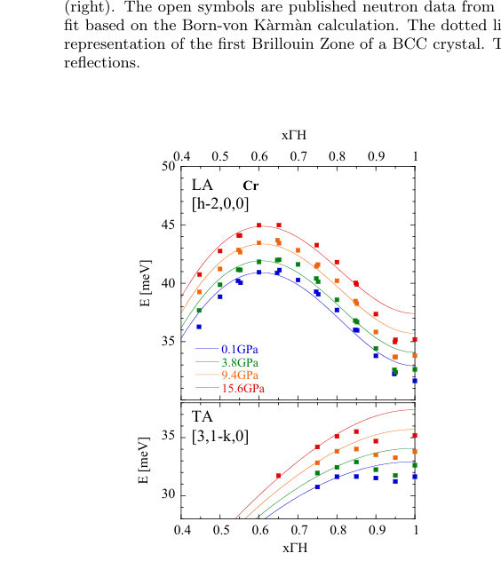
<figcaption class="paper-figure-caption"><b>Fig 3.</b> FIG. 3. Pressure dependence of the phonon dispersion of the LA (top) and TA (bottom) modes along the ΓH−direction. The lines are the calculated dispersion curves with the force constants described in the paper.</figcaption>
</figure>
<figure class="paper-figure-card">
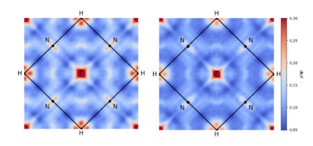
<figcaption class="paper-figure-caption"><b>Fig 4.</b> FIG. 4. Nesting function in the (hk0) plane at ambient pres- sure (left) and at 15.6 GPa (right).</figcaption>
</figure>
<figure class="paper-figure-card">
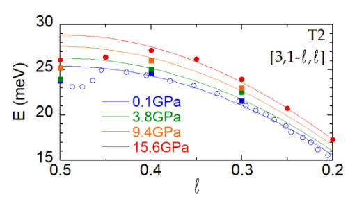
<figcaption class="paper-figure-caption"><b>Fig 5.</b> FIG. 5. Pressure dependence of the phonon dispersion of the T2 acoustic mode along the ΓN direction. Q=(3, 0.5, 0.5) is a N point. The blue open symbol are from Ref. 9. The lines are the calculated dispersion curves with the force constants described in the paper.</figcaption>
</figure>

**Summary.** This work uses inelastic X-ray scattering and DFT calculations to examine phonon behavior in Chromium as pressure approaches its antiferromagnetic quantum critical point. The key finding is that the observed phonon anomalies are robustly linked to Fermi surface nesting, suggesting that the SDW ordering mechanism is electronic rather than being driven by lattice instabilities (phonons) near $P_c$. This refines our understanding of itinerant magnetism at QCPs.

**Why it may be interesting.** While focused on condensed matter magnetism, the interplay between lattice dynamics (phonons) and electronic instabilities (SDW/CDW) near a quantum critical point involves many-body physics relevant to strongly correlated systems.

Detailed structure

**Main problem.** The study investigates phonon dynamics in Chromium under high pressure, specifically addressing whether lattice anomalies (Kohn anomalies) play a major role near the quantum critical point (QCP).

**Main result.** The persistence of Kohn anomalies and the robustness of Fermi surface nesting suggest that these anomalies do not drive the antiferromagnetic ordering at high pressures.

**Method.** The research combines inelastic X-ray scattering experiments with ab-initio Density Functional Theory (DFT) calculations using DFPT for phonon dispersion analysis.

**Model / system.** The system is Chromium (Cr), an archetype material exhibiting itinerant antiferromagnetic spin density wave (SDW) ordering, studied under varying pressures up to 15.6 GPa.

**Key observables.** Phonon dispersion curves, Kohn anomalies (phonon softening), and the evolution of the Fermi surface nesting function ($\chi''(\mathbf{q})$).

**Important parameters / regimes.** Critical pressure ($P_c \approx 10$ GPa), high pressures up to $15.6$ GPa, and low temperatures.

**Assumptions / limitations.** The analysis assumes that the SDW formation is the primary order parameter, and Kohn anomalies are primarily driven by electronic susceptibility rather than direct lattice instability near the QCP.

**Figures summary.** Figures show phonon spectra/dispersion curves at ambient and high pressure along $\Gamma	ext{H}$ and $\Gamma	ext{N}$, illustrating the persistence of softening features despite crossing $P_c$.

**Paper structure.** The paper establishes the background on SDW formation in Cr, presents experimental measurements of phonon anomalies under pressure, compares these findings with DFT calculations showing robust nesting, and concludes that electronic susceptibility dictates the QCP behavior.

Abstract

Fermi surface nesting is key to understanding the origin of the itinerant antiferromagnetic spin density wave in Chromium. At very low temperature, this density wave is destroyed above the critical pressure $P_c\approx$10~GPa, defining a quantum critical point. Strong electron-phonon coupling induces a small phonon softening close to the $H-$point of the Brillouin zone as well as close to the $H$-point. These phonon anomalies are known as Kohn anomalies. They remain unchanged down to 50K and are known to be present in both the paramagnetic and the antiferromagnetic phases. This paper presents inelastic X-ray scattering experiments on the phonon dispersion curves under pressure, up to $P=$15.6~GPa far above the critical pressure $P_c$. The softening of the well-known phonon anomalies is still present which leads to conclude that they do not play a major role at the antiferromagnetic ordering. Based on ab-initio calculation, the robustness of the Fermi surface nesting under pressure, explain the presence of these Kohn anomalies above the critical pressure.

[↑ back to top](#top)

### [Representation-Dependent Machine Learning of the Isotropic-Nematic Transition in the Lebwohl-Lasher Model](http://arxiv.org/abs/2607.16481v1)

**Authors:** Maninder Kaur, Aojie Xue, David P Landau  
**Type:** theory · **Category:** statistical mechanics · **PDF:** <https://arxiv.org/pdf/2607.16481v1>  
**Analysis basis:** full PDF text, analyzed in chunks
**Topic relevance:** `analog quantum simulation` **1/5** · `driven-dissipative phase transition` **1/5** · `methods for driven-dissipative` **1/5**

↔ Scroll figures horizontally

<figure class="paper-figure-card">
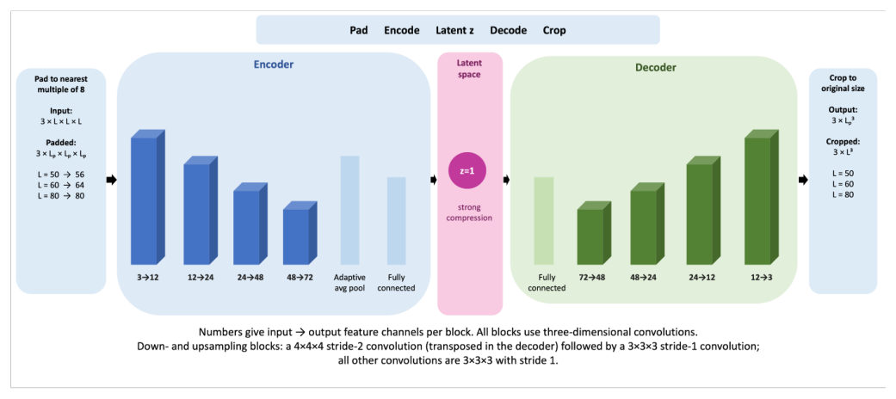
<figcaption class="paper-figure-caption"><b>Fig 1.</b> FIG. 1. Architecture of the three-dimensional convolutional autoencoder (CAE) used for nonlinear unsupervised dimensionality reduction.</figcaption>
</figure>
<figure class="paper-figure-card">
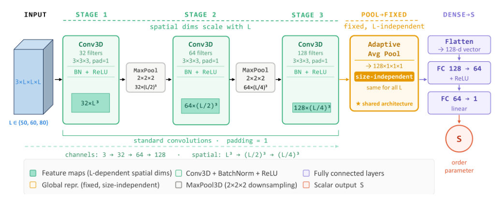
<figcaption class="paper-figure-caption"><b>Fig 2.</b> FIG. 2. Architecture of the three-dimensional convolutional neural network (CNN) used for supervised regression of the scalar nematic order parameter from raw molecular configurations.</figcaption>
</figure>
<figure class="paper-figure-card">
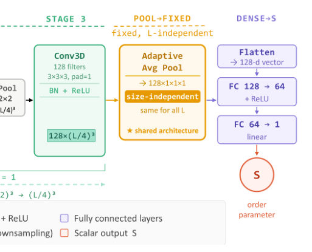
<figcaption class="paper-figure-caption"><b>Fig 3.</b> Fig. 3 shows the temperature dependence of the scalar nematic order parameter and the probability distribution P(S) near coexistence. Here, ⟨S⟩denotes the Monte Carlo estimate of the ensemble average of S at fixed temperature. For all three lattice sizes, ⟨S⟩decreases sharply over a narrow temperature interval. At the same time, P(S) develops a bimodal structure near the transition, with one peak associated with the weakly ordered nematic phase and the other with the nearly isotropic phase. The probability distributions shown near coexistence were constructed from configurations in a finite-size tem- perature window |T −T0(L)| ≤∆Twin, with ∆Twin = 0.0006. This window was chosen to improve...</figcaption>
</figure>
<figure class="paper-figure-card">
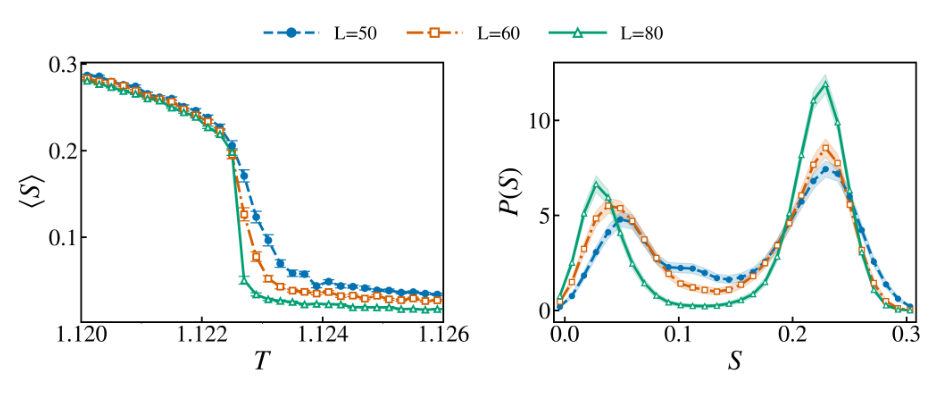
<figcaption class="paper-figure-caption"><b>Fig 4.</b> FIG. 3. Thermodynamic benchmark for the isotropic–nematic transition. (a) Temperature dependence of the scalar nematic order parameter ⟨S⟩for L = 50, 60, and 80. (b) Near-coexistence probability distribution P(S) constructed from the finite-size transition windows defined in the text.</figcaption>
</figure>
<figure class="paper-figure-card">
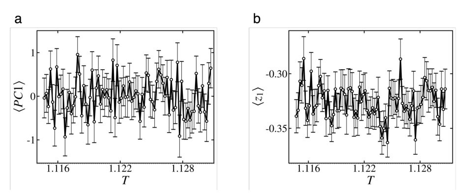
<figcaption class="paper-figure-caption"><b>Fig 5.</b> FIG. 4. Unsupervised learning on raw molecular configurations. Representative results are shown for L = 50. (a) Temperature dependence of the leading PCA score obtained from raw configurations. (b) Temperature dependence of the one-dimensional CAE latent coordinate obtained from raw configurations.</figcaption>
</figure>

**Summary.** This paper uses machine learning to study the isotropic-nematic phase transition in the Lebwohl-Lasher model. It demonstrates that unsupervised methods fail if raw molecular data are used because global rotational symmetries obscure the physical signal. However, by transforming the input into a rotationally invariant representation, the ML techniques successfully recover clear signatures of the phase transition.

**Why it may be interesting.** While focused on classical statistical mechanics, the core methodological lesson—that input representation must respect underlying symmetries for feature extraction—is highly relevant when designing quantum state representations or observables for ML analysis in AMO physics.

Detailed structure

**Main problem.** The study investigates whether machine learning detection of phase transitions depends critically on whether the input representation preserves the underlying symmetries of the physical system.

**Main result.** Unsupervised ML methods (PCA, CAE) fail to detect the transition using raw molecular configurations but successfully recover transition signatures when the input is transformed into a rotationally invariant local-correlation representation.

**Method.** The authors compare unsupervised learning techniques (PCA and CAE) against supervised regression (CNN) applied to data from Monte Carlo simulations of the Lebwohl-Lasher model.

**Model / system.** The system studied is the three-dimensional Lebwohl-Lasher (LL) model, which models nematic liquid crystals exhibiting a weak first-order isotropic--nematic phase transition. The Hamiltonian interaction is apolar and possesses continuous rotational degeneracy.

**Key observables.** Scalar nematic order parameter ($S$), bimodal coexistence distributions, leading PCA scores, and CAE latent coordinates.

**Important parameters / regimes.** Lattice sizes ($L=50, 60, 80$) and the coupling constant ratio $J/k_B T = 1$.

**Assumptions / limitations.** The primary assumption tested is that for unsupervised ML to work on systems with continuous symmetries, the input representation must be invariant under those symmetry transformations.

**Figures summary.** Figures compare thermodynamic benchmarks ($\langle S 
angle$ vs $T$, $P(S)$) against results from PCA/CAE using raw data (showing failure) versus bond-$P_2$ data (showing success), alongside CNN regression plots.

**Paper structure.** The paper establishes the physical model and transition, then systematically tests ML methods: first on raw configurations (failure), followed by symmetry-adapted representations (success for unsupervised learning), concluding with a comparison to supervised prediction accuracy.

Abstract

Machine-learning detection of phase transitions depends not only on the learning algorithm, but also on whether the input representation preserves the symmetries of the system. We examine this for the weak first-order isotropic--nematic transition of the three-dimensional Lebwohl--Lasher model, whose apolar and continuously degenerate nematic phase makes raw molecular configurations a challenging input for unsupervised learning. Principal component analysis (PCA) and a convolutional autoencoder (CAE) fail to identify the transition from raw configurations because rotationally equivalent nematic states can appear far apart in the input space. When the same configurations are transformed into a rotationally invariant local-correlation representation, both methods recover transition-sensitive signatures and bimodal coexistence distributions. A supervised three-dimensional convolutional neural network (CNN), by contrast, accurately predicts the scalar order parameter from raw configurations when given order-parameter labels. The Lebwohl-Lasher model therefore separates unsupervised phase discovery from supervised order-parameter regression and shows that symmetry-respecting input representations are needed for unsupervised machine learning in orientationally ordered systems.

[↑ back to top](#top)

### [The History of Hilbert-Space Formulations of Classical Physics](http://arxiv.org/abs/2607.17408v1)

**Authors:** Jacob A. Barandes  
**Type:** theory · **Category:** other · **PDF:** <https://arxiv.org/pdf/2607.17408v1>  
**Analysis basis:** full PDF text, analyzed in chunks
**Topic relevance:** `Keldysh / 2PI / non-Gaussian methods` **1/5** · `analog quantum simulation` **1/5** · `non-equilibrium dynamics` **1/5**

↔ Scroll figures horizontally

<figure class="paper-figure-card">
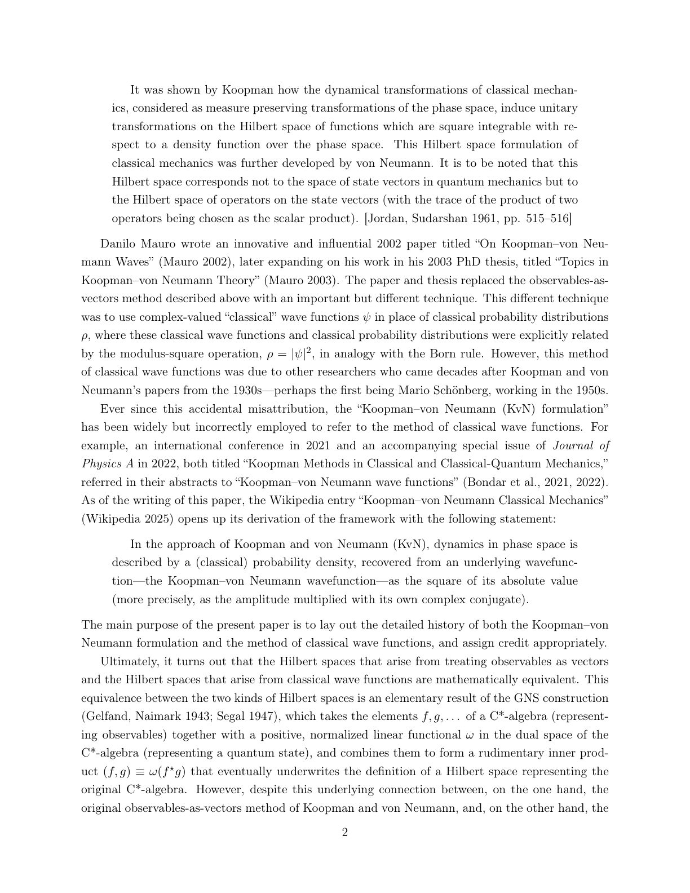
<figcaption class="paper-figure-caption"><b>Fig 1.</b> Low-resolution page preview, page 2</figcaption>
</figure>
<figure class="paper-figure-card">
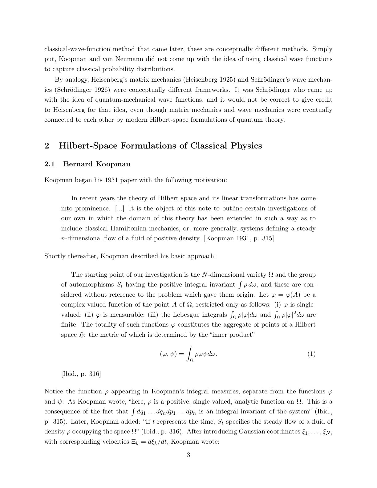
<figcaption class="paper-figure-caption"><b>Fig 2.</b> Low-resolution page preview, page 3</figcaption>
</figure>
<figure class="paper-figure-card">
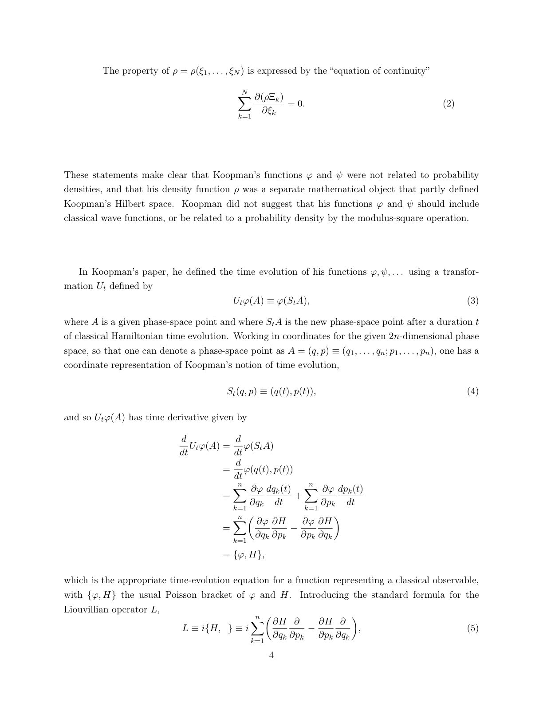
<figcaption class="paper-figure-caption"><b>Fig 3.</b> Low-resolution page preview, page 4</figcaption>
</figure>
<figure class="paper-figure-card">
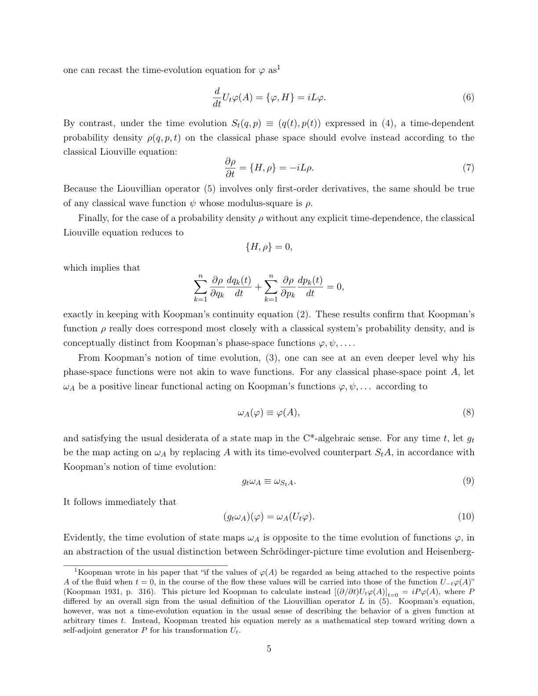
<figcaption class="paper-figure-caption"><b>Fig 4.</b> Low-resolution page preview, page 5</figcaption>
</figure>
<figure class="paper-figure-card">
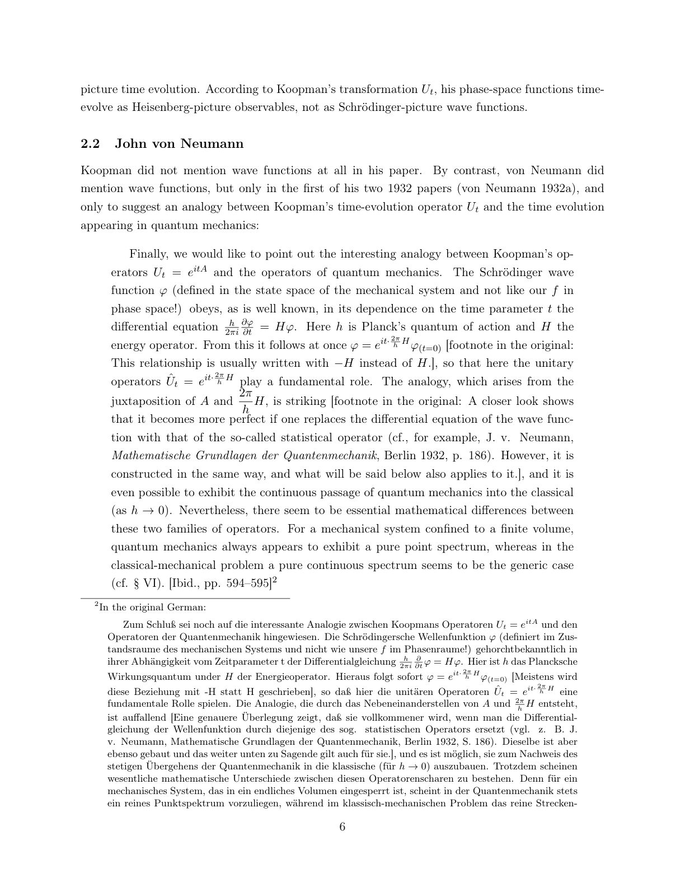
<figcaption class="paper-figure-caption"><b>Fig 5.</b> Low-resolution page preview, page 6</figcaption>
</figure>

**Summary.** This paper reviews two ways of applying Hilbert space techniques—Koopman-von Neumann and 'classical wave functions'—to describe classical mechanics. It clarifies that although mathematically equivalent, these approaches are conceptually distinct, and it corrects historical inaccuracies regarding their origins. The work is vital for understanding the mathematical foundations connecting classical phase space dynamics to quantum formalism.

**Why it may be interesting.** It provides deep insight into the formalisms used to bridge classical dynamics with quantum mechanical tools, which is crucial for understanding semiclassical approximations in AMO physics.

Detailed structure

**Main problem.** The paper aims to explain and distinguish between two distinct Hilbert-space formulations—the Koopman–von Neumann (KvN) approach and the method of 'classical' wave functions—applied to classical Hamiltonian mechanics.

**Main result.** While both methods yield mathematically equivalent Hilbert spaces, they are conceptually distinct; furthermore, the paper provides a detailed historical correction regarding the attribution of the classical wave function formalism.

**Method.** The analysis involves comparing mathematical structures derived from Koopman's operator theory with those developed by later researchers like Schönberg, focusing on their respective evolution equations and associated inner products.

**Model / system.** The system is classical Hamiltonian mechanics evolving on a phase space ($\Omega$ or $(q, p)$). The dynamics are governed by the Poisson bracket $\{H, \cdot\}$ leading to the Liouville equation for probability density $
ho$.

**Key observables.** Probability density ($
ho$), Koopman functions ($\varphi$), and complex 'classical' wave functions ($\psi$).

**Important parameters / regimes.** The Hamiltonian $H$ dictates the dynamics; the comparison highlights the formal analogy to quantum mechanics, particularly in the classical limit.

**Assumptions / limitations.** The paper critically analyzes historical claims, noting that Koopman and von Neumann did not postulate the existence of classical wave functions evolving via a Schrödinger-like equation.

**Paper structure.** The paper proceeds by first detailing the KvN formulation, then introducing the conceptually separate 'classical wave function' method (citing Schönberg et al.), and finally comparing their mathematical structures while correcting historical misattributions regarding who developed which formalism.

Abstract

Hilbert-space techniques are widely used not only for quantum theory, but also for classical physics. Two important examples are the Koopman-von Neumann (KvN) formulation and the method of ``classical'' wave functions. As this paper explains, these two approaches are conceptually distinct. In particular, the method of classical wave functions was not due to Bernard Koopman and John von Neumann, but was developed independently by a number of later researchers, perhaps first by Mario Schönberg, with key contributions from Angelo Loinger, Giacomo Della Riccia, Norbert Wiener, and E. C. George Sudarshan. The primary goals of this paper are to explain these two approaches, describe the relevant history in detail, and give credit where credit is due.

[↑ back to top](#top)

### [The Lee-Yang property of the Blume-Capel model](http://arxiv.org/abs/2607.16958v1)

**Authors:** Yuri Kozitsky, Yurij Holovatch  
**Type:** theory · **Category:** statistical mechanics · **PDF:** <https://arxiv.org/pdf/2607.16958v1>  
**Analysis basis:** full PDF text, analyzed in chunks
**Topic relevance:** `Keldysh / 2PI / non-Gaussian methods` **1/5** · `analog quantum simulation` **1/5** · `driven-dissipative phase transition` **1/5**

↔ Scroll figures horizontally

<figure class="paper-figure-card">
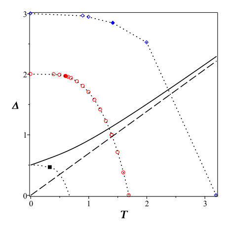
<figcaption class="paper-figure-caption"><b>Fig 1.</b> FIG. 1. Phase diagram of the Blume-Capel model in the crystal field – temperature plane at J = 1: on the complete graph and on the d = 2, 3 simple cubic lattices. The dotted lines represent the phase transition lines, from bottom to top: complete graph, d = 2, d = 3, respectively. For the complete graph, the exact result [4] is shown. For the lattices, the lines serve as a guide. Symbols show the results of the MC sim- ulations (hollow disks for d = 2 [5] and hollow diamonds for d = 3 [6]). Filled symbols show the location of the tricritical point where the 1st order transition line (left from the tricrit- ical point) meets the 2nd order transition line (right from the point). The solid and...</figcaption>
</figure>

**Summary.** This paper tackles the Lee-Yang property for the Blume-Capel model, a system whose behavior is theoretically challenging due to its anisotropy term. The authors prove that strong ferromagnetic interactions can mathematically restore this crucial property—which governs phase transition analysis—even in parameter regimes where standard theorems predict failure. This provides significant theoretical insight into the critical nature of complex spin systems.

**Why it may be interesting.** This work is highly relevant for theoretical physicists studying phase transitions in complex quantum or classical spin systems, as understanding when such mathematical properties hold dictates the reliability of mean-field approximations and critical exponents.

Detailed structure

**Main problem.** The central problem is extending the Lee-Yang property—a condition on the zeros of the partition function related to phase transitions—to the Blume-Capel model in regimes where standard theorems fail.

**Main result.** The authors demonstrate that the ferromagnetic interaction can induce the Lee-Yang property for the Blume-Capel model even when the single-spin anisotropy term ($eta\Delta$) exceeds the threshold guaranteed by existing theorems.

**Method.** The analysis employs advanced mathematical techniques involving differential operators, stability conditions on derived functions (like $\Psi$), and relating these to the partition function zeros in the thermodynamic limit.

**Model / system.** The system is the Blume-Capel model, an extension of the Ising spin model with spins $S_i \in \{-1, 0, +1\}$, governed by a Hamiltonian including nearest-neighbor ferromagnetic interactions ($J_{ij}$) and a single-ion anisotropy term ($\Delta S_i^2$).

**Key observables.** The Lee-Yang property itself (zeros of the partition function lying on the unit circle) is the key diagnostic, alongside the stability of derived functions $G$ and $\Psi$.

**Important parameters / regimes.** Key parameters include the coupling constants ($J_{ij}$), the anisotropy field ($\Delta$), and the inverse temperature ($eta$). The critical regime involves comparing $eta\Delta$ to $\ln 2$.

**Assumptions / limitations.** The results are presented as sufficient conditions; the proof relies on establishing the stability of certain mathematical constructs derived from the partition function, which is an extension beyond the strict bounds of existing theorems.

**Figures summary.** Figure 1 illustrates the phase diagram of the BC model and compares simulation/theoretical predictions for transition lines. Other figures compare different functions related to the Lee-Yang property across varying parameters.

**Paper structure.** The paper builds upon the established Lee-Yang theory, first identifying the failure point in the BC model ($eta\Delta > \ln 2$). It then develops a mathematical framework using differential operators and stability analysis (Chunks 1 & 2) to prove that ferromagnetic interactions can restore the property. Finally, it discusses specific lattice cases and limitations (Chunk 3).

Abstract

The Lee-Yang theory is based on the theorem concerning a property of the ferromagnetic Ising model partition function proved by T. D. Lee and C. N. Yang in 1952. It provides powerful tools for understanding the very nature of phase transitions and critical phenomena in various spin and similar models. Sometimes, this theory is applied to models for which the theorem's validity has not been proved. By the main result of E. H. Lieb and A. D. Sokal, Commun. Math. Phys. 80, 153 (1981), for a given ferromagnetic model, this validity is guaranteed by the same property of the single-spin partition function. Due to the anisotropy term $\sum_i ΔS_i^2$, the single-spin partition function of the Blume-Capel model fails to have the Lee-Yang property for $βΔ> \ln 2$. In this article, we show that the ferromagnetic interaction in such a model can induce the Lee-Yang property, even for these values of $βΔ$. To the best of our knowledge, it is the first result of this kind.

[↑ back to top](#top)

### [A Disconnected Superconducting Regime at the Parent Limit of Infinite-Layer Nickelates](http://arxiv.org/abs/2607.16684v1)

**Authors:** Chihao Li, Yutong Chen, Yaolong Bian, Yihao Zhang, Jiahao Ye, Zhitong An, Xingtian Sun, Yu Fan, Zhihui Chen, Zhanze Wang, Jinglei Zhang, Haichao Xu, Rui Peng, Donglai Feng  
**Type:** experiment · **Category:** strongly correlated electrons · **PDF:** <https://arxiv.org/pdf/2607.16684v1>  
**Analysis basis:** full PDF text, analyzed in chunks
**Topic relevance:** `Kondo & dissipative impurity` **1/5** · `analog quantum simulation` **1/5**

↔ Scroll figures horizontally

<figure class="paper-figure-card">
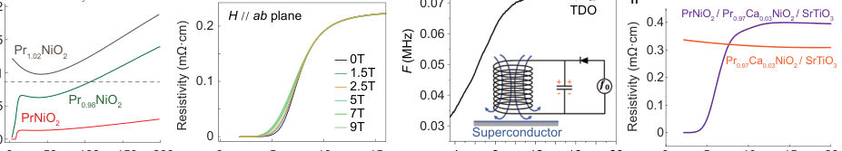
<figcaption class="paper-figure-caption"><b>Fig 1.</b> FIG. 1. Intrinsic superconductivity in PrNiO2/SrTiO3 films. a, Schematic of 20 uc PrNiO2/SrTiO3 films without SrTiO3 capping layers. b, Temperature-dependent resistivity of PrNiO2/SrTiO3 compared with off-stoichiometric samples. The dashed line represents quantum of resistance per NiO2 sheet ρQ ∼= 0.859 mΩ· cm. c, d, Magnetic-field-dependent transport of the PrNiO2 thin films as a function of strong sweeping temperatures at various fixed magnetic fields, with the field oriented (c) in the ab plane and (d) parallel to the ab plane. e, Low- temperature resistance of the PrNiO2/SrTiO3 film, highlighting the superconducting transition. f, Diamagnetic response of the PrNiO2 film probed by a...</figcaption>
</figure>
<figure class="paper-figure-card">
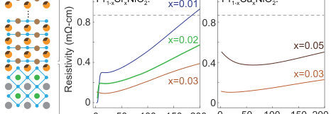
<figcaption class="paper-figure-caption"><b>Fig 2.</b> FIG. 2. Superconducting robustness under isovalent substi- tution and its sensitivity to Sr/Ca doping. a, Schematic of 20 uc LaxPr1−xNiO2/SrTiO3 films. b, c, Magnetic-field-dependent transport of (b) La1/3Pr2/3NiO2 and (c) La2/3Pr1/3NiO2 under magnetic fields along c axis, respectively. d, Schematic of 20 uc aliovalent-doped Pr1−xAxNiO2 (A = Sr, Ca) thin films. e, f, Temperature-dependent resistivity of (e) Pr1−xSrxNiO2/SrTiO3 (x = 0.01, 0.02 and 0.03) and (f) Pr1−xCaxNiO2/SrTiO3 (x = 0.03 and 0.05), respectively. The dashed line represents quantum of resis- tance per NiO2 sheet ρQ.</figcaption>
</figure>
<figure class="paper-figure-card">
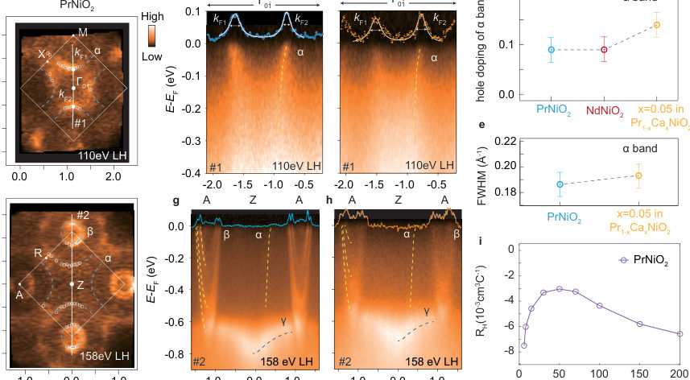
<figcaption class="paper-figure-caption"><b>Fig 3.</b> FIG. 3. Comparable self-doping in PrNiO2 with other pristine IL-nickelates and the suppression of superconductivity by slight hole doping. a, Photoemission intensity map of PrNiO2 at the Γ plane, integrated over an energy window of EF ± 50 meV under linear horizontal (LH) polarization. b, c, Band spectra of 20 uc PrNiO2 (b) and Pr0.95Ca0.05NiO2 (c) along the M-Γ-M direction. The momentum distribution curves (MDCs) integrated within EF ± 25 meV are plotted above the respective spectra, where white arrows denote the full width at half max- imum (FWHM) of the α band. d, Effective hole-doping level of the Ni 3dx2−y2 (α) band for PrNiO2, NdNiO2 and Pr0.95Ca0.05NiO2 extracted from the Luttinger...</figcaption>
</figure>
<figure class="paper-figure-card">
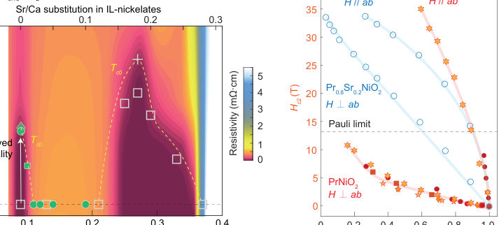
<figcaption class="paper-figure-caption"><b>Fig 4.</b> FIG. 4. Distinct superconducting regime from optimally hole-doped superconducting dome with more two-dimensional superconduc- tivity. a, Phase diagram of hole doped PrNiO2 and equivalent cationic rare-earth ion substituted LaxPr1−xNiO2. The hole doping p of the Ni 3dx2−y2 band was determined by the Luttinger volume of uncapped IL-nickelates, Pr0.95Ca0.05NiO2 and Pr0.8Ca0.2NiO2 according to ARPES results from this work and refs. 11, 12, respectively. Resistivity data of Pr1−xSrxNiO2 around the optimally-doped regime is adapted from refs. 4, 18, respectively. b, Upper critical field Hc2 of PrNiO2 samples versus T/Tc. The hollow circles refer to data of optimally doped Pr1−xSrxNiO2, which is...</figcaption>
</figure>

**Summary.** This paper investigates superconducting behavior in infinite-layer nickelates, finding intrinsic zero-resistance superconductivity even in pristine films. Crucially, they demonstrate that this parent-state superconductivity forms a distinct regime, separated from the conventionally understood doping dome, suggesting unique electronic correlations at play.

**Why it may be interesting.** The work directly addresses complex many-body physics in strongly correlated oxides, providing crucial experimental constraints on theories of unconventional superconductivity that are relevant to quantum materials research.

Detailed structure

**Main problem.** To determine if superconductivity in infinite-layer nickelates is governed by a cuprate-like single doping dome or if an intrinsic superconducting regime exists near the parent, undoped limit.

**Main result.** The study establishes a unique, separated superconducting regime near the parent state, distinct from the conventional high-doping dome. This suggests that infinite-layer nickelates host distinct superconducting physics compared to cuprate analogs.

**Method.** A combination of transport measurements (zero resistance, diamagnetism), heterostructure engineering to rule out interface effects, and Angle-Resolved Photoemission Spectroscopy (ARPES) were employed.

**Model / system.** The physical system is infinite-layer nickelates ($	ext{RENiO}_2$), studied in pristine and stoichiometric forms, with doping controlled via both isovalent ($	ext{La}/	ext{Pr}$) and aliovalent substitutions ($	ext{Sr}/	ext{Ca}$).

**Key observables.** Zero resistance, diamagnetism (TDO), upper-critical-field anisotropy ($\gamma$), and electronic band structure features observed via ARPES.

**Important parameters / regimes.** The superconducting phase is confined to a narrow doping range near the parent state ($p \approx 0.09$ holes), separated from the dome established by higher divalent doping levels.

**Assumptions / limitations.** The primary assumption challenged is that all superconductivity in these materials must follow the simple, continuous doping evolution observed in cuprates.

**Figures summary.** Figures illustrate zero resistance in uncapped films and heterostructures, confirm robustness under La substitution, show ARPES spectra comparing superconducting to lightly doped states, and map out a phase diagram showing two distinct superconducting regimes.

**Paper structure.** The paper progresses by first establishing the intrinsic superconductivity of pristine $	ext{PrNiO}_2$, then ruling out interfacial origins via heterostructures, mapping the doping dependence using ARPES and transport measurements, and finally contrasting this narrow parent-state regime with the established high-doping dome.

Abstract

Infinite-layer nickelates have been widely viewed as cuprate analogs in which superconductivity emerges and forms a superconducting dome centered around 10-20% cation substitution. Here we show that pristine and stoichiometric PrNiO2, without cation substitution, exhibits intrinsic superconductivity characterized by zero resistance and diamagnetism in uncapped films. Through heterostructure engineering, we further exclude an interfacial origin of the superconductivity. Remarkably, zero-resistance superconductivity is consistently observed in trivalent-substituted PrNiO2, whereas it is rapidly suppressed by dilute divalent substitution. Combined with angle-resolved photoemission studies, these results indicate that such a new superconducting regime is confined to within 3% additional hole doping from pristine PrNiO2. Furthermore, this phase is separated from the previously established superconducting dome around ~ 20% divalent doping by a non-superconducting region in the phase diagram, and is further distinguished by a remarkably stronger upper-critical-field anisotropy. These findings establish a unique separated superconducting regime, suggesting that infinite-layer nickelates are not merely cuprate analogs but host distinct superconducting physics.

[↑ back to top](#top)

### [Continuous Time Quantum Walk Propagation for Irregular Temporal Graph Forecasting](http://arxiv.org/abs/2607.17273v1)

**Authors:** Jiaqi Sun, Tianhao Li, Zhihao Bian  
**Type:** theory · **Category:** disordered systems and neural networks · **PDF:** <https://arxiv.org/pdf/2607.17273v1>  
**Analysis basis:** full PDF text, analyzed in chunks
**Topic relevance:** `methods for driven-dissipative` **1/5** · `non-equilibrium dynamics` **1/5**

↔ Scroll figures horizontally

<figure class="paper-figure-card">
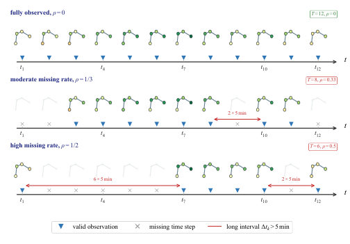
<figcaption class="paper-figure-caption"><b>Fig 1.</b> FIG. 1. Temporal graph snapshot sequences under differ- ent masking settings. The figure shows traffic graph observa- tion sequences for three representative MASK configurations, corresponding to complete observation, moderate missingness and high missingness. Valid observation steps are shown as clear graph snapshots, whereas missing steps are faded.</figcaption>
</figure>
<figure class="paper-figure-card">
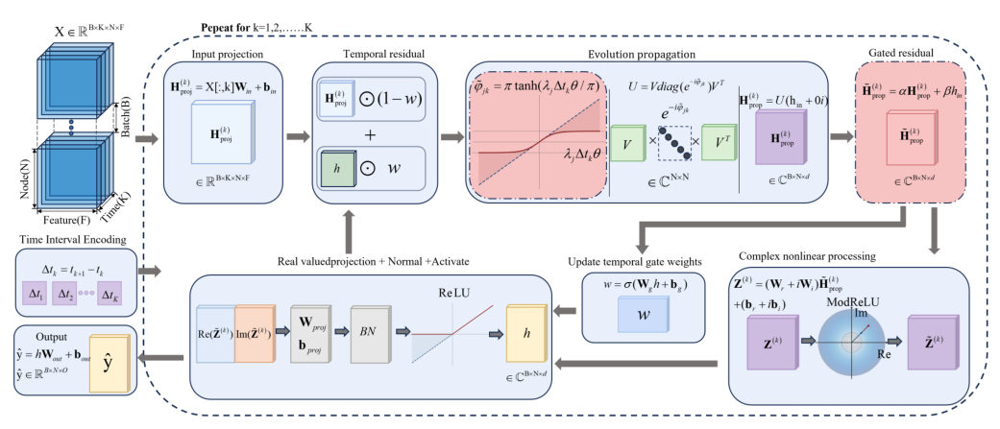
<figcaption class="paper-figure-caption"><b>Fig 2.</b> FIG. 2. Forward propagation pipeline of QWTA-Base.The model input is a batch tensor of irregular historical observations, X ∈RB×K×N×F .The input passes through input projection, recurrent hidden fusion, CTQW-type spectral propagation, and complex-valued nonlinear processing to generate the recurrent hidden representation. The red dashed box denotes the extension module. The final hidden representation is projected into the real domain to generate the prediction ˆy.</figcaption>
</figure>
<figure class="paper-figure-card">
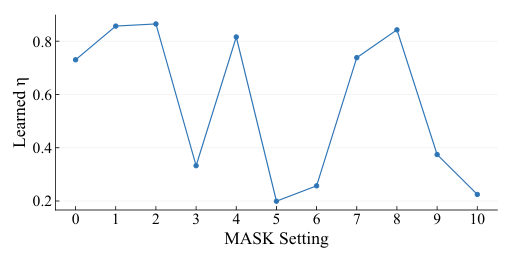
<figcaption class="paper-figure-caption"><b>Fig 3.</b> FIG. 3. Time-scaling parameter η learned by QWTA-GR at the final checkpoints for MASK0–MASK10. All values lie in the analysis interval [0.1, 1], but they vary non-monotonically with the number of valid input steps T. This indicates that the spectral phase modulation scale depends on the masking setting.</figcaption>
</figure>
<figure class="paper-figure-card">
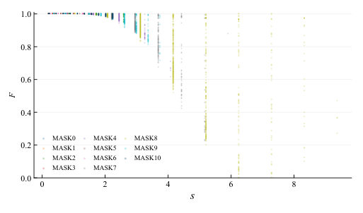
<figcaption class="paper-figure-caption"><b>Fig 4.</b> FIG. 4. Relationship between effective phase scale and propa- gation fidelity for real hidden propagation inputs. Each point corresponds to one hidden propagation input hin extracted during model forward propagation. The horizontal axis is the actual effective phase scale s = |∆tkη| of that sample. The vertical axis is the fidelity F between the unclipped propaga- tion output and the soft-clipped propagation output.</figcaption>
</figure>
<figure class="paper-figure-card">
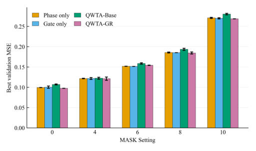
<figcaption class="paper-figure-caption"><b>Fig 5.</b> FIG. 5. Component ablation results for phase modulation and gated residual modules. The figure compares the Phase- only, Gate-only, QWTA-Base, and full QWTA-GR variants under five representative MASK settings in terms of valida- tion MSE. The Phase-only and Gate-only variants retain only phase soft clipping and gated residual fusion, respectively. QWTA-Base denotes the basic CTQW spectral propagation backbone without phase soft clipping or gated residual fu- sion. QWTA-GR denotes the full model with both stabiliza- tion mechanisms.</figcaption>
</figure>

**Summary.** This paper proposes the Quantum Walk Temporal Architecture (QWTA) to improve temporal graph forecasting by modeling signal propagation using Continuous Time Quantum Walks (CTQW). QWTA embeds irregular time intervals directly into the phase modulation of the quantum evolution operator, offering a physically motivated alternative to classical GNNs. The resulting framework shows strong potential for handling missing historical data in complex systems like traffic networks.

**Why it may be interesting.** The explicit use of quantum evolution operators derived from graph Laplacians to model time series dynamics provides a novel physical interpretation for temporal data processing in machine learning, bridging spectral graph theory with deep learning architectures.

Detailed structure

**Main problem.** Developing a graph propagation scheme for temporal graph forecasting that can explicitly handle irregular time intervals (missing historical observations).

**Main result.** The proposed QWTA-GR model achieves competitive performance in forecasting under various missingness settings by embedding phase information from irregular time gaps into the quantum walk evolution.

**Method.** It replaces classical GNN propagation with a Quantum Walk Temporal Architecture (QWTA), which uses the spectral decomposition of the graph Laplacian to modulate the propagation kernel's phase based on observed time intervals.

**Model / system.** The model is built upon Continuous Time Quantum Walks (CTQW) defined by the normalized graph Laplacian $L$ as the Hamiltonian. The evolution operator $U(	au)$ governs the quantum dynamics, which is adapted to handle irregular time steps $\Delta t_k$.

**Key observables.** Probability at a node $|\langle j|\psi(	au)
angle|^2$, and the final forecasted graph signal $\hat{y}$.

**Important parameters / regimes.** The effective observation interval ($\Delta t_k$), the learnable time-scaling parameter ($\eta$), and the gating weight ($w$) used for state fusion.

**Assumptions / limitations.** The core assumption is that CTQW's ability to encode spectral phase modulation allows it to model temporal dependencies more physically accurately than classical diffusion models, although performance varies based on missingness patterns.

**Figures summary.** Figure 1 illustrates the application of the framework across three representative masking settings (complete, moderate, high missingness) for traffic graph observations.

**Paper structure.** The paper introduces QWTA by first establishing the limitations of classical GNNs in handling time gaps. It then details the spectral propagation mechanism using CTQW, proposing QWTA-Base and enhancing it with stabilization techniques (QWTA-GR) through phase soft clipping and gated residual fusion.

Abstract

Continuous time quantum walks built on graph Laplacians produce non monotonic graph propagation features through quantum interference during evolution, which classical diffusion cannot achieve. Such walks deliver a physically motivated propagation scheme for temporal graph signal modeling. We propose Quantum Walk Temporal Architecture (QWTA), which replaces classical graph propagation with a CTQW-type parameterized spectral propagator. QWTA embeds effective observation intervals into the spectral phase modulation of the propagation kernel. QWTA-Base preserves exact CTQW spectral evolution and serves as a physically faithful propagation reference. QWTA-GR further introduces phase soft clipping and gated residual fusion to stabilize propagation. The results show that explicit phase encoding of irregular time intervals, when combined with suitable stabilization, provides a physically motivated and competitive graph propagation design for temporal graph forecasting with missing historical observations.

[↑ back to top](#top)

### [Grounded verification of chemical and materials reasoning: detection is the bottleneck](http://arxiv.org/abs/2607.17417v1)

**Authors:** Can Polat, Mustafa Kurban, Erchin Serpedin, Hasan Kurban  
**Type:** theory · **Category:** other · **PDF:** <https://arxiv.org/pdf/2607.17417v1>  
**Analysis basis:** full PDF text, analyzed in chunks
**Topic relevance:** `analog quantum simulation` **1/5** · `correlated cavity matter` **1/5**

↔ Scroll figures horizontally

<figure class="paper-figure-card">
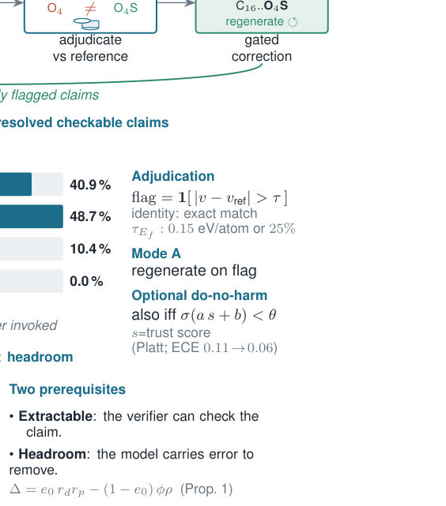
<figcaption class="paper-figure-caption"><b>Fig 1.</b> Figure 1 Method overview. a, Verify-and-correct loop (ampicillin schematic): extract (name, value) claims, check them against PubChem/MP/CCCBDB, and on flag re-inject the reference in verifier feedback and regenerate, repairing flagged claims only. b, Cheapest-first tier ladder with holdout resolution shares (40.9/48.7/10.4/0.0%; DFT tier unused). Quantitative flags use flag = 𝟏[|𝑣−𝑣ref| &gt; 𝜏] (𝜏𝐸𝑓= 0.15 eV/atom or 25%; identity exact match); Mode A regenerates on flag, with an evaluated Platt trust gate on the constants rerun. c, Lift requires extractability × headroom (materials formulas and isotope long tail); near-ceiling or unparseable cases show limited or no gain (Prop. 1).</figcaption>
</figure>
<figure class="paper-figure-card">
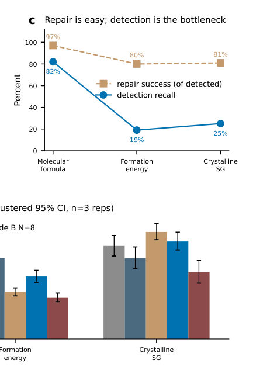
<figcaption class="paper-figure-caption"><b>Fig 2.</b> Figure 2 The problem and the fix. a, Baseline molecular-formula error given commitment rises monotoni- cally with compound rarity (PubChem-CID-ordered strata; pooled over models), from 0% on well-known compounds to 58% on recent drugs, the regime where confabulation concentrates. b, Intention-to-treat error (wrong or no-commit) by surface and condition, prompt-clustered 95% confidence intervals (𝑛= 3 replicates): gated Mode A and Mode B reduce molecular error, and Mode B additionally reduces formation-energy error. c, Two-stage decomposition of gated correction: repair success is uniformly high wherever a flag fires, so in-loop detection recall is the bottleneck that differentiates the...</figcaption>
</figure>
<figure class="paper-figure-card">
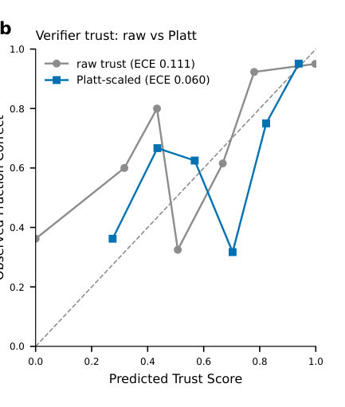
<figcaption class="paper-figure-caption"><b>Fig 3.</b> Figure 3 Two-panel reliability diagram. a, Model verbalized confidence (𝑛= 1,086) vs verifier trust score, raw and uncalibrated (𝑛= 484), each on its own population, with the paired-subset comparison (𝑛= 958); the grounded trust score is the better-calibrated abstention signal on every population (ECE values in text). b, Verifier trust score, raw vs Platt-scaled, on the 𝑛= 484 trust-only holdout.</figcaption>
</figure>

**Summary.** This paper introduces a deterministic, database-grounded verification framework to correct chemical and materials errors generated by large language models. By implementing a gated correction loop, the authors demonstrate superior error reduction compared to standard retrieval methods. They conclude that while repair is effective when an error is found, the primary bottleneck limiting overall accuracy improvement is the model's ability to detect the initial falsehood.

**Why it may be interesting.** While not directly quantum physics, this work addresses the reliability of AI tools used to process complex physical data (like material properties), which is crucial for future computational materials science workflows that might incorporate quantum calculations.

Detailed structure

**Main problem.** The core challenge is determining whether detection (identifying an error) or repair (correcting the identified error) is the bottleneck when using LLMs for grounded reasoning in chemistry and materials science.

**Main result.** Gated, deterministic verification significantly reduces chemical confabulation errors by beating conversational oracle RAG, confirming that the primary limitation is the model's ability to detect an extractable error in the first place.

**Method.** The authors developed a tiered verifier that extracts verifiable claims from LLM outputs and checks them against authoritative external databases (e.g., PubChem, Materials Project) within a gated correction loop.

**Model / system.** The system involves large language models generating reasoning traces about chemical objects like molecular formulas, space groups, and formation energies in materials science contexts.

**Key observables.** Error rates (e.g., 22% down to 4%), detection recall ($r_d$), repair success rate ($r_p$), and the lift achieved by grounding relative to baseline models.

**Important parameters / regimes.** The performance is highly dependent on whether the error involves 'long-tail entities' or near-ceiling physical constants, and the comparison between oracle (perfect) vs. realistic retrieval conditions.

**Assumptions / limitations.** The analysis assumes that detection failure limits overall improvement, even if the repair mechanism itself is robust when a flag is raised.

**Figures summary.** Figures illustrate the method overview showing the 'Verify-and-correct loop' and show error reduction comparisons; other figures compare retrieval savings across different chemical surfaces.

**Paper structure.** The paper progresses by first identifying LLM confabulation in chemistry, proposing a gated verification loop, quantifying its performance against various RAG baselines, and finally decomposing the error reduction to prove detection is the bottleneck.

Abstract

Large language models confabulate chemical objects (molecular formulas, space groups, formation energies) in fluent reasoning traces, concentrated on long-tail entities where confidence is least trustworthy. Deterministic, database-grounded verification can catch and repair such errors without the coverage cost of blanket retrieval; the binding constraint, we find, is detection, not repair. Our tiered verifier extracts each checkable claim, checks it against authoritative databases and physics, and feeds the reference into a gated correction loop. Across four models and 528 condition-pinned prompts, gated correction cuts committed-formula error from 22% to 4% at $3.2\times$ fewer retrievals than blanket augmentation, beating a conversational oracle. Repair succeeds wherever a flag fires (80--97%); the bottleneck is in-loop detection recall. Grounding improves the final answer only when the verifier's scope reaches the deliverable (83% to 90%), and the lift appears only where extractable long-tail error exists: absent on near-ceiling physical constants, large on isotope half-lives (11% to 0%).

[↑ back to top](#top)

### [Marginal-Fermi-Liquid-like Behavior without Pseudogap in Infinite-Layer Nickelates](http://arxiv.org/abs/2607.16852v1)

**Authors:** Yu Fan, Zhitong An, Xiang Ding, Xingtian Sun, Yutong Chen, Zhihui Chen, Shenglin Tang, Chihao Li, Jiahao Ye, Timur Kim, Haichao Xu, Rui Peng, Donglai Feng  
**Type:** experiment · **Category:** strongly correlated electrons · **PDF:** <https://arxiv.org/pdf/2607.16852v1>  
**Analysis basis:** full PDF text, analyzed in chunks
**Topic relevance:** `Keldysh / 2PI / non-Gaussian methods` **1/5** · `Kondo & dissipative impurity` **1/5**

↔ Scroll figures horizontally

<figure class="paper-figure-card">
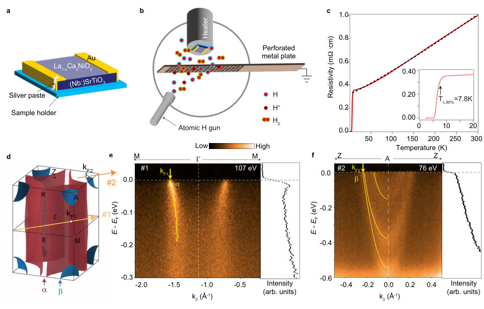
<figcaption class="paper-figure-caption"><b>Fig 1.</b> FIG. 1: Improved surface quality enabling observation of quasiparticle peak in ARPES studies on</figcaption>
</figure>
<figure class="paper-figure-card">
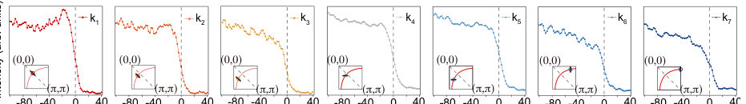
<figcaption class="paper-figure-caption"><b>Fig 2.</b> FIG. 2: Momentum-dependent quasiparticle peak without pseudogap opening in La0.8Ca0.2NiO2. a,b,</figcaption>
</figure>
<figure class="paper-figure-card">
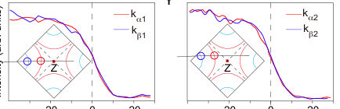
<figcaption class="paper-figure-caption"><b>Fig 3.</b> FIG. 3: Absence of pseudogap opening in the β band in La0.8Ca0.2NiO2. a, Three-dimensional Brillouin</figcaption>
</figure>
<figure class="paper-figure-card">
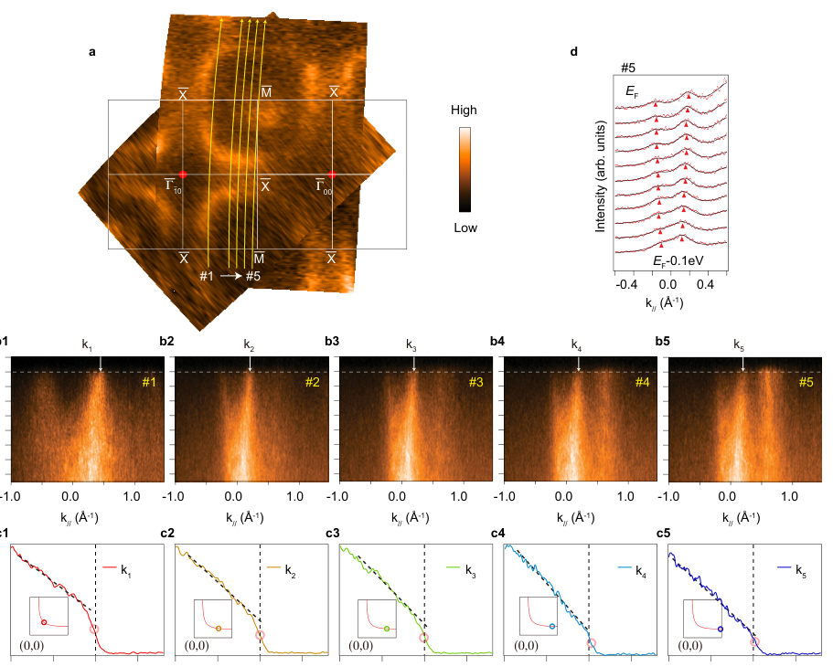
<figcaption class="paper-figure-caption"><b>Fig 4.</b> FIG. 4: Momentum-dependent spectral-weight suppression without pseudogap opening in LaNiO2. a</figcaption>
</figure>
<figure class="paper-figure-card">
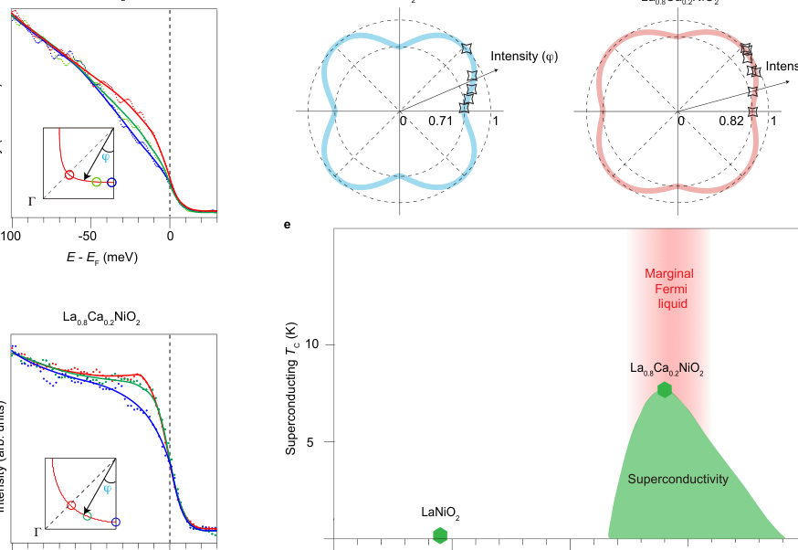
<figcaption class="paper-figure-caption"><b>Fig 5.</b> FIG. 5: Anisotropic spectral weight suppression of La1−xCaxNiO2. a,b, Comparison of EDCs of the α</figcaption>
</figure>

**Summary.** Using ARPES on infinite-layer nickelates, this work investigates whether pseudogap formation is necessary for unconventional superconductivity. The authors report evidence of marginal-Fermi-liquid scattering and momentum-dependent correlations in these materials while definitively showing the absence of a detectable cuprate-like pseudogap opening.

**Why it may be interesting.** This work provides crucial experimental data on a different class of strongly correlated superconductors, helping refine theoretical models that attempt to unify the physics governing strange-metal behavior across various high-$T_c$ materials.

Detailed structure

**Main problem.** To resolve the relationship between pseudogap formation, strange-metal behavior, and unconventional superconductivity in a system distinct from cuprates.

**Main result.** The study found evidence of marginal-Fermi-liquid-like scattering and momentum-dependent correlations in infinite-layer nickelates without observing a detectable cuprate-like pseudogap opening.

**Method.** Angle-resolved photoemission spectroscopy (ARPES) was used on superconducting La0.8Ca0.2NiO2 and parent LaNiO2 thin films, supplemented by transport measurements.

**Model / system.** The research focuses on infinite-layer nickelates ($	ext{La}_{1-x}	ext{Ca}_x	ext{NiO}_2$), which provide a $3d^9$-derived platform to study high-temperature superconductivity phenomenology, contrasting them with hole-doped cuprates.

**Key observables.** Low-energy spectral function, electronic self-energy ($	ext{Im}\Sigma(\omega)$), quasiparticle peak dispersion, and resistivity vs. temperature ($T$).

**Important parameters / regimes.** Hole doping level (e.g., $p \sim 0.09$), superconducting transition temperature ($T_c$), and the energy scale of the pseudogap.

**Assumptions / limitations.** The analysis assumes that the observed spectral weight suppression is characteristic of marginal-Fermi-liquid behavior, providing a benchmark for understanding normal-state electronic ingredients.

**Figures summary.** Figures detail ARPES results showing continuous band dispersion up to $E_F$ and momentum-dependent spectral weight suppression in both doped and parent nickelates, contrasting with expected pseudogap signatures.

**Paper structure.** The paper systematically presents ARPES data on the superconducting state ($	ext{La}_{0.8}	ext{Ca}_{0.2}	ext{NiO}_2$) to establish MFL-like scattering without a gap, followed by analysis of the parent compound ($	ext{LaNiO}_2$), and concluding with a comparison to cuprate phenomenology.

Abstract

Pseudogap formation, strange-metal behavior and unconventional superconductivity are closely intertwined in hole-doped cuprates, yet their relationship remains unresolved. Infinite-layer nickelates offer a distinct 3d9-derived platform to address this question by combining a cuprate-like Ni dx2-y2 Fermi surface with multiband electronic degrees of freedom. Here we use angle-resolved photoemission spectroscopy to resolve the low-energy spectral function of superconducting La0.8Ca0.2NiO2 and parent LaNiO2 thin films. In La0.8Ca0.2NiO2, the electronic self-energy Im Sigma(omega) is approximately linear in energy and its slope increases from (pi/2, pi/2) to (pi, 0), revealing momentum-dependent marginal-Fermi-liquid-like scattering. Both films show a progressive suppression of low-energy spectral weight from the diagonal direction toward (pi, 0), with stronger suppression in parent LaNiO2. However, finite Fermi-level spectral weight persists around the entire Fermi surface, with no leading-edge shift or back-bending indicative of pseudogap formation in either the electron pocket or the cuprate-like hole band. Our results demonstrate that momentum-selective correlations and marginal-Fermi-liquid-like scattering can occur without a detectable cuprate-like pseudogap, providing a benchmark for identifying the essential normal-state electronic ingredients of high-temperature superconductivity.

[↑ back to top](#top)

### [Shortcuts to adiabaticity in five-level systems using counter-diabatic driving and time-rescaling optimization](http://arxiv.org/abs/2607.16829v1)

**Authors:** Jiahui Zhang, Wenyuan Wang, Fuquan Dou  
**Type:** theory · **Category:** other · **PDF:** <https://arxiv.org/pdf/2607.16829v1>  
**Analysis basis:** full PDF text, analyzed in chunks
**Topic relevance:** `methods for driven-dissipative` **1/5** · `non-equilibrium dynamics` **1/5**

↔ Scroll figures horizontally

<figure class="paper-figure-card">
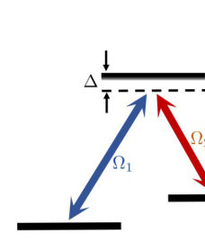
<figcaption class="paper-figure-caption"><b>Fig 1.</b> Figure 1: Schematic of an M-type chainwise-connected five-level system.</figcaption>
</figure>
<figure class="paper-figure-card">
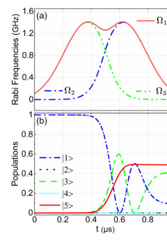
<figcaption class="paper-figure-caption"><b>Fig 2.</b> Figure 2: (Color online) Rabi frequencies (upper row) and populations (lower row) as a function of t; the left and right columns correspond to M-STIRAP and M-STIRSAP, respectively. Adopted Parameters: ω0 =2π×5MHz, tf =1µs, τ = tf/8, σ=tf/6, ∆=2π×5GHz.</figcaption>
</figure>
<figure class="paper-figure-card">
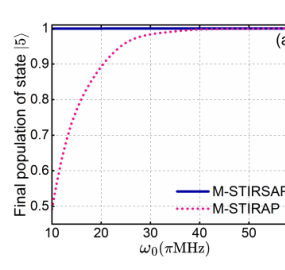
<figcaption class="paper-figure-caption"><b>Fig 3.</b> Figure 3: (Color online) The final population of state |5⟩as functions of param- eter (a) ω0 and (b) tf under the M-STIRAP ang M-STIRSAP, respectively. All the other parameters are the same as those in Fig. 2.</figcaption>
</figure>
<figure class="paper-figure-card">
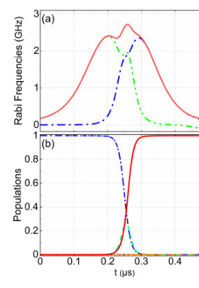
<figcaption class="paper-figure-caption"><b>Fig 4.</b> Figure 4: (Color online) Rabi frequencies (upper row) and populations (lower row) as a function of t. The left and right columns correspond to a = 2 and a=5, respectively, with all other parameters are the same as those in Fig. 2.</figcaption>
</figure>
<figure class="paper-figure-card">
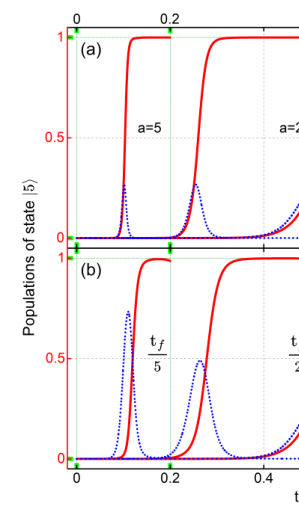
<figcaption class="paper-figure-caption"><b>Fig 5.</b> Figure 5: (Color online) (a) Population evolution of the intermediate state |3⟩ and the final state |5⟩under the M-STIRSAP-opt protocol when a = 1, 2, 5; (b) Population evolution of the intermediate state |3⟩and the final state |5⟩under the M-STIRSAP protocol for different tf. All other parameters are consistent with those in Fig. 2.</figcaption>
</figure>

**Summary.** The paper addresses the challenge of controlling population transfer in complex five-level quantum systems by applying advanced Shortcuts to Adiabaticity protocols. It introduces a novel, optimized time-rescaling method ($	ext{M-STIRSAP-opt}$) that significantly improves speed and robustness compared to existing methods. This work provides a powerful theoretical framework for realizing fast, high-fidelity quantum state engineering in multi-level atomic or molecular systems.

**Why it may be interesting.** This work is highly relevant as it tackles advanced quantum control theory, which is central to designing coherent manipulation of atomic or superconducting qubits in AMO physics settings. The combination of CD driving and TR optimization represents state-of-the-art techniques for fast gate implementation.

Detailed structure

**Main problem.** The primary goal is developing fast and robust quantum control protocols for achieving high-fidelity population transfer in complex multi-level quantum systems, specifically five-level chains.

**Main result.** The optimized time-rescaling protocol ($	ext{M-STIRSAP-opt}$) was shown to achieve complete population transfer faster and with better robustness against parameter fluctuations compared to previous methods.

**Method.** The study employs Shortcuts to Adiabaticity (STA) techniques, combining Counter-diabatic (CD) driving with Time-Rescaling (TR) optimization to engineer the required Hamiltonian dynamics.

**Model / system.** The system modeled is a chainwise-connected five-level quantum system. The analysis involves sequential reduction of the full Hamiltonian ($H_5$) down to effective two- and three-level descriptions ($	ilde{H}_2, 	ilde{H}_3$).

**Key observables.** Final population in the target state $|5\rangle$, transient populations of intermediate states (e.g., $|3\rangle$), and robustness against parameter fluctuations.

**Important parameters / regimes.** Rabi frequencies ($\Omega_i(t)$), detuning ($\delta$), time-rescaling parameters ($a$), and evolution time ($t_f$).

**Assumptions / limitations.** The initial calculations rely on the Adiabatic Elimination (AE) principle due to computational difficulties in multi-level CD driving.

**Figures summary.** Figures illustrate population dynamics comparing different protocols ($	ext{M-STIRAP}$ vs. $	ext{M-STIRSAP}$ vs. $	ext{M-STIRSAP-opt}$) and show the dependence of final state populations on external parameters like detuning or time.

**Paper structure.** The paper builds by first establishing the need for STA in multi-level systems, developing protocols via Hamiltonian reduction ($H_5 
ightarrow H_3 
ightarrow H_2$), applying CD driving to create $	ext{M-STIRSAP}$, and finally optimizing this result using Time-Rescaling (TR) to yield the superior $	ext{M-STIRSAP-opt}$ protocol.

Abstract

Shortcuts to adiabaticity (STA) is a common protocol to realize high-fidelity and robust quantum control in various quantum systems. To date, STA has been widely applied in two- and three-level systems, whereas designing feasible strategies to achieve perfect quantum state engineering in multi-level systems still remains a challenging task. Here, we propose to use counterdiabatic (CD) driving and time-rescaling (TR) methods to construct multi-state stimulated Raman shortcut-to-adiabatic passage protocols for realizing robust and fast population transfer in chainwise-connected five-state systems. The first protocol is implemented by initially reducing the original five-state system to an equivalent two-state counterpart, and then designing the corresponding driving field by combining CD driving and unitary transformation. Further, we introduce the TR method to optimize the first protocol and thus offers an alternative solution. Numerical calculations show that both protocols can achieve complete population transfer and effectively suppress transient populations of all intermediate states. Compared with the first protocol, the optimized second exhibits better performance within a shorter evolution time.

[↑ back to top](#top)

### [The finite key effect of side-channel-secure quantum key distribution beyond post-selection technique](http://arxiv.org/abs/2607.17465v1)

**Authors:** Cong Jiang, Zong-Wen Yu, Xiang-Bin Wang  
**Type:** theory · **Category:** quantum information and computing · **PDF:** <https://arxiv.org/pdf/2607.17465v1>  
**Analysis basis:** full PDF text, analyzed in chunks
**Topic relevance:** `entanglement & information structure` **1/5** · `quantum measurements` **1/5**

↔ Scroll figures horizontally

<figure class="paper-figure-card">
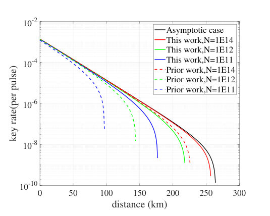
<figcaption class="paper-figure-caption"><b>Fig 1.</b> FIG. 1. Comparison of key rates with different N. The curves show the secret key rate (bits per pulse) versus fiber distance (km) for total pulse numbers N = 1011, 1012, and 1014. Our method outperforms prior works, enabling secure QKD at longer distances with fewer pulses.</figcaption>
</figure>
<figure class="paper-figure-card">
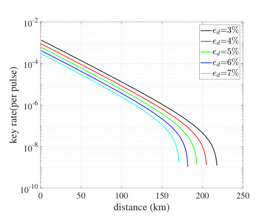
<figcaption class="paper-figure-caption"><b>Fig 2.</b> FIG. 2. Comparison of key rates with different ed. The curves show the secret key rate (bits per pulse) versus fiber distance (km) for the misalignment-error probability ed = 3%, 4%, 5%, 6% and 7%. High ed is commonly observed in both deployed field fiber links and free-space channels. The results shows that the maximum transmission distance of the SCS protocol decreases only mildly with increasing ed.</figcaption>
</figure>

**Summary.** This paper presents a security-proof method for variable-length Side-Channel-Secure Quantum Key Distribution (QKD) that bypasses the need for restrictive post-selection techniques. By utilizing Entropic Uncertainty Relations, it derives tight key rates directly from observed statistical fluctuations during error correction. This significantly enhances the practical applicability and theoretical justification of modern QKD protocols.

**Why it may be interesting.** This work provides rigorous theoretical advancements in quantum cryptography by developing new methods to calculate secure key rates that are more practical and robust than previous post-selection based approaches.

Detailed structure

**Main problem.** Developing a security-proof method for variable-length side-channel-secure (SCS) Quantum Key Distribution (QKD) that avoids the limitations of post-selection techniques.

**Main result.** The authors introduce a novel framework using Entropic Uncertainty Relations and the Quantum Leftover Hash Lemma to derive tight, direct key rates for SCS-QKD against coherent attacks.

**Method.** The security analysis reframes composable security as a statistical fluctuation problem of phase errors, allowing the calculation of the secure key length based on actual information leakage during error correction.

**Model / system.** The study focuses on the Side-Channel-Secure (SCS) QKD protocol, involving two senders (Alice and Bob) transmitting quantum states to an untrusted measurement party Charlie. The analysis also touches upon variable-length BB84 protocols using decoy states.

**Key observables.** Phase-error rate, counting rates of distinct quantum states ($
ho_{oA k}, 
ho_{xAk}$), and the final key length $\ell_{i,h}$.

**Important parameters / regimes.** The protocol's security is characterized by parameters derived from observed counts and error correction leakage.

**Assumptions / limitations.** Initial analysis assumes no bit-dependent correlation between emitted pulses and that Eve cannot enter the laboratory; later sections analyze applicability to broader QKD classes.

**Paper structure.** The paper progresses by first introducing the SCS-QKD protocol framework, then detailing the mathematical tools (EUR, QLHL) used for security proofs, and finally extending these techniques to clarify key-rate formulas applicable across various variable-length QKD implementations.

Abstract

By applying the framework of entropic uncertainty relation (EUR) and the Quantum Leftover Hash Lemma (QLHL), we introduce a security-proof method for variable-length side-channel-secure (SCS) quantum key distribution (QKD) against coherent attacks. This method reframes composable security as a statistical fluctuation problem of phase errors, enabling direct proofs against coherent attacks through observables and virtual observables. It yields tight key rates for the SCS protocol and reduces pulse requirements by over two orders of magnitude compared to prior works that employ the post-selection technique. We prove that the secure key length for the SCS protocol can be determined after error correction by exploiting the fact that untagged bits are free from bit-flip errors, using the actual information leakage during error correction and the post-error-correction statistics of each state to calculate the final key rate. We further identify sufficient conditions under which the final key length may be determined after error correction in a broader class of QKD protocols. Under the framework of EUR and QLHL, we clarify the applicability of several commonly used concentration bounds to variable-length QKD and the appropriate manner of their implementation. This work enhances the practical value of the SCS protocol and clarifies the security justification of key-rate formulas used in practical variable-length QKD implementations.

[↑ back to top](#top)

### [A Reponse to the Sheldon Goldstein Objection to a Series of Covariant Relativistic Bohmian Models](http://arxiv.org/abs/2607.16928v1)

**Authors:** Sergio Hernández-Zapata, Gerardo Ruiz-Chavarría  
**Type:** theory · **Category:** other · **PDF:** <https://arxiv.org/pdf/2607.16928v1>  
**Analysis basis:** full PDF text, analyzed in chunks
**Topic relevance:** `Keldysh / 2PI / non-Gaussian methods` **1/5**

↔ Scroll figures horizontally

<figure class="paper-figure-card">
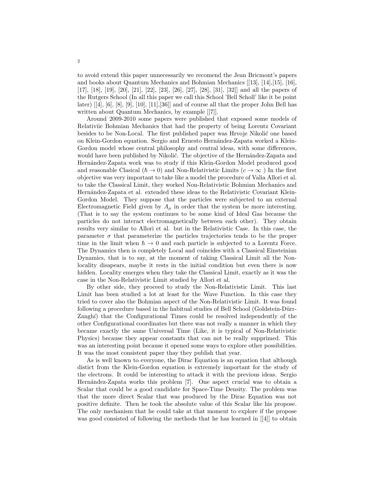
<figcaption class="paper-figure-caption"><b>Fig 1.</b> Low-resolution page preview, page 2</figcaption>
</figure>
<figure class="paper-figure-card">
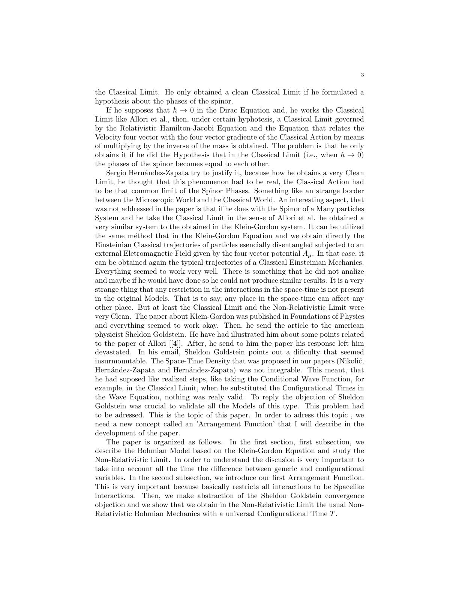
<figcaption class="paper-figure-caption"><b>Fig 2.</b> Low-resolution page preview, page 3</figcaption>
</figure>
<figure class="paper-figure-card">
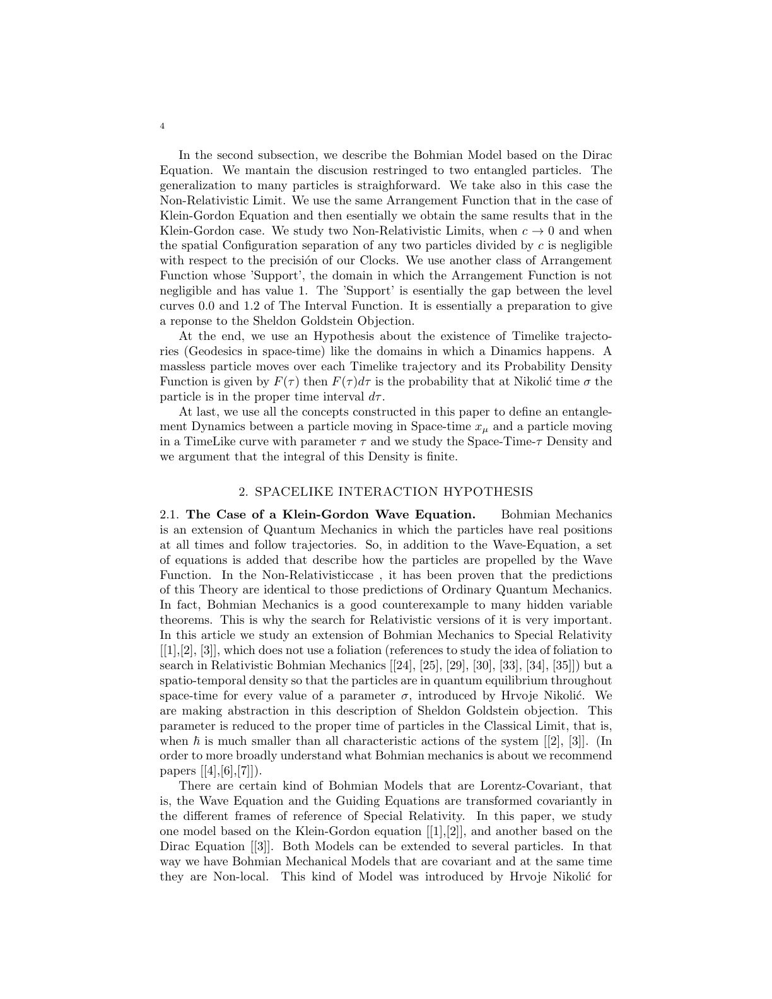
<figcaption class="paper-figure-caption"><b>Fig 3.</b> Low-resolution page preview, page 4</figcaption>
</figure>
<figure class="paper-figure-card">
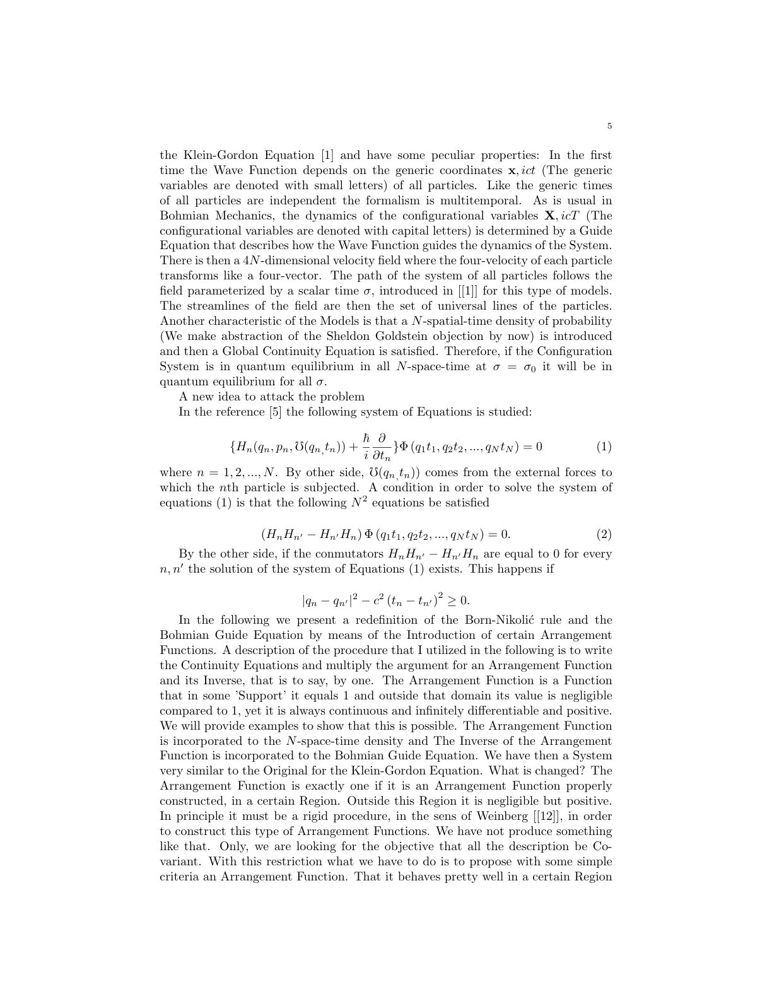
<figcaption class="paper-figure-caption"><b>Fig 4.</b> Low-resolution page preview, page 5</figcaption>
</figure>
<figure class="paper-figure-card">
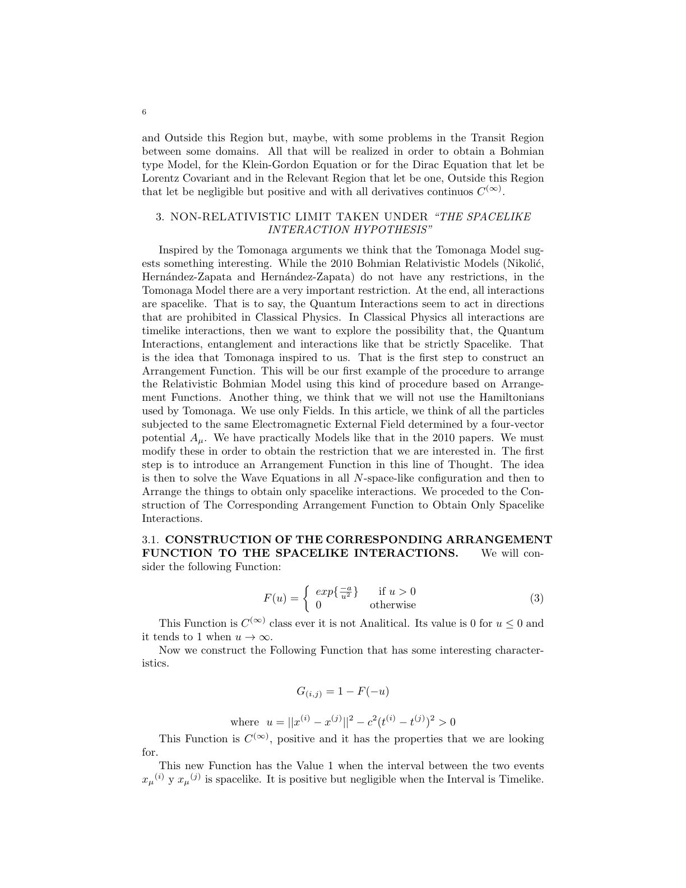
<figcaption class="paper-figure-caption"><b>Fig 5.</b> Low-resolution page preview, page 6</figcaption>
</figure>

**Summary.** This paper tackles a fundamental mathematical objection to covariant Bohmian models concerning the normalization of their space-time density. The authors introduce an 'Arrangement Function' as a novel tool to mathematically regularize the theory, allowing for a consistent, Lorentz-covariant description of relativistic quantum dynamics. This resolves a major hurdle in applying Bohmian mechanics to modern field theories.

**Why it may be interesting.** While not directly focused on AMO systems like cold atoms or cavity QED, the rigorous development of a consistent quantum mechanical framework (Bohmian Mechanics) for relativistic particles is foundational theoretical work that impacts how one models non-local dynamics in complex quantum systems.

Detailed structure

**Main problem.** The primary goal is resolving Sheldon Goldstein's objection regarding the non-integrability of the configuration space-time density in Covariant Bohmian Models, which prevents its normalization to a probability density function.

**Main result.** The authors propose using a novel 'Arrangement Function' ($\mathcal{A}$) to construct an integrable framework that allows for Lorentz-covariant descriptions while maintaining mathematical consistency for defining a proper PDF.

**Method.** They employ the Arrangement Function to modify continuity equations and guide equations, restricting quantum interactions to be strictly spacelike separations within the formalism.

**Model / system.** The work extends Bohmian Mechanics to relativistic quantum field theories (Klein-Gordon and Dirac Equations) in a covariant manner, treating particle paths through space-time density rather than simple foliations.

**Key observables.** Space-Time Density ($
ho$), the integral convergence $ar{A}$ (which must be finite), and the resulting Bohmian Guide Equations for particle trajectories.

**Important parameters / regimes.** Planck's constant ($\hbar$), speed of light ($c$), and the structure of the Arrangement Function itself, which dictates interaction locality.

**Assumptions / limitations.** The necessity of introducing the 'Arrangement Function' to enforce mathematical integrability; assuming quantum interactions are strictly spacelike while classical ones are timelike.

**Paper structure.** The paper systematically addresses the Klein-Gordon model, introduces the Arrangement Function for spacelike restriction, tackles Goldstein's objection by ensuring finite integral convergence ($ar{A}$), and concludes with an analysis of the Dirac Equation case.

Abstract

In this work we try to answer a very important objection to the Covariant Bohmian Models type Nikolić and Hernández-Zapata that was formulated by the american physicist Sheldon Goldstein (private communication, 2010) about the imposibility to interpret the configuration space-time density found by the authors of these models like a probability density. The problem is that it is very dificult to show that the N space-time configuration density has a finite integral. That is very important in order to normalize the density to produce a PDF (probability density function). All the steps in the demonstrations seemed complete but this objection must be resolved imperatively before to continue using this kind of models with full confidence. Since the aim of Bohmian Mechanics (also known as the De Broglie-Bohm Mechanics) is to provide a precise and objective formulation of Quantum Mechanics free from vagueness and obscurity (Bell point of view at least), addressing this issue is crucial. In this article, we set out to tackle this by employing a specific type of function that we call an "Arrangement Function".

[↑ back to top](#top)

### [Auditing Question-Order Effects in Large Language Models with the QQ Equality: Mechanism Characterization and a Saturation Caveat](http://arxiv.org/abs/2607.17219v1)

**Authors:** Pilsung Kang  
**Type:** both · **Category:** other · **PDF:** <https://arxiv.org/pdf/2607.17219v1>  
**Analysis basis:** full PDF text, analyzed in chunks
**Topic relevance:** `quantum measurements` **1/5**

↔ Scroll figures horizontally

<figure class="paper-figure-card">
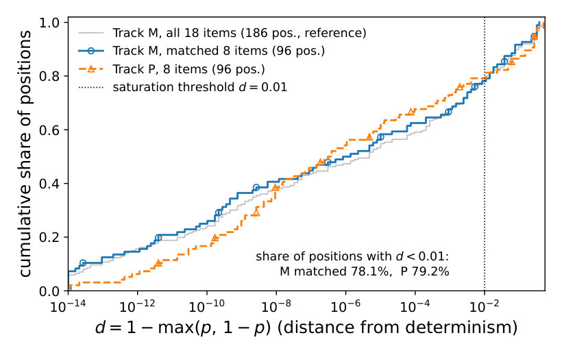
<figcaption class="paper-figure-caption"><b>Fig 1.</b> Figure 1: Empirical cumulative distribution function (CDF) of the distance from determinism d = 1 −max(p, 1 −p), log scale (d equals the probability of the minority answer, i.e., the total- variation distance to the nearest deterministic distribution). The primary comparison is between the matched eight-item subset under Track M and Track P (96 positions each); the full Track M set is shown as a reference curve. On the matched subset, a similar share of positions lies below the d = 0.01 saturation threshold (78.1% vs 79.2%), indicating that the respondent-persona framing did not substantially alleviate saturation, although the distributions differ at intermediate scales. Positions with d =...</figcaption>
</figure>
<figure class="paper-figure-card">
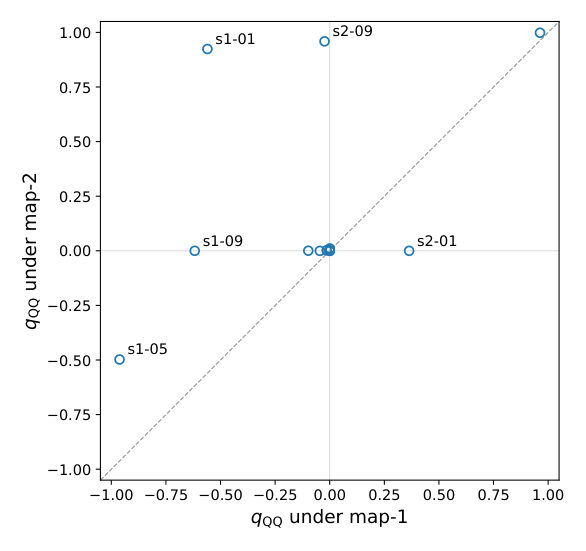
<figcaption class="paper-figure-caption"><b>Fig 2.</b> Figure 2: Label effect under counterbalancing: per-item qQQ under map-1 vs map-2 (13 A/B items, Track M). Points on the dashed diagonal indicate mapping-invariant behavior; annotated items deviate by more than 0.3, showing that in the saturated regime the A/B token assignment has a substantive effect on the measured qQQ.</figcaption>
</figure>

**Summary.** This work adapts the QQ equality, originally from human survey data, into a rigorous audit tool to test question-order effects in LLMs. The methodology combines theoretical characterization of contextuality with an empirical pipeline that must account for response saturation. Ultimately, it highlights the limitations of using simple next-token probabilities when modeling complex distributional phenomena.

**Why it may be interesting.** It provides a novel, physics-inspired statistical framework for auditing complex AI models by mapping their sequential decision-making process onto concepts from quantum information theory (contextuality/order effects).

Detailed structure

**Main problem.** The paper audits whether the sequential judgment behavior of autoregressive Large Language Models (LLMs) satisfies the QQ (quantum question) equality, a constraint derived from human survey data.

**Main result.** Empirical testing showed that while standard health gates passed, the LLM responses were saturated (near-deterministic), indicating that forced-binary next-token probabilities are inadequate for robust distribution-level audits.

**Method.** The authors developed a pre-specified, audit-logged pipeline combining worst-case robustness envelopes, sampling checks, and crucially, a saturation diagnostic to test the QQ equality.

**Model / system.** The system under study is an autoregressive LLM whose next-token log-probabilities are treated as synthetic survey response distributions. The theoretical framework draws parallels with projective quantum measurement models.

**Key observables.** The primary observable is the $	ext{qQQ}$ equality, which quantifies question-order effects (QOE) in sequential judgments; contextuality is assessed via the CbD criterion ($\Gamma$).

**Important parameters / regimes.** Saturation threshold (e.g., $>0.99$ probability), and the specific structure of the LLM's next-token log-probabilities.

**Assumptions / limitations.** The core assumption is treating LLM next-token probabilities as genuine survey response distributions, which requires a saturation diagnostic to validate.

**Figures summary.** Not specified in detail, but the notes reference tables summarizing 18 frozen question pairs and their mapping/set types.

**Paper structure.** The paper moves from establishing the theoretical basis of the QQ equality derived from human data, through characterizing mechanism classes that satisfy it (e.g., marginal-independent kernels), to developing a rigorous audit pipeline, and concluding with an empirical pilot demonstrating diagnostic limitations.

Abstract

Human survey respondents exhibit question-order effects that satisfy the QQ (quantum question) equality, an a priori, parameter-free prediction of the projective quantum question-order model. We develop the QQ equality into an audit criterion for sequential judgments of autoregressive large language models (LLMs). Theoretically, we characterize which mechanism classes satisfy it robustly: marginal-independent kernels satisfy QQ iff all four mismatch transition rates coincide (a class containing the 2D rank-1 projective model with a fixed measurement pair under state variation); a polarity- and position-dependent repetition family is characterized by an exact cross-symmetry condition with closed-form violations; QQ-satisfying behaviors are closed under order-matched mixing; and the rank-2 Contextuality-by-Default criterion translates into audit coordinates as $|\qQQ|\le\OSS$, where $\OSS$ (the order-sensitivity score) totals the order sensitivity of the two marginals. Methodologically, we develop a pre-specified, audit-logged pipeline applicable to any model exposing next-token log-probabilities; it combines worst-case robustness envelopes, sampling-consistency spot checks, full label counterbalancing, and a saturation diagnostic. Empirically, in a first-signal pilot on an open-weight instruction-tuned model under two framings, all pre-specified health gates passed, yet 17/18 and 7/8 item pairs, respectively, were saturated (near-deterministic), and no item was certified residually contextual. Forced-binary next-token log-probabilities were thus inadequate for distribution-level QQ audits under the tested model and prompting conditions; we recommend pre-specified saturation diagnostics whenever next-token distributions are treated as survey-response distributions.

[↑ back to top](#top)

### [Extending the Frontiers of QNLP Beyond English: Grammar-Sensitive Pipeline for Hindi Sentiment Classification Using Compositional Quantum Models](http://arxiv.org/abs/2607.16765v1)

**Authors:** Gautami Sanjay Naik, Rishi Koushik Reddy Thippireddy, Naman Srivastava, Parishri Shah, Ravi Raj, Sunil Saumya, Aswath Babu H  
**Type:** theory · **Category:** other · **PDF:** <https://arxiv.org/pdf/2607.16765v1>  
**Analysis basis:** full PDF text, analyzed in chunks
**Topic relevance:** `entanglement & information structure` **1/5**

↔ Scroll figures horizontally

<figure class="paper-figure-card">
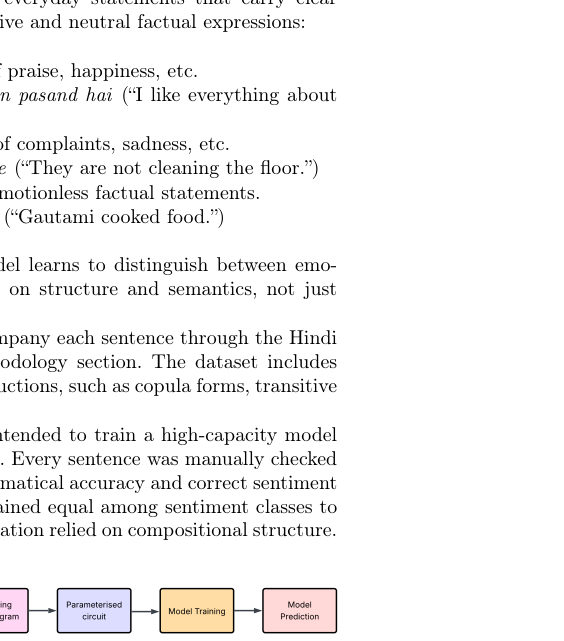
<figcaption class="paper-figure-caption"><b>Fig 1.</b> Fig. 1. Lambeq Pipeline</figcaption>
</figure>
<figure class="paper-figure-card">
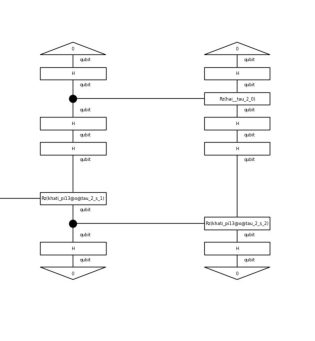
<figcaption class="paper-figure-caption"><b>Fig 2.</b> Fig. 4. Quantum Circuit. Note: Labels like π13, τ21 are generated from the Lambeq code, and appear here as pi_13 and tau_21, same is with other labels.</figcaption>
</figure>
<figure class="paper-figure-card">
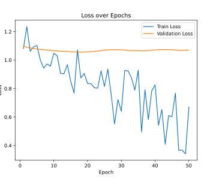
<figcaption class="paper-figure-caption"><b>Fig 3.</b> Fig. 5. Ternary Class Classification. Left: Accuracy Vs Epoch, Right: Loss Vs Epoch.</figcaption>
</figure>
<figure class="paper-figure-card">
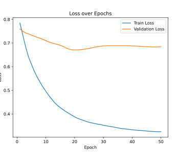
<figcaption class="paper-figure-caption"><b>Fig 4.</b> Fig. 6. Binary Class Classification. Left: Accuracy Vs Epoch, Right: Loss Vs Epoch.</figcaption>
</figure>

**Summary.** This paper introduces a grammar-aware Quantum Natural Language Processing (QNLP) pipeline designed to classify sentiment in Hindi, moving beyond English limitations. It translates the complex syntax of Hindi into quantum circuits using pregroup grammars and trains a Hybrid Quantum Neural Network. The work demonstrates that compositional QNLP can successfully tackle morphologically rich, non-English languages.

**Why it may be interesting.** While not directly about physical quantum systems, the use of quantum circuits to encode complex structural information (grammar) provides an interesting analogy for how entanglement might capture non-local or compositional dependencies in highly structured data, relevant to quantum machine learning theory.

Detailed structure

**Main problem.** The core problem is extending Quantum Natural Language Processing (QNLP) from English to typologically diverse, morphologically rich languages like Hindi for sentiment classification.

**Main result.** The authors demonstrated effective sentiment classification on Hindi using their grammar-aware QNLP pipeline, showing the potential of compositional quantum models for non-English languages.

**Method.** They developed a novel, negation-aware pregroup grammar to encode Hindi sentences, which are then processed by Lambeq into string diagrams and subsequently converted into parameterized quantum circuits (PQC).

**Model / system.** The model is a Hybrid Quantum Neural Network (HQNN) that uses the IQP ansatz. The physical system involves mapping grammatical structures onto quantum states via tensor products, implemented through qubits and entangling gates.

**Key observables.** Sentiment classification accuracy (%) for ternary (positive/negative/neutral) and binary tasks.

**Important parameters / regimes.** Trainable parameters ($	heta_i$) within the parameterized quantum circuits; data split ratios (e.g., 80:10:10).

**Assumptions / limitations.** The model is a proof-of-concept limited by small dataset size and relies on simulating quantum circuits rather than running on actual NISQ hardware.

**Figures summary.** Figures illustrate the pipeline stages (Sentence -> String Diagram -> PQC) and show performance plots (Accuracy vs. Epoch, Loss vs. Epoch) for both binary and ternary classification tasks.

**Paper structure.** The paper establishes the linguistic gap (English bias in QNLP), proposes a grammar-aware framework using pregroup grammars for Hindi, details the pipeline stages (Lambeq $
ightarrow$ String Diagram $
ightarrow$ PQC $
ightarrow$ HQNN training), presents results on sentiment classification, and concludes with limitations.

Abstract

Advancements in Natural Language Processing (NLP), whether on classical or quantum platforms, have predominantly focused on English due to its widespread use and abundant linguistic resources. Although English remains the most studied language in computational linguistics, Hindi, the third most spoken language worldwide after Mandarin, has received comparatively limited attention. Spoken primarily in India, Hindi differs significantly from English in its script, syntactic structure, and linguistic characteristics. Hindi uses the Devanagari script, exhibits rich morphological inflection, and follows a subject-object-verb (SOV) word order, unlike English's subject-verb-object (SVO) structure. Motivated by Hindi's linguistic complexity and its underrepresentation in Quantum Natural Language Processing (QNLP), we propose a grammar-aware QNLP pipeline for Hindi sentiment classification with a focus on sentential negation. We use a manually annotated Hindi sentiment dataset labeled as positive, negative, or neutral, and encode sentences using pregroup grammar types. Sentences are processed with Lambeq to generate quantum circuits using a novel negation-aware compositional grammar. Hybrid Quantum Neural Networks (HQNNs) are trained for both binary and ternary sentiment classification. Our results demonstrate effective sentiment classification and highlight the potential of compositional QNLP for morphologically rich languages.

[↑ back to top](#top)

### [Fixed Point Exploration For CV-QKD IR QC-MET-LDPC Toward Hardware Implementation](http://arxiv.org/abs/2607.17960v1)

**Authors:** Guilherme Vergne de Oliveira, Mauro Queiroz Nooblath Neto, Micael Andrade Dias, Francisco Revson Fernandes Pereira, Francisco Marcos de Assis, Valéria Loureiro da Silva, Nelson Alves Ferreira  
**Type:** theory · **Category:** quantum information and computing · **PDF:** <https://arxiv.org/pdf/2607.17960v1>  
**Analysis basis:** full PDF text, analyzed in chunks
**Topic relevance:** `methods for driven-dissipative` **1/5**

↔ Scroll figures horizontally

<figure class="paper-figure-card">
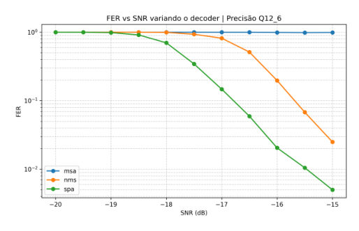
<figcaption class="paper-figure-caption"><b>Fig 1.</b> Fig. 1 BIT ERROR RATE (FER) AS A FUNCTION OF SNR FOR DIFFERENT</figcaption>
</figure>
<figure class="paper-figure-card">
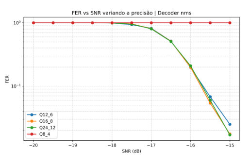
<figcaption class="paper-figure-caption"><b>Fig 2.</b> Fig. 3 BIT ERROR RATE (FER) AS A FUNCTION OF SNR FOR DIFFERENT</figcaption>
</figure>
<figure class="paper-figure-card">
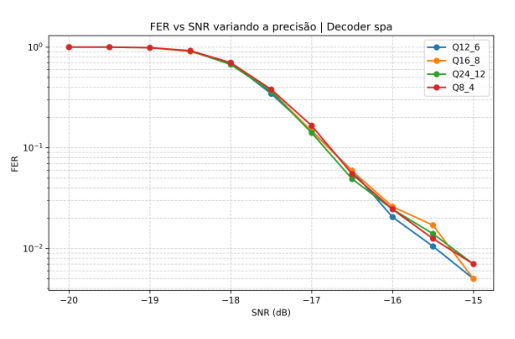
<figcaption class="paper-figure-caption"><b>Fig 3.</b> Fig. 4 BIT ERROR RATE (FER) AS A FUNCTION OF SNR FOR DIFFERENT</figcaption>
</figure>
<figure class="paper-figure-card">
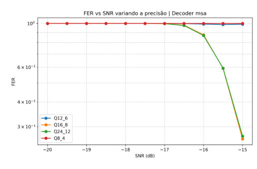
<figcaption class="paper-figure-caption"><b>Fig 4.</b> Fig. 2 BIT ERROR RATE (FER) AS A FUNCTION OF SNR FOR DIFFERENT</figcaption>
</figure>

**Summary.** This paper addresses the computational bottleneck in CV-QKD by comparing three iterative decoding algorithms—SPA, MSA, and NMS—under strict fixed-point arithmetic constraints. By simulating performance across various precisions at low SNR, the authors determined that SPA provides the most reliable results, recommending a specific Q8.4 format for practical hardware deployment.

**Why it may be interesting.** While focused on classical coding theory applied to quantum communication, the explicit analysis of numerical precision limitations (fixed-point arithmetic) is highly relevant for designing resource-constrained quantum hardware accelerators.

Detailed structure

**Main problem.** High-speed LDPC decoding is a major bottleneck for practical Continuous-Variable Quantum Key Distribution (CV-QKD), requiring efficient hardware acceleration.

**Main result.** The Sum-Product Algorithm (SPA) demonstrated the best overall performance, while SPA using Q8.4 precision offered the optimal balance between reliability and hardware efficiency for large-scale implementation.

**Method.** A comparative analysis was performed on three message-passing decoding algorithms (SPA, MSA, NMS) within a unified fixed-point arithmetic framework.

**Model / system.** The study models the error correction process using LDPC codes applied to CV-QKD reconciliation at very low Signal-to-Noise Ratios (SNR). The core mathematical tool is the quantization of real values into fixed-point representations.

**Key observables.** Frame Error Rate (FER) and average number of decoding iterations ($ar{I}$).

**Important parameters / regimes.** Fixed-point precision (e.g., Q8.4, Q16.8), Signal-to-Noise Ratio (SNR $\le 0$ dB).

**Assumptions / limitations.** The fixed-point model abstracts constraints expected in future hardware realization, such as those on FPGAs.

**Figures summary.** Figures compare FER vs. SNR curves for different decoders and precisions, illustrating SPA's superior robustness across varying numerical formats.

**Paper structure.** The paper introduces the necessity of LDPC codes for CV-QKD hardware acceleration, details the unified fixed-point decoding framework, and concludes with a comparative evaluation of SPA, MSA, and NMS performance metrics.

Abstract

High-speed LDPC decoding is a major bottleneck in CV-QKD and motivates hardware acceleration with fixed-point arithmetic. This work compares SPA, MSA, and NMS under a unified low-SNR fixed-point framework using common graph, matrix, and quantization settings. Multiple formats are evaluated through FER, and average iterations. The results show that performance depends strongly on the interaction between decoder rule and numerical precision. SPA achieved the best overall performance. For reduced-complexity decoders, Q16.8 was the lowest consistent precision, with NMS outperforming MSA. Practically, SPA with Q8.4 offered the best balance between reliability and hardware efficiency for large-scale implementations.

[↑ back to top](#top)

### [Point Group Equivariant Graph Neural Networks for Materials](http://arxiv.org/abs/2607.16871v1)

**Authors:** Alexander J. Heilman, Qimin Yan  
**Type:** theory · **Category:** disordered systems and neural networks · **PDF:** <https://arxiv.org/pdf/2607.16871v1>  
**Analysis basis:** full PDF text, analyzed in chunks
**Topic relevance:** `analog quantum simulation` **1/5**

↔ Scroll figures horizontally

<figure class="paper-figure-card">
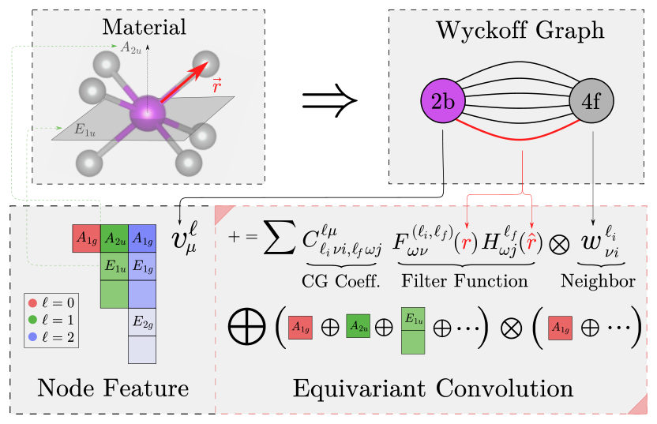
<figcaption class="paper-figure-caption"><b>Fig 1.</b> Figure 1: Symmetry-labelled subspaces of MoS2 and it’s corresponding Wyckoff graph. In the present work, symmetric sites are mapped onto one node representing their Wyckoff position in a reduced Wyckoff graph. The central molybdenum sites of the material molybdenum disulfide have D6h symmetry, which may be used to partition the full 3D space into a 2D symmetry plane labelled by the IR E, and a trivial axis labelled by the IR A1. Here, F is an equivariant filter function composed of the product of a point group harmonic H and a learnable radial expansion function F(r) that takes only interatomic distance as argument (as in [9]). The feature vector v is updated by it’s neighbor via a...</figcaption>
</figure>
<figure class="paper-figure-card">
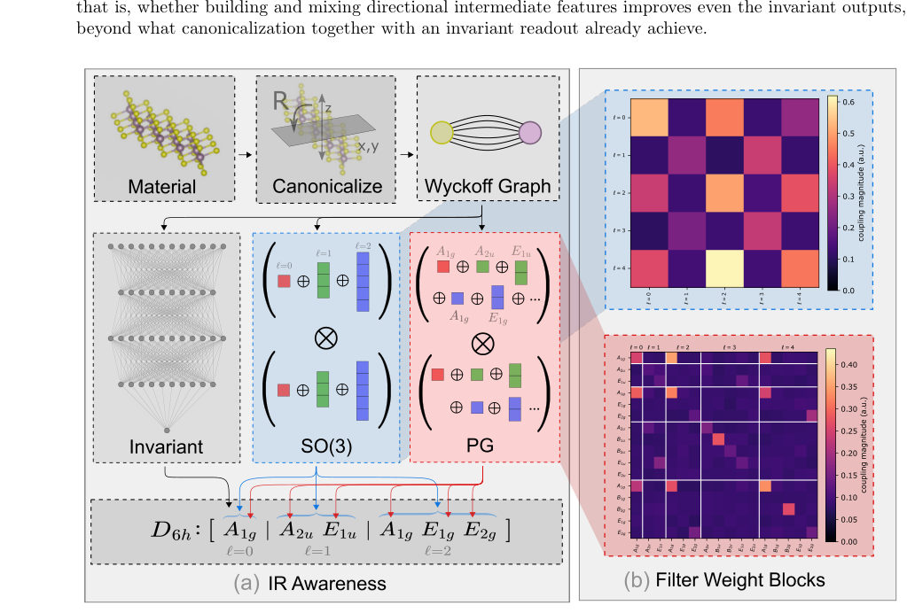
<figcaption class="paper-figure-caption"><b>Fig 2.</b> Figure 2: (a) Workflow for the results presented in this paper. Materials’ axis alignment with a standard canonical frame for the materials given point group is performed so that IR labels are appropriately applied. These then are fed into either a standard invariant model (as in [16]), a full SO(3) equivariant model, and a specific, point group (PG) symmetry aware model. These are then used to predict the same sets of target tensors and results are compared. Note that the point group aware model may attribute weights to specific subspace within rotational orders ℓthat full rotationally equivariant models cannot, only being able to specify up to ℓ. (b) Heatmaps showing the Root Mean Squared...</figcaption>
</figure>
<figure class="paper-figure-card">
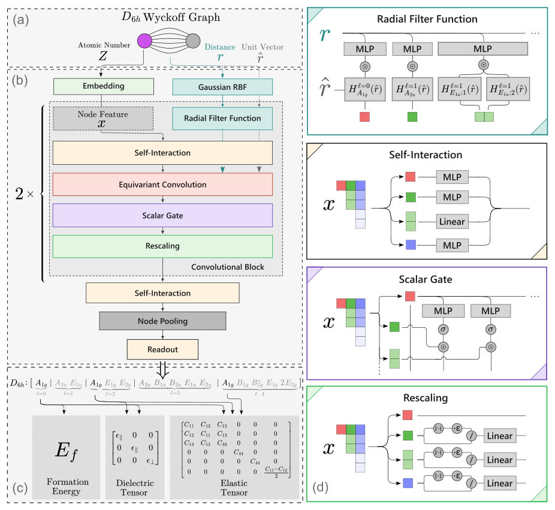
<figcaption class="paper-figure-caption"><b>Fig 3.</b> Figure 3: Point Group Equivariant Model Architecture. Schematic depicting architecture of equiv- ariant models depicted in this work. Atomic embeddings follow that used in CGCNN [4] for the scalar block, while edge embeddings are a gaussian expansion of distance with dimension equal to block size. For each convolutional block, a radial filter function is evaluated for the edge feature, self interaction is applied to the incoming node features, the decomposed tensor product is then summed with these node features, after which scalar gating between the scalar (ℓ= 0) block and each higher-order block, after which every block is independently normalized and scaled by learned weights. This is...</figcaption>
</figure>
<figure class="paper-figure-card">
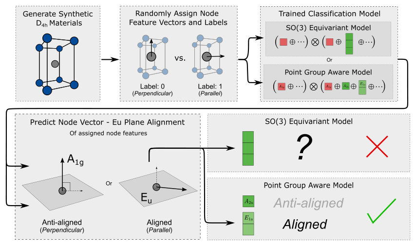
<figcaption class="paper-figure-caption"><b>Fig 4.</b> Figure 4: Schematic of the synthetic D4h vector-orientation task. Vector node features are either uniformly along the A2u principal axis or uniformly in the Eu symmetry plane. The SO(3)-equivariant network, weighting the ℓ= 1 block as a whole, has no channel that separates the two cases; the PG-partitioned network distinguishes them by routing through separate A2u and Eu weight paths.</figcaption>
</figure>

**Summary.** This work introduces Point Group Equivariant GNNs (PGEqNN) to enhance material property prediction by leveraging the specific symmetry constraints of crystal point groups. By restricting network operations to these discrete symmetries, the authors show that simpler, $A_1$-restricted models can achieve comparable or better accuracy than complex full-symmetry models using fewer parameters. This represents a significant step toward building leaner, more physically accurate machine learning potentials for condensed matter systems.

**Why it may be interesting.** While focused on solid-state physics, the rigorous mathematical framework of enforcing discrete group symmetries ($	ext{Point Group}$) into a continuous ML architecture is highly relevant for developing physically constrained models in quantum simulation or AMO theory.

Detailed structure

**Main problem.** The goal is to improve equivariant Graph Neural Networks (GNNs) for predicting material properties by incorporating the specific symmetries of the crystal point group, going beyond general $O(3)$ equivariance.

**Main result.** An $A_1$-restricted variant of the network can match or exceed the performance of full point-group and $SO(3)$-partitioned models while requiring significantly fewer active parameters, demonstrating that predictive power is concentrated in trivial subspaces.

**Method.** The authors introduce Point Group Equivariant GNNs (PGEqNN) by partitioning filter functions based on both rotational irreducible representations ($SO(3)$) and the specific point group irreducible representations ($\alpha$).

**Model / system.** The system studied is crystalline materials, represented as graphs where nodes are atomic sites. The model predicts tensorial properties like elastic and dielectric tensors.

**Key observables.** Mean Absolute Error (MAE) for harmonic components of the dielectric tensor; active parameter count.

**Important parameters / regimes.** Point group symmetry labels ($\alpha$ index); rotational order ($\ell$).

**Assumptions / limitations.** The primary assumption is that crystal properties tensors are largely constrained to the trivial irreducible representation subspace according to Neumann's principle, allowing for simplification.

**Figures summary.** Figures illustrate the mapping of symmetric sites onto Wyckoff graphs and compare prediction workflows between invariant, full $SO(3)$ equivariant, and point group aware models.

**Paper structure.** The paper builds upon standard GNN message passing by adapting it to respect specific point-group symmetries. It compares performance across different symmetry partitions (full PG vs. A1-only) using established tensorial datasets.

Abstract

Equivariant graph neural networks have proven effective tools for inference of material's properties directly from their structure. Traditionally, these have been applied such that they respect full $O(3)$ equivariance, so that any rotation or reflection of the input structure is respected in the model's output. While this works for general arrangements of atoms, additional symmetries of atomistic systems are left unleveraged. Furthermore, any symmetries of the filter functions are implicitly learned from the full dataset and not strictly enforced. In this work, we introduce point-group symmetry aware equivariant graph neural networks (PGEqNN) for materials science, with filter functions aligned with symmetry-aware indices for greater granularity in predictive tasks. With this architecture, we show that most of the predictive power of equivariant networks for tensorial elastic and dielectric datasets lies in the trivial subspaces of the point-group adapted bases. Exploiting this, an $A_1$-restricted variant matches or improves on its full point-group and $SO(3)$-partitioned counterparts while training fewer active parameters, yielding leaner models of equal accuracy.

[↑ back to top](#top)

### [Stochastic Pauli-path simulator for large-scale quantum optimization](http://arxiv.org/abs/2607.17804v1)

**Authors:** Kaining Zhang, Xinbiao Wang, Kunsheng Li, Qixin Zhang, Yuxuan Du, Min-Hsiu Hsieh, Dacheng Tao  
**Type:** both · **Category:** quantum information and computing · **PDF:** <https://arxiv.org/pdf/2607.17804v1>  
**Analysis basis:** full PDF text, analyzed in chunks
**Topic relevance:** `methods for driven-dissipative` **1/5**

↔ Scroll figures horizontally

<figure class="paper-figure-card">
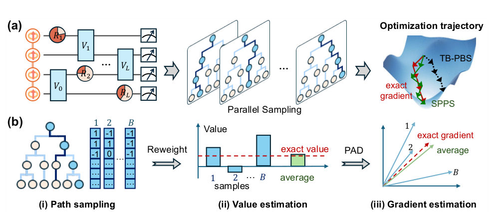
<figcaption class="paper-figure-caption"><b>Fig 1.</b> FIG. 1. Stochastic Pauli-path simulator for gradient estimation. (a) Overview of the SPPS framework. SPPS samples propagation paths from the full path space and combines them into unbiased estimators of both expectation values and gradients. The sampled paths are generated independently and can therefore be evaluated in parallel. (b) Core algorithm of SPPS. A group of sampled paths is first converted into an unbiased estimator of the target expectation value by importance reweighting. The same path-sampling mechanism is then coupled with path automatic differentiation to obtain unbiased stochastic gradient estimators.</figcaption>
</figure>
<figure class="paper-figure-card">
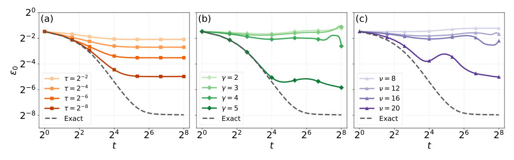
<figcaption class="paper-figure-caption"><b>Fig 2.</b> FIG. 2. Biased optimization trajectories of Tb-PBS methods. Subplots (a), (b), and (c) show the energy error ϵ0 versus the optimization step t of pre-training VQE for the 15-qubit TFIM, which are simulated by using CT-, WT-, and FT-PBS with different truncation thresholds τ, γ, and ν, respectively. The physical meanings of these thresholds are given in Sec. III. The dashed curve denotes the exact GD baseline obtained using PennyLane.</figcaption>
</figure>
<figure class="paper-figure-card">
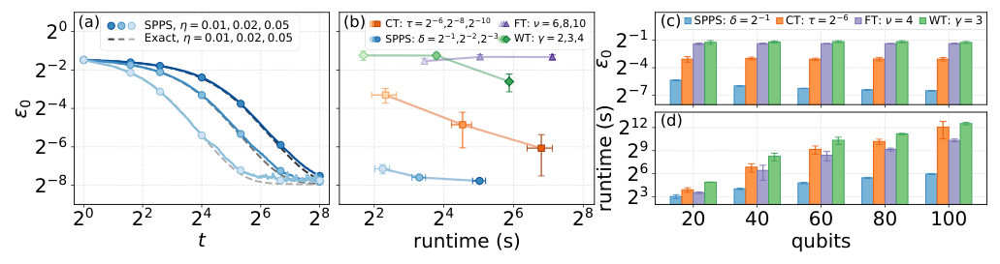
<figcaption class="paper-figure-caption"><b>Fig 3.</b> FIG. 3. Performance of different PBS methods for pre-training VQE on the TFIM. (a) Energy error ϵ0 versus optimization step t for SPPS-driven GD and exact GD on the 15-qubit TFIM with different learning rates. (b) Final energy error ϵ0 versus optimization runtime for SPPS and three Tb-PBS methods on the 15-qubit TFIM with different thresholds. (c,d) Final energy error and optimization runtime for system sizes from 20 to 100 qubits. Error bars indicate the standard deviation over 10 independent runs.</figcaption>
</figure>
<figure class="paper-figure-card">
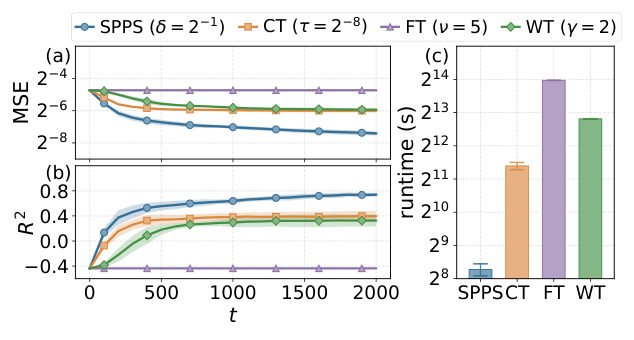
<figcaption class="paper-figure-caption"><b>Fig 4.</b> FIG. 4. Performance of different PBS methods for pre-training QNN on the 40-QML task. (a,b) Training MSE and test R2 score versus optimization step t for SPPS, CT-, FT-, and WT-PBS, respectively. (c) Optimization runtime of the four methods. We use δ = 2−1 for SPPS, τ = 2−8 for CT, ν = 5 for FT, and γ = 2 for WT. Error bars show the standard deviation over 5 independent runs.</figcaption>
</figure>
<figure class="paper-figure-card">
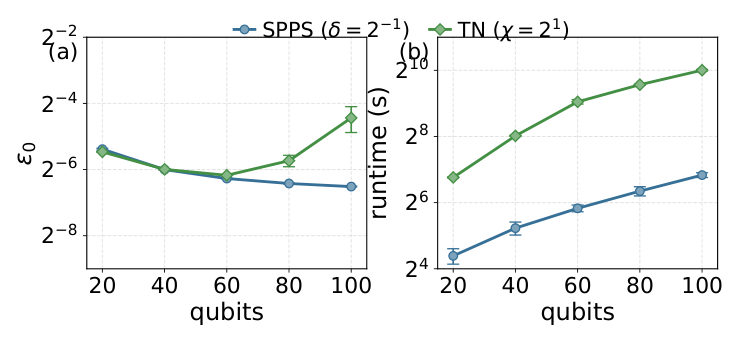
<figcaption class="paper-figure-caption"><b>Fig 5.</b> FIG. 5. SPPS versus tensor-network simulation on large-qubit VQE pre-training. We compare SPPS and a tensor-network baseline on the L = 6 TFIM VQE benchmark with n ∈{20, 40, 60, 80, 100} qubits. Figures (a) and (b) report the final normalized energy error ϵ0 and the optimization runtime, respectively. Error bars indicate the standard deviation over 10 independent runs.</figcaption>
</figure>

**Summary.** This paper introduces the Stochastic Pauli-path Simulator (SPPS), a novel computational framework designed to enable large-scale classical simulation of quantum circuits used in optimization. By using path sampling and automatic differentiation, SPPS provides unbiased stochastic gradient estimates necessary for variational quantum algorithms. This advances the utility of Pauli-based methods beyond simple forward state estimation into practical quantum optimization.

**Why it may be interesting.** The development of scalable, gradient-aware classical simulators is crucial for benchmarking near-term quantum hardware performance in optimization regimes, providing a vital tool for theoretical study of NISQ algorithms.

Detailed structure

**Main problem.** Developing a classical simulation method for large-scale quantum optimization tasks that can provide unbiased stochastic gradient estimates across optimization iterations.

**Main result.** The proposed Stochastic Pauli-path Simulator (SPPS) yields unbiased gradient estimates with provable convergence guarantees, successfully extending Pauli-based simulation from simple forward estimation to complex, large-scale quantum optimization.

**Method.** SPPS uses path sampling across the full Pauli-path space during Heisenberg evolution and employs importance reweighting combined with Path Automatic Differentiation (PAD) to derive unbiased stochastic gradient estimators for variational quantum algorithms.

**Model / system.** The work targets optimizing expectation values of Pauli observables derived from general quantum circuits $U(	heta)$, applicable to tasks like VQE, state preparation, and QNNs. Benchmarks scale up to 100 qubits.

**Key observables.** Expectation values ($	ext{Tr}[O
ho]$), gradients ($
abla C(	heta)$), final normalized energy error ($\epsilon_0$), and optimization runtime.

**Important parameters / regimes.** Circuit depth ($L$), number of qubits ($n \le 100$), sampling-smoothing parameter ($eta_a$), and the required convergence tolerance ($\epsilon$).

**Assumptions / limitations.** The analysis assumes independence of gradient estimators constructed from independent batches, and the method relies on statistical averaging over many samples for error reduction.

**Figures summary.** Figures compare SPPS performance against tensor-network simulation across various qubit counts (up to 100) for VQE benchmarks, showing favorable error-runtime trade-offs. Other figures detail the effect of circuit depth and sampling parameters on convergence fidelity.

**Paper structure.** The paper first introduces the limitation of prior Pauli-based methods in optimization. It then details the SPPS framework (sampling, reweighting, PAD) to achieve unbiased gradients. Theoretical sections provide convergence guarantees for Gradient Descent using these stochastic estimators. Finally, extensive benchmarks validate SPPS on VQE and state preparation tasks.

Abstract

Pauli-based simulators offer a promising route to large-scale classical simulation of quantum circuits in the low-magic regime. Yet their applicability remains largely limited to forward simulation, making them inadequate for optimization-driven quantum tasks such as variational state preparation and parameter initialization. Existing approaches either lack native support for gradient-based optimization or suffer from severe gradient bias. Here we propose the stochastic Pauli-path simulator (SPPS), a computational framework for large-scale quantum optimization that enables unbiased stochastic gradient estimation via Pauli-path sampling across optimization iterations. Our theoretical analysis shows that the proposed simulator yields unbiased gradient estimates and admits provable convergence guarantees. We systematically evaluate our proposal, including quantum eigensolver benchmarks with up to 100 qubits and quantum neural network benchmarks with up to 40 qubits. Across these tasks, SPPS faithfully tracks optimization dynamics, converges within minutes, and broadens the role of Pauli-based simulation from forward estimation to large-scale quantum optimization.

[↑ back to top](#top)

### [Study of ordering in (MoCrTi)$_{100-x}$Al$_x$ refractory high-entropy alloys using machine learning interatomic potential](http://arxiv.org/abs/2607.18099v1)

**Authors:** Jiyao Zhang, Klemens Lechner, Markus Maßwohl, Petra Spoerk-Erdely, David Holec  
**Type:** theory · **Category:** disordered systems and neural networks · **PDF:** <https://arxiv.org/pdf/2607.18099v1>  
**Analysis basis:** full PDF text, analyzed in chunks
**Topic relevance:** `methods for driven-dissipative` **1/5**

↔ Scroll figures horizontally

<figure class="paper-figure-card">
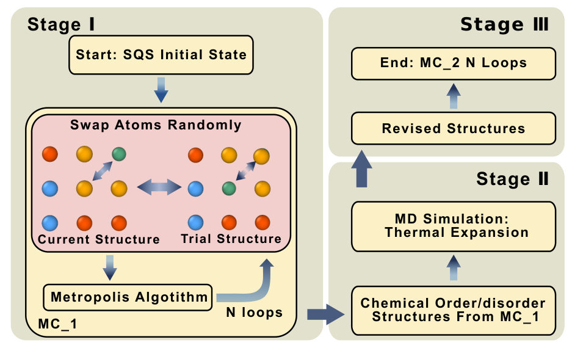
<figcaption class="paper-figure-caption"><b>Fig 1.</b> Figure 1: The workflow of hybrid MC/MD simulations. For a detailed explanation of individual stages, see the text.</figcaption>
</figure>
<figure class="paper-figure-card">
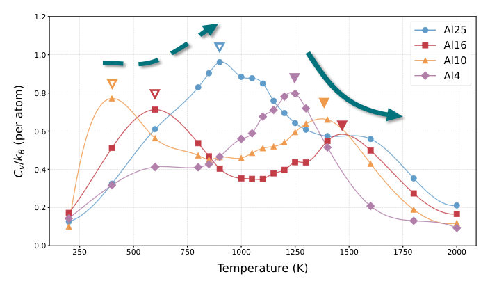
<figcaption class="paper-figure-caption"><b>Fig 2.</b> Figure 3: Heat capacity per atom versus temperature for four alloy compositions: Al25 (blue circles), Al16 (red squares), Al10 (orange triangles), and Al4 (purple rhombus). In the figure, hollow triangles and dashed arrows indicate the position and shift of the low-temperature peaks, respectively; solid triangles and solid arrows indicate the position and shift of the high-temperature peaks, respectively.</figcaption>
</figure>
<figure class="paper-figure-card">
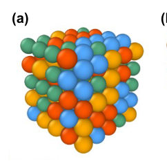
<figcaption class="paper-figure-caption"><b>Fig 3.</b> Figure 4: Snapshots from MC simulations of the Al25 alloy: (a) initial SQS state, (b) equilibrated ordered structure at 200 K, (c) equilibrated random structure at 2000 K.</figcaption>
</figure>
<figure class="paper-figure-card">
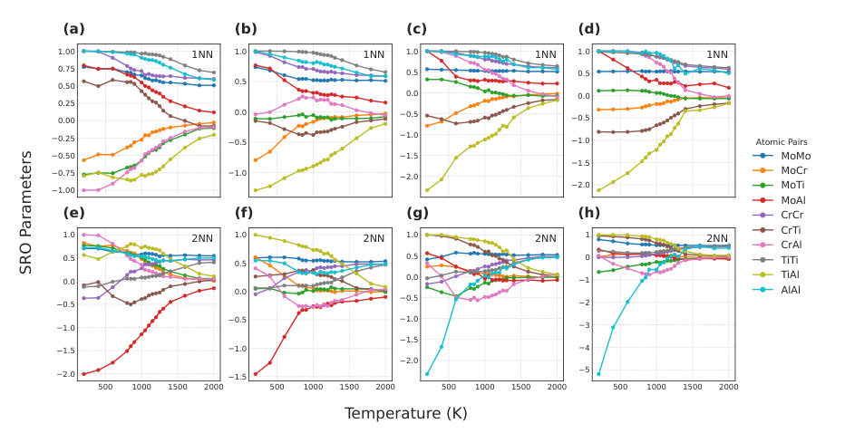
<figcaption class="paper-figure-caption"><b>Fig 4.</b> Figure 5: Temperature dependence of the SRO parameters in the 1NN and 2NN shells for RHEAs: (a, e) Al25, (b, f) Al16, (c, g) Al10, and (d, h) Al4.</figcaption>
</figure>
<figure class="paper-figure-card">
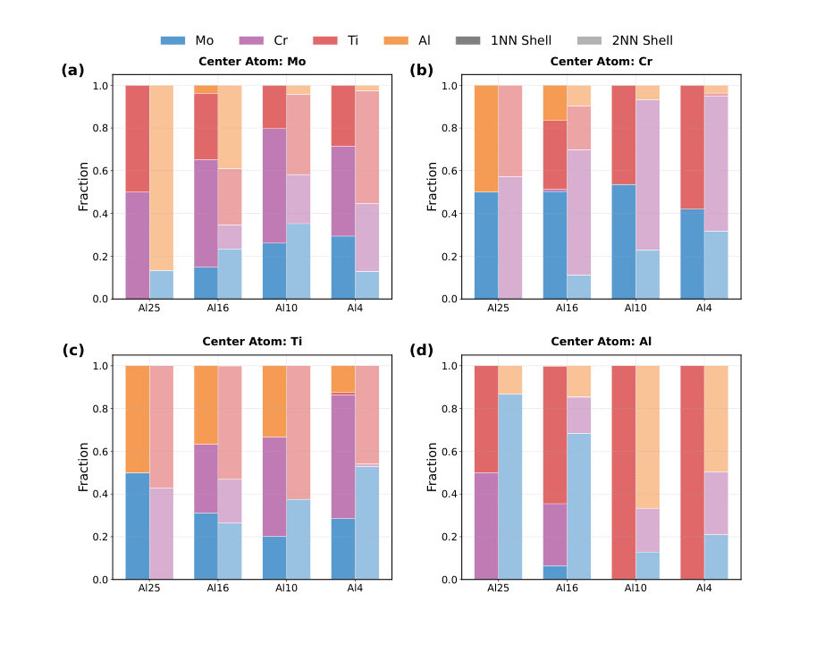
<figcaption class="paper-figure-caption"><b>Fig 5.</b> Figure 6: Average atomic fractions in the 1NN and 2NN shells around center atoms of (a) Mo, (b) Cr, (c) Ti, and (d) Al in ordered configurations at 200 K. The left (fully opaque) bars represent the 1NN shell, while the right (semi-transparent) bars correspond to the 2NN shell.</figcaption>
</figure>

**Summary.** This work investigates how chemical ordering affects the properties of refractory high-entropy alloys using sophisticated simulations powered by machine learning interatomic potentials. The study reveals that compositional changes lead to distinct order-disorder transitions and that structural ordering significantly boosts mechanical stiffness, peaking at a specific composition ($	ext{Al}_{10}$). This provides fundamental design rules for developing robust high-temperature materials.

**Why it may be interesting.** While focused on condensed matter alloys, the methodology heavily relies on advanced machine learning potentials (uMLIPs) to model complex many-body interactions in disordered systems, which is a key theme in ML-physics.

Detailed structure

**Main problem.** The study aims to understand the thermodynamic mechanisms governing chemical ordering in refractory high-entropy alloys (RHEAs) to optimize their performance for high-temperature applications.

**Main result.** Chemical ordering significantly enhances the elastic constants and moduli of these alloys, exhibiting a non-monotonic dependence that peaks at specific compositions due to optimized stiff atomic pairs.

**Method.** The research employs hybrid Monte Carlo (MC) and Molecular Dynamics (MD) simulations utilizing a universal Machine Learning Interatomic Potential (uMLIP).

**Model / system.** The physical system is the $	ext{(MoCrTi)}_{100-x}	ext{Al}_x$ refractory high-entropy alloy. The modeling relies on advanced computational techniques, including uMLIPs and simulations tracking structural evolution.

**Key observables.** Heat capacities ($C_V$), Short-Range Order (SRO) parameters (Warren-Cowley), elastic constants ($C_{11}, C_{12}, C_{44}$), and bulk/shear moduli.

**Important parameters / regimes.** Al concentration ($x$) ranging from 0 to 0.25; Temperature ($T$); Pair stiffness ($k$).

**Assumptions / limitations.** The analysis assumes that the mechanical response is strongly coupled with the degree of chemical ordering, and calculations are performed using uMLIP potentials.

**Figures summary.** Figures illustrate the workflow diagram of MC/MD simulations; $C_V$ vs. Temperature profiles show distinct single or bimodal transition behaviors across compositions; elastic moduli plots demonstrate the non-monotonic peak in stiffness at $	ext{Al}_{10}$.

**Paper structure.** The paper follows a structure detailing the simulation workflow (MC equilibration, NPT MD), analyzing thermodynamic transitions via $C_V$ and SRO parameters, and finally correlating these ordering states with measurable mechanical properties.

Abstract

Refractory high-entropy alloys have emerged as promising candidates for high-temperature applications due to their exceptional mechanical properties. Understanding the thermodynamic mechanisms underlying chemical ordering in these complex systems is critical for optimizing their performance. In this work, by utilizing a universal machine learning interatomic potential with hybrid Monte Carlo and molecular dynamics simulations, the temperature-dependent thermodynamics and mechanical properties of (MoCrTi)(100-x)Alx system have been investigated. The heat capacities and short-range order parameters reveal distinct order-disorder transition behaviors. While the Mo25Cr25Ti25Al25 and Mo32Cr32Ti32Al4 alloys exhibit a single transition dominated by the synergistic ordering of B2-type atomic pairs, the Mo28Cr28Ti28Al16 and Mo30Cr30Ti30Al10 alloys display two separate transitions: a low-temperature stage driven by specific pairs (Mo-Al in Mo28Cr28Ti28Al16; Al-Al in Mo30Cr30Ti30Al10) and a high-temperature stage governed by the remaining pairs. Structural analysis indicates that in the low-temperature ordered B2 phase, Mo and Al share one sublattice while Cr and Ti share the other. Furthermore, the relationship between ordering and mechanical stiffness has been identified. Ordering significantly enhances the elastic constants and moduli, and gives rise to a non-monotonic compositional dependence. Unlike random solid solutions, where stiffness increases monotonically with decreasing Al content, ordered configurations exhibit a non-monotonic trend, peaking at the Mo30Cr30Ti30Al10 alloy. This enhancement is attributed to an optimized population of stiff atomic pairs induced by strong short-range order. These findings provide fundamental insights into the interplay between compositions, chemical ordering, and mechanical performance, offering guidance for the design of refractory high-entropy alloys.

[↑ back to top](#top)

### [Universal Parent Hamiltonians for Adiabatic Warm Starts](http://arxiv.org/abs/2607.16857v1)

**Authors:** Feng Qian, Peter J. Love  
**Type:** theory · **Category:** quantum information and computing · **PDF:** <https://arxiv.org/pdf/2607.16857v1>  
**Analysis basis:** full PDF text, analyzed in chunks
**Topic relevance:** `analog quantum simulation` **1/5**

↔ Scroll figures horizontally

<figure class="paper-figure-card">
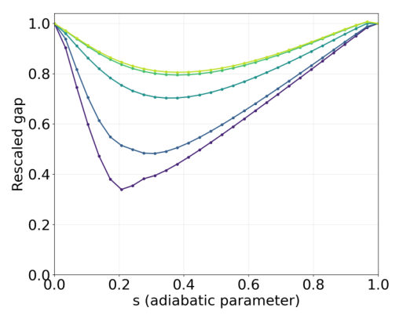
<figcaption class="paper-figure-caption"><b>Fig 1.</b> FIG. 1. Rescaled spectral gap along the adiabatic path, for several values of the warm-start parameter g. From low- est to highest, curves correspond to warm-start values g = −0.9 (bottom, dark purple), −0.5 (blue), −0.1 (teal), −0.01 (green), and −0.001 (top, yellow), with η = 1/√1 −g.As g →0−the minimum gap grows from ∆min ≈0.34 (at s ≈0.21) to ≈0.81 (at s ≈0.38).</figcaption>
</figure>
<figure class="paper-figure-card">
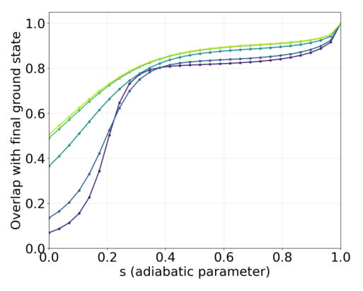
<figcaption class="paper-figure-caption"><b>Fig 2.</b> FIG. 2. Ground-state overlap with the target GHZ state along the adiabatic path, for several values of the warm- start parameter g. Along the interpolation H(s) = (1 − s) Hclock/∆clock + s Hfinal/∆final (s ∈[0, 1], each endpoint normalized by its spectral gap ∆), we plot the squared fi- delity |⟨ψ0(s)|ψg⟩|2 between the instantaneous ground state and the tensor product of uniform superposition and target GHZ state |ψGHZ⟩= |ψ0(1)⟩. Curves correspond to warm- start values g = −0.9 (dark purple), −0.5 (blue), −0.1 (teal), −0.01 (green), and −0.001 (yellow), with η = 1/√1 −g. The fidelity reaches unity at s = 1 for all g; the initial overlap at s = 0 falls from ≈0.51 (g = −0.001) to ≈0.07 (g =...</figcaption>
</figure>
<figure class="paper-figure-card">
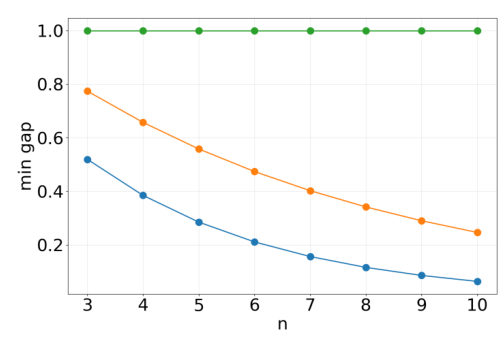
<figcaption class="paper-figure-caption"><b>Fig 3.</b> FIG. 3. Minimum spectral gap of the warm-start adiabatic interpolation versus the number of system qubits n, for three values of the Z2 matrix-product-state warm-start coupling g. We plot ∆min = mins[E1(s) −E0(s)]. Curves correspond to g = −1 (bottom, blue), g = −0.5 (middle, orange), and g = 0 (top, green), with η = 1/√1 −g. The minimum gap decreases with n for g = −1 and g = −0.5 (to ∆min ≈0.06 and ≈0.25 at n = 10), whereas g →0 (warm start approaching the GHZ target) keeps ∆min = 1.</figcaption>
</figure>
<figure class="paper-figure-card">
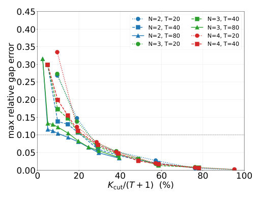
<figcaption class="paper-figure-caption"><b>Fig 4.</b> FIG. 4. Maximum relative error of the adiabatic spectral gap under momentum-space truncation, as a function of the retained-mode fraction kcut/(T + 1). Curves are shown for system size n ∈{2, 3, 4} and clock length T ∈{20, 40, 80}. The dashed line marks the 10% relative-error level.</figcaption>
</figure>
<figure class="paper-figure-card">
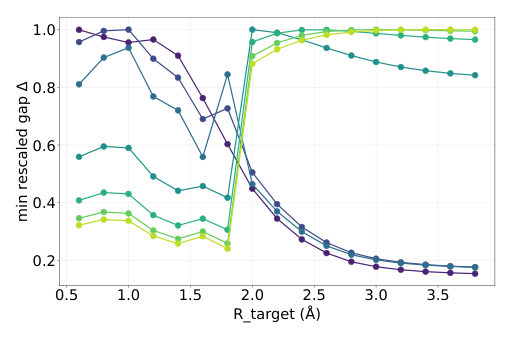
<figcaption class="paper-figure-caption"><b>Fig 5.</b> FIG. 6. H6 STO-3G—minimum rescaled adiabatic gap each endpoint normalized to unit gap. Each curve uses a different warm-start geometry, in viridis color order: Rinit = 0.7 (dark purple), 1.0 (indigo), 1.5 (blue),2.0 (teal), 2.5 (green), 3.0 (yellow-green), and 3.5 ˚A (yellow). The gap stays open when Rinit and Rtarget lie in the same electronic phase and collapses across the phase boundary near R ≈1.9 ˚A.</figcaption>
</figure>

**Summary.** This paper introduces the Universal Parent Hamiltonian Adiabatic Warm Start (UPHAWS) protocol to solve the problem of initializing quantum simulations near quantum phase transitions. By selecting an initial Hamiltonian whose ground state shares the target's quantum phase, it prevents the minimum spectral gap from collapsing exponentially with system size. This significantly improves the feasibility and scaling of adiabatic state preparation for complex many-body systems.

**Why it may be interesting.** This work directly addresses resource estimation for quantum computation by providing a concrete method to circumvent spectral gap closing issues inherent in adiabatic state preparation when crossing phase boundaries.

Detailed structure

**Main problem.** The primary challenge addressed is efficiently preparing an initial quantum state with high overlap to accurately estimate the ground state properties of a target Hamiltonian using Quantum Phase Estimation (QPE).

**Main result.** The authors propose Universal Parent Hamiltonians for Adiabatic Warm Starts (UPHAWS), demonstrating that initializing adiabatic state preparation with a parent Hamiltonian whose ground state is in the same quantum phase as the target can significantly improve the minimum spectral gap.

**Method.** The work develops a theoretical protocol using 'parent Hamiltonians' and analyzes the required time scaling ($T \propto 1/\Delta^2$) for Adiabatic State Preparation (ASP) across quantum phase transitions.

**Model / system.** The framework is tested on general quantum systems, specifically benchmarking against an MPS family interpolating to a GHZ Hamiltonian and the linear H6 chain undergoing bond stretching.

**Key observables.** Minimum spectral gap ($\Delta$), Adiabatic fidelity ($F(t)$), and the initial state overlap $\langle \Upsilon_0|\Psi_0
angle$.

**Important parameters / regimes.** The system size (N) and the separation between quantum phases, which dictates whether the minimum gap shrinks exponentially.

**Assumptions / limitations.** It is assumed that choosing an initial Hamiltonian whose ground state resides in the same quantum phase as the target allows for efficient warm-starting of ASP.

**Figures summary.** The figures compare the minimum rescaled adiabatic gap for different initialization geometries (e.g., localized vs. delocalized starts) across bond stretching, showing that appropriate initial states maintain a large gap where others collapse near phase boundaries.

**Paper structure.** The paper establishes the problem of state preparation bottlenecks in QPE, introduces the UPHAWS protocol using parent Hamiltonians like the Feynman–Kitaev clock Hamiltonian, and validates this approach through detailed benchmarks on specific physical models (MPS/H6 chain).

Abstract

Computing the ground state properties of quantum systems is an important potential application of quantum computing. The success probability of quantum phase estimation approaches to ground state problems is proportional to the overlap of the input state with the ground state. Local ansatz state approaches suffer from the orthogonality catastrophe, whereas adiabatic state preparation (ASP) can prepare good approximations with a cost growing with the inverse square of the minimum spectral gap along the adiabatic path. When the initial and target Hamiltonians lie in quantum phases separated by a first order phase transition, the minimum spectral gap along the adiabatic path becomes exponentially small as a function of system size. We pursue a solution to this problem based on choosing an initial Hamiltonian for adiabatic state preparation whose ground state lies in the same quantum phase as the target ground state. We develop a protocol for universal adiabatic warm starts with universal parent Hamiltonians (UPHAWS) that can initialize ASP in any state whose preparation circuit is known. We use the Feynman--Kitaev clock Hamiltonian as a universal parent Hamiltonian, for preparation circuits with and without mid circuit measurement. We benchmark the framework on a $\mathbb{Z}_2$-symmetric matrix product state (MPS) family interpolating to a target GHZ Hamiltonian, and on the linear $H_6$ chain under symmetric bond stretching. For the $H_6$ system a bond-dimension-$4$ matrix product state warm-start increases the minimum gap on the adiabatic path by a factor of two relative to the Hartree-Fock initialization. To perform these classical benchmark simulations we develop a momentum-space truncation of the adiabatic Hamiltonian that may be of independent interest.

[↑ back to top](#top)

## Other papers (12)

*Papers from primary archives without highlighted authors or any topic match. Click to expand.*

Show other papers

### [Bound, Scattering, and Resonance States of the Symmetric Woods--Saxon Potential in Dunkl Quantum Mechanic](http://arxiv.org/abs/2607.16944v1)

**Authors:** Mebarek Heddar, Can Ertuğay, Bekir Can Lütfüoğlu  
**Type:** theory · **Category:** other · **PDF:** <https://arxiv.org/pdf/2607.16944v1>  
**Analysis basis:** full PDF text, analyzed in chunks

↔ Scroll figures horizontally

<figure class="paper-figure-card">
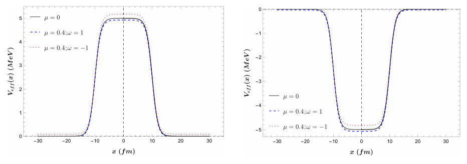
<figcaption class="paper-figure-caption"><b>Fig 1.</b> Figure 1: Approximate effective sWS potentials obtained using the Pekeris-type approximation for representative values of the Dunkl deformation parameter µ in the two reflection sectors (ω = ±1). Panels (a) and (b) correspond to the barrier and well configurations, respectively. The calculations were performed using V0 = 5 MeV, a = 1 fm−1, L = 10 fm, mc2 = 940 MeV, and ℏc = 197.329 MeV fm.</figcaption>
</figure>
<figure class="paper-figure-card">
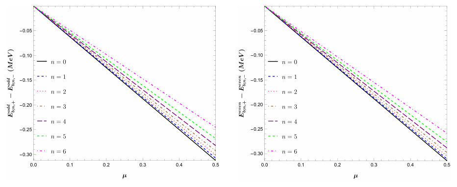
<figcaption class="paper-figure-caption"><b>Fig 2.</b> Figure 2: Variation of the bound-state energy difference ∆Eb,n = Eb,n,+ −Eb,n,−as a function of the Dunkl deformation parameter µ for the first three bound states. Panels (a) and (b) correspond to the odd- and even-parity solutions, respectively.</figcaption>
</figure>
<figure class="paper-figure-card">
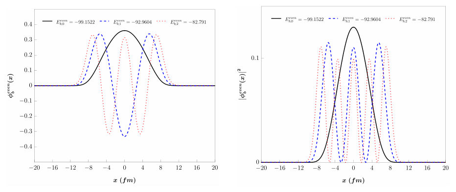
<figcaption class="paper-figure-caption"><b>Fig 3.</b> Figure 3: Normalized bound-state eigenfunctions and the corresponding probability densities for the effective sWS potential for µ = 0.4 and ω = 1. Panels (a) and (b) correspond to the odd-parity eigenfunctions and their probability densities, respectively, whereas panels (c) and (d) show the corresponding even-parity results.</figcaption>
</figure>
<figure class="paper-figure-card">
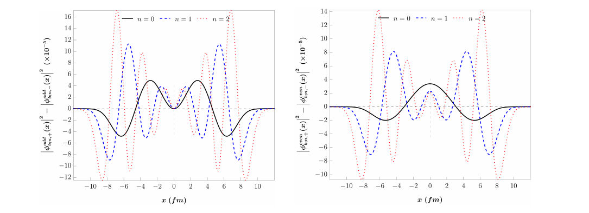
<figcaption class="paper-figure-caption"><b>Fig 4.</b> Figure 4: Difference between the probability densities corresponding to the reflection eigenvalues ω = +1 and ω = −1 for the first five bound states. Panels (a) and (b) correspond to the odd- and even-parity solutions, respectively.</figcaption>
</figure>
<figure class="paper-figure-card">
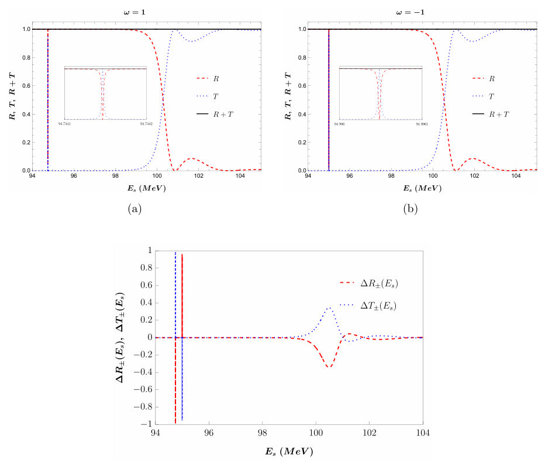
<figcaption class="paper-figure-caption"><b>Fig 5.</b> Figure 5: Reflection and transmission coefficients as functions of the scattering energy for the effective Dunkl–Woods–Saxon barrier for µ = 0.4. Panels (a) and (b) display the reflection and transmission coefficients for the reflection sectors ω = +1 and ω = −1, respectively. The vertical dashed line indicates the barrier height V0. Panel (c) presents the differences ∆R(Es) = R+(Es)−R−(Es) and ∆T(Es) = T+(Es)−T−(Es), demonstrating the influence of the reflection sector on the scattering properties.</figcaption>
</figure>

**Summary.** This paper develops a novel, unified analytical theory to describe bound, scattering, and resonance states for the Woods--Saxon potential under Dunkl quantum mechanics. By using a Pekeris approximation, the authors show that the deformation parameter $\mu$ causes measurable splitting in energy spectra and modifies tunneling behavior. The results confirm the formalism's consistency by recovering standard physics when $\mu 	o 0$.

**Why it may be interesting.** This work is highly relevant as it extends standard quantum mechanics models (like those used in nuclear physics) into the realm of non-standard quantum deformations (Dunkl mechanics), providing a unified theoretical framework for spectral analysis.

Detailed structure

**Main problem.** The paper aims to provide the first unified analytical description for bound, scattering, and Gamow resonance states associated with the one-dimensional symmetric Woods--Saxon potential when analyzed within the framework of Dunkl quantum mechanics.

**Main result.** The Dunkl deformation fundamentally modifies spectral properties by causing a reflection-sector-dependent splitting of the bound-state spectrum and generating long-lived metastable states characterized by narrow transmission peaks.

**Method.** The authors employ a Pekeris-type approximation to transform the complex differential equation into a solvable hypergeometric form, allowing for analytical solutions across different physical regimes.

**Model / system.** The system models a particle interacting with a one-dimensional symmetric Woods--Saxon potential. The dynamics are governed by the Dunkl Hamiltonian, which introduces a reflection-sector-dependent inverse-square interaction term.

**Key observables.** Bound state energies ($E_{	ext{odd/even}}^{b,n}$), scattering amplitudes (Reflection $R$ and Transmission $T$), complex resonance energies ($E_m = E_r - iE_i$), decay widths ($\Gamma$), and lifetimes ($	au$).

**Important parameters / regimes.** Dunkl deformation parameter ($\mu > -1/2$), potential parameters ($\sigma, a, L$), and the reflection sector index ($\omega = \pm 1$).

**Assumptions / limitations.** The analysis relies on the Pekeris-type approximation to handle the inverse-square term generated by the Dunkl derivative operator. The study is restricted to reflection-symmetric potentials.

**Figures summary.** Figure 5 illustrates how $R$ and $T$ vary with energy for $\omega=\pm 1$, highlighting resonance structures. Figure 6 visualizes $R$ and $T$ dependence on the Dunkl parameter ($\mu$) and energy ($E_s$).

**Paper structure.** The paper first introduces the problem setup using the Dunkl Hamiltonian, then applies a Pekeris-type approximation to reduce it to a hypergeometric equation. It proceeds to derive analytical solutions for bound states, followed by analyzing scattering coefficients and finally determining resonance properties via complex energy continuation.

Abstract

We present the first unified analytical description of the bound, scattering, and Gamow (metastable) resonance states of the one-dimensional symmetric Woods--Saxon potential within the framework of Dunkl quantum mechanics, establishing a single analytical framework that consistently describes all physically relevant spectral regimes. The Dunkl deformation introduces a reflection-sector-dependent inverse-square interaction that precludes a direct analytical treatment of the corresponding Schrödinger equation. By employing a Pekeris-type approximation, the problem is transformed into a hypergeometric differential equation, enabling the derivation of analytical wave functions, bound-state quantization conditions, scattering amplitudes, and Gamow resonance solutions within a unified formalism. The results reveal that the Dunkl deformation fundamentally modifies the system's spectral properties by generating a reflection-sector-dependent splitting of the bound-state spectrum, along with quantitative changes in the reflection and transmission probabilities. The narrow transmission peaks are shown to originate from long-lived Gamow resonance states, whose complex energies, decay widths, and lifetimes are determined through analytic continuation into the complex-energy plane. In the limit of vanishing Dunkl deformation, the conventional Woods--Saxon results are fully recovered, confirming the consistency of the proposed formalism. The proposed analytical framework provides a versatile approach for investigating finite-range potentials in Dunkl quantum mechanics and opens the way to systematic studies of reflection-deformed quantum systems beyond the Woods--Saxon interaction.

[↑ back to top](#top)

### [CutBackdoor: A Circuit Cut Triggered Backdoor Attack on Variational Quantum Algorithms](http://arxiv.org/abs/2607.18126v1)

**Authors:** Ahatesham Bhuiyan, Hoang Ngo, Cheng Chu, Qian Lou, Lei Jiang, My T. Thai, Mengxin Zheng  
**Type:** theory · **Category:** quantum information and computing · **PDF:** <https://arxiv.org/pdf/2607.18126v1>  
**Analysis basis:** full PDF text, analyzed in chunks

↔ Scroll figures horizontally

<figure class="paper-figure-card">
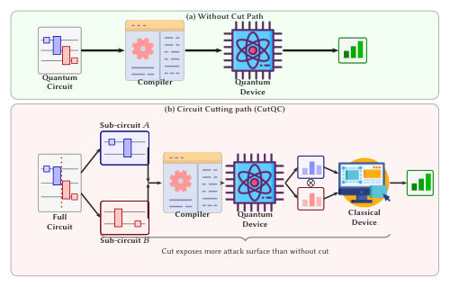
<figcaption class="paper-figure-caption"><b>Fig 1.</b> Figure 1: Circuit cutting (b) exposes a larger attack surface than the standard execution path (a).</figcaption>
</figure>
<figure class="paper-figure-card">
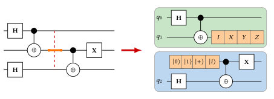
<figcaption class="paper-figure-caption"><b>Fig 2.</b> Figure 2: Circuit cutting example: a 3-qubit circuit is split into two subcircuits via a single wire cut, executed independently, and reconstructed from 4𝐾Pauli-basis branch outputs.</figcaption>
</figure>
<figure class="paper-figure-card">
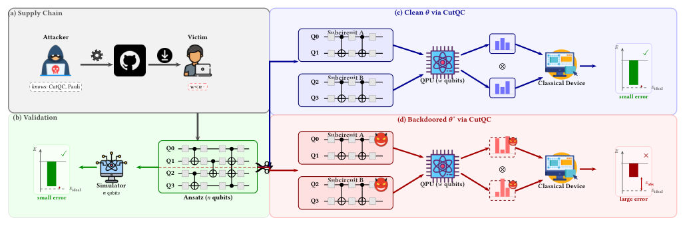
<figcaption class="paper-figure-caption"><b>Fig 3.</b> Figure 3: CutBackdoor threat model. (a) Supply chain: an attacker uploads poisoned VQA parameters 𝜽∗, downloaded by a victim whose hardware capacity 𝑤is smaller than the circuit’s qubit requirement 𝑛(𝑤&lt; 𝑛). (b) Full-circuit validation: running on 𝑛qubits without cutting yields energy close to the ideal value, so 𝜽∗passes inspection. (c) CutQC with clean parameters: cut-path reconstruction stays close to the ideal value under finite shots. (d) CutQC with 𝜽∗: the same pipeline yields a large cut-path deviation 𝐸abs ≫0, activating CutBackdoor.</figcaption>
</figure>
<figure class="paper-figure-card">
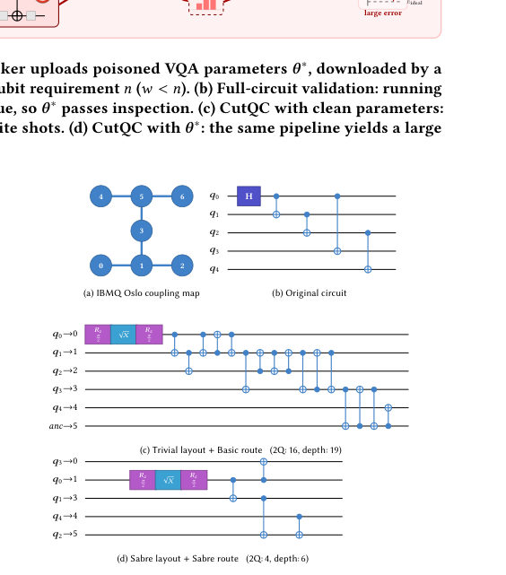
<figcaption class="paper-figure-caption"><b>Fig 4.</b> Figure 4: Comparison of transpilation strategies on the IBMQ_Oslo device. (a) Coupling map of the 7-qubit heavy-hex topology. (b) Original logical circuit. (c) Trivial initial layout with basic routing yields 16 two-qubit gates at depth 19. (d) Sabre layout with Sabre routing yields only 4 two-qubit gates at depth 6.</figcaption>
</figure>
<figure class="paper-figure-card">
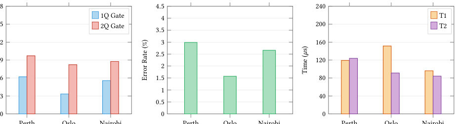
<figcaption class="paper-figure-caption"><b>Fig 5.</b> Figure 5: Noise characterization of the three 7-qubit IBMQ. Gate error rates (left), readout error rates (center), and coherence times (right) for IBMQ_Perth, IBMQ_Oslo, and IBMQ_Nairobi.</figcaption>
</figure>

**Summary.** This paper introduces CutBackdoor, a novel backdoor attack targeting Variational Quantum Algorithms that are forced to use circuit cutting due to limited hardware qubits. The attack poisons parameters so that while standard simulation remains clean, the necessary reconstruction process during execution causes a measurable and significant energy amplification error. This highlights a critical supply-chain security risk in deploying VQAs on real quantum devices.

**Why it may be interesting.** It directly addresses the practical security vulnerabilities of near-term quantum computing hardware by targeting the necessary execution overhead (circuit cutting) rather than just the algorithm itself. This has implications for secure deployment protocols in quantum computation.

Detailed structure

**Main problem.** The paper addresses supply-chain security risks in Variational Quantum Algorithms (VQAs) that arise from using pre-trained parameters and the necessity of quantum circuit cutting on limited hardware.

**Main result.** CutBackdoor is presented as a novel backdoor attack that activates when resource constraints force the use of circuit cutting, causing significant energy amplification ($1.3	imes$ to $2.9	imes$) in the reconstructed path error without modifying the original parameters.

**Method.** The authors introduce CutBackdoor, which poisons VQA parameters such that while full-circuit validation remains accurate, the reconstruction error during cut-path execution substantially increases.

**Model / system.** The system involves Variational Quantum Algorithms (VQAs) applied to problems like quantum chemistry (VQE) and optimization (QAOA). The core mechanism relies on circuit cutting, where large circuits are decomposed into smaller subcircuits whose outputs must be classically reconstructed.

**Key observables.** Cut-path reconstruction error vs. full-circuit validation performance; energy amplification of the attack effect ($1.3	imes$ to $2.9	imes$).

**Important parameters / regimes.** Shot budgets, qubit capacity mismatch (the trigger), and the structure of the cut path.

**Assumptions / limitations.** The attacker assumes the victim follows the standard CutQC workflow with default compilation settings; prior attacks are assumed to either be detectable or rely on device-specific noise.

**Figures summary.** Figure 1 illustrates circuit cutting, showing that the process exposes a larger attack surface compared to standard execution. Figure 2 details a specific example of splitting and reconstructing a subcircuit using Pauli basis outputs.

**Paper structure.** The paper introduces the problem (VQA deployment limitations), proposes CutBackdoor as a novel backdoor leveraging circuit cutting as a trigger, provides theoretical analysis, and empirically validates the attack across multiple VQA benchmarks on IBM quantum backends.

Abstract

Variational Quantum Algorithms (VQAs) are a leading paradigm for near-term quantum computing, combining parameterized quantum circuits with classical optimization across quantum chemistry, combinatorial optimization, and quantum machine learning. Since real-world VQA deployments routinely require circuits that exceed available hardware capacity, quantum circuit cutting has become an indispensable execution strategy, and pre-trained parameters are increasingly distributed through public repositories, introducing supply-chain security risks that have received little attention. Prior quantum backdoor attacks either introduce detectable circuit modifications or depend on device-specific noise, and none consider circuit cutting as an attack surface. We present CutBackdoor, the first parameter-supply-chain backdoor that uses cut circuit execution from CutQC as the deployment-time trigger against VQAs. Under noisy finite-shot circuit-cut execution, poisoned parameters preserve full-circuit validation performance while substantially increasing cut-path reconstruction error, without any circuit modification. The trigger activates when a resource-limited victim responds to a qubit-capacity mismatch by invoking the cutting workflow, requiring no attacker presence at deployment. We provide a theoretical analysis and empirically validate it across varying shot budgets. Evaluation across multiple VQA benchmarks on IBM quantum backends demonstrates cut-path energy amplification of $1.3\times$ to $2.9\times$ \revA{over clean baselines on the VQE and VQD benchmarks while maintaining small stealthiness error on the full-circuit path. The cut-path gap persists across the evaluated backends and cut placements under matched compilation; Zero-Noise Extrapolation provides only partial mitigation, and the diagonal-cost QAOA benchmark   delineates the attack's structural boundary

[↑ back to top](#top)

### [Efficient Exact Quantum Sampling from the Sun-Wootters Distribution for Optimal Polynomial Intersection](http://arxiv.org/abs/2607.16541v1)

**Authors:** Sunghyeon Jo  
**Type:** theory · **Category:** quantum information and computing · **PDF:** <https://arxiv.org/pdf/2607.16541v1>  
**Analysis basis:** full PDF text, analyzed in chunks

↔ Scroll figures horizontally

<figure class="paper-figure-card">
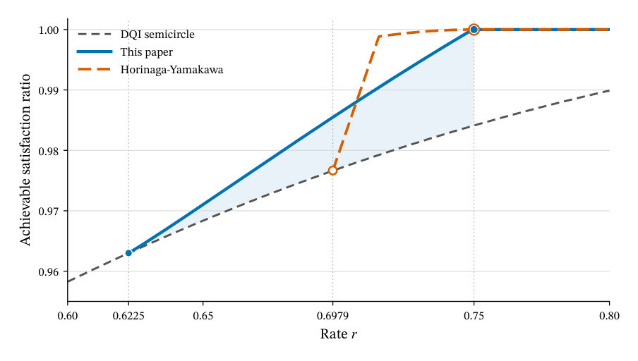
<figcaption class="paper-figure-caption"><b>Fig 1.</b> Figure 1: Asymptotic algorithmic satisfaction bounds in the balanced case. The curves show supremal boundary values. Blue markers identify the included rates 0.6225 and 3/4; orange rings identify the reported sufficient rates 0.6979 and 3/4 for Horinaga–Yamakawa, whose guarantees apply strictly to their right. At rates at least 3/4, this paper gives satisfaction 1 −o(1) with high probability, while Horinaga–Yamakawa give satisfaction 1 at every fixed rate strictly above 3/4.</figcaption>
</figure>

**Summary.** This paper develops a polynomial-time quantum algorithm to efficiently sample the Sun-Wootters distribution, which is crucial for solving Optimal Polynomial Intersection (OPI). By achieving this sampling capability, the authors prove that quantum computation offers strict worst-case improvements over classical bounds in structured optimization problems. The work establishes theoretical thresholds for when and how much better quantum algorithms can perform compared to known limits.

**Why it may be interesting.** While highly theoretical, the development of efficient quantum samplers for complex distributions derived from coding theory has implications for simulating or analyzing structured quantum information processing tasks.

Detailed structure

**Main problem.** The paper addresses finding efficient quantum algorithms for sampling from the Sun-Wootters distribution, which is relevant to solving the structured optimization problem known as Optimal Polynomial Intersection (OPI).

**Main result.** It provides a bounded-error polynomial-time quantum sampler for this distribution, proving that it achieves strict worst-case improvements over classical benchmarks like the DQI semicircle law at specific rates.

**Method.** The core method involves constructing the quantum state using Fourier analysis and amplitude amplification techniques, combined with deterministic complete list decoding to ensure coherent summation over error classes.

**Model / system.** The problem is framed abstractly within coding theory and optimization (OPI) over finite prime fields ($\mathbb{F}_p$), utilizing concepts from quantum Fourier transforms and membership oracles rather than a specific physical Hamiltonian.

**Key observables.** Satisfaction ratio of the OPI, which measures success; asymptotic rates ($r$) are key observables for comparing algorithmic performance against theoretical bounds.

**Important parameters / regimes.** The limiting rate $r$, the dual Johnson radius, and error tolerance parameters ($\epsilon, \eta$) define the regimes where the quantum advantage is proven.

**Assumptions / limitations.** The analysis assumes coherent membership-oracle access and that the OPI parameters satisfy specific conditions relative to the dual Johnson radius for the sampler to function correctly.

**Figures summary.** Figure 1 compares asymptotic algorithmic bounds, marking key rates like $0.6225$ (the initial improvement threshold) and $3/4$ (the rate for near-perfect solutions).

**Paper structure.** The paper builds analytically by first establishing the target distribution via Fourier analysis (Chunk 2), then developing the quantum sampling algorithm using amplitude amplification (Chunk 3), and finally proving the strict improvements and asymptotic perfection across various rates through rigorous bounding techniques (Chunks 1 & 4).

Abstract

Optimal Polynomial Intersection (OPI) is a structured optimization problem for which Decoded Quantum Interferometry (DQI) attains a satisfaction guarantee governed by the semicircle law. Sun and Wootters recently showed that, for balanced OPI over prime fields, a Fourier-defined distribution $P_u$ gives a strict worst-case improvement from limiting rate $0.6225$ onward and asymptotically perfect solutions from rate $0.7496$ onward, and asked whether $P_u$ can be sampled efficiently. We answer this question for Reed--Solomon OPI parameters satisfying their exponent condition strictly below the dual Johnson radius. Under coherent membership-oracle access, we give a bounded-error polynomial-time quantum sampler for $P_u$. The ideal circuit samples $P_u$ exactly conditioned on success, while a finite-precision implementation achieves any prescribed inverse-polynomial total-variation error. Consequently, every fixed limiting rate $0.6225\le r<1$ admits a strict worst-case improvement over the DQI semicircle value, and every limiting rate $r\ge 3/4$ admits solutions of satisfaction $1-o(1)$ with high probability. The algorithm coherently sums the amplitudes of all low-weight errors in each syndrome class using deterministic complete list decoding. Complete Reed--Solomon list decoding and the Sun--Wootters denominator estimate make the list size and postselection overhead polynomial. In concurrent and independent work, Horinaga and Yamakawa obtain worst-case OPI algorithms over prime-power fields and exact satisfaction at every fixed rate strictly above $3/4$.

[↑ back to top](#top)

### [Encoding Choices and Fault-Tolerant Resource Estimates for Digital Quantum Hamiltonian Descent](http://arxiv.org/abs/2607.16996v1)

**Authors:** Chenxu Liu, Meng Wang, Mingze Li, Muqing Zheng, Samuel Stein, Yousu Chen  
**Type:** theory · **Category:** quantum information and computing · **PDF:** <https://arxiv.org/pdf/2607.16996v1>  
**Analysis basis:** full PDF text, analyzed in chunks

↔ Scroll figures horizontally

<figure class="paper-figure-card">
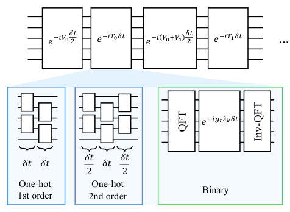
<figcaption class="paper-figure-caption"><b>Fig 1.</b> FIG. 1. Schematic quantum-circuit structure for the QHD evolution used in the circuit construction. Here Vi = eχ(ti)V , where V encodes the target objective, and Ti = eϕ(ti)K, where K is the kinetic operator. In both encodings, the po- tential term is diagonal and can be compiled into Pauli-Z rotations. For one-hot encoding, the kinetic term is mapped to nearest-neighbor XX + Y Y rotations. We group these Pauli terms into even- and odd-bond layers and apply first-, second-, or fourth-order Trotter decompositions; the first- and second-order realizations are shown. For binary encoding, the QFT and inverse QFT transform the kinetic operator into a diagonal phase operator.</figcaption>
</figure>
<figure class="paper-figure-card">
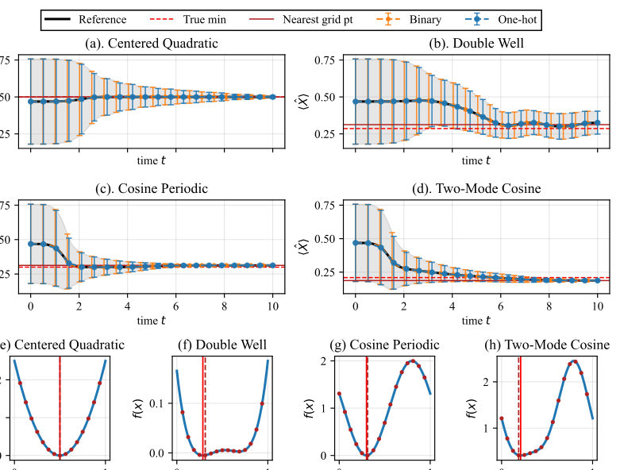
<figcaption class="paper-figure-caption"><b>Fig 2.</b> FIG. 2. Comparison of the QHD dynamics obtained from the classical split-operator solver and from the one-hot and binary quantum-circuit realizations. The four benchmark target functions f(x) are shown in (e) to (h), and the corresponding position observables are shown in (a) to (d). In panels (a) to (d), the black solid curves show the mean position ⟨x⟩, while the black shaded bands indicate ⟨x⟩±σx from the classical Schr¨odinger solver. The blue markers and error bars show the binary-encoding circuit results, and the orange markers and error bars show the one-hot-encoding circuit results, with the error bars indicating ±σx extracted from the final simulated state. The dashed red lines...</figcaption>
</figure>
<figure class="paper-figure-card">
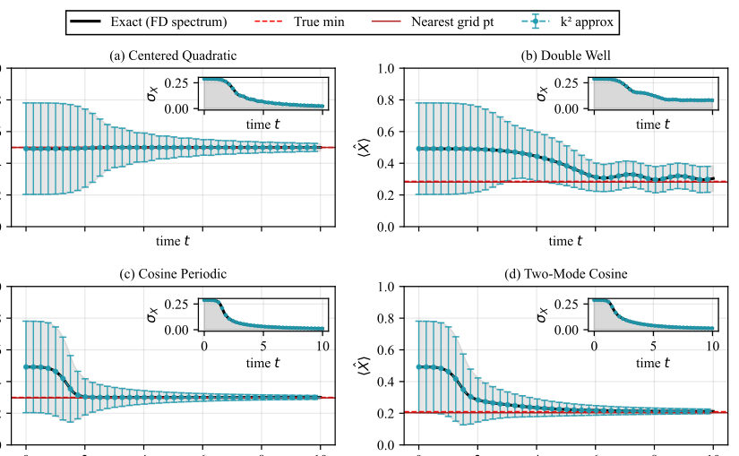
<figcaption class="paper-figure-caption"><b>Fig 3.</b> FIG. 3. Comparison of the k2-approximated kinetic operator with the exact classical Schr¨odinger-equation solver. We focus on binary encoding for the same four one-dimensional target optimization problems shown in Fig. 2, using 64 grid points for the QHD simulations. The main panels show the time dependence of ⟨x⟩and the fluctuation σx compared with the classical solver results, shown as black curves with gray shaded regions. The k2-approximated circuit results are shown as turquoise markers with error bars. The inset in each panel compares σx from the approximate quantum-circuit realization with that from the exact Schr¨odinger-equation solver. In all four test cases, the approximate...</figcaption>
</figure>
<figure class="paper-figure-card">
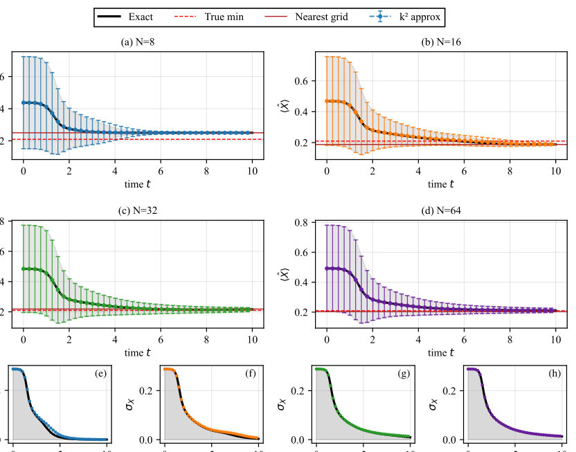
<figcaption class="paper-figure-caption"><b>Fig 4.</b> FIG. 4. Comparison of the k2-approximated kinetic operator with the exact dynamics as the number of grid points is varied. We use the two-mode cosine target function as the benchmark and solve the dynamics on (a) N = 8, (b) N = 16, (c) N = 32, and (d) N = 64 grid points. In these figures, the black curves show the exact classical dynamics of ⟨x⟩, the colored markers with error bars show the k2-approximated circuit results, the red dashed lines indicate the true minimum, and the red solid lines indicate the nearest grid point to the minimum. (e) to (h) show the corresponding spatial fluctuations σx for the same grid sizes. As the grid resolution increases, the deviation introduced by the k2...</figcaption>
</figure>
<figure class="paper-figure-card">
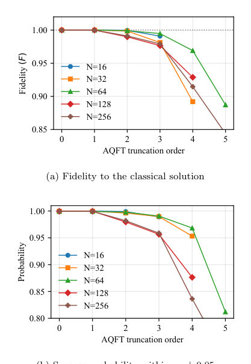
<figcaption class="paper-figure-caption"><b>Fig 5.</b> FIG. 5. Effect of approximate-QFT truncation on the two- mode cosine one-dimensional periodic benchmark. Panel (a) shows the final-state fidelity relative to the reference evolu- tion obtained from the classical Schr¨odinger-equation solver. Panel (b) shows the corresponding success probability, defined as the probability of measuring a point within ±0.05 of the optimal solution x0, similar to the criterion used in Ref. [26]. For all spatial resolutions except N = 256, we use T = 10 with 105 Trotter steps; for N = 256, we use 2 × 105 Trotter steps. The truncation order dtr is defined such that controlled rotations with angles smaller than 2−(log2 N−dtr) are omitted.</figcaption>
</figure>

**Summary.** This work rigorously compares two methods—one-hot and binary encoding—for implementing Quantum Hamiltonian Descent on a quantum computer. The authors demonstrate that binary encoding drastically reduces qubit requirements and minimizes the dominant T-gate costs compared to one-hot encoding. This guides the development of more resource-efficient algorithms for quantum optimization.

**Why it may be interesting.** It provides concrete, quantitative guidelines for mapping continuous physical problems (optimization) onto discrete quantum hardware resources, which is crucial for realizing near-term quantum simulation algorithms.

Detailed structure

**Main problem.** The paper analyzes the resource costs associated with implementing Quantum Hamiltonian Descent (QHD) for continuous optimization on fault-tolerant quantum computers.

**Main result.** Binary amplitude encoding is shown to be superior to one-hot encoding, significantly reducing data qubits and minimizing costly non-Clifford rotations required for fault-tolerant execution.

**Method.** The authors perform a detailed resource analysis by comparing gate-count scalings and T-gate counts for different quantum encodings (one-hot vs. binary) applied to QHD dynamics.

**Model / system.** The model is Quantum Hamiltonian Descent, which maps continuous optimization $f(\mathbf{x})$ onto time evolution governed by a Hamiltonian $H(t) = H_K(t) + H_V(t)$. The search space is discretized and encoded using either one-hot or binary amplitude representations.

**Key observables.** Gate-count scaling, T-gate counts (non-Clifford rotations), qubit count ($O(dN)$ vs $O(d \log N)$), and circuit depth.

**Important parameters / regimes.** The dimensionality of the search space ($d$), the number of grid points ($N$), and the time evolution steps ($N_t$).

**Assumptions / limitations.** The analysis is conducted within a digital fault-tolerant quantum computing (FTQC) model, assuming specific circuit implementations for kinetic and potential terms.

**Figures summary.** Figures illustrate gate-count scaling and T-gate counts comparing different kinetic approximation methods (e.g., AQFT variants) across benchmark functions like Three-Hump Camel, Alpine 1, and Ackley.

**Paper structure.** The paper introduces QHD, compares one-hot vs. binary encodings by deriving resource scalings for both the kinetic and potential terms, validates circuits against classical solvers, and concludes with recommendations for further optimization based on function structure.

Abstract

Quantum Hamiltonian descent (QHD) formulates continuous optimization as time-dependent quantum dynamics, where a kinetic term drives exploration and a potential term encodes the objective function. Digital implementations of QHD require encoding the search space into qubits, and this choice can shift the dominant cost among logical qubits, circuit depth, non-Clifford rotations, and potential synthesis. In this work, we present an encoding-aware resource analysis comparing one-hot and binary amplitude encodings for QHD. We derive gate-count scalings, construct and validate circuits against classical \Sch-equation solvers, and estimate Clifford+$R_z$ and fault-tolerant Clifford+$T$ resources on benchmark optimization problems. Binary encoding reduces the data register from $O(dN)$ to $O(d\log N)$ qubits and gives comparable asymptotic scaling for both kinetic and potential evolutions. Across all benchmark problems studied, binary encoding also uses fewer $R_z$ rotations than one-hot encoding, making it the preferred option for fault-tolerant implementations where arbitrary rotations dominate the cost. Kinetic approximations based on low-momentum spectra and approximate QFTs can further reduce the binary kinetic cost to polylogarithmic scaling. However, for targets such as Ackley, potential synthesis can dominate the total cost and reduce the benefit of kinetic approximations. These results suggest that exploiting the analytic structure of the target function to compile the potential evolution in QHD more efficiently is needed for further resource reductions.

[↑ back to top](#top)

### [Feynman Meets Turing: The Curse of Quantum Universality](http://arxiv.org/abs/2607.16436v1)

**Authors:** Yannik N. Böck, Holger Boche, Frank H. P. Fitzek  
**Type:** theory · **Category:** quantum information and computing · **PDF:** <https://arxiv.org/pdf/2607.16436v1>  
**Analysis basis:** full PDF text, analyzed in chunks

↔ Scroll figures horizontally

<figure class="paper-figure-card">
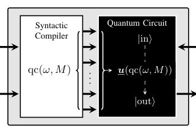
<figcaption class="paper-figure-caption"><b>Fig 1.</b> Fig. 1. Schematics of Quantum Computing in the Circuit Model.</figcaption>
</figure>
<figure class="paper-figure-card">
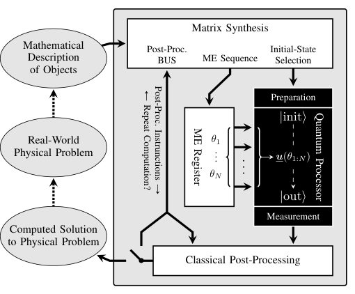
<figcaption class="paper-figure-caption"><b>Fig 2.</b> Fig. 2. Schematics of a “Matrix Quantum Computer”. The matrix-synthesis handler receives the description of a quantum algorithm intended to solve some real-world physical problem. The description employs a high-level quantum programming language that hides the underlying computations from the user. Based on the given description, the handler determines suitable post-processing steps, selects an initial state for the available qubit memory, and extracts a vector of matrix elements (ME) θ1, . . . , θN ” θ1:N that correspond to the N “ M ¨M entries of a unitary M-by-M matrix upθ1:Nq. The quantum matrix processor reads the entries from the ME register and implements the corresponding unitary...</figcaption>
</figure>

**Summary.** This paper proves a fundamental limitation: any quantum language capable of describing all possible computable unitary operations cannot have its valid programs recognized by a semi-decidable compiler. This structural difference arises because the semantic domain of quantum circuits consists only of total unitary operators, unlike classical languages which allow for partial computations.

**Why it may be interesting.** It provides a deep theoretical constraint on the formal expressiveness of quantum programming languages, which is foundational knowledge for anyone designing or analyzing quantum hardware control software.

Detailed structure

**Main problem.** To establish a fundamental limitation on Quantum Circuit Description Languages (QCDLs) regarding their formal language theory properties, contrasting them with classical programming languages.

**Main result.** Any semantically universal QCDL cannot have a semi-decidable set of semantically meaningful descriptions, implying no reliable compiler can exist for such a language.

**Method.** Formal analysis using recursion theory and computable analysis to compare the computability properties of classical vs. quantum semantic domains.

**Model / system.** The model involves formalizing QCDLs where semantics are defined by computable unitary matrices, contrasting this total domain with the partial function descriptions of classical languages.

**Key observables.** The set of semantically meaningful program descriptions; whether this set is semi-decidable or recursively enumerable.

**Important parameters / regimes.** Fixed dimension N >= 2 for semantic universality; computable unitary matrices ($\mathcal{U}_{\mu}$).

**Assumptions / limitations.** The result holds assuming the QCDL aims to describe all computable unitary matrices (semantic universality).

**Figures summary.** Figures schematically illustrate quantum computing in the circuit model and a 'Matrix Quantum Computer' setup, detailing how high-level descriptions map to unitary matrix elements.

**Paper structure.** The paper builds from general computability theory concepts to define QCDLs, contrasts their total semantic domain with classical partial functions, and culminates in proving that universal QCDLs violate semi-decidability.

Abstract

We consider a formal model of quantum circuit description languages (QCDLs) in which semantically meaningful programs correspond to computable unitary matrices. We show that any semantically universal QCDL -- that is, any QCDL able to describe all computable unitary matrices, which in turn form the set of matrices we can meaningfully represent on digital hardware -- cannot have a semi-decidable set of semantically meaningful descriptions. In particular, no such language admits a compiler that reliably recognizes all valid program descriptions. This result stands in contrast to classical programming languages. While compilation in languages such as C or C++ may itself involve non-terminating computations, the set of semantically meaningful programs remains recursively enumerable, since successful compilation provides a witness of validity. The essential difference lies in the nature of the semantic domains: classical languages describe partial recursive functions, whereas QCDLs describe total unitary operators. Our analysis establishes a fundamental limitation of quantum circuit description languages and highlights a structural distinction between classical and quantum models of computation at the level of formal language theory.

[↑ back to top](#top)

### [Identity-Paired Progressive Depth Training: When Trainability Persists Beyond Expressibility](http://arxiv.org/abs/2607.16800v1)

**Authors:** Athanasios Hadjidimoulas, Tirthak Patel, Anastasios Kyrillidis  
**Type:** theory · **Category:** quantum information and computing · **PDF:** <https://arxiv.org/pdf/2607.16800v1>  
**Analysis basis:** full PDF text, analyzed in chunks

↔ Scroll figures horizontally

<figure class="paper-figure-card">
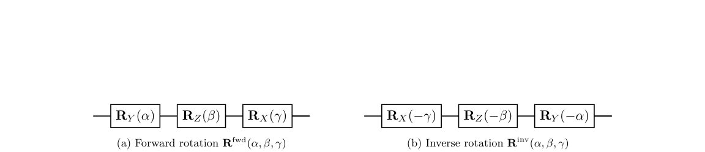
<figcaption class="paper-figure-caption"><b>Fig 1.</b> Figure 1: Single-qubit rotation gates. (a) The forward rotation applies RY , RZ, RX in sequence. (b) The inverse rotation negates all angles and reverses the gate order, yielding the adjoint: Rinv = [Rfwd]†. Composing (a) followed by (b) yields I2 (Theorem 2.1).</figcaption>
</figure>
<figure class="paper-figure-card">
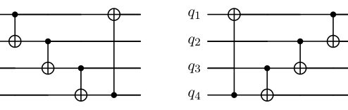
<figcaption class="paper-figure-caption"><b>Fig 2.</b> Figure 2: CNOT rings for n = 4 qubits. (a) Forward ring: gates are applied in order CNOT1→2, . . . , CNOT4→1. (b) Reverse ring: same gates in opposite order. Placing (a) imme- diately followed by (b) yields UentU−1 ent = I16.</figcaption>
</figure>
<figure class="paper-figure-card">
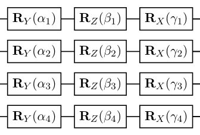
<figcaption class="paper-figure-caption"><b>Fig 3.</b> Figure 3: Parallel forward rotation layer Rfwd(θ) for n = 4 qubits. Each qubit undergoes an independent three-gate rotation; no entanglement occurs. The inverse layer Rinv negates all angles and reverses the gate order on each wire.</figcaption>
</figure>
<figure class="paper-figure-card">
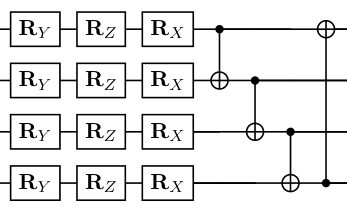
<figcaption class="paper-figure-caption"><b>Fig 4.</b> Figure 4: Standard HEA circuit UHEA 2 for n = 4, D = 2.</figcaption>
</figure>
<figure class="paper-figure-card">
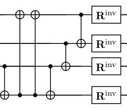
<figcaption class="paper-figure-caption"><b>Fig 5.</b> Figure 5: Identity-pair expansion from depth D to depth D+2 for n = 4.</figcaption>
</figure>

**Summary.** This paper introduces Identity-Paired Progressive Depth Training (IP-PDT) to overcome training instabilities in Variational Quantum Algorithms. By strategically adding identity-paired blocks, it eliminates initialization shock while maintaining a trainable structure that allows optimization improvements beyond the point where the circuit's expressibility saturates. The work provides deep theoretical guarantees linking energy minimization to ground-state fidelity.

**Why it may be interesting.** It provides rigorous mathematical tools (homotopy continuation, strong convexity analysis) to stabilize quantum circuit optimization protocols, which is crucial for developing reliable near-term quantum algorithms.

Detailed structure

**Main problem.** Variational Quantum Algorithms (VQAs) suffer from training difficulties due to circuit depth sensitivity, initialization shock, and landscape pathologies like barren plateaus.

**Main result.** The proposed Identity-Paired Progressive Depth Training (IP-PDT) method eliminates initialization shock by appending identity-pair blocks, allowing optimization improvements to persist even after the variational manifold saturates ('trainability beyond expressibility').

**Method.** The authors formalize IP-PDT as a homotopy continuation method on nested manifolds, proving monotone energy guarantees and bounding the difference between sequential minimizers using strong convexity arguments.

**Model / system.** The study concerns VQAs minimizing an energy expectation $E(	heta) = \langle\psi(	heta)|H|\psi(	heta)
angle$ for an n-qubit system, utilizing hardware-efficient ansätze built from single-qubit rotations and CNOT entangling layers.

**Key observables.** Energy expectation value ($E$), Ground-state fidelity ($F(\psi)$), Initialization Shock (energy spike upon depth increase).

**Important parameters / regimes.** Circuit depth ($D$), Jitter scale ($\sigma$), Strong convexity constant ($\mu_D$), Spectral gap ($\Delta$).

**Assumptions / limitations.** The analysis requires the jitter parameter $\sigma$ to be sufficiently small to maintain positive strong convexity across depth expansions.

**Figures summary.** Figure 1 illustrates single-qubit rotation gates and their identity pairing property ($R_{	ext{fwd}} \circ R_{	ext{inv}} = I_2$).

**Paper structure.** The paper introduces PDT, proposes IP-PDT to solve initialization shock via CNOT cancellation, develops the theoretical framework using continuation methods, proves energy guarantees through strong convexity bounds, and finally connects energy error to ground-state fidelity.

Abstract

Variational Quantum Algorithms (VQAs) are a leading paradigm for near-term quantum computing, yet their training suffers from sensitivity to circuit depth, initialization, and landscape pathologies such as barren plateaus. We study \emph{progressive depth training} (PDT) -- a layerwise curriculum that trains a shallow circuit before appending new layers -- and identify a fundamental obstacle: fixed entangling gates (CNOTs) in hardware-efficient ansätze cause \emph{initialization shock}, an energy spike when new layers are added. We propose \emph{identity-paired progressive depth training} (IP-PDT), which appends forward/inverse block pairs -- each consisting of a standard rotation$+$CNOT block followed by its reverse -- that compose to the identity at initialization. Because the adjacent CNOT rings cancel, the effective circuit retains only \textit{a single entangling layer} surrounded by \textit{overparameterized local rotations}. We prove a simple \textit{Reachable Set Saturation Theorem}: under this construction the variational manifold expands exactly once (when post-entangler rotations are first introduced) and then \emph{saturates}; all subsequent depth increases provide pure overparameterization of single-qubit unitaries. Despite this saturation, progressive addition of rotation parameters can continue to improve optimization outcomes -- a phenomenon we term \emph{trainability beyond expressibility}. We formalize IP-PDT as a continuation method on nested manifolds, prove monotone energy guarantees under an acceptance rule, and connect energy error to ground-state fidelity through spectral-gap inequalities. A detailed resource analysis shows that IP-PDT achieves lower total gate cost than both baselines by eliminating most CNOT gates.

[↑ back to top](#top)

### [Interpolative Separable Density-Fitting for Transcorrelated Hamiltonians](http://arxiv.org/abs/2607.17314v1)

**Authors:** Ke Liao, Yifan Cheng, Werner Dobrautz, Tianyu Zhu, Ali Alavi  
**Type:** theory · **Category:** strongly correlated electrons · **PDF:** <https://arxiv.org/pdf/2607.17314v1>  
**Analysis basis:** full PDF text, analyzed in chunks

↔ Scroll figures horizontally

<figure class="paper-figure-card">
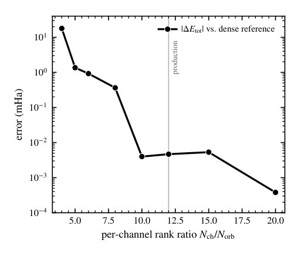
<figcaption class="paper-figure-caption"><b>Fig 1.</b> FIG. 1: Convergence of the ISDF approximation with rank ratio Nch/Norb for ethylene (C2H4, cc-pVTZ, Norb = 116, VMC-optimized Boys–Handy Jastrow): ISDF-xTC-CCSD total-energy error |∆Etot| measured relative to an explicit dense non-ISDF reference. The vertical line marks the production setting Nch = 12 Norb.</figcaption>
</figure>
<figure class="paper-figure-card">
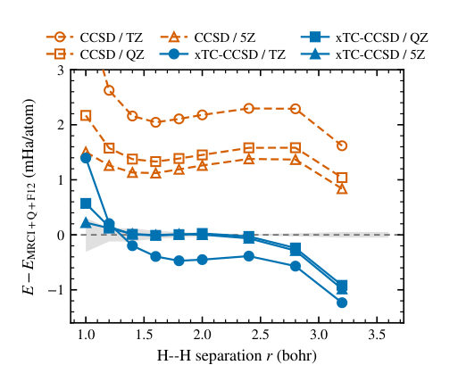
<figcaption class="paper-figure-caption"><b>Fig 2.</b> FIG. 3: Basis-set convergence on the H10 chain: per-atom energy deviation from the MRCI+Q+F12 CBS-limit ref- erence for xTC-CCSD (filled symbols) and canonical CCSD (open symbols) at cc-pVTZ (circles), cc-pVQZ (squares), and cc-pV5Z (triangles), versus H–H separa- tion. For xTC-CCSD the cc-pV5Z point is the MP2NO series (nkeep = 100, 200, 300) extrapolated to the finite full-virtual limit nkeep = nvir = 544; for canonical CCSD it is the full (untruncated) cc-pV5Z result. Both there- fore reach the full-virtual limit. The shaded band is the reference extrapolation uncertainty. xTC-CCSD at cc- pVTZ already outperforms canonical CCSD at cc-pV5Z, and its cc-pVQZ and cc-pV5Z results coincide...</figcaption>
</figure>
<figure class="paper-figure-card">
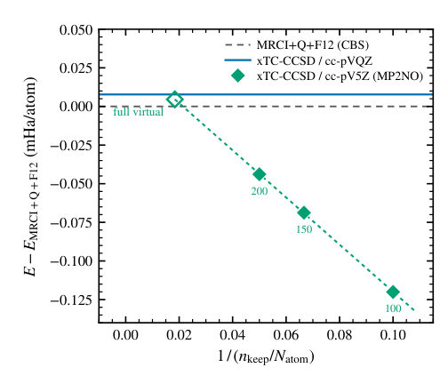
<figcaption class="paper-figure-caption"><b>Fig 3.</b> FIG. 2: Convergence of the H10 cc-pV5Z MP2NO virtual-orbital cutoff at r = 1.4 bohr. The horizon- tal axis is the inverse retained-orbital count per atom, 1/(nkeep/Natom), so the full-virtual limit lies at the fi- nite abscissa 1/(nvir/Natom) = 10/544 (cc-pV5Z has nvir = 544 for H10); the vertical axis is the per-atom en- ergy deviation from the MRCI+Q+F12 reference. Filled diamonds are the finite nkeep/Natom = 10, 15, 20 results; the dashed line is an unweighted linear least-squares fit, evaluated at the full-virtual abscissa (open diamond) to estimate the full-virtual limit. The dashed horizon- tal line marks the reference and the solid line the full- virtual cc-pVQZ result. The...</figcaption>
</figure>
<figure class="paper-figure-card">
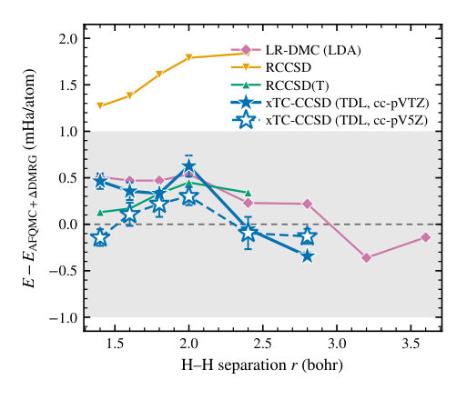
<figcaption class="paper-figure-caption"><b>Fig 4.</b> FIG. 4: Deviation of the per-atom energy from the AFQMC+∆DMRG reference for the hydrogen chain as a function of H–H separation r. The ISDF- xTC-CCSD thermodynamic-limit result (this work, cc- pVTZ; filled stars) stays within ±1 mHa/atom (shaded band) across the studied xTC range of separations (1.4–2.8 bohr), outperforming RCCSD and tracking CBS-extrapolated RCCSD(T) and continuous-space LR- DMC(LDA). Open stars (dashed) show the cc-pV5Z MP2NO thermodynamic-limit series, which reduces the maximum absolute reference deviation from 0.63 to 0.31 mHa/atom and supports residual orbital-basis ef- fects below about 0.6 mHa/atom over this range at the stated MP2NO cutoff. Error bars on both TDL...</figcaption>
</figure>
<figure class="paper-figure-card">
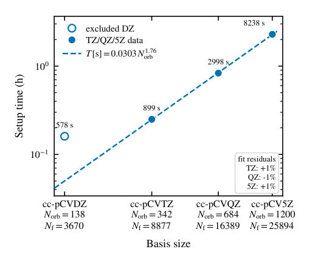
<figcaption class="paper-figure-caption"><b>Fig 5.</b> FIG. 6: Basis-set scaling of the ISDF-xTC setup time for benzene on a single B200 GPU. Filled points (cc-pCVTZ/QZ/5Z) define the power-law fit T [s] = 0.030 N 1.76 orb (dashed); the cc-pCVDZ point (open) is excluded from the fit. Annotations give the absolute setup time in seconds; the lower axis lists Norb and the fused auxiliary dimension Nf ≡Nfused. Setup cov- ers grid/orbital preparation, ISDF decomposition, and K/∆U kernel/intermediate construction, but excludes SCF/VMC, four-index materialization, and CCSD itera- tions.</figcaption>
</figure>

**Summary.** This paper introduces ISDF-xTC-CCSD, a novel computational framework designed to accurately calculate electron correlation energies by combining the Transcorrelated method with Interpolative Separable Density-Fitting. By compressing complex integrals into low-rank forms, it drastically reduces computational cost while maintaining high accuracy, allowing reliable extrapolation to the Complete Basis Set limit for large molecular systems.

**Why it may be interesting.** While focused on molecular quantum chemistry, the core techniques—low-rank approximation of complex correlation operators and achieving high-accuracy CBS extrapolation—are highly relevant for developing scalable methods in strongly correlated solid-state materials simulations.

Detailed structure

**Main problem.** The primary challenge is accurately calculating electron correlation energies, especially ensuring convergence towards the Complete Basis Set (CBS) limit for large molecular systems.

**Main result.** The proposed ISDF-xTC-CCSD method achieves state-of-the-art accuracy on benzene and the linear hydrogen chain, demonstrating a significantly more robust CBS extrapolation than conventional coupled-cluster methods.

**Method.** It combines the Transcorrelated (TC) Hamiltonian approach with an effective two-body ($	ext{xTC}$) treatment of three-body operators, utilizing Interpolative Separable Density-Fitting (ISDF) to reduce computational scaling for grid integrals.

**Model / system.** The method is applied to electronic structure calculations for molecules like benzene and the linear hydrogen chain. The underlying physics involves treating electron correlation via a Jastrow factor incorporated into the Hamiltonian ($ar{H}$).

**Key observables.** Basis-set convergence towards the CBS limit; ground-state energy ($E_{	ext{corr,CBS}}$) for specific molecules.

**Important parameters / regimes.** High basis set levels (up to cc-pV5Z); large system sizes (up to 1200 orbitals in benzene).

**Assumptions / limitations.** The ISDF approximation assumes that grid-evaluated integrals possess a low-rank structure, allowing for efficient tensor compression and calculation.

**Figures summary.** Figures compare the per-atom energy deviation from high-level references (like AFQMC+DMRG) across different bond separations for the hydrogen chain, and show the CBS extrapolation of benzene energy relative to the Hartree-Fock limit.

**Paper structure.** The paper first establishes the need for efficient correlation treatment using TC methods. It then details how ISDF is applied to compress the necessary grid integrals (K and xTC terms). Finally, it presents benchmark calculations on model systems to validate accuracy and convergence properties.

Abstract

The transcorrelated (TC) method dramatically accelerates the convergence of correlated calculations toward the complete-basis-set (CBS) limit by folding a Jastrow correlator into the Hamiltonian via a similarity transformation, incorporating the electron--electron cusp into the effective interaction. We make the TC framework practical for large systems and flexible, multi-center correlators by compressing the grid-evaluated TC integrals with the interpolative separable density-fitting (ISDF) approximation, combined with the effective two-body (xTC) treatment of the three-body operator. This low-rank representation reduces storage and integration costs by orders of magnitude, and a multi-GPU implementation with automatic differentiation of the correlator makes the construction routine for large basis sets. We demonstrate the resulting ISDF-xTC-CCSD method on the linear hydrogen chain, reaching the joint thermodynamic and CBS limits with basis sets up to cc-pV5Z in agreement with state-of-the-art many-body references to within about 1~mHa/atom, and on the benzene ground-state energy with up to 1200 orbitals (cc-pCV5Z), where the method attains state-of-the-art accuracy at the coupled cluster singles and doubles level and its CBS extrapolation is markedly more robust than that of conventional coupled-cluster methods.

[↑ back to top](#top)

### [Lie-Group Mode Connectivity in Quantum Machine Learning from a Dynamical Lie Algebra Perspective](http://arxiv.org/abs/2607.17554v1)

**Authors:** Hiroshi Ohno  
**Type:** both · **Category:** quantum information and computing · **PDF:** <https://arxiv.org/pdf/2607.17554v1>  
**Analysis basis:** full PDF text, analyzed in chunks

↔ Scroll figures horizontally

<figure class="paper-figure-card">
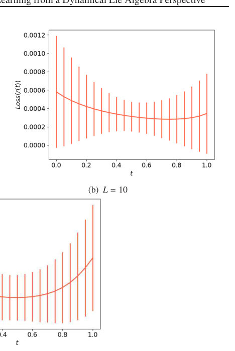
<figcaption class="paper-figure-caption"><b>Fig 1.</b> Figure 1: Results of loss(r(t)) for L ∈{5, 10, 20}</figcaption>
</figure>

**Summary.** This paper develops a theoretical and numerical framework to define 'mode connectivity' in Quantum Machine Learning by analyzing the geometry of the reachable unitary Lie group. It proves that if certain conditions hold, the low-loss region on this group is path-connected, offering an interpretation independent of circuit parameterization. The results suggest that overparameterization enables observing these inherent quantum geometric connections through optimization experiments.

**Why it may be interesting.** This work provides a rigorous geometric framework connecting optimization landscape properties (loss barriers) directly to fundamental concepts in quantum computation (unitary group structure), which is highly relevant for understanding variational quantum algorithms.

Detailed structure

**Main problem.** The study formulates a geometric understanding of 'mode connectivity' for parameterized quantum circuits, recognizing that the physically relevant object is the unitary transformation rather than the parameter vector.

**Main result.** The authors prove that under certain conditions, the low-loss sublevel set on the reachable unitary Lie group is path-connected, providing a parameterization-independent geometric interpretation of mode connectivity in QML.

**Method.** The theoretical framework uses Morse theory applied to the loss function defined on the reachable unitary Lie group. Numerically, they use geodesic interpolations and calculate a 'Barrier' metric to test for near-zero loss barriers between trained unitaries.

**Model / system.** The model involves parameterized quantum circuits generating unitary transformations $U(	heta)$ acting on qubits (specifically 5-qubit Pauli strings are mentioned). The analysis focuses on the reachable unitary Lie group generated by a Dynamical Lie Algebra.

**Key observables.** Mode connectivity (path-connectedness of low-loss sublevel sets), Barrier function $B(U_a, U_b)$, and the dimension of the reachable Lie algebra $\dim(h)$.

**Important parameters / regimes.** The loss tolerance ($\epsilon$), the degree of overparameterization, and the path interpolation parameter $t$.

**Assumptions / limitations.** Key assumptions include assuming the global minimizer set is connected and that there are no critical values of the loss function within the relevant low-loss band.

**Figures summary.** Figure 1 (implied) shows that the loss along geodesic interpolations between trained unitaries remains close to or below the endpoint losses, supporting the hypothesis of preserved connectivity.

**Paper structure.** The paper first establishes the theoretical foundation by defining mode connectivity on the Lie group and proving path-connectivity via Morse theory. It then discusses how overparameterization allows lifting these paths to parameter space for experimental observation. Finally, it presents numerical experiments using geodesic interpolations to validate the theory.

Abstract

Mode connectivity has been widely studied in classical machine learning as a geometric property of low-loss regions in parameter space. In quantum machine learning (QML), however, the physically relevant object is not the parameter vector itself but the unitary transformation implemented by a parameterized quantum circuit. In this study, we formulate mode connectivity on the reachable unitary Lie group generated by the dynamical Lie algebra of the generators. We show that, under a near-minimum connectedness assumption and the absence of critical values in a low-loss band, the corresponding low-loss sublevel set on the reachable Lie group is path-connected. This provides a geometric interpretation of mode connectivity in QML that is independent of a particular parameterization. We further discuss how overparameterization can enable the lifting of Lie-group paths to parameter space, thereby making Lie-group connectivity observable in parameter-space experiments. Finally, we present toy numerical experiments in which geodesic interpolations between trained unitaries exhibit nearly zero loss barriers, consistent with the proposed interpretation.

[↑ back to top](#top)

### [QuantiSpect: A Structure-Aware Lightweight 3D CNN Pre-Decoder for Scalable Surface Code Quantum Error Correction](http://arxiv.org/abs/2607.18204v1)

**Authors:** Pan Gao, Xu-Sheng Xu, Ji-Ze Han, Jing-Wei Wen, Ling Qian, Xu-Dong Lv, Run-Qing Zhang, Xiao-Xiao Hu, Gui-Lu Long  
**Type:** theory · **Category:** quantum information and computing · **PDF:** <https://arxiv.org/pdf/2607.18204v1>  
**Analysis basis:** full PDF text, analyzed in chunks

↔ Scroll figures horizontally

<figure class="paper-figure-card">
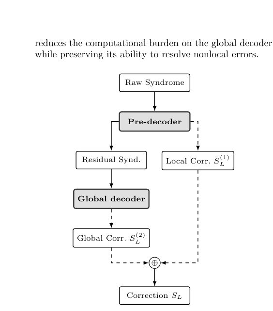
<figcaption class="paper-figure-caption"><b>Fig 1.</b> FIG. 1. Two-stage decoding workflow.</figcaption>
</figure>
<figure class="paper-figure-card">
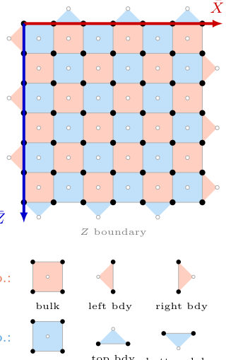
<figcaption class="paper-figure-caption"><b>Fig 2.</b> FIG. 2. Rotated surface code patch for d = 7. The d2 = 49 data qubits (black circles) reside on the vertices of a 7 × 7 square lattice. X-type stabilizers (orange plaquettes) and Z- type stabilizers (blue plaquettes) alternate in a checkerboard pattern. Bulk stabilizers are weight-four operators, boundary stabilizers (triangles at the edges) are weight-two operators. Open circles mark ancilla qubit positions at plaquette cen- ters. Minimum-weight representatives of the logical operators ¯ X (red, horizontal) and ¯Z (blue, vertical) connect opposite boundaries of the matching type.</figcaption>
</figure>
<figure class="paper-figure-card">
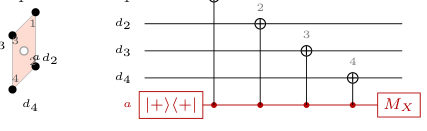
<figcaption class="paper-figure-caption"><b>Fig 3.</b> FIG. 3. Syndrome extraction circuits for bulk (weight-four) stabilizers. Left: a single plaquette with four data qubits (d1–d4, filled) and one ancilla (a, open); numbers indicate the CNOT order. Right: the corresponding circuit. (a) Z- type: ancilla prepared in |0⟩, data qubits control CNOTs onto the ancilla, measured in Z basis (MZ). (b) X-type: ancilla prepared in |+⟩, ancilla controls CNOTs onto data qubits, measured in X basis (MX). Boundary stabilizers use the same circuit with only two of the four CNOT slots active.</figcaption>
</figure>
<figure class="paper-figure-card">
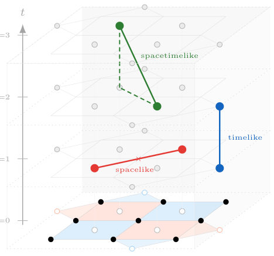
<figcaption class="paper-figure-caption"><b>Fig 4.</b> FIG. 4. The space–time syndrome volume for the rotated surface code (d = 3 example). Base plane: the 2D sta- bilizer lattice with 3 × 3 data qubits (black dots). Z-type (blue) and X-type (orange) plaquettes alternate in a checker- board pattern, with weight-2 boundary stabilizers (triangles) at the edges, open circles mark ancilla (detector) positions. Vertical axis: measurement rounds t. At each round, every stabilizer yields a detection event di,k (gray dots, d2−1 = 8 per slice). Three classes of faults produce distinct patterns of non-trivial events [29, 31]: spacelike faults (data-qubit er- rors, red) trigger two spatially adjacent detectors in the same time slice, timelike faults...</figcaption>
</figure>
<figure class="paper-figure-card">
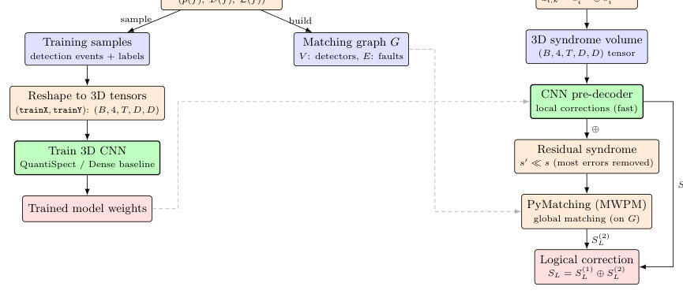
<figcaption class="paper-figure-caption"><b>Fig 5.</b> FIG. 5. End-to-end hybrid decoding pipeline. Left (offline): Stim constructs the detector error model (DEM) from the annotated stabilizer circuit, the DEM is used both to generate training data (detection event tensors and correction labels) and to build the matching graph G = (V, E). The 3D CNN pre-decoder is trained on the reshaped tensors. Right (online): Each QEC cycle produces a 3D syndrome volume from the stabilizer measurements. The trained CNN outputs a sparse residual syndrome (s′ ≪s) and its own logical prediction S(1) L . PyMatching performs minimum-weight perfect matching on the pre- built graph G using the residual, producing S(2) L . The final logical correction is SL = S(1) L...</figcaption>
</figure>

**Summary.** This paper introduces QuantiSpect, a novel, lightweight 3D CNN pre-decoder designed to accelerate syndrome decoding for surface code QEC. By factorizing dense convolutions into structure-aware spatial and temporal branches, it drastically reduces computational cost while maintaining or improving the error correction threshold compared to complex baseline models.

**Why it may be interesting.** The explicit focus on optimizing computational overhead (MACs/parameters) for quantum error correction decoding makes it highly relevant to the engineering challenges of building fault-tolerant quantum hardware.

Detailed structure

**Main problem.** Real-time decoding is a critical bottleneck for large-scale fault-tolerant quantum computing using surface codes.

**Main result.** The proposed QuantiSpect model significantly outperforms dense CNN baselines by achieving comparable performance with substantially fewer parameters and computational overhead, enabling faster error correction.

**Method.** It introduces QuantiSpect, a lightweight 3D CNN pre-decoder that replaces dense convolutions with three parallel, structure-aware branches (spatial, temporal, spatio-temporal) within each residual block.

**Model / system.** The work focuses on the rotated surface code for Quantum Error Correction (QEC), where syndrome measurements are organized into a 3D space-time volume due to circuit-level noise. The decoding process aims to find minimum-weight perfect matchings in this 3D graph.

**Key observables.** Logical Error Rate (LER), circuit-level threshold ($p_{th}$), decoding latency, parameter count, and per-voxel MAC operations.

**Important parameters / regimes.** Code distance ($d$), physical error rate ($p$), receptive field size ($R$).

**Assumptions / limitations.** The design exploits the partial separability of spatial and temporal syndrome correlations inherent in surface code errors to factorize the convolutions, avoiding dense 3D mixing.

**Figures summary.** Figures illustrate the two-stage decoding workflow (raw syndrome $
ightarrow$ pre-decoder $
ightarrow$ residual syndrome $
ightarrow$ global decoder) and visualize the three classes of faults (spacelike, timelike, spacetimelike) in the space-time syndrome volume.

**Paper structure.** The paper first establishes the bottleneck of real-time decoding. It then details the structure of surface code error detection in a 3D space-time lattice. The core contribution is presenting QuantiSpect as a factorized CNN pre-decoder, followed by extensive benchmarking against existing methods using LER and threshold analysis.

Abstract

Real-time decoding is a critical bottleneck for large-scale fault-tolerant quantum computing. AI-based neural pre-decoders locally correct most physical errors before passing residual syndromes to a global decoder, enabling sub-microsecond latencies. However, existing architectures carry significant overhead from dense 3D convolutions. We present QuantiSpect, a lightweight 3D convolutional neural network (CNN) pre-decoder for the rotated surface code, built on the decoding pipeline of Chamberland et al. The key idea is to replace the dense 3D convolutions with three parallel branches in each residual block: a depthwise spatial branch, a depthwise temporal branch, and a grouped spatio-temporal branch, followed by a squeeze-and-excitation channel gate. This reflects the structure of surface code errors, where spatial and temporal syndrome correlations are partially separable. On a unified 4xA100 GPU benchmark, QuantiSpect matches the receptive field of the Accurate baseline at R=13 while using ~2.71x fewer parameters (0.663M vs 1.80M) and ~2.84x fewer per-voxel convolutional MACs. It matches Accurate's circuit-level threshold and accuracy at moderate and large code distances, reduces the logical error rate by up to ~1.85x relative to uncorrelated PyMatching at d=13, p=0.5%, and speeds up the PyMatching decode by up to 3.11x at d=23. We also explored enlarging the receptive field by adding blocks. Even at R=21, the model uses only 1.18M parameters, fewer than both the R=13 Accurate baseline (1.80M) and the R=17 dense model (4.22M), despite its larger receptive field. This expanded variant significantly outperforms the Accurate model, raising the circuit-level threshold to ~0.80% and further reducing the logical error rate. Together, both variants show that a structure-aware factorized design is an effective, parameter-efficient alternative to a dense one for decoding the surface code.

[↑ back to top](#top)

### [Quantum Key Distribution Beyond Stationary Channels](http://arxiv.org/abs/2607.17690v1)

**Authors:** Vaisakh Mannalath, Víctor Zapatero, Kiyoshi Tamaki, Marcos Curty  
**Type:** theory · **Category:** quantum information and computing · **PDF:** <https://arxiv.org/pdf/2607.17690v1>  
**Analysis basis:** full PDF text, analyzed in chunks

↔ Scroll figures horizontally

<figure class="paper-figure-card">
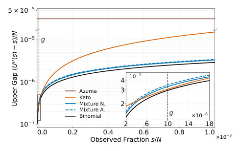
<figcaption class="paper-figure-caption"><b>Fig 1.</b> FIG. 1. Comparison of upper bounds on µ for N = 1010</figcaption>
</figure>
<figure class="paper-figure-card">
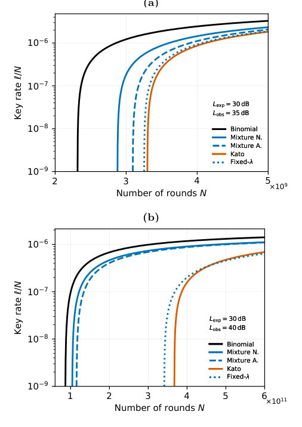
<figcaption class="paper-figure-caption"><b>Fig 2.</b> FIG. 2. Finite secret key rate versus number of rounds for a decoy-state BB84 protocol with an asymmetric passive receiver over a LEO-satellite link with channel parameters d = 10−7 and δmis = 0.03. The expected loss is Lexp = 30 dB, while panels (a) and (b) use Lobs = 35 and 40 dB, respectively. Blue curves use the numerical mixture-martingale bounds of Proposition 1 with [A, B] = [0, 10] (solid), their corresponding analytical relaxations (dashed), and the fixed-λ martingale bound of Proposition 1 (dotted). The remaining curves use the Clopper–Pearson binomial benchmark (black) and Kato’s bound [17] (orange). Azuma–Hoeffding [16] curves are omit- ted since their positive-key thresholds...</figcaption>
</figure>
<figure class="paper-figure-card">
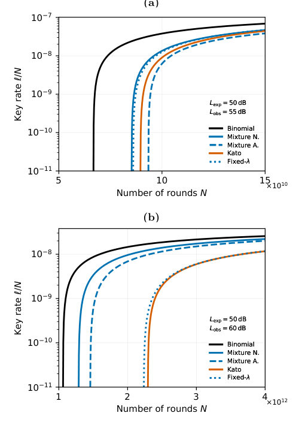
<figcaption class="paper-figure-caption"><b>Fig 3.</b> FIG. 3. Finite secret key rate versus number of rounds for an asymmetric passive decoy-state BB84 protocol over a GEO- satellite link with channel parameters d = 10−9 and δmis = 0.01. The expected loss is Lexp = 50 dB, while panels (a) and (b) use Lobs = 55 and 60 dB, respectively. All color and line- style conventions match Fig. 2.</figcaption>
</figure>

**Summary.** This paper introduces mixture martingale techniques to derive robust concentration inequalities for QKD over highly variable channels like satellite links. By applying these bounds to finite key rate estimation, the authors demonstrate that their method significantly improves the achievable secure key rate compared to standard theoretical limits when channel losses are mis-modeled.

**Why it may be interesting.** This work provides rigorous mathematical tools (mixture martingales) to analyze the performance limits of quantum communication systems under realistic, non-ideal environmental conditions like fluctuating atmospheric or free-space optical links.

Detailed structure

**Main problem.** The core problem is accurately estimating the finite secret key rate for Quantum Key Distribution (QKD) over non-stationary channels, particularly satellite links.

**Main result.** The proposed mixture-martingale bounds significantly outperform existing concentration inequalities like Kato's bound, especially when the actual channel loss deviates from the expected model value.

**Method.** The authors develop and apply mixture martingale techniques to derive tight concentration inequalities for non-IID random variables arising from QKD measurements.

**Model / system.** The study models Quantum Key Distribution (QKD) using the decoy-state BB84 protocol over simulated satellite links (LEO/GEO). These channels are characterized by short, high-loss, and strongly fluctuating transmission windows.

**Key observables.** Finite secret key rate ($\ell$), upper bounds on statistical gaps ($\mu$ or $\Lambda$), and error probabilities ($P_{	ext{err}Z}, P_{	ext{err}X}$).

**Important parameters / regimes.** Channel loss mismatch (e.g., 35 dB vs 30 dB), failure probability ($\epsilon=10^{-20}$), and the number of transmitted signals ($N$).

**Assumptions / limitations.** The analysis assumes that standard methods fail due to sensitivity to model mismatch, necessitating robust bounds like the mixture martingale approach.

**Figures summary.** Figures compare the finite secret key rate versus the number of rounds (N) for LEO and GEO links under varying observed loss mismatches, showing the superior performance of the union/mixture-martingale bounds relative to other theoretical limits.

**Paper structure.** The paper develops general mixture-martingale concentration inequalities first, then applies these tools to benchmark finite key rate estimation for decoy-state BB84 protocols across various simulated satellite channel loss mismatches.

Abstract

Quantum key distribution (QKD) over non-stationary channels, such as satellite links, is characterized by short, high-loss, and strongly fluctuating transmission windows that produce sparse detection events. In many QKD protocols, these data must be analyzed using non-IID statistical inequalities, yet existing methods either become loose for small sample sizes or heavily rely on fine-tuning, yielding poor estimates when the optical channel is mis-modeled. Using mixture martingale techniques, we introduce tight concentration inequalities that retain sharpness when the channel model is accurate, while remaining robust to model mismatch. In realistic simulations of satellite QKD with fluctuating loss, the resulting bounds can reduce the minimum required number of transmitted signals by more than $70\%$.

[↑ back to top](#top)

### [Quantum-Centric Geometry Optimization with Wave-Function-Based Embedding](http://arxiv.org/abs/2607.16410v1)

**Authors:** Danil Kaliakin, Akhil Shajan, Fangchun Liang, Zhen Li, Kenneth M. Merz  
**Type:** theory · **Category:** strongly correlated electrons · **PDF:** <https://arxiv.org/pdf/2607.16410v1>  
**Analysis basis:** full PDF text, analyzed in chunks

↔ Scroll figures horizontally

<figure class="paper-figure-card">
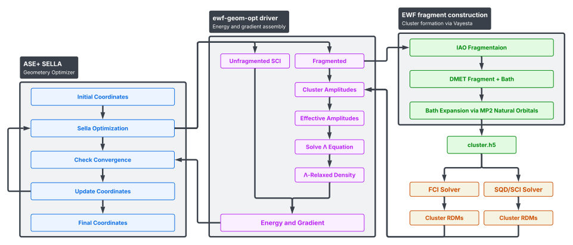
<figcaption class="paper-figure-caption"><b>Fig 1.</b> Figure 1: Overall workflow of the EWF geometry optimization framework. ASE together with Sella drives the geometry optimization by repeatedly requesting the electronic energy and analytical gradient from the geometry driver. For fragmented calculations, EWF clusters are constructed in the IAO basis using Vayesta, expanded with MP2 natural orbitals, and solved using FCI or SQD/SCI depending on the fragment size. The resulting cluster reduced density matrices are converted into cluster and effective amplitudes, from which the Λ equations are solved to construct the Λ-relaxed density; the analytical gradient is then evaluated from this density alongside the assembled EWF energy, which is...</figcaption>
</figure>
<figure class="paper-figure-card">
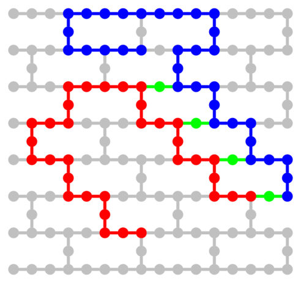
<figcaption class="paper-figure-caption"><b>Fig 2.</b> Figure 2: Example qubit layout for the largest EWF cluster in benzidine (33 molecular orbitals). Red and blue dots denote α- and β-qubits, respectively, while green dots represent the four ancillary qubits connecting the α–β pairs.</figcaption>
</figure>
<figure class="paper-figure-card">
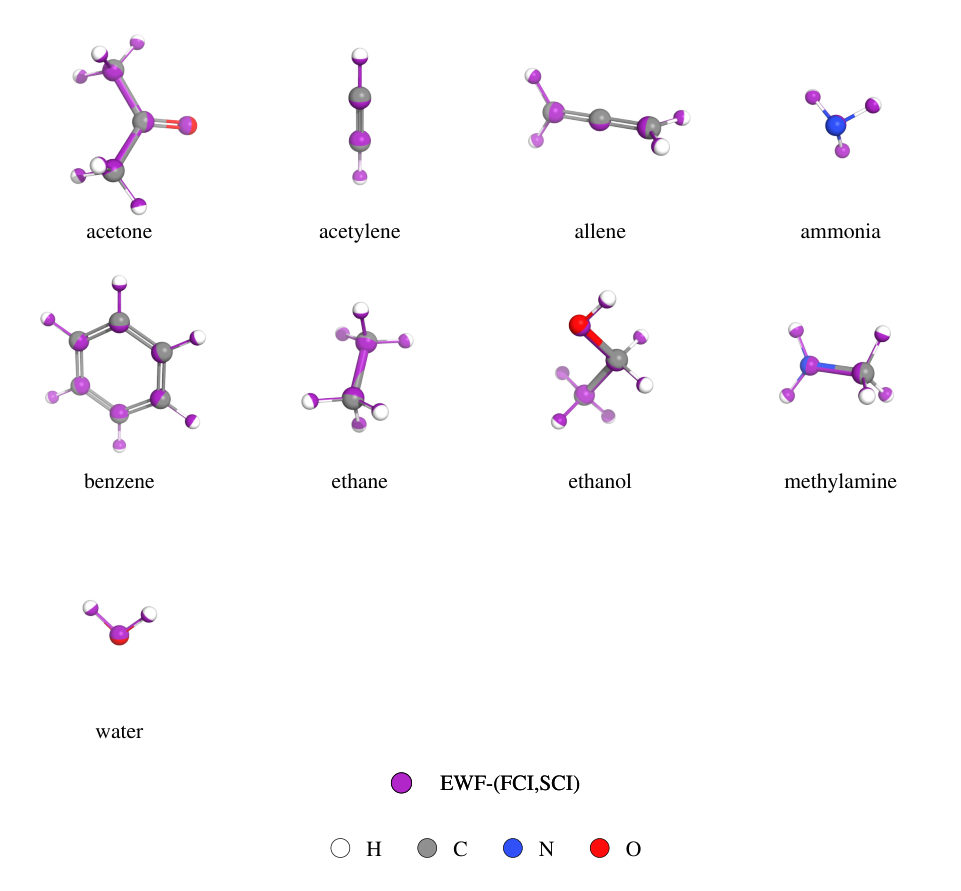
<figcaption class="paper-figure-caption"><b>Fig 3.</b> Figure 3: Overlay of the optimized geometries for each molecule. The unfragmented SCI reference is shown in CPK element colors and the EWF-(FCI,SCI) structure in a single highlight color (magenta).</figcaption>
</figure>
<figure class="paper-figure-card">
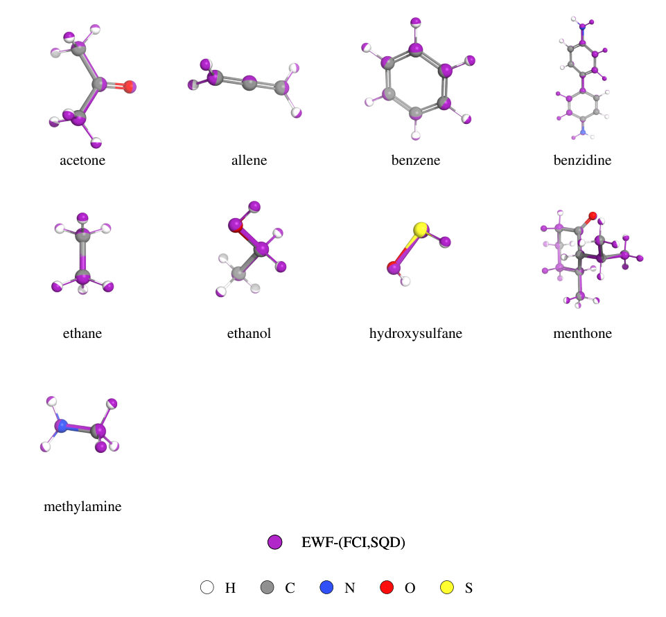
<figcaption class="paper-figure-caption"><b>Fig 4.</b> Figure 4: Overlay of the optimized geometries for each molecule. The EWF-(FCI,SCI) reference is shown in CPK element colors and the EWF-(FCI,SQD) structure in a single highlight color (magenta).</figcaption>
</figure>

**Summary.** The paper introduces and validates the EWF-(FCI,SQD) method, enabling geometry optimization for large molecules previously intractable due to Hilbert space size. By combining FCI and SQD within a fragment embedding scheme, it accurately maps out molecular potential energy surfaces, advancing quantum simulation from static calculations to dynamic processes.

**Why it may be interesting.** This work directly addresses the challenge of simulating complex molecular dynamics by providing a scalable framework for geometry optimization using quantum-inspired methods, bridging single-point calculations to potential energy surface mapping.

Detailed structure

**Main problem.** The primary goal is extending quantum-centric simulations from single-point energy calculations to exploring potential energy surfaces via geometry optimization for complex molecular systems.

**Main result.** The authors successfully demonstrated geometry optimization using the EWF-(FCI,SQD) method on large molecules (menthone and benzidine), achieving exceptional accuracy with deviations below 4 picometers.

**Method.** They employ the EWF-(FCI,SQD) wave-function embedding approach, which combines Full Configuration Interaction (FCI) for small fragments with Sample-Based Quantum Diagonalization (SQD) for larger ones to calculate both energy and analytical gradients.

**Model / system.** The study focuses on molecular systems, demonstrating feasibility up to menthone and benzidine using the STO-3G basis set. The methodology is designed to handle large numbers of molecular orbitals by employing fragmentation techniques.

**Key observables.** Optimized geometries; energy and analytical gradient ($\mathbf{d}E/\mathbf{d}\mathbf{x}$) accuracy relative to classical references.

**Important parameters / regimes.** The method scales up to fragments involving 70 qubits in the SQD simulation, using a minimal STO-3G basis set.

**Assumptions / limitations.** The current demonstration is limited to the STO-3G basis set; for gradient calculation, they use $\Lambda$-relaxed density construction.

**Figures summary.** Figure 1 illustrates the entire workflow: ASE+SELLA drives optimization, while EWF handles energy/gradient assembly via IAO fragmentation, cluster solving (FCI/SQD), and $\Lambda$ equation solution.

**Paper structure.** The paper details the computational machinery for calculating the total EWF energy and its analytical gradient. This involves specific solvers like SBD, SCI, and SQD, which are integrated into an optimization loop driven by an external optimizer (ASE/SELLA).

Abstract

The EWF-(FCI,SQD) method, a wave-function-based embedding approach combining full configuration interaction (FCI) and sample-based quantum diagonalization (SQD), is a promising new tool for the simulation of molecular systems. However, applications of EWF-(FCI,SQD) have so far been limited to single-point calculations, whereas the study of complex chemical processes requires the ability to explore potential energy surfaces. In this work, we demonstrate geometry optimization with EWF-(FCI,SQD), scaling our simulations to molecules as large as menthone and benzidine within the STO-3G basis set. Without fragmentation, these systems comprise 73 and 82 molecular orbitals respectively, presenting an intractable Hilbert space for conventional exact or high-level subspace solvers and establishing a clear necessity for fragmentation-based methodologies. The underlying fragment SQD simulations in the EWF-(FCI,SQD) geometry optimizations use up to 70 qubits. The resulting geometries show exceptional accuracy relative to the classical reference, with deviations below 4 picometers.

[↑ back to top](#top)

### [Self-Modifying Lean Proof Agents with Verifier-Grounded Benchmark Coevolution](http://arxiv.org/abs/2607.17352v1)

**Authors:** Yuqing Li, Zeguan Wu, Yu Gan, Junyu Liu  
**Type:** theory · **Category:** other · **PDF:** <https://arxiv.org/pdf/2607.17352v1>  
**Analysis basis:** full PDF text, analyzed in chunks

↔ Scroll figures horizontally

<figure class="paper-figure-card">
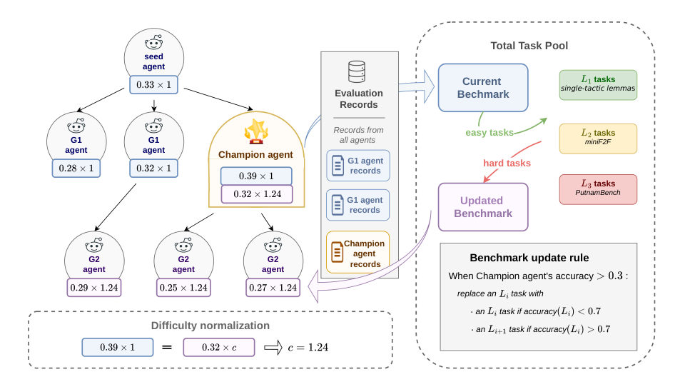
<figcaption class="paper-figure-caption"><b>Fig 1.</b> Figure 1: Champion-driven agent–benchmark coevolution. A seed agent produces first- generation (G1) children that stream into a shared archive as they are evaluated, so a strong early child can already parent later siblings in the same generation; the strongest child becomes the champion, seeds the next generation (G2), and also drives the benchmark update. Evaluation records from all agents are collected. The benchmark is drawn from a candidate problem pool stratified by difficulty level (L1: single-tactic lemmas; L2: miniF2F valid split, disjoint from the held-out test set used only for generalization; L3: PutnamBench). When the champion clears the update threshold, mastered tasks are...</figcaption>
</figure>
<figure class="paper-figure-card">
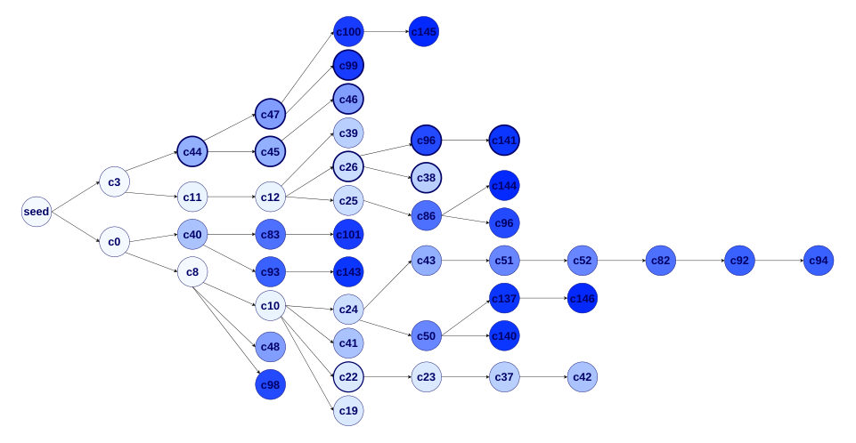
<figcaption class="paper-figure-caption"><b>Fig 2.</b> Figure 2: Evolution tree for the accepted lineage. Bold nodes mark agents with decomposition- based workflows. Darker node colors indicate agents evolved in later generations.</figcaption>
</figure>

**Summary.** This work introduces a novel framework for self-improving AI agents designed to solve complex formal mathematical proofs using Lean. The key innovation is that the agent's benchmark difficulty evolves alongside its own capabilities, forcing continuous improvement through coevolutionary pressure. This demonstrates that verifier-grounded self-evolution can significantly boost automated reasoning workflows.

**Why it may be interesting.** not directly relevant

Detailed structure

**Main problem.** The core challenge addressed is designing effective, self-evolving agents for formal mathematical theorem proving, focusing on evolving the agent's workflow rather than just improving the underlying prover.

**Main result.** A coevolving agent demonstrated a significantly higher solve rate (45.1%) on a held-out test split compared to both its initial state and fixed-benchmark baselines (32.0%).

**Method.** The system employs self-evolution where the agent and its benchmark coevolve; this involves mastery-throttled curriculum updates and single-anchor recalibration.

**Model / system.** The model is a self-evolving Lean proof agent operating within a fixed, trusted runtime environment. This runtime wraps a mutable workspace containing the agent's proof workflow, prompts, and tools.

**Key observables.** Solve rate on held-out miniF2F test splits; difficulty-normalized score ($q$); raw solve rate ($r$).

**Important parameters / regimes.** The evolution uses thresholds ($\gamma=0.30$, $	au=0.70$) to trigger benchmark updates and level advancements.

**Assumptions / limitations.** It assumes the existence of a fixed, trusted Lean verifier that dictates correctness; the object of improvement is the workflow *around* verification, not the prover itself.

**Figures summary.** Figure 1 illustrates the champion-driven agent–benchmark coevolution process across generations, detailing how the benchmark updates based on performance thresholds.

**Paper structure.** The paper details the architecture (trusted runtime vs. mutable workspace), the coevolution mechanism (mastery throttling and recalibration), and presents empirical results comparing the coevolving trajectory against fixed baselines.

Abstract

Designing effective Lean proof agents is a central challenge in formal mathematical reasoning. Beyond building stronger provers, recent work emphasizes the workflow around Lean: how an agent decomposes proof obligations, uses tools and compiler feedback, diagnoses failures, repairs proofs, and maintains structured proof context. Motivated by code-level self-evolving agents, we study whether such workflows can be evolved rather than hand-designed. We present a self-evolving Lean proof agent in which a small fixed, trusted runtime wraps a fully mutable workspace: the proof workflow, prompts, and tools. Unlike most self-evolving systems, which optimize against a fixed external benchmark, our system coevolves the agent and its benchmark. Between generations, the highest-scoring agent (the champion) revises the active task distribution through a mastery-throttled curriculum update that introduces harder proof obligations only after the current level is mastered, and a single-anchor recalibration re-runs the champion on the updated benchmark to keep scores comparable as difficulty rises. All evolution stays inside a Lean-grounded verification loop: however the agent rewrites itself, a success counts only when its behavior yields Lean-verified proofs under a trusted snapshot, and each attempt must emit a machine-readable, Lean-grounded proof context whose representation may evolve but whose groundedness is enforced. We run the coevolving trajectory and a fixed-benchmark baseline for 15 active generations and compare them on a held-out miniF2F test split. The best coevolving agent reaches a 45.1% held-out solve rate, versus 12.7% for the seed and 32.0% for the best fixed-benchmark agent, showing that verifier-grounded self-evolution can improve Lean proof workflows under a coevolving benchmark.

[↑ back to top](#top)

## Secondary cond-mat archives

*Papers from cond-mat.mtrl-sci, mes-hall, other, soft, supr-con. These archives are de-prioritized — they appear at the end regardless of relevance score.*

### Relevant in secondary archives (36)

### [Topological magnon noises](http://arxiv.org/abs/2607.16574v1)

**Authors:** Shuang Liang, Tengyue Zhao, Yu-Hang Li, Hua Jiang  
**Type:** theory · **Category:** statistical mechanics · **PDF:** <https://arxiv.org/pdf/2607.16574v1>  
**Analysis basis:** full PDF text, analyzed in chunks
**Topic relevance:** 🔥 `Keldysh / 2PI / non-Gaussian methods` **4/5** · 🔥 `non-equilibrium dynamics` **4/5** · `correlated / nonlocal dissipation` **3/5** · `driven-dissipative phase transition` **3/5** · `exotic spin models in light-matter` **3/5** · `methods for driven-dissipative` **3/5** · `non-equilibrium universality` **3/5** · `analog quantum simulation` **2/5** · `spintronics-quantum-optics interface` **2/5** · `Kondo & dissipative impurity` **1/5**

↔ Scroll figures horizontally

<figure class="paper-figure-card">
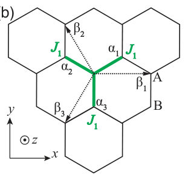
<figcaption class="paper-figure-caption"><b>Fig 1.</b> Fig. 1 (a) Schematic of the four terminal TMI transport system. The system size is 𝐿× 𝑊 along x and</figcaption>
</figure>
<figure class="paper-figure-card">
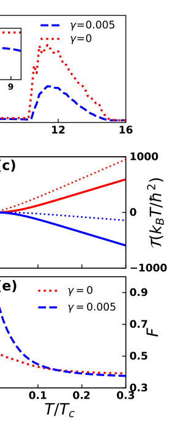
<figcaption class="paper-figure-caption"><b>Fig 2.</b> Fig. 2: (a) magnon transmission coefficients for a two-terminal system as a function of energy with (solid</figcaption>
</figure>
<figure class="paper-figure-card">
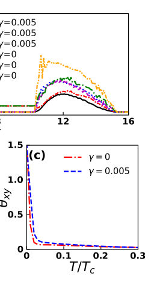
<figcaption class="paper-figure-caption"><b>Fig 3.</b> Fig. 3: (a) Energy dependence of some representative magnon transmission coefficients in a four-terminal</figcaption>
</figure>
<figure class="paper-figure-card">
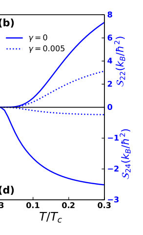
<figcaption class="paper-figure-caption"><b>Fig 4.</b> Fig. 4: Temperature dependence of the magnon noises in a four-terminal system. The left panel shows</figcaption>
</figure>
<figure class="paper-figure-card">

<figcaption class="paper-figure-caption"><b>Fig 5.</b> Figure 3(b) shows the temperature dependence of the longitudinal magnon conductance 𝜅GG and the magnon Hall conductance 𝜅GH with and without the Gilbert damping. While 𝜅GG increases</figcaption>
</figure>

**Summary.** This paper develops advanced Green's function theory to model magnon transport and noise in topological magnetic insulators under thermal gradients. It demonstrates that Gilbert damping breaks the conservation of magnon current, leading to significant modifications of standard relations like the Johnson-Nyquist formula for thermal noise. This provides crucial theoretical insight into dissipative quantum magnonics.

**Why it may be interesting.** The work provides a detailed theoretical framework for non-equilibrium transport phenomena (magnon heat/charge flow) where dissipation fundamentally alters fundamental fluctuation-dissipation theorems, which is relevant to open quantum systems dynamics.

Detailed structure

**Main problem.** The study develops a comprehensive formalism for magnon transport and associated noise signatures in ferromagnetic insulators subjected to a temperature gradient.

**Main result.** The non-conservation of the magnon current due to Gilbert damping profoundly alters established relations, including the Johnson-Nyquist formula and reciprocal noise relationships.

**Method.** The analysis employs the non-equilibrium Green's function method within the Keldysh formalism to calculate transport quantities in frequency space.

**Model / system.** The system modeled is a Topological Magnon Insulator (TMI) on a honeycomb lattice, described by a Hamiltonian incorporating exchange, anisotropy, and Dzyaloshinskii-Moriya interaction.

**Key observables.** Magnon current ($J_m$), magnon Hall angle ($	heta_{GH}$), Fano factor ($\mathcal{F}$), thermal noise ($\mathcal{T}_{mn}$), and shot noise ($\mathcal{S}_{mn}$).

**Important parameters / regimes.** Temperature gradient ($\delta T$), Gilbert damping ($\gamma$), and the effective magnon band width ($\mathcal{B}$).

**Assumptions / limitations.** The formalism relies on using the non-equilibrium Green's function method, explicitly incorporating dissipation effects like Gilbert damping into the Hamiltonian.

**Figures summary.** Figures illustrate schematic four-terminal transport setups, energy dependence of transmission coefficients with/without damping, and temperature dependencies of conductance and various noise components.

**Paper structure.** The paper builds from deriving general expressions for magnon current and noise using non-equilibrium Green's functions. It then analyzes how the inclusion of Gilbert damping breaks conservation laws, leading to modified predictions for thermal and shot noise in both two-terminal and four-terminal geometries.

Abstract

We develop a comprehensive formalism for magnon transport in ferromagnetic insulators driven by a temperature gradient. The formulas for magnon current and corresponding magnon noise are derived herein based on the spin Hamiltonian of a topological magnon insulator, which enables us to calculate the magnon Hall angle, to provide an explicit expression for the Fano factor, and to reaffirm the quantitative relations between magnon conductance and magnon noise. We find that the magnon current is not conserved in the presence of the Gilbert damping. Consequently, the reciprocal relation between the local and nonlocal noises, the Johnson-Nyquist formula between the conductance and the thermal noise, and the relation between the transmission coefficient and the shot noise are profoundly altered.

[↑ back to top](#top)

### [Impurity-induced Inverse Faraday Effect](http://arxiv.org/abs/2607.17802v1)

**Authors:** A. A. Kopasov, A. A. Bespalov, A. S. Mel'nikov  
**Type:** theory · **Category:** other · **PDF:** <https://arxiv.org/pdf/2607.17802v1>  
**Analysis basis:** full PDF text, analyzed in chunks
**Topic relevance:** 🔥 `spintronics-quantum-optics interface` **4/5** · `Kondo & dissipative impurity` **3/5** · `exotic spin models in light-matter` **3/5** · `non-equilibrium dynamics` **3/5** · `Keldysh / 2PI / non-Gaussian methods` **2/5** · `driven-dissipative phase transition` **2/5** · `methods for driven-dissipative` **2/5** · `interference shaping light` **1/5** · `non-equilibrium universality` **1/5**

↔ Scroll figures horizontally

<figure class="paper-figure-card">
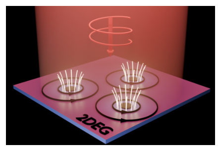
<figcaption class="paper-figure-caption"><b>Fig 1.</b> FIG. 1. Schematic picture illustrating the suggested mecha- nism of the inverse Faraday effect. We show the lines of the dc currents flowing around each impurity center and magnetic field generated by a circularly polarized light incident on the two-dimensional electron gas (2DEG).</figcaption>
</figure>
<figure class="paper-figure-card">
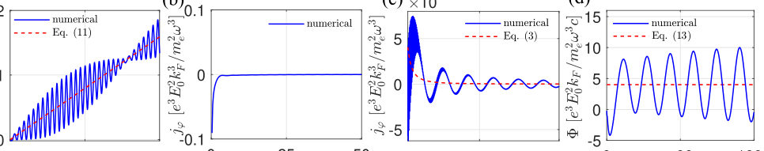
<figcaption class="paper-figure-caption"><b>Fig 2.</b> FIG. 2. (a) Typical Mz(R) dependence. (b)-(c) Typical plots of the dc current density jφ(R), kF R varies within the range kF R ∈[0, 50] for (b) and kF R ∈[50, 1000] for (c). (d) Magnetic flux Φ through a circular area of radius R centered at the impurity. Here solid lines show the results of numerical integration of analytical expressions [42], whereas the dashed lines in (a), (c), and (d) are the results of Eq. (11), (3), and (13), respectively. We choose ℏω = 0.08ϵF and kF r0 = 1 to produce the plots.</figcaption>
</figure>

**Summary.** The paper develops a quantum-mechanical theory for the Inverse Faraday Effect near impurities in 2D electron gases under circularly polarized light. It demonstrates that impurity scattering generates a unique, non-vanishing average magnetic field throughout the sample bulk. This result significantly diverges from classical approaches by incorporating detailed mesoscopic physics into the calculation.

**Why it may be interesting.** This work provides a detailed, microscopic quantum treatment of photoinduced magnetoelectric effects in mesoscopic systems, offering insights into how local disorder can fundamentally alter bulk electromagnetic responses compared to continuum models.

Detailed structure

**Main problem.** The study provides a quantum-mechanical description of photoinduced dc current states and magnetic fields generated around nonmagnetic point impurities in a 2D electron gas when irradiated by circularly polarized light.

**Main result.** Unlike standard models predicting edge currents, this work shows that the impurity scattering generates a spatially distributed, non-vanishing average dc magnetic field proportional to the impurity concentration ($\langle B_{dc,z} 
angle \sim n_{imp}$).

**Method.** The analysis involves solving the time-dependent Schrödinger equation using second-order perturbation theory in the electromagnetic wave amplitude.

**Model / system.** The system is a two-dimensional electron gas containing nonmagnetic point impurities. The dynamics are governed by the time-dependent Hamiltonian incorporating the impurity potential and the oscillating vector potential from the light field.

**Key observables.** dc magnetic field component perpendicular to the plane ($B_{dc,z}$), photoinduced dc currents ($\vec{j}_{dc}$), and magnetization ($\vec{M}_{dc}$).

**Important parameters / regimes.** Impurity concentration ($n_{imp}$), electromagnetic wave amplitude ($E_0$), frequency ($\omega$), Fermi energy ($E_F$).

**Assumptions / limitations.** The analysis relies on second-order perturbation theory and assumes adiabatic switching of the electric field. It focuses on orbital mechanisms, neglecting spin-orbit effects.

**Figures summary.** Figures schematically illustrate dc current lines circulating around impurities and the resulting magnetic field pattern; other figures show numerical plots of magnetization, current density, and flux dependence on radius R.

**Paper structure.** The paper builds from establishing the quantum mechanical framework (Schrödinger equation) to applying second-order perturbation theory. It derives analytical expressions for key observables ($M_z(R)$, $j_\phi(R)$) in both 2D and 3D limits, contrasting these results with standard kinetic/hydrodynamic approaches.

Abstract

We provide a quantum-mechanical description of the photoinduced dc current states and magnetic fields around nonmagnetic point impurities in a two-dimensional (2D) electron gas irradiated by a circularly polarized electromagnetic wave. Based on the solution of the corresponding time-dependent Schrodinger equation within the second-order perturbation theory in the electromagnetic wave amplitude we find that the resulting dc magnetic field component perpendicular to the plane of the 2D system is distributed like in a set of random magnetic fluxes bound to the positions of impurities. As a result, the spatially averaged dc magnetic field does not vanish far from the sample edges and, thus, our scenario of the inverse Faraday effect in disordered systems differs strongly from the standard one based on the relaxation time approximation within the hydrodynamic or kinetic equation approaches which would give only the photoinduced currents flowing along the sample edges. The predicted mechanism for formation of rectified currents flowing around the impurity centers is shown to be generic both for 2D and three-dimensional systems. The internal dc magnetic field can give rise to the photoinduced Hall effect and Faraday rotation for a probing electromagnetic signal.

[↑ back to top](#top)

### [Quiescent and traveling solitons in the fractional parametrically driven damped nonlinear Schrödinger equation](http://arxiv.org/abs/2607.17446v1)

**Authors:** Dongdong Wang, Rujiang Li, David Laroze, Boris A. Malomed, Pengfei Li  
**Type:** theory · **Category:** other · **PDF:** <https://arxiv.org/pdf/2607.17446v1>  
**Analysis basis:** full PDF text, analyzed in chunks
**Topic relevance:** 🔥 `driven-dissipative phase transition` **4/5** · `correlated / nonlocal dissipation` **3/5** · `methods for driven-dissipative` **3/5** · `non-equilibrium dynamics` **3/5** · `non-equilibrium universality` **2/5** · `Keldysh / 2PI / non-Gaussian methods` **1/5** · `analog quantum simulation` **1/5** · `correlated cavity matter` **1/5** · `superradiant laser` **1/5**

↔ Scroll figures horizontally

<figure class="paper-figure-card">
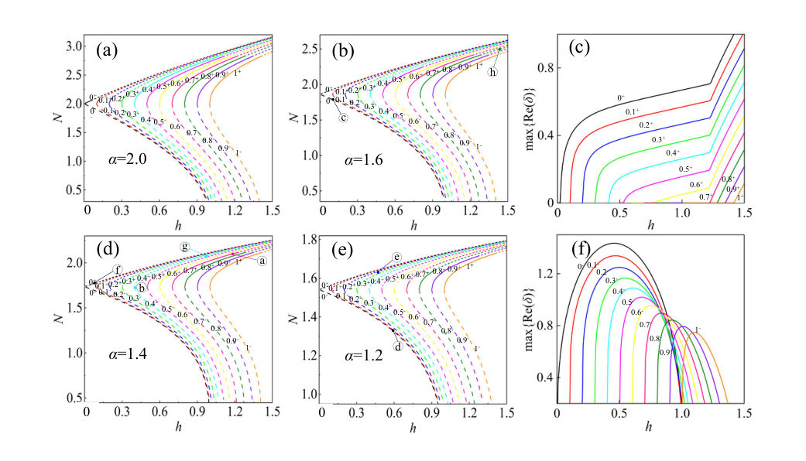
<figcaption class="paper-figure-caption"><b>Fig 1.</b> FIG. 1. The existence and stability diagrams of the fractional quiescent soliton solutions in the conservative (γ = 0) and dissipative (γ &gt; 0) versions of the model, for different values of the loss coefficient γ and LI values: (a) α = 2.0, (b) α = 1.6, (d) α = 1.4, and (e) α = 1.2, are represented by dependences of the soliton’s norm N on the parametric-gain parameter h. Solid lines denote stable solitons ψ+, while dotted and dashed lines represent unstable solitons ψ+ and unstable solitons ψ−, respectively. Labels attached to the branches mark the corresponding values of γ, with the superscripts + and −indicating the solitons for the ψ+ and ψ−types, respectively.The evolution of solitons...</figcaption>
</figure>
<figure class="paper-figure-card">
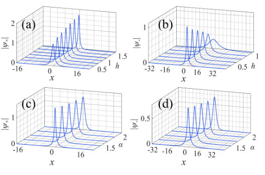
<figcaption class="paper-figure-caption"><b>Fig 2.</b> FIG. 2. Profiles of solitons versus the drive’s strength param- eter h and the LI α. (a) and (b): The variation of ψ+ and ψ−, respectively, with h at α = 1.4, γ = 0.2. (c) and (d: The variation of ψ+ and ψ−, respectivel with α at h = 0.7, γ = 0.4.</figcaption>
</figure>
<figure class="paper-figure-card">
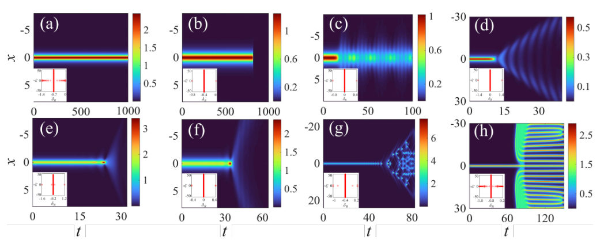
<figcaption class="paper-figure-caption"><b>Fig 3.</b> FIG. 3. The evolution of the originally quiescent (V = 0) solitons, corresponding to labels in Fig. 1. The inset in the lower left corner of each subplot displays the corresponding linear-stability spectrum obtained by from the numerical solution of Eq. (22). (a) The ψ+ type with α = 1.4, γ = 0.7, h = 1.2. (b) The soliton at the critical point (γ = h = 0.4) with α = 1.4. (c) The ψ−type with α = 1.6, γ = 0, h = 0.1. (d) The ψ−type with α = 1.2, γ = 0, h = 0.6. (e) The ψ+ type with α = 1.2, γ = 0.2, h = 0.5. (f) The ψ+ type with α = 1.4, γ = 0, h = 0.1. (g) The ψ+ type with α = 1.4, γ = 0.4, h = 1. (h) The ψ+ type with α = 1.6, γ = 0.8, h = 1.45.</figcaption>
</figure>
<figure class="paper-figure-card">
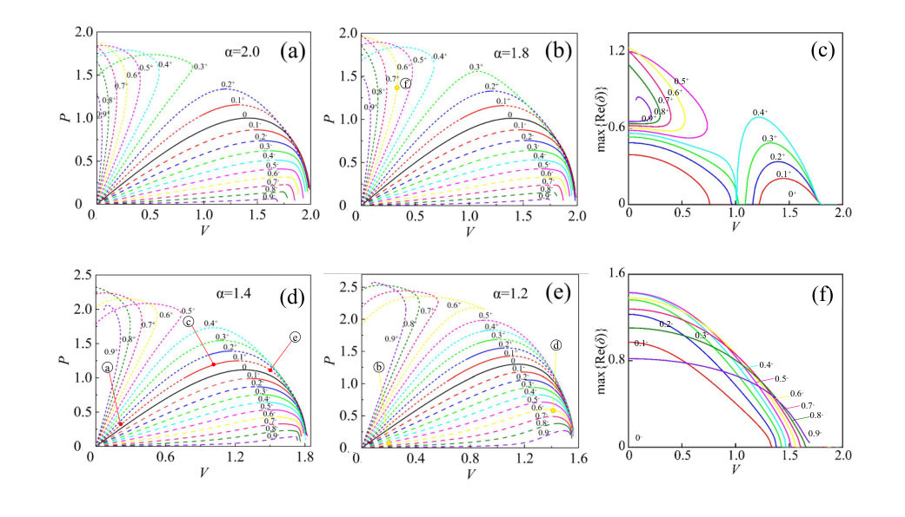
<figcaption class="paper-figure-caption"><b>Fig 4.</b> FIG. 4. The existence and stability diagrams for traveling solitons in the lossless system (γ = 0), for different LI values(a) α = 2.0, (b) α = 1.8, (d) α = 1.4, and (e) α = 1.2, are reprsented by dependences of the soliton’s momentum P, defined as per Eq. (32), on velocity V . The solitons of the ψ+ and ψ−types are located above and below the black lines h = 0. The solid and dashed lines denote stable and unstable solitons, respectively. Labels on the curves mark the corresponding values of h, with the superscripts + and −indicating the solitons of the ψ+ and ψ−types, respectively. The evolution of traveling solitons corresponding to the encircled labels is shown in Fig. 6. The maximum...</figcaption>
</figure>
<figure class="paper-figure-card">
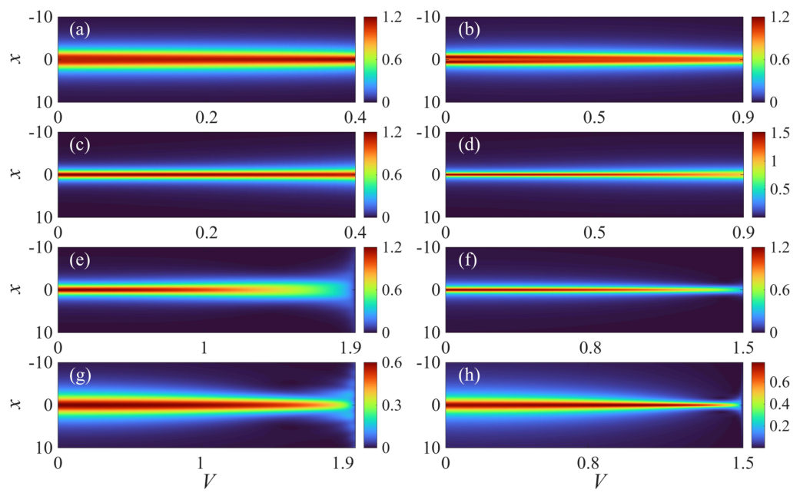
<figcaption class="paper-figure-caption"><b>Fig 5.</b> FIG. 5. The variation of profiles of the traveling solitons, following the variation of velocity V . The figure is arranged in four rows and two columns: the four left panels correspond to α = 1.6, and the four right ones to α = 1.2. The first and second rows represent the upper and lower branches of ψ+, in the case when they coexist; the third row represents the single branch of ψ+, and the fourth row represents the single branch of ψ−. Parameter h is 0.6 for panels (a), (b), (c), (d), (g), (h), and 0.2 for panels (e), (f).</figcaption>
</figure>

**Summary.** This paper thoroughly analyzes solitons governed by a fractional parametrically driven damped nonlinear Schrödinger equation, applicable to optical cavities. It establishes stability criteria for both stationary and traveling wave solutions based on the system's parameters like damping and parametric gain. The findings detail how fractional diffraction fundamentally alters soliton existence, stability boundaries, and interaction dynamics.

**Why it may be interesting.** This work extends nonlinear physics into fractional calculus, which is crucial for modeling wave propagation in media where dispersion/diffraction are non-local or anomalous. The interplay between parametric driving, loss, and fractional effects provides a rich platform for studying dissipative quantum systems.

Detailed structure

**Main problem.** The study investigates the existence, stability, and dynamics of optical solitons within a complex nonlinear wave equation incorporating fractional diffraction, cubic nonlinearity, linear loss, and parametric driving.

**Main result.** The analysis reveals two families of quiescent solitons ($\psi_+$ and $\psi_-$) with distinct stabilities; furthermore, moving solitons exhibit stable regimes that are highly dependent on the fractional diffraction exponent ($\alpha$) and velocity ($V$).

**Method.** Stability is assessed by linearizing the governing equation around soliton solutions and solving the resulting eigenvalue problem using numerical techniques like the Fourier collocation method.

**Model / system.** The system is modeled by a one-dimensional nonlinear Schrödinger equation featuring a Riesz-fractional diffraction operator, cubic self-focusing nonlinearity, damping ($\gamma$), and parametric gain ($h$). This model is suggested to be realizable in laser cavities.

**Key observables.** Soliton stability (eigenvalues $	ext{Re}(\delta)$), soliton profiles ($\psi^+$ vs $\psi^-$), collision outcomes (quasi-elasticity, repulsion), and the norm/momentum of the solitons.

**Important parameters / regimes.** Fractional diffraction exponent ($\alpha$, $1 < \alpha \le 2$), parametric drive amplitude ($h$), loss coefficient ($\gamma$), and soliton velocity ($V$).

**Assumptions / limitations.** The stability analysis relies on linearizing perturbations around found stationary or traveling solutions, and the interaction studies often focus on the lossless limit ($\gamma=0$).

**Figures summary.** Figures illustrate existence/stability diagrams for quiescent solitons vs. parameters (Fig. 1), profile variations with velocity and $\alpha$ (Fig. 5), time evolution of stability regimes (Fig. 6), and detailed collision/pursuit interactions between pairs of stable traveling solitons (Fig. 7).

**Paper structure.** The paper systematically analyzes the governing equation in different limits ($\gamma=0$, $V=0$), determines soliton existence via numerical methods, performs rigorous stability analysis for both quiescent and moving states, and concludes by characterizing complex interaction dynamics.

Abstract

We systematically investigate the existence, stability, and dynamics of optical solitons in the framework of the one-dimensional nonlinear Schrödinger equation with the Riesz-fractional diffraction operator, cubic self-focusing, and linear loss, balanced by a linear parametric drive. The model, which can be realized in a laser cavity, produces standing and moving solitons, the latter ones existing below a critical velocity. One of the soliton species is stable in a wide range of parameters, while others are unstable. The fractional diffraction significantly alters the existence conditions and stability thresholds of the solitons. Collision between moving solitons are considered too. The results essentially expand the variety of nonlinear modes in media with fractional diffraction.

[↑ back to top](#top)

### [Spin-Independent Dissipation Induces Emergent Spin Mobility Polarization in Donor-Double-Stranded DNA-Acceptor Systems](http://arxiv.org/abs/2607.17189v1)

**Authors:** Hengrui Yang, Yu Xiong, Weitang Li, Zhigang Shuai  
**Type:** theory · **Category:** other · **PDF:** <https://arxiv.org/pdf/2607.17189v1>  
**Analysis basis:** full PDF text, analyzed in chunks
**Topic relevance:** 🔥 `methods for driven-dissipative` **4/5** · `Keldysh / 2PI / non-Gaussian methods` **3/5** · `spintronics-quantum-optics interface` **3/5** · `Kondo & dissipative impurity` **2/5** · `non-equilibrium dynamics` **2/5** · `correlated / nonlocal dissipation` **1/5** · `driven-dissipative phase transition` **1/5** · `exotic spin models in light-matter` **1/5** · `non-equilibrium universality` **1/5**

↔ Scroll figures horizontally

<figure class="paper-figure-card">
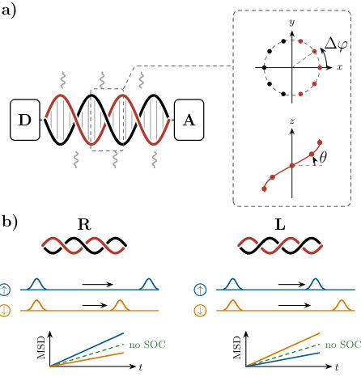
<figcaption class="paper-figure-caption"><b>Fig 1.</b> FIG. 1. (a) Schematic of the donor–dsDNA–acceptor system with helical parameters θ and ∆φ. (b) Spin-resolved MSD for right-handed helix and its reversal for left-handed helix. No- SOC case is shown for reference, showing the “one-enhanced, one-suppressed” mechanism.</figcaption>
</figure>
<figure class="paper-figure-card">
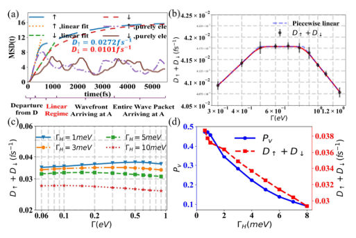
<figcaption class="paper-figure-caption"><b>Fig 2.</b> FIG. 2. (a) Spin-resolved MSD vs time for purely electronic (oscillating, zero average) and dissipation models (steady po- larization). The four transport regimes and linear fit curves are indicated. (b) Total diffusion coefficient vs Γ, showing the Kramers turnover. (c) Total diffusion coefficient vs Γ for different ΓH, illustrating many-body effects induced by dissi- pation on the turnover. (d) Monotonic decrease of mobility polarization Pv and total diffusion coefficient vs ΓH.</figcaption>
</figure>
<figure class="paper-figure-card">
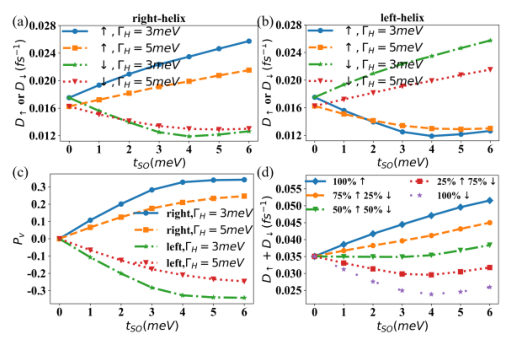
<figcaption class="paper-figure-caption"><b>Fig 3.</b> FIG. 3. (a) Spin-resolved diffusion coefficients as functions of tSO for right-handed dsDNA. (b) Same for a left-handed helix, showing the exchange of the two spin channels. (c) Mo- bility polarization Pv vs tSO for right-handed and left-handed helices. (d) Total diffusion coefficient D↑+ D↓vs tSO for dif- ferent initial spin injections. ΓH = 3meV</figcaption>
</figure>
<figure class="paper-figure-card">
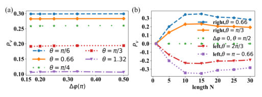
<figcaption class="paper-figure-caption"><b>Fig 4.</b> FIG. 4. (a) Mobility polarization Pv as a function of the heli- cal parameters θ and ∆φ. (b) Pv vs the number of base pairs N for right-handed, left-handed and achiral dsDNA structure.</figcaption>
</figure>

**Summary.** The paper investigates the fundamental physics behind Chiral-Induced Spin Selectivity (CISS) using a DNA-based model simulated with the Lindblad master equation. It introduces 'mobility polarization' as a key diagnostic, demonstrating that spin-independent dissipation is necessary to stabilize the spin selectivity effect into a measurable steady state. This provides a general theoretical framework for understanding spin filtering in chiral molecular conductors.

**Why it may be interesting.** This work provides a concrete theoretical mechanism for CISS based on open quantum system dynamics (dissipation), which is highly relevant to understanding charge transport in nanoscale molecular electronics and bio-hybrid devices.

Detailed structure

**Main problem.** The microscopic origin of Chiral-Induced Spin Selectivity (CISS) remains highly debated, particularly regarding the necessity of spin-dependent versus spin-independent dissipation.

**Main result.** The study establishes that spin-independent dissipation is crucial for locking transient spin asymmetries into a steady polarization, revealing a generic 'one enhanced, one suppressed' mechanism universal to helical chiral structures.

**Method.** The authors use the Lindblad master equation formalism applied to a donor-double-stranded DNA-acceptor model to calculate spin-resolved transport properties.

**Model / system.** The system is modeled as a Donor–double-stranded DNA–Acceptor (D–dsDNA–A) chain, governed by an extended Hamiltonian including helical Spin-Orbit Coupling (SOC).

**Key observables.** Spin-resolved mean-square displacement ($	ext{MSD}$), mobility polarization ($P_v = rac{D_\uparrow - D_\downarrow}{D_\uparrow + D_\downarrow}$), and the leading-time fraction ($f$).

**Important parameters / regimes.** Dissipation rates ($\Gamma, \Gamma_H$), helical SOC strength ($t_{SO}$), molecular length ($N$), and resonance energy windows ($\epsilon_D$).

**Assumptions / limitations.** The analysis relies on modeling dissipation via Lindblad terms and distinguishing between dynamical mobility polarization ($p_v$) and steady-state spin accumulation.

**Figures summary.** Figures illustrate the dependence of $P_v$ on dissipation strength ($\Gamma$), showing optimal regimes, and demonstrate how the leading-time fraction ($f$) transitions from zero to unity as dissipation increases.

**Paper structure.** The paper develops a diagnostic tool ($P_v$) using MSD analysis within the Lindblad framework. It first shows that pure electronic models fail to yield steady polarization; subsequent inclusion of spin-independent dissipation locks this asymmetry, leading to the general 'one enhanced, one suppressed' pattern.

Abstract

Despite extensive experiments, chiral-induced spin selectivity (CISS) remains debated. Using a donor-double-stranded DNA-acceptor model and Lindblad equation, we define spin mobility polarization via spin-resolved mean-square displacement and fix relaxation on a turnover plateau. Spin-independent relaxation locks the transient asymmetry from helical spin-orbit coupling (SOC) into a steady polarization. Weak SOC, expected to have little effect, boosts one spin but suppresses the other instead, in a "one enhanced, one suppressed" pattern. Flipping the helix exchanges them. The work defines mobility polarization as a probe and gives a generic dissipation-driven mechanism for CISS.

[↑ back to top](#top)

### [Suppression of Non-Hermitian Skin Effect by Pseudomagnetic Field in Honeycomb Lattice](http://arxiv.org/abs/2607.17703v1)

**Authors:** Kai Shao, Kun Luo  
**Type:** theory · **Category:** other · **PDF:** <https://arxiv.org/pdf/2607.17703v1>  
**Analysis basis:** full PDF text, analyzed in chunks
**Topic relevance:** 🔥 `analog quantum simulation` **4/5** · `driven-dissipative phase transition` **3/5** · `methods for driven-dissipative` **3/5** · `correlated / nonlocal dissipation` **2/5** · `non-equilibrium dynamics` **2/5** · `non-equilibrium universality` **2/5** · `Keldysh / 2PI / non-Gaussian methods` **1/5** · `Kondo & dissipative impurity` **1/5**

↔ Scroll figures horizontally

<figure class="paper-figure-card">
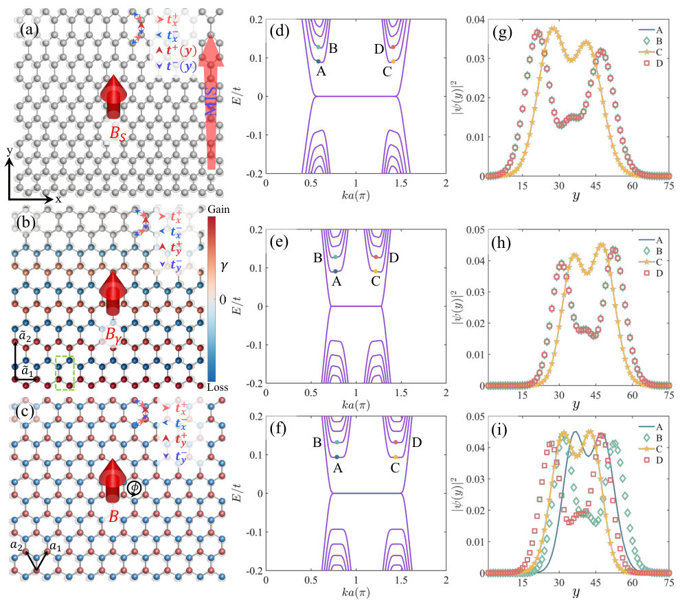
<figcaption class="paper-figure-caption"><b>Fig 1.</b> FIG. 1. (a) Realization of a uniform PMF Bs in a strained honeycomb lattice by modulating the hopping strength ty along the y axis. (b) Generation of a PMF via spatially modulated gain and loss strength γ. The black arrows indicate the primitive vectors ˜a1 and ˜a2, and the green dashed box denotes the unit cell. (c) Honeycomb lattice under a real magnetic field with magnetic flux ϕ per plaquette. Nonreciprocal hoppings δx and δy can be superimposed along the x and y directions in (a)–(c). (d–f) Energy spectra corresponding to (a)–(c) with δx = δy = 0. (g–i) Spatial distributions of the wavefunction intensity |ψ(y)|2</figcaption>
</figure>
<figure class="paper-figure-card">
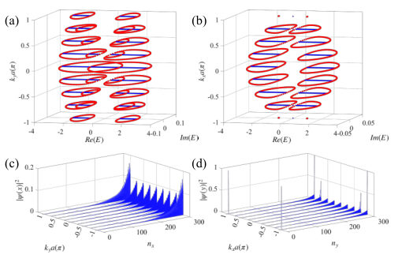
<figcaption class="paper-figure-caption"><b>Fig 2.</b> FIG. 2. (a,b) Complex energy spectra under different bound- ary conditions: (a) x-PBC (red) and x-OBC (blue) with δx = 0.05 and δy = 0; (b) y-PBC (red) and y-OBC (blue) with δx = 0 and δy = 0.05. (c,d) Spatial distributions |ψ(x)|2 and |ψ(y)|2 corresponding to the blue OBC eigenenergies in (a) and (b), respectively, for a finite lattice with Nx(Ny) = 300.</figcaption>
</figure>
<figure class="paper-figure-card">
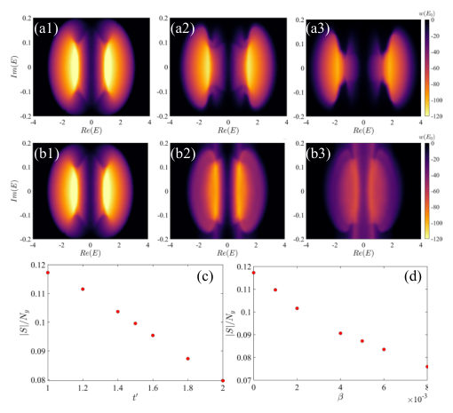
<figcaption class="paper-figure-caption"><b>Fig 3.</b> FIG. 3. (a1)¨C(a3) Distribution of the spectral winding number in the complex energy plane (color scale) for a hon- eycomb lattice with MIS at t′ = 1, 1.5, and 2, respectively. (b1)¨C(b3) Corresponding results for a honeycomb lattice with spatially varying gain and loss at β = 0, 0.004, and 0.008. Skin topological area |S|/Ny as a function of t′(c) and β(d). Lattice size Ny = 300, with δx = 0.1 and δy = 0.</figcaption>
</figure>
<figure class="paper-figure-card">
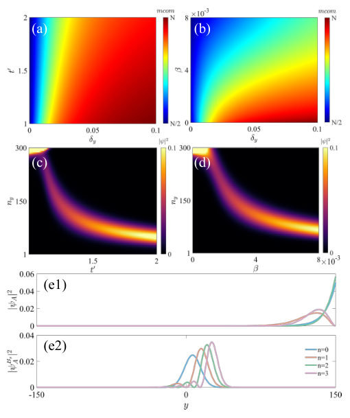
<figcaption class="paper-figure-caption"><b>Fig 4.</b> FIG. 4. mcom in the (δy, t′) plane (a) and (δy, β) plane (b). Spatial distributions of an eigenstate belonging to the first pseudo-Landau level as a function of t′ (c) and β (d), illus- trating the transition from a boundary-localized skin mode to a bulk-localized mode. (e1) Amplitude distribution |ψn A|2</figcaption>
</figure>
<figure class="paper-figure-card">
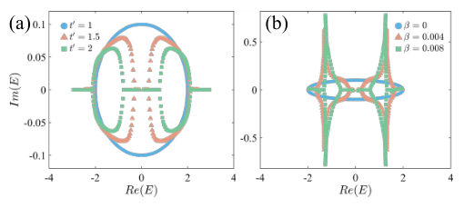
<figcaption class="paper-figure-caption"><b>Fig 5.</b> FIG. 5. Complex energy spectra under y-PBC for (a) MIS-induced and (b) gain–loss-induced PMFs at different field strengths (color coded). Parameters: Ny = 300, kx = 2π/(3a), δy = 0.1.</figcaption>
</figure>

**Summary.** This paper explores controlling the Non-Hermitian Skin Effect (NHSE) in honeycomb lattices by introducing Pseudomagnetic Fields (PMFs). The authors demonstrate that PMFs, generated via strain or gain/loss modulation, effectively suppress the NHSE by confining bulk states rather than localizing them at boundaries. This establishes PMFs as a powerful and general tool for engineering wave dynamics in artificial metamaterials.

**Why it may be interesting.** This work is highly relevant to open quantum systems because it provides concrete theoretical models—using engineered non-Hermiticity (gain/loss) or geometric strain—to actively manipulate topological edge states, which is a key area in modern condensed matter theory and photonics.

Detailed structure

**Main problem.** The study investigates methods to control the Non-Hermitian Skin Effect (NHSE) using engineered Pseudomagnetic Fields (PMFs). The goal is to show that PMFs provide a robust, symmetry-preserving mechanism for suppressing this localization.

**Main result.** In both strain-induced and gain/loss-modulated scenarios, PMFs efficiently suppress the NHSE by driving localized skin modes into the bulk spectrum. This control mechanism is shown to be versatile and insensitive to specific boundary terminations.

**Method.** The analysis uses tight-binding models on a honeycomb lattice, analyzing spectral properties (like topological area) under Periodic Boundary Conditions (PBC) versus Open Boundary Conditions (OBC). The suppression is diagnosed by observing the contraction of the complex energy spectrum.

**Model / system.** The system is modeled as a non-Hermitian honeycomb lattice Hamiltonian. PMFs are generated either through monotonically increasing strain or via spatially modulated gain and loss terms, which induce an effective pseudo-gauge field.

**Key observables.** Suppression of NHSE (skin modes moving into the bulk), reduction of the skin topological area, and contraction of the complex-energy spectrum under PBC.

**Important parameters / regimes.** Strain magnitude ($\alpha$), modulation parameter ($eta$), lattice hopping amplitudes ($t$, $\delta_x$, $\delta_y$).

**Assumptions / limitations.** The analysis often relies on treating the system in the long-wavelength limit, allowing for a locally translationally invariant description (momentum space).

**Figures summary.** Figures illustrate PMF realization via strain and gain/loss; they compare band structures under different conditions; and show spatial wave function intensity profiles demonstrating bulk localization induced by the PMF.

**Paper structure.** The paper introduces the NHSE problem, details two distinct mechanisms for generating time-reversal symmetric PMFs (strain and gain/loss), analyzes the spectral consequences of these fields on the honeycomb lattice Hamiltonian, and concludes by establishing PMFs as a general control tool for wave localization.

Abstract

Magnetic suppression of the non-Hermitian skin effect (NHSE) offers a viable route for its control. While the NHSE has been realized in various classical-wave platforms, only pseudomagnetic fields (PMFs), which preserve time-reversal symmetry, can be engineered in such systems; however, their interplay with the NHSE remains underexplored. Here, we investigate this interplay in a non-Hermitian honeycomb lattice by considering two distinct mechanisms for generating PMFs: monotonically increasing strain and spatially modulated gain and loss. We show that in both scenarios, PMFs can efficiently suppress the NHSE by driving skin modes into the bulk, accompanied by a reduction of the skin topological area and a contraction of the complex-energy spectrum under periodic boundary conditions. This mechanism is insensitive to boundary details and holds for various edge terminations, including zigzag, bearded, armchair, and twig edges. Our results establish PMFs as a versatile and effective means to control the NHSE, and point toward feasible implementations in a broad range of artificial platforms, including photonic and acoustic metamaterials as well as topolectrical circuits.

[↑ back to top](#top)

### [Contrasting $Γ$- and K-Valley Moiré Physics in Twisted Monolayer/Bilayer WSe$_2$](http://arxiv.org/abs/2607.18212v1)

**Authors:** Jackson Kuklin, Ning Mao, Milan Mandigo-Stoba, Edgar Elias, Tianci Song, Connor Engel, Pola Pietrzkowski, Kenji Watanabe, Takashi Taniguchi, Daniel Rhodes, Yang Zhang, Qianhui Shi  
**Type:** both · **Category:** strongly correlated electrons · **PDF:** <https://arxiv.org/pdf/2607.18212v1>  
**Analysis basis:** full PDF text, analyzed in chunks
**Topic relevance:** 🔥 `analog quantum simulation` **4/5** · `driven-dissipative phase transition` **1/5** · `non-equilibrium dynamics` **1/5**

↔ Scroll figures horizontally

<figure class="paper-figure-card">
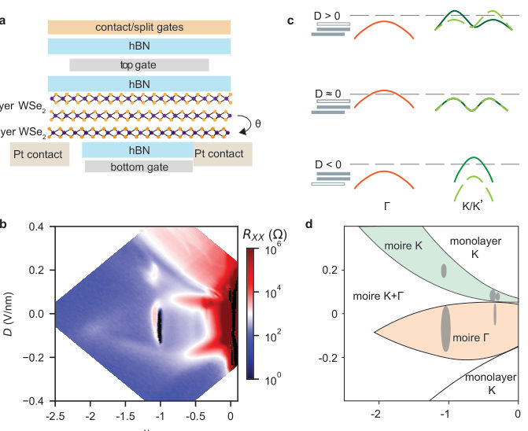
<figcaption class="paper-figure-caption"><b>Fig 1.</b> FIG. 1. Overview of the device and valley population. (a) Schematic illustration of the device structure with a moir´e interface between the lower two WSe2 layers. (b) Rxx vs ν and D at T = 1.5K and B = 0T. (c) Illustration of the relative alignment of the bands originating from the K and Γ valley at varying displacement fields. Solid (open) bars represent layers that are populated (unpopulated). Dashed lines represent the Fermi levels at low densities. (d) Schematic phase diagram indicating the valley population in each regime. Prominent resistive states are highlighted in grey.</figcaption>
</figure>
<figure class="paper-figure-card">
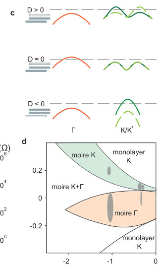
<figcaption class="paper-figure-caption"><b>Fig 2.</b> Fig. 1(a) shows a schematic of the device studied. An as-exfoliated 2H-stacked bilayer WSe2 is rotated and stacked on a monolayer, with the adjacent layers at a small angle mismatch around 3.4°, forming an ABB’ structure with a moir´e superlattice between the BB’ lay- ers. A displacement field, controlled by the top and bot- tom gate voltages, is applied across the trilayer structure. Fig.1 (b) shows the resistance Rxx vs. the displacement field D and moir´e filling factor ν = n/nM (where n is the carrier density and nM is the density at moir´e fill- ing factor 1) at B = 0 and T = 1.5 K. A schematic band diagram depicting the valley occupation is shown in Fig.1(c). At small carrier...</figcaption>
</figure>
<figure class="paper-figure-card">
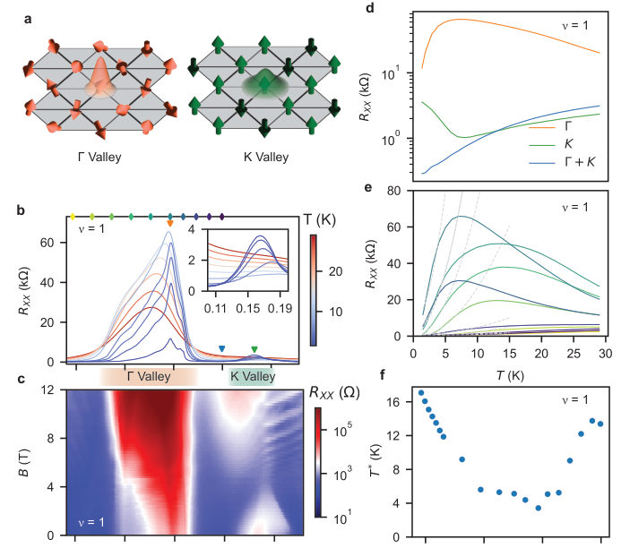
<figcaption class="paper-figure-caption"><b>Fig 3.</b> FIG. 2. Contrasting correlated states in Γ and K valley at moir´e filling ν = 1. (a) Schematic drawing of the Hubbard model on a triangular lattice; the wavefunctions are more localized in the Γ valley than in K, and the spin is more Heisenberg like rather than Ising-like. (b) Rxx vs D at ν = 1 and differnt tempeatures. Γ and K valley occupy different D ranges, as marked. Inset is a zoom-in of the K valley. (c) Rxx vs D and B at ν = 1. (d) Rxx vs T at D = -7, 99, 166 mV/nm, as marked by the colored triangles in (a). (e) Rxx vs T at different displacement fields in the Γ valley as marked by the colored diamonds in (a). Dashed lines are fits of Rxx = R0 + AT 2, which deviates from the data at...</figcaption>
</figure>
<figure class="paper-figure-card">
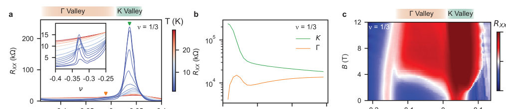
<figcaption class="paper-figure-caption"><b>Fig 4.</b> FIG. 3. Contrasting correlated states in Γ and K valley at moir´e filling ν = 1/3. (a) Rxx vs D at ν = 1/3 and different temperatures, as marked. Inset shows Rxx vs ν at D = −10mV/nm, highlighting maxima at ν = 1/3. (b) Rxx vs T at D = -10, 36 mV/nm, as marked by the colored triangles in (a). (c) Rxx vs D and B at ν = 1/3.</figcaption>
</figure>
<figure class="paper-figure-card">
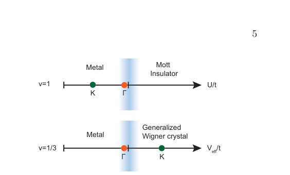
<figcaption class="paper-figure-caption"><b>Fig 5.</b> FIG. 4. Schematic phase diagram of the metal-to-Mott insu- lator transition at ν = 1 and the metal to GWC transition at ν = 1/3. The K valley is in the intermediate interaction regime in terms of U/t at ν = 1 and in the robust GWC regime at ν = 1/3, while the Γ valley states are close to the transition for both.</figcaption>
</figure>

**Summary.** This work investigates how electronic orbital structure dictates quantum phases in twisted WSe$_2$ moiré heterostructures by comparing the K and $\Gamma$ valleys. The authors find that the $\Gamma$-valley is particularly susceptible to strong correlations, exhibiting behavior indicative of proximity to Mott transitions at multiple fillings. This highlights orbital character as a crucial tuning knob for accessing exotic correlated quantum states.

**Why it may be interesting.** The explicit link between orbital character (a structural property) and the resulting many-body physics (Mott vs. CDW) provides a powerful paradigm for understanding correlated phases in engineered quantum materials.

Detailed structure

**Main problem.** The study contrasts how orbital degrees of freedom dictate quantum phases in moiré materials by comparing physics between the K and $\Gamma$ valleys.

**Main result.** The $\Gamma$-valley exhibits distinct correlated behavior, showing a pronounced Pomeranchuk effect near Mott transitions at both $\nu=1$ and $\nu=1/3$, unlike the K-valley's different insulating states.

**Method.** Theoretical analysis combined with experimental diagnostics using transport measurements (resistivity) as a function of filling factor, temperature, and magnetic field.

**Model / system.** The platform is twisted monolayer/bilayer WSe$_2$, where moiré physics is tuned via displacement fields. The comparison hinges on the distinct orbital character ($d_{x^2-y^2} \pm i d_{xy}$ vs. $d_{z^2}$) of the K and $\Gamma$ valleys.

**Key observables.** Resistivity ($R_{xx}$) as a function of moiré filling factor ($\nu$), displacement field ($D$), temperature ($T$), and magnetic field ($B$).

**Important parameters / regimes.** Moiré filling factors $\nu=1$ and $\nu=1/3$; correlation strength ratios like $U/t$.

**Assumptions / limitations.** The system is modeled using concepts from the Hubbard model, comparing different types of correlated insulating states (Mott vs. Wigner crystal).

**Figures summary.** Figures illustrate device structure and schematic phase diagrams showing valley population dependence on $D$ and $\nu$, alongside temperature-dependent resistivity curves contrasting K and $\Gamma$ valley behavior at fixed fillings.

**Paper structure.** The paper systematically compares the correlated states in both valleys across different filling factors, using transport measurements to diagnose proximity to Mott transitions ($\nu=1$) or Wigner crystallization ($\nu=1/3$).

Abstract

Electronic orbital character plays a central role in determining electronic correlations, spin-orbit coupling, dimensionality, and ultimately the quantum phases of condensed-matter systems. Two-dimensional moiré materials have emerged as highly tunable platforms for exploring correlated phenomena, but the role of orbital degrees of freedom remains largely unexplored. Here, we identify twisted monolayer/bilayer WSe$_2$ as a platform in which displacement-field tuning enables moiré physics to be realized in both the $K$ and $Γ$ valleys. The distinct orbital characters of these valleys give rise to contrasting correlated phases at moiré filling factors $ν=1$ and $ν=1/3$. At $ν=1$, the $K$-valley state is a weak insulator, consistent with an antiferromagnetic state near a van Hove singularity in the intermediate-coupling regime, similar to that observed in twisted bilayer WSe$_2$. In contrast, the $Γ$-valley state exhibits a pronounced Pomeranchuk effect, consistent with proximity to a Mott transition. At $ν=1/3$, the $K$ valley hosts a robust generalized Wigner crystal, whereas the $Γ$-valley state lies near the crystallization boundary and again exhibits a Pomeranchuk effect, with localization enhanced by increasing temperature or magnetic field. Our work highlights the importance of orbital character in defining quantum phases in moiré systems, and identify the $Γ$ valley as a promising platform for exploring correlated phenomena near quantum phase transitions, where competing phases and enhanced fluctuations may give rise to unconventional phases.

[↑ back to top](#top)

### [Nonreciprocal Superconducting Transport from Chiral Edge States](http://arxiv.org/abs/2607.18159v1)

**Authors:** Jin-Xing Hou, Yan-Song Song, James Jun He, Song-Bo Zhang  
**Type:** theory · **Category:** other · **PDF:** <https://arxiv.org/pdf/2607.18159v1>  
**Analysis basis:** full PDF text, analyzed in chunks
**Topic relevance:** `Keldysh / 2PI / non-Gaussian methods` **3/5** · `exotic spin models in light-matter` **3/5** · `spintronics-quantum-optics interface` **3/5** · `driven-dissipative phase transition` **2/5** · `methods for driven-dissipative` **2/5** · `non-equilibrium dynamics` **2/5** · `Kondo & dissipative impurity` **1/5** · `analog quantum simulation` **1/5** · `interference shaping light` **1/5** · `non-equilibrium universality` **1/5**

↔ Scroll figures horizontally

<figure class="paper-figure-card">
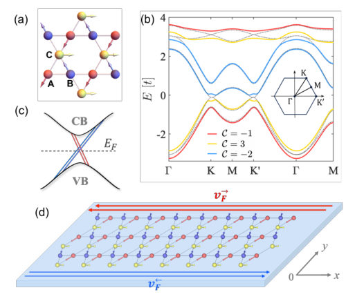
<figcaption class="paper-figure-caption"><b>Fig 1.</b> Fig. 1. (a) Schematic of the chiral kagome antiferromagnet with three sublattices (A, B, C) and coplanar 120◦magnetic order (colored arrows). (b) Bulk band structure along high- symmetry lines of the Brillouin zone (inset) for J = 0.6t and Mz = 0.2t. Bands are colored by their Chern numbers; dashed gray curves show the spectrum for Mz = 0. An out-of-plane spin canting Mz opens a bulk gap with nonzero Chern number. The reference energy is set at the Dirac point without magnetic order. (c) Schematic of chiral edge states traversing the bulk gap with inequivalent dispersions at opposite edges. Black curves denote the conduction (CB) and valence band (VB). (d) Ribbon geometry with an...</figcaption>
</figure>
<figure class="paper-figure-card">
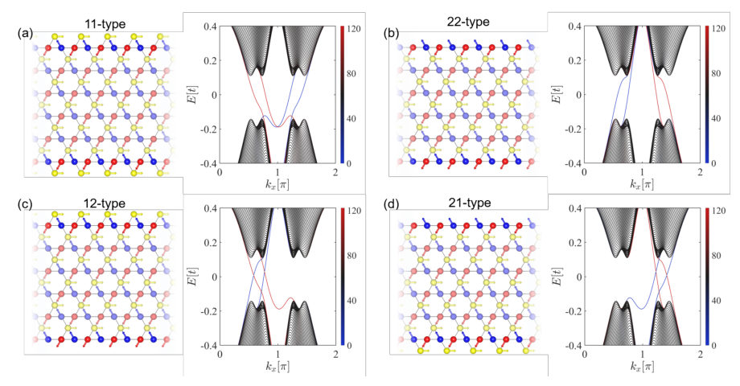
<figcaption class="paper-figure-caption"><b>Fig 2.</b> Fig. 2. (a) Left: Schematic of a chiral kagome antiferromagnet ribbon with 11-type boundary termination in the y direction (i.e., where both the upper and lower edges terminate on one sublattice). Right: Energy spectrum for J = 0.6t and Mz = 0.2t. The colorbar represents the expectation value of the position operator ⟨ˆy⟩(in units of √</figcaption>
</figure>
<figure class="paper-figure-card">
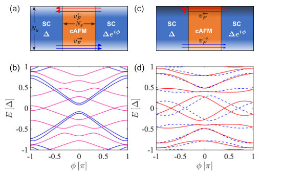
<figcaption class="paper-figure-caption"><b>Fig 3.</b> Fig. 3. Andreev spectrum of an SNS junction with a chiral antiferromagnetic spacer under an out-of-plane spin canting Mz. (a) Schematic of a junction oriented along the x direction with symmetric transverse boundaries, corresponding to the 11- or 22-type termination. The cAFM spacer has length Nx (in units of lattice constant a) in the transport (x) di- rection and width Ny (in units of √</figcaption>
</figure>
<figure class="paper-figure-card">
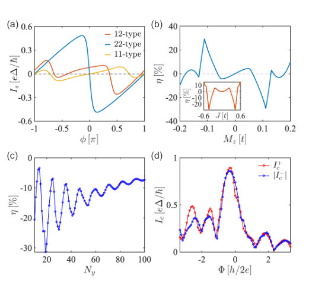
<figcaption class="paper-figure-caption"><b>Fig 4.</b> Fig. 4. (a) CPR of the SNS junction for different transverse boundary terminations, with J = 0.4t, Mz = 0.1t and Ny = 10. The asymmetric 12-type termination gives rise to an asym- metric CPR, yielding unequal forward and backward critical currents, I+ c ̸= |I− c |, and a diode efficiency η = −20.58%. (b) Diode efficiency η as a function of Mz for J = 0.4t and Ny = 10. Inset: η as a function of J for Mz = 0.1t and Ny = 10. (c) η as a function of Ny for J = 0.4t and Mz = 0.1t. (d) Direction-dependent Fraunhofer pattern, showing I+ c and |I− c | as functions of magnetic flux Φ (in units of h/2e) for J = 0.4t, Mz = 0.1t and Ny = 60. Other parameters are µ = −0.1t, Nx = 10, ∆= 0.03t and T =...</figcaption>
</figure>

**Summary.** The paper demonstrates that nonreciprocal supercurrents can be engineered in chiral antiferromagnets not through bulk asymmetry, but by controlling the boundary termination of their topological edge states. By creating an asymmetric edge structure, researchers predict measurable effects like a Josephson diode effect and anomalous interference patterns, offering a new route for superconducting device design.

**Why it may be interesting.** This work provides a concrete, tunable mechanism—boundary engineering—to realize superconducting diodes using topological magnetic materials, which is highly relevant for developing novel quantum electronic components.

Detailed structure

**Main problem.** The study aims to establish a microscopic, boundary-controlled mechanism for achieving nonreciprocal superconducting transport (superconducting diode effect), moving beyond reliance on bulk electronic asymmetries.

**Main result.** Boundary engineering via sublattice-dependent termination in chiral kagome antiferromagnets generates transverse edge state asymmetry, which directly causes observable nonreciprocal signatures like asymmetric Andreev spectra and a Josephson diode effect.

**Method.** The analysis employs Green function techniques to calculate Andreev bound-state spectra and supercurrents for superconducting Josephson junctions placed over the magnetic material.

**Model / system.** The model utilizes chiral kagome antiferromagnets, whose bulk gap is opened by breaking $\mathcal{T}\mathcal{M}_z$ symmetry (e.g., via spin canting or SOC). The key physics arises from the boundary termination asymmetry across the lattice sublattices.

**Key observables.** Asymmetric Andreev spectra ($E(\phi) 
eq E(-\phi)$), non-reciprocal supercurrents leading to unequal critical currents ($I_c^+ 
eq |I_c^-|$), and direction-dependent Fraunhofer interference patterns.

**Important parameters / regimes.** Out-of-plane spin canting magnitude ($M_z$), junction width ($N_y$), and the specific type of boundary termination (symmetric vs. asymmetric).

**Assumptions / limitations.** The Fermi level is assumed to lie within the bulk topological gap, allowing chiral edge states to dominate transport.

**Figures summary.** Figures illustrate the band structure showing Chern numbers and chiral edge states; they compare Andreev spectra for symmetric versus asymmetric terminations, demonstrating spectral asymmetry in the latter case. Further figures show non-reciprocal supercurrents and direction-dependent interference patterns.

**Paper structure.** The paper first establishes the theoretical framework using a Hamiltonian for cAFMs to open a topological gap. It then focuses on how boundary termination breaks symmetry, leading to distinct edge states. Finally, it applies this understanding to calculate measurable quantities in an SNS junction (Andreev spectra, CPR) to confirm the diode effect.

Abstract

Nonreciprocal superconducting transport enables dissipationless rectification and has attracted considerable interest, yet its microscopic origin is typically sought in bulk electronic states. Here, we show that boundary-controlled chiral edge states in topological systems provide a simple yet largely overlooked mechanism for nonreciprocal superconducting transport. Focusing on chiral kagome antiferromagnets, we demonstrate that out-of-plane spin canting or spin-orbit coupling opens a high-Chern-number bulk gap, giving rise to multiple chiral edge modes. Strikingly, sublattice-dependent boundary termination selects a single-valley character for the edge states, leading to asymmetric edge spectra at opposite edges. This boundary asymmetry directly yields observable nonreciprocal signatures in Josephson junctions oriented transverse to the edges, including asymmetric Andreev spectra, Josephson diode effect, and anomalous Fraunhofer interference patterns. These findings broaden the microscopic understanding of superconducting nonreciprocity and highlight boundary engineering as a tunable route toward superconducting diode devices.

[↑ back to top](#top)

### [Quantum-metric-driven light-induced ferrovalley state in d-wave altermagnets](http://arxiv.org/abs/2607.17049v1)

**Authors:** Shihao Zhang  
**Type:** theory · **Category:** other · **PDF:** <https://arxiv.org/pdf/2607.17049v1>  
**Analysis basis:** full PDF text, analyzed in chunks
**Topic relevance:** `exotic spin models in light-matter` **3/5** · `methods for driven-dissipative` **3/5** · `non-equilibrium dynamics` **3/5** · `spintronics-quantum-optics interface` **3/5** · `analog quantum simulation` **2/5** · `driven-dissipative phase transition` **2/5** · `Keldysh / 2PI / non-Gaussian methods` **1/5** · `non-equilibrium universality` **1/5**

↔ Scroll figures horizontally

<figure class="paper-figure-card">
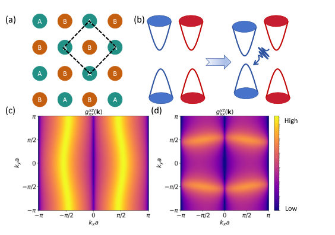
<figcaption class="paper-figure-caption"><b>Fig 1.</b> FIG. 1. Schematic of the quantum-metric-driven ferrovalley mechanism. (a) Square-lattice d-wave altermagnet with sub- lattices A (green) and B (red). (b) Under Floquet driving of x-direction linear polarized light, the dxz gap is remarkably reduced while the dyz gap remains essentially unchanged, pro- ducing a ferrovalley state with pronounced gap imbalance. Quantum metric gxx(k) in the first Brillouin zone for (c) dxz and (d) dyz orbitals with Vπ = 1.0 eV, Vδ = 0.15 eV, |Ds| = 0.25 eV.</figcaption>
</figure>
<figure class="paper-figure-card">
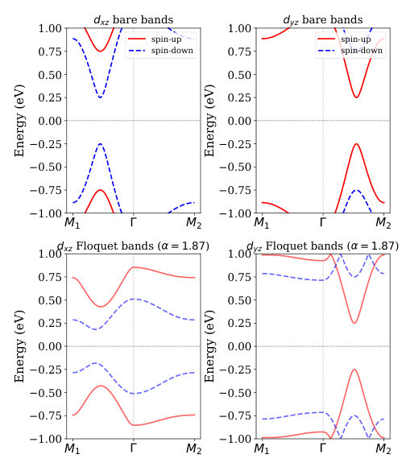
<figcaption class="paper-figure-caption"><b>Fig 2.</b> FIG. 2. Floquet driving electronic structures. The energy bands of (a) dxz orbit and (b) dxz orbit without Floquet driv- ing, and Floquet bands with driving strength α = 1.87. Here Vπ = 1.0 eV, Vδ = 0.15 eV, |Ds| = 0.25 eV, and ℏω = 2.0 eV.</figcaption>
</figure>
<figure class="paper-figure-card">
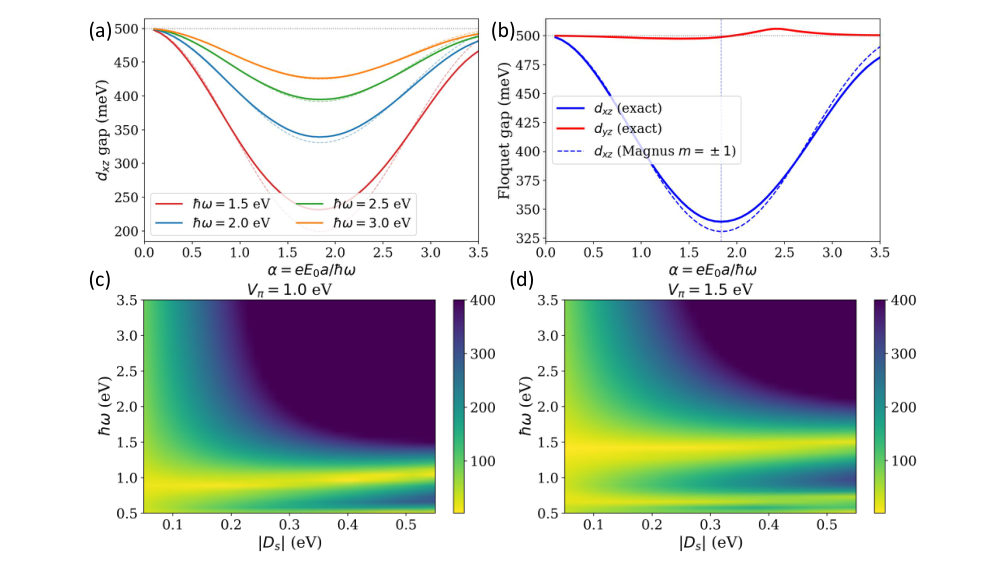
<figcaption class="paper-figure-caption"><b>Fig 3.</b> FIG. 3. Floquet gap evolution and Floquet phase diagram. (a) Floquet bandgaps of dxz orbital for different photon energies and different α values. Solid lines refer to the numerical results, and dashed lines represent the Magnus results. Here Vπ = 1.0 eV, Vδ = 0.15 eV, and |Ds| = 0.25 eV. (b) Comparison of Floquet bands for dxz orbital and dyz orbital. Here photon energy is ℏω = 0.2 eV. Floquet phase diagram with α = 1.87 in the (|Ds|, ℏω) plane for (c) Vπ = 1.0 eV, Vδ = 0.15 eV, and (d) Vπ = 1.5 eV, Vδ = 0.15 eV.</figcaption>
</figure>

**Summary.** The paper demonstrates that in d-wave altermagnets, the quantum metric—a purely geometric quantity—can be uniquely probed using off-resonant laser light. By exploiting the system's inherent vanishing Berry curvature, the authors show that the resulting band gap renormalization is entirely dictated by this quantum metric, offering a novel diagnostic tool for condensed matter physics.

**Why it may be interesting.** This work provides a clean, tunable platform (d-wave altermagnets) where complex geometric effects can be isolated by symmetry constraints, making it highly relevant for understanding light-matter interaction in topological/geometric materials.

Detailed structure

**Main problem.** The central challenge is isolating the pure quantum metric from the Berry curvature when analyzing geometric properties in quantum materials.

**Main result.** In d-wave altermagnets, light-induced driving creates a ferrovalley state where the gap renormalization is found to be governed *exclusively* by the quantum metric, with no contribution from the Berry curvature.

**Method.** The authors use the Magnus expansion and exact Floquet diagonalization on a tight-binding model subjected to time-periodic laser fields.

**Model / system.** The system is modeled using d-wave altermagnets (a class of materials whose real Hamiltonian has zero Berry curvature) described by an effective two-orbital tight-binding Hamiltonian.

**Key observables.** Quantum metric ($g_{\mu
u}$), ferrovalley gap difference ($\Delta E_{xz} - 	ext{yz}$), and the resulting band-gap renormalization ($\Delta E_{	ext{Magnus}}$).

**Important parameters / regimes.** Light polarization, driving amplitude ($\alpha$), and orbital hopping anisotropy ($V_\pi/V_\delta$).

**Assumptions / limitations.** The analysis relies on the Magnus expansion converging for certain parameters, and that the system Hamiltonian is real, leading to vanishing Berry curvature.

**Figures summary.** Figures schematically show how light driving selectively reduces the $d_{xz}$ gap while leaving the $d_{yz}$ gap largely unchanged, establishing the ferrovalley state. They also compare bare vs. Floquet-driven electronic structures.

**Paper structure.** The paper establishes the theoretical framework by noting that vanishing Berry curvature simplifies the coupling mechanism. It then derives the gap renormalization using Magnus theory, showing its direct proportionality to $g_{\mu
u}$, and finally discusses the experimental signatures via polarization dependence.

Abstract

Isolating the quantum metric from the Berry curvature remains a central challenge in quantum materials, as the two geometric quantities nearly always coexist and their contributions are difficult to disentangle. We show that d-wave altermagnets, whose real Hamiltonian possesses strictly vanishing Berry curvature, constitute an ideal platform for overcoming this obstacle. Using the Magnus expansion and exact Floquet diagonalization, we demonstrate that linearly polarized off-resonant light drives an orbital-selective ferrovalley phase through a purely quantum-metric--mediated band-gap renormalization, with no Berry curvature contribution at any order. The orbital selectivity originates from the hopping anisotropy, which generates a pronounced metric anisotropy between the $d_{xz}$ and $d_{yz}$ orbitals, and the gap reduction is expressed analytically in terms of the quantum metric. The resulting valley gap difference provides a direct, quantitative measure of the quantum metric, accessible to spin-resolved ARPES and optical pump-probe spectroscopy. This establishes d-wave altermagnets as a pristine, tunable platform in which quantum metric effects can be isolated, controlled by light polarization, and read out through valley polarization.

[↑ back to top](#top)

### [Phase-field modeling of TiO2 nanocarving via reaction with hydrogen-bearing gas](http://arxiv.org/abs/2607.18172v1)

**Authors:** Alireza Seifi, Sheikh Akbar, Yanzhou Ji  
**Type:** theory · **Category:** statistical mechanics · **PDF:** <https://arxiv.org/pdf/2607.18172v1>  
**Analysis basis:** full PDF text, analyzed in chunks
**Topic relevance:** `driven-dissipative phase transition` **3/5** · `methods for driven-dissipative` **3/5** · `non-equilibrium dynamics` **3/5** · `Keldysh / 2PI / non-Gaussian methods` **2/5** · `non-equilibrium universality` **2/5** · `Frenkel-Kontorova` **1/5** · `analog quantum simulation` **1/5** · `correlated / nonlocal dissipation` **1/5**

↔ Scroll figures horizontally

<figure class="paper-figure-card">
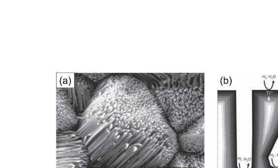
<figcaption class="paper-figure-caption"><b>Fig 1.</b> Figure 1: (a) Formation of TiO2 nanofibers by nanocarving (adapted from [1]); (b) Illustration of the key reaction and diffusion processes during nanocarving (adapted from [1]).</figcaption>
</figure>
<figure class="paper-figure-card">
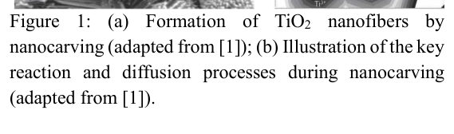
<figcaption class="paper-figure-caption"><b>Fig 2.</b> Figure 2(a), TiO2 surface energies have been quantified as anisotropic [3]. The (001) surface energy</figcaption>
</figure>
<figure class="paper-figure-card">
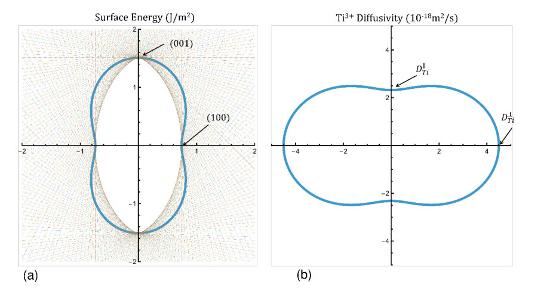
<figcaption class="paper-figure-caption"><b>Fig 3.</b> Figure 2: Anisotropies in (a) TiO2 surface energy and (b) Ti3+ diffusivity in the [100]-[001] plane. The dashed lines in (a) show the Wulff construction process. Their inner envelope shows the equilibrium crystal morphology.</figcaption>
</figure>
<figure class="paper-figure-card">
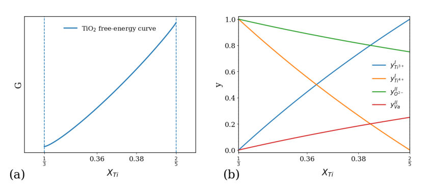
<figcaption class="paper-figure-caption"><b>Fig 4.</b> Figure 3: (a) TiO2 molar Gibbs free energy as a function of Ti composition at T = 1000 K; (b) Sublattice site fractions as functions of Ti composition.</figcaption>
</figure>
<figure class="paper-figure-card">
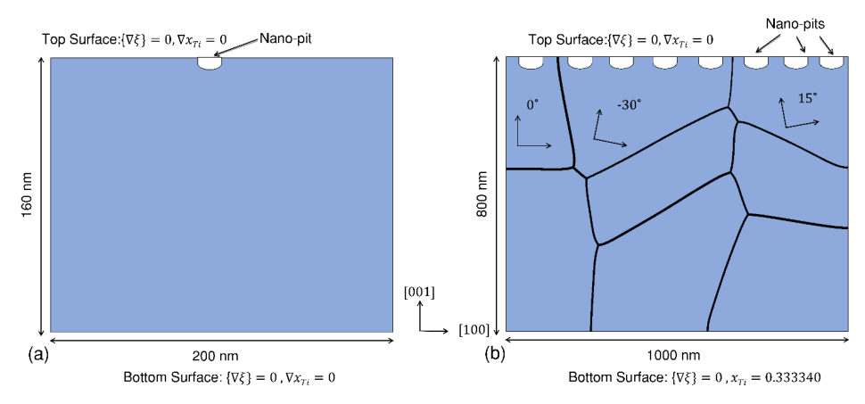
<figcaption class="paper-figure-caption"><b>Fig 5.</b> Figure 4: Initial and boundary conditions for 2-D PF simulations in the [100]-[001] plane: (a) Single crystal; (b) Polycrystal. The axes and angles inside each surface grain in (b) indicate the grain misorientation with respect to the global [100]-[001] reference frame.</figcaption>
</figure>

**Summary.** This work develops a detailed 2D phase-field model to simulate how TiO2 undergoes reductive nanocarving using hydrogen gas. By incorporating anisotropic factors into the model, the authors systematically determine that reaction rate anisotropy is the primary physical mechanism responsible for forming highly directional nanowire structures observed in experiments.

**Why it may be interesting.** While focused on materials science, the use of complex coupled partial differential equations (phase-field modeling) to describe non-equilibrium thermodynamic processes and microstructure evolution is highly relevant to many-body dynamics simulations in condensed matter theory.

Detailed structure

**Main problem.** The study aims to understand the origin of the strongly anisotropic nanowire morphology observed during TiO2 nanocarving via reductive reactions with hydrogen-bearing gases.

**Main result.** Systematic simulations suggest that strong reaction rate anisotropy is the dominant factor controlling the formation of experimentally observed nanowire morphologies.

**Method.** A 2-D phase-field model is formulated to simulate the coupled processes of TiO2 reduction, Ti3+ diffusion, and anisotropic surface energy effects during nanocarving.

**Model / system.** The physical system is TiO2 undergoing reductive carving using H2-bearing gases. The model employs a sublattice approach for nonstoichiometric rutile TiO2, governed by coupled phase-field equations incorporating reaction kinetics and diffusion.

**Key observables.** Nanocarving morphology (e.g., aspect ratio), local Ti composition ($x_{	ext{Ti}}$), and the overall reduction free energy ($\Delta G_r$).

**Important parameters / regimes.** Anisotropy factors in surface energy, diffusivity, and reaction rate; gas partial pressures ($	ext{p}_{	ext{H}_2	ext{O}}/	ext{p}_{	ext{H}_2}$); temperature ($700^\circ	ext{C}-1000 	ext{ K}$).

**Assumptions / limitations.** The model assumes that grain growth is negligible and that carving initiates at the surface and stops at Grain Boundaries.

**Figures summary.** Figures illustrate TiO2 nanofiber formation, aspect ratio evolution under varying anisotropies (Isotropic vs. Interfacial Energy Anisotropy), and thermodynamic maps showing reduction favorability ($\Delta G_r$) as a function of composition and gas ratio.

**Paper structure.** The paper builds thermodynamically by first defining the Gibbs free energy using a sublattice model, deriving chemical potentials for all species, then calculating the overall reaction free energy change ($\Delta G_r$), and finally coupling this into a 2-D phase-field simulation to track morphology evolution.

Abstract

TiO2 nanocrystals can be fabricated by carving the TiO2 bulk polycrystals using reductive H2-bearing gases, yielding single-crystal [001] nanowire arrays. However, the origin of the strongly anisotropic nanowire morphology during nanocarving remains largely unexplored. In this study, we formulate a 2-D phase-field model to investigate the TiO2 morphology evolution during nanocarving processes. The model incorporates TiO2 reduction reaction, Ti3+ diffusion, and anisotropies in surface energy, diffusivity and reaction rate. Through systematic simulations in both single- and poly-crystals, we elucidate the roles of different anisotropy factors in nanocrystal morphologies at different carving stages, identifying the strong reaction rate anisotropy as the dominant factor for experimentally observed nanowire morphologies. We further explore the effect of grain misorientation angle, generating a nanocarving morphology map to guide grain orientation control. This study provides insights into microstructure evolution mechanisms during nanocarving and guidances for related microstructure control.

[↑ back to top](#top)

### [Microscopic Origin of Dephasing in Solids from First-Principles Electron-Phonon Interactions](http://arxiv.org/abs/2607.17109v1)

**Authors:** Atsushi Yamada, Kazuhiro Yabana  
**Type:** theory · **Category:** other · **PDF:** <https://arxiv.org/pdf/2607.17109v1>  
**Analysis basis:** full PDF text, analyzed in chunks
**Topic relevance:** `methods for driven-dissipative` **3/5** · `non-equilibrium dynamics` **3/5** · `Keldysh / 2PI / non-Gaussian methods` **2/5** · `driven-dissipative phase transition` **2/5** · `Kondo & dissipative impurity` **1/5** · `analog quantum simulation` **1/5** · `correlated / nonlocal dissipation` **1/5** · `entanglement & information structure` **1/5** · `non-equilibrium universality` **1/5**

↔ Scroll figures horizontally

<figure class="paper-figure-card">
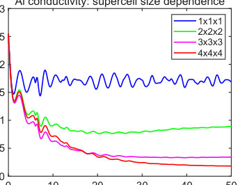
<figcaption class="paper-figure-caption"><b>Fig 1.</b> FIG. 1. Time-domain conductivity σ(t) of Al at 300 K cal- culated using primitive and supercell simulations. Supercells exhibit exponential damping with a characteristic timescale of τ ∼10 fs.</figcaption>
</figure>
<figure class="paper-figure-card">
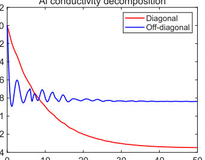
<figcaption class="paper-figure-caption"><b>Fig 2.</b> FIG. 2. Decomposition of the conductivity into diagonal (population) and off-diagonal (coherence) contributions. The diagonal term dominates the damping.</figcaption>
</figure>
<figure class="paper-figure-card">
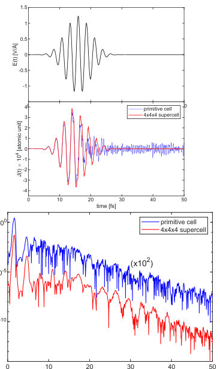
<figcaption class="paper-figure-caption"><b>Fig 3.</b> FIG. 3. (Top) applied field and induced current for primitive- cell and supercell calculations; (bottom) corresponding high- harmonic spectra. Electron–phonon-induced disorder sup- presses spurious oscillations and yields well-defined harmonic peaks.</figcaption>
</figure>

**Summary.** This work microscopically investigates how electron-phonon coupling causes dephasing in crystalline solids using real-time TDDFT. By comparing supercell and primitive-cell calculations, the authors demonstrate that damping arises mainly from population dynamics rather than coherence decay. This provides a crucial theoretical refinement for modeling open quantum systems in condensed matter.

**Why it may be interesting.** It provides a rigorous, first-principles understanding of decoherence in solids, showing that complex many-body effects can emerge from simple population dynamics rather than just coherence decay, which is highly relevant for open quantum systems modeling.

Detailed structure

**Main problem.** The paper aims to determine the microscopic origin of dephasing (decoherence) in solids, specifically attributing it to electron-phonon interactions.

**Main result.** Dephasing is shown to be governed primarily by population dynamics (diagonal elements) rather than off-diagonal coherence decay when analyzed via a primitive-cell density matrix. Furthermore, supercell calculations naturally reproduce expected damping timescales without needing empirical parameters.

**Method.** The study employs real-time Time-Dependent Density Functional Theory (rt-TDDFT) within the Williams-Lax formalism, propagating dynamics using supercells with displaced ionic positions.

**Model / system.** The system is solid-state materials (metals like Al and dielectrics like Si), where electron dynamics are coupled to lattice vibrations (phonons). The analysis compares results from large supercells versus the primitive cell representation.

**Key observables.** Time-dependent conductivity $\sigma(t)$, Drude-like damping, and spectral features in High-Harmonic Generation (HHG) spectra.

**Important parameters / regimes.** Phonon amplitudes sampled from zero-point motion; temperature (e.g., 300 K); supercell sizes ($2\times2\times2$ up to $4\times4\times4$).

**Assumptions / limitations.** The adiabatic approximation is used, treating ionic positions as frozen during the femtosecond electron dynamics.

**Figures summary.** Figures compare $\sigma(t)$ for different supercell sizes in Al and Si, demonstrating exponential damping in larger cells. HHG spectra comparisons show that supercells yield cleaner harmonic peaks than primitive-cell calculations.

**Paper structure.** The paper establishes the problem using rt-TDDFT/Williams-Lax framework, analyzes linear response (conductivity) by comparing supercell vs. primitive cell results to pinpoint the source of damping, and extends the analysis to nonlinear responses like HHG.

Abstract

Electron-phonon interactions provide a microscopic origin of effective dephasing in solids within real -time TDDFT via a time-domain Williams-Lax framework. In metals, Drude -like damping emerges from a single disordered configuration; in dielectrics, the same mechanism yields clean high-harmonic spectra without introducing ultrashort phenomenological dephasing times. Mapping supercell dynamics onto a primitive-cell density matrix reveals that dephasing is governed primarily by population dynamics (diagonal elements) rather than by the decay of off-diagonal coherence.

[↑ back to top](#top)

### [Spin relaxation in $X$-wave magnets with $X=p, d, f, g, i$](http://arxiv.org/abs/2607.17807v1)

**Authors:** Lijie Liu, Mingbo Dou, Xu Chen, Xianjie Wang, M. Ye. Zhuravlev, A. V. Nikolaev, L. L. Tao  
**Type:** theory · **Category:** other · **PDF:** <https://arxiv.org/pdf/2607.17807v1>  
**Analysis basis:** full PDF text, analyzed in chunks
**Topic relevance:** `Keldysh / 2PI / non-Gaussian methods` **3/5** · `methods for driven-dissipative` **3/5** · `spintronics-quantum-optics interface` **3/5** · `non-equilibrium dynamics` **2/5** · `correlated / nonlocal dissipation` **1/5** · `driven-dissipative phase transition` **1/5** · `exotic spin models in light-matter` **1/5**

↔ Scroll figures horizontally

<figure class="paper-figure-card">
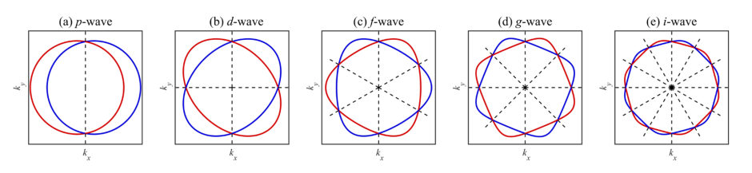
<figcaption class="paper-figure-caption"><b>Fig 1.</b> FIG. 1. Schematic Fermi contours for the 2D p-wave magnet (a), d-wave magnet (b), f-wave magnet (c), g-wave magnet (d), and i-wave magnet (e). Red and blue contour lines denote two spin channels. The dashed lines indicate node lines along which the spin splitting vanishes.</figcaption>
</figure>
<figure class="paper-figure-card">
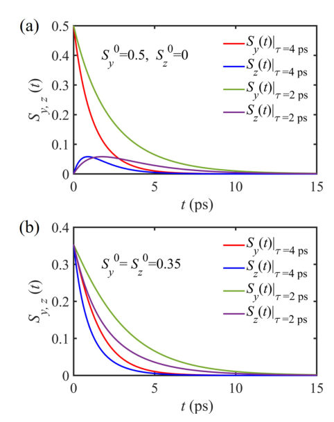
<figcaption class="paper-figure-caption"><b>Fig 2.</b> FIG. 2. The temporal evolution of the spin components Sy and Sz for the p-wave magnet for S0 y = 0.5, S0 z = 0 (a) and S0 y = S0 z = 0.35 (b) with different τ’s. The other parameters are assumed to be m = 0.5 m0 (m0 for electron rest mass), kF = 0.1 ˚A−1, α = 2.0 meV ˚A and ∆= 1.0 meV ˚A.</figcaption>
</figure>

**Summary.** This paper theoretically investigates spin relaxation in various types of X-wave magnets ($p, d, f, g, i$) relevant to spintronics. Using the D'yakonov-Perel' mechanism, the authors calculate the spin decoherence rates, finding distinct symmetry behaviors across different wave symmetries. The results provide a deeper understanding of how material structure dictates spin lifetime in these advanced magnetic systems.

**Why it may be interesting.** This work provides fundamental theoretical insights into spin relaxation dynamics in novel magnetic materials using advanced transport theory, which is crucial for designing next-generation spintronic devices.

Detailed structure

**Main problem.** The study investigates spin relaxation mechanisms, which cause spin decoherence and limit the spin lifetime in spintronic devices.

**Main result.** The authors found that for $d$-, $f$-, $g$-, and $i$-wave magnets, the reciprocal spin-relaxation-time matrices are anisotropic and diagonal when the Néel vector is along [001].

**Method.** The analysis employs the D'yakonov-Perel' mechanism within a kinetic equation framework, solving for the tensor of reciprocal spin relaxation times.

**Model / system.** The system models 2D $X$-wave magnets ($p, d, f, g, i$) incorporating Rashba spin-orbit coupling and an effective Zeeman term. The dynamics are governed by a kinetic equation derived from Boltzmann transport theory.

**Key observables.** The tensor of reciprocal spin relaxation times (1/tau_ij) and the temporal evolution of the averaged spin vector S(t).

**Important parameters / regimes.** Rashba SOC strength ($\alpha$), momentum relaxation time ($	au$), and altermagnetic spin-split strengths ($\Delta$).

**Assumptions / limitations.** The analysis focuses on the $q=0$ limit, describing uniform distribution and coherent precession; it also assumes a specific Néel vector direction for initial calculations.

**Figures summary.** Figure 1 schematically shows Fermi contours for the five wave types, indicating node lines where spin splitting vanishes. Figure 2 illustrates the temporal decay of spin components for the $p$-wave magnet.

**Paper structure.** The paper systematically calculates the general matrix form of the relaxation tensor ($D_{SO}$), applies this to specific symmetry cases ($d, f, g, i$ vs. $p$), derives explicit time evolution solutions for the $p$-wave case, and concludes with detailed calculations for correlation functions in $g$- and $i$-wave magnets.

Abstract

Spin relaxation results in the spin decoherence and a finite spin lifetime, which are detrimental to spintronic devices. To achieve a long spin lifetime desirable for spintronic devices, elucidating the spin relaxation mechanism and factors influencing the spin lifetime is of vital importance. Here, we investigate the spin relaxation in $X$-wave magnets ($X=p, d, f, g, i$) with Rashba spin-orbit coupling within the framework of D'yakonov-Perel' mechanism. We calculate the general matrix of the spin relaxation time for an arbitrary Néel vector direction of the $X$-wave magnet. As an illustration, we study the spin relaxation for the Néel vector along the $[001]$ direction. It is found that the reciprocal spin-relaxation-time matrices are anisotropic and diagonal for the $d$-, $f$-, $g$- and $i$-wave magnets. For the $p$-wave magnet, we derive the analytical expressions for the temporal evolution of spins. Moreover, the spin relaxation rate is proportional to the momentum relaxation time, Rashba and altermagnetic spin-split strengths for all $X$-wave magnets. Our results shine more light on the fundamental understanding of the spin relaxation mechanism in $X$-wave magnets.

[↑ back to top](#top)

### [Electrical Control of Altermagnetism in a Quasi-1D Magnet](http://arxiv.org/abs/2607.16856v1)

**Authors:** Alberto M. Ruiz, Cuiju Yu, Diego López-Alcalá, Jose L. Lado, Adolfo O. Fumega, José J. Baldoví  
**Type:** theory · **Category:** other · **PDF:** <https://arxiv.org/pdf/2607.16856v1>  
**Analysis basis:** full PDF text, analyzed in chunks
**Topic relevance:** `exotic spin models in light-matter` **3/5** · `spintronics-quantum-optics interface` **3/5** · `driven-dissipative phase transition` **2/5** · `Frenkel-Kontorova` **1/5** · `Keldysh / 2PI / non-Gaussian methods` **1/5** · `analog quantum simulation` **1/5** · `methods for driven-dissipative` **1/5** · `non-equilibrium dynamics` **1/5**

↔ Scroll figures horizontally

<figure class="paper-figure-card">
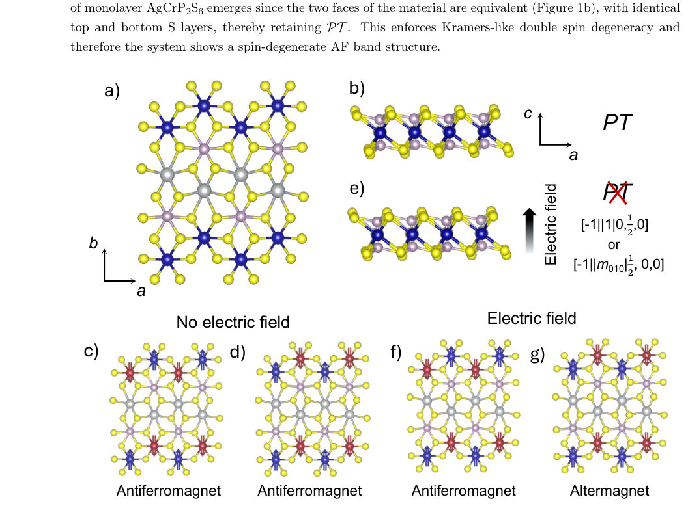
<figcaption class="paper-figure-caption"><b>Fig 1.</b> Figure 1. a) Top view of monolayer AgCrP2S6. Color code: Ag (gray), Cr (dark blue), P (pale violet) and S (yellow). b) Side view of monolayer AgCrP2S6. c,d) Top views of the interchain AF and FM configurations, respectively, in pristine AgCrP2S6. Blue and red Cr atoms denote spin up and spin down states, respectively, with arrows indicating the spin direction. e) Side view of monolayer AgCrP2S6 under an out-of-plane electric field. f,g) Corresponding top views of the AF and FM interchain configurations under the applied field, respectively.</figcaption>
</figure>
<figure class="paper-figure-card">
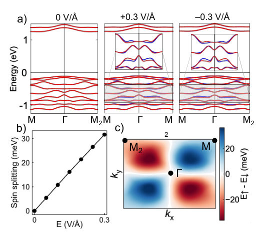
<figcaption class="paper-figure-caption"><b>Fig 2.</b> Figure 2. a) Electronic band structures of pristine AgCrP2S6 and AgCrP2S6 under out-of-plane electric fields of +0.3 V/Å and −0.3 V/Å, from left to right, respectively. Blue and red color in the band structure denote spin up and spin down states, respectively. b) Evolution of the maximum spin splitting near the Fermi level as a function of the applied electric field. c) Momentum-resolved maximum spin splitting under an electric field of +0.3 V/Å.</figcaption>
</figure>
<figure class="paper-figure-card">
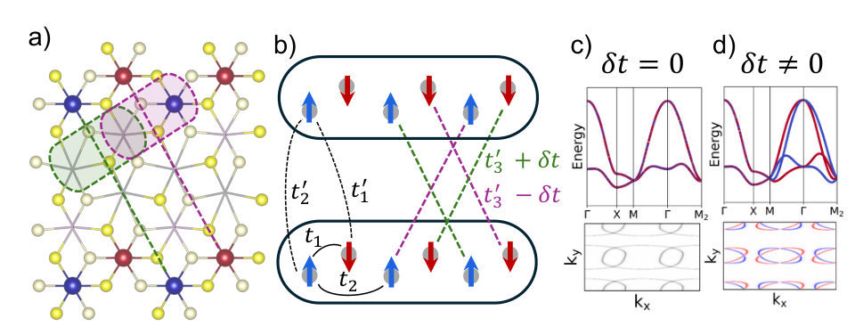
<figcaption class="paper-figure-caption"><b>Fig 3.</b> Figure 3. a) Top view of monolayer AgCrP2S6 highlighting in green and purple the two inequivalent local environments associated with the third-neighbor interchain hopping pathways. Bottom-layer S atoms are shown in lighter yellow to illustrate the effect of the out-of-plane electric field and highlight their inequiva- lence with respect to the top-layer S atoms. Blue and red balls represent spin up and spin down Cr sites, respectively. b) Schematic representation of the intrachain t and interchain t′ hoppings included in the tight-binding model. c) Electronic band structure and corresponding Fermi surface obtained for direction- ally equivalent t′ 3. d) Electronic band structure and...</figcaption>
</figure>
<figure class="paper-figure-card">
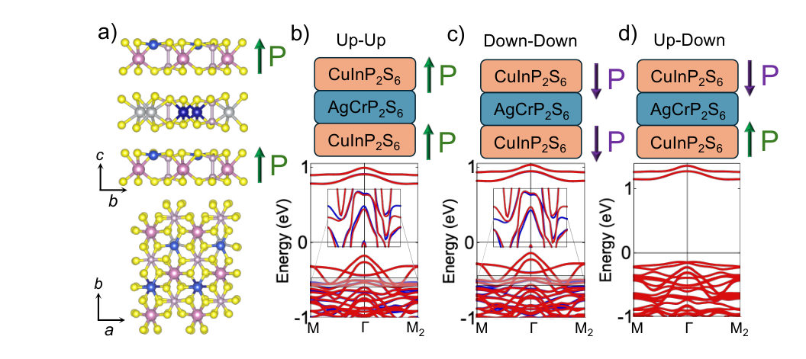
<figcaption class="paper-figure-caption"><b>Fig 4.</b> Figure 4. a) Side and top views of the CuInP2S6/AgCrP2S6/CuInP2S6 heterostructure, shown for the up-up configuration. Color code: Cu (light blue), In (pink), Ag (gray), Cr (dark blue), P (pale violet) and S (yellow).b–d) Schematic representation of the three polar configurations and their corresponding electronic band structures: b) up-up, c) down-down and d) up-down, with up-up, down-down and up-down denoting parallel upward, parallel downward and antiparallel polarizations, respectively. Blue and red color in the band structure indicate spin up and spin down states, respectively.</figcaption>
</figure>

**Summary.** This work establishes $	ext{AgCrP}_2	ext{S}_6$ as a novel platform for studying altermagnetism in quasi-1D magnets. By applying an out-of-plane electric field, the authors demonstrate electrical control over the magnetic state, inducing a measurable d-wave spin splitting. This mechanism is further generalized using chemical and ferroelectric interfaces to achieve polarization-controlled magnetism.

**Why it may be interesting.** While focused on condensed matter magnetism, the concept of electrically controlling spin splitting via symmetry breaking is highly relevant to quantum materials research that seeks electrical control over quantum states, bridging concepts from spintronics and topological physics.

Detailed structure

**Main problem.** The study aims to extend the understanding of altermagnetism, a momentum-dependent spin splitting, from 2D/3D systems to quasi-one-dimensional (quasi-1D) magnets and demonstrate its electrical control.

**Main result.** The authors show that an out-of-plane electric field can induce a nonrelativistic d-wave altermagnetic spin texture in $	ext{AgCrP}_2	ext{S}_6$, which is also controllable via chemical substitution or ferroelectric interfaces.

**Method.** The research combines first-principles calculations (DFT) with symmetry analysis and the construction of an effective tight-binding model to rationalize the magnetic response.

**Model / system.** The primary system is monolayer $	ext{AgCrP}_2	ext{S}_6$, which features quasi-1D antiferromagnetic chains coupled in a 2D lattice. The control mechanisms involve applying external electric fields, performing Janus substitutions, or interfacing with ferroelectric materials.

**Key observables.** Momentum-dependent spin splitting magnitude (up to $32 	ext{ meV}$), sign reversal of the splitting upon field reversal, and confirmation of a d-wave texture in the band structure.

**Important parameters / regimes.** Out-of-plane electric field strength ($E_{\perp}$), anisotropic third-neighbor interchain hopping ($\delta t$), and polarization state (e.g., up-up vs. down-down).

**Assumptions / limitations.** The analysis relies on DFT calculations and effective tight-binding models, focusing specifically on the symmetry-allowed ferromagnetic interchain alignment for altermagnetism.

**Figures summary.** Figures illustrate the structural changes under electric fields, showing band structures that transition from spin-degenerate to exhibit a d-wave spin splitting dependent on field polarity. Momentum maps confirm the d-wave nature of the texture.

**Paper structure.** The paper establishes the theoretical framework by analyzing symmetry requirements for altermagnetism in quasi-1D systems. It then details the electrical control mechanism using $	ext{AgCrP}_2	ext{S}_6$ under an external field, followed by extensions to chemical (Janus) and interfacial engineering with ferroelectrics.

Abstract

Altermagnetism is a collinear magnetic state characterized by momentum-dependent spin splitting in fully compensated materials. While widely investigated in systems governed by three- or two-dimensional exchange interactions, its extension to quasi-one-dimensional magnets remains almost unexplored. Focusing on the experimentally established AgCrP$_2$S$_6$ van der Waals magnet, we demonstrate that antiferromagnetic chains embedded in a two-dimensional lattice provide a general route to altermagnetism. Combining first-principles calculations and spin-space-group analysis, we show that out-of-plane symmetry breaking can generate a nonrelativistic d-wave spin splitting. An external out-of-plane electric field validates this mechanism, where the induced splitting increases linearly with field strength and reverses sign with field direction. We rationalize such behaviour by constructing an effective tight-binding model, which links the altermagnetic response to anisotropic third-neighbor interchain hoppings. Additionally, we show that Janus substitution also induces a d-wave spin texture, while ferroelectric interfacing with CuInP$_2$S$_6$ enables polarization-controlled spin-split bands in a fully compensated ferrimagnetic state. Our results establish quasi-one-dimensional antiferromagnets as building blocks for altermagnetism.

[↑ back to top](#top)

### [Position-dependent tight-binding model for Li impurities in monolayer and bilayer graphene](http://arxiv.org/abs/2607.18214v1)

**Authors:** Hernan Aguirre, Hernan L. Calvo, Eduardo M. Perassi  
**Type:** theory · **Category:** other · **PDF:** <https://arxiv.org/pdf/2607.18214v1>  
**Analysis basis:** full PDF text, analyzed in chunks
**Topic relevance:** `Kondo & dissipative impurity` **3/5** · `methods for driven-dissipative` **3/5** · `non-equilibrium dynamics` **2/5** · `Keldysh / 2PI / non-Gaussian methods` **1/5** · `analog quantum simulation` **1/5** · `driven-dissipative phase transition` **1/5**

↔ Scroll figures horizontally

<figure class="paper-figure-card">
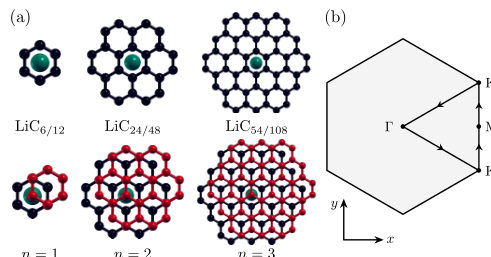
<figcaption class="paper-figure-caption"><b>Fig 1.</b> Figure 1. a) Three examples of MLG and BLG supercells of different sizes are shown, with n = 1 (6/12 C atoms), n = 2 (24/48 C atoms) and n = 3 (54/108 C atoms), and an adsorbed or intercalated Li ion, respectively. b) High-symmetry k-points path (M–K–Γ–K′ –M) in the first Brillouin zone of the supercell.</figcaption>
</figure>
<figure class="paper-figure-card">
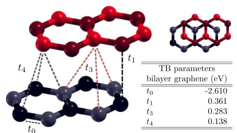
<figcaption class="paper-figure-caption"><b>Fig 2.</b> Figure 2. Schematics of the AB-stacked BLG and hopping ampli- tudes. Inset: Used tight-binding parameters for pristine BLG in eV units [21]. For MLG, only t0 is considered.</figcaption>
</figure>
<figure class="paper-figure-card">
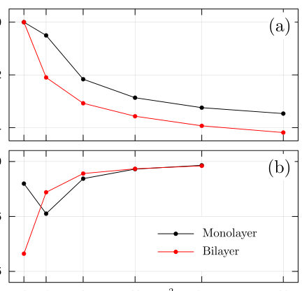
<figcaption class="paper-figure-caption"><b>Fig 3.</b> Figure 3. Interaction energy Eint (a) and corresponding slope ∆Eint (b) as a function of the supercell size for MLG (black) and BLG (red) substrates, respectively.</figcaption>
</figure>
<figure class="paper-figure-card">
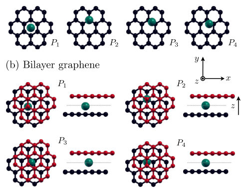
<figcaption class="paper-figure-caption"><b>Fig 4.</b> Figure 4. Schematic representation of the considered positions Pi of the Li-ion adsorbed on MLG (a) and intercalated within BLG (b). The dotted gray lines in panel b indicate the midplane between the two graphene sheets.</figcaption>
</figure>
<figure class="paper-figure-card">
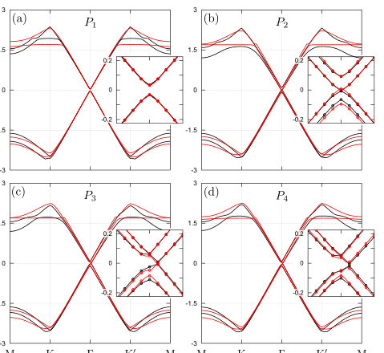
<figcaption class="paper-figure-caption"><b>Fig 5.</b> Figure 5. Energy spectra for Li adsorbed on MLG, relative to the Fermi level (Dirac point) of the pristine substrate. Here we take n = 2 and the Li-ion positions depicted in Fig. 4(a).</figcaption>
</figure>

**Summary.** This work develops and validates a position-dependent tight-binding model to study how adsorbed or intercalated Lithium ions alter the electronic structure of graphene (MLG and BLG). By fitting parameters to DFT results, the authors accurately predict band modifications, revealing that Li introduces localized perturbations whose effects diminish as the supercell size increases. This provides an efficient framework for modeling ion transport in graphitic electrodes.

**Why it may be interesting.** While focused on condensed matter electronics, the development of an accurate, transferable tight-binding model parameterized by first principles methods is a powerful tool for simulating open quantum systems where local perturbations (like impurities) drive transport phenomena.

Detailed structure

**Main problem.** The study investigates how Li adsorption on monolayer graphene (MLG) and intercalation within bilayer graphene (BLG) modifies their low-energy electronic properties.

**Main result.** The developed position-dependent tight-binding model accurately reproduces the band structure, showing that the impurity perturbation is strongly localized and decreases with supercell size.

**Method.** A semi-empirical, position-dependent tight-binding (TB) model is constructed and parameterized by fitting its eigenvalues to results obtained from Density Functional Theory (DFT) calculations.

**Model / system.** The system involves MLG and AB-stacked BLG substrates doped with Li impurities. The Hamiltonian incorporates site-specific couplings derived from DFT fittings, allowing for the study of impurity effects on electronic bands near the Fermi level.

**Key observables.** Electronic band structure near the Fermi level, symmetry breakings, intervalley mixing, and band-gap openings.

**Important parameters / regimes.** Supercell size ($n$), Li onsite energy ($\epsilon_{	ext{Li}}$), and various hopping parameters derived from DFT fitting.

**Assumptions / limitations.** The TB model assumes parameter efficiency by keeping the number of fitting variables constant regardless of impurity position or supercell size.

**Figures summary.** Figures illustrate supercells for Li adsorption/intercalation on MLG and BLG, high-symmetry k-paths in the Brillouin zone, and schematics detailing the electronic structure analysis.

**Paper structure.** The paper develops a general TB framework, parameterizes it using DFT calculations across varying supercell sizes, analyzes the resulting band structures for both MLG and BLG, and discusses the physical implications of the localized impurity potential.

Abstract

Lithium adsorption and intercalation can significantly modify the low-energy electronic properties of graphene-based materials, making their characterization relevant for understanding Li-ion transport and storage in graphitic electrodes. In this work, we investigate the electronic structure of a Li ion adsorbed on monolayer graphene (MLG) and intercalated within AB-stacked bilayer graphene (BLG). To this end, we develop a semi-empirical tight-binding model that incorporates Li-position dependence. Its parameters are determined by fitting to density-functional-theory calculations for different configurations, heights, and supercell sizes. The obtained model accurately reproduces the electronic bands near the Fermi level for both MLG and BLG and provides a transparent interpretation of the impurity-induced modifications in terms of symmetry breakings, intervalley mixing, and band-gap openings. We find that the perturbation introduced by the Li ion is strongly localized and that its effect decreases with increasing supercell size. The fitted parameters further reveal systematic differences between MLG and BLG in the spatial profile of the impurity potential. The obtained results provide an efficient framework for studying dilute Li impurities and constitute a useful starting point for future investigations of Li diffusion and impurity-induced transport phenomena in graphene-based materials.

[↑ back to top](#top)

### [Quantitative Theory for the Amplitude of Fluorescence Quantum Beats from Geminate Triplet-Pair Fusion](http://arxiv.org/abs/2607.16461v1)

**Authors:** Zachary Rex, Bách Ph\d{a}m Xuân, Gerald Curran, Ivan Biaggio  
**Type:** both · **Category:** other · **PDF:** <https://arxiv.org/pdf/2607.16461v1>  
**Analysis basis:** full PDF text, analyzed in chunks
**Topic relevance:** `methods for driven-dissipative` **3/5** · `correlated / nonlocal dissipation` **2/5** · `non-equilibrium dynamics` **2/5** · `Keldysh / 2PI / non-Gaussian methods` **1/5** · `driven-dissipative phase transition` **1/5** · `interference shaping light` **1/5** · `quantum optics experiment` **1/5**

↔ Scroll figures horizontally

<figure class="paper-figure-card">
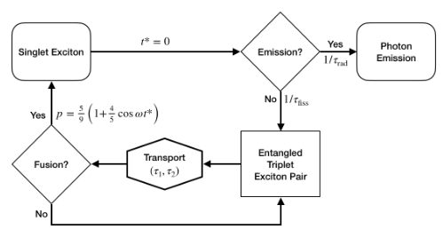
<figcaption class="paper-figure-caption"><b>Fig 1.</b> FIG. 1. Schematic of the event-driven Monte Carlo simu- lation. The figure illustrates the cycle of “singlet fission – triplet-pair evolution – triplet fusion” that is interrupted by a final triplet-triplet annihilation (triplet fusion followed by photon emission). Clockwise from the top left: (i) A singlet exciton decays into a photon or undergoes fission, as deter- mined by drawing from the exponentially distributed average times τrad and τfiss of both processes. Fission into a triple pair is followed by (ii) competing anisotropic triplet hopping (relevant average hopping times τ1 and τ2), which (iii) may lead to a re-encounter, followed by a (iv) fusion attempt gov- erned by Pfusion(t∗),...</figcaption>
</figure>
<figure class="paper-figure-card">
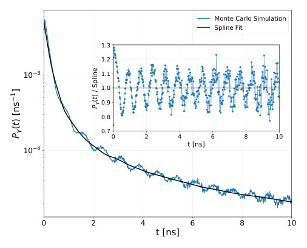
<figcaption class="paper-figure-caption"><b>Fig 2.</b> FIG. 2. Time-dependent photon emission probability density Pγ(t) obtained from a Monte-Carlo simulation with τ1 = 3 ps, τ2 = 250 ps, f = 1.34 GHz, τrad = 15.2 ns, τfiss = 10 ps (pfiss = 0.9993), Niter = 2.0 × 107. The solid black curve is the average trendline obtained via a spline fit. The inset shows the quantum beats extracted by dividing Pγ(t) by this average trendline.</figcaption>
</figure>
<figure class="paper-figure-card">
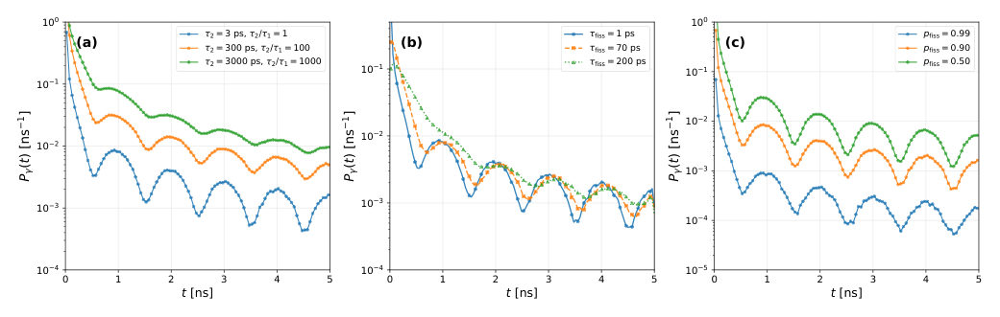
<figcaption class="paper-figure-caption"><b>Fig 3.</b> FIG. 3. Time-dependent photon emission probability density Pγ(t) for independent variations of (a) the two-dimensional hopping time τ2 with τfiss = 1 ps and pfiss = 0.90, (b) the singlet fission time τfiss, with τ2 = 3 ps and pfiss = 0.90, and (c) the singlet fission probability pfiss, with τ2 = 3 ps and τfiss = 1 ps. In each panel, only the indicated parameter is varied. In all cases, τ1 = 3 ps and Niter = 2.0 × 107.</figcaption>
</figure>
<figure class="paper-figure-card">
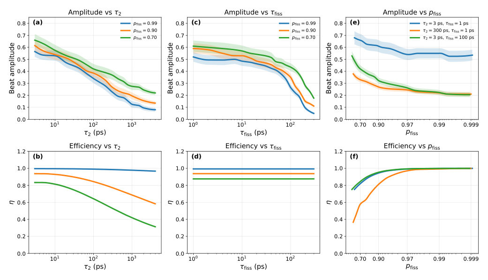
<figcaption class="paper-figure-caption"><b>Fig 4.</b> FIG. 4. Quantum beat amplitude (top row) and singlet fission efficiency (bottom row). (a,b) Values are plotted as a function of τ2, with τfiss = 1 ps and the three different pfiss specified in the figure. (c,d) Values are plotted as a function of τfiss, with τ2 = 3 ps, and the different pfiss specified in the figure. (e,f) Values are plotted as a function of pfiss, with the three different choices of τ2 and τfiss specified in the figure. For all cases, τ1 = 3 ps and Niter = 2.0 × 107.</figcaption>
</figure>
<figure class="paper-figure-card">
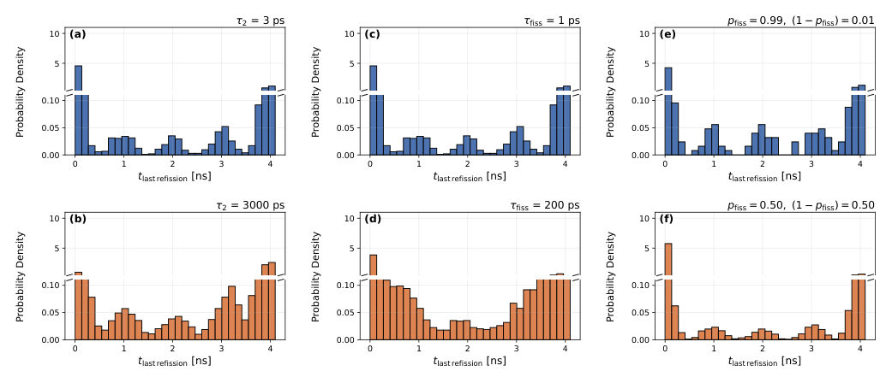
<figcaption class="paper-figure-caption"><b>Fig 5.</b> FIG. 5. Distributions of the last fission time for photon emission events in the time interval between t = 3.8 ns and t = 4.2 ns. (a,b) For the indicated values of τ2, with τfiss = 1 ps and pfiss = 0.9, (c,d) For the indicated values of τfiss, with τ2 = 3 ps and pfiss = 0.9. (e,f) For the indicated values of pfiss, with τ2 = 3 ps and τfiss = 1 ps. For all simulations, τ1 = 3 ps and Niter = 2.0 × 107.</figcaption>
</figure>

**Summary.** The authors developed a comprehensive theoretical model using Kinetic Monte Carlo simulations to analyze fluorescence quantum beats arising from triplet-pair fusion in organic crystals. By comparing predictions against experimental measurements in rubrene and tetracene, they quantitatively determined key microscopic parameters like hopping times and fission timescales. This work establishes quantum beat amplitudes as a powerful diagnostic tool for understanding exciton dynamics in condensed matter systems.

**Why it may be interesting.** This work provides a detailed, quantitative link between macroscopic optical signatures (quantum beats) and microscopic parameters governing open quantum systems dynamics, specifically exciton transport and recombination pathways.

Detailed structure

**Main problem.** The study derives a quantitative theory for the amplitude of fluorescence quantum beats resulting from geminate triplet-pair fusion in organic semiconductors like rubrene and tetracene.

**Main result.** The model successfully reproduces experimental measurements, showing that the beat amplitude is governed by the interplay between stochastic transport dynamics (e.g., hopping time) and coherent processes (e.g., singlet fission time).

**Method.** Kinetic Monte Carlo simulations are used to track the complex sequence of exciton events—fission, triplet hopping, re-encounter, and fusion—to calculate the time-dependent photon emission probability.

**Model / system.** The system involves photoexcitation leading to singlet fission into entangled triplet excitons. The dynamics are modeled using a framework incorporating anisotropic triplet transport (random walks) and time-dependent fusion probabilities.

**Key observables.** Quantum beat amplitude, time-dependent photoluminescence decay $P_{\gamma}(t)$, and singlet-fission efficiency ($\eta_{	ext{SF}}$).

**Important parameters / regimes.** Singlet fission time ($	au_{	ext{fiss}}$), anisotropic hopping times ($	au_1, 	au_2$), and the probability of fusion initiation ($p_{	ext{f.a.}}$).

**Assumptions / limitations.** The KMC implementation assumes constant probabilities per unit time for all competing events; analysis is performed in the high magnetic field limit to exclude transport-induced decoherence.

**Figures summary.** Figures compare simulated $P_{\gamma}(t)$ and quantum beat amplitudes against experimental data for rubrene and tetracene, demonstrating parameter fitting for $	au_2$ (rubrene) and $	au_{	ext{fiss}}$ (tetracene).

**Paper structure.** The paper develops a theoretical framework based on KMC simulations to model the full exciton cycle. It then applies this theory by comparing predicted quantum beat amplitudes against time-resolved photoluminescence measurements in both rubrene and tetracene.

Abstract

We derive the amplitude of quantum-beats in the fluorescence from geminate triplet-exciton fusion in rubrene and tetracene from the full set of parameters that characterize triplet exciton dynamics. We find that the amplitude depends on the fission time in tetracene, but does not do so in rubrene, where it is determined by the dimensionality of triplet transport. Kinetic Monte Carlo simulations reproduce the experimental data in both materials, for a fission time of the order of 200 ps and isotropic triplet transport int tetracene, and for a triplet hopping time along the herringbone axis of 250 ps and anisotropic transport in rubrene.

[↑ back to top](#top)

### [A field theory approach to Breit-type Hamiltonians in gapped Dirac systems](http://arxiv.org/abs/2607.17361v1)

**Authors:** Xinhong Zhou, T. H. Hansson, Varsha Subramanyan, Qing-Dong Jiang  
**Type:** theory · **Category:** other · **PDF:** <https://arxiv.org/pdf/2607.17361v1>  
**Analysis basis:** full PDF text, analyzed in chunks
**Topic relevance:** `Keldysh / 2PI / non-Gaussian methods` **3/5** · `analog quantum simulation` **2/5** · `driven-dissipative phase transition` **2/5** · `Kondo & dissipative impurity` **1/5** · `methods for driven-dissipative` **1/5** · `non-equilibrium dynamics` **1/5**

↔ Scroll figures horizontally

<figure class="paper-figure-card">
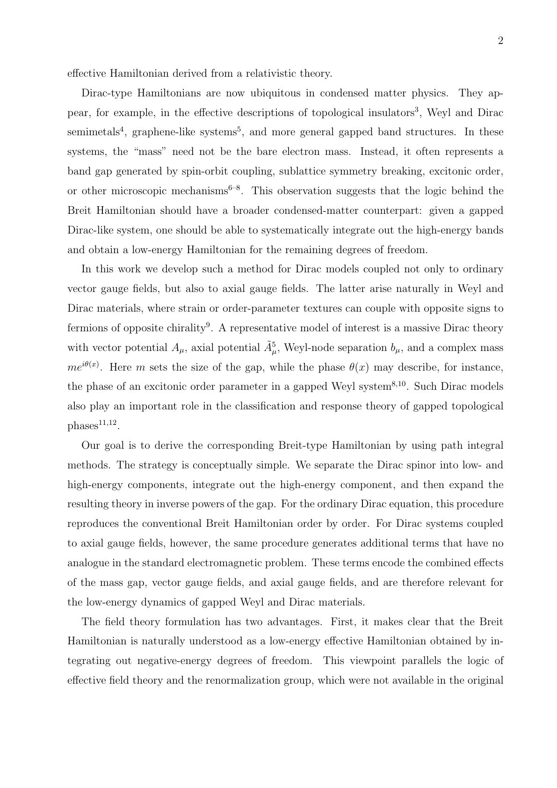
<figcaption class="paper-figure-caption"><b>Fig 1.</b> Low-resolution page preview, page 2</figcaption>
</figure>
<figure class="paper-figure-card">
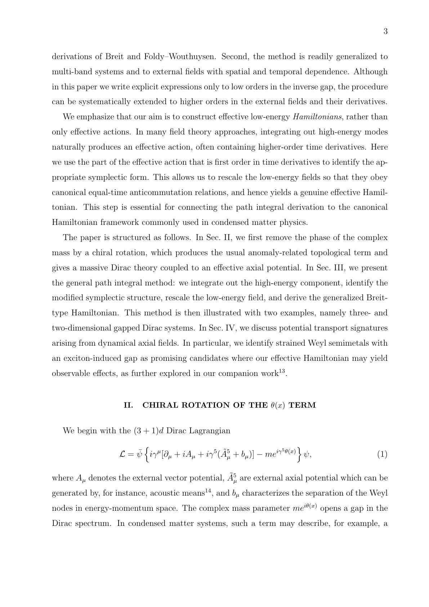
<figcaption class="paper-figure-caption"><b>Fig 2.</b> Low-resolution page preview, page 3</figcaption>
</figure>
<figure class="paper-figure-card">
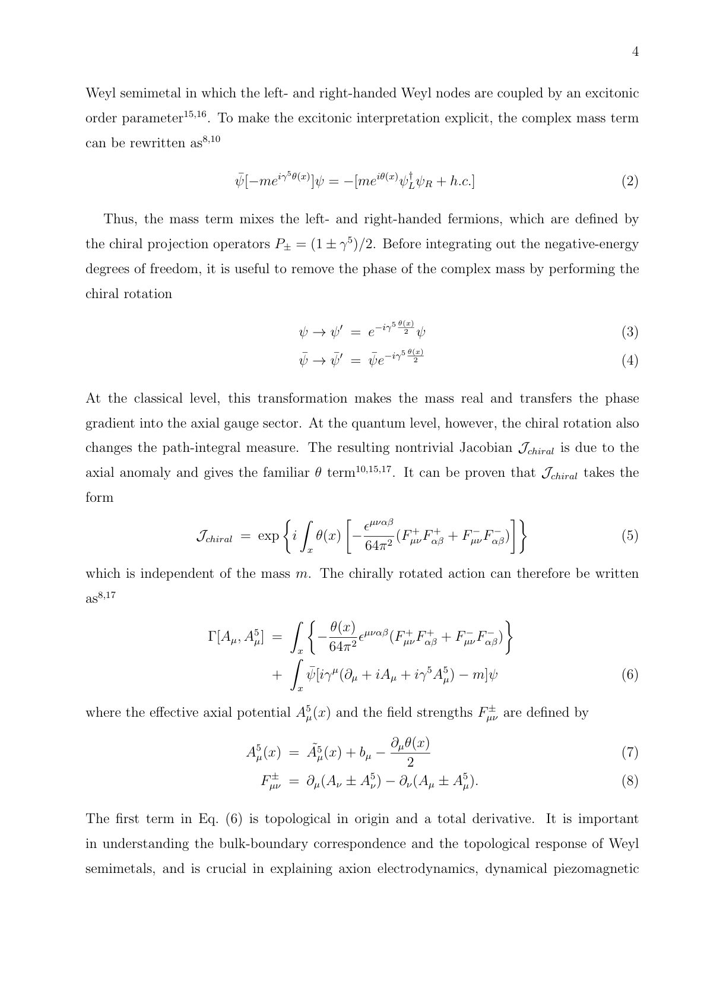
<figcaption class="paper-figure-caption"><b>Fig 3.</b> Low-resolution page preview, page 4</figcaption>
</figure>
<figure class="paper-figure-card">
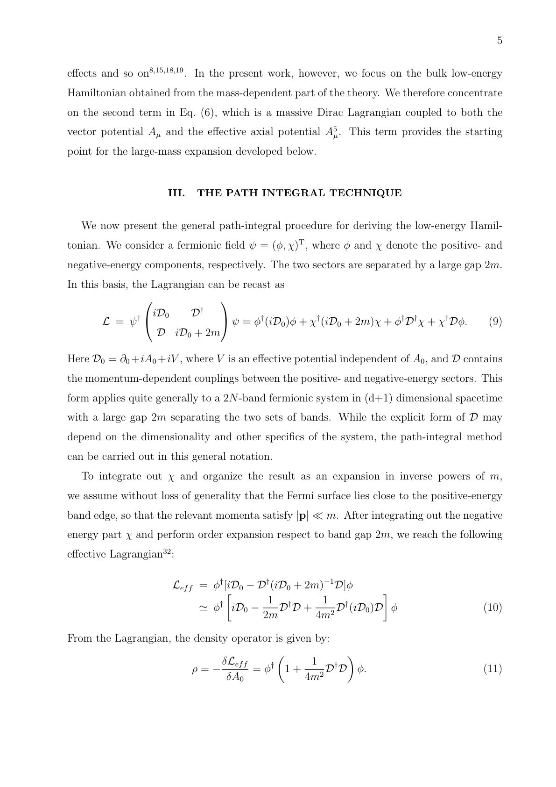
<figcaption class="paper-figure-caption"><b>Fig 4.</b> Low-resolution page preview, page 5</figcaption>
</figure>
<figure class="paper-figure-card">
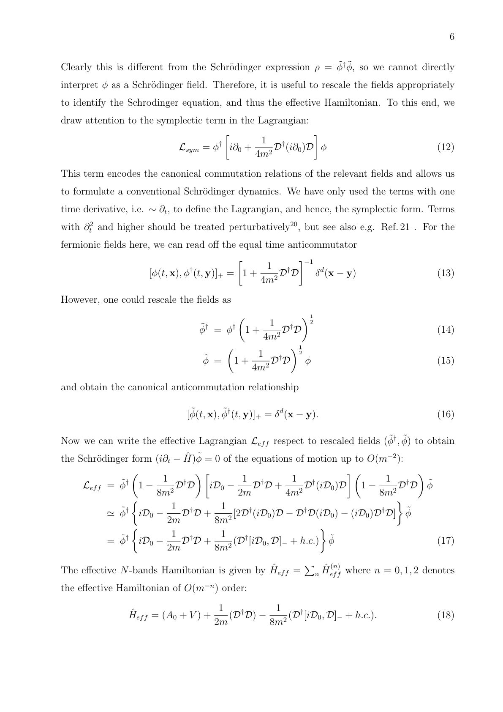
<figcaption class="paper-figure-caption"><b>Fig 5.</b> Low-resolution page preview, page 6</figcaption>
</figure>

**Summary.** This work presents a systematic field theory method to derive effective Breit-type Hamiltonians for gapped Dirac systems interacting with both vector and axial gauge fields. By integrating out high-energy degrees of freedom, the authors establish a canonical low-energy description. The key finding is that axial couplings introduce unique terms into the Hamiltonian not found in standard electromagnetism.

**Why it may be interesting.** The rigorous derivation of low-energy Hamiltonians from continuum field theories is fundamental for understanding effective models in condensed matter physics, especially when topological or chiral symmetries are involved.

Detailed structure

**Main problem.** The paper develops a field theory approach to derive effective, low-energy Breit-type Hamiltonians for gapped Dirac systems coupled to both vector and axial gauge fields.

**Main result.** It shows that while the method reproduces standard results for ordinary Dirac equations, the inclusion of axial fields introduces novel vector-axial couplings into the resulting Hamiltonian.

**Method.** The authors use a path-integral formalism, integrating out high-energy components of the Dirac spinor and expanding in inverse powers of the mass gap to obtain a canonical Schrödinger description.

**Model / system.** The model involves gapped Dirac fermions coupled to external vector (A_mu) and axial (A^5_mu) gauge potentials, studied in both 3+1 and 2+1 dimensions. The effective theory is derived by treating the mass gap as the large energy scale.

**Key observables.** The effective Hamiltonian ($\hat{H}_{	ext{eff}}$), particularly the novel vector-axial coupling terms when axial fields are present, and potential Hall-type transport currents.

**Important parameters / regimes.** The mass gap ($m$), the external gauge potentials ($A_\mu, A^5_\mu$), and dimensionality (2D vs 3D).

**Assumptions / limitations.** The derivation assumes that the mass gap is the large energy scale and that relevant momenta are much smaller than this gap. Field rescaling based on symplectic structure is crucial for canonical quantization.

**Paper structure.** The paper systematically develops the field theory, first deriving the effective action by integrating out high-energy modes, then performing necessary field rescalings to obtain a canonical Hamiltonian, and finally applying this procedure to specific dimensions (3+1D and 2+1D) to analyze the resulting couplings.

Abstract

We develop a path-integral-based field theory for deriving Breit-type low-energy Hamiltonians for gapped Dirac systems coupled to both vector and axial gauge fields. Treating the mass gap as the large energy scale, we integrate out the high-energy component of the Dirac spinor and obtain a canonical Schrödinger description for the remaining low-energy degrees of freedom. For the ordinary Dirac equation, our method reproduces the conventional Breit Hamiltonian order by order. In the presence of axial gauge fields, however, the resulting Hamiltonian contains additional vector-axial couplings that have no analogue in the traditional electromagnetic case. We illustrate the method using three- and two-dimensional Dirac models and discuss its relevance to gapped Weyl systems, where dynamical axial fields can generate distinctive low-energy transport signatures.

[↑ back to top](#top)

### [Spatial resolution and point spread function of high-resolution scanning SQUID microscopy probes](http://arxiv.org/abs/2607.17414v1)

**Authors:** Jan Ullmann, Katharina Kress, Timur Weber, Boris Gross, Daniel Jetter, Reinhold Kleiner, Martino Poggio, Dieter Koelle  
**Type:** both · **Category:** other · **PDF:** <https://arxiv.org/pdf/2607.17414v1>  
**Analysis basis:** full PDF text, analyzed in chunks
**Topic relevance:** `exotic spin models in light-matter` **3/5** · `spintronics-quantum-optics interface` **3/5** · `Keldysh / 2PI / non-Gaussian methods` **1/5** · `methods for driven-dissipative` **1/5** · `quantum measurements` **1/5**

↔ Scroll figures horizontally

<figure class="paper-figure-card">
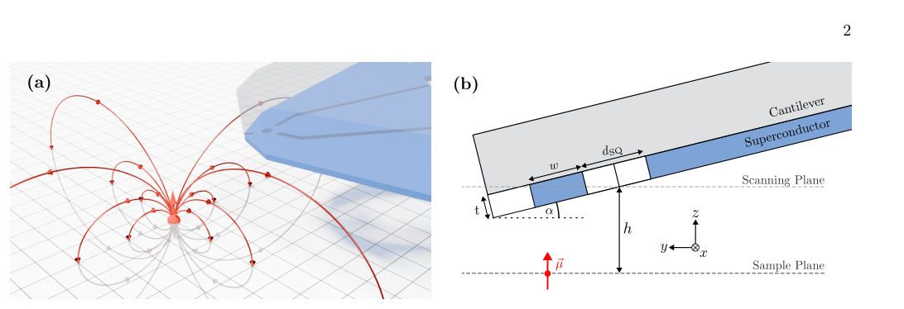
<figcaption class="paper-figure-caption"><b>Fig 1.</b> FIG. 1. Schematic of SOL. (a) 3D view of the SOL scanning over an idealized point-like magnetic dipole with magnetic moment ⃗µ. The Nb layer (light blue) on which the SOL circuitry is patterned is on the bottom side of the Si cantilever (semi-transparent). (b) Cross-section of the SOL through its center, with SQUID hole diameter dSQ, junction width w, film thickness t and scanning angle α. The operating height h is measured from the center of the SQUID hole.</figcaption>
</figure>
<figure class="paper-figure-card">
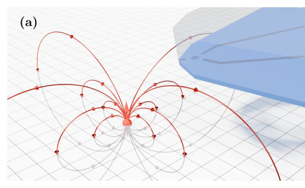
<figcaption class="paper-figure-caption"><b>Fig 2.</b> Figure 1 gives an overview of the SOL geometry re- alized by Weber et al.: it consists of a flat AFM can- tilever, whose bottom side is coated with superconduct-</figcaption>
</figure>
<figure class="paper-figure-card">
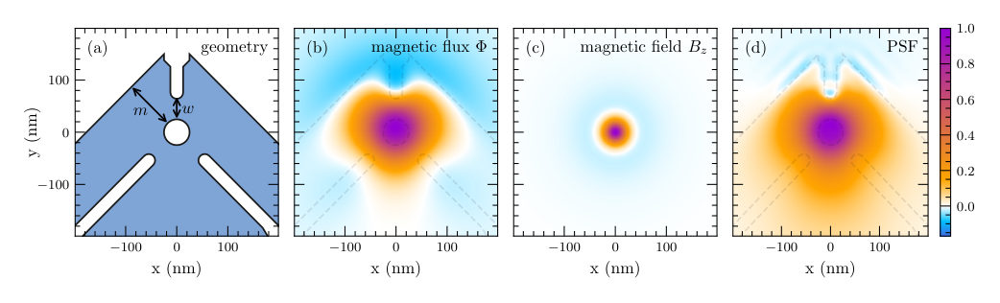
<figcaption class="paper-figure-caption"><b>Fig 3.</b> FIG. 2. Calculating the PSF of an SOL probe from a magnetic dipole moment. (a) Projection of SOL design with three JJs and diameter dSQ = 50 nm onto the sample plane. The junction width is w = 50 nm and the shortest distance between the SQUID hole and the cantilever edge is m = 100 nm. The thickness of the Nb film is t = 50 nm. (b) Normalized magnetic flux Φ(x, y) in the SOL, calculated for a magnetic moment ⃗µB at position ⃗r = (x, y, 0) oriented in z-direction. The SOL is at h = 30 nm with α = 10◦, corresponding to the tip of the cantilever hovering 5 nm above the sample. Data is normalized to the maximum magnetic flux of 17.4 nΦ0; Φ0 is the magnetic flux quantum. (c) Out-of-plane...</figcaption>
</figure>
<figure class="paper-figure-card">
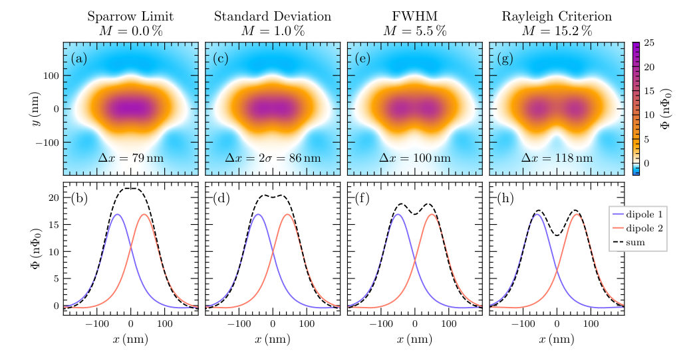
<figcaption class="paper-figure-caption"><b>Fig 4.</b> FIG. 3. Simulated magnetic flux Φ(x, y) (upper row) and corresponding line scans Φ(x, y = 0) (bottom row) coupled to the same SOL geometry as in Fig. 2 (for α = 0) at height h = 30 nm above two dipoles with moments µ = µB along the z-direction. The moments are placed at different distances ∆x to illustrate several spatial resolution criteria. The line scans show the signals from the individual dipoles (solid lines) and their sum (dashed line). The standard deviation σ = 43 nm is acquired by fitting a Gaussian to the individual dipole signal.</figcaption>
</figure>
<figure class="paper-figure-card">
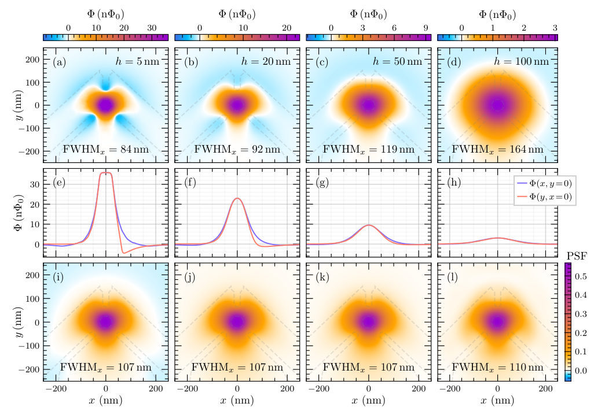
<figcaption class="paper-figure-caption"><b>Fig 5.</b> FIG. 4. Simulated magnetic flux Φ(x, y) (upper row), corresponding line scans Φ(x, y = 0) and Φ(x = 0, y) (middle row) and extracted PSF (bottom row) for the same SOL geometry as in Fig. 2 (for α = 0) at different heights h increasing from 5 nm (left column) to 100 nm (right column) above a single dipole with moment µ = µB along the z-direction.</figcaption>
</figure>

**Summary.** This work develops a comprehensive model to determine the Point Spread Function (PSF) of advanced Scanning SQUID Microscopy probes. By simulating magnetic flux coupling using superconducting circuit theory, the authors derive the PSF mathematically and validate it by comparing predictions against experimental measurements on magnetic skyrmions. This confirms the probe's intrinsic spatial resolution capabilities for nanoscale magnetic imaging.

**Why it may be interesting.** While focused on condensed matter magnetism, the rigorous treatment of spatial resolution limits via deconvolution techniques and the comparison between simulation and experiment is highly relevant for any field requiring high-fidelity measurement reconstruction from localized probes.

Detailed structure

**Main problem.** The primary goal is to accurately determine the Point Spread Function (PSF) of high-resolution Scanning SQUID Microscopy (SSM) probes for optimizing magnetic field mapping and image reconstruction.

**Main result.** The study provides a mathematical description of the SOL PSF, which was successfully validated by showing excellent agreement between simulated flux responses and measurements taken over a single magnetic skyrmion.

**Method.** The research combines theoretical modeling using the Amperian-loop model (based on London theory) to simulate supercurrents and calculating the PSF via convolution/deconvolution techniques like the Landweber algorithm.

**Model / system.** The physical system is a Superconducting Quantum Interference Device (SQUID) patterned onto a lever tip (SOL architecture), used to map weak magnetic fields on samples like $	ext{Cu}_2	ext{OSeO}_3$. The analysis relies on calculating the coupling factor ($\phi_\mu$) from supercurrents.

**Key observables.** Point Spread Function (PSF), measured magnetic flux ($\Delta\Phi$), and spatial resolution quantified by FWHM.

**Important parameters / regimes.** SQUID size, sensor geometry, cantilever height ($h$), London penetration depth ($\lambda_L$).

**Assumptions / limitations.** The Amperian-loop model is used for supercurrent simulation; the Landweber inversion process is sensitive to noise and missing low-frequency components.

**Figures summary.** Figures illustrate schematics of the SOL probe, demonstrate PSF calculation from magnetic dipoles, and compare simulated vs. measured flux responses over skyrmions.

**Paper structure.** The paper progresses by first establishing the need for PSF knowledge in SSM; it then details the simulation methods (Amperian-loop/Biot-Savart) to derive the mathematical PSF description; finally, it validates this model by comparing simulations against direct measurements on magnetic skyrmions.

Abstract

Superconducting quantum interference devices (SQUIDs) show exceptional sensitivity to magnetic flux. In scanning SQUID microscopy (SSM), SQUID size and its distance to the sample are minimized in order to map weak magnetic fields with best possible spatial resolution. SQUID-on-lever (SOL) architectures have proven especially effective as SSM probes due to their small sensor size, robustness, and ease of integration with conventional atomic force microscopy hardware. In order to optimize magnetic microscopy carried out with SOL probes and to accurately reconstruct the magnetic fields that they measure, it is essential to know their point spread function (PSF). The size and shape of this PSF are determined by magnetic flux focusing effects, which depend on the characteristic length-scales of the superconductor and the sensor geometry. By simulating the coupling to sources of magnetic flux, this work provides a mathematical description of the SOL PSF, which contains a full description of the probe's magnetic sensitivity and spatial resolution. We then use measurements of a single magnetic skyrmion to measure the magnetic flux response of a real SOL. We demonstrate excellent agreement with flux responses that are obtained from simulations, thereby confirming the calculated PSF and spatial resolution.

[↑ back to top](#top)

### [Vacancy-Induced Topological Phase Transition via Valley Annihilation in an Anisotropic Honeycomb Lattice](http://arxiv.org/abs/2607.16965v1)

**Authors:** Anna Hassine, Amit Goft, Boris Rotstein, Eric Akkermans  
**Type:** theory · **Category:** other · **PDF:** <https://arxiv.org/pdf/2607.16965v1>  
**Analysis basis:** full PDF text, analyzed in chunks
**Topic relevance:** `driven-dissipative phase transition` **3/5** · `non-equilibrium universality` **2/5** · `Kondo & dissipative impurity` **1/5** · `analog quantum simulation` **1/5** · `methods for driven-dissipative` **1/5** · `non-equilibrium dynamics` **1/5**

↔ Scroll figures horizontally

<figure class="paper-figure-card">
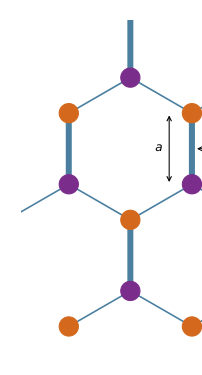
<figcaption class="paper-figure-caption"><b>Fig 1.</b> Figure 1: Anisotropic honeycomb lattice with nearest-neighbor hopping ampli- tudes t (thin bonds) and t′ (thick bond), parametrised by angle α. A type-A vacancy (cross) removes one site and its three bonds.</figcaption>
</figure>
<figure class="paper-figure-card">
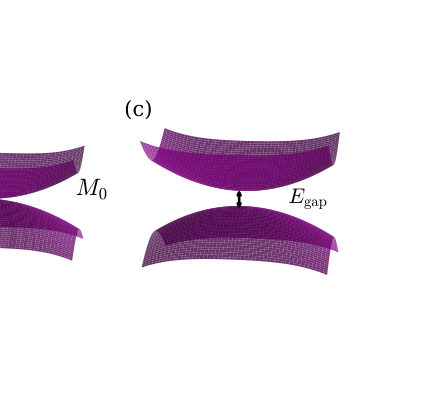
<figcaption class="paper-figure-caption"><b>Fig 2.</b> Figure 2: Evolution of the Dirac points with hopping anisotropy t′/t. (a) t′/t &lt; 2: two inequivalent Dirac points (valleys K and K′). (b) t′/t = 2: valleys merge at M0, yielding a semi-Dirac dispersion. (c) t′/t &gt; 2: a spectral gap opens.</figcaption>
</figure>
<figure class="paper-figure-card">
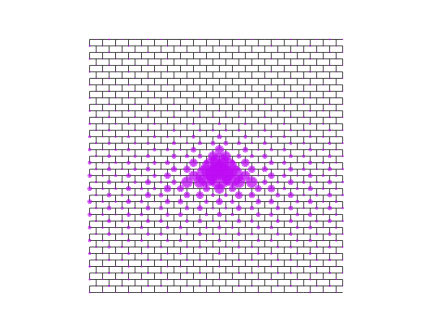
<figcaption class="paper-figure-caption"><b>Fig 3.</b> Figure 3: Zero-mode probability density for t′/t &lt; 2 (periodic boundary condi- tions). (a) t′/t = 1: long-ranged, weight on sublattice B only. (b) t′/t = 1.5: mode spreads directionally but remains long-ranged and sublattice polarized.</figcaption>
</figure>
<figure class="paper-figure-card">
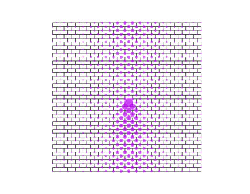
<figcaption class="paper-figure-caption"><b>Fig 4.</b> Figure 4: Numerical vacancy zero-mode probability density for t′/t &gt; 2 under periodic boundary conditions. (a) t′/t = 2.01: close to the critical point, the mode remains broadly distributed around the vacancy. (b) t′/t = 2.25: deeper in the gapped phase, the density becomes more strongly confined near the vacancy. Sublattice polarization persists in both panels.</figcaption>
</figure>
<figure class="paper-figure-card">
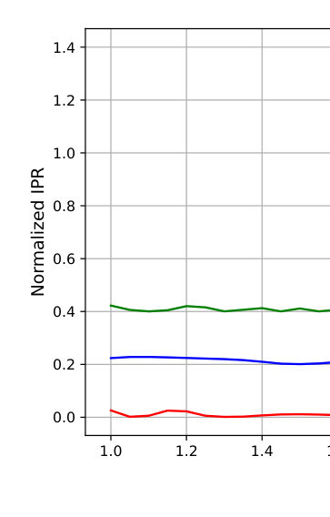
<figcaption class="paper-figure-caption"><b>Fig 5.</b> Figure 5: Normalised IPR of the vacancy zero mode vs. t′/t for three system sizes (Nx ×Ny = 160×40, 200×50, 248×62; curves offset for clarity). Dashed line: t′/t = 2. The IPR minimum at criticality signals maximal delocalization (symbol gap closing); for t′/t &gt; 2 the IPR rises sharply.</figcaption>
</figure>

**Summary.** This paper demonstrates that a single vacancy can induce a topological phase transition in an anisotropic honeycomb lattice without requiring a bulk spectral gap closure. The transition occurs when Dirac valleys merge at $t'/t=2$, causing the defect's winding number ($
u_3$) to collapse from $\mp 1$ to $0$. This mechanism is diagnosed by observing sharp changes in zero-mode localization and topological invariants.

**Why it may be interesting.** This work provides a detailed mechanism for realizing topological transitions purely through defect engineering, bypassing conventional gap closing criteria and linking it to fundamental changes in the system's symmetry constraints ($d+D+1=2m$).

Detailed structure

**Main problem.** The study investigates a topological phase transition driven by the annihilation of Dirac valleys caused by a single vacancy defect in an anisotropic honeycomb lattice.

**Main result.** The system undergoes a topological phase transition at $t'/t=2$, where the defect winding number $
u_3$ collapses from $\mp 1$ to $0$, driven by the reduction in active pseudospinor degrees of freedom ($m: 2 	o 1$).

**Method.** The analysis uses tight-binding models, calculating topological invariants like the three-phase-space winding number ($
u_3$) and analyzing zero-mode profiles using diagnostics such as the Inverse Participation Ratio (IPR).

**Model / system.** The model is a two-dimensional honeycomb lattice described by an anisotropic nearest-neighbor tight-binding Hamiltonian. The physics is analyzed in the context of symmetry class BDI, focusing on the impact of a single vacancy defect.

**Key observables.** Topological winding number ($
u_3$), Active pseudospinor degrees of freedom ($m$), Inverse Participation Ratio (IPR), and wavefront dislocations in the local density of states (LDOS).

**Important parameters / regimes.** The anisotropic nearest-neighbor hopping ratio $t'/t$, with critical regimes analyzed at $t'/t < 2$, $t'/t = 2$, and $t'/t > 2$.

**Assumptions / limitations.** The analysis relies on the Nielsen-Ninomiya theorem for the pristine lattice and assumes the defect invariant $
u_3$ can be factorized into momentum and defect winding components.

**Figures summary.** Figures illustrate the anisotropic honeycomb structure, the merging of Dirac valleys at $t'/t=2$, the evolution of zero-mode probability density (from algebraic to confined), and plots showing IPR minima and LDOS dislocation disappearance at criticality.

**Paper structure.** The paper establishes the topological triviality of the pristine lattice due to valley pairing, then analyzes how a vacancy introduces $
u_3=\mp 1$ for $t'/t < 2$. The core argument focuses on the transition at $t'/t=2$, where valley merging causes $
u_3 	o 0$, marking a bulk Lifshitz-driven topological phase change.

Abstract

A single missing atom can drive a topological phase transition in a lattice that is otherwise trivial for all values of its parameters. We demonstrate this in a two-dimensional honeycomb lattice with anisotropic nearest-neighbor hopping ratio $t'/t$. The pristine lattice is topologically trivial for all $t'/t$ by the Nielsen-Ninomiya fermion-doubling theorem: Dirac valleys appear in pairs whose topological charges cancel identically in any bulk invariant. A single vacancy breaks this cancelation, acting as an internal boundary with defect winding number $ν_3=\mp 1$ for $t'/t<2$. At $t'/t=2$, the two Dirac valleys merge and annihilate; the number of active pseudospinor degrees of freedom drops from $m=2$ to $m=1$, violating the condition $d+D+1=2m$ required for a non-trivial winding number. The winding number collapses to $ν_3=0$: a topological phase transition within a fixed symmetry class (BDI), driven entirely by a bulk Lifshitz transition and observable only through the vacancy. The defect zero mode crosses over from algebraic (${\sim}1/r$) to stronger spatial confinement, with its inverse participation ratio reaching a sharp minimum at criticality. Wavefront dislocations in the local density of states provide a direct, spatially resolved image of $ν_3$, accessible in graphene and in photonic and cold-atom analogs.

[↑ back to top](#top)

### [Layer Edelstein Effect](http://arxiv.org/abs/2607.17209v1)

**Authors:** Binchang Zhou, Pan Zhou, Baoru Pan, Yuzhong Hu, Songmin Liu, Lizhong Sun  
**Type:** theory · **Category:** other · **PDF:** <https://arxiv.org/pdf/2607.17209v1>  
**Analysis basis:** full PDF text, analyzed in chunks
**Topic relevance:** `exotic spin models in light-matter` **3/5** · `spintronics-quantum-optics interface` **3/5** · `Keldysh / 2PI / non-Gaussian methods` **1/5** · `non-equilibrium dynamics` **1/5**

↔ Scroll figures horizontally

<figure class="paper-figure-card">
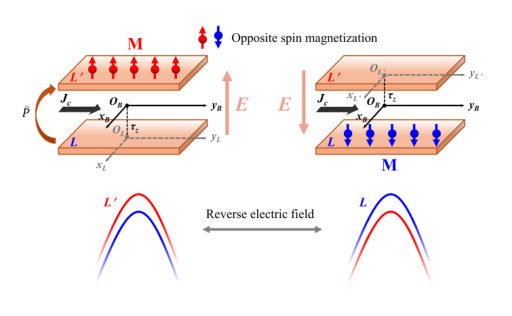
<figcaption class="paper-figure-caption"><b>Fig 1.</b> FIG. 1. Schematic diagram of the LEE. By applying a stacking op- erator ˆP, the L′ layer can be obtained from the initial single layer L. L and L′ together form a bilayer system, which uses a bilayer coor- dinate system labeled xBOByB. When we apply an in-plane current jA, by changing the direction of the vertical electric field E, we can achieve opposite spin magnetization between the layers.</figcaption>
</figure>
<figure class="paper-figure-card">
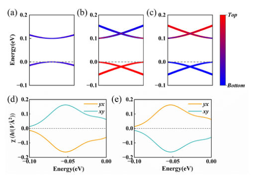
<figcaption class="paper-figure-caption"><b>Fig 2.</b> FIG. 2. Schematic diagram of the k·p band structure and correspond- ing response tensor. (a) I symmetry keeps the top and bottom energy bands degenerate. (b)When a positive out-of-plane electric field is applied, I symmetry is broken, and the top layer’s energy band dom- inate near the Fermi level. (c)When a negative out-of-plane electric field is applied, the bottom layer’s energy band dominate near the Fermi level. Calculated χxy and χyx as a function of the chemical po- tential when (d) positive and (e) negative electric field is applied.</figcaption>
</figure>
<figure class="paper-figure-card">
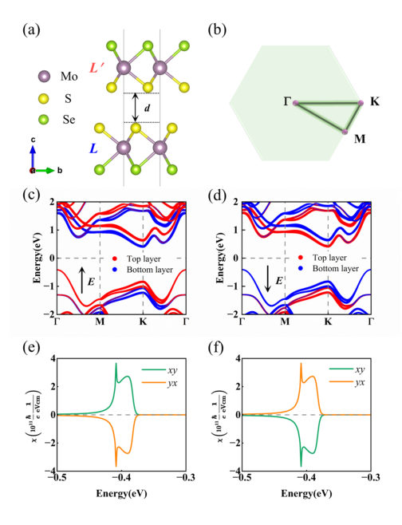
<figcaption class="paper-figure-caption"><b>Fig 3.</b> FIG. 3. (a) For the bilayer system with the stacking of inversion op- erators, the optimized interlayer spacing is 3.15 Å, where L and L′</figcaption>
</figure>

**Summary.** This work introduces the Layer Edelstein Effect (LEE), a symmetry-protected mechanism generating opposite layer-resolved spin magnetizations in bilayer systems using an in-plane current. By developing model-independent symmetry criteria, the authors prove LEE is generic for many nonmagnetic bilayers and confirm its feasibility on materials like MoSSe via first-principles calculations.

**Why it may be interesting.** While focused on condensed matter transport, understanding how symmetries dictate emergent spin responses in layered materials is crucial for designing quantum devices that rely on controlled spin-orbit coupling effects.

Detailed structure

**Main problem.** The paper introduces and establishes the 'layer Edelstein effect' (LEE), a universal current-induced spin phenomenon in bilayer systems, as a counterpart to the layer Hall effect.

**Main result.** The LEE is shown to be a generic, symmetry-governed response realizable in a wide class of nonmagnetic bilayer stackings. It manifests through layer-resolved spin magnetizations with opposite components on top and bottom layers.

**Method.** The authors combine symmetry analysis with a general bilayer k.p theory framework to derive model-independent criteria for LEE existence.

**Model / system.** The study focuses on nonmagnetic bilayer systems, such as stacked MoSSe, MoTe2, and WTe2. The theoretical analysis uses group theory based on stacking operators ($\hat{P}$) applied to a minimal bilayer k.p Hamiltonian.

**Key observables.** Layer-resolved spin magnetizations with opposite components; the symmetry criteria for LEE realization ($\chi_{xy}$ vs $\chi_{yx}$).

**Important parameters / regimes.** In-plane charge current density ($\mathbf{j}_A$) and external electric field ($\mathbf{E}$); bilayer stacking symmetry (point group).

**Assumptions / limitations.** The analysis assumes that interlayer tunneling can be suppressed by weak coupling, symmetry selection rules, and electric-field detuning.

**Figures summary.** Figure 1 schematically illustrates LEE using the stacking operator; Figure 2 shows how breaking inversion symmetry via E leads to measurable spin responses ($\chi_{xy}$ vs $\chi_{yx}$).

**Paper structure.** The paper first introduces the concept of LEE, then establishes its general existence and symmetry criteria using group theory on bilayer systems. It details two universal manifestations (symmetry-mandated vs. field-activated) before confirming predictions via first-principles calculations on specific TMD bilayers.

Abstract

Electrical control of magnetism represents a fundamental route toward next-generation spintronic functionalities. In this Letter, we introduce a universal current-induced spin phenomenon in bilayer systems, termed the layer Edelstein effect (LEE), which serves as the natural counterpart of the layer Hall effect in real space. It is defined by the emergence of layer-resolved spin magnetizations with opposite components on the top and bottom layers, driven by an in-plane charge current and controllable by an external electric field. We establish the general existence of the LEE using a minimal bilayer $k \cdot p$ theory. By combining symmetry analysis with a general bilayer stacking framework, we derive a model-independent symmetry criterion demonstrating that the LEE is generically allowed in a broad class of nonmagnetic bilayer stacking systems. We further show that the LEE admits two universal manifestations: explicit layer-opposite spin magnetization components mandated directly by symmetry, and components become activated upon symmetry reduction by external electric fields. First-principles calculations on stacked bilayer MoSSe, MoTe$_2$ and WTe$_2$ confirm the predicted effect and illustrate their experimental feasibility. Our work establishes the LEE as a generic symmetry-governed response of bilayer systems, providing a unified conceptual framework for electrically generating and manipulating layer-resolved spin polarization.

[↑ back to top](#top)

### [Robust Fano-like Antiresonances in Large-Area Au-coated Ag-Nanoisland Ensembles](http://arxiv.org/abs/2607.16525v1)

**Authors:** Valeria Nocerino, Francesca Di Carlo, Luca De Stefano, Principia Dardano, Carlo Forestiere  
**Type:** both · **Category:** other · **PDF:** <https://arxiv.org/pdf/2607.16525v1>  
**Analysis basis:** full PDF text, analyzed in chunks
**Topic relevance:** `interference shaping light` **3/5** · `Keldysh / 2PI / non-Gaussian methods` **1/5** · `analog quantum simulation` **1/5** · `correlated / nonlocal dissipation` **1/5** · `driven-dissipative phase transition` **1/5** · `methods for driven-dissipative` **1/5**

↔ Scroll figures horizontally

<figure class="paper-figure-card">
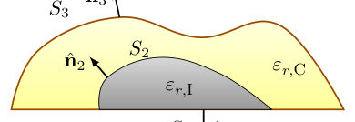
<figcaption class="paper-figure-caption"><b>Fig 1.</b> FIG. 1. Schematic of an arbitrarily shaped homogeneous nanoisland partially coated by a second homogeneous mate- rial. The nanoisland, coating, and surrounding medium oc- cupy the domains V1, V2, and V3, with relative permittivities εr,I, εr,C, and 1, respectively. The nanoisland–coating inter- face is denoted by S2, while S1 and S3 indicate the portions of the nanoisland and coating surfaces exposed to the exte- rior medium. The unit normals ˆn1, ˆn2, and ˆn3 are associated with S1, S2, and S3, respectively.</figcaption>
</figure>
<figure class="paper-figure-card">
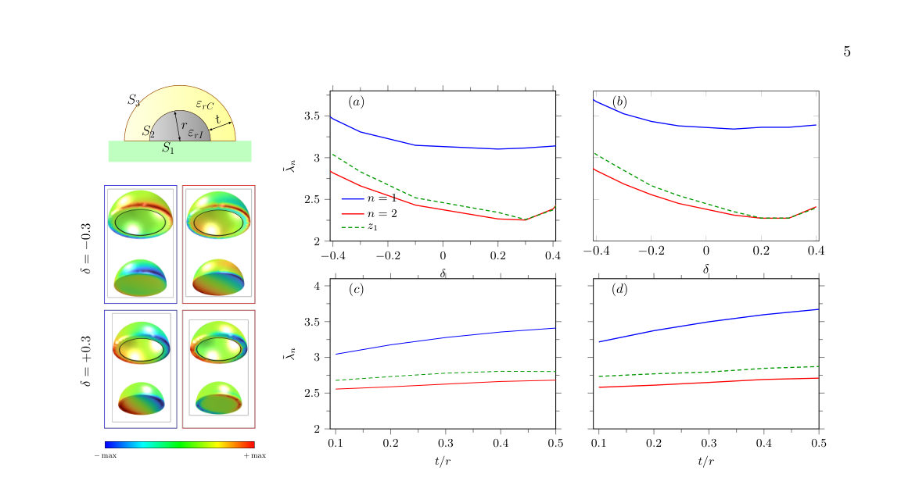
<figcaption class="paper-figure-caption"><b>Fig 2.</b> FIG. 2. Coated hemispherical nanoisland with thickness t and radius r. (Left) Surface-charge density distributions of the first two non-degenerate dipolar eigenmodes with non-zero net dipole moment for two values of the plasma-frequency mismatch parameter: δ = −0.3 (top row) and δ = +0.3 (bottom row). The fundamental (low-frequency) mode is enclosed in a blue box, the higher order mode in a red box. Normalized resonant wavelength ˜λk as a function of the plasma frequency mismatch δ for the first two non-degenerate electric dipole modes with t/r = 0.3: (a) without substrate and (b) with substrate. Dipolar normalized resonance wavelength as a function of the ratio t/r for the fixed value δ =...</figcaption>
</figure>
<figure class="paper-figure-card">
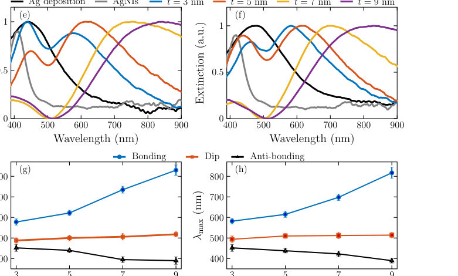
<figcaption class="paper-figure-caption"><b>Fig 3.</b> FIG. 3. Morphological and optical characterization of AgNIs and Au–coated AgNIs fabricated from two different nominal Ag film thicknesses. (a–d) Three-dimensional AFM topographies of the investigated samples; the color bar indicates the height scale in nm. (a) AgNIs obtained after thermal dewetting of a 2 nm Ag film, (b) the corresponding AgNIs after deposition of a 5 nm nominal Au overlayer, (c) AgNIs obtained after dewetting of a 5 nm Ag film, and (d) the corresponding AgNIs after deposition of a 5 nm nominal Au overlayer. (e,f) Experimental extinction spectra measured after Ag deposition (black), after thermal dewetting into AgNIs (gray), and after deposition of Au overlayers of nominal...</figcaption>
</figure>
<figure class="paper-figure-card">
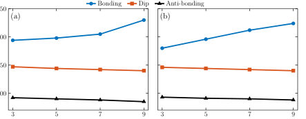
<figcaption class="paper-figure-caption"><b>Fig 4.</b> FIG. 4. Finite element analysis. Extracted spectral positions of the bonding resonance, the Fano-like antiresonant dip, and the antibonding resonance as a function of the deposited Au thickness t for hemispherical Au-coated AgNI with internal radii of (a) r = 22.5 nm and (b) r = 32.5 nm. The selected nanoisland radii (r) are representative of the experimental NIs size range.</figcaption>
</figure>

**Summary.** This work analyzes plasmonic resonances in Au-coated Ag nanoislands, demonstrating that their optical response exhibits robust Fano-like antiresonances. By simulating and measuring the effect of coating thickness, the authors show this system provides a simple, scalable platform for tuning these interference features using standard far-field spectroscopy.

**Why it may be interesting.** While focused on classical electromagnetism (plasmonics), the concept of destructive quantum-like interference (Fano resonance) between hybridized modes is highly relevant to open quantum systems and cavity QED studies involving engineered dissipation channels.

Detailed structure

**Main problem.** The study investigates robust Fano-like antiresonances in plasmonic systems using Au-coated Ag nanoisland ensembles, aiming to establish these structures as tunable platforms for optical response.

**Main result.** Increasing the Au-coating thickness shifts the low-energy resonance while leaving a pronounced anti-resonant dip nearly fixed, demonstrating tunability via simple fabrication methods.

**Method.** The research combines electrostatic spectral analysis and full-wave electromagnetic simulations with experimental linear transmission spectroscopy measurements.

**Model / system.** The physical system is Au-coated Ag nanoisland ensembles (bimetallic nanostructures). The theoretical model uses a boundary-integral equation approach solved in the quasi-electrostatic limit to analyze mode hybridization.

**Key observables.** Plasmonic resonances, Fano-like antiresonant dips, spectral weight transfer, and the electric dipole moment $p(	ilde{\omega})$.

**Important parameters / regimes.** Au-coating thickness ($t$), plasma frequency mismatch parameter ($\delta$), and geometry ratio ($t/r$).

**Assumptions / limitations.** The analysis is performed within the quasi-electrostatic limit, neglecting retardation effects.

**Figures summary.** Figures schematically show the nanoisland structure with defined domains (island, coating, exterior) and illustrate spectral responses showing resonance shifts and fixed anti-resonant dips as a function of material parameters.

**Paper structure.** The paper progresses from establishing the general context of bimetallic plasmonics to developing the theoretical framework using boundary integrals. It then analyzes how key parameters like coating thickness and plasma mismatch ($\delta$) control the resulting Fano interference features, culminating in experimental validation.

Abstract

We investigate plasmonic resonances and Fano-like interference in Au-coated Ag nanoislands fabricated by solid-state dewetting followed by Au overgrowth. By combining electrostatic spectral analysis, full-wave simulations, and linear transmission spectroscopy, we show that the optical response is governed by hybridization between plasmonic modes supported by the Ag-island and the Au-coating. Increasing the Au-coating thickness red-shifts the low-energy resonance and transfers spectral weight from high-energy to low-energy resonances, while a pronounced anti-resonant dip remains nearly fixed. The eigenmode analysis identifies this dip as the signature of destructive interference between super-radiant and sub-radiant hybridized modes. These results establish coated bimetallic nanoislands as promising platforms for tunable Fano-like optical responses accessible through standard far-field spectroscopy, using a fabrication route that requires no lithographic patterning and is compatible with large-area, low-cost production.

[↑ back to top](#top)

### [Tilted Anisotropic Dirac Fermions in an Exponentially Decaying Magnetic Field](http://arxiv.org/abs/2607.17676v1)

**Authors:** Sushmita Saha, Alestin Mawrie  
**Type:** theory · **Category:** other · **PDF:** <https://arxiv.org/pdf/2607.17676v1>  
**Analysis basis:** full PDF text, analyzed in chunks
**Topic relevance:** `Keldysh / 2PI / non-Gaussian methods` **3/5** · `Kondo & dissipative impurity` **1/5** · `analog quantum simulation` **1/5** · `methods for driven-dissipative` **1/5** · `non-equilibrium dynamics` **1/5**

↔ Scroll figures horizontally

<figure class="paper-figure-card">
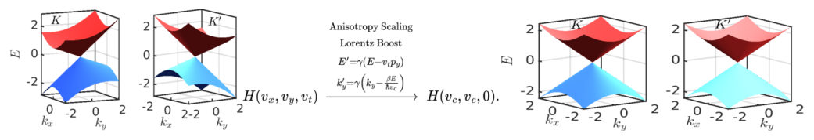
<figcaption class="paper-figure-caption"><b>Fig 1.</b> FIG. 1: (Color online) Lorentz-covariant mapping of tilted anisotropic Dirac cones in 8-Pmmn borophene. The anisotropic, oppositely tilted cones at the K and K′ valleys, described by H(vx, vy, vt), are first rescaled to remove anisotropy and then Lorentz boosted with β = ±vt/vc. The transformation exactly eliminates the tilt, mapping both valleys onto a common isotropic untilted Dirac Hamiltonian H(vc, vc, 0) with vc = √vxvy.</figcaption>
</figure>
<figure class="paper-figure-card">
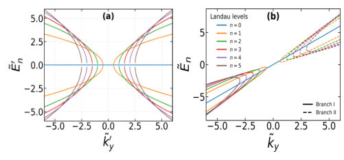
<figcaption class="paper-figure-caption"><b>Fig 2.</b> FIG. 2: (Color online) (a) Boosted-frame spectrum ˜E′ n versus ˜k′ y, showing symmetric electron and hole branches and a dispersionless chiral zeroth Landau level at ˜E′ 0 = 0. (b) Laboratory-frame spectrum ˜En versus ˜ky. The inverse Lorentz transformation yields two branches (solid: Branch I; dash-dotted: Branch II), producing asymmetric dispersive Landau levels.</figcaption>
</figure>

**Summary.** This paper derives an analytical theory for Landau quantization in Dirac fermions exhibiting both structural anisotropy (tilt) and subjected to a decaying magnetic field. By employing Lorentz covariance, the complex problem is mapped to a solvable isotropic form, yielding a unique, energy-dependent quantization condition that describes the system's spectrum.

**Why it may be interesting.** While focused on condensed matter band structure, the use of Lorentz covariance and exact solutions for inhomogeneous fields provides powerful mathematical tools applicable to open quantum systems or field theories where background geometry/fields are non-uniform.

Detailed structure

**Main problem.** The paper develops an analytical theory for Landau quantization applied to tilted anisotropic Dirac fermions subjected to a spatially varying, exponentially decaying magnetic field.

**Main result.** It establishes a unified Lorentz-covariant framework yielding an implicit, energy-dependent quantization condition for the laboratory spectrum, which successfully recovers known uniform-field limits.

**Method.** The core method involves mapping the complex anisotropic problem into an isotropic Dirac equation via anisotropy scaling and a Lorentz boost, allowing for exact solution techniques involving confluent hypergeometric functions.

**Model / system.** The system models low-energy quasiparticles in tilted anisotropic Dirac materials (like borophene) governed by a Hamiltonian incorporating $v_x, v_y$, and tilt terms. The magnetic field is modeled as $B(x) = B_0 e^{-\lambda x}$.

**Key observables.** The Landau-level spectrum ($	ilde{E}_n$ vs $	ilde{k}_y$), the guiding-center parameter ($S$), and the resulting two distinct, asymmetric branches (Branch I and Branch II).

**Important parameters / regimes.** Magnetic decay length scale ($\lambda^{-1}$), anisotropy parameters ($v_x, v_y$), and the tilt term $v_t$.

**Assumptions / limitations.** The analysis requires careful handling of spurious roots introduced by squaring the eigenvalue equation, necessitating adherence to physical admissibility constraints.

**Figures summary.** Figure 1 illustrates the Lorentz-covariant mapping from tilted anisotropic cones to an isotropic Dirac Hamiltonian. Figure 2 contrasts the symmetric spectrum in the boosted frame with the resulting asymmetric, two-branched spectrum in the laboratory frame.

**Paper structure.** The paper proceeds by defining the physical system and Hamiltonian, applying a Lorentz transformation/anisotropy scaling to map it to a solvable isotropic problem (Whittaker/Kummer equation), solving for the boosted spectrum, and finally transforming back to the lab frame to derive the implicit quantization condition.

Abstract

We develop an analytical theory of Landau quantization for tilted anisotropic Dirac fermions in an exponentially decaying magnetic field. Using anisotropy scaling and a Lorentz transformation, we recast the laboratory-frame problem into the isotropic Dirac equation in the boosted frame, where the exponentially decaying magnetic-field problem admits an exact solution. Transforming the boosted-frame spectrum back to the laboratory frame yields an implicit quantization condition with an intrinsically energy-dependent guiding-center parameter. We identify the conditions for physically admissible states. We further show that the formalism recovers the known uniform-field spectrum of tilted anisotropic Dirac fermions in the appropriate limit. Our results establish a unified Lorentz-covariant framework for describing Landau quantization in tilted anisotropic Dirac materials in the presence of an exponentially decaying magnetic field.

[↑ back to top](#top)

### [Geometry contribution to sound attenuation in double-Weyl semimetals](http://arxiv.org/abs/2607.17064v1)

**Authors:** Varsha Subramanyan, Shi-Zeng Lin, Avadh Saxena  
**Type:** theory · **Category:** other · **PDF:** <https://arxiv.org/pdf/2607.17064v1>  
**Analysis basis:** full PDF text, analyzed in chunks
**Topic relevance:** `Keldysh / 2PI / non-Gaussian methods` **3/5** · `methods for driven-dissipative` **1/5** · `non-equilibrium dynamics` **1/5**

↔ Scroll figures horizontally

<figure class="paper-figure-card">
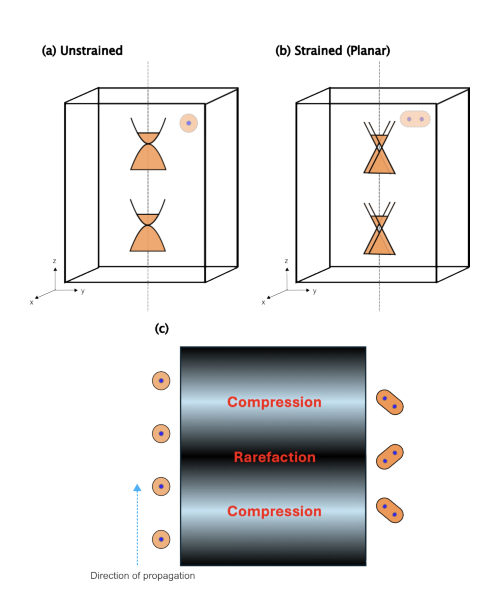
<figcaption class="paper-figure-caption"><b>Fig 1.</b> FIG. 1: Pictorial representation of the change in Fermi surface geometry due to a sound wave: This figure shows the low-energy dispersion of a double-Weyl semimetal and the shape of the Fermi surface (insets) for a chemi- cal potential close to the nodes for a (a) unstrained and (b) strained system. The blue dots in the Fermi sur- face insets indicate the location of the Weyl node. (c) When a slow sound wave passes through this system, the material varies periodically between these two states. When applied strain due to the sound wave is zero be- tween a compression and rarefaction, the Fermi surface is isotropic again as seen on the left of sound wave. However at other times in the cycle,...</figcaption>
</figure>

**Summary.** This paper theoretically analyzes sound attenuation in double-Weyl semimetals, demonstrating that the damping mechanism is purely geometric due to Fermi surface deformation. This contrasts sharply with simple Weyl semimetals, where a different axial coupling dominates. The findings establish a new diagnostic tool for characterizing topological electronic states using acoustic measurements.

**Why it may be interesting.** This work provides a detailed theoretical link between crystal lattice dynamics (sound waves/strain) and topological electronic structure (Weyl nodes), offering insights into how geometry dictates transport properties in novel quantum materials.

Detailed structure

**Main problem.** The study investigates the mechanism by which sound waves cause energy attenuation in double-Weyl semimetals (DWSMs) compared to simple Weyl semimetals (WSMs). The core goal is to identify a novel, purely geometric contribution to this damping.

**Main result.** In DWSMs, sound attenuation is dominated entirely by the deformation of the Fermi surface geometry due to strain. This mechanism is fundamentally different from WSMs because the characteristic axial coupling present in simple WSMs vanishes in the double-Weyl case.

**Method.** The authors employ a semi-classical approach using the Boltzmann transport equation to calculate the rate of change of energy ($Q$) induced by dynamic strain, leading to the attenuation coefficient ($\Gamma$).

**Model / system.** The system is modeled as a double-Weyl semimetal described by a low-energy Hamiltonian modified by strain. The analysis compares this behavior against simple Weyl semimetals and utilizes concepts like the quantum geometric tensor ($g_{ij}$) to quantify strain effects.

**Key observables.** Sound attenuation coefficient ($\Gamma$), energy shift ($\delta E$), and the inter-node scattering rate ($\Lambda(E)$).

**Important parameters / regimes.** Strain tensor components ($u_{ij}$), Grüneisen parameter ($\gamma$), sound frequency ($\omega$), and Fermi surface geometry parameters.

**Assumptions / limitations.** The analysis assumes slow-moving sound waves ($\omega	au^* \ll 1$) and relies on semi-classical approximations derived from the Boltzmann transport equation. The dominance of geometric effects is assumed over other coupling mechanisms.

**Figures summary.** Figure 1 illustrates the change in Fermi surface geometry under strain, showing transitions from unstrained to nematic shapes during sound passage for a DWSM.

**Paper structure.** The paper develops by first establishing the general framework for calculating energy loss due to strain. It then contrasts the coupling mechanisms between simple WSMs (axial coupling) and DWSMs (geometric deformation). Finally, it derives the specific geometric contribution to $\Gamma$ unique to DWSMs.

Abstract

The axial coupling of strain to the nodes of the simple Weyl semimetals leads to anomalous contributions to sound attenuation in such materials. However, in double Weyl semimetals, there is no such axial coupling. Strain instead couples as a symmetry-breaking director field that deforms the Fermi surface around each Weyl node. In this work, we show that absence of axial coupling in double Weyl semimetals implies a very different mechanism of relaxation due to sound. The deformed geometry of the Fermi surface is the only source of sound attenuation under these conditions. Thus, we identify a geometric contribution to sound attenuation in double Weyl semimetals that is entirely absent in simple Weyl semimetals.

[↑ back to top](#top)

### [Symmetry-isolated magnetoelectric electro-optic effects in noncentrosymmetric metals](http://arxiv.org/abs/2607.17392v1)

**Authors:** C. O. Ascencio, D. J. P. de Sousa, Seungjun Lee, Tony Low  
**Type:** theory · **Category:** other · **PDF:** <https://arxiv.org/pdf/2607.17392v1>  
**Analysis basis:** full PDF text, analyzed in chunks
**Topic relevance:** `spintronics-quantum-optics interface` **3/5** · `Keldysh / 2PI / non-Gaussian methods` **1/5**

↔ Scroll figures horizontally

<figure class="paper-figure-card">
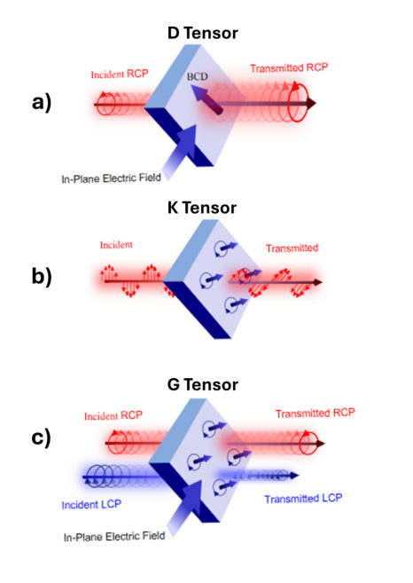
<figcaption class="paper-figure-caption"><b>Fig 1.</b> FIG. 1. Representative optical and EO effects associated with D, K, and G. a) The Berry curvature dipole D produces a bias-induced EO response that can generate polarization de- pendent optical gain. b) The K tensor is associated with the bias-independent gyrotropic magnetic effect, where a linearly polarized transmitted wave can have its plane of polarization rotated relative to the incident wave. c) The magnetoelec- tric EO tensor G produces a bias-induced circular dichroic response, where left and right circularly polarized light are absorbed differently.</figcaption>
</figure>
<figure class="paper-figure-card">
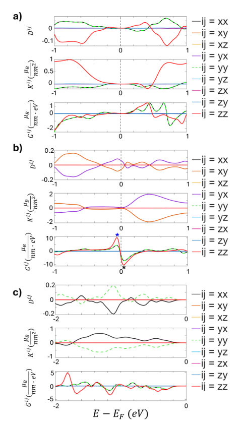
<figcaption class="paper-figure-caption"><b>Fig 2.</b> FIG. 2. Energy dependence of the D, K, and G tensors for a) Te (SG 152), b) TaAs (SG 109), and c) BaTe3 (SG 113), illustrating how materials selection can modify the allowed D and K responses while preserving a common form of G. In the TaAs G panel, the blue and black asterisks indicate the nearby peak and dip features discussed in the text, located near E−EF = −0.06 eV and E−EF = 0.045 eV, respectively.</figcaption>
</figure>
<figure class="paper-figure-card">
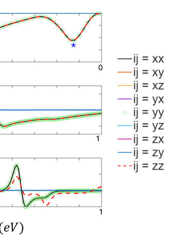
<figcaption class="paper-figure-caption"><b>Fig 3.</b> FIG. 3. Energy dependent G tensor for GaAs (SG 216), HgTe (SG 216), and TaN (SG 187). The blue asterisk in the GaAs panel marks the feature discussed in the text, located near E −EF = −0.2402 eV, where the isotropic component reaches Gxx = Gyy = Gzz ≃−1.108 µB/(nm · eV).</figcaption>
</figure>
<figure class="paper-figure-card">
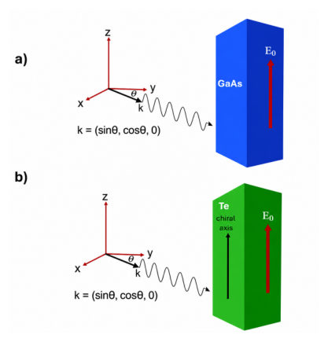
<figcaption class="paper-figure-caption"><b>Fig 4.</b> FIG. 4. Schematic experimental setup for probing the G- driven EO response. a) GaAs geometry with the crystal sur- face in the xz plane, surface normal along −y, optical wave in- cident in the z = 0 plane with wave vector k = (sin θ, cos θ, 0), and static electric bias field E0 applied along +z. b) Te in the same experimental geometry, with the chiral axis aligned along +z.</figcaption>
</figure>

**Summary.** This work theoretically classifies how magnetoelectric electro-optic effects manifest in noncentrosymmetric metals by analyzing three key response tensors: D, K, and G. By applying symmetry constraints, the authors pinpoint specific crystal symmetries where the desired G-driven effect can be isolated from other contributions (D and K). This provides a powerful roadmap for experimentalists to observe these exotic quantum phenomena.

**Why it may be interesting.** While focused on solid-state physics, the rigorous use of symmetry constraints to predict measurable quantum responses (like chirality or magnetoelectric coupling) is highly relevant to understanding engineered quantum materials for quantum optics applications.

Detailed structure

**Main problem.** The paper aims to classify symmetry-constrained forms of Berry curvature dipole (D), gyrotropic magnetic (K), and magnetoelectric electro-optic (G) tensors in noncentrosymmetric metals.

**Main result.** They identify 11 space groups where D and K vanish by symmetry while the G-driven magnetoelectric EO effect remains allowed, providing a cleaner experimental route for observation.

**Method.** The methodology combines rigorous symmetry analysis using group theory (TENSOR program) with first-principles calculations to predict observable optical responses.

**Model / system.** The study focuses on metallic optical and electro-optic effects in time-reversal symmetric, noncentrosymmetric metals operating in the low-frequency intraband regime. The response is governed by three key tensors: D, K, and G.

**Key observables.** Bias-induced circular dichroism (CD) with a characteristic sin(theta)cos(theta) angular dependence; helicity-even absorption/gain corrections.

**Important parameters / regimes.** Low-frequency intraband regime ($\omega 	au \gg 1$, $\omega \ll \epsilon_{	ext{gap}}/\hbar$); crystal symmetry (Space Groups).

**Assumptions / limitations.** The analysis assumes time-reversal symmetry and relies on the mathematical formalism connecting optical response to specific tensor symmetries.

**Figures summary.** FIG. 1 schematically illustrates the distinct EO responses associated with D, K, and G; FIG. 4 shows the schematic experimental setup for probing the G-driven EO response in GaAs and Te.

**Paper structure.** The paper develops from general theory of optical conductivity tensors to symmetry classification, identifying specific material symmetries where the desired G-driven effect can be isolated experimentally by controlling polarization and geometry.

Abstract

We classify the symmetry-constrained forms of the Berry curvature dipole $\mathbf{D}$, gyrotropic magnetic tensor $\mathbf{K}$, and magnetoelectric electro-optic (EO) tensor $\mathbf{G}$, which describe metallic optical and EO effects in time-reversal symmetric, noncentrosymmetric metals. We identify 11 space groups (SGs) in which $\mathbf{D}$ and $\mathbf{K}$ vanish by symmetry while $\mathbf{G}$ remains allowed, thereby providing a more direct route to observing the recently predicted magnetoelectric EO effects associated with $\mathbf{G}$. First-principles based calculations confirm that $\mathbf{D}$ and $\mathbf{K}$ vanish for representative materials, while $\mathbf{G}$ remains allowed and tunable via Fermi level shifting. We further show that the choices of SG and experimental configuration provide complementary paths for isolating $\mathbf{G}$-driven EO effects, including cases where $\mathbf{D}$ and $\mathbf{K}$ are also symmetry-allowed. In an oblique-incidence geometry, the $\mathbf{D}$-driven response produces a helicity-even absorption or gain correction, whereas the $\mathbf{G}$-driven response couples the $s$ and $p$ optical sectors and produces a bias-induced circular dichroism with a characteristic $\sinθ\cosθ$ angular dependence. This provides a direct experimental route for separating the $\mathbf{D}$- and $\mathbf{G}$-driven EO signatures in noncentrosymmetric metals.

[↑ back to top](#top)

### [Transition to chaos in two-dimensional Rayleigh-Bénard convection: the role of the magnetic field](http://arxiv.org/abs/2607.17918v1)

**Authors:** Francis F. Franco, Gabriel de T. Paula, Roman Chertovskih, Dalton N. Oliveira, Erico L. Rempel  
**Type:** theory · **Category:** other · **PDF:** <https://arxiv.org/pdf/2607.17918v1>  
**Analysis basis:** full PDF text, analyzed in chunks
**Topic relevance:** `driven-dissipative phase transition` **2/5** · `non-equilibrium dynamics` **2/5** · `non-equilibrium universality` **2/5** · `Frenkel-Kontorova` **1/5** · `Keldysh / 2PI / non-Gaussian methods` **1/5** · `analog quantum simulation` **1/5** · `correlated / nonlocal dissipation` **1/5** · `entanglement & information structure` **1/5** · `methods for driven-dissipative` **1/5**

↔ Scroll figures horizontally

<figure class="paper-figure-card">
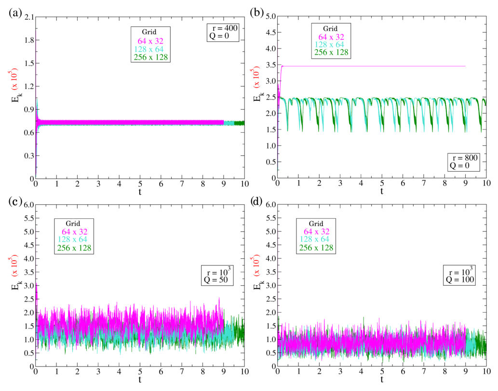
<figcaption class="paper-figure-caption"><b>Fig 1.</b> Fig. 1. Test of numerical resolution. The time series of the kinetic energy is shown for three different resolutions and different choices of r and Q, as indicated in each panel.</figcaption>
</figure>
<figure class="paper-figure-card">
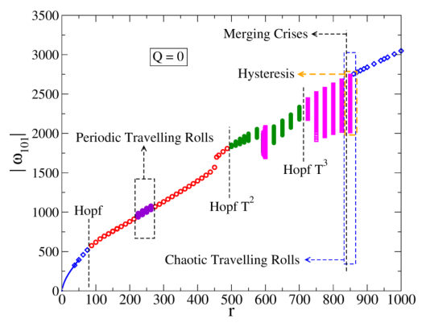
<figcaption class="paper-figure-caption"><b>Fig 2.</b> Fig. 2. Bifurcation diagram for |ω101| as a function of r. Blue diamonds represent fixed point attractors, red circles denote periodic attractors, purple circles are periodic traveling rolls, green circles are quasiperiodic attractors, and magenta squares represent chaotic attractors.</figcaption>
</figure>
<figure class="paper-figure-card">
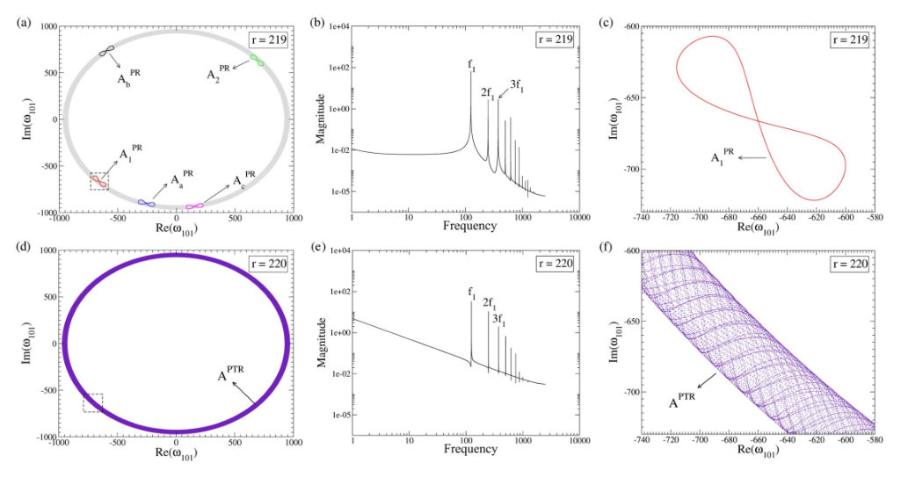
<figcaption class="paper-figure-caption"><b>Fig 3.</b> Fig. 3. Phase space projection on Im(ω101) × Re(ω101). (a) five symmetric periodic attractors: AaP R (blue), AbP R (black), AcP R (magenta), A1P R (red) and A2P R (green) at r = 219. The gray area represents a non-attracting periodic traveling roll set. In (b) and (e), the power spectra for the time series of Re(ω101) are shown for r = 219 and r = 220, respectively. (d) Periodic traveling roll attractor AP T R for r = 220. Figures (c) and (f) are enlargements of the box regions in (a) and (d), respectively.</figcaption>
</figure>
<figure class="paper-figure-card">
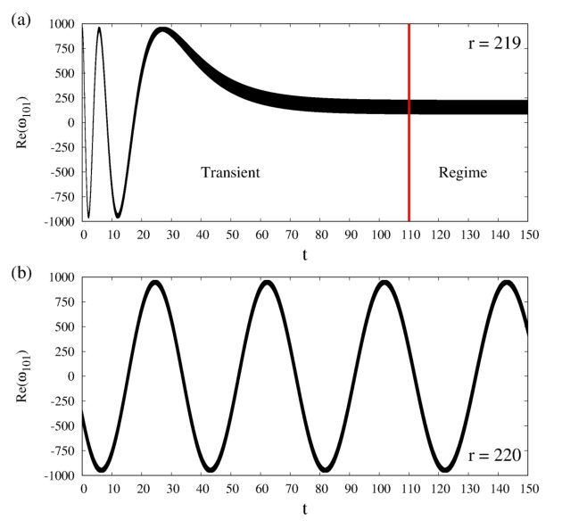
<figcaption class="paper-figure-caption"><b>Fig 4.</b> Fig. 4. Time series of the real part of the highest energy mode of vorticity ω101 for r = 219 and r = 220, in (a) and (b), respectively. In (a) is shown the long initial transient before convergence to the periodic attractor AP R b . In (b), the time series corresponds to the periodic traveling roll attractor AP T R. This initial transient in (a) is constituted by a non-attracting periodic traveling roll.</figcaption>
</figure>
<figure class="paper-figure-card">
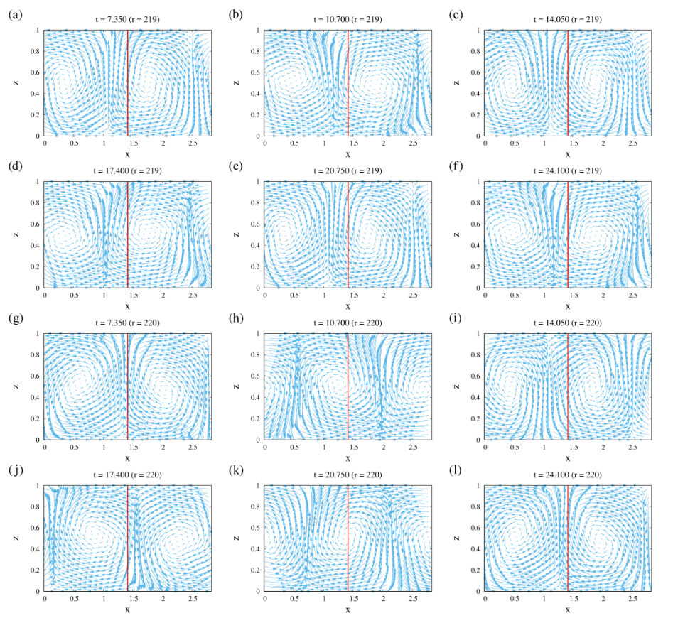
<figcaption class="paper-figure-caption"><b>Fig 5.</b> Fig. 5. Velocity fields in different instants for r = 219 (in (a), (b), (c), (d), (e) and (f)) and r = 220 (in (g), (h), (i), (j), (k) and (l)).</figcaption>
</figure>

**Summary.** This work numerically investigates magnetoconvection in 2D Rayleigh-Bénard convection to understand the role of an external magnetic field on the transition to chaos. The key finding is that the magnetic field enhances chaotic roll behavior and facilitates vortex splitting through magnetic reconnection events during flow instabilities. This provides a detailed, non-linear fluid dynamics model for understanding turbulence onset.

**Why it may be interesting.** While focused on classical fluid dynamics (MHD), the study of pattern formation, chaos transition routes (e.g., crisis mechanisms), and localized energy dissipation/reconnection events shares mathematical parallels with non-equilibrium quantum field theories or open quantum systems exhibiting complex dynamics.

Detailed structure

**Main problem.** The study investigates how an externally imposed magnetic field influences the transition from ordered convective flow to chaos in two-dimensional Rayleigh-Bénard convection (RBC). It specifically examines the role of this magnetic field on the onset and nature of turbulent behavior.

**Main result.** Introducing a background magnetic field increases chaotic traveling roll dynamics and promotes the breaking/splitting of convective rolls, suggesting a mechanism for transitioning to 2D turbulence. This process is linked to intermittent magnetic vortex splitting via reconnection during saddle-roll interactions.

**Method.** The analysis relies on numerical simulations using pseudospectral methods to solve non-dimensional magnetohydrodynamic equations. Diagnostics include Finite-Time Lyapunov Exponents (FTLE), Instantaneous Vorticity Deviation (IVD), and Local Current Deviation (LCD).

**Model / system.** The system is two-dimensional, incompressible, electrically conducting fluid undergoing Rayleigh-Bénard convection under the influence of a uniform background magnetic field ($\mathbf{B}_0$). The dynamics are governed by modified Boussinesq approximations.

**Key observables.** Traveling rolls dynamics, chaotic behavior, vortex structures (kinetic and magnetic), bifurcation points, and reconnection events.

**Important parameters / regimes.** Reduced Rayleigh number ($r$), Chandrasekhar number ($Q$, related to $\mathbf{B}_0$), Prandtl number ($Pr$), and magnetic Prandtl number ($Pm$).

**Assumptions / limitations.** The analysis is restricted to a two-dimensional formulation, which simplifies the study of topological dynamics compared to full 3D MHD turbulence.

**Figures summary.** Figures illustrate velocity IVD and magnetic LCD alongside streamlines at specific times, highlighting saddle point/roll interactions and non-colliding vortex structures during reconnection events.

**Paper structure.** The paper first establishes the baseline chaotic transition in the purely hydrodynamic case ($Q=0$). It then systematically introduces $\mathbf{B}_0$ ($Q>0$), analyzing how this field alters the dynamics, promoting roll breaking and detailing the topological changes associated with magnetic reconnection during flow interactions.

Abstract

The impact of an externally imposed magnetic field on numerical simulations of two-dimensional Rayleigh-Bénard convection (RBC) is investigated. Initially, the RBC model is examined in the absence of a magnetic field to establish a baseline. Then, a background magnetic field is introduced, and its influence on the transition to chaos is explored. For the purely hydrodynamic case and a range of the reduced Rayleigh number, the system exhibits traveling rolls which, after an attractor-merging crisis, give way to chaotic traveling rolls. Upon imposing a background magnetic field, there is a notable increase in the occurrence of traveling roll dynamics. Furthermore, the presence of the magnetic field favors the splitting/breaking of convective rolls, indicating a possible mechanism for transition to two-dimensional turbulence, with the structure of the convection cell being disrupted. A detailed analysis of the velocity field reveals that the collision between a saddle point and the center of a convective roll restores the system's original topology, with two symmetric kinetic vortices. During this collision, a magnetic vortex splits in two as a result of a magnetic reconnection. This behavior occurs intermittently in time.

[↑ back to top](#top)

### [A Voltage-Controlled Josephson Frequency Comb](http://arxiv.org/abs/2607.17992v1)

**Authors:** Giorgio De Simoni, Francesco Giazotto  
**Type:** theory · **Category:** other · **PDF:** <https://arxiv.org/pdf/2607.17992v1>  
**Analysis basis:** full PDF text, analyzed in chunks
**Topic relevance:** `QC/QI experiment` **2/5** · `driven-dissipative phase transition` **2/5** · `methods for driven-dissipative` **2/5** · `Keldysh / 2PI / non-Gaussian methods` **1/5** · `non-equilibrium dynamics` **1/5** · `spintronics-quantum-optics interface` **1/5**

↔ Scroll figures horizontally

<figure class="paper-figure-card">
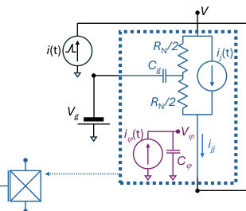
<figcaption class="paper-figure-caption"><b>Fig 1.</b> FIG. 1. (a) Schematic representation of a gate-tunable superconductor–normal-metal–superconductor (SNS) Josephson junction with length L and width W. The device consists of two superconducting electrodes (light blue) that contact a semiconductor region hosting a two- dimensional electron gas (2DEG, red), which is capacitively coupled to a gate electrode (red) through a dielectric layer (grey). (b) Dependence of the normalized critical current Ic/I0 (left axis) and of the normal-state resistance RN (right axis), expressed in units of R0 ≡ h 2e2W n2 , on the induced carrier density ng/n0 for selected temperatures (given in units of Tc). (c) Supercurrent–phase relation (CΦR) obtained from Eq....</figcaption>
</figure>
<figure class="paper-figure-card">
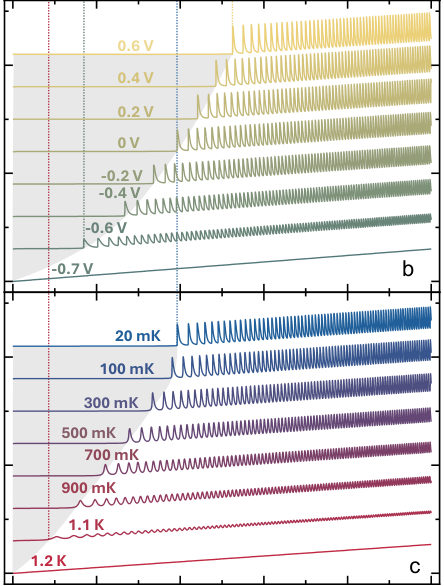
<figcaption class="paper-figure-caption"><b>Fig 2.</b> FIG. 2. Time-dependent response of a shunted, gate-tunable Al–InAs–Al superconductor–normal-metal–superconductor (SNS) ballistic Josephson junction. The traces are obtained from transient numerical simulations with sub-picosecond temporal resolution for representative values of the gate volt- age Vg and temperature T. (a) Bias current i as a function of time t. The current i is increased linearly from 0 to 30 µA over a time interval of 100 ns. (b) Corresponding voltage characteristics V (i(t)) at T = 20 mK for gate voltages Vg in the range −0.7 to 0.6 V. A nondissipative regime (V ≈0, gray region) is observed at low bias currents, whereas for i &gt; Ic(Vg) relaxation oscillations emerge, which...</figcaption>
</figure>
<figure class="paper-figure-card">
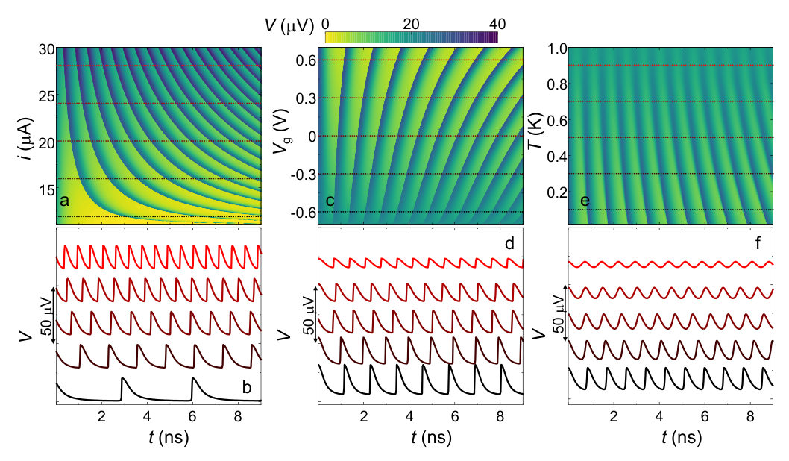
<figcaption class="paper-figure-caption"><b>Fig 3.</b> FIG. 3. Time-domain evolution of the JRO output voltage as a function of bias current, gate voltage, and temperature. (a) Color map of the output voltage V (i, t) as a function of time and bias current for T = 20 mK and Vg = 0. (b) Representative line cuts extracted from panel (a), illustrating the evolution of the relaxation oscillations with increasing bias current. As i exceeds the critical current Ic, the ratio i/Ic increases, reducing the oscillation period τ from the nanosecond range to a few hundred picoseconds. (c) Color map of V (Vg, t) for T = 20 mK and fixed i = 20 µA. (d) Selected voltage traces from panel (c), demonstrating the gate tunability of both the oscillation period and...</figcaption>
</figure>
<figure class="paper-figure-card">
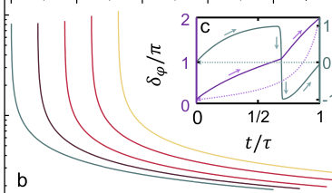
<figcaption class="paper-figure-caption"><b>Fig 4.</b> FIG. 4. Josephson inductance of a ballistic SNS junction and its impact on JRO dynamics. (a) Josephson inductance Lj as a function of the superconducting phase difference δφ for selected temperatures, calculated from the ballistic KO-2 current–phase relation. The divergence of Lj occurs at the in- version point of the Josephson current and shifts with temper- ature in accordance with the evolution of the current–phase relation (CΦR). (b) Josephson inductance as a function of the normalized gate-induced carrier density ng/n for selected temperatures. Due to the electrostatic tunability of the ballis- tic SNS junction, Lj can be continuously tuned via the gate electrode and diverges as the...</figcaption>
</figure>
<figure class="paper-figure-card">
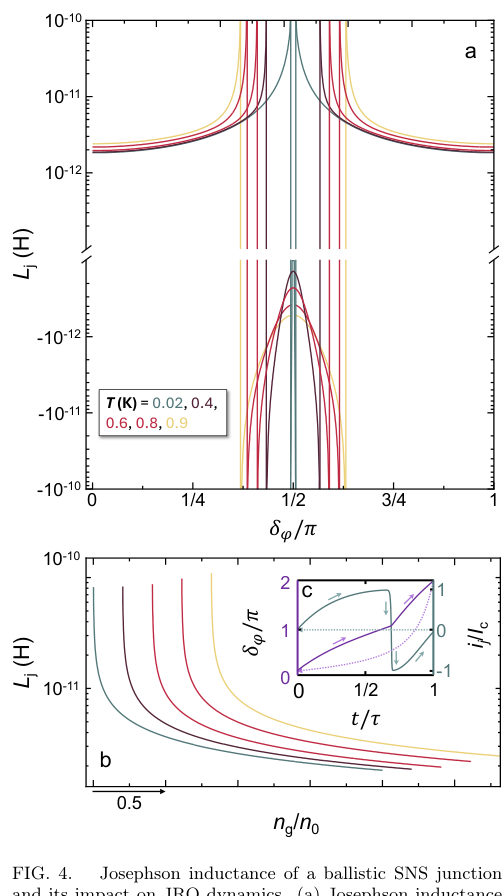
<figcaption class="paper-figure-caption"><b>Fig 5.</b> Figure 2 shows V (t) of the shunted gate–controlled</figcaption>
</figure>

**Summary.** This work proposes a novel frequency comb generator utilizing a gate-tunable Josephson field-effect transistor. By electrostatically tuning the junction parameters, the device achieves direct electrical control over the comb's spacing and frequencies. This platform is shown to be scalable and robust, making it valuable for next-generation cryogenic quantum information and sensing applications.

**Why it may be interesting.** While focused on microwave electronics, the concept of controlling quantum oscillations (Josephson junctions) via external fields and achieving high spectral purity is highly relevant to superconducting circuit QED and quantum sensing architectures.

Detailed structure

**Main problem.** The primary goal is developing a compact, scalable, and electrically tunable microwave frequency comb generator for cryogenic quantum technologies.

**Main result.** The proposed Josephson field-effect transistor oscillator successfully generates coherent voltage pulses whose Fourier spectrum forms a microwave frequency comb, with demonstrated coverage up to 10 GHz using Al/InAs and extended bandwidth using Nb electrodes.

**Method.** The analysis relies on time-domain circuit simulations solving the Resistively Shunted Josephson Junction (RSJ) model for a gate-tunable Superconductor–Normal metal–Superconductor (SNS) junction.

**Model / system.** The system is an SNS Josephson field-effect transistor operating in a relaxation-oscillation regime. The normal region is a 2DEG whose carrier density can be electrostatically tuned via a gate electrode, allowing control over the critical current and inductance.

**Key observables.** Coherent voltage pulses forming a microwave frequency comb; mode frequencies ($f_j$) and spacing; peak power ($P_j$); oscillation period ($	au$).

**Important parameters / regimes.** Gate voltage ($V_g$), superconducting gap ($\Delta(T)$), operating temperature ($T$), ballistic channel number ($N$).

**Assumptions / limitations.** The junction operates in the ballistic short-junction approximation; an RSJ model is used, and hysteresis is managed by adding a shunt resistor.

**Figures summary.** Figures illustrate the dependence of critical current and resistance on gate voltage (Al/InAs), the time-domain response showing relaxation oscillations, and comparative performance plots for Niobium electrodes showing extended frequency spans and power scaling with $V_g$.

**Paper structure.** The paper introduces the concept by detailing the physical platform (gate-tunable SNS junction) and its theoretical modeling using the RSJ circuit. It then presents simulations demonstrating tunable comb generation, followed by an extension to higher-$T_c$ superconductors like Niobium to enhance performance.

Abstract

Microwave frequency combs constitute promising resources for quantum technologies, cryogenic electronics, and multiplexed sensing architectures. In this work, we propose a frequency-comb generator based on a Josephson field-effect transistor operated in a relaxation-oscillation regime. The device comprises a gate-tunable ballistic superconductor-semiconductor-superconductor junction embedded in a resistively shunted circuit, in which electrostatic control of the carrier density enables in situ tuning of both the critical current and the Josephson inductance. Time-domain circuit simulations indicate that the resulting oscillator produces coherent voltage pulses whose Fourier spectrum forms a microwave frequency comb. In contrast to conventional Josephson-based comb architectures, the proposed platform provides direct electrical control of the comb spacing, emission frequencies, and modal power distribution via a gate electrode. For a representative Al/InAs implementation, we demonstrate continuous frequency coverage in the technologically relevant 1-10 GHz range. Furthermore, the concept is shown to be compatible with higher-$T_c$ superconductors, underscoring its potential as a compact and scalable microwave source for cryogenic quantum information and sensing applications.

[↑ back to top](#top)

### [Interface-Confined Superconductivity with Thickness-Independent Superfluid Stiffness in (Pb,Sn)Te/FeTe Bilayers](http://arxiv.org/abs/2607.17539v1)

**Authors:** Zi-Jie Yan, Hongtao Rong, Yiyuan Luo, Yufei Zhao, Pu Xiao, Zihao Wang, Lok-Kan Lai, Annie G. Wang, Zhiyuan Xi, Yanxing Li, Xiaoyu Wei, Ke Wang, Binghai Yan, Chih-Kang Shih, Cui-Zu Chang  
**Type:** both · **Category:** other · **PDF:** <https://arxiv.org/pdf/2607.17539v1>  
**Analysis basis:** full PDF text, analyzed in chunks
**Topic relevance:** `analog quantum simulation` **2/5** · `spintronics-quantum-optics interface` **2/5** · `Keldysh / 2PI / non-Gaussian methods` **1/5** · `Kondo & dissipative impurity` **1/5** · `QC/QI experiment` **1/5** · `driven-dissipative phase transition` **1/5** · `methods for driven-dissipative` **1/5**

↔ Scroll figures horizontally

<figure class="paper-figure-card">
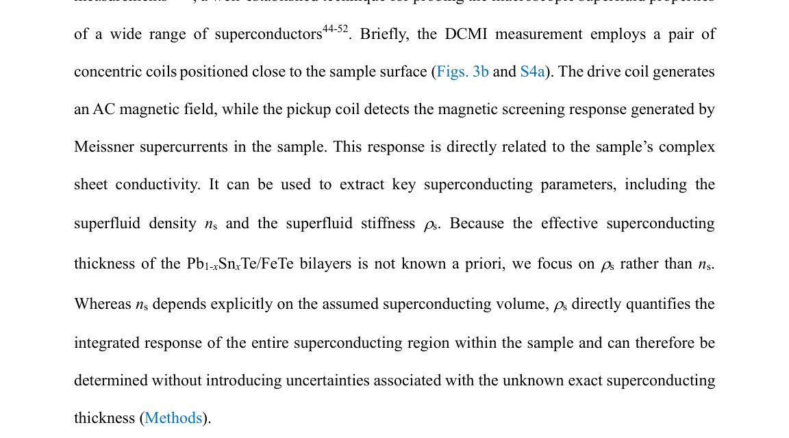
<figcaption class="paper-figure-caption"><b>Fig 1.</b> Figure 3c shows the T dependence of s for the (24, 25) bilayers with different x. In all samples,</figcaption>
</figure>
<figure class="paper-figure-card">
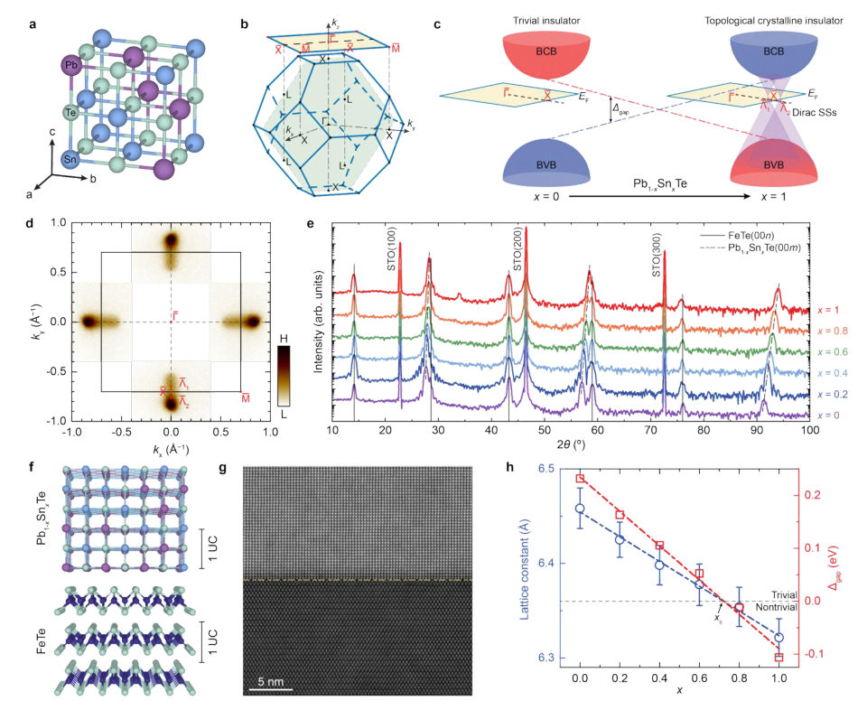
<figcaption class="paper-figure-caption"><b>Fig 2.</b> Fig. 1| MBE-grown Pb1-xSnxTe/FeTe bilayers. a, Crystal structure of Pb1-xSnxTe. b, First BZ of</figcaption>
</figure>
<figure class="paper-figure-card">
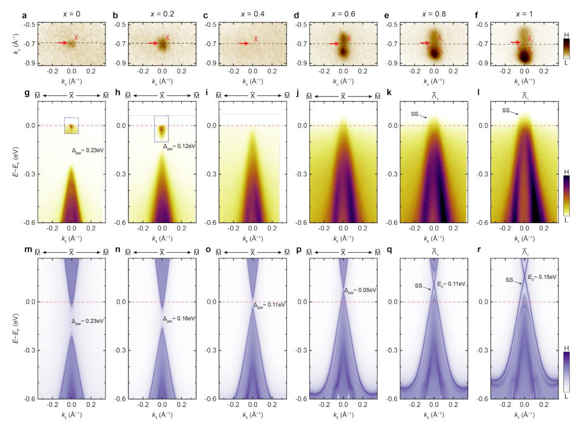
<figcaption class="paper-figure-caption"><b>Fig 3.</b> Fig. 2| Evolution of the electronic band structure of the (24, 25) bilayers with increasing x. a-</figcaption>
</figure>
<figure class="paper-figure-card">
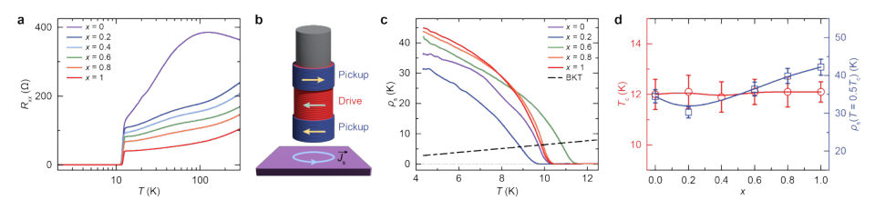
<figcaption class="paper-figure-caption"><b>Fig 4.</b> Fig. 3| Robust superconductivity in the (24, 25) bilayers with varying x. a, Rxx-T curves. b,</figcaption>
</figure>
<figure class="paper-figure-card">
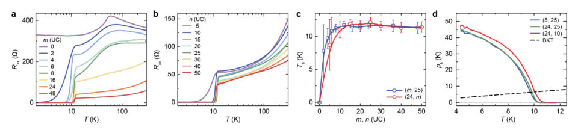
<figcaption class="paper-figure-caption"><b>Fig 5.</b> Fig. 4| Thickness dependence of superconductivity in (m, 25) and (24, n) bilayers with x = 1.</figcaption>
</figure>

**Summary.** This work investigates superconductivity in $	ext{Pb}_{1-x}	ext{Sn}_x	ext{Te}/	ext{FeTe}$ bilayers, where the top layer undergoes a controlled topological phase transition. By measuring superconducting properties and superfluid stiffness, the authors conclude that the superconductivity is robustly confined to the interface region, suggesting its mechanism is intrinsic to the $	ext{FeTe}$ component rather than the topology of the adjacent material.

**Why it may be interesting.** While primarily condensed matter physics, the study involves engineered interfaces and superconducting phenomena that can be relevant to quantum computing platforms utilizing topological superconductors or Majorana zero modes at boundaries.

Detailed structure

**Main problem.** The study investigates interface-induced superconductivity in $	ext{FeTe}$-based heterostructures, specifically addressing how the topology and electronic structure of neighboring layers influence this superconducting state.

**Main result.** Superconductivity is robust across a topological phase transition in the adjacent layer ($	ext{Pb}_{1-x}	ext{Sn}_x	ext{Te}$), suggesting that superconductivity originates primarily from modifications within the $	ext{FeTe}$ layer itself, confined near the interface.

**Method.** The research combines experimental techniques like MBE growth, ARPES for electronic structure mapping, and double-coil mutual inductance measurements to probe superfluid stiffness. Theoretical calculations are used to model the topological transitions in the adjacent material.

**Model / system.** The physical system is $	ext{Pb}_{1-x}	ext{Sn}_x	ext{Te}/	ext{FeTe}$ bilayers, where $x$ tunes the electronic structure of the top layer from a trivial insulator to a topological crystalline insulator (TCI). The analysis focuses on the interplay between this tunable topology and superconductivity.

**Key observables.** Superconducting transition temperature ($T_c$), superfluid stiffness ($
ho_s$), evolution of Dirac surface states, and band gap closing/reopening across the composition range.

**Important parameters / regimes.** Sn concentration ($x$) in $	ext{Pb}_{1-x}	ext{Sn}_x	ext{Te}$, which drives the topological phase transition; bilayer thickness (analyzed for saturation effects).

**Assumptions / limitations.** The primary assumption is that superconductivity is interface-confined, suggesting its origin lies in the $	ext{FeTe}$ layer rather than being dictated by the bulk topology of the neighboring material.

**Figures summary.** Figures illustrate ARPES measurements showing Dirac cone emergence with $x$, and transport measurements demonstrating constant superfluid stiffness despite topological changes.

**Paper structure.** The paper first establishes the physical system and methods, then uses ARPES to map the topological transition in $	ext{Pb}_{1-x}	ext{Sn}_x	ext{Te}$, followed by electrical/inductance measurements confirming robust superconductivity insensitive to this transition, leading to the conclusion of interface confinement.

Abstract

Interface-induced superconductivity in FeTe-based heterostructures provides a promising route toward topological superconductivity, yet the roles of the neighboring layers topology, symmetry, and electronic structure remain unresolved. In this work, we employ molecular beam epitaxy to grow Pb1-xSnxTe/FeTe bilayers and use angle-resolved photoemission spectroscopy to track the evolution of the Pb1-xSnxTe layer from a trivial insulator to a topological crystalline insulator hosting multiple Dirac surface states. Electrical transport measurements reveal robust superconductivity throughout the entire composition range, with a nearly constant superconducting transition temperature of ~12 K despite substantial changes in the electronic structure and topology of Pb1-xSnxTe. Double-coil mutual-inductance measurements further reveal comparable superfluid stiffness across the topological phase transition and nearly thickness-independent superfluid stiffness despite large variations in the constituent-layer thicknesses, demonstrating that superconductivity is confined near the interface. These results establish that superconductivity in FeTe-based heterostructures is largely insensitive to the topology, crystal symmetry, and detailed electronic structure of the neighboring layer, supporting a primary origin in modifications to the FeTe layer. The coexistence of interface-confined superconductivity and tunable multiple Dirac surface states in Pb1-xSnxTe/FeTe bilayers provides a versatile platform for exploring topological superconductivity and interactions among multiple Majorana zero modes.

[↑ back to top](#top)

### [Oval-shaped resonance distortion as a signature of quasiparticle heating effect in a niobium superconducting resonator](http://arxiv.org/abs/2607.17791v1)

**Authors:** Zhenyuan Sun, Genting Dai, Xiao Geng, Liangliang Yang, Mingjun Cheng, Qing Yu, Jinlin Chang, Yi Yang, Linpan Jiang, Jianshe Liu, Wei Chen  
**Type:** both · **Category:** other · **PDF:** <https://arxiv.org/pdf/2607.17791v1>  
**Analysis basis:** full PDF text, analyzed in chunks
**Topic relevance:** `correlated / nonlocal dissipation` **2/5** · `non-equilibrium dynamics` **2/5** · `QC/QI experiment` **1/5** · `driven-dissipative phase transition` **1/5** · `methods for driven-dissipative` **1/5** · `non-equilibrium universality` **1/5**

↔ Scroll figures horizontally

<figure class="paper-figure-card">
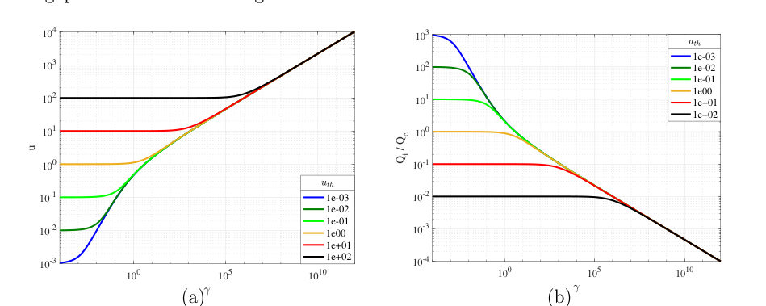
<figcaption class="paper-figure-caption"><b>Fig 1.</b> Figure 1: (a) Normalised quasiparticle density u = nqp/n∗as a function of normalised applied power γ for different values of thermal density uth. (b) Corresponding quality factor Qi/Qc.</figcaption>
</figure>
<figure class="paper-figure-card">

<figcaption class="paper-figure-caption"><b>Fig 2.</b> Fig.1 presents numerical solutions of the quartic equation over a wide dynamic range of normalised applied power γ, for representative values of the thermal density uth (which corresponds to different bath temperatures). Fig.1(a) shows the normalised quasiparticle density u, and Fig.1(b) the normalised internal quality factor Qi/Qc. Here, Qother/Qc = 108 corresponds to the regime where other losses have no influence on the dissipative behaviour of the device. Several features are noteworthy. At low readout power γ, the quasiparticle density saturates at the thermal floor u →uth, and Qi/Qc correspondingly exhibits a constant plateau whose level is set by the bath temperature. As readout...</figcaption>
</figure>
<figure class="paper-figure-card">
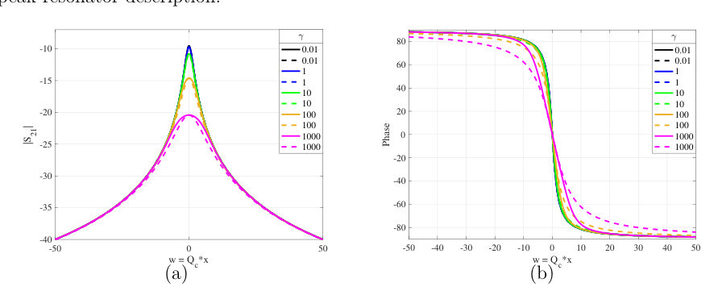
<figcaption class="paper-figure-caption"><b>Fig 3.</b> Figure 2: Transmission magnitude (a) and phase (b) of S21 as a function of frequency at different readout powers. Solid lines: full QPH model; dashed lines: linear resonance curves calculated by Eq.1 using Qc and a fixed Qr obtained from the depth of the matching nonlinear curve as x = 0.</figcaption>
</figure>
<figure class="paper-figure-card">
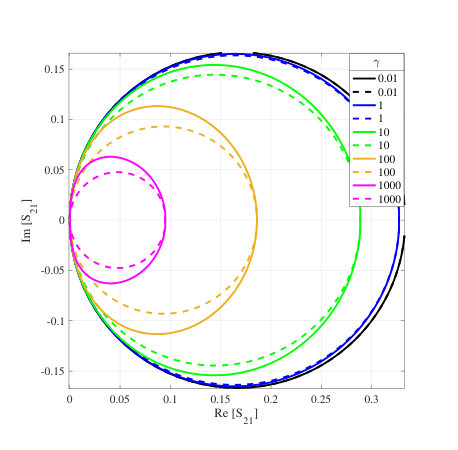
<figcaption class="paper-figure-caption"><b>Fig 4.</b> Figure 3: S21 in Argand complex plane as a function of frequency at different applied readout powers. Solid lines: full QPH model; dashed lines: linear resonance curves cal- culated with the same fixed Qr as in Fig.2.</figcaption>
</figure>
<figure class="paper-figure-card">
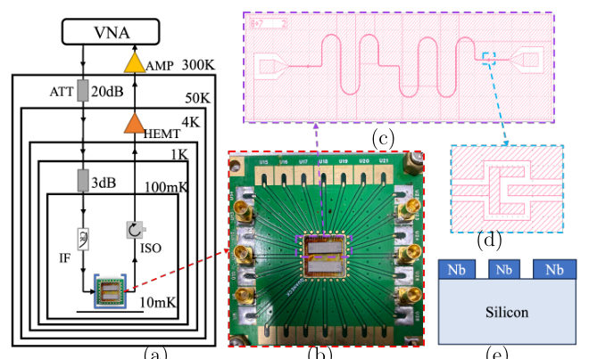
<figcaption class="paper-figure-caption"><b>Fig 5.</b> Figure 4: (a) Schematic diagram of the measurement system based on a dilution refrig- erator. VNA: vector network analyser, ATT: attenuator, IR: infrared filter, ISO: isolator, HEMT: high electron mobility transistor, AMP: room‑temperature amplifier. (b) Photo- graph of the resonator chip wire‑bonded to the PCB. (c) Schematic of the CPW resonator mask layout. (d) Plan‑view of the stub coupling. (e) Cross‑section of the CPW line.</figcaption>
</figure>

**Summary.** This paper develops and validates a theoretical model describing quasiparticle heating losses in superconducting microwave resonators. By analyzing the resulting nonlinear changes in resonance response, the authors identify a unique 'oval-shaped distortion' in the complex plane as a definitive experimental signature for diagnosing when QPH dominates energy dissipation.

**Why it may be interesting.** This work provides a concrete, measurable spectroscopic tool (the oval distortion) to diagnose fundamental non-equilibrium energy loss mechanisms (QPH) in superconducting circuits, which is crucial for designing high-performance quantum devices.

Detailed structure

**Main problem.** The study investigates the nonlinear behavior of superconducting microwave resonators caused by quasiparticle heating (QPH) effects.

**Main result.** A distinctive oval-shaped distortion in the resonance circle plotted in the complex plane serves as a practical and reliable experimental signature for identifying the QPH-dominated loss regime.

**Method.** The authors combine theoretical modeling, modifying Rothwarf-Taylor equations to create a macroscopic QPH model, with systematic experimental measurements using VNA sweeps of readout power and bath temperature.

**Model / system.** The system is a Niobium (Nb) superconducting half-wavelength coplanar waveguide (CPW) resonator. The theory models the quasiparticle density evolution by modifying Rothwarf-Taylor equations to link the quality factor ($Q$) directly to the microwave readout power ($P_r$).

**Key observables.** The primary observables are the $S_{21}$ transmission parameter trajectory in the Argand complex plane, and the extracted internal quality factor ($Q_i/Q_c$) as a function of readout power.

**Important parameters / regimes.** Key regimes include the low-power thermal saturation limit and the high-power universal scaling regime ($u \propto P_r^{1/3}$), alongside bath temperature ($T_b$) and readout power ($P_r$).

**Assumptions / limitations.** The model assumes that QPH is the dominant source of dissipative non-linearity in the investigated parameter space, allowing for a simplified analysis based on modified Rothwarf-Taylor equations.

**Figures summary.** Figures show numerical solutions of the governing quartic equation and experimental $S_{21}$ loci in the Argand plane. These figures illustrate the characteristic oval distortion developing as QPH losses become dominant over other loss mechanisms.

**Paper structure.** The paper establishes a theoretical model by modifying Rothwarf-Taylor equations to link $Q$ to power via quasiparticle heating. It then analyzes this theory using numerical solutions and validates it through systematic experimental measurements of the resonance response across varying temperatures and powers, culminating in the identification of the diagnostic signature.

Abstract

We investigate the nonlinear behavior of a superconducting microwave resonator subjected to a dissipative mechanism where the associated quality factor (Q factor) decreases with increasing dissipated power, leading to a dissipative feedback effect. By modifying the Rothwarf-Taylor equations, we establish a macroscopic quasiparticle heating (QPH) model that directly links the quality factor to the microwave readout power. The key finding is the identification of a distinctive oval-shaped distortion in the resonance circle in the complex plane. This distortion serves as a practical experimental signature for identifying the readout power regime in which QPH dominates the loss, under conditions where other nonlinear mechanisms are sufficiently weak. To validate the model, we design and fabricate a niobium (Nb) half-wavelength coplanar waveguide (CPW) resonator and conduct systematic bath temperature and readout power sweeps. The model provides a well fit to the observed oval-shaped resonance circle distortion across a wide range of operating conditions, confirming the QPH mechanism as the primary source of the dissipative non-linearity in the parameter space investigated.

[↑ back to top](#top)

### [Distributed Topological Charge and Spinorial Holonomy in Yukawa-Regularized Graphene Disclinations](http://arxiv.org/abs/2607.16835v1)

**Authors:** A. M. de M. Carvalho, G. Q. Garcia, E. Brito, C. Furtado  
**Type:** theory · **Category:** other · **PDF:** <https://arxiv.org/pdf/2607.16835v1>  
**Analysis basis:** full PDF text, analyzed in chunks
**Topic relevance:** `Keldysh / 2PI / non-Gaussian methods` **1/5** · `analog quantum simulation` **1/5** · `correlated / nonlocal dissipation` **1/5** · `driven-dissipative phase transition` **1/5** · `methods for driven-dissipative` **1/5**

↔ Scroll figures horizontally

<figure class="paper-figure-card">
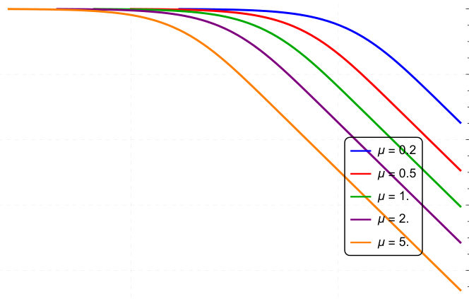
<figcaption class="paper-figure-caption"><b>Fig 1.</b> FIG. 1. Conformal factor Ω(r) (core-regular gauge, Ω(0) = 0) as a function of r (logarithmic scale) for several values of the regularization parameter µ.</figcaption>
</figure>
<figure class="paper-figure-card">
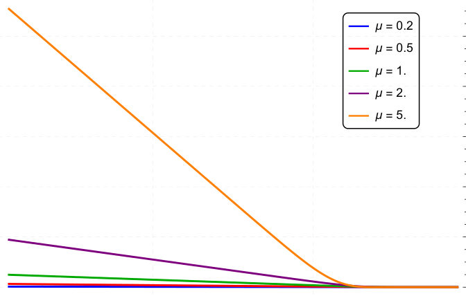
<figcaption class="paper-figure-caption"><b>Fig 2.</b> FIG. 2. Scalar curvature R(r) given by Eq. (4.2) as a function of the radial coordinate r (logarithmic scale) for the same set of µ values used in Fig. 1.</figcaption>
</figure>
<figure class="paper-figure-card">
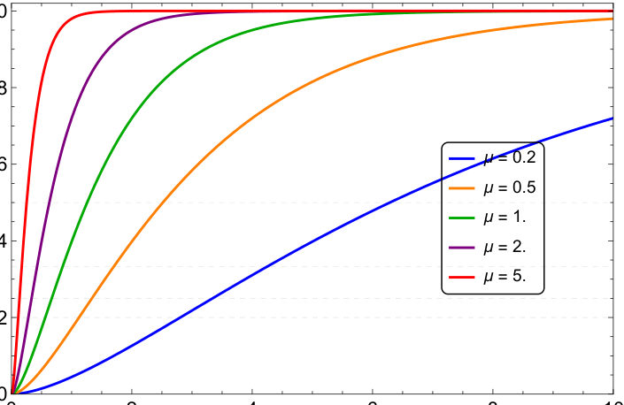
<figcaption class="paper-figure-caption"><b>Fig 3.</b> FIG. 3. Normalized enclosed topological charge Q(ρ)/Λ as a function of the radial coordinate ρ for different values of the screening parameter µ. The charge increases monotonically from zero at the regular core to the asymptotic value Q(ρ) = Λ. Larger values of µ localize the curvature more strongly and lead to a faster saturation of the enclosed topological charge. The horizontal dashed lines indicate representative fractions of the total charge associated with the discrete holonomy-invariance condition discussed in Sec. V.</figcaption>
</figure>

**Summary.** This paper regularizes the singular geometry of disclinations in graphene using a Yukawa potential, creating a smooth, finite-core defect structure. It calculates that this regularization leads to scale-dependent topological charge and a smoothly varying spinorial holonomy for Dirac quasiparticles. This provides a physically realistic extension beyond idealized models for studying geometric phases in 2D materials.

**Why it may be interesting.** This work provides a concrete mathematical framework for handling singular topological defects in condensed matter systems, offering insights into how finite-size effects modify global geometric phases relevant to quantum transport.

Detailed structure

**Main problem.** The study addresses the singularity inherent in ideal conical geometries used to model topological defects (disclinations) by introducing a smooth, finite-core regularization.

**Main result.** The Yukawa regularization successfully replaces the singular curvature with a distributed source, leading to scale-dependent topological charge and a smoothly varying, radius-dependent spinorial holonomy for quasiparticles.

**Method.** The authors solve differential equations derived from geometric considerations (Poisson-like equation) using a modified Helmholtz kernel to model the curvature distribution.

**Model / system.** The system models graphene-like materials containing topological disclinations. The physics is described by massless Dirac quasiparticles propagating in a curved background metric determined by the Yukawa regularization.

**Key observables.** Scale-dependent topological charge, radius-dependent holonomy (geometric phase), and the conformal factor $\Omega(r)$.

**Important parameters / regimes.** The screening length ($\ell = \mu^{-1}$) controls the size of the finite core; $\Lambda$ characterizes the total integrated curvature.

**Assumptions / limitations.** Ideal conical defects are insufficient due to singularities, necessitating a Yukawa-type regularization that preserves asymptotic topology.

**Figures summary.** Figures illustrate the normalized enclosed topological charge $Q(
ho)/\Lambda$ versus radial coordinate $
ho$, showing a monotonic increase from zero at the core to the total value $\Lambda$ asymptotically.

**Paper structure.** The paper progresses by first establishing the need for regularization, deriving the smooth metric components using the Yukawa kernel, and finally analyzing the resulting dynamics of Dirac quasiparticles in this modified background.

Abstract

Conical geometries provide the standard description of disclinations, but they concentrate the curvature at a singular apex. We introduce a Yukawa-type regularization that replaces this singularity by a smooth curvature distribution while preserving the asymptotic topology of the defect. Exact expressions are obtained for the conformal factor, curvature, and enclosed topological charge. The resulting geometry exhibits a scale-dependent topological charge and a corresponding radius-dependent holonomy, establishing a direct connection between distributed curvature and geometric phases. We further investigate the dynamics of massless Dirac quasiparticles in this background and show that the regularized core modifies the spin connection while preserving the asymptotic topological signature of the defect. These results provide a finite-core extension of the conventional conical description and offer a natural framework for studying geometric and topological effects in graphene-like systems.

[↑ back to top](#top)

### [Spin-valley-layer coupling with dual control via stacking and electric field in antiferromagnetic bilayer Janus YIBr](http://arxiv.org/abs/2607.17199v1)

**Authors:** Bo-Wen Yu  
**Type:** theory · **Category:** other · **PDF:** <https://arxiv.org/pdf/2607.17199v1>  
**Analysis basis:** full PDF text, analyzed in chunks
**Topic relevance:** `analog quantum simulation` **1/5** · `exotic spin models in light-matter` **1/5** · `spintronics-quantum-optics interface` **1/5**

↔ Scroll figures horizontally

<figure class="paper-figure-card">
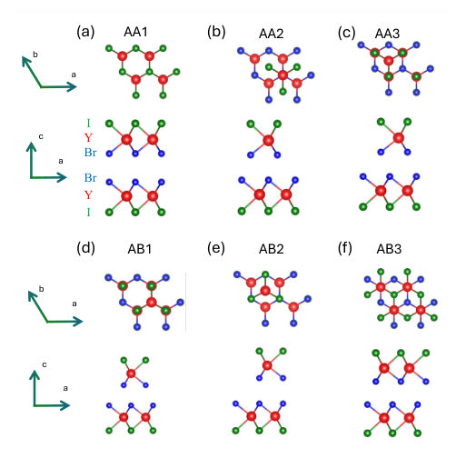
<figcaption class="paper-figure-caption"><b>Fig 1.</b> FIG. 1. The top-view and side-view structure of six bilayer Janus YIBr. I, Y, and Br atoms are green, red, and blue, respectively. The primitive vectors are indicated with the arrows.</figcaption>
</figure>
<figure class="paper-figure-card">
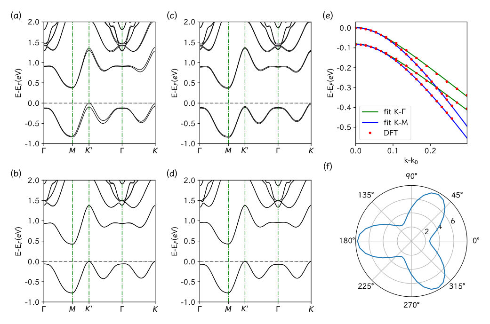
<figcaption class="paper-figure-caption"><b>Fig 2.</b> FIG. 2. Band structures for (a) AA1 with an out-of-plane easy axis, (b) AA3 with an in-plane easy axis, (c) AB2 with an in-plane easy axis, and (d) AB3 with an out-of-plane easy axis. (e) Effective model fit (solid lines) to the DFT bands. (f) Angular dependence of α for the AA1 structure with an out-of-plane easy axis.</figcaption>
</figure>
<figure class="paper-figure-card">
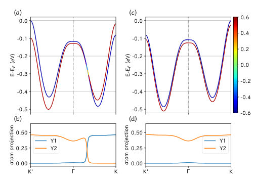
<figcaption class="paper-figure-caption"><b>Fig 3.</b> FIG. 3. The spin of the two valence bands for AA1 (a,b) and AB3(c,d) structure and the atoms projection of the top valence band. The Y1 means the Y atom from the lower layer and Y2 means the Y atom from the upper layer.</figcaption>
</figure>
<figure class="paper-figure-card">
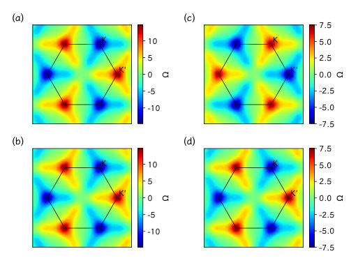
<figcaption class="paper-figure-caption"><b>Fig 4.</b> FIG. 4. The summary of the Berry curvature of the two valence bands for AA1 (a) and AB3 (b)structure. The Berry curvature for the upper valence band (c) and the lower valence band (d).</figcaption>
</figure>
<figure class="paper-figure-card">
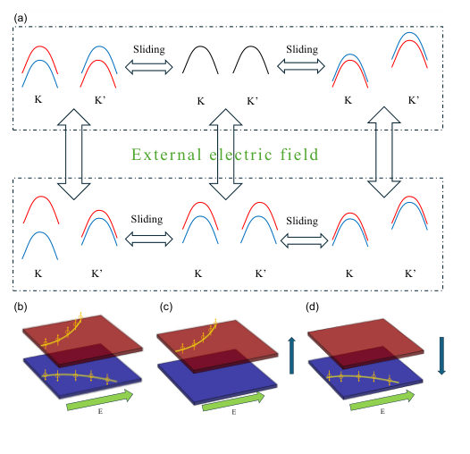
<figcaption class="paper-figure-caption"><b>Fig 5.</b> FIG. 6. (a) Joint regulation of electric properties by sliding and external electric field. (b-d) The valley splitting con- trolled by the electric field. Positive sign (+) means holes</figcaption>
</figure>

**Summary.** This theoretical study explores the tunability of spin-valley-layer coupling in antiferromagnetic bilayer Janus YIBr materials. By combining different stacking arrangements with an applied electric field, researchers demonstrate a mechanism to control quantum properties like valley polarization and induce Dirac-like dispersion relations. This work suggests the material's potential for advanced electronic applications such as novel filters or memory elements.

**Why it may be interesting.** The ability to engineer multiple degrees of freedom (spin, valley, layer) simultaneously via structural design and external fields is highly relevant for designing next-generation spintronic or topological memory devices that go beyond simple charge transport.

Detailed structure

**Main problem.** The study investigates how spin, valley, and layer degrees of freedom can be coupled and controlled using stacking variations and external electric fields in antiferromagnetic bilayer Janus YIBr structures.

**Main result.** The system exhibits tunable spin-valley coupling, leading to potential quantum valley Hall effects, which can be continuously modulated by combining structural changes (stacking) with an applied electric field.

**Method.** The research employs first-principles Density Functional Theory calculations combined with the development and fitting of effective low-energy Hamiltonian models.

**Model / system.** The physical system is an antiferromagnetic 2D bilayer Janus YIBr structure, analyzed across six different stacking configurations. The theoretical framework involves modeling spin, valley, and layer coupling using generalized Hamiltonians incorporating external electric field terms.

**Key observables.** Spin splitting (up to $\sim 0.4 	ext{ eV}$), valley polarization ($\pm 0.08 	ext{ eV}$), Berry curvature distribution, and magnetic anisotropy energy.

**Important parameters / regimes.** External electric field strength ($E$), stacking configuration type (AA vs AB), and the resulting easy axis direction (in-plane vs out-of-plane).

**Assumptions / limitations.** The analysis relies on DFT calculations using GGA+U approximations, and the low-energy physics is modeled by fitting parameters ($\alpha, eta$) to the calculated valence band structures.

**Figures summary.** Figures illustrate band structures showing spin splitting and valley polarization for different stacking types (AA1, AB3) under varying easy axis conditions. Berry curvature maps confirm the Quantum Valley Hall effect in certain configurations, and later figures show electric field control over these properties.

**Paper structure.** The paper proceeds by first establishing the magnetic ground state via MAE calculations across six structures. It then analyzes band structure features (spin/valley splitting) dependent on stacking and easy axis direction. Finally, it models the system using effective Hamiltonians to demonstrate how external electric fields provide an additional continuous control knob for these coupled quantum properties.

Abstract

The modification and enhancement of antiferromagnetic two-dimensional semiconductor is considered crucial for realizing novel electronic properties and facilitating promising applications. For this purpose, we investigate six antiferromagnetic 2D bilayer Janus YIBr structures with different stacking variations by means of first-principles calculation and an effective low-energy model. The calculation of magnetic anisotropy energy shows that the direction of easy axis varies with different stacking. First-principles-calculated energy bands reveal that there is a Dirac relativistic dispersion relation in the valence band in a wide energy window of 0.3 eV at least. The calculations for spin, atom properties and Berry curvature description show that there is spin, valley and layer coupling with spin splitting, valley polarization and quantum valley Hall insulators can be achieved in the bilayer Janus structures. Further analyses of the effect of external electric field can be used to control spin, valley and layer of the hole near the Fermi level. These can be useful in future exploration for novel properties, control methods and more functionalities in bilayer Janus structures.

[↑ back to top](#top)

### [Tunable Superconductivity Mediated by Heavy-Electron Plasmons: Band-Structure and Quantum-Geometric Engineering](http://arxiv.org/abs/2607.18157v1)

**Authors:** Sang Hyun Park, Junyeong Ahn  
**Type:** theory · **Category:** strongly correlated electrons · **PDF:** <https://arxiv.org/pdf/2607.18157v1>  
**Analysis basis:** full PDF text, analyzed in chunks
**Topic relevance:** `Keldysh / 2PI / non-Gaussian methods` **1/5** · `analog quantum simulation` **1/5** · `driven-dissipative phase transition` **1/5**

↔ Scroll figures horizontally

<figure class="paper-figure-card">
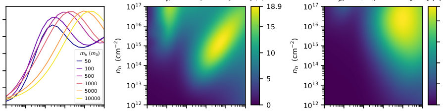
<figcaption class="paper-figure-caption"><b>Fig 1.</b> FIG. 2. Calculations of the Tc using the linearized isotropic Eliashberg equations for the setup shown in Fig. 1(c). (a-c) Plasmon-only results as a function of the light and heavy electron carrier density and effective mass. (d-f) Results that include a contribution from the phonon with coupling strength λph = 0.4. For (a),(d) the light electron carrier density is fixed to nl = 5 × 1014cm−2. The light electron mass is fixed to ml = m0.</figcaption>
</figure>
<figure class="paper-figure-card">
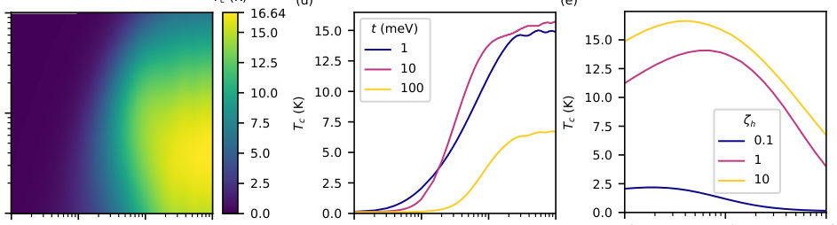
<figcaption class="paper-figure-caption"><b>Fig 2.</b> FIG. 3. Quantum-geometric control of interband-plasmon-mediated superconductivity in gapped flat bands. (a) Schematic of the setup: a pair of flat bands separated by an energy 2t supports a pairing interaction mediated by gapped interband plasmons (wavy line). The interband plasmons arise from coherent interband transitions (dashed arrow) rather than free-carrier motion. The associated interband polarization is controlled by the BZ averaged quantum distance dQ, and the light electrons (red, mass ml) form the Cooper pairs. The inset is a schematic representation of the quantum distance between two states on the Bloch sqhere. (b) Interband plasmon dispersion ̵hωp/t versus qa/π for several...</figcaption>
</figure>
<figure class="paper-figure-card">
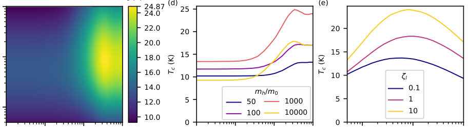
<figcaption class="paper-figure-caption"><b>Fig 3.</b> FIG. 4. Enhancement of heavy-electron-plasmon-mediated superconductivity by light-electron quantum geometry. (a) Schematic of the setup: the light (pairing) electrons occupy a parabolic band (mass ml) endowed with non-trivial quan- tum geometry, obtained from the tunable metric model of Eq. (9) plus an added trivial square-lattice dispersion, while the heavy electrons (mass mh) supply the plasmon pairing glue. The non-trivial geometry suppresses the static screening (dashed arrow) from the light electrons. (b) Dimensionless plasmonic attraction λ, renormalized Coulomb repulsion µ∗, and net pairing strength λ −µ∗as functions of the light-electron quantum-metric parameter ζl. (c)...</figcaption>
</figure>
<figure class="paper-figure-card">
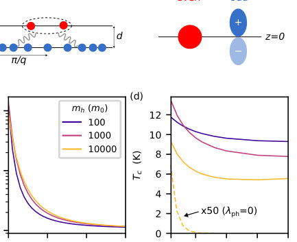
<figcaption class="paper-figure-caption"><b>Fig 4.</b> FIG. 5. Dependence on layer separation and screening from the dielectric environment. (a) Schematic representation of layer separation between the light electrons (red) and the heavy electrons (blue). The heavy electrons support plas- mons of wavelength 2π/q. (b) Schematic representation of a mirror symmetric system with coexisting mirror-even and mirror-odd orbitals with center of mass in the z = 0 plane. Dependence of Tc on the (c) layer separation d and (d) di- electric constant of the environment ϵenv. Carrier densities are fixed to nl = 5×1014cm−2, nh = 1015cm−2 and the phonon term is fixed to λph = 0.4. The dashed yellow line in (d) is the λph = 0 result for mh = 10000m0 scaled by a...</figcaption>
</figure>

**Summary.** This work develops a theory for high-temperature superconductivity using plasmons as the pairing glue, moving beyond traditional phonon mechanisms. It introduces the concept of 'flat-band mediators,' where flat bands generate collective excitations that enhance $T_c$ in an adjacent itinerant electron system. The findings suggest promising material platforms like multilayer graphene exhibiting coexisting light and heavy electronic sectors.

**Why it may be interesting.** While focused on superconductivity, the reliance on 'quantum geometry' and collective excitations mediated by band structure features (like flat bands) provides theoretical tools applicable to understanding strongly correlated phases driven by geometric constraints or topological effects in quantum materials.

Detailed structure

**Main problem.** Establishing fundamental principles for achieving high superconducting critical temperatures ($T_c$) by engineering pairing mechanisms beyond conventional phonon mediation.

**Main result.** The paper establishes a 'flat-band mediator paradigm,' showing that flat bands can serve as tunable mediators whose collective charge excitations set the superconducting energy scale, potentially boosting $T_c$ significantly above 20 K when combined with phonons.

**Method.** Theoretical calculations utilizing Eliashberg theory and Random Phase Approximation (RPA) to model electron-plasmon interactions in two-carrier and flat-band systems.

**Model / system.** The study models two-carrier systems (light/heavy electrons) and insulating systems with flat bands. The pairing mechanism is mediated by plasmons, whose dispersion and coupling are governed by the heavy-electron quantum metric or interband transitions.

**Key observables.** $T_c$ (critical temperature), Plasmon energy scale ($\Omega_p$), Pairing strength ($\lambda$).

**Important parameters / regimes.** Carrier densities ($n_l, n_h$), effective masses ($m_l, m_h$), quantum geometry parameters ($\zeta$), and phonon coupling constant ($\lambda_{ph}$).

**Assumptions / limitations.** The analysis uses the Random Phase Approximation (RPA) and linearized isotropic Eliashberg equations; neglecting vertex corrections beyond Migdal's theorem is a key approximation.

**Figures summary.** Figures illustrate schematic comparisons between phonon-mediated and plasmon-mediated superconductivity, showing $T_c$ dependence on carrier densities, and detailing the quantum geometry effects in flat-band systems.

**Paper structure.** The paper progresses from establishing general principles (plasmon mediation) to analyzing specific metallic two-carrier models, then advancing to the more complex insulating flat-band scenario, culminating in a platform proposal based on coexisting light/heavy electrons.

Abstract

Conventional superconductivity derives its pairing glue from lattice vibrations, tying its characteristic scales to chemistry and atomic masses. Plasmons$-$the collective oscillations of electrons$-$can instead be reshaped through electronic structure engineering, but the principles governing optimal plasmon-mediated pairing remain unclear. Here, we establish such principles for two-carrier systems in which heavy-electron plasmons mediate the pairing of light electrons. Within the random-phase approximation and Eliashberg theory, we calculate the optimal $T_c$ of minimal metallic models and show that it is controlled by a competition between the plasmon energy scale and retardation-driven suppression of the repulsion, yielding optimal carrier densities and band masses. While the plasmon channel alone reaches only $T_c\sim$ 0.1 K, a moderate phonon attraction cooperates with it, boosting $T_c$ by two orders of magnitude to above 20 K. However, the band flattening needed for slow metallic plasmons also favors the development of competing orders. We therefore consider an insulating system in which coherent interband transitions between flat bands generate gapped interband plasmons without free carriers. The heavy-band quantum metric governs the dispersion and electron-plasmon pairing strength of the interband plasmon, while the quantum geometry of the light band suppresses static screening and enhances the net attraction. Because layer separation rapidly weakens pairing, we propose systems with coexisting light and heavy electrons living in different mirror-symmetry sectors of the same layer as promising platforms. Our results establish a new role for flat-band systems in superconductivity: rather than hosting the paired electrons themselves, they can serve as a tunable pairing mediator whose collective charge excitations set the superconducting energy scale beyond their narrow bandwidth.

[↑ back to top](#top)

### [Two-color solitons in Kerr third harmonic generation model](http://arxiv.org/abs/2607.16435v1)

**Authors:** Alexey Sukhinin, Curtis Menyuk, Natalia Litchinitser, Jean-Claude Diels, Alejandro B Aceves  
**Type:** theory · **Category:** other · **PDF:** <https://arxiv.org/pdf/2607.16435v1>  
**Analysis basis:** full PDF text, analyzed in chunks
**Topic relevance:** `driven-dissipative phase transition` **1/5** · `interference shaping light` **1/5** · `non-equilibrium dynamics` **1/5**

↔ Scroll figures horizontally

<figure class="paper-figure-card">
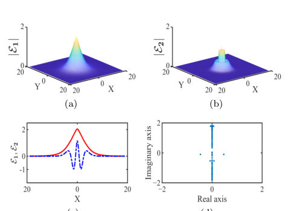
<figcaption class="paper-figure-caption"><b>Fig 1.</b> FIG. 1. (a) 3D profile of field |E1(x, y)| with power P1 = 15.9753. (b) 3D profile of field |E2(x, y)|with power P2 = 2.3873. (c) Radial profile of both electric fields E1(x, y) (red) and E2(x, y) (blue) with total power P = P1 + P2 = 18.3626. (d) Linear stability spectrum</figcaption>
</figure>
<figure class="paper-figure-card">
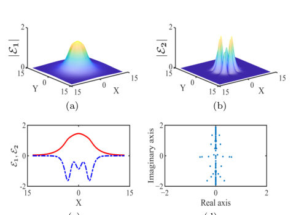
<figcaption class="paper-figure-caption"><b>Fig 2.</b> FIG. 3. 3D profile of field |E1(x, y)| with power P1 = 15.6411. (b) 3D profile of field |E2(x, y)|with power P2 = 4.8127. (c) Radial profile of both electric fields E1(x, y) (red) and E2(x, y) (blue) with total power P = P1 + P2 = 20.4538. (d) Linear stability spectrum</figcaption>
</figure>
<figure class="paper-figure-card">
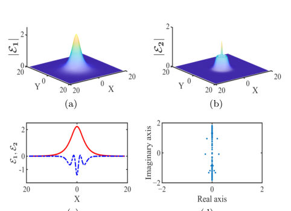
<figcaption class="paper-figure-caption"><b>Fig 3.</b> FIG. 2. 3D profile of field |E1(x, y)| with power P1 = 17.4778. (b) 3D profile of field |E2(x, y)|with power P2 = 2.2858. (c) Radial profile of both electric fields E1(x, y) (red) and E2(x, y) (blue) with total power P = P1 + P2 = 19.7636. (d) Linear stability spectrum</figcaption>
</figure>
<figure class="paper-figure-card">
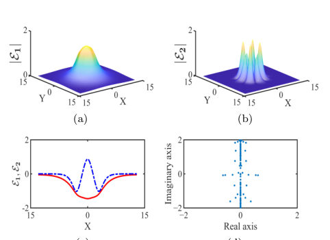
<figcaption class="paper-figure-caption"><b>Fig 4.</b> FIG. 4. 3D profile of field |E1(x, y)| with power P1 = 15.6428. (b) 3D profile of field |E2(x, y)| with power P2 = 4.8120. (c) Radial profile of both electric fields E1(x, y) (red) and E2(x, y) (blue) with total power P = P1 + P2 = 20.4548. (d) Linear stability spectrum</figcaption>
</figure>
<figure class="paper-figure-card">
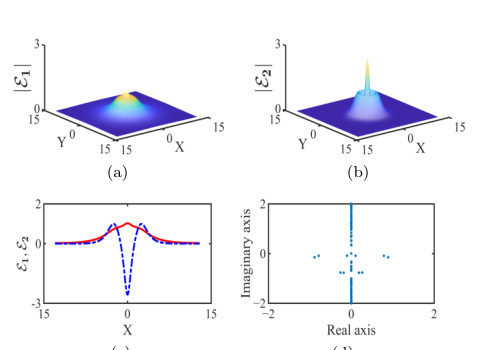
<figcaption class="paper-figure-caption"><b>Fig 5.</b> FIG. 5. 3D profile of field |E1(x, y)| with power P1 = 5.0224. (b) 3D profile of field |E2(x, y)|with power P2 = 5.4583. (c) Radial profile of both electric fields E1(x, y) (red) and E2(x, y) (blue) with total power P = P1 + P2 = 10.4807. (d) Linear stability spectrum</figcaption>
</figure>

**Summary.** This paper analyzes two-color solitons in a resonant Kerr third-harmonic generation medium. The research identifies two distinct families of localized states whose stability and collapse behavior depend critically on the relative power between the fundamental and third harmonic components. By simulating perturbations, the authors reveal novel collapse mechanisms absent in standard self-focusing theories.

**Why it may be interesting.** This work explores complex nonlinear wave dynamics in a resonant optical system, providing insights into non-standard self-focusing mechanisms that deviate from single-component models, which is relevant for understanding energy localization in nonlinear media.

Detailed structure

**Main problem.** The study investigates two-color, two-dimensional spatially localized light modes (solitons) within a resonant Kerr third-harmonic generation model.

**Main result.** Two distinct families of solitons exist whose dynamics are governed by the relative power distribution between harmonics, showing that no universal critical collapse power exists.

**Method.** The authors employed numerical methods, including solving coupled nonlinear equations for stationary states and performing direct time-domain simulations using pseudo-spectral Fourier techniques on perturbed solutions.

**Model / system.** The system is a resonant Kerr third-harmonic generation (THG) model involving two interacting color beams ($\omega_1$ and $2\omega_1$), described by coupled nonlinear Schrödinger equations.

**Key observables.** Individual component powers ($P_1, P_2$), total power, linear stability spectrum eigenvalues, and the evolution of field amplitudes during propagation (collapse vs. diffraction).

**Important parameters / regimes.** The ratio of power between the fundamental and third harmonic components ($P_1$ vs $P_2$).

**Assumptions / limitations.** The analysis uses a quasi-monochromatic approximation and assumes the existence of stationary solutions which are then perturbed for dynamic study.

**Figures summary.** Figures illustrate representative localized states, stability spectra for different power regimes, and time evolution profiles showing collapse dynamics preceded by strong third-harmonic oscillations in certain families.

**Paper structure.** The paper proceeds by deriving the coupled nonlinear equations, numerically finding two distinct stationary soliton families based on power distribution, and then simulating perturbations around these states to characterize their stability and collapse behavior.

Abstract

We investigate two-color, two dimensional spatially localized light modes in a resonant Kerr third-harmonic generation model. Using computational tools, we identify two distinct families of localized states. Unlike the single-component 2D nonlinear Schrödinger equation and previously studied non-resonant two-color systems, the dynamics are not dictated by a universal critical power, but depend on the distribution of power between the harmonics. The "fundamental-dominated" family acts as a "dynamical separatrix" between simultaneous collapse and joint diffraction, whereas the "third-harmonic-dominated" family does not. We further identify resonant collapse events accompanied by strong oscillations of the third harmonic, revealing a collapse mechanism absent from standard Kerr self-focusing.

[↑ back to top](#top)

### [Period-dependent suppression of Fourier peaks for topography images: Analysis of periodicity of triple-step arrays on vicinal Si(h h m) surfaces](http://arxiv.org/abs/2607.16699v1)

**Authors:** A. Yu. Aladyshkin, A. N. Chaika, V. N. Semenov, A. S. Aladyshkina, A. M. Ionov, S. I. Bozhko  
**Type:** experiment · **Category:** other · **PDF:** <https://arxiv.org/pdf/2607.16699v1>  
**Analysis basis:** full PDF text, analyzed in chunks
**Topic relevance:** `Frenkel-Kontorova` **1/5** · `methods for driven-dissipative` **1/5**

↔ Scroll figures horizontally

<figure class="paper-figure-card">
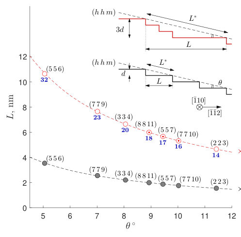
<figcaption class="paper-figure-caption"><b>Fig 1.</b> Figure 1: Period 𝐿of an array consisting of monatomic steps (∙) and triple steps (∘), aligned along the [¯1 1 0] direction, as a function of the miscut angle 𝜃 between the (ℎℎ𝑚) and (1 1 1) crystallographic planes for various vicinal Si surfaces [24]. Insets illustrate the relationships between the interlayer distance 𝑑= 𝑐/ √</figcaption>
</figure>
<figure class="paper-figure-card">
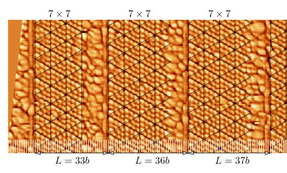
<figcaption class="paper-figure-caption"><b>Fig 2.</b> Figure 2: A typical map of the differential signal 𝐷(𝑥, 𝑦) corresponding to the topography image of a vicinal Si(5 5 6) surface with rather wide (1 1 1) terraces after applying geometrical corrections (corrected image size 42×20 nm2, bias voltage 𝑈= −0.6 V, tunneling current 𝐼= 80 pA). This map was prepared using the difference-of-Gaussians procedure (1) as described in the text (smoothing parameters: 𝜎1 = 0.06 nm and 𝜎2 = 2𝜎1 = 0.11 nm). Black solid lines mark the edges of the Si(111)7 × 7 unit cells. The positions of the atomic rows in the Si(111)1 × 1 lattice are marked by vertical white lines spaced regularly at 𝑏= 0.333 nm.</figcaption>
</figure>
<figure class="paper-figure-card">
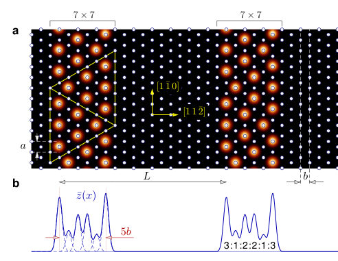
<figcaption class="paper-figure-caption"><b>Fig 3.</b> Figure 3: a – Periodic model structure which consists of the Si(1 1 1)7 × 7 stripes, repeating with a period 𝐿(here 𝐿= 18𝑏). Yellow solid lines outline a unit cell for the 7 × 7 lattice, consisting of two equilateral triangles and containing twelve adatoms. White dots represent the positions of the Si(1 1 1)1×1 atoms. b – The local concentration of the adatoms, averaged along the vertical direction, is plotted as a function of the horizontal 𝑥-coordinate.</figcaption>
</figure>
<figure class="paper-figure-card">
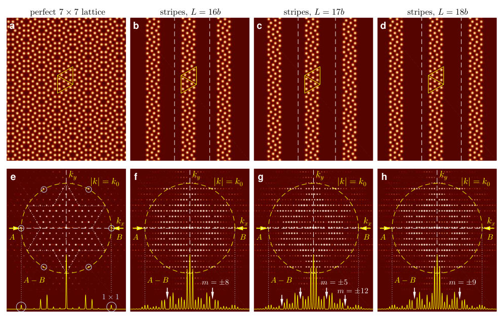
<figcaption class="paper-figure-caption"><b>Fig 4.</b> Figure 4: Top row – Model images 𝑧(𝑥, 𝑦) for the perfect Si(1 1 1)7 × 7 lattice (panel a) and for one-dimensional periodic arrays of stripes with the Si(1 1 1)7 × 7 reconstruction and periods 𝐿= 16𝑏(panel b), 17𝑏(panel c), and 18𝑏(panel d). These parameters correspond to the atomic lattices of the Si(1 1 1) terraces for (7 7 10), (5 5 7), and (8 8 11) wafers, respectively. All images have dimensions 18 × 21.6 nm2. The parameter 𝑏= 0.333 nm is the spacing between atomic rows in the horizontal [11¯2] direction. Bottom row – Fourier transforms |^𝑧(𝑘𝑥, 𝑘𝑦)| computed for the images in panels a–d (image size 50 × 60 nm−2). The radius of the circle marking the expected positions of the first-order...</figcaption>
</figure>
<figure class="paper-figure-card">
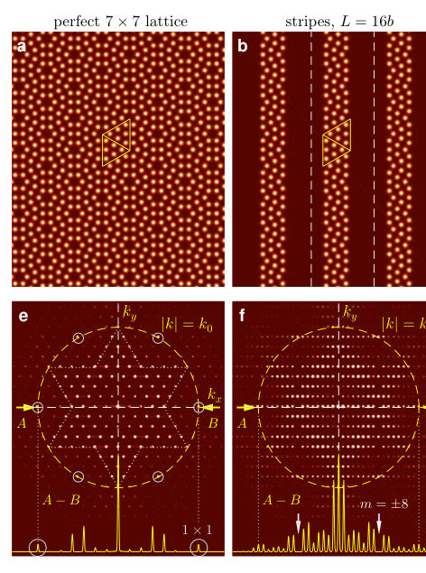
<figcaption class="paper-figure-caption"><b>Fig 5.</b> Figure 6 shows the dependence of 𝐴𝑚on its index 𝑚for various periods from 𝐿= 15𝑏to 𝐿= 19𝑏. Equation (6) allows us to draw the following conclusion: (i) the periodic arrays of 5𝑏-wide 7 × 7 stripes with an even 𝐿/𝑏ratio always exhibit complete suppression of the Fourier peaks with the indices 𝑚= ±𝐿/(2𝑏), located at 𝑘𝑥= ±𝑘0/2. This explains the disappearance of the peaks corresponding to 𝑚= ±8 for the array with 𝐿= 16𝑏and</figcaption>
</figure>

**Summary.** This paper presents a novel method for determining the periodicity of atomic step arrays on vicinal silicon surfaces using raw Scanning Tunneling Microscopy data. By applying Difference-of-Gaussians filtering and analyzing the Fourier transform's characteristic peak suppression, the authors achieved high precision in measuring the step period. This technique allows for accurate characterization of surface crystallography even when traditional measurement methods fail due to instrumental artifacts.

**Why it may be interesting.** While not directly quantum information theory, this work represents a highly advanced application of signal processing (Fourier analysis) to characterize nanoscale physical structures, which shares mathematical rigor with analyzing correlation functions in condensed matter systems.

Detailed structure

**Main problem.** The reliable determination of periodicity for multiatomic steps on high-Miller-index vicinal Si surfaces is difficult due to surface tilt, narrow terraces, and instrumental distortions.

**Main result.** By analyzing the Fourier transform of differential maps derived from raw STM topography data, the authors determined a precise period of 5.99 nm for triple-step arrays, suggesting a local $	ext{Si}(8 8 11)$ orientation on nominally $(5 5 7)$-oriented wafers.

**Method.** The analysis uses Scanning Tunneling Microscopy (STM) data processed via the Difference-of-Gaussians (DoG) approach to generate differential maps. Periodicity is extracted by analyzing the period-dependent suppression of specific Fourier peaks in the FFT pattern.

**Model / system.** The physical system is vicinal single-crystal silicon wafers ($	ext{Si}(h h m)$), specifically focusing on periodic triple-step staircases formed on $	ext{Si}(5 5 7)$. The analysis models the adatom concentration function averaged over the surface.

**Key observables.** The intensity and pattern of Fourier peaks (specifically, the suppression of specific $m$-th order peaks) in the differential map's FFT.

**Important parameters / regimes.** Periodicity ($L$), interatomic distance ($b=0.333$ nm), and the number of $	ext{Si}(1 1 1)$ unit cells involved in the structure (e.g., $7 	imes 7$).

**Assumptions / limitations.** The method assumes that the periodic structures are commensurable with the underlying crystal lattice, allowing for Fourier analysis to reveal periodicity-dependent suppression effects.

**Figures summary.** Figures illustrate the DoG processing of topography images and show model calculations where the expected period ($L=16b, 17b, 18b$) dictates which specific Fourier peaks are suppressed in the resulting FFT pattern.

**Paper structure.** The paper establishes the difficulty of traditional measurements on stepped surfaces, introduces the DoG processing technique to mitigate artifacts, and then uses theoretical modeling (based on adatom concentration) combined with experimental observation of peak suppression to derive the precise local surface orientation and periodicity.

Abstract

Reliable determination of the periodicity of multiatomic steps on high-Miller-index vicinal surfaces is often complicated by (i) the presence of relatively narrow terraces tilted at large angles relative to the scanning plane, and (ii) unavoidable distortions in the lateral direction resulting from creep and improper calibration of a piezo scanner. We argue that the period of the triple-step arrays on vicinal Si(5\,5\,6) and Si(5 5 7) single-crystal wafers can be determined from raw scanning tunneling microscopy data, without preliminary corrections, with precision approaching the interatomic distance. We demonstrate that the intensity of the Fourier peaks of the differential maps, derived from raw topography images by the difference-of-Gaussians approach, strongly depends on the period of the ordered triple-step arrays. This suppression of the ninth Fourier peak indicates that the regular array of triple steps has a period of $18b=5.99$ nm in projection onto the Si(1 1 1) terrace plane, where $b=0.333$ nm is the distance between atomic rows of the $1\times 1$ lattice in the $[\bar{1}\,\bar{1}\,2]$ direction. This means that the nominally (5\,5\,7)-oriented Si wafers may correspond locally to the Si(8 8 11) orientation. The method can be applied to the precise analysis of other vicinal surfaces with narrow and wide terraces containing an integer number of Si(1 1 1)$7\times 7$ unit cells.

[↑ back to top](#top)

### [Ah-SCDFT:A general approach for superconductivity with an-harmonic corrections](http://arxiv.org/abs/2607.17759v1)

**Authors:** Xiaozheng Fan, Panshi Jing, Chuanguang Zhang, Junshuai Wang, Chunlan Ma, Shijing Gong, Chuanxi Zhao, Tianxing Wang, Yipeng An  
**Type:** theory · **Category:** statistical mechanics · **PDF:** <https://arxiv.org/pdf/2607.17759v1>  
**Analysis basis:** full PDF text, analyzed in chunks
**Topic relevance:** `Keldysh / 2PI / non-Gaussian methods` **1/5**

↔ Scroll figures horizontally

<figure class="paper-figure-card">
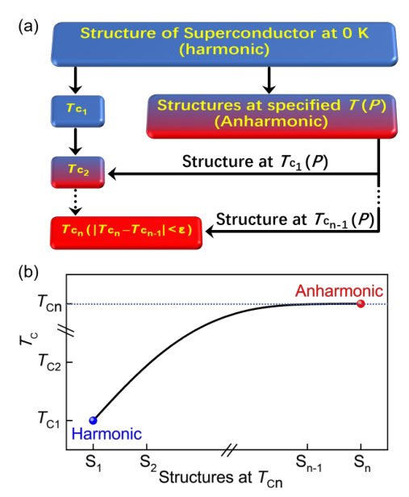
<figcaption class="paper-figure-caption"><b>Fig 1.</b> FIG. 1. (a) General approach for studying superconductivity with incorporated anharmonic effects. T(P) denotes the predicted critical temperature T at a given pressure P, used for the lattice renormalization. (b) Convergent Tc and Tcn under several temperature dependent geometries. The horizontal dashed line marks the final converged Tcn.</figcaption>
</figure>
<figure class="paper-figure-card">
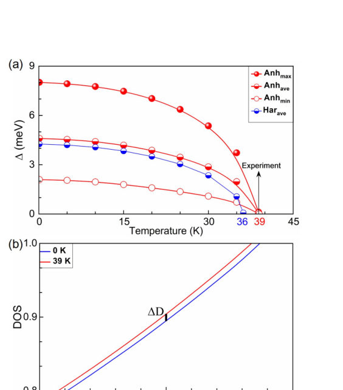
<figcaption class="paper-figure-caption"><b>Fig 2.</b> FIG. 2. (a) Temperature-dependent superconducting gaps. The superconducting gaps of MgB2 are shown as a function of temperature, comparing anharmonic (red symbols) and harmonic (blue symbols) calculations. Solid, semi-filled, and hollow red circles represent the maximum, average, and minimum superconducting gaps obtained with anharmonic effects, respectively, across the temperature range from 0.1 K to 39 K (Tc). The blue semi-filled circles correspond to the average superconducting gap calculated using the harmonic geometry. (b) Density of states (DOS) of MgB2 calculated using harmonic (blue line, 0 K) and anharmonic (red line, 39 K) equilibrium geometries.</figcaption>
</figure>
<figure class="paper-figure-card">
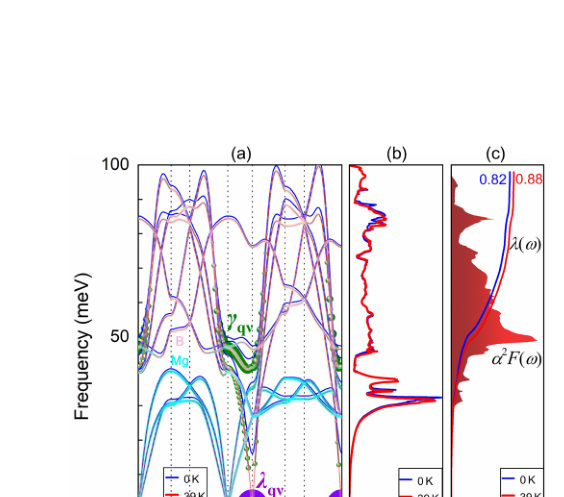
<figcaption class="paper-figure-caption"><b>Fig 3.</b> FIG. 3. Phonon and electron-phonon coupling properties of MgB2 within the harmonic approximation (0 K, blue lines) and with the inclusion of anharmonic effects (39 K, red lines). (a) Element-projected phonon dispersion with electron- phonon coupling λqν (purple balls) and phonon linewidth γqν (green balls). (b) Phonon density of states (PhDOS). (c) Frequency-dependent Eliashberg spectral functions α2F(ω) with the cumulative EPC strength λ(ω).</figcaption>
</figure>
<figure class="paper-figure-card">
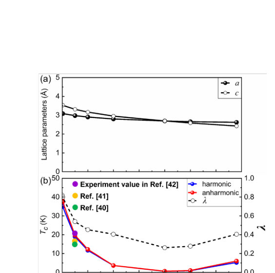
<figcaption class="paper-figure-caption"><b>Fig 4.</b> FIG. 4. (a) Pressure-dependent lattice constants including anharmonic effects. (b) Pressure-dependent superconducting critical temperature Tc within the harmonic approximation (blue balls) and with the inclusion of anharmonic effects (red balls), as well as the electron-phonon coupling constant λ for the case of including the anharmonic effects.</figcaption>
</figure>

**Summary.** This paper introduces ah-SCDFT, a general theoretical framework that incorporates crucial anharmonic lattice vibrations into first-principles calculations for superconductivity. By applying this method to MgB2, the authors demonstrate that including these effects significantly improves the accuracy of predicted superconducting critical temperatures and gaps compared to simpler harmonic approximations.

**Why it may be interesting.** While focused on condensed matter superconductivity, the rigorous inclusion of finite-temperature effects via free energy minimization and anharmonic corrections touches upon advanced statistical mechanics treatments of interacting quantum systems.

Detailed structure

**Main problem.** First-principles studies of superconductivity often neglect anharmonic effects (AHE), which are crucial for achieving quantitative accuracy in predicting superconducting properties.

**Main result.** The proposed ah-SCDFT approach accurately reproduces the experimental superconducting behavior of MgB2 under ambient conditions and applied pressure, resolving theoretical discrepancies regarding Tc(P).

**Method.** The authors introduce anharmonic superconducting density functional theory (ah-SCDFT), which systematically incorporates anharmonic corrections into standard SCDFT by minimizing the Helmholtz free energy.

**Model / system.** The study focuses on superconductivity, using the prototypical superconductor MgB2 as a test case. The methodology involves combining first-principles electronic structure calculations with finite-temperature equilibrium structures derived from the quasi-harmonic approximation (QHA).

**Key observables.** Superconducting critical temperature ($T_c$), superconducting gaps, electron-phonon coupling constant ($\lambda$), and pressure dependence of these quantities.

**Important parameters / regimes.** Temperature (ambient to elevated), applied pressure (up to 200 GPa), and the vibrational free energy terms.

**Assumptions / limitations.** The primary assumption is that anharmonic corrections are necessary for reliable quantitative predictions, overcoming limitations inherent in the harmonic approximation.

**Figures summary.** Figures compare superconducting gaps calculated with and without anharmonicity (Figure 2); they show phonon dispersion and DOS at different temperatures/pressures (Figure 3); and they illustrate pressure dependence of lattice constants and Tc (Figure 4).

**Paper structure.** The paper establishes the need for anharmonic corrections, details the ah-SCDFT methodology involving iterative free energy minimization, applies it to MgB2 under varying conditions (T and P), and compares results against experimental data.

Abstract

First-principles studies of superconductivity often neglect anharmonic effects (AHE), despite their crucial role in achieving quantitative accuracy in many materials. To bridge this gap, we introduce a general computational approach, termed anharmonic superconducting density functional theory (ah-SCDFT) which systematically incorporates anharmonic corrections into standard SCDFT. This approach allows for high-fidelity predictions of superconducting properties with only a modest increase in computational cost for a limited number of superconducting calculation convergence steps. We demonstrate the effectiveness and reliability of ah-SCDFT by applying it to the prototypical superconductor MgB2, accurately reproducing its superconducting behavior under both ambient conditions and applied pressure in excellent agreement with experiment. Our results establish ah-SCDFT as a powerful, efficient, and broadly applicable approach for quantitatively reliable studies of superconductivity and a promising tool for the prediction of new superconducting materials.

[↑ back to top](#top)

### [Atomically precise triple-step staircase on a vicinal silicon surface: Is it Si(5 5 7), Si(7 7 10) or Si(8 8 11)?](http://arxiv.org/abs/2607.16439v1)

**Authors:** A. N. Chaika, A. Yu. Aladyshkin, V. N. Semenov, A. S. Aladyshkina, A. M. Ionov, S. I. Bozhko  
**Type:** experiment · **Category:** other · **PDF:** <https://arxiv.org/pdf/2607.16439v1>  
**Analysis basis:** full PDF text, analyzed in chunks
**Topic relevance:** `methods for driven-dissipative` **1/5**

↔ Scroll figures horizontally

<figure class="paper-figure-card">
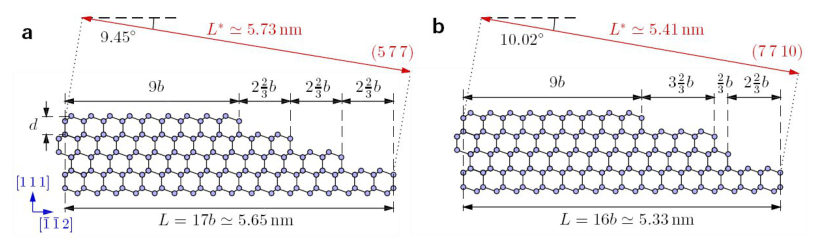
<figcaption class="paper-figure-caption"><b>Fig 1.</b> Figure 1. Schematic models of the periodic Si(5 5 7) (a) and Si(7 7 10) (b) triple-step staircases with a (112)- oriented triple step (a) and a sequence of monatomic step, Si(1 1 1) mini-terrace and (001)-oriented double step with height equal to two distances 2d between neighboring silicon atomic layers (b) [1, 16]. The model presentations do not show adatoms on the 7×7-reconstructed Si(111) terraces and reconstructions at the step edges. The step periodicity in projection onto the terrace plane and along the vicinal surface are indicated as L and L*, respectively.</figcaption>
</figure>
<figure class="paper-figure-card">
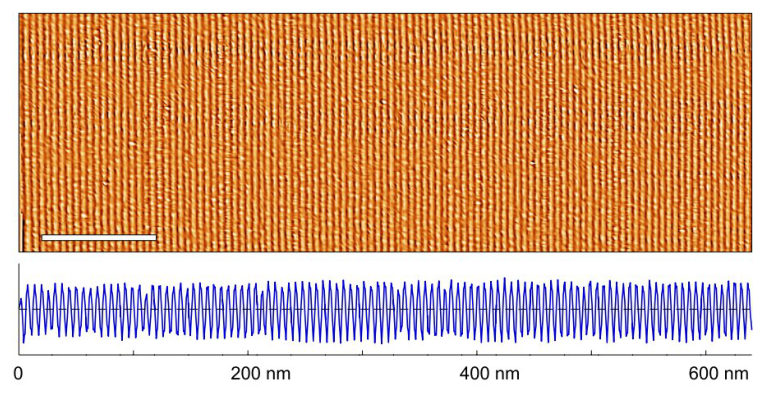
<figcaption class="paper-figure-caption"><b>Fig 2.</b> Figure 2. Typical differential D(x,y) map obtained from a large-area STM image of a regular triple-step array fabricated on the Si(5 5 7) wafer (top panel, image size of 640 × 210 nm2, tunneling voltage U = -1.8 V, tunneling current I = 40 pA, scale bar corresponds to 100 nm). The solid line at the bottom shows the profile of the D(x,y) map averaged along the vertical direction and illustrates the regularity of the triple-step array on length scales exceeding 500 nm.</figcaption>
</figure>
<figure class="paper-figure-card">
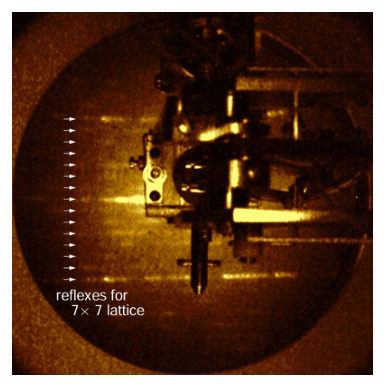
<figcaption class="paper-figure-caption"><b>Fig 3.</b> Figure 3. LEED pattern taken at an incident electron beam energy of 75 eV from the triple-step staircase fabricated on the Si(5 5 7) wafer. The marked horizontal rows correspond to the 7×7 reconstruction on the Si(1 1 1) terraces. The periodic spots in horizontal rows correspond to the formation of the regular triple-step array on large surface areas..</figcaption>
</figure>
<figure class="paper-figure-card">
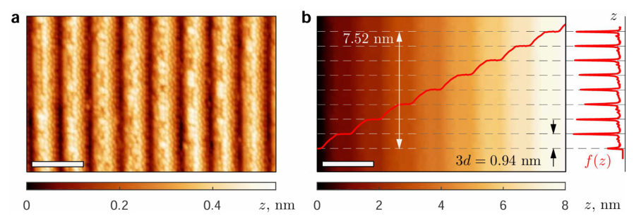
<figcaption class="paper-figure-caption"><b>Fig 4.</b> Figure 4. (a) STM topography image after global plane correction (image size 48.4 × 30 nm², U = 1.5 V, I = 60 pA) acquired at room temperature reveals a periodic array of triple steps and Si(1 1 1) terraces. Each terrace comprises one complete 7×7 unit cell and an additional row of adatoms. (b) After subtraction of a plane parallel to the terraces, the same image shows all flat (1 1 1) terraces horizontal. The red line shows the height variation of the aligned image as a function of the x-coordinate. The inset on the right side shows the histogram, illustrating the distribution of visible heights for the aligned image. The interval between the dashed lines equals 3d = 0.94 nm. (c)...</figcaption>
</figure>
<figure class="paper-figure-card">
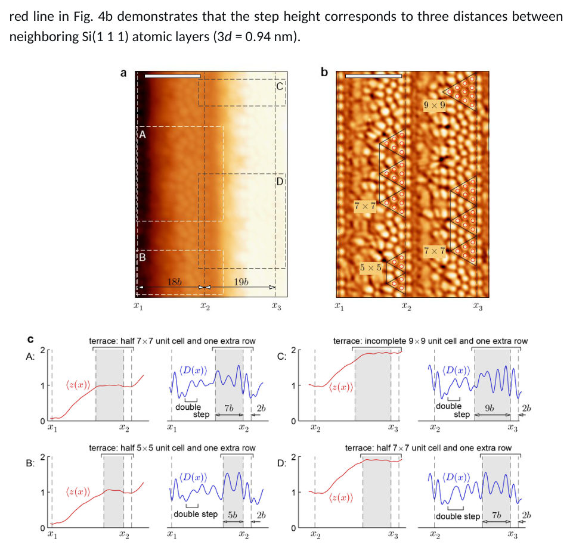
<figcaption class="paper-figure-caption"><b>Fig 5.</b> Figure 5. (a, b) Aligned topography STM image measured at tunneling voltage U = 1.5 V and current I = 60 pA (a) and differential D(x,y) map (b) of a surface area containing two periods of the triple-step structure shown in Figure 4. The distance between equivalent positions on the consecutive Si(1 1 1) terraces (x1, x2, x3) is equal to 18b and 19b, as indicated on panel (a). The positions of adatoms corresponding to ideal 5×5, 7×7, and 9×9 cells are indicated above the experimental features on the D(x,y) map (b). Scale bars on panels (a) and (b) correspond to 5 nm. (c) Y-averaged cross-sections of the topography image and D(x,y) map in areas A-D indicated by rectangles on panel (a)The...</figcaption>
</figure>

**Summary.** This work uses advanced Scanning Tunneling Microscopy (STM) to determine the exact atomic structure of a triple-step staircase on vicinal silicon wafers. By analyzing periodicity and cross-sectional profiles, the authors argue that the observed structure corresponds specifically to the $	ext{Si}(8\ 8\ 11)$ orientation. This provides an atomically precise understanding of surface reconstruction relevant for materials science applications.

**Why it may be interesting.** While focused on materials science, the precise atomic characterization of surfaces using STM techniques is foundational to understanding interfaces, which are critical in quantum device engineering (e.g., superconducting qubits or quantum dots).

Detailed structure

**Main problem.** The study aims to definitively determine the correct atomic structure of a triple-step staircase formed on vicinal silicon surfaces, distinguishing between proposed candidates like Si(5 5 7), Si(7 7 10), or Si(8 8 11).

**Main result.** Analysis of STM data strongly suggests that the observed periodicity corresponds to an $	ext{Si}(8\ 8\ 11)$ orientation, yielding a period of $L = 18b \approx 5.99$ nm.

**Method.** The research relies heavily on Scanning Tunneling Microscopy (STM) measurements, utilizing differential D(x,y) maps and cross-section analysis to resolve atomic arrangements.

**Model / system.** The physical system is vicinal silicon wafers ($	ext{Si}(h\ h\ m)$), which exhibit arrays of $	ext{Si}(1\ 1\ 1)$ terraces separated by mono- or multiatomic steps forming a periodic staircase structure. The analysis compares experimental data to theoretical models based on $7	imes 7$ reconstructions.

**Key observables.** Periodicity ($L$) of the staircase, atomic structure of steps and mini-terraces, and characteristic distances like $b=0.333$ nm.

**Important parameters / regimes.** The measured periodicity is found to be $L = 18b \approx 5.99$ nm; miscut angles are also discussed in relation to the proposed structures.

**Assumptions / limitations.** The analysis assumes that observed features can be mapped onto ideal atomic lattice models, though limitations regarding step edge reconstructions and defects are noted.

**Figures summary.** Figures show D(x,y) maps and cross-sections confirming periodicities ($L=18b$) and illustrating the sequence of monatomic steps separated by $7	imes 7$ reconstructed mini-terraces consistent with $	ext{Si}(8\ 8\ 11)$.

**Paper structure.** The paper methodically analyzes STM data, comparing measured periodicities against theoretical predictions for different crystal orientations ($	ext{Si}(5\ 5\ 7)$, etc.), ultimately converging on the periodicity and structure associated with $	ext{Si}(8\ 8\ 11)$.

Abstract

Scanning tunneling microscopy studies of periodic arrays of triple steps fabricated on single-crystalline Si(5 5 7) wafers demonstrate several possible atomic structures of consecutive steps and Si(1 1 1) terraces maintaining the same periodicity on micrometer-sized surface areas. Detailed analysis of the atomically resolved data reveals the formation of Si(8 8 11) triple-step staircase with a period of 18b=5.99 nm in projection onto the terrace plane, where b=0.333 nm is the distance between atomic rows for the Si(1 1 1)1x1 surface. Schematic models for several possible configurations of either 7x7 or 5x5-reconstructed terraces and triple steps are proposed.

[↑ back to top](#top)

### [Physics-constrained machine learning for decoding multi-nanobubble configurations in graphene](http://arxiv.org/abs/2607.17866v1)

**Authors:** Jihye Kim, Taegeun Song, Nojoon Myoung  
**Type:** theory · **Category:** disordered systems and neural networks · **PDF:** <https://arxiv.org/pdf/2607.17866v1>  
**Analysis basis:** full PDF text, analyzed in chunks
**Topic relevance:** `methods for driven-dissipative` **1/5**

↔ Scroll figures horizontally

<figure class="paper-figure-card">
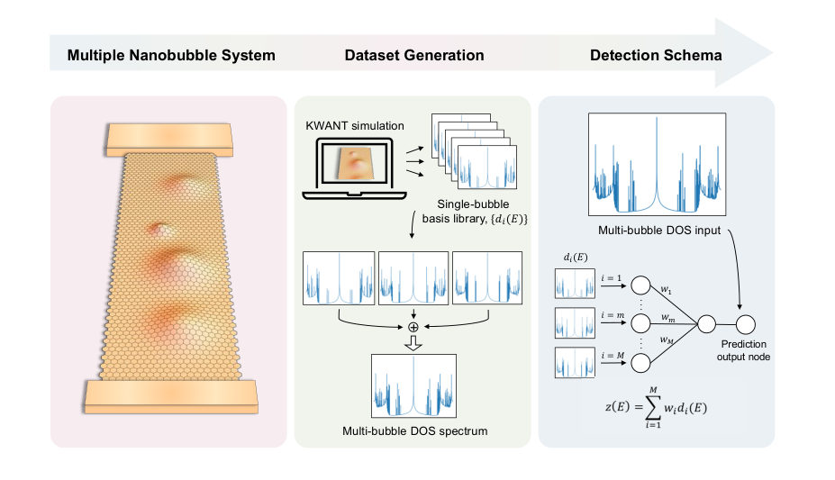
<figcaption class="paper-figure-caption"><b>Fig 1.</b> Figure 1: Schematic overview of the physics-constrained framework for identifying multi- nanobubble configurations in graphene. The left panel illustrates a graphene nanoribbon containing multiple nanobubbles, each characterized by its height h and lateral width σ. The middle panel shows the dataset-generation procedure: single-bubble DOS basis spectra are obtained from quantum-transport simulations using the Kwant Python package and are com- bined as a normalized sum to construct composite multi-nanobubble spectra. This construction follows the previously verified numerical equivalence between full multi-bubble calculations and summed single-bubble spectra for sufficiently separated...</figcaption>
</figure>
<figure class="paper-figure-card">
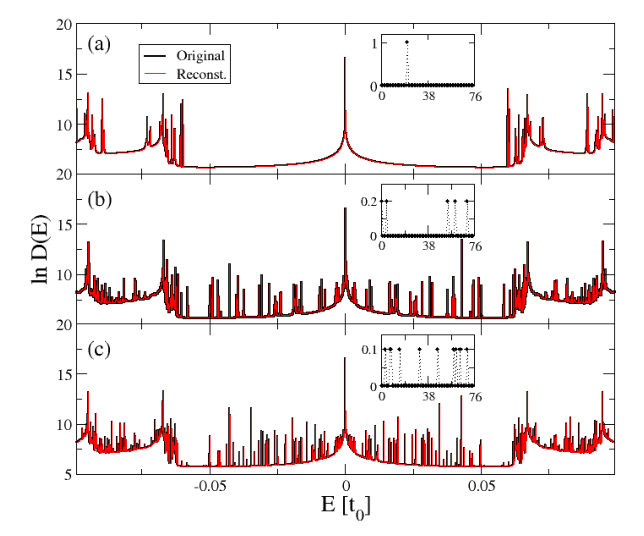
<figcaption class="paper-figure-caption"><b>Fig 2.</b> Figure 2: Reconstruction of composite DOS spectra for multi-nanobubble configurations. The original composite spectra (black) are compared with spectra reconstructed through spectrum- specific coefficient optimization (red) for systems containing (a) one, (b) five, and (c) ten nanobubbles. The insets show the corresponding optimized weight distributions over the single- bubble basis library. The close agreement between the curves indicates that the decomposition identifies and reconstructs the constituent contributions as the number of nanobubbles increases.</figcaption>
</figure>
<figure class="paper-figure-card">
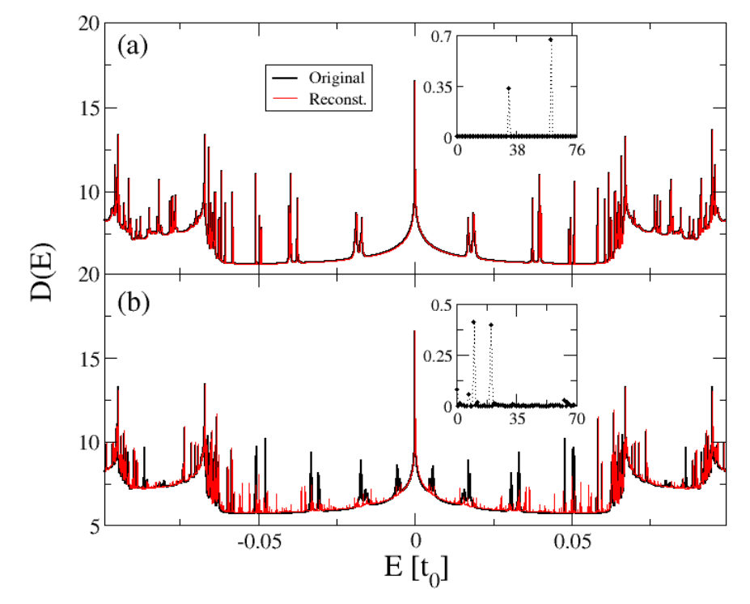
<figcaption class="paper-figure-caption"><b>Fig 3.</b> Figure 3: Tests beyond idealized basis conditions. (a) Reconstruction of an imbalanced configuration containing two identical nanobubbles and one distinct nanobubble, showing that the decomposition identifies repeated basis components through their fractional multiplicity weights. (b) Reconstruction with an incomplete basis dictionary, in which one of the three constituent nanobubbles is absent from the available dictionary; the number of basis channels is reduced from 76 to 70. In both panels, the original DOS is shown in black, the reconstructed DOS is shown in red, and the insets display the optimized basis weights.</figcaption>
</figure>
<figure class="paper-figure-card">
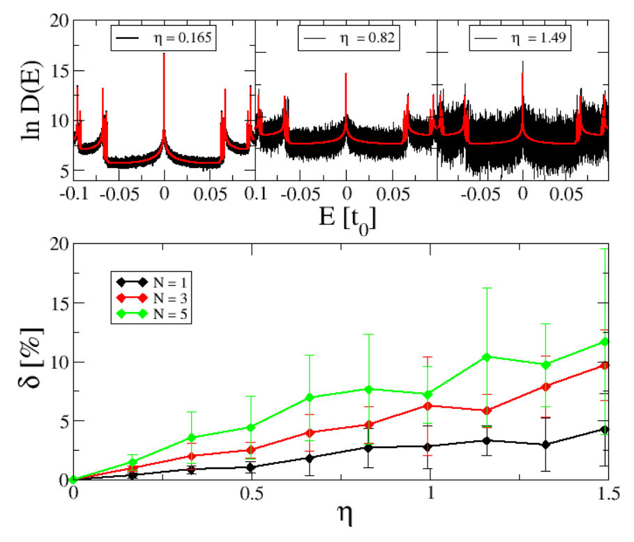
<figcaption class="paper-figure-caption"><b>Fig 4.</b> Figure 4: Robustness against additive Gaussian white noise in the log-transformed input spectra. Top: representative noisy log-DOS spectra obtained by adding Gaussian white noise after logarithmic transformation; the noisy inputs are shown in red. Bottom: mean normalized L1 weight error δw as a function of the mean noise amplitude for configurations containing N = 1, 3, and 5 nanobubbles. At each noise level, the averages are taken over 7, 6, and 8 independent realizations for N = 1, 3, and 5, respectively; the vertical error bars denote the standard deviation of δw. The error increases with both noise amplitude and configuration complexity, while the decomposition remains stable over the...</figcaption>
</figure>

**Summary.** The paper presents a novel, physics-constrained machine learning method to decode the arrangement of multiple nanobubbles in graphene by analyzing their composite electronic Density-of-States spectra. It exploits the known additive relationship between single and multi-bubble DOS signatures to decompose the measured spectrum into constituent geometries. This provides an interpretable tool for characterizing strain-engineered quantum materials.

**Why it may be interesting.** This work exemplifies applying advanced machine learning techniques to solve complex inverse problems in condensed matter spectroscopy. The use of physical constraints (the additive DOS rule) within a differentiable ML framework is highly relevant for interpreting spectroscopic data from quantum materials.

Detailed structure

**Main problem.** The primary challenge is accurately identifying multiple, overlapping nanobubble configurations within graphene solely from their composite electronic Density-of-States (DOS) spectra.

**Main result.** The developed framework successfully reconstructs complex bubble arrangements with high fidelity and robustness against noise and missing basis components by leveraging a physics-constrained decomposition model.

**Method.** A physics-constrained machine learning approach is used to decompose the measured composite DOS spectrum into a sum of known single-bubble spectra, treating it as an inverse problem solved via neural network optimization.

**Model / system.** The system is graphene containing multiple nanobubbles, modeled using tight-binding Hamiltonian calculations. The core physical constraint exploited is that the multi-bubble DOS is additively equivalent to the sum of its constituent single-bubble spectra for separated bubbles.

**Key observables.** Optimized basis coefficients (weights) which directly identify the geometry and multiplicity of each constituent nanobubble; composition error quantified by normalized L1 weight deviation ($\delta w$).

**Important parameters / regimes.** The number of nanobubbles ($N$), the degree of spectral overlap, and the level of added Gaussian white noise ($\eta$).

**Assumptions / limitations.** The method fundamentally relies on the validated additive relationship between the multi-bubble DOS and the sum of single-bubble spectra, which is assumed to hold for sufficiently separated bubbles.

**Figures summary.** Figures demonstrate reconstruction fidelity for increasing bubble complexity (up to ten) and test robustness by showing successful decomposition when constituents are repeated or when the basis dictionary is incomplete. Noise tests quantify performance degradation as a function of added noise amplitude.

**Paper structure.** The paper establishes the physical problem (overlapping DOS), introduces the physics-constrained ML framework based on the additive spectral relation, details the methodology using neural decomposition in log space, and validates its robustness through systematic testing against noise and incomplete basis sets.

Abstract

Identifying multiple graphene nanobubbles from electronic spectra is challenging because their strain-induced features overlap. We develop a physics-constrained machine-learning framework that decodes nanobubble configurations from density-of-states (DOS) spectra. For spatially separated nanobubbles, previous full quantum-transport calculations established that the multi-bubble DOS is numerically equivalent to the normalized sum of the constituent single-bubble spectra. We encode this validated additive relation in a compact neural decomposition model. For each target spectrum, the basis coefficients are optimized independently, and the resulting weights directly identify the constituent geometries. The method accurately reconstructs configurations of increasing complexity and remains robust to repeated constituents, incomplete basis dictionaries, and simulated measurement noise. The framework provides an interpretable route for characterizing strain-engineered graphene nanostructures and may extend to other quantum materials with additive spectral responses.

[↑ back to top](#top)

### [Structural and Vibrational Properties of D$_3$Se from First Principles: Anharmonic Quantum and Isotope Effects](http://arxiv.org/abs/2607.18095v1)

**Authors:** Wenjie Ma, Yao Ma, Mi Pan, Pugeng Hou, Francesco Belli  
**Type:** theory · **Category:** other · **PDF:** <https://arxiv.org/pdf/2607.18095v1>  
**Analysis basis:** full PDF text, analyzed in chunks
**Topic relevance:** `Keldysh / 2PI / non-Gaussian methods` **1/5**

↔ Scroll figures horizontally

<figure class="paper-figure-card">
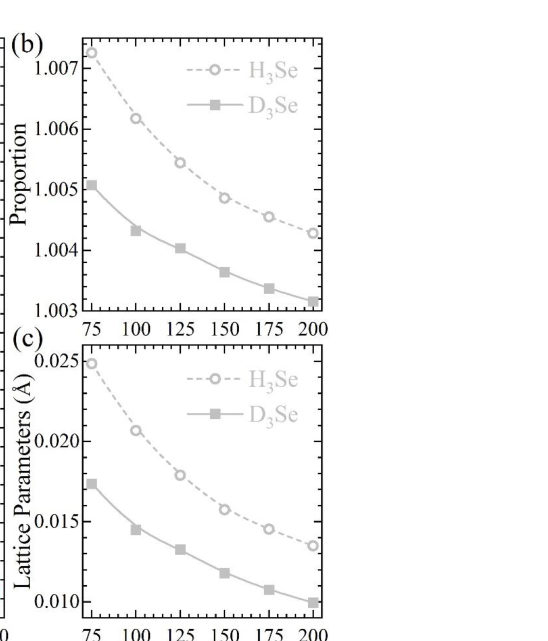
<figcaption class="paper-figure-caption"><b>Fig 1.</b> FIG. 1. (a) Lattice parameter as a function of pressure for the cubic Im3̅m phases of H3Se (dotted) and D3Se (solid). Red symbols and lines represent the anharmonic results obtained from the SSCHA free energy in the fixed-target-pressure mode, while black symbols and lines correspond to the harmonic (classical) approximation evaluated with the Born–Oppenheimer potential. The two harmonic curves coincide exactly, reflecting the mass independence of the classical limit. Panels (b) and (c) show the ratio and difference of the anharmonic to harmonic lattice parameters at each pressure for H3Se (dotted) and D3Se (solid), respectively, to clearly illustrate the lattice expansion induced by...</figcaption>
</figure>
<figure class="paper-figure-card">
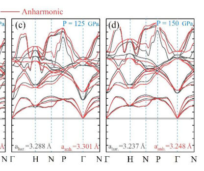
<figcaption class="paper-figure-caption"><b>Fig 2.</b> FIG. 2. Phonon spectra of the cubic Im3̅m D3Se at selected pressures, comparing harmonic (black) and anharmonic (red) results: (a) 75 GPa, (b) 100 GPa, (c) 125 GPa, and (d) 150 GPa. The anharmonic spectra, derived from the static limit of the SSCHA dynamical theory via the Hessian of the free energy D(F) in Eq (3), while the harmonic results are obtained from the classical harmonic dynamical matrix D(h) in Eq. (1). A solid grey line separates the regions of positive frequencies from those of negative (imaginary) frequencies.</figcaption>
</figure>
<figure class="paper-figure-card">
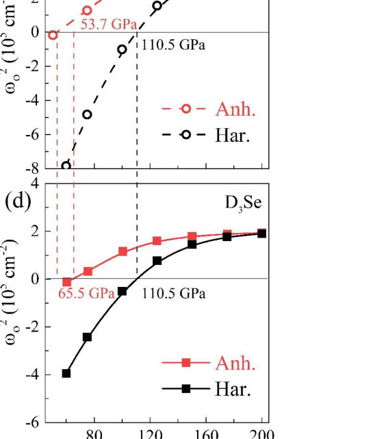
<figcaption class="paper-figure-caption"><b>Fig 3.</b> FIG. 3. Squared frequency ω02 of the T1u mode at Γ for H₃Se and D₃Se as a function of pressure. The color and line-style conventions are the same as in Fig. 1(a): red/black for anharmonic/harmonic results, and solid/dashed for D3Se/H3Se, respectively. Panels (a) and (c) focus on the two points immediately bracketing the zero crossing (with linear fits) to extract the transition pressure. Panels (b) and (d) present the full pressure dependence of ω02, illustrating the overall trend and validating the reliability of the linear extrapolation. The anharmonic results are calculated by diagonalizing the free energy dynamical matrix D(F)(q) [Eq. (3)] and the harmonic results by diagonalizing the...</figcaption>
</figure>
<figure class="paper-figure-card">
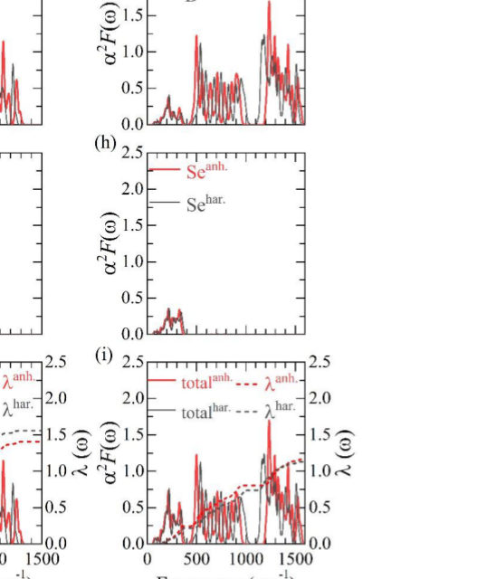
<figcaption class="paper-figure-caption"><b>Fig 4.</b> Fig. 4 (a-c) Projected phonon density of states (PDOS) of D3Se at 125 GPa: (a) D-atom projection, (b) Se-atom projection, and (c) total PDOS. (d-f) Projected Eliashberg spectral function α2F(ω) at 125 GPa: (d) D-atom projection, (e) Se-atom projection, and (f) total α2F(ω) together with the integrated electron-phonon coupling λ(ω). (g–i) Same as (d-f) but at 200 GPa. Black lines represent</figcaption>
</figure>
<figure class="paper-figure-card">
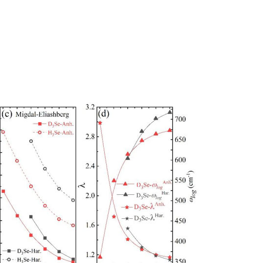
<figcaption class="paper-figure-caption"><b>Fig 5.</b> FIG. 5. (a-c) Superconducting critical temperature Tc as a function of pressure for H3Se (circles) and D3Se (squares), calculated using (a) the McMillan equation, (b) the Allen-Dynes modified equation, and (c) the isotropic Migdal-Eliashberg equations. All calculations adopt a Coulomb pseudopotential μ∗=0.1. (d) Electron-phonon coupling constant λ (left axis) and logarithmic average frequency ωlog (right axis) for D3Se as functions of pressure. In each panel, black symbols and lines denote the harmonic (classical) results, while red symbols and lines correspond to the anharmonic (SSCHA) results. The upward triangle denotes λ, and the asterisk denotes ωlog.</figcaption>
</figure>

**Summary.** This paper uses advanced first-principles calculations to study D3Se under high pressure, showing that incorporating quantum and anharmonic effects is crucial for accurate predictions. These corrections stabilize the lattice structure and significantly alter superconducting parameters like $T_c$ and the isotope coefficient ($\alpha$). The findings emphasize that simple harmonic models fail dramatically when describing these highly compressed, light-element superconductors.

**Why it may be interesting.** This work is highly relevant because it tackles the fundamental theoretical challenge of accurately modeling strongly coupled quantum systems where zero-point energy and anharmonic interactions dominate material properties, which is a core theme in advanced condensed matter theory.

Detailed structure

**Main problem.** To accurately predict the structural, vibrational, and superconducting properties of hydrogen/deuterium-rich superconductors like D3Se by incorporating crucial quantum and anharmonic effects.

**Main result.** Anharmonic corrections are essential, stabilizing the lattice and significantly reducing the predicted isotope coefficient ($\alpha$) compared to harmonic calculations. The study predicts a high critical temperature ($T_c \approx 154	ext{ K}$) at moderate pressures when these effects are included.

**Method.** The research employs first-principles Density Functional Theory combined with the Stochastic Self-Consistent Harmonic Approximation (SSCHA) to treat zero-point motion and anharmonicity nonperturbatively.

**Model / system.** The primary system studied is deuterated selenide ($	ext{D}_3	ext{Se}$) in the $	ext{Im}ar{3}	ext{m}$ phase, investigated across high pressures (60–200 GPa). The methodology involves calculating the free energy functional and deriving phonon spectra from its Hessian.

**Key observables.** Superconducting critical temperature ($T_c$), isotope coefficient ($\alpha$), renormalized phonon spectra, and dynamic stability pressure.

**Important parameters / regimes.** Pressure range (75–200 GPa), quantum/anharmonic corrections, BCS limit for $\alpha$ (0.5).

**Assumptions / limitations.** The harmonic approximation is insufficient due to zero-point motion and anharmonicity; the SSCHA method provides a rigorous treatment of these effects.

**Figures summary.** Figures compare lattice parameters and phonon spectra between harmonic and anharmonic treatments, illustrating the stabilizing effect of quantum fluctuations. Figure 6 specifically compares $\alpha$ values across different theoretical frameworks (McMillan, Allen-Dynes, Migdal-Eliashberg) as a function of pressure.

**Paper structure.** The paper progresses by first establishing the necessity of quantum/anharmonic corrections for structural stability and phonon spectra. It then applies these corrected parameters to calculate the electron-phonon coupling ($\lambda$) and $T_c$. Finally, it analyzes the isotope effect ($\alpha$), demonstrating how anharmonicity fundamentally governs its magnitude.

Abstract

Hydrogen-rich superconductors have garnered considerable interest following the discovery of hot superconductivity in high pressure H$_3$S, reviving prospects for room temperature superconductors under high-pressures. Using H$_3$Se as a reference system, we investigate the vibrational and superconducting properties of D$_3$Se in the Im\bar{3}m phase across 60-200 GPa by combining first-principles calculations with the stochastic self-consistent harmonic approximation to treat ionic quantum and anharmonic effects. These effects introduce significant renormalization to the phonon spectra and stabilize the lattice down to at least 70 GPa, well below the harmonic prediction of >110 GPa. Ultimately, the phonon renormalizations alter the electron-phonon coupling, introducing a decrease in the superconducting critical temperature by about 3-16 K across the studied pressure range with respect to standard calculations. Including anharmonic phonons within the Migdal-Eliashberg theory yields $T_c \approx 154$ K at 75 GPa (with $μ^* = 0.1$, $λ = 3.0$), highlighting D3Se as a promising high-Tc superconductor at moderate pressures. Examining the role of anharmonicity in the isotope effect, we find that at 200 GPa it suppresses the isotope coefficient $α$ to 0.29 one third below the harmonic value (0.44) which approaches the BCS limit of 0.5. This dramatic reduction demonstrates that anharmonicity fundamentally governs the isotope effect on this system. The stark discrepancy between anharmonic and harmonic descriptions underscores the need for targeted experimental efforts to resolve the origin of the persistent theory-experiment discrepancy in compressed hydrides.

[↑ back to top](#top)

### [Superconductivity in MgHCu3 perovskite revisited](http://arxiv.org/abs/2607.18117v1)

**Authors:** Piotr Szkudlarek, Wojciech Grochala  
**Type:** theory · **Category:** other · **PDF:** <https://arxiv.org/pdf/2607.18117v1>  
**Analysis basis:** full PDF text, analyzed in chunks
**Topic relevance:** `Keldysh / 2PI / non-Gaussian methods` **1/5**

↔ Scroll figures horizontally

<figure class="paper-figure-card">
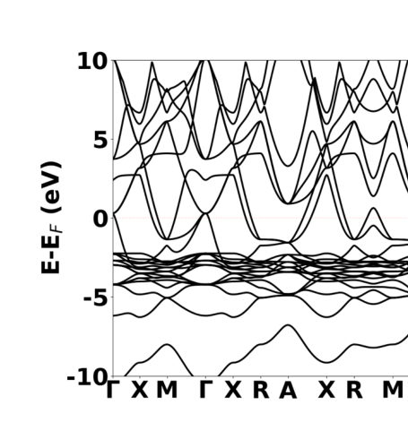
<figcaption class="paper-figure-caption"><b>Fig 1.</b> Figure 1. The electronic band structure for the densest studied k-point mesh (24x24x24)</figcaption>
</figure>
<figure class="paper-figure-card">
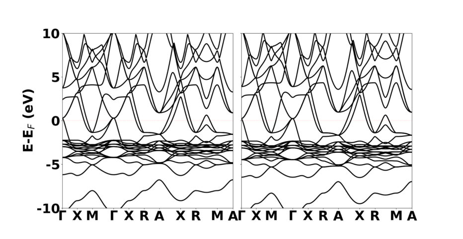
<figcaption class="paper-figure-caption"><b>Fig 2.</b> Figure 3 we present the comparison of the phonon dispersion and phonon density of states for</figcaption>
</figure>
<figure class="paper-figure-card">
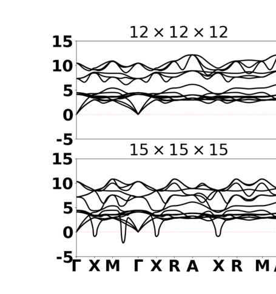
<figcaption class="paper-figure-caption"><b>Fig 3.</b> Figure 2. The phonon dispersion curves obtained using the PBE functional and the four</figcaption>
</figure>
<figure class="paper-figure-card">
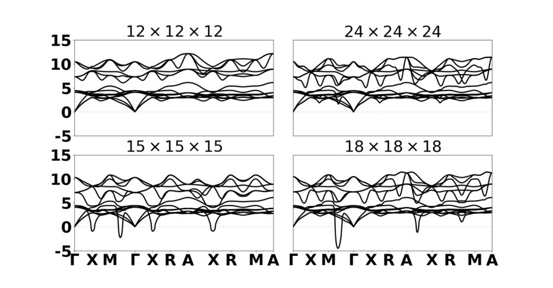
<figcaption class="paper-figure-caption"><b>Fig 4.</b> Figure 3. The phonon dispersion curves and DOS, as well as the Eliashberg function for the</figcaption>
</figure>

**Summary.** This theoretical study re-evaluates the superconducting properties of MgHCu3 perovskite using DFT calculations. The authors find that while the electronic structure is robust, phonon-related properties and the resulting critical temperature (Tc) are highly sensitive to computational parameters like k-point mesh density and choice of functional. They caution that high Tc claims in this field require much more rigorous, multi-parameter benchmarking.

**Why it may be interesting.** While focused on solid-state superconductivity, the rigorous investigation into the limitations imposed by computational approximations (functional dependence, grid convergence) mirrors challenges in modeling complex quantum many-body systems where small changes can drastically alter predicted ground states or excitation spectra.

Detailed structure

**Main problem.** The authors reexamine superconductivity in MgHCu3 perovskite, aiming to scrutinize the reliability of high critical temperature (Tc) claims for hydride superconductors.

**Main result.** Calculated Tc values vary widely (10–31 K) depending on computational parameters and do not exceed the classical phonon-driven limit. The results emphasize that phonon properties are extremely sensitive to the chosen k-point mesh and functional.

**Method.** Density Functional Theory (DFT) calculations using PBEsol and PBE functionals were employed to compute electronic structure, lattice dynamics, electron-phonon coupling, and subsequently Tc via the McMillan–Allen–Dynes formula.

**Model / system.** The study focuses on the hypothetical perovskite superconductor MgHCu3. The theoretical framework involves calculating phonon dispersion and electron-phonon coupling ($\lambda$) to predict superconducting properties.

**Key observables.** Critical Temperature (Tc), Electron-Phonon Coupling Constant (lambda), Phonon Dispersion/Spectrum, Lattice Constant (a).

**Important parameters / regimes.** Computational parameters like k-point mesh density (12x12x12 to 24x24x24) and DFT functional (PBE vs PBEsol) are critical variables.

**Assumptions / limitations.** The primary limitation noted is the extreme sensitivity of phonon properties to computational grid parameters, suggesting that current theoretical predictions require rigorous benchmarking against experiments.

**Figures summary.** Supporting information details systematic variations in band structure, DOS, and Tc dependence on Gaussian broadening across different functional/mesh combinations.

**Paper structure.** The paper systematically re-evaluates the crystal structure and electronic properties using multiple computational parameters before calculating superconducting metrics. The core argument revolves around demonstrating the parameter sensitivity of the phonon calculations.

Abstract

We reexamine the crystal structure, electronic structure, lattice dynamics, phonon dispersion, electron-phonon coupling, and superconducting properties of MgHCu3 perovskite using the PBEsol and PBE functionals. This perovskite phase was recently proposed to exhibit superconductivity with the critical superconducting temperature, TC, of 42 K, which falls slightly over the classical 40 K limit for the phonon driven superconductivity. We show that although the crystal and electronic structure of this hypothetical compound are quite robust with respect to the k point mesh and functional used, yet the phonons and phonon related properties are extremely sensitive to the density of the grid chosen as well as functional used for calculations. Correspondingly, the values of the critical superconducting temperature calculated here for different Gaussian broadenings vary in a broad range of ca. 10 to 31 K and they do not exceed the classical limit. We suggest that the properties of this and many other high TC hydrides claimed should be thoroughly scrutinized using a variety of functionals, and benchmarked with experiment, to provide more reliable values of TC.

[↑ back to top](#top)
