
# arxiv digest (quant-ph + cond-mat) — 2026-07-23

*112 papers · 39 relevant · 3 highlighted*

## 🔥 Most relevant (39)

*Every paper with at least one nonzero topic score, sorted by best-matching score. 🔥 marks scores ≥4/5. Click the title to jump to the full entry below; click [arXiv] to open the paper page. `(secondary)` marks papers from de-prioritized cond-mat archives.*

Show 39 relevant papers

- [Boundary quenches in (1+1)-dimensional conformal field theory](#paper-2607.19166) [[arXiv]](http://arxiv.org/abs/2607.19166v1) — 🔥 `non-equilibrium dynamics` **5/5** · 🔥 `entanglement & information structure` **4/5** · 🔥 `non-equilibrium universality` **4/5** · `methods for driven-dissipative` **3/5** · `driven-dissipative phase transition` **2/5** · `Keldysh / 2PI / non-Gaussian methods` **1/5** · `correlated / nonlocal dissipation` **1/5**
- [Collective Coherent Perfect Absorption in a Synthetic Photon-Phonon Lattice](#paper-2607.18902) [[arXiv]](http://arxiv.org/abs/2607.18902v1) — 🔥 `analog quantum simulation` **4/5** · 🔥 `correlated / nonlocal dissipation` **4/5** · 🔥 `correlated cavity matter` **4/5** · 🔥 `non-equilibrium dynamics` **4/5** · `driven-dissipative phase transition` **3/5** · `interference shaping light` **3/5** · `methods for driven-dissipative` **3/5** · `quantum optics experiment` **3/5** · `Tavis-Cummings & cavity-many-emitter` **2/5** · `non-equilibrium universality` **2/5** · `Dicke superradiance` **1/5** · `Keldysh / 2PI / non-Gaussian methods` **1/5** · `entanglement & information structure` **1/5**
- [Steady States of a Single Trapped-Ion Spin Coupled to an Engineered Non-Markovian Bath](#paper-2607.19286) [[arXiv]](http://arxiv.org/abs/2607.19286v1) — 🔥 `methods for driven-dissipative` **4/5** · 🔥 `non-equilibrium dynamics` **4/5** · `correlated / nonlocal dissipation` **3/5** · `driven-dissipative phase transition` **3/5** · `Keldysh / 2PI / non-Gaussian methods` **2/5** · `analog quantum simulation` **2/5** · `non-equilibrium universality` **2/5** · `quantum measurements` **2/5** · `QC/QI experiment` **1/5** · `exotic spin models in light-matter` **1/5** · `measurement-induced transitions` **1/5** · `spintronics-quantum-optics interface` **1/5**
- [Cavity-Mediated Charging of a Graphene Excitonic Quantum Battery](#paper-2607.18489) [[arXiv]](http://arxiv.org/abs/2607.18489v1) — 🔥 `Tavis-Cummings & cavity-many-emitter` **4/5** · 🔥 `methods for driven-dissipative` **4/5** · `analog quantum simulation` **3/5** · `correlated cavity matter` **3/5** · `driven-dissipative phase transition` **3/5** · `non-equilibrium dynamics` **2/5** · `non-equilibrium universality` **2/5** · `Keldysh / 2PI / non-Gaussian methods` **1/5** · `correlated / nonlocal dissipation` **1/5** · `entanglement & information structure` **1/5** · `scars & prethermalization` **1/5**
- [Coherent Magnons Driven by Photomodulated Anisotropy in Altermagnetic MnTe](#paper-2607.18421) [[arXiv]](http://arxiv.org/abs/2607.18421v1) — 🔥 `spintronics-quantum-optics interface` **4/5** · `driven-dissipative phase transition` **3/5** · `exotic spin models in light-matter` **3/5** · `non-equilibrium dynamics` **3/5** · `analog quantum simulation` **2/5** · `correlated / nonlocal dissipation` **2/5** · `methods for driven-dissipative` **2/5** · `non-equilibrium universality` **2/5** · `Keldysh / 2PI / non-Gaussian methods` **1/5** · `quantum measurements` **1/5** · `quantum optics experiment` **1/5**
- [Simulating the Dicke Model on Qubit-Based and hybrid Qubit-Boson-Based Quantum Computers](#paper-2607.18546) [[arXiv]](http://arxiv.org/abs/2607.18546v1) — 🔥 `Dicke superradiance` **4/5** · `Tavis-Cummings & cavity-many-emitter` **3/5** · `correlated cavity matter` **3/5** · `Keldysh / 2PI / non-Gaussian methods` **2/5** · `analog quantum simulation` **2/5** · `driven-dissipative phase transition` **2/5** · `methods for driven-dissipative` **2/5** · `superradiant laser` **2/5** · `correlated / nonlocal dissipation` **1/5** · `exotic spin models in light-matter` **1/5** · `non-equilibrium dynamics` **1/5** · `non-equilibrium universality` **1/5**
- [Direct Spatiotemporal Imaging of Charge Carrier Dynamics in Operative Semiconductor Devices](#paper-2607.19157) [[arXiv]](http://arxiv.org/abs/2607.19157v1) `(secondary)` — 🔥 `quantum measurements` **4/5** · `methods for driven-dissipative` **3/5** · `non-equilibrium dynamics` **3/5** · `Keldysh / 2PI / non-Gaussian methods` **2/5** · `measurement-induced transitions` **2/5** · `quantum optics experiment` **2/5** · `spintronics-quantum-optics interface` **2/5** · `analog quantum simulation` **1/5** · `correlated / nonlocal dissipation` **1/5** · `driven-dissipative phase transition` **1/5** · `non-equilibrium universality` **1/5**
- [Bridging distributed quantum materials via multi-hotspot vacuum: remote Cooper pairing and Andreev teleportation](#paper-2607.18916) [[arXiv]](http://arxiv.org/abs/2607.18916v1) `(secondary)` — 🔥 `analog quantum simulation` **4/5** · 🔥 `correlated cavity matter` **4/5** · `entanglement & information structure` **3/5** · `exotic spin models in light-matter` **3/5** · `Tavis-Cummings & cavity-many-emitter` **2/5** · `Keldysh / 2PI / non-Gaussian methods` **1/5** · `correlated / nonlocal dissipation` **1/5** · `driven-dissipative phase transition` **1/5** · `methods for driven-dissipative` **1/5** · `non-equilibrium dynamics` **1/5**
- [Simulating Majorana fermions in black hole with Ising Models](#paper-2607.18805) [[arXiv]](http://arxiv.org/abs/2607.18805v1) — 🔥 `analog quantum simulation` **4/5** · `exotic spin models in light-matter` **3/5** · `correlated / nonlocal dissipation` **2/5** · `driven-dissipative phase transition` **2/5** · `entanglement & information structure` **2/5** · `methods for driven-dissipative` **2/5** · `non-equilibrium dynamics` **2/5** · `Keldysh / 2PI / non-Gaussian methods` **1/5** · `Kondo & dissipative impurity` **1/5** · `Rydberg arrays` **1/5** · `non-equilibrium universality` **1/5**
- [Domain wall motion in a polycrystalline vortex lattice](#paper-2607.18592) [[arXiv]](http://arxiv.org/abs/2607.18592v1) `(secondary)` — 🔥 `Frenkel-Kontorova` **4/5** · `analog quantum simulation` **3/5** · `driven-dissipative phase transition` **3/5** · `methods for driven-dissipative` **3/5** · `non-equilibrium dynamics` **2/5** · `non-equilibrium universality` **2/5** · `Keldysh / 2PI / non-Gaussian methods` **1/5** · `correlated / nonlocal dissipation` **1/5** · `scars & prethermalization` **1/5**
- [Dynamical correlation functions of extensive charges after global quantum quenches](#paper-2607.19208) [[arXiv]](http://arxiv.org/abs/2607.19208v1) — 🔥 `non-equilibrium dynamics` **4/5** · `analog quantum simulation` **3/5** · `entanglement & information structure` **3/5** · `non-equilibrium universality` **3/5** · `methods for driven-dissipative` **2/5** · `scars & prethermalization` **2/5** · `Keldysh / 2PI / non-Gaussian methods` **1/5** · `correlated / nonlocal dissipation` **1/5** · `driven-dissipative phase transition` **1/5**
- [Ecological networks of viable species with degree-dependent interaction](#paper-2607.18809) [[arXiv]](http://arxiv.org/abs/2607.18809v1) — 🔥 `non-equilibrium dynamics` **4/5** · `driven-dissipative phase transition` **3/5** · `methods for driven-dissipative` **3/5** · `non-equilibrium universality` **3/5** · `Keldysh / 2PI / non-Gaussian methods` **2/5** · `analog quantum simulation` **2/5** · `correlated / nonlocal dissipation` **1/5** · `entanglement & information structure` **1/5** · `scars & prethermalization` **1/5**
- [Efficient quantum transport in disordered Floquet networks](#paper-2607.19278) [[arXiv]](http://arxiv.org/abs/2607.19278v1) — 🔥 `analog quantum simulation` **4/5** · 🔥 `non-equilibrium dynamics` **4/5** · `driven-dissipative phase transition` **3/5** · `methods for driven-dissipative` **3/5** · `non-equilibrium universality` **2/5** · `Keldysh / 2PI / non-Gaussian methods` **1/5** · `correlated / nonlocal dissipation` **1/5** · `entanglement & information structure` **1/5** · `scars & prethermalization` **1/5**
- [From Canonical to Tunable Phase Diagrams in Open Quantum Long-Range Systems](#paper-2607.18542) [[arXiv]](http://arxiv.org/abs/2607.18542v1) — 🔥 `driven-dissipative phase transition` **4/5** · `correlated / nonlocal dissipation` **3/5** · `methods for driven-dissipative` **3/5** · `non-equilibrium universality` **3/5** · `non-equilibrium dynamics` **2/5** · `Keldysh / 2PI / non-Gaussian methods` **1/5** · `analog quantum simulation` **1/5** · `exotic spin models in light-matter` **1/5** · `measurement-induced transitions` **1/5** · `quantum measurements` **1/5**
- [Programmable Spin Conversion in Gradient Quantum Matter](#paper-2607.19105) [[arXiv]](http://arxiv.org/abs/2607.19105v1) — 🔥 `analog quantum simulation` **4/5** · `Keldysh / 2PI / non-Gaussian methods` **3/5** · `methods for driven-dissipative` **3/5** · `spintronics-quantum-optics interface` **3/5** · `driven-dissipative phase transition` **2/5** · `non-equilibrium dynamics` **2/5** · `correlated / nonlocal dissipation` **1/5** · `exotic spin models in light-matter` **1/5** · `non-equilibrium universality` **1/5**
- [The Thermodynamic Geometry of Conditional Control](#paper-2607.19177) [[arXiv]](http://arxiv.org/abs/2607.19177v1) — 🔥 `quantum measurements` **4/5** · `entanglement & information structure` **3/5** · `measurement-induced transitions` **3/5** · `correlated / nonlocal dissipation` **2/5** · `driven-dissipative phase transition` **2/5** · `non-equilibrium dynamics` **2/5** · `Keldysh / 2PI / non-Gaussian methods` **1/5** · `methods for driven-dissipative` **1/5** · `non-equilibrium universality` **1/5**
- [Collective modes in non-Hermitian fermionic superfluids](#paper-2607.18814) [[arXiv]](http://arxiv.org/abs/2607.18814v1) — 🔥 `methods for driven-dissipative` **4/5** · `Keldysh / 2PI / non-Gaussian methods` **3/5** · `driven-dissipative phase transition` **3/5** · `Kondo & dissipative impurity` **2/5** · `analog quantum simulation` **2/5** · `non-equilibrium dynamics` **2/5** · `correlated / nonlocal dissipation` **1/5** · `non-equilibrium universality` **1/5**
- [Photon Correlation Spectroscopy as a Probe of Critical Fluctuations in Correlated Electron Systems](#paper-2607.19295) [[arXiv]](http://arxiv.org/abs/2607.19295v1) — 🔥 `analog quantum simulation` **4/5** · `exotic spin models in light-matter` **3/5** · `quantum optics experiment` **3/5** · `spintronics-quantum-optics interface` **3/5** · `driven-dissipative phase transition` **2/5** · `interference shaping light` **1/5** · `non-equilibrium dynamics` **1/5** · `non-equilibrium universality` **1/5**
- [Time-resolved ARPES in pumped excitonic systems: Floquet physics induced by excitonic fields](#paper-2607.19242) [[arXiv]](http://arxiv.org/abs/2607.19242v1) `(secondary)` — 🔥 `methods for driven-dissipative` **4/5** · 🔥 `non-equilibrium dynamics` **4/5** · `Keldysh / 2PI / non-Gaussian methods` **3/5** · `driven-dissipative phase transition` **3/5** · `non-equilibrium universality` **2/5** · `analog quantum simulation` **1/5** · `correlated cavity matter` **1/5**
- [Variational formulation for the dynamics of soft matter including inertia](#paper-2607.18457) [[arXiv]](http://arxiv.org/abs/2607.18457v1) — 🔥 `Keldysh / 2PI / non-Gaussian methods` **4/5** · `methods for driven-dissipative` **3/5** · `non-equilibrium dynamics` **3/5** · `correlated / nonlocal dissipation` **2/5** · `driven-dissipative phase transition` **2/5** · `non-equilibrium universality` **2/5** · `Frenkel-Kontorova` **1/5** · `analog quantum simulation` **1/5**
- [Deterministic cascade coarsening in a Bistable Gene Toggle model](#paper-2607.18891) [[arXiv]](http://arxiv.org/abs/2607.18891v1) — 🔥 `non-equilibrium dynamics` **4/5** · 🔥 `non-equilibrium universality` **4/5** · `driven-dissipative phase transition` **3/5** · `methods for driven-dissipative` **3/5** · `Frenkel-Kontorova` **1/5** · `Keldysh / 2PI / non-Gaussian methods` **1/5** · `correlated / nonlocal dissipation` **1/5**
- ⭐ [Motional Kerr-Cat States of an Atom in an Optical Tweezer](#paper-2607.18579) [[arXiv]](http://arxiv.org/abs/2607.18579v1) — 🔥 `analog quantum simulation` **4/5** · `QC/QI experiment` **3/5** · `entanglement & information structure` **2/5** · `quantum measurements` **2/5** · `quantum optics experiment` **2/5** · `Rydberg arrays` **1/5** · `correlated cavity matter` **1/5** · `driven-dissipative phase transition` **1/5** · `non-equilibrium dynamics` **1/5**
- [Calculus of Robinet: completely positive reconstruction of time-averaged diffusive quantum trajectories](#paper-2607.18392) [[arXiv]](http://arxiv.org/abs/2607.18392v1) — 🔥 `methods for driven-dissipative` **4/5** · 🔥 `quantum measurements` **4/5** · `measurement-induced transitions` **3/5** · `non-equilibrium dynamics` **2/5** · `Keldysh / 2PI / non-Gaussian methods` **1/5** · `correlated / nonlocal dissipation` **1/5** · `driven-dissipative phase transition` **1/5**
- [Coherent-disorder-driven complexity transitions in a quantum-advantage architecture](#paper-2607.18938) [[arXiv]](http://arxiv.org/abs/2607.18938v1) — 🔥 `methods for driven-dissipative` **4/5** · `driven-dissipative phase transition` **3/5** · `entanglement & information structure` **3/5** · `non-equilibrium universality` **2/5** · `analog quantum simulation` **1/5** · `correlated / nonlocal dissipation` **1/5** · `non-equilibrium dynamics` **1/5**
- [Dimension Reduction for Quantum Adaptive Agents](#paper-2607.19156) [[arXiv]](http://arxiv.org/abs/2607.19156v1) — 🔥 `methods for driven-dissipative` **4/5** · `entanglement & information structure` **3/5** · `driven-dissipative phase transition` **2/5** · `non-equilibrium dynamics` **2/5** · `Keldysh / 2PI / non-Gaussian methods` **1/5** · `analog quantum simulation` **1/5** · `correlated / nonlocal dissipation` **1/5** · `non-equilibrium universality` **1/5**
- [Quasi-stationary and quasi-ergodic distributions in the Pelikan random map](#paper-2607.19084) [[arXiv]](http://arxiv.org/abs/2607.19084v1) — 🔥 `non-equilibrium dynamics` **4/5** · `driven-dissipative phase transition` **3/5** · `methods for driven-dissipative` **3/5** · `non-equilibrium universality` **2/5** · `Keldysh / 2PI / non-Gaussian methods` **1/5** · `correlated / nonlocal dissipation` **1/5** · `scars & prethermalization` **1/5**
- [A general estimation framework for continuous-variable systems](#paper-2607.19287) [[arXiv]](http://arxiv.org/abs/2607.19287v1) — 🔥 `quantum measurements` **4/5** · `measurement-induced transitions` **3/5** · `quantum optics experiment` **2/5** · `Keldysh / 2PI / non-Gaussian methods` **1/5** · `correlated / nonlocal dissipation` **1/5** · `driven-dissipative phase transition` **1/5** · `entanglement & information structure` **1/5** · `methods for driven-dissipative` **1/5**
- ⭐ [Nonlinear Response via Sublinear Optics](#paper-2607.19154) [[arXiv]](http://arxiv.org/abs/2607.19154v1) — 🔥 `quantum measurements` **4/5** · `measurement-induced transitions` **3/5** · `methods for driven-dissipative` **3/5** · `non-equilibrium dynamics` **2/5** · `Keldysh / 2PI / non-Gaussian methods` **1/5** · `driven-dissipative phase transition` **1/5**
- [Trade-off between predictability and quantum coherence for multi-path interferometry and its operational interpretation](#paper-2607.18732) [[arXiv]](http://arxiv.org/abs/2607.18732v1) — 🔥 `quantum measurements` **4/5** · `interference shaping light` **3/5** · `measurement-induced transitions` **3/5** · `entanglement & information structure` **2/5** · `correlated / nonlocal dissipation` **1/5** · `driven-dissipative phase transition` **1/5**
- [Entropy power functional theory for Brownian many-body dynamics](#paper-2607.19255) [[arXiv]](http://arxiv.org/abs/2607.19255v1) — 🔥 `non-equilibrium dynamics` **4/5** · `methods for driven-dissipative` **3/5** · `non-equilibrium universality` **3/5** · `Keldysh / 2PI / non-Gaussian methods` **1/5** · `correlated / nonlocal dissipation` **1/5** · `driven-dissipative phase transition` **1/5**
- [Deep inelastic scattering as a probe of entanglement: the complete QCD dipole cascade](#paper-2607.18464) [[arXiv]](http://arxiv.org/abs/2607.18464v1) — 🔥 `entanglement & information structure` **4/5** · `Keldysh / 2PI / non-Gaussian methods` **2/5** · `non-equilibrium dynamics` **2/5** · `correlated / nonlocal dissipation` **1/5** · `driven-dissipative phase transition` **1/5** · `methods for driven-dissipative` **1/5** · `non-equilibrium universality` **1/5**
- [Quantum-Enabled Spintronic "Small" Antennas](#paper-2607.18469) [[arXiv]](http://arxiv.org/abs/2607.18469v1) — 🔥 `spintronics-quantum-optics interface` **4/5** · `quantum optics experiment` **2/5** · `analog quantum simulation` **1/5** · `correlated / nonlocal dissipation` **1/5** · `driven-dissipative phase transition` **1/5** · `exotic spin models in light-matter` **1/5** · `non-equilibrium dynamics` **1/5** · `superradiant laser` **1/5**
- [Remote entanglement need not be the bottleneck for modular trapped-ion quantum computing](#paper-2607.18387) [[arXiv]](http://arxiv.org/abs/2607.18387v1) — 🔥 `QC/QI experiment` **4/5** · `quantum optics experiment` **3/5** · `entanglement & information structure` **1/5** · `interference shaping light` **1/5** · `quantum measurements` **1/5**
- [Experimental quantum cryptography with single photons and imperfect devices](#paper-2607.19204) [[arXiv]](http://arxiv.org/abs/2607.19204v1) — 🔥 `QC/QI experiment` **4/5** · `quantum optics experiment` **3/5** · `quantum measurements` **1/5**
- [Monolithic printed-circuit board RF-trap for electrons](#paper-2607.18401) [[arXiv]](http://arxiv.org/abs/2607.18401v1) — 🔥 `QC/QI experiment` **4/5** · `analog quantum simulation` **1/5** · `methods for driven-dissipative` **1/5** · `quantum measurements` **1/5** · `spintronics-quantum-optics interface` **1/5**
- [How to improve the discrimination power of classically simulable measurements?](#paper-2607.19070) [[arXiv]](http://arxiv.org/abs/2607.19070v1) — 🔥 `quantum measurements` **4/5** · `entanglement & information structure` **1/5** · `measurement-induced transitions` **1/5**
- [Simultaneous calibration of rotation and phase errors in a single experiment](#paper-2607.19187) [[arXiv]](http://arxiv.org/abs/2607.19187v1) — 🔥 `QC/QI experiment` **4/5** · `quantum measurements` **2/5**
- [Magic-protected entanglement and Clifford-irreducible structure in magic state space](#paper-2607.18400) [[arXiv]](http://arxiv.org/abs/2607.18400v1) — 🔥 `entanglement & information structure` **4/5**
- [Monogamy inequalities of entanglement of assistance in $2\otimes 2\otimes d$ systems](#paper-2607.18643) [[arXiv]](http://arxiv.org/abs/2607.18643v1) — 🔥 `entanglement & information structure` **4/5**

## ⭐ Highlighted (3)

*Papers by authors on your watch list. Click the title to jump to the full entry below; click [arXiv] to open the paper page.*

Show 3 highlighted papers

- ⭐ [Motional Kerr-Cat States of an Atom in an Optical Tweezer](#paper-2607.18579) [[arXiv]](http://arxiv.org/abs/2607.18579v1) — Ana Maria Rey
- ⭐ [Nonlinear Response via Sublinear Optics](#paper-2607.19154) [[arXiv]](http://arxiv.org/abs/2607.19154v1) — Denys I. Bondar
- ⭐ [Quantum Synchronization](#paper-2607.19328) [[arXiv]](http://arxiv.org/abs/2607.19328v1) — Igor Lesanovsky, Rosario Fazio

## All papers (88, sorted by relevance)

*Papers from quant-ph and your primary cond-mat archives (quant-gas, stat-mech, str-el, dis-nn). Highlighted papers (⭐) come first, then everything else sorted by topic-relevance score, highest first.*

### ⭐ [Motional Kerr-Cat States of an Atom in an Optical Tweezer](http://arxiv.org/abs/2607.18579v1)

**Highlighted author(s):** Ana Maria Rey  
**Authors:** Steven K. Pampel, Gur Lubin, Dawson P. Hewatt, Conall McCabe, Jaeyong Hwang, Sean R. Muleady, Tianrui Xu, Ana Maria Rey, Cindy A. Regal  
**Type:** experiment · **Category:** other · **PDF:** <https://arxiv.org/pdf/2607.18579v1>  
**Analysis basis:** full PDF text, analyzed in chunks
**Topic relevance:** 🔥 `analog quantum simulation` **4/5** · `QC/QI experiment` **3/5** · `entanglement & information structure` **2/5** · `quantum measurements` **2/5** · `quantum optics experiment` **2/5** · `Rydberg arrays` **1/5** · `correlated cavity matter` **1/5** · `driven-dissipative phase transition` **1/5** · `non-equilibrium dynamics` **1/5**

↔ Scroll figures horizontally

<figure class="paper-figure-card">
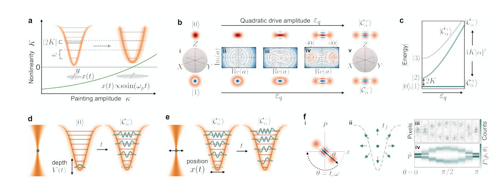
<figcaption class="paper-figure-caption"><b>Fig 1.</b> Figure 1: Motional Kerr-cat state preparation and tomography in optical tweezers. a, Kerr nonlinearity 𝐾versus painting amplitude 𝜅in a tweezer with trap frequency 𝜔. All parameters are defined along the 𝑥-dimension of the tweezer, where (𝑥, 𝑦) and 𝑧denote the radial and axial dimensions, respectively. Modulation of the trap position at a frequency 𝜔𝑝≫𝜔(painting) and amplitude 𝜅enables dynamic tuning of the anharmonicity 2𝐾between the intrinsic Gaussian value and the harmonic limit. Shaded ellipses indicate the trap waist in 𝑥and 𝑦. b, Adiabatic Kerr-cat preparation. An initially prepared Fock state |0⟩or |1⟩(i) is transformed into an even- or odd-parity Kerr-cat state |C+ 𝛼⟩and |C− 𝛼⟩(v)...</figcaption>
</figure>
<figure class="paper-figure-card">
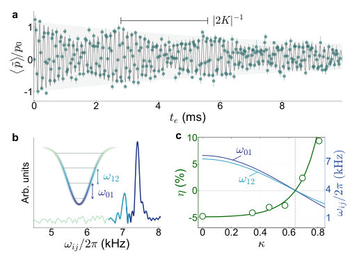
<figcaption class="paper-figure-caption"><b>Fig 2.</b> Figure 2: Tuning and measuring Kerr nonlinearity in an optical tweezer. a, Momentum expectation value ⟨˜𝑝⟩/𝑝0, where 𝑝0 = √︁</figcaption>
</figure>
<figure class="paper-figure-card">
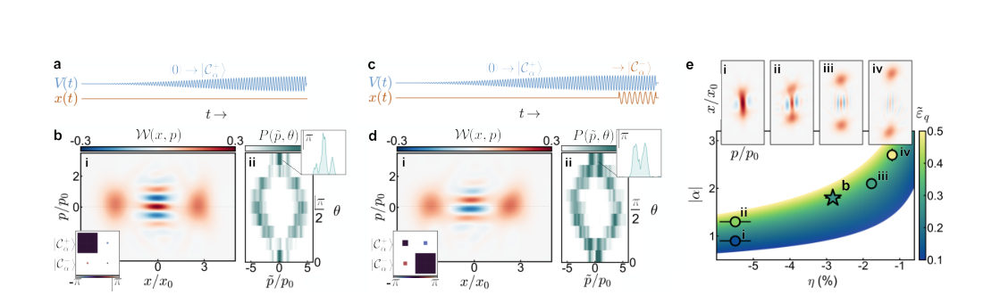
<figcaption class="paper-figure-caption"><b>Fig 3.</b> Figure 3: | Motional Kerr-cat states of a single atom. a,c, Pulse sequences for preparing even- and odd-parity cat states |C± 𝛼⟩. An adiabatic, frequency-chirped modulation of the trap depth 𝑉(𝑡) transfers an atom from its motional ground state |0⟩to |C+ 𝛼⟩(a). Subsequent modulation of the trap position 𝑥(𝑡) rotates |C+ 𝛼⟩to |C− 𝛼⟩(c). b,d, Tomographic reconstruction of |C+ 1.8⟩(b) and |C− 1.8⟩(d) indicate state fidelities 94.4+2.9 −2.7% and 74.8+1.9 −1.9%, respectively (uncertainties are 68.2% bootstrap confidence intervals). Corresponding Wigner functions (i) and Hinton plots (insets in i) are reconstructed from TOF quadrature distribution measurements ˜𝑝/𝑝0 (ii). The interference fringes...</figcaption>
</figure>
<figure class="paper-figure-card">
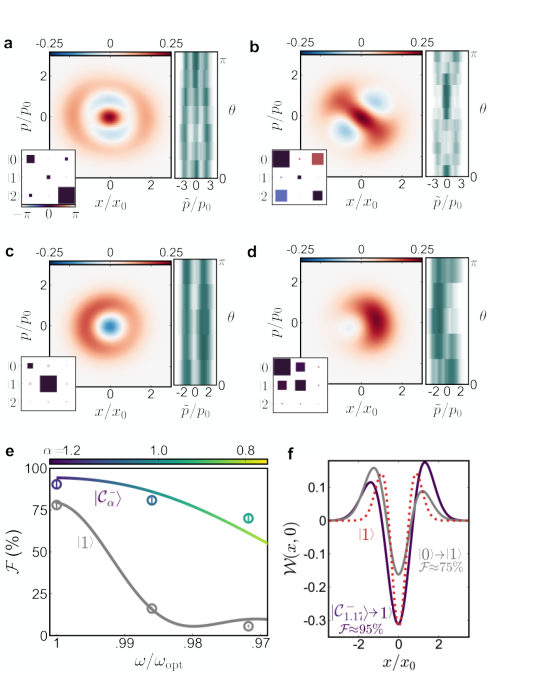
<figcaption class="paper-figure-caption"><b>Fig 4.</b> Figure 4: Fock-state control with tweezer depth and position modulation. a,b,c,d, Wigner functions, Hinton plots, and TOF quadrature measurements for motional Fock states |2⟩(a), ∝|0⟩+ |2⟩ (b), |1⟩(c), and ∝|0⟩+ |1⟩(d), prepared via modulation of the tweezer depth (a,b) or position (c,d). Superposition states are prepared with ∼1/2 of the pulse amplitude and approximately the same pulse time used for |2⟩and |1⟩. e, State fidelity F of |1⟩and |C− 𝛼⟩as a function of fractional trap frequency 𝜔/𝜔opt. Circles indicate experimental data while lines are simulated (see Methods). f, Cross- sections of the Wigner functions W(𝑥, 𝑝= 0) for the state |1⟩in panel (c) prepared by applying a linear drive...</figcaption>
</figure>
<figure class="paper-figure-card">
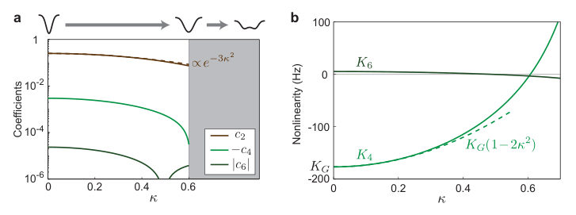
<figcaption class="paper-figure-caption"><b>Fig 5.</b> Figure 5: Tunable Kerr nonlinearity in the painted trap. a, Coefficients 𝑐2, 𝑐4, 𝑐6 of the painted potential (Eq. 8) as functions of the painting amplitude 𝜅. As 𝜅increases, the original Gaussian potential becomes nearly harmonic around 𝜅≈0.6 and evolves toward a double-well potential for larger 𝜅(shaded region). b, Nonlinearities 𝐾4 and 𝐾6 derived from the coefficients in (a). Here, the trap frequency is held constant by increasing the trap depth.</figcaption>
</figure>

**Summary.** The research demonstrates the creation and control of Schrödinger cat states in the quantized motion of an atom trapped by an optical tweezer. They exploit the intrinsic Kerr nonlinearity of the trap potential, establishing a novel method for non-Gaussian state engineering. This work is significant because it provides a robust platform for generating complex quantum resources needed for advanced quantum computing applications.

**Why it may be interesting.** This work directly addresses non-Gaussian quantum state engineering in a leading platform (optical tweezers), providing robust methods for generating resources relevant to quantum error correction codes and enhanced sensing.

Detailed structure

**Main problem.** The primary goal is realizing and controlling Schrödinger cat states using the motional degrees of freedom of a single neutral atom trapped in an optical tweezer.

**Main result.** The authors successfully demonstrated the generation and parity control of Kerr-cat and Fock states, establishing a new paradigm for non-Gaussian state engineering in optical tweezers.

**Method.** State preparation involves adiabatically modulating trap depth and position (painting) to tune the intrinsic self-Kerr nonlinearity, followed by time-of-flight quantum-state tomography for measurement.

**Model / system.** The system is a neutral atom trapped in an optical tweezer potential. The key mechanism exploited is the intrinsic Kerr nonlinearity arising from the anharmonicity of the Gaussian trapping potential, which allows for cat-state generation without external nonlinear elements.

**Key observables.** State fidelity ($F$), Cat size ($\alpha$), momentum quadratures ($\langle	ilde{p}
angle/p_0$), and tunable Kerr nonlinearity coefficients ($c_2, c_4, c_6$).

**Important parameters / regimes.** Trap frequency ($\omega$), anharmonicity parameter ($\eta$), modulation amplitudes ($\epsilon_q, \epsilon_l$), and evolution time ($t_e$).

**Assumptions / limitations.** The dynamics are assumed to remain effectively one-dimensional when modulating along a single axis (the $x$-dimension).

**Figures summary.** Figures illustrate the process of cat state generation via adiabatic passage, show the dependence of observables on painting amplitude ($\kappa$), and detail TOF tomography setups.

**Paper structure.** The paper details the theoretical framework using an effective Hamiltonian incorporating Kerr nonlinearity, presents experimental protocols for preparing even/odd parity cat states through controlled modulation, and validates results using high-fidelity state characterization via TOF measurements.

Abstract

Schrödinger cat states - quantum superpositions of classically or macroscopically distinct states - constitute a powerful resource for quantum computing, enhanced metrology, and probing coherence on large scales. Encoding such states in the phase space of an oscillator requires a nonlinearity, typically inherited from an auxiliary degree of freedom such as atomic spin or a Josephson junction. Neutral atoms trapped in reconfigurable optical tweezer arrays - a leading platform for quantum science and computing - provide an intrinsic nonlinearity via the motion of a single atom in a tightly focused trap. However, this self-Kerr mechanism has not previously been exploited for cat-state generation, and remains largely unexplored as a resource for motional-state control. Here we realize Schrödinger cat states in the quantized motion of a single neutral atom trapped in an optical tweezer. By modulating the depth and position, we demonstrate parity control of both Kerr-cat and Fock states alongside tunable nonlinearity, establishing a spin- and species-independent framework for controlling motion. We further show that the cat-state encoding is intrinsically robust against trap-frequency fluctuations that otherwise limit the fidelity of direct Fock-state transitions. These results establish Kerr-based control of neutral-atom motion as a new paradigm for cat-state and bosonic-state engineering in optical tweezers, providing a route toward quantum-error-correcting codes such as grid states, and toward quantum-enhanced sensing with arrays of non-Gaussian states.

[↑ back to top](#top)

### ⭐ [Nonlinear Response via Sublinear Optics](http://arxiv.org/abs/2607.19154v1)

**Highlighted author(s):** Denys I. Bondar  
**Authors:** Mykhaylo Khoma, Valeriia Bilokon, Elvira Bilokon, Denys I. Bondar  
**Type:** theory · **Category:** other · **PDF:** <https://arxiv.org/pdf/2607.19154v1>  
**Analysis basis:** full PDF text, analyzed in chunks
**Topic relevance:** 🔥 `quantum measurements` **4/5** · `measurement-induced transitions` **3/5** · `methods for driven-dissipative` **3/5** · `non-equilibrium dynamics` **2/5** · `Keldysh / 2PI / non-Gaussian methods` **1/5** · `driven-dissipative phase transition` **1/5**

↔ Scroll figures horizontally

<figure class="paper-figure-card">
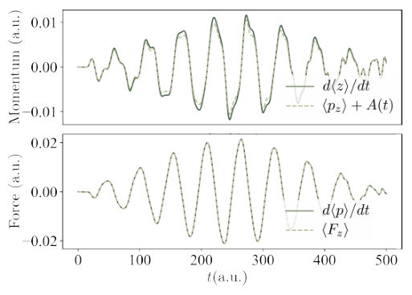
<figcaption class="paper-figure-caption"><b>Fig 1.</b> FIG. 2. Numerical verification of the Ehrenfest theorems. The left- and right-hand sides of the two Ehrenfest relations, d dt⟨z⟩= ⟨pz⟩+A(t) (top) and d dt⟨p⟩= ⟨Fz⟩(bottom), are com- puted independently from the simulated wave function and plotted as functions of time. The near-perfect overlap of the two curves in each panel indicates that the finite-dimensional representation used here introduces only a negligible violation of the Ehrenfest theorems, confirming the physical reliability of the simulation. See Ref. [45] for computational details.</figcaption>
</figure>
<figure class="paper-figure-card">
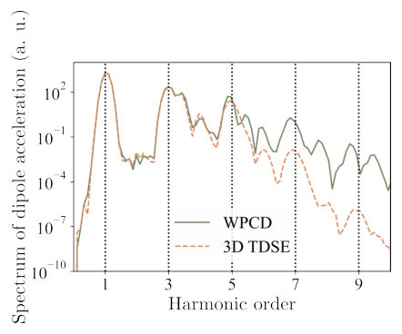
<figcaption class="paper-figure-caption"><b>Fig 2.</b> FIG. 1. Power spectrum of the dipole acceleration for hy- drogen driven by a 400 nm Gaussian pulse (E0 = 0.02 a.u. Ncycles = 10), computed with the WPCD basis (solid green; Lmax = 6, 60 continuum bins) and a state-of-the-art 3D TDSE calculation (dashed orange) [44]. Vertical dotted lines mark odd harmonics.</figcaption>
</figure>
<figure class="paper-figure-card">
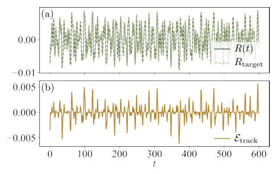
<figcaption class="paper-figure-caption"><b>Fig 3.</b> FIG. 3. Tracking control for a cube-root response with ν = 3, α = 0.03 [Eq. (5)]. (a) Dipole acceleration d⟨pz⟩/dt (solid) and the prescribed target Rtarget(t) = 0.03 E1/3 (dashed). (b) The tracking field Etrack(t) produced by the algorithm.</figcaption>
</figure>
<figure class="paper-figure-card">
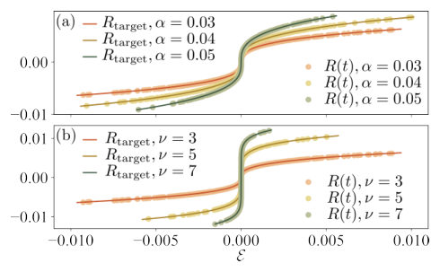
<figcaption class="paper-figure-caption"><b>Fig 4.</b> FIG. 4. Achieved response R versus tracking field Etrack. Dots show the achieved response at each time step; solid curves show the target power law defined in Eq. (5). (a) Fixed ν = 3, varying α = 0.03, 0.04, 0.05. (b) Fixed α = 0.03, varying ν = 3, 5, 7. All simulations use the same WPCD basis and initial-state preparation.</figcaption>
</figure>

**Summary.** The paper demonstrates a novel method using tracking control to force an atomic system (hydrogen) into exhibiting sublinear optical response scaling. By self-consistently determining the driving field based on a target power law, they prove that such non-perturbative nonlinearities can be engineered in quantum systems. This establishes tracking control as a general tool for designing exotic light-matter interactions.

**Why it may be interesting.** This work provides a general theoretical framework—tracking control—to engineer complex optical responses in quantum systems beyond simple polynomial nonlinearities, which is highly relevant for advanced quantum optics and light-matter interaction studies.

Detailed structure

**Main problem.** The research aims to engineer optical responses that exhibit sublinear scaling, which falls outside the standard perturbative framework of nonlinear optics.

**Main result.** The authors successfully demonstrate that a quantum system can be driven using tracking control to realize prescribed sublinear optical responses in hydrogen atoms.

**Method.** They employ a self-consistent tracking control loop where the driving field is determined by enforcing a desired relationship between the measured dipole acceleration and the applied field.

**Model / system.** The system modeled is a hydrogen atom interacting with an intense, linearly polarized laser field. The calculations utilize a specialized Wave-Packet Continuum Discretization (WPCD) basis that treats both bound and continuum states equally.

**Key observables.** Dipole acceleration ($d\langle p_z 
angle / dt$), High-Harmonic Generation (HHG) spectrum, and the tracking field $E(t)$.

**Important parameters / regimes.** The target response is defined by a power law $R_{	ext{target}}(t) = \alpha 	ext{sgn}(E)|E(t)|^{1/
u}$, where $
u > 1$.

**Assumptions / limitations.** The primary approximations involve the finite continuum discretization and angular-momentum truncation ($L_{\max} = 6$) when comparing to full TDSE calculations.

**Figures summary.** Figure 1 compares HHG spectra from WPCD vs. state-of-the-art TDSE; Figure 2 verifies Ehrenfest theorems; Figure 3 shows the achieved dipole acceleration tracking a prescribed sublinear target response.

**Paper structure.** The paper introduces the problem of non-perturbative nonlinear optics, details the WPCD methodology for strong-field calculations, and then implements the self-consistent tracking control algorithm to force the system into a desired sublinear power-law response.

Abstract

Sublinear optical response, in which the emitted field scales as a fractional power of the driving field, lies beyond the conventional perturbative hierarchy of nonlinear optics. Here, we show that such a response can be engineered in a hydrogen atom using tracking control. Rather than prescribing the driving waveform, the field is determined self-consistently from the evolving quantum state to enforce a chosen relation between the optical response and the applied field. We demonstrate accurate tracking for multiple exponents and scaling strengths, establishing that a single atomic system can be driven to realize a family of distinct sublinear responses. The calculations are enabled by a compact wave-packet continuum discretization that treats bound and continuum states on equal footing and is applied here, to the best of our knowledge, for the first time to strong-field optics and quantum control. These results establish tracking control as a general route to engineering optical responses beyond conventional polynomial nonlinearities.

[↑ back to top](#top)

### ⭐ [Quantum Synchronization](http://arxiv.org/abs/2607.19328v1)

**Highlighted author(s):** Igor Lesanovsky, Rosario Fazio  
**Authors:** Parvinder Solanki, Albert Cabot, Fernando Iemini, Federico Carollo, Midhun Krishna, Yeshma Ibrahim, Michal Hajdušek, Igor Lesanovsky, Rosario Fazio, Roberta Zambrini, Sai Vinjanampathy  
**Type:** theory · **Category:** other · **PDF:** <https://arxiv.org/pdf/2607.19328v1>  
**Analysis basis:** full PDF text, analyzed in chunks
**Topic relevance:** `driven-dissipative phase transition` **3/5** · `methods for driven-dissipative` **3/5** · `Keldysh / 2PI / non-Gaussian methods` **2/5** · `non-equilibrium dynamics` **2/5** · `non-equilibrium universality` **2/5** · `analog quantum simulation` **1/5** · `correlated / nonlocal dissipation` **1/5** · `measurement-induced transitions` **1/5** · `quantum measurements` **1/5**

↔ Scroll figures horizontally

<figure class="paper-figure-card">
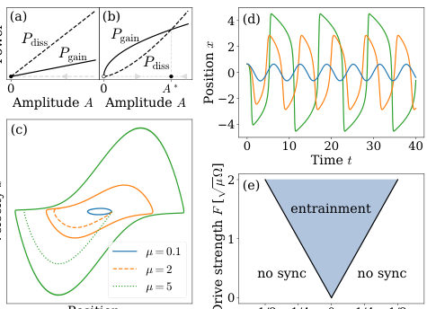
<figcaption class="paper-figure-caption"><b>Fig 1.</b> FIG. 1 (a) Linear systems cannot support self-sustaining os- cillations. For these systems, the only fixed point for the amplitude is A∗= 0. (b) Non-linear systems, on the other hand, can support non-trivial stable amplitudes. (c) Increas- ing the non-linearity µ in Eq. (1) results in limit cycles that further deviate from harmonic (elliptical) trajectories. This is clearly observed from the time series for the position of the van der Pol oscillator in (d). (e) Arnold tongue marking the parameter region where a driven vdP becomes entrained.</figcaption>
</figure>
<figure class="paper-figure-card">
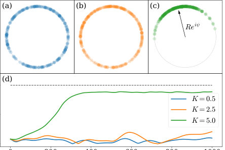
<figcaption class="paper-figure-caption"><b>Fig 2.</b> FIG. 2 Time evolution of the Kuramoto model for N = 250 phase oscillators. Initial phases are picked uniformly at ran- dom, ϕi(0) ∈[0, 2π). Natural frequencies ωi are also cho- sen uniformly at random, ωi ∈[0, 2]. The top three panels show the phase distributions of the oscillators in the long time limit. For coupling strength below the critical value, namely K = 0.5 in (a) and K = 2.5 in (b), the oscillators remain unsynchronized. For K = 5.0, which is above the crit- ical coupling strength, the oscillators develop strong mutual synchronization as shown in (c). The black arrow shows the complex order parameter Reiψ from Eq. (11). (d) Time evo- lution of the magnitude of the order...</figcaption>
</figure>
<figure class="paper-figure-card">
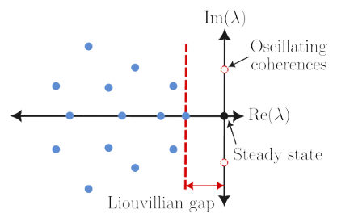
<figcaption class="paper-figure-caption"><b>Fig 3.</b> FIG. 3 Illustration of the eigenvalue spectrum of a generic Liouvillian superoperator.</figcaption>
</figure>
<figure class="paper-figure-card">
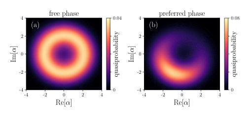
<figcaption class="paper-figure-caption"><b>Fig 4.</b> FIG. 4 Signatures of entrainment in a driven QvdP oscillator. Wigner distribution of the stationary state for ∆/γ1 = 0.1, γ2/γ1 = 0.25, (a) F/γ1 = 0 and (b) F/γ1 = 0.25.</figcaption>
</figure>
<figure class="paper-figure-card">
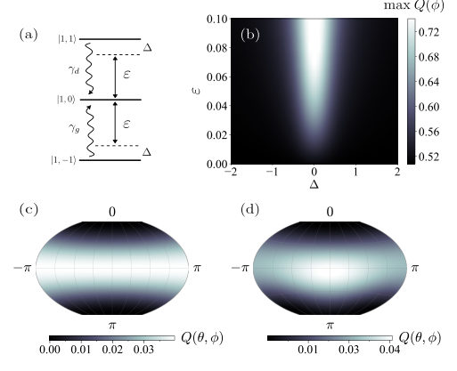
<figcaption class="paper-figure-caption"><b>Fig 5.</b> FIG. 5 (a) A schematic representation of a driven qutrit. ε is the strength of the external drive, ∆is the detuning between the natural frequency of the oscillator and the external drive, and γg, γd denote the gain and dissipation rates respectively. (b) The synchronization measure given by the Husimi-Q func- tion shows an Arnold tongue-like behavior, indicating that the system synchronizes for a wider range of detuning for higher coupling strengths. The Husimi-Q function is plotted in the steady state using a Winkel tripel earth projection for (c) γg/γd = 0.1, ε = 0, (d) γg/γd = 0.1, ε = 0.1γg.</figcaption>
</figure>

**Summary.** This review surveys the concept of synchronization, extending established ideas from classical oscillators (like the van der Pol model) to quantum many-body systems. It details various mathematical measures and techniques needed to quantify this phenomenon in open quantum settings. The work is important for understanding stability and coherence in emerging quantum technologies.

**Why it may be interesting.** This is highly relevant as it bridges nonlinear dynamics from classical physics into the realm of open quantum systems, providing theoretical tools to analyze stability and coherence in complex quantum devices.

Detailed structure

**Main problem.** The review aims to establish a quantum analogue of classical synchronization, which is crucial for understanding stability in both natural and engineered systems.

**Main result.** Synchronization phenomena can be studied by adapting concepts from nonlinear classical oscillators (like the van der Pol model) into the quantum domain using advanced measurement techniques.

**Method.** The review surveys theoretical methods including analyzing open quantum system dynamics via master equations, phase reduction, and measuring various quantum correlations.

**Model / system.** The scope covers synchronization in both few-body and many-body quantum systems. Classical analogies are drawn from self-sustained oscillators (like the vdP oscillator), which require nonlinearity to maintain non-zero steady amplitudes via energy balance ($P_{	ext{gain}} = P_{	ext{diss}}$).

**Key observables.** Temporal correlations, quantum correlations, phase & frequency locking, and the steady amplitude $A^*$ determined by power balance.

**Important parameters / regimes.** Detuning ($\Delta$) and drive strength ($F$), which define parameter regions (Arnold tongues) where synchronization occurs.

**Assumptions / limitations.** The analysis of entrainment often relies on approximations such as assuming weak non-linearity or slow variation in amplitude and phase to allow for averaging techniques.

**Figures summary.** Figures illustrate the failure of linear systems to sustain oscillations, the existence of stable limit cycles in nonlinear systems (vdP), and parameter diagrams showing regions of frequency locking (Arnold tongues).

**Paper structure.** The review progresses logically: first introducing classical synchronization concepts, then detailing necessary quantum techniques for study, followed by specific applications across few-body and many-body quantum systems.

Abstract

Natural and engineered classical systems are replete with examples of synchronization, understood as the adjustment of rhythms of physical systems. Such synchronization is at the heart of the stability of several classical technologies, such as mechanical bridges and electrical networks. Given the advent of quantum simulation and computation technologies, it is natural to study a quantum analogue of synchronization and explore novel applications. This review surveys synchronization in few and many-body quantum systems, measures that quantify them, and their applications to quantum technologies.

[↑ back to top](#top)

### [Boundary quenches in (1+1)-dimensional conformal field theory](http://arxiv.org/abs/2607.19166v1)

**Authors:** Michele Fossati, Colin Rylands, Eytan Grosfeld, Eran Sela, Pasquale Calabrese  
**Type:** theory · **Category:** statistical mechanics · **PDF:** <https://arxiv.org/pdf/2607.19166v1>  
**Analysis basis:** full PDF text, analyzed in chunks
**Topic relevance:** 🔥 `non-equilibrium dynamics` **5/5** · 🔥 `entanglement & information structure` **4/5** · 🔥 `non-equilibrium universality` **4/5** · `methods for driven-dissipative` **3/5** · `driven-dissipative phase transition` **2/5** · `Keldysh / 2PI / non-Gaussian methods` **1/5** · `correlated / nonlocal dissipation` **1/5**

↔ Scroll figures horizontally

<figure class="paper-figure-card">
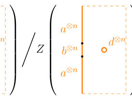
<figcaption class="paper-figure-caption"><b>Fig 1.</b> Figure 3: The analytic continuation to euclidean time of (2.16), expressed in terms of partition functions of the n-replicated CFT.</figcaption>
</figure>
<figure class="paper-figure-card">
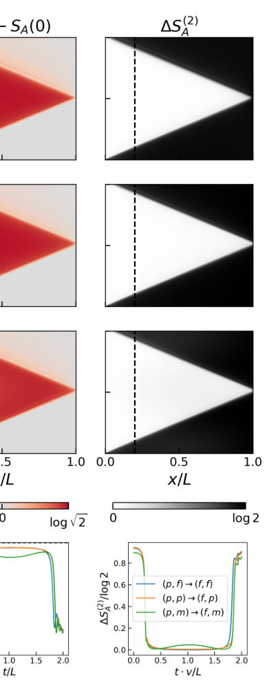
<figcaption class="paper-figure-caption"><b>Fig 2.</b> Figure 4: Top: Space-time plot of the quench (+, b) →(f, b). Every row is a different quench, where b is fixed respectively to f, +, −. Columns are respectively: magnetization, jump in the entanglement entropy, second R´enyi asymmetry on A = [0, x]. The predicted light-cone behavior is observed in the magnetization and in the entanglement entropy. Bottom: The same observables, on a fixed site at x/L = 1/5 (dashed line in top figures), as a function of time.</figcaption>
</figure>
<figure class="paper-figure-card">
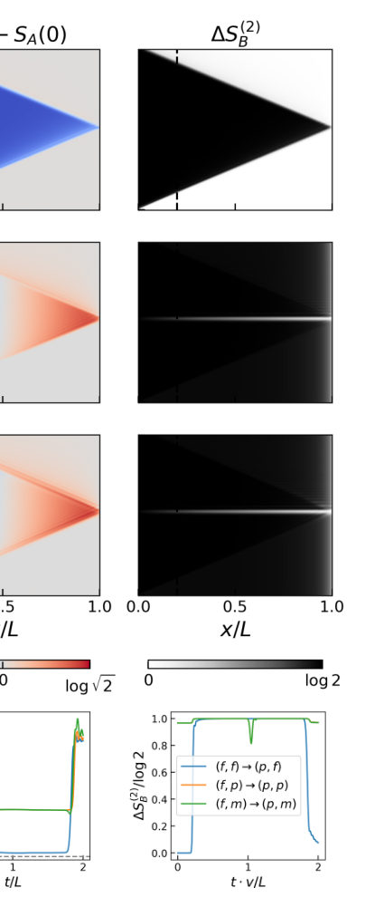
<figcaption class="paper-figure-caption"><b>Fig 3.</b> Figure 5: Top: Space-time plots of the quench (f, b) →(+, b). Every row is a different quench, where b is fixed respectively to f, +, −. Columns are respectively: magnetization, jump in the entanglement entropy, second R´enyi asymmetry on the right subsystem B = [x, L]. Bottom: The same observables, on a fixed site at x/L = 1/5 (dashed line in top figures), as a function of time.</figcaption>
</figure>
<figure class="paper-figure-card">
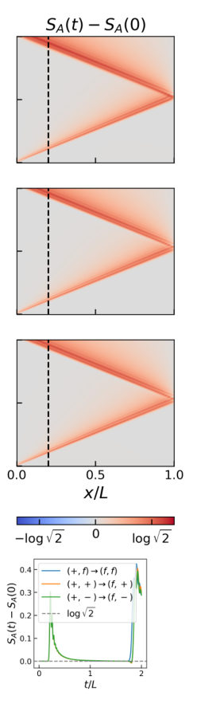
<figcaption class="paper-figure-caption"><b>Fig 4.</b> Figure 6: Top: Spacetime plot for the (+, b) →(−, b) quench. Every row is a different quench, where b is fixed respectively to f, +, −. Columns display magnetization and variation in the entanglement entropy. Bottom: The same observables, on a fixed site at x/L = 1/5 (dashed line in top figures), as a function of time .</figcaption>
</figure>

**Summary.** This paper analyzes how local perturbations affect a 1+1 dimensional CFT when its boundary conditions are suddenly changed. The authors derive universal analytical results showing that the entanglement entropy jumps by $\log(g_b/g_a)$ at the quench front. By comparing these predictions with MPS simulations of the Ising model, they establish a direct link between non-equilibrium entanglement dynamics and boundary critical physics.

**Why it may be interesting.** This work provides a powerful theoretical framework connecting non-equilibrium quantum dynamics (quenches) directly to fundamental concepts like boundary critical phenomena and entanglement structure, which has implications for understanding open quantum systems.

Detailed structure

**Main problem.** The study investigates the non-equilibrium dynamics resulting from abruptly changing the boundary conditions of a (1+1)-dimensional Conformal Field Theory (CFT). This addresses how local perturbations propagate across the system's boundary.

**Main result.** The entanglement entropy undergoes a sharp, universal finite jump of magnitude $\log(g_b/g_a)$ when the subsystem becomes causally connected to the quench event. The time evolution of one-point functions also exhibits simple, universal behavior.

**Method.** The authors use analytical derivations based on mapping correlation functions and entanglement entropy calculations onto ratios of partition functions in replicated CFT geometries. These predictions are rigorously benchmarked against Matrix Product State (MPS) simulations.

**Model / system.** The system is a (1+1)-dimensional CFT defined on a half-line, initially prepared in a ground state with boundary condition $a$, and then quenched to a final boundary condition $b$. The critical Ising spin chain serves as the primary physical realization used for numerical benchmarking.

**Key observables.** One-point functions $\langle \hat{O}(x) 
angle_t$, Entanglement Entropy $S_A(t)$, and Spin-flip entanglement asymmetry.

**Important parameters / regimes.** The boundary g-factors ($g_a, g_b$), the quench time/distance relative to light-cone structure, and the limit $\epsilon 	o 0$ for analytic continuation.

**Assumptions / limitations.** The analysis assumes the existence of a simple boundary changing operator ($\hat{\phi}$) and relies on mapping non-equilibrium dynamics to ratios of partition functions in CFTs.

**Figures summary.** Figure 1 illustrates the Euclidean path-integral preparation of the initial state. Figure 2 shows the relevant geometries (M and H) for time evolution calculations, while Figure 3 relates entanglement entropy calculation to replicated CFT geometries.

**Paper structure.** The paper proceeds by first deriving analytical expressions for one-point functions in the semi-infinite geometry under boundary quenches. It then extends this analysis to calculate the time evolution of entanglement entropy using Rényi formalism, culminating in numerical verification against MPS simulations for the Ising model.

Abstract

We investigate a class of local quantum quenches in which the conformal boundary condition of a (1+1)-dimensional conformal field theory is abruptly changed. We derive a remarkably simple and universal expression for the time evolution of one-point functions on the half-line. This result provides a direct description of the propagation of the disturbance generated by the quench and, in turn, allows us to determine the dynamics of bipartite entanglement for subsystems adjacent to the boundary. We show that, once the subsystem becomes fully causally connected to the quench event, the entanglement entropy undergoes a sharp finite jump whose magnitude is universally given by the logarithm of the ratio of the boundary g-factors associated with the initial and final boundary conditions. We benchmark these analytical predictions against Matrix Product State simulations of the critical Ising spin chain, finding excellent agreement. The numerical analysis further allows us to investigate the time evolution of the spin-flip entanglement asymmetry, revealing how the symmetry-breaking perturbation emitted from the boundary propagates through the system. Our results uncover universal dynamical signatures of boundary quenches and establish a direct connection between nonequilibrium entanglement dynamics and boundary critical phenomena.

[↑ back to top](#top)

### [Collective Coherent Perfect Absorption in a Synthetic Photon-Phonon Lattice](http://arxiv.org/abs/2607.18902v1)

**Authors:** Sihan Wang, Qichun Liu, Bo Song, Qiongyi He, Jingwei Zhou, Yulong Liu  
**Type:** experiment · **Category:** other · **PDF:** <https://arxiv.org/pdf/2607.18902v1>  
**Analysis basis:** full PDF text, analyzed in chunks
**Topic relevance:** 🔥 `analog quantum simulation` **4/5** · 🔥 `correlated / nonlocal dissipation` **4/5** · 🔥 `correlated cavity matter` **4/5** · 🔥 `non-equilibrium dynamics` **4/5** · `driven-dissipative phase transition` **3/5** · `interference shaping light` **3/5** · `methods for driven-dissipative` **3/5** · `quantum optics experiment` **3/5** · `Tavis-Cummings & cavity-many-emitter` **2/5** · `non-equilibrium universality` **2/5** · `Dicke superradiance` **1/5** · `Keldysh / 2PI / non-Gaussian methods` **1/5** · `entanglement & information structure` **1/5**

↔ Scroll figures horizontally

<figure class="paper-figure-card">
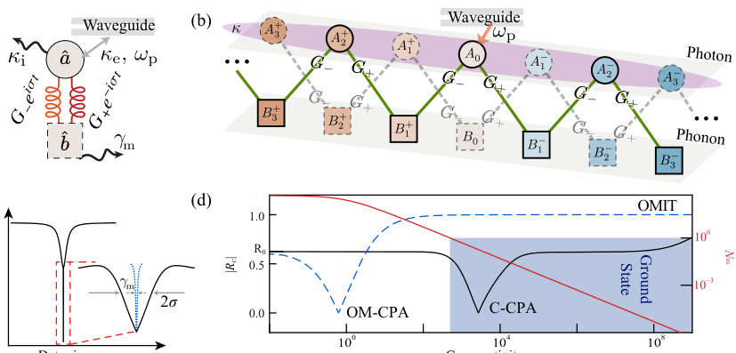
<figcaption class="paper-figure-caption"><b>Fig 1.</b> FIG. 1. (a) Schematic of the Floquet-engineered optomechanical coupling. (b) Equivalent multimode coupling chain, where A± n and B± n denote the photonic and phononic Floquet sites, respectively. The purple shaded region denotes the common cavity thermal reservoir with decay rate κ. (c) Typical C–CPA curve in the reflection spectrum, with the inset highlighting the detailed lineshape determined by the offset σ. The blue dashed curve denotes the corresponding OM-CPA response for comparison. (d) Dependence of |Rc| and the effective phonon number Nm on the cooperativity. The black curve denotes collectively photon-phonon interference induced absorption, whereas the blue dashed line corresponds...</figcaption>
</figure>
<figure class="paper-figure-card">
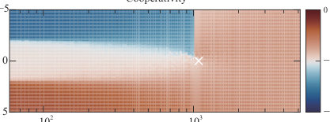
<figcaption class="paper-figure-caption"><b>Fig 2.</b> FIG. 2. (a) Measured (left) and simulated (right) resonance reflection amplitude |Rc| at resonance as a function of coop- erativities C+ and C−. Black dashed line denotes the base- line reflection |Rc| = R0. (b) Measured (left) and simulated (right) wrapped reflection phase φc as a function of C+ and C−. Black dashed lines indicate φc = 0 and φc = ±π. (c) The reflection amplitude as a function of cooperativity, show- ing the continuous variation and spectral dips merging. The white dotted line marks the location of dips. (d) The reflec- tion phase as a function of cooperativity. The pronounced phase step observed prior to C-CPA collapses into a degen- eracy at the C-CPA point. White crosses...</figcaption>
</figure>
<figure class="paper-figure-card">
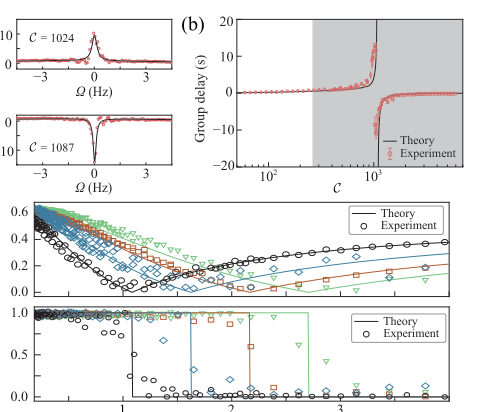
<figcaption class="paper-figure-caption"><b>Fig 3.</b> FIG. 4. (a) Measured group delay τ(Ω) as a function of fre- quency detuning Ωfor two representative cooperativities near the C-CPA. (b) Group delay at the cavity resonance as a func- tion of cooperativity C. The gray-shaded region indicates the ground state regime with Nm &lt; 1. Error bars represent the standard error of the mean from repeated measurements. (c) Dependence of amplitude |Rc| and phase φc on the cooper- ativity C for different modulation frequencies σ. Results are shown for σ/2π = 2 (black circles), 3 (blue diamonds), 4 (or- ange squares), and 5 (green triangles) Hz.</figcaption>
</figure>
<figure class="paper-figure-card">
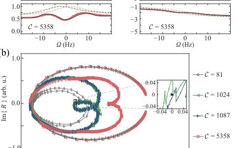
<figcaption class="paper-figure-caption"><b>Fig 4.</b> FIG. 3. (a) Four characteristic regions of the reflection spectrum and phase. Red circles represent the experimental results of collective interference, the black solid line represents the theoretical results, and the dashed line indicates the ex- perimental results for the effect of C± acting individually. This corresponds to σ/2π = 2 Hz. In the subpanel corresponding to C = 1087, the blue dashed line highlights the π-phase tran- sition at Ω= 0. (b) Complex-plane plots of the real and imaginary parts of R. The winding number abruptly changes from 2 to 1 after the system passes through the CPA singu- larity, where non-closed cavity trajectories are neglected. An inset highlights the change...</figcaption>
</figure>

**Summary.** The paper reports experimental evidence for collective coherent perfect absorption (C-CPA) in a synthetic photon-phonon lattice. By utilizing long-range interactions, the authors shift the CPA condition into the high-cooperativity regime. This breakthrough allows for quantum-compatible light control, enabling both perfect absorption and ground-state cooling of the mechanical oscillator simultaneously.

**Why it may be interesting.** This work is highly relevant to AMO physics as it pushes the boundaries of cavity QED and optomechanics by engineering a platform that achieves fundamental quantum control (ground-state cooling) while simultaneously realizing advanced light manipulation phenomena (CPA).

Detailed structure

**Main problem.** The primary challenge is achieving Coherent Perfect Absorption (CPA) in a regime compatible with quantum mechanics, overcoming limitations where conventional optomechanical CPA restricts operation to the weak-cooperativity regime and leaves the mechanical oscillator thermally excited.

**Main result.** The authors demonstrate collective interference-induced CPA (C-CPA), which shifts the absorption condition into the high-cooperativity regime. This allows for simultaneous ground-state cooling of the mechanical oscillator alongside perfect absorption, enabling long-lived quantum storage.

**Method.** The study uses a Floquet description to model the synthetic photon-phonon lattice and calculates the reflection coefficient by summing over all lattice sites using susceptibilities.

**Model / system.** The physical system is a synthetic photon–phonon lattice realized via time-dependent optomechanical couplings, modeled using an effective non-Hermitian Hamiltonian ($\hat{H}_{	ext{lat}}$) in Floquet space. The interaction involves cavity and mechanical dissipation rates.

**Key observables.** Reflection coefficient ($R$), group delay response ($	au$), and the effective phonon number ($N_m$).

**Important parameters / regimes.** Cooperativity ($C = 4|G|^2/(\kappa\gamma_m)$), which is tuned to reach the high-cooperativity regime ($C \gg 1$).

**Assumptions / limitations.** The analysis focuses on the resonant condition ($\Omega=0$) and assumes operation in the overcoupled regime ($\eta > 1/2$) for efficient lattice excitation.

**Figures summary.** Figures illustrate the schematic of Floquet engineering, the resulting C-CPA curve showing non-Lorentzian absorption, and plots detailing the reflection amplitude and phase evolution across different cooperativities, highlighting the transition to collective absorption at $\Omega=0$.

**Paper structure.** The paper first introduces CPA and its limitations in standard optomechanics. It then details the theoretical framework using Floquet engineering for the synthetic lattice. The core of the work presents experimental measurements demonstrating C-CPA, showing how high cooperativity enables quantum-compatible absorption features like ground-state cooling and long group delays.

Abstract

Coherent perfect absorption (CPA) has emerged as a powerful paradigm for controlling classical and quantum light, and has been demonstrated across a broad range of physical platforms. CPA realized in optomechanics relies on interference between the input field and the mechanically scattered field, but is intrinsically confined to the weak-cooperativity regime, resulting in a narrow absorption bandwidth and the mechanical mode remains thermally occupied. Here, we experimentally demonstrate collective interference-induced CPA in a synthetic photon--phonon lattice. By harnessing cavity-reservoir-mediated interactions among Floquet lattice sites, collective interference shifts the CPA condition deep into the high-cooperativity regime. This enables CPA to coexist with ground-state cooling of the mechanical oscillator, together with a broadened non-Lorentzian absorption lineshape and a singular group-delay response. Our results identify collective interference as a route to quantum-compatible perfect absorption and long-lived quantum storage.

[↑ back to top](#top)

### [Steady States of a Single Trapped-Ion Spin Coupled to an Engineered Non-Markovian Bath](http://arxiv.org/abs/2607.19286v1)

**Authors:** Anthony Vogliano, Lewis Hahn, Fabien Lefebvre, Jingwen Zhu, Sakshee Patil, Mahmood Sabooni, Zhexuan Gong, Rajibul Islam  
**Type:** both · **Category:** other · **PDF:** <https://arxiv.org/pdf/2607.19286v1>  
**Analysis basis:** full PDF text, analyzed in chunks
**Topic relevance:** 🔥 `methods for driven-dissipative` **4/5** · 🔥 `non-equilibrium dynamics` **4/5** · `correlated / nonlocal dissipation` **3/5** · `driven-dissipative phase transition` **3/5** · `Keldysh / 2PI / non-Gaussian methods` **2/5** · `analog quantum simulation` **2/5** · `non-equilibrium universality` **2/5** · `quantum measurements` **2/5** · `QC/QI experiment` **1/5** · `exotic spin models in light-matter` **1/5** · `measurement-induced transitions` **1/5** · `spintronics-quantum-optics interface` **1/5**

↔ Scroll figures horizontally

<figure class="paper-figure-card">
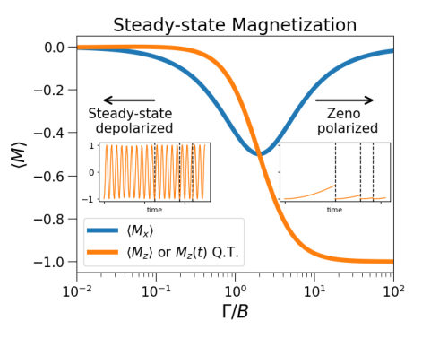
<figcaption class="paper-figure-caption"><b>Fig 1.</b> FIG. 1: Expected steady-state magnetization as reset strength Γ changes relative to drive strength B for model in Eq. (2). Maximum coherent buildup is at Γ/B = 2. Resetting too infrequently leads to scrambling of final evolution length (steady-state depolarized). Resetting too frequently limits coherent evolution, (Zeno polarized). Insets show example quantum trajectories for z-magnetization as these limits are approached.</figcaption>
</figure>
<figure class="paper-figure-card">
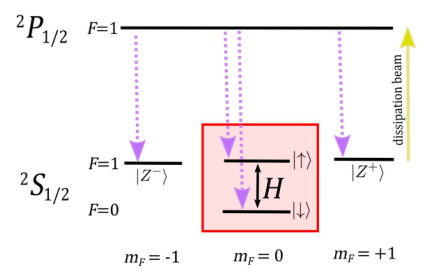
<figcaption class="paper-figure-caption"><b>Fig 2.</b> FIG. 3: Relevant energy levels for in 171Yb+ ions. |2S1/2, F = 0, mF = 0⟩= |↓⟩and |2S1/2, F = 1, mF = 0⟩= |↑⟩act as the eigenstates of σz, and span the computational basis (red square). Optical pumping beam (solid yellow arrow) couples bright states to the excited 2P1/2 levels. Spontaneous decay pathways (purple dotted arrows) enable relaxation to the |2S1/2, F = 1, mF = ±1⟩= |Z±⟩states, which exist outside the computational basis and do not evolve under the coherent drive H (black arrow). The |2P1/2, F = 0⟩state (not shown) enables state-dependent fluorescence through a cycling transition with the bright states, and is dipole-forbidden to |↓⟩.</figcaption>
</figure>
<figure class="paper-figure-card">
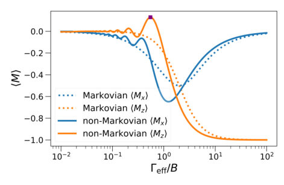
<figcaption class="paper-figure-caption"><b>Fig 3.</b> FIG. 2: Shift in steady-state magnetization induced by non-Markovianity in the dissipation mechanism, specifically for a Pareto (α = 4)-correlated dissipation mechanism. For non-Markovian dissipation, steady-state magnetization can be opposite the reset direction (purple square) for certain intermediate values of Γeff/B.</figcaption>
</figure>
<figure class="paper-figure-card">
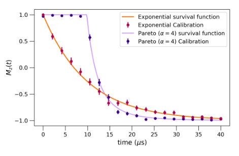
<figcaption class="paper-figure-caption"><b>Fig 4.</b> FIG. 4: Probabilistic operation of a deterministic optical pumping procedure. The state is initialized to |↑⟩, and then optical pumping is applied in the Floquet method above using Γeff ≈100kHz, which reproduces the survival function of f. Correlations between the probabilistic pumping events allow for dissipation profiles which are distinctly non-Markovian.</figcaption>
</figure>
<figure class="paper-figure-card">
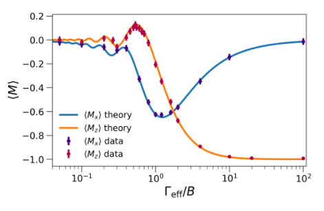
<figcaption class="paper-figure-caption"><b>Fig 5.</b> FIG. 7: Steady-state magnetization expected vs experimental for a non-Markovian dissipation channel defined by a Pareto (α = 4) distribution. We find steady-states that are magnetized oppositely to the Zeno polarized state near Γeff/B ≈0.5, which is unobtainable from systems with Markovian dissipation. Only the z-magnetization (red) sees this effect due to symmetry in Rabi oscillations for ˆx (blue)</figcaption>
</figure>

**Summary.** The paper investigates how engineered non-Markovian dissipation affects the steady state of a single trapped ion spin. By simulating these complex dynamics using trapped ions, the authors experimentally demonstrate that memory effects in the bath can fundamentally change the system's final equilibrium state compared to simpler Markovian models. This opens new avenues for quantum reservoir engineering beyond standard approximations.

**Why it may be interesting.** This is highly relevant as it pushes beyond standard Markovian approximations in open quantum systems, providing experimental evidence for novel physics arising from structured environments, which is a frontier area in quantum optics and AMO physics.

Detailed structure

**Main problem.** The study aims to understand non-equilibrium physics in open quantum systems where the environment (bath) is structured, leading to non-Markovian memory effects.

**Main result.** Non-Markovian dissipation can dramatically alter the steady-state of a single qubit compared to Markovian models, allowing access to novel dissipative regimes inaccessible otherwise.

**Method.** The authors simulate the system using trapped ion quantum simulators by implementing engineered non-Markovian bath profiles via probabilistic reset sequences approximating ensemble averages over quantum trajectories.

**Model / system.** The physical platform is a single spin-1/2 trapped $^{171}	ext{Yb}^+$ ion. The dynamics are modeled using generalized master equations, contrasting the standard Lindblad (Markovian) form with memory kernel approaches for non-Markovian baths.

**Key observables.** Steady-state magnetization ($\langle M_x 
angle, \langle M_z 
angle$) of the spin system.

**Important parameters / regimes.** The ratio of effective dissipation rate to coherent drive strength ($\Gamma_{	ext{eff}}/B$), and the correlation structure parameter $\alpha$ (e.g., for a Pareto-correlated bath).

**Assumptions / limitations.** The simulation relies on approximating the ensemble average over quantum trajectories using deterministic reset profiles, which is compatible with many-body extensions.

**Figures summary.** Figures compare expected vs. experimental steady-state magnetization, showing that non-Markovianity allows for a positive magnetization in the $-	ext{z}$ direction, contrary to Markovian predictions.

**Paper structure.** The work establishes the theoretical framework using generalized master equations, details the trapped ion implementation via engineered reset profiles, and presents comparative results demonstrating the unique steady-state signatures of non-Markovian coupling.

Abstract

Quantum simulation of open quantum systems offers a pathway towards better understanding various non-equilibrium physics that would otherwise be challenging to study. Most open quantum systems studied are modeled as obeying the Markov approximation, where the bath into which the system dissipates information is assumed to be unaffected by the system-bath interaction. However, real baths are in general influenced by this interaction to some degree, and some systems which exist in structured non-Markovian environments can display novel behavior as a result. Here we utilize a trapped ion quantum simulator to simulate a single spin-$1/2$ driven-dissipative system with a non-Markovian dissipation channel, and experimentally compare steady-states to those from an analogous Markovian bath. We observe that a non-Markovian dissipative channel can dramatically change the steady-state even for a single qubit, to a regime inaccessible for Markovian dissipation. This demonstrates the added richness available to quantum systems in structured environments. The techniques used here are compatible with many-body extensions of the model, which can not be simulated efficiently on a classical computer in general. Our work also opens up new possibilities in quantum reservoir engineering beyond the Markovian regime.

[↑ back to top](#top)

### [Cavity-Mediated Charging of a Graphene Excitonic Quantum Battery](http://arxiv.org/abs/2607.18489v1)

**Authors:** Maryam Hadipour, Soroush Haseli  
**Type:** theory · **Category:** other · **PDF:** <https://arxiv.org/pdf/2607.18489v1>  
**Analysis basis:** full PDF text, analyzed in chunks
**Topic relevance:** 🔥 `Tavis-Cummings & cavity-many-emitter` **4/5** · 🔥 `methods for driven-dissipative` **4/5** · `analog quantum simulation` **3/5** · `correlated cavity matter` **3/5** · `driven-dissipative phase transition` **3/5** · `non-equilibrium dynamics` **2/5** · `non-equilibrium universality` **2/5** · `Keldysh / 2PI / non-Gaussian methods` **1/5** · `correlated / nonlocal dissipation` **1/5** · `entanglement & information structure` **1/5** · `scars & prethermalization` **1/5**

↔ Scroll figures horizontally

<figure class="paper-figure-card">
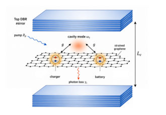
<figcaption class="paper-figure-caption"><b>Fig 1.</b> FIG. 1. A strained graphene layer in a DBR microcavity of length Lc. Two excitonic centers, acting as charger and battery, couple to a central cavity mode ωc with strength g. The system is subject to external pumping Rp and cavity dissipation γc.</figcaption>
</figure>
<figure class="paper-figure-card">
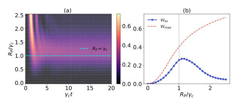
<figcaption class="paper-figure-caption"><b>Fig 2.</b> FIG. 3. (a) Density plot of the normalized ergotropy as a function of the scaled time γct and the normalized pumping rate RP /γc. The dashed horizontal line marks the thresh- old condition RP = γc. (b) Steady-state ergotropy, Wss, and maximum ergotropy, Wmax, plotted as functions of the nor- malized pumping rate RP /γc. The dotted vertical line indi- cates RP /γc = 1.</figcaption>
</figure>
<figure class="paper-figure-card">
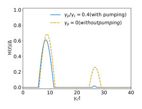
<figcaption class="paper-figure-caption"><b>Fig 3.</b> FIG. 2. W(t)/∆as function of γct. The solid blue curve shows the dynamics under incoherent pumping γp/γc = 0.4, while the dashed yellow curve corresponds to the case without pumping γp = 0 for both the coupling strength is g = 0.25.</figcaption>
</figure>
<figure class="paper-figure-card">
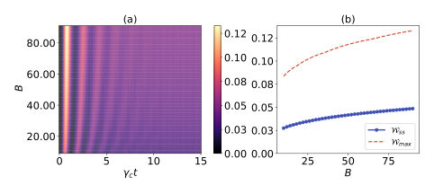
<figcaption class="paper-figure-caption"><b>Fig 4.</b> FIG. 4. (a) Density plot of W(t)/∆as function of γct and pseudomagnetic field B . (b) Wss and Wmax versus pseu- domagnetic field B. The choosen parameters are γc = 1.5, RP = 1.2, γq = 0.0 and g0 = 3.0.</figcaption>
</figure>
<figure class="paper-figure-card">
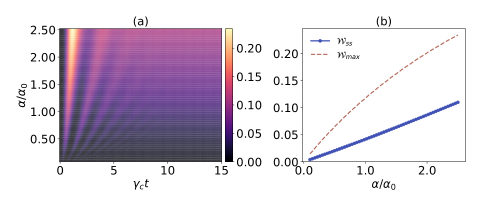
<figcaption class="paper-figure-caption"><b>Fig 5.</b> FIG. 5. (a) W(t)/∆versus the microcavity parameter α/α0 and γct. (b) Wss and Wmax as functions of α/α0. The choosen parameters are γc = 1.5, γq = 0, RP = 1.2,B = 50 T and g0 = 3.0.</figcaption>
</figure>

**Summary.** The paper models a graphene-based excitonic quantum battery coupled to an optical microcavity to study its charging efficiency. By analyzing the system's dynamics using ergotropy, the authors determine that optimal energy storage requires balancing external coherent pumping against cavity dissipation. This work highlights how cavity engineering can enhance the usable work capacity of such solid-state quantum devices.

**Why it may be interesting.** This work sits at the intersection of cavity QED, open quantum systems, and energy storage, providing concrete theoretical guidelines for engineering solid-state quantum devices like excitonic batteries.

Detailed structure

**Main problem.** The study investigates how efficiently energy can be stored and extracted from a quantum battery implemented using excitons coupled to an optical cavity.

**Main result.** The maximum extractable work (ergotropy) is strongly controlled by the light-matter coupling strength, and optimal charging occurs when coherent pumping balances cavity dissipation near a specific ratio.

**Method.** The authors solve the open-system dynamics using a master equation approach to model energy flow in the driven-dissipative system.

**Model / system.** The physical system is a pair of intervalley excitons in strained graphene acting as a quantum battery, coupled via Tavis-Cummings interaction to a common optical microcavity mode.

**Key observables.** Ergotropy (measure of extractable work), transient ergotropy peak ($W_{	ext{max}}$), and steady-state ergotropy ($W_{	ext{ss}}$).

**Important parameters / regimes.** Light-matter coupling strength, cavity loss ($\gamma_c$), pumping strength ratio ($	ext{RP}/\gamma_c$), and the pseudomagnetic field parameter ($B$).

**Assumptions / limitations.** The analysis assumes low exciton density, neglecting direct exciton-exciton interactions, and that the cavity remains resonant with the excitonic transition.

**Figures summary.** Figures illustrate the coupling of two excitons to a microcavity mode; subsequent figures compare ergotropy evolution versus pumping ratios and PMF strength.

**Paper structure.** The paper establishes the physical model (Tavis-Cummings Hamiltonian), derives the open-system master equation incorporating both incoherent and coherent driving, analyzes the resulting dynamics using ergotropy as a diagnostic tool, and finally maps out optimal operating regimes by varying external parameters.

Abstract

We study the charging and work-extraction properties of a graphene-based excitonic quantum battery embedded in a driven-dissipative optical microcavity. The system consists of a pair of intervalley excitons in strained graphene, where one exciton acts as the charger and the other as the quantum battery, both coupled to a common cavity mode through a Tavis-Cummings interaction. By solving the open-system dynamics, we analyze the ergotropy as a measure of extractable work and investigate how coherent and incoherent pumping, cavity loss, and the microcavity parameter influence the charging process. Our results show that the battery exhibits a transient ergotropy peak followed by relaxation to a steady state, with the maximum extractable work strongly controlled by the light-matter coupling strength. The study reveals an optimal regime for efficient charging and demonstrates the role of cavity engineering in enhancing work storage in excitonic quantum batteries.

[↑ back to top](#top)

### [Coherent Magnons Driven by Photomodulated Anisotropy in Altermagnetic MnTe](http://arxiv.org/abs/2607.18421v1)

**Authors:** Dingbin Huang, Jonathon Kruppe, Resham Babu Regmi, Nirmal J. Ghimire, James Analytis, Joseph Orenstein  
**Type:** experiment · **Category:** other · **PDF:** <https://arxiv.org/pdf/2607.18421v1>  
**Analysis basis:** full PDF text, analyzed in chunks
**Topic relevance:** 🔥 `spintronics-quantum-optics interface` **4/5** · `driven-dissipative phase transition` **3/5** · `exotic spin models in light-matter` **3/5** · `non-equilibrium dynamics` **3/5** · `analog quantum simulation` **2/5** · `correlated / nonlocal dissipation` **2/5** · `methods for driven-dissipative` **2/5** · `non-equilibrium universality` **2/5** · `Keldysh / 2PI / non-Gaussian methods` **1/5** · `quantum measurements` **1/5** · `quantum optics experiment` **1/5**

↔ Scroll figures horizontally

<figure class="paper-figure-card">
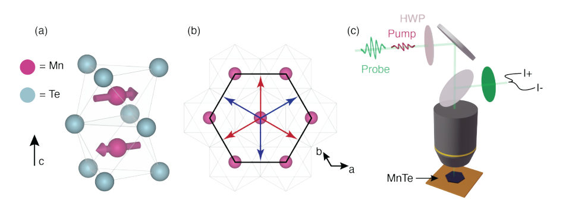
<figcaption class="paper-figure-caption"><b>Fig 1.</b> FIG. 1: Crystal structure side (a) and top (b) view demonstrating hexagonal lattice structure and screw rotation connecting Mn2+ ions. (c) Schematic of the collinear pump-probe configuration. Pump and probe beams are focused onto the sample via an objective, with the transient polarization rotation measured using a balanced detection scheme.</figcaption>
</figure>
<figure class="paper-figure-card">
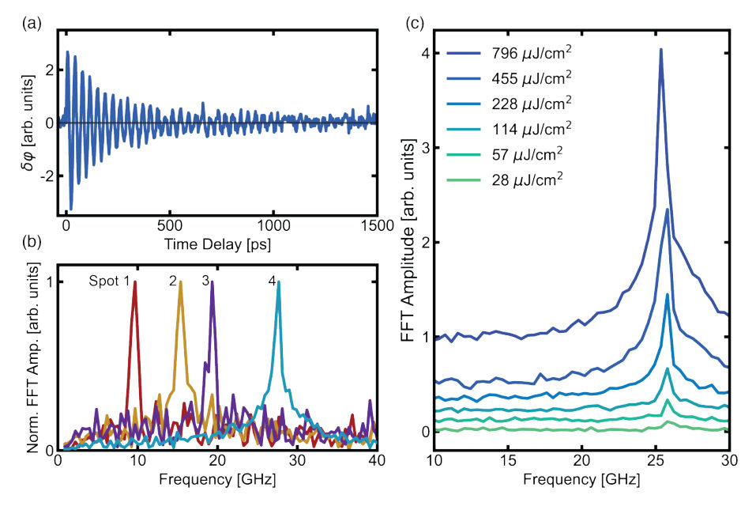
<figcaption class="paper-figure-caption"><b>Fig 2.</b> FIG. 2: Low-temperature magnon dynamics. (a) Time-resolved pump-probe trace showing the oscillation of L at 10 K. The oscillations are centered on the local equilibrium orientation φL(r). (b) Fast Fourier Transform (FFT) amplitude spectra taken at various sample locations revealing a spatial distribution of the magnon gap frequencies. (c) FFT’s as a function of pump fluence measured at a single fixed location at 20 K. The frequency remains constant over the full range of applied fluence.</figcaption>
</figure>
<figure class="paper-figure-card">
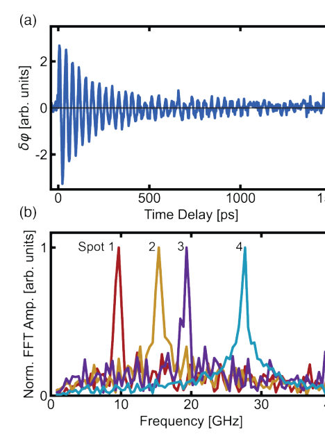
<figcaption class="paper-figure-caption"><b>Fig 3.</b> Fig. 2c, Ωdoes not change as the pump fluence, Φ, increases.</figcaption>
</figure>
<figure class="paper-figure-card">

<figcaption class="paper-figure-caption"><b>Fig 4.</b> Fig. 3 illustrates the contrast in photogenerated spin-wave dynamics when the tempera-</figcaption>
</figure>
<figure class="paper-figure-card">
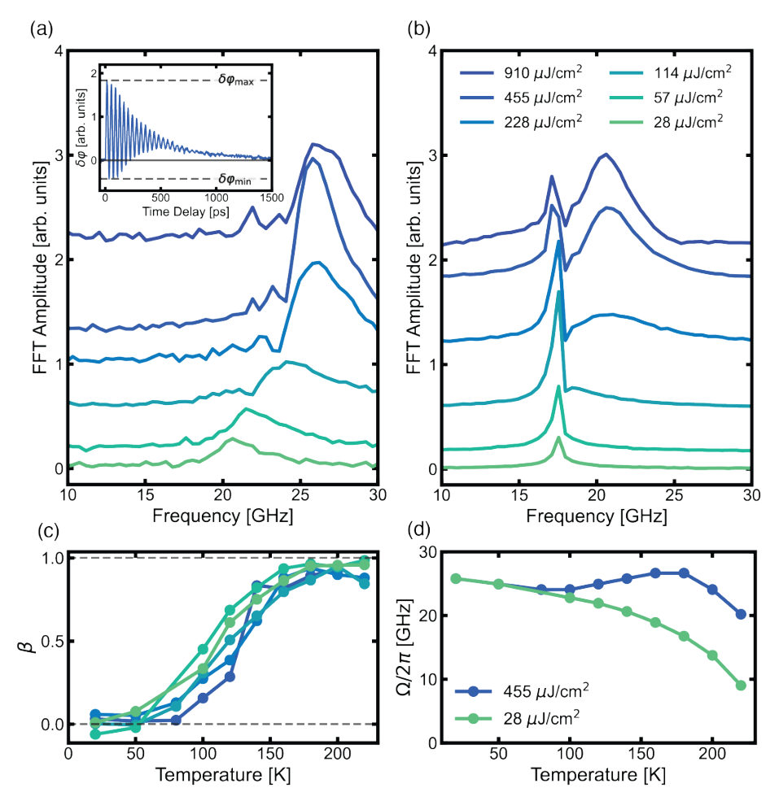
<figcaption class="paper-figure-caption"><b>Fig 5.</b> FIG. 3: High-temperature dynamics: gap frequency is tunable with laser fluence. FFT amplitude spectra as a function of laser fluence when L is oriented near an (a) easy axis and (b) a hard axis at 140 K. Both locations exhibit a peak whose frequency increases with pump fluence. The inset of (a) reveals qualitatively different time-dependence in this regime, as the center of the L oscillation is displaced from the equilibrium position. (c) Temperature dependence of the displaced center of oscillation, illustrating a crossover from an impulsive (β = 0) to a step-like (β = 1) excitation regime as the temperature increases. (d) Temperature dependence of Ωat a low and high fluence showing the...</figcaption>
</figure>

**Summary.** This work uses time-resolved optical measurements on altermagnetic MnTe to study magnon excitations. By mapping the dependence of spin wave properties on pump laser fluence, the authors show that the material's anisotropy can be optically modulated. This opens new avenues for controlling electronic band structure via magnetic order in spintronics.

**Why it may be interesting.** The ability to optically tune magnetic anisotropies in a material with zero net magnetization provides an excellent platform for studying non-equilibrium spin dynamics, which has parallels in driven quantum systems.

Detailed structure

**Main problem.** The study investigates coherent magnon dynamics driven by photomodulated anisotropy in altermagnetic MnTe, aiming to understand how external tuning controls magnetic order and electronic band structure.

**Main result.** The research demonstrated that above a pump fluence threshold, the system exhibits characteristic six-fold symmetric sawtooth dependence of spin wave amplitude and cycloid modulation of frequency, enabling optical control over spin splitting.

**Method.** Time-resolved polarimetry was used to spatially map local equilibrium Néel vector orientation ($\varphi_L$) alongside photoexcited spin wave amplitude ($\Delta\varphi$) and frequency ($\Omega$).

**Model / system.** The system is MnTe, a prototypical g-wave altermagnet. The dynamics are modeled using a free energy landscape incorporating 6-fold anisotropy ($K_6$) and 2-fold magneto-elastic coupling ($K_2$).

**Key observables.** Local equilibrium Néel vector orientation ($\varphi_L$), photoexcited spin wave amplitude ($\Delta\varphi$), and magnon frequency ($\Omega$).

**Important parameters / regimes.** Intrinsic anisotropy upper bound of $\approx 60 \mu	ext{eV}$ (0.7 K); critical pump fluence threshold; temperature regimes (low vs. high T).

**Assumptions / limitations.** The low-T analysis suggests strain inhomogeneity dominates, while the high-T model assumes photoexcitation induces a modulation of $K_6$.

**Figures summary.** Figures illustrate crystal structure and pump-probe setups; key results show fluence dependence leading to sawtooth patterns in $\Delta\varphi$ and cycloid variations in $\Omega$ at higher temperatures.

**Paper structure.** The paper progresses from establishing the physical system (altermagnetism) to detailing measurement techniques (time-resolved polarimetry), presenting low-T vs. high-T dynamics, and finally quantifying the photomodulation effects on anisotropy parameters ($K_6$).

Abstract

Manganese telluride ($\text{MnTe}$) has recently emerged as a prototypical $g$-wave altermagnet, providing an ideal platform to investigate the non-equilibrium excitations of altermagnetic order. Here, we report simultaneous spatial mapping of the local equilibrium orientation of the Néel vector, $\varphi_L(\mathbf{r})$, alongside the amplitude, $Δ\varphi(\mathbf{r},t)$, and frequency, $Ω(\mathbf{r})$, of photoexcited spin waves. Based on these measurements, we place a remarkably low upper bound of $\approx 60~μ\text{eV}$ (0.7 K) on the spin-wave gap arising from intrinsic anisotropy. This exceptionally weak hexagonal anisotropy ($K_6$) renders the altermagnetic order highly susceptible to optical tuning, allowing coherent spin waves to be driven by a photoinduced enhancement of $K_6$. Above a threshold pump fluence, our spatial maps reveal that this photomodulation manifests as a six-fold symmetric sawtooth dependence of $Δ\varphi$ on $\varphi_L$ and a cycloid-like modulation of $Ω$. Ultimately, the near-isotropy of the Néel vector in $\text{MnTe}$ enables optical and mechanical control over the orientation of spin-splitting in the electronic band structure, offering new pathways for altermagnetic spintronics.

[↑ back to top](#top)

### [Simulating the Dicke Model on Qubit-Based and hybrid Qubit-Boson-Based Quantum Computers](http://arxiv.org/abs/2607.18546v1)

**Authors:** Aravind P. Babu, Seongjin Ahn, Jing Sun, Augustas G. Landsbergis, Andrey S. Moskalenko, Marko J. Rančić  
**Type:** theory · **Category:** other · **PDF:** <https://arxiv.org/pdf/2607.18546v1>  
**Analysis basis:** full PDF text, analyzed in chunks
**Topic relevance:** 🔥 `Dicke superradiance` **4/5** · `Tavis-Cummings & cavity-many-emitter` **3/5** · `correlated cavity matter` **3/5** · `Keldysh / 2PI / non-Gaussian methods` **2/5** · `analog quantum simulation` **2/5** · `driven-dissipative phase transition` **2/5** · `methods for driven-dissipative` **2/5** · `superradiant laser` **2/5** · `correlated / nonlocal dissipation` **1/5** · `exotic spin models in light-matter` **1/5** · `non-equilibrium dynamics` **1/5** · `non-equilibrium universality` **1/5**

↔ Scroll figures horizontally

<figure class="paper-figure-card">
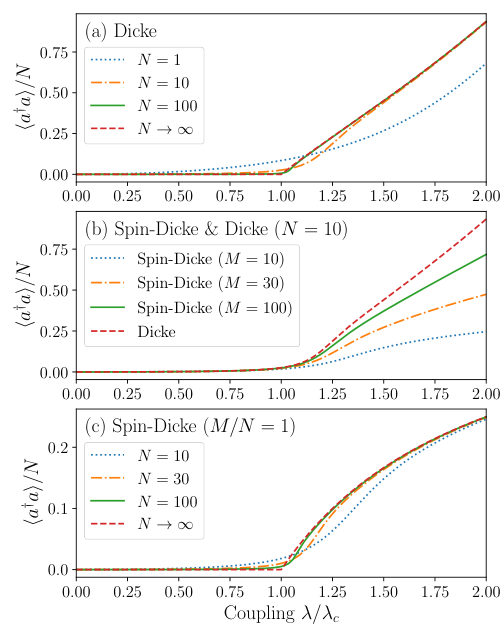
<figcaption class="paper-figure-caption"><b>Fig 1.</b> Figure 1. Average number of cavity excitations per atom, ⟨𝑎†𝑎⟩/𝑁, in dependence on the normalized coupling strength 𝜆/𝜆𝑐[𝜆𝑐is in- troduced after Eq. (9)] in the ground state of (a) the Dicke model, (b) the spin-Dicke model for 𝑁= 10 and several values of 𝑀compared to the Dicke model with 𝑁= 10, and (c) the spin-Dicke model for several 𝑁with fixed 𝑀/𝑁= 1. For the spin-Dicke model, the average boson number is computed via the connection, ⟨𝑎†𝑎⟩↦→⟨𝑆𝑧⟩+ 𝑀/2, given in Eq. (5) with 𝑠= 𝑀/2.</figcaption>
</figure>
<figure class="paper-figure-card">
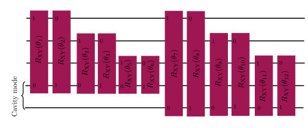
<figcaption class="paper-figure-caption"><b>Fig 2.</b> Figure 2. Circuit for the single layer of parameterized symmetry preserving ansatz in the case of 𝑁= 3 and 𝑀= 2, where the first three qubits are qubits that encode the atoms, and the last two qubits encode the cavity mode. Each gate operation takes the form of exp[−𝑖𝜃𝑋𝑎,𝑛𝑌𝑐,𝑚] or exp[−𝑖𝜃𝑌𝑎,𝑛𝑋𝑐,𝑚], where 𝑄𝑎,𝑛and 𝑄𝑐,𝑚for 𝑄∈{𝑋,𝑌} represent Pauli operators acting on the 𝑛th atomic qubit and the 𝑚th cavity qubit, respectively.</figcaption>
</figure>
<figure class="paper-figure-card">

<figcaption class="paper-figure-caption"><b>Fig 3.</b> Figure 3. Expectation values of the cavity excitations per atom and collective atomic operator 𝐽𝑧per atom for the ground state of the spin-Dicke model. The results obtained from the variational quan- tum eigensolver (VQE) using the problem-inspired ansatz (dots) are compared with those from exact diagonalization (dashed lines). In this case, the two results coincide very closely. The system param- eters are 𝑁= 4 atoms, 𝜔= 𝜔0 = 1 , while an ansatz depth of two layers was used.</figcaption>
</figure>
<figure class="paper-figure-card">
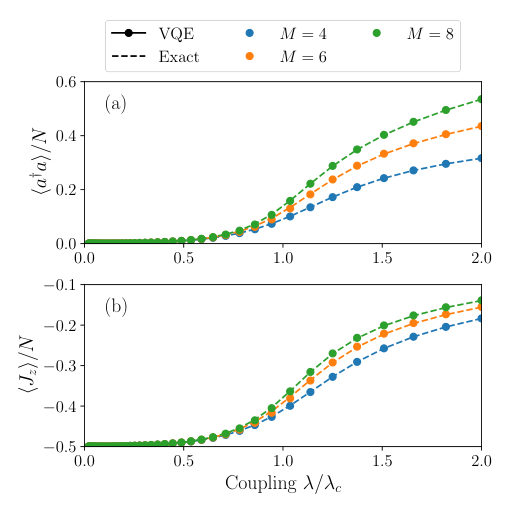
<figcaption class="paper-figure-caption"><b>Fig 4.</b> Fig. 4 quantifies the accuracy of the variational solutions by</figcaption>
</figure>
<figure class="paper-figure-card">
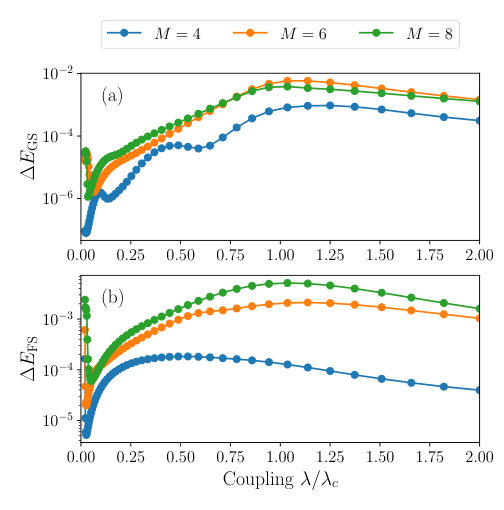
<figcaption class="paper-figure-caption"><b>Fig 5.</b> Figure 4. Energy deviation Δ𝐸= 𝐸VQE −𝐸exact for the ground state (GS) and first excited state (FS) of the spin-Dicke model, shown in panels (a) and (b), respectively. The results are obtained using a problem-inspired ansatz within the variational quantum eigensolver (VQE) and are compared against exact diagonalization. The system parameters are the number of atoms 𝑁= 4, with 𝜔= 𝜔0 = 1, and an ansatz depth of two layers.</figcaption>
</figure>

**Summary.** The paper presents a variational framework to simulate the Dicke model—a key system in quantum optics—on current and future quantum computers. It develops specialized ansätze for both purely qubit-based and hybrid qubit-boson platforms, showing that these methods can accurately capture critical phase transitions. This establishes a scalable methodology for simulating complex light-matter interactions on near-term devices.

**Why it may be interesting.** This work directly bridges fundamental quantum optics models (Dicke) with near-term quantum hardware constraints by proposing resource-efficient simulation techniques.

Detailed structure

**Main problem.** Developing a variational framework to simulate the finite-size Dicke model on both fully qubit-based (digital) and hybrid qubit-boson based quantum computing platforms.

**Main result.** The developed framework successfully reproduces the characteristic critical behavior of the Dicke model in the large-spin limit, offering a scalable path for simulating collective light-matter systems.

**Method.** Variational Quantum Algorithms (VQAs), specifically VQE, are employed. The bosonic mode is mapped to qubits via Holstein-Primakoff transformation or treated directly using hybrid ansätze.

**Model / system.** The Dicke model describes collective light-matter interactions and can be generalized to inhomogeneous forms. It is studied on quantum computing platforms ranging from fully qubit-encoded systems to hybrid qubit-boson architectures.

**Key observables.** Average photon number ($\langle a^\dagger a 
angle / N$), critical behavior, and precursors of the superradiant phase transition.

**Important parameters / regimes.** Coupling strength ($\lambda/\lambda_c$), system size ($N$), and bosonic excitation limit ($M=2s$).

**Assumptions / limitations.** The approach assumes that symmetry-preserving ansätze can be constructed, though limitations exist for $N>4$ in achieving perfect symmetry preparation.

**Figures summary.** Figure 1(b) shows the convergence of the spin-Dicke model's behavior towards the full Dicke model as the bosonic representation size ($M$) increases.

**Paper structure.** The paper introduces the variational framework, details the mapping from the continuous boson mode to qubits (spin-Dicke model), develops symmetry-aware ansätze for both fully digital and hybrid representations, and analyzes the resulting critical behavior.

Abstract

The Dicke model provides a fundamental description of collective light-matter interactions and has long served as a testbed for exploring a wide range of physical phenomena in quantum optics and condensed matter physics. In this work, we develop a variational framework for investigating the finite-size Dicke model on both fully qubit-based (digital) and hybrid qubit boson based (digital-analogue) quantum computing platforms. We show that the resulting model reproduces the characteristic critical behavior of the Dicke model in the appropriate large-spin limit while remaining suitable for implementation on both classical emulators of quantum computers and actual trapped ion quantum computers, albeit in the case of latter somewhat limited by noise. Finally, we introduce a complementary hybrid qubit-bosonic variational ansatz that directly exploits the bosonic degree of freedom to reduce quantum resources and discuss its potential implementation on hybrid quantum hardware. Our results establish a scalable, symmetry-aware framework for variational quantum simulations of collective light-matter systems and provide a pathway toward efficient simulations of more general spin-boson models on near-term quantum devices.

[↑ back to top](#top)

### [Simulating Majorana fermions in black hole with Ising Models](http://arxiv.org/abs/2607.18805v1)

**Authors:** John Vienn A. Estremadura, Kristian Hauser A. Villegas  
**Type:** both · **Category:** other · **PDF:** <https://arxiv.org/pdf/2607.18805v1>  
**Analysis basis:** full PDF text, analyzed in chunks
**Topic relevance:** 🔥 `analog quantum simulation` **4/5** · `exotic spin models in light-matter` **3/5** · `correlated / nonlocal dissipation` **2/5** · `driven-dissipative phase transition` **2/5** · `entanglement & information structure` **2/5** · `methods for driven-dissipative` **2/5** · `non-equilibrium dynamics` **2/5** · `Keldysh / 2PI / non-Gaussian methods` **1/5** · `Kondo & dissipative impurity` **1/5** · `Rydberg arrays` **1/5** · `non-equilibrium universality` **1/5**

↔ Scroll figures horizontally

<figure class="paper-figure-card">
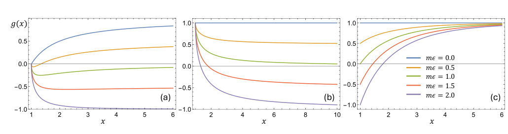
<figcaption class="paper-figure-caption"><b>Fig 1.</b> FIG. 1. Transverse magnetic field as a function of position for spin systems generated using (a) Schwarzschild, (b) tortoise, and (c) Kruskal coordinates, plotted for various values of the parameter mϵ. The black hole horizon is set at rs = 1.</figcaption>
</figure>
<figure class="paper-figure-card">
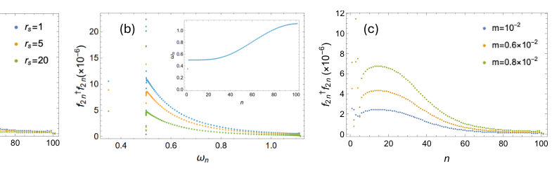
<figcaption class="paper-figure-caption"><b>Fig 2.</b> FIG. 2. Numerical simulation of the fermion number of the Kruskal vacuum using the Ising model, as measured by an observer in tortoise coordinates. Panels (a) and (b) show the fermion number for varying Schwarzschild radius rs as a function of the mode number and the energy eigenvalue, respectively. The inset in (b) shows the energy eigenvalues as a function of the mode number. Panel (c) shows the fermion number as a function of the mode number for varying Majorana mass m.</figcaption>
</figure>

**Summary.** The paper demonstrates that Majorana fermions in curved spacetime can be simulated using the transverse-field Ising model. By showing that different coordinate choices lead to distinct but equivalent spin Hamiltonians, the authors establish a practical route to study black hole physics on tabletop quantum simulators. This work highlights how fundamental symmetries of gravity can emerge from condensed matter systems.

**Why it may be interesting.** This work provides a concrete realization where fundamental symmetries of General Relativity emerge from the dynamics of controllable quantum many-body systems like trapped ions or Rydberg arrays, making it highly relevant for AMO physicists studying emergent physics.

Detailed structure

**Main problem.** Investigating Quantum Field Theory (QFT) phenomena, such as Hawking radiation, in curved spacetime backgrounds.

**Main result.** The authors show that different coordinate representations of the same black hole spacetime map onto distinct but equivalent microscopic Ising spin models, demonstrating emergent general covariance.

**Method.** Analog simulation by mapping QFT on curved spacetime to controllable quantum many-body systems (spin chains).

**Model / system.** The system uses the transverse-field Ising model applied to Majorana fermions in a Schwarzschild black hole background. The Hamiltonian is derived from the continuum limit of lattice spin models.

**Key observables.** Spin correlation measurements used to simulate and detect black hole particle production, which are compared against Fermi-Dirac distributions.

**Important parameters / regimes.** The Hawking temperature ($k_B T/J$) and the Majorana mass ($m$), which governs the particle number expectation value.

**Assumptions / limitations.** The analysis relies on taking the continuum limit approximation when mapping lattice models to field theory, and using $\zeta(t, x) = 0$ for simplification in some derivations.

**Figures summary.** Figure 2(b) shows that the simulated particle number follows a Fermi-Dirac distribution whose temperature scales with the Schwarzschild radius; Figure 2(a) discusses oscillations related to finite Kruskal time or discretization effects.

**Paper structure.** The paper first establishes the mapping from QFT in curved spacetime to spin models, then analyzes how different coordinate systems (Schwarzschild vs. conformally flat) yield distinct but equivalent microscopic Hamiltonians, and finally applies this framework to calculate particle production via correlation measurements.

Abstract

Quantum field theory (QFT) in curved spacetime has led to profound predictions, including the Unruh effect and Hawking radiation, yet their direct observation remains extraordinarily challenging because of their extremely weak signatures. Here, we show that the transverse-field Ising model provides a quantum simulator for Majorana fermions in a Schwarzschild black hole background. Remarkably, different coordinate representations of the same spacetime-Schwarzschild, tortoise, Kruskal, and conformally flat-map onto distinct microscopic Ising spin models. Despite their microscopic differences, these models converge in the continuum limit to the same Majorana field theory, exhibiting an emergent form of general covariance. This provides a rare example of a fundamental symmetry of general relativity arising as an emergent property of a condensed matter system. We further demonstrate how black hole particle production can be simulated and detected through spin correlation measurements, and discuss experimental platforms capable of realizing these models. Our work establishes a practical route for investigating fermionic QFT in curved spacetime using controllable quantum many-body systems and tabletop experiments.

[↑ back to top](#top)

### [Dynamical correlation functions of extensive charges after global quantum quenches](http://arxiv.org/abs/2607.19208v1)

**Authors:** Riccardo Travaglino, Katja Klobas, Bruno Bertini, Pasquale Calabrese  
**Type:** theory · **Category:** statistical mechanics · **PDF:** <https://arxiv.org/pdf/2607.19208v1>  
**Analysis basis:** full PDF text, analyzed in chunks
**Topic relevance:** 🔥 `non-equilibrium dynamics` **4/5** · `analog quantum simulation` **3/5** · `entanglement & information structure` **3/5** · `non-equilibrium universality` **3/5** · `methods for driven-dissipative` **2/5** · `scars & prethermalization` **2/5** · `Keldysh / 2PI / non-Gaussian methods` **1/5** · `correlated / nonlocal dissipation` **1/5** · `driven-dissipative phase transition` **1/5**

↔ Scroll figures horizontally

<figure class="paper-figure-card">
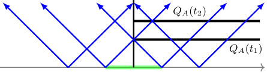
<figcaption class="paper-figure-caption"><b>Fig 1.</b> Figure 1: Quasiparticle-picture explanation of Eq. (1). The only quasiparticle pairs contributing to the connec- ted correlator are those emanated from the green region. These correlated pairs will cross all the charge lines once independent of their vertical position.</figcaption>
</figure>
<figure class="paper-figure-card">
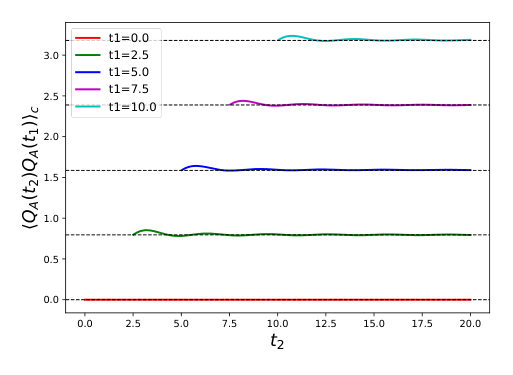
<figcaption class="paper-figure-caption"><b>Fig 2.</b> Figure 2: Connected two point function vs t2 after a quench from the fermionic Néel state in the tight bind- ing model for a subsystem of ℓA = 40 sites. Dashed lines represent Q2 A(t1)</figcaption>
</figure>
<figure class="paper-figure-card">
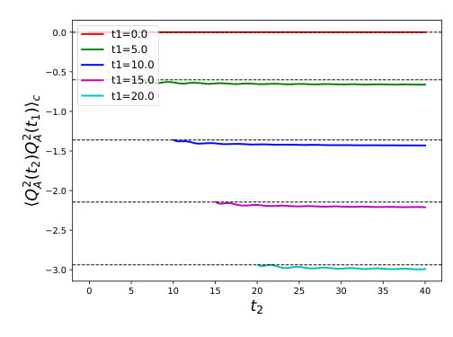
<figcaption class="paper-figure-caption"><b>Fig 3.</b> Figure 3: Connected 4-point function Q2 A(t2)Q2 A(t1)</figcaption>
</figure>
<figure class="paper-figure-card">
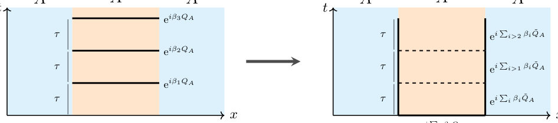
<figcaption class="paper-figure-caption"><b>Fig 4.</b> Figure 4: Deformation of charge lines at times nτ to vertical insertions of the dual charge ˜QA, which represent insertions of charge lines in the dual theory. The contribution of the initial state is trivial for symmetric initial states, hence Q0 is just a number, and all the relevant physics takes place at the boundaries of A.</figcaption>
</figure>
<figure class="paper-figure-card">
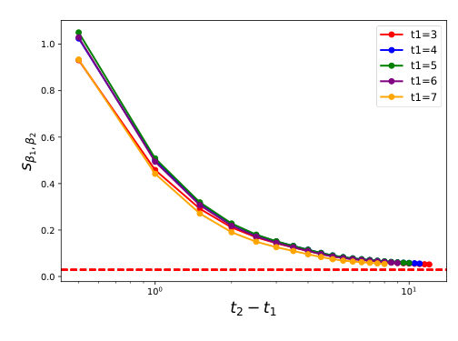
<figcaption class="paper-figure-caption"><b>Fig 5.</b> Figure 5: Slope of the 2−FCS normalised by the term depending on t1 alone, in the XXZ chain with ∆= 0.5. Here, β1 = π/4 and β2 = π/8, the total system size is L = 80 with ℓA = 40. The asymptotic value reached by sβ1,β2, represented by the dashed line is precisely the slope of the single-time FCS obtained in [55].</figcaption>
</figure>

**Summary.** This paper develops a theoretical framework to calculate how extensive charges fluctuate after a quantum quench. By exploiting space-time duality and assuming weak time correlations, the authors show that complex multi-time correlation functions simplify dramatically, depending only on the earliest measurement time. This provides significant analytical simplification for studying non-equilibrium dynamics in many-body systems.

**Why it may be interesting.** This work provides powerful analytical tools (like the time-shell structure) to simplify complex non-equilibrium dynamics in many-body systems, which is crucial for understanding thermalization and quantum quenches relevant to AMO physics.

Detailed structure

**Main problem.** The research focuses on characterizing the dynamical correlation functions of extensive U(1) charges following a global quantum quench.

**Main result.** Under conditions like ballistic transport, connected correlation functions simplify drastically, depending only on the smallest time entering the correlator. The $n$-FCS factorizes into a structure related to single-time FCS.

**Method.** The authors employ space-time duality and analyze multi-time Full Counting Statistics (n-FCS) using techniques applicable to free fermionic systems, generalizing results to interacting models.

**Model / system.** The study uses lattice Hamiltonians with a global U(1) conserved charge $Q$, often modeled via the XX chain or general free/interacting fermionic systems undergoing a quantum quench from an initial symmetric state.

**Key observables.** Multi-time Full Counting Statistics (n-FCS), connected time-ordered correlation functions $\langle T Q_A(t_n) \cdots Q_A(t_1) 
angle_c$, and the restricted charge $Q_A$ on a subsystem $A$.

**Important parameters / regimes.** Ballistic transport regime, large subsystem size ($\ell_A$), and the specific time ordering of measurements $\{t_i\}$.

**Assumptions / limitations.** The key results are derived assuming weak time correlations (e.g., ballistic transport) and utilizing space-time duality to relate non-equilibrium dynamics to simpler structures.

**Figures summary.** Figures illustrate numerical tests confirming that the connected two-point function depends only on the earliest time $t_{\min}$, and show the structure of the four-point function being independent of later times.

**Paper structure.** The paper develops the formalism by first analyzing the n-FCS, exploiting space-time duality to derive factorization properties, and then applying these results to simplify the connected correlation functions for various time orderings.

Abstract

We investigate the $n$-time cumulant generating function (or $n$-Full Counting Statistics, $n$-FCS) of extensive $U(1)$ charges following a quantum quench. Exploiting space-time duality we characterise this function when evolving from initial states that are symmetric under the action of the charge. In particular, we show that if the correlations in time are sufficiently weak, e.g.\ the transport is ballistic, the $n$-FCS factorises into a sum of single-time FCS arranged in a time-shell structure. A direct implication of this structure is a drastic simplification of dynamical correlation functions: in the presence of time ordering they only depend on the smallest time entering the correlator. We support these findings with several analytical and numerical tests performed in free and interacting models.

[↑ back to top](#top)

### [Ecological networks of viable species with degree-dependent interaction](http://arxiv.org/abs/2607.18809v1)

**Authors:** Hae Seong Lee, Deok-Sun Lee, Sang Hoon Lee, Samir Suweis, Hye Jin Park  
**Type:** theory · **Category:** statistical mechanics · **PDF:** <https://arxiv.org/pdf/2607.18809v1>  
**Analysis basis:** full PDF text, analyzed in chunks
**Topic relevance:** 🔥 `non-equilibrium dynamics` **4/5** · `driven-dissipative phase transition` **3/5** · `methods for driven-dissipative` **3/5** · `non-equilibrium universality` **3/5** · `Keldysh / 2PI / non-Gaussian methods` **2/5** · `analog quantum simulation` **2/5** · `correlated / nonlocal dissipation` **1/5** · `entanglement & information structure` **1/5** · `scars & prethermalization` **1/5**

↔ Scroll figures horizontally

<figure class="paper-figure-card">
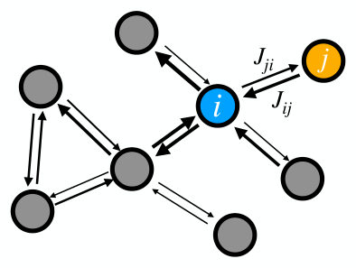
<figcaption class="paper-figure-caption"><b>Fig 1.</b> FIG. 1. Schematic illustration of the model in Eq. (1). Species are represented as nodes in a network, with directed interactions denoted by arrows. The interaction strength Jij, representing the effect of species j on species i, is a quenched random variable that may de- pend on the degrees ki and k j of species i and j, as defined in Eq. (2). Interactions are bidirectional (Aij = Aji) but their strengths are gen- erally asymmetric (Jij , Jji).</figcaption>
</figure>
<figure class="paper-figure-card">
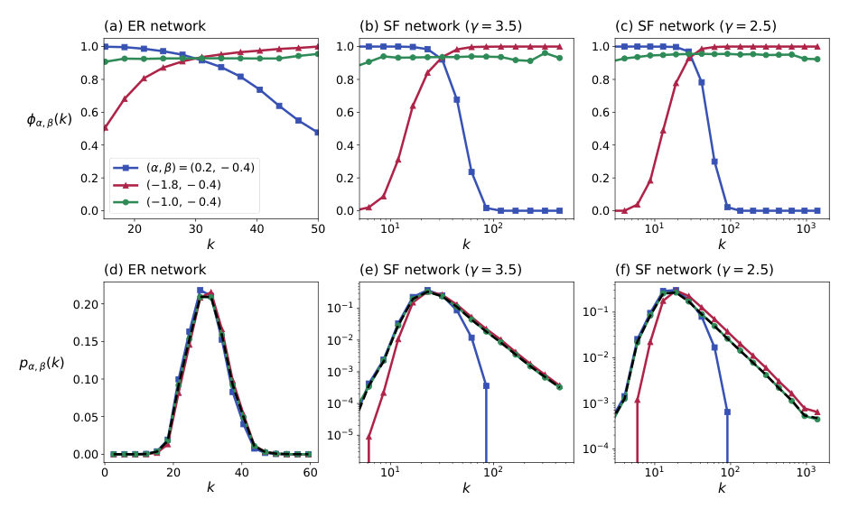
<figcaption class="paper-figure-caption"><b>Fig 2.</b> FIG. 2. Numerical simulation results of the GRLV model in Eq. (1) on ER and static SF networks with γ = 3.5 and γ = 2.5. Panels (a)–(c) show the degree-specific survival probability ϕα,β(k), and panels (d)–(f) show the distribution of the initial degree p′ α,β(k) of surviving species for (α, β) = (−1.8, −0.4), (−1.0, −0.4), and (0.2, −0.4). The survival probability exhibits three distinct behaviors across the given parameter sets for all networks. For (α, β) = (−1.8, −0.4) (red triangle), ϕα,β(k) increases with k, indicating that hub species are more likely to survive than low- degree species. The opposite behavior is observed for (α, β) = (0.2, −0.4) (blue square), where ϕα,β(k) decreases...</figcaption>
</figure>
<figure class="paper-figure-card">
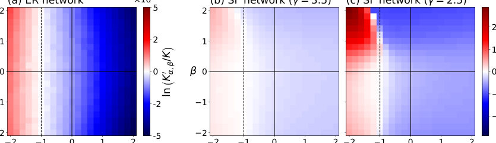
<figcaption class="paper-figure-caption"><b>Fig 3.</b> FIG. 3. The heatmap of ln(K′ α,β/K), where K′ α,β is the mean initial degree of surviving species for a given parameter set (α, β), and K is the mean degree of the initial network. Panels (a)–(c) correspond to the ER network, and static SF networks with γ = 3.5 and 2.5, respectively. The (α, β) plane is divided into a hub-favored phase (K′ α,β &gt; K, red) and a hub-suppressed phase (K′ α,β &lt; K, blue). The phase boundary is represented by the white region where K′ α,β = K. In the ER network, the phase boundary lies at α ≈−1 throughout all values of β we consider. Similarly, the phase boundary is also found at α ≈−1 in the static SF networks but deviates from α = −1 to more negative α values in...</figcaption>
</figure>
<figure class="paper-figure-card">
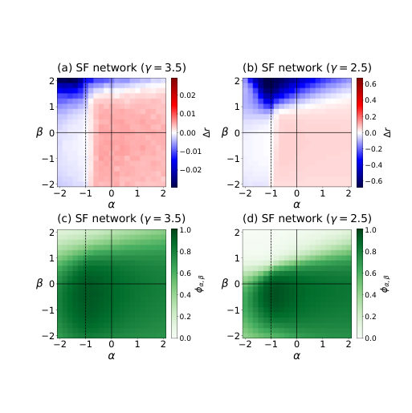
<figcaption class="paper-figure-caption"><b>Fig 4.</b> FIG. 4. (a), (b) Change in the degree assortativity coefficient ∆r and (c), (d) mean survival probability ⟨ϕα,β⟩in the α-β plane for static SF networks with (a), (c) γ = 3.5 and (b), (d) γ = 2.5. The black dashed vertical line indicates the phase boundary at α = −1 predicted by the mean-field approach. The degree assortativity of the surviving net- work decreases in the hub-favored phase (α &lt; −1) while it increases in the hub-suppressed phase (α &gt; −1), except in the large-β regime where the mean survival probability becomes very low. Each point is averaged over 100 simulations with the same simulation settings as in Sec. IV.</figcaption>
</figure>

**Summary.** This paper extends ecological models by incorporating degree-dependent interaction strengths into the GLV framework. It identifies two key regimes—hub-favored and hub-suppressed—which dictate whether highly connected species thrive or perish. The findings demonstrate that these structural biases are a fundamental mechanism for generating the wide range of assortativity observed in real biological networks.

**Why it may be interesting.** While focused on ecology, the mathematical machinery—analyzing non-equilibrium steady states, phase transitions based on connectivity structure, and emergent collective behavior from local interactions—shares deep conceptual parallels with analyzing complex quantum many-body systems or open quantum systems dynamics.

Detailed structure

**Main problem.** The study investigates how correlating interaction strengths with species connectivity (degree) affects species survival and network structure in ecological models.

**Main result.** Degree-dependent interactions create distinct hub-favored or hub-suppressed phases, which fundamentally shape the resulting network's degree assortativity, potentially explaining observed patterns in real food webs.

**Method.** The analysis employs a mean-field approximation applied to the Generalized Lotka-Volterra framework, deriving stationary states and analyzing phase boundaries based on scaling exponents $(\alpha, eta)$.

**Model / system.** The model uses the GLV framework for species abundance dynamics on large ecological networks (ER or SF), where interaction strengths $J_{ij}$ are quenched random variables dependent on the degrees of interacting species.

**Key observables.** Stationary abundance of species, degree assortativity coefficient ($r$), and the resulting degree distribution of viable species ($p'$).

**Important parameters / regimes.** The scaling exponents $(\alpha, eta)$ governing the degree dependence of interaction strengths; the critical phase boundary is often found near $\alpha = -1$.

**Assumptions / limitations.** The analysis relies heavily on mean-field approximations for deriving stationary states and calculating survival probabilities.

**Figures summary.** Figures illustrate the delineation between hub-favored (red) and hub-suppressed (blue) phases in the $(\alpha, eta)$ plane, showing how species composition shifts based on interaction strength correlations.

**Paper structure.** The paper systematically introduces the degree-dependent GLV model, derives the survival probability $\phi(k)$, establishes the phase boundaries using mean-field theory, and finally links these theoretical phases to observable changes in network assortativity.

Abstract

The generalized Lotka-Volterra (GLV) framework, recently advanced by dynamical mean-field theory, enables the systematic analysis of large ecological networks. When combined with structured interaction topologies, previous studies have shown that the viability of species, defined by having a positive stationary abundance, depends on the number of their interacting neighbors or the "degree." While such model studies usually assume that interaction strengths follow an identical distribution across all connected pairs, real ecological communities often exhibit correlations between interaction strength and a species' degree. To capture this overlooked feature, we introduce degree-dependent interaction strengths into a generalized random LV model. We identify two distinct regimes: a hub-favored phase, where highly connected species survive preferentially, and a hub-suppressed phase, where they face higher extinction risks. We analytically derive the phase boundary where these degree-dependent strengths precisely balance the connectivity effect, leaving all species equally susceptible. Crucially, these phases induce opposing shifts in the degree-degree correlation or "assortativity" of the network of viable species: the hub-favored phase enhances disassortativity by selectively removing the interactions between low-degree species, whereas the hub-suppressed phase reduces it as the interactions involving hub species tend to disappear. Ultimately, our findings demonstrate that degree-dependent interactions are a fundamental mechanism not only for shaping species survival, but for naturally reproducing the wide range of assortativity values observed in real ecological networks.

[↑ back to top](#top)

### [Efficient quantum transport in disordered Floquet networks](http://arxiv.org/abs/2607.19278v1)

**Authors:** Hlér Kristjánsson, Jonathan Brugger, Gabriel Dufour, Christian Scheppach, Andreas Buchleitner  
**Type:** theory · **Category:** disordered systems and neural networks · **PDF:** <https://arxiv.org/pdf/2607.19278v1>  
**Analysis basis:** full PDF text, analyzed in chunks
**Topic relevance:** 🔥 `analog quantum simulation` **4/5** · 🔥 `non-equilibrium dynamics` **4/5** · `driven-dissipative phase transition` **3/5** · `methods for driven-dissipative` **3/5** · `non-equilibrium universality` **2/5** · `Keldysh / 2PI / non-Gaussian methods` **1/5** · `correlated / nonlocal dissipation` **1/5** · `entanglement & information structure` **1/5** · `scars & prethermalization` **1/5**

↔ Scroll figures horizontally

<figure class="paper-figure-card">
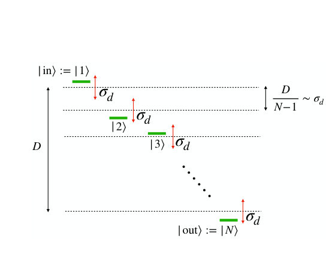
<figcaption class="paper-figure-caption"><b>Fig 1.</b> FIG. 1. Diagram of the energy levels of the diagonal N- site Hamiltonian Hd. The energies corresponding to each site are normally distributed with mean D/2 −D(n −1)/(N −1) and variance σ2 d, where σd is taken to be of comparable size as the average energy difference D/N between neighboring sites. Moreover, we take σd = σ0, the standard deviation of the couplings of the static Hamiltonian H0.</figcaption>
</figure>
<figure class="paper-figure-card">
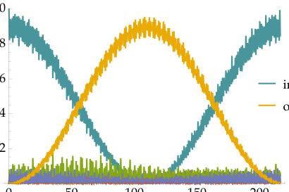
<figcaption class="paper-figure-caption"><b>Fig 2.</b> FIG. 2. Excitation transfer with a dominant Floquet dou- blet: Excitation probability on the input (blue), output (yel- low) and intermediate sites (other colors) for a randomly gen- erated seven-site Floquet-antisymmetric network with the pa- rameters σd = σ0, D = 10 σ0, σv = 0.1 σ0, ω = ω0 and satisfying the dominant Floquet doublet condition (6) with β ≥0.9.</figcaption>
</figure>
<figure class="paper-figure-card">
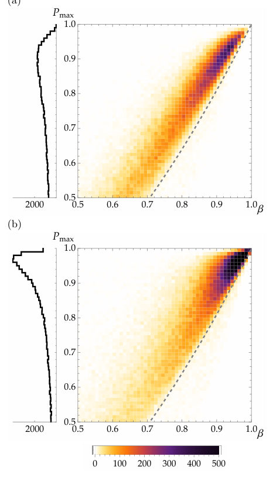
<figcaption class="paper-figure-caption"><b>Fig 3.</b> FIG. 3. Density histograms of Pmax vs. β for 105 randomly sampled seven-site Hamiltonians of the form (2) with the pa- rameters σd = σ0, D = 10 σ0, σv = 0.1 σ0, ω = ω0. Here, Pmax is taken as the maximum value of P(t) within a time interval 2τexp, where τexp = πℏ|ε+ −ε−|−1 is the expected transfer time. In panel (a) no particular condition is imposed on the Hamiltonians whereas in panel (b) the Hamiltonians are chosen to be Floquet-antisymmetric, i.e. {HF, Þ} = 0. The gray dashed line indicates the bound Pmax ≥β2. Only the realizations with Pmax, β ≥0.5 are shown, of which there are 55145 out of 100000 in (a) and 67654 out of 100000 in (b). The bin size is 0.01 in both axes. The marginal...</figcaption>
</figure>
<figure class="paper-figure-card">
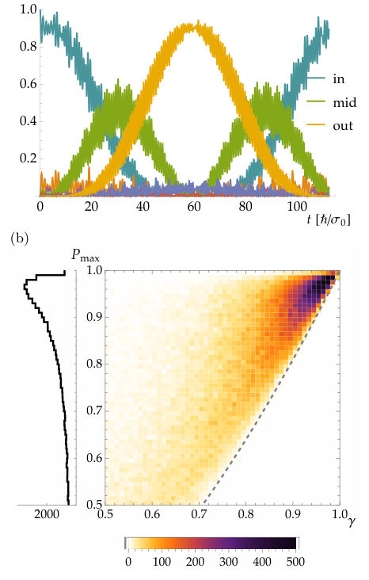
<figcaption class="paper-figure-caption"><b>Fig 4.</b> FIG. 4. Two-phonon transfer with a dominant Floquet triplet: (a) Excitation probability on the input (blue), out- put (yellow), central (green) and other intermediate sites (other colors) for a randomly generated seven-site Floquet- antisymmetric network with the parameters σd = σ0, D = 10 σ0, σv = 0.1 σ0, ω = ω0/2, and satisfying the dominant Floquet triplet condition (10) with γ ≥0.9. (b) Density his- togram of Pmax vs. γ for 105 randomly sampled Floquet anti- symmetric Hamiltonians with the same parameters as in (a). Here, Pmax is taken as the maximum value of P(t) within a time interval 2τexp, where τexp = πℏ|ε+|−1 is the expected transfer time. The gray dashed line indicates the bound...</figcaption>
</figure>
<figure class="paper-figure-card">
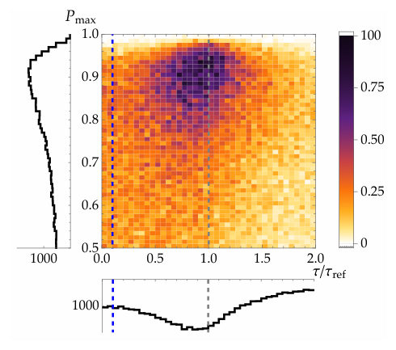
<figcaption class="paper-figure-caption"><b>Fig 5.</b> FIG. 5. Histogram of transfer probabilities Pmax vs. transfer time enhancement τ/τref for 105 randomly generated seven- site networks with the parameters σd = σ0, D = 10 σ0, σv = 0.1 σ0, ω = ω0. Only the 46011 realizations for which τ/τref &lt; 2 and Pmax &gt; 0.5 (of the the total 100000) are shown. The bin size is 0.01 for Pmax and 0.05 for τ/τref. Realizations to the left of the dashed gray line, of which there are 28682, show an enhancement of the transfer time with respect to a network with no static couplings. Realizations to the left of the dashed blue line, of which there are 2066, show an order-of magnitude enhancement. The marginal histograms of transfer probabilities and transfer time...</figcaption>
</figure>

**Summary.** The authors develop theoretical principles to ensure efficient quantum transport through disordered networks driven by external vibrations. They show that imposing symmetries on the Floquet Hamiltonian can engineer near-perfect energy transfer via resonant coupling mechanisms (doublets/triplets). Crucially, they demonstrate that static disorder is not merely a hindrance but an active component enabling significant speedups in the overall transport process.

**Why it may be interesting.** This work provides concrete, symmetry-based design rules for optimizing energy transfer in complex quantum systems, drawing parallels to biological light-harvesting complexes. The combination of Floquet engineering with disorder analysis is highly relevant to open quantum systems research.

Detailed structure

**Main problem.** The paper proposes mechanisms for achieving fast and efficient quantum energy transport through disordered, periodically driven (Floquet) quantum networks.

**Main result.** Near-perfect transport can be engineered by imposing symmetries like Floquet antisymmetry or ensuring the existence of dominant quasi-energy doublets/triplets. Furthermore, static couplings are shown to be essential for achieving speedups in transfer time compared to models neglecting them.

**Method.** The analysis relies heavily on Floquet theory to analyze the time evolution governed by a periodically driven Hamiltonian, supplemented by symmetry constraints and resonance conditions.

**Model / system.** The model is an N-site network of two-level systems whose dynamics are described by a time-periodic Hamiltonian $H(t) = H_0 + H_d + \sin(\omega t)H_v$. Disorder is introduced via the Gaussian Orthogonal Ensemble (GOE) sampling for couplings.

**Key observables.** Transfer probability ($P_{\max}$), quasi-energies ($\epsilon_j$), and characteristic strengths quantifying resonance conditions ($eta$ for doublets, $\gamma$ for triplets).

**Important parameters / regimes.** The driving frequency ($\omega$) must resonate with the energy gap ($\omega_0 = e_1 - e_N$). The relative strength of static vs. vibrational couplings is crucial.

**Assumptions / limitations.** The dynamics are treated unitarily, and the resonant process driven by a single phonon (or two phonons) is assumed to dominate over other vibrational modes.

**Figures summary.** Figures illustrate energy level distributions, show excitation transfer for dominant Floquet doublets ($eta \ge 1$), and present histograms comparing transport probability versus time enhancement factors derived from static vs. dynamic coupling regimes.

**Paper structure.** The paper develops the formalism using Floquet theory, establishes design principles based on symmetries (like Floquet antisymmetry) to enhance resonance conditions (doublet/triplet formation), and finally analyzes how the interplay between static disorder ($H_0$) and driving ($H_d$) dictates both transport efficiency and speed.

Abstract

We propose a mechanism for fast and efficient quantum transport through disordered networks with variable on-site energies, inspired by photosynthetic complexes. The mechanism relies on an interplay between inter-site couplings of the network and driving by external vibrations. Two design principles are shown to ensure close-to-perfect transport despite the disorder, namely a reflection symmetry in Floquet-Hilbert space and the existence of a dominant doublet or triplet of Floquet states.

[↑ back to top](#top)

### [From Canonical to Tunable Phase Diagrams in Open Quantum Long-Range Systems](http://arxiv.org/abs/2607.18542v1)

**Authors:** Anish Acharya, Shamik Gupta  
**Type:** theory · **Category:** statistical mechanics · **PDF:** <https://arxiv.org/pdf/2607.18542v1>  
**Analysis basis:** full PDF text, analyzed in chunks
**Topic relevance:** 🔥 `driven-dissipative phase transition` **4/5** · `correlated / nonlocal dissipation` **3/5** · `methods for driven-dissipative` **3/5** · `non-equilibrium universality` **3/5** · `non-equilibrium dynamics` **2/5** · `Keldysh / 2PI / non-Gaussian methods` **1/5** · `analog quantum simulation` **1/5** · `exotic spin models in light-matter` **1/5** · `measurement-induced transitions` **1/5** · `quantum measurements` **1/5**

↔ Scroll figures horizontally

<figure class="paper-figure-card">
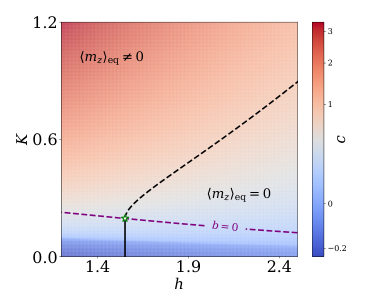
<figcaption class="paper-figure-caption"><b>Fig 1.</b> FIG. 1. Canonical phase diagram of the model (1) in the (h, K)- plane, obtained as the stationary state solution of the Lindblad equa- tion (3) and at βJ = 2/3, along with behavior of the Landau coef- ficients b and c. We also show the continuous transition line (52) (black solid line) and the first-order transition line (black dashed line). The color map shows the sixth-order coefficient c, while the violet (dashed) contour denotes the locus b = 0, passing through the tricritical point (54) (green star). Above the contour, we have b &lt; 0, while one has b &gt; 0 below it. In the region with b &lt; 0, one has c &gt; 0.</figcaption>
</figure>
<figure class="paper-figure-card">
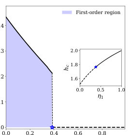
<figcaption class="paper-figure-caption"><b>Fig 2.</b> FIG. 3. Corresponding to the stationary state of the NLME (55), here we show the quantity ⟨mz⟩ss(h− c ), obtained by evaluating ⟨mz⟩ss just below the transition point hc by using Eq. (80), as a function of the retention probability η1, for fixed η2 = 0.5, K = 0.22, and βJ = 2/3. For the corresponding bare model (η1 = η2 = 0), the transition is first order (see Fig. 1). The inset shows the behavior of hc as a function of η1 for the same choice of the parameters as in the main plot, where the nature of the transition changes from first order (black dashed) to continuous (black solid) across the tricritical point marked as the blue star.</figcaption>
</figure>
<figure class="paper-figure-card">
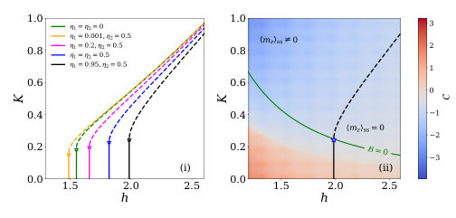
<figcaption class="paper-figure-caption"><b>Fig 3.</b> FIG. 2. Phase diagram of the model (1) in the (h, K)-plane, obtained as the NESS solution of the NLME (55) for different choices of the retention probabilities η1 and η2 and at βJ = 2/3 (panel (i)). The solid lines denote the continuous transition line (83), the star denotes the corresponding tricritical point, while dashed lines denote the first- order transition line. Panel (ii) shows for η1 = 0.95, η2 = 0.5 the color map of the coefficient C in Eq. (82), while the green (dashed) contour denotes the locus of B = 0, passing through the correspond- ing tricritical point (blue star). Above the contour, we have B &gt; 0, while below it, one has B &lt; 0. In the region with B &gt; 0, one has C &lt; 0.</figcaption>
</figure>
<figure class="paper-figure-card">
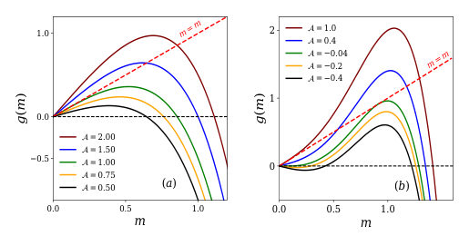
<figcaption class="paper-figure-caption"><b>Fig 4.</b> FIG. 4. Behavior of the function g(m) in Eq. (B1) for (a) the con- tinuous transition regime (B &lt; 0), and (b) the first-order transition regime (B &gt; 0). In (a), one has (i) a zero stable solution for A &lt; 1, and (ii) a non-zero stable solution for A &gt; 1. In (b), one has (i) a zero stable solution for A &lt; A ∗, (ii) coexistence of two stable solu- tions, one zero and one non-zero, at A = A ∗(for the plot, we have A ∗≈−0.04), and (iii) a non-zero stable solution for A &gt; A ∗.</figcaption>
</figure>

**Summary.** This paper analyzes the dynamics of an open quantum spin system, showing that moving beyond ideal Lindblad evolution by incorporating imperfect quantum jumps allows for profound control over its steady state. By tuning these 'jump-retention' parameters, researchers can engineer entirely new nonequilibrium phase diagrams, demonstrating a powerful mechanism for controlling collective quantum behavior.

**Why it may be interesting.** This work is highly relevant as it provides a concrete theoretical framework for using engineered dissipation (non-Markovian or non-ideal jump processes) to control and stabilize quantum phases inaccessible under standard thermal equilibrium assumptions.

Detailed structure

**Main problem.** The study investigates how controlled dissipation, implemented via imperfect quantum jumps, can fundamentally alter the stationary state of an open quantum system compared to its canonical thermal equilibrium.

**Main result.** The analysis demonstrates that by tuning jump-retention parameters, one can engineer genuine nonequilibrium stationary states (NESS) whose phase transition boundaries and nature differ qualitatively from the standard linear Lindblad case.

**Method.** The authors employ mean-field approximations applied to the Lindblad master equation, extending it to a nonlinear form incorporating imperfect quantum jumps. Phase transitions are analyzed by solving self-consistency equations for the magnetization order parameter.

**Model / system.** The system is a generalized Lipkin-Meshkov-Glick (LMG) model of interacting spin-1/2 particles coupled to a thermal environment. The dynamics are governed by both linear and nonlinear Lindblad master equations, incorporating quartic interactions and transverse fields.

**Key observables.** Magnetization components ($\langle m_x 
angle, \langle m_y 
angle, \langle m_z 
angle$), the stationary state expectation value $\langle m_z 
angle_{ss}$, and coefficients determining transition order ($A, B$).

**Important parameters / regimes.** Temperature ($T$), transverse field strength ($h$), interaction strengths ($J, K$), and crucially, the jump-retention parameters ($\eta_1, \eta_2$).

**Assumptions / limitations.** The analysis relies on mean-field approximations in the thermodynamic limit and extends the standard Markovian Lindblad framework to include imperfect quantum jumps.

**Figures summary.** Figures illustrate phase diagrams in parameter space (e.g., $(h, K)$) showing regions of continuous vs. first-order transitions controlled by jump parameters, and plots demonstrating how $\langle m_z 
angle_{ss}$ changes across tricritical points.

**Paper structure.** The paper progresses from analyzing the standard linear Lindblad dynamics (reproducing equilibrium phase diagrams) to introducing a nonlinear extension via imperfect jumps. The core analysis then focuses on mapping out the parameter space where these controlled dissipative mechanisms allow for engineering novel, nonequilibrium stationary states with tunable critical behavior.

Abstract

We investigate the dissipative dynamics of a generalized Lipkin-Meshkov-Glick (LMG) model coupled to a thermal environment. In this generalized model, in addition to the conventional quadratic interaction, one considers quartic interactions between spin-$1/2$'s coupled all-to-all and evolving in presence of a transverse field. Employing the usual linear Lindblad master equation with thermally-balanced jump processes, we derive magnetisation evolution equations, and demonstrate that the corresponding stationary solution reproduces the canonical equilibrium phase diagram of the model. We then extend our analysis to a nonlinear Lindblad equation that incorporates imperfect quantum-jump processes in terms of jump-retention parameters. Here, remarkably, the system relaxes to a genuine nonequilibrium stationary state whose properties differ qualitatively from those obtained in the linear case. The jump-retention parameters provide tunable knobs that shift the phase boundaries and even modify the nature of the phase transitions with respect to the linear case. Our exact results establish a direct connection between dissipative relaxation dynamics and stationary-state behavior, while identifying controlled quantum-jump retention as a mechanism for engineering nonequilibrium phases in long-range interacting open quantum systems.

[↑ back to top](#top)

### [Programmable Spin Conversion in Gradient Quantum Matter](http://arxiv.org/abs/2607.19105v1)

**Authors:** Mamoru Matsuo, Yuta Sekino, Hiroyuki Tajima  
**Type:** theory · **Category:** quantum gases · **PDF:** <https://arxiv.org/pdf/2607.19105v1>  
**Analysis basis:** full PDF text, analyzed in chunks
**Topic relevance:** 🔥 `analog quantum simulation` **4/5** · `Keldysh / 2PI / non-Gaussian methods` **3/5** · `methods for driven-dissipative` **3/5** · `spintronics-quantum-optics interface` **3/5** · `driven-dissipative phase transition` **2/5** · `non-equilibrium dynamics` **2/5** · `correlated / nonlocal dissipation` **1/5** · `exotic spin models in light-matter` **1/5** · `non-equilibrium universality` **1/5**

↔ Scroll figures horizontally

<figure class="paper-figure-card">
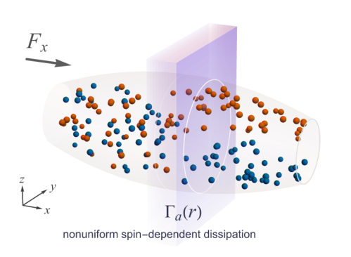
<figcaption class="paper-figure-caption"><b>Fig 1.</b> FIG. 1. Programmable gradient quantum spin material in a two-component cold-atom gas. A spin-independent drive Fx carries atoms through a tube-shaped cloud crossed by a finite- thickness dissipative region with nonuniform spin-dependent Γa(r). The incoming components are mixed. After crossing the region, the distribution is biased, with the +a-polarized atoms (orange) preferentially on the +z side and the −a- polarized atoms (blue) on the −z side. This transverse spin imbalance illustrates scalar-to-spin conversion, the cold-atom analog of charge-to-spin conversion in an electronic gradient material.</figcaption>
</figure>

**Summary.** This work develops a quantum kinetic theory approach to model programmable spin conversion in gradient quantum matter using ultracold gases. By analyzing how spatially varying self-energies generate momentum-dependent spin sources, the authors predict measurable transverse spin textures. This offers an atomic platform to study fundamental physics governing spin generation in structured quantum media.

**Why it may be interesting.** It provides a rigorous theoretical framework connecting controllable parameters in ultracold atomic systems (like spatial variations in interaction/potential) directly to measurable non-equilibrium spin phenomena analogous to those studied in solid-state spintronics.

Detailed structure

**Main problem.** The research aims to demonstrate programmable spin conversion mechanisms within gradient quantum matter systems.

**Main result.** A dissipative-curvature mechanism generates a controllable spin source whose transverse momentum texture is parity-locked to the applied drive and programmed gradient curvature.

**Method.** The analysis uses quantum kinetic theory, employing the Wigner transform and expanding the collision integral to second order in spatial gradients.

**Model / system.** The system modeled is a two-component ultracold Fermi gas, serving as an analog for gradient quantum materials. The dynamics are governed by spin-matrix distribution functions derived from the Kadanoff-Baym equation.

**Key observables.** Spin-resolved time-of-flight imaging revealing transverse spin textures; momentum-weighted projections of source terms ($K_{X}^a$, $	ext{D}_a^z$).

**Important parameters / regimes.** Coherent shift ($\Lambda$) and dissipative rates ($\Gamma$); the magnitude and spatial variation of these self-energies.

**Assumptions / limitations.** The analysis relies on local Markov approximation and expanding kinetic terms up to second order in spatial gradients.

**Figures summary.** FIG. 1 illustrates how a drive crossing a dissipative region causes scalar-to-spin conversion, resulting in measurable transverse spin imbalance (+z vs -z).

**Paper structure.** The paper progresses by deriving the kinetic equation for spin components using Wigner transforms, separating contributions from coherent gradients ($\Lambda$) and dissipative curvatures ($\Gamma$), and finally analyzing momentum-integrated source terms to predict observable spin textures.

Abstract

We propose programmable spin conversion in ultracold gases as gradient quantum matter, whose spin-dependent self-energy varies in space. Quantum kinetic theory shows that a dissipative self-energy curvature turns a force-driven scalar anisotropy into a spin source with mixed longitudinal-transverse momentum parity. Spin-resolved time-of-flight imaging can reveal a transverse spin texture that changes sign when either the drive or programmed curvature is reversed. Ultracold gases thereby offer a controllable spin source for gradient quantum matter.

[↑ back to top](#top)

### [The Thermodynamic Geometry of Conditional Control](http://arxiv.org/abs/2607.19177v1)

**Authors:** J. G. G. de Oliveira, M. E. R. Filippetto, T. A. B. Pinto Silva, A. C. S. Costa, R. M. Angelo  
**Type:** theory · **Category:** statistical mechanics · **PDF:** <https://arxiv.org/pdf/2607.19177v1>  
**Analysis basis:** full PDF text, analyzed in chunks
**Topic relevance:** 🔥 `quantum measurements` **4/5** · `entanglement & information structure` **3/5** · `measurement-induced transitions` **3/5** · `correlated / nonlocal dissipation` **2/5** · `driven-dissipative phase transition` **2/5** · `non-equilibrium dynamics` **2/5** · `Keldysh / 2PI / non-Gaussian methods` **1/5** · `methods for driven-dissipative` **1/5** · `non-equilibrium universality` **1/5**

↔ Scroll figures horizontally

<figure class="paper-figure-card">
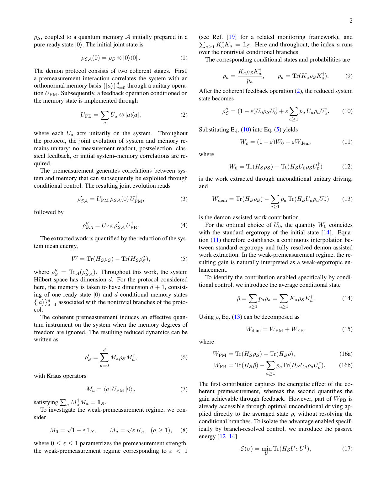
<figcaption class="paper-figure-caption"><b>Fig 1.</b> Low-resolution page preview, page 2</figcaption>
</figure>
<figure class="paper-figure-card">
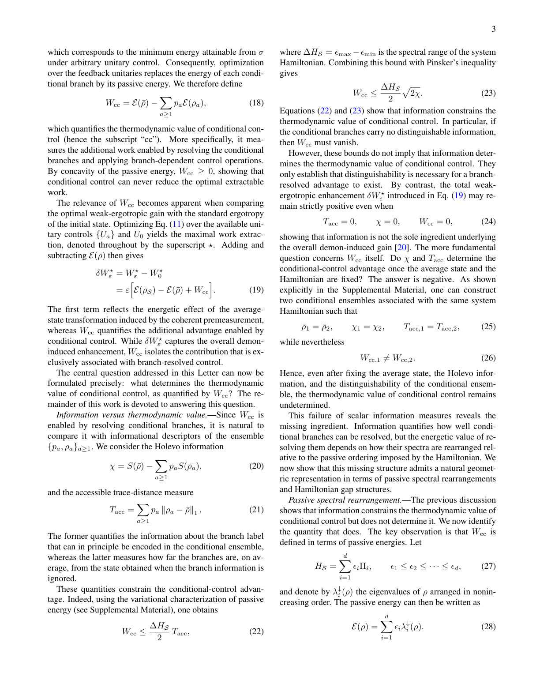
<figcaption class="paper-figure-caption"><b>Fig 2.</b> Low-resolution page preview, page 3</figcaption>
</figure>
<figure class="paper-figure-card">
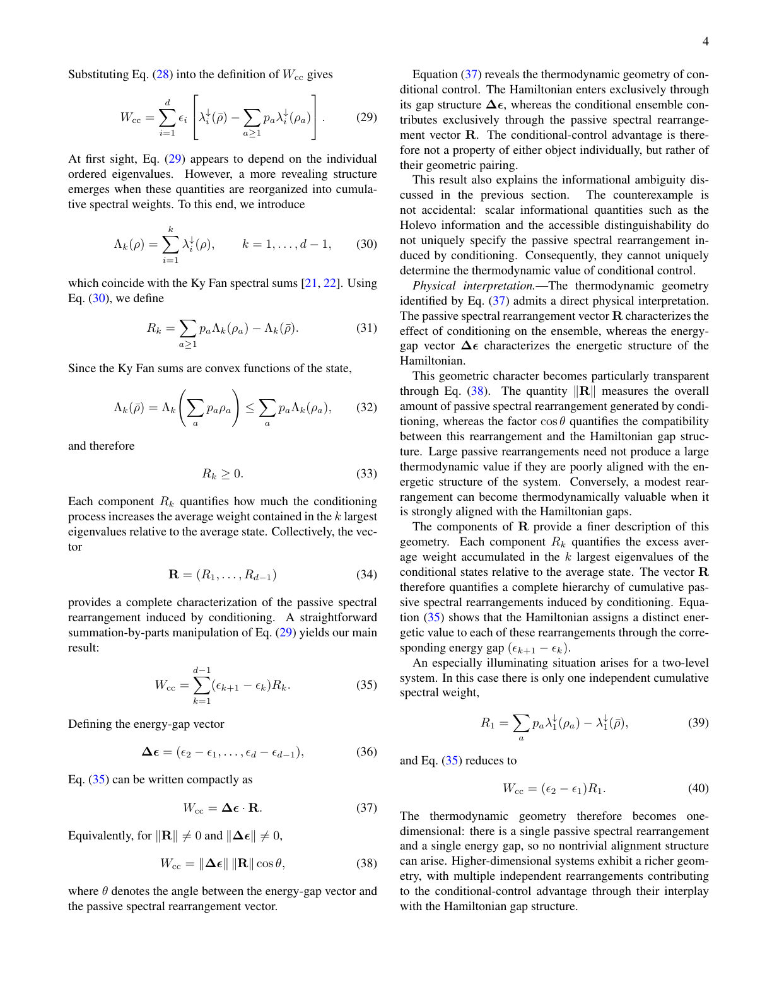
<figcaption class="paper-figure-caption"><b>Fig 3.</b> Low-resolution page preview, page 4</figcaption>
</figure>
<figure class="paper-figure-card">
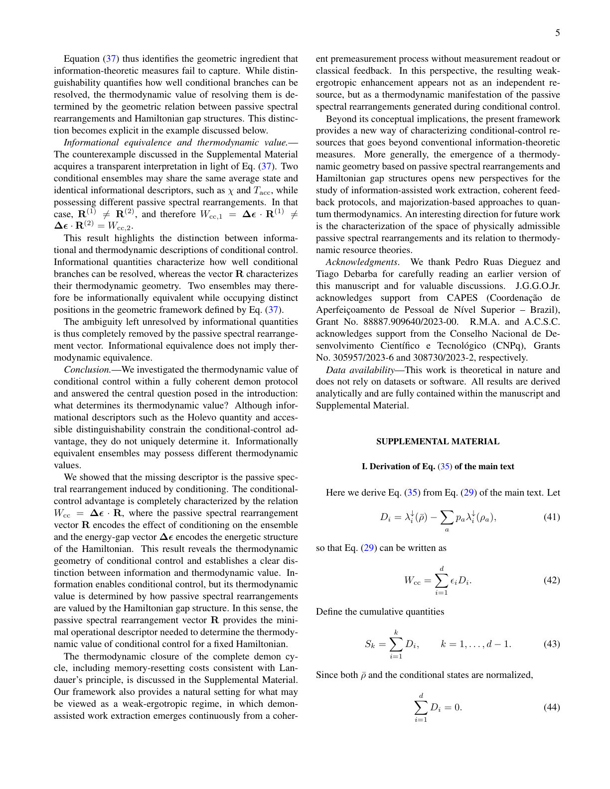
<figcaption class="paper-figure-caption"><b>Fig 4.</b> Low-resolution page preview, page 5</figcaption>
</figure>
<figure class="paper-figure-card">
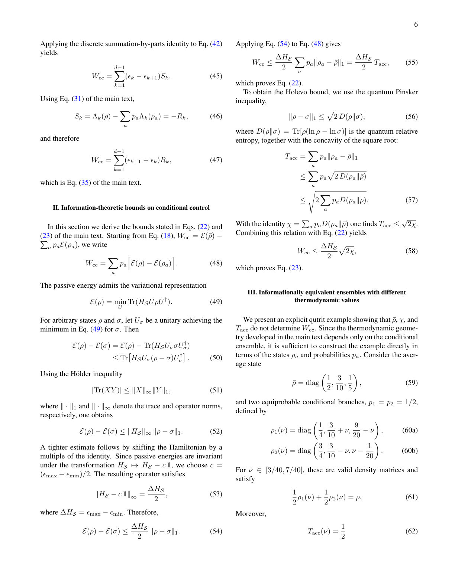
<figcaption class="paper-figure-caption"><b>Fig 5.</b> Low-resolution page preview, page 6</figcaption>
</figure>

**Summary.** This paper develops a 'thermodynamic geometry' to characterize the work extractable via conditional control in quantum systems. It proves that while information theory provides bounds on this work, it fails to capture its true thermodynamic value. The key descriptor is a passive spectral rearrangement vector, which, when paired geometrically with the Hamiltonian's energy gaps, uniquely determines $W_{cc}$.

**Why it may be interesting.** This work provides a deep theoretical link between non-equilibrium thermodynamics and quantum information structure, suggesting new resource measures beyond standard entropy or distinguishability for analyzing open quantum systems.

Detailed structure

**Main problem.** To determine what uniquely governs the thermodynamic value of conditional control ($W_{cc}$) and whether standard information-theoretic quantities are sufficient to predict this work advantage.

**Main result.** The thermodynamic value of conditional control is determined not by information measures like Holevo information, but by a geometric pairing between the Hamiltonian's energy-gap structure ($\Delta\epsilon$) and a novel 'passive spectral rearrangement vector' ($\mathbf{R}$).

**Method.** The authors derive $W_{cc}$ using definitions based on passive energy minimization and reformulate it as a dot product: $W_{cc} = \Delta\epsilon \cdot \mathbf{R}$.

**Model / system.** The study models a quantum system ($S$) coupled to a memory ($A$) undergoing a coherent demon protocol. The analysis focuses on the work extracted via conditional control, $W_{cc}$, which quantifies the advantage gained by resolving measurement branches.

**Key observables.** Conditional Control Advantage ($W_{cc}$), Holevo information ($\chi$), Accessible distinguishability ($T_{acc}$), Passive spectral rearrangement vector ($\mathbf{R}$).

**Important parameters / regimes.** Weak premeasurement strength ($\epsilon < 1$); the Hamiltonian energy-gap structure ($\Delta\epsilon$).

**Assumptions / limitations.** The analysis relies on defining passive energy $E(
ho)$ via ordered eigenvalues and assumes that information measures provide only necessary, but not sufficient, constraints on $W_{cc}$.

**Figures summary.** Not specified by the notes.

**Paper structure.** The paper establishes bounds relating $W_{cc}$ to information theory, then introduces the passive spectral rearrangement vector $\mathbf{R}$, culminating in the main result that $W_{cc}$ is determined by the geometric product $\Delta\epsilon \cdot \mathbf{R}$.

Abstract

Information is widely regarded as the resource underlying the thermodynamic advantages enabled by conditional control. We show, however, that informational quantities such as Holevo information and accessible distinguishability, although constraining the achievable advantage, do not uniquely determine its thermodynamic value. The missing ingredient is a passive spectral rearrangement vector that characterizes the effect of conditioning on the ensemble. Specifically, the conditional-control advantage is exactly determined by the geometric pairing between this vector and the Hamiltonian energy-gap structure. This result reveals a thermodynamic geometry of conditional control, explains how informationally equivalent ensembles can possess different thermodynamic values, and identifies the passive spectral rearrangement vector as the minimal operational descriptor required to determine the thermodynamic value of conditional control for a fixed Hamiltonian.

[↑ back to top](#top)

### [Collective modes in non-Hermitian fermionic superfluids](http://arxiv.org/abs/2607.18814v1)

**Authors:** Gabriel Angelo V. Vila, Kristian Hauser Villegas  
**Type:** theory · **Category:** quantum gases · **PDF:** <https://arxiv.org/pdf/2607.18814v1>  
**Analysis basis:** full PDF text, analyzed in chunks
**Topic relevance:** 🔥 `methods for driven-dissipative` **4/5** · `Keldysh / 2PI / non-Gaussian methods` **3/5** · `driven-dissipative phase transition` **3/5** · `Kondo & dissipative impurity` **2/5** · `analog quantum simulation` **2/5** · `non-equilibrium dynamics` **2/5** · `correlated / nonlocal dissipation` **1/5** · `non-equilibrium universality` **1/5**

↔ Scroll figures horizontally

<figure class="paper-figure-card">
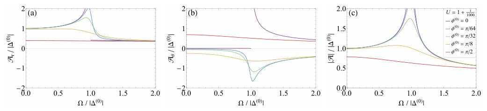
<figcaption class="paper-figure-caption"><b>Fig 1.</b> FIG. 1: (a) Radial component or Higgs mode, (b) tangential component or non-Hermitian phase mode, and (c) amplitude norm of the order parameter oscillation ∆(2)(t) for different values of ϕ(0) for complex pairing interaction U = 1 + 10−3 i.</figcaption>
</figure>
<figure class="paper-figure-card">
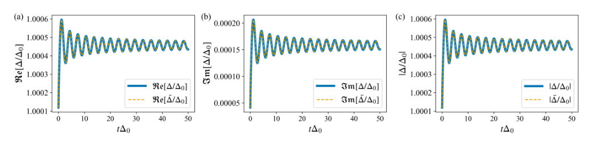
<figcaption class="paper-figure-caption"><b>Fig 2.</b> FIG. 2: (a) Real part, (b) imaginary part, and (c) norm of the order parameters ∆(t) (solid blue line) and ¯∆(t) (dashed orange line) following a quench at t = 0 from a purely real interaction to a complex interaction with a finite imaginary component. The parameters are chosen as bandwidth W/∆0 = 46.8 and 2γ/∆0 = 10−3, consistent with Eq. (68). The two curves overlap throughout the time evolution, demonstrating that ∆(t) = ¯∆(t). The dynamics settles to an oscillation about a mean value given by Eq. (69).</figcaption>
</figure>
<figure class="paper-figure-card">
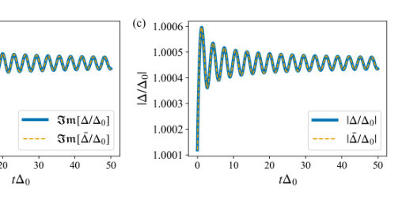
<figcaption class="paper-figure-caption"><b>Fig 3.</b> Figure 1(b) displays the non-Hermitian phase oscilla- tions for various values of ϕ(0). For ϕ(0) = 0, the response remains zero for Ω&lt; ∣∆(0)∣, in contrast to the Higgs os- cillations shown in Fig. 1(a). Otherwise, the behavior closely parallels that of the Higgs mode. In particular, there is a divergence at Ω= ∣∆(0)∣. As ϕ(0) increases to finite values, this resonance is also regularized into finite peaks (blue and green curves), which are subsequently suppressed and ultimately vanish at ϕ(0) = π/2.</figcaption>
</figure>

**Summary.** This paper develops a consistent pseudospin framework to study collective excitations in non-Hermitian fermionic superfluids, moving beyond limitations of conventional BCS theory. Key findings include the prediction of a novel, gapped phase mode and demonstrating that the system's resonance structure is fundamentally altered by non-Hermiticity compared to its Hermitian counterpart.

**Why it may be interesting.** This work is highly relevant as it extends established BCS theory into the non-Hermitian domain, providing new physical insights into gap structures (like the gapped phase mode) that are absent in standard quantum gas models. The mathematical formalism itself—metricization—is a key tool for open quantum systems.

Detailed structure

**Main problem.** The research addresses the challenge of developing a consistent theoretical framework to analyze collective excitations, such as Higgs and Nambu-Goldstone modes, in non-Hermitian fermionic superfluids.

**Main result.** The study reveals a novel phase mode in these systems that remains gapped even without the Anderson-Higgs mechanism. Furthermore, it shows that the system's resonance behavior is fundamentally different from Hermitian counterparts, remaining finite at resonance.

**Method.** The authors develop and apply a consistent pseudospin framework derived from the metricized formulation of non-Hermitian quantum mechanics to analyze the dynamics.

**Model / system.** The model is based on a BCS-type Hamiltonian describing fermionic superfluids subjected to external driving, resulting in complex pairing interactions. The analysis utilizes mean-field theory and tracks two distinct order parameters, $\Delta(t)$ and $ar{\Delta}(t)$.

**Key observables.** Collective excitation spectrum (Higgs amplitude mode and novel phase mode), resonance peaks, time evolution of order parameters ($\Delta(t)$, $ar{\Delta}(t)$).

**Important parameters / regimes.** Complex pairing interaction ($U = U_0 + i\gamma$), external driving frequency ($\Omega$), initial non-gauge phase ($\phi(0)$), and the emergence of exceptional points.

**Assumptions / limitations.** The analysis relies on extending pseudospin dynamics using a metricized inner product to maintain consistency in non-Hermitian systems, and employs perturbative expansions up to second order in driving amplitude.

**Figures summary.** Figures illustrate the resonance behavior for different modes versus driving frequency $\Omega$ for varying initial phases $\phi(0)$, and show time evolution of order parameters following a quench, demonstrating in-phase oscillations.

**Paper structure.** The paper first establishes the need for a metricized pseudospin framework. It then applies this formalism to derive equations of motion for the order parameters under external driving. Finally, it analyzes the resulting collective excitation spectrum and dynamics, contrasting findings with known Hermitian superfluid theories.

Abstract

The Higgs and Nambu-Goldstone modes are paradigmatic collective excitations in superconductors and superfluids. These modes are commonly analyzed within the pseudospin formulation of BCS theory, where the dynamics are obtained from the Heisenberg equations of motion for pseudospins. However, this construction becomes inconsistent when directly extended to non-Hermitian systems. In this work, we develop a consistent pseudospin framework for non-Hermitian fermionic superfluids based on the metricized formulation of non-Hermitian quantum mechanics. We apply this formalism to a driven non-Hermitian BCS-type Hamiltonian with complex pairing interaction and analyze its collective excitation spectrum. We find that, in addition to the conventional Higgs (amplitude) mode, the system hosts a novel phase mode that has no counterpart in Hermitian superfluids. Remarkably, this mode is gapped even in the absence of the Anderson-Higgs mechanism, as is the case in neutral superfluids. Furthermore, the resonance spectrum depends explicitly on the initial nongauge phase of the complex order parameter and the dynamical response remains finite at resonance, in contrast to the divergence characteristic of Hermitian systems. These resonances disappear upon the emergence of exceptional points.

[↑ back to top](#top)

### [Photon Correlation Spectroscopy as a Probe of Critical Fluctuations in Correlated Electron Systems](http://arxiv.org/abs/2607.19295v1)

**Authors:** Natasha Kiper, Bertrand Evrard, Yuya Shimazaki, Ido Schwartz, Martin Kroner, Kenji Watanabe, Takashi Taniguchi, Atac Imamoglu  
**Type:** experiment · **Category:** strongly correlated electrons · **PDF:** <https://arxiv.org/pdf/2607.19295v1>  
**Analysis basis:** full PDF text, analyzed in chunks
**Topic relevance:** 🔥 `analog quantum simulation` **4/5** · `exotic spin models in light-matter` **3/5** · `quantum optics experiment` **3/5** · `spintronics-quantum-optics interface` **3/5** · `driven-dissipative phase transition` **2/5** · `interference shaping light` **1/5** · `non-equilibrium dynamics` **1/5** · `non-equilibrium universality` **1/5**

↔ Scroll figures horizontally

<figure class="paper-figure-card">
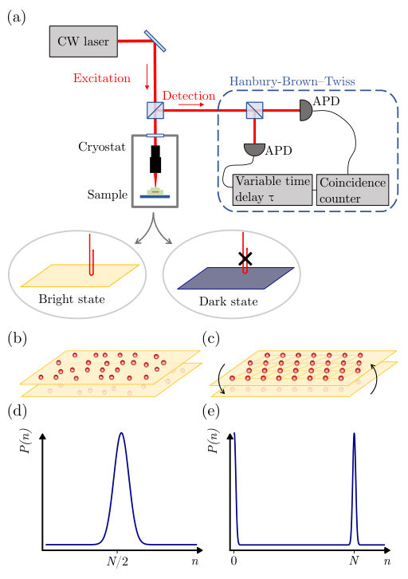
<figcaption class="paper-figure-caption"><b>Fig 1.</b> FIG. 1. Schematic illustration of the experiment. (a) Sketch of the measurement setup. Light emitted from a CW laser is focused on the sample inside a cryostat. Depending on the electronic state of the TMD a larger or smaller fraction of the excitation light is reflected. This reflected light is an- alyzed using a Hanbury-Brown–Twiss setup consisting of a beam splitter, two APDs, and a coincidence counter, allow- ing the extraction of the second-order correlation function of reflected photons. (b) Illustration of an uncorrelated state of electrons in a bilayer TMD system. (c) Illustration of a bi- layer TMD system hosting a layer-polarized Mott state. (d-e) Corresponding probability...</figcaption>
</figure>
<figure class="paper-figure-card">
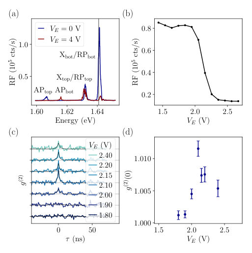
<figcaption class="paper-figure-caption"><b>Fig 2.</b> FIG. 2. (a) Resonance fluorescence spectra taken in cross- linear polarization at total filling factor ν = 1 on both sides of the electric-field-driven layer transition. For VE = 0 V, the system is completely bottom-layer polarized (blue curve), while it is top-layer polarized for VE = 4 V (red curve). (b) Resonance fluorescence signal close to the Xbot/RPbot reso- nance (indicated by the gray vertical line in panel a) as a function of electric field VE. At the layer transition close to VE = 2.1 V, the signal changes drastically. (c) Second-order correlation function as a function of time delay τ for different electric fields VE. A bunching signal (g(2)(0) &gt; 1) is clearly observed close to...</figcaption>
</figure>
<figure class="paper-figure-card">
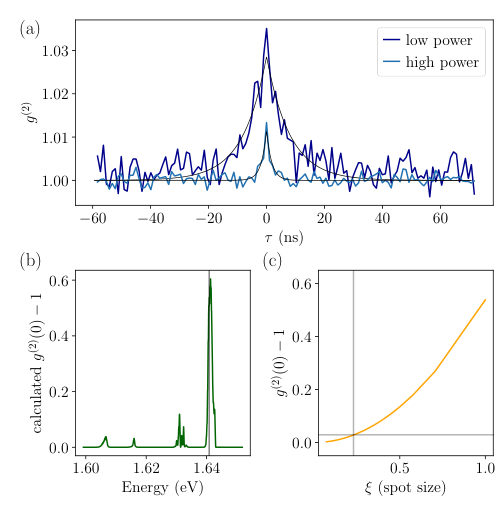
<figcaption class="paper-figure-caption"><b>Fig 3.</b> FIG. 3. (a) Second-order correlaiton function g(2)(τ) at the center of the phase transition (VE = 2.1 V) for two different excitation powers. The high-power data is the same as shown in Fig. 2(c). The increase in bunching amplitude and decay time at low power indicates that the system is heated by the excitation light in the high-power experiment. (b) Calculated maximal bunching amplitude as a function of excitation light energy assuming N = 1 (i.e., a single domain within the opti- cal spot), based on the spectra shown in Fig. 2(a) and Eq. (9). The energy used in the experiment is indicated by a vertical gray line. (c) Calculated bunching amplitude as a function of correlation length at...</figcaption>
</figure>
<figure class="paper-figure-card">
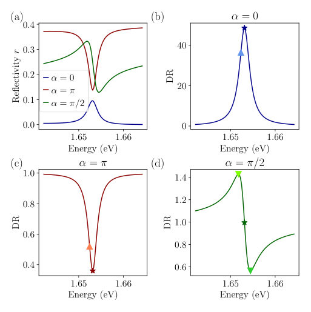
<figcaption class="paper-figure-caption"><b>Fig 4.</b> FIG. 4. MoSe2 reflectance spectra obtained using transfer ma- trix simulations. We chose encapsulating h-BN thicknesses to obtain a peak (α = 0), a dip (α = π), and a purely disper- sive (α = π/2) line shape. (a) Reflectivity r as a function of photon energy in the three cases, calculated using the trans- fer matrix formalism. (b-d) Differential reflectance obtaine by fitting the normalized transfer matrix result, (r−r0)/r0, with dispersive Lorentzian functions. The DR signal on resonance is marked by a star. In panels (b) and (c), the photon energy and DR signal on the low-energy flank of the resonance, where the slope is maximal, is indicated by a triangle. In panel (d), the reflectivity...</figcaption>
</figure>
<figure class="paper-figure-card">
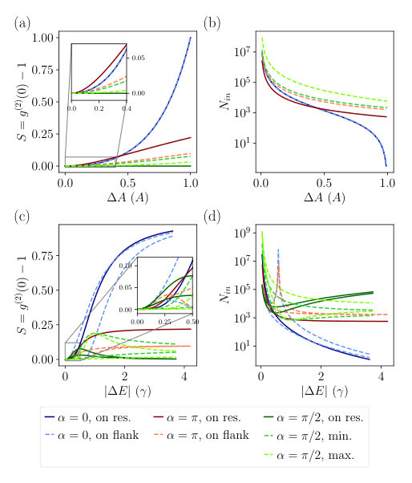
<figcaption class="paper-figure-caption"><b>Fig 5.</b> FIG. 5. Calculated bunching amplitudes S and input photon numbers Iin necessary to achieve a relative uncertainty of κ = 0.1 for different resonance line shapes and photon energies. (a-b) Bunching amplitude S and input photon number Nin as a function of resonance amplitude fluctuations ∆A. (c-d) Bunching amplitude S and input photon number Nin as a function of resonance energy fluctuations ∆E. The insets in panels (a) and (c) show details in the small fluctuation limit.</figcaption>
</figure>

**Summary.** The paper proposes using photon correlation spectroscopy as a novel diagnostic tool to study phase transitions in correlated electron systems. By measuring photon bunching in a moiré TMD heterostructure, the authors successfully linked optical measurements to the underlying electronic density fluctuations associated with an Ising-type layer pseudo-spin transition. This paves the way for accessing dynamical critical exponents using light scattering.

**Why it may be interesting.** This work provides an entirely new, non-invasive optical probe (photon correlations) to study dynamical critical exponents in strongly correlated 2D materials, bridging quantum optics with condensed matter theory.

Detailed structure

**Main problem.** The central goal is characterizing phase transitions between correlated electronic phases by extracting critical exponents and identifying their universality class.

**Main result.** Photon correlation spectroscopy successfully demonstrated that photon bunching during an Ising-type layer pseudo-spin phase transition provides a measurable signature of underlying electronic density fluctuations.

**Method.** The authors use Photon Correlation Spectroscopy (measuring the second-order autocorrelation function g^(2)(τ)) applied to light scattered from a moiré heterostructure.

**Model / system.** The physical platform is a semiconductor moiré material made of two MoSe2 layers separated by an h-BN spacer, which exhibits layer polarization analogous to an Ising pseudo-spin system.

**Key observables.** Photon bunching (g^(2)(0) > 1), the correlation length ($\xi$), and characteristic decay time ($t_d$).

**Important parameters / regimes.** Applied electric field ($V_E$) controlling the layer polarization, and the degree of electron density fluctuation.

**Assumptions / limitations.** The technique assumes that light scattering fluctuations are linearly proportional to instantaneous charge density fluctuations ($\delta D \propto \eta \cdot \delta n_e(t)$), and that exciton decay is fast compared to electronic timescales.

**Figures summary.** Figures illustrate the setup, resonance fluorescence spectra, and comparisons of g^(2)(τ) measurements at different light powers, showing increased bunching near the transition point.

**Paper structure.** The paper introduces PCS as a diagnostic tool for critical fluctuations in correlated systems. It details the experimental realization using moiré TMDs, demonstrating that electron transfer during a phase transition manifests as measurable photon bunching, thus linking optical diagnostics to electronic criticality.

Abstract

Characterizing phase transitions between correlated electronic phases, extracting their critical exponents, and identifying their universality class are of central interest in many-body physics. Here, we propose and demonstrate that photon correlation spectroscopy can be used to gain insight into the nature of critical electronic density fluctuations. We study a semiconductor moiré material consisting of two MoSe2 layers separated by a monolayer h-BN spacer and measure interlayer electron dynamics via the second-order correlation function of the scattered photons. The correlated transfer of large numbers of electrons between the layers at the onset of an Ising-type layer pseudo-spin phase transition leads to photon bunching in light scattered by the exciton resonance of one layer. Our measurements pave the way for using photon correlations as a method to access dynamical exponents associated with electronic phase transitions.

[↑ back to top](#top)

### [Variational formulation for the dynamics of soft matter including inertia](http://arxiv.org/abs/2607.18457v1)

**Authors:** Andrew J Archer  
**Type:** theory · **Category:** statistical mechanics · **PDF:** <https://arxiv.org/pdf/2607.18457v1>  
**Analysis basis:** full PDF text, analyzed in chunks
**Topic relevance:** 🔥 `Keldysh / 2PI / non-Gaussian methods` **4/5** · `methods for driven-dissipative` **3/5** · `non-equilibrium dynamics` **3/5** · `correlated / nonlocal dissipation` **2/5** · `driven-dissipative phase transition` **2/5** · `non-equilibrium universality` **2/5** · `Frenkel-Kontorova` **1/5** · `analog quantum simulation` **1/5**

↔ Scroll figures horizontally

<figure class="paper-figure-card">
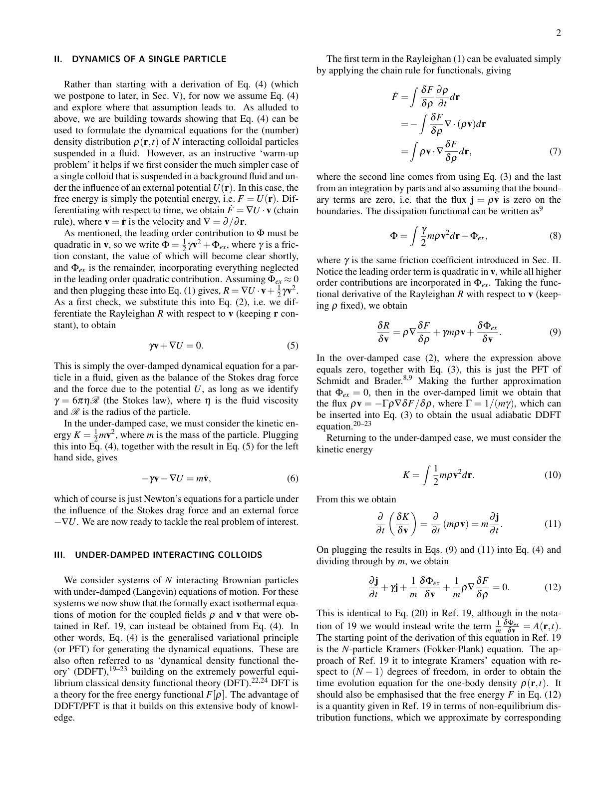
<figcaption class="paper-figure-caption"><b>Fig 1.</b> Low-resolution page preview, page 2</figcaption>
</figure>
<figure class="paper-figure-card">
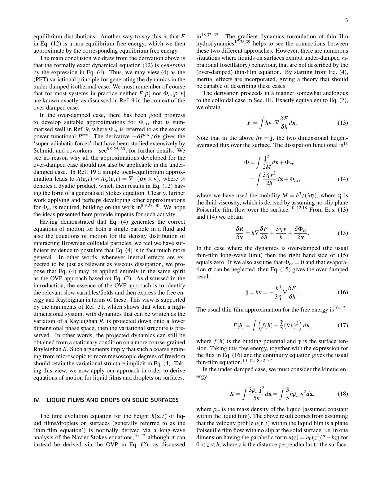
<figcaption class="paper-figure-caption"><b>Fig 2.</b> Low-resolution page preview, page 3</figcaption>
</figure>
<figure class="paper-figure-card">
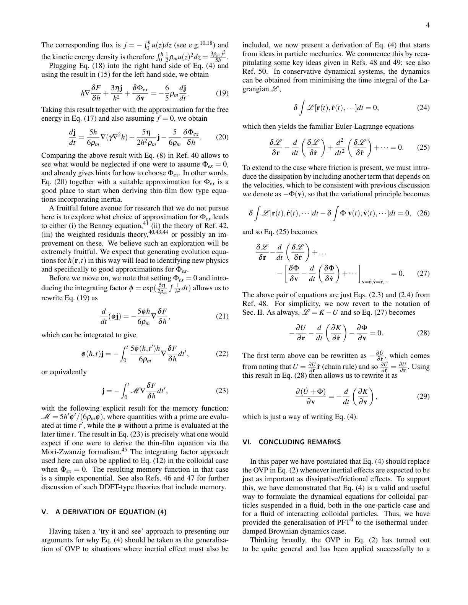
<figcaption class="paper-figure-caption"><b>Fig 3.</b> Low-resolution page preview, page 4</figcaption>
</figure>
<figure class="paper-figure-card">
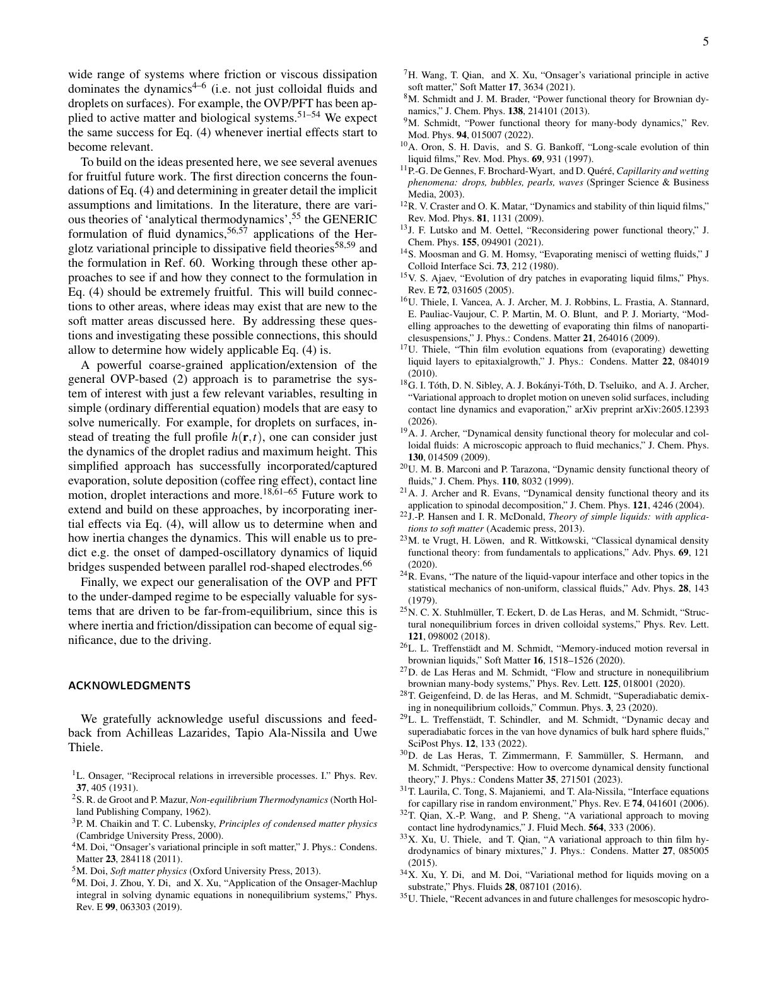
<figcaption class="paper-figure-caption"><b>Fig 4.</b> Low-resolution page preview, page 5</figcaption>
</figure>
<figure class="paper-figure-card">
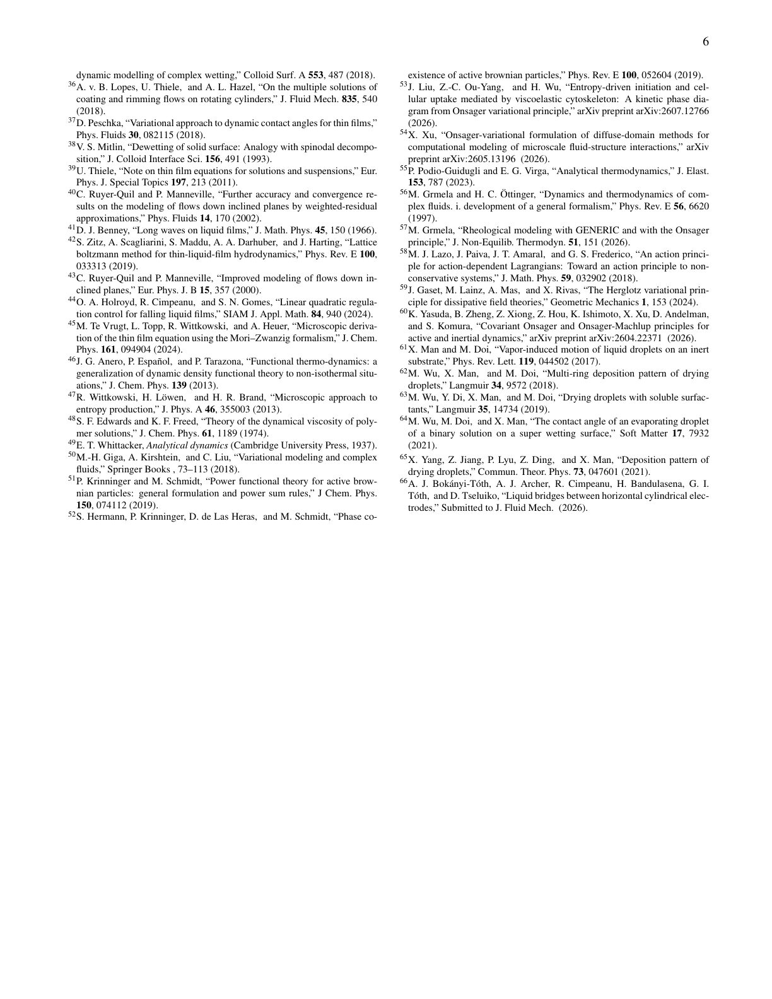
<figcaption class="paper-figure-caption"><b>Fig 5.</b> Low-resolution page preview, page 6</figcaption>
</figure>

**Summary.** This paper develops an advanced variational framework to describe the dynamics of soft matter when both viscous damping and inertial effects are important. By generalizing established principles, the authors derive equations that accurately model under-damped motion in systems like colloidal fluids and thin films. This provides a powerful theoretical tool for analyzing complex non-equilibrium dynamics far from equilibrium.

**Why it may be interesting.** While focused on classical soft matter, the development of generalized variational principles that correctly transition between different dynamical regimes (over-damped vs. under-damped) is a powerful theoretical tool applicable to open quantum systems where dissipation and inertia compete.

Detailed structure

**Main problem.** The primary goal is extending variational principles used for soft matter dynamics from the over-damped (viscosity dominated) limit to correctly incorporate inertial effects and under-damped motion.

**Main result.** A generalized variational principle, incorporating kinetic energy terms, successfully generates the correct dynamical equations for both single particles and interacting colloidal systems in the under-damped regime.

**Method.** The authors generalize Onsager's Variational Principle (OVP) by modifying the functional to include a time derivative term related to the kinetic energy, leading to a generalized variational principle.

**Model / system.** The study applies to soft matter systems like liquids, colloidal fluids, and thin films on surfaces. The dynamics are modeled using free energy functionals ($F[
ho]$) and dissipation functions ($\Phi$).

**Key observables.** Density distribution $
ho(r,t)$, film height $h(x,t)$, particle velocity $v$, and the resulting equation of motion.

**Important parameters / regimes.** The analysis distinguishes between the over-damped (low Reynolds number) limit and the under-damped regime where inertia is significant. Key parameters include friction constant ($\gamma$), mass ($m$), and fluid viscosity ($\eta$).

**Assumptions / limitations.** Key assumptions involve approximating the non-equilibrium free energy functional and assuming that approximations for dissipation developed in the over-damped limit are applicable to the under-damped case.

**Paper structure.** The paper builds upon established variational methods (OVP) used for slow, viscous dynamics. It then introduces a modification to this principle to account for inertia, demonstrating its validity by reproducing known results for single particles and thin films, particularly matching predictions from the Mori-Zwanzig formalism.

Abstract

The motion of liquids and soft matter is over-damped and `slow' when viscosity dominates. In this (low Reynolds-number) limit and when the system is isothermal, the equations of motion may be generated via Onsager's variational principle, which neglects inertia. This variational approach is immensely powerful, being used to obtain equations of motion for colloidal fluids, droplets on surfaces and much more. However, inertia can play a role, manifesting as vibrations and under-damped motion. Here we show how to extend this variational framework so that it remains valid for when damping/dissipation and inertia are both equally important.

[↑ back to top](#top)

### [Deterministic cascade coarsening in a Bistable Gene Toggle model](http://arxiv.org/abs/2607.18891v1)

**Authors:** Priyanka D. Bhoyar, Prashant M. Gade  
**Type:** theory · **Category:** statistical mechanics · **PDF:** <https://arxiv.org/pdf/2607.18891v1>  
**Analysis basis:** full PDF text, analyzed in chunks
**Topic relevance:** 🔥 `non-equilibrium dynamics` **4/5** · 🔥 `non-equilibrium universality` **4/5** · `driven-dissipative phase transition` **3/5** · `methods for driven-dissipative` **3/5** · `Frenkel-Kontorova` **1/5** · `Keldysh / 2PI / non-Gaussian methods` **1/5** · `correlated / nonlocal dissipation` **1/5**

↔ Scroll figures horizontally

<figure class="paper-figure-card">
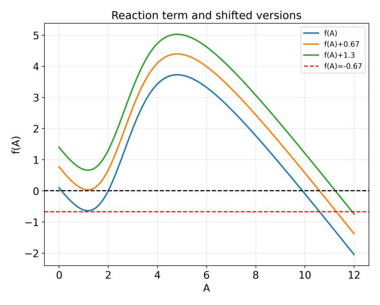
<figcaption class="paper-figure-caption"><b>Fig 1.</b> Figure 1: Qualitative shape of the reaction term f(A) (solid line) and shifted versions f(A) + 0.67 and f(A) + 1.3. The dashed line shows f(A) = −0.67. The shift illustrates the disappearance of small roots corresponding to front depinning.</figcaption>
</figure>
<figure class="paper-figure-card">
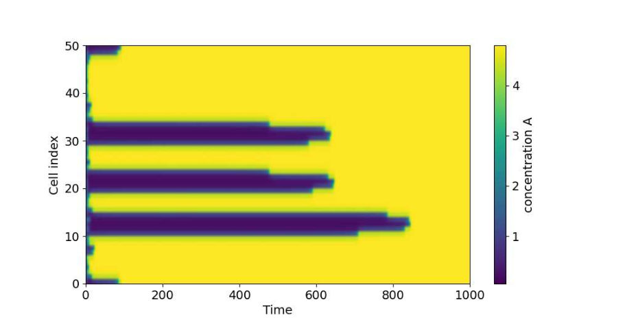
<figcaption class="paper-figure-caption"><b>Fig 2.</b> Figure 2: Spatiotemporal evolution of concentration A(x, t). Domain walls remain stationary and disappear abruptly.</figcaption>
</figure>
<figure class="paper-figure-card">
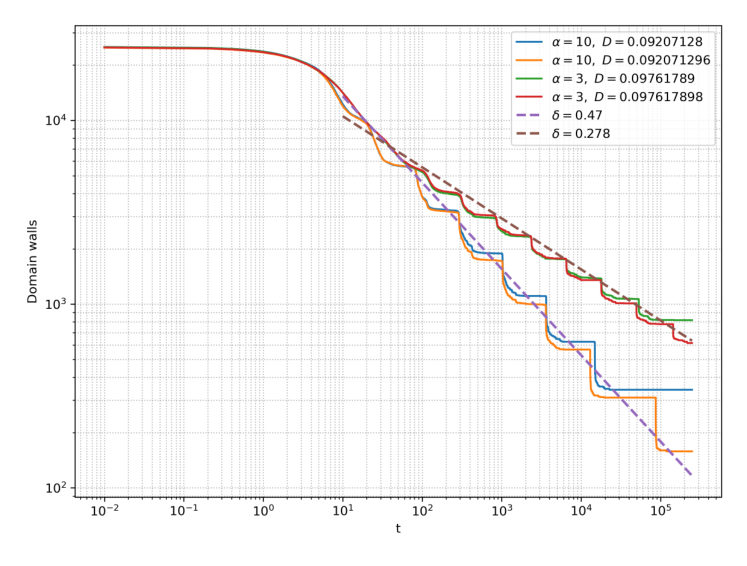
<figcaption class="paper-figure-caption"><b>Fig 3.</b> Figure 3: Unnormalized domain-wall density ρ(t) as a function of time on logarithmic scales for α = 3 and α = 10 at diffusion coefficients close to the depinning threshold. Dashed lines indicate the reference power laws t−0.278 and t−0.47.</figcaption>
</figure>
<figure class="paper-figure-card">
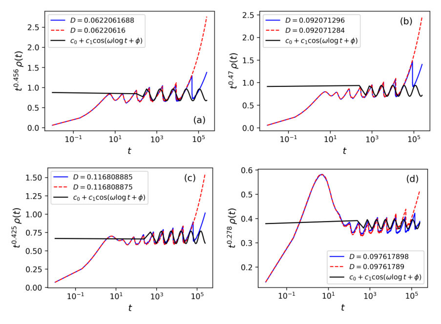
<figcaption class="paper-figure-caption"><b>Fig 4.</b> Figure 4: Rescaled domain density tδρ(t) versus log t for (a) α = 20 (Dc = 0.0622061688), together with the fitted form 0.81680 −0.14642 cos(4.33166 log t + 15.40398) and δ = 0.456; (b) α = 10 (Dc = 0.092071296), together with the fitted form 0.81871 + 0.12053 cos(5.05515 log t + 10.05278) and δ = 0.47; (c) α = 5 (Dc = 0.116808885), together with the fitted form 0.68368 − 0.08534 cos(5.59412 log t + 5.53014) and δ = 0.425; and (d) α = 3 (Dc = 0.097617898), together with the fitted form 0.37696+0.01890 cos(6.12832 log t−3.93890) and δ = 0.278. The parameters are obtained from nonlinear least-squares fits to the log-periodic form c0 + c1 cos(ω log t + ϕ).</figcaption>
</figure>
<figure class="paper-figure-card">
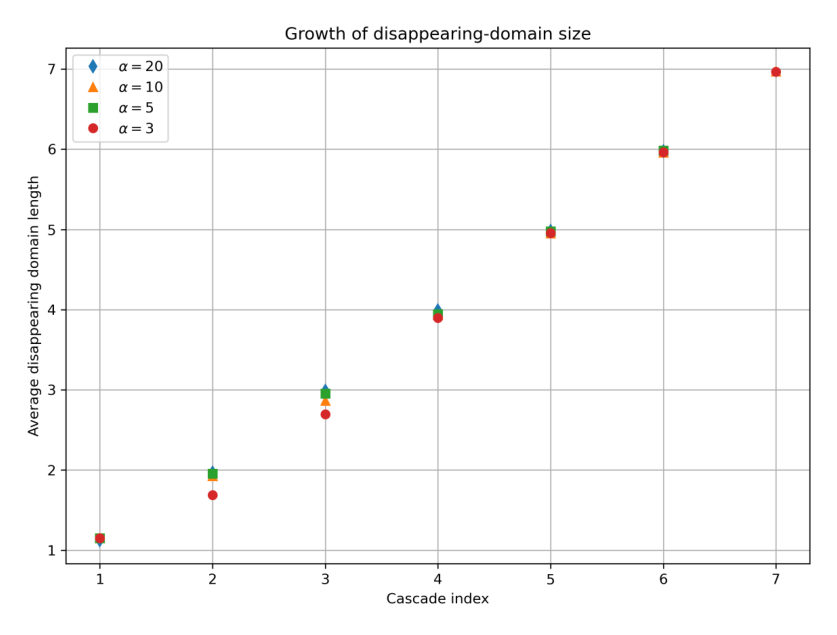
<figcaption class="paper-figure-caption"><b>Fig 5.</b> Figure 5: Average disappearing-domain length ⟨Ldis⟩versus cascade index for α = 3, 5, 10, and 20 at their respective critical coupling strengths.</figcaption>
</figure>

**Summary.** This work analyzes domain coarsening in a bistable gene toggle model using reaction-diffusion equations. It finds that the decay of domain walls is not classically predicted, exhibiting an anomalous exponent and clear log-periodic oscillations. These oscillations are linked to a discrete scale invariance arising from the geometry of successive cascade annihilation events.

**Why it may be interesting.** Although focused on biological modeling, the study provides a rich example of non-equilibrium pattern formation and anomalous coarsening dynamics that deviates significantly from standard continuum theories (like Allen-Cahn), offering insights into complex relaxation processes in many-body systems.

Detailed structure

**Main problem.** The study investigates deterministic coarsening dynamics in a bistable gene toggle model, contrasting its behavior with classical curvature-driven theories.

**Main result.** Coarsening occurs through discrete cascade events, leading to domain wall density decay $
ho(t) \sim t^{-\delta}$ where $\delta < 0.5$, and exhibiting log-periodic oscillations indicative of discrete scale invariance.

**Method.** Numerical simulations on a lattice model are used to track the evolution of domain walls and fit the resulting power-law decay with superimposed oscillatory corrections.

**Model / system.** The system is a one-dimensional array of diffusively coupled bistable gene toggle switches, governed by reaction-diffusion equations. The dynamics are characterized by an effective spin variable $s_i$ defining domain walls where the state changes.

**Key observables.** Domain wall density $
ho(t)$, decay exponent $\delta$, and log-periodic oscillation parameters ($\omega$).

**Important parameters / regimes.** Diffusive coupling strength ($D$), promoter strength ($\alpha$), and system size ($N$).

**Assumptions / limitations.** The analysis relies on modeling the dynamics via reaction-diffusion equations and assumes that the observed oscillations stem from a discrete hierarchy of disappearing domain lengths.

**Figures summary.** Figures illustrate the spatiotemporal evolution of concentrations, show $
ho(t)$ decay fits for various parameters, and compare results across different promoter strengths ($\alpha$).

**Paper structure.** The paper first introduces the model and contrasts it with classical coarsening. It then analyzes the domain wall density decay, revealing power-law behavior modulated by log-periodic oscillations. Finally, it links these oscillations to a discrete scale invariance arising from the geometry of domain annihilation.

Abstract

We investigate deterministic coarsening dynamics in a spatially extended bistable gene toggle model with diffusive coupling. Unlike classical curvature-driven coarsening, where domain walls move continuously and annihilate gradually, the present system exhibits a qualitatively different mechanism. The domain walls remain pinned for long intervals and disappear abruptly through collective cascade events. The density of domain walls decays approximately as $ρ(t)\sim t^{-δ}$, but the coarsening exhibits clear log-periodic oscillations superimposed on the power-law behavior. For all values of the promoter strength $α$ considered, the measured exponent satisfies $δ<0.5$, indicating a systematic deviation from the classical Allen--Cahn prediction $δ=1/2$ for curvature-driven coarsening. We show that log-periodic oscillations are not controlled by the density of domain walls, but by the \emph{domains that disappear} in each cascade. The average size of disappearing domains grows roughly linearly with cascade index, producing a constant geometric spacing of cascade times, consistent with discrete scale invariance.

[↑ back to top](#top)

### [Calculus of Robinet: completely positive reconstruction of time-averaged diffusive quantum trajectories](http://arxiv.org/abs/2607.18392v1)

**Authors:** Hector Hutin, Antoine Tilloy  
**Type:** theory · **Category:** other · **PDF:** <https://arxiv.org/pdf/2607.18392v1>  
**Analysis basis:** full PDF text, analyzed in chunks
**Topic relevance:** 🔥 `methods for driven-dissipative` **4/5** · 🔥 `quantum measurements` **4/5** · `measurement-induced transitions` **3/5** · `non-equilibrium dynamics` **2/5** · `Keldysh / 2PI / non-Gaussian methods` **1/5** · `correlated / nonlocal dissipation` **1/5** · `driven-dissipative phase transition` **1/5**

↔ Scroll figures horizontally

<figure class="paper-figure-card">
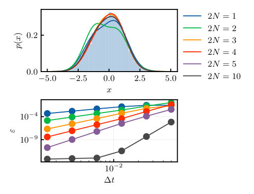
<figcaption class="paper-figure-caption"><b>Fig 1.</b> FIG. 1. (a) Histogram of the integrated measurement record (blue) and probability density p of the measurement record obtained at various orders between 2N = 1 and 2N = 10 and ∆t = 0.05. The first orders are visibly wrong but orders 2N = 5 and 2N = 10 are almost superimposed and agree with the histogram. (b) L2 distance ε between the probability density obtained at order 2N and the reference distribution obtained with the cascaded formalism, as a function of ∆t for various values of 2N.</figcaption>
</figure>
<figure class="paper-figure-card">
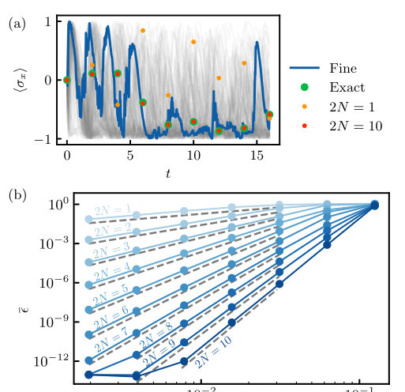
<figcaption class="paper-figure-caption"><b>Fig 2.</b> FIG. 2. (a) Expectation value ⟨σx⟩as a function of time for fine-grained trajectory (blue and gray), exact coarse tra- jectory (exact Robinet state, green) and approximate coarse trajectory (approximate Robinet state of order 1, orange, and 10, red). (b) Mean geometric error ϵ as a function of the time step ∆t for order 2N = 1 (lighter blue) to 2N = 10 (darker blue)</figcaption>
</figure>
<figure class="paper-figure-card">
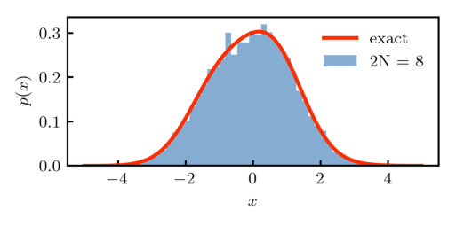
<figcaption class="paper-figure-caption"><b>Fig 3.</b> FIG. 3. Histogram of integrated measurement record (blue) and probability density p of the measurement record obtained at order 2N = 10 and ∆t = 0.05 (orange).</figcaption>
</figure>
<figure class="paper-figure-card">
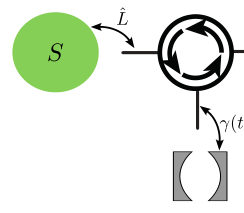
<figcaption class="paper-figure-caption"><b>Fig 4.</b> FIG. 4. Schematic of the cascaded system used to simulate the measurement back-action. The system S is coupled to a waveguide, whose output is injected into a cavity via a circulator</figcaption>
</figure>

**Summary.** This paper tackles the challenge of reconstructing true quantum states from digitized measurement data by defining and calculating the 'Robinet state'. The authors introduce a novel mathematical technique based on unitary dilation that yields an exactly completely positive evolution map, allowing for highly accurate simulation of time-averaged quantum trajectories.

**Why it may be interesting.** This is highly relevant for theoretical physicists working on open quantum systems or quantum optics, as it provides a rigorous, computationally tractable method to handle the non-Markovian effects inherent in real-world continuous quantum measurements.

Detailed structure

**Main problem.** The core problem is accurately reconstructing quantum states from continuous measurement records that are inherently digitized, leading to information loss due to finite time binning ($\Delta t$).

**Main result.** The authors developed a novel numerical discretization scheme for the 'Robinet state' reconstruction map that is provably completely positive and accurate to arbitrarily high orders in $\Delta t$ without needing external solvers.

**Method.** The method involves constructing an explicit, completely positive evolution map by employing a unitary dilation of the stochastic master equation into an augmented system plus transmission line setup.

**Model / system.** The model describes a finite-dimensional quantum system undergoing open evolution governed by a Hamiltonian $H$ and measured via an operator $L$. The dynamics are analyzed using the Stochastic Master Equation (SME) framework.

**Key observables.** The Robinet state ($ar{
ho}_n$), which is the time-averaged density matrix conditioned on the discrete measurement record $\{I_k\}$.

**Important parameters / regimes.** The time bin size $\Delta t$, and the measurement efficiency $\eta$.

**Assumptions / limitations.** The derivation relies on extending the stochastic master equation via a unitary dilation, which is systematic but involves truncating infinite series for practical computation.

**Figures summary.** No explicit figure summaries are available; the notes indicate extensive mathematical derivations and tabulated coefficients related to time-step expansions.

**Paper structure.** The paper progresses from defining the information loss problem (Robinet state) to introducing the unitary dilation formalism. It then details deriving the completely positive map $K_{In}$ through this dilation, verifying its accuracy on challenging examples, and finally providing physical insights by comparing results with prior work.

Abstract

Truly continuous quantum trajectories, obtained from homodyne or heterodyne readouts, can only ever be reconstructed approximately. The continuous measurement signal, needed for exact reconstruction, is averaged over bins of finite time $Δt$ during any analog to digital conversion step. The best reconstruction possible, knowing only this discrete record, was introduced recently and dubbed the Robinet state. In this article, we show how the Robinet state can be computed with a numerical discretization scheme that is completely positive, accurate to arbitrarily high order in $Δt$, and that does not rely on any other external solver. Our derivation relies on a dilation of the stochastic master equation into a system + transmission line setup, constructed in such a way that measuring what we call the "zero mode" of the line yields the Robinet state. We test the method on a challenging example with random Hamiltonian and jump operator, and verify its accuracy up to order $10$. Apart from its numerical interest, our approach provides a wealth of physical insights, extending in particular recent results on purity obtained by Wonglakhon, Chantasri, and Wiseman, that would be difficult to obtain in any other way.

[↑ back to top](#top)

### [Coherent-disorder-driven complexity transitions in a quantum-advantage architecture](http://arxiv.org/abs/2607.18938v1)

**Authors:** Sung-Bin B. Lee, Chae-Yeun Park, Changhun Oh, Seung-Sup B. Lee  
**Type:** theory · **Category:** quantum information and computing · **PDF:** <https://arxiv.org/pdf/2607.18938v1>  
**Analysis basis:** full PDF text, analyzed in chunks
**Topic relevance:** 🔥 `methods for driven-dissipative` **4/5** · `driven-dissipative phase transition` **3/5** · `entanglement & information structure` **3/5** · `non-equilibrium universality` **2/5** · `analog quantum simulation` **1/5** · `correlated / nonlocal dissipation` **1/5** · `non-equilibrium dynamics` **1/5**

↔ Scroll figures horizontally

<figure class="paper-figure-card">
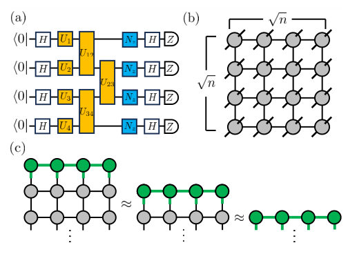
<figcaption class="paper-figure-caption"><b>Fig 1.</b> FIG. 1. (a) An instantaneous quantum polynomial-time (IQP) circuit consists of single- and two-qubit gates (Ui, Uij) diagonal in the computational basis, between the two layers of Hadamard (H) gates. We also consider single-qubit dephasing noise channels (Nz) of strength ε. (b) The density operator for the circuit on a √n × √n square lattice can be expressed as a projected entangled-pair operator (PEPO) on the same lattice, which has two physical legs per site and bond dimensions up to four. When there is no dephasing (ε = 0), we use a projected entangled-pair state (PEPS) that has one physical leg per site and bond dimensions up to two. (c) A square-lattice tensor network (gray), given by...</figcaption>
</figure>
<figure class="paper-figure-card">
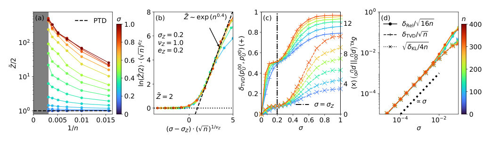
<figcaption class="paper-figure-caption"><b>Fig 2.</b> FIG. 2. (a) The rescaled collision probability ˜Z as a function of 1/n, where line colors indicate disorder strength σ. The dotted line marks the PTD value ˜Z = 2. (b) Finite-size scaling (FSS) collapse of ˜Z(n, σ). The dotted and dashed lines represent the small- and large-argument asymptotes. (c, d) Statistical distances between the bitstring probability with disorder and no dephasing, pσ0 U (x), and the ideal case, p00 U (x). (c) The TVD δTVD (+’s) and KLD δKL (×’s) as functions of σ on a linear scale. The vertical dash-dotted line marks σ = σZ = 0.2. (d) Rescaled δTVD, δKL, and relative error δRel as functions of σ on a log scale. In panels (b)–(d), colors encode the number of qubits n...</figcaption>
</figure>
<figure class="paper-figure-card">
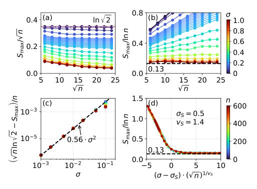
<figcaption class="paper-figure-caption"><b>Fig 3.</b> FIG. 3. (a), (b) Maximum BMPS entanglement entropy Smax encoun- tered during the tensor-network contraction for computing pσ0 U (0); colors encode σ. The dashed lines in panels (a) and (b) mark, re- spectively, Smax = √n ln √</figcaption>
</figure>
<figure class="paper-figure-card">
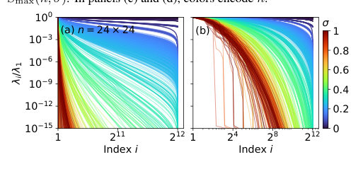
<figcaption class="paper-figure-caption"><b>Fig 4.</b> FIG. 4. BMPS singular-value spectra at the bond where Smax is attained, plotted on (a) log-linear and (b) log-log scales. The singular values {λi}2 √n/2 i=1 are sorted in descending order and rescaled by the largest value λ1. Each line represents one circuit instance, and colors encode the disorder strength σ. For σ &gt; σS ≃0.5, the spectra decay exponentially, with only a small fraction of singular values remaining above the double-precision floor.</figcaption>
</figure>
<figure class="paper-figure-card">
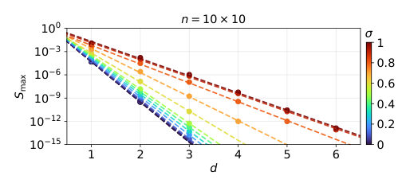
<figcaption class="paper-figure-caption"><b>Fig 5.</b> FIG. 5. The maximum BMPS entanglement entropy Smax encountered when contracting the tensor network for imaginary-time evolution U = e−dH, where H is the Ising Hamiltonian that generates the IQP architecture. Colors encode σ on a linear scale.</figcaption>
</figure>

**Summary.** This paper analyzes how coherent spatial disorder and dephasing affect the computational hardness of quantum random sampling on a lattice architecture. Using advanced tensor-network simulations, the authors demonstrate that increasing disorder causes predictable crossovers in statistical properties, leading to a transition from classically hard (anticoncentrated) to easily simulable regimes. This provides crucial theoretical benchmarks for assessing near-term quantum hardware performance.

**Why it may be interesting.** The work provides quantitative error-budget bounds for near-term quantum devices by mapping physical noise (disorder/dephasing) onto measurable computational complexity transitions using established tensor network diagnostics.

Detailed structure

**Main problem.** The study investigates how coherent spatial disorder affects the computational complexity and practical simulability of Quantum Random Sampling (QRS) using IQP circuits.

**Main result.** Increasing disorder drives two crossovers: one where the output distribution loses anticoncentration, and another where the tensor-network simulation cost drops from exponential to polynomial in the large system limit.

**Method.** The analysis employs exact tensor-network simulations (PEPS/PEPO) combined with finite-size scaling techniques applied to statistical measures like collision probability and quantum fidelity metrics.

**Model / system.** The model is a square-lattice Instantaneous Quantum Polynomial-Time (IQP) architecture subject to two-qubit gate-angle disorder ($\sigma$) and single-qubit dephasing noise ($\epsilon$).

**Key observables.** Rescaled collision probability ($	ilde{Z}$), Total Variation Distance ($\delta_{TVD}$), Kullback–Leibler divergence ($\delta_{KL}$), and maximum entanglement ($S_{\max}$).

**Important parameters / regimes.** Disorder strength ($\sigma$), dephasing rate ($\epsilon$), system size ($n$), and critical crossover points ($\sigma_Z, \sigma_S$).

**Assumptions / limitations.** The analysis relies on tensor-network representations (PEPS/PEPO) for simulating the quantum state evolution under disorder and noise.

**Figures summary.** Figures illustrate the IQP circuit structure and PEPS representation; subsequent figures show how $	ilde{Z}$, $S_{\max}$, and various statistical distances collapse or change behavior as a function of increasing disorder ($\sigma$) or dephasing ($\epsilon$).

**Paper structure.** The paper first establishes the model (IQP on a lattice) and introduces diagnostic tools like $	ilde{Z}$ and entanglement measures. It then analyzes the effect of coherent disorder ($\sigma$), identifying crossovers in statistical properties and simulation cost. Finally, it incorporates dephasing noise ($\epsilon$) and performs scaling analyses comparing both sources of decoherence.

Abstract

While decoherence is known to erode classical hardness in quantum random sampling, the impact of coherent spatial disorder remains an open question. We study a square-lattice instantaneous quantum polynomial-time (IQP) architecture subject to two-qubit gate-angle disorder and single-qubit dephasing using exact tensor-network simulations up to 576 qubits. For finite systems without dephasing, increasing disorder drives two consecutive crossovers toward classical simulability: the output distribution first loses anticoncentration, and then the tensor-network simulation cost drops from exponential to polynomial as entanglement is suppressed. The finite-size scaling collapses are consistent with continuous transitions in the large-system limit. Dephasing further reduces the complexity. We characterize the computationally hard regime through scaling laws that provide quantitative error-budget bounds for realistic near-term devices.

[↑ back to top](#top)

### [Dimension Reduction for Quantum Adaptive Agents](http://arxiv.org/abs/2607.19156v1)

**Authors:** Rishi Sundar, Thomas J. Elliott  
**Type:** theory · **Category:** statistical mechanics · **PDF:** <https://arxiv.org/pdf/2607.19156v1>  
**Analysis basis:** full PDF text, analyzed in chunks
**Topic relevance:** 🔥 `methods for driven-dissipative` **4/5** · `entanglement & information structure` **3/5** · `driven-dissipative phase transition` **2/5** · `non-equilibrium dynamics` **2/5** · `Keldysh / 2PI / non-Gaussian methods` **1/5** · `analog quantum simulation` **1/5** · `correlated / nonlocal dissipation` **1/5** · `non-equilibrium universality` **1/5**

↔ Scroll figures horizontally

<figure class="paper-figure-card">
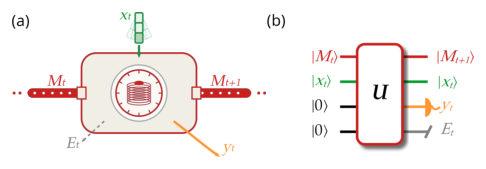
<figcaption class="paper-figure-caption"><b>Fig 1.</b> FIG. 1. Adaptive agent primitive. (a) At each timestep t an adaptive agent receives an input stimulus xt, emits an output action yt, and updates its memory state from Mt to Mt+1. Inaccessible degrees of freedom are discarded into the environment, Et. (b) Unitary circuit implementation of a single timestep for a quantum adaptive agent.</figcaption>
</figure>
<figure class="paper-figure-card">
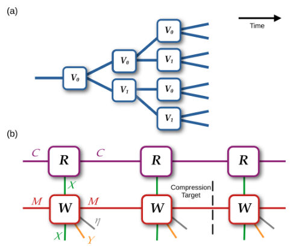
<figcaption class="paper-figure-caption"><b>Fig 2.</b> FIG. 2. Branching tree to routed MPS representation. (a) Treating the stimulus as a branch label produces |X|L</figcaption>
</figure>
<figure class="paper-figure-card">
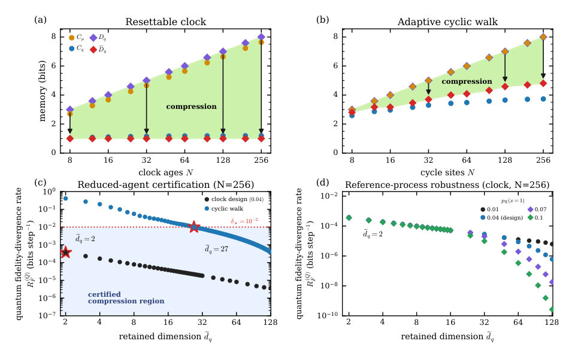
<figcaption class="paper-figure-caption"><b>Fig 3.</b> FIG. 3. Benchmarking quantum adaptive agent compression. (a,b) Memory resources for the benchmark processes: Entropic memory costs (classical Cµ, quantum Cq) of agents, and log memory dimension of the quantum agents (uncompressed Dq = log2 N, compressed ˜Dq = log2 ˜dq). Compressions taken at smallest model reaching target fidelity R(Q) F = δ⋆= 10−2 bits per timestep. (c) Compressed quantum agent fidelity divergence rates with varying compression dimension ˜dq, under driving from the reference input process. (d) Compressed quantum agent fidelity divergence rates when implementing the resettable renewal clock, under differing input processes from the reference process.</figcaption>
</figure>
<figure class="paper-figure-card">
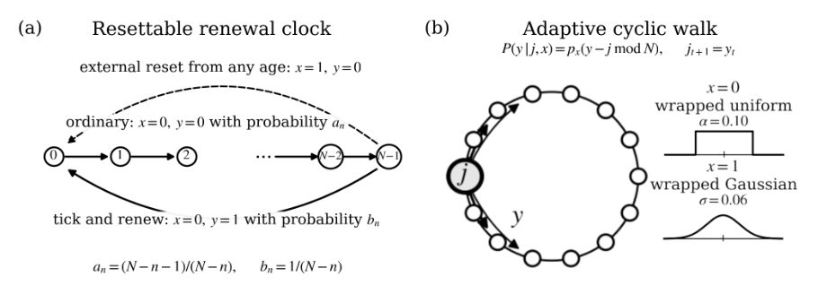
<figcaption class="paper-figure-caption"><b>Fig 4.</b> FIG. 4. Transition structures of benchmark processes. (a) Under ordinary evolution (x = 0), a clock of age n either ‘survives’ (emits y = 0) and advances to n + 1, or ticks (y = 1) and renews to age zero. The external stimulus x = 1 invokes a reset to age zero from any age, without a tick (y = 0). (b) In the cyclic walk process, a ‘walker’ occupies a discrete position j on a ring. The stimulus selects a translationally-invariant shift drawn from distribution px(r) and announces its new position y = j + rmodN: The shift distribution is a uniform top hat for input x = 0, and a Gaussian for x = 1.</figcaption>
</figure>

**Summary.** The paper introduces a 'route-truncate-repair' procedure to compress the memory requirements of quantum adaptive agents. By mapping these agents onto Matrix Product States (MPS) and systematically truncating the bond dimension, it achieves significant reduction in physical memory size. This compression is rigorously certified by a fidelity-divergence rate, establishing a practical link between theoretical entropic advantages and engineering feasibility.

**Why it may be interesting.** This work provides a rigorous, mathematically grounded method for compressing complex quantum dynamics derived from memory effects, which is highly relevant for simulating large-scale open quantum systems or modeling information processing in quantum devices.

Detailed structure

**Main problem.** The core problem is converting the theoretical advantage of quantum memory (entropic efficiency) into a practical, physically realizable reduction in the physical dimension required for an adaptive quantum agent.

**Main result.** A novel 'route-truncate-repair' procedure successfully maps complex quantum agents to compressed Matrix Product States while providing quantifiable fidelity guarantees that preserve underlying behavior.

**Method.** The method involves routing the agent dynamics through a reference input process to obtain an MPS representation, followed by local truncation of the memory bond and subsequent repair of the Kraus operators to ensure physical validity.

**Model / system.** The system models quantum adaptive agents performing sequential input-output processes. The dynamics are analyzed using tensor network representations (MPS) derived from the agent's internal memory state conditioned on external stimuli.

**Key observables.** Fidelity-divergence certificate ($R(Q)_F$), canonical bond state eigenvalues, and the reduced memory dimension ($	ilde{d}_q$).

**Important parameters / regimes.** The reference input process $R$, which dictates the behavior prioritized during compression; the target fidelity threshold $\delta_\star$.

**Assumptions / limitations.** The processes are assumed stationary (time-invariant), and the procedure relies on local repair steps to maintain trace preservation after dimension reduction.

**Figures summary.** Figures illustrate the transition from complex history structures to a routed MPS, benchmark compression results comparing memory costs ($C_\mu$ vs $C_q$), and plots showing fidelity divergence rates versus retained dimensions for specific benchmarks like cyclic walks.

**Paper structure.** The paper develops the theory by first establishing the MPS representation (Theorem 1), then detailing the necessary repair procedure to ensure physical validity (Theorem 2), and finally applying this framework to benchmark processes to quantify dimension reduction while bounding fidelity loss.

Abstract

Adaptive agents realise complex reactive behaviours by using a memory of past input stimuli and output actions to guide structured future responses. Quantum adaptive agents can operate while storing less information in memory than optimal classical counterparts; yet, this does not necessarily translate into a reduced dimension of the memory that must be physically realised. We introduce a route-truncate-repair procedure that converts entropic quantum memory advantages into reductions in memory dimension. Routing a reference input process through an agent yields a temporal matrix product state representation whose canonical bond is identified with the agent's memory. Truncating this bond and locally repairing the resulting dynamics produces a smaller, physically-valid agent that remains capable of responding to arbitrary input sequences. A fidelity-divergence certificate quantifies the resulting trade-off between accuracy and memory dimension. Benchmark adaptive processes exhibit substantial dimension reduction whilst preserving the underlying behaviour with high fidelity. These results establish a route from entropic memory advantages to practical, dimension-reduced adaptive quantum agents.

[↑ back to top](#top)

### [Quasi-stationary and quasi-ergodic distributions in the Pelikan random map](http://arxiv.org/abs/2607.19084v1)

**Authors:** Samuel Brevitt, Rainer Klages  
**Type:** theory · **Category:** statistical mechanics · **PDF:** <https://arxiv.org/pdf/2607.19084v1>  
**Analysis basis:** full PDF text, analyzed in chunks
**Topic relevance:** 🔥 `non-equilibrium dynamics` **4/5** · `driven-dissipative phase transition` **3/5** · `methods for driven-dissipative` **3/5** · `non-equilibrium universality` **2/5** · `Keldysh / 2PI / non-Gaussian methods` **1/5** · `correlated / nonlocal dissipation` **1/5** · `scars & prethermalization` **1/5**

↔ Scroll figures horizontally

<figure class="paper-figure-card">
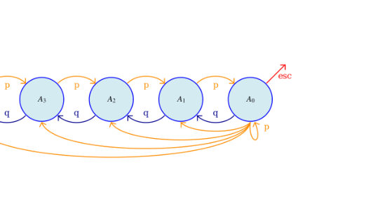
<figcaption class="paper-figure-caption"><b>Fig 1.</b> Figure 1. Left: The ‘open’ Pelikan map (12), with expanding and contracting branches shown in red and blue, respectively. The Markov partition (14) is shown in thin green dashed lines. The escape region is indicated in grey. Right: A schematic diagram of the Markov chain (9), which is the object of this paper’s study.</figcaption>
</figure>
<figure class="paper-figure-card">
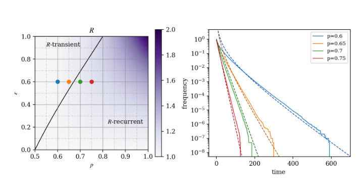
<figcaption class="paper-figure-caption"><b>Fig 2.</b> Figure 2. Left: R as a function of (p, ε) shown as a colour gradient, from either side of the dividing line (27). Right: Survival probability P[Xn ∈Ω] as a function of time n, obtained from simulations (solid lines), plotted against predictions obtained from (28) (dashed lines), for the four identified sample points shown left. Sample size N = 2 × 107. In the R-transient regime, simulations are affected by a non-exponential transient, see [13] for details.</figcaption>
</figure>
<figure class="paper-figure-card">
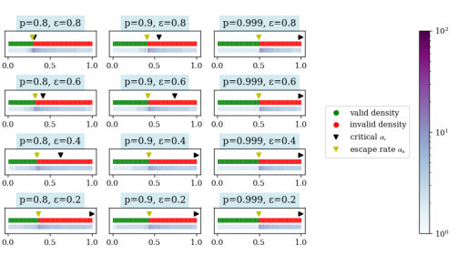
<figcaption class="paper-figure-caption"><b>Fig 3.</b> Figure 3. ‘Valid’ and ‘invalid’ values of α, for a range of p, ε. Values of α producing µk ≥0 for all k are shown in green. Invalid α, for which µk &lt; 0 for some k, are shown in red. Plot titles are coloured to indicate the dynamical regions discussed in Sec. 2.2, with R-recurrent parameters shown in blue and R-transient parameters in red. The critical value αc is shown in black, and, where it differs from this, the asymptotic αu derived from the principal escape rate is shown in gold. Below each subplot: a bar indicating the number of iterations required to determine validity/invalidity, according to the colour scale shown on the right of the figure.</figcaption>
</figure>
<figure class="paper-figure-card">
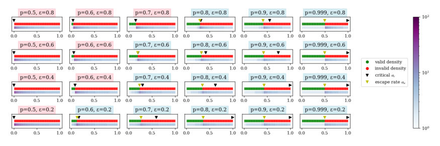
<figcaption class="paper-figure-caption"><b>Fig 4.</b> Fig. 3 confirms that, when α &gt; αc, the produced distributions are always invalid; this is because of the oscillatory problem discussed above. For α &lt; αc, we may or may not have a valid distribution; we rather observe numerically that they are valid for α ≤αu and invalid otherwise. A corollary of this is that λu is the minimal possible eigenvalue (meaning, the fastest possible escape rate), and all λ &gt; λu are supported by some α.</figcaption>
</figure>
<figure class="paper-figure-card">
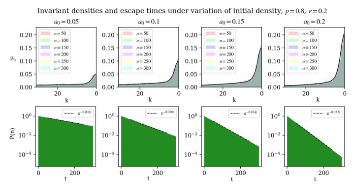
<figcaption class="paper-figure-caption"><b>Fig 5.</b> Figure 4. Top: Histograms of QSDs for a variety of α, for the sample parameters (p, ε) = (0.8, 0.2), which are preserved under the time evolution (29), normalised. The index k of each state is plotted from right to left, with the height of the bar indicating the probability mass µk. QSDs are evolved under (29) for n timesteps, for a variety of n, in varying colours, which are overlaid, thus producing grey bars where they overlap. Our theoretical QSD for each chosen value of α, produced by (43) and (44), is shown in a solid black line in each case. Bottom: In each case, the surviving population P[Xn ∈Ω] as a function of time n; the exponential escape rate (28) from our predictions is plotted...</figcaption>
</figure>

**Summary.** The paper analyzes the long-term behavior of a random process modeled after an open dynamical system. It rigorously determines the existence and structure of quasi-stationary distributions (QSDs) and quasi-ergodic distributions (QEDs). The key finding is that stable, normalizable QEDs only exist when the underlying Markov chain is in a specific R-recurrent regime.

**Why it may be interesting.** This work provides rigorous mathematical tools (R-recurrence/transience analysis) to study non-equilibrium steady states (QSDs/QEDs) in open systems, which is highly relevant for modeling dissipation or particle loss in complex physical models beyond standard equilibrium statistical mechanics.

Detailed structure

**Main problem.** The paper investigates quasi-stationary and quasi-ergodic distributions for a substochastic Markov chain derived from an open variant of the Pelikan random map.

**Main result.** The system exhibits infinitely many QSDs for generic parameters, and a normalizable QED only exists in the R-recurrent regime; otherwise, theoretical calculations diverge or fail to match simulations.

**Method.** Analysis involves solving eigenvalue problems related to the transfer operator ($M\mu^* = \lambda\mu^*$) and using generating functions (Vere-Jones formalism) to determine recurrence/transience properties.

**Model / system.** The model is a biased random walk on the half-line, described by a substochastic discrete-time Markov chain with specific transition probabilities incorporating sub-stochastic resetting at state 0.

**Key observables.** Quasi-stationary distributions (QSDs), Quasi-ergodic distributions (QEDs), and the associated escape rate ($\gamma_{esc} = -\ln \lambda$).

**Important parameters / regimes.** The bias parameter $p$, the resetting strength $\epsilon$, and the system's dynamical regime (R-recurrent vs. R-transient).

**Assumptions / limitations.** It is assumed that the principal escape rate eigenvalue ($\lambda_u$) yields the only normalizable QED, and the analysis relies on formalisms for countable absorbing Markov chains.

**Figures summary.** Figure 1 illustrates the open Pelikan map and its associated Markov chain. Figure 2 maps out R-recurrence/R-transience regimes based on parameters $(p, \epsilon)$. Figure 9 compares theoretical QED calculations against numerical simulations, confirming agreement only in the R-recurrent region.

**Paper structure.** The paper progresses from establishing the general framework for QSDs in open chains to analyzing recurrence properties using generating functions. It then derives explicit functional forms for the QED in different regimes, culminating in a comparison between theory and numerical simulation to delineate the boundaries of stable dynamics.

Abstract

In this paper we present a concrete example of a substochastic discrete-time Markov chain on a countable state space producing a spectrum of infinitely many quasi-stationary distributions (QSDs) for generic parameter values, with each QSD supporting a distinct escape rate. Our system is motivated by an open variant of the Pelikan dynamical system, a random map introduced in the 1980s. These QSDs, and their stability to perturbative random noise, are tested in numerical simulations. The existence of unique QEDs is also established for some parameter values.

[↑ back to top](#top)

### [A general estimation framework for continuous-variable systems](http://arxiv.org/abs/2607.19287v1)

**Authors:** Luca Innocenti, Simone Artini, Diana A. Chisholm, Salvatore Lorenzo, Alessandro Ferraro, G. Massimo Palma, Mauro Paternostro, Gabriele Lo Monaco  
**Type:** theory · **Category:** other · **PDF:** <https://arxiv.org/pdf/2607.19287v1>  
**Analysis basis:** full PDF text, analyzed in chunks
**Topic relevance:** 🔥 `quantum measurements` **4/5** · `measurement-induced transitions` **3/5** · `quantum optics experiment` **2/5** · `Keldysh / 2PI / non-Gaussian methods` **1/5** · `correlated / nonlocal dissipation` **1/5** · `driven-dissipative phase transition` **1/5** · `entanglement & information structure` **1/5** · `methods for driven-dissipative` **1/5**

↔ Scroll figures horizontally

<figure class="paper-figure-card">
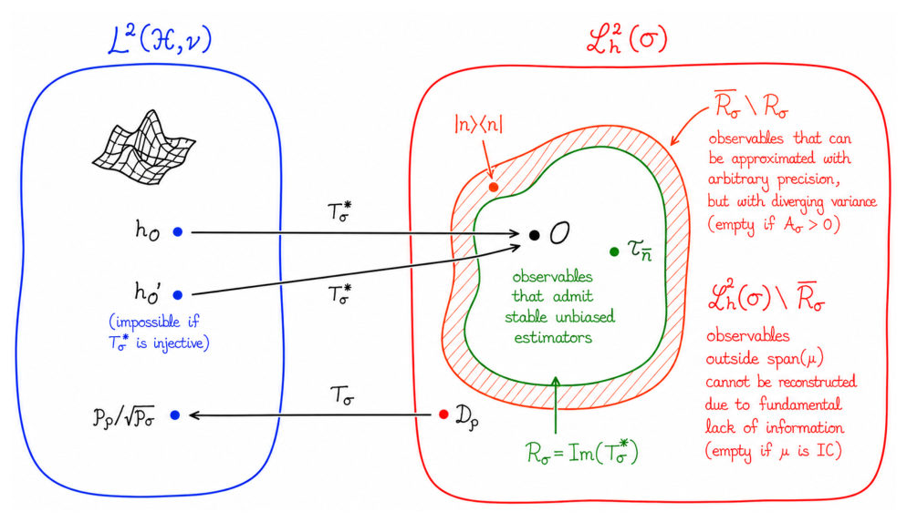
<figcaption class="paper-figure-caption"><b>Fig 1.</b> Figure 1: Schematic picture of the σ-regularized reconstruction problem. The POVM defines an analysis operator Tσ : L 2 h (σ) →L2(X , ν), which maps an operator X to its measurement coefficients, and a synthesis operator T∗ σ : L2(X , ν) → L 2 h (σ), which maps a square-integrable coefficient function h to the regularized observable T∗ σh. The range Rσ ≡Ran(T∗ σ) consists of σ-admissible observables: for every O ∈Rσ there exists h ∈L2(X , ν) such that T∗ σh = O, and the corresponding estimator ˆo = h/√pσ has finite second moment with respect to the reference distribution. Observables in Rσ \ Rσ are only weakly reconstructible: they can be approximated by admissible observables with...</figcaption>
</figure>
<figure class="paper-figure-card">
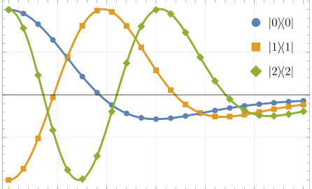
<figcaption class="paper-figure-caption"><b>Fig 2.</b> Figure 2: Estimators ˆo|n⟩⟨n|(x) for n = 0, 1, 2 as a function of x ≥0, as given by eq. (378). All three estimators are even functions of x and are independent of θ.</figcaption>
</figure>

**Summary.** This work develops a general estimation theory for continuous-variable quantum systems to determine stable state reconstruction from limited measurements. It proves that informational completeness is insufficient, establishing the 'measurement frame' condition as necessary and sufficient for stable reconstruction. The framework unifies tomography methods by using sigma-regularization to handle infinite-dimensional measurement data.

**Why it may be interesting.** It provides a rigorous mathematical framework unifying continuous-variable tomography, quasiprobability representations, and estimation theory by addressing fundamental limitations of standard quantum information tools in infinite dimensions.

Detailed structure

**Main problem.** To develop a general estimation theory for continuous-variable quantum systems that determines when and how quantum state properties can be stably reconstructed from finite measurement data.

**Main result.** Stable reconstructibility requires the POVM effects to form a 'measurement frame,' which is a stricter condition than mere informational completeness in infinite dimensions.

**Method.** The theory utilizes measurement frames within a sigma-regularized operator geometry, incorporating prior information via a reference state $\sigma$.

**Model / system.** Continuous-variable quantum systems are analyzed using Positive Operator Valued Measures (POVMs), generalizing concepts from finite dimensions to continuous outcomes like those from homodyne detection.

**Key observables.** Quantum states ($
ho$), expectation values of observables ($O$), and quasiprobability distributions (e.g., Glauber-Sudarshan P representation).

**Important parameters / regimes.** The reference state $\sigma$, the range of the POVM synthesis operator, and the lower frame bound.

**Assumptions / limitations.** Standard finite-dimensional frame theory breaks down in infinite dimensions; the framework must account for observables whose reconstruction map is unbounded.

**Figures summary.** Figure 1 illustrates the sigma-regularized reconstruction problem, showing how the POVM defines an analysis operator $T_\sigma$ and a synthesis operator $T^*_\sigma$, with the range $R_\sigma$ defining $\sigma$-admissible observables.

**Paper structure.** The paper establishes that informational completeness is necessary but insufficient for stable reconstruction. It then develops the measurement frame condition, characterizing reconstructibility via the analysis/synthesis operators in a sigma-regularized geometry, leading to practical estimator construction methods.

Abstract

We show that informational completeness, while sufficient to have a bijection between ideal measurement probabilities and quantum states, does not guarantee statistically stable reconstruction from finite measurement data. To address this problem, we develop a general estimation theory for continuous-variable systems in which stable reconstructibility is characterized by the POVM effects forming a measurement frame. Informational completeness is therefore necessary, but not sufficient, for stable reconstruction. Our framework is based on measurement frames in a $σ$-regularized operator geometry, where the reference state $σ$ encodes prior information about relevant features of the measured states. For any fixed measurement scheme, observables may be inaccessible, weakly reconstructible only through estimators with divergent variance, or stably reconstructible by finite-variance unbiased estimators. The relevant regime is determined by the range of the POVM synthesis operator. Our framework provides practical methods for constructing estimators and gives an operational interpretation of singular quasiprobability distributions, including the Glauber-Sudarshan $P$ representation: quasiprobabilities act as unbiased estimators for associated observables, and their singularities reflect a pathological feature of the corresponding measurement: its lack of loewr frame bound. We furthermore show how this formalism naturally provides operational regularization procedures tied to prior information. Overall, our framework provides a unified view of continuous-variable tomography, quasiprobability representations, and classical-shadow estimation.

[↑ back to top](#top)

### [Trade-off between predictability and quantum coherence for multi-path interferometry and its operational interpretation](http://arxiv.org/abs/2607.18732v1)

**Authors:** Ezra Acalapati  
**Type:** theory · **Category:** quantum information and computing · **PDF:** <https://arxiv.org/pdf/2607.18732v1>  
**Analysis basis:** full PDF text, analyzed in chunks
**Topic relevance:** 🔥 `quantum measurements` **4/5** · `interference shaping light` **3/5** · `measurement-induced transitions` **3/5** · `entanglement & information structure` **2/5** · `correlated / nonlocal dissipation` **1/5** · `driven-dissipative phase transition` **1/5**

↔ Scroll figures horizontally

<figure class="paper-figure-card">
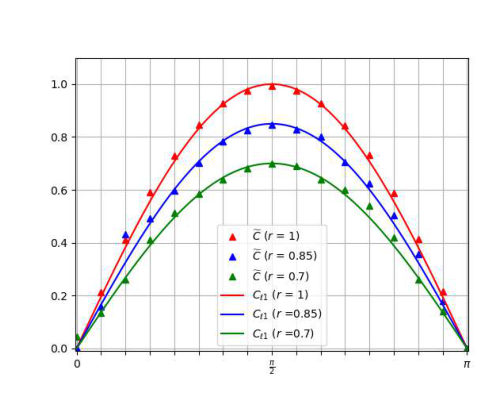
<figcaption class="paper-figure-caption"><b>Fig 1.</b> FIG. 1: Plots of the normalised coherence eC and ℓ1- coherence Cℓ1 of a single qubit as a function of θ for radii of the density matrices r = 1, 0.85, 0.7. The coherence plot is obtained by solving the associated convex opti- misation problem using scipy.optimize.minimize() in Python.</figcaption>
</figure>
<figure class="paper-figure-card">
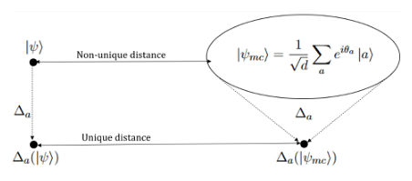
<figcaption class="paper-figure-caption"><b>Fig 2.</b> FIG. 2: This figure shows the geometric interpretation of defining the coherence monotone as a distance between the dephased target state ∆a(|ψ⟩) and the dephased max- imally coherent state ∆a(|ψmc⟩). The measure between the target state |ψ⟩and the set of maximally coherent states is not unique since there are infinitely many states within the set (as seen from the parameters θa). However, the measure between the dephasing channels of both ref- erences is unique.</figcaption>
</figure>
<figure class="paper-figure-card">
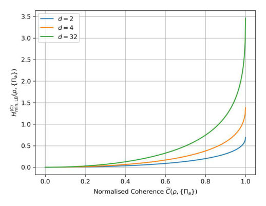
<figcaption class="paper-figure-caption"><b>Fig 3.</b> FIG. 3: The lower bound of the min-entropy H(C) min,LB versus the normalised coherence eC, which shows that the function is monotonically increasing with respect to co- herence C as in the inequality (14) and dimension d.</figcaption>
</figure>

**Summary.** This paper establishes a quantitative complementarity relation between predictability and quantum coherence in multi-path interferometry. It defines these quantities using advanced metrics like the Bures distance and proves that this duality has an operational meaning: coherence quantifies the portion of measurement uncertainty irreducible by any classical side information. This provides a tight bound relevant for quantum random number generation.

**Why it may be interesting.** This work provides a fundamental resource theory perspective on wave-particle duality, linking geometric measures (Bures distance) directly to information-theoretic concepts like classical randomness and quantum source security.

Detailed structure

**Main problem.** The work investigates a complementarity relation between predictability (particle-like behavior) and quantum coherence (wave-like behavior) in multi-path interferometry.

**Main result.** A trade-off relation, $eC + eP \le 1$, is established for mixed states, which endows the coherence measure with an operational interpretation as the classically irreducible part of measurement randomness.

**Method.** The analysis defines predictability using the Bures distance on dephased states and derives a complementary bound involving this metric and a convex-roof construction applied to coherence measures.

**Model / system.** The theoretical framework is built around multi-path interferometry setups, analyzing quantum states ($
ho$) undergoing measurement in a specified basis $\{\Pi_a\}$.

**Key observables.** Predictability ($P$), Quantum Coherence ($C$), Bures distance ($D_B$), and the classical-label conditional min-entropy.

**Important parameters / regimes.** The dimensionality of the system ($d$) and the specific measurement basis $\{\Pi_a\}$ are key parameters.

**Assumptions / limitations.** The analysis relies on defining coherence as a monotone satisfying properties like convexity, faithfulness, and monotonicity under decoherence.

**Figures summary.** Figures illustrate plots showing normalized coherence ($\epsilon_C$) versus polar angle for qubits, and geometric interpretations relating coherence to the Bures distance between dephased states.

**Paper structure.** The paper builds from defining predictability via Bures distance in multi-path setups, deriving a complementarity relation for pure states as an equality, extending this to mixed states using convex roofs, proving mathematical properties of the coherence measure, and finally establishing operational bounds related to quantum randomness.

Abstract

The complementarity principle is a cornerstone of quantum mechanics. In this work, we investigate a complementarity relation between the predictability and quantum coherence, respectively, representing the particle-like and wave-like behaviour in wave--particle duality, in a multi-path setup. We introduce a basis-dependent predictability defined by the Bures distance between the state dephased in the chosen basis and the maximally mixed state. The predictability depends only on the observed basis statistics and admits a closed form in terms of the Bhattacharyya overlap. We derive a trade-off relation between the predictability and a coherence measure defined based on the nonclassicality of the Kirkwood--Dirac quasiprobability. For pure states, the trade-off relation is an exact equality. Remarkably, this wave--particle duality relation endows the coherence measure with an operational interpretation as the classically irreducible part of measurement randomness, yielding a tight worst-case bound on the guessing probability in source-independent QRNG.

[↑ back to top](#top)

### [Entropy power functional theory for Brownian many-body dynamics](http://arxiv.org/abs/2607.19255v1)

**Authors:** Matthias Schmidt  
**Type:** theory · **Category:** statistical mechanics · **PDF:** <https://arxiv.org/pdf/2607.19255v1>  
**Analysis basis:** full PDF text, analyzed in chunks
**Topic relevance:** 🔥 `non-equilibrium dynamics` **4/5** · `methods for driven-dissipative` **3/5** · `non-equilibrium universality` **3/5** · `Keldysh / 2PI / non-Gaussian methods` **1/5** · `correlated / nonlocal dissipation` **1/5** · `driven-dissipative phase transition` **1/5**

↔ Scroll figures horizontally

<figure class="paper-figure-card">
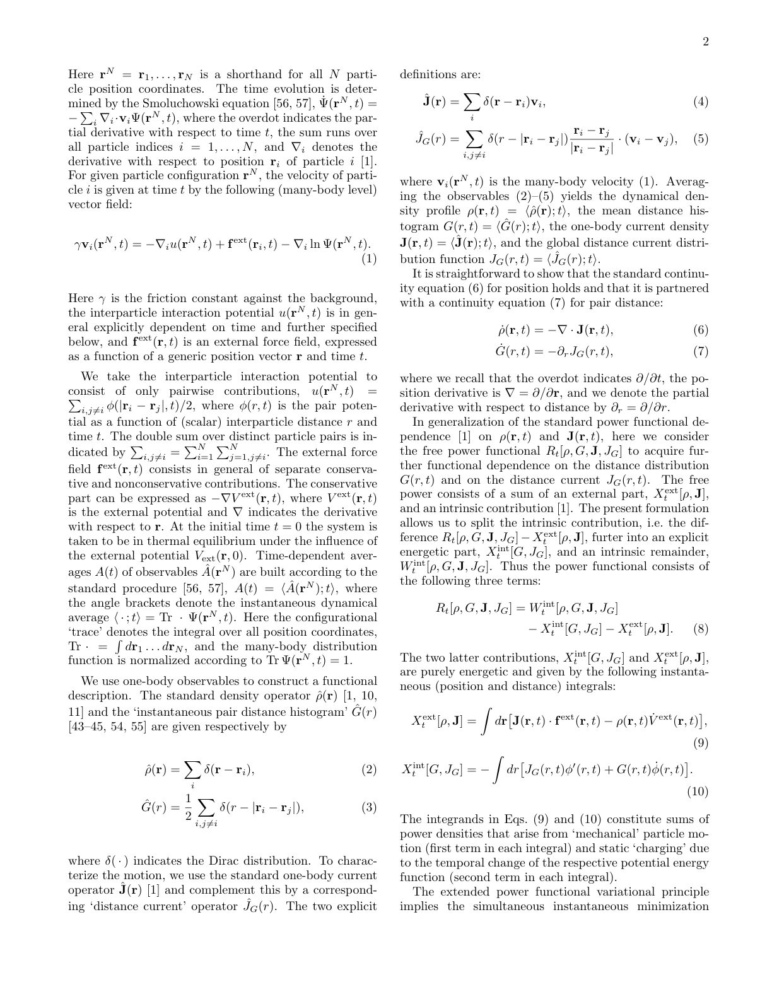
<figcaption class="paper-figure-caption"><b>Fig 1.</b> Low-resolution page preview, page 2</figcaption>
</figure>
<figure class="paper-figure-card">
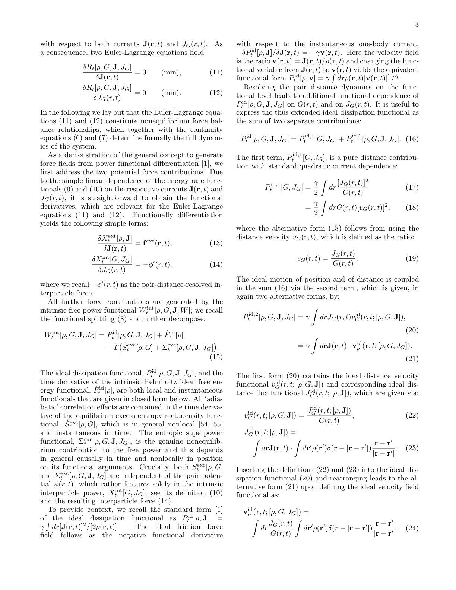
<figcaption class="paper-figure-caption"><b>Fig 2.</b> Low-resolution page preview, page 3</figcaption>
</figure>
<figure class="paper-figure-card">
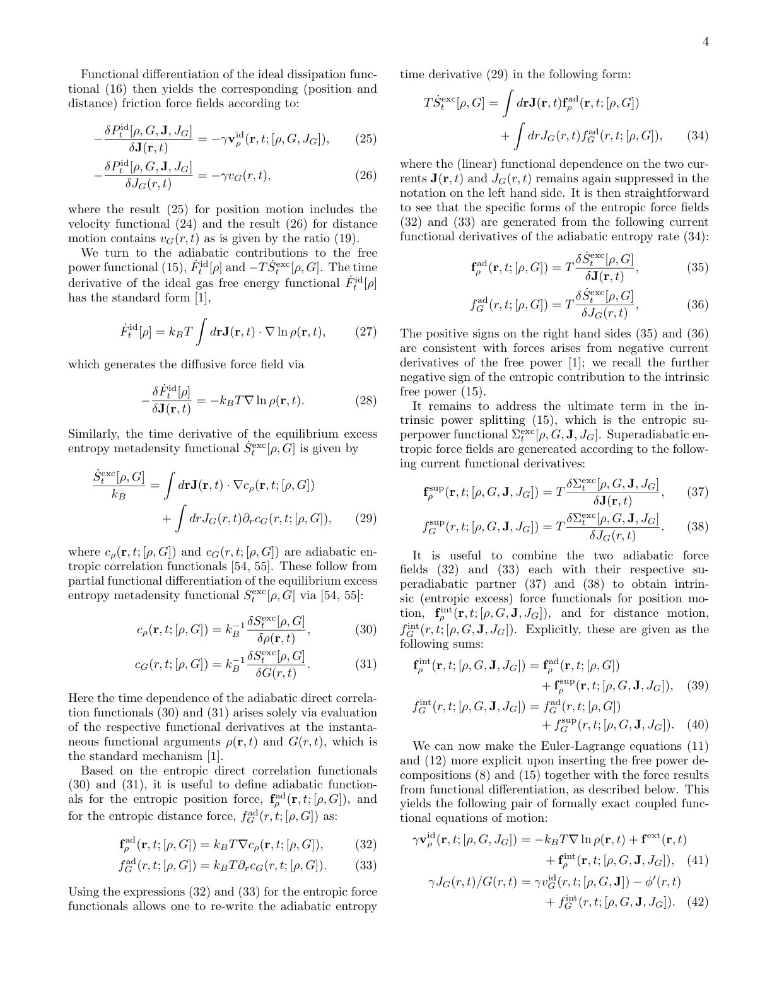
<figcaption class="paper-figure-caption"><b>Fig 3.</b> Low-resolution page preview, page 4</figcaption>
</figure>
<figure class="paper-figure-card">
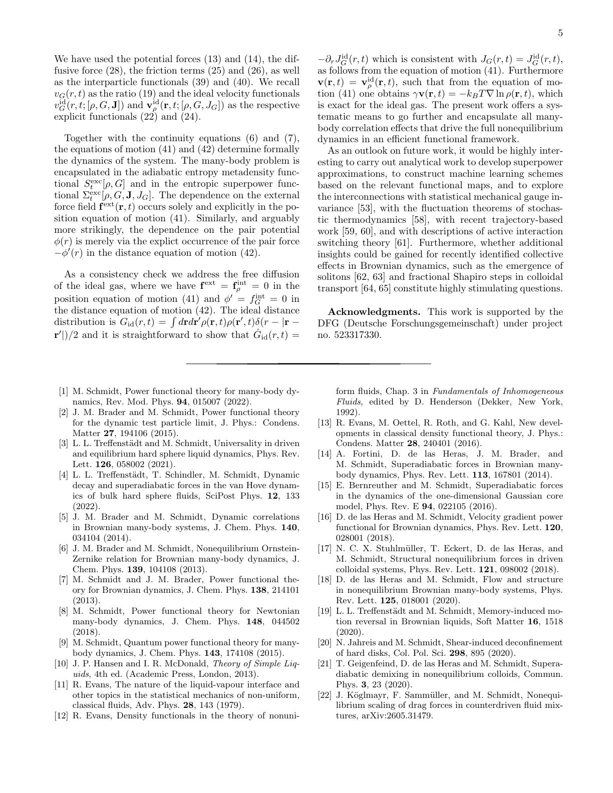
<figcaption class="paper-figure-caption"><b>Fig 4.</b> Low-resolution page preview, page 5</figcaption>
</figure>
<figure class="paper-figure-card">
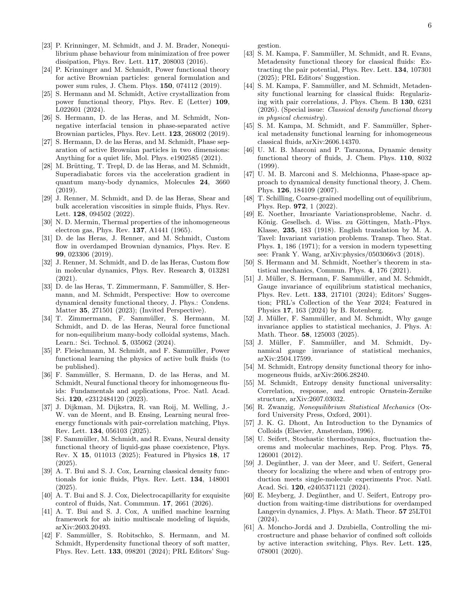
<figcaption class="paper-figure-caption"><b>Fig 5.</b> Low-resolution page preview, page 6</figcaption>
</figure>

**Summary.** This paper introduces an exact variational theory to describe the non-equilibrium dynamics of interacting many-body systems undergoing Brownian motion. It minimizes a generalized free power functional, which systematically decomposes into entropic and energetic contributions. The resulting coupled equations provide a complete description of how density and pair correlations evolve away from equilibrium.

**Why it may be interesting.** This work provides a rigorous, generalized framework for non-equilibrium statistical mechanics in complex fluids, extending standard DFT/power methods by incorporating explicit entropy superpower terms relevant for far-from-equilibrium dynamics.

Detailed structure

**Main problem.** Developing a formally exact variational scheme for the overdamped Brownian dynamics of pairwise interacting many-body systems in general spatiotemporal nonequilibrium.

**Main result.** The full dynamics are determined by two coupled, formally exact functional equations derived from minimizing an extended joint free power functional with respect to one-body and pair current distributions.

**Method.** The theory uses an extended joint free power minimization principle, splitting the free power functional into entropic and energetic rates, and employing functional differentiation to derive force balance relationships.

**Model / system.** The system is a many-body ensemble undergoing overdamped Brownian dynamics with pairwise interactions, governed by the Smoluchowski equation. Key variables include one-body density ($
ho$), pair distance histogram ($G$), and their corresponding currents ($J$, $JG$).

**Key observables.** One-body current density ($J(\mathbf{r}, t)$), global distance current distribution function ($JG(r, t)$), and the universal entropy superpower functional ($\Sigma_{	ext{exc}}$).

**Important parameters / regimes.** Temperature (implied via $k_B T$), interaction potential $\phi(r)$, and the system's non-equilibrium state.

**Assumptions / limitations.** The method is presented as a formally exact variational scheme, though future work suggests approximations like 'superpower approximations'.

**Paper structure.** The paper introduces the problem by defining the dynamics via the Smoluchowski equation and then develops the theory using the joint free power minimization principle. It systematically derives force fields from functional derivatives, leading to two coupled equations of motion that close the dynamical description.

Abstract

We present a formally exact variational scheme for the overdamped Brownian dynamics of pairwise interacting many-body systems in general spatiotemporal nonequilibrium. A joint free power minimization principle determines instantaneously the one-body current and the global interparticle distance flux. The intrinsic free power functional splits into entropic and energetic rates, where the latter are treated explicitly. The adiabatic contribution to the entropy rate is the time derivative of the equilibrium entropy metadensity functional. Genuine nonequilibrium effects originate from a universal entropy superpower functional. Two continuity equations close the dynamical description.

[↑ back to top](#top)

### [Deep inelastic scattering as a probe of entanglement: the complete QCD dipole cascade](http://arxiv.org/abs/2607.18464v1)

**Authors:** Martin Hentschinski, Krzysztof Kutak, Wieslaw Placzek, Martin Rohrmoser  
**Type:** theory · **Category:** other · **PDF:** <https://arxiv.org/pdf/2607.18464v1>  
**Analysis basis:** full PDF text, analyzed in chunks
**Topic relevance:** 🔥 `entanglement & information structure` **4/5** · `Keldysh / 2PI / non-Gaussian methods` **2/5** · `non-equilibrium dynamics` **2/5** · `correlated / nonlocal dissipation` **1/5** · `driven-dissipative phase transition` **1/5** · `methods for driven-dissipative` **1/5** · `non-equilibrium universality` **1/5**

↔ Scroll figures horizontally

<figure class="paper-figure-card">
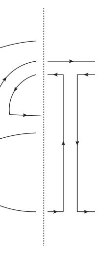
<figcaption class="paper-figure-caption"><b>Fig 1.</b> Figure 1: Schematic scattering of two color dipoles, e.g. a virtual photon and a heavy onium state; the dashed line indicates the transition from the initial-state wave function towards the color-entangled state. Each of the scattering particles maintains its transverse position during the scattering, while its color charge is being modified. Coherence of the initial wave functions is being lost.</figcaption>
</figure>
<figure class="paper-figure-card">
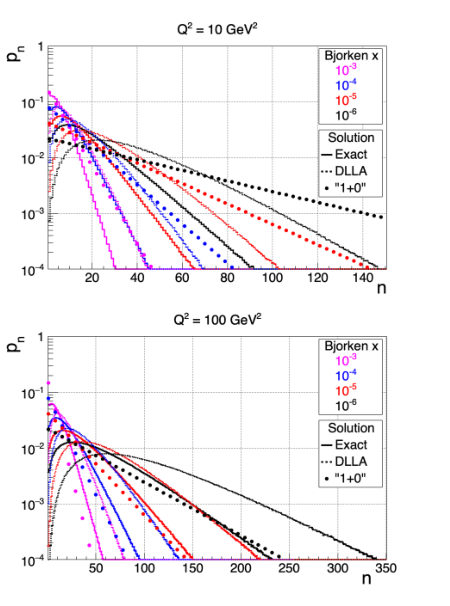
<figcaption class="paper-figure-caption"><b>Fig 2.</b> Figure 2: Monte Carlo results from DIPMAR for probability distributions pn of a number of generated dipoles n corresponding to the fixed ¯αs = 0.1 and the initial dipole size (for ‘Exact’ and ‘DLLA’) r = 0.85 fm. In the ‘Exact’ case, the IR cut-off ∆IR = r = 0.85 fm was also applied.</figcaption>
</figure>
<figure class="paper-figure-card">
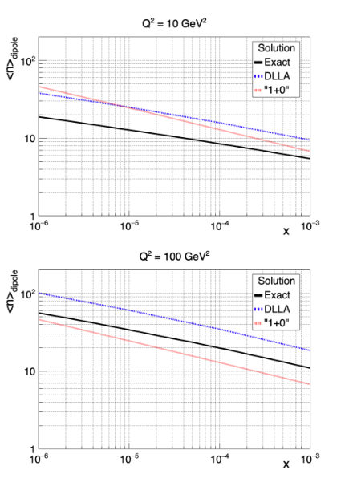
<figcaption class="paper-figure-caption"><b>Fig 3.</b> Figure 3: Monte Carlo results from DIPMAR for the dipole mean multiplicity ⟨n⟩dipole corresponding to the fixed ¯αs = 0.1 and the initial dipole size (for ‘Exact’ and ‘DLLA’) r = 0.85 fm. In the ‘Exact’ case, the IR cut-off ∆IR = r = 0.85 fm was also applied.</figcaption>
</figure>
<figure class="paper-figure-card">
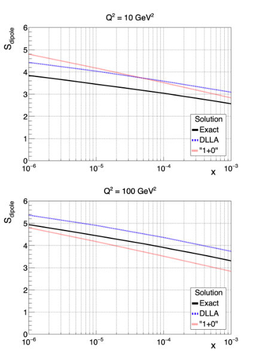
<figcaption class="paper-figure-caption"><b>Fig 4.</b> Figure 4: Monte Carlo results from DIPMAR for the dipole entropy Sdipole corresponding to the fixed ¯αs = 0.1 and the initial dipole size (for ‘Exact’ and ‘DLLA’) r = 0.85 fm. In the ‘Exact’ case, the IR cut-off ∆IR = r = 0.85 fm was also applied.</figcaption>
</figure>
<figure class="paper-figure-card">
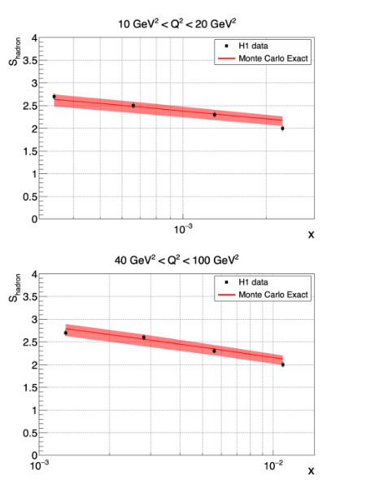
<figcaption class="paper-figure-caption"><b>Fig 5.</b> Figure 5: Comparison of Monte Carlo results from DIPMAR with the H1 data for the hadron entropy Shadron. The numerical results have been obtained through the MCMC solution of the exact dipole evolution equation with the fixed ¯αs = 0.1 and the initial dipole size r = 1.0 fm (with ∆IR = r). The uncertainty bands correspond to the Q2 ranges of the H1 measurements.</figcaption>
</figure>

**Summary.** This paper applies concepts from quantum information theory to Deep Inelastic Scattering (DIS) within the framework of high-energy QCD dipoles. It calculates the entanglement entropy by analyzing how tracing over unobserved color degrees of freedom affects the system's density matrix. The results provide a theoretical prediction for entanglement in hadronic structure, comparing it against experimental measurements.

**Why it may be interesting.** While focused on QCD, the core mathematical machinery—calculating entanglement entropy from reduced density matrices derived from complex field theory dynamics—is highly relevant to open quantum systems and many-body physics simulations.

Detailed structure

**Main problem.** The study investigates how entanglement entropy can be calculated in Deep Inelastic Scattering (DIS) by treating the process using the dipole formulation of high-energy Quantum Chromodynamics (QCD). The goal is to quantify information loss due to tracing over unobserved color degrees of freedom.

**Main result.** The authors derive entanglement entropy directly from von Neumann entropy using dipole multiplicities, finding that the Double Leading Logarithmic Approximation (DLLA) yields a larger entropy compared to other methods for the same initial conditions. These results are compared against empirical measurements from the H1 collaboration.

**Method.** The methodology involves deriving the reduced density matrix by tracing over unobserved color degrees of freedom and solving low-$x$ evolution equations governing dipole multiplicities, considering both transverse-size and azimuthal-angle dependence.

**Model / system.** The physical system is DIS ($	ext{electron} + 	ext{proton}$), modeled using the QCD dipole formulation in the high-energy limit. The theoretical framework relies on solving generalized BFKL-type evolution equations for color dipoles, leading to a description of the proton as an entangled quantum state.

**Key observables.** Entanglement entropy ($S$), dipole multiplicities ($\langle n 
angle$), and comparison with Shannon entropy measured by the H1 collaboration.

**Important parameters / regimes.** Low Bjorken $x$, transverse size, azimuthal angle dependence, and the evolution scale $Q^2$.

**Assumptions / limitations.** The derivation assumes that a reduced density matrix accurately describes the system after tracing over unobserved degrees of freedom. Approximations include using DLLA and assuming high-energy factorization.

**Figures summary.** Figure 1 schematically illustrates the scattering process involving two color dipoles, demonstrating coherence loss as the color charge is modified during the interaction.

**Paper structure.** The paper develops from establishing the formalism of entanglement entropy in DIS using the dipole basis to solving the relevant low-$x$ evolution equations (including DLLA) and finally comparing the calculated entropy with existing experimental data.

Abstract

We study entanglement entropy in Deep Inelastic Scattering (DIS) using the dipole formulation of the high-energy limit of QCD. We argue that a reduced density matrix arises in low $x$ DIS due to a trace over unobserved color degrees of freedom and we obtain entanglement entropy in terms of dipole multiplicities, directly from the von Neumann entropy.   %In the present study we explicitly construct a density matrix representing the entangled state of the photon and proton and perform a trace over unobserved degrees of freedom. Dipole multiplicities are obtained from a solution to low $x$ evolution equations, which we solve numerically. Unlike previous studies, we take into account both transverse-size and azimuthal-angle dependence in the dipole evolution kernel. We study both the exact solution of the equation as well as its double leading-logarithmic approximation (DLLA). We find that for the same initial dipole size, the DLLA solution generates a larger entropy. %We interpret this as information loss due to erasing data on daughter dipole sizes. Finally, we calculate the dipole multiplicities and entanglement entropy and compare our results to the Shannon entropy of hadron multiplicities, as measured by the H1 collaboration.

[↑ back to top](#top)

### [Quantum-Enabled Spintronic "Small" Antennas](http://arxiv.org/abs/2607.18469v1)

**Authors:** Supriyo Bandyopadhyay  
**Type:** both · **Category:** other · **PDF:** <https://arxiv.org/pdf/2607.18469v1>  
**Analysis basis:** full PDF text, analyzed in chunks
**Topic relevance:** 🔥 `spintronics-quantum-optics interface` **4/5** · `quantum optics experiment` **2/5** · `analog quantum simulation` **1/5** · `correlated / nonlocal dissipation` **1/5** · `driven-dissipative phase transition` **1/5** · `exotic spin models in light-matter` **1/5** · `non-equilibrium dynamics` **1/5** · `superradiant laser` **1/5**

↔ Scroll figures horizontally

<figure class="paper-figure-card">
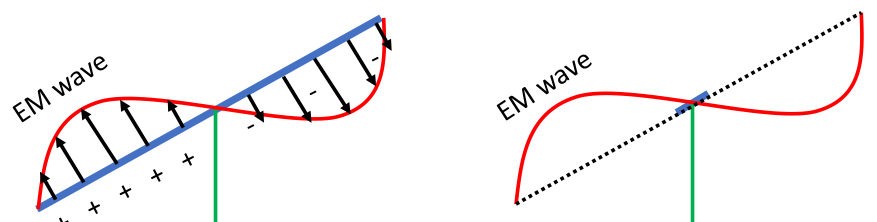
<figcaption class="paper-figure-caption"><b>Fig 1.</b> Figure 1: (a) A dipole antenna that is one wavelength long and can host a resonant electric dipole. (b) An antenna much smaller than the wavelength cannot host a dipole.</figcaption>
</figure>
<figure class="paper-figure-card">
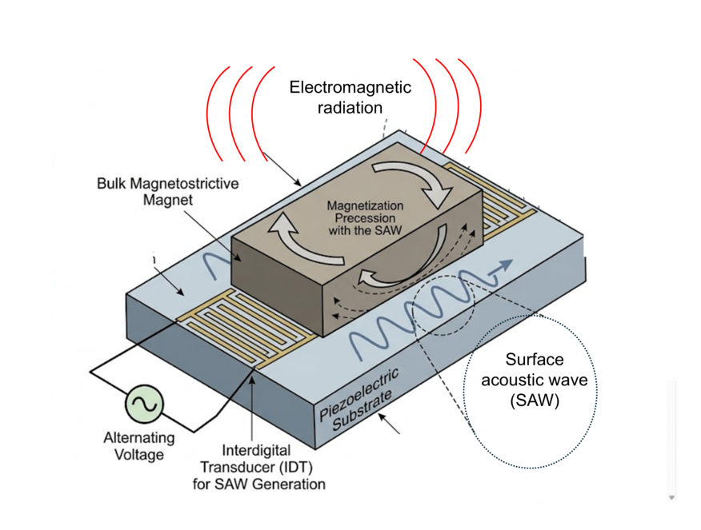
<figcaption class="paper-figure-caption"><b>Fig 2.</b> Figure 2: A bulk magnetostrictive magnet on a piezoelectic substrate or film will radiate electromagnetric waves if a surface acoustic wave (SAW) [or a bulk acoustic wave] is launched in the piezoelectric. The acoustic wave generates time varying strain in the magnet and that causes the magnetization to precess because of the inverse magnetostriction (or Villari) effect. The time-varying magnetization radiates electromagnetic waves and this is the basis of a magneto-elastic antenna.</figcaption>
</figure>
<figure class="paper-figure-card">
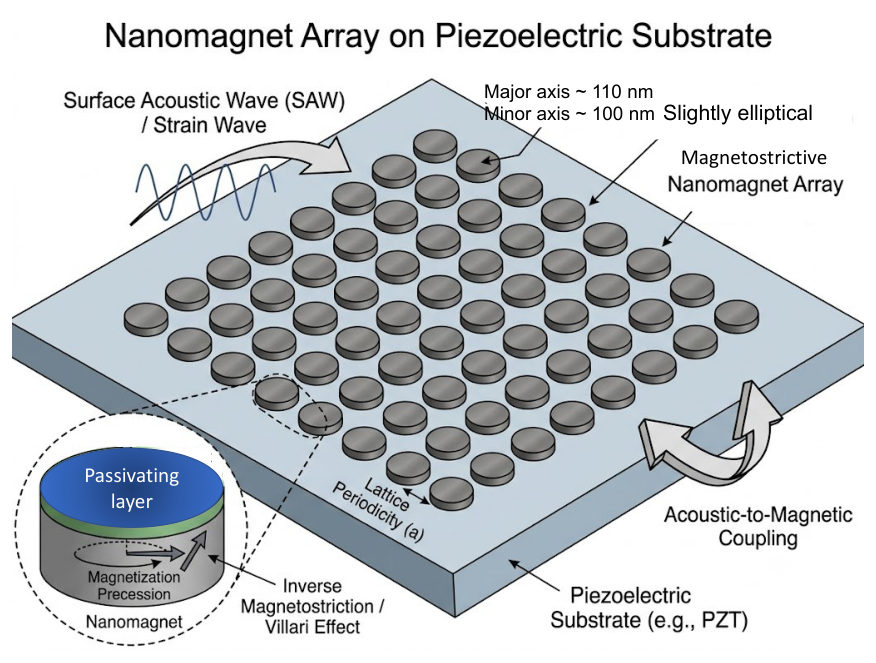
<figcaption class="paper-figure-caption"><b>Fig 3.</b> Figure 3: A two-dimensional periodic array of slightly elliptical magnetostrictive nanomagnets deposited on a piezoelectric substrate (or a piezoelectric thin film) forming an “artificial multiferroic magnonic crystal”. A surface acoustic wave launched in the piezoelectric with appropriate electrodes (not shown) will subject the nanomagnets to periodic strain and cause their magnetizations to precess owing to the inverse magne- tostriction effect. This will radiate electromagnetic waves in the surrounding space.</figcaption>
</figure>
<figure class="paper-figure-card">
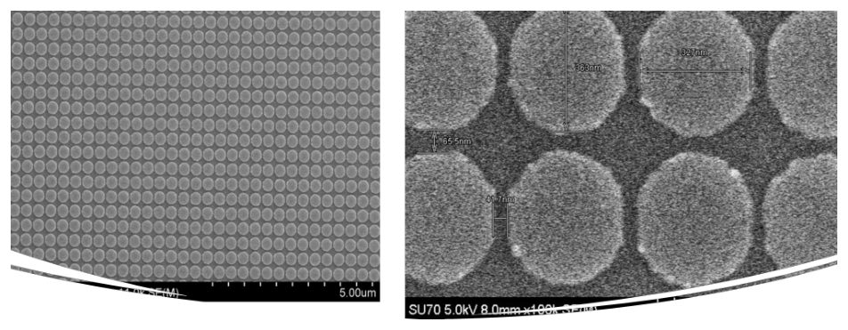
<figcaption class="paper-figure-caption"><b>Fig 4.</b> Figure 4: (a) Scanning electron micrograph of a two-dimensional periodic array of nanomagnets deposited on a piezoelectric LiNbO3 substrate in which a RF frequency SAW was launched with electrodes. (b) Higher resolution image showing the nanomagnet dimension and inter-nanomagnet spacing. The nanomagnets are elliptical with major axis dimension ∼360 nm, minor axis ∼330 nm, edge-to-edge spacing ∼65 nm along the major axis direction and ∼42 nm along the minor axis direction. The thickness of the nanomagnets was 6 nm. Reproduced from [17] with CC-BY license.</figcaption>
</figure>
<figure class="paper-figure-card">
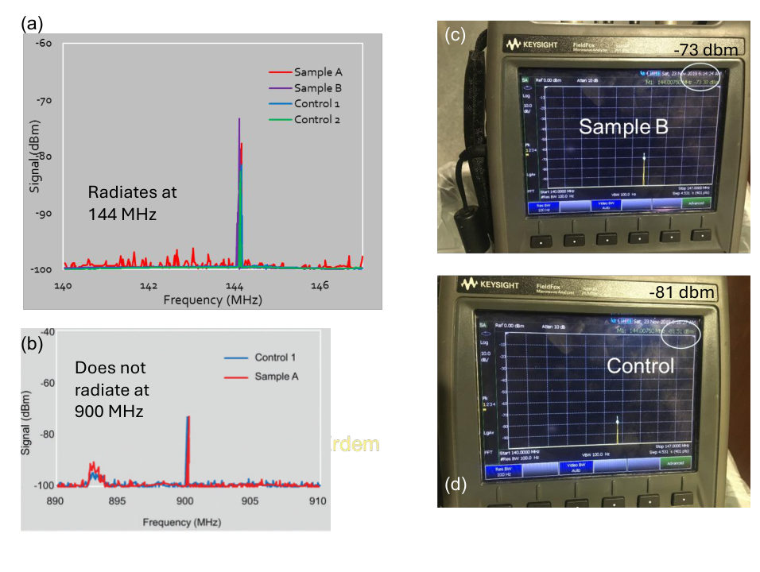
<figcaption class="paper-figure-caption"><b>Fig 5.</b> Figure 5: Electromagnetic radiation spectrum of the real and control samples at 144 MHz and 900 MHz. Two real samples A and B were measured along with their corresponding control samples that contained no nanomagnets. (a) Radiation spectra of the two samples A and B along with those of the corresponding control samples at 144 MHz input SAW frequency. (b) The radiation from a real sample and the corresponding control sample cannot be resolved at 900 MHz input SAW frequency indicating that the nanomagnets are not radiating sufficiently. (c) Direct screenshot from the spectrum analyzer for sample B at 144 MHz SAW frequency. The received power at the detector is -73 dbm. (d) Direct screenshot...</figcaption>
</figure>

**Summary.** The paper introduces quantum-enabled spintronic antennas that overcome the size limitations of traditional antennas by utilizing artificial multiferroic magnonic crystals. By coupling phonons (from acoustic waves) to magnons and subsequently to photons, these structures achieve radiation efficiencies orders of magnitude higher than classical predictions. This breakthrough enables highly miniaturized devices for applications like medical implants and covert communication.

**Why it may be interesting.** This work demonstrates how engineered material couplings (phonon/magnon) can circumvent fundamental classical electromagnetic limits to achieve highly efficient energy radiation from nanoscale devices, which is a key concept in open quantum systems and quantum optics applied to solid-state physics.

Detailed structure

**Main problem.** Traditional antennas fail to maintain high radiation efficiency when miniaturized below fractions of the radiated wavelength due to classical electromagnetic limitations (Harrington limit).

**Main result.** The use of nanomagnets in magneto-elastic structures successfully generates strong, highly efficient electromagnetic emission from extreme sub-wavelength antennas, significantly exceeding conventional theoretical limits.

**Method.** Measurements involve analyzing radiation efficiency ($\eta = 	ext{Rrad} / (	ext{Rrad} + 	ext{Rloss})$) by comparing samples with and without nanomagnets, alongside characterizing resonant coupling via $S_{11}$ spectra measurements.

**Model / system.** The system is an Artificial Multiferroic Magnonic Crystal (AMMC), comprising a 2D periodic array of nanomagnets deposited on a piezoelectric substrate. Energy transfer relies on tripartite phonon-magnon-photon coupling, exciting hybrid magneto-dynamical modes.

**Key observables.** Radiation efficiency ($\eta$), $S_{11}$ spectra dips indicating resonant energy transfer, and measured receiving gain ($G_r$).

**Important parameters / regimes.** The Harrington limit ($\eta \propto (A/\lambda)^2$); the acoustic wavelength ($\lambda_{	ext{ac}}$) which can be much smaller than the electromagnetic wavelength ($\lambda_{	ext{EM}}$).

**Assumptions / limitations.** The efficiency enhancement is attributed to utilizing acoustic resonances and non-classical coupling mechanisms, rather than classical magnetic dipole radiation.

**Figures summary.** Figures illustrate theoretical limitations (dipole formation), basic magneto-elastic principles, the nanomagnet array structure, and experimental results showing signal presence only with nanomagnets at various frequencies.

**Paper structure.** The paper progresses from identifying the miniaturization challenge to proposing the AMMC system, detailing the underlying physics of phonon-magnon-photon coupling, presenting measurements confirming resonant enhancement, and finally discussing advanced applications like beam steering and stealth communication.

Abstract

Antennas transmit information wirelessly from one location to another via electromagnetic waves. Miniaturizing them, however, is challenging since the radiation efficiencies of all traditional antennas, based on the principles of classical electromagnetics, plummet when their dimensions are shrunk to tiny fractions of the radiated wavelength. Lately, a new generation of antennas whose operations are underpinned by non-classical principles have been demonstrated and they can overcome this limitation. This enables embedded applications that were hitherto inaccessible. In addition, beam steering, which normally requires a large phased array (multiple antenna elements each much larger than the wavelength), can now be accomplished with a single element much smaller than the wavelength. Some of these antennas also have stealth attributes for secure and covert communication, which makes this new genre a disruptive new technology.

[↑ back to top](#top)

### [Remote entanglement need not be the bottleneck for modular trapped-ion quantum computing](http://arxiv.org/abs/2607.18387v1)

**Authors:** Felix W. Knollmann, David P. Nadlinger, John Blue, Sabrina M. Corsetti, Sam J. Bishop, Adam R. Martinez, Jelena Notaros, Colin D. Bruzewicz, Robert McConnell, Isaac L. Chuang  
**Type:** both · **Category:** quantum information and computing · **PDF:** <https://arxiv.org/pdf/2607.18387v1>  
**Analysis basis:** full PDF text, analyzed in chunks
**Topic relevance:** 🔥 `QC/QI experiment` **4/5** · `quantum optics experiment` **3/5** · `entanglement & information structure` **1/5** · `interference shaping light` **1/5** · `quantum measurements` **1/5**

↔ Scroll figures horizontally

<figure class="paper-figure-card">
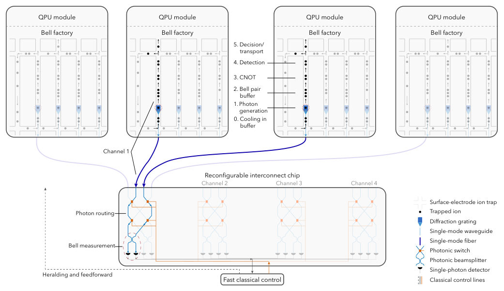
<figcaption class="paper-figure-caption"><b>Fig 1.</b> FIG. 1. Remote entanglement generation architecture. Each quantum processing unit (QPU) is a module consisting of a microfabricated surface-electrode trap with integrated optics. The Bell factory produces and distills remote Bell pairs for intermodule operations. The photonic links consist of single-mode waveguides and fibers. A switch network enables all-to-all connectivity and passive beamsplitters provide the photon interference needed for entanglement. Detectors herald entangled states and a classical processing unit coordinates the entanglement process.</figcaption>
</figure>
<figure class="paper-figure-card">
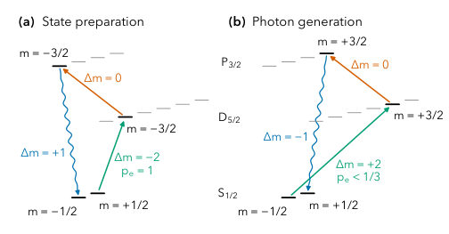
<figcaption class="paper-figure-caption"><b>Fig 2.</b> FIG. 2. Energy level diagrams of commonly used 40Ca+, 88Sr+, and 138Ba+ ions that show the two-step excitation used for (a) state preparation and (b) entanglement without requiring circularly polarized light. An electric-quadrupole transition allows a change in angular momentum of |∆m|=2, such that a π-polarized excitation to the stretched state of an excited level with a dipole-allowed decay back to the ground state leaves the ion with a net change of |∆m|=1 in the pro- jection of angular momentum.</figcaption>
</figure>
<figure class="paper-figure-card">
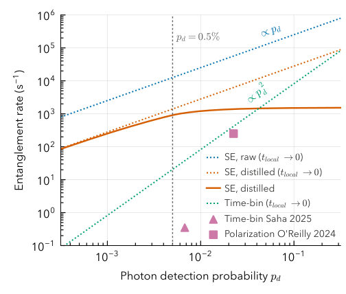
<figcaption class="paper-figure-caption"><b>Fig 3.</b> FIG. 3. Heralded entanglement rate as a function of the pho- ton detection probability pd for 88Sr+, assuming the cycle times and local-operation timings in Table III. Dotted blue: single-excitation raw heralded rate and dotted orange: dis- tilled rate assuming instantaneous local operations (both at excitation probability pe = 1/3). Solid orange: single- excitation rate under the parallelized model of Eq. 4, with the rate set by the slowest of (Bell-pair, detection, CNOT) blocks and pe optimized to maximize rate at each pd using the parameters of (Table III) but without accounting for buffer limitations. Solid green: time-bin (two-photon coincidence) rate at pe = 1. The marked points...</figcaption>
</figure>
<figure class="paper-figure-card">
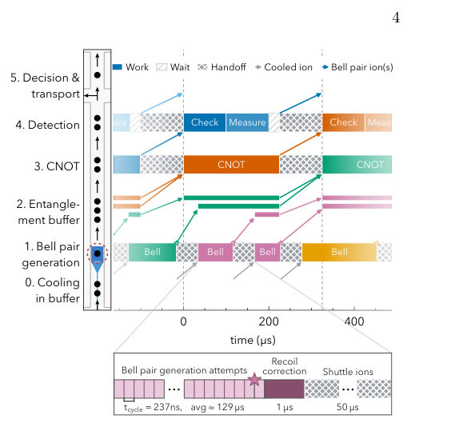
<figcaption class="paper-figure-caption"><b>Fig 4.</b> FIG. 4. Pipeline for entanglement generation separated into blocks that can execute in parallel. Pre-cooled ions from a buffer move into the entanglement zone. After a successful herald, the recoil is corrected and consecutive ion pairs are buffered and then combined for a local CNOT. The ion pair undergoes leakage checks in the detection zone before the tar- get ion is read out to determine the distilled state parity. A successfully distilled control ion exits the Bell factory while remaining ions are recycled to the starting buffer.</figcaption>
</figure>
<figure class="paper-figure-card">
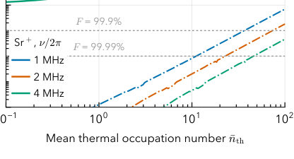
<figcaption class="paper-figure-caption"><b>Fig 5.</b> FIG. 5. The Bell-state error 1 −F for 88Sr+ as a function of the mean motional occupation number ¯nth, for three secular frequencies ν/2π ∈{1, 2, 4} MHz and assuming a collection optic NA of 0.4; solid curves are the bare result, dot-dashed curves include the post-herald application of a spin-dependent displacement to correct photon recoil [31] and successful distil- lation (spin-dependent displacement and distillation assumed to be error-free).</figcaption>
</figure>

**Summary.** This paper addresses the scalability challenge in modular trapped-ion quantum computing by tackling the rate and fidelity limitations of remote entanglement links. The authors propose a comprehensive architecture that integrates single-photon heralding with compact photonics and source-level error correction. They conclude that these advancements allow the system to overcome the entanglement bottleneck, suggesting future improvements must focus on local gate operations.

**Why it may be interesting.** It provides a concrete roadmap for scaling quantum processors by addressing the critical interface problem—the reliable, high-rate connection between independently operating quantum modules using established AMO platforms like trapped ions.

Detailed structure

**Main problem.** The primary challenge is overcoming the bottleneck of generating shared entanglement at a rate, density, and fidelity sufficient for fault-tolerant modular quantum computation.

**Main result.** By synthesizing single-photon heralding, integrated photonics, and source-level error correction, the authors show that remote entanglement generation can reach rates compatible with local operations, shifting the computational bottleneck elsewhere.

**Method.** The approach involves developing a comprehensive architecture combining advanced quantum optics techniques (single-photon heralding) with physical integration (trap-integrated photonics) and theoretical protocols (projective distillation).

**Model / system.** The work focuses on modular trapped-ion Quantum Processing Units (QPUs) linked by 'Bell factories' using surface-electrode ion traps. Entanglement is generated via photonic links connecting these modules.

**Key observables.** Projected remote Bell-pair rate density ($10^5 	ext{ s}^{-1}	ext{cm}^{-2}$), and achieved fidelity ($\geq 99.9\%$).

**Important parameters / regimes.** Target rates for fault tolerance ($10^4 - 10^6 	ext{ s}^{-1}$ per module); the rate is shown to be limited by the slowest local operation block in a pipeline.

**Assumptions / limitations.** The argument relies on successfully implementing and synthesizing several mature enabling technologies: single-photon heralding, coherent recoil correction, projective distillation, and compact integrated photonics.

**Figures summary.** Figure 1 illustrates the overall remote entanglement generation architecture. Figure 3 compares heralded entanglement rates for different encoding schemes (e.g., Time-bin vs. Polarization). Figure 4 details the pipelined process flow for generating entangled pairs.

**Paper structure.** The paper establishes the need for modularity, analyzes current limitations in trapped-ion links compared to local gates, and then proposes a synthesized architecture incorporating multiple advanced techniques (heralding, correction, integration) to overcome the entanglement bottleneck.

Abstract

Modularity underpins classical computing; as quantum processors encounter limits on fabrication yield, reliability, and size, they will need it just as acutely. The bottleneck to linking modules is producing shared entanglement at sufficient rate, density, and fidelity. Trapped ions hold the best demonstrated photonic links, yet they rely on bulky collection optics that cap how densely links can be packed, and their performance trails local gates by two orders of magnitude in rate and fidelity. We synthesize several enabling results $\unicode{x2014}$ single-photon heralding, coherent recoil correction, projective distillation, and trap-integrated photonics $\unicode{x2014}$ into one comprehensive architecture that substantially narrows this gap. Single-photon heralding leads to linear scaling of success probability with detection efficiency, allowing compact integrated photonics to saturate the entanglement rate at a local-operation limit in dense, easy-to-parallelize channels. Addressing its inherent error mechanisms at their source, we project a Bell-pair fidelity of 99.9\% at rates and densities compatible with fault-tolerant operations. Remote entanglement then need not remain the bottleneck for modular trapped-ion computing; the limit shifts to the local operations that must improve regardless.

[↑ back to top](#top)

### [Experimental quantum cryptography with single photons and imperfect devices](http://arxiv.org/abs/2607.19204v1)

**Authors:** Aodhán Corrigan, Koray Kaymazlar, Zhiyao Wang, Lucas Rickert, Daniel Vajner, Martin von Helversen, Hanqing Liu, Shulun Li, Haiqiao Ni, Zhichuan Niu, Devashish Tupkary, Tobias Heindel  
**Type:** both · **Category:** quantum information and computing · **PDF:** <https://arxiv.org/pdf/2607.19204v1>  
**Analysis basis:** full PDF text, analyzed in chunks
**Topic relevance:** 🔥 `QC/QI experiment` **4/5** · `quantum optics experiment` **3/5** · `quantum measurements` **1/5**

↔ Scroll figures horizontally

<figure class="paper-figure-card">
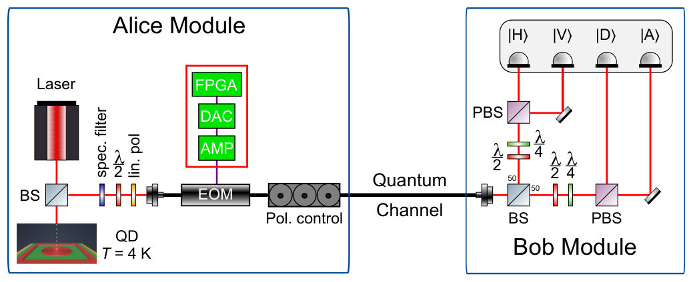
<figcaption class="paper-figure-caption"><b>Fig 1.</b> FIG. 1. Experimental setup for our BB84 implementation. Alice prepares single photons using a deterministic single photon source comprised of a single QD embedded in a photonic microcavity and dynamically selects the polarization using an EOM. These are sent to Bob’s passive four-state polarization analyzer, comprised of SNSPD based detectors.</figcaption>
</figure>
<figure class="paper-figure-card">
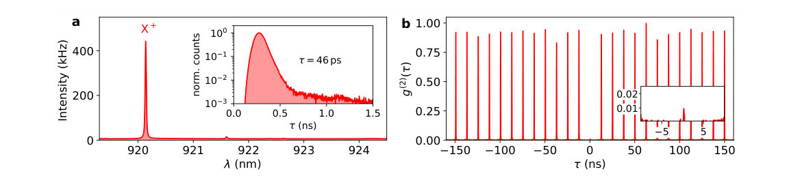
<figcaption class="paper-figure-caption"><b>Fig 2.</b> FIG. 2. a) Emission spectrum of the QD microcavity device under quasi-resonant (p-shell) excitation. The strongly Purcell- enhanced trion state (X+) at 920.1 nm exhibits a ultra-fast decay time &lt; 50 ps, as depicted in the time-resolved measurement in the inset. b) Second-order photon correlation histogram measured in Hanbury-Brown and Twiss configuration. The strong multiphoton suppression of g(2)(τ = 0) = (1.7 ± 0.5) · 10−2 demonstrates sub-Poissonian emission statistics.</figcaption>
</figure>
<figure class="paper-figure-card">
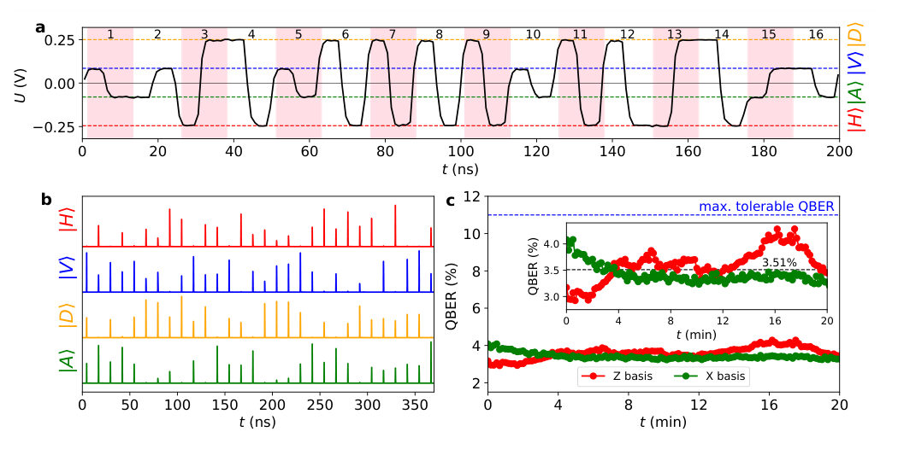
<figcaption class="paper-figure-caption"><b>Fig 3.</b> FIG. 3. (a) Example of the employed random sequence for a 200 ns long excerpt containing 16 bits of given voltage level U in the four polarization states, followed immediately by the binary switching in each bit as inspired by the Manchester encoding. (b) Sample of time-tags averaged over multiple QRNG sequence loops, showing high polarization suppression in all four bases over ∼400 ns of the QRNG sequence. (c) Maximum tolerable QBER of 11% for BB84 QKD and achieved QBER for Z and X bases over the course of the experiment (i.e. 20 mins), with a time average of 3.51%.</figcaption>
</figure>
<figure class="paper-figure-card">
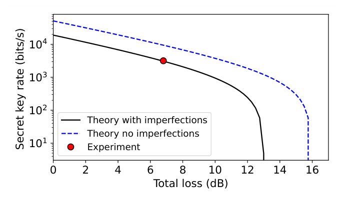
<figcaption class="paper-figure-caption"><b>Fig 4.</b> FIG. 4. Simulated key rate plot for experimental parameters, as well as key rate computed from experimental run. Simulation is performed by using error rate observed in experiment, but changing loss. Computed with sampling parameters εPNE = εa = εb = ε0 = εAT,Z = 10−9 (See Appendix A for details), postprocessing parameters εPA = εEV = 10−9, and probability of Z rounds used for eZ estimation of 1%. Horizontal axis begins at 0, assuming lossless components. Note accounting for imperfections drastically reduces key rate by nearly an order of magnitude, although further refinements of proof techniques will likely be able to decrease this impact.</figcaption>
</figure>
<figure class="paper-figure-card">
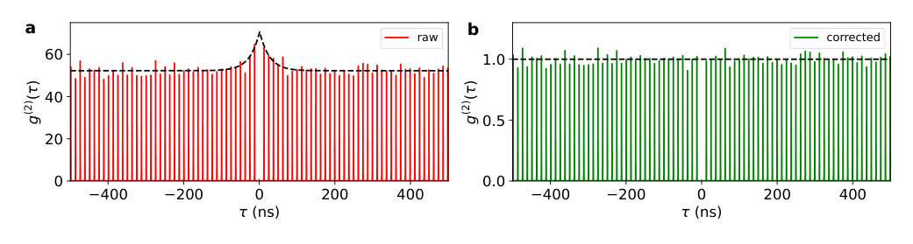
<figcaption class="paper-figure-caption"><b>Fig 5.</b> FIG. 5. (a): Measured (raw) second order autocorrelation g(2)(τ)-histogram of the employed QD emitter. (b) Blinking-corrected g(2)(τ)-histogram by dividing the data in (a) by Eq. B1 for the paramters listed in Tab III.</figcaption>
</figure>

**Summary.** This paper experimentally demonstrates a robust Quantum Key Distribution (QKD) system using single photons from semiconductor quantum dots. Crucially, it advances the field by providing rigorous security analysis that accounts for unavoidable imperfections in real-world components like sources and detectors. The results show competitive performance, paving the way for practical, loophole-free quantum communication.

**Why it may be interesting.** It provides a concrete bridge between theoretical quantum information security proofs and practical experimental realization, which is crucial for advancing photonic quantum communication technologies.

Detailed structure

**Main problem.** The primary challenge is rigorously proving the security of Quantum Key Distribution (QKD) protocols when using real-world devices whose performance cannot be perfectly characterized.

**Main result.** The authors demonstrate that a BB84 implementation using semiconductor quantum dots can achieve competitive, loophole-free performance by explicitly accounting for source imperfections and detector noise margins.

**Method.** The work combines experimental measurement of key metrics (QBER, g^(2)(0)) with advanced theoretical security proofs that incorporate statistical bounds on unobservable quantities like the phase error rate.

**Model / system.** The system is an experimental implementation of the BB84 protocol using single photons generated by a semiconductor quantum dot source and analyzed by superconducting nanowire single photon detectors (SNSPDs).

**Key observables.** Quantum Bit Error Rate (QBER) ($\approx 3.51\%$), second-order correlation function g^(2)(0), and the calculated secure key length in bits.

**Important parameters / regimes.** Source mean photon number ($\mu = 0.005$), detector relative efficiencies ($\vec{\eta}$), and error margins associated with device imperfections.

**Assumptions / limitations.** The security analysis relies on recent theoretical advances that allow for imperfect characterization of devices, modeling the real source via Source Map arguments.

**Figures summary.** Figures illustrate the experimental setup (BB84 diagram), confirm single-photon emission statistics using g^(2)(2) histograms, and compare simulated vs. measured key rates considering device imperfections.

**Paper structure.** The paper progresses from establishing the need to address device loopholes in QKD security proofs, detailing the physical implementation using QD sources, presenting measurements of performance metrics (QBER), and concluding with a rigorous analysis bounding the achievable secure key rate under realistic noise models.

Abstract

Quantum key distribution (QKD) allows for provably secure key distribution between two trusted parties. Because the security and performance of QKD protocols rely on devices that behave according to specific assumptions, idealized or inaccurate assumptions about device behavior can introduce security loopholes. Real devices can never be perfectly characterized, and their performance metrics are always subject to certain error margins, which must be accounted for in a rigorous theoretical analysis. Only recently have rigorous finite-size results allowed for imperfect characterizations of devices (where device parameter have uncertainty margins) - an advance yet to be considered in experimental implementations of the BB84 protocol. In this work, we prove the security and analyze the performance of an implementation of the BB84 protocol using single photons generated by a semiconductor quantum dot light source in combination with dynamic polarization-state encoding. We consider the presence of incompletely characterized devices by accounting for imperfections in the single-photon source (in terms of finite g(2)(0)) as well as the receiver (non-ideal beam-splitters, finite detector efficiencies, and dark counts), all with error margins. The resulting protocol implementation shows competitive performance, paving the way towards practical and loop-hole free implementations of QKD.

[↑ back to top](#top)

### [Monolithic printed-circuit board RF-trap for electrons](http://arxiv.org/abs/2607.18401v1)

**Authors:** Zijue Luo, Jae Eu, Tianyi Wang, Boerge Hemmerling  
**Type:** experiment · **Category:** other · **PDF:** <https://arxiv.org/pdf/2607.18401v1>  
**Analysis basis:** full PDF text, analyzed in chunks
**Topic relevance:** 🔥 `QC/QI experiment` **4/5** · `analog quantum simulation` **1/5** · `methods for driven-dissipative` **1/5** · `quantum measurements` **1/5** · `spintronics-quantum-optics interface` **1/5**

↔ Scroll figures horizontally

<figure class="paper-figure-card">
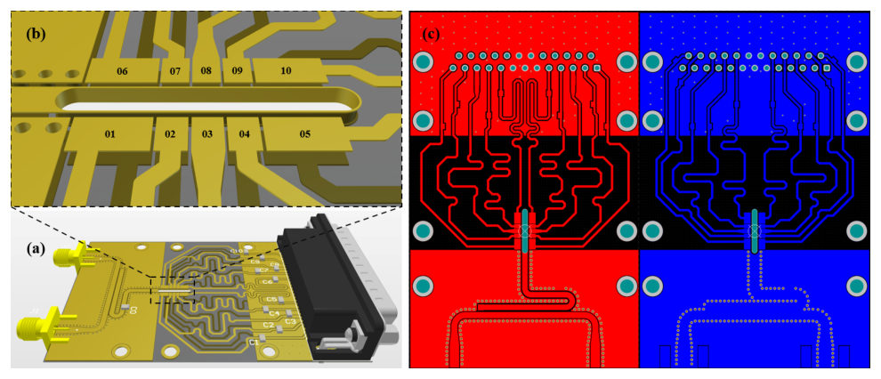
<figcaption class="paper-figure-caption"><b>Fig 1.</b> FIG. 1. (a) 3D model of the printed circuit board electron trap. The RF signal for the Paul trap is delivered to the board by an SMA-connected feedline (left side of the board), which is capacitively coupled to an on-board RF resonator. Electrons are trapped near the end of the resonator, at the center of the elongated plated slit. The DC signals are delivered by a D-sub connector (right side of board). (b) Zoomed view of the slit. The numbers 01 to 10 denote the DC electrodes on the top layer; a set of identical electrodes, 11 to 20, is located on the bottom layer. The slit is surrounded by a plated sidewall and a metal annular ring. (c) Schematics of the top (red) and bottom (blue) layers...</figcaption>
</figure>
<figure class="paper-figure-card">
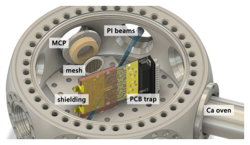
<figcaption class="paper-figure-caption"><b>Fig 2.</b> FIG. 3. Experimental apparatus. The PCB Paul trap is mounted at the center of a UHV vacuum chamber, with the calcium oven (not visible), copper mesh, and microchannel plate detector arranged along the adjacent viewport axes.</figcaption>
</figure>
<figure class="paper-figure-card">
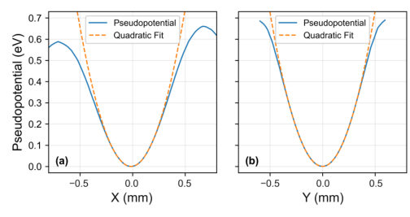
<figcaption class="paper-figure-caption"><b>Fig 3.</b> FIG. 2. Finite-element simulation of trap. (a) Pseudopo- tential along the ˆx-axis (perpendicular to the trap board) and (b) along the ˆy-axis (along the slit width). The fitted secular frequencies are ωx = 2π × 157.6 MHz, ωy = 2π × 161.2 MHz, and the trap depths are Ux = 0.59 eV and Uy = 0.68 eV. All simulations assume an RF input power of 36 dBm.</figcaption>
</figure>
<figure class="paper-figure-card">
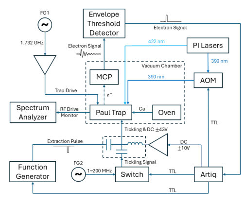
<figcaption class="paper-figure-caption"><b>Fig 4.</b> FIG. 4. Schematic diagram of the experiment. The oven provides a thermal beam of calcium atoms, which are photoionized to produce trappable electrons. The Paul trap is driven at 1.732 GHz. Further details are explained in the main text.</figcaption>
</figure>
<figure class="paper-figure-card">
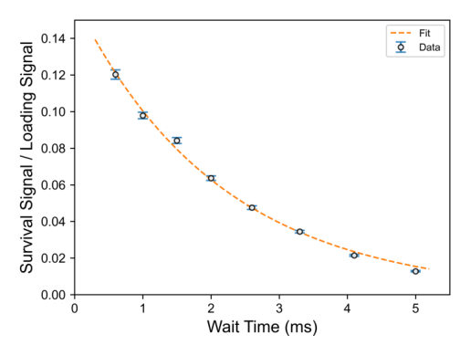
<figcaption class="paper-figure-caption"><b>Fig 5.</b> FIG. 5. Trapped electron lifetime measurement. The data is fitted with an exponential decay, which yields a life- time of 2.13 ms.</figcaption>
</figure>

**Summary.** The paper reports the successful realization of an electron Paul trap fabricated entirely on a monolithic printed circuit board (PCB). This novel design provides mechanical stability for trapping electrons, which serve as qubits. The experiment characterized the trap's performance by measuring lifetimes and determining high secular frequencies using RF/DC field analysis.

**Why it may be interesting.** This work directly addresses hardware engineering challenges in quantum computing platforms. Using a single-PCB approach significantly enhances scalability and robustness compared to complex multi-component traps, making it highly relevant for solid-state or chip-based AMO quantum systems.

Detailed structure

**Main problem.** The goal is to develop a practical, scalable platform for quantum information processing using qubits encoded in trapped electron spins, moving away from traditional Penning traps.

**Main result.** The authors successfully demonstrated trapping electrons on a monolithic PCB Paul trap, achieving measurable lifetimes of 2.13 ms and high secular frequencies up to 90 MHz.

**Method.** The experiment involves fabricating the trap entirely on a single printed circuit board (PCB) and characterizing electron confinement using RF/DC electric fields and measuring decay rates.

**Model / system.** The physical system is an electron Paul trap built monolithically on a PCB substrate, utilizing both RF pseudopotentials for radial confinement and DC electrodes for axial confinement. The trapping potential depth was characterized to be around 0.6 eV.

**Key observables.** Trapped electron lifetime ($	au = 2.13$ ms), secular frequencies ($\omega_x \approx 2\pi 	imes 158$ MHz, $\omega_y \approx 2\pi 	imes 161$ MHz), and motional frequency resonances.

**Important parameters / regimes.** RF drive frequency ($\Omega_{	ext{rf}} = 2\pi 	imes 1.732$ GHz), trap depths ($0.59-0.68$ eV), and vacuum pressure ($\approx 5 	imes 10^{-8}$ Torr).

**Assumptions / limitations.** The short lifetime is attributed to field imperfections, lack of active cooling, and difficulty compensating excess micromotion compared to ion traps.

**Figures summary.** Figures illustrate the 3D model of the PCB trap structure, finite-element simulations showing pseudopotentials and calculated frequencies, and experimental setups detailing signal generation for lifetime and motional frequency measurements.

**Paper structure.** The paper details the design of a monolithic Paul trap on a PCB, presents characterization results including measured electron lifetimes and spectral fitting to determine axial and radial secular frequencies by varying DC potentials and RF power.

Abstract

Qubits encoded in the spin of trapped electrons have been proposed as a promising novel platform for quantum information processing. While trapping of electrons has been largely carried out in Penning traps for precision measurement purposes, it is desirable to use linear Paul traps instead, leaning on the successes of trapped ion quantum processors. Here we present a Paul trap for electrons made of a single printed circuit board. Our approach requires no assembly and the rigid design minimizes manufacturing intolerances. We characterize the trap performance and observe trapped electron lifetimes of 2.13 ms and secular frequencies of up to 90 MHz.

[↑ back to top](#top)

### [How to improve the discrimination power of classically simulable measurements?](http://arxiv.org/abs/2607.19070v1)

**Authors:** Yiran Wang, Yongming Li  
**Type:** theory · **Category:** quantum information and computing · **PDF:** <https://arxiv.org/pdf/2607.19070v1>  
**Analysis basis:** full PDF text, analyzed in chunks
**Topic relevance:** 🔥 `quantum measurements` **4/5** · `entanglement & information structure` **1/5** · `measurement-induced transitions` **1/5**

↔ Scroll figures horizontally

<figure class="paper-figure-card">
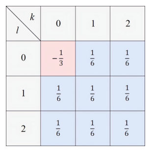
<figcaption class="paper-figure-caption"><b>Fig 1.</b> FIG. 1. The discrete Wigner function of the Strange state.</figcaption>
</figure>
<figure class="paper-figure-card">
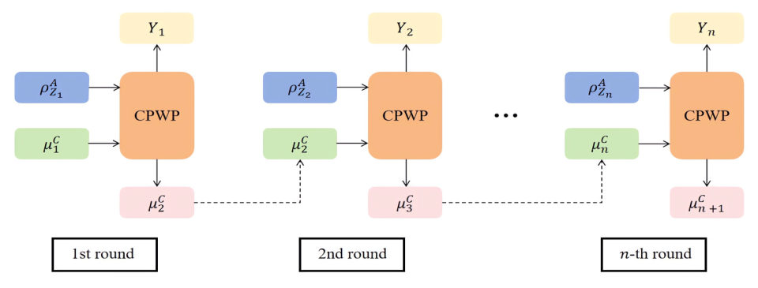
<figcaption class="paper-figure-caption"><b>Fig 2.</b> FIG. 2. General state discrimination framework under CPWP protocol assisted by quantum memories and catalysts. In each round, the input state ρA Z j and the memory state µC j are jointly processed by a CPWP instrument, producing a classical guess Y j and an updated memory state µC j+1. The updated memory is reused in the next round, thereby allowing information from previous rounds to affect later discrimination strategies. In the catalytic setting, the memory state remains unchanged in every round, i.e., µC 1 = µC j for all j ∈{2, · · · , n}.</figcaption>
</figure>

**Summary.** This paper investigates methods to boost the discrimination power of measurements restricted by classical simulation constraints. By framing this as a channel simulation problem, it derives theoretical bounds and proves that while magic resources can help in some cases, they cannot improve performance beyond the optimal PWF measurement limit when using catalysts or memories for specific state pairs.

**Why it may be interesting.** It rigorously quantifies the gap between what can be achieved classically (CSMs) versus globally, providing fundamental limits on quantum information tasks that are crucial for understanding resource theories in open quantum systems.

Detailed structure

**Main problem.** The central problem is determining how to enhance the discrimination power of Classically Simulable Measurements (CSMs) beyond their inherent limitations.

**Main result.** The paper establishes a no-go theorem proving that for distinguishing certain states, neither finite quantum catalysts nor quantum memories can improve the optimal success probability achievable with CSMs.

**Method.** The authors relate the measurement problem to channel simulation costs and utilize supermartingale analysis (Azuma's inequality) to derive bounds on the success probability in resource-assisted discrimination protocols.

**Model / system.** The study is set in odd-prime-dimensional quantum systems, focusing on distinguishing pairs of states ($\mu_C$ and $\gamma_C$) using measurements characterized by positive discrete Wigner functions (PWF POVMs).

**Key observables.** Optimal success probability of discrimination ($p_{	ext{opt}}$), the magic cost ($\mathcal{E}_E^c$), and the simulation cost required to simulate quantum channels.

**Important parameters / regimes.** Odd-prime dimension $d=j^n$, number of resources/rounds ($n$), and the degree of classical simulability (PWF property).

**Assumptions / limitations.** The analysis is restricted to distinguishing pairs of states with positive Wigner functions (PWF states) and assumes the use of CPWP measurement channels.

**Paper structure.** The paper first defines CSMs via PWF POVMs, relates this to channel simulation costs, derives bounds on this cost using magic resources, provides a concrete example where enhancement occurs, and concludes with the no-go theorem for catalysts/memories.

Abstract

Classically simulable measurements (CSMs) constitute an important class of restricted measurements in the odd-prime-dimensional magic resource theory, referring to those measurements with positive discrete Wigner functions. Since their discrimination power is weaker than that of global measurements, it is necessary to study how to improve the discrimination power of CSMs. In this paper, we consider three methods to improve the discrimination power of CSMs, including adding magic resources, using quantum catalysts, and using quantum memories. Specifically, we relate measurements with positive discrete Wigner functions to completely positive Wigner-preserving measurement channels, thereby transforming the problem of improving the discrimination power of CSMs into the problem of determining how many magic resources are required to simulate quantum channels using free operations. Based on this, we derive the lower and upper bounds of the simulation cost. Moreover, we provide a concrete example for which these bounds coincide and prove that consumable magic resources can enhance the discrimination power of CSMs. Finally, we establish a no-go theorem, which shows that for discriminating a pair of states with positive Wigner functions, neither finite-dimensional quantum catalysts nor finite-dimensional quantum memories can improve the optimal success probability of discrimination using CSMs.

[↑ back to top](#top)

### [Simultaneous calibration of rotation and phase errors in a single experiment](http://arxiv.org/abs/2607.19187v1)

**Authors:** Tien D. Nguyen, Hung Q. Nguyen  
**Type:** experiment · **Category:** quantum information and computing · **PDF:** <https://arxiv.org/pdf/2607.19187v1>  
**Analysis basis:** full PDF text, analyzed in chunks
**Topic relevance:** 🔥 `QC/QI experiment` **4/5** · `quantum measurements` **2/5**

↔ Scroll figures horizontally

<figure class="paper-figure-card">
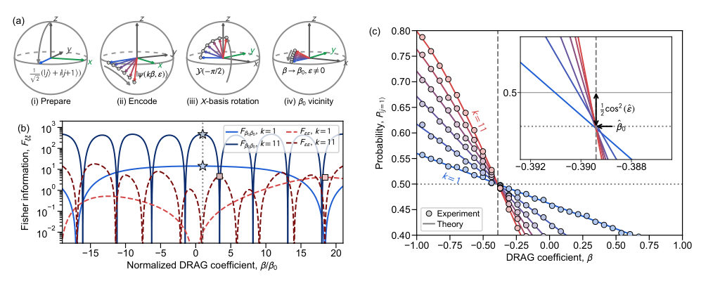
<figcaption class="paper-figure-caption"><b>Fig 1.</b> FIG. 1. DRAPE (DRAG-APE) protocol. (a) Bloch-sphere geometry of the gate sequence: an imperfect |−y⟩state is prepared, k pseudo-identity pairs encode ϵ and δ on its polar and azimuthal angles, and a final y-rotation converts the accumulated phase into a measurable population. (b) Per-shot Fisher information versus the DRAG sweep β/β0: Fβ0β0 (solid blue) and Fϵϵ (dashed red) for k = 1 and 11. At the crossing point β0 (dotted line) Fβ0β0 is maximal while Fϵϵ is minimal; squares mark the Fϵϵ peak. (c) DRAPE measurement on the |j = 1⟩↔|j + 1 = 2⟩transition of an IBM transmon: P|j=1⟩versus β for k = 1, . . . , 11; solid curves are fits to Eq. (9). Inset: zoom on the crossing locus that...</figcaption>
</figure>
<figure class="paper-figure-card">
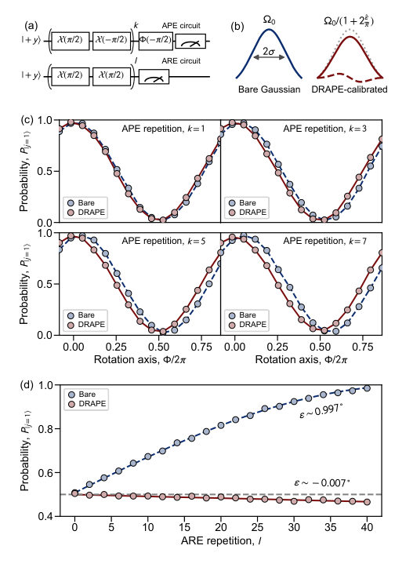
<figcaption class="paper-figure-caption"><b>Fig 2.</b> FIG. 2. Validation of the DRAPE corrections. (a) The APE and ARE circuits. (b) Pulse shapes: bare Gaussian versus DRAPE-calibrated Gaussian, whose amplitude is rescaled to cancel ˆϵ and to which a DRAG quadrature Ωy = −(ˆβ0/∆2) ˙Ωx is added to cancel the phase error. (c) APE result: P|j=1⟩ versus the final-axis azimuth ϕ for k = 1, 3, 5, 7; the Ramsey fringes fan out with k before correction and collapse onto a single curve after. (d) ARE result: P|j=1⟩after ℓrepetitions of X(π/2)X(π/2); the population drifts from the ideal 1/2 before correction and stays near 1/2 after.</figcaption>
</figure>

**Summary.** The paper introduces the DRAPE protocol to overcome the limitations of sequential error characterization in superconducting qubits. By designing a single Ramsey-type measurement sequence, it simultaneously calibrates both rotation and phase errors ($\epsilon$ and $\delta$). This method significantly improves gate fidelity by achieving superior scaling for phase estimation compared to traditional iterative techniques.

**Why it may be interesting.** This work directly addresses a critical bottleneck in quantum computation: characterizing complex, coupled gate errors without resorting to slow, iterative calibration routines. The ability to achieve Heisenberg scaling for one error while maintaining high precision on another simultaneously is highly valuable.

Detailed structure

**Main problem.** Coherent control errors, specifically over/under-rotation ($\epsilon$) and phase error ($\delta$), in weakly anharmonic qubits require simultaneous calibration to reach fault-tolerance thresholds.

**Main result.** The proposed DRAPE protocol allows for the single-shot, simultaneous calibration of both $\epsilon$ and $\delta$, achieving Heisenberg scaling for phase estimation while saturating the standard quantum limit for rotation error.

**Method.** A Ramsey-type diagnostic sequence (DRAPE) is used to measure population probabilities $P_{|j
angle}$ based on a composite unitary operator, allowing simultaneous fitting of both error parameters via Fisher information analysis.

**Model / system.** The study uses weakly anharmonic qubits, experimentally demonstrated on the $|1
angle \leftrightarrow |2
angle$ transition of an IBM transmon superconducting qubit. The underlying physics is modeled using effective Hamiltonians derived via Schrieffer-Wolff and Magnus expansions.

**Key observables.** Population probabilities $P_{|j
angle}$ (or $P_{|j+1
angle}$) measured after the gate sequence; Fisher Information ($F_{\xi\xi}$).

**Important parameters / regimes.** Error parameters ($\epsilon$, $\delta$); Number of repetitions ($N$) leading to Heisenberg scaling for phase estimation.

**Assumptions / limitations.** The analysis is restricted to the weak-driving regime, and derivations rely on truncations (e.g., $O((\Omega/\Delta^2)^2)$) in Hamiltonian expansions.

**Figures summary.** Figures numerically confirm that the Fisher information for phase ($\delta$) shows a maximum at the crossing point $eta_0$, while rotation error ($\epsilon$) is estimated by analyzing slopes away from this point.

**Paper structure.** The paper first derives the coupled error parametrization, then introduces the DRAPE protocol based on measuring population probabilities. It analyzes the scaling of the Fisher information for both parameters at the optimal crossing point $eta_0$, culminating in experimental demonstration and independent validation using established protocols (ARE/APE).

Abstract

In weakly anharmonic qubits, coherent control errors take two generic forms -- over/under-rotation and phase errors -- whose suppression normally requires iterated experiments. We show that, for any symmetric $π/2$ pulse in the weak-driving regime, both follow from a single parametrization, $\mathcal{X}(π/2)=Z(δ)X(π/2+ε)Z(δ)$, that ties the rotation error $ε$ and the phase error $δ$ directly to the system parameters. The parametrization enables DRAPE, a Ramsey-type protocol in which sweeping the phase-error correction reveals a crossing point that fixes both corrections at once. The phase correction is estimated with Heisenberg scaling while the rotation error saturates the standard quantum limit. We experimentally demonstrate DRAPE by calibrating a $π/2$ gate on the $|1\rangle\leftrightarrow |2\rangle$ transition of an IBM transmon, reducing the over-rotation from $0.997^\circ$ to $-0.007^\circ$ and the phase error from $2.52^\circ$ to $0.0052^\circ$ per gate, validated independently by phase- and rotation-error amplification protocols.

[↑ back to top](#top)

### [Magic-protected entanglement and Clifford-irreducible structure in magic state space](http://arxiv.org/abs/2607.18400v1)

**Authors:** Alejandro Borda Kuhlmann, Julian Rincon  
**Type:** theory · **Category:** quantum information and computing · **PDF:** <https://arxiv.org/pdf/2607.18400v1>  
**Analysis basis:** full PDF text, analyzed in chunks
**Topic relevance:** 🔥 `entanglement & information structure` **4/5**

↔ Scroll figures horizontally

<figure class="paper-figure-card">
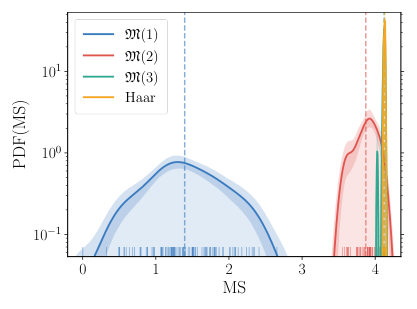
<figcaption class="paper-figure-caption"><b>Fig 1.</b> FIG. 2. Kernel density estimates of the empirical MS prob- ability distributions (PDF), and their mean (vertical dashed lines), for ensembles sampled from M(1), M(2), and M(3), together with Haar-random states. The plot provides a qual- itative visualization of the regime separation: the ensemble sampled from M(1) retains a broad distribution, while the ensemble sampled from M(3) becomes more sharply concen- trated. The comparison with Haar-random states makes the difference in shape and variance particularly transparent.</figcaption>
</figure>
<figure class="paper-figure-card">
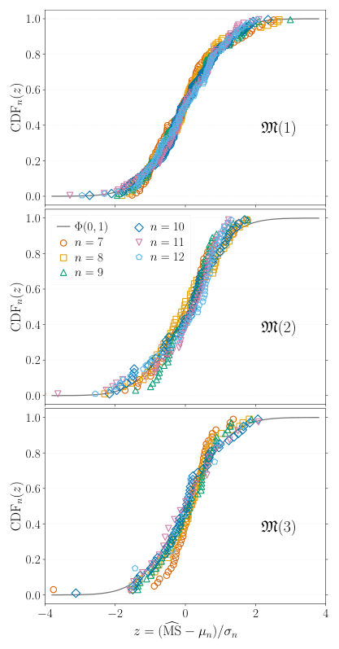
<figcaption class="paper-figure-caption"><b>Fig 2.</b> FIG. 3. Empirical cumulative distribution function (CDF) collapse of the standardized positive d MS values, (d MS−µn)/σn, for ensembles sampled from M(k) with k = 1, 2, 3, using n ∈[7, 12]. Distinct markers indicate system size. The en- semble sampled from M(1) remains comparatively broad and follows the normal reference (continuous line) more closely, consistent with approximately Gaussian finite-size fluctua- tions. By contrast, the ensembles sampled from M(2) and M(3) concentrate much more sharply, displaying a Haar-like suppression of large deviations from the typical value.</figcaption>
</figure>
<figure class="paper-figure-card">
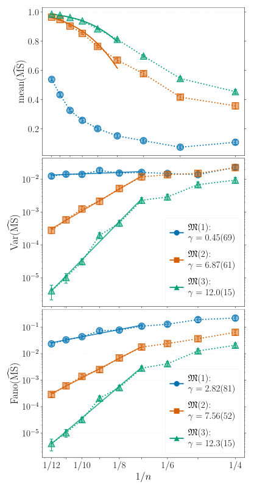
<figcaption class="paper-figure-caption"><b>Fig 3.</b> FIG. 4. Moment analysis for the positive d MS values. Data points for n = 4 −12 are shown to display the early finite- size crossover, while the power-law fits (continuous lines) are performed only over n = 7 −12. Dotted lines are guides to the eye. The mean sets the scale of d MS, whereas the variance and Fano factor quantify absolute and relative fluctuations. The power-law exponents are defined by γ. The rapid sup- pression of both fluctuation measures for ensembles sampled from M(2) and M(3) indicates strong self-averaging in the W-magic regime. The ensemble sampled from M(1) remains broad and only weakly self-averaging over the same range.</figcaption>
</figure>
<figure class="paper-figure-card">
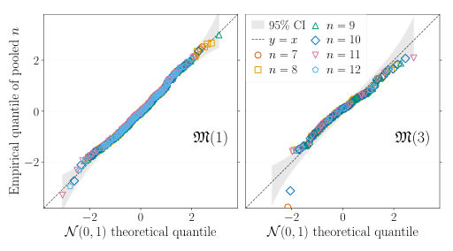
<figcaption class="paper-figure-caption"><b>Fig 4.</b> FIG. 7. Normal Q-Q diagnostics for the standardized posi- tive d MS fluctuations, with pointwise 95% confidence bands. Distinct markers indicate system size. The ensemble sampled from M(1) is comparatively close to the normal reference, while that sampled from M(3) shows systematic tail devia- tions, consistent with strong concentration rather than con- vergence to a finite-width Gaussian fluctuation law.</figcaption>
</figure>
<figure class="paper-figure-card">
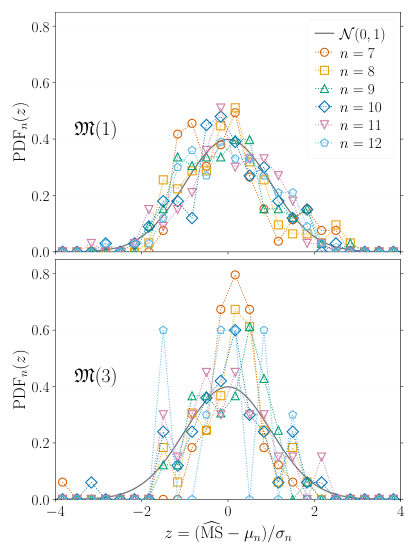
<figcaption class="paper-figure-caption"><b>Fig 5.</b> FIG. 6. Histogram-based probability density function (PDF) collapse of the standardized positive d MS values, (d MS−µn)/σn, for ensembles sampled from M(1) and M(3), using n ∈[7, 12]. Distinct markers indicate system size. The ensemble sampled from M(1) remains close to the normal reference (continu- ous line), whereas the ensemble sampled from M(3) shows stronger concentration and clearer deviations from a finite- width Gaussian profile.</figcaption>
</figure>

**Summary.** This paper introduces 'magical entanglement' as an invariant measure of bipartite entanglement protected from simplification by Clifford gates. It establishes a framework based on Clifford orbits to classify states into T-magic and W-magic regimes. This distinction helps characterize the fundamental, irreducible quantum correlations present in complex quantum systems.

**Why it may be interesting.** This work provides a powerful, resource-theoretic diagnostic tool for quantifying genuine quantum correlations that cannot be simulated or removed by local Clifford operations, which is central to understanding quantum computation complexity.

Detailed structure

**Main problem.** The paper develops a framework to study 'magic-protected entanglement' (magical entanglement), which quantifies the bipartite entanglement remaining after optimal simplification by Clifford operations.

**Main result.** It identifies two distinct regimes: the T-magic regime, where protected entanglement is weak and state-dependent, and the W-magic regime, where entanglement is strongly self-averaging and irreducible with respect to Clifford reduction.

**Method.** The core method involves developing a Clifford-orbit framework by defining magical entanglement as the minimum bipartite entanglement achievable over all states reachable via Clifford gates.

**Model / system.** The study analyzes pure quantum states $|\psi
angle$ in $n$ qubits, focusing on how their entanglement structure is preserved or destroyed under the action of the Clifford group ($C_n$).

**Key observables.** Magical Entanglement ($	ext{MS}$), which serves as an orbit-level invariant; canonical representatives and spectra characterizing the Clifford-irreducible structure.

**Important parameters / regimes.** The classification depends on whether entanglement is tied to nonstabilizerness, distinguishing between T-magic (local nonstabilizer resources) and W-magic (nonlocal nonstabilizer requirements).

**Assumptions / limitations.** The analysis assumes that the physically relevant quantum correlations are those protected from removal by Clifford operations.

**Figures summary.** Figures illustrate PDF collapse and Q-Q plots comparing standardized fluctuations of $	ext{MS}$ values for different ensembles, showing systematic deviations from Gaussian behavior in W-magic cases.

**Paper structure.** The paper builds a mathematical framework around the Clifford orbit invariance of entanglement measures. It then uses this invariant to classify states into T-magic and W-magic regimes by analyzing how nonstabilizerness protects quantum correlations against stabilizer reduction.

Abstract

We develop a Clifford-orbit framework for studying magic-protected entanglement, which we refer to as magical entanglement: the part of bipartite entanglement that remains after optimal stabilizer simplification. This construction leverages residual entanglement under Clifford reduction as a state-level organizing principle for magic state space. It defines canonical representatives, spectra, and ranks that characterize the Clifford-irreducible structure of a state. We identify two regimes of the magic-entanglement interplay. In the $T$-magic regime, local nonstabilizer resources can coexist with entanglement, but the protected component remains weak and state-dependent. In the $W$-magic regime, by contrast, entanglement is Clifford-irreducibly tied to nonstabilizerness, producing typical, strongly self-averaging behavior. Analytical examples and random-circuit numerics support a crossover from broad $T$-magic fluctuations to concentrated, Haar-like $W$-magic behavior. These results identify magical entanglement as an orbit-level diagnostic of how nonstabilizerness protects quantum correlations against Clifford reduction.

[↑ back to top](#top)

### [Monogamy inequalities of entanglement of assistance in $2\otimes 2\otimes d$ systems](http://arxiv.org/abs/2607.18643v1)

**Authors:** Xue-Na Zhu, Gui Bao, Zhi-Xiang Jin, Shao-Ming Fei, Tao Li  
**Type:** theory · **Category:** quantum information and computing · **PDF:** <https://arxiv.org/pdf/2607.18643v1>  
**Analysis basis:** full PDF text, analyzed in chunks
**Topic relevance:** 🔥 `entanglement & information structure` **4/5**

↔ Scroll figures horizontally

<figure class="paper-figure-card">
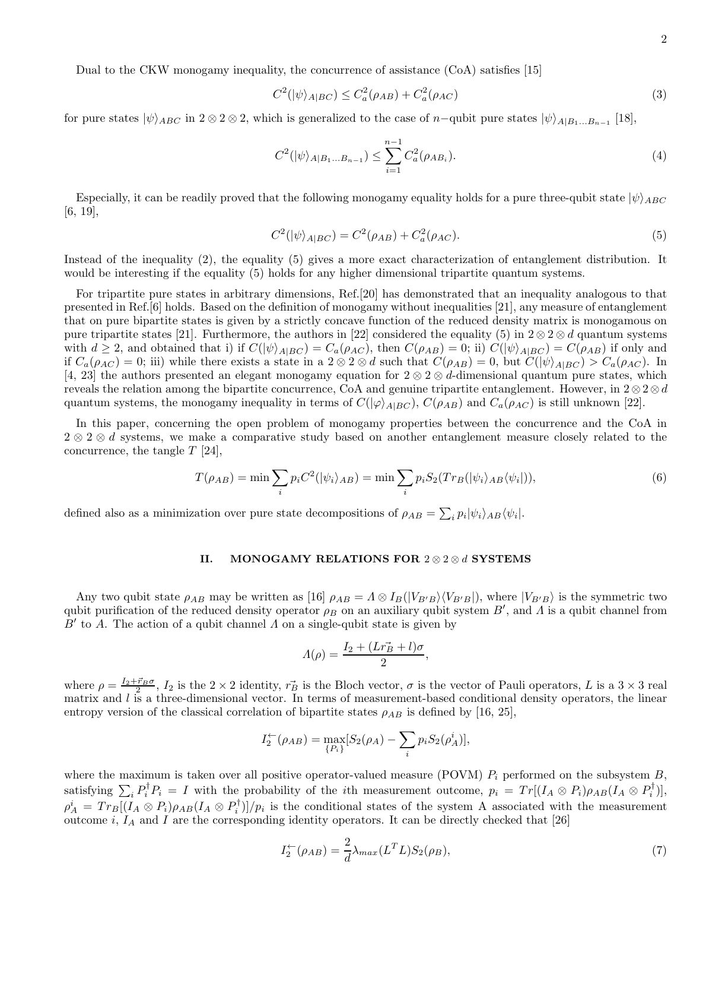
<figcaption class="paper-figure-caption"><b>Fig 1.</b> Low-resolution page preview, page 2</figcaption>
</figure>
<figure class="paper-figure-card">
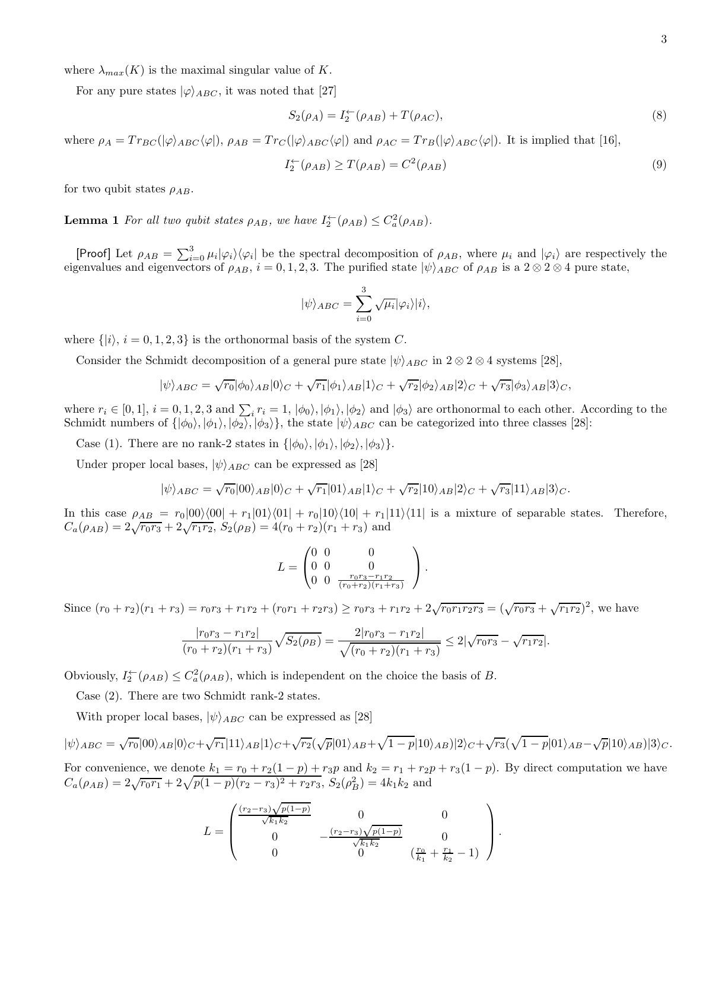
<figcaption class="paper-figure-caption"><b>Fig 2.</b> Low-resolution page preview, page 3</figcaption>
</figure>
<figure class="paper-figure-card">
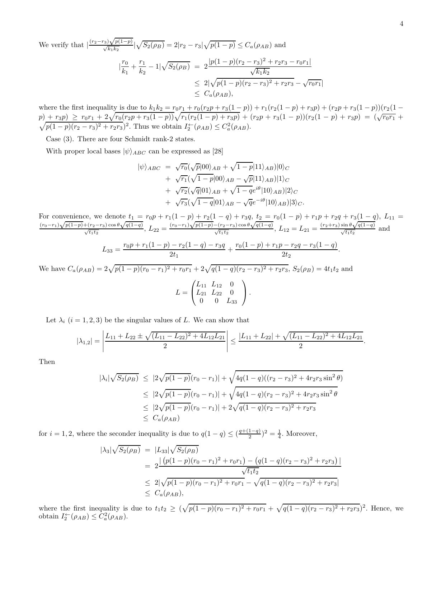
<figcaption class="paper-figure-caption"><b>Fig 3.</b> Low-resolution page preview, page 4</figcaption>
</figure>
<figure class="paper-figure-card">
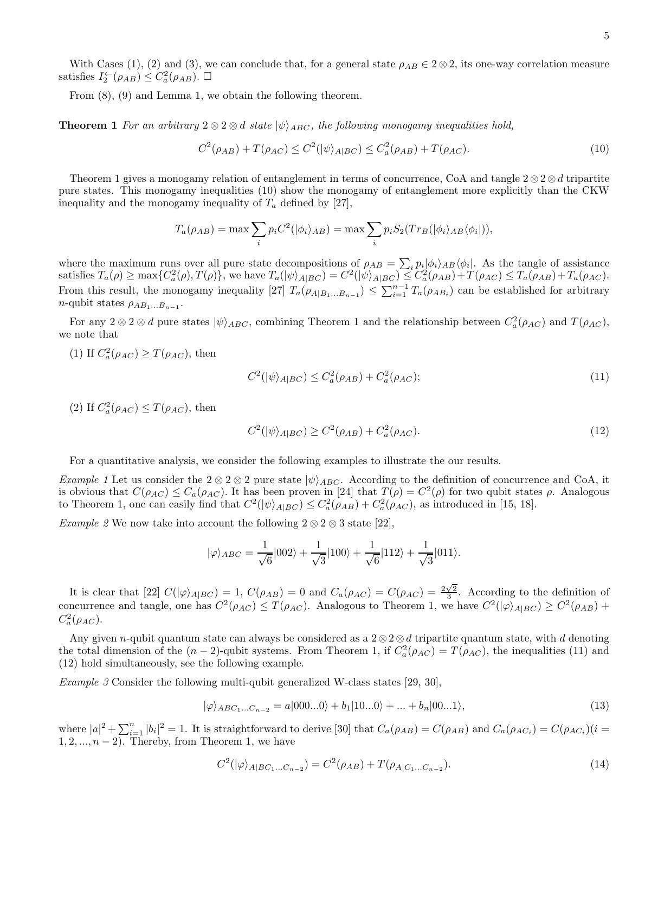
<figcaption class="paper-figure-caption"><b>Fig 4.</b> Low-resolution page preview, page 5</figcaption>
</figure>
<figure class="paper-figure-card">
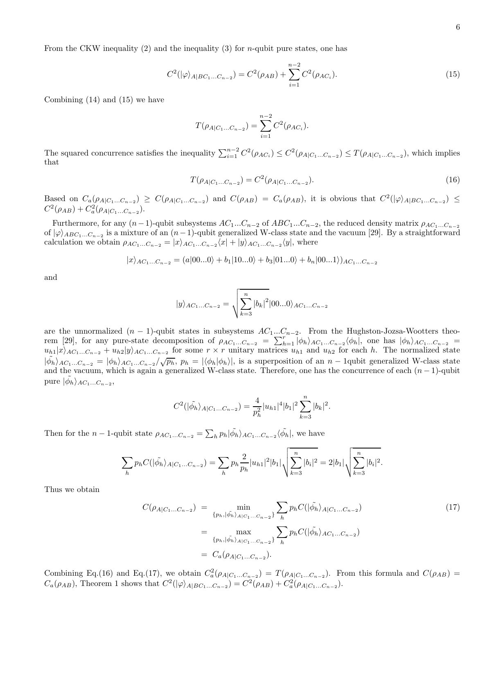
<figcaption class="paper-figure-caption"><b>Fig 5.</b> Low-resolution page preview, page 6</figcaption>
</figure>

**Summary.** This paper rigorously studies the monogamy relations for various entanglement measures, particularly focusing on the Concurrence of Assistance (CoA), in $2 \otimes 2 \otimes d$ quantum systems. It establishes a new explicit inequality relating bipartite concurrence, tangle, and CoA. These results provide deeper quantitative insights into how quantum correlations are distributed among multiple subsystems.

**Why it may be interesting.** This work provides rigorous mathematical constraints on how entanglement can be distributed among multiple parties, which is fundamental knowledge for quantum cryptography and multipartite quantum computation protocols.

Detailed structure

**Main problem.** The paper investigates the monogamy relations governing the distribution of quantum correlations, specifically focusing on the entanglement of assistance (CoA) in multipartite systems.

**Main result.** A key monogamy inequality is established for $2 \otimes 2 \otimes d$ states: $C_2(
ho_{AB}) + T(
ho_{AC}) \le C_2(|\psi
angle A|BC) \le C_a^2(
ho_{AB}) + T(
ho_{AC})$.

**Method.** The authors use detailed mathematical analysis, including examining singular values derived from state decompositions across multiple cases to prove the required inequalities.

**Model / system.** The study focuses on tripartite pure quantum states $|\psi
angle ABC$ within a $2 \otimes 2 \otimes d$ dimensional Hilbert space, involving qubits (A and B) and an ancillary system (C).

**Key observables.** Concurrence ($C$), Tangle ($T$), Concurrence of Assistance ($	ext{CoA}$ or $C_a$), and the three-partite concurrence.

**Important parameters / regimes.** The dimensions are fixed to $2 \otimes 2 \otimes d$, with specific examples analyzed in $d=2$ and $d=3$.

**Assumptions / limitations.** The analysis relies on characterizing entanglement measures for pure states and comparing them across different bipartite partitions.

**Paper structure.** The paper introduces the problem by defining necessary correlation measures, derives specific inequalities (like $I_{\leftarrow}^2(
ho_{AB}) \le C_a^2(
ho_{AB})$), and culminates in proving the general monogamy relation for the tripartite concurrence.

Abstract

The monogamy relations characterize the distribution of quantum correlations among the multipartite quantum systems. We study the monogamy relations of the entanglement of assistance in $2\otimes 2\otimes d$ systems. We present explicitly the relations satisfied by the concurrence, the tangle and the concurrence of assistance, which can be used to derive rigorous monogamy relations. Detailed examples are given to illustrate our results.

[↑ back to top](#top)

### [Observation of a power transfer controlled by the phase of a quantum superposition](http://arxiv.org/abs/2607.18513v1)

**Authors:** Nathanaël Cottet, Sébastien Jezouin, Bogdan Reznychenko, Alexia Auffèves, Benjamin Huard  
**Type:** experiment · **Category:** other · **PDF:** <https://arxiv.org/pdf/2607.18513v1>  
**Analysis basis:** full PDF text, analyzed in chunks
**Topic relevance:** `driven-dissipative phase transition` **3/5** · `interference shaping light` **3/5** · `quantum optics experiment` **3/5** · `Tavis-Cummings & cavity-many-emitter` **2/5** · `analog quantum simulation` **2/5** · `correlated / nonlocal dissipation` **2/5** · `correlated cavity matter` **2/5** · `methods for driven-dissipative` **2/5** · `non-equilibrium dynamics` **2/5** · `non-equilibrium universality` **2/5** · `quantum measurements` **2/5** · `Keldysh / 2PI / non-Gaussian methods` **1/5** · `QC/QI experiment` **1/5** · `entanglement & information structure` **1/5** · `measurement-induced transitions` **1/5**

↔ Scroll figures horizontally

<figure class="paper-figure-card">
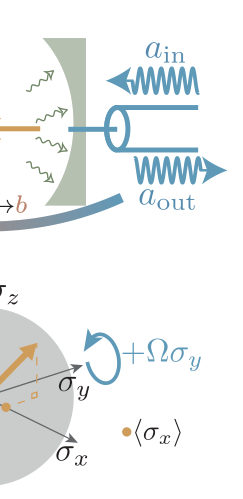
<figcaption class="paper-figure-caption"><b>Fig 1.</b> Figure 1: Power transfer mediated by the phase of a qubit. (a) A transmon superconducting qubit is resonantly driven through two transmission lines a and b leading to a power transfer Pa→b between them. (b) When the driving fields are set so that they drive the qubit with the same amplitude but opposite phases (here around σy), their net effect on the qubit vanishes. Still, the transferred power from one line into the other depends on the qubit coherence, here it is proportional to ⟨σx⟩.</figcaption>
</figure>
<figure class="paper-figure-card">
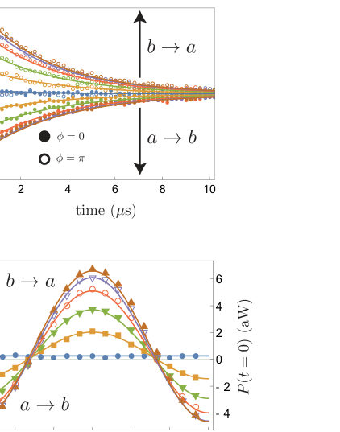
<figcaption class="paper-figure-caption"><b>Fig 2.</b> Figure 3: Evidence of power transfer. (left panel) The qubit is initialized in various superpositions of states with phases ϕ = 0 (plain line) and ϕ = π (dashed line) represented in a 2D projection of the Bloch sphere, before turning on the two drives. a) Time-resolved measurement of the difference between the output and input photon flux in line a, showing directionality depending on the phase (full circles for ϕ = 0 and empty circles for ϕ = π). The experimental data (points) is fitted with the theory (plain line) using the gain and a delay between the drives τd = 18 ns as fitting parameters. b) Control of the transfer direction by the phase of the superposition of states. The amplitude...</figcaption>
</figure>
<figure class="paper-figure-card">
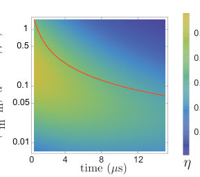
<figcaption class="paper-figure-caption"><b>Fig 3.</b> Figure 4: Photon transfer efficiency. (a) Evolution of the outgoing photon flux mea- sured in a as a function of time for a qubit initialized in |g⟩+eiϕ|e⟩with ϕ = 0 (full circles) or ϕ = π (empty circles) with various input photon fluxes (bottom panel). It displays the transition from a flux dominated by spontaneous emission (red) with weak directionality to one where the input drive overcomes the emission of the qubit (blue). The highest directionality is obtained in the intermediate regime (green). (b) Experimental photon transfer efficiency obtained by integrating the photon flux for a time τ and (c) ideal the- oretical efficiency based on the qubit coherence times. The input fluxes and...</figcaption>
</figure>

**Summary.** The researchers demonstrated that a superconducting transmon qubit can transfer power directionally between two microwave transmission lines based solely on the relative phase ($\phi$) of its superposition state. By setting opposing input drives, they showed the output power oscillates as $\cos(\phi)$, proving that quantum coherence dictates the energy routing in this open quantum system.

**Why it may be interesting.** This work provides a clean demonstration of quantum control over energy flow in an open quantum system (qubit coupled to waveguides), directly linking directional photon emission to the phase coherence ($\phi$) of the emitter, which is central to understanding quantum thermodynamics and measurement processes.

Detailed structure

**Main problem.** To determine if the direction of energy flow (power transfer) between two spatially separated electromagnetic modes driven by a single qubit can be controlled by the quantum phase ($\phi$) of the qubit's superposition state.

**Main result.** The power transfer exhibits a clear, continuous transition in direction as $\phi$ changes, following a $\cos(\phi)$ dependence. This directional pumping is fundamentally controlled by the qubit's coherence rather than classical drive parameters.

**Method.** Time-resolved measurement of output photon flux in one transmission line while applying opposite-amplitude drives to two coupled lines.

**Model / system.** The system uses a superconducting transmon qubit coupled to two microwave transmission lines. The dynamics are analyzed using input-output relations derived from the Hamiltonian, focusing on stimulated emission competing with reflected drive and spontaneous emission.

**Key observables.** Output power in one line ($\langle a_{	ext{out}}^\dagger a_{	ext{out}}
angle$), photon routing efficiency ($\eta$), and the dependence of transfer amplitude on $\cos(\phi)$.

**Important parameters / regimes.** The phase $\phi$ of the qubit superposition, the coherence parameter $\langle\sigma_x
angle$, and the ratio between spontaneous vs. stimulated emission rates.

**Assumptions / limitations.** The directionality is limited by phase-independent contributions from reflected drive and spontaneous emission; the analysis assumes a lossless emitter coupled to the lines.

**Figures summary.** Figures illustrate the setup showing power transfer driven by two lines, demonstrating that when drives cancel, power transfers via coherence ($\propto \langle\sigma_x
angle$). A key figure shows the output power varying as $\cos(\phi)$, confirming directionality switching.

**Paper structure.** The paper establishes the physical model (qubit coupled to two lines), derives the outgoing photon flux equations, and then analyzes the directional transfer by setting input drives to cancel ($\Omega_a = -\Omega_b$), showing the dependence on $\cos(\phi)$ through time-resolved measurements.

Abstract

A driven qubit exchanges energy with the propagating modes that drive it. When two spatially separated modes drive a single qubit with opposite amplitudes, their net action on the qubit cancels. Yet the qubit can still transfer power from one mode to the other through stimulated emission. The directionality originates from opposite stimulated emission powers into each line. We realize this situation with a superconducting transmon qubit coupled to two transmission lines and show that the direction of the power flow is set by the phase $φ$ of the qubit superposition between its ground and excited states, rather than by any classical control parameter. From a time-resolved measurement of the output power in one line, we observe a transfer that varies as $\cosφ$ and hence changes direction between $φ=0$ and $φ=π$. The directionality of the total power flow is limited by the phase independent contributions of the reflected drive and of spontaneous emission, which sets a routing efficiency that we measure as a function of the input power. For an equal superposition of ground and excited qubit states (maximal coherence), the efficiency reaches $63\%$, close to the bound of $69\%$ expected from the measured qubit coherence times.

[↑ back to top](#top)

### [Nonlinear Optics Mediated by Chiral Waveguide QED: Generation of Momentum-anticorrelated Photon Pairs](http://arxiv.org/abs/2607.18562v1)

**Authors:** Wenqi Tong, Spencer J Walsh, H. Alaeian, F. Robicheaux  
**Type:** theory · **Category:** other · **PDF:** <https://arxiv.org/pdf/2607.18562v1>  
**Analysis basis:** full PDF text, analyzed in chunks
**Topic relevance:** `analog quantum simulation` **3/5** · `driven-dissipative phase transition` **3/5** · `interference shaping light` **3/5** · `methods for driven-dissipative` **3/5** · `QC/QI experiment` **2/5** · `Tavis-Cummings & cavity-many-emitter` **2/5** · `correlated cavity matter` **2/5** · `non-equilibrium dynamics` **2/5** · `Keldysh / 2PI / non-Gaussian methods` **1/5** · `correlated / nonlocal dissipation` **1/5** · `entanglement & information structure` **1/5** · `non-equilibrium universality` **1/5**

↔ Scroll figures horizontally

<figure class="paper-figure-card">
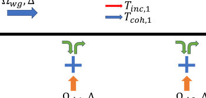
<figcaption class="paper-figure-caption"><b>Fig 1.</b> FIG. 1. Schematics of the system: Two transmons chirally coupled to a 1D waveguide is driven by two continuous-wave fields, Ωwg through the waveguide and Ωd by the side port, with the same detuning.</figcaption>
</figure>
<figure class="paper-figure-card">
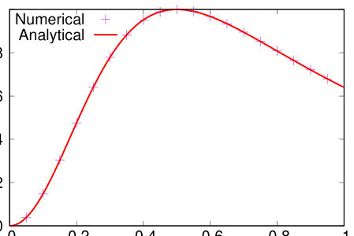
<figcaption class="paper-figure-caption"><b>Fig 2.</b> FIG. 2. On-resonance incoherent transmission probability af- ter one chiral transmon as a function of normalized Rabi fre- quency. The purple symbols refer to the numerical calculation results from Eq. (13) while the red solid line corresponds to the analytical expression from Eq. (15).</figcaption>
</figure>
<figure class="paper-figure-card">
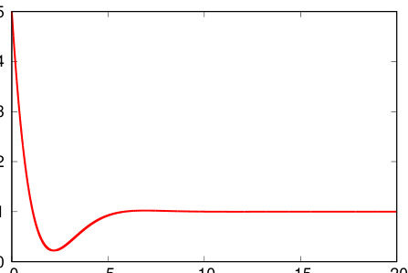
<figcaption class="paper-figure-caption"><b>Fig 3.</b> FIG. 4. Second-order correlation function of the incoherent component for Ω= 0.5 √</figcaption>
</figure>
<figure class="paper-figure-card">
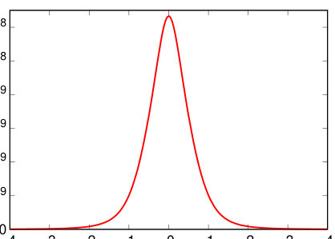
<figcaption class="paper-figure-caption"><b>Fig 4.</b> FIG. 3. Power spectrum density of the incoherent compo- nent as a function of the normalized detuning, ∆/Γ, for Ω= 0.5 √</figcaption>
</figure>
<figure class="paper-figure-card">
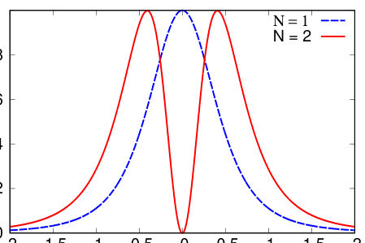
<figcaption class="paper-figure-caption"><b>Fig 5.</b> FIG. 5. Incoherent transmission after one (blue dashed line) and two (red solid line) chiral transmons as a function of normalized detuning at Ω/ √</figcaption>
</figure>

**Summary.** This paper explores how chiral coupling between transmons and a waveguide can mediate nonlinear quantum optical effects to generate momentum-anticorrelated photon pairs. By combining waveguide driving with independently tunable local drives, the researchers demonstrate precise control over the transmitted light's quantum statistics, tuning it from anti-bunched to super-bunched regimes.

**Why it may be interesting.** This work bridges superconducting circuit QED with quantum optics concepts like nonlinear light generation and photon correlation engineering, providing a platform for realizing complex quantum optical phenomena in solid-state systems.

Detailed structure

**Main problem.** The research investigates nonlinear optics mediated by chiral waveguide Quantum Electrodynamics (QED) to achieve the generation of momentum-anticorrelated photon pairs.

**Main result.** The interplay between waveguide driving and local driving allows for the engineering of quantum statistics in the transmitted field, enabling tunable control over $g^{(2)}(0)$ across anti-bunched, coherent, and strongly bunched regimes.

**Method.** The study employs both semi-classical simulations (using input-output theory) and full quantum wavefunction calculations to analyze light transmission through coupled transmon qubits.

**Model / system.** The system consists of multiple transmons (superconducting qubits) chirally coupled to a one-dimensional waveguide. The dynamics are governed by a Hamiltonian incorporating local driving, waveguide coupling, and dissipation via a Lindblad master equation.

**Key observables.** Second-order correlation function ($g^{(2)}(0)$), coherent transmission amplitude ($\langle\hat{\alpha}
angle$), and the power spectrum density of the incoherent component.

**Important parameters / regimes.** Rabi frequencies ($\Omega_{wg}, \Omega_d$), detunings ($\Delta_n$), and the coupling strength ($\Gamma$).

**Assumptions / limitations.** The analysis assumes $\hbar=1$, perfect coupling efficiency, and utilizes approximations like Born-Markov for some simulations.

**Figures summary.** Figures illustrate the system setup (transmons coupled to a waveguide) and show quantitative results such as $T_{inc}$ vs. Rabi frequency, power spectra of the incoherent component, and $g^{(2)}(	au)$ confirming bunching behavior.

**Paper structure.** The paper progresses from defining the physical model (Hamiltonian/Master Equation) to analyzing coherent transmission via input-output theory, then detailing how single or multiple chiral transmons modify photon statistics by generating an incoherent component, which can be controlled using local driving fields.

Abstract

In recent years, chiral quantum optics has emerged as an active research area due to the promising applications in quantum information processing as well as nonlinear optics. We present results on the properties of the incoherent component of the transmitted light after transmons chirally coupled to a waveguide. The well-known resonance fluorescence of one chiral transmon resembles nonlinear quantum optics as it can convert the coherent light, with photons having spatially extensive coherence and Poisson distribution, into a field with spatially localized coherence and bunching photon statistics. However, another chiral transmon can undo the effect of the first transmon regardless of the Rabi frequency under the idealization involved in this work. A full wavefunction calculation shows that, in the weak driving limit, this incoherent light mainly comes from two-photon processes - one chiral transmon converts two independent photons into a photon pair with opposite momentum shift. In addition to the driving through the waveguide, a local driving with independently tunable amplitude and phase can address each transmon individually. The interplay between the waveguide driving and local driving modulates the contribution of the incoherent transmission and hence enables the engineering of the quantum statistics of the transmitted field, with tunable $g^{(2)}(0)$ spanning anti-bunched, coherent, and strongly bunched regimes.

[↑ back to top](#top)

### [A Reversible Continuous-Variable Photonic Memory Architecture Based on Displacement-Evolved Coherent-State Dynamics](http://arxiv.org/abs/2607.18702v1)

**Authors:** Sanjit Krishna G M  
**Type:** theory · **Category:** quantum information and computing · **PDF:** <https://arxiv.org/pdf/2607.18702v1>  
**Analysis basis:** full PDF text, analyzed in chunks
**Topic relevance:** `analog quantum simulation` **3/5** · `methods for driven-dissipative` **3/5** · `non-equilibrium dynamics` **3/5** · `correlated / nonlocal dissipation` **2/5** · `driven-dissipative phase transition` **2/5** · `entanglement & information structure` **2/5** · `quantum measurements` **2/5** · `Keldysh / 2PI / non-Gaussian methods` **1/5** · `Tavis-Cummings & cavity-many-emitter` **1/5** · `correlated cavity matter` **1/5** · `interference shaping light` **1/5** · `measurement-induced transitions` **1/5** · `non-equilibrium universality` **1/5**

↔ Scroll figures horizontally

<figure class="paper-figure-card">
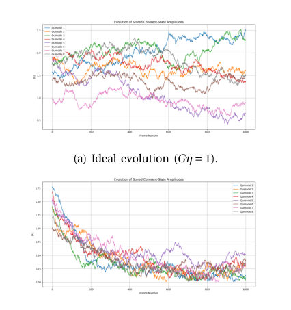
<figcaption class="paper-figure-caption"><b>Fig 1.</b> Fig. 1: Comparison of coherent-state evolution in the pro- posed eight-qumode photonic memory architecture. (a) Ideal evolution in the absence of loss and noise, where the coherent amplitudes evolve solely through displacement updates. (b) Evolution under realistic operating conditions including optical loss, amplifier compensation, and noise. Although fluctuations accumulate over time, the latent-state structure remains preserved, demonstrating the robustness of the storage mechanism.</figcaption>
</figure>
<figure class="paper-figure-card">

<figcaption class="paper-figure-caption"><b>Fig 2.</b> Fig. 2: Average retrieval fidelity under different noise levels, averaged over 50 independent realizations. Higher noise amplitudes lead to faster degradation of the stored latent representation and reduced long-term retrieval accuracy.</figcaption>
</figure>
<figure class="paper-figure-card">
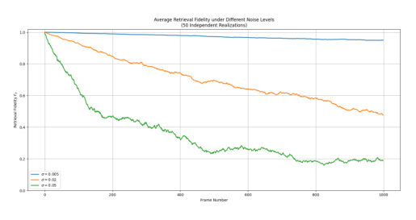
<figcaption class="paper-figure-caption"><b>Fig 3.</b> Figure 3 presents the average rollback retrieval fidelity as a function of rollback depth. Here, the rollback depth corresponds to the number of displacement updates that must be reversed in order to reach the desired historical frame. The results were averaged over 500 independent realizations of the storage process.</figcaption>
</figure>
<figure class="paper-figure-card">
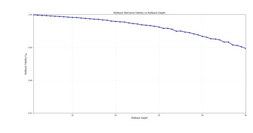
<figcaption class="paper-figure-caption"><b>Fig 4.</b> Fig. 3: Average rollback retrieval fidelity as a function of rollback depth for the proposed eight-qumode photonic memory. The results are averaged over 500 independent realizations. Despite increasing rollback depth, the fidelity remains high, demonstrating the effectiveness of metadata- assisted state reconstruction.</figcaption>
</figure>

**Summary.** This paper introduces a novel continuous-variable photonic memory architecture designed to store the history of evolving information using multimode coherent states. It achieves this through metadata-assisted indexing and reversible displacement operations, allowing for reliable rollback retrieval of past states. The theoretical framework quantifies storage limits using metrics like fidelity decay and distinguishability capacity.

**Why it may be interesting.** This work directly addresses quantum memory limitations by proposing a method to store temporal data streams rather than just single states, which is crucial for quantum simulation and computation.

Detailed structure

**Main problem.** The core problem is designing a quantum memory architecture capable of storing not just static data, but also the entire time-evolving trajectory or history of information.

**Main result.** The authors propose a metadata-assisted continuous-variable photonic memory that allows for reversible retrieval and reconstruction of past states by treating memory as an evolving phase-space trajectory.

**Method.** The framework combines multimode coherent state encoding with displacement operations, utilizing a classical 'digital twin' to track history while the physical loop handles updates.

**Model / system.** The system uses continuous-variable (CV) photonic platforms storing information in multimode coherent states within an optical loop. Updates are modeled by controlled displacement operations applied iteratively, simulating temporal evolution.

**Key observables.** Retrieval fidelity ($F_n$), Rollback Retrieval Fidelity ($FRB$), Memory Lifetime ($N_{life}$), and Rollback Distinguishability Capacity ($CRSD$).

**Important parameters / regimes.** Loop gain ($\eta$), noise variance ($\sigma^2_{\epsilon}$), and the propagation factor ($\lambda$) governing state evolution.

**Assumptions / limitations.** The architecture relies on a classical metadata layer (digital twin) to index and reconstruct history, separating logical tracking from physical storage. The theoretical analysis assumes controlled noise modeling.

**Figures summary.** Not specified in notes; the focus is on deriving analytical expressions for fidelity decay and capacity metrics.

**Paper structure.** The paper develops a comprehensive framework by first defining the CV photonic system, then detailing the incremental update dynamics (forward evolution), followed by the theoretical derivation of reversible rollback mechanisms, culminating in information-theoretic characterizations like $CRSD$.

Abstract

Modern information systems increasingly require memory architectures capable of storing not only static data but also the evolution of information over time. While continuous-variable photonic platforms have been extensively studied for quantum communication and computation, their potential as dynamically evolving memory systems remains largely unexplored. In this work, we introduce a metadata-assisted continuous-variable photonic memory architecture in which information is represented by latent vectors encoded across multimode coherent states and updated through reversible displacement operations. The framework combines multimode storage with metadata-based indexing, enabling navigation and reconstruction of historical memory states through rollback retrieval.   Unlike conventional approaches that focus on preserving a single quantum state, the proposed framework treats memory as a continuously evolving trajectory in continuous-variable phase space. This perspective naturally extends beyond image storage to temporal data streams, machine-learning latent representations, scientific simulations, and other forms of dynamically changing information. Although presented as a theoretical proof-of-concept, the results suggest that continuous-variable photonic systems may provide a promising foundation for future metadata-aware memory architectures capable of storing, tracking, and reconstructing the history of evolving information.

[↑ back to top](#top)

### [Non-Fermi-Liquid Behaviors in Weakly Interacting Two-Dimensional Quasicrystals](http://arxiv.org/abs/2607.18394v1)

**Authors:** Junmo Jeon, Shiro Sakai  
**Type:** theory · **Category:** disordered systems and neural networks · **PDF:** <https://arxiv.org/pdf/2607.18394v1>  
**Analysis basis:** full PDF text, analyzed in chunks
**Topic relevance:** `Keldysh / 2PI / non-Gaussian methods` **3/5** · `analog quantum simulation` **3/5** · `Kondo & dissipative impurity` **2/5** · `non-equilibrium dynamics` **2/5** · `Frenkel-Kontorova` **1/5** · `correlated / nonlocal dissipation` **1/5** · `driven-dissipative phase transition` **1/5** · `entanglement & information structure` **1/5** · `methods for driven-dissipative` **1/5** · `non-equilibrium universality` **1/5** · `scars & prethermalization` **1/5**

↔ Scroll figures horizontally

<figure class="paper-figure-card">
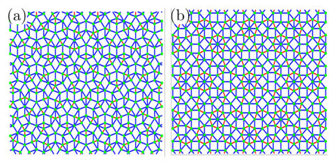
<figcaption class="paper-figure-caption"><b>Fig 1.</b> FIG. 1. Tiling patterns of (a) Penrose and (b) Ammann– Beenker tilings. Green dots represent the positions of atoms. Blue and red edges represent the links with distance a and 2a sin π</figcaption>
</figure>
<figure class="paper-figure-card">
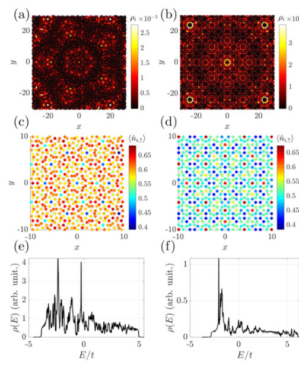
<figcaption class="paper-figure-caption"><b>Fig 2.</b> FIG. 2. Real-space map of the local density of states, ρi, at the Fermi energy for (a) the Penrose tiling at 60% filling and (b) the Ammann–Beenker tiling at half filling. (c,d) The local charge density for up spin, ⟨ˆni,↑⟩, corresponding to (a) and (b), respectively. (e,f) Density of states corresponding to (a) and (b), respectively. T = 10−3t and U = 0.5t are used.</figcaption>
</figure>
<figure class="paper-figure-card">
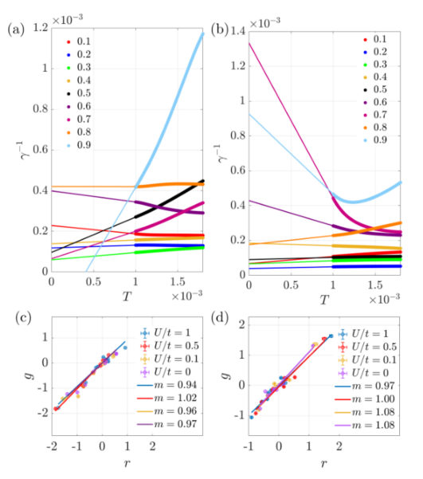
<figcaption class="paper-figure-caption"><b>Fig 3.</b> FIG. 3. (a,b) Inverse of the effective Sommerfeld coefficient plotted against temperature at U = 0.5t. Different colors rep- resent different filling fractions. Here, the results are linearly extrapolated to T &lt; 10−3. (c,d) Relationship between the exponent g and r characterizing the temperature dependence of γ and R, respectively. Different colored lines represent g = mr relationship for different values of U/t. Panels (a,c) [(b,d)] display the results for the Penrose (Ammann–Beenker) tiling.</figcaption>
</figure>
<figure class="paper-figure-card">
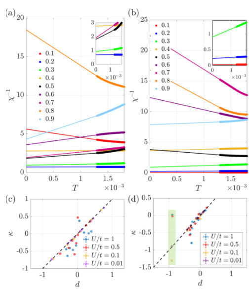
<figcaption class="paper-figure-caption"><b>Fig 4.</b> FIG. 4. (a,b) Inverse magnetic susceptibility plotted against temperature. Different colors represent different filling frac- tions. Panel (a) shows the results for the Penrose tiling, while panel (b) corresponds to the Ammann–Beenker tiling. Here, U = 0.5t. The insets are drawn to emphasize the behav- iors for large susceptibilities. Here, the results for T &lt; 10−3</figcaption>
</figure>
<figure class="paper-figure-card">
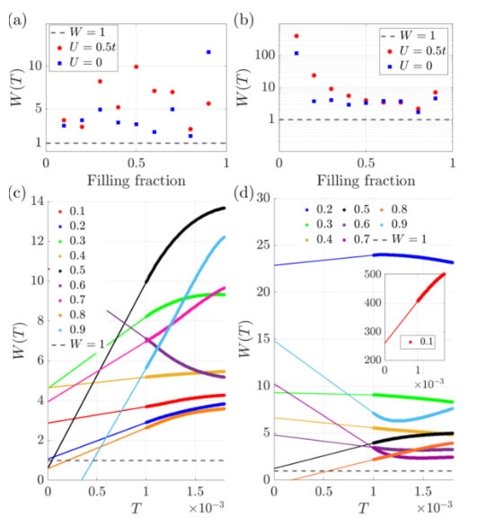
<figcaption class="paper-figure-caption"><b>Fig 5.</b> FIG. 5. Wilson ratio at T = 10−3 for different filling fractions of (a) the Penrose and (b) the Ammann–Beenker tilings. Wil- son ratio for U = 0.5t as a function of temperature for dif- ferent filling fractions of (c) the Penrose tiling and (d) the Ammann–Beenker tiling. Here, the results for T &lt; 10−3 are obtained by using a linear extrapolation. Inset to (d) shows the result for 10% filling.</figcaption>
</figure>

**Summary.** This work theoretically examines how weakly interacting electrons behave in quasicrystals, showing that Non-Fermi-Liquid physics arises naturally even without strong correlations. The authors use advanced many-body techniques to analyze anomalous temperature dependencies and scattering rates dictated by the quasiperiodic structure's local electronic environment. It provides a crucial guide for interpreting experimental data from artificial or natural quasicrystalline materials.

**Why it may be interesting.** While focused on condensed matter, the study of electronic states in aperiodically structured materials provides insights into localization and spectral fragmentation, which are relevant concepts when modeling complex quantum systems or disordered media.

Detailed structure

**Main problem.** The study investigates Non-Fermi-Liquid (NFL) behaviors in weakly interacting two-dimensional quasicrystals, challenging the applicability of standard Fermi-liquid theory to aperiodic lattices.

**Main result.** NFL behavior emerges generically even with weak interactions, characterized by anomalous temperature dependences in thermodynamic quantities and a finite residual scattering rate linked to local density of states inhomogeneity.

**Method.** The analysis employs a weak-coupling perturbative framework using Hartree mean-field theory and Green's functions to calculate various electronic properties.

**Model / system.** The system is modeled by electrons hopping on quasiperiodic lattices, specifically Penrose and Ammann–Beenker tilings, governed by a Hubbard Hamiltonian with weak repulsive interactions ($U$).

**Key observables.** Sommerfeld coefficient ($\gamma$), magnetic susceptibility ($\chi$), Wilson ratio ($R_W$), self-energy ($\Sigma$), and local density of states ($
ho_i$).

**Important parameters / regimes.** Weak interaction strength ($U/t$), temperature ($T$), and filling fraction.

**Assumptions / limitations.** The analysis relies on perturbative expansions (e.g., second-order perturbation theory) and the random phase approximation for magnetic susceptibility, which are noted to have limitations in certain regimes.

**Figures summary.** Figures illustrate tiling patterns, real-space maps of LDOS ($
ho_i$), temperature dependence of charge density ($\sigma_{n_i}$), and scaling plots comparing electronic exponents across different tilings and fillings.

**Paper structure.** The paper progresses by first establishing the theoretical framework for quasiperiodic systems (path integrals in perpendicular space) before applying it to calculate key observables like $\gamma(T)$, $\chi(T)$, and $\Sigma(\omega)$ to diagnose NFL behavior.

Abstract

Non-Fermi-liquid (NFL) behavior is usually associated with strong electronic correlations, quantum criticality, or singular fluctuations that invalidate the quasiparticle picture. Quasicrystals are known to provide a fundamentally different route to such physics: their lack of translational symmetry gives rise to critical single-particle states and fragmented spectra even in the absence of electron-electron interactions. Here, we numerically study the NFL behaviors in quasicrystals with weak interactions. Using Penrose and Ammann--Beenker tilings as representative quasiperiodic systems, we analyze thermodynamic, magnetic, and transport properties within a weak-coupling perturbative framework. The Sommerfeld coefficient and magnetic susceptibility show anomalous temperature dependences governed by the singular energy dependence of the density of states near the Fermi level. The Wilson ratio reveals that low-temperature NFL behavior in quasicrystals is accompanied by enhanced spin fluctuations over a broad range of filling fractions, while its magnitude and temperature dependence vary sensitively with filling fraction. The self-energy shows anomalous scaling and a finite residual scattering rate, indicating the breakdown of quasiparticles. Our site-resolved analysis reveals a pronounced enhancement of the residual scattering rate in regions with a high local density of states. These results serve as a guide to analyze experimental data for quasicrystals and to identify the microscopic mechanism of the NFL behaviors.

[↑ back to top](#top)

### [Quantum Sensing Beyond Exceptional Points via Hidden symmetry-protected vacuum-noise fixed point](http://arxiv.org/abs/2607.18799v1)

**Authors:** Wencong Wang, Yuyang Liang, Peng Han, Xianqiu Wu, Dongmei Liu, Min Gu  
**Type:** theory · **Category:** other · **PDF:** <https://arxiv.org/pdf/2607.18799v1>  
**Analysis basis:** full PDF text, analyzed in chunks
**Topic relevance:** `Keldysh / 2PI / non-Gaussian methods` **3/5** · `driven-dissipative phase transition` **3/5** · `methods for driven-dissipative` **3/5** · `correlated / nonlocal dissipation` **2/5** · `non-equilibrium universality` **2/5** · `Kondo & dissipative impurity` **1/5** · `analog quantum simulation` **1/5** · `correlated cavity matter` **1/5** · `non-equilibrium dynamics` **1/5**

↔ Scroll figures horizontally

<figure class="paper-figure-card">
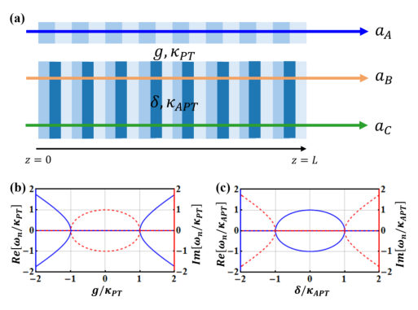
<figcaption class="paper-figure-caption"><b>Fig 1.</b> FIG. 1. (a) Schematic illustration of the hybrid system formed by coupling degenerate phase-sensitive amplification and non-degenerate parametric process through linear inter- action between mode A of the amplification and mode B of amplification and detuned non-degenerate parametric pro- cess. Real (blue solid) and imaginary (red dashed) parts of the eigenvalues ωn for (b) the pure quadrature-PT-symmetry, κAP T , δ = 0, 0, and (c) the pure quadrature-APT-symmetry, κP T , g = 0, 0.</figcaption>
</figure>
<figure class="paper-figure-card">
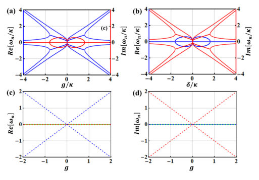
<figcaption class="paper-figure-caption"><b>Fig 2.</b> FIG. 2. Evolution of the eigenspectrum under the combined action of quadrature-PT and quadrature-APT symmetries with κP T = κAP T = κ = 1. Real (blue solid) and imagi- nary (red solid) parts of the eigenvalues ωn are shown for (a) δ = 0 and (b) g = 0, illustrating the intermediate stages of spectral evolution. (c) and (d) show the real and imaginary parts of ωn, respectively, under the balanced condition g = δ, where the Dirac eigenspectrum emerges. The dashed green, blue, and red lines represent the reference spectra ωn = 0, ωn = ±g, and ωn = ±ig, respectively.</figcaption>
</figure>
<figure class="paper-figure-card">
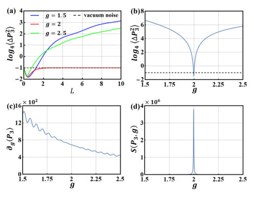
<figcaption class="paper-figure-caption"><b>Fig 3.</b> FIG. 3. Chiral-symmetry-protected quantum fluctuations of the collective three-mode quadrature P3. (a) Variance ⟨∆P 2 3 ⟩ as a function of the evolution length L. (b) Variance ⟨∆P 2 3 ⟩ as a function of the gain parameter g. The black dashed line (log4⟨∆P 2 3 ⟩= −1) denotes the vacuum-noise level. A symmetry-protected vacuum-noise fixed point appears at g = κ = 2, where the squeezing of P3 becomes independent of the evolution length. (b)–(d) are evaluated with L = 100 and κ = 2. (c) Response sensitivity ∂g⟨P3⟩. (d) Quantum sensing sensitivity S(P3, g).</figcaption>
</figure>

**Summary.** This paper proposes a new paradigm for non-Hermitian quantum sensing by exploiting hidden symmetries rather than relying on exceptional points. Using a continuous-variable model unifying PT and APT symmetries, the authors demonstrate that at a symmetry-protected vacuum-noise fixed point, collective quantum noise is actively suppressed below the vacuum level. This results in enhanced quantum sensing sensitivity through noise control, establishing a distinct theoretical route for quantum metrology.

**Why it may be interesting.** This work provides a novel theoretical framework for quantum metrology by shifting focus from spectral anomalies (EPs) to fundamental symmetries protecting the vacuum state. It connects topological concepts (hidden symmetry, Dirac spectrum) directly to noise control in open quantum systems, which is highly relevant to AMO and quantum optics.

Detailed structure

**Main problem.** To develop a quantum sensing mechanism that surpasses the fundamental limitation of enhanced sensitivity near Exceptional Points (EPs) being accompanied by amplified quantum noise, thereby limiting the Signal-to-Noise Ratio (SNR).

**Main result.** The authors propose an alternative paradigm where quantum sensing is enhanced through the symmetry-protected suppression of excess quantum noise, achieved at a hidden symmetry-protected vacuum-noise fixed point (VFP). This mechanism maintains finite response sensitivity while achieving superior SNR compared to conventional EP approaches.

**Method.** The study employs a fully quantum continuous-variable model and analyzes the system's eigenspectrum derived from an effective Hamiltonian exhibiting a non-Hermitian Dirac structure. The key diagnostic involves calculating the variance of collective quadratures relative to vacuum noise.

**Model / system.** The physical model is a three-mode bosonic system coupling degenerate phase-sensitive amplification and detuned non-degenerate parametric processes, unifying Parity-Time (PT) and Anti-Parity-Time (APT) symmetries. The dynamics are analyzed using Heisenberg–Langevin equations leading to an effective Hamiltonian $H_{eff}$ possessing a hidden chiral symmetry.

**Key observables.** Unitless sensitivity $S(O, 	heta)$, collective quadrature variances ($\Delta P_3^2 / 3$), and the identification of the symmetry-protected vacuum-noise fixed point (VFP).

**Important parameters / regimes.** Detuning ($\delta$), nonlinear coupling ($\kappa_{PT}$), amplification gain ($g$), and linear coupling ($\kappa_{APT}$). The critical regime is defined by balancing these symmetries.

**Assumptions / limitations.** The analysis assumes the system can be realized on an integrated photonic platform, maintaining standard bosonic commutation relations without needing to explicitly include additional Langevin noise terms in the Heisenberg equations.

**Figures summary.** Figures illustrate the evolution of the non-Hermitian Dirac eigenspectrum under balanced symmetries and show that the quantum fluctuation variance ($\Delta P_3^2 / 3$) is squeezed below vacuum noise at the symmetry-protected point, while sensitivity metrics peak there.

**Paper structure.** The paper first establishes the problem with EPs. It then develops a unified PT/APT continuous-variable model and analyzes its non-Hermitian Dirac eigenspectrum. The core of the work involves demonstrating that at a specific hidden symmetry-protected point, quantum noise is suppressed (VFP), leading to enhanced sensing performance distinct from EP enhancement.

Abstract

Exceptional-point (EP) sensing has attracted considerable interest because of its anomalous response scaling. However, recent studies have shown that the enhanced response near an EP is inevitably accompanied by amplified quantum noise, fundamentally limiting the achievable signalto-noise ratio (SNR). Here, we propose a fundamentally different route toward non-Hermitian quantum sensing based on symmetry-protected noise suppression rather than response amplification. We develop a fully quantum continuous-variable model that unifies parity-time (PT) and anti-paritytime(APT) symmetries within a single framework. Exploiting the incompatibility between these two symmetries, we uncover a non-Hermitian Dirac eigenspectrum and reveal a hidden symmetryprotected phase transition embedded in the Hamiltonian spectrum. Remarkably, this hidden phasetransition simultaneously constitutes a symmetry-protected vacuum-noise fixed point, where collective three-mode quadratures exhibit suppressed quantum fluctuations despite the absence of any anomalous spectral response. As a consequence, quantum sensing is enhanced through the suppression of excess quantum noise while maintaining a finite response sensitivity, establishing a sensing mechanism fundamentally different from conventional EP-based approaches. These results reveal an unexpected connection between hidden symmetry, quantum fluctuations, and non-Hermitian quantum metrology, and establish noise suppression as an alternative paradigm for non-Hermitian quantum sensing.

[↑ back to top](#top)

### [Quasi-Non-Hermitian Edge Bursts Induced by Nonuniform Loss](http://arxiv.org/abs/2607.19097v1)

**Authors:** Ze Yang, Wei Li, Fuxiang Li  
**Type:** theory · **Category:** other · **PDF:** <https://arxiv.org/pdf/2607.19097v1>  
**Analysis basis:** full PDF text, analyzed in chunks
**Topic relevance:** `correlated / nonlocal dissipation` **3/5** · `driven-dissipative phase transition` **3/5** · `methods for driven-dissipative` **3/5** · `non-equilibrium dynamics` **3/5** · `non-equilibrium universality` **2/5** · `Kondo & dissipative impurity` **1/5** · `scars & prethermalization` **1/5**

↔ Scroll figures horizontally

<figure class="paper-figure-card">
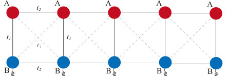
<figcaption class="paper-figure-caption"><b>Fig 1.</b> FIG. 1. Schematic of a finite tight-binding lattice chain with two sublattices. Loss is introduced only on the B- sublattice (blue sites), with site-dependent strengths γx = {γ1, γ2, . . . , γL}, where L is the total number of unit cells. The system exhibits the NHSE, originating from the inter- play between sublattice-selective loss and magnetic flux.</figcaption>
</figure>
<figure class="paper-figure-card">
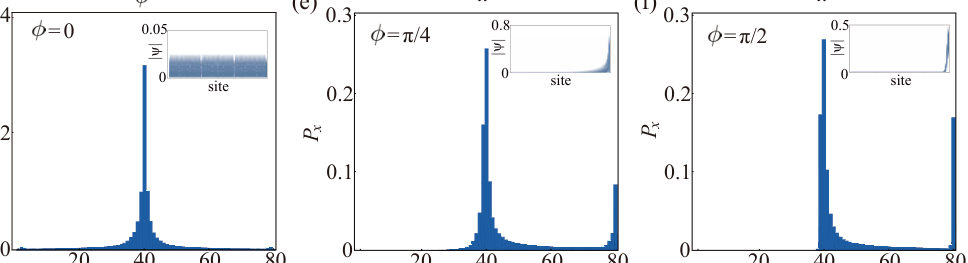
<figcaption class="paper-figure-caption"><b>Fig 2.</b> FIG. 2. (a) For the uniform-loss case, mean inverse participation ratio (MIPR) as a function of magnetic flux ϕ. The horizontal reference MIPR ≈0.018 corresponds to the absence of the NHSE. In this panel, blue, green, purple, and red curves correspond to uniform loss strengths γ0 = 1, 2, 5, and 10, respectively. (b)–(f) Spatial distributions of the loss probability Px as a function of lattice site x for the uniform loss model, with γ0 = 1. Panels (b)–(f) correspond to magnetic flux values ϕ = −π/2, −π/4, 0, π/4, π/2, respectively. The initial position of the quantum walker is x0 = 40. Each panel includes an inset showing the probability density of eigenstates under the corresponding flux....</figcaption>
</figure>
<figure class="paper-figure-card">
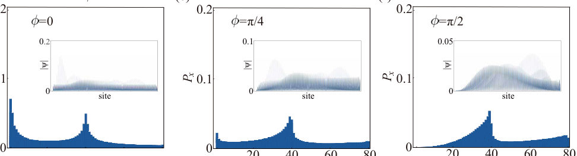
<figcaption class="paper-figure-caption"><b>Fig 3.</b> FIG. 3. (a) For the nonuniform loss model, mean inverse participation ratio (MIPR) as a function of magnetic flux ϕ. The horizontal reference MIPR ≈0.018 indicates the absence of the NHSE. In this panel, blue, green, purple, and red curves correspond to loss gradients γ = 1, 2, 5, and 10, respectively. (b)–(f) Spatial distributions of the loss probability Px as a function of lattice site x for the nonuniform loss model, with γ = 1. Panels (b)–(f) correspond to magnetic flux values ϕ = −π/2, −π/4, 0, π/4, π/2, respectively. The initial position of the quantum walker is x0 = 40. Each panel contains an inset showing the probability density distributions of eigenstates corresponding to energy...</figcaption>
</figure>
<figure class="paper-figure-card">
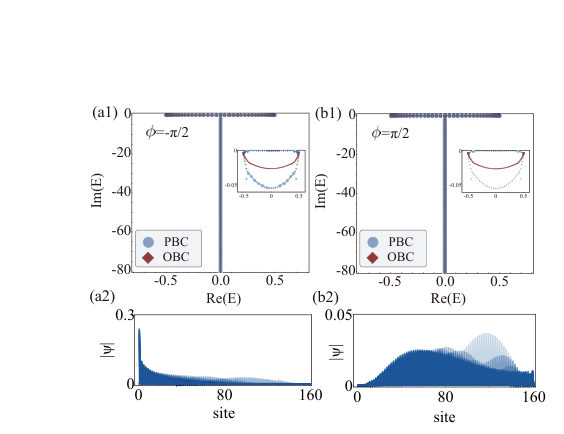
<figcaption class="paper-figure-caption"><b>Fig 4.</b> FIG. 4. Complex energy spectra of the nonuniform loss model for (a1) ϕ = −π/2 and (b1) ϕ = π/2. Red dia- monds and blue circles denote spectra under open and pe- riodic boundary conditions, respectively. The insets in pan- els (a1) and (b1) show enlarged views of the complex energy spectrum in the vicinity of the real axis. (a2) and (b2) show the eigenstate probability density distributions correspond- ing to energy levels near the real axis for the ϕ = −π/2 and ϕ = π/2, respectively. System parameters are γ = 1, t1 = 0.4, t2 = 0.25, t3 = 0.25, and L = 80.</figcaption>
</figure>
<figure class="paper-figure-card">
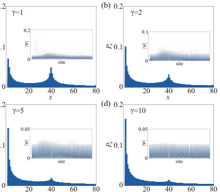
<figcaption class="paper-figure-caption"><b>Fig 5.</b> FIG. 5. Spatial distributions of the loss probability Px for the nonuniform loss model at zero magnetic flux (ϕ = 0). Panels (a)–(d) correspond to γ = 1, 2, 5, 10, respectively. All panels include insets showing eigenstate probability densities corresponding to energy levels near the real axis of the com- plex spectrum. The initial position of the quantum walker is x0 = 40, and system parameters are t1 = 0.4, t2 = 0.25, t3 = 0.25, and L = 80.</figcaption>
</figure>

**Summary.** The paper explores non-Hermitian quantum walks on lattices with spatially varying dissipation. It introduces the concept of a quasi-NHEB, demonstrating that nonuniform loss alone can create anomalous boundary loss accumulation even without the Non-Hermitian Skin Effect. This highlights that structured dissipation offers an independent and powerful control mechanism for engineering edge physics.

**Why it may be interesting.** This work provides a generalized framework for understanding boundary effects beyond standard topological invariants, showing how engineered disorder (nonuniform loss) can independently induce robust edge phenomena.

Detailed structure

**Main problem.** The study investigates non-Hermitian boundary phenomena, specifically how spatially nonuniform loss influences the Non-Hermitian Edge Burst (NHEB) in quantum walks.

**Main result.** Spatially nonuniform loss alone can generate a quasi-non-Hermitian edge burst ($	ext{quasi-NHEB}$) even when the system lacks the Non-Hermitian Skin Effect (NHSE).

**Method.** The analysis involves simulating quantum walker dynamics on a tight-binding lattice, calculating the boundary loss probability ($P_x$), and comparing scaling relations between different non-Hermiticity regimes.

**Model / system.** The model is a one-dimensional non-Hermitian tight-binding chain with two coupled sublattices (A and B). Non-Hermiticity arises from imaginary on-site loss ($\gamma_x$) on sublattice B, which can be made spatially nonuniform and influenced by an artificial magnetic flux ($\phi$).

**Key observables.** Loss probability distribution ($P_x$), Mean Inverse Participation Ratio ($	ext{MIPR}$), Non-Hermitian Edge Burst (NHEB) magnitude, and the dependence of boundary loss on initial position ($x_0$).

**Important parameters / regimes.** Magnetic flux ($\phi$), spatial gradient/variation of loss ($\gamma_x$), and the comparison between uniform vs. nonuniform loss regimes.

**Assumptions / limitations.** The analysis relies on open boundary conditions for the quantum walk, and it distinguishes between phenomena driven by NHSE versus those driven purely by inhomogeneous dissipation.

**Figures summary.** Figures illustrate the schematic lattice setup with site-dependent loss; they show $	ext{MIPR}$ vs. flux to diagnose NHSE, and spatial maps of the loss probability ($P_x$) comparing uniform, quasi-, and conventional edge bursts under varying fluxes and loss gradients.

**Paper structure.** The paper systematically investigates three regimes: (i) Quasi-NHEB induced by nonuniform loss at zero flux ($\phi=0$); (ii) Hybrid NHEB resulting from the interplay of NHSE and nonuniform loss ($\phi=-\pi/2$); and (iii) Comparison against the conventional NHEB found in uniform loss models. The structure builds the argument that dissipation gradient is a key control parameter.

Abstract

Non-Hermitian quantum walks on lossy lattices with open boundaries can exhibit an anomalous peak of the loss probability at the boundary, known as the non-Hermitian edge burst (NHEB). This phenomenon has been attributed to the combined effect of the non-Hermitian skin effect (NHSE) and a gapless imaginary spectrum. Here we investigate a class of models in which the NHSE is induced by magnetic flux while the loss is spatially nonuniform. We show that the spatial distribution of loss plays a crucial role in determining the emergence and strength of the NHEB. Notably, even in the absence of the NHSE, a weak boundary accumulation of the loss probability persists. We term this effect a quasi-non-Hermitian edge burst (quasi-NHEB). By analyzing the dependence of the loss probability on the initial position, we further demonstrate that the quasi-NHEB obeys a bulk-edge scaling relation distinct from that of conventional NHEB. Our results show that spatially nonuniform loss alone can generate boundary-localized loss anomalies even without the NHSE, providing new insight into non-Hermitian boundary phenomena and a broader platform for their exploration and potential applications.

[↑ back to top](#top)

### [The arrow of time, irreversibility, equilibrium and measurement in quantum mechanics](http://arxiv.org/abs/2607.19142v1)

**Authors:** Christopher J. N. Coveney, Peter V. Coveney  
**Type:** theory · **Category:** statistical mechanics · **PDF:** <https://arxiv.org/pdf/2607.19142v1>  
**Analysis basis:** full PDF text, analyzed in chunks
**Topic relevance:** `non-equilibrium dynamics` **3/5** · `driven-dissipative phase transition` **2/5** · `measurement-induced transitions` **2/5** · `quantum measurements` **2/5** · `Keldysh / 2PI / non-Gaussian methods` **1/5** · `correlated / nonlocal dissipation` **1/5** · `entanglement & information structure` **1/5** · `methods for driven-dissipative` **1/5** · `non-equilibrium universality` **1/5**

↔ Scroll figures horizontally

<figure class="paper-figure-card">
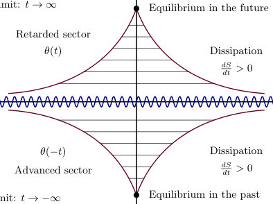
<figcaption class="paper-figure-caption"><b>Fig 1.</b> FIG. 1: (a) Asymptotic approach to equilibrium due to the dissipative dynamics contained in mixing systems that possess a branch cut structure in the resolvent of the Liouvillian. The second law of thermodynamics breaks the time symmetry of the solution, requiring entropic increase such that equilibrium is obtained in the future. Therefore, the retarded sector corresponds to the physical solution and the advanced sector can be safely discarded. (b) Analytic continuation of GA(z) from the physical sheet (Sheet I) to the second Riemann sheet (Sheet II) GII A(z) by traveling through the branch cut from above. The invariant measure appears on the second Riemann sheet along with the...</figcaption>
</figure>

**Summary.** This paper resolves apparent conflicts between unitary quantum mechanics and the second law of thermodynamics by analyzing the system in the thermodynamic limit. It demonstrates that time-reversal symmetry breaks down naturally, leading to irreversible entropy increase and decoherence. This framework successfully derives the Born rule from fundamental principles governing large quantum systems.

**Why it may be interesting.** This work provides a deep theoretical framework connecting fundamental quantum dynamics (unitary evolution) to macroscopic irreversibility and equilibrium states, which is central to open quantum systems theory and non-equilibrium statistical mechanics.

Detailed structure

**Main problem.** The paper addresses quantum mechanics' perceived incompleteness regarding the second law of thermodynamics and the physical mechanism behind measurement-induced decoherence.

**Main result.** It shows that in the thermodynamic limit, time-reversal symmetry breaks down naturally, leading to irreversible evolution, entropy increase, and a recovery of classical statistical mechanical predictions like the Born rule.

**Method.** The analysis uses advanced mathematical techniques involving the Liouville-von Neumann equation, spectral theory (analyzing the Liouvillian spectrum), and comparing time limits ($\lim_{t	o\infty}\lim_{N,V	o\infty}$ vs. $\lim_{N,V	o\infty}\lim_{t	o\infty}$).

**Model / system.** The focus is on isolated quantum systems in the thermodynamic limit, analyzed via their time evolution governed by the Liouvillian superoperator.

**Key observables.** Entropy increase, loss of quantum coherence (pure to mixed states), and the relaxation dynamics described by Lyapunov functionals ($H_t$).

**Important parameters / regimes.** The thermodynamic limit ($	ext{N}, 	ext{V} 	o \infty$), time $t$, and inverse temperature $eta$.

**Assumptions / limitations.** The theory requires studying systems with absolutely continuous spectra to exhibit the necessary irreversible dynamics; finite systems are subject to Poincaré recurrence.

**Paper structure.** The paper progresses by first identifying the conflict between QM and thermodynamics, then mathematically demonstrating how time-asymmetry emerges in the thermodynamic limit via spectral analysis of the Liouvillian, culminating in a description of measurement collapse consistent with statistical mechanics.

Abstract

Quantum mechanics is widely recognised as being incomplete. It is not consistent with the second law of thermodynamics and does not provide a scientifically credible physical account of the measurement process, the means by which coherence is broken and classically observable states are recorded. This had led to many ad hoc assumptions being used to account for various properties of quantum systems, among which is the coherence time of quantum devices that determines their ability to perform computations. Here, we show that all these properties can be accommodated naturally and consistently in the context of quantum systems which exhibit continuous spectra, as arises in the thermodynamic limit of large systems. In particular, for isolated systems we show that the time-reversal symmetry associated with unitary time evolution of the quantum state gives rise to time-symmetry breaking and a semi-group evolution which attains thermodynamic equilibrium at long times. Moreover, the emergence of this non-unitary time-asymmetry leads to microcanonical equilibrium states in which all quantum coherence is lost and is accompanied by the transformation of pure states into mixtures, leading in turn to an increase in entropy. Inclusion of a macroscopic measurement apparatus shows how the outcome of a measurement corresponds to the von Neumann projection postulate, arising with probabilities in conformance with the Born rule. The mathematical structure of the theory which applies to quantum systems with continuous spectra is closely analogous to the classical ergodic theory of dynamical systems and the conditions under which they attain equilibrium states.

[↑ back to top](#top)

### [Information Compression at Criticality](http://arxiv.org/abs/2607.18388v1)

**Authors:** Simon Jiricek, Miroslav Hopjan, Boris Altshuler, Vladimir Kravtsov, Lev Vidmar  
**Type:** theory · **Category:** disordered systems and neural networks · **PDF:** <https://arxiv.org/pdf/2607.18388v1>  
**Analysis basis:** full PDF text, analyzed in chunks
**Topic relevance:** `non-equilibrium universality` **3/5** · `driven-dissipative phase transition` **2/5** · `entanglement & information structure` **2/5** · `scars & prethermalization` **2/5** · `Kondo & dissipative impurity` **1/5** · `analog quantum simulation` **1/5** · `methods for driven-dissipative` **1/5** · `non-equilibrium dynamics` **1/5**

↔ Scroll figures horizontally

<figure class="paper-figure-card">
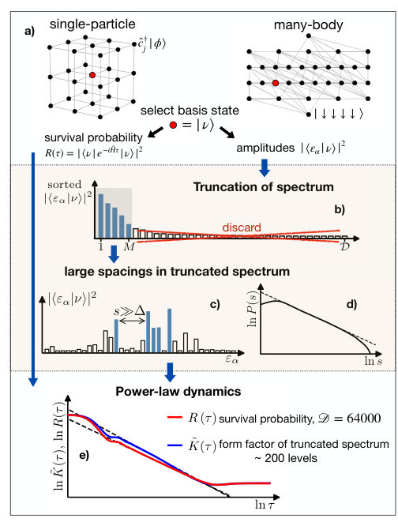
<figcaption class="paper-figure-caption"><b>Fig 1.</b> FIG. 1. Sketch of the truncation procedure. (a) We select a basis state |ν⟩, corresponding to a single lattice site for the single-particle models or a specific qubit configuration for the many-body models. (b) We truncate the spectrum based on the amplitudes of the selected basis state by keeping only the M largest contributions to the wavefunction, see the main text for details. In (c) we sketch how large spacings appear in the truncated spectrum giving rise to (d) a power-law distri- bution of spacings. (e) The truncated SFF ˜K(τ), see Eq. (3), shows that the information about a power-law decay of R(τ) is contained, for each basis state, in a vanishing fraction of energy levels.</figcaption>
</figure>
<figure class="paper-figure-card">
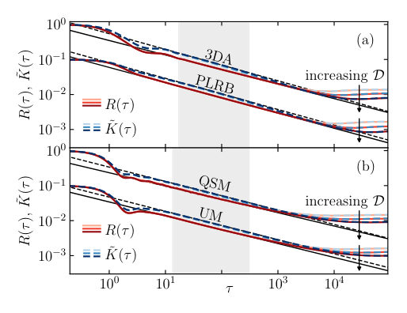
<figcaption class="paper-figure-caption"><b>Fig 2.</b> FIG. 2. Comparison of the survival probability R(τ) [red solid lines] and the truncated SFF ˜K(τ) [blue dashed lines]. (a) The 3d Anderson Model (3DA) for D = 263, 323, 403</figcaption>
</figure>
<figure class="paper-figure-card">
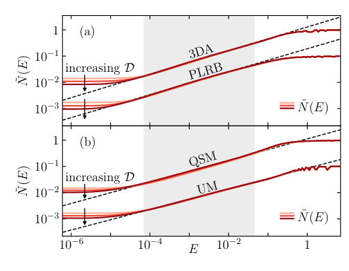
<figcaption class="paper-figure-caption"><b>Fig 3.</b> FIG. 3. Box counting method in the truncated spectrum. (a) The 3d Anderson Model (3DA) for D = 263, 323, 403</figcaption>
</figure>
<figure class="paper-figure-card">
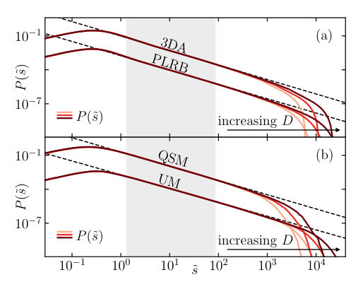
<figcaption class="paper-figure-caption"><b>Fig 4.</b> FIG. 4. Distributions P of level spacings ˜s of the trun- cated spectrum. (a) The 3d Anderson Model (3DA) for D = 263, 323, 403 and the power-law random banded model (PLRB) for D = 16k, 32k, 64k, (b) the quantum sun model (QSM) and the ultrametric model (UM), both for D = 214, 215, 216. Increasing Hilbert-space dimension is indicated by the arrows and deeper colors. The data for different mod- els is shifted by a factor of 100. We carry out power-law fits in the shaded region to the function P(˜s) ∝˜s −(1+ ˜ ∆2) [black dashed lines]. For the 3dA, PLRB, QSM and UM, respec- tively, we obtain the exponents ˜∆2 = 0.28, 0.27, 0.26, 0.22.</figcaption>
</figure>
<figure class="paper-figure-card">
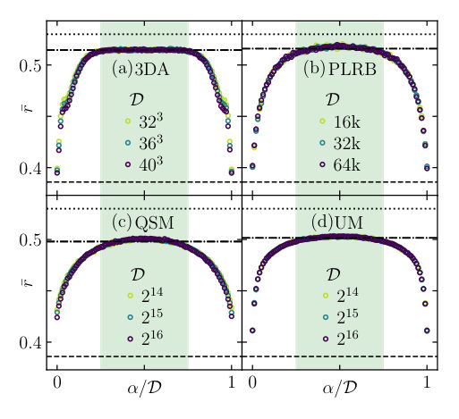
<figcaption class="paper-figure-caption"><b>Fig 5.</b> FIG. 5. Gap ratio in the global spectrum without trunca- tion. The green shaded area indicates the 50% of states we regard as critical states, the rest posing the mobility edge. The dotted lines indicate the GOE value rGOE ≈0.53, while the Poisson value rPoisson ≈0.386 is indicated by dashed lines. The dash-dotted lines correspond to the average gap ratio in the green shaded area. All results are averaged over different disorder realizations. Results are displayed for (a) the 3d An- derson Model, (b) the Power-law random banded model, (c) the Quantum sun model, (d) the Ultrametric model.</figcaption>
</figure>

**Summary.** The paper develops a method based on intrinsic information compression to study quantum dynamics at criticality in various disordered models. By truncating the Hamiltonian spectrum to only essential energy levels, the authors show that the resulting simplified description accurately predicts key dynamical observables like the survival probability decay. This establishes energy-space compression as a fundamental principle governing critical behavior.

**Why it may be interesting.** This work provides a powerful theoretical tool—energy-space compression—to analyze complex quantum dynamics near critical points in disordered systems, offering insights applicable to many condensed matter problems where full diagonalization is impossible.

Detailed structure

**Main problem.** The study aims to understand quantum dynamics at the critical boundary of ergodicity, where highly excited states deviate from thermal behavior, by finding efficient ways to describe their complex energy space.

**Main result.** The power-law decay of the survival probability at criticality can be accurately reproduced using only a vanishing fraction of the total Hamiltonian eigenlevels, establishing intrinsic information compression in energy space.

**Method.** The core method involves an intrinsic information compression technique applied to the energy spectrum, where dynamics are approximated by truncating the Hamiltonian basis to include only the most significant eigenstates.

**Model / system.** The research investigates various quantum many-body systems exhibiting ergodicity breaking transitions, including the 3D Anderson model (3DA), Power-law Random Banded Model (PLRB), Quantum Sun Model (QSM), and Ultrametric Model (UM).

**Key observables.** Survival Probability $R(	au)$, Spectral Form Factor (SFF) $	ilde{K}(	au)$, Wavefunction Fractal Dimension ($d_2$), and the level-spacing distribution exponent ($\Delta_2$).

**Important parameters / regimes.** The critical exponents, such as $d'_2$ and $	ilde{\delta}_2$, are key; the analysis focuses on the thermodynamic limit where the fraction of retained levels vanishes.

**Assumptions / limitations.** It is assumed that the dynamics can be effectively captured by a small subset of energy eigenstates (intrinsic information compression), and localized states at spectral edges must be filtered out to reveal true critical behavior.

**Figures summary.** Figures illustrate the agreement between $R(	au)$ and $	ilde{K}(	au)$ via power-law decay, show the fractal nature ($	ilde{\delta}_2 < 1$) of the truncated spectrum, and map out gap ratios distinguishing localized, delocalized, and critical states.

**Paper structure.** The paper systematically analyzes multiple disordered models (3DA, PLRB, QSM, UM) by first identifying spectral edges containing localized states. It then applies energy-space truncation to filter these edges, demonstrating that the resulting truncated Spectral Form Factor accurately mimics the power-law decay of the survival probability at criticality.

Abstract

Highly excited quantum states at the critical boundary of ergodicity are known to deviate from thermal behavior, yet their dynamical properties remain poorly understood. Here, we uncover the complexity of quantum dynamics at criticality through the lens of intrinsic information compression in energy space. We show that the Hamiltonian spectrum can be systematically truncated, yielding a simplified description of the dynamics while preserving its essential features. Specifically, for both interacting and noninteracting systems, we demonstrate that a vanishing fraction of Hamiltonian eigenlevels suffices to reproduce the power-law decay of the survival probability. The resulting truncated spectrum exhibits a fractal structure characterized by a level-spacing distribution with a power-law tail, while its spectral form factor displays the same asymptotic power-law decay as the survival probability.

[↑ back to top](#top)

### [Spontaneous optical emission of a randomly oriented chiral quantum source](http://arxiv.org/abs/2607.18617v1)

**Authors:** Mikael P. Backlund  
**Type:** theory · **Category:** other · **PDF:** <https://arxiv.org/pdf/2607.18617v1>  
**Analysis basis:** full PDF text, analyzed in chunks
**Topic relevance:** `free-space correlated emission` **3/5** · `interference shaping light` **3/5** · `correlated / nonlocal dissipation` **2/5** · `Dicke superradiance` **1/5** · `Keldysh / 2PI / non-Gaussian methods` **1/5** · `driven-dissipative phase transition` **1/5** · `methods for driven-dissipative` **1/5** · `superradiant laser` **1/5**

↔ Scroll figures horizontally

<figure class="paper-figure-card">
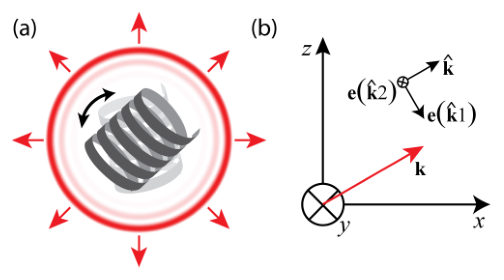
<figcaption class="paper-figure-caption"><b>Fig 1.</b> FIG. 1. (a) Illustration of the model. We consider the spheri- cally symmetric field due to a randomly oriented chiral quan- tum emitter, here depicted as a tumbling helix. (b) Lab-frame coordinate definitions, with wavevector k. The unit vectors e  ˆk1  , e  ˆk2  , and ˆk form a right-handed triad.</figcaption>
</figure>
<figure class="paper-figure-card">
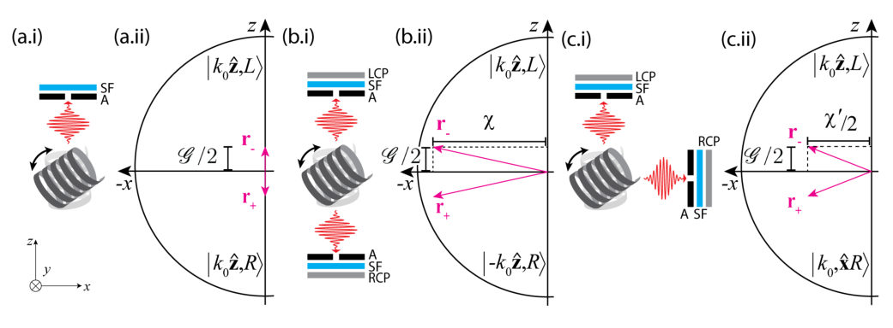
<figcaption class="paper-figure-caption"><b>Fig 2.</b> FIG. 2. Filtered collection from one (a.i) or two (b.i), (c.i) directions. A: aperture, SF: spectral filter, LCP/RCP: left/right- circular polarizer. (a.ii), (b.ii), and (c.ii) sketch the Bloch vectors r± for the qubit states described in the main text, assuming χ, χ′, G &gt; 0.</figcaption>
</figure>
<figure class="paper-figure-card">
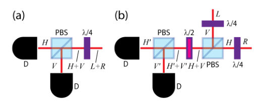
<figcaption class="paper-figure-caption"><b>Fig 3.</b> FIG. 3. Detection schemes. (a) The conventional approach to chiroptical detection. A single spatial mode containing both L- and R-polarized light is transmitted through a quar- ter wave plate (λ/4), converting one circular polarization to horizontally polarized light (H) and the other to vertically polarized light (V ). The polarization channels are split by a polarizing beam splitter (PBS) and photons are counted on the detectors (D). (b) Coherent detection of chiroptical emis- sion collected from two different spatial modes, as in Fig. 2b, c. L-polarized light from one spatial mode and R-polarized light from another are converted to H and V with quarter wave plates then coherently...</figcaption>
</figure>

**Summary.** This theoretical paper derives the quantum state of light emitted from randomly oriented chiral sources, accounting for electric dipole, magnetic dipole, and quadrupole contributions. It shows that measuring correlations between photons collected in different directions or polarizations allows experimental separation of these underlying physical coupling parameters. This advances understanding of symmetry breaking in spontaneous emission.

**Why it may be interesting.** This work provides a rigorous quantum optical framework for characterizing chiral emitters by exploiting spatial coherence, which is crucial for understanding fundamental symmetries in light-matter interactions beyond simple dipole approximations.

Detailed structure

**Main problem.** The paper derives the quantum state of light emitted via spontaneous optical emission from a randomly oriented chiral source, aiming to characterize the multipolar nature ($\mu, m, Q$) of this emission.

**Main result.** By analyzing spatial coherence and collecting photons in specific polarization/direction combinations (e.g., opposite directions), one can isolate parameters related to electric dipole, magnetic dipole, and quadrupole moments.

**Method.** The analysis uses quantum electrodynamics formalism, deriving density matrices ($ar{
ho}$) for the emitted photon state by averaging over random source orientations and projecting onto specific polarization/propagation modes.

**Model / system.** The system is a quantum emitter (modeled as a two-level system) undergoing spontaneous emission into the electromagnetic field. The interaction Hamiltonian includes electric dipole, magnetic dipole, and electric quadrupole terms.

**Key observables.** The one-photon state density operator ($ar{
ho}$), which depends on polarization basis states (L/R circular polarization) and collection directions ($\hat{z}, \hat{x}$).

**Important parameters / regimes.** Unitless parameters $\epsilon_\mu, \epsilon_m, \epsilon_Q$ characterizing the relative strengths of dipole, magnetic dipole, and quadrupole contributions.

**Assumptions / limitations.** The emitter is treated as a two-level system; rotational averaging is performed over all source orientations; approximations are made in the continuum limit for quadrupole terms.

**Figures summary.** Figures illustrate collection geometries using polarizers and apertures, showing how measurements can be restricted to specific polarization/direction combinations (e.g., opposite $\hat{z}$ propagation).

**Paper structure.** The paper progresses from deriving the general one-photon state ($
ho$) including all multipoles, simplifying this for random orientation averages, and finally developing measurement protocols using circular polarizations and directional correlations to separate the underlying physical parameters.

Abstract

We derive the form of the one-photon state of the electromagnetic field resulting from spontaneous optical emission of a randomly oriented chiral quantum source, including electric dipole, magnetic dipole, and electric quadrupole contributions to the radiation. We describe how spatial coherence in the emission can be exploited to reveal hidden information about the emitter. This work serves as a prelude and companion piece to our concurrently submitted work \cite{Backlund2026Letter} in which we present the classical and quantum error bounds associated with assigning the handedness of such an emitter.

[↑ back to top](#top)

### [State $k$-designs from Hamiltonian evolution](http://arxiv.org/abs/2607.18537v1)

**Authors:** Shengxian Hou, Zong-Yue Hou, Zhi-Cheng Yang  
**Type:** theory · **Category:** statistical mechanics · **PDF:** <https://arxiv.org/pdf/2607.18537v1>  
**Analysis basis:** full PDF text, analyzed in chunks
**Topic relevance:** `non-equilibrium dynamics` **3/5** · `analog quantum simulation` **2/5** · `entanglement & information structure` **2/5** · `non-equilibrium universality` **2/5** · `Keldysh / 2PI / non-Gaussian methods` **1/5** · `driven-dissipative phase transition` **1/5** · `methods for driven-dissipative` **1/5** · `scars & prethermalization` **1/5**

↔ Scroll figures horizontally

<figure class="paper-figure-card">
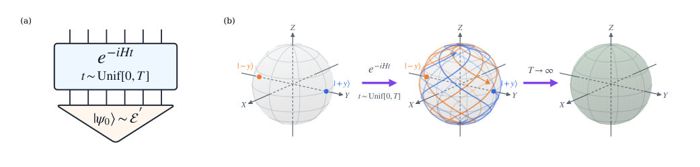
<figcaption class="paper-figure-caption"><b>Fig 1.</b> FIG. 1. (a) The setup considered in this work, E = {e−iHt |ψ0⟩| t ∼Unif[0, T], |ψ0⟩∼E′}. (b) Illustration of the formation of state designs under Hamiltonian evolution. Each initial state in E′ generates a trajectory in the Hilbert space visualized on a Bloch sphere. In the long-time limit, these trajectories cover the Hilbert space uniformly and the evolved ensemble E forms a state k-design.</figcaption>
</figure>
<figure class="paper-figure-card">
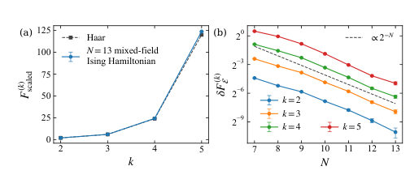
<figcaption class="paper-figure-caption"><b>Fig 2.</b> FIG. 2. (a) The scaled frame potential F (k) scaled := D(D + 1) · · · (D + k −1)F (k) E for the ensemble E = {e−iHt |y⟩| t ∼Unif[0, T], |y⟩∼Y -basis} in the limit T →∞, where H is the mixed-field Ising Hamiltonian (8) with parameters (J, hx, hz) = (1, 0.9045, 0.809) and system size N = 13. The black dots indicate the Haar values k!. (b) The relative error compared to the Haar ensemble δF (k) E := (F (k) E −F (k) Haar)/F (k) Haar for different N and k, which shows exponential convergence upon increasing system sizes.</figcaption>
</figure>
<figure class="paper-figure-card">
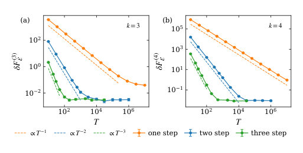
<figcaption class="paper-figure-caption"><b>Fig 3.</b> FIG. 3. The relative error compared to the Haar ensemble δF (k) E at different values of T for one-, two- and three-step quenches for k = 3, 4. The initial ensemble E′ is chosen as the Y -basis. For multiple quenches, we use two mixed- field Ising Hamiltonians (8) with parameters (J, hx, hz) = (1, 0.9045, 0.809) for H1 and (J, hx, hz) = (1, −1.05, 0.5) for H2. We take system size N = 10. The three dashed lines are proportional to T −1, T −2 and T −3 respectively.</figcaption>
</figure>

**Summary.** This work theoretically analyzes how time evolution under a Hamiltonian can generate state k-designs, which are quantum states exhibiting maximal randomness. Using the frame potential as a diagnostic tool, the authors derive scaling relations and propose efficient M-step quench protocols to suppress finite-time errors. This provides a unified framework for understanding design generation in both random matrix theory settings and physically relevant local Hamiltonians.

**Why it may be interesting.** The connection between quantum dynamics (Hamiltonian evolution) and achieving highly random states (state $k$-designs) is fundamental to understanding thermalization and scrambling in many-body systems. The explicit derivation of quench protocols provides concrete tools for experimental realization.

Detailed structure

**Main problem.** The paper investigates the conditions under which time evolution generated by a Hamiltonian can produce an ensemble that approximates a state $k$-design, a property related to maximal randomness.

**Main result.** It derives relations showing that for GUE Hamiltonians, generating state $k$-designs requires only that the initial state ensemble forms a state 1-design. Furthermore, it proposes quench protocols to suppress finite-time errors exponentially.

**Method.** The analysis heavily relies on calculating and analyzing the 'frame potential' ($F^{(k)}_E$) for both state and unitary ensembles, using techniques involving Weingarten calculus and recursion relations derived from moment matching.

**Model / system.** The study considers quantum systems evolving under a fixed Hamiltonian $H$, initially modeled by Hamiltonians drawn from the Gaussian Unitary Ensemble (GUE). It extends this to physically relevant models like the mixed-field Ising Hamiltonian.

**Key observables.** State ensemble $k$-th frame potential ($F^{(k)}_E$) and relative error ($\delta F^{(k)}_E$).

**Important parameters / regimes.** Evolution time $T$, design order $k$, system size $N$, and the quench step number $M$.

**Assumptions / limitations.** The analysis often assumes the large evolution time limit ($T 	o \infty$) or relies on specific no-resonance conditions for the Hamiltonian eigenvalues.

**Figures summary.** Figures illustrate the setup of state ensemble generation via time evolution, show the scaled frame potential matching Haar values for the Ising model, and demonstrate the exponential suppression of finite-$T$ errors using quench protocols.

**Paper structure.** The paper progresses from analyzing the general GUE case to deriving recursion relations for the frame potential. It then applies these methods to a physically realistic mixed-field Ising Hamiltonian, detailing the necessary quench protocols to achieve high precision in state $k$-design generation, and finally unifying the results for unitary ensembles.

Abstract

We study the generation of state $k$-designs from time evolution under a fixed Hamiltonian. Specifically, we consider the ensemble $\mathcal{E}=\left\{e^{-iHt}|ψ_0\rangle | \ t\sim \mathrm{Unif}[0,T],\, |ψ_0\rangle\sim \mathcal{E}'\right\}$, where the initial states are sampled from an ensemble $\mathcal{E}'$. For Hamiltonians drawn from the Gaussian unitary ensemble, we derive a simple relation between the frame potential of the evolved ensemble $\mathcal{E}$ and that of the initial ensemble $\mathcal{E}'$ in the large evolution time limit. This relation shows that $\mathcal{E}$ forms an exact state $k$-design in the thermodynamic limit as long as $\mathcal{E}'$ forms a state 1-design. Remarkably, we further show, both analytically and numerically, that time evolution under a simple nonintegrable mixed-field Ising Hamiltonian can generate approximate state $k$-designs with high precision, starting from product states in an appropriately chosen Pauli basis. We also analyze the finite-$T$ correction and find it scales as $O(1/T)$. To reduce the evolution time, we propose an $M$-step quench protocol that suppresses this correction to $O(1/T^M)$, which is also verified numerically. We then extend our analysis to unitary ensembles, deriving an analogous recursion relation for the unitary frame potential. Our results elucidate the mechanisms underlying recent proposals for generating unitary $k$-designs through sequential quantum quenches in a unified manner.

[↑ back to top](#top)

### [Bose-Einstein Condensates in Time Dependent Traps](http://arxiv.org/abs/2607.18944v1)

**Authors:** Yvan Castin, Ralph Dum  
**Type:** both · **Category:** quantum gases · **PDF:** <https://arxiv.org/pdf/2607.18944v1>  
**Analysis basis:** full PDF text, analyzed in chunks
**Topic relevance:** `analog quantum simulation` **3/5** · `non-equilibrium dynamics` **3/5** · `methods for driven-dissipative` **2/5** · `non-equilibrium universality` **2/5** · `Keldysh / 2PI / non-Gaussian methods` **1/5** · `driven-dissipative phase transition` **1/5**

↔ Scroll figures horizontally

<figure class="paper-figure-card">
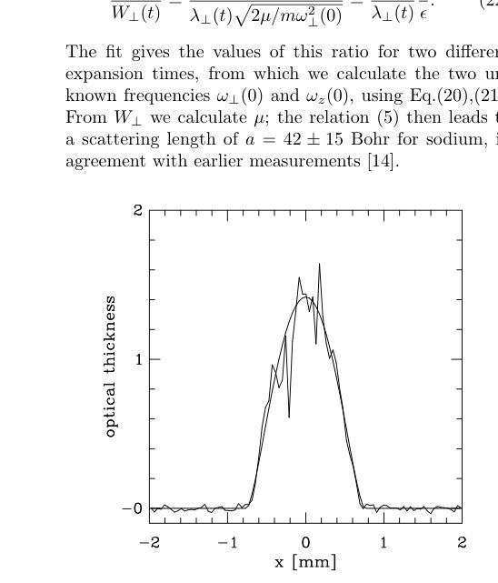
<figcaption class="paper-figure-caption"><b>Fig 1.</b> FIG. 1: Spatial density of an expanding condensate integrated along y axis, cut along x axis (that is at z = 0). Experimental data obtained at MIT (expansion time of 40 ms) and fit from theory.</figcaption>
</figure>

**Summary.** This paper develops an analytical theory to model Bose-Einstein condensates expanding from time-dependent harmonic traps. By using a unitary scaling transform on the Gross-Pitaevskii equation, the complex dynamics are reduced to solving for three key scaling parameters. This method allows researchers to quantitatively analyze experimental measurements of cloud expansion and collective excitations to determine material properties like the scattering length.

**Why it may be interesting.** This work provides a powerful analytical framework for analyzing non-equilibrium dynamics in trapped quantum gases, connecting macroscopic observables (like aspect ratio) directly to fundamental interaction parameters ($a$) without needing direct measurement of trap frequencies.

Detailed structure

**Main problem.** To derive analytical results for the macroscopic wave function of a Bose-Einstein condensate (BEC) evolving within a time-dependent harmonic potential.

**Main result.** The BEC dynamics are entirely characterized by the evolution of three scaling parameters ($\lambda_j(t)$), allowing for *ab initio* calculation of time-of-flight signals and fitting experimental data to determine scattering lengths.

**Method.** The authors employ a unitary quantum scaling transform applied to the Gross-Pitaevskii equation, reducing the complex dynamics to solving coupled differential equations for the scaling factors.

**Model / system.** The system is a BEC governed by the time-dependent Gross-Pitaevskii equation in an anisotropic harmonic trap. The initial state uses the Thomas-Fermi approximation, and the evolution is analyzed via classical gas analogies.

**Key observables.** Spatial density profile, aspect ratio of the cloud width ($W_z/W_\perp$), and scattering length ($a$).

**Important parameters / regimes.** The three scaling factors $\lambda_j(t)$, the trapping frequencies $\omega_j(t)$, and the interaction strength $g$ (related to scattering length $a$).

**Assumptions / limitations.** Approximations include neglecting terms of order 2 in the modulation parameter ($\epsilon$) and assuming linear response for small excitations. The mean-field treatment is noted to fail for long free oscillation times.

**Figures summary.** Figure 2 compares theoretical predictions (solid line) with experimental data (diamonds from MIT) showing the aspect ratio versus free oscillation time ($	au_o$).

**Paper structure.** The paper establishes the GPE and introduces the scaling transform. It derives the differential equations for $\lambda_j(t)$, analyzes specific cases like sudden trap opening, and then details the linear response theory to calculate excitations after modulation and time-of-flight.

Abstract

We present analytical results for the macroscopic wave function of a Bose-Einstein condensate in a time dependent harmonic potential. The evolution of the spatial density is a dilatation, characterized by three scaling factors which allow a classical interpretation of the dynamics. This approach is an efficient tool for the analysis of recent experimental results on the expansion and collective excitation of a condensate.

[↑ back to top](#top)

### [Free energy landscape of Dense Associative Memory](http://arxiv.org/abs/2607.19195v1)

**Authors:** Sumedha, Abhishek Singh  
**Type:** theory · **Category:** disordered systems and neural networks · **PDF:** <https://arxiv.org/pdf/2607.19195v1>  
**Analysis basis:** full PDF text, analyzed in chunks
**Topic relevance:** `Keldysh / 2PI / non-Gaussian methods` **3/5** · `methods for driven-dissipative` **2/5** · `analog quantum simulation` **1/5** · `correlated / nonlocal dissipation` **1/5** · `correlated cavity matter` **1/5** · `driven-dissipative phase transition` **1/5** · `entanglement & information structure` **1/5** · `non-equilibrium dynamics` **1/5** · `non-equilibrium universality` **1/5**

↔ Scroll figures horizontally

<figure class="paper-figure-card">
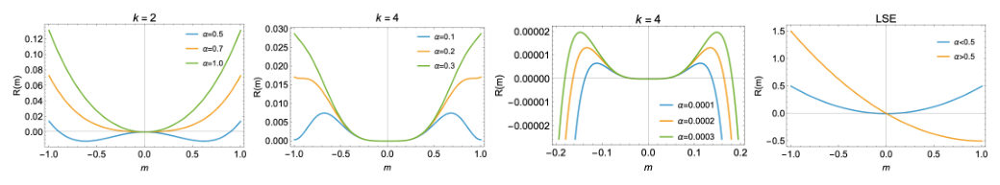
<figcaption class="paper-figure-caption"><b>Fig 1.</b> Figure 1: Plot of disorder averaged ground state energy of retrieval(R(m)) of a random memory when N, P →∞. We have taken ek = 1 and hence γ = α. a) for Hopfield model,b) k = 4 DenseAM. In both cases the function R(m) is plotted near, above and below the transition, In (c) k = 4 basin of m = 0 state is shown to illustrtate that it is always present. In (d) R(m) for LSE model above and below the transition is shown.</figcaption>
</figure>

**Summary.** This paper develops a powerful theoretical framework using large deviations theory to calculate the free energy landscape for various dense associative memory models. It shows that increasing the interaction order leads to first-order phase transitions, meaning successful memory retrieval critically depends on starting near the correct initial state basin. This provides systematic tools for analyzing complex, high-dimensional energy minimization problems.

**Why it may be interesting.** While focused on classical neural networks, the use of advanced statistical mechanics tools like large deviations theory to characterize complex energy landscapes is highly relevant for understanding metastable states in quantum many-body systems or optimization problems involving quantum circuits.

Detailed structure

**Main problem.** The primary goal is deriving a general expression for the free energy landscape of dense associative memories (DenseAMs) and analyzing how memory retrieval dynamics depend on initial conditions.

**Main result.** The method provides an exact free energy functional for polynomial interactions, revealing that for higher-order networks ($k>2$), retrieval exhibits first-order transitions dependent on the starting state's basin of attraction.

**Method.** The authors employ large deviations theory and a tilted large deviations principle to derive the free energy functional $I_eta(\mathbf{m})$, followed by self-consistency equations for fixed points in the extensive limit.

**Model / system.** The system models Dense Associative Memories (DenseAMs) using Ising spins ($\pm 1$) and higher-order polynomial interactions. The analysis compares results across different interaction orders ($k=2, 3, 4$) and includes the Log-Sum-Exponential (LSE) activation model.

**Key observables.** Free energy functional $F(\mathbf{m})$, ground state energy $R(\mathbf{m})$, susceptibility $\chi(m)$, and retrieval thresholds ($\alpha_c$).

**Important parameters / regimes.** Interaction order ($k$), disorder parameter ($\gamma$), inverse temperature ($eta$), and the ratio of stored patterns to system size.

**Assumptions / limitations.** The analysis relies on the large $N$ limit, uses approximations like Gaussian distributions for overlaps in the LSE model, and assumes specific forms for the cost function.

**Figures summary.** Figure 1 illustrates the free energy landscape $R(m)$ for both Hopfield and DenseAM ($k=4$) near/below transition points, showing the persistence of the $m=0$ basin. It also shows the LSE model's landscape.

**Paper structure.** The paper systematically develops the large deviations framework to find the free energy functional for general polynomial interactions. It then applies this to specific models (Hopfield, LSE) to analyze phase transitions and retrieval dynamics based on the overlap vector $\mathbf{m}$.

Abstract

Using large deviations theory, we solve and obtain a general expression for the free energy functional for a broad class of associative memories, including dense associative memories. We illustrate the method by reproducing classical results for the Hopfield model. For a finite number of patterns, we derive the temperature-dependent free energy functional for dense associative memories featuring polynomial interactions and Log-Sum-Exponential (LSE) activation. We also evaluate the disorder-averaged ground-state energy of these systems in the extensive limit. Our analytical framework reveals how memory retrieval depends on the initial state in higher-order dense networks, and gives the exact full-retrieval threshold for the LSE model. This method provides a systematic procedure for analyzing diverse, complex architectures in associative memory.

[↑ back to top](#top)

### [Integrable multi-species SSEP with reactive particle species](http://arxiv.org/abs/2607.18959v1)

**Authors:** Mathieu Dabrowski, Loïc Poulain d'Andecy, Eric Ragoucy  
**Type:** theory · **Category:** statistical mechanics · **PDF:** <https://arxiv.org/pdf/2607.18959v1>  
**Analysis basis:** full PDF text, analyzed in chunks
**Topic relevance:** `methods for driven-dissipative` **3/5** · `non-equilibrium dynamics` **3/5** · `non-equilibrium universality` **2/5** · `Keldysh / 2PI / non-Gaussian methods` **1/5** · `analog quantum simulation` **1/5** · `correlated / nonlocal dissipation` **1/5** · `driven-dissipative phase transition` **1/5**

↔ Scroll figures horizontally

<figure class="paper-figure-card">
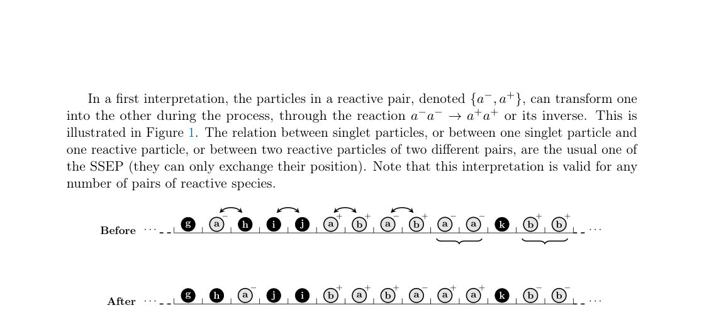
<figcaption class="paper-figure-caption"><b>Fig 1.</b> Figure 1: Illustration of a possible evolution in the transformation interpretation of the (p, q)-SSEP. The lattice is filled with singlet particles, in black, labeled by g, h, i, j, k ∈J1, pK and with reactive particles, in grey, labeled a± and b± with a, b ∈J1, qK and a ̸= b.</figcaption>
</figure>
<figure class="paper-figure-card">
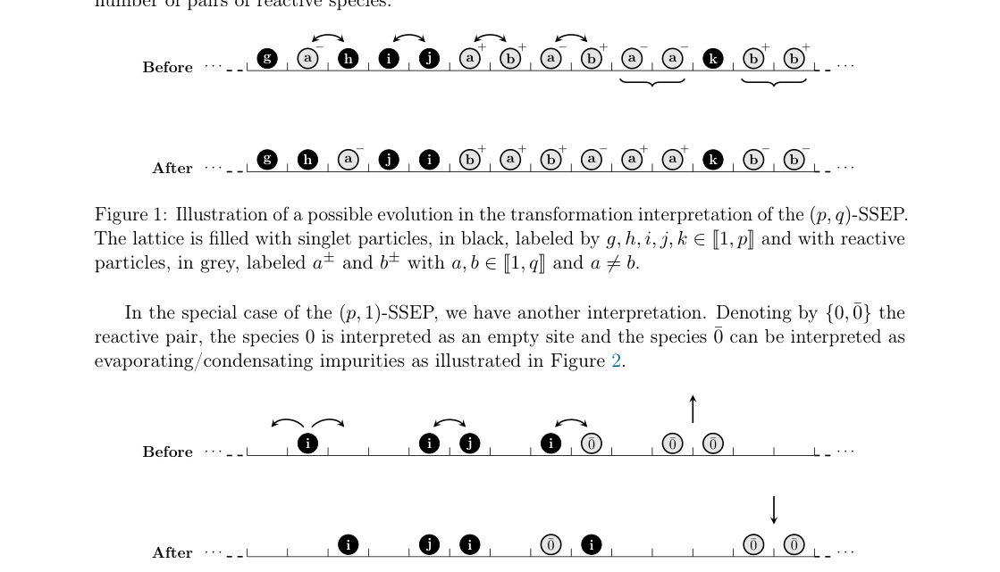
<figcaption class="paper-figure-caption"><b>Fig 2.</b> Figure 2: Illustration of a possible evolution in the evaporation-condensation interpretation. Particle species 0 represent empty sites and the conjugate species ¯0 in grey to evaporating- condensating particles. Singlet particles are black and are labeled by i, j ∈J1, pK.</figcaption>
</figure>
<figure class="paper-figure-card">
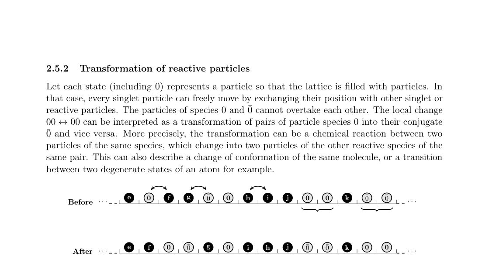
<figcaption class="paper-figure-caption"><b>Fig 3.</b> Figure 3: Illustration of a possible evolution in the transformation interpretation. The lattice is filled with singlet particles, in black, labeled by e, f, g, h, i, j, k ∈J1, pK and with reactive particles, in grey, of species 0 and ¯0.</figcaption>
</figure>
<figure class="paper-figure-card">
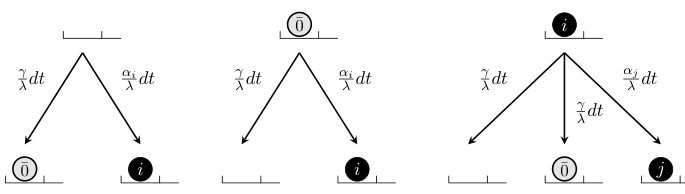
<figcaption class="paper-figure-caption"><b>Fig 4.</b> Figure 4: Graphical representation of the transition probabilities given by B(1) on the first site. The particle of species 0 is interpreted as an empty site.</figcaption>
</figure>
<figure class="paper-figure-card">
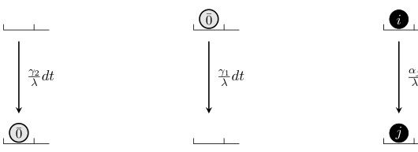
<figcaption class="paper-figure-caption"><b>Fig 5.</b> Figure 5: Graphical representation of the transition probabilities given by B(2) on the first site. The particle of species 0 is interpreted as an empty site.</figcaption>
</figure>

**Summary.** This paper develops the mathematical framework for multi-species Symmetric Simple Exclusion Processes incorporating reactive particles. By leveraging techniques from integrable systems theory (YBE), the authors prove the model's integrability and derive detailed combinatorial formulas to count the system's stationary state sectors. This work provides deep theoretical insights into non-equilibrium statistical mechanics models with chemical reaction dynamics.

**Why it may be interesting.** The connection between integrable quantum field theory structures (YBE solutions) and non-equilibrium statistical mechanics models like SSEPs is highly relevant to understanding complex many-body dynamics far from equilibrium, which is a key area of modern condensed matter physics.

Detailed structure

**Main problem.** The research investigates integrable multi-species Symmetric Simple Exclusion Processes (SSEP) that incorporate reactive particle species, generalizing standard SSEPs.

**Main result.** Integrability is proven for the general $(p, q)$-SSEP in the periodic case and for specific boundary conditions in the open case. Furthermore, explicit combinatorial formulas are derived for counting the sectors of the system's stationary state.

**Method.** The authors employ methods rooted in quantum integrable systems theory, specifically using set-theoretical solutions to the Yang-Baxter Equation (YBE) to construct the Markov matrix and prove integrability via transfer matrices.

**Model / system.** The model is the $(p, q)$-SSEP on a 1D lattice, which describes interacting particles where some species are 'reactive' and can undergo pair transformations or evaporation/condensation. The dynamics are governed by a continuous-time Markov process defined on the configuration space.

**Key observables.** Non-equilibrium stationary state (NESS) physical quantities, including mean lattice currents, particle densities, and reaction rates.

**Important parameters / regimes.** The number of singlet species ($p$), the number of reactive pairs ($q$), and the system size $L$.

**Assumptions / limitations.** Integrability is assumed or proven using YBE solutions; calculations for physical quantities are performed assuming specific integrable boundary types.

**Figures summary.** Figure 1 illustrates particle transformations (e.g., $a^-a^- 	o a^+a^+$), and Figure 2 shows the evaporation-condensation interpretation of the $(p, 1)$-SSEP using empty sites ($	ext{0}$) and impurities ($ar{	ext{0}}$).

**Paper structure.** The paper progresses by first introducing the generalized model ($(p, q)$-SSEP) and proving its integrability. It then details the analysis of the $(p, 1)$-SSEP, providing physical interpretations (evaporation vs. reaction) and deriving invariants for characterizing sectors in the periodic case before tackling open boundary conditions.

Abstract

We investigate integrable exclusion Markov processes constructed from set-theoretical solutions of the Yang-Baxter Equation (YBE) that generalise the multi-species Symmetric Simple Exclusion Process (SSEP). We first introduce the process called the $ (p,1) $-SSEP that is analogous to the multi-species SSEP but with an extra particle species qualified as reactive. Reactive species are able to evaporate and condensate by pairs or to transform by pairs depending on the interpretation. We provide a full combinatorial study of the sectors in the periodic case. We prove the integrability of the process in the periodic case and in the open case for two types of boundaries that we introduce using Baxterisations of solutions of the reflection equation. Next we move on to the process called $ (p,q) $-SSEP, i.e. the multi-species SSEP with an arbitrary number of reactive particle species. We prove its integrability in the periodic case and, for the open case, we introduce integrable boundaries generalising the ones considered for the $ (p,1) $-SSEP. Finally, we define physical quantities relevant to the models and we compute them in the non-equilibrium stationary state of the open $ (p,q) $-SSEP for one type of integrable boundaries.

[↑ back to top](#top)

### [Quantum critical fan and emergent relativistic symmetry of two-dimensional Dirac semimetals](http://arxiv.org/abs/2607.18396v1)

**Authors:** Friederike Ihssen, Bilal Hawashin, Mireia Tolosa-Simeón, Michael M. Scherer  
**Type:** theory · **Category:** statistical mechanics · **PDF:** <https://arxiv.org/pdf/2607.18396v1>  
**Analysis basis:** full PDF text, analyzed in chunks
**Topic relevance:** `Keldysh / 2PI / non-Gaussian methods` **3/5** · `analog quantum simulation` **2/5** · `driven-dissipative phase transition` **2/5** · `non-equilibrium universality` **2/5** · `Kondo & dissipative impurity` **1/5** · `methods for driven-dissipative` **1/5** · `non-equilibrium dynamics` **1/5**

↔ Scroll figures horizontally

<figure class="paper-figure-card">
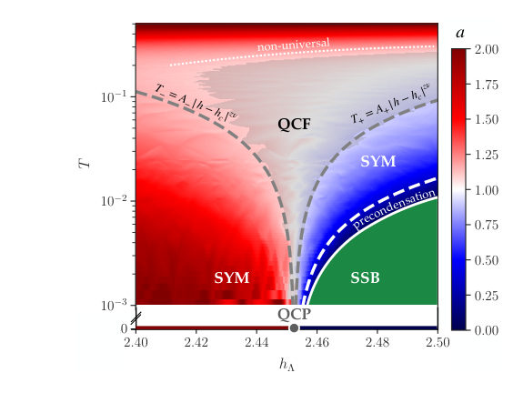
<figcaption class="paper-figure-caption"><b>Fig 1.</b> FIG. 1. GNY phase diagram and quantum critical fan. The color scheme shows the calculated scaling exponent of the thermal correlation length a, cf. Eq. (46), as a function of the coupling hΛ and temperature T, which can be used to identify the quantum critical fan (QCF). The crossovers delimiting the expected extent of the QCF are shown as dashed gray lines, cf. Eq. (47). Within this region, the gray-shaded area indicates the region where |z −a| &lt; 0.1, i.e., where the temperature dependence of the thermal correlation length follows the scaling imprinted by the QCP. The other features shown in the phase diagram are discussed in the main text, e.g., the QCP, the precondensation regime, the...</figcaption>
</figure>
<figure class="paper-figure-card">
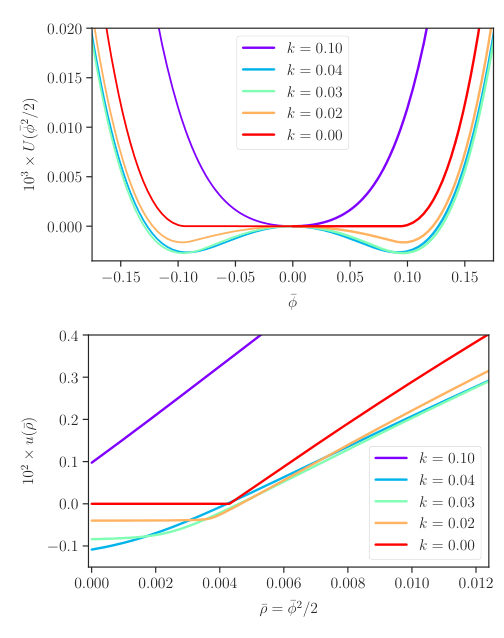
<figcaption class="paper-figure-caption"><b>Fig 2.</b> FIG. 2. RG evolution of the effective potential. Top: Scale- and field-dependence of the potential Uk. Bottom: Field derivative of the effective potential u = ∂¯ρU as a function of ¯ρ. Different RG scales k are indicated by the color scheme, at temperature T = 0 and Yukawa coupling hΛ = 2.55.</figcaption>
</figure>
<figure class="paper-figure-card">
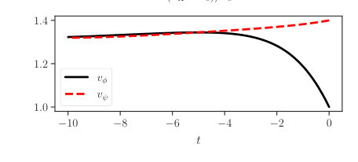
<figcaption class="paper-figure-caption"><b>Fig 3.</b> FIG. 3. Correlation length and velocity flows from numerical integration of the functional RG flow equations. Top: Static correlation length as a function of the tuning parameter δh = (hΛ −hc)/hc, used to extract the correlation length exponent via ξ⊥∝δh−ν. Bottom: RG flow of the bosonic (black solid line) and fermionic (red dashed line) ve- locities at the QCP.</figcaption>
</figure>
<figure class="paper-figure-card">
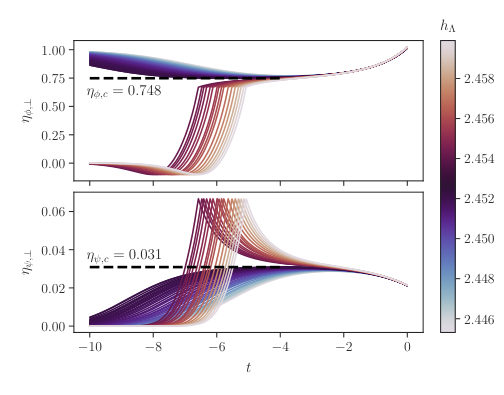
<figcaption class="paper-figure-caption"><b>Fig 4.</b> FIG. 4. Anomalous dimensions at the QCP from the numerical integration of the functional RG flow equations. The anomalous dimensions are extracted by projecting the wave- function renormalizations onto the spatial (perpendicular) direction. We show the RG time dependence of the anomalous dimensions for different initial values of the Yukawa coupling hΛ close to the QCP. The extracted critical values of the anomalous dimensions are indicated by the dashed black lines and shown in Table I.</figcaption>
</figure>
<figure class="paper-figure-card">
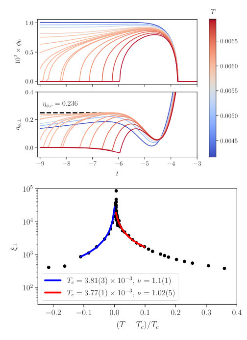
<figcaption class="paper-figure-caption"><b>Fig 5.</b> FIG. 5. Critical exponents at finite-T transition. Top: Expectation value of the order parameter ϕ0, c.f. Eq. (24), and its corresponding anomalous dimension in the vicinity of the finite-temperature phase transition for hΛ = 2.48 at various temperatures indicated by the color shading. The dashed line indicates the exact solution η2D, Ising = 1/4. Bottom: Fit of the critical exponent ν from the scaling of the correlation length given in Eq. (43). The correlation length is extracted from the inverse screening mass in Eq. (36) at t = −9.</figcaption>
</figure>

**Summary.** This work develops a comprehensive field-theoretical framework using the functional renormalization group (fRG) to analyze the phase diagram of 2D Dirac semimetals near a quantum critical point. The study confirms that the system exhibits universal critical behavior belonging to the chiral Ising and 2D Ising universality classes at different temperature limits. It provides crucial insights into how relativistic symmetry can emerge in these strongly interacting electronic systems.

**Why it may be interesting.** While focused on condensed matter criticality, the use of advanced non-perturbative RG techniques to map out phase boundaries and emergent symmetries is highly relevant for understanding many-body dynamics in strongly correlated systems studied in AMO physics.

Detailed structure

**Main problem.** The study aims to understand finite-temperature effects and the phase diagram of two-dimensional Dirac semimetals near a quantum critical point (QCP). This requires analyzing the Gross--Neveu--Yukawa model in both semimetallic and insulating regimes.

**Main result.** The authors find that at zero temperature, the QCP exhibits critical exponents matching the chiral Ising universality class, and relativistic symmetry emerges. At finite temperatures, a classical phase transition into the disordered phase belongs to the 2D Ising universality class.

**Method.** The primary method employed is the non-perturbative functional renormalization group (fRG) approach applied to the effective field theory describing the system's dynamics.

**Model / system.** The physical system involves two-dimensional Dirac semimetals, modeled by the Gross--Neveu--Yukawa (GNY) model, which simplifies to the chiral Ising model. The Lagrangian describes interacting fermions coupled to a scalar order parameter field $\phi$.

**Key observables.** Critical exponents ($\alpha$), phase diagram boundaries, quasiparticle weight, and the extent of the quantum critical fan.

**Important parameters / regimes.** Temperature ($T$), coupling constants (e.g., $h\Lambda$), and proximity to the QCP.

**Assumptions / limitations.** The analysis relies on a non-perturbative fRG treatment, which is used to map out the phase diagram across different temperature regimes.

**Figures summary.** Figure 1 illustrates the GNY phase diagram and the Quantum Critical Fan (QCF), with color coding representing the calculated scaling exponent ($\alpha$) as a function of coupling ($h\Lambda$) and temperature ($T$).

**Paper structure.** The paper develops a unified field-theoretical framework by analyzing the system's behavior across different regimes: zero temperature QCP analysis, finite temperature classical transition analysis, and finally determining the scaling properties within the quantum critical fan.

Abstract

Two-dimensional Dirac semimetals near a quantum critical point can be described by Gross--Neveu--Yukawa models. In view of recent experimental advances exhibiting a transition from Dirac semimetal to insulator in highly-tunable van-der-Waals heterostructures, a better understanding of finite-temperature effects is mandatory. Here, we study the Gross--Neveu--Yukawa phase diagram of the chiral Ising model with a non-perturbative field-theory approach at zero and finite temperature, both in the semimetallic phase and in the insulating phase with spontaneously broken $\mathbb{Z}_2$ symmetry. At zero temperature, we find a quantum critical point with critical exponents that are close to the ones of the chiral Ising universality class, and show that relativistic symmetry is emergent close to the quantum critical point. At finite temperature, the ordered phase survives up to a finite critical temperature, at which we observe a classical phase transition into the disordered phase. We confirm that this transition lies in the two-dimensional Ising universality class. Finally, we determine the extent and scaling properties of the quantum critical fan, and the behavior of the quasiparticle weight, therein. In summary, we present a unified field-theoretical framework for the phase diagram of the chiral Ising model in the surroundings of its quantum critical point.

[↑ back to top](#top)

### [Quantum Reservoir Computing: Recent Advances and Future Directions](http://arxiv.org/abs/2607.18552v1)

**Authors:** Shehbaz Tariq, Muhammad Talha, Arshid Ali, Muhammad Diyan, Symeon Chatzinotas  
**Type:** both · **Category:** quantum information and computing · **PDF:** <https://arxiv.org/pdf/2607.18552v1>  
**Analysis basis:** full PDF text, analyzed in chunks
**Topic relevance:** `QC/QI experiment` **3/5** · `analog quantum simulation` **2/5** · `non-equilibrium dynamics` **2/5** · `driven-dissipative phase transition` **1/5** · `entanglement & information structure` **1/5** · `methods for driven-dissipative` **1/5** · `quantum measurements` **1/5** · `quantum optics experiment` **1/5**

↔ Scroll figures horizontally

<figure class="paper-figure-card">
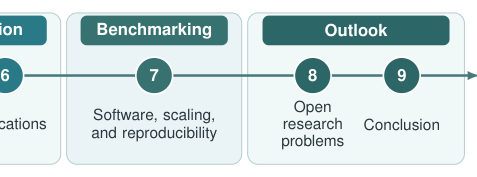
<figcaption class="paper-figure-caption"><b>Fig 1.</b> Figure 1: Organization and analytical flow of the survey.</figcaption>
</figure>
<figure class="paper-figure-card">
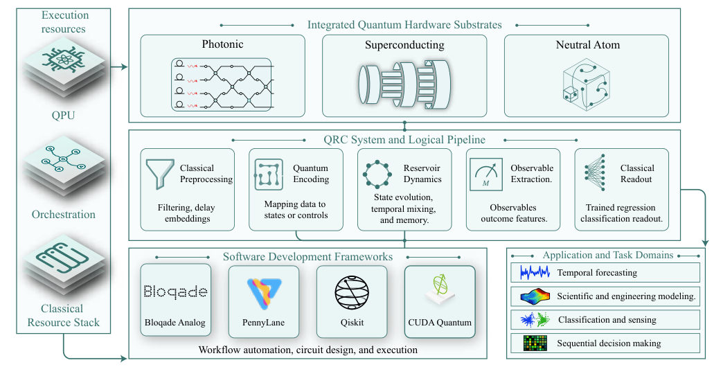
<figcaption class="paper-figure-caption"><b>Fig 2.</b> Figure 2: Integrated QRC stack. Classical preprocessing maps application data to inputs accepted by the quantum interface. Reservoir evolution generates a state trajectory, measurement converts selected properties of that trajectory into classical features, and the readout maps those features to predictions. Finite sampling and measurement disturbance depend on the operating protocol. The surrounding blocks show representative hardware, software, execution resources, and task domains.</figcaption>
</figure>
<figure class="paper-figure-card">
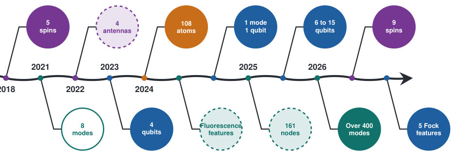
<figcaption class="paper-figure-caption"><b>Fig 3.</b> Figure 3: Timeline of representative QRC experiments, models, and related physical reservoir studies from 2018 to 2026. Color denotes the platform family and marker style denotes the study type. Bubble text reports the physical scale or measured resource stated in each study. These quantities are heterogeneous and are not directly comparable as reservoir capacity. The entries cover spin, NMR, and magnonic systems [56, 96, 98]; photonic, CV, bosonic, and quantum dot systems [1, 29, 102, 129]; superconducting, microwave, and circuit QED systems [23, 55, 116, 144]; and a neutral atom implementation [69].</figcaption>
</figure>

**Summary.** This survey establishes a unified system model for Quantum Reservoir Computing (QRC), detailing the necessary components from input encoding to classical readout across diverse hardware platforms. It critically analyzes that computational power depends on the entire processing chain, not just Hilbert space size. The work aims to define rigorous benchmarking standards needed to substantiate claims of quantum advantage in this emerging field.

**Why it may be interesting.** It provides a rigorous framework for analyzing how physical implementations of quantum dynamics can be mapped onto machine learning tasks, which is highly relevant for understanding resource requirements in open quantum systems modeling.

Detailed structure

**Main problem.** Quantum Reservoir Computing (QRC) aims to leverage quantum dynamics for feature extraction from time-series data in machine learning, while overcoming limitations related to hardware constraints and establishing clear benchmarks.

**Main result.** The paper develops a comprehensive system model connecting all components of QRC—from input encoding through reservoir evolution to classical readout—and provides a framework for evaluating true quantum advantage.

**Method.** It proposes a hybrid computational approach where the quantum processor (QPU) handles the non-linear dynamics, and classical high-performance computing (HPC) manages preprocessing, optimization, and final readout.

**Model / system.** The system is modeled through distinct stages: input encoding ($
ho_{t,0} = E(\dots)$), reservoir evolution ($
ho_{t,v} = R(\dots)$), measurement ($z_t$), and classical readout. Platforms examined include spin, photonic, superconducting, bosonic, and neutral atom systems.

**Key observables.** Feature vector $z_t$ (from measurement) and prediction $b_{yt}$ (from readout); memory, nonlinearity, and expressivity are key diagnostic properties.

**Important parameters / regimes.** Fixed or selected parameters ($\lambda_p, \lambda_e, \lambda_H$) governing preprocessing, encoding, and dynamics; finite sampling rates and hardware noise levels are critical constraints.

**Assumptions / limitations.** The computational power depends jointly on the input encoding, quantum evolution, observables, measurement, and readout, not just Hilbert space dimension. Current results do not guarantee a broad quantum advantage over classical methods.

**Figures summary.** Figure 1 outlines the survey's organization across foundations to benchmarking; Figure 2 illustrates the integrated QRC stack connecting classical preprocessing, reservoir dynamics, measurement, and classical readout.

**Paper structure.** The paper organizes QRC by developing a common system model that connects all processing stages. It then surveys computational properties, discusses various reservoir architectures (spin, photonic, etc.), outlines operating protocols, and addresses benchmarking standards to evaluate quantum advantage claims.

Abstract

Quantum reservoir computing (QRC) uses the dynamics of a fixed or weakly tuned quantum system to transform temporal and sequential inputs into measured features, while training is typically confined to a classical readout. This separation reduces reliance on repeated quantum parameter updates and avoids the barren plateaus associated with variational circuit training. Its computational power is often attributed to the exponentially large Hilbert space of the quantum system. However, the memory, nonlinearity, and expressivity that determine what a reservoir can actually compute depend jointly on the input encoding, quantum evolution, observables, measurement, and readout, not on Hilbert space dimension alone. On hardware, these capabilities are further constrained by finite sampling, hardware noise, measurement backaction, and the cost of estimating observables, so a large state space alone does not guarantee useful computation. In this survey, we develop a common system model that connects these components and use it to organize QRC foundations, computational properties, reservoir architectures, operating protocols, and physical implementations. We examine spin, photonic, superconducting, bosonic, neutral atom, and other analog platforms, together with applications, software and high performance computing support, benchmarking, and reproducibility. The analysis distinguishes hardware demonstrations from simulations and identifies the assumptions and resources that govern comparisons across implementations. Current results do not establish a broad quantum advantage over well matched classical reservoirs. We therefore specify the resource accounting, benchmark standards, and theoretical criteria needed to evaluate claims of quantum advantage.

[↑ back to top](#top)

### [Single-Snapshot Inference of Network Couplings from Universal Dynamics at Relative Equilibrium](http://arxiv.org/abs/2607.18977v1)

**Authors:** Moritz Lampert, Dominic Grün, Ingo Scholtes  
**Type:** theory · **Category:** disordered systems and neural networks · **PDF:** <https://arxiv.org/pdf/2607.18977v1>  
**Analysis basis:** full PDF text, analyzed in chunks
**Topic relevance:** `methods for driven-dissipative` **3/5** · `non-equilibrium dynamics` **3/5** · `driven-dissipative phase transition` **2/5** · `non-equilibrium universality` **2/5** · `Frenkel-Kontorova` **1/5** · `Keldysh / 2PI / non-Gaussian methods` **1/5**

↔ Scroll figures horizontally

<figure class="paper-figure-card">
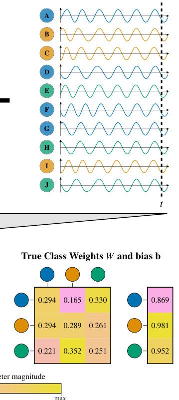
<figcaption class="paper-figure-caption"><b>Fig 1.</b> Figure 1. Overview of the proposed parameter inference method. Given a graph where the topology and node class assignments are known (top left), we can infer hidden class-based coupling weights and class-intrinsic biases (bottom left) using only a single instantaneous snapshot of the node states at time 𝑡(top right). The displayed matrices and state trajectories represent an actual simulation of Kuramoto oscillator dynamics on a 10-node network. For the inference to succeed, the system must exhibit spatially uniform velocity at the measurement time 𝑡– which, in this Kuramoto example, corresponds to a phase-locked state. Because our method formulates the inference as a homogeneous system,...</figcaption>
</figure>
<figure class="paper-figure-card">
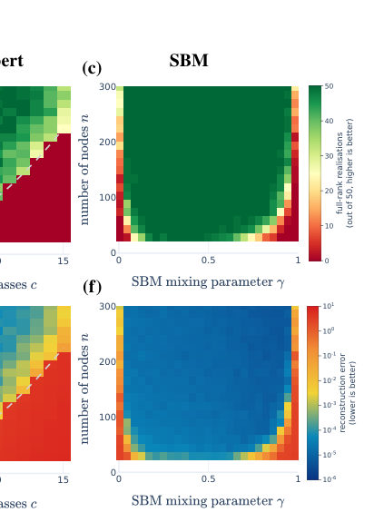
<figcaption class="paper-figure-caption"><b>Fig 2.</b> Figure 2. Rank sufficiency and reconstruction error. (a–c) Heatmaps displaying the number of times the rank condition #r(𝑀𝑧) = 𝑐is satisfied out of 50 random initialisations for varying network sizes and topologies. (d–f) Corresponding heatmaps showing the mean normalised reconstruction error || ˆ˜𝑊∗−˜𝑊∗||𝐹on a logarithmic colour scale. The random realisations are drawn from: (a, d) Erd˝os-R´enyi random graphs with edge probability 𝑝= 8</figcaption>
</figure>
<figure class="paper-figure-card">
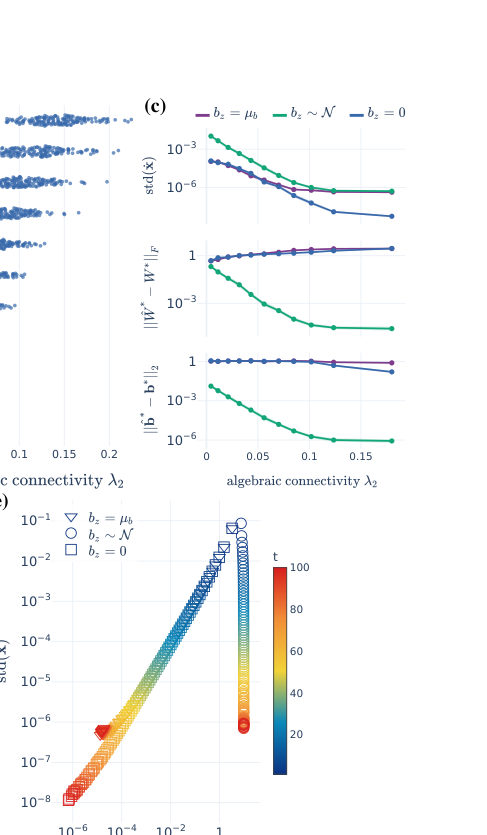
<figcaption class="paper-figure-caption"><b>Fig 3.</b> Figure 3. Experiments on linear consensus dynamics. (a) Topologies and corresponding node state trajectories for Watts-Strogatz random graphs with no (𝑝= 0) and high (𝑝= 0.1) rewiring probability, illustrating how an increased number of “shortcuts” accelerates consensus. (b) The algebraic connectivity 𝜆2 (the second smallest eigenvalue of the weighted Laplacian) as a function of the rewiring probability 𝑝. Results are based on 50 Watts-Strogatz graphs with 𝑛= 125 nodes connecting to their two nearest neighbours and 𝑐= 5 uniformly distributed classes. (c) Standard deviation of the node state velocity std(¤x) and the reconstruction error of the normalised weights and biases evaluated at 𝑡=...</figcaption>
</figure>
<figure class="paper-figure-card">
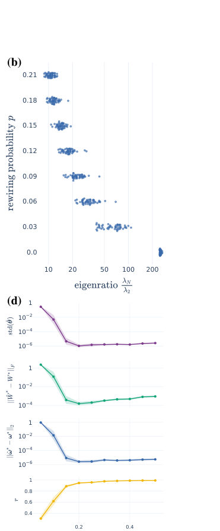
<figcaption class="paper-figure-caption"><b>Fig 4.</b> Figure 4. Experiments on nonlinear Kuramoto dynamics. (a) Topologies and corresponding sine-transformed node states sin(𝜃𝑣) across time for Watts-Strogatz random graphs with no (𝑝= 0) and high (𝑝= 0.21) rewiring probabilities. The comparison illustrates how small-world shortcuts foster rapid phase coherence. (b) The rewiring probability 𝑝 plotted against the corresponding eigenratio 𝜆𝑁</figcaption>
</figure>
<figure class="paper-figure-card">
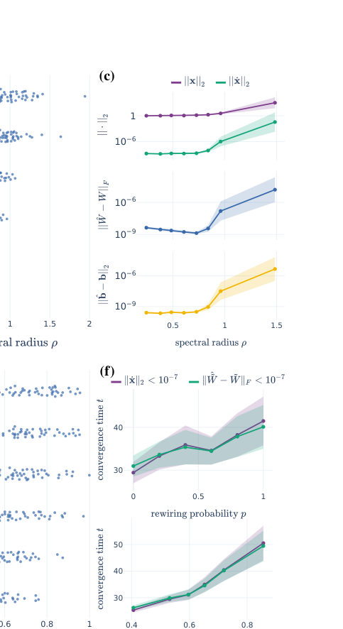
<figcaption class="paper-figure-caption"><b>Fig 5.</b> Figure 5. Experiments on anchored dynamics. (a) Topologies and corresponding node state trajectories for Erd˝os-R´enyi random graphs with sparse (𝑝= 5</figcaption>
</figure>

**Summary.** This paper presents a novel method to reconstruct unknown coupling strengths within networked dynamical systems using only one snapshot of node measurements. By assuming the system operates near a relative equilibrium state, the complex inverse problem is linearized into an algebraic system solvable via linear algebra techniques. This breakthrough shows that spatial structure alone can reveal hidden interaction parameters previously requiring time-series data.

**Why it may be interesting.** The technique provides a powerful tool for analyzing complex dynamics where time-series data is unavailable, making it highly relevant for characterizing hidden interactions in physical or biological networks modeled by differential equations.

Detailed structure

**Main problem.** The core problem is inferring hidden, class-based coupling strengths within a complex network from only a single snapshot of the system's node states.

**Main result.** The authors demonstrate that this inference is possible if the system is observed near a relative equilibrium, allowing spatial heterogeneity to substitute for necessary temporal sampling.

**Method.** They transform the inverse problem into a homogeneous linear system by exploiting the common velocity shared by all nodes at relative equilibrium. This allows parameter recovery using Total Least Squares.

**Model / system.** The study analyzes dynamical systems on networks, including linear consensus dynamics and nonlinear models like Kuramoto oscillators. The dynamics are governed by coupling functions $f$ between classes of nodes.

**Key observables.** Reconstruction error (Frobenius norm) for couplings ($\| \hat{W}^* - W^* \|_F$) and the standard deviation of node velocities ($	ext{std}(\dot{\mathbf{x}})$).

**Important parameters / regimes.** The relative equilibrium state, class-specific biases ($b_z$), coupling function $f$, and network topology (ER, BA, SBM).

**Assumptions / limitations.** The system must be observed close to a relative equilibrium ($\dot{\mathbf{x}} = k\mathbf{1}$), which linearizes the otherwise nonlinear inverse problem. The recovered parameters are only determined up to an unknown scale and additive shift.

**Figures summary.** Figures illustrate successful recovery of couplings using Total Least Squares on Kuramoto dynamics, show rank sufficiency across different network topologies (ER, BA, SBM), and demonstrate information loss if class biases are absent.

**Paper structure.** The paper first establishes the limitations of prior methods requiring time-resolved data. It then introduces the relative equilibrium assumption to linearize the problem into a homogeneous system solvable via Total Least Squares. Validation is performed on multiple dynamical systems, comparing reconstruction errors across different network topologies and assessing necessary conditions like class biases.

Abstract

Many real-world systems can be modelled as complex networks whose collective behaviour is governed by hidden interactions between nodes. Existing methods for inferring these interactions typically require controlled perturbations, time-resolved observations or multiple independent snapshots, all of which are often unavailable in practice. Here we show that class-based coupling strengths can be inferred from a single snapshot of node states when the system is observed close to a relative equilibrium. In this regime, all nodes share a common velocity, which can be absorbed into an effective class bias, transforming the inverse problem into a homogeneous linear system. The coefficients of this linear system are determined entirely by the observed local neighbourhoods and their coupling mechanism, enabling the application to arbitrary known coupling functions. We validate the approach on three different linear and nonlinear dynamical systems, recovering relative class-based couplings and, in special cases, absolute couplings. These results show that spatial heterogeneity can substitute for temporal sampling, enabling single-snapshot inference of hidden coupling strengths in networked dynamical systems.

[↑ back to top](#top)

### [Bright Telecom Spin-Photon Interface in Silicon Photonics](http://arxiv.org/abs/2607.18435v1)

**Authors:** Carolina Crosta, Amirehsan Alizadehherfati, Purbita Purkayastha, Kyu-Young Kim, Jasvith Raj Basani, Chang-Min Lee, Fabio Pezzoli, Edo Waks  
**Type:** experiment · **Category:** quantum information and computing · **PDF:** <https://arxiv.org/pdf/2607.18435v1>  
**Analysis basis:** full PDF text, analyzed in chunks
**Topic relevance:** `exotic spin models in light-matter` **3/5** · `quantum optics experiment` **3/5** · `spintronics-quantum-optics interface` **3/5** · `QC/QI experiment` **1/5** · `quantum measurements` **1/5**

↔ Scroll figures horizontally

<figure class="paper-figure-card">
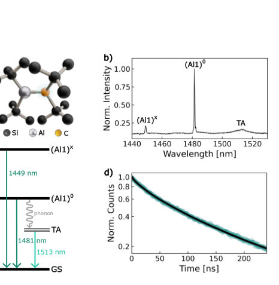
<figcaption class="paper-figure-caption"><b>Fig 1.</b> Figure 1: Atomic structure and ensemble optical characterization. a) Atomic structure of the Al1-center in silicon ((Al–C)Si); b) Photoluminescence emission of an Al1- center ensemble showing a sharp peak at 1481 nm [(Al1)0], corresponding to the zero-phonon line, a broad band fea- ture centered at 1513 nm (TA) associated to the transverse acoustic phonon sideband, and a second peak at 1449 nm [(Al1)x] that we ascribe to recombination from the second excited state of the defect; c) Summary of proposed elec- tronic structure of the Al1-center; d) Time-resolved photo- luminescence measurement of the ensemble (dots) and cor- responding stretched exponential fit (solid line), which pro- vides τ...</figcaption>
</figure>
<figure class="paper-figure-card">
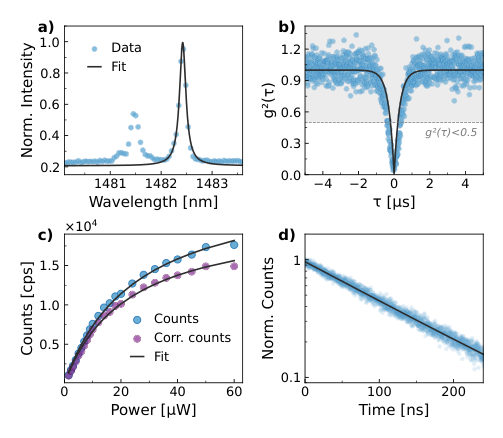
<figcaption class="paper-figure-caption"><b>Fig 2.</b> Figure 2: Optical characterization of a single Al1- center. a) Photoluminescence spectrum (dots) and corre- sponding Lorentzian fit (solid line) of the zero-phonon line at 1482.437 nm. The extracted linewidth is 20.2 ± 0.7 GHz; b) Second-order autocorrelation measurement under contin- uous wave 800 nm pumping with power of 3 µW (dots) and corresponding fit with Equation A3 (solid line). The ex- tracted zero-delay value is g(2)(0) = 0.04 ± 0.02; c) Count rate as a function of CW 800 nm incident power without and with g(2)(0) correction (blue and purple dots, respectively) and two-level system fit with Equation A1 (solid line). Fit- ting of the corrected counts provides Psat = 25 ± 1 µW and...</figcaption>
</figure>
<figure class="paper-figure-card">
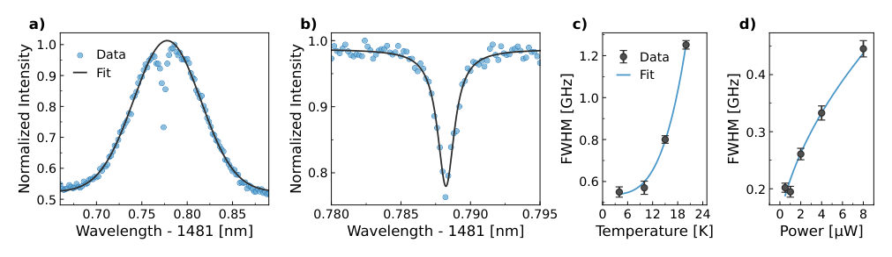
<figcaption class="paper-figure-caption"><b>Fig 3.</b> Figure 3: Transient spectral hole burning measurements on a single Al1-center. a) Two-color photoluminescence excitation spectroscopy of the zero-phonon line with a resolution of 2 pm (dots) and Gaussian fit (solid line), extracting FWHM = 10.85 ± 0.08 GHz. The incident power of the scanning laser is 0.5 µW, while the pumping laser power is 1.5 µW; b) Magnification of the hole burning dip obtained with 0.2 pm resolution and both scanning and pumping laser power of 0.5 µW (dots), and corresponding Lorentz fit (solid line) computing FWHM = 0.202 ± 0.008 GHz; c) FWHM behavior as a function of sample temperature with both scanning and pumping laser power of 5 µW (dots) and corresponding fit...</figcaption>
</figure>
<figure class="paper-figure-card">
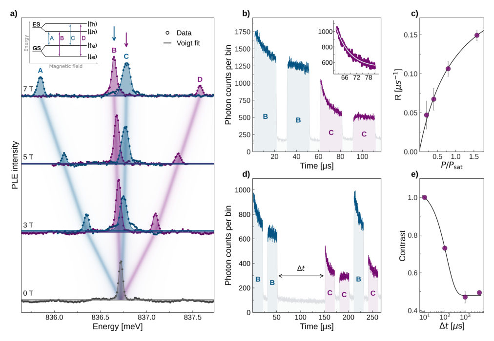
<figcaption class="paper-figure-caption"><b>Fig 4.</b> Figure 4: Magnetospectroscopy and time-resolved optical pumping of a single Al1-center. a) Zeeman splitting via two-color photoluminescence excitation spectroscopy. The blue (purple) spectrum is obtained by fixing the pump laser at peak B (C) energy. The inset figure illustrates the level structure of bound excitonic transitions in presence of an external magnetic field, showing four spin-allowed optical transitions; b) Pulse sequence used to demonstrate optical pumping. The first two pulses pump the population into the opposite spin state, while the second pair transfers the population back to the initial state. The difference between the measured B- and C-pulse amplitudes arises from the...</figcaption>
</figure>

**Summary.** The authors introduce the Al1-center defect as a breakthrough material platform for quantum photonics in silicon. Through rigorous optical and magnetic characterization, they prove it acts as a bright, high-purity single-photon source operating at telecom wavelengths. This establishes the Al1 center as a promising solid-state spin-photon interface for integrated quantum network applications.

**Why it may be interesting.** This work directly addresses the hardware requirements for scalable quantum networks by demonstrating a robust, integrated solid-state source of single photons with controllable spin states in silicon, which is crucial for photonic quantum information processing.

Detailed structure

**Main problem.** The use of silicon for quantum photonics is limited by the lack of bright, telecom-band emitters with optically addressable spin states suitable for building integrated quantum networks.

**Main result.** The Al1-center defect in silicon was demonstrated to be a highly efficient, bright single-photon emitter operating in the telecom band, exhibiting high purity and narrow spectral linewidths.

**Method.** Characterization involved time-resolved photoluminescence spectroscopy, second-order correlation measurements ($g^{(2)}(0)$), and magneto-optical spectroscopy on isolated defects within silicon nanophotonic waveguides.

**Model / system.** The physical system is the Al1-center defect (an aluminum–carbon complex) embedded in isotopically purified silicon-on-insulator nanophotonics. It functions as a solid-state quantum emitter with addressable spin states, allowing for initialization and readout.

**Key observables.** Single-photon purity ($g^{(2)}(0)=0.04$), excited-state lifetime ($\sim 135 	ext{ ns}$), homogeneous linewidth ($\sim 47 	ext{ MHz}$), and Zeeman splitting via magneto-optical measurements.

**Important parameters / regimes.** Telecom S-band emission, $	ext{C}_{2	ext{v}}$ symmetry, fast decay rates compared to T-centers, and measurable spin-dependent transitions.

**Assumptions / limitations.** The defect structure is stable and its optical properties are dominated by the Al1 center; comparisons are made against established centers like the T-center.

**Figures summary.** Figures illustrate the PL spectrum showing characteristic emission peaks ($	ext{(Al1)}_0$), time-resolved decay curves, $g^{(2)}(	au)$ measurements confirming single photons, and magneto-optical spectra revealing spin splitting.

**Paper structure.** The paper progresses from identifying the limitation in silicon photonics to proposing the Al1 center. It then presents detailed characterization using multiple spectroscopic techniques (time-resolved PL, $g^{(2)}$, magnetospectroscopy) to confirm its high performance as a quantum emitter and spin qubit platform.

Abstract

Silicon is an attractive host for scalable quantum photonics, but the absence of bright telecom-band emitters with optically addressable spin states has limited its use for spin-photon interfaces. Here we demonstrate the Al1-center, an aluminum--carbon defect in silicon, as a bright waveguide-integrated single-photon emitter with a ground-state spin. Using isotopically purified silicon-on-insulator nanophotonic devices, we isolate individual Al1-centers and observe high-purity single-photon emission with $g^{(2)}(0)=0.04$ without background subtraction. Time-resolved photoluminescence spectroscopy reveals a fast excited-state lifetime of 135 ns, nearly an order of magnitude shorter than the benchmark provided by the well-studied T-center. Resonant photoluminescence excitation measurements further resolve the zero-phonon transition and reveal a narrow homogeneous linewidth reaching 47 MHz, threefold narrower than the T-center under comparable temperature. Through magneto-optical spectroscopy, we resolve the spin-dependent transitions of the bound-exciton manifold and achieve spin-selective optical pumping, fulfilling the prerequisite for quantum state initialization and readout. These results establish the Al1-center as a bright telecom-band spin-photon interface in silicon photonics and introduce a promising platform for integrated quantum networks.

[↑ back to top](#top)

### [Exotic Electronic Order in a Parabolic Kagome Semimetal](http://arxiv.org/abs/2607.18389v1)

**Authors:** C. Alexander Baum, Jonas Issing, Sarbajit Mazumdar, Matteo Dürrnagel, Michael Klett, Ronny Thomale, Lennart Klebl  
**Type:** theory · **Category:** strongly correlated electrons · **PDF:** <https://arxiv.org/pdf/2607.18389v1>  
**Analysis basis:** full PDF text, analyzed in chunks
**Topic relevance:** `Keldysh / 2PI / non-Gaussian methods` **3/5** · `analog quantum simulation` **3/5** · `methods for driven-dissipative` **2/5** · `entanglement & information structure` **1/5** · `exotic spin models in light-matter` **1/5** · `non-equilibrium dynamics` **1/5**

↔ Scroll figures horizontally

<figure class="paper-figure-card">
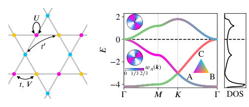
<figcaption class="paper-figure-caption"><b>Fig 1.</b> FIG. 1. Real-space picture of the generalized kagome Hubbard model (left) and corresponding non-interacting band structure (right). We indicate the nearest-neighbor hopping 𝑡, next-nearest-neighbor hop- ping 𝑡′, onsite Hubbard interaction 𝑈, and nearest-neighbor density- density interaction 𝑉(left panel). The right panel shows the corre- sponding band structure for 𝑡= 1, 𝑡′ = −0.3 at filling 𝜈= 2∕3, with the color encoding the sublattice character (A: magenta, B: yellow, C: blue) of the Bloch states. The insets show the Bloch state weight of sublattice A (𝑤𝐴(𝒌) = |𝑢𝐴(𝒌)|2) in the vicinity of 𝒌= Γ for the topmost (upper inset) and middle (lower inset) bands. We note that the bands’...</figcaption>
</figure>
<figure class="paper-figure-card">
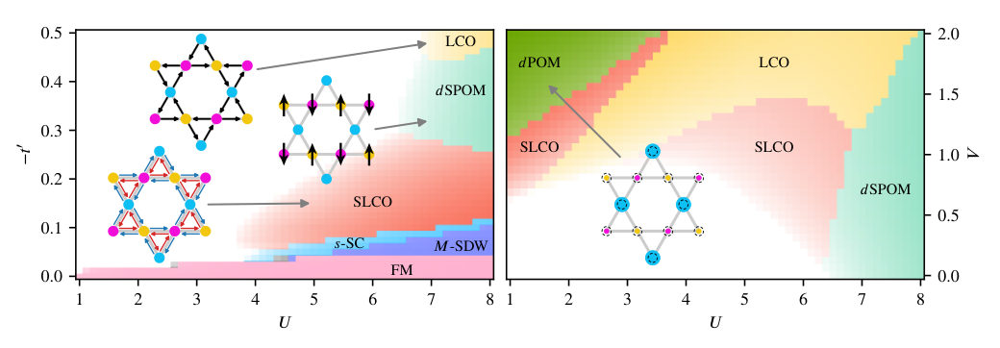
<figcaption class="paper-figure-caption"><b>Fig 2.</b> FIG. 2. FRG phase diagram for varied 𝑡′, 𝑈(at 𝑉= 0, left) and 𝑈, 𝑉(at 𝑡′ = −0.3, right). The color hue encodes the phase, while the intensity corresponds to the critical scale (white: no order, i.e., parabolic semimetallic Fermi liquid phase). The left panel includes visualizations of the loop current order state (LCO, yellow), the 𝑑-wave spin Pomeranchuk instability (𝑑SPOM, aqua), and the spin loop current order state (SLCO, red), where red and blue arrows correspond to the spin-↑and spin-↓loop current, respectively. The lower part of the phase diagram, where the topmost band becomes flat is occupied by a flat-band-ferromagnet (FM, pink), which is flanked by a 𝒒= 𝑀spin density wave (𝑀-SDW,...</figcaption>
</figure>
<figure class="paper-figure-card">
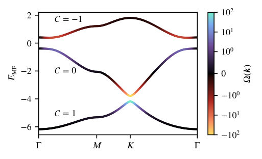
<figcaption class="paper-figure-caption"><b>Fig 3.</b> FIG. 4. Quasiparticle band structure in the loop current phase (LCO) obtained from inserting the LCO eigenvector obtained from FRG as an (ad hoc) mean-field. The bands are colored corresponding to their Berry curvature Ω(𝒌) and we indicate their Chern number on the left. Note that only the absolute value and relative sign of is fixed, as the LCO state features a residual ℤ2 symmetry.</figcaption>
</figure>
<figure class="paper-figure-card">
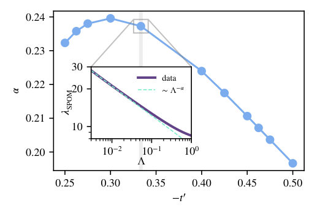
<figcaption class="paper-figure-caption"><b>Fig 4.</b> FIG. 5. Power-law exponent 𝛼of the 𝑑SPOM fluctuations within FRG as a function of 𝑡′ for 𝑈= 8. The FRG flow of the 𝑑SPOM vertex eigenvalue 𝜆SPOM is fitted with a power law (log 𝜆SPOM ≈ −𝛼log Λ + 𝑚) in the region Λ ∈[3 ⋅10−3, 5 ⋅10−3], i.e., at low RG scales. The inset displays one such fit at the approximately particle- hole symmetric point 𝑡′ = −1∕3, which roughly coincides with the maximum of 𝛼(𝑡′).</figcaption>
</figure>
<figure class="paper-figure-card">
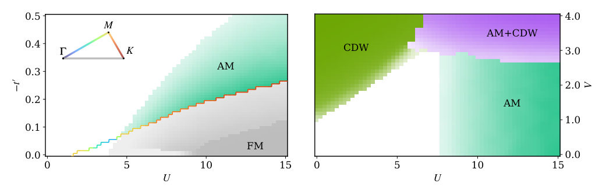
<figcaption class="paper-figure-caption"><b>Fig 5.</b> FIG. 6. SBMF phase diagrams for varied 𝑡′, 𝑈(at 𝑉= 0, left) and 𝑈, 𝑉(at 𝑡′ = −0.3, right). The color hue encodes the phase, while the intensity corresponds to the size of the order parameter. The left panel shows a ferromagnetic (FM) state for small |𝑡′|, favored by the nearly flat band, while for larger negative 𝑡′ the system develops a nematic altermagnetic (AM) spin order consistent with the 𝑑SPOM identified in the FRG analysis. The grey region indicates where the correlated saddle point becomes unstable with respect to transverse spin fluctuations. The colored line encodes the ordering vector 𝑞of the leading instability. In the right panel, onsite repulsion predominantly drives the AM...</figcaption>
</figure>

**Summary.** This work theoretically explores exotic electronic phases in a parabolic Kagome semimetal using sophisticated methods like FRG and SBMF. It demonstrates that the competition between band structure effects, repulsive interactions, and quantum geometry leads to multiple unconventional orders, such as loop-current and altermagnetic states. The findings establish this class of semimetals as a rich platform for studying symmetry breaking in correlated electron systems.

**Why it may be interesting.** While focused on condensed matter magnetism/superconductivity, the use of advanced many-body renormalization group techniques (FRG) and slave-boson formalisms provides methodological insights applicable to strongly interacting quantum systems studied in AMO physics.

Detailed structure

**Main problem.** The study investigates exotic electronic order in a parabolic Kagome semimetal by mapping its phase diagram across varying interaction strengths.

**Main result.** The interplay of band kinematics, quantum geometry, and interactions dictates the emergence of unconventional orders, including loop-current order and spontaneous altermagnetism.

**Method.** The research employs advanced theoretical tools like Functional Renormalization Group (FRG) for weak/intermediate coupling and Slave-Boson Mean-Field (SBMF) techniques for strong coupling regimes.

**Model / system.** The system is modeled using a generalized Kagome Hubbard model Hamiltonian, tuned to a semimetallic regime at 2/3 filling with onsite ($U$) and nearest-neighbor ($V$) repulsive interactions.

**Key observables.** Loop-current order (LCO), spontaneous altermagnetism, spin-loop-current order (SLCO), and various susceptibilities ($\chi$).

**Important parameters / regimes.** Filling $
u = 2/3$, onsite repulsion $U$, nearest-neighbor repulsion $V$, and the hopping parameter $t'$ which controls band structure.

**Assumptions / limitations.** The FRG analysis utilizes approximations such as discarding frequency dependencies of two-particle vertices, while SBMF methods are limited in describing certain bond orders independently.

**Figures summary.** Figure 1 illustrates the non-interacting band structure at $
u=2/3$. Figure 2 presents an FRG phase diagram mapping out various instabilities (SDW, SC, LCO, SLCO) based on $t'$ and interaction strengths. Figure 3 details diagrams showing how interactions promote specific loop current orders.

**Paper structure.** The paper systematically analyzes the system using FRG for intermediate coupling to identify initial instabilities, then extends the analysis into strong coupling regimes using SBMF techniques to characterize the full hierarchy of electronic orders.

Abstract

We study an interacting kagome-lattice realization of a quadratic band-touching semimetal at 2/3 filling with onsite and nearest-neighbor repulsive interactions. Combining functional renormalization group and slave-boson approaches, we map its phase diagram from intermediate to strong coupling and uncover a hierarchy of unconventional electronic orders. The leading instabilities comprise loop-current order, spontaneous altermagnetism arising from a spin-Pomeranchuk instability, and spin-loop-current order with distinctive and largely unexplored properties. We demonstrate how the interplay of band kinematics, electronic interactions, and quantum geometry governs the selection of these phases. Our findings establish quadratic band-touching semimetals as a promising platform for unconventional symmetry breaking and suggest analogous phenomena in other parabolic semimetals.

[↑ back to top](#top)

### [Energy Conversion, Fluctuation Suppression, and Information Transfer in the Thermodynamic Performance of Kinesin](http://arxiv.org/abs/2607.18905v1)

**Authors:** Riku Kato, Takayuki Ariga, Tomohiro Tanogami  
**Type:** theory · **Category:** statistical mechanics · **PDF:** <https://arxiv.org/pdf/2607.18905v1>  
**Analysis basis:** full PDF text, analyzed in chunks
**Topic relevance:** `non-equilibrium dynamics` **3/5** · `non-equilibrium universality` **2/5** · `Keldysh / 2PI / non-Gaussian methods` **1/5** · `correlated / nonlocal dissipation` **1/5** · `driven-dissipative phase transition` **1/5** · `entanglement & information structure` **1/5** · `methods for driven-dissipative` **1/5**

↔ Scroll figures horizontally

<figure class="paper-figure-card">
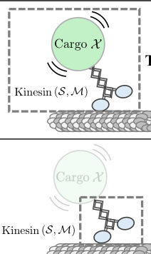
<figcaption class="paper-figure-caption"><b>Fig 1.</b> FIG. 1. Schematic classification of the four efficiencies considered in this work. The efficiencies are classified according to whether they characterize energy conversion or fluctuation suppression, and according to whether they are defined for the total system or for a subsystem. The pair (S, M) represents the kinesin subsystem—comprising the internal state S and the spatial degree of freedom M—while X represents the cargo subsystem, specifically its spatial degree of freedom. Precise definitions are given in Sec. III.</figcaption>
</figure>
<figure class="paper-figure-card">
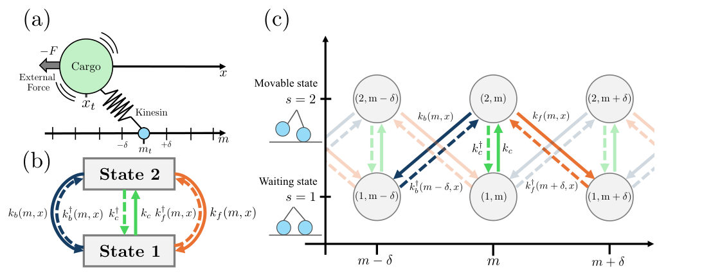
<figcaption class="paper-figure-caption"><b>Fig 2.</b> FIG. 2. Schematic of (a) the kinesin–cargo complex, (b) the two-state kinesin stepper model, and (c) the transition diagram of kinesin governed by the transition matrix. The state s = 1 represents a waiting state where both kinesin heads are bound to the microtubule, whereas the state s = 2 represents a state where one of the heads is detached.</figcaption>
</figure>
<figure class="paper-figure-card">
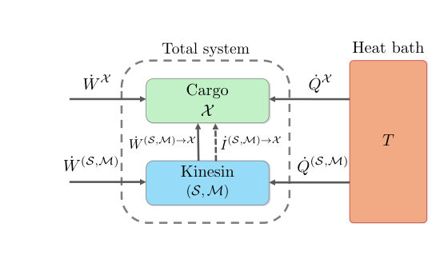
<figcaption class="paper-figure-caption"><b>Fig 3.</b> FIG. 3. Schematic of the relevant thermodynamic and information-theoretic quantities in our model. Note that ar- rows indicate positive flows under our sign convention.</figcaption>
</figure>
<figure class="paper-figure-card">
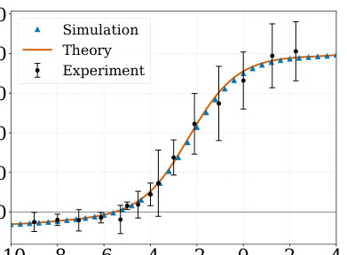
<figcaption class="paper-figure-caption"><b>Fig 4.</b> FIG. 4. Force–velocity relationship of single-molecule kinesin motion under the in vitro high-ATP condition. The experi- mental data are cited from Ref. [16]. For the simulation, we use the parameter set given in Appendix B.</figcaption>
</figure>
<figure class="paper-figure-card">
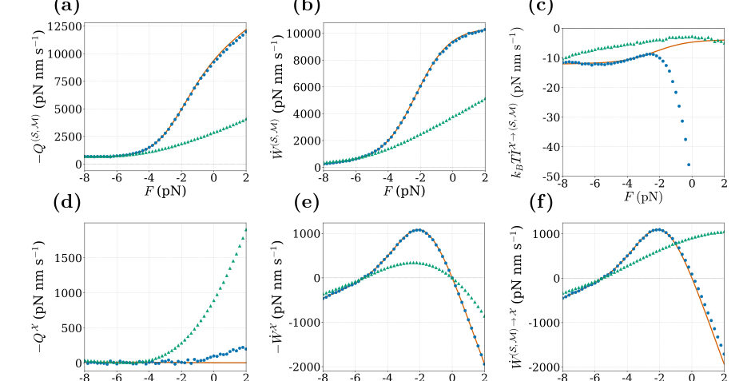
<figcaption class="paper-figure-caption"><b>Fig 5.</b> FIG. 5. F-dependence of the various thermodynamic quantities under the high-ATP condition: (a) −˙Q(S,M), (b) ˙W (S,M), (c) kBT ˙IX→(S,M), (d) −˙QX , (e) −˙W X , and (f) ˙W (S,M)→X . The orange solid line shows the result of the perturbative expansion, while the blue circles and green triangles indicate the numerical results for γ = γvitro and γvivo, respectively. The error bars are smaller than the marker size.</figcaption>
</figure>

**Summary.** The authors developed a unified theoretical framework to compare various thermodynamic efficiencies—including those related to energy conversion and fluctuation suppression—for the kinesin molecular motor. By applying this model to analyze performance under different conditions, they conclude that while multiple metrics can be calculated, kinesin does not appear strongly optimized for maximizing these specific thermodynamic efficiencies.

**Why it may be interesting.** This work applies advanced non-equilibrium statistical mechanics tools (like generalized fluctuation theorems) to a complex biological motor, providing quantitative benchmarks for energy transduction efficiency in mesoscopic systems.

Detailed structure

**Main problem.** To systematically compare multiple thermodynamic efficiencies characterizing kinesin's performance, as previous studies used different models and assumptions, making quantitative comparisons difficult.

**Main result.** The calculated thermodynamic efficiencies generally remain low, suggesting that kinesin is not optimized for maximizing the considered energy conversion or fluctuation suppression metrics.

**Method.** Analytical derivation of four types of thermodynamic efficiencies (thermodynamic, information-thermodynamic, TUR, and bipartite TUR) using a thermodynamically consistent two-state model framework.

**Model / system.** The system is Kinesin, a molecular motor transporting cargo along microtubules. The dynamics are modeled by a master equation describing the joint probability of kinesin's internal state, position, and the cargo's spatial degree of freedom.

**Key observables.** Thermodynamic efficiency ($\eta$), Information-thermodynamic efficiency ($\eta^{	ext{info}}$), TUR efficiency ($\eta_{	ext{TUR}}$), and Bipartite TUR efficiency ($\eta_{BTUR}$).

**Important parameters / regimes.** Force (F), ATP concentration (low vs. high), Temperature (T).

**Assumptions / limitations.** A thermodynamically consistent two-state kinesin–cargo model is used, assuming a separation of time scales between the motor and cargo degrees of freedom.

**Figures summary.** Figures illustrate the force dependence of various efficiencies (TUR and bipartite TUR) for different currents under low-ATP conditions, comparing these to energy conversion metrics.

**Paper structure.** The paper establishes a unified framework by deriving analytical expressions for multiple efficiencies. It then calculates how these efficiencies vary with external forces and ATP concentrations, confirming consistency across different regimes.

Abstract

Kinesin is a molecular motor that transports intracellular cargoes along microtubules. Recent studies have quantified kinesin performance using various efficiencies within the framework of stochastic thermodynamics; however, quantitative comparisons remain difficult because different models and assumptions have been employed. As a result, it remains unclear which aspect of kinesin performance, if any, is thermodynamically optimized. Here, we systematically compare multiple thermodynamic efficiencies within a single kinesin-cargo model. To this end, we construct a thermodynamically consistent two-state kinesin-cargo model that retains both the discrete stepping of kinesin and its coupling to the cargo. Assuming a separation of time scales between the motor and the cargo, we derive analytical expressions for the thermodynamic efficiency, the information-thermodynamic efficiency, the thermodynamic uncertainty relation (TUR) efficiency, and the bipartite TUR efficiency, and compare them with numerical simulation results. We find that these efficiencies generally remain low, suggesting that kinesin is not optimized for maximizing the thermodynamic efficiencies considered here. Our results suggest that thermodynamic efficiencies alone may not fully characterize kinesin performance and motivate further investigation of complementary kinetic perspectives for assessing molecular motor function.

[↑ back to top](#top)

### [Gaussian Boson Sampling for Asset Clustering in Statistical Arbitrage Portfolios](http://arxiv.org/abs/2607.19279v1)

**Authors:** Dayne Marcus Lopena, Daniel Buguks, Zhenghao Li, Ewan Mer, Shana H. Winston, Shang Yu, Mihai Cucuringu, Del Rajan, Philip Intallura, Raj B. Patel  
**Type:** both · **Category:** other · **PDF:** <https://arxiv.org/pdf/2607.19279v1>  
**Analysis basis:** full PDF text, analyzed in chunks
**Topic relevance:** `interference shaping light` **3/5** · `quantum optics experiment` **3/5** · `analog quantum simulation` **1/5** · `driven-dissipative phase transition` **1/5** · `entanglement & information structure` **1/5** · `methods for driven-dissipative` **1/5**

↔ Scroll figures horizontally

<figure class="paper-figure-card">
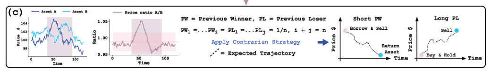
<figcaption class="paper-figure-caption"><b>Fig 1.</b> Figure 1: Overview of the GBS-driven StatArb framework. (a) Stock data is processed to construct a residual-return correlation matrix. Zeroing the main diagonal yields the adjacency matrix of the correlation graph. (b) The GBS clustering procedure. The correlation graph is encoded into a GBS device through its adjacency matrix. The device generates subgraph samples, which are evaluated against an edge-weight criterion to select the highest-scoring cluster. This selected subgraph is then removed from the graph to produce a residual graph, and the process is iteratively applied to generate a complete partition of the correlation network. (c) Application to StatArb. The initial graphs...</figcaption>
</figure>
<figure class="paper-figure-card">
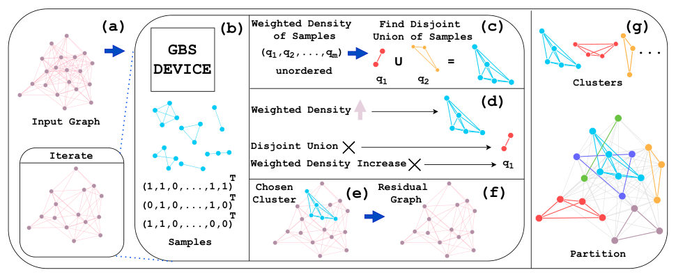
<figcaption class="paper-figure-caption"><b>Fig 2.</b> Figure 2: Overview of the GBS Roots process. (a) An initial correlation graph G, with specific correlations and stock labels omitted for clarity. (b) The correlation graph is sampled using a GBS device to generate candidate subgraphs. (c) The weighted density of the samples is calculated. A cluster U = S α ˜qα is formed by iteratively expanding a disjoint union of these samples, ensuring all ˜qα remain mutually disjoint while recording the utilised nodes. (d) This union expansion terminates if for the next sample in the queue qi+1, the union would no longer be disjoint, and the total WD does not increase. (e) Removing the finalised cluster yields the residual graph G \ U. (f) This residual...</figcaption>
</figure>
<figure class="paper-figure-card">
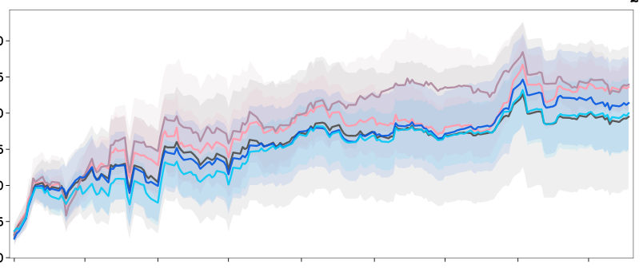
<figcaption class="paper-figure-caption"><b>Fig 3.</b> Figure 3: Cumulative PnL trajectories and standard deviations (coloured bands) for each algorithm. Based on a 60-day beta estimation and a 5-day correlation matrix lookback (Appendix A), the effective trading period begins in April 2020. GBS Boost, GBS Roots, and QIC-GBS utilised 0.7N log N, 0.6N log N, and N log N samples (See Appendix G) per GBS call, respectively.</figcaption>
</figure>
<figure class="paper-figure-card">
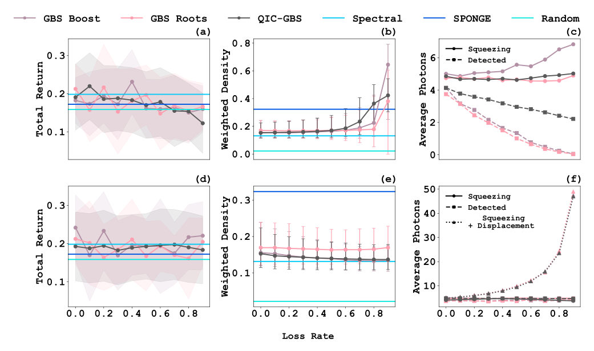
<figcaption class="paper-figure-caption"><b>Fig 4.</b> Figure 4: Performance of GBS-inspired clustering methods under photon loss, with and without displacement compensation. Quantum methods underwent 50 runs per loss rate (H = 0.7N log N samples per GBS call); classical methods underwent 100-200 runs. The stock universe is N = 50. The top row (a-c) displays uncompensated loss results, while the bottom row (d-f) incorporates displacement compensation. Classical benchmarks are shown as solid horizontal lines. Panels (a) and (d) show average total returns with standard deviations (coloured bands). Panels (b) and (e) display median weighted densities and interquartile ranges, accounting for left-skewed data. Panels (c) and (f) depict average...</figcaption>
</figure>
<figure class="paper-figure-card">
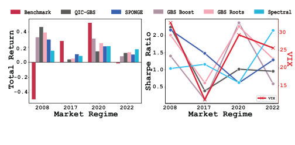
<figcaption class="paper-figure-caption"><b>Fig 5.</b> Figure 5: Clustering method performance across disparate market regimes using a 50-stock universe. (Left) Total return of all cluster- ing methods alongside a benchmark for 2008, 2017, 2020, and 2022. (Right) Comparison of algorithm Sharpe ratios against the average S&amp;P 500 Volatility Index (VIX) per regime. Quantum methods utilised H = 0.7N log N samples per GBS call.</figcaption>
</figure>

**Summary.** This work pioneers the use of Gaussian Boson Sampling (GBS) to cluster assets within financial portfolios for statistical arbitrage. By mapping correlation matrices into photonic graph structures, the authors propose quantum algorithms that outperform classical methods during volatile market conditions. It establishes a novel quantum heuristic framework linking quantum optics to quantitative finance.

**Why it may be interesting.** While applied to finance, the core mechanism involves simulating complex many-body interactions (photon interference) via GBS to solve a combinatorial optimization problem (graph clustering), which is relevant to understanding resource limitations in quantum simulation for structured data analysis.

Detailed structure

**Main problem.** The paper applies Gaussian Boson Sampling (GBS) to solve the Max-Agree Correlation Clustering Problem (MACCP) for constructing robust Statistical Arbitrage (StatArb) portfolios.

**Main result.** Quantum clustering methods using GBS generate superior alpha during high volatility periods compared to classical algorithms, establishing a quantum foundation for quantitative finance applications.

**Method.** The authors map asset correlation data into adjacency matrices and use specialized quantum algorithms (GBS Boost, GBS Roots) that leverage GBS sampling to iteratively find optimal dense subgraphs representing co-moving assets.

**Model / system.** The physical model is based on Gaussian Boson Sampling using squeezed vacuum states interfering in a linear interferometer. The process simulates the measurement of photon statistics proportional to the hafnian of the correlation submatrix.

**Key observables.** Alpha generation, Sharpe Ratio (ShR), Sortino Ratio (SoR), Weighted Density (WD), and Jaccard similarity across rolling time windows.

**Important parameters / regimes.** Universe size ($N$), photon loss factor ($\eta$), required sample budget $H = O(N \log N)$, and the correlation matrix derived from S&P 500 residuals.

**Assumptions / limitations.** The primary assumption is that maximizing intra-cluster correlations (MACCP) directly translates to profitable arbitrage signals. Furthermore, quantum advantage demonstrations are heuristic, not complexity-theoretic proofs.

**Figures summary.** Figures illustrate the GBS-driven StatArb framework, showing data processing, iterative clustering procedures (GBS Roots), and performance comparisons across varying stock universes ($N$).

**Paper structure.** The paper introduces the problem by linking graph clustering to StatArb. It details mapping correlation matrices to GBS inputs, presents quantum algorithms like GBS Roots for MACCP, benchmarks these against classical methods using financial metrics, and analyzes scaling limits.

Abstract

Gaussian Boson Sampling (GBS) provides a native photonic quantum heuristic for sampling dense subgraphs from adjacency matrices, offering a scalable physical approach to combinatorial graph search problems. Simultaneously, correlation matrix clustering algorithms, such as Spectral and SPONGE, have established robust benchmarks for identifying co-moving assets from correlation matrices in statistical arbitrage (StatArb) strategies. In this work, we map S&P 500 residual correlation data into GBS-compatible adjacency matrices. We benchmark those classical clustering algorithms against two quantum clustering algorithms, GBS Boost and our novel GBS Roots, to construct dynamic, market-neutral portfolios over a rolling one-year window. Simulations across distinct macroeconomic regimes reveal that quantum clustering generates superior alpha within large stock universes during periods of high volatility, effectively isolating structural market idiosyncrasies. Crucially, this economic advantage persists under simulated low-loss conditions and extends into high-loss regimes via the application of coherent displacement to compensate for photon loss. Our findings underscore the efficacy of GBS-derived graph clustering in constructing robust StatArb portfolios, establishing a quantum foundation for broader quantitative finance applications.

[↑ back to top](#top)

### [Quantum sensing of low-frequency electric signal enabled by modulated auxiliary field in Rydberg atoms](http://arxiv.org/abs/2607.18740v1)

**Authors:** Xiayang Fan, Shenchao Jin, Jiatian Liu, Jialiang Zhang, Qichao Qi, Yuan Sun  
**Type:** experiment · **Category:** other · **PDF:** <https://arxiv.org/pdf/2607.18740v1>  
**Analysis basis:** full PDF text, analyzed in chunks
**Topic relevance:** `interference shaping light` **3/5** · `quantum optics experiment` **3/5** · `Rydberg arrays` **2/5** · `analog quantum simulation` **1/5** · `quantum measurements` **1/5**

↔ Scroll figures horizontally

<figure class="paper-figure-card">
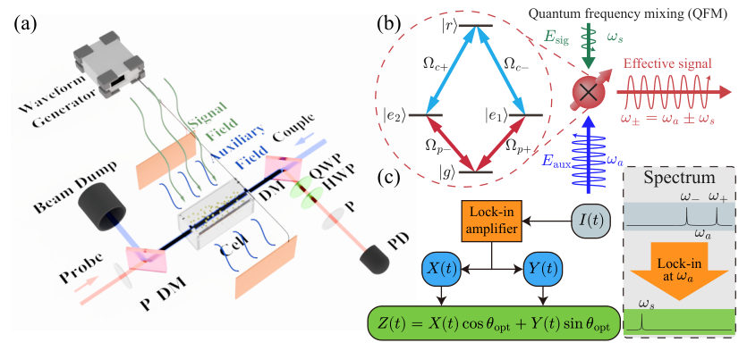
<figcaption class="paper-figure-caption"><b>Fig 1.</b> FIG. 1. (a) Schematic diagram of the proposed approach of modulated auxiliary field with weak-measurement-enhanced readout. In our experiment, the auxiliary field and the signal field are both applied to the copper plates to simulate real-world application scenarios [44]. (b) Principles of the modulated auxiliary field and QFM, including the relevant atomic levels and transitions. (c) Signal reconstruction process. P: polarizer, DM: dichroic mirror, HWP: half-wave plate, QWP: quarter-wave plate, PD: photodiode.</figcaption>
</figure>
<figure class="paper-figure-card">
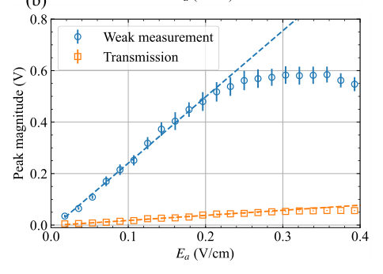
<figcaption class="paper-figure-caption"><b>Fig 2.</b> FIG. 2. Demodulated signal magnitude as a function of the auxiliary field amplitude Ea, demodulated at (a) 2ωa and (b) ω−. Error bars represent one standard deviation from five independent experiments. Dashed lines show a quadratic fit in (a) and a linear fit in (b).</figcaption>
</figure>
<figure class="paper-figure-card">
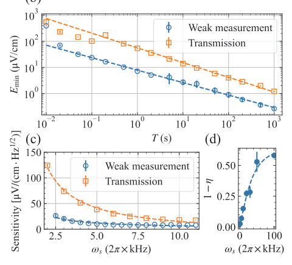
<figcaption class="paper-figure-caption"><b>Fig 3.</b> FIG. 3. (a) Reconstructed signal amplitude as a function of the signal electric field amplitude. (b) Minimal detectable field versus integration time. (c) Sensitivity as a function of signal frequency. (d) Experimentally measured frequency de- pendent screening ratio η. Error bars represent one standard deviation from five independent measurements.</figcaption>
</figure>
<figure class="paper-figure-card">
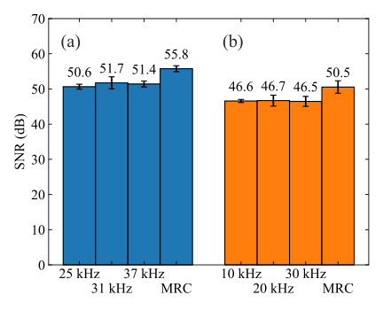
<figcaption class="paper-figure-caption"><b>Fig 4.</b> FIG. 4. SNR histograms for the individual auxiliary frequency components and their MRC combination. Data are shown for auxiliary tones at (a) 25 kHz, 31 kHz and 37 kHz (common amplitude of 0.27 V/cm); (b) 10 kHz, 20 kHz and 30 kHz (common amplitude of 0.18 V/cm). Error bars represent one standard deviation from five independent measurements.</figcaption>
</figure>

**Summary.** The paper introduces an advanced quantum sensing technique for measuring weak, low-frequency electric fields using Rydberg atoms. By employing a modulated auxiliary AC field and leveraging Quantum Frequency Mixing (QFM), the method generates a measurable cross-term Stark shift read out via EIT. This approach significantly improves stability and sensitivity compared to older methods, establishing a robust platform for next-generation quantum sensors.

**Why it may be interesting.** This work is highly relevant as it adapts established quantum optics techniques (QFM) from RF/MW regimes into the challenging low-frequency electric field domain using Rydberg atoms, providing a stable alternative to traditional DC biasing methods.

Detailed structure

**Main problem.** To develop a quantum sensing scheme for low-frequency (LF) electric signals that overcomes the inherent instability and calibration issues of conventional DC bias field methods.

**Main result.** The authors demonstrated high sensitivity ($7.5 \pm 2.6 \, \mu	ext{V}/(	ext{cm} \cdot 	ext{Hz}^{1/2})$ at $5 \, 	ext{kHz}$) and achieved a minimal detectable field of $0.26 \pm 0.04 \, \mu	ext{V}/	ext{cm}$ after long integration times.

**Method.** The scheme uses Quantum Frequency Mixing (QFM) by modulating an auxiliary AC field ($	ext{E}_{	ext{aux}}$), allowing the incoming LF signal ($	ext{E}_{	ext{sig}}$) to mix with it. This shift is then read out via Electromagnetically Induced Transparency (EIT).

**Model / system.** The physical platform is Rydberg atoms in an atomic vapor cell, utilizing a second-order Stark shift induced by the total electric field ($	ext{E}_{	ext{tot}}$). The detection relies on mapping the resulting energy shift onto the probe laser intensity via EIT.

**Key observables.** Transmitted light intensity $I(t)$, which is related to the cross-term Stark shift $\delta_{	ext{cr}}$, and the reconstructed signal amplitude $|Z|$.

**Important parameters / regimes.** Sensitivity of $7.5 \pm 2.6 \, \mu	ext{V}/(	ext{cm} \cdot 	ext{Hz}^{1/2})$ at $5 \, 	ext{kHz}$; minimal detectable field $\propto T^{-0.48}$ with integration time $T$.

**Assumptions / limitations.** The method assumes the cross-term ($\delta_{	ext{cr}}$) dominates and is linearly proportional to the signal field, allowing for robust reconstruction.

**Figures summary.** Figure 1 illustrates the experimental setup, the principle of modulated auxiliary fields and QFM, and the signal reconstruction process. Figure 2 details the verification of the cross-term using combined fields and the subsequent signal reconstruction method.

**Paper structure.** The paper introduces the problem with conventional methods, proposes the AC modulation/QFM scheme, details the theoretical modeling (cross-term generation), presents experimental validation for LF signals, extends the concept to multi-frequency analysis via Maximal Ratio Combining (MRC), and concludes by establishing a robust framework.

Abstract

Rydberg atoms have emerged as a versatile and efficient platform for high-sensitivity quantum sensing of free-space electric fields, with remarkable progress in detecting low-frequency signals. To date, low-frequency Rydberg receivers have relied on a constant bias field, typically realized via intra-cell electrodes or Rydberg plasmas generated by photoelectric effects or inter-atomic interactions. While these approaches improve sensitivity, they suffer from inherent challenges in calibration, long-term stability, and robustness, hindering practical deployment. Here, we propose, design, and experimentally demonstrate a quantum sensing scheme for low-frequency electric signals using modulated auxiliary fields in Rydberg atoms. Unlike conventional methods that employ external DC electric fields that are often fully shielded by adsorbed atom layers on the cell walls, we introduce an AC-field modulation strategy. The incoming low-frequency signal mixes with the auxiliary field, and together they induce Stark shifts of the Rydberg level. These shifts are mapped onto the probe laser via electromagnetically induced transparency (EIT), in a manner analogous to heterodyne detection. We demonstrate a sensitivity of $7.5 \pm 2.6~\mathrm{μV/(cm\cdot Hz^{1/2})}$ at 5 kHz and a minimal detectable field of $0.26 \pm 0.04~\mathrm{μV/cm}$ with an integration time of 1000 s. Furthermore, we extend this approach to systematically analyze the performance of generalized auxiliary fields containing multiple frequency components. By virtue of modulated auxiliary field and quantum frequency mixing, our results establish a robust and systematic framework for quantum sensing of low-frequency electric fields with Rydberg atoms, offering improved sensitivity, stability, and immunity to environmental drifts.

[↑ back to top](#top)

### [Self-consistent GW theory for superconductivity in SrTiO3 models](http://arxiv.org/abs/2607.18757v1)

**Authors:** Zhi-Hao Cui, John Sous, Andrew J. Millis, David R. Reichman  
**Type:** theory · **Category:** strongly correlated electrons · **PDF:** <https://arxiv.org/pdf/2607.18757v1>  
**Analysis basis:** full PDF text, analyzed in chunks
**Topic relevance:** `Keldysh / 2PI / non-Gaussian methods` **3/5** · `analog quantum simulation` **1/5** · `correlated / nonlocal dissipation` **1/5** · `correlated cavity matter` **1/5** · `driven-dissipative phase transition` **1/5** · `methods for driven-dissipative` **1/5** · `non-equilibrium dynamics` **1/5** · `non-equilibrium universality` **1/5**

↔ Scroll figures horizontally

<figure class="paper-figure-card">
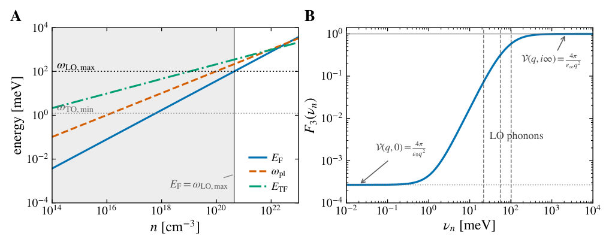
<figcaption class="paper-figure-caption"><b>Fig 1.</b> FIG. 1. (A) Electronic energy scales of the three-mode model across the density range, for m D 2:1me and 1 D 6:16: Fermi energy EF, plasma frequency !pl D .4n=1m/1=2, and Thomas-Fermi energy ETF D q2 TF=2m, compared with the softest TO and highest LO reference scales of Eq. (2). The vertical line marks EF D !LO;max D 102:14 meV at n  4:51  1020 cm3. (B) Lattice dielectric factor F3.n/ multiplying the 1-screened Coulomb interaction in Eq. (2). Arrows mark the static and high-frequency limits, V.q; 0/ D 4 0q2 and</figcaption>
</figure>
<figure class="paper-figure-card">
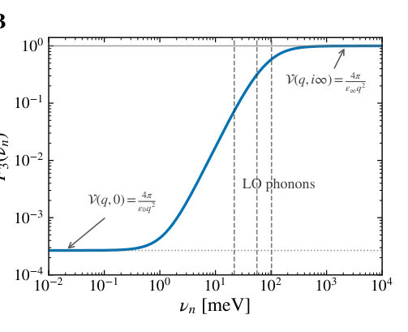
<figcaption class="paper-figure-caption"><b>Fig 2.</b> Fig. 2(A) shows the leading pairing eigenvalue at T D 1 K across seven decades of density. The one-shot G0W0 kernel gives a broad instability, with  rising from 2:24 at 1016 cm3</figcaption>
</figure>
<figure class="paper-figure-card">
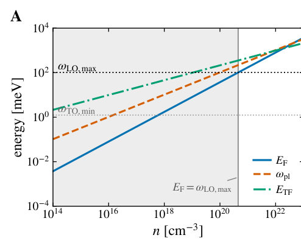
<figcaption class="paper-figure-caption"><b>Fig 3.</b> Fig. 1 organizes the discussion. Panel (A) compares the density-dependent electronic scales with the fixed polar- phonon scale. The Fermi energy crosses the LO pole range (21.80 - 102.14 meV) as the density is increased through the range 4:45  1019 and 4:51  1020 cm3, so the entire low- density flank of the experimental dome is antiadiabatic with respect to most of the polar spectral weight. The plasma fre- quency crosses the same LO range between 4:46  1018 and 9:79  1019 cm3, so the importance of electronic screen- ing changes across the dome. Panel (B) shows the cor- responding frequency profile of the bare interaction factor: F3.0/ D 1=0 D 2:68  104 at the static end, while...</figcaption>
</figure>
<figure class="paper-figure-card">
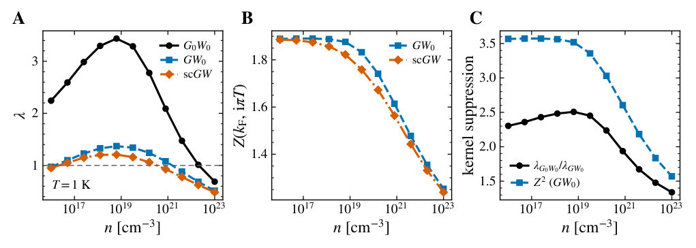
<figcaption class="paper-figure-caption"><b>Fig 4.</b> FIG. 2. (A) Leading eigenvalue  of the linearized gap equation at T D 1 K as a function of carrier density for the one-shot (G0W0), partially self-consistent (GW0), and fully self-consistent (scGW ) kernels. The dashed line marks the instability condition  D 1. (B) Eliashberg renormalization function Z.kF; iT / of Eq. (11) for the two self-consistent methods. (C) Kernel-suppression analysis: the eigenvalue ratio G0W0=GW0 compared with Z2 of the GW0 solution. Z2 gives the expected near-Fermi-surface suppression scale and reproduces the density dependence.</figcaption>
</figure>
<figure class="paper-figure-card">
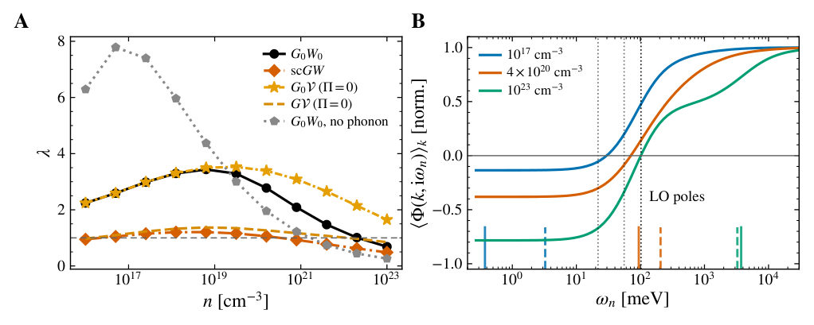
<figcaption class="paper-figure-caption"><b>Fig 5.</b> FIG. 3. (A) Decomposition of the pairing kernel at T D 1 K. The plotted decompositions show G0V and GV, which remove the electronic polarization (…  0) while keeping the lattice dielectric factor, and the one-shot no-phonon kernel, which sets F3./ D 1 and leaves a pure Coulomb interaction screened only electronically. (B) Momentum-averaged leading gap eigenfunction of the fully self-consistent scGW kernel versus Matsubara frequency at three densities (normalized to its high-frequency value). The sign change sits within the polar-phonon scale window (nodes at 30, 71, and 102 meV for the three densities; dotted lines mark the LO poles); short colored vertical ticks mark EF (solid) and !pl...</figcaption>
</figure>

**Summary.** This work develops a sophisticated theoretical framework to model unconventional superconductivity in doped SrTiO3. It shows that standard theories fail when carrier density is low, necessitating a fully self-consistent GW treatment incorporating phonon renormalization. The key finding pinpoints the pairing mechanism as being governed by incipient ferroelectricity and full momentum dependence.

**Why it may be interesting.** While focused on solid-state superconductivity, the rigorous treatment of strong electron-phonon coupling and the necessity of full momentum/frequency dependence mirrors challenges in modeling open quantum systems where simple approximations fail near critical points.

Detailed structure

**Main problem.** The study addresses superconductivity in doped SrTiO3 when the Fermi energy is below the polar LO phonon scale, a regime where conventional Migdal-Eliashberg theory assumptions break down.

**Main result.** The pairing mechanism is identified as the Fröhlich phonon interaction screened by incipient ferroelectricity. Full self-consistent calculations are necessary to accurately predict the superconducting transition temperature ($T_c$).

**Method.** The authors solve the finite-temperature GW equations with full momentum and frequency dependence, solving a linearized pairing eigenvalue problem.

**Model / system.** The system is doped SrTiO3 modeled by a single isotropic parabolic conduction band interacting via Coulomb repulsion and coupling to three polar lattice vibrations. The analysis uses effective masses and phonon dielectric functions derived from ab initio calculations.

**Key observables.** Pairing-onset temperature ($T_c$), pairing channel, renormalization factor ($Z$).

**Important parameters / regimes.** Carrier density (especially the dilute limit $n 	o 0$), Fermi energy relative to LO phonon scale, and self-consistency level ($	ext{G}_0	ext{W}_0$ vs. $	ext{scGW}$).

**Assumptions / limitations.** The primary approximations involve comparing different levels of self-consistency ($G_0W_0$, $GW_0$, fully self-consistent GW) and assuming a single isotropic parabolic band model.

**Paper structure.** The paper develops the theory by first identifying the failure points of existing models in the low-density regime, then systematically comparing results across different levels of theoretical approximation (self-consistency), leading to the final identification of the dominant pairing interaction.

Abstract

Superconductivity in doped SrTiO$_3$ occurs over a wide range of carrier densities, including those for which the Fermi energy is below the polar longitudinal optical phonon scale. In this regime, the assumptions underpinning conventional implementations of Migdal-Eliashberg theory, including frequency cutoffs at the phonon scale and a Coulomb pseudopotential $μ^\ast$, are not valid. We solve the finite-temperature $GW$ equations with full momentum and frequency dependence, without cutoffs or $μ^\ast$, for polar one-band models of SrTiO$_3$, using effective masses and three-phonon dielectric functions parameterized from ab initio calculations. Comparing different self-consistency levels, namely $G_0W_0$, $GW_0$, and fully self-consistent $GW$, we find that the one-shot ($G_0W_0$) kernel overestimates the pairing-onset temperature by one to two orders of magnitude. The dominant suppression comes from replacing $G_0$ by $G$, thereby incorporating the phonon renormalization factor in the electron Green function. Using the self-consistently computed interaction $W$ further lowers and narrows the pairing-onset dome. In the dilute limit, our calculations identify the pairing channel as the Fröhlich phonon interaction screened by the incipient ferroelectricity of the material, with plasmonic and electronic screening effects negligible. The numerical solution of the full equations reveals a pairing-onset scale that remains non-zero as the density tends to zero, whereas Fermi-surface projection or Fermi-energy frequency truncation removes it. This work highlights the relevance of incipient ferroelectricity, the importance of self-consistency, and the need for a full momentum- and frequency-dependent treatment in modeling superconductivity in SrTiO$_3$-like doped polar semiconductors.

[↑ back to top](#top)

### [Incommensurate modulation with $Q=0$ A-type Antiferromagnetic Order in CeRh$_2$As$_2$ revealed by NQR studies](http://arxiv.org/abs/2607.18686v1)

**Authors:** Shiki Ogata, Shunsaku Kitagawa, Kenji Ishida, Manuel Brando, Elena Hassinger, Christoph Geibel, Seunghyun Khim  
**Type:** experiment · **Category:** strongly correlated electrons · **PDF:** <https://arxiv.org/pdf/2607.18686v1>  
**Analysis basis:** full PDF text, analyzed in chunks
**Topic relevance:** `exotic spin models in light-matter` **3/5** · `spintronics-quantum-optics interface` **3/5** · `Frenkel-Kontorova` **2/5** · `Kondo & dissipative impurity` **1/5**

↔ Scroll figures horizontally

<figure class="paper-figure-card">
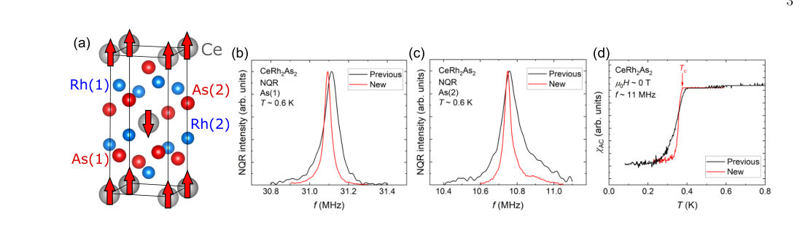
<figcaption class="paper-figure-caption"><b>Fig 1.</b> FIG. 1. (a) Magnetic structure of CeRh2As2 [24]. (b)(c) The normal state 75As-NQR spectra of the As(1) site and As(2) site, respectively. The red curves are NQR spectra of the higher-quality sample (New), and the black lines are those of the early-stage sample (Previous). (d) Temperature dependence of ac susceptibility measurements at zero field. The red arrow indicates the SC transition temperature TSC estimated from the onset of the SC diamagnetic signal.</figcaption>
</figure>
<figure class="paper-figure-card">
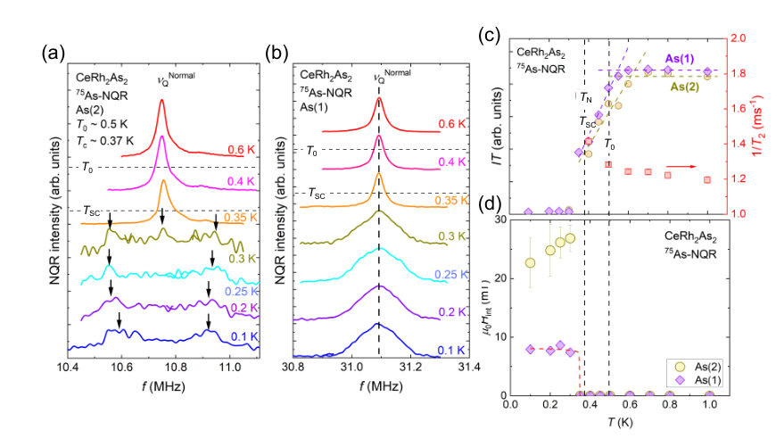
<figcaption class="paper-figure-caption"><b>Fig 2.</b> FIG. 2. The temperature evolutions of the 75As-NQR spectrum of (a)the As(2) and (b)As(1) sites in CeRh2As2. (c) The temperature evolution of the spectrum intensity (I) times temperature (T ) (left axis) and nuclear spin-spin relaxation rate 1/T2 at the As(2) site (right axis). (d) The temperature evolutions of estimated internal field Hint at the each As site. Hint at the As(2) site is estimated from spectrum splitting (Hint = 1</figcaption>
</figure>
<figure class="paper-figure-card">
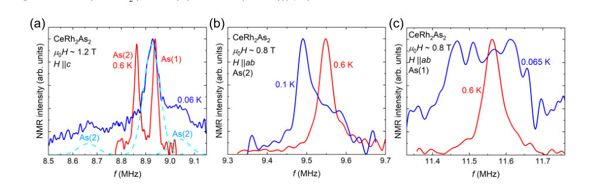
<figcaption class="paper-figure-caption"><b>Fig 3.</b> FIG. 3. The NMR spectra at 0.6 K (normal state) and lowest temperature (SC and AFM state) under (a) the c-axis field 1.2 T and (b)(c) [110] direction field. The dotted curves is the results of Gaussian fitting.</figcaption>
</figure>
<figure class="paper-figure-card">
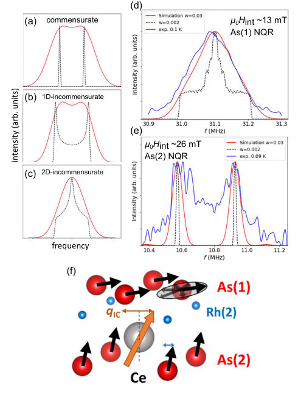
<figcaption class="paper-figure-caption"><b>Fig 4.</b> FIG. 4. Possible NQR spectrum with (a) commensurate, (b) 1D-incommensurate (Hint ∝cos (q · r)), and (c) 2D- incommensurate (Hint ∝cos (q1 · r)·cos (q2 · r)) internal field distribution. Black dotted curves and red solid curves rep- resent the simulated spectra with small and large broaden- ing factor, respectively. (d)(e) Simulated NQR spectrum in the AFM state at the As(1) site and the As(2) site, respec- tively. The magnetic structure we used for the simulation is in-plane two-dimensional incommensurate modulation with the magnetic structure illustrated in Fig. 1(a). Blue solid curves represent the experimental results in the lowest tem- perature. Black dotted curves and red solid curves...</figcaption>
</figure>

**Summary.** This work uses NQR/NMR measurements on CeRh2As2 to characterize its magnetic state. The findings reveal a complex magnetic structure involving both A-type antiferromagnetism and an incommensurate modulation. Crucially, the study establishes a strong link between this magnetic ordering and the superconducting phase, suggesting that magnetism plays a pivotal role in the material's electronic properties.

**Why it may be interesting.** The strong coupling between magnetism and superconductivity, particularly the observation that the onset of static AFM order coincides with or immediately follows the superconducting transition, is a key topic in strongly correlated electron physics relevant to unconventional superconductors.

Detailed structure

**Main problem.** The study investigates the nature of magnetic order (A-type Antiferromagnetism) and its interplay with superconductivity in the heavy-fermion superconductor CeRh2As2.

**Main result.** NQR studies reveal that the magnetic structure is a combination of a Q=0 A-type AFM component overlaid by a two-dimensional incommensurate modulation. The close proximity of the AFM transition temperature (TN) to the superconducting transition temperature (TSC) is highlighted.

**Method.** The research employs high-quality single-crystal measurements using Nuclear Quadrupole Resonance (NQR) and Nuclear Magnetic Resonance (NMR) spectroscopy on the As site.

**Model / system.** The physical system is CeRh2As2, a heavy-fermion superconductor with a noncentrosymmetric crystal structure. The magnetic state is modeled as having both a Q=0 A-type AFM component and an incommensurate modulation.

**Key observables.** NQR spectral splitting (at As(2)), NQR intensity evolution, internal magnetic field strength (H_int), and the temperature dependence of these quantities near T0 and TN.

**Important parameters / regimes.** Superconducting transition temperature (T_SC), Antiferromagnetic transition temperature (T_N), and fluctuation onset temperature (T_0).

**Assumptions / limitations.** The analysis assumes that the observed magnetic transitions are robust features of the material, though early-stage sample inhomogeneity is noted as a limitation.

**Figures summary.** Figures compare NQR spectra between different crystal quality samples; others show the temperature evolution of spectral features and internal fields across multiple transition points (T0, TN, TSC).

**Paper structure.** The paper progresses by characterizing the superconducting phases, then analyzing the magnetic transitions using NQR/NMR data. It establishes the coexistence of incommensurate modulation on top of A-type AFM order, linking these magnetic features to the SC state.

Abstract

We performed $^{75}$As nuclear quadrupole resonance (NQR) and nuclear magnetic resonance (NMR) measurements on a higher-quality single-crystalline CeRh$_2$As$_2$, a heavy-fermion superconductor exhibiting multiple superconducting (SC) phases under magnetic fields along the $c$ axis. This SC multiphase is believed to originate from staggered Rashba spin-orbit coupling associated with locally broken inversion symmetry. In addition to superconductivity, CeRh$_2$As$_2$ exhibits phase I below $T_0\sim0.5$ K and an antiferromagnetic (AFM) state below $T_{N}\sim 0.25$ K in the early-stage samples. In the higher-quality sample, the AFM transition becomes more pronounced, and $T_{N}$ increases to nearly coincide with $T_{SC}$. The NQR spectra at the As(1) site imply an internal field with an incommensurate distribution, indicating a two-dimensional incommensurate modulation of the magnetic structure superimposed on a $Q=0$ A-type AFM component. Moreover, a pronounced decrease in the NQR intensity at $T_0$ well-above $T_{N}$ and an abrupt increase in the internal field at $T_{N}$ suggest the emergence of a slowly fluctuating AFM order at $T_0$ which becomes static at $T_{N}$.

[↑ back to top](#top)

### [Phase equilibria in MnSb2Te4-GeSb2Te4 system and magnetic properties of Mn1-xGexSb2Te4 solid solutions](http://arxiv.org/abs/2607.18925v1)

**Authors:** Fuad Safarov, Dunya Babanly, Jerome Robert, Elnur Orujlu, Elvin Ahmadov, Martin Bowen, Bohdan Kundys  
**Type:** experiment · **Category:** strongly correlated electrons · **PDF:** <https://arxiv.org/pdf/2607.18925v1>  
**Analysis basis:** full PDF text, analyzed in chunks
**Topic relevance:** `exotic spin models in light-matter` **3/5** · `spintronics-quantum-optics interface` **3/5** · `analog quantum simulation` **2/5** · `Kondo & dissipative impurity` **1/5**

↔ Scroll figures horizontally

<figure class="paper-figure-card">
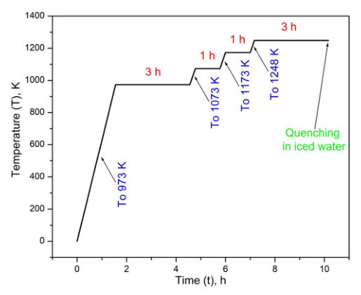
<figcaption class="paper-figure-caption"><b>Fig 1.</b> Fig. 1. Temperature profile applied during synthesis of the MGST-124 samples. A ramp rate of 7.5 K/min was used. Temperature is given in Kelvin (K), while time is expressed in hours (h).</figcaption>
</figure>
<figure class="paper-figure-card">
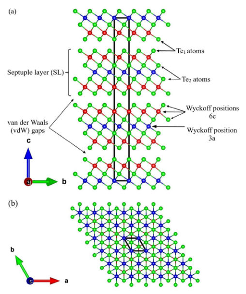
<figcaption class="paper-figure-caption"><b>Fig 2.</b> Fig. 2. Crystal structure of the parent compound MnSb2Te4. The unit cell is outlined in dark black. Blue, red, and green spheres represent Mn, Sb, and Te atoms, respectively. The hexagonal or in-plane view is shown in (a), while the rhombohedral or out-of-plane view is indicated in (b). (For interpretation of the references to colour in this figure legend, the reader is referred to the web version of this article.)</figcaption>
</figure>
<figure class="paper-figure-card">
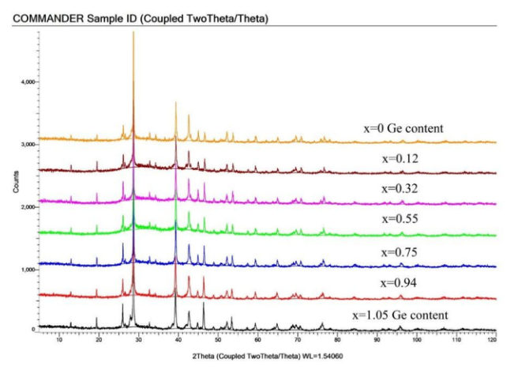
<figcaption class="paper-figure-caption"><b>Fig 3.</b> Fig. 3. Room-temperature PXRD patterns of the MGST-124 samples with different Ge substitutions (x). The intensity is given in arbitrary units (a.u.), while the angle is expressed in 2θ.</figcaption>
</figure>
<figure class="paper-figure-card">
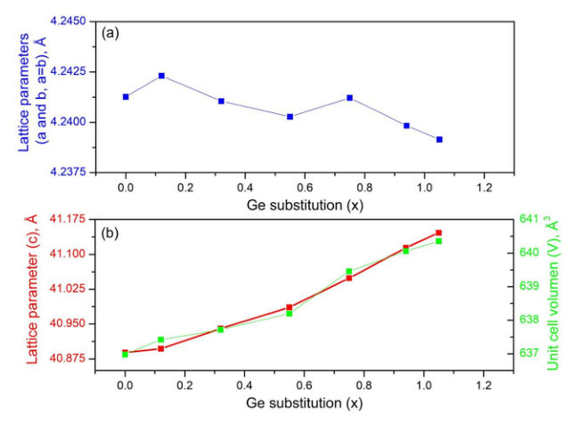
<figcaption class="paper-figure-caption"><b>Fig 4.</b> Fig. 4. Lattice parameters a, b, (a = b) and c, along with the unit cell volume V in the Mn1-xGexSb2Te4 samples as functions of Ge substitution (x). Lattice parameters are given in ångstr¨oms (Å), while the unit cell volume is expressed in cubic ångstr¨oms (Å3).</figcaption>
</figure>
<figure class="paper-figure-card">
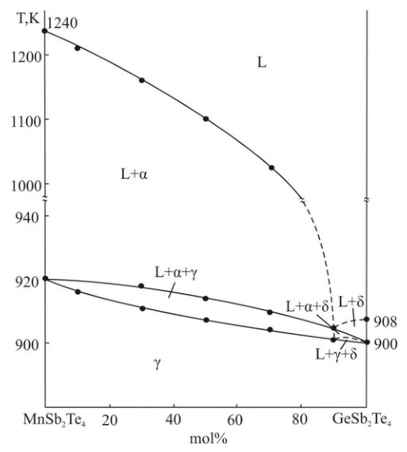
<figcaption class="paper-figure-caption"><b>Fig 5.</b> Fig. 5. T–x phase diagram of the MnSb2Te4 – GeSb2Te4 system. The tempera- ture is given in Kelvin (K), and the composition is expressed in mol % of GeSb2Te4. The region labeled L corresponds to the liquid phase, while the α, δ, and γ phases indicate solid solutions based on MnTe, Ge2Sb2Te5, and Mn1-</figcaption>
</figure>

**Summary.** This experimental work synthesizes and characterizes $	ext{Mn}_{1-x}	ext{Ge}_x	ext{Sb}_2	ext{Te}_4$ solid solutions to study the interplay between magnetism and topology. By systematically varying Ge content, the researchers mapped out phase equilibria and observed complex magnetic transitions, including spin-flop behavior. These findings are crucial for engineering novel magnetic topological materials.

**Why it may be interesting.** While primarily condensed matter magnetism/materials science, the study of competing magnetic orderings, field-induced transitions (spin-flop), and topological insulators touches upon complex many-body ground states relevant to correlated electron physics.

Detailed structure

**Main problem.** The study investigates the interplay between magnetism and electronic topology by examining how substituting Germanium (Ge) into the $	ext{MnSb}_2	ext{Te}_4$ lattice affects its magnetic and structural properties.

**Main result.** Ge substitution successfully creates single-phase solid solutions, leading to complex magnetic behavior characterized by multiple transitions, including spin-flop transitions, whose dependence on Ge concentration is systematically mapped out.

**Method.** The research employed a combination of high-temperature solid-state synthesis followed by comprehensive characterization using SQUID magnetometry, PXRD, and DTA.

**Model / system.** The physical system is the $	ext{MnSb}_2	ext{Te}_4-	ext{GeSb}_2	ext{Te}_4$ solid solution series. The structure is layered (rhombohedral), and the study focuses on how substituting $	ext{Mn}^{2+}$ with $	ext{Ge}^{2+}$ modifies magnetic coupling within this lattice.

**Key observables.** Saturation magnetization, effective magnetic moment, temperature-dependent magnetic transitions ($	ext{PM} 	o 	ext{FIM} 	o 	ext{FM}$), and the presence of spin-flop transitions.

**Important parameters / regimes.** Ge substitution concentration ($x$), Temperature (2 K to 300 K), Applied Magnetic Field (up to $\pm7$ T).

**Assumptions / limitations.** The structural integrity is maintained across the full composition range, allowing for the study of magnetic dilution effects.

**Figures summary.** Figures illustrate temperature profiles during synthesis and magnetization curves showing distinct transitions and spin-flop features as a function of Ge content.

**Paper structure.** The paper follows a logical progression: first establishing phase equilibria via thermal analysis (DTA) and structure confirmation (PXRD); second, characterizing the magnetic response using SQUID magnetometry across varying compositions; finally, interpreting these results to map out the competition between different magnetic ordering types.

Abstract

As a sister compound of the antiferromagnetic topological insulator MnBi2Te4, MnSb2Te4 is also a candidate for exotic magnetic topological phases. On the other hand, the structurally analogous but nonmagnetic phase-change material GeSb2Te4 is also known to exhibit nontrivial band topology. Motivated by their shared crystal structure, the similar ionic radii of Mn2+ and Ge2+, and the opportunity to explore the interplay between magnetism and topology, here we investigate the effects of Ge substitution at Mn sites in MnSb2Te4. The Mn1-xGexSb2Te4 solid solutions were synthesized via high-temperature solid-state reaction and characterized for composition, structure, phase behavior, and magnetism using SEM-EDS, PXRD, DTA, and SQUID. Ge substitution was successful across the full composition range, producing homogeneous, single-phase samples that melt via peritectic reactions, as confirmed by the MnSb2Te4GeS-b2Te4 phase diagram. Ge substitution strengthens the sample's paramagnetism, but with ferrimagnetic ordering up to x = 0.75, with both effective moment and saturation magnetization decreasing with increasing Ge content. Two distinct magnetic transitions - high-temperature paramagnetic to ferrimagnetic and low-temperature ferrimagnetic to ferromagnetic - were identified, with a dome-like shape dependence of the low-temperature magnetic transition on Ge substitution. A negative magnetization was observed in the pristine MnSb2Te4 and x = 0.12 substituted samples, while two distinct spin-flop transitions appeared in the samples with x = 0.32 and x = 0.55 Ge substitutions as a result of competing magnetic orderings. These findings facilitate future selective single-crystal growth of homogeneous, magnetic phases, paving the way for magneto-transport and topological surface states investigations.

[↑ back to top](#top)

### [Pure Spin Bulk Photovoltaic Effect in an Altermagnetic Higher-Order Topological Insulator](http://arxiv.org/abs/2607.19018v1)

**Authors:** Sibgat Ulah, Ankan Bhattacharyya, Manisha Thakurathi  
**Type:** theory · **Category:** other · **PDF:** <https://arxiv.org/pdf/2607.19018v1>  
**Analysis basis:** full PDF text, analyzed in chunks
**Topic relevance:** `exotic spin models in light-matter` **3/5** · `spintronics-quantum-optics interface` **3/5** · `Keldysh / 2PI / non-Gaussian methods` **1/5** · `analog quantum simulation` **1/5** · `driven-dissipative phase transition` **1/5**

↔ Scroll figures horizontally

<figure class="paper-figure-card">
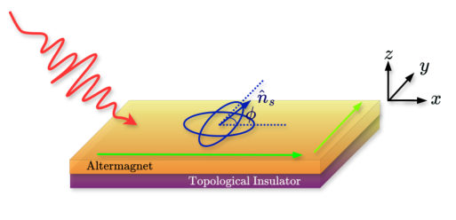
<figcaption class="paper-figure-caption"><b>Fig 1.</b> FIG. 1. Schematic illustration of an AM-2D TI heterostruc- ture and optically induced spin transport. The bilayer form consists of an AM layer on top of a 2D TI (bottom layer). When system is illuminated by an incident light wave (red wavy arrow), nonlinear spin shift currents are generated, which are indicated by the green arrow. The allowed spin- current components are determined by the orientation of the Néel vector, ˆns (blue arrow), parametrized by the angle ϕ.</figcaption>
</figure>
<figure class="paper-figure-card">
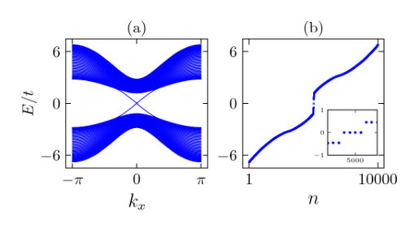
<figcaption class="paper-figure-caption"><b>Fig 2.</b> FIG. 2. Energy spectra of the system corresponding to the two topological phases. (a) First-order topological phase (Ja = 0) with gapless helical edge mode traverses the bulk gap computed under open boundary conditions taken along the y- direction. (b) Second-order topological phase with Ja = 0.8t, considering open boundary conditions along both directions. Here, the edge modes are gapped by the AM, leaving four zero-energy corner states. Parameters are fixed at B = −1.2t, A = 2t, t = 1.</figcaption>
</figure>
<figure class="paper-figure-card">
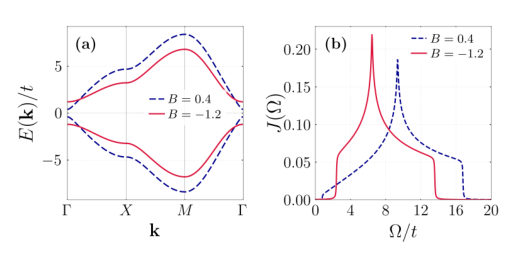
<figcaption class="paper-figure-caption"><b>Fig 3.</b> FIG. 3. Bulk band structure and joint density of states (JDOS) across two different topological phases. (a) Normal- ized bulk energy dispersion, E(k)/t, plotted along the high- symmetry path Γ(0, 0)−X(π, 0)−M(π, π)−Γ(0, 0) of the square- lattice Brillouin zone. This dispersion is compared between the topological phase (B = −1.2t, red solid line) and the trivial (B = 0.4t, blue dashed line). In both regions, the minimum band gap is at the Γ point. (b) The correspond- ing JDOS spectrum, J(Ω), is mapped against the normalized photon energy Ω/t. The prominent divergent peaks observed in the spectra indicate the logarithmic Van Hove singularities from the saddle points at the symmetry-equivalent...</figcaption>
</figure>
<figure class="paper-figure-card">
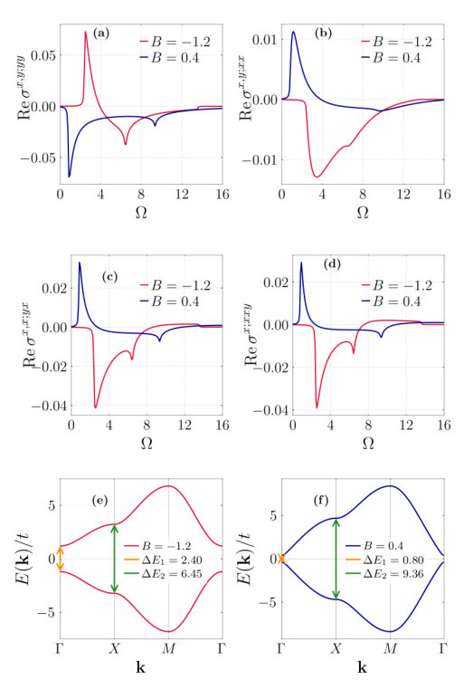
<figcaption class="paper-figure-caption"><b>Fig 4.</b> FIG. 4. Nonlinear pure spin shift conductivity across the mass parameter B = 0: (a) Re σx,y;yy, (b) Re σx,y;xx, (c) Re σx,x;yx, and (d) Re σx,x;xy are plotted as a function of the driving frequency Ωduring the topological phase tran- sition near the Γ point, and (e) &amp; (f) are the normal- ized energy band structure along the high-symmetry path Γ(0, 0)−X(π, 0)−M(π, π)−Γ(0, 0) of the Brillouin zone cor- responding to the second-order topological (red color) and trivial phases (blue color), respectively. The energy differ- ence between conduction and valence at the minima (Γ) and the saddle points X or Y in both phases gives the lowest- and highest-frequency peaks, respectively. The...</figcaption>
</figure>
<figure class="paper-figure-card">
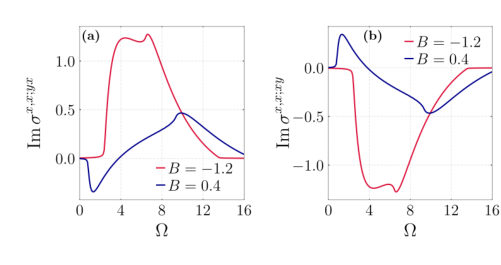
<figcaption class="paper-figure-caption"><b>Fig 5.</b> FIG. 5. Behavior of nonlinear pure spin injection conductiv- ity across the topological transition around B = 0 has been shown. Imaginary parts of the injection conductivity ten- sors (a) Im σx,x;yx and (b) Im σx,x;xy are plotted as a func- tion of frequency. The results are compared for topological (B = −1.2t, red color) and trivial (B = 0.4t, blue color) phases. The response is purely imaginary, and the lowest frequency peak undergoes a distinct sign change across the topological phase transition at the Γ point. All other system parameters are fixed as in Fig. 2.</figcaption>
</figure>

**Summary.** This paper theoretically investigates the pure spin photovoltaic effect in an altermagnetic topological insulator heterostructure. By developing a non-Abelian theory, the authors show that specific magnetic symmetries can suppress charge currents entirely, leading to a purely spin-generating response. This establishes the material as a versatile platform for controlling nonlinear spin transport using light.

**Why it may be interesting.** The work provides a detailed theoretical framework linking magnetic order parameters (Néel vector) to specific quantized electronic responses (pure spin photocurrents) in topological materials, which is highly relevant for spintronics and quantum optics applications.

Detailed structure

**Main problem.** The study investigates the Pure Spin Bulk Photovoltaic Effect (BPVE) in a complex magnetic heterostructure to understand spin current generation without accompanying charge currents.

**Main result.** The system realizes an intrinsically pure spin photovoltaic effect when the Néel vector is in the $xy$-plane, generating dc spin currents controllable by light polarization and magnetic symmetry.

**Method.** The authors develop a non-Abelian formulation of the spin BPVE, extending theory to PT-degenerate manifolds, and analyze response tensors using symmetry constraints.

**Model / system.** The model is a PT-symmetric 2D heterostructure combining a topological insulator with a d-wave altermagnet. The Hamiltonian incorporates SOC and magnetic exchange fields, leading to FOTI or SOTI phases depending on the Néel vector orientation.

**Key observables.** Pure spin photocurrent ($\sigma_{s,\mu;
u\lambda}$), charge photocurrent, spin shift current (driven by linear polarization), and spin injection current (driven by circular polarization).

**Important parameters / regimes.** Orientation of the Néel vector ($\hat{n}_s$), local Dirac mass sign change, and symmetry protection ($C_{4z}T$ vs $C_{2z}$).

**Assumptions / limitations.** The theory extends conventional BPVE to PT-degenerate manifolds using a non-Abelian formalism; approximations are made regarding the spin-current operator's applicability in nonlinear optical processes.

**Figures summary.** Figure 1 schematically shows optically induced spin transport components based on Néel vector orientation. Figure 2 illustrates energy spectra showing FOTI and SOTI topological phases under open boundary conditions.

**Paper structure.** The paper progresses by defining the physical system (TI/Altermagnet heterostructure), developing the generalized non-Abelian theory for spin BPVE, analyzing how symmetry dictates the pure spin response in different topological regimes (SOTI vs FOTI), and concluding with the platform's potential for controlling spin currents.

Abstract

We investigate the bulk photovoltaic effect (BPVE) in a $PT$-symmetric two-dimensional heterostructure consisting of a topological insulator coupled to a $d$-wave altermagnet. To describe the symmetry-enforced degenerate bands of this system, we develop a non-Abelian formulation of the spin BPVE, extending the conventional theory from isolated nondegenerate bands to $PT$-degenerate manifolds. We show that the orientation of the Néel vector controls both the topological phase and the character of the nonlinear optical response. When the Néel vector lies in the $xy$-plane, the heterostructure realizes a second-order topological insulator (SOTI) protected by $C_{4z}T$ symmetry. The system also retains $C_{2z}$ symmetry, which completely suppresses second-order charge photocurrents while allowing finite spin photocurrents. As a result, the BPVE becomes an intrinsically pure spin photovoltaic effect, generating a dc spin current without an accompanying charge current. We find that linearly polarized light drives a spin shift current, whereas circularly polarized light generates a spin injection current. Both responses undergo a sign reversal whenever the local Dirac mass changes sign. As the Néel vector is rotated toward the $z$-axis, the SOTI phase transforms into a first-order topological insulating phase, leading to the coexistence of charge and spin photocurrents. Our results establish $PT$-symmetric altermagnetic topological-insulator heterostructures as a versatile platform for generating and controlling pure spin photocurrents and reveal nonlinear spin transport as a sensitive probe of topology and magnetic symmetry.

[↑ back to top](#top)

### [Enhanced NQS via Annealed Gradient Descent](http://arxiv.org/abs/2607.18865v1)

**Authors:** Shiwei Zhou, Yiming Huang, Xiao Yuan, Xiaoxia Cai  
**Type:** theory · **Category:** numerical methods · **PDF:** <https://arxiv.org/pdf/2607.18865v1>  
**Analysis basis:** full PDF text, analyzed in chunks
**Topic relevance:** `analog quantum simulation` **3/5** · `methods for driven-dissipative` **3/5** · `exotic spin models in light-matter` **1/5** · `non-equilibrium dynamics` **1/5**

↔ Scroll figures horizontally

<figure class="paper-figure-card">
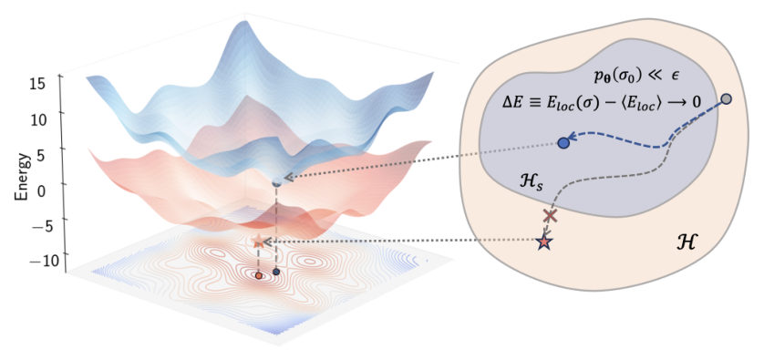
<figcaption class="paper-figure-caption"><b>Fig 1.</b> FIG. 1. The illustration of subspace trapping in NQS optimization. (Left) Loss landscape in the variational parameter space. (Right) The red and blue regions denote the full Hilbert space H and a restricted subspace HS, respectively. The optimization prematurely converges within HS (blue curve) when the network underestimates the probability of a critical configuration, pθ(σ0) ≪ϵ, where ϵ = 1/∆tNs. Sampling is then restricted to HS, so the apparent convergence criterion ∆E →0 is satisfied even though the energy remains above the true ground-state energy.</figcaption>
</figure>
<figure class="paper-figure-card">
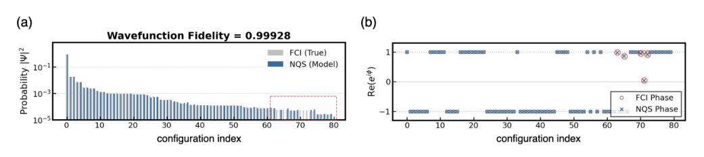
<figcaption class="paper-figure-caption"><b>Fig 2.</b> FIG. 2. Subspace trapping in NQS optimization. Comparison between the exact ground state (Full Configuration Interaction, FCI) and the optimized NQS state in the computational basis, where configurations are sorted by the magnitude of the amplitudes. (a) Probability distribution |ψ|2 of the ground state and the NQS state. The red dashed box highlights the low-weight but non-negligible configurations. (b) Phase comparison between the FCI and NQS states. The red circles mark unsampled or suppressed configurations for which the phase of NQS deviates from the phase of ground state.</figcaption>
</figure>
<figure class="paper-figure-card">
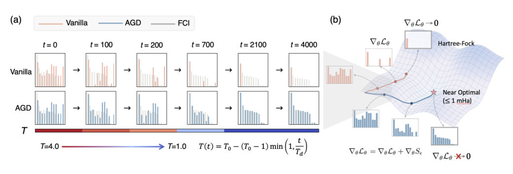
<figcaption class="paper-figure-caption"><b>Fig 3.</b> FIG. 3. The illustration of an AGD-enhanced NQS for a molecular Hamiltonian as an example, showing that vanilla gradient descent (GD) is prone to be trapped in Hartree-Fock local minima, whereas AGD-enhanced approach enables more effective exploration of the energy landscape. The two colored curves depict the optimization trajectories, the yellow curve corresponds to the NQS optimized with GD, while the blue curve represents the NQS optimized using AGD. The histograms along each trajectory show the corresponding sampled distributions during optimization. Along the GD (red) path, it indicates that GD hard to handle the explore-exploit tradeoff and trends to collapse toward Hartree-Fock like...</figcaption>
</figure>
<figure class="paper-figure-card">
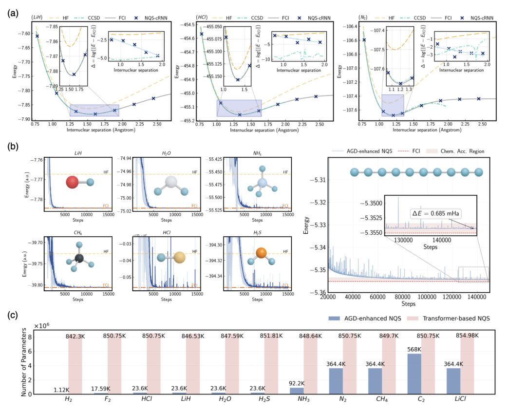
<figcaption class="paper-figure-caption"><b>Fig 4.</b> FIG. 4. Performance of AGD-enhanced NQS on molecular systems. (a) Potential energy surfaces for LiH, HCl, and N2 as a function of internuclear separation. The AGD-enhanced cRNN-NQS results are compared with Hartree-Fock (HF), coupled- cluster singles and doubles (CCSD), and full configuration interaction (FCI) references. The zoomed insets highlight the equilibrium region, while the error insets show ∆= log(|E −EFCI|), demonstrating that the AGD-enhanced NQS closely follows the FCI energy across different molecular geometries. (b) Training dynamics of AGD-enhanced NQS for molecular ground-state search. The left panels show the average convergence curves for LiH, H2O, NH3, CH4, HCl and H2S,...</figcaption>
</figure>
<figure class="paper-figure-card">
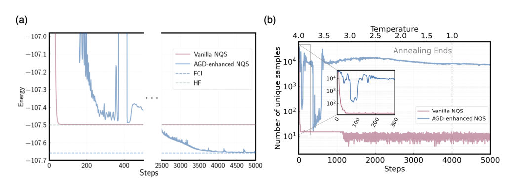
<figcaption class="paper-figure-caption"><b>Fig 5.</b> FIG. 5. Annealing from a higher initial temperature enables convergence to the ground state for N2. (a) Optimization curve of vanilla NQS and AGD-enhanced NQS. (b) Number of unique sampled configurations during optimization for vanilla NQS and AGD-enhanced NQS, together with the annealing temperature schedule shown on the upper axis.</figcaption>
</figure>

**Summary.** This paper addresses the critical issue of 'subspace trapping' in optimizing Neural Quantum States (NQS) for many-body physics. The authors introduce Annealed Gradient Descent (AGD), a novel, sampling-aware optimization technique. AGD stabilizes training by artificially boosting the gradient contribution from rarely sampled, but physically important, configurations.

**Why it may be interesting.** It provides a crucial algorithmic fix for modern quantum simulation techniques, ensuring that the computational power of expressive neural networks is not undermined by statistical limitations inherent in Monte Carlo sampling.

Detailed structure

**Main problem.** Neural Quantum States (NQS) optimization suffers from 'subspace trapping' due to finite-sample instability, where important low-probability configurations are rarely sampled and receive insufficient gradient feedback.

**Main result.** The proposed Annealed Gradient Descent (AGD) method successfully suppresses metastable trapping, allowing simple NQS architectures to achieve chemical accuracy across molecular and spin model benchmarks.

**Method.** AGD is a sampling-aware update rule that temporarily reweights the influence of low-probability configurations during optimization, guiding the search away from restricted subspaces.

**Model / system.** The work applies to general quantum many-body systems, including molecular electronic structure calculations (using Gaussian basis sets) and quantum spin models like the 1D and 2D J1-J2 Heisenberg model.

**Key observables.** Variational energy expectation value ($\langle \hat{H} 
angle$), local energy ($E_{	ext{loc}}(\sigma)$), and convergence diagnostics showing trapping above the true ground state energy.

**Important parameters / regimes.** The annealing factor, learning rates (e.g., $\eta$, decay schedules), and system-specific coupling constants ($J_1/J_2$).

**Assumptions / limitations.** Standard gradient estimation methods fail when sampling coverage is insufficient; the authors derive enhanced gradient forms using logarithmic weight functions to correct for this bias.

**Figures summary.** Figures illustrate subspace trapping convergence (GD vs. AGD), showing AGD forces exploration toward lower energy states, and compare different weighting schemes ($w(p)=p$ vs $w(p)=-p \log p$).

**Paper structure.** The paper first identifies the theoretical failure mode (subspace trapping) in VMC/NQS optimization. It then develops AGD as a sampling-aware update rule, deriving enhanced gradient estimators that incorporate low-probability information before benchmarking on molecular and spin systems.

Abstract

Neural quantum states offer expressive representations of quantum many-body wave functions, yet their practical accuracy can be limited by stochastic optimization rather than representational capacity. Here we identify a finite-sample instability, termed subspace trapping, in which physically important configurations become strongly underestimated, remain absent from successive sampling batches and receive insufficient gradient feedback. This self-reinforcing loss of sampled support can confine optimization to an effective subspace and produce apparently stationary states above the true ground state energy. To address this problem, we introduce annealed gradient descent (AGD), a sampling-aware update with annealing factor that temporarily increases the relative contribution of sampled low-probability configurations while limiting the dominance of high-probability ones. We establish the connection between finite-sample support loss and effective subspace optimization, and then evaluate the method across molecular systems, one and two-dimensional $J_1$-$J_2$ models. Annealed gradient descent suppresses metastable trapping, preserves physically relevant configurations and enables compact neural quantum states to attain chemical accuracy and competitive state-of-the-art performance. These results establish AGD as a lightweight complement to expressive neural architectures, improved sampling strategies for scalable quantum many-body optimization.

[↑ back to top](#top)

### [Quantum limits to chiroptical molecular discrimination](http://arxiv.org/abs/2607.19136v1)

**Authors:** Mikael P. Backlund  
**Type:** theory · **Category:** other · **PDF:** <https://arxiv.org/pdf/2607.19136v1>  
**Analysis basis:** full PDF text, analyzed in chunks
**Topic relevance:** `quantum measurements` **3/5** · `entanglement & information structure` **2/5** · `correlated / nonlocal dissipation` **1/5** · `interference shaping light` **1/5** · `measurement-induced transitions` **1/5**

↔ Scroll figures horizontally

<figure class="paper-figure-card">

<figcaption class="paper-figure-caption"><b>Fig 1.</b> FIG. 1. (a) Illustration of the model. We consider the spherically symmetric field due to a randomly oriented chi- ral quantum emitter, here depicted as a tumbling helix. (b) Lab-frame coordinate definitions, with wavevector k.</figcaption>
</figure>
<figure class="paper-figure-card">
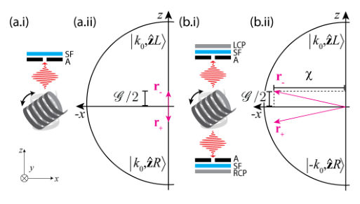
<figcaption class="paper-figure-caption"><b>Fig 2.</b> FIG. 3. Filtered collection from one (a.i) or two (b.i) direc- tions. A: aperture, SF: spectral filter, LCP/RCP: left/right- circular polarizer. (a.ii) and (b.ii) sketch the Bloch vectors r± for the qubit states described in the main text, assuming χ, G &gt; 0.</figcaption>
</figure>
<figure class="paper-figure-card">
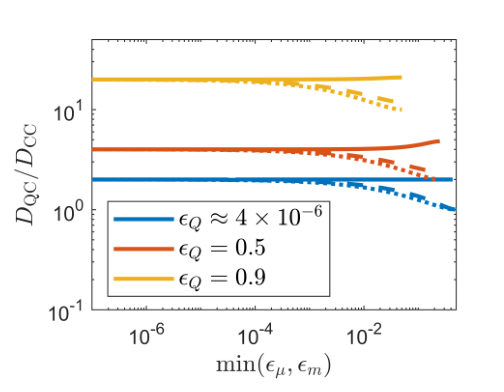
<figcaption class="paper-figure-caption"><b>Fig 3.</b> FIG. 2. Calculated ratio of quantum to classical Chernoff in- formation for various ϵµ, ϵm, ϵQ, and θµm. Solid lines: θµm = 0◦, dashed lines: θµm = 45◦, dotted lines: θµm ≈93.8◦. The values θµm ≈93.8◦and ϵQ ≈4 × 10−6 are based on calcula- tions for a small helicene reported in Ref. [24].</figcaption>
</figure>
<figure class="paper-figure-card">
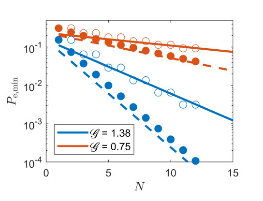
<figcaption class="paper-figure-caption"><b>Fig 4.</b> FIG. 4. Calculated Bayes’ (open circles) and Helstrom (filled circles) error rates for two values of |G | on the high end of those reported experimentally for lanthanide-based chiropti- cal emitters. Solid (dashed) lines indicate the scaling of the classical (quantum) Chernoff bounds, with offsets arbitrary.</figcaption>
</figure>
<figure class="paper-figure-card">

<figcaption class="paper-figure-caption"><b>Fig 5.</b> Figure 4 displays numerically computed Helstrom and Bayes error rates associated with discriminating [¯ρ(ˆzL,ˆzR) + ]⊗N from [¯ρ(ˆzL,ˆzR) − ]⊗N for various N ≤12. We show data for two values of dissymmetry factors on the high end of what has been reported experimentally for lanthanide complexes exhibiting CPL [65, 66]. We’ve as- sumed ϵm &gt; ϵµ ≫ϵ0 Q and that the electric and mag- netic dipole moments are approximately parallel. Agree- ment with the classical (solid lines) and quantum (dashed lines) Chernoff bounds indicates rapid convergence to the asymptotic limit. For G = 1.38, the error rate of the opti- mal classical measurement is over an order of magnitude worse than that of the...</figcaption>
</figure>

**Summary.** This paper develops a rigorous theoretical framework to determine the best possible error rate for distinguishing between enantiomer pairs using quantum light emitted from chiral molecules. By comparing optimal quantum measurement strategies against classical ones, the authors demonstrate that collecting photons collectively provides significant, potentially orders-of-magnitude, improvements in discrimination accuracy. This has implications for developing highly sensitive chiroptical sensors.

**Why it may be interesting.** This work directly addresses quantum metrology applied to molecular properties (chirality), providing quantitative benchmarks for how entanglement or collective measurements can surpass classical limits in sensing fundamental physical symmetries.

Detailed structure

**Main problem.** To quantitatively establish error bounds for classifying the handedness (chirality) of a quantum optical emitter by discriminating between enantiomer pairs.

**Main result.** Optimal collective measurements on $N$ photons can provide an orders-of-magnitude improvement in the achievable error rate compared to separable measurement strategies.

**Method.** The problem is framed as a quantum symmetric binary hypothesis test, comparing error bounds derived from Helstrom and Chernoff information for different measurement schemes.

**Model / system.** The system involves chiroptical emission, modeled using density matrices ($ar{
ho}_\pm$) describing the emitted photon state, which depends on dipole moments and polarization contributions.

**Key observables.** Dissymmetry factor ($G$), minimum error probability ($P_e^{\min}$), Quantum Chernoff Information ($D_{QC}$), and Classical Chernoff Information ($D_{CC}$).

**Important parameters / regimes.** The number of photons ($N$), the dissymmetry factor ($G^2$), and system parameters like $\epsilon_\mu, \epsilon_m, \epsilon_Q$.

**Assumptions / limitations.** The analysis assumes a narrow spectral bandwidth (e.g., using an etalon) and focuses on emission/collection processes.

**Figures summary.** Figures illustrate the ratio of quantum to classical Chernoff information for different collection geometries (single vs. opposite sides), demonstrating the advantage scaling with $N$.

**Paper structure.** The paper develops the theoretical framework by defining the chiral state, applying hypothesis testing bounds, and comparing the asymptotic error scaling ($e^{-ND}$) for various measurement types.

Abstract

Discriminating enantiomer pairs is of central importance in the molecular sciences. The preferential interaction between chiral light and matter is commonly employed in this discrimination, despite fundamental challenges. Here we present quantitative error bounds for classifying the handedness of a chiral, randomly oriented, quantum optical emitter from the perspective of classical and quantum hypothesis testing. Most interestingly, we find that a collective measurement on $N$ photons can provide an orders-of-magnitude improvement in error rate relative to a corresponding separable measurement.

[↑ back to top](#top)

### [Adlam's Frame: comment on "Wigner's Frame"](http://arxiv.org/abs/2607.18383v1)

**Authors:** Andrea Di Biagio, Anne-Catherine de la Hamette  
**Type:** theory · **Category:** other · **PDF:** <https://arxiv.org/pdf/2607.18383v1>  
**Analysis basis:** full PDF text, analyzed in chunks
**Topic relevance:** `quantum measurements` **3/5** · `entanglement & information structure` **2/5** · `Keldysh / 2PI / non-Gaussian methods` **1/5** · `measurement-induced transitions` **1/5**

↔ Scroll figures horizontally

<figure class="paper-figure-card">
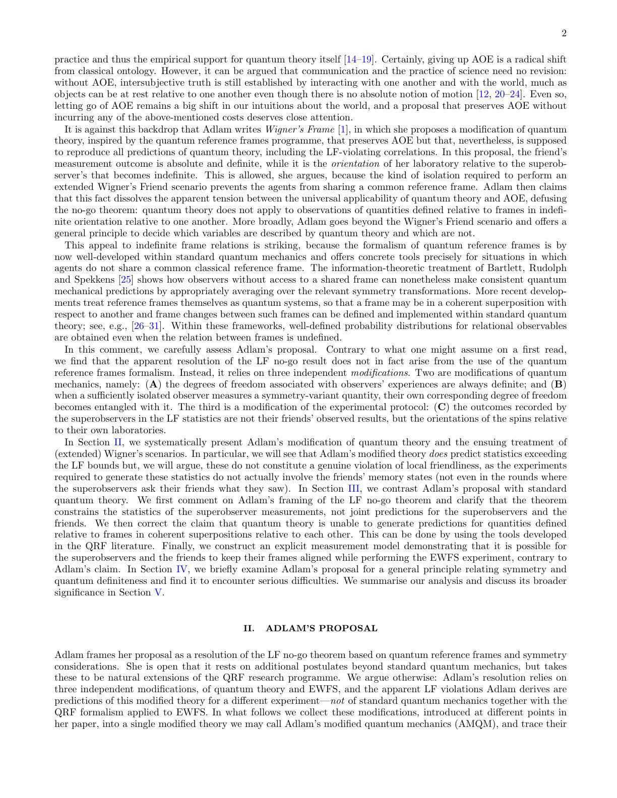
<figcaption class="paper-figure-caption"><b>Fig 1.</b> Low-resolution page preview, page 2</figcaption>
</figure>
<figure class="paper-figure-card">
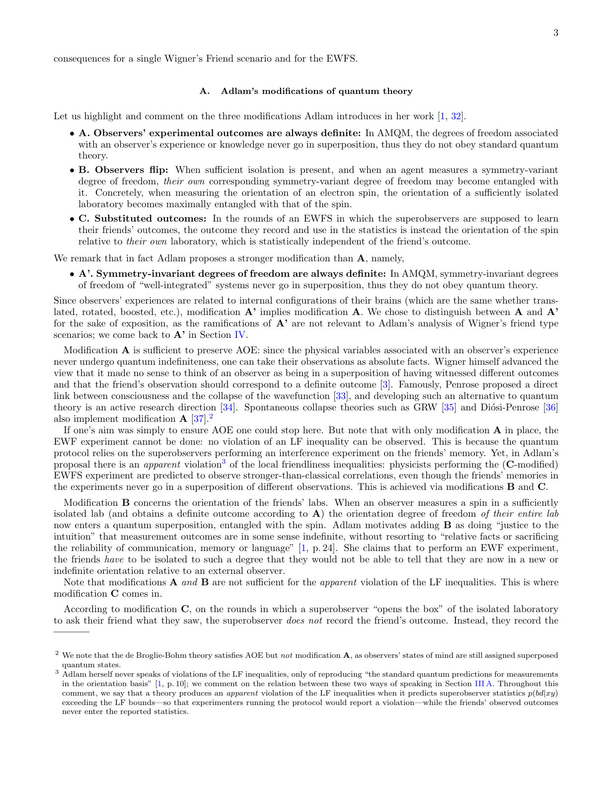
<figcaption class="paper-figure-caption"><b>Fig 2.</b> Low-resolution page preview, page 3</figcaption>
</figure>
<figure class="paper-figure-card">
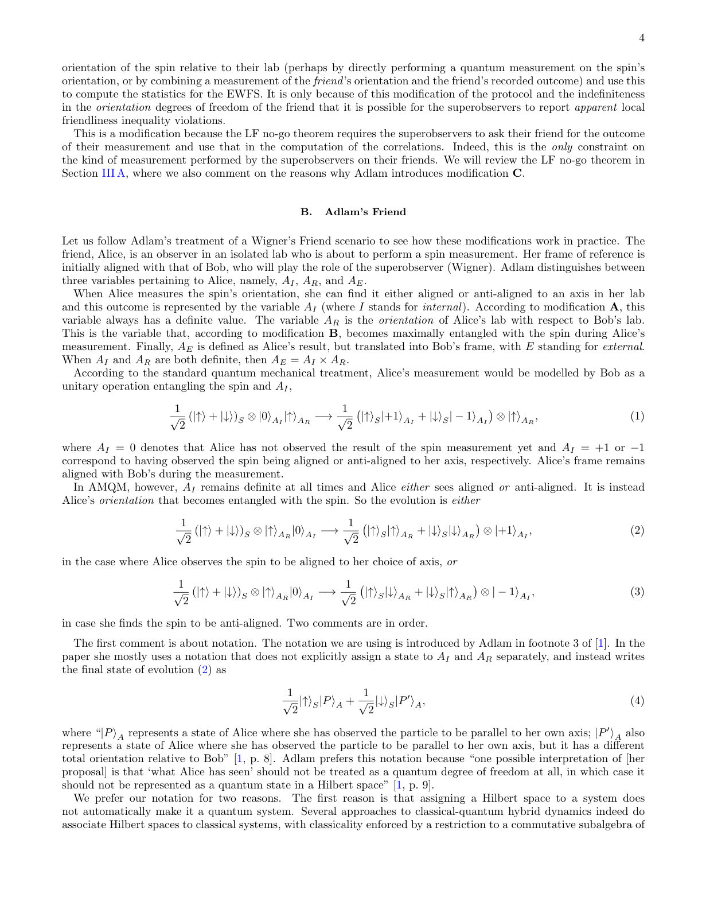
<figcaption class="paper-figure-caption"><b>Fig 3.</b> Low-resolution page preview, page 4</figcaption>
</figure>
<figure class="paper-figure-card">
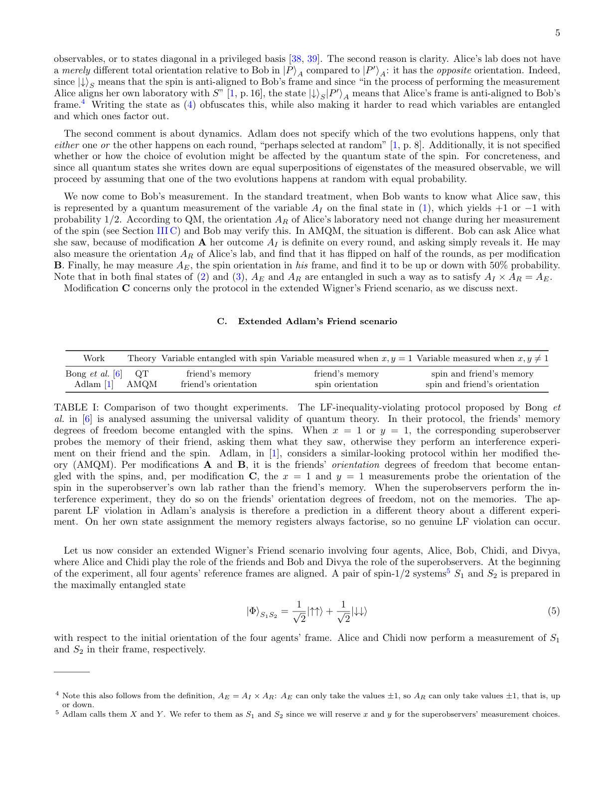
<figcaption class="paper-figure-caption"><b>Fig 4.</b> Low-resolution page preview, page 5</figcaption>
</figure>
<figure class="paper-figure-card">
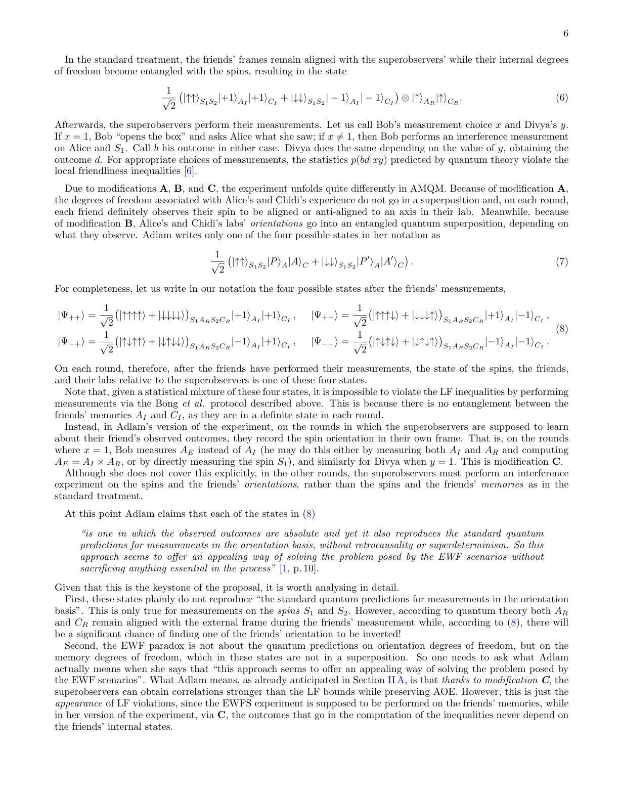
<figcaption class="paper-figure-caption"><b>Fig 5.</b> Low-resolution page preview, page 6</figcaption>
</figure>

**Summary.** This paper provides a critical analysis of Adlam's attempt to reconcile quantum theory with 'local friendliness' theorems using Quantum Reference Frames. The authors demonstrate that Adlam's resolution requires three non-standard modifications to physics, suggesting QRF formalism alone is insufficient. Ultimately, the work concludes that standard quantum mechanics cannot evade these fundamental no-go theorems.

**Why it may be interesting.** This work is highly relevant for theoretical physicists working on quantum foundations, open quantum systems, or relativistic quantum information, as it tackles foundational issues regarding measurement contextuality and observer dependence in a rigorous mathematical framework.

Detailed structure

**Main problem.** The paper critically assesses Adlam's proposal attempting to resolve tensions between quantum theory and 'local friendliness' (LF) theorems arising from Extended Wigner's Friend Scenarios (EWFS). It aims to show that standard Quantum Reference Frame (QRF) formalism cannot evade these no-go theorems.

**Main result.** The apparent resolution offered by Adlam relies on three independent modifications—definite observer degrees of freedom, spin-orientation entanglement with the lab frame, and altered superobserver recording protocols—rather than solely QRF principles. Within standard quantum theory, QRFs do not evade EWFS no-go theorems.

**Method.** The authors employ critical assessment, comparing Adlam's modified mechanics (AMQM) against standard QM predictions using formalisms involving relational observables and group averaging techniques derived from QRF theory.

**Model / system.** The core model is the Wigner's Friend scenario (EWFS) involving entangled bipartite quantum systems (spin-1/2 particles), analyzed through the lens of Quantum Reference Frames (QRFs). The analysis uses abstract mathematical tools like group representations and projection operators to define frame-independent observables.

**Key observables.** Local Friendliness (LF) inequalities, spin outcomes ($AI$, $AE$), lab orientations ($AR$), and relational observables defined via reduction/relativisation maps.

**Important parameters / regimes.** The structure depends on the underlying symmetry group G used for frame transformations; specific calculations involve time evolution parameters like $\pi/(2g)$.

**Assumptions / limitations.** The critique assumes standard quantum theory holds, and it highlights that Adlam's proposal rests on misconceptions regarding QRFs and EWFS protocols.

**Figures summary.** Not specified in the notes; however, the structure implies comparisons between expectation values calculated under different theoretical frameworks (QM vs AMQM) for Bell-type tests.

**Paper structure.** The paper systematically critiques Adlam's proposal by first defining the tension (LF theorems), then detailing Adlam's three modifications, and finally using advanced QRF formalism (including appendices on recoupling theory and relational observables) to demonstrate that these modifications are necessary but insufficient to resolve the fundamental conflict within standard QM.

Abstract

Recent no-go theorems based on extended Wigner's Friend scenarios (EWFS) reveal a deep tension between the universal validity of quantum theory and local friendliness (LF), the conjunction of three natural assumptions: the absoluteness of observed events, locality, and no-superdeterminism. In a recent work, Adlam argues that this tension can be dissolved by appealing to quantum reference frames (QRFs). We present and critically assess her proposal. We show that her proposed resolution does not arise from QRFs, but instead relies on three independent modifications: certain degrees of freedom are always definite, observers can flip upon measuring spins, and the outcomes the superobservers record and use to test the inequalities are not their friends' observed results. The proposal and the arguments for the plausibility of these modifications rest on several misconceptions about QRFs and EWFS, which we rectify. We conclude that, within standard quantum theory, quantum reference frames do not evade the EWFS no-go theorems.

[↑ back to top](#top)

### [Quantum Dynamics of $H_2^+$ in Orthogonal Two-Color Fields](http://arxiv.org/abs/2607.18854v1)

**Authors:** Jinzhen Zhu  
**Type:** theory · **Category:** other · **PDF:** <https://arxiv.org/pdf/2607.18854v1>  
**Analysis basis:** full PDF text, analyzed in chunks
**Topic relevance:** `non-equilibrium dynamics` **3/5** · `Keldysh / 2PI / non-Gaussian methods` **1/5** · `driven-dissipative phase transition` **1/5** · `methods for driven-dissipative` **1/5** · `non-equilibrium universality` **1/5**

↔ Scroll figures horizontally

<figure class="paper-figure-card">
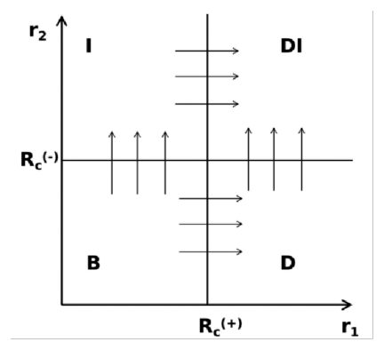
<figcaption class="paper-figure-caption"><b>Fig 1.</b> FIG. 1. Partition of configuration space used for the tSurff propagation of dissociative ionization. B denotes the bound region. In D, the nuclei have crossed R(+) c while the electron remains inside R(−) c ; in I, the electron has crossed R(−) c while the nuclei remain inside R(+) c . In the DI region, both the nuclei and the electron have crossed their respective tSurff surfaces. Here, R(+) c and R(−) c are the tSurff radii associated with r1 = |⃗r1| and r2 = |⃗r2|, respectively.</figcaption>
</figure>
<figure class="paper-figure-card">
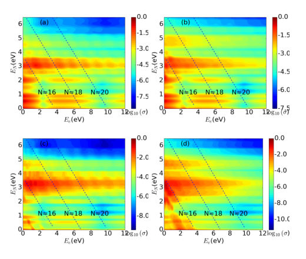
<figcaption class="paper-figure-caption"><b>Fig 2.</b> FIG. 2. JES of H+ 2 dissociative ionization driven by 800-nm, cos8 pulses with a peak intensity of 8 × 1013 W/cm2: (a) lin- early polarized, FWHM 2 optical cycles; (b) circularly polar- ized, FWHM 2 optical cycles; (c) linearly polarized, FWHM 6 optical cycles; and (d) circularly polarized, FWHM 6 optical cycles. The dashed lines show the energy-sharing condition of Eq. 21 for absorption of N photons.</figcaption>
</figure>
<figure class="paper-figure-card">
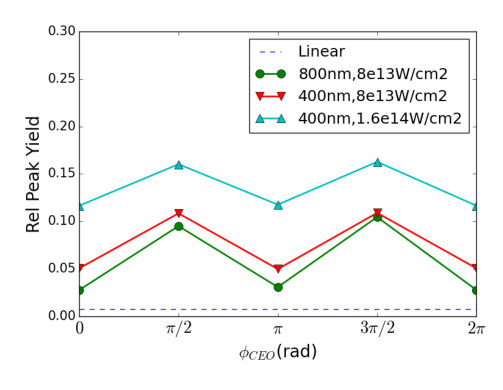
<figcaption class="paper-figure-caption"><b>Fig 3.</b> FIG. 3. Relative height of the secondary proton KER peak at 4−5 eV with respect to the main peak at 2−4 eV, plotted as a function of the relative phase of the perpendicular field. The z-polarized pulse is fixed at 800 nm, 8 × 1013 W/cm2, with a cos8 envelope of FWHM 2 optical cycles. The dashed line is the single-color, linearly polarized reference. The control-field parameters are 800 nm and 8 × 1013 W/cm2 (green), 400 nm and 8×1013 W/cm2 (red), and 400 nm and 1.6×1014 W/cm2</figcaption>
</figure>
<figure class="paper-figure-card">
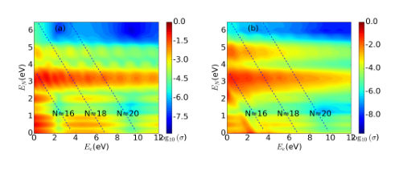
<figcaption class="paper-figure-caption"><b>Fig 4.</b> FIG. 4. JES of H+ 2 dissociative ionization driven by an 800-nm flat-top pulse with FWHM 6 optical cycles and peak inten- sity 8 × 1013 W/cm2: (a) linear polarization and (b) circular polarization. The dashed lines show the energy-sharing con- dition of Eq. 21.</figcaption>
</figure>
<figure class="paper-figure-card">
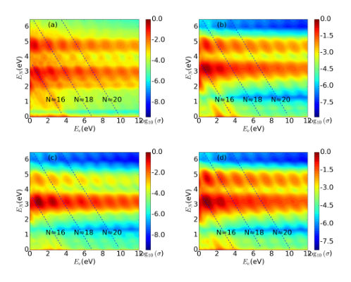
<figcaption class="paper-figure-caption"><b>Fig 5.</b> FIG. 6. JES obtained from calculations initiated in individual excited eigenstates: (a) E1, (b) E2, (c) E3, and (d) E4. A linearly polarized 800-nm flat-top pulse is applied along the z axis, with peak intensity 8×1013 W/cm2 and FWHM 6 optical cycles. The dashed lines show the energy-sharing condition of Eq. 21.</figcaption>
</figure>

**Summary.** The paper simulates the dissociation of H2+ driven by strong orthogonal laser fields to understand ultrafast quantum dynamics. Key findings include the emergence of an additional high-energy proton peak, which is controllable via the relative phase between the field components. This demonstrates that the spatial geometry of multi-dimensional laser fields offers a powerful new degree of freedom for controlling molecular fragmentation.

**Why it may be interesting.** This work directly addresses non-equilibrium dynamics in molecular physics using intense laser fields, providing detailed insights into how field geometry (spatial/temporal) acts as a control knob for electron-nuclear energy partitioning and fragmentation pathways.

Detailed structure

**Main problem.** The study investigates the quantum dynamics of H2+ dissociative ionization when driven by strong, orthogonal laser fields.

**Main result.** Orthogonal fields introduce a high-energy proton kinetic-energy-release (KER) peak ($\approx 4-5$ eV) absent in single-color calculations, and allow coherent control over this yield via the relative carrier-envelope phase.

**Method.** The research employs full-dimensional quantum simulations using time-dependent methods to calculate Joint Energy Spectra (JES) for dissociative ionization.

**Model / system.** The system is the hydrogen molecular ion (H2+), modeled with a Hamiltonian including electronic, nuclear, and electron-proton interaction terms. The dynamics are driven by intense laser fields composed of orthogonal components ($\vec{E}(t) = E_z(t)\hat{z} + E_x(t)\hat{x}$).

**Key observables.** Proton Kinetic-Energy-Release (KER) spectrum, electron–proton energy-sharing pattern, and fragment angular distributions.

**Important parameters / regimes.** Laser field geometry (orthogonal components), relative carrier-envelope phase ($\phi$), and pulse duration/frequency (e.g., 800-nm, cos^8 pulses).

**Assumptions / limitations.** The simulation uses the tSurff method, which assumes neglect of particle interactions beyond large radii; full-dimensional simulations are computationally demanding.

**Figures summary.** Figures compare JES under linear vs. circular polarization, show the dependence of a secondary KER peak yield on the relative phase ($\phi$), and illustrate how angular distributions rotate with field phase for short pulses.

**Paper structure.** The paper develops the theoretical framework using full-dimensional quantum simulations to model H2+ ionization. It then presents results comparing single-color vs. orthogonal fields, highlighting the secondary peak generation, and finally discusses the control mechanisms afforded by varying the relative phase of the perpendicular field component.

Abstract

We present full-dimensional quantum simulations of $H_2^+$ dissociative ionization driven by strong orthogonal laser fields. We consider equal-frequency orthogonal components, which generate elliptical or circular polarization depending on their relative phase and amplitude, as well as orthogonal $800$- and $400$-nm two-color fields. These two-dimensional fields strongly modify the fragmentation dynamics. Most notably, we identify a high-energy peak in the proton kinetic-energy-release (KER) spectrum at approximately $4-5$ eV that is absent from the corresponding single-color, linearly polarized calculations. The yield of this peak can be coherently controlled by varying the relative carrier-envelope phase of the perpendicular field component. The perpendicular field also disrupts the clear electron-proton energy-sharing pattern observed in the main $3-3.5$ eV dissociation channel, indicating more complex multichannel dynamics. Time-dependent state projections and calculations initiated from individual excited states attribute the additional peak to laser-induced vibrational excitation of $H_2^+$. Furthermore, the perpendicular field rotates the fragment angular distributions, causing the most probable proton and electron emission directions to deviate substantially from the principal $z$ axis. These findings demonstrate that the spatial and temporal geometry of orthogonal laser fields provides an additional degree of freedom for controlling ultrafast electron-nuclear dynamics.

[↑ back to top](#top)

### [Bound Entanglement Is Insufficient for an Exponential Quantum Learning Advantage](http://arxiv.org/abs/2607.19017v1)

**Authors:** Hyeongu Kang, Sangwoo Jeon, Changhun Oh  
**Type:** theory · **Category:** quantum information and computing · **PDF:** <https://arxiv.org/pdf/2607.19017v1>  
**Analysis basis:** full PDF text, analyzed in chunks
**Topic relevance:** `entanglement & information structure` **3/5** · `correlated / nonlocal dissipation` **1/5** · `methods for driven-dissipative` **1/5** · `quantum measurements` **1/5**

↔ Scroll figures horizontally

<figure class="paper-figure-card">
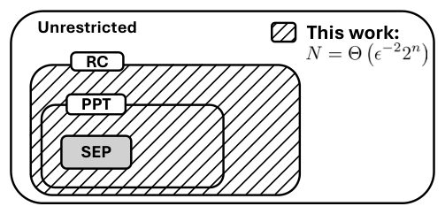
<figcaption class="paper-figure-caption"><b>Fig 1.</b> FIG. 1. Resource hierarchy for incoherent adaptive Pauli- channel learning. For 0 &lt; ϵ ≤ 1 3, the tight scaling N = Θ  ϵ−22n , previously known for SEP [27, 28], extends to the hatched one-sided reduction criterion (RC) class; the other side is unrestricted, and PPT is shown for reference.</figcaption>
</figure>
<figure class="paper-figure-card">
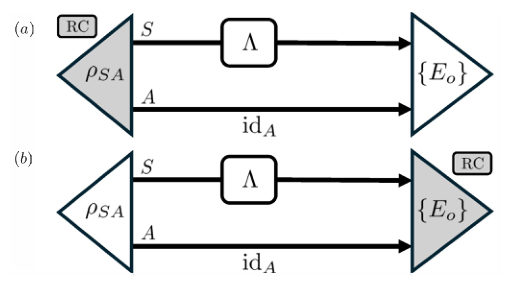
<figcaption class="paper-figure-caption"><b>Fig 2.</b> FIG. 2. Ancilla-assisted Pauli-channel learning with an in- coherent adaptive protocol. The unknown channel Λ acts on the system register S, while the ancilla A is retained noise- lessly through idA. The resulting joint state is then measured using the POVM {Eo}. We consider one-sided restrictions in which either (a) the input state ρSA or (b) each normalized POVM element satisfies the reduction criterion.</figcaption>
</figure>
<figure class="paper-figure-card">
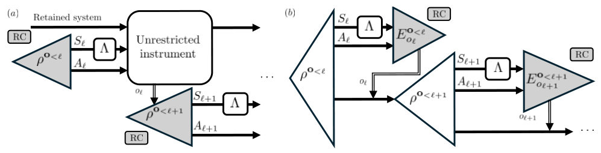
<figcaption class="paper-figure-caption"><b>Fig 3.</b> FIG. 3. Coherent adaptive protocols under one-sided reduction-criterion (RC) restrictions. (a) Input-restricted model: conditioned on the previous measurement outcomes o&lt;ℓ, the fresh input ρo&lt;ℓsatisfies RC and is uncorrelated with the retained quantum memory; after the channel use, the output and memory may undergo arbitrary joint coherent processing. (b) Measurement-restricted model: inputs may be entangled across channel uses, but the round-ℓPOVM acts only on SℓAℓ, with each normalized POVM element satisfying RC.</figcaption>
</figure>
<figure class="paper-figure-card">
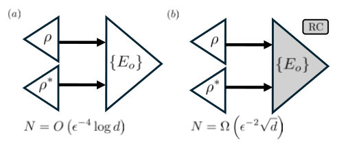
<figcaption class="paper-figure-caption"><b>Fig 4.</b> FIG. 4. Conjugate-state learning under unrestricted and RC- restricted joint measurements. (a) With unrestricted mea- surements [48], we can learn all displacement amplitudes from copies of ρ ⊗ρ∗with N = O(ϵ−4 log d). (b) For the copywise adaptive protocols considered here, the RC restriction yields the lower bound N = Ω(ϵ−2√</figcaption>
</figure>

**Summary.** This theoretical paper investigates what specific properties of entanglement are responsible for exponential speedups in quantum machine learning. By analyzing Pauli-channel and conjugate-state learning tasks, the authors prove that violating a condition called the 'reduction criterion' is necessary to maintain such an exponential advantage. This work provides a precise resource constraint characterizing quantum computational power.

**Why it may be interesting.** While focused on quantum learning theory, the rigorous identification of necessary resource constraints (like RC violation) provides fundamental mathematical tools applicable to characterizing entanglement utility in complex physical processes beyond simple channel estimation.

Detailed structure

**Main problem.** The paper aims to determine which specific properties of entangled quantum resources are necessary for achieving an exponential advantage in quantum learning tasks.

**Main result.** Violation of the 'reduction criterion' (RC) is identified as a necessary condition for realizing an exponential sample-complexity advantage in Pauli-channel and conjugate-state learning tasks.

**Method.** The authors use information-theoretic tools, including conditional min-entropy and Total Variation Distance bounds derived from hypothesis testing, to establish lower bounds on the required number of samples (sample complexity).

**Model / system.** The study analyzes quantum channel estimation/learning tasks using $n$-qubit Pauli channels ($	ext{P}_n$) and conjugate-state learning involving joint measurements on $
ho \otimes 
ho^*$. The resource restriction is formalized by the reduction criterion (RC).

**Key observables.** Sample complexity ($N$), Total Variation Distance ($	ext{TVD}$), conditional min-entropy, and entanglement measures.

**Important parameters / regimes.** The dimension $n$ of the system, the error tolerance $\epsilon$, and a parameter $\eta$ quantifying the allowed violation of the reduction criterion.

**Assumptions / limitations.** The analysis assumes that restricting input states or measurement effects to satisfy the RC is equivalent to losing the exponential advantage in the considered learning tasks.

**Figures summary.** Figures illustrate resource hierarchies (SEP, PPT, RC) for Pauli-channel learning and compare sample complexity bounds between unrestricted vs. RC-restricted joint measurements in conjugate-state learning.

**Paper structure.** The paper systematically analyzes three scenarios: 1) Incoherent adaptive Pauli-channel learning under RC restrictions; 2) One-sided coherent adaptive protocols under RC restrictions; and 3) Copywise adaptive conjugate-state learning, establishing the necessary role of violating RC in each case.

Abstract

While entanglement is known to enable exponential improvements in the sample complexity of quantum learning, it remains unclear which properties of entangled resources are responsible for such improvements. We address this question through the reduction criterion, a condition obeyed by all bound-entangled states. In $n$-qubit Pauli-channel learning, we show that restricting either the input states or the measurement effects to satisfy this criterion rules out an exponential advantage for incoherent adaptive protocols. An exponential lower bound persists for the one-sided coherent adaptive protocols considered here, even when the unrestricted side retains quantum correlations across channel uses. Using conditional min-entropy, we further quantify how the sample-complexity lower bounds weaken as larger violations of the reduction criterion are allowed. Finally, we show that the same obstruction appears in conjugate-state learning: restricted joint measurements cannot reproduce the logarithmic-sample advantage of unrestricted joint measurements on $ρ\otimesρ^*$. These results identify violation of the reduction criterion as a necessary condition for an exponential advantage in the learning tasks considered here.

[↑ back to top](#top)

### [Reducing entanglement with a Hamiltonian derived Clifford transformation](http://arxiv.org/abs/2607.18404v1)

**Authors:** James Brown, Erika Lloyd, Alexandre Fleury, Tarini S Hardikar, Kenny Heitritter  
**Type:** theory · **Category:** quantum information and computing · **PDF:** <https://arxiv.org/pdf/2607.18404v1>  
**Analysis basis:** full PDF text, analyzed in chunks
**Topic relevance:** `entanglement & information structure` **3/5**

↔ Scroll figures horizontally

<figure class="paper-figure-card">
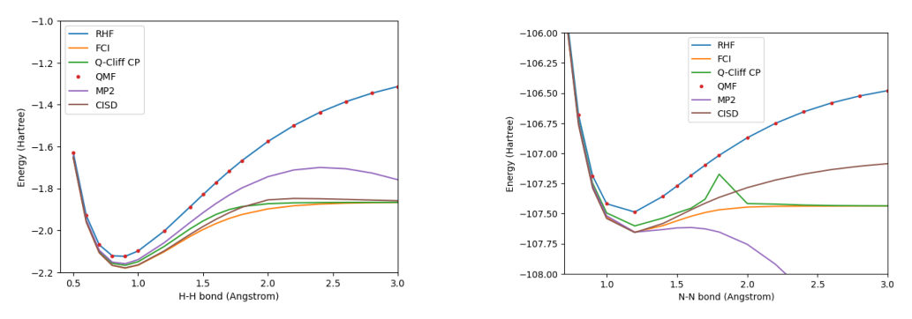
<figcaption class="paper-figure-caption"><b>Fig 1.</b> Figure 1: The importance of the Q-Cliff transformation for the H4 and N2 (with frozen core) systems in a STO-3G basis as a function of bond distance. As can be seen, the QMF wavefunction follows the RHF energy while the Q-Cliff CP wavefunction obtains energies that are better than MP2 for most of the potential energy curve. In the case of N2, MP2 is better for short bond distances but the drawbacks or shortcomings of its non-variational nature becomes apparent quickly. CISD generally performs better for these molecules at short bond distances but its dissociation is worse due to the small basis set used.</figcaption>
</figure>
<figure class="paper-figure-card">
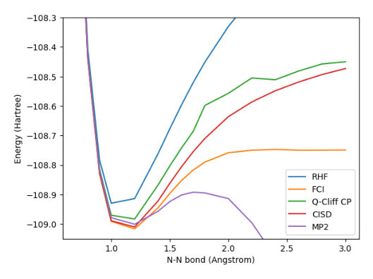
<figcaption class="paper-figure-caption"><b>Fig 2.</b> Figure 2: The CP wavefunction for a (8,8) active space for N2 in a cc-pvqz basis. The CP wave- function obtains an energy that is between MP2 and CISD accuracy.</figcaption>
</figure>
<figure class="paper-figure-card">
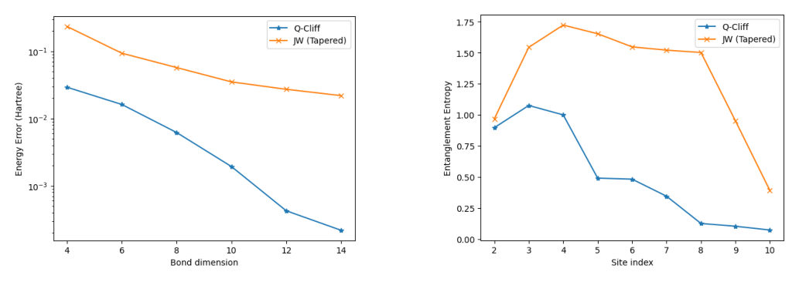
<figcaption class="paper-figure-caption"><b>Fig 3.</b> Figure 3: The increased efficiency of the DMRG calculations for the N2 molecule at 2˚A using the cc-pVQZ basis in an (8,8) active space using the Q-Cliff transformed vs the tapered JW mapping. (a) The accuracy is far better after the Q-Cliff transformation as a function of bond distance. (b) The entanglement entropy between the DMRG qubit with a bond dimension of 14 sites is much smaller using the Q-Cliff derived mapping compared to the JW and tapered mapping..</figcaption>
</figure>
<figure class="paper-figure-card">
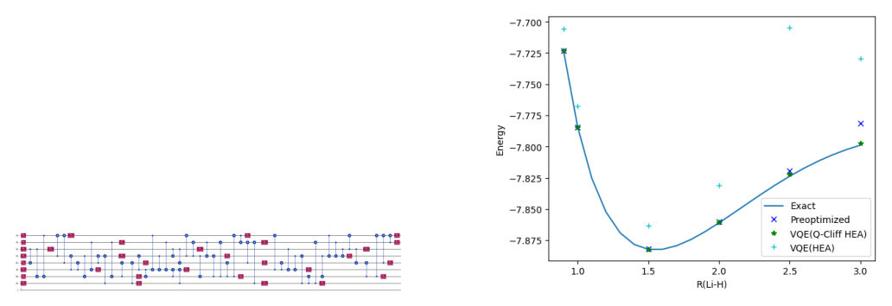
<figcaption class="paper-figure-caption"><b>Fig 4.</b> Figure 4: The circuit and potential energy curve for a 3 layer Q-Cliff derived HEA for the LiH system. It can be seen that for short bond distances, excellent energies can be achieved using the Q-Cliff HEA preoptimization method. For larger bond distances, further optimization is required using VQE but a good representation of the state is obtained. The standard hardware efficient ansatz fails to obtain good results at any point on the curve.</figcaption>
</figure>

**Summary.** The paper introduces Q-Cliff, a novel Hamiltonian derived Clifford transformation, to improve the simulation of molecular ground states. This technique efficiently maps complex fermionic Hamiltonians onto qubit circuits while significantly reducing entanglement. The resulting methods provide state-of-the-art performance in terms of energy accuracy and circuit resource requirements for variational quantum algorithms.

**Why it may be interesting.** This work directly addresses resource estimation and circuit optimization for chemistry simulations, providing a potentially superior ansatz construction method compared to standard VQE approaches, which is highly relevant for near-term quantum hardware.

Detailed structure

**Main problem.** Developing efficient quantum algorithms for simulating ground states of chemical systems by refining techniques based on the Qubit Coupled Cluster (QCC) algorithm.

**Main result.** The Hamiltonian derived Clifford transformation (Q-Cliff) generates highly efficient, low-depth circuits that achieve energy approximations comparable to state-of-the-art VQE methods while significantly reducing qubit entanglement.

**Method.** The core methodology involves using Q-Cliff to deterministically transform the Hamiltonian into a form amenable to variational quantum circuit construction, yielding an efficient classical and quantum approximation scheme.

**Model / system.** The work focuses on simulating ground states of quantum chemical systems (e.g., N2, LiH) by mapping fermionic Hamiltonians onto qubit representations.

**Key observables.** Energy accuracy (approaching MP2 to CISD), reduction in entanglement entropy between qubits, and circuit metrics like CNOT count and depth compared to existing VQE algorithms.

**Important parameters / regimes.** The scaling of the variational method is $O(N^6)$; performance is benchmarked against state-of-the-art ADAPT-VQE methods.

**Assumptions / limitations.** The quality of initial state preparation is crucial for achieving quantum advantage; the process involves viewing the wavefunction approximation as a rank-1 CP decomposition in qubit space.

**Figures summary.** Figures compare QMF and Q-Cliff derived energies against MP2 for molecules like N2, show entanglement entropy reduction via DMRG calculations, and illustrate the circuit structure used for VQE benchmarking across several molecules.

**Paper structure.** The paper introduces Q-Cliff to refine QCC techniques, details the Hamiltonian transformation process using Pauli words and Clifford tableaux, presents benchmarks on molecular systems (N2, LiH) comparing energy accuracy and circuit efficiency against existing quantum algorithms, and concludes by outlining future directions for combining this method with DMRG.

Abstract

Recently (Physica Scripta, 100(10):105401, 2025), an algorithm was introduced that deterministically generates a Clifford transformation from the Qubit Coupled Cluster (QCC) algorithm which we call Q-Cliff (QCC+Clifford). There, it was shown that Q-Cliff could be utilized to generate a hardware efficient version of the QCC ansatz. Here, we examine and refine these techniques and show that Q-Cliff can be utilized to generate efficient classical and quantum approximations to the ground states of chemical systems. The algorithm generates an efficient variational method that generally has accuracy between MP2 and CISD with $O(N^6)$. Furthermore, we show through DMRG calculations that the entanglement between qubits is reduced significantly and therefore the accuracy for a given bond dimension can be vastly improved (up to an order of magnitude). Finally, we refine the previously reported algorithm to generate low-depth and CNOT efficient circuits that can be optimized with a comparable number of energy evaluations to state-of-the-art VQE algorithms. All these results show that this Hamiltonian derived Clifford transformation should be a tool used for many classical and quantum algorithms.

[↑ back to top](#top)

### [Discrete distributions and statistical mechanics of small systems](http://arxiv.org/abs/2607.18968v1)

**Authors:** Lev B. Klebanov, Michal Šumbera  
**Type:** theory · **Category:** statistical mechanics · **PDF:** <https://arxiv.org/pdf/2607.18968v1>  
**Analysis basis:** full PDF text, analyzed in chunks
**Topic relevance:** `non-equilibrium universality` **2/5** · `Keldysh / 2PI / non-Gaussian methods` **1/5** · `analog quantum simulation` **1/5** · `correlated / nonlocal dissipation` **1/5** · `driven-dissipative phase transition` **1/5** · `entanglement & information structure` **1/5** · `non-equilibrium dynamics` **1/5**

↔ Scroll figures horizontally

<figure class="paper-figure-card">
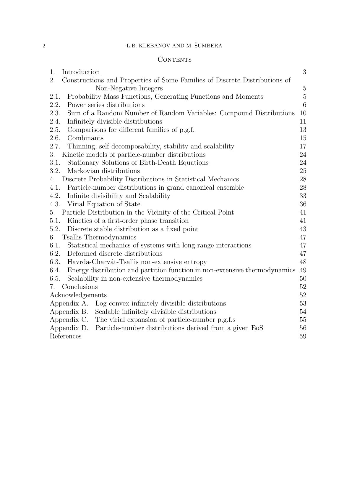
<figcaption class="paper-figure-caption"><b>Fig 1.</b> Low-resolution page preview, page 2</figcaption>
</figure>
<figure class="paper-figure-card">
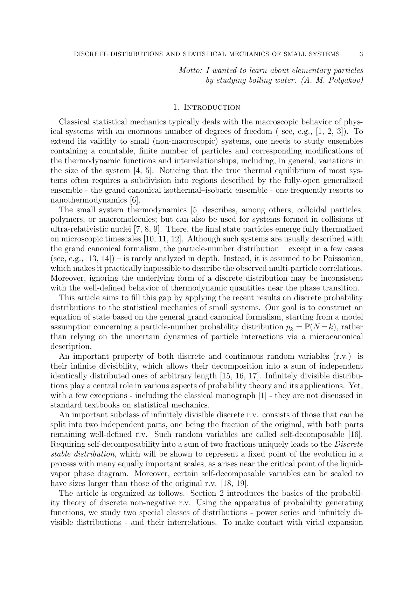
<figcaption class="paper-figure-caption"><b>Fig 2.</b> Low-resolution page preview, page 3</figcaption>
</figure>
<figure class="paper-figure-card">
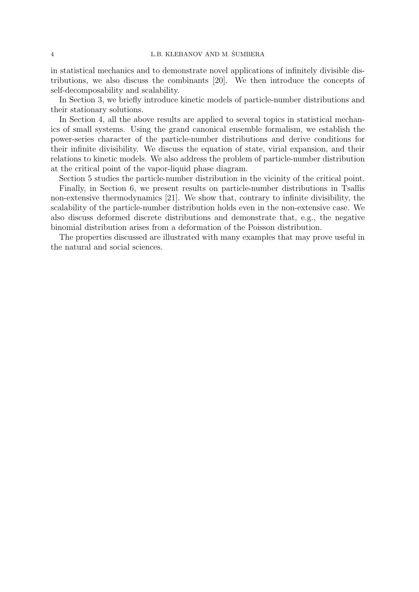
<figcaption class="paper-figure-caption"><b>Fig 3.</b> Low-resolution page preview, page 4</figcaption>
</figure>
<figure class="paper-figure-card">
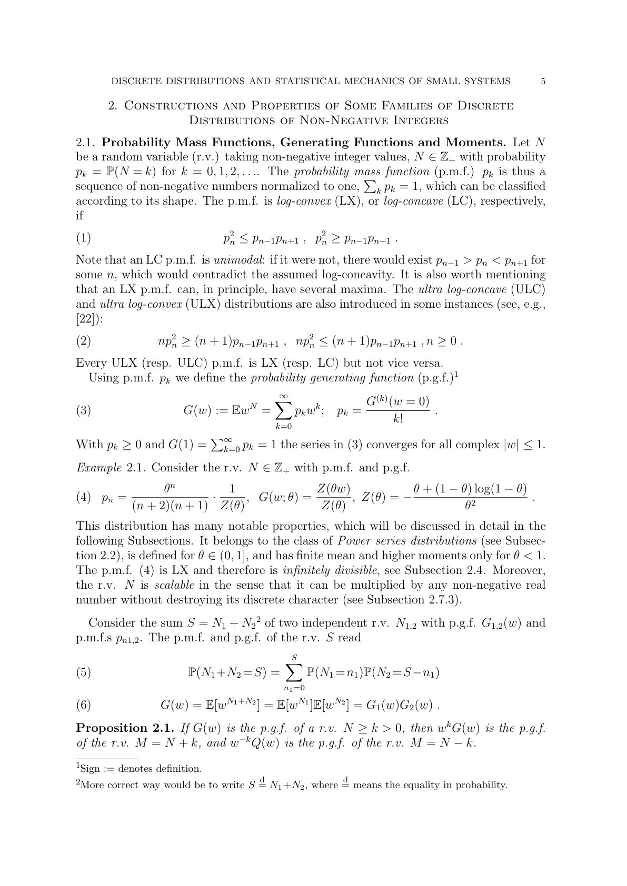
<figcaption class="paper-figure-caption"><b>Fig 4.</b> Low-resolution page preview, page 5</figcaption>
</figure>
<figure class="paper-figure-card">
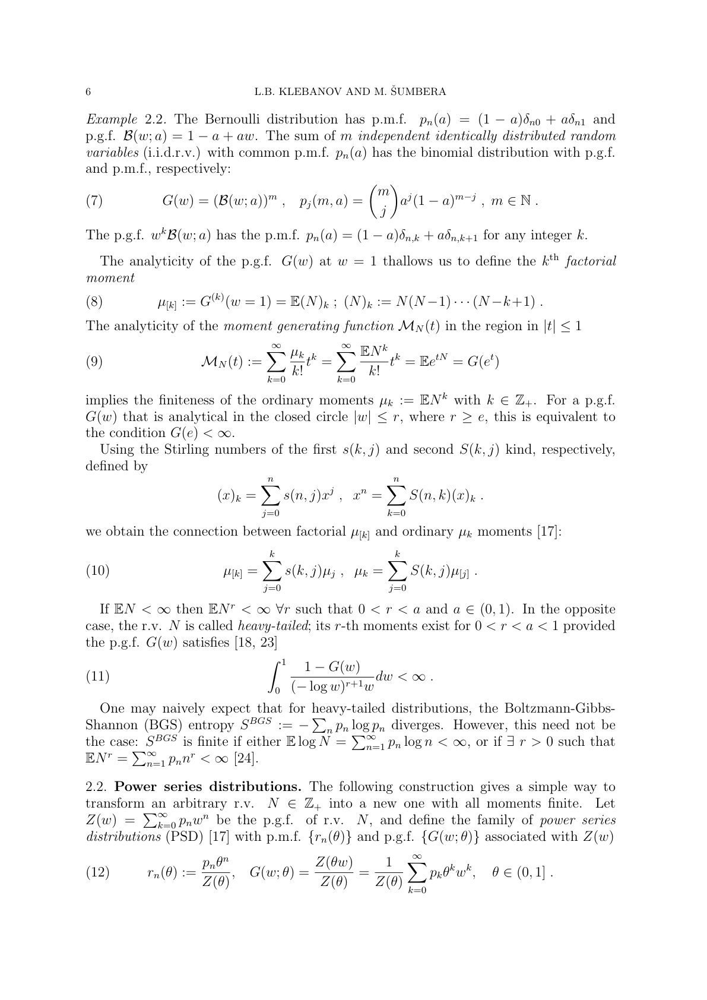
<figcaption class="paper-figure-caption"><b>Fig 5.</b> Low-resolution page preview, page 6</figcaption>
</figure>

**Summary.** This work develops a theoretical framework linking advanced concepts in discrete probability distributions—such as infinite divisibility and scalability—to the statistical mechanics of small systems. By applying these mathematical tools, the authors model phase transitions and derive equations of state for interacting gases. It provides a powerful combinatorial approach to understanding critical phenomena beyond standard assumptions.

**Why it may be interesting.** While the focus is on classical statistical mechanics, the rigorous mathematical treatment of distribution properties (like infinite divisibility and scaling) has deep parallels with quantum many-body theories involving correlation functions or reduced density matrices.

Detailed structure

**Main problem.** The paper investigates the mathematical connections between discrete probability distributions and the statistical mechanics description of small, interacting systems.

**Main result.** It establishes that the particle-number distribution at a critical point converges to the Discrete Stable distribution, and it extends these concepts to non-extensive thermodynamics while maintaining scalability properties.

**Method.** The analysis heavily relies on probability generating functions (p.g.f.) to develop theories for infinitely divisible and scalable distributions, applying these tools within the grand canonical ensemble framework.

**Model / system.** The study focuses on the particle-number distribution $p_k$ in small systems, modeling phenomena like liquid-vapor phase transitions using kinetic models and analyzing equations of state (e.g., van der Waals).

**Key observables.** Particle-number distribution ($p_k$), Equation of State ($eta p$ vs $
ho$), Virial coefficients, and the Discrete Stable distribution.

**Important parameters / regimes.** Critical point parameters ($
ho_c, T_c$), temperature ratios ($	au = T/T_c$), and non-extensivity parameter $q$.

**Assumptions / limitations.** The analysis often assumes infinite divisibility in the grand canonical ensemble, though it also explores regimes where this fails (e.g., Tsallis thermodynamics).

**Figures summary.** Not specified.

**Paper structure.** The paper progresses from developing general mathematical tools using p.g.f.s for discrete distributions to applying these tools to construct equations of state and analyze phase transitions in statistical mechanics.

Abstract

We study connections between discrete probability distributions and the statistical mechanics of small systems. Using probability generating functions, we develop the theory of power series, infinitely divisible, and scalable distributions of non-negative integer-valued random variables, and introduce the class of Markovian distributions that arise naturally in stationary solutions of birth-death processes and in scalable infinitely divisible distributions.   These results are applied to the grand canonical ensemble description in statistical mechanics: the infinite divisibility leads to a quasiparticle picture of an interacting gas, and the virial expansion is linked to the combinants of the distribution. A kinetic model of the liquid-vapor phase transition is presented, in which the particle-number distribution at the critical point converges to the Discrete Stable distribution - the fixed point of a renormalization semi-group transformation. We also show that the scalability of the particle-number distribution is preserved in Tsallis non-extensive thermodynamics, even though infinite divisibility fails. Moreover, deformed discrete distributions, including the negative binomial as a q-deformation of the Poisson, arise naturally in this setting.

[↑ back to top](#top)

### [Teleportation Game: Quantum Teleportation in Multi-Agent Systems for Interactive Music](http://arxiv.org/abs/2607.19212v1)

**Authors:** Eduardo Reck Miranda, Scott Yeiichi Oshiro  
**Type:** both · **Category:** quantum information and computing · **PDF:** <https://arxiv.org/pdf/2607.19212v1>  
**Analysis basis:** full PDF text, analyzed in chunks
**Topic relevance:** `QC/QI experiment` **2/5** · `correlated / nonlocal dissipation` **1/5** · `driven-dissipative phase transition` **1/5** · `entanglement & information structure` **1/5** · `methods for driven-dissipative` **1/5** · `non-equilibrium dynamics` **1/5**

↔ Scroll figures horizontally

<figure class="paper-figure-card">
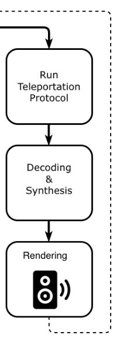
<figcaption class="paper-figure-caption"><b>Fig 1.</b> Figure 1: Quantum Agent System Pipeline.</figcaption>
</figure>
<figure class="paper-figure-card">
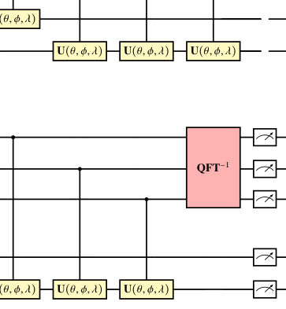
<figcaption class="paper-figure-caption"><b>Fig 2.</b> Figure 2: Quantum Circuit of a single quantum agent.</figcaption>
</figure>
<figure class="paper-figure-card">
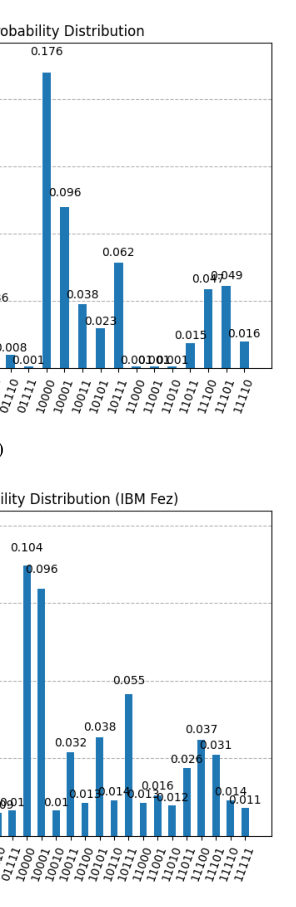
<figcaption class="paper-figure-caption"><b>Fig 3.</b> Figure 3: Probability distribution for a single quantum agent produced on (a) Qiskit’s Aer simulator and (b) ibm fez.</figcaption>
</figure>
<figure class="paper-figure-card">
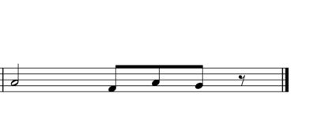
<figcaption class="paper-figure-caption"><b>Fig 4.</b> Figure 4: Single agent (a) melodic and rhythmic qubit signals and (b) decoded music notation produced with Aer simulator.</figcaption>
</figure>
<figure class="paper-figure-card">
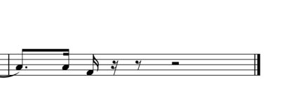
<figcaption class="paper-figure-caption"><b>Fig 5.</b> Figure 5: Single agent (a) melodic and rhythmic qubit signals and (b) decoded music notation produced with the IBM quantum hardware, ibm fez.</figcaption>
</figure>

**Summary.** This work designs a novel interactive music system using quantum agents that communicate through quantum teleportation. It treats noise and decoherence not as failures, but as controllable parameters defining the 'interpretative distance' between musical ideas. This frames quantum communication in an artistic context, suggesting new ways to model complex, non-ideal interactions in quantum computation.

**Why it may be interesting.** The focus on interpreting noise/decoherence as controllable, expressive parameters ($\theta$) provides an analogy for studying non-ideal quantum channels or open system dynamics where the 'error' itself carries information about the interaction.

Detailed structure

**Main problem.** To develop an interactive music system where quantum agents communicate via teleportation, supporting ambiguous interactions akin to free Jazz improvisation.

**Main result.** The paper demonstrates that agent interaction can be modeled as a continuous space of interpretative distance, rather than binary success/failure, by tuning the fidelity of state transfer.

**Method.** It uses quantum teleportation protocols combined with Single Qubit Probability Amplitude Modulation (SQPAM) and Quantum Phase Estimation (QPE) to encode musical features into quantum states.

**Model / system.** The system operates on NISQ-era quantum computers, simulating multi-agent communication where the core mechanism is controlled unitary evolution ($U(	heta, \phi, \lambda)$) mediated by teleportation.

**Key observables.** Melodic correlation, pitch-set distance, state fidelity ($\mathcal{F}$), and Hamming Distance are used to quantify agent interaction quality.

**Important parameters / regimes.** The rotation angle $\theta$ in the interpreter module is crucial for tuning interpretative behavior; NISQ constraints themselves are treated as creative affordances ('quantum whispers').

**Assumptions / limitations.** The system assumes that continuous audio features can be mapped effectively to discrete quantum gate parameters, and it embraces noise rather than treating it solely as an error.

**Figures summary.** Figures illustrate the overall pipeline (Audio $\rightarrow$ Circuit $\rightarrow$ Teleportation $\rightarrow$ Output), single-agent circuits, multi-agent teleportation schemes, and fidelity distributions showing how varying parameters affects state overlap.

**Paper structure.** The paper progresses from establishing the full quantum agent system pipeline using feature extraction (Chunk 1) to implementing the core teleportation mechanism (Chunk 2), and finally refining the model by introducing a tunable interpreter module to analyze continuous interpretative behavior in multi-agent cascades (Chunks 3 & 4).

Abstract

This paper introduces an interactive music system with quantum musical agents that communicate by teleporting quantum states to one another. Human performers interact in real time with agents whose melodic and rhythmic behaviours are encoded as quantum states using Single Qubit Probability Amplitude Modulation (SQPAM) and structured through Quantum Phase Estimation (QPE). Up to three agents are combined within a single quantum circuit, with directed communication via quantum teleportation. We are interested in supporting ambiguous, transformative interactions reminiscent of free Jazz improvisation. Therefore, rather than treating noise and decoherence as limitations, the system embraces NISQ-era constraints as creative affordances, framing agent communication as quantum whispers, that is, deliberate, musically expressive imperfections in state transfer. We provide demonstrations and analyses based on melodic correlation, pitch-set distance, and state fidelity, where a continuum between imitation and divergence can be observed. We developed a tunable interpretation method to assess how agents reinterpret teleported states. This work positions teleportation as a promising interaction mechanism for agent-based quantum computer music and outlines future directions toward distributed ensembles connected via the Quantum Internet.

[↑ back to top](#top)

### [Aromatic molecular emitters in a hexagonal boron nitride stack](http://arxiv.org/abs/2607.18427v1)

**Authors:** Tianyu Fang, Ricardo Gioia Alvarez, Babak Behjati, Moritz Scharfstädt, Max Masuhr, Bo Deng, Noah Henseler, Andrea Bergschneider, Stefan Linden, Christian Schäfer, Daqing Wang  
**Type:** both · **Category:** other · **PDF:** <https://arxiv.org/pdf/2607.18427v1>  
**Analysis basis:** full PDF text, analyzed in chunks
**Topic relevance:** `quantum optics experiment` **2/5** · `Keldysh / 2PI / non-Gaussian methods` **1/5** · `QC/QI experiment` **1/5** · `driven-dissipative phase transition` **1/5** · `methods for driven-dissipative` **1/5**

↔ Scroll figures horizontally

<figure class="paper-figure-card">
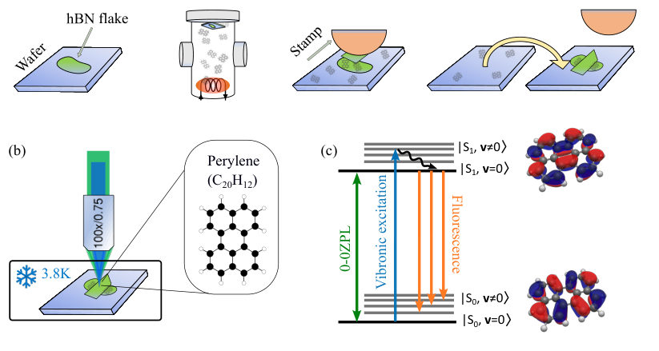
<figcaption class="paper-figure-caption"><b>Fig 1.</b> Figure 1: (a) Sample fabrication routine. An hBN flake is first prepared on a silicon wafer capped with a SiO2 layer. The substrate is then transferred into the evaporation chamber. After deposition, a second hBN flake is picked up by a polymer dome and stacked on the deposited hBN flake. The stack is picked up and transferred to a clean silicon substrate. (b) The sample is transferred to a closed-cycle cryostat, cooled to 3.8 Kelvin and studied under an optical microscope. Inset shows the molecular structure of perylene. (c) A simplified energy level diagram of perylene. The two images on the right side display the π-orbitals involved in the |S0⟩to |S1⟩transition.</figcaption>
</figure>
<figure class="paper-figure-card">
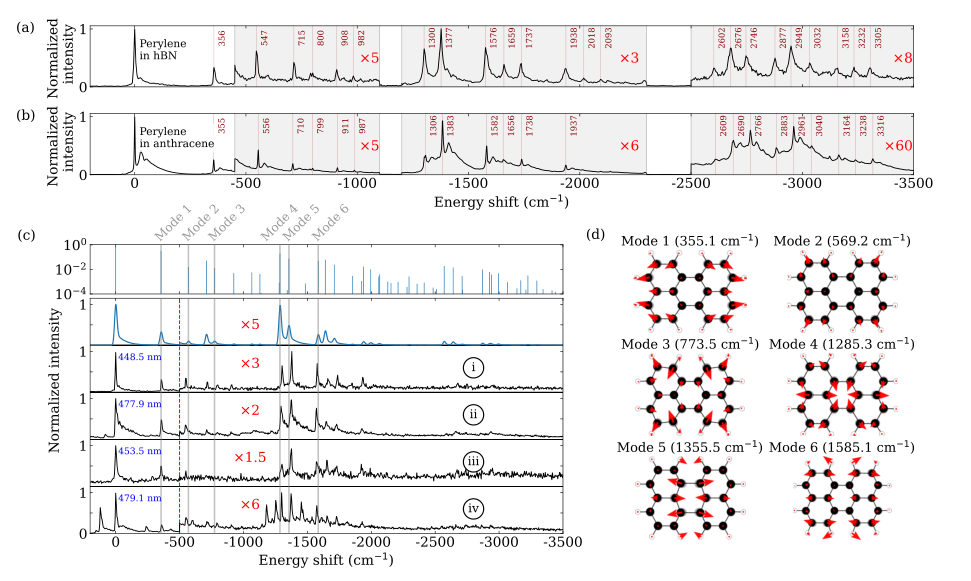
<figcaption class="paper-figure-caption"><b>Fig 2.</b> Figure 2: Fluorescence spectrum measured from a focal spot on the hBN stack (a) compared to the emission spectrum of perylene in anthracene (b). The horizontal axis denotes the relative energy shift to the ZPL, expressed in inverse centimeters. The vibronic bands are scaled differently in intensity for visual effect. (c) Comparison to theory. The blue vertical bars in the top panel present the vibrational modes of perylene in an hBN slab. The height of each bar represents the Franck-Condon factors derived from ab initio calculations. Only six modes and their overtones are plotted. The blue curve shows a modeled emission spectrum, which considers a broadening by the spectrometer and the...</figcaption>
</figure>
<figure class="paper-figure-card">
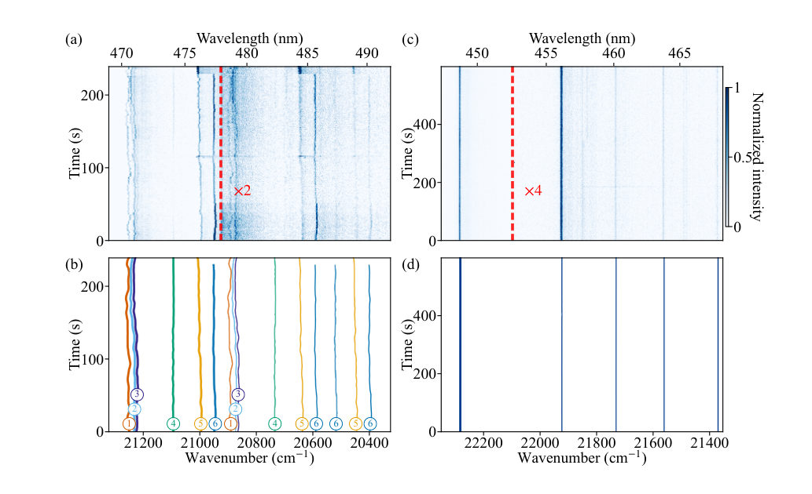
<figcaption class="paper-figure-caption"><b>Fig 3.</b> Figure 3: (a) Emission spectrum measured on a laser focal spot on a non-baked sample over 200 seconds. (b) Extracted frequency traces of 6 molecules. Each molecule is represented by one color. The opaque lines denote the ZPL transition, and the semi-transparent lines are the vibronic transitions. (c) An emission spectrum measured on a sample after baking. (d) Extracted time traces of the ZPL and vibronic lines for the data in (c).</figcaption>
</figure>
<figure class="paper-figure-card">
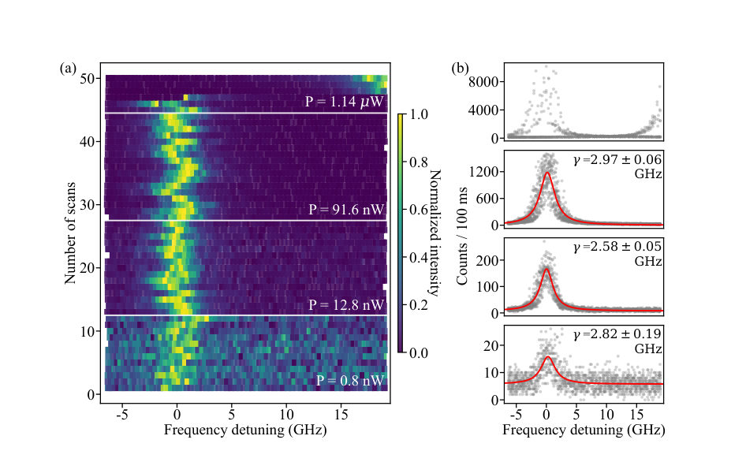
<figcaption class="paper-figure-caption"><b>Fig 4.</b> Figure 4: Fluorescence excitation spectra of the ZPL transition of a single perylene molecule. (a) The ZPL excitation traces measured with gradually increased laser intensities. The duration of a single frequency sweep was 12 seconds. The color scale is normalized in each scan. Spectral jumps occur at the highest excitation power. (b) Excitation spectra at each laser power. The gray dots show the accumulated data from (a) without post-aligning the center resonance frequency of each individual scan. The red lines denote fits to a Lorentzian function. The extracted full-width at half-maximum linewidth γ is given in the legend.</figcaption>
</figure>
<figure class="paper-figure-card">
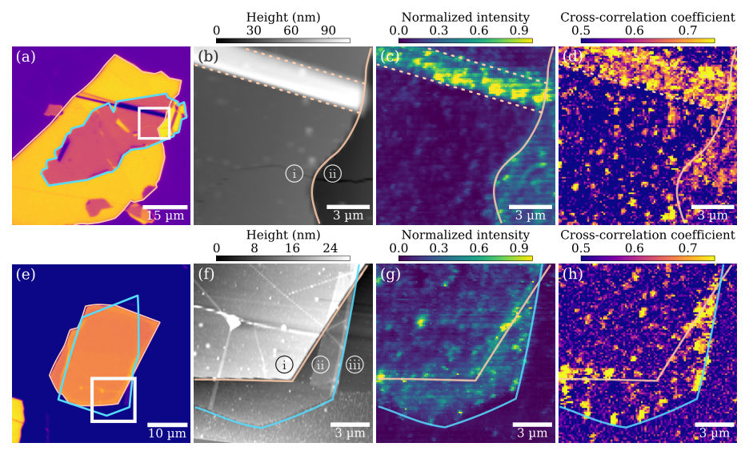
<figcaption class="paper-figure-caption"><b>Fig 5.</b> Figure 5: Spatial distribution of perylene emissions analyzed through hyperspectral mea- surements on two samples. (a), (e) Optical microscope images of the two samples. Orange and blue contours illustrate the boundaries of the lower and upper hBN flakes, respectively. (b), (f) Atomic force microscope measurements. The top and bottom flakes in (b) have a thickness of 21 nm and 31 nm, respectively. The sample in (f) has a 22-nm-thick bottom flake and a 2-nm-thick top flake. (c), (g) Integrated fluorescence intensity distributions. (d), (h) Normalized correlation function with respect to the emission spectrum of perylene.</figcaption>
</figure>

**Summary.** The research demonstrates the successful incorporation and spectroscopic characterization of perylene molecular emitters into hexagonal boron nitride (hBN) stacks. By analyzing narrow zero-phonon-line transitions and vibronic spectra at cryogenic temperatures, the authors confirm that while hBN offers a promising platform, molecular binding is critically dependent on structural defects rather than pristine lattice sites. This provides key guidelines for deterministically engineering such quantum emitter devices.

**Why it may be interesting.** This work directly addresses the integration challenge for solid-state quantum emitters by demonstrating high-fidelity optical characterization within a 2D van der Waals heterostructure, which is crucial for realizing scalable quantum devices.

Detailed structure

**Main problem.** To investigate the feasibility of directly embedding narrow-linewidth molecular quantum emitters (perylene) into van der Waals hexagonal boron nitride (hBN) stacks and characterizing their photophysical properties.

**Main result.** The study successfully observed gigahertz-narrow zero-phonon-line transitions, confirming that while pristine hBN tends to expel molecules, morphological defects stabilize the binding. The spectral analysis provides insights into the host-molecule interaction mechanism.

**Method.** A combination of cryogenic optical spectroscopy (measuring ZPL and vibronic spectra) and advanced theoretical calculations (quantum chemistry/DFT) was employed for analysis.

**Model / system.** The physical system is perylene molecules embedded within multi-layered hexagonal boron nitride (hBN) stacks, mimicking a solid-state quantum emitter platform. The analysis involves modeling excited-state relaxation and vibrational coupling between the molecule and the host lattice.

**Key observables.** Zero-phonon-line (ZPL) transition linewidth ($\approx 2.8\ 	ext{GHz}$), vibronic spectral peaks, phonon sideband shapes, and spatial mapping of emission intensity.

**Important parameters / regimes.** Cryogenic temperatures (e.g., 3.8 K); the electronic structure parameters derived from quantum chemistry calculations; defect concentrations in hBN.

**Assumptions / limitations.** The analysis assumes that spectral matching techniques like LNCC can reliably identify molecular fingerprints even when broadened by the host environment, and that environmental stability is governed by surface defects rather than bulk properties.

**Figures summary.** Figures illustrate sample fabrication, compare fluorescence spectra from hBN vs. anthracene hosts showing vibronic peak agreement but sideband differences, and map ZPL wavelengths across samples to show spatial heterogeneity.

**Paper structure.** The paper progresses from initial characterization of the ZPL transition in the hBN stack, through detailed spectral comparisons with reference molecules (anthracene), to advanced techniques like LNCC matching for site-specific analysis, concluding with structural insights regarding molecular binding sites.

Abstract

Single polycyclic aromatic hydrocarbon molecules embedded in organic matrices have proven to be an excellent family of narrow-linewidth quantum emitters. Extending this host-guest setting to van der Waals materials offers the opportunity to combine the preeminent properties of molecular emitters with the access to the versatility of two-dimensional hetero-structures and devices. In this work, we incorporate perylene molecules into multi-layered hexagonal boron nitride stacks and observe gigahertz-narrow zero-phonon-line transitions at cryogenic temperatures. We unambiguously verify the origins of photon emission through vibronic spectra analysis. By combining hyperspectral localization measurements with quantum chemistry calculations, we examine the insertion mechanisms of perylene molecules in the hexagonal boron nitride stacks, and conclude that pristine hBN layers tend to expel molecules from the sandwich, while extended morphological defects, hydroxyl groups and unpassivated boron and nitrogen atoms assist to stabilize molecular bindings to hBN. Our work provides valuable insight for future work to deterministically integrate narrow-linewidth molecular emitters into van der Waals devices.

[↑ back to top](#top)

### [Symmetry-protected cubic-touching topological surface bands with tunable singularities](http://arxiv.org/abs/2607.19265v1)

**Authors:** Jingtian Shi, Taylor L. Hughes, Ivar Martin  
**Type:** theory · **Category:** strongly correlated electrons · **PDF:** <https://arxiv.org/pdf/2607.19265v1>  
**Analysis basis:** full PDF text, analyzed in chunks
**Topic relevance:** `analog quantum simulation` **2/5** · `Keldysh / 2PI / non-Gaussian methods` **1/5** · `driven-dissipative phase transition` **1/5** · `methods for driven-dissipative` **1/5**

↔ Scroll figures horizontally

<figure class="paper-figure-card">
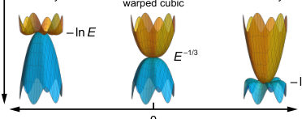
<figcaption class="paper-figure-caption"><b>Fig 1.</b> FIG. 1. Schematics of various types of cubic-touching sur- face bands tuned by two phenomenological factors α, β: Ek ∝αk2 ± k3 + + βk3 − , where k± = kx ± iky. Order of DOS singularity is marked for each case.</figcaption>
</figure>
<figure class="paper-figure-card">
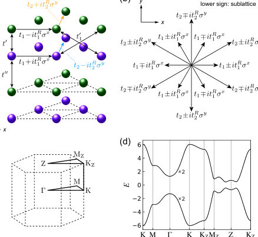
<figcaption class="paper-figure-caption"><b>Fig 2.</b> FIG. 2. (a) An illustration of the triangular prism lattice tight-binding model in Eq. (5), with inter-site tunneling ma- trices represented with arrows. The coordinate frame is shown on the bottom left. (b) All tunneling matrices within the xy- plane. (c) The 3D Brillouin zone (BZ) of the system. (d) A typical 3D band structure of the model along the solid lines shown in (c), in which both bands are doubly degenerate.</figcaption>
</figure>
<figure class="paper-figure-card">
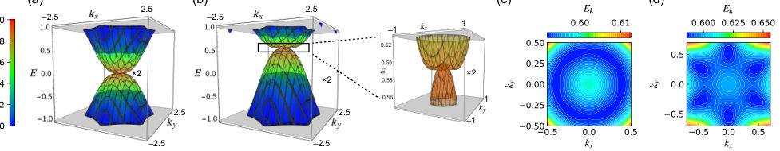
<figcaption class="paper-figure-caption"><b>Fig 3.</b> FIG. 3. (a) The band structure of an xy-slab containing 50 unit cells in the z-direction, whose corresponding bulk Hamiltonian is H0(k) with t′ = 1.5, t′′ = 1, t′ 1 = −0.2, tR 1 = 1, and tR 2 = 0.2. The color scale represents the surface vs. bulk character of the states where warmer colors toward red indicate surface states, and cooler colors toward blue represent states with a bulk character. (b) The same as (a) but with the particle-hole-symmetry-breaking term HP (k) added with t1 = 0.1 and t2 = 0. The zoomed-in band touching structure is shown on the right. (c) The 2D constant energy contours of the first surface conduction band in (b), i.e., the first band above the touching point,...</figcaption>
</figure>

**Summary.** This work characterizes a family of topological surface bands in 3D TCIs featuring symmetry-protected cubic band touching. By tuning parameters related to particle-hole asymmetry, the system's dispersion can be continuously morphed between several distinct forms. This tunability allows for precise engineering of electronic properties, particularly the density of states singularities, which is crucial for realizing strongly correlated quantum phases.

**Why it may be interesting.** The explicit connection between crystal symmetries, topological band degeneracies (cubic touching), and the resulting tunable density of states makes this highly relevant for designing novel correlated electronic phases in solid-state systems.

Detailed structure

**Main problem.** The study proposes a class of topological surface bands in 3D Topological Crystalline Insulators (TCIs) that exhibit symmetry-protected cubic-order band touching.

**Main result.** The research demonstrates that the band dispersion can be continuously tuned between cubic, moat, and multi-mini-valley structures by adjusting particle-hole asymmetry and anisotropy. This results in a versatile platform for engineering tunable density-of-state singularities ranging from power-law to logarithmic divergences.

**Method.** The analysis uses symmetry constraints (T, P, M, $J_z$) applied to a k.p Hamiltonian derived from a prism-lattice tight-binding model to characterize the surface band structure and its degeneracies.

**Model / system.** The physical system is modeled using a bulk tight-binding approach on a prism lattice for angular-momentum-$3/2$ electrons, analyzed via effective 1D models at high-symmetry points ($\Gamma$, M).

**Key observables.** Band dispersion types (cubic, moat, mini-valley), Density of States (DOS) singularity order ($\sim E^{-1/3}$, $\sim \ln E$), and the topological invariant (winding number).

**Important parameters / regimes.** Particle-hole asymmetry parameters ($\alpha, eta$) and anisotropy terms ($t_{R2}$), which control the transition between different band structures.

**Assumptions / limitations.** The analysis relies on assuming specific symmetry representations for T, P, M, and $J_z$, and uses a k.p expansion approximation.

**Figures summary.** Figures illustrate schematics of various cubic-touching surface bands tuned by parameters $\alpha$ and $eta$; one figure shows the band structure evolution in an xy-slab under symmetry breaking; another details the prism lattice model.

**Paper structure.** The paper proceeds by establishing the general symmetry constraints on the Hamiltonian, deriving effective 1D models at high-symmetry points ($\Gamma$, M), analyzing how specific symmetries protect cubic touching, and finally demonstrating tunability via parameter variation to achieve different DOS singularities.

Abstract

We propose a class of topological surface bands in three-dimensional topological crystalline insulators that have symmetry-protected cubic-order band touching. Within the symmetry constraint, the band dispersion can continuously vary between cubic dispersion, moat band and multi-mini-valley structure with van Hove singularities by adjusting particle-hole asymmetry and anisotropy. Thus, there is a family of tunable density-of-state singularities ranging from power-law to logarithmic divergences. This offrs a versatile platform for engineering strongly correlated phases of matter in topological surface states. We provide an example realization in a prism-lattice tight-binding model of angular-momentum-3/2 electrons.

[↑ back to top](#top)

### [Statistical properties of quadrangular surfaces](http://arxiv.org/abs/2607.19221v1)

**Authors:** Hrant Topchyan, Rudik Badalyan, Ara Sedrakyan  
**Type:** theory · **Category:** statistical mechanics · **PDF:** <https://arxiv.org/pdf/2607.19221v1>  
**Analysis basis:** full PDF text, analyzed in chunks
**Topic relevance:** `non-equilibrium universality` **2/5** · `driven-dissipative phase transition` **1/5** · `non-equilibrium dynamics` **1/5**

↔ Scroll figures horizontally

<figure class="paper-figure-card">
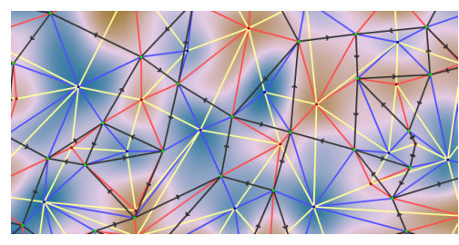
<figcaption class="paper-figure-caption"><b>Fig 1.</b> FIG. 1: The representations of random surfaces. A disordered potential (color map: increasing from blue to brown), with marked extrema points (Sp: green, Min: blue, Max: red) and connections Sp-Min (blue lines), Sp-Max (red lines), Min-Max with a common Sp (yellow lines) and Sp-Sp with a common Min/Max (black arrows). The extrema surface (ES): all extrema as nodes, Sp-Min and Sp-Max lines as links, and faces Sp-Min-Sp-Max; the scattering network (SN): Sp-s as nodes, Sp-Sp lines as links, and Min-s/Max-s corresponding to the faces; the dual of SN (dSN), Min-s and Max-s as nodes, Min-Max lines as links, as Sp-s representing the faces; the percolation lattice (PL): Min-s as nodes, polylines...</figcaption>
</figure>
<figure class="paper-figure-card">
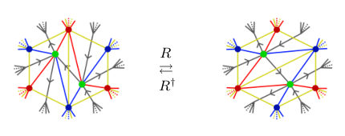
<figcaption class="paper-figure-caption"><b>Fig 2.</b> FIG. 2: The surface modifications in different representations. The notations are the same as in Fig.1. The line segment fans represent an arbitrary continuation of the surface.</figcaption>
</figure>
<figure class="paper-figure-card">
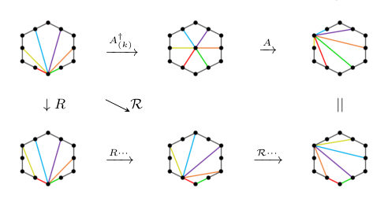
<figcaption class="paper-figure-caption"><b>Fig 3.</b> FIG. 3: The decompositions of operations A†, R and AA† in dSN representation. Colors are there for the ease of following the procedure and don’t represent anything.</figcaption>
</figure>
<figure class="paper-figure-card">
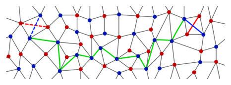
<figcaption class="paper-figure-caption"><b>Fig 4.</b> FIG. 4: The bipartite (red and blue points) dSN surface (black lines), the diagonals η0 (dashed) and η′ (solid) (red lines), the corresponding opposites ¯η0 and ¯η′ (blue lines) and an example of a chain {¯ηi} continuously connecting them (green lines).</figcaption>
</figure>
<figure class="paper-figure-card">
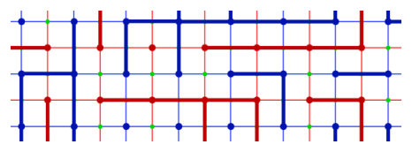
<figcaption class="paper-figure-caption"><b>Fig 5.</b> FIG. 5: A GKNS realization on a regular network in the PL representation. The Min (blue nodes and lines) and Max (red nodes and lines) partitions, with the occupied (highlighted) links being depicted thickened. Green dots portray the Sp-s of the initial ES representation.</figcaption>
</figure>

**Summary.** This paper compares the statistical geometries of three types of random quadrangular surfaces (GKNS, DQ, GQ) used as models for 2D quantum gravity. By analyzing observables like Hausdorff dimension and degree distributions, the authors demonstrate that GKNS defines a unique universality class distinct from standard triangulations. This suggests new geometric frameworks applicable to non-critical string theories.

**Why it may be interesting.** While focused on geometry, the rigorous statistical mechanics approach to characterizing universality classes and critical phenomena in random manifolds has parallels with understanding phase transitions or emergent order in complex quantum many-body systems.

Detailed structure

**Main problem.** The study investigates and compares the statistical geometric properties of three different ensembles of random quadrangular surfaces: GKNS, Dynamical Quadrangulations (DQ), and General Quadrangulations (GQ).

**Main result.** The analysis reveals that while DQ and GQ approach a Hausdorff dimension similar to standard DT ($\Delta_H \approx 4$), the GKNS ensemble defines a distinct class of random geometry with $\Delta_H \approx 2$.

**Method.** The authors use a unified graph-theoretic framework, analyzing underlying Markov chains, degree distributions, and distance statistics for all three ensembles.

**Model / system.** The system consists of discrete surfaces modeled as quadrangulations (random graphs), which are used to study concepts related to 2D quantum gravity and non-critical string theories. The specific models include the GKNS construction and generalizations of dynamical triangulations (DQ/GQ).

**Key observables.** Degree distributions (scale-free vs. exponential decay), Hausdorff dimension ($\Delta_H$), critical exponents ($
u, \gamma$), and scaling relations for surface area versus diameter.

**Important parameters / regimes.** The critical probability ($p_0$) for the GKNS percolation process; the size/area ($S$); and the crossover diameter ($D_0$).

**Assumptions / limitations.** The analysis assumes that the different randomization procedures (GKNS, DQ, GQ) define distinct but related ensembles of random surfaces.

**Figures summary.** Figures illustrate surface representations derived from a disordered potential (ES, SN, dSN, PL), show surface modifications via specific operations ($A_\eta$, $R$), and depict scaling relationships between area and diameter for the different models.

**Paper structure.** The paper establishes a unified graph-theoretic framework to relate elementary operations defining the ensembles. It then analyzes percolation properties (GKNS) and Markov chain convergence/scaling laws (DQ/GQ), culminating in a comparison of geometric observables like Hausdorff dimension across all three classes.

Abstract

We investigate the statistical properties of random quadrangular surfaces generated by different randomization procedures: the Gruzberg-Klümper-Nuding-Sedrakyan (GKNS) construction, and two newly introduced generalizations of dynamical triangulations (DT), dynamical (DQ) and general quadrangulations (GQ). We formulate these surfaces within a unified graph-theoretic framework and establish the relationships between the elementary operations defining the different ensembles. For GKNS surfaces, we demonstrate that the construction is equivalent to two mutually constrained percolation processes and determine the associated critical point and critical exponents, revealing deviations from ordinary percolation. For DQ and GQ, we analyze the underlying Markov chains and determine the scaling of mixing and relaxation times. We further analyze all three ensembles through their degree distributions, degree correlations, distance statistics, and Hausdorff dimensions. While DQ exhibits exponentially decaying degree distributions and geometric properties similar to DT, GKNS and GQ display broad, scale-free degree distributions. Moreover, GKNS surfaces possess an asymptotic Hausdorff dimension $Δ_H\approx 2$, whereas DQ and GQ approach $Δ_H\approx 4$, similarly to DT. This indicates that DQ is compatible with the universal behavior of DT, while GKNS and GQ define distinct classes of random geometry, implying a different underlying measure in the space of random surfaces and a possible geometric framework for a new class of noncritical string theories.

[↑ back to top](#top)

### [Equivariant Continuous Normalizing Flows with Offline Sampling for Fermionic Ground State Estimation](http://arxiv.org/abs/2607.18486v1)

**Authors:** Sam Cochran, James B. Larsen, Andrew Wray, Michael J. Keiser, Chad Rigetti, Shravan Veerapaneni  
**Type:** both · **Category:** numerical methods · **PDF:** <https://arxiv.org/pdf/2607.18486v1>  
**Analysis basis:** full PDF text, analyzed in chunks
**Topic relevance:** `analog quantum simulation` **2/5** · `methods for driven-dissipative` **1/5**

↔ Scroll figures horizontally

<figure class="paper-figure-card">
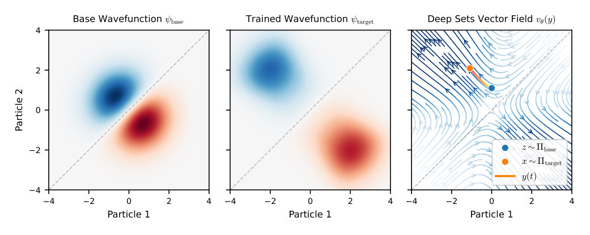
<figcaption class="paper-figure-caption"><b>Fig 1.</b> FIG. 1. Visualization of a trained CNF wavefunction for two fermions in a one-dimensional harmonic trap with repulsive Coulomb interaction. Left: Slater determinant base wavefunction ψbase, built from the first two harmonic oscillator orbitals; this is the exact ground state of the non-interacting system. Blue indicates positive values, red negative. Antisymmetry under particle exchange can be seen in the opposite signs of the two wavefunction lobes reflected across the Pauli exclusion diagonal x1 = x2. Center: Trained wavefunction ψtarget after flow optimization; the increased lobe separation corresponds to the flow learning interparticle repulsion. Note that antisymmetry is preserved....</figcaption>
</figure>
<figure class="paper-figure-card">
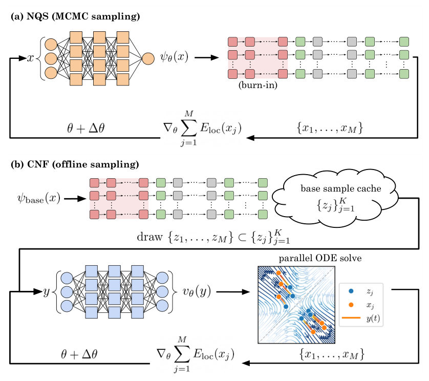
<figcaption class="paper-figure-caption"><b>Fig 2.</b> FIG. 2. Comparison of the sampling procedures required for training NQS and CNF wavefunctions. NQS models (a) define the wavefunction ψθ directly using the output of a neural network. Sampling from the NQS Born distribution requires sequential MCMC sampling at each training iteration. Generating independent and unbiased samples xj with this method necessitates burn-in steps (red boxes) and thinning steps (gray boxes), both of which expend compute without directly producing usable samples. In contrast, the CNF approach (b) uses a neural network to define a vector field vθ whose time-one map transforms a base wavefunction to a target wavefunction. Using M base Born distribution samples z1, ....</figcaption>
</figure>
<figure class="paper-figure-card">
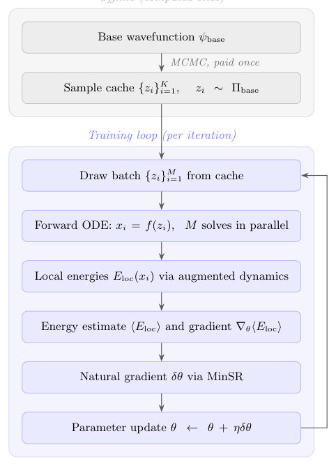
<figcaption class="paper-figure-caption"><b>Fig 3.</b> FIG. 3. Training pipeline for the CNF-based VMC frame- work. The offline phase (gray) runs MCMC once on the fixed base distribution Πbase to populate a sample cache of K con- figurations. Each training iteration (blue) draws a random batch from the cache, propagates each sample through the forward ODE to obtain exact target samples, computes lo- cal energies via augmented dynamics, and applies a MinSR natural gradient update to the parameters θ. No MCMC is performed at training time.</figcaption>
</figure>
<figure class="paper-figure-card">

<figcaption class="paper-figure-caption"><b>Fig 4.</b> FIG. 4. Per-iteration wall-clock time (top) and peak GPU memory usage (bottom) as a function of particle number N, comparing the augmented dynamics approach introduced in Section V with standard forward-over-reverse automatic dif- ferentiation through the ODE solve. Results are shown for the standard approach in both parallel and sequential modes. The ODE solve was fixed to use 10 steps, and runs were car- ried out on a single GPU using a PDS vector field over a Slater base. The augmented approach is faster and more memory- efficient than both standard variants across all system sizes tested.</figcaption>
</figure>
<figure class="paper-figure-card">
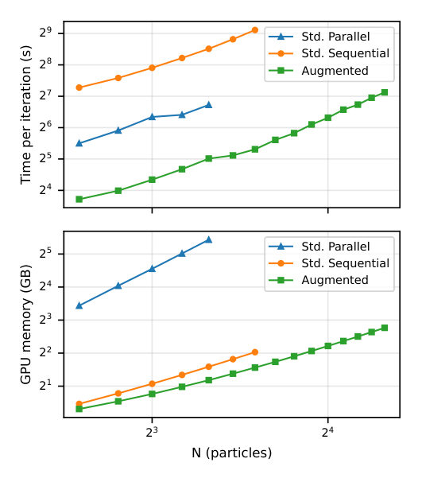
<figcaption class="paper-figure-caption"><b>Fig 5.</b> Figure 5 compares the four vector field architectures on a system of N = 10 harmonically trapped electrons in three dimensions. Convergence of energy and local energy variance is shown against both training iteration (a) and wall-clock time (b). Of the models trained using a Slater base, PDSG achieves the lowest converged en- ergy and local energy variance values, followed by FVF, PDS, and then DS. The separation is clearest in the local energy variance. Relative to the CISD reference energy, the three most accurate architectures converge close to CISD, while DS remains well above it. The architec- tures also differ in wall-clock convergence: DS converges fastest, PDS and PDSG are...</figcaption>
</figure>

**Summary.** The paper presents a novel Variational Monte Carlo approach for fermionic ground state estimation using Continuous Normalizing Flows (CNFs). By implementing the flow as a permutation-equivariant neural ODE, it achieves exact sampling from the learned wavefunction distribution without slow MCMC steps. This method demonstrates high accuracy and excellent GPU scaling for simulating interacting quantum particles.

**Why it may be interesting.** This work provides a powerful, scalable alternative to traditional quantum Monte Carlo methods for strongly correlated systems by integrating continuous flow theory with fermionic symmetries, which is highly relevant for simulating complex quantum matter.

Detailed structure

**Main problem.** The core problem is accurately estimating the ground state energy of fermionic many-body systems, which requires sampling complex, high-dimensional wavefunctions.

**Main result.** The authors achieved ground-state energies for harmonically trapped spinless electrons that surpass established CISD reference values and demonstrated near-ideal strong GPU scaling up to 128 A100 GPUs.

**Method.** They introduce a framework using Continuous Normalizing Flows (CNFs) to refine an antisymmetric base wavefunction via a permutation-equivariant neural ODE, enabling exact sampling without MCMC during training.

**Model / system.** The system involves fermionic particles governed by a general Hamiltonian. The method uses CNFs built upon fixed antisymmetric bases like Slater or Jastrow-Slater determinants, which are refined by learning the flow's vector field.

**Key observables.** Ground state energy ($E_0$), Born distribution ($\Pi_	heta$), and local energy variance (used for convergence diagnostics).

**Important parameters / regimes.** System size $N$ (up to 48 particles), number of dimensions $D$, and training hyperparameters like learning rates and ODE tolerances.

**Assumptions / limitations.** The method assumes the existence of an efficiently sampleable, antisymmetric base wavefunction; it also relies on the mathematical framework of CNFs applied to fermionic symmetries.

**Figures summary.** Figure 1 visualizes how a trained CNF refines a base wavefunction (e.g., Slater determinant) into a more correlated target state via ODE trajectories. Figure 9 compares the convergence of CISD reference energies against increasing basis set cutoff ($n_{	ext{max}}$).

**Paper structure.** The paper introduces the VMC framework, proposes using CNFs to overcome MCMC sampling limitations by leveraging offline base sample generation. It details novel equivariant vector field architectures (PDS, FVF, PDSG) and an augmented dynamics formulation for efficient kinetic energy calculation.

Abstract

We introduce a framework for fermionic variational Monte Carlo (VMC) in which a continuous normalizing flow (CNF) refines a fixed antisymmetric base wavefunction. The flow is implemented as a permutation-equivariant neural ODE, a smooth, topology-preserving map that learns correlations not captured by the base; equivariance preserves the antisymmetry of the base, so the flow can in principle improve any antisymmetric ansatz that can be sampled efficiently. We demonstrate this using Slater and Jastrow-Slater bases, though more expressive choices are admissible. Exact samples from the flow's Born distribution are obtained by pushing pre-cached base samples through the forward ODE, requiring no Markov chain Monte Carlo (MCMC) at training time. The base samples are generated offline and reused across training batches and runs, decoupling sample generation from parameter optimization and enabling embarrassingly parallel training across multiple GPUs. We introduce three novel permutation-equivariant vector field architectures: Pairwise Deep Sets (PDS), FermiNet Vector Fields (FVF), and Pairwise Deep Sets Gradient (PDSG), each offering a different balance of expressivity and computational cost. We further introduce an augmented dynamics formulation for kinetic energy computation that co-evolves the required derivative quantities as ODE state variables, eliminating differentiation through the ODE trajectory and yielding significant reductions in wall-clock time and memory. Training runs on systems of harmonically trapped spinless electrons demonstrate ground-state energies below CISD reference values. Scaling experiments demonstrate near-ideal strong scaling from 1 to 128 NVIDIA A100s using 32 GPU nodes of NERSC's Perlmutter supercomputer for systems of up to $N = 48$ particles in three dimensions.

[↑ back to top](#top)

### [SoK: Adversarial Robustness of the Variational Quantum Eigensolver via Red-Teaming](http://arxiv.org/abs/2607.19318v1)

**Authors:** Ahmed Azaz Humdoon, Cheng Chu, Lei Jiang, Qian Lou, Mengxin Zheng  
**Type:** theory · **Category:** quantum information and computing · **PDF:** <https://arxiv.org/pdf/2607.19318v1>  
**Analysis basis:** full PDF text, analyzed in chunks
**Topic relevance:** `QC/QI experiment` **2/5** · `methods for driven-dissipative` **1/5**

↔ Scroll figures horizontally

<figure class="paper-figure-card">
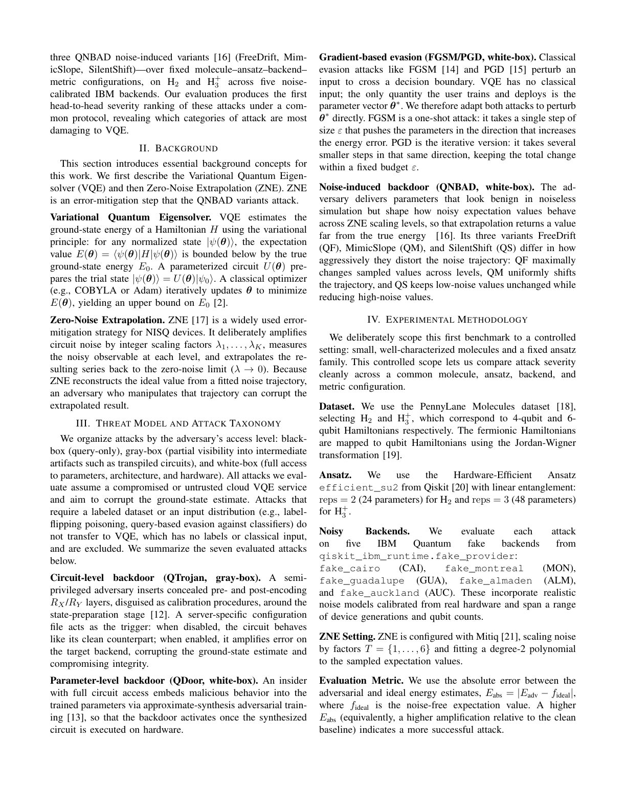
<figcaption class="paper-figure-caption"><b>Fig 1.</b> Low-resolution page preview, page 2</figcaption>
</figure>
<figure class="paper-figure-card">
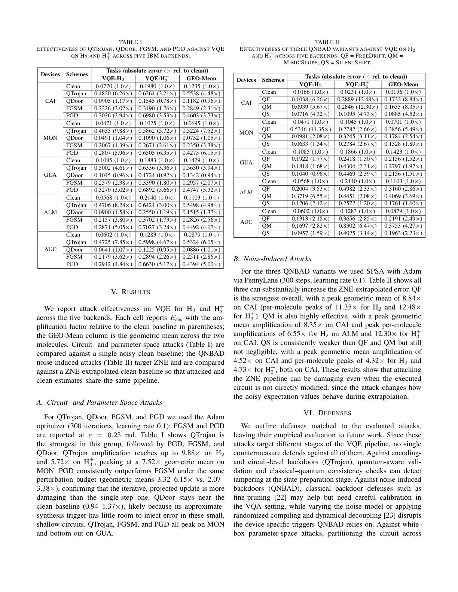
<figcaption class="paper-figure-caption"><b>Fig 2.</b> Low-resolution page preview, page 3</figcaption>
</figure>
<figure class="paper-figure-card">
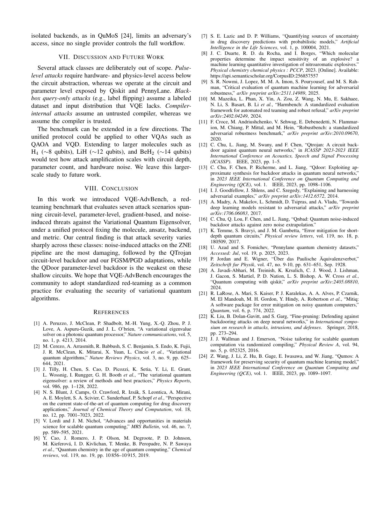
<figcaption class="paper-figure-caption"><b>Fig 3.</b> Low-resolution page preview, page 4</figcaption>
</figure>

**Summary.** This paper introduces VQE-AdvBench, the first comprehensive benchmark for testing adversarial robustness in Variational Quantum Eigensolver (VQE) algorithms. By systematically applying various attacks—including noise manipulation targeting Zero-Noise Extrapolation—the authors reveal a clear hierarchy of risk. They conclude that manipulating the error mitigation pipeline is the most severe threat to VQE accuracy.

**Why it may be interesting.** This work provides crucial benchmarking for quantum algorithm security, which is vital for the practical deployment of quantum chemistry and materials science simulations on noisy hardware.

Detailed structure

**Main problem.** The study addresses the security vulnerability of Variational Quantum Eigensolver (VQE) algorithms when deployed in cloud-based services, making them susceptible to adversarial attacks from compromised components or malicious users.

**Main result.** Noise-induced attacks that manipulate the Zero-Noise Extrapolation (ZNE) pipeline are found to be the most damaging, causing up to an 8.84$	imes$ error amplification, surpassing circuit-level backdoors like QTrojan.

**Method.** The authors introduce VQE-AdvBench, a unified red-teaming benchmark that systematically evaluates seven representative attacks (including backdoor and noise variants) across black-, gray-, and white-box access models.

**Model / system.** The primary model is the Variational Quantum Eigensolver (VQE), used to estimate molecular ground-state energies for $	ext{H}_2$ and $	ext{H}_3^+$. The evaluation is performed across five noise-calibrated IBM quantum backends.

**Key observables.** Absolute error ($E_{	ext{abs}} = |E_{	ext{adv}} - E_{	ext{ideal}}|$) and relative error amplification factor compared to the clean baseline.

**Important parameters / regimes.** Molecule ($	ext{H}_2$, $	ext{H}_3^+$), ansatz (Hardware-Efficient Ansatz), five specific noise-calibrated IBM backends, and attack parameters like $\epsilon$ for FGSM/PGD.

**Assumptions / limitations.** The benchmark is scoped to a controlled setting with fixed molecules and ansatz families to ensure a clean comparison of attack severity across different vulnerability types.

**Figures summary.** Table I compares the effectiveness (absolute error and relative amplification) of QTrojan, QDoor, FGSM, and PGD. Table II details the performance of three noise-induced attacks ($	ext{QF}, 	ext{QM}, 	ext{QS}$) on the ZNE pipeline.

**Paper structure.** The paper establishes the security gap in VQE evaluation by introducing VQE-AdvBench. It then systematically tests various attack types (circuit backdoors, parameter perturbations, noise manipulation) under a unified protocol to quantify their relative severity.

Abstract

The Variational Quantum Eigensolver (VQE) is a leading algorithm for estimating molecular ground-state energies on near-term quantum hardware, with applications spanning quantum chemistry, materials science, and drug discovery. As VQE workloads are increasingly deployed through cloud-based ``VQE-as-a-service'' pipelines, they become exposed to adversaries such as compromised service components, malicious co-tenants, or insiders in the transpilation stack, any of which can corrupt results before they reach the user. A range of attacks on variational quantum circuits has been proposed, but each has been studied in isolation: some on quantum classifiers with accuracy-based metrics, others on variational quantum algorithms with energy-error metrics. This lack of a common evaluation setup makes their relative severity difficult to compare and leaves the security of VQE poorly characterized. In this work, we present \textbf{VQE-AdvBench}, the first unified red-teaming benchmark for the Variational Quantum Eigensolver, systematizing these attacks under a single evaluation protocol to rigorously assess VQE's adversarial robustness. We organize attacks along a black-, gray-, and white-box access taxonomy, and evaluate seven representative attack scenarios -- the QTrojan circuit backdoor, the QDoor parameter backdoor, parameter-space adaptations of FGSM and PGD, and three QNBAD noise-induced variants -- over a fixed molecule-ansatz-backend-metric configuration, on H$_2$ and H$_3^+$ across five noise-calibrated IBM backends. Our results reveal a clear severity ordering: noise-induced attacks that manipulate the Zero-Noise Extrapolation (ZNE) pipeline are the most damaging (up to 8.84$\times$ error amplification), followed by the QTrojan circuit-level backdoor (7.52$\times$), while the QDoor parameter-level backdoor is the least effective, yielding only marginal amplification (up to 1.37$\times$).

[↑ back to top](#top)

### [Manifest charge-transfer physics in T$^\prime$-La$_2$NiO$_4$](http://arxiv.org/abs/2607.19217v1)

**Authors:** Wiktoria Lewandowski, Steffen Bötzel, Ilya M. Eremin, Frank Lechermann  
**Type:** theory · **Category:** strongly correlated electrons · **PDF:** <https://arxiv.org/pdf/2607.19217v1>  
**Analysis basis:** full PDF text, analyzed in chunks
**Topic relevance:** `Keldysh / 2PI / non-Gaussian methods` **1/5** · `Kondo & dissipative impurity` **1/5** · `analog quantum simulation` **1/5** · `methods for driven-dissipative` **1/5**

↔ Scroll figures horizontally

<figure class="paper-figure-card">
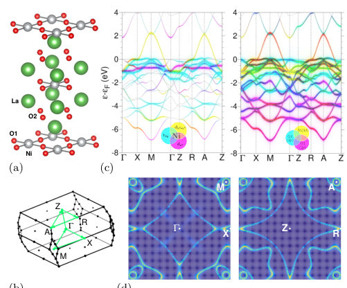
<figcaption class="paper-figure-caption"><b>Fig 1.</b> FIG. 1. Basic characterization of tetragonal T′-La2NiO4. (a) Crystal structure with La (green), Ni (grey) as well as O1 and O2 (both red) sites. (b) Brillouin zone (BZ) with path along high-symmetry lines. (c) DFT band structure in two fat- spec representations, with spectral weights according to (left panel) Ni-dx2−y2 (yellow), Ni-dz2 (pink) and Ni-t2g (cyan); (right panel) according to Ni(3d) (yellow), O1(2p) (pink) and O2(2p) (cyan). (d) DFT Fermi surface in kz = 0 (left panel) and kz = 1/2 (right panel) plane.</figcaption>
</figure>
<figure class="paper-figure-card">
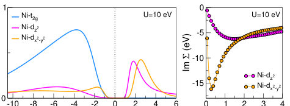
<figcaption class="paper-figure-caption"><b>Fig 2.</b> FIG. 2. Spectral data for T′-La2NiO4 from DFT+sicDMFT. (a) U-dependent total spectral function (inset: low-energy blow up). (b-d) Results for U = 10 eV: (b) total and pro- jected k-integrated spectral function, (c) local Ni(3d) spectral function, and (d) imaginary part of the Ni-eg self-energy in Matsubara space.</figcaption>
</figure>
<figure class="paper-figure-card">
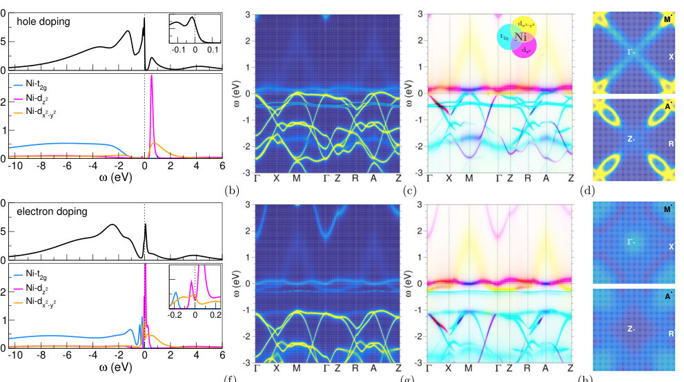
<figcaption class="paper-figure-caption"><b>Fig 3.</b> FIG. 3. Spectral data for doped T′-La2NiO4 (doping level δ = 0.2) from DFT+sicDMFT with U = 10 eV: (a-d) hole doping, (e-h) electron doping. (a,e) Total spectral function with low-energy blow up as inset (upper panel) and local Ni(3d) spectral function (lower panel). (b,f) k-resolved spectral function along high-symmetry lines, and (c,g) same using Ni(3d) fatspec representation. (d,h) Interacting Fermi surface in kz=0 plane (upper panel) and kz = 1/2 plane (lower panel).</figcaption>
</figure>
<figure class="paper-figure-card">
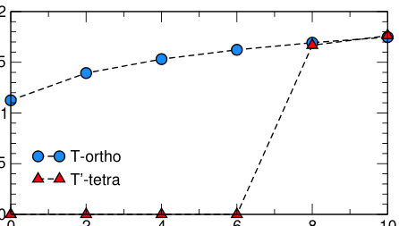
<figcaption class="paper-figure-caption"><b>Fig 4.</b> FIG. 4. Nearest-neighbor antiferromagnetic-ordered Ni mo- ment within DFT+U for La2NiO4 in the orthorhombic T (blue color) and the tetragonal T′ (red color) structure.</figcaption>
</figure>

**Summary.** This theoretical study analyzes the electronic structure of a hypothetical nickelate polymorph, T'-La2NiO4. Using advanced many-body techniques, the authors predict it is a charge-transfer insulator analogous to cuprates. The work details how doping affects carrier localization between oxygen and nickel orbitals, providing new insights into correlated layered materials.

**Why it may be interesting.** While focused on solids, the methodology of using DMFT/SIC to model correlated insulators with clear orbital differentiation is highly relevant for understanding strongly interacting quantum systems in general.

Detailed structure

**Main problem.** The study investigates charge-transfer physics in the hypothetical T'-La2NiO4 polymorph, drawing parallels with established cuprate superconductors.

**Main result.** The T'-structure is predicted to be a manifest charge-transfer insulator with a cuprate-like gap of ~1.8 eV, exhibiting doping-dependent carrier asymmetry between O(2p) and Ni-d states.

**Method.** First-principles many-body theory calculations incorporating correlation effects via the DFT+SIC-DMFT approach were employed.

**Model / system.** The system is single-layer nickelate oxide, La2NiO4, modeled using a five-orbital Slater-Hamiltonian parameterized by Hubbard U and Hund exchange J. It compares the T' structure to the bulk T structure.

**Key observables.** Charge gap energy, local orbital occupations (Ni 3d), spectral functions (projected vs. local), and magnetic ordering moments.

**Important parameters / regimes.** Correlation strength (U), charge transfer energy (Delta), doping level ($\delta$), and temperature ($T=200$ K).

**Assumptions / limitations.** The use of DFT+SIC-DMFT formalism to capture strong electronic correlations, and the comparison relies on structural analogies with known cuprates.

**Figures summary.** Figures illustrate crystal structures, band dispersions showing orbital contributions, Fermi surfaces for doped states (hole/electron), and magnetic moments comparing T vs. T' structures.

**Paper structure.** The paper establishes the physical motivation by comparing to cuprates, details the theoretical framework using DFT+DMFT, presents results on charge-transfer insulating nature and doping asymmetry, and contrasts the magnetic ordering between the two polymorphs (T vs. T').

Abstract

The La$_2$NiO$_4$ compound stabilizes in nature in the so-called T structure with octahedral oxygen coordination of the Ni site. Motivated by a similarly existing polymorph for La$_2$CuO$_4$ in the cuprate system, we here study La$_2$NiO$_4$ in the T$^\prime$-structure with square-planar oxygen coordination of Ni by means of first-principles many-body theory. The hypothetical T$^\prime$-La$_2$NiO$_4$ compound turns out to be a manifest charge-transfer insulator with a cuprate-like charge gap of $\sim 1.8$ eV. Upon doping, a strong carrier asymmetry is revealed, i.e. while holes dominantly enter O$(2p)$-derived states, electrons may become itinerant majorly within effective Ni-$d_{x^2-y^2}$ states. Nearest-neighbor antiferromagnetic ordering at stoichiometry appears absent in the T$^\prime$ structure, in stark contrast to the strong antiferromagnetism in the T structure. Our theoretical study opens up new pathways for correlation physics in layered nickelates with challenging charge-transfer signatures, awaiting experimental inquiries.

[↑ back to top](#top)

### [Asymptotic behaviour of the derivative expansion in the ERG](http://arxiv.org/abs/2607.18397v1)

**Authors:** Tim R. Morris  
**Type:** theory · **Category:** statistical mechanics · **PDF:** <https://arxiv.org/pdf/2607.18397v1>  
**Analysis basis:** full PDF text, analyzed in chunks
**Topic relevance:** `Keldysh / 2PI / non-Gaussian methods` **1/5** · `analog quantum simulation` **1/5** · `driven-dissipative phase transition` **1/5**

↔ Scroll figures horizontally

<figure class="paper-figure-card">
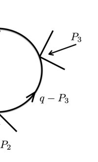
<figcaption class="paper-figure-caption"><b>Fig 1.</b> Figure 4.1: The one-loop six-point vertex. By momentum conservation P1 + P2 + P3 = 0.</figcaption>
</figure>
<figure class="paper-figure-card">
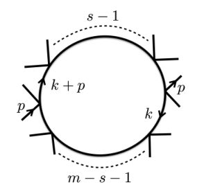
<figcaption class="paper-figure-caption"><b>Fig 2.</b> Figure 5.1: One-loop Feynman diagrams that contribute to Γ1(p, −p, 02m−2). The unlabelled ex-</figcaption>
</figure>
<figure class="paper-figure-card">
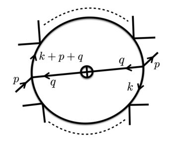
<figcaption class="paper-figure-caption"><b>Fig 3.</b> Figure 5.2: A two-loop Feynman diagram contribution to the flow of the (2m −2)-point vertex</figcaption>
</figure>
<figure class="paper-figure-card">
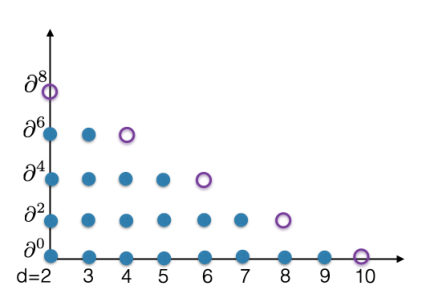
<figcaption class="paper-figure-caption"><b>Fig 4.</b> Figure 5.3: The filled circles give the dimensions d in which six-point 2r-derivative operators</figcaption>
</figure>
<figure class="paper-figure-card">
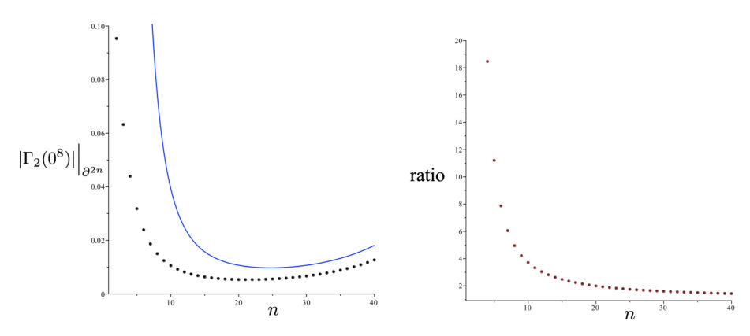
<figcaption class="paper-figure-caption"><b>Fig 5.</b> Figure 5.4: The graph on the left displays the magnitude of derivative expansion contributions,</figcaption>
</figure>

**Summary.** This theoretical paper rigorously demonstrates that approximating the exact renormalization group flow using a derivative expansion results in a divergent series. However, it establishes that this divergence implies the series is asymptotic, meaning accurate physical predictions can still be extracted by summing up to a specific optimal number of terms before the breakdown occurs.

**Why it may be interesting.** While focused on QFT methods, understanding the limitations and convergence radii of systematic approximations like derivative expansions is crucial for developing reliable non-perturbative tools applicable in complex many-body systems studied by AMO physicists.

Detailed structure

**Main problem.** The paper investigates the convergence properties of applying the derivative expansion technique within the functional renormalization group (ERG) flow equation.

**Main result.** It proves that the derivative expansion is a divergent series in any dimension for both exponential and general smooth cutoffs, but it behaves as an asymptotic series.

**Method.** The authors use perturbative calculations involving one-, two-, and three-loop contributions to analyze how derivatives ($\partial^{2n}$) appear in the effective action approximation.

**Model / system.** The analysis is performed using massless lambda phi^4 theory, a standard model in quantum and statistical field theory studied via FRG techniques.

**Key observables.** Convergence behavior of the derivative expansion series; $eta$-functions and self-energies ($\Gamma(p, -p)$).

**Important parameters / regimes.** Spacetime dimension (d); loop order ($\ell$); number of derivatives ($2n$).

**Assumptions / limitations.** The analysis assumes the use of an additive IR cutoff function for the FRG flow equation.

**Paper structure.** The paper develops arguments by analyzing loop contributions and comparing convergence rates across different vertex types (2-point, 4-point, etc.) to establish the asymptotic nature of the expansion.

Abstract

We show that the derivative expansion of the exact (functional) renormalization group is a divergent series in any dimension, both for an exponential cutoff and more general smooth cutoffs. We prove this by showing that within massless $λ\varphi^4$ perturbation theory, such divergences arise first at two loops. From several lines of theoretical argument and by analysing infinite classes of two- and three-loop contributions, we conclude that the derivative expansion is an asymptotic series that initially converges towards the exact result before divergent behaviour takes over.

[↑ back to top](#top)

### [Lower Bounds on Spectral Gaps of Parent Hamiltonians via Tensor Networks](http://arxiv.org/abs/2607.19078v1)

**Authors:** Milán Ádám Rozmán, András Molnár, Norbert Schuch  
**Type:** theory · **Category:** strongly correlated electrons · **PDF:** <https://arxiv.org/pdf/2607.19078v1>  
**Analysis basis:** full PDF text, analyzed in chunks
**Topic relevance:** `analog quantum simulation` **1/5** · `entanglement & information structure` **1/5** · `methods for driven-dissipative` **1/5**

↔ Scroll figures horizontally

<figure class="paper-figure-card">
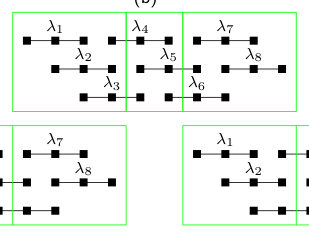
<figcaption class="paper-figure-caption"><b>Fig 1.</b> Figure 1: Illustration of Lemma 1 and Lemma 2 for n = 3, p = 4, q = 2. (a) The spin chain is blocked into alternating blocks of p and q sites, respectively. The (translation invariant) blocked Hamiltonian ˜h˜ı acts on two consecutive p-blocks and the q-block inbetween, and contains all original n-body Hamiltonian terms hi of HN = P hi which lie inside that region with a strictly positive weight λω (with ω the offset). (b) Lemma 1: Summation of all blocked terms, ˜HM = ˜h˜ı, must give the original Hamiltonian HN (or something smaller). This implies that the weights λω of the hi which are contained in overlapping ˜h˜ı must sum up to 1 (or, again, something smaller). In the concrete example in...</figcaption>
</figure>
<figure class="paper-figure-card">
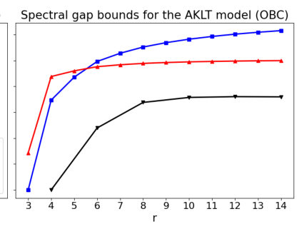
<figcaption class="paper-figure-caption"><b>Fig 2.</b> Figure 2: Lower bounds on the spectral gap for the AKLT chain, obtained with different methods, plotted vs. the computational cost (exponential in r, namely, computing the spectral gap of a matrix of size 3r), for PBC (left) and OBC (right), with shared y axis. We compare our bounds to those obtained with the FNW method, upon which our method is built, as well as two finite-size criteria, the Knabe bound and the Gosset-Mozgunov bound (where the latter only applies to PBC). See text for details.</figcaption>
</figure>
<figure class="paper-figure-card">
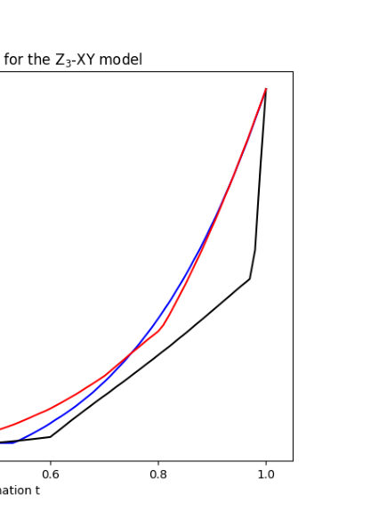
<figcaption class="paper-figure-caption"><b>Fig 3.</b> Figure 3: Comparison of gap bounds obtained by our method vs. a variant of Nachtergaele’s martingale method (Appendix B, Theorems 8 and 9) and a modification of Knabe’s method for OBC [16]. The intervals in which the different methods yield a non-zero bound on the gap are 0.4775 &lt; t &lt; 2.0944 (martingale method), 0.5310 &lt; t &lt; 1.8832 (Knabe method), and 0.3374 &lt; t &lt; 2.9638 (our method, with (p, q) = (5, 0)). The kink shown in the curve obtained through our method around t ≈0.81 can be explained from the fact that for 0.81 ≲t ≤1, the choice (p, q) = (1, 0) yields the best bound, while for t ≲0.81, r = 2p + q = 10 provides the best bound, where p and q vary. The kinks observed in the result...</figcaption>
</figure>

**Summary.** This paper presents significant methodological improvements to calculating lower bounds on the spectral gap of parent Hamiltonians derived from Matrix Product States. By introducing an efficient method to compute local ground space overlaps, the authors provide stronger quantitative bounds that outperform existing techniques. This work is vital for theoretically characterizing the stability and gapped nature of quantum many-body systems modeled by MPS.

**Why it may be interesting.** The rigorous bounding of spectral gaps is crucial for understanding the stability and correlation decay in strongly correlated quantum materials described by tensor network representations.

Detailed structure

**Main problem.** The central difficulty is deriving rigorous, quantitative lower bounds on the spectral gap of parent Hamiltonians associated with Matrix Product States (MPS).

**Main result.** The authors improve the martingale method by devising an efficient technique to compute the overlap of local ground spaces, yielding stronger quantitative lower bounds for the spectral gap.

**Method.** They revisit and enhance the Fannes-Nachtergaele-Werner martingale method, utilizing a new formalism that transforms the key overlap calculation into a fixed-dimension eigenvalue problem.

**Model / system.** The study focuses on parent Hamiltonians ($H_N$) constructed from MPS tensors. These models are used to characterize quantum many-body systems whose ground states are efficiently represented by MPS.

**Key observables.** Spectral Gap ($\Delta$), Overlap of local ground spaces, Bond Dimension ($D$).

**Important parameters / regimes.** Bond Dimension ($D$), Interaction range ($n$), Blocking size/length ($\ell$ or $r$).

**Assumptions / limitations.** The analysis assumes the MPS structure is 'well-behaved' and relies on specific properties of normal or block-normal tensors.

**Paper structure.** The paper progresses by first establishing the general difficulty, then detailing the improved martingale method for computing gap bounds, followed by applying this to specific MPS structures (like block-normal) and deriving explicit spectral gap inequalities.

Abstract

Proving spectral gaps above the ground space is a central problem in quantum many-body physics. Yet, finding lower bounds on the gap is notoriously difficult. We revisit the martingale method, originally developed by Fannes, Nachtergaele, and Werner [Fannes '92, Nachtergaele '96] to prove the existence of spectral gaps of parent Hamiltonians of Matrix Product States (MPS), and provide improvements to the different steps of the method. Most importantly, we devise a new technique which allows to compute the key quantity in the martingale method -- the overlap of local ground spaces -- exactly and efficiently. This enables a clear improvement of the method, allowing it to outperform other existing techniques to lower bound gaps, which we demonstrate by benchmarking on several models. Remarkably, our -- numerically motivated -- approach at the same time also yields a significantly simplified proof of the fact that parent Hamiltonians of any (well-behaved) MPS are always gapped.

[↑ back to top](#top)

### [Magnetic exchange interactions in the molecular orbital spin system NaV2O5 from a distributed moment point of view](http://arxiv.org/abs/2607.19224v1)

**Authors:** Claudio Garcia, Ilteris K. Turan, Swagata Acharya, Mark van Schilfgaarde, Jerome Jackson, Walter R L. Lambrecht  
**Type:** theory · **Category:** strongly correlated electrons · **PDF:** <https://arxiv.org/pdf/2607.19224v1>  
**Analysis basis:** full PDF text, analyzed in chunks
**Topic relevance:** `Keldysh / 2PI / non-Gaussian methods` **1/5** · `analog quantum simulation` **1/5** · `spintronics-quantum-optics interface` **1/5**

↔ Scroll figures horizontally

<figure class="paper-figure-card">
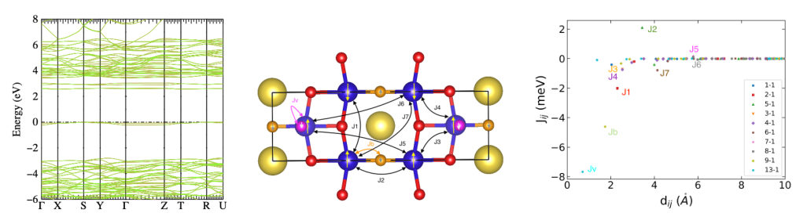
<figcaption class="paper-figure-caption"><b>Fig 1.</b> Fig. 1: Properties of Pmmn NaV2O5:(a) Electronic band structure, (b) Pmmn crystal structure with spin ordering and labeling of exchange interactions (blue spheres V, yellow Na, red Oc, magenta Ov, orange Ob (figure made with VESTA3 software [20], (c) Exchange interactions as function of distance.</figcaption>
</figure>
<figure class="paper-figure-card">
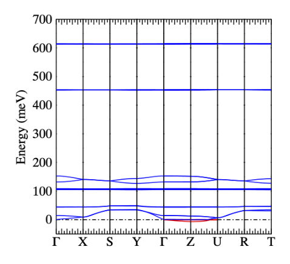
<figcaption class="paper-figure-caption"><b>Fig 2.</b> Fig. 2: Spin waves dispersion in NaV2O5 Pmmn.</figcaption>
</figure>

**Summary.** This work investigates the magnetic exchange interactions in NaV2O5 by treating it as a molecular orbital spin system using a distributed moment approach. By calculating couplings via GW band structures, the authors show that oxygen-mediated interactions are vital for accurately predicting the material's critical temperature. The results provide insights into the complex interplay between metal centers and lattice oxygens in determining magnetic ordering.

**Why it may be interesting.** While focused on solid-state magnetism, the detailed calculation of effective Hamiltonians from first principles and the analysis of collective excitations (spin waves) are relevant for understanding quantum dynamics in strongly correlated systems.

Detailed structure

**Main problem.** The study aims to understand the magnetic exchange interactions within NaV2O5, particularly focusing on the behavior above the charge disproportionation temperature.

**Main result.** The paper finds that exchange interactions involving oxygen sites are crucial, being of a similar magnitude and even larger than direct V-V interactions, which is necessary for correctly estimating the critical Néel temperature.

**Method.** Exchange interactions are calculated using a linear response approach based on quasiparticle-self-consistent GW band structures to derive a classical Heisenberg type Hamiltonian.

**Model / system.** The system is NaV2O5, treated as a molecular orbital spin system where magnetism arises from doping into the V2O5 conduction band. The analysis employs a distributed moment approach assigning spins to individual atomic sites, including oxygen atoms.

**Key observables.** Magnetic moments ($\mu_B$), exchange interactions ($J_{a,b}$), mean-field Néel temperature ($T_{	ext{N}}^{	ext{MF}}$), and spin wave spectra (including high-energy optic modes).

**Important parameters / regimes.** Critical Temperature ($\sim 320 \pm 50 	ext{ K}$), magnetic moments on V, O$_v$, and O$_b$.

**Assumptions / limitations.** The use of a classical Heisenberg model is assumed based on adiabatic decoupling; the analysis focuses on the high-temperature regime above charge disproportionation.

**Figures summary.** Figures illustrate the electronic band structure, the crystal structure with spin ordering and labeled exchange interactions, and the dependence of exchange interactions on distance.

**Paper structure.** The paper progresses from establishing the physical model (distributed moment view) to calculating exchange couplings using GW methods. It then derives a Heisenberg Hamiltonian and uses it to predict magnetic properties like $T_{	ext{N}}$ and spin wave excitations.

Abstract

The magnetism in NaV2O5 results from doping of the narrow split-off conduction band of V2O5, which becomes half-filled and leads to a Mott-insulating splitting of spin resolved bands with anti-ferromagnetic order of the spins along the zigzag chains. In the Pmmn structure the spin of this S = 1/2 system is equally shared between two vanadium atoms, residing in a molecular orbital type state. While below 34 K a charge disproportionation occurs into V4+ and V5+, the situation above this temperature is less clear and amounts to a fluctuating moment with equal probability of occupancy of each V. While traditionally described as a quarter-filled ladder system with electron spin localized on the rungs of the ladder, we here take a distributed moment approach in terms of the spin density lumped into individual atomic magnetic sites, including the small induced moments on the oxygen atoms. Exchange interactions are calculated between these sites using a linear response approach based on quasiparticle-self-consistent GW band structures. Surprisingly we find the exchange interactions between the small magnetic moments induced on the vanadyl and bridge oxygen sites to be of the same order of magnitude and even larger than the exchange interactions between vanadium atoms. Their role in the critical temperature is found to be crucial. The spin wave spectra obtained from this classical Heisenberg type Hamiltonian extracted from first-principles contains unusual optic spin wave type collective excitations of high energy.

[↑ back to top](#top)

### [Nishimori Threshold Estimation for Bayesian Inference and $\mathbb{Z}_q$ Surface Code Decoding](http://arxiv.org/abs/2607.18374v1)

**Authors:** Rohit Mukherjee, Simon Trebst  
**Type:** theory · **Category:** disordered systems and neural networks · **PDF:** <https://arxiv.org/pdf/2607.18374v1>  
**Analysis basis:** full PDF text, analyzed in chunks
**Topic relevance:** `Keldysh / 2PI / non-Gaussian methods` **1/5** · `analog quantum simulation` **1/5** · `driven-dissipative phase transition` **1/5**

↔ Scroll figures horizontally

<figure class="paper-figure-card">
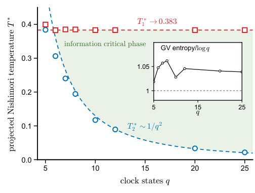
<figcaption class="paper-figure-caption"><b>Fig 1.</b> Figure 1. Nishimori thresholds for Zq clock models. Shown are the two transition temperatures T ∗ 1,2 of the two subsequent Nishimori transitions of the Zq clock model as a function of q. While the upper temperature saturates at T ∗ 1 →0.3832 (dotted), the lower projected Nishimori temperature is found to follow T ∗ 2 ≃A/q2 (dashed). The inset shows the GV self duality condition plotted as function of q which, ideally, should be 1. For more discussion see Appendix B.</figcaption>
</figure>
<figure class="paper-figure-card">
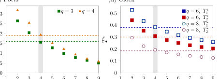
<figcaption class="paper-figure-caption"><b>Fig 2.</b> Figure 2. Threshold as a function of replica number R. For the variety of models of Table I, we plot the Nishimori threshold estimate as a function of Replica count that we use for our Fourier– Walsh projection. Consistently, we find that the R = 4 estimate (highlighted by the gray bars) matches the existing numerical values (dashed horizontal lines).</figcaption>
</figure>
<figure class="paper-figure-card">
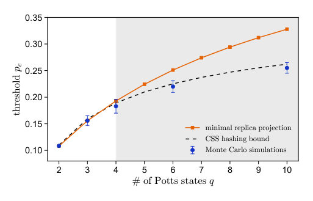
<figcaption class="paper-figure-caption"><b>Fig 3.</b> Figure 3. Nishimori thresholds for q-state Potts models. Compar- ison of error correction thresholds obtained by the Hashing bound, our MRP estimations and numerical results [27, 64]. The shaded re- gion q ≥5 indicates the regime where the clean Potts transition is first-order, outside the validity of the projection construction.</figcaption>
</figure>
<figure class="paper-figure-card">
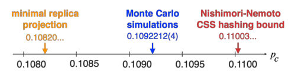
<figcaption class="paper-figure-caption"><b>Fig 4.</b> Figure 4. Threshold comparison for the 2D surface code. Shown are the estimates obtained from our projection method, large-scale Monte Carlo simulations [22], coinciding CSS-hashing [33] and Nishimori–Nemoto [65] values. The latter two fall onto the same point because both conditions reduce to H2(p) = 1</figcaption>
</figure>
<figure class="paper-figure-card">
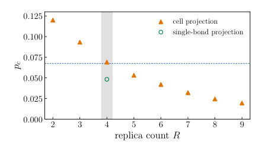
<figcaption class="paper-figure-caption"><b>Fig 5.</b> Figure 5. Threshold for hexagonal lattice geometry. We plot the error correction threshold across for honeycomb lattice as a function of replica count R that we use for our Fourier–Walsh projection.</figcaption>
</figure>

**Summary.** This work develops an analytical framework to estimate error thresholds in quantum error correction codes and Bayesian inference problems. It achieves this by projecting critical points from clean models onto their disordered Nishimori counterparts using Fourier-Walsh techniques. The resulting formulas provide accurate, closed-form estimates for a wide range of stabilizer codes, offering deep theoretical insight into noise resilience.

**Why it may be interesting.** The connection between quantum error correction thresholds (a physical problem) and the analytical tools of disordered statistical mechanics (like Nishimori points) provides a powerful theoretical bridge for understanding fault tolerance limits.

Detailed structure

**Main problem.** The paper aims to provide analytical estimates for error thresholds in quantum error correction and Bayesian inference problems.

**Main result.** A Fourier-Walsh projection scheme is introduced that yields closed-form estimates for these thresholds, accurately reproducing known numerical results for various disordered models like Ising and $\mathbb{Z}_q$ codes.

**Method.** The core method involves using a minimal replica theory approach combined with a Fourier-Walsh projection to map the critical point of a clean statistical mechanics model onto its Born-disordered Nishimori critical point.

**Model / system.** The analysis applies to quantum error correction codes, specifically $\mathbb{Z}_q$ surface codes (mapped to the $q$-state clock model), as well as general disordered spin systems like Ising and Potts models on lattices.

**Key observables.** Error threshold ($\beta_{\text{Nishimori}}^c$), critical temperatures ($T^*_1, T^*_2$), and the satisfaction of the Gilbert-Varshamov self-dual entropy relation.

**Important parameters / regimes.** Measurement precision $\gamma$, Potts variable $q$ (especially $q \ge 5$), and spatial dimension $d$.

**Assumptions / limitations.** The method relies on projecting the exact replicated single-bond weight using a minimal replica ansatz, which is highly successful but has limitations for first-order transitions ($q \le 4$).

**Figures summary.** Tables compare projection-based threshold estimates against numerical benchmarks for various disordered models (RBIM, RPGM, Potts, $\mathbb{Z}_q$ clock).

**Paper structure.** The paper develops the analytical framework by first analyzing the general mapping via Fourier-Walsh projection in the context of Bayesian inference. It then applies this scheme systematically to specific lattice models, detailing results for Ising, Potts ($q=3, 4$), and extending to $\mathbb{Z}_q$ clock models, culminating in discussions about multiple BKT transitions.

Abstract

In quantum error correction, the error threshold provides essential quantitative guidance for the ability to bring about fault-tolerance through decoding the effects of incoherent noise, weak measurement or inference. However, the numerical value of an error threshold is typically only accessible through large-scale numerical simulations of the underlying noise model. Here we introduce an analytical estimate of error thresholds falling into the Nishimori universality class via a Fourier--Walsh projection scheme that maps the critical point of the underlying disorder-free statistical-mechanics model to the Born-disordered Nishimori critical point. Using a minimal replica theory approach, this closed-form estimate is obtained from a projection of the exact replicated single-bond weight which we find to reproduce (within a percentage point) the known numerical thresholds of random-bond and random-plaquette Ising models / $\mathbb Z_2$ stabilizer codes in spatial dimensions $d=2-5$, and extends to Potts variables with $q\le4$. The main application of our projection scheme is to $\mathbb Z_q$ surface codes, whose decoding problem maps to the disordered $q$-state clock model. For $q\ge5$ the clean clock model has \textit{two} Berezinskii--Kosterlitz--Thouless transitions, which the projection maps to two Nishimori temperatures that bound an intermediate information-critical phase. The resulting threshold values not only accurately agree with recent decohered-$\mathbb Z_q$-toric-code numerics, but are found to satisfy the Gilbert--Varshamov self-dual entropy relation $\ln q \simeq H_q(T_1^\ast)+H_q(T_2^\ast),$ although no duality condition is imposed in the construction. Our approach thereby points to a deeper connection between the clean and Born-disordered models, while allowing for instant analytical estimates of error thresholds for a variety of stabilizer codes.

[↑ back to top](#top)

### [Sixteen-State Energy Mapping for First-Principles Four-Spin Ring Exchange: Validation on $La_2CuO_4$ and $SrFeO_2$](http://arxiv.org/abs/2607.18986v1)

**Authors:** Xavier Rocquefelte, Peter Blaha  
**Type:** theory · **Category:** strongly correlated electrons · **PDF:** <https://arxiv.org/pdf/2607.18986v1>  
**Analysis basis:** full PDF text, analyzed in chunks
**Topic relevance:** `analog quantum simulation` **1/5** · `exotic spin models in light-matter` **1/5** · `spintronics-quantum-optics interface` **1/5**

↔ Scroll figures horizontally

<figure class="paper-figure-card">
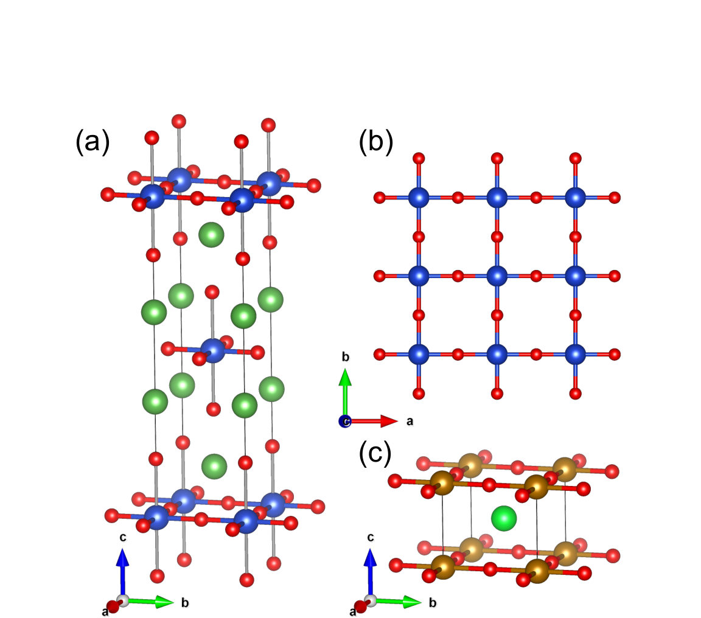
<figcaption class="paper-figure-caption"><b>Fig 1.</b> Figure 1: The two test materials. (a) T-phase La2CuO4 (K2NiF4 type, I4/mmm; Cu blue, O red, La green). Each Cu sits at the centre of a Jahn–Teller elongated CuO6 octahedron, the apical oxygen lying along c, and the CuO2 layers are stacked body-centred. (b) A CuO2 layer viewed along c: the Cu ions form a square lattice bridged by oxygen, so that the nearest-neighbor coupling proceeds through a 180◦Cu–O–Cu superexchange path. Four such Cu and the four bridging O define the Cu4O4 plaquette on which the ring exchange of Fig. 2 circulates. (c) Infinite-layer SrFeO2 (P4/mmm; Fe gold, O red, Sr green). Here there is no apical oxygen: the Fe(II) is square-planar coordinated, a coordination...</figcaption>
</figure>
<figure class="paper-figure-card">
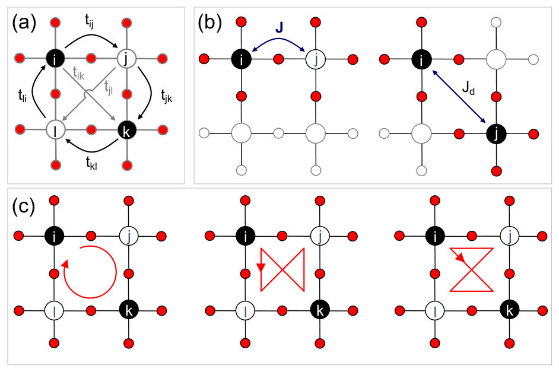
<figcaption class="paper-figure-caption"><b>Fig 2.</b> Figure 2: Origin and structure of the four-spin ring exchange on a square plaquette. (a) The four sites i, j, k, l of a nearest-neighbor plaquette, with the edge hopping integrals tij, tjk, tkl, tli and the diagonal hoppings tik, tjl of the underlying Hubbard model; cyclic circulation of the electrons around this loop generates Jring at fourth order in the hopping, Jring ∝t4/U 3,8,9 where t is the transfer integral between neighboring magnetic sites and U the on-site Coulomb repulsion. (b) The bilinear couplings retained in Eq. (1): the nearest- neighbor exchange J along a plaquette edge and the next-nearest-neighbor exchange Jd along a plaquette diagonal. (c) The three spin pairings...</figcaption>
</figure>
<figure class="paper-figure-card">
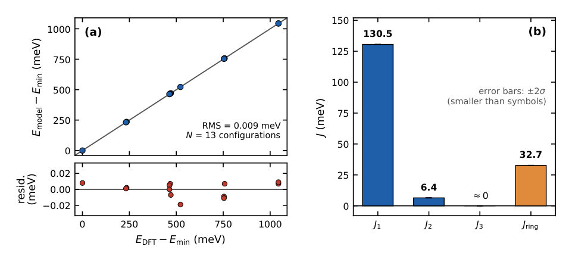
<figcaption class="paper-figure-caption"><b>Fig 3.</b> Figure 3: Energy mapping for T-La2CuO4 in the 2 × 2 × 1 supercell. (a) Model energies against DFT energies for the 13 inequivalent collinear configurations, both measured from the lowest-energy state. The line is y = x, not a fit to the points. The residuals, plotted below on a scale four orders of magnitude finer, lie within ±0.02 meV and give an RMS of 0.009 meV over an energy range of more than 1 eV, so the spin model of Eq. (1) reproduces the first-principles energies essentially exactly. (b) The couplings extracted from that fit: the nearest-neighbor exchange J1, the next-nearest-neighbor J2, the interlayer J3, and the four-spin ring coupling Jring. Error bars are ±2σ from the...</figcaption>
</figure>
<figure class="paper-figure-card">
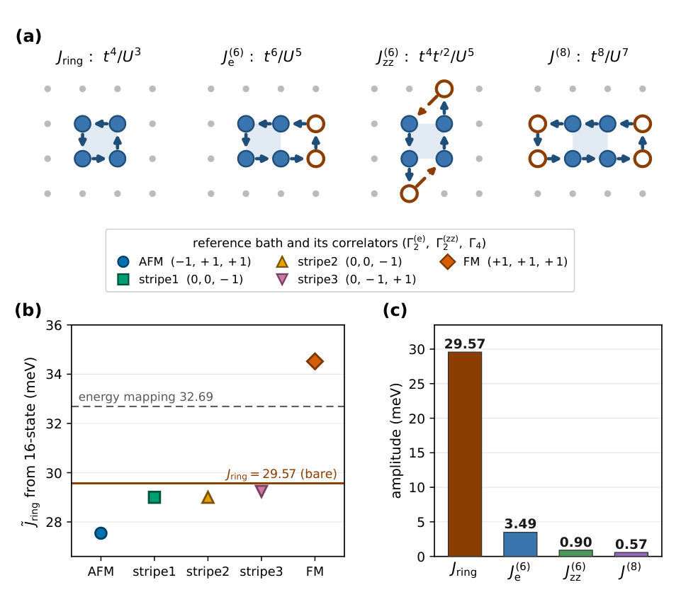
<figcaption class="paper-figure-caption"><b>Fig 4.</b> Figure 4: Bath decomposition of the sixteen-state extraction for T-La2CuO4. (a) The loop families of Eq. (13) on the square lattice: plaquette spins filled, bath spins open; solid bonds are nearest-neighbor hops t, dashed bonds diagonal hops t′; the shaded square is the probed plaquette. Of the eight-spin family only the largest, pure-t loop is shown. (b) The measured ˜Jring(ref) for the five reference baths (the legend gives each bath’s correlator triple; AFM denotes the N´eel bath), against the bare Jring = 29.57 meV of Eq. (13) (solid line) and the energy-mapping value (dashed). stripe2 repeats stripe1’s flanking signature with the out-of-plane bath Cu reversed, so the model predicts the...</figcaption>
</figure>
<figure class="paper-figure-card">
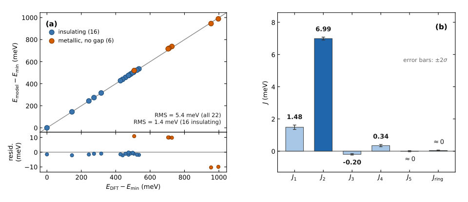
<figcaption class="paper-figure-caption"><b>Fig 5.</b> Figure 5: Energy mapping for SrFeO2: 2×2×2 supercell, 10×10×10 k-mesh, 22 inequivalent collinear configurations, tetrahedron integration. (a) Model energies against DFT energies, both referred to the lowest configuration, with the residuals below. The six configurations whose gap closes (Table 4) are drawn in orange, the sixteen insulating ones in blue: the metallic configurations carry all the large residuals, near ±10 meV where every insulating configuration lies within ±2.1 meV (RMS 1.4 meV for the blue points); a refit restricted to the sixteen insulating configurations reaches 0.50 meV (see text). The origin of the poorer SrFeO2 fit is thus visible at a glance: gap closure, not a...</figcaption>
</figure>

**Summary.** The paper introduces a sixteen-state energy mapping technique to extract the crucial four-spin ring exchange coupling ($J_{	ext{ring}}$) from first-principles calculations. By applying this method to $	ext{La}_2	ext{CuO}_4$ and $	ext{SrFeO}_2$, the authors demonstrate that $J_{	ext{ring}}$ is a significant, quantifiable term in the magnetic Hamiltonian for cuprates. This advances our understanding of correlated magnetism by providing a systematic way to measure multi-spin interactions.

**Why it may be interesting.** This work provides a rigorous computational tool to quantify higher-order spin interactions ($J_{	ext{ring}}$) in strongly correlated materials, which are essential for understanding high-temperature superconductivity mechanisms beyond simple Heisenberg models.

Detailed structure

**Main problem.** To develop a direct, local first-principles method for extracting the four-spin ring exchange coupling ($J_{	ext{ring}}$), which is crucial for understanding cuprates and other square-lattice magnets.

**Main result.** The sixteen-state energy mapping successfully isolates $J_{	ext{ring}}$, showing quantitative agreement on $	ext{La}_2	ext{CuO}_4$ ($J_{	ext{ring}}/J_1 = 0.25$) while providing a negative control using $	ext{SrFeO}_2$ ($J_{	ext{ring}}/J = 0.006$).

**Method.** The authors generalize the four-state method to a sixteen-state scheme by calculating total energies for all collinear spin configurations on a plaquette, allowing $J_{	ext{ring}}$ to be isolated via weighted summation.

**Model / system.** The study applies to correlated magnetic insulators like $	ext{La}_2	ext{CuO}_4$ and $	ext{SrFeO}_2$, modeling interactions within a nearest-neighbor plaquette using an effective Hubbard model Hamiltonian.

**Key observables.** $J_{	ext{ring}}$ (four-spin coupling), $J$ (nearest-neighbor exchange), and the ratio $J_{	ext{ring}}/J$.

**Important parameters / regimes.** The calculation relies on DFT energies from collinear GGA+U calculations, with results validated by comparing multiple independent extraction routes.

**Assumptions / limitations.** The method assumes that the system can be accurately described by an effective Hamiltonian involving pair and ring exchange terms derived from a $t/U$ expansion; it also notes limitations regarding biquadratic terms.

**Figures summary.** Figures illustrate the materials ($	ext{La}_2	ext{CuO}_4$, $	ext{SrFeO}_2$) and show that spin models can reproduce DFT energies with high accuracy for $	ext{La}_2	ext{CuO}_4$.

**Paper structure.** The paper introduces the need for $J_{	ext{ring}}$, details the sixteen-state energy mapping technique, validates it on $	ext{La}_2	ext{CuO}_4$ by comparing multiple routes and correcting previous estimates, and uses $	ext{SrFeO}_2$ as a negative control.

Abstract

Four-spin ring (cyclic) exchange $J_{ring}$ is an essential ingredient of the Heisenberg spin Hamiltonian of cuprates and other square-lattice magnets, yet it has lacked the kind of direct, local first-principles extraction that the four-state method provides for bilinear exchange, $J$. We supply it by generalizing that method to a sixteen-state ($2^4$) scheme. Symmetry reduces the sixteen configurations to six or eight inequivalent energies, so the cost is modest. The derivation also shows that the conventional four-state magnetic coupling, $J$, is itself ring-renormalized, by $\pm 2 J_{ring} S^2$ with the sign set by the reference state. T-La$_2$CuO$_4$ confirms this quantitatively: three independent routes agree on $J_{ring}$ to $0.2\%$, giving $J_{ring}/J_1 = 0.25$, and a four-state $J_1$ quoted without naming its reference is wrong by $12\%$ in this material. The direct sixteen-state extraction itself proves reference-dependent, the Néel and ferromagnetic baths bracketing the mapping value: a fourth-order fingerprint of interactions beyond the pair-plus-ring model, which additional reference baths resolve into a bare $J_{ring}$ and a converging tower of six- and eight-spin loop couplings. SrFeO$_2$ ($S = 2$), with the same plaquette yet $J_{ring}/J = 0.006$, provides the negative control: a plaquette is necessary for ring exchange, far from sufficient. The complete workflow, including the band-gap and local-moment diagnostics that certify any such extraction, is implemented in the openly available Mag4 package, so that $J_{ring}$ costs no more effort to obtain than $J$.

[↑ back to top](#top)

### [Theory of two-dimensional Wigner crystals with defects: Interactions, melting transitions and collective modes](http://arxiv.org/abs/2607.18477v1)

**Authors:** Paweł Matus, Tobias Holder  
**Type:** theory · **Category:** strongly correlated electrons · **PDF:** <https://arxiv.org/pdf/2607.18477v1>  
**Analysis basis:** full PDF text, analyzed in chunks
**Topic relevance:** `Frenkel-Kontorova` **1/5** · `Keldysh / 2PI / non-Gaussian methods` **1/5** · `analog quantum simulation` **1/5**

↔ Scroll figures horizontally

<figure class="paper-figure-card">
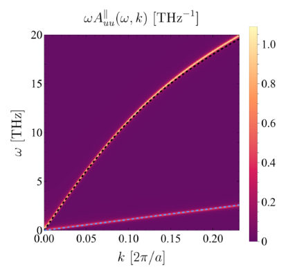
<figcaption class="paper-figure-caption"><b>Fig 1.</b> Figure 2. Spectral function of the longitudinal mode u ∥k at ρv = 0.06n0. The spectral function is defined as A∥ uu(ω) = −π−1Im[G∥ uu(ω −iγ)], where G∥(ω) is the Green’s function matrix for the longitudinal u ∥k sector of the action (43) and γ is the imaginary part of the self energy. To illustrate the relative spectral weight of the two modes, we set a constant γ = 1011 Hz. The thin black dashed line follows ωplasm(k), and the think blue dashed line follows ωph(k) in Eq. (44). We stress that the quasiparticle decay rate γ is chosen arbitrarily, but the spectral weight of the modes does not depend on γ. In particular, we do not consider the particle-hole continuum effects.</figcaption>
</figure>
<figure class="paper-figure-card">
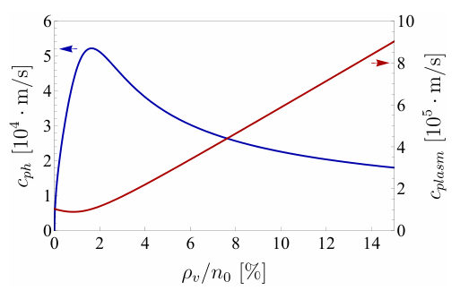
<figcaption class="paper-figure-caption"><b>Fig 2.</b> Figure 3. The speed of sound of the two modes in Eq. (44) for k ≪d−1 as a function of the relative density of holes, ν = ρv/n0. Note the different scales on the y-axes.</figcaption>
</figure>

**Summary.** This work develops a sophisticated theoretical framework using elasticity-gauge duality to model two-dimensional Wigner crystals containing various lattice defects. It systematically calculates defect interaction energies and analyzes how the presence of vacancies modifies collective excitations like phonons. The results offer measurable predictions for transport properties, linking measurements of sound speed directly to vacancy density.

**Why it may be interesting.** While focused on solid-state correlations, the development of 'fracton-elasticity duality' provides powerful mathematical tools for analyzing systems where long-range interactions couple to topological defects, which has parallels in quantum field theory applied to condensed matter.

Detailed structure

**Main problem.** To systematically study how various lattice defects (vacancies, dislocations, disclinations) affect the effective action, interaction energies, and melting transitions of two-dimensional Wigner crystals.

**Main result.** The theory provides a comprehensive framework using duality techniques to calculate defect interactions and predicts unusual phonon dispersion relations in the metallic vacancy liquid phase. This framework is applicable to other charged systems like CDWs.

**Method.** Duality techniques, specifically elasticity-gauge duality, are employed to construct an effective action incorporating elastic and electrostatic contributions from various lattice defects.

**Model / system.** The system is a two-dimensional Wigner solid (electron gas) confined between metallic gates. The model incorporates the interaction of electrons with vacancies ($
ho_{vac}$) and treats defects as sources for electromagnetic and elastic gauge fields.

**Key observables.** Phonon dispersion relation, speed of sound ($c_{ph}$), interaction energies between defect pairs, and melting temperature dependence on vacancy density.

**Important parameters / regimes.** Vacancy density ($
ho_v$), gate separation ($d$), lattice constant ($a$), and the effective mass/density of the vacancy fluid ($m_h$).

**Assumptions / limitations.** The analysis uses linear response theory, assumes parabolic dispersion for the Fermi liquid component, and often simplifies by neglecting spin degrees of freedom or assuming infinite bulk elastic moduli for certain limits.

**Figures summary.** Figure 1 illustrates the fundamental types of lattice defects: vacancies, dislocations (with Burgers vector $\mathbf{b}$), and disclinations (with Frank vector $\mathbf{F}$).

**Paper structure.** The paper builds from defining the general quadratic action incorporating elasticity and electrostatics. It then uses duality transformations to derive a dual action describing defect physics. Subsequent sections analyze specific observables like interaction energies, collective modes (phonons/plasmons), and the dynamics of the vacancy Fermi liquid.

Abstract

The physics of Wigner solids is characterized by an interplay of elasticity and long-range electrostatics, endowing crystal defects with properties distinct from those in charge-neutral crystals. Recent experiments observing lattice melting and Wigner-crystal-adjacent phases in two dimensions necessitate an examination of how defects affect the long-wavelength properties of such solids. Here, we use duality techniques to construct a comprehensive framework for studying the contribution of vacancies and interstitials, dislocations, and disclinations to the effective action of two-dimensional charged crystals. This allows for a systematic investigation of the interaction energies for the different combinations of defect pairs. We further study melting transitions due to defect proliferation, assessing and justifying some of the assumptions present in the literature. In the metallic Wigner crystal phase, characterized by a finite ground state density of vacancies, we find phonons with a dispersion relation that varies in an unusual way with the vacancy density. Consequently, we discuss how thermodynamic properties of such a vacancy Fermi liquid can be probed in measurements of the melting temperature and speed of sound. The field theory developed here can serve as a starting point in the study of anomalous Hall crystals and charge density waves with defects.

[↑ back to top](#top)

### [Conductivity of the Landau levels of two-dimensional Dirac cones and gapped nodal-rings in the quantum limit under impurity-potentials](http://arxiv.org/abs/2607.18769v1)

**Authors:** Ipsita Mandal, Sanskar Sharma  
**Type:** theory · **Category:** disordered systems and neural networks · **PDF:** <https://arxiv.org/pdf/2607.18769v1>  
**Analysis basis:** full PDF text, analyzed in chunks
**Topic relevance:** `Keldysh / 2PI / non-Gaussian methods` **1/5** · `Kondo & dissipative impurity` **1/5**

↔ Scroll figures horizontally

<figure class="paper-figure-card">
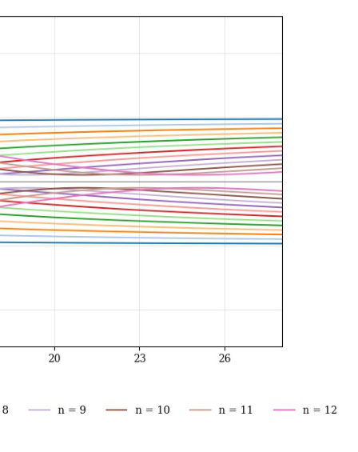
<figcaption class="paper-figure-caption"><b>Fig 1.</b> FIG. 1. LLs of GNR as functions of ρ, setting m∗= 1.0, εr = 3.0, and ∆= 0.9.</figcaption>
</figure>
<figure class="paper-figure-card">
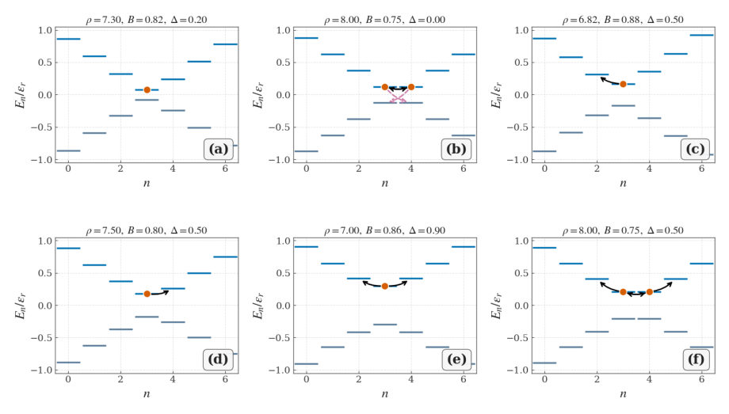
<figcaption class="paper-figure-caption"><b>Fig 2.</b> FIG. 2. Schematics illustrating the selection rules of Secs. IV B 1—IV B 4. The staircase patterns in each subfigure displays the LL spectrum as a function of n, with the orange dot indicating the LLL(s). (a) Case 1 of Sec. IV B 1: vv selection rule kills all terms. (b) Case 2 of Sec. IV B 1: pairing among the doubly-degenerate LLLs and with the neighbouring LLs (in the hole-branch) are shown via solid black (intraband, + ↔+) and dashed purple(interband, + ↔−) arrows, respectively. (c) Case 1 of Sec. IV B 2: neighboring LL is ng −1, indicated by the black arrow. (d) Case 2 of Sec. IV B 2: neighboring LL is ng + 1, indicated by the black arrow. (e) Sec. IV B 3: neighbouring LLs ng −1 and ng...</figcaption>
</figure>
<figure class="paper-figure-card">
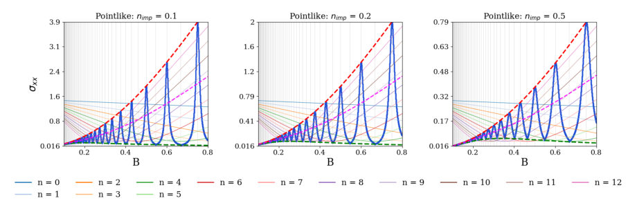
<figcaption class="paper-figure-caption"><b>Fig 3.</b> FIG. 3. GNR: σql xx (in blue) versus B for the pointlike impurity-potential. Here, we have used m∗= 1.0, εr = 3.0, and ∆= 0.9. The coloured lines in the background show the LLs (with n ∈[1, 12]) as functions of B. The grey vertical lines mark the B-values where ρ = 2 N. The dashed red and green curves indicate the upper and lower envelopes of the oscillating blue curves, which are derived by interpolating the local maxima and minima of the latter. We have also indicated the average values via the dashed magenta curves.</figcaption>
</figure>
<figure class="paper-figure-card">
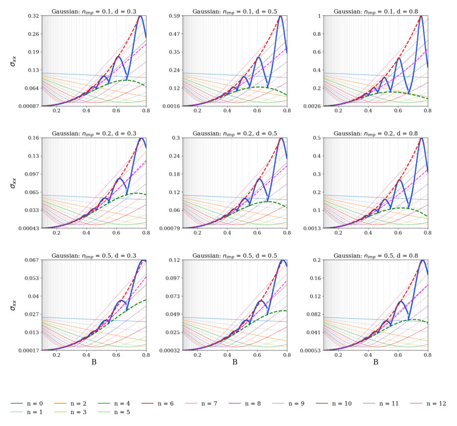
<figcaption class="paper-figure-caption"><b>Fig 4.</b> FIG. 4. GNR: σql xx (in blue) versus B for the Gaussian impurity-potential. Here, we have used m∗= 1.0, εr = 3.0, and ∆= 0.9. The coloured lines in the background show the LLs (with n ∈[1, 12]) as functions of B. The grey vertical lines mark the B-values where ρ = 2 N. The dashed red and green curves indicate the upper and lower envelopes of the oscillating blue curves, which are derived by interpolating the local maxima and minima of the latter. We have also indicated the average values via the dashed magenta curves.</figcaption>
</figure>
<figure class="paper-figure-card">
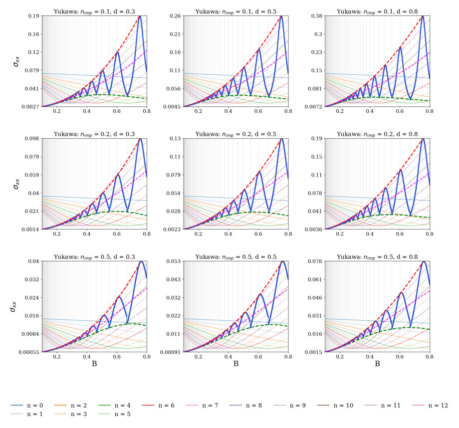
<figcaption class="paper-figure-caption"><b>Fig 5.</b> FIG. 5. GNR: σql xx (in blue) versus B for the Yukawa impurity-potential. Here, we have used m∗= 1.0, εr = 3.0, and ∆= 0.9. The coloured lines in the background show the LLs (with n ∈[1, 12]) as functions of B. The grey vertical lines mark the B-values where ρ = 2 N. The dashed red and green curves indicate the upper and lower envelopes of the oscillating blue curves, which are derived by interpolating the local maxima and minima of the latter. We have also indicated the average values via the dashed magenta curves.</figcaption>
</figure>

**Summary.** This work theoretically distinguishes the magnetotransport properties of 2D Dirac cones from those of gapped nodal-rings (GNRs) in the presence of impurities and strong magnetic fields. By applying the Kubo-Bastin formalism, the authors predict that GNRs will exhibit pronounced oscillatory behavior in both longitudinal and Hall conductivities, a signature absent in the smoothly varying response of 2D Dirac cones.

**Why it may be interesting.** The clear differentiation of transport fingerprints between two distinct topological/band structures (Dirac vs. GNR) under disorder provides a powerful theoretical tool to interpret complex magnetotransport experiments in condensed matter systems.

Detailed structure

**Main problem.** The study investigates the dc magnetoconductivity of two-dimensional Dirac cones and gapped nodal-rings (GNRs) when subjected to perpendicular magnetic fields and impurity potentials in the quantum limit.

**Main result.** The GNR exhibits distinct oscillatory transport signatures, including resonant peaks in $\sigma_{xx}$ and a sawtooth pattern in $\sigma_{xy}$, contrasting sharply with the smooth, monotonic magnetoresistivity found for 2D Dirac cones.

**Method.** The Kubo-Bastin formalism is employed to calculate transport coefficients by analyzing the Landau level spectrum derived from the respective Hamiltonians.

**Model / system.** The models include isotropic 2D Dirac cones and Gapped Nodal Rings (GNRs). The analysis considers pointlike, Gaussian, and Yukawa impurity potentials in the ultraquantum limit.

**Key observables.** Longitudinal conductivity ($\sigma_{xx}$) and Hall conductivity ($\sigma_{xy}$)

**Important parameters / regimes.** Magnetic field ($B$), dimensionless ratio $
ho = 2 \epsilon_r / \epsilon_c$, and impurity potential type (pointlike, Gaussian, Yukawa).

**Assumptions / limitations.** Calculations are performed strictly within the ultraquantum limit, assuming a single-band, non-interacting picture.

**Figures summary.** Figure 1 illustrates the LL spectrum of GNR vs. $
ho$, showing its characteristic non-monotonic 'stretched-checkmark' pattern, which dictates the transport differences from Dirac cones.

**Paper structure.** The paper first establishes the theoretical framework using Kubo-Bastin for both systems. It then derives and contrasts the resulting magnetoconductivity signatures: smooth/zero $\sigma_{xy}$ for Dirac vs. oscillatory/sawtooth $\sigma_{xy}$ for GNRs, concluding with explicit formulas for $
ho_{lx}$ based on impurity potential type.

Abstract

We investigate the dc magnetoconductivity of two-dimensional Dirac cones and gapped nodal rings (GNRs) subjected to a perpendicular magnetic field, which quantises the electronic spectrum into Landau levels (LLs). Working in the ultraquantum limit, where only the lowest LL (LLL) is partially occupied, we employ the Kubo--Bastin formalism to compute the transport coefficients for pointlike, Gaussian, and Yukawa impurity-potentials. For the Dirac case, the longitudinal conductivity is field-independent for pointlike impurities and a monotonic function of $B$ for the Gaussian and Yukawa potentials, while the Hall conductivity vanishes identically owing to the particle-hole symmetry of the two neighbouring LLs. The GNR case is qualitatively different: its non-monotonic stretched-checkmark LL spectrum causes the effective LLL to migrate to successively lower indices as the field increases, producing a pronounced oscillatory structure in both conductivities. The longitudinal response develops resonant peaks at LLL degeneracies, while the Hall conductivity traces out a sawtooth pattern with sharp zero-crossings at these same points. These results establish distinct transport fingerprints for the two systems in the extreme quantum limit, and provide a theoretical framework for interpreting magnetotransport experiments on GNRs.

[↑ back to top](#top)

### [Metric completion of the Bender--Brody--Müller Hamiltonian: dilation spectrum and missing eigenstates](http://arxiv.org/abs/2607.19067v1)

**Authors:** Kejun Liu  
**Type:** theory · **Category:** other · **PDF:** <https://arxiv.org/pdf/2607.19067v1>  
**Analysis basis:** full PDF text, analyzed in chunks
**Topic relevance:** `Keldysh / 2PI / non-Gaussian methods` **1/5** · `driven-dissipative phase transition` **1/5**

↔ Scroll figures horizontally

<figure class="paper-figure-card">
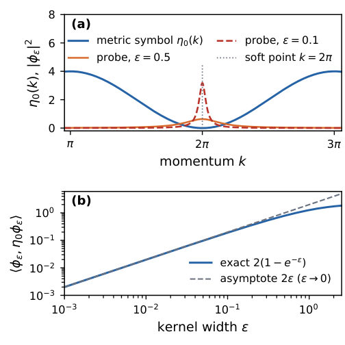
<figcaption class="paper-figure-caption"><b>Fig 1.</b> FIG. 1. Metric degeneracy of the BBM form η0 = ∆†∆in the Hardy representation. (a) Local window k ∈[π, 3π] around the soft point k = 2π: the boundary symbol η0(k) = 2(1 − cos k) vanishes quadratically at k = 2πZ, while the normal- ized Cauchy-kernel probes |ϕε|2 concentrate at the soft point as ε decreases. (b) The squared η0-norm of the unit-L2-norm probe, ⟨ϕε, η0ϕε⟩= 2(1−e−ε) (exact residue evaluation), van- ishes linearly in the small-width limit, 2(1−e−ε) = 2ε+O(ε2) as ε →0: normalized states can carry arbitrarily small metric length, i.e. η0 is not coercive.</figcaption>
</figure>

**Summary.** The paper rigorously analyzes the Hilbert space completion induced by the metric associated with the BBM Hamiltonian, a model linked to the Riemann zeta function zeros. By completing the state space in an $L^2$-based norm, the authors prove that the original candidate eigenfunctions cannot exist within this mathematically defined space. This establishes a significant mathematical obstruction to the initial physical interpretation of the BBM operator.

**Why it may be interesting.** This work provides a deep mathematical constraint on speculative quantum models derived from number theory. For theorists working on spectral problems or non-Hermitian Hamiltonians, it demonstrates how imposing standard functional analysis structures can rule out proposed physical solutions.

Detailed structure

**Main problem.** The paper analyzes the Hilbert completion induced by a candidate metric associated with the Bender--Brody--Müller (BBM) Hamiltonian, which is related to finding an operator whose spectrum yields the imaginary parts of the nontrivial zeros of the Riemann zeta function.

**Main result.** The rigorous $L^2$-based metric completion forces the state space to be equivalent to $L^2(\mathbb{R}^+)$, and this framework proves that the original BBM candidate eigenfunctions do not belong to the completed space, invalidating the initial mechanism for finding point-spectrum states.

**Method.** The analysis involves defining a pseudo-Hermitian metric $\hat{\eta}$ on the half-line $L^2(\mathbb{R}^+)$ and studying its completion. Techniques include Fourier/Mellin transforms to analyze the metric symbol, spectral theory (dilation generator), and deficiency index calculations.

**Model / system.** The model centers on the BBM Hamiltonian, formally written as $	ext{H}_{	ext{BBM}} = \Delta^{-1}D\Delta$, where $D$ is the dilation generator. The mathematical framework uses a metric completion based on $\hat{\eta} = \sin^2(\hat{p}/2) = \Delta^\dagger\Delta/4$.

**Key observables.** The spectrum of the free realization (purely continuous, $\mathbb{R}$), and the failure of the candidate eigenfunctions ($\psi_z$) to satisfy the required $L^2$ shift-difference condition.

**Important parameters / regimes.** The critical line $\operatorname{Re} z = 1/2$, and the metric degeneracy observed when analyzing the symbol $\eta_0(k) = |1 - e^{-ik}|^2$.

**Assumptions / limitations.** The primary assumption tested is that a standard $L^2$-based Hilbert completion using the candidate metric can support the required spectral structure.

**Figures summary.** Figure 1 illustrates the metric degeneracy, showing $\eta_0(k)$ vanishing at specific points and the associated norm of probe functions vanishing linearly in the small-width limit.

**Paper structure.** The paper proceeds by defining the BBM Hamiltonian and its associated metric. It then analyzes the properties of this metric completion, establishing that the resulting space is $L^2(\mathbb{R}^+)$. Finally, it tests the original physical conjecture (the existence of $\psi_z$) within this mathematically rigorous framework.

Abstract

The Bender--Brody--Müller (BBM) Hamiltonian was proposed as a non-Hermitian Hilbert--Pólya operator. We analyze the Hilbert completion induced, on the standard half-line $L^2$ core, by BBM's candidate metric $\hatη=\sin^2(\hat p/2)=Δ^\daggerΔ/4$. The form $η_0=Δ^\daggerΔ$ is positive with trivial kernel but is not coercive. Completing $C_c^\infty(0,\infty)$ in the norm $\|ψ\|_{η_0}=\|Δψ\|$ gives a Hilbert space canonically unitarily equivalent to $L^2(\mathbb R_+)$. Its free self-adjoint realization is the dilation generator, with simple, purely absolutely continuous spectrum $\mathbb R$. The analysis yields two spectral statements of interest beyond the BBM problem. First, no bounded sandwich $Δ^\dagger h(D)Δ$ is boundedly invertible. Second, the transported symmetric operator has deficiency indices $(\infty,\infty)$ and an adjoint with every real point as an eigenvalue of infinite multiplicity, while its free extension is purely continuous. The realization-independent BBM conclusion concerns the candidate eigenfunctions: $Δψ_z=x^{-z}$, so for $\operatorname{Re}z=1/2$ they do not belong to the completed space. Thus the original BBM boundary-condition/eigenfunction mechanism cannot produce point-spectrum Riemann-zero states in this $L^2$-based metric completion.

[↑ back to top](#top)

### [Quantum-Enhanced Multi-Objective Optimization](http://arxiv.org/abs/2607.18848v1)

**Authors:** Maolin Luo, Jiapei Zhuang, Zuoheng Zou, Man-Hong Yung  
**Type:** theory · **Category:** disordered systems and neural networks · **PDF:** <https://arxiv.org/pdf/2607.18848v1>  
**Analysis basis:** full PDF text, analyzed in chunks
**Topic relevance:** `analog quantum simulation` **1/5** · `exotic spin models in light-matter` **1/5**

↔ Scroll figures horizontally

<figure class="paper-figure-card">
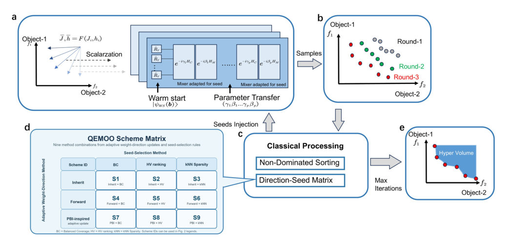
<figcaption class="paper-figure-caption"><b>Fig 1.</b> FIG. 1. Overview of the QEMOO framework. Panel a shows how the multi-objective Ising model is scalarized into a pool of single-objective subproblems and solved by QAOA circuits with transferred parameters; after the first pass, selected elite bitstrings are injected into later rounds through seed-adapted warm-start mixers. Panel b illustrates the round-wise samples in objective space, with Round-1, Round-2, and Round-3 shown in different colors. Panel c shows the classical processing block: non-dominated sorting filters accumulated samples into elite candidates, and the Direction-Seed Matrix determines how adaptive weight-direction updates and seed-selection rules are combined for the next...</figcaption>
</figure>
<figure class="paper-figure-card">
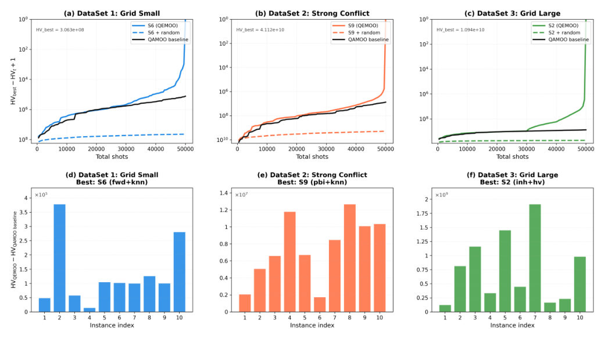
<figcaption class="paper-figure-caption"><b>Fig 2.</b> FIG. 2. Budget-normalized performance comparison and instance-level gains of the best QEMOO scheme on each benchmark dataset. The upper row reports HV-shots curves for DataSet 1: Grid Small, DataSet 2: Strong Conflict, and DataSet 3: Grid Large, respectively. Each upper-row panel compares the best QEMOO scheme for that dataset (S6, S9, or S2), the corresponding matched random-sampling variant (S6 + random, S9 + random, or S2 + random), and the single-pass QAMOO baseline of Kotil et al. [20]. Scheme IDs S1–S9 are defined by the QEMOO scheme matrix in Fig. 1. The matched random variant keeps the same adaptive weight-direction and seed-selection configuration as the corresponding QEMOO scheme...</figcaption>
</figure>
<figure class="paper-figure-card">
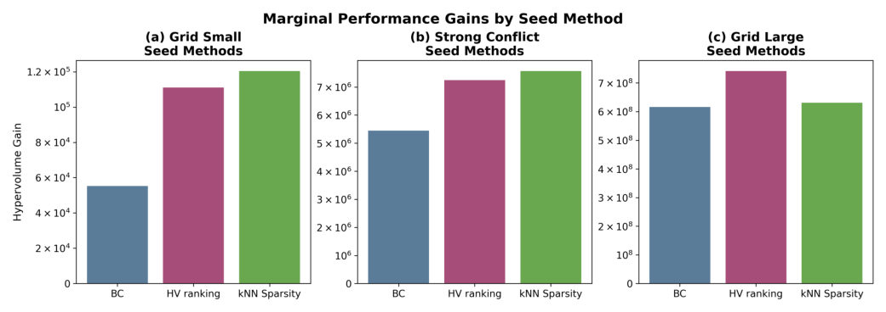
<figcaption class="paper-figure-caption"><b>Fig 3.</b> FIG. 3. Marginal Hypervolume gains of the Seed-Selection Methods in the rerun raw-HV benchmark. The three panels correspond to the Grid Small, Strong Conflict, and Grid Large benchmark stages. Each bar reports the baseline-relative HV gain averaged over the stage-appropriate Adaptive Weight-Direction Methods: Inherit and Forward for Grid Small and Grid Large, and PBI-inspired direction adaptation for Strong Conflict. This figure therefore isolates the average contribution of the Seed-Selection Method (BC, HV ranking, or kNN Sparsity), where BC denotes Balanced Coverage. It is complementary to the lower row of Fig. 2: Fig. 2 reports per-instance gains for the single best scheme in each...</figcaption>
</figure>
<figure class="paper-figure-card">
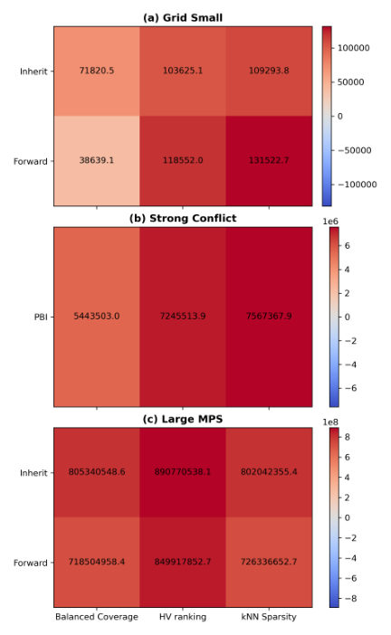
<figcaption class="paper-figure-caption"><b>Fig 4.</b> FIG. 4. Performance heatmaps detailing the hypervolume improvements across the rerun raw-HV benchmark suite: (a) Grid Small, (b) Strong Conflict, and (c) Grid Large. In each subplot, the horizontal axis delineates the Seed-Selection Methods (BC, HV ranking, kNN Sparsity), while the vertical axis lists the stage-appropriate Adaptive Weight-Direction Methods retained in the latest benchmark: Inherit and Forward for Grid Small and Grid Large, and PBI for the strong-conflict stage. Cell colors represent the mean raw Hypervolume (HV) gain relative to the 1-round baseline, with warm colors indicating positive gains and cool colors denoting regressions. The heatmaps show that the preferred...</figcaption>
</figure>
<figure class="paper-figure-card">
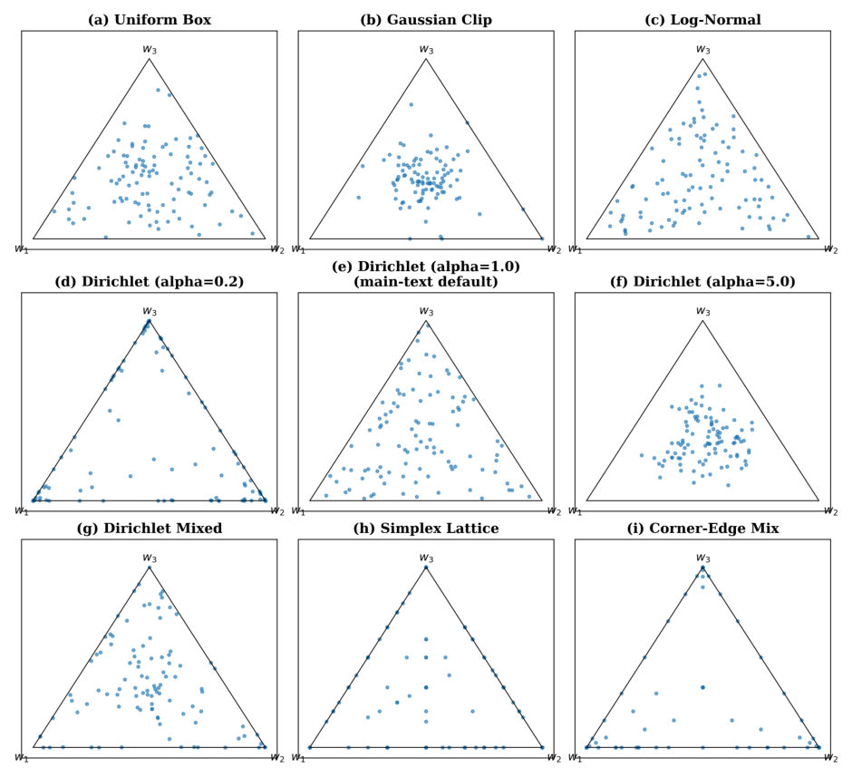
<figcaption class="paper-figure-caption"><b>Fig 5.</b> FIG. 5. Simplex-style visualization of the nine weight-pool schemes used in the latest all-9 Grid-Large analysis. Each panel is generated from the corresponding real pool file in the rerun suite, with vertex labels w1, w2, and w3 marking single-objective extremes. The figure covers normalized continuous pools (uniform box, gaussian clip, lognormal), the Dirichlet family (dirichlet sparse, dirichlet uniform, dirichlet center, dirichlet mixed), and structured designs (simplex lattice, edge pair corner mix). The dirichlet uniform panel is flagged as the main-text default pool.</figcaption>
</figure>

**Summary.** This paper introduces QEMOO, a novel multi-round quantum framework designed to tackle challenging multi-objective combinatorial optimization problems mapped onto Ising spin glasses. By iteratively refining the search using warm-started QAOA and adaptive direction updates, it achieves superior coverage of the true Pareto front compared to single-pass methods. This demonstrates a practical path toward efficient quantum computation for complex trade-off analysis.

**Why it may be interesting.** The use of QAOA on spin-glass Hamiltonians places this work directly at the intersection of quantum algorithms for optimization and disordered systems physics. The focus on iterative refinement (warm-start) is relevant to understanding how quantum search can overcome local minima in complex energy landscapes.

Detailed structure

**Main problem.** The challenge of multi-objective combinatorial optimization (MOCO), which requires finding the Pareto-optimal trade-off front among conflicting objectives.

**Main result.** The proposed QEMOO framework significantly improves the hypervolume approximation of the Pareto front compared to single-pass quantum methods, especially in resource-constrained regimes.

**Method.** QEMOO is a multi-round protocol combining Pareto-based selection with warm-started QAOA sampling and an adaptive direction update scheme inspired by PBI.

**Model / system.** The problem is mapped onto Ising spin-glass Hamiltonians, requiring the identification of trade-off solutions across multiple conflicting objectives.

**Key observables.** Hypervolume (HV) of the approximated Pareto front; Number of unique non-dominated solutions (ND).

**Important parameters / regimes.** Total shot budget ($s_{total}$); Warm-start coefficient ($c$); Bond dimension ($\chi$).

**Assumptions / limitations.** The PBI method requires linearization to maintain compatibility with the two-body Hamiltonian structure of near-term quantum processors.

**Figures summary.** Figures illustrate QEMOO's multi-round process, performance heatmaps comparing different weight pool geometries, and scaling plots showing HV gain vs. shot budget or bond dimension.

**Paper structure.** The paper introduces the MOCO problem mapped to Ising models, details the limitations of single-pass quantum approaches, proposes the QEMOO framework (multi-round protocol with adaptive updates), benchmarks its performance across various weight pool geometries and resource budgets, and analyzes the role of warm-starting.

Abstract

Multi-objective combinatorial optimization requires identifying Pareto-optimal trade-off solutions among conflicting objectives, often making it more demanding than its single-objective counterpart. Although quantum multi-objective optimization methods have begun to emerge, most existing quantum optimization workflows are still built around single-objective or fixed-scalarization settings. Building on existing weighted-sum QAOA approaches to quantum multi-objective optimization, we propose QEMOO, a quantum-enhanced multi-objective optimization framework that combines Pareto-based selection and warm-started QAOA sampling in a multi-round protocol under the same total shot budget. We further introduce a PBI-inspired adaptive direction-update scheme to improve coverage in strongly conflicting benchmark regimes. Across three benchmark stages, QEMOO improves Pareto-front hypervolume over the single-pass weighted-sum QAOA baseline under matched shot budgets, suggesting a practical route toward shot-efficient quantum-assisted multi-objective optimization and its future applications.

[↑ back to top](#top)

### [Absence of hidden analytic conserved quantities in harmonically confined rods](http://arxiv.org/abs/2607.18872v1)

**Authors:** Sahil Kumar Singh, Abhishek Dhar, Sanjay Moudgalya  
**Type:** theory · **Category:** statistical mechanics · **PDF:** <https://arxiv.org/pdf/2607.18872v1>  
**Analysis basis:** full PDF text, analyzed in chunks
**Topic relevance:** `non-equilibrium dynamics` **1/5**

↔ Scroll figures horizontally

<figure class="paper-figure-card">
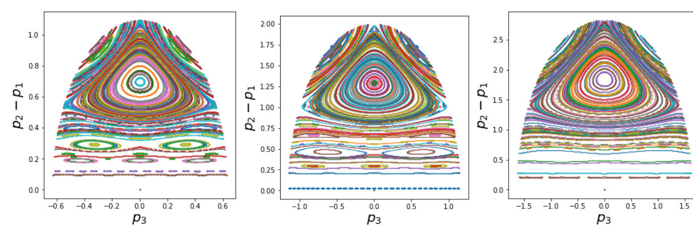
<figcaption class="paper-figure-caption"><b>Fig 1.</b> Figure 1: Poincar´e section for equal length hard rods: (a) E = 2.6, (b) E = 4, (c) E = 6. We have taken 100 different initial conditions used Ecm = 0 with rod lengths a = 1 in each of the plots.</figcaption>
</figure>
<figure class="paper-figure-card">
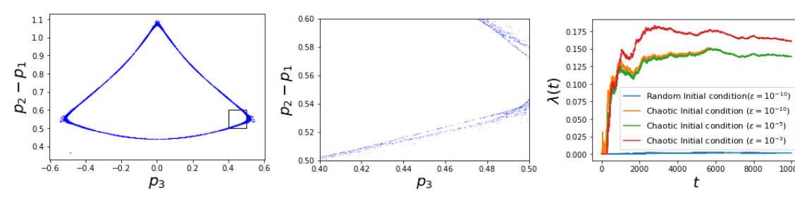
<figcaption class="paper-figure-caption"><b>Fig 2.</b> Figure 2: Chaotic trajectory: (a) Poincare section for a single initial condition (x1, x2, x3, p1, p2, p3) ≈(−1.002, 0.001, 1.001, 0, −0.545, 0.545) showing scattered points, as evident when zoomed-in on the square region as shown in (b). This is shown for a system of three rods of equal length a1 = a2 = a3 = 1, and the system has total energy E = 2.6, and center-of-mass energy Ecm = 0. (c) Time dependent Lyapunov exponent λ(t) for the chaotic trajectory in panels (a,b) using perturbations ϵ = 10−10 (orange), 10−5(green), 10−3(red), together with a randomly selected initial condition with ϵ = 10−10(blue) (τ = 1 for all four cases). The random trajectory remains near zero, whereas the...</figcaption>
</figure>
<figure class="paper-figure-card">
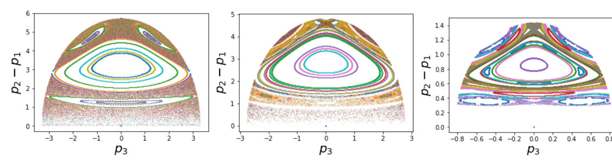
<figcaption class="paper-figure-caption"><b>Fig 3.</b> Figure 3: Poincar´e section for unequal length hard rods: (a) b1 = 1, b2 = 3.2, E = 13, Ecm = 0 (b) b1 = 0.5, b2 = 1.6, E = 7, Ecm = 0, (c) b1 = 1, b2 = 1.5, E = 2.1, Ecm = 0. The regularity of these Poincar´e sections appears to increase when the ratios of the rod lengths approaches unity.</figcaption>
</figure>

**Summary.** The paper rigorously analyzes the existence of hidden conserved quantities in hard rods confined by a harmonic trap. By imposing symmetry constraints derived from free motion and collisions, the authors demonstrate that for finite rods, only two independent conserved quantities exist. A notable exception is the point particle limit, where more integrals are found.

**Why it may be interesting.** This work provides a rigorous, systematic methodology for determining the full set of classical integrals of motion in complex interacting systems, which is foundational knowledge applicable to understanding integrability breaking in quantum many-body physics.

Detailed structure

**Main problem.** The paper investigates whether a system of hard rods confined in a harmonic trap possesses hidden analytic conserved quantities beyond the known total energy and center-of-mass energy.

**Main result.** For general hard rods, conservation laws impose symmetry constraints ($	ext{U}(1)$ and $	ext{S}_N$) that force any conserved quantity to be functionally dependent only on the two known integrals of motion. However, for point particles (zero length), a larger set of such quantities is found.

**Method.** The authors use systematic algebraic methods by requiring that potential conserved quantities must remain invariant under symmetries dictated by free motion ($	ext{U}(1)$) and collisions ($	ext{S}_N$).

**Model / system.** The system consists of $N$ hard rods of equal length confined in a one-dimensional harmonic trap. The dynamics are analyzed for free motion, elastic collisions, and the special case where all rods are point particles.

**Key observables.** Conserved quantities (integrals of motion), ergodicity, and thermalization behavior.

**Important parameters / regimes.** Harmonic trap frequency ($\omega$), rod lengths ($a_i$), number of rods ($N$).

**Assumptions / limitations.** The analysis is strictly limited to finding *analytic* conserved quantities. The comparison between finite-length rods and point particles highlights a crucial distinction in the symmetry requirements.

**Figures summary.** Not specified by the notes, but the text references Table 1 summarizing symmetry constraints for different dynamics (Free motion, Point particles, SMED & Rods with non-zero length).

**Paper structure.** The paper systematically analyzes four distinct dynamical regimes: free motion; collisions with finite rods; zero-length point particles; and Stochastic Momentum Exchange Dynamics (SMED), applying symmetry constraints in each case to determine the structure of conserved quantities.

Abstract

Systems of hard rods of equal length in a one-dimensional harmonic trap have been observed to exhibit peculiar non-ergodic behavior that might suggest the existence of a novel hidden conserved quantity beyond the two well known ones, i.e., the total energy and the center-of-mass energy. In this work, we investigate this possibility by systematically constraining the forms of the conserved quantities, and we rigorously rule out the existence of any extra hidden conserved quantity that is analytic in the positions and momenta of the rods involved. We do so by showing two key results: conservation during free motion demands the $U(1)$ invariance of these quantities under rotations of the position and momenta of each rod, and conservation during collisions demand an $S_N$ invariance under the permutation of the momenta of the rods as long as one of the rods have non-zero length. We then show that these conditions imply that any conserved quantity is functionally dependent on the two known conserved quantities. In addition, we show that in the special case where all rods have zero length (i.e., when they are point particles), conservation under collisions only requires invariance under a smaller $S_N$ group of permutations of the labels of the rods, which leads to a much larger set of analytic conserved quantities that we explicitly write down. In all, this rigorously clarifies the structure of conserved quantities in the hard rod problem, and motivates the application of such systematic methods to other classical systems.

[↑ back to top](#top)

### [Bound state solutions of the Schrödinger equation for the atomic systems interacting with the radial screened Coulomb potential: analytical approximation methods](http://arxiv.org/abs/2607.19197v1)

**Authors:** Fatma Zohra Khaled, Mustafa Moumni, Mokhtar Falek  
**Type:** theory · **Category:** other · **PDF:** <https://arxiv.org/pdf/2607.19197v1>  
**Analysis basis:** full PDF text, analyzed in chunks
**Topic relevance:** `Keldysh / 2PI / non-Gaussian methods` **1/5**

↔ Scroll figures horizontally

<figure class="paper-figure-card">
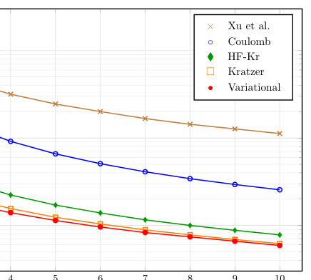
<figcaption class="paper-figure-caption"><b>Fig 1.</b> Figure 1. Relative errors (%, logarithmic scale) of the calculated energies for the first ten s states of the hydrogen atom in the RSCP at c = 0.1, measured with respect to the GPS reference values.</figcaption>
</figure>
<figure class="paper-figure-card">
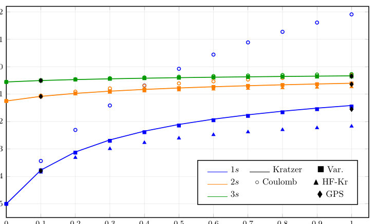
<figcaption class="paper-figure-caption"><b>Fig 2.</b> Figure 2. Comprehensive comparison of energy eigenvalues for the first three s-states (1s, 2s, 3s) of the hydrogen atom in the RSCP as functions of the screening parameter c. All methods are shown for c values from 0 to 1 with steps of 0.1. GPS reference values are shown at both c = 0.1 and c = 1.0 (diamonds). Symbols: solid lines = Kratzer reference; open circles (◦) = Coulomb reference; filled squares (■) = variational method; filled triangles (▲) = Hellmann–Feynman with Kratzer basis; filled diamonds (♦) = GPS reference.</figcaption>
</figure>
<figure class="paper-figure-card">
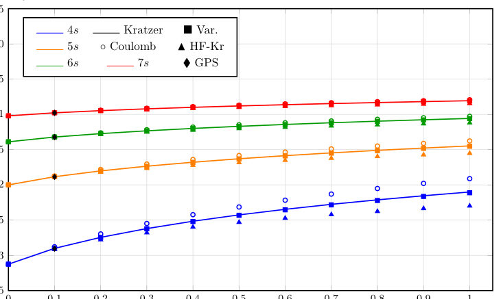
<figcaption class="paper-figure-caption"><b>Fig 3.</b> Figure 3. Comprehensive comparison of energy eigenvalues for higher excited s states (4s, 5s, 6s, and 7s) of the hydrogen atom in the RSCP as functions of the screening parameter c. All methods are shown for c values from 0 to 1 with steps of 0.1. GPS reference values are shown at c = 0.1 (diamonds). Symbols: solid lines = Kratzer reference; open circles (◦) = Coulomb reference; filled squares (■) = variational method; filled triangles (▲) = Hellmann–Feynman with Kratzer basis; filled diamonds (♦) = GPS reference.</figcaption>
</figure>
<figure class="paper-figure-card">
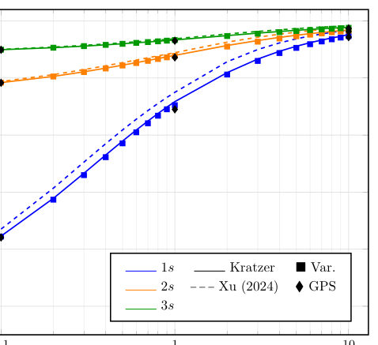
<figcaption class="paper-figure-caption"><b>Fig 4.</b> Figure 4. Comparison of the EVA with Kratzer basis (solid lines) with the asymptotic approximation of Xu et al. (2024) (dashed lines) for the first three s-states over the range 0 ≤c ≤1. Filled squares (■) show the variational results. Diamonds (♦) indicate GPS reference values at c = 0.1 and c = 1.0.</figcaption>
</figure>
<figure class="paper-figure-card">
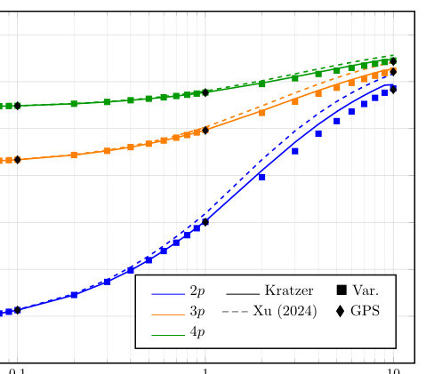
<figcaption class="paper-figure-caption"><b>Fig 5.</b> Figure 5. Comparison of the EVA with Kratzer basis (solid lines) with the asymptotic approximation of Xu et al. (2024) (dashed lines) for the p-states (2p, 3p, 4p) over the range 0 ≤c ≤1. Filled squares (■) show the variational results. Diamonds (♦) indicate GPS reference values at c = 0.1 and c = 1.0.</figcaption>
</figure>

**Summary.** This paper develops and compares three sophisticated analytical methods—expectation values, variational optimization, and the Hellmann-Feynman theorem—to determine the bound state energies of hydrogenic atoms in a screened Coulomb potential. By achieving high accuracy relative to numerical benchmarks, it provides valuable theoretical tools for understanding atomic structure within plasma diagnostics.

**Why it may be interesting.** This work provides advanced analytical tools for calculating atomic energy levels in realistic plasma environments where screening effects are crucial. The combination of multiple theoretical approaches offers robust benchmarking for complex quantum systems.

Detailed structure

**Main problem.** The study investigates the bound state properties of hydrogen-like atoms when interacting with the radial screened Coulomb potential (RSCP). The goal is to derive approximate energy eigenvalues as a function of the screening parameter.

**Main result.** The expectation value approach using the Kratzer basis achieved relative errors of 0.63% for the first ten s-states at $c=0.1$, with further improvements possible via variational methods. The formalism is general and applicable to Positronium.

**Method.** Three complementary analytical approaches are employed: expectation values using reference states (Coulomb/Kratzer), variational optimization with a scaled Kratzer basis, and the Hellmann-Feynman theorem for error estimation.

**Model / system.** The system is hydrogen-like atoms modeled by the radial Schrödinger equation subjected to the RSCP potential, $V_{RSCP}(r) = -Ze^2/r e^{-c/r}$. This potential models short-range screening effects in plasma environments.

**Key observables.** Approximate energy eigenvalues ($E_{n,l}$) as a function of the screening parameter $c$.

**Important parameters / regimes.** Screening parameter $c$, quantum numbers $(n, \ell)$, and variational parameters $eta$. The limit $c 	o 0$ recovers the standard Coulomb result.

**Assumptions / limitations.** The methods rely on using approximate wavefunctions derived from reference potentials (Coulomb or Kratzer) to evaluate expectation values of the full RSCP Hamiltonian. The Hellmann-Feynman approach requires numerical integration for certain parameters.

**Paper structure.** The paper systematically details three methods—expectation value, variational, and Hellmann-Feynman—for calculating energy eigenvalues, compares their results against high-precision data, demonstrates the general applicability to Positronium, and concludes with error analysis.

Abstract

We investigate the bound state properties of the hydrogen-like atoms in the radial screened Coulomb potential (RSCP). using three complementary analytical approaches - expectation values with Coulomb and Kratzer reference states, variational optimization with a scaled Kratzer basis, and the Hellmann-Feynman theorem - we derive approximate energy eigenvalues as function of the screening parameter c. Benchmarked against high-precision generalized pseudospectral data, the expectation value-approach with the Kratzer basis achieves relative errors of 0.63% for the first ten s-states at $c=0.1$, while the variational method improves this further. The formalism extends naturally to Positronium, demonstrating its generality for arbitrary reduced-mass systems. The complementary biases of the methods provide robust error estimation for plasma-embedded atoms.

[↑ back to top](#top)

### [MOSAIQC: Mixed-topology-aware Optimization for Scalable Approximate noise-Informed Quantum circuit Cutting](http://arxiv.org/abs/2607.18888v1)

**Authors:** Koen Mesman, Yinglu Tang, Matthias Moller, Boyang Chen, Sebastian Feld  
**Type:** theory · **Category:** quantum information and computing · **PDF:** <https://arxiv.org/pdf/2607.18888v1>  
**Analysis basis:** full PDF text, analyzed in chunks
**Topic relevance:** `methods for driven-dissipative` **1/5**

↔ Scroll figures horizontally

<figure class="paper-figure-card">
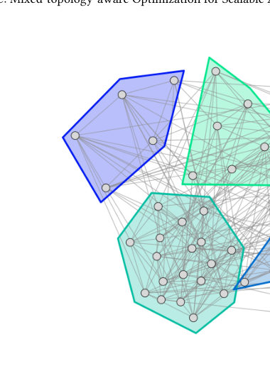
<figcaption class="paper-figure-caption"><b>Fig 1.</b> Fig. 1. Example of partition mapping by MosaiQC of smaller-capacity hardware backends to a large quantum circuit. The vertices represent qubits, and the edges represent 2-qubit gates. Each polygon represents a different quantum hardware backend.</figcaption>
</figure>
<figure class="paper-figure-card">
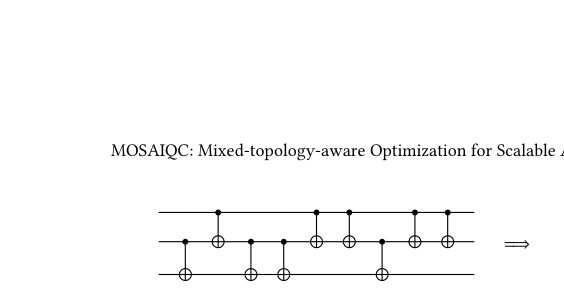
<figcaption class="paper-figure-caption"><b>Fig 2.</b> Fig. 3. Example of mixed gate and wire cut optimization.</figcaption>
</figure>
<figure class="paper-figure-card">
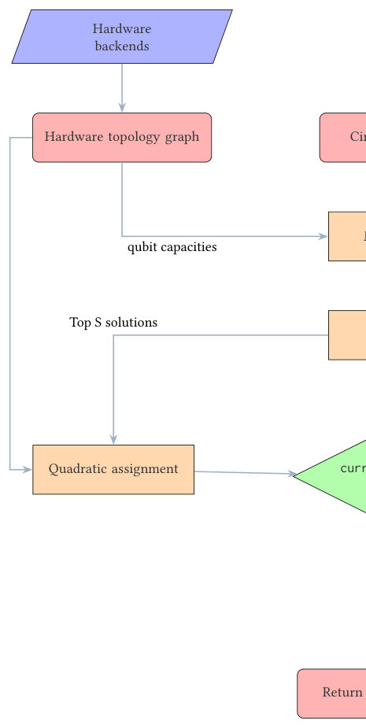
<figcaption class="paper-figure-caption"><b>Fig 3.</b> Fig. 4. Partitioning and mapping workflow of MosaiQC.</figcaption>
</figure>
<figure class="paper-figure-card">
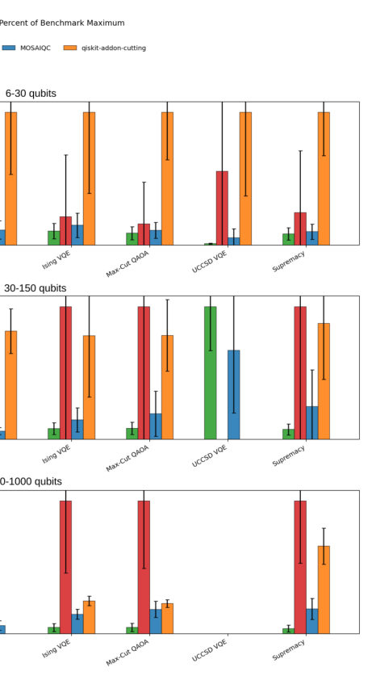
<figcaption class="paper-figure-caption"><b>Fig 4.</b> Fig. 5. Runtime comparison of MosaiQC and its subcomponents against the baseline Dijkstra algorithm (early stopping and exact), scaled as runtime/num_qubits and shown as a percentage of the highest runtime per benchmark.</figcaption>
</figure>
<figure class="paper-figure-card">
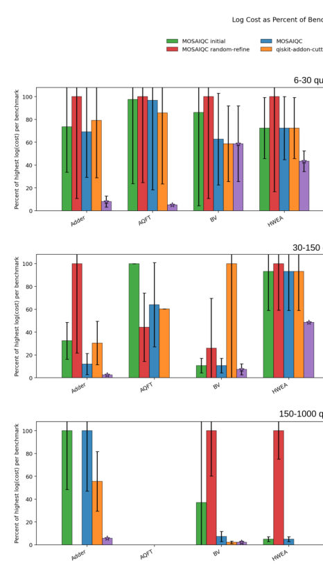
<figcaption class="paper-figure-caption"><b>Fig 5.</b> Fig. 6. Sampling overhead cost comparison of MosaiQC and its subcomponents against the baseline Dijkstra algorithm (early stopping and exact), scaled as sampling_overhead/num_qubits and shown as a percentage of the highest runtime per benchmark.</figcaption>
</figure>

**Summary.** This paper introduces MOSAIQC, a novel framework designed to overcome limitations in running large quantum algorithms on current noisy hardware by intelligently cutting and remapping circuits. It achieves this through a hybrid optimization process that jointly considers gate/wire cuts, hardware noise profiles, and sampling overhead. The results show substantial improvements in both speed and solution quality compared to existing methods.

**Why it may be interesting.** While focused on quantum computation, the rigorous development of scalable heuristic optimization techniques for resource allocation (like circuit partitioning) shares methodological parallels with optimizing complex physical simulations or network mapping in AMO physics.

Detailed structure

**Main problem.** The primary challenge is developing a scalable method for quantum circuit cutting to execute large algorithms on current, resource-limited Noisy Intermediate-Scale Quantum (NISQ) hardware.

**Main result.** MOSAIQC demonstrates superior trade-offs in run speed and solution quality by jointly optimizing sampling overhead, hardware placement, and mixed gate/wire cuts, achieving significant reductions in computational overhead.

**Method.** The framework uses a hybrid approach combining global heuristics (like METIS) for initial partitioning with local refinement optimization (Tabu Search), incorporating noise-informed cost functions.

**Model / system.** The system involves mapping large quantum circuits onto smaller, potentially heterogeneous quantum processors. The circuit connectivity and hardware topology are modeled as weighted graphs to calculate cutting costs.

**Key observables.** Local fidelity improvement (+19.56% $\pm$ 6.17%), runtime speedup ($2.88 	imes$), and massive reduction in sampling overhead ($	ext{average } 5.83 \cdot 10^{11}	imes$).

**Important parameters / regimes.** Qubit count (scaling from 6 to 1000+), cut types (gate vs. wire), hardware connectivity, and noise characteristics.

**Assumptions / limitations.** The framework assumes the ability to convert quantum circuit objects into lightweight graph structures for efficient computation; existing heuristics often fail to jointly optimize all necessary parameters.

**Figures summary.** Figures illustrate performance comparisons across various benchmark circuits (e.g., QAOA, Ising VQE) at increasing qubit scales, showing runtime and sampling overhead results for different cut placement strategies.

**Paper structure.** The paper introduces the problem of circuit cutting limitations, details the novel MOSAIQC framework using graph representations and a hybrid optimization strategy, presents specific algorithms for wire/gate cut cost calculation, and concludes with extensive comparative results across multiple scales and benchmarks.

Abstract

Current quantum computers do not yet have the required qubit resources to meet the demands of most practical quantum algorithms. To circumvent this constraint, the practice of dividing these algorithms into parts through quantum circuit cutting has been explored. Many of these works either show exponential scaling or are far from optimal solutions. In this paper, MosaiQC is presented as a novel framework to improve upon existing circuit cutting frameworks. A hybrid warmstart with refinement optimization is used to find cutting solutions, allowing the combination of both wire and gate cuts. Additionally, MosaiQC enables hardware partitions of mixed sizes. Furthermore, the refinement stage incorporates a fast approximate quadratic assignment solver to better place hardware partitions, demonstrating a mean local fidelity improvement of $19.56 \% \pm 6.17\%$ over the baseline algorithm. In runtime and sampling overhead costs, improvements of $2.88 \times$ and an average of $16.84\%$ cut reduction (resulting in an average $5.83 \cdot 10^{11} \times$ overhead reduction) are observed. MosaiQC demonstrates a superior trade-off for run speed and solution quality, while adding fundamental features excluded by most competitors. With this, MosaiQC demonstrates that scalable heuristic optimization can substantially reduce the computational overhead of circuit-cut placement for increasingly large quantum circuits.

[↑ back to top](#top)

### [The Limits of Quantum Computers for Power Flow](http://arxiv.org/abs/2607.19263v1)

**Authors:** Cameron Khanpour, Samuel Talkington  
**Type:** theory · **Category:** quantum information and computing · **PDF:** <https://arxiv.org/pdf/2607.19263v1>  
**Analysis basis:** full PDF text, analyzed in chunks
**Topic relevance:** `analog quantum simulation` **1/5**

↔ Scroll figures horizontally

<figure class="paper-figure-card">
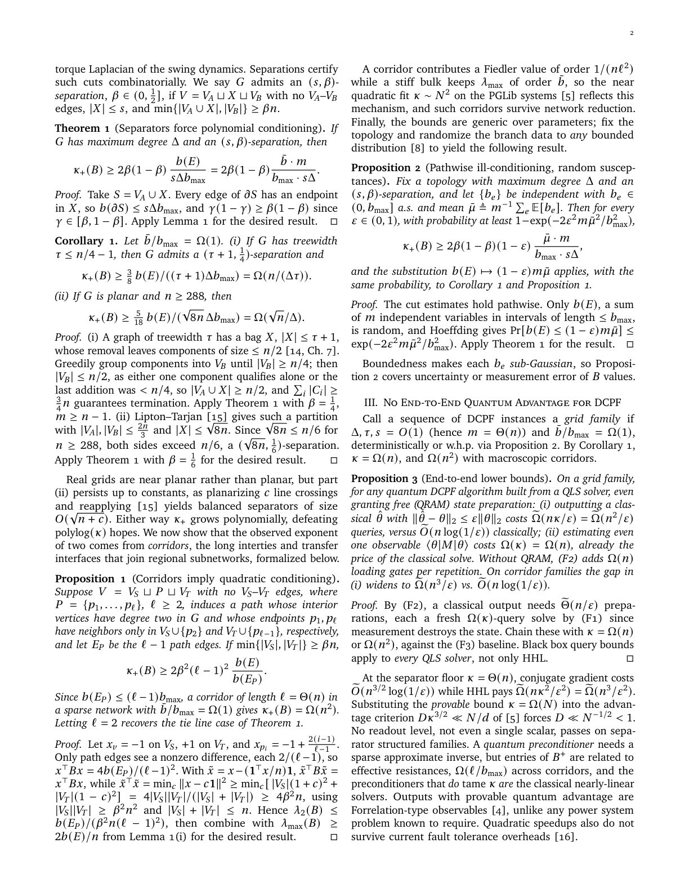
<figcaption class="paper-figure-caption"><b>Fig 1.</b> Low-resolution page preview, page 2</figcaption>
</figure>
<figure class="paper-figure-card">
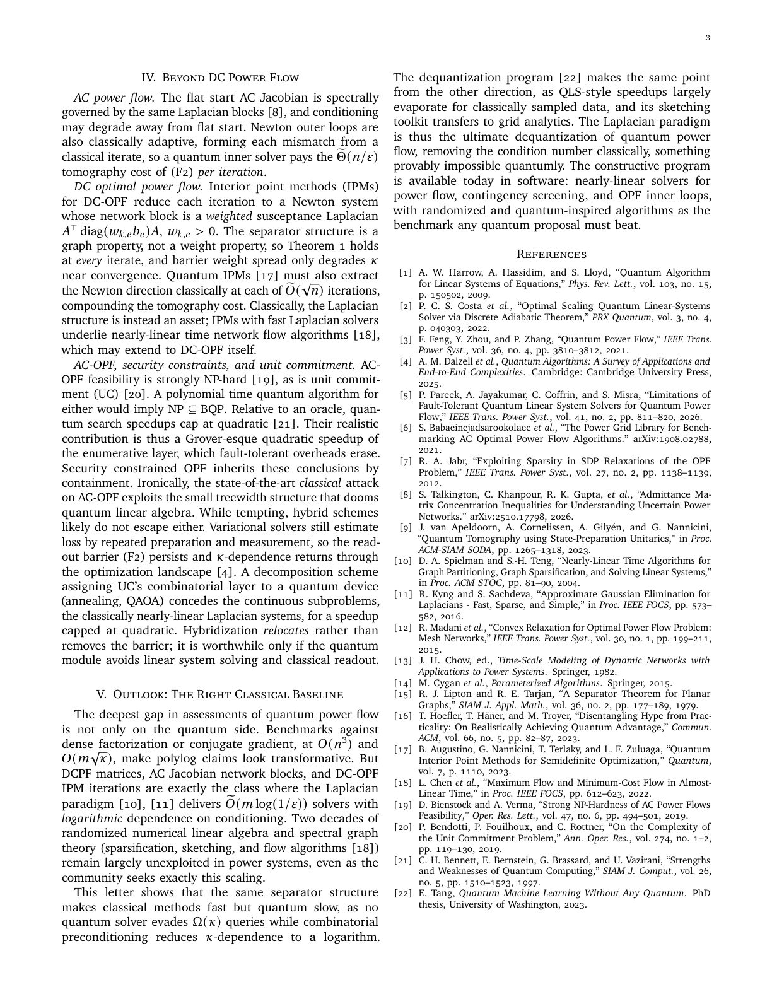
<figcaption class="paper-figure-caption"><b>Fig 2.</b> Low-resolution page preview, page 3</figcaption>
</figure>

**Summary.** This work proves that inherent topological features of real power grids cause the necessary matrices for solving power flow problems to become extremely ill-conditioned. This structural limitation forces both classical and quantum computation time requirements to scale poorly with grid size, effectively precluding a general end-to-end quantum advantage for these critical engineering tasks.

**Why it may be interesting.** While focused on electrical engineering, the core mathematical tools—analyzing computational bottlenecks via matrix conditioning and structural graph properties—are highly relevant to understanding resource limitations in simulating complex quantum many-body systems or analyzing quantum network architectures.

Detailed structure

**Main problem.** The paper investigates whether quantum computers can achieve an end-to-end computational advantage over classical methods when solving large-scale power flow problems.

**Main result.** Structural properties of realistic electrical grids, such as graph separators and long corridors, cause the underlying mathematical matrices to become severely ill-conditioned, precluding a general quantum advantage for these tasks.

**Method.** The analysis combines rigorous graph theory (analyzing network topology) with quantum complexity theory (query and readout bounds) to establish lower bounds on computational difficulty.

**Model / system.** The model is an electrical transmission network represented by graphs $G=(V, E)$, whose core mathematical structure involves the susceptance Laplacian matrix. The problems analyzed include DC/AC Power Flow, Optimal Power Flow, and Unit Commitment.

**Key observables.** Pseudo condition number ($\kappa_+(B)$), which dictates the required computational resources for solving linear systems derived from network physics.

**Important parameters / regimes.** Network size ($n$), graph separators, corridor lengths ($\ell$), and quantum complexity bounds related to $\epsilon$ (precision).

**Assumptions / limitations.** The analysis assumes that realistic grid topologies exhibit structural limitations like separators or corridors, and it proves the lack of advantage at *every* readout level.

**Paper structure.** The paper proceeds by analyzing the condition number growth based on network topology (separators vs. corridors), demonstrating that this growth forces quantum query complexity to exceed classical scaling, and then generalizing these obstructions across various power flow formulations.

Abstract

This letter proves realistic grid properties limit the applicability of quantum computers for power flow. Grids that split into two large regions meeting at only a few buses, common in transmission networks, force the pseudo condition number of the DC susceptance matrix to grow polynomially in the network size, and long chains of lines bridging such regions force quadratic growth, making recent empirical observations rigorous. The bounds also hold with overwhelming probability for arbitrary bounded random line susceptances. Combined with query and tomography lower bounds, this precludes end-to-end quantum advantage for DC power flow at every readout level, and these obstructions persist through AC power flow, optimal power flow, and unit commitment. All proofs are formally verified with accompanying Lean 4 source code.

[↑ back to top](#top)

## Other papers (3)

*Papers from primary archives without highlighted authors or any topic match. Click to expand.*

Show other papers

### [Perfect state transfer in Grover walks on normal Cayley graphs](http://arxiv.org/abs/2607.19309v1)

**Authors:** Koushik Bhakta, Bikash Bhattacharjya  
**Type:** theory · **Category:** quantum information and computing · **PDF:** <https://arxiv.org/pdf/2607.19309v1>  
**Analysis basis:** full PDF text, analyzed in chunks

↔ Scroll figures horizontally

<figure class="paper-figure-card">
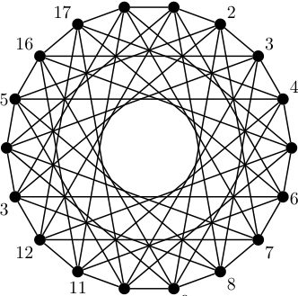
<figcaption class="paper-figure-caption"><b>Fig 1.</b> Figure 1: Two examples of periodic unitary Cayley graphs</figcaption>
</figure>

**Summary.** This paper rigorously determines the necessary and sufficient spectral conditions for Perfect State Transfer (PST) when using Grover walks on normal Cayley graphs. By applying group theory and spectral analysis, it derives explicit criteria for various families of graphs, culminating in a complete classification showing that only four unitary Cayley graphs exhibit this phenomenon.

**Why it may be interesting.** Quantum walks are fundamental models in quantum computation and quantum communication networks. Establishing precise mathematical conditions for PST provides concrete graph-theoretic tools applicable to designing robust quantum information channels.

Detailed structure

**Main problem.** The paper investigates the conditions for Perfect State Transfer (PST) occurring during Grover walks on a specific class of graphs called normal Cayley graphs.

**Main result.** A necessary and sufficient condition for PST is established, leading to complete characterizations for unitary Cayley graphs, proving that exactly four such graphs exhibit this property.

**Method.** The analysis heavily relies on spectral graph theory, utilizing the eigenvalues of a derived 'discriminant matrix' ($P$) and relating PST conditions to Chebyshev polynomials evaluated at these eigenvalues.

**Model / system.** The system models quantum walks governed by the Grover walk operator $U$ on a normal Cayley graph $	ext{Cay}(\Gamma, S)$ over a finite group $\Gamma$. The state space is defined over the symmetric arcs of this graph.

**Key observables.** Perfect State Transfer (PST) between vertices at time $	au$, and the periodicity of the quantum walk dynamics.

**Important parameters / regimes.** The structure of the underlying finite group $\Gamma$ (e.g., abelian, dicyclic, dihedral), the connection set $S$, and the time step $	au$.

**Assumptions / limitations.** The analysis is restricted to normal Cayley graphs, and the focus is on transfer between specific 'vertex-type states.'

**Figures summary.** Not specified in detail, but the notes mention Figure 1 illustrating examples of periodic unitary Cayley graphs ($G_{Z_{12}}$ and $G_{Z_{18}}$).

**Paper structure.** The paper progresses by defining PST on normal Cayley graphs, deriving general spectral conditions using representation theory (Theorem 3.4), applying these criteria to specific group structures like abelian, dicyclic, and dihedral groups, and concluding with a complete characterization for unitary Cayley graphs.

Abstract

A Cayley graph $\operatorname{Cay}(Γ,S)$ over a finite group $Γ$ is said to be normal if its connection set $S$ is a union of some conjugacy classes of $Γ$. This paper investigates perfect state transfer in Grover walks on normal Cayley graphs. The Grover walk is a widely studied discrete-time quantum walk. We establish a necessary and sufficient condition for the occurrence of perfect state transfer on normal Cayley graphs. As applications, we derive explicit spectral criteria for perfect state transfer on Cayley graphs over abelian groups, dicyclic groups, and dihedral groups. These results yield several infinite families of Cayley graphs exhibiting perfect state transfer. We further obtain simple combinatorial characterizations of the existence of perfect state transfer on Cayley graphs over dihedral and dicyclic groups. Our general characterization also recovers a number of previously known results as special cases. As a further consequence, we obtain a complete characterization of perfect state transfer on unitary Cayley graphs. In particular, we prove that exactly four graphs in the class of unitary Cayley graphs exhibit perfect state transfer.

[↑ back to top](#top)

### [Quantum Circuits for Quantum Spatial Search on $d$-Dimensional Lattices](http://arxiv.org/abs/2607.19151v1)

**Authors:** Rei Sato  
**Type:** theory · **Category:** quantum information and computing · **PDF:** <https://arxiv.org/pdf/2607.19151v1>  
**Analysis basis:** full PDF text, analyzed in chunks

↔ Scroll figures horizontally

<figure class="paper-figure-card">
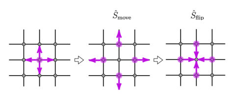
<figcaption class="paper-figure-caption"><b>Fig 1.</b> Figure 1. Definition of the flip-flop walk on a two- dimensional lattice.</figcaption>
</figure>
<figure class="paper-figure-card">

<figcaption class="paper-figure-caption"><b>Fig 2.</b> Figure 2. Schematic of the proposed quantum circuit for spatial search by a discrete-time quantum walk on a d- dimensional lattice with t = 1.</figcaption>
</figure>
<figure class="paper-figure-card">
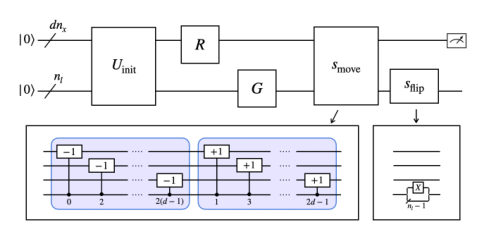
<figcaption class="paper-figure-caption"><b>Fig 3.</b> Figure 2 shows the schematic of the proposed quan- tum circuit for spatial search. The initial state for the time-evolution operator de- fined in Eq. (2) is prepared as a uniform superposition over the position and coin basis states:</figcaption>
</figure>
<figure class="paper-figure-card">
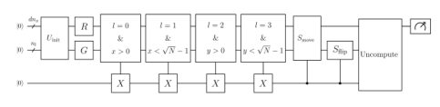
<figcaption class="paper-figure-caption"><b>Fig 4.</b> Figure 3. Quantum circuit for quantum spatial search on a d = 2 lattice with non-periodic boundary conditions. After the state preparation, each search step consists of the oracle ˆR, the coin operator ˆG, the computation of the validity flag a(x, l) into the auxiliary register |s⟩by multi- controlled X gates, and the shift operations ˆSmove and ˆSflip controlled on the auxiliary register.</figcaption>
</figure>
<figure class="paper-figure-card">
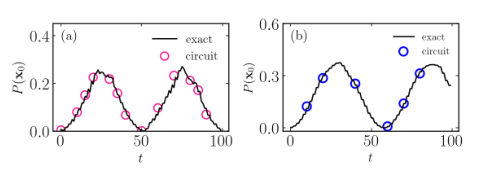
<figcaption class="paper-figure-caption"><b>Fig 5.</b> Figure 4. Time evolution of the success probability P(x0) at the target site in the quantum spatial search. (a) d = 2 lattice corresponding to the square lattice with periodic boundary conditions and N = 256. (b) d = 3 lattice corresponding to the cubic lattice with periodic boundary conditions, where each side has length 8 and N = 512. The solid line represents the exact value obtained by classical simulation, while the open circles indicate results from a quantum circuit simulation, with 1000 measurements per data point.</figcaption>
</figure>

**Summary.** This paper develops an explicit quantum circuit implementation for performing spatial search using discrete-time quantum walks on $d$-dimensional lattices. By decomposing the complex shift operator into basic gates, they achieve resource estimates showing logarithmic width growth and polynomial depth scaling ($O(\sqrt{N})$ to $O(\sqrt{N}(\log N)^{3/2})$). The results offer a practical roadmap for realizing such search algorithms on quantum hardware.

**Why it may be interesting.** This work provides a concrete, implementable quantum algorithm framework for search problems on structured lattices, directly connecting abstract quantum walk theory to near-term hardware constraints like gate depth and error rates.

Detailed structure

**Main problem.** The paper develops an explicit quantum circuit for performing spatial search on $d$-dimensional lattices using discrete-time quantum walks.

**Main result.** They provide a practical framework, including circuits that reproduce theoretical dynamics for periodic and non-periodic boundaries, with depth scaling analyzed as $O(\sqrt{N}(\log N)^{3/2})$ for 2D and $O(\sqrt{N})$ for 3D.

**Method.** The core method involves decomposing the quantum walk operator ($\hat{W} = \hat{S}\hat{C}$) into implementable quantum gates, specifically using coin-controlled modular arithmetic operations to simulate the shift operator $\hat{S}$.

**Model / system.** The model is a discrete-time quantum walk on $d$-dimensional lattices (2D square and 3D cubic), where the state space includes both position $|x
angle$ and internal direction/coin state $|l
angle$. The search process incorporates an oracle ($\hat{R}$) marking the target site.

**Key observables.** Success probability $P(x_0)$, circuit width ($O(\log N)$), and circuit depth (scaling as $O(\sqrt{N})$ or $O(\sqrt{N}(\log N)^{3/2})$).

**Important parameters / regimes.** The dimensionality $d$ (2D, 3D) and the lattice size $N$. Noise robustness is analyzed under a CX-gate depolarizing noise model.

**Assumptions / limitations.** The analysis assumes a CX-gate depolarizing noise model for error estimation. The circuit construction relies on specific encoding schemes to implement direction reversal using minimal gates (e.g., a single X gate).

**Figures summary.** Figures illustrate the quantum circuits for 2D and 3D lattices, show time evolution of success probability $P(x_0)$ under different boundary conditions, and plot resource scaling (width/depth) versus lattice size $N$.

**Paper structure.** The paper first defines the theoretical framework using quantum walks on $d$-dimensional lattices. It then details the circuit construction for the shift operator $\hat{S}$ and extends it to non-periodic boundaries. Finally, it performs resource analysis (width/depth) and noise robustness testing.

Abstract

We propose an explicit quantum circuit for quantum spatial search based on discrete-time quantum walks on $d$-dimensional lattices. In this algorithm, the flip-flop shift operator moves the walker to a neighboring site along the selected spatial direction and reverses the corresponding direction label after the move. By encoding each pair of opposite directions so that they differ only in the least significant qubit of the coin register, we implement the shift using coin-controlled modular increment and decrement operations on the position registers, together with a single $X$ gate that reverses the direction label. We verify that the proposed circuits reproduce the theoretical dynamics on two- and three-dimensional periodic lattices. We further extend the circuit construction to systems with position-dependent shift rules, such as non-periodic boundaries, and validate this extension on a two-dimensional lattice. The resource analysis shows logarithmic growth of the circuit width. For the two-dimensional lattice, the synthesized depth is consistent with $O(\sqrt{N}(\log N)^{3/2})$, while the three-dimensional depth empirically follows an $O(\sqrt{N})$ dependence over the investigated range. Under a CX-gate depolarizing noise model, CX-optimized circuits exhibit improved noise robustness. These results provide a practical framework for implementing quantum spatial search on regular lattices and extending it to defective and other irregular lattice structures.

[↑ back to top](#top)

### [Single Link Removal Perturbation in Szegedy Quantum Walk: from Graph Completeness Testing to Integrity Monitoring](http://arxiv.org/abs/2607.19129v1)

**Authors:** Sara Giordano, Miguel A. Martin-Delgado  
**Type:** theory · **Category:** quantum information and computing · **PDF:** <https://arxiv.org/pdf/2607.19129v1>  
**Analysis basis:** full PDF text, analyzed in chunks

↔ Scroll figures horizontally

<figure class="paper-figure-card">
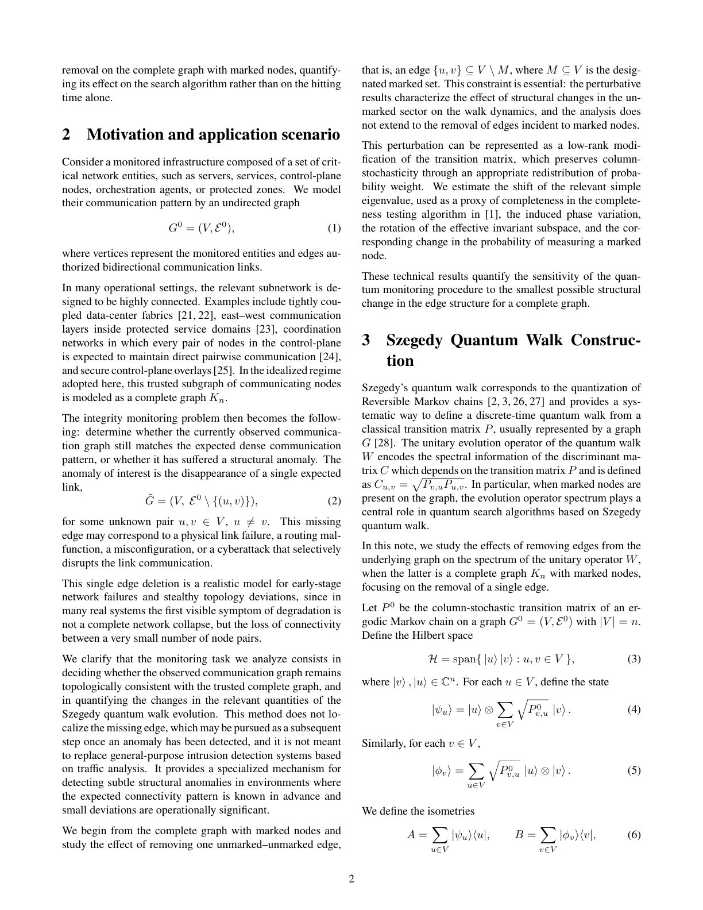
<figcaption class="paper-figure-caption"><b>Fig 1.</b> Low-resolution page preview, page 2</figcaption>
</figure>
<figure class="paper-figure-card">
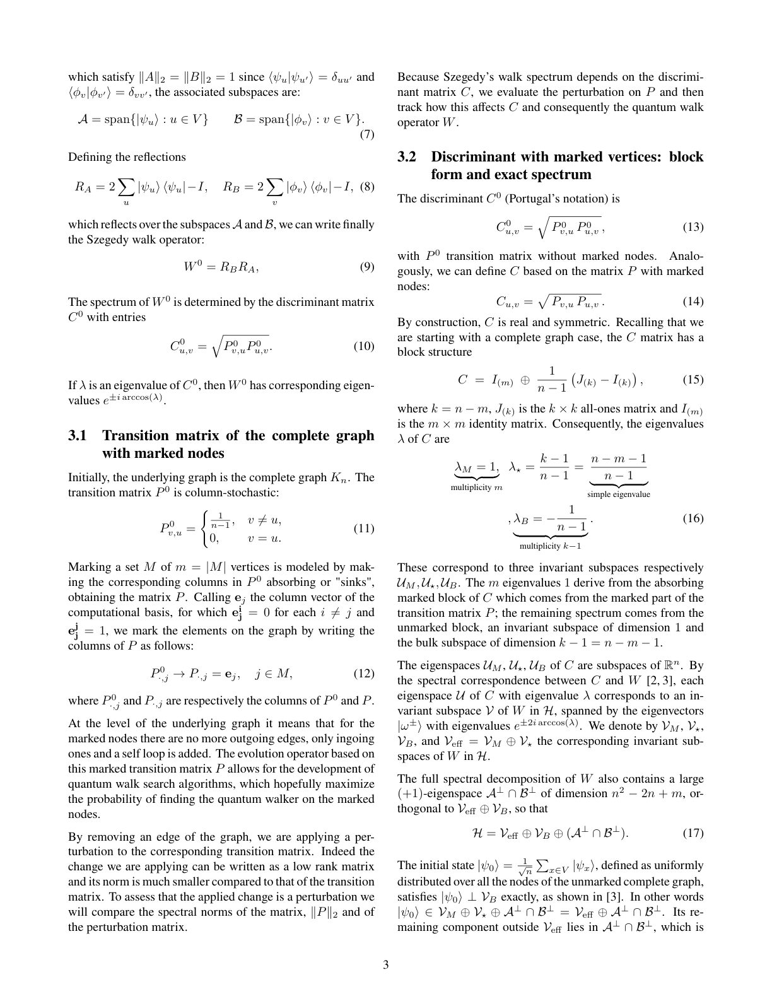
<figcaption class="paper-figure-caption"><b>Fig 2.</b> Low-resolution page preview, page 3</figcaption>
</figure>
<figure class="paper-figure-card">
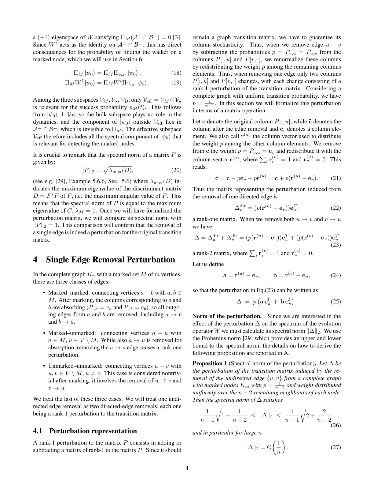
<figcaption class="paper-figure-caption"><b>Fig 3.</b> Low-resolution page preview, page 4</figcaption>
</figure>
<figure class="paper-figure-card">
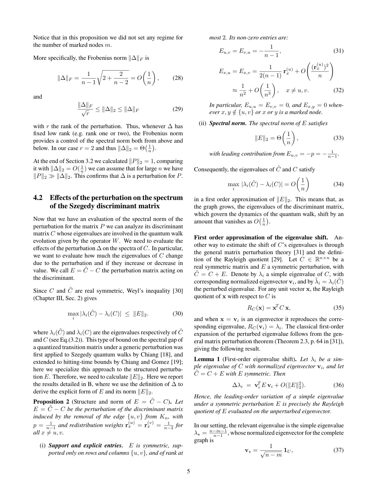
<figcaption class="paper-figure-caption"><b>Fig 4.</b> Low-resolution page preview, page 5</figcaption>
</figure>
<figure class="paper-figure-card">
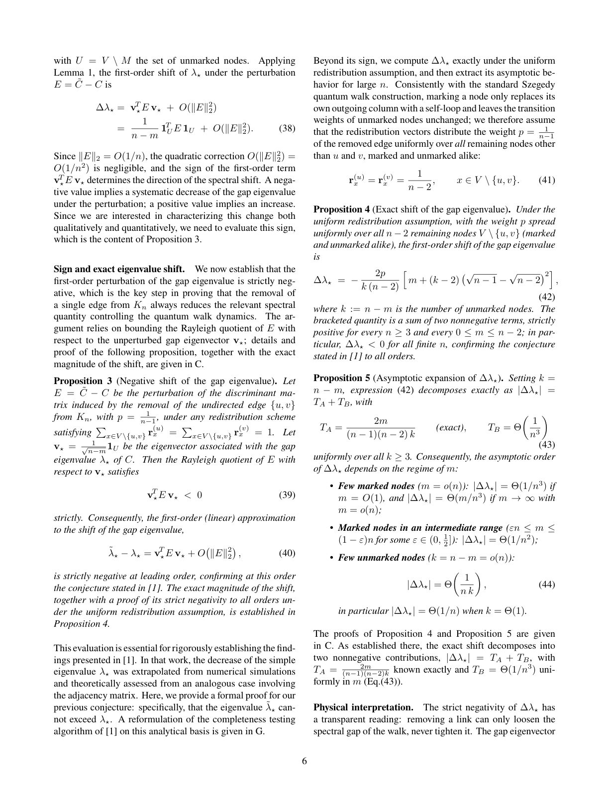
<figcaption class="paper-figure-caption"><b>Fig 5.</b> Low-resolution page preview, page 6</figcaption>
</figure>

**Summary.** This paper provides a deep theoretical analysis of detecting single link failures in dense quantum networks modeled by the Szegedy quantum walk. By applying perturbation theory, the authors derive precise scaling laws showing how the loss of one edge causes measurable shifts in spectral quantities like eigenvalues and phases. These results establish fundamental limits for quantum-assisted topology integrity monitoring.

**Why it may be interesting.** The rigorous quantification of detection limits based on spectral perturbations is highly relevant for understanding noise resilience in quantum communication protocols and network security.

Detailed structure

**Main problem.** The paper develops a rigorous perturbative analysis to detect structural anomalies, specifically the removal of a single link, in dense quantum communication networks.

**Main result.** It quantifies that this minimal perturbation causes predictable, small shifts ($\Theta(1/n^2)$) in spectral quantities like the gap eigenvalue and eigenphase shift, allowing for detection with high theoretical precision.

**Method.** The analysis employs time-dependent perturbation theory applied to the Szegedy quantum walk operator, analyzing how low-rank modifications affect the spectrum of the system's discriminant matrix.

**Model / system.** The model is a quantum walk executed on a complete graph ($K_n$) representing a dense communication network. The process uses the Szegedy quantum walk algorithm framework to test for link integrity.

**Key observables.** Spectral norm of the perturbation ($\Theta(1/n)$), shift in the gap eigenvalue ($\Theta(1/n^2)$), eigenphase shift ($\Delta	heta^\star = \Theta(1/n^2)$), and change in success probability ($O(1/\sqrt{n})$).

**Important parameters / regimes.** The analysis is most relevant in the regime where the number of marked nodes $m$ scales linearly with the total number of nodes, i.e., $m = \Theta(n)$.

**Assumptions / limitations.** The primary assumption is that the anomaly is the removal of a single unmarked-unmarked edge, and the analysis relies on first-order perturbation theory for eigenvalue shifts.

**Paper structure.** The paper builds from graph completeness testing to integrity monitoring. It analyzes the spectral consequences of removing an edge $\{u, v\} \subseteq V \setminus M$ by treating it as a small perturbation ($\Delta$) on the transition matrix $P$, leading to detailed calculations of eigenvalue shifts and success probability bounds.

Abstract

We present a rigorous perturbative analysis of the Szegedy quantum walk search algorithm on the complete graph with marked nodes, when a specific anomaly is present in the graph. This is motivated by the problem of monitoring the integrity of dense trusted communication networks with a quantum-assisted procedure. The topology of these networks is modeled as a complete graph, and the anomaly of interest is the disappearance of a single communication link which represents the minimal and spectrally hardest structural defect to detect. Building on the graph-completeness testing algorithm framework, we quantify how the removal of a single unmarked-unmarked edge propagates through the relevant spectral quantities of the Szegedy quantum walk. Denoting by $n$ the total number of nodes of the graph and by $m$ the number of marked nodes, we prove that the perturbation to the transition matrix has spectral norm $Θ(1/n)$, and that the gap eigenvalue undergoes a strictly negative first-order shift for every $n$ and every number of marked nodes $m$, providing a formal proof of a conjecture from our completeness testing algorithm work; in the regime $m = Θ(n)$ relevant for the search algorithm, this shift has magnitude $Θ(1/n^2)$. The corresponding eigenphase shift satisfies $Δθ_\star = Θ(1/n^2)$ in the same regime. We establish that the rotation angle of the effective subspace under this perturbation is $O(1/n)$ for $m = Θ(n)$. Finally, we bound the change in success probability to $O(1/\sqrt{n})$ in this same regime of marked nodes, and show that this bound is dominated by the geometric misalignment of the effective subspace rather than by the spectral shift of the eigenphase. These results provide both the theoretical foundations and the fundamental scaling limits of quantum walk-based topology integrity monitoring under minimal structural perturbations.

[↑ back to top](#top)

## Secondary cond-mat archives

*Papers from cond-mat.mtrl-sci, mes-hall, other, soft, supr-con. These archives are de-prioritized — they appear at the end regardless of relevance score.*

### Relevant in secondary archives (20)

### [Direct Spatiotemporal Imaging of Charge Carrier Dynamics in Operative Semiconductor Devices](http://arxiv.org/abs/2607.19157v1)

**Authors:** Adriano Cola, Antonio Valletta, Isabella Farella, Vaclav Dědič, Lorenzo Dominici  
**Type:** both · **Category:** other · **PDF:** <https://arxiv.org/pdf/2607.19157v1>  
**Analysis basis:** full PDF text, analyzed in chunks
**Topic relevance:** 🔥 `quantum measurements` **4/5** · `methods for driven-dissipative` **3/5** · `non-equilibrium dynamics` **3/5** · `Keldysh / 2PI / non-Gaussian methods` **2/5** · `measurement-induced transitions` **2/5** · `quantum optics experiment` **2/5** · `spintronics-quantum-optics interface` **2/5** · `analog quantum simulation` **1/5** · `correlated / nonlocal dissipation` **1/5** · `driven-dissipative phase transition` **1/5** · `non-equilibrium universality` **1/5**

↔ Scroll figures horizontally

<figure class="paper-figure-card">
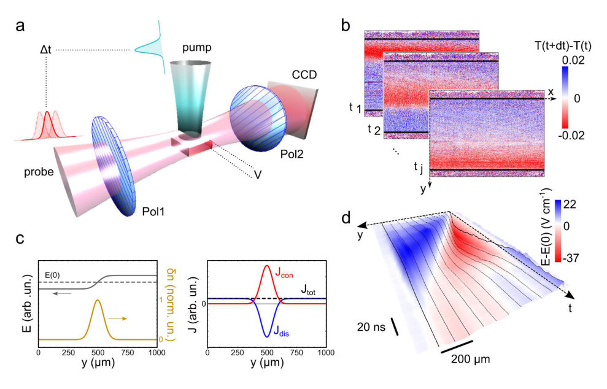
<figcaption class="paper-figure-caption"><b>Fig 1.</b> Fig. 1 Experimental setup and working principles. (a) Scheme of the working configuration. Two independent laser pulses are temporally shifted by means of an electronic delay and sent on the device to work as a probe and a pump beam. The device is kept at a given voltage V and placed between two crossed linear polarizers (Pol1 and Pol2). The probe beam crossing the sample and polarizers is imaged on a CCD camera. (b) Sequence of processed real-space images with the absolute transmittance variations at different time frames (t1, t2, … tj). (c) Representative profiles of electric field and charge cloud (left subpanel) and conduction, displacement and total current (right subpanel). The...</figcaption>
</figure>
<figure class="paper-figure-card">
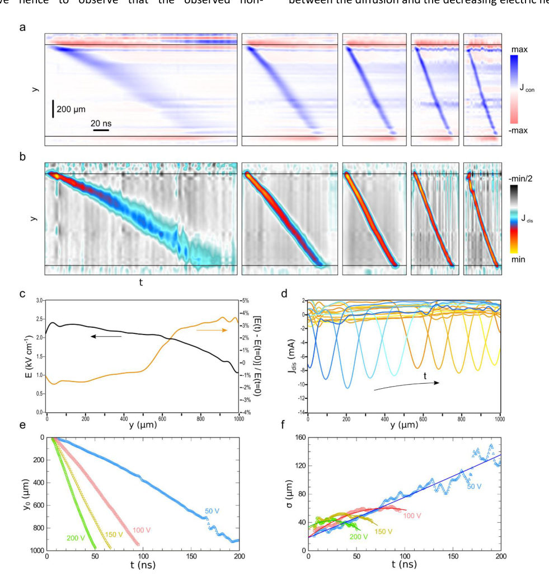
<figcaption class="paper-figure-caption"><b>Fig 2.</b> Fig. 2 CDPI experiments at low power and different voltages. (a) Time-space charts of the conduction current evaluated using the spatial derivative of the electric field. The charts refer to the applied voltages of 50 V, 100 V, 150 V, 200 V and 250 V, going left to right, respectively. The inner top and bottom horizontal solid lines represent the cathode (y = 0) and anode (y = 1000 m) position, respectively. The minimum on the colorbar has been kept fixed at minus the maximum value for the clarity and symmetry of representation (white areas correspond to a zero current). (b) Time-space charts of the displacement current evaluated from the temporal derivative of the electric field, for the...</figcaption>
</figure>
<figure class="paper-figure-card">
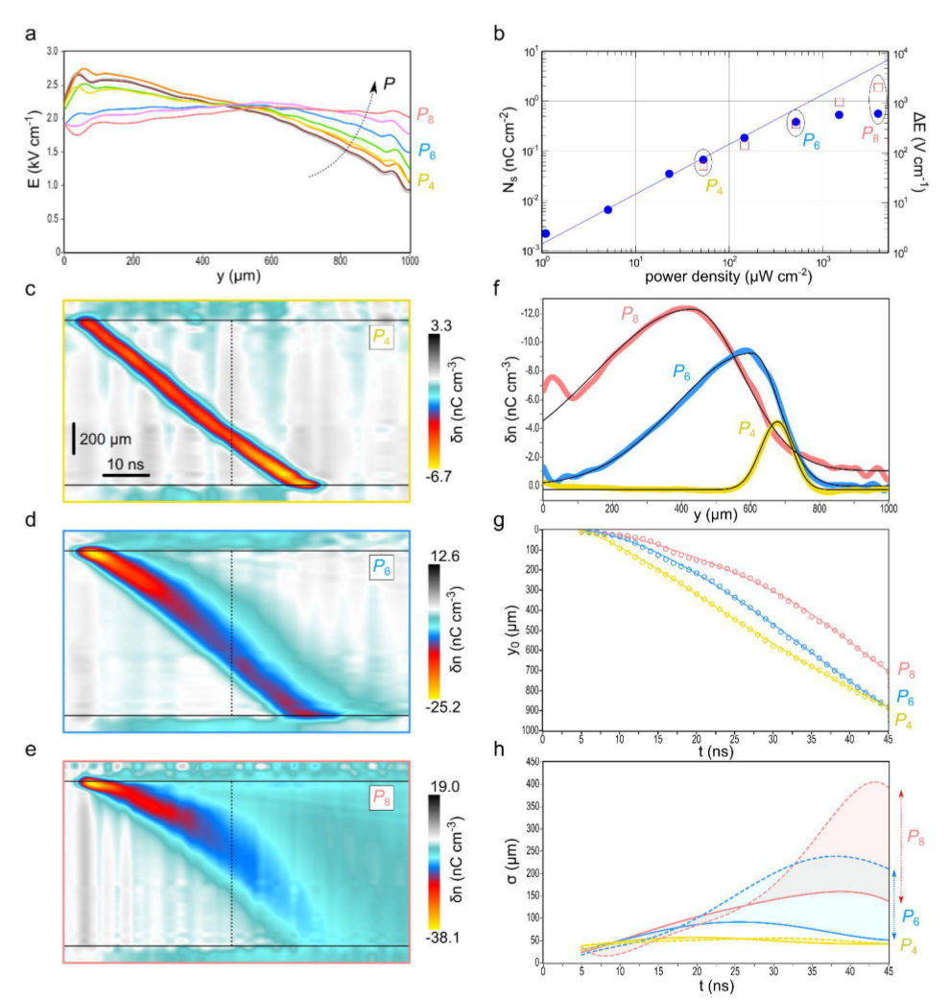
<figcaption class="paper-figure-caption"><b>Fig 3.</b> Fig. 3 CDPI experiments at increasing optical power. (a) Electric field profiles at initial time for different optical pump power density (from P1 = 1 µW cm-2 to P8 = 3900 µW cm-2, over the 1 cm2 area of the device). (b) Estimated travelling charge (filled blue circles) for the eight values of increasing power. The charge is evaluated in terms of the electric field difference ΔE at the two side of the clouds (at intermediate time). The collected charge is retrieved instead by time integrating the approximated current (empty red squares). (c,d,e) Time-space charts of the carriers’ cloud 𝛿𝑛𝑑𝑖𝑠𝑝𝑙(𝑦) at three optical powers (P4, P6 and P8, respectively). They are retrieved by applying Eq. (6)...</figcaption>
</figure>
<figure class="paper-figure-card">
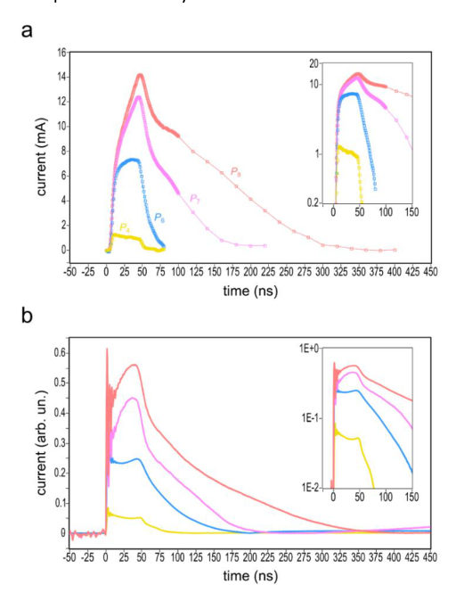
<figcaption class="paper-figure-caption"><b>Fig 4.</b> Fig. 4 Current dynamics. (a) Experimental current versus time at different powers calculated from the CDPI experiments using Eq. (4). (b) Independent current transients (CT) measurements by means of an external oscilloscope. The insets in the two panels show the currents on a semi-log scale. In summary, within its limits, the approximate current of Eq. (4) enables us to validate the CDPI&#x27;s key findings, which correlate the dynamics of the electric field — typically inaccessible to experiments — with the primary observable quantity of electronic devices: the external current. Remarkably, an all-optical experiment enables us to infer the dynamics of the internal electric field and the...</figcaption>
</figure>
<figure class="paper-figure-card">
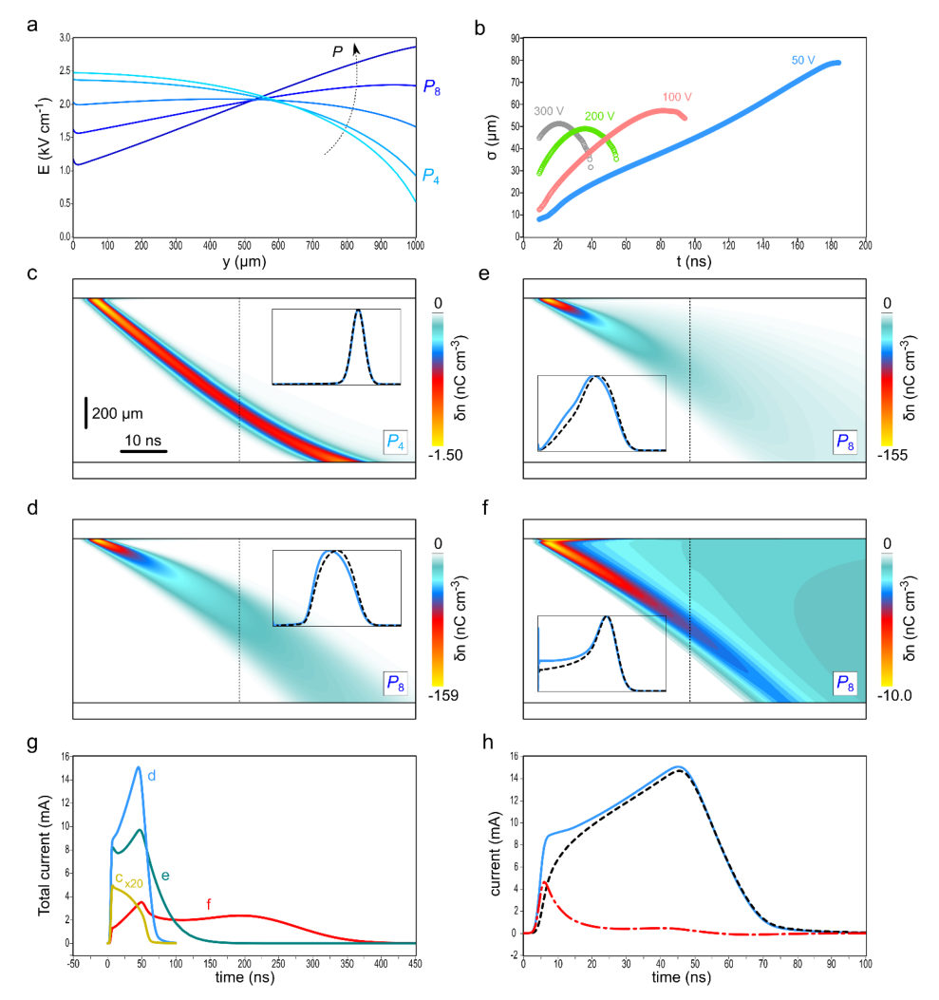
<figcaption class="paper-figure-caption"><b>Fig 5.</b> Fig. 5 Numerical simulations. (a) Initial field profiles prepared at different optical pump powers. The two labelled profiles correspond to the P4 and P8 power densities of the experiments. (b) Evolution of the cloud size extracted from the Gaussian fit of the simulations at different bias voltages and low power optical irradiation. (c,d) Complete time-space charts of the carrier cloud 𝛿𝑛𝑑𝑖𝑠𝑝𝑙(𝑦, 𝑡) in a low-power case (c) and high-power case (d), under an applied voltage of 200 V. (e,f) Time-space charts of the carrier cloud using the same high optical pump power of panel d but adding a trapping level. The two cases refer to a shallow level homogeneous in the bulk depth (e) and a surface...</figcaption>
</figure>

**Summary.** The paper introduces Carrier Dynamics by Pockels Imaging (CDPI), a novel, non-invasive method that uses the electro-optic effect to directly image how photogenerated charge carriers move inside semiconductor devices. By correlating these internal field measurements with external current readings, researchers can map fundamental transport processes like drift and diffusion in real time. This technique offers a powerful new tool for understanding device physics across diverse optoelectronic materials.

**Why it may be interesting.** While focused on solid-state electronics, the core concept of using an external optical probe (Pockels effect) to map internal field dynamics—a non-invasive measurement technique—is highly relevant for studying open quantum systems or charge transfer in nanoscale devices where direct probing is difficult.

Detailed structure

**Main problem.** Directly imaging charge carrier dynamics within active semiconductor devices is challenging because existing measurement techniques are often indirect or perturbative.

**Main result.** The proposed technique, CDPI, successfully visualizes internal electron cloud evolution in real space while simultaneously correlating it with measurable conduction and displacement currents. This establishes a unified picture of carrier transport mechanisms like drift and diffusion.

**Method.** The method uses Carrier Dynamics by Pockels Imaging (CDPI), which non-invasively probes the local electric field via the electro-optic effect to map photogenerated electron clouds.

**Model / system.** The study is demonstrated in CdTe radiation detectors and is applicable to various optoelectronic materials like perovskites. The analysis models charge transport by relating the measured electric field variations to fundamental current components (conduction and displacement).

**Key observables.** Electric field distribution $E(y, t)$, electron cloud density $\delta n$, conduction current ($I_{cond}$), and displacement current.

**Important parameters / regimes.** Micrometre-scale spatial resolution and nanosecond temporal resolution; voltage biases ranging from 50 V to 200 V; varying optical irradiation power densities.

**Assumptions / limitations.** The derivation of the total current often assumes negligible diffusion when relating it solely to electric field derivatives. The analysis relies on detailed device simulation parameters for material properties like trap levels and mobilities.

**Figures summary.** Figures illustrate the experimental setup using pump-probe beams, time-space charts showing electric field differences, and profiles comparing internal charge cloud evolution with external measured currents (conduction/displacement).

**Paper structure.** The paper introduces CDPI as a solution to direct imaging limitations. It details the physical principles linking EO measurements to current components, presents experimental demonstrations in CdTe, and discusses applicability across various semiconductor types.

Abstract

Understanding charge carrier dynamics within electronic devices is crucial, as it governs both the internal evolution of signals and the externally measurable current. Yet, direct imaging of these dynamics remains elusive: existing approaches are often indirect or inherently perturbative. Here, we introduce Carrier Dynamics by Pockels Imaging (CDPI), a sensitive, quantitative, and non-invasive method that enables direct access to internal charge dynamics. By probing the local electric field, CDPI visualizes photogenerated electron clouds in real space while simultaneously correlating their evolution with both conduction and displacement currents, thereby establishing a unified picture of carrier transport. The technique provides direct insight into fundamental mechanisms \textemdash including drift, diffusion, carrier-carrier interactions, trapping and detrapping \textemdash as well as the spatiotemporal evolution of carrier cloud morphology. Demonstrated in CdTe radiation detectors with micrometre-scale spatial resolution and nanosecond temporal resolution, CDPI is broadly applicable to systems exhibiting appreciable electro-optic responses. Beyond conventional semiconductors, the approach extends to organic, perovskite, and two-dimensional optoelectronic materials, offering a new paradigm for directly linking internal carrier dynamics to device-level functionality.

[↑ back to top](#top)

### [Bridging distributed quantum materials via multi-hotspot vacuum: remote Cooper pairing and Andreev teleportation](http://arxiv.org/abs/2607.18916v1)

**Authors:** Zuzhang Lin, Zhijian Song, Chengxin Xiao, Wang Yao  
**Type:** theory · **Category:** strongly correlated electrons · **PDF:** <https://arxiv.org/pdf/2607.18916v1>  
**Analysis basis:** full PDF text, analyzed in chunks
**Topic relevance:** 🔥 `analog quantum simulation` **4/5** · 🔥 `correlated cavity matter` **4/5** · `entanglement & information structure` **3/5** · `exotic spin models in light-matter` **3/5** · `Tavis-Cummings & cavity-many-emitter` **2/5** · `Keldysh / 2PI / non-Gaussian methods` **1/5** · `correlated / nonlocal dissipation` **1/5** · `driven-dissipative phase transition` **1/5** · `methods for driven-dissipative` **1/5** · `non-equilibrium dynamics` **1/5**

↔ Scroll figures horizontally

<figure class="paper-figure-card">
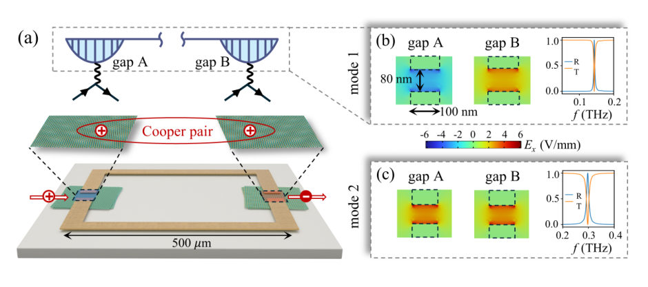
<figcaption class="paper-figure-caption"><b>Fig 1.</b> Figure 1. Distributed mesoscopic matter at multiple hotspots of a cavity mode, bridged via its vacuum fluctuations. (a) Schematic of a metallic ring THz resonator with two split gaps, each proximitized by a moiré superlattice. A cavity mode has a spatial profile spread across both gaps, and its vacuum fluctuations can mediate an attractive interaction between carriers across the two gaps, leading to remote Cooper pairing. This pairing enables an Andreev teleportation process: injection of a hole into gap A results in an electron ejection from gap B. (b), (c) Spatial profiles and resonance spectra of the two lowest cavity modes for an exemplary square ring resonator where the two split gaps...</figcaption>
</figure>
<figure class="paper-figure-card">
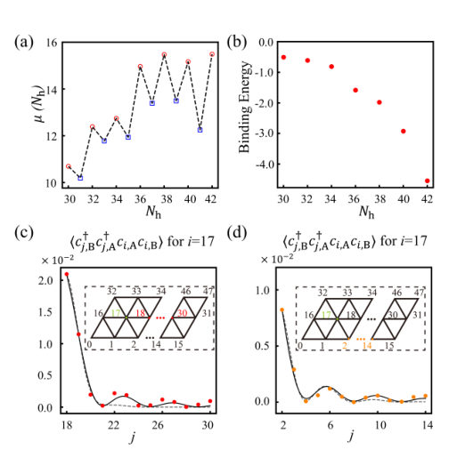
<figcaption class="paper-figure-caption"><b>Fig 2.</b> Figure 2. Many-body ground state under cavity-vacuum- mediated interaction—fixed-number DMRG calculations. (a) Chemical potential 𝜇(𝑁ℎ) ≡𝐸(𝑁ℎ+ 1) −𝐸(𝑁ℎ) as a function of hole number 𝑁ℎ, where 𝐸(𝑁ℎ) is the ground-state energy of the two moiré superlattices (each of size 6 × 4 sites). For even 𝑁ℎ, holes are equally partitioned (𝑁ℎ∕2 per superlattice). For odd 𝑁ℎ, moiré A has one more hole than moiré B. (b) Binding energy defined as 𝜇(𝑁ℎ+1)−𝜇(𝑁ℎ) at even 𝑁ℎ. (c), (d) Inter-moiré pair–pair correla- tion ⟨𝑐† 𝑗,𝐵𝑐† 𝑗,𝐴𝑐𝑖,𝐴𝑐𝑖,𝐵⟩, with 𝑖being site 17 (highlighted in green color) and 𝑗varying along different trajectories (highlighted in red or or- ange color). Each moiré is of size 16 × 3 sites...</figcaption>
</figure>
<figure class="paper-figure-card">
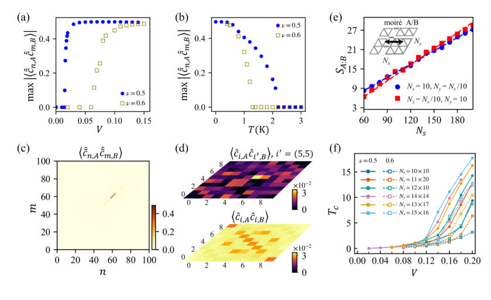
<figcaption class="paper-figure-caption"><b>Fig 3.</b> Figure 3. Remote pairing and distributed entanglement—mean-field solutions on larger-scale superlattices. (a) Maximum pairing am- plitude |⟨̂̃𝑐𝑛,𝐴̂̃𝑐𝑚,𝐵⟩| at zero temperature, as function of the cavity-vacuum-mediated interaction 𝑉. Pairing emerges above a critical interaction strength that depends on the filling factor 𝜈. (b) Temperature dependence of the maximum pairing amplitude at 𝑉= 0.15, exhibiting a critical temperature 𝑇𝑐. (c), (d) Pairing amplitude at zero temperature, in the single-particle eigenbasis (c), and in real space (d). The eigenbasis repre- sentation shows pronounced pairing near the Fermi level. In (a-d), each moiré is of 𝑁𝑠= 10 × 10 sites. (e) Entanglement entropy...</figcaption>
</figure>
<figure class="paper-figure-card">
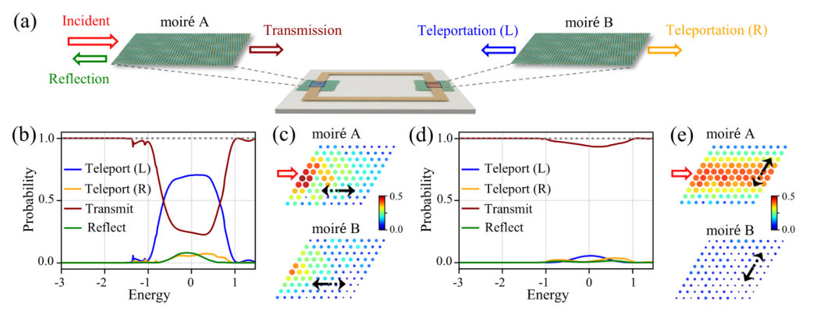
<figcaption class="paper-figure-caption"><b>Fig 4.</b> Figure 4. Andreev Teleportation. (a) Schematic of the local scattering channels (normal reflection and transmission) and the remote Andreev teleportation channels (particle–hole interconversion across the two split gaps). (b) Scattering probabilities as functions of incident energy, with the cavity field polarized along the incident direction. Inside the pairing gap, remote teleportation dominates over the local scattering channels. (c) The wavefunction of a scattering state at incident energy 𝐸= 0, distributed across the moiré superlattices in both split gaps. (d), (e) Similar plots for incidence with an angle of 60◦relative to the cavity field polarization. The calculations are performed...</figcaption>
</figure>

**Summary.** The paper proposes using the vacuum fluctuations within a multi-gap superconducting resonator to couple distant mesoscopic quantum materials. This coupling mediates an attractive interaction, inducing remote Cooper pairing across millimeter gaps. The resulting correlated state allows for 'Andreev teleportation,' demonstrating emergent nonlocal functionalities in engineered quantum networks.

**Why it may be interesting.** This work directly bridges cavity QED concepts (vacuum mediation) with strongly correlated electron physics (superconductivity in moiré lattices), providing a mechanism for engineered long-range quantum interactions.

Detailed structure

**Main problem.** To create an unprecedented many-body quantum system by correlating mesoscopic quantum matter distributed over spatially separated nodes using vacuum fluctuations.

**Main result.** The cavity vacuum mediates remote Cooper pairing and enables Andreev teleportation across macroscopic separations, suggesting a paradigm for nonlocal quantum networks.

**Method.** Theoretical modeling involving effective Hamiltonians derived via Schrieffer-Wolff transformation, analyzed using DMRG, exact diagonalization, and Bogoliubov–de Gennes mode-matching.

**Model / system.** The system uses a multi-gap split-ring resonator (SRR) to couple two spatially separated moiré superlattices. The coupling mechanism is the virtual exchange of photons in the cavity vacuum field.

**Key observables.** Remote Cooper pairing, Andreev teleportation probability, and entanglement entropy scaling linearly with lattice area.

**Important parameters / regimes.** Millimeter-scale separation between gaps; deep-subwavelength hotspot confinement; interaction strength $V_{\lambda} \propto 1/\omega_{\lambda}^2$.

**Assumptions / limitations.** The analysis primarily focuses on cavity-mediated interactions, neglecting intra-gap Coulomb repulsion effects on the inter-gap process.

**Figures summary.** Figures illustrate the setup showing mediated pairing and teleportation; other figures detail resonance spectra, binding energy oscillations, and the probability of Andreev teleportation versus local scattering channels.

**Paper structure.** The paper establishes the physical platform (SRR with multiple hotspots), derives an effective Hamiltonian from vacuum coupling, calculates key superconducting diagnostics (pairing amplitude, binding energy) using DMRG/ED, and finally demonstrates nonlocal functionality via Andreev teleportation probability calculations.

Abstract

We introduce an architecture where mesoscopic quantum matter distributed over spatially separated nodes can be correlated in equilibrium, creating an unprecedented form of many-body quantum system. Central to the design is a multi-gap split-ring resonator (SRR) where the cavity photon has multiple hot spots -- each with deep-subwavelength volume at a split gap and separated by millimeter-scale distances. The cavity's vacuum fluctuations can then mediate a many-body interaction that bridges the distributed quantum materials embedded in the multiple gaps, coupling them into a single correlated mesoscopic system in equilibrium. As an example, we consider a THz SRR with two split gaps, each proximitized to a metallic moiré superlattice, where virtual exchange of a photon in the cavity vacuum mediates a current-current interaction across the gaps. The inherent attractive interaction channels lead to remote Cooper pairing reminiscent of mesoscopic superconductivity, demonstrated with density matrix renormalization group and exact diagonalization calculations. With the two constituents of a Cooper pair now paired across a millimeter-scale separation, a hole incident at one split gap can be converted into an outgoing electron at the remote gap, a process we term Andreev teleportation. The entanglement entropy between the two mesoscopic superlattices is shown to scale linearly with the area (total number of sites) of the mesoscopic lattice. Our results suggest an intriguing paradigm for equilibrium quantum networks of mesoscopic matter that enable emergent nonlocal functionalities and distributed quantum resources.

[↑ back to top](#top)

### [Domain wall motion in a polycrystalline vortex lattice](http://arxiv.org/abs/2607.18592v1)

**Authors:** Malcolm Durkin, Emily Waite, Taylor L. Hughes, Nadya Mason  
**Type:** both · **Category:** disordered systems and neural networks · **PDF:** <https://arxiv.org/pdf/2607.18592v1>  
**Analysis basis:** full PDF text, analyzed in chunks
**Topic relevance:** 🔥 `Frenkel-Kontorova` **4/5** · `analog quantum simulation` **3/5** · `driven-dissipative phase transition` **3/5** · `methods for driven-dissipative` **3/5** · `non-equilibrium dynamics` **2/5** · `non-equilibrium universality` **2/5** · `Keldysh / 2PI / non-Gaussian methods` **1/5** · `correlated / nonlocal dissipation` **1/5** · `scars & prethermalization` **1/5**

↔ Scroll figures horizontally

<figure class="paper-figure-card">
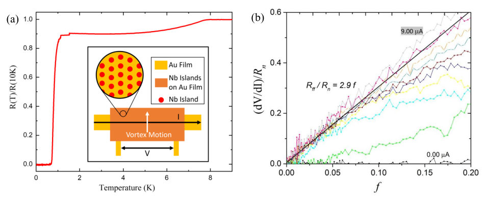
<figcaption class="paper-figure-caption"><b>Fig 1.</b> FIG. 1. I-V measurements. (a) Resistance vs temperature for a 490 nm edge-to-edge spaced array, showing the superconducting transition. Inset shows the four-point measurement configuration. (b) Normalized differential resistance 𝑑𝑉/𝑑𝐼 at 1 μA current intervals as a function magnetic filling f. As current increases at low fillings, there is a rapid transition from 𝑑𝑉/𝑑𝐼= 0 to flux flow resistance (black line, 𝑅𝑓𝑓/𝑅𝑁). (c) 𝑑𝑉/𝑑𝐼 vs f at 0.5 μA current intervals, for a larger range than (b). At higher fillings, dips associated with commensurate fillings are visible at 𝑓= 1/6, 1/4, 1/3, and 1/2. Intermediate clusterings of lines are visible at 𝑓= 0.20 and 𝑓= 0.35. (d) 𝑑𝑉/𝑑𝐼 vs I. The black...</figcaption>
</figure>
<figure class="paper-figure-card">
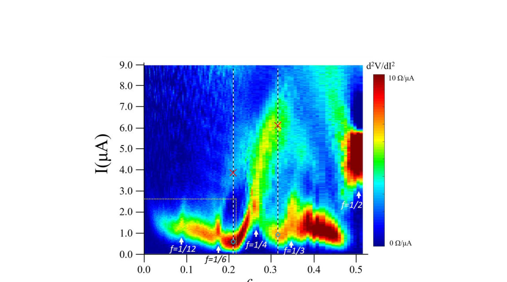
<figcaption class="paper-figure-caption"><b>Fig 2.</b> FIG. 2. 𝑑2𝑉/𝑑𝐼2 as a function of current and frustration. Transition steps can be mapped using 𝑑2𝑉/𝑑𝐼2, with higher values (brighter colors) corresponding to a transition step. Commensurate fillings are marked with white arrows and undergo a single transition. Examples of incommensurate fillings are marked with a dashed line and undergo two transitions, the first marked with a blue circle and the second marked with a red X. The region marked in a yellow dashed box in the lower left corner is simulated in Figure 4 (a).</figcaption>
</figure>
<figure class="paper-figure-card">
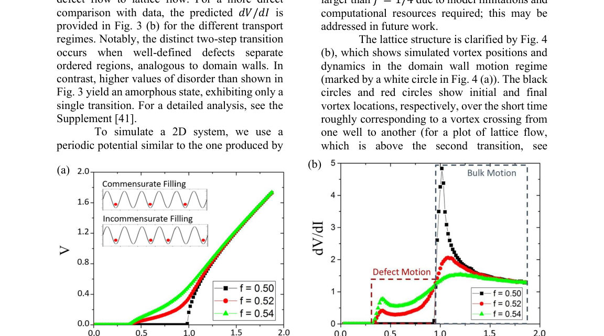
<figcaption class="paper-figure-caption"><b>Fig 3.</b> FIG. 3. One-dimensional simulation of array. (a) Simulated I-V behavior for commensurate (𝑓= 0.5) and incommensurate fillings (𝑓= 0.52,0.54). Top inset shows the half filling arrangement. Bottom inset shows an incommensurate filling with defects in the form of vortices in adjacent wells. (b) Simulated 𝑑𝑉/𝑑𝐼 measurements. At commensurate values, the system rapidly transitions from pinned to bulk vortex motion. As field is increased (𝑓= 0.52, 0.54), defects are added. This results in a transition from pinned to defect motion to bulk vortex motion. Id0 is the de-pinning current in the single particle limit.</figcaption>
</figure>
<figure class="paper-figure-card">
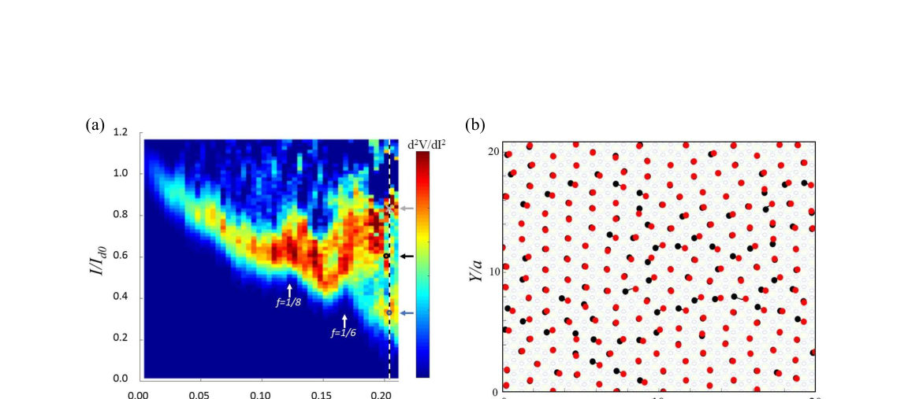
<figcaption class="paper-figure-caption"><b>Fig 4.</b> FIG. 4. 2D simulation of triangular array. (a) Simulated 𝑑2𝑉/𝑑𝐼2 within region indicated by yellow dashed box in Figure 2. At 𝑓= 1/6, a second transition splits off from the de-pinning current when filling is increased. An incommensurate filling is shown with a dashed line. A blue circle at 𝐼/𝐼𝑑0 ≈0.3 shows the first transition. A grey X at 𝐼/𝐼𝑑0 ≈0.8 shows the second transition. Id0 is the de-pinning current in the single particle limit. Arrows on the right indicate the position of the grey X and blue circle. (b) Time evolution of vortex motion at 𝑓= 0.2 with an applied field perpendicular to the vortex plane shown and an applied current of 𝐼= 0.6 𝐼𝑑0 , for data shown as a black circle in...</figcaption>
</figure>

**Summary.** This paper experimentally and computationally investigates vortex motion in superconducting arrays under controlled disorder. The key finding is that the presence of disorder causes a two-step depinning transition, suggesting that the system's dynamics are governed by domain wall movement rather than simple glassy freezing. This provides direct evidence linking interface physics to transport phenomena in frustrated periodic systems.

**Why it may be interesting.** The work provides a concrete physical realization where concepts from disordered systems—like pinning and interface physics—manifest in measurable transport signatures, offering insights applicable to understanding complex energy landscapes in many-body quantum systems.

Detailed structure

**Main problem.** The study investigates how disorder affects crystalline superconducting vortex lattices, specifically determining if this leads to glassy states or domain fragmentation via mobile interfaces.

**Main result.** The authors observe a two-step depinning transition in incommensurate fillings, which is consistent with interface-dominated motion characteristic of a polycrystalline vortex lattice rather than homogeneous glassy dynamics.

**Method.** The research combines experimental measurements (I-V curves and differential resistance) on superconducting island arrays with molecular dynamics simulations using a Langevin equation approach.

**Model / system.** The system is superconducting island arrays hosting an Abrikosov vortex lattice. Disorder is controlled by tuning the magnetic field away from commensurate fillings, creating frustration in the periodic pinning potential.

**Key observables.** Two-step depinning transition in differential resistance (dI/dV), flux flow resistance ($R_{ff}$), and the splitting of single transitions into two distinct steps.

**Important parameters / regimes.** Filling fraction ($f$), which dictates commensurability; applied current ($I$); and lattice stiffness ratios ($B/A$) in simulations.

**Assumptions / limitations.** The analysis assumes that the observed intermediate transport regime is governed by domain wall motion separating ordered crystalline domains.

**Figures summary.** Figures show I-V curves demonstrating single vs. two-step transitions based on filling factor; simulation results compare defect structures for different lattice stiffnesses, and field sweeping history reveals pinning effects near commensurate fillings.

**Paper structure.** The paper progresses by first establishing the experimental observation of a two-step transition in incommensurate regimes (Experiment). It then uses molecular vortex models to simulate this behavior, showing how single transitions split into two as disorder increases (Simulation/Theory). Finally, it explores the role of lattice stiffness and field history dependence to solidify the domain wall interpretation.

Abstract

Disorder fundamentally reshapes how crystalline systems respond to external forces, yet it remains unclear whether disorder drives interacting lattices toward glassy states or instead fragments them into domains separated by mobile interfaces. Here, we investigate vortex motion in superconducting island arrays, where disorder is introduced in a controlled manner by tuning the magnetic field away from commensurate vortex fillings. By driving vortices with an applied current, we observe a two-step depinning transition at incommensurate fillings. Comparison with molecular vortex model simulations shows that this intermediate regime is consistent with domain wall motion in a polycrystalline vortex lattice. While two-step depinning has been explored theoretically in driven periodic systems, direct experimental evidence linking this behavior to interface-dominated vortex motion has been lacking. Our results demonstrate that disordered, interacting vortex systems with strong periodic pinning can favor interface physics over homogeneous glassy dynamics.

[↑ back to top](#top)

### [Time-resolved ARPES in pumped excitonic systems: Floquet physics induced by excitonic fields](http://arxiv.org/abs/2607.19242v1)

**Authors:** Amir Eskandari-asl, Adolfo Avella  
**Type:** theory · **Category:** strongly correlated electrons · **PDF:** <https://arxiv.org/pdf/2607.19242v1>  
**Analysis basis:** full PDF text, analyzed in chunks
**Topic relevance:** 🔥 `methods for driven-dissipative` **4/5** · 🔥 `non-equilibrium dynamics` **4/5** · `Keldysh / 2PI / non-Gaussian methods` **3/5** · `driven-dissipative phase transition` **3/5** · `non-equilibrium universality` **2/5** · `analog quantum simulation` **1/5** · `correlated cavity matter` **1/5**

↔ Scroll figures horizontally

<figure class="paper-figure-card">
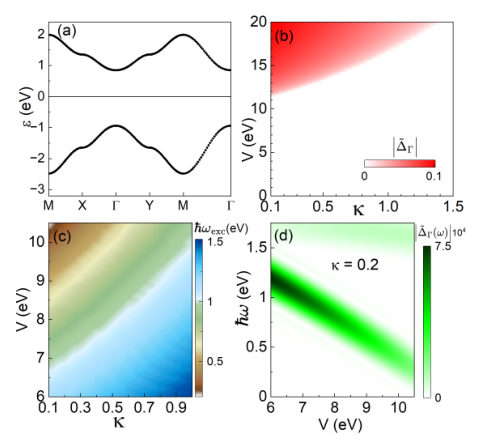
<figcaption class="paper-figure-caption"><b>Fig 1.</b> Figure 1. Equilibrium properties of the two-band model. (a) Non-interacting band structure of the two-band model along a high-symmetry path in the Brillouin zone. (b) Equilib- rium normalized off-diagonal HF self-energy at the Γ point, ˜∆Γ, as a function of the Coulomb interaction strength V and the screening factor κ. The boundary between the semicon- ducting phase ( ˜∆Γ = 0) and the excitonic insulator phase ( ˜∆Γ ̸= 0) is visible. (c) Main equilibrium excitonic energy, ℏωexc, in the semiconducting phase as a function of V and κ. (d) Fourier-transformed excitonic field, ˜∆Γ(ω), as a function of V and ℏω for a fixed screening factor κ = 0.2, showing the main excitonic mode and a weaker...</figcaption>
</figure>
<figure class="paper-figure-card">
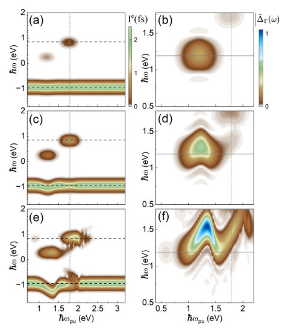
<figcaption class="paper-figure-caption"><b>Fig 2.</b> Figure 2. Results for V = 6 eV, semiconducting phase. (a), (c), (e) Post-pump TR-ARPES signal at the Γ point as a function of pump frequency for pump amplitudes A0 = 0.1, 0.25, and 0.5 V · fs/nm, respectively. Horizontal dashed lines mark CB and VB energies at Γ; vertical short-dashed lines indicate the pump frequency resonant with the equilibrium band gap at Γ. (b), (d), (f) Corresponding amplitude | ˜∆Γ(ω)| as a function of ωpu, and ω. Horizontal gray lines indicate the equilibrium excitonic energy from Fig. 1(c), and vertical short-dashed lines are similar to the other panels.</figcaption>
</figure>
<figure class="paper-figure-card">
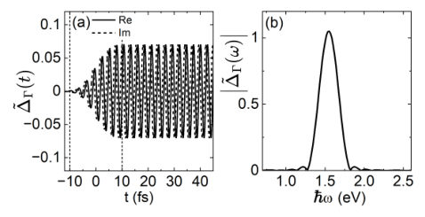
<figcaption class="paper-figure-caption"><b>Fig 3.</b> Figure 3. Results for V = 6 eV, semiconducting phase. (a) Time evolution of the real and imaginary parts of ˜∆Γ(t) for the high-intensity case (A0 = 0.5 V · fs/nm) with pump frequency ℏωpu = 1.35 eV. Vertical dashed lines indicate t = ±τpu = ±10 fs, marking the pump-pulse duration. (b) Corresponding post-pump amplitude | ˜∆Γ(ω)| as a function of frequency, showing the main exciton-field oscillation peak.</figcaption>
</figure>
<figure class="paper-figure-card">
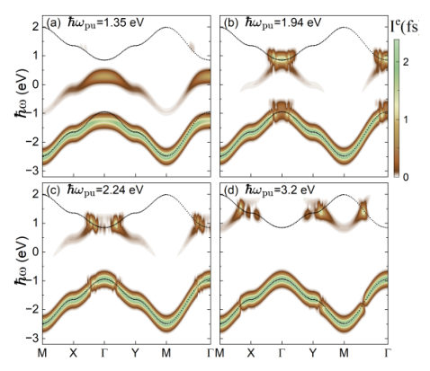
<figcaption class="paper-figure-caption"><b>Fig 4.</b> Figure 4. Results for V = 6 eV, semiconducting phase. k-resolved post-pump TR-ARPES signal along the high- symmetry path in the BZ for the large pump amplitude A0 = 0.5 V·fs/nm, corresponding to vertical cuts in Fig. 2(e). (a) ℏωpu = 1.35 eV, resonant with the excitonic frequency, showing a strong exciton-field-induced Floquet sideband par- allel to the VB. (b) ℏωpu = 1.94 eV, slightly above the band gap at Γ, showing band-resonance-induced sidebands and level splitting near Γ. (c) ℏωpu = 2.24 eV, with resonant k- points farther away from Γ, yielding weaker band-resonance- induced sidebands. (d) ℏωpu = 3.2 eV, with resonant k-points very far from Γ, producing very weak...</figcaption>
</figure>
<figure class="paper-figure-card">
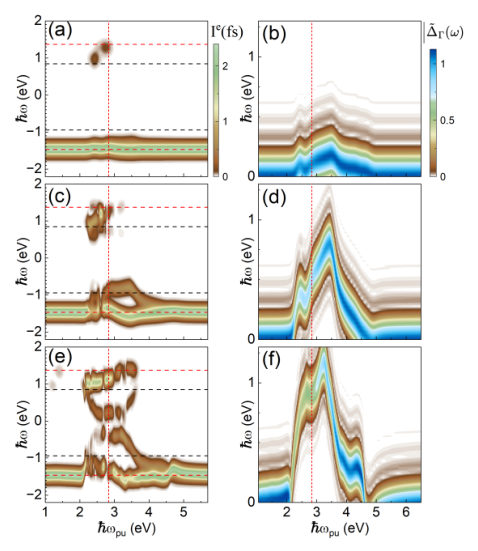
<figcaption class="paper-figure-caption"><b>Fig 5.</b> Figure 5. Results for V = 15 eV, excitonic-insulator phase. (a), (c), (e) Post-pump TR-ARPES signal at the Γ point as a function of pump frequency ℏωpu for the excitonic-insulator phase (V = 6 eV, κ = 0.2) and pump amplitudes A0 = 0.1, 0.25, and 0.5 V · fs/nm, respectively. Black horizontal dashed lines mark the noninteracting CB and VB energies at Γ; red horizontal dashed lines mark the interacting band energies. (b), (d), (f) Corresponding amplitude | ˜∆Γ(ω)| as a function of ωpu, and ω. Vertical red dashed lines indicate the pump frequency resonant with the equilibrium band gap of the in- teracting system.</figcaption>
</figure>

**Summary.** The paper develops a sophisticated theoretical framework using the Dynamical Projective Operatorial Approach to simulate how excitonic systems behave under intense, time-varying pump pulses. By including electron-electron interactions via Hartree-Fock theory, the authors predict and analyze distinct Floquet sidebands arising from coherent oscillations of the internal excitonic order parameter. This work provides a powerful tool for interpreting ultrafast spectroscopic measurements in correlated materials.

**Why it may be interesting.** This work is highly relevant as it models non-equilibrium many-body physics (excitons) driven by time-dependent fields (pumping), generating characteristic Floquet signatures that can be measured experimentally. The use of DPOA for ultrafast correlation effects is a key theoretical contribution.

Detailed structure

**Main problem.** The study focuses on understanding time-resolved photoemission spectroscopy (TR-ARPES) in excitonic systems subjected to external pumping fields, specifically investigating Floquet physics induced by internal excitonic coherence.

**Main result.** The authors show that when the pump frequency matches an excitonic mode, coherent oscillations persist after the pulse, generating distinct Floquet sidebands unique to the excitonic field. They also establish DPOA as a robust method for simulating these ultrafast dynamics.

**Method.** The theoretical framework utilizes the Dynamical Projective Operatorial Approach (DPOA) combined with the Hartree-Fock approximation to treat Coulomb electron-electron interactions in an out-of-equilibrium setting.

**Model / system.** The model is a prototypical two-dimensional, two-band semiconductor system. The Hamiltonian includes non-interacting terms and a Coulomb interaction term treated via HF decoupling, allowing for the study of excitonic bound states formation.

**Key observables.** TR-ARPES spectrum; excitonic order parameter oscillations; Floquet sidebands (distinguishing between pump-field vs. exciton-field origin); equilibrium phase diagram.

**Important parameters / regimes.** Coulomb interaction strength/range; pump frequency resonance with an excitonic mode; dipole asymmetry ($D$).

**Assumptions / limitations.** The primary approximations are the use of the Hartree-Fock (HF) approximation for Coulomb interactions and solving the time evolution using DPOA.

**Figures summary.** Figure 8 compares post-pump TR-ARPES signals at the $\Gamma$ point, demonstrating that dipole asymmetry ($D$) is crucial for observing exciton-field-induced Floquet sidebands in both semiconducting and excitonic-insulator phases.

**Paper structure.** The paper develops by first introducing the theoretical necessity of studying TR-ARPES in pumped systems. It then details the DPOA formalism, extending it to include HF interactions to model exciton formation and subsequent out-of-equilibrium dynamics under resonant pumping conditions.

Abstract

We develop a theoretical framework based on the Dynamical Projective Operatorial Approach (DPOA) to study the time- and angle-resolved photoemission spectroscopy (TR-ARPES) of pumped excitonic systems. Including Coulomb electron-electron interactions at the Hartree-Fock (HF) level, our formalism captures the formation of excitonic bound states under the application of pump pulses. Considering a prototypical two-dimensional two-band semiconductor, we analyze the equilibrium phase diagram, which shows the expected transition from a semiconducting to an excitonic-insulator phase as the Coulomb interaction strength or its range increase. Out of equilibrium, we find that when the pump frequency is resonant with an excitonic mode, coherent oscillations of the excitonic order parameter persist after the pump pulse subsides and give rise to clear Floquet sidebands in the TR-ARPES spectrum. These exciton-field-induced sidebands are distinct from those originating from the pump laser field. We also identify band-resonance-induced sidebands arising from residual coherences at momenta where the band gap is resonant with the pump frequency. Finally, we analyze the local Coulomb interaction limit. Our results corroborate recent experimental observations of exciton-field-induced Floquet-like sidebands and establish DPOA as an efficient and accurate method for simulating ultrafast phenomena in interacting electron systems.

[↑ back to top](#top)

### [Topological Foundations of Multi-Field Instabilities in Continua: Part 1: Foundations Part 2:Analytical Formulation for 1-D Spin Chains Part 3: Numerical Upscaling](http://arxiv.org/abs/2607.18995v1)

**Authors:** Klaus Regenauer-Lieb, Francois Nicot, Amir Saker  
**Type:** theory · **Category:** statistical mechanics · **PDF:** <https://arxiv.org/pdf/2607.18995v1>  
**Analysis basis:** full PDF text, analyzed in chunks
**Topic relevance:** `driven-dissipative phase transition` **3/5** · `methods for driven-dissipative` **3/5** · `non-equilibrium dynamics` **3/5** · `non-equilibrium universality` **2/5** · `Frenkel-Kontorova` **1/5** · `Keldysh / 2PI / non-Gaussian methods` **1/5** · `analog quantum simulation` **1/5** · `correlated / nonlocal dissipation` **1/5**

↔ Scroll figures horizontally

<figure class="paper-figure-card">
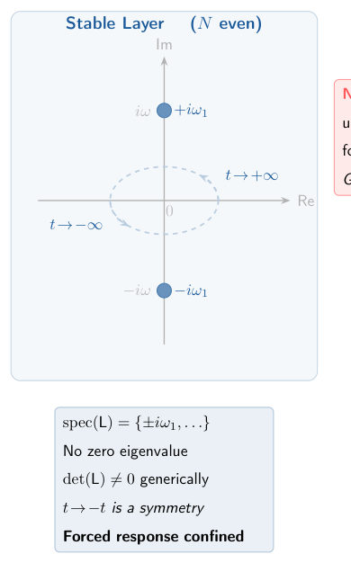
<figcaption class="paper-figure-caption"><b>Fig 1.</b> Figure 1: Spectral topology of the circulation matrix L for even (N = 2) and odd (N = 3)</figcaption>
</figure>
<figure class="paper-figure-card">
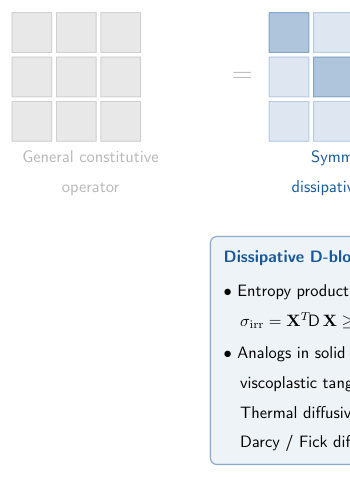
<figcaption class="paper-figure-caption"><b>Fig 2.</b> Figure 2: The Onsager-Casimir decomposition of the constitutive operator A = D+L. Left:</figcaption>
</figure>
<figure class="paper-figure-card">
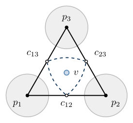
<figcaption class="paper-figure-caption"><b>Fig 3.</b> Figure 3: Geometric and algebraic duality in granular multi-field coupling: (a) Satake’s</figcaption>
</figure>
<figure class="paper-figure-card">
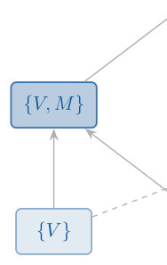
<figcaption class="paper-figure-caption"><b>Fig 4.</b> Figure 4: Hasse diagram of the VMC coupling hierarchy. Nodes are subsets of the three</figcaption>
</figure>
<figure class="paper-figure-card">
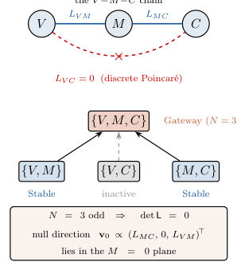
<figcaption class="paper-figure-caption"><b>Fig 5.</b> Figure 5: The Gateway mechanism: topological cause and dynamic effect in a (V, M, C)</figcaption>
</figure>

**Summary.** This work develops a topological theory to classify instabilities in granular materials by analyzing the structure of their multi-field coupling operators. It shows that the parity of coupled channels dictates whether the system possesses a structural null-mode, which can drive instability (the Gateway mechanism) even when classical failure indicators are not yet triggered.

**Why it may be interesting.** The topological classification of instability mechanisms in passive matter provides a powerful analogy framework that could inform the understanding of non-equilibrium dynamics or dissipation thresholds in complex quantum many-body systems where symmetry breaking is key.

Detailed structure

**Main problem.** The work establishes a parameter-free, topological classification for multi-field instabilities in granular continua, extending static rigidity concepts to dynamic, non-equilibrium processes.

**Main result.** Instability can be predicted by the 'Gateway' mechanism—a structural null-mode appearing when the number of coupled channels ($N$) is odd—which drives transient amplification before classical failure criteria are met.

**Method.** The analysis uses an augmented Onsager framework ($\mathbf{A} = \mathbf{D} + \mathbf{L}$), decomposing the constitutive operator into symmetric (dissipative) and skew-symmetric (conservative) parts, analyzed via spectral theory.

**Model / system.** The system models granular continua using a discrete Volumetric–Mechanical–Configurational (VMC) contact formulation. The dynamics are governed by an augmented Onsager equation structure, which is then tested against linear Newton chain models and non-linear lattice extensions.

**Key observables.** Gateway number ($\mathcal{G}_{
m inv}$), zero eigenvalues of the skew-symmetric block $\mathbf{L}$, secular drift rates, and confinement frequencies scaling with $N$.

**Important parameters / regimes.** The parity ($N$) of the thermodynamic channel count; the stiffness parameter ($k$); the non-linearity exponent ($n \geq 3$).

**Assumptions / limitations.** The analysis relies on linearizing around local tangent states, though it extends to non-linear metrics by preserving the skew-symmetry of $\mathbf{L}(q)$.

**Figures summary.** Figures compare spectral topology for even vs. odd $N$ channels; simulations show convergence from finite stiffness (Newton) dynamics to the zero-eigenvalue Onsager limit.

**Paper structure.** The paper is structured in three parts: Part 1 establishes the topological foundations using VMC contacts and the Parity Theorem; Part 2 analyzes the minimal case ($N=3$) for 1D spin chains; and Part 3 numerically upscales these findings to larger systems, confirming odd-$N$ drift vs. even-$N$ confinement.

Abstract

This three-part series establishes a parameter-free, topological classification of multi-field instability in granular continua, extending Maxwell's rigidity count to dynamic, non-equilibrium processes.   Part 1 (Foundations): a discrete Volumetric-Mechanical-Configurational (VMC) contact formulation maps contact-scale topology to macroscopic multiphysics coupling. A Parity Theorem, $\det(\mathsf{L})=(-1)^N\det(\mathsf{L})$, forces a structural null-mode for every odd channel count $N$, creating "Gateway" layers of broken time-reversal symmetry; once the basis-invariant Gateway number $\mathcal{G}_{\rm inv}\geq 1$, gyroscopic pumping drives non-modal transient amplification along the null direction.   Part 2 (analytical, 1-D spin chains): the minimal Gateway is the $N=3$ VMC contact, whose skew block $\mathsf{L}\in\mathfrak{so}(3)$ carries a persistent zero eigenvalue and an unresisted configurational drift that operates even without friction. In an acyclic chain (first Betti number $β_1=0$) this isolates dilatancy; closed-form solutions give secular drift for $N=3$ and harmonic confinement for $N=4$.   Part 3 (numerical upscaling): quad-precision integration of tridiagonal skew-symmetric Onsager chains ($N=3$ to $50$) confirms the contrast between odd-$N$ secular drift and even-$N$ confinement on invariant tori, with even-chain frequencies scaling as $|λ_{\min}^{\rm even}|\simγπ/N$. VMC channels map to measurable DEM observables, enabling parameter-free evaluation of $\mathcal{G}$ and four falsifiable oedometer protocols.

[↑ back to top](#top)

### [Multiscale ensemble Monte Carlo of transport and gas sensing in monolayer MoS$_2$](http://arxiv.org/abs/2607.18895v1)

**Authors:** Lado Filipovic  
**Type:** theory · **Category:** numerical methods · **PDF:** <https://arxiv.org/pdf/2607.18895v1>  
**Analysis basis:** full PDF text, analyzed in chunks
**Topic relevance:** `methods for driven-dissipative` **3/5** · `non-equilibrium dynamics` **3/5** · `driven-dissipative phase transition` **2/5** · `non-equilibrium universality` **2/5** · `Keldysh / 2PI / non-Gaussian methods` **1/5** · `Kondo & dissipative impurity` **1/5** · `correlated / nonlocal dissipation` **1/5**

↔ Scroll figures horizontally

<figure class="paper-figure-card">
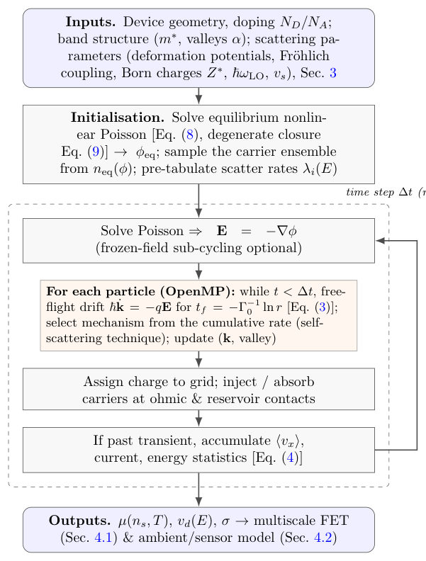
<figcaption class="paper-figure-caption"><b>Fig 1.</b> Figure 1. Self-consistent ensemble Monte Carlo cycle of the ViennaEMC framework [37]. DFPT-verified material and scattering parameters enter at the top. The dashed block is repeated each time step, alternating a Poisson solve with a free-flight/self-scattering update of the carrier ensemble.</figcaption>
</figure>
<figure class="paper-figure-card">
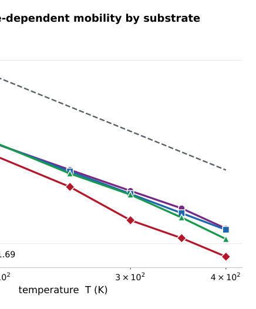
<figcaption class="paper-figure-caption"><b>Fig 2.</b> Figure 2. Temperature-dependent mobility µ(T) for different substrates. Each insulator has its own power-law exponent γ (µ ∝T −γ). The suspended (intrinsic) film has the shallowest slope (γ = 1.49). Every supporting dielectric adds a thermally activated remote surface-optical phonon channel whose scattering grows with temperature and steepens the falloff, most strongly for the soft, polar high-κ HfO2 (γ = 1.79). The exponents bracket the Kaasbjerg impurity-free phonon limit (γ = 1.69, dashed), shown for reference.</figcaption>
</figure>
<figure class="paper-figure-card">
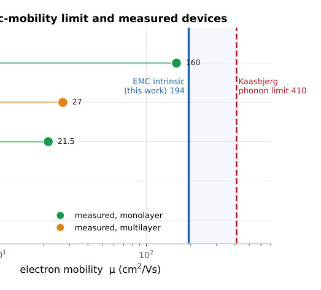
<figcaption class="paper-figure-caption"><b>Fig 3.</b> Figure 3. The EMC intrinsic phonon-limited mobility sets an upper bound below the Kaasbjerg phonon limit, against which the measured monolayer and multilayer device mobilities are benchmarked, each falling below the bound by an amount that quantifies its extrinsic (contact, defect and substrate) limitation.</figcaption>
</figure>
<figure class="paper-figure-card">
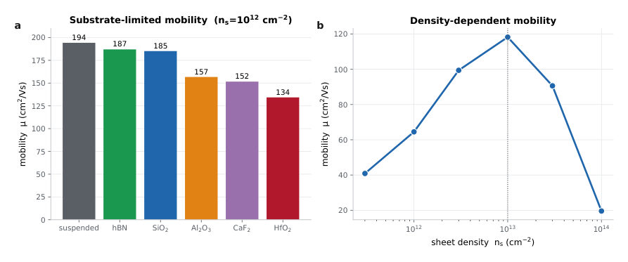
<figcaption class="paper-figure-caption"><b>Fig 4.</b> Figure 4. The mobility is limited both by the supporting dielectric, resolved in (a) as the remote-surface-optical-phonon-limited mobility for the different substrates, and by the carrier density, shown in (b) as a non-monotonic dependence µ(ns) that is low at small sheet density where too few free carriers screen the charged impurities, rises as the added carriers progressively screen them, and falls again at high density as the stronger vertical field presses the carriers into the rough dielectric interface, so that the balance of the two opposing trends sets the peak near ns = 1013 cm−2.</figcaption>
</figure>
<figure class="paper-figure-card">
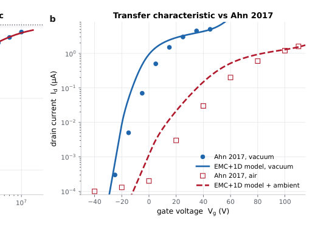
<figcaption class="paper-figure-caption"><b>Fig 5.</b> Figure 5. One-dimensional velocity-saturation channel model fed by the EMC v(E). (a) EMC velocity-field characteristic and Caughey-Thomas fit (µ0, vsat). (b) Transfer Id-Vg versus the measured monolayer FET of Ahn et al. [21] in air and vacuum.</figcaption>
</figure>

**Summary.** This work presents an advanced, self-consistent Ensemble Monte Carlo (EMC) framework to model charge transport and gas sensing in monolayer MoS2. By integrating first-principles calculations for intrinsic parameters with complex scattering mechanisms, the authors successfully bridge atomic-scale physics to measurable device characteristics. This provides a powerful, predictive tool for designing 2D electronic and chemical sensors.

**Why it may be interesting.** While focused on solid-state transport, the rigorous use of advanced numerical techniques like EMC for solving complex, coupled non-equilibrium equations is highly relevant. The multiscale coupling approach—linking quantum scattering rates to continuum device models—is a general computational methodology applicable across many physics domains.

Detailed structure

**Main problem.** To develop a predictive, physically grounded transport model for monolayer MoS2 that spans multiple length and energy scales, from electron-phonon coupling to device current and gas sensing response.

**Main result.** The self-consistent Ensemble Monte Carlo (EMC) framework successfully reproduces measured transfer characteristics in air/vacuum and accurately models the conductivity response to various gases ($	ext{O}_2$, $	ext{NO}_2$, $	ext{NH}_3$).

**Method.** A self-consistent Ensemble Monte Carlo (EMC) simulation, built on the ViennaEMC solver, is used to solve the Boltzmann Transport Equation coupled with Poisson's equation.

**Model / system.** The system is monolayer MoS2, modeled using a comprehensive scattering stack that includes intrinsic mechanisms (phonon coupling) and extrinsic ones (charged impurities, surface roughness). The model couples EMC transport results into a 1D gradual-channel device simulator.

**Key observables.** Drift mobility ($\mu$), transfer characteristics ($I_d$-$V_g$), and conductivity response to ambient gases ($	ext{O}_2$, $	ext{NO}_2$, $	ext{NH}_3$).

**Important parameters / regimes.** Electron-phonon coupling strengths, scattering rates from various sources (acoustic/optical phonons, impurities), and adsorbate charge transfer parameters.

**Assumptions / limitations.** The model assumes that the intrinsic transport parameters can be accurately calculated via first-principles DFT/DFPT methods, and it uses a multiscale coupling approach to bridge microscopic physics to macroscopic device behavior.

**Figures summary.** Figures illustrate mobility dependence on temperature and substrate material; they also show $I_d$-$V_g$ transfer curves reproducing measurements, and conductivity response ($\sigma(	heta)$) for gas sensing overlaid with theoretical decomposition.

**Paper structure.** The paper establishes the need for a multiscale model, details the EMC framework incorporating a full scattering stack (verified against DFPT), demonstrates its application to reproduce device $I_d$-$V_g$ curves, and finally extends this framework to model ambient and gas sensing responses via charge-transfer extensions.

Abstract

Two-dimensional semiconductors, such as monolayer MoS$_2$, combine a technologically useful band gap with an all-surface geometry, making them attractive both as field-effect-transistor channels and as chemically sensitive devices. Predictive device design requires a transport model that is (i) physically grounded rather than empirical, (ii) validated against experiments, and (iii) able to span the scales from electron-phonon coupling to terminal current and sensor response. We present a self-consistent ensemble Monte Carlo (EMC) framework for monolayer MoS$_2$ built on the ViennaEMC solver, comprising a Boltzmann-transport kernel with a full intrinsic and extrinsic scattering stack (deformation-potential acoustic and intervalley phonons, polar-optical Fröhlich and piezoelectric coupling, remote substrate phonons, screened charged-impurity and surface-roughness scattering), degenerate free-carrier statistics, and a self-consistent Poisson coupling. The intrinsic transport parameters are verified against first-principles density-functional perturbation theory (DFPT), and seven quantities (lattice constant, conduction-band effective mass, band gap, Born effective charges, the longitudinal-optical phonon energy, and both in-plane sound velocities) agree with the reference parametrization. In a multiscale coupling, the EMC velocity-field characteristic feeds a one-dimensional velocity-saturation channel model, which captures the velocity-saturated field dependence and reproduces the measured transfer characteristics of a CVD monolayer device in air and vacuum. Finally, an ambient/adsorbate extension reproduces the measured conductivity response to oxygen partial pressure and the concentration dependence of NO$_2$ and NH$_3$ sensing measured in several independent devices.

[↑ back to top](#top)

### [Acoustic Phonon Dynamics in Co-Doped BaFe$_2$As$_2$ Thin Film](http://arxiv.org/abs/2607.18583v1)

**Authors:** Alexander Bartenev, Roman Kolodka, Larry Theran, Ki-Tae Eom, Jong-Hoon Kang, Jason Kawasaki, Chang-Beom Eom, Sergiy Lysenko  
**Type:** experiment · **Category:** other · **PDF:** <https://arxiv.org/pdf/2607.18583v1>  
**Analysis basis:** full PDF text, analyzed in chunks
**Topic relevance:** `non-equilibrium dynamics` **3/5** · `quantum optics experiment` **2/5** · `spintronics-quantum-optics interface` **2/5** · `analog quantum simulation` **1/5** · `correlated / nonlocal dissipation` **1/5** · `driven-dissipative phase transition` **1/5** · `methods for driven-dissipative` **1/5** · `non-equilibrium universality` **1/5**

↔ Scroll figures horizontally

<figure class="paper-figure-card">
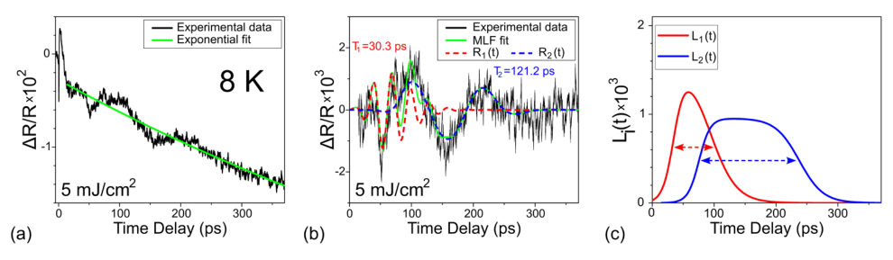
<figcaption class="paper-figure-caption"><b>Fig 1.</b> FIG. 1. (a) Transient reflectivity signal of Ba(Fe0.92Co0.08)2As2 thin film within 380 ps after photoexcitation. The solid line shows the exponential thermal background. (b) Residual acoustic response fitted with the modified logistic-function (MLF) model. (c) Modified logistic functions corresponding to the two acoustic phonon modes. The dashed arrows indicate the full widths at half maximum (FWHM).</figcaption>
</figure>

**Summary.** This work uses ultrafast pump-probe reflectivity measurements to probe acoustic phonon dynamics in a superconducting thin film. By analyzing two distinct, coupled oscillation frequencies using a logistic model, the researchers provide evidence for anharmonic energy transfer between these vibrational modes. This sheds light on the coupling mechanisms governing lattice vibrations in iron-based superconductors.

**Why it may be interesting.** While focused on condensed matter acoustics, the use of time-domain spectroscopy (pump-probe) to study coherent oscillations and their decay rates is analogous to characterizing coherence times in quantum optical or open quantum systems.

Detailed structure

**Main problem.** The study investigates coherent acoustic phonon dynamics and their subsequent decay mechanisms within a Co-doped BaFe2As2 thin film.

**Main result.** The observation of two distinct, coupled acoustic modes suggests an anharmonic energy transfer process where the higher-frequency mode decays into the lower-frequency mode.

**Method.** Pump-probe reflectivity measurements were performed using a femtosecond laser system to track time-dependent changes in optical properties.

**Model / system.** The physical system is an iron-based superconductor, Ba(Fe0.92Co0.08)2As2 thin film. The analysis employs a modified logistic-function model to fit the transient reflectivity signal components.

**Key observables.** Coherent acoustic oscillations detected at 33 GHz and 8.2 GHz; phonon mode lifetimes derived from FWHM measurements (e.g., 70.6 ps, 162.4 ps).

**Important parameters / regimes.** Temperature down to 7.5 K; sound speed calculated as 2640 m/s.

**Assumptions / limitations.** The analysis assumes the acoustic response can be accurately modeled by a sum of modified logistic functions, and reduced sound speed is attributed to elastic softening and strain effects.

**Figures summary.** Figure 1(a) shows the overall transient reflectivity signal over time; Figure 1(b) displays the residual acoustic response fitted with the MLF model; Figure 1(c) decomposes this into individual, decaying logistic functions for the two modes.

**Paper structure.** The paper presents experimental measurements of phonon dynamics followed by a detailed analysis using a modified logistic-function fitting procedure to extract mode parameters and infer energy transfer mechanisms.

Abstract

Pump-probe reflectivity reveals coherent acoustic oscillations at 33 and 8.2 GHz in a Ba(Fe$_{0.92}$Co$_{0.08}$)$_2$As$_2$ thin film. The acoustic response was analyzed using a modified logistic-function model, suggesting a temporal redistribution of coherent acoustic energy consistent with anharmonic decay of the higher-frequency mode into the lower-frequency mode.

[↑ back to top](#top)

### [Complete Hierarchy of Nonrelativistic Odd-Parity Spin Splitting in Collinear Magnets](http://arxiv.org/abs/2607.19303v1)

**Authors:** Yichen Liu, Junxi Yu, Pu Zhang, Cheng-Cheng Liu  
**Type:** theory · **Category:** other · **PDF:** <https://arxiv.org/pdf/2607.19303v1>  
**Analysis basis:** full PDF text, analyzed in chunks
**Topic relevance:** `exotic spin models in light-matter` **3/5** · `spintronics-quantum-optics interface` **3/5** · `non-equilibrium dynamics` **2/5** · `Keldysh / 2PI / non-Gaussian methods` **1/5** · `driven-dissipative phase transition` **1/5** · `methods for driven-dissipative` **1/5** · `non-equilibrium universality` **1/5**

↔ Scroll figures horizontally

<figure class="paper-figure-card">
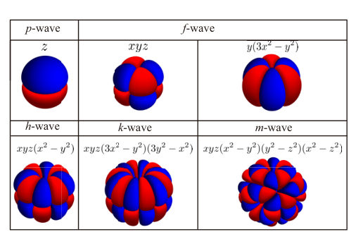
<figcaption class="paper-figure-caption"><b>Fig 1.</b> FIG. 1. Complete hierarchy of nonrelativistic odd-parity spin splitting in collinear magnets. The surfaces visualize the angular dependence of the partial-wave form factor of ∆E(k) = E↑(k)−E↓(k), with red and blue denoting positive and negative signs. The upper row shows the p-wave basis z and representative f-wave bases xyz and y(3x2 −y2); the lower row shows the h-, k-, and m-wave bases xyz(x2 −y2), xyz(3x2 −y2)(3y2 −x2), and xyz(x2 −y2)(y2 −z2)(x2 −z2).</figcaption>
</figure>
<figure class="paper-figure-card">
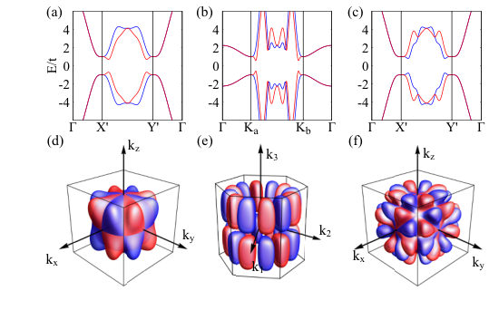
<figcaption class="paper-figure-caption"><b>Fig 2.</b> FIG. 2. Minimal symmetry-adapted models for high-partial- wave odd-parity spin splitting. Panels (a)-(c) show the spin- resolved band structures of the h-, k-, and m-wave models, respectively, with red and blue denoting the spin-up and spin- down sectors. Panels (d)-(f) show the corresponding isoen- ergy surfaces at E = −3t in the cubic, hexagonal, and cubic Brillouin zones, respectively; the colors distinguish the two spin channels. In each model, the nearest-neighbor hopping amplitude t is taken as the energy unit. The parameters are J = t, λh = 0.2t, λk = 0.5t, and λm = 0.1t.</figcaption>
</figure>
<figure class="paper-figure-card">
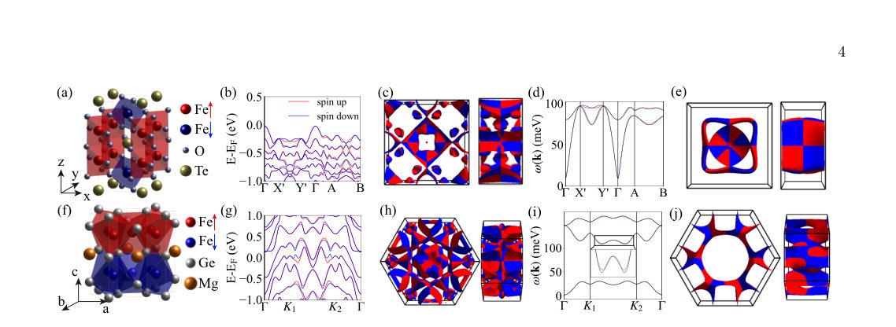
<figcaption class="paper-figure-caption"><b>Fig 3.</b> FIG. 3. Material realizations of high-partial-wave collinear odd-parity magnetism. (a) Tetragonal crystal structure [space group P42/mnm (No. 136)] and PT -symmetric collinear antiferromagnetic (AFM) order of Fe2TeO6; red and blue Fe atoms carry opposite magnetic moments. (b) Spin-resolved electronic band structure and (c) two views of the corresponding electronic isoenergy surfaces in the light-induced h-wave phase. (d) Magnon spectrum and (e) two views of the corresponding spin- resolved magnon isoenergy surfaces. (f) Hexagonal crystal structure [space group P6/mmm (No. 191)] and PT -symmetric collinear AFM order of MgFe6Ge6. Panels (g) and (h) show the spin-resolved electronic band...</figcaption>
</figure>
<figure class="paper-figure-card">
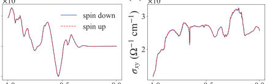
<figcaption class="paper-figure-caption"><b>Fig 4.</b> FIG. 4. Anomalous Hall conductivity of high-partial-wave odd-parity magnets. Spin-resolved anomalous Hall conductiv- ity as a function of the chemical-potential shift E −EF for (a) h-wave Fe2TeO6 and (b) k-wave MgFe6Ge6. Blue solid and red dashed curves denote the spin-down and spin-up contri- butions, respectively. The light-field parameters are the same as in Fig. 3.</figcaption>
</figure>

**Summary.** This work establishes a comprehensive, symmetry-based classification scheme for nonrelativistic odd-parity spin splitting in collinear magnets, extending the known partial-wave hierarchy up to $\ell=9$. By mapping crystal symmetries to allowed spin-splitting forms, the authors predict which high-partial-wave classes can exhibit anomalous Hall responses, providing crucial diagnostic tools for experimental condensed matter physics.

**Why it may be interesting.** The rigorous application of group theory to classify momentum-dependent spin splittings provides powerful predictive tools for understanding exotic magnetotransport phenomena in quantum materials.

Detailed structure

**Main problem.** To establish a complete symmetry classification of nonrelativistic odd-parity spin splitting ($\Delta E(k)$) in collinear magnets, extending beyond known $p$- and $f$-wave classes.

**Main result.** A complete hierarchy is established showing allowed odd-parity classes up to $\ell=9$ ($m$-wave), providing symmetry criteria for anomalous transport; specific materials like Fe2TeO6 realize h-wave splitting.

**Method.** The authors use group theory, applying a two-step classification procedure involving the parent Néel order and an axial field to determine allowed spin-splitting representations ($\Gamma_{\Delta}$).

**Model / system.** The study focuses on collinear magnets, modeled using minimal symmetry-adapted four-band tight-binding Hamiltonians. The splitting is induced by breaking effective time-reversal symmetry, often simulated via Floquet driving.

**Key observables.** Odd-parity spin splitting $\Delta E(k)$, anomalous Hall conductivity ($\sigma_{xy}$), and characteristic features in electronic/magnon spectra for different wave classes.

**Important parameters / regimes.** Partial-wave order $\ell$ (ranging from 1 to 9); the symmetry point group of the magnet; coupling strength of the axial field.

**Assumptions / limitations.** The analysis assumes collinear magnetic ordering and relies on specific symmetry breaking mechanisms, such as Floquet driving by circularly polarized light.

**Figures summary.** Figures illustrate the complete hierarchy (p, f, h, k, m waves) and show spin-resolved electronic/magnon spectra for realized materials under light-induced phases. Figure 4 shows calculated anomalous Hall conductivity.

**Paper structure.** The paper systematically develops a group-theoretical framework using Tables I and II to classify $\Gamma_{\Delta}$, constructs minimal lattice models for $h$-, $k$-, and $m$-waves, applies this classification to known materials (Fe2TeO6, MgFe6Ge6), and finally uses the symmetry constraints to predict anomalous transport properties.

Abstract

Momentum-dependent nonrelativistic spin splitting provides a symmetry fingerprint of collinear magnets and can govern unconventional electronic, magnonic, and transport phenomena. Whereas even-parity $s$-, $d$-, $g$-, and $i$-wave splittings in collinear magnets have been extensively studied, odd-parity counterparts remain unexplored beyond the $p$-wave and $f$-wave classes. Here, using group theory, we establish the complete classification of odd-parity spin splitting in collinear magnets. We show that, in addition to the $p$-wave and $f$-wave forms, $h$- and $k$-wave splittings with $\ell=5$ and $7$ are allowed, while $m$-wave splitting with $\ell=9$ constitutes the upper bound. We derive a complete mapping from crystallographic point-group irreducible representations to the lowest-order odd-parity basis functions and formulate the coupling rule between a symmetry-breaking axial field and the parent Néel order that selects the induced odd-parity class. We further construct minimal lattice models that realize $h$-, $k$-, and $m$-wave splitting. Guided by this classification, we screen the MAGNDATA database and show that circularly polarized light can drive the $\mathcal{PT}$-symmetric antiferromagnets Fe$_2$TeO$_6$ and MgFe$_6$Ge$_6$ into $h$-wave and $k$-wave phases, respectively, exhibiting the hallmark spin splittings in both electronic bands and magnon spectra. Symmetry analysis and Berry-curvature calculations show that collinear odd-parity magnets of both $h$- and $k$-wave allow an anomalous Hall response, whereas the $m$-wave class forbids it. Together, these results complete the partial-wave hierarchy of odd-parity spin splitting in collinear magnets and establish symmetry criteria for anomalous transport in the high-partial-wave classes.

[↑ back to top](#top)

### [Electrostatic Control Enables Robust Helical Edge Channel Transport in III-V Quantum Spin Hall Insulators](http://arxiv.org/abs/2607.19051v1)

**Authors:** Manuel Meyer, Tobias Fähndrich, Sebastian Schmid, Justus Walter, Martin Kamp, Adriana Wolf, Sergey Krishtopenko, Guillaume Sigu, Jean-Baptiste Rodriguez, Eric Tournie, Gerald Bastard, Frederic Teppe, Fabian Hartmann, Sven Höfling, Benoit Jouault  
**Type:** experiment · **Category:** other · **PDF:** <https://arxiv.org/pdf/2607.19051v1>  
**Analysis basis:** full PDF text, analyzed in chunks
**Topic relevance:** `spintronics-quantum-optics interface` **3/5** · `analog quantum simulation` **2/5** · `driven-dissipative phase transition` **2/5** · `Kondo & dissipative impurity` **1/5** · `QC/QI experiment` **1/5** · `exotic spin models in light-matter` **1/5** · `non-equilibrium dynamics` **1/5**

↔ Scroll figures horizontally

<figure class="paper-figure-card">
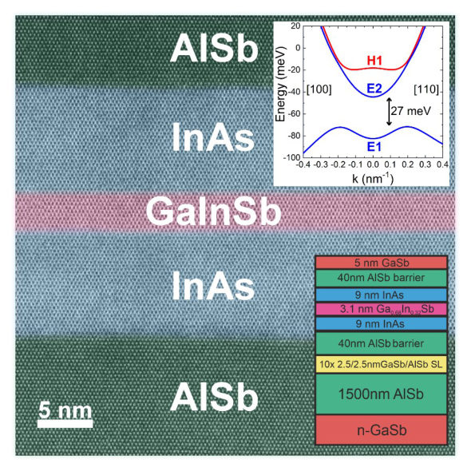
<figcaption class="paper-figure-caption"><b>Fig 1.</b> Fig. 1. STEM image of the investigated InAs/GaInSb/InAs TQW. The AlSb barriers and TQW layers are depicted</figcaption>
</figure>
<figure class="paper-figure-card">
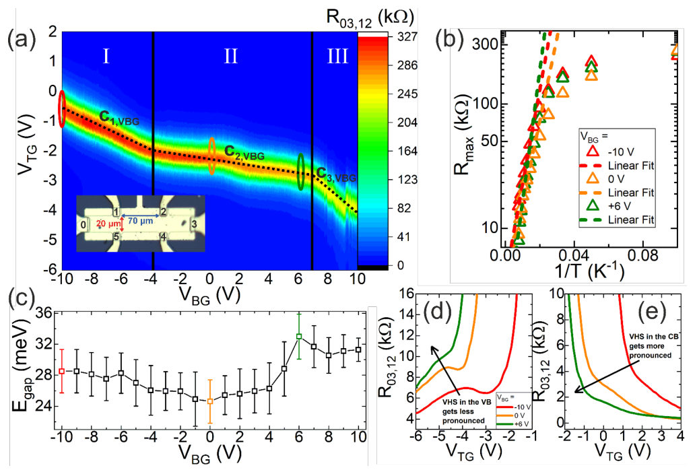
<figcaption class="paper-figure-caption"><b>Fig 2.</b> Fig. 2. (a) Four terminal longitudinal resistance R03,12 as a function of VBG = +10 to -10 V and VTG = +2 to -6 V at</figcaption>
</figure>
<figure class="paper-figure-card">
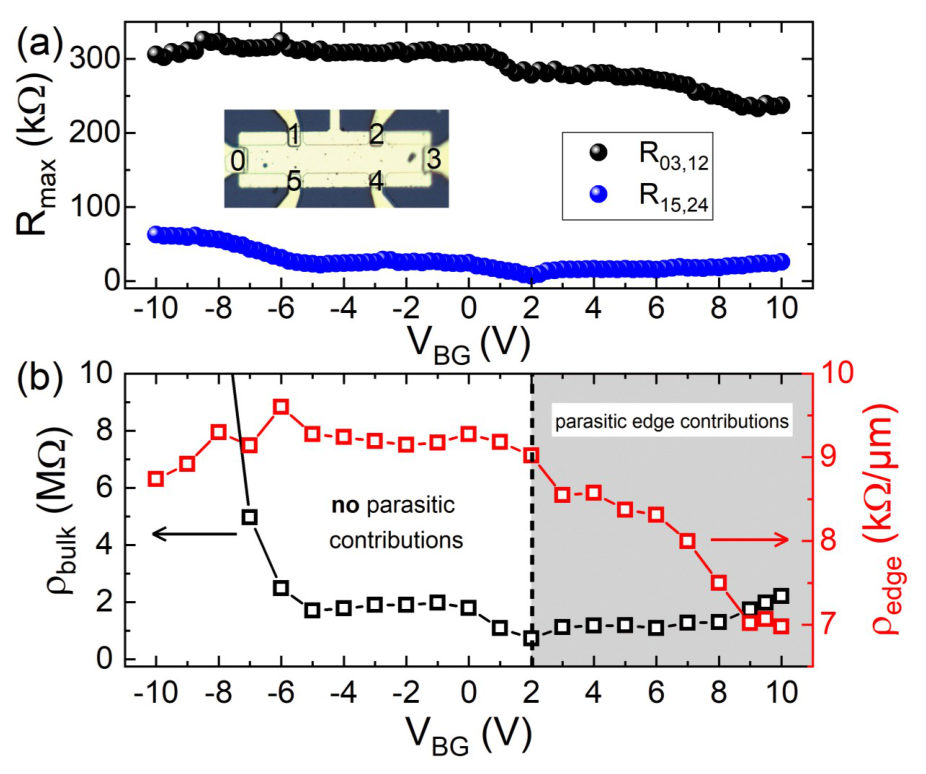
<figcaption class="paper-figure-caption"><b>Fig 3.</b> Fig. 3. (a) Maximum resistance Rmax as a function of VBG = +10 V to -10 V for R03,12 (local configuration, black)</figcaption>
</figure>
<figure class="paper-figure-card">
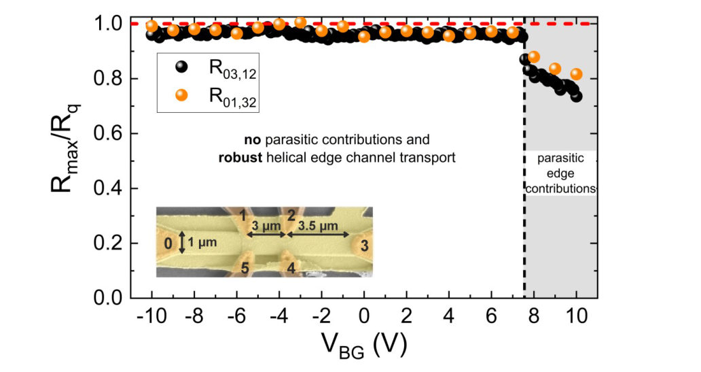
<figcaption class="paper-figure-caption"><b>Fig 4.</b> Fig. 4. R03,12 (local configuration, black) and R01,32 (nonlocal configuration, orange) normalized to their</figcaption>
</figure>

**Summary.** This work demonstrates that using dual electrostatic gating on III-V semiconductor heterostructures allows for precise control over topological electronic states. By suppressing bulk conduction, researchers isolate and confirm the robust, quantized transport signature of helical edge channels in QSH insulators. This establishes a versatile platform for engineering tunable topological devices.

**Why it may be interesting.** While focused on condensed matter transport, the concept of robust, topologically protected channels controlled by external fields is relevant to understanding engineered quantum interfaces and low-dissipation quantum interconnects.

Detailed structure

**Main problem.** The primary goal is to achieve robust helical edge channel transport in Quantum Spin Hall (QSH) insulators by mitigating parasitic bulk and edge conduction pathways.

**Main result.** Dual electrostatic gating successfully suppresses insulating bulk conduction while stabilizing a quantized, robust edge resistance characteristic of topological edge channels.

**Method.** The study employs multi-probe electrical transport measurements on fabricated quantum well structures, analyzing resistance as a function of perpendicular gate voltages.

**Model / system.** The physical system is based on InAs/GaInSb-based two-dimensional topological insulators realized in dual-gated trilayer quantum wells grown on AlSb quasi-substrates.

**Key observables.** Constant, quantized edge resistance (e.g., $h/2e^2$), insulating bulk resistivity ($	ext{M}\Omega$-regime), and the tunability of the topological band gap energy ($E_{	ext{gap}}$).

**Important parameters / regimes.** Gate voltages ($V_{TG}, V_{BG}$), temperature ($T=4.2$ K), and electric field strength (up to $200 	ext{ kV/cm}$).

**Assumptions / limitations.** The analysis assumes that resistance peaks correspond to charge neutrality conditions within the topological gap, and parasitic conduction only emerges beyond specific voltage thresholds.

**Figures summary.** Figures show STEM images confirming crystal quality; transport measurements plot resistance vs. gate voltages, revealing quantized plateaus for edge channels and shifts in resistance peaks related to band gap tuning.

**Paper structure.** The paper progresses by first establishing the physical platform (TQWs), then using multi-probe measurements to characterize bulk versus edge conduction under varying gate biases, culminating in demonstrating that dual gating provides control over both parameters.

Abstract

Quantum spin Hall transport in InAs/GaInSb-based two-dimensional topological insulators can be limited by parasitic bulk and edge contributions. We demonstrate that these limitations are effectively mitigated through electrostatic control in dual-gated InAs/GaInSb/InAs trilayer quantum wells grown on AlSb quasi-substrates. In macroscopic Hall bars exceeding the phase coherence length, a multi-probe analysis reveals an insulating bulk and a constant edge resistance over a wide electric-field range. In microscopic devices with edge lengths below the phase coherence lengths, the edge resistance remains robust and quantized accross a broad field range, revealing the intrinsic resilience of helical edge channels to electric-field perturbations. Only beyond a threshold value, parasitic edge contributions emerge. These results establish dual gating as a reliable strategy to suppress parasitic conduction while stabilizing helical edge transport, providing a versatile and reproducible platform for tunable topological transport in III-V quantum spin Hall systems.

[↑ back to top](#top)

### [Probing Synthetic Caroli-de Gennes-Matricon States Through Critical Current in Full-Shell Nanowire Josephson Junctions](http://arxiv.org/abs/2607.18371v1)

**Authors:** Carlos Payá, Ángel Ibabe, Mario Gómez, Thomas Kanne, Jesper Nygård, Ramón Aguado, Pablo San-Jose, Eduardo J. H. Lee, Elsa Prada  
**Type:** both · **Category:** other · **PDF:** <https://arxiv.org/pdf/2607.18371v1>  
**Analysis basis:** full PDF text, analyzed in chunks
**Topic relevance:** `Keldysh / 2PI / non-Gaussian methods` **3/5** · `driven-dissipative phase transition` **3/5** · `non-equilibrium universality` **2/5** · `Kondo & dissipative impurity` **1/5** · `methods for driven-dissipative` **1/5** · `non-equilibrium dynamics` **1/5**

↔ Scroll figures horizontally

<figure class="paper-figure-card">
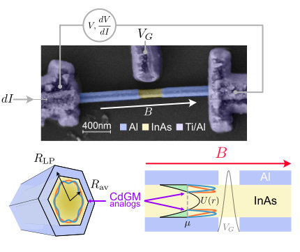
<figcaption class="paper-figure-caption"><b>Fig 1.</b> FIG. 1. Full-shell nanowire Josephson junction. (a) False-color electron micrograph of a representative device. The junction is defined by selectively etching the Al shell from the central region of an Al/InAs nanowire, and contact- ing the ends with Ti/Al leads. Transport is characterized by applying a DC current bias I, mixed with a small AC excita- tion, while simultaneously measuring the voltage drop V , and the differential resistance dV/dI, with an external magnetic field B applied approximately aligned to the nanowire axis. A local gate voltage VG at the junction is used to tune its transparency. (b) Schematic of the theoretical model, show- ing a full-shell nanowire cross-section...</figcaption>
</figure>
<figure class="paper-figure-card">
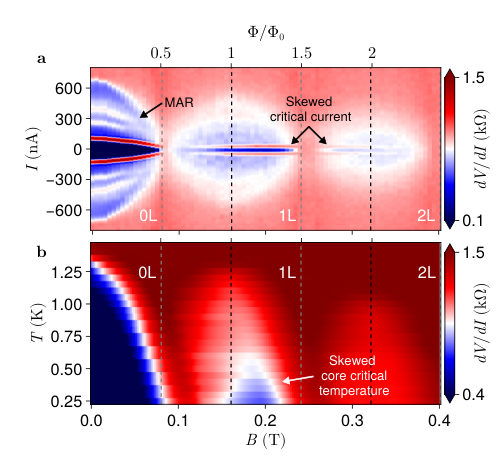
<figcaption class="paper-figure-caption"><b>Fig 2.</b> FIG. 2. Skewness of the critical current and critical temperature. (a) Differential resistance dV/dI measured as a function of axial magnetic field B and applied current I. The outer-most features oscillate with the flux Φ thread- ing the shell, forming Little-Parks (LP) lobes labeled by nL, where n is the fluxoid number. Φ0 is the superconducting flux quantum. The critical current Ic at low current bias presents a clear skewness towards high (low) magnetic fields within 1L (2L). Multiple Andreev reflection (MAR) peaks are visible in 0L. (b) Zero-bias dV/dI measurement as a function of B and cryostat nominal temperature T. The high-temperature fea- tures oscillate with flux owing to the LP...</figcaption>
</figure>
<figure class="paper-figure-card">
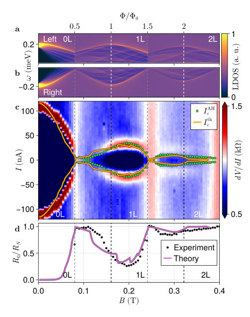
<figcaption class="paper-figure-caption"><b>Fig 3.</b> FIG. 3. Critical current skewness caused by CdGM analogs. Local density of states (LDOS) calculated at the end of a semi-infinite full-shell nanowire, corresponding to the left (a) and right (b) sides of the Josephson junction, as a function of magnetic field B (or normalized flux Φ/Φ0) and energy ω. The shell gap edge is modulated into LP lobes (0L, 1L, 2L). Inside, CdGM analogs disperse with flux, exhibiting a distinct skewness toward high (low) magnetic fields within 1L (2L). (c) Low-current zoom of the differential resistance map from Fig. 2(a). The green dots indicate the critical current extracted from the experimental data using the Ambegaokar- Halperin formula, IAH c . The orange...</figcaption>
</figure>

**Summary.** The authors investigate synthetic Caroli-de Gennes-Matricon (CdGM) states in full-shell nanowire Josephson junctions. By measuring the critical current ($I_c$) under an applied magnetic field, they observe a distinct skewness pattern. This signature is theoretically linked to CdGM analogs within the semiconductor core, providing strong evidence for their existence and utility as a diagnostic tool for superconducting physics.

**Why it may be interesting.** This work provides a concrete experimental realization and diagnostic tool (the $I_c$ skewness) for studying exotic superconducting phenomena like CdGM states, which are highly relevant in mesoscopic superconductivity and topological materials research.

Detailed structure

**Main problem.** The study aims to experimentally probe synthetic Caroli-de Gennes-Matricon (CdGM) states within full-shell nanowire Josephson junctions.

**Main result.** The characteristic skewness observed in the critical current ($I_c$) and zero-bias resistance ratio ($R_0/R_N$) is attributed to these CdGM analogs residing in the semiconductor core, superimposed on Little-Parks oscillations from the superconducting shell.

**Method.** The research combines transport measurements (measuring $dI/dV$ vs. $B$ and $I$) with microscopic theoretical modeling using Keldysh Green's functions formalism.

**Model / system.** The physical system is a full-shell hybrid nanowire Josephson junction ($	ext{SC}/	ext{SM}$ core). The model uses a tight-binding Bogoliubov-de Gennes Hamiltonian to calculate observables like the Local Density of States (LDOS) and critical current.

**Key observables.** Critical current ($I_c$) skewness, zero-bias resistance ratio ($R_0/R_N$), Little-Parks oscillations in $dI/dV$, and superconducting gap modulation.

**Important parameters / regimes.** Axial magnetic field ($B$), superconducting gap ($\Delta$), flux quantum ($\Phi_0$), and the level spacing of CdGM analogs relative to $\Delta$.

**Assumptions / limitations.** The analysis assumes that the observed skewness is dominated by the finite population of CdGM analogs crossing zero energy, rather than just shell gap collapse.

**Figures summary.** Figures illustrate $dI/dV$ vs. $B$ showing Little-Parks lobes and current skewness; other figures compare theoretical predictions for $I_c$ skewness against experimental data derived from the $R_0/R_N$ ratio.

**Paper structure.** The paper establishes the physical platform (full-shell nanowires) and the phenomenon of CdGM analogs. It presents measurements showing characteristic current modulation and asymmetry, which are then theoretically modeled using Green's functions to confirm that the skewness fingerprint uniquely identifies the presence of these subgap states.

Abstract

Full-shell hybrid nanowires consisting of a semiconductor core fully enveloped by a superconducting shell have emerged as a platform to study Caroli-de Gennes-Matricon (CdGM) analogs. These subgap states can be considered a synthetic version of CdGM states in Abrikosov vortices. Unlike conventional CdGM states, these analogs exhibit a level spacing comparable to the superconducting gap, making them readily observable via tunneling spectroscopy techniques. The spectral density of CdGM analogs follows a characteristic skewed pattern as a function of applied axial magnetic field, an effect that is superimposed on the Little-Parks oscillations of the shell's gap induced by fluxoid quantization. Here, we provide experimental evidence for CdGM analogs through a distinctive skewness fingerprint in the critical current and zero-bias resistance of overdamped Josephson junctions based on full-shell nanowires.

[↑ back to top](#top)

### [Double anticrossings induced by nonlinear magnon interactions](http://arxiv.org/abs/2607.18807v1)

**Authors:** Geil Emdi, Tomosato Hioki, Koujiro Hoshi, Takahiko Makiuchi, Aoi Yamauchi, Eiji Saitoh  
**Type:** both · **Category:** other · **PDF:** <https://arxiv.org/pdf/2607.18807v1>  
**Analysis basis:** full PDF text, analyzed in chunks
**Topic relevance:** `spintronics-quantum-optics interface` **3/5** · `analog quantum simulation` **1/5** · `correlated / nonlocal dissipation` **1/5** · `driven-dissipative phase transition` **1/5** · `exotic spin models in light-matter` **1/5** · `non-equilibrium dynamics` **1/5**

↔ Scroll figures horizontally

<figure class="paper-figure-card">
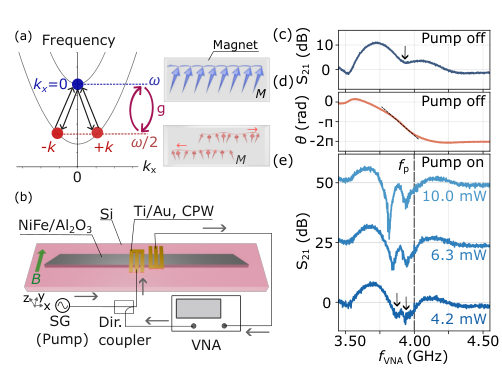
<figcaption class="paper-figure-caption"><b>Fig 1.</b> FIG. 1. (a) Schematic of the spin wave dispersion branches and three-magnon splitting and confluence processes giving rise to an effective coupling g. M denotes the magnetiza- tion. (b) Experimental setup (SG: signal generator; VNA: vector network analyzer). (c) Magnitude and (d) phase (θ) of the transmission S21 at B = 13.1 mT with pump off con- dition. The dashed line indicate slope near the resonant mode frequency (e) S21 magnitude at pump on condition with fp = 4 GHz and various pump power P.</figcaption>
</figure>
<figure class="paper-figure-card">
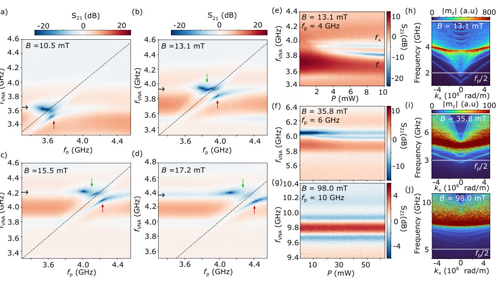
<figcaption class="paper-figure-caption"><b>Fig 2.</b> FIG. 2. Pump-frequency dependence of the S21 spectrum for different magnetic fields: (a) 10.5 mT, (b) 13.1 mT, (c) 15.5 mT, and (d) 17.2 mT at P = 8 mW. Black dashed lines indicate fVNA = fp, and black arrows mark the Kittel mode frequencies. Power-dependent of S21 at (e) 13.1 mT with fp = 4 GHz, (f) at 35.8 mT with fp = 6 GHz, and (g) at 98 mT with fp = 10 GHz. Calculated spin-wave dispersions at (h) 13.1, (i) 35.8, and (j) 98 mT, where |mz| denotes the z-component (out-of plane) of the magnetization in the sample simulation. The colorbar used in panel (j) is the same as that of panel (i).</figcaption>
</figure>
<figure class="paper-figure-card">
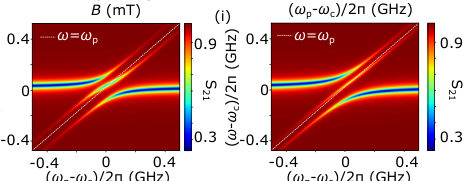
<figcaption class="paper-figure-caption"><b>Fig 3.</b> FIG. 3. (a) Schematic illustrations for nondegenerate para- metric excitation by the finite-wavevector pump magnon modes (b) Schematic of the effective coupling mechanisms included in the model. (c) fgap vs pump power P. Solid line: fit to fgap = A1( √</figcaption>
</figure>

**Summary.** This work investigates how strong, nonlinear magnon interactions in patterned magnetic films can spontaneously create multiple distinct energy coupling pathways. By observing and modeling double anticrossings whose characteristics depend strongly on pump power, the authors prove that three-magnon scattering generates two separate magnon populations, effectively creating multiple independent coupling channels within one physical system.

**Why it may be interesting.** The ability to dynamically generate multiple coupling channels via nonlinear magnon interactions is highly relevant to understanding engineered quantum systems where mode coupling dictates device functionality, bridging concepts from cavity QED/optomechanics into magnonics.

Detailed structure

**Main problem.** To demonstrate that nonlinear magnon interactions can dynamically generate multiple emergent coupling channels within a single magnetic system, moving beyond channels fixed by device geometry.

**Main result.** The system exhibits pump-induced double anticrossings attributed to nondegenerate three-magnon splitting, which generates two distinct magnon populations and thus two effective coupling channels with the Kittel mode.

**Method.** A combination of microwave spectroscopy (VNA measurements) on patterned permalloy films and theoretical modeling using a three-magnon coupling Hamiltonian ($	ext{H}_{	ext{nd}}$) coupled to an effective mean-field interaction ($	ext{H}_{	ext{c,eff}}$).

**Model / system.** The physical system is spin waves (magnons) in patterned permalloy films. The model involves three-magnon scattering processes and the coupling of the resulting secondary magnon pairs to a primary Kittel mode.

**Key observables.** Double anticrossing features in the $S_{21}$ spectrum, frequency gap ($\Delta f_{	ext{gap}}$), and central frequency shift ($\delta\omega_c$).

**Important parameters / regimes.** Pump power ($P$), applied magnetic field ($B$), and wavevector ($k$). The dependence of observables on $P$ confirms nonlinearity.

**Assumptions / limitations.** The analysis relies on developing an effective coupling Hamiltonian in the mean-field approximation after deriving the three-magnon interaction terms.

**Figures summary.** Figures show schematic dispersion, initial single dip splitting into two dips upon pumping, and the evolution of a double anticrossing feature as the magnetic field increases.

**Paper structure.** The paper progresses from experimental observation (single/double anticrossings dependent on pump power) to theoretical interpretation, attributing the features to nondegenerate three-magnon splitting which creates multiple coupling channels. The analysis confirms predictions based on derived Hamiltonians and scaling laws for gap size and frequency shift.

Abstract

We observe pump-induced double anticrossings whose gap sizes and center-frequency shifts depend strongly on pump power, indicating a nonlinear mechanism. The anticrossings vanish at high magnetic fields, where energy conservation suppresses three-magnon splitting, thereby identifying the underlying process as three-magnon scattering. We attribute the double anticrossings to nondegenerate three-magnon splitting, which generates two magnon populations at distinct frequencies. Each population forms a standing-wave mode and couples independently to the Kittel mode, giving rise to two effective coupling channels. These results demonstrate that nonlinear magnon interactions can dynamically generate multiple coupling channels within a single system.

[↑ back to top](#top)

### [Annealing-enhanced spin-orbit effects in non-centrosymmetric superconducting NbRe films](http://arxiv.org/abs/2607.18994v1)

**Authors:** Zahra Makhdoumi Kakhaki, Yuriy Yerin, Francesco Avitabile, Abhishek Kumar, Francesco Colangelo, Carla Cirillo, Oleksandr V. Dobrovolskiy, Carmine Attanasio  
**Type:** both · **Category:** other · **PDF:** <https://arxiv.org/pdf/2607.18994v1>  
**Analysis basis:** full PDF text, analyzed in chunks
**Topic relevance:** `spintronics-quantum-optics interface` **3/5** · `Keldysh / 2PI / non-Gaussian methods` **1/5** · `Kondo & dissipative impurity` **1/5**

↔ Scroll figures horizontally

<figure class="paper-figure-card">
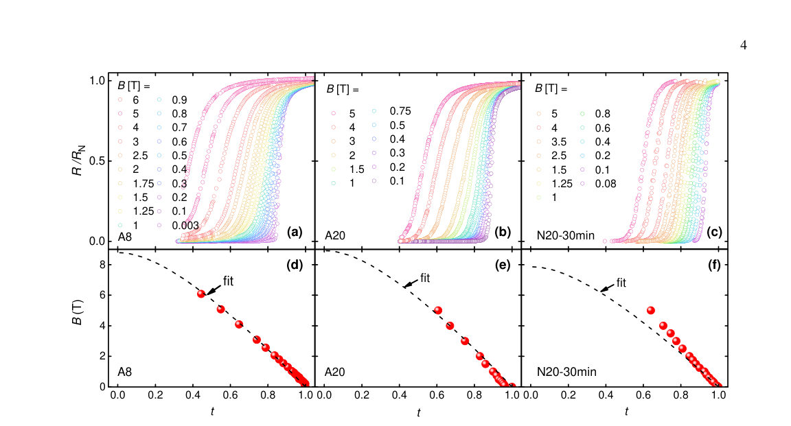
<figcaption class="paper-figure-caption"><b>Fig 1.</b> FIG. 2. (a–c) Normalized resistance as a function of the reduced temperature, t = T/Tc, for NbRe films A8, A20, and N20-30min under different applied magnetic fields. (d–f) Upper critical field as a function of the reduced temperature for the corresponding films. The dashed curves represent fits to the WHH model, Eq. (1), with α = 0 and λso = 0.</figcaption>
</figure>
<figure class="paper-figure-card">
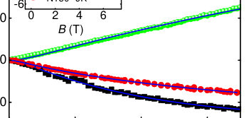
<figcaption class="paper-figure-caption"><b>Fig 2.</b> FIG. 3. (a) Normalized magnetoresistance, [ρ(B) −ρ(0)]/ρ(0), of the as-grown (A150) and annealed (N150) NbRe thin films mea- sured in the normal state at T = 8 K. Solid lines represent fits to the phenomenological relation ∆ρ(B)/ρ0 = B2/(α +βB2). (b) Normal- ized magnetoconductivity, [σ(B)−σ(0)]/σ(0), for the pure Nb ref- erence film measured at T = 10 K, and for the A150 and N150 NbRe films measured at T = 8 K. Solid lines indicate the microscopic fits obtained using the 3D Kawabata weak-localization/weak-anti- localization framework. Inset: magnetoconductivity of the A150 and N150 films measured at T = 9 K, illustrating the reduced difference between the two samples at a temperature far...</figcaption>
</figure>

**Summary.** This work investigates how thermal annealing modifies the superconducting properties of non-centrosymmetric NbRe films. By analyzing both magnetotransport and critical field data, the authors demonstrate that annealing significantly amplifies spin-orbit coupling effects. This enhancement provides evidence for a mechanism protecting the unconventional superconductivity beyond standard theoretical bounds.

**Why it may be interesting.** The direct link established between structural modification (annealing) and the enhancement of a fundamental quantum interaction (spin-orbit coupling) that stabilizes unconventional superconductivity is highly relevant to understanding emergent quantum phenomena in condensed matter systems.

Detailed structure

**Main problem.** The study investigates how thermal annealing affects superconducting and normal-state magnetotransport properties in non-centrosymmetric NbRe films, specifically focusing on the enhancement of spin-orbit effects.

**Main result.** Annealing significantly enhances spin-orbit-mediated quantum transport by increasing the relative spin-orbit scattering strength, leading to upper critical fields that exceed conventional theoretical limits and confirming strong antisymmetric spin-orbit coupling.

**Method.** The research combines structural characterization (XRD) with detailed magnetotransport measurements, analyzing data using the Werthamer–Helfand–Hohenberg framework for $B_{c2}(T)$ and the 3D Kawabata weak-localization/weak-anti-localization model.

**Model / system.** The physical system is $	ext{Nb}_{0.18}	ext{Re}_{0.82}$ thin films, which are non-centrosymmetric superconductors. The analysis relies on models describing quantum interference effects (WL/WAL) and superconducting pair-breaking mechanisms (WHH).

**Key observables.** Upper critical field $B_{c2}(T)$, normal-state magnetoconductivity ($\Delta\sigma/\sigma_0$), spin-orbit scattering strength ($B_{so}$), and the ratio $B_{so}/B_\phi$.

**Important parameters / regimes.** Annealing temperature, crystallite size increase (from $\sim 2$ nm to $\sim 10$ nm), and the observation that $B_{c2}(T)$ surpasses both orbital-limiting and Pauli paramagnetic limits.

**Assumptions / limitations.** The analysis assumes that magnetotransport deviations from conventional theory are due to enhanced spin-orbit coupling protecting the superconducting state against Zeeman splitting.

**Figures summary.** Figures show XRD patterns confirming crystallite growth upon annealing, $R(T)$ curves showing $	ext{T}_c$ changes, and magnetoconductivity plots demonstrating pronounced Weak Anti-Localization (WAL) behavior in annealed samples compared to as-grown ones.

**Paper structure.** The paper progresses by first characterizing structural changes via XRD; then analyzing superconducting properties using $B_{c2}(T)$ within the WHH framework, noting deviations from conventional limits; finally, confirming the underlying mechanism through normal-state magnetotransport analysis using the Kawabata WL/WAL model.

Abstract

$\text{Nb}_{0.18}\text{Re}_{0.82}$ (NbRe) is a non-centrosymmetric superconductor with a transition temperature $T_\mathrm{c}$ reaching $9\text{ K}$ in bulk form. While bulk and single-crystalline NbRe exhibit signatures of multigap superconductivity, thin films generally display a single-gap superconducting state due to structural disorder and reduced crystallite dimensions. Here, we investigate the impact of thermal annealing on the superconducting and normal-state magnetotransport properties of NbRe films. The temperature dependence of the upper critical field, $B_{\mathrm{c2}}(T)$, is analyzed within the microscopic Werthamer--Helfand--Hohenberg (WHH) framework, while the normal-state magnetoconductivity is described using the three-dimensional Kawabata weak-localization/weak-anti-localization model. Annealing drives a pronounced change in the electronic response, manifested by a strong weak anti-localization behavior in the normal state and an upper critical field that surpasses both the conventional orbital-limiting field and the Pauli paramagnetic limit. The microscopic analysis reveals a strong intrinsic increase in the relative spin--orbit scattering strength, with the annealed film showing a significantly enhanced spin--orbit-to-dephasing field ratio. These findings provide direct, independent evidence that thermal modification of the NbRe microstructure successfully amplifies spin--orbit-mediated quantum transport, which acts as the key mechanism protecting the non-centrosymmetric superconducting state against paramagnetic pair-breaking well beyond conventional theoretical boundaries.

[↑ back to top](#top)

### [Towards chemistries in dynamical systems](http://arxiv.org/abs/2607.19090v1)

**Authors:** Martin Biehl, Nathaniel Virgo  
**Type:** theory · **Category:** other · **PDF:** <https://arxiv.org/pdf/2607.19090v1>  
**Analysis basis:** full PDF text, analyzed in chunks
**Topic relevance:** `driven-dissipative phase transition` **2/5** · `non-equilibrium dynamics` **2/5** · `Frenkel-Kontorova` **1/5** · `analog quantum simulation` **1/5** · `correlated / nonlocal dissipation` **1/5** · `methods for driven-dissipative` **1/5** · `non-equilibrium universality` **1/5**

↔ Scroll figures horizontally

<figure class="paper-figure-card">
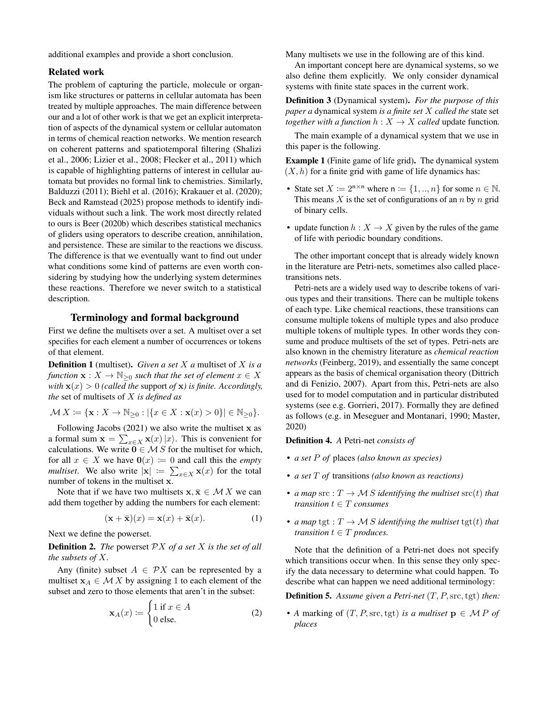
<figcaption class="paper-figure-caption"><b>Fig 1.</b> Low-resolution page preview, page 2</figcaption>
</figure>
<figure class="paper-figure-card">
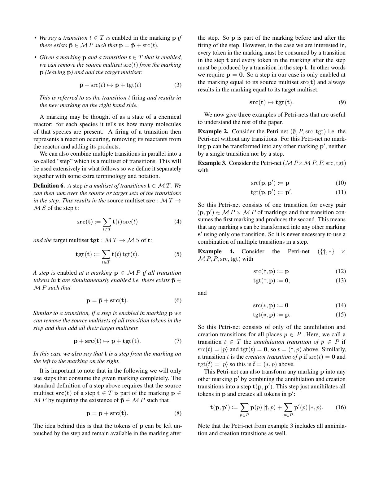
<figcaption class="paper-figure-caption"><b>Fig 2.</b> Low-resolution page preview, page 3</figcaption>
</figure>
<figure class="paper-figure-card">
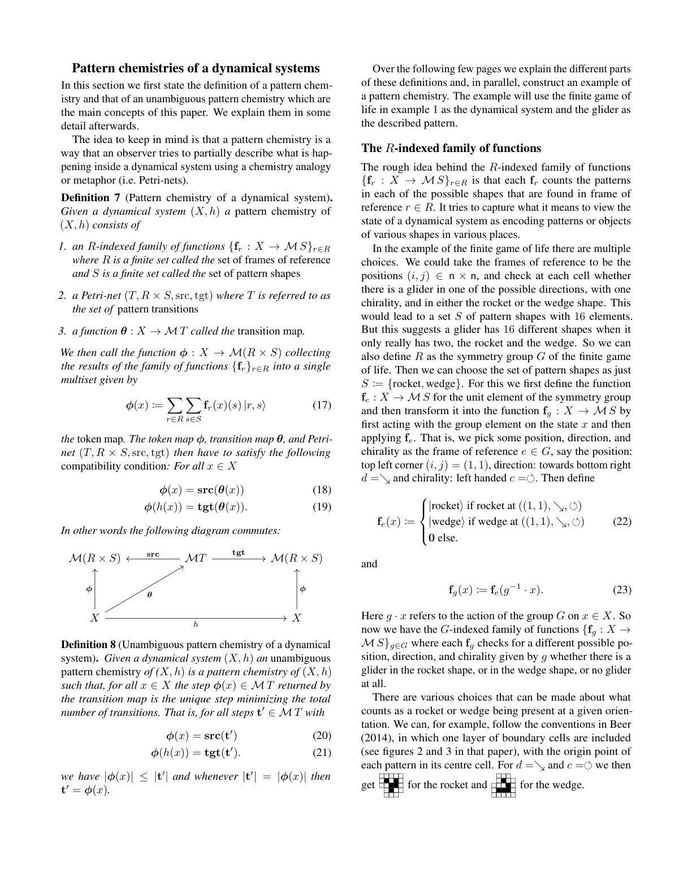
<figcaption class="paper-figure-caption"><b>Fig 3.</b> Low-resolution page preview, page 4</figcaption>
</figure>
<figure class="paper-figure-card">
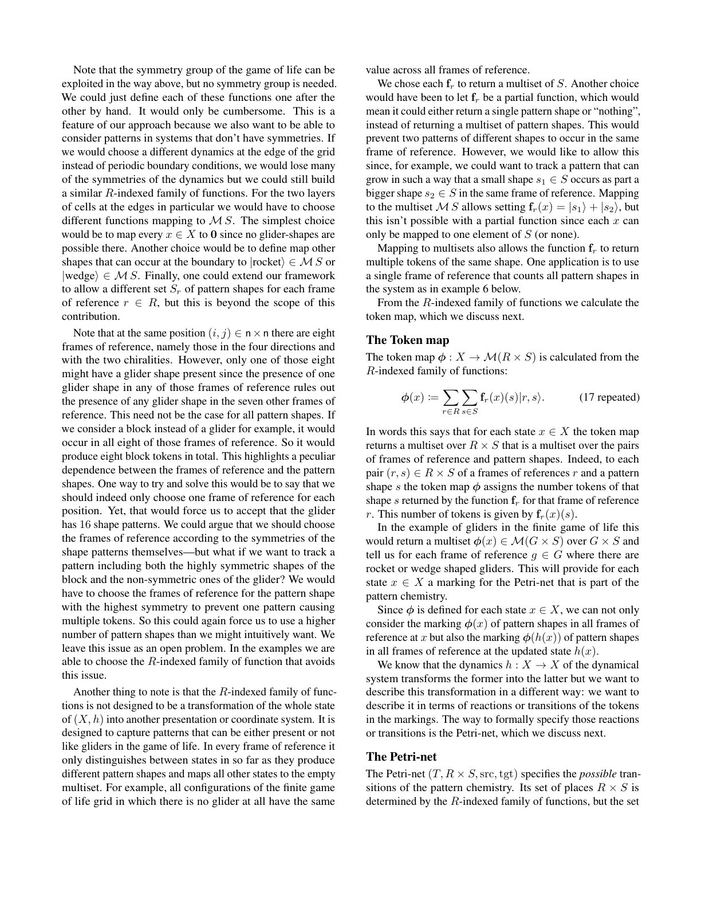
<figcaption class="paper-figure-caption"><b>Fig 4.</b> Low-resolution page preview, page 5</figcaption>
</figure>
<figure class="paper-figure-card">
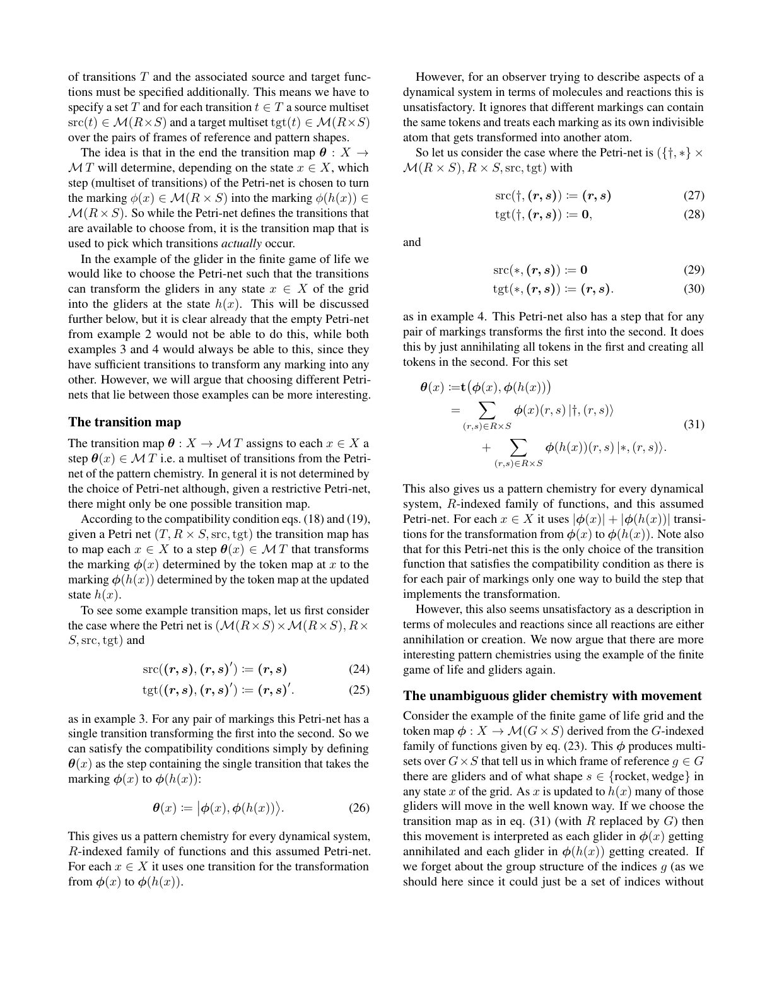
<figcaption class="paper-figure-caption"><b>Fig 5.</b> Low-resolution page preview, page 6</figcaption>
</figure>

**Summary.** The paper introduces 'pattern chemistry' as a method to describe any dynamical system using the language of chemical reactions and Petri nets. It formalizes this by mapping system states to counts of observable patterns (tokens). The central technical achievement is defining an 'unambiguous' chemistry, which requires that the state update must correspond to a unique, minimal set of underlying transitions.

**Why it may be interesting.** This work provides a highly abstract mathematical formalism connecting general discrete dynamics (like CA) to chemical reaction network theory. The focus on minimizing transition counts for uniqueness is relevant to defining fundamental physical processes in complex many-body or open quantum systems where minimal energy paths are sought.

Detailed structure

**Main problem.** The work aims to develop a formal framework, termed 'pattern chemistry,' to describe general dynamical systems using terminology analogous to chemical reaction networks.

**Main result.** The authors propose that for a pattern chemistry to be well-defined and physically meaningful, the transition map must yield a unique minimal set of reactions required to transform the state's observed patterns from time $t$ to time $t+1$.

**Method.** They model the system using Petri nets and token maps ($\phi$), where the state is mapped to counts of observable 'patterns' (shapes in specific frames of reference). The core method involves enforcing compatibility conditions between the source and target markings derived from the dynamical update function.

**Model / system.** The general model is an abstract discrete dynamical system $(X, h: X 	o X)$. Specific examples include analyzing gliders within Conway's Game of Life cellular automaton, which serves as a concrete testbed for the framework.

**Key observables.** The primary observables are the 'token map' $\phi(x)$, which is a multiset counting occurrences of specific patterns (shapes) across different frames of reference at state $x$.

**Important parameters / regimes.** The definition relies on specifying the set of possible pattern shapes ($S$) and the frames of reference ($R$), as well as the structure of the underlying Petri net transitions.

**Assumptions / limitations.** The framework is currently restricted to finite dynamical systems because multisets are defined with finite support. A key assumption for 'unambiguous' chemistry is that the minimal set of required transitions must be unique.

**Figures summary.** Not specified in detail, but examples involve illustrating how pattern counts (markings) evolve through specific transition rules derived from cellular automaton updates.

**Paper structure.** The paper progresses by first establishing the general chemical metaphor for dynamical systems, then formalizing this using Petri nets and token maps ($\phi$), developing the concept of 'unambiguous' chemistry via minimal transitions, and finally testing these concepts on known systems like gliders in Game of Life.

Abstract

Chemistry describes aspects of the universe in terms of molecules and their reactions. In this exploratory work we present a way to describe aspects of any dynamical system in similar terms. To describe a dynamical system in this way three decisions have to be made. The first is how many different "places" there are at which molecules or chemical species can occur; the second is how to determine the species present (or not) at each place; and the third is the set of transitions and reactions that can occur between the species in the various places. For these choices to be compatible with the state update of the dynamical system each state must be able to determine transitions that take the currently occurring molecules to those occurring in the updated state. We also propose an additional requirement that there is always a unique way to choose the least amount of transitions occurring during state updates. We discuss gliders in the game of life cellular and argue that when following their definition of according to Randall Beer they satisfy the additional criterion as well. We also point out some issues with the approach.

[↑ back to top](#top)

### [Charge transfer mediated anomalous photoluminescence enhancement in monolayer MoS2 graphene heterostructure via polystyrene assisted wet transfer](http://arxiv.org/abs/2607.18733v1)

**Authors:** Anagha Gopinath, Arpan De, Dipak Maity, Jyoti Mohanty  
**Type:** both · **Category:** other · **PDF:** <https://arxiv.org/pdf/2607.18733v1>  
**Analysis basis:** full PDF text, analyzed in chunks
**Topic relevance:** `driven-dissipative phase transition` **2/5** · `Kondo & dissipative impurity` **1/5** · `analog quantum simulation` **1/5** · `correlated / nonlocal dissipation` **1/5** · `correlated cavity matter` **1/5** · `methods for driven-dissipative` **1/5** · `non-equilibrium dynamics` **1/5**

↔ Scroll figures horizontally

<figure class="paper-figure-card">
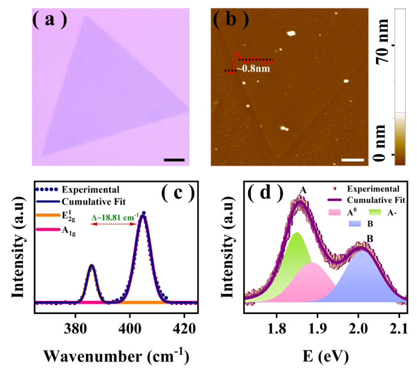
<figcaption class="paper-figure-caption"><b>Fig 1.</b> Figure 1: Characterization of as-grown MoS2. (a) Optical microscopy image. (b) Atomic force mi- croscopy image. Scale bar corresponds to 5µm. (c) Raman spectrum depicting characteristic E1 2g mode and A1g mode of MoS2 separated by 18.81 cm−1. (d) Photoluminescence spectrum showing A and B excitonic features associated with the direct transitions at the K point.</figcaption>
</figure>
<figure class="paper-figure-card">
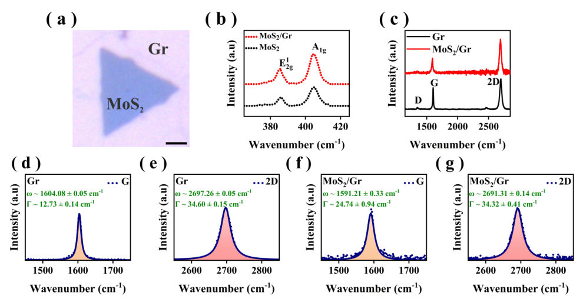
<figcaption class="paper-figure-caption"><b>Fig 2.</b> Figure 2: Characterization of the MoS2/Gr heterostructure. (a) Optical microscopy image of the heterostructure. The scale bar corresponds to 2 µm. (b) Raman spectra of monolayer MoS2 before and after transfer. (c) Raman spectra of bare graphene and graphene in MoS2/Gr heterostructure. Lorentzian fits of the graphene G and 2D peaks (d,e) before transfer and (f,g) in the heterostructure.</figcaption>
</figure>
<figure class="paper-figure-card">
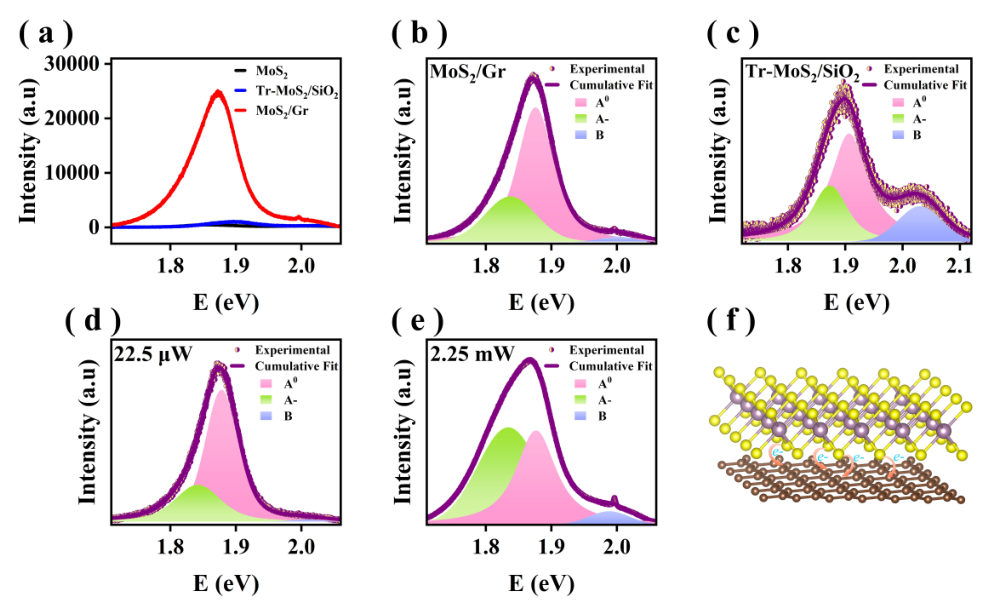
<figcaption class="paper-figure-caption"><b>Fig 3.</b> Figure 3: Photoluminescence (PL) characterization of the MoS2/Gr heterostructure. (a) PL spectra of as-grown MoS2 (black curve), MoS2 transferred onto SiO2 (blue curve), and MoS2/graphene het- erostructure (red curve). Deconvoluted PL spectrum of (b) the MoS2/Gr heterostructure and (c) MoS2 transferred onto SiO2. PL spectra acquired at excitation laser powers of (d) 22.5 µW and (e) 2.25 mW. (f) Schematic illustration of charge transfer from MoS2 onto graphene.</figcaption>
</figure>
<figure class="paper-figure-card">
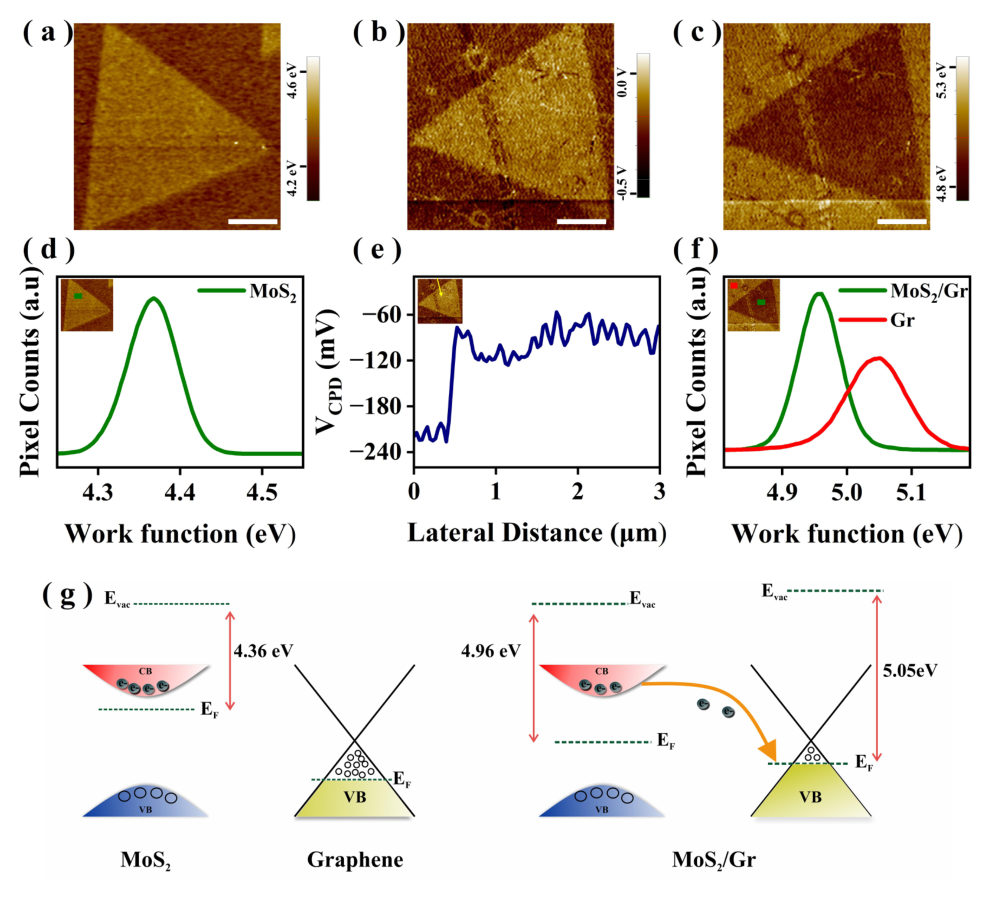
<figcaption class="paper-figure-caption"><b>Fig 4.</b> Figure 4: KPFM characterization. (a) Workfunction map of as-grown MoS2. (b) Surface potential map of the MoS2/Gr heterostructure. (c) Work function map of the MoS2/Gr heterostructure. The scale bar corresponds to 2µm. (d) Work function distribution of as-grown MoS2. (e) Surface potential profile acquired along the line shown in the inset. (f) Work function distribution of MoS2/Gr heterostructure. The green curve represents data taken from the triangular region, and the red curve corresponds to the bare graphene region. (g) Schematic illustration of the charge transfer mechanism.</figcaption>
</figure>
<figure class="paper-figure-card">
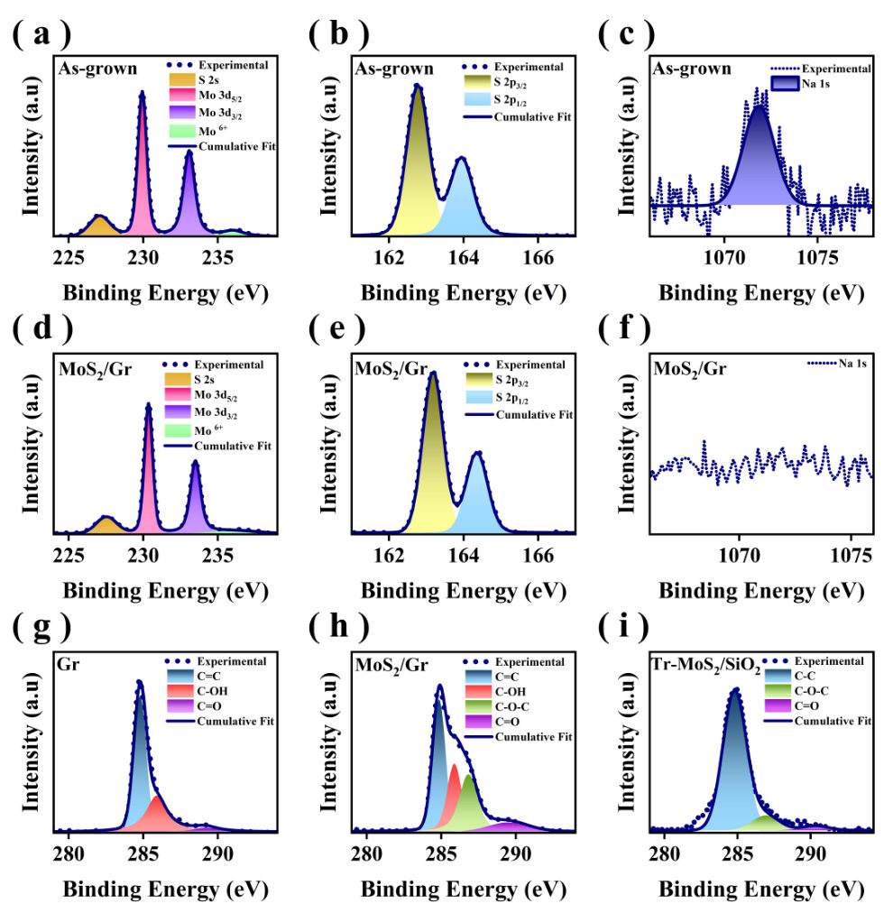
<figcaption class="paper-figure-caption"><b>Fig 5.</b> Figure 5: XPS characterization. Core level XPS spectra of (a) Mo 3d, (b) S 2p, and (c) Na 1s of as-grown MoS2. Core level XPS spectra of (d) Mo 3d, (e) S 2p, and (f) Na 1s for the MoS2/Gr heterostructure. C 1s XPS spectra of (g) bare graphene, (h) MoS2/Gr heterostructure, and (i) MoS2 transferred onto SiO2.</figcaption>
</figure>

**Summary.** This work reports an anomalous enhancement of photoluminescence in MoS2/graphene heterostructures achieved via a polystyrene-assisted wet transfer. The mechanism is attributed to interfacial charge transfer from n-doped MoS2 to graphene, confirmed by shifts in electronic signatures like the work function and Raman modes. This establishes the wet transfer process as a practical method for engineering optoelectronic devices.

**Why it may be interesting.** The study provides concrete, measurable evidence of controlling electronic doping and exciton recombination pathways in 2D heterostructures using simple wet-transfer chemistry, which is highly relevant to open quantum systems modeling where interface coupling dictates energy levels.

Detailed structure

**Main problem.** Interlayer charge transfer between MoS2/graphene heterostructures typically quenches photoluminescence (PL), limiting their use in light-emitting devices. The goal was to achieve anomalous PL enhancement.

**Main result.** The study achieved a striking, anomalous PL enhancement by demonstrating that the polystyrene-assisted wet transfer process facilitates charge transfer from n-doped MoS2 to graphene, leading to trion-to-exciton conversion in MoS2.

**Method.** A combination of experimental techniques (PL spectroscopy, KPFM, Raman, XPS) and theoretical calculations (DFT Bader analysis) was employed to characterize the electronic changes at the interface.

**Model / system.** The physical system is a van der Waals heterostructure composed of monolayer MoS2 integrated with graphene. The process involves using polystyrene-assisted wet transfer as an interface engineering strategy.

**Key observables.** PL enhancement (up to 54-fold), work function shift ($\sim 600 	ext{ meV}$ increase in $	ext{MoS}_2$), shifts in graphene G/2D Raman modes, and detection of OH/epoxy functionalization on graphene.

**Important parameters / regimes.** The charge transfer mechanism is quantified by Bader charge analysis, showing electron accumulation at specific functional groups on the graphene side.

**Assumptions / limitations.** The wet transfer method is presented as a practical, scalable interface engineering strategy that overcomes limitations of previous doping/tuning methods.

**Figures summary.** Figures show optical and AFM images of MoS2 flakes; Raman spectra confirm characteristic modes for both materials; KPFM data quantify the work function shift upon heterostructure formation.

**Paper structure.** The paper establishes the problem (PL quenching), details the experimental setup ($	ext{PS}$-assisted transfer), presents multi-modal characterization evidence (KPFM, Raman, PL) confirming charge transfer, and concludes by proposing this method as a scalable solution for enhanced excitonic emission.

Abstract

Van der Waals MoS2 graphene heterostructures are compelling candidates for high performance electronic and optoelectronic device applications. However, the interlayer charge transfer typically quenches the photoluminescence of monolayer MoS2, limiting the use of these heterostructures in light emitting applications. In this work, we report an anomalous photoluminescence enhancement in n-type monolayer MoS2 by integrating it with monolayer graphene via polystyrene assisted wet transfer process. Photoluminescence spectroscopy reveals a dominant trion to exciton conversion in the heterostructure. Kelvin probe force microscopy shows a 600 meV increase in the work function of MoS2 upon heterostructure formation. This work function shift, together with the higher work function of graphene, signifies electron transfer from MoS2 to graphene. Shifts in the graphene G and 2D Raman modes further corroborate the interlayer charge transfer. Hydroxyl and epoxy functionalization of graphene following heterostructure formation is evidenced by X ray photoelectron spectroscopy. DFT based Bader charge analysis quantifies the role of these functional groups in facilitating interlayer charge transfer. Collectively, our findings establish polystyrene assisted wet transfer as a practical interface engineering strategy for enhancing excitonic emission in MoS2 graphene heterostructures, thereby advancing their potential for scalable optoelectronic devices.

[↑ back to top](#top)

### [Quantized heat flow in moiré chern bands of bilayer graphene](http://arxiv.org/abs/2607.19205v1)

**Authors:** Santanu Samai, Debangan Sarkar, Abhijit Halder, T. Taniguchi, K. Watanabe, Subroto Mukerjee, Saurabh Kumar Srivastav, Anindya Das  
**Type:** experiment · **Category:** other · **PDF:** <https://arxiv.org/pdf/2607.19205v1>  
**Analysis basis:** full PDF text, analyzed in chunks
**Topic relevance:** `analog quantum simulation` **2/5** · `non-equilibrium dynamics` **2/5** · `correlated / nonlocal dissipation` **1/5** · `driven-dissipative phase transition` **1/5** · `methods for driven-dissipative` **1/5** · `non-equilibrium universality` **1/5**

↔ Scroll figures horizontally

<figure class="paper-figure-card">
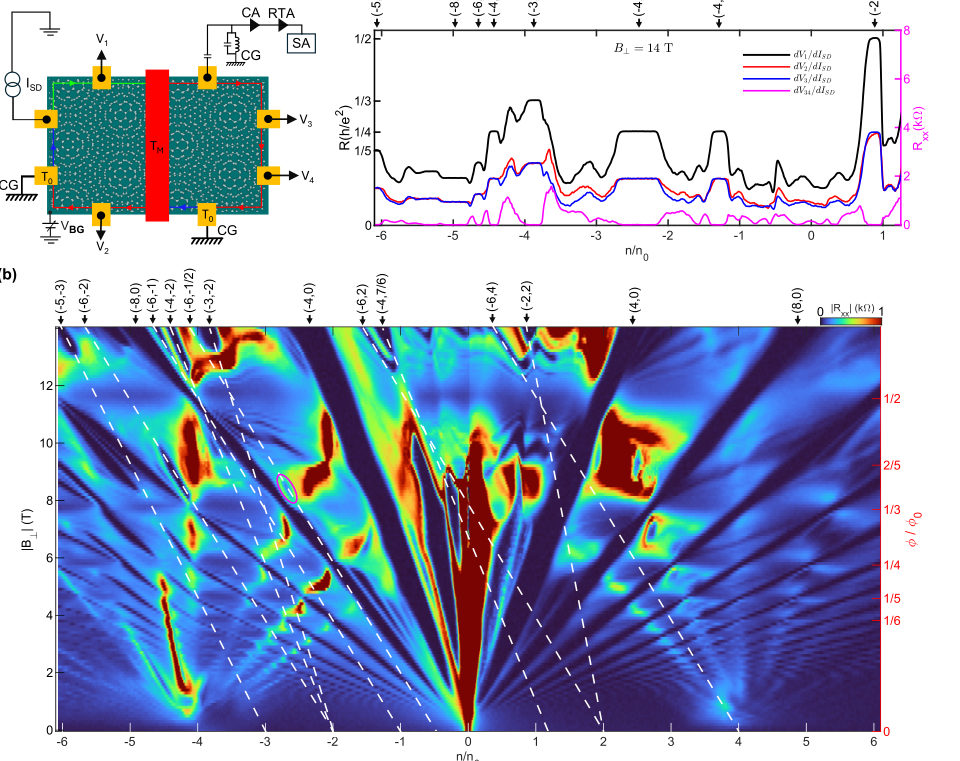
<figcaption class="paper-figure-caption"><b>Fig 1.</b> Figure 1: Device schematic, measurement scheme, and QH to CI response of a hBN-BLG moiré su- perlattice. (a) Schematic of measurement setup used for electrical transport and thermal conductance mea- surement. (b) Rxx = dV34/dISD as a function of the carrier numbers per moiré unit cell, n/n0, and perpendicular magnetic field, B⊥for Device 1. The right axis shows the magnetic flux per moiré unit cell, ϕ/ϕ0. White dashed lines denote selected Diophantine trajectories corresponding to Chern insulating states, labelled by their Diophantine indices (t, s). (c) Multi-terminal resistances measured in Device 1 at B⊥= 14 T: dV1/dISD (black), dV2/dISD (red), dV3/dISD (blue), and dV34/dISD (magenta),...</figcaption>
</figure>
<figure class="paper-figure-card">
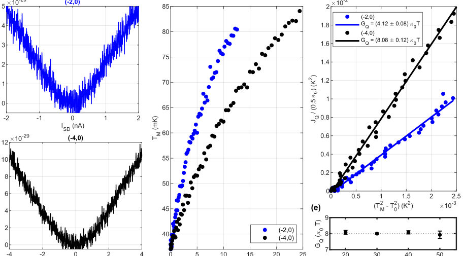
<figcaption class="paper-figure-caption"><b>Fig 2.</b> Figure 2: Thermal conductance of conventional QH states in Device 1. (a,b) Excess thermal noise SI as a function of source current ISD for (t, s) = (−2, 0) (blue) (a), (t, s) = (−4, 0) (black) (b). (c) The temperature, TM, of the floating-reservoir as a function of dissipated power, JQ for (−2, 0) (N = 4) (blue), (−4, 0) (N = 8) (black), where N = 2|t| denotes the total number of outgoing edge modes from the floating reservoir. (d) Scaled dissipated power, JQ/0.5κ0, plotted as a function of T 2 M −T 2 0 for the (−2, 0) and (−4, 0) at electron temperature T0 ∼37 mK. Linear fits (solid lines) yield the values of thermal conductances, GQ = 4.12κ0T and GQ = 8.08κ0T for (−2, 0) and (−4, 0)...</figcaption>
</figure>
<figure class="paper-figure-card">
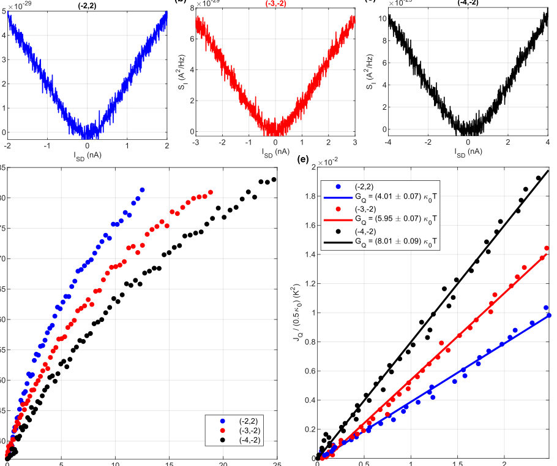
<figcaption class="paper-figure-caption"><b>Fig 3.</b> Figure 3: Thermal conductance of Chern Insulator (CI) states in Device 1. (a,b,c) Excess thermal noise SI as a function of source current ISD for (t, s) = (−2, 2) (blue) (a),(t, s) = (−3, −2) (red) (b), (t, s) = (−4, −2) (black) (c). (d) TM as a function of JQ for (−2, 2) (N = 4) (blue), (−3, −2) (N = 6) (red), (−4, −2) (N = 8) (black), where N = 2|t| denotes the total number of outgoing edge modes from the floating reservoir. (e) Scaled dissipated power, JQ/0.5κ0, plotted as a function of T 2 M −T 2 0 at T0 ∼37 mK. Linear fits (solid lines) yield values of thermal conductances of GQ = 4.01κ0T, GQ = 5.95κ0T and (GQ) = 8.01κ0T for the (−2, 2),(−3, −2) and (−4, −2) states, respectively.</figcaption>
</figure>
<figure class="paper-figure-card">
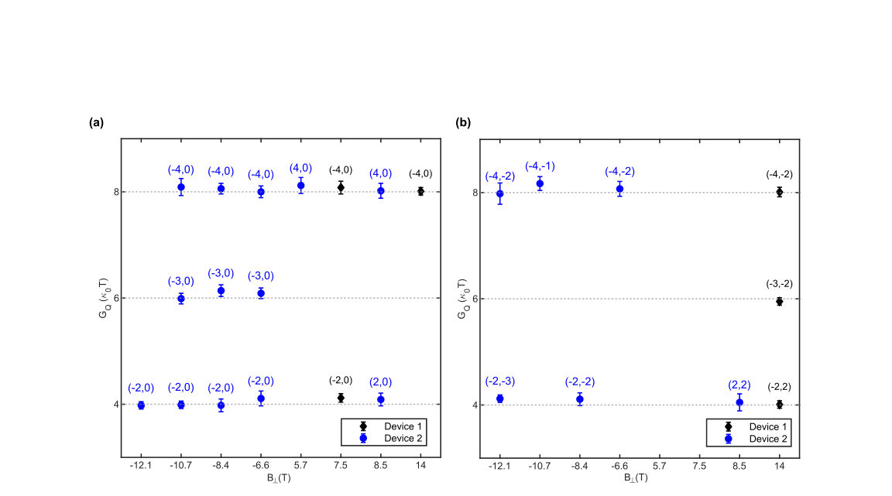
<figcaption class="paper-figure-caption"><b>Fig 4.</b> Figure 4: Summary of the results measured in two devices. (a) Measured GQ of several conventional QH states at different B⊥. Black and blue solid circles represent data from Device 1 and Device 2, respectively, with error bars indicating the uncertainty in the extracted GQ values from fitting. (b) Measured GQ, of CI states as a function of B⊥. Black diamonds and blue solid circles correspond to Device 1 and Device 2, respectively. Error bars indicate the uncertainty in the extracted GQ values from fitting. All measurements were performed at the electron temperature, T0 ∼37 mK for Device 1 and T0 ∼45 mK for Device 2.</figcaption>
</figure>

**Summary.** The researchers measured the thermal conductance of topologically non-trivial states (like Chern insulators) in moiré graphene superlattices using advanced noise thermometry. They found that this heat flow is quantized based only on the system's topological Chern number, establishing thermal conductance as a universal diagnostic tool for moiré topology.

**Why it may be interesting.** This work provides a direct, measurable signature—quantized heat flow—that serves as a stringent probe for understanding and verifying exotic topological phases predicted in moiré materials, bridging electrical and thermal transport physics.

Detailed structure

**Main problem.** To determine if heat transport in topological states (Quantum Hall, Chern Insulator) realized in moiré superlattices is universal, mirroring the established quantization of electrical transport.

**Main result.** The thermal conductance ($G_Q$) was found to be quantized in units determined solely by the Chern number ($t$), confirming universal topological heat transport.

**Method.** Thermal conductance was measured using highly sensitive Johnson-noise thermometry, analyzing excess thermal noise and dissipated power as a function of source current.

**Model / system.** The study uses bilayer graphene on hexagonal boron nitride (hBN) moiré superlattices, which create Hofstadter spectra hosting various topological states parameterized by Chern numbers ($t$).

**Key observables.** Thermal conductance ($G_Q$), quantized values relative to the thermal quantum ($\kappa_0 T$), and electron temperature ($T_M$) derived from noise measurements.

**Important parameters / regimes.** Moiré wavelength ($\sim 14 	ext{ nm}$), magnetic field ($B_\perp$), Chern number ($t$), and the heat Coulomb blockade (HCB) effect.

**Assumptions / limitations.** The quantization is assumed to be robust across different microscopic origins of topological states, though deviations at high $|t|$ are attributed to HCB or measurement limits.

**Figures summary.** Figures show device schematics, electrical transport measurements identifying QH/CI states, and thermal conductance plots confirming quantized plateaus for various Chern numbers.

**Paper structure.** The work progresses by first establishing the physical platform (BLG/hBN moiré superlattice) and characterizing topological states via electrical transport. It then details the advanced noise thermometry technique to measure $G_Q$, culminating in the demonstration of universal quantization across different topological regimes.

Abstract

When electrons are subjected simultaneously to a magnetic field and a periodic potential, they form the fractal Hofstadter spectrum, whose topological gaps host quantum Hall and Chern insulating states with distinct Chern numbers. While electrical transport has established the topology of these states, whether their heat transport is likewise universal has remained unexplored. Here, we measure the thermal conductance of quantum Hall, Chern insulator, and interaction-driven symmetry-broken Chern insulator states in a bilayer graphene-hexagonal boron nitride moiré superlattice with a moirè wavelength of $\sim$14 nm using Johnson-noise thermometry. We find that the thermal conductance ($G_Q$) is quantized in units of the thermal conductance quantum ($G_Q = tκ_0T$) and is determined solely by the Chern number ($t$), independent of the microscopic origin of the topological state. By directly revealing universal topological heat transport in Hofstadter bands, our work establishes thermal conductance as a stringent probe of moiré topological matter and provides a route to investigating more exotic phases, including fractional Chern insulators.

[↑ back to top](#top)

### [Long-time asymptotic behavior for the defocusing Hirota equation on a finite-genus algebro-geometric background](http://arxiv.org/abs/2607.19119v1)

**Authors:** Taohua Luo, Zhenya Yan, Guoqiang Zhang  
**Type:** theory · **Category:** other · **PDF:** <https://arxiv.org/pdf/2607.19119v1>  
**Analysis basis:** full PDF text, analyzed in chunks
**Topic relevance:** `non-equilibrium dynamics` **2/5** · `non-equilibrium universality` **2/5** · `Keldysh / 2PI / non-Gaussian methods` **1/5** · `driven-dissipative phase transition` **1/5** · `methods for driven-dissipative` **1/5**

↔ Scroll figures horizontally

<figure class="paper-figure-card">
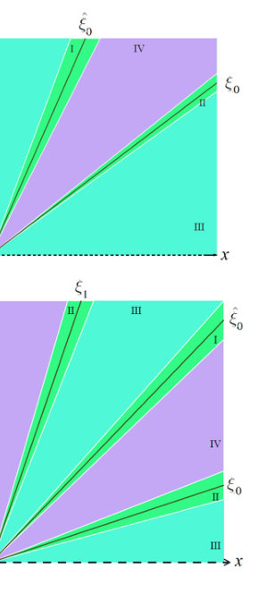
<figcaption class="paper-figure-caption"><b>Fig 1.</b> Figure 1: Four distinct asymptotic regions for the different genuses: (a) n = 1 and (b) n = 2.</figcaption>
</figure>
<figure class="paper-figure-card">
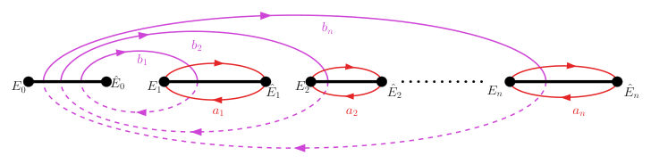
<figcaption class="paper-figure-caption"><b>Fig 2.</b> Figure 2: The canonical homology basis {ai, bi}n i=1 on the Riemann surface X . Here the solid and dashed arcs indicate the parts lying on the upper and lower sheets, respectively.</figcaption>
</figure>
<figure class="paper-figure-card">
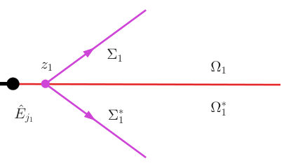
<figcaption class="paper-figure-caption"><b>Fig 3.</b> Figure 3: The contours Σ(1).</figcaption>
</figure>
<figure class="paper-figure-card">
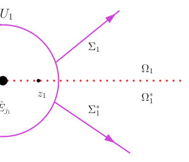
<figcaption class="paper-figure-caption"><b>Fig 4.</b> Figure 4: The contours Σ(E).</figcaption>
</figure>
<figure class="paper-figure-card">
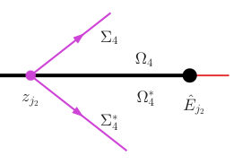
<figcaption class="paper-figure-caption"><b>Fig 5.</b> Figure 5: The contour Σ(1).</figcaption>
</figure>

**Summary.** This work determines how solutions to the defocusing Hirota equation evolve over very long times when constrained by a finite-genus algebro-geometric background. It employs advanced mathematical machinery, specifically Riemann-Hilbert analysis and nonlinear steepest descent, to derive precise asymptotic formulas across different spatial and temporal regimes.

**Why it may be interesting.** While highly mathematical, the techniques used—integrable systems, Riemann-Hilbert methods, and asymptotics—are foundational tools applicable to analyzing non-equilibrium dynamics in quantum field theory or complex many-body systems where long-time behavior is crucial.

Detailed structure

**Main problem.** The paper investigates the long-time asymptotic behavior of solutions to the defocusing Hirota equation when defined on a finite-genus algebro-geometric background.

**Main result.** Asymptotic formulas are derived for the solution in four distinct space-time regions, showing leading terms governed by the finite-genus background and specific decaying corrections ($t^{-1/3}, t^{-1/2}$).

**Method.** The analysis heavily relies on the Riemann-Hilbert (RH) formulation combined with the Deift-Zhou nonlinear steepest descent method.

**Model / system.** The system is governed by the defocusing Hirota equation, a higher-order integrable extension of the NLS equation. The background structure is defined by an algebro-geometric solution on a hyperelliptic Riemann surface of genus n.

**Key observables.** Long-time asymptotic behavior $q(x, t)$, correction terms ($t^{-1/3}, t^{-1/2}$), and the leading-order phase-shifted algebro-geometric solution.

**Important parameters / regimes.** Genus of the background (n), time $t 	o \infty$, and the specific regions defined by the RH problem's critical values (I, II, III, IV).

**Assumptions / limitations.** The initial condition must match the finite-genus algebro-geometric background outside a compact set; the analysis assumes sufficient smoothness for the steepest descent method to apply.

**Figures summary.** Figures illustrate the four distinct asymptotic regions (I-IV) in the space-time plane and show contours related to the global parameterization $E(z)$.

**Paper structure.** The paper establishes the problem setup using the Hirota equation, develops the RH formulation for the background, applies nonlinear steepest descent analysis across different critical regions (Transition I/II, Zakharov-Manakov III, Fast Decay IV), and derives explicit asymptotic formulas in each region.

Abstract

In this paper, we investigate the long-time asymptotics for the solution of the Cauchy problem of the defocusing Hirota equation on a finite-genus algebro-geometric background in the whole $(x,t)$-half-plane, whose method is mainly based on a Riemann-Hilbert (RH) formulation and Deift-Zhou nonlinear steepest descent method. The critical values of the phase function in the associated RH problem divide the space-time plane into four regions, in which the leading-order term is given by a phase-shifted finite-genus algebro-geometric solution. The subleading behavior depends on the region: the correction is of order $t^{-1/3}$ and is governed by a Painlevé-XXXIV model RH problem in the transition regions; the leading radiation is of order $t^{-1/2}$ in the Zakharov--Manakov region; and the error is $O(t^{-1})$ in the fast-decay region. These results can also be extended to other higher-order members of the AKNS hierarchy.

[↑ back to top](#top)

### [Fragile Topology is Unstable Under Translation Refinement](http://arxiv.org/abs/2607.18386v1)

**Authors:** Yoonseok Hwang, Saavanth Velury, Taylor L. Hughes  
**Type:** theory · **Category:** other · **PDF:** <https://arxiv.org/pdf/2607.18386v1>  
**Analysis basis:** full PDF text, analyzed in chunks
**Topic relevance:** `analog quantum simulation` **2/5** · `driven-dissipative phase transition` **1/5** · `methods for driven-dissipative` **1/5**

↔ Scroll figures horizontally

<figure class="paper-figure-card">
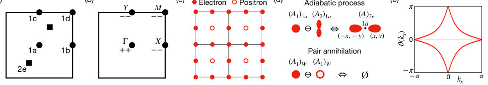
<figcaption class="paper-figure-caption"><b>Fig 1.</b> FIG. 1. (a) Wyckoff positions (WPs), 1a : (0, 0), 1b : (1/2, 0), 1c : (0, 1/2), 1d : (1/2, 1/2), and 2e : {(x, y), (−x, −y)}, in a primitive unit cell. (b) Brillouin zone and an example of symmetry data. The high-symmetry momenta (HSM) are Γ = (0, 0), X = (π, 0), Y = (0, π), and M = (π, π). Multiplicities of C2 eigenvalues at all HSM determine the symmetry-data vector. v = (2, 0, 0, 2, 0, 2, 0, 2) according to the definition in Eq. (1). (c) Real-space electron-positron configuration corresponding to (A1)1b ⊕(A1)1c ⊕(A1)1d ⊖(A1)1a, where every electron and the positron transforms according to the A1 site-symmetry irrep at its respective WP. (d) Top: symmetry-preserving adiabatic deformation,...</figcaption>
</figure>
<figure class="paper-figure-card">
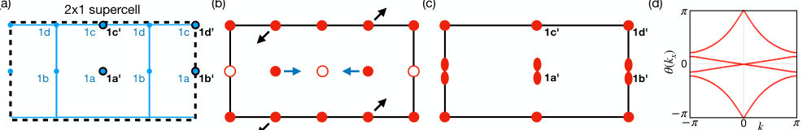
<figcaption class="paper-figure-caption"><b>Fig 2.</b> FIG. 2. (a) 2×1 supercell. The dashed black rectangle (black circles) denotes the supercell (its maximal WPs 1a′, 1b′, 1c′, 1d′), while the blue solid rectangles (blue dots) denote the primitive unit cells (their maximal WPs 1a, 1b, 1c, 1d). (b) Real-space electron-positron configuration corresponding to Eq. (16). The blue arrows illustrate the adiabatic deformation (A)2e′ ⇔ (A1)1a′ ⊕(A2)1a′, depicted schematically in Fig. 1(d). The black arrows indicate analogous deformations of the remaining (A)2e′ orbitals into the 1b′ WP. All arrows denote symmetry-preserving adiabatic deformations consistent with the p2 wallpaper group. (c) Real-space configuration corresponding to Eq. (17) after the...</figcaption>
</figure>
<figure class="paper-figure-card">
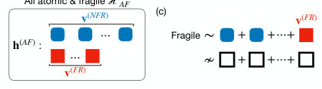
<figcaption class="paper-figure-caption"><b>Fig 3.</b> FIG. 3. Schematic illustration of the Hilbert-basis construction. (a) The Hilbert basis {h(A) a }dA a=1 generates all atomic symmetry-data vectors (HA). The Hilbert ba- sis {h(AF) b }dAF b=1 generates all atomic and fragile symmetry- data vectors (HAF). The latter is partitioned into frag- ile roots {v(FR) c }NFR c=1 (red squares) and non-fragile genera- tors {v(NFR) d }NNFR d=1 (blue rounded squares). (b) An atomic symmetry-data vector is expressed solely by {h(A) a }. (c) A fragile symmetry-data vector is expressed by {h(AF) b }. Ev- ery nonnegative-integer representation necessarily contains at least one fragile root, whereas no representation using only {h(A) a } exists.</figcaption>
</figure>

**Summary.** This theoretical work rigorously proves that 'fragile topology' is not fundamentally stable against lattice refinement. By analyzing symmetry-protected band structures using momentum-space data, the authors demonstrate that increasing the unit cell size (supercell construction) allows for an adiabatic deformation that trivializes the topological phase into a simple atomic insulator.

**Why it may be interesting.** While focused on condensed matter band theory rather than quantum information protocols, the rigorous mathematical tools developed for tracking topological stability under lattice changes (analogous to Hamiltonian perturbations) are highly relevant to understanding robustness in engineered quantum systems.

Detailed structure

**Main problem.** The paper investigates the stability of 'fragile topological phases' under lattice enlargement (unit-cell refinement), aiming to distinguish them from stable topological phases or trivial atomic insulators.

**Main result.** It establishes that fragile topology possesses only finite stability, as all such phases can be shown to become adiabatically connected to an atomic insulator through a sufficiently large supercell enlargement ($N_{sc}=4$ in one example).

**Method.** The analysis uses a systematic framework involving Hilbert-basis analysis of momentum-space symmetry data ($\mathbf{v} = 	ext{BR} \cdot \mathbf{m}$) and models unit-cell enlargement as an integer linear map to track the trivialization of topological invariants.

**Model / system.** The study is applied to crystalline band topology, specifically analyzing 2D wallpaper groups using a tight-binding model framework derived from Wannier orbitals in an electron-positron picture.

**Key observables.** Symmetry-data vectors ($\mathbf{v}$), multiplicity vectors ($\mathbf{m}$), and the Wilson-loop spectrum $\{	heta_a(\mathbf{k})\}$ are key diagnostics for topological characterization and trivialization.

**Important parameters / regimes.** The supercell index ($N_{sc}$) is a critical parameter, as increasing it can drive the system toward a trivial state. The symmetry group (e.g., $p2$, $p4mm$) dictates the specific mathematical constraints.

**Assumptions / limitations.** The analysis assumes that adiabatic deformations preserve both wallpaper-group symmetry and the bulk energy gap, allowing for the systematic tracking of topological invariants via symmetry data.

**Figures summary.** Figures illustrate Wyckoff positions, Brillouin zones with high-symmetry momenta, electron-positron configurations showing pair annihilation (trivialization), and supercell structures demonstrating band folding upon enlargement.

**Paper structure.** The paper develops from establishing the general instability criterion for fragile topology under unit-cell enlargement to providing detailed mathematical machinery using symmetry data vectors. It then applies this framework to specific 2D wallpaper groups, culminating in explicit calculations showing trivialization at finite supercell sizes.

Abstract

Fragile topological phases become trivial upon the addition of suitable trivial bands, distinguishing them from stable topological phases. Nevertheless, various response phenomena and material realizations have been proposed for fragile phases. At the same time, many of these phenomena can also occur in atomic insulators, leaving open the question of what properties are specific to fragile phases. Enlarging the unit cell offers a natural perspective on this question. Band folding increases the number of bands in a manner analogous to adding trivial bands. In this work, we establish a systematic framework for determining the stability of fragile topology under unit-cell enlargement. We first establish a systematic criterion for trivialization under enlargements compatible with space-group symmetry, grounded in a physical electron-positron picture and formulated through a Hilbert-basis analysis of momentum-space symmetry data. We then show that, for all two-dimensional wallpaper groups, with or without spin-orbit coupling and/or time-reversal symmetry, every symmetry-indicated fragile phase is adiabatically connected to an atomic insulator in a suitable finite supercell and can therefore be trivialized by an arbitrarily small symmetry-preserving perturbation. Our results reveal that fragile topology has only finite stability under translation-symmetry refinement. This highlights that the fate of a fragile phase can depend on translation-symmetry-breaking perturbations, such as charge-density-wave ordering, and suggests that physical signatures insensitive to translation refinement are unlikely to uniquely characterize fragile topology.

[↑ back to top](#top)

### [Vortex clusters bifurcating from multipoles and second-order ring solitons](http://arxiv.org/abs/2607.18858v1)

**Authors:** Hanqi Dong, Boris A. Malomed, Zhiwei Men  
**Type:** theory · **Category:** other · **PDF:** <https://arxiv.org/pdf/2607.18858v1>  
**Analysis basis:** full PDF text, analyzed in chunks
**Topic relevance:** `driven-dissipative phase transition` **1/5** · `interference shaping light` **1/5**

↔ Scroll figures horizontally

<figure class="paper-figure-card">
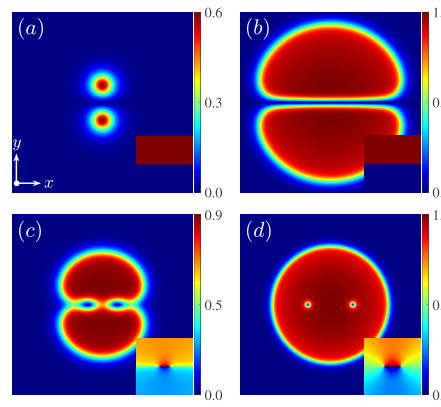
<figcaption class="paper-figure-caption"><b>Fig 1.</b> Fig. 1. The absolute value and (insets) phase distributions for lower- and upper-branch dipole solitons [(a) and (b), respec- tively], and for lower- and upper-branch VAV dipoles [(c) and (d)], which are marked in Fig. 2(a). The propagation constants are b = 0.05 in (a, b), 0.12 in (c), and −0.02 in (d). Here and in other figures, the plotted domain is |x, y| ≤30, except for (d), where it is |x, y| ≤50.</figcaption>
</figure>
<figure class="paper-figure-card">
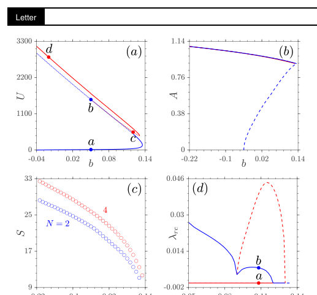
<figcaption class="paper-figure-caption"><b>Fig 2.</b> Fig. 2. (a) Power U versus propagation constant b for dipole solitons (blue) and VAV dipoles (red). Solid: stable; dotted: un- stable. (b) The mode’s amplitude A = |ψ|max vs. b for the two soliton families. (c) The geometric distance S between vortex and antivortex pivot vs. b for the upper-branch VAV dipoles (blue) and quadrupoles (red). (d) The maximum real part of the perturbation growth rate λre vs. b for dipole solitons (blue) and VAV dipoles (red). Solid and dashed lines denote upper and lower branches, respectively. Dots in (a) mark the solitons shown in Fig. 1. Dots in (d) correspond to the propagation ex- amples in Fig. 5.</figcaption>
</figure>
<figure class="paper-figure-card">
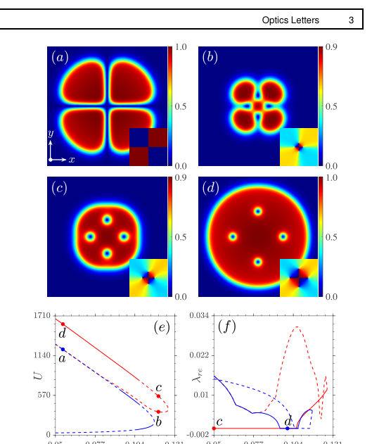
<figcaption class="paper-figure-caption"><b>Fig 3.</b> Fig. 3. The absolute value and (insets) phase distributions of upper-branch quadrupole solitons (a), lower-branch (b), and upper-branch (c,d) VAV quadrupoles marked in (e). The propagation constants are b = 0.055 in (a, d) and 0.12 in (b, c). (e) Power U vs. b for the quadrupole solitons (blue) and VAV quadrupoles (red). Solid: stable; dashed: unstable. (f) The maximum real part of the perturbation growth rate λre vs. b for the quadrupole solitons (blue) and VAV quadrupoles (red). Solid: upper branches, dashed: lower branches. Dots in (f) cor- respond to propagation examples shown in Fig. 5.</figcaption>
</figure>
<figure class="paper-figure-card">
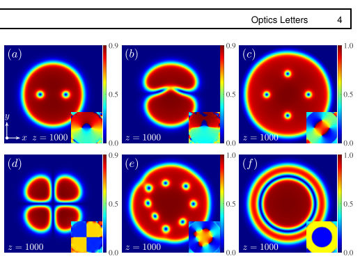
<figcaption class="paper-figure-caption"><b>Fig 4.</b> Fig. 5. The perturbed propagation of several species of stable (a,c,d,f) and unstable (b,e) 2D solitons. The absolute value and (insets) phase distributions of the soliton are displayed at z = 1000. (a, b), (c,d), and (e,f) are marked by Letters in Figs. 2(d), 3(f), and 4(f), respectively.</figcaption>
</figure>
<figure class="paper-figure-card">
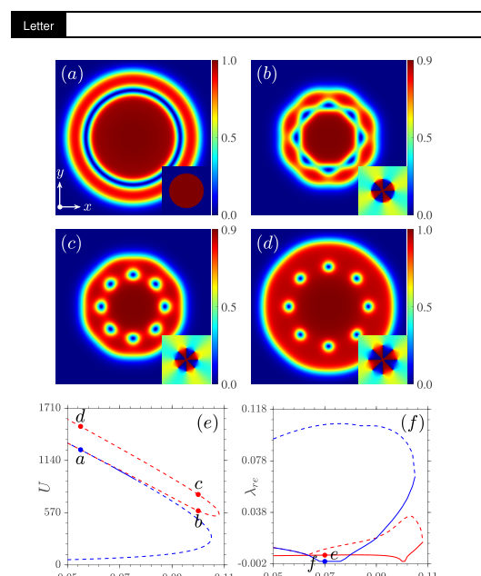
<figcaption class="paper-figure-caption"><b>Fig 5.</b> Fig. 4. The absolute value and (insets) phase distributions of the upper-branch second-order ring soliton (a), as well as lower-branch (b), and upper-branch (c,d) VAV octupoles marked in (e). The propagation constants are b = 0.055 for (a, d) and 0.1 for (b, c). (e) Power U vs. b for the second-order ring solitons (blue) and VAV ocupoles (red). Solid: stable; dashed: unstable. (f) The maximum real part of the perturba- tion growth rate λre vs. b for the second-order ring solitons (blue) and VAV clusters with N = 8 (red). Solid and dashed lines denote upper and lower branches, respectively. Dots in (f) correspond to the propagation examples in Fig. 5.</figcaption>
</figure>

**Summary.** This paper analyzes the complex behavior of vortex clusters within cubic-quintic nonlinear media under harmonic confinement. By combining linear stability analysis with numerical simulations, the authors map out the formation mechanisms for these structures. The findings confirm the stability of specific vortex cluster configurations across broad parameter ranges.

**Why it may be interesting.** This work directly addresses structured light phenomena—vortex formation and soliton stability—in nonlinear media, which is highly relevant to quantum optics, Bose-Einstein condensates (BECs), and nonlinear wave physics.

Detailed structure

**Main problem.** The study investigates the existence, stability, and propagation dynamics of multipole solitons and vortex clusters.

**Main result.** Vortex clusters with N=2 and N=4 remain stable over a wide range of the propagation constant, revealing a specific formation mechanism for these structures.

**Method.** The research employs rigorous linear stability analysis on an eigenvalue problem, which is corroborated by direct numerical simulations of perturbed soliton propagation.

**Model / system.** The system models nonlinear wave propagation in cubic-quintic (CQ) media confined by a harmonic trapping potential. The dynamics are governed by the scaled nonlinear Schrödinger equation.

**Key observables.** Power (U), mode amplitude (|psi|_max), geometric distance between vortex pivots (S), and the real part of the perturbation growth rate ($\lambda_{	ext{re}}$).

**Important parameters / regimes.** The propagation constant ($b$) is a key parameter varied to map out stability regions; the nonlinearity type is cubic-quintic.

**Assumptions / limitations.** The analysis relies on the CQ nonlinearity model and assumes specific forms for input vortex structures during the bifurcation process.

**Figures summary.** Figures illustrate absolute value/phase distributions of various solitons (dipole, VAV), plot Power vs. propagation constant ($b$) to show stability regions, and detail bifurcations between different soliton families.

**Paper structure.** The paper systematically analyzes the dynamics by first establishing the governing equation and conserved quantities, then applying linear stability analysis to predict stable states, followed by numerical simulations to confirm these predictions across various vortex cluster sizes (N).

Abstract

We address the existence, stability, and propagation dynamics of multipole solitons and vortex clusters in cubicquintic media subject to a harmonic trapping potential.We found that vortex clusters comprising N off centered vortices with alternating topological charges m equal to +(-)1, evenly distributed on a ring, can bifurcate from a multipole soliton for N less than or equal to 4 and from a second-order ring soliton for N greater than 4. Rigorous linear stability analysis, corroborated by direct numerical simulations, shows that upper branch vortex clusters with N equal to 2 and 4 remain stable over a wide range of the propagation constant. Thus, we reveal the formation mechanism of vortex clusters.

[↑ back to top](#top)

### [A unified tight-binding description of the electronic structure and Ising protection of superconductivity in misfit layered compounds](http://arxiv.org/abs/2607.19308v1)

**Authors:** G. A. Bobkov, I. A. Shvets, I. V. Bobkova  
**Type:** theory · **Category:** other · **PDF:** <https://arxiv.org/pdf/2607.19308v1>  
**Analysis basis:** full PDF text, analyzed in chunks
**Topic relevance:** `Keldysh / 2PI / non-Gaussian methods` **1/5**

↔ Scroll figures horizontally

<figure class="paper-figure-card">
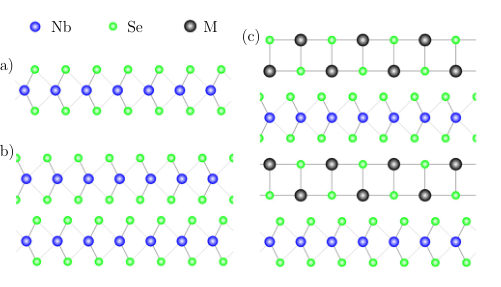
<figcaption class="paper-figure-caption"><b>Fig 1.</b> FIG. 1. Atomic structure of (a) 1H-NbSe2 monolayer and (b) 2H-NbSe2 bilayer (side view). (c) Representative example of a structure where two NbSe2 monolayers are coupled via an intervening tetragonal (rock-salt) layer, as realized in misfit layered compounds.</figcaption>
</figure>
<figure class="paper-figure-card">
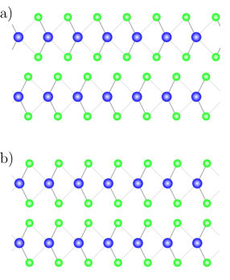
<figcaption class="paper-figure-caption"><b>Fig 2.</b> FIG. 2. (a) Atomic structure of a 2H-stacked TMD bi- layer (e.g., NbSe2), which possesses inversion symmetry. (b) Atomic structure of a hypothetical 1H+1H (AA-stacked) TMD bilayer, which is non-centrosymmetric.</figcaption>
</figure>
<figure class="paper-figure-card">
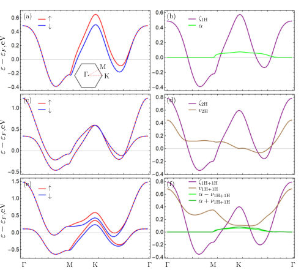
<figcaption class="paper-figure-caption"><b>Fig 3.</b> FIG. 3. DFT-calculated band structures and the correspond- ing model parameters for the Fermi-surface bands of NbSe2- based systems. (a) Monolayer 1H-NbSe2: DFT band struc- ture. The inset shows the hexagonal Brillouin zone with the high-symmetry points Γ, M, and K. (b) Monolayer parameters ζ1H(p) and α(p) extracted from the spectrum in (a). (c) Bi- layer 2H-NbSe2: DFT band structure. (d) Intralayer disper- sion ζ2H(p) and interlayer hopping v2H(p) extracted from (c). (e) Bilayer 1H+1H (AA-stacked) NbSe2: DFT band struc- ture. (f) Intralayer dispersion ζ1H+1H(p), interlayer coupling v1H+1H(p), and spin-orbit splittings of the upper and lower branches α(p) ± ν1H+1H(p) extracted from (e).</figcaption>
</figure>
<figure class="paper-figure-card">
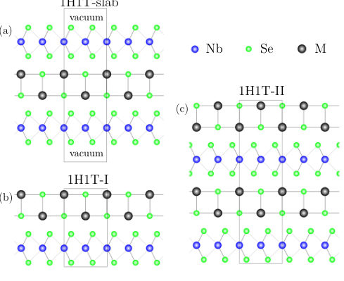
<figcaption class="paper-figure-caption"><b>Fig 4.</b> FIG. 4. Atomic structures (side view, along commensurate b direction) of the three MLC configurations studied in Sec. IV: (a) a misfit slab composed of two trigonal NbSe2 layers sep- arated by an intervening tetragonal MSe layer (1H1T-slab); (b) a 1H1T bulk MLC (MSe)1.14NbSe2 in which all trigo- nal blocks share the same stacking orientation, so that the unit cell contains a single trigonal layer (1H1T-I); (c) a 1H1T bulk MLC (MSe)1.14NbSe2 in which the unit cell contains two NbSe2 layers arranged in the alternating stacking configura- tion characteristic of a 2H-NbSe2 bilayer (1H1T-II). The unit cells are indicated by black rectangles.</figcaption>
</figure>
<figure class="paper-figure-card">

<figcaption class="paper-figure-caption"><b>Fig 5.</b> Fig. 5 shows the unfolded electronic dispersion near the Fermi level for MLCs in the three configurations studied here: the 1H1T slab, 1H1T-I, and 1H1T-II bulk MLCs for M = La, Bi, Pb. The unfolding of the band structure of misfit structures was performed using the BandUP code [49]. A first characteristic feature of these spectra—already noted for certain MLCs (see, e.g., Ref. [41])—is the shift of the Fermi level ∆εF relative to that of an isolated NbSe2 monolayer, which arises from charge transfer q from the tetragonal layers. The magnitude of the charge transfer (and consequently ∆εF ) is directly correlated with the interlayer distance dH−T between NbSe2 and MSe layers (see Table II):...</figcaption>
</figure>

**Summary.** This work develops a unified tight-binding model for misfit layered compounds (MLCs) to accurately describe their electronic structure. By incorporating an emergent interlayer spin-orbit coupling—a feature missed by simpler models—the theory successfully explains the mechanism behind Ising-protected superconductivity, establishing MLCs as intrinsically coupled 3D quantum materials.

**Why it may be interesting.** The concept of emergent long-range coupling mediated by an intervening material layer is highly relevant for understanding heterostructures, interfaces in quantum materials, and engineering superconducting properties through structural design.

Detailed structure

**Main problem.** Developing a comprehensive theoretical description for the electronic structure and the mechanism behind Ising-protected superconductivity in misfit layered compounds (MLCs).

**Main result.** The paper shows that intervening tetragonal layers mediate an emergent interlayer spin-orbit coupling, which is crucial for reproducing DFT band structures and microscopically explaining the enhancement of the in-plane critical magnetic field ($H_{c,\parallel}$).

**Method.** A unified tight-binding model is constructed and parameterized using extensive Density-Functional Theory (DFT) calculations. Superconductivity analysis is performed via Bogoliubov–de Gennes equations.

**Model / system.** The system is Misfit Layered Compounds (MLCs), treated as intrinsically coupled 3D materials rather than isolated 2D layers. The model incorporates both intralayer and emergent interlayer spin-orbit coupling terms into the Hamiltonian.

**Key observables.** In-plane critical magnetic field ($H_{c,\parallel}$), electronic band structure, and superconducting gap properties.

**Important parameters / regimes.** Interlayer coupling strength, intrinsic spin-orbit coupling (ISOC) parameters ($\alpha(p)$), and the chemical/structural details of the intervening layers.

**Assumptions / limitations.** The standard assumption that the intervening layers electronically isolate each TMD layer is incorrect; the model captures physics beyond this 'rigid-band' picture.

**Figures summary.** Figure 1 illustrates atomic structures for different MLC configurations (e.g., $1	ext{H}$-TMD monolayer, $2	ext{H}$-TMD bilayer) and the coupling mechanism via tetragonal layers. Figure 2 compares band structures for $2	ext{H}$ vs. hypothetical $1	ext{H}+1	ext{H}$ bilayers.

**Paper structure.** The paper establishes the physical problem in MLCs, develops a unified tight-binding Hamiltonian incorporating interlayer SOC derived from DFT, analyzes how this coupling affects band structure (comparing different stacking symmetries), and finally applies the model to superconductivity via Bogoliubov–de Gennes calculations to explain Ising protection.

Abstract

Misfit layered compounds (MLCs) offer a unique bulk platform for realizing exotic quantum states typically associated with two-dimensional transition-metal dichalcogenides (TMDs), most notably Ising-protected superconductivity. Yet a theoretical description capturing their electronic structure beyond the simplistic picture of electronically isolated TMD layers has been lacking. Here, we develop a unified tight-binding model for metal dichalcogenide-based MLCs, parameterized by extensive density-functional theory (DFT) calculations across multiple structural configurations and chemical compositions. We show that the intervening tetragonal layers play an active role beyond charge reservoirs: they mediate a significant interlayer spin-orbit coupling entirely absent in the standard rigid-band picture. This emergent interlayer spin-orbit coupling is essential for reproducing the DFT band structure of bulk MLCs and, when incorporated into Bogoliubov--de Gennes calculations, provides a microscopic mechanism for the Ising protection of superconductivity by strongly enhancing the in-plane critical field. Our framework establishes MLCs as a distinct class of three-dimensional materials with intrinsically coupled layers and emergent spin-orbit phenomena.

[↑ back to top](#top)

### [Quadrature magnetoresistance scaling reflects linear field dependence rather than strange metallicity](http://arxiv.org/abs/2607.18685v1)

**Authors:** D. B. Zhou, Y. Yang, L. F. Feng, M. F. Zhao, Z. Y. Jia, K. H. Gao  
**Type:** experiment · **Category:** strongly correlated electrons · **PDF:** <https://arxiv.org/pdf/2607.18685v1>  
**Analysis basis:** full PDF text, analyzed in chunks
**Topic relevance:** `non-equilibrium dynamics` **1/5**

↔ Scroll figures horizontally

<figure class="paper-figure-card">
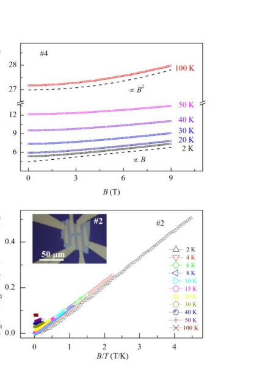
<figcaption class="paper-figure-caption"><b>Fig 1.</b> Figure 1 (a) Normalized resistivity / (300 K) xx xx   as a function of temperature for</figcaption>
</figure>
<figure class="paper-figure-card">
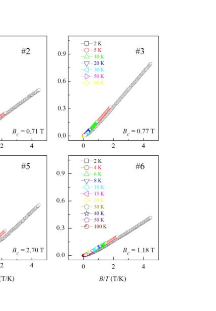
<figcaption class="paper-figure-caption"><b>Fig 2.</b> Figure 2 Quadrature scaling plots of [ ( , ) (0, )]/ xx xx B T T T    vs / B T for six</figcaption>
</figure>
<figure class="paper-figure-card">
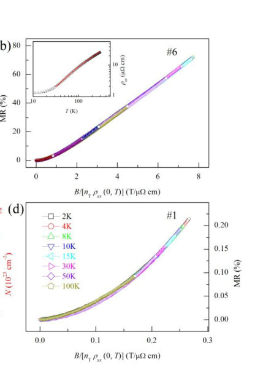
<figcaption class="paper-figure-caption"><b>Fig 3.</b> Figure 3 (a) Kohler’s rule plots of the MR for sample #6. (b) Extended Kohler’s rule</figcaption>
</figure>
<figure class="paper-figure-card">
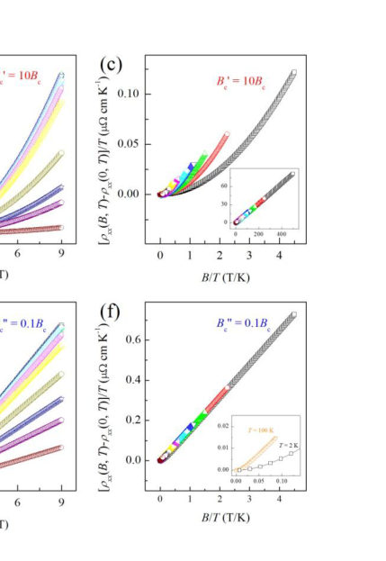
<figcaption class="paper-figure-caption"><b>Fig 4.</b> Figure 4 (a) The extracted parameters a .and k as a function of temperature for</figcaption>
</figure>
<figure class="paper-figure-card">
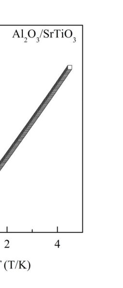
<figcaption class="paper-figure-caption"><b>Fig 5.</b> Figure 5 Quadrature scaling plots of [ ( , ) (0, )]/ s s R B T R T T  vs / B T for</figcaption>
</figure>

**Summary.** This experimental study investigates whether magnetoresistance scaling observed in materials like $	ext{NiTe}_2$ is evidence of a strange-metal state. By analyzing the dependence of this scaling on the crossover field, the authors argue that the scaling is merely a consequence of linear magnetoresistance dominating at high fields, not a unique quantum signature.

**Why it may be interesting.** While focused on condensed matter transport, the rejection of a 'strange metal' classification based on a specific scaling law provides important methodological guidance for interpreting complex quantum transport measurements in strongly correlated systems.

Detailed structure

**Main problem.** The study aims to determine if the observed quadrature magnetoresistance (MR) scaling is a unique signature of the strange-metal state or if it reflects conventional transport physics.

**Main result.** The authors conclude that the quadrature scaling merely reflects the presence and dominance of linear magnetoresistance, rather than indicating true strange metallicity. This conclusion is supported by evidence suggesting conventional Fermi-liquid behavior in the measured materials.

**Method.** Magnetotransport measurements were performed on $	ext{NiTe}_2$ nanosheets, analyzing resistivity ($
ho_{xx}$) vs. temperature ($T$) and MR scaling with magnetic field ($B$).

**Model / system.** The research uses physical samples like $	ext{NiTe}_2$ nanosheets and $	ext{SrTiO}_3$ heterostructures to measure magnetotransport properties across varying temperatures and fields.

**Key observables.** Quadrature magnetoresistance scaling collapse ($	ext{MR}$ vs $B/T$), crossover field ($c_B$), resistivity ($
ho_{xx}$) vs $T$, and adherence to Extended Kohler's rule.

**Important parameters / regimes.** Crossover field ($c_B$), temperature dependence of fit parameters ($a, k$), and the Planckian dissipation constant ($\alpha$).

**Assumptions / limitations.** The analysis assumes that if the scaling holds only when linear MR dominates (i.e., $c_B$ is small), then the scaling is not a unique signature of strange metallicity.

**Figures summary.** Figures show $
ho_{xx}(T)$ and $	ext{MR}$ vs $B$, with key plots demonstrating the quadrature scaling collapse for multiple samples, alongside Kohler's rule analyses.

**Paper structure.** The paper systematically analyzes magnetotransport data across several samples, first establishing the observed scaling behavior, then testing it against conventional transport models (like Extended Kohler's rule), and finally using simulations to show that the scaling is mathematically linked only to linear MR dominance.

Abstract

The quadrature scaling of magnetoresistance has been widely adopted as a hallmark of the strange metal state. However, whether this scaling signals quantum criticality or reflects conventional transport behavior remains controversial. Here, by systematically investigating the magnetotransport properties of NiTe2 nanosheets, we demonstrate that the quadrature scaling is not a unique signature of strange metallicity. We find that the scaling holds only when the crossover field , marking the transition from quadratic to linear magnetoresistance, is sufficiently small relative to the applied field range. Through controlled simulations, we show that the scaling emerges whenever linear magnetoresistance dominates, irrespective of its origin, and fails when the linear regime is inaccessible. This conclusion is supported by observations in SrTiO3 based heterostructures, where quadrature scaling appears despite the absence of strange metal behavior. Our results establish that the quadrature scaling merely reflects the presence of linear magneto resistance, urging caution in using this scaling as a diagnostic tool for exploring the strange metal state.

[↑ back to top](#top)

### Other secondary papers (1)

Show other secondary papers

### [Optical Properties of Iron-Selenide Na$_{0.27}$K$_{0.27}$Rb$_{0.27}$Fe$_{1.7}$Se$_2$ Single Crystals](http://arxiv.org/abs/2607.18876v1)

**Authors:** Andrei Muratov, Yevgeny Rakhmanov, Andrei Shilov, Igor Morozov, Yurii Aleshchenko  
**Type:** experiment · **Category:** strongly correlated electrons · **PDF:** <https://arxiv.org/pdf/2607.18876v1>  
**Analysis basis:** full PDF text, analyzed in chunks

↔ Scroll figures horizontally

<figure class="paper-figure-card">
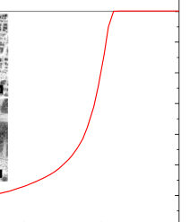
<figcaption class="paper-figure-caption"><b>Fig 1.</b> Fig. 1. (Color online) Temperature dependence of AC magnetic susceptibility for the quenched in cold water Na0.27K0.27Rb0.27Fe1.7Se2 samples measured with a SQUID magnetometer MPMS XL7 in a magnetic field of 5 Oe at 337 Hz frequency. The inset shows secondary electron micrographs of Na0.27K0.27Rb0.27Fe1.7Se2 taken at 5 keV with different magnifications (adapted from [40]).</figcaption>
</figure>
<figure class="paper-figure-card">
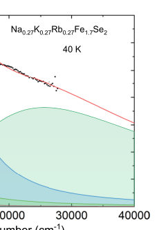
<figcaption class="paper-figure-caption"><b>Fig 2.</b> Fig. 3. (Color online) The real part of the optical conductivity of Na0.27K0.27Rb0.27Fe1.7Se2 at 40 K over a broad frequency range (dots) together with the Lorentz contributions revealed by the Drude-Lorentz analysis. The red solid curve is a total contour.</figcaption>
</figure>
<figure class="paper-figure-card">
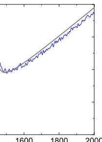
<figcaption class="paper-figure-caption"><b>Fig 3.</b> Fig. 4. (Color online) Representative fit (thick line) of Fano lineshape to IR reflectance data at 40 K.</figcaption>
</figure>
<figure class="paper-figure-card">
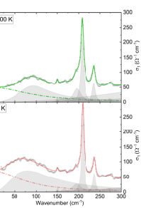
<figcaption class="paper-figure-caption"><b>Fig 4.</b> Fig. 5. (Color online) The expanded plots of the σ1(ω) spectra below 300 cm−1 taken at 300 K, 100 K, 40 K, and 5 K together with the results of Drude-Lorentz fit to the conductivity of Na0.27K0.27Rb0.27Fe1.7Se2. The Lorentz contributions are shown in gray.</figcaption>
</figure>

**Summary.** This work uses infrared spectroscopy on iron selenide single crystals to probe their electronic structure across superconducting transitions. By analyzing reflectance spectra, the researchers identified a persistent Fano resonance feature that suggests superconductivity and magnetic order coexist microscopically within the material. This challenges previous assumptions about mutual exclusion between these two quantum phenomena.

**Why it may be interesting.** The observation of persistent magnetic signatures alongside superconductivity in the optical spectrum provides crucial experimental evidence regarding the interplay between magnetism and pairing mechanisms in unconventional superconductors, which is a major topic in strongly correlated electron physics.

Detailed structure

**Main problem.** The study investigates the optical properties of superconducting iron selenide single crystals to determine if superconductivity and antiferromagnetism can coexist microscopically.

**Main result.** The persistence of a Fano-shaped mode at 1430 cm-1 in both normal and superconducting states strongly suggests a mesoscopic coexistence between superconductivity and magnetic order in the material.

**Method.** Infrared Fourier-transform spectroscopy and spectroscopic ellipsometry were used to measure in-plane reflectance over a wide frequency range, analyzed using Drude-Lorentz modeling.

**Model / system.** The physical system is the alkali-metal doped iron selenide single crystal, Na$_{0.27}$K$_{0.27}$Rb$_{0.27}$Fe$_{1.7}$Se$_2$, which exhibits superconductivity ($T_c \approx 34.3$ K) and magnetic superstructure.

**Key observables.** In-plane reflectance $R(\omega)$, optical conductivity $\sigma_1(\omega)$, plasma frequency, scattering rate, and dc resistivity as a function of temperature.

**Important parameters / regimes.** $T_c \approx 34.3$ K; Fano mode at $1430 	ext{ cm}^{-1}$; Temperature range: $4-300$ K.

**Assumptions / limitations.** The normal-state response is analyzed using a single Drude component model, and Kramers-Kronig analysis extends data to higher frequencies.

**Figures summary.** Figures show temperature dependence of AC magnetic susceptibility ($\chi'$) and absolute reflectance spectra at various temperatures relative to $T_c$, highlighting spectral features like the Fano peak and plasma edge formation.

**Paper structure.** The paper analyzes the normal-state response using Drude modeling, reports on specific optical features (Fano mode, low-frequency bands), and uses these measurements across the superconducting transition temperature range to argue for coexisting electronic states.

Abstract

With infrared Fourier-transform spectroscopy and spectroscopic ellipsometry we investigated the in-plane reflectance of the superconducting Na$_{0.27}$K$_{0.27}$Rb$_{0.27}$Fe$_{1.7}$Se$_2$ single crystals with a critical temperature $T_c\approx 34.3$ K over a broad frequency range at temperatures of 4--300 K. The normal-state response of Na$_{0.27}$K$_{0.27}$Rb$_{0.27}$Fe$_{1.7}$Se$_2$ is analyzed by a Drude-Lorentz model with one Drude component. The temperature dependences of the plasma frequency, optical conductivity, scattering rate, and dc resistivity of the Drude component in the normal state are presented. We report a Fano-shaped mode at 1430~cm$^{-1}$ indicating a coupling of the discrete mode presumably related to some electronic transition to a two-magnon continuum as well as a low-frequency broad band assigned to the acoustic magnon branch of the antiferromagnetic superstructure. These features persist in the reflectance in both the normal and superconducting states suggesting a mesoscopic coexistence of superconductivity and magnetism in Na$_{0.27}$K$_{0.27}$Rb$_{0.27}$Fe$_{1.7}$Se$_2$.

[↑ back to top](#top)

