
# arxiv digest (quant-ph + cond-mat) — 2026-07-24

*110 papers · 25 relevant · 2 highlighted*

## 🔥 Most relevant (25)

*Every paper with at least one nonzero topic score, sorted by best-matching score. 🔥 marks scores ≥4/5. Click the title to jump to the full entry below; click [arXiv] to open the paper page. `(secondary)` marks papers from de-prioritized cond-mat archives.*

Show 25 relevant papers

- [Collective Electronic Entanglement via Infrared Cavity-Induced Vibronic Transduction](#paper-2607.20333) [[arXiv]](http://arxiv.org/abs/2607.20333v1) — 🔥 `Tavis-Cummings & cavity-many-emitter` **5/5** · 🔥 `analog quantum simulation` **4/5** · 🔥 `correlated cavity matter` **4/5** · `correlated / nonlocal dissipation` **3/5** · `entanglement & information structure` **3/5** · `methods for driven-dissipative` **3/5** · `driven-dissipative phase transition` **2/5** · `quantum optics experiment` **2/5** · `Keldysh / 2PI / non-Gaussian methods` **1/5** · `QC/QI experiment` **1/5** · `non-equilibrium dynamics` **1/5** · `non-equilibrium universality` **1/5**
- ⭐ [Measurement-Selective Dynamical Symmetry Breaking](#paper-2607.19582) [[arXiv]](http://arxiv.org/abs/2607.19582v1) — 🔥 `quantum measurements` **5/5** · 🔥 `measurement-induced transitions` **4/5** · `driven-dissipative phase transition` **3/5** · `methods for driven-dissipative` **3/5** · `non-equilibrium dynamics` **2/5** · `analog quantum simulation` **1/5** · `correlated / nonlocal dissipation` **1/5** · `exotic spin models in light-matter` **1/5** · `non-equilibrium universality` **1/5**
- [High-purity entanglement mediated by magnons despite weak coupling](#paper-2607.19533) [[arXiv]](http://arxiv.org/abs/2607.19533v1) — 🔥 `methods for driven-dissipative` **4/5** · 🔥 `quantum measurements` **4/5** · 🔥 `spintronics-quantum-optics interface` **4/5** · `correlated / nonlocal dissipation` **3/5** · `entanglement & information structure` **3/5** · `measurement-induced transitions` **3/5** · `QC/QI experiment` **2/5** · `exotic spin models in light-matter` **2/5** · `non-equilibrium dynamics` **2/5** · `Keldysh / 2PI / non-Gaussian methods` **1/5** · `analog quantum simulation` **1/5** · `driven-dissipative phase transition` **1/5**
- [Lattice quantum electrodynamics of a molecular emitter in a topological gap](#paper-2607.20231) [[arXiv]](http://arxiv.org/abs/2607.20231v1) — 🔥 `analog quantum simulation` **4/5** · 🔥 `correlated cavity matter` **4/5** · `driven-dissipative phase transition` **3/5** · `interference shaping light` **3/5** · `quantum optics experiment` **3/5** · `Tavis-Cummings & cavity-many-emitter` **2/5** · `methods for driven-dissipative` **2/5** · `non-equilibrium dynamics` **2/5** · `non-equilibrium universality` **2/5** · `Frenkel-Kontorova` **1/5** · `Keldysh / 2PI / non-Gaussian methods` **1/5** · `correlated / nonlocal dissipation` **1/5** · `entanglement & information structure` **1/5** · `exotic spin models in light-matter` **1/5**
- [Entanglement dynamics through electromagnetic interactions in single-electron traps](#paper-2607.20236) [[arXiv]](http://arxiv.org/abs/2607.20236v1) — 🔥 `entanglement & information structure` **4/5** · `analog quantum simulation` **3/5** · `correlated / nonlocal dissipation` **3/5** · `methods for driven-dissipative` **3/5** · `non-equilibrium dynamics` **3/5** · `Keldysh / 2PI / non-Gaussian methods` **2/5** · `driven-dissipative phase transition` **2/5** · `quantum optics experiment` **2/5** · `QC/QI experiment` **1/5** · `correlated cavity matter` **1/5** · `non-equilibrium universality` **1/5**
- [THz-Driven Floquet Spin Valve-Modulator](#paper-2607.19897) [[arXiv]](http://arxiv.org/abs/2607.19897v1) `(secondary)` — 🔥 `non-equilibrium dynamics` **4/5** · `exotic spin models in light-matter` **3/5** · `methods for driven-dissipative` **3/5** · `spintronics-quantum-optics interface` **3/5** · `analog quantum simulation` **2/5** · `driven-dissipative phase transition` **2/5** · `non-equilibrium universality` **2/5** · `Keldysh / 2PI / non-Gaussian methods` **1/5** · `Kondo & dissipative impurity` **1/5**
- [Coupling phase interference effects in a multimode cavity magnonics system](#paper-2607.20234) [[arXiv]](http://arxiv.org/abs/2607.20234v1) — 🔥 `spintronics-quantum-optics interface` **4/5** · `Tavis-Cummings & cavity-many-emitter` **3/5** · `interference shaping light` **3/5** · `exotic spin models in light-matter` **2/5** · `quantum optics experiment` **2/5** · `analog quantum simulation` **1/5** · `correlated / nonlocal dissipation` **1/5** · `correlated cavity matter` **1/5** · `driven-dissipative phase transition` **1/5** · `methods for driven-dissipative` **1/5** · `non-equilibrium dynamics` **1/5**
- [Optical Magnetic Switching in Odd-Parity Magnets with Spin-Orbit Coupling](#paper-2607.19483) [[arXiv]](http://arxiv.org/abs/2607.19483v1) — 🔥 `spintronics-quantum-optics interface` **4/5** · `exotic spin models in light-matter` **3/5** · `non-equilibrium dynamics` **3/5** · `analog quantum simulation` **2/5** · `driven-dissipative phase transition` **2/5** · `methods for driven-dissipative` **2/5** · `Keldysh / 2PI / non-Gaussian methods` **1/5** · `interference shaping light` **1/5** · `non-equilibrium universality` **1/5**
- [Confinement Versus Screening in the Schwinger Model on AdS$_2$ from Bosonization and Tensor Networks](#paper-2607.19468) [[arXiv]](http://arxiv.org/abs/2607.19468v1) — 🔥 `methods for driven-dissipative` **4/5** · `Keldysh / 2PI / non-Gaussian methods` **3/5** · `analog quantum simulation` **2/5** · `driven-dissipative phase transition` **2/5** · `non-equilibrium dynamics` **2/5** · `correlated / nonlocal dissipation` **1/5** · `correlated cavity matter` **1/5** · `entanglement & information structure` **1/5** · `non-equilibrium universality` **1/5**
- [Emergence of Hexanematic Order in a Growing Confluent Cell Monolayer](#paper-2607.19963) [[arXiv]](http://arxiv.org/abs/2607.19963v1) — 🔥 `non-equilibrium dynamics` **4/5** · `driven-dissipative phase transition` **3/5** · `methods for driven-dissipative` **3/5** · `non-equilibrium universality` **3/5** · `Frenkel-Kontorova` **1/5** · `Keldysh / 2PI / non-Gaussian methods` **1/5** · `analog quantum simulation` **1/5** · `correlated / nonlocal dissipation` **1/5**
- [Exact Closed-Form Quantum Correlations of Maximally Entangled Qudit States under Arbitrary Non-Markovian Pure Dephasing](#paper-2607.19702) [[arXiv]](http://arxiv.org/abs/2607.19702v1) — 🔥 `entanglement & information structure` **4/5** · `correlated / nonlocal dissipation` **3/5** · `methods for driven-dissipative` **3/5** · `driven-dissipative phase transition` **2/5** · `non-equilibrium dynamics` **2/5** · `Keldysh / 2PI / non-Gaussian methods` **1/5** · `analog quantum simulation` **1/5** · `non-equilibrium universality` **1/5**
- [Emergence of giant vortices under nonlinear rotation with attractive interactions in a toroidal condensate](#paper-2607.19840) [[arXiv]](http://arxiv.org/abs/2607.19840v1) — 🔥 `analog quantum simulation` **4/5** · `methods for driven-dissipative` **3/5** · `non-equilibrium dynamics` **3/5** · `driven-dissipative phase transition` **2/5** · `non-equilibrium universality` **2/5** · `Frenkel-Kontorova` **1/5** · `Keldysh / 2PI / non-Gaussian methods` **1/5**
- [Energy Flux as an Entanglement Current in Moving-Mirror Radiation](#paper-2607.19763) [[arXiv]](http://arxiv.org/abs/2607.19763v1) — 🔥 `entanglement & information structure` **4/5** · `analog quantum simulation` **2/5** · `non-equilibrium dynamics` **2/5** · `Keldysh / 2PI / non-Gaussian methods` **1/5** · `correlated / nonlocal dissipation` **1/5** · `driven-dissipative phase transition` **1/5** · `methods for driven-dissipative` **1/5** · `non-equilibrium universality` **1/5**
- [Microwave-driven same-species sympathetic cooling for trapped ions](#paper-2607.20292) [[arXiv]](http://arxiv.org/abs/2607.20292v1) — 🔥 `QC/QI experiment` **4/5** · `quantum measurements` **2/5** · `quantum optics experiment` **2/5** · `analog quantum simulation` **1/5** · `correlated / nonlocal dissipation` **1/5** · `driven-dissipative phase transition` **1/5** · `methods for driven-dissipative` **1/5** · `non-equilibrium dynamics` **1/5**
- [Chiral Magnetic Conductivity in the Tight-Binding Model of Dirac Semimetals](#paper-2607.19589) [[arXiv]](http://arxiv.org/abs/2607.19589v1) `(secondary)` — 🔥 `Keldysh / 2PI / non-Gaussian methods` **4/5** · `methods for driven-dissipative` **3/5** · `non-equilibrium dynamics` **2/5** · `analog quantum simulation` **1/5** · `driven-dissipative phase transition` **1/5** · `non-equilibrium universality` **1/5**
- [Intelligent qubits](#paper-2607.19596) [[arXiv]](http://arxiv.org/abs/2607.19596v1) — 🔥 `measurement-induced transitions` **4/5** · `quantum measurements` **3/5** · `Keldysh / 2PI / non-Gaussian methods` **1/5** · `correlated / nonlocal dissipation` **1/5** · `driven-dissipative phase transition` **1/5** · `entanglement & information structure` **1/5**
- [Logarithmic scaling correction in quench dynamics of the J1-J2 Potts model](#paper-2607.20081) [[arXiv]](http://arxiv.org/abs/2607.20081v1) — 🔥 `non-equilibrium universality` **4/5** · `non-equilibrium dynamics` **3/5** · `analog quantum simulation` **1/5** · `driven-dissipative phase transition` **1/5** · `exotic spin models in light-matter` **1/5** · `methods for driven-dissipative` **1/5**
- [Quantum Fisher Information in semiclassical magnon systems](#paper-2607.20424) [[arXiv]](http://arxiv.org/abs/2607.20424v1) — 🔥 `entanglement & information structure` **4/5** · `exotic spin models in light-matter` **3/5** · `analog quantum simulation` **2/5** · `Keldysh / 2PI / non-Gaussian methods` **1/5** · `spintronics-quantum-optics interface` **1/5**
- [Dynamical redistribution of quantum resources in tree-level Bhabha scattering](#paper-2607.20264) [[arXiv]](http://arxiv.org/abs/2607.20264v1) — 🔥 `entanglement & information structure` **4/5** · `non-equilibrium dynamics` **2/5** · `Keldysh / 2PI / non-Gaussian methods` **1/5** · `correlated / nonlocal dissipation` **1/5** · `driven-dissipative phase transition` **1/5** · `methods for driven-dissipative` **1/5**
- [Quantum Simulation of Semiconductor Excitons in Ultracold Dipolar Fermi Gases](#paper-2607.19467) [[arXiv]](http://arxiv.org/abs/2607.19467v1) — 🔥 `analog quantum simulation` **4/5** · `Frenkel-Kontorova` **2/5** · `Keldysh / 2PI / non-Gaussian methods` **1/5** · `driven-dissipative phase transition` **1/5** · `spintronics-quantum-optics interface` **1/5**
- [Nonreciprocal phonon propagation via spatially asymmetric magnon-phonon coupling](#paper-2607.19788) [[arXiv]](http://arxiv.org/abs/2607.19788v1) `(secondary)` — 🔥 `spintronics-quantum-optics interface` **4/5** · `correlated / nonlocal dissipation` **1/5** · `driven-dissipative phase transition` **1/5** · `exotic spin models in light-matter` **1/5** · `non-equilibrium dynamics` **1/5**
- [Fermionic pairs, from the surface to the bulk](#paper-2607.20412) [[arXiv]](http://arxiv.org/abs/2607.20412v1) — 🔥 `analog quantum simulation` **4/5** · `Keldysh / 2PI / non-Gaussian methods` **1/5** · `entanglement & information structure` **1/5** · `non-equilibrium dynamics` **1/5**
- [Machine-learned syndrome post-selection for reliable quantum error correction](#paper-2607.19563) [[arXiv]](http://arxiv.org/abs/2607.19563v1) — 🔥 `QC/QI experiment` **4/5** · `methods for driven-dissipative` **1/5** · `quantum measurements` **1/5**
- [Statevector-Referenced Geometry Survival of a Four-Qubit ZZ Quantum Kernel on IBM Quantum Hardware: A Fixed-Subset Diagnostic Across Three Execution Configurations](#paper-2607.20377) [[arXiv]](http://arxiv.org/abs/2607.20377v1) — 🔥 `QC/QI experiment` **4/5** · `entanglement & information structure` **1/5**
- [Quantum-state block texture and its quantification](#paper-2607.20311) [[arXiv]](http://arxiv.org/abs/2607.20311v1) — 🔥 `entanglement & information structure` **4/5**

## ⭐ Highlighted (2)

*Papers by authors on your watch list. Click the title to jump to the full entry below; click [arXiv] to open the paper page.*

Show 2 highlighted papers

- ⭐ [Measurement-Selective Dynamical Symmetry Breaking](#paper-2607.19582) [[arXiv]](http://arxiv.org/abs/2607.19582v1) — Denys I. Bondar
- ⭐ [Synthesizing superoscillations with just two frequencies](#paper-2607.19542) [[arXiv]](http://arxiv.org/abs/2607.19542v1) — Denys I. Bondar

## All papers (85, sorted by relevance)

*Papers from quant-ph and your primary cond-mat archives (quant-gas, stat-mech, str-el, dis-nn). Highlighted papers (⭐) come first, then everything else sorted by topic-relevance score, highest first.*

### ⭐ [Measurement-Selective Dynamical Symmetry Breaking](http://arxiv.org/abs/2607.19582v1)

**Highlighted author(s):** Denys I. Bondar  
**Authors:** Polina Kofman, Elvira Bilokon, Valeriia Bilokon, Denys I. Bondar  
**Type:** theory · **Category:** quantum information and computing · **PDF:** <https://arxiv.org/pdf/2607.19582v1>  
**Analysis basis:** full PDF text, analyzed in chunks
**Topic relevance:** 🔥 `quantum measurements` **5/5** · 🔥 `measurement-induced transitions` **4/5** · `driven-dissipative phase transition` **3/5** · `methods for driven-dissipative` **3/5** · `non-equilibrium dynamics` **2/5** · `analog quantum simulation` **1/5** · `correlated / nonlocal dissipation` **1/5** · `exotic spin models in light-matter` **1/5** · `non-equilibrium universality` **1/5**

↔ Scroll figures horizontally

<figure class="paper-figure-card">
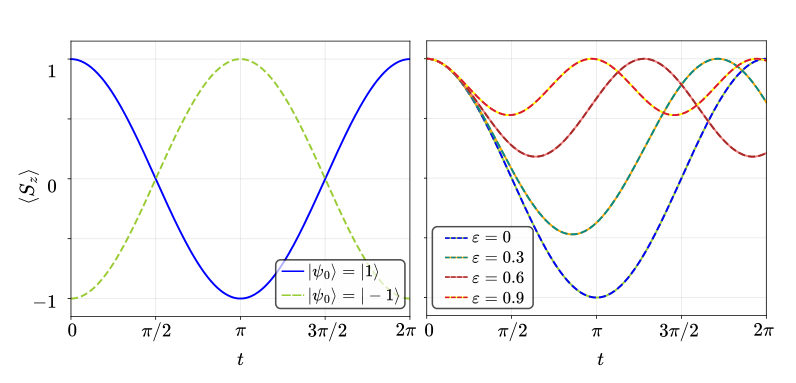
<figcaption class="paper-figure-caption"><b>Fig 1.</b> FIG. 1. Expectation value ⟨Sz⟩as a function of time for the Hamiltonian in Eq. (5) with D = −2 and γ = 0.5. The left panel shows the symmetric case (ε = 0), characterized by complete tunneling between the states |+1⟩and |−1⟩. The right panel corresponds to a finite asymmetry (ε ̸= 0), which suppresses complete population transfer while preserving the mirror symmetry of the dynamics. Solid and dashed curves correspond to the initial states |+1⟩and |−1⟩, respectively, with the latter plotted as −⟨Sz⟩.</figcaption>
</figure>
<figure class="paper-figure-card">
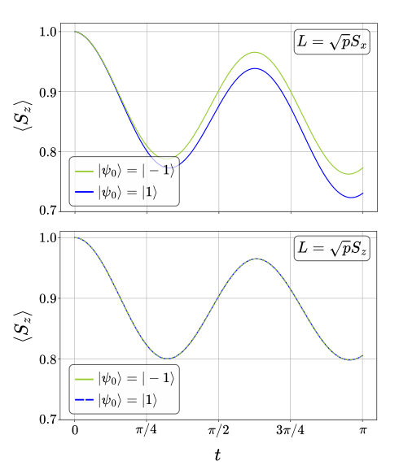
<figcaption class="paper-figure-caption"><b>Fig 2.</b> FIG. 2. Expectation value ⟨Sz⟩as a function of time under continuous weak measurement with D = −2, γ = 0.5, ε = 1, and p = 0.05. For initial state |−1⟩, the observable plotted as −⟨Sz⟩. Upper panel: jump operator L = √pxSx. Lower panel: jump operator L = √pzSz.</figcaption>
</figure>
<figure class="paper-figure-card">
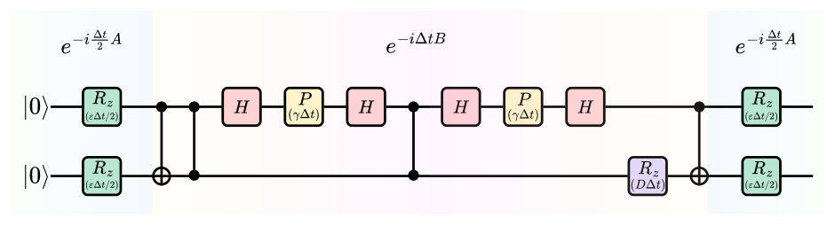
<figcaption class="paper-figure-caption"><b>Fig 3.</b> FIG. 3. Quantum circuit for one Trotter step used to simulate the dynamics generated by the Hamiltonian in Eq. (5). The full- time evolution is obtained by repeating this circuit with a time step ∆t. The Hamiltonian is decomposed into the asymmetric part, A = εSz, and the symmetric part, B = DS2 z + γ(S2 x −S2 y). The gates H, P, and Rz represent the Hadamard, phase, and Z-rotation gates, respectively. The circuit also employs controlled-NOT (CNOT) and controlled-Z (CZ) gates to implement two-qubit interactions.</figcaption>
</figure>
<figure class="paper-figure-card">
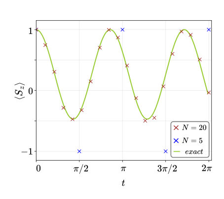
<figcaption class="paper-figure-caption"><b>Fig 4.</b> FIG. 4. Comparison of the Trotterized and exact time evo- lutions for N = 5 and N = 20 Trotter steps. Increasing the number of Trotter steps (equivalently, decreasing the time step) improves the accuracy of the Trotter approximation and brings the simulated dynamics closer to the exact evolution.</figcaption>
</figure>
<figure class="paper-figure-card">
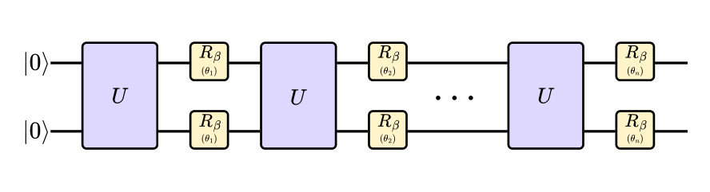
<figcaption class="paper-figure-caption"><b>Fig 5.</b> FIG. 5. Full quantum circuit with dissipation. Each block U represents one Trotter step as shown in Fig. 4. Dissipation is implemented by applying Rβ(θi) (β = x, z) rotations to both qubits with the same angle θi between successive Trotter steps. All angles θi are sampled uniformly in range  − p</figcaption>
</figure>

**Summary.** The paper demonstrates that weak continuous measurements are not just sources of decoherence but can act selectively to either preserve or break dynamical symmetries in open quantum systems. Using a spin-1 tunneling model, the authors show that measuring $S_z$ maintains symmetry while measuring $S_x$ breaks it, establishing measurement as a powerful tool for controlling dynamics.

**Why it may be interesting.** This work provides a concrete mechanism showing how measurement itself can be engineered as a control knob for fundamental symmetries in open quantum systems, which is highly relevant for controlling qubits or simulating physical processes.

Detailed structure

**Main problem.** The study investigates whether weak continuous measurements can selectively control or break dynamical symmetries in open quantum systems, moving beyond simple decoherence effects.

**Main result.** The choice of measured observable dictates the symmetry outcome: monitoring $S_z$ preserves the mirror symmetry even with a bias, while measuring $S_x$ or $S_y$ breaks it.

**Method.** The analysis uses the Lindblad master equation framework and is supported by numerical simulations comparing stochastic quantum trajectories to exact evolution.

**Model / system.** The model is a spin-1 system undergoing tunneling between $|+1
angle$ and $|-1
angle$ states, governed by a Hamiltonian that includes a longitudinal bias ($\epsilon$). The dynamics are treated as an open system via the Lindblad equation.

**Key observables.** Expectation value $\langle S_z 
angle$ over time; comparison of evolution starting from mirrored initial states ($|+1
angle$ vs $|-1
angle$).

**Important parameters / regimes.** The longitudinal bias ($\epsilon$), and the strength/type of continuous measurement (e.g., $L \propto S_x$, $L \propto S_z$).

**Assumptions / limitations.** The analysis relies on comparing the full Liouville space evolution under different jump operators derived from weak measurements.

**Figures summary.** Figures compare $\langle S_z 
angle$ for closed vs. open dynamics, specifically contrasting $S_x$ and $S_z$ measurement effects under a finite bias ($\epsilon=1$).

**Paper structure.** The paper first establishes the theoretical framework using the Lindblad equation for continuous measurements. It then applies this to a spin-1 tunneling model, demonstrating that the symmetry preservation depends critically on whether the jump operator couples the tunneling subspace to the intermediate $|0
angle$ state.

Abstract

Continuous measurement is commonly associated with decoherence and the loss of symmetry. Here, we show that weak continuous measurements can instead act selectively: depending on the measured observable, they may either preserve or remove a dynamical relation between initially mirrored states. Using tunneling between the $|+1\rangle$ and $|-1\rangle$ states of a spin-1 system, we demonstrate that measurements of $S_x$ and $S_y$ break the symmetry of the tunneling dynamics in the presence of a longitudinal bias, whereas measurement of $S_z$ leaves it intact. We formulate this behavior within the Lindblad framework, support it with numerical simulations, and reproduce the dissipative dynamics in a two-qubit quantum circuit using Trotterized evolution and stochastic collective rotations. Our results establish continuous measurement as a selective tool for controlling dynamical symmetry in open quantum systems.

[↑ back to top](#top)

### ⭐ [Synthesizing superoscillations with just two frequencies](http://arxiv.org/abs/2607.19542v1)

**Highlighted author(s):** Denys I. Bondar  
**Authors:** Denys I. Bondar, Diyar Talbayev  
**Type:** both · **Category:** other · **PDF:** <https://arxiv.org/pdf/2607.19542v1>  
**Analysis basis:** full PDF text, analyzed in chunks
**Topic relevance:** `interference shaping light` **3/5** · `quantum optics experiment` **3/5** · `non-equilibrium dynamics` **1/5**

↔ Scroll figures horizontally

<figure class="paper-figure-card">
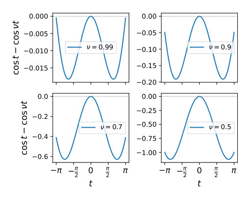
<figcaption class="paper-figure-caption"><b>Fig 1.</b> FIG. 1. An illustration of bichromatic superoscillations us- ing (4) for several values of ν. The closer ν approaches 1, the closer the function comes to exhibiting two oscillations within the superoscillating region. When ν = 1, there is complete destructive interference.</figcaption>
</figure>
<figure class="paper-figure-card">
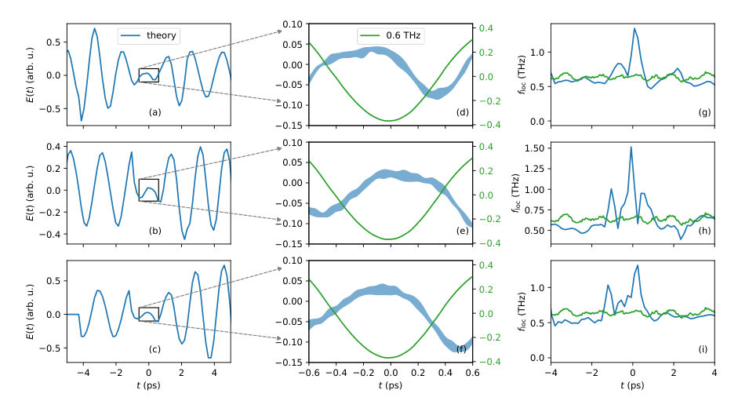
<figcaption class="paper-figure-caption"><b>Fig 2.</b> FIG. 2. Three example bichromatic superoscillations obtained via the minimization of Eq. (2) (using 0.5 and 0.6 THz harmonics) by reanalyzing experimental data from Fig. 3 of Ref. [14]. Left column (a, b, c) shows the predicted field over the full measurement window. The middle panels (d, e, f) highlight the window in which the superoscillation occurs, with comparison to the highest frequency component waveform. The shaded blue area shows the theoretical prediction with the 95% confidence limit. The right column (g, h, i) plots the local frequencies of both the total waveform and its highest frequency component. Outside the window of minimization these are roughly equivalent, but within...</figcaption>
</figure>
<figure class="paper-figure-card">
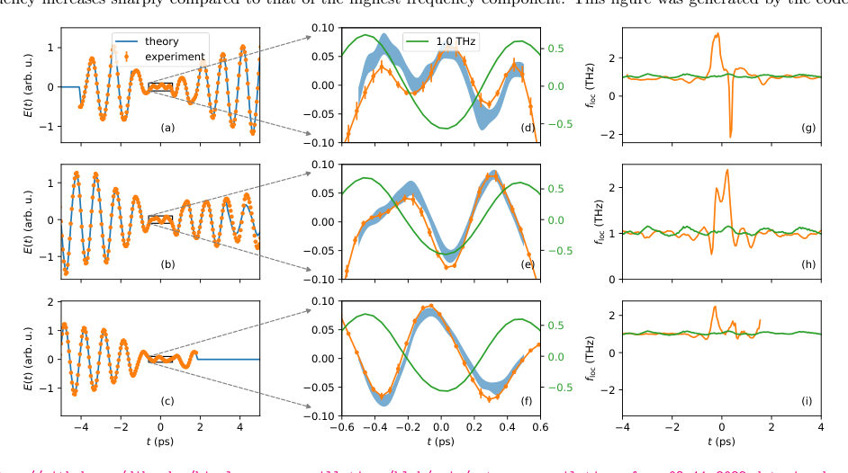
<figcaption class="paper-figure-caption"><b>Fig 3.</b> FIG. 3. Three example bichromatic superoscillations obtained via the minimization of Eq. (2) using 0.9 and 1 THz harmonics. Left column (a, b, c) shows both the predicted and observed field over the full measurement window. The middle panels (d, e, f) highlight the window in which the superoscillation occurs, with comparison to the highest frequency component waveform. The experimental data is in excellent agreement with the theoretical 95% confidence limit (shaded blue area). The right column (g, h, i) plots the local frequencies of both the total waveform and its highest frequency component. Outside the window of minimization these are roughly equivalent, but within this window the...</figcaption>
</figure>

**Summary.** This paper shows that generating superoscillations, which exhibit local frequencies exceeding the signal's highest Fourier component, can be achieved using only two constituent frequencies instead of the previously required four. By providing both analytical explanations and confirming results with new THz experiments, the authors significantly lower the experimental hurdle for developing superoscillation-based technologies.

**Why it may be interesting.** This work directly addresses advanced topics in quantum optics and light-matter interaction by demonstrating a significant technological simplification (reducing required harmonics from four to two) while maintaining high performance metrics relevant for super-sensing applications.

Detailed structure

**Main problem.** The primary goal is to synthesize superoscillations—band-limited signals that oscillate faster than their highest Fourier component—using the minimum number of constituent frequencies.

**Main result.** The authors demonstrate that only two harmonics are sufficient to generate superoscillations with a twofold local frequency enhancement, matching performance previously requiring four harmonics.

**Method.** The analysis involves minimizing the combined electric field intensity over a time window and calculating the local frequency via Hilbert transformation.

**Model / system.** The system is based on temporal domain optical superoscillations generated using quasi-sinusoidal THz harmonics, experimentally realized in Periodically Poled Lithium Niobate (PPLN).

**Key observables.** Local Frequency (floc), which quantifies the enhancement relative to the highest frequency component; signal amplitude.

**Important parameters / regimes.** Optimal frequency separation of approximately 10% is identified as a balance point between high local frequency enhancement and sufficient signal amplitude.

**Assumptions / limitations.** The analysis relies on modeling the combined field using sums of quasi-sinusoidal harmonics, and assumes that destructive interference can be controlled to enhance local oscillation rates.

**Figures summary.** Figure 1 illustrates the theoretical basis for bichromatic superoscillations. Figures 2 and 3 provide experimental confirmation (reanalyzed and new data) showing a clear twofold increase in local frequency using only two harmonics (e.g., 0.5/0.6 THz and 0.9/1 THz).

**Paper structure.** The paper establishes the problem of superoscillation synthesis, presents the theoretical framework for bichromatic generation, provides analytical explanations regarding optimal frequency separation, and concludes with experimental validation using both reanalyzed historical data and new measurements.

Abstract

Superoscillations, band-limited signals that locally oscillate faster than their highest Fourier component, have recently enabled superspectroscopy and super-sensing. Previous experiments [Phys. Rev. Lett. 131, 153803 (2023), https://doi.org/10.1103/PhysRevLett.131.153803 and APL Photonics 10, 086107 (2025), https://doi.org/10.1063/5.0271556] relied on combining four quasi-sinusoidal harmonics to generate temporal superoscillations. Here, we show that just two harmonics are sufficient to produce superoscillations of comparable quality, as quantified by the local frequency. By reanalyzing prior experimental data with two harmonics (0.5 and 0.6 THz) and performing new experiments with 0.9 and 1 THz harmonics, we demonstrate a twofold enhancement in local frequency relative to the highest frequency component -- matching the enhancement previously achieved with four harmonics. We provide a simple analytical explanation for the bichromatic superoscillations based on near-complete destructive interference, and identify an optimal frequency separation of approximately 10% that balances the superoscillatory frequency enhancement against signal amplitude. This simplification substantially lowers the experimental barrier to implementing superoscillation-based technology.

[↑ back to top](#top)

### [Collective Electronic Entanglement via Infrared Cavity-Induced Vibronic Transduction](http://arxiv.org/abs/2607.20333v1)

**Authors:** Vivek Yadav, Bar Cohn, Shmuel Sufrin, Uri Peskin, Lev Chuntonov  
**Type:** both · **Category:** other · **PDF:** <https://arxiv.org/pdf/2607.20333v1>  
**Analysis basis:** full PDF text, analyzed in chunks
**Topic relevance:** 🔥 `Tavis-Cummings & cavity-many-emitter` **5/5** · 🔥 `analog quantum simulation` **4/5** · 🔥 `correlated cavity matter` **4/5** · `correlated / nonlocal dissipation` **3/5** · `entanglement & information structure` **3/5** · `methods for driven-dissipative` **3/5** · `driven-dissipative phase transition` **2/5** · `quantum optics experiment` **2/5** · `Keldysh / 2PI / non-Gaussian methods` **1/5** · `QC/QI experiment` **1/5** · `non-equilibrium dynamics` **1/5** · `non-equilibrium universality` **1/5**

↔ Scroll figures horizontally

<figure class="paper-figure-card">
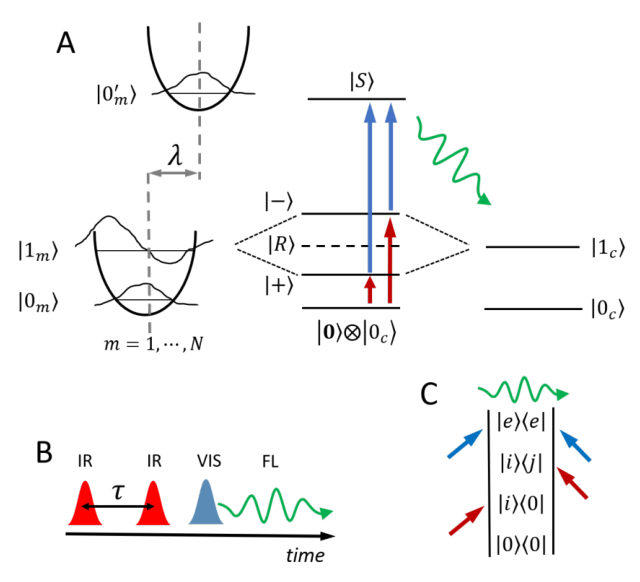
<figcaption class="paper-figure-caption"><b>Fig 1.</b> Fig. 1. FE-IR spectroscopy of VSC system. (A) Excitation states diagram. Left: ground and excited molecular electronic states displaced by the vibronic constant 𝜆 along the normal mode coordinate. The molecules in the ensemble enumerated by index 𝑚 contribute to collective bright state |𝐵⟩. Right: photonic states of infrared cavity. Middle: vibro-polariton states of the hybrid system. Red arrows – infrared laser pulses, blue arrows – visible laser pulses, green arrow – fluorescence emission. (B) Sequence of excitation laser pulses, 𝜏 – coherence time interval. (C) Double-sided Feynman diagram describing the Liouville space fourth-order response functions. Indices 𝑖, 𝑗 - vibrational...</figcaption>
</figure>
<figure class="paper-figure-card">
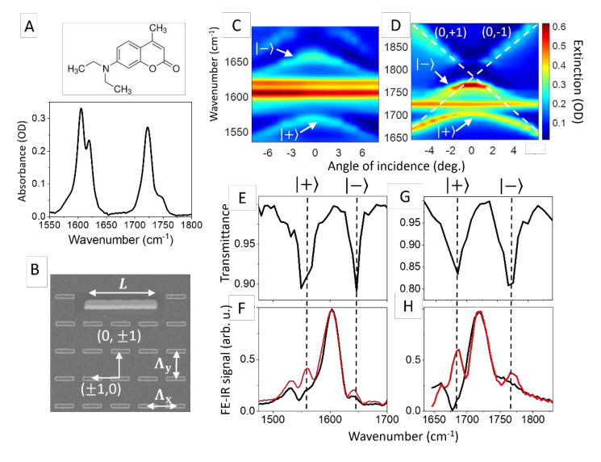
<figcaption class="paper-figure-caption"><b>Fig 2.</b> Fig. 2. VSC system. (A) Linear FT-IR spectrum of C-1 solution in toluene. Molecular structure is shown on top. (B) Scanning electron micro-image of the infrared antenna array. Antenna dimensions are: length (𝐿) 1.1 μm, width 200 nm, and height 80 nm. Lattice diffraction orders associated with SLRs are indicated. Vibro-polaritons dispersion maps obtained with FT-IR. (C) C=C vibration strongly coupled to SLR. Spectra collected at different angles of incidence with TE-polarized light. Array lattice constants are Λ𝑥=1.6 μm and Λ𝑦=4.2 μm. Polariton branches are marked with white arrows. (D) Same as panel C, but for C=O vibration. Array lattice constants are Λ𝑥=1.6 μm and Λ𝑦=3.8 μm. Non-linear...</figcaption>
</figure>
<figure class="paper-figure-card">
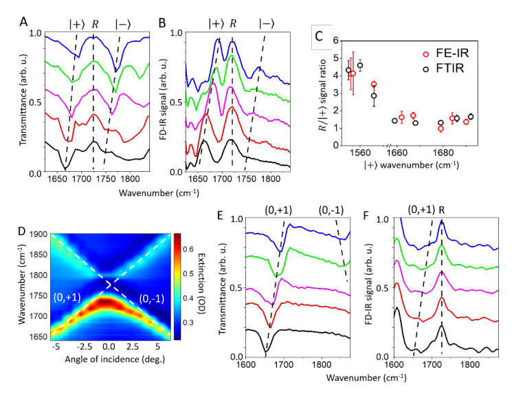
<figcaption class="paper-figure-caption"><b>Fig 3.</b> Fig. 3. FE-IR spectroscopy of C=O vibration on antenna arrays. FE-IR measurements with different incident angles of IR pulses. Blue - 𝜃~1°, green - 𝜃~2°, magenta - 𝜃~4°, red - 𝜃~5°, black - 𝜃~6°. Polariton and reservoir peaks are traced by dashed lines. VSC regime, C-1 concentration 2.5 M. (A) Transmission spectra measured with bare-molecule spectrum as background. (B) FE-IR spectra. (C) Reservoir to |+⟩ signal ratio obtained with FT-IR (black circles) and FE-IR (red circles). The data are plotted for different |+⟩ transition frequencies. Uncoupled C=O vibration, C-1 concentration 40 mM. (D) SLR dispersion map measured with FT-IR. (E) Transmission spectra, measured with bare-molecule...</figcaption>
</figure>

**Summary.** The paper reports on generating macroscopically entangled electronic states in molecular ensembles by utilizing infrared cavity fields coupled through molecular vibrations. By employing nonlinear FE-IR spectroscopy, the authors overcome the theoretical $O(1/N)$ dilution limit, demonstrating a robust, scale-invariant coupling mechanism for room-temperature quantum applications.

**Why it may be interesting.** This work is highly relevant as it addresses scalable quantum light-matter interaction in solid-state molecular systems, providing a mechanism (vibronic bridge) to maintain coherence against ensemble size limitations crucial for quantum technologies.

Detailed structure

**Main problem.** The primary challenge is overcoming the $O(1/N)$ ensemble dilution bottleneck when observing localized molecular responses coupled to delocalized optical cavity fields in polaritonic architectures.

**Main result.** The authors demonstrate a scale-invariant, collective electronic entanglement scaling as $O(1)$, achieved through vibronic quantum transduction that bypasses the expected density decay penalty.

**Method.** They employ fourth-order nonlinear fluorescence-encoded infrared (FE-IR) action spectroscopy to probe these non-local vibrational-to-electronic coupling pathways.

**Model / system.** The system involves molecular ensembles coupled via strong interaction to an optical cavity mode, modeled using extensions of the Tavis-Cummings-Holstein Hamiltonian. The process relies on a 'synthetic vibronic bridge' mechanism.

**Key observables.** The key diagnostic is measuring the electronic response scaling law, aiming for $O(1)$ invariance, alongside analyzing the ratio $rac{I_R^{FE-IR}}{I_\pm^{FE-IR}}$ to confirm collective behavior.

**Important parameters / regimes.** Key regimes include the dispersive coupling regime and the ability to synchronize responses over picosecond vibrational timescales versus femtosecond electronic coherence times.

**Assumptions / limitations.** The analysis assumes operation in a dispersive coupling regime, where Rabi splitting remains constant with laser power, and that the visible pulse drives coherence between specific molecular states.

**Figures summary.** Figures detail FE-IR spectra for various vibrational modes (C=C, C=O) on antenna arrays, dispersion maps of vibro-polaritons, and schematic diagrams illustrating the excitation pathways and coupling mechanisms.

**Paper structure.** The paper establishes the theoretical bottleneck ($O(1/N)$ scaling), introduces the FE-IR methodology to probe collective behavior, develops a Hamiltonian framework incorporating VSC, and presents experimental evidence showing $O(1)$ scaling via vibronic transduction.

Abstract

Polaritonic architectures seek to engineer molecular properties by hybridizing localized degrees of freedom with delocalized optical cavity fields. However, scaling laws impose a severe bottleneck on N-molecule collective strong coupling: because each molecule contributes only a fractional share to the collective state, localized responses undergo O(1/N) ensemble dilution. We demonstrate a violation of this scaling using fluorescence-encoded infrared spectroscopy of molecular ensembles under vibrational strong coupling, where macroscopically synchronized electronic responses scale as O(1). This scale-invariance reveals a regime of vibronic quantum transduction, where non-local vibrational entanglement is translated into collective electronic entanglement. By demonstrating the generation of macroscopically entangled electronic states from vibro-polaritons without an O(1/N) penalty, these results provide a scalable framework for room-temperature quantum technologies and coherent steering of non-adiabatic chemical pathways.

[↑ back to top](#top)

### [High-purity entanglement mediated by magnons despite weak coupling](http://arxiv.org/abs/2607.19533v1)

**Authors:** Sanchar Sharma  
**Type:** theory · **Category:** quantum information and computing · **PDF:** <https://arxiv.org/pdf/2607.19533v1>  
**Analysis basis:** full PDF text, analyzed in chunks
**Topic relevance:** 🔥 `methods for driven-dissipative` **4/5** · 🔥 `quantum measurements` **4/5** · 🔥 `spintronics-quantum-optics interface` **4/5** · `correlated / nonlocal dissipation` **3/5** · `entanglement & information structure` **3/5** · `measurement-induced transitions` **3/5** · `QC/QI experiment` **2/5** · `exotic spin models in light-matter` **2/5** · `non-equilibrium dynamics` **2/5** · `Keldysh / 2PI / non-Gaussian methods` **1/5** · `analog quantum simulation` **1/5** · `driven-dissipative phase transition` **1/5**

↔ Scroll figures horizontally

<figure class="paper-figure-card">
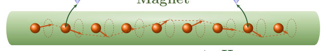
<figcaption class="paper-figure-caption"><b>Fig 1.</b> FIG. 1. Setup for heralding entanglement between two NV centers, NV1 and NV2. They sit near</figcaption>
</figure>
<figure class="paper-figure-card">
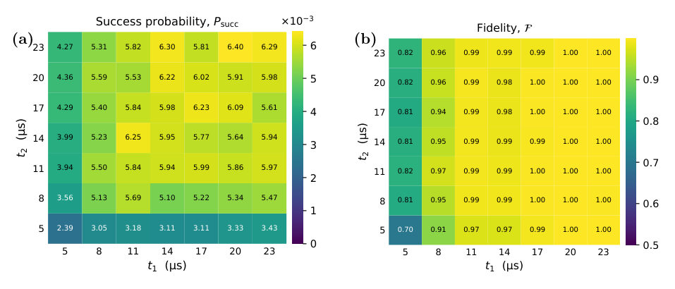
<figcaption class="paper-figure-caption"><b>Fig 2.</b> FIG. 2. (a) Success probability and (b) fidelity as a function of the two waiting times t1 and t2,</figcaption>
</figure>
<figure class="paper-figure-card">
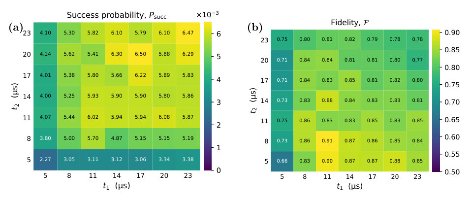
<figcaption class="paper-figure-caption"><b>Fig 3.</b> FIG. 3. (a) Success probability and (b) fidelity as a function of the two waiting times t1 and t2,</figcaption>
</figure>
<figure class="paper-figure-card">

<figcaption class="paper-figure-caption"><b>Fig 4.</b> Fig. 2 shows the success probability and fidelity as functions of t1 and t2 at the low de-</figcaption>
</figure>

**Summary.** The paper presents a novel probabilistic protocol to generate high-fidelity entanglement between distant NV centers using magnons as a quantum bus. It successfully breaks the conventional trade-off between coupling strength and decoherence by engineering the interaction such that only transitions outside the computational basis are coupled to the magnon bath. The results show near-unity fidelity is achievable even with weak coupling, making it highly relevant for solid-state quantum networking.

**Why it may be interesting.** This work directly addresses scalable quantum networking by demonstrating how solid-state spin systems can mediate entanglement robustly against coupling strength limitations, a key challenge in quantum information science.

Detailed structure

**Main problem.** The research aims to overcome a fundamental trade-off in quantum entanglement generation where increasing spin-magnon coupling enhances fidelity but simultaneously increases the decoherence rate.

**Main result.** A probabilistic protocol was proposed that achieves high entanglement fidelity, even with arbitrarily weak coupling, by utilizing magnon measurement to protect the computational subspace from decay.

**Method.** The analysis uses a Monte-Carlo wavefunction approach (stochastic unravelling) applied to the system's master equation dynamics.

**Model / system.** The physical platform involves two Nitrogen-Vacancy (NV) centers coupled via magnons propagating in a thin magnetic wire. The protocol relies on coupling magnons only to transitions outside the computational basis to preserve coherence.

**Key observables.** Entanglement fidelity ($F$) and success probability ($P_{succ}$), aiming for the maximally entangled Bell state $|\psi_{	ext{des}}
angle \propto |0ar{1}
angle + |ar{1}0
angle$.

**Important parameters / regimes.** The analysis considers regimes with weak coupling (coupling strength $g$ being small relative to magnon linewidth $\kappa$) and finite NV dephasing rates ($\kappa_{mod}^{NV}$).

**Assumptions / limitations.** Initially, the protocol assumes global microwave control; later analyses incorporate finite NV dephasing effects into the fidelity calculation.

**Figures summary.** Not specified (Notes detail mathematical derivations and simulation results for fidelity vs. coupling/time).

**Paper structure.** The paper first identifies the entanglement trade-off, then proposes a probabilistic protocol based on magnon measurement to circumvent this limit. It details the Hamiltonian and dynamics using MC wavefunction simulations, culminating in quantitative predictions of achievable fidelity under realistic decoherence conditions.

Abstract

Entangling distant spins via a shared magnonic bus typically faces a tradeoff: stronger spin-magnon coupling increases the entanglement fidelity, but also the spin decay rate. We propose a protocol that breaks this tradeoff. The magnons couple only to a transition outside the computational basis, in which the Bell state is created. Our protocol is probabilistic, and weak coupling reduces the success probability but not the fidelity. We analyze a setup where the spins are two nitrogen-vacancy (NV) centers near a magnetic wire. In the absence of NV dephasing, the protocol reaches unit fidelity with a maximally entangled state, for arbitrarily weak coupling. In our simulations via the Monte-Carlo wavefunction approach, the NV-magnon coupling is taken to be one-third of the magnon linewidth. Considering finite NV dephasing, we predict a fidelity of >0.99 for a state-of-the-art rate, and an optimal fidelity of 0.91 for a moderate rate, both at 0.6% success probability.

[↑ back to top](#top)

### [Lattice quantum electrodynamics of a molecular emitter in a topological gap](http://arxiv.org/abs/2607.20231v1)

**Authors:** Clarisse Fournier, Johannes Düreth, Elena Fanella, Hugo Levy-Falk, Maja Colautti, Anna Beauvironnet, Gauthier Dekyndt, Clément Hainaut, Tomáš Neuman, Simon Betzold, Sven Höfling, Sebastian Klembt, Alejandro González-Tudela, Costanza Toninelli, Alberto Amo  
**Type:** experiment · **Category:** other · **PDF:** <https://arxiv.org/pdf/2607.20231v1>  
**Analysis basis:** full PDF text, analyzed in chunks
**Topic relevance:** 🔥 `analog quantum simulation` **4/5** · 🔥 `correlated cavity matter` **4/5** · `driven-dissipative phase transition` **3/5** · `interference shaping light` **3/5** · `quantum optics experiment` **3/5** · `Tavis-Cummings & cavity-many-emitter` **2/5** · `methods for driven-dissipative` **2/5** · `non-equilibrium dynamics` **2/5** · `non-equilibrium universality` **2/5** · `Frenkel-Kontorova` **1/5** · `Keldysh / 2PI / non-Gaussian methods` **1/5** · `correlated / nonlocal dissipation` **1/5** · `entanglement & information structure` **1/5** · `exotic spin models in light-matter` **1/5**

↔ Scroll figures horizontally

<figure class="paper-figure-card">
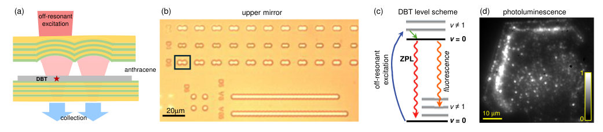
<figcaption class="paper-figure-caption"><b>Fig 1.</b> FIG. 1. The open cavity - DBT system. (a) Sketch of the open cavity with two coupled hemispheric resonators. (b) Optical microscope image of a region of the upper mirror displaying individual hemispheres, dimers and lattices of coupled hemispheres. (c) Simplified energy level scheme of a DBT molecule. v = 0 indicates the fundamental vibrational state of the ground and first excited electronic state. ZPL is the zero-phonon line emission. (d) Photoluminescence image of the anthracene crystal with DBT molecules used in the experiments under wide field laser illumination at 764.150 nm, corresponding to the excitation from the full ground state to the first vibrational band v = 1 of the first...</figcaption>
</figure>
<figure class="paper-figure-card">
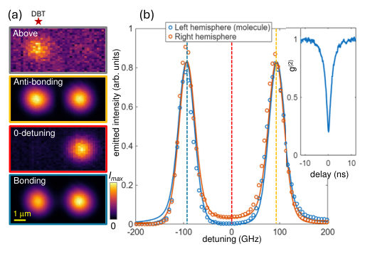
<figcaption class="paper-figure-caption"><b>Fig 2.</b> FIG. 2. DBT in a dimer of resonators. (a) Spatially re- solved photoluminescence of a DBT molecule in a photonic dimer under off-resonant excitation at 765.267 nm at differ- ent emitter-cavity detunings ∆: the color of the frame corre- sponds to the detunings marked in dashed lines in (b). For the top panel ∆= 273 GHz. The molecule is located close to the center of the left hemisphere. (b) Emitted intensity from the left (red dots) and right (blue dots) hemispheres as a function of the emitter-cavity detuning. Solid lines represent the expected transmission including the effect of mechanical vibrations of the cavity length. The inset displays the mea- sured g(2) when the molecule transition...</figcaption>
</figure>
<figure class="paper-figure-card">
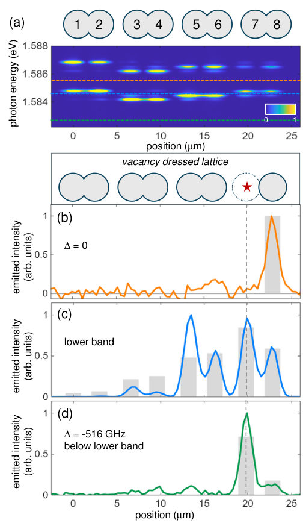
<figcaption class="paper-figure-caption"><b>Fig 3.</b> FIG. 3. Vacancy-like bound state in an SSH lattice. (a) Transmission spectrum across the center of the lattice sketched on the top using a broadband lamp. (b)-(d) Solid lines display the measured photoluminescence at the transi- tion energy of a molecule located at site m = 7 (indicated by a red star and vertical dashes lines) for different emitter- hemisphere detunings. The grey bars are the steady-state solutions of Eq. (1) at the corresponding detunings.</figcaption>
</figure>
<figure class="paper-figure-card">
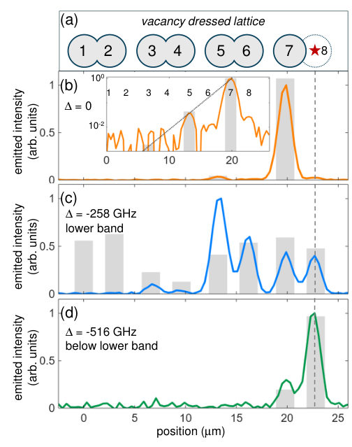
<figcaption class="paper-figure-caption"><b>Fig 4.</b> FIG. 4. Directional vacancy-like dressed state with molecule in hemisphere m = 8. (a) Scheme of the vacancy dressed pho- tonic lattice at the energy of the emitter-photon bound state at ∆= 0. (b)-(d) Solid lines display the measured photolu- minescence at the transition energy of a molecule located at site m = 8 (indicated by a red star and vertical dashes lines) for different emitter-hemisphere detunings. The grey bars are the steady-state solutions of Eq. (1) at the corresponding de- tunings. The inset of (b) displays the data in semi-log scale. The dotted line shows the expected exponential decay of a topological edge state.</figcaption>
</figure>
<figure class="paper-figure-card">
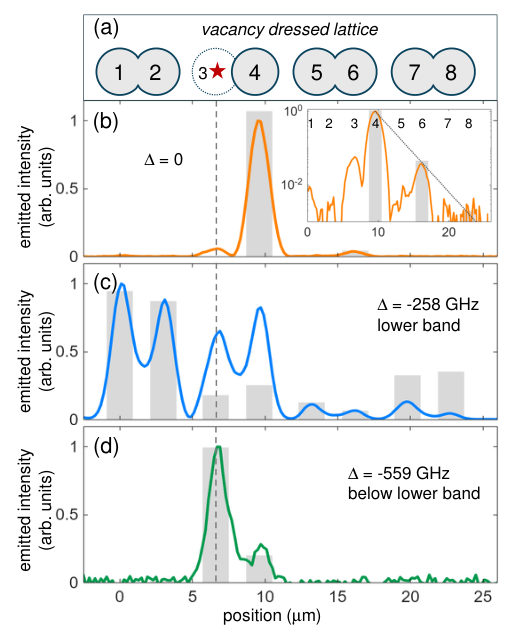
<figcaption class="paper-figure-caption"><b>Fig 5.</b> FIG. 5. Directional vacancy-like dressed state with molecule in hemisphere m = 3. (a) Scheme of the vacancy dressed pho- tonic lattice at the energy of the emitter-photon bound state at ∆= 0. (b)-(d) Solid lines display the measured photolu- minescence at the transition energy of a molecule located at site m = 3 (indicated by a red star and vertical dashes lines) for different emitter-hemisphere detunings. The grey bars are the steady-state solutions of Eq. (1) at the corresponding de- tunings. The inset of (b) displays the data in semi-log scale. The dotted line shows the expected exponential decay of a topological edge state.</figcaption>
</figure>

**Summary.** The paper introduces an optical lattice Quantum Electrodynamics platform using embedded organic molecules coupled to structured microcavities. By tuning the molecular emission into the photonic band gap of a Su-Schrieffer-Heeger (SSH) lattice, the researchers successfully observed topological edge mode characteristics in emitter-photon bound states. This establishes a versatile architecture for engineering complex quantum optical systems with controlled interactions.

**Why it may be interesting.** This work is highly relevant as it combines molecular physics (DBT emitters) with advanced concepts from condensed matter theory, specifically topological photonics and engineered band structures, to create a controllable quantum light-matter interface.

Detailed structure

**Main problem.** The research aims to control both the spontaneous emission of individual quantum emitters and the photon-mediated interactions between them by engineering the photonic environment.

**Main result.** The authors demonstrated emitter-photon bound states exhibiting directional localization on a single sublattice when the molecule's transition is tuned into the topological band gap of an SSH cavity lattice.

**Method.** The study uses a hybrid platform combining molecular emitters (DBT) embedded in crystals with engineered optical microcavity lattices to realize controlled light-matter coupling.

**Model / system.** The system utilizes open optical cavities structured into lattices, specifically demonstrating behavior analogous to Su-Schrieffer-Heeger (SSH) chains. The physics is modeled using cavity QED principles applied to coupled resonators.

**Key observables.** Emitter-photon bound states, directional photon emission on a single sublattice, and the characterization of photonic band gaps.

**Important parameters / regimes.** The system operates at specific wavelengths (e.g., 782 nm) and involves tuning the molecular transition relative to the engineered photonic band structure ($\Delta$).

**Assumptions / limitations.** The architecture assumes that coupling to engineered band structures allows for precise control over interactions, extending beyond single-molecule demonstrations.

**Figures summary.** Figures illustrate the physical setup (open cavity sketch, optical images) and show photoluminescence spectra demonstrating spectral dependence on detuning ($\Delta$) within the lattice structure.

**Paper structure.** The paper progresses from establishing the general concept of Lattice QED to detailing the specific hybrid architecture using DBT molecules. It then presents proof-of-principle measurements by observing topological edge mode characteristics in bound states formed within a cavity SSH lattice.

Abstract

Engineering the photonic environment using lattices of coupled resonators, which we refer to as lattice quantum electrodynamics (QED), provides a route to control both the spontaneous emission of individual quantum emitters and the photon-mediated interactions between them. Here we introduce an optical lattice QED platform based on individual dibenzoterrylene (DBT) molecules embedded in anthracene crystals and coupled to lattices of open optical microcavities. This hybrid architecture benefits from narrow-linewidth molecular emitters, site-resolved optical access, engineered coupled-resonator bands, and compatibility with established molecular frequency-tuning techniques. As a proof-of-principle demonstration, we observe emitter-photon bound states formed when the optical transition of a single molecule is tuned to the band gap of a Su-Schrieffer-Heeger (SSH) cavity lattice. These in-gap states display directional localization and photon emission on a single sublattice, inherited from the vacancy-induced topological edge modes of the underlying SSH lattice. Our results establish open-cavity lattices coupled to DBT molecules as a versatile architecture for engineering many-emitter quantum optical systems with controllable photon-mediated interactions.

[↑ back to top](#top)

### [Entanglement dynamics through electromagnetic interactions in single-electron traps](http://arxiv.org/abs/2607.20236v1)

**Authors:** Pablo Guillermo Carmona Rufo, Anupam Mazumdar, Carlos Sabín  
**Type:** theory · **Category:** other · **PDF:** <https://arxiv.org/pdf/2607.20236v1>  
**Analysis basis:** full PDF text, analyzed in chunks
**Topic relevance:** 🔥 `entanglement & information structure` **4/5** · `analog quantum simulation` **3/5** · `correlated / nonlocal dissipation` **3/5** · `methods for driven-dissipative` **3/5** · `non-equilibrium dynamics` **3/5** · `Keldysh / 2PI / non-Gaussian methods` **2/5** · `driven-dissipative phase transition` **2/5** · `quantum optics experiment` **2/5** · `QC/QI experiment` **1/5** · `correlated cavity matter` **1/5** · `non-equilibrium universality` **1/5**

↔ Scroll figures horizontally

<figure class="paper-figure-card">
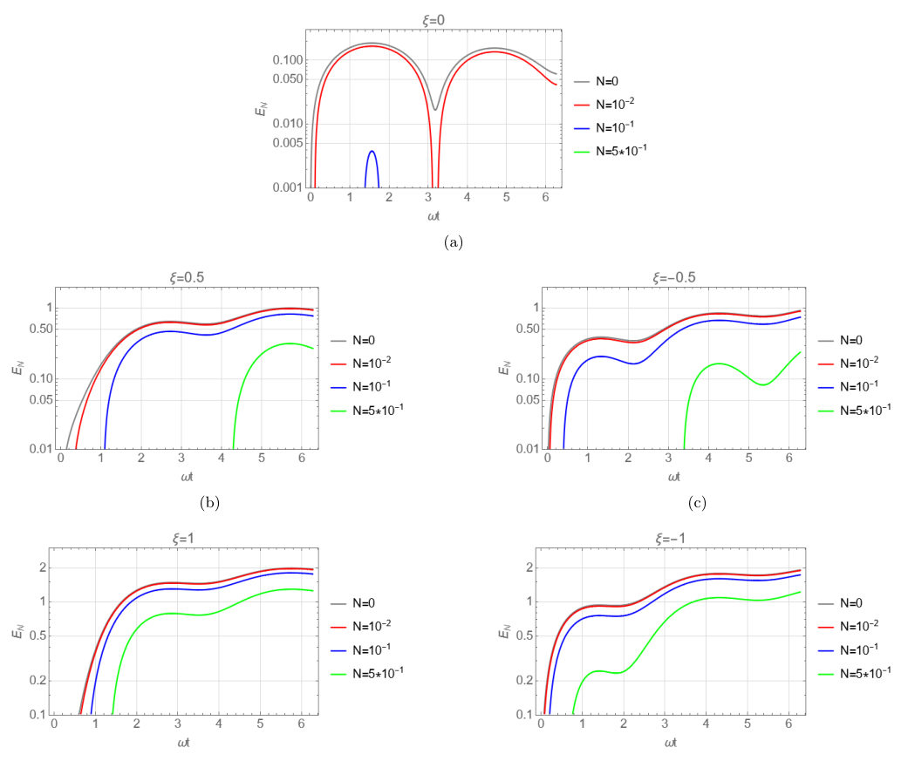
<figcaption class="paper-figure-caption"><b>Fig 1.</b> FIG. 1: Values of the logarithmic negativity of the single-mode squeezed thermal state plotted for α = ωt ∈[0, 2π] and for (a) ξ = 0, (b) ξ = 0.5, (c) ξ = −0.5, (d) ξ = 1 and (e) ξ = −1. The values used for the physical parameters of the system are ω = 10 GHz and d = 3 µm. In each plot, each curve is calculated for a different value of the thermal number, which depend on experimental constraints as well. A frequency of ω = 10 GHz and the temperature that has been able to be reached in recent experiments, which ranges around 50 to 100 mK [59, 60], result in a thermal number of N ∼0.1. Thus, the curves with values for N lower than this threshold represent what possible future experimental...</figcaption>
</figure>
<figure class="paper-figure-card">
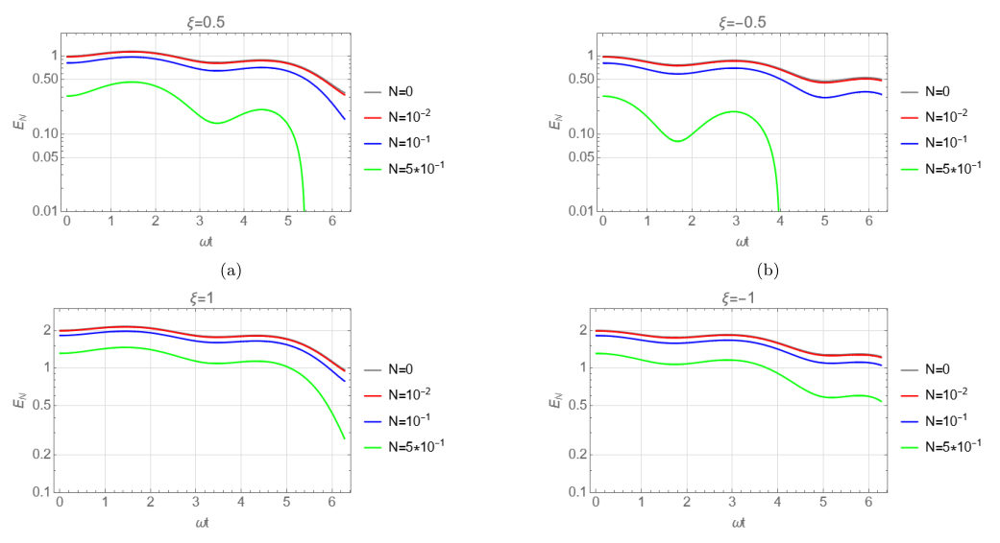
<figcaption class="paper-figure-caption"><b>Fig 2.</b> FIG. 2: Values of the logarithmic negativity of the two-mode squeezed thermal state plotted for (a) ξ = 0.5, (b) ξ = −0.5, (c) ξ = 1 and (d) ξ = −1. The discussion around the physical parameters is fully equivalent to the one for the single-mode case, detailed in the footnote of Figure 1.</figcaption>
</figure>

**Summary.** This paper theoretically analyzes the dynamics of quantum entanglement between two interacting electrons confined in harmonic traps. Using Gaussian state formalism, it calculates entanglement evolution via logarithmic negativity for different initial squeezing conditions. The results show that electromagnetic interactions can both generate and destroy entanglement depending on the initial state preparation.

**Why it may be interesting.** This work directly addresses fundamental questions in open quantum systems and trapped-ion physics by quantifying how environmental coupling (thermal noise) and internal interactions affect fragile quantum correlations like entanglement.

Detailed structure

**Main problem.** The study investigates how quantum entanglement evolves between two electrons trapped harmonically and interacting via electromagnetic forces.

**Main result.** The interaction can either generate entanglement if starting from a single-mode squeezed state or cause the degradation of pre-existing entanglement if starting from a two-mode squeezed state.

**Method.** The analysis employs the covariance matrix formalism to track the time evolution of Gaussian states, quantifying entanglement using the logarithmic negativity.

**Model / system.** The system consists of two electrons in adjacent harmonic traps, governed by a Hamiltonian including Coulomb and Darwin interaction terms. The dynamics are analyzed for multi-mode Gaussian states at thermal equilibrium.

**Key observables.** Logarithmic Negativity (EN), which quantifies the degree of entanglement.

**Important parameters / regimes.** Squeezing coefficient ($\xi$), temperature ($T$) or thermal occupation number ($N$), and interaction coupling constants ($g_C, g_D$).

**Assumptions / limitations.** The system is treated as a multi-mode Gaussian state at thermal equilibrium, and the interaction Hamiltonian is approximated by expanding terms assuming trap separation $d$ is much larger than electron fluctuations.

**Figures summary.** Figures illustrate the time evolution of EN for both single-mode and two-mode squeezed initial states under varying squeezing levels and noise/temperature conditions.

**Paper structure.** The paper progresses from defining the physical model and Hamiltonian, to detailing the mathematical methods (covariance matrix formalism), presenting analytical solutions for time evolution operators, and finally analyzing the results for different initial entanglement configurations.

Abstract

We study the dynamics of quantum entanglement between two harmonically trapped electrons interacting via the electromagnetic force. Starting from two-mode Gaussian states at thermal equilibrium, we make use of the covariance matrix formalism in order to compute the logarithmic negativity of the evolved state as a quantitative measure of entanglement. We analyze two initial configurations: thermal single-mode and two-mode squeezed states, and describe the time evolution of entanglement in the system for different values of squeezing and temperature, while identifying the parameter regimes accessible to current and near-future single-electron trap experiments.

[↑ back to top](#top)

### [Coupling phase interference effects in a multimode cavity magnonics system](http://arxiv.org/abs/2607.20234v1)

**Authors:** M. Avicena, G. Bourcin, V. Vlaminck, J. Bourhill, V. Castel  
**Type:** both · **Category:** other · **PDF:** <https://arxiv.org/pdf/2607.20234v1>  
**Analysis basis:** full PDF text, analyzed in chunks
**Topic relevance:** 🔥 `spintronics-quantum-optics interface` **4/5** · `Tavis-Cummings & cavity-many-emitter` **3/5** · `interference shaping light` **3/5** · `exotic spin models in light-matter` **2/5** · `quantum optics experiment` **2/5** · `analog quantum simulation` **1/5** · `correlated / nonlocal dissipation` **1/5** · `correlated cavity matter` **1/5** · `driven-dissipative phase transition` **1/5** · `methods for driven-dissipative` **1/5** · `non-equilibrium dynamics` **1/5**

↔ Scroll figures horizontally

<figure class="paper-figure-card">
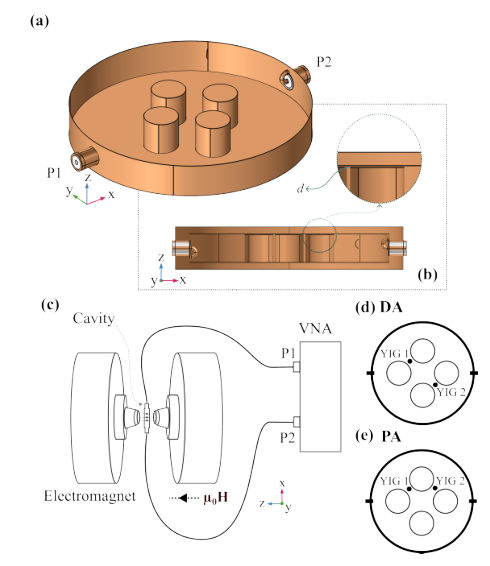
<figcaption class="paper-figure-caption"><b>Fig 1.</b> FIG. 1. (a) An overhead view of the quadruple-post re-entrant cavity with ports at opposite ends of the cavity. We indicate one end as P1 and P2 as the other. (b) A cross section of the cavity along the zx- plane. The resonant frequency is controlled by the geometry of the cavity, mainly by the lid-post gap distance, d shown in the zoomed in circle. (c) The experimental setup, where the cavity magnonic sys- tem is placed so that the posts’ orientation is parallel to the external magnetic field, µ0H; i.e. we set the z-axis to coincide with µ0H. The cavity modes are excited and probed using a vector network analyzer (VNA). (d) Overhead sketch of the diagonal arrangement, DA and (e) sketch of...</figcaption>
</figure>
<figure class="paper-figure-card">
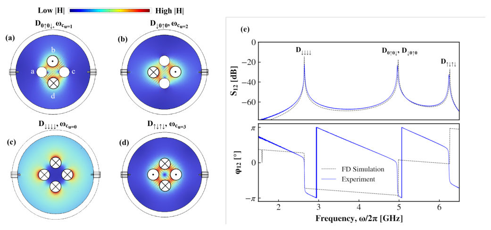
<figcaption class="paper-figure-caption"><b>Fig 2.</b> FIG. 2. Eigenfrequency (EF) simulation of the MW magnetic field distribution inside the modeled empty cavity (a) D0↑0↓, (b) D↓0↑0, (c) D↓↓↓↓ and (d) D↑↓↑↓, the red (blue) regions indicate high (low) MW field intensity. The ⊗and ⊙sign overlaid on the posts indicate out-of-post and into-post MW E-field direction, respectively. (e) Frequency sweep of the empty cavity with respect to the transmission parameter S12 in dB and its transmission phase, ϕ12 in rad. The blue solid line showing the transmission spectrum obtained from experiment, and the dashed black line is the same spectrum obtained from frequency domain (FD) simulation, applying perfect electrical conductor boundary condition at the...</figcaption>
</figure>
<figure class="paper-figure-card">
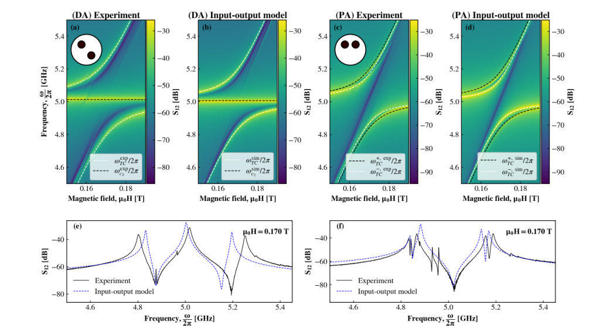
<figcaption class="paper-figure-caption"><b>Fig 3.</b> FIG. 3. (a-d) Scattering parameter S12 color map in dB scale as a function of frequency, ω/2π and external magnetic field, µ0H for the DA and PA. Panel (a) and (b) are the measured and calculated response for the DA configuration, respectively. The dashed lines in panel (a-d) are the eigenfrequencies of the polariton, ωTC, modelled using the two-level Tavis-Cummings coupling model (see Appendix B and48,49 cited therein). Panel (c) and (d) on the other hand, correspond to the PA. To obtain the numerically calculated response in (b) and (d), we feed parameter values obtained through coupled Landau-Lifshitz-Gilbert and Maxwell’s equation FE simulation (listed in Table I in the Appendix C) to...</figcaption>
</figure>
<figure class="paper-figure-card">
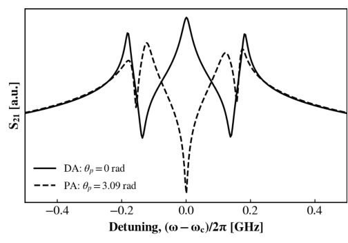
<figcaption class="paper-figure-caption"><b>Fig 4.</b> FIG. 4. Numerical calculation of Eq. (12) when the physical phase, θp = 0 rad corresponding to three peaks response and the uncou- pled mode (solid black line) and θp = 3.09 rad corresponding to four peaks of CMPs (dashed black line). The physical phase significantly affects the transmission signature of a multimode cavity magnonics system.</figcaption>
</figure>
<figure class="paper-figure-card">
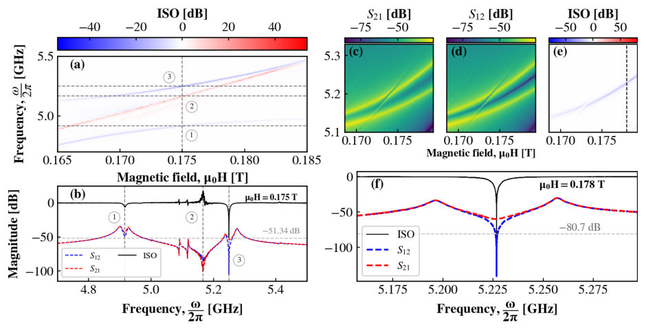
<figcaption class="paper-figure-caption"><b>Fig 5.</b> FIG. 5. (a) Overview of the nonreciprocity quantified by the isolation ratio, ISO. Three branches are apparent which corresponds to the antiresonances, with red indicating larger S12 and blue indicating larger S21. The branches are apparent at (1) between the lower polariton resonances, (2) at the FMR frequency, and (3) between the two upper polariton resonances. The nonreciprocity occurs at the antiresonance frequencies, shown in the frequency sweep at µ0H = 0.175 T (b), where we observe peak ISO of -51.34 dB corresponding to the upper polariton frequency. The gray lines are visual guides. (c-e) A closer look at the antiresonance between the upper polariton resonances, in this window we...</figcaption>
</figure>

**Summary.** This paper investigates how coupling phase interference dictates behavior in complex multimode cavity magnonics systems using YIG spheres. By developing an advanced input-output model that accounts for both internal and external phases, the authors successfully explain observed phenomena like nonreciprocity. The work establishes 'coupling-phase engineering' as a vital design principle for future quantum microwave devices.

**Why it may be interesting.** This work is highly relevant as it treats magnon-photon interactions—a core topic in cavity QED/AMO physics—by focusing on the subtle role of quantum phases. The methodology of 'coupling-phase engineering' provides a powerful, generalizable tool for controlling light-matter interaction dynamics.

Detailed structure

**Main problem.** The study investigates how coupling phases critically influence interference effects within complex, multimode cavity magnonics systems.

**Main result.** The research establishes that engineering these coupling phases is a key principle for accurately modeling and designing advanced cavity magnonics devices, explaining phenomena like position-dependent modes and nonreciprocity.

**Method.** The authors employ an input-output model formalism, combining theoretical Hamiltonian analysis with extensive numerical simulations (COMSOL) and comparison against real microwave transmission measurements using a VNA.

**Model / system.** The physical system is a cavity magnonics setup involving Yttrium Iron Garnet (YIG) spheres coupled to a four-post re-entrant microwave cavity. The model explicitly incorporates both internal coupling phases (from the magnon field overlap) and external coupling phases (related to far-detuned modes).

**Key observables.** Transmission ($S_{12}$) and isolation responses versus frequency and external magnetic field ($\mu_0H$); nonreciprocity at antiresonance frequencies.

**Important parameters / regimes.** Internal and external coupling phases ($	heta_{uv}, \varphi_{up}$), cavity/magnon resonance frequencies, and the strong-coupling regime leading to polaritons.

**Assumptions / limitations.** The model extends prior work by explicitly including far-detuned modes, which is crucial for correctly predicting nonreciprocity. Simplifications include assuming zero crosstalk between ports in some calculations.

**Figures summary.** Figures illustrate the cavity geometry and experimental setup; simulations show magnetic field distributions (EF) and frequency sweeps of transmission spectra ($S_{12}$) compared to experiment.

**Paper structure.** The paper builds from defining the physical system and theoretical model using input-output formalism, detailing how internal and external coupling phases are incorporated. It then presents results demonstrating mode splitting, position dependence due to phase interference, and nonreciprocity arising from combined phase effects.

Abstract

Coupling phases play a decisive yet often overlooked role in cavity magnonics, particularly in complex multimode systems. Here, we investigate phase-mediated interference effects in a cavity magnonics system comprising a four-post re-entrant microwave cavity coupled to Yttrium Iron Garnet (YIG) spheres. Using an input-output model that explicitly accounts for both internal and external coupling phases, we achieve agreement with experimental microwave transmission measurements. Our results unravel the emergence of a positionally-dependent uncoupled mode due to interference of cavity photon-magnon (internal) coupling phases. Further, we experimentally observed large nonreciprocity at the antiresonance frequencies and show that this feature arises due to the far-detuned modes' odd parity cavity photon-probe (external) coupling phase interfering with the internal coupling phases. Bridging theory, simulation and experiment, these results establish coupling-phase engineering as a key principle for accurately modeling and designing multimode cavity magnonics devices.

[↑ back to top](#top)

### [Optical Magnetic Switching in Odd-Parity Magnets with Spin-Orbit Coupling](http://arxiv.org/abs/2607.19483v1)

**Authors:** SangEun Han, Qiang Li  
**Type:** theory · **Category:** other · **PDF:** <https://arxiv.org/pdf/2607.19483v1>  
**Analysis basis:** full PDF text, analyzed in chunks
**Topic relevance:** 🔥 `spintronics-quantum-optics interface` **4/5** · `exotic spin models in light-matter` **3/5** · `non-equilibrium dynamics` **3/5** · `analog quantum simulation` **2/5** · `driven-dissipative phase transition` **2/5** · `methods for driven-dissipative` **2/5** · `Keldysh / 2PI / non-Gaussian methods` **1/5** · `interference shaping light` **1/5** · `non-equilibrium universality` **1/5**

↔ Scroll figures horizontally

<figure class="paper-figure-card">
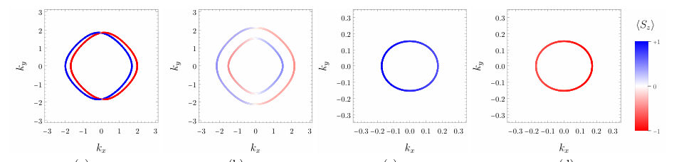
<figcaption class="paper-figure-caption"><b>Fig 1.</b> FIG. 1. The Fermi surfaces before and after introducing polarized light in the square-lattice regularization in the first Brillouin zone. (a) Fermi surface without SOC and light (Ax = Ay = 0, λ = 0). (b) Fermi surface with SOC but without light (Ax = Ay = 0). (c) Fermi surface with polarized light (Ax = Ay = 1.8, η = +1, and λ = 0.6) and (d) Fermi surface with oppositely polarized light (Ax = Ay = 1.8, η = −1, and λ = 0.6). In (c,d), only the lower band is partially occupied for the chosen chemical potential, and the shown Fermi surfaces are those of the lower band. Here, we set t = 1, J = 0.3, ω = 5, θ = 0, and µ = 2.536.</figcaption>
</figure>
<figure class="paper-figure-card">
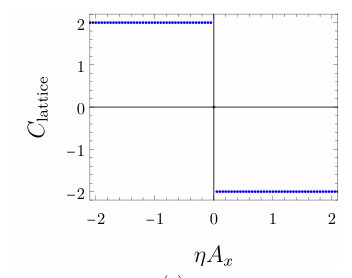
<figcaption class="paper-figure-caption"><b>Fig 2.</b> FIG. 2. The lattice Chern number of the lower Floquet- engineered band on a square lattice as a function of ηAx for fixed Ay. We set t = 1, J = 0.3, λ = 0.6, θ = 0, Ay = 1.8, and change ηAx from −2 to +2. Thus, CPL occurs at ηAx = ±1.8. The Chern number of the Floquet-engineered bands changes sign when ηAx changes sign.</figcaption>
</figure>
<figure class="paper-figure-card">
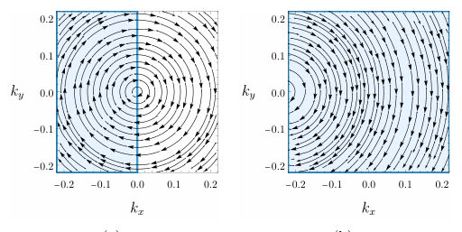
<figcaption class="paper-figure-caption"><b>Fig 3.</b> FIG. 3. The spin texture of the lower band of p-wave magnet with SOC and (a) without and (b) with polarized light in square lattice regularization. The arrows denote the in-plane spin direction, and the shading denotes the normalized out- of-plane spin polarization. We set t = 1, J = 0.3, λ = 0.6, θ = 0, and Ax,y = 1.8.</figcaption>
</figure>
<figure class="paper-figure-card">
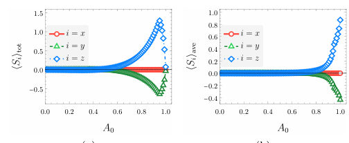
<figcaption class="paper-figure-caption"><b>Fig 4.</b> FIG. 4. The total and averaged spin polarizations over occu- pied states for the effective static Hamiltonian in the square- lattice regularization. (a) The total spin polarization ⟨Si⟩tot. (b) Averaged spin polarization ⟨Si⟩ave. Here we set t = 1, J = 0.3, λ = 0.6, θ = 0, ω = 5, and Ax = Ay = 1.8A0, and increase A0 from 0 to 1 by 0.01.</figcaption>
</figure>
<figure class="paper-figure-card">
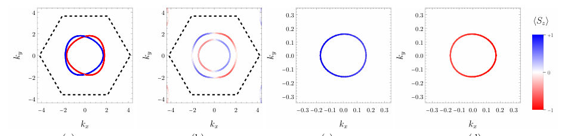
<figcaption class="paper-figure-caption"><b>Fig 5.</b> FIG. 5. The Fermi surfaces before and after introducing polarized light in a triangular-lattice regularization in the first Brillouin zone. (a) Without SOC (λ = 0, Ax,y = 0). (b) With SOC (λ = 0.6, Ax,y = 0). (c-d) With polarized light (λ = 0.6, Ay = Ax = 1.8, and η = ±1 for (c) and (d), respectively). In the light-irradiated cases in (c) and (d), the displayed Fermi surfaces come from the partially occupied lower band, while the upper band remains empty for the chosen chemical potential. We set t = 1, J = 0.3, ω = 5, θ = 0, and µ = 2.536. The dashed lines in (a) and (b) indicate the first Brillouin zone of the triangular lattice.</figcaption>
</figure>

**Summary.** This theoretical study shows that polarized light can dynamically switch the magnetic state of odd-parity magnets possessing SOC. By using Floquet engineering, the authors demonstrate control over both the topological invariant (Chern number) and the net magnetization, opening pathways for optical spintronic applications.

**Why it may be interesting.** The work directly connects light polarization to fundamental quantum properties (topology/magnetization) in magnetic materials, providing a powerful tool for understanding optically controlled spintronics.

Detailed structure

**Main problem.** The study demonstrates how elliptically polarized light can dynamically switch a zero-net-magnetization p-wave state into a finite spin-polarized state in odd-parity magnets.

**Main result.** Polarized light induces a momentum-independent term that controls the system's topological properties (Chern number) and generates a measurable net magnetization, offering a new control mechanism for magnetic states.

**Method.** The analysis uses Floquet engineering combined with high-frequency expansion to derive an effective static Hamiltonian, followed by calculating topological invariants like the Chern number in momentum space.

**Model / system.** The system models odd-parity magnets exhibiting p-wave spin polarization and strong Spin-Orbit Coupling (SOC). The theoretical framework involves analyzing lattice Hamiltonians on square or triangular lattices subjected to time-periodic driving from polarized light.

**Key observables.** Chern number ($\mathcal{C}_{	ext{lattice}}$), total/averaged spin polarization ($\langle S_i 
angle_{	ext{tot}}$, $\langle S_i 
angle_{	ext{ave}}$), and the resulting net magnetization components (out-of-plane for f-wave).

**Important parameters / regimes.** The driving field parameters, such as the light polarization strength ($\eta A_x A_y$), are crucial for controlling topological transitions and magnetization magnitude.

**Assumptions / limitations.** The analysis relies on high-frequency expansion of the Floquet Hamiltonian, which assumes that internal energy scales are much smaller than the driving frequency ($\omega$).

**Figures summary.** Figures illustrate Fermi surface modifications, spin textures (comparing light on/off), and plots showing the sign reversal of the lattice Chern number as a function of light polarization strength.

**Paper structure.** The paper establishes the theoretical model for p-wave magnets with SOC, derives effective Hamiltonians using Floquet theory, calculates topological invariants like the Chern number under polarized driving, and discusses experimental signatures in both p-wave and f-wave systems across different lattice regularizations (square vs. triangular).

Abstract

$p$-wave magnets exhibit odd-parity spin polarization in momentum space, with spin splitting that reverses under $\vec{k}\rightarrow -\vec{k}$, while preserving zero net magnetization. Here we show that, in odd-parity magnets with spin-orbit coupling, elliptically polarized light generates a momentum-independent spin-dependent term that dynamically switches a zero-net-magnetization $p$-wave state into a finite spin-polarized state. The Floquet-engineered bands also acquire a nonzero Chern number whose sign is controlled by the light polarization. For $f$-wave magnets, circularly polarized light induces a net out-of-plane magnetization, offering a direct experimental signature. Our results establish light as an efficient means of controlling magnetic states, with potential applications in spintronics and quantum information.

[↑ back to top](#top)

### [Confinement Versus Screening in the Schwinger Model on AdS$_2$ from Bosonization and Tensor Networks](http://arxiv.org/abs/2607.19468v1)

**Authors:** Sriram Bharadwaj, Jack Isen, Zhong-Bo Kang  
**Type:** theory · **Category:** numerical methods · **PDF:** <https://arxiv.org/pdf/2607.19468v1>  
**Analysis basis:** full PDF text, analyzed in chunks
**Topic relevance:** 🔥 `methods for driven-dissipative` **4/5** · `Keldysh / 2PI / non-Gaussian methods` **3/5** · `analog quantum simulation` **2/5** · `driven-dissipative phase transition` **2/5** · `non-equilibrium dynamics` **2/5** · `correlated / nonlocal dissipation` **1/5** · `correlated cavity matter` **1/5** · `entanglement & information structure` **1/5** · `non-equilibrium universality` **1/5**

↔ Scroll figures horizontally

<figure class="paper-figure-card">
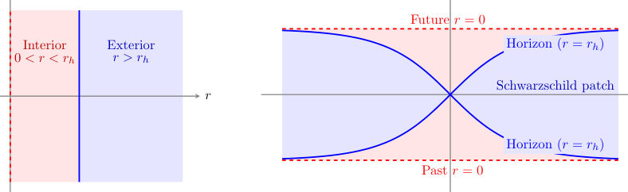
<figcaption class="paper-figure-caption"><b>Fig 1.</b> Figure 1: Two coordinate representations of the same spacetime. (Left): The regularized static patch coordinates (T, r): in this local frame, the singularity at r = 0 appears as a vertical spatial boundary, and the bifurcate Killing horizon at r = rh is represented as a stationary radial location. (Right): The same spacetime mapped into global AdS2 coordinates (τ, ρ): in this global covering space, the horizon unfolds into intersecting light-like rays (cos τ = sech ρ), and the r = 0 point maps directly to spacelike boundaries at constant global time (τ = ±π/2).</figcaption>
</figure>
<figure class="paper-figure-card">
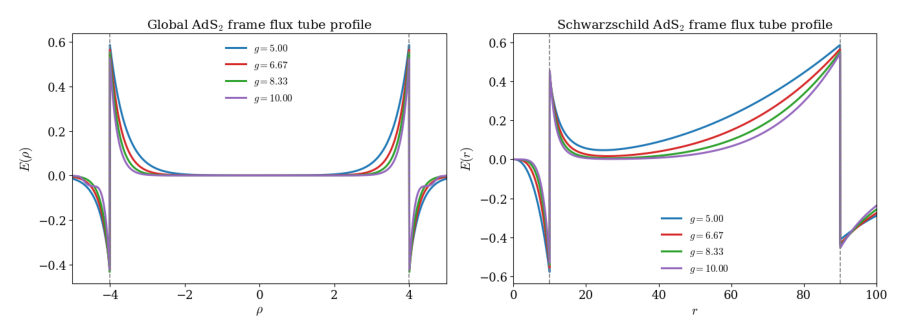
<figcaption class="paper-figure-caption"><b>Fig 2.</b> Figure 2: Electric field profile for a neutral pair of external charges q1 = −q2 = q, plotted for several values of the gauge coupling g: global AdS2, E(ρ) (left), and the Schwarzschild frame, E(r) (right). The dashed vertical lines mark the charge insertions at ρ = ρ1,2 (resp. r = r1,2). Dynamical massless fermions screen the flux tube, producing tails outside the interval between the charges; in the weak-coupling limit the profile approaches the sharp constant background field between the charges, while increasing g smooths it, and when L/ν ≪d the field for r ∈[r1, r2] is exponentially small in g. Unlike the Schwarzschild-frame profile, the global profile is not a function only of the...</figcaption>
</figure>
<figure class="paper-figure-card">
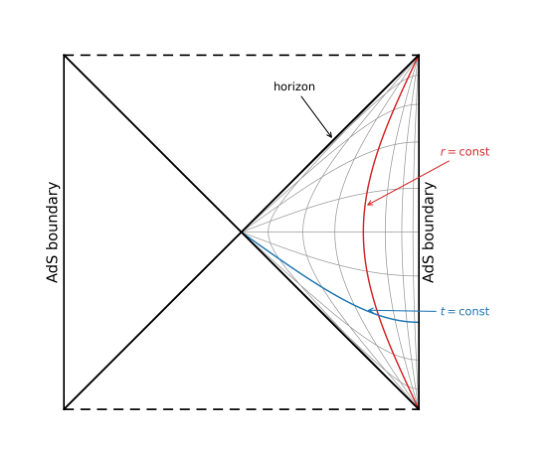
<figcaption class="paper-figure-caption"><b>Fig 3.</b> Figure 3: Penrose diagram of AdS2 Schwarzschild black hole. Timelike curves are r = constant (e.g. the red curve) and spacelike curves are t = constant (e.g. the blue curve).</figcaption>
</figure>
<figure class="paper-figure-card">
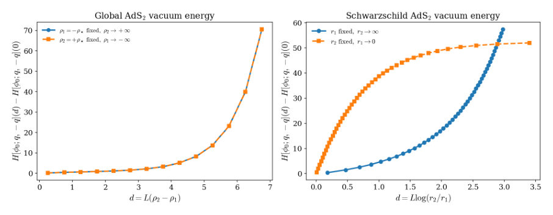
<figcaption class="paper-figure-caption"><b>Fig 4.</b> Figure 4: The above figure shows plots of the vacuum energy in the presence of a q¯q-pair as a function of their geodesic separation in both global AdS2 (left) and Schwarzschild (right) frames prior to the self-energy subtraction.</figcaption>
</figure>
<figure class="paper-figure-card">
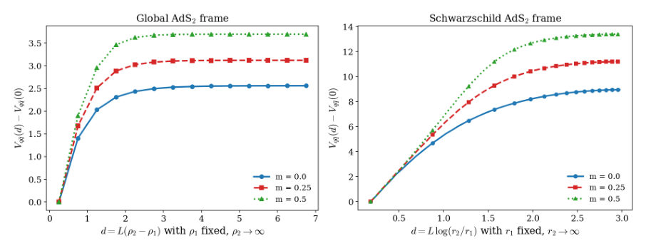
<figcaption class="paper-figure-caption"><b>Fig 5.</b> Figure 5: Static q¯q potential Vq¯q(d) −Vq¯q(0), obtained from the ground-state energy of a static charge pair by subtracting the (screened) single-charge self-energies, for masses m = 0, 0.25, 0.5. Left: global AdS2 with fixed ρ1 (N = 48, a = 0.25, geodesic separation D = L(ρ2 −ρ1)). Right: Schwarzschild AdS2 frame with fixed r1 (N = 100, a = 1, separation d = L ln(r2/r1)). Lattice spacing a in the respective radial coordinate; L = 1, e = 2.51 throughout.</figcaption>
</figure>

**Summary.** This paper resolves a long-standing ambiguity regarding confinement versus screening in QED$_2$ on $	ext{AdS}_2$. By rigorously subtracting position-dependent self-energies, the authors prove that the theory is screened. They validate this finding using a combination of analytical bosonization and advanced numerical techniques like tensor networks.

**Why it may be interesting.** While primarily condensed matter/high energy theory, the use of Tensor Networks (MPS ansatz) to simulate quantum field theories on curved backgrounds provides a powerful computational methodology relevant to strongly correlated systems studied in AMO physics.

Detailed structure

**Main problem.** The primary goal is resolving the ambiguity regarding confinement versus screening in the Schwinger Model (QED$_2$) on curved Anti-de Sitter space ($	ext{AdS}_2$). This required careful handling of self-energy subtractions and lattice discretization.

**Main result.** The theory is definitively found to be screened, as the static potential remains finite at infinite separation after subtracting position-dependent self-energies. This result is consistent across continuum bosonization, lattice simulations, and real-time evolution studies.

**Method.** The work employs a combination of analytical techniques (bosonization), advanced numerical methods like Tensor Networks (Matrix Product States/DMRG), and time-evolution simulations using the Time-Dependent Variational Principle (TDVP).

**Model / system.** The system is single-flavor Quantum Electrodynamics ($	ext{QED}_2$) on $	ext{AdS}_2$, studied in both continuum and lattice formulations, including backgrounds with black holes. The Hamiltonian must be carefully discretized to maintain manifest Hermiticity.

**Key observables.** Static charge-anticharge potential ($V_{qar{q}}(d)$), electric flux-tube profile ($\langle E 
angle$), and real-time evolution of charge/field densities.

**Important parameters / regimes.** Fermion mass ($m$), temperature (zero vs. finite), and the choice of preferred time coordinate (Schwarzschild vs. global $	ext{AdS}_2$ frame).

**Assumptions / limitations.** The crucial assumption is that the static potential must be calculated after subtracting position-dependent probe self-energies to obtain a physically meaningful, finite result.

**Figures summary.** Figures illustrate the comparison of the screened static potential in both coordinate frames and show the exponential decay of the electric flux profile ($\langle E 
angle$) on the lattice compared to continuum predictions. Real-time evolution figures demonstrate string breaking.

**Paper structure.** The paper proceeds by first establishing the theoretical framework using two different time coordinates, then deriving the static potential via bosonization (continuum), proposing a covariant lattice discretization, and finally validating these results through tensor network simulations and real-time dynamics.

Abstract

We analyze confinement and screening in single-flavor quantum electrodynamics (QED$_2$) on two-dimensional anti-de Sitter space (AdS$_2$), with and without a Schwarzschild black hole, both in the continuum and on the lattice. The theory is formulated in two frames adapted to distinct choices of a preferred time coordinate: the Schwarzschild frame, associated with the Boulware vacuum, and the global AdS$_2$ frame, associated with the $\mathrm{SL}(2,\mathbb{R})$-invariant vacuum. In the massless limit, the static potential between an external charge-anticharge pair is obtained in closed form by bosonization, at both zero and finite temperature. After subtraction of the position-dependent probe self-energies, which, unlike in flat space, are not constant, the potential remains finite as the geodesic separation is taken to infinity, establishing that the theory is screened. This is consistent with the explicit breaking of the $\mathrm{U}(1)$ electric one-form symmetry by the dynamical fermions, and resolves a confining/screening ambiguity in earlier treatments that identify the static potential with the unsubtracted ground-state energy. To validate the continuum analysis, we propose a covariant discretization scheme for placing fermions in curved spacetime on the lattice while ensuring that the continuum properties of the spin and gauge connections are restored in the continuum limit. This construction resolves ambiguities in the existing literature on lattice fermions in curved backgrounds and provides the foundation for our tensor-network simulations. Using a matrix product state ansatz, we confirm our analytical predictions for the phase diagram in AdS$_2$. We perform extensive numerical simulations of the static potential and the electric flux-tube profile for varying fermion masses, which we match to the continuum prediction.

[↑ back to top](#top)

### [Emergence of Hexanematic Order in a Growing Confluent Cell Monolayer](http://arxiv.org/abs/2607.19963v1)

**Authors:** Hon Lin Too, Farisan Dary, Isaac Si Yuan Ling, Dustin Erhard Theofilusa, Duo Zhang, Haiyi Liang, Ee Hou Yong  
**Type:** theory · **Category:** statistical mechanics · **PDF:** <https://arxiv.org/pdf/2607.19963v1>  
**Analysis basis:** full PDF text, analyzed in chunks
**Topic relevance:** 🔥 `non-equilibrium dynamics` **4/5** · `driven-dissipative phase transition` **3/5** · `methods for driven-dissipative` **3/5** · `non-equilibrium universality` **3/5** · `Frenkel-Kontorova` **1/5** · `Keldysh / 2PI / non-Gaussian methods` **1/5** · `analog quantum simulation` **1/5** · `correlated / nonlocal dissipation` **1/5**

↔ Scroll figures horizontally

<figure class="paper-figure-card">
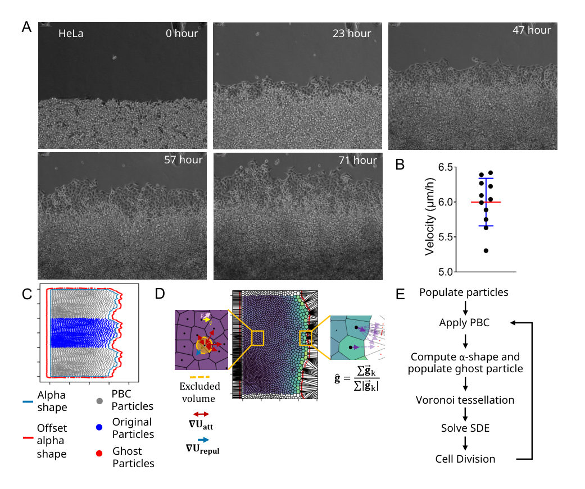
<figcaption class="paper-figure-caption"><b>Fig 1.</b> FIG. 1. Overview of our computational model. (A) Time-lapse images of wound closure in a HeLa cell monolayer: peripheral cells are larger and elongated, while bulk cells are smaller and more regular. (B) Boxplot of the border speed measured across 11 independent experiments, with a mean value of 6.0µm/hr. (C) Particle distribution before Voronoi tessellation. Blue: real particles; grey: periodic copies. The alpha shape defines the boundary, which is offset outward to place ghost particles. (D) Illustration of particle dynamics. Cell velocity and motility vector are updated through interactions with Voronoi neighbors. (E) Simulation workflow.</figcaption>
</figure>
<figure class="paper-figure-card">
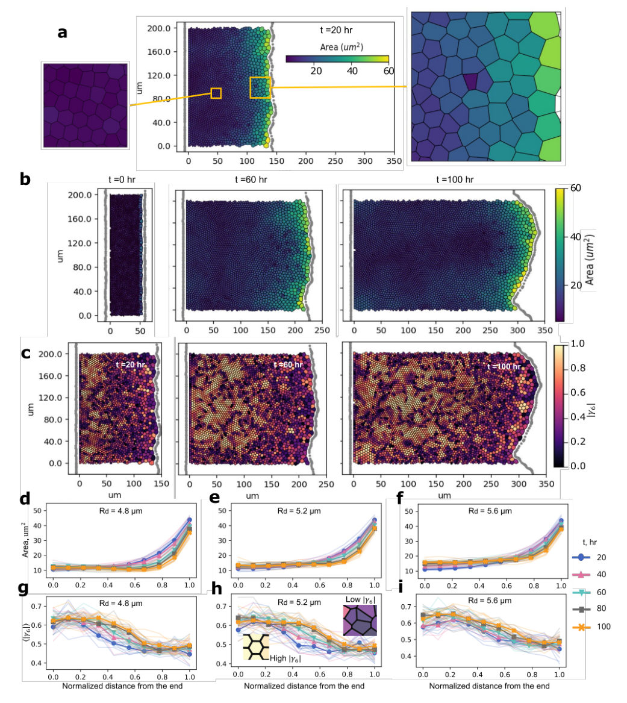
<figcaption class="paper-figure-caption"><b>Fig 2.</b> FIG. 2. Cell morphology in simulation. (A) Representative Voronoi tessellation at t = 20 hr for Rd = 5.2µm and β = 0.12. Insets highlight peripheral and bulk regions: bulk cells are smaller and more regularly packed, while peripheral cells are larger and more irregular. (B and C) Representative tessellations at t = 20, 60, and 100 hr showing evolution of cell area and hexatic order over time. (D-F) Ensemble-averaged local mean cell area, ⟨A(x)⟩, and (G-I) ensemble-averaged local mean hexatic order, ⟨|γ6(x)|⟩as functions of normalized end-to-end distance along cell sheet at five time points (t = 20, 40, 60, 80, 100 hr) for β = 0.16 and three different minimum division lengths Rd. Dark lines...</figcaption>
</figure>
<figure class="paper-figure-card">
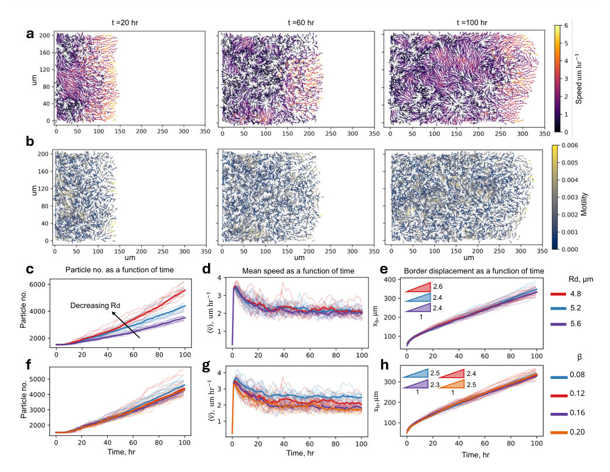
<figcaption class="paper-figure-caption"><b>Fig 3.</b> FIG. 3. Dynamics of cell migration. (A and B) Representative velocity and motility fields at t = 20, 60, and 100 hr. Arrow color encodes magnitude (yellow = larger). Velocities are generally higher at the periphery than in the bulk. (C and F) Total particle number, Nt, (D and G mean speed ¯v, and (E and H) maximum border displacement, xb, as a function of time for different minimum division lengths, Rd, and motility coupling constants, β. Bold lines denote ensemble averaging across 10 independent simulations; fine lines (in lighter colors) show individual runs.</figcaption>
</figure>
<figure class="paper-figure-card">
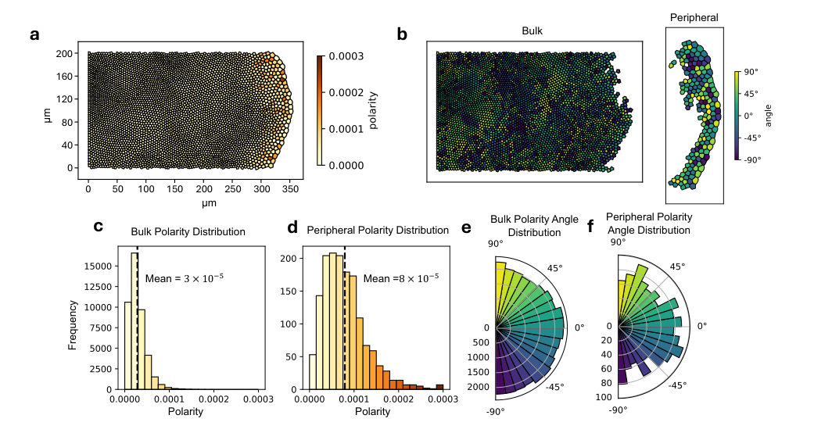
<figcaption class="paper-figure-caption"><b>Fig 4.</b> FIG. 4. Cell polarity statistics. (A and B) Representative cell polarity map at t = 100 hr for β = 0.16 and Rd = 5.2µm. The yellow-brown colormap (A) indicates polarity magnitude, while the blue-yellow colormap (B) encodes the angle of the largest eigenvector relative to the x-axis. (C and D) Histogram of cell polarity magnitude and (E and F) polar plot of cell polarity orientation, averaged over 10 independent simulations.</figcaption>
</figure>
<figure class="paper-figure-card">
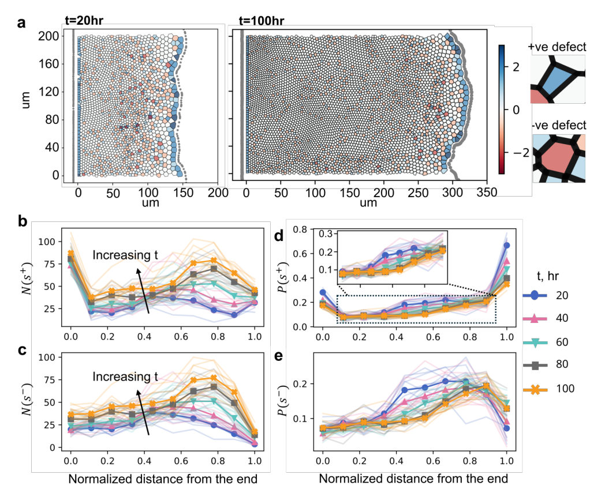
<figcaption class="paper-figure-caption"><b>Fig 5.</b> FIG. 5. Topological defects in cell migration. (A) Representative Voronoi tessellation at t = 20 hr and t = 100 hr for Rd = 5.6µm and β = 0.12. Blue/red cells denote positive/negative topological defects as illustrated schematically on the right. (B) and (C) Spatial distribution of (B) positive and (C) negative topological defect, N+(x) and N −(x), as functions of the normalized distance from the tissue edge at t = 20, 40, 60, 80, and 100 hr. (D) and (E) Probability of (D) positive and (E) negative topological defect as functions of normalized end-to-end distance along cell sheet at t = 20, 40, 60, 80, and 100 hr. The inset in (D) shows the same plot but excluding the first and last points...</figcaption>
</figure>

**Summary.** This work models collective cell migration using a stochastic particle-Voronoi simulation. It demonstrates that simple mechanical interactions create an outward velocity gradient, which spontaneously organizes the monolayer into distinct regions: tightly packed, hexatically ordered bulk cells, and larger, more elongated peripheral cells. This highlights how complex tissue patterning can arise from minimal local physical rules.

**Why it may be interesting.** While focused on biology, the underlying mathematical framework—modeling pattern formation, phase transitions (hexatic order), and non-equilibrium steady states using stochastic dynamics—is highly relevant to active matter physics studied in AMO and statistical mechanics.

Detailed structure

**Main problem.** The study investigates how distinct cell morphologies (hexanematic vs. elongated) emerge spontaneously within a single, growing confluent epithelial monolayer during collective migration.

**Main result.** The authors show that minimal, non-equilibrium mechanical interactions generate an outward velocity gradient, which drives the spontaneous segregation into highly ordered bulk cells and more spread peripheral cells.

**Method.** A stochastic particle–Voronoi framework is developed to simulate cell dynamics, incorporating coupled Stochastic Differential Equations (SDEs) for cell velocity and motility vectors.

**Model / system.** The model simulates confluent cell monolayers using a Voronoi tessellation approach. Cell movement is governed by mechanical interactions derived from the particle positions, allowing for adaptive growth and division based on local density and area thresholds.

**Key observables.** Local mean cell area ($\langle A(x) 
angle$), hexatic order parameter ($|\gamma_6|$), topological defect density ($s$), and spatial velocity gradients.

**Important parameters / regimes.** Division radius ($R_d$), noise amplitude ($\sigma_i$) which is density-dependent, and the coupling constants within the SDEs.

**Assumptions / limitations.** The emergence of pattern is attributed solely to minimal local mechanical rules, without pre-specifying cell types or target geometries; periodic boundary conditions are used along one axis.

**Figures summary.** Figures illustrate time-lapse images showing peripheral elongation versus bulk regularity, and spatial profiles demonstrating the inverse correlation between hexatic order (high in the bulk) and cell area (increasing toward the front).

**Paper structure.** The paper introduces the stochastic particle-Voronoi model, details the governing SDEs and boundary conditions, presents simulations showing morphological segregation and defect accumulation, and concludes by interpreting these findings as evidence for emergent tissue patterning driven by mechanical gradients.

Abstract

Collective migration of epithelial layers underlies processes ranging from wound healing to cancer invasion. A defining yet challenging feature is the emergence of distinct cell morphologies within a single migrating confluent sheet, with larger, elongated cells at the active boundary and smaller, hexatically ordered cells in the bulk. Here, we develop a stochastic particle-Voronoi framework that captures this hexanematic organization without prescribing target geometries and distinct cell types. We show that boundary-driven collective motion generates an outward velocity gradient. This gradient, coupled to a density and velocity-dependent division rule, produces peripheral cells that are larger, more elongated, and more defect-prone, while bulk cells remain smaller, isotropic, and hexagonally packed. These results show how minimal, non-equilibrium mechanical interactions give rise to emergent, self-organized tissue-scale patterning during collective migration.

[↑ back to top](#top)

### [Exact Closed-Form Quantum Correlations of Maximally Entangled Qudit States under Arbitrary Non-Markovian Pure Dephasing](http://arxiv.org/abs/2607.19702v1)

**Authors:** Ahmad Akhound  
**Type:** theory · **Category:** quantum information and computing · **PDF:** <https://arxiv.org/pdf/2607.19702v1>  
**Analysis basis:** full PDF text, analyzed in chunks
**Topic relevance:** 🔥 `entanglement & information structure` **4/5** · `correlated / nonlocal dissipation` **3/5** · `methods for driven-dissipative` **3/5** · `driven-dissipative phase transition` **2/5** · `non-equilibrium dynamics` **2/5** · `Keldysh / 2PI / non-Gaussian methods` **1/5** · `analog quantum simulation` **1/5** · `non-equilibrium universality` **1/5**

↔ Scroll figures horizontally

<figure class="paper-figure-card">
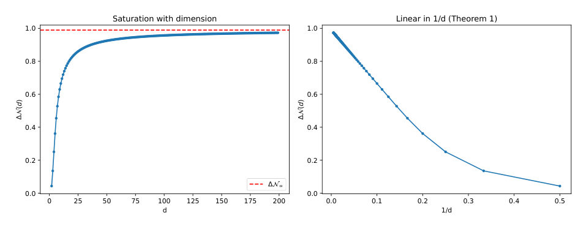
<figcaption class="paper-figure-caption"><b>Fig 1.</b> FIG. 1. Visual confirmation of the saturation law (baseline regime). Left: the oscillation amplitude</figcaption>
</figure>
<figure class="paper-figure-card">
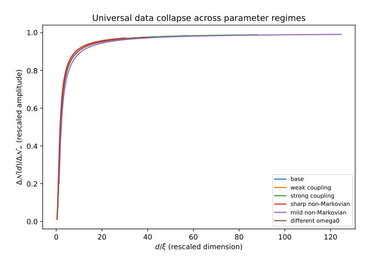
<figcaption class="paper-figure-caption"><b>Fig 2.</b> FIG. 2. Rescaled comparison of the normalized amplitude ∆N(d)/∆N∞versus d/ξ, with ξ evalu-</figcaption>
</figure>
<figure class="paper-figure-card">
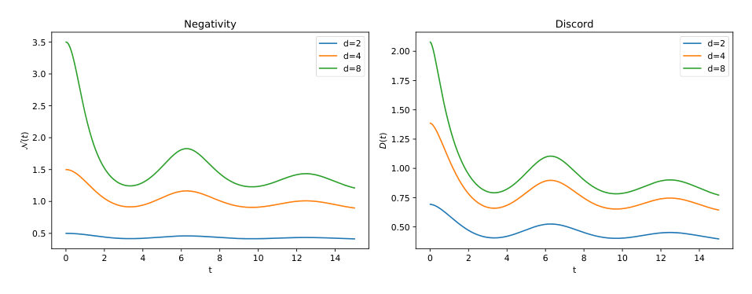
<figcaption class="paper-figure-caption"><b>Fig 3.</b> FIG. 3. Raw dynamics of the negativity N(t) (left) and discord D(t) (right) for dimensions</figcaption>
</figure>
<figure class="paper-figure-card">
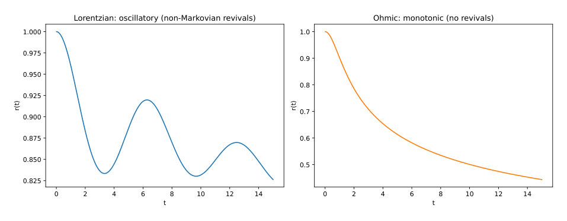
<figcaption class="paper-figure-caption"><b>Fig 4.</b> FIG. 4. Comparison of r(t) for the two spectral-density classes: Lorentzian (left), characterized by</figcaption>
</figure>

**Summary.** This work derives exact closed-form expressions for the time evolution of entanglement and quantum discord for qudit pairs under non-Markovian pure dephasing. By using an exact solution method, it bypasses common approximations in open quantum system theory. The results establish precise scaling laws for how these correlations decay as the dimension increases.

**Why it may be interesting.** It provides rigorous analytical tools to characterize entanglement decay in complex open quantum systems (qudits) without relying on standard approximations, which is crucial for modeling realistic physical platforms like superconducting circuits or trapped ions.

Detailed structure

**Main problem.** The study aims to find exact, closed-form expressions for quantum entanglement (negativity) and quantum discord of maximally entangled qudit states undergoing non-Markovian pure dephasing.

**Main result.** Closed-form formulas are derived for both negativity and quantum discord as finite sums, demonstrating a dimension-independent saturation limit with a $1/d$ convergence rate.

**Method.** The analysis exploits the Toeplitz structure of the density matrix resulting from an exact solution of the independent boson model, bypassing standard approximations like Born-Markov or Lindblad equations.

**Model / system.** The system consists of two qudits (dimension $d$) initialized in a maximally entangled state and subjected to pure dephasing interaction with local bosonic reservoirs. The dynamics are governed by an exact propagator derived from the independent boson model.

**Key observables.** Negativity, Quantum Discord, Convergence Rate ($1/d$), Gaussian error bound ($e^{-\alpha d^2}$).

**Important parameters / regimes.** Qudit dimension $d$, time evolution $t$, spectral density type (Lorentzian, Ohmic).

**Assumptions / limitations.** The primary results are derived from the exact dynamics of the independent boson model; minor discrepancies noted in supplementary checks relate to limitations of an auxiliary pseudomode approach.

**Paper structure.** The paper establishes the physical model and Hamiltonian, derives the time evolution using the exact propagator, calculates negativity via partial transposition eigenvalues, determines quantum discord by exploiting measurement optimality, and finally analyzes the asymptotic scaling laws for both quantities.

Abstract

We study the time evolution of entanglement and quantum discord for a pair of maximally entangled qudits of arbitrary dimension $d$ under non-Markovian pure dephasing, using the exact solution of the independent boson model. Because this solution requires no Born--Markov, Lindblad, or rotating-wave approximation, every result reported here follows directly from the exact dynamics. Exploiting the Toeplitz structure of the resulting density matrix, we obtain a closed-form expression for the negativity as a finite sum, valid for arbitrary dimension and evolution time, together with a corresponding closed-form expression for the quantum discord. For the family of dephased maximally entangled states considered here, we prove that a computational-basis measurement is globally optimal over the entire POVM space, thereby eliminating the numerical optimization otherwise required for evaluating the quantum discord. We further show that both quantities saturate, as the dimension grows, to a dimension-independent limiting value, with a convergence rate of exactly $1/d$. For negativity, this scaling law is established through a rigorous theorem, including a Gaussian-type error bound of order $e^{-αd^2}$, and is confirmed across six independent parameter regimes for two distinct classes of spectral density, Lorentzian and Ohmic; for discord, the same leading-order behavior is found numerically across the six Lorentzian regimes. The analytical results are validated by independent numerical approaches, including reconstruction from the underlying definitions, arbitrary-precision arithmetic, and a complementary pseudomode cross-check.

[↑ back to top](#top)

### [Emergence of giant vortices under nonlinear rotation with attractive interactions in a toroidal condensate](http://arxiv.org/abs/2607.19840v1)

**Authors:** Rony Boral, Swarup K. Sarkar, Matthew Edmonds, Paulsamy Muruganandam, Pankaj Kumar Mishra  
**Type:** theory · **Category:** quantum gases · **PDF:** <https://arxiv.org/pdf/2607.19840v1>  
**Analysis basis:** full PDF text, analyzed in chunks
**Topic relevance:** 🔥 `analog quantum simulation` **4/5** · `methods for driven-dissipative` **3/5** · `non-equilibrium dynamics` **3/5** · `driven-dissipative phase transition` **2/5** · `non-equilibrium universality` **2/5** · `Frenkel-Kontorova` **1/5** · `Keldysh / 2PI / non-Gaussian methods` **1/5**

↔ Scroll figures horizontally

<figure class="paper-figure-card">
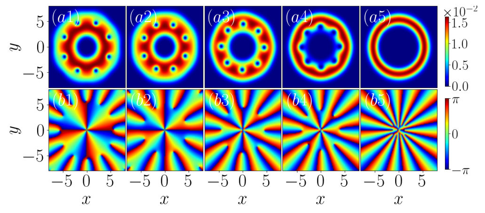
<figcaption class="paper-figure-caption"><b>Fig 1.</b> FIG. 1. Pseudo color representations of the condensate density for ˜C = −40, −20, 0, 6, and 12 [(a1)–(a5)] at Ω= 0.45 and g = 250. Panels (b1)–(b5) display the corresponding phase profiles of the densities shown in (a1)–(a5).</figcaption>
</figure>
<figure class="paper-figure-card">
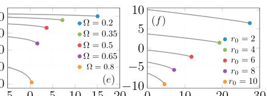
<figcaption class="paper-figure-caption"><b>Fig 2.</b> FIG. 2. Parameter space stability diagram. Panels (a) and (b) show the allowed solution regimes in the (r0, C) and (g, C) parameter planes respectively. The allowed domains of the chemical potential µ in terms of the nonlinear rotation strength C are presented in panels (c)-(f). Solution branches are computed for different values of the quantum circulation ν (c), the van der Waals interaction strength g (d), rigid-body rotation Ω(e) and ring radius r0.</figcaption>
</figure>
<figure class="paper-figure-card">
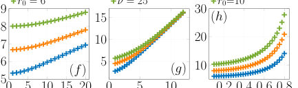
<figcaption class="paper-figure-caption"><b>Fig 3.</b> FIG. 3. Thomas-Fermi profiles. (a)-(c) show example radial density profiles, solutions to Eqs. (14) and (15) with corre- sponding cartesian densities in panels (i)-(iii). These solu- tions are indicated within the parameter space for the nonlin- ear rotation strength C and chemical potential µ in (d) and (e). Meanwhile panels (f)-(h) explore the behaviour of the point at which the ring disappears Rin = Rout for different combinations of the model’s parameters.</figcaption>
</figure>
<figure class="paper-figure-card">
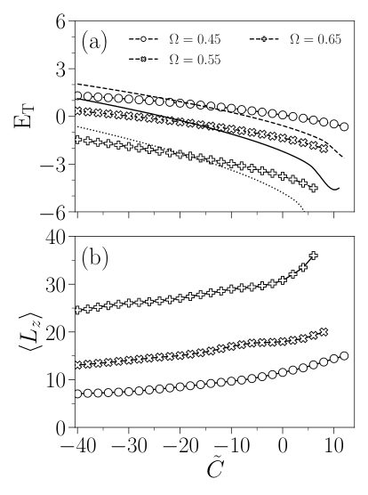
<figcaption class="paper-figure-caption"><b>Fig 4.</b> FIG. 4. (a) The variation of total energy ET, and (b) angular momentum ⟨Lz⟩as a function of nonlinear rotation strength ˜C, for rotational frequencies Ω= 0.45, 0.55, and 0.65. The black dashed, dotted, and dash-dotted lines show the energy prediction from the Thomas-Fermi density distribution. The total energy decreases as ˜C increases, while the angular mo- mentum increases with ˜C.</figcaption>
</figure>
<figure class="paper-figure-card">
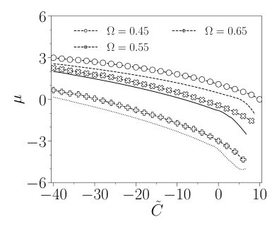
<figcaption class="paper-figure-caption"><b>Fig 5.</b> FIG. 5. The variation of the chemical potential µ as a func- tion of the nonlinear rotation strength ˜C for rotational fre- quencies Ω= 0.45, 0.55, and 0.65. The black dashed, solid, and dotted lines represent the corresponding predictions from the Thomas–Fermi density distribution.</figcaption>
</figure>

**Summary.** This paper numerically investigates how nonlinear rotation affects vortex lattices in a toroidal Bose-Einstein condensate. The key finding is that increasing the rotation strength causes a structural transition to a giant vortex state. By analyzing excitation spectra and stability, the work provides detailed insights into the interplay between topology, external fields, and quantum fluid dynamics.

**Why it may be interesting.** This work directly addresses complex many-body dynamics in ultracold atomic systems, particularly how engineered gauge fields and rotational effects can fundamentally alter topological structures like vortices in a toroidal trap.

Detailed structure

**Main problem.** The study investigates the structural transition of vortex lattices, specifically from ring-shaped to a giant vortex state, within a Bose-Einstein condensate subjected to nonlinear rotation.

**Main result.** Increasing the strength of the nonlinear rotation drives this structural transition, and the quantum circulation associated with the resulting giant vortex is highly sensitive to the rotation strength and chemical potential regime.

**Method.** The research employs numerical simulations solving the Gross-Pitaevskii equation, supplemented by Bogoliubov de Gennes analysis and hydrodynamic modeling.

**Model / system.** The system is a Bose-Einstein condensate confined in a toroidal geometry. The dynamics are governed by a mean-field GP equation incorporating a density-dependent gauge potential that induces nonlinear rotation.

**Key observables.** Vortex lattice structure, quantum circulation ($
u$), excitation spectrum (breathing mode frequency), and the validity regime of the Thomas-Fermi approximation.

**Important parameters / regimes.** Nonlinear rotation strength ($	ilde{C}$ or $\Omega_n$), toroidal radius ($r_0$), nonlinear interaction strength ($g$), and chemical potential ($\mu$).

**Assumptions / limitations.** The analysis relies on mean-field theory, an adiabatic approximation, and the assumption that the gauge potential is induced by specific Rabi couplings.

**Figures summary.** Figures illustrate density and phase profiles for varying nonlinear rotation strength ($	ilde{C}$), mapping out allowed solution regimes in parameter space (e.g., $(	ext{r}_0, 	ilde{C})$ plane).

**Paper structure.** The paper progresses from establishing the governing GP equation under nonlinear rotation to numerically demonstrating the vortex lattice transition. It then analyzes the resulting excitation spectrum via BdG theory and concludes with hydrodynamic stability analyses.

Abstract

We numerically investigate the effects of a density-dependent gauge potential which induces nonlinear rotation on a Bose-Einstein condensate confined in a toroidal trapping geometry. By focusing on the resulting vortex lattice configurations, we demonstrate that increasing the strength of the nonlinear rotation leads to a structural transition from a ring-shaped vortex lattice to a giant vortex state. The quantum circulation associated with the giant vortex is found to be highly sensitive to the strength of the nonlinear rotation and the giant vortex appears in the regime of negative chemical potential. Additionally, we identify the parameter regime in which the Thomas-Fermi density profile remains valid by mapping the solution space based on the strength of the nonlinear rotation and the radius of the confining potential. Based on the Bogoliubov de Gennes analysis, we investigate the impact of nonlinear rotation on the collective excitation spectrum. Our results reveal a violation of the Kohn theorem, accompanied by changes in the breathing mode frequency that indicate radial deformation of the condensate. Our findings are further substantiated through a comprehensive hydrodynamic analysis. Finally, we analyze the stability of multiply quantized vortices under nonlinear rotation. Our findings indicate that while nonlinear rotation can enhance the global stability of these states, it does not necessarily ensure their local stability.

[↑ back to top](#top)

### [Energy Flux as an Entanglement Current in Moving-Mirror Radiation](http://arxiv.org/abs/2607.19763v1)

**Authors:** Yasusada Nambu, Riku Yoshimoto  
**Type:** theory · **Category:** other · **PDF:** <https://arxiv.org/pdf/2607.19763v1>  
**Analysis basis:** full PDF text, analyzed in chunks
**Topic relevance:** 🔥 `entanglement & information structure` **4/5** · `analog quantum simulation` **2/5** · `non-equilibrium dynamics` **2/5** · `Keldysh / 2PI / non-Gaussian methods` **1/5** · `correlated / nonlocal dissipation` **1/5** · `driven-dissipative phase transition` **1/5** · `methods for driven-dissipative` **1/5** · `non-equilibrium universality` **1/5**

↔ Scroll figures horizontally

<figure class="paper-figure-card">
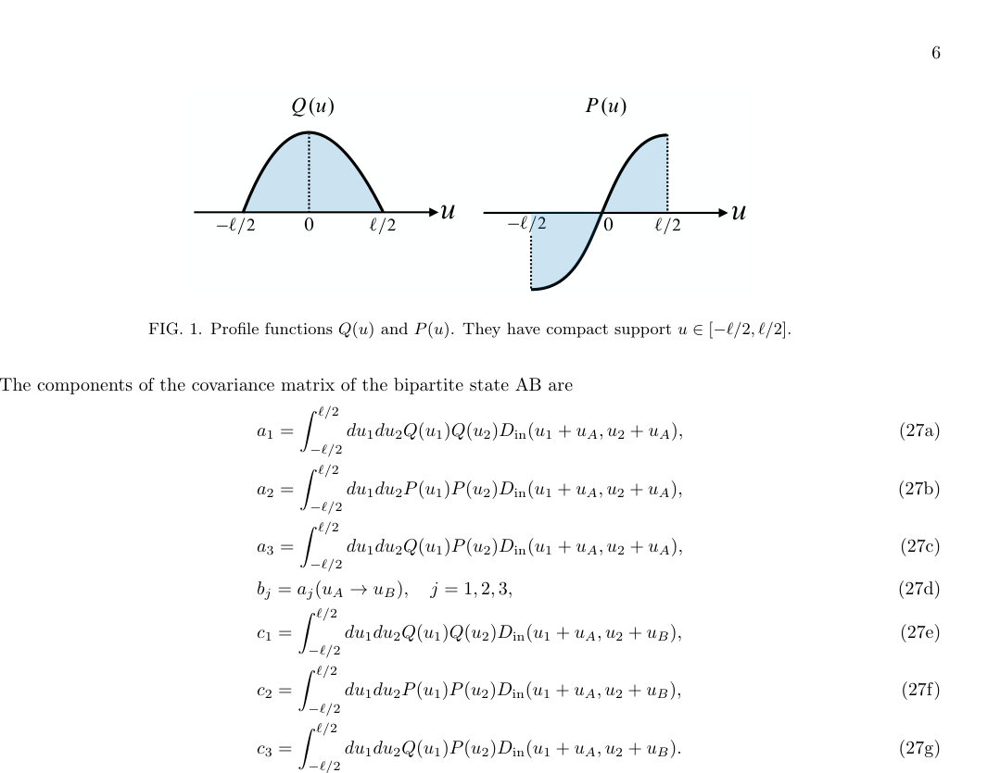
<figcaption class="paper-figure-caption"><b>Fig 1.</b> Figure 2 shows our setup for entanglement harvesting with the moving mirror system. Our focus is on the depen- dence of the harvestable entanglement on the location uA of the detector modes.</figcaption>
</figure>
<figure class="paper-figure-card">
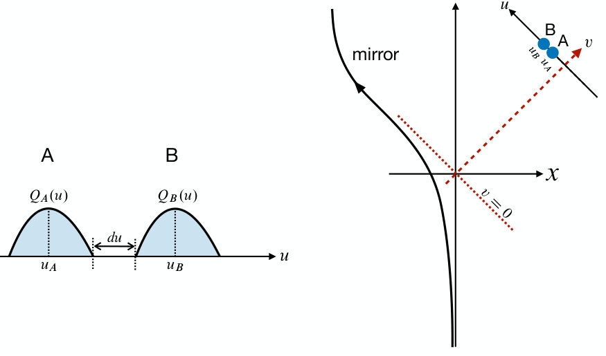
<figcaption class="paper-figure-caption"><b>Fig 2.</b> FIG. 2. Setup for detecting entanglement of the analog Hawking radiation from a moving mirror. Left panel: We show the configuration of profile functions QA(u) and QB(u). The bipartite local mode AB captures the entanglement of the radiation. Right panel: we observe the dependence of the harvested entanglement at the location of the adjacent two local modes A and B (du = 0).</figcaption>
</figure>
<figure class="paper-figure-card">
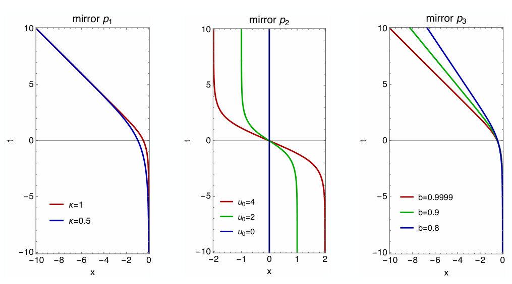
<figcaption class="paper-figure-caption"><b>Fig 3.</b> FIG. 3. Three classes of trajectories associated with the ray-tracing functions p1, p2, and p3. For p2, we display trajectories for the case κ = 1.</figcaption>
</figure>
<figure class="paper-figure-card">
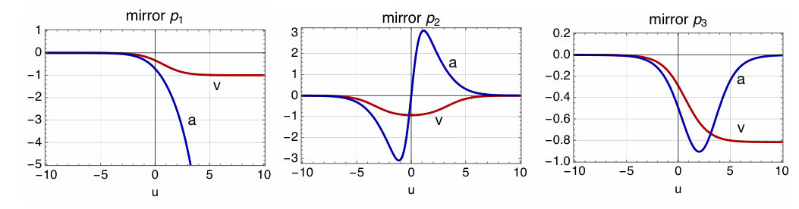
<figcaption class="paper-figure-caption"><b>Fig 4.</b> FIG. 4. The three velocities v and the corresponding proper accelerations a for each mirror trajectory are shown. The parameters are chosen as κ = 1 for p1, u0 = 4 for p2, and b = 0.9 for p3.</figcaption>
</figure>
<figure class="paper-figure-card">
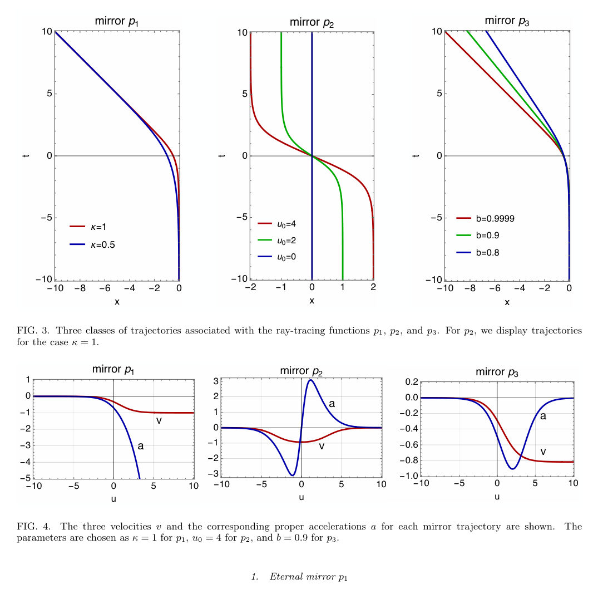
<figcaption class="paper-figure-caption"><b>Fig 5.</b> Figure 5 shows the u-dependence of the energy flux (left panel) and the negativity of the detector state AB (right panel). For this trajectory, the energy flux is always positive, corresponding to a′ &lt; 0 (see Eq.(10)). Negativity decreases monotonically, and entanglement death is observed for the κ = 1 case. We can interpret this behavior as the flux of Hawking radiation disrupting the coherence of the bipartite state AB, leading to the breaking of the quantum correlation between A and B. Similar behavior of entanglement has already been discussed in the analog Hawking radiation of the quantum Hall system with an expanding edge [15, 16].</figcaption>
</figure>

**Summary.** The paper studies entanglement harvesting from analog Hawking radiation generated by a moving mirror. It demonstrates that the emission of negative energy flux is intrinsically linked to the recovery of lost quantum information between detector modes and their associated partner fields. This suggests that negative energy acts as a mechanism for unitary evolution, potentially resolving aspects of the black hole information paradox.

**Why it may be interesting.** This work provides a concrete, calculable model (moving mirror) for exploring fundamental concepts in quantum gravity, such as information paradox resolution and entanglement dynamics, which are highly relevant to open quantum systems theory.

Detailed structure

**Main problem.** The work investigates how quantum entanglement is established and potentially recovered from analog Hawking radiation generated by a moving mirror.

**Main result.** Negative energy flux emission, associated with non-monotonic acceleration of the mirror, correlates with an increase in accessible bipartite entanglement, suggesting it acts as an information return channel.

**Method.** The authors quantify entanglement using measures like Logarithmic Negativity and analyze correlations by relating local detector modes to their 'partner' modes via specialized formulas derived from field quantization.

**Model / system.** The system is a massless scalar field in (1+1)D Minkowski spacetime subjected to Dirichlet boundary conditions imposed by a moving mirror, serving as an analogy for black hole evaporation.

**Key observables.** Bipartite entanglement (Negativity), Energy Flux $F(u)$, and the behavior of the partner mode profile $\Delta P$.

**Important parameters / regimes.** The sign and magnitude of the energy flux, which depends on the time variation of the mirror's proper acceleration.

**Assumptions / limitations.** The analysis relies on Gaussian states, the validity of a 'partner formula,' and approximations regarding detector mode profiles relative to the field evolution.

**Figures summary.** Figures illustrate profile functions for detector modes (Q(u), P(u)) and show how the partner correlation function ($\Delta P$) changes depending on whether the mirror trajectory allows information restoration or not.

**Paper structure.** The paper progresses by defining the physical setup, calculating entanglement measures using local operators, developing a 'partner formula' to track non-local correlations, and finally linking the recovery of information directly to the emission of negative energy flux.

Abstract

In this work, we investigate the quantum entanglement properties of analog Hawking radiation produced by a moving mirror. Using two detector modes defined through window functions on a quantum field, we quantify the bipartite entanglement established between these modes. Our results reveal that the amount of entanglement accessible to the detectors increases when the mirror follows trajectories with non-monotonic, time-dependent acceleration, which are accompanied by the emission of negative energy flux. This indicates that the negative energy flux acts as a channel through which information can be returned. To substantiate this perspective, we examine how the recovery or reconstruction of the associated partner modes is related to the negative energy flux emitted by the mirror.

[↑ back to top](#top)

### [Microwave-driven same-species sympathetic cooling for trapped ions](http://arxiv.org/abs/2607.20292v1)

**Authors:** M. C. Smith, E. Vandrey, A. D. Leu, N. Drotleff, A. Agrawal, K. Miyanishi, D. M. Lucas, M. F. Gely  
**Type:** experiment · **Category:** other · **PDF:** <https://arxiv.org/pdf/2607.20292v1>  
**Analysis basis:** full PDF text, analyzed in chunks
**Topic relevance:** 🔥 `QC/QI experiment` **4/5** · `quantum measurements` **2/5** · `quantum optics experiment` **2/5** · `analog quantum simulation` **1/5** · `correlated / nonlocal dissipation` **1/5** · `driven-dissipative phase transition` **1/5** · `methods for driven-dissipative` **1/5** · `non-equilibrium dynamics` **1/5**

↔ Scroll figures horizontally

<figure class="paper-figure-card">
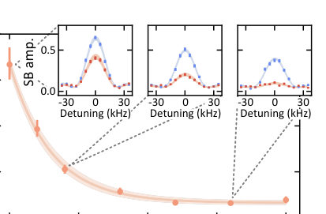
<figcaption class="paper-figure-caption"><b>Fig 1.</b> FIG. 2. Microwave-driven sideband cooling. Measure- ments of the average phonon occupation ¯n of the in-plane radial rocking mode are shown after applying a varying num- ber of cooling cycles as described in Fig. 1. An exponential fit (shaded area) reveals a cooling rate of 0.27(1) quanta/cycle at ¯n = 1 and a minimum occupation of ¯n = 0.16(2) after 16 cooling cycles. The mode occupation is determined through sideband thermometry, implemented with a Raman laser in- terrogating the sidebands of the |4, 4⟩to |4, 3⟩transition. In the insets, we show the blue and red sideband amplitudes for 0, 4 and 16 cooling cycles. We perform detuning scans of both sidebands which are jointly fitted (shaded...</figcaption>
</figure>
<figure class="paper-figure-card">
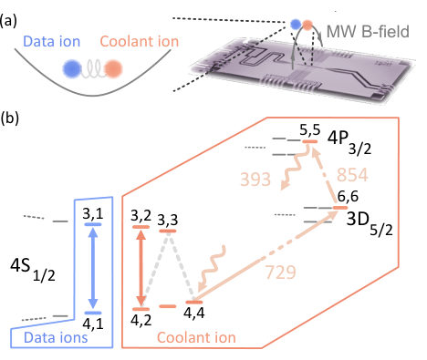
<figcaption class="paper-figure-caption"><b>Fig 2.</b> FIG. 1. Same-isotope sympathetic cooling scheme. (a) Data ions and coolant ions are trapped within the same potential well, leading to shared motional modes. Coolant ions are used to cool the shared motion of all ions without affecting the information stored in the electronic states of the data ions. Errors in quantum logic operations between data ions, which make use of this shared motion, are thus reduced. A surface-electrode Paul trap is used to confine the two ions 40 µm above the trap surface and an integrated microwave waveguide is used to generate a magnetic field for driving pulsed sideband cooling, individual ion addressing, and quan- tum logic operations (ions not to scale). (b)...</figcaption>
</figure>
<figure class="paper-figure-card">
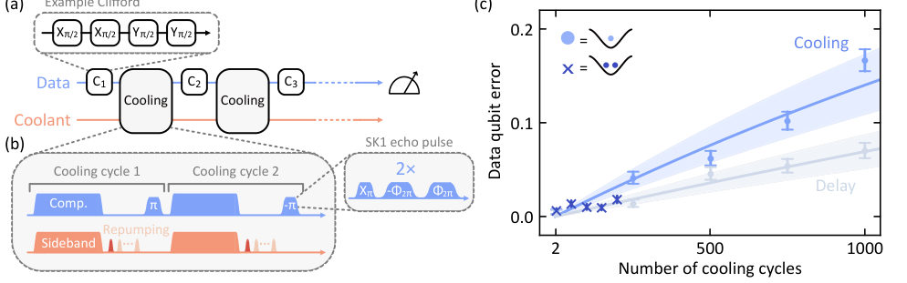
<figcaption class="paper-figure-caption"><b>Fig 3.</b> FIG. 3. Data qubit protection during sympathetic cooling. (a) Interleaved randomised benchmarking (IRB) scheme used to measure the error induced on the data qubit during sympathetic cooling. Cooling cycles are interleaved between Clifford gates in a single-qubit randomised benchmarking sequence applied to the data qubit which, in the absence of errors, would return the qubit to its initial state. Deviations from this expected result reveal the error induced by the cooling cycles. (b) Data qubit protection scheme used during cooling cycles. During the microwave sideband pulse, a “compensation” pulse, detuned from the qubit transition, cancels the ac Zeeman shift induced on the data qubit....</figcaption>
</figure>

**Summary.** The paper introduces a microwave-driven scheme to sympathetically cool trapped ions using only ions of the same species, eliminating complex optical setups. They successfully cooled $	ext{}^{43}	ext{Ca}^+$ ions close to their motional ground state while simultaneously measuring low error rates on the data qubit. This advancement simplifies the hardware requirements for scalable quantum computation.

**Why it may be interesting.** This work represents a significant engineering advance in trapped-ion quantum computing by simplifying the required laser infrastructure while maintaining high fidelity for both cooling and computation.

Detailed structure

**Main problem.** To develop a sympathetic cooling technique for trapped ions that uses only ions of the same species, thereby simplifying complex optical setups required by conventional methods.

**Main result.** The authors successfully demonstrated near-ground-state cooling ($ar{n} \approx 0.16$) using microwave-driven sideband cooling on $	ext{}^{43}	ext{Ca}^+$ ions with an induced error of $1.7(4) 	imes 10^{-4}$ per cycle.

**Method.** The scheme employs pulsed sideband cooling driven by global microwave fields, which is combined with interleaved randomized benchmarking (IRB) to quantify the resulting error on the data qubit.

**Model / system.** The physical system is a trapped ion crystal of $	ext{}^{43}	ext{Ca}^+$ ions confined in a surface-electrode Paul trap. Cooling occurs via microwave driving of the coolant ion's motional sideband, while quantum operations are performed on the data qubit within its electronic ground state manifold.

**Key observables.** Average phonon occupation ($ar{n}$), induced error rate per cooling cycle ($1.7(4) 	imes 10^{-4}$), and cooling rate (e.g., $0.27$ quanta/cycle).

**Important parameters / regimes.** The minimum achievable phonon occupation ($ar{n} \approx 0.16$), the error per cycle, and the frequency shifts induced by microwave pulses.

**Assumptions / limitations.** The method assumes the availability of multiple states within the ground manifold for general applicability beyond $	ext{}^{43}	ext{Ca}^+$. The measured errors are dominated by technical sources like MW drive chain thermal drifts.

**Figures summary.** Figures illustrate the cooling scheme using Zeeman splittings, show exponential decay of phonon occupation ($ar{n}$) over cycles, and detail the interleaved randomized benchmarking protocol used to measure data qubit error.

**Paper structure.** The paper details the microwave-driven sympathetic cooling mechanism, presents measurements confirming near-ground-state cooling efficiency, and rigorously quantifies the resulting decoherence/error on the quantum data qubit using advanced error mitigation techniques like spin-echo pulses.

Abstract

Sympathetic cooling of data qubits by coolant ions is an essential technique for trapped-ion quantum computing. Conventionally a second ion species is used, requiring additional lasers and complicating optical setups. We propose a scheme for sympathetic cooling using the same species and test it for $^{43}$Ca$^+$ ions. Pulsed sideband cooling and ion addressing are implemented via integrated microwave control, further simplifying optical requirements. We cool a two-ion gate mode close to its ground state ($\bar{n}\approx 0.16$) and benchmark an induced error on the data qubit of $1.7(4)\times 10^{-4}$ per cooling cycle.

[↑ back to top](#top)

### [Intelligent qubits](http://arxiv.org/abs/2607.19596v1)

**Authors:** Alexander Givental  
**Type:** theory · **Category:** other · **PDF:** <https://arxiv.org/pdf/2607.19596v1>  
**Analysis basis:** full PDF text, analyzed in chunks
**Topic relevance:** 🔥 `measurement-induced transitions` **4/5** · `quantum measurements` **3/5** · `Keldysh / 2PI / non-Gaussian methods` **1/5** · `correlated / nonlocal dissipation` **1/5** · `driven-dissipative phase transition` **1/5** · `entanglement & information structure` **1/5**

↔ Scroll figures horizontally

<figure class="paper-figure-card">
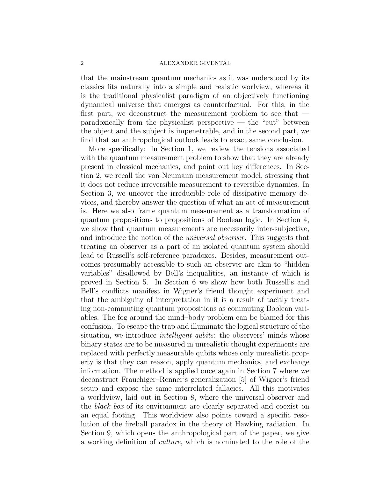
<figcaption class="paper-figure-caption"><b>Fig 1.</b> Low-resolution page preview, page 2</figcaption>
</figure>
<figure class="paper-figure-card">
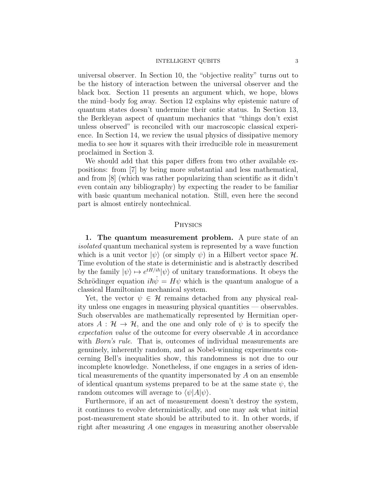
<figcaption class="paper-figure-caption"><b>Fig 2.</b> Low-resolution page preview, page 3</figcaption>
</figure>
<figure class="paper-figure-card">
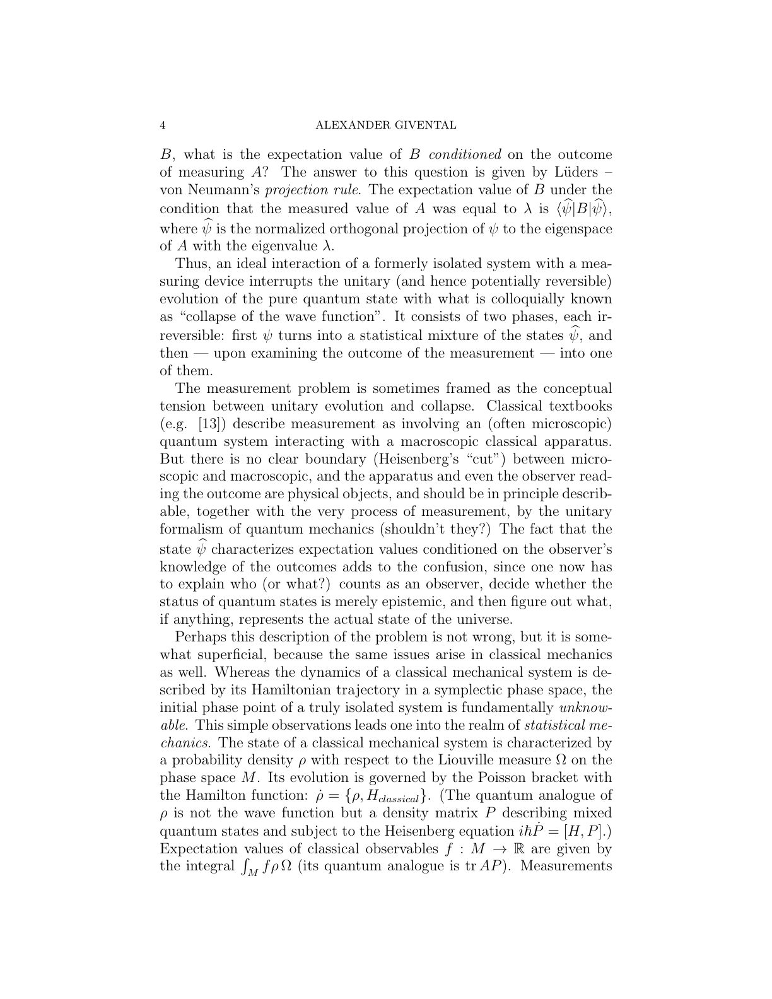
<figcaption class="paper-figure-caption"><b>Fig 3.</b> Low-resolution page preview, page 4</figcaption>
</figure>
<figure class="paper-figure-card">
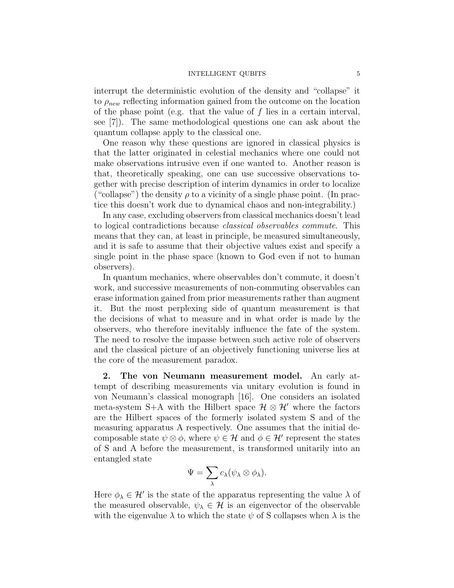
<figcaption class="paper-figure-caption"><b>Fig 4.</b> Low-resolution page preview, page 5</figcaption>
</figure>
<figure class="paper-figure-card">
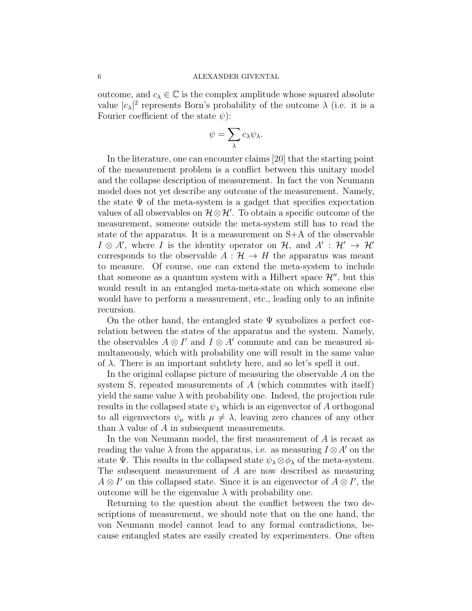
<figcaption class="paper-figure-caption"><b>Fig 5.</b> Low-resolution page preview, page 6</figcaption>
</figure>

**Summary.** This paper introduces 'intelligent qubits' to resolve paradoxes in quantum measurement thought experiments. It argues that the conflict arises from mistakenly treating non-commuting quantum properties as if they were classical, definite values. The work proposes abandoning strict reductionism to reconcile quantum physics with observer concepts.

**Why it may be interesting.** It provides a deep conceptual critique of quantum foundations, which is highly relevant for theorists working on open quantum systems, as it questions the very interpretation underpinning decoherence models.

Detailed structure

**Main problem.** The paper tackles the measurement problem in quantum mechanics, specifically challenging the role of the observer and the apparent conflict between unitary evolution and wave function collapse.

**Main result.** It argues that the paradox stems from a fallacy: treating non-commuting quantum propositions as if they were classical Boolean hidden variables. The solution involves abandoning reductionism regarding the observer's role.

**Method.** The analysis uses thought experiments (like Wigner's friend) and formalisms derived from von Neumann measurements, comparing them to classical mechanics and incorporating environmental decoherence models.

**Model / system.** The core model is quantum mechanical systems interacting with measuring apparatuses or observers. The formalism involves state vectors in Hilbert spaces, density matrices, and the comparison between commuting (classical) and non-commuting (quantum) observables.

**Key observables.** Expectation values of observables, entanglement structure ($\Psi$), mixed density matrix ($P$), and the commutation relations of operators ([p, q] = i\hbar).

**Important parameters / regimes.** Planck constant ($\hbar$), time scales for recurrence vs. cosmic age, and the nature of information loss/retention.

**Assumptions / limitations.** The paper critiques the assumption that physical reality must be described by a purely objective, counterfactual dynamical universe emerging from unitary evolution alone.

**Paper structure.** The structure moves from defining the measurement problem via thought experiments to analyzing formalisms (von Neumann/decoherence), identifying the core fallacy regarding hidden variables, and proposing a non-reductionist alternative that integrates physics with anthropology.

Abstract

We introduce the method of ``intelligent qubits,'' which replace live observers in Wigner's friend and Frauchiger--Renner thought experiments, in order to expose the source of the paradoxes: tacit substitution of Boolean hidden variables for non-commuting quantum propositions. The fallacy traces back to London and Bauer's attempt (1939) to legitimize a self-referential interpretation of observers' ``introspection,'' and thus intertwines the measurement and mind-body problems. We cut the Gordian knot by abandoning reductionism, and describe an alternative which fits, we argue, equally naturally with both physics and anthropology takes on the problems.

[↑ back to top](#top)

### [Logarithmic scaling correction in quench dynamics of the J1-J2 Potts model](http://arxiv.org/abs/2607.20081v1)

**Authors:** Kun Li, Wanzhou Zhang  
**Type:** theory · **Category:** statistical mechanics · **PDF:** <https://arxiv.org/pdf/2607.20081v1>  
**Analysis basis:** full PDF text, analyzed in chunks
**Topic relevance:** 🔥 `non-equilibrium universality` **4/5** · `non-equilibrium dynamics` **3/5** · `analog quantum simulation` **1/5** · `driven-dissipative phase transition` **1/5** · `exotic spin models in light-matter` **1/5** · `methods for driven-dissipative` **1/5**

↔ Scroll figures horizontally

<figure class="paper-figure-card">
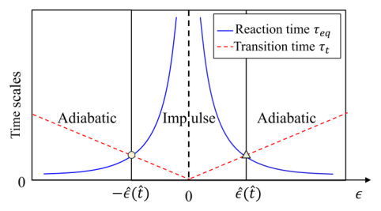
<figcaption class="paper-figure-caption"><b>Fig 1.</b> Figure 1. Schematic illustration of the KZM. The reaction time τeq and the transition time τt are plotted as functions of the dimensionless distance t from the critical point. The intersection points of these two curves, marked by light orange circles and light green triangles at −ˆt and ˆt respectively, define the crossover between the adiabatic and impulsive regimes of the time evolution.</figcaption>
</figure>
<figure class="paper-figure-card">
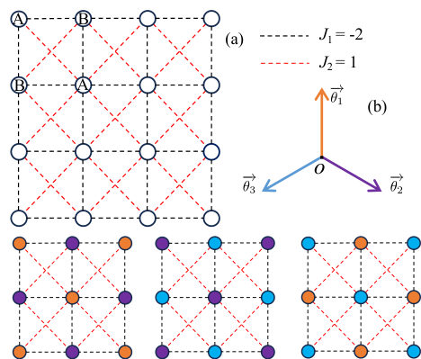
<figcaption class="paper-figure-caption"><b>Fig 2.</b> Figure 2. Lattice and spin basis setup for the J1–J2 three- state Potts model studied in this work. (a) Two types of pairwise spin interactions on the square lattice: gray dashed bonds are NN couplings J1 = −2, while red bonds corre- spond to NNN interactions J2 = 1. Labels A and B mark the two sublattices of the bipartite square lattice. (b) Three unit vectors ⃗θ1,2,3 forming the basis of the three-state Potts spin space. (c)–(e) Three of the six degenerate ground-state con- figurations of the model. The remaining three are obtained by exchanging two Potts spin states.</figcaption>
</figure>
<figure class="paper-figure-card">
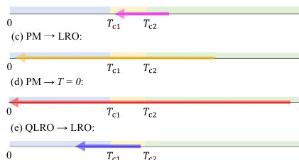
<figcaption class="paper-figure-caption"><b>Fig 3.</b> Figure 4. (a) Phase diagram of the J1–J2 Potts model, show- ing the PM, QLRO, and LRO phases separated by critical temperatures Tc1 and Tc2. (b)–(e) Four distinct quenching protocols, where the start and end points of the quenching paths are indicated by pink, yellow, red, and blue arrows, re- spectively.</figcaption>
</figure>
<figure class="paper-figure-card">
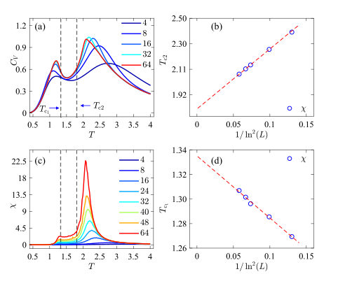
<figcaption class="paper-figure-caption"><b>Fig 4.</b> Figure 3. (a) Specific heat CV versus temperature for different lattice sizes. (c) Magnetic susceptibility χ versus temperature for different lattice sizes. Vertical dotted lines mark the two thermodynamic-limit BKT critical temperatures. (b) Finite- size scaling of the high-temperature critical point Tc2 fitted via Eq. (18). (d) Finite-size scaling of the low-temperature critical point Tc1 fitted via Eq. (17).</figcaption>
</figure>
<figure class="paper-figure-card">
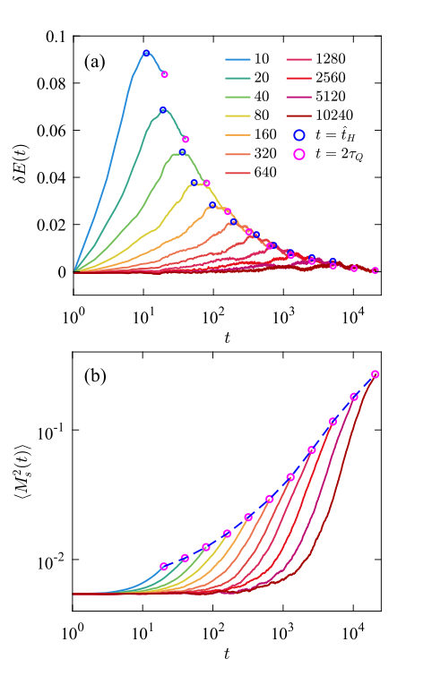
<figcaption class="paper-figure-caption"><b>Fig 5.</b> Figure 5. Time evolution of the excess energy density δE(t) (panel (a)) and nonequilibrium squared staggered magnetization⟨M 2 s (t)⟩(panel (b)) for different quench times τQ. Panel (a) adopts a logarithmic horizontal axis with a linear vertical axis, while panel (b) is plotted on double- logarithmic axes. The blue open circles denote the peak posi- tions at t = ˆtH corresponding to the high-temperature critical point Tc2 whereas the magenta open circles indicate the ter- mination time t = 2τQ of each quench inside the QLRO phase at T = 1.5.</figcaption>
</figure>

**Summary.** This paper investigates the non-equilibrium quench dynamics of the J1-J2 Potts model to determine if topological phase transitions induce logarithmic scaling corrections. Using Monte Carlo simulations across various quench protocols, the authors show that these characteristic logarithmic corrections appear only when quenching into a Quasi-Long-Range Ordered (QLRO) phase, while other quenches follow standard power-law decay.

**Why it may be interesting.** This work provides a concrete theoretical test case for extending concepts from continuous symmetry models (like 2D XY model BKT transition) to discrete spin systems, which is highly relevant for understanding critical dynamics in complex quantum materials.

Detailed structure

**Main problem.** The study investigates whether logarithmic scaling corrections, characteristic of 2D XY models undergoing topological phase transitions, appear in discrete-spin systems exhibiting successive topological phase transitions during thermal quenches.

**Main result.** Quench dynamics into the Quasi-Long-Range Ordered (QLRO) phase exhibit logarithmically corrected Kibble-Zurek Mechanism scaling for excess energy density, while quenches into the Long-Range Ordered (LRO) phase follow conventional power-law scaling.

**Method.** The authors employ Monte Carlo simulations to analyze non-equilibrium quench dynamics and construct the equilibrium phase diagram of the model.

**Model / system.** The system analyzed is the J1-J2 antiferromagnetic Potts model defined on a 2D square lattice, characterized by nearest-neighbor ($J_1$) and next-nearest-neighbor ($J_2$) interactions. The model exhibits four distinct thermodynamic phases: Paramagnetic (PM), QLRO, LRO, and zero-temperature ground state.

**Key observables.** Excess energy density ($\delta E(t)$) and squared staggered magnetization ($\langle M_{s}^2(t)
angle$).

**Important parameters / regimes.** The quench protocols are defined by the initial and final phases (e.g., PM $	o$ QLRO vs. PM $	o$ LRO), as well as the quench rate.

**Assumptions / limitations.** The analysis relies on comparing scaling behaviors across different quench endpoints, assuming that the observed deviations from pure power laws are due to underlying topological physics.

**Figures summary.** Figures illustrate the phase diagram showing PM, QLRO, and LRO regions; time evolution plots of $\delta E(t)$ and $\langle M_{s}^2(t)
angle$ for various quench protocols; and log-log plots comparing scaling exponents for different regimes.

**Paper structure.** The paper first establishes the model and its four phases. It then designs multiple quench protocols connecting these phases. The core of the work involves analyzing the scaling behavior of key observables ($\delta E(t)$) under these quenches, contrasting logarithmic corrections (QLRO endpoint) with pure power-law scaling (LRO endpoint).

Abstract

In conventional quench dynamics governed by the Kibble-Zurek mechanism (KZM), the defect density generally decays as a pure power law of the quench rate. However, the KZM scaling of the two-dimensional (2D) XY model with topological phase transitions features prominent logarithmic corrections. Nevertheless, it remains unclear whether such logarithmic scaling corrections emerge in discrete-spin systems that host two successive topological phase transitions under thermal quenches. This work investigates the J1-J2 antiferromagnetic Potts model and constructs its equilibrium phase diagram. Based on the temperature ranges of the paramagnetic phase, quasi-long-range ordered (QLRO) phase, long-range ordered phase, and zero-temperature ground state, we design four quench protocols with distinct temperature intervals. Our results demonstrate that quenches terminating in the QLRO phase exhibit logarithmically corrected KZM scaling of the excess energy density, consistent with the dynamical universality class of the 2D XY model. In contrast, quenches ending in the LRO phase, including both finite-temperature and zero-temperature protocols, follow conventional power-law scaling. Our results clearly uncover the characteristic scaling corrections of the J1-J2 Potts model and offer theoretical guidance for future experimental investigations of KZM via photonic simulation platforms.

[↑ back to top](#top)

### [Quantum Fisher Information in semiclassical magnon systems](http://arxiv.org/abs/2607.20424v1)

**Authors:** Wolfgang Simeth, Pontus Laurell, Allen Scheie  
**Type:** theory · **Category:** strongly correlated electrons · **PDF:** <https://arxiv.org/pdf/2607.20424v1>  
**Analysis basis:** full PDF text, analyzed in chunks
**Topic relevance:** 🔥 `entanglement & information structure` **4/5** · `exotic spin models in light-matter` **3/5** · `analog quantum simulation` **2/5** · `Keldysh / 2PI / non-Gaussian methods` **1/5** · `spintronics-quantum-optics interface` **1/5**

↔ Scroll figures horizontally

<figure class="paper-figure-card">
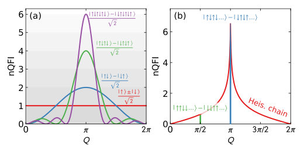
<figcaption class="paper-figure-caption"><b>Fig 1.</b> FIG. 1. (a) Momentum-dependent QFI for spin chains of length L = 1, 2, 4, and 6 and an antiferromagnetic cat ground state (see text). In each case the maximal nQFI[Q] = N is obtained only if Q = π. (b) QFI for the 1D Heisenberg chain Bethe Ansatz solution [29]. nQFI is maximal at Q = π, but nonzero over a range of Q values including e.g. Q = π/2.</figcaption>
</figure>
<figure class="paper-figure-card">
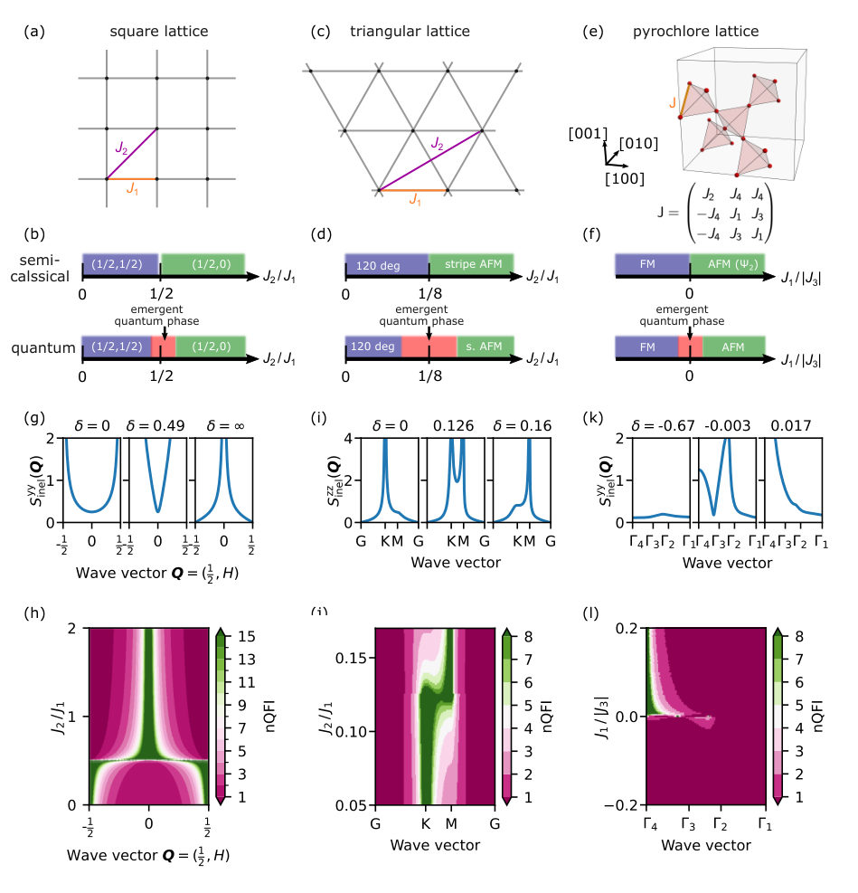
<figcaption class="paper-figure-caption"><b>Fig 2.</b> FIG. 2. QFI in prototypical frustrated spin systems with quantum phase transitions. (a) Square lattice antiferromagnet with nearest and next-nearest neighbor Heisenberg interactions (J1 &gt; 0 and J2 &gt; 0) along the square-lattice edge (orange) and square lattice diagonal (purple), respectively. The nodes (black circles) are decorated with sspin (S = 1</figcaption>
</figure>
<figure class="paper-figure-card">
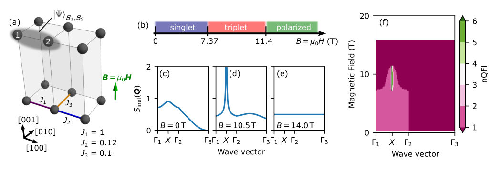
<figcaption class="paper-figure-caption"><b>Fig 3.</b> FIG. 4. Semiclassical simulations for the Heisenberg spin ladder as a function of external field. (a) Tetragonal unit cell with two atoms that carry spin- 1</figcaption>
</figure>
<figure class="paper-figure-card">
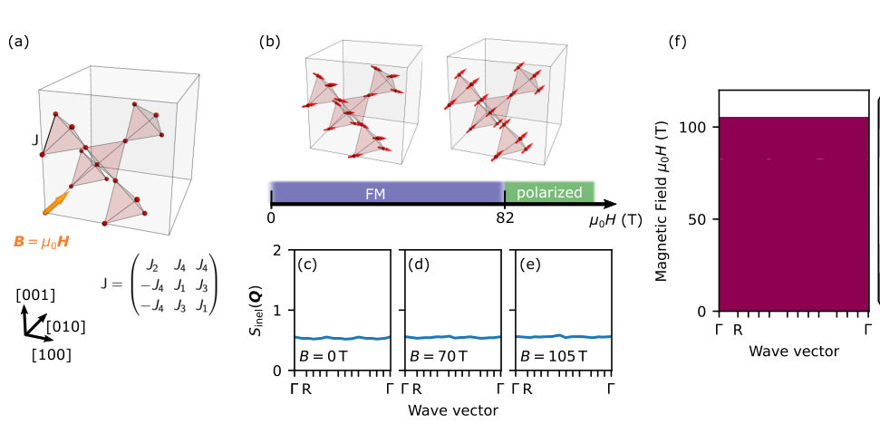
<figcaption class="paper-figure-caption"><b>Fig 4.</b> FIG. 5. Semiclassical simulations for a pyrochlore lattice as a function of external magnetic field. (a) Unit cell of the pyrochlore lattice. Along the nearest neighbor bond connecting ( 1</figcaption>
</figure>
<figure class="paper-figure-card">
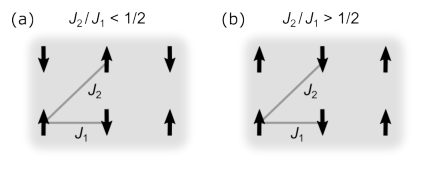
<figcaption class="paper-figure-caption"><b>Fig 5.</b> FIG. 6. Ground states of the square lattice antiferromag- netic Heisenberg model with nearest- and next-nearest neigh- bor exchange (J1, J2). (a) For J2/J1 ≪1/2, the ground state may be approximated by a (ππ) antiferromagnet and (b) for J2/J1 ≫1/2 by a (π0) antiferromagnet.</figcaption>
</figure>

**Summary.** This paper establishes Quantum Fisher Information (QFI) as a novel, momentum-resolved diagnostic tool for quantifying quantum entanglement depth in solid-state spin systems. By applying QFI to various models, including frustrated magnets and antiferromagnets, the authors demonstrate that its divergence signals proximity to quantum critical points or highly entangled ground states.

**Why it may be interesting.** It provides a powerful, quantifiable metric ($	ext{nQFI}$) derived from quantum information theory that directly probes entanglement structure and quantum criticality in magnetic materials, bridging QI concepts with condensed matter physics.

Detailed structure

**Main problem.** To elaborate on the meaning and interpretation of Quantum Fisher Information (QFI) in condensed matter systems, relating it to quantum entanglement depth and magnon squeezing.

**Main result.** QFI serves as a momentum-resolved probe of entanglement that quantifies entanglement depth at a given wave vector, showing divergences near magnetic ordering vectors or emergent quantum phases.

**Method.** The study uses theoretical analysis involving calculating the QFI density for spin systems and applying semiclassical approximations like Linear Spin Wave Theory (LSWT).

**Model / system.** The research examines simple theoretical spin systems, including 1D Ising chains, frustrated spin models on lattices (Triangular, Pyrochlore), and antiferromagnets described by Heisenberg-Kitaev type Hamiltonians.

**Key observables.** Quantum Fisher Information ($	ext{nQFI}[Q]$), entanglement depth, magnon squeezing parameter, and the momentum-dependent structure factor $S(Q)$.

**Important parameters / regimes.** Momentum transfer ($Q$), system size ($N$ or $L$), anisotropy parameters ($\Delta$, $\kappa$), and exchange couplings ($J_1, J_2$).

**Assumptions / limitations.** The analysis often relies on semiclassical approximations (LSWT) which may break down near quantum critical points or Goldstone modes.

**Figures summary.** Figures illustrate momentum-dependent QFI for Ising and Heisenberg chains, showing divergences at ordering vectors; other figures map out phase diagrams and show nQFI scaling near transitions in frustrated lattices.

**Paper structure.** The paper progresses by defining QFI's role, applying it to simple spin systems to establish its meaning (entanglement depth), then extending the analysis to semiclassical models like antiferromagnets, culminating in showing divergences at quantum critical points and phase boundaries.

Abstract

Quantum Fisher Information (QFI) is a powerful spectroscopic tool to witness many-body quantum entanglement in solid state materials, but it is not always obvious how to relate it to other characteristics of condensed matter systems. In this study we elaborate on the meaning and interpretation of QFI in condensed matter by examining simple theoretical spin systems. We use finite sized spin systems to illustrate that QFI quantifies the momentum- dependent degree of quantum entanglement (that is the entanglement depth at a given wave vector) within a wave function. We subsequently use semiclassical frustrated spin models to show that, in the context of linear spin wave theory (LSWT), QFI quantifies the momentum-dependent degree of magnon squeezing in the ground state. In antiferromagnets with a zero-energy Goldstone mode, LSWT breaks down and QFI (and entanglement depth) diverges at the magnetic ordering wave vector. We also show examples of emergent quantum phases in frustrated spin systems that do not appear in classical phase diagrams. When these emergent phases are approached, QFI diverges across multiple wave vectors in momentum space. Taken together, QFI is not only helpful as a lower bound for entanglement depth, but serves as a momentum-resolved probe of entanglement that offers a novel perspective on quantum critical phenomena.

[↑ back to top](#top)

### [Dynamical redistribution of quantum resources in tree-level Bhabha scattering](http://arxiv.org/abs/2607.20264v1)

**Authors:** Zan Cao, Meng-Long Song, Xue-Ke Song, Liu Ye, Dong Wang  
**Type:** theory · **Category:** other · **PDF:** <https://arxiv.org/pdf/2607.20264v1>  
**Analysis basis:** full PDF text, analyzed in chunks
**Topic relevance:** 🔥 `entanglement & information structure` **4/5** · `non-equilibrium dynamics` **2/5** · `Keldysh / 2PI / non-Gaussian methods` **1/5** · `correlated / nonlocal dissipation` **1/5** · `driven-dissipative phase transition` **1/5** · `methods for driven-dissipative` **1/5**

↔ Scroll figures horizontally

<figure class="paper-figure-card">
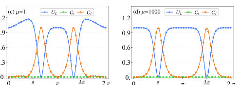
<figcaption class="paper-figure-caption"><b>Fig 1.</b> FIG. 1. Dynamical evolution of the entropic uncertainty and quantum entanglement as a function of the scattering angle θ for the initial factorized state |i⟩I = |R⟩A ⊗|L⟩B. Panels (a) and (b) display the entropic uncertainty compo- nents—the measured uncertainty UL (blue solid curves), the theoretical lower bound UR (green dash-dotted curves), and their tightness difference ∆U (orange dashed curves)—in the non-relativistic regime (µ = 1) and the ultra-relativistic limit (µ = 1000), respectively. Panels (c) and (d) depict the strict anti-correlation between the actual entropic uncertainty UL (blue curves with open circles) and the dynamically gener- ated entanglement Cf (orange curves with...</figcaption>
</figure>
<figure class="paper-figure-card">
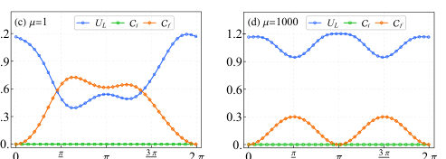
<figcaption class="paper-figure-caption"><b>Fig 2.</b> FIG. 2. Dynamical evolution of the entropic uncertainty and quantum entanglement as a function of the scattering angle θ for the separable states with local coherence, parameterized by α = π/3, β = 3π/8 and vanishing relative phases (η = ξ = 0). Note the kinematic asymmetry with respect to the scattering angle θ = π in the non-relativistic regime [panels (a) and (c)], which is distinctly restored to a symmetric profile in the ultra-relativistic limit [panels (b) and (d)] due to the rigorous recovery of QED chiral symmetry. The curve and marker styles are identical to those defined in Fig.1.</figcaption>
</figure>
<figure class="paper-figure-card">
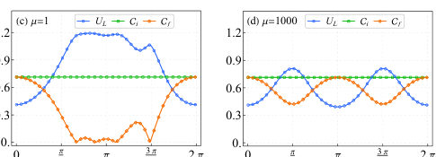
<figcaption class="paper-figure-caption"><b>Fig 3.</b> FIG. 3. Dynamical evolution of the entropic uncertainty and quantum entanglement as a function of the scattering angle θ for a generic entanglement-depleting initial state. The initial pure state is parameterized by {α = π/3, β = π/5, χ = 0} and vanishing relative phases (ξ = η = τ = 0). The initial entan- glement Ci ≈0.72 is denoted by the green lines with open squares. The universal suppression of the post-scattering en- tanglement Cf (red curves with open diamonds) below Ci highlights the scattering-induced disentanglement driven by destructive coherent interference. The curve styles for the uncertainty components match those detailed in Fig. 1.</figcaption>
</figure>
<figure class="paper-figure-card">
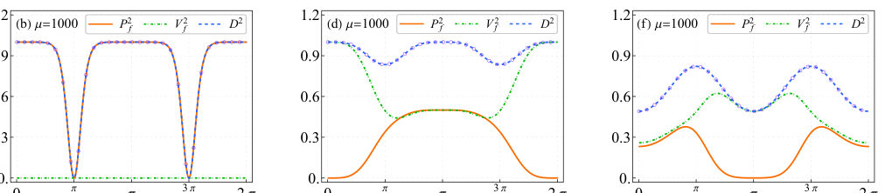
<figcaption class="paper-figure-caption"><b>Fig 4.</b> FIG. 4. Scattering angle dependence of the local duality parameters and global quantum coherence. The predictability P 2 f (solid orange curves), wave-like visibility V 2 f (dash-dotted green curves), P 2 f +V 2 f (purple circle), and global coherence D2 (dashed blue curves) are plotted for three distinct initial configurations: the basic factorized state (left column, panels (a) and (b)), the separable states with local coherence is parameterized by {α = π/4, β = 3π/8, ξ = η = 0} (middle column, panels (c) and (d)), and the general entangled states is parameterized by {α = π/3, β = π/5, χ = 0 ξ = η = τ = 0} (right column, panels (e) and (f)). The top row (µ = 1) and bottom row (µ = 1000)...</figcaption>
</figure>
<figure class="paper-figure-card">
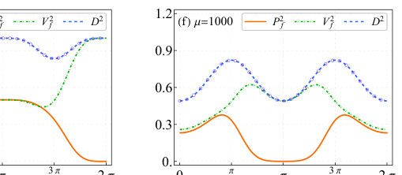
<figcaption class="paper-figure-caption"><b>Fig 5.</b> Fig. 5 comprehensively visualizes the dynamical inter- play among the local wave-particle attributes (P 2 f , V 2 f ) and the bipartite non-local correlation (B2/4). The most fundamental observation is the exact coincidence of their total sum at 2 under all kinematic conditions. Since the underlying scattering mechanisms—namely, the mass- induced cross-interference at µ = 1 and the chiral symme- try recovery at µ = 1000—are identical to those detailed in Fig. 4, we focus here strictly on their consequences for the Bell violation. For the non-relativistic regime, [Figs. 5(a), 5(c), and 5(e)], the asymmetric redistribution of lo- cal wave-particle duality severely restricts the generation of...</figcaption>
</figure>

**Summary.** This paper analyzes how entanglement, uncertainty, and coherence are dynamically managed during relativistic electron-positron scattering (Bhabha scattering) using Quantum Resource Theory. It reveals that kinematic limits dictate resource redistribution, showing a fundamental trade-off between local wave-particle duality and global non-local correlations. The work provides a deep theoretical understanding of quantum structure within QED processes.

**Why it may be interesting.** The rigorous application of quantum information concepts like coherence and nonlocality to a fundamental particle process like Bhabha scattering provides deep insights into the operational meaning of quantum principles in high-energy physics.

Detailed structure

**Main problem.** The study investigates how quantum resources, such as entanglement and coherence, dynamically redistribute during relativistic scattering processes governed by Quantum Electrodynamics (QED). It aims to understand the fundamental quantum nature of these interactions.

**Main result.** The authors demonstrate a strict anti-correlation between entropic uncertainty and generated entanglement, showing that pre-existing local coherence can suppress maximal violations of local realism in the ultra-relativistic limit.

**Method.** The analysis employs Quantum Resource Theory (QRT) applied to the tree-level Bhabha scattering process ($e^- e^+ 
ightarrow e^- e^+$), utilizing concepts like the Complementarity Relation and analyzing helicity-dependent scattering amplitudes.

**Model / system.** The physical system is electron-positron pair production via Bhabha scattering within QED. The analysis treats the evolution of the final state density operator ($
ho_f$) using bipartite pure states evolving under unitary QED dynamics.

**Key observables.** Entanglement, entropic uncertainty ($U_L$), quantum coherence ($D_{AB}$), and Bell nonlocality (CHSH parameter $\hat{B}$).

**Important parameters / regimes.** Scattering angle ($	heta$), momentum scaling factor ($\mu = |p|/m_e$), and the initial state's degree of local coherence.

**Assumptions / limitations.** The study is restricted to tree-level calculations in QED, though it builds upon general quantum resource theory frameworks.

**Figures summary.** Figures illustrate the dependence of uncertainty gaps ($\Delta U$) on scattering angle for non-relativistic vs. ultra-relativistic regimes, and show how local duality parameters ($P_f^2, V_f^2$) trade off against global coherence ($D^2$) across different initial states.

**Paper structure.** The paper systematically analyzes the resource dynamics by comparing basic factorized states (where entanglement is generated) versus states with pre-existing local coherence. It examines how kinematic limits (non-relativistic vs. ultra-relativistic) affect symmetry and resource trade-offs, culminating in an analysis of duality constraints.

Abstract

The fundamental interactions governed by quantum electrodynamics (QED) are intrinsically rich in quantum resources, yet how these resources dynamically redistribute during relativistic scattering is still not fully understood. In this work, we systematically investigate the tree-level Bhabha scattering process (e^- e^+ \rightarrow e^- e^+) within the framework of quantum resource theory, revealing how QED kinematics and Feynman amplitudes strictly dictate resource redistribution. Specifically, we demonstrate a strict anti-correlation between entropic uncertainty and dynamically generated entanglement across diverse initial states. We find that mass-induced single-helicity-flip transitions cause a pronounced geometric symmetry breaking in the non-relativistic regime, whereas the restoration of chiral symmetry in the ultra-relativistic limit ensures strict symmetry about the backward scattering angle. Furthermore, we analytically establish a rigorous equivalence between local wave-particle duality and global bipartite quantum coherence. Finally, evaluating the trade-off between local duality and Bell nonlocality, we show that in the ultra-relativistic limit, transverse scattering of basic factorized states equalizes the s- and t-channel amplitudes to optimize non-local correlations. However, pre-existing local coherence inevitably disrupts this delicate kinematic balance, significantly suppressing the Bell parameter and preventing the maximal violation of local realism. Therefore, we believe the present results provide deeper understanding of the fundamental quantum nature of QED processes.

[↑ back to top](#top)

### [Quantum Simulation of Semiconductor Excitons in Ultracold Dipolar Fermi Gases](http://arxiv.org/abs/2607.19467v1)

**Authors:** Florian Hirsch, Oriana K. Diessel, Rafał Ołdziejewski, Richard Schmidt  
**Type:** theory · **Category:** other · **PDF:** <https://arxiv.org/pdf/2607.19467v1>  
**Analysis basis:** full PDF text, analyzed in chunks
**Topic relevance:** 🔥 `analog quantum simulation` **4/5** · `Frenkel-Kontorova` **2/5** · `Keldysh / 2PI / non-Gaussian methods` **1/5** · `driven-dissipative phase transition` **1/5** · `spintronics-quantum-optics interface` **1/5**

↔ Scroll figures horizontally

<figure class="paper-figure-card">
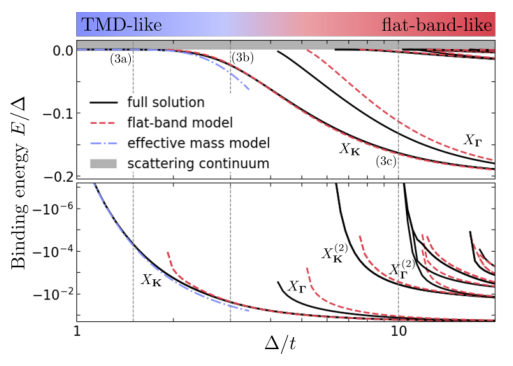
<figcaption class="paper-figure-caption"><b>Fig 1.</b> FIG. 2. Exciton binding energies. Eigenenergies obtained from ED (black solid), compared to the flat-band model (red dashed) and effective mass model (blue, dot-dashed) as a func- tion of ∆/t, at fixed V1/∆= 0.2. Bottom: Energies on log- arithmic scale. The energetically lowest exciton states are denoted as XK and XΓ, followed by X(2) K and X(2) Γ as excited states. The ground state XK is twofold degenerate for all ∆/t. The eigenstates at the three vertical cuts are shown in Fig. 3(a-c).</figcaption>
</figure>
<figure class="paper-figure-card">
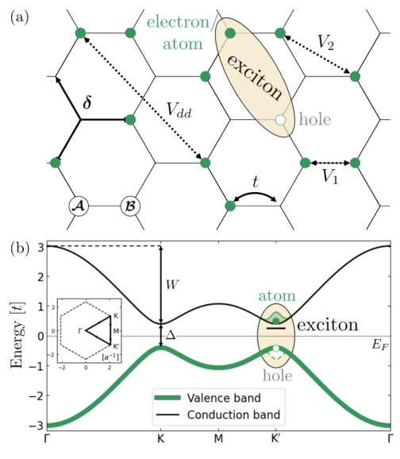
<figcaption class="paper-figure-caption"><b>Fig 2.</b> FIG. 1. Semiconductor band structure realized in cold atoms. (a) Honeycomb lattice with two sublattices A and B, half-filled with dipolar fermions (green) hopping between sites. The fermions interact via a dipolar potential Vdd and can form ‘electron-hole’ bound exciton states. (b) Cut through the band structure on the path through the first Brillouin zone as indicated in the inset. The Fermi level re- sides inside the gap and the exciton wave function in the K′</figcaption>
</figure>
<figure class="paper-figure-card">
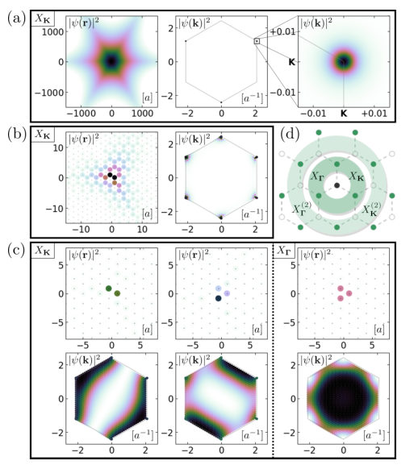
<figcaption class="paper-figure-caption"><b>Fig 3.</b> FIG. 3. Numerical results for the exciton eigenstates. Exciton wave functions corresponding to the cuts in Fig. 2, each in real and momentum space with units a and a−1, re- spectively. (a) Exciton state XK for ∆/t = 1.5, including a magnification of the region around the K-point, (b) exciton state XK for ∆/t = 3, (c) exciton states XK (twofold degen- erate) and XΓ for ∆/t = 10, (d) illustration of the emerging decoupled three-level systems in the flat-band limit.</figcaption>
</figure>

**Summary.** The paper demonstrates how to use ultracold dipolar Fermi gases in optical lattices to simulate semiconductor exciton physics, mimicking materials like TMDs. By tuning lattice parameters, researchers can study excitons ranging from large Wannier-like states to small Frenkel-like states. This establishes a powerful quantum simulation platform for complex electronic phenomena.

**Why it may be interesting.** This work directly bridges concepts from solid-state quantum optics (excitons, TMDs) into the highly controllable environment of ultracold atoms, providing a blueprint for simulating complex electronic states inaccessible otherwise.

Detailed structure

**Main problem.** To establish quantum simulation of semiconductor excitons using ultracold atomic systems, bridging solid-state physics concepts to controllable cold atom platforms.

**Main result.** The study successfully models exciton formation across different regimes (Wannier vs. Frenkel) and predicts observable signatures using lattice modulation spectroscopy.

**Method.** Theoretical modeling involving tight-binding Hamiltonians, particle-hole transformations, and solving the resulting two-body Schrödinger equation or Bethe-Salpeter equations.

**Model / system.** The system uses single-component fermions (dipolar atoms/molecules) in a hexagonal optical lattice to mimic TMD semiconductors. The physics is governed by kinetic energy terms, sublattice offsets ($\Delta$), and long-range dipolar interactions ($V_{dd}$).

**Key observables.** Exciton binding energies, exciton wave functions (spatial localization), and absorption strength measured via lattice modulation spectroscopy.

**Important parameters / regimes.** The ratio of band gap to hopping strength ($\Delta/t$) is the key tuning parameter, controlling the transition between Wannier and Frenkel exciton regimes.

**Assumptions / limitations.** Approximations include neglecting short-range interactions relative to dipolar ones, and using various perturbative expansions (e.g., in deriving effective Hamiltonians).

**Figures summary.** Figures illustrate the honeycomb lattice band structure with a direct gap at K/K' points; plots show exciton binding energies vs. $\Delta/t$, demonstrating agreement between ED results and model predictions.

**Paper structure.** The work progresses by first establishing the TMD-like band structure, then using Exact Diagonalization (ED) to map out tunable exciton physics across different coupling regimes ($\Delta/t$ variation), culminating in detailed analysis of effective Hamiltonians for specific limits.

Abstract

Inspired by the progress on the study of exciton physics in atomically thin transition metal dichalcogenide (TMD) semiconductors, we investigate the formation of analogs of excitons in cold atomic systems. To this end, we consider single-component fermions comprised of ultracold ground-state molecules or dipolar atoms in a hexagonal optical lattice. An energy offset between triangular sublattices opens up a band gap with degeneracies at the K/K' points as in TMDs. We predict the existence of cold atomic excitons and show that cold atoms allow us to study excitons from the weak-coupling regime, where effective mass models apply, to the strong-interaction regime, described by flat-band models. We demonstrate how these excitons can be observed using lattice modulation spectroscopy, and how their wave functions can be mapped out using quantum gas microscopy. Firmly establishing the idea of quantum simulation of semiconductor physics, this work lays the foundation for simulating complex electronic states such as trions, polarons and excitonic insulators.

[↑ back to top](#top)

### [Fermionic pairs, from the surface to the bulk](http://arxiv.org/abs/2607.20412v1)

**Authors:** Sandra Brandstetter, Carl Heintze, Fabian Brauneis, Stephanie M. Reimann, Georg Bruun, Maciej Gałka, Selim Jochim  
**Type:** both · **Category:** quantum gases · **PDF:** <https://arxiv.org/pdf/2607.20412v1>  
**Analysis basis:** full PDF text, analyzed in chunks
**Topic relevance:** 🔥 `analog quantum simulation` **4/5** · `Keldysh / 2PI / non-Gaussian methods` **1/5** · `entanglement & information structure` **1/5** · `non-equilibrium dynamics` **1/5**

↔ Scroll figures horizontally

<figure class="paper-figure-card">
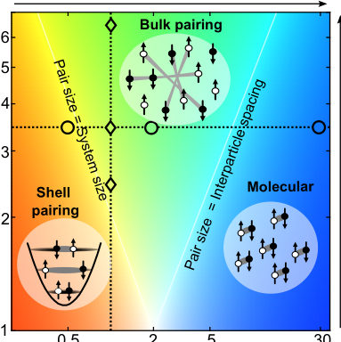
<figcaption class="paper-figure-caption"><b>Fig 1.</b> Figure 1. Pairing regimes. The different pairing regimes determined by the interplay of the interaction strength and particle number, or equivalently, the pair size rB, system size rF, and mean interparticle spacing ℓ. The plot encodes the competition of length scales at the trap center in an RGB color map, (R, G, B) = (1/rF, 1/ℓ, 1/rB), normalized to its largest component. The boundaries indicate crossovers be- tween dominant length-scale hierarchies rather than sharp phase transitions . Confinement-dominated shell pairing oc- curs for rB ≳rF (red). Here, rB should be understood as the two-body interaction length scale, while the physical pair extent is limited by the trap. Bulk pairing...</figcaption>
</figure>
<figure class="paper-figure-card">
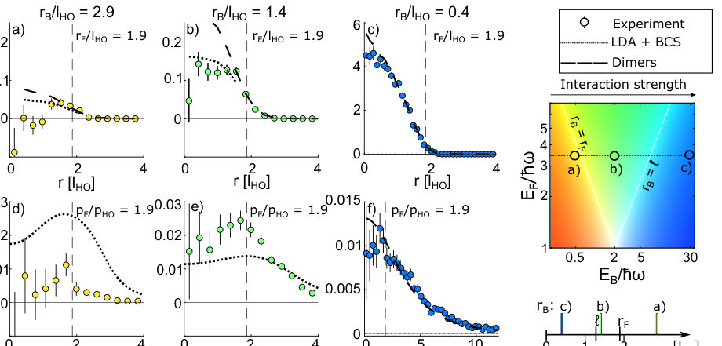
<figcaption class="paper-figure-caption"><b>Fig 2.</b> Figure 2. Crossing pairing regimes. Pair correlations in real (a-c) and momentum (d-f) space of 6 + 6 atoms prepared in the ground state of a 2D harmonic oscillator potential at different interaction strengths. (a-c), The real space function C2(r, r) giving the correlations between spin ↑and spin ↓atoms to be at the same position at radius r, within the experimental resolution. (d-f) The momentum space function C2(p, −p) giving the correlations between spin ↑and spin ↓atoms to have opposite momenta with magnitude p. The color of the data points reflects the pairing regime according to Fig 1. The measured data points are compared to the pair correlation function calculated within BCS theory...</figcaption>
</figure>
<figure class="paper-figure-card">
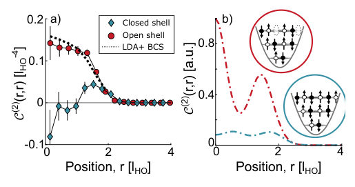
<figcaption class="paper-figure-caption"><b>Fig 3.</b> Figure 3. Open and closed shell pairing a) Measured real space pair correlations for a system with a partially filled (5+5 atoms, red circles) and completely filled (6+6 atoms, blue diamonds) highest harmonic oscillator shell at a con- stant interaction strength EB/ℏωr = 0.47. The dotted curve shows the pair correlation function calculated assuming bulk (p, ↑) ↔(−p, ↓) Cooper pairing. Figure b) shows the com- parison to the pair correlation function calculated assuming (n, m, ↑) ↔(n, −m, ↓) pairing in both regimes. All error bars represent the standard error of the mean.</figcaption>
</figure>
<figure class="paper-figure-card">
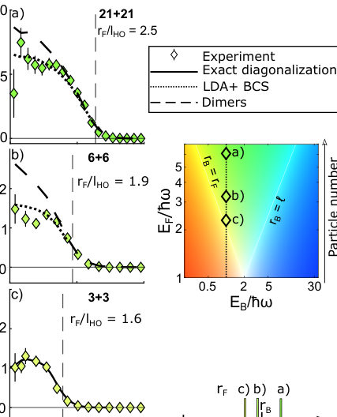
<figcaption class="paper-figure-caption"><b>Fig 4.</b> Figure 4. From few-body physics to bulk Cooper pair- ing Measured real space pair correlations for different atom numbers at a constant binding energy EB/ℏωr = 1. The color of the data points reflects the pairing regime according to Fig 1, as shown in the inset. The results for the smallest system (3+3 atoms) are compared to the pair correlations obtained from exact diagonalization of the many body Hamiltonian (solid curve). The dotted curve gives C (2)(r, r) calculated as- suming bulk (p, ↑) ↔(−p, ↓) Cooper pairing, and the dashed curve shows C (2)(r, r) assuming a gas of dimers. The dashed vertical line marks the Fermi radius obtained from the non- interacting ground state configuration....</figcaption>
</figure>

**Summary.** This work experimentally images fermionic pair correlations in few-atom trapped systems to understand pairing beyond the standard BCS-BEC crossover. By analyzing real-space correlations, the authors show that confinement and shell effects dictate where pairs form, revealing distinct surface versus bulk behaviors depending on whether the atomic shell is open or closed.

**Why it may be interesting.** It provides crucial microscopic insights into how boundary conditions and quantum shell structure modify fundamental many-body phenomena like superconductivity, bridging cold atom physics to nuclear structure models.

Detailed structure

**Main problem.** The study investigates fermionic pairing correlations in finite, trapped systems, contrasting with the well-understood BCS–BEC crossover seen in extended media.

**Main result.** Pairing structure is highly sensitive to confinement and shell filling; closed shells suppress central pairing, while open shells support stronger central pairing, showing a transition from dimer-like edge correlations to bulk Cooper pairs centrally.

**Method.** The work combines single-atom resolution imaging of pair correlation functions ($C^{(2)}$) with theoretical modeling using BCS mean-field theory and exact diagonalization for few-body limits.

**Model / system.** The system uses ultracold fermionic atoms (e.g., ${}^6	ext{Li}$) confined in a quasi-2D trap, allowing control over interaction strength ($E_B$) relative to confinement scales ($\ell, r_F$).

**Key observables.** Real and momentum space pair correlation functions ($C^{(2)}(\mathbf{r}, \mathbf{r})$ and $C^{(2)}(\mathbf{p}, -\mathbf{p})$), and the pairing gap $\Delta$.

**Important parameters / regimes.** The relative sizes of three length scales: mean interparticle spacing ($\ell$), pair size ($r_B$), and system size ($r_F$); open vs. closed shell configurations.

**Assumptions / limitations.** Theoretical analysis relies on BCS theory, Local Density Approximation (LDA), and the assumption that finite resolution effects regularize divergences in correlation functions.

**Figures summary.** Figures illustrate the three pairing regimes based on length scale ratios; measured pair correlations are shown for varying interactions, comparing open vs. closed shell behavior across different system sizes.

**Paper structure.** The paper progresses from defining the problem (finite vs. bulk pairing) to detailing measurements of correlation functions in various regimes (molecular, intermediate, confinement-dominated), culminating in a comparison between theoretical predictions and experimental observations for open/closed shells.

Abstract

Fermion pairing underlies collective quantum phenomena across widely different forms of matter. In extended systems such as ultracold Fermi gases, pairing is commonly understood through the BCS--BEC crossover, where the pair size evolves from large, overlapping Cooper pairs to tightly bound dimers. In finite systems such as atomic nuclei, superconducting grains and quantum dots, however, the same pairing tendency competes with confinement, shell filling and spatial inhomogeneity, making the microscopic structure of pairs much harder to access. Here, we image pair correlations in a finite, tunable system of few fermionic atoms with single-particle resolution and full counting statistics. We observe that confinement and shell structure re-organize pairing in real space: In the weakly interacting, confinement-dominated regime, closed-shell configurations suppress correlations in the high-density trap center. Pairing is mainly observed toward the low-density surface. Open-shell systems, however, support substantially stronger central pairing. Already for surprisingly small systems, increasing either interaction strength or particle number restores a locally bulk-like Cooper-pair profile in the trap center, whereas the edge retains dimer-like correlations. By resolving where pairs form and how their character changes from localized dimers to overlapping Cooper pairs, our measurements provide a microscopic view of pairing in finite fermionic matter and connect the physics of mesoscopic cold atoms to pairing phenomena in nuclei and superconducting nanostructures.

[↑ back to top](#top)

### [Machine-learned syndrome post-selection for reliable quantum error correction](http://arxiv.org/abs/2607.19563v1)

**Authors:** Tobias Haug, Askery Canabarro, Leandro Aolita  
**Type:** both · **Category:** quantum information and computing · **PDF:** <https://arxiv.org/pdf/2607.19563v1>  
**Analysis basis:** full PDF text, analyzed in chunks
**Topic relevance:** 🔥 `QC/QI experiment` **4/5** · `methods for driven-dissipative` **1/5** · `quantum measurements` **1/5**

↔ Scroll figures horizontally

<figure class="paper-figure-card">
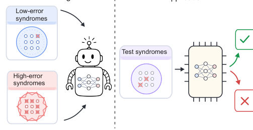
<figcaption class="paper-figure-caption"><b>Fig 1.</b> FIG. 1. Machine-learning post-selection via syndrome data. The supervised machine-learning model learns from an ensemble of syndromes with high- and low-error events. After training, the model is applied on new syndromes to decide which runs to actively correct errors on and which ones to discard.</figcaption>
</figure>
<figure class="paper-figure-card">
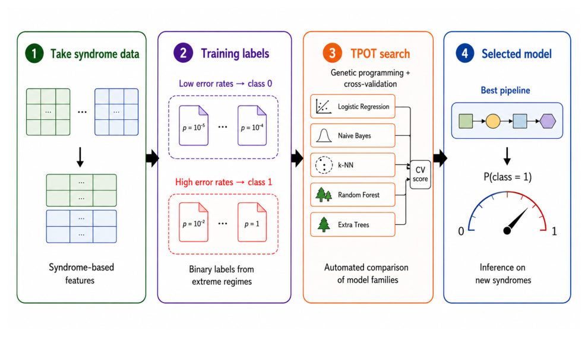
<figcaption class="paper-figure-caption"><b>Fig 2.</b> FIG. 2. Sketch of the automated machine-learning pipeline. Syndrome records sampled from low- and high-error-rate regimes are assigned class labels 0 and 1, respectively, and used to train a binary classifier through the TPOT automated model-selection procedure. Candidate pipelines are evaluated by cross-validation, and the best-performing pipeline is refitted on the training data. For each new syndrome s, the selected classifier returns the class-1 probability C(s) = Pr(y = 1 | s), which quantifies its similarity to the high-error-rate ensemble. This score is compared with a cutoff C0, where for C(s) &lt; C0 we accept the run, and else reject.</figcaption>
</figure>
<figure class="paper-figure-card">
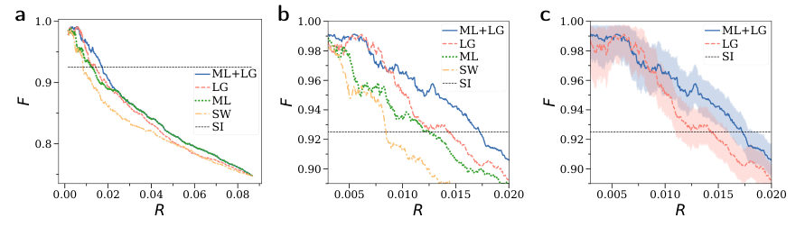
<figcaption class="paper-figure-caption"><b>Fig 3.</b> FIG. 3. Post-selection enhancement for QuEra’s magic-state distillation experiment. Experimental implementation of 5-1 magic state distillation protocol by Ref. [5] where 5 noisy single-qubit magic states are encoded into distance−5 color code blocks and then distilled into a less noisy magic state. The experimental protocol is described in Ref. [15] and the data from Ref. [40]. We show logical-error reduction by different post-selection strategies: based on the logical gap (LG), on machine-learning (ML), syndrome-weight (SW), and on machine-learning combined with logical gap (ML+LG). As a reference, the black dashed line is direct state-injection (SI) into the QEC code without distillation...</figcaption>
</figure>
<figure class="paper-figure-card">
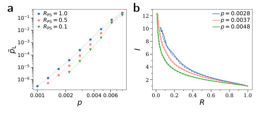
<figcaption class="paper-figure-caption"><b>Fig 4.</b> FIG. 4. Syndrome post-selection enhancement of the Gross-code. For the [[144, 12, 12]] bivariate-bicycle code, we train a classifier model on an efficiently generated dataset of syndromes drawn at physical error rates p = {0.001, 0.0013} (low-noise) or p = {0.0062, 0.008} (high-noise). We use the trained model to post-select syndromes at each p and then decode with BP-OSD. a) Logical error rate ˜pL after post- selection at post-selection rate R (defined in (2)) as a func- tion of p. As expected, the lower R is, the lower ˜pL is. b) Improvement factor I = pL/˜pL plotted against R for different p. Solid lines correspond to our post-selection via machine learning, while dashed lines to the...</figcaption>
</figure>
<figure class="paper-figure-card">
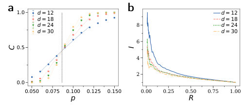
<figcaption class="paper-figure-caption"><b>Fig 5.</b> FIG. 5. Surface-code classifier threshold. a) The machine-learning predictor C against p, for different code dis- tances d. For all d, the curves cross at pML ≈0.0866(1) (ver- tical dashed line) and exhibit universal behavior (see SM A), reminiscent of a phase transition at a post-selection prob- ability threshold. Interestingly, pML differs from the usual physical-error threshold pth of the code (see main text). For the model’s training, we used syndrome data generated at physical error rates p = 0.05 and p = 0.06, for low noise, and p = 0.14 and p = 0.15, for high noise. Approximately 105</figcaption>
</figure>

**Summary.** This paper introduces a machine-learning technique to improve Quantum Error Correction by filtering out noisy runs based solely on syndrome measurements. By training a classifier to distinguish between low- and high-noise syndromes, the method provides a scalable, hardware-compatible post-selection score. This approach successfully enhances fidelity in both simulated codes and real neutral-atom quantum computing experiments.

**Why it may be interesting.** It provides a practical, data-driven tool for improving quantum hardware performance that bypasses complex theoretical assumptions about decoding thresholds, making it highly relevant to experimental quantum information scientists.

Detailed structure

**Main problem.** The goal is to enhance Quantum Error Correction (QEC) reliability by post-selecting runs likely to fail, circumventing the need for computationally expensive decoder-level information.

**Main result.** A machine-learning approach using syndrome data alone can significantly reduce conditional logical error rates and improve output fidelity in both simulated codes and real experimental platforms.

**Method.** The authors train a supervised binary classifier on syndrome measurements, distinguishing between syndromes generated under low-noise versus high-noise conditions. This classifier's output serves as a decoder-agnostic 'abort score' for run rejection.

**Model / system.** The work applies to general QEC codes (e.g., Surface Code, Gross bivariate-bicycle code) and is validated using experimental data from magic-state distillation on a neutral-atom processor.

**Key observables.** Conditional logical error rate ($	ilde{p}_L$), post-selection acceptance rate ($R$), and output fidelity ($F$).

**Important parameters / regimes.** Physical error rates ($p$), code distance ($d$), and the machine-learning cutoff threshold ($C_0$ or $p_{ML}$).

**Assumptions / limitations.** The method is explicitly designed to be decoder-agnostic, relying only on syndrome distributions rather than requiring knowledge of logical operators or specific decoding algorithms.

**Figures summary.** Figures illustrate the training process using low/high-noise ensembles and show performance comparisons (e.g., fidelity vs. acceptance rate) where ML+LG outperforms LG alone in experimental settings.

**Paper structure.** The paper introduces the problem, details the supervised classification methodology trained on synthetic noise ensembles, validates the approach across three distinct regimes (circuit simulation, code-capacity simulation, and real experiment), and concludes by demonstrating its scalability.

Abstract

Quantum error correction can be enhanced by post-selecting out runs that are likely to produce a logical failure, but the most accurate measures for that require costly decoder-level information. We introduce a practical, decoder-agnostic post-selection method that learns directly from syndrome data. The method trains a supervised classifier to distinguish between syndromes from low- and high-noise regimes, and then uses the classifier's output as an abort score for new runs, without requiring logical-error labels, correction operators, or code-specific likelihood calculations. We validate the approach in three complementary settings: circuit-level simulations of the Gross bivariate-bicycle code, code-capacity simulations of the surface code, and experimental logical magic-state distillation data from the QuEra neutral-atom processor. In the Gross and surface codes, learned syndrome post-selection reduces the conditional logical error rate at a fixed acceptance rate, with performance comparable to syndrome-weight filtering. For the surface code, the learned classifier reveals a post-selection transition distinct from the conventional decoding threshold. In the experimental data, the machine-learning score outperforms syndrome-weight post-selection and, when combined with logical-gap filtering, improves the output fidelity beyond using the logical gap alone. These results show that syndrome-only learning provides a scalable and hardware-compatible route to improving the reliability of quantum error correction.

[↑ back to top](#top)

### [Statevector-Referenced Geometry Survival of a Four-Qubit ZZ Quantum Kernel on IBM Quantum Hardware: A Fixed-Subset Diagnostic Across Three Execution Configurations](http://arxiv.org/abs/2607.20377v1)

**Authors:** Rostyslav Sipakov  
**Type:** experiment · **Category:** quantum information and computing · **PDF:** <https://arxiv.org/pdf/2607.20377v1>  
**Analysis basis:** full PDF text, analyzed in chunks
**Topic relevance:** 🔥 `QC/QI experiment` **4/5** · `entanglement & information structure` **1/5**

↔ Scroll figures horizontally

<figure class="paper-figure-card">
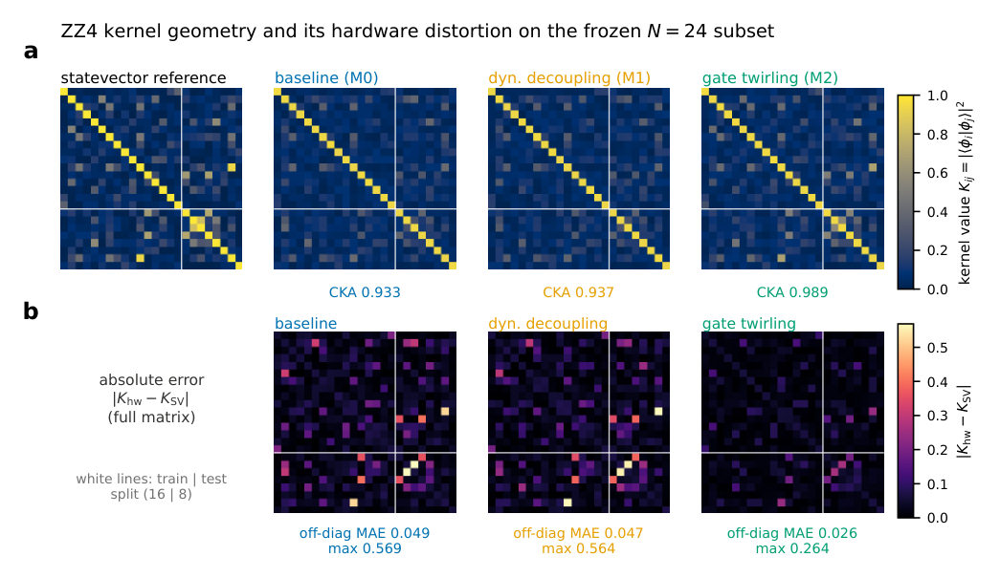
<figcaption class="paper-figure-caption"><b>Fig 1.</b> Figure 1. ZZ4 kernel geometry and its hardware distortion on the frozen 𝑁= 24 subset. (a) The intended statevector</figcaption>
</figure>
<figure class="paper-figure-card">
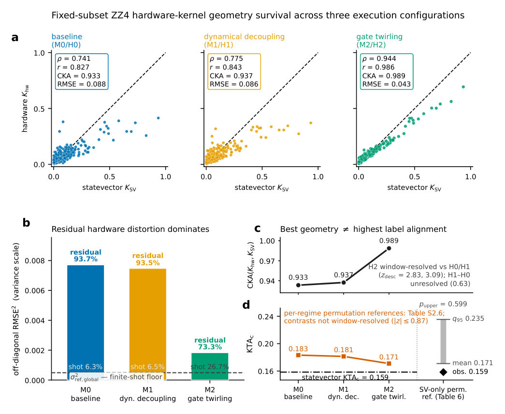
<figcaption class="paper-figure-caption"><b>Fig 2.</b> Figure 2. Fixed-subset ZZ4 hardware-kernel geometry survival across three execution configurations. (a) Off-diagonal kernel entries (276 unordered pairs) of each hardware reconstruction against the statevector reference; points below the identity line show overlaps compressed toward a common background; the compression is strongest for baseline (M0) and weakest for gate twirling (M2). (b) Off-diagonal mean-squared error relative to the configuration-independent global finite-shot reference 𝜎2 ref,global on the variance scale; the residual term dominates in every configuration (≥73%, conservative global reference). The split is a deterministic quadrature bookkeeping identity, not a physical...</figcaption>
</figure>
<figure class="paper-figure-card">
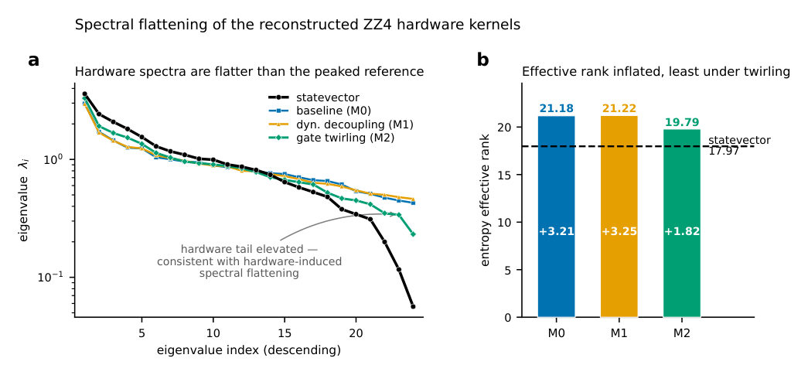
<figcaption class="paper-figure-caption"><b>Fig 3.</b> Figure 3. Spectral flattening of the reconstructed ZZ4 hardware kernels. (a) Sorted eigenvalue spectra; the noiseless reference spectrum is peaked with a rapidly decaying tail, whereas the hardware tails are elevated, consistent with hardware-induced spectral flattening (Section 3.7). (b) Entropy effective rank per configuration against the statevector reference (17.97); all hardware reconstructions are inflated, least under gate twirling (19.79 vs 21.18/21.22). Effective rank is computed from the uncentered spectrum. It is invariant to pure positive rescaling 𝐾↦𝑎𝐾but not, in general, to the additive 𝑏11⊤term, which the centered functionals (invariant under 𝐾↦𝑎𝐾+ 𝑏11⊤, 𝑎&gt; 0) annihilate, nor...</figcaption>
</figure>

**Summary.** This paper empirically tests how well the geometric structure encoded by a four-qubit ZZ quantum kernel survives execution on real quantum hardware using various error mitigation techniques. The authors find that while certain methods improve geometric preservation, this fidelity does not guarantee optimal performance relative to external task labels. Ultimately, it serves as a cautionary diagnostic study highlighting the distinct nature of implementation fidelity versus task relevance in near-term quantum computing.

**Why it may be interesting.** It provides a rigorous, empirical test case for quantum machine learning pipelines, demonstrating the critical need to decouple hardware implementation fidelity from potential downstream predictive utility in noisy intermediate-scale quantum (NISQ) devices.

Detailed structure

**Main problem.** The study aims to determine if the intended geometry of a quantum kernel survives execution when implemented on real, noisy quantum hardware.

**Main result.** While gate twirling provided the most faithful reconstruction of the designed geometry, this best-performing configuration did not yield the highest alignment with external task labels, suggesting fidelity and task relevance are distinct properties.

**Method.** The authors compared three error mitigation strategies (baseline, dynamical decoupling, gate twirling) by measuring kernel geometry preservation using multiple diagnostics on a fixed dataset.

**Model / system.** The experiment uses a fixed four-qubit ZZ feature map kernel applied to $N=24$ indoor air-quality data points, executed on IBM Quantum hardware (ibm_fez).

**Key observables.** Centered Kernel Alignment (CKA), centered kernel–target alignment (KTA), Spearman rank correlation, and effective rank.

**Important parameters / regimes.** The analysis is restricted to a fixed subset of $N=24$ data points using 1024 shots per circuit.

**Assumptions / limitations.** The results are purely descriptive diagnostics for single jobs on one backend; they do not constitute causal estimates of mitigation efficacy or quantum advantage.

**Figures summary.** Not specified (Notes refer to supplementary figures/tables detailing diagnostic metrics).

**Paper structure.** The paper diagnoses geometry survival by comparing the performance of three error mitigation techniques across various quantitative diagnostics, concluding that hardware distortion dominates and separating geometric fidelity from task-specific label alignment.

Abstract

Quantum-kernel methods encode a dataset's geometry in a Gram matrix, so learning claims on hardware kernels assume the intended geometry survives execution. We measure that survival for one frozen four-qubit ZZ feature-map kernel on $N=24$ real indoor air-quality windows, reconstructed on ibm_fez (1024 shots per circuit) under baseline, dynamical decoupling alone, and gate twirling alone, each a single non-interleaved job. Every configuration returned a complete, finite, positive-semidefinite Gram matrix and preserved the centered statevector geometry to a substantial but incomplete descriptive degree (full-matrix centered kernel alignment, CKA, 0.933-0.989). Gate twirling was most faithful on every reported geometry axis, with the only jackknife-resolved improvement over baseline (persisted Spearman, mean absolute error, and full-matrix CKA diagnostics); dynamical decoupling alone was not separated from baseline at the frozen-window scale. Residual hardware distortion, not finite sampling, dominates the discrepancy. Yet fidelity and label alignment were reversed: the most faithful configuration had the lowest centered kernel-target alignment, which sits at or below label-permutation references for statevector and hardware alike. We read the small hardware uplift as a normalization property of the non-affine distortion, not captured signal. These are descriptive results for single jobs on one backend, not causal mitigation-efficacy estimates; no quantum-advantage, hardware-classifier-superiority, or forecasting claim is made. Implementation fidelity and task relevance are distinct axes; hardware quantum machine-learning studies should report both.

[↑ back to top](#top)

### [Quantum-state block texture and its quantification](http://arxiv.org/abs/2607.20311v1)

**Authors:** Yanjun Chu, Yuhang Xie, Chenyang Cui, Shao-Ming Fei  
**Type:** theory · **Category:** quantum information and computing · **PDF:** <https://arxiv.org/pdf/2607.20311v1>  
**Analysis basis:** full PDF text, analyzed in chunks
**Topic relevance:** 🔥 `entanglement & information structure` **4/5**

↔ Scroll figures horizontally

<figure class="paper-figure-card">
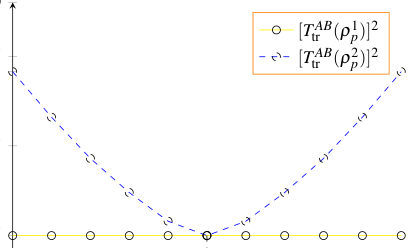
<figcaption class="paper-figure-caption"><b>Fig 1.</b> FIG. 1. [T AB tr (ρ2p)]2 and [T AB tr (ρ1p)]2 versus p.</figcaption>
</figure>
<figure class="paper-figure-card">
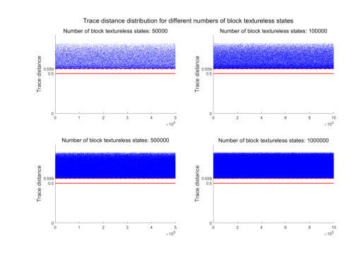
<figcaption class="paper-figure-caption"><b>Fig 2.</b> FIG. 2. The red solid line represents the trace-distance measure of QSBT T AB tr (ρAB) induced by the trace-distance measure of QST Ttr. The blue points in the four subplots represent the trace distance be- tween the state ρAB and the 5 × 104,105,5 × 105 and 106 randomly generated block textureless states, respectively.</figcaption>
</figure>

**Summary.** This paper introduces Quantum-State Block Texture (QSBT) as an advanced resource measure for bipartite quantum states. It pioneers several distinct mathematical frameworks—including geometric and trace distance approaches—to quantify this 'texture.' The results establish relationships between these measures, providing a deeper understanding of how different metrics characterize the non-local structure of quantum information.

**Why it may be interesting.** This work provides a rigorous mathematical framework to quantify subtle structural features ('texture') in quantum states beyond standard measures like entanglement or coherence, which is crucial for designing protocols that exploit specific state properties.

Detailed structure

**Main problem.** The paper generalizes Quantum-State Texture (QST) to Quantum-State Block Texture (QSBT) to provide operational measures for quantifying the quantum advantage embedded in bipartite quantum states.

**Main result.** Multiple proposed QSBT measures, including geometric ($M_g$), trace distance ($M_{tr}$), fidelity ($M_f$), and relative entropy ($M_r$), are shown to be distinct but related, with $M_g$ serving as an upper bound for $M_{tr}$.

**Method.** The authors develop structural frameworks by defining necessary conditions (T1-T4) for QSBT measures and deriving explicit formulas for various metrics based on minimizing distances/entropies relative to block textureless states.

**Model / system.** The study focuses on bipartite quantum states $
ho_{AB}$ in a Hilbert space $H_A \otimes H_B$, comparing them against the set of 'block textureless' states, $\mathcal{T}_B$.

**Key observables.** Quantum-State Block Texture (QSBT) measures: $M_g(
ho_{AB})$, $M_{tr}(
ho_{AB})$, $M_f(
ho_{AB})$, and $M_r(
ho_{AB})$.

**Important parameters / regimes.** The structure of the bipartite system ($A \otimes B$) and the specific family of states used for numerical sampling.

**Assumptions / limitations.** The theory builds upon existing resource theories (like coherence) and assumes the validity of structural conditions (T1-T4) for quantifying QSBT.

**Figures summary.** Figures compare different measures, showing that $M_{tr}$ distinguishes state families differently from block state rugosity, and verifying relationships like $M_g \ge [M_{tr}]^2$.

**Paper structure.** The paper progresses by generalizing QST to QSBT, proposing multiple quantitative measures ($M_g, M_{tr}, M_f, M_r$), establishing theoretical properties (e.g., Theorem III.1 for $Q_{AB}$), and finally comparing the distinct characteristics of these derived metrics.

Abstract

Quantum-state texture (QST) is an emerging quantum resource that has garnered increasing attention amid advances in quantum theory. In this work, we generalize the QST to quantum-state block texture (QSBT). This generalization provides profound operational interpretations for quantifying the advantages of quantum states in quantum information processing. We pioneer an alternative framework for characterizing and quantifying quantum-state block texture, and propose three types of block texture measures. By comparing these QSBT measures, we investigate their distinctions and interrelationships. We demonstrate that the geometric measure serves as an upper bound for the trace distance-based measure. For a specific family of quantum states, we evaluate the values of two trace distance-based measures. Then we sample four sets of data from this family of states, with each set comprising $5\times 10^4, 10^5, 5\times 10^5$ and $10^6 $ samples, respectively, and present the corresponding distributions. Our results reveal that the QSBT measures constructed via different approaches show distinct characteristics, indicating their potential roles in quantifying the block texture of quantum states.

[↑ back to top](#top)

### [Nonreciprocal phonon blockade in spin quadratic optomechanical systems](http://arxiv.org/abs/2607.19872v1)

**Authors:** Yao Dong, Guo-Feng Zhang  
**Type:** theory · **Category:** other · **PDF:** <https://arxiv.org/pdf/2607.19872v1>  
**Analysis basis:** full PDF text, analyzed in chunks
**Topic relevance:** `Keldysh / 2PI / non-Gaussian methods` **3/5** · `analog quantum simulation` **3/5** · `driven-dissipative phase transition` **3/5** · `methods for driven-dissipative` **3/5** · `Tavis-Cummings & cavity-many-emitter` **2/5** · `correlated cavity matter` **2/5** · `non-equilibrium dynamics` **2/5** · `spintronics-quantum-optics interface` **2/5** · `correlated / nonlocal dissipation` **1/5** · `entanglement & information structure` **1/5** · `exotic spin models in light-matter` **1/5** · `interference shaping light` **1/5** · `non-equilibrium universality` **1/5**

↔ Scroll figures horizontally

<figure class="paper-figure-card">
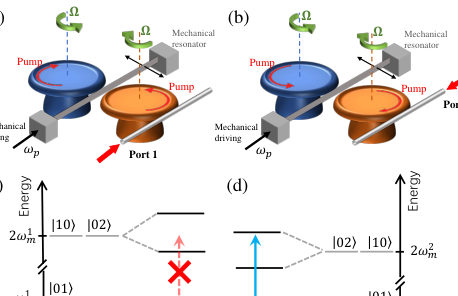
<figcaption class="paper-figure-caption"><b>Fig 1.</b> FIG. 1: (a), (b) Schematic of a spinning-resonator system for generating QOM coupling and nonreciprocal PB. Two WGM resonators rotate with the same angular velocity in opposite directions, coupled to a central mechanical oscillator. A co- herent pump field is input from port 1 [in (a)] or port 2 [in (b)], propagating against or along the rotation direction of the cav- ities. To excite phonons in this nonreciprocal phonon source, a weak driving field is applied to the mechanical mode. (c), (d) Eigenenergy-level diagrams for the configurations in (a) and (b). |n, m⟩represents a state with n photons and m phonons. The effective optomechanical interaction lifts the degeneracy of the eigenstates...</figcaption>
</figure>
<figure class="paper-figure-card">
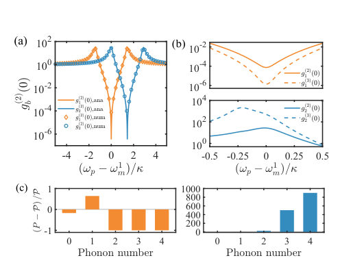
<figcaption class="paper-figure-caption"><b>Fig 2.</b> FIG. 2: (a) Phonon second-order correlation function versus mechanical driving ωp for inputs from port 1 [g(2) 1 (0)] and port 2 [g(2) 2 (0)]. Solid curves (symbols) correspond to analyt- ical (numerical) results. Parameters are set to the derived op- timal values, with nth = 0, γ = κ/100 and ε = κ/20. Here, ω1 m represents the effective mechanical frequency under the optimal parameters. (b) Second- and third-order correlation functions around the frequency ωp = ω1 m. (c) Deviation of the phonon distribution from a standard Poisson distribution with the same mean phonon number.</figcaption>
</figure>
<figure class="paper-figure-card">
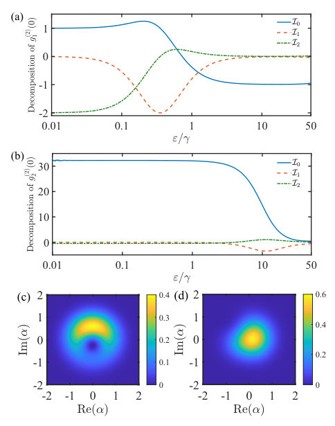
<figcaption class="paper-figure-caption"><b>Fig 3.</b> FIG. 3: (a), (b) Decomposition of the second-order correla- tion functions g(2) 1 (0) [in (a)] and g(2) 2 (0) [in (b)] as a func- tion of mechanical driving strength ε for ωp = ω1 m. (c), (d) Wigner representations Wb(Re(α), Im(α)) corresponding to input from port 1 with ε/γ = 1 [(c)] and input from port 2 with ε/γ = 20 [(d)].</figcaption>
</figure>
<figure class="paper-figure-card">
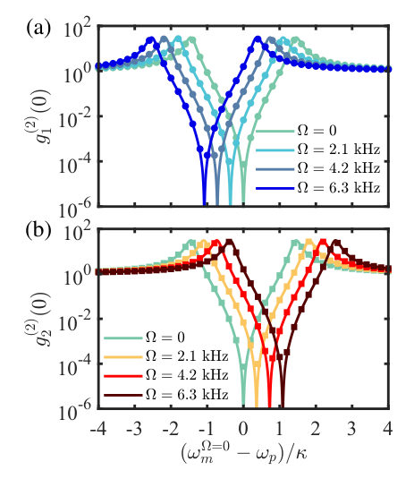
<figcaption class="paper-figure-caption"><b>Fig 4.</b> FIG. 4: Phonon second-order correlation functions g(2) 1 (0) (port 1 input) and g(2) 2 (0) (port 2 input) for different spin- ning angular velocities Ω. Other parameters are the same as in Fig. 2. ωΩ=0 m denotes the effective mechanical frequency when the resonator is static.</figcaption>
</figure>
<figure class="paper-figure-card">
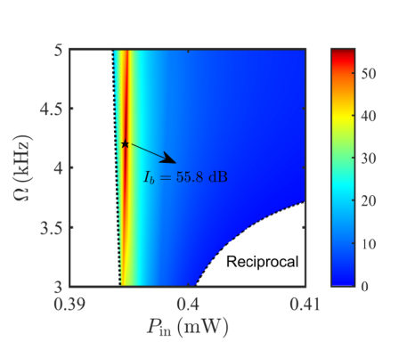
<figcaption class="paper-figure-caption"><b>Fig 5.</b> FIG. 5: Nonreciprocal isolation Ib as a function of pump power Pin and resonator angular velocity Ω. The remaining parameters are consistent with Fig. 2. The blank area indi- cates the reciprocal parameter region.</figcaption>
</figure>

**Summary.** The paper details a method to create nonreciprocal phonon blockade in an optomechanical system by exploiting the Sagnac-Fizeau effect in two coupled spinning resonators. This asymmetry causes one direction of light pumping to exhibit conventional phonon blockade, while the opposite direction facilitates phonon-induced tunneling. The work provides a pathway for directional quantum control devices.

**Why it may be interesting.** This work is highly relevant as it combines several advanced topics: cavity QED (optomechanics), nonlinear quantum optics (blockade), and directional control (nonreciprocity) using a specific physical effect (Sagnac-Fizeau).

Detailed structure

**Main problem.** The paper proposes a scheme to achieve nonreciprocal phonon blockade (PB) using a quadratic optomechanical (QOM) system.

**Main result.** They demonstrate that the Sagnac-Fizeau effect creates direction-dependent mechanical frequency shifts, leading to conventional PB in one pump direction and facilitating two-phonon resonance/tunneling (PIT) in the opposite direction.

**Method.** The analysis involves deriving an effective Hamiltonian for quantum fluctuations and analyzing the system's dynamics using the Lindblad master equation framework.

**Model / system.** The physical platform is a QOM system comprising two spinning Whispering Gallery Mode (WGM) resonators coupled to a nanomechanical oscillator. The nonreciprocity stems from the Sagnac-Fizeau effect causing asymmetric detunings for counter-propagating pump fields.

**Key observables.** Phonon second-order correlation function ($g^{(2)}_b(0)$), which quantifies blockade (antibunching) or bunching, and direction-dependent effective mechanical frequencies.

**Important parameters / regimes.** The analysis relies on the resolved supermode regime ($J \gg \omega_m, \kappa$) and is sensitive to parameters governing the Sagnac-Fizeau shift ($\Delta F$).

**Assumptions / limitations.** The primary assumptions include operating in the weak optomechanical coupling limit and using an analytical wave-function approximation consistent with master equation simulations.

**Figures summary.** Figure 1 schematically illustrates the setup (two spinning WGM resonators coupled to a mechanical oscillator) and shows energy level diagrams detailing PB under single-phonon resonance and PIT under two-phonon resonance.

**Paper structure.** The paper first introduces the physical system and the mechanism of nonreciprocity via the Sagnac-Fizeau effect. It then analyzes the resulting quantum statistics, quantifying the blockade contrast ratio, and finally extends the analysis to include thermal phonons to study extended nonreciprocal effects.

Abstract

We propose a scheme for achieving nonreciprocal phonon blockade in a quadratic optomechanical (QOM) system consisting of two spinning resonators near-field coupled to a nanomechanical oscillator. Due to the Sagnac-Fizeau effect, pump fields propagating in opposite directions experience distinct effective detunings,thereby leading to asymmetric intracavity intensities. Through the optical spring effect, this intensity imbalance gives rise to direction-dependent shifts in the effective mechanical frequency, providing the core mechanism for nonreciprocal phonon blockade. By judiciously setting parameters, single-phonon resonant excitation leads to conventional phonon blockade for one pump direction, whereas two-phonon resonance facilitates phononinduced tunneling (PIT) for the other. The pronounced nonreciprocity is quantified by a contrast ratio in the phonon second-order correlation function exceeding 55 dB. To elucidate the nonreciprocal statistics, the phonon blockade is further analyzed in terms of interference between the coherent component and squeezed fluctuations. Incorporating thermal phonons, we reveal an extended nonreciprocal thermal effect, where increasing thermal noise degrades antibunching toward Poissonian statistics in one direction, yet reverses the statistics from bunching to antibunching in the opposite direction. Our work provides a pathway toward nonreciprocal phonon devices and directional phonon switches, with potential applications in chiral networks and phononic information processing.

[↑ back to top](#top)

### [A framework for separating dephasing from decoherence in matter-wave Bell interferometers](http://arxiv.org/abs/2607.19984v1)

**Authors:** S. Kannan, Y. S. Athreya, X. T. Yan, S. S. Hodgman, A. G. Truscott  
**Type:** theory · **Category:** other · **PDF:** <https://arxiv.org/pdf/2607.19984v1>  
**Analysis basis:** full PDF text, analyzed in chunks
**Topic relevance:** `correlated / nonlocal dissipation` **3/5** · `methods for driven-dissipative` **3/5** · `quantum measurements` **3/5** · `Keldysh / 2PI / non-Gaussian methods` **2/5** · `driven-dissipative phase transition` **2/5** · `entanglement & information structure` **2/5** · `analog quantum simulation` **1/5** · `exotic spin models in light-matter` **1/5** · `interference shaping light` **1/5** · `measurement-induced transitions` **1/5** · `non-equilibrium dynamics` **1/5** · `non-equilibrium universality` **1/5** · `spintronics-quantum-optics interface` **1/5**

↔ Scroll figures horizontally

<figure class="paper-figure-card">
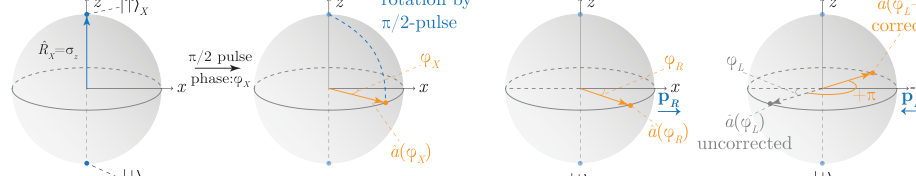
<figcaption class="paper-figure-caption"><b>Fig 1.</b> FIG. 1. (a) Schematic of the matter-wave Rarity-Tapster interferometer in the free-falling frame. Momentum-entangled pairs from the source, described by the Bell state |Ψ⟩≈ 1 √</figcaption>
</figure>
<figure class="paper-figure-card">
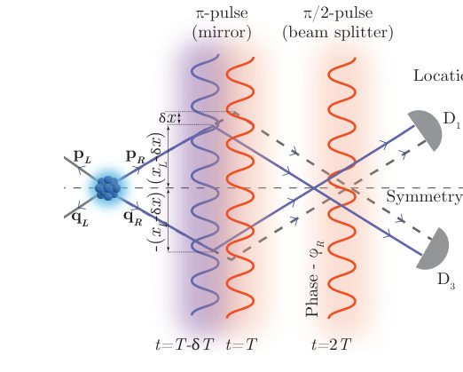
<figcaption class="paper-figure-caption"><b>Fig 2.</b> FIG. 2. Right arm of the matter-wave Rarity-Tapster interfer- ometer with a geometric path asymmetry δx. A timing shift −δT of the mirror pulse (blue wavy line) displaces the reflec- tion point by δx along ˆkeff relative to the symmetric position at t = T (red wavy line). The asymmetric path trajecto- ries (solid blue line) traverse a displacement of ±(xL −δx) from the symmetry axis, deviating from the ideal symmetric paths (dashed blue lines). The asymmetry introduces an ad- ditional momentum-dependent geometric phase 2pAδx/ℏon these atoms, which varies across the source momentum distri- bution f(pA) and produces geometric dephasing of the Bell- correlation amplitude. At δx = 0 this phase...</figcaption>
</figure>
<figure class="paper-figure-card">
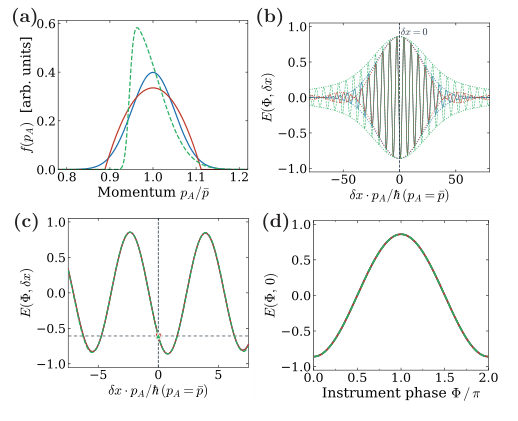
<figcaption class="paper-figure-caption"><b>Fig 3.</b> FIG. 3. Separation of geometric dephasing and Bell- amplitude reduction in a δx scan. (a) Representative source momentum distributions f(pA): Gaussian (blue), Thomas- Fermi (red), and asymmetric (green dashed). (b) Correspond- ing Bell-correlation interferograms E(Φ, δx) bounded by the geometric envelopes ⟨A⟩| eF(δx/ℏ)|, while (c) shows the region near δx = 0. Despite different fringe phases and envelope shapes away from zero, all three distributions yield the same Bell-correlation value at the ZPD point (Eq. (12)), confirm- ing the exact, source-distribution-independent extraction of ⟨A⟩. (d) Φ scan at fixed δx = 0: all three cases collapse onto the same sinusoid −⟨A⟩cos Φ, from which the...</figcaption>
</figure>
<figure class="paper-figure-card">
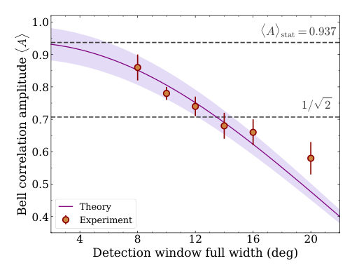
<figcaption class="paper-figure-caption"><b>Fig 4.</b> FIG. 4. Bell correlation amplitude ⟨A⟩as a function of the full width of the angular detection window (W). Filled circles are extracted from a sinusoidal fit to the experimental data in [25]. The solid curve shows the theoretical prediction from Eq. (24), with ∆ϕwindow = 1.5 × W/8, calibrated from the ±4◦window. The purple shaded region indicates the uncer- tainty arising from mode-occupancy. The theory reproduces the data well for windows up to 14◦, beyond which the linear approximation breaks down.</figcaption>
</figure>
<figure class="paper-figure-card">
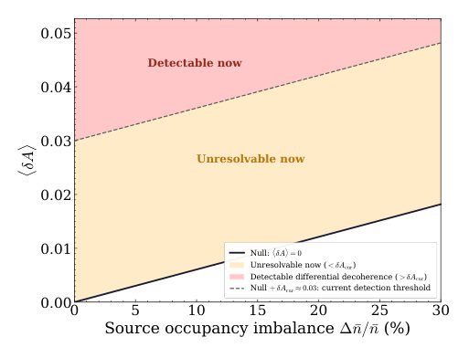
<figcaption class="paper-figure-caption"><b>Fig 5.</b> FIG. 5. Null-hypothesis benchmark for the dual-species Bell- amplitude comparison. The y-axis is the measured quantity ⟨δA⟩(Eq. (20)). The solid black curve gives the null predic- tion at which ⟨δA⟩= 0, accounting for finite source occu- pancy. A measured point cannot lie below the null curve; any vertical excess above it is the genuine differential deco- herence signal ⟨δA⟩. The orange band marks the region where ⟨δA⟩is present but below the current statistical uncertainty δAcur ≈0.03 (grey dashed line) and therefore unresolvable now; the red band marks the region where ⟨δA⟩is detectable with the current experiment.</figcaption>
</figure>

**Summary.** The paper develops a rigorous framework using SU(2) mapping to analyze matter-wave Bell interferometers, enabling the separation of geometric dephasing from true environmental decoherence. By analyzing measurements at zero path difference, the authors extract a source-independent measure of entanglement loss. This provides a concrete diagnostic tool for testing fundamental physics, such as mass-dependent decoherence mechanisms in quantum gases.

**Why it may be interesting.** This work provides a powerful, generalizable theoretical tool for interpreting high-precision quantum measurements in cold atom systems. By rigorously separating noise sources, it elevates the field's ability to distinguish fundamental physics signals from technical artifacts, which is crucial for next-generation quantum sensors.

Detailed structure

**Main problem.** The primary challenge is developing a robust theoretical framework to disentangle geometric dephasing, environmental decoherence, and technical measurement limitations when interpreting Bell correlations in matter-wave interferometers.

**Main result.** The authors present a method using the zero path difference (ZPD) condition that yields a source-distribution-independent extraction of the true Bell correlation amplitude reduction. They show this framework can set concrete null benchmarks for detecting mass-dependent decoherence in dual-species systems.

**Method.** The analysis employs the Schwinger SU(2) mapping to model momentum-mode occupation states as pseudospin operators, allowing systematic separation of unitary (geometric) and dissipative (decoherence) noise channels.

**Model / system.** The physical system is a matter-wave Bell interferometer, specifically utilizing Rarity-Tapster geometries with momentum-entangled atom pairs. The theory models the measurement process using spin-$rac{1}{2}$ operators on a Bloch sphere.

**Key observables.** Bell correlation amplitude ($\langle A 
angle$), which quantifies entanglement; the coincidence fringe measured at zero path difference (ZPD).

**Important parameters / regimes.** Zero interferometer path difference ($\delta x = 0$); low-mode-occupancy limit ($ar{n} \ll 1$); mass difference between species in dual-species tests.

**Assumptions / limitations.** The analysis assumes a low-mode-occupancy regime and relies on the symmetry properties of the interferometer geometry (e.g., RT symmetry) to cancel certain systematic errors like linear magnetic gradients.

**Figures summary.** Figures illustrate the schematic setup of the Rarity-Tapster interferometer, the mapping from momentum modes to pseudospin states on a Bloch sphere, and how path asymmetry ($\delta x$) introduces measurable geometric phase shifts.

**Paper structure.** The paper builds by first establishing the measurement formalism using SU(2) mapping, then deriving the dependence of the correlation function on path differences ($\delta x$), identifying ZPD as the key diagnostic point to eliminate geometric dephasing, and finally extending this framework to test for differential decoherence between atomic species.

Abstract

Matter-wave Bell interferometers provide a sensitive probe of mass-dependent decoherence in entangled quantum systems. The degree of entanglement is obtained from the Bell-correlation amplitude of this interferometer. For observing potential mass-dependent decoherence, a reliable interpretation of any observed reduction in the Bell correlation amplitude is required, which depends on three factors: geometric dephasing, environmental decoherence, and technical dilution from source and detection statistics. In this work, we present a framework based on the Schwinger SU(2) mapping to separate these contributions into local unitaries or dissipative channels. We show that by evaluating the Bell correlation at zero interferometer path difference, it is possible to extract a source-distribution-independent Bell correlation amplitude reduction. When this framework is extended to involve atoms of different mass, we show that the known differential decoherence channels are negligible at current sensitivity. This yields a concrete bound at which a dual-species Bell interferometer would begin to signal differential decoherence beyond the known systematics, opening the way for such systems to probe new physics, such as mass-dependent decoherence mechanisms.

[↑ back to top](#top)

### [Structured-light-mediated hybrid entanglement between photon polarization and electronic orbital angular momentum](http://arxiv.org/abs/2607.19715v1)

**Authors:** Hiroaki Saito, Nobuhiko Yokoshi  
**Type:** theory · **Category:** quantum information and computing · **PDF:** <https://arxiv.org/pdf/2607.19715v1>  
**Analysis basis:** full PDF text, analyzed in chunks
**Topic relevance:** `interference shaping light` **3/5** · `methods for driven-dissipative` **3/5** · `spintronics-quantum-optics interface` **3/5** · `entanglement & information structure` **2/5** · `measurement-induced transitions` **2/5** · `quantum measurements` **2/5** · `Keldysh / 2PI / non-Gaussian methods` **1/5** · `analog quantum simulation` **1/5** · `correlated / nonlocal dissipation` **1/5** · `correlated cavity matter` **1/5** · `driven-dissipative phase transition` **1/5** · `exotic spin models in light-matter` **1/5** · `non-equilibrium dynamics` **1/5**

↔ Scroll figures horizontally

<figure class="paper-figure-card">
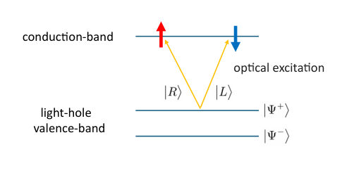
<figcaption class="paper-figure-caption"><b>Fig 1.</b> FIG. 1. Spin-excitation selection rules in a GaAs-based V- type three-level semiconductor structure. Left- and right- circularly polarized photons selectively excite different elec- tron spin states from one of the Zeeman-separated light-hole states, Ψ− or Ψ+ .</figcaption>
</figure>
<figure class="paper-figure-card">
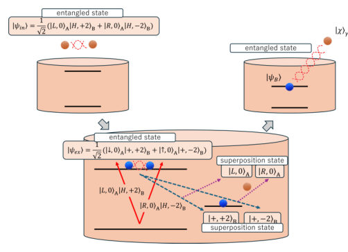
<figcaption class="paper-figure-caption"><b>Fig 2.</b> FIG. 2. Conceptual illustration of photon–electron hybrid- entanglement generation within a single semiconductor quan- tum disk. The labels A and B denote two optically addressed excitation channels in the same disk: a zero-OAM channel that recombines radiatively and a finite-OAM channel that stores the residual electronic OAM qubit. A spin–orbit struc- tured two-photon state is mapped to a two-excitation state through optical spin and OAM selection rules. Subsequent radiative recombination of the zero-OAM excitation emits a photon whose polarization is entangled with the residual elec- tronic OAM state.</figcaption>
</figure>
<figure class="paper-figure-card">
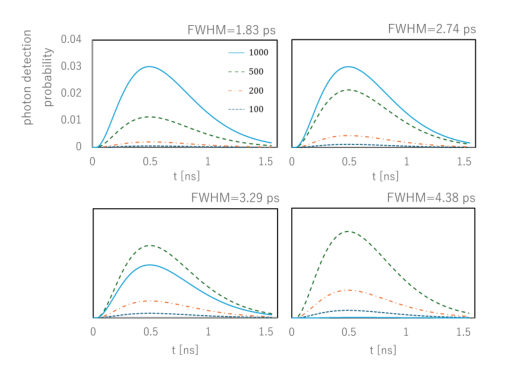
<figcaption class="paper-figure-caption"><b>Fig 3.</b> FIG. 3. Time evolution of the single-photon probability in the selected output filter mode for incident pulses with different full widths at half maximum (FWHM). Results are shown for g/Γrad =100 (blue dash-dot-dot), 200 (orange dash-dotted), 500 (green dash), and 1000 (light-blue solid). The plotted quantity is the single-photon occupation probability within the filter-mode description and should be interpreted together with the conditional fidelity. External collection losses, prop- agation losses, mode-matching losses, and detector inefficien- cies are not included.</figcaption>
</figure>
<figure class="paper-figure-card">

<figcaption class="paper-figure-caption"><b>Fig 4.</b> FIG. 4. Time evolution of the occupation probability of the selected two-excitation state |ψex⟩for different incident pulse widths at g/Γrad = 1000. The purple solid, green dashed, orange dash-dotted, and blue dotted lines correspond to FWHM=4.38 ps, 3.29 ps, 2.74 ps, and 1.83 ps, respectively. Inset: Enlarged view of the region where the dynamics change rapidly (t = 0.025–0.040 ns).</figcaption>
</figure>
<figure class="paper-figure-card">
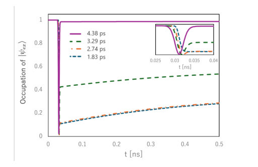
<figcaption class="paper-figure-caption"><b>Fig 5.</b> Figure 5 shows the heralded entanglement fidelity for different orbital relaxation rates. In the ideal case with- out orbital relaxation, Γorb = 0, the conditional state reaches nearly unit fidelity with the target entangled state in Eq. (33) once a photon is present in the se- lected output mode. As Γorb increases, relaxation from |+, +2⟩B or |+, −2⟩B to |+, 0⟩B before the heralding event removes the stored orbital information and de- grades the photon–electron OAM correlation. High- fidelity heralded hybrid entanglement requires the orbital relaxation time to be longer than the characteristic emis- sion and detection timescale. Once the photon has been detected, subsequent relaxation of the...</figcaption>
</figure>

**Summary.** The paper proposes an effective model demonstrating how structured light can mediate the creation of hybrid entanglement between emitted photon polarization and the orbital angular momentum stored in an electron within a semiconductor quantum disk. By analyzing the system dynamics via master equations, it shows that high fidelity is achievable provided electronic orbital relaxation is slow compared to the emission timescale.

**Why it may be interesting.** This work directly addresses quantum information processing by proposing a solid-state platform for generating photonic qubits entangled with internal electronic degrees of freedom (OAM), which is highly relevant to quantum networking and memory interfaces.

Detailed structure

**Main problem.** The primary goal is generating hybrid entanglement between photon polarization and electronic orbital angular momentum (OAM) using structured light in a semiconductor quantum disk.

**Main result.** The proposed effective model demonstrates that high-fidelity entanglement can be achieved when the orbital relaxation time significantly exceeds the characteristic emission and detection timescales.

**Method.** The analysis employs an open-system master equation approach to track the system's evolution, calculating heralded entanglement fidelity conditioned on single-photon detection.

**Model / system.** The physical platform is a semiconductor quantum disk utilizing two excitation channels: one for radiative recombination (zero OAM) and another storing the electronic orbital qubit (finite OAM). The dynamics are modeled using an effective Hamiltonian and Lindblad dissipators.

**Key observables.** Heralded entanglement fidelity ($F(t)$), single-photon probability ($P_{1ph}(t)$), and the conditional electronic state $	ilde{
ho}_{B\gamma}(t)$.

**Important parameters / regimes.** Orbital relaxation rate ($\Gamma_{orb}$), radiative decay rate ($\Gamma_{rad}$), and the effective two-photon Rabi coupling ($g$).

**Assumptions / limitations.** The model is a proof-of-principle effective description, neglecting microscopic details like biexciton binding or external losses. High fidelity requires $	au_{orb} > 	au_{	ext{emission/detection}}$.

**Figures summary.** Figures illustrate the time evolution of single-photon probability and the heralded entanglement fidelity as a function of pulse width and orbital relaxation rate, respectively.

**Paper structure.** The paper first establishes the physical mapping using structured light to create two excitation channels. It then models the subsequent radiative recombination dynamics using an open-system master equation approach to calculate the conditional state and entanglement fidelity.

Abstract

We propose a minimal quantum-optical scheme for generating hybrid entanglement between photon polarization and electronic orbital angular momentum in a semiconductor quantum disk. A spin--orbit structured two-photon state excites two channels in the same disk: a radiatively recombining zero-orbital-angular-momentum channel and a finite-orbital-angular-momentum channel that stores the electronic orbital qubit. An effective coherent mapping prepares a selected two-excitation state, followed by emission of a photon whose polarization is entangled with the residual electronic orbital state. A master-equation analysis shows that the heralded state conditioned on single-photon occupation of the selected output mode approaches the target entangled state in the ideal coherent limit. We also discuss orbital relaxation and perturbative validity conditions for branch-dependent Coulomb shifts, orbital-angular-momentum mixing, and finite-orbital-angular-momentum radiative leakage. This proof-of-principle effective model suggests a route toward structured-light-mediated photon--electron hybrid entanglement in semiconductor nanostructures.

[↑ back to top](#top)

### [How to measure loop currents in scanning tunneling microscopy](http://arxiv.org/abs/2607.20030v1)

**Authors:** Victoire Morisseau, Luke C. Rhodes, Peter Wahl, Carolina A. Marques  
**Type:** theory · **Category:** strongly correlated electrons · **PDF:** <https://arxiv.org/pdf/2607.20030v1>  
**Analysis basis:** full PDF text, analyzed in chunks
**Topic relevance:** `Keldysh / 2PI / non-Gaussian methods` **3/5** · `analog quantum simulation` **3/5** · `spintronics-quantum-optics interface` **3/5** · `Kondo & dissipative impurity` **2/5** · `exotic spin models in light-matter` **2/5** · `methods for driven-dissipative` **2/5** · `correlated / nonlocal dissipation` **1/5** · `correlated cavity matter` **1/5** · `driven-dissipative phase transition` **1/5** · `entanglement & information structure` **1/5** · `non-equilibrium dynamics` **1/5**

↔ Scroll figures horizontally

<figure class="paper-figure-card">
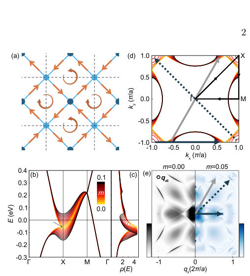
<figcaption class="paper-figure-caption"><b>Fig 1.</b> FIG. 1. Loop currents in a cuprate model. (a) Sketch of a tight-binding model on a square lattice with a two-atom unit cell and loop currents, representative of the cuprate model.[18] The loop currents enclose the one-atom unit cell and form a staggered order (orange arrows). The dark and light blue circles indicate the position of the two distinct Cu atoms in the unit cell. (b) Electronic band structure along the path Γ-X-M-Γ and (c) total density of states ρ(E) obtained for the model in (a) for loop currents corresponding to increasing magnetic moment, from m = 0.0 (yellow) to 0.1 (black). The black arrow in (b) points to the VHs that splits at the X-point with increasing loop current...</figcaption>
</figure>
<figure class="paper-figure-card">
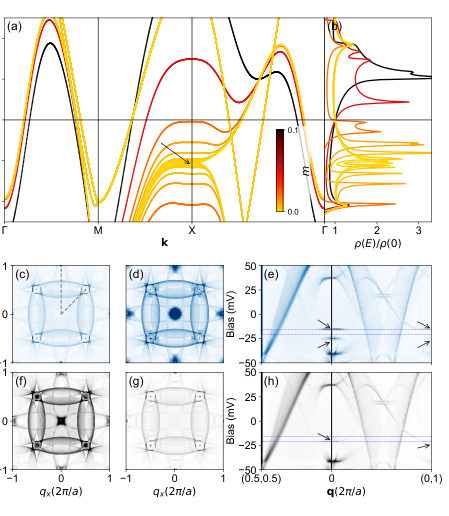
<figcaption class="paper-figure-caption"><b>Fig 2.</b> FIG. 2. Loop currents in Sr2RuO4 and their signa- tures in QPI. (a) Electronic band structure of Sr2RuO4 in a 2-atom unit cell including loop current order. We show the band structure for loop currents with a strength of m = 0, 0.001, 0.002, 0.005, 0.01, 0.02, 0.05, and 0.1, respectively. The loop current order has been added only on the dxy band. A clear splitting of the dxy VHs can be seen which increases with increasing strength of the loop currents. (b) Normalized density of states ρ(E)/ρ(0) corresponding to the same mod- els, also showing the opening of a partial gap, with a width which increases similar to the splitting of the dxy VHs. (c, d) Constant energy maps ˜g(q, V ) of the QPI...</figcaption>
</figure>
<figure class="paper-figure-card">
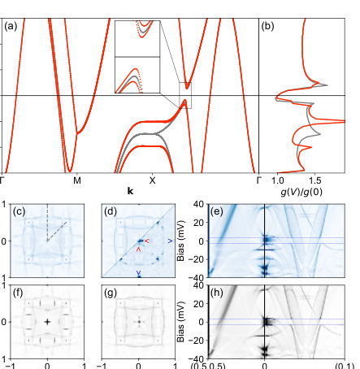
<figcaption class="paper-figure-caption"><b>Fig 3.</b> FIG. 3. Signatures of loop currents in QPI including SOC. (a, b) Band structure and cLDOS for a model of the surface of Sr2RuO4 including spin-orbit coupling and loop currents with m = 0.005. The SOC-induced hybridization gap close to the Fermi energy can be clearly seen. The loop currents result in a small splitting of about 2meV at the gap edges of the hybridization gap. (c, d) Constant energy map ˜g(q, V ) of the QPI for V1 = −2.8mV and V2 = 3.36mV for a QPI map with loop currents corresponding to an ordered moment of m = 0.005. In (d), the lower right half shows an experimental QPI image at the same voltage from ref. [20] for comparison. Blue and red arrowheads indicate symmetry-...</figcaption>
</figure>
<figure class="paper-figure-card">
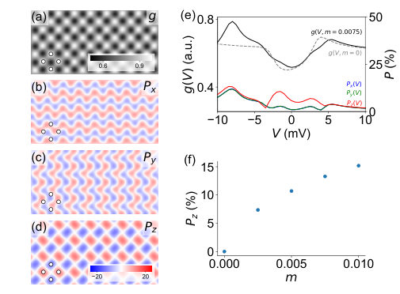
<figcaption class="paper-figure-caption"><b>Fig 4.</b> FIG. 4. Detection of loop currents using spin-polarized STM. (a-d) Map of the continuum DOS g(r, V ) for 8 mV (a) and the spin polarization along the x (b), y (c) and z (d) axes at the same energy. Clear spin polarization can be observed. Green circles indicate positions of Sr atoms, which are the atoms seen in atomically resolved topographic images. (e) Continuum density of states g(V ) and spin polarization P(V ) as a function of bias voltage V , showing strongest spin polar- ization at the position of the dxy Van Hove singularity and at the edges of the hybridization gap. (f) Maximal spin po- larization Pz as a function of strength of the ordered moment in the loop current phase. The...</figcaption>
</figure>

**Summary.** This work provides theoretical predictions for detecting loop current orders—spontaneous orbital currents—in quantum materials like cuprates and $	ext{Sr}_2	ext{RuO}_4$. By simulating STM/STS measurements on tight-binding models, the authors show that such order manifests as measurable spectral gaps in the DOS and characteristic patterns in QPI maps. These predictions guide future experimental efforts to confirm this exotic form of electronic ordering.

**Why it may be interesting.** While focused on condensed matter physics, the detailed mapping of symmetry breaking (time-reversal symmetry) to measurable spectroscopic fingerprints is highly relevant to understanding emergent order parameters in strongly correlated systems, which shares conceptual links with many-body dynamics studied in AMO contexts.

Detailed structure

**Main problem.** The primary goal is to develop specific theoretical predictions for how loop current orders, which break time-reversal symmetry, can be detected using low temperature Scanning Tunneling Microscopy and Spectroscopy (STM/STS) in quantum materials.

**Main result.** Loop currents are predicted to cause a splitting of Van Hove singularities (VHS) in the local density of states (DOS), leading to partial energy gaps ($\sim 10-20 	ext{ meV}$), and they predict the emergence of measurable spin polarization detectable by spin-polarized STM.

**Method.** The authors use continuum Green's function methods applied to tight-binding models, simulating spectroscopic maps (LDOS) and Quasi-Particle Interference (QPI) patterns for both cuprates and $	ext{Sr}_2	ext{RuO}_4$.

**Model / system.** The study applies theoretical modeling to high-temperature cuprate superconductors and the surface layer of $	ext{Sr}_2	ext{RuO}_4$, incorporating loop current terms ($\hat{H}_{	ext{LC}}$) into tight-binding Hamiltonians.

**Key observables.** Spectroscopic maps (DOS), QPI patterns with characteristic scattering vectors, and finite spin polarization detectable by spin-polarized STM.

**Important parameters / regimes.** Loop current strength ($m$), energy gap size ($\Delta E \sim 10-20 	ext{ meV}$), and the presence/absence of Spin-Orbit Coupling (SOC).

**Assumptions / limitations.** The calculations simplify by assuming staggered loop currents across the unit cell, and they neglect potential self-energy effects accompanying the order formation.

**Figures summary.** Figures illustrate DOS splitting and QPI changes in both cuprate and $	ext{Sr}_2	ext{RuO}_4$ models as a function of loop current strength ($m$), alongside predicted spin polarization maps for SP-STM detection.

**Paper structure.** The paper establishes the physical context (loop currents in superconductors), details the theoretical framework using tight-binding models, and then presents specific predictions regarding observable signatures—namely DOS splitting, QPI changes, and spin polarization—for both cuprates and ruthenates.

Abstract

The emergence of loop current phases, where spontaneous loops of orbital currents give rise to a weak local magnetic moments, has been proposed to exist in a number of quantum materials based on measurements that pick up weak signatures of time reversal symmetry breaking or small magnetic moment order. The most prominent example is as an explanation of the pseudogap phase on the underdoped side of the phase diagram of the high-temperature cuprate superconductors, but more recently, it has been proposed to occur in Kagome materials and at the surface layer of Sr$_2$RuO$_4$. Experimental results have, however, been inconclusive so far, some detecting signatures that can be understood as emerging due to loop current phases, whilst others have not detected any significant proof. One of the techniques that should be able to pick up local signatures of loop current orders is low temperature scanning tunneling microscopy and spectroscopy (STM/STS), however firm predictions of how to detect them are missing. Here, we provide specific predictions for how loop current orders in a square lattice can be seen in spectroscopic maps, using models of the cuprate high-temperature superconductors and of the surface layer of Sr$_2$RuO$_4$. We find that, besides lifting degeneracies at the specific ordering vector of the loop current order, a finite spin polarisation emerges when spin-orbit coupling is present, signatures of which can be detected in spin-polarised STM.

[↑ back to top](#top)

### [Propagation dynamics of high-gain vortex beams in symmetry-broken media via forward and backward three-wave mixing](http://arxiv.org/abs/2607.19884v1)

**Authors:** Fan Meng, Hao Zhu, Xin-Yao Huang, Guo-Feng Zhang  
**Type:** theory · **Category:** quantum information and computing · **PDF:** <https://arxiv.org/pdf/2607.19884v1>  
**Analysis basis:** full PDF text, analyzed in chunks
**Topic relevance:** `driven-dissipative phase transition` **3/5** · `interference shaping light` **3/5** · `analog quantum simulation` **2/5** · `methods for driven-dissipative` **2/5** · `non-equilibrium dynamics` **2/5** · `Keldysh / 2PI / non-Gaussian methods` **1/5** · `Tavis-Cummings & cavity-many-emitter` **1/5** · `correlated / nonlocal dissipation` **1/5** · `correlated cavity matter` **1/5** · `entanglement & information structure` **1/5** · `non-equilibrium universality` **1/5**

↔ Scroll figures horizontally

<figure class="paper-figure-card">
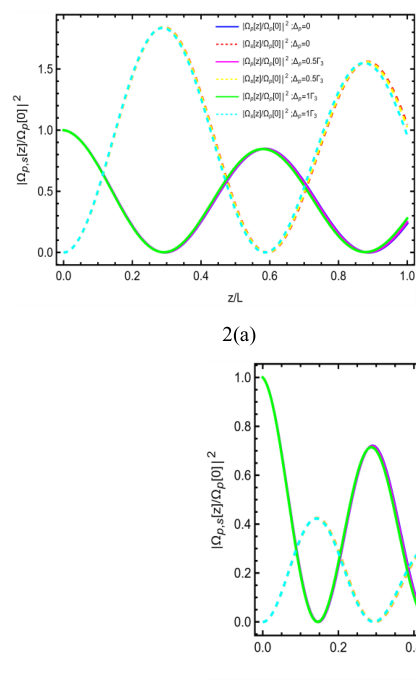
<figcaption class="paper-figure-caption"><b>Fig 1.</b> Fig. 2. During forward propagation, the relative intensities  </figcaption>
</figure>
<figure class="paper-figure-card">
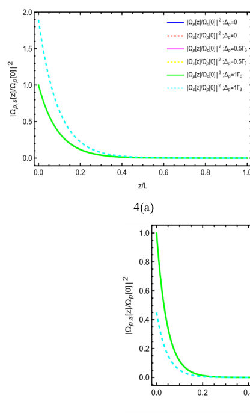
<figcaption class="paper-figure-caption"><b>Fig 2.</b> Fig. 4. During backward propagation, the relative intensities  </figcaption>
</figure>
<figure class="paper-figure-card">
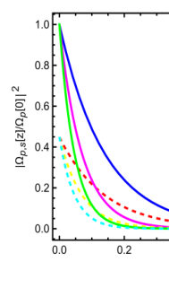
<figcaption class="paper-figure-caption"><b>Fig 3.</b> Fig. 5. During backward propagation, the relative intensities  </figcaption>
</figure>
<figure class="paper-figure-card">
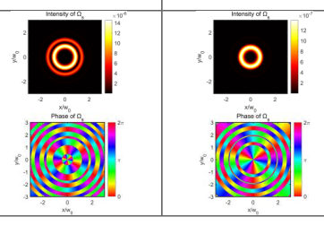
<figcaption class="paper-figure-caption"><b>Fig 4.</b> Fig. 6(a). During forward propagation, when the probe field p  is prepared in a LG vortex mode</figcaption>
</figure>
<figure class="paper-figure-card">
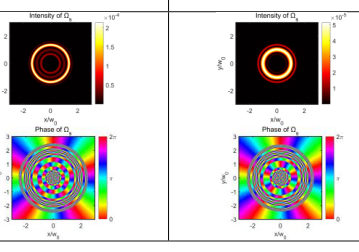
<figcaption class="paper-figure-caption"><b>Fig 5.</b> Fig. 6(b). During the forward propagation process, when the probe field is prepared in a LG mode</figcaption>
</figure>

**Summary.** This paper analyzes the dynamics of vortex beams propagating through a three-level atomic medium using forward and backward three-wave mixing. By comparing both processes, the authors demonstrate that the backward TWM scheme is superior for generating high-gain, high-fidelity structured light. The findings suggest practical applications in quantum communication and computation utilizing OAM.

**Why it may be interesting.** This work directly addresses quantum optics phenomena—specifically structured light propagation and nonlinear interactions in atomic media—which are foundational to developing integrated photonic components for quantum communication.

Detailed structure

**Main problem.** The study investigates how high-gain vortex beams propagate through symmetry-broken media using both forward and backward three-wave mixing (TWM) processes.

**Main result.** Backward TWM was found to yield superior performance compared to the forward process, exhibiting higher signal gain, improved fidelity, and more stable transmission characteristics.

**Method.** The authors employed a perturbative approximation and steady-state assumption to solve the coupled Maxwell-Bloch equations derived from the system Hamiltonian.

**Model / system.** The model is a three-level ladder-type atomic system exhibiting broken inversion symmetry, driven by a strong control field ($\omega_c$) interacting with weak probe ($\omega_p$) and signal ($\omega_s$) fields.

**Key observables.** Vortex light properties, including topological charge (OAM), gain, fidelity, transmission characteristics, and spatial profile modulation.

**Important parameters / regimes.** The analysis focuses on the Autler-Townes Splitting (ATS) regime; detuning ($\Delta_p$) has a negligible influence on gain, while optical depth only affects the rate of reaching maximum gain.

**Assumptions / limitations.** Key assumptions include treating the control field as strong and continuous ($|\Omega_c| \gg |\Omega_p|, |\Omega_s|$), using the perturbative approximation, and assuming steady-state conditions ($\partial/\partial t = 0$).

**Figures summary.** Figure 1 schematically illustrates the symmetry-broken three-level ladder system setup. Figure 2 likely shows relative intensities of probe and signal fields during forward propagation under varying decay rates.

**Paper structure.** The paper establishes the physical model using a Hamiltonian, derives coupled equations of motion via the Liouville equation, applies approximations to simplify these equations, and then solves the resulting steady-state Maxwell-Bloch equations for both Forward TWM (FTWM) and Backward TWM (BTWM).

Abstract

In recent years, vortex light, a distinctive form of structured light, has attracted considerable attention owing to its unique properties and the rich physical phenomena arising from its interaction with matter. In this paper, we investigate the propagation dynamics of vortex beams in a symmetry-broken three-level system based on forward and backward three-wave mixing (TWM) processes. We find that both processes enable the transfer of high-gain vortex light, with the associated topological charges obeying identical algebraic relations. The forward process exhibits periodic oscillatory transmission and modulates the transverse spatial profile of the generated signal vortex field, whereas the backward process features stable transmission and produces a signal field with higher gain and improved fidelity. Under the Autler-Townes splitting (ATS) regime, the probe field detuning in both schemes has a negligible influence on the gain. Optical depth influences only the rate at which the gain approaches its maximum, while the peak value remains unchanged. These results constitute a meaningful extension of the work reported in reference [40] and may provide a feasible approach for quantum communication, quantum computation, and the generation of high-gain, high-fidelity vortex light.

[↑ back to top](#top)

### [Mesoscopic mechanical superpositions by gluing individual quantum systems](http://arxiv.org/abs/2607.20195v1)

**Authors:** Thiago Guerreiro  
**Type:** both · **Category:** other · **PDF:** <https://arxiv.org/pdf/2607.20195v1>  
**Analysis basis:** full PDF text, analyzed in chunks
**Topic relevance:** `quantum measurements` **3/5** · `QC/QI experiment` **2/5** · `measurement-induced transitions` **2/5** · `methods for driven-dissipative` **2/5** · `Keldysh / 2PI / non-Gaussian methods` **1/5** · `analog quantum simulation` **1/5** · `correlated / nonlocal dissipation` **1/5** · `driven-dissipative phase transition` **1/5** · `entanglement & information structure` **1/5** · `interference shaping light` **1/5** · `non-equilibrium dynamics` **1/5** · `quantum optics experiment` **1/5**

↔ Scroll figures horizontally

<figure class="paper-figure-card">
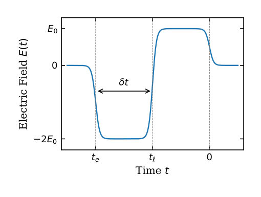
<figcaption class="paper-figure-caption"><b>Fig 1.</b> FIG. 1: Time-dependent electric field for generating a coherent superposition of momentum kicks from the inelastic collision of a time-bin electron state with an initially neutral levitated particle. If the electron arrives at te, the particle receives a momentum kick of δp = eE0δt, whereas if it arrives at tℓ, the momentum kick is −δp.</figcaption>
</figure>
<figure class="paper-figure-card">
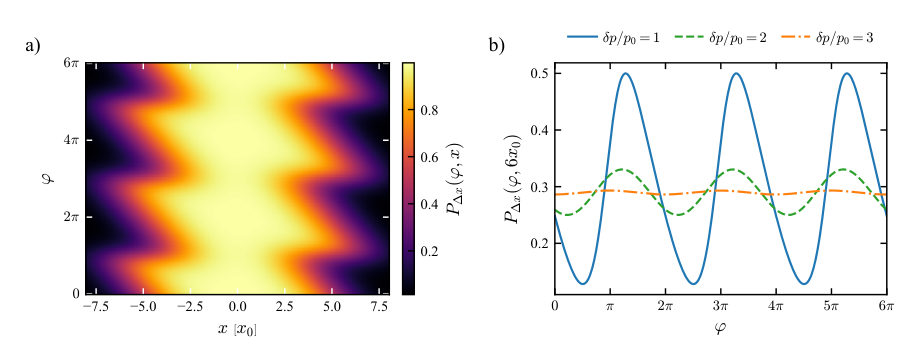
<figcaption class="paper-figure-caption"><b>Fig 2.</b> FIG. 2: a) Interference in the position probability P∆x(φ, x) as a function of φ for initial momentum kick δp = p0, decoherence rate Γ/ω = 0.2, initial occupation number ¯n = 0.5 and resolution ∆x = 10x0. b) Interference of position probability as a function of φ, at x = 6x0 for different initial kicks δp = p0, 2p0, 3p0, with the same remaining parameters as in a).</figcaption>
</figure>
<figure class="paper-figure-card">
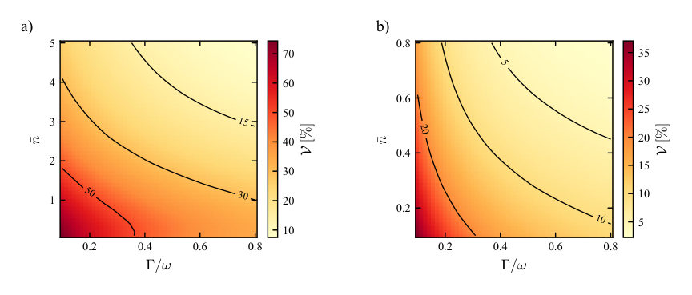
<figcaption class="paper-figure-caption"><b>Fig 3.</b> FIG. 3: Interference visibility as a function of initial occupation number ¯n and decoherence rate Γ for a) δp = p0, b) δp = 2p0. Remaining parameters are x = 6x0, ∆x = 10x0, η = 1.</figcaption>
</figure>
<figure class="paper-figure-card">
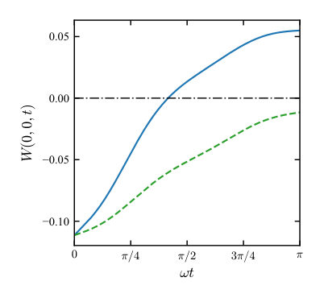
<figcaption class="paper-figure-caption"><b>Fig 4.</b> FIG. 4: Time evolution of the Wigner function at the origin of phase space W(x = 0, p = 0, t) for an initial state with ¯n = 0.5, δp = p0, η = 1, and φ = π, display- ing negative values, i.e. non-classicality over the course of the protocol. We consider two values for the decoher- ence: Γ/ω = 0.2 (solid blue line), and Γ/ω = (1/3) × 0.2 (dashed green line), with the latter recoil heating rate enabled by a radially polarized optical trap.</figcaption>
</figure>
<figure class="paper-figure-card">
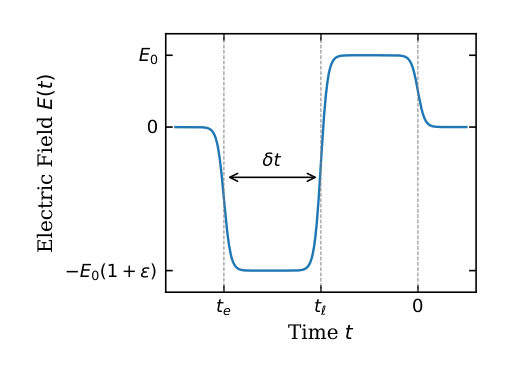
<figcaption class="paper-figure-caption"><b>Fig 5.</b> FIG. 5: Electric field profile for producing a superposition of positive and negative momentum kicks ±δp for an arbitrary initial charge Z of the nanoparticle.</figcaption>
</figure>

**Summary.** The paper details a method to create mechanical Schrödinger cat states in an optically levitated nanoparticle by coupling it to the momentum kicks from single electrons. By controlling the phase of these electron time-bin states, high-visibility interference fringes are generated, allowing for tests of quantum mechanics on unprecedentedly large objects while mitigating common decoherence sources.

**Why it may be interesting.** This work directly addresses fundamental questions about quantum mechanics at the mesoscopic scale by providing a robust experimental pathway that leverages single-particle interactions to manipulate macroscopic quantum states, which is highly relevant to open quantum systems and quantum sensing.

Detailed structure

**Main problem.** The authors propose a novel protocol to prepare and observe mesoscopic quantum superpositions of mechanical motion (Schrödinger kittens) in an optically levitated nanoparticle.

**Main result.** They demonstrate that coherence can be maintained over single oscillation periods by coupling the particle's state to controllable, phase-dependent momentum kicks imparted by single electrons. This method bypasses limitations of previous techniques for testing quantum mechanics at macroscopic scales.

**Method.** The protocol involves using time-bin states of single electrons to induce a superposition of momentum kicks ($\pm \delta p$) onto the levitated nanoparticle, followed by interferometric measurement of the particle's position probability distribution.

**Model / system.** The system is an amorphous $	ext{SiO}_2$ bead trapped in a harmonic potential. The quantum dynamics are analyzed using master equations and Wigner/characteristic functions to track decoherence from sources like gas collisions and trap fluctuations.

**Key observables.** Interference fringes in the particle's Center-of-Mass (CoM) position probability $P_{\Delta x}(\phi, x)$, non-classicality confirmed by Wigner negativity, and interference visibility ($V$).

**Important parameters / regimes.** The momentum kick $\delta p$ is controlled via external electric fields; decoherence rates ($\Gamma$) are compared against the trap frequency ($\omega$), with timescales set relative to the oscillation period ($\pi/\omega$).

**Assumptions / limitations.** It assumes that the state preparation time ($\delta t$) is short enough such that harmonic motion and decoherence can be treated as approximately frozen during the kick application.

**Figures summary.** Figures illustrate the interference pattern $P_{\Delta x}(\phi, x)$ varying sinusoidally with electron phase $\phi$, show Wigner function negativity for non-classical states, and plot visibility dependence on initial occupation number and decoherence rate.

**Paper structure.** The paper develops from proposing the protocol using time-bin electrons to induce momentum superpositions. It mathematically models the evolution of the quantum state (using master equations/Wigner functions) while analyzing various sources of decoherence, culminating in predictions for observable interference fringes.

Abstract

We propose a protocol for preparing mechanical Schrödinger kittens -- mesoscopic quantum superpositions of coherent motional states of an optically levitated nanoparticle -- by adhering single electron time-bin states to its surface. Over short protocol timescales, coherence of the mesoscopic superposition survives the dominant decoherence mechanisms afflicting levitated systems, and can be observed by varying the phase of the time-bin electrons. Interference fringes can be detected with real-time, near-Heisenberg limited interferometry of photons scattered from the particle. This approach eliminates the need for coherent state expansion, dark potentials, and particle release-and-recapture mechanisms, providing a new route to test quantum mechanics in unprecedented scales.

[↑ back to top](#top)

### [The Quantum Adiabatic Theorem for Non-Hermitian Dynamics](http://arxiv.org/abs/2607.19737v1)

**Authors:** G. M. V. S. Aponso, B. P. W. Fernando, K. K. W. A. S. Kumara, R. P. K. De Silva  
**Type:** theory · **Category:** other · **PDF:** <https://arxiv.org/pdf/2607.19737v1>  
**Analysis basis:** full PDF text, analyzed in chunks
**Topic relevance:** `driven-dissipative phase transition` **3/5** · `methods for driven-dissipative` **3/5** · `analog quantum simulation` **2/5** · `correlated / nonlocal dissipation` **2/5** · `non-equilibrium dynamics` **2/5** · `non-equilibrium universality` **2/5** · `Keldysh / 2PI / non-Gaussian methods` **1/5** · `Kondo & dissipative impurity` **1/5** · `entanglement & information structure` **1/5**

↔ Scroll figures horizontally

<figure class="paper-figure-card">
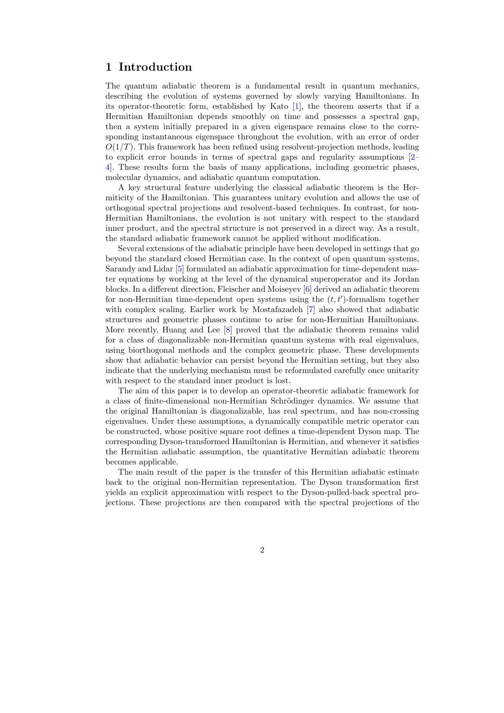
<figcaption class="paper-figure-caption"><b>Fig 1.</b> Low-resolution page preview, page 2</figcaption>
</figure>
<figure class="paper-figure-card">
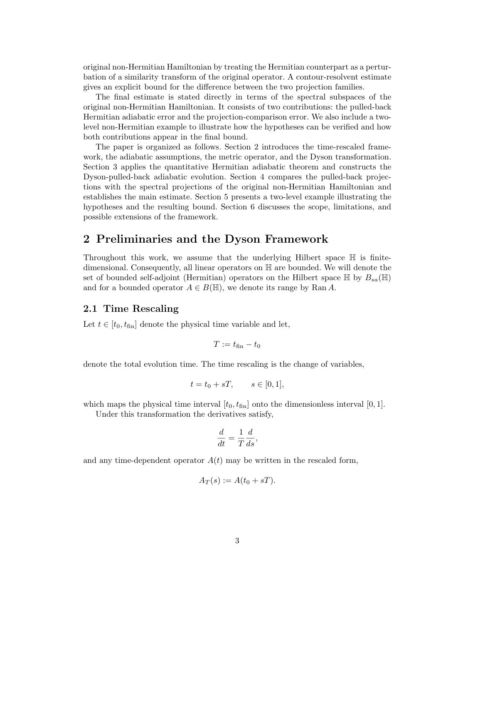
<figcaption class="paper-figure-caption"><b>Fig 2.</b> Low-resolution page preview, page 3</figcaption>
</figure>
<figure class="paper-figure-card">
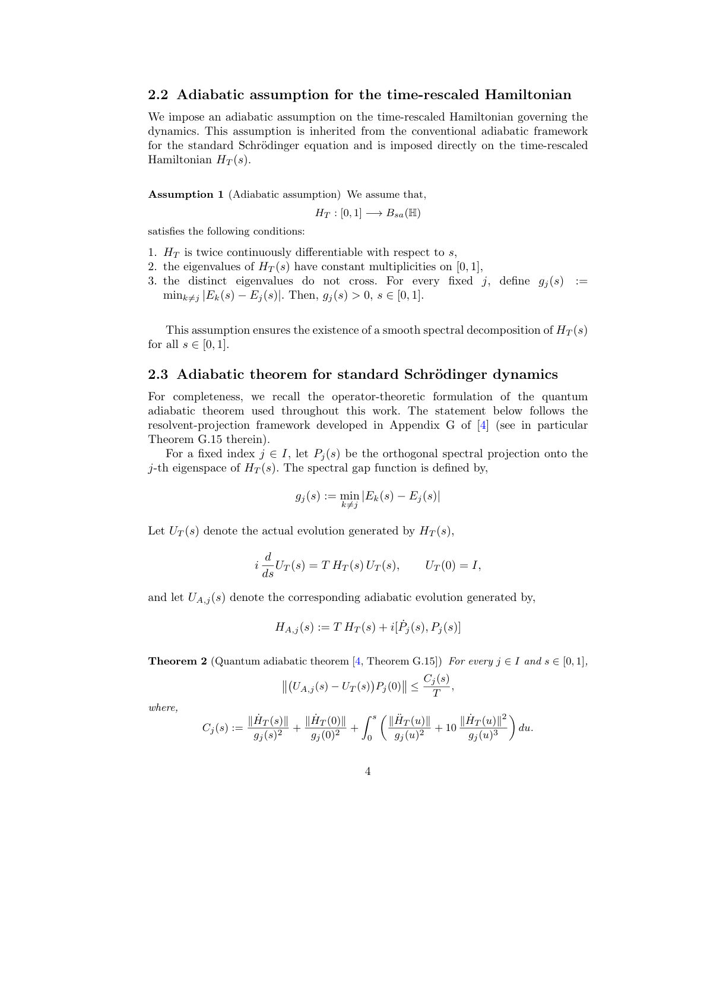
<figcaption class="paper-figure-caption"><b>Fig 3.</b> Low-resolution page preview, page 4</figcaption>
</figure>
<figure class="paper-figure-card">
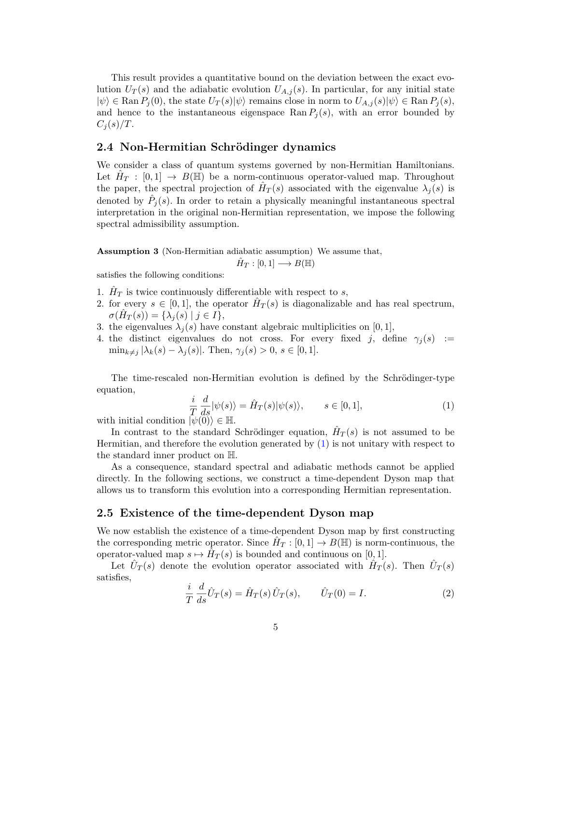
<figcaption class="paper-figure-caption"><b>Fig 4.</b> Low-resolution page preview, page 5</figcaption>
</figure>
<figure class="paper-figure-card">
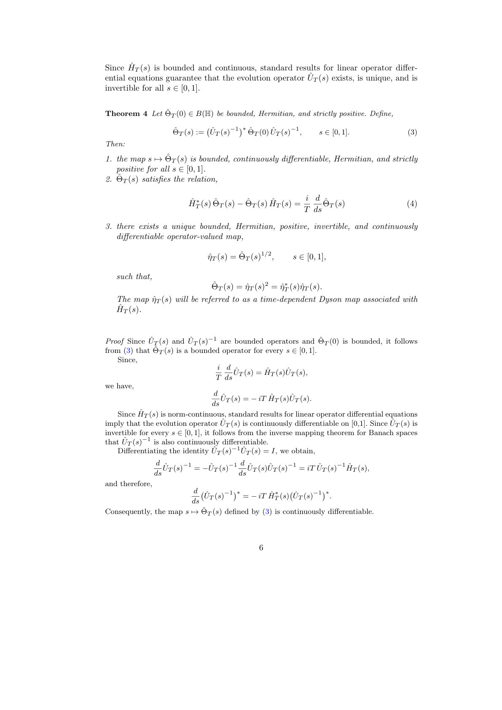
<figcaption class="paper-figure-caption"><b>Fig 5.</b> Low-resolution page preview, page 6</figcaption>
</figure>

**Summary.** This paper develops a quantitative adiabatic theorem for non-Hermitian quantum dynamics by transforming the problem into an equivalent Hermitian system using a Dyson map. It derives an explicit error bound that accounts for both the standard adiabatic approximation error and the additional error introduced by the transformation itself. This provides a powerful theoretical tool for analyzing time evolution in open or dissipative quantum systems.

**Why it may be interesting.** This work is highly relevant for AMO physics and open quantum systems because non-Hermiticity naturally arises when coupling quantum systems to an environment or when considering gain/loss processes. Providing a rigorous adiabatic framework for these dynamics is crucial for modeling physical reality beyond simple unitary evolution.

Detailed structure

**Main problem.** The core problem is developing a rigorous, quantitative adiabatic estimate for quantum systems whose dynamics are governed by non-Hermitian Hamiltonians.

**Main result.** The authors establish an explicit error bound for the adiabatic approximation in non-Hermitian settings by transforming the system into an equivalent Hermitian representation and quantifying the transformation error.

**Method.** The method involves constructing a dynamically compatible Dyson map using a metric operator to transform the non-Hermitian Hamiltonian ($\hat{H}_T$) into a Hermitian counterpart ($ar{H}_T$). The standard adiabatic theorem is then applied in this transformed space, with errors quantified via contour-resolvent estimates.

**Model / system.** The analysis applies to finite-dimensional quantum systems evolving under time-dependent, non-Hermitian Schrödinger dynamics. A two-level model is used to illustrate the full scope of the theorem and its error components.

**Key observables.** The final estimate controls the evolution operator error $|e^{U_{A, \pm}(s)} - \hat{U}_T(s)|$, and the analysis tracks spectral projections and gap sizes in the transformed Hermitian system.

**Important parameters / regimes.** The time parameter $s$ (ranging from 0 to 1), the spectral gap of the effective Hermitian Hamiltonian $ar{H}_T(s)$, and the adiabatic constant $T$.

**Assumptions / limitations.** Key assumptions include that the original non-Hermitian Hamiltonian must be diagonalizable with a real spectrum, possess non-crossing eigenvalues, and satisfy a contour-resolvent condition for the transformed system.

**Figures summary.** The notes do not describe specific figures, but mention the final estimate containing two explicit error contributions: the pulled-back Hermitian adiabatic error and the projection-comparison error, illustrated by the two-level model.

**Paper structure.** The paper first identifies the need for an adiabatic theorem extension to non-Hermitian dynamics. It then introduces the Dyson map construction to achieve a Hermitian representation ($ar{H}_T$). Finally, it applies standard adiabatic techniques in this transformed space and pulls the resulting estimate back to yield the final bound.

Abstract

We establish a quantitative adiabatic estimate for a class of finite-dimensional non-Hermitian Schrödinger dynamics. The original non-Hermitian Hamiltonian is assumed to be diagonalizable with real spectrum and non-crossing eigenvalues. We then construct a dynamically compatible time-dependent metric operator, and its positive square root defines a Dyson map. The associated Dyson-transformed Hamiltonian is Hermitian.   When this Dyson-transformed Hamiltonian satisfies the Hermitian adiabatic assumption, the standard resolvent-projection method gives an explicit adiabatic estimate in the Hermitian representation. Pulling this estimate back through the Dyson map gives an approximation in the original non-Hermitian representation. The resulting Dyson-pulled-back projections are then compared with the spectral projections of the original non-Hermitian Hamiltonian by using a contour-resolvent estimate. The final bound contains two contributions: the pulled-back Hermitian adiabatic error and the projection-comparison error. A two-level non-Hermitian model is presented to illustrate the hypotheses of the theorem and the two contributions appearing in the final estimate.

[↑ back to top](#top)

### [Quantum resonance-enhanced performance of quantum battery](http://arxiv.org/abs/2607.19477v1)

**Authors:** Ankita Mazumdar, Shashi C. L. Srivastava, Sanku Paul  
**Type:** theory · **Category:** statistical mechanics · **PDF:** <https://arxiv.org/pdf/2607.19477v1>  
**Analysis basis:** full PDF text, analyzed in chunks
**Topic relevance:** `non-equilibrium dynamics` **3/5** · `analog quantum simulation` **2/5** · `driven-dissipative phase transition` **2/5** · `entanglement & information structure` **2/5** · `methods for driven-dissipative` **2/5** · `non-equilibrium universality` **2/5** · `Frenkel-Kontorova` **1/5** · `Keldysh / 2PI / non-Gaussian methods` **1/5** · `correlated / nonlocal dissipation` **1/5**

↔ Scroll figures horizontally

<figure class="paper-figure-card">
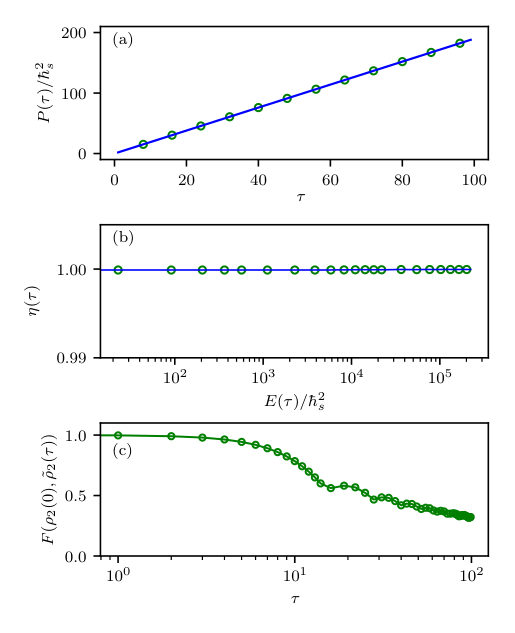
<figcaption class="paper-figure-caption"><b>Fig 1.</b> FIG. 1. Plot (a) illustrates the dynamics of charging power while efficiency is shown in (b) with respect to stored energy. The plot in (c) presents the dynamics of F(ρ2(0), ˜ρ2(τ)). In (a) and (b), green circles represent numerical results whereas blue solid line corresponds to analytical results using Eq. 6 and Eq. S12, respectively. The remaining parameters are fixed at: K1 = 9, K2 = 10, K = 0.1, µ1 = 2, µ2 = 1, L = 211</figcaption>
</figure>
<figure class="paper-figure-card">
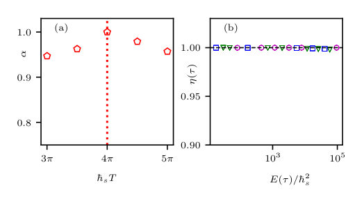
<figcaption class="paper-figure-caption"><b>Fig 2.</b> FIG. 2. (a) The exponent α of P(τ) ∝τ α is plotted with ℏsT to observe the effect of higher order resonances. The vertical red line indicates the position of the primary resonance. (b) η is plotted for higher order resonances by considering l l′ = 3 4 (magenta circles), 7 8 (green lower triangles) and 9 8 (blue squares). The black dashed line is guide to an eye to indicate η = 1. The other parameters are same as in Fig. 1.</figcaption>
</figure>
<figure class="paper-figure-card">
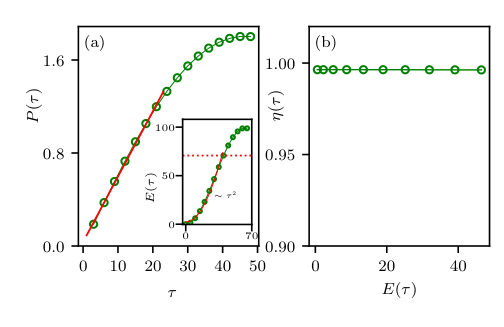
<figcaption class="paper-figure-caption"><b>Fig 3.</b> FIG. 3. (a) The dynamics of P(τ) is shown, with the red solid line indicating a linear fit. The inset displays E(τ), where the numerical data are fitted by E(τ) ∼τ 2 (red solid line). The horizontal red-dashed line marks E(τ) = 70.66 i.e. almost 70% of the bandwidth, upto which the quadratic growth persists. (b) The η(τ) is plotted with respect to E(τ). Regardless of the growth of energy, η(τ) ≈1. The parameters are set as j = 50, α1 = 1, α2 = 0.05, α12 = 0.03.</figcaption>
</figure>

**Summary.** The paper demonstrates that exploiting quantum resonance can dramatically boost the performance of quantum batteries, allowing them to charge power linearly over time while maintaining near-perfect energy efficiency. This enhancement is robust and persists even when strong entanglement builds up within the coupled system models.

**Why it may be interesting.** This work connects fundamental concepts from quantum thermodynamics (energy storage/extraction) with phenomena arising from periodically driven systems (quantum resonance), providing a concrete resource for energy management in quantum technologies.

Detailed structure

**Main problem.** The study investigates whether quantum resonance can enhance the performance of quantum batteries, specifically aiming for stable charging power increase with time and near-unity efficiency despite strong entanglement generation.

**Main result.** Quantum resonance leads to a linear increase in charging power and maintains near-unity energy extraction efficiency ($\eta \approx 1$) even when significant entanglement is generated. This enhancement mechanism is shown to be universal across different models.

**Method.** The authors use analytical derivations involving Bessel functions and numerical simulations to calculate stored energy, extractable work (ergotropy), and efficiency for coupled quantum rotor and kicked top systems.

**Model / system.** The system models quantum batteries using free rotors or interacting kicked tops. The dynamics are governed by time-periodic Hamiltonians incorporating both intrinsic quadratic terms ($H_0$) and nonlinear interaction/kicking potentials ($V(x_1, x_2)$).

**Key observables.** Stored Energy ($E(	au)$), Extractable Work (Ergotropy $\xi(	au)$), Efficiency ($\eta(	au) = \xi/	ext{stored energy}$), and Linear Entropy ($S_L(	au)$ for entanglement).

**Important parameters / regimes.** Quantum Resonance condition (rational ratio of intrinsic to driving frequency); specific resonance conditions like $\hbar s T = 4\pi$ or $K_2 \gg K$.

**Assumptions / limitations.** The analysis often relies on approximations for large time ($	au$) and specific parameter limits, such as the regime where one interaction strength dominates ($K_2 \gg K$).

**Figures summary.** Figures illustrate linear growth of charging power at resonance (Fig. 1a), efficiency remaining near unity under resonance (Fig. 1b), and confirmation of this effect in higher-order resonances for both rotor and kicked top models.

**Paper structure.** The paper progresses by first establishing the model using free rotors, deriving analytical results showing linear power growth at resonance. It then generalizes this to an interacting kicked top model, confirming the universality of the enhancement mechanism across different physical realizations.

Abstract

Quantum resonance arising whenever the ratio of the intrinsic system frequency to the driving frequency becomes a rational number has been demonstrated to generate super-linear entanglement, enhance transport, quantum metrology performance and communication. Here, we demonstrate that quantum resonance can also serve as a powerful resource for quantum batteries. We model the batteries as free rotors charged via a kicked protocol. When the individual batteries are at resonance, we show both analytically and numerically that charging power increases linearly with time while efficiency (defined as the fraction of stored energy that can be extracted) remains near unity despite strong entanglement generation. Furthermore, we demonstrate that this enhanced performance persists at higher-order resonances. Demonstrating the universality of this mechanism, we show that similar enhancements arise in the interacting kicked top model, and briefly note the feasibility of its experimental realization. In a broader context, resonant charging holds significant implications for energy storage, quantum computational resources, and quantum thermodynamics.

[↑ back to top](#top)

### [Motility destabilizes an absorbing-state flock](http://arxiv.org/abs/2607.20034v1)

**Authors:** Narayan Dutt Sharma, Subroto Mukerjee, Chandan Dasgupta, Sriram Ramaswamy  
**Type:** theory · **Category:** statistical mechanics · **PDF:** <https://arxiv.org/pdf/2607.20034v1>  
**Analysis basis:** full PDF text, analyzed in chunks
**Topic relevance:** `driven-dissipative phase transition` **3/5** · `methods for driven-dissipative` **3/5** · `non-equilibrium universality` **3/5** · `non-equilibrium dynamics` **2/5** · `Frenkel-Kontorova` **1/5** · `Keldysh / 2PI / non-Gaussian methods` **1/5** · `analog quantum simulation` **1/5** · `correlated / nonlocal dissipation` **1/5**

↔ Scroll figures horizontally

<figure class="paper-figure-card">
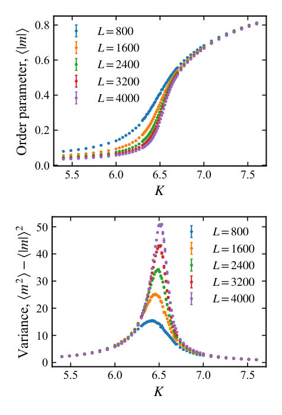
<figcaption class="paper-figure-caption"><b>Fig 1.</b> FIG. 1. Order parameter and variance as functions of the alignment strength K for a nearest neighbour interaction and ρ = 0.8.</figcaption>
</figure>
<figure class="paper-figure-card">
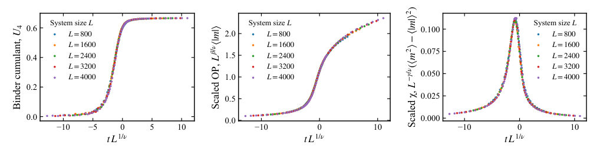
<figcaption class="paper-figure-caption"><b>Fig 2.</b> FIG. 3. Finite-size scaling collapse for nearest-neighbour interactions at density ρ = 0.8 using Kc = 6.58, ν = 1.95, β = 0.31, and γ = 1.29. Left: Binder cumulant U4. Middle: order parameter ⟨|m|⟩. Right: variance χ of the magnetization. t is the reduced alignment, t = (K −Kc)/Kc.</figcaption>
</figure>
<figure class="paper-figure-card">
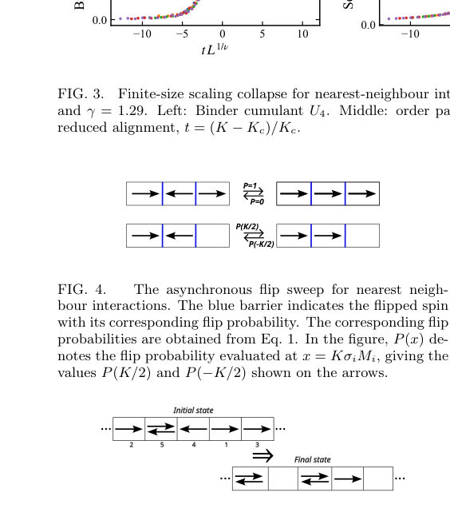
<figcaption class="paper-figure-caption"><b>Fig 3.</b> FIG. 5. The asynchronous jump sweep. The number shows the order in which the moves are made. Both spins at a doubly occupied site jump in a single move if allowed to do so by the occupancy of its neighbours.</figcaption>
</figure>
<figure class="paper-figure-card">
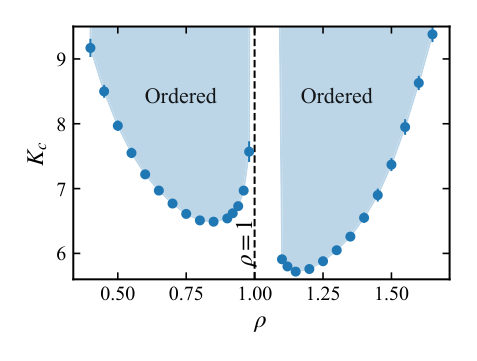
<figcaption class="paper-figure-caption"><b>Fig 4.</b> FIG. 6. Phase diagram Kc(ρ) for nearest-neighbour interac- tions (R = 1). As ρ →1, no finite critical alignment strength is observed, effectively Kc →∞. Near ρ = 1, strong fluc- tuations and pronounced finite-size effects make the precise identification of the transition increasingly difficult.</figcaption>
</figure>
<figure class="paper-figure-card">
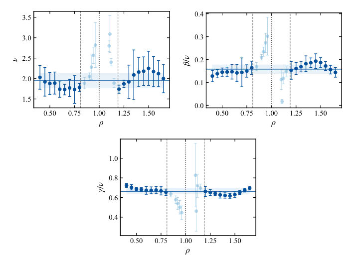
<figcaption class="paper-figure-caption"><b>Fig 5.</b> FIG. 7. The exponent variation as a function of density for R=1. The points in the region ρ ∈(0.81, 1.19) are excluded because of the singularity at ρ = 1. Top left: Variation of ν, Top right: Variation of β/ν, Bottom: Variation of γ/ν.</figcaption>
</figure>

**Summary.** The paper models a 1D lattice system exhibiting an ordered phase that typically gets stuck in an absorbing state. By introducing biased motility through particle hopping, the authors show this activity destabilizes the order, driving a continuous transition to a disordered state. The findings are quantitatively confirmed using finite-size scaling analysis of critical exponents.

**Why it may be interesting.** This work provides quantitative insights into how energy injection or active transport (motility) can fundamentally change the steady-state behavior of interacting classical systems, moving them away from simple absorbing traps towards dynamic disorder.

Detailed structure

**Main problem.** The study investigates how introducing activity, specifically biased motility, affects an ordered phase that otherwise settles into an absorbing state in a many-body system.

**Main result.** Motility destabilizes the absorbing ferromagnetic state, causing a continuous 'deflocking' transition to a disordered state. The critical exponents satisfy hyperscaling relations for one dimension.

**Method.** The analysis relies heavily on finite-size scaling techniques applied to physical quantities like the Binder cumulant and global magnetization to characterize the phase transition.

**Model / system.** A one-dimensional lattice model using Ising spins ($\sigma_i = \pm 1$) with local interactions. The dynamics are governed by a combination of spin-flip rules (non-motile limit) and an asynchronous hopping/flipping process that introduces motility.

**Key observables.** Global magnetization ($m$), variance ($\chi$), Binder cumulant ($U_4$), and critical exponents ($
u, eta, \gamma$).

**Important parameters / regimes.** Alignment strength ($K$), particle density ($
ho$), and the dimensionality ($d=1$).

**Assumptions / limitations.** The analysis assumes that the transition can be characterized by standard scaling laws, though some notes mention limitations regarding symmetry breaking in the microscopic dynamics.

**Figures summary.** Figures illustrate the order parameter vs. control parameter to show the transition, use Binder cumulants to locate critical points ($K_c$), and demonstrate finite-size scaling collapse using derived exponents.

**Paper structure.** The paper first establishes the non-motile absorbing state, then introduces motility via a two-step process. The core analysis involves applying finite-size scaling to determine continuous transition characteristics, followed by detailed examination of density dependence and update scheme effects.

Abstract

Activity, when it takes the form of motility, is generally seen to promote order in many-body systems. Here we present a one-dimensional lattice model that, in the non-motile limit, exhibits absorbing ferromagnetic states. When activity is introduced through biased motility, these absorbing state are destabilised and the system instead undergoes a transition from an ordered flock to a disordered state as the alignment strength is decreased. A finite-size scaling analysis of physical quantities reveals a continuous transition with critical exponents satisfying the hyperscaling relation in one dimension, providing quantitative evidence for the activity-induced disorder.

[↑ back to top](#top)

### [Optimal Finite-Time Control of Nonreciprocal Brownian Dimers: Thermodynamic Anomaly and Multiple Transitions](http://arxiv.org/abs/2607.20420v1)

**Authors:** Ruicheng Bao  
**Type:** theory · **Category:** statistical mechanics · **PDF:** <https://arxiv.org/pdf/2607.20420v1>  
**Analysis basis:** full PDF text, analyzed in chunks
**Topic relevance:** `Keldysh / 2PI / non-Gaussian methods` **3/5** · `driven-dissipative phase transition` **3/5** · `non-equilibrium dynamics` **2/5** · `non-equilibrium universality` **2/5** · `Frenkel-Kontorova` **1/5** · `analog quantum simulation` **1/5** · `correlated / nonlocal dissipation` **1/5** · `methods for driven-dissipative` **1/5** · `quantum measurements` **1/5**

↔ Scroll figures horizontally

<figure class="paper-figure-card">
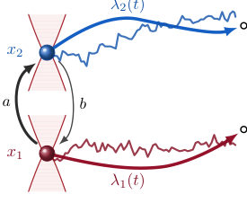
<figcaption class="paper-figure-caption"><b>Fig 1.</b> FIG. 1. Two overdamped Brownian particles are held by in- dependently movable harmonic traps. The interaction is re- ciprocal when a = b, and nonreciprocal when a ̸= b.</figcaption>
</figure>
<figure class="paper-figure-card">
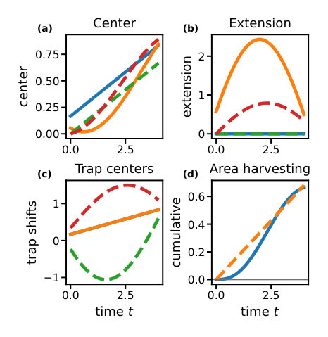
<figcaption class="paper-figure-caption"><b>Fig 2.</b> FIG. 2. Rigid target translation with L = 1, M = 0, T = 4, and ρ = 3. In panels (a,b), solid curves are trap controls and dashed curves are mean particle coordinates; blue/green de- note the reciprocal dimer and orange/red the nonreciprocal dimer. Panel (c) shows the shifted individual trap centers: solid curves are reciprocal and dashed curves are nonrecipro- cal. The nonreciprocal dimer with α = 0.6 deliberately opens the extension channel even though the target separation is unchanged. Panel (d) shows the cumulative area-harvesting gain 2α R t 0 s ˙y du (blue) against the positive drag part (orange dashed).</figcaption>
</figure>
<figure class="paper-figure-card">
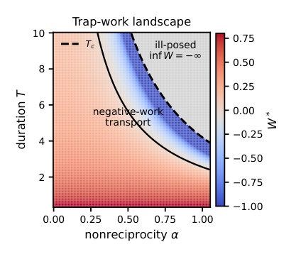
<figcaption class="paper-figure-caption"><b>Fig 3.</b> FIG. 3. Minimum trap-work landscape for ρ = 3, L = 1, and M = 0. The solid contour marks W ∗= 0. The dashed curve is Tc. To its right the unregularized trap-work problem has no finite minimum.</figcaption>
</figure>
<figure class="paper-figure-card">
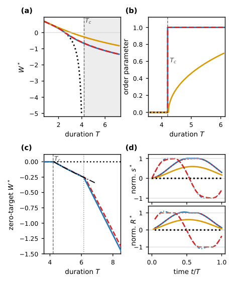
<figcaption class="paper-figure-caption"><b>Fig 4.</b> FIG. 4. Physical regularizations of the T &gt; Tc anomaly for α = 1 and ρ = 3. Blue denotes a hard cutoff, yellow a smooth saturating force, and red a finite-range constraint. (a) For L = 1, M = 0, the regularized works remain finite be- yond Tc. Black dotted curve denotes the unregularized curve. (b) For L = M = 0 (zero-target), finite-range constraints show a step-like first-order onset, while smooth saturation turns on continuously. Order parameters are ∥R∗∥∞/Rmax or ∥s∗∥∞/smax. (c) Zero-target work for finite-range reg- ularizations. Gray dotted line marks the switch time from the one-wall to two-wall strategy, black dotted horizontal line the zero protocol, and dash-dotted line the...</figcaption>
</figure>

**Summary.** This theoretical paper analyzes the minimum external work required to control two interacting Brownian particles with nonreciprocal coupling. It discovers a critical time $T_c$ beyond which the extractable work becomes infinitely negative, representing a thermodynamic anomaly. By imposing realistic physical constraints like finite force range, the authors show how this anomaly resolves into distinct, measurable phase-like transitions.

**Why it may be interesting.** The study of optimal control in non-equilibrium systems, especially identifying fundamental anomalies like unbounded work extraction, is highly relevant for understanding energy harvesting and dissipation in open quantum or classical many-body systems.

Detailed structure

**Main problem.** The paper solves a finite-time thermodynamic optimal control problem for two nonreciprocally interacting Brownian particles confined by harmonic traps.

**Main result.** Nonreciprocity leads to a 'thermodynamic anomaly' where the extractable work is unbounded below for times exceeding a critical time $T_c$. Physical regularizations restore finite optima and reveal multiple transition types.

**Method.** The authors use optimal control theory, minimizing the mean external work functional by solving associated Euler-Lagrange equations for the system dynamics.

**Model / system.** The model consists of two overdamped Brownian particles coupled by nonreciprocal interactions within harmonic traps. The control manipulates the trap centers and separation distance over time $T$.

**Key observables.** Mean external work ($W$), output power, optimal protocol trajectories (oscillatory), and transition points.

**Important parameters / regimes.** Nonreciprocity parameter ($\alpha$), critical time ($T_c$), trap range limits ($R_{	ext{max}}$).

**Assumptions / limitations.** The analysis relies on solving the mean dynamics equations derived from the overdamped Langevin equation, and later introduces physical regularizations like finite force saturation or trap range.

**Figures summary.** Figures illustrate the optimal mean paths for both reciprocal and nonreciprocal cases, and show the minimum work landscape ($W^*$) versus duration $T$ highlighting the anomaly near $T_c$.

**Paper structure.** The paper first establishes the dynamics and the work functional. It then analyzes the non-reciprocal case to find the thermodynamic anomaly at $T > T_c$. Finally, it introduces physical regularizations (finite range/saturation) to restore a finite optimum, revealing distinct transition behaviors.

Abstract

We solve exactly a finite-time thermodynamic optimal control problem for two nonreciprocally interacting Brownian particles translated by two harmonic traps. The controller manipulates both the center and separation of the pair. Nonreciprocal interactions generate an internal active force that couples these two channels. The optimal protocol is oscillatory, deliberately opens the dimer even when the target separation is unchanged, and can extract work during transport. A central finding is a finite critical time beyond which the external-work infimum is $-\infty$: at any prescribed duration beyond this threshold, both extractable work and output power are unbounded. Physical regularizations such as finite trap range and force saturation restore a finite optimum and convert the anomaly into optimal-protocol transitions: in the zero-target case, a hard finite range produces a first-order-like jump from the zero protocol to a maximum-range protocol, whereas smooth force saturation gives a continuous, second-order-like onset. Under finite-range constraints, the optimal protocol can further undergo multiple finite-time transitions, producing multiple work-duration kinks with no qualitative analog in prior studies.

[↑ back to top](#top)

### [Stable valleys in the glassy landscape of a low-density parity-check (LDPC) code](http://arxiv.org/abs/2607.20421v1)

**Authors:** Grace M. Sommers, David A. Huse  
**Type:** theory · **Category:** statistical mechanics · **PDF:** <https://arxiv.org/pdf/2607.20421v1>  
**Analysis basis:** full PDF text, analyzed in chunks
**Topic relevance:** `analog quantum simulation` **3/5** · `exotic spin models in light-matter` **3/5** · `methods for driven-dissipative` **2/5** · `non-equilibrium dynamics` **2/5** · `Keldysh / 2PI / non-Gaussian methods` **1/5** · `driven-dissipative phase transition` **1/5** · `entanglement & information structure` **1/5** · `non-equilibrium universality` **1/5** · `scars & prethermalization` **1/5**

↔ Scroll figures horizontally

<figure class="paper-figure-card">
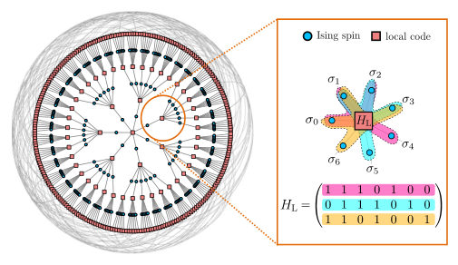
<figcaption class="paper-figure-caption"><b>Fig 1.</b> FIG. 1. The LDPC code studied in this work is defined on a high-girth random regular graph, where the external thin gray lines schematically indicate randomly closed boundaries. Each vertex (orange square) is satisfied if the neighboring bits (blue circles) belong to the code space of the chosen local code, with parity check matrix HL. Here we take the local code to be the Hamming [7,4,3] code. Adapted from Fig. 5 of Ref. [35].)</figcaption>
</figure>
<figure class="paper-figure-card">
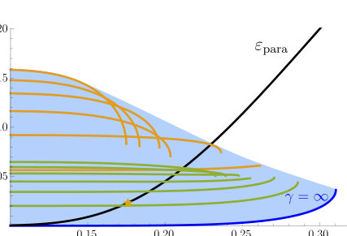
<figcaption class="paper-figure-caption"><b>Fig 2.</b> FIG. 2. Bulk energy density for valleys induced by various fine-tuned boundary conditions (orange and green curves). Also shown is the paramagnetic energy density εpara (black curve) and the energy density within codeword valleys (γ = ∞, blue curve). Star marks (TG, εG). Shading is conjectured region of thermally stable valleys that can be accessed with fine-tuned boundary conditions.</figcaption>
</figure>
<figure class="paper-figure-card">
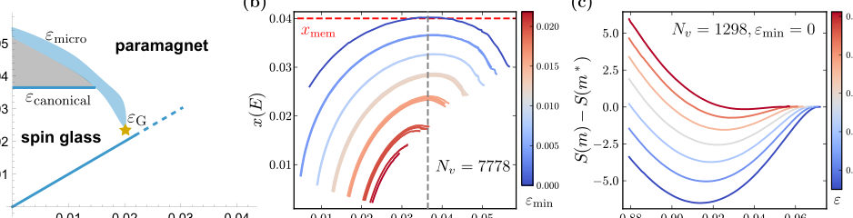
<figcaption class="paper-figure-caption"><b>Fig 3.</b> FIG. 3. (a) Heuristic phases of stability for valleys parameterized by εmin, where εmin is the energy density at the bottom of the valley. Horizontal blue line marks the energy density at which a valley has a “canonical instability”, manifesting as a local maximum in x(E) in panel (b). Shaded gray region marks the regime where the valley is canonically unstable, but microcanonically stable due to an extensive entropy barrier to escape from the valley at that energy. Thick light blue curve is a rough estimate of the energy at which the entropic barrier vanishes. (b) x(E), the adaptive Boltzmann factor needed to make a flat histogram, as a function of energy density ε, on closed graphs with...</figcaption>
</figure>
<figure class="paper-figure-card">
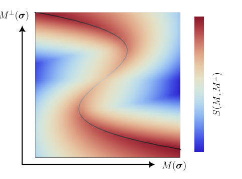
<figcaption class="paper-figure-caption"><b>Fig 4.</b> Fig. 3c of the main text shows the entropy landscape S(m) −S(m∗) around valleys containing ground states (Emin = 0), on closed graphs with Nv = 1298 and a range of microcanonical energy windows above the canonical instability energy. To substantiate our claim of a microcanonically stable yet thermally unstable phase, we must consider this landscape for more than a single system size. This is shown, again focusing on ground state valleys, in Fig. S7a. The data suggest a degree of caution: the entropy barrier ∆S, estimated from S(m∗) −min[S(m)], does increase with Nv for the available system sizes and sufficiently low ε, but there is a significant drift in the energy at which the barrier...</figcaption>
</figure>

**Summary.** This paper analyzes the rugged energy landscape of LDPC codes, treating them as a model for spin glass physics. It uses advanced statistical mechanics sampling techniques to characterize metastable 'valleys' within this landscape. The key finding is the demonstration of ensemble inequivalence, showing that standard thermodynamic relations break down when analyzing these glassy states.

**Why it may be interesting.** While focused on coding theory, the mathematical machinery developed—analyzing glassy dynamics, phase transitions, and ensemble equivalence in complex energy landscapes—is directly applicable to understanding many-body systems like spin glasses or frustrated quantum magnets.

Detailed structure

**Main problem.** The study investigates stable valleys within the complex, glassy energy landscape of a low-density parity-check (LDPC) code.

**Main result.** The work demonstrates that ensemble inequivalence can occur in these systems, specifically identifying regimes where valleys are microcanonically stable but canonically unstable.

**Method.** The analysis employs advanced sampling techniques like the multicanonical method and adaptive Monte Carlo simulations to probe energy barriers and entropy landscapes.

**Model / system.** The system is a classical LDPC code defined on expander graphs, which models spin glass order without explicit quenched randomness. The Hamiltonian penalizes local configurations that violate the code constraints.

**Key observables.** Bulk free energy density ($f$), energy density ($\epsilon$), configurational entropy density ($s_{	ext{conf}}$), and the height of the entropy barrier ($\Delta S$).

**Important parameters / regimes.** Temperature ($eta$ or $T$), boundary condition parameters $(\alpha, \gamma)$, and minimum/maximum allowed values for energy ($E$) or magnetization ($M$).

**Assumptions / limitations.** The analysis relies on approximating the true entropy barrier by projecting the configuration space onto a single coordinate (like magnetization $M$), which is noted as a potential source of error.

**Figures summary.** Figures illustrate comparisons between energy densities derived from different boundary conditions and show phase diagrams mapping out regions of canonical instability versus microcanonical stability.

**Paper structure.** The paper progresses by first establishing the theoretical framework using tree recursion, then applying advanced sampling methods (multicanonical) to characterize valleys, and finally comparing results across ensembles to pinpoint ensemble inequivalence boundaries.

Abstract

Classical low-density parity-check (cLDPC) codes defined on expander graphs are a fundamental ingredient in the construction of good quantum LDPC codes, a recent milestone in quantum error correction. They also define interesting statistical mechanics models in their own right, as they include examples of spin glass order without quenched randomness or frustration. We investigate this via a case study of a cLDPC code on a locally tree-like expander graph. Recursive techniques on trees, made possible by the locally tree-like property, probe a menagerie of stable, incongruent valleys induced by imposing different boundary conditions at low temperature. A complementary numerical study of the valleys on closed finite graphs reveals the inequivalence of the microcanonical and canonical ensemble for certain valleys.

[↑ back to top](#top)

### [A Thermodynamic Pinning Criterion for Two-Dimensional Structural Superlubricity](http://arxiv.org/abs/2607.19732v1)

**Authors:** Li Wang, Yunjie Ye  
**Type:** theory · **Category:** statistical mechanics · **PDF:** <https://arxiv.org/pdf/2607.19732v1>  
**Analysis basis:** full PDF text, analyzed in chunks
**Topic relevance:** `Frenkel-Kontorova` **3/5** · `Keldysh / 2PI / non-Gaussian methods` **2/5** · `analog quantum simulation` **2/5** · `driven-dissipative phase transition` **2/5** · `correlated / nonlocal dissipation` **1/5** · `entanglement & information structure` **1/5** · `methods for driven-dissipative` **1/5** · `non-equilibrium dynamics` **1/5** · `non-equilibrium universality` **1/5**

↔ Scroll figures horizontally

<figure class="paper-figure-card">
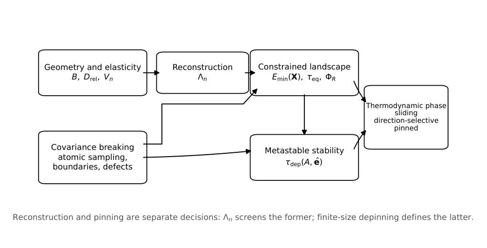
<figcaption class="paper-figure-caption"><b>Fig 1.</b> FIG. 1. Logical structure of the criterion. Bare geometry and elasticity determine the reconstruction susceptibility Λ, whereas the thermodynamic phase is determined by the size scaling of the depinning stress τdep; ΦR and τeq diagnose its equilibrium corrugation. Reconstruction is not sufficient for bulk static pinning. Exact commensuration can produce a bulk barrier, while edges and defects can pin finite contacts.</figcaption>
</figure>
<figure class="paper-figure-card">
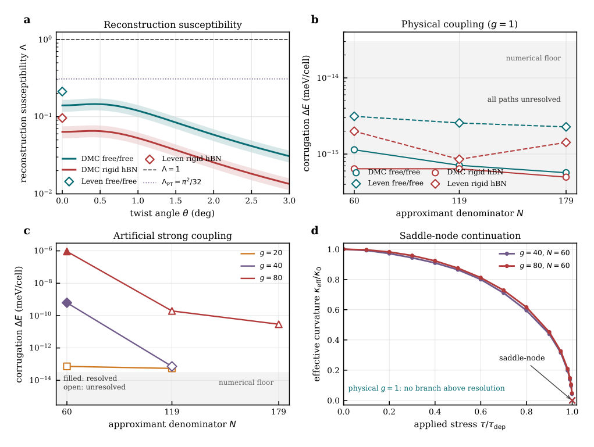
<figcaption class="paper-figure-caption"><b>Fig 2.</b> FIG. 2. Reconstruction and depinning tests for graphene/hBN. (a) Twist-dependent Λ obtained from the DMC first-star adhesion surface; shaded bands propagate the reported Fourier-fit uncertainties. Diamonds mark the largest zero-twist values found among the tested Leven-spectrum approximants. The dashed line marks the reconstruction scale Λ = 1, and the dotted line is the one-dimensional Pokrovsky–Talapov value in the complex-coefficient convention of Eq. (37); neither line is a pinning boundary. (b) Physical-coupling (g = 1) finite-size flow of the largest constrained corrugation among five loading directions for both adhesion models and boundary conditions. All symbols are open because...</figcaption>
</figure>

**Summary.** This work develops a rigorous thermodynamic framework to define structural superlubricity by analyzing the limits of directional depinning stress at crystalline interfaces like graphene/hBN. The authors demonstrate that simple elastic reconstruction susceptibility ($\Lambda$) is insufficient to predict static pinning, concluding that under ideal conditions, the system remains in an elastically relaxed sliding regime.

**Why it may be interesting.** While focused on solid-state friction, the methodology of defining phase transitions via thermodynamic limits ($\lim_{A	o\infty}$) and distinguishing between different types of order parameters (e.g., susceptibility vs. true barrier height) is highly relevant to understanding phase boundaries in open quantum systems or complex many-body dynamics.

Detailed structure

**Main problem.** The authors aim to establish a rigorous thermodynamic criterion for structural superlubricity—the suppression of static friction—at two-dimensional crystalline interfaces.

**Main result.** The analysis shows that smooth, clean moiré continua cannot generate an extensive bulk sliding barrier; the results are consistent with an elastically relaxed sliding regime rather than a statically pinned phase.

**Method.** They define superlubricity using limits of directional depinning stresses ($	au_{	ext{dep}}$) and distinguish this thermodynamic criterion from reconstruction susceptibility ($\Lambda_n$).

**Model / system.** The study uses a two-dimensional discrete model, specifically examining the graphene/hBN interface, governed by an energy functional incorporating elastic terms and generalized stacking-fault energies.

**Key observables.** Directional depinning stress ($	au_{	ext{dep}}$), equilibrium restoring stress ($\Phi_R$), and reconstruction susceptibility ($\Lambda_n$).

**Important parameters / regimes.** The thermodynamic limits $A	o\infty$ are crucial for defining the true phase; $\Lambda=1$ is identified as a reconstruction scale, not a static phase criterion.

**Assumptions / limitations.** The analysis relies on taking the limit of large contact areas ($A	o\infty$) and assumes zero-temperature, defect-free, in-plane conditions for the primary conclusions.

**Figures summary.** Figures illustrate the dependence of reconstruction susceptibility ($\Lambda$) on twist angle and show finite-size flow of corrugation, demonstrating that small approximants do not predict large-scale behavior.

**Paper structure.** The paper first defines the thermodynamic criteria using depinning stresses. It then analyzes continuum models to show that smooth reconstruction is insufficient for pinning. Finally, it applies these rigorous criteria to atomistic simulations (graphene/hBN) to test for resolved static barriers.

Abstract

Incommensurability and elastic reconstruction do not by themselves define a structurally superlubric phase. We define fully sliding and pinned zero-temperature phases by $\limsup_{A\to\infty}τ_{\rm dep}^{\max}(A)=0$ and $\liminf_{A\to\infty}τ_{\rm dep}^{\min}(A)>0$, respectively; $Λ_n=|V_n|G_{n,i}[D_{\rm rel}^{-1}(\mathbf q_n)]_{ij}G_{n,j}$ measures only reconstruction susceptibility. Translational covariance then proves that a clean, smooth, infinite moiré continuum can reconstruct without acquiring a bulk sliding barrier. We restore atomic sampling in a two-dimensional discrete model of graphene/hBN and test both a diffusion quantum Monte Carlo first-star potential and a 15-harmonic Leven potential across three rational approximants and five directions. No physical-coupling equilibrium or metastable barrier is resolved. The Leven spectrum raises the largest tested $Λ$ from $0.142$ to $0.212$, while artificial scaling through $Λ=1$ reaches uncontrolled strain before a size-independent threshold appears. The tested zero-temperature in-plane models are therefore consistent with an elastically relaxed sliding regime; $Λ=1$ is a reconstruction scale, not a static phase criterion.

[↑ back to top](#top)

### [Arnold--Nielsen Geometry for Complexity-Deformed Noncommutative Transport](http://arxiv.org/abs/2607.20388v1)

**Authors:** Alberto Acevedo, Antonio Falcó  
**Type:** theory · **Category:** other · **PDF:** <https://arxiv.org/pdf/2607.20388v1>  
**Analysis basis:** full PDF text, analyzed in chunks
**Topic relevance:** `entanglement & information structure` **3/5** · `methods for driven-dissipative` **3/5** · `correlated / nonlocal dissipation` **2/5** · `driven-dissipative phase transition` **2/5** · `non-equilibrium dynamics` **2/5** · `Keldysh / 2PI / non-Gaussian methods` **1/5** · `non-equilibrium universality` **1/5**

↔ Scroll figures horizontally

<figure class="paper-figure-card">
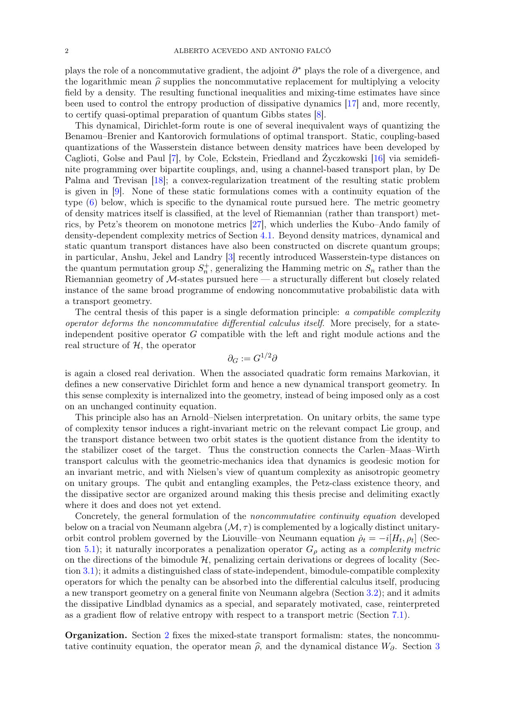
<figcaption class="paper-figure-caption"><b>Fig 1.</b> Low-resolution page preview, page 2</figcaption>
</figure>
<figure class="paper-figure-card">
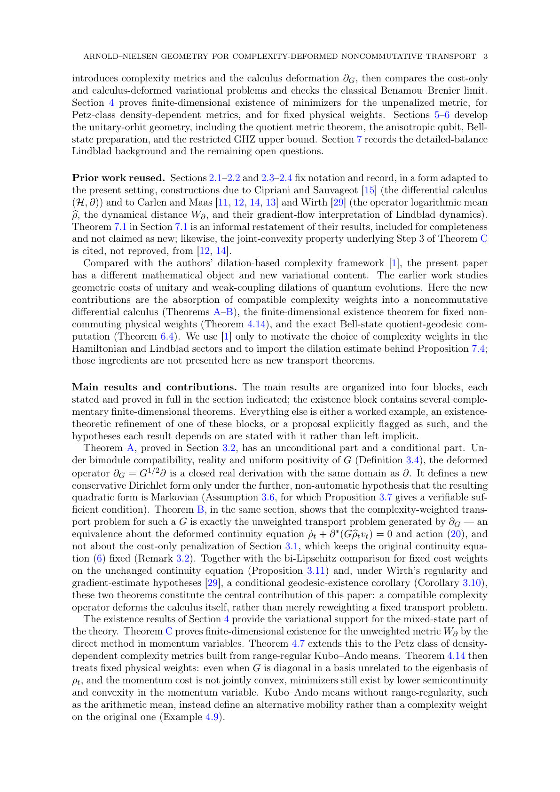
<figcaption class="paper-figure-caption"><b>Fig 2.</b> Low-resolution page preview, page 3</figcaption>
</figure>
<figure class="paper-figure-card">
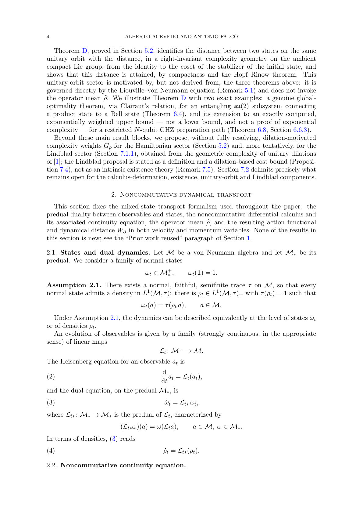
<figcaption class="paper-figure-caption"><b>Fig 3.</b> Low-resolution page preview, page 4</figcaption>
</figure>
<figure class="paper-figure-card">
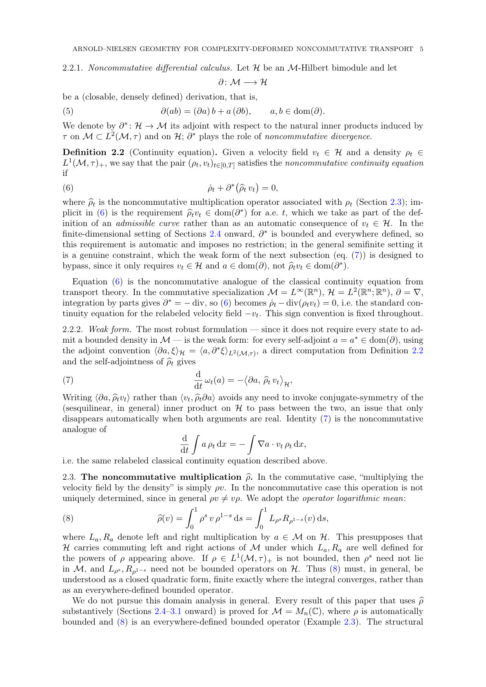
<figcaption class="paper-figure-caption"><b>Fig 4.</b> Low-resolution page preview, page 5</figcaption>
</figure>
<figure class="paper-figure-card">
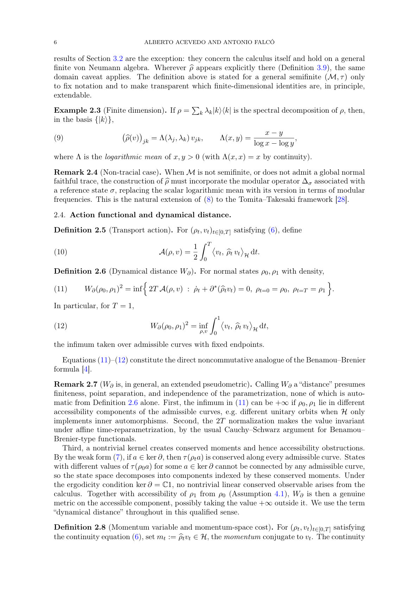
<figcaption class="paper-figure-caption"><b>Fig 5.</b> Low-resolution page preview, page 6</figcaption>
</figure>

**Summary.** This paper introduces an Arnold--Nielsen geometric deformation to model noncommutative dynamical optimal transport, embedding complexity directly into the underlying differential calculus. It establishes that this complex-weighted transport is equivalent to a simpler unweighted problem under certain conditions. The framework successfully applies these concepts to analyze both unitary and dissipative quantum evolution.

**Why it may be interesting.** This work provides a powerful generalization of optimal transport theory by incorporating intrinsic quantum complexity measures directly into the geometry of state space evolution. This has implications for understanding resource costs in open quantum systems beyond simple energy minimization.

Detailed structure

**Main problem.** The paper develops a geometric framework by deforming noncommutative dynamical optimal transport using an Arnold--Nielsen complexity operator. The goal is to internalize the cost of quantum complexity directly into the differential calculus governing state evolution.

**Main result.** It proves that this complexity-weighted transport problem is equivalent to an unweighted problem generated by the deformed calculus, and identifies the distance on unitary orbits as a quotient metric from a right-invariant complexity geometry.

**Method.** The authors employ advanced functional analysis techniques involving noncommutative differential calculi, optimal transport theory (Wasserstein distance), and geometric methods applied to quantum state spaces.

**Model / system.** The system involves quantum states described by density matrices ($
ho_t$) evolving on von Neumann algebras. The dynamics are analyzed in the context of both unitary (Hamiltonian) evolution and dissipative (Lindblad) processes.

**Key observables.** Wasserstein distance ($W_\partial$), complexity operator ($G$), relative entropy ($	ext{Ent}_{\sigma}$), and specific preparation bounds for Bell/GHZ states.

**Important parameters / regimes.** The complexity weight $G$ is crucial, which can be defined based on the underlying dynamics (e.g., $\|L_k\|^2_{	ext{op}}$ in the Lindblad case).

**Assumptions / limitations.** Key assumptions include requiring the deformed quadratic form to remain Dirichlet for certain equivalences, and treating the Lindblad case as an entropy-gradient-flow background.

**Figures summary.** No specific figure summaries were extracted from the notes; the focus is on theoretical theorems and derivations.

**Paper structure.** The paper builds from defining the complexity deformation of the calculus (Theorem A), establishing metric equivalences (Theorem B), deriving geometric structures on unitary orbits, and finally applying this framework to dissipative Lindblad dynamics via gradient flow analysis.

Abstract

We deform the Carlen--Maas--Wirth framework for noncommutative dynamical optimal transport by an Arnold--Nielsen type complexity operator. A positive state-independent operator $G$ compatible with the Hilbert bimodule structure of a noncommutative differential calculus $\partial\colon\M\to\Hcal$ can be absorbed into the calculus itself, \[ \partial_G:=G^{1/2}\partial. \] The corresponding complexity-weighted transport problem is exactly the unweighted transport problem generated by $\partial_G$, whenever the deformed quadratic form remains Dirichlet. In finite dimensions we prove existence of minimizers for density-dependent Petz-class metrics and for fixed physical complexity weights, the latter without commutation between $G$ and the state-dependent mobility. On unitary orbits we identify the induced distance with a quotient metric coming from a right-invariant complexity geometry. This yields an exact Bell-state preparation result via Clairaut's relation and an exactly computed restricted-path upper bound for GHZ preparation; the Lindblad detailed-balance case is included only as entropy-gradient-flow background.

[↑ back to top](#top)

### [Fluid Memory Enhances Active Beating via Back-and-Forth Motion](http://arxiv.org/abs/2607.19820v1)

**Authors:** Subhajit Gupta, Supravat Dey  
**Type:** theory · **Category:** statistical mechanics · **PDF:** <https://arxiv.org/pdf/2607.19820v1>  
**Analysis basis:** full PDF text, analyzed in chunks
**Topic relevance:** `methods for driven-dissipative` **3/5** · `non-equilibrium dynamics` **3/5** · `driven-dissipative phase transition` **2/5** · `non-equilibrium universality` **2/5** · `Frenkel-Kontorova` **1/5** · `Keldysh / 2PI / non-Gaussian methods` **1/5** · `analog quantum simulation` **1/5** · `correlated / nonlocal dissipation` **1/5**

↔ Scroll figures horizontally

<figure class="paper-figure-card">
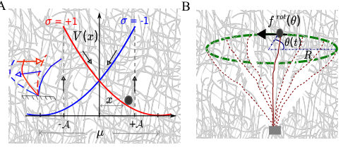
<figcaption class="paper-figure-caption"><b>Fig 1.</b> FIG. 1. Schematics of two colloidal models of ciliary beating in Jeffery fluid. (A) Rower: a bead moves downhill in one of two harmonic potentials separated by distance µ and switches at x = ±A [27]. (B) Rotor: a bead rotates on a rigid circular trajectory of radius R under a tangential driving force [31].</figcaption>
</figure>
<figure class="paper-figure-card">
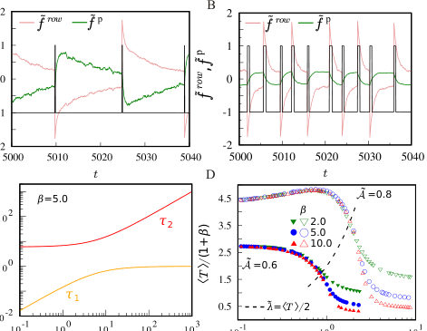
<figcaption class="paper-figure-caption"><b>Fig 2.</b> FIG. 3. (A,B) For the rower model, the polymeric force, f p, and driving force, f row, are plotted as functions of time for ˜λ = 4 (A) and 20 (B). The abrupt jumps in the force profiles correspond to switching events. The black curve shows the alignment, taking the value 1 (−1) when f p and f row are in the same (opposite) direction. Parameters: β = 5.0 and ˜ A = 0.8. (C) Relaxation times τ1 and τ2 as functions of ˜λ. (D) Plot of ⟨T⟩/(1+β) versus ˜λ/(1+β) for different values of β and two values of ˜ A shows good collapse for ˜λ &lt; ˜λc. The dashed line represents ˜λ = ⟨T⟩/2.</figcaption>
</figure>
<figure class="paper-figure-card">
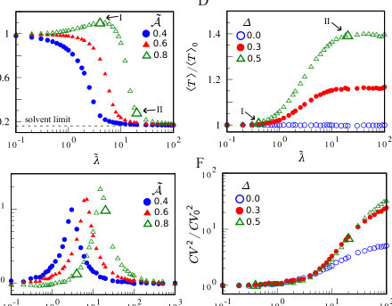
<figcaption class="paper-figure-caption"><b>Fig 3.</b> FIG. 2. Steady-state time period and its fluctuations for the rower (left panel) and rotor (right panel). (A,B) Rep- resentative noisy trajectories of the rower, x(t), and the ro- tor, cos θ(t), for relatively small and large ˜λ, corresponding to points I and II in (C,E) and (D,F), respectively. (C,D) Normalized mean period, ⟨T⟩/⟨T⟩0, as a function of ˜λ for different ˜ A (rower) and ∆(rotor). (E,F) Normalized relative fluctuation, CV 2/CV 2 0 , is plotted as a function of ˜λ. Param- eters: β = 5.0 and others are specified in the texts.</figcaption>
</figure>
<figure class="paper-figure-card">
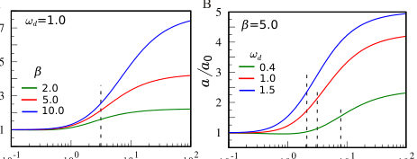
<figcaption class="paper-figure-caption"><b>Fig 4.</b> FIG. 4. Normalized amplitudes at the steady-state, a/a0 (Eq. 10), for forced oscillations are plotted as functions of the fluid memory ˜λ for different values of β (A) and driving frequencies ωd (B). Dashed lines represent ˜λ = π/ωd.</figcaption>
</figure>

**Summary.** This paper models how viscoelastic fluids affect the beating motion of flagella using colloidal analogues. It finds that oscillatory (back-and-forth) motion can exploit fluid memory to significantly increase beating frequency, while continuous rotation behaves differently. The work provides a general mechanism for active enhancement in complex polymeric environments.

**Why it may be interesting.** While focused on classical soft matter dynamics, the concept of non-Markovian noise and energy dissipation mechanisms in active systems shares conceptual links with open quantum system dynamics where memory effects are crucial for decoherence or driving protocols.

Detailed structure

**Main problem.** The study investigates how viscoelastic effects, specifically fluid memory, influence the stochastic dynamics of active beating motions like those found in cilia or flagella.

**Main result.** Back-and-forth (rower) beating is identified as a generic mechanism that can exploit fluid memory to rapidly enhance beating frequency beyond a critical memory threshold. Conversely, unidirectional motion shows a different dependence on fluid memory.

**Method.** The authors use theoretical modeling based on generalized Langevin equations for colloidal models immersed in a Jeffreys fluid, solving the resulting non-Markovian dynamics using numerical integration schemes.

**Model / system.** Two minimal colloidal models are analyzed: a 'Rower' model simulating back-and-forth beating between harmonic potentials, and a 'Rotor' model simulating continuous unidirectional rotation. The surrounding medium is modeled as a Jeffreys fluid to capture viscoelastic memory effects.

**Key observables.** Mean beating period ($\langle T 
angle$), relative fluctuations in the beating period ($	ext{CV}^2$), and the steady-state frequency enhancement factor.

**Important parameters / regimes.** Fluid memory parameter ($	ilde{\lambda}$), polymeric drag coefficient ($eta$), and the critical memory threshold ($	ilde{\lambda}_c$).

**Assumptions / limitations.** The analysis relies on mapping non-Markovian equations to coupled Markovian forms using auxiliary variables, and comparing results in the small-noise limit.

**Figures summary.** Figures illustrate schematics of the Rower and Rotor models, showing how $\langle T 
angle$ changes with fluid memory ($	ilde{\lambda}$) for both beating types, and plotting relative fluctuations ($	ext{CV}^2$) vs. $	ilde{\lambda}$.

**Paper structure.** The paper introduces the physical problem (viscoelastic influence on active motion), develops theoretical models (Rower/Rotor in Jeffreys fluid), presents numerical simulations varying memory parameters, analyzes key observables like frequency and fluctuations, and concludes by generalizing the findings to back-and-forth beating.

Abstract

Ciliary and flagellar beating often occurs in viscoelastic fluids. The surrounding fluid strongly influences the beating dynamics. Viscoelastic effects on beating dynamics, however, remain poorly understood. Here, we investigate the stochastic dynamics of experimentally realized colloidal models in a Jeffreys fluid. We find that back-and-forth beating transiently aligns the driving and polymeric forces, leading to a rapid increase in the beating frequency once the fluid memory becomes comparable to the stroke duration. The crossover is marked by a maximum in beating-period fluctuations. For unidirectional rotational motion, however, beating slows down with increasing fluid memory. Our results identify back-and-forth beating as a generic mechanism for exploiting fluid memory in active oscillators, providing a possible explanation for enhanced flagellar beating in polymeric fluids.

[↑ back to top](#top)

### [Magnetoresistive Memory in the Paramagnetic Phase of Eu$_5$In$_2$As$_6$](http://arxiv.org/abs/2607.20287v1)

**Authors:** Sudhaman R. Balguri, Mira B. Mahendru, Rourav Basak, Enrique O. González-Delgado, Adam A. Aczel, David E. Graf, Andreas Rydh, Christopher C. Homes, Jonathan Gaudet, Ying Ran, Alex Frano, Fazel Tafti  
**Type:** experiment · **Category:** strongly correlated electrons · **PDF:** <https://arxiv.org/pdf/2607.20287v1>  
**Analysis basis:** full PDF text, analyzed in chunks
**Topic relevance:** `exotic spin models in light-matter` **3/5** · `spintronics-quantum-optics interface` **3/5** · `non-equilibrium dynamics` **2/5** · `non-equilibrium universality` **2/5** · `Keldysh / 2PI / non-Gaussian methods` **1/5** · `Kondo & dissipative impurity` **1/5** · `analog quantum simulation` **1/5** · `driven-dissipative phase transition` **1/5**

↔ Scroll figures horizontally

<figure class="paper-figure-card">
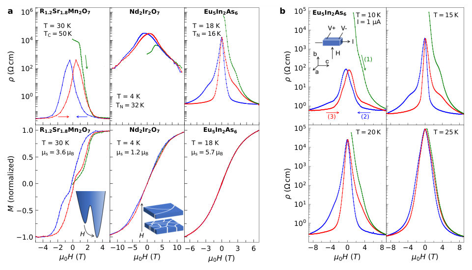
<figcaption class="paper-figure-caption"><b>Fig 1.</b> Figure 1: Field dependence of MRM. (a) Comparing MRM between (left) the manganite</figcaption>
</figure>
<figure class="paper-figure-card">
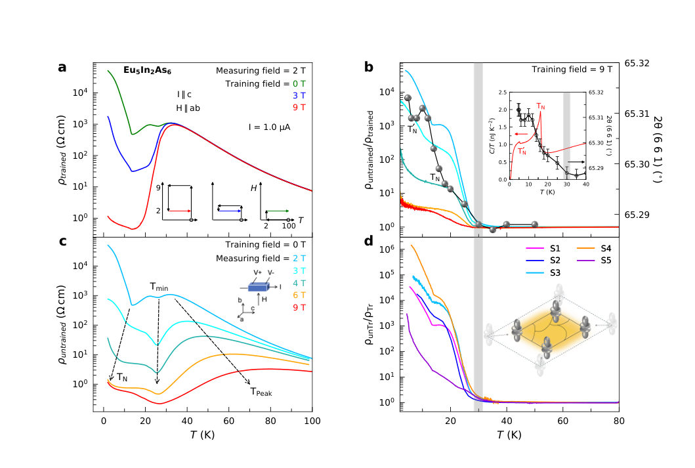
<figcaption class="paper-figure-caption"><b>Fig 2.</b> Figure 2: Temperature dependence of MRM. (a) Three resistivity curves measured from 2 to</figcaption>
</figure>
<figure class="paper-figure-card">
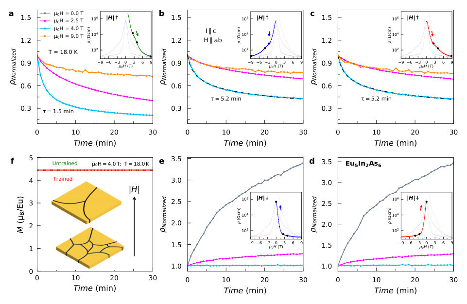
<figcaption class="paper-figure-caption"><b>Fig 3.</b> Figure 3: Time dependence of MRM. Normalized resistivity at T = 18 K as a function of</figcaption>
</figure>
<figure class="paper-figure-card">
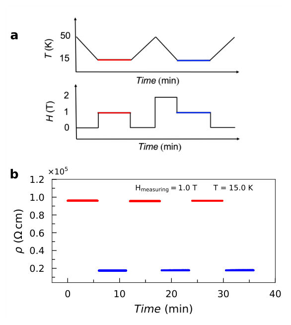
<figcaption class="paper-figure-caption"><b>Fig 4.</b> Figure 4: Application of MRM. (a) A training sequence, where black lines show the training</figcaption>
</figure>

**Summary.** This work reports discovering a Magnetoresistive Memory (MRM) effect in Eu5In2As6 that persists deep within the paramagnetic phase, unlike previously studied materials. The persistence of this history-dependent resistivity suggests an underlying mechanism rooted in short-range correlations or hidden order rather than long-range magnetic ordering. This establishes the material as a promising platform for quantum memory applications.

**Why it may be interesting.** While focused on solid-state magnetism, the investigation into history dependence, hidden order, and correlation between electronic transport and lattice structure touches upon non-equilibrium dynamics and emergent quantum states relevant to correlated electron physics.

Detailed structure

**Main problem.** The study investigates a novel Magnetoresistive Memory (MRM) effect in Eu5In2As6, particularly focusing on its persistence and mechanism within the paramagnetic phase.

**Main result.** The MRM effect is observed well into the paramagnetic regime, suggesting underlying physics related to short-range correlations or hidden order rather than simple magnetic domain wall dynamics seen in other materials.

**Method.** Measurements include resistivity vs. applied field/temperature sweeps, time-dependent measurements, and X-ray diffraction analysis of lattice parameters.

**Model / system.** The physical system is the semiconductor compound Eu5In2As6, a magnetic material exhibiting A-type AFM ordering at 16 K. The study compares its MRM behavior to known systems like manganites and iridates.

**Key observables.** Resistivity ($
ho$) hysteresis loops (untrained vs. trained states), lattice parameter contraction along the c-axis, and temperature dependence of the memory effect.

**Important parameters / regimes.** The MRM onset temperature (~30 K in some analyses) is significantly above the AFM transition temperature ($T_N = 16 	ext{ K}$); carrier concentration plays a critical role.

**Assumptions / limitations.** The analysis assumes that resistivity relaxation and lattice contraction are intrinsic to the material's electronic state, ruling out simple Joule heating effects.

**Figures summary.** Figures compare MRM across different magnetic materials; others show $
ho(T)$ curves for trained/untrained samples, field dependence of hysteresis loops, and lattice parameter changes correlated with the MRM onset temperature.

**Paper structure.** The paper systematically establishes the existence of MRM in Eu5In2As6 above $T_N$, contrasts it with known magnetic ordering mechanisms, investigates its coupling to structural changes (lattice contraction), and finally uses symmetry analysis to constrain potential underlying physical models.

Abstract

Magnetoresistive materials that respond sensitively to applied fields are central to modern data storage technologies. Here we unveil a novel Magnetoresistive Memory (MRM) in Eu$_5$In$_2$As$_6$, where the electrical resistivity depends not only on the magnitude but also on the history of the applied magnetic field. Such an effect has been reported in only two classes of strongly correlated electron systems: perovskite manganites and pyrochlore iridates. In both cases, the effect has been observed in the magnetically ordered phase. It has been attributed to metastable magnetic states in manganites and conducting domain walls in iridates. Remarkably, the MRM in Eu$_5$In$_2$As$_6$ onsets at twice the antiferromagnetic transition temperature, well within the paramagnetic phase. The temperature, field, and time dependence of resistivity suggest that either a hidden order or a fluctuating phase with short-range correlations underlies this effect. Our results offer MRM as a new platform for quantum sensing and memory technologies, and encourage searching for MRM in related materials.

[↑ back to top](#top)

### [Proximity-induced charge transfer, strain and magnetic exchange in graphene/CrSBr heterostructure](http://arxiv.org/abs/2607.20297v1)

**Authors:** Asish K. Kundu, Anil Rajapitamahuni, Niraj Aryal, Turgut Yilmaz, Margalit L. Feuer, Suji Park, Houk Jang, Abhay Pasupathy, Xavier Roy, Jerzy T. Sadowski, Elio Vescovo  
**Type:** both · **Category:** strongly correlated electrons · **PDF:** <https://arxiv.org/pdf/2607.20297v1>  
**Analysis basis:** full PDF text, analyzed in chunks
**Topic relevance:** `exotic spin models in light-matter` **3/5** · `spintronics-quantum-optics interface` **3/5** · `analog quantum simulation` **2/5** · `driven-dissipative phase transition` **2/5** · `Keldysh / 2PI / non-Gaussian methods` **1/5** · `Kondo & dissipative impurity` **1/5** · `methods for driven-dissipative` **1/5** · `non-equilibrium dynamics` **1/5**

↔ Scroll figures horizontally

<figure class="paper-figure-card">
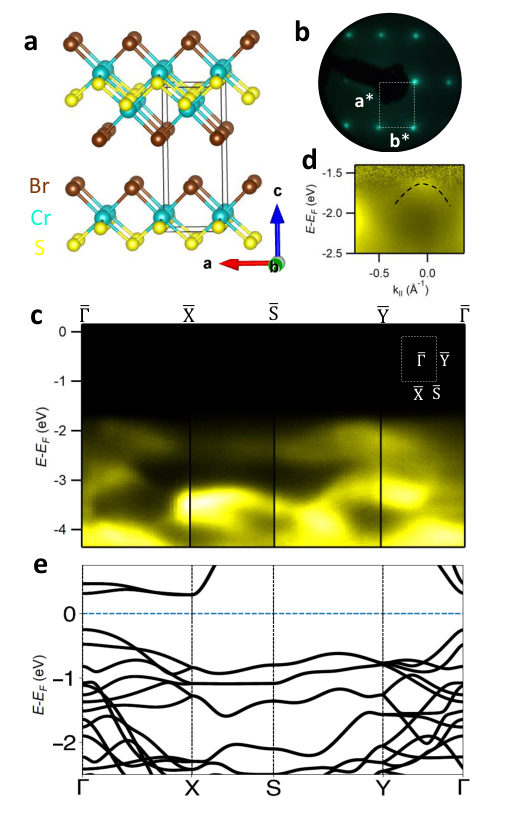
<figcaption class="paper-figure-caption"><b>Fig 1.</b> Figure 1: Structure and electronic structure of CrSBr. (a) Crystal structure of CrSBr. (b) Low-energy electron diffraction pattern from a cleaved CrSBr surface. (c) ARPES spectra along high symmetry path measured with 21.2 eV photons at room temperature. (d) Zoomed- view of the top part of the valence band around ¯Γ. Parabolic dispersion of the valence band is highlighted by dashed curve. The bright and dark colors correspond to the maximum and minimum photoemission intensities, respectively. (e) Electronic structure of bulk CrSBr along Γ-X-S-Y-Γ from DFT. Dashed horizontal line indicate the Fermi energy.</figcaption>
</figure>
<figure class="paper-figure-card">
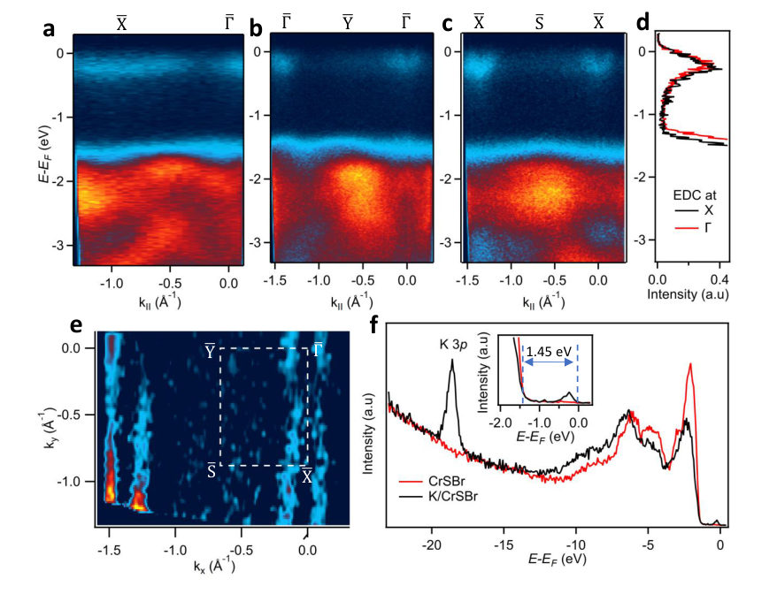
<figcaption class="paper-figure-caption"><b>Fig 2.</b> Figure 2: Electronic structure of CrSBr after dosing of potassium on the surface. (a-c) ARPES spectra along ¯X −¯Γ, ¯Γ −¯Y −¯Γ and ¯X −¯S −¯X high-symmetry paths, respectively using 40.8 eV photons. (d) EDC at Γ and ¯X. (e) Fermi surface using 40.8 eV photons. (f) Integrated EDCs before and after potassium deposition. Inset shows zoomed-view close to the Fermi energy.</figcaption>
</figure>
<figure class="paper-figure-card">
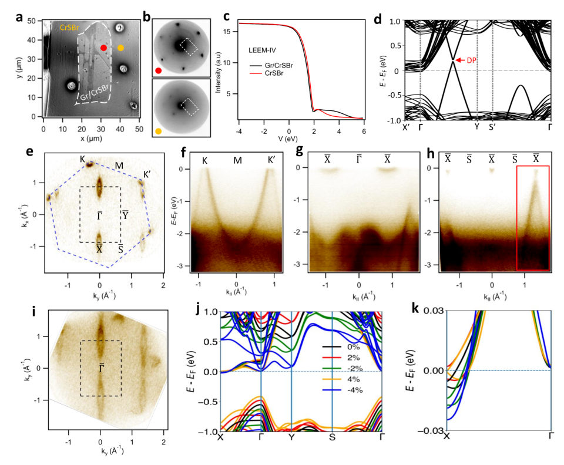
<figcaption class="paper-figure-caption"><b>Fig 3.</b> Figure 3: Electronic structure of Gr/CrSBr heterostructure. (a) Mirror-mode LEEM image of the Gr/CrSBr. (b) Local diffraction patterns acquired at 50 eV from the Gr/CrSBr region (top) and the bare CrSBr region (bottom), corresponding to the circular markers in panel (a). Dashed-rectangle mark the reciprocal unit cell of CrSBr. (c) LEEM-IV from those two different regions. (d) DFT calculated band structure of the Gr/bilayer‑CrSBr heterostructure, with the Dirac point (DP) indicated. The X’ and S’ symmetry points are related to the folded CrSBr zone. (e) ARPES FS map of the heterostructure using 180 eV photon energy at 18 K. (f–h) ARPES spectra along high symmetry paths as indicated in...</figcaption>
</figure>
<figure class="paper-figure-card">
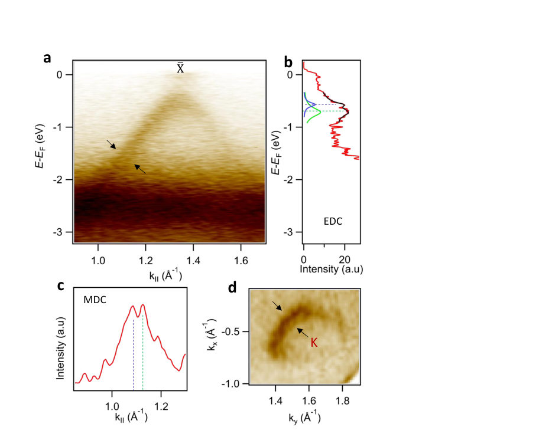
<figcaption class="paper-figure-caption"><b>Fig 4.</b> Figure 4: Splitting of graphene Dirac bands. (a) Zoomed view of the ARPES spectrum enclosed by rectangle around ¯X from Fig. 3(h). Splitting of graphene Dirac bands are marked by arrows. (b) Energy distribution curve (red) at ¯X from (a). The EDC around the exchange splitting region were fitted using two Lorentzian peaks and the fitted envelope (black) is overlayed on EDC. (c) Momentum distribution curves at –1.65 eV from (a) shows clear splitting of Dirac band. (d) Constant‑energy contours around the K point reveal split pockets, indicated by arrows.</figcaption>
</figure>

**Summary.** This work provides a comprehensive spectroscopic and theoretical investigation into the graphene/CrSBr interface. Researchers demonstrate that strong interfacial coupling causes significant charge transfer and electronic reconstruction, leading to novel properties like an insulator-to-metal transition and evidence of magnetic proximity effects. These findings establish the system as a versatile platform for next-generation spintronic devices.

**Why it may be interesting.** The strong focus on proximity effects, band engineering via external stimuli (strain, doping), and emergent magnetism in 2D van der Waals heterostructures is highly relevant for understanding correlated electron behavior in artificial quantum materials.

Detailed structure

**Main problem.** To microscopically understand the electronic landscape governing emergent behaviors, such as unconventional quantum Hall effects, in the graphene/CrSBr heterostructure driven by proximity interactions.

**Main result.** The interface exhibits massive charge redistribution leading to hole doping of graphene and an insulator-to-metal transition in interfacial CrSBr, alongside evidence for magnetic proximity coupling via Dirac cone splitting.

**Method.** A combination of Angle-Resolved Photoemission Spectroscopy (ARPES), Low-Energy Electron Microscopy (LEEM), and Density Functional Theory (DFT) was employed to characterize the interface.

**Model / system.** The study focuses on the graphene/CrSBr van der Waals heterostructure, investigating how interfacial charge transfer, strain, and magnetic coupling modify the electronic structure of both components.

**Key observables.** Interfacial charge redistribution, spin-polarized conduction band population, insulator-to-metal transition, splitting feature in the Dirac cone, and compressive strain effects.

**Important parameters / regimes.** The study investigates phenomena under various doping/strain conditions, focusing on electronic structure renormalization distinct from conventional doping.

**Assumptions / limitations.** DFT calculations are used to provide qualitative insight into band alignment and strain trends, while experimental measurements map the actual electronic reconstruction at the interface.

**Figures summary.** Figures illustrate $	ext{CrSBr}$ structure, ARPES spectra along high symmetry paths, DFT-calculated bulk/interface electronic structures, and Fermi surface maps showing charge transfer effects.

**Paper structure.** The paper establishes the problem by noting exotic responses in the heterostructure. It then presents spectroscopic characterization (ARPES/LEEM) to map the interfacial electronic state, supported by DFT calculations that model charge transfer, strain, and magnetic coupling mechanisms.

Abstract

Stacking van der Waals materials provides a powerful route to engineer emergent electronic and magnetic behaviors through proximity-driven interactions. The graphene/CrSBr heterostructure has emerged as a compelling platform in this frontier, exhibiting exotic macroscopic responses-- including uniaxial surface-plasmon-polariton propagation and an unconventional quantum Hall effect-- indicative of strong interfacial electronic and magnetic coupling. However, a microscopic electronic landscape governing these phenomena has remained elusive. Here, we provide a comprehensive spectroscopic characterization of the graphene/CrSBr interface using a combination of angle-resolved photoemission spectroscopy (ARPES), low-energy electron microscopy (LEEM), and density functional theory. We resolve a massive redistribution of interfacial charge that concurrently hole dopes graphene and populates the quasi-one-dimensional spin-polarized conduction band of CrSBr, resulting insulator-to-metal transition in the interfacial CrSBr layer. Furthermore, electronic structure of CrSBr exhibits strong momentum-dependent renormalization distinct from conventional charge doping, and theoretical modeling supported by Raman spectroscopy points to additional interfacial compressive strain. In addition, ARPES reveals a splitting-like feature in the graphene Dirac cone consistent with spin degeneracy lifting, providing possible evidence of magnetic proximity coupling. These findings provide crucial microscopic insight into the system's optical and transport responses and establish graphene/CrSBr as a versatile platform for charge-transfer control, strain-driven band engineering, magnetic-proximity coupling, and directionally confined excitations for next-generation spintronic and nanophotonic devices.

[↑ back to top](#top)

### [Weakly Nonlinear Dynamics of Unstable Modes in Jammed Amorphous Solids](http://arxiv.org/abs/2607.19818v1)

**Authors:** Kota Noto, Harukuni Ikeda, Kuniyasu Saitoh, Hisao Hayakawa  
**Type:** theory · **Category:** statistical mechanics · **PDF:** <https://arxiv.org/pdf/2607.19818v1>  
**Analysis basis:** full PDF text, analyzed in chunks
**Topic relevance:** `driven-dissipative phase transition` **3/5** · `analog quantum simulation` **2/5** · `non-equilibrium dynamics` **2/5** · `non-equilibrium universality` **2/5** · `Frenkel-Kontorova` **1/5** · `Keldysh / 2PI / non-Gaussian methods` **1/5** · `correlated / nonlocal dissipation` **1/5** · `entanglement & information structure` **1/5** · `methods for driven-dissipative` **1/5**

↔ Scroll figures horizontally

<figure class="paper-figure-card">
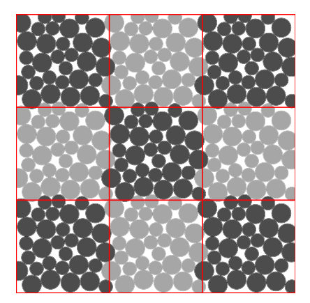
<figcaption class="paper-figure-caption"><b>Fig 1.</b> Fig. 1 An example of a tile structure consisting of a 3×3 array of cells. Each cell consists of a packing of 32 particles.</figcaption>
</figure>
<figure class="paper-figure-card">
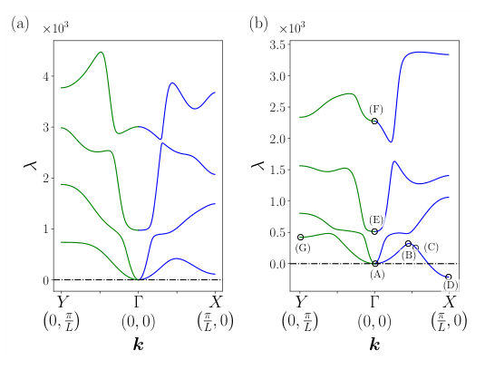
<figcaption class="paper-figure-caption"><b>Fig 2.</b> Fig. 2 The four lowest eigenvalue branches along the kxex-direction (blue) and the kyey-direction (green) for P/κ = 5 × 10−4 and N = 128. All branches are non-negative in (a), whereas the lowest branch becomes negative near the X point in (b). The labeled points (A)–(G) in panel (b) indicate the wave numbers at which the corresponding eigenvectors are shown in Fig. 3 as panels (a)–(g), respectively.</figcaption>
</figure>
<figure class="paper-figure-card">
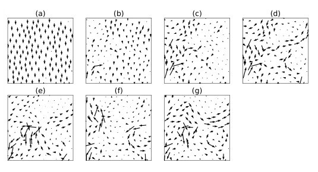
<figcaption class="paper-figure-caption"><b>Fig 3.</b> Fig. 3 Eigenvectors corresponding to the labeled points (A)–(G) in Fig. 2(b), shown here as panels (a)–(g), respectively. Panels (a)–(d) show the eigenvectors of the lowest branch in the kxex direction at wave numbers (a) kx = 0, (b) kx = 9π/20L, (c) kx = 11π/20L, and (d) kx = π/L, respectively. Panels (e) and (f) depict the eigenmodes corresponding to the third-lowest and fourth-lowest branches at k = 0, i.e., the lowest nonzero eigenmode and the second-lowest nonzero eigenmode. Panel (g) shows the eigenvector of the lowest branch in the kyey direction at ky = π/L.</figcaption>
</figure>
<figure class="paper-figure-card">
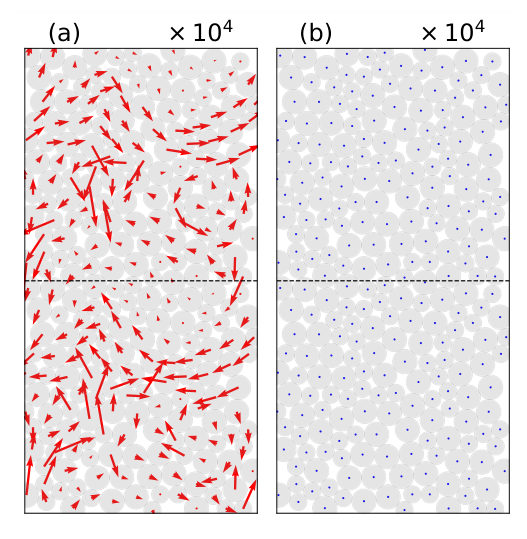
<figcaption class="paper-figure-caption"><b>Fig 4.</b> Fig. 4 Displacements of grains after adding the perturbation along the direction of the eigenvector for the case with a positive eigenvalue, where red arrows in (a) indicate the initial perturbative displacements of grains and blue arrows in (b) exhibit the final displacements of grains after the relaxation. These figures demonstrate the stability of the initial configuration against the perturbation.</figcaption>
</figure>
<figure class="paper-figure-card">
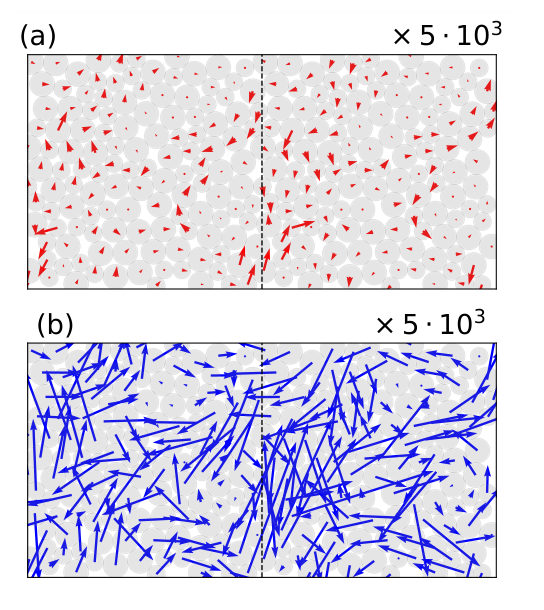
<figcaption class="paper-figure-caption"><b>Fig 5.</b> Fig. 5 Displacements of grains after adding the perturbation along the direction of the eigenvector for the case with a negative eigenvalue, where red arrows in (a) indicate the initial perturbative displacements of grains and blue arrows in (b) exhibit the final displacements of grains after the relaxation. These figures demonstrate the instability of the initial configuration against the perturbation.</figcaption>
</figure>

**Summary.** This work analyzes structural instabilities in jammed amorphous solids by extending standard Hessian analysis using wave numbers. By developing a weakly nonlinear amplitude equation, the authors provide a theoretical framework to model how these unstable modes drive large-scale structural rearrangements beyond simple mechanical stability limits.

**Why it may be interesting.** While focused on classical disordered solids, the mathematical framework of analyzing instability growth via Landau-like equations and spectral analysis is highly relevant to understanding non-equilibrium dynamics in many-body quantum systems near phase transitions or critical points.

Detailed structure

**Main problem.** The study investigates how structural evolution occurs in jammed amorphous solids by analyzing eigenmodes that become linearly unstable beyond the mechanically stable regime.

**Main result.** The authors derived a weakly nonlinear amplitude equation, analogous to the Landau equation, to describe the growth and subsequent saturation of these structurally destabilizing modes.

**Method.** The approach combines linear stability analysis using a generalized Hessian matrix (extended via Fourier transforms) with the development of weak nonlinearity theory.

**Model / system.** The system modeled is jammed amorphous solids composed of repulsive particles, governed by overdamped dynamics derived from a pairwise potential energy function. The analysis uses mesoscopic periodic-cell constructions to incorporate spatial modulation via wave numbers (k).

**Key observables.** Eigenvalues of the generalized Hessian matrix ($\lambda_n(k)$), which determine stability; and the nonlinear coefficient ($\chi_E$) used in amplitude equations.

**Important parameters / regimes.** The analysis is sensitive to specific parameter regimes, such as $	ext{PL}^4/(\kappa d_s^4) \sim O(1)$, and compares results across different system sizes ($N=32$ vs $N=512$).

**Assumptions / limitations.** Key assumptions include using a quasi-periodic cell structure (Bloch-like approximation) to characterize long-wavelength modulations, which is an idealization for amorphous solids.

**Figures summary.** Figures illustrate eigenvalue branches showing where modes become negative (unstable), demonstrate mode hybridization between different character types at finite k, and compare system-size dependence of stability metrics against theoretical lines.

**Paper structure.** The paper progresses from defining the dynamics via a potential energy function to linearizing around equilibrium using a generalized Hessian. It then applies Fourier transforms to analyze wave-vector dependent instabilities before deriving the final weakly nonlinear amplitude equation for mode evolution.

Abstract

We investigate the structural evolution in jammed amorphous solids by analyzing the eigenmodes of a generalized Hessian matrix that incorporates spatial modulation via wave numbers. Unlike the conventional Hessian, this generalized formulation captures linearly unstable modes through a Fourier-based extension of the Hessian matrix, enabling us to study responses beyond the mechanically stable regime. We demonstrate that the excitation of unstable eigenmodes leads to structural rearrangements independent of the initial perturbation by the simulation. Furthermore, we derive a weakly nonlinear amplitude equation to describe the growth and saturation of these unstable modes, analogous to the Landau equation. Our framework provides a pathway to understand instability-driven configuration changes in disordered solids.

[↑ back to top](#top)

### [Multi-Criticality and RG Topology in the Charge-Kondo-Breakdown Scenario in the Cuprates](http://arxiv.org/abs/2607.19807v1)

**Authors:** Stefan Kirchner, Petr Jizba  
**Type:** theory · **Category:** strongly correlated electrons · **PDF:** <https://arxiv.org/pdf/2607.19807v1>  
**Analysis basis:** full PDF text, analyzed in chunks
**Topic relevance:** `Kondo & dissipative impurity` **3/5** · `Keldysh / 2PI / non-Gaussian methods` **2/5** · `non-equilibrium universality` **2/5** · `analog quantum simulation` **1/5** · `correlated / nonlocal dissipation` **1/5** · `driven-dissipative phase transition` **1/5** · `methods for driven-dissipative` **1/5** · `non-equilibrium dynamics` **1/5**

↔ Scroll figures horizontally

<figure class="paper-figure-card">
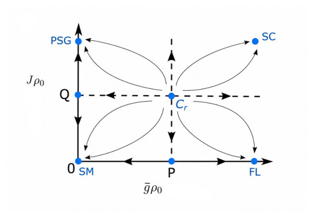
<figcaption class="paper-figure-caption"><b>Fig 1.</b> Figure 1: Schematic renormalization-group flow diagram adapted from Fig. 3(a) of Ref. [17]. The central fixed point Cr is depicted as unstable along both coupling directions, corresponding to a total-repeller fixed point. Such a topology implies that all perturbations grow under coarse graining and has important consequences for the robustness of quantum-critical scaling and ω/T collapse.</figcaption>
</figure>
<figure class="paper-figure-card">
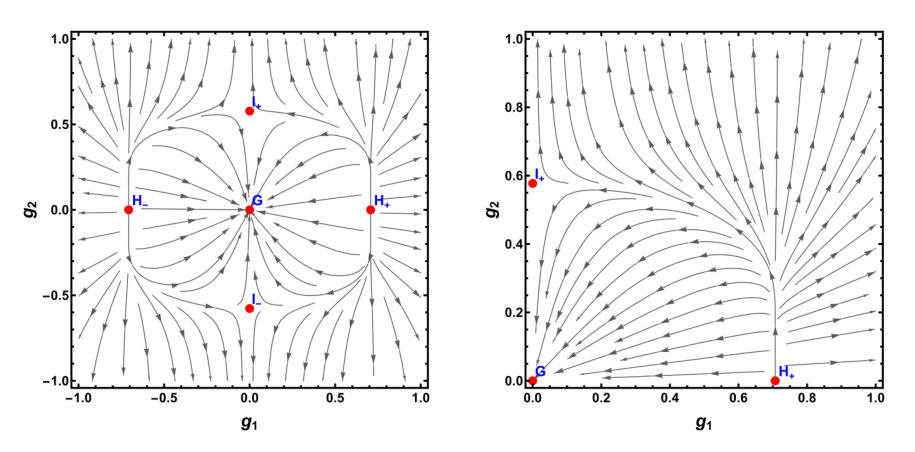
<figcaption class="paper-figure-caption"><b>Fig 2.</b> Figure 2: Numerical phase portrait of the RG Eqs. (22) for ϵ = 1. Red symbols denote finite-coupling fixed points. The Gaussian fixed point G = (0, 0) is the only infrared-attractive finite fixed point. The interacting fixed points H± = (±ϵ/2, 0) lie on the invariant manifold g2 = 0 and are unstable to transverse perturbations, while the Ising-like fixed points I± = (0, ±ϵ/3) are saddles. The left panel shows the full range −1 ≤g1,2 ≤1; the right panel highlights the physically relevant sector g1 ≥0, g2 ≥0.</figcaption>
</figure>
<figure class="paper-figure-card">
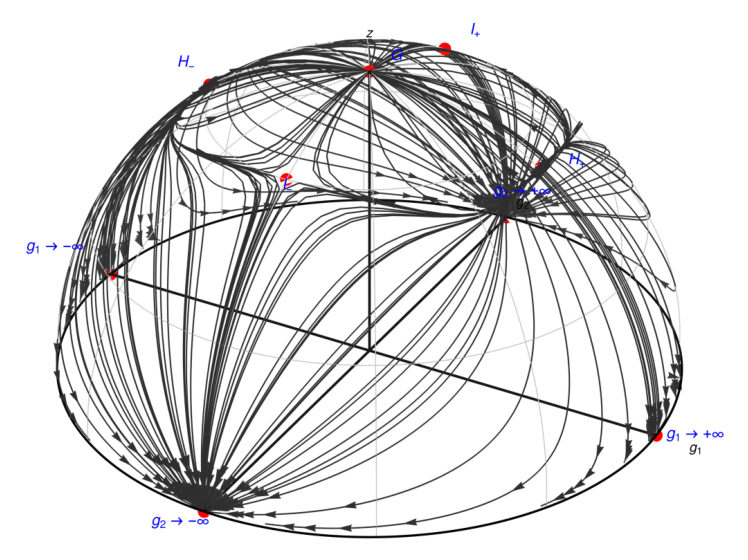
<figcaption class="paper-figure-caption"><b>Fig 3.</b> Figure 3: Poincar´e compactification of the RG flow of Eqs. (22)–(23) for ϵ = 1. The infinite coupling plane is mapped onto a semi-sphere with the equator representing asymptotic strong-coupling directions. Generic trajectories are attracted toward the g2-dominated directions at infinity, while the g1-axis directions act as angular saddles. The compactified flow demonstrates the absence of a stable interacting infrared fixed point and reveals the global runaway topology of the RG equations.</figcaption>
</figure>
<figure class="paper-figure-card">
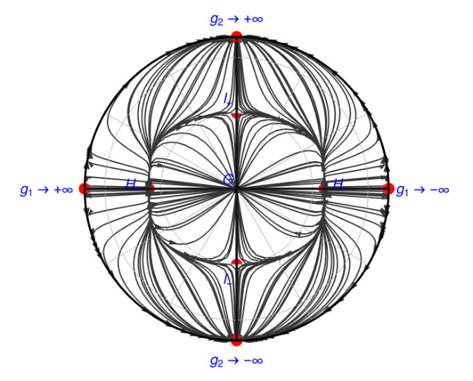
<figcaption class="paper-figure-caption"><b>Fig 4.</b> Figure 4: Poincar´e compactification of the RG flow of Eqs. (22)–(23) for ϵ = 1. When viewed from below the angular flow at infinity becomes transparent. Generic trajectories are attracted toward the g2-dominated directions at infinity, while the g1-axis directions act as angular saddles. The compactified flow demonstrates the absence of a stable interacting infrared fixed point and reveals the global runaway topology of the RG equations.</figcaption>
</figure>

**Summary.** This theoretical paper uses Renormalization Group (RG) topology to analyze the charge-Kondo breakdown in cuprate superconductors. The analysis shows that the expected interacting fixed point is unstable, leading to runaway flow behavior. Ultimately, the work establishes that apparent extended scaling behavior is likely a pseudo-critical crossover rather than evidence of true quantum criticality.

**Why it may be interesting.** While focused on cuprates, the rigorous application of RG topology to distinguish true criticality from pseudo-criticality provides a powerful general diagnostic tool applicable to any strongly correlated system exhibiting complex phase transitions.

Detailed structure

**Main problem.** The paper investigates the dynamical charge-Kondo-breakdown scenario proposed for cuprate superconductors to distinguish genuine quantum criticality from pseudo-critical behavior.

**Main result.** Generic RG trajectories exhibit runaway behavior, suggesting that apparent extended scaling is due to a crossover controlled by a near-critical fixed point rather than true asymptotic scale invariance.

**Method.** The authors analyze the coupled Renormalization Group (RG) flow equations, determining the fixed-point structure and stability properties using analytical solutions combined with numerical phase portraits.

**Model / system.** The study is motivated by cuprate superconductors and analyzes an effective low-energy theory derived from models like the t-J model. The analysis focuses on the RG flow in coupling space.

**Key observables.** Fixed-point structure, stability eigenvalues of the RG flow, crossover scale, and the topology of the RG flow.

**Important parameters / regimes.** The system is analyzed near a putative finite-coupling interacting fixed point; the distinction between asymptotic vs. crossover scaling is key.

**Assumptions / limitations.** The analysis relies on mapping the physical problem onto an RG flow structure and distinguishing between different types of critical behavior (e.g., total-repeller QCPs).

**Figures summary.** References to Figure 1 suggest showing the RG flow diagram for the t-J model, featuring a central, fully unstable fixed point labeled as a 'total-repeller'.

**Paper structure.** The paper proceeds by analyzing the RG flow equations governing the charge-Kondo breakdown. It determines the stability of proposed interacting fixed points and uses topological arguments to classify the nature of observed scaling behavior.

Abstract

In this paper, we examine the dynamical charge-Kondo-breakdown scenario proposed for cuprate superconductors within the perspective of renormalization group (RG) topology. By analyzing the coupled RG flow equations governing the effective low-energy theory, we determine the fixed-point structure, stability properties, and global organization of the flow. We find that the putative finite-coupling interacting fixed point is unstable against perturbations transverse to an invariant critical manifold. As a result, generic RG trajectories exhibit runaway behavior. To elucidate the global structure of the theory, we combine analytical solutions of the flow equations with numerical phase portraits and Poincaré compactification. This analysis reveals that the interacting fixed point exhibits a marginally relevant instability, generating an exponentially large but finite crossover scale. The resulting flow topology closely resembles anisotropy-driven runaway flows encountered in fluctuation-induced weakly first-order transitions. Within this framework, the apparent quantum-critical regime can be understood as an extended crossover controlled by a near-critical fixed point, rather than by asymptotic scale invariance. The results obtained indicate that the existence of extended scaling behavior does not, by itself, imply the presence of a stable interacting quantum critical state. More generally, our analysis demonstrates how RG topology can provide a powerful diagnostic for distinguishing genuine criticality from pseudo-critical behavior in theories of strongly correlated quantum matter.

[↑ back to top](#top)

### [PN-QNN: Harnessing Physical Noise as a Native Regularizer in Photonic Hybrid Quantum Neural Networks](http://arxiv.org/abs/2607.20045v1)

**Authors:** Farah Elnakhal, Alberto Marchisio, Nouhaila Innan, Gabriel Falcao, Muhammad Shafique  
**Type:** both · **Category:** disordered systems and neural networks · **PDF:** <https://arxiv.org/pdf/2607.20045v1>  
**Analysis basis:** full PDF text, analyzed in chunks
**Topic relevance:** `methods for driven-dissipative` **3/5** · `analog quantum simulation` **2/5** · `correlated / nonlocal dissipation` **2/5** · `driven-dissipative phase transition` **2/5** · `QC/QI experiment` **1/5** · `correlated cavity matter` **1/5** · `non-equilibrium dynamics` **1/5**

↔ Scroll figures horizontally

<figure class="paper-figure-card">
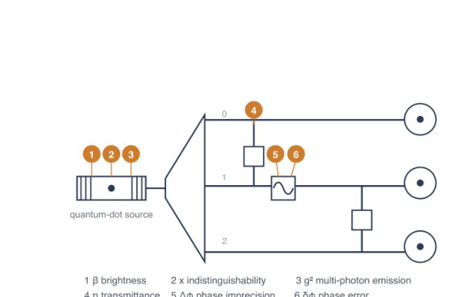
<figcaption class="paper-figure-caption"><b>Fig 1.</b> Fig. 1: Noise model on photonic GBS device. The Perceval noise model contains 7 noise parameters (6 continuous values and 1 boolean value), which can either be located at the photon source, interferometer, or globally.</figcaption>
</figure>
<figure class="paper-figure-card">
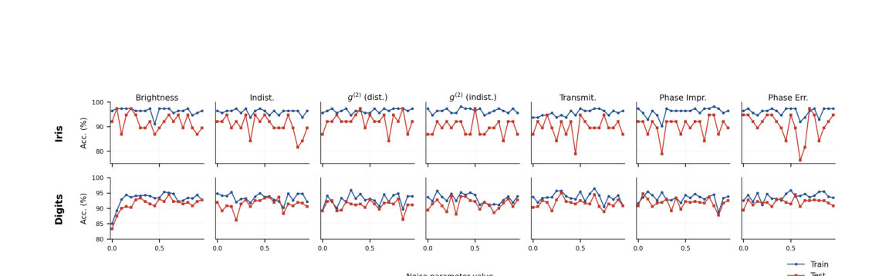
<figcaption class="paper-figure-caption"><b>Fig 2.</b> Fig. 2: Single parameter sensitivity sweep on Iris (top) and Digits (bottom). All noise parameters are fixed at their noiseless values except the parameter being swept, and accuracy is recorded.</figcaption>
</figure>
<figure class="paper-figure-card">
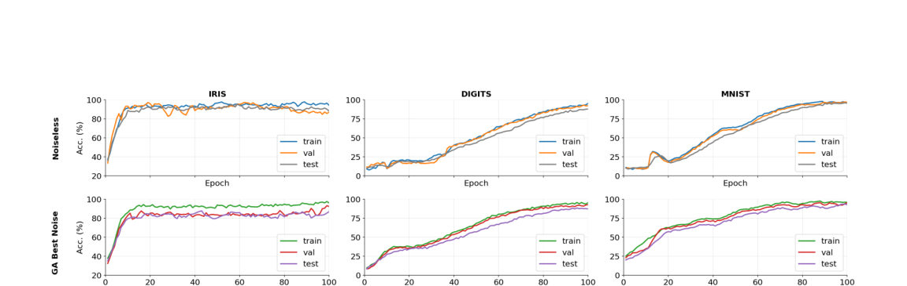
<figcaption class="paper-figure-caption"><b>Fig 3.</b> Fig. 3: Left: Iris training curves, noiseless (top) vs. GA-best noise (bottom). Middle: Digits training curves, noiseless (top) vs. GA-best noise (bottom). Right: MNIST training curves, noiseless (top) vs. GA-best noise (bottom). All trained for 100 epochs.</figcaption>
</figure>

**Summary.** This work explores using inherent physical noise from photonic quantum hardware as a regularization technique for training hybrid quantum neural networks. By optimizing seven noise parameters via a Genetic Algorithm, the authors found that while noise can boost performance on some datasets (Iris, Digits), it harms others (MNIST). This suggests noise is a powerful but highly dataset-dependent resource.

**Why it may be interesting.** It bridges the gap between theoretical quantum machine learning models and realistic hardware constraints by treating unavoidable noise not just as an error term, but as a tunable resource for improving model generalization.

Detailed structure

**Main problem.** The paper investigates whether physical noise inherent to near-term photonic quantum hardware can be utilized as a beneficial, hardware-native regularizer for training Photonic Hybrid Quantum Neural Networks (PHQCNNs).

**Main result.** While GA-tuned noise provided modest accuracy gains on Iris and Digits, it caused a clear degradation on MNIST, suggesting that physical noise acts as a free regularizer but not universally across all tasks.

**Method.** The authors employed a Genetic Algorithm (GA) to jointly optimize the seven parameters of a physical noise model while training PHQCNNs for classification tasks using simulators.

**Model / system.** The system involves Photonic Hybrid Quantum-Classical Neural Networks (PHQCNNs) simulated using Quandela's Perceval simulator. The quantum layer is perturbed by a detailed, seven-parameter physical noise model.

**Key observables.** Final test accuracy on Iris, Digits, and MNIST; the train/test accuracy gap as a regularization signature.

**Important parameters / regimes.** The seven continuous and boolean parameters defining the physical noise model (e.g., Brightness, Indistinguishability, $g^{(2)}$).

**Assumptions / limitations.** The comparison is confounded by differences in architecture between datasets; the work is simulation-based, not yet on physical hardware.

**Figures summary.** Figures show training curves comparing noiseless vs. GA-best noise across three datasets, and sensitivity sweeps illustrate how individual noise parameters affect performance.

**Paper structure.** The paper introduces the problem of noise in quantum computing, details the PHQCNN setup with a physical noise model, uses a Genetic Algorithm to optimize noise parameters for multiple datasets, analyzes per-parameter sensitivities, and concludes that regularization is dataset-dependent.

Abstract

Physical noise in near-term quantum hardware is usually treated as a nuisance to suppress. We ask whether it can instead act as a hardware-native regularizer for photonic hybrid quantum-classical neural networks (PHQCNNs), analogous to noise-injection regularization in classical deep learning. Using Quandela's Perceval simulator and the MerLin framework, we build PHQCNNs for Iris, Digits, and MNIST and inject Perceval's seven-parameter physical noise model directly into training. A genetic algorithm searches the six continuous noise dimensions and 1 boolean parameter to find, per dataset, the configuration maximizing validation accuracy, compared against a noiseless baseline across five seeds. GA-tuned noise yields modest accuracy gains on Iris (+0.82pp) and Digits (+1.45pp), but a clear degradation on MNIST (-1.21pp). Per-parameter sweeps show that no individual noise parameter is consistently beneficial, motivating the joint search, while a second-order loss expansion shows that physical noise induces a Tikhonov-like regularization term whose effect is dataset-dependent. Physical photonic noise can thus act as a free regularizer, but not universally.

[↑ back to top](#top)

### [A Multi-Resolvent Hierarchy for the ETH Smooth Function](http://arxiv.org/abs/2607.19861v1)

**Authors:** Zhiqiang Huang  
**Type:** theory · **Category:** statistical mechanics · **PDF:** <https://arxiv.org/pdf/2607.19861v1>  
**Analysis basis:** full PDF text, analyzed in chunks
**Topic relevance:** `non-equilibrium dynamics` **3/5** · `scars & prethermalization` **2/5** · `Keldysh / 2PI / non-Gaussian methods` **1/5** · `analog quantum simulation` **1/5** · `driven-dissipative phase transition` **1/5** · `entanglement & information structure` **1/5** · `methods for driven-dissipative` **1/5** · `non-equilibrium universality` **1/5**

↔ Scroll figures horizontally

<figure class="paper-figure-card">
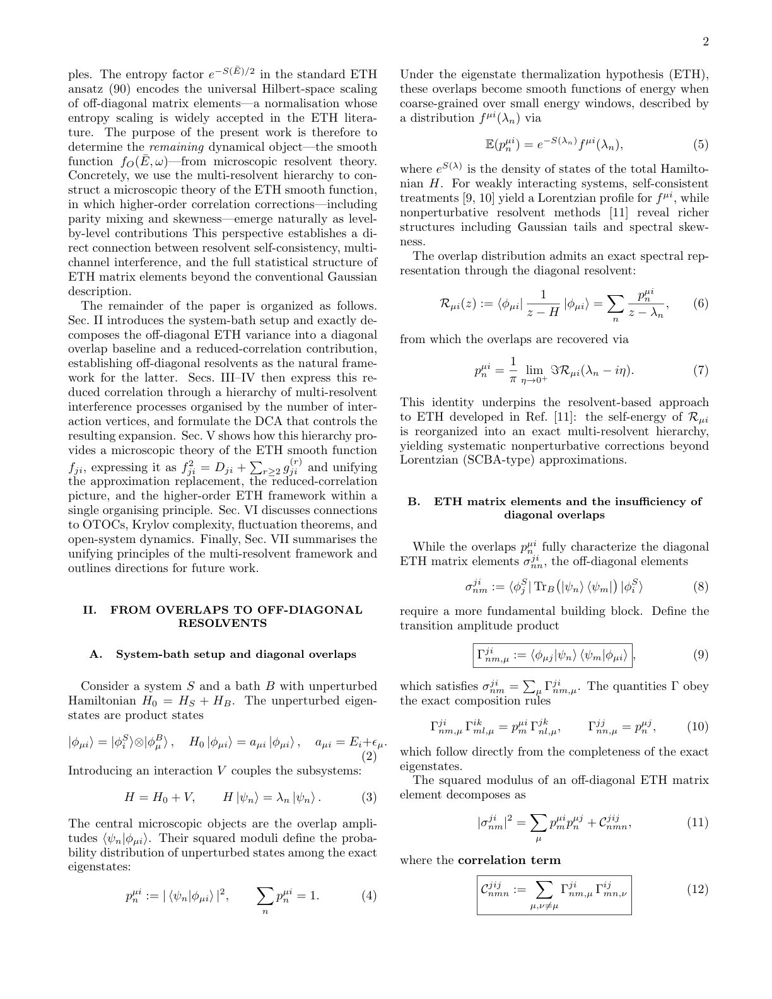
<figcaption class="paper-figure-caption"><b>Fig 1.</b> Low-resolution page preview, page 2</figcaption>
</figure>
<figure class="paper-figure-card">
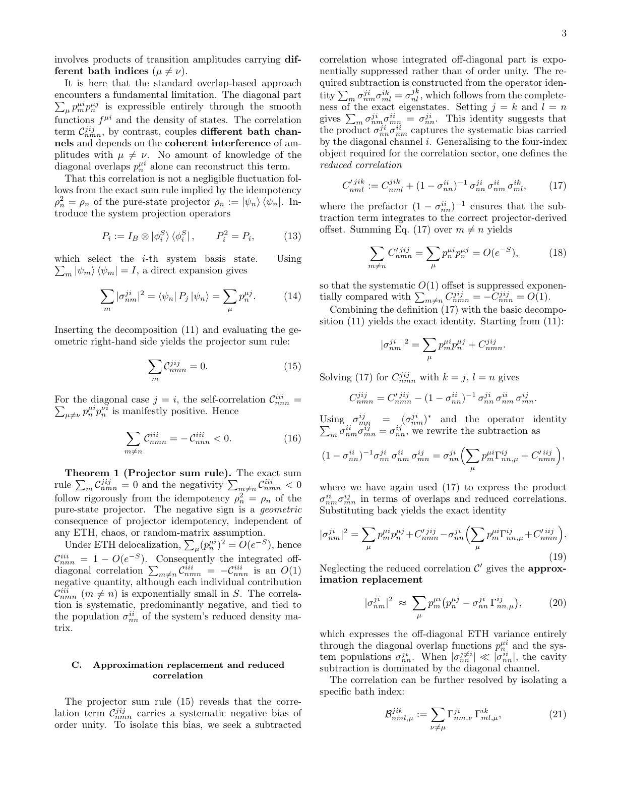
<figcaption class="paper-figure-caption"><b>Fig 2.</b> Low-resolution page preview, page 3</figcaption>
</figure>
<figure class="paper-figure-card">
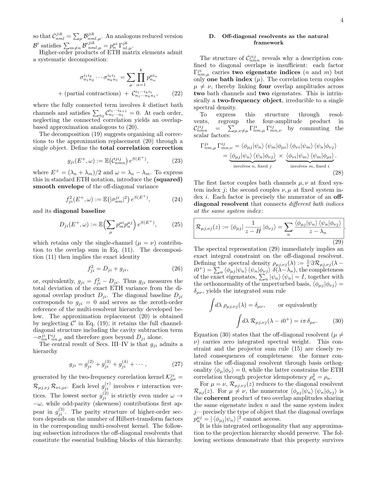
<figcaption class="paper-figure-caption"><b>Fig 3.</b> Low-resolution page preview, page 4</figcaption>
</figure>
<figure class="paper-figure-card">
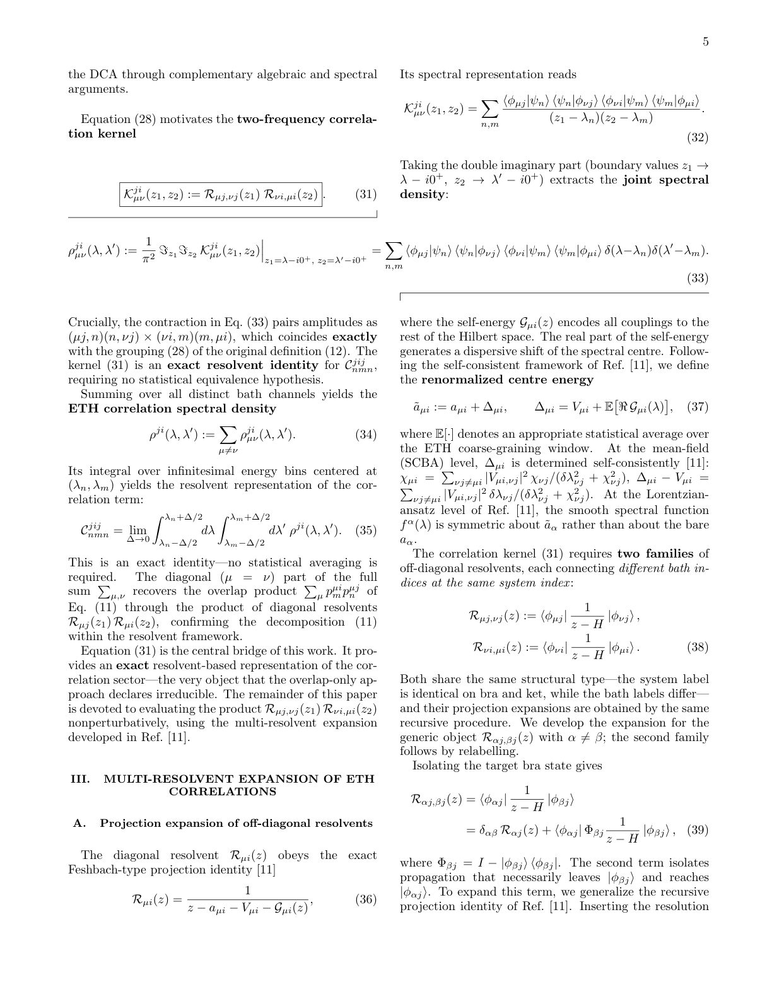
<figcaption class="paper-figure-caption"><b>Fig 4.</b> Low-resolution page preview, page 5</figcaption>
</figure>
<figure class="paper-figure-card">
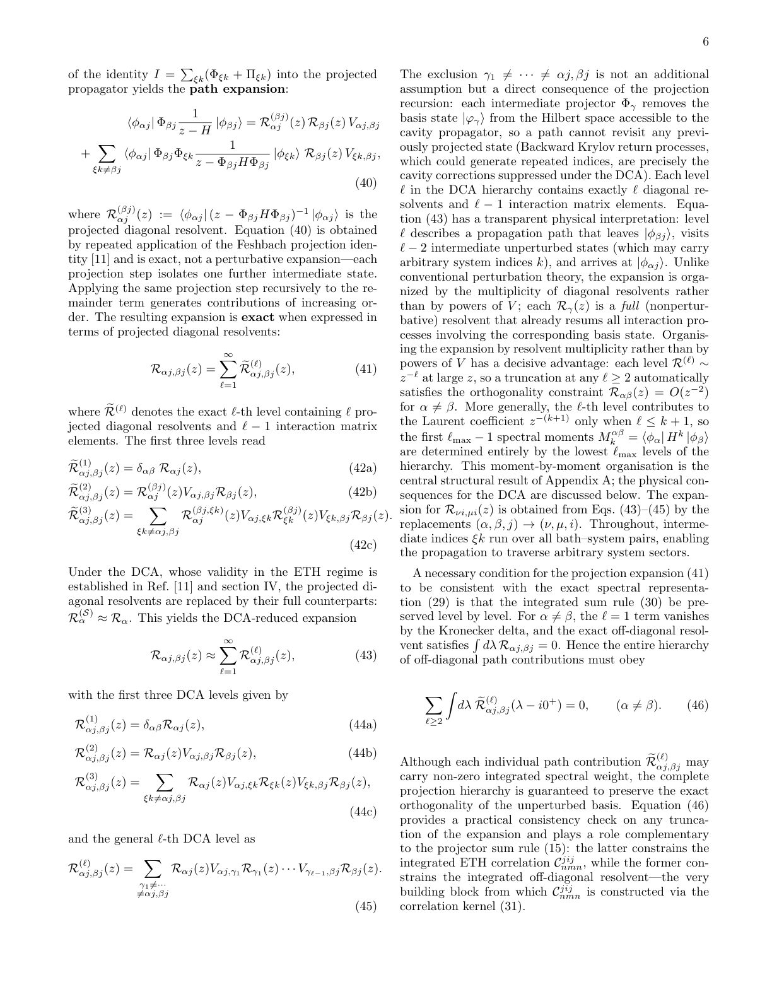
<figcaption class="paper-figure-caption"><b>Fig 5.</b> Low-resolution page preview, page 6</figcaption>
</figure>

**Summary.** This paper introduces a multi-resolvent hierarchy to systematically derive the ETH smooth function, which governs energy correlations in isolated quantum systems. By expanding correlation corrections into an improvable series, it moves beyond phenomenological models. The resulting framework provides testable predictions regarding parity structure and spectral moment conservation.

**Why it may be interesting.** This work provides a rigorous, systematic tool to calculate thermalization properties beyond simple mean-field or single-channel approximations, which is crucial for understanding quantum chaos in complex many-body systems.

Detailed structure

**Main problem.** The paper aims to develop a systematic, microscopic theory for the ETH smooth function $f_O(ar{E}, \omega)$, which describes the energy dependence of off-diagonal matrix elements in isolated quantum many-body systems approaching thermal equilibrium.

**Main result.** A multi-resolvent hierarchy is constructed that systematically organizes correlation corrections into an improvable expansion, revealing a parity structure and providing a unified theoretical framework for $f_{ji}^2$.

**Method.** The authors employ recursive projection identities combined with a Diagonal Closure Approximation (DCA) to expand the ETH smooth function as a series of correlation levels ($g^{(r)}_{ji}$).

**Model / system.** The analysis concerns isolated quantum many-body systems governed by a Hamiltonian $H = H_0 + V$, where $H_0$ splits into system (S) and bath (B) components. The theory is applied to calculate properties related to energy eigenstates $|\psi_n
angle$.

**Key observables.** The ETH smooth function $f_{ji}(ar{E}, \omega)$, diagonal overlaps ($p_{\mu i}^n$), and correlation terms like $C_{jij}^{nmn}$.

**Important parameters / regimes.** Energy ($ar{E}$), frequency ($\omega$), and the order of correlation expansion ($r$).

**Assumptions / limitations.** The development relies on projector idempotency for deriving rigorous sum rules, and approximations are made by neglecting reduced correlations in certain steps.

**Figures summary.** Not specified (Notes focus on mathematical identities and structural theorems rather than figure descriptions).

**Paper structure.** The paper builds the theory through defining the problem using ETH concepts, developing the multi-resolvent hierarchy via projection identities, deriving key spectral sum rules, and finally analyzing the resulting parity structure of the correlation corrections.

Abstract

The eigenstate thermalization hypothesis (ETH) provides a statistical description of thermalization in isolated quantum many-body systems, yet the phenomenological smooth function $f_O(\bar{E},ω)$ -- which controls the energy dependence of off-diagonal matrix elements -- lacks a systematic microscopic foundation. We develop a multi-resolvent hierarchy for the correlation corrections entering the ETH smooth function. Using recursive projection identities together with a diagonal closure approximation (DCA), the hierarchy organizes multi-channel interference processes by the number of interacting bath channels, replacing the uncontrolled neglect of higher-order correlations with a systematically improvable expansion. The ETH smooth function is thereby obtained as $f_{ji}^2 = D_{ji} + \sum_{r\ge 2} g_{ji}^{(r)}$, where the diagonal baseline $D_{ji}$ and each correlation level $g_{ji}^{(r)}$ are expressed entirely through diagonal spectral functions and microscopic interaction couplings, providing a unified, closed, and systematically improvable microscopic theory. A rigorous projector sum rule constrains the entire hierarchy: the integrated off-diagonal correlation carries a negative bias of order unity, a consequence of projector idempotency. The hierarchy further reveals a parity structure in which even-$r$ sectors carry even parity under $ω\to-ω$ while the $r=3$ sector generates the first odd-parity (skewness) contribution -- absent from all single-resolvent closures -- suggesting experimentally testable signatures in quantum many-body systems.

[↑ back to top](#top)

### [Sensing, Traffic, and Construction in Termites](http://arxiv.org/abs/2607.19594v1)

**Authors:** Yufei Xiao, Qinglin Wu, Kukhyun Lim, Nan-Yao Su, Paul Bardunias, Atanu Chatterjee, Saad Bhamla  
**Type:** both · **Category:** statistical mechanics · **PDF:** <https://arxiv.org/pdf/2607.19594v1>  
**Analysis basis:** full PDF text, analyzed in chunks
**Topic relevance:** `non-equilibrium dynamics` **3/5** · `non-equilibrium universality` **3/5** · `driven-dissipative phase transition` **2/5** · `Frenkel-Kontorova` **1/5** · `Keldysh / 2PI / non-Gaussian methods` **1/5** · `methods for driven-dissipative` **1/5**

↔ Scroll figures horizontally

<figure class="paper-figure-card">
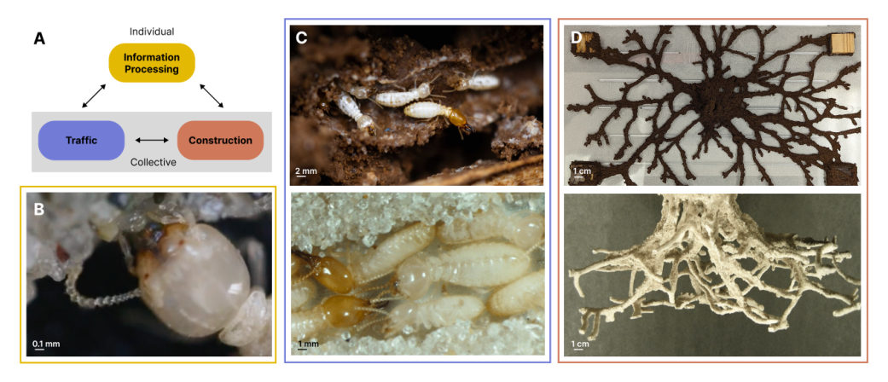
<figcaption class="paper-figure-caption"><b>Fig 1.</b> FIG. 1. Overview of the physical and behavioral themes developed in this review. (A) Schematic linking information, movement, and construction in subterranean termite colonies. (B) antennal sensing, highlighting antennation as a primary mode of local information acquisition and interaction (photo: Qinglin Wu). (C) bidirectional traffic flow through confined conduits, shown in an above-ground shelter tube (top) and a below-ground planar tunnel network (bottom) (photo: Qinglin Wu). (D) construction across scales, from above-ground shelter tubes (top, photo: Kukhyun Lim) to extended below-ground tunnel networks (bottom; photo: Paul Bardunias).</figcaption>
</figure>
<figure class="paper-figure-card">
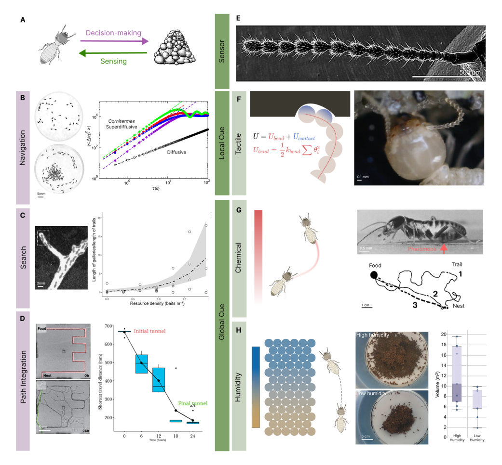
<figcaption class="paper-figure-caption"><b>Fig 2.</b> FIG. 2. Information processing in termite colonies. (A) Schematic of the coupled sensing-action loop between individual termites and the substrate they construct and inhabit. (B) Navigation. Mean squared displacement of four Cornitermes sp. workers during open-arena foraging, with MSD ∝Dτ α indicating MSD scaling [23]. For example, purple indicates α = 1.90. (C) Search. Left: Close-up of termite collective excavating tunnels [24]. Right: tunnel-tip activity and correlation between resource density and total tunnel length in C. formosanus [25]. (D) Path optimization. Left: tunnel network of C. formosanus shows pruning of long paths and reinforcement of short paths from the nest (bottom)...</figcaption>
</figure>
<figure class="paper-figure-card">
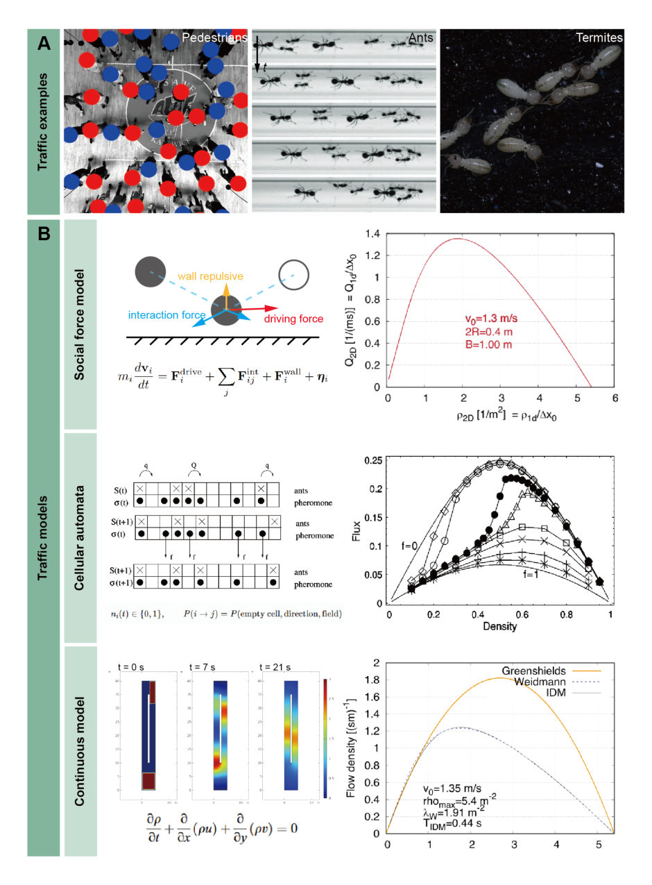
<figcaption class="paper-figure-caption"><b>Fig 3.</b> FIG. 3. Traffic systems and model classes. (A) Representative traffic systems used as baselines for termite traffic: pedes- trian crowds [55], ant trails [56], and termite movement in confined galleries (Photo: Qinglin Wu). (B) Modeling descriptions arranged by scale. Social-force models represent individuals as self-driven particles with driving, interaction, wall, and noise terms. Cellular automaton models represent occupancy and probabilistic movement on a lattice. Continuum models describe density and velocity fields through conservation laws. The corresponding flux-density relations summarize how transport ca- pacity changes with density [57–61].</figcaption>
</figure>
<figure class="paper-figure-card">
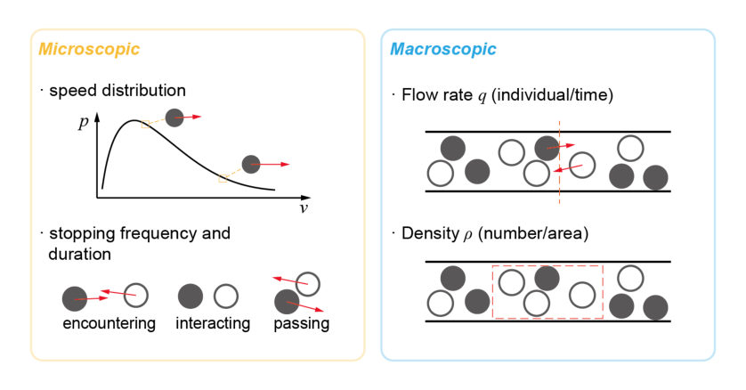
<figcaption class="paper-figure-caption"><b>Fig 4.</b> FIG. 4. Microscopic and macroscopic observables for confined bidirectional traffic. (A) Microscopic observables extracted from individual trajectories include the speed distribution p(v), stopping frequency and duration, and transitions among encounter, interaction, and passing states during local contact events. (B) Macroscopic observables obtained by coarse- graining trajectories include flow rate q, measured as the number of agents crossing a reference line per unit time, and density ρ, measured as the number of agents within a defined area or channel length. Filled and open circles indicate agents moving in opposite directions.</figcaption>
</figure>
<figure class="paper-figure-card">
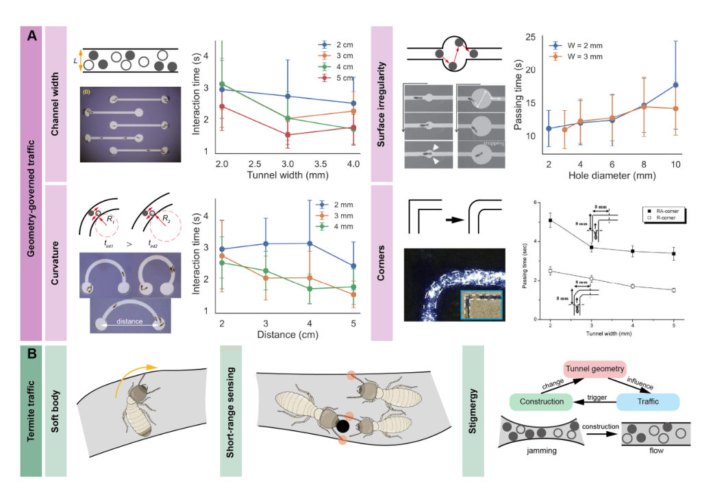
<figcaption class="paper-figure-caption"><b>Fig 5.</b> FIG. 5. Geometry-governed termite traffic. (A) Controlled tunnel manipulations show that channel width, surface irregularity, curvature, and corners alter interaction or passing time. Wider channels generally reduce encounter delays, while irregularities, curvature, and sharp corners can increase transport costs; rounding or smoothing can reduce those costs [50– 52, 70]. (B) Termite-specific features that distinguish traffic in self-built conduits: body compliance, short-range tactile sensing, and stigmergic remodeling, in which congestion can trigger construction that changes future flow.</figcaption>
</figure>

**Summary.** This review synthesizes how termites manage complex tasks like foraging and building in soil whose properties are constantly altered by their own activities. It frames this as a coupled problem of sensing, traffic flow, and material deposition across vast scales. The work proposes a quantitative physics-of-life framework to model these self-organizing, adaptive subterranean ecosystems.

**Why it may be interesting.** The concept of an environment that is dynamically rewritten by the agents moving within it—where memory, resistance, and structure are emergent variables—is highly relevant to non-equilibrium statistical mechanics and active matter theory.

Detailed structure

**Main problem.** The review synthesizes how three linked processes—sensing, traffic flow, and construction—interact in termite colonies to create emergent order within a shared, evolving granular medium.

**Main result.** Termite behavior provides a model for studying complex systems where local interactions (like tactile sensing or particle movement) continually remodel the environment that dictates future collective dynamics.

**Method.** The paper is a comprehensive review synthesizing experimental evidence across multiple length scales, ranging from antennal contacts to meter-scale architecture.

**Model / system.** The physical system is subterranean and mound-building termite colonies operating within granular substrates (soil). The model involves coupling active matter dynamics (traffic) with environmental feedback (substrate remodeling via excavation/deposition).

**Key observables.** Tunnel network structure, Mean Squared Displacement ($	ext{MSD}$), local geometry (curvature, roughness), moisture gradients, and path optimization rates.

**Important parameters / regimes.** Length scales (antennal to meter-scale), substrate properties (moisture content, grain size), and interaction types (tactile, chemical, physical).

**Assumptions / limitations.** The primary framework assumes that local, noisy interactions couple sensing, transport, and construction through the shared material medium.

**Figures summary.** Figures illustrate the coupling of information, movement, and construction across scales; detail sensing channels like antennal scanning and $	ext{MSD}$ scaling; and compare various environmental cues (moisture, airflow, chemical) influencing behavior.

**Paper structure.** The review is structured around synthesizing three coupled problems: 1) Sensing local geometry/cues during search/excavation; 2) Traffic movement through evolving conduits; and 3) Substrate remodeling by excavation/deposition. It emphasizes experimental findings and motivates a quantitative physics-of-life framework.

Abstract

Subterranean and mound-building termites excavate, transport, and build within the same granular substrate that later regulates how they sense, move, and deposit material. From antennal-scale contacts through body-scale traffic to meter-scale architecture, this review synthesizes three linked problems: how workers sense local geometry and physical cues during search and excavation; how traffic moves through narrow, evolving conduits; and how excavation and deposition remodel the substrate that guides later behavior. Across these length scales, noisy local interactions couple sensing, transport, and construction through a shared material medium, leading to emergent order at the colony scale. We emphasize what is established experimentally, where evidence remains sparse or limited to a few model systems, and how emerging imaging, tracking, and modeling tools are making these feedbacks quantitatively accessible. We use this synthesis to motivate a quantitative physics-of-life framework for termite colonies that continually rewrite the medium through which they sense, move, and build.

[↑ back to top](#top)

### [Vanishing spin stiffness in weakly disordered two-dimensional Heisenberg ferromagnets](http://arxiv.org/abs/2607.20036v1)

**Authors:** Jacopo Niedda, Aldo Coraggio, Giacomo Bracci-Testasecca, Antonello Scardicchio  
**Type:** theory · **Category:** disordered systems and neural networks · **PDF:** <https://arxiv.org/pdf/2607.20036v1>  
**Analysis basis:** full PDF text, analyzed in chunks
**Topic relevance:** `analog quantum simulation` **3/5** · `Keldysh / 2PI / non-Gaussian methods` **2/5** · `non-equilibrium universality` **2/5** · `exotic spin models in light-matter` **1/5** · `non-equilibrium dynamics` **1/5** · `spintronics-quantum-optics interface` **1/5**

↔ Scroll figures horizontally

<figure class="paper-figure-card">
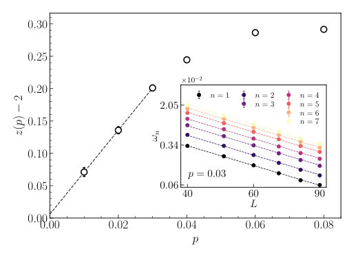
<figcaption class="paper-figure-caption"><b>Fig 1.</b> FIG. 1: Increase of the dynamical exponent z from the clean ferromagnetic values z = 2 as a function of the antiferromagnetic bond concentration p. The linear fit (dashed line) shows the expected behavior for p →0. (Inset) Scaling of n-th eigenvalue, averaged over disorder realizations, with respect to the system size L, for p = 0.03.</figcaption>
</figure>
<figure class="paper-figure-card">
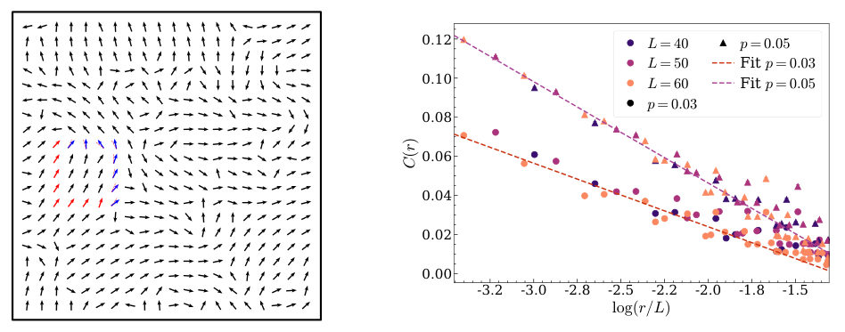
<figcaption class="paper-figure-caption"><b>Fig 2.</b> FIG. 2: Left panel: A square patch on a classical ground state spin-configuration, used to measure the local spin stiffness. The spin vectors are three-dimensional, even though they are drawn as planar arrows for clarity. The boundary red spins are kept fixed, while the boundary blue spins are rotated by a uniform angle θ = π/10. Then, all spins on the boundary of the patch are held fixed, while the remaining spins in the system are relaxed to minimize the energy. The value of the stiffness of the clean FM in this protocol is ρ(0) s ≃3.5 is an arbitrary scale. Right panel: Spin stiffness correlations as a function of the distance. From the linear fit, we find ∆≃0.2 for p = 0.03 (for which...</figcaption>
</figure>
<figure class="paper-figure-card">
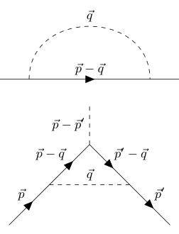
<figcaption class="paper-figure-caption"><b>Fig 3.</b> FIG. 3: The two relevant diagrams for the one-loop computation: self energy (top) and vertex/disorder renormalization (bottom). Continuous line represents the bare ϕ propagator, while the dashed line is the static disordered σ propagator.</figcaption>
</figure>
<figure class="paper-figure-card">
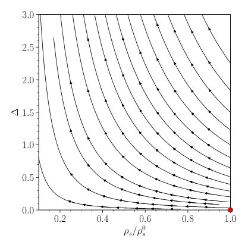
<figcaption class="paper-figure-caption"><b>Fig 4.</b> FIG. 4: One-loop RG flux lines. One can recognize the RG orbits where ρ2 s∆is a constant. The red dot is the repulsive FM fixed-point. The system runs to an infinite-disorder regime with ρs = 0, ∆→∞.</figcaption>
</figure>

**Summary.** This paper demonstrates that weak bond disorder in 2D Heisenberg ferromagnets fundamentally changes their long-wavelength magnetic dynamics. Using field theory and numerical methods, the authors show this disorder causes the spin stiffness to decay toward zero. This results in anomalous magnon behavior characterized by a dynamical exponent $z > 2$, indicating a transition towards an infinite-disorder regime.

**Why it may be interesting.** The finding of anomalous low-energy scaling ($z>2$) due to disorder is relevant to understanding critical dynamics in disordered quantum magnets, which shares theoretical parallels with systems studied in AMO physics.

Detailed structure

**Main problem.** The study investigates how weak, short-ranged antiferromagnetic bond disorder qualitatively alters the long-wavelength dynamics of two-dimensional Heisenberg ferromagnets.

**Main result.** Weak disorder causes the spin stiffness to vanish at long wavelengths, leading to anomalously soft magnons characterized by a dynamical exponent $z > 2$.

**Method.** The analysis employs replica field theory calculations combined with numerical diagonalization of the semiclassical spin-wave Hamiltonian.

**Model / system.** The system is a two-dimensional Heisenberg ferromagnet on a square lattice subjected to quenched random bond disorder, modeled by varying exchange couplings $J_{ij}$.

**Key observables.** Spin stiffness ($
ho_s$), dynamical exponent ($z$), and the spatial correlation function of local spin stiffness $C(\vec{x}, \vec{x}')$.

**Important parameters / regimes.** The disorder concentration $p$ (small), the system dimension ($d=2$), and the RG flow parameter $\ell$.

**Assumptions / limitations.** The analysis relies on the small $p$ approximation and the long-wavelength limit, treating the disorder as marginal in 2D.

**Figures summary.** Figures illustrate the increase of the dynamical exponent $z$ with disorder strength $p$, and show spin stiffness correlations decaying logarithmically with distance.

**Paper structure.** The paper progresses from defining the disordered Hamiltonian to calculating local stiffness via a twist protocol, then applying replica field theory and RG flow to derive scaling laws for $
ho_s$ and $z$.

Abstract

We show that a small fraction of antiferromagnetic bonds qualitatively alters the long-wavelength dynamics of two-dimensional Heisenberg ferromagnets. Although the classical ground state remains magnetized, weak bond frustration generates logarithmically correlated spatial fluctuations of the local spin stiffness, despite the microscopic disorder being short ranged. A replica field theory calculation shows that the effective disorder strength grows under coarse graining, while the spin stiffness decreases, yielding anomalously soft magnons with a scale-dependent dynamical exponent $z > 2$. Numerical diagonalization of the semiclassical spin-wave Hamiltonian confirms the anomalous low-energy scaling. The flow is toward an infinite-disorder, zero stiffness regime.

[↑ back to top](#top)

### [A unified framework for anomalous boson bunching](http://arxiv.org/abs/2607.19499v1)

**Authors:** Léo Pioge, Leonardo Novo, Nicolas J. Cerf  
**Type:** theory · **Category:** other · **PDF:** <https://arxiv.org/pdf/2607.19499v1>  
**Analysis basis:** full PDF text, analyzed in chunks
**Topic relevance:** `interference shaping light` **3/5** · `Keldysh / 2PI / non-Gaussian methods` **1/5** · `analog quantum simulation` **1/5** · `correlated / nonlocal dissipation` **1/5** · `driven-dissipative phase transition` **1/5** · `entanglement & information structure` **1/5** · `methods for driven-dissipative` **1/5**

↔ Scroll figures horizontally

<figure class="paper-figure-card">
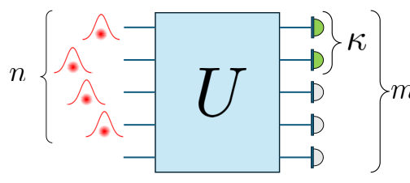
<figcaption class="paper-figure-caption"><b>Fig 1.</b> FIG. 1. Schematic representation of an interferometric con- figuration in which n single photons are injected into the first n spatial modes of an m-mode linear interferometer U. The time delay between the photons (viewed as an internal degree of freedom) is one possible source of distinguishability. After propagating through the interferometer, the detectors mea- sure the spatial modes occupied by the photons regardless of their time of arrival (which is not resolved). Our analysis fo- cuses on the probability Pκ that all n photons are detected in a subset κ of the output modes (see green detectors).</figcaption>
</figure>
<figure class="paper-figure-card">
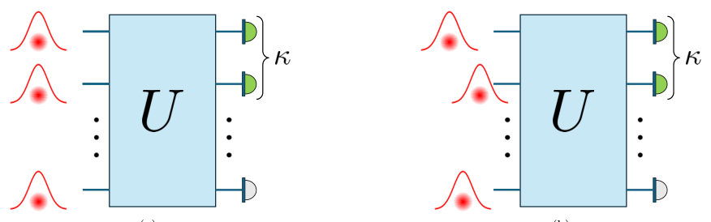
<figcaption class="paper-figure-caption"><b>Fig 2.</b> FIG. 2. Illustration of the anomalous bunching phenomenon through a comparison of two scenarios. (a) In the first scenario, the photons have identical internal states and arrive simultaneously at the interferometer. (b) In the second scenario, the interferometer is unchanged, but the photons are partially distinguishable in an internal degree of freedom, here represented by different time delays. This temporal mismatch is only a concrete example; the same mechanism may arise from other internal degrees of freedom. Since partial distinguishability typically reduces interference, one might expect the bunching probability in the second scenario to be lower than in the first one. However, by...</figcaption>
</figure>
<figure class="paper-figure-card">
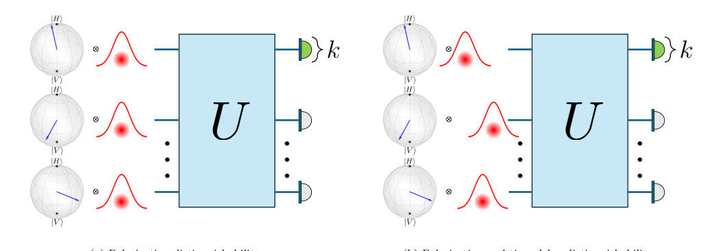
<figcaption class="paper-figure-caption"><b>Fig 3.</b> FIG. 3. Interferometric configurations illustrating the facet of anomalous bunching discussed in Sec. IV B through the comparison of two scenarios. (a) The first configuration corresponds to single-mode photon bunching in the first output mode. The photons arrive simultaneously at the interferometer but differ in polarization. Distinguishability therefore arises solely from this degree of freedom. (b) In the second configuration, the interferometer and the polarization states remain unchanged, but the photons additionally differ in their arrival times. One might expect that introducing an additional internal degree of freedom can only reduce single-mode bunching, since it reduces the...</figcaption>
</figure>
<figure class="paper-figure-card">
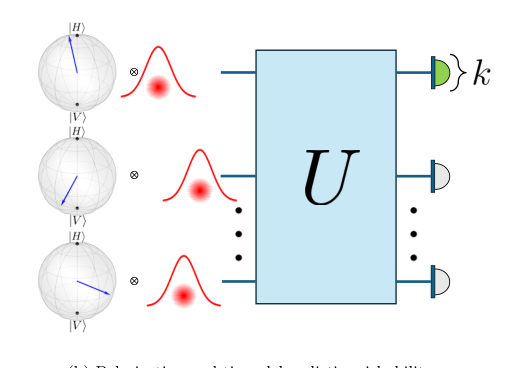
<figcaption class="paper-figure-caption"><b>Fig 4.</b> Fig. 3 provides an example of a physical setting in which the introduction of a time delay between the pho- tons can surprisingly increase the single-mode bunching probability. This could in principle be realized via the counterexample from [20], which focuses on Gram ma- trices realizable by time delays; however, the example found would require a 16-photon experiment. In Ap- pendix C, we present a simpler example based on the independent manipulation of polarization and time-bin degrees of freedom, and we provide the explicit internal state preparations of seven photons that would lead to this effect. We also compute the values of the resulting bunching probabilities using the Fourier...</figcaption>
</figure>
<figure class="paper-figure-card">
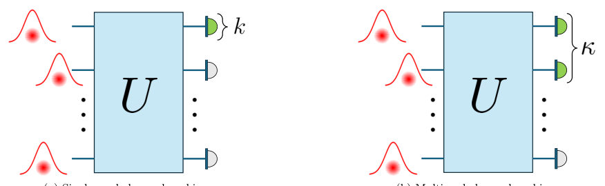
<figcaption class="paper-figure-caption"><b>Fig 5.</b> FIG. 4. Comparison of two interferometric configurations illustrating the facet of anomalous bunching discussed in Sec. IV C. In contrast to the previous facets, the comparison here concerns the quantum enhancement factor, i.e., the ratio of the quantum bunching probability to its classical counterpart, rather than the bunching probability itself. (a) The first configuration corresponds to single-mode boson bunching in a given output mode k, with partial internal distinguishability, here illustrated by time delays between the photons. (b) In the second scenario, the time delays between the photons remain unchanged, but we consider multimode boson bunching into a subset κ of output modes. In...</figcaption>
</figure>

**Summary.** The paper develops a unified framework to explain anomalous boson bunching in multi-mode interferometers. It shows that the phenomenon is dictated by the 'total indistinguishability' combining spatial and internal degrees of freedom. This theory clarifies how partial distinguishability can paradoxically enhance quantum interference effects compared to fully identical photons.

**Why it may be interesting.** This work provides a rigorous theoretical tool—the total indistinguishability measure—to understand non-intuitive quantum interference effects in photonics, extending beyond simple single-parameter measures of distinguishability.

Detailed structure

**Main problem.** The paper addresses anomalous boson bunching, a quantum interference effect where partially distinguishable photons show higher bunching probability than fully indistinguishable ones. The core goal is to provide a unified theoretical framework explaining this anomaly.

**Main result.** Boson bunching is governed by the total indistinguishability of the postselected output state, which combines internal and spatial degrees of freedom. This framework reveals that adding independent sources of distinguishability can enhance multimode or single-mode bunching probabilities.

**Method.** The analysis uses second quantization formalism applied to an $m$-mode linear interferometer, calculating the multimode bunching probability ($P_\kappa$) using the permanent function of matrices derived from spatial and internal state overlaps.

**Model / system.** The system is modeled as $n$ single bosons injected into an $m$-mode linear interferometer. Photons possess both spatial (mode) and internal degrees of freedom (e.g., polarization, time delay).

**Key observables.** Multimode bunching probability ($P_\kappa$), quantum enhancement factor, and the distinguishability matrices ($\mathbf{S}_{int}$ and $\mathbf{H}$).

**Important parameters / regimes.** The number of photons ($n$), the number of output modes ($m$), and the specific nature/number of independent internal degrees of freedom.

**Assumptions / limitations.** The analysis assumes the input state is separable across spatial and internal degrees of freedom, allowing for factorization into product matrices for calculation.

**Figures summary.** Figures schematically illustrate the interferometer setup and compare bunching probabilities in scenarios with identical versus partially distinguishable internal states to demonstrate anomalous enhancement.

**Paper structure.** The paper builds from defining the problem (anomalous bunching) to reformulating the governing principle using 'total indistinguishability.' It then derives mathematical expressions for $P_\kappa$ and presents multiple facets of the anomaly, including enhancements from adding independent sources of distinguishability.

Abstract

Anomalous bunching is a paradoxical quantum interferometric phenomenon in which partially distinguishable photons exhibit a higher probability of bunching into two or more modes than fully indistinguishable photons [Nat. Photonics 17, 702 (2023)]. While this effect is directly linked to violations of certain conjectures on matrix permanents, the mechanism underlying the anomaly is not yet fully understood. Here, we show that boson bunching is governed not by internal indistinguishability alone, but by the total indistinguishability of the postselected output state. Total indistinguishability combines the internal degrees of freedom, such as polarization or arrival time, with the spatial degrees of freedom of their wave functions restricted to the measured output modes of the interferometer. This reformulation preserves the expected connection between boson bunching and total indistinguishability, while clarifying how anomalous bunching can arise. It also reveals several additional facets of the same phenomenon, which are captured within a unified framework. In particular, we exhibit situations in which adding an independent source of distinguishability, either internal or spatial, can enhance multimode or even single-mode bunching probabilities, offering new insights into the subtle role of distinguishability in multiphoton interference.

[↑ back to top](#top)

### [Anyon Crystals and Hall Crystals in a Periodic Potential](http://arxiv.org/abs/2607.19466v1)

**Authors:** Sayak Bhattacharjee, Julian May-Mann, Srinivas Raghu  
**Type:** theory · **Category:** strongly correlated electrons · **PDF:** <https://arxiv.org/pdf/2607.19466v1>  
**Analysis basis:** full PDF text, analyzed in chunks
**Topic relevance:** `analog quantum simulation` **3/5** · `Frenkel-Kontorova` **2/5** · `Keldysh / 2PI / non-Gaussian methods` **1/5** · `driven-dissipative phase transition` **1/5** · `entanglement & information structure` **1/5**

↔ Scroll figures horizontally

<figure class="paper-figure-card">
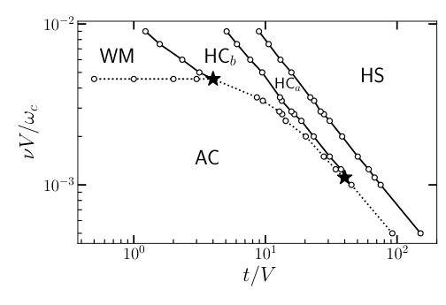
<figcaption class="paper-figure-caption"><b>Fig 1.</b> FIG. 2. Phase diagram of the Hamiltonian in Eq. 3 in the t/V −νV/ωc plane on a log-log plot for ¯ρ = 9/16, ν = 1/3 and U →∞. HCa and HCb denote Hall crystals—HCa is a checkerboard Hall crystal, while HCb has a super-unit cell of 2 × 2, just as the Wigner-Mott (WM) insulator. HS de- notes the fractional Hall state. The crystals are sketched in Fig. 3(a)-(d). The stars denote critical points. The dotted (solid) lines are first-order (continuous) transitions.</figcaption>
</figure>
<figure class="paper-figure-card">
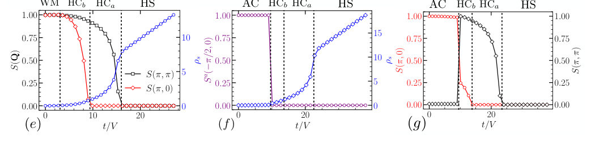
<figcaption class="paper-figure-caption"><b>Fig 2.</b> FIG. 3. (a), (b) and (c) depict schematic super-unit cells of the Hall crystals (HCa, HCb) and the Wigner-Mott insulator at ¯ρ = 9/16 and ν = 1/3 respectively. The site densities are colored as per the color bar. In the WM insulator, the densities are 1, 1/4 and 0. The arrows denote the direction of the orbital currents at the center of the bonds. (d) depicts a schematic 5 × 5 cell of the AC at ¯ρ = 9/16 and ν = 1/3. The grey plaquettes indicate one of two candidate locations of the quasiholes and quasiparticles respectively, with the circular arrow denoting the vorticity. An energetically degenerate location for each pair is π/2 rotated with respect to the inversion center at the density...</figcaption>
</figure>
<figure class="paper-figure-card">
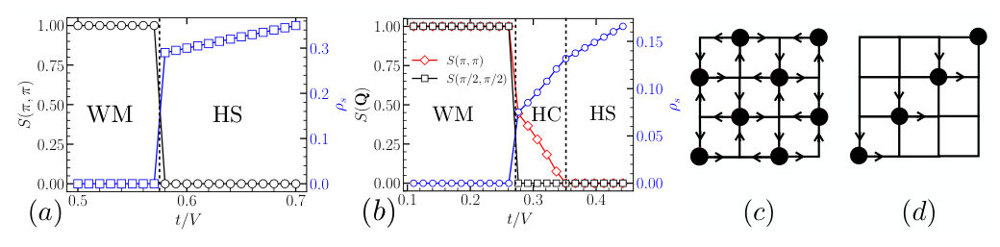
<figcaption class="paper-figure-caption"><b>Fig 3.</b> FIG. 4. (a) Order parameters at ¯ρ = 1/2. [S(π, π) (black, circle), ρs (blue, square)]. (b) Order parameters at ¯ρ = 1/4. [S(π, π) (red, diamond), S(π/2, π/2) (black, square), ρs (blue, circle)]. The structure factors are normalized with respect to their maximum value. (c) Checkerboard WM insulator at ¯ρ = 1/2. (d) Diagonal striped WM insulator at ¯ρ = 1/4. Empty sites denote zero density, black circles denote unit density. The arrows on the links denote the direction of the orbital currents.</figcaption>
</figure>
<figure class="paper-figure-card">
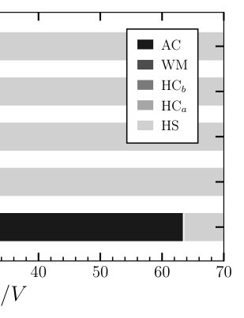
<figcaption class="paper-figure-caption"><b>Fig 4.</b> FIG. 5. ν dependence of the ¯ρ = 9/16 phases at fixed νV/ωc = 0.0033.</figcaption>
</figure>

**Summary.** This paper theoretically explores the emergence of Anyon Crystals and Hall Crystals in electron systems confined by periodic potentials under strong magnetic fields. By modeling the system using composite bosons and mean-field theory, the authors predict that strong interactions can stabilize a novel AC phase characterized by ordered anyons. The findings map out complex phase diagrams detailing transitions between superfluid, supersolid, and various insulating crystalline states.

**Why it may be interesting.** The work provides a detailed theoretical framework for understanding how topological order (like fractional quantum Hall states) can coexist with broken translational symmetry to form exotic crystalline phases hosting anyons. This touches upon fundamental concepts in strongly correlated matter relevant to condensed matter theory.

Detailed structure

**Main problem.** The study investigates quantum phases of matter, specifically Anyon Crystals (ACs) and Hall Crystals (HCs), that emerge in two-dimensional electron systems subjected to both strong magnetic fields and periodic potentials.

**Main result.** The authors predict the existence of an Anyon Crystal phase stabilized by strong interactions, which is characterized by a lattice ordering of well-defined anyons, distinct from standard Wigner-Mott insulators.

**Method.** The analysis employs mean-field theory using the Gutzwiller variational wavefunction applied to an effective lattice Hamiltonian derived from composite boson theory.

**Model / system.** The system is a 2D electron gas in a strong perpendicular magnetic field and a periodic potential. The model uses composite bosons attached to flux quanta, leading to an effective lattice Hamiltonian incorporating two-body, three-body, and current-density interactions.

**Key observables.** Superfluid stiffness ($
ho_s$), structure factors ($S(Q)$), and the anyon structure factor $S_{a}(-\pi/2, 0)$.

**Important parameters / regimes.** Magnetic filling fraction ($
u$) with odd denominators, ratio of kinetic to interaction energy ($t/V$), and Landau level mixing ($
u V/\omega_c$).

**Assumptions / limitations.** The analysis relies on the Gutzwiller mean-field ansatz and uses Ewald summation techniques for handling long-range Coulomb interactions.

**Figures summary.** Figures illustrate phase diagrams showing transitions between Quantum Hall States (HS), Hall Crystals (HC), Anyon Crystals (AC), and Wigner-Mott insulators (WM) as a function of interaction ratios. Schematics show the super-unit cells for these different crystalline phases.

**Paper structure.** The paper proceeds by deriving the effective lattice Hamiltonian from continuum theory, calculating various interaction energies using Ewald summation, performing mean-field analysis via the Gutzwiller ansatz, and mapping out phase diagrams based on key observables like superfluid stiffness and structure factors.

Abstract

We obtain integer and fractional quantum Hall crystals as ground states of a two-dimensional electron system subject to a strong perpendicular magnetic field and a periodic potential. For certain fractional states, we show that the Hall crystal can constitute an anyon crystal, with a periodic ordering of well-defined anyons. We find that the latter states can be stabilized at odd denominator Landau level filling fractions when Landau level mixing is sufficiently weak, and near half-filling of the underlying lattice. These phases are obtained from a mean-field analysis of an effective lattice model of bosons attached to an odd number of flux quanta, which transmutes their statistics to that of electrons. In boson coordinates, the Hall crystal is a supersolid: a superfluid with charge order. Under strong interactions, vortex-anti-vortex pairs spontaneously nucleate in the supersolid, realizing a crystalline state of anyons.

[↑ back to top](#top)

### [Quantum Mott semimetal in a one-dimensional Hubbard mode](http://arxiv.org/abs/2607.19465v1)

**Authors:** Boran Zhou, Taige Wang, Ya-Hui Zhang  
**Type:** theory · **Category:** strongly correlated electrons · **PDF:** <https://arxiv.org/pdf/2607.19465v1>  
**Analysis basis:** full PDF text, analyzed in chunks
**Topic relevance:** `analog quantum simulation` **3/5** · `Keldysh / 2PI / non-Gaussian methods` **1/5** · `Kondo & dissipative impurity` **1/5** · `entanglement & information structure` **1/5** · `methods for driven-dissipative` **1/5** · `non-equilibrium dynamics` **1/5**

↔ Scroll figures horizontally

<figure class="paper-figure-card">
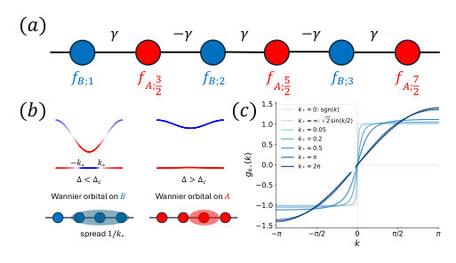
<figcaption class="paper-figure-caption"><b>Fig 1.</b> FIG. 1. Schematic illustration of the one-dimensional two- orbital model and its active-band Wannier orbital. (a) A sublattice and B sublattice are shown as red and blue cir- cles respectively. (b) Representative lower-band structures and orbital characters on the two different Wannier orbitals. For ∆&lt; ∆c, the lower band has a B-centered Wannier or- bital with a characteristic spread ∼1/k∗. For ∆&gt; ∆c, the lower band has an A-centered Wannier orbital. (c) Form fac- tor g(k) of the projected fermion, defined through ˜fA;k;σ = −igk∗(k)ck;σ. In the large-k∗limit, gk∗(k) = √</figcaption>
</figure>
<figure class="paper-figure-card">
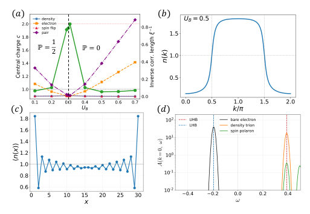
<figcaption class="paper-figure-caption"><b>Fig 2.</b> FIG. 3. (a) Phase diagram as a function of U at fixed t = −0.3, UA = 1, JA = 0, J = U, χ = 1000: central charge c (green, left axis), extracted from the finite-entanglement scal- ing S = c 6 ln ξ, together with the inverse correlation lengths ξ−1 (right axis) of the density, single-electron, spin-flip, and pair channels of the transfer matrix. On both sides of the transition the system is a Mott insulator with gapless density and spin-flip modes (ξ−1 ≈0) but gapped electron and pair excitations, giving c = 1. At U ≈0.3 the electron and pair gaps close simultaneously and c →2, marking a direct con- tinuous transition between a topological Mott insulator with quantized polarization P = 1 2...</figcaption>
</figure>
<figure class="paper-figure-card">
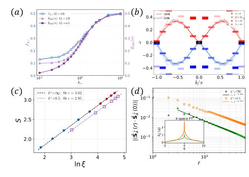
<figcaption class="paper-figure-caption"><b>Fig 3.</b> FIG. 2. (a) Critical antiferromagnetic exchange JA,c for melting the ferromagnetic ground state as a function of k∗. The spin-wave energy at momentum π, ESW(π) is shown for comparison. The close agreement indicates that the critical JA is related to the spin wave bandwidth. When L = 12, the critical JA,c saturate to 0.5 when k∗→∞. (b) ED hubbard bands at t = 0, UA = 1, JA = 4 3, k∗= ∞. (c)(d) infinite DMRG (iDMRG) calculations at the representative point U = 1 15, UA = 1, J = 0, JA = 4</figcaption>
</figure>
<figure class="paper-figure-card">
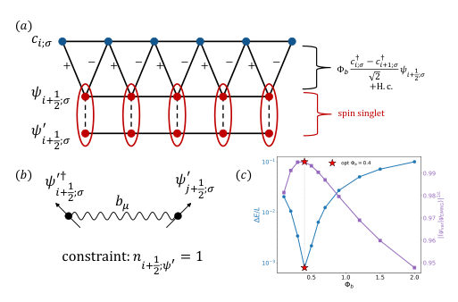
<figcaption class="paper-figure-caption"><b>Fig 4.</b> FIG. 4. (a)(b) The illustration of the ancilla wavefunctions. In (a), we show that physical electron (blue) resides at site i, while the two spinful ancilla fermions ψ and ψ′ reside at site i + 1</figcaption>
</figure>
<figure class="paper-figure-card">
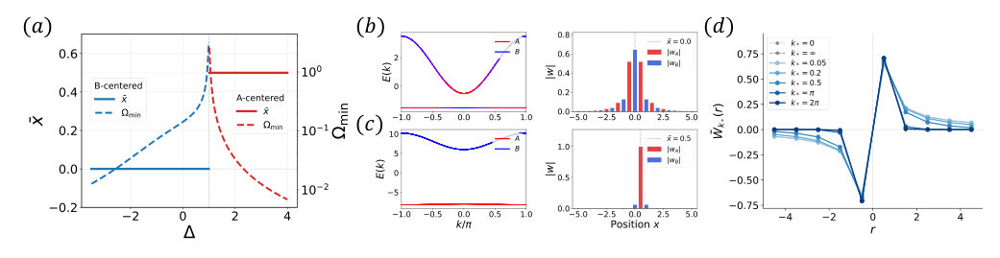
<figcaption class="paper-figure-caption"><b>Fig 5.</b> FIG. 5. Wannier representation of the lower band. We choose tA = 0, tB = −1, γ = 1 in the calculations. (a) Wannier center ¯x and minimal spread Ωmin as functions of the sublattice potential ∆. Inversion symmetry pins the Wannier center either to the B sublattice, ¯x = 0, or to the A sublattice, ¯x = 1</figcaption>
</figure>

**Summary.** This work theoretically establishes a novel Quantum Mott semimetal phase in a 1D Hubbard model, providing evidence for its existence and characterizing its low-energy excitations. By combining DMRG, RG theory, and spectral analysis, the authors map out how this state transitions between different insulating phases based on symmetry breaking. It offers a crucial theoretical framework for understanding correlated physics analogous to that found in materials like twisted bilayer graphene.

**Why it may be interesting.** The detailed theoretical mapping using RG flow equations to determine the stability of exotic quantum phases like Mott semimetals is highly relevant for understanding strongly correlated materials where simple mean-field approaches fail.

Detailed structure

**Main problem.** The study aims to demonstrate a quantum Mott semimetal phase and understand its connection to physics observed in twisted bilayer graphene (TBG). It also characterizes the low-energy effective theory of this state.

**Main result.** The authors provide evidence for a stable Mott semimetal ground state stabilized by an antiferromagnetic coupling, which hosts a spinful Dirac fermion coexisting with a neutral spin mode. They also map out transitions between different Mott insulating phases based on symmetry breaking.

**Method.** The research employs advanced theoretical techniques including Density Matrix Renormalization Group (DMRG), Exact Diagonalization (ED), Bosonization, and Renormalization Group (RG) analysis to analyze the system's ground state properties.

**Model / system.** The model is a one-dimensional spinful Hubbard model derived from projecting an $f$-orbital Hubbard interaction onto an active flat band. It incorporates hopping ($t$), on-site interactions ($U$), and inter-site exchange couplings ($J$).

**Key observables.** Central charge (c), spin correlator decay ($\sim r^{-1}$), spectral functions $A(k, \omega)$, and many-body polarization ($P$).

**Important parameters / regimes.** The momentum scale $k^*$, the Hubbard interaction $U$, and the inter-site coupling $J$ are crucial parameters controlling the phase transitions.

**Assumptions / limitations.** Key assumptions include projecting the system onto a flat band, using approximations like the Hubbard-I approximation for spectral calculations, and assuming stability within numerical precision limits for DMRG/RG analysis.

**Figures summary.** Figures illustrate schematic models (two-orbital setup), phase diagrams showing transitions between different Mott phases ($P=1/2$ vs $P=0$), and quantitative results like entanglement entropy confirming central charge values.

**Paper structure.** The paper progresses by first establishing the model from a two-orbital system, then using DMRG/ED to identify the semimetal phase characterized by $c=3$. Subsequent analysis uses low-energy effective theories (Bosonization/RG) and spectral function calculations to map out stability boundaries and understand the nature of the gapless excitations.

Abstract

Mott physics in topological bands has recently attracted considerable attention, particularly in the context of twisted bilayer graphene (TBG). However, the essential ingredients for stabilizing this physics remain unclear. Here, we demonstrate a quantum Mott semimetal phase as the ground state within a one-dimensional spinful Hubbard model featuring only one orbital per unit cell, protected by inversion and particle-hole symmetries. We start from a two-orbital model where a localized $f$ orbital on the A sublattice hybridizes with a delocalized $c$ orbital on the B sublattice. Projecting the $f$-orbital Hubbard $U$ onto the active flat band yields a lattice model with Wannier orbitals centered on the B sublattice. Similar to TBG, a momentum-space scale $k_*$ emerges, setting the interaction range in the projected model to $1/k_*$. While the ground state is ferromagnetic with only the Hubbard $U$, introducing an inter-site antiferromagnetic spin coupling $J$ stabilizes a Mott semimetal$^*$ phase with a central charge $c=3$. Using exact diagonalization (ED) and density matrix renormalization group (DMRG) methods, we show that this phase hosts a spinful Dirac fermion coexisting with a neutral spin mode -- analogous to the fractionalized Fermi liquid (FL$^*$) phase in higher dimensions. Furthermore, breaking particle-hole (PH) symmetry via dispersion transforms the Mott semimetal into a Mott insulator, which is separated from a distinct Mott insulating phase by a continuous transition with a polarization jump of $1/2$. Our work provides the first unbiased evidence of a Mott semimetal ground state and demonstrates that this 1D model captures some essential aspects of TBG physics, despite lacking a Wannier obstruction.

[↑ back to top](#top)

### [Raman spectroscopy of van der Waals topological magnet GdGaI](http://arxiv.org/abs/2607.19663v1)

**Authors:** Nan Jiang, Yijin Zhang, Yujie Xia, Tomo Higashihara, Ryutaro Okuma, Jun-ichi Yamaura, Yoshinori Okada, Kenji Watanabe, Takashi Taniguchi, Tiantian Zhang, Tomoki Machida, Yasuhiro Niimi  
**Type:** both · **Category:** strongly correlated electrons · **PDF:** <https://arxiv.org/pdf/2607.19663v1>  
**Analysis basis:** full PDF text, analyzed in chunks
**Topic relevance:** `exotic spin models in light-matter` **3/5** · `spintronics-quantum-optics interface` **3/5** · `analog quantum simulation` **1/5** · `driven-dissipative phase transition` **1/5**

↔ Scroll figures horizontally

<figure class="paper-figure-card">
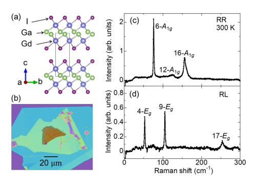
<figcaption class="paper-figure-caption"><b>Fig 1.</b> FIG. 1. (a) Crystal structure of GdGaI. The black solid line represents the unit cell of GdGaI. (b) An optical microscope image of GdGaI flake No. 1 sandwiched by hBN flakes. (c,d) Polarized Raman spectra of the GdGaI flake No. 1 at 300 K measured with (c) RR and (d) RL scattering geometries.</figcaption>
</figure>
<figure class="paper-figure-card">
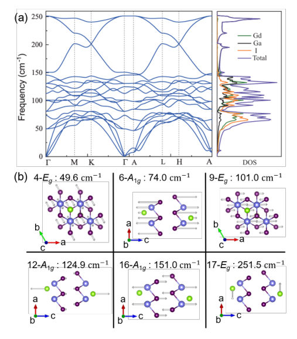
<figcaption class="paper-figure-caption"><b>Fig 2.</b> FIG. 2. (a) (a) Calculated phonon dispersion relations of GdGaI, together with the total phonon density of states (DOS) and the atom-projected phonon DOS . (b) Schematic illustration of Raman-active phonon modes in GdGaI at 300 K.</figcaption>
</figure>
<figure class="paper-figure-card">
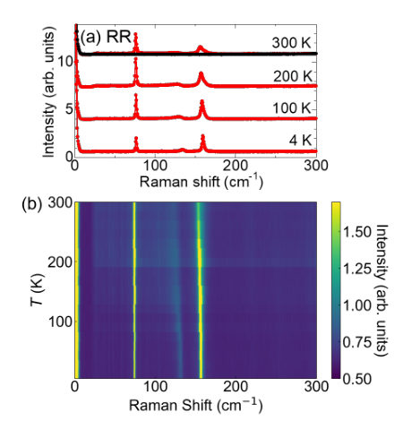
<figcaption class="paper-figure-caption"><b>Fig 3.</b> FIG. 3. (a) Polarized Raman spectra of GdGaI at several temperatures in the RR scattering geometry. The black trace represents the background signal measured on a substrate re- gion devoid of GdGaI. (b) False-color map of the RR-polarized Raman response of GdGaI measured as a function of temper- ature.</figcaption>
</figure>
<figure class="paper-figure-card">
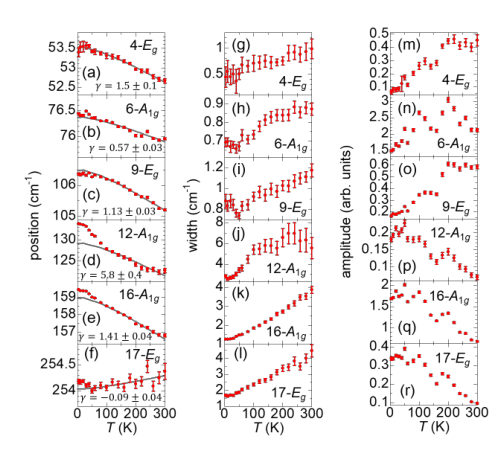
<figcaption class="paper-figure-caption"><b>Fig 4.</b> FIG. 4. Temperature dependence of the fitted (a–f) peak position, (g–l) full width at half maximum, and (m–r) am- plitude for each Raman mode. All parameters were obtained from least-squares fits to Lorentzian profiles. Error bars de- note 1σ uncertainties from the fit.</figcaption>
</figure>
<figure class="paper-figure-card">
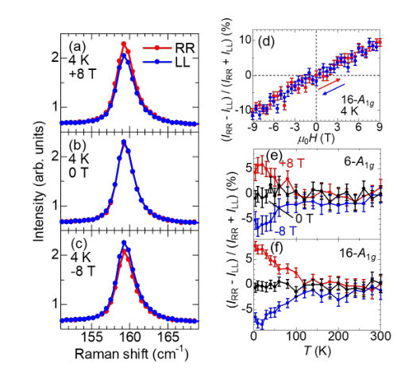
<figcaption class="paper-figure-caption"><b>Fig 5.</b> FIG. 5. (a-c) Polarized Raman spectra of the 16-A1g phonon mode in GdGaI at 4 K, measured in RR (red) and LL (blue) scattering geometries under (a) 8 T, (b) 0 T, and (c) -8 T. (d) Magnetic-field dependence of the degree of circular po- larization at T = 1.8 K for the 16-A1g phonon mode. (e,f) Temperature dependence of the degree of circular polarization for the (e) 6-A1g and (f) 16-A1g modes under 8 T (red), 0 T (black), and -8 T (blue). Error bars denote 1σ uncertainties propagated from the Lorentzian fits.</figcaption>
</figure>

**Summary.** This paper uses polarization-resolved Raman spectroscopy on GdGaI to investigate the nature of its insulating state. By showing no evidence of lattice distortion characteristic of CDW systems, they argue for an electronic origin for band reconstruction. Furthermore, observing magnetic field-dependent circular dichroism confirms spin-phonon coupling, positioning GdGaI as a model system where excitonic order and magnetism interact via phonons.

**Why it may be interesting.** The work provides a direct experimental link between lattice vibrations (phonons) and emergent electronic/magnetic orders (excitonic insulators, antiferromagnetism), which is crucial for understanding strongly correlated materials where electron-lattice interactions are key.

Detailed structure

**Main problem.** To distinguish between excitonic insulator (EI) transitions and conventional charge-density-wave (CDW) systems, both involving band reconstruction in the van der Waals magnet GdGaI.

**Main result.** The absence of soft modes or zone folding supports an electronically driven origin for band reconstruction, while circular dichroism reveals spin-phonon coupling linked to short-range antiferromagnetic correlations.

**Method.** Polarization-resolved Raman spectroscopy combined with symmetry analysis and DFT calculations were used to probe lattice vibrations under varying magnetic fields and temperatures.

**Model / system.** The study focuses on the van der Waals topological magnet GdGaI, investigating its interplay between excitonic order, magnetism, and phonon dynamics. The theoretical framework involves analyzing Raman tensor components sensitive to time-reversal symmetry breaking.

**Key observables.** Raman-active phonons ($A_{1g}, E_g$), degree of circular dichroism ($	ext{RR}/	ext{LL}$ contrast), temperature evolution of polarization, and phonon frequency shifts relative to thermal expansion models.

**Important parameters / regimes.** Temperature range (down to 4 K) and out-of-plane magnetic field strength ($\pm 9$ T).

**Assumptions / limitations.** The analysis assumes that the absence of spectral anomalies implies lattice distortions are below experimental sensitivity, ruling out a CDW mechanism.

**Figures summary.** Figures show polarized Raman spectra at various temperatures and magnetic fields, demonstrating both the lack of expected softening/folding (Fig. 3) and the clear field-dependent circular dichroism in $A_{1g}$ modes (Fig. 5).

**Paper structure.** The paper progresses by first establishing the phonon spectrum via DFT and initial measurements; it then uses temperature dependence to rule out CDW mechanisms, followed by magnetic field studies to reveal spin-phonon coupling signatures.

Abstract

We report polarization-resolved Raman spectroscopy of a van der Waals compound GdGaI that is a candidate for excitonic insulators. By combining the symmetry analysis with density functional theory calculations, we identify six Raman-active phonons. The spectra exhibit only the expected anharmonic hardening down to 4 K: no additional peaks, no soft modes, and no signatures of zone folding are observed. This result indicates that any lattice distortion is below our experimental sensitivity, supporting an electronically driven origin for the band reconstruction reported by angle-resolved photoemission spectroscopy rather than an electron-phonon-driven mechanism. Moreover, we observe a pronounced circular dichroism of the $A_{1g}$ modes under an out-of-plane magnetic field. Based on symmetry considerations, we attribute this dichroic response to chiral $A_{1g}$ phonons with opposite angular momenta generated by spin-phonon coupling in the time-reversal-broken state. The temperature evolution of the degree of circular polarization further suggests that circularly polarized Raman spectroscopy detects the emergence of short-range antiferromagnetic correlations. Our results highlight GdGaI as a promising platform in which excitonic order, magnetism, and circularly polarized phonons can be intertwined, and demonstrate that circular-polarization Raman provides a sensitive probe of spin-phonon coupling in excitonic systems.

[↑ back to top](#top)

### [A reduction scheme for general-order Ising-like Hamiltonians in quantum heuristic solvers](http://arxiv.org/abs/2607.19871v1)

**Authors:** Chengsi Mao, Pavel Mosharev, Yao Wang, Man-Hong Yung  
**Type:** theory · **Category:** disordered systems and neural networks · **PDF:** <https://arxiv.org/pdf/2607.19871v1>  
**Analysis basis:** full PDF text, analyzed in chunks
**Topic relevance:** `analog quantum simulation` **3/5** · `entanglement & information structure` **1/5** · `exotic spin models in light-matter` **1/5** · `methods for driven-dissipative` **1/5** · `non-equilibrium dynamics` **1/5**

↔ Scroll figures horizontally

<figure class="paper-figure-card">
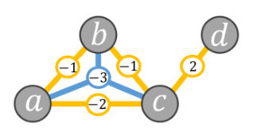
<figcaption class="paper-figure-caption"><b>Fig 1.</b> Figure 1: Illustration of a hypergraph representing a higher-order Ising-like Hamiltonian. The numbers on the (hyper)edges denote the corresponding weights.</figcaption>
</figure>
<figure class="paper-figure-card">
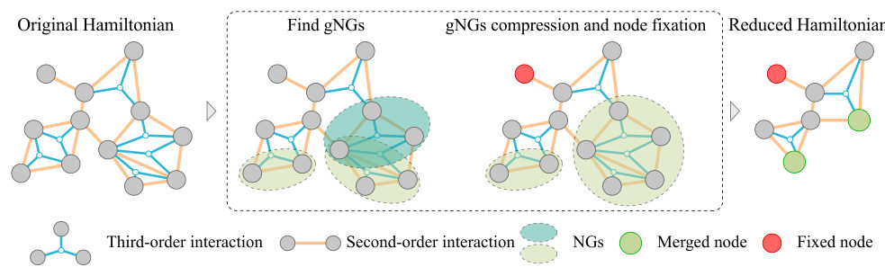
<figcaption class="paper-figure-caption"><b>Fig 2.</b> Figure 2: Diagrammatic illustration of the process of GeneralHare on higher-order Ising-like Hamiltonians. Here we set the highest order to be 𝑀= 3 as an example.</figcaption>
</figure>
<figure class="paper-figure-card">
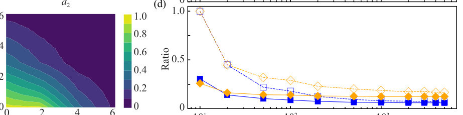
<figcaption class="paper-figure-caption"><b>Fig 3.</b> Figure 3: Reduction ratio on synthetic data (The higher the better.) (a) Reduction ratio of third-order ER-like hypergraphs using GeneralHare and how it changes with the increase of second- and third-order node degree 𝑑2, 𝑑3, averaged over 100 random samples. The node number is 𝑛= 200. For each hyperedge, 𝐽is an integer chosen uniformly in {−4, −3, −2, −1, 1, 2, 3, 4}. (b) Same as (a), but for third-order SF-like hypergraphs. (c) Reduction ratio with respect to node number on third-order weighted (orange line) and unweighted (blue line) SF-like hypergraphs, with 𝑑2 = 4, 𝑑3 = 2. For weighted hypergraph, 𝐽is an integer chosen uniformly in {−4, −3, −2, −1, 1, 2, 3, 4} for all hyperedges, while...</figcaption>
</figure>
<figure class="paper-figure-card">
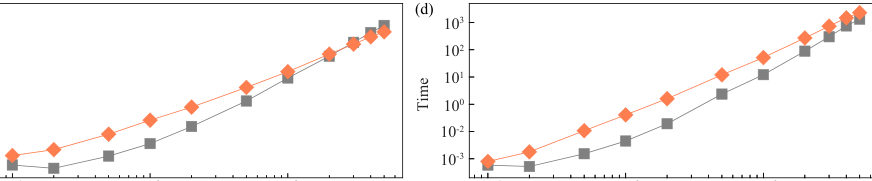
<figcaption class="paper-figure-caption"><b>Fig 4.</b> Figure 4: Performance comparison of GeneralHare and FastHare on synthetic second-order Ising Hamiltonians. (a) Reduction ratio of ER graphs; (b) same as (a), but for SF-like graphs. (c) Processing time for ER graphs; (d) same as (c), but for SF-like graphs. Solid markers denote the results averaged over 100 random instances at each problem size, and the corresponding hollow markers in (a) and (b) denote the highest reduction ratio obtained for these instances. ‘FH’ means FastHare, and ‘GH’ means GeneralHare.</figcaption>
</figure>
<figure class="paper-figure-card">
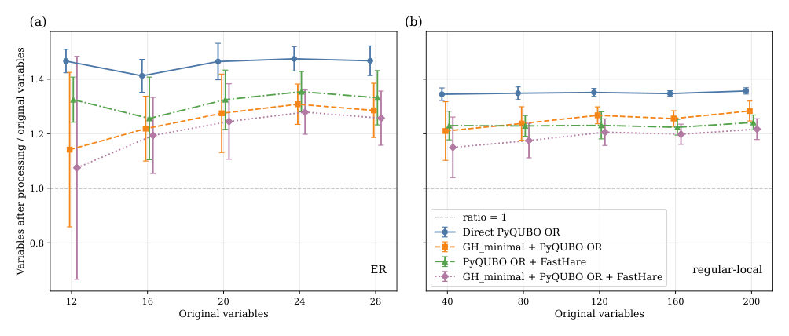
<figcaption class="paper-figure-caption"><b>Fig 5.</b> Figure 5: Variable overhead of quadratization and reduction pipelines. We use Python demonstrator implementation GH_minimal, and report ratio of the number of variables after preprocessing to the original number of variables in the higher-order Ising Hamiltonian. Markers show averages over ten independently generated instances, and error bars show one standard deviation. We compare direct PyQUBO order reduction (OR), GH_minimal followed by PyQUBO OR, PyQUBO OR followed by FastHare, and the combined GH_minimal + PyQUBO OR + FastHare pipeline. The dashed horizontal line marks ratio 1, corresponding to no net variable overhead relative to the original higher-order problem size. (a) Ratio on...</figcaption>
</figure>

**Summary.** This paper introduces GeneralHare, a novel Hamiltonian reduction framework designed to handle general-order Ising-like Hamiltonians beyond the scope of existing second-order methods. By generalizing non-separability theory, it effectively reduces complex optimization problems defined on hypergraphs into smaller, equivalent forms. This advancement provides a crucial preprocessing step for applying quantum heuristic solvers to more realistic, higher-order physical models.

**Why it may be interesting.** While focused on classical optimization, the underlying mathematical structure—analyzing complex interactions in high-dimensional spin systems—is highly relevant to understanding energy landscapes in quantum many-body physics, particularly those involving higher-order couplings.

Detailed structure

**Main problem.** The core problem is developing a Hamiltonian reduction framework for general-order Ising-like Hamiltonians, as existing techniques are limited to second-order interactions while real problems contain higher-order terms.

**Main result.** The proposed GeneralHare scheme successfully generalizes non-separability theory to arbitrary orders, achieving superior reduction ratios and performance compared to prior methods like FastHare on synthetic and public hypergraph datasets.

**Method.** The authors generalize the concept of 'non-separable groups' to create a generalized non-separable group (gNG) and develop the GeneralHare framework to iteratively detect and merge these constrained spin groups into single variables, thereby reducing the effective problem size.

**Model / system.** The model is the general-order Ising-like Hamiltonian defined on hypergraphs, $H(oldsymbol{\sigma}) = \sum J_I \prod_{i \in I} \sigma_i$, which are benchmarked using synthetic (ER/SF) and public network datasets.

**Key observables.** Reduction ratio ($r$), solution energy $H(\sigma)$, computational runtime, and final variable count overhead after reduction.

**Important parameters / regimes.** The order of the Hamiltonian ($M$), the structure of the hypergraph (e.g., ER-like vs. SF-like), and the candidate-size cutoff parameter ($\xi$).

**Assumptions / limitations.** Existing methods are limited to second-order models, and the reconstruction process relies on tracking explicit node maps to ensure ground state correspondence.

**Figures summary.** Figures compare reduction ratios and performance (Energy/Runtime) of GeneralHare against FastHare and Order Reduction techniques across various hypergraph types; Figure 1 illustrates the general structure of the higher-order Hamiltonian.

**Paper structure.** The paper introduces the limitations of current methods, proposes the generalized non-separable group concept, details the GeneralHare framework for reduction, benchmarks this framework on synthetic and public datasets, and finally evaluates its integration into downstream quantum heuristic solvers (like bSB).

Abstract

The Ising model is ubiquitous in various optimization problems but notoriously difficult to solve due to combinatorial explosion. In view of this, Hamiltonian reduction is a useful preprocessing technique for reducing the effective problem size before applying heuristic solvers. However, existing reduction techniques mainly target second-order Ising models, whereas many pseudo-Boolean formulations naturally contain higher-order interactions. In this work, we generalize the concept of non-separable groups to arbitrary-order Ising-like models and develop a Hamiltonian reduction framework that iteratively detects and merges constrained spin groups into single variables. We benchmark the reduction on synthetic hypergraphs and higher-order network datasets, and evaluate its integration with downstream order-reduction and solver workflows. Our results establish a foundation for Hamiltonian reduction in higher-order Ising-like optimization problems.

[↑ back to top](#top)

### [Exact theory of chirality-dependent p-wave magnetism and Edelstein effect in spin spirals](http://arxiv.org/abs/2607.20094v1)

**Authors:** Börge Göbel, Tom G. Saunderson, Freia Opfermann, Lennart Schimpf, Ersoy Şaşıoğlu, Samir Lounis  
**Type:** theory · **Category:** strongly correlated electrons · **PDF:** <https://arxiv.org/pdf/2607.20094v1>  
**Analysis basis:** full PDF text, analyzed in chunks
**Topic relevance:** `exotic spin models in light-matter` **3/5** · `spintronics-quantum-optics interface` **3/5** · `Keldysh / 2PI / non-Gaussian methods` **1/5**

↔ Scroll figures horizontally

<figure class="paper-figure-card">
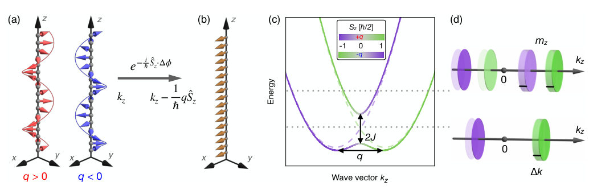
<figcaption class="paper-figure-caption"><b>Fig 1.</b> FIG. 1. Schematic representation of emerging chirality-dependent p-wave magnetism and Edelstein effect based on generalized Bloch theorem. (a) Spin spirals with positive and negative chirality. (b) After transforming into the rotating spin frame, the spatially varying exchange field becomes a uniform ferromagnetic background, while the electronic states acquire a spin- and chirality-dependent momentum shift. (c) Dashed lines: Schematic band structure in the weak-coupling limit, illustrating the rigid momentum shifts of the spin-up and spin-down bands. Solid lines: hybridized bands in the presence of a finite exchange coupling J. The color scale indicates the expectation value of sz. (d)...</figcaption>
</figure>
<figure class="paper-figure-card">
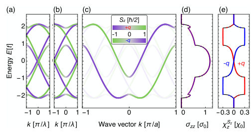
<figcaption class="paper-figure-caption"><b>Fig 2.</b> FIG. 2. Chirality-dependent properties of a spin spiral. (a) Numeri- cal calculation of the band structure with sz(k) as the color scale. (b) After applying a unitary transformation, the band structure and spin texture are shifted by ±q/2 as a function of the effectively shifted wave vector. (c) Band structure of the analytical two-band model reproducing the transformed spectrum. The background shows the transformed numerical band structure of panel (b) in the extended Brillouin zone corresponding to the structural unit cell. (d) Longitu- dinal conductivity and (e) spin Edelstein susceptibility as a function of energy. The color of the data points indicates the chirality. The black curve in...</figcaption>
</figure>
<figure class="paper-figure-card">
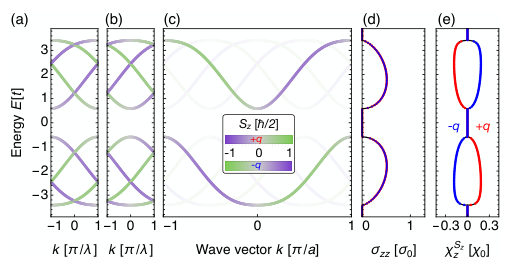
<figcaption class="paper-figure-caption"><b>Fig 3.</b> FIG. 3. Chirality-dependent properties of a spin spiral in the strong- coupling limit J = 2t. (a-c) Band structures with spin texture as in Fig. 2. (d) Longitudinal conductivity and (e) Spin Edelstein suscep- tibility as a function of energy.</figcaption>
</figure>
<figure class="paper-figure-card">
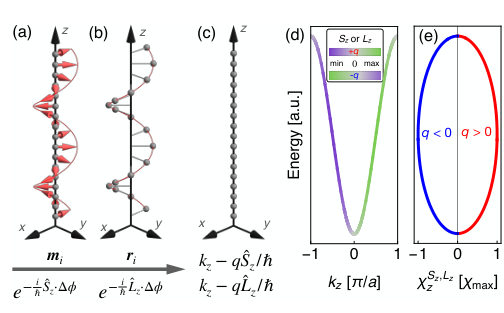
<figcaption class="paper-figure-caption"><b>Fig 4.</b> FIG. 4. Comparison of chiral systems: Spin-dependent physics in a spin spiral versus orbital-dependent physics in a non-magnetic helix. (a) Spin spiral, (b) non-magnetic helix, (c) transformed systems: a ferromagnetic or non-magnetic linear chain. The transformation is a rotation of the local spin or position vector, respectively and can be expressed by a unitary operator that contains the spin or orbital angular momentum operator, respectively, as indicated. For the spin spiral, the strong coupling limit J ≫t has been considered and only the states with parallel spin alignment are analyzed; the system acts effectively like a non-magnet shifted in energy. (d) The band struc- ture is a...</figcaption>
</figure>

**Summary.** This theoretical work proves that magnetic chirality alone can induce spin-momentum locking and generate measurable spin polarization via the Edelstein effect, bypassing the need for intrinsic spin-orbit coupling. By solving a minimal tight-binding model for electrons coupled to a spin spiral, the authors derive exact expressions for transport properties. This establishes spin spirals as fundamental archetypes of chiral magnetism relevant for spintronics.

**Why it may be interesting.** It provides a fundamental mechanism for generating chiral electronic responses (like the Edelstein effect) purely from magnetic order, offering an alternative paradigm to SOC mechanisms often studied in AMO or condensed matter systems.

Detailed structure

**Main problem.** To analytically demonstrate that spin-momentum locking and chirality-dependent p-wave magnetism can arise solely from magnetic chirality, bypassing the need for intrinsic spin-orbit coupling (SOC).

**Main result.** The study derives closed-form expressions showing that a spin spiral generates measurable spin polarization via the Edelstein effect using only its magnetic chirality.

**Method.** The authors solve the minimal tight-binding model exactly by employing a generalized Bloch theorem and transforming to a rotating spin frame of reference.

**Model / system.** The system consists of conduction electrons coupled to a background forming a non-collinear spin spiral. The analysis uses a tight-binding Hamiltonian incorporating exchange coupling ($J$) and hopping ($t$).

**Key observables.** Electrical conductivity ($\sigma_{zz}$), chirality-dependent spin Edelstein susceptibility ($\chi^s_{z}$), and the resulting $p$-wave magnetism characterized by $\mathbf{s}(\mathbf{k}) = -\mathbf{s}(-\mathbf{k})$.

**Important parameters / regimes.** The relative strengths of hopping ($t$) versus exchange coupling ($J$), and the chirality parameter ($q$). The strong-coupling limit ($J \gg t$) is particularly analyzed.

**Assumptions / limitations.** The analysis relies on solving a minimal tight-binding model; initial interpretations are limited to weak coupling, though the full analysis accounts for band hybridization.

**Figures summary.** Figures illustrate schematic spin spirals with positive and negative chirality ($q>0$ vs $q<0$), showing how the effective field shifts bands. They also present numerical results for band structure, spin texture, conductivity, and Edelstein susceptibility in various coupling regimes.

**Paper structure.** The paper progresses by setting up the model Hamiltonian, applying generalized Bloch theorems to solve the system exactly, deriving analytical expressions for transport coefficients ($\sigma$ and $\chi^s$), and finally establishing analogies between spin-spiral physics and orbital physics in non-magnetic helices.

Abstract

Spin-momentum locking is widely regarded as a hallmark of relativistic spin-orbit coupling. Here we demonstrate analytically that it can instead emerge solely from magnetic chirality. Solving the minimal tight-binding model of electrons coupled to a spin spiral using a generalized Bloch theorem, we show that the spiral generates chirality-dependent p-wave magnetism characterized by the antisymmetric spin texture $\boldsymbol{s}(\boldsymbol{k})=-\boldsymbol{s}(-\boldsymbol{k})$. The exact solution further yields closed-form expressions for the electrical conductivity and the spin Edelstein susceptibility, revealing a microscopic mechanism by which magnetic chirality alone can generate spin polarization without spin-orbit coupling, with direct implications also for chirality-induced spin selectivity. In the strong exchange-coupling regime, the spin-dependent physics of the spin spiral becomes directly analogous to the orbital-dependent physics of electrons propagating through a non-magnetic helix. Our work establishes a minimal exactly solvable model of chirality-induced spin-momentum locking and spin-charge conversion beyond the conventional spin-orbit coupled paradigm.

[↑ back to top](#top)

### [Nuclear Quantum Effects as a Denoising Problem](http://arxiv.org/abs/2607.19680v1)

**Authors:** Weizhou Wang, Jonathan Weare, Aaron R. Dinner  
**Type:** theory · **Category:** statistical mechanics · **PDF:** <https://arxiv.org/pdf/2607.19680v1>  
**Analysis basis:** full PDF text, analyzed in chunks
**Topic relevance:** `methods for driven-dissipative` **3/5** · `non-equilibrium dynamics` **2/5** · `Keldysh / 2PI / non-Gaussian methods` **1/5** · `driven-dissipative phase transition` **1/5**

↔ Scroll figures horizontally

<figure class="paper-figure-card">

<figcaption class="paper-figure-caption"><b>Fig 1.</b> FIG. 1. Bath and temperature transfer in the Caldeira– Leggett double well. (a) Centroid distribution for bath cou- plings α = 0, 1, 2. Increasing α drives the distribution from unimodal (the particle delocalized over both wells) to bimodal (localized in the wells). (b) Radius of gyration Rg versus in- verse temperature β at fixed τ for the same couplings. Rg increases as the temperature decreases and decreases with coupling. Solid: our method with a single denoiser; dashed: PIMC reference.</figcaption>
</figure>
<figure class="paper-figure-card">
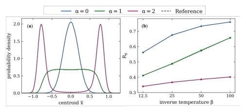
<figcaption class="paper-figure-caption"><b>Fig 2.</b> Figure 1 shows that a single denoiser reproduces the PIMC reference across all three couplings and across tem- perature at fixed τ.</figcaption>
</figure>
<figure class="paper-figure-card">
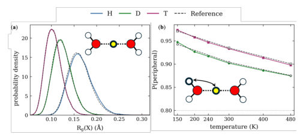
<figcaption class="paper-figure-caption"><b>Fig 3.</b> FIG. 2. Isotope effects in the Zundel cation. (a) Radius of gyration Rg of the shared nucleus for H, D, and T at 300 K with P = 32. (b) Probability that a substituted isotope oc- cupies a peripheral site rather than the central shared site (highlighted in yellow in the illustration), versus tempera- ture at fixed τ. Heavier isotopes prefer the peripheral sites more strongly, and the preference weakens with temperature. The dotted line marks the isotope-free value 4/5. Solid: our method with a single denoiser. Dashed: PIMD reference.</figcaption>
</figure>
<figure class="paper-figure-card">
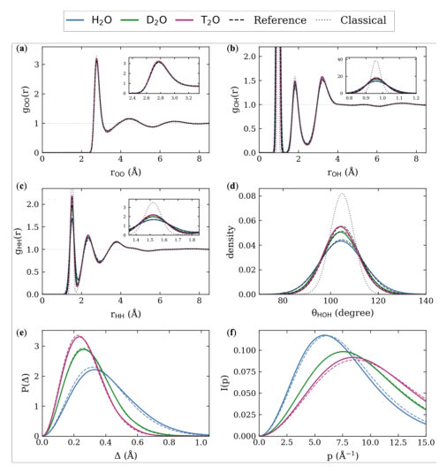
<figcaption class="paper-figure-caption"><b>Fig 4.</b> FIG. 3. Isotope effects and open-path observables in liquid water. (a-c) Radial distribution functions of the O–O, O– H, and H–H pairs for H2O, D2O, and T2O at 300 K with P = 32. (d) Intramolecular H–O–H angle distribution for the same isotopes. (e) Normalized radial end-to-end distribution P(∆) of the opened imaginary-time path of a tagged nucleus for the same three liquids. (f) Radial momentum distribution I(p) of the tagged nucleus. Solid: our method with a single denoiser. Dashed: PIMD reference, open-path PIMD in (e) and (f). Dotted: classical MD in (a-d).</figcaption>
</figure>

**Summary.** The paper introduces a novel generative modeling approach to simulate complex quantum systems by treating the path integral measure as a composition of two parts. It demonstrates that training a denoiser on simple classical statistics, when combined with an analytically derived Gaussian term representing the full quantum context, can exactly reproduce the true quantum Boltzmann distribution. This breakthrough allows for highly transferable simulations across varying physical parameters like temperature and mass without retraining.

**Why it may be interesting.** This work provides a powerful, unified computational methodology for simulating open quantum systems where NQEs are crucial, linking advanced generative AI techniques (denoising flows) directly to fundamental physics concepts like path integrals and thermal equilibrium.

Detailed structure

**Main problem.** The core problem is rigorously capturing Nuclear Quantum Effects (NQEs) within path integral formulations while developing a generative modeling framework that cleanly separates the analytically known quantum context from the learned classical statistics.

**Main result.** The authors show that a denoiser trained only on classical Boltzmann statistics can exactly reproduce the full quantum Boltzmann distribution by composing it with an analytic Gaussian component carrying the entire quantum context at sampling time, achieving exact transferability across various physical parameters without retraining.

**Method.** They employ generative modeling (denoising/flow matching) applied to path integrals. The method constructs a joint probability distribution where the quantum context is analytically injected into the reverse conditional step of the sampler.

**Model / system.** The framework applies to systems exhibiting NQEs, modeled via imaginary-time path integrals mapping the system onto a ring polymer of classical replicas. Benchmarks include the dissipative double well, Zundel cation ($	ext{H}_5	ext{O}^+$), and liquid water.

**Key observables.** End-to-end displacement and momentum distributions of tagged nuclei; radial distribution functions (RDFs); centroid distribution ($R_g$).

**Important parameters / regimes.** Inverse temperature ($eta$), number of beads ($P$), imaginary time slice width ($	au$), bath coupling strength ($\alpha$), and the training noise level ($\sigma^2$).

**Assumptions / limitations.** The composition is exact only if the training noise does not exceed the intrinsic quantum uncertainty, establishing a physical bound; the framework relies on the existence of an amortized denoising posterior.

**Figures summary.** Figures demonstrate successful reproduction of PIMC references across varying bath couplings and temperatures in the double well, accurate modeling of isotope effects in the Zundel cation, and matching of open-path observables in liquid water.

**Paper structure.** The paper develops a general framework (DPI) for sampling quantum ensembles by separating the path measure. It establishes that training on classical statistics allows composition with an analytic Gaussian component to yield the full quantum distribution, demonstrating this transferability across multiple physical contexts and systems.

Abstract

Nuclear quantum effects are rigorously captured by imaginary-time path integrals, which map the quantum Boltzmann distribution onto a ring polymer of classical replicas. Yet the nuclear masses, the coupling to the environment, and the boundary conditions of the path remain hard-wired in the simulation or the trained model, even though this quantum context enters the path measure only through a quadratic action known in closed form. Here we show that a denoiser trained on classical Boltzmann statistics alone, composed at sampling time with an analytic Gaussian component carrying the entire quantum context, yields the quantum Boltzmann distribution of the nuclei. Such a composition exists and is exact whenever the training noise does not exceed the intrinsic quantum uncertainty of the target ensemble, and it is invariant across all quantum contexts admitted by this bound. We show exact transfer across temperature, isotopic mass, dissipation strength, and the boundary conditions of the path in theory and in numerical experiments, without retraining. The last yields the end-to-end displacement and momentum distributions of a tagged nucleus from open imaginary-time paths. The same invariance extends in principle to the permuted boundary conditions of bosonic exchange, with the identical denoiser. In this view, the noise of generative modeling and the quantum fluctuations of the nuclei are two faces of the same quadratic structure.

[↑ back to top](#top)

### [Random walks in Dirichlet random environment in dimension $d+1$](http://arxiv.org/abs/2607.20279v1)

**Authors:** Guillaume Barraquand, Alexander K. Hartmann, Pierre Le Doussal  
**Type:** theory · **Category:** statistical mechanics · **PDF:** <https://arxiv.org/pdf/2607.20279v1>  
**Analysis basis:** full PDF text, analyzed in chunks
**Topic relevance:** `non-equilibrium universality` **3/5** · `non-equilibrium dynamics` **2/5** · `Keldysh / 2PI / non-Gaussian methods` **1/5** · `driven-dissipative phase transition` **1/5**

↔ Scroll figures horizontally

<figure class="paper-figure-card">
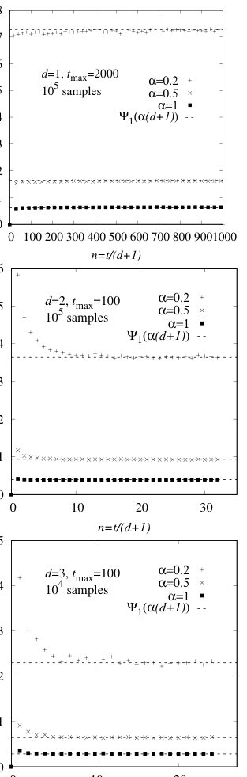
<figcaption class="paper-figure-caption"><b>Fig 1.</b> Figure 2. The numerically estimated variance of the log of the probability in the typical direction for d = 1 (top, u = (1/2, 1/2)), d = 2 (middle, u = (1/3, 1/3, 1/3)) and d = 3 (bottom, u = (1/4, 1/4, 1/4, 1/4) as a function of the time t, for different values of α. The estimates were performed by averaging over 105 (d = 1, d = 2) or 104 (d = 3) samples of the environment, respectively. A fast convergence towards the values given in Eq. (31), as displayed by horizontal lines, is visible.</figcaption>
</figure>
<figure class="paper-figure-card">
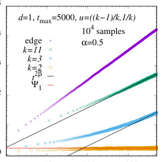
<figcaption class="paper-figure-caption"><b>Fig 2.</b> Figure 3. The variance of the log of the probability as function of time t for d = 1 and α = 0.5, measured along several directions u. The solid lines represents the expected asymptotic behaviour t2/3.</figcaption>
</figure>
<figure class="paper-figure-card">
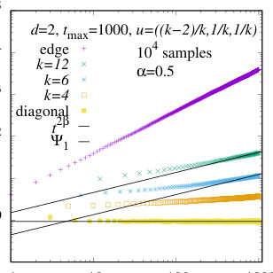
<figcaption class="paper-figure-caption"><b>Fig 3.</b> Figure 4. The variance of the log of the probability as function of time t measured along several directions u, for d = 2 and α = 0.5. The solid ascending lines correspond to t2β with β = 0.24, while the horizontal lines shows Ψ1(α(d + 1)).</figcaption>
</figure>
<figure class="paper-figure-card">
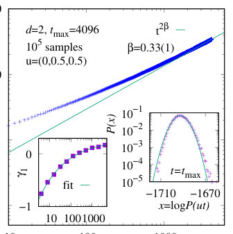
<figcaption class="paper-figure-caption"><b>Fig 4.</b> Figure 5. Main plot: The variance of the log of the prob- ability as function of time t in direction u = (1/2, 1/2, 0). The line indicates the power law t2β with β = 1/3. Left inset: skewness of the distribution again as function of time. The line shows a fit to a power-law plus constant Eq. (38) Right inset: distribution at the largest time tmax = 4096. The line shows a corresponding Gaussian, fitted to the peak region. One sees that all off-peak data points are systematically below of the Gaussian left of the peak, and above the Gaussian right of the peak.</figcaption>
</figure>
<figure class="paper-figure-card">
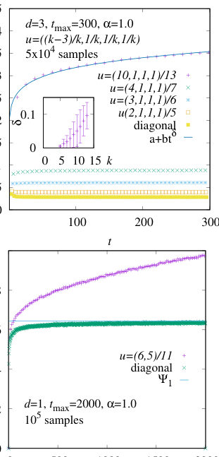
<figcaption class="paper-figure-caption"><b>Fig 5.</b> Figure 6. Top: The variance of the log of the probability as function of time t measured along certain directions u(k) = (k −3, 1, 1, 1)/k for d = 3. The inset in the right shows results for the exponent δ when fitting the d = 3 data to power laws of the form a + btδ. For small values of k, the exponent is within a one-sigma error bar compatible with 0, while it is not for large k. Bottom: For comparison, we consider the same quantity in dimension d = 1. In that case, the off-diagonal growth in time is well visible, even for relatively small angles.</figcaption>
</figure>

**Summary.** This paper studies random walks in a Dirichlet random environment, aiming to understand how their fluctuations relate to the Kardar-Parisi-Zhang (KPZ) growth universality class beyond $d=1$. Through numerical and analytical methods, it confirms KPZ scaling in lower dimensions, identifies phase transitions in higher dimensions, and derives exact formulas for key statistical quantities like the second moment.

**Why it may be interesting.** The deep connection between random walks, disordered media, and non-equilibrium growth phenomena like KPZ is central to modern statistical physics. The explicit treatment of higher dimensions ($d>1$) for this specific Dirichlet model provides crucial benchmarks against continuum theories.

Detailed structure

**Main problem.** The paper investigates the atypical behavior of random walks in time-dependent random environments (RWRE), specifically linking its fluctuations to Kardar-Parisi-Zhang (KPZ) growth, particularly in dimensions $d>1$. It also analyzes the asymptotic second moment of point-to-point probabilities.

**Main result.** The model confirms KPZ compatibility for variance growth in $d=1$ and $d=2$, identifies a phase transition in $d=3$, and provides an exact calculation for the sample-to-sample variance related to extreme diffusion coefficients.

**Method.** The study employs numerical simulations across dimensions ($d=1, 2, 3$) combined with rigorous asymptotic analysis techniques, including second moment calculations and comparisons to continuum scaling limits.

**Model / system.** The system is a random walk on $\mathbb{Z}^{d+1}$ whose transition probabilities are governed by a Dirichlet distribution. This model generalizes known integrable models in $d=1$ and exhibits an explicit product-form stationary measure.

**Key observables.** Variance of the logarithm of point-to-point probabilities, the annealed drift $\langle X(t) 
angle$, the diffusion matrix $D$, and the second moment $m_2(v)$.

**Important parameters / regimes.** Spatial dimension $d$ (tested up to 3), time $t$, and the ratio $|x|/t$ which dictates phase transition behavior.

**Assumptions / limitations.** The analysis relies on numerical verification of scaling laws, asymptotic approximations for moments, and relating the system to known KPZ universality classes.

**Figures summary.** Figure 1 illustrates the space-time trajectory of the random walk in $d=1+1$ embedded in $\mathbb{Z}^2$.

**Paper structure.** The paper progresses from establishing the connection between RWRE and KPZ growth (numerical studies) to analyzing phase transitions ($d=3$), detailing the scaling laws for probability fluctuations ($\log P$), and concluding with an exact calculation of the second moment $m_2(v)$ in the weak disorder regime.

Abstract

The atypical behaviour of random walks in time-dependent random environment was recently related to Kardar-Parisi-Zhang (KPZ) growth. While this is now well-understood in spatial dimension $d=1$, further efforts are necessary to better understand these connections in dimensions $d>1$. In this paper, we study this problem numerically for $d=1, 2$ and $3$, focusing on a discrete model with Dirichlet distributed transition probabilities. This model is a generalization of an integrable model in $d=1$, and it has the advantage of admitting an explicit, product-form, stationary measure. We verify that the growth of the variance of the logarithm of point-to-point probabilities, namely from the origin to position $x$ in time $t$, is compatible with KPZ growth in dimension $d=1$ and $d=2$. In spatial dimension $d=3$, we confirm the existence of a phase transition as the angle $\vert x\vert /t$ increases and we obtain a lower bound based on an exact second moment calculation. We find that in the weak disorder phase the point-to-point probability acquires a heavy tailed distribution, and that in the strong disorder phase the cumulants of its logarithm grow with time. Further, we show that for this model, we can compute exactly the sample to sample variance of the thermal average $\overline{ \langle x \rangle^2}$ and that it is related to the extreme diffusion coefficient introduced recently.

[↑ back to top](#top)

### [Twisting-operator approach to identifying gaplessness in SU($N$) fermionic systems](http://arxiv.org/abs/2607.19694v1)

**Authors:** Hao Cheng, Hang Su, Yuan Yao  
**Type:** theory · **Category:** strongly correlated electrons · **PDF:** <https://arxiv.org/pdf/2607.19694v1>  
**Analysis basis:** full PDF text, analyzed in chunks
**Topic relevance:** `analog quantum simulation` **3/5** · `Keldysh / 2PI / non-Gaussian methods` **1/5** · `Kondo & dissipative impurity` **1/5** · `entanglement & information structure` **1/5** · `non-equilibrium dynamics` **1/5**

↔ Scroll figures horizontally

<figure class="paper-figure-card">
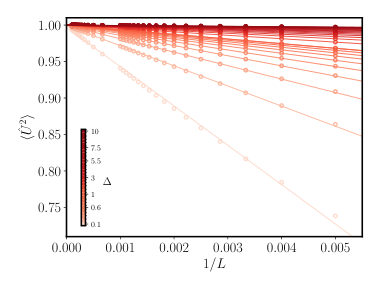
<figcaption class="paper-figure-caption"><b>Fig 1.</b> FIG. 1: Results for ⟨ˆU 2⟩in the BCS Hamiltonian. If we set ∆&gt; 0, then 1−⟨ˆU 2⟩∝1/L as shown by the different lines in the figure. For the given L, lim∆→0 ⟨U⟩2 →0 as shown in the vertical series of points in the figure.</figcaption>
</figure>
<figure class="paper-figure-card">
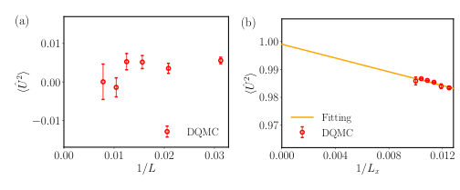
<figcaption class="paper-figure-caption"><b>Fig 2.</b> FIG. 2: Results for ⟨ˆU 2⟩in interaction fermionic models. (a) For the half-filled Hubbard chain, corresponding to the extended Hubbard model with V = 0, ⟨ˆU 2⟩remains close to zero for L = 32, . . . , 128. (b) For the half-filled two-leg Hubbard ladder with U = 4, t∥= 0.4, and t⊥= 1, ⟨ˆU 2⟩flows toward unity. The solid line is a linear fit in 1/Lx, with the intercept 0.999(3).</figcaption>
</figure>

**Summary.** The authors introduce the twisting-operator approach as a general criterion to determine if an SU(N)-symmetric fermionic system is gapped or gapless. By analyzing the expectation value of this operator, they derive rigorous conditions that distinguish between these two fundamentally different quantum phases in models like the Hubbard chain.

**Why it may be interesting.** This provides a powerful, symmetry-based diagnostic tool for characterizing quantum phases (gapped vs. gapless) in strongly correlated electron systems, which is fundamental to understanding materials physics.

Detailed structure

**Main problem.** The paper develops a general necessary condition, based on a fermionic twisting operator, to rigorously distinguish between gapped and gapless phases in fermionic systems possessing SU(N) spin-rotation symmetry.

**Main result.** A non-unity expectation value of the twisting operator $\langle \hat{U}^M 
angle$ in the thermodynamic limit provides a sufficient criterion for identifying a gapless fermion chain, while unity suggests a gapped phase.

**Method.** The core method involves analyzing the asymptotic behavior of the expectation value of a specially constructed fermionic twisting operator ($\hat{U}$) applied to the ground state, relating it to the system's spectral gap.

**Model / system.** The study focuses on spinful fermion chains generalized to SU(N)-symmetric systems. Examples include the BCS Hamiltonian and interacting Hubbard models, which are used to test the criterion.

**Key observables.** The expectation value $\langle \hat{U}^M 
angle$, where $M$ is related to the symmetry group structure; deviations from $1 + O(1/L)$ signal gaplessness.

**Important parameters / regimes.** System size ($L$), BCS pairing gap ($\Delta$), and the symmetry rank ($N$).

**Assumptions / limitations.** The analysis assumes that for gapped systems, the ground state must form a trivial representation of SU(N), and relies on asymptotic expansions in $1/L$.

**Figures summary.** Figures illustrate the behavior of $\langle \hat{U}^2 
angle$ for both BCS (gapped vs. gapless) and DQMC simulations (Hubbard chain vs. ladder), showing the expected approach to 1 or 0.

**Paper structure.** The paper establishes theorems relating gapped/gapless nature to the twisting operator expectation value, proves necessary lemmas connecting different correlation functions, and then applies these tools to specific models like BCS and Hubbard chains.

Abstract

We propose a general necessary condition for a spinful fermion chain with SU(2) spin-rotation symmetry to be gapped. Specifically, we prove that the expectation value of a properly defined fermionic twisting operator asymptotically approaches unity in any gapped phase with finite ground-state degeneracy, with finite-size corrections bounded by $\mathscr{O}(1/L)$. Consequently, a non-unity value in the thermodynamic limit provides a sufficient criterion for identifying gapless fermion chains. We confirm this criterion using the $s$-wave Bardeen-Cooper-Schrieffer (BCS) Hamiltonian and determinant quantum Monte Carlo (DQMC) simulations of interacting Hubbard models. We further extend the twisting-operator approach to SU($N$)-symmetric fermionic systems, where the gapped ground-state sector must be SU($N$)-singlet and $\langle \hat{\mathcal{U}}^M\rangle=1+\mathscr{O}(1/L)$ by a fermionic twisting operator $\hat{\mathcal{U}}$ with a suitably chosen integer $M$.

[↑ back to top](#top)

### [Derivation of the Boltzmann equation with no "molecular chaos"-type approximation](http://arxiv.org/abs/2607.20134v1)

**Authors:** Victor F. Los  
**Type:** theory · **Category:** statistical mechanics · **PDF:** <https://arxiv.org/pdf/2607.20134v1>  
**Analysis basis:** full PDF text, analyzed in chunks
**Topic relevance:** `Keldysh / 2PI / non-Gaussian methods` **3/5** · `non-equilibrium dynamics` **2/5** · `methods for driven-dissipative` **1/5**

↔ Scroll figures horizontally

<figure class="paper-figure-card">
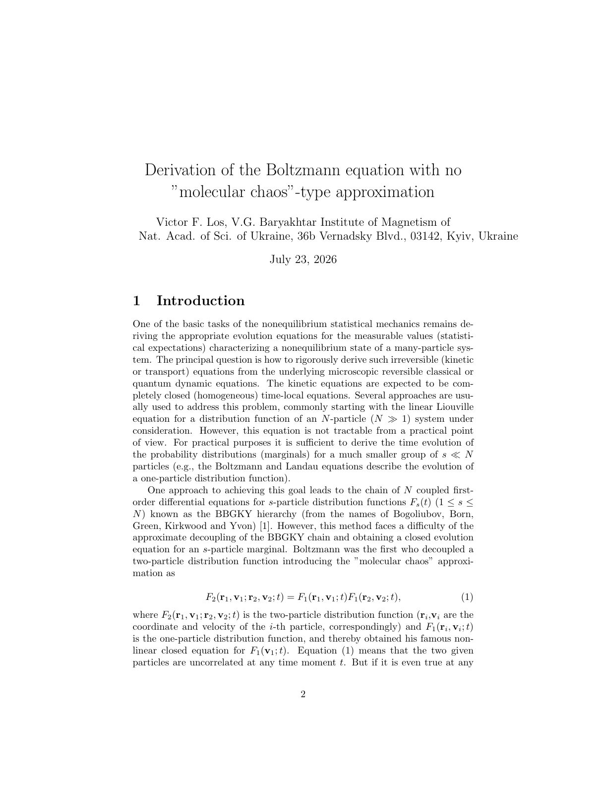
<figcaption class="paper-figure-caption"><b>Fig 1.</b> Low-resolution page preview, page 2</figcaption>
</figure>
<figure class="paper-figure-card">
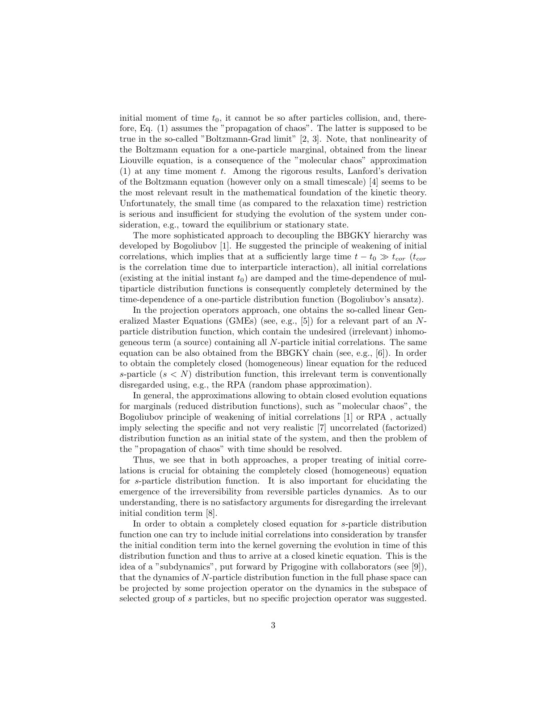
<figcaption class="paper-figure-caption"><b>Fig 2.</b> Low-resolution page preview, page 3</figcaption>
</figure>
<figure class="paper-figure-card">
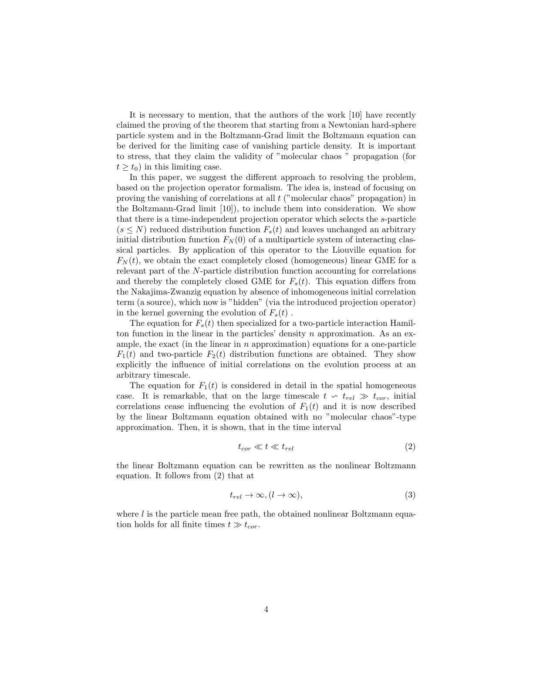
<figcaption class="paper-figure-caption"><b>Fig 3.</b> Low-resolution page preview, page 4</figcaption>
</figure>
<figure class="paper-figure-card">
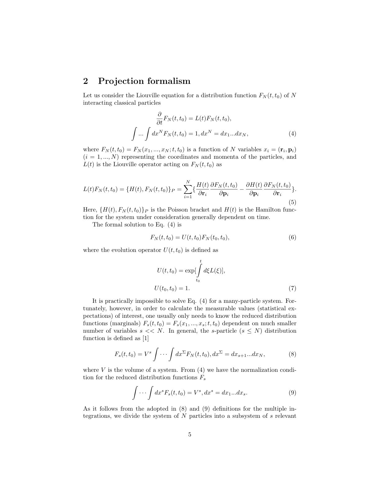
<figcaption class="paper-figure-caption"><b>Fig 4.</b> Low-resolution page preview, page 5</figcaption>
</figure>
<figure class="paper-figure-card">
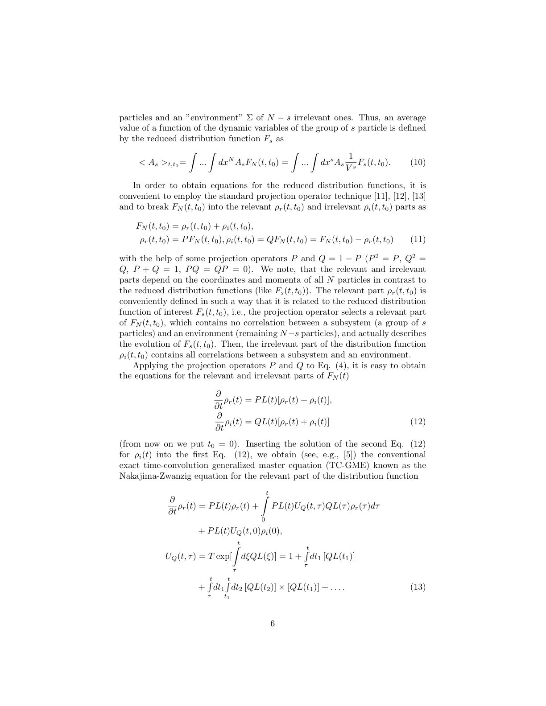
<figcaption class="paper-figure-caption"><b>Fig 5.</b> Low-resolution page preview, page 6</figcaption>
</figure>

**Summary.** This paper presents a sophisticated derivation of kinetic evolution equations, such as the Boltzmann equation, directly from the full Liouville dynamics of interacting particles. By employing a specialized projection operator formalism, it overcomes the limitations of previous methods that required assuming molecular chaos or ignoring initial correlations. The result confirms the validity of the Boltzmann description in appropriate time limits while maintaining mathematical rigor regarding initial state preparation.

**Why it may be interesting.** This work provides a rigorous theoretical framework for deriving kinetic equations like the Boltzmann equation from first principles (Liouville dynamics) while correctly handling non-equilibrium initial conditions and avoiding common approximations used in statistical mechanics.

Detailed structure

**Main problem.** The paper addresses the fundamental challenge of deriving a closed evolution equation for reduced $s$-particle distribution functions from the full Liouville equation without invoking the 'molecular chaos' approximation.

**Main result.** It rigorously derives that in the long-time limit ($t \gg t_{	ext{cor}}$), the system approaches the linear Boltzmann equation, and in an intermediate regime, it matches the nonlinear Boltzmann equation, all while correctly accounting for initial correlations.

**Method.** The derivation employs a specialized projection operator formalism applied to the Nakajima-Zwanzig Generalized Master Equation (GME) to transform the inhomogeneous GME into an exact, homogeneous form.

**Model / system.** The system consists of $N$ interacting classical particles governed by the Liouville equation. The analysis focuses on deriving equations for reduced density functions ($F_s$) describing subsystems of $s$ particles coupled to a large environment ($\Sigma$).

**Key observables.** Reduced distribution functions $F_s(t)$, particularly $F_1(t)$ and $F_2(t)$; the collision integral $J$.

**Important parameters / regimes.** Time scales: correlation time ($t_{	ext{cor}}$), relaxation time ($t_{	ext{rel}}$); Density parameter ($\gamma$); Mean free path ($l$).

**Assumptions / limitations.** The derivation relies on a small density approximation ($\gamma \ll 1$) and the assumption that initial correlations can be systematically incorporated into the evolution kernel.

**Paper structure.** The paper progresses by first establishing the need for an exact, closed GME using projection operators. It then derives the time-convolution form of the equation, showing how initial correlation terms are managed. Finally, it analyzes the long-time limit to recover the standard Boltzmann equation forms.

Abstract

The paper resolves the problem of the derivation of a completely closed evolution equation for $s$-particle distribution function $F_s(t)$ ($s \le N$) from the Liouville equation for $N \gg 1$-particle distribution function $F_N(t)$ with arbitrary initial condition $F_N(0)$ and without any use of the "molecular chaos" type approximation. The initial correlations are accounted for in this equation in the kernel governing the evolution of $F_s(t)$ via the special projection operator which exactly transforms the inhomogeneous Nakajima-Zwanzig Generalized Master Equation (GME) with an irrelevant initial condition term into the homogenous one. This equation is further simplified by presenting its kernel in the linear in the particles' density $n$ approximation. In this approximation the equations for one-particle $F_1(t)$ and two-particle $F_2(t)$ distribution functions are derived. It is shown that the terms describing the influence of initial correlations in the equation for $F_1(t)$ disappear at the large timescale $t \sim t_{\text{rel}} \gg t_{\text{cor}}$ ($t_{\text{cor}}$ is a short correlation time as compared to a relaxation time $t_{\text{rel}}$ of $F_1(t)$) resulting in the linear Boltzmann equation. This equation can be presented as the nonlinear Boltzmann equation in the time interval $t_{\text{cor}} \ll t \ll t_{\text{rel}}$. At $t_{\text{rel}} \to \infty$ (mean free path $l \to \infty$) the Boltzmann equation holds for all finite times $t \gg t_{\text{cor}}$.

[↑ back to top](#top)

### [Dynamical Criticality of a Machine-learning-assisted Monte Carlo algorithm for a Mean-Field Spin Glass model](http://arxiv.org/abs/2607.20243v1)

**Authors:** Seiya Miyamoto, Masayuki Ohzeki, Yoshihiko Nishikawa  
**Type:** theory · **Category:** disordered systems and neural networks · **PDF:** <https://arxiv.org/pdf/2607.20243v1>  
**Analysis basis:** full PDF text, analyzed in chunks
**Topic relevance:** `methods for driven-dissipative` **3/5** · `exotic spin models in light-matter` **1/5** · `non-equilibrium dynamics` **1/5**

↔ Scroll figures horizontally

<figure class="paper-figure-card">
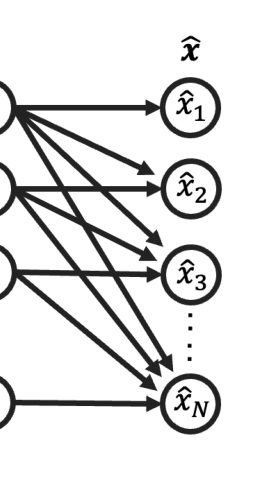
<figcaption class="paper-figure-caption"><b>Fig 1.</b> Figure 1: Example of MADE network architecture with the autoregressive property, with input x, one hidden layer h, and output ˆx.</figcaption>
</figure>
<figure class="paper-figure-card">
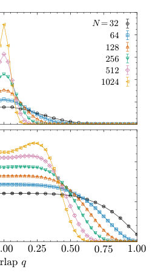
<figcaption class="paper-figure-caption"><b>Fig 2.</b> Figure 2: Overlap distribution P(q) at temperatures (a) T/J = 2 and (b) T/J = 1. The curves are shown from bottom to top for N = 32,64,128,256,512, and 1024.</figcaption>
</figure>
<figure class="paper-figure-card">
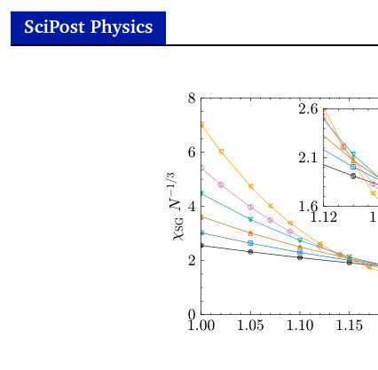
<figcaption class="paper-figure-caption"><b>Fig 3.</b> Figure 3: Scaled spin glass susceptibility χSG/N 1/3. The curves for different system sizes intersect at T/J ≈1.13.</figcaption>
</figure>
<figure class="paper-figure-card">
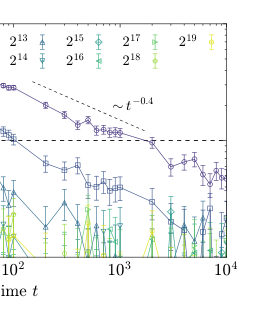
<figcaption class="paper-figure-caption"><b>Fig 4.</b> Figure 4: Autocorrelation function c(t) for N = 128 at T = 1 and at D = 211,212,...,219. At D ≳215, c(t) decays rapidly with an exponential form, whereas, at D ≲213, it has a clear power-law decay c(t) ∼t−δ on a long timescale. The exponent δ ≈0.4 at D = 211.</figcaption>
</figure>
<figure class="paper-figure-card">
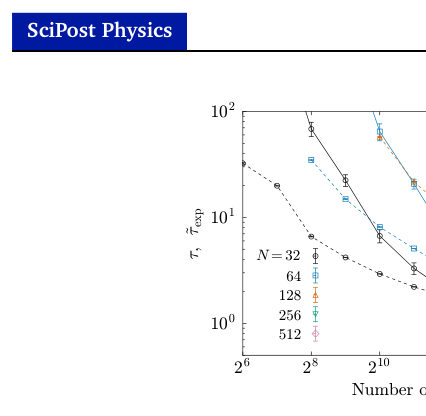
<figcaption class="paper-figure-caption"><b>Fig 5.</b> Figure 5: Relaxation time τ (solid lines) and mean time scale determined by the acceptance ratio ˜τexp(D) (dashed lines) as functions of training data size D.</figcaption>
</figure>

**Summary.** The paper investigates using Machine Learning, specifically autoregressive neural networks, to accelerate Monte Carlo simulations of spin glass models. While the ML-assisted method successfully reduces simulation relaxation times, the authors find that the exponential growth in required training data eventually outweighs the computational gains, posing a major hurdle for large-scale applications.

**Why it may be interesting.** This work directly bridges advanced machine learning techniques (generative models) with fundamental problems in condensed matter physics (spin glasses), offering a potential computational tool for studying complex energy landscapes that are otherwise intractable.

Detailed structure

**Main problem.** The paper assesses how Machine-learning-assisted Monte Carlo (MLMC) algorithms can efficiently simulate complex, low-temperature dynamics in spin glass models where traditional MCMC methods become prohibitively slow.

**Main result.** While the MLMC approach significantly reduces relaxation times compared to local MC, the required training dataset size grows much faster than the achievable time reduction, limiting its practical scalability for large systems.

**Method.** The authors employ an autoregressive generative neural network (MADE) trained on equilibrium configurations to generate statistically independent samples, which are then used within a modified Monte Carlo simulation framework (MADEMC).

**Model / system.** The study focuses on the antiferromagnetic Ising model defined on a random regular graph, exhibiting spin-glass behavior characterized by Replica Symmetry Breaking. The Hamiltonian is $H_J(\sigma) = \sum_{i<j} J_{ij}\sigma_i\sigma_j - h \sum_i \sigma_i$.

**Key observables.** Relaxation time, dynamical exponent, overlap distribution ($P(q)$), and spin glass susceptibility ($\chi_{SG}$).

**Important parameters / regimes.** Temperature ratios ($T/J$), system size ($N$), and the size of the training dataset.

**Assumptions / limitations.** The MLMC performance relies on MADE being expressive enough to approximate the true Boltzmann distribution, and the analysis assumes an 'ideal' dataset generation process.

**Figures summary.** Figure 3 is mentioned in relation to $\chi_{SG}/N^{1/3}$ scaling, indicating a critical temperature $T_c/J \approx 1.13$ for the spin-glass transition at $T/J=1$.

**Paper structure.** The paper first establishes the need for MLMC due to slow MCMC dynamics in glassy systems. It details the use of MADE trained on equilibrium data (via parallel tempering) to accelerate sampling, analyzes the resulting scaling laws, and concludes by discussing the practical limitations imposed by training cost.

Abstract

We critically assess the performance of an autoregressive generative neural network model by applying it to an antiferromagnetic Ising model on a random regular graph. We train the network on equilibrium configurations in the low-temperature spin-glass phase of the model and perform Monte Carlo simulations using spin configurations generated by the network. The relaxation time of the Monte Carlo simulations drastically decreases with increasing the size of the training dataset and converges to an optimal value. The dynamical exponent characterizing the growth of the optimal relaxation time as a function of the system size is slightly reduced compared to the local Monte Carlo dynamics. However, we find that the size of the training dataset to achieve the optimal performance grows much faster with the system size than the relaxation time, implying that the total training cost eventually hinders a practical use of the method at large system sizes.

[↑ back to top](#top)

### [Optimal Lower Bounds for Hamiltonian Simulation](http://arxiv.org/abs/2607.19852v1)

**Authors:** Alexander Zlokapa, Richard R. Allen, Aram W. Harrow  
**Type:** theory · **Category:** quantum information and computing · **PDF:** <https://arxiv.org/pdf/2607.19852v1>  
**Analysis basis:** full PDF text, analyzed in chunks
**Topic relevance:** `analog quantum simulation` **3/5** · `entanglement & information structure` **1/5** · `non-equilibrium dynamics` **1/5**

↔ Scroll figures horizontally

<figure class="paper-figure-card">
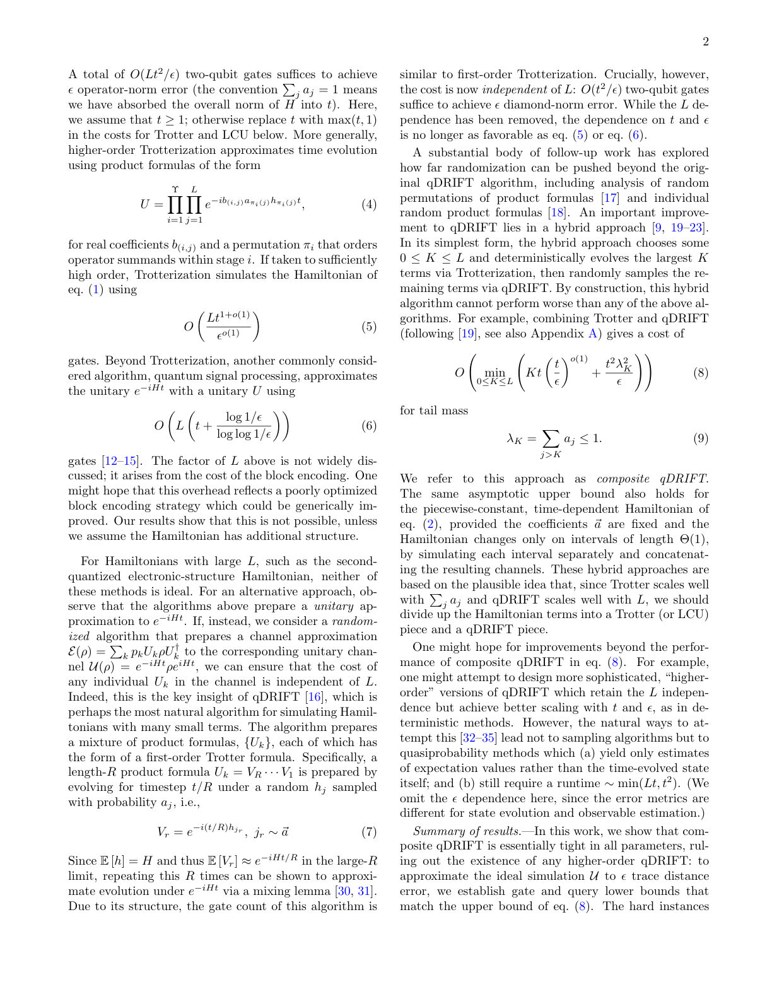
<figcaption class="paper-figure-caption"><b>Fig 1.</b> Low-resolution page preview, page 2</figcaption>
</figure>
<figure class="paper-figure-card">
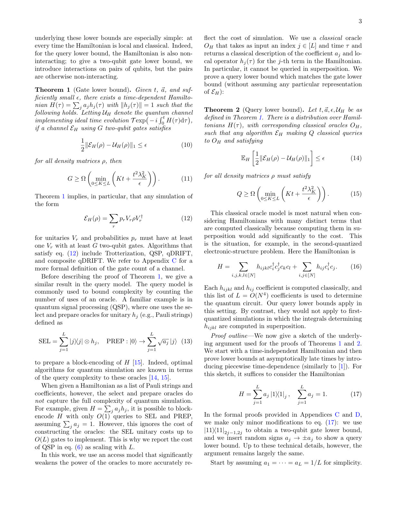
<figcaption class="paper-figure-caption"><b>Fig 2.</b> Low-resolution page preview, page 3</figcaption>
</figure>
<figure class="paper-figure-card">
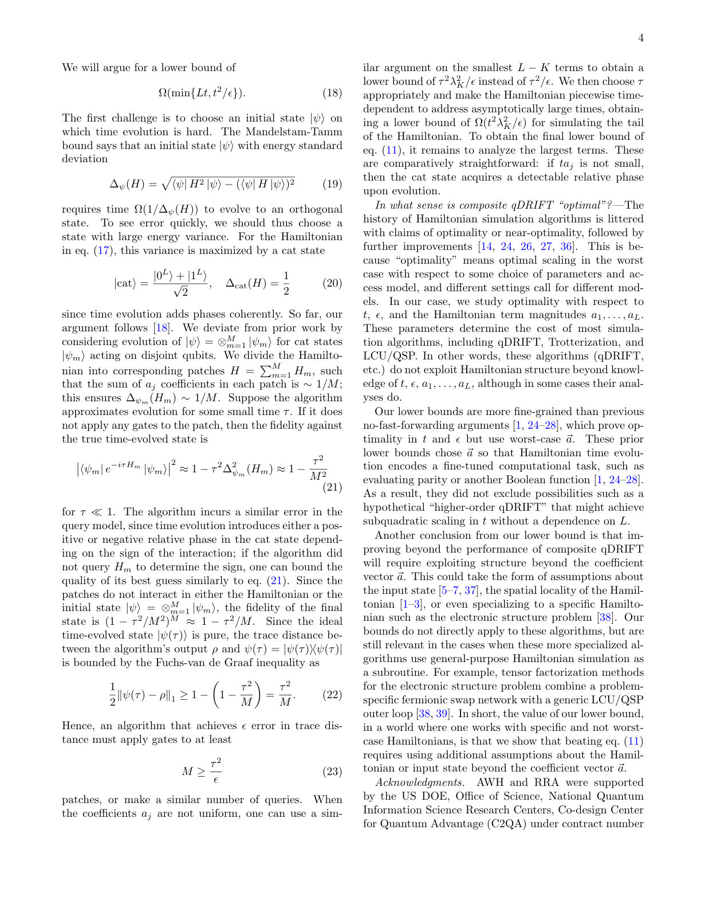
<figcaption class="paper-figure-caption"><b>Fig 3.</b> Low-resolution page preview, page 4</figcaption>
</figure>
<figure class="paper-figure-card">
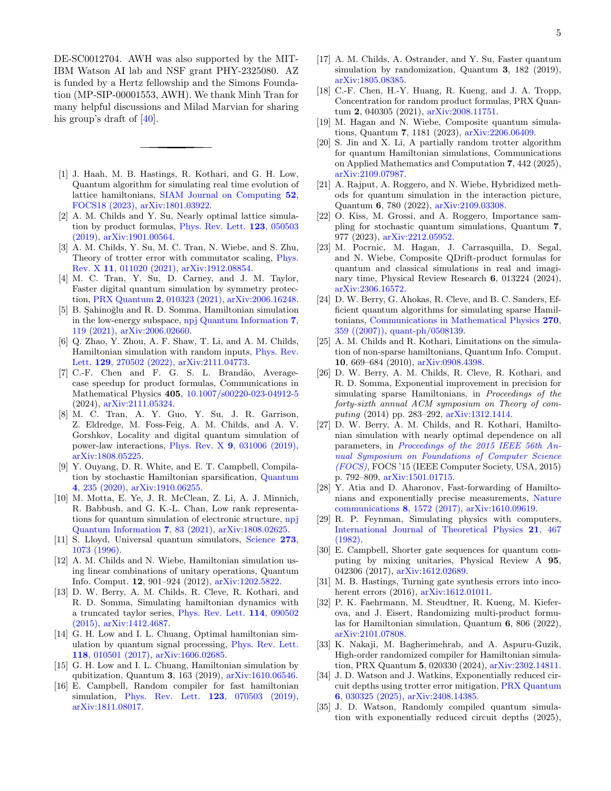
<figcaption class="paper-figure-caption"><b>Fig 4.</b> Low-resolution page preview, page 5</figcaption>
</figure>
<figure class="paper-figure-card">
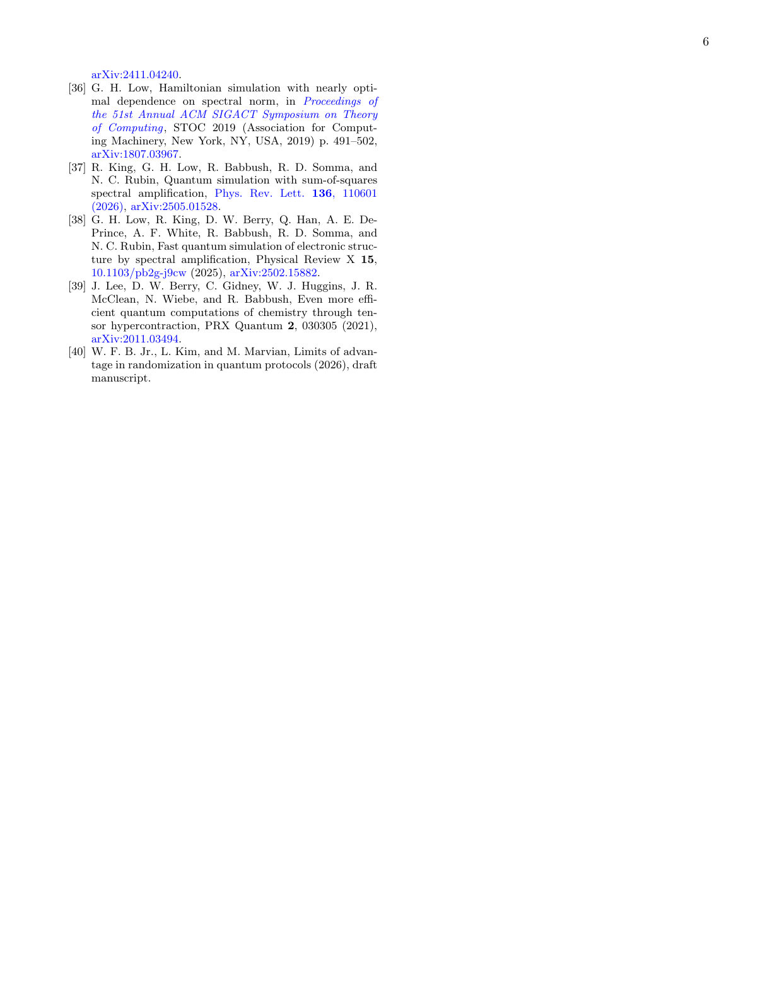
<figcaption class="paper-figure-caption"><b>Fig 5.</b> Low-resolution page preview, page 6</figcaption>
</figure>

**Summary.** This paper derives rigorous, asymptotically tight lower bounds for simulating time evolution under a general Hamiltonian. By analyzing the required gate count and query complexity separately, it shows that these bounds are achievable by advanced simulation techniques like composite qDRIFT. The results clarify the scaling of quantum resources needed for physical simulations, particularly distinguishing between resource requirements based on circuit depth versus oracle access.

**Why it may be interesting.** This work provides fundamental theoretical limits on how efficiently quantum computers can simulate physical Hamiltonians, directly impacting resource estimation for chemistry and condensed matter simulations.

Detailed structure

**Main problem.** The primary goal is establishing asymptotically tight lower bounds on the gate and query complexities required to simulate quantum time evolution governed by a general Hamiltonian.

**Main result.** The authors prove that for specific local Hamiltonians, the optimal simulation complexity scales polynomially in $1/\epsilon$ (error) rather than being dictated solely by counting coherent oracle queries.

**Method.** The proof employs sophisticated techniques involving analyzing total variation distance and fidelity loss between the ideal time evolution and the approximated channel output. These bounds are derived separately for gate and query models using tailored lemmas for 'head' and 'tail' components of the Hamiltonian.

**Model / system.** The analysis focuses on simulating $e^{-iHt}$ where $H = \sum_{j=1}^{L} a_j h_j$, with $h_j$ being local, bounded-degree operators. The complexity is analyzed in both gate and classical oracle query models.

**Key observables.** Gate complexity ($G$), Query complexity ($Q$), Trace-distance error ($\epsilon$), and the simulation time ($t$).

**Important parameters / regimes.** The coefficients $a_j$, the number of terms $L$, and the locality/degree of the Hamiltonian are crucial parameters.

**Assumptions / limitations.** The lower bounds hold for local, bounded-degree Hamiltonians and assume that the simulation must approximate the evolution to a specified trace-distance error $\epsilon$.

**Paper structure.** The paper develops two main lines of argument: one establishing gate complexity lower bounds (Theorem 1) by analyzing correlation ratios, and another establishing query complexity lower bounds (Theorem 2) by bounding the total variation distance between expected outcomes.

Abstract

For Hamiltonian $H = \sum_j h_j$, we prove asymptotically tight lower bounds on the gate and query complexities of simulating time evolution on a quantum computer. Our bounds hold for arbitrary term norms $\|h_j\|$, time $t$, and trace-distance error $ε$. The matching upper bound (known as composite qDRIFT) consists of high-order Trotterization of the large terms and a randomized first-order Trotterization of the small terms. Unlike prior work that chooses worst-case $\|h_j\|$ to encode the computation of parity or other Boolean functions in time evolution, our proof is elementary and based on a local, bounded-degree classical Hamiltonian. Our work suggests that for many physical systems (e.g., power-law interactions), gate count must scale polynomially in $1/ε$, contrary to the complexity suggested by counting coherent oracle queries such as those in the block-encoding model.

[↑ back to top](#top)

### [Coherence-driven origin of metamagnetism in anisotropic heavy-fermion systems](http://arxiv.org/abs/2607.20261v1)

**Authors:** Ewan Scott, Zheyu Wu, Theodore I. Weinberger, Alexander G. Eaton, Michal P. Kwasigroch  
**Type:** theory · **Category:** strongly correlated electrons · **PDF:** <https://arxiv.org/pdf/2607.20261v1>  
**Analysis basis:** full PDF text, analyzed in chunks
**Topic relevance:** `Kondo & dissipative impurity` **3/5** · `Keldysh / 2PI / non-Gaussian methods` **1/5**

↔ Scroll figures horizontally

<figure class="paper-figure-card">
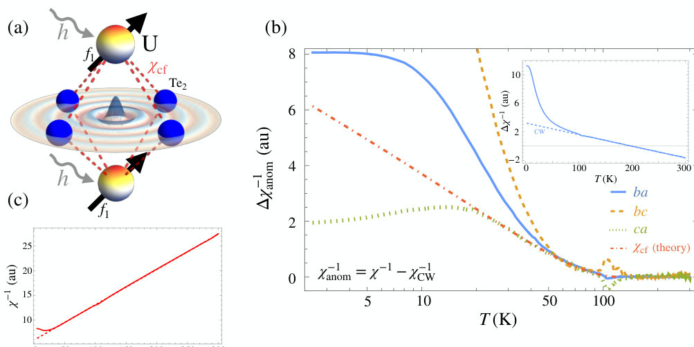
<figcaption class="paper-figure-caption"><b>Fig 1.</b> FIG. 1. (a) The mixed susceptibility, χcf, gives the magnetization of the conduction electrons when a field is applied only to the hybridizing f1-moments on the uranium ions. (b) The temperature evolution of the anomalous part of the inverse susceptibility χ−1 anom = χ−1 −χ−1 CW at ambient pressure. The departure from the linear Curie-Weiss law χ−1 CW is most clearly seen when the difference ∆χ−1 anom between two directions is taken. The legend gives the directions for which the difference is taken, ba means 1/χb anom −1/χa anom, etc. χcf(T, h = 0) ∝(1 −T/T ∗ coh) ln(T ∗ coh/T) gives the empirically expected behavior for the mixed susceptibility with T ∗ coh fitted to 122 K. ∆χ−1 anom was...</figcaption>
</figure>
<figure class="paper-figure-card">
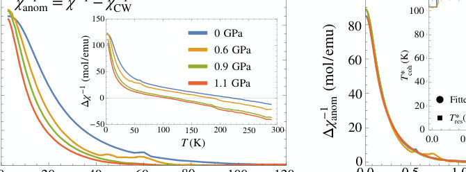
<figcaption class="paper-figure-caption"><b>Fig 2.</b> FIG. 2. The temperature evolution of the anomalous part of the susceptibility χ−1 anom = χ−1 −χ−1 CW for pressure in the range 0 −1.1 GPa. The anomalous evolution is most evident if the difference between two directions is taken. The difference between a and b directions ∆χ−1 anom = 1/χb anom −1/χa anom is taken (similar behaviour observed for other directions). (a) ∆χ−1 anom is plotted as a function of temperature. The inset shows the difference in the inverse susceptibility along the b and a axes 1/χb −1/χa before the subtraction of the high-temperature Curie-Weiss fit. (b) An appropriate coherence temperature T ∗ coh(p) was chosen for each pressure to collapse the experimental data onto...</figcaption>
</figure>
<figure class="paper-figure-card">
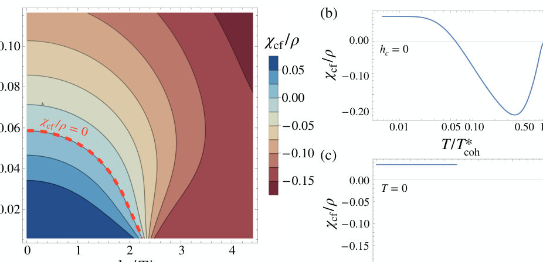
<figcaption class="paper-figure-caption"><b>Fig 3.</b> FIG. 3. (a) Mixed susceptibility χcf(T, hc), as a function of temperature T and field hc applied only to conduction electrons. The mixed susceptibility gives the susceptibility of the hybridized f1-moment when the field is only applied to conduction electrons. The calculation is performed in the large-N limit of the Kondo model with a constant density of states ρ for the conduction band, and for a representative conduction electron filling nc = 0.8 and Kondo coupling 2J1ρ = 1. The coherence temperature T ∗ coh has been estimated as the temperature at which the hybridization field turns on. (b) The zero-field mixed susceptibility χcf(T, hc = 0), as a function of temperature T. (c) The...</figcaption>
</figure>
<figure class="paper-figure-card">
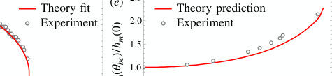
<figcaption class="paper-figure-caption"><b>Fig 4.</b> FIG. 4. (a) The theoretically calculated zero-field susceptibility χ(T, h = 0) as a function of temperature for field applied at an angle θbc from the b-axis towards the c-axis in the range 0◦to 60◦. The mean-field approximation in Eq. 5 was used with the following representative parameters: Kondo couplings 2J1ρ = 1, 2J2ρ = 0.99, molecular field λρ = −0.25, conduction electron filling nc = 0.9. The anisotropy parameters of Dbρ = −0.85, Dcρ = 0.19 were tuned to obtain the best possible fit for the susceptibility maximum temperature Tmax(θbc). (b) The experimentally obtained susceptibility for the same range of angles θbc. (c) The theoretically calculated zero-temperature magnetization of the...</figcaption>
</figure>

**Summary.** This work presents a comprehensive analytic theory for magnetic anisotropy in heavy-fermion metamagnets. By introducing the mixed susceptibility $\chi_{cf}$, the authors successfully unify the understanding of field-induced metamagnetism and anomalous temperature dependencies across multiple thermodynamic variables. This framework establishes a general, microscopic model applicable to a broad class of correlated materials.

**Why it may be interesting.** The explicit derivation of a single thermodynamic observable ($\chi_{cf}$) that governs multiple complex phenomena (metamagnetism, susceptibility anomalies) provides a powerful, unified theoretical tool applicable to strongly correlated electron physics.

Detailed structure

**Main problem.** The microscopic origin of pronounced magnetic anisotropy underlying metamagnetism and an anomalous maximum in hard-axis susceptibility in heavy-fermion materials remains unresolved.

**Main result.** The authors develop a general, coherence-driven framework using the mixed susceptibility $\chi_{cf}(T, h, p)$ that successfully unifies the anisotropic response across temperature, field, and pressure for these systems.

**Method.** Development of an analytic $c$-$f$ theory based on extending the 2-fluid model to explicitly treat magnetic anisotropy arising from localized-itinerant electron interactions.

**Model / system.** The study focuses on heavy-fermion compounds, particularly $	ext{UTe}_2$, modeling the system with two types of $f$-electrons: an itinerant ($f_1$) and a localized ($f_2$). The theory incorporates Kondo coupling and anisotropy interactions between these moments.

**Key observables.** Mixed susceptibility ($\chi_{cf}(T, h, p)$), critical magnetic field for metamagnetism ($h_m$), and the temperature of the susceptibility maximum ($T_{\max}$).

**Important parameters / regimes.** Temperature ($T$), Magnetic Field ($h$), Pressure ($p$), Kondo coupling constants ($J_1, J_2$), and anisotropy parameters ($D_\eta$).

**Assumptions / limitations.** The theory builds upon the 2-fluid model (Nakatsuji, Pines, Fisk) and utilizes mean-field approximations in the large-$N$ limit.

**Figures summary.** Figures illustrate how $\chi_{cf}$ unifies anisotropic response across T, h, p; they also show theoretical predictions for $h_m(	heta_{bc})$ and $T_{\max}(	heta_{bc})$ compared to experimental data.

**Paper structure.** The paper first identifies the unresolved puzzle of anisotropy in heavy-fermion metamagnets. It then develops the analytic $c$-$f$ theory centered on $\chi_{cf}$. Finally, it tests this theory against detailed measurements from $	ext{UTe}_2$, demonstrating its predictive power for both the susceptibility maximum and the metamagnetic transition.

Abstract

A number of heavy-fermion materials exhibit magnetic field-induced metamagnetism: on applying a field along the magnetic hard axis, the magnetization first rises gradually, then jumps abruptly once a critical field is reached. Despite decades of phenomenological modeling, the microscopic origin of the pronounced magnetic anisotropy underlying this behavior has remained unresolved. The same is true of a related, long-standing puzzle: an anomalous maximum in the hard-axis susceptibility versus temperature. Both are complicated in $5f$ compounds by the dual localized-itinerant character of the relevant electrons. Here we develop an analytic $c$--$f$ theory of magnetic anisotropy in heavy-fermion metamagnets, identifying the mixed susceptibility $χ_{\rm cf}(T,h,p)$ as a single thermodynamic observable that unifies the anisotropic response across temperature, field, and pressure. We test this theory against primary and literature data for the heavy-fermion superconductor UTe$_2$, finding excellent quantitative agreement in the temperature, field, and pressure evolution of its magnetic anisotropy -- including a Kondo-coherence origin for the anomalous hard-axis susceptibility maximum, which we show is directly connected to the metamagnetic transition itself. Our results establish a general, microscopic, coherence-driven framework for anisotropic metamagnetism, applicable across the broad class of heavy-fermion compounds that display this phenomenology.

[↑ back to top](#top)

### [Two- and three-body bound states in one-dimensional Fermi bipolaron with three-body interaction](http://arxiv.org/abs/2607.20075v1)

**Authors:** O. Hryhorchak, V. Pastukhov  
**Type:** theory · **Category:** quantum gases · **PDF:** <https://arxiv.org/pdf/2607.20075v1>  
**Analysis basis:** full PDF text, analyzed in chunks
**Topic relevance:** `analog quantum simulation` **3/5** · `Keldysh / 2PI / non-Gaussian methods` **1/5**

↔ Scroll figures horizontally

<figure class="paper-figure-card">
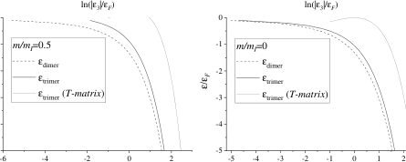
<figcaption class="paper-figure-caption"><b>Fig 1.</b> FIG. 1: Energies of trimer (solid line) and dimer (dashed line) in the one-particle-hole approximation for different mass ratios m/mI. The thing line represents the result of the T- matrix approximation for the trimer.</figcaption>
</figure>
<figure class="paper-figure-card">
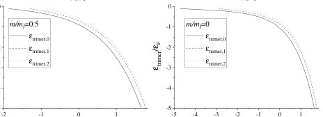
<figcaption class="paper-figure-caption"><b>Fig 2.</b> FIG. 2: Identified branches of trimers for several mass ratios of impurities and medium fermions. The vacuum-like ϵtrimer,0 (solid line) is the lowest one that survives even in the three- body limit. Two others disappear at sufficiently low densities of host fermions.</figcaption>
</figure>

**Summary.** This theoretical paper analyzes the formation of bound states—specifically dimers and trimers—when two impurities are placed in a 1D Fermi gas interacting via a three-body contact potential. Using variational methods, the authors predict that multiple stable few-body complexes emerge across various coupling strengths, demonstrating rich medium-induced physics.

**Why it may be interesting.** This work explores how non-standard interactions (three-body) can induce complex few-body correlations in low-dimensional quantum gases, providing insights into emergent many-body physics beyond simple two-body scattering.

Detailed structure

**Main problem.** The study investigates the ground-state properties of two impurities immersed in a one-dimensional ideal Fermi gas, specifically focusing on medium-induced few-body bound states.

**Main result.** Variational calculations predict the emergence of both dimer and several trimer bound states over a wide range of the three-body coupling parameter. The dimer state is generally found to be energetically preferable.

**Method.** The analysis employs variational calculations using trial wave functions that incorporate up to one particle-hole excitation, solving resulting coupled integral equations.

**Model / system.** The system models two bosonic (or spin-1/2 fermionic) impurities interacting via a three-body contact interaction within a 1D ideal Fermi gas host. The physics is captured by an effective Hamiltonian describing the center-of-mass motion of the impurities.

**Key observables.** Energies of the bound states ($\epsilon_{	ext{dimer}}$ and $\epsilon_{	ext{trimer}}$), which are compared against T-matrix results.

**Important parameters / regimes.** The three-body coupling constant ($g_{3,\Lambda}$), the Fermi energy ($\epsilon_F$), and the mass ratio of impurities to host fermions ($m/m_I$).

**Assumptions / limitations.** The model assumes only a zero-range, three-body interaction is present. The variational ansatz includes up to one particle-hole excitation.

**Figures summary.** Figure 1 compares calculated dimer and trimer energies across various mass ratios and coupling parameters against T-matrix results. Figure 2 identifies multiple branches of trimer states ($\epsilon_{	ext{trimer}, n}$) relative to the vacuum branch.

**Paper structure.** The paper derives an effective Hamiltonian for the impurities interacting with the host, then applies variational methods to determine the ground state energies for both dimer and trimer configurations by solving coupled integral equations.

Abstract

We discuss the ground-state properties of two bosonic (or spin-1/2 fermionic in a singlet spin state) impurities immersed in a one-dimensional ideal Fermi gas with only the three-body contact interaction accounted for. Despite its simplicity, the considered model is found to demonstrate a variety of medium-induced few-body bound states. Particularly, using variational calculations with trial wave functions that correctly take into account one particle-hole excitation, we predict the emergence of a dimer state and several trimer states over a wide range of the three-body coupling parameter.

[↑ back to top](#top)

### [Identifying local unitary equivalence based on reduction of quantum states](http://arxiv.org/abs/2607.20266v1)

**Authors:** Yanjun Chu, Chenyang Cui, Yuhang Xie, Mengli Liu, Shao-Ming Fei  
**Type:** theory · **Category:** quantum information and computing · **PDF:** <https://arxiv.org/pdf/2607.20266v1>  
**Analysis basis:** full PDF text, analyzed in chunks
**Topic relevance:** `entanglement & information structure` **3/5**

↔ Scroll figures horizontally

<figure class="paper-figure-card">
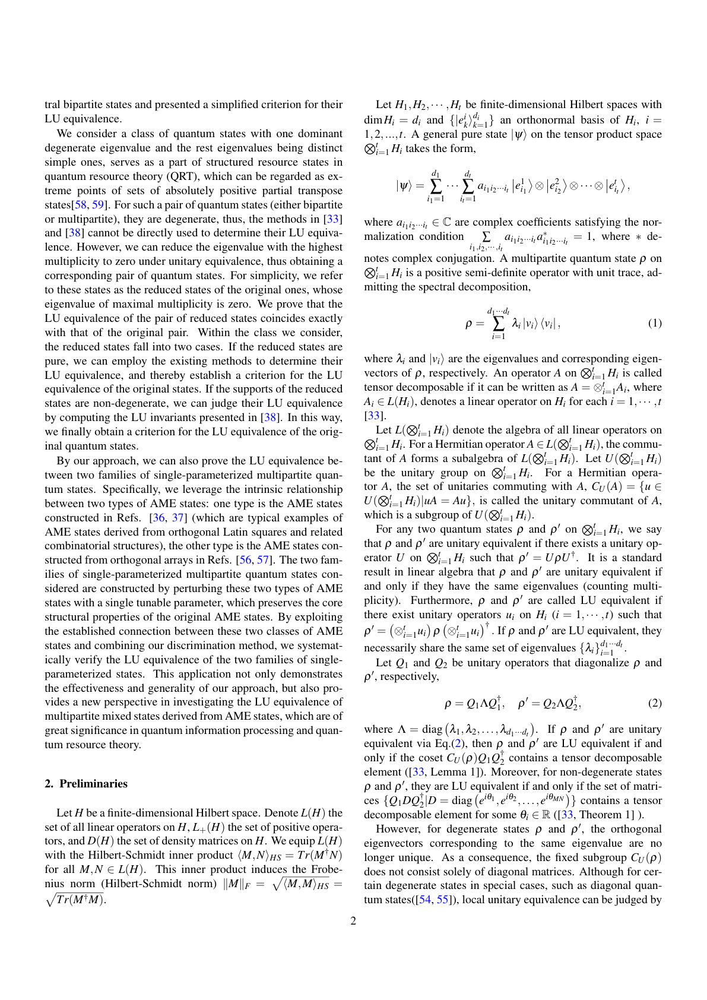
<figcaption class="paper-figure-caption"><b>Fig 1.</b> Low-resolution page preview, page 2</figcaption>
</figure>
<figure class="paper-figure-card">
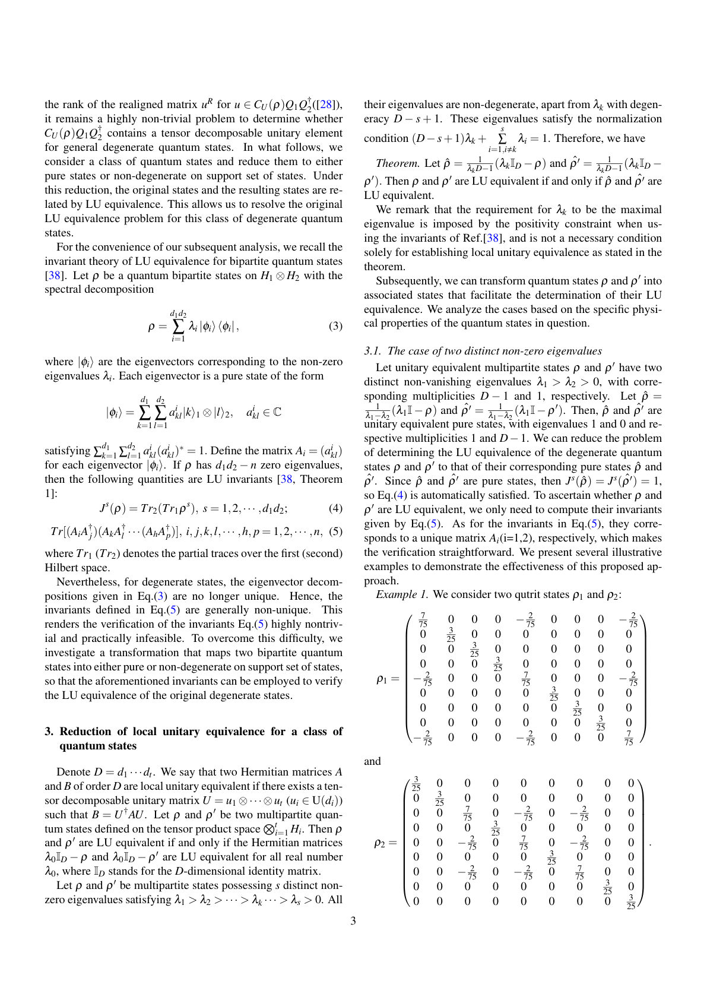
<figcaption class="paper-figure-caption"><b>Fig 2.</b> Low-resolution page preview, page 3</figcaption>
</figure>
<figure class="paper-figure-card">
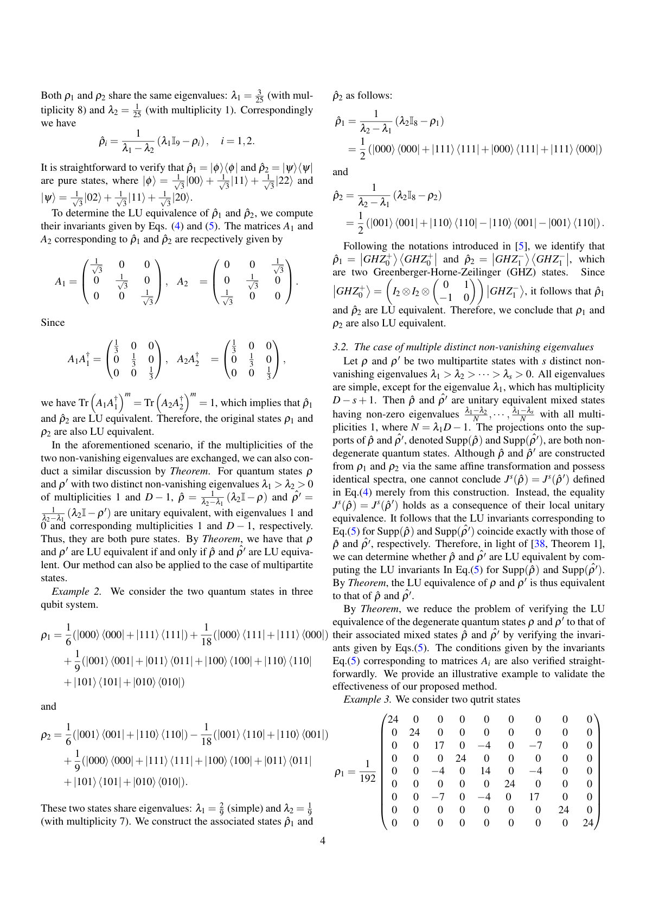
<figcaption class="paper-figure-caption"><b>Fig 3.</b> Low-resolution page preview, page 4</figcaption>
</figure>
<figure class="paper-figure-card">
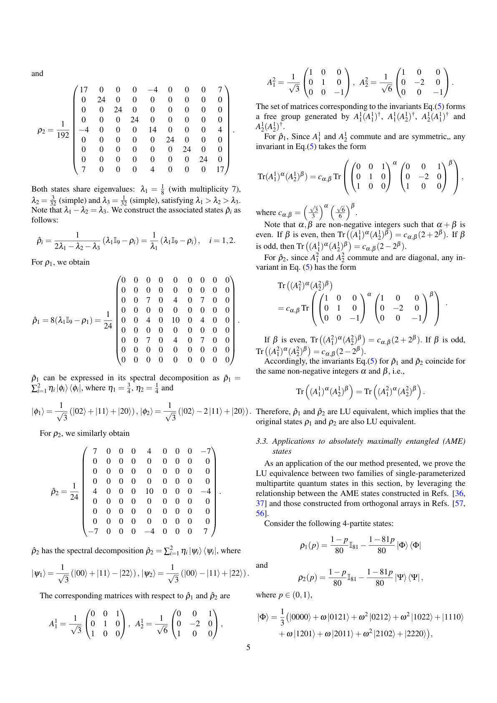
<figcaption class="paper-figure-caption"><b>Fig 4.</b> Low-resolution page preview, page 5</figcaption>
</figure>
<figure class="paper-figure-card">
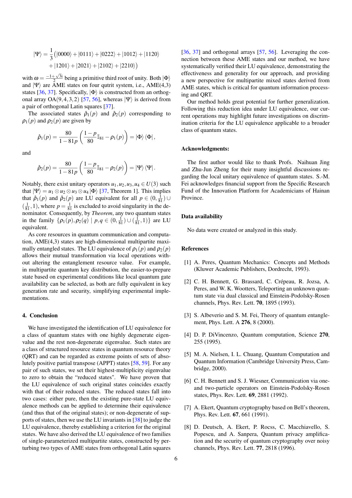
<figcaption class="paper-figure-caption"><b>Fig 5.</b> Low-resolution page preview, page 6</figcaption>
</figure>

**Summary.** This paper tackles the difficult problem of determining local unitary equivalence for structured quantum states. The authors propose a novel 'reduction' procedure that simplifies these complex states by focusing on their reduced counterparts derived from nullifying the highest-multiplicity eigenvalue. This technique successfully establishes a criterion to classify entanglement resources in these degenerate systems.

**Why it may be interesting.** This work provides a powerful theoretical toolkit for simplifying the analysis of highly complex, degenerate quantum states in resource theories, making previously intractable problems tractable via reduction.

Detailed structure

**Main problem.** The core challenge addressed is identifying local unitary (LU) equivalence for quantum states, a problem crucial for quantifying and classifying entanglement resources.

**Main result.** The authors introduce a 'reduction' procedure that proves LU equivalence of complex degenerate states can be determined by analyzing their associated reduced counterparts, which are simpler or non-degenerate.

**Method.** They map the original state to a reduced state by nullifying its highest-multiplicity eigenvalue. For these reduced states, they apply existing invariants or fixed-point subgroup criteria for discrimination.

**Model / system.** The work focuses on quantum states ($
ho$) defined on tensor product Hilbert spaces, specifically addressing bipartite and multipartite mixed states that possess one highly degenerate eigenvalue and several non-degenerate simple eigenvalues.

**Key observables.** Local unitary equivalence (LU), the unitary commutant $C_U(
ho)$, spectral decomposition, and derived invariants ($J_s(
ho)$).

**Important parameters / regimes.** The structure of the state's spectrum (one highly degenerate eigenvalue vs. non-degenerate simple eigenvalues) is critical.

**Assumptions / limitations.** The method assumes that for specific classes of states, LU equivalence can be faithfully mapped from the original state to its reduced form.

**Paper structure.** The paper establishes the general problem, introduces the reduction procedure as the main tool, proves the equivalence between the original and reduced states' LU classification, and validates this approach by applying it to specific families of multipartite mixed states derived from AME states.

Abstract

Local unitary equivalence is central to entanglement quantification and classification. Identifying the local unitary equivalence remains a formidable challenge. We address this problem for a class of quantum states with one highly degenerate eigenvalue and the rest non-degenerate simple eigenvalues that are pivotal to structured resources in quantum resource theory. We introduce a ``reduction" procedure that maps each state to a ``reduced state" by nullifying the highest-multiplicity eigenvalue and prove that the local unitary equivalence of the original states is equivalent to that of their reduced counterparts. For the resulting pure or non-degenerate reduced states, we employ the existing invariants or fixed-point subgroup criteria to establish a complete discrimination framework, although the existing criteria can not directly identify the local unitary equivalence of the original states. We also verify the local unitary equivalence of two families of single-parameterized multipartite mixed states constructed by perturbing absolutely maximally entangled states from distinct combinatorial origins, demonstrating the efficacy and generality of our approach.

[↑ back to top](#top)

### [Intermittency in Quantum Graviton-Phonon Conversion](http://arxiv.org/abs/2607.20107v1)

**Authors:** Yuna Gouin, Sugumi Kanno, Jiro Soda  
**Type:** theory · **Category:** other · **PDF:** <https://arxiv.org/pdf/2607.20107v1>  
**Analysis basis:** full PDF text, analyzed in chunks
**Topic relevance:** `correlated / nonlocal dissipation` **2/5** · `methods for driven-dissipative` **2/5** · `non-equilibrium dynamics` **2/5** · `Keldysh / 2PI / non-Gaussian methods` **1/5** · `analog quantum simulation` **1/5** · `driven-dissipative phase transition` **1/5** · `entanglement & information structure` **1/5** · `non-equilibrium universality` **1/5** · `quantum optics experiment` **1/5**

↔ Scroll figures horizontally

<figure class="paper-figure-card">
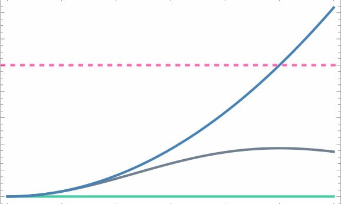
<figcaption class="paper-figure-caption"><b>Fig 1.</b> Fig. 1: The conversion probability Pα→α,1(t) as a function of time. The blue curve shows</figcaption>
</figure>
<figure class="paper-figure-card">
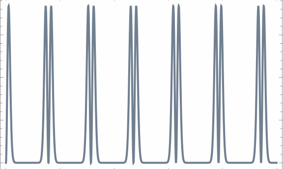
<figcaption class="paper-figure-caption"><b>Fig 2.</b> Fig. 2: The exact conversion probability Pα→α,1(t) for a large coherent-state parameter. The</figcaption>
</figure>
<figure class="paper-figure-card">
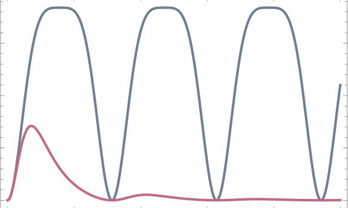
<figcaption class="paper-figure-caption"><b>Fig 3.</b> Fig. 3: Time evolution of the conversion probabilities for the coherent and squeezed initial states.</figcaption>
</figure>

**Summary.** This paper analyzes the conversion of gravitons into phonons by solving the full quantum dynamics exactly. It finds that while first-order perturbation theory predicts strong enhancement, the true quantum evolution exhibits intermittent bursts separated by suppression for both coherent and squeezed initial states. This non-perturbative behavior offers a unique signature for detecting single quanta in gravitational wave detectors.

**Why it may be interesting.** This work provides an excellent example of how non-perturbative quantum effects (like intermittency) manifest in coupled bosonic systems, offering insights applicable to open quantum systems dynamics beyond simple weak coupling limits.

Detailed structure

**Main problem.** The study investigates quantum graviton-phonon conversion beyond first-order perturbation theory to establish a robust, non-perturbative signature of the quantum nature of gravity for single-graviton detection.

**Main result.** For coherent and squeezed initial states, the exact quantum dynamics reveal intermittent conversion bursts separated by strong suppression, which is fundamentally different from the predictions of simple perturbative expansions.

**Method.** The authors solved the full quantum dynamics exactly using an algebraic method, reducing the problem to a set of coupled ordinary differential equations (ODEs) within the rotating-wave approximation.

**Model / system.** The system models the interaction between a graviton field and a phonon mode in a resonant bar detector. The Hamiltonian is derived under the rotating-wave approximation, coupling the two bosonic fields.

**Key observables.** Conversion probability ($P_{g	o p}(t)$), satisfaction of the unitarity bound, and the observation of intermittent time evolution patterns.

**Important parameters / regimes.** The initial state type (coherent vs. squeezed) and the magnitude of the squeezing/coherence parameters ($\alpha$ or $\xi$).

**Assumptions / limitations.** The analysis is performed within the rotating-wave approximation (RWA), which is noted as a limitation, and the derived ODE system has restrictions on its parameter range.

**Figures summary.** Figures compare perturbative predictions against exact quantum results for both coherent and squeezed states, explicitly showing where perturbation theory violates unitarity or fails to capture the intermittent behavior.

**Paper structure.** The paper first establishes the physical model and Hamiltonian under RWA. It then develops the full quantum dynamics by solving the time-evolution equations into a closed system of ODEs. Finally, it analyzes the results for coherent and squeezed states, contrasting the exact findings with perturbative approximations.

Abstract

A graviton can be converted into a phonon in a resonant bar detector. First-order perturbation theory predicts a strong enhancement of this conversion for coherent and squeezed graviton states, but the probability can exceed unity when the coherent or squeezing parameter is large. Since a conversion probability must satisfy the unitarity bound, we solve the graviton-phonon quantum dynamics exactly within the rotating-wave approximation. For an initial coherent state, we find that the conversion occurs intermittently through narrow bursts separated by intervals of strong suppression. For an initial squeezed state, the departure from perturbative behavior occurs earlier, and the conversion is strongly suppressed after its initial growth. These effects may provide signatures of quantum graviton-phonon dynamics relevant to single-graviton detection.

[↑ back to top](#top)

### [Generation of vortex-squeezed light in a coherently prepared medium](http://arxiv.org/abs/2607.19853v1)

**Authors:** Fan Meng, Hao Zhu, Xin-Yao Huang, Guo-Feng Zhang  
**Type:** theory · **Category:** other · **PDF:** <https://arxiv.org/pdf/2607.19853v1>  
**Analysis basis:** full PDF text, analyzed in chunks
**Topic relevance:** `analog quantum simulation` **2/5** · `Keldysh / 2PI / non-Gaussian methods` **1/5** · `correlated / nonlocal dissipation` **1/5** · `driven-dissipative phase transition` **1/5** · `entanglement & information structure` **1/5** · `interference shaping light` **1/5** · `methods for driven-dissipative` **1/5**

↔ Scroll figures horizontally

<figure class="paper-figure-card">
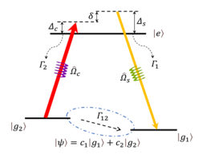
<figcaption class="paper-figure-caption"><b>Fig 1.</b> Fig. 1. Three-level L -type structure of a coherently prepared medium.</figcaption>
</figure>
<figure class="paper-figure-card">
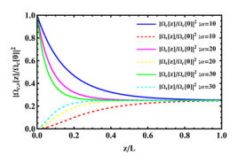
<figcaption class="paper-figure-caption"><b>Fig 2.</b> Fig. 2. Dependence of the normalized intensity of the control field</figcaption>
</figure>
<figure class="paper-figure-card">
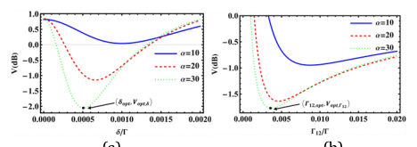
<figcaption class="paper-figure-caption"><b>Fig 3.</b> Fig. 3. (a) Dependence of the signal field squeezing degree V on the two-photon detuning d (with 12 0 G = ). (b) Dependence of the signal field squeezing degree V on the ground-state relaxation rate 12 G (with</figcaption>
</figure>
<figure class="paper-figure-card">
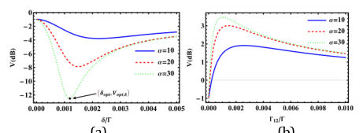
<figcaption class="paper-figure-caption"><b>Fig 4.</b> Fig. 4. (a) Dependence of the control field squeezing degree V on the two-photon detuning d (with 12 0 G = ). (b) Dependence of the control field squeezing degree V on the ground-state relaxation rate 12 G (with</figcaption>
</figure>

**Summary.** This paper presents a theoretical scheme to generate vortex optical squeezing by exploiting Raman scattering within an atomic ensemble prepared in a coherent superposition state. By analyzing quantum fluctuations, the authors demonstrate that both incident control and generated signal fields can exhibit squeezing, offering a flexible alternative to conventional nonlinear optics methods for quantum information applications.

**Why it may be interesting.** This work is highly relevant as it proposes a new platform for generating non-classical light (squeezing) using fundamental atomic interactions (Raman scattering), which is a core topic in quantum optics and AMO physics. The ability to tune the squeezing via system parameters adds significant practical depth.

Detailed structure

**Main problem.** The authors theoretically propose an alternative method for generating vortex optical squeezing, distinct from established techniques like parametric down-conversion or four-wave mixing.

**Main result.** They show that using Raman scattering in a coherently prepared medium allows both the control and signal fields to exhibit measurable squeezing. Furthermore, they demonstrate that optimal squeezing values can be achieved by tuning system parameters.

**Method.** The analysis involves deriving and solving quantum fluctuation equations for the light fields coupled to an atomic ensemble, utilizing the mean-field approximation.

**Model / system.** The physical model is a three-level L-type atomic structure (potentially using $^{87}	ext{Rb}$), where the ground state is coherently prepared. The interaction dynamics are governed by the system Hamiltonian and analyzed via Heisenberg-Langevin equations.

**Key observables.** Squeezing degree ($V$) for both the control and signal light fields, orthogonal variance ($\langle\Delta X_c \Delta X_s
angle$).

**Important parameters / regimes.** Two-photon detuning ($	ext{s}_c d$), optical density ($\alpha$), topological charge ($l$), and ground-state relaxation rate ($\Gamma_G$).

**Assumptions / limitations.** The analysis relies on the weak interaction approximation and assumes that mode conversion devices are not necessary for this scheme.

**Figures summary.** Figures illustrate the dependence of light intensities, signal field squeezing degree ($V$) versus two-photon detuning ($d$), and $V$ versus ground-state relaxation rate ($\Gamma_G$) for both control and signal fields.

**Paper structure.** The paper first introduces the theoretical framework using a three-level system Hamiltonian. It then develops the quantum fluctuation equations, analyzes the squeezing observables by tuning parameters like detuning and density, and concludes by comparing this novel Raman scheme to existing methods.

Abstract

In this Letter, we theoretically propose an alternative scheme for generating vortex optical squeezing, based on the Raman scattering process in a coherently prepared medium, distinct from approaches such as parametric down-conversion and four-wave mixing. Our analysis reveals that both the input control field and the generated signal field can exhibit squeezing upon adjusting the relevant system parameters, with the control field exhibiting a greater degree of squeezing under identical conditions. We further demonstrate the existence of optimal squeezing values over a range of tuning parameters, highlighting the flexibility and robustness of the proposed scheme. These findings may offer a new reference for continuous-variable vortex optical squeezing and possess potential applications in domains such as quantum information processing, quantum precision measurement, and quantum sensing.

[↑ back to top](#top)

### [Huge hole injection in tungsten dichalcogenide heterostructures without electric gating: a DFT study](http://arxiv.org/abs/2607.20032v1)

**Authors:** Dawid Ciszewski, Wojciech Grochala  
**Type:** theory · **Category:** strongly correlated electrons · **PDF:** <https://arxiv.org/pdf/2607.20032v1>  
**Analysis basis:** full PDF text, analyzed in chunks
**Topic relevance:** `analog quantum simulation` **2/5** · `driven-dissipative phase transition` **2/5** · `Keldysh / 2PI / non-Gaussian methods` **1/5** · `Kondo & dissipative impurity` **1/5** · `methods for driven-dissipative` **1/5** · `non-equilibrium dynamics` **1/5**

↔ Scroll figures horizontally

<figure class="paper-figure-card">
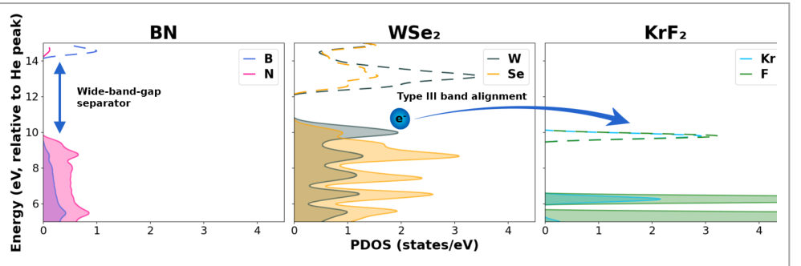
<figcaption class="paper-figure-caption"><b>Fig 1.</b> Figure 1. An example of projected density of states (PDOS) for a TMD | hBN | OX system. The colour-filled bands are the valence bands occupied by electrons, whereas dashed lines mark contours of the conduction bands. As can be seen from the positions of electronic bands for WSe2 and KrF2, CBM of KrF2 lies below VBM of WSe2, which indicates a type III band alignment and the electrons transfer from WSe2 to KrF2 (strong electron acceptor). The hBN PDOS shows its wide band gap encompassing key electronic features of OX and RED, thus providing its “neutral observer” and dielectric separator status.</figcaption>
</figure>
<figure class="paper-figure-card">
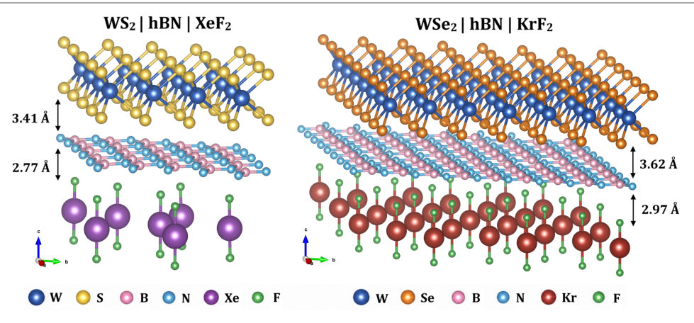
<figcaption class="paper-figure-caption"><b>Fig 2.</b> Figure 2. Side views of the WS₂| hBN | XeF₂ and WSe₂ | hBN | KrF₂ van der Waals heterostructures. The indicated interlayer distances are measured between the nearest chalcogen plane and the hBN layer and between the hBN layer and the nearest fluorine plane.</figcaption>
</figure>

**Summary.** This theoretical study demonstrates that van der Waals heterostructures can be highly doped using noble gas fluorides ($	ext{XeF}_2$, $	ext{KrF}_2$) acting as chemical capacitors. DFT calculations confirm significant, non-contact charge transfer into TMDs like $	ext{WS}_2$ and $	ext{WSe}_2$. This offers a powerful new strategy for engineering electronic properties in 2D materials.

**Why it may be interesting.** While focused on solid-state doping, the ability to precisely tune electronic states via chemical potential differences mimics concepts relevant to open quantum systems where external chemical baths or coupling mediate state preparation.

Detailed structure

**Main problem.** The primary challenge is achieving precise, stable, and controllable carrier density (doping) in atomically thin van der Waals materials without applying external electric fields or causing structural damage.

**Main result.** Noble gas fluorides ($	ext{XeF}_2$, $	ext{KrF}_2$) provide an efficient, non-contact chemical route to induce significant hole doping ($0.23 - 0.35 h^+$ per W atom) in TMD heterostructures.

**Method.** The study employs periodic Density Functional Theory (DFT) calculations using advanced functionals (SCAN meta-GGA with rVV10 correction) to model charge transfer across van der Waals interfaces.

**Model / system.** The system modeled is the $	ext{TMD} | 	ext{hBN} | 	ext{OX}$ heterostructure, where TMDs are transition metal dichalcogenides ($	ext{WS}_2$, $	ext{WSe}_2$), $	ext{hBN}$ acts as a dielectric spacer, and $	ext{OX}$ is the electron acceptor (e.g., $	ext{XeF}_2$).

**Key observables.** Interlayer Charge Transfer ($	ext{CT}$), resulting hole concentrations ($h^+$) per W atom, band alignment type (Type III), bond lengths, and geometric polarization.

**Important parameters / regimes.** Hole concentrations up to $0.35 h^+/	ext{W}$ atom; $	ext{hBN}$ separation layer properties; chemical potential differences driving CT.

**Assumptions / limitations.** The concept extends the 'chemical capacitor' idea, assuming that charge injection is solely driven by the chemical potential difference between donor and acceptor materials.

**Figures summary.** Tables summarize bond length changes across different heterostructures (Table S1) and polarization/electronic structure details. Figures illustrate optimized structures and PDOS confirming type III band alignment.

**Paper structure.** The paper establishes the need for non-contact doping, introduces the $	ext{TMD} | 	ext{hBN} | 	ext{OX}$ model based on chemical capacitors, performs DFT calculations to confirm large charge transfer in specific noble gas fluoride systems ($	ext{WS}_2/	ext{XeF}_2$ and $	ext{WSe}_2/	ext{KrF}_2$), and details the resulting structural/electronic changes.

Abstract

Van der Waals heterostructures based on transition metal dichalcogenides, TMDs, provide a versatile platform for tailoring electronic properties through interlayer charge transfer, CT. Precise control of CT is essential because it directly determines the electronic structure and carrier concentration in atomically thin materials. Recently, the concept of a chemical capacitor has been proposed as a route to achieving exceptionally high carrier densities through CT across insulating separator layers. Here, we extend this concept to van der Waals heterostructures by investigating TMD hBN OX, oxidizer, systems using density functional theory, DFT. Following the screening of candidate TMDs and electron acceptors, XeF2 and KrF2 were identified as suitable acceptors exhibiting type III broken gap band alignment with WS2 and WSe2, respectively. Periodic DFT calculations of large supercells reveal CT corresponding to hole concentrations of up to 0.23 h+ and 0.35 h+ per W atom in WS2 hBN XeF2 and WSe2 hBN KrF2 heterostructures, respectively. The resulting charge redistribution demonstrates that noble gas fluorides provide an efficient route for noncontact engineering of carrier density in TMD heterostructures, offering a new strategy for tuning correlated electronic phases in two dimensional materials.

[↑ back to top](#top)

### [Latency-Constrained Encoded Quantum Teleportation with Punctured Codes](http://arxiv.org/abs/2607.19770v1)

**Authors:** Mahmoud Saad Abouamer, Jakob Kaltoft Søndergaard, Petar Popovski  
**Type:** theory · **Category:** quantum information and computing · **PDF:** <https://arxiv.org/pdf/2607.19770v1>  
**Analysis basis:** full PDF text, analyzed in chunks
**Topic relevance:** `entanglement & information structure` **2/5** · `Keldysh / 2PI / non-Gaussian methods` **1/5** · `correlated / nonlocal dissipation` **1/5** · `driven-dissipative phase transition` **1/5** · `methods for driven-dissipative` **1/5**

↔ Scroll figures horizontally

<figure class="paper-figure-card">

<figcaption class="paper-figure-caption"><b>Fig 1.</b> Figure 1: Latency–reliability tradeoff in encoded quantum teleportation. The dominant latency arises from entanglement acquisition. With n1 &lt; n2, shorter effective code lengths require smaller entanglement packets, reducing acquisition burden and memory decoherence, but provide lower coding gain. Longer codes can provide stronger error protection, but require larger entanglement packets and may increase waiting times and storage-induced decoherence. Different latency–reliability regimes can therefore favor different code lengths, motivating adaptive puncturing from a common base code.</figcaption>
</figure>
<figure class="paper-figure-card">
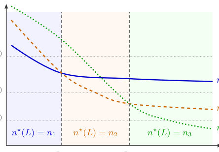
<figcaption class="paper-figure-caption"><b>Fig 2.</b> Figure 2: Decision regions induced by crossover behavior of the logical error probability PL under latency constraint L. Each curve corresponds to a code length n, and the preferred length n⋆(L) minimizes PL at that latency. Larger n re- quires a larger entanglement packet, changing the acquisition- time/fidelity tradeoff. The crossover points partition the latency axis into regions where different code lengths are preferred.</figcaption>
</figure>
<figure class="paper-figure-card">
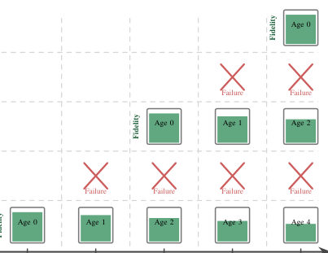
<figcaption class="paper-figure-caption"><b>Fig 3.</b> Figure 3: Example of the generation process with entangle- ment packet size n = 3. Generated EPR pairs are stored until a complete packet is formed. Their fidelity degrades over time due to decoherence, resulting in heterogeneous fidelities across the packet.</figcaption>
</figure>
<figure class="paper-figure-card">
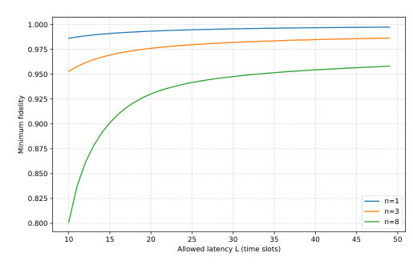
<figcaption class="paper-figure-caption"><b>Fig 4.</b> Figure 4: Minimum fidelity of the entangled pairs as a function of the latency constraint L. The minimum corresponds to the oldest stored pair at the time the packet is completed. Allowing larger latency enables higher-quality entanglement as pairs can be generated with lower success probability and thus higher initial fidelity F0.</figcaption>
</figure>
<figure class="paper-figure-card">
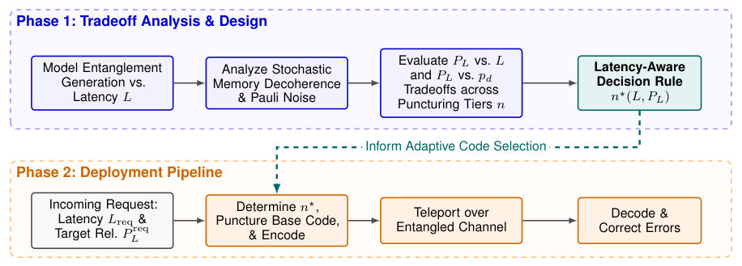
<figcaption class="paper-figure-caption"><b>Fig 5.</b> Figure 5: System framework for adaptive latency-constrained encoded teleportation. Phase 1 represents the tradeoff analysis stage: we model entanglement generation under latency constraints, analyze the resulting stochastic memory decoherence, and evaluate the PL vs. L and PL vs. pd tradeoffs to establish decision regions. Phase 2 represents the physical deployment pipeline: incoming user requests specify constraints (Lreq, P req L ), which inform the code selection. The base code is punctured to the optimized length n⋆, after which the data qubit is encoded, followed by quantum teleportation, decoding, and error correction. In this work, we focus on phase 1 to motivate the need for...</figcaption>
</figure>

**Summary.** This work analyzes reliable quantum teleportation under realistic network constraints, specifically focusing on latency-induced entanglement degradation. By developing a unified framework incorporating stochastic resource generation and memory decoherence, the authors show that adaptive code puncturing is necessary to maintain high fidelity across varying operational delays. This highlights the need for resource-aware protocols in building functional quantum networks.

**Why it may be interesting.** It provides quantitative tools for understanding how practical network imperfections—like waiting times causing decoherence—limit the theoretical gains promised by quantum error correction codes in distributed quantum systems.

Detailed structure

**Main problem.** The paper evaluates the reliability of quantum teleportation when constrained by latency, considering the interplay between entanglement availability, decoherence during storage, and the choice of error correction code.

**Main result.** Adaptive puncturing allows for optimal encoded teleportation performance across varying network latency regimes, demonstrating that resource-aware adaptation is crucial for reliable quantum networking.

**Method.** The authors developed a unified framework to model stochastic entanglement generation, memory decoherence, and the use of punctured Quantum Error-Correcting Codes (QECCs).

**Model / system.** The system models quantum teleportation using shared entangled pairs, where reliability is assessed by calculating the logical error probability ($P_L$) under realistic noise sources like storage decoherence.

**Key observables.** Logical error probability ($P_L$), entanglement fidelity ($F$), and the effective code length/distance.

**Important parameters / regimes.** Average entanglement-acquisition latency constraint ($L$), detection probability ($p_d$), and the rate of memory decoherence.

**Assumptions / limitations.** The analysis assumes a model for stochastic entanglement generation (Bernoulli trials) and an exponential decay model for storage-induced decoherence.

**Figures summary.** Figures illustrate the latency–reliability tradeoff, showing how optimal code length selection shifts based on constraints; other figures map $P_L$ against varying latency or link quality parameters.

**Paper structure.** The paper builds a unified framework by first modeling resource limitations (latency/decoherence) and then applying this model to compare uncoded vs. various encoded teleportation schemes, culminating in the proposal of adaptive code puncturing strategies.

Abstract

Quantum teleportation is a key protocol for transmitting quantum information using entanglement and classical communication. Its reliability is constrained by both the availability and fidelity of shared entangled pairs, which are affected by stochastic generation and memory decoherence. In this work, we focus on encoded teleportation, in which quantum information is encoded using a quantum error-correcting code and transmitted as a codeword. We evaluate reliability in terms of logical error probability, considering latency-constrained settings where entanglement is accumulated over time and degrades while in memory. We develop a unified framework that captures the interaction between entanglement availability, decoherence, and coding decisions. Our results show that the benefits of longer codes depend on the availability and fidelity of entangled pairs, as acquiring additional resources introduces delays that can reduce their quality. To address this latency-reliability tradeoff, we leverage code puncturing to enable flexible encoded teleportation, allowing the effective code length to adapt across different latency regimes while preserving a common stabilizer structure. Numerical results show that encoded teleportation can provide substantial reliability gains over uncoded transmission under a common entanglement-acquisition latency constraint, and that selecting appropriate punctured codes improves performance across varying latency budgets. Overall, our results highlight the importance of resource-aware adaptation for reliable quantum networking.

[↑ back to top](#top)

### [Slack-Free Deep-Unfolded Combinatorial Optimization Solver for Inequality Constraints](http://arxiv.org/abs/2607.20042v1)

**Authors:** Ryo Hagiwara, Shunta Arai, Satoshi Takabe  
**Type:** both · **Category:** quantum information and computing · **PDF:** <https://arxiv.org/pdf/2607.20042v1>  
**Analysis basis:** full PDF text, analyzed in chunks
**Topic relevance:** `QC/QI experiment` **2/5** · `methods for driven-dissipative` **1/5** · `non-equilibrium dynamics` **1/5**

↔ Scroll figures horizontally

<figure class="paper-figure-card">
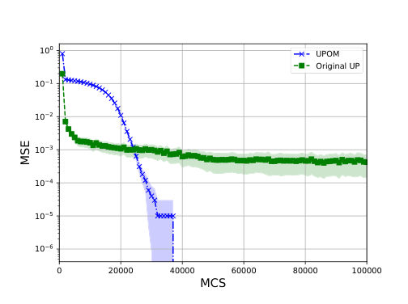
<figcaption class="paper-figure-caption"><b>Fig 1.</b> FIG. 1: MSE comparison between original UP and UPOM on random knapsack instances.</figcaption>
</figure>
<figure class="paper-figure-card">
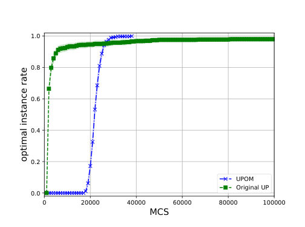
<figcaption class="paper-figure-caption"><b>Fig 2.</b> FIG. 2: Optimal instance rate for original UP and UPOM.</figcaption>
</figure>
<figure class="paper-figure-card">
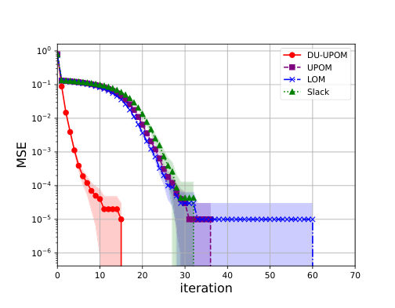
<figcaption class="paper-figure-caption"><b>Fig 3.</b> FIG. 3: MSE comparison among DU-UPOM, UPOM with a fixed step size, LOM, and the Ohzeki method with slack variables.</figcaption>
</figure>
<figure class="paper-figure-card">
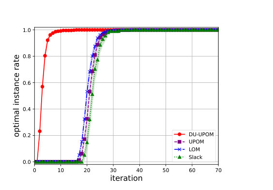
<figcaption class="paper-figure-caption"><b>Fig 4.</b> FIG. 4: Optimal instance rate for DU-UPOM, UPOM with a fixed step size, LOM, and the Ohzeki method with slack variables.</figcaption>
</figure>
<figure class="paper-figure-card">
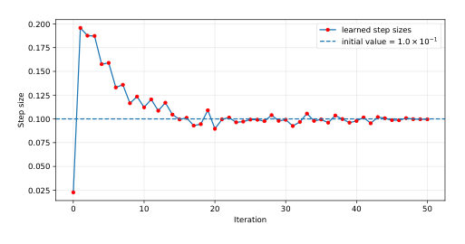
<figcaption class="paper-figure-caption"><b>Fig 5.</b> FIG. 5: Step size schedule learned by DU-UPOM. The learned values vary strongly with the iteration index, producing the nonuniform update schedule used in the evaluation.</figcaption>
</figure>

**Summary.** This paper presents DU-UPOM, an advanced solver designed to tackle complex combinatorial optimization problems with inequality constraints for quantum annealers. It improves upon existing methods by combining Unbalanced Penalization with the Ohzeki method and using Deep Unfolding to learn adaptive update schedules. The results show that this learned approach achieves optimal solutions much faster than static or fixed-step alternatives.

**Why it may be interesting.** While focused on optimization algorithms rather than fundamental quantum dynamics, the reliance on sampling distributions (MCMC) and the connection to QUBO formulations makes it highly relevant for understanding practical implementations of quantum computation hardware.

Detailed structure

**Main problem.** The core problem is efficiently solving Combinatorial Optimization Problems (COPs) subject to inequality constraints when mapping them onto quantum annealers.

**Main result.** The proposed Deep-Unfolded Unbalanced Penalization Ohzeki Method (DU-UPOM) significantly improves convergence speed and robustness compared to previous methods by learning the optimal step-size schedule adaptively.

**Method.** The authors combine the Unbalanced Penalization (UP) technique for inequalities with the iterative Ohzeki method, further enhancing it using Deep Unfolding (DU) to train the update step sizes.

**Model / system.** The work models COPs as QUBO problems suitable for quantum annealers. The mathematical framework involves penalty functions and iterative sampling updates derived from the Ohzeki transformation.

**Key observables.** Mean Squared Error (MSE) of the solution relative to the optimum, Optimal Instance Rate (fraction reaching the true optimum), and the learned step-size schedule $\{\eta_t\}$.

**Important parameters / regimes.** Penalty coefficients ($\lambda_1, \lambda_2$), learning rate/step size schedule ($\{\eta_t\}$), and problem instance parameters (e.g., knapsack weights $w_i$ and profits $p_i$).

**Assumptions / limitations.** The method assumes that the expectation derivatives required for backpropagation can be estimated accurately from Monte Carlo samples drawn from the sampler distribution.

**Figures summary.** Figures compare convergence speed (MSE vs. iterations) showing DU-UPOM significantly outperforms fixed-step and baseline methods, and one figure illustrates the nonuniformly learned step-size schedule.

**Paper structure.** The paper first introduces the limitations of standard QUBO encoding for inequalities. It then details UPOM as an improvement over original UP by integrating Ohzeki's method. Finally, it extends this to DU-UPOM, training the update schedule using deep unfolding techniques and validating performance on knapsack problems.

Abstract

Quantum annealing (QA) is used to solve combinatorial optimization problems (COPs). When COPs are implemented on quantum annealers, they are typically encoded as quadratic unconstrained binary optimization (QUBO) problems, but constraint encodings often increase the number of qubits and the embedding overhead. This issue is particularly important for COPs with inequality constraints, where standard slack-variable formulations introduce additional binary variables. Unbalanced penalization (UP) avoids slack variables, but the original UP formulation requires tuning two penalty coefficients and contains a squared residual term that can increase the number of quadratic couplings. In this paper, we propose the unbalanced penalization Ohzeki method (UPOM), which combines UP with the Ohzeki method for inequality-constrained COPs. UPOM replaces the two static penalty coefficients of original UP with an auxiliary-variable update and removes the squared residual term from the Hamiltonian used for sampling. We further propose the deep-unfolded unbalanced penalization Ohzeki method (DU-UPOM), which learns the step-size schedule of the UPOM update from training instances. Numerical experiments on random knapsack problems show that UPOM improves over original UP and that DU-UPOM reaches optimal solutions in fewer iterations than fixed-step UPOM and other baseline. These results demonstrate that the proposed framework reduces the tuning and embedding burdens of UP while making the Ohzeki method trainable for inequality constraints.

[↑ back to top](#top)

### [Biased-noise qubits: a guide to efficient fault-tolerance using the hierarchy of errors](http://arxiv.org/abs/2607.20143v1)

**Authors:** Diego Ruiz, Jérémie Guillaud, Christophe Vuillot, Mazyar Mirrahimi  
**Type:** theory · **Category:** quantum information and computing · **PDF:** <https://arxiv.org/pdf/2607.20143v1>  
**Analysis basis:** full PDF text, analyzed in chunks
**Topic relevance:** `quantum measurements` **2/5** · `measurement-induced transitions` **1/5**

↔ Scroll figures horizontally

<figure class="paper-figure-card">
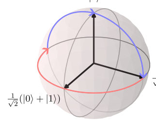
<figcaption class="paper-figure-caption"><b>Fig 1.</b> FIG. 1. Implementation of an X gate. Starting from the state |0⟩, a continuous rotation is applied targeting the state |1⟩ (blue arrow). However, when the qubit is in a superposition of the states |0⟩and |1⟩, it is sensitive to phase-flip errors (red arrow). Such phase-flip errors prevent the qubit from reaching the target state |1⟩, thereby converting phase-flip errors into bit-flip errors.</figcaption>
</figure>
<figure class="paper-figure-card">
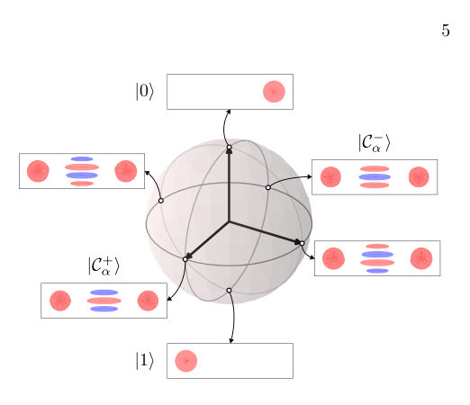
<figcaption class="paper-figure-caption"><b>Fig 2.</b> FIG. 2. Bloch sphere of a cat qubit.</figcaption>
</figure>
<figure class="paper-figure-card">
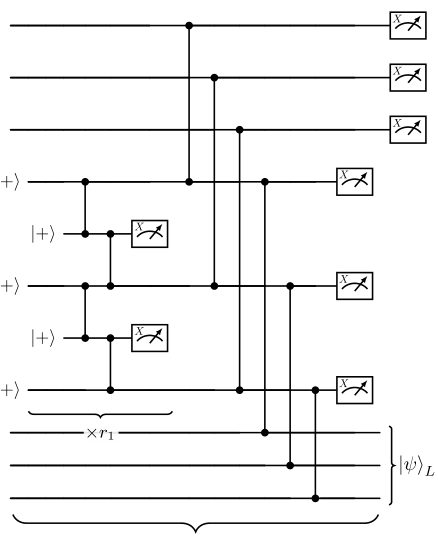
<figcaption class="paper-figure-caption"><b>Fig 3.</b> FIG. 4. Knill-style error correction circuit with bias- preserving CZ gates as presented in [56]. Measurement of a high-weight Z operator associated with the ZLZL parity required for the 1-bit teleportation protocol of Fig. 3 is en- sured using bias-preserving CZ gates. Here each line repre- sent a physical qubit. The first step is to prepare a |GHZ⟩ state. This is performed by preparing n data qubits in |+⟩⊗n</figcaption>
</figure>
<figure class="paper-figure-card">
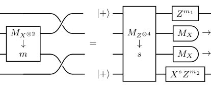
<figcaption class="paper-figure-caption"><b>Fig 4.</b> FIG. 5. Circuit to implement an X⊗2 parity check using a Z⊗4 parity check. The measurement outcome is given by m = m1 ⊕m2.</figcaption>
</figure>
<figure class="paper-figure-card">
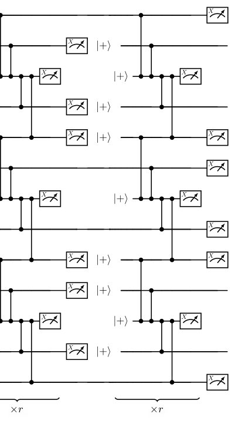
<figcaption class="paper-figure-caption"><b>Fig 5.</b> FIG. 6. Shor-style error correction circuit with bias- preserving CZ gates as presented in [61]. Here each line represents a physical qubit. At each step, by applying four bias-preserving CZ gates, we map the weight-4 Z parities on the state of an ancilla qubit that is then measured in the X basis. Noting that we need ultra-high fidelities for this read- out, we repeat this step r times, before measuring two out of four qubits in the X basis as required by Fig. 5. At the end of this error syndrome measurement cycle, the data qubits are teleported to ancilla ones and in the next round, we therefore initialize the previous data qubits in the |+⟩states and we perform the same protocol with the...</figcaption>
</figure>

**Summary.** This review analyzes fault-tolerant quantum computing protocols designed specifically for qubits experiencing strongly biased noise. It demonstrates that the choice of available bias-preserving gates dictates the optimal code structure, allowing for tailored resource reduction. The work concludes by proposing a measurement-based architecture to extend these benefits across diverse physical platforms.

**Why it may be interesting.** It provides a detailed, actionable guide on how to tailor quantum error correction overheads by exploiting specific noise characteristics inherent in physical hardware.

Detailed structure

**Main problem.** Developing efficient fault-tolerance protocols for qubits operating under strongly biased noise, where phase-flip errors significantly outnumber bit-flips.

**Main result.** The availability of a bias-preserving CX gate allows the error hierarchy to be encoded into the code structure, enabling specialized correction strategies; otherwise, standard error correction may suffice or a measurement-based approach is necessary.

**Method.** Theoretical analysis comparing fault-tolerant protocols based on the set of available 'bias-preserving operations' (CZ vs. CX vs. QND measurements).

**Model / system.** The analysis covers general biased-noise qubits, including physical realizations like electron/nuclear spins and engineered cat qubits.

**Key observables.** Error rates for phase-flips versus bit-flips; complexity overhead of syndrome extraction gadgets.

**Important parameters / regimes.** Noise bias ratio ($\eta = p_Z / (p_X + p_Y)$); available elementary gates (CZ, CX, QND readout).

**Assumptions / limitations.** The analysis hinges on the set of physically implementable, bias-preserving quantum operations.

**Paper structure.** The review analyzes protocols based on three architectural categories: CZ-based (showing limited benefit), CX-based (showing significant structural benefits), and Measurement-based (proposing an alternative for difficult platforms).

Abstract

Qubits with strongly biased noise, in which phase-flip errors are orders of magnitude more frequent than bit-flips, arise both naturally, as in electron and nuclear spins, and by engineering, as in stabilized cat qubits. This noise structure holds the promise of reducing the daunting hardware overhead of fault-tolerant quantum computing, but exploiting it requires physical operations that do not convert frequent phase-flips into rare bit-flips. In this review, we analyze the most prominent fault-tolerant protocols for biased-noise qubits, organized according to the available set of such bias-preserving operations. When this set is restricted to the CZ gate together with preparation and measurement in the X basis, we show that the complexity of the required syndrome extraction gadgets essentially cancels the benefit of the noise bias: at experimentally relevant error rates, one may as well ignore the bias and rely on standard error correction designed for depolarizing noise. The situation changes drastically when a bias-preserving CX gate is available: the hierarchy of errors can then be reflected in the structure of the code, with frequent phase-flips corrected by a dedicated high-threshold code and rare bit-flips by concatenation with a high-rate code. The same hierarchy also enables hardware-efficient preparation of magic states. Finally, as a bias-preserving CX is forbidden in naturally biased platforms and challenging in engineered ones, we present a measurement-based architecture in which a high-fidelity quantum non-demolition readout of multi-qubit Pauli Z operators takes its place, extending these overhead reductions to a much broader range of physical platforms.

[↑ back to top](#top)

### [Construction of a Class of Communication-Efficient Quantum Secret Sharing Schemes](http://arxiv.org/abs/2607.19891v1)

**Authors:** Chenhao Li, Zhihui Li, Jiansheng Guo, Yixin Chen, Yewei Wang  
**Type:** theory · **Category:** quantum information and computing · **PDF:** <https://arxiv.org/pdf/2607.19891v1>  
**Analysis basis:** full PDF text, analyzed in chunks
**Topic relevance:** `entanglement & information structure` **2/5** · `quantum measurements` **1/5**

↔ Scroll figures horizontally

<figure class="paper-figure-card">
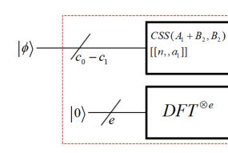
<figcaption class="paper-figure-caption"><b>Fig 1.</b> Fig. 1: Quantum circuit structure of the ECSS code.</figcaption>
</figure>
<figure class="paper-figure-card">
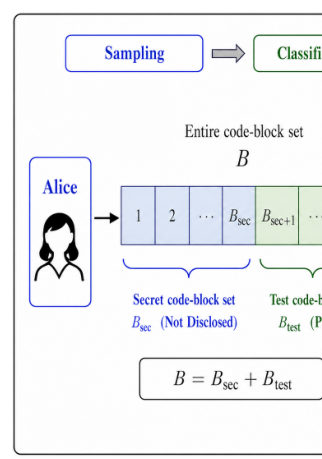
<figcaption class="paper-figure-caption"><b>Fig 2.</b> Fig. 2: Selection of test code blocks and preparation of logical states</figcaption>
</figure>
<figure class="paper-figure-card">
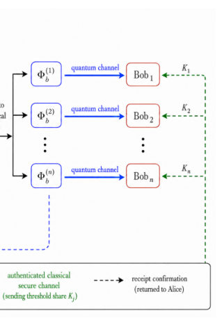
<figcaption class="paper-figure-caption"><b>Fig 3.</b> Fig. 3: ECSS encoding and share distribution</figcaption>
</figure>
<figure class="paper-figure-card">
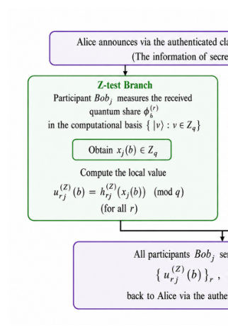
<figcaption class="paper-figure-caption"><b>Fig 4.</b> Fig. 4: Local measurements by participants</figcaption>
</figure>
<figure class="paper-figure-card">
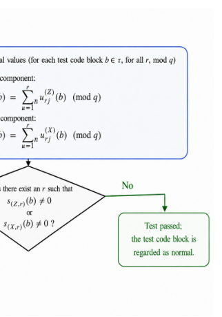
<figcaption class="paper-figure-caption"><b>Fig 5.</b> Fig. 5: Detection decision based on the syndrome vector</figcaption>
</figure>

**Summary.** This paper develops an improved Quantum Secret Sharing scheme that overcomes limitations regarding communication cost and security leakage from intermediate sets. It achieves 'perfect' security by combining advanced quantum coding theory with a classical threshold layer, while also incorporating robust eavesdropping detection using stabilizer measurements.

**Why it may be interesting.** While focused on quantum cryptography rather than AMO physics, the underlying concepts of error detection (stabilizer measurements) and information encoding/sharing are fundamental to understanding noise resilience in any physical quantum system.

Detailed structure

**Main problem.** The paper addresses bottlenecks in practical quantum secret sharing (QSS), specifically high communication costs and potential partial information leakage from intermediate sets.

**Main result.** A novel, communication-efficient perfect QSS scheme is proposed that incorporates both eavesdropping detection capabilities and eliminates information leakage by augmenting the protocol with a classical threshold layer.

**Method.** The authors combine extended CSS codes for quantum encoding with stabilizer-based testing (Z/X tests) for eavesdropping detection, and augment the structure with classical $(t, n)$ secret sharing to achieve perfectness.

**Model / system.** The system is based on Quantum Secret Sharing (QSS) protocols utilizing Extended CSS codes over $n$-qudit spaces. The security analysis focuses on multipartite quantum states distributed among multiple parties.

**Key observables.** Communication Cost ($	ext{CC}_n(d)$), syndrome vectors ($s_Z, s_X$), and the degree of entanglement/disentanglement in the final state $|\Psi
angle$.

**Important parameters / regimes.** The parameters defining the access structure are $(t, n; z)$, where $t$ is the threshold, $n$ is the total size, and $z$ defines intermediate sets.

**Assumptions / limitations.** It assumes that decoy particles are much larger than test blocks ($N \gg B_{	ext{test}}$) and that the classical communication layer does not contribute to the quantum cost metric.

**Figures summary.** The notes mention figures detailing the three steps of ECSS encoding using quantum circuits and illustrating secret recovery via controlled-addition gates.

**Paper structure.** The paper systematically reviews existing QSS limitations, introduces the method for detecting intermediate sets, details the construction of the communication-efficient perfect scheme with detection, analyzes the resulting communication costs across different participant numbers ($d$ vs $t$), and concludes by summarizing the enhanced security and efficiency.

Abstract

Quantum secret sharing is a fundamental technique in quantum cryptography. However, in practical quantum networks, it still faces several bottlenecks, such as high quantum communication cost and low transmission efficiency. To reduce the communication cost, ramp quantum secret sharing schemes have been proposed in existing studies. Nevertheless, intermediate sets in such schemes may leak partial information about the secret. To address this problem, this paper presents a method for detecting intermediate sets. Based on this method, we further propose a communication-efficient perfect quantum secret sharing scheme with eavesdropping detection capability.We analyze the communication cost under different numbers of participating parties and determine the range of participants that minimizes the reconstruction communication cost. The results verify the communication efficiency and security of the proposed scheme.

[↑ back to top](#top)

### [Simple, accurate lumped-element models of distributed resonators for superconducting quantum circuits](http://arxiv.org/abs/2607.19543v1)

**Authors:** Elizabeth H. Kunz, Eli M. Levenson-Falk  
**Type:** theory · **Category:** quantum information and computing · **PDF:** <https://arxiv.org/pdf/2607.19543v1>  
**Analysis basis:** full PDF text, analyzed in chunks
**Topic relevance:** `QC/QI experiment` **2/5** · `methods for driven-dissipative` **1/5**

↔ Scroll figures horizontally

<figure class="paper-figure-card">
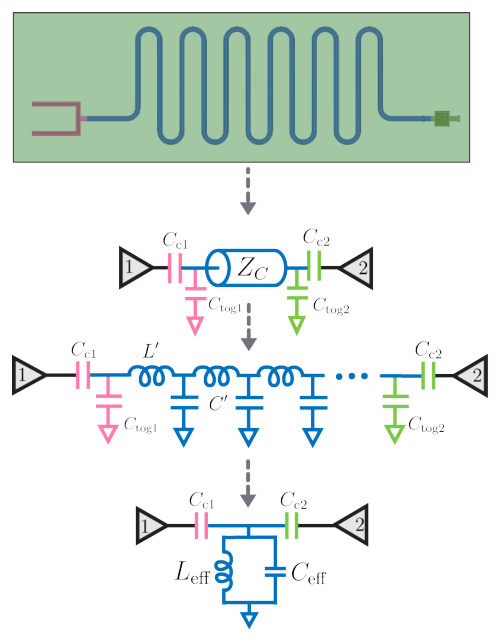
<figcaption class="paper-figure-caption"><b>Fig 1.</b> FIG. 1. A distributed element such as a coplanar waveg- uide can be represented by an abstract transmission line with characteristic impedance ZC. It is capacitively coupled at the ends to arbitrary loads by {Cc1, Cc2} and to ground by {Ctog1, Ctog2}. Exactly equivalent to this transmission line is an infinite chain of infinitesimal inductors in series and capacitors to ground. The first mode of this chain can be approximated by a single resonant circuit LC with effective inductance Leff and capacitance Ceff.</figcaption>
</figure>
<figure class="paper-figure-card">
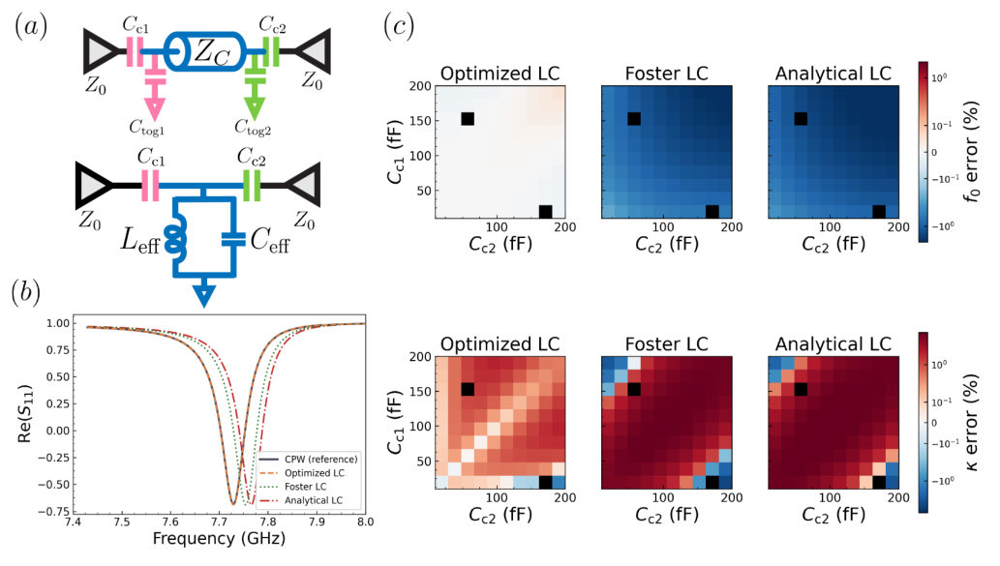
<figcaption class="paper-figure-caption"><b>Fig 2.</b> FIG. 2. (a) Circuit diagrams of a distributed system with characteristic impedance ZC, and its corresponding effective lumped circuit model, with effective capacitance and inductance {Ceff, Leff}. (b) Re(S11) transmission spectrum of the Optimized, Analytical, and Foster models, with the distributed CPW element included as a reference. (c) Heat maps (log scale) of the percent error of each method in predicting the distributed circuit shifted frequency f0 and linewidth κ, as measured via a circle fit performed on S11 in the complex plane. Blacked-out points indicate points where there were errors that prevented fitting of the resonance of at least one model.</figcaption>
</figure>
<figure class="paper-figure-card">
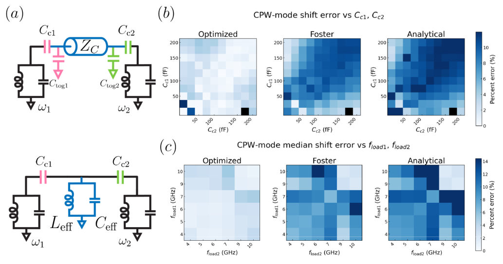
<figcaption class="paper-figure-caption"><b>Fig 3.</b> FIG. 3. (a) Circuit diagrams for the loaded system. While the central resonators and coupling capacitors have not changed, both the distributed and effective circuits are coupled to resonant loads on either end, represented here by parallel LC circuits. (b) Percent error of frequency shift of the effective LC resonance compared to the CPW resonance as a function of coupling capacitance. The off-resonant loads were fixed at 5 GHz and 6 GHz, respectively. (c) For each load pairing we find the median shift error across all combinations of capacitances, then plot it as a function of load pairing. We neglect shifts lower than 1 MHz to avoid numerical errors, as this approaches the difference...</figcaption>
</figure>
<figure class="paper-figure-card">
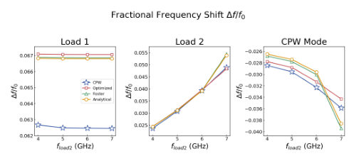
<figcaption class="paper-figure-caption"><b>Fig 4.</b> FIG. 4. Fractional shift ∆f/f0 for each mode as a function of the bare frequency of the second load with a fixed pair of coupling capacitors at Cc1 = 157.8 fF and Cc2 = 52.2 fF. For off-resonant loads such as 5 GHz, all models perform ap- proximately equally well, while loads closer to the CPW reso- nant frequency are better improved by implementing the Op- timized method. As shown earlier, the CPW mode is always better matched by the Optimized method.</figcaption>
</figure>

**Summary.** This paper introduces an efficient method to model distributed resonators in superconducting circuits by replacing the entire structure with a simple lumped LC circuit. By fitting measured scattering parameters, this technique achieves high accuracy comparable to full electromagnetic simulations, significantly streamlining the process of Hamiltonian derivation for quantum hardware design.

**Why it may be interesting.** This work provides a crucial tool for circuit designers in quantum computing, allowing them to build accurate quantum Hamiltonians from complex physical layouts without running full EM simulations, which is vital for scaling up superconducting qubit architectures.

Detailed structure

**Main problem.** The primary challenge is developing simple, accurate lumped-element models for distributed resonators used in superconducting quantum circuits to reduce reliance on computationally expensive finite-element electromagnetic simulations.

**Main result.** The authors propose a novel method that accurately replaces a coupled, distributed resonator with an equivalent LC circuit model while preserving the scattering parameters and Hamiltonian predictions, even under strong coupling conditions.

**Method.** The technique involves simulating the full loaded transmission line using scikit-rf to obtain S-parameters, which are then fitted to determine effective lumped inductance ($L_{eff}$) and capacitance ($C_{eff}$).

**Model / system.** The system is superconducting quantum circuits containing distributed elements like coplanar waveguides (CPW) resonators coupled to other components. The goal is to derive an equivalent LC circuit model for the resonator.

**Key observables.** Scattering parameters ($S_{11}, S_{22}$), resonant frequency shift ($\Delta f$), and linewidth ($\kappa$).

**Important parameters / regimes.** Coupling capacitance values, operating frequency range ($	ext{f}_0 \pm 5\kappa$), and the degree of coupling strength.

**Assumptions / limitations.** The procedure assumes that replacing the distributed element with an LC circuit while keeping attached lumped elements fixed maintains accuracy. The model's performance relies on accurate numerical simulation of port parameters from the transmission line.

**Figures summary.** Figures compare the proposed method against analytical LOM and Foster synthesis approaches by plotting $S_{11}$ spectra, showing superior agreement for frequency shifts under heavy loading.

**Paper structure.** The paper introduces the problem of modeling distributed resonators, details the limitations of existing lumped models (LOM/BBQ), proposes the novel S-parameter fitting technique, and validates its accuracy by comparing results against established methods across various coupling scenarios.

Abstract

Superconducting quantum circuit design is reliant on accurately mapping design parameters to a quantum Hamiltonian. Designers typically rely on computationally intensive finite-element electromagnetic simulations. However, effective circuit-level models can in principle capture much of the relevant physics for these systems, reducing the need for finite-element simulations. A barrier to implementing these simpler models has been the prevalence of distributed elements such as coplanar waveguides resonators in device designs. Techniques for modeling these distributed elements have been developed, but may be difficult to scale, reduce intuition, and give inaccurate results under strong coupling. In this work we describe a simple effective circuit-level model that faithfully reproduces the scattering parameters, and subsequently can predict certain Hamiltonian parameters, for a coupled, distributed element within a broader two-port network even up to strong coupling. Our approach does not explicitly require an electromagnetic simulation. Our model, along with other common lumped models used in black box quantization, is publicly available to researchers via an open-source code package, $\texttt{simpleLOMs}$.

[↑ back to top](#top)

### [Localization transitions of diffusion dynamics in physical networks](http://arxiv.org/abs/2607.19486v1)

**Authors:** Jun Yamamoto, Ivan Bonamassa, Márton Pósfai  
**Type:** theory · **Category:** statistical mechanics · **PDF:** <https://arxiv.org/pdf/2607.19486v1>  
**Analysis basis:** full PDF text, analyzed in chunks
**Topic relevance:** `analog quantum simulation` **1/5** · `correlated / nonlocal dissipation` **1/5** · `driven-dissipative phase transition` **1/5** · `methods for driven-dissipative` **1/5** · `non-equilibrium dynamics` **1/5** · `non-equilibrium universality` **1/5**

↔ Scroll figures horizontally

<figure class="paper-figure-card">
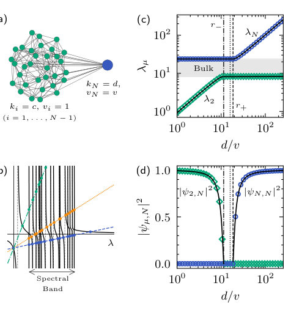
<figcaption class="paper-figure-caption"><b>Fig 1.</b> FIG. 1. (a) The defect model. (b) Graphical interpretation of Eq. (4): Vertical lines are poles corresponding to the N −2 bulk eigenvalues and the trivial eigenvalue of the c-regular random graph before attaching the outlier node. The colored lines are the right-hand side for three values of d/v. The dots mark the solutions, i.e., the N new eigenvalues λ1, λ2, . . . , λN of the network after the perturbation by the outlier. If the rightmost perturbed eigenvalue λN falls close to the edge of the bulk (orange), the location of the pole at the edge de- termines λN and the other poles do not play a role, lead- ing to a delocalized eigenvector similar to the eigenvectors of the unperturbed bulk....</figcaption>
</figure>
<figure class="paper-figure-card">
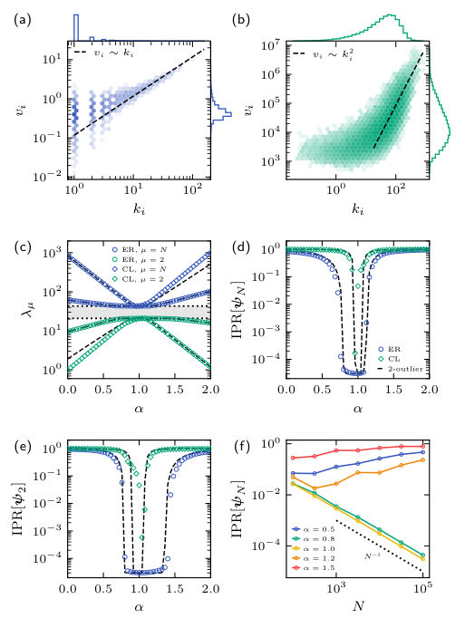
<figcaption class="paper-figure-caption"><b>Fig 2.</b> FIG. 2. (a, b) Empirical degree-volume correlations in a vascular network (human liver) and a pore network (Ben- theimer sandstone). Notice the power-law correlation in (a) and the constant offset v0 in (a,b). (c) Largest and small- est non-zero eigenvalues, (d,e) the inverse participation ratios of the leading (d) and Fiedler (e) eigenvectors as a function of the degree-volume correlation exponent α. For each re- alization of network models with N = 105 nodes and mean degree ⟨k⟩= 32, node volumes are assigned deterministically by Eq. (6) for each node i. The markers indicate the inverse participation ratios for node-weighted Chung–Lu model with power-law degree distribution P(k) ∼k−2.5...</figcaption>
</figure>
<figure class="paper-figure-card">
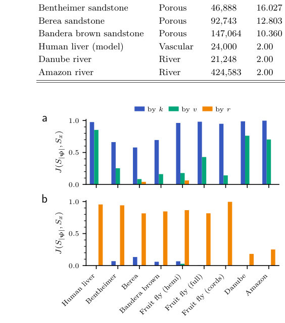
<figcaption class="paper-figure-caption"><b>Fig 3.</b> FIG. 3. Empirical validation in physical networks. Overlap between the set S|ψ| of nodes with the largest weight in the leading 100 eigenvectors of LG (a) and LP (b) and the sets Sk, Sv, Sk/v of nodes with the 100 largest degree, volume, and degree-volume ratio, respectively, quantified by the Jaccard index J(S|ψ|, Sx) = |S|ψ| ∩Sx|/|S|ψ| ∪Sx| (x ∈{k, v, k/v}), which ranges from 0 (no overlap) to 1 (perfect overlap).</figcaption>
</figure>

**Summary.** This paper analyzes how physical node volumes modify information flow dynamics (diffusion) on complex networks. It demonstrates that connectivity alone is insufficient, showing that the degree-volume ratio acts as the critical disorder parameter governing spectral localization. This provides a general framework for understanding how local physical constraints reshape global network transport properties.

**Why it may be interesting.** While focused on classical diffusion, the concept of localization control via an emergent ratio parameter ($k/v$) is analogous to how interaction strengths or geometric constraints can dictate quantum state confinement in engineered quantum systems.

Detailed structure

**Main problem.** The study investigates how physical heterogeneity, introduced via node volumes, alters the localization patterns of diffusion dynamics in complex networks beyond what is predicted by topology alone.

**Main result.** The relevant disorder parameter controlling spectral localization shifts from simple degree correlations to the degree-volume ratio ($d/v$), revealing a feature-rich mechanism for controlling network transport properties.

**Method.** The authors employ spectral analysis of the node-weighted Laplacian, using the Inverse Participation Ratio (IPR) to quantify mode localization in both solvable defect models and empirical networks.

**Model / system.** The system is modeled as a connected simple network $G$ with nodes possessing degrees ($k_i$) and associated volumes ($v_i$). The dynamics are governed by the node-weighted Laplacian operator, $L_P$.

**Key observables.** Inverse Participation Ratio (IPR) of extremal eigenvectors ($\psi_2, \psi_N$), and the Jaccard index comparing localization sets defined by degree, volume, or ratio.

**Important parameters / regimes.** The primary control parameter is the degree-volume ratio ($r = d/v$) or the correlation exponent $\alpha$ governing how volumes scale with degrees ($	ext{e.g.} v_i \propto k_i^\alpha$).

**Assumptions / limitations.** The analysis relies on solving an analytical defect model and comparing results across synthetic random graphs (ER, CL) and real-world physical networks.

**Figures summary.** Figures illustrate spectral shifts in the defect model based on $d/v$, showing localization thresholds; other figures compare IPR vs. correlation exponent $\alpha$ for different graph types, confirming the shift to ratio control.

**Paper structure.** The paper progresses from defining the physical system and the limitations of topology-only analysis, through developing a solvable defect model using spectral theory, and finally validating these findings by analyzing empirical networks across varying degree-volume correlations ($\alpha$).

Abstract

Network diffusion underlies many transport phenomena, with Laplacian modes setting how information spreads and relaxes. In physical networks, however, connectivity alone is not enough: node volumes introduce local dwell times that regulate how flow is stored before being propagated. Here we show that physical heterogeneity reshapes topology-driven localization, with the degree-volume ratio emerging as the relevant disorder parameter. We solve an analytical model in which ratio detuning qualitatively reorganizes the Laplacian spectrum, and demonstrate in empirical networks how degree-volume correlations shift extremal eigenmodes away from the nodes selected by topology alone. Our results reveal a general feature-rich-driven mechanism for localization control, showing that physicality non-trivially reshapes the disorder landscape governing network dynamics.

[↑ back to top](#top)

### [Coupled-channel approach to scattering of hybrid excitons](http://arxiv.org/abs/2607.19634v1)

**Authors:** Yasufumi Nakano, Meera M. Parish, Jesper Levinsen  
**Type:** theory · **Category:** other · **PDF:** <https://arxiv.org/pdf/2607.19634v1>  
**Analysis basis:** full PDF text, analyzed in chunks
**Topic relevance:** `Keldysh / 2PI / non-Gaussian methods` **1/5** · `analog quantum simulation` **1/5** · `correlated cavity matter` **1/5** · `driven-dissipative phase transition` **1/5** · `methods for driven-dissipative` **1/5**

↔ Scroll figures horizontally

<figure class="paper-figure-card">
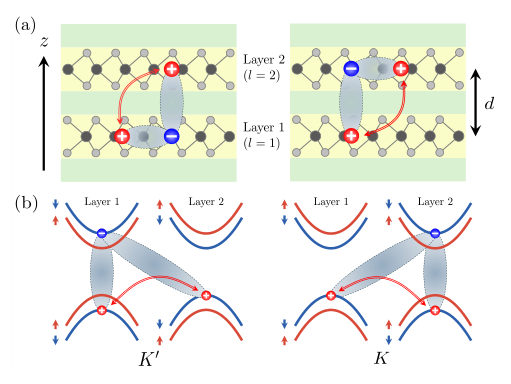
<figcaption class="paper-figure-caption"><b>Fig 1.</b> FIG. 1. (a) Schematic of a hybrid exciton in a naturally stacked 2H MoS2 homobilayer. An electron (blue) and a hole (red) form either a DX or an IX, hybridized via interlayer hole tunneling. The left and right panels show the configurations in the K′ and K valleys, respectively, which correspond to op- posite orientations of the IX out-of-plane dipole moment. (b) Corresponding band structure in the K′ (left) and K (right) valleys.</figcaption>
</figure>
<figure class="paper-figure-card">
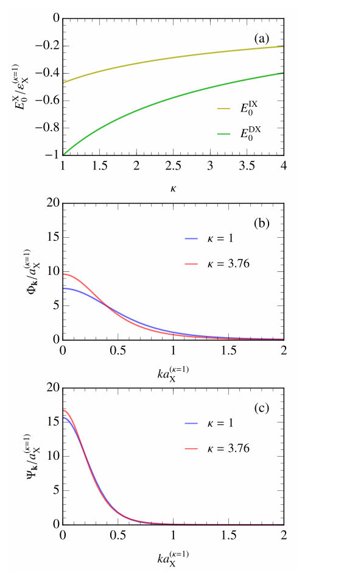
<figcaption class="paper-figure-caption"><b>Fig 2.</b> FIG. 2. (a) Ground-state energies of the DX (green) and IX (yellow) as a function of dielectric constant. (b,c) Ground- state wave functions for (b) the DX and (c) the IX. In (b,c), blue and red lines correspond to vacuum (κ = 1) and hBN (κ = 3.76), respectively. The values of all parameters, includ- ing the fixed reference scales a(κ=1) X and ε(κ=1) X , are listed in Table I.</figcaption>
</figure>
<figure class="paper-figure-card">
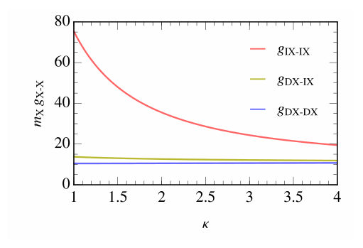
<figcaption class="paper-figure-caption"><b>Fig 3.</b> FIG. 3. Born approximation for intravalley exciton-exciton scattering at zero momentum as a function of dielectric con- stant, where for brevity, we suppress the index η. The red, yellow, and blue lines correspond to intravalley DX-DX, DX- IX, and IX-IX scattering, respectively. All parameters are listed in Table I.</figcaption>
</figure>
<figure class="paper-figure-card">
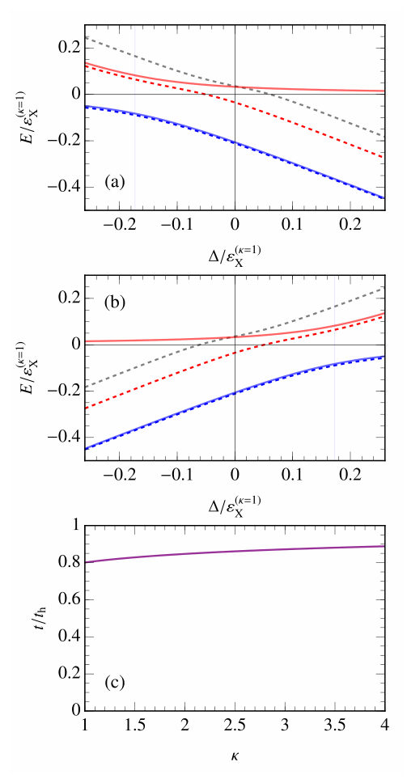
<figcaption class="paper-figure-caption"><b>Fig 4.</b> FIG. 4. (a,b) Hybrid-exciton energies as a function of the Stark shift ∆at zero momentum with κ = 1 for (a) η = 1 and (b) η = 2. We compare the lowest three eigenvalues obtained from the microscopic coupled Schr¨odinger equation (blue, red, and gray dashed lines) with the two hybridized modes obtained from the two-mode coupled-oscillator model (blue and red solid lines). The coupled-oscillator model uses t = 76 meV, while the microscopic calculation uses the cor- responding th determined from Eq. (29). The blue vertical lines indicate the resonance condition between the 1s IX and 1s DX modes, δIX ∓∆= 0, for δIX/ε(κ=1) X = −0.17. The minus sign applies to η = 1 in (a), while the plus sign...</figcaption>
</figure>
<figure class="paper-figure-card">
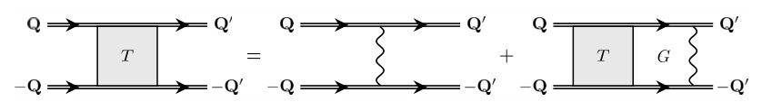
<figcaption class="paper-figure-caption"><b>Fig 5.</b> FIG. 5. Diagrammatic representation of the coupled T-matrix equation in Eq. (48). Double lines denote hybridized excitons, with external momenta Q and Q′ for the incoming and outgoing two-particle states, respectively. The vertical wavy line represents the effective exciton-exciton interaction, while the shaded square denotes the coupled T matrix. The first diagram corresponds to the Born term. The second diagram represents repeated scattering through an intermediate two-particle prop- agator, together with a sum over intermediate channels n.</figcaption>
</figure>

**Summary.** This paper develops a non-perturbative coupled-channel theory to calculate the scattering of hybrid excitons in 2D semiconductor bilayers. By incorporating interlayer tunneling and using a T-matrix approach, the authors demonstrate that exciton interactions are strongly dependent on energy and can be precisely controlled by an external electric field via the Stark shift. This offers a powerful theoretical framework for designing quantum optical devices based on tunable exciton interactions.

**Why it may be interesting.** This work provides advanced theoretical tools (coupled-channel T-matrix) to model interacting excitons in low-dimensional materials, which is highly relevant for understanding strongly correlated light-matter interactions in quantum optics and condensed matter physics.

Detailed structure

**Main problem.** To perform non-perturbative calculations of hybrid exciton scattering beyond standard perturbative theories.

**Main result.** The study shows that the hybrid-exciton scattering strength can be electrically tuned via the Stark shift, and its interaction properties are governed by a coupled-channel T-matrix approach.

**Method.** The authors construct realistic pseudopotentials from microscopic descriptions and employ a non-perturbative coupled-channel scattering integral equation (T-matrix approach).

**Model / system.** The system is hybrid excitons formed in a two-dimensional semiconductor bilayer, involving the hybridization of spatially direct (DX) and indirect (IX) exciton states via interlayer tunneling.

**Key observables.** Hybrid-exciton T matrices, interaction strength dependence on Stark shift ($\Delta$), and exciton weights (DX/IX fractions).

**Important parameters / regimes.** Dielectric constant ($\kappa$), electric field induced detuning ($\Delta$), and momentum transfer ($q$).

**Assumptions / limitations.** The analysis assumes equal masses for electrons and holes, and uses a projection method onto the two-exciton subspace.

**Figures summary.** Figures illustrate schematic hybridization in $	ext{MoS}_2$ bilayers, energy levels vs. dielectric constant, and T-matrices showing dependence on the Stark shift.

**Paper structure.** The paper progresses from defining the microscopic Hamiltonian to constructing pseudopotentials, applying a coupled-channel T-matrix formalism for non-perturbative scattering, and finally analyzing tuning mechanisms via the Stark effect.

Abstract

We consider the interactions of hybrid excitons in a two-dimensional semiconductor bilayer, where spatially direct and indirect excitons are hybridized by interlayer charge-carrier tunneling. Starting from a microscopic electron-hole description, we construct realistic pseudopotentials for exciton-exciton interactions and use them as inputs to a coupled-channel scattering integral equation. This enables non-perturbative calculations of hybrid-exciton scattering beyond standard perturbative theories, and highlights the importance of energy-dependent scattering and channel mixing. In particular, we show that the interaction strength of hybrid excitons exhibits a rapid growth with increasing energy, which we find is inherited from their indirect-exciton component. We further demonstrate that dielectric screening affects the direct and indirect channels in distinct ways, leading to markedly different interaction strengths across experimentally relevant dielectric environments. Finally, we show that the hybrid-exciton scattering strength can be electrically tuned via the Stark shift, which controls the direct-indirect detuning and hence the hybridization of the two exciton modes.

[↑ back to top](#top)

### [Bound states of the hydrogen-like atomic systems in plasma environments](http://arxiv.org/abs/2607.19601v1)

**Authors:** Fatma Zohra Khaled, Mustafa Moumni, Mokhtar Falek  
**Type:** theory · **Category:** statistical mechanics · **PDF:** <https://arxiv.org/pdf/2607.19601v1>  
**Analysis basis:** full PDF text, analyzed in chunks
**Topic relevance:** `Keldysh / 2PI / non-Gaussian methods` **1/5** · `driven-dissipative phase transition` **1/5** · `methods for driven-dissipative` **1/5**

↔ Scroll figures horizontally

<figure class="paper-figure-card">
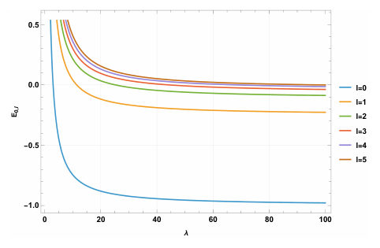
<figcaption class="paper-figure-caption"><b>Fig 1.</b> FIG. 1. The energy eigenvalues (in Rydberg units) of the hydrogen-like atomic systems immersed in plasma medium as a function of different screening parameters (λ) in the case (nr = 0).</figcaption>
</figure>
<figure class="paper-figure-card">
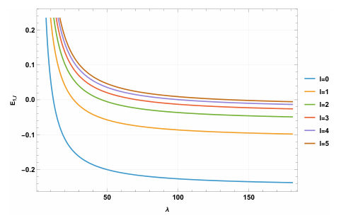
<figcaption class="paper-figure-caption"><b>Fig 2.</b> FIG. 2. The energy eigenvalues (in Rydberg units) of the hydrogen-like atomic systems immersed in plasma medium as a function of different screening parameters (λ) in the case (nr = 1).</figcaption>
</figure>
<figure class="paper-figure-card">
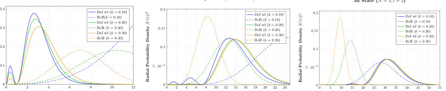
<figcaption class="paper-figure-caption"><b>Fig 3.</b> FIG. 3. Normalized radial probability distributions Pnr,ℓ(r) = r2 |Rnr,ℓ|2 for the(nr = 0, ℓ= 0), (nr = 0, l = 1) and (nr = 0, ℓ= 2) states as functions of radial length for various screening parameters (k = 1/λD).</figcaption>
</figure>
<figure class="paper-figure-card">
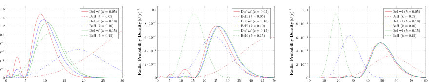
<figcaption class="paper-figure-caption"><b>Fig 4.</b> FIG. 4. Normalized radial probability distributions Pnr,ℓ(r) = r2 |Rnr,ℓ|2 for the(nr = 1, ℓ= 0), (nr = 1, ℓ= 1) and (nr = 1, ℓ= 2) states as functions of radial length for various screening parameters (k = 1/λD).</figcaption>
</figure>
<figure class="paper-figure-card">
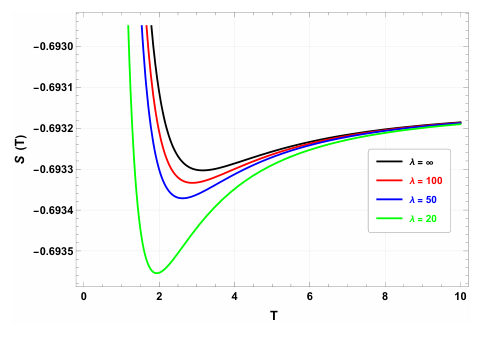
<figcaption class="paper-figure-caption"><b>Fig 5.</b> FIG. 7. The entropy S as a function of temperaturevT for different values of (λ). ( Tmin = 1.93661 for λ = 20),(Tmin = 2.62312 for λ = 50),(Tmin = 2.88236 for λ = 100),(Tmin = 3.15831 for λ = ∞)</figcaption>
</figure>

**Summary.** This paper theoretically investigates the bound states of hydrogen-like atoms subjected to plasma screening, modeled by the Yukawa potential. By transforming the problem into a bi-confluent Heun equation, the authors derive analytic expressions for energy eigenvalues and wavefunctions. The key contribution is establishing a robust analytical framework that remains accurate across different screening regimes while correctly recovering the standard Coulomb result.

**Why it may be interesting.** This work provides a rigorous analytical extension to standard atomic physics problems by incorporating plasma screening effects. The development of multiple consistent calculation methods (HFT vs. Expectation Value) is valuable for theoretical modeling in open quantum systems.

Detailed structure

**Main problem.** The study focuses on determining the energy spectrum and thermodynamic properties of hydrogen-like atomic systems when embedded in a plasma environment.

**Main result.** The authors developed an analytic framework providing explicit formulas for wavefunctions and eigenenergies valid across various screening strengths, successfully recovering the known Coulomb limit where appropriate.

**Method.** The analysis employs advanced quantum mechanical techniques including solving the radial Schrödinger equation transformed into a bi-confluent Heun (BCH) equation. Energy eigenvalues are computed using multiple consistent methods: direct expectation values and the Hellmann-Feynman theorem.

**Model / system.** The system is hydrogen-like atoms interacting via the Screened Coulomb Potential (Yukawa potential), $V(r) = -Ze^2 e^{-kr}/r$. The Hamiltonian is non-relativistic, and the analysis involves approximations using the Killingbeck potential derived from a Taylor expansion of the SCP.

**Key observables.** Energy eigenvalues ($E_{n_r,\ell}$), radial wavefunctions ($\psi$), free energy ($F$), entropy, and partition function ($Z$).

**Important parameters / regimes.** The screening parameter $k$ (related to plasma density) is crucial; the limit $k 	o 0$ recovers the standard Coulomb case.

**Assumptions / limitations.** Initial solutions based on the BCH equation are limited because they fail to smoothly reduce to the pure Coulomb eigenfunctions when $k=0$. The authors overcome this by constructing corrected wavefunctions analytically.

**Paper structure.** The paper first establishes the problem using the SCP and its reduction to the BCH equation. It then details two main approaches: (1) deriving exact solutions for a truncated potential, and (2) proposing an alternative analytic method by treating parameters as functions of $k$. Finally, it computes energy spectra via direct expectation values and the Hellmann-Feynman theorem, concluding with thermodynamic derivations.

Abstract

We conduct a non-relativistic study of plasma screening effects on hydrogen-like atomic systems using the Screened Coulomb Potential (SCP i.e. Yukawa potential). The radial Schrödinger equation is first reduced to a bi-confluent Heun (BCH) equation for the Killingbeck potential which is the truncated version of the SCP, and we write the exact BCH eigenfunctions and eigenenergies. We then study the limitations of these BCH solutions and obtain an analytic description valid for weak to moderate screening using the BCH functional form. The corrected eigenfunctions are constructed order by order up to O(k^3); they are expressed in terms of the Laguerre polynomials and reduces exactly to Coulomb eigenfunctions when k=0. Using these Functions, the energy spectrum is computed via two analytic methods: (i) direct evaluation of the full Yukawa Hamiltonian expectation value, and (ii) the Hellmann-Feynman theorem, yielding integral representation. All methods presented here provide explicit analytical formulas for both wavefunctions and eigenenergies valid for different ranges of the screening. These methods establish a powerful analytic framework for studying confined quantum systems. The thermodynamic properties are also derived using the BCH formulation.

[↑ back to top](#top)

### [Distributed Entanglement Distribution Using Multiple Entanglement Sources in WDM-based Quantum Optical Networks](http://arxiv.org/abs/2607.19849v1)

**Authors:** Anuj Agrawal, Abhay Singh Dulta, Bhaskar Kanseri  
**Type:** both · **Category:** quantum information and computing · **PDF:** <https://arxiv.org/pdf/2607.19849v1>  
**Analysis basis:** full PDF text, analyzed in chunks
**Topic relevance:** `entanglement & information structure` **1/5** · `interference shaping light` **1/5** · `quantum optics experiment` **1/5**

↔ Scroll figures horizontally

<figure class="paper-figure-card">
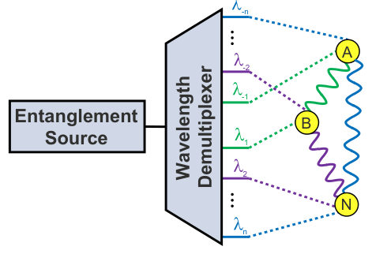
<figcaption class="paper-figure-caption"><b>Fig 1.</b> Fig. 1: An example of WDM-based entanglement distribution using single broadband EPPS [4]. Here, the entanglement source spectrum is first demultiplexed into different wavelengths and then entangled photon pairs at correlated wavelength-pairs (shown in same color) are routed towards the two entangling nodes (connected by a wiggly line of same color as the wavelength-pair color).</figcaption>
</figure>
<figure class="paper-figure-card">
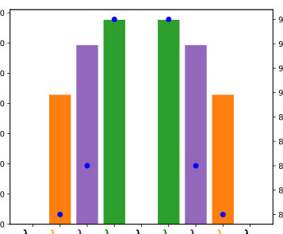
<figcaption class="paper-figure-caption"><b>Fig 2.</b> Fig. 2: Experimental characteristics of the three wavelength pair EPPS (3WPS) consid- ered in this work. Here, coincident photon counts for different wavelength pairs (shown in same color) are represented by bars and their entanglement visibilities are represented by blue dots. The central wavelength (λ0) is the point of degeneracy. It should be noted that the central wavelength (λ0 in Fig. 2), referred to as the ‘point of degeneracy’ is not used [4],</figcaption>
</figure>
<figure class="paper-figure-card">
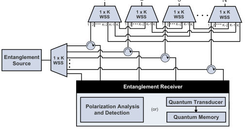
<figcaption class="paper-figure-caption"><b>Fig 3.</b> Fig. 4: Node architecture for WDM-based entanglement distribution with multiple EPPSs in multi-hop mesh quantum optical networks. Optical circulators are represented by circles with circulation direction denoted by arrows inside them.</figcaption>
</figure>
<figure class="paper-figure-card">
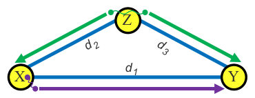
<figcaption class="paper-figure-caption"><b>Fig 4.</b> Fig. 5: Schemes of photon pair distribution: when source node (X) is one of the entangling nodes (X-Y), only one photon (OP) is transmitted over the network, as represented in purple color; and when source node (Z) is none of the entangling nodes (X-Y), both photons (BP) are transmitted over the network, as represented in green color. The entanglement visibility (V ) for different wavelength pairs is calculated as</figcaption>
</figure>
<figure class="paper-figure-card">
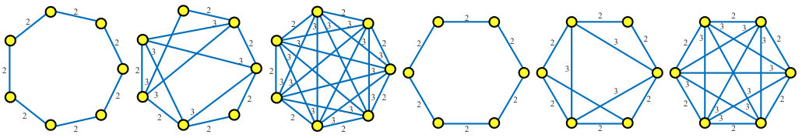
<figcaption class="paper-figure-caption"><b>Fig 5.</b> Fig. 6: 7-node and 6-node ring, full mesh (FMESH), and partial mesh (PMESH) random (generated using Erd˝os–R´enyi graph model [8]) network topologies. The values shown at edges are link distances.</figcaption>
</figure>

**Summary.** This work proposes a method to enhance entanglement distribution in complex quantum optical networks by employing multiple distributed Entanglement Photon Pair Sources (EPPSs). By simulating performance across various mesh topologies and comparing centralized versus decentralized source placement, the authors demonstrate that distributing sources significantly boosts network capacity and resource efficiency. This advances the feasibility of building large-scale, repeaterless quantum communication links.

**Why it may be interesting.** It provides concrete simulation results on scaling quantum network capabilities beyond simple point-to-point links, which is crucial for realizing large-scale quantum internet infrastructure.

Detailed structure

**Main problem.** The study addresses the challenge of distributing entanglement across large, multi-hop quantum optical networks without relying on quantum repeaters.

**Main result.** Distributed entanglement distribution using multiple Entanglement Photon Pair Sources (EPPSs) significantly outperforms centralized sources by improving resource utilization and accepting higher network demands.

**Method.** The authors simulate network performance by comparing different EPPS placement strategies (centralized vs. distributed) across various topologies, considering One-Photon (OP) and Both-Photon (BP) distribution schemes.

**Model / system.** The system is a Wavelength Division Multiplexing (WDM)-based quantum optical network utilizing multiple SPDC-based EPPSs in repeaterless mesh topologies (e.g., 7-PMESH).

**Key observables.** Entanglement Demand Acceptance Ratio (EDAR), Entanglement Resource Utilization Ratio (ERUR), and entanglement visibility/ebit rate degradation.

**Important parameters / regimes.** Fiber length, number of hops, EPPS placement strategy (centralized vs. distributed), and the type of entanglement distribution scheme (OP/BP).

**Assumptions / limitations.** The analysis assumes a passive WDM approach without quantum repeaters; performance metrics are derived from simulated coincidence counts.

**Figures summary.** Figures illustrate EDAR vs. Network Load curves comparing different EPPS placements in mesh networks, and ERUR comparisons showing the benefit of distributed placement.

**Paper structure.** The paper progresses by first establishing the limitations of single-source entanglement distribution, then introducing the multi-EPPS WDM approach, followed by detailed comparative analysis using graph theory concepts (centrality) to optimize EPPS placement for maximizing EDAR and ERUR.

Abstract

Quantum network implementations using single spontaneous parametric downconversion (SPDC)-based broadband entangled photon pair source (EPPS) have been reported recently. Here, leveraging the wavelength-correlation between entangled photon pairs, the traditional wavelength division multiplexing (WDM) method is utilized to route photons based on their wavelengths. From single EPPS, entangled photon pairs are distributed in a centralized way to different node pairs in the network. However, the number of nodes pairs that can be entangled in a network is limited by the number of entangled wavelength pairs that an EPPS can generate. To entangle a higher number of node pairs in a network, multiple EPPSs can be employed. In this work, we present a WDM-based entanglement distribution approach using multiple EPPSs in multi-hop repeaterless mesh optical networks. We experimentally characterize two EPPSs developed in-house and consider multiple such EPPSs in the network to perform network-level simulations. We consider heterogeneous entanglement demands requiring different entanglement bit (ebit) rates and entanglement visibility. For each entanglement demand, EPPS placement/selection, wavelength-pair assignment, and photon pair routing are performed considering the degradation in both ebit rate and visibility with fiber length and hops in the network. Two main findings of this study include: (i) a hybrid approach of one-photon (OP) and both-photon (BP) entanglement distribution provides higher flexibility in multi-EPPS placement and (ii) distributed entanglement distribution using multiple EPPSs enables better entanglement resource utilization and higher entanglement demand acceptance as compared to centralized entanglement distribution.

[↑ back to top](#top)

### [Real-time probing of quadrupolar contributions to the absorption cross section of non-periodic systems](http://arxiv.org/abs/2607.19828v1)

**Authors:** Anvar Khujakulov, Michele Guerrini, Carlo Andrea Rozzi, Caterina Cocchi  
**Type:** theory · **Category:** other · **PDF:** <https://arxiv.org/pdf/2607.19828v1>  
**Analysis basis:** full PDF text, analyzed in chunks
**Topic relevance:** `interference shaping light` **1/5** · `methods for driven-dissipative` **1/5** · `non-equilibrium dynamics` **1/5**

↔ Scroll figures horizontally

<figure class="paper-figure-card">
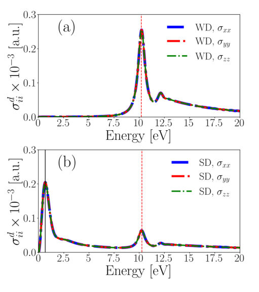
<figcaption class="paper-figure-caption"><b>Fig 1.</b> FIG. 1. Diagonal elements of the photo-absorption cross- section tensor (σd xx, σd yy, σd zz) as a function of photon energy. (a) Linear WD regime (E0 = 0.05 a.u.) featuring the strong dipole transition 1s →2p at 10.22 eV (red dashed bar) and the weaker one 1s →3p at 12.09 eV. (b) Nonlinear SD regime (E0 = 1.0 a.u.) displaying a severe depletion of the 1s →2p resonance (red dashed bar) and the emergence of a prominent low-energy peak at 0.60 eV (solid black bar).</figcaption>
</figure>
<figure class="paper-figure-card">
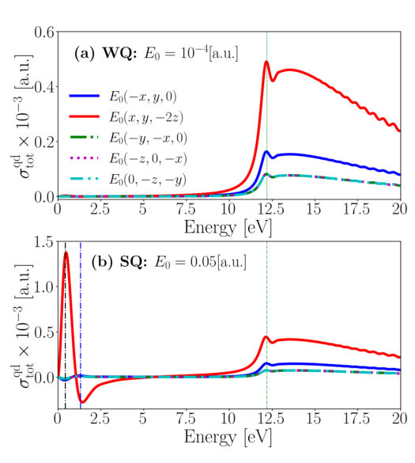
<figcaption class="paper-figure-caption"><b>Fig 2.</b> FIG. 2. Total photo-absorption cross section (σqd tot(ω)) com- puted for the hydrogen atom under spatially non-uniform electric field gradients. (a) Linear WQ regime (E0 = 10−4 a.u.) where the three off-diagonal configurations (green dash-dotted, purple dotted, and cyan dash-dot-dotted curves) perfectly superimpose. The solid blue and red curves corre- spond to the diagonal gradient configurations. The vertical dashed green line highlights the 1s →3d quadrupole reso- nance at 12.1 eV. (b) Nonlinear SQ regime (E0 = 0.05 a.u.) illustrating the amplitude splitting among different gradient forms. The vertical black dash-dotted line marks the 0.44 eV induced absorption peak, while the vertical...</figcaption>
</figure>
<figure class="paper-figure-card">
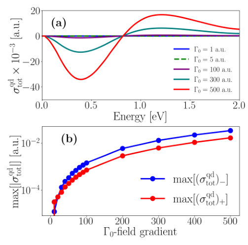
<figcaption class="paper-figure-caption"><b>Fig 3.</b> FIG. 3. Parametric scaling of the sub-eV nonlinear sig- natures for the representative field configuration E = E0(−Γ0x, Γ0y, 0) at a fixed weak amplitude E0 = 10−4 a.u. (a) Quadrupole absorption cross section at varying gradient strengths Γ0. (b) Logarithmic plot of the absolute maximum and minimum values of (σqd tot)± (0.44 eV and 1.32 eV, respec- tively) as a function of Γ0. These extrema are denoted in the legend as max[σqd + ] and max[σqd −].</figcaption>
</figure>
<figure class="paper-figure-card">
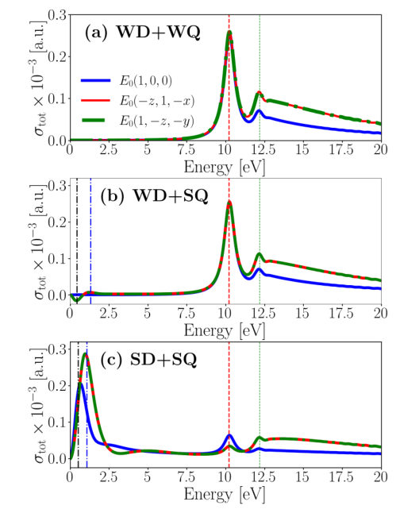
<figcaption class="paper-figure-caption"><b>Fig 4.</b> FIG. 4. Total photo-absorption cross section of the hydrogen atom subject to mixed spatial perturbations combining both uniform and non-uniform field dependencies. (a) Weak-field mixed regime (WD+WQ, E0 = 10−4 a.u.). (b) intermediate mixed regime (WD+SQ, E0 = 0.05 a.u.). (c) Strong mixed regime (SD+SQ, E0 = 1 a.u.). The red bar in all panels highlights the 1s →3d resonance at 12.1 eV, while the black and blue vertical dash-dotted lines in panels (b) and (c) mark the sub-eV non-linear spectral shift relative to the low-energy domain.</figcaption>
</figure>
<figure class="paper-figure-card">
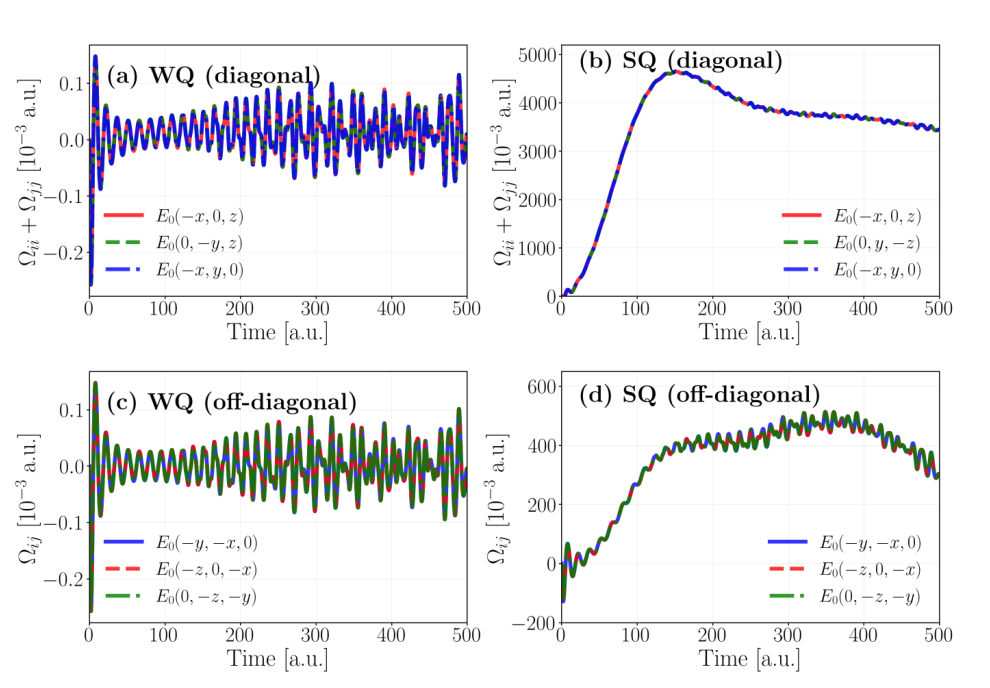
<figcaption class="paper-figure-caption"><b>Fig 5.</b> FIG. 5. Time-dependent diagonal and off-diagonal elements of the quadrupole moment (a-c) in the WQ (E0 = 10−4 a.u.) and (b-d) SQ (E0 = 0.05 a.u.) regimes under the specified non-uniform field dependencies.</figcaption>
</figure>

**Summary.** This paper develops a theoretical method to calculate the full multipolar cross section by incorporating quadrupole contributions, moving beyond the standard dipole approximation for atomic response. Using the hydrogen atom as a benchmark, the authors simulate real-time electron dynamics under varying electric field gradients. The results show that strong fields activate distinct low-energy spectral features due to these higher-order coupling mechanisms.

**Why it may be interesting.** This work provides a rigorous computational framework for understanding how higher-order field interactions govern light absorption and emission in nanoscale or molecular settings where simple dipole approximations fail. It is highly relevant to quantum optics and open quantum systems dynamics.

Detailed structure

**Main problem.** The study addresses the necessity of going beyond the dipole approximation to probe multipolar cross sections, specifically quadrupolar contributions, when analyzing atomic and molecular responses in highly inhomogeneous electric fields.

**Main result.** The research demonstrates that quadrupole interactions become crucial under strong gradients or intense fields, leading to distinct spectral features such as low-energy sub-1 eV absorption or stimulated emission peaks not predicted by dipole theory alone.

**Method.** The authors employ real-time, non-perturbative simulations using the Time-Dependent Schrödinger Equation (TDSE) framework, extending established methods like those in Octopus code.

**Model / system.** The primary benchmark system is the hydrogen atom, treated as a one-electron system. The analysis involves modeling electron dynamics under an interaction Hamiltonian containing both dipole and quadrupole terms derived from field gradients.

**Key observables.** Photo-absorption cross section ($\sigma_{	ext{tot}}(\omega)$), quadrupole expectation value ($\Omega_{qd}(t)$), and the ratio of multipolar contributions ($\sigma_{qd}/\sigma_d$).

**Important parameters / regimes.** Field regimes include weak, linear response (dipole dominated) versus strong, nonlinear response (quadrupole effects become prominent); energy scales range from sub-1 eV to 12.1 eV.

**Assumptions / limitations.** The methodology relies on the multipolar expansion for classification but uses non-perturbative real-time propagation; limitations include potential discrepancies between TDSE and finite-grid solvers like Octopus.

**Figures summary.** Figures illustrate how the total cross section changes across different field regimes (linear vs. nonlinear), showing resonance depletion and the emergence of low-energy features attributable to higher-order multipole coupling.

**Paper structure.** The paper systematically analyzes four distinct excitation regimes (WD, SD, WD+WQ, SD+SQ) using the hydrogen atom benchmark, building a theoretical foundation for non-perturbative multipole simulations in near-field environments.

Abstract

The non-perturbative evaluation of multipolar cross sections is essential for probing atomic and molecular responses to spatially inhomogeneous electric fields characteristic of nanoscale environments where the conventional dipole approximation breaks down. Taking the hydrogen atom as an analytical and numerical benchmark, we map in real time quadrupole interactions driven by instantaneous electric field gradients. Our study explores two distinct interaction regimes. Under a uniform field, quadrupolar responses are activated by multi-step dipole transitions, responsible for sub-1~eV excited-state absorption. Conversely, under pure spatial gradients, the weak-field response is dominated by the single-photon $1s \to 3d$ quadrupole resonance at 12.1~eV, while strong gradients induce low-energy stimulated emission via transiently driven coherent populations. This dynamical analysis is complemented by a rigorous evaluation of the symmetry aspects of the quadrupole response and the applied electric field. This methodology establishes the theoretical and computational foundation for future non-perturbative multipole simulations of molecules and nanostructures in the near-field regime.

[↑ back to top](#top)

### [Analytical Retrieval of Material Parameters in Monolayer Transition-Metal Dichalcogenides Based on a Solvable Exciton Model](http://arxiv.org/abs/2607.19698v1)

**Authors:** Duy-Nhat Ly, Thanh-Son Nguyen, Ngoc-Tram D. Hoang, Van-Hoang Le  
**Type:** theory · **Category:** other · **PDF:** <https://arxiv.org/pdf/2607.19698v1>  
**Analysis basis:** full PDF text, analyzed in chunks
**Topic relevance:** `correlated cavity matter` **1/5** · `spintronics-quantum-optics interface` **1/5**

↔ Scroll figures horizontally

<figure class="paper-figure-card">
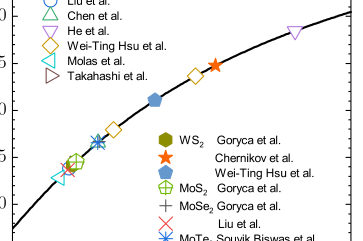
<figcaption class="paper-figure-caption"><b>Fig 1.</b> FIG. 1. Ratio ∆(ξ) as a function of the screening parameter ξ (solid line), compared with the experimental values ∆exp for different TMDC monolayers (symbols).</figcaption>
</figure>
<figure class="paper-figure-card">
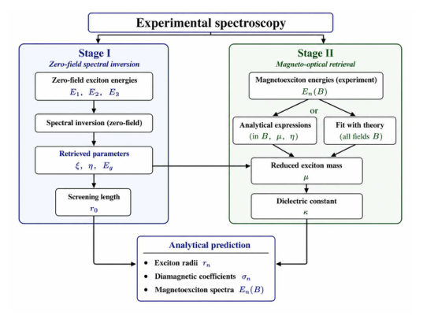
<figcaption class="paper-figure-caption"><b>Fig 2.</b> FIG. 2. Schematic flowchart of the analytical retrieval frame- work. The workflow retrieves the fundamental material pa- rameters (bandgap energy Eg, screening length r0, reduced exciton mass µ, and surrounding dielectric constant κ) from experimental exciton and magnetoexciton energies and pre- dicts the derived excitonic properties, including the diamag- netic coefficients σn, exciton radii rn, and magnetoexciton spectra En(B).</figcaption>
</figure>
<figure class="paper-figure-card">
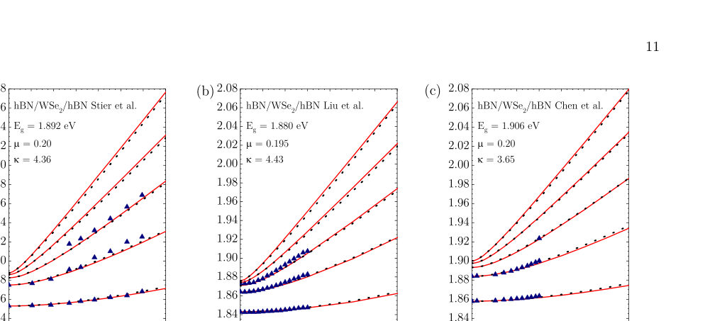
<figcaption class="paper-figure-caption"><b>Fig 3.</b> FIG. 3. Magnetoexciton energy spectra of monolayer WSe2. Analytical results obtained from Eq. (??) are shown by red solid lines, numerical solutions by black dotted lines, and experimental data from Refs. [14, 20, 21] by navy symbols.</figcaption>
</figure>
<figure class="paper-figure-card">
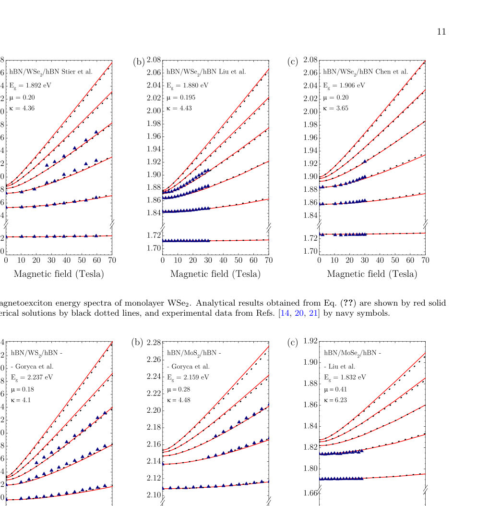
<figcaption class="paper-figure-caption"><b>Fig 4.</b> FIG. 4. Magnetoexciton energy spectra of monolayer WS2, MoS2, and MoSe2. Analytical results obtained from Eq. (??) are shown by red solid lines, numerical solutions by black dotted lines, and experimental data by navy symbols. The experimental results for WS2 and MoS2 are taken from Ref. [23], while those for MoSe2 are from Ref. [15].</figcaption>
</figure>
<figure class="paper-figure-card">
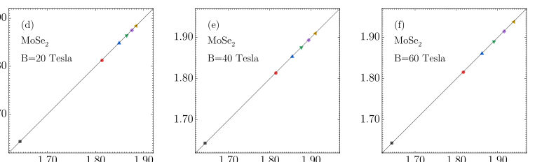
<figcaption class="paper-figure-caption"><b>Fig 5.</b> FIG. 5. Comparison of magnetoexciton energy levels obtained using the Kratzer model (horizontal axis) and the Rytova– Keldysh model (vertical axis) for MoS2 and MoSe2, using the material parameters in Tables II. Panels (a–c) correspond to MoS2 at magnetic fields B = 20, 40, and 60 T, respectively, while panels (d–f) show the corresponding results for MoSe2 at the same magnetic fields.</figcaption>
</figure>

**Summary.** This paper introduces an advanced analytical framework to extract fundamental material properties from excitonic spectroscopy data of 2D semiconductor monolayers. By utilizing two complementary stages—analyzing zero-field spectra and then the magnetic field dependence—the authors derive parameters like bandgap, screening length, and exciton mass without needing additional fitting parameters. This offers a powerful, physically transparent tool for characterizing TMDs.

**Why it may be interesting.** The analytical nature of the retrieval method provides a highly transparent and efficient alternative to complex numerical fitting routines, which is valuable for rapid characterization in quantum optics.

Detailed structure

**Main problem.** The goal is to develop an analytical procedure to retrieve fundamental material parameters of monolayer transition-metal dichalcogenides (TMDCs) from their optical and magneto-optical exciton spectra.

**Main result.** The proposed two-stage analytical framework successfully determines key parameters like the bandgap, screening length, reduced exciton mass, and dielectric constant with high accuracy.

**Method.** It employs an analytical inversion procedure based on solving equations derived from the solvable modified Kratzer model, avoiding iterative fitting or matrix diagonalization.

**Model / system.** The study focuses on excitons in monolayer TMDCs (e.g., WSe2, MoS2) embedded in various dielectric environments. The physics is modeled using an exciton Hamiltonian solved via basis set expansion for magnetoexciton spectra.

**Key observables.** Exciton energies ($E_n$), the ratio of energy differences ($\Delta_{	ext{exp}}$), and the magnetic-field dependence of exciton energies $E_n(B)$.

**Important parameters / regimes.** Quasiparticle bandgap ($E_g$), effective screening parameter ($\xi$), energy scaling factor ($\eta$), reduced exciton mass ($\mu$), and surrounding dielectric constant ($\kappa$).

**Assumptions / limitations.** The analysis relies on the solvable modified Kratzer model approximation for describing excitonic binding energies, which is an analytical simplification of the full physics.

**Figures summary.** Figures illustrate the comparison between theoretical predictions (using the derived formulas) and experimental/numerical results for magnetoexciton spectra across different TMDCs and magnetic fields.

**Paper structure.** The paper details a two-stage retrieval process: Stage 1 uses zero-field exciton energies ($E_1, E_2, E_3$) to find $\xi$, $\eta$, and $E_g$; Stage 2 uses the field dependence of these energies to independently determine $\mu$ and subsequently $\kappa$.

Abstract

We develop an analytical procedure to retrieve fundamental material parameters of monolayer transition-metal dichalcogenides from optical and magneto-optical exciton spectra, based on the solvable modified Kratzer model. The proposed retrieval procedure naturally consists of two complementary stages. In the first stage, explicit inversion formulas determine the quasiparticle bandgap, effective screening parameter, and energy scaling factor directly from the experimentally measured energies of the three lowest excitonic states, from which the screening length is subsequently obtained. In the second stage, an analytical expression for the magnetic-field dependence of the exciton energies independently yields the reduced exciton mass, from which the surrounding dielectric constant is then calculated. Once the complete set of material parameters has been retrieved, the framework analytically predicts the diamagnetic coefficients, exciton radii, and complete magnetoexciton spectra without introducing additional fitting parameters or matrix diagonalization. The method is applied to a broad range of experimental samples for WSe$_2$, WS$_2$, MoS$_2$, MoSe$_2$, and MoTe$_2$ monolayers embedded in different dielectric environments. The retrieved material parameters are in good agreement with independent experimental measurements and previous Rytova--Keldysh (RK) calculations, while the predicted excitonic properties accurately reproduce available magneto-optical observations. The proposed analytical theory provides an efficient, physically transparent alternative to conventional numerical fitting procedures and offers an effective tool for the rapid characterization of two-dimensional semiconductors via excitonic spectroscopy.

[↑ back to top](#top)

### [Physics-Informed Graph Neural Networks for Surface Code Decoding via Discrete Exterior Calculus](http://arxiv.org/abs/2607.20060v1)

**Authors:** P. E. Trevisanutto, S. Dhanpal, S. Basak, L. Petit, J. Thiyagalingam  
**Type:** theory · **Category:** quantum information and computing · **PDF:** <https://arxiv.org/pdf/2607.20060v1>  
**Analysis basis:** full PDF text, analyzed in chunks
**Topic relevance:** `methods for driven-dissipative` **1/5** · `quantum measurements` **1/5**

↔ Scroll figures horizontally

<figure class="paper-figure-card">
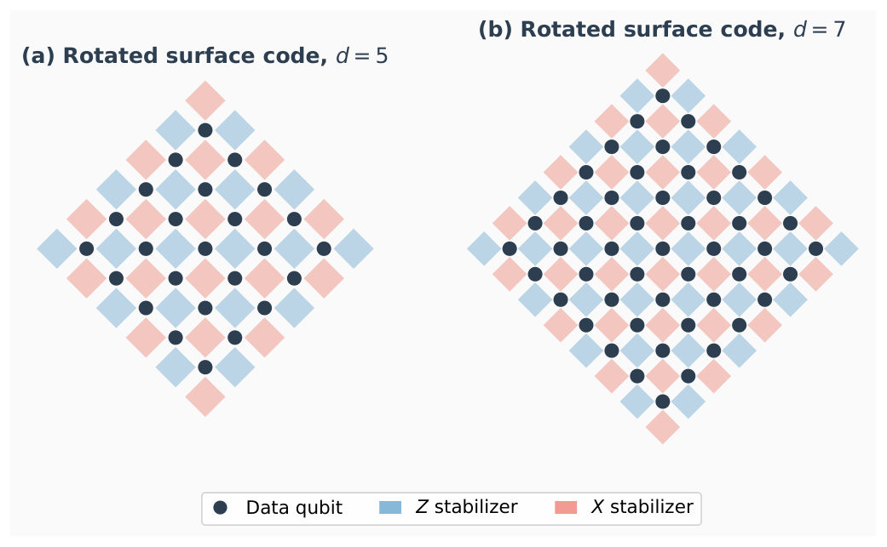
<figcaption class="paper-figure-caption"><b>Fig 1.</b> FIG. 1. Rotated surface code and syndrome graph. (a) Rotated surface code, d = 5: data qubits (dark circles) on a 5 × 5 grid; Z-type stabilisers (blue diamonds) and X-type stabilisers (red diamonds) alternate in a checkerboard pattern; this is the code used throughout. (b) A larger rotated code (d = 7) shown only to illustrate how the layout scales with distance.</figcaption>
</figure>
<figure class="paper-figure-card">
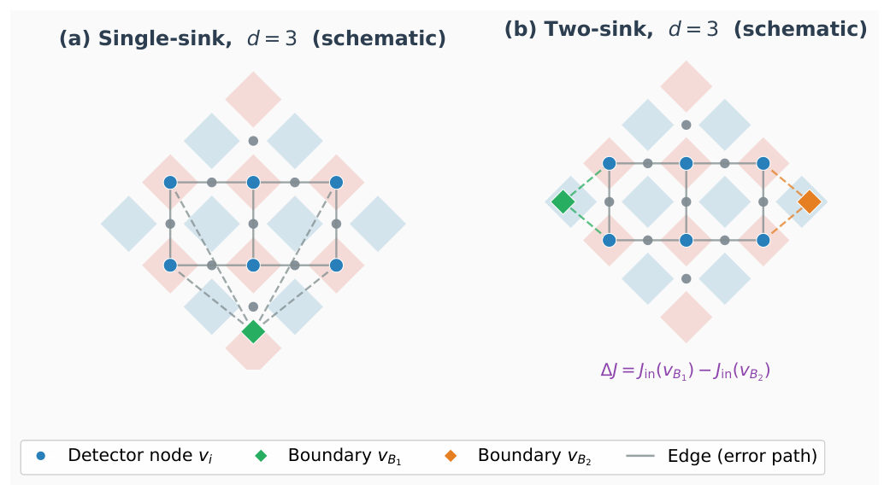
<figcaption class="paper-figure-caption"><b>Fig 2.</b> FIG. 2. Syndrome graph G (schematic): detector nodes (blue circles) sit at stabiliser plaquettes, and an edge connects two nodes if a single data-qubit error excites both. Boundary sinks (diamonds) absorb error chains that reach the code boundary via dashed edges. (a) The single-sink architecture (our baseline) uses one boundary node vb, into which all chains drain. (b) The two-sink architecture (used throughout) places one sink on each of the two code boundaries linked by the logical operator, v(1) b and v(2) b ; the readout is the net current between them, ∆J = Jin(v(1) b )−Jin(v(2) b ) (Sec. III G), read at the boundary rather than across any cut through the bulk (Fig. 3).</figcaption>
</figure>
<figure class="paper-figure-card">
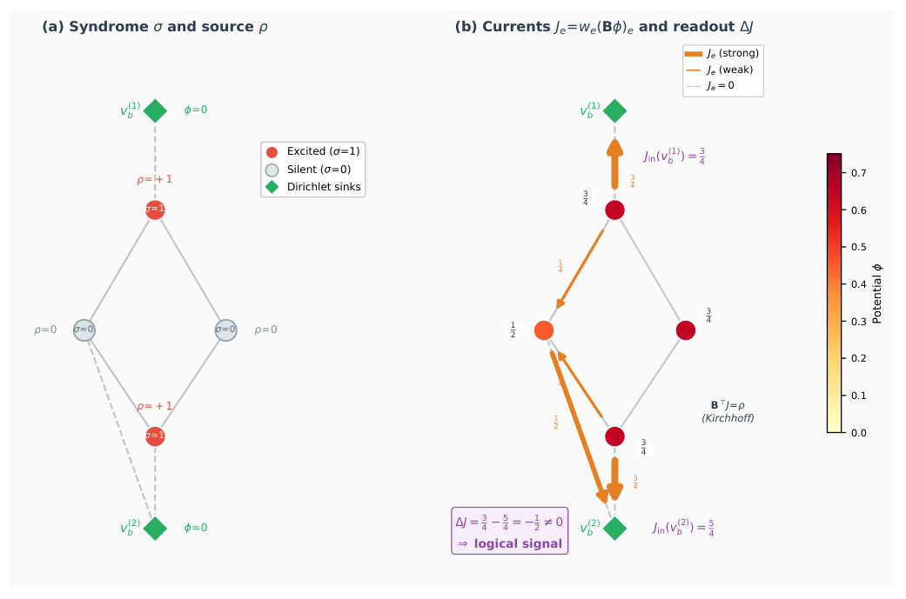
<figcaption class="paper-figure-caption"><b>Fig 3.</b> FIG. 3. Physical interpretation of the two-sink readout on a schematic six-node syndrome graph (four detectors v0–v3 and two boundary sinks v(1) b , v(2) b ), computed exactly with we = 1. (a) Two excited detectors (σ = 1, red) act as sources ρ = +1; silent detectors have ρ = 0. Both sinks are Dirichlet nodes held at ϕv(1) b = ϕv(2) b = 0, so no background charge is imposed on</figcaption>
</figure>
<figure class="paper-figure-card">
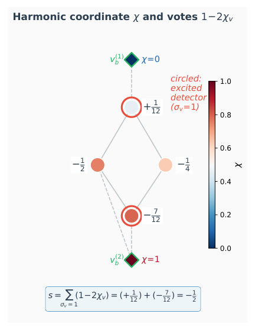
<figcaption class="paper-figure-caption"><b>Fig 4.</b> FIG. 4. The pairing of Eq. (9) on the schematic graph of Fig. 3 (with w = 1; the values shown are specific to this instance and change with the graph, the metric, and the syndrome). Node colour is the harmonic coordinate χ (0 at v(1) b , 1 at v(2) b , harmonic on the interior); each detector carries its vote 1 −2χv, running from +1 at one code boundary to −1 at the other. Summing the votes of the excited detectors (circled) gives s = (+ 1</figcaption>
</figure>
<figure class="paper-figure-card">
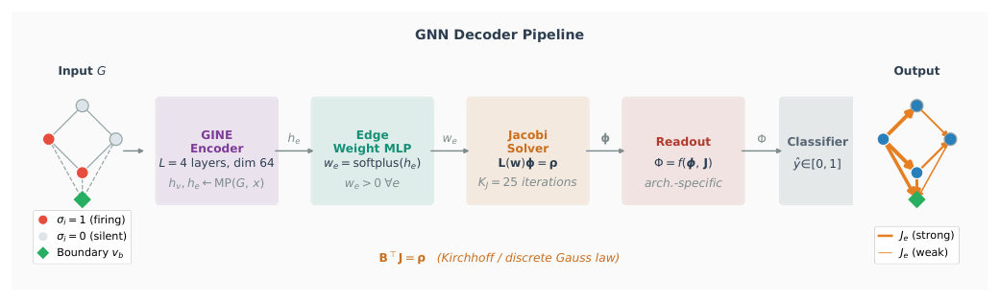
<figcaption class="paper-figure-caption"><b>Fig 5.</b> FIG. 5. Pipeline of the physics-informed GNN decoder. The GINE encoder (L = 4 message-passing layers, hidden dimension 64) maps the input syndrome graph G to syndrome-adaptive edge embeddings, which an MLP converts to positive edge weights we. A Jacobi solver (KJ = 25 iterations) solves the discrete Poisson equation L(w)ϕ = ρ, yielding the node potentials ϕ and the edge-current vector Je = we(Bϕ)e, which satisfies the discrete Gauss law B⊤J = ρ exactly. A readout (Sec. III G) reduces ϕ or J to a scalar, and a classifier MLP maps it to a logical-error probability ˆy ∈[0, 1]. The output panel illustrates schematic edge currents: arrow thickness is proportional to |Je|.</figcaption>
</figure>

**Summary.** The paper introduces a novel physics-informed GNN decoder for surface code quantum error correction. It bypasses limitations of traditional decoders by interpreting the logical error signal not as total current, but as a topological pairing measured by the difference between currents drained at two distinct code boundaries. This approach proves highly effective and scalable to larger code distances.

**Why it may be interesting.** This work provides a mathematically rigorous and physically motivated alternative to standard decoding algorithms by grounding the error measurement in fundamental concepts of topology and differential forms (DEC).

Detailed structure

**Main problem.** Developing a robust decoder for quantum error correction (QEC), specifically for the surface code, that overcomes limitations of traditional methods like Minimum-Weight Perfect Matching (MWPM) when noise models are complex.

**Main result.** The authors propose and demonstrate that measuring the difference in currents drained at two boundary sinks yields a topological pairing signal ($\Delta J$) that accurately matches the best full-field readout for surface codes under circuit-level depolarizing noise.

**Method.** They employ a physics-informed Graph Neural Network (GNN) decoder, embedding a discrete Poisson equation as an inductive bias to calculate edge currents. The key is reading the logical signal from the difference between two boundary sink currents rather than the total current.

**Model / system.** The system modeled is the surface code used to encode one logical qubit on a lattice graph $G$. Syndrome measurements define the graph structure, and the error propagation is governed by discrete exterior calculus principles.

**Key observables.** The primary observable is the topological scalar $\Delta J$, calculated as the difference in currents drained at two designated boundary sinks ($J_{	ext{in}}(v^{(1)}_b) - J_{	ext{in}}(v^{(2)}_b)$).

**Important parameters / regimes.** Code distance $d$ (e.g., $d=5, 7$), noise probability $p$, and the learned metric weights $w$.

**Assumptions / limitations.** The method assumes that placing sinks on both boundaries allows for the isolation of a separating harmonic function ($\chi$) which defines the logical pairing, a structure lost with single-sink readouts.

**Figures summary.** Figures illustrate the rotated surface code structure and the graph setup comparing single-sink versus two-sink architectures. The figures also schematically show current flow satisfying Kirchhoff's law and confirm that the topological pairing calculation matches the sink current difference.

**Paper structure.** The paper introduces the GNN decoder framework, details the use of Discrete Exterior Calculus to enforce physical constraints (Poisson equation), derives the key readout as a boundary-dependent topological pairing ($\Delta J$), validates this readout against full-field methods on increasing code distances, and discusses convergence analysis.

Abstract

We introduce a physics-informed graph neural network decoder for the surface code. A discrete Poisson equation on the syndrome graph acts as a hard inductive bias on which a graph encoder learns syndrome-adaptive edge weights. A differentiable solver returns the node potentials and the associated edge current. Our central observation is that the logical-error signal is not carried by any part of that current, but by how the syndrome sits relative to the two code boundaries. We place a sink on each of the two boundaries linked by the logical operator and read the difference of the currents they drain. We prove that this single number is a topological pairing: it weighs each excited detector by a smooth coordinate that runs from +1 on one boundary to -1 on the other, and sums the votes. The coordinate is fixed by both the code topology and the learned metric, generating an exact and free-parameter readout. On the rotated surface code under circuit-level depolarising noise, this one topological scalar matches the best full-field readout. That parity is itself the result: for one logical qubit the logical signal is one-dimensional, so projecting onto it discards nothing. At larger code distance the picture strengthens indicating that isolating the pairing helps more as the field grows larger and sparser.

[↑ back to top](#top)

### [Robust logical Bell nonlocality based on quantum error correction codes](http://arxiv.org/abs/2607.19728v1)

**Authors:** Qi Zhang, Jia-Wei Ying, Cheng Liu, Lan Zhou, Yu-Bo Sheng  
**Type:** theory · **Category:** quantum information and computing · **PDF:** <https://arxiv.org/pdf/2607.19728v1>  
**Analysis basis:** full PDF text, analyzed in chunks
**Topic relevance:** `correlated / nonlocal dissipation` **1/5** · `entanglement & information structure` **1/5**

↔ Scroll figures horizontally

<figure class="paper-figure-card">
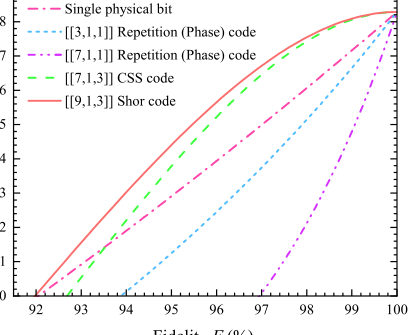
<figcaption class="paper-figure-caption"><b>Fig 1.</b> FIG. 2: The logical CHSH polynomial SCHSH based on a series of stabilizer codes altered with the fidelity F under symmetric noise.</figcaption>
</figure>
<figure class="paper-figure-card">
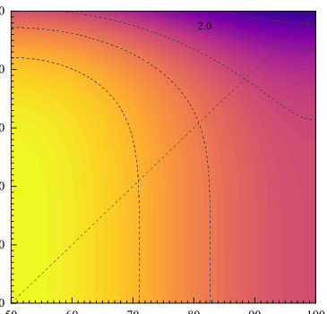
<figcaption class="paper-figure-caption"><b>Fig 2.</b> FIG. 1: The logical CHSH polynomial SCHSH based on [[3, 1, 1]] repetition code alter with the physical bit fidelity Fb and physical phase fidelity Fp.</figcaption>
</figure>
<figure class="paper-figure-card">
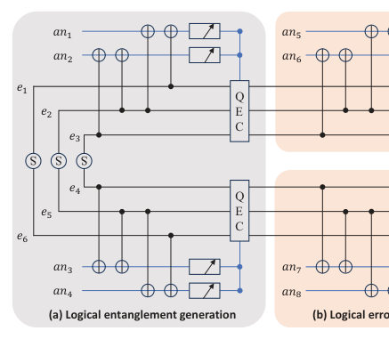
<figcaption class="paper-figure-caption"><b>Fig 3.</b> FIG. 3: The implementation circuit of the logical Bell test for |Φ+ L⟩= 1 √</figcaption>
</figure>

**Summary.** This paper develops a framework to ensure that quantum nonlocality, tested via Bell inequalities, remains robust even when physical qubits suffer from decoherence. By encoding logical qubits using QEC codes like the repetition code, the authors demonstrate that the required fidelity thresholds are significantly improved for practical applications such as DI QKD. This provides a crucial theoretical step toward scalable, fault-tolerant quantum communication.

**Why it may be interesting.** This work directly addresses the scalability bottleneck in quantum information processing by showing how fundamental nonlocality tests can be preserved across error correction layers, which is crucial for building fault-tolerant quantum networks.

Detailed structure

**Main problem.** The study investigates how to maintain robust quantum nonlocality, demonstrated via Bell tests, when using logical qubits protected by Quantum Error Correction (QEC) codes.

**Main result.** Logical Bell nonlocality is proven to be robust against decoherence, significantly increasing the noise thresholds for device-independent quantum key distribution (DI QKD) compared to physical qubit systems.

**Method.** The authors construct a general logical Bell inequality within the stabilizer coding subspace and analyze its violation under various noise models using fidelity calculations.

**Model / system.** The system involves encoding physical qubits into higher-dimensional logical subspaces using stabilizer codes, specifically analyzing $[[3,1,1]]$ and $[[7,1,1]]$ repetition codes. The analysis compares the expected value of the logical CHSH operator against LHV bounds.

**Key observables.** Logical Bell nonlocality violation (e.g., $	ext{SCHSH}$ value), fidelity thresholds ($F_b, F_p$), and the resulting improvement in DI QKD noise thresholds.

**Important parameters / regimes.** Bit-flip error model parameters; specific code parameters like $[[3,1,1]]$ and $[[7,1,1]]$; physical vs. logical fidelity values (e.g., 82.8% vs. 73.10%).

**Assumptions / limitations.** The analysis assumes the stabilizer encoding provides a local isometric mapping that preserves the nonlocal structure, although limitations exist in low-fidelity regimes due to syndrome measurement failures.

**Figures summary.** Figures illustrate $	ext{SCHSH}$ values vs. physical fidelities for specific codes (e.g., $[[7,1,3]]$), and show circuit diagrams for preparing logical Bell states using H and CNOT gates on multiple physical qubits.

**Paper structure.** The paper progresses by first establishing the general framework of logical Bell inequalities in stabilizer subspaces, then quantifying the robustness against bit-flip errors using specific codes, and finally presenting circuit implementations for state preparation and measurement basis transformations.

Abstract

Quantum nonlocality based on the violation of Bell-like inequalities constitutes a fundamental feature of quantum physics and drives the development of device-independent (DI) quantum information technologies. Existing studies of Bell nonlocality have mainly focused on physical qubit systems, where the observed nonlocal correlations are directly encoded in physical degrees of freedom. The decoherence sensitivity of Bell nonlocality largely limits the performance and security of its DI applications. Here, we investigate the robust logical Bell nonlocality based on quantum error correction codes. We construct the general logical Bell inequality in the stabilizer coding subspace and prove its violation indicates the global nonlocal feature of the logical system. Then, we indicate that the logical Bell nonlocality is robust against decoherence. Comparing with the physical qubit system, the fidelity thresholds for the logical Bell inequality violation based on the [[3,1,1]] and [[7,1,1]] repetition codes under the bit-flip error model can be reduced from 82.8% to 73.10% and 66.35%, increasing DI QKD's bit-flip noise threshold from 10.64% to 14.42% and 23.36%, respectively. Such stabilizer-based framework can be also used to characterize the multipartite logical Bell nonlocality in principle. Finally, a logical Bell test implementation circuit based on the [[3,1,1]] repetition code is presented. This work provides a feasible avenue for unlocking robust Bell nonlocality in scalable logical quantum systems and facilitates its applications in future scalable quantum network.

[↑ back to top](#top)

### [Spatially Dispersive Second-Harmonic Generation in Ferroaxial Systems](http://arxiv.org/abs/2607.19821v1)

**Authors:** Takumi Shiro, Satoru Hayami  
**Type:** theory · **Category:** strongly correlated electrons · **PDF:** <https://arxiv.org/pdf/2607.19821v1>  
**Analysis basis:** full PDF text, analyzed in chunks
**Topic relevance:** `Keldysh / 2PI / non-Gaussian methods` **1/5** · `interference shaping light` **1/5**

↔ Scroll figures horizontally

<figure class="paper-figure-card">
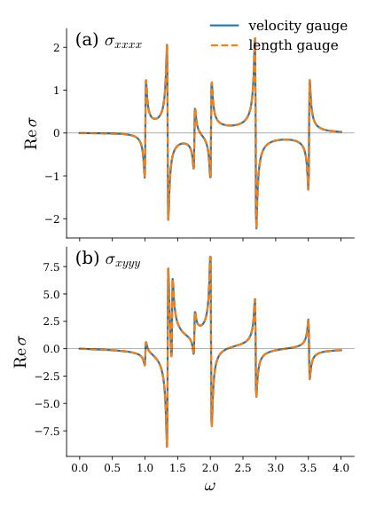
<figcaption class="paper-figure-caption"><b>Fig 1.</b> Fig. 2. Comparison between the length- and velocity-gauge calculations for the real parts of the spatially dispersive SHG conductivity: (a) σxxxx and (b) σxyyy. Solid and dashed lines represent the velocity- and length-gauge results, respectively.</figcaption>
</figure>
<figure class="paper-figure-card">
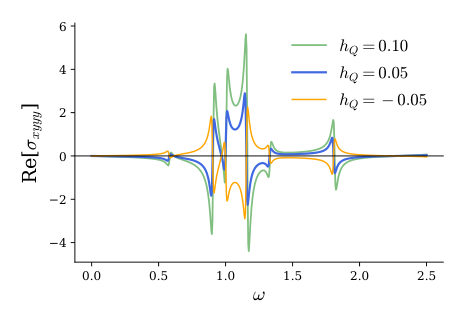
<figcaption class="paper-figure-caption"><b>Fig 2.</b> Fig. 3. Frequency dependence of σxyyy for several values of the ferroaxial mean field hQ.</figcaption>
</figure>
<figure class="paper-figure-card">
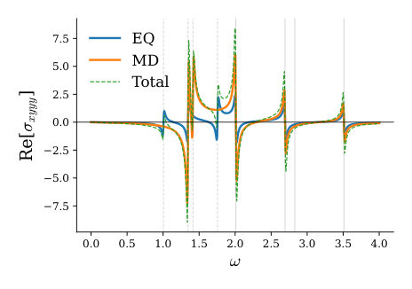
<figcaption class="paper-figure-caption"><b>Fig 3.</b> Fig. 4. Frequency dependence of the EQ, MD, and total contributions to the ferroaxial SHG conductivity Re[σxyyy]. The vertical and solid gray lines denote the resonance energies associated with the ω and 2ω denominators, respectively.</figcaption>
</figure>

**Summary.** This theoretical study develops a rigorous framework to analyze Spatially Dispersive Second-Harmonic Generation (SHG) in ferroaxial materials. By modeling the system with a triangular cluster, the authors show that probing multipolar order requires treating both Electric-Quadrupole and Magnetic-Dipole contributions equally. The findings establish that these two mechanisms are essential for accurately characterizing the material's symmetry state.

**Why it may be interesting.** This work is highly relevant as it bridges nonlinear optics (a key tool in quantum optics) with condensed matter symmetry analysis. The explicit inclusion and quantification of magnetic-dipole contributions alongside electric quadrupole terms provide a sophisticated understanding of multipolar responses in materials lacking inversion symmetry, which is crucial for advanced characterization techniques.

Detailed structure

**Main problem.** To develop a gauge-consistent microscopic theory for Spatially Dispersive Second-Harmonic Generation (SHG) in ferroaxial systems, enabling the probing of centrosymmetric multipolar states beyond simple electric-dipole approximations.

**Main result.** The nonlinear optical response requires both Electric-Quadrupole (EQ) and Magnetic-Dipole (MD) contributions for quantitative description; furthermore, the MD channel can dominate the EQ channel at specific resonances.

**Method.** The authors developed a density-matrix formalism to calculate the second-order nonlinear current density, ensuring gauge consistency by comparing length-gauge and velocity-gauge calculations.

**Model / system.** The study uses a minimal triangular cluster model exhibiting ferroaxial order, which is induced by site-local electric quadrupoles. This order breaks in-plane mirror symmetries while preserving inversion symmetry, leading to an axial dipole moment perpendicular to the plane.

**Key observables.** Spatially dispersive SHG tensor components ($\sigma_{ijkl}$), specifically focusing on $A'_2$ sector components like $\sigma_{xyyy}$, and the decomposition of this response into EQ and MD contributions.

**Important parameters / regimes.** The ferroaxial order parameter ($h_Q$) controls the symmetry breaking; resonance energies and frequency dependence are key diagnostic tools.

**Assumptions / limitations.** The theory assumes that both EQ and MD processes must be treated on equal footing, as neglecting either can lead to an incomplete description of the nonlinear optical response.

**Figures summary.** Figures illustrate the triangular cluster model inducing ferroaxial moments ($G_z$), compare length-gauge vs. velocity-gauge calculations for SHG tensors, and show frequency dependence plots comparing total, EQ, and MD contributions to the measured signal.

**Paper structure.** The paper establishes the theoretical framework by developing a gauge-consistent theory for spatially dispersive SHG in ferroaxial systems. It applies this theory to a triangular cluster model, demonstrating how symmetry breaking induces specific non-zero tensor components ($\sigma_{xyyy}$). Finally, it analyzes the spectral weight decomposition, proving the necessity of both EQ and MD terms.

Abstract

Spatially dispersive second-harmonic generation (SHG) provides a powerful probe of centrosymmetric multipolar states beyond the electric-dipole approximation. We develop a gauge-consistent microscopic theory of spatially dispersive SHG that treats electric-quadrupole (EQ) and magnetic-dipole (MD) processes on equal footing. Applying the formulation to a minimal triangular cluster model with ferroaxial order, which is closely related to an electric toroidal dipole, we show that the nonlinear optical response directly reflects the ferroaxial order parameter. The agreement between length- and velocity-gauge calculations confirms the gauge consistency of the formulation. We further demonstrate that the EQ and MD contributions exhibit different spectral weights despite sharing the same resonance energies. In particular, the MD channel can dominate over the EQ channel at selected resonances, indicating that it is not merely a perturbative correction. Our results establish that both EQ and MD processes are essential for a quantitative description of spatially dispersive SHG in ferroaxial materials and provide a microscopic basis for interpreting nonlinear optical signatures of centrosymmetric multipolar order.

[↑ back to top](#top)

### [Toroidal Transitions in Hydrogenic and Alkali Atoms](http://arxiv.org/abs/2607.19832v1)

**Authors:** Kai Xiang Lee, Vincent Mancois, Kelvin Lim, David Wilkowski  
**Type:** theory · **Category:** other · **PDF:** <https://arxiv.org/pdf/2607.19832v1>  
**Analysis basis:** full PDF text, analyzed in chunks
**Topic relevance:** `quantum measurements` **1/5** · `spintronics-quantum-optics interface` **1/5**

↔ Scroll figures horizontally

<figure class="paper-figure-card">
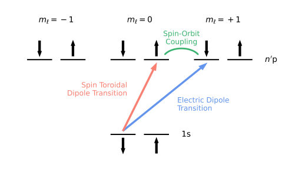
<figcaption class="paper-figure-caption"><b>Fig 1.</b> FIG. 2: Electric dipole (blue) and spin toroidal dipole (red) transitions from the ground state for the hydrogen atom under right-handed circularly-polarized illumination (1s →n′p). The mℓ, ms states are mixed by the spin-orbit coupling (green).</figcaption>
</figure>
<figure class="paper-figure-card">
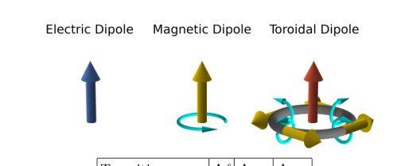
<figcaption class="paper-figure-caption"><b>Fig 2.</b> FIG. 1: Dipoles from each multipole family, along with associated selection rules in the Paschen-Beck regime</figcaption>
</figure>
<figure class="paper-figure-card">
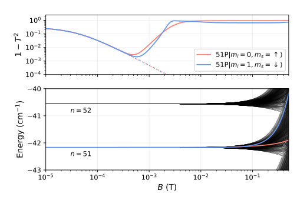
<figcaption class="paper-figure-caption"><b>Fig 3.</b> FIG. 3: Upper: Inverse trace distance of the nearest eigenstate |ψ⟩with the decoupled basis 1 −T 2 = 1 −|⟨ψ|n′, ℓ, mℓ, ms⟩|2 of the competing spin-orbit coupled states for spectroscopy. Without the diamagnetic term (dashed), the trace distance shrinks to arbitrarily small values. The diamagnetic mixing imposes a limit to spin-orbit decoupling, where the system transitions from the Paschen-Beck regime to the ℓ-mixing regime (solid). Lower: Energy spectrum for target state n′ = 51 up to B = 0.5 T. At large magnetic fields, the energy spectra enters the n-mixing regime and exhibits level crossings between states of different n.</figcaption>
</figure>
<figure class="paper-figure-card">
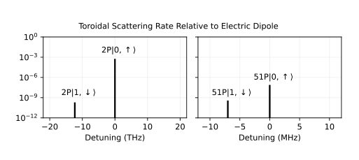
<figcaption class="paper-figure-caption"><b>Fig 4.</b> FIG. 5: Spectroscopy of T1 scattering rates (relative to the dominant E1 transitions) of the 1S →2P transition at B = 886T and the 1S →51P at B = 4.83 × 10−4T. The spectroscopic plots are centered at the probe transitions at λ2P = 120.34795191nm and λ51P = 91.210167421nm respectively.</figcaption>
</figure>
<figure class="paper-figure-card">
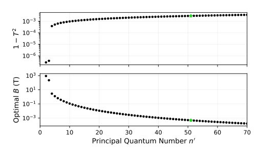
<figcaption class="paper-figure-caption"><b>Fig 5.</b> FIG. 4: Trace distance of the closest eigenstate with the decoupled basis 1 −T 2 and required magnetic field B over n′P states. The maximum decoupling occurs at low n′ for large magnetic fields. The discontinuity for the n′ = 2, 3 states is due to the absence of the ℓ-mixing regime at low n, which raises the threshold for diamagnetic mixing. The previously suggested n′ = 51 state is marked in green.</figcaption>
</figure>

**Summary.** This theoretical study explores toroidal transitions, a subtle multipole moment, in atoms under strong magnetic fields. It derives the relevant Hamiltonian by coupling an atomic spin operator to the displacement current density. The authors conclude that while these transitions are theoretically possible, their observation is severely challenged by dominant E1 backgrounds and requires searching in low-lying states using advanced differential measurement techniques.

**Why it may be interesting.** This work pushes the boundaries of observable atomic physics by predicting and theoretically analyzing transitions beyond standard electric/magnetic multipoles. The detailed treatment of magnetic field effects (diamagnetic coupling) provides crucial context for interpreting future high-field spectroscopic measurements in AMO physics.

Detailed structure

**Main problem.** The paper investigates the theoretical possibility of observing toroidal transitions, a lesser-known multipole moment, in hydrogenic and alkali atoms.

**Main result.** Toroidal transitions are expected to be extremely weak compared to dominant electric dipole (E1) transitions, necessitating advanced differential measurement techniques for detection.

**Method.** The authors derive the spin-toroidal Hamiltonian by coupling the atomic spin-toroidal operator ($\mathcal{C}_s$) to Maxwell's displacement current density ($\mathbf{J}_d$).

**Model / system.** The system involves hydrogenic and alkali atoms subjected to a large static magnetic field ($B_0$) and illuminated by an optical driving field. The analysis uses the Dirac equation framework, incorporating diamagnetic coupling effects.

**Key observables.** Toroidal Dipole ($	ext{T}1$) transition strength relative to $	ext{E}1$ transitions; visibility quantified by state mixing (trace distance).

**Important parameters / regimes.** Low principal quantum numbers ($n < 4$) are suggested as favorable search regions due to diamagnetic effects; high magnetic fields (e.g., $B \sim 886$ T) are required for optimal decoupling.

**Assumptions / limitations.** The $	ext{E}1$ contribution is assumed to always dominate, requiring differential measurement; the analysis relies on approximations valid for $n 
eq n'$ and the use of the Rydberg relation for resonance conditions.

**Figures summary.** Figures illustrate parity properties of multipoles ($	ext{E}, 	ext{M}, 	ext{T}$), compare $	ext{E}1$ vs. $	ext{T}1$ transitions under circular polarization, and show how diamagnetic mixing limits spin-orbit decoupling.

**Paper structure.** The paper systematically derives the toroidal Hamiltonian from fundamental coupling terms ($\mathcal{C}_s$ and $\mathbf{J}_d$), analyzes the resulting matrix elements using recurrence relations, discusses the impact of diamagnetism on state mixing, and proposes differential measurement strategies to isolate the weak signal.

Abstract

In addition to electric and magnetic multipoles, the expansion of current density also yields toroidal terms, a lesser-known family of multipoles. A recent proposal, I. Kuprov $\textit{et al.}$, Science Adv. 8 abq6751 (2022), explores the possibility of a direct observation of optical toroidal transitions in hydrogen and alkali atoms in the presence of a large magnetic field that decouples the spin and the angular momentum of the electron. However, the difficulty of observing these transitions against the nearby electric dipole (E1) transitions were underestimated because of extra admixture coming from diamagnetic coupling. Here, we revisit the toroidal coupling in atoms, taking diamagnetic contribution into account, and discuss the technical challenges of observing toroidal coupling in atomic physics. We show that toroidal transition should be searched in transitions with low principal quantum numbers. The remaining strong electric-dipole contribution could be removed using an appropriate differential measurement.

[↑ back to top](#top)

### [A Multiclass Quantum Aligned Centroid Kernel](http://arxiv.org/abs/2607.19782v1)

**Authors:** Kilian Tscharke, Pascal Debus  
**Type:** both · **Category:** quantum information and computing · **PDF:** <https://arxiv.org/pdf/2607.19782v1>  
**Analysis basis:** full PDF text, analyzed in chunks
**Topic relevance:** `QC/QI experiment` **1/5**

↔ Scroll figures horizontally

<figure class="paper-figure-card">
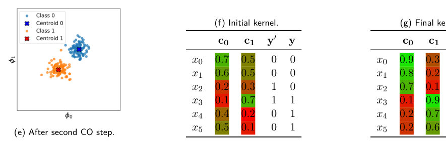
<figcaption class="paper-figure-caption"><b>Fig 1.</b> Figure 1: Schematic overview of the McQuack training process on a binary dataset. (A–E) Data distribution in two dimensions (ϕ0, ϕ1) of the Hilbert space after sequential steps of model training. (A) Initially, the embedding distributes data almost randomly, and the centroids do not represent the class centers well. (B) During the first KAO iteration, the embedding is trained to cluster data points more tightly around their centroids. (C) The first CO iteration optimizes the features of the centroids to shift their position in Hilbert space such that the fidelity with samples from their corresponding class is high and the fidelity with samples from other classes low. (D) The second KAO step...</figcaption>
</figure>
<figure class="paper-figure-card">
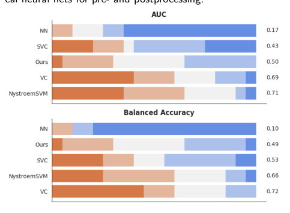
<figcaption class="paper-figure-caption"><b>Fig 2.</b> Figure 2: Number of rankings (blue/first to red/last) for the QML Benchmark suite (left) and real-world datasets (right). The models are sorted from top to bottom according to the average normalized rank, which is listed on the right. The plotting style is adapted from [4].</figcaption>
</figure>
<figure class="paper-figure-card">
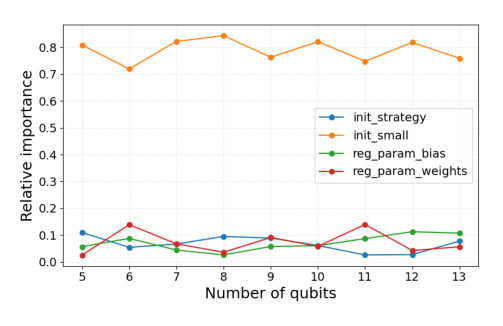
<figcaption class="paper-figure-caption"><b>Fig 3.</b> Figure 3: fANOVA analysis showing the relative impor- tance of individual hyperparameters.</figcaption>
</figure>
<figure class="paper-figure-card">
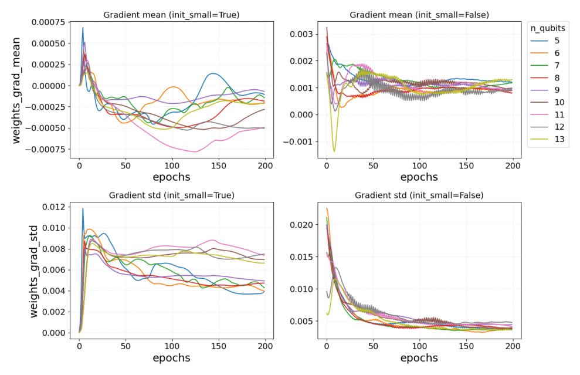
<figcaption class="paper-figure-caption"><b>Fig 4.</b> Figure 4: Mean and standard deviation of the weight gradients computed for the initial batch of the KAO routine on the manifold dataset for the regularized model with wx+b=0 initialization strategy. Note the different scales on the y-axis.</figcaption>
</figure>
<figure class="paper-figure-card">
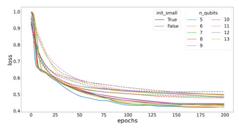
<figcaption class="paper-figure-caption"><b>Fig 5.</b> Figure 5: Training loss for different system sizes and magnitudes of the initial parameters on the manifold dataset for the regularized model with wx+b=0 initial- ization strategy.</figcaption>
</figure>

**Summary.** This paper introduces McQuack, a novel and efficient quantum kernel method designed for multiclass classification. It overcomes major bottlenecks in existing quantum kernel approaches by using a class-centroid fidelity matrix, achieving linear scaling with data size. The results demonstrate strong performance both in simulation and on real quantum hardware, while also confirming the model's trainability.

**Why it may be interesting.** It directly addresses the practical limitations of applying quantum computation to machine learning tasks by proposing a scalable, trainable kernel method suitable for near-term noisy intermediate-scale quantum (NISQ) devices.

Detailed structure

**Main problem.** The authors aim to develop an efficient, trainable quantum kernel method for multiclass classification that overcomes the quadratic scaling and fixed nature of traditional full-Gram kernels.

**Main result.** The proposed McQuack kernel achieves linear scaling in both training samples and classes, outperforming pure quantum baselines in simulation and matching RBF performance on hardware inference without explicit training.

**Method.** McQuack replaces the full Gram matrix with a trainable sample-to-(class-centroid) fidelity matrix, allowing for shared parameters across all class classifiers.

**Model / system.** The method is evaluated using quantum kernels defined by state fidelity $|\langle\psi_j|\psi_i
angle|^2$, implemented on 124-qubit subgraphs of IBM quantum devices and simulated environments.

**Key observables.** Classification accuracy (compared to RBF kernel, SVC, MLP), training complexity ($O(n_{	ext{train}} M)$), and the absence of barren plateaus up to 13 qubits.

**Important parameters / regimes.** Training parameters ($\mathbf{w}, \mathbf{b}$) and class centroids ($\mathbf{c}_m$); hardware qubit count (up to 124).

**Assumptions / limitations.** The method assumes that classes can be well-represented by centroids in the Hilbert space; training on actual quantum hardware is currently infeasible due to long runtimes.

**Figures summary.** Figure 12 illustrates the circuit architecture used to implement a quantum kernel measurement (probability of measuring the all-zero state).

**Paper structure.** The paper introduces McQuack, details its linear scaling mechanism using class centroids, provides theoretical background on QKMs and Kernel Target Alignment, evaluates performance in simulation against baselines, tests hardware inference, and analyzes trainability diagnostics.

Abstract

Kernel methods are powerful tools in machine learning but commonly used full-Gram kernels face three key limitations: (1) quadratic scaling with training set size; (2) the use of fixed, non-trainable kernels; and (3) the absence of an intrinsic formulation for multiclass classification. We present McQuack, a trainable quantum kernel method for multiclass problems that achieves linear scaling in the number of training samples. This is accomplished by replacing the full training-set Gram matrix with a trainable sample-to-(class-centroid) fidelity matrix. We evaluate the model in simulation and on 124 qubits of two IBM devices, across more than 150 datasets. In simulation, McQuack outperforms existing "pure" quantum baselines, while results from hardware inference -- obtained without training -- achieve performance similar to an RBF kernel. Finally, we study the trainability of the model and observe no evidence of barren plateaus in our experiments with up to 13 qubits, and highlight the importance of parameter initialization for successful optimization.

[↑ back to top](#top)

### [Angular Momentum Quantization of a Charge-flux Composite: Quantum Electrodynamic Approach](http://arxiv.org/abs/2607.20283v1)

**Authors:** Kicheon Kang  
**Type:** theory · **Category:** other · **PDF:** <https://arxiv.org/pdf/2607.20283v1>  
**Analysis basis:** full PDF text, analyzed in chunks
**Topic relevance:** `Keldysh / 2PI / non-Gaussian methods` **1/5**

↔ Scroll figures horizontally

<figure class="paper-figure-card">
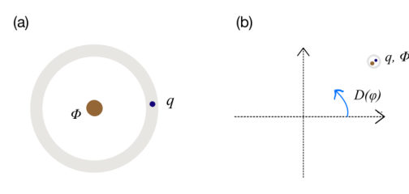
<figcaption class="paper-figure-caption"><b>Fig 1.</b> FIG. 1. (a) A two-dimensional charge-flux composite consist- ing of a charge q and a magnetic flux Φ. (b) The composite treated as an isolated quantum system in a fully symmetric free space.</figcaption>
</figure>
<figure class="paper-figure-card">
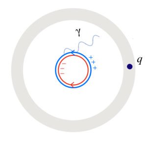
<figcaption class="paper-figure-caption"><b>Fig 2.</b> FIG. 2. A two-dimensional quantum analog of Feynman’s disk paradox. Two infinitesimally close, counter-rotating loops carrying opposite charges generate the central magnetic flux. A weak internal dissipative interaction, such as radiative damping, slows the loops to a complete rest. This allows the transfer of their mechanical angular momentum to the sur- rounding vacuum via the emission of photons (γ). Meanwhile, the adiabatic switching offof the flux induces an azimuthal electric field that imparts an additional angular momentum of exactly +qΦ/2π to the external charge q via Faraday’s law of induction.</figcaption>
</figure>

**Summary.** This paper resolves the paradox of angular momentum quantization for charge-flux composites by moving beyond semiclassical models to a full Quantum Electrodynamic treatment. The key finding is that the interaction with the vacuum electromagnetic field generates a compensating angular momentum term. This ensures the total angular momentum strictly adheres to integer or half-integer quantization, confirming the robustness of fundamental symmetries in 2D quantum systems.

**Why it may be interesting.** It provides a deep theoretical understanding of how gauge-invariant interactions (like those mediated by vacuum fields) can enforce fundamental symmetries and conservation laws on exotic quantum systems, which is relevant for understanding topological order or fractional statistics.

Detailed structure

**Main problem.** The paper resolves a conceptual conflict regarding the quantization of angular momentum for a two-dimensional charge-flux composite when treated as an isolated system in free space.

**Main result.** By employing a full Quantum Electrodynamic (QED) approach, the authors show that the interaction between the charge and flux generates an intrinsic angular momentum that exactly compensates for the fractional part of the kinetic angular momentum, restoring strict integer or half-integer quantization.

**Method.** The analysis uses Noether's theorem applied to a full QED Lagrangian formalism, contrasting these results with insufficient semiclassical Hamiltonian treatments.

**Model / system.** The system is a two-dimensional charge-flux composite (anyon). The theoretical framework involves coupling the particle dynamics to the vacuum electromagnetic field via a QED Lagrangian.

**Key observables.** Total angular momentum ($\mathbf{L}$), kinetic angular momentum ($\langle L_k 
angle$), and interaction angular momentum ($\langle L_{	ext{int}} 
angle$).

**Important parameters / regimes.** The flux $\Phi$ and the charge $q$ are key parameters determining the fractional part of the initial expectation value.

**Assumptions / limitations.** The semiclassical approach is insufficient; a full QED treatment incorporating vacuum field interactions is necessary to resolve the quantization paradox.

**Figures summary.** Figure 2 illustrates the two-dimensional quantum analog of Feynman’s disk paradox, detailing flux generation and adiabatic switching off.

**Paper structure.** The paper contrasts semiclassical results (which fail) with a rigorous QED derivation using Noether's theorem. It identifies the compensating interaction term that restores quantization, while also noting the failure of standard field definitions in 2D due to boundary terms.

Abstract

The fractional angular momentum of a two-dimensional charge-flux composite is a well-established phenomenon usually derived from a semiclassical Hamiltonian. However, when the composite is treated as an isolated system in free two-dimensional space, the fundamental rotational and reflection symmetries of the $O(2)$ group demand that its total angular momentum is strictly quantized. We address this conceptual discrepancy by applying a full quantum electrodynamic (QED) approach combined with Noether's theorem. We demonstrate that the interaction between the charge and flux, mediated by the vacuum electromagnetic field, generates an intrinsic interaction angular momentum composed of both field momentum and hidden relativistic momentum. This gauge-invariant interaction angular momentum exactly compensates for the fractional part of the kinetic angular momentum. Consequently, the net angular momentum of the composite strictly follows the integer or half-integer quantization rule. Our formalism clarifies that the conventional fractional spin corresponds to the expectation value of the kinetic angular momentum within the perturbed QED ground state. It also elucidates why the standard classical field angular momentum definition fails to capture this in two dimensions, due to non-vanishing boundary terms.

[↑ back to top](#top)

### [Anticoncentration of the Permanent in Ginibre Ensembles](http://arxiv.org/abs/2607.20329v1)

**Authors:** Frederic Koehler, Pui Kuen Leung  
**Type:** theory · **Category:** other · **PDF:** <https://arxiv.org/pdf/2607.20329v1>  
**Analysis basis:** full PDF text, analyzed in chunks
**Topic relevance:** `Keldysh / 2PI / non-Gaussian methods` **1/5**

↔ Scroll figures horizontally

<figure class="paper-figure-card">
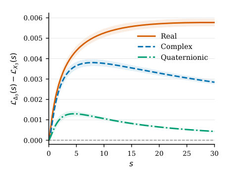
<figcaption class="paper-figure-caption"><b>Fig 1.</b> Figure 1. Monte Carlo comparison of the normalized determinantal benchmark ∆K 3 and normalized squared permanent XK 3 for 3×3 Ginibre matrices over K ∈{R, C, H}. Over H, the benchmark uses the Study determinant and the permanent is row-ordered. The estimates use 3×106 samples in each field; shaded bands show two standard errors. One Gaussian row is integrated out analytically.</figcaption>
</figure>

**Summary.** This theoretical paper proves the 'Anticoncentration' property for the permanent of Ginibre random matrices over real, complex, and quaternionic fields. By comparing the permanent to the determinant using advanced tools like Laplace transforms, it resolves a major conjecture (PACC) and establishes tight bounds on the distribution of this key random matrix observable.

**Why it may be interesting.** While highly mathematical, random matrix theory is foundational to quantum physics, especially in characterizing spectral statistics and entanglement measures derived from Gaussian ensembles. The study of permanents versus determinants touches upon non-Gaussian correlations relevant in complex physical models.

Detailed structure

**Main problem.** The paper addresses the 'Anticoncentration of the Permanent' for Ginibre ensembles, a problem related to the permanent Anticoncentration Conjecture (PACC). It seeks to establish bounds on the distribution of the normalized row-ordered permanent.

**Main result.** For $K=\mathbb{C}$, the authors resolve the PACC by proving that the normalized permanent has a radial density with specific concentration bounds. They also established general anticoncentration results for $\mathbb{R}, \mathbb{C},$ and $\mathbb{H}$ fields.

**Method.** The proof employs advanced techniques comparing the squared Gaussian permanent to the squared determinant in Laplace-transform order, utilizing inductive arguments and characteristic functions derived from properties of Gaussian distributions over different algebras ($\mathbb{R}, \mathbb{C}, \mathbb{H}$).

**Model / system.** The model involves $n 	imes n$ random matrices ($G_n^{\mathbb{K}}$) whose entries are independent and identically distributed (i.i.d.) standard $\mathbb{K}$-Gaussian variables, where $\mathbb{K}$ can be the real ($\mathbb{R}$), complex ($\mathbb{C}$), or quaternionic ($\mathbb{H}$) numbers.

**Key observables.** The normalized row-ordered permanent $W_n^{\mathbb{K}} = 	ext{per}_{\mathbb{K}}G_n^{\mathbb{K}}/\sqrt{n!}$, and its associated radial density $p_n^{\mathbb{K}}$.

**Important parameters / regimes.** The dimension $eta = \dim_{\mathbb{R}}\mathbb{K} \in \{1, 2, 4\}$, and the matrix size $n$.

**Assumptions / limitations.** The analysis relies heavily on comparing moments and distributions using Laplace transforms ($\le_{Lt}$), which is shown to be a strong tool but requires careful handling across different algebraic structures.

**Figures summary.** Not specified, but notes mention Monte Carlo comparisons showing sign changes in CDF differences for $\Delta_K^3 - X_K^3$ versus non-negative signs for Laplace transform differences.

**Paper structure.** The paper develops results by first establishing benchmarks using the determinant and Study determinant across different fields. It then uses inductive arguments, characteristic functions, and specialized comparison theorems (like Lemma C.5) to prove the anticoncentration bounds for the permanent itself.

Abstract

Let $\mathbb{K}\in\{\mathbb{R},\mathbb{C},\mathbb{H}\}$, put $β=\dim_{\mathbb{R}}\mathbb{K}$, and let $G_n^{\mathbb{K}}$ be an $n\times n$ matrix with i.i.d. standard $\mathbb{K}$-Gaussian entries, namely a standard $\mathbb{K}$-Ginibre matrix. We prove that the normalized row-ordered permanent $W_n^{\mathbb{K}}=\operatorname{per}_{\mathbb{K}}G_n^{\mathbb{K}}/\sqrt{n!}$ has a radial density $p_n^{\mathbb{K}}$ satisfying $\|p_n^{\mathbb{K}}\|_\infty=p_n^{\mathbb{K}}(0)\lesssim_βn^{(β+2)/4}$ and $\sup_{z\in\mathbb{K}}\mathbb{P}(|W_n^{\mathbb{K}}-z|\leq\varepsilon)\lesssim_βn^{(β+2)/4}\varepsilon^β$. In particular, for $\mathbb{K}=\mathbb{C}$, this resolves the Permanent Anticoncentration Conjecture of Aaronson and Arkhipov. The proof compares the squared Gaussian permanent with the squared (Study) determinant in Laplace-transform order.

[↑ back to top](#top)

### [Efficiently Simulable Pauli Correlation Encoding](http://arxiv.org/abs/2607.20409v1)

**Authors:** Daniele Lizzio Bosco, Gabriel Matos, Chen-Yu Liu, Frederic Rapp, Fabian Finger, Enrico Rinaldi, Konstantinos Meichanetzidis  
**Type:** theory · **Category:** quantum information and computing · **PDF:** <https://arxiv.org/pdf/2607.20409v1>  
**Analysis basis:** full PDF text, analyzed in chunks
**Topic relevance:** `quantum measurements` **1/5**

↔ Scroll figures horizontally

<figure class="paper-figure-card">
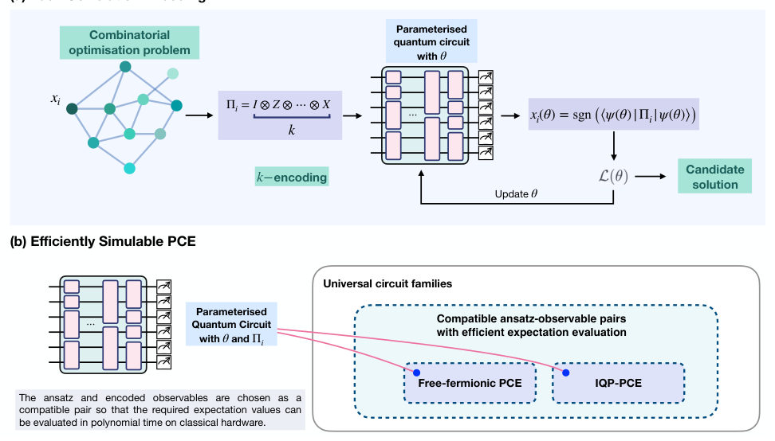
<figcaption class="paper-figure-caption"><b>Fig 1.</b> FIG. 1: Schematic comparison between standard PCE and efficiently simulable PCE. (a) In standard PCE, binary variables are encoded into Pauli observables, whose expectation values are evaluated using a parameterised quantum circuit and decoded into a candidate solution. (b) In efficiently simulable PCE, the ansatz family and encoded observables are chosen as a compatible pair so that all expectation values required for training and decoding can be evaluated in polynomial time on classical hardware. Free-fermionic PCE and IQP-PCE are two examples of such classically simulable realisations.</figcaption>
</figure>
<figure class="paper-figure-card">
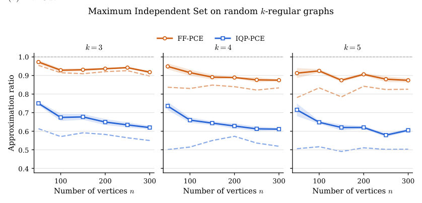
<figcaption class="paper-figure-caption"><b>Fig 2.</b> FIG. 2: Results on random k-regular graphs for k ∈{3, 4, 5}. Panel (a) reports MaxCut approximation ratios, while panel (b) reports Maximum Independent Set approximation ratios. Solid curves correspond to solutions after one greedy local-search pass, whereas dashed curves show the raw decoded solutions before local search. FF-PCE achieves consistently strong performance on both tasks, whereas IQP-PCE attains the best MaxCut results but exhibits a marked degradation on MIS.</figcaption>
</figure>
<figure class="paper-figure-card">
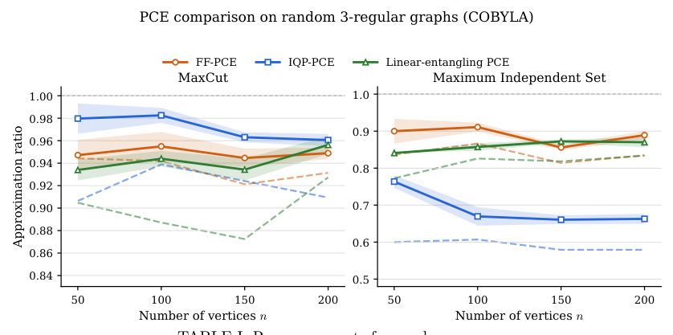
<figcaption class="paper-figure-caption"><b>Fig 3.</b> FIG. 3: Comparison between FF-PCE, IQP-PCE, and a linear-entangling PCE baseline on random 3-regular graphs, using COBYLA with 10 000 iterations for all methods. Left: MaxCut approximation ratios. Right: Maximum Independent Set approximation ratios. Solid curves report the post-local-search solution quality with shadowed area representing standard deviation, while dashed curves report the raw decoded solution before local search.</figcaption>
</figure>
<figure class="paper-figure-card">
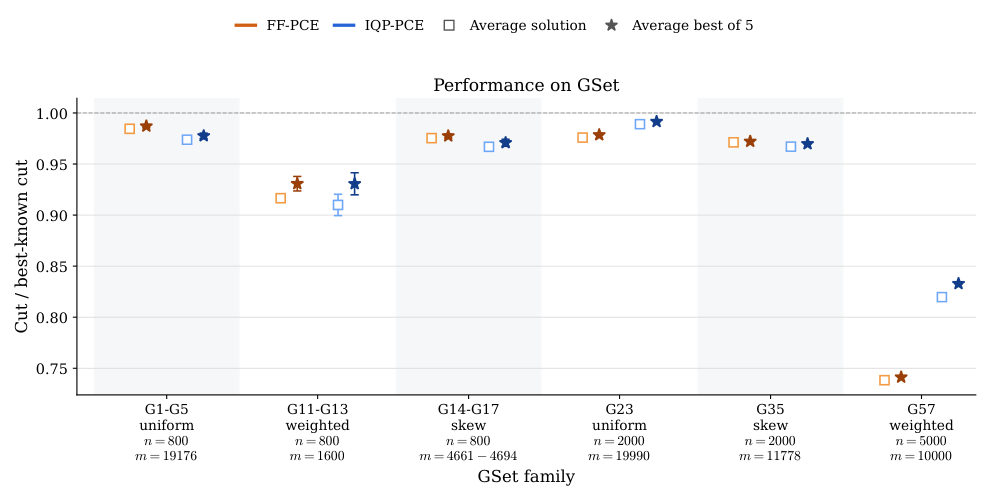
<figcaption class="paper-figure-caption"><b>Fig 4.</b> FIG. 4: Results on selected instances classes from GSet, corresponding to G1-G5, G11-G13, G14-G17, G23, G35, and G57. Boxes represent the average solution over 5 different runs and different instances; stars represent the average score of the best run for each instance. For instance families, lines represent the standard deviation between different instances. Finally, n and m corresponds to number of nodes and edges respectively in the corresponding class.</figcaption>
</figure>
<figure class="paper-figure-card">
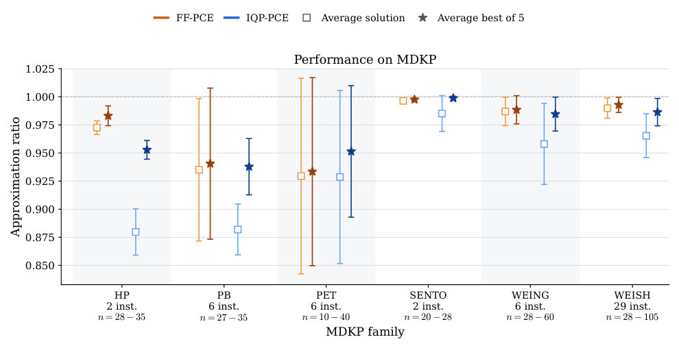
<figcaption class="paper-figure-caption"><b>Fig 5.</b> FIG. 5: Results on the SAC-94 Multi-Dimensional Knapsack Problem benchmark. Instances are grouped by family: HP, PB, PET, SENTO, WEING, and WEISH. Empty squares report the average approximation ratio over 5 independent runs, while stars report the average best solution found among those 5 runs. Error bars indicate the standard deviation across the corresponding family. All reported values are computed after feasibility repair and single-bit-flip local search. FF-PCE achieves consistently high solution quality across most families, while IQP-PCE is more variable but remains competitive on PET, SENTO, WEING, and WEISH.</figcaption>
</figure>

**Summary.** This paper tackles the measurement bottleneck in Pauli Correlation Encoding (PCE) by developing 'efficiently simulable' variants. These methods allow the necessary expectation values to be computed efficiently using free-fermionic or IQP circuits, rather than requiring costly quantum measurements. This work establishes a strong classical baseline for evaluating quantum approaches to hard combinatorial optimization problems.

**Why it may be interesting.** The development of classically simulable quantum encoding schemes provides crucial theoretical tools for benchmarking the scaling and power of future quantum hardware implementations in optimization.

Detailed structure

**Main problem.** The primary challenge addressed is the measurement overhead associated with Pauli Correlation Encoding (PCE) when estimating expectation values for combinatorial optimization problems.

**Main result.** The authors introduce 'efficiently simulable PCE' variants, which allow all necessary expectation values to be computed classically, providing a powerful dequantized baseline for future quantum algorithm development.

**Method.** They construct specific classes of Pauli correlation encodings using free-fermionic evolutions (via matchgate circuits) or IQP circuits, ensuring classical tractability of the required measurements.

**Model / system.** The framework encodes classical binary variables into expectation values of many-body Pauli observables. The simulation is instantiated using free-fermionic Hamiltonians and general IQP ansatzes parameterized by rotations.

**Key observables.** Signs of Pauli expectation values ($	ext{sgn}(\langle \Pi_i 
angle_	heta)$), the normalized merit factor ($
ho_F$), and solution quality on benchmarks like MaxCut and MDKP.

**Important parameters / regimes.** The required precision $\epsilon$ dictates measurement cost, which is a key focus for improvement; problem sizes range from tens to thousands of variables.

**Assumptions / limitations.** The core assumption is that the necessary expectation values can be generated by choosing a 'compatible pair' $(\Pi, U)$ such that classical simulation is efficient, bypassing costly quantum measurements.

**Figures summary.** Figures compare FF-PCE and IQP-PCE performance on MaxCut and MDKP instances, showing competitive solution quality. Figure 8 specifically compares the approximate LABS merit factor ($
ho_F$) for different PCE variants against local search baselines.

**Paper structure.** The paper first establishes the limitations of standard PCE due to measurement overhead. It then introduces and details the construction of efficiently simulable PCE using free-fermionic and IQP circuits. Finally, it benchmarks these methods on several combinatorial optimization problems (MaxCut, MDKP, LABS) to validate their performance.

Abstract

Pauli Correlation Encoding (PCE) is a heuristic framework for binary optimisation that encodes classical variables into many-body Pauli observables. While PCE requires fewer qubits than other approaches, it relies on estimating a large number of Pauli expectation values whose signs determine the variables' values, which can incur substantial measurement overhead. Here, we introduce efficiently simulable PCE, a class of dequantised PCE realisations where all expectation values needed can be computed efficiently classically. We instantiate this idea using free-fermionic evolutions, realised by matchgate circuits, and Instantaneous Quantum Polynomial (IQP) circuits. On MaxCut, Maximum Independent Set, Multi-Dimensional Knapsack, and Max3SAT benchmarks, these methods produce high-quality solutions across problem sizes ranging from tens to thousands of variables. Our results show that PCE is naturally understood as a correlation-based optimisation framework with both quantum and classically simulable realisations. This yields a dequantised baseline for evaluating future quantum PCE implementations.

[↑ back to top](#top)

### [Exact static exchange benchmark for the uniform electron gas: Dynamic-kernel tests and exchange-correlation cancellation near 2kF](http://arxiv.org/abs/2607.20403v1)

**Authors:** Carl A. Kukkonen  
**Type:** theory · **Category:** strongly correlated electrons · **PDF:** <https://arxiv.org/pdf/2607.20403v1>  
**Analysis basis:** full PDF text, analyzed in chunks
**Topic relevance:** `Keldysh / 2PI / non-Gaussian methods` **1/5**

↔ Scroll figures horizontally

<figure class="paper-figure-card">
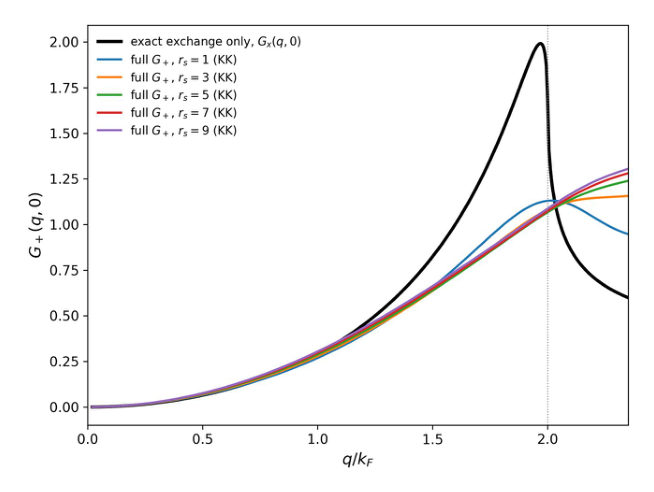
<figcaption class="paper-figure-caption"><b>Fig 1.</b> Fig. 1. Preview of the paper’s central result. The exact, universal static exchange-only local field factor Gx(q,0) (black, Eq. (5), derived in Section II) compared with the full G+(q,0) at rs = 1, 3, 5, 7, 9 from the Kaplan-Kukkonen QMC-consistent representation [4] (colored; same rs values and color coding as Fig. 4). Exchange alone produces a sharp peak near 2kF of magnitude 1.99, more than twice the height of the full result at every density shown, while the full G+ curves are mutually close and nearly flat across the whole band 0 ≤ q ≤ 2kF. Sections II–III establish Gx exactly and benchmark existing dynamic exchange kernels against it; Section IV works out the linear-response...</figcaption>
</figure>
<figure class="paper-figure-card">
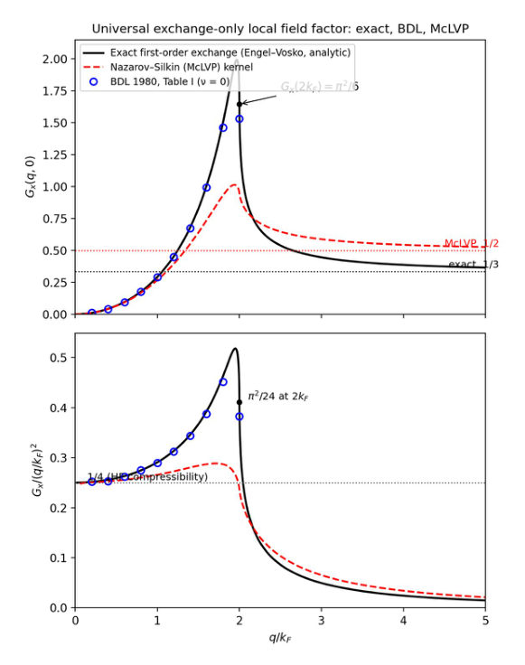
<figcaption class="paper-figure-caption"><b>Fig 2.</b> Fig. 2. Top: the exact universal static exchange-only local field factor Gx(q,0), Eq. (5) (solid), compared with the Nazarov-Silkin McLVP exchange kernel [14] (dashed; rs = 2 data shown, but both curves are universal). Open circles: the 1980 BDL tabulation (ν = 0 row of their Table I [9]). The exact value π2/6 at 2kF is marked; horizontal dotted lines show the exact large-q limit 1/3 and the McLVP limit 1/2. Bottom: Gx/(q/kF)2, showing the exact rise from the compressibility-sum-rule value 1/4 to π2/24 at 2kF; the exact kernel is far from flat.</figcaption>
</figure>
<figure class="paper-figure-card">
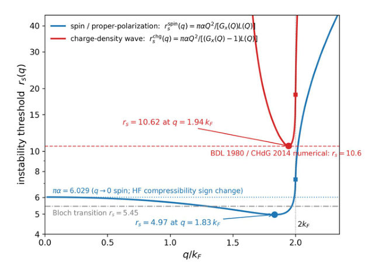
<figcaption class="paper-figure-caption"><b>Fig 3.</b> Fig. 3. Static local-kernel instability thresholds built from the exact adiabatic exchange kernel, Eq. (8), computed consistently at each wavevector from the exact closed form, Eq. (5). Spin channel (blue): minimum rs = 4.97 at q = 1.83kF; the dash-dotted line marks the Bloch transition rs = 5.45, and the dotted blue line the q →0 limit of the spin/proper-polarization condition, πα = 6.029, which is also the Hartree-Fock compressibility sign change; the charge condition has no long-wavelength solution. Charge channel (red): defined where Gx &gt; 1 (1.60kF &lt; q &lt; 2.05kF), minimum rs = 10.62 at q = 1.944kF, in agreement with the numerical minimum rs ≈ 10.6 near q = 1.94kF of BDL Fig. 2 [9]...</figcaption>
</figure>
<figure class="paper-figure-card">
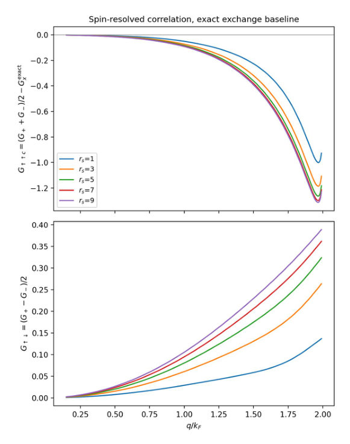
<figcaption class="paper-figure-caption"><b>Fig 4.</b> Fig. 4. Spin-resolved decomposition of the Kaplan-Kukkonen static local field factors [4] about the exact exchange baseline, Eq. (5), for rs = 1, 3, 5, 7, 9. Top: parallel-spin correlation contribution G↑↑c = (G+ + G−)/2 − Gx. Bottom: antiparallel-spin local field factor G↑↓= (G+ − G−)/2, which is pure correlation and shows no 2kF structure within the resolution and smoothness assumptions of the KK representation.</figcaption>
</figure>

**Summary.** This work establishes an exact theoretical benchmark for the static exchange-only local field factor in the uniform electron gas. By deriving this universal function, the authors critically test and demonstrate the quantitative failures of several established approximations (like BDL or McLVP) near the Fermi surface singularity at $2k_F$. The findings illuminate that observed physical behavior is governed by a precise cancellation between correlation and exchange effects.

**Why it may be interesting.** While focused on electron gas theory, the rigorous benchmarking of correlation effects at finite momentum ($q 
eq 0$) provides fundamental insights into how screening modifies particle interactions, which is crucial for understanding correlated materials.

Detailed structure

**Main problem.** To establish an exact, universal benchmark for the static local field factors of the uniform electron gas (UEG), particularly addressing unexplained features near $2k_F$.

**Main result.** The paper derives and presents the exact exchange-only local field factor, $G_x(q,0)$, which shows specific limiting behaviors ($q^2/4$ at small $q$, $\pi^2/6$ at $2k_F$, and $1/3$ at large $q$).

**Method.** The authors combine textbook local-field relations with exact static exchange polarizabilities derived from QMC calculations to construct a closed-form, universal benchmark.

**Model / system.** The system is the Uniform Electron Gas (UEG), analyzed in the static limit ($\omega=0$) using density functional theory concepts applied to correlation functions.

**Key observables.** Static local field factors ($G^+$), the exchange-only factor $G_x(q,0)$, and spin-resolved components of these factors.

**Important parameters / regimes.** The wavevector $q$, normalized by $2k_F$ (using variable $Q$), and the density parameter $r_s$.

**Assumptions / limitations.** The analysis assumes that QMC representations are smooth enough to reveal underlying systematic cancellations between correlation and exchange contributions.

**Figures summary.** Figures compare the exact universal $G_x(q,0)$ against approximations from older theoretical kernels (BDL, McLVP), showing significant quantitative discrepancies in the comparison plots.

**Paper structure.** The paper establishes the physical problem by noting unexplained features in QMC data; it then derives the exact benchmark formula for $G_x$; subsequently, it rigorously compares this benchmark against established approximations and analyzes the underlying cancellation mechanisms near $2k_F$.

Abstract

The static local field factors of the uniform electron gas are known accurately from quantum Monte Carlo (QMC) calculations, but two of their most striking features have lacked a mechanism: $G_+$ grows almost exactly as $q^2$ up to nearly $2k_F$, and the violent $2k_F$ physics of the Fermi surface leaves only a faint trace in it. Combining the textbook first-order local-field relation with the exact static exchange polarizability gives a compact exact benchmark: the universal exchange-only local field factor $G_x(q,0) = -I(Q)Q^2/L(Q)^2$, $Q = q/2k_F$, with exact values $(1/4)(q/k_F)^2$ at small $q$, $π^2/6$ at $2k_F$ -- apparently never before stated as a local-field value -- and $1/3$ at large $q$, giving the exchange-only spin-averaged contact value $g(0) = 1/2$ of the unpolarized gas (BDL 1977). $G_x$ rises to a finite maximum of 1.9924 at $1.9685k_F$ and passes through $π^2/6$ at exactly $2k_F$ with a slope diverging as $\ln^3|q-2k_F|$. Against this benchmark, the 1980 BDL tabulation is accurate to about one percent below $1.5k_F$, while the 2024 McLachlan-variational kernel of Nazarov and Silkin is two-percent accurate only below $0.5k_F$, is a factor of 1.74 low at $2k_F$, and its large-q limit is inconsistent with the contact constraint. A spin-resolved decomposition of QMC local field factors about the exact baseline shows that, within the resolution and smoothness assumptions of the QMC-based representations, both features follow from a strong exchange-correlation cancellation: at the QMC point closest to $2k_F$ ($q = 2.01k_F$, $r_s = 2$), correlation cancels 0.43(7) of the exact exchange value 1.33. Computed consistently at each wavevector, the static exchange-kernel thresholds derived from the closed form reproduce, to 0.2%, the finite-wavevector charge threshold $r_s \approx 10.6$ near $q = 1.94k_F$ obtained numerically in 1980, and recovered again in 2014.

[↑ back to top](#top)

### [Observable Geometry for Effective Quantum Circuits](http://arxiv.org/abs/2607.20198v1)

**Authors:** Huan-Hsin Tseng, Hsin-Yi Lin, Samuel Yen-Chi Chen, Yan Mong Chan, Tzu-Chieh Wei, Shinjae Yoo  
**Type:** both · **Category:** quantum information and computing · **PDF:** <https://arxiv.org/pdf/2607.20198v1>  
**Analysis basis:** full PDF text, analyzed in chunks
**Topic relevance:** `entanglement & information structure` **1/5**

↔ Scroll figures horizontally

<figure class="paper-figure-card">
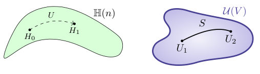
<figcaption class="paper-figure-caption"><b>Fig 1.</b> Fig. 1: [Left] Motions in observable space H(n) via a unitary. [Right] A subset of U(V ), giving a constant in map U 7→ U †HU for fixed H as (1), is identified by S in (2).</figcaption>
</figure>
<figure class="paper-figure-card">
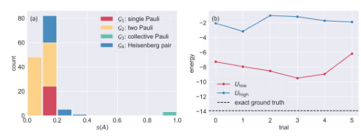
<figcaption class="paper-figure-caption"><b>Fig 2.</b> Fig. 2: (a) Distribution of s(A) for 4 families A ∈Gi. (b) VQE energy Eη(θ) for each trial. Ulow reaches lower energy than Uhigh (dashed line: ground state E0 ≈−13.92).</figcaption>
</figure>

**Summary.** This work develops a geometric framework using Lie group theory to analyze the redundancy inherent in Variational Quantum Circuits. By mapping the search space onto a homogeneous manifold defined by the stabilizer group of the Hamiltonian, it provides an explicit formula for the effective degrees of freedom. This theoretical insight is validated through numerical experiments on VQE optimization.

**Why it may be interesting.** It provides rigorous mathematical tools (homogeneous space geometry) to quantify how much information is truly encoded in variational quantum circuits, which is crucial for designing efficient algorithms.

Detailed structure

**Main problem.** The paper analyzes the redundancy and effectiveness of Variational Quantum Circuits (VQCs) by characterizing the geometry of the space of achievable effective Hamiltonians.

**Main result.** The dimension of this effective Hamiltonian manifold is determined by the structure of a stabilizer group $S$, yielding $\dim(	ext{MH}) = \dim(U(V)) - \dim(S)$.

**Method.** The authors use Lie group theory, identifying the space as a homogeneous quotient space ($S\setminus U(V)$), and employ spectral decompositions to derive tractable dimension formulas.

**Model / system.** The model involves VQAs (like VQE) acting on an $n$-qubit system defined by a Hamiltonian $H$. The circuit search space is mapped onto the orbit space $	ext{MH}$ under unitary transformations.

**Key observables.** Effective Hamiltonians ($	ext{MH}$), Stabilizer Group ($S$), and the Overlap Score $s(A)$ used to diagnose generator redundancy.

**Important parameters / regimes.** The dimension of the system ($n$) and the structure/eigenspaces of the Hamiltonian $H$ (determining $\dim(S)$).

**Assumptions / limitations.** The analysis relies heavily on treating the problem using the mathematical framework of Lie groups and homogeneous spaces.

**Figures summary.** Figure 1 illustrates the geometric setup showing how unitary evolution maps observables, identifying the redundant component $S$. Figure 2 shows the distribution of overlap scores $s(A)$ for tested circuit generators.

**Paper structure.** The paper first establishes the theoretical connection between observable redundancy and quotient spaces using Lie theory. It then derives dimension formulas based on the stabilizer group structure. Finally, it applies these concepts to a numerical VQE experiment, testing generator candidates using the overlap score $s(A)$.

Abstract

We study redundancy and effectiveness of Variational Quantum Circuits via algebraic and geometric views of Lie groups. Considering unitary transformations acting on Hermitian observables, a stabilizer group decomposition is given. Subsequently, we identify the Hermitian orbit with a quotient space of a symmetric space. Through this connection, we characterize the effective circuit degrees of freedom. Our approach of spectral decompositions and homogeneous spaces yields tractable calculation criteria, which are verified by numerical experiments.

[↑ back to top](#top)

### [On the global well-posedness for the nonlocal Fokas-Lenells equation with the weighted Sobolev initial data on the line](http://arxiv.org/abs/2607.19649v1)

**Authors:** Zhenya Yan, Guoqiang Zhang, Guancheng Zhu  
**Type:** theory · **Category:** other · **PDF:** <https://arxiv.org/pdf/2607.19649v1>  
**Analysis basis:** full PDF text, analyzed in chunks
**Topic relevance:** `non-equilibrium dynamics` **1/5**

↔ Scroll figures horizontally

<figure class="paper-figure-card">
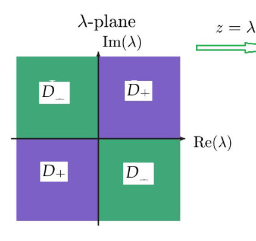
<figcaption class="paper-figure-caption"><b>Fig 1.</b> Figure 2: Analytical regions on the λ-plane (left) and z = λ2-plane (right).</figcaption>
</figure>

**Summary.** This paper proves the global well-posedness for the nonlocal Fokas-Lenells equation using an advanced Inverse Scattering Transform approach. The methodology involves solving associated Riemann-Hilbert problems and overcoming technical hurdles related to non-standard symmetries in the spectral problem. The result confirms that unique solutions exist globally in time, which is crucial for modeling physical systems like optical pulse propagation.

**Why it may be interesting.** While focused on nonlinear PDEs rather than quantum dynamics directly, the use of advanced spectral methods (IST/RH problems) to prove long-time existence is a powerful mathematical tool applicable to analyzing complex quantum field theories or open quantum systems governed by integrable Hamiltonians.

Detailed structure

**Main problem.** The primary goal is establishing the global well-posedness of the Cauchy problem for the reverse space-time nonlocal Fokas-Lenells (nFL) equation on the line.

**Main result.** Global existence and uniqueness of solutions are proven, and the associated solution map is shown to be Lipschitz continuous on the admissible initial-data class.

**Method.** The analysis heavily relies on developing an Inverse Scattering Transform (IST) framework formulated via associated Riemann-Hilbert (RH) problems and utilizing spectral uniformization transforms.

**Model / system.** The model is the nonlocal Fokas-Lenells equation, $q_{xt} - q + iqq^{PT} = 0$, which generalizes integrable models like NLS and is relevant to modeling ultrashort optical pulses in nonlinear media.

**Key observables.** The potential $q(x, t)$, reflection coefficients ($r_j$), and the associated scattering data are key observables used throughout the analysis.

**Important parameters / regimes.** Weighted Sobolev initial data regularity: $q_0(x) \in H^3(\mathbb{R}) \cap H^{2,1}(\mathbb{R})$, and a quantitative smallness condition on the initial data is required for technical steps.

**Assumptions / limitations.** The proof requires establishing uniform bounds on reflection coefficients by assuming a smallness condition on the initial potential, which ensures positive definiteness of the Hermitian part of the jump matrix.

**Figures summary.** Figure 1 outlines the general scheme: direct scattering $
ightarrow$ time propagation $
ightarrow$ inverse scattering. Figure 2 details analytical regions in the spectral plane ($\lambda$-plane and $z=\lambda^2$-plane).

**Paper structure.** The paper follows a standard IST approach: defining the direct scattering problem, constructing associated Riemann-Hilbert problems, developing the necessary transforms (like spectral uniformization), proving global reconstruction via controlled singular integral operators, and finally establishing the Lipschitz continuity of the solution map.

Abstract

We establish the global well-posedness of the Cauchy problem for the reverse space-time nonlocal Fokas-Lenells equation with the weighted Sobolev initial data $q_0(x)\in H^{3}(\mathbb{R}) \cap H^{2,1}(\mathbb{R})$ on the line. We develop the inverse scattering transform formulated via the associated Riemann-Hilbert problems to study this issue. A spectral uniformization transform is introduced to resolve the singular behavior inherent in the KN-type negative flow spectral problem. Owing to the reverse space-time reduction, reflection coefficients no longer satisfy the usual Hermitian conjugation symmetry, and the coercivity of the jump matrix is therefore not available a priori. The quantitative smallness condition on the initial data yields uniform bounds on the reflection coefficients and ensures the uniform positive definiteness of the Hermitian part of the associated jump matrix. The resulting coercivity allows us to establish the bounded invertibility of the associated singular integral operator through a Fredholm and vanishing-lemma argument. Under this condition, we prove an $L^{2}$-Sobolev bijective correspondence between the potential and scattering data, exclude spectral singularities on continuous spectra, and obtain the global existence and uniqueness of solutions. Moreover, the associated solution map is Lipschitz continuous on the admissible initial-data class.

[↑ back to top](#top)

## Other papers (9)

*Papers from primary archives without highlighted authors or any topic match. Click to expand.*

Show other papers

### [DQAOA-GPT: AI-Accelerated Distributed Quantum Optimization for Combinatorial Problems](http://arxiv.org/abs/2607.20225v1)

**Authors:** Seongmin Kim, Abhinav Rijal, Yuri Alexeev, Nora Bauer, Martin Roetteler, Mina Yoon, George Siopsis, In-Saeng Suh  
**Type:** both · **Category:** quantum information and computing · **PDF:** <https://arxiv.org/pdf/2607.20225v1>  
**Analysis basis:** full PDF text, analyzed in chunks

↔ Scroll figures horizontally

<figure class="paper-figure-card">
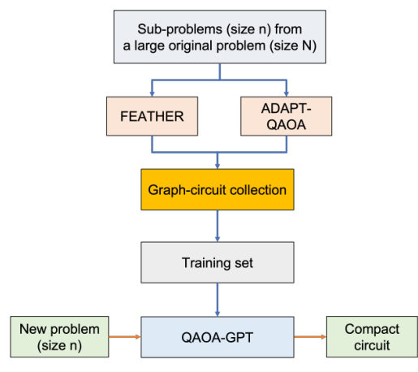
<figcaption class="paper-figure-caption"><b>Fig 1.</b> Fig. 1. Schematic illustration of the QAOA-GPT workflow.</figcaption>
</figure>
<figure class="paper-figure-card">
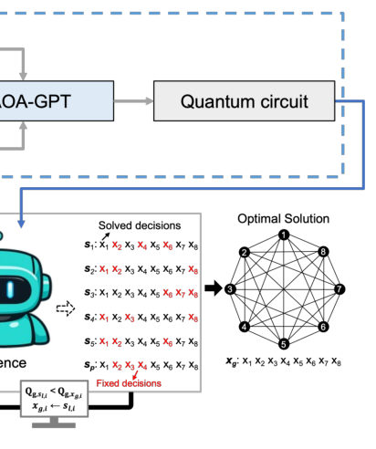
<figcaption class="paper-figure-caption"><b>Fig 2.</b> Fig. 2. Schematic illustration of the DQAOA-GPT workflow. Inspired by Refs. [13], [17]</figcaption>
</figure>
<figure class="paper-figure-card">
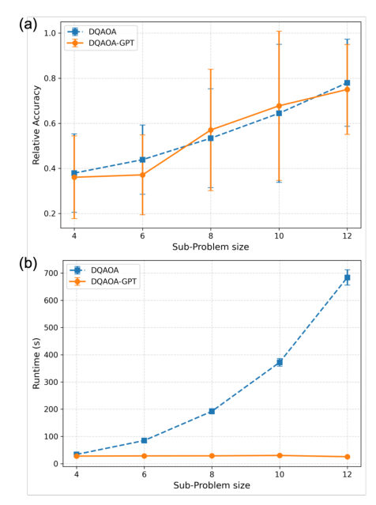
<figcaption class="paper-figure-caption"><b>Fig 3.</b> Fig. 3. DQAOA-GPT performance for different sub-problem sizes n. (a) Relative accuracy, and (b) runtime as a function of sub-problem size.</figcaption>
</figure>

**Summary.** This paper introduces DQAOA-GPT, a hybrid framework that accelerates solving hard combinatorial problems by replacing iterative quantum circuit optimization with direct circuit generation using a GPT model. By leveraging this AI acceleration during problem decomposition, the method drastically reduces computational cost while maintaining high solution quality for large-scale instances.

**Why it may be interesting.** While focused on optimization rather than fundamental AMO physics, the reliance on quantum circuit generation via a generative AI model represents a novel computational paradigm that could accelerate simulations or parameter estimation in complex open quantum systems.

Detailed structure

**Main problem.** Solving large-scale, NP-hard combinatorial optimization problems that are intractable using standard variational quantum algorithms.

**Main result.** The proposed DQAOA-GPT significantly reduces the computational cost of solving sub-problems compared to conventional DQAOA while maintaining competitive solution quality, especially for larger problem sizes.

**Method.** It integrates Distributed QAOA (DQAOA) with a GPT model that is trained to directly generate high-quality quantum circuits for decomposed sub-problems in a single inference pass.

**Model / system.** The framework uses DQAOA to decompose the large optimization problem into smaller, manageable sub-problems. These sub-problems are then encoded onto graphs and solved using parameterized quantum circuits generated by the GPT model.

**Key observables.** Solution quality (accuracy) and computational runtime/cost reduction relative to conventional DQAOA.

**Important parameters / regimes.** Sub-problem size ($n$), number of variables ($N=100$ benchmark), and the depth/structure of the generated quantum circuits.

**Assumptions / limitations.** The framework assumes that decomposing the problem into smaller, locally optimized sub-problems is sufficient for finding a near-optimal global solution. The GPT model replaces iterative optimization with direct generation.

**Figures summary.** Figure 3 shows that DQAOA-GPT maintains relatively constant runtime while achieving improved relative accuracy as the sub-problem size ($n$) increases, contrasting sharply with standard DQAOA's rapidly increasing cost.

**Paper structure.** The paper first establishes the difficulty of combinatorial optimization. It then details the DQAOA decomposition strategy and introduces the GPT training pipeline (tokenization, transformer architecture). Finally, it presents the inference loop where the generated circuits are used within the DQAOA framework for benchmarking.

Abstract

While combinatorial optimization problems are central to many scientific and engineering applications, their solution remains challenging due to exponentially large search spaces. Variational quantum algorithms offer a promising route for tackling such problems, yet their practical performance is limited by repeated quantum circuit evaluations and classical parameter updates. In this work, we introduce DQAOA-GPT, a hybrid framework that integrates the distributed quantum approximate optimization algorithm (DQAOA), which decomposes a large optimization problem into smaller sub-problems, with GPT-based quantum circuit generation for solving those sub-problems. Rather than relying on iterative variational optimization, the proposed approach uses a trained generative model to directly generate high-quality quantum circuits for the decomposed sub-problems. As a benchmark, we evaluate DQAOA-GPT against conventional DQAOA on dense HUBO optimization problems with up to 100 decision variables. The results demonstrate that DQAOA-GPT significantly reduces computational cost while maintaining competitive solution quality, with larger acceleration observed for larger sub-problem sizes. Although this work focuses on benchmark-scale validation, the framework provides a promising foundation for larger-scale combinatorial optimization in hybrid HPC-QC environments through increased GPU resources and parallel computing capability.

[↑ back to top](#top)

### [Hybrid LLM-Guided Search for Quantum Reservoir Architecture Design](http://arxiv.org/abs/2607.19506v1)

**Authors:** Krishna Bhatia, Gautami Sanjay Naik  
**Type:** both · **Category:** quantum information and computing · **PDF:** <https://arxiv.org/pdf/2607.19506v1>  
**Analysis basis:** full PDF text, analyzed in chunks

↔ Scroll figures horizontally

<figure class="paper-figure-card">
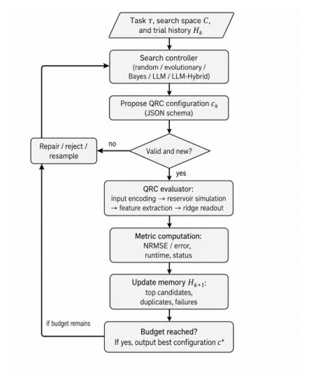
<figcaption class="paper-figure-caption"><b>Fig 1.</b> Fig. 1. Closed-loop QRC architecture-search workflow. A controller proposes schema-valid QRC configurations, the evaluator scores each candidate, and score feedback updates the search memory.</figcaption>
</figure>
<figure class="paper-figure-card">
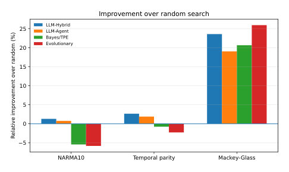
<figcaption class="paper-figure-caption"><b>Fig 2.</b> Fig. 2. Relative improvement over random search under the same evaluation budget. LLM-Hybrid improves over random search on all tasks, with the largest gain on Mackey-Glass.</figcaption>
</figure>

**Summary.** This paper treats Quantum Reservoir Computing (QRC) architecture design as an optimization problem and tests if Large Language Models can guide this search. By comparing various strategies, the authors show that combining LLM proposals with classical evolutionary operators yields superior performance on temporal forecasting tasks. The key takeaway is that LLMs are powerful high-level controllers when integrated into robust, hybrid optimization frameworks.

**Why it may be interesting.** It explores the intersection of advanced AI (LLMs) with quantum information processing hardware simulation, providing a methodology for automating the design space exploration crucial for near-term quantum machine learning applications.

Detailed structure

**Main problem.** The paper addresses how to optimize the complex design choices inherent in Quantum Reservoir Computing (QRC) by framing it as a constrained black-box architecture search problem.

**Main result.** A hybrid approach combining Large Language Model (LLM) proposals with classical optimization operators significantly outperforms random search, demonstrating that LLMs are useful high-level controllers rather than universal optimizers for QRC design.

**Method.** The authors developed a simulator-based benchmark comparing several search policies—including Random Search, Evolutionary Search, TPE, and an LLM-Hybrid agent—to optimize QRC parameters across three temporal forecasting tasks.

**Model / system.** The core system is Quantum Reservoir Computing (QRC), which utilizes fixed quantum dynamics to generate a high-dimensional feature map for subsequent classical readout. The search space involves numerous architectural choices like qubit count, reservoir depth, and entanglement topology.

**Key observables.** Task-level predictive performance scores (error rates) on three benchmarks: NARMA10, Mackey-Glass forecasting, and temporal parity.

**Important parameters / regimes.** Qubit range (3–8), Reservoir Depth (1–12), various encoding/topology parameters, and a fixed evaluation budget of 25 evaluations.

**Assumptions / limitations.** The study is confined to simulator-based benchmarks using small reservoirs and does not claim quantum advantage or hardware performance; the improvement relies on embedding LLMs within validated hybrid search loops.

**Figures summary.** Figures illustrate the closed-loop QRC architecture-search workflow, comparing mean/standard deviation results across tasks (Table II), and showing relative error improvements over random search (Fig. 2).

**Paper structure.** The paper introduces the problem by defining QRC's design complexity, presents the simulator benchmark framework, compares five distinct search policies using three temporal tasks, analyzes performance metrics, and concludes with architectural insights regarding LLM utility.

Abstract

Quantum reservoir computing (QRC) uses fixed quantum dynamics as a high-dimensional temporal feature map and trains only a lightweight classical readout. QRC is attractive for near-term quantum machine learning, but its performance depends strongly on architecture choices such as input encoding, reservoir depth, entanglement topology, measurement features, state-reset policy, feature construction, and readout regularization. We introduce \method, a simulator-based benchmark that formulates QRC design as constrained black-box architecture search and evaluates whether large language models can act as proposal controllers for this search problem. The benchmark compares five policies under identical evaluation budgets: random search, evolutionary search, Bayesian/TPE optimization, a feedback-based LLM agent, and \hybrid, which combines LLM proposals with memory, mutation, crossover, duplicate avoidance, and exploration. On NARMA10, Mackey-Glass forecasting, and temporal parity, \hybrid{} is the most consistent policy: it ranks first on NARMA10 and temporal parity and second on Mackey-Glass, narrowly behind evolutionary search. Under a 25-evaluation budget and three seeds, \hybrid{} improves over random search on all tasks, including a 23.6\% relative reduction in Mackey-Glass error. The results do not show that LLMs are universal QRC optimizers; rather, they show that generative models can be useful high-level controllers when embedded inside validated, reproducible hybrid search loops.

[↑ back to top](#top)

### [Learning to Decode Quantum LDPC Codes via Cluster-Based Sequential Belief Propagation](http://arxiv.org/abs/2607.20130v1)

**Authors:** Mohsen Moradi, Taejoon Kim, Rémi A. Chou, David G. M. Mitchell  
**Type:** theory · **Category:** quantum information and computing · **PDF:** <https://arxiv.org/pdf/2607.20130v1>  
**Analysis basis:** full PDF text, analyzed in chunks

↔ Scroll figures horizontally

<figure class="paper-figure-card">
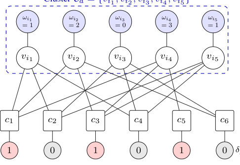
<figcaption class="paper-figure-caption"><b>Fig 1.</b> Fig. 1. Tanner subgraph used in Example 1. The highlighted cluster Ca = {vi1, . . . , vi5} is connected to checks c1, . . . , c6 according to the listed neighbor sets. The values below the check nodes are the current residual mismatches δj, and the circles above the variable nodes show the induced local mismatch weights ωik.</figcaption>
</figure>
<figure class="paper-figure-card">
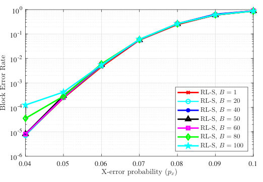
<figcaption class="paper-figure-caption"><b>Fig 2.</b> Fig. 2. Block error rate of clustered RL-S decoding for the [[882, 24, 18 ≤ d ≤24]] code B1 over the independent Pauli-X channel. Different cluster sizes B are compared under the same maximum iteration budget T = 100.</figcaption>
</figure>
<figure class="paper-figure-card">
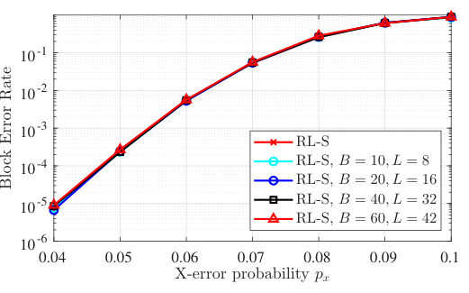
<figcaption class="paper-figure-caption"><b>Fig 3.</b> Fig. 4. Effect of the quantization resolution on clustered RL-S decoding for the [[882, 24, 18 ≤d ≤24]] code B1 over the independent Pauli-X channel. The iteration budget is fixed at T = 100, while B and L are varied. The RL-S baseline (B = 1) uses the original exact VN-level state, whereas all B &gt; 1 curves use the quantized histogram state.</figcaption>
</figure>
<figure class="paper-figure-card">
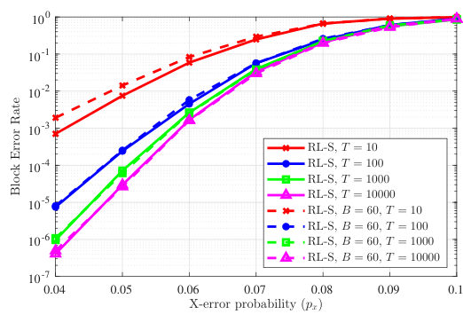
<figcaption class="paper-figure-caption"><b>Fig 4.</b> Fig. 3. Block error rate for the [[882, 24, 18 ≤d ≤24]] code B1 over the independent Pauli-X channel. The unclustered RL-S decoder is compared with clustered RL-S using cluster size B = 60 for several iteration budgets.</figcaption>
</figure>
<figure class="paper-figure-card">
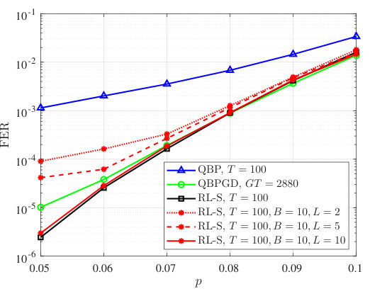
<figcaption class="paper-figure-caption"><b>Fig 5.</b> Fig. 5. Block error rate comparison for the [[288, 12, 18]] BB code over the depolarizing channel. The proposed quantized clustered RL-S decoder is compared with QBP, QBPGD, and the unclustered RL-S decoder. The RL-S and clustered RL-S decoders use maximum iteration budget T = 100, while QBPGD uses 288 guided-decimation rounds with T = 10 BP iterations per round, i.e., total budget GT = 2880.</figcaption>
</figure>

**Summary.** This paper introduces a cluster-based extension to Reinforcement Learning (RL) for optimizing Belief Propagation (BP) decoding of QLDPC codes. By allowing the RL agent to select and update entire clusters of nodes in parallel, it significantly reduces the serial scheduling depth compared to node-by-node updates. This achieves an attractive balance between high error correction performance and low computational latency.

**Why it may be interesting.** This work directly addresses efficiency bottlenecks in quantum error correction decoding by introducing hardware-aware parallelism into an ML-driven scheduling framework, which is highly relevant for implementing fault-tolerant quantum computation protocols.

Detailed structure

**Main problem.** The performance of Belief-Propagation (BP) decoding for Quantum Low-Density Parity-Check (QLDPC) codes is limited by short cycles and degeneracy, and existing learned scheduling methods suffer from poor within-iteration parallelism.

**Main result.** The proposed cluster-based RL approach preserves most of the error-rate benefit of fine-grained sequential scheduling while substantially reducing the number of required scheduling decisions per BP iteration, offering a superior latency-parallelism tradeoff.

**Method.** The authors extend Reinforcement Learning (RL) by partitioning Variable Nodes (VNs) into clusters. The RL agent selects an entire cluster to update in parallel, using a quantized, permutation-invariant histogram state representation for the Markov Decision Process.

**Model / system.** The work focuses on decoding QLDPC codes used in fault-tolerant quantum computation. Decoding involves message passing over a Tanner graph structure defined by parity-check matrices.

**Key observables.** Error rate (Block Error Rate/BER) vs. physical error probability ($p_x$), and the number of scheduling decisions required per BP iteration.

**Important parameters / regimes.** Cluster size ($B$), quantization resolution ($L$), and the total iteration budget ($T$).

**Assumptions / limitations.** The analysis assumes an ideal parallel cluster-update model for performance gains, and that a quantized state representation is sufficient to capture necessary scheduling information.

**Figures summary.** Figures compare BER across various decoders (QBP, unclustered RL-S, clustered RL-S) showing that the clustered approach maintains high performance while drastically reducing the required number of scheduling decisions per iteration compared to the unclustered baseline.

**Paper structure.** The paper first identifies the limitations of standard BP and existing sequential RL methods. It then proposes the cluster-based extension, detailing the state representation (histogram/quantization) and formulating the problem as a cluster-level MDP. Finally, it presents numerical results demonstrating the improved latency-parallelism tradeoff.

Abstract

Belief-propagation (BP) decoding for quantum low-density parity-check (QLDPC) codes is attractive due to its low complexity, but its performance is often limited by short cycles, degeneracy, and convergence failures. Recently, reinforcement-learning-based sequential variable-node (VN) scheduling (RL-S) was shown to improve BP decoding by learning state-dependent update orders. However, the VN-by-VN nature of that approach offers limited within-iteration parallelism, since only one VN is updated at a time. In this paper, we propose a cluster-based extension of RL-S for QLDPC codes. The VNs are partitioned into fixed clusters, and at each scheduling step the RL agent selects one cluster to update, after which all VNs in that cluster are updated in parallel using the same pre-update incoming messages. To keep the tabular state space practical for large cluster sizes, we introduce a permutation-invariant cluster state based on a normalized histogram of local mismatch weights, followed by quantization. This representation makes the number of cluster states depend on the quantization resolution rather than the cluster size. We also develop the corresponding cluster-level Markov decision process, reward function, and Q-learning update. Numerical results on representative QLDPC codes show that the proposed clustered learned scheduling preserves most of the error-rate benefit of VN-level learned sequential scheduling while substantially reducing the number of scheduling decisions per BP iteration, thereby providing an attractive latency-parallelism tradeoff.

[↑ back to top](#top)

### [On Solutions of the Killingbeck Potential and Clarifying Comments on a Related Analytical Approach](http://arxiv.org/abs/2607.19611v1)

**Authors:** Fatma Zohra Khaled, Mustafa Moumni, Mokhtar Falek  
**Type:** theory · **Category:** other · **PDF:** <https://arxiv.org/pdf/2607.19611v1>  
**Analysis basis:** full PDF text, analyzed in chunks

↔ Scroll figures horizontally

<figure class="paper-figure-card">
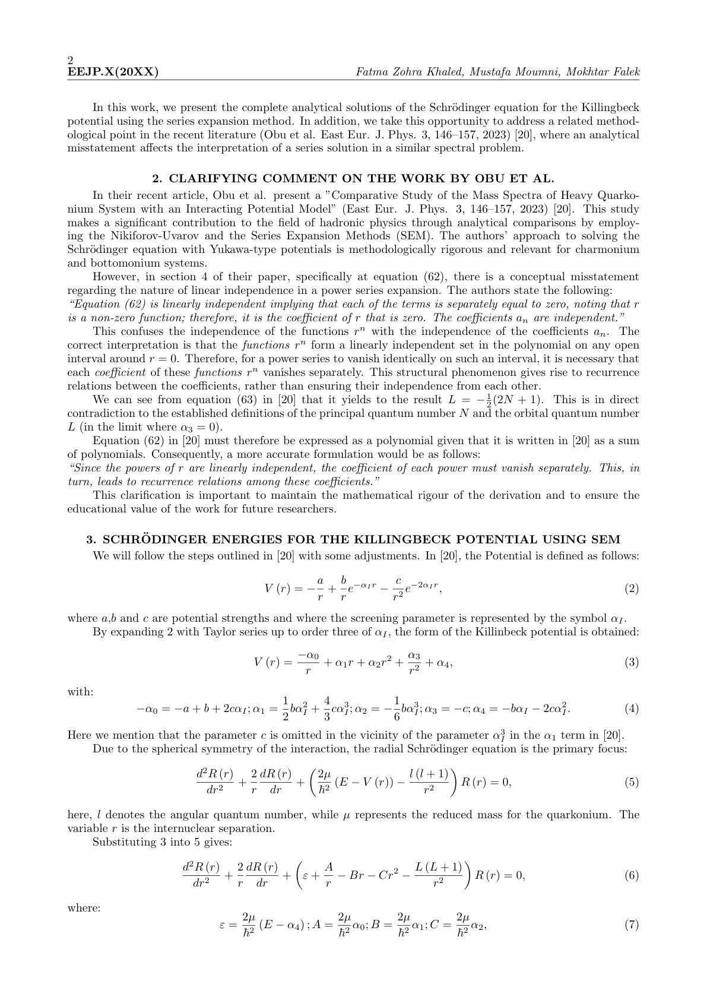
<figcaption class="paper-figure-caption"><b>Fig 1.</b> Low-resolution page preview, page 2</figcaption>
</figure>
<figure class="paper-figure-card">
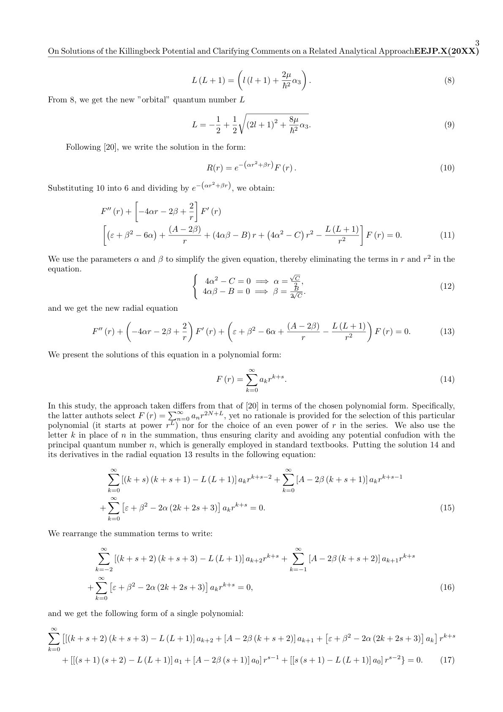
<figcaption class="paper-figure-caption"><b>Fig 2.</b> Low-resolution page preview, page 3</figcaption>
</figure>
<figure class="paper-figure-card">
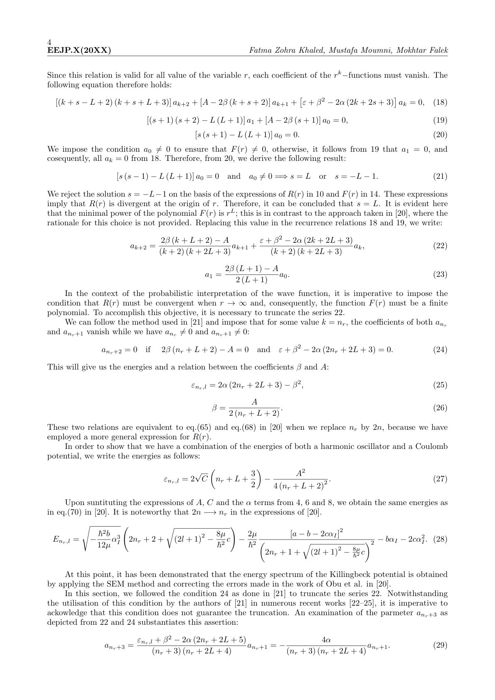
<figcaption class="paper-figure-caption"><b>Fig 3.</b> Low-resolution page preview, page 4</figcaption>
</figure>
<figure class="paper-figure-card">
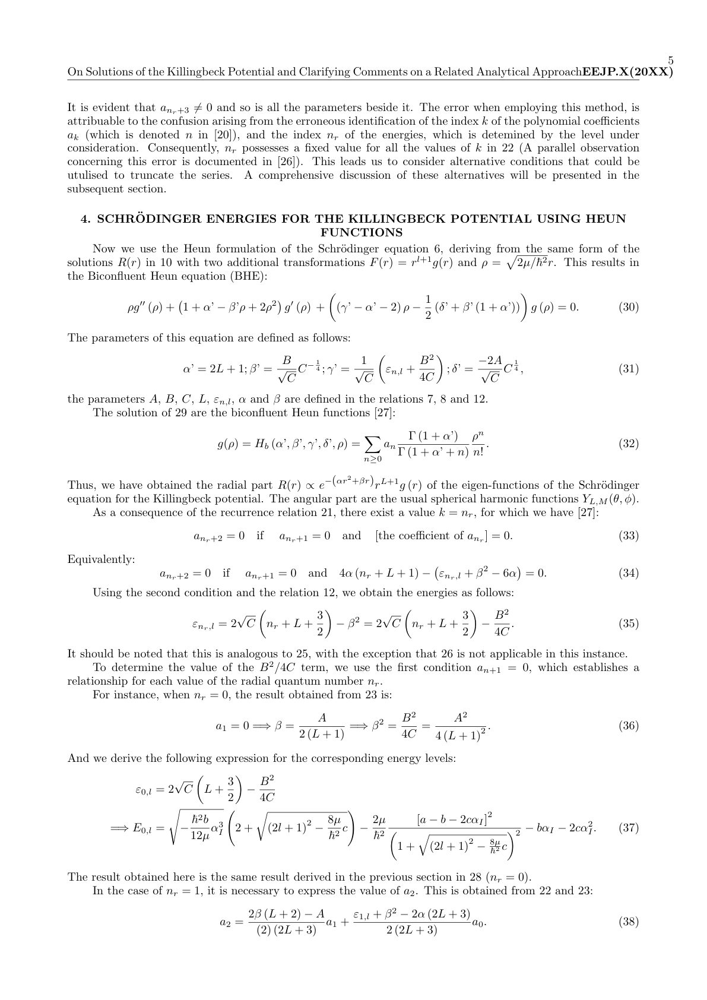
<figcaption class="paper-figure-caption"><b>Fig 4.</b> Low-resolution page preview, page 5</figcaption>
</figure>
<figure class="paper-figure-card">
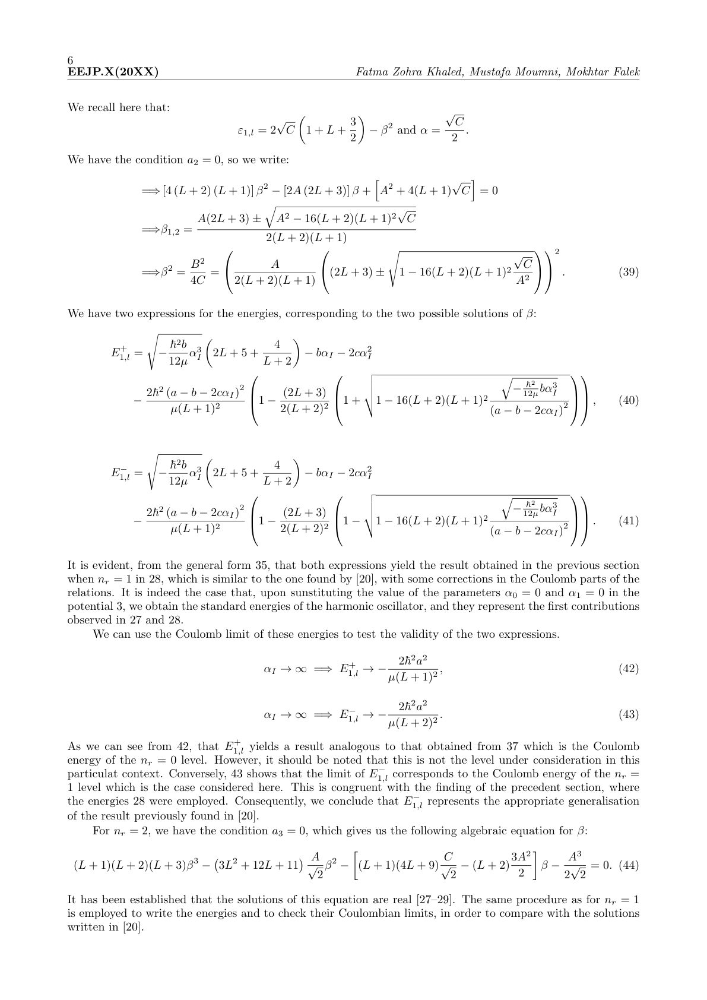
<figcaption class="paper-figure-caption"><b>Fig 5.</b> Low-resolution page preview, page 6</figcaption>
</figure>

**Summary.** This paper presents detailed analytical solutions to the Schrödinger equation using the Killingbeck potential, which combines Coulombic, linear, and harmonic terms. The authors employ sophisticated series expansion methods and compare results with Biconfluent Heun Equation formalisms to determine energy eigenvalues. Crucially, they also correct mathematical misstatements found in previous academic treatments of similar quantum systems.

**Why it may be interesting.** This work provides rigorous analytical solutions for a complex confining potential relevant to heavy quark systems, offering advanced mathematical techniques applicable to non-standard quantum potentials beyond simple Coulomb or harmonic forms.

Detailed structure

**Main problem.** The work focuses on deriving analytical solutions for the Schrödinger equation using a specific hybrid potential (Killingbeck potential) and correcting mathematical errors in related literature.

**Main result.** The authors derive explicit expressions for bound-state solutions and eigenfunctions, yielding energy eigenvalues that match expected limits when analyzed through multiple formalisms.

**Method.** The primary method involves the series expansion technique applied to the radial Schrödinger equation, supplemented by comparison with Biconfluent Heun Equation (BHE) formulations.

**Model / system.** The system is governed by the Killingbeck potential, $V(r) = -A/r + Br + Cr^2$, which models physical scenarios like quarkonium spectroscopy and hydrogen-like atoms in plasma environments.

**Key observables.** Energy eigenvalues ($\epsilon_{n,l}$), bound-state solutions, and eigenfunctions for the system.

**Important parameters / regimes.** Potential parameters (A, B, C) and quantum numbers ($L$, $n$).

**Assumptions / limitations.** The derivation assumes a specific polynomial form for the solution function $F(r)$ and relies on setting coefficients of powers of $r$ to zero.

**Paper structure.** The paper first introduces the physical problem and the master equation, then details the series expansion method leading to recurrence relations. It presents multiple derivations for energy eigenvalues (series truncation vs. BHE) before concluding with corrections to prior literature.

Abstract

The work presents analytical solutions to the Schrodinger equation for the Killingbeck potential, a Hybrid model combining harmonic, linear and Coulomb terms, and which is also an approximate model of Yukawa-type potentials. The radial Schrodinger equation is solved by means of the series expansion method, thus yielding the exact expressions of both bound-states solutions and eigen-functions for the systems; these systems include quarkonium and confined hydrogen-like atoms in plasma environments. Furthermore, we offer a constructive commentary on the work of Obu et al. (East Eur. J. Phys. 3, 146-157, 2023), with the aim of clarifying a mathematical misstatement used in their analytical treatment of analogous systems.

[↑ back to top](#top)

### [Qoreo: Choreographic Programming for Quantum Distributed Systems](http://arxiv.org/abs/2607.20391v1)

**Authors:** Jennifer Paykin, Steven Baldasty, Joseph P. Near, Christian Skalka  
**Type:** theory · **Category:** quantum information and computing · **PDF:** <https://arxiv.org/pdf/2607.20391v1>  
**Analysis basis:** full PDF text, analyzed in chunks

↔ Scroll figures horizontally

<figure class="paper-figure-card">
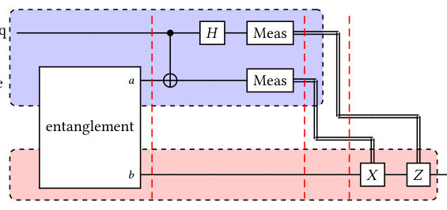
<figcaption class="paper-figure-caption"><b>Fig 1.</b> Fig. 1. Quantum teleportation protocol as an informal quantum circuit diagram. Alice starts with an arbitrary qubit 𝑞, and by the end of the protocol, Bob should have a qubit in that same state. Dashed vertical red lines separate the protocol into four stages. Stage 1: Alice and Bob establish a pair of entangled qubits 𝑎and 𝑏. Stage 2: Alice performs some local operations (controlled-not, hadamard (H)) to entangle her starting qubit 𝑞 with 𝑎; she then measures both qubits, resulting in two classical bits (indicated with double wires). Stage 3: Alice sends the two classical bits to Bob over ordinary classical channels. Stage 4: Bob uses the classical messages to correct his remaining qubit...</figcaption>
</figure>
<figure class="paper-figure-card">
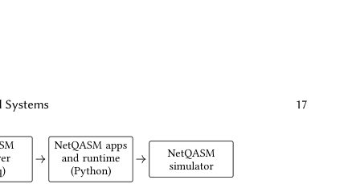
<figcaption class="paper-figure-caption"><b>Fig 2.</b> Fig. 11. Extraction pipeline from a global Qoreo choreography to simulation using NetQASM.</figcaption>
</figure>
<figure class="paper-figure-card">
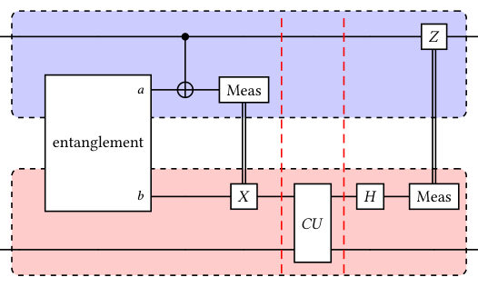
<figcaption class="paper-figure-caption"><b>Fig 3.</b> Fig. 12. Distributed protocol for implementing a 2-qubit controlled-unitary [27], broken up into three stages.</figcaption>
</figure>
<figure class="paper-figure-card">

<figcaption class="paper-figure-caption"><b>Fig 4.</b> Fig. 13. An implementation of an 𝑛-controlled gate distributed across 𝑛actors. The function distributed_n_CU takes as input a list of actors 𝐴with qubit variables 𝑞𝑠, and a single target actor 𝐵 with qubit 𝑡𝑔𝑡. The goal of the protocol is to apply the input controlled unitary 𝐶𝑈to the controls 𝑞𝑠and target 𝑡𝑔𝑡. The helper functions fmap and fmap2 fold over the input lists and concatenate the results together, e.g. stage1 returns a pair of variables and fmap As qs stage1 returns a list of pairs of variables, which we split up into a pair of lists using List.split. Note that although fmap/fmap2 iterate sequentially through the actors in 𝐴𝑠, the Delay rule of choreographies ensures that...</figcaption>
</figure>

**Summary.** This paper introduces Qoreo, a novel choreographic programming language designed to simplify and formalize the development of complex quantum distributed protocols. By viewing the entire system as one global choreography rather than many independent processes, it ensures type safety and guarantees deadlock freedom. This provides a powerful, high-level abstraction layer for designing reliable quantum network applications.

**Why it may be interesting.** While focused on high-level programming semantics rather than physical Hamiltonian dynamics, the rigorous type-theoretic guarantees for distributed operations are crucial for designing reliable quantum network protocols that might interact with AMO platforms.

Detailed structure

**Main problem.** Programming distributed quantum systems requires coordinating complex sequences of operations, making direct process modeling tedious and error-prone.

**Main result.** The authors introduce Qoreo, a choreographic programming language that guarantees type safety and projects to deadlock-free process networks for well-typed protocols.

**Method.** They propose a choreographic paradigm where the entire protocol is viewed as a single global program, which is then formally projected onto independent processes using Endpoint Projection (EPP).

**Model / system.** The model involves quantum distributed systems utilizing qubits and incorporating local quantum computation with inter-actor classical and quantum communication.

**Key observables.** Deadlock freedom, well-defined quantum operations, and the successful execution of protocols like Quantum Key Distribution (B92).

**Important parameters / regimes.** The complexity scales exponentially with the number of qubits; linear types enforce physical constraints like no-cloning.

**Assumptions / limitations.** The primary limitation noted is that choreographies lack room for actor autonomy, complicating security analysis and dynamic participation.

**Figures summary.** Figures illustrate quantum teleportation protocols both as informal circuits and as global choreographies, contrasting this with the process model view.

**Paper structure.** The paper builds from defining the state-of-the-art in distributed quantum computing to formalizing Qoreo's local quantum language (with linear types), developing the full choreographic language, defining EPP, and finally discussing implementation via extraction to NetQASM.

Abstract

Programming distributed quantum systems requires multiple actors to coordinate precise sequences of quantum operations, classical communication, and entanglement generation. Writing such protocols directly as distributed processes is tedious and error-prone, and subtle mismatches can cause deadlock or silently incorrect quantum states. We present Qoreo, a choreographic programming language for quantum distributed systems in which an entire protocol is expressed as single, global program (a choreography) rather than as a collection of independent actor processes. Qoreo includes a local quantum language with linear types that enforce the no-cloning principle; a choreographic language that combines local quantum computation with inter-actor classical and quantum communication; and a process language for individual network nodes. We prove type safety for choreographies, guaranteeing that well-typed programs implement well-defined quantum operations, and we define endpoint projection~(EPP), which automatically derives a network of independent processes from any choreography. We prove EPP sound and complete with respect to the choreographic semantics; as a corollary, every well-typed choreography projects to a deadlock-free process network. The metatheory of Qoreo is fully mechanized in Rocq, and we provide an extraction pipeline to NetQASM for simulation and deployment on quantum network hardware.

[↑ back to top](#top)

### [Quantum codes from classical annealing](http://arxiv.org/abs/2607.19574v1)

**Authors:** Michael A. Perlin, Matthew Steinberg, Ben Criger  
**Type:** theory · **Category:** quantum information and computing · **PDF:** <https://arxiv.org/pdf/2607.19574v1>  
**Analysis basis:** full PDF text, analyzed in chunks

↔ Scroll figures horizontally

<figure class="paper-figure-card">
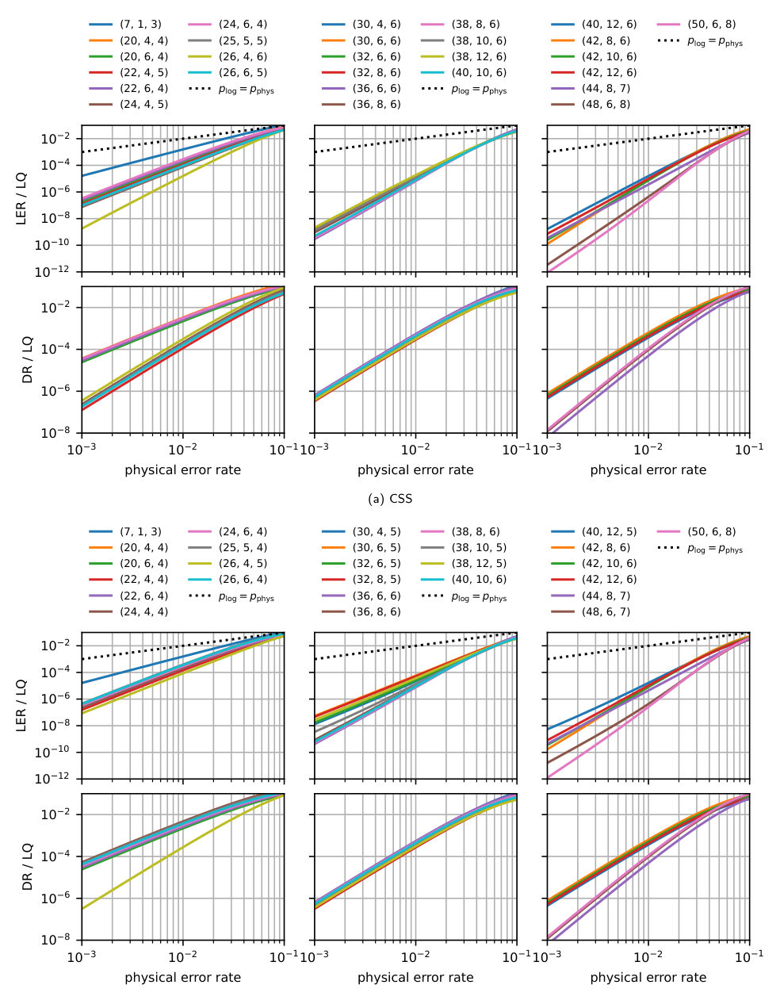
<figcaption class="paper-figure-caption"><b>Fig 1.</b> Figure 1: Logical error rates (LER) and discard rates (DR) per logical qubit (LQ) for the codes in Table 1 in a code-capacity noise model with a lookup table decoder. The decoder declares failure (triggering a discard) if it observes a syndrome that cannot be caused by any error of weight w &lt; d/2. The physical error rate corresponds to the IID probability that each qubit is subject to a randomly chosen X, Y , or Z error.</figcaption>
</figure>
<figure class="paper-figure-card">
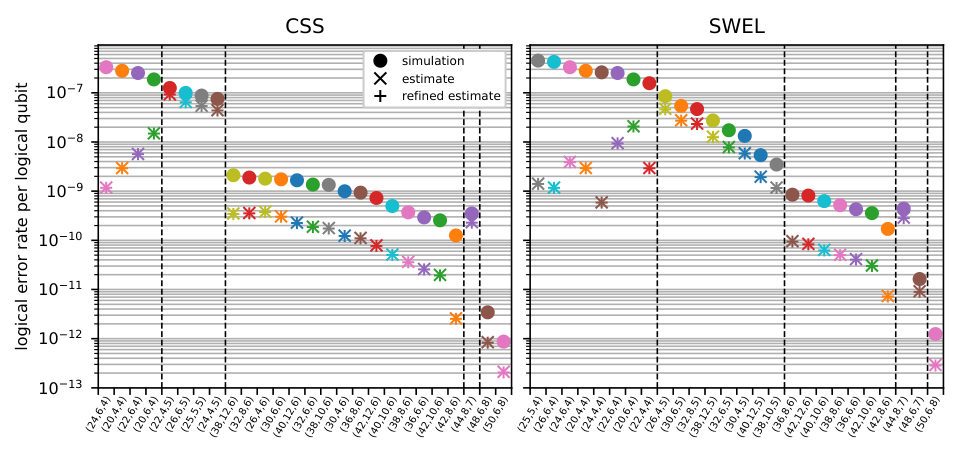
<figcaption class="paper-figure-caption"><b>Fig 2.</b> Figure 2: Logical error rates from Fig. 1 and corresponding estimates computed with Eq. (34) and Eq. (42) at a physical error rate of pdep = 10−3. Codes are sorted first by distance, and then by logical error rate. Colors match Fig. 1.</figcaption>
</figure>

**Summary.** This paper introduces an adaptive simulated annealing method to efficiently search for high-performing quantum error-correcting codes, focusing on CSS and SWEL types. By optimizing a surrogate energy function related to logical error rates, the authors discover state-of-the-art codes whose parameters approach theoretical bounds. These findings provide promising candidates for building fault-tolerant quantum computation circuits.

**Why it may be interesting.** This work directly addresses fundamental resource limitations in quantum computation by providing concrete constructions of highly efficient error-correcting codes suitable for near-term hardware demonstrations.

Detailed structure

**Main problem.** The primary goal is searching for quantum error-correcting codes that possess both high encoding rates and large distances.

**Main result.** The authors found state-of-the-art CSS and SWEL codes whose distances meet or exceed the quantum Gilbert-Varshamov bound for small block lengths (up to 50 qubits).

**Method.** An adaptive simulated annealing algorithm is employed, guided by an energy function that approximates the logical error rate in a code-capacity noise model.

**Model / system.** The work focuses on quantum stabilizer codes, specifically CSS codes and a subclass called SWEL codes. These are defined over physical qubits and characterized by their parity check matrices ($H$).

**Key observables.** Code distance ($d$), encoding rate ($k/n$), and the ability of logical gates to be implemented transversally.

**Important parameters / regimes.** Block lengths up to 50 physical qubits; code parameters $(n, k, d)$; quantum Gilbert-Varshamov bound variants.

**Assumptions / limitations.** The search relies on simulated annealing as a heuristic optimization technique due to the exponentially large space of possible codes. The search for automorphisms in related work is noted as non-exhaustive.

**Paper structure.** The paper introduces the problem, reviews theoretical bounds (Hamming, QGV), details the adaptive simulated annealing optimization strategy using an energy function surrogate, and presents results on finding high-performing CSS and SWEL codes.

Abstract

We introduce an adaptive simulated annealing algorithm to search for moderately-sized quantum error-correcting codes with high encoding rates and large distances. Our search targets two classes of stabilizer codes: (1) CSS codes, and (2) a subclass of CSS codes that we call ``self-dual with equivalent logicals'' (SWEL) codes, the latter of which which admit transversal implementations of logical Hadamard and phase gates that can be leveraged to construct fault-tolerant gate sets. The search is guided by an energy function that acts as a surrogate for the logical error rate in a code-capacity noise model, combining code distance with a count of minimum-weight logical operators to resolve the discrete plateaux that impede naïve distance optimization. For block lengths of up to $50$ physical qubits, our search finds state-of-the-art CSS and SWEL codes whose distances frequently meet or exceed the variants of the quantum Gilbert-Varshamov bound. In addition to providing favorable seed codes for fault-tolerant architectures based on code concatenation, the codes found in this work are promising candidates for high-rate code demonstrations on near-term quantum computing hardware.

[↑ back to top](#top)

### [Quantum Gravity Simulation: Quantum simulation with a minimum length based on the generalised uncertainty principle](http://arxiv.org/abs/2607.19602v1)

**Authors:** Jack Keable-Elliott, David J. Bacon, Andrew Burbanks, Jaewoo Joo  
**Type:** theory · **Category:** other · **PDF:** <https://arxiv.org/pdf/2607.19602v1>  
**Analysis basis:** full PDF text, analyzed in chunks

↔ Scroll figures horizontally

<figure class="paper-figure-card">
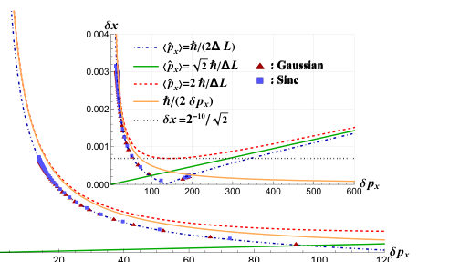
<figcaption class="paper-figure-caption"><b>Fig 1.</b> FIG. 1. Low-energy GUP curves from Eqs. (8) to (10) with ∆L = 2−10 and ℏ= 0.1. The marked data are the results of numerical quantum simulation with ⟨ˆpx⟩= ℏ/(2∆L) ≈51.2 under Eq. (8) for Gaussian- and sinc-like wavefunctions. The minimum length (δx)min = 2−10/ √</figcaption>
</figure>
<figure class="paper-figure-card">
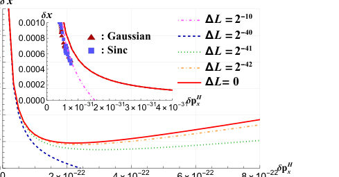
<figcaption class="paper-figure-caption"><b>Fig 2.</b> FIG. 2. High-energy GUP curves for an electron using differ- ent qubit numbers L = 10, 40, 41, 42 and ∞. For ∆L = 2−10, the data for the high-energy GUP are given by the Gaussian- and sinc-type wavefunctions with a deformed high-energy mo- mentum operator corresponding to the relativistic one.</figcaption>
</figure>
<figure class="paper-figure-card">
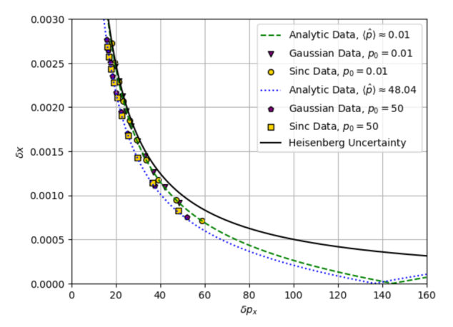
<figcaption class="paper-figure-caption"><b>Fig 3.</b> FIG. 3. Low-energy GUP curves using 10 qubits with ∆L = 2−10 and ℏ= 0.1. For the Gaussian wavefunction (sinc wavefunction), the choice of σ (a) ranges from 0.001 to 0.0025 (0.003 to 0.01) for p0 = 0.01, and from 0.001 to 0.005 (0.004 to 0.017) for p0 = 50.</figcaption>
</figure>
<figure class="paper-figure-card">
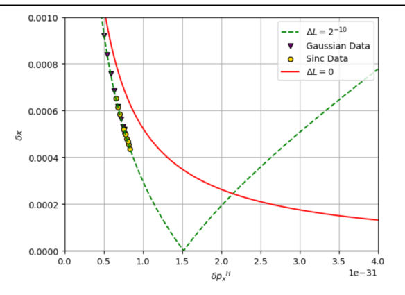
<figcaption class="paper-figure-caption"><b>Fig 4.</b> FIG. 4. High-energy GUP curve with ∆L = 2−10 [m] and ∆L = 0 for ⟨ˆpx⟩= 0, ℏ= 1.05 × 10−34 [kg m2/s], m = me = 9.11 × 10−31 [kg], c = 3 × 108 [m/s]. For the Gaussian state, the choice of σ ranges from 0.0001 to 0.0009 while, for the sinc state, the choice of a ranges from 0.0001 to 0.0025.</figcaption>
</figure>

**Summary.** This paper proposes a simulation recipe using qubits to study how minimum length scales, derived from the Generalized Uncertainty Principle (GUP), affect quantum systems. By analyzing low- and high-energy limits on a discretized grid, the authors reveal unique dependencies on the lattice spacing ($\Delta L$). The work offers a computational tool to test theoretical predictions about quantum gravity effects.

**Why it may be interesting.** The systematic incorporation of finite lattice spacing into fundamental quantum relations like the uncertainty principle provides a concrete, computational method to explore regimes inaccessible by standard continuum theory in quantum gravity.

Detailed structure

**Main problem.** The paper develops a framework to simulate quantum gravity phenomena by analyzing the Generalized Uncertainty Principle (GUP) in both low- and high-energy regimes.

**Main result.** It establishes that incorporating finite grid spacing ($\Delta L$) leads to distinct GUP behaviors, suggesting novel pathways to investigate minimum length effects at high energies, though conflicts arise when enforcing consistency with special relativity versus preserving the standard HUP.

**Method.** The authors use a first-quantization approach on a discretized spatial grid ($L$ qubits) to derive discrete position and momentum operators, allowing for systematic calculation of expectation values under GUP corrections.

**Model / system.** The model analyzes one-dimensional quantum systems using localized ansatz states (Gaussian/sinc) simulated via qubit representations. The core physics revolves around modifying the standard uncertainty relation due to hypothesized minimum length scales from quantum gravity.

**Key observables.** Position uncertainty ($\delta x$), momentum uncertainty ($\delta p_x$ and $\delta p_x^H$), and the resulting GUP inequality $(\delta x)(\delta p) \geq \dots$.

**Important parameters / regimes.** Minimum grid spacing ($\Delta L$), low/high energy regimes, mass ($m$), and fundamental constants ($\hbar$, $c$).

**Assumptions / limitations.** The analysis assumes a finite $\Delta L 
eq 0$ for simulation purposes; approximations are made using Taylor expansions when deriving the high-energy momentum operator ($\hat{p}_{H x}$).

**Figures summary.** Figure 1 compares low-energy GUP curves from simulation data (Gaussian/sinc states) against theoretical lines. Figure 2 shows mass-dependent high-energy GUP properties for an electron using varying qubit numbers.

**Paper structure.** The paper proceeds by first establishing the low-energy GUP effects due to discretization ($\Delta L$), then developing a procedure for high-energy momentum operators ($\hat{p}_{H x}$), and finally analyzing the resulting high-energy GUP, highlighting conflicts between relativistic consistency and HUP preservation.

Abstract

We present a recipe for simulating one-dimensional quantum systems for low and high energies with $L$ qubits within the framework of first quantisation. Assuming a minimum grid spacing $ΔL$ in the finite-difference method, the generalised uncertainty principle (GUP) is derived analytically and shows distinct properties for low- and high-energy quantum systems. In the low-energy regime, the GUP approaches to the standard Heisenberg uncertainty principle (HUP) for $ ΔL \ll \hbar$. However, for finite $ΔL \neq 0$, the GUP mathematically provides three different regions dependent on the average momentum and suggests that a wavefunction can exhibit a single-point localisation at the finite momentum uncertainty due to lack of grid resolution. We then derive a new expression for the high-energy momentum and focus on two specific cases relevant to relativistic aspects. First, if the HUP is relaxed and the high-energy momentum is matched to the special-relativistic one, the resulting GUP predicts the existence of a minimum length with non-zero mass for high energy despite the continuous limit $ΔL = 0$. Second, enforcing consistency with the HUP allows the recovery of a canonical high-energy representation with no minimum length. But this requirement brings incompatibility with the special-relativistic momentum and suggests a modified energy-momentum equation. Therefore, we believe that the proposed momentum formulation provides a novel pathway to investigate quantum gravity phenomena for high energy using quantum simulation tools.

[↑ back to top](#top)

### [Quantum Kernels and the Cross-Section of Stock Returns: Anatomy of a Vanishing Advantage](http://arxiv.org/abs/2607.20168v1)

**Authors:** Junchi Shen  
**Type:** theory · **Category:** other · **PDF:** <https://arxiv.org/pdf/2607.20168v1>  
**Analysis basis:** full PDF text, analyzed in chunks

↔ Scroll figures horizontally

<figure class="paper-figure-card">
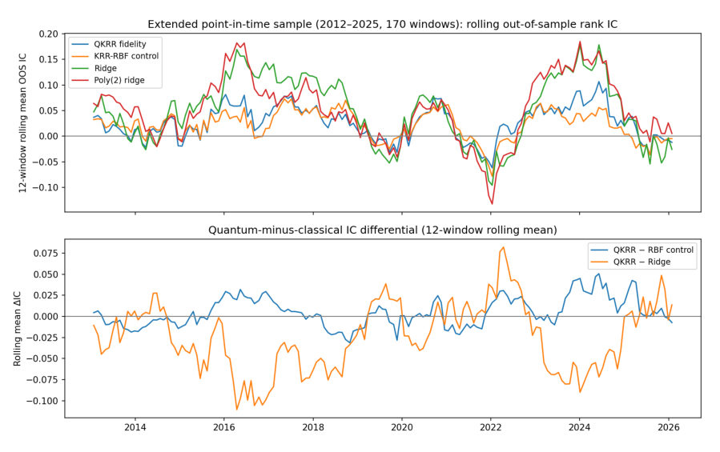
<figcaption class="paper-figure-caption"><b>Fig 1.</b> Figure 1: Main evaluation, 170 windows. Top: 12-window rolling mean out-of-sample rank IC. Bottom: rolling quantum-minus-classical IC differentials.</figcaption>
</figure>
<figure class="paper-figure-card">
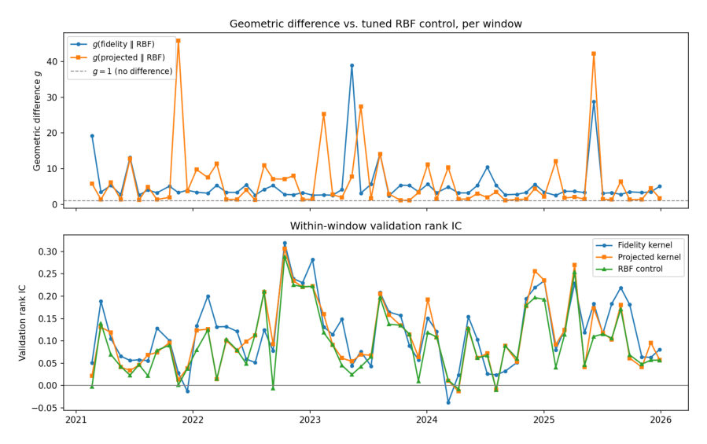
<figcaption class="paper-figure-caption"><b>Fig 2.</b> Figure 2: Short-sample study, 60 windows. Top: regularized geometric difference g between quantum kernels and the tuned RBF control. Bottom: within-window validation rank ICs of the three kernels.</figcaption>
</figure>

**Summary.** This paper rigorously tests if quantum kernels can predict stock returns better than classical methods using financial time series. The authors find that apparent quantum advantages are artifacts of flawed testing protocols, such as using hindsight data or unequal training budgets. They propose strict standards for future empirical claims of quantum advantage in complex systems.

**Why it may be interesting.** While applied to finance, the methodology—developing strict protocol standards for claiming 'quantum advantage' in empirical data—is highly relevant to any field where theoretical quantum predictions meet noisy, real-world measurements (e.g., characterizing subtle effects in condensed matter experiments).

Detailed structure

**Main problem.** The study investigates whether quantum kernels provide a genuine, exploitable advantage over established classical machine learning methods for predicting cross-sectional stock returns.

**Main result.** Under rigorous, point-in-time evaluation protocols with sufficient statistical power, no statistically significant quantum advantage was found; penalized linear models consistently outperformed or matched the quantum kernel performance.

**Method.** The authors employed a 'kernel-swap control' protocol, comparing Quantum Kernel Ridge Regression (QKRR) against classical controls like RBF kernels and linear regressions using walk-forward out-of-sample testing on financial data.

**Model / system.** The system is the Chinese A-share stock market return cross-section. The models involve quantum encoding via an IQP-style layer to generate a fidelity kernel, which is then compared against classical kernels and linear predictors.

**Key observables.** Information Coefficient (IC), $\Delta$IC difference, $p$-values, Sharpe ratio, and the performance of various regression models over 170 walk-forward windows.

**Important parameters / regimes.** The evaluation is highly sensitive to protocols: point-in-time universes, budget equalization, and multiplicity correction are critical parameters for determining significance.

**Assumptions / limitations.** The primary assumption tested is that the market structure allows for a stable, exploitable quantum advantage; the paper concludes this assumption is likely false due to methodological artifacts in prior literature.

**Figures summary.** Figures compare rolling IC differentials between quantum and classical kernels, showing how apparent advantages vanish when accounting for sample size or budget constraints.

**Paper structure.** The paper establishes the problem by testing QKRR against controls. It then details rigorous evaluation protocols (kernel-swap, point-in-time) across many windows, systematically debunking spurious quantum advantages through statistical corrections and diagnostic analyses of kernel geometry vs. out-of-sample gains.

Abstract

Do quantum kernels improve cross-sectional stock return prediction? We run a controlled horse race on the Chinese A-share market in which a quantum fidelity kernel, a projected quantum kernel, and a classical RBF control share identical training subsamples, solver, and tuning budgets, so that only the kernel is exchanged. On the main evaluation -- a point-in-time universe and 170 walk-forward windows (2012-2025) -- no quantum advantage exists: the fidelity kernel is indistinguishable from its RBF control ($Δ$IC $=+0.005$, $p=0.42$), and a $2\times2$ design crossing kernel type with training budget (a Nystrom extension to the full ~38,000-observation windows) shows quantum kernels matching, but never beating, equal-budget linear models; after family-wise correction no pairwise difference among eleven models is significant, with point estimates favoring penalized linear regressions throughout. We then document how the opposite conclusion arises: a 60-window evaluation on a universe screened with full-sample information makes the same quantum kernel appear dominant on stability criteria and significantly better than neural baselines. Interaction characteristics from the anomalies literature help nothing, quantum or classical; a widened bandwidth grid reveals an interior optimum rather than the near-classical endpoint a coarse grid suggests; and the geometric difference, while large throughout ($g \gg 1$), does not predict out-of-sample gains ($ρ=-0.20$). We propose protocol standards -- kernel-swap controls, budget-equalized comparisons, point-in-time universes, and multiplicity-robust inference -- for empirical claims of quantum advantage in finance.

[↑ back to top](#top)

### [Schrödinger's real-valued equation revisited](http://arxiv.org/abs/2607.20104v1)

**Authors:** Oliver Passon, Bernd Rosenow  
**Type:** theory · **Category:** other · **PDF:** <https://arxiv.org/pdf/2607.20104v1>  
**Analysis basis:** full PDF text, analyzed in chunks

↔ Scroll figures horizontally

<figure class="paper-figure-card">
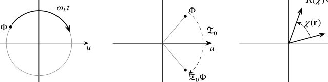
<figcaption class="paper-figure-caption"><b>Fig 1.</b> Figure 1: The local real phase plane (𝑢, 𝜋∕ℏ) at a fixed point. (a) Free evolution rotates every energy mode clockwise at its frequency 𝜔𝑘= 𝐸𝑘∕ℏ, drawn for 𝐸𝑘&gt; 0 (Sec. 5.3); the Born density is the squared radius 𝑢2 + 𝜋2∕ℏ2, the conserved 𝐴2 𝑘of each mode. (b) Spinless time reversal 𝔗0 ∶(𝑢, 𝜋) ↦(𝑢, −𝜋) is the reflection in the 𝑢-axis – the real form of complex conjugation (Sec. 10). (c) A gauge transformation rotates the pair by the position-dependent angle 𝜒(𝐫), Eq. (145), while the vector potential shifts as 𝐴𝑖↦𝐴𝑖+ (ℏ∕𝑞) 𝜕𝑖𝜒, Eq. (149).</figcaption>
</figure>

**Summary.** This paper rigorously examines attempts to reformulate quantum mechanics using only real variables instead of the standard complex wave function. It demonstrates that while the explicit imaginary unit can be absorbed or hidden, the underlying mathematical structure—the symplectic form—must persist. The necessity of this structure is highlighted by analyzing failures in single-field reductions when magnetic fields are introduced.

**Why it may be interesting.** This work is highly relevant as it probes the fundamental mathematical structure underpinning quantum theory, touching upon gauge symmetries and the geometric interpretation of complex numbers in physical observables.

Detailed structure

**Main problem.** The paper investigates whether quantum mechanics, typically formulated with a complex wave function ($\psi$), can be equivalently described using purely real-valued variables.

**Main result.** While the explicit imaginary unit ($i$) can be removed or hidden in specific formulations (like Majorana fields), the underlying symplectic and complex structure it encodes must reappear, often manifesting as non-local relations or canonical partners.

**Method.** The authors employ mathematical reduction techniques by splitting $\psi = u+iv$ into real components, comparing this to phase-space reconstructions, and analyzing specialized formulations like those involving Majorana fields.

**Model / system.** The study applies to general quantum mechanical systems governed by the Hamiltonian ($\hat{H}$), examining both non-relativistic (Schrödinger) and relativistic (Dirac/Majorana) contexts, including interactions with magnetic fields.

**Key observables.** Probability density ($
ho = u^2 + v^2$), probability current, angular momentum expectation values ($\langle L_z 
angle$).

**Important parameters / regimes.** Magnetic field strength ($B$), coupling constants ($q, e$), and the structure of the Hamiltonian operator $\hat{H}$.

**Assumptions / limitations.** The primary assumption tested is that a complete local description can be achieved solely with real variables; this fails when magnetic fields are present or requires non-local reconstruction.

**Figures summary.** Figures illustrate the Zeeman effect splitting in angular momentum states, showing how the degeneracy is resolved into two counter-rotating branches ($\Omega^+, \Omega^-$) due to the magnetic field coupling.

**Paper structure.** The paper progresses from reviewing historical real-valued attempts (single-field reduction), identifying failures under magnetic fields (non-locality via $\hat{H}^{-1}$), and concluding by comparing these findings with advanced structures like Majorana fermions in relativistic quantum mechanics.

Abstract

The Schrödinger equation can be rewritten as a second-order equation for a single real-valued scalar field. Taken at face value, however, this one-field reduction obscures several local structures of quantum mechanics: the Born density and current, the role of momentum as a generator, and the usual derivation of the uncertainty relation. We argue that these difficulties do not show that real variables fail. They show that the reduced equation is not, by itself, a complete local representation of the theory. Its coherent real form is obtained by restoring the underlying Hamiltonian phase-space structure, where the missing component reappears as a canonical partner. In this real phase-space formulation, the standard structures reappear locally, and minimal magnetic coupling reveals an internal \(SO(2)\) gauge structure. Thus, the symbol \(i\) can be removed, but the symplectic and complex structure it encodes cannot.

[↑ back to top](#top)

## Secondary cond-mat archives

*Papers from cond-mat.mtrl-sci, mes-hall, other, soft, supr-con. These archives are de-prioritized — they appear at the end regardless of relevance score.*

### Relevant in secondary archives (15)

### [THz-Driven Floquet Spin Valve-Modulator](http://arxiv.org/abs/2607.19897v1)

**Authors:** R. G. Nazmitdinov  
**Type:** theory · **Category:** other · **PDF:** <https://arxiv.org/pdf/2607.19897v1>  
**Analysis basis:** full PDF text, analyzed in chunks
**Topic relevance:** 🔥 `non-equilibrium dynamics` **4/5** · `exotic spin models in light-matter` **3/5** · `methods for driven-dissipative` **3/5** · `spintronics-quantum-optics interface` **3/5** · `analog quantum simulation` **2/5** · `driven-dissipative phase transition` **2/5** · `non-equilibrium universality` **2/5** · `Keldysh / 2PI / non-Gaussian methods` **1/5** · `Kondo & dissipative impurity` **1/5**

↔ Scroll figures horizontally

<figure class="paper-figure-card">
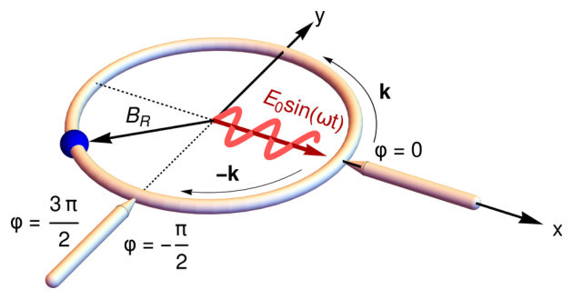
<figcaption class="paper-figure-caption"><b>Fig 1.</b> Figure 1: Sketch of a high-frequency electromagnetic field interacting with an electron</figcaption>
</figure>
<figure class="paper-figure-card">
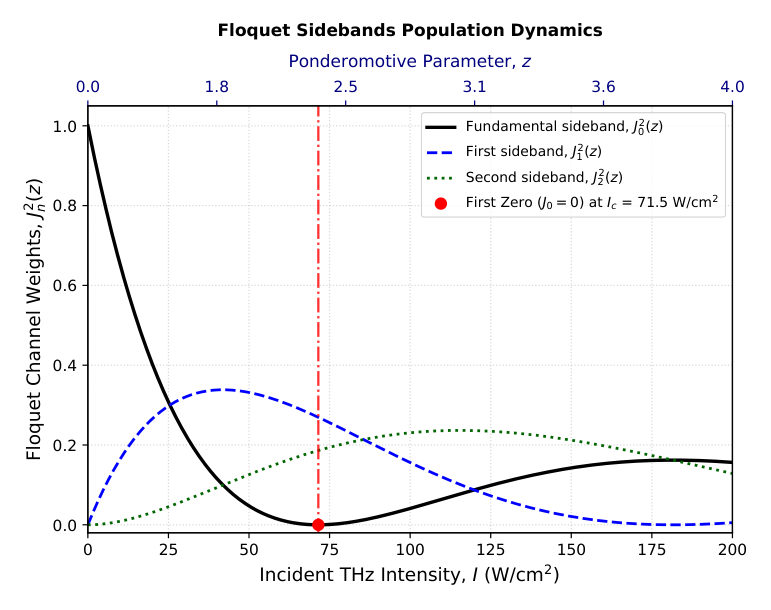
<figcaption class="paper-figure-caption"><b>Fig 2.</b> Figure 3: Calculated effective transport weights of the three lowest Floquet sidebands,</figcaption>
</figure>
<figure class="paper-figure-card">

<figcaption class="paper-figure-caption"><b>Fig 3.</b> Fig. 3 map out the field-dependent behavior of the Floquet scattering channels. At weak</figcaption>
</figure>
<figure class="paper-figure-card">
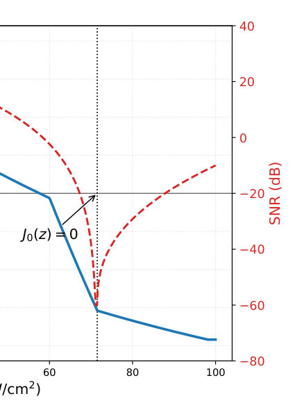
<figcaption class="paper-figure-caption"><b>Fig 4.</b> Figure 4: Calculated non-equilibrium spin polarization 𝑃(𝐼) and the corresponding</figcaption>
</figure>
<figure class="paper-figure-card">
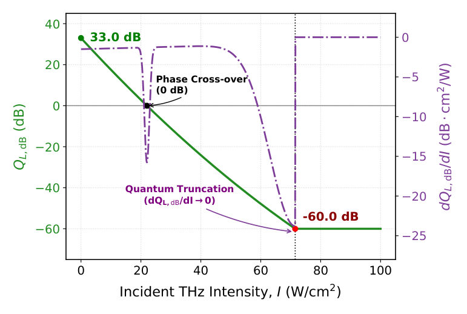
<figcaption class="paper-figure-caption"><b>Fig 5.</b> Figure 5: Calculated non-equilibrium logarithmic Loaded Quality Index 𝑄𝐿,dB (left vertical</figcaption>
</figure>

**Summary.** The paper proposes using THz fields to control spin transport in an asymmetric quantum ring structure, mimicking the function of a spin transistor without physical gates. By leveraging Floquet theory and geometric phase effects, it achieves high-contrast switching and precise spin manipulation. This offers a robust, ultrafast alternative for spintronic devices.

**Why it may be interesting.** This work bridges concepts from topological physics (Aharonov-Casher phase), periodically driven systems (Floquet engineering), and mesoscopic transport, offering a novel platform for ultrafast spintronics that avoids static material limitations.

Detailed structure

**Main problem.** The research aims to create a high-speed, contactless electromagnetic analog of the Datta–Das spin field-effect transistor using time-varying THz fields.

**Main result.** The interplay between topological Aharonov-Casher phase and dynamic Floquet modulation enables both ultra-high-contrast current suppression (an 'optical shutter') and precise spin control in a 1D quantum ring.

**Method.** The analysis employs the scattering matrix formalism adapted to the high-frequency Floquet–Magnus expansion, treating the system as an open quantum system coupled to reservoirs.

**Model / system.** The physical platform is a 1D quantum ring with an asymmetric ($\pi/2$) configuration of quantum point contacts. The dynamics are governed by a time-dependent Hamiltonian subjected to a linearly polarized THz electric field.

**Key observables.** Spin polarization $P(I)$, current suppression contrast, and the evolution of the relative spin phase difference $\Delta\varphi$.

**Important parameters / regimes.** THz frequency ($\omega$), Fermi energy ($E_F$), structural asymmetry ratio ($\pi/2$ configuration), and laser intensity ($I$).

**Assumptions / limitations.** The analysis relies on the high-frequency limit, utilizing the length gauge transformation to simplify the time dependence via the Floquet-Magnus expansion.

**Figures summary.** Figure 1 sketches THz field interaction paths in the ring arms; later sections discuss intensity-driven transport characteristics near exceptional points (EPs).

**Paper structure.** The paper progresses from establishing the theoretical framework using the $S$-matrix and Floquet theory to analyzing the effective Hamiltonian, and finally detailing how asymmetry and external driving fields induce spin control via interference effects.

Abstract

Within the scattering matrix ($S$-matrix) framework adapted to the high-frequency Floquet--Magnus formalism based on the length gauge, we investigate spin-dependent quantum transport in a 1D quantum ring with an asymmetric ($π/2$) configuration of quantum point contacts. We demonstrate the realization of a contactless electromagnetic analog of the Datta--Das spin field-effect transistor with ferromagnetic leads operating at zero static magnetic field. It is shown that an off-resonance terahertz (THz) field enables high-precision switching between spin channels without altering the static parameters of the nanostructure. Driven by an electronic Vernier effect, the quantum interference in the asymmetric geometry yields a selective spin phase rotator alongside an ultra-high-contrast current-suppression regime (``optical shutter''). The proposed architecture is fundamentally robust against multiphoton leakage sidebands, offering a thermally immune, high-speed alternative to conventional semiconductor static spin transistors.

[↑ back to top](#top)

### [Chiral Magnetic Conductivity in the Tight-Binding Model of Dirac Semimetals](http://arxiv.org/abs/2607.19589v1)

**Authors:** Mustafa Bohra, Yuexiang Zhang, M. A. Zubkov  
**Type:** theory · **Category:** other · **PDF:** <https://arxiv.org/pdf/2607.19589v1>  
**Analysis basis:** full PDF text, analyzed in chunks
**Topic relevance:** 🔥 `Keldysh / 2PI / non-Gaussian methods` **4/5** · `methods for driven-dissipative` **3/5** · `non-equilibrium dynamics` **2/5** · `analog quantum simulation` **1/5** · `driven-dissipative phase transition` **1/5** · `non-equilibrium universality` **1/5**

↔ Scroll figures horizontally

<figure class="paper-figure-card">
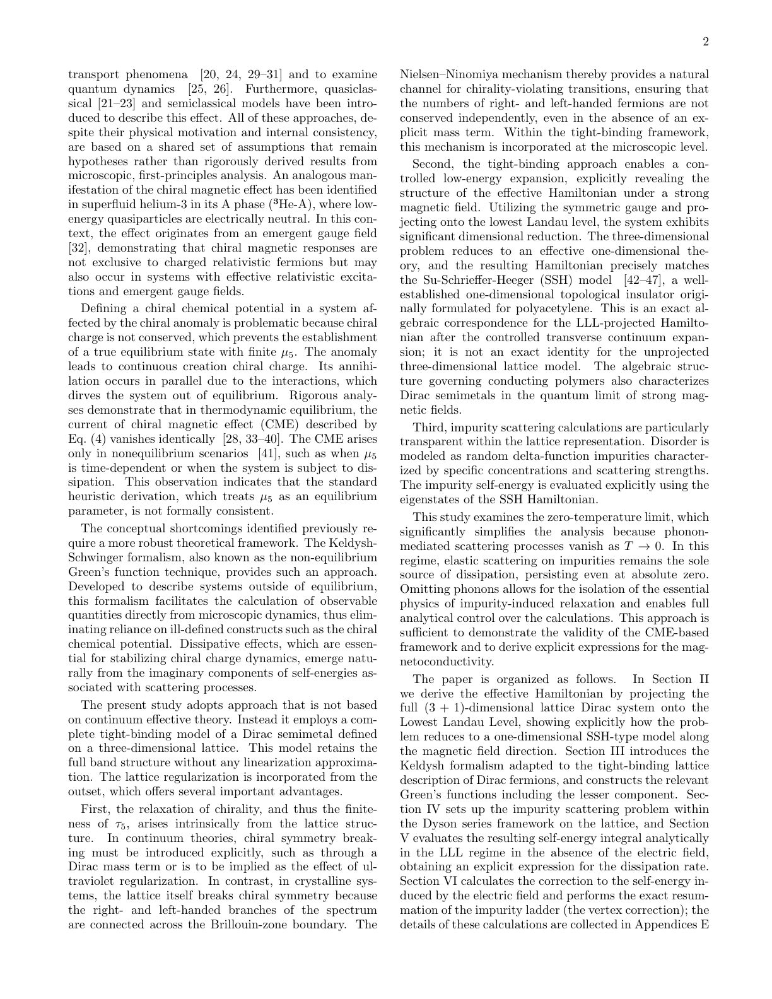
<figcaption class="paper-figure-caption"><b>Fig 1.</b> Low-resolution page preview, page 2</figcaption>
</figure>
<figure class="paper-figure-card">
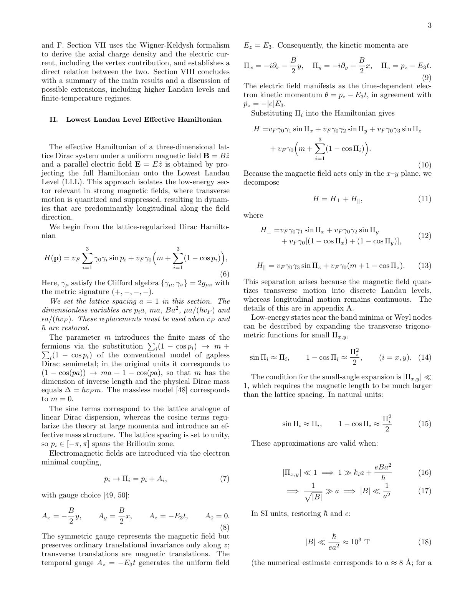
<figcaption class="paper-figure-caption"><b>Fig 2.</b> Low-resolution page preview, page 3</figcaption>
</figure>
<figure class="paper-figure-card">
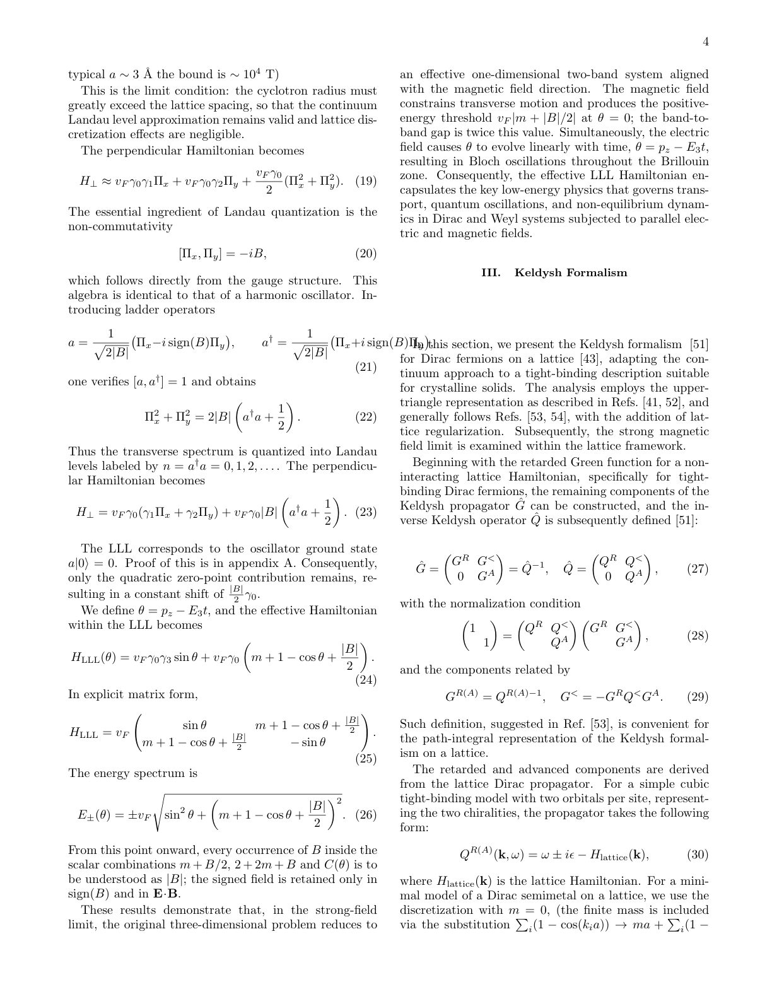
<figcaption class="paper-figure-caption"><b>Fig 3.</b> Low-resolution page preview, page 4</figcaption>
</figure>
<figure class="paper-figure-card">
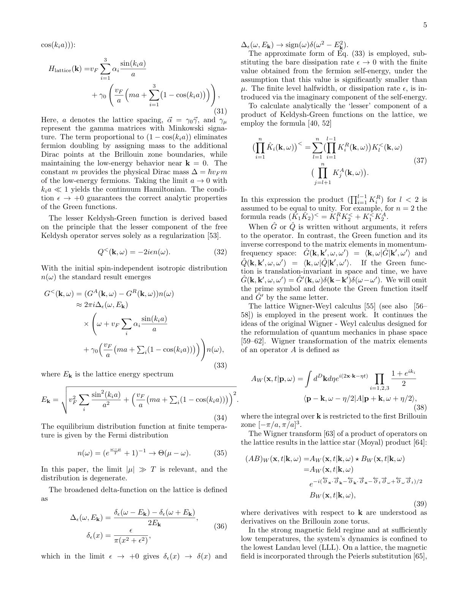
<figcaption class="paper-figure-caption"><b>Fig 4.</b> Low-resolution page preview, page 5</figcaption>
</figure>
<figure class="paper-figure-card">
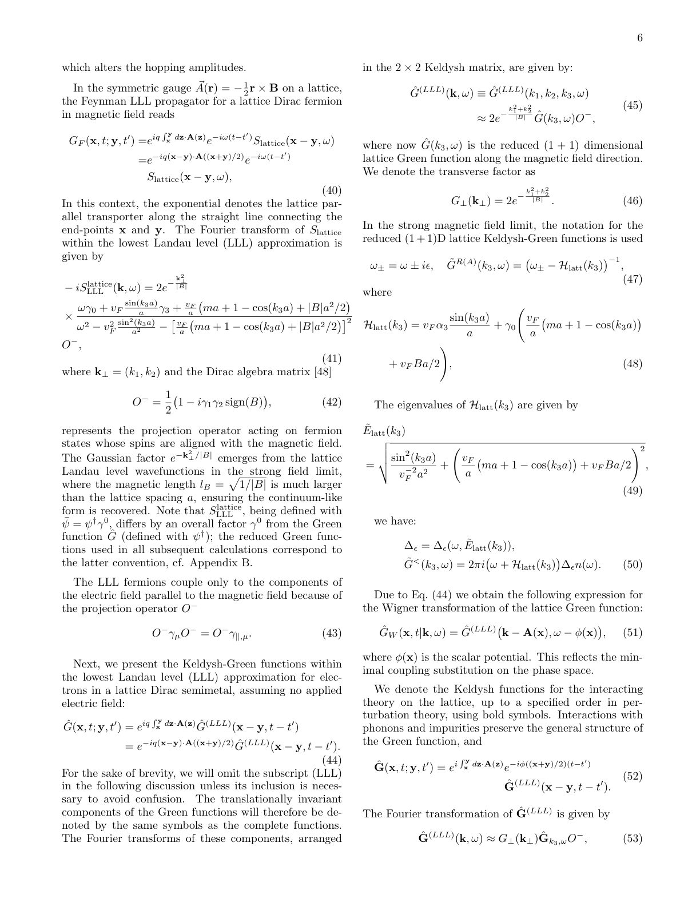
<figcaption class="paper-figure-caption"><b>Fig 5.</b> Low-resolution page preview, page 6</figcaption>
</figure>

**Summary.** This work theoretically analyzes chiral magnetic conductivity in Dirac semimetals using a lattice tight-binding model under combined electric and magnetic fields. By employing the Keldysh formalism and projecting onto the Lowest Landau Level, the authors rigorously demonstrate that the magnetoconductivity originates from the Chiral Magnetic Effect (CME). This provides a robust, non-linear approximation for understanding topological transport phenomena.

**Why it may be interesting.** While focused on condensed matter transport, the use of advanced non-equilibrium Green's functions (Keldysh) and Wigner-Weyl calculus provides powerful theoretical tools applicable to open quantum systems dynamics far from equilibrium.

Detailed structure

**Main problem.** The study investigates the source of magnetoconductivity, specifically confirming that the Chiral Magnetic Effect (CME) is responsible for the observed dependence on magnetic fields in Dirac semimetals.

**Main result.** The lattice-based calculation confirms the CME contribution to conductivity by analyzing the system's response using non-equilibrium Green's functions. The results are derived rigorously within a tight-binding framework, avoiding continuum approximations.

**Method.** The analysis employs the Keldysh-Schwinger formalism and Wigner-Weyl calculus on a lattice model. It involves projecting the full Hamiltonian onto the Lowest Landau Level (LLL) to reduce the problem dimensionality.

**Model / system.** The system is a Dirac semimetal modeled by a tight-binding Hamiltonian on a 3D lattice, subjected to both magnetic ($\vec{B}$) and electric ($\vec{E}$) fields. The effective model in strong $\vec{B}$ fields reduces to an SSH-like 1D system.

**Key observables.** Longitudinal magnetoconductivity ($\sigma_{zz}$), chiral charge density ($
ho_5$), and the CME current formula ($j \propto B$).

**Important parameters / regimes.** Strong magnetic field limit, zero temperature ($T 	o 0$), impurity scattering rate ($	au_5^{-1}$).

**Assumptions / limitations.** The analysis assumes $T=0$, isolating elastic impurity scattering as the sole source of dissipation. The LLL projection is a key approximation used to simplify the dynamics.

**Paper structure.** The paper progresses from defining the full lattice Hamiltonian, projecting it onto the LLL in strong fields, setting up the Keldysh formalism on the lattice, and finally deriving explicit expressions for magnetoconductivity using this robust framework.

Abstract

We consider the typical tight - binding model of Dirac semimetal in the presence of both magnetic and electric fields. The electric conductivity reveals dependence on magnetic field. We calculate this dependence in the limit of strong magnetic field, when the given model is described effectively by the one - dimensional SSH model because the dynamics in the plane orthogonal to magnetic field is reduced to that of the lowest Landau level (LLL). Considering the small temperature limit we take into account dissipation due to scattering on impurities. The corresponding dissipation rate is calculated explicitly. The obtained results confirm that the source of the magnetoconductivity in this system is chiral magnetic effect.

[↑ back to top](#top)

### [Nonreciprocal phonon propagation via spatially asymmetric magnon-phonon coupling](http://arxiv.org/abs/2607.19788v1)

**Authors:** Hiroyuki Moriya, Motoki Asano, Daiki Hatanaka, Yoshitaka Taniyasu, Hajime Okamoto, Hiroshi Yamaguchi  
**Type:** both · **Category:** other · **PDF:** <https://arxiv.org/pdf/2607.19788v1>  
**Analysis basis:** full PDF text, analyzed in chunks
**Topic relevance:** 🔥 `spintronics-quantum-optics interface` **4/5** · `correlated / nonlocal dissipation` **1/5** · `driven-dissipative phase transition` **1/5** · `exotic spin models in light-matter` **1/5** · `non-equilibrium dynamics` **1/5**

↔ Scroll figures horizontally

<figure class="paper-figure-card">
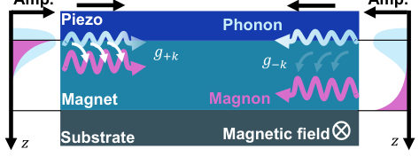
<figcaption class="paper-figure-caption"><b>Fig 1.</b> FIG. 1. Schematic of asymmetric magnomechanical coupling between phonon and magnon propagation with a mode am- plitude (amp.) in the thickness (z) direction.</figcaption>
</figure>
<figure class="paper-figure-card">
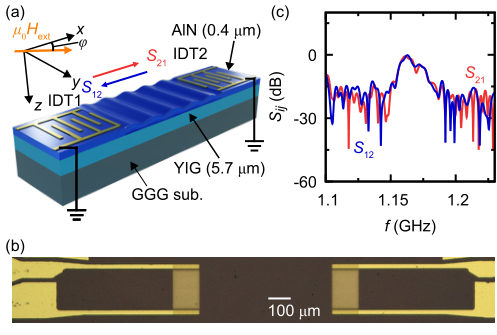
<figcaption class="paper-figure-caption"><b>Fig 2.</b> FIG. 2. (a) Schematic illustration of a surface acous- tic wave (SAW) device containing Y3Fe5O12 (YIG) on a Gd3Ga5O12 (GGG) substrate, covered by piezoelectric AlN film. (b) Photograph of the SAW device. The two interdigi- tated transducers (IDTs) are connected to the electrode pads, and the SAW propagates between the IDTs.(c) Representa- tive SAW transmission spectra for S12 (blue) and S21 (red) in the absence of a magnetic field.</figcaption>
</figure>
<figure class="paper-figure-card">
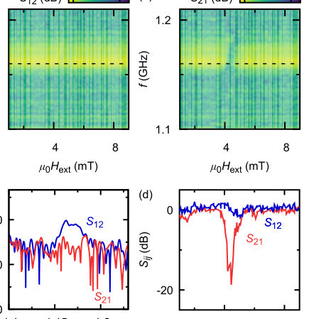
<figcaption class="paper-figure-caption"><b>Fig 3.</b> FIG. 3. (a)-(b) Measured SAW spectra as a function of exter- nal magnetic field µ0Hext and frequency f at angle ϕ = 90◦</figcaption>
</figure>
<figure class="paper-figure-card">
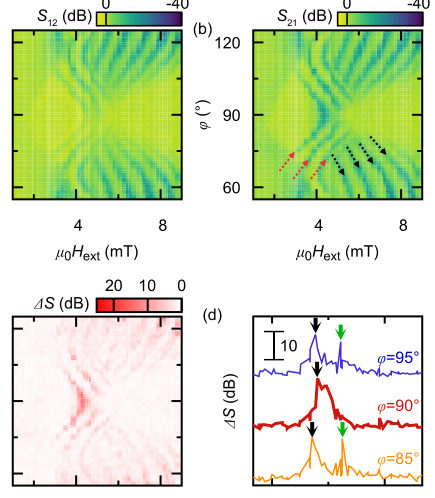
<figcaption class="paper-figure-caption"><b>Fig 4.</b> FIG. 4. (a)-(b) Color maps of SAW absorption signals as functions of external magnetic field µ0Hext and its in-plane angle ϕ for (a) S12 and (b) S21. (c) Color map of the nonre- ciprocity defined as ∆S = |S12 −S21|. (d) Line-cut profiles of ∆S extracted from panel (c) at ϕ = 85◦(orange), 90◦(red) and 95◦(blue).</figcaption>
</figure>
<figure class="paper-figure-card">
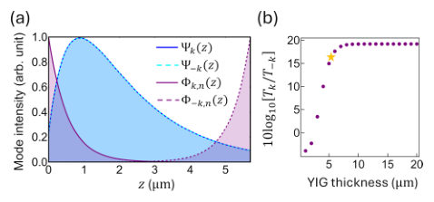
<figcaption class="paper-figure-caption"><b>Fig 5.</b> FIG. 5. (a) Magnon and phonon spatial profiles in the thick- ness, z, directions. (b) Transmission ratio between the for- ward and backward proapagations with respect to YIG thick- ness. The yellow star corresponds to the experimental condi- tion.</figcaption>
</figure>

**Summary.** The authors report achieving significant nonreciprocal phonon propagation in a magnetic thin film device by coupling surface acoustic waves to magnon modes. This directionality is shown to stem from the spatial asymmetry of the magnon-phonon interaction, which they model using coupled wave equations. The findings establish a novel, highly efficient strategy for unidirectional acoustic energy transfer.

**Why it may be interesting.** This work provides an excellent example of engineered nonreciprocity using magnomechanics, which is highly relevant for developing quantum devices where directional control (e.g., in quantum communication or sensing) is paramount.

Detailed structure

**Main problem.** The study demonstrates nonreciprocal propagation of surface acoustic waves (SAWs) by exploiting spatially asymmetric magnon-phonon coupling in a magnomechanical device.

**Main result.** A large, direction-dependent absorption contrast ($\Delta S$) was observed, reaching $25.2 	ext{ dB/mm}$, which is theoretically attributed to the interaction with surface-localized magnon modes.

**Method.** The research combines experimental measurements of SAW transmission ($S_{12}, S_{21}$) using a VNA with theoretical modeling based on coupled equations of motion for phonon and magnon fields.

**Model / system.** The physical platform is an AlN/YIG heterostructure, where the coupling mechanism relies on the spatial asymmetry of magnon modes localized near interfaces due to dipole-dipole interactions.

**Key observables.** SAW transmission spectra ($S_{12}$ and $S_{21}$) as functions of external magnetic field ($\mu_0H_{	ext{ext}}$) and angle ($\phi$); the nonreciprocity contrast $\Delta S = |S_{12} - S_{21}|$.

**Important parameters / regimes.** The optimal nonreciprocity is achieved at specific external magnetic fields (e.g., $4.2 	ext{ mT}$) and angles ($\phi=90^\circ$); the YIG layer thickness ($5.7 \mu	ext{m}$) is crucial.

**Assumptions / limitations.** The nonreciprocity mechanism is primarily governed by coupling to surface-localized magnon modes, which exhibit an exponential decay profile along the film thickness.

**Figures summary.** Figures show schematic representations of asymmetric coupling (Fig. 1), device setups and baseline spectra (Fig. 2), field dependence plots showing clear directional dips in $S_{21}$ but not $S_{12}$ (Fig. 3), and color maps illustrating the angle-dependent nonreciprocity contrast $\Delta S$ (Fig. 4).

**Paper structure.** The paper progresses from experimental demonstration of large, direction-dependent absorption in a piezo-on-magnet system to theoretical modeling that confirms this effect arises specifically from spatially asymmetric magnon-phonon coupling involving surface modes.

Abstract

Nonreciprocal propagation of surface acoustic waves (SAWs) based on the spatial asymmetry of magnon-phonon coupling is demonstrated. This nonreciprocity is enabled by an acoustic wavelength scale thick magnetic layer formed under a thin piezoelectric film. In this configuration, magnon modes activated by dipole-dipole interactions are localized near either the top or bottom interface depending on the propagation direction of the SAW. As a result, the spatial overlap between interfacial magnon and surface phonon modes is expected to become direction dependent, in a manner that leads to distinct unidirectional propagation of SAWs. Notably, the resulting nonreciprocity reaches the highest level among those reported for SAW devices based on a single magnetic layer. This finding will establish a new strategy of nonreciprocal acoustic propagation in a structurally simple magnomechanical device.

[↑ back to top](#top)

### [Electron-Induced Formation of C$_{2}$ on Si(100) from Acetylene and Ethylene](http://arxiv.org/abs/2607.19488v1)

**Authors:** Oliver MacLean, Marc Savoie, Damian G. Allis, Rafik Addou, Ryan Groome, Si Yue Guo, Aru Joy Hill, Alex Inayeh, Hadiya Ma, Cameron J. Mackie, Sheena Ou, Marco Taucer, Denis A. B. Therien, Finley Van Barr, Ryan Yamachika  
**Type:** both · **Category:** other · **PDF:** <https://arxiv.org/pdf/2607.19488v1>  
**Analysis basis:** full PDF text, analyzed in chunks
**Topic relevance:** `non-equilibrium dynamics` **3/5** · `driven-dissipative phase transition` **2/5** · `methods for driven-dissipative` **2/5** · `non-equilibrium universality` **2/5** · `Keldysh / 2PI / non-Gaussian methods` **1/5** · `Kondo & dissipative impurity` **1/5** · `analog quantum simulation` **1/5** · `correlated / nonlocal dissipation` **1/5** · `measurement-induced transitions` **1/5** · `quantum measurements` **1/5**

↔ Scroll figures horizontally

<figure class="paper-figure-card">
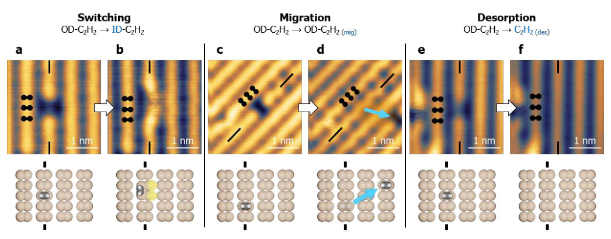
<figcaption class="paper-figure-caption"><b>Fig 1.</b> Figure 1: Tunneling-electron-induced molecular displacements of acetylene. All STM images are filled-state, and visualizations below show the position of the acetylene features on the Si lattice. (a,b) A switch from the OD (a) to ID (b) configuration induced by a +3.2 V pulse (average current &gt;10 nA) over the center of the OD feature. (c,d) Long-range migration of OD-C2H2 induced by a +3.6 V pulse (4.6 nA). (e,f) Presumed desorption of OD-C2H2 induced by a +3.6 V pulse (2 nA). No new acetylene was observed within a radius of 6 nm. In each image, vertical lines indicate the center of the dimer rows and horizontal lines show the positions of three adjacent dimers. Imaging parameters: (a,b)...</figcaption>
</figure>
<figure class="paper-figure-card">
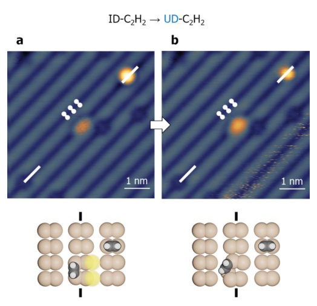
<figcaption class="paper-figure-caption"><b>Fig 2.</b> Figure 2: Formation of a new acetylene configuration, interpreted as the under-dimer (UD) geometry, induced by tunneling-electron excitation. (a,b) Empty-state images showing conversion from ID-C2H2 to UD-C2H2 induced by a +3.4 V pulse (0.2 nA). Imaging parameters: (a,b) +2.0 V, 100 pA. See Figure S2 for a visualization of the UD-C2H2 geometry.</figcaption>
</figure>
<figure class="paper-figure-card">
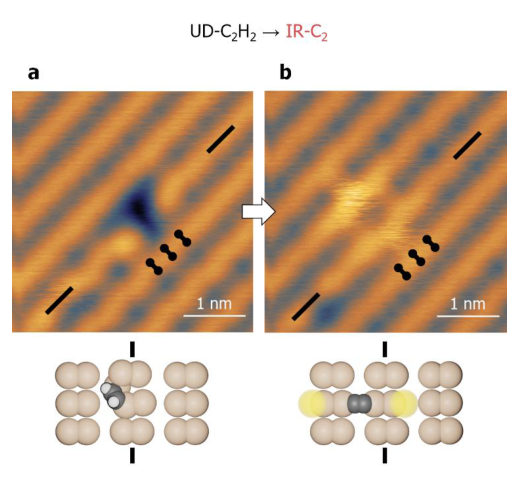
<figcaption class="paper-figure-caption"><b>Fig 3.</b> Figure 3: Formation of C2 by tunneling-electron excitation of acetylene. (a,b) Filled-state STM images showing dehydrogenation, along with a configuration change, of a UD-C2H2 to a new feature in an IR geometry induced by a +3.4 V pulse (4.5 nA). Imaging parameters: (a,b) −1.8 V, 50 pA.</figcaption>
</figure>
<figure class="paper-figure-card">
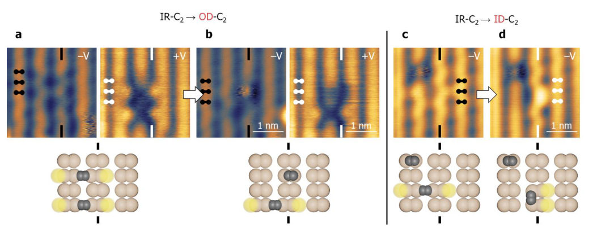
<figcaption class="paper-figure-caption"><b>Fig 4.</b> Figure 4: Tunneling-electron-induced switching of C2. (a,b) Filled- and empty-state STM images showing the conversion of IR-C2 to OD-C2 by a +4.7 V pulse (&gt;10 nA). The streakiness of the resulting OD- C2 feature is attributed to switching between two tilted orientations of the C2. Both polarities are included to make both the starting IR-C2 and ending OD-C2 features clear. (c,d) Filled-state STM images showing the conversion of IR-C2 to ID-C2 by a +4.7 V pulse (&gt;10 nA). No empty-state image was recorded after the switching because the change is clear from filled-state imaging. Imaging parameters: (a) −2.0 V, 200 pA; +2.6 V, 100 pA (b) −2.4 V, 100 pA; +2.6 V, 100 pA (c) −2.0 V, 100 pA (d)...</figcaption>
</figure>
<figure class="paper-figure-card">

<figcaption class="paper-figure-caption"><b>Fig 5.</b> Figure 5 shows the main acetylene and C2 features and the matching STM simulations. To reduce the possibility of excessive tailoring of the STM simulations to the experiment, the images in Figure 5 are presented with a single bias/energy and a common Z-scale for each polarity and experiment or simulation. A downward shift in magnitude was applied to the simulation energies relative to the experimental biases to account for experimental factors such as band bending32 and theoretical limitations including the absence of dopants and any issues related to the use of molecular proxies. The wider Z-range spanned in the simulated topographies is in part due to inclusion of the edge of the proxy in...</figcaption>
</figure>

**Summary.** This work uses STM and DFT to study how electrons trigger dehydrogenation reactions of adsorbed hydrocarbons ($	ext{C}_2	ext{H}_2$, $	ext{C}_2	ext{H}_4$) on $	ext{Si}(100)$. The key finding is that electron excitation causes the molecules to shed hydrogen atoms, forming stable carbon clusters ($	ext{C}_2$) in several distinct atomic arrangements. This demonstrates a powerful new tool for atomically precise surface functionalization.

**Why it may be interesting.** While focused on surface chemistry, the use of controlled electronic excitation (STM bias) to drive chemical reactions is analogous to studying non-equilibrium quantum processes or localized energy deposition effects relevant to open quantum systems.

Detailed structure

**Main problem.** The study investigates electron-induced dehydrogenation of adsorbed hydrocarbons ($	ext{C}_2	ext{H}_2$ and $	ext{C}_2	ext{H}_4$) on the $	ext{Si}(100)$ surface to understand the formation of stable $	ext{C}_2$ species.

**Main result.** Electron excitation using STM induces configurational switching, migration, and dehydrogenation, leading to the formation of $	ext{C}_2$ in multiple distinct geometries ($	ext{IR-C}_2$, $	ext{OD-C}_2$, $	ext{ID-C}_2$).

**Method.** The research combines Scanning Tunneling Microscopy (STM) experiments with Density Functional Theory (DFT) calculations to model the electronic and structural changes.

**Model / system.** The physical system is adsorbed acetylene or ethylene on a $	ext{Si}(100)$ surface, studied at cryogenic temperatures ($4 	ext{ K}$). The process involves electron tunneling excitation to drive chemical reactions.

**Key observables.** Configurational switching ($	ext{OD} \leftrightarrow 	ext{ID}$), dehydrogenation product formation ($	ext{C}_2$), and the observation of multiple stable $	ext{C}_2$ geometries.

**Important parameters / regimes.** Excitation biases (e.g., $\ge+3.2 	ext{ V}$, $\ge+4.2 	ext{ V}$), temperature ($4 	ext{ K}$), and applied current/voltage settings for STM.

**Assumptions / limitations.** The interpretation relies on DFT simulations that must account for complex surface dynamics like dimer flipping, contrast inversion, and the stability of various adsorption intermediates.

**Figures summary.** Figures illustrate molecular displacements (switching, migration) induced by tunneling electrons; other figures show the new asymmetric feature ($	ext{UD}$) and evidence for $	ext{C}_2$ formation in different geometries.

**Paper structure.** The paper systematically presents STM observations of initial adsorption configurations, followed by characterization of structural changes upon electron excitation, culminating in the identification and simulation of dehydrogenation products.

Abstract

Hydrogen Desorption Lithography on Si(100) demonstrates the ability of the Scanning Tunneling Microscope (STM) to create functional atomic-scale structures and devices. The dehydrogenation of adsorbed molecules represents a potential complementary technique that has received little attention. For example, formation of C$_{2}$ could introduce local strain or act as centers for subsequent reactions and would inform positionally controlled mechanosynthesis, an approach with vast potential in surface patterning and functionalization. Here, we studied the electron-induced dehydrogenation of acetylene and ethylene on Si(100) at 4 K using STM. Excitation of acetylene at +3.2 V and above induces configurational switching, including to a new sublayer-bonded geometry previously predicted to be an adsorption precursor, as well as migration and desorption. Excitation also induces dehydrogenation to C$_{2}$. Switching between three observed C$_{2}$ configurations can be induced by excitation at +4.2 V and above. Simulations using density functional theory reproduced the experimental images based on choice of functional, dimer-buckling averaging, and inclusion of diffuse basis functions. In addition, dehydrogenation could be induced using field-emitted electrons on a scale ranging from a single molecule to a radius of >10 nm. These observations highlight the potential of carbon dehydrogenation as an additional tool in Atomically Precise Fabrication (APF).

[↑ back to top](#top)

### [Frequency-Division Multiplexing in Magnonic Waveguides](http://arxiv.org/abs/2607.20102v1)

**Authors:** Alina-Cristina Bunea, Laurentiu Stoleriu, Giacomo Talmelli, Dan Neculoiu, Christoph Adelmann, Florin Ciubotaru  
**Type:** both · **Category:** other · **PDF:** <https://arxiv.org/pdf/2607.20102v1>  
**Analysis basis:** full PDF text, analyzed in chunks
**Topic relevance:** `exotic spin models in light-matter` **3/5** · `spintronics-quantum-optics interface` **3/5** · `non-equilibrium dynamics` **2/5** · `Keldysh / 2PI / non-Gaussian methods` **1/5** · `analog quantum simulation` **1/5** · `correlated / nonlocal dissipation` **1/5** · `driven-dissipative phase transition` **1/5** · `entanglement & information structure` **1/5** · `methods for driven-dissipative` **1/5** · `non-equilibrium universality` **1/5**

↔ Scroll figures horizontally

<figure class="paper-figure-card">
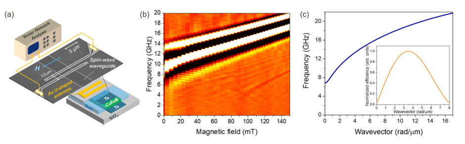
<figcaption class="paper-figure-caption"><b>Fig 1.</b> FIG. 1. (a) Microscope image of the investigated device and a schematic of the material stack</figcaption>
</figure>
<figure class="paper-figure-card">
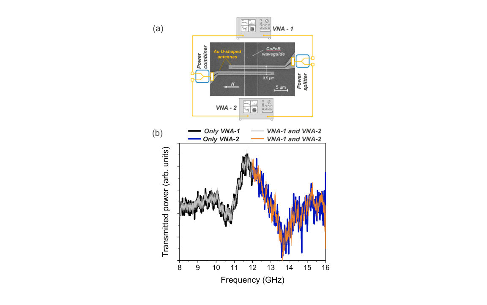
<figcaption class="paper-figure-caption"><b>Fig 2.</b> FIG. 2. (a) Microscope image of the investigated device and a schematic of the measurement setup</figcaption>
</figure>
<figure class="paper-figure-card">
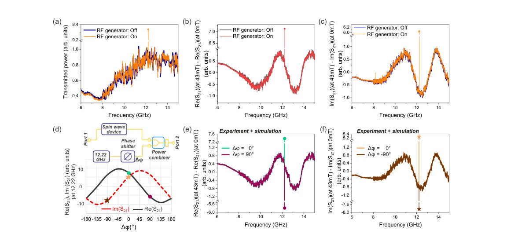
<figcaption class="paper-figure-caption"><b>Fig 3.</b> FIG. 3. (a) Measured spin-wave transmission power recorded by VNA-1 with the 12.22 GHz RF</figcaption>
</figure>
<figure class="paper-figure-card">
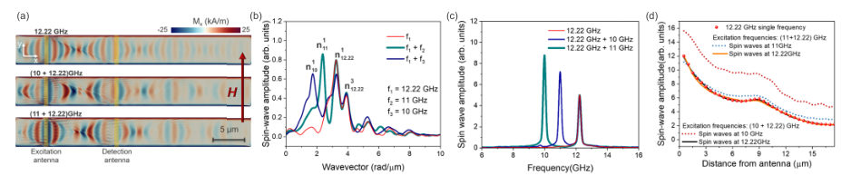
<figcaption class="paper-figure-caption"><b>Fig 4.</b> FIG. 4. (a) Snapshot images of the magnetization oscillation obtained from micromagnetic simu-</figcaption>
</figure>

**Summary.** This paper experimentally proves that spin waves can be multiplexed using Frequency-Division Multiplexing (FDM) within a single magnetic waveguide. By measuring transmission spectra with multiple simultaneous microwave signals and confirming results via micromagnetic simulations, the authors establish that different frequency channels propagate independently without crosstalk. This work is crucial for advancing future magnonic computing and signal processing architectures.

**Why it may be interesting.** While not directly about quantum information processing, the demonstration of controlled wave coexistence in a solid-state system provides an excellent platform for studying linear wave coupling, energy transport, and non-interacting mode propagation—concepts relevant to open quantum systems modeling.

Detailed structure

**Main problem.** The research investigates the feasibility of Frequency-Division Multiplexing (FDM) for spin waves, aiming to enable multiple independent information channels within a single physical magnetic waveguide.

**Main result.** The authors experimentally and theoretically demonstrate that different frequency spin waves can coexist and propagate simultaneously in the linear regime without measurable interaction or crosstalk.

**Method.** The study combines electrical characterization using Vector Network Analyzers (VNAs) for broadband measurements with theoretical analysis based on linear superposition and micromagnetic simulations.

**Model / system.** The physical system is a CoFeB magnetic waveguide deposited on Si/SiO2, where spin waves are generated and detected electrically. The behavior is analyzed in the linear regime using established magnetodynamics principles.

**Key observables.** Transmission spectra ($S_{21}$), spin-wave power, complex transmission coefficients ($	ext{Re}/	ext{Im}(S_{21})$), spin-wave amplitude, and wavevectors as functions of frequency and propagation distance.

**Important parameters / regimes.** Applied magnetic field ($\mu_0H = 43 	ext{ mT}$); operation in the linear regime (low excitation power).

**Assumptions / limitations.** The analysis relies heavily on the validity of the superposition principle, assuming negligible nonlinear interactions between co-propagating modes.

**Figures summary.** Figures show device schematics and measurement setups using two VNAs. Key plots demonstrate that single-channel and multiplexed transmission spectra agree excellently, and simulations confirm unchanged mode amplitudes during co-propagation.

**Paper structure.** The paper proceeds by introducing the FDM concept for magnonics, detailing the experimental setup involving dual-VNA measurements, presenting results showing non-interacting propagation, supporting these findings with theoretical linear superposition analysis, and finally confirming the robustness of the result via micromagnetic simulations.

Abstract

Frequency-division multiplexing is a key functionality for wave-based information processing, enabling multiple information channels to coexist within the same physical medium. Here, we experimentally investigate spin-wave multiplexing in a CoFeB waveguide using all-electrical excitation and detection. Two independently generated microwave signals are simultaneously coupled into the same spin-wave waveguide through inductive antennas and characterized using broadband vector network analyzer measurements. The transmission spectra obtained under single-channel and multiplexed operation exhibit excellent agreement, demonstrating that spin waves with different frequencies and wavelengths propagate simultaneously without measurable interaction in the linear regime. The observation is confirmed using both dual-sweep and sweep-plus-single-tone excitation schemes. A theoretical analysis based on linear superposition and phase-sensitive detection explains the absence of observable inter-channel interference for independent microwave sources. Micromagnetic simulations further confirm that the amplitudes and wavevectors of the individual spin-wave modes remain unchanged during co-propagation, demonstrating the absence of interaction over the entire propagation distance. The results provide direct experimental evidence that independent spin-wave channels can coexist in a single waveguide and support the implementation of frequency-division multiplexing in future magnonic computing and microwave signal-processing architectures.

[↑ back to top](#top)

### [Role of Resonant $\mathbf{k}$-Points in the Transient Optical Response of Pumped Germanium](http://arxiv.org/abs/2607.20240v1)

**Authors:** Amir Eskandari-asl, Giacomo Inzani, Matteo Lucchini, Adolfo Avella  
**Type:** theory · **Category:** other · **PDF:** <https://arxiv.org/pdf/2607.20240v1>  
**Analysis basis:** full PDF text, analyzed in chunks
**Topic relevance:** `Keldysh / 2PI / non-Gaussian methods` **3/5** · `methods for driven-dissipative` **3/5** · `non-equilibrium dynamics` **2/5** · `correlated / nonlocal dissipation` **1/5** · `driven-dissipative phase transition` **1/5** · `interference shaping light` **1/5** · `non-equilibrium universality` **1/5**

↔ Scroll figures horizontally

<figure class="paper-figure-card">
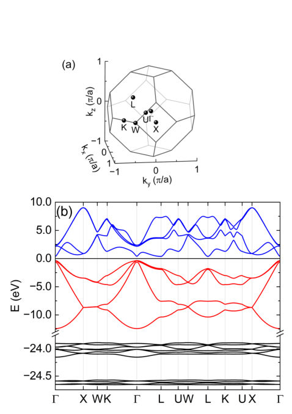
<figcaption class="paper-figure-caption"><b>Fig 1.</b> Figure 1. (a) First Brillouin zone of the fcc lattice, with the high-symmetry points. (b) Equilibrium band structure of germanium along the indicated high-symmetry path. The calculation contains the valence, conduction, and semi-core manifolds relevant to the pump and probe transitions. The Γ2 gap is underestimated by approximately 0.5 eV, and the semi-core manifold is displaced relative to experiment.</figcaption>
</figure>
<figure class="paper-figure-card">
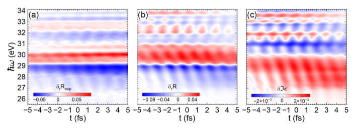
<figcaption class="paper-figure-caption"><b>Fig 2.</b> Figure 2. Experimental (a) and calculated (b) non-equilibrium relative differential reflectivity. (c) Calculated differential imaginary part of the dielectric function. All quantities are shown as functions of probe photon energy ℏω and delay time tpr. The calculations in panel (b) reproduce the principal experimental structures and their temporal evolution; the high-energy structures retain an approximately 0.5 eV offset associated with the underestimated ab-initio Γ2 gap.</figcaption>
</figure>
<figure class="paper-figure-card">
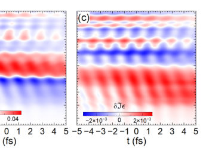
<figcaption class="paper-figure-caption"><b>Fig 3.</b> Figure 3 summarizes the momentum-resolved resid- ual excitation population together with its decomposi- tion into multi-photon resonance contributions. Panel (a) shows N res k and its 1-, 2-, and 3-photon components throughout the sampled BZ. As established in our previ- ous work [22, 53], the dominant contribution arises from two-photon transitions. Panel (b) displays the distribution of N res(l) k on a loga- rithmic scale. We use 2×10−6, marked by the red vertical line, as the numerical threshold for assigning a k-point to the corresponding l-photon-resonant set. Throughout this work, we adopt this threshold as the operational cri- terion for identifying resonant momentum points: a point...</figcaption>
</figure>
<figure class="paper-figure-card">
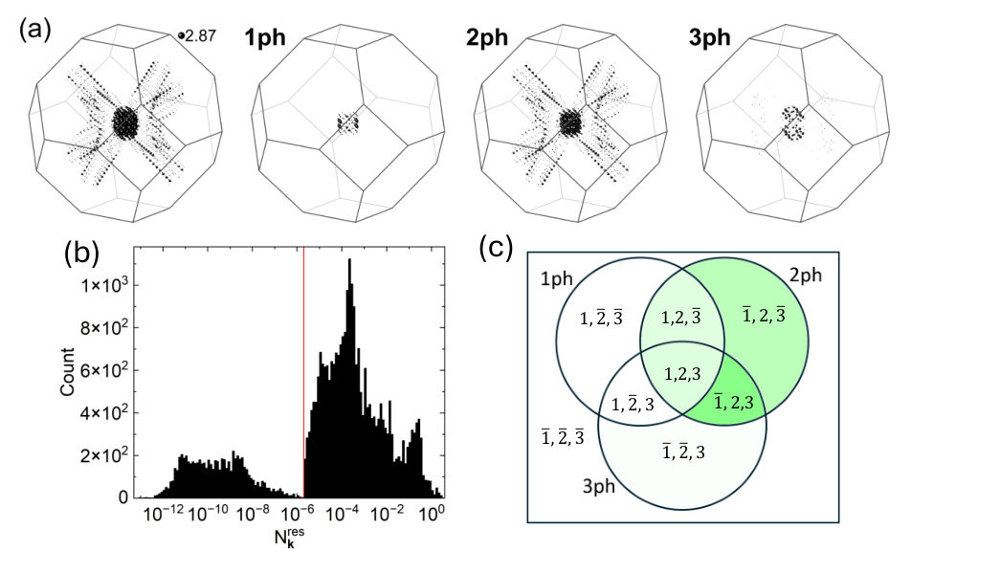
<figcaption class="paper-figure-caption"><b>Fig 4.</b> Figure 3. (a) Momentum-resolved residual excitation population across the FBZ and its decomposition into 1-, 2-, and 3-photon contributions shown as a 3D scatter plot. The diameter of the spheres indicate the actual residual excitation population at the corresponding k-point and scales as it is reported in the legend. (b) Histogram of residual excitation values on a logarithmic scale; the vertical red line at 2 × 10−6 marks the numerical threshold used to identify resonant k-points. (c) Venn diagram showing the relative contributions of different resonance classes to the total residual excitation population. The green shading represents the relative contribution, with quantitative values...</figcaption>
</figure>
<figure class="paper-figure-card">
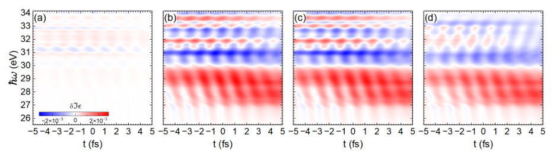
<figcaption class="paper-figure-caption"><b>Fig 5.</b> Figure 4. Contributions to δℑϵ(ω, tpr) from different classes of k-points: (a) off-resonant k-points only; (b) resonant k-points; (c) k-points with 1-, 2-, or 3-photon resonances; (d) k-points with 2-photon resonances. The resonant k-points nearly reproduce the full response [Fig. 2(c)], whereas the 2-photon-resonant set, despite carrying most of the residual population, does not account for the complete response.</figcaption>
</figure>

**Summary.** The paper investigates the transient optical response of pumped Germanium by decomposing it based on multi-photon resonance conditions across the Brillouin zone. Using advanced linear response theory, the authors show that while most excited carriers reside at 2-photon resonant points, the full optical signal requires contributions from virtual processes beyond just these real-charge excitations. This establishes a powerful momentum-resolved connection between pump resonances and ultrafast optical observables.

**Why it may be interesting.** This work provides a sophisticated methodology for dissecting complex many-body responses in solids by mapping physical observables onto specific, quantized momentum-space resonances, which is highly relevant to understanding non-equilibrium quantum dynamics.

Detailed structure

**Main problem.** The study aims to resolve the momentum-space origin of transient optical response in pumped Germanium by determining the relative importance of off-resonant versus $l$-photon resonant crystal momenta.

**Main result.** The transient optical weight is not solely determined by real-charge dynamics (residual population) but requires substantial virtual pump-induced contributions, although the dominant weight still arises from resonant momentum regions.

**Method.** The authors use a Dynamical Projective Operatorial Approach combined with generalized linear response theory to decompose the differential imaginary part of the dielectric function into classes defined by multi-photon resonances.

**Model / system.** The system is pumped Germanium, treated as a gapped semiconductor. The analysis involves modeling photo-excited electrons and holes across different momentum states ($k$-points) in the Brillouin zone.

**Key observables.** Transient absorptive response ($\delta\Im{\epsilon}(\omega, t_{	ext{pr}})$), residual electronic population ($N_{	ext{res}}$), and the phase of oscillatory components (e.g., $2\omega_{	ext{pu}}$).

**Important parameters / regimes.** Pump pulse parameters include $	au_{	ext{pu}} = 13.3 	ext{ fs}$ and $\hbar\omega_{	ext{pu}} = 1.55 	ext{ eV}$. A numerical threshold of $2 	imes 10^{-6}$ is used to define resonant k-points.

**Assumptions / limitations.** The analysis separates contributions tied to real charge excitation distribution from those associated with virtual processes, although the distinction itself is a focus of investigation.

**Figures summary.** Figures compare $\delta\Im{\epsilon}(\omega, t_{	ext{pr}})$ calculated using different subsets of k-points (off-resonant vs. resonant) and show momentum-resolved decomposition by resonance class, alongside time delay analysis for the $2\omega_{	ext{pu}}$ component.

**Paper structure.** The paper establishes the need to resolve momentum contributions, develops a theoretical framework based on DPOA/linear response theory, calculates the differential dielectric function using resonance classes (1-, 2-, 3-photon), and finally interprets the mismatch between real-charge dynamics and the full optical signal.

Abstract

Pump-induced transient optical properties combine contributions from electronic states throughout the Brillouin zone, but the relative relevance of off-resonant and l-photon resonant crystal momenta has remained unexplored. We address this issue in pumped germanium by resolving the transient absorptive response into momentum-space classes defined by the presence or absence of 1-, 2-, and 3-photon resonances with respect to the pump. Using the Dynamical Projective Operatorial Approach together with the related generalized linear response theory, we compute the differential imaginary part of the dielectric function and evaluate the contributions of each resonance class. Resonant regions account for nearly the entire optical response, whereas points outside the identified resonance sets contribute only negligibly. Nevertheless, the 2-photon-resonant set, although containing more than 98% of the residual (post-pump) excitation population, does not reproduce the full transient spectrum. Conversely, resonance classes with very small residual populations generate non-negligible contributions to the transient optical properties. This mismatch shows that the transient optical weight is not determined solely by the real-charge dynamics (which results in post-pulse residual excitation population) and is consistent with substantial virtual pump-induced contributions, whose dominant optical weight nevertheless arises from the resonant regions of momentum space. The class-resolved phase of the dominant 2$ω_{\mathrm{pu}}$ oscillations further shows that, whenever a class contributes appreciably, the phase of its oscillatory component follows that of the corresponding full signal. The resulting decomposition provides a momentum-resolved connection among multi-photon resonances and transient optical observables in a realistic material.

[↑ back to top](#top)

### [Spin-wave softening across the uniform-to-stripe domain transition in iron garnet film](http://arxiv.org/abs/2607.19993v1)

**Authors:** Titiksha Srivastava, Victor Leroy, Nessrine Benaziz, Nathaniel Findling, Ludovic Largeau, Jamal Ben Youssef, Jean-Paul Adam, Thibaut Devolder, Joo-Von Kim  
**Type:** both · **Category:** other · **PDF:** <https://arxiv.org/pdf/2607.19993v1>  
**Analysis basis:** full PDF text, analyzed in chunks
**Topic relevance:** `spintronics-quantum-optics interface` **3/5** · `driven-dissipative phase transition` **1/5** · `exotic spin models in light-matter` **1/5** · `non-equilibrium dynamics` **1/5**

↔ Scroll figures horizontally

<figure class="paper-figure-card">
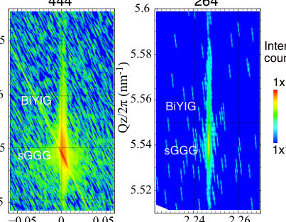
<figcaption class="paper-figure-caption"><b>Fig 1.</b> FIG. 1. (a) Schematics of Bismuth-doped Yttrium Iron Garnet sam- ple grown on (111)-oriented sGGG substrate. (b) 2θ −ω X-Ray diffraction scan for BiYIG film. The film and the substrate diffraction peak indicates that the film in in tensile strain (c) Reciprocal space mapping of BiYIG film on sGGG : left symettric (444) and right (264) antisymmetric reflections evidencing pseudomorphic growth. The film peak lies directly above the substrate peak along Qx, con- firming full lateral coherence, while its Qz position above the sub- strate indicates an out-of-plane mismatch of the lattice parameter leading to tensile strain in this case.</figcaption>
</figure>
<figure class="paper-figure-card">
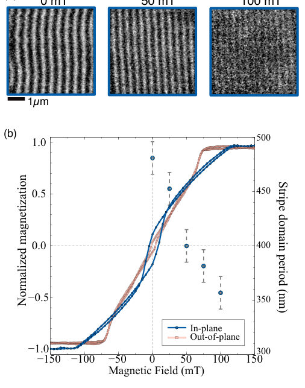
<figcaption class="paper-figure-caption"><b>Fig 2.</b> FIG. 2. (a) MFM images of BiYIG film at remanence and applied in- plane magnetic fields. (b) SQUID-VSM magnetization curves for in- plane and out-of plane applied magnetic field and the stripe domain period evolution.</figcaption>
</figure>
<figure class="paper-figure-card">
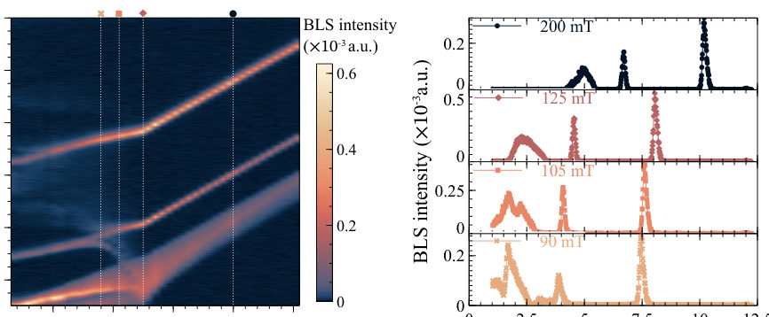
<figcaption class="paper-figure-caption"><b>Fig 3.</b> FIG. 3. Spin-wave spectrum evolution. (a) Thermal µ-BLS spectra measured over a frequency range of 1 GHz to 12 GHz with the applied in-plane field swept from 240 mT to 14 mT.(d) Line cuts for fixed in-plane field values: 200 mT, 125 mT, 105 mT and 90 mT. Three modes are observed above saturation . We observe mode softening at around 110 mT, with a mode that goes below the minimum measurable frequency and new mode emerging at the same field . This mode is seen also seen in the line cut at 105 mT. Many new modes emerge in the stripe domain phase.</figcaption>
</figure>
<figure class="paper-figure-card">
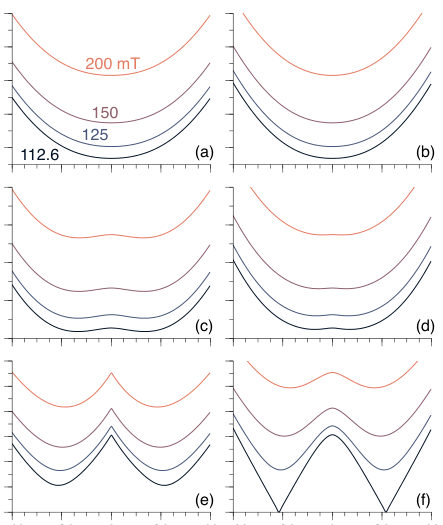
<figcaption class="paper-figure-caption"><b>Fig 4.</b> FIG. 4. Spin wave dispersion relations in the saturated state for differ- ent applied fields, Bx. Propagation along the field direction x (a,c,e) and perpendicular to this direction along y (b,d,f) are shown for the third-order (a,b), second-order (c,d) and first-order (e,f) PSSW modes.</figcaption>
</figure>
<figure class="paper-figure-card">
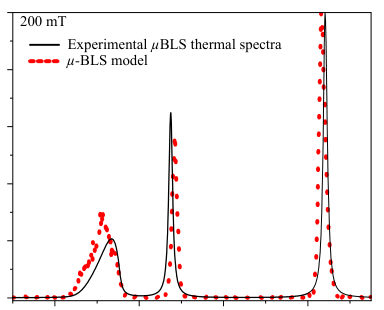
<figcaption class="paper-figure-caption"><b>Fig 5.</b> FIG. 5. Experimental (red dots) and calculated (solid lines) µ-BLS spectra at µ0H = 200 mT for refractive index of N = 2.65 + 0.09i</figcaption>
</figure>

**Summary.** This paper characterizes the spin-wave dynamics across the uniform-to-stripe domain transition in $	ext{BiYIG}$ films using combined MFM and $\mu$-BLS measurements. By correlating observed low-frequency mode softening with theoretical predictions, the authors establish a robust model for understanding reconfigurable magnonic band structures in these garnet materials.

**Why it may be interesting.** The work provides a detailed experimental and computational roadmap for mapping out magnon band structures in patterned magnetic materials, which is highly relevant for understanding emergent collective excitations in condensed matter systems.

Detailed structure

**Main problem.** The study investigates spin-wave spectra across the magnetic phase transition from a uniform ferromagnetic state to a stripe-domain structure in an iron garnet film.

**Main result.** The research successfully correlated the theoretical prediction of finite-$k$ spin-wave softening with the experimentally observed domain periodicity at the transition point, confirming BiYIG as a model platform for studying magnonic band structures.

**Method.** A combination of experimental techniques—Magnetic Force Microscopy (MFM) and thermal microfocused Brillouin light scattering ($\mu$-BLS)—was used alongside micromagnetic simulations to characterize the magnetic excitations.

**Model / system.** The physical system is a Bi-doped iron garnet film ($	ext{BiYIG}$) exhibiting perpendicular magnetic anisotropy ($	ext{PMA}$), which forms field-reorientable stripe domains when an in-plane magnetic field is applied.

**Key observables.** Spin-wave softening frequency, stripe domain periodicity ($P$), and the evolution of multiple spin-wave branches (e.g., PSSW modes) as a function of applied field.

**Important parameters / regimes.** In-plane magnetic field strength ($H_x$), film thickness ($t=120 	ext{ nm}$), and the characteristic wavevector $k$ matching the stripe periodicity.

**Assumptions / limitations.** The analysis relies on modeling spin dynamics using linearized Landau-Lifshitz equations, and interpreting $\mu$-BLS intensity requires accounting for optical phase accumulation effects.

**Figures summary.** Figures show MFM images confirming field-dependent stripe domain formation (Fig 2), the evolution of spin-wave spectra via $\mu$-BLS across the transition (Fig 3), and calculated dispersion relations matching experimental softening points (Fig 4, Fig 5).

**Paper structure.** The paper progresses by first establishing the physical system and methods (MFM/$\mu$-BLS) to observe the domain transition. It then uses theoretical calculations (dispersion relations) and simulations (micromagnetics) to model the observed spin-wave softening, culminating in a comprehensive comparison of theory and experiment.

Abstract

Spin-wave spectra across transitions between uniform and textured phases can offer deep insight into both symmetry-breaking physics and self-assembled magnonic bands. However, experiments require a material platform that combines low damping, well-defined textures, and spectroscopic access. Here, we study a Bi-doped iron-garnet film with perpendicular magnetic anisotropy (PMA), which undergoes a uniform-to-stripe-domain transition as a function of in-plane magnetic field. Real-space imaging by magnetic force microscopy reveals field-reorientable stripe domains aligned with the in-plane field, while reciprocal-space measurements using thermal microfocused Brillouin light scattering ($μ$-BLS) reveal the softening of a low-frequency spin-wave branch near the transition and the appearance of additional modes in the stripe-domain state. Calculated dispersion relations identify finite-$k$ softening in the Damon-Eshbach geometry ($k \perp M$), with the corresponding wavelength matching the stripe periodicity at the transition. In addition, a $μ$-BLS spectral model reproduces the measured mode frequencies and relative intensities at selected fixed fields. Micromagnetic simulations capture the field-driven formation of the stripe state and reproduce the experimental thermal $μ$-BLS spectra. Our findings establish BiYIG with PMA as a model low-damping platform for studying spin-wave freezing, stripe-domain modes, and reconfigurable magnonic band structures.

[↑ back to top](#top)

### [Microscopic Conversion of Structural Chirality into Electronic Chirality in Artificial Chiral Clusters](http://arxiv.org/abs/2607.19823v1)

**Authors:** Tenchi Endo, Satoru Hayami  
**Type:** theory · **Category:** other · **PDF:** <https://arxiv.org/pdf/2607.19823v1>  
**Analysis basis:** full PDF text, analyzed in chunks
**Topic relevance:** `spintronics-quantum-optics interface` **3/5** · `Keldysh / 2PI / non-Gaussian methods` **1/5** · `non-equilibrium dynamics` **1/5**

↔ Scroll figures horizontally

<figure class="paper-figure-card">
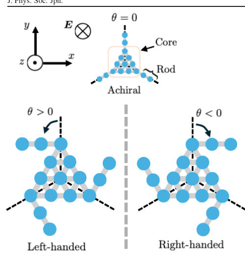
<figcaption class="paper-figure-caption"><b>Fig 1.</b> Fig. 1. Schematic illustration of the cluster geometry and model setup. The cluster consists of a triangular-lattice core and three rod-like extensions at- tached to its vertices. A polar field E is present perpendicular to the cluster plane along the z direction. The angle θ, measured from the radial direction, controls the structural chirality of the cluster. The structural handedness is determined by the combination of θ and the direction of the polar field.</figcaption>
</figure>
<figure class="paper-figure-card">
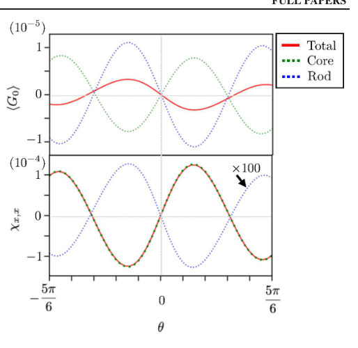
<figcaption class="paper-figure-caption"><b>Fig 2.</b> Fig. 2. Structural-parameter dependence of the electric toroidal monopole (ETM) and the Edelstein response χx,x. The upper and lower panels show the ETM and χx,x, respectively. Red, green, and blue curves represent the total, core, and rod contributions. The rod contribution to χx,x is multiplied by 100 for visibility. Both quantities change sign upon reversing θ, reflecting the reversal of electronic chirality associated with the structural handedness.</figcaption>
</figure>
<figure class="paper-figure-card">
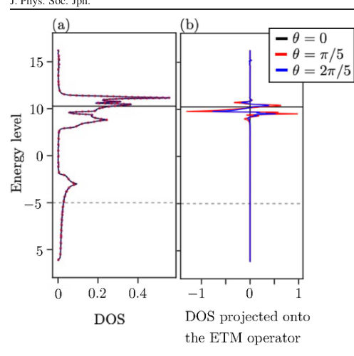
<figcaption class="paper-figure-caption"><b>Fig 3.</b> Fig. 3. (a) Density of states (DOS) and (b) ETM-resolved DOS for rep- resentative cluster geometries at θ = 0, π/5, and 2π/5. For better visibility, the values are divided by 10−8. The horizontal solid line indicates the Fermi level at θ = π/5. In (b), DOS is projected onto the ETM operator. Although the total DOS is almost unchanged by the structural deformation, the ETM- resolved spectrum becomes finite.</figcaption>
</figure>
<figure class="paper-figure-card">
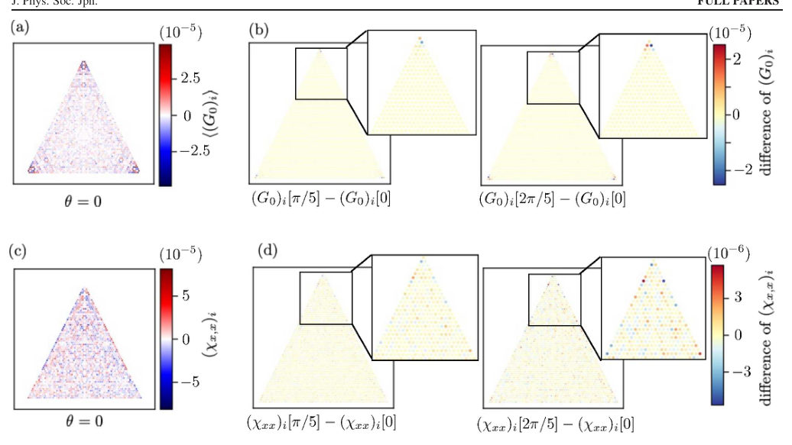
<figcaption class="paper-figure-caption"><b>Fig 4.</b> Fig. 4. Real-space distributions of the site-resolved ETM and Edelstein response. Panels (a) and (c) show the onsite ETM and Edelstein response for the achiral cluster. Panels (b) and (d) show the differences from the achiral cluster for chiral clusters with (left panel) θ = π/5 and (right panel) 2π/5. We denote the onsite ETM and Edelstein response at site i in the cluster with angle θ by (G0)i[θ] and (χx,x)i[θ], for simplicity. The difference maps highlight the components induced by structural chirality.</figcaption>
</figure>

**Summary.** This paper theoretically models how structural asymmetry in artificial nanostructures can induce electronic chirality. By calculating the Electric Toroidal Monopole and the Edelstein effect, the authors demonstrate that this conversion requires the simultaneous presence of spin-orbit coupling, surface field effects, and geometric structural chirality. The findings clarify a fundamental microscopic link between structure, symmetry, and chiral transport.

**Why it may be interesting.** This work provides a detailed theoretical framework connecting geometric structure (structural chirality) directly to measurable quantum phenomena (electronic chirality/chiral currents), which is highly relevant for designing next-generation spintronic or topological materials.

Detailed structure

**Main problem.** The study investigates the microscopic mechanism by which structural chirality within an artificial cluster is converted into measurable electronic chirality.

**Main result.** Both the Electric Toroidal Monopole (ETM) and the Edelstein effect exhibit antisymmetric dependence on structural geometry, confirming that SOC, surface-induced parity mixing, and structural chirality are essential ingredients for this chiral response.

**Method.** The authors employed theoretical calculations involving linear response theory to evaluate transport properties and used parameter decomposition analysis to isolate the physical origins of the observed effects.

**Model / system.** The model is a two-dimensional cluster composed of a triangular lattice core connected to three rod-like extensions, subjected to an external surface-induced polar field. The physics is described using an extended Hamiltonian incorporating hopping, SOC, and hybridization terms.

**Key observables.** Electric Toroidal Monopole (ETM), Edelstein response tensor ($\chi_{a,b}$), electrical conductivity ($\sigma_{a,b}$), and ETM-resolved density of states.

**Important parameters / regimes.** The structural chirality is controlled by a geometric angle $\theta$. Key physical parameters include SOC strength ($\lambda$), surface potential ($V_{sz}$), and various hopping/splitting energies.

**Assumptions / limitations.** The analysis utilizes a minimal basis set (s and p orbitals) to model the effects of surface-induced parity mixing, and certain terms are omitted in parameter decomposition for clarity.

**Figures summary.** Figures illustrate the cluster geometry and $\theta$ dependence of ETM/conductivity contributions (core vs. rod), showing how chirality is encoded in state symmetry rather than total DOS. Real-space plots compare ETM and Edelstein distributions between achiral and chiral configurations.

**Paper structure.** The paper progresses from defining the physical system and Hamiltonian to calculating key observables (ETM, Edelstein effect). It then uses parameter decomposition analysis to microscopically identify the necessary ingredients—SOC, parity mixing, and structural chirality—that drive both electronic chirality and chiral transport responses.

Abstract

We investigate how structural chirality is converted into electronic chirality in a two-dimensional cluster model consisting of a triangular-lattice core and three rod-like extensions under a surface-induced polar field.   By evaluating the electric toroidal monopole (ETM) and the Edelstein effect, we show that both quantities exhibit antisymmetric and nonmonotonic dependence   on the structural parameter controlling the cluster geometry.   While the total density of states is almost unaffected by the structural deformation, the ETM-resolved spectrum changes significantly, indicating that chirality is encoded in the symmetry character of the electronic states rather than in the overall electronic spectrum.   Real-space analysis reveals that the induced ETM is concentrated near the vertices and rods, whereas the Edelstein response extends more broadly into the core region.   Furthermore, a parameter-decomposition analysis identifies spin-orbit coupling, surface-induced parity mixing, and structural chirality as the essential ingredients for both phenomena.   Our results clarify the microscopic connection between structural chirality, electronic chirality, and chiral transport responses in artificial surface nanostructures.

[↑ back to top](#top)

### [Core and valence photoemission spectra of atoms and molecules from a multichannel Dyson equation](http://arxiv.org/abs/2607.20070v1)

**Authors:** Stefano Paggi, J. Arjan Berger, Pina Romaniello  
**Type:** theory · **Category:** strongly correlated electrons · **PDF:** <https://arxiv.org/pdf/2607.20070v1>  
**Analysis basis:** full PDF text, analyzed in chunks
**Topic relevance:** `Keldysh / 2PI / non-Gaussian methods` **3/5** · `methods for driven-dissipative` **1/5**

↔ Scroll figures horizontally

<figure class="paper-figure-card">
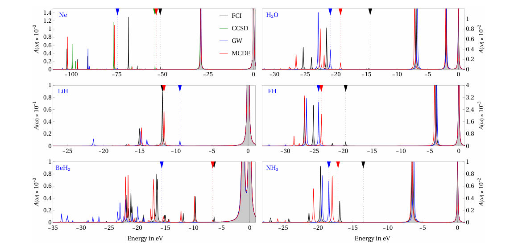
<figcaption class="paper-figure-caption"><b>Fig 1.</b> FIG. 1. The valence spectral functions of Neon and various small molecules calculated within FCI (black), GW (blue), and MCDE (red). For Neon, we also report the GFCCSD (green) spectral function taken from Ref. [45]. The arrows indicate the satellites with the lowest binding energy for each method.</figcaption>
</figure>
<figure class="paper-figure-card">
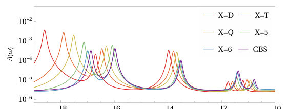
<figcaption class="paper-figure-caption"><b>Fig 2.</b> FIG. 2. The spectral function of the 5 neon 2s satellite peaks with lowest binding energy calculated using various aug-cc-pVXZ basis sets. We note that the spectral function is in logarithmic scale.</figcaption>
</figure>
<figure class="paper-figure-card">
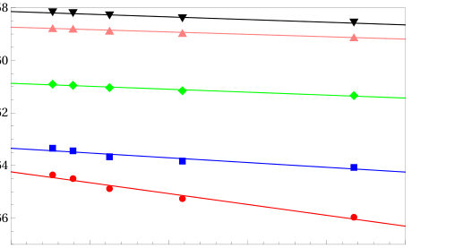
<figcaption class="paper-figure-caption"><b>Fig 3.</b> FIG. 3. Satellite energies of Neon 2s peak (Figure 4) for different basis sets, plotted against the inverse of the basis set size.</figcaption>
</figure>
<figure class="paper-figure-card">
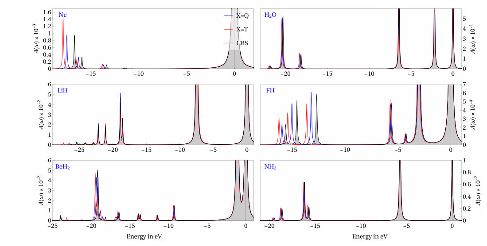
<figcaption class="paper-figure-caption"><b>Fig 4.</b> FIG. 4. The valence spectral functions of Neon and several molecules obtained by extrapolating to the complete basis-set limit using the aug-cc-pVQZ and aug-cc-pVTZ basis.</figcaption>
</figure>
<figure class="paper-figure-card">
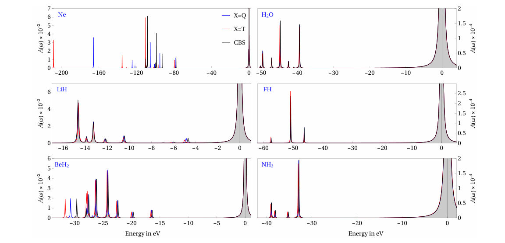
<figcaption class="paper-figure-caption"><b>Fig 5.</b> FIG. 5. The core spectral functions of Neon and several molecules obtained by extrapolating to the complete basis-set limit using the aug-cc- pVQZ and aug-cc-pVTZ basis.</figcaption>
</figure>

**Summary.** This paper develops and applies a multichannel Dyson equation formalism to calculate core and valence photoemission spectra for atoms and molecules. It demonstrates that this method significantly improves the description of shake-up satellite features compared to standard GW calculations. The authors also address computational limitations by proposing an extrapolation scheme to estimate results in the complete basis set limit.

**Why it may be interesting.** This work tackles a fundamental challenge in many-body physics—accurately capturing correlation effects beyond mean-field approximations—which is central to understanding excited states and spectroscopy in condensed matter and molecular systems.

Detailed structure

**Main problem.** The core problem is accurately simulating core and valence photoemission spectra of atoms and molecules by correctly accounting for strong electron correlation effects, especially shake-up satellite features.

**Main result.** The multichannel Dyson equation (MCDE) significantly outperforms the GW method in describing these crucial satellite features. The authors also propose an extrapolation technique to estimate results in the complete basis set limit.

**Method.** The study employs a multichannel Dyson Equation approach, which is compared against benchmark calculations from Full Configuration Interaction (FCI) and the GW method.

**Model / system.** The theory is applied to model photoemission spectra for various atoms and small molecules (e.g., Neon, H2O, NH3). The formalism involves coupling the 1-Green's Function to higher-order correlation channels.

**Key observables.** Photoemission spectral functions A(omega), quasi-particle energies, and satellite binding energies.

**Important parameters / regimes.** The convergence of satellite energies with respect to basis set size (requiring extrapolation) is a key parameter/regime discussed.

**Assumptions / limitations.** Key approximations include the use of the (3,1)-MCDE formalism, which omits full screening effects in $\Sigma_{3p}$, leading to potential overestimation of satellite binding energies.

**Figures summary.** Figures compare spectral functions for several molecules across different basis sets, demonstrating the convergence behavior and comparing MCDE results against FCI/GW benchmarks.

**Paper structure.** The paper introduces the (3,1)-MCDE formalism, details its application to calculate spectral functions, compares these results rigorously with established methods like FCI and GW, and concludes by proposing extrapolation techniques for basis set convergence.

Abstract

We recently presented multichannel Dyson equations for the \textit{ab initio} simulation of various spectroscopies. In particular, we introduced a multichannel Dyson equation for the description of photoemission spectra. In this work, we apply our approach to the simulation of photoemission spectra of atoms and molecules. We introduce a numerically efficient approach to calculate their spectral functions. We compare the spectra obtained within the multichannel Dyson equation to those obtained with full configuration interaction and the $GW$ method. We are thus able to show that the satellite features due to shake-up processes are significantly better described by the multichannel Dyson equation than by $GW$. Finally, we also discuss the slow convergence of the satellite energies with the size of the basis set and we propose a simple extrapolation method to reach the complete basis-set limit.

[↑ back to top](#top)

### [Majorana bound states in anisotropic and tilted Dirac and Weyl systems](http://arxiv.org/abs/2607.19707v1)

**Authors:** Abraham Kaleb Plascencia Pérez Páez, Alireza Qaiumzadeh  
**Type:** theory · **Category:** other · **PDF:** <https://arxiv.org/pdf/2607.19707v1>  
**Analysis basis:** full PDF text, analyzed in chunks
**Topic relevance:** `Keldysh / 2PI / non-Gaussian methods` **2/5** · `analog quantum simulation` **2/5** · `driven-dissipative phase transition` **2/5** · `methods for driven-dissipative` **2/5** · `Kondo & dissipative impurity` **1/5** · `correlated cavity matter` **1/5** · `non-equilibrium dynamics` **1/5**

↔ Scroll figures horizontally

<figure class="paper-figure-card">
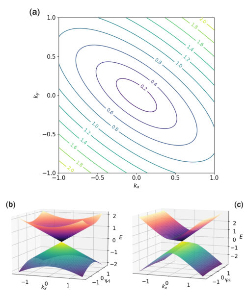
<figcaption class="paper-figure-caption"><b>Fig 1.</b> FIG. 1. Energy spectrum of an anisotropic 2D Dirac Hamilto- nian. (a) Constant-energy contours of the anisotropic Dirac Hamiltonian described by Eq. (2). The anisotropic velocity tensor deforms the circular contours of an isotropic Dirac cone into ellipses, reflecting the directional dependence of the quasi- particle velocity. (b) Energy dispersion of an isotropic 2D Dirac cone. (c) Energy dispersion of the anisotropic 2D Dirac cone described by Eq. (2). Anisotropy distorts the Dirac cone through the velocity tensor while preserving the gapless Dirac point.</figcaption>
</figure>
<figure class="paper-figure-card">
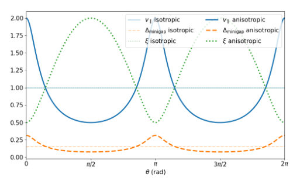
<figcaption class="paper-figure-caption"><b>Fig 2.</b> FIG. 3. Angular dependence of the Majorana propagation ve- locity v∥, localization length ξ, and finite-size minigap ∆minigap for isotropic and anisotropic diagonal velocity tensors. The isotropic system is rotationally invariant, whereas anisotropy produces a pronounced directional dependence of all three quantities. The results for the isotropic case show a constant line in which the results for v∥and ξ overlap in the graph.</figcaption>
</figure>
<figure class="paper-figure-card">
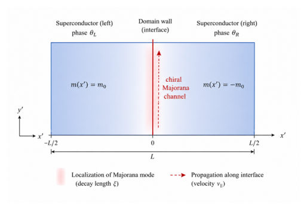
<figcaption class="paper-figure-caption"><b>Fig 3.</b> FIG. 2. Schematic illustration of the Josephson junction ge- ometry considered in this work. Two superconducting regions with opposite mass terms, m(x′) = ±m0, are separated by a domain wall located at x′ = 0. The interface supports a chiral Majorana channel propagating parallel to the junction with velocity v||, while the wave function is exponentially localized in the transverse direction over the characteristic length ξ. For a finite interface of length L, the momentum along the junction becomes quantized.</figcaption>
</figure>
<figure class="paper-figure-card">
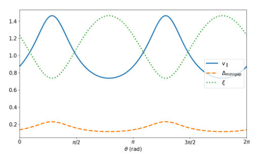
<figcaption class="paper-figure-caption"><b>Fig 4.</b> FIG. 4. Effect of off-diagonal velocity components on the Majorana bound state and a positive determinant. Nonzero values of vyx and vxz rotate the extrema of the propagation velocity, localization length, and minigap away from the prin- cipal crystal axes, demonstrating that the full velocity tensor governs the interface properties.</figcaption>
</figure>
<figure class="paper-figure-card">

<figcaption class="paper-figure-caption"><b>Fig 5.</b> Fig. 3 demonstrates that anisotropy induces a marked angular dependence of the Majorana propagation speed, localization length, and finite-size minigap, whereas the isotropic case generates constant lines for all these results. The interplay between the velocity tensor and the ori- entation of the superconducting domain-wall, therefore, provides a direct route for tailoring the localization and transport properties of Majorana channels. As shown in Fig. 4, off-diagonal elements of the velocity tensor further rotate the preferred propagation directions, indicating that the extrema need not coincide with the principal crystallographic axes.</figcaption>
</figure>

**Summary.** This paper develops an analytical theory to understand how structural anisotropies and band tilting affect Majorana bound states in topological superconductors. By analyzing 2D Dirac and 3D Weyl systems, the authors derive quantitative predictions for key properties like chirality and gap suppression. The results offer crucial design principles for engineering robust Majorana channels.

**Why it may be interesting.** This work provides concrete analytical tools for engineering topological superconductivity by controlling material parameters like anisotropy and band structure curvature, which is highly relevant for designing quantum hardware based on Majorana physics.

Detailed structure

**Main problem.** The study investigates how anisotropic quasiparticle velocities and tilted band structures modify the microscopic properties of Majorana bound states in topological superconductors.

**Main result.** The authors derive analytical expressions showing that anisotropy controls Majorana chirality via the velocity-matrix determinant, while tilting suppresses propagation velocity near Lifshitz transitions; furthermore, s-wave pairing projects to an effective chiral p-wave symmetry in 3D Weyl systems.

**Method.** The work develops an analytical framework using Bogoliubov–de Gennes (BdG) theories for both 2D Dirac and 3D Weyl systems, calculating topological invariants and zero-energy solutions.

**Model / system.** The models include effective 2D BdG Dirac theories for surface quasiparticles of topological superconductors, and low-energy descriptions of superconducting tilted 3D Weyl nodes. The Hamiltonian incorporates anisotropy via velocity tensors and tilt parameters.

**Key observables.** Continuum topological invariant, Majorana wave function, localization length, propagation velocity, finite-size minigap, and chirality of the Majorana channel.

**Important parameters / regimes.** Anisotropy ratios (e.g., $v_{xx}/v_{yy}$), tilt parameter ($t_x$), interface geometry, and proximity pairing strength ($\Delta_0$).

**Assumptions / limitations.** The analysis relies on effective low-energy descriptions of the quasiparticle spectrum and assumes superconducting pairing is introduced via proximity or intrinsic mechanisms.

**Figures summary.** Figures illustrate how anisotropy deforms Dirac cone contours into ellipses, show energy dispersions for both isotropic and anisotropic cones, and depict the angular dependence of Majorana properties like velocity and localization length.

**Paper structure.** The paper proceeds by first analyzing anisotropic 2D Dirac systems to derive general expressions. It then examines the effect of tilt on these 2D systems before extending the analysis to superconducting tilted 3D Weyl systems, concluding with generalized design principles.

Abstract

Topological superconductors host Majorana boundary modes whose robustness is protected by the nontrivial topology of the bulk Bogoliubov quasiparticle spectrum. While Majorana bound states associated with Dirac and Weyl quasiparticles have been extensively investigated, much less is known about how anisotropic quasiparticle velocities and tilted band structures modify their microscopic properties. Here, we develop an analytical framework for Majorana bound states in effective two-dimensional (2D) Bogoliubov--de Gennes Dirac theories describing the surface quasiparticles of topological superconductors and extend the analysis to three-dimensional (3D) tilted Weyl systems by establishing a microscopic connection to the same low-energy description through superconducting pairing. For anisotropic 2D Dirac systems, we derive closed analytical expressions for the continuum topological invariant, Majorana wave function, localization length, propagation velocity, and finite-size minigap for arbitrary interface orientations. We show that the chirality of the Majorana channel is determined by the sign of the velocity-matrix determinant, while its localization and dispersion are governed jointly by the velocity tensor and the interface geometry. For tilted 2D Dirac cones, we demonstrate that the tilt leaves the spinor eigenstates, Berry phase, and projected pairing symmetry unchanged, but strongly suppresses the Majorana propagation velocity and finite-size minigap as the Lifshitz transition between type-I and type-II regimes is approached. Finally, we consider superconducting tilted 3D Weyl systems and show that the projection of a conventional spin-singlet $s$-wave pairing interaction onto the low-energy Weyl bands naturally generates an effective chiral $p_x\pm ip_y$ pairing symmetry, providing a microscopic Bogoliubov--de Gennes description that supports localized Majorana surface states.

[↑ back to top](#top)

### [Frequency-dependent electron-phonon coupling and vibrational responses in tight-binding and continuous Dirac models with nuclear velocity correction](http://arxiv.org/abs/2607.20117v1)

**Authors:** Paolo Fachin, Francesco Macheda, Paolo Barone, Francesco Mauri  
**Type:** theory · **Category:** other · **PDF:** <https://arxiv.org/pdf/2607.20117v1>  
**Analysis basis:** full PDF text, analyzed in chunks
**Topic relevance:** `non-equilibrium dynamics` **2/5** · `Keldysh / 2PI / non-Gaussian methods` **1/5** · `analog quantum simulation` **1/5** · `correlated / nonlocal dissipation` **1/5** · `driven-dissipative phase transition` **1/5** · `methods for driven-dissipative` **1/5**

↔ Scroll figures horizontally

<figure class="paper-figure-card">
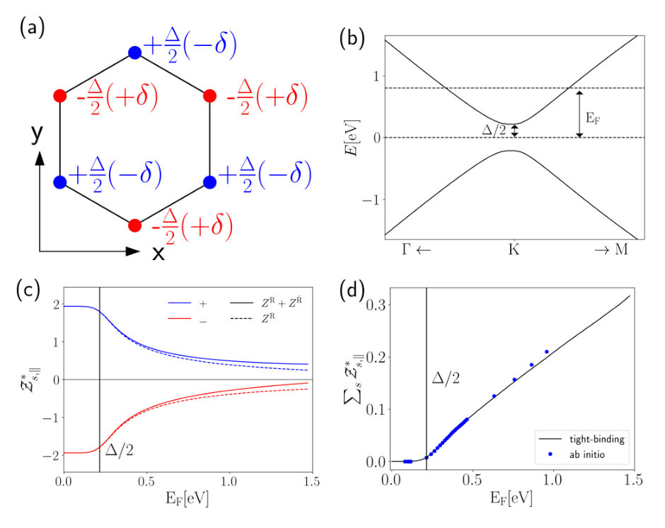
<figcaption class="paper-figure-caption"><b>Fig 1.</b> FIG. 1. (a) Gapped graphene lattice model, with alternating sites with either an excess or a deficiency of electric charge, corresponding to negative and positive on-site energies in the tight-binding model, respectively. (b) Energy bands of gapped graphene near the K point along the high symmetry reciprocal space path Γ →K →M. The Fermi level is set at zero in the middle of the gap. (c) In-plane component of the Born effective charges at ω = i0+ of gapped graphene, as a function of the Fermi level computed via the tight-binding model corrected with non-inertial effects. Blue lines are for the + atom, red ones for the - one. Continuous lines indicate Born effective charges corrected by...</figcaption>
</figure>
<figure class="paper-figure-card">
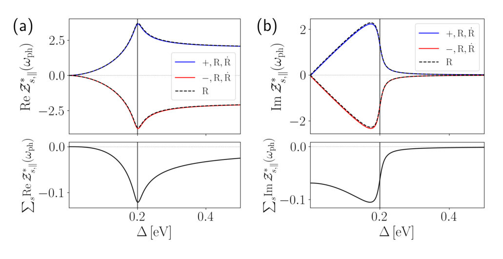
<figcaption class="paper-figure-caption"><b>Fig 2.</b> FIG. 2. Real (a) and imaginary (b) parts of the Born effective charges and the related sum rules are plotted as a function of the electronic band gap ∆for gapped graphene. The black dotted lines are the Born effective charges without the nuclear velocity corrections. The vertical gray lines correspond to the phonon frequency ωph = 0.2 eV.</figcaption>
</figure>
<figure class="paper-figure-card">
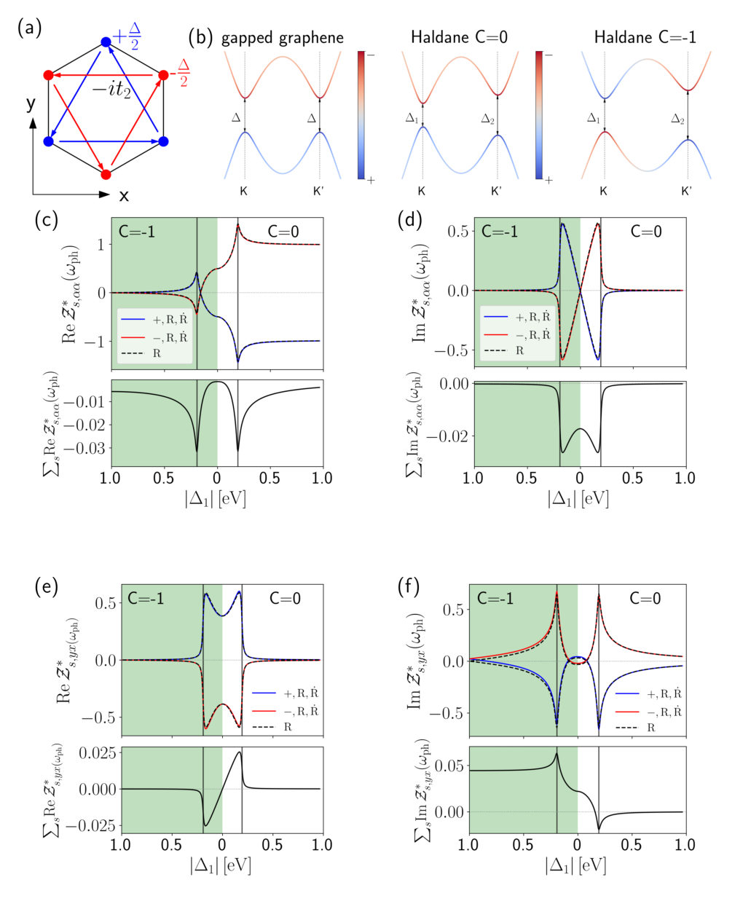
<figcaption class="paper-figure-caption"><b>Fig 3.</b> FIG. 3. (a)Lattice representation of the Haldane model. Arrows identify the direction for the 2nd nearest neighbours hopping. (b) Qualitative sketch of energy bands along the high symmetry direction for gapped graphene, and for the Haldane model in the trivial case (C=0) and non trivial states (C=1). (c-f) Real and imaginary parts of the Z∗ s,αα(ωph) and Z∗ s,yx(ωph) as a function of the gap at the K point ∆1 by varying the on-site energy ∆and keeping t2 = 0.1 eV and tuning the system from a topological (green region) to a trivial state. The dotted black lines are the Born effective charges without the nuclear velocity-correction. The vertical gray lines correspond to the phonon frequency...</figcaption>
</figure>
<figure class="paper-figure-card">
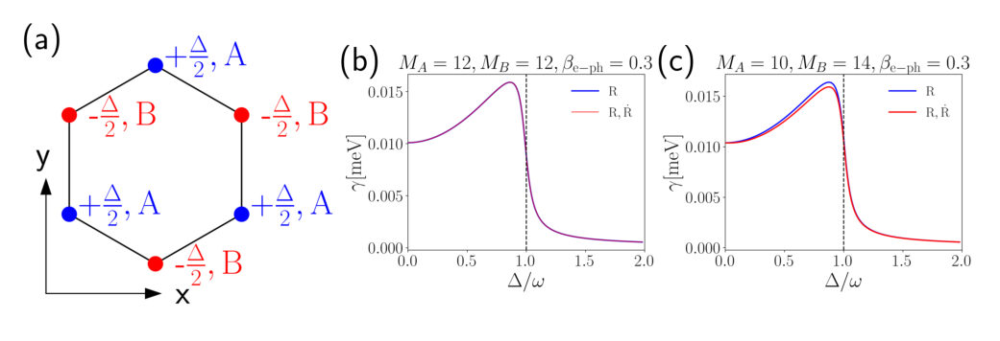
<figcaption class="paper-figure-caption"><b>Fig 4.</b> FIG. 4. Phonon linewidth as a function of the ratio between the electronic band gap and the phonon frequency for gapped graphene (the lattice is represented in the panel (a)) with βe−ph = 0.3. The case of equal masses - appropriate for graphene with MA = MB = 12 amu- is plotted in panel (b), whereas those of different masses - capturing the mass asymmetry of h −BN with MA = 14 amu and MB = 10 amu - in the panel (c).</figcaption>
</figure>

**Summary.** This paper develops a theoretical framework to calculate vibrational responses in solids by incorporating the effect of nuclear motion on electron orbitals, treating it via an Ehrenfest Lagrangian approach. By including velocity-dependent phases, the authors restore fundamental physical sum rules that are otherwise violated in simpler tight-binding models. This is crucial for accurately predicting phenomena like vibrational circular dichroism.

**Why it may be interesting.** While focused on solid-state physics (phonons), the rigorous derivation involving time-dependent Hamiltonians and coupling between electronic states and classical nuclear coordinates shares methodological parallels with open quantum systems dynamics where environment coupling is crucial.

Detailed structure

**Main problem.** The work addresses determining frequency-dependent electron-phonon coupling and vibrational responses by accurately accounting for the nuclear velocity dependence of electronic atomic orbitals.

**Main result.** Including these nuclear velocity corrections restores fundamental all-electron sum rules for vibrational responses, providing crucial quantitative and qualitative improvements over standard tight-binding approximations.

**Method.** The authors employ an Ehrenfest Lagrangian approach combined with tight-binding methods to derive the equations of motion and calculate vibrational responses within a linear response formalism.

**Model / system.** The theory is applied using localized atomic orbitals (LCAO) and tested on condensed matter models such as graphene and the topological Haldane model, which are treated via effective Hamiltonians.

**Key observables.** Born effective charges, force-constant matrix, frequency-dependent vibrational responses, and contributions to vibrational circular dichroism.

**Important parameters / regimes.** Nuclear velocity ($\dot{\mathbf{R}}_s$) and its higher derivatives (acceleration $\ddot{\mathbf{R}}_s$), which are treated perturbatively up to any order.

**Assumptions / limitations.** The derivation uses a semiclassical treatment where nuclei are classical, and the method assumes neglecting Stark effect mixing contributions in certain sections.

**Paper structure.** The paper builds from defining the velocity-dependent basis set using an Ehrenfest Lagrangian approach for LCAO, deriving generalized equations of motion incorporating nuclear velocity/acceleration terms, and finally applying this formalism to calculate vibrational responses and test it on specific models.

Abstract

The nuclear motion induces in the electronic atomic orbitals a nuclear-velocity-dependent phase (also known as electron-translation factor), which modifies the effective Hamiltonians constructed from localised atomic orbitals. In this work, using an Ehrenfest Lagrangian approach for the localised atomic orbitals (LCAO) and tight-binding methods, we determine, at any order in the nuclear velocity, the equations of motion and the vibrational responses within a linear response formalism, focusing on the tight-binding assessment of the Born effective charges and the force-constant matrix. The appearance of nuclear-velocity-dependent Peierls-like phases in the non-local part of the interactions restores the all-electron sum rules for frequency-dependent vibrational responses. In tight-binding models these corrections crucially modify the vibrational response from a qualitative point of view, also yielding contributions required to capture phenomena such as vibrational circular dichroism. We test these corrections in the tight-binding model for metallic gapped graphene - finding excellent agreement with \textit{ab initio} calculations - and for the topological time-reversal symmetry breaking Haldane model.

[↑ back to top](#top)

### [Stacking-tuned superconductivity and competing charge-density-wave states in NbSe$_2$](http://arxiv.org/abs/2607.20335v1)

**Authors:** Sandra Sajan, Xinze Yang, Haojie Guo, Tarushi Agarwal, Samuel Mañas-Valero, Carla Boix-Constant, Eugenio Coronado, Fernando de Juan, Eduardo H. da Silva Neto, Ravi P. Singh, Maria N. Gastiasoro, Miguel M. Ugeda  
**Type:** both · **Category:** other · **PDF:** <https://arxiv.org/pdf/2607.20335v1>  
**Analysis basis:** full PDF text, analyzed in chunks
**Topic relevance:** `driven-dissipative phase transition` **2/5** · `Frenkel-Kontorova` **1/5** · `Keldysh / 2PI / non-Gaussian methods` **1/5**

↔ Scroll figures horizontally

<figure class="paper-figure-card">
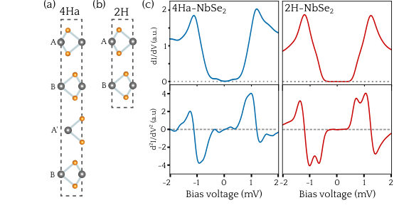
<figcaption class="paper-figure-caption"><b>Fig 1.</b> Figure 1. (a,b) Unit cell of 4Ha-NbSe2 and 2H-NbSe2 respec- tively, (c) Representative dI/dV and corresponding deriva- tives (d2I/dV 2) of the 4Ha and 2H polytypes (Vac = 20 µV, T = 0.34 K).</figcaption>
</figure>
<figure class="paper-figure-card">
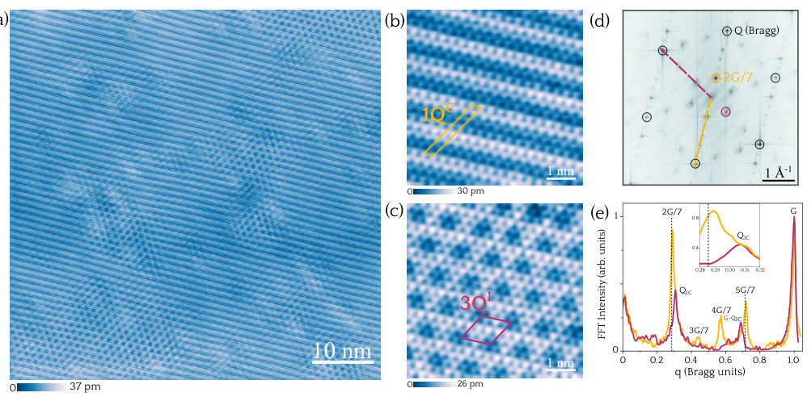
<figcaption class="paper-figure-caption"><b>Fig 2.</b> Figure 2. (a) Large-scale STM topograph of 4Ha-NbSe2 showing coexisting unidirectional commensurate 1QC and triangular incommensurate 3QI CDW phases (Vs = −0.098 V, T = 0.34 K). (b),(c) Zoomed-in STM images of the 1QC and 3QI phases, respectively (Vs = −0.1 V, T = 0.34 K). (d) FFT of panel (a), showing the 1QC feature along one crystallographic direction and 3QI features along all three symmetry-equivalent directions. (e) FFT intensity profiles along the 1QC and 3QI directions marked in panel (d).</figcaption>
</figure>
<figure class="paper-figure-card">
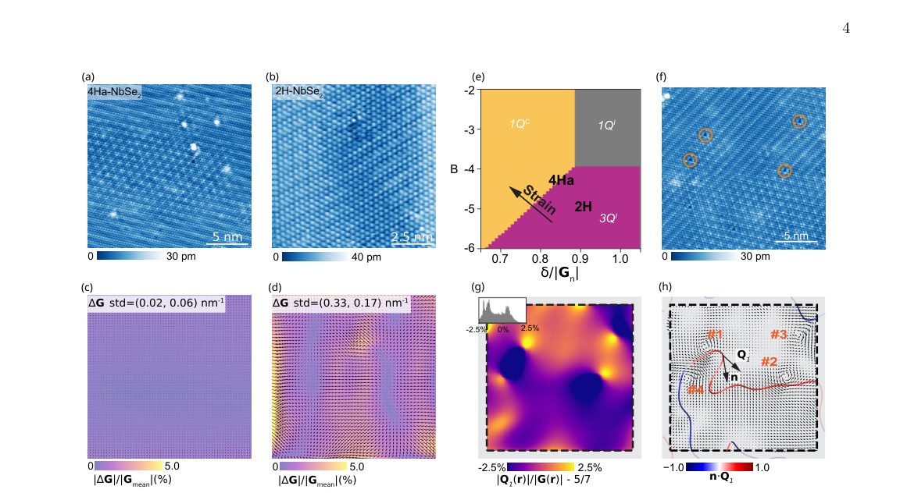
<figcaption class="paper-figure-caption"><b>Fig 3.</b> Figure 3. Topography of a region showing the coexistence of 1QC and 3QI CDW on (a) 4Ha and (b) 2H. (c) and (d) show the corresponding vector-field plots of the change in the Bragg vector relative to the mean Bragg vector in the same region. The background color map shows the percentage change in the magnitude of the Bragg vector. (e) GL phase diagram [Eq.(1)]. (f) STM topograph of 4Ha with 1QC and 3QI regions. (g) Corresponding commensurability map, | ˜ Q1(r)|/|G(r)| −5/7, with perfect commensuration at the origin. (h) Vector field of ∇φ(r) (black arrows) for the commensurate vector ˜ Q1. The boundary between 1QC and 3QI regions is depicted by solid lines, colored according to their local...</figcaption>
</figure>
<figure class="paper-figure-card">
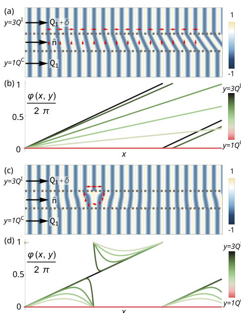
<figcaption class="paper-figure-caption"><b>Fig 4.</b> Figure 4. (a) Charge density at the phase boundary (region in between dashed gray lines) between commensurate region 1QC and an incommensurate region 3QI for the first compo- nent QI 1 = Q1+δ. (b) The 3QI state adapts its phase φ(r) to match the 1QC state along the boundary, gradually evolving from φ3QI = δx to φ1QC = 0. Its gradient (red arrows in (a)) shows no vortex. (c)-(d) Alternative way for the phase to adapt with an abrupt 2π slip, with a vortex appearing in its gradient.</figcaption>
</figure>

**Summary.** This work demonstrates that the structural polytype of $	ext{NbSe}_2$ dictates its competing electronic orders, particularly CDW and superconductivity. Using STM/STS and Ginzburg-Landau theory, the authors show that $4	ext{Ha}$-$	ext{NbSe}_2$ uniquely hosts coexisting commensurate and incommensurate CDW states stabilized by phase slips. This highlights stacking sequence as a key knob for controlling quantum electronic phases.

**Why it may be interesting.** The ability to tune collective quantum order (CDW/SC) simply by changing crystal stacking is a powerful concept for engineering novel electronic phases in 2D materials, relevant to understanding emergent phenomena in strongly correlated systems.

Detailed structure

**Main problem.** The study investigates how changing the layer stacking sequence (polytype) of van der Waals materials like NbSe2 can fundamentally alter competing electronic orders, specifically charge-density waves (CDW) and superconductivity.

**Main result.** The $4	ext{Ha}$ polytype exhibits an intrinsic coexistence of distinct CDW states ($1Q^\mathrm{C}$ and $3Q^\mathrm{I}$) that is not correlated with local strain, a phenomenon explained by phase slips at domain boundaries. Furthermore, the superconducting gap is selectively suppressed in this polytype compared to its $2	ext{H}$ counterpart.

**Method.** The research combines high-resolution Scanning Tunneling Microscopy/Spectroscopy (STM/STS) measurements with theoretical modeling using Ginzburg-Landau formalisms to analyze phase transitions and order parameter dynamics.

**Model / system.** The system is $	ext{NbSe}_2$ in its $4	ext{Ha}$ and $2	ext{H}$ polytypes. The analysis uses a free energy functional derived from Ginzburg-Landau theory to model the complex CDW order parameter, alongside anisotropic two-band McMillan models for superconductivity.

**Key observables.** CDW phases ($1Q^\mathrm{C}$, $3Q^\mathrm{I}$), superconducting energy gaps ($\Delta_1, \Delta_2$), phase gradients ($
abla\phi$), and the momentum mismatch ($\delta$).

**Important parameters / regimes.** $T_c$ (6.2 K for $4	ext{Ha}$ vs 7.2 K for $2	ext{H}$), $	ext{B}_{c2} \approx 4	ext{ T}$, and the commensurability energy term ($E$).

**Assumptions / limitations.** The analysis assumes that phase coexistence boundaries accommodate momentum mismatch via abrupt $2\pi$ phase slips, and superconducting properties can be modeled by anisotropic two-band pairing.

**Figures summary.** Figures show STM topographies revealing coexisting $1Q^\mathrm{C}$ and $3Q^\mathrm{I}$ CDW phases in $4	ext{Ha}$-$	ext{NbSe}_2$, spectra showing gap suppression with magnetic field, and vector-field plots confirming vortex locations at phase boundaries.

**Paper structure.** The paper systematically compares the electronic orders of $4	ext{Ha}$ vs $2	ext{H}$ polytypes. It first uses STM/STS to map CDW states, then applies GL theory to model the coexistence mechanism involving phase slips, and finally analyzes superconducting gaps under magnetic fields.

Abstract

Layer stacking provides a powerful yet underexplored route for reshaping collective quantum order in van der Waals materials. Here we use high-resolution scanning tunneling microscopy and spectroscopy to show that the stacking sequence alone can qualitatively transform the charge density and superconducting orders in NbSe$_2$, while preserving the same in-plane atomic structure. Comparing the 4Ha and 2H polytypes, we find that, unlike the ubiquitous triangular incommensurate $3Q^\mathrm{I}$ order of 2H-NbSe$_2$, 4Ha-NbSe$_2$ hosts two competing CDW states with no measurable correlation with local strain: a unidirectional commensurate $1Q^\mathrm{C}$ phase and a triangular incommensurate $3Q^\mathrm{I}$ phase, with $Q^\mathrm{I}=Q^\mathrm{C}+δ$. We introduce a phase-resolved analysis that directly maps the gradient of the CDW phases and reveals vortices bound to the $1Q^\mathrm{C}$ - $3Q^\mathrm{I}$ phase boundaries. These vortices accommodate the momentum mismatch $δ$ through abrupt $2π$ phase slips, providing a mechanism by which distinct charge orders coexist. Superconductivity is also reshaped by stacking, while both polytypes exhibit multiband pairing.

[↑ back to top](#top)

### [Reading and Steering Representations of Materials-Science Mechanisms in an Open-Weight Language Model](http://arxiv.org/abs/2607.20058v1)

**Authors:** Markus J. Buehler  
**Type:** both · **Category:** disordered systems and neural networks · **PDF:** <https://arxiv.org/pdf/2607.20058v1>  
**Analysis basis:** full PDF text, analyzed in chunks
**Topic relevance:** `analog quantum simulation` **1/5** · `driven-dissipative phase transition` **1/5** · `methods for driven-dissipative` **1/5** · `non-equilibrium dynamics` **1/5**

↔ Scroll figures horizontally

<figure class="paper-figure-card">
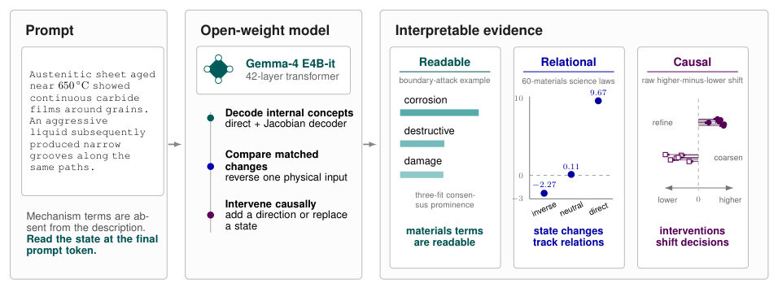
<figcaption class="paper-figure-caption"><b>Fig 1.</b> Figure 1: Overview of the study reported in this article. A materials-science prompt is evaluated with a frozen open-weight language model while its intermediate states are recorded. We study those states in three complementary ways: vocabulary readout tests which scientific concepts are readable; matched counterfactual comparison tests whether state changes preserve constitutive orientation; and causal intervention tests whether changing an internal representation changes the model’s engineering decision. The right-hand panels illustrate the corresponding evidence types (decoded terms, relational trends, and intervention-induced answer shifts). In the causal card, arrows show the raw...</figcaption>
</figure>
<figure class="paper-figure-card">
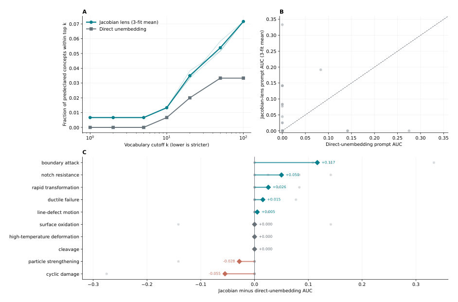
<figcaption class="paper-figure-caption"><b>Fig 2.</b> Figure 2: Can either readout recover an engineering term that was deliberately omitted from the description? Before running the 50 prompts, we declared 150 scientifically appropriate one-token terms and then asked where each term ranked among Gemma’s 262,144 vocabulary entries. (A) The cutoff k is relaxed from rank 1 to rank 100; a higher curve means more declared terms have become strongly readable. Thin teal curves are the three independent Jacobian fits, the thick teal curve is their mean, and gray is direct unembedding of the same states. At k = 100, the fractions are 7.2% and 3.3%, respectively. (B) Each point is one prompt’s recovery area under the curve (AUC); a point above the...</figcaption>
</figure>
<figure class="paper-figure-card">
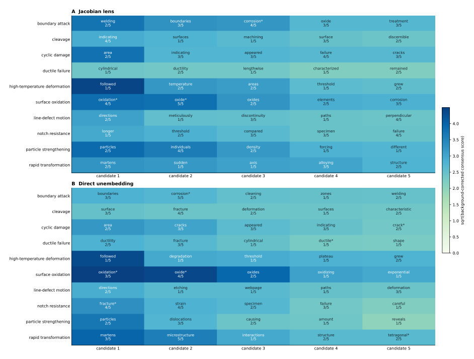
<figcaption class="paper-figure-caption"><b>Fig 3.</b> Figure 3: Target-free family vocabularies. Each row is one physical family and each cell is a word selected without the declared concept list. Support is the number of independent phrasings, out of five, in which the word appeared under the three-fit consensus rule; darker blue-green cells indicate stronger background-corrected support. Asterisks mark exact declared-word overlap added only after ranking. Read across a row to ask whether the words form a recognizable materials neighborhood. Boundary attack, surface oxidation, and rapid transformation show coherent mechanism or microstructure terms; high-temperature deformation and cleavage show why stable decoding can still be generic. The...</figcaption>
</figure>
<figure class="paper-figure-card">
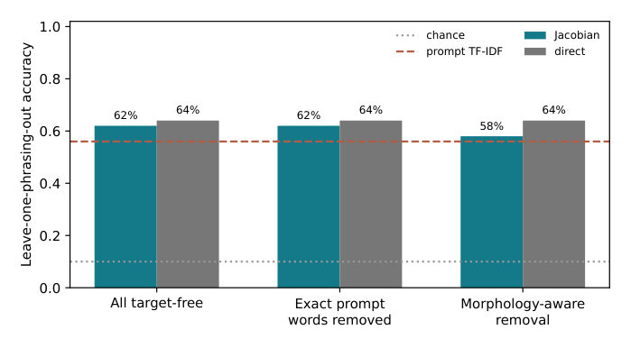
<figcaption class="paper-figure-caption"><b>Fig 4.</b> Figure 4: Do the freely discovered words identify the materials mechanism without a supplied answer list? Each bar is leave-one-phrasing-out accuracy across the 50 prompts and ten balanced mechanism families. A classifier learned four phrasings per family and predicted the held-out fifth using only target-free candidate words from the corresponding readout. “Exact prompt words removed” deletes literal input copies; “morphology-aware removal” additionally deletes conservative prefix-related variants. The dotted line is 10% chance. The dashed line is a TF–IDF classifier that instead sees the prompt words themselves. The target-free Jacobian and direct lists remain well above chance after the...</figcaption>
</figure>
<figure class="paper-figure-card">
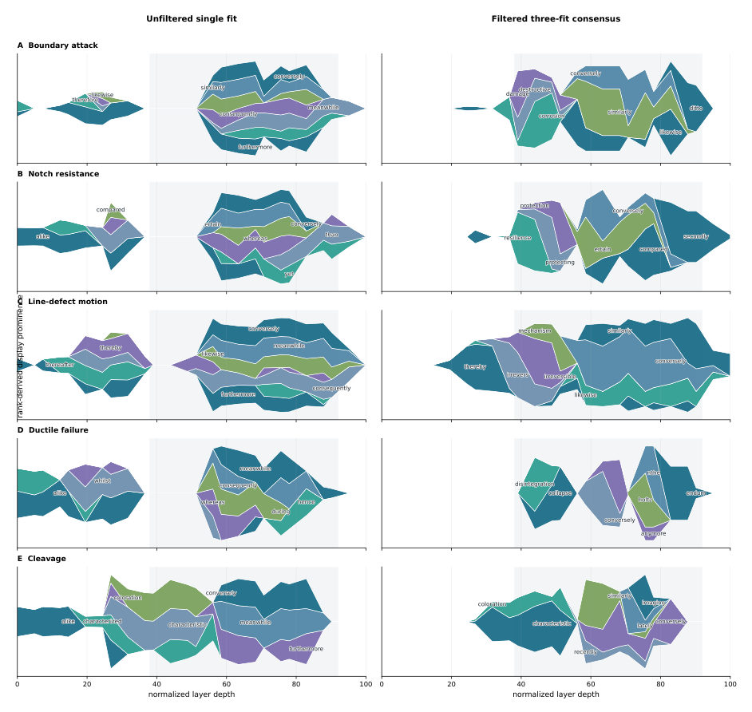
<figcaption class="paper-figure-caption"><b>Fig 5.</b> Figure 5: What does the stricter target-free filter remove, and what materials vocabulary remains? Rows A–E correspond to the five exact prompts printed in the text. Each left panel shows the original-style unrestricted leading words from lens fit 0. Each right panel removes input and output words, the frozen 214-word function list, and the globally common readout scaffold, then requires the word to occur in all three independent fits at that layer. No declared concept was supplied to either selection. The gray region marks the fixed 38–92% analysis band. The comparison shows that much of the visually continuous unfiltered stream is generic discourse vocabulary, while the stricter view...</figcaption>
</figure>

**Summary.** This paper investigates whether large language models encode actual physics from materials science, moving beyond simple pattern matching. By applying advanced interpretability tools like Jacobian lenses and causal interventions, the authors demonstrate that physical laws are best revealed not by looking at static states, but by observing how the model's internal state changes when a physical input direction is systematically reversed.

**Why it may be interesting.** While the domain is materials science AI, the methodology—interpreting complex physical laws (constitutive relations) as geometric constraints or directional invariances within a high-dimensional latent space—is highly relevant to understanding how quantum mechanical principles might be encoded in neural network representations.

Detailed structure

**Main problem.** The core problem is determining if a large language model genuinely encodes and utilizes underlying physical laws (mechanisms) from materials science, or if it merely correlates surface-level textual cues.

**Main result.** Physical relationships are found to be more visible in controlled state changes (e.g., reversing input direction) than in the absolute hidden states alone, suggesting a mechanistic encoding within the model's latent space.

**Method.** The authors employ advanced interpretability techniques including Jacobian lenses, causal interventions (state patching), and testing directional invariance by reversing physical inputs to probe the model's internal state transformations.

**Model / system.** The study uses an open-weight language model (google/gemma-4-E4B-it) trained on materials science descriptions. The 'system' being analyzed is the model's high-dimensional hidden state space, which is treated as a representation of physical knowledge.

**Key observables.** Concept ranks derived from readouts, directional law adherence (e.g., 39/40 correct reversals), and shifts in answer probabilities following causal interventions.

**Important parameters / regimes.** The analysis focuses on state transformations, the structure of constitutive laws, and the comparison between absolute states versus controlled changes in those states.

**Assumptions / limitations.** The study assumes that physical mechanisms can be mapped onto mathematically measurable properties within the model's hidden state vectors, requiring careful disentanglement from mere lexical correlation.

**Figures summary.** Figures summarize evaluations using vocabulary readouts (concepts), matched counterfactual comparisons (state changes/constitutive orientation), and causal intervention tests (answer shifts).

**Paper structure.** The paper progresses by establishing three separable forms of mechanism information: concepts in states, constitutive orientation via state transformations, and causal control over answers. It uses a multi-stage testing protocol involving readouts, relational geometry checks, and final directional/causal interventions.

Abstract

Large language models can answer scientific questions, yet a correct output does not reveal whether the model represents or uses the governing physics. Here we show that materials science mechanism information in the open-weight google/gemma-4-E4B-it model has three experimentally separable forms: concepts are readable in individual hidden states, constitutive orientation is carried by controlled transformations between states, and selected internal representations causally control engineering answers. We combine matched direct and Jacobian vocabulary readouts, option-free state geometry, a 60-law counterfactual benchmark and causal interventions. In 50 held-out materials descriptions, three independently fitted Jacobian lenses reproduced concept ranks, and target-free word sets from both readouts enabled blinded identification of 9 of 10 mechanism families. A separate 72-prompt benchmark produced mechanism-specific hidden-state neighborhoods, but an exact graph audit showed that this apparent physical organization was equally explained by numerical comparison. We therefore compared otherwise identical prompts in which only the direction of the physical input was reversed, asking whether the resulting hidden-state movement followed the supplied constitutive law. These state transformations ordered direct, physically neutral and inverse laws across 60 frozen relations and correctly oriented 39 of 40 directional laws, whereas lexical controls were near chance. Bidirectional interventions shifted answer probabilities toward or away from the physically appropriate outcome across all 12 matched cases, while counterfactual state patches transferred opposing decision signals across mechanisms and answer formats. Physical relationships were therefore more visible in controlled state changes than in absolute states alone.

[↑ back to top](#top)

### [Power-Law Suppression of Superfluid Stiffness in High-Kinetic-Inductance NbN Films](http://arxiv.org/abs/2607.20096v1)

**Authors:** Meenakshi Sharma, Hrishikesh Borah, Sandeep Singh, Berit H. Goodge, Edouard Lesne, Sandra Nestler, Surinder P. Singh, Haolin Jin, Yejin Lee, Bernd Büchner, Uri Vool  
**Type:** experiment · **Category:** statistical mechanics · **PDF:** <https://arxiv.org/pdf/2607.20096v1>  
**Analysis basis:** full PDF text, analyzed in chunks
**Topic relevance:** `Keldysh / 2PI / non-Gaussian methods` **1/5** · `QC/QI experiment` **1/5** · `driven-dissipative phase transition` **1/5**

↔ Scroll figures horizontally

<figure class="paper-figure-card">
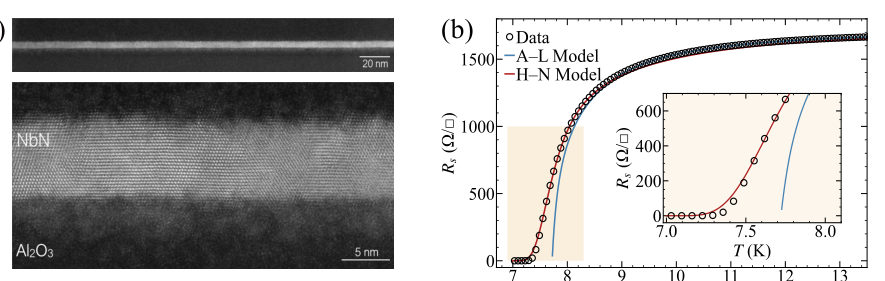
<figcaption class="paper-figure-caption"><b>Fig 1.</b> FIG. 1: (a) Cross-sectional ADF-STEM images of a representative 5 nm NbN film on Al2O3. Top: continuous film over an extended region. Bottom: high-resolution view; the diffuse top layer is the native oxide, while the lattice fringes below confirm crystalline NbN oriented to the substrate. (b) Sheet resistance near the superconducting transition of the 2.8 nm film. The red line is an Aslamazov–Larkin fit yielding the mean-field Tc = 7.72 K; elsewhere, Tc denotes the resistive-transition midpoint. The blue line is a Halperin–Nelson fit yielding TBKT = 6.959 K (see SM).</figcaption>
</figure>
<figure class="paper-figure-card">
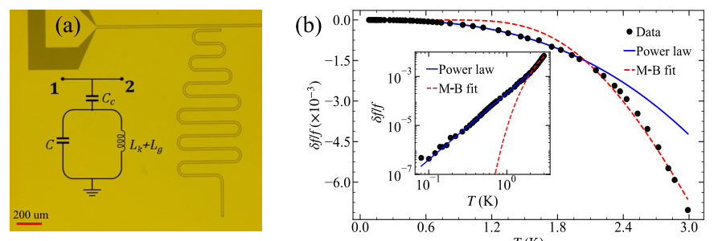
<figcaption class="paper-figure-caption"><b>Fig 2.</b> FIG. 2: (a) Optical image of the λ/2 CPW resonator and its lumped-element equivalent circuit. (b) Fractional frequency shift δf/f versus temperature on a linear scale, with power-law (blue) and Mattis-Bardeen (red) fits. Inset: log-log representation highlighting the low-temperature scaling.</figcaption>
</figure>
<figure class="paper-figure-card">
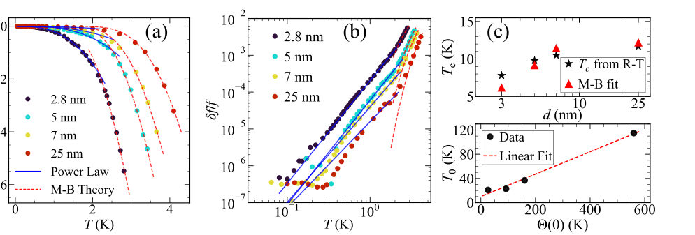
<figcaption class="paper-figure-caption"><b>Fig 3.</b> FIG. 3: (a) Fractional resonance frequency shift δf/f versus temperature for films with thicknesses ranging from 2.8 nm to 25 nm, with power-law (blue solid lines) and Mattis-Bardeen (red dashed lines) fits. (b) Log-log representa- tion of the same data and fits, highlighting the extended low-temperature power-law scaling. (c) Upper panel: critical temperature Tc extracted from DC transport (black stars) and from the M-B component of the microwave fit (red triangles). Lower panel: Characteristic energy scale T0 as a function of the zero-temperature superfluid stiffness Θ(0) for films of different thicknesses. Black circles denote values averaged over nominally identical films at each...</figcaption>
</figure>
<figure class="paper-figure-card">
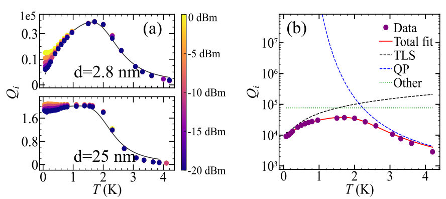
<figcaption class="paper-figure-caption"><b>Fig 4.</b> FIG. 4: Microwave dissipation in NbN resonators: (a) Internal quality factor Qi as a function of temperature for representative resonance modes of the 2.8 nm (upper panel) and 25 nm (lower panel) resonators, measured at input powers from −20 to 0 dBm. The pronounced low-temperature power dependence of the 2.8 nm resonator is consistent with saturation of a TLS-like loss channel, whereas the high-temperature decrease in Qi results from thermally excited quasiparticles. (b) Inverse internal quality factor 1/Qi of the 2.8 nm resonator at −20 dBm, together with the decomposition into TLS-like, quasiparticle (QP), and residual contributions according to Eq. 6. The solid line represents their...</figcaption>
</figure>

**Summary.** This research uses microwave resonators on disordered NbN films to probe the electrodynamics of superconductors. By measuring frequency shifts at low temperatures, the authors demonstrate a power-law suppression of superfluid stiffness that deviates from standard theories. This work establishes the ratio of superfluid stiffness to critical temperature as the key parameter controlling the transition between phase-fluctuation and gap-dominated superconducting behavior.

**Why it may be interesting.** The work provides experimental evidence for phase-fluctuation physics in highly engineered superconducting materials, linking macroscopic circuit properties (high $L_k$) directly to fundamental quantum phase transitions relevant to superconductivity theory.

Detailed structure

**Main problem.** The study investigates the fundamental trade-off between achieving high kinetic inductance, which is useful for quantum circuits, and maintaining phase rigidity in superconducting ultrathin films.

**Main result.** The low-temperature electrodynamics exhibit a power-law suppression of superfluid stiffness ($\delta f/f \propto T^b$), indicating a crossover governed by the ratio $\Theta(0)/T_c$ between phase-fluctuation and gap-dominated regimes.

**Method.** Microwave resonators are used to measure the temperature dependence of the fractional resonance frequency shift ($\delta f/f$) across varying film thicknesses.

**Model / system.** The system is NbN superconducting ultrathin films (2.8 nm to 25 nm) exhibiting nanocrystalline twin-domain disorder. The analysis compares measurements against theoretical models like Mattis-Bardeen theory and Berezinskii-Kosterlitz-Thouless physics.

**Key observables.** Fractional frequency shift ($\delta f/f$), superfluid stiffness ($\Theta(0)$), kinetic inductance fraction ($\alpha$), and the temperature exponent ($b$).

**Important parameters / regimes.** The ratio $\Theta(0)/T_c$ is identified as the key parameter governing the crossover between electrodynamic regimes.

**Assumptions / limitations.** The analysis assumes that the measured frequency shift is dominated by changes in superfluid stiffness, allowing for a clear separation of phase-fluctuation effects from quasiparticle losses.

**Figures summary.** Figures show STEM images revealing twin domains; plots display $\delta f/f$ vs. $T$, clearly showing a low-temperature power-law deviation from the expected Mattis-Bardeen fit, which is analyzed across multiple thicknesses.

**Paper structure.** The paper progresses by characterizing the physical platform (disordered films), measuring the frequency shift ($\delta f/f$) as a function of temperature and thickness, fitting the data to identify crossover regimes (power law vs. exponential decay), and finally establishing $\Theta(0)/T_c$ as the universal control parameter.

Abstract

Disorder is a powerful route to high kinetic inductance in superconducting ultrathin films, enabling compact high-impedance quantum circuits. This functionality, however, comes at the cost of reduced phase rigidity and potentially anomalous electrodynamics. Here, we use NbN microwave resonators with thicknesses down to 2.8 nm and sheet kinetic inductance up to 300 pH per square to probe how this trade-off reshapes the superconducting response. In the thinnest films, transport shows signatures of a Berezinskii-Kosterlitz-Thouless transition, while the microwave response reveals a pronounced low-temperature power-law suppression of the superfluid stiffness, inconsistent with Mattis-Bardeen theory. With increasing thickness, this anomalous regime is progressively suppressed, marking a continuous crossover toward conventional, gap-dominated electrodynamics. Cross-sectional transmission electron microscopy reveals a nanocrystalline twin-domain structure, pointing to oriented microstructural disorder as a crucial factor in the observed response. Overall, the crossover is governed by the ratio of superfluid stiffness to pairing energy, Theta(0)/Tc, identifying this ratio as a parameter governing the boundary between phase-fluctuation-dominated and gap-dominated superconducting electrodynamics in disordered nanofilms.

[↑ back to top](#top)

### [Quantum geometry and critical temperature enhancement in MgB$_2$ superconductivity](http://arxiv.org/abs/2607.19458v1)

**Authors:** Yi Jiang, Haoyu Hu, Dumitru Călugăru, Kaja H. Hiorth, Junze Deng, Hanqi Pi, Handong Chen, Maia G. Vergniory, Ion Errea, Emilia Morosan, Leslie M. Schoop, Claudia Felser, Miguel A. L. Marques, Päivi Törmä, Daniel Agterberg, B. Andrei Bernevig  
**Type:** theory · **Category:** strongly correlated electrons · **PDF:** <https://arxiv.org/pdf/2607.19458v1>  
**Analysis basis:** full PDF text, analyzed in chunks
**Topic relevance:** `Keldysh / 2PI / non-Gaussian methods` **1/5**

↔ Scroll figures horizontally

<figure class="paper-figure-card">
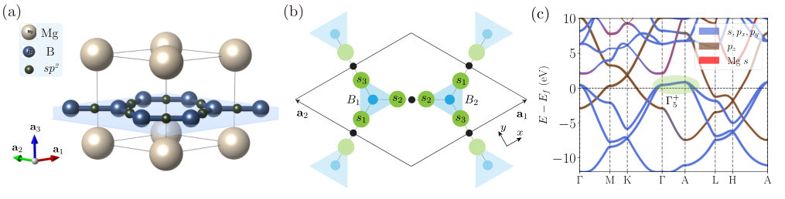
<figcaption class="paper-figure-caption"><b>Fig 1.</b> FIG. 1. Crystal structure and electronic properties of MgB2. (a) Side view of the MgB2 structure: boron atoms (blue) form honeycomb layers, and Mg atoms (gray) occupy interlayer sites. Black spheres mark the obstructed kagome sites at B–B bond centers, which host the sp2 bonding states. (b) Top view of a boron honeycomb layer. On each B site (blue), the (s, px, py) orbitals hybridize into three bond-directed, s-like orbitals (green) located along the sp2 bonds. The two bond-directed orbitals on a given B–B bond further combine into bonding and antibonding states centered at the bond midpoint (black), forming a kagome lattice. (c) Electronic band structure of MgB2, with color and thickness...</figcaption>
</figure>
<figure class="paper-figure-card">
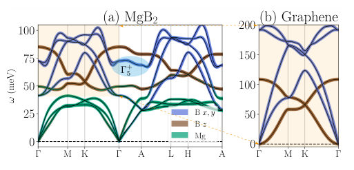
<figcaption class="paper-figure-caption"><b>Fig 2.</b> FIG. 2. Comparison of the phonon spectrum of (a) MgB2 and (b) graphene. In both plots, the blue (brown) bands denote the weight from the x, y (z) phonon from boron in (a) and carbon in (b). In (a), the BB bond-stretching modes with Γ+ 5 IRREP are marked with a blue circle, which give a strong soft- ening and the dominant contribution to the electron-phonon coupling (EPC) in MgB2. The yellow-shaded regions serve as a visual guide, indicating that the graphene phonon is close to the MgB2 optical phonon, primarily originating from the boron atoms on the kz = 0 plane, with an overall frequency shift induced by the heavy magnesium atoms.</figcaption>
</figure>
<figure class="paper-figure-card">
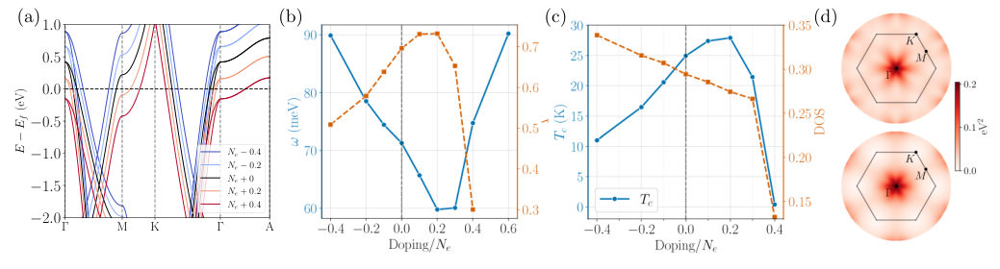
<figcaption class="paper-figure-caption"><b>Fig 3.</b> FIG. 3. Ab initio doping dependence of the superconducting properties of MgB2. (a) Electronic band structures at representative doping levels, where Ne + n denotes n electrons are added. (b) The blue curve represents the average frequency of the in-plane B–B bond-stretching mode along Γ–A as a function of doping, showing a pronounced minimum at light electron doping regime. The orange curve shows the doping-dependence of total EPC strength λ. (c) DOS at the Fermi level N(Ef) and ab initio superconducting transition temperature Tc versus doping: while N(Ef) decreases monotonically from hole to electron doping, Tc is non-monotonic, increasing at light electron doping and decreasing at larger...</figcaption>
</figure>
<figure class="paper-figure-card">
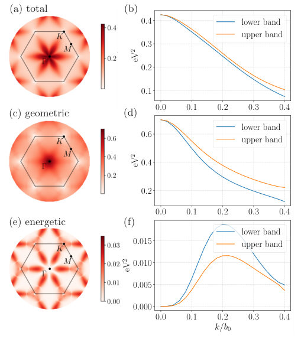
<figcaption class="paper-figure-caption"><b>Fig 4.</b> FIG. 4. EPC in the band basis obtained from the analytical Gaussian approximation (GA), where the total EPC is sepa- rated into the geometric and energetic contributions. In each row, the first panel shows the band-resolved EPC Gm k (defined in Eq. (3)) on the kz = 0 plane for phonon momentum q = 0 and the upper sp2 bands. The second panel presents the ra- dial average of Gm k versus the distance k from Γ (b0 being the length of the in-plane reciprocal lattice vector). The total GA EPC reproduces the ab initio trend in Fig. 3: Gk peaks at Γ, remains elevated along the ΓK line, and decays approx- imately as k2 away from Γ. The geometric part shows an even sharper maximum at Γ compared with the...</figcaption>
</figure>

**Summary.** This theoretical work provides a detailed, symmetry-based account of superconductivity in $	ext{MgB}_2$. It demonstrates that the enhancement of $T_c$ upon doping is fundamentally governed by quantum geometric effects within the electron-phonon coupling. The methodology employs advanced many-body perturbation theory to derive an effective attractive interaction Hamiltonian.

**Why it may be interesting.** The explicit derivation of an effective electron-electron interaction ($\hat{H}_{ee}$) by integrating out phonons is a canonical technique in strongly correlated physics, providing deep insight into how lattice vibrations mediate pairing interactions beyond simple BCS models.

Detailed structure

**Main problem.** To develop a comprehensive, symmetry-based theory explaining the enhancement of the critical temperature ($T_c$) in $	ext{MgB}_2$ superconductivity by identifying the role of quantum geometry.

**Main result.** The $T_c$ enhancement is overwhelmingly driven by the geometric component of the electron-phonon coupling (EPC), which arises from the small, quasi-2D $\sigma$ Fermi surface peaked at the Brillouin zone center ($\Gamma$).

**Method.** The authors combine constructing compact analytic models for electronic structure and phonons with advanced theoretical techniques like degenerate perturbation theory and the Schrieffer-Wolff transformation to derive an effective electron-electron interaction.

**Model / system.** The system is $	ext{MgB}_2$, modeled using a minimal tight-binding approach focusing on the $sp^2$ boron orbitals, which form an obstructed kagome lattice structure for the $\sigma$ bands. The theory analyzes the coupling between electrons and phonons.

**Key observables.** Critical temperature ($T_c$), Electron-Phonon Coupling (EPC) strength ($\lambda$), phonon softening modes (specifically the $\Gamma$-point B–B bond-stretching mode), and the ratio of geometric to total EPC ($\lambda_{	ext{geo}}/\lambda$).

**Important parameters / regimes.** Light electron doping regime, quasi-2D $\sigma$ Fermi surface geometry, and the coupling strength relative to phonon frequencies.

**Assumptions / limitations.** The analysis relies on symmetry selection rules, the Gaussian approximation for the EPC tensor, and perturbation theory expansions (including the Schrieffer-Wolff transformation).

**Figures summary.** Figures illustrate band structures showing quasi-2D $\sigma$ bands, phonon spectra highlighting mode softening along $\Gamma-	ext{A}$, and doping dependence plots showing $T_c$ non-monotonicity linked to EPC strength.

**Paper structure.** The paper progresses from establishing the physical model ($	ext{MgB}_2$ structure/bands) to identifying the dominant coupling mechanism (symmetry selection rules leading to $\Gamma_{+5}$ phonon), quantifying the enhancement via doping dependence, and finally deriving the underlying theoretical framework using advanced many-body perturbation theory.

Abstract

MgB$_2$, a phonon-mediated superconductor with record-high critical temperature $T_c\simeq 39$ K, is revisited to obtain a comprehensive theory of electrons, phonons, and their coupling with minimal ab initio input. We construct compact analytic models for the electronic structure, phonons, and electron-phonon coupling (EPC) of MgB$_2$. We show that strong in-plane B $sp^2$ bonding realizes an obstructed band structure whose natural description is a bond-centered kagome lattice, yielding small quasi-2D $σ$-band Fermi-surface cylinders and pronounced quantum-geometric effects. The phonon spectrum is found to closely track that of a graphene-like boron layer, but the heavy intercalated Mg atoms dominate the three acoustic branches and rigidly lift the boron modes into the optical sector, while the in-plane B-B bond-stretching mode exhibits a pronounced softening along $Γ$-A. By symmetry, this $Γ$-point bond-stretching mode is the only $Γ$ phonon that can couple to the $σ$ Fermi surface, explaining its dominant contribution to the EPC. Upon electron doping toward the doubly degenerate band edge of the $σ$ sheets, we find that a reduced density of states competes with enhanced EPC matrix elements. At light electron doping, ab initio calculations show that the EPC enhancement dominates, leading to an increase in $T_c$ (within the clean doping limit without disorder effects). Using the Gaussian approximation for the EPC tensor, we further show that this enhancement is overwhelmingly quantum geometric in origin, arising from a geometric EPC contribution of the small $σ$ Fermi surface peaked at $Γ$. Overall, our results provide a transparent, symmetry-based account of superconductivity in MgB$_2$ and suggest that quantum-geometric effects can be essential for shaping doping trends in phonon-mediated superconductors.

[↑ back to top](#top)

### Other secondary papers (1)

Show other secondary papers

### [Using the Ehrenfest theorem for determining the self-focusing and self-trapping of nonlinear beams](http://arxiv.org/abs/2607.19980v1)

**Authors:** Chandroth P. Jisha, Stefan Nolte, Alessandro Alberucci  
**Type:** theory · **Category:** other · **PDF:** <https://arxiv.org/pdf/2607.19980v1>  
**Analysis basis:** full PDF text, analyzed in chunks

↔ Scroll figures horizontally

<figure class="paper-figure-card">
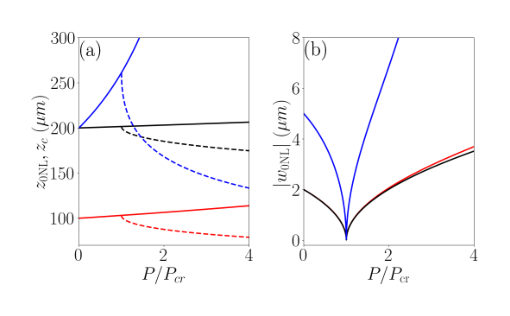
<figcaption class="paper-figure-caption"><b>Fig 1.</b> FIG. 1. Parameters of a NLGB versus the normalized power P/Pcr for a wavelength λ = 1064 nm. (a) The nonlinear focal position z0NL [solid lines, see Eq. (34)] and the correspond- ing position of the catastrophic collapse zc [dashed lines, see Eq. (35)]. (b) Absolute value of the nonlinear waist w0NL as computed from Eq. (33). Red and black lines correspond to w0 = 2 µm with linear focal position placed in z = 100 µm and 200 µm, respectively. Blue lines are computed for w0 = 5 µm and linear focus placed in z = 200 µm.</figcaption>
</figure>
<figure class="paper-figure-card">
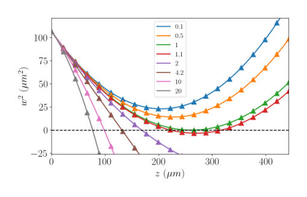
<figcaption class="paper-figure-caption"><b>Fig 2.</b> FIG. 2. Square width w2 versus the propagation coordinate z for different values P/Pcr as reported in the legend. Solid lines and triangles correspond to solutions from Eqs. (33-34) and from Eq. (37), respectively. As direct consequence of the singularity at the critical power, the regions where w2 &lt; 0 have no physical meaning. Here λ = 1064 nm, w0 = 5 µm, and z0 = 200 µm.</figcaption>
</figure>
<figure class="paper-figure-card">
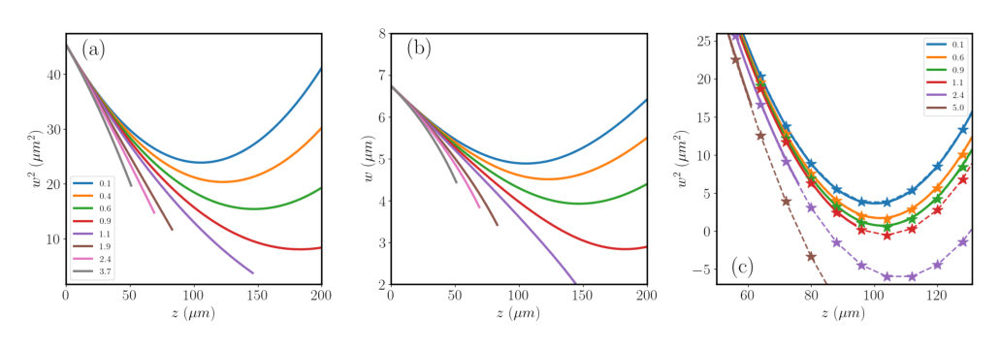
<figcaption class="paper-figure-caption"><b>Fig 3.</b> FIG. 3. Comparison between theory and simulations in the Kerr case. Numerically-computed square of the beam width w2</figcaption>
</figure>
<figure class="paper-figure-card">
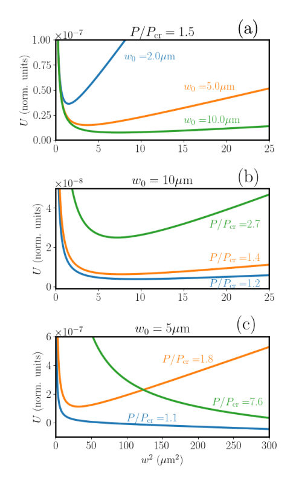
<figcaption class="paper-figure-caption"><b>Fig 4.</b> FIG. 4. Effective potential versus the square width w2 for cubic-quintic media when λ = 1064 nm, N0 = 2, and n2 = 5× 10−18m2W−1. (a-b) Effective potential for |η′| = |n4|/n2 = 1 × 10−17m2W−1, for a fixed power P = 1.5Pcr (a) or for a fixed waist w0 = 10 µm (b). (c) Potential for three different powers when |n4|/n2 = 4.5 × 10−16m2W−1; input width is now 5 µm.</figcaption>
</figure>
<figure class="paper-figure-card">
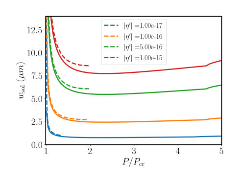
<figcaption class="paper-figure-caption"><b>Fig 5.</b> FIG. 5. Soliton width wsol versus the normalized power P/Pcr computed by solving numerically the nonlinear eigenvalue problem (solid lines) and predicted by Eq. (44) (dashed lines). Each color corresponds to a different ratio η′ between the cu- bic and the quintic nonlinearities.</figcaption>
</figure>

**Summary.** This paper develops an advanced theoretical method by generalizing the Ehrenfest theorem to analyze nonlinear wave propagation. It models the nonlinearity using a Quantum Harmonic Oscillator potential, leading to solvable ordinary differential equations for the beam width. This framework successfully predicts key phenomena such as self-focusing and stable light localization (breathers) in various optical media.

**Why it may be interesting.** This work bridges quantum mechanical theorems (Ehrenfest) with classical wave phenomena (nonlinear optics), providing a powerful, simplified analytical tool to predict complex beam dynamics like self-focusing without full numerical simulation.

Detailed structure

**Main problem.** The primary goal is determining the self-focusing and self-trapping behavior of nonlinear optical beams.

**Main result.** The authors develop a generalized framework using an ODE derived from the Ehrenfest theorem to model beam width evolution, showing it can explain stability and breathing in various nonlinear regimes.

**Method.** The method involves generalizing the Ehrenfest theorem by modeling the nonlinear potential as a Quantum Harmonic Oscillator (QHO) whose strength depends on power and beam width. This leads to solving high-order ordinary differential equations for the beam width squared ($w^2$).

**Model / system.** The system is nonlinear wave propagation governed by the Generalized Nonlinear Schrödinger Equation (GNLSE), applied to optical beams in media exhibiting various nonlinear responses (local, nonlocal). The analysis focuses on the evolution of the beam width $w(z)$ along the propagation direction $z$.

**Key observables.** Beam width ($w$), self-focusing/self-trapping behavior, and the existence of stable solutions like breathers.

**Important parameters / regimes.** Nonlinearity strength parameters ($\gamma, N, M$), input power relative to critical power ($P/P_{cr}$), and nonlocal length scales ($l$).

**Assumptions / limitations.** Key assumptions include assuming radial symmetry, approximating the nonlinear potential as parabolic (QHO model), and making approximations like neglecting derivatives of optical power with respect to $z$ (adiabatic drop).

**Paper structure.** The paper progresses from setting up the GNLSE and generalizing the Ehrenfest theorem, deriving a fourth-order ODE for beam width ($w^2$), simplifying this into various second-order ODEs based on approximations (e.g., adiabatic drop), and finally analyzing specific cases like Kerr or nonlocal nonlinearities.

Abstract

We discuss how to generalize the Ehrenfest theorem for the computation of the width of nonlinear waves obeying the nonlinear Schrodinger equation. To do that, we model the nonlinear potential as a quantum harmonic oscillator (QHO) whose strength depends on the power and on the wavefunction width. We apply the model to different types of nonlinear responses, eventually comparing the results with numerical simulations. Our model has the advantage of explaining the main properties of nonlinear confined waves, such as stability and breathing, in a relatively simple and intuitive manner.

[↑ back to top](#top)

