
# arxiv digest (quant-ph + cond-mat) — 2026-07-25

*117 papers · 42 relevant · 4 highlighted*

## 🔥 Most relevant (42)

*Every paper with at least one nonzero topic score, sorted by best-matching score. 🔥 marks scores ≥4/5. Click the title to jump to the full entry below; click [arXiv] to open the paper page. `(secondary)` marks papers from de-prioritized cond-mat archives.*

Show 42 relevant papers

- [Multicritical dissipative phase transitions manipulated by dipole--dipole interactions](#paper-2607.20905) [[arXiv]](http://arxiv.org/abs/2607.20905v1) — 🔥 `driven-dissipative phase transition` **5/5** · 🔥 `Tavis-Cummings & cavity-many-emitter` **4/5** · 🔥 `analog quantum simulation` **4/5** · 🔥 `non-equilibrium universality` **4/5** · `Dicke superradiance` **3/5** · `Rydberg arrays` **3/5** · `correlated / nonlocal dissipation` **3/5** · `correlated cavity matter` **3/5** · `methods for driven-dissipative` **3/5** · `non-equilibrium dynamics` **3/5** · `superradiant laser` **2/5** · `Keldysh / 2PI / non-Gaussian methods` **1/5** · `entanglement & information structure` **1/5** · `exotic spin models in light-matter` **1/5**
- ⭐ [Fluctuation-Induced Bistability in the Dissipative Dynamics of Generic Cavity-Matter Quantum Systems](#paper-2607.21296) [[arXiv]](http://arxiv.org/abs/2607.21296v1) — 🔥 `methods for driven-dissipative` **5/5** · 🔥 `analog quantum simulation` **4/5** · 🔥 `correlated cavity matter` **4/5** · 🔥 `driven-dissipative phase transition` **4/5** · `Tavis-Cummings & cavity-many-emitter` **3/5** · `exotic spin models in light-matter` **3/5** · `non-equilibrium dynamics` **3/5** · `non-equilibrium universality` **3/5** · `spintronics-quantum-optics interface` **3/5** · `Keldysh / 2PI / non-Gaussian methods` **2/5** · `correlated / nonlocal dissipation` **2/5** · `Kondo & dissipative impurity` **1/5** · `entanglement & information structure` **1/5** · `measurement-induced transitions` **1/5**
- [Structured Cavity Quantum Electrodynamics](#paper-2607.21012) [[arXiv]](http://arxiv.org/abs/2607.21012v1) — 🔥 `quantum optics experiment` **5/5** · 🔥 `analog quantum simulation` **4/5** · 🔥 `exotic spin models in light-matter` **4/5** · `correlated cavity matter` **3/5** · `entanglement & information structure` **3/5** · `interference shaping light` **3/5** · `spintronics-quantum-optics interface` **3/5** · `Tavis-Cummings & cavity-many-emitter` **2/5** · `driven-dissipative phase transition` **2/5** · `QC/QI experiment` **1/5** · `correlated / nonlocal dissipation` **1/5** · `methods for driven-dissipative` **1/5** · `non-equilibrium dynamics` **1/5** · `non-equilibrium universality` **1/5** · `quantum measurements` **1/5**
- [Extended Single-Atom Tweezer Arrays in High-Cooperativity Cavity-QED](#paper-2607.21515) [[arXiv]](http://arxiv.org/abs/2607.21515v1) — 🔥 `Tavis-Cummings & cavity-many-emitter` **5/5** · 🔥 `analog quantum simulation` **4/5** · 🔥 `correlated cavity matter` **4/5** · 🔥 `quantum optics experiment` **4/5** · `QC/QI experiment` **3/5** · `quantum measurements` **3/5** · `Rydberg arrays` **2/5** · `measurement-induced transitions` **2/5** · `correlated / nonlocal dissipation` **1/5** · `driven-dissipative phase transition` **1/5** · `entanglement & information structure` **1/5** · `interference shaping light` **1/5**
- [Optimal feedback control under stepwise equilibration and partial observation](#paper-2607.21523) [[arXiv]](http://arxiv.org/abs/2607.21523v1) — 🔥 `quantum measurements` **5/5** · 🔥 `measurement-induced transitions` **4/5** · `methods for driven-dissipative` **3/5** · `non-equilibrium dynamics` **3/5** · `non-equilibrium universality` **2/5** · `Keldysh / 2PI / non-Gaussian methods` **1/5** · `correlated / nonlocal dissipation` **1/5** · `driven-dissipative phase transition` **1/5** · `entanglement & information structure` **1/5**
- ⭐ [Vacuum-induced interference in light scattering by multilevel atomic chains](#paper-2607.21073) [[arXiv]](http://arxiv.org/abs/2607.21073v1) — 🔥 `analog quantum simulation` **4/5** · 🔥 `correlated / nonlocal dissipation` **4/5** · 🔥 `interference shaping light` **4/5** · `Dicke superradiance` **3/5** · `free-space correlated emission` **3/5** · `methods for driven-dissipative` **3/5** · `superradiant laser` **3/5** · `Tavis-Cummings & cavity-many-emitter` **2/5** · `driven-dissipative phase transition` **2/5** · `non-equilibrium dynamics` **2/5** · `Frenkel-Kontorova` **1/5** · `Keldysh / 2PI / non-Gaussian methods` **1/5** · `correlated cavity matter` **1/5** · `entanglement & information structure` **1/5** · `non-equilibrium universality` **1/5**
- [Flow of local sensitivity in a spin chain coupled to a bosonic bath](#paper-2607.21501) [[arXiv]](http://arxiv.org/abs/2607.21501v1) — 🔥 `entanglement & information structure` **4/5** · `analog quantum simulation` **3/5** · `correlated / nonlocal dissipation` **3/5** · `driven-dissipative phase transition` **3/5** · `exotic spin models in light-matter` **3/5** · `methods for driven-dissipative` **3/5** · `non-equilibrium dynamics` **3/5** · `Keldysh / 2PI / non-Gaussian methods` **2/5** · `non-equilibrium universality` **2/5** · `spintronics-quantum-optics interface` **2/5** · `Kondo & dissipative impurity` **1/5** · `Tavis-Cummings & cavity-many-emitter` **1/5** · `correlated cavity matter` **1/5** · `scars & prethermalization` **1/5**
- [Complexity transition in the Dicke model of light-matter interaction](#paper-2607.21583) [[arXiv]](http://arxiv.org/abs/2607.21583v1) — 🔥 `Tavis-Cummings & cavity-many-emitter` **4/5** · `Dicke superradiance` **3/5** · `analog quantum simulation` **3/5** · `correlated cavity matter` **3/5** · `driven-dissipative phase transition` **3/5** · `correlated / nonlocal dissipation` **2/5** · `entanglement & information structure` **2/5** · `methods for driven-dissipative` **2/5** · `non-equilibrium dynamics` **2/5** · `non-equilibrium universality` **2/5** · `Keldysh / 2PI / non-Gaussian methods` **1/5** · `exotic spin models in light-matter` **1/5** · `superradiant laser` **1/5**
- [Basis-independent coherence and quantum correlations in two dipole-dipole-coupled electrons in double quantum-dot molecules](#paper-2607.21175) [[arXiv]](http://arxiv.org/abs/2607.21175v1) — 🔥 `entanglement & information structure` **4/5** · `analog quantum simulation` **3/5** · `correlated / nonlocal dissipation` **3/5** · `driven-dissipative phase transition` **3/5** · `methods for driven-dissipative` **3/5** · `non-equilibrium dynamics` **3/5** · `non-equilibrium universality` **2/5** · `spintronics-quantum-optics interface` **2/5** · `Keldysh / 2PI / non-Gaussian methods` **1/5** · `Kondo & dissipative impurity` **1/5** · `exotic spin models in light-matter` **1/5** · `scars & prethermalization` **1/5**
- ⭐ [Floquet Reservoir Engineering for Remote Logical Entanglement](#paper-2607.21360) [[arXiv]](http://arxiv.org/abs/2607.21360v1) — 🔥 `correlated / nonlocal dissipation` **4/5** · 🔥 `non-equilibrium dynamics` **4/5** · `driven-dissipative phase transition` **3/5** · `entanglement & information structure` **3/5** · `methods for driven-dissipative` **3/5** · `QC/QI experiment` **2/5** · `non-equilibrium universality` **2/5** · `quantum measurements` **2/5** · `Keldysh / 2PI / non-Gaussian methods` **1/5** · `analog quantum simulation` **1/5** · `measurement-induced transitions` **1/5** · `quantum optics experiment` **1/5**
- [A statistical-physics framework for translocation elastometry of deformable particles](#paper-2607.21506) [[arXiv]](http://arxiv.org/abs/2607.21506v1) `(secondary)` — 🔥 `methods for driven-dissipative` **4/5** · 🔥 `non-equilibrium dynamics` **4/5** · `Keldysh / 2PI / non-Gaussian methods` **3/5** · `driven-dissipative phase transition` **3/5** · `non-equilibrium universality` **3/5** · `Frenkel-Kontorova` **2/5** · `quantum measurements` **2/5** · `Kondo & dissipative impurity` **1/5** · `analog quantum simulation` **1/5** · `correlated / nonlocal dissipation` **1/5** · `scars & prethermalization` **1/5**
- [An integrated all-van der Waals nanobeam laser](#paper-2607.21566) [[arXiv]](http://arxiv.org/abs/2607.21566v1) `(secondary)` — 🔥 `quantum optics experiment` **4/5** · `correlated cavity matter` **3/5** · `driven-dissipative phase transition` **3/5** · `interference shaping light` **3/5** · `superradiant laser` **3/5** · `Tavis-Cummings & cavity-many-emitter` **2/5** · `non-equilibrium dynamics` **2/5** · `analog quantum simulation` **1/5** · `correlated / nonlocal dissipation` **1/5** · `methods for driven-dissipative` **1/5** · `non-equilibrium universality` **1/5** · `quantum measurements` **1/5**
- [Large deviations in quantum dynamics and complexity](#paper-2607.20959) [[arXiv]](http://arxiv.org/abs/2607.20959v1) — 🔥 `measurement-induced transitions` **4/5** · 🔥 `quantum measurements` **4/5** · `methods for driven-dissipative` **3/5** · `non-equilibrium dynamics` **3/5** · `Keldysh / 2PI / non-Gaussian methods` **2/5** · `entanglement & information structure` **2/5** · `non-equilibrium universality` **2/5** · `analog quantum simulation` **1/5** · `correlated / nonlocal dissipation` **1/5** · `driven-dissipative phase transition` **1/5** · `exotic spin models in light-matter` **1/5** · `scars & prethermalization` **1/5**
- [Exceptional Points in a Parallel Double-Quantum-Dot Josephson Junction Coupled to a Ferromagnetic Reservoir](#paper-2607.20856) [[arXiv]](http://arxiv.org/abs/2607.20856v1) `(secondary)` — 🔥 `driven-dissipative phase transition` **4/5** · 🔥 `methods for driven-dissipative` **4/5** · `Keldysh / 2PI / non-Gaussian methods` **3/5** · `correlated / nonlocal dissipation` **3/5** · `spintronics-quantum-optics interface` **3/5** · `Kondo & dissipative impurity` **2/5** · `non-equilibrium dynamics` **2/5** · `analog quantum simulation` **1/5** · `exotic spin models in light-matter` **1/5** · `non-equilibrium universality` **1/5**
- [Beyond Calabrese-Cardy Scaling: Exceptional-Point Sensitivity from the de Sitter RT Surface](#paper-2607.21536) [[arXiv]](http://arxiv.org/abs/2607.21536v1) — 🔥 `entanglement & information structure` **4/5** · `driven-dissipative phase transition` **3/5** · `methods for driven-dissipative` **3/5** · `non-equilibrium universality` **3/5** · `correlated / nonlocal dissipation` **2/5** · `non-equilibrium dynamics` **2/5** · `Frenkel-Kontorova` **1/5** · `Keldysh / 2PI / non-Gaussian methods` **1/5** · `Kondo & dissipative impurity` **1/5** · `analog quantum simulation` **1/5**
- [Entanglement asymmetry and quantum Mpemba effect for Kramers-Wannier duality](#paper-2607.21226) [[arXiv]](http://arxiv.org/abs/2607.21226v1) — 🔥 `entanglement & information structure` **4/5** · 🔥 `non-equilibrium dynamics` **4/5** · `methods for driven-dissipative` **3/5** · `non-equilibrium universality` **3/5** · `driven-dissipative phase transition` **2/5** · `Keldysh / 2PI / non-Gaussian methods` **1/5** · `analog quantum simulation` **1/5** · `correlated / nonlocal dissipation` **1/5** · `scars & prethermalization` **1/5**
- [Unitary $k$-designs without Hamiltonian quenches](#paper-2607.20640) [[arXiv]](http://arxiv.org/abs/2607.20640v1) — 🔥 `non-equilibrium dynamics` **4/5** · `analog quantum simulation` **3/5** · `entanglement & information structure` **3/5** · `non-equilibrium universality` **3/5** · `methods for driven-dissipative` **2/5** · `scars & prethermalization` **2/5** · `Keldysh / 2PI / non-Gaussian methods` **1/5** · `correlated / nonlocal dissipation` **1/5** · `driven-dissipative phase transition` **1/5**
- [An on-chip programmable mechano-quantum transducer](#paper-2607.21487) [[arXiv]](http://arxiv.org/abs/2607.21487v1) — 🔥 `spintronics-quantum-optics interface` **4/5** · `QC/QI experiment` **3/5** · `quantum measurements` **3/5** · `driven-dissipative phase transition` **2/5** · `quantum optics experiment` **2/5** · `Kondo & dissipative impurity` **1/5** · `analog quantum simulation` **1/5** · `exotic spin models in light-matter` **1/5** · `non-equilibrium dynamics` **1/5**
- [Autonomization of Quantum Systems and the Emergence of the Work Operator](#paper-2607.20602) [[arXiv]](http://arxiv.org/abs/2607.20602v1) — 🔥 `non-equilibrium dynamics` **4/5** · `methods for driven-dissipative` **3/5** · `non-equilibrium universality` **3/5** · `Keldysh / 2PI / non-Gaussian methods` **2/5** · `driven-dissipative phase transition` **2/5** · `analog quantum simulation` **1/5** · `correlated / nonlocal dissipation` **1/5** · `entanglement & information structure` **1/5** · `scars & prethermalization` **1/5**
- [Characterising extremal decoherence by quantum measurement incompatibility](#paper-2607.21169) [[arXiv]](http://arxiv.org/abs/2607.21169v1) — 🔥 `quantum measurements` **4/5** · `correlated / nonlocal dissipation` **3/5** · `measurement-induced transitions` **3/5** · `driven-dissipative phase transition` **2/5** · `entanglement & information structure` **2/5** · `Keldysh / 2PI / non-Gaussian methods` **1/5** · `methods for driven-dissipative` **1/5** · `non-equilibrium dynamics` **1/5** · `non-equilibrium universality` **1/5**
- [Mixed-Binary Quadratic Programming via QUBO Sampling without Continuous-Variable Binarization](#paper-2607.21286) [[arXiv]](http://arxiv.org/abs/2607.21286v1) — 🔥 `methods for driven-dissipative` **4/5** · `Keldysh / 2PI / non-Gaussian methods` **3/5** · `analog quantum simulation` **3/5** · `driven-dissipative phase transition` **2/5** · `non-equilibrium dynamics` **2/5** · `correlated / nonlocal dissipation` **1/5** · `correlated cavity matter` **1/5** · `entanglement & information structure` **1/5** · `non-equilibrium universality` **1/5**
- [Directional telecom photons from a chirally coupled quantum dot](#paper-2607.21452) [[arXiv]](http://arxiv.org/abs/2607.21452v1) — 🔥 `QC/QI experiment` **4/5** · `interference shaping light` **3/5** · `quantum optics experiment` **3/5** · `spintronics-quantum-optics interface` **3/5** · `analog quantum simulation` **1/5** · `correlated cavity matter` **1/5** · `driven-dissipative phase transition` **1/5** · `exotic spin models in light-matter` **1/5**
- ⭐ [Strategic Plan for Neutral Atom Quantum Computation](#paper-2607.21554) [[arXiv]](http://arxiv.org/abs/2607.21554v1) — 🔥 `QC/QI experiment` **4/5** · 🔥 `Rydberg arrays` **4/5** · `analog quantum simulation` **3/5** · `entanglement & information structure` **2/5** · `correlated cavity matter` **1/5** · `non-equilibrium dynamics` **1/5** · `quantum optics experiment` **1/5**
- [Driven criticality links universal computation and optimal representations](#paper-2607.21232) [[arXiv]](http://arxiv.org/abs/2607.21232v1) — 🔥 `non-equilibrium universality` **4/5** · `driven-dissipative phase transition` **3/5** · `methods for driven-dissipative` **3/5** · `non-equilibrium dynamics` **2/5** · `Keldysh / 2PI / non-Gaussian methods` **1/5** · `correlated / nonlocal dissipation` **1/5** · `entanglement & information structure` **1/5**
- [The leading-soft cubic graviton self-interaction on the black-hole horizon](#paper-2607.21066) [[arXiv]](http://arxiv.org/abs/2607.21066v1) — 🔥 `entanglement & information structure` **4/5** · `non-equilibrium dynamics` **3/5** · `methods for driven-dissipative` **2/5** · `non-equilibrium universality` **2/5** · `Keldysh / 2PI / non-Gaussian methods` **1/5** · `correlated / nonlocal dissipation` **1/5** · `driven-dissipative phase transition` **1/5** · `scars & prethermalization` **1/5**
- [Monte Carlo Studies of Twisted Bilayer Graphene: Strain and Thermal Fluctuations](#paper-2607.20619) [[arXiv]](http://arxiv.org/abs/2607.20619v1) — 🔥 `analog quantum simulation` **4/5** · `Keldysh / 2PI / non-Gaussian methods` **3/5** · `driven-dissipative phase transition` **2/5** · `Kondo & dissipative impurity` **1/5** · `entanglement & information structure` **1/5** · `methods for driven-dissipative` **1/5** · `non-equilibrium dynamics` **1/5**
- [Picosecond-resolved entanglement distribution over an urban free-space channel](#paper-2607.21093) [[arXiv]](http://arxiv.org/abs/2607.21093v1) — 🔥 `QC/QI experiment` **4/5** · `quantum optics experiment` **3/5** · `entanglement & information structure` **2/5** · `free-space correlated emission` **1/5** · `interference shaping light` **1/5** · `non-equilibrium dynamics` **1/5**
- [Fermionic Genuine Multiparty Entanglement](#paper-2607.20707) [[arXiv]](http://arxiv.org/abs/2607.20707v1) — 🔥 `entanglement & information structure` **4/5** · `analog quantum simulation` **3/5** · `Keldysh / 2PI / non-Gaussian methods` **1/5** · `correlated / nonlocal dissipation` **1/5** · `driven-dissipative phase transition` **1/5** · `methods for driven-dissipative` **1/5**
- [Why Some Quantum States Cannot Be Recovered](#paper-2607.21240) [[arXiv]](http://arxiv.org/abs/2607.21240v1) — 🔥 `entanglement & information structure` **4/5** · `non-equilibrium dynamics` **2/5** · `correlated / nonlocal dissipation` **1/5** · `driven-dissipative phase transition` **1/5** · `methods for driven-dissipative` **1/5** · `non-equilibrium universality` **1/5** · `quantum measurements` **1/5**
- [Compact deterministic liquid-crystal polarization controller with single-measurement direct control](#paper-2607.20987) [[arXiv]](http://arxiv.org/abs/2607.20987v1) — 🔥 `QC/QI experiment` **4/5** · `quantum measurements` **3/5** · `quantum optics experiment` **2/5** · `measurement-induced transitions` **1/5**
- [Generation of bright quantum high-order harmonic driven by combined coherent and bright squeezed vacuum light](#paper-2607.20941) [[arXiv]](http://arxiv.org/abs/2607.20941v1) — 🔥 `quantum optics experiment` **4/5** · `interference shaping light` **3/5** · `driven-dissipative phase transition` **1/5** · `methods for driven-dissipative` **1/5** · `non-equilibrium dynamics` **1/5**
- [Conditional probabilities in quantum-optical settings](#paper-2607.21100) [[arXiv]](http://arxiv.org/abs/2607.21100v1) — 🔥 `quantum measurements` **4/5** · `measurement-induced transitions` **3/5** · `Keldysh / 2PI / non-Gaussian methods` **1/5** · `correlated / nonlocal dissipation` **1/5**
- [Quasiparticle specific heat of two-component Fermi mixtures: The atomic 163Dy-40K mixture](#paper-2607.21254) [[arXiv]](http://arxiv.org/abs/2607.21254v1) — 🔥 `analog quantum simulation` **4/5** · `Keldysh / 2PI / non-Gaussian methods` **3/5** · `methods for driven-dissipative` **1/5** · `non-equilibrium dynamics` **1/5**
- [Quasiparticle-induced transitions in a fluxonium qubit](#paper-2607.21329) [[arXiv]](http://arxiv.org/abs/2607.21329v1) — 🔥 `QC/QI experiment` **4/5** · `Keldysh / 2PI / non-Gaussian methods` **1/5** · `correlated / nonlocal dissipation` **1/5** · `driven-dissipative phase transition` **1/5** · `methods for driven-dissipative` **1/5**
- [A Quantum Interface Between Neutral-Atoms and Trapped-Ions Quantum Registers](#paper-2607.20998) [[arXiv]](http://arxiv.org/abs/2607.20998v1) — 🔥 `Rydberg arrays` **4/5** · `QC/QI experiment` **2/5** · `analog quantum simulation` **1/5**
- [Machine Learning for Charge State Characterization of Isolated Double Quantum Dots](#paper-2607.20871) [[arXiv]](http://arxiv.org/abs/2607.20871v1) `(secondary)` — 🔥 `QC/QI experiment` **4/5** · `methods for driven-dissipative` **1/5** · `quantum measurements` **1/5** · `spintronics-quantum-optics interface` **1/5**
- [Rack-integrated quantum dot-based source of single and entangled photons at telecom C-band](#paper-2607.21454) [[arXiv]](http://arxiv.org/abs/2607.21454v1) — 🔥 `quantum optics experiment` **4/5** · `QC/QI experiment` **1/5** · `entanglement & information structure` **1/5** · `interference shaping light` **1/5**
- [Sequential Topological Superconductivity in a Square Lattice with Chiral Charge Density Waves](#paper-2607.21525) [[arXiv]](http://arxiv.org/abs/2607.21525v1) `(secondary)` — 🔥 `analog quantum simulation` **4/5** · `Keldysh / 2PI / non-Gaussian methods` **1/5** · `driven-dissipative phase transition` **1/5** · `entanglement & information structure` **1/5**
- [An Optimal Analysis of the Product Test](#paper-2607.21477) [[arXiv]](http://arxiv.org/abs/2607.21477v1) — 🔥 `entanglement & information structure` **4/5** · `quantum measurements` **2/5**
- [An Analytically Trained Variational Surrogate for Quantum Phase Estimation on NISQ Hardware](#paper-2607.20943) [[arXiv]](http://arxiv.org/abs/2607.20943v1) — 🔥 `QC/QI experiment` **4/5** · `methods for driven-dissipative` **1/5**
- [Detecting Hidden Nonlinear High Frequency Modes Beyond Fundamental Minimal Temporal Resolution Using Weak Measurements](#paper-2607.20647) [[arXiv]](http://arxiv.org/abs/2607.20647v1) — 🔥 `quantum measurements` **4/5** · `measurement-induced transitions` **1/5**
- [A solution to 2-copy distillability of Werner states](#paper-2607.21367) [[arXiv]](http://arxiv.org/abs/2607.21367v1) — 🔥 `entanglement & information structure` **4/5**

## ⭐ Highlighted (4)

*Papers by authors on your watch list. Click the title to jump to the full entry below; click [arXiv] to open the paper page.*

Show 4 highlighted papers

- ⭐ [Strategic Plan for Neutral Atom Quantum Computation](#paper-2607.21554) [[arXiv]](http://arxiv.org/abs/2607.21554v1) — Antoine Browaeys, Mikhail D. Lukin, Vladan Vuletic, Susanne Yelin, Vladan Vuletic, Susanne Yelin
- ⭐ [Floquet Reservoir Engineering for Remote Logical Entanglement](#paper-2607.21360) [[arXiv]](http://arxiv.org/abs/2607.21360v1) — Aashish A. Clerk
- ⭐ [Fluctuation-Induced Bistability in the Dissipative Dynamics of Generic Cavity-Matter Quantum Systems](#paper-2607.21296) [[arXiv]](http://arxiv.org/abs/2607.21296v1) — Simon B. Jäger
- ⭐ [Vacuum-induced interference in light scattering by multilevel atomic chains](#paper-2607.21073) [[arXiv]](http://arxiv.org/abs/2607.21073v1) — Giovanna Morigi

## All papers (89, sorted by relevance)

*Papers from quant-ph and your primary cond-mat archives (quant-gas, stat-mech, str-el, dis-nn). Highlighted papers (⭐) come first, then everything else sorted by topic-relevance score, highest first.*

### ⭐ [Fluctuation-Induced Bistability in the Dissipative Dynamics of Generic Cavity-Matter Quantum Systems](http://arxiv.org/abs/2607.21296v1)

**Highlighted author(s):** Simon B. Jäger  
**Authors:** Luisa Tolle, Simon B. Jäger, Ameneh Sheikhan, Corinna Kollath, Catalin-Mihai Halati  
**Type:** theory · **Category:** other · **PDF:** <https://arxiv.org/pdf/2607.21296v1>  
**Analysis basis:** full PDF text, analyzed in chunks
**Topic relevance:** 🔥 `methods for driven-dissipative` **5/5** · 🔥 `analog quantum simulation` **4/5** · 🔥 `correlated cavity matter` **4/5** · 🔥 `driven-dissipative phase transition` **4/5** · `Tavis-Cummings & cavity-many-emitter` **3/5** · `exotic spin models in light-matter` **3/5** · `non-equilibrium dynamics` **3/5** · `non-equilibrium universality` **3/5** · `spintronics-quantum-optics interface` **3/5** · `Keldysh / 2PI / non-Gaussian methods` **2/5** · `correlated / nonlocal dissipation` **2/5** · `Kondo & dissipative impurity` **1/5** · `entanglement & information structure` **1/5** · `measurement-induced transitions` **1/5**

📷 Fig 1

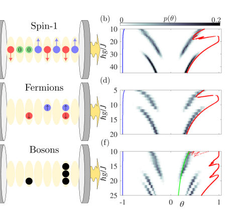 
FIG. 1: Sketch of (a) the spin-1 system, (c) spinful fermions, and (e) spinless bosons interacting with a cavity. Distribu- tions p(θ) obtained from DSRE are displayed in panels (b), (d), and (f) for spin-1, fermions, and bosons, respectively. We used the parameters (b) U0 = 30J, ℏδ = 10J, ℏΓ = 3J, L = 224, total magnetization P

📷 Fig 2

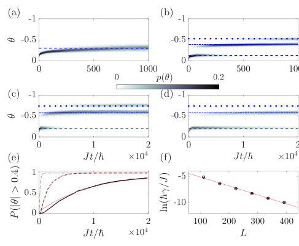 
FIG. 2: (a)-(d) Time evolution of p(θ) (bosons) for four pa- rameter sets: (a) L = 224, ℏg = 14J, (b) L = 224, ℏg = 22J, (c) L = 224, ℏg = 18J, and (d) L = 336, ℏg = 18J. Guide to the eye: blue dashed lines in (a),(b),(c),(d) indicate positions of first peak, dashed-dotted line in (b),(c),(d) second peak and the dotted line in (b),(c),(d) third peak. (e) Probability P(|θ| &gt; 0.4) as function of time for atom numbers L = 112 (light gray), L = 224 (dark gray), and L = 336 (black) at ℏg = 18J. The red curves are fits 1 −exp(−γt). (f) Growth rate γ, extracted from the fits in panel (e), plotted as a func- tion of N. The red line is a linear fit to log(ℏγ/J). Remaining parameters are U0 = 40J, ℏδ...

📷 Fig 3

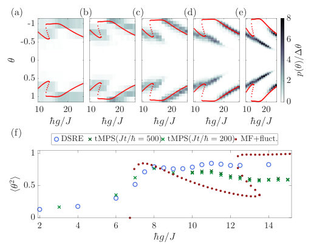 
FIG. 3: (a)-(e) Probability density p(θ) after a time Jt/ℏ= 2 × 104 as function g for (a) L = 14, (b) L = 28 (c) L = 56 (d) L = 112 (e) L = 224 for bosons with Nmax = 2. Red dots show the solution of MF+fluct.. (f) Expectation value ⟨θ2⟩ extracted from the steady state of Eq. (7) (blue circles), tMPS simulations for L = 14 (dark green crosses Jt/ℏ= 500, light green crosses Jt/ℏ= 200), and MF+fluct. in red. Remaining parameters are U0 = 40J, ℏδ = 10J, ℏΓ = 3J, N = L/2.

📷 Fig 4

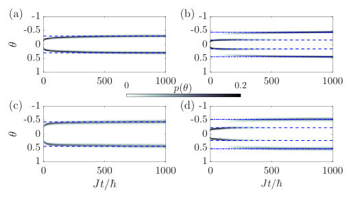 
FIG. 2: (a)-(d) Time evolution of p(θ) for spins (a),(b) and Fermions (c), (d) obtained from the DSRE method. The pa- rameters are (a) ℏg/J = 25, (b) ℏg/J = 35, (c) ℏg/J = 8, and (d) ℏg/J = 13. The remaining parameters for (a) and (b): U0 = 30J, ℏδ = 10J, ℏΓ = 3J, L = 224, total magnetization P

📷 Fig 5

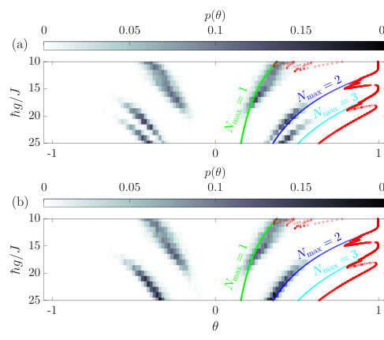 
FIG. 1: Results for p(θ) as a function of g and θ obtained with the DSRE method are shown as shaded regions for the onsite boson-number cutoff (a) Nmax = N and (b) Nmax = 2. The DSRE results shown in (a) are identical to those presented in Fig. 1(f) of the main text. The parameters are U0 = 40J, ℏδ = 5J, ℏΓ = 3J, L = 224, and half filling, N = L/2. The colored lines show |θth| obtained using the MF+fluct. method for a system size of L = 8. The green, blue, and cyan curves correspond to onsite boson-number cutoffs of Nmax = 1, Nmax = 2, and Nmax = 3, respectively.

**Summary.** This paper establishes that fluctuation-induced bistability is a universal feature of dissipative cavity-coupled many-body systems. The authors use advanced rate equation methods (DSRE) and compare them with tensor network simulations to map out the non-equilibrium dynamics. It provides a general theoretical tool for analyzing complex quantum phenomena in hybrid light-matter platforms.

**Why it may be interesting.** This work provides a general theoretical framework for understanding emergent non-linear dynamics (bistability) in open quantum systems, which is highly relevant to cavity QED and superconducting circuit research where dissipation plays a crucial role.

Detailed structure

**Main problem.** The paper investigates fluctuation-induced bistability, demonstrating that this phenomenon is a robust and generic feature in strongly interacting many-body systems coupled to dissipative cavities.

**Main result.** Bistability is shown to be universal across various models (spins, fermions, bosons) due to resonances between photon transitions and many-body energy scales. The dynamics are studied using advanced rate equation approaches that capture non-equilibrium behavior.

**Method.** The authors employ complementary theoretical frameworks, including the Dressed-State Rate Equation (DSRE) approach derived via Mori-Zwanzig formalism, and compare results with numerically exact tensor-network simulations (tMPS).

**Model / system.** The system models generic cavity-matter quantum interactions, encompassing interacting spins (XX model), fermions (Fermi-Hubbard), and bosons (Bose-Hubbard) coupled to a dissipative photonic mode governed by a Lindblad master equation.

**Key observables.** Probability distribution $p(	heta)$ of the imbalance $	heta$, steady-state properties, and time evolution of observables like $\langle	heta^2
angle$ and coherence ($C_2$).

**Important parameters / regimes.** Strong coupling regime ($U/J, \hbar g/J \gg 1$), system size dependence (bistability emerges for large $L$), and local Hilbert-space cutoff ($N_{\max}$).

**Assumptions / limitations.** The DSRE approach involves approximations like neglecting coherences between degenerate eigenstates or truncating the hierarchy of equations; MF+fluct. assumes rapid thermalization.

**Figures summary.** Figures illustrate $p(	heta)$ for different systems and cutoffs, showing bistability regions. Other figures track time evolution of observables ($\langle	heta^2
angle$, etc.) using tMPS, confirming slow dynamics in the bistable regime.

**Paper structure.** The paper first establishes the problem by defining the Hamiltonian and master equation. It then develops and applies the DSRE method to analyze steady-state properties and show the universality of bistability across different particle types. Finally, it validates these findings by comparing results with tMPS simulations tracking non-equilibrium time evolution.

Abstract

We demonstrate that fluctuation-induced bistability is a robust and generic phenomenon in strongly interacting many-body systems with strong light-matter coupling. We identify a common microscopic mechanism based on resonances between photonic transitions and many-body energy scales, unifying the emergence of fluctuation-induced bistability across a broad class of models, including interacting spins, fermions, and bosons coupled to cavity modes. We develop complementary methods to study both the steady-state properties of fluctuation-induced bistability and its dynamical formation at finite times. In particular, we introduce the dressed-state rate equation approach, which reveals rich metastable dynamics and enables the investigation of its system-size dependence. By comparing its predictions with numerically-exact tensor-network simulations, we identify signatures of fluctuation-induced bistability already in small systems on finite timescales. Our results establish fluctuation-induced bistability as a universal feature of dissipative cavity-coupled many-body systems and provide a general framework for the investigation of its non-equilibrium dynamics across a wide range of hybrid quantum platforms.

[↑ back to top](#top)

### ⭐ [Vacuum-induced interference in light scattering by multilevel atomic chains](http://arxiv.org/abs/2607.21073v1)

**Highlighted author(s):** Giovanna Morigi  
**Authors:** Aleksei Konovalov, Giovanna Morigi, Nicola Piovella  
**Type:** theory · **Category:** other · **PDF:** <https://arxiv.org/pdf/2607.21073v1>  
**Analysis basis:** full PDF text, analyzed in chunks
**Topic relevance:** 🔥 `analog quantum simulation` **4/5** · 🔥 `correlated / nonlocal dissipation` **4/5** · 🔥 `interference shaping light` **4/5** · `Dicke superradiance` **3/5** · `free-space correlated emission` **3/5** · `methods for driven-dissipative` **3/5** · `superradiant laser` **3/5** · `Tavis-Cummings & cavity-many-emitter` **2/5** · `driven-dissipative phase transition` **2/5** · `non-equilibrium dynamics` **2/5** · `Frenkel-Kontorova` **1/5** · `Keldysh / 2PI / non-Gaussian methods` **1/5** · `correlated cavity matter` **1/5** · `entanglement & information structure` **1/5** · `non-equilibrium universality` **1/5**

📷 Fig 1

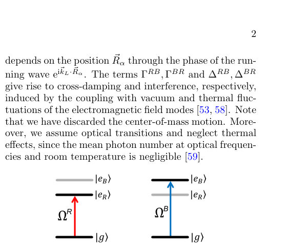 
FIG. 1. Relevant level scheme of each emitter. The colored arrows denote only dipolar transitions which are involved in the excitation process, here labeled by the Rabi frequency multiplied by the corresponding Clebsch-Gordon coefficient. Both dipolar transition are parallel and thus couple with the same modes of the electromagnetic field. Hence, spontaneous decay processes from the excited states can interfere. In this work we assess the magnitude of this interference on coherent scattering when the emitters form a chain.

📷 Fig 2

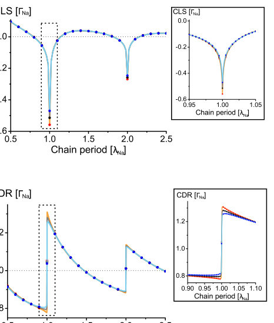 
FIG. 3. Onset: a) Line shift Λi (CLS) and b) decay rate γi (CDR) as functions of the chain period and in units of Γ. The dots are the results of numerical integration of the excitation spectra for a chain of N = 1000 three-level emit- ters with the parameters of 23Na and fitting using (19). The orange and cyan lines are the analytical results for the R- and B-transitions, respectively, as in Sec. III 2. For refer- ence, the grey line shows the result when the cross-interference terms are set to zero in the model. It significantly overlaps with the predictions of the full model, except at periodicity a ≃λ, 2λ. The insets display zooms into the region inside the corresponding box of the...

📷 Fig 3

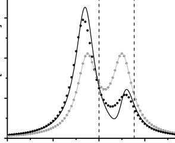 
FIG. 2. The black dots are the photon-count signal, Eq. (3), vs laser detuning for a chain of N = 1000 emitters consisting of two parallel dipoles with the parameters of (a) 23Na and (b) 7Li D2 line. The interparticle distance is a = λ, with λ the wavelength of the optical transition. Vertical dashed lines indicate the bare transition frequencies, the laser detun- ing is defined with respect to the lower-frequency transition. Solid lines correspond to the result in perturbation theory in ϵ the grey solid line is found by setting all cross interference terms to zero (S(0) R + S(0) B , see Eq. (17)). The grey dots are the results of a simulation of the chain by setting artificially GRB = 0 in...

📷 Fig 4

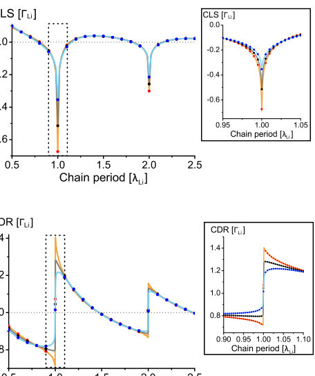 
FIG. 4. Same as Fig.3 but for the parameters of 7Li.

📷 Fig 5

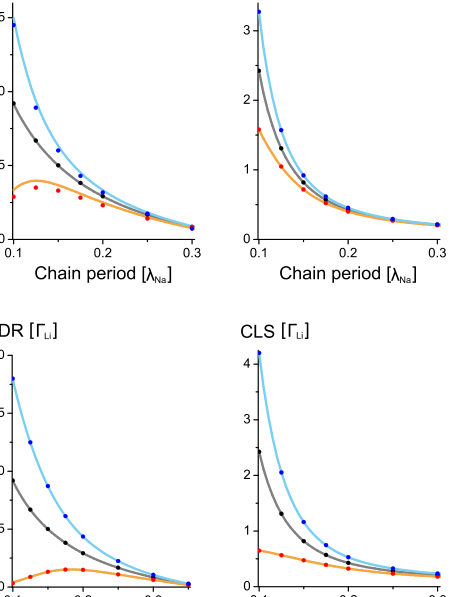 
FIG. 5. CLR and CLS for the parameters of (a) Sodium and (b) Lithium and a &lt; λ/2. The parameters and legenda are the same as in Figs. 3 and 4.

**Summary.** This paper theoretically analyzes how vacuum fluctuations induce interference effects—cross-damping and cross-shifts—when light scatters from an ordered chain of multilevel atoms. By modeling the system using coupled dipole equations, the authors predict that these collective interference terms manifest as measurable shifts and changes in linewidths within the excitation spectrum. The findings are significant for understanding quantum light-matter interactions in structured atomic media.

**Why it may be interesting.** This work directly addresses open quantum systems dynamics in structured media, providing quantitative predictions for collective effects (superradiance, cross-damping) that are sensitive to spatial arrangement, which is a key area in quantum optics.

Detailed structure

**Main problem.** The study investigates vacuum-induced interference effects, specifically cross-damping and cross-shifts, that modify light scattering dynamics in ordered chains of multilevel atoms.

**Main result.** The interplay between multilevel interference and superradiance can lead to measurable spectral modifications (linewidths and shifts) in alkali-metal atomic chains when spatial periodicity is considered.

**Method.** The authors use the Model of Coupled Coherent Dipoles (MCD), solving equations derived from a master equation, and employing perturbation theory for the excitation spectrum analysis.

**Model / system.** The system is an ordered 1D array of multilevel quantum emitters, each with two quasi-resonant transitions. The dynamics are governed by coupled coherence equations incorporating interatomic coupling via Green's functions.

**Key observables.** Photon-count signal (excitation spectrum) $S_{\Omega}(\delta L)$, linewidth ($	ext{CDR}$), and line shift ($	ext{CLS}$).

**Important parameters / regimes.** Weak saturation regime ($N\Omega_i \ll |\dots|$); chain periodicity ($a$); energy gap ($\delta\omega$).

**Assumptions / limitations.** The analysis initially simplifies the system by setting inter-emitter coupling terms $\Gamma_{i
eq j} = 0$ and $\Delta_{i
eq j} = 0$ to isolate spatial periodicity effects, although this is noted as an approximation.

**Figures summary.** Figures compare numerical photon-count signals for Na and Li atoms against mean-field theory at different orders of perturbation ($\epsilon$). Other figures show the dependence of $	ext{CLS}$ and $	ext{CDR}$ on chain period $a$, highlighting cross-interference contributions.

**Paper structure.** The paper introduces the MCD, provides an analytical solution for a general three-level system, analyzes excitation spectra numerically, and finally examines the robustness against atomic vibrations.

Abstract

We investigate cooperative light scattering by an ordered chain of multilevel atoms, which possess two quasi-resonant transitions with parallel dipole moments. Interference between dipole transitions induced by coupling with the vacuum gives rise to so called cross-damping and cross-shifts, that modify the incoherent and coherent dynamics and can be manifest in the spectroscopic properties of the emitted light. We determine the excitation spectrum when the atomic chain is driven by an external laser in the limit in which the dipolar transitions can be described by harmonic oscillators and the scattering is coherent. We show that the interplay of multilevel interference and superradiance can give rise to measurable effects in chains of alkali-metal atoms.

[↑ back to top](#top)

### ⭐ [Floquet Reservoir Engineering for Remote Logical Entanglement](http://arxiv.org/abs/2607.21360v1)

**Highlighted author(s):** Aashish A. Clerk  
**Authors:** Mingxing Yao, Aashish A. Clerk  
**Type:** both · **Category:** quantum information and computing · **PDF:** <https://arxiv.org/pdf/2607.21360v1>  
**Analysis basis:** full PDF text, analyzed in chunks
**Topic relevance:** 🔥 `correlated / nonlocal dissipation` **4/5** · 🔥 `non-equilibrium dynamics` **4/5** · `driven-dissipative phase transition` **3/5** · `entanglement & information structure` **3/5** · `methods for driven-dissipative` **3/5** · `QC/QI experiment` **2/5** · `non-equilibrium universality` **2/5** · `quantum measurements` **2/5** · `Keldysh / 2PI / non-Gaussian methods` **1/5** · `analog quantum simulation` **1/5** · `measurement-induced transitions` **1/5** · `quantum optics experiment` **1/5**

📷 Fig 1

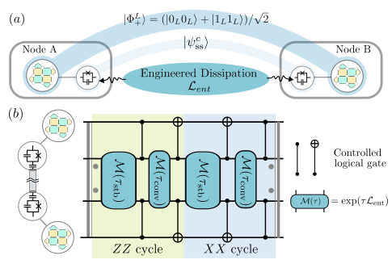 
FIG. 1. Floquet reservoir engineering to stabilize re- mote logical Bell states (a) Two remote computational nodes (A and B) each consist of a logical qubit (depicted as a surface code patch) and a communication qubit (repre- sented by a transmon). The communication qubits are cou- pled via an engineered entangling dissipative bath Lent. (b) Circuit description of one period of the protocol: entangling engineered dissipation acts continuously on the communica- tion qubits, interspersed with fast controlled unitary gates. The gates partition the dissipation into finite-time channels M(τ) ≡exp(τLent).

📷 Fig 2

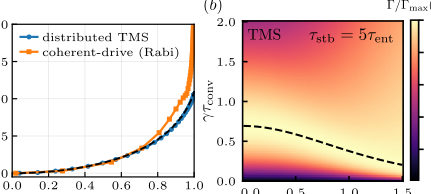 
FIG. 2. Optimized rate for stabilizing logical Bell state. (a) Maximized dimensionless logical stabilization rate Γmax as a function of the communication qubit’s steady-state |ψc ss⟩concurrence Cc[v], for both the TMS and Rabi-drive en- tangling reservoirs. Dashed line: analytic result for the TMS scheme. (b) Normalized logical stabilization rate Γ/Γmax(r) for the TMS scheme, as a function of the conversion time γτconv and the squeezing parameter r at fixed preparation time τstb = 5τent. The dashed curve marks the analytical op- timal γτ ∗ conv.

📷 Fig 3

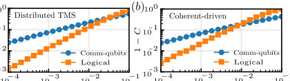 
FIG. 3. Optimal steady-state concurrence error 1 −C versus waveguide loss ϵ for communication-qubit-only stabilization via Lent (blue circles), and the full logical Floquet protocol (orange squares). The two panels are for the TMS and Rabi schemes, with (τstb, τconv) optimized at each ϵ. Both Flo- quet protocols exhibit linear scaling in the small-loss regime whereas communication-qubit-only stabilization scales sub- linearly ∼ϵ1/2. Below ϵ ∼10−2 the logical protocol out- performs the Lent-only protocol.

📷 Fig 4

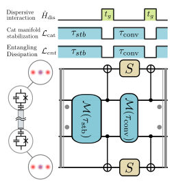 
FIG. 4. Stabilization of remote cat-qubit Bell state. Pulse sequence (top) and circuit diagram (bottom) for one stabilization cycle, using the Rabi-driven entangling reservoir Lent [Eq. (10)]. Within a cycle, Lent is activated on the trans- mons for two time intervals (τstb, τconv), interleaved with dis- persive CNOT gates of duration tg and single-photon-driven cat phase gates S; the two-photon cat stabilization Lcat acts continuously to protect the logical states.

📷 Fig 5

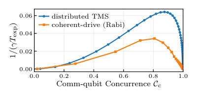 
FIG. 6. Typical protocol run time Texp as a function of the communication-qubit entanglement. The non- monotonic dependence yields a clear optimum, set by the tradeoff between larger conversion rate pconv and slower sta- bilization τent as the entanglement increases.

**Summary.** The paper introduces dissipative Floquet protocols to stabilize remote logical entanglement between qubits. By interleaving controlled unitaries with continuous engineered dissipation, the system autonomously performs entanglement distillation, achieving high fidelity even in the presence of waveguide loss. This offers a powerful pathway for quantum networking that bypasses the need for explicit measurements.

**Why it may be interesting.** This work provides a concrete, experimentally relevant framework for quantum networking by showing how dissipation itself can be engineered to perform complex tasks like entanglement distillation, bypassing limitations of standard unitary protocols.

Detailed structure

**Main problem.** The goal is to deterministically stabilize remote logical entanglement between qubits using non-unitary, dissipative protocols that mimic measurement-plus-feedback without requiring explicit classical communication.

**Main result.** The proposed Floquet reservoir engineering protocol autonomously acts as an entanglement distillation engine, achieving steady-state stabilization of the Bell state and demonstrating error scaling proportional to waveguide loss ($\propto \epsilon$).

**Method.** The method involves interleaving continuous engineered dissipation (Lindblad dynamics) with periodic fast unitary gates within a Floquet cycle ($E = E_{ZZ} \circ E_{XX}$) to drive the system toward an entangled steady state.

**Model / system.** The physical realization uses two remote nodes, each containing logical qubits protected by encoding schemes like cat or GKP states. The coupling is mediated by a dissipative reservoir (waveguide) described by a Lindblad master equation.

**Key observables.** Steady-state concurrence ($C$), entanglement fidelity, and the scaling of the steady-state error ($1-C$) with loss ($\epsilon$).

**Important parameters / regimes.** Dissipation rates ($\gamma$), time scales ($	au_{stb}, 	au_{conv}$), waveguide loss parameter ($\epsilon$), and squeezing/squeezing parameters ($r$ or $\Delta$).

**Assumptions / limitations.** The protocol assumes the ability to implement fast, controlled unitary gates (e.g., CZ) and relies on analyzing the system dynamics via perturbation theory in the weak-loss limit.

**Figures summary.** Figures illustrate the setup showing two remote nodes coupled by an engineered dissipative bath; one figure shows the stabilization rate vs. loss $\epsilon$, and another plots logical steady-state entanglement $C$ versus squeezing parameter $r$.

**Paper structure.** The paper introduces the concept of dissipative Floquet protocols, details the EZZ subroutine for parity encoding/transduction, analyzes the convergence rate via correlator evolution equations, and concludes with error scaling analysis under weak loss ($\epsilon$).

Abstract

Implementing controlled dissipative dynamics is a powerful approach for state preparation in a variety of contexts, including the preparation of remote entangled states. Here, we show that by going beyond the standard setting of time-independent dissipative dynamics, one can realize even more powerful non-unitary protocols. We introduce dissipative Floquet protocols for stabilizing remote entanglement of logical qubits, where continuously-running dissipation is interleaved with a periodic sequence of unitary gates. These protocols harness existing experimental capabilities, and overcome time-entanglement limits that constrain standard approaches. They also implement an autonomous form of entanglement distillation. We show how these protocols give enhanced protection against waveguide loss, and as an example, analyze a specific implementation using cat-qubits and transmons in a superconducting circuit.

[↑ back to top](#top)

### ⭐ [Strategic Plan for Neutral Atom Quantum Computation](http://arxiv.org/abs/2607.21554v1)

**Highlighted author(s):** Antoine Browaeys, Mikhail D. Lukin, Vladan Vuletic, Susanne Yelin, Vladan Vuletic, Susanne Yelin  
**Authors:** Adrian J. Menssen, Tout Wang, Michael Gullans, Tom Manovitz, Jacob M. Taylor, Jason Cong, Josiah Sinclair, Ziv Aqua, Daniel J. Blumenthal, J. Pablo Bonilla Ataides, Johannes Borregaard, Antoine Browaeys, Paola Cappellaro, Soonwon Choi, Alexandre Cooper, Robin Côté, Jacob P. Covey, Alexandre Dauphin, Ivana Dimitrova, Matt Eichenfield, Dirk Englund, Jacob Freedman, Akihisa Goban, Brandon Grinkemeyer, Andi Gu, Ruonan Han, Dominik Hangleiter, Aram W. Harrow, Liang Jiang, Eun-ah Kim, Felix W. Knollmann, Aleksander Kubica, Thierry Lahaye, Lucas Lassabliere, Joonho Lee, Bingzhao Li, Mo Li, Wan-Hsuan Lin, Mikhail D. Lukin, Varun Menon, Thomas Propson, Akbar Safari, Mark Saffman, Pascal Scholl, Alexander Schuckert, Giulia Semeghini, Jonathan Simon, David Spierings, Daniel Bochen Tan, Shai Tsesses, Vladan Vuletic, Hanrui Wang, Hanyu Wang, Susanne Yelin, Johannes Zeiher, Hengyun Zhouckert, Giulia Semeghini, Jonathan Simon, David Spierings, Daniel Bochen Tan, Shai Tsesses, Vladan Vuletic, Hanrui Wang, Hanyu Wang, Susanne Yelin, Johannes Zeiher, Hengyun Zhou  
**Type:** both · **Category:** quantum information and computing · **PDF:** <https://arxiv.org/pdf/2607.21554v1>  
**Analysis basis:** full PDF text, analyzed in chunks
**Topic relevance:** 🔥 `QC/QI experiment` **4/5** · 🔥 `Rydberg arrays` **4/5** · `analog quantum simulation` **3/5** · `entanglement & information structure` **2/5** · `correlated cavity matter` **1/5** · `non-equilibrium dynamics` **1/5** · `quantum optics experiment` **1/5**

📷 Fig 1

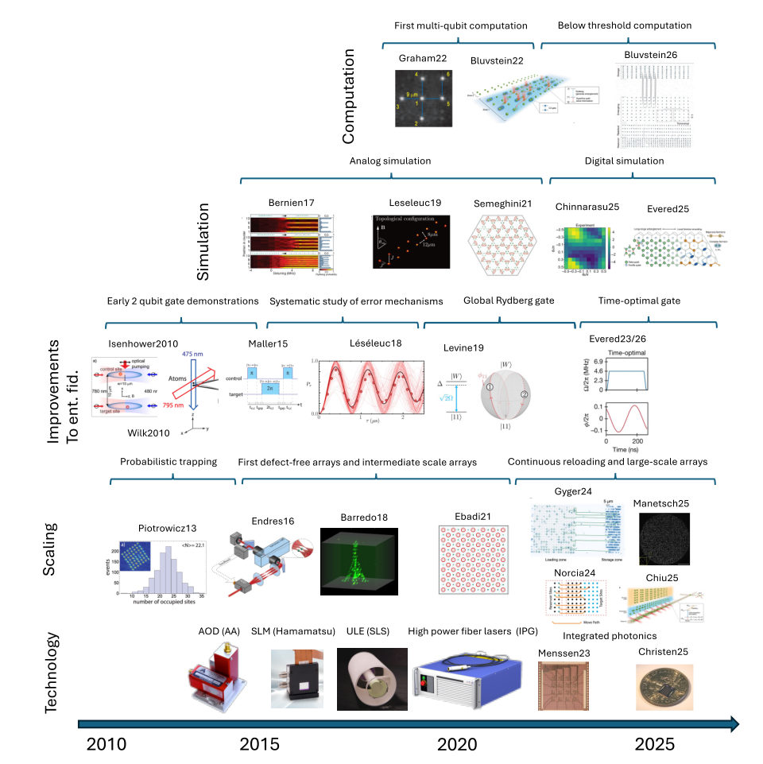 
Figure 1: Overview of the evolution of neutral atom quantum computation. Neutral-atom efforts are shown along five categories-Computation, Simulation, Improvements to entangle- ment fidelity, Scaling, and Technology stack-with representative papers. Computation: first multi-qubit computation [4, 7] →below-threshold computation [600]. Simulation: analog Rydberg simulators [8, 9, 28] →digital simulation [10, 11]. Improvements to entangle- ment fidelity: early two-qubit gate demonstrations [12, 13] →systematic study of error mechanisms [14, 15] →global Rydberg gate [16] time-optimal gate [1, 3]. Scaling: proba- bilistic trapping [17] →first defect-free and intermediate-scale arrays [18–20]...

📷 Fig 2

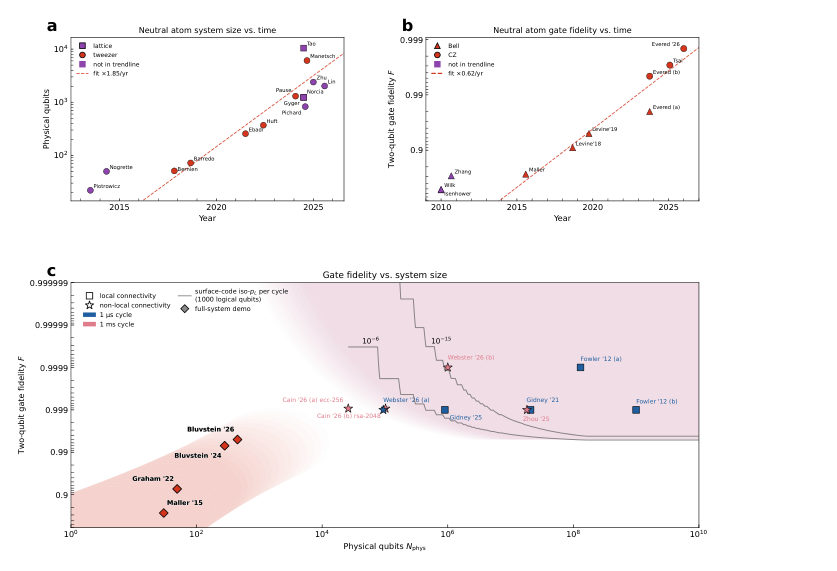 
Figure 2: Plot of scaling trends, best in class results. (a) Trends for qubit number over time. Fit through current tweezer architecture data-points, early pioneering results were excluded from the trend-line. Optical lattice architectures are shown, but not included in the trend-line. Several tweezer architectures close to best in class are shown but not fitted. (b) Two-qubit fidelity improvement over time. Early pioneering work not included in trend- line. (c) Advancing fronts of experimental and theoretical progress in fidelity vs. physical qubit space. Shaded regions indicate experimental (lower left) and theoretical advances (upper right). Full-system experimental demonstrations and...

📷 Fig 3

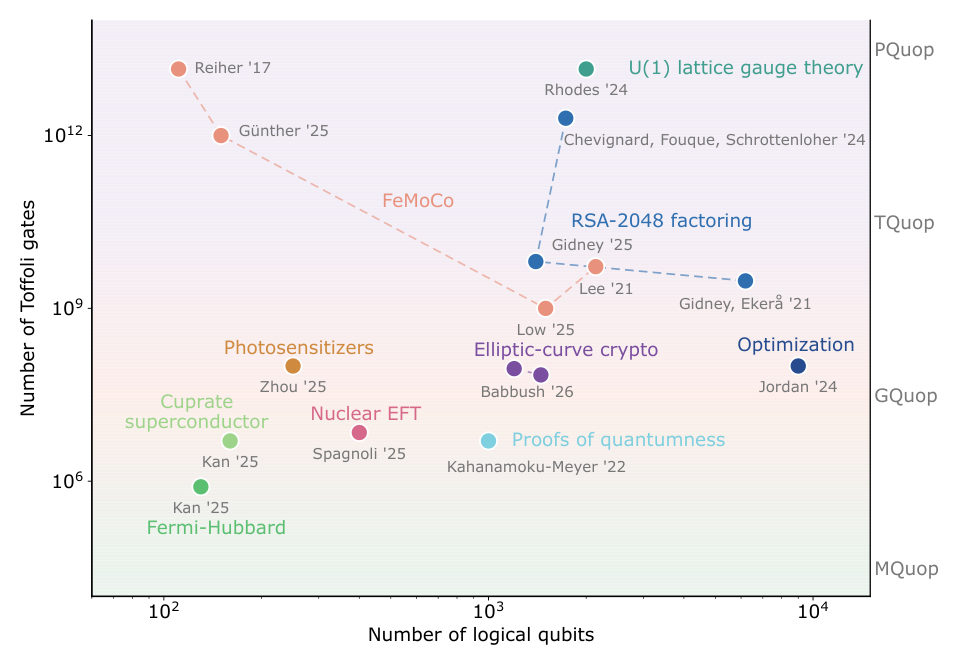 
Figure 3: Examples of explicit resource estimates for key applications. Each marker is an explicit resource estimate in terms of number of logical qubits and Toffoli or T gates (using 1 Toffoli = 7 T gates). The right vertical axis restates that count in Quops: one Quop is an operation that can be performed within one syndrome extraction cycle. The maximum Quop count of a QEC code is therefore roughly its inverse logical error rate per logical qubit. The Toffoli count is a lower bound on the Quop count and the exact overhead (roughly 10 to 100, depending on the Clifford count per Toffoli and on the magic-state factory) is architecture-dependent. To give a rough impression for the quop...

📷 Fig 4

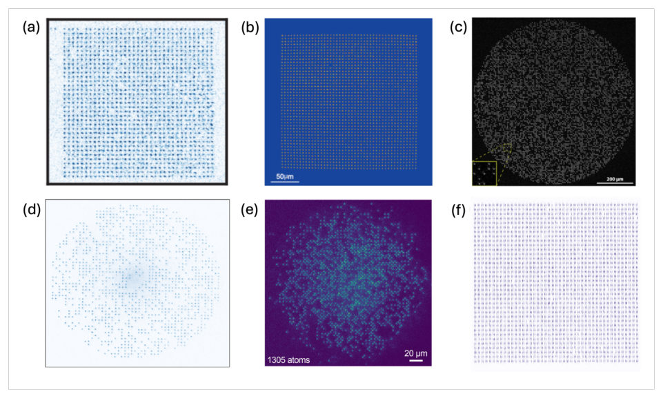 
Figure 4: Arrays of thousands of neutral atom qubits: (a) Atom Computing &gt;1200 171Yb atoms [33], (b) Jian-Wei Pan group (USTC) &gt;2000 87Rb atoms [34], (c) Endres group (Cal- tech) &gt;6100 133Cs atoms [22], (d) Pasqal &gt;1100 87Rb atoms [32], (e) Birkl group (TU Darm- stadt) &gt;1300 85Rb atoms [30], and (f) Lukin group (Harvard) &gt;3200 87Rb atoms [23].

📷 Fig 5

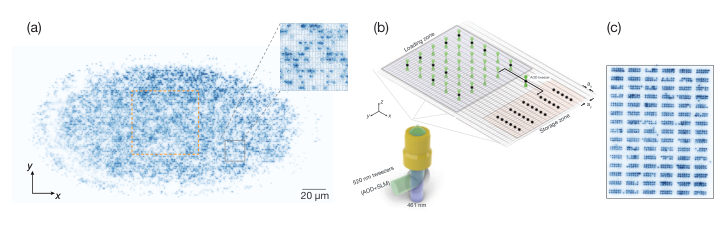 
Figure 5: Lattice arrays for scaling quantum registers. (a) Using a single, strongly elliptical folded beam allows to create regular trap arrays with more than 25.000 lattice sites that can be loaded from a magneto-optical trap and imaged with high fidelity and low loss [31]. (b) Zone-based architecture in a lattice array, where a loading-zone is iteratively loaded from a magneto-optical trap, whereas atoms in the storage zone are protected by shelving in a metastable state. (c) Ordered array of close to 1000 atoms in an optical lattice.

**Summary.** This paper presents a comprehensive strategic plan detailing how neutral atom platforms can achieve practical quantum advantage. It synthesizes current experimental achievements in scaling and fidelity with necessary theoretical breakthroughs in error correction and networking. The work is crucial for guiding future research efforts toward building large-scale, fault-tolerant quantum computers.

**Why it may be interesting.** It provides a high-level synthesis connecting fundamental AMO physics (Rydberg interactions) directly to the engineering challenges of fault-tolerant quantum computation and scalable quantum networks.

Detailed structure

**Main problem.** The central goal is developing a comprehensive, scalable roadmap for neutral atom quantum computation to achieve practical quantum advantage.

**Main result.** The paper outlines necessary advancements across hardware scaling, error correction theory, integrated photonics control, and networking to realize utility beyond the NISQ regime.

**Method.** It synthesizes theoretical proposals (e.g., QEC codes) with experimental progress reports on physical platforms, presenting a multi-faceted strategic plan.

**Model / system.** The primary system is neutral atoms trapped using optical tweezers or lattices, leveraging Rydberg interactions for gates and integrating photonic control elements for scalability and networking.

**Key observables.** Gate fidelity, system size scaling (qubit count), error rates, entanglement generation rate, and computational advantage metrics.

**Important parameters / regimes.** The convergence of hardware capability with theoretical resource requirements is key; achieving low error rates ($10^{-6}$ to $10^{-15}$) at large scales is critical.

**Assumptions / limitations.** It assumes that continued engineering progress in integrated photonics and atomic control will bridge the gap between current state-of-the-art devices and fault-tolerant computation requirements.

**Figures summary.** Figures illustrate the evolution of neutral atom quantum computing across five dimensions: Computation, Simulation, Entanglement Fidelity Improvement, Scaling, and Technology Stack, showing projected progress over time.

**Paper structure.** The paper is structured as a strategic roadmap covering defining practical advantage, detailing hardware scaling (qubit arrays, control), proposing theoretical advances (QEC/Compilation), and finally addressing networking for distributed computing.

Abstract

We present a strategic plan for neutral atom quantum computation, bringing together hardware development and theory advancements to achieve the goal of practical quantum advantage. The concept of practical quantum advantage is defined, along with how to verify claims of advantage, and approaches to designing quantum algorithms that deliver practical advantage. Future directions for neutral atom quantum processor hardware are described: scaling-up system size, Qubit encodings and atomic platforms, going further below threshold with neutral-atom logical-qubit performance, continuous reloading of qubits, and fast readout. We also explore opportunities for scalable integrated photonic control technologies. Alongside hardware advancements, new developments in quantum error correction and compilation of quantum circuits are proposed. Finally, we examine the opportunity of networking multiple neutral atom quantum processors together to perform distributed quantum computing and overcome possible limitations of a single system.

[↑ back to top](#top)

### [Multicritical dissipative phase transitions manipulated by dipole--dipole interactions](http://arxiv.org/abs/2607.20905v1)

**Authors:** Jia-Xin Wang, Qian Bin, Jing-Jing Cao, Xin-You Lü  
**Type:** theory · **Category:** other · **PDF:** <https://arxiv.org/pdf/2607.20905v1>  
**Analysis basis:** full PDF text, analyzed in chunks
**Topic relevance:** 🔥 `driven-dissipative phase transition` **5/5** · 🔥 `Tavis-Cummings & cavity-many-emitter` **4/5** · 🔥 `analog quantum simulation` **4/5** · 🔥 `non-equilibrium universality` **4/5** · `Dicke superradiance` **3/5** · `Rydberg arrays` **3/5** · `correlated / nonlocal dissipation` **3/5** · `correlated cavity matter` **3/5** · `methods for driven-dissipative` **3/5** · `non-equilibrium dynamics` **3/5** · `superradiant laser` **2/5** · `Keldysh / 2PI / non-Gaussian methods` **1/5** · `entanglement & information structure` **1/5** · `exotic spin models in light-matter` **1/5**

📷 Fig 1

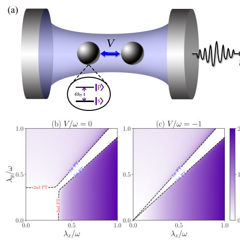 
FIG. 1: (a) Schematic of the model. Two identical Rydberg atoms with levels |s⟩and |p⟩are placed inside a cavity. Here V denotes the strength of the dipole–dipole interaction between the two atoms, and κ is the cavity decay rate. (b, c) The real part of cavity field amplitude α as a function of the coupling strengths λx and λy for (b) V/ω = 0 and (c) V/ω = −1, respectively. The labels “1st PT” and “2nd PT” denote first-order and second-order phase transitions. System parameters: ωc = ωσ j = ω and κ/ω = 0.1.

📷 Fig 2

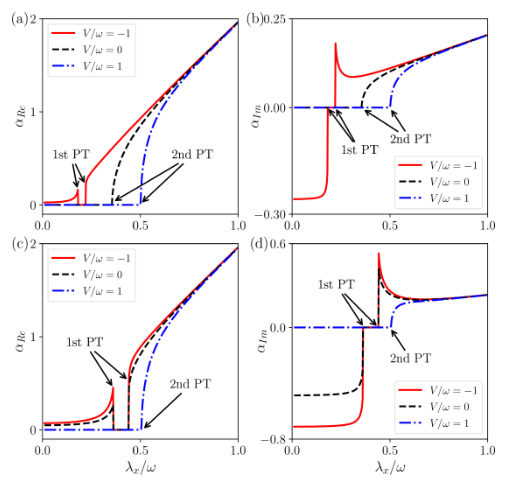 
FIG. 2: (a, c) Real part αRe and (b,d) imaginary part αIm of the cavity field amplitude α versus λx for different V/ω. Red solid, black dashed, and blue dotted curves correspond to V/ω = −1, V/ω = 0 , and V/ω = 1, respectively. Black arrows mark the positions of the 1st PT and 2nd PT. System parameters: λy/ω = 0.2 for (a,b), λy/ω = 0.4 for (c,d), and the other parameters are the same as those in Figs. 1(b,c).

📷 Fig 3

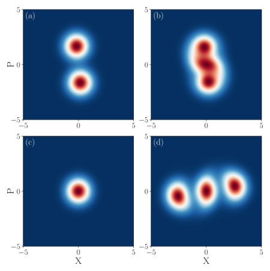 
FIG. 4: Cavity-field Wigner function for V/ω = −0.5 at fixed λy/ω = 0.62 and (a) λx/ω = 0.1, (b) λx/ω = 0.388, (c) λx/ω = 0.65, (d) λx/ω = 0.95. The quadrature components of the cavity field fluc- tuations are denoted by X = √

📷 Fig 4

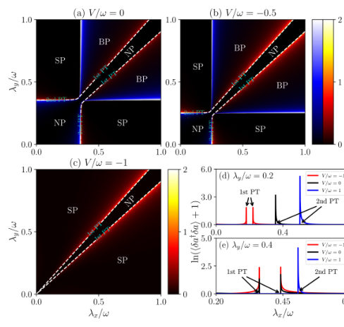 
FIG. 3: Quantum fluctuations of the cavity field ln(⟨δα†δα⟩+ 1) ob- tained from the mean-field solutions as functions λx/ω and λy/ω for (a) V/ω = 0, (b) V/ω = −0.5, and (c) V/ω = −1. Blue and red re- gions correspond to the normal and superradiant phases, respectively, and their overlap indicating the bistable coexistence region. The la- bels “NP”, “SP”, and “BP” mark pure normal, pure superradiant, and bistable phases. Panels (d) and (e) show the fluctuations as a function of λx/ω for fixed λy/ω = 0.2 and λy/ω = 0.4, respectively. The other parameters are the same as those in Figs. 1(b,c).

**Summary.** The paper theoretically examines superradiant phase transitions in a two-Rydberg-atom cavity QED system, focusing on the role of dipole-dipole interactions. It demonstrates that these interactions can restructure the energy landscape, causing continuous second-order transitions to vanish entirely. This mechanism allows for robust superradiance even when atom-cavity coupling is extremely weak.

**Why it may be interesting.** This work directly addresses non-equilibrium quantum dynamics in cavity QED systems, showing how controllable interactions can fundamentally alter critical points, which is highly relevant for designing quantum sensors and simulators.

Detailed structure

**Main problem.** The study investigates how intrinsic dipole-dipole interactions modify multicritical dissipative phase transitions occurring during superradiant phase transitions.

**Main result.** Strong dipole-dipole interactions can eliminate the continuous second-order transition and its associated critical point, leaving only a first-order transition that sustains superradiance even with weak atom-cavity coupling.

**Method.** The analysis employs the Heisenberg–Langevin formalism combined with mean-field approximations and subsequent quantum fluctuation analysis to determine steady states and stability boundaries.

**Model / system.** The system is a cavity Quantum Electrodynamics (QED) setup involving two interacting Rydberg atoms coupled to a single cavity mode. The dynamics are governed by an effective Hamiltonian incorporating dipole-dipole interactions ($V \propto 1/R^3$).

**Key observables.** Cavity field amplitude ($\alpha$), phase boundaries (first-order and second-order), and the Wigner function distribution.

**Important parameters / regimes.** Dipole–dipole interaction strength ($V$), atom-cavity coupling strengths ($\lambda_{x,j}, \lambda_{y,j}$), and cavity decay rate ($\kappa$).

**Assumptions / limitations.** The analysis relies on the mean-field approximation supplemented by quantum fluctuation analysis, using the Heisenberg–Langevin formalism for dynamics.

**Figures summary.** Figure 1 schematically shows the model; panels (b) and (c) illustrate how varying $V/\omega$ shifts and alters the boundaries between first-order and second-order phase transitions in terms of the real part of the cavity field amplitude ($\alpha_{Re}$).

**Paper structure.** The paper develops the theoretical framework using the Hamiltonian, derives mean-field equations via Langevin formalism, performs stability analysis on fluctuations to map out phase boundaries, and concludes by discussing the physical implications for quantum control.

Abstract

Precise control of criticality in superradiant phase transitions is essential for quantum state engineering and the simulation of nonequilibrium phase transitions. Here, we investigate theoretically multicritical phenomena in a dissipative two-Rydberg-atom cavity--QED system. The intrinisic dipole--dipole interaction between the two Rydberg atoms restructures the energy-level landscape of the atomic subsystem, thereby significantly modifying the boundary of the continuous second-order superradiant phase transition, and shifting both the phase boundary and the multicritical point toward weaker atom--cavity strengths. For sufficiently strong dipole--dipole interactions, the continuous second-order phase transition and the multicritical point both disappear, leaving only a discontinuous first--order phase transition that enables the emergence of a superradiant phase even at arbitrarily weak atom--cavity coupling. This work is of fundamental interest for studying dissipative quantum phase transitions, with potential implications for quantum precision measurement and quantum sensing.

[↑ back to top](#top)

### [Structured Cavity Quantum Electrodynamics](http://arxiv.org/abs/2607.21012v1)

**Authors:** Shunfa Liu, Jiantao Ma, Hanqing Liu, Yangpeng Wang, Xueshi Li, Haiqiao Ni, Zhichuan Niu, Kai Zou, Yun Meng, Xiaolong Hu, Xuehua Wang, Jin Liu  
**Type:** both · **Category:** other · **PDF:** <https://arxiv.org/pdf/2607.21012v1>  
**Analysis basis:** full PDF text, analyzed in chunks
**Topic relevance:** 🔥 `quantum optics experiment` **5/5** · 🔥 `analog quantum simulation` **4/5** · 🔥 `exotic spin models in light-matter` **4/5** · `correlated cavity matter` **3/5** · `entanglement & information structure` **3/5** · `interference shaping light` **3/5** · `spintronics-quantum-optics interface` **3/5** · `Tavis-Cummings & cavity-many-emitter` **2/5** · `driven-dissipative phase transition` **2/5** · `QC/QI experiment` **1/5** · `correlated / nonlocal dissipation` **1/5** · `methods for driven-dissipative` **1/5** · `non-equilibrium dynamics` **1/5** · `non-equilibrium universality` **1/5** · `quantum measurements` **1/5**

📷 Fig 1

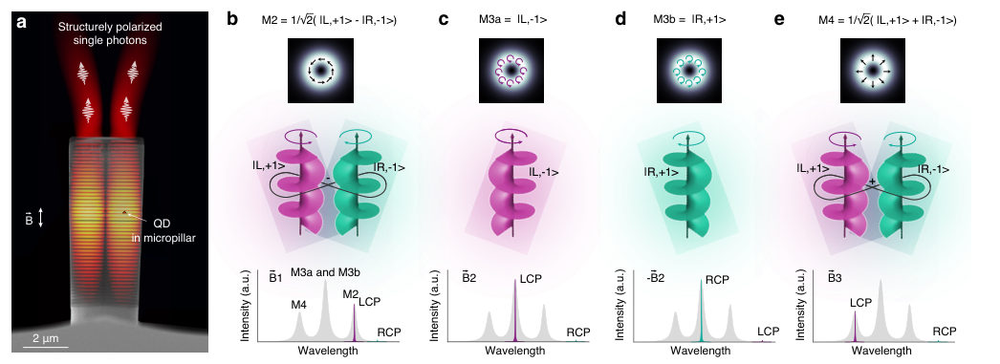 
FIG. 1: Structured quantum light-matter interaction in a semiconductor cQED system. (a) Schematics of the employed cQED system in which a single QD is deterministically coupled to different structured cavity modes of the micropillar. (b) Spin-orbit entanglement in the form of M2 = √

📷 Fig 2

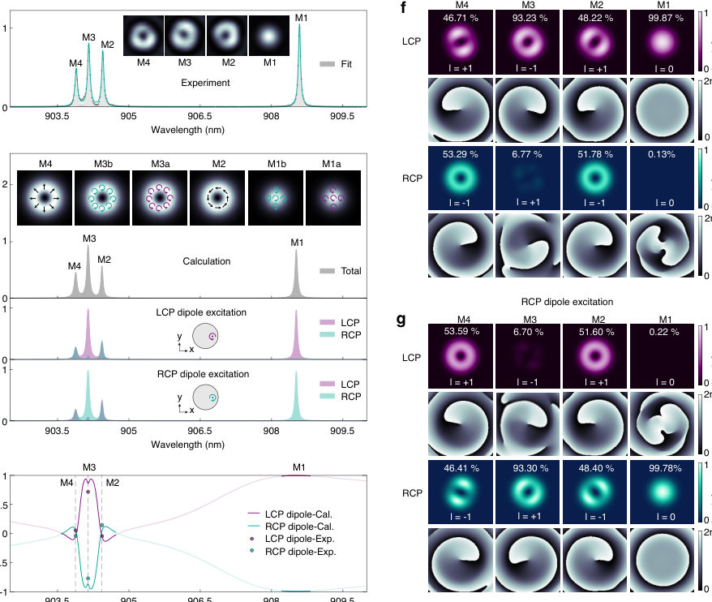 
FIG. 2: Structured cavity modes and their polarization-selective excitations. (a) Measured PL spectrum of the micropillar cavity with an embedded QD under a high-excitation power. Inset: intensity profile of each cavity mode. (b) Calculated intensity and polarization profiles (the first row) of the cavity modes and the simulated spectrum (the second row) of the micropillar. The selective excitation of the cavity modes by using an LCP (c) and RCP (d) dipole source. (e) Calculated (solid lines) and measured (dots) Dcp for the different cavity modes. (f,g) Calculated intensity profiles and phase distributions of the near-field cavity modes excited by an LCP and an RCP dipole source,...

📷 Fig 3

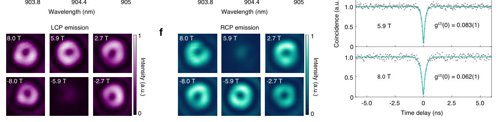 
FIG. 3: Experimental verification of structured light-matter coupling at the single-photon level. (a) LCP and (b) RCP component of the magnetic field-dependent PL spectra for QD under low-power pulsed excitation. The vertical dash lines denote the cavity resonance of M2, M3 and M4. (c) LCP component of the LCP dipole emission at 2.7 T, 5.9 T, 8.0 T and -2.7 T, -5.9 T, -8.0 T. (d) RCP component of the LCP dipole emission at 2.7 T, 5.9 T, 8.0 T and -2.7 T, -5.9 T, -8.0 T. (e) LCP component of near-field profiles for the LCP dipole emission at 2.7 T, 5.9 T, 8.0 T and -2.7 T, -5.9 T, -8.0 T. (f) RCP component of near-field profiles for the LCP dipole emission at 2.7 T, 5.9 T, 8.0 T and -2.7 T,...

📷 Fig 4

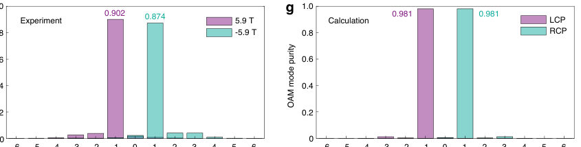 
FIG. 4: Single-photon emission with spin-locked chiral OAMs. (a) phase profiles carried by the VWPs. calculated (b) and measured (c) near-field normalized intensity distributions of the LCP dipole emitter coupled to M3a. calculated (d) and measured (e) near-field normalized intensity distributions of the RCP dipole emitter coupled to M3b. Calculated (a) and measured (b) mode purity of the spin-locked chiral OAMs.The unexpected outside ring patterns in the experiment are due to the fact that the objective is slightly off from the focus in the measurement.

📷 Fig 5

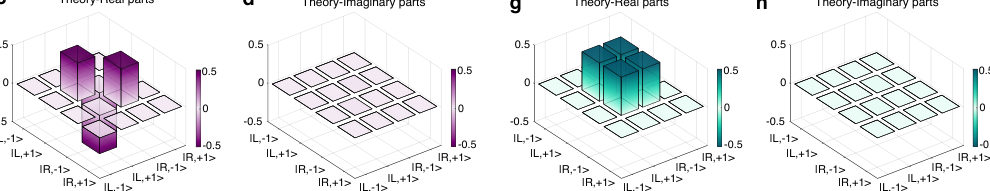 
FIG. 5: Tunable spin-OAM entanglements in single photons. Real (a) and imaginary (b) part of the experimentally reconstructed density matrix for the entanglement in the form of √

**Summary.** This paper reports on achieving controlled single-photon emission carrying spin-OAM entanglement within a semiconductor cavity QED system. By engineering structured optical modes in a micropillar, the researchers demonstrated that coupling a quantum dot dipole to specific resonances allows for dynamic generation and switching between different Bell states of entanglement. This opens a new paradigm for high-dimensional photonic quantum technologies.

**Why it may be interesting.** This work provides an excellent platform for AMO physicists studying open quantum systems, as it demonstrates coherent control over multiple degrees of freedom (spin and OAM) in a solid-state emitter coupled to engineered photonic environments.

Detailed structure

**Main problem.** The research addresses the largely unexplored area of structured light-matter interaction at the single-photon level, moving beyond conventional scalar interactions in cavity QED.

**Main result.** The authors successfully demonstrated the generation and dynamic control of spin-orbit entangled single photons carrying chiral Orbital Angular Momentum (OAM) using a chip-scale semiconductor cQED device.

**Method.** The study combines theoretical modeling (FDTD simulations) with advanced experimental techniques, including polarization-resolved photoluminescence spectroscopy and quantum state tomography.

**Model / system.** The physical platform is a semiconductor cavity QED system utilizing an epitaxial quantum dot coupled to structured modes ($	ext{M}1-	ext{M}4$) within a micropillar cavity. The mode structure arises from sidewall confinement, leading to vector vortex resonances.

**Key observables.** Spin-OAM entanglement (Bell states), Degree-of-circular-polarization ($D_{cp}$), OAM purity ($P_{	ext{OAM}}$), and Purcell enhancement factor ($\sim 4$).

**Important parameters / regimes.** Operating at cryogenic temperatures ($	ext{T} = 1.67 	ext{ K}$) under tunable magnetic fields (up to $\pm 9 	ext{ T}$); the coupling strength is tuned by matching QD emission to structured cavity resonances.

**Assumptions / limitations.** The analysis relies on modeling the mode structure using paraxial approximations corrected for sidewall confinement, which induces spin-orbit coupling effects.

**Figures summary.** Figures illustrate schematics of the cQED setup, PL spectra showing polarization selectivity and Purcell enhancement, near-field profiles confirming structured modes, and density matrices verifying tunable Bell states.

**Paper structure.** The paper progresses from establishing the necessity of studying structured light-matter interaction to detailing the physical realization in a micropillar cavity. It then systematically demonstrates mode selection using circular polarizations, followed by quantifying entanglement generation via state tomography across different resonance modes ($	ext{M}2$, $	ext{M}4$).

Abstract

A cavity quantum electrodynamics (cQED) system consisting of a confined single photon and a single quantum emitter serves as a fundamental block for quantum optics and photonic quantum technologies. The canonical optical mode employed in the conventional cavity quantum electrodynamics features a uniform polarization distribution, leading to the scalar light-matter interaction in most existing experiments. Despite the rapid progress in the generation of structured light with spatially varied polarizations, the structured light-matter interaction, especially at the single quanta level, is highly intriguing yet largely unexplored. Here, we present the structured light-matter interaction at the single-photon level in a semiconductor cavity quantum electrodynamics system. Four distinct structured cavity modes that are spectrally close to each other are constructed in a micropillar cavity. By spatially locating a single epitaxial quantum dot (QD) at the periphery of a semiconductor micropillar cavity and spectrally tuning the QD emission wavelength into the resonances of the structured cavity modes, cavity-enhanced single-photon emissions with spin-locked chiral orbital angular momentum (OAM) and engineerable spin-orbit entanglements are achieved within a single wavelength-scale device. Our work opens an unexplored paradigm of structured quantum light-matter interactions and may further advance chiral quantum optics and high-dimensional photonic quantum technology.

[↑ back to top](#top)

### [Extended Single-Atom Tweezer Arrays in High-Cooperativity Cavity-QED](http://arxiv.org/abs/2607.21515v1)

**Authors:** Thomas Picot, Clément Raphin, Marcel Kern, Pierre-Antoine Bourdel, Théo Ahamdach, Jakob Reichel, Romain Long  
**Type:** experiment · **Category:** other · **PDF:** <https://arxiv.org/pdf/2607.21515v1>  
**Analysis basis:** full PDF text, analyzed in chunks
**Topic relevance:** 🔥 `Tavis-Cummings & cavity-many-emitter` **5/5** · 🔥 `analog quantum simulation` **4/5** · 🔥 `correlated cavity matter` **4/5** · 🔥 `quantum optics experiment` **4/5** · `QC/QI experiment` **3/5** · `quantum measurements` **3/5** · `Rydberg arrays` **2/5** · `measurement-induced transitions` **2/5** · `correlated / nonlocal dissipation` **1/5** · `driven-dissipative phase transition` **1/5** · `entanglement & information structure` **1/5** · `interference shaping light` **1/5**

📷 Fig 1

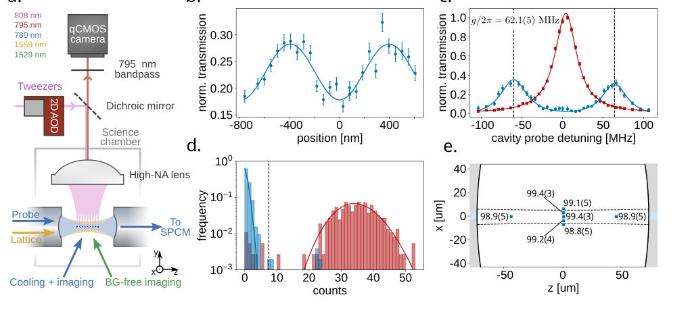 
Figure 1. Single atom strongly coupled to the cavity. a. Simplified sketch of the experiment. Atoms are trapped inside a fiber Fabry-Perot microcavity by an array of optical tweezers generated by a pair of acousto-optic deflectors (2D AOD) along the cavity axis, and focused with a high N.A. lens. b. Mapping of the cavity mode by moving the single-atom tweezer along the z axis and measuring cavity transmission while measuring the atom position, and sinusoidal fit (solid line). The cavity probe frequency sits on the slope of the polariton. c. Vacuum Rabi Splitting observed in cavity transmission for a single atom at the center of the cavity (blue points), fitted by a double Lorentzian (blue...

📷 Fig 2

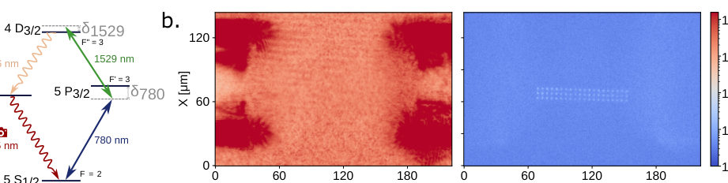 
Figure 2. Background-free fluorescence scheme. a. Relevant level scheme. The atoms are excited via the D2 transition at 780 nm (blue), followed by a second excitation at 1529 nm (green). The atom subsequently decays to an intermediate state at 1476 nm (yellow), before emitting a photon on the 795 nm imaging transition. b. Comparison between standard fluorescence imaging and the background-free scheme with 50 ms exposure time. Left: Standard single-photon excitation at low power (s780 = 0.1 per beam) to avoid camera saturation. Right: Background-free fluorescence image obtained with s780 = 3.5 and s1529 = 5.2 per beam. For standard fluorescence imaging, the residual background in a 3 ×...

📷 Fig 3

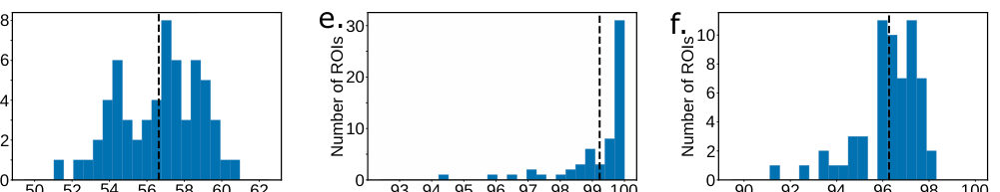 
Figure 3. Fluorescence characterization. a. Two successive single-shot fluorescence images of a 20 × 3 tweezer array taken with 50 ms exposure time. The upper image and the lower image are separated by a 25 ms cooling phase. Red rectangle indicates a 3×3 pixel ROI. b. A histogram of the summed photon counts in the ROI over 1000 experimental cycles, with a double gaussian fit (solid line) and computed optimal threshold (dashed line). c. Scatter plot of the summed photon counts in the two fluorescence images with optimal threshold (dashed line). This figure shows the survival probability of an atom after the first fluorescence. d. Histogram of the loading probability over the 60 tweezer...

📷 Fig 4

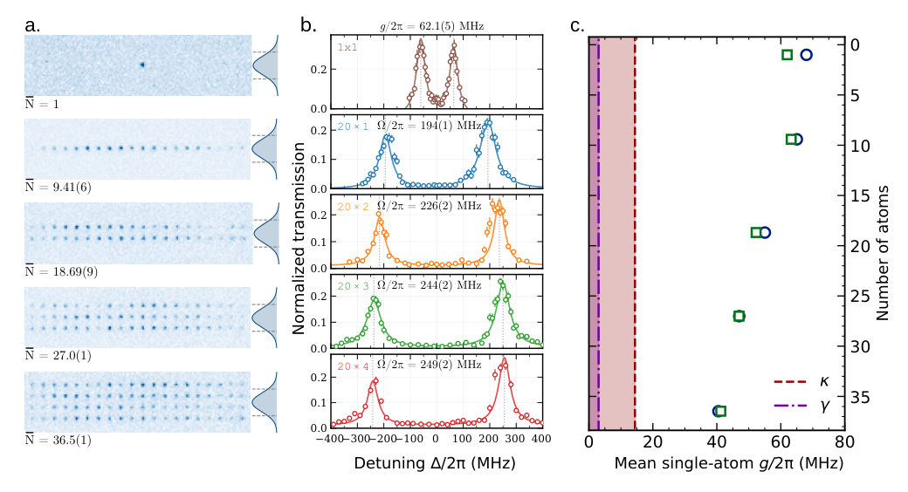 
Figure 4. Vacuum Rabi-splitting measurement for different configurations of single-atom array. a. Averaged fluorescence image of the tweezers configurations. Gaussian shape on the right indicates spatial extension of the cavity mode of waist w0 = 5.6 µm. The indicated number ¯ N corresponds to the averaged number of atoms during the probing sequence. b. Vacuum Rabi Splitting for the different array configurations. Each point is an average of around 30 experimental cycles. Separation between the two polaritonic peaks 2Ωis evaluated by a double Lorentzian fit (solid line). c. Comparison between the expected average single-atom coupling strength (blue circles) with the measured value g = Ω/ √¯...

**Summary.** The research demonstrates a robust platform for many-body cavity quantum electrodynamics using arrays of single $^{87}	ext{Rb}$ atoms trapped in optical tweezers near a microcavity. By combining site-resolved fluorescence imaging with measurements of collective vacuum Rabi splitting, the authors establish that high cooperativity can be maintained across extended atomic ensembles. This paves the way for scalable quantum simulation and computation utilizing cavity coupling.

**Why it may be interesting.** This work pushes the boundaries of cavity QED by merging two challenging aspects: scaling up atom numbers while maintaining strong light-matter interaction ($C$), and achieving high-fidelity, local readout simultaneously.

Detailed structure

**Main problem.** To establish a high-cooperativity platform for many-body cavity-QED that is compatible with site-resolved detection across extended arrays of single atoms.

**Main result.** The authors successfully demonstrated high single-atom cooperativity ($C \simeq 88$) and maintained compatibility for collective coupling in large arrays (up to $ar{N} \simeq 36$), enabling many-body cavity control with local readout.

**Method.** The experiment combines optical tweezer trapping of $^{87}	ext{Rb}$ atoms, site-resolved fluorescence imaging using a background-free two-photon scheme, and measurement of collective vacuum Rabi splitting in a fiber Fabry-Perot microcavity.

**Model / system.** The physical system is an array of individual $^{87}	ext{Rb}$ atoms trapped by optical tweezers and coupled to the quantized electromagnetic field mode of a high-finesse fiber Fabry-Perot cavity. The coupling regime is characterized by the cooperativity parameter $C$.

**Key observables.** Single-atom cooperativity ($C$), detection fidelity for hyperfine states, mean atom number ($ar{N}$), and collective vacuum Rabi splitting spectrum.

**Important parameters / regimes.** Single-atom cooperativity $\mathcal{C} \sim 90$; Mean atom number up to $\simeq 36$; Detection fidelities $>98.8\%$.

**Assumptions / limitations.** The primary limitations noted are the state detection fidelity being limited by hyperfine-state lifetime and preparation imperfection, rather than intrinsic readout discrimination.

**Figures summary.** Figures illustrate the experimental setup, cavity mode mapping, vacuum Rabi splitting measurements confirming coupling strength for various array sizes (e.g., 20-site chain), and detailed characterization of background-free fluorescence imaging fidelity across the array.

**Paper structure.** The paper progresses by first demonstrating high single-atom cooperativity, then validating site-resolved detection compatibility over extended arrays, and finally characterizing the collective coupling strength as a function of array geometry (1D chains to 2D lattices).

Abstract

A central challenge for cavity-QED-based quantum technologies is to make high-cooperativity optical interfaces compatible with site-resolved arrays of single atoms. Here, we demonstrate optical tweezer arrays of individual $^{87}$Rb atoms inside a fiber Fabry-Perot microcavity with single-atom cooperativity $\mathcal{C} \sim 90$. We combine background-free site-resolved fluorescence imaging of extended arrays with collective coupling to a common cavity mode for arrays with a mean atom number up to $\bar{N} \simeq 36$. These results establish a high-cooperativity platform for many-body cavity-QED with site-resolved detection and control.

[↑ back to top](#top)

### [Optimal feedback control under stepwise equilibration and partial observation](http://arxiv.org/abs/2607.21523v1)

**Authors:** Francesco Mottes, Michael P. Brenner  
**Type:** theory · **Category:** statistical mechanics · **PDF:** <https://arxiv.org/pdf/2607.21523v1>  
**Analysis basis:** full PDF text, analyzed in chunks
**Topic relevance:** 🔥 `quantum measurements` **5/5** · 🔥 `measurement-induced transitions` **4/5** · `methods for driven-dissipative` **3/5** · `non-equilibrium dynamics` **3/5** · `non-equilibrium universality` **2/5** · `Keldysh / 2PI / non-Gaussian methods` **1/5** · `correlated / nonlocal dissipation` **1/5** · `driven-dissipative phase transition` **1/5** · `entanglement & information structure` **1/5**

📷 Fig 1

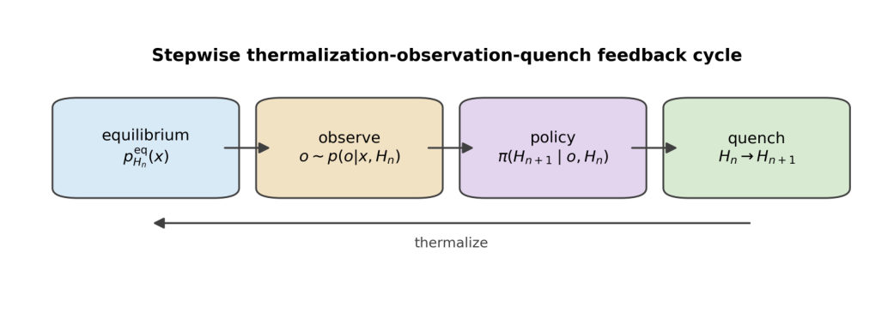 
FIG. 1. Stepwise thermalization–observation–quench feedback cycle. At the start of cycle n the system is equilibrated under Hn, an observation o ∼p(o | x, Hn) is acquired, and the policy π(Hn+1 | o, Hn) selects the next Hamiltonian. The resulting quench Hn →Hn+1 is followed by re-thermalization under the new Hamiltonian before the next decision.

📷 Fig 2

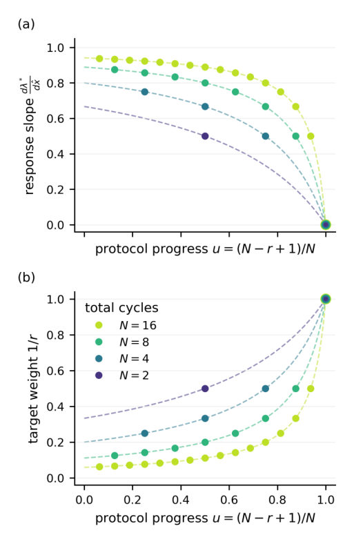 
FIG. 2. Time dependence of the optimal feedback law λ∗(o; r) = r−1

📷 Fig 3

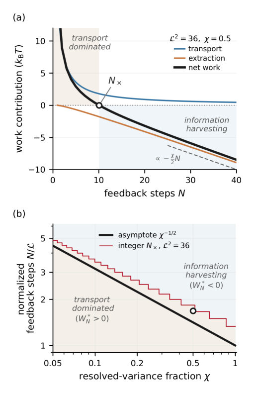 
FIG. 3. Transport–information decomposition of the opti- mal work. (a) Positive transport contribution L2/(2N), neg- ative observation-enabled contribution −1

📷 Fig 4

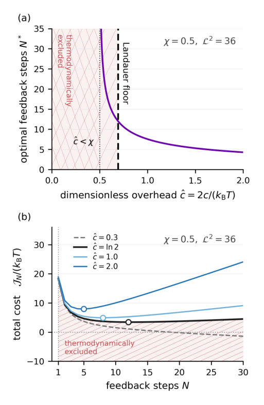 
FIG. 4. Optimal number of feedback cycles selected by a per- cycle overhead for χ = 0.5 and L2 = 36. (a) Positive root N ∗

**Summary.** This paper develops an optimal feedback control theory for driving mesoscopic systems between states using noisy measurements. By analyzing a harmonic trap model, it shows that minimum work decomposes into transport costs and information gains derived from measurement resolution. The results provide quantitative predictions for the trade-off between process time, measurement quality, and thermodynamic efficiency.

**Why it may be interesting.** This work provides a rigorous theoretical framework for quantifying how information gained from noisy measurements can reduce the thermodynamic cost of non-equilibrium processes, which is highly relevant to understanding energy efficiency in nanoscale machines and quantum thermodynamics.

Detailed structure

**Main problem.** The work is to determine the minimum expected work required to drive a mesoscopic system through a finite-time, non-equilibrium transformation using optimal feedback control under partial observation.

**Main result.** The minimum work decomposes into a positive thermodynamic transport cost and a negative information-enabled extraction term; furthermore, the analysis determines an optimal finite number of cycles when intervention costs are considered.

**Method.** The problem is mapped onto a partially observable Markov decision process (POMDP) solved via a finite-horizon Bellman recursion. Analytical solutions are derived for the harmonic trap case by simplifying the belief state evolution.

**Model / system.** The model considers microscopic machines undergoing non-equilibrium transformations, specifically using a one-dimensional harmonic trap $H_\lambda(x) = k/2(x - \lambda)^2$. The process involves discrete steps of thermal equilibration, noisy measurement, and Hamiltonian quenching.

**Key observables.** Minimum expected work ($W^*_N$), thermodynamic transport cost, information extraction gain, optimal feedback law $\lambda^*(o; r)$, and the optimal cycle count $N^*$.

**Important parameters / regimes.** Detector quality ($\chi = \eta^2 / \sigma_{eq}^2$), fixed intervention cost ($c$), and the total number of steps ($N$).

**Assumptions / limitations.** The analysis relies on the stepwise equilibration limit, where local relaxation is much faster than the driving/measurement cycle. The harmonic trap structure allows for a collapse of the belief state to its mean estimate.

**Figures summary.** Figures illustrate the feedback cycle (thermalization-observation-quench), the time evolution of the optimal control law $\lambda^*(o; r)$, and plots showing work crossing points and asymptotic behavior related to information gain.

**Paper structure.** The paper establishes the POMDP framework, solves the Bellman recursion for the harmonic trap benchmark case, derives the explicit form of minimum work $W^*_N$ based on control parameters, and finally determines the optimal cycle count $N^*$ by minimizing the total cost function $J_N = W^*_N + cN$.

Abstract

Many microscopic machines rely on noisy signals to direct nonequilibrium transformations and operate in a timescale-separated regime. We consider feedback protocols in which a system equilibrates between rapid, measurement-conditioned changes of its energy landscape. In this limit, the partially observable control problem reduces exactly to a finite-horizon Bellman recursion over Hamiltonian updates. For a harmonic trap translated to a prescribed target under noisy position measurements, we solve this recursion analytically. The optimal protocol balances its response to the estimated fluctuation against progress toward the target, exploiting information early while enforcing the endpoint near the deadline. The minimum work decomposes into a positive thermodynamic-length transport cost and a negative information-enabled extraction term set by the fraction of equilibrium fluctuations resolved by the measurement. When a fixed intervention cost exceeds the asymptotic extraction per cycle, it selects a finite optimal number of cycles. We show that, in this translated harmonic case, the minimum thermodynamic cost of creating and resetting the measurement record always exceeds this threshold, making the optimal cycle count finite and the net work non-negative for any measurement channel.

[↑ back to top](#top)

### [Flow of local sensitivity in a spin chain coupled to a bosonic bath](http://arxiv.org/abs/2607.21501v1)

**Authors:** Marcin Płodzień  
**Type:** theory · **Category:** other · **PDF:** <https://arxiv.org/pdf/2607.21501v1>  
**Analysis basis:** full PDF text, analyzed in chunks
**Topic relevance:** 🔥 `entanglement & information structure` **4/5** · `analog quantum simulation` **3/5** · `correlated / nonlocal dissipation` **3/5** · `driven-dissipative phase transition` **3/5** · `exotic spin models in light-matter` **3/5** · `methods for driven-dissipative` **3/5** · `non-equilibrium dynamics` **3/5** · `Keldysh / 2PI / non-Gaussian methods` **2/5** · `non-equilibrium universality` **2/5** · `spintronics-quantum-optics interface` **2/5** · `Kondo & dissipative impurity` **1/5** · `Tavis-Cummings & cavity-many-emitter` **1/5** · `correlated cavity matter` **1/5** · `scars & prethermalization` **1/5**

📷 Fig 1

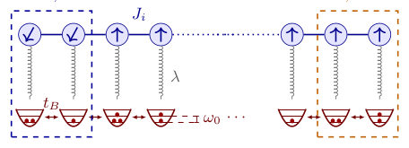 
FIG. 1. A schematic illustration of the physical model. A spin chain with uniform or engineered exchange coupling (blue lines) couples to a local bosonic mode per site (red levels, featuring a local frequency and nearest-neighbor hopping). A parameter phase is encoded on a localized block of sites (blue dashed rectangle) and read out at later times from another restricted region of sites (orange dashed rectangle).

📷 Fig 2

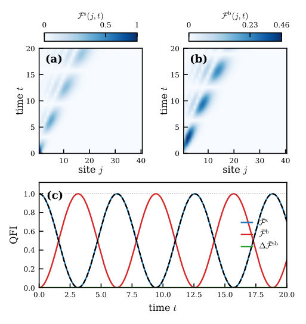 
FIG. 2. Jaynes–Cummings exchange at resonance on the uni- form XX chain [exact single-particle solution, L = 40, ω0 = 0, tB = 0.5J, λ = 0.5J, edge encoding]. (a),(b) Spin and bath QFI densities Fs(j, t) and Fb(j, t). By Eq. (12) these equal the occupations exactly, and the block deficit vanishes iden- tically. (c) Site-summed shares (dashed: closed-form result).

📷 Fig 3

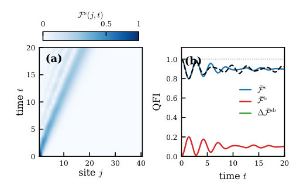 
FIG. 3. Jaynes–Cummings off resonance [L = 40, ω0 = 2J, tB = 0.3J, λ = 0.5J; exact single-particle solution, edge en- coding]. (a) Single-qubit QFI density Fs(j, t); the occupation maps coincide with the QFI densities, as in Fig. 2, and are omitted. (b) Site-summed shares (dashed: closed-form re- sult): the site-summed share ¯F s collapses to a plateau as the channels dephase, while the deficit ∆¯F sb remains zero.

📷 Fig 4

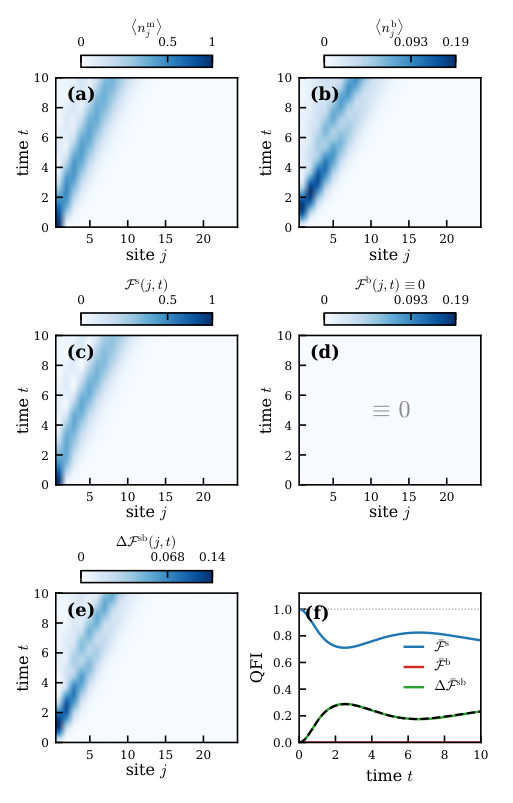 
FIG. 4. Holstein coupling on the uniform XX chain [L = 24, ω0 = 2J, tB = 0.5J, λ = 0.5J, edge encoding; TEBD]. (a),(b) Occupations on the tangent state. (c),(d) QFI den- sities Fs and Fb ≡0; the boson cloud in (b) is populated while (d) stays empty of phase information, and the color scale of the identically zero panel is nominal. (e) Block deficit ∆Fsb. (f) Whole-chain residual ∆¯F sb tracking 1 −e−⟨Nb⟩

📷 Fig 5

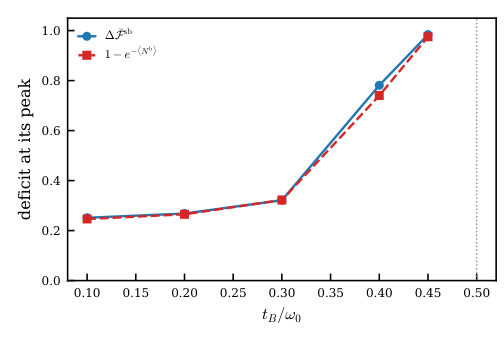 
FIG. 5. Correlation deficit of the itinerant Holstein coupling as the bath band softens [L = 20, ω0 = 2J, λ = 0.5J; TEBD]. Deficit at its peak time (circles) and 1 −e−⟨Nb⟩(squares) vs bath hopping tB/ω0 (dotted: soft-mode boundary tB = ω0/2).

**Summary.** This work analyzes the flow of local quantum sensitivity (QFI) between a spin chain and a bosonic bath under different coupling mechanisms. By treating the environment unitarily, it distinguishes between couplings that store lost information in correlations versus those that transfer it entirely to the bath. The findings reveal fundamental dependencies on system periodicity for any potential revival of the initial sensitivity.

**Why it may be interesting.** It provides a detailed quantum information perspective on open system dynamics, showing how entanglement and correlation storage govern metrological resource decay in realistic physical models like spin chains coupled to baths.

Detailed structure

**Main problem.** The study investigates how local quantum sensitivity, quantified by Quantum Fisher Information (QFI), flows between a spin chain and an attached bosonic bath.

**Main result.** The coupling symmetry dictates the fate of lost information: Holstein coupling stores it in correlations, while Jaynes-Cummings coupling transfers it fully to the bath. Revival depends critically on shared periodicity among system frequencies.

**Method.** The analysis uses a full unitary evolution approach (avoiding Lindblad approximations) to track QFI flow and calculates the 'correlation deficit' ($\Delta F_{sb}$) as a diagnostic tool.

**Model / system.** The model consists of a spin chain coupled to a bosonic bath, governed by Hamiltonians including XX exchange, Jaynes-Cummings (JC), or Holstein couplings. The system is analyzed for its unitary evolution dynamics.

**Key observables.** Local QFIs ($F_s, F_b, F_{sb}$), the correlation deficit ($\Delta F_{sb}$), and time-dependent transfer functions $ar{F}_s(t)$.

**Important parameters / regimes.** Coupling type (JC vs. Holstein), bath spectrum/frequencies, and resonance conditions ($t_B = J/2$).

**Assumptions / limitations.** The analysis treats the bath as a full many-body quantum system undergoing unitary evolution; some results rely on approximations like superselection rules or single-excitation sectors.

**Figures summary.** Figures illustrate JC exchange dynamics showing QFI oscillation (resonance vs. off-resonance) and confirm tensor network convergence for both coupling types.

**Paper structure.** The paper systematically compares the flow of sensitivity under different couplings, analyzing local block diagnostics ($\Delta F_{sb}$) against site-summed quantities to diagnose coherence transfer efficiency over time.

Abstract

We study how local sensitivity to an encoded parameter, captured by the quantum Fisher information, flows between a spin chain, a coupled bosonic bath, and their quantum correlations, where we treat the bath as a full many-body quantum system beyond the Lindbladian approximation. We analyze how the coupling symmetry determines the destination of the departed sensitivity directly at the level of the Hamiltonian. We consider an excitation-exchanging Jaynes--Cummings coupling, which preserves the total number of excitations, and a spin-excitation-conserving Holstein coupling. We find that the Holstein coupling leaves the bath with no first-order information about the phase and stores the lost sensitivity entirely in spin--bath correlations, whereas the Jaynes--Cummings coupling passes this sensitivity to the bath, in full for a single excitation. The bath spectrum then governs whether the sensitivity ever returns to the spins. It revives fully and periodically when the coupled-system frequencies share a common period, but when those frequencies disperse the departed share dephases across the bath modes and never returns. We note that a transported metrological register loses more sensitivity than its arrival fidelity implies.

[↑ back to top](#top)

### [Complexity transition in the Dicke model of light-matter interaction](http://arxiv.org/abs/2607.21583v1)

**Authors:** Yicheng Zhang, Erhai Zhao  
**Type:** theory · **Category:** other · **PDF:** <https://arxiv.org/pdf/2607.21583v1>  
**Analysis basis:** full PDF text, analyzed in chunks
**Topic relevance:** 🔥 `Tavis-Cummings & cavity-many-emitter` **4/5** · `Dicke superradiance` **3/5** · `analog quantum simulation` **3/5** · `correlated cavity matter` **3/5** · `driven-dissipative phase transition` **3/5** · `correlated / nonlocal dissipation` **2/5** · `entanglement & information structure` **2/5** · `methods for driven-dissipative` **2/5** · `non-equilibrium dynamics` **2/5** · `non-equilibrium universality` **2/5** · `Keldysh / 2PI / non-Gaussian methods` **1/5** · `exotic spin models in light-matter` **1/5** · `superradiant laser` **1/5**

📷 Fig 1

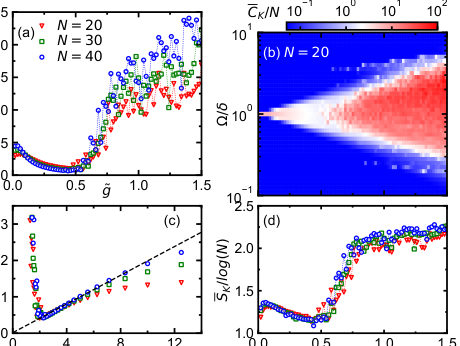 
FIG. 1. The Krylov dynamics of Dicke model from the initial state θ0 = 0 and α0 = 0. (a) The long-time average of Krylov complexity CK/N 2 as a function of ˜g at resonance δ = Ω. The number of spins N = 20 (triangles), 30 (squares), 40 (circles). (b) The color-coded CK value on the plane of ˜g and Ω/δ for N = 20. (c) The same CK as in (a) but plotted against 1/˜g to test its scaling with N 3/2. (e) The Krylov entropy SK for δ = Ω. The time average is taken over gt ∈[50, 200].

📷 Fig 2

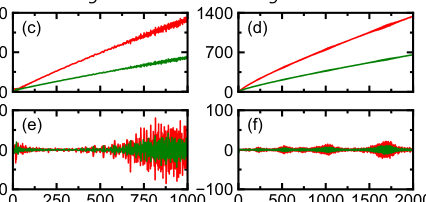 
FIG. 2. Left column: (a) The probability pk(t) of finding the particle on site k of the Krylov lattice at time t for ˜g = 0.2 in the regular regime. The solid line shows CK(t). (c) The corresponding aK (red) and bK (green) are roughly linear in k. (e) The profiles of diagonal δaK (red) and off-diagonal δbK (green) disorder, where aK and bK are sliding self-averages over k ± 10. Right column: (b), (d), (f) are similar plots for ˜g = 1.2 in the chaotic regime. N = 20 and δ = Ω.

📷 Fig 3

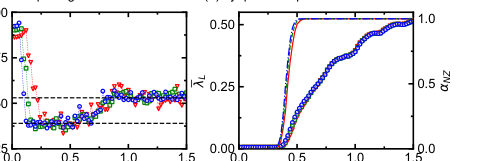 
FIG. 3. (a) The average of magnetization ˆSz and boson occu- pation ˆna over time interval gt ∈[50, 200]. (b) Time-averaged spin-boson entanglement entropy SvN. (c) The mean ratio of consecutive level spacings r within a finite window contain- ing the initial energy. Horizontal dashed lines are r = 0.386 (Poisson) and 0.536 (Wigner-Dyson). (d) Symbols: Lyapunov exponent λL averaged over sampled initial states. Lines: αNZ, the fraction of initial states with finite λL &gt; 0.01. N = 20 (triangles), 30 (squares), and 40 (circles); δ = Ω.

📷 Fig 4

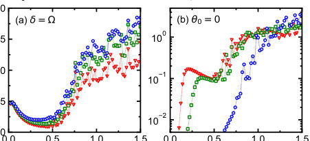 
FIG. 4. The robustness of the complexity transition. (a) The long-time average CK for initial states with finite θ0.(b) CK (in log scale) off resonance, for a few different Ω/δ values. The time average is taken over gt ∈[50, 200] and N = 20.

📷 Fig 5

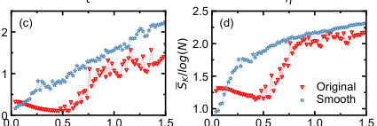 
FIG. 5. (a) CK(t) for the Rindler-Krylov Hamiltonian Eq. (3) for a few η values near 0.5. (b) Maximum values of CK (black) and SK (blue) as functions of η show a clear delocalization transition.L = 1000 for (a) and (b). (c) CK of the full model (red triangles) using the original (ak, bk) versus the smoothed model (dark blue stars) using (ak, bk).(d) Comparing SK of the two models. L = 2400, N = 20 for (c) and (d).

**Summary.** The paper investigates how tuning the coupling strength in the Dicke model drives its dynamics across a sharp transition point. By employing Krylov complexity, the authors distinguish between two regimes: one characterized by confined oscillations and another exhibiting wave packet 'spaghettification.' This work establishes $	ext{CK}$ as a sensitive diagnostic for identifying quantum chaos transitions in light-matter interactions.

**Why it may be interesting.** This work provides a powerful diagnostic tool ($	ext{CK}$) to distinguish between integrable and chaotic quantum dynamics in cavity QED systems, linking complexity measures directly to fundamental physical transitions like those seen in light-matter coupling.

Detailed structure

**Main problem.** The study aims to identify and characterize non-analytical or discontinuous transitions in the dynamics of an interacting quantum system using Krylov complexity.

**Main result.** A clear transition point ($	ilde{g}_c$) is found where the dynamics switch between a confined, oscillating regime (regular) and a continuously stretching/disintegrating regime (chaotic).

**Method.** The authors use Krylov complexity ($	ext{CK}$) and Krylov entropy ($	ext{SK}$), analyzing the time evolution of the system mapped onto a hopping problem on a Krylov lattice.

**Model / system.** The primary model is the Dicke model, describing two-level atoms coupled to a cavity photon mode. The analysis involves mapping its dynamics to an effective Hamiltonian structure analyzed via Lanczos recursion coefficients.

**Key observables.** Krylov Complexity ($	ext{CK}$), Krylov Entropy ($	ext{SK}$), and the ratio of Lanczos coefficients ($\eta = b_k/a_k$).

**Important parameters / regimes.** Coupling strength ($g$) or its dimensionless form ($	ilde{g}$), photon energy difference ($\delta$), and spin state splitting ($\Omega$). The transition occurs around $	ilde{g}_c \sim 0.5$.

**Assumptions / limitations.** The analysis relies on mapping the system dynamics to a Krylov lattice structure, and some results are compared against toy models (e.g., Rindler-Krylov Hamiltonian) which may be approximations.

**Figures summary.** Figures illustrate $	ext{CK}$ vs. $	ilde{g}$ showing sharp changes; phase diagrams map complexity regimes; wave probability $p_k(t)$ shows breathing in the regular regime and stretching/spaghettification in the chaotic regime.

**Paper structure.** The paper introduces the Dicke model, defines complexity measures ($	ext{CK}$, $	ext{SK}$), maps the dynamics to a Krylov lattice, analyzes how tuning parameters ($	ilde{g}$) drive the system through distinct dynamic regimes (regular vs. chaotic), and uses scaling laws and toy models to characterize the transition.

Abstract

Tuning the coupling strength $g$ of an interacting quantum system may drive a sudden change in its ground-state or thermal properties. To identify and grasp non-analytical, or even discontinuous, transitions in far-from-equilibrium dynamics proves more challenging. Recently Krylov complexity $C_K$ has offered fresh insights about operator growth, thermalization, and chaos in quantum dynamics. Yet it remains unclear if, and how, changing $g$ can trigger a sharp transition in the complexity measures. Here we present evidence for such a transition by mapping out the complexity phase diagram of the paradigmatic Dicke model describing two-level atoms coupled to a cavity photon mode. Two qualitatively different regimes of dynamics are identified and characterized. At the transition, the slope of $C_K$ changes suddenly to coincide with a jump in the Krylov entropy. We elucidate the nature of the regime change from the wave packet dynamics in Krylov space, where a particle is confined by a roughly linear potential but hops as if it lives in a Rindler reference frame. The competition between confinement, which leads to bouncing, and deconfinement by Rindler hopping, which leads to the destruction of wave packet analogous to gravitational spaghettification, is sensitive to the disorder in Lanczos coefficients. The framework outlined here can be applied to other quantum many-body systems.

[↑ back to top](#top)

### [Basis-independent coherence and quantum correlations in two dipole-dipole-coupled electrons in double quantum-dot molecules](http://arxiv.org/abs/2607.21175v1)

**Authors:** Zakaria Bouafia, Neha Pathania, Mostafa Mansour  
**Type:** theory · **Category:** quantum information and computing · **PDF:** <https://arxiv.org/pdf/2607.21175v1>  
**Analysis basis:** full PDF text, analyzed in chunks
**Topic relevance:** 🔥 `entanglement & information structure` **4/5** · `analog quantum simulation` **3/5** · `correlated / nonlocal dissipation` **3/5** · `driven-dissipative phase transition` **3/5** · `methods for driven-dissipative` **3/5** · `non-equilibrium dynamics` **3/5** · `non-equilibrium universality` **2/5** · `spintronics-quantum-optics interface` **2/5** · `Keldysh / 2PI / non-Gaussian methods` **1/5** · `Kondo & dissipative impurity` **1/5** · `exotic spin models in light-matter` **1/5** · `scars & prethermalization` **1/5**

📷 Fig 1

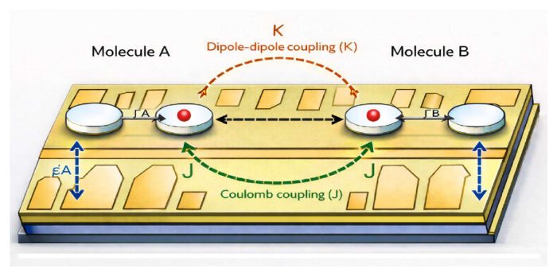 
Fig. 1 schematic of the two dipole-dipole-coupled DQD molecules with the four coupling parameters Γk, εk, K, and J.

📷 Fig 2

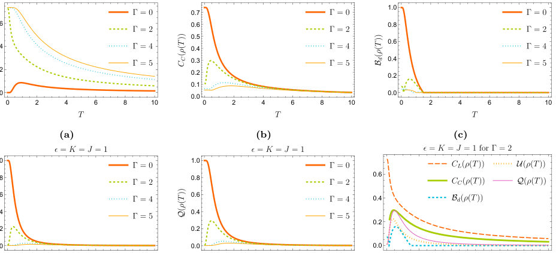 
Fig. 2 Finite-temperature variation of localized coherence CL(ρ(T)) (2a), collective coherence CC(ρ(T)) (2b), Bures distance entanglement Bd(ρ(T)) (2c), local quantum uncertainty U(ρ(T)) (2d), local quantum Fisher information Q(ρ(T)) (2e) for different values of Γ. The remaining Hamiltonian parameters are fixed at ε = J = K = 1. Their comparison is provided in (2f) for fixed Γ = 2 and ε = J = K = 1.

📷 Fig 3

 
Fig. 3 Finite-temperature variation of localized coherence CL(ρ(T)) (3a), collective coherence CC(ρ(T)) (3b), Bures distance entanglement Bd(ρ(T)) (3c), local quantum uncertainty U(ρ(T)) (3d), local quantum Fisher information Q(ρ(T)) (3e) for some values of the parameter ε. The remaining Hamiltonian parameters are fixed at Γ = J = K = 1. Their comparison is provided in (3f) for fixed ε = 4 and Γ = J = K = 1.

📷 Fig 4

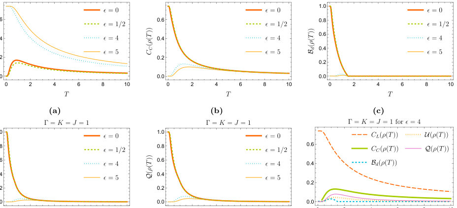 
Figure 3 shows the effect of the energy detuning parameter ε on the thermal behavior of

📷 Fig 5

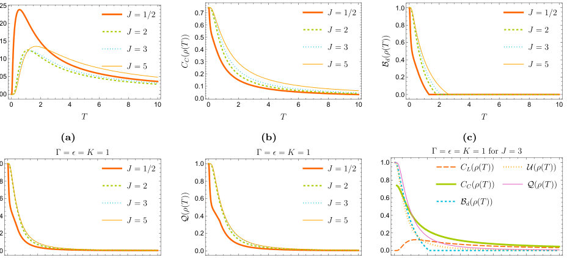 
Fig. 4 Finite-temperature variation of localized coherence CL(ρ(T)) (4a), collective coherence CC(ρ(T)) (4b), Bures distance entanglement Bd(ρ(T)) (4c), local quantum uncertainty U(ρ(T)) (4d), local quantum Fisher information Q(ρ(T)) (4e) for some fixed values of the coulomb-coupling strength J. The other parameters are fixed at Γ = ε = K = 1. Their comparison is provided in (4f) for fixed J = 3 and Γ = ε = K = 1.

**Summary.** This paper analyzes the thermal stability of quantum coherence and entanglement in two coupled electron systems within double quantum dots. It demonstrates that dipole-dipole coupling is superior to other mechanisms for protecting these non-classical resources from temperature-induced decay. The findings guide the design of robust solid-state qubits by identifying optimal parameter regimes.

**Why it may be interesting.** This work provides a detailed quantitative comparison of multiple metrics for quantifying non-classical correlations, offering specific guidelines on which physical interactions ($K$ vs $J$) are most robust against thermal decoherence in solid-state qubits.

Detailed structure

**Main problem.** The study investigates how basis-independent quantum coherence and various correlation-based quantum resources decay under thermalization in a coupled electron system.

**Main result.** Dipole-dipole coupling ($K$) is the most effective parameter for protecting these quantum resources against temperature increases, significantly extending the entanglement sudden death temperature. The combined action of $K$ and Coulomb repulsion ($J$) is crucial for maintaining high levels of coherence and correlation.

**Method.** The authors analyze the thermal dynamics by calculating various quantum measures—including basis-independent coherence ($	ext{CL}, 	ext{CC}$), Bures distance entanglement, Local Quantum Uncertainty ($U$), and local quantum Fisher Information ($Q$)—as functions of temperature and coupling strengths.

**Model / system.** The system models two spatially separated double quantum-dot (DQD) molecules containing single electrons. The interactions include inter-electronic Coulomb repulsion ($J$) and dipole-dipole coupling ($K$), alongside tunneling ($\Gamma$) and energy detuning ($\epsilon$).

**Key observables.** Basis-independent coherence ($	ext{CL}, 	ext{CC}$), Bures distance entanglement ($	ext{Bd}$), Local Quantum Uncertainty ($U$), and local quantum Fisher Information ($Q$).

**Important parameters / regimes.** Dipole-dipole coupling ($K$), Coulomb repulsion ($J$), Inter-dot tunneling ($\Gamma$), Energy detuning ($\epsilon$), and Temperature ($T$).

**Assumptions / limitations.** The analysis is performed using the Gibbs state $
ho(T) = \exp(-\hat{H}/k_BT)/Z$ for finite temperature studies.

**Figures summary.** Figures illustrate how quantum resources depend on parameters like $J$ and $K$, showing that increasing $K$ dominates the protection of correlations, while tunneling ($\Gamma$) generally degrades collective coherence.

**Paper structure.** The paper reviews the theoretical measures used (Sec. 2), details the physical model (Sec. 3), presents the results analyzing parameter dependence (Sec. 4), and concludes with implications for quantum resource management (Sec. 5).

Abstract

This work examines the thermal dynamics of basis-independent quantum coherence and correlation-based quantum resources for two dipole-dipole-coupled electrons confined in spatially separated quantum-dot (QD) molecules. Single-dot quantum superpositions and inter-subsystem coherence are characterized by using localized and collective coherence. Quantum correlations between the two double quantum dots are quantified by employing Bures distance entanglement, Local quantum uncertainty (LQU), and local quantum Fisher Information (LQFI). The findings show that dipole-dipole coupling $K$ is the most effective protective parameter, extending the entanglement sudden death temperature, diminishing the local quantum superpositions and enhancing the collective coherence. The dipole-dipole interaction has also a crucial impact on protecting LQU and LQFI beyond the entanglement sudden death temperature. Coulomb repulsion $J$ reinforces this protection through an independent channel, projecting the thermal state onto the entangled $\{|0_A 1_B\rangle,|1_A 0_B\rangle\}$ subspace; their combined action is required to approach the entanglement maximum, and it enhances collective coherence and extends the temperature range over which LQU and LQFI remain appreciable. Energy detuning $\varepsilon$ can enhance localized coherence but paradoxically accelerates the entanglement sudden death and quenches LQU and LQFI by weakening two-body correlations. Inter-dot tunneling $Γ$ enhances local superpositions at low temperature, but it reduces collective coherence, lowers the entanglement sudden death temperature, and disrupts other nonclassical correlations.

[↑ back to top](#top)

### [Large deviations in quantum dynamics and complexity](http://arxiv.org/abs/2607.20959v1)

**Authors:** Xiangyu Cao, Jorge Kurchan  
**Type:** theory · **Category:** statistical mechanics · **PDF:** <https://arxiv.org/pdf/2607.20959v1>  
**Analysis basis:** full PDF text, analyzed in chunks
**Topic relevance:** 🔥 `measurement-induced transitions` **4/5** · 🔥 `quantum measurements` **4/5** · `methods for driven-dissipative` **3/5** · `non-equilibrium dynamics` **3/5** · `Keldysh / 2PI / non-Gaussian methods` **2/5** · `entanglement & information structure` **2/5** · `non-equilibrium universality` **2/5** · `analog quantum simulation` **1/5** · `correlated / nonlocal dissipation` **1/5** · `driven-dissipative phase transition` **1/5** · `exotic spin models in light-matter` **1/5** · `scars & prethermalization` **1/5**

📷 Fig 1

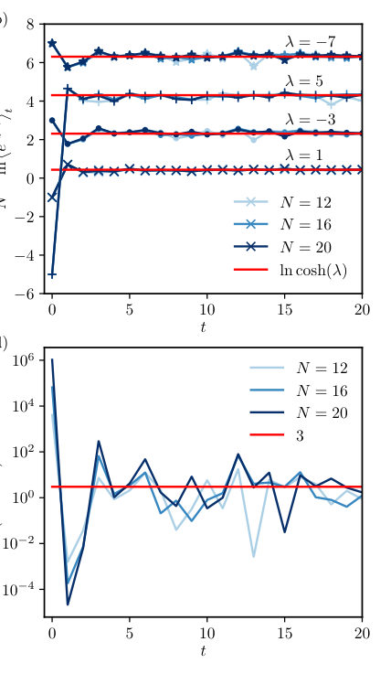 
Figure 1: Full distribution and generating function of the total magneti- zation M in the kicked Ising model (5) in a quench dynamics starting from |ψ(t = 0)〉 = | ↑↑ ... ↑〉. (a) the rescaled generating function N −1 eλM

📷 Fig 2

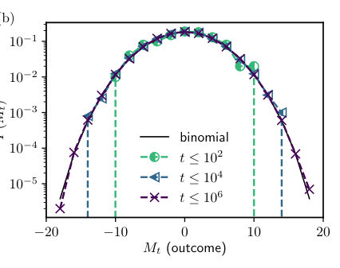 
Figure 2: Large deviation of the outcomes time sequence in the kicked Ising model (with N = 18 qubits), where the the total magnetization is measured projectively at every timestep. (a) The outcomes time sequence of a single realization, starting from the Néel state |ψ〉= | ↑↓↑↓...〉. (b) The distribution of the outcomes with t ≤tmax, tmax = 102,104,106, compared with the binomial distribution.

📷 Fig 3

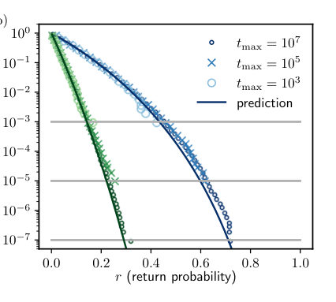 
Figure 3: Return probability in the kicked chaotic Ising model of size N = 5 and N = 7 in the longtime regime, with initial state |ψ〉= | ↑↑... ↑〉. (a) Return probability as function of time. (b) The time distribution Ptmax for tmax = 103,105,107 compared to prediction (29), and the solution of the Mattis model (25)-(28).

📷 Fig 4

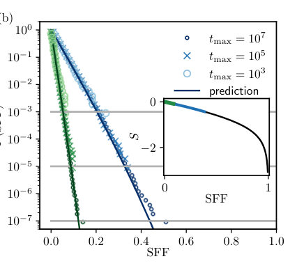 
Figure 4: Spectral form factor (SFF) in the kicked chaotic Ising model of size N = 5 and N = 7 in the longtime regime, with initial state |ψ〉= | ↑↑... ↑〉. (a) SFF as function of time. (b) The time distribution Ptmax for tmax = 103,105,107 compared to prediction (29), and the solution of the Mattis model (25)-(28). The inset plots the entropy density and shows the regions explored numerically.

📷 Fig 5

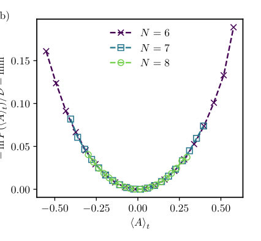 
Figure 5: Rare fluctuations of the expectation value 〈A〉t = 〈ψ(t)|A|ψ(t)〉in the kicked Ising model (5) of size N = 6,7,8, with |ψ〉= | ↑↑... ↑〉and A = Z⌊N/2⌋. (a) Time evolution of the expectation value up to t = 105. (b) We take the histogram of the expectation values for t ∈[10,106], take the log, divide by D = 2N, and subtract the maximum value. The resulting large deviation rate for different N agrees with each other, modulo a cutoff.

**Summary.** This paper develops a theory linking large deviation functions in quantum dynamics to a measure of quantum complexity. By comparing three definitions—full distribution, measurement outcomes, and expectation values—the authors find that while some quantities equilibrate rapidly, others exhibit extremely slow saturation times ($\exp(e^N)$). This time dependence is proposed as the quantitative signature of complex quantum evolution.

**Why it may be interesting.** This work provides a rigorous theoretical framework to quantify 'quantum complexity' not through entanglement entropy alone, but by analyzing the time scales required for rare fluctuations in observables to saturate their limiting distributions.

Detailed structure

**Main problem.** The study investigates how different definitions of large deviations manifest in many-body quantum dynamics, proposing that their time evolution provides a measure of quantum complexity.

**Main result.** While the full distribution equilibrates quickly ($t \sim O(1)$), distributions derived from continuous monitoring or expectation values exhibit much slower saturation times ($	ext{t}_{\max} \sim e^N$ or $\exp(e^N)$), which is proposed as a complexity measure.

**Method.** The authors employ large deviation theory, analyzing generating functions for observables and mapping the long-time behavior onto equilibrium statistical mechanics models (like Mattis models).

**Model / system.** The analysis uses the kicked Ising model as a primary example system. The dynamics are analyzed in the thermodynamic limit ($N 	o \infty$) by relating quantum expectation values to classical spin systems on a torus.

**Key observables.** Full distribution of extensive observables, outcome distributions from continuous monitoring, and expectation value distributions ($\langle A 
angle_t$).

**Important parameters / regimes.** System size $N$, time $	ext{t}_{\max}$, and the characteristic scales $O(1)$, $e^N$, and $\exp(e^N)$.

**Assumptions / limitations.** The analysis often relies on mapping quantum dynamics to classical statistical ensembles (like the XY model) in the long-time limit, and assumes certain thermalization properties.

**Figures summary.** Figures illustrate the convergence of rescaled generating functions at $t \sim O(1)$ for the full distribution, while other figures show time evolution plots comparing measured distributions to predictions from Mattis models or binomial statistics.

**Paper structure.** The paper systematically compares three definitions of large deviations. It first shows rapid equilibration for the full observable distribution. Subsequently, it analyzes continuous monitoring and expectation values, deriving distinct, much slower saturation timescales that are interpreted as measures of quantum complexity.

Abstract

We study three definitions of large deviation in many-body quantum dynamics: (i) via the full distribution of an extensive observable, (ii) via the distribution of measurement outcomes (from a continuous monitoring of the observable) over a time interval $t \le t_{\max}$, and (iii) via the distribution of expectation values over $t \le t_{\max}$. In generic systems without conservation laws, the large deviation function (i) reaches its longtime limit at $t \sim \mathcal{O}(1)$, independently of system size $N$. (ii) and (iii) reach their longtime limit at $t \sim e^{ N}$ and $t \sim \exp(e^{N})$, respectively. Before that, there is a {\it sharp} frontier between the explored and unexplored outcomes/expectation values; their distribution equals the longtime limit truncated at values that drift with $t_{\max}$. We propose that the evolution of these values with $t_{\max}$ provides a measure of quantum complexity.

[↑ back to top](#top)

### [Beyond Calabrese-Cardy Scaling: Exceptional-Point Sensitivity from the de Sitter RT Surface](http://arxiv.org/abs/2607.21536v1)

**Authors:** Kuang-Hung Chou  
**Type:** theory · **Category:** statistical mechanics · **PDF:** <https://arxiv.org/pdf/2607.21536v1>  
**Analysis basis:** full PDF text, analyzed in chunks
**Topic relevance:** 🔥 `entanglement & information structure` **4/5** · `driven-dissipative phase transition` **3/5** · `methods for driven-dissipative` **3/5** · `non-equilibrium universality` **3/5** · `correlated / nonlocal dissipation` **2/5** · `non-equilibrium dynamics` **2/5** · `Frenkel-Kontorova` **1/5** · `Keldysh / 2PI / non-Gaussian methods` **1/5** · `Kondo & dissipative impurity` **1/5** · `analog quantum simulation` **1/5**

📷 Fig 1

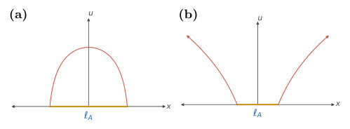 
FIG. 2: Schematic extremal surfaces in the emergent geometries. (a) In AdS, the boundary-to-boundary RT surface connects the two endpoints of the interval A. (b) In dS spacetime, the timelike extremal geodesics extend toward past infinity, corresponding to the IR endpoint of the RG circuit.

📷 Fig 2

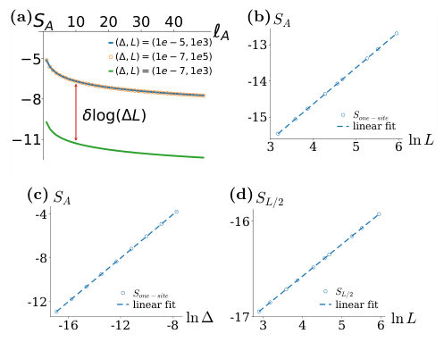 
FIG. 1: Microscopic scaling of the residual entropy in the two-legged nH SSH model. (a) Entanglement entropy as a function of subsystem size ℓA. Curves with the same ∆L collapse, while changing ∆L produces an interval-independent vertical shift δ log(∆L). (b) One-site entropy as a function of log L at fixed ∆= 10−8, with a fitted slope 0.999. (c) One-site entropy as a function of log ∆at fixed L = 100, with a fitted slope 0.995. (d) Half-chain entropy as a function of log L at fixed ∆= 10−8, with a fitted slope 0.333, consistent with SL/2 = 1

📷 Fig 3

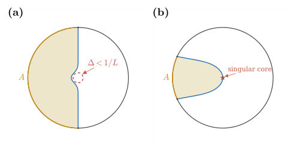 
FIG. 3: Finite-depth emergent spacetimes drawn on a disk, with the radial direction representing the RG depth and the attempted product-state endpoint at the center. (a) In AdS, the boundary-to-boundary RT curve can turn around before reaching the singular core. (b) In de Sitter spacetime, the timelike extremal geodesics extend toward the IR endpoint, so the singular core enters the variational problem and deforms the full extremal trajectory.

📷 Fig 4

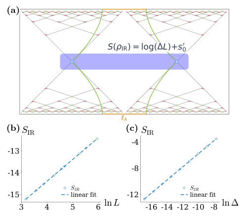 
FIG. 4: Residual entropy of the two-site IR state. (a) In the PBC dS/MERA network, extremal curves for different boundary intervals follow different bulk paths but terminate at the same pair of IR poles, giving the same IR contribution to every interval. (b) SIR versus log L at fixed ∆= 10−8. (c) SIR versus log ∆at fixed L = 100. For (b) and (c), we set (v, w) = (2, 1); both linear fits give a slope 0.999, confirming SIR = log(∆L) + s′ 0.

**Summary.** The paper shows that entanglement entropy in non-Hermitian critical chains near exceptional points acquires an extra residual term proportional to $\log(\Delta L)$. This unique feature arises because the underlying physics generates a de Sitter geometry, forcing the entanglement calculation to sense the system's finite energy gap ($\Delta$) in a way that Hermitian systems cannot.

**Why it may be interesting.** This work provides a powerful diagnostic tool for characterizing quantum critical points in non-Hermitian systems, linking topological features (like gap sensitivity) directly to emergent spacetime geometry (dS vs. AdS).

Detailed structure

**Main problem.** To investigate entanglement entropy scaling beyond standard Calabrese-Cardy predictions, specifically revealing an additional sensitivity to a small energy gap ($\Delta$) in non-Hermitian critical chains near exceptional points (EPs).

**Main result.** Non-Hermitian criticality introduces a residual entropy term, $S_{	ext{res}} = \log(\Delta L)$, into the entanglement entropy that is absent in Hermitian systems. This term signifies long-range entanglement left over after finite-depth renormalization group flow.

**Method.** The analysis uses entanglement entropy as a probe, comparing holographic descriptions derived from Anti-de Sitter (AdS) vs. de Sitter (dS) geometries generated via continuous MERA renormalization group flow.

**Model / system.** The study focuses on non-Hermitian critical chains, exemplified by the two-legged nH Su–Schrieffer–Heeger (SSH) model. The comparison is drawn between unitary (AdS) and non-unitary (dS) quantum field theories.

**Key observables.** Entanglement entropy ($S_A(\ell)$), residual entropy term ($\log(\Delta L)$), and the gap ($\Delta$).

**Important parameters / regimes.** System size ($L$), subsystem length ($\ell_A$), and the small energy gap ($\Delta$) near the exceptional point.

**Assumptions / limitations.** The analysis relies on extending cMERA to non-unitary critical states, generating an emergent dS geometry whose extremal surface reaches the IR endpoint.

**Figures summary.** Figures illustrate how the entanglement entropy scaling differs between AdS (where the RT curve bypasses the singularity) and dS (where geodesics reach the singular IR core), leading to a measurable vertical offset in the latter case.

**Paper structure.** The paper establishes the standard Calabrese-Cardy scaling, then introduces non-Hermitian criticality near an EP. It develops the holographic connection by comparing AdS/dS geometries and uses cMERA flow analysis to derive the residual entropy term $\log(\Delta L)$ from the IR endpoint structure.

Abstract

Entanglement entropy at one-dimensional criticality typically follows the Calabrese-Cardy scaling. In non-Hermitian critical chains near exceptional points, however, we show that the biorthogonal entropy of a finite system retains an additional sensitivity to a small energy gap \(Δ\) even when \(Δ< 1/L\). On top of the usual Calabrese-Cardy term, we find an interval-independent contribution \(S_{\rm res}=\log(ΔL)\), visible as a vertical offset and detectable even for a one-site subsystem. This behavior has no Hermitian analogue: a sub-finite-size gap is effectively invisible to entanglement in unitary critical chains, whereas here the entropy continues to resolve such a gap through its dependence on \(ΔL\). We interpret the result within the de Sitter geometry generated by non-unitary continuous multiscale entanglement renormalization: because the dS extremal surface reaches the IR endpoint, entanglement necessarily retains the endpoint contribution. On a finite ring, a regular circuit cannot terminate at a one-site product state and instead leaves an entangled two-site IR state. Computing the entanglement of the IR state recovers the same \(\log(ΔL)\) term, identifying this additional long-range entanglement as the residual entropy left after finite-depth disentangling.

[↑ back to top](#top)

### [Entanglement asymmetry and quantum Mpemba effect for Kramers-Wannier duality](http://arxiv.org/abs/2607.21226v1)

**Authors:** Milo Vescovo, Pasquale Calabrese, Filiberto Ares  
**Type:** theory · **Category:** statistical mechanics · **PDF:** <https://arxiv.org/pdf/2607.21226v1>  
**Analysis basis:** full PDF text, analyzed in chunks
**Topic relevance:** 🔥 `entanglement & information structure` **4/5** · 🔥 `non-equilibrium dynamics` **4/5** · `methods for driven-dissipative` **3/5** · `non-equilibrium universality` **3/5** · `driven-dissipative phase transition` **2/5** · `Keldysh / 2PI / non-Gaussian methods` **1/5** · `analog quantum simulation` **1/5** · `correlated / nonlocal dissipation` **1/5** · `scars & prethermalization` **1/5**

📷 Fig 1

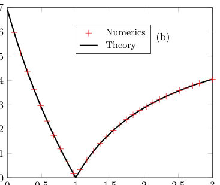 
Figure 1: (a) Tr(ρAˆρA) as function of the subsystem size ℓfor the ground state of the quantum Ising chain for different magnetic fields h, showing the exponential decay. The symbols are the exact values, computed using the corresponding formula in Eq. (31). The solid lines represent the asymptotic behavior in Eqs. (42)-(43), neglecting the subleading terms. (b) The symbols are obtained from linear fits to the exact numerical data while the solid curve corresponds to the prediction of Eq. (43).

📷 Fig 2

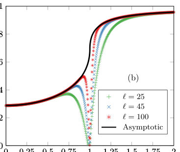 
Figure 2: (a) Rényi-2 KW entanglement asymmetry ∆S(2) A as a function of the subsys- tem size ℓin the ground state of the quantum Ising chain for different magnetic fields h. (b) ∆S(2) A as a function of h for ℓ= 25, 45, 100. In both panels, the symbols show the exact numerical values obtained from the correlation matrices at finite ℓusing Eq. (31), while the solid curves correspond to the asymptotic expression (46), with the traces evaluated from Eq. (44) in the limit ℓ→∞.

📷 Fig 3

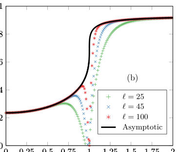 
Figure 3: Rényi KW entanglement asymmetry for several Rényi indices n as function of the magnetic field h in the ground state of the quantum Ising chain. (a) Asymptotic behavior in Eqs. (51)-(52), including the analytic continuation for n = 1. (b) Comparison with exact numerics at finite ℓfor n = 3, showing the typical dip at criticality, signaling the restoration of symmetry not captured by Eq. (51) as in Fig. 2 for n = 2.

📷 Fig 4

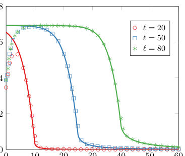 
Figure 4: (a) Time evolution of Rényi-2 KW entanglement asymmetry ∆S(2) A (t) for a quench to the critical point of the quantum Ising chain for different values of the initial magnetic field h. The symbols are the exact numerical results for ℓ= 50, computed from the correlation matrix using Eq. (31). The full lines represent the asymptotic results from the quasiparticle picture. (b) Time evolution of ∆S(2) A (t) for the representative quench from h0 = 0.7 and several subsystem sizes ℓ(symbols). The quasiparticle predictions are shown as solid lines. The figure clearly illustrates that the initial transient is an O(1) effect, and is therefore not captured by the quasiparticle picture. It...

📷 Fig 5

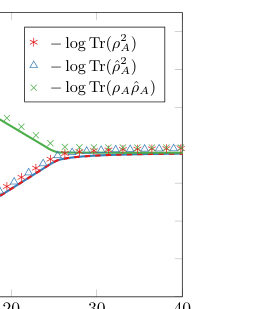 
Figure 5: Time evolution of the traces entering the Rényi-2 Kramers–Wannier entan- glement asymmetry (41) after a quench from h0 = 2 to the critical point. Here the susbystem size is ℓ= 50. The symbols are the exact numerical values, computed us- ing the formulas in Eq. (31), while the curves represent the quasiparticle predictions in Eqs. (55) and (60). Observe that the quasiparticle prediction for Trρ2 A and its KW dual Trˆρ2 A coincide for any initial magnetic field h0.

**Summary.** This theoretical paper introduces the Kramers-Wannier entanglement asymmetry as a measure to probe non-invertible symmetries in quantum many-body systems like the Ising chain. Key findings include demonstrating that this asymmetry decays dynamically during quenches, revealing a novel quantum Mpemba effect where far-from-equilibrium states relax faster than near-equilibrium ones.

**Why it may be interesting.** The work provides a powerful new diagnostic tool ($\Delta S$) for probing non-invertible symmetries in many-body systems beyond equilibrium, which is highly relevant for understanding thermalization and dynamics in quantum materials.

Detailed structure

**Main problem.** The study investigates the fate of the Kramers-Wannier duality, a non-invertible symmetry, when moving away from critical points and into non-equilibrium dynamics.

**Main result.** The authors demonstrate the emergence of a quantum Mpemba effect, where states initially farther from equilibrium restore the broken symmetry faster than those prepared closer to it. They also characterize the asymptotic decay of entanglement asymmetry during quenches.

**Method.** The analysis employs quantum information measures, specifically the Kramers-Wannier entanglement asymmetry ($\Delta S$), calculated using techniques involving dual reduced density matrices and replica tricks for fermionic systems.

**Model / system.** The primary model is the transverse-field Ising chain, analyzed through its mapping to a quadratic fermionic Hamiltonian. The study examines both equilibrium ground states and non-equilibrium dynamics following quantum quenches.

**Key observables.** Kramers-Wannier entanglement asymmetry ($\Delta S$), which quantifies the breaking of the non-invertible symmetry; the asymptotic decay rate $\sim t^{-3}$.

**Important parameters / regimes.** The transverse field $h$, with criticality occurring at $h=1$; subsystem size $\ell$; and time evolution parameters characterizing the initial quench state ($h_0$).

**Assumptions / limitations.** The derivation of asymptotic decay relies on conjectures regarding the Widom-Szegő formula, and the procedure for defining the dual reduced density matrix ($\hat{
ho}_A$) is adopted as an alternative to direct duality application.

**Figures summary.** Not specified by notes; however, results show crossovers in equilibrium asymmetry and a time decay profile demonstrating the Mpemba effect during quenches.

**Paper structure.** The paper progresses from defining the KW entanglement asymmetry for non-invertible symmetries (equilibrium analysis) to studying its behavior after quantum quenches. The core development involves deriving the long-time asymptotics of this asymmetry, leading to the identification and characterization of the Mpemba effect.

Abstract

The Kramers-Wannier duality is the prototypical example of a non-invertible symmetry, yet little is known about its fate away from criticality and out of equilibrium. We introduce the Kramers-Wannier entanglement asymmetry, a quantum-information measure that quantifies the breaking of this non-invertible symmetry in the transverse-field Ising chain. We first investigate its equilibrium properties, showing that it exhibits a striking crossover between the ordered and disordered phases together with a pronounced dip at the critical point that becomes increasingly sharp with subsystem size. We then study quantum quenches from both gapped phases to criticality and show that the Kramers-Wannier entanglement asymmetry decays to zero, signaling the dynamical restoration of the non-invertible symmetry. Remarkably, we uncover the emergence of a quantum Mpemba effect: under suitable conditions, states initially farther from equilibrium restore the Kramers-Wannier symmetry faster than states prepared closer to it. We provide both analytical and numerical evidence for this phenomenon and identify the mechanism responsible for its occurrence. Our work establishes entanglement asymmetry as a powerful probe of non-invertible symmetries beyond equilibrium and opens new perspectives on the dynamics of dualities in quantum many-body systems.

[↑ back to top](#top)

### [Unitary $k$-designs without Hamiltonian quenches](http://arxiv.org/abs/2607.20640v1)

**Authors:** Pratik Nandy  
**Type:** theory · **Category:** statistical mechanics · **PDF:** <https://arxiv.org/pdf/2607.20640v1>  
**Analysis basis:** full PDF text, analyzed in chunks
**Topic relevance:** 🔥 `non-equilibrium dynamics` **4/5** · `analog quantum simulation` **3/5** · `entanglement & information structure` **3/5** · `non-equilibrium universality` **3/5** · `methods for driven-dissipative` **2/5** · `scars & prethermalization` **2/5** · `Keldysh / 2PI / non-Gaussian methods` **1/5** · `correlated / nonlocal dissipation` **1/5** · `driven-dissipative phase transition` **1/5**

📷 Fig 1

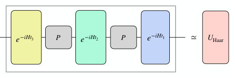 
FIG. 1. Diagrammatic illustration of the two-Pauli-kick (2PK) protocol. The system evolves under a fixed Hamil- tonian H for a duration t1, followed by a Pauli kick. It then evolves under the same Hamiltonian for a duration t2, after which the same Pauli kick is applied again, and the evolution continues for a duration t3. The arrow dictates the direction of the operation. The resulting temporal ensemble approaches the Haar ensemble, characterized by the frame potential (3).

📷 Fig 2

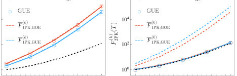 
FIG. 2. Left panel: Frame potential F (k) for the GXE (red for GOE and blue for GUE) under the 1PK protocol. Right panel: Corresponding results for the 2PK protocol. The cho- sen Pauli operator has a weight (number of non-identities) of 6. The gray and black dashed lines denote the analytical pre- diction in (7) with Λ = 3 (GOE), Λ = 2 (GUE), and the Haar value k!, respectively. The long-time limit is obtained by taking T = 106. The system size is L = 28, and the results are averaged over 104 independent temporal realizations.

📷 Fig 3

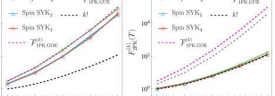 
FIG. 3. Left panel: Frame potential for the Majorana and Spin SYK under the 1PK protocol. Right panel: Corre- sponding results for the 2PK protocol. The dashed lines de- note the analytical prediction in (7) and the Haar value k!, respectively. The chosen Pauli operator has a weight (number of non-identities) of 6 and is non-commuting with the Hamil- tonian. The long-time limit is T = 106. For Majorana SYK4, NMaj = 16 (GOE) [29], and for the Spin SYK, NSpin = 8 (GUE) [26, 27]. In all cases, the results are averaged over 105

📷 Fig 4

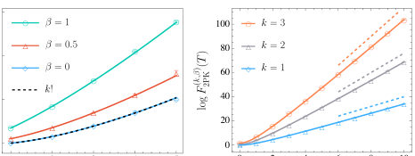 
FIG. 4. Left panel: Finite temperature frame potential (12) for the GUE under the 2PK protocol for different β. The Haar result k! holds for β = 0; otherwise, the inequality (13) holds for generic β &gt; 0. Right panel: Logarithm of the frame potential with β for different k. In both plots, the point markers are the numerical results while the solid lines are the analytic results (13). The dashed lines indicate the slope αk = 4k, as obtained from (15). The long-time limit is obtained by taking T = 106. The system size is fixed at L = 28, and the results are averaged over 104 independent temporal realizations.

**Summary.** The paper introduces the Two-Pauli-Kick (2PK) protocol as an efficient method to generate approximate unitary k-designs using only a single chaotic Hamiltonian. By analyzing the frame potential across GXE and SYK models, the authors prove that this protocol successfully mimics Haar randomness, thereby circumventing the need for multiple independent quenches in quantum chaos studies.

**Why it may be interesting.** This work provides a powerful theoretical tool (the 2PK protocol) applicable to understanding quantum chaos and scrambling in strongly interacting systems, which is highly relevant for AMO physics studying thermalization dynamics.

Detailed structure

**Main problem.** The primary goal is to efficiently generate approximate unitary k-designs, which mimic Haar randomness, without relying on multiple independent Hamiltonian quenches.

**Main result.** A novel Two-Pauli-Kick (2PK) protocol using a single chaotic Hamiltonian is shown to successfully generate these designs, confirmed by the convergence of the frame potential to the Haar value for various models.

**Method.** The analysis uses the k-th frame potential, $F^{(k)}$, calculated from the temporal ensemble average of unitary evolution interspersed with two random Pauli operator insertions. The method extends to finite temperature via canonical definitions involving partition functions.

**Model / system.** The study applies to general many-body quantum systems, tested on benchmark models like Gaussian Random Matrix Ensembles (GXE) and complex chaotic systems such as the Sachdev–Ye–Kitaev (SYK) model in both Majorana and spin formulations.

**Key observables.** Frame potential $F^{(k)}$, which measures convergence to Haar statistics; finite-temperature generalizations of this potential.

**Important parameters / regimes.** The order of the design ($k$), the inverse temperature ($eta$), and the time scale limit ($T 	o \infty$ or large Hilbert space dimension $L$).

**Assumptions / limitations.** The protocol requires a chaotic Hamiltonian $H$ such that $[P, H] 
eq 0$. The analysis often relies on asymptotic expansions in $1/d$ (Hilbert space dimension).

**Figures summary.** Figures compare the frame potentials for 1PK vs. 2PK protocols across GXE and SYK models, showing the 2PK protocol approaches the Haar value ($k!$). Other figures illustrate finite-size scaling and thermal potential comparisons.

**Paper structure.** The paper first introduces the problem of generating $k$-designs without multiple quenches. It then details the 2PK protocol and analyzes its success using frame potentials for GXE and SYK models at zero temperature. Subsequent sections generalize this to finite temperatures, establish rigorous lower bounds, and compare different mathematical definitions of the thermal potential.

Abstract

Unitary designs provide an efficient means of emulating Haar randomness without the requirement of exponential resources. Hamiltonian quench protocols have recently been shown to generate such designs, but achieving this typically requires multiple independent Hamiltonian quenches, even via temporal ensembles. Here, we show that no Hamiltonian quenches are required: a single chaotic Hamiltonian is sufficient to generate approximate unitary $k$-designs. We introduce a two-Pauli-kick (2PK) protocol, where unitary evolution under a fixed Hamiltonian is interspersed with two Pauli operator insertions (kicks). By evaluating the frame potential, we demonstrate that the resulting ensemble converges to the Haar value, indicating the emergence of approximate unitary designs. We verify this protocol for Gaussian random matrix ensembles, the Sachdev-Ye-Kitaev (SYK) model, and simplified spin (bosonic) SYK models. Furthermore, our protocol admits a canonical definition of finite-temperature frame potentials and establishes the relation with the partition function. We outline a plausible holographic interpretation of our protocol from the dual gravity picture.

[↑ back to top](#top)

### [An on-chip programmable mechano-quantum transducer](http://arxiv.org/abs/2607.21487v1)

**Authors:** Xinrui Zhang, Wei Liu, Duanyu Ma, Lin-Ke Xie, Nai-Jie Guo, Zhongtao Gou, Yifan Wang, Jianxin Xu, Xiaoguang Luo, Zhao Mu, Honglong Chang, Weizheng Yuan, Jian-Shun Tang, Chuan-Feng Li, Guangcan Guo, Tao Ye  
**Type:** experiment · **Category:** other · **PDF:** <https://arxiv.org/pdf/2607.21487v1>  
**Analysis basis:** full PDF text, analyzed in chunks
**Topic relevance:** 🔥 `spintronics-quantum-optics interface` **4/5** · `QC/QI experiment` **3/5** · `quantum measurements` **3/5** · `driven-dissipative phase transition` **2/5** · `quantum optics experiment` **2/5** · `Kondo & dissipative impurity` **1/5** · `analog quantum simulation` **1/5** · `exotic spin models in light-matter` **1/5** · `non-equilibrium dynamics` **1/5**

📷 Fig 1

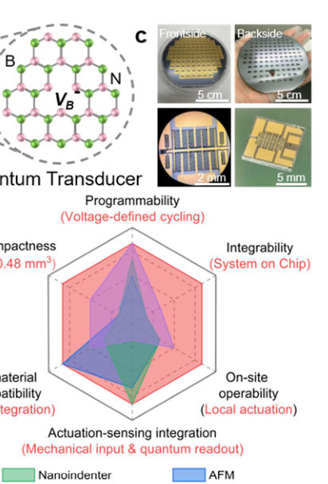 
Fig. 1 | Architecture of OCPMQT for electrically programmable mechano-

📷 Fig 2

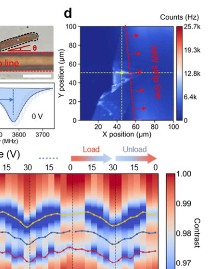 
Fig. 3 | ODMR readout of cyclic mechano-quantum modulation in OCPMQT

📷 Fig 3

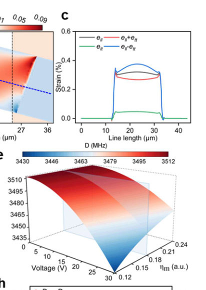 
Fig. 4 | Quantitative modeling of the voltage-dependent 𝑫 shift in OCPMQT.

**Summary.** The authors present an On-chip Programmable Mechano-Quantum Transducer (OCPMQT) that solves the problem of physically separating mechanical actuation from quantum readout in spin defects. By integrating micromechanical actuators onto a chip hosting 2D materials, they demonstrate a direct, programmable transduction pathway where electrical voltage controls measurable strain, which is then read out as a precise shift in the defect's spin resonance frequency.

**Why it may be interesting.** This work is highly relevant as it provides an experimental blueprint for integrating classical electromechanical control directly into quantum sensing platforms, which is crucial for scalable solid-state quantum devices.

Detailed structure

**Main problem.** The core challenge is integrating physically separated mechanical actuation and quantum readout functions for solid-state spin defects onto a single, on-site platform.

**Main result.** They report an On-chip Programmable Mechano-Quantum Transducer (OCPMQT) that deterministically maps electrical control input to measurable shifts in the defect's spin frequency response.

**Method.** The system uses voltage-defined micromechanical actuation on a chip-scale device, coupled with Optically Detected Magnetic Resonance (ODMR) spectroscopy for quantum readout.

**Model / system.** The platform utilizes 2D van der Waals materials (like hBN) hosting spin defects ($	ext{V}_{	ext{B}}^{--}$ or $	ext{V}_{	ext{III}}$). A micromechanical-to-spin-Hamiltonian framework is established to model the coupling between mechanical strain and the defect's zero-field splitting parameter ($D$).

**Key observables.** Strain (down to $0.0080\%$), volumetric force density ($\approx 2.6 	imes 10^4 \, 	ext{N}\cdot	ext{m}^{-3}$), and the shift in the axial zero-field splitting parameter ($D$) resolved via ODMR spectroscopy.

**Important parameters / regimes.** Strain levels up to $0.230\%$; force output of $\sim 500 \mu	ext{N}$; modulation of $D$ by $\approx -55 	ext{ MHz}$.

**Assumptions / limitations.** The approach assumes that the mechanical strain induced on the lattice can be quantitatively and reversibly transferred to modulate the spin Hamiltonian parameters.

**Figures summary.** Figures illustrate the schematic integration (actuator loading defects in hBN), the physical components (SOI wafer structure), energy level diagrams showing $D$ modulation by strain, and comparisons against conventional sensing platforms.

**Paper structure.** The paper introduces the need for on-site transduction, details the OCPMQT architecture using micromechanics and 2D materials, presents measurements of mechanical actuation and strain transfer, and concludes by validating a closed-form model linking voltage input to spin frequency output.

Abstract

Solid-state spin defects encode local perturbations as measurable shifts in spin-transition frequencies, but mechanical actuation and quantum readout remain physically separated, resulting in a discrete measurement setup. Integrating these functions requires an on-site mechano-quantum interface that programs the lattice state of a defect host and quantitatively maps it onto the spin Hamiltonian. Here we first report an on-chip programmable mechano-quantum transducer (OCPMQT) that integrates voltage-defined micromechanical actuation with in situ spin-frequency readout in a two-dimensional van der Waals quantum-defect host. Mechanically programmed lattice states are encoded as shifts in the axial zero-field splitting parameter and resolved by optically detected magnetic resonance (ODMR) spectroscopy. Within a chip volume of 2.05*10^-2 cm^3, the transducer accesses ODMR-inferred strains as low as 0.0080% and delivers a volumetric force density of approximately 2.6*104 N/m^-3. A micromechanical-to-spin-Hamiltonian framework links on-chip electromechanics, interfacial strain transfer, and strain-spin coupling, enabling the electrical control micromechanical input to be measured directly as spin-frequency response.

[↑ back to top](#top)

### [Autonomization of Quantum Systems and the Emergence of the Work Operator](http://arxiv.org/abs/2607.20602v1)

**Authors:** Carlo Cepollaro, Danial Chughtai, Alberto Spalvieri, Marcus Huber, Alberto Rolandi  
**Type:** theory · **Category:** statistical mechanics · **PDF:** <https://arxiv.org/pdf/2607.20602v1>  
**Analysis basis:** full PDF text, analyzed in chunks
**Topic relevance:** 🔥 `non-equilibrium dynamics` **4/5** · `methods for driven-dissipative` **3/5** · `non-equilibrium universality` **3/5** · `Keldysh / 2PI / non-Gaussian methods` **2/5** · `driven-dissipative phase transition` **2/5** · `analog quantum simulation` **1/5** · `correlated / nonlocal dissipation` **1/5** · `entanglement & information structure` **1/5** · `scars & prethermalization` **1/5**

📷 Fig 1

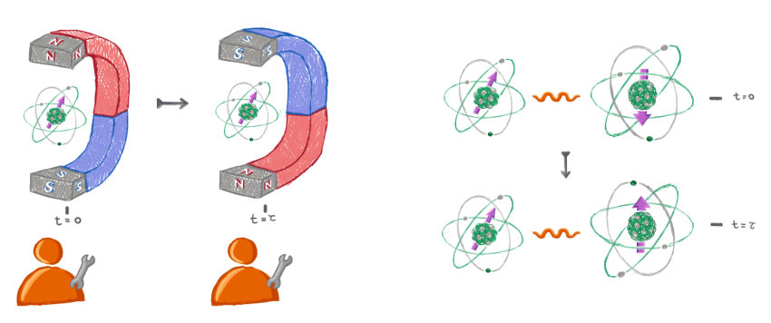 
FIG. 1. Illustration of the autonomization procedure. Left: In the usual non-autonomous description, a qubit is driven by a time-dependent Hamiltonian ˆHS(t), represented here by an externally controlled magnetic field that is changed by a classical agent. The energetic cost and fluctuations of this control are not included in the model. Right: In the autonomous description, the control device is promoted to a quantum system. The qubit interacts with a second system, here depicted as a rotating qudit, whose state selects the effective Hamiltonian acting on the system. The joint evolution is generated by a time-independent Hamiltonian, while the reduced dynamics of the qubit reproduces the...

**Summary.** The paper resolves ambiguities in defining 'work' at the quantum level by reformulating time-dependent driving into an autonomous evolution on a larger system incorporating a 'clock.' This yields a unique work operator that satisfies generalized fluctuation theorems, providing a rigorous foundation for quantum thermodynamics.

**Why it may be interesting.** This work provides fundamental theoretical tools for analyzing non-equilibrium processes, particularly energy exchange, which is crucial for understanding quantum engines and thermalization in complex quantum materials.

Detailed structure

**Main problem.** The central challenge is defining quantum work consistently, as standard approaches fail because they omit the energetic cost of external control fields. The authors address this by developing an autonomous framework for energy transfer.

**Main result.** They successfully define a unique quantum work operator that avoids known no-go theorems and derive an operatorial first law applicable to open quantum systems.

**Method.** The core method involves 'autonomizing' the time-dependent dynamics by embedding the controlled evolution into an energy-conserving Hamiltonian on a larger composite system (System + Clock).

**Model / system.** The model considers a quantum system S driven by a time-dependent Hamiltonian $\hat{H}_S(t)$, which is coupled to an auxiliary 'clock' system C. The dynamics are analyzed both in the non-autonomous and the autonomous (time-independent) pictures.

**Key observables.** The work operator ($\hat{W}$), the quantum fluctuation theorem, and distinct operators for work, heat, and internal energy changes on the reduced system.

**Important parameters / regimes.** Temperature ($\beta$), time intervals ($\Delta t$, $t_0$), and coupling strengths defining the Hamiltonian interactions.

**Assumptions / limitations.** The analysis relies on embedding the control process into a larger quantum description (the clock) to ensure energy conservation, moving beyond classical assumptions of external control.

**Figures summary.** Not specified by notes; the structure suggests derivations involving correlation functions and operator identities related to time evolution.

**Paper structure.** The paper progresses from identifying the failure of canonical work definitions to proposing the autonomous embedding (Theorem 1), deriving the unique work operator (Theorem 2), establishing a quantum fluctuation theorem (Theorem 3), and finally extending the framework to open systems with an operatorial first law.

Abstract

Estimation of work at the quantum scale remains a central challenge in quantum thermodynamics. Canonical approaches have a fundamental drawback: they assume classical control of the quantum system, as implicit in a time-dependent Hamiltonian. Yet the energetic cost of implementing this control is omitted and can exceed the system's energy scale by orders of magnitude, calling into question the operational significance of work values. We address this by autonomizing the controlled energy transfer, embedding the driven dynamics into an energy-conserving evolution on a larger quantum system. Work is then unambiguously identified with the energy transferred between the two systems, singling out a unique observable on the driven system: the work operator. We show that the quantum work operator evades a no-go theorem by deriving a quantum fluctuation theorem that recovers the Jarzynski equality in classical scenarios. We incorporate imperfect control and quantify corrections to work statistics. Extending the framework to open quantum systems, we obtain an operatorial first law in which work, heat, and internal-energy changes are represented by distinct operators on the reduced system. Together, these results settle the long-standing debate over whether work is a quantum observable: it is, once the controlling system is included in the description rather than treated as external.

[↑ back to top](#top)

### [Characterising extremal decoherence by quantum measurement incompatibility](http://arxiv.org/abs/2607.21169v1)

**Authors:** Daniel McNulty, William Townsend, Jukka Kiukas  
**Type:** theory · **Category:** other · **PDF:** <https://arxiv.org/pdf/2607.21169v1>  
**Analysis basis:** full PDF text, analyzed in chunks
**Topic relevance:** 🔥 `quantum measurements` **4/5** · `correlated / nonlocal dissipation` **3/5** · `measurement-induced transitions` **3/5** · `driven-dissipative phase transition` **2/5** · `entanglement & information structure` **2/5** · `Keldysh / 2PI / non-Gaussian methods` **1/5** · `methods for driven-dissipative` **1/5** · `non-equilibrium dynamics` **1/5** · `non-equilibrium universality` **1/5**

📷 Fig 1

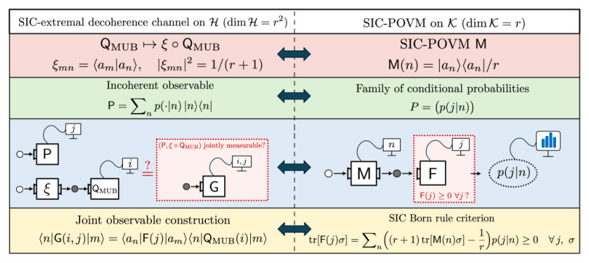 
FIG. 1. Correspondence between symmetric extremal decoherence and SIC-POVMs. A SIC-POVM M determines the coherence matrix ξ, while an incoherent observable P is specified by the conditional probabilities p(j|n). The pair (P, ξ ◦QMUB) is jointly measurable iff these probabilities arise from a valid POVM F in the SIC representation, i.e. when the associated SIC Born rule expression is non-negative for every state.

📷 Fig 2

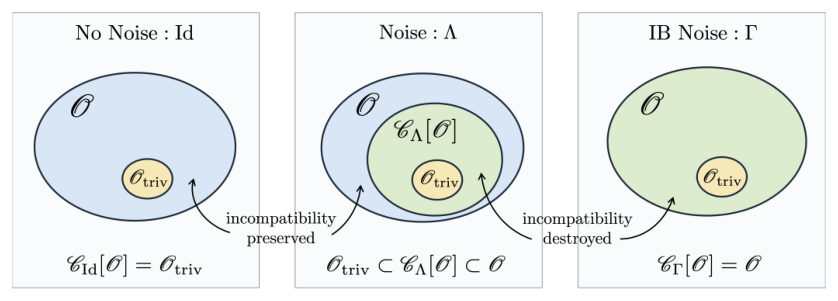 
FIG. 2. Characterising noise through the compatibility region CΛ[O] of a fixed “probe” class of observables O. This region consists of the probes that become jointly measurable with every noisy observable under the channel Λ. With no noise, CId[O] = Otriv; for a general noise channel, CΛ[O] lies between Otriv and O; and for incompatibility-breaking noise Γ, CΓ[O] = O. In this work, we focus on decoherence channels Λξ, for which the natural probe class is the set of incoherent observables, while the incompatibility-breaking reference channel Γ is complete dephasing.

📷 Fig 3

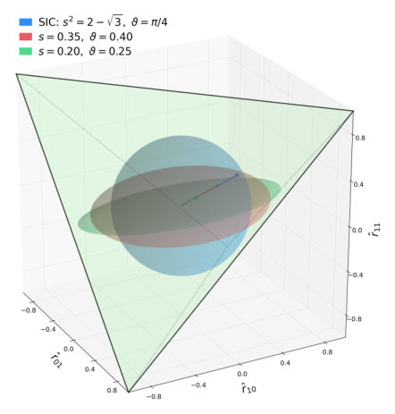 
FIG. 3. Compatibility regions Cξ[I sc 4 ] for three Heisenberg– Weyl extremals given in the Fourier coordinates (ˆr01, ˆr10, ˆr11) of the shift-covariant observable Pr ∈I sc 4 . The HW family is parameterised by s ∈(0, 1) and ϑ ∈(0, π/2), with coherence matrices given in Eq. (45). The compatibility regions are centred ellipsoids; at the SIC point s2 = 2 − √

📷 Fig 4

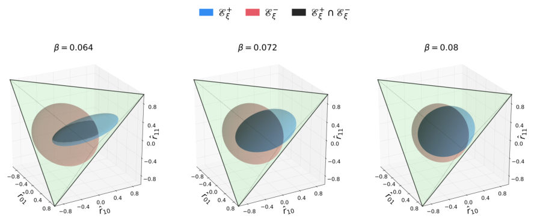 
FIG. 4. Compatibility regions Cξ[I sc 4 ], restricted to shift-covariant observables, for three semi-SIC extremals, shown in the Fourier coordinates (ˆr01, ˆr10, ˆr11) of the covariant seed distribution of Pr. The semi-SIC family is parametrised by β ∈(1/16, 1/12], with coherence matrices given in Eq. (50) and SIC endpoint at β = 1/12. For β &lt; 1/12, the reduced symmetry splits the four outcomes into two inequivalent classes, so the compatibility region is the intersection of two ellipsoids E ± ξ defined in Eq. (F10). The blue and red transparent surfaces are E + ξ and E − ξ , and the dark region is E + ξ ∩E − ξ = Cξ[I sc 4 ]. The tetrahedron is the set of all valid incoherent observables.

📷 Fig 5

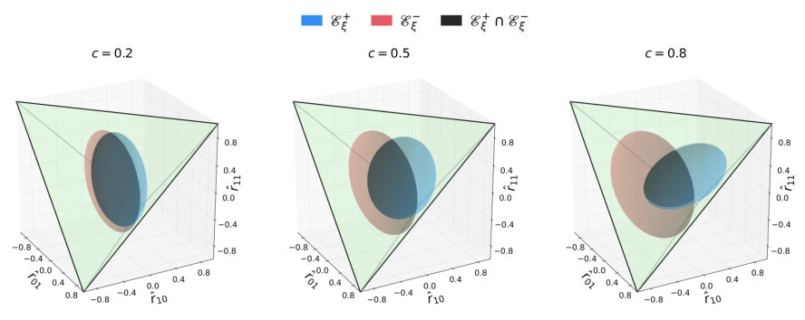 
FIG. 5. Compatibility regions Cξ[I sc 4 ], restricted to shift-covariant observables, for three non-MIC extremals, shown in the Fourier coordinates (ˆr01, ˆr10, ˆr11) of the covariant seed distribution of Pr. The family is parametrised by c = cos2(ϕ/2) ∈(0, 1), with coherence matrices given in Eq. (56). The compatibility region is the intersection of two ellipsoids E ± ξ defined in Eq. (F15), arising from the two inequivalent outcome classes of the covariant observable. The blue and red transparent surfaces are E + ξ and E − ξ , and the dark region is E + ξ ∩E − ξ = Cξ[I sc 4 ]. The tetrahedron corresponds to the set of all valid incoherent observables.

**Summary.** This theoretical paper develops an observable-level measure of emergent classicality by quantifying the loss of measurement incompatibility due to decoherence. It introduces the 'compatibility region' as a key diagnostic tool, showing that high-symmetry measurements like SICs maximize this loss. The work provides rigorous mathematical frameworks for analyzing these quantum noise processes.

**Why it may be interesting.** This work provides a deep operational link between fundamental quantum concepts—measurement incompatibility and classicality—and concrete mathematical structures (like SICs), which is highly relevant for understanding open quantum systems dynamics beyond simple damping models.

Detailed structure

**Main problem.** The paper characterizes emergent classicality by analyzing how decoherence channels destroy quantum measurement incompatibility, providing an observable-level diagnostic tool.

**Main result.** Symmetric Informationally Complete (SIC) POVMs are shown to maximize the compatibility volume among extremal decoherence channels, offering a joint measurability criterion for the existence of SICs.

**Method.** The core method involves defining and calculating the 'compatibility region' associated with noise channels acting on observables in the Heisenberg picture. This is analyzed using positivity tests derived from operator frames and Gram matrices.

**Model / system.** The system models quantum decoherence via noise channels ($\Lambda_\xi$) acting on observables, particularly focusing on extremal channels defined by coherence matrices $\xi$. The analysis uses mathematical tools like rank-one operator frames and geometric interpretations in state space (related to MICs).

**Key observables.** Compatibility region volume, measurement incompatibility, coherence matrix ($\xi$), and the structure of POVMs (especially SICs).

**Important parameters / regimes.** The dimension $d$ of the Hilbert space; parameters defining the specific type of extremal channel (e.g., Heisenberg-Weyl vs. semi-SIC).

**Assumptions / limitations.** The analysis heavily restricts itself to 'extremal' decoherence channels, which simplifies the structure by eliminating convex mixing effects.

**Figures summary.** Figures illustrate the correspondence between symmetric extremal decoherence and SIC-POVMs, showing how joint measurability conditions translate into geometric constraints on the compatibility region in state space or Fourier space.

**Paper structure.** The paper builds from defining the incompatibility loss via the compatibility region to establishing equivalent mathematical criteria for this region's existence (especially for SIC cases). It then generalizes these findings by analyzing different classes of extremals (Heisenberg-Weyl, semi-SIC) using advanced tools like Fourier analysis and robustness measures.

Abstract

Decoherence, when viewed in the Heisenberg picture, can turn incompatible measurements into jointly measurable ones. This provides an observable-level description of emergent classicality in terms of the incompatibility destroyed by a noise channel. The corresponding loss of incompatibility can be captured by the channel's \emph{compatibility region}---the observables in a probe class that become jointly measurable with every noisy observable. The geometry and volume of this region provide a refined operational way to compare noise channels. We apply this framework to decoherence channels, each of which acts by Schur multiplication with extreme points of the convex set of unit-diagonal positive semidefinite matrices. Restricting to extremals eliminates convex mixing and reveals subtle phase-dependent decoherence effects thar are not captured by damping rates or conventional coherence quantifiers. Such channels have a rigid dilation structure described by a rank-one operator frame, which reduces joint measurability to a positivity test, making the compatibility region analytically tractable, and its volume computable from the frame's Gram matrix. If the frame can be normalised to a minimal informationally complete (MIC) POVM, the compatibility region acquires a geometric interpretation in the associated probability representation of the quantum state space, familiar with Qbism. Among maximal-rank extremals, those associated with symmetric informationally complete (SIC) POVMs maximise the compatibility volume and hence destroy the greatest amount of incompatibility, providing an operational characterisation of the special role of SICs in terms of joint measurability. This leads to a new formulation of the well-known SIC existence problem as a joint measurability question for noisy mutually unbiased bases.

[↑ back to top](#top)

### [Mixed-Binary Quadratic Programming via QUBO Sampling without Continuous-Variable Binarization](http://arxiv.org/abs/2607.21286v1)

**Authors:** Taisei Takabayashi, Masayuki Ohzeki  
**Type:** both · **Category:** numerical methods · **PDF:** <https://arxiv.org/pdf/2607.21286v1>  
**Analysis basis:** full PDF text, analyzed in chunks
**Topic relevance:** 🔥 `methods for driven-dissipative` **4/5** · `Keldysh / 2PI / non-Gaussian methods` **3/5** · `analog quantum simulation` **3/5** · `driven-dissipative phase transition` **2/5** · `non-equilibrium dynamics` **2/5** · `correlated / nonlocal dissipation` **1/5** · `correlated cavity matter` **1/5** · `entanglement & information structure` **1/5** · `non-equilibrium universality` **1/5**

📷 Fig 1

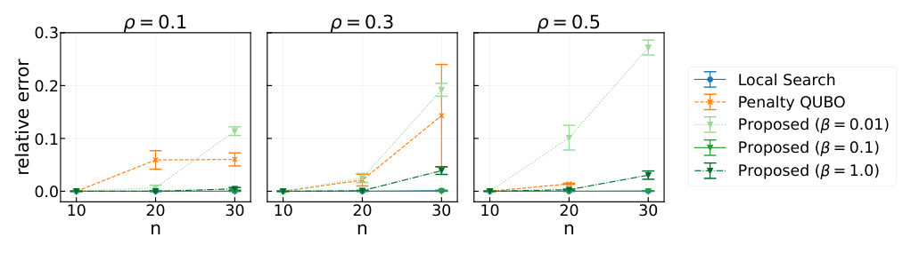 
Figure 1. Relative error of local search, penalty QUBO, and the proposed method for QpMP instances with ρ = 0.1,0.3,0.5. The proposed method was tested at β = 0.01,0.1,1.0. Penalty QUBO embeds the assignment variables and constraints directly in the QUBO. Markers and error bars show the mean and standard error over random instances. Relative error was computed only for feasible outputs and should be interpreted together with Fig. 2.

📷 Fig 2

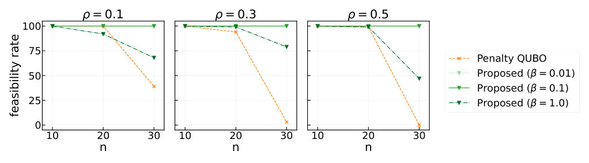 
Figure 2. Feasibility rate of penalty QUBO and the proposed method for QpMP instances with ρ = 0.1,0.3,0.5. The proposed method was tested at β = 0.01,0.1,1.0. The feasibility rate is the fraction of instances for which at least one solution satisfying all original QpMP constraints was obtained. Local search is omitted because it is feasible by construction.

📷 Fig 3

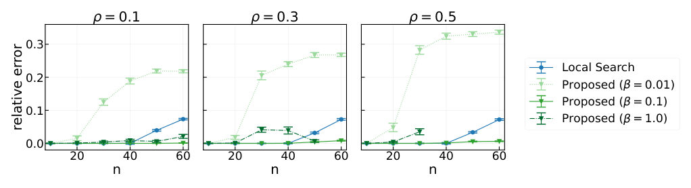 
Figure 3. Relative error of the proposed method and local search for QpMP instances with ρ = 0.1,0.3,0.5. The proposed method was tested at β = 0.01,0.1,1.0. For each (n,ρ), the markers and error bars show the mean and standard error over 100 random instances. Relative error was evaluated only when the corresponding method returned a feasible solution.

📷 Fig 4

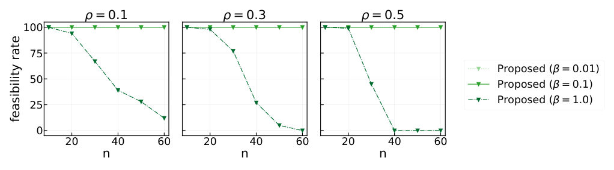 
Figure 4. Feasibility rate of the proposed method for QpMP instances with ρ = 0.1,0.3,0.5. The method was tested at β = 0.01,0.1,1.0. Local search is omitted because it directly explores p-facility subsets and always constructs a feasible assignment.

📷 Fig 5

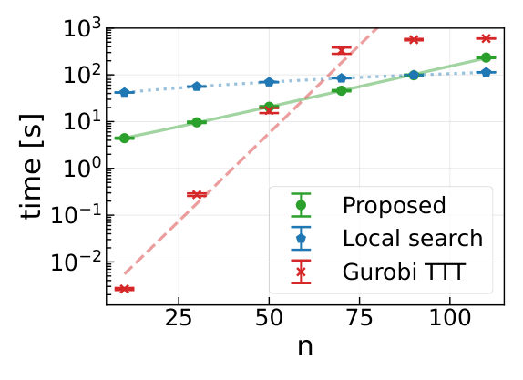 
Figure 5. Runtime comparison for QpMP instances with ρ = 0.1 and p = 0.2n. The proposed method uses β = 0.1. Markers and error bars show the mean and standard error over 20 random instances, and the semi-transparent curves show empirical fits. The Gurobi TTT fit uses only uncensored runs that reached the target within 600 s.

**Summary.** This paper presents a novel technique to solve Mixed-Binary Quadratic Programming problems suitable for quantum annealing by analytically integrating out continuous variables. This avoids problematic discretization, allowing the problem structure to remain a QUBO over binary variables at each step. The method is shown to be robust and competitive against existing state-of-the-art solvers.

**Why it may be interesting.** While focused on combinatorial optimization, the analytical treatment of continuous variables via statistical mechanics (partition functions) and the use of iterative projection methods are highly relevant to sampling complex quantum states or solving constrained Hamiltonians in AMO physics.

Detailed structure

**Main problem.** The core problem is solving Mixed-Binary Quadratic Programming (MBQP) problems, which combine discrete binary variables with continuous variables.

**Main result.** The proposed method successfully formulates the optimization such that the binary subproblem remains a QUBO at every step, yielding feasible solutions more reliably than penalty methods and achieving competitive performance against commercial solvers.

**Method.** It uses a finite-temperature statistical mechanics formulation combined with projected gradient ascent on Lagrange multipliers ($\lambda$). The continuous variables are integrated out analytically to keep the remaining problem structure as a QUBO over binary variables.

**Model / system.** The model is an MBQP, which is formulated within a constrained partition function $Z_eta$. The method relies on factorizing the partition function into separable binary and continuous sectors.

**Key observables.** Expected constraint residual $r(\lambda)$, conditional relative error of the solution, and runtime compared to commercial solvers.

**Important parameters / regimes.** Inverse temperature ($eta$), step size ($\alpha_t$), and the effective domain for multipliers ($D_\epsilon$).

**Assumptions / limitations.** The method assumes that differentiation under the integral sign is justified and requires restricting $\lambda$ to a domain $D$ where the continuous integrals are finite and differentiable.

**Figures summary.** Not specified in the notes, but comparisons are made against penalty-based QUBO formulations, local search, and commercial solvers (Gurobi) regarding objective quality and runtime.

**Paper structure.** The paper develops a general framework for analytically integrating out continuous variables from constrained optimization problems. It then applies this to the separable MBQP case, detailing the projected gradient update scheme using Barzilai–Borwein approximations for numerical stability, and finally validates it on the quadratic p-median problem relaxation.

Abstract

Quantum annealing and related combinatorial optimization methods typically accept quadratic unconstrained binary optimization (QUBO) problems as input, whereas many practical models include constraints and continuous variables. Standard QUBO conversions discretize continuous variables, increasing the binary dimension and often making feasible low-energy states harder to sample. We develop a finite-temperature formulation for a separable class of mixed-binary quadratic programs (MBQPs) that avoids this discretization. At fixed Lagrange multipliers, the continuous sector is integrated out analytically and enters only the multiplier update, leaving a QUBO over the original binary variables. We evaluate the method on the continuous relaxation of the quadratic $p$-median problem. Compared with a penalty-based QUBO formulation, it generates feasible solutions more reliably. At an appropriate inverse temperature, its conditional relative error is comparable to that of local search for small instances and often lower for the larger tested instances. In the time-to-target experiment, it also reaches the target faster than a commercial mixed-integer optimization solver toward the upper end of the tested range.

[↑ back to top](#top)

### [Directional telecom photons from a chirally coupled quantum dot](http://arxiv.org/abs/2607.21452v1)

**Authors:** Kristina Bodiroga, Jacob Ewaniuk, Andrew N. Wakileh, Lucas Rantz, Ivanna M. Boras Vazquez, Dan Dalacu, Phillip J. Poole, Robin L. Williams, Xiao-Liu Chu, Nir Rotenberg  
**Type:** experiment · **Category:** quantum information and computing · **PDF:** <https://arxiv.org/pdf/2607.21452v1>  
**Analysis basis:** full PDF text, analyzed in chunks
**Topic relevance:** 🔥 `QC/QI experiment` **4/5** · `interference shaping light` **3/5** · `quantum optics experiment` **3/5** · `spintronics-quantum-optics interface` **3/5** · `analog quantum simulation` **1/5** · `correlated cavity matter` **1/5** · `driven-dissipative phase transition` **1/5** · `exotic spin models in light-matter` **1/5**

📷 Fig 1

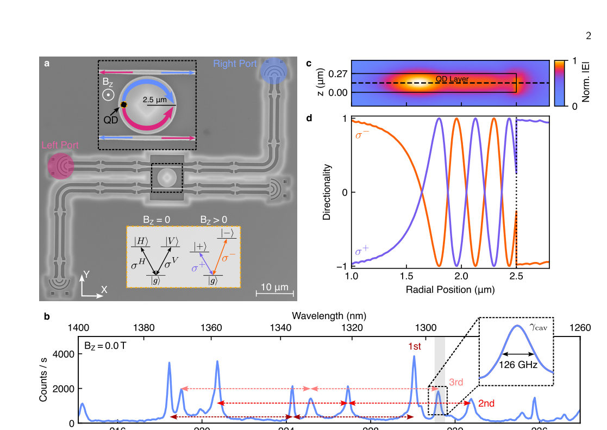 
FIG. 1 | An integrated platform for chiral quantum photonics. a Scanning electron microscope image of a 2.5 µm radius-microdisk coupled to access waveguides with left (pink) and right (blue) ports for emission collection. The upper inset (dashed black line) shows a magnified view of the microdisk, where a QD near the edge is excited above-band. Under an applied out-of-plane magnetic field, Bz, QDs with circular transition dipoles couple to counter-propagating whispering-gallery-modes and are collected at opposite ports. The lower inset (orange dashed line) shows the energy levels of the relevant QD transition dipoles with no magnetic field (left), and when one is applied (right). b...

📷 Fig 2

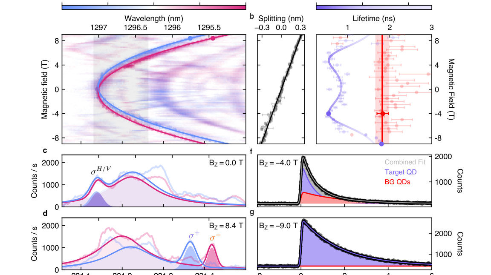 
FIG. 2 | Chiral emission and enhancement into a photonic cavity. a Emission spectra recorded from the left (pink) and right (blue) out-coupling ports as Bz is varied from -9 T to 9 T. Symbols (error bars) show the emission frequencies (95% confidence intervals) of each QD transition, which are overlaid with a fit (curves) as described in the main text. The darkened region highlights the resonant frequency and width of the cavity, and the enlargened markers correspond to c,d. b Measured Zeeman splitting as a function of the applied magnetic field (symbols with 95% confidence interval error bars) and linear fit (solid curve). c,d Representative spectra measured at Bz = 0 T and Bz = 8:4 T,...

📷 Fig 3

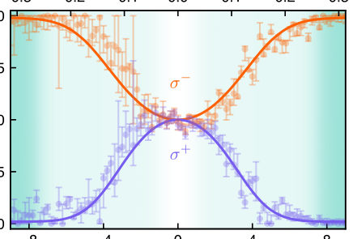 
FIG. 3 | Directional contrast for each QD transition dipole. The directional contrast, C± (markers), and corresponding 95% confidence intervals (error bars) as a function of the applied mag- netic field, Bz, for each transition dipole ff± (purple and orange, respectively), calculated from the emission spectra of Fig. 2a. Overlaying curves are a fit obtained by following the splitting (top axis, in correspondence with Fig. 2d) of the Gaussian emis- sion lines from each dipole (see Supplementary Sec. S6). Shaded regions serve as a visual aid, denoting the fields at which the emission is symmetric (white), and where directional emission cannot be fully spectrally resolved (light teal) as...

📷 Fig 4

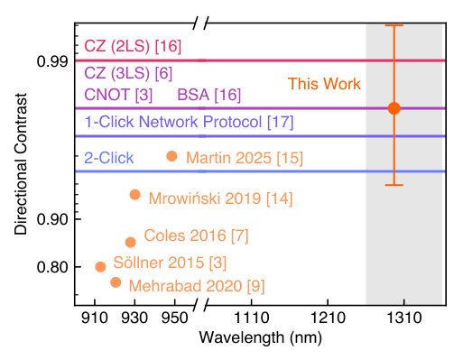 
FIG. 4 | Chiral quantum interfaces in the landscape of chi- ral quantum information protocols. Coloured horizontal lines mark directional contrast thresholds required to achieve a suc- cess probability of 95% (or 0.92 fidelity) for quantum infor- mation applications including 1- and 2-click quantum network protocols, Bell-state analyzers (BSAs), controlled-NOT (CNOT) gates, controlled-Z (CZ) gates with two- (2LS) and three-level systems (3LS). The circular markers show measured directional contrasts for QDs in a variety of nanophotonic structures that operate at different wavelengths. That from this work, which is the only in the O-band (shaded grey region), includes the 95% confidence...

**Summary.** The research reports on creating an integrated chiral quantum interface using InAs quantum dots coupled to an InP microdisk waveguide operating in the crucial telecom band. By applying magnetic fields, they demonstrated strong coupling and near-ideal emission directionality ($D=0.985$). This work provides a vital building block for realizing non-reciprocal components needed for advanced quantum logic gates on photonic chips.

**Why it may be interesting.** This work directly addresses hardware requirements for photonic quantum information processing by demonstrating a robust, tunable source of directional single photons at telecom wavelengths.

Detailed structure

**Main problem.** The primary goal is to develop a functional, integrated chiral quantum interface operating at telecom wavelengths (1260–1360 nm) necessary for building non-reciprocal quantum devices.

**Main result.** The authors successfully demonstrated near-ideal chiral emission directionality ($D=0.985$) in an integrated platform by coupling InAs quantum dots to an InP microdisk waveguide, achieving high performance compatible with silicon photonics.

**Method.** Measurements involve tuning the quantum dot transitions using strong out-of-plane magnetic fields and quantifying directional emission contrast by comparing light collected from left versus right output ports.

**Model / system.** The physical system is an integrated chip coupling InAs quantum dots to an InP microdisk waveguide. The physics involves controlling the emitter's spin state via a magnetic field ($B_z$) to induce chiral emission directionality.

**Key observables.** Chirality/Directionality ($D$), Directional Contrast ($C$), Cavity Enhancement (3.3), and QD lifetime ($	au$).

**Important parameters / regimes.** Telecom wavelength band (1260–1360 nm); Magnetic field strength ($B_z$ up to 8.4 T).

**Assumptions / limitations.** The derivation of directionality equivalence relies on assumptions about balanced total emission intensity and outcoupling efficiency.

**Figures summary.** Figures show the integrated platform structure, magnetic field dependence of spectra (showing splitting), lifetime measurements showing resonance enhancement, and plots detailing directional contrast ($C_{\pm}$) vs. $B_z$.

**Paper structure.** The paper systematically presents evidence by first establishing the physical setup, then measuring spectral/lifetime changes with $B_z$, quantifying directionality using multiple metrics ($D$ vs $C$), and finally confirming the high performance suitable for quantum protocols.

Abstract

Chiral quantum light-matter interfaces, where the internal spin state of a quantum emitter determines the direction in which it emits, are essential building blocks of non-reciprocal quantum devices, deterministic quantum logical gates and entanglement generation protocols. Yet, a chiral quantum interface that operates at telecom wavelengths, and is compatible with telecommunication infrastructure and silicon photonics, does not yet exist. Here, we report on an integrated chiral quantum interface in the original telecom band (1260-1360 nm), created by interfacing InAs quantum dots with a waveguide-coupled InP microdisk. We tune the quantum dot transitions through the photonic cavity using a strong magnetic field, observing a peak cavity enhancement of 3.3 and an emission directionality of 0.985, demonstrating the near-ideal chiral quantum coupling required for quantum information processing on integrated photonic devices.

[↑ back to top](#top)

### [Driven criticality links universal computation and optimal representations](http://arxiv.org/abs/2607.21232v1)

**Authors:** Adrián Roig, Miguel A. Muñoz, Guillermo B. Morales  
**Type:** theory · **Category:** disordered systems and neural networks · **PDF:** <https://arxiv.org/pdf/2607.21232v1>  
**Analysis basis:** full PDF text, analyzed in chunks
**Topic relevance:** 🔥 `non-equilibrium universality` **4/5** · `driven-dissipative phase transition` **3/5** · `methods for driven-dissipative` **3/5** · `non-equilibrium dynamics` **2/5** · `Keldysh / 2PI / non-Gaussian methods` **1/5** · `correlated / nonlocal dissipation` **1/5** · `entanglement & information structure` **1/5**

📷 Fig 1

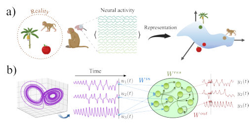 
Figure 1. Representation map and reservoir- computing architecture. (a) External stimuli are encoded as neural activity patterns forming a trajectory or point cloud in high-dimensional state space. (b) A multivariate input stream, u(t), drives a fixed recurrent network through W in, producing reservoir states, x(t). Only the readout matrix, W out, is trained to produce the target, y(t).

📷 Fig 2

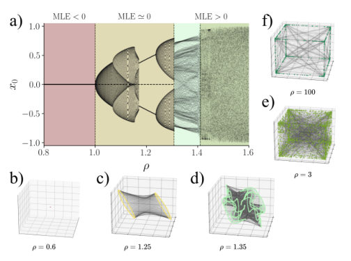 
Figure 2. Autonomous reservoir dynamics changes with recurrent gain. (a) Unforced dynamics (ε = 0, N = 200) as the recurrent gain ρ is increased. The panel shows the state x0 of a representative reservoir unit ver- sus ρ, with the typical structure of a bifurcation diagram. Shaded regions indicate the corresponding driven dynami- cal regimes classified by the input-conditioned maximal Lya- punov exponent (MLE): contracting dynamics (MLE &lt; 0), marginal driven stability (MLE ≃0), and expanding dynam- ics (MLE &gt; 0). (b–f) Representative reservoir trajectories in state space for increasing ρ: weak recurrence collapses the representation near a fixed point (b); near marginal stability,...

📷 Fig 3

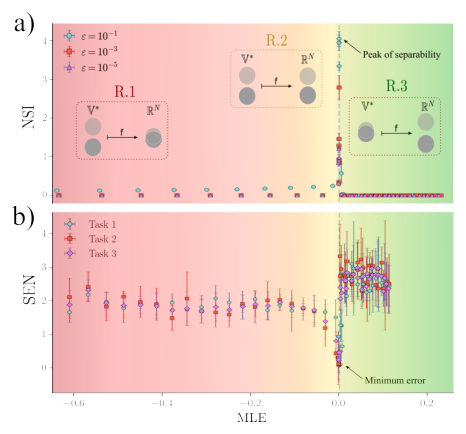 
Figure 3. Neighborhood separability and performance peak near marginal driven stability. (a) Neighbor- hood separability index (NSI) versus input-conditioned max- imal Lyapunov exponent (MLE), obtained by varying ρ for N = 2000 (SI Secs. S2.1 and S2.2). Error bars indicate vari- ability across sampled neighborhood pairs. Shaded regions indicate the regimes identified in Fig. 2: strongly contractive R1, marginally stable R2, and unstable/saturation-dominated R3. NSI is maximal near MLE ≃0−. (b) Supremum-norm error (SEN) for benchmark tasks (End Matter, Sec. B.2, and SI Sec. S2.3), with N = 2000 and ε = 0.01. SEN is minimized in the same R2 window.

📷 Fig 4

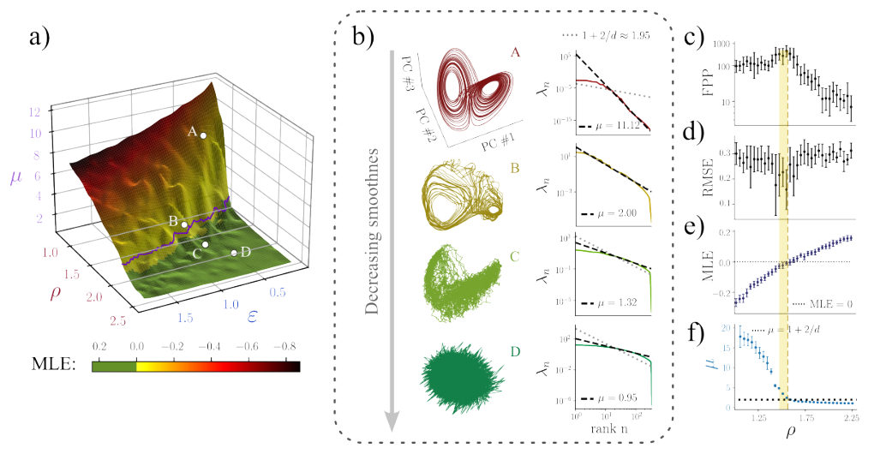 
Figure 4. Marginal driven stability meets optimal representation geometry and predictive power. (a) Input- conditioned maximal Lyapunov exponent (MLE) as a function of spectral radius ρ and input scale ε. (b) PCA projections of reservoir activity for four representative parameter choices, together with the corresponding covariance spectra. (c, d) Furthest-predicted point (FPP) and Root-mean-square error (RMSE), showing optimal prediction near marginal driven stability, MLE ≃0−. (e, f) Input-conditioned MLE and spectral exponent µ as a function of ρ, showing µ ≈1 + 2/dℓnear the point of marginal driven stability, MLE ≃0−.

**Summary.** This work links the concept of universal computation in reservoir networks to the geometric properties of their high-dimensional state representations. By analyzing the system's stability via the Lyapunov exponent, the authors show that optimal performance occurs at a 'marginal driven stability' point. This regime uniquely balances the need for distinct input separation with the requirement for smooth, structured embedding geometry.

**Why it may be interesting.** The connection drawn between physical concepts like edge-of-instability dynamics (common in non-equilibrium physics) and information processing capacity provides a novel theoretical framework for understanding computation limits in complex dynamical systems, potentially informing models of biological or quantum computation.

Detailed structure

**Main problem.** The paper addresses how enhanced computational capabilities (universality) relate to optimal geometric structure in complex, input-driven recurrent neural networks.

**Main result.** Optimal performance is achieved in a narrow regime of marginal driven stability ($	ext{MLE} \simeq 0^{-}$), where the network balances local neighborhood separation required for computation and smooth high-dimensional geometry needed for optimal representation.

**Method.** The authors analyze reservoir computing dynamics by introducing diagnostics like the Neighborhood Separability Index (NSI) and tracking the input-conditioned Maximal Lyapunov Exponent (MLE).

**Model / system.** The model is Reservoir Computing, where a fixed recurrent network maps time-series inputs into high-dimensional states using a non-linear activation function. The dynamics are governed by parameters like the recurrent gain ($
ho$) and input strength ($\epsilon$).

**Key observables.** Neighborhood Separability Index (NSI), Input-conditioned Maximal Lyapunov Exponent (MLE), Covariance spectrum exponent ($\mu$), Furthest Predicted Point (FPP), and Root-Mean-Square Error (RMSE).

**Important parameters / regimes.** The primary control parameter is the reservoir gain $
ho$, which dictates the dynamical regime (contractive, marginal stability, or unstable/mixing).

**Assumptions / limitations.** The analysis assumes that computational utility requires both local distinguishability (NSP) and global smoothness (Stringer's bound), and these two requirements are optimized simultaneously at marginal driven stability.

**Figures summary.** Figures illustrate how NSI, prediction error, and the MLE change across different reservoir gain ($
ho$) regimes, pinpointing optimal performance near $	ext{MLE} \simeq 0^{-}$ where spectral properties approach theoretical bounds.

**Paper structure.** The paper builds by first defining the computational requirements (NSP/Universality) and geometric constraints (Stringer's bound). It then analyzes how varying the reservoir gain ($
ho$) shifts the system through different dynamical regimes, identifying marginal stability as the unique point where both constraints are simultaneously satisfied for optimal performance.

Abstract

Near-critical dynamics are often linked to enhanced computation, but the underlying mechanism remains unclear. We address this question in reservoir computing, where a fixed recurrent network maps input sequences into high-dimensional states and only a simple readout is trained. We extend fixed-reservoir universality results to discrete-time input-driven reservoirs and connect their key geometric condition, neighborhood separation, to dynamics. To this end, we introduce a finite-resolution neighborhood separability index and an input-conditioned maximal Lyapunov exponent. We find that neighborhood separability, chaotic time-series prediction, and smooth high-dimensional representation geometry are optimized in the same narrow window of marginal driven stability. In this regime, the covariance spectrum approaches the power-law scaling expected for near-optimal smooth representations. Our results link edge-of-instability computation, universality, readout performance, and optimal representation geometry within a common dynamical framework.

[↑ back to top](#top)

### [The leading-soft cubic graviton self-interaction on the black-hole horizon](http://arxiv.org/abs/2607.21066v1)

**Authors:** Ayanendu Dutta  
**Type:** both · **Category:** other · **PDF:** <https://arxiv.org/pdf/2607.21066v1>  
**Analysis basis:** full PDF text, analyzed in chunks
**Topic relevance:** 🔥 `entanglement & information structure` **4/5** · `non-equilibrium dynamics` **3/5** · `methods for driven-dissipative` **2/5** · `non-equilibrium universality` **2/5** · `Keldysh / 2PI / non-Gaussian methods` **1/5** · `correlated / nonlocal dissipation` **1/5** · `driven-dissipative phase transition` **1/5** · `scars & prethermalization` **1/5**

📷 Fig 1

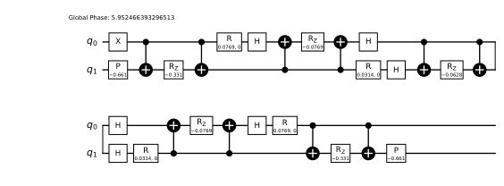 
FIG. 1. The complete circuit for the smallest instance of the derived model: Fock preparation plus one decomposed second-order Suzuki–Trotter step for the (2, 0) mode at d = 4 (Gray encoding, two qubits, seven Pauli strings; depth 25, 10 cx). Production registers scale this construction to 6 and 10 qubits (Table II).

📷 Fig 2

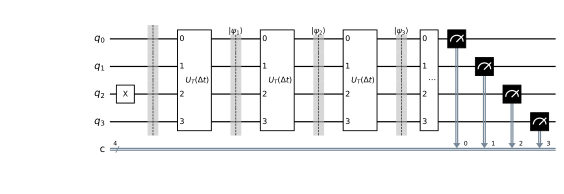 
FIG. 2. The sequential-segment snapshot protocol: X- layer Fock preparation, repeated transpiled Trotter segments UT (∆t) with the state recorded after each segment (|ψk⟩ at t = k∆t), and computational-basis multiplicity readout. Memory is bounded by one segment; the Trotter error accu- mulates linearly, as on hardware.

📷 Fig 3

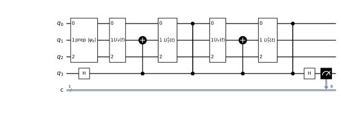 
FIG. 3. The Hadamard-test interferometer measuring the squared commutator with Pauli probes (V = X, W = Z shown): controlled time evolution is avoided by conjugation, c (U †V U) = U cV U †, so only the single-qubit probes are con- trolled; the final ancilla ⟨Z⟩gives Re F and C = 2 −2 Re F.

📷 Fig 4

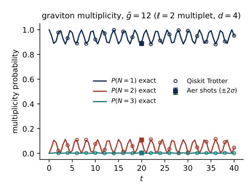 
FIG. 4. Multiplicity dynamics P(N, t) at ˜g = 12 (ℓ= 2 multiplet, d = 4): exact block evolution (lines), 10-qubit Gray Trotter engine (open circles; max deviation 1.6 × 10−3), and Aer shot estimates at t = 20 with ±2σ binomial errors (squares).

📷 Fig 5

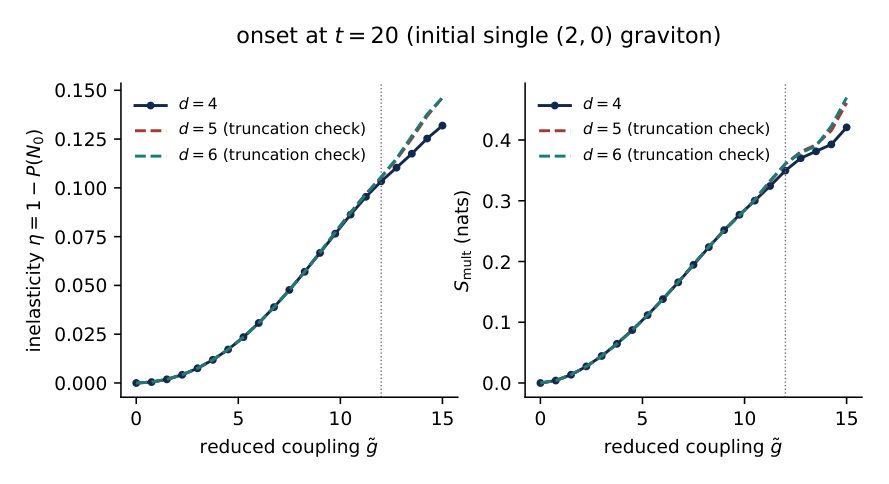 
FIG. 5. Inelasticity η = 1 −P(N0) and multiplicity entropy at t = 20 versus the reduced coupling, with per-mode-cutoff overlays d = 4, 5, 6. The dotted line marks the representative ˜g = 12; the maximal d-dependence over the sweep is 0.0144.

**Summary.** This paper analyzes the cubic self-interaction of gravitons near a black hole horizon by deriving an effective Hamiltonian and simulating its time evolution. The authors prove that certain components of this interaction vanish at leading soft order while using quantum simulation techniques to measure entanglement and spectral properties. The work highlights the challenges in distinguishing true physical dynamics from finite-size artifacts in complex quantum systems.

**Why it may be interesting.** It provides a concrete, albeit highly specialized, example of applying advanced quantum information tools (entanglement measures, spectral analysis) to fundamental gravitational physics problems concerning black hole evaporation and scrambling.

Detailed structure

**Main problem.** The study derives and simulates the leading-soft cubic graviton self-interaction vertex on a black hole horizon to test predictions about quantum dynamics, thermalization, and entanglement.

**Main result.** A vanishing theorem proves that the self-coupling of purely traceless longitudinal polarizations is zero at leading soft order; simulations confirm perturbative rigidity but suggest Page-like behavior requires mechanisms beyond this cubic vertex.

**Method.** The work combines analytical derivation using the GGV near-horizon framework with numerical simulation of the resulting Hamiltonian on quantum hardware simulators (IBM Qiskit/Aer).

**Model / system.** The system is a gravitational field perturbation expanding the Einstein-Hilbert action to cubic order around a Schwarzschild black hole horizon. The dynamics are governed by an effective Hamiltonian derived from this self-interaction vertex.

**Key observables.** Inelasticity ($\eta$), entanglement profiles (compared to Haar/Page reference), residual dressing ($d_{	ext{eff}}$), and spectral statistics (IHO vs. Wigner/Poisson).

**Important parameters / regimes.** Leading soft order, $\ell=2$ multiplet, coupling strength ($	ilde{g}$), and system size/cutoff ($N_{\max}$).

**Assumptions / limitations.** The vanishing theorem is framework-specific (RW gauge, GGV sector); simulations are subject to systematic errors from truncation and finite Hilbert space size.

**Figures summary.** Figures illustrate the oscillatory growth of inelasticity ($\eta$), entanglement profiles below the Page value, spectral form factors comparing integrable vs. random matrix predictions, and multi-scalar yield comparisons.

**Paper structure.** The paper proceeds by deriving the cubic vertex analytically (establishing the vanishing theorem), then simulating the resulting dynamics using quantum circuits to measure observables like entanglement and inelasticity, concluding with a discussion of limitations regarding system size and thermalization mechanisms.

Abstract

We expand the Einstein-Hilbert action to cubic order about the Schwarzschild horizon, in the even Regge-Wheeler gauge of the Gaddam-Groenenboom-'t~Hooft (GGV) near-horizon framework, and derive the cubic graviton self-interaction. Our central result is a `vanishing theorem': at leading soft order the self-coupling of the purely traceless longitudinal polarizations is identically zero, because with the trace/transverse-scalar sector switched off the fluctuation reduces to a two-dimensional block whose $\sqrt{-g}\,R$ is a total (Euler) derivative at every order in $κ$. We prove this by an explicit closed-form reduction and exhibit the cancellation term by term. It is a `framework-specific' statement, even RW gauge, GGV sector, leading soft order, not a gauge-invariant theorem of general relativity. The theorem is exact, but the quantized vertex inherits a $\sim\!20\%$ soft/scheme systematic at the only simulable multiplet ($\ell=2$), which we state explicitly. We then simulate the real-time dynamics of the resulting Hamiltonian on IBM Qiskit/Aer with exact cross-checks. Two structural facts, a conserved charge that only the cubic vertex violates, opening $φφ\to hh\to4φ$, and a provably resonance-free boost spectrum (gap $\to1/2$), already predict that the longitudinal channel is perturbatively rigid; the simulation confirms this quantitatively and measures the residual dressing ($d_{\rm eff}=1.06$; multiplicity far from thermal, Poisson, and Haar references) rather than discovering it. A symmetry-exact total-occupation truncation yields the first sector-resolved level statistics, indicative of intermediate behaviour on Hilbert spaces too small to be decisive. All circuit results agree with exact diagonalization, every headline number carries a stated systematic, and hardware execution is deferred behind a quantified noise budget.

[↑ back to top](#top)

### [Monte Carlo Studies of Twisted Bilayer Graphene: Strain and Thermal Fluctuations](http://arxiv.org/abs/2607.20619v1)

**Authors:** Johannes S. Hofmann, Patrick Ledwith, Ashvin Vishwanath, Jong Yeon Lee, Erez Berg  
**Type:** theory · **Category:** strongly correlated electrons · **PDF:** <https://arxiv.org/pdf/2607.20619v1>  
**Analysis basis:** full PDF text, analyzed in chunks
**Topic relevance:** 🔥 `analog quantum simulation` **4/5** · `Keldysh / 2PI / non-Gaussian methods` **3/5** · `driven-dissipative phase transition` **2/5** · `Kondo & dissipative impurity` **1/5** · `entanglement & information structure` **1/5** · `methods for driven-dissipative` **1/5** · `non-equilibrium dynamics` **1/5**

📷 Fig 1

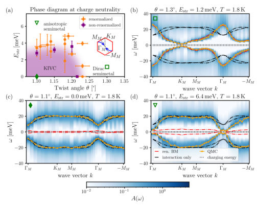 
FIG. 1. (a) Phase diagram. A gapped KIVC phase (purple) borders an anisotropic semimetal (white), which is adiabatically connected to the C3-rotation symmetric Dirac semimetal at large twist angle and vanishing strain. The green symbols indicate the parameters of panels (b-d). The phase boundary was obtained using two different choices for the single-particle Hamiltonian, using the renormalized and non- renormalized schemes (see text). The non-renormalized data has been shifted to account for the magic-angle renormaliza- tion, ∆θ = 0.05◦; the phase boundaries using the two schemes agree within error bars. The inset depicts the moir´e Bril- louin zone, the motion of the Dirac points (blue...

📷 Fig 2

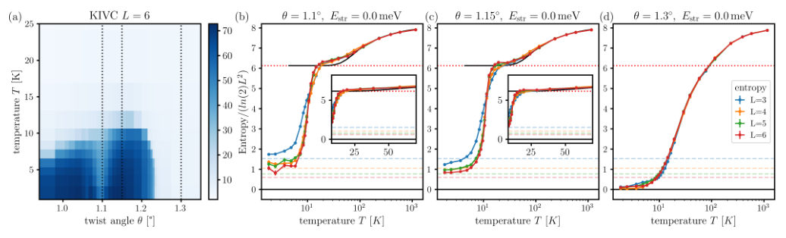 
FIG. 2. (a) Zero-momentum KIVC correlation function for ε = 0. At the magic angle, θ = 1.1◦, the single-particle bandwidth nearly vanishes, and the KIVC state is competing with valley polarized states due to an approximate U(4) symmetry. (b-d) Entropy per unit cell as a function of temperature for three representative twist angles, (b) θ = 1.1◦, (c) θ = 1.15◦, and (d) θ = 1.3◦. The red dotted line at S = ln 8 4  represents the entropy of spin, valley, and orbital degrees of freedom for quenched electron on each site. The horizontal dashed lines represent the entropy expected for the degenerate ground states in the flat-band limit (see text). In (b,c), the black curve represents the high...

📷 Fig 3

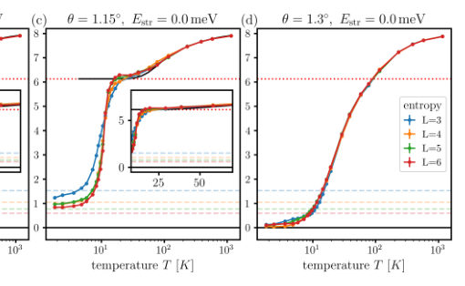 
Fig. 2(b-c) show the entropy per moir´e unit cell ver- sus temperature for twist angles θ = 1.1◦, 1.15◦, and 1.3◦. The first two angles are within the KIVC regime, whereas the third angle is in the Dirac semimetal phase. For θ = 1.1◦, 1.15◦and below TKIVC ≈10K the entropy is small, and close to the value expected from the ground state degeneracy due to the approximate U(4) symme- try for the corresponding system size (dashed horizontal lines). With increasing T, it rises rapidly and develops a broad plateau near ln 8 4  (horizontal dotted line), con- sistent with a regime in which charge fluctuations are quenched while the flavor (valley, spin, orbital) degrees of freedom are fully...

📷 Fig 4

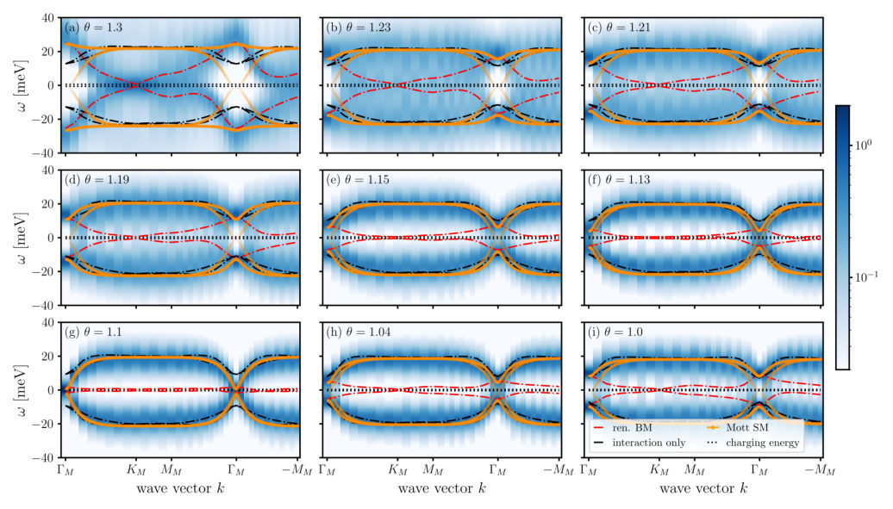 
FIG. 3. Zero-strain single-particle dispersion at various twist angles and T = 30K. The system size is 12 × 12. The renormalized dispersion, H0, (red), the purely interacting spectrum, H0 = 0, (black) and the charging energy, V (q = 0), (dotted line) are marked. The single-particle spectrum A(k, ω) is extracted via the stochastic Maximum-Entropy method. The dispersion of the Mott semimetal is shown in orange with the opacity indicating the spectral weight. The dispersion smoothly evolves from a semimetal with Dirac cones at KM and K′ M for large twist angle to a semimetal with gapless excitations at Γ for the renormalized magic angle, θ = 1.1◦.

📷 Fig 5

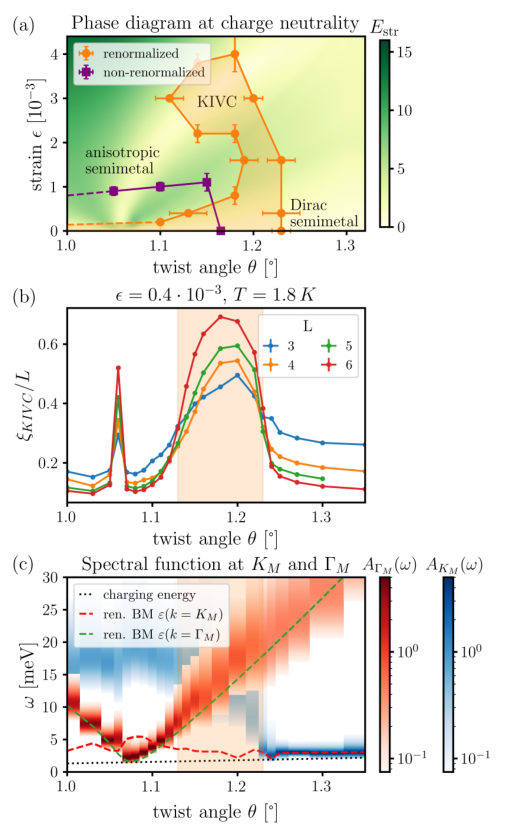 
FIG. 4. (a) Phase diagram. A gapped KIVC phase (or- ange) borders an anisotropic semimetal (transparent), which is adiabatically connected to the C3-rotation symmetric Dirac semimetal at large twist angle and vanishing strain. The dashed orange (purple) phase boundary for θ &lt; 1.1◦(θ &lt; 1.05◦) is an extrapolation. The renormalized strain is shown as the density plot in the background, and translates the bare strain parameter ε to the energy, Estr, as shown in Fig. 1(a). (b) KIVC correlation length. ξKIVC as function of θ for various system sizes at ε = 4 · 10−4 and T = 1.8K. The cross- ing point locates the critical twist angles, θ = 1.14 ± 0.03◦

**Summary.** This work uses advanced Quantum Monte Carlo simulations to map the phase diagram of twisted bilayer graphene under strain and temperature. It identifies distinct correlated states—including KIVC and anisotropic semimetals—by analyzing spectral functions and entropy plateaus. The findings advance the understanding of how geometric parameters control emergent electronic behavior in 2D materials.

**Why it may be interesting.** The study provides a detailed theoretical framework for understanding emergent electronic phases in moiré materials, which are highly relevant platforms for simulating strongly correlated physics analogous to high-Tc superconductors.

Detailed structure

**Main problem.** The study investigates the complex phase diagram of twisted bilayer graphene (TBG) at charge neutrality as a function of twist angle, uniaxial strain, and temperature.

**Main result.** The system exhibits continuous transitions between Dirac semimetal, Kramers inter-valley coherent (KIVC) phases, and anisotropic semimetals, with entropy measurements suggesting localized electron behavior in the KIVC regime.

**Method.** The research employs sign-problem-free Quantum Monte Carlo simulations and advanced Green's function techniques to calculate self-energies beyond mean-field theory.

**Model / system.** The system is Twisted Bilayer Graphene (TBG) modeled using a continuum Hamiltonian projected onto narrow moiré bands. Calculations utilize concepts from the Hubbard model and incorporate strain via pseudo gauge potentials.

**Key observables.** Electron spectral function A(k, omega), entropy S vs T, fermion bilinear order parameters, and self-energy corrections $\Sigma_{k,n}$.

**Important parameters / regimes.** Twist angle ($	heta$), uniaxial heterostrain ($\varepsilon$), Temperature ($T$), and interaction strength ($U$). Key regimes include $T=0$ and intermediate temperatures ($15 	ext{ K} \lesssim T \lesssim 40 	ext{ K}$).

**Assumptions / limitations.** The simulations rely on approximating the system to be sign-problem free via particle-hole symmetry, and calculations often involve small parameter expansions (e.g., $s^2 \ll 1$ or $T \gg U s_2$).

**Figures summary.** Figures illustrate phase boundaries between different semimetallic phases, show the evolution of the spectral function across these phases, and plot entropy versus temperature to diagnose electronic regimes.

**Paper structure.** The paper systematically maps out the phase diagram by varying $	heta$ and $\varepsilon$, using multiple diagnostic tools like spectroscopy (spectral function) and thermodynamics (entropy) to characterize transitions between distinct correlated states.

Abstract

We study the phase diagram of twisted bilayer graphene at charge neutrality as a function of twist angle $θ$, uniaxial heterostrain $\varepsilon$, and temperature $T$ using sign-problem-free quantum Monte Carlo simulations. At $T=0$ and zero strain, we find a continuous transition from a Dirac semimetal to a gapped Kramers inter-valley coherent (KIVC) phase as $θ$ decreases toward the magic angle. With finite strain, the KIVC phase undergoes a further continuous transition at smaller $θ$ into an anisotropic semimetal with gapless excitations near the center of the moiré Brillouin zone. In the KIVC regime, the entropy rises sharply with temperature and plateaus at $15\,\text{K} \lesssim T \lesssim 40\,\text{K}$ near the value expected from a Mott-like regime of localized electrons with nearly uncorrelated spin, valley, and orbital degrees of freedom, despite the topological obstruction preventing a localized tight-binding description of the active bands. The spectral function evolves continuously with $θ$: at low $T$, a gap opens at the $K$ points and the minimal gap shifts to $Γ$ as $θ$ decreases; at intermediate $T$, the spectral function smoothly interpolates between a Dirac semimetal spectrum with coherent $K$-point quasiparticles and a spectrum with gapless $Γ$-centered quasiparticles near the magic angle. The later can be a anisotropic or a Mott semimetal and we discuss how to distiguish them in experiment.

[↑ back to top](#top)

### [Picosecond-resolved entanglement distribution over an urban free-space channel](http://arxiv.org/abs/2607.21093v1)

**Authors:** Alessandro Laneve, Fabrizio Cienzo, Santiago Gomez, Paolo Barigelli, Philip Menz, Mattia Beccaceci, Giuseppe Ronco, Giorgia Grossi, Ievgen Brytavskyi, Thomas Oberleitner, Markus Wiener, Christian Weidinger, Tobias M. Krieger, Ailton Garcia, Saimon Filipe Covre da Silva, Michele B. Rota, Nicolò Spagnolo, Henning Weier, Fabio Sciarrino, Armando Rastelli, Rinaldo Trotta  
**Type:** experiment · **Category:** quantum information and computing · **PDF:** <https://arxiv.org/pdf/2607.21093v1>  
**Analysis basis:** full PDF text, analyzed in chunks
**Topic relevance:** 🔥 `QC/QI experiment` **4/5** · `quantum optics experiment` **3/5** · `entanglement & information structure` **2/5** · `free-space correlated emission` **1/5** · `interference shaping light` **1/5** · `non-equilibrium dynamics` **1/5**

📷 Fig 1

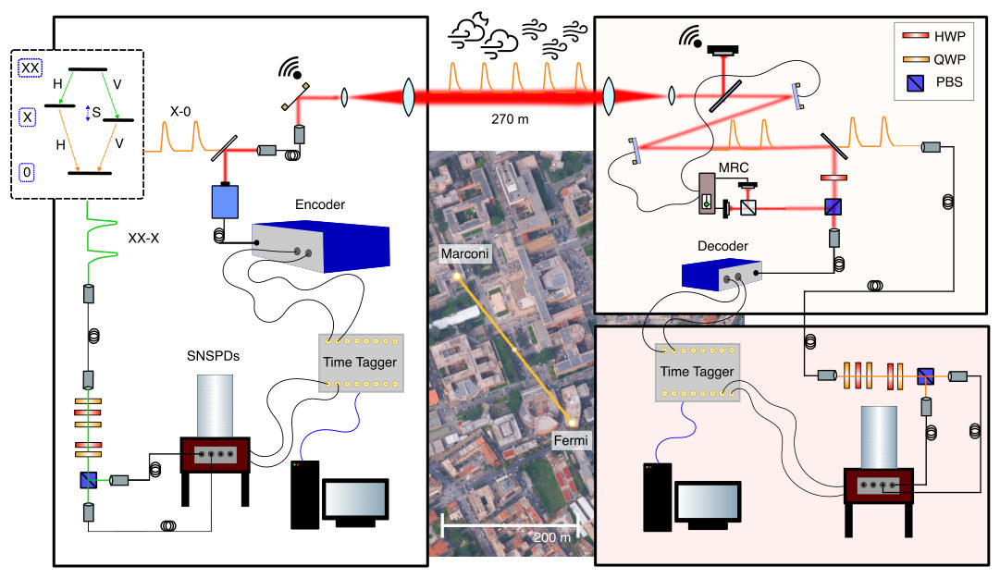 
Figure 1: Scheme of the entanglement distribution setup: the two photons emitted by the XX-X-0 cascade in a QD are spectrally separated by optical notch filters: the XX-X photons are collected by a single-mode fiber and undergo a polarization measurement, implemented by a half-waveplate (HWP), a quarter-waveplate (QWP) and a PBS. The two outputs of the PBS are collected again by single mode fibers connected to SNSPDs. The detection events are then recorded by a high time resolution correlator (Swabian TimeTagger X). The X-0 photons are sent from the Marconi to the Fermi building through the Sapienza free-space channel, after being coupled into a single mode fiber together with the 850 nm...

📷 Fig 2

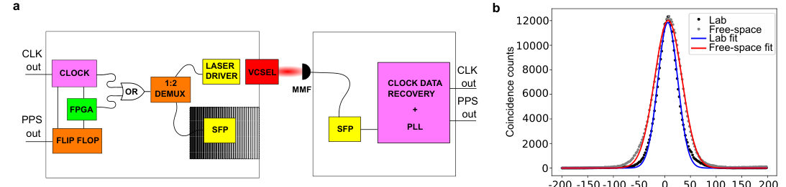 
Figure 2: Synchronization device: a scheme of the synchronization device. A multiplexer sends the Clock and PPS signals to either an 852 nm VCSEL (free-space transmission) or a 1550 nm SFP module (fiber transmission), which we do not use in our demonstration, but would in principle allow three-node synchronization. The receiver unit is equipped with a SFP slot for optical input, converting the signal for a Clock and Data Recovery component with an integrated Phase-Locked Loop (PLL) to output clean clock and PPS signals. b comparison of time jitter of coincidence detection in the lab and over the free-space channel. We compute the time distribution of laser pulses traveling through the...

📷 Fig 3

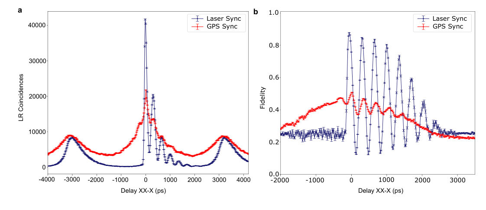 
Figure 3: Bell state oscillations over the free-space channel: a population oscillations measured for the projector |LR⟩⟨LR|, employing the laser-based synchronization system or the GPS-disciplined oscillators, for a 30 minutes total inte- gration time. b fidelity to the |ϕ+⟩state of the distributed two-photon state, employing the laser-based synchronization system or the GPS-disciplined oscillators. The laser synchronization allows to reliably distribute entanglement, enabling possible quantum communication application, by time-wise post-selection or specific quantum cryptographic protocol.

📷 Fig 4

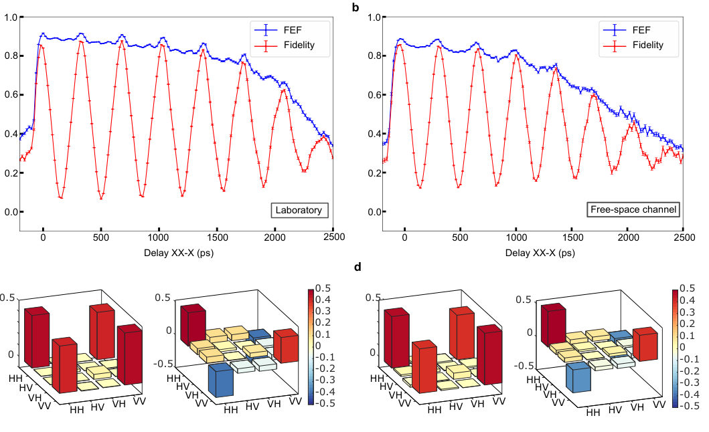 
Figure 4: Time-resolved entanglement distribution: fully entangled fraction (FEF) and fidelity to the |ϕ+⟩state com- puted for XX-X coincidence events as a function of the detection delay as measured a in the laboratory and b across the free-space channel. Each considered time bin is 20ps wide for both experiments. The degree of entanglement remains high within the lifetime of the X transition, as expected, then it decays due to the decrease of the signal to noise ratio and the effect of nuclear spin noise [62]. Small oscillations of the FEF can be observed due to spurious radiative contributions which could not be separated by the XX-X-0 cascade signal. Error bars are computed by...

**Summary.** The research demonstrates the reliable transmission of time-evolving entangled states over a challenging 270 m urban free-space channel. By implementing a high-precision synchronization system achieving sub-50 ps jitter, the authors maintained high entanglement fidelity and even benchmarked secure key generation rates. This work establishes a crucial experimental milestone for long-distance quantum communication.

**Why it may be interesting.** This work directly addresses the critical engineering bottleneck—timing stability—for scaling quantum communication from controlled lab environments to real-world, noisy free-space links, which is fundamental for future quantum networks.

Detailed structure

**Main problem.** The primary goal was to demonstrate the faithful distribution of fast-evolving entangled quantum states over a noisy, long-distance free-space optical channel.

**Main result.** The authors successfully transmitted time-evolving entanglement across 270 m in an urban setting, achieving high fidelity (up to 89% FEF) by implementing advanced synchronization techniques.

**Method.** The experiment utilized a quantum dot source generating entangled photon pairs and incorporated a novel laser-based synchronization device to maintain sub-50 ps timing accuracy over the free-space link.

**Model / system.** The system uses an entangled two-photon state generated via biexciton-exciton cascades in a Quantum Dot (QD) source. The transmission channel is a 270 m free-space link connecting buildings in Rome, requiring precise time synchronization for measurement.

**Key observables.** Time-resolved degree of entanglement (FEF), fidelity to the target state $|\phi^+
angle$, and Secure Key Fraction (SKF) for QKD benchmarking.

**Important parameters / regimes.** Sub-50 ps timing jitter, 270 m channel distance, oscillation periods on hundreds of picoseconds.

**Assumptions / limitations.** The analysis assumes that time-wise post-selection is necessary to mitigate noise and maintain quantum correlations over the noisy link; the protocol relies heavily on low temporal jitter between remote parties.

**Figures summary.** Figures illustrate the setup scheme, the synchronization device components, and quantitative comparisons of entanglement fidelity (FEF) achieved in both laboratory settings versus the free-space channel.

**Paper structure.** The paper details the physical system (QD source), introduces the challenge of timing over noisy channels, presents the novel synchronization method, validates the transmission of time-evolving entanglement via high FEF measurements, and finally benchmarks its potential for secure quantum key distribution.

Abstract

Time-evolving entangled states describe quantum particles whose correlations evolve in time according to a well-defined dynamics. Such states can be generated in a variety of physical systems and are promising resources for several quantum technologies, ranging from quantum clock synchronization to quantum communication. However, their full potential is currently limited by the fact that the entanglement dynamics often occur on timescales comparable to the achievable synchronization precision, especially in experiments aimed at distributing entanglement through noisy urban channels. In this context, accurate timing is not merely a technical detail, but a fundamental requirement for faithfully observing and exploiting the underlying quantum correlations. Here, we demonstrate the faithful distribution of a fast-evolving entangled state over a 270 m free-space channel connecting two buildings in the center of Rome. The developed system incorporates a synchronization device capable of achieving sub-50 ps timing accuracy between the two ends of the link while simultaneously supporting channel stabilization. Our results demonstrate that time-evolving entanglement can be reliably transmitted through a noisy urban free-space channel, representing an important benchmark toward long-distance free-space quantum communication and the future implementation of time-correlated entangled states in demanding scenarios such as satellite-based quantum networks.

[↑ back to top](#top)

### [Fermionic Genuine Multiparty Entanglement](http://arxiv.org/abs/2607.20707v1)

**Authors:** James Allen, Liuke Lyu, William Witczak-Krempa  
**Type:** theory · **Category:** strongly correlated electrons · **PDF:** <https://arxiv.org/pdf/2607.20707v1>  
**Analysis basis:** full PDF text, analyzed in chunks
**Topic relevance:** 🔥 `entanglement & information structure` **4/5** · `analog quantum simulation` **3/5** · `Keldysh / 2PI / non-Gaussian methods` **1/5** · `correlated / nonlocal dissipation` **1/5** · `driven-dissipative phase transition` **1/5** · `methods for driven-dissipative` **1/5**

📷 Fig 1

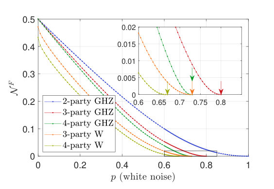 
FIG. 2. Fermionic GMN for GHZ and W states under white noise mixing. The party of entanglement measured is always the number of qubits in the state. Sudden death points of the multiparty mixed states, where the GMN drops to zero, are indicated by arrows in the inset.

📷 Fig 2

 
FIG. 4. (a): Fermionic and non-fermionic GMN in the N = 1000 Kiteav model ground state over µ/t. Configurations are 2-4 qubits in the center of the chain, with each subregion be- ing one qubit, except for the 22-party GMNs which measure over two subregions of two qubits each. (b): Fermionic and bosonic GMN over spacing between subregions at the critical point µ = 2, with a spacing of 1 site denoting nearest-neighbor subregions, etc. 222-party GMN measures tripartite entangle- ment over three subregions of two qubits each. Arrows indicate sudden death points.

📷 Fig 3

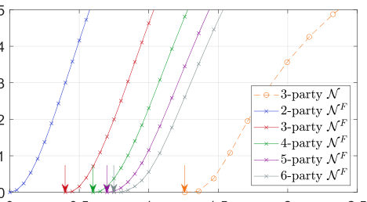 
FIG. 3. Fermionic and non-fermionic GMN for different config- urations in a N = 1000 site Kitaev chain with t = ∆= 1, µ = 2. Configurations are 2-6 sites in the center of the chain, with each subregion being one qubit. Arrows indicate sudden death points.

📷 Fig 4

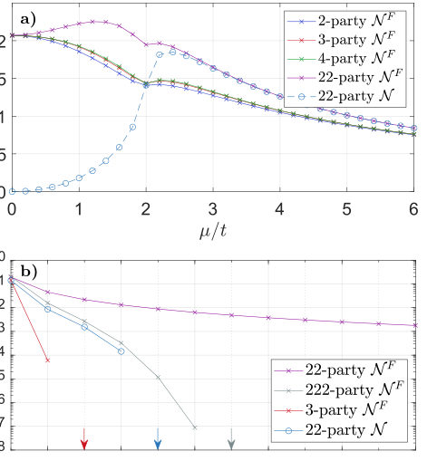 
Figure 4a shows the fermionic multipartite entanglement for the ground state of the Kitaev chain over all µ, on the 1000-site chain.

**Summary.** This paper introduces the fermion genuine multiparty negativity (fGMN), a novel and computable measure designed to quantify multipartite entanglement specifically within fermionic quantum systems. By reformulating existing concepts using a specialized partial transpose, the authors establish fGMN as an entanglement monotone that reveals unique physical phenomena, such as sudden death points, distinguishing it from simpler bipartite measures.

**Why it may be interesting.** The development of rigorous entanglement measures applicable to fermions is crucial for understanding quantum correlations in condensed matter systems where fermionic statistics dominate. The identification of distinct physical signatures (like sudden death) provides testable predictions for experimental realization.

Detailed structure

**Main problem.** The primary goal is to develop a computable measure for Genuine Multiparty Entanglement (GME) specifically tailored for fermionic quantum systems, as existing measures are insufficient.

**Main result.** The authors introduce the fermion genuine multiparty negativity (fGMN), an efficiently computable entanglement monotone that exhibits distinct physical behaviors compared to bipartite fermionic negativity.

**Method.** The measure is derived by modifying the standard Genuine Multiparty Negativity using a specialized 'fermionic partial transpose' ($	ext{QR}_m$) and formulated as a Semi-Definite Programming (SDP) optimization problem.

**Model / system.** The analysis focuses on general fermionic quantum systems, including specific examples like fermionic stabilizer states and white noise mixed states. The formalism is built around the constraints imposed by fermionic anti-commutation relations.

**Key observables.** Fermion Genuine Multiparty Negativity (fGMN), bipartite fermionic negativity ($N(
ho)$), and sudden death points over separation or temperature.

**Important parameters / regimes.** The white noise mixing strength ($p$), the number of parties, and constraints derived from the fermionic partial transpose ($	ext{QR}_m$).

**Assumptions / limitations.** The derivation relies on relaxing the Hermitian condition during the witness formulation and assuming that the minimum value can be determined by analyzing specific projector components (e.g., $\vec{u}=0$ case).

**Figures summary.** Figures illustrate eigenvalue regions for witness components in fermionic vs. non-fermionic cases, and plot $N_F$ versus noise strength ($p$) showing sudden death points for GHZ and W states.

**Paper structure.** The paper progresses by first establishing the need for a fermionic GME measure, defining fGMN via SDP, proving its desirable properties (monotonicity, reduction to bipartite case), deriving the dual SDP formulation, and finally simplifying the result to show equivalence with minimum bipartite negativity across all partitions.

Abstract

Entanglement can show fundamentally different behavior in fermionic systems. However, while bipartite measures of fermionic entanglement have been established, genuine multiparty entanglement (GME) in fermionic systems is much less understood. We introduce an efficiently computable measure (via semi-definite programming) of fermionic GME, fermion genuine multiparty negativity (fGMN), and show that it is an entanglement monotone and a natural multipartite extension of the fermionic negativity. Using this measure, we find many states which have fGMN but no non-fermionic GME, including large classes of fermionic stabilizer states. The fGMN also displays some major phenomenological differences to the bipartite fermionic negativity, such as finite sudden death points over separation and temperature.

[↑ back to top](#top)

### [Why Some Quantum States Cannot Be Recovered](http://arxiv.org/abs/2607.21240v1)

**Authors:** Yuan Liu, Linhan Lin, Ke-Mi Xu  
**Type:** theory · **Category:** quantum information and computing · **PDF:** <https://arxiv.org/pdf/2607.21240v1>  
**Analysis basis:** full PDF text, analyzed in chunks
**Topic relevance:** 🔥 `entanglement & information structure` **4/5** · `non-equilibrium dynamics` **2/5** · `correlated / nonlocal dissipation` **1/5** · `driven-dissipative phase transition` **1/5** · `methods for driven-dissipative` **1/5** · `non-equilibrium universality` **1/5** · `quantum measurements` **1/5**

📷 Fig 1

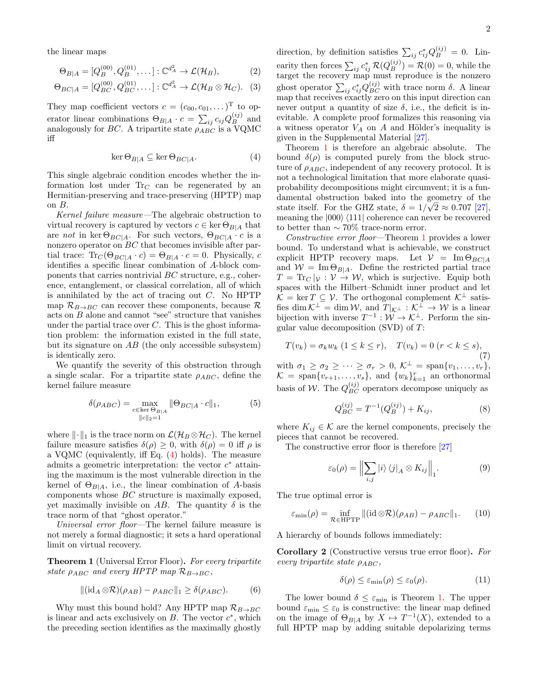 
Low-resolution page preview, page 2

📷 Fig 2

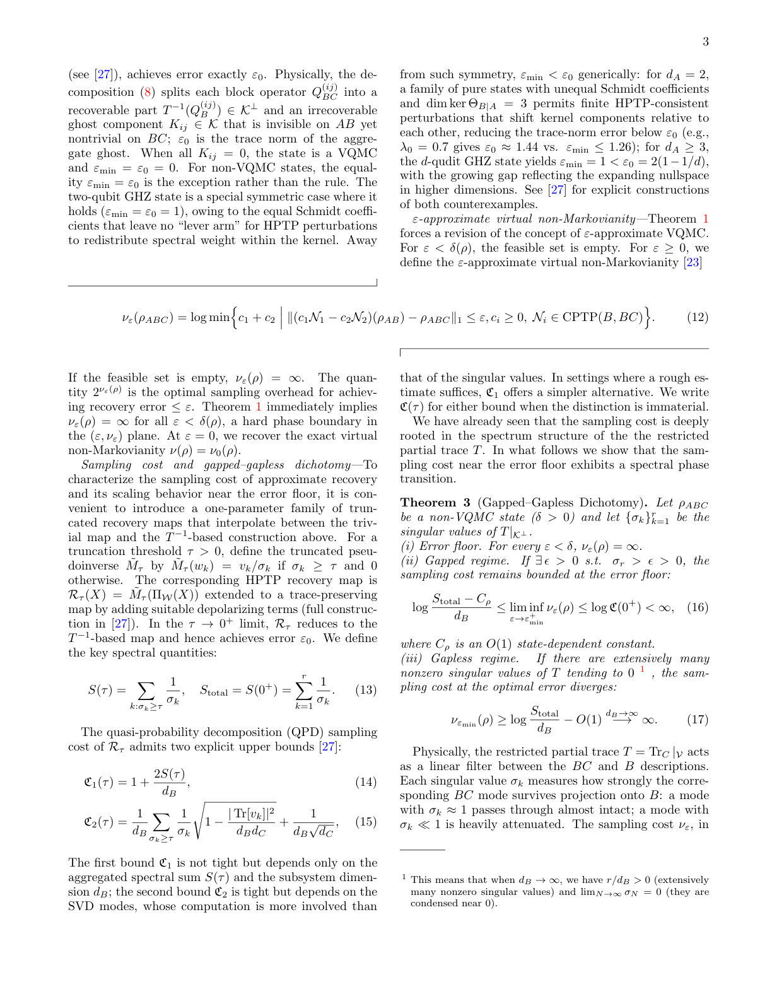 
Low-resolution page preview, page 3

📷 Fig 3

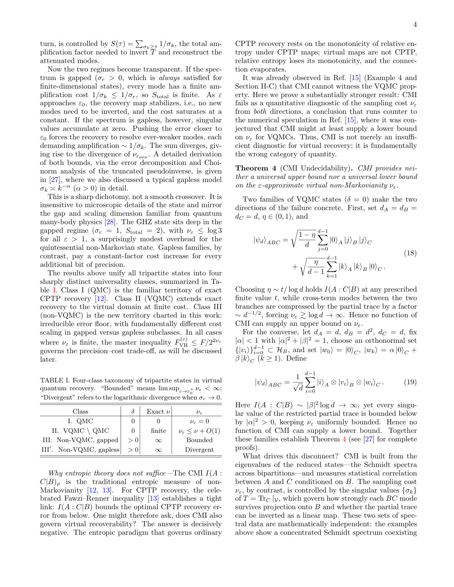 
Low-resolution page preview, page 4

📷 Fig 4

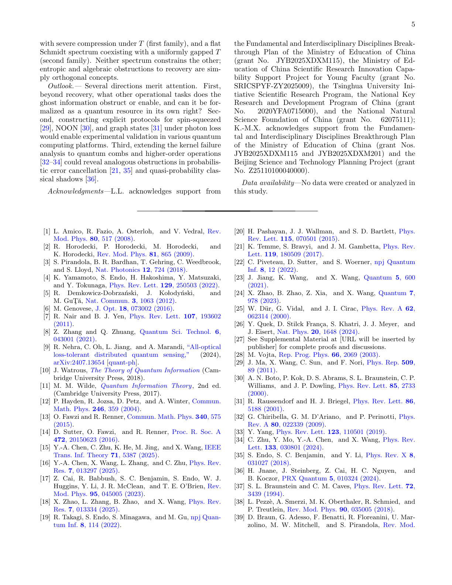 
Low-resolution page preview, page 5

📷 Fig 5

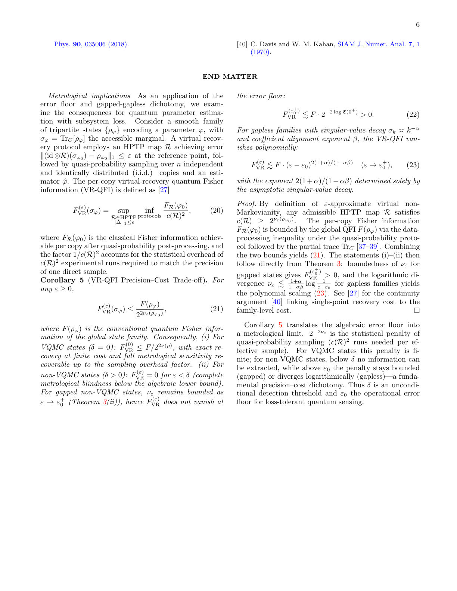 
Low-resolution page preview, page 6

**Summary.** This work establishes that the inability to recover lost quantum information stems from an algebraic feature called 'ghost information,' quantified by $\delta(
ho)$. It proves this value sets a universal error floor independent of resources and demonstrates that standard entropy measures fail to capture this fundamental physical limit. This has direct implications for setting detection thresholds in loss-tolerant quantum metrology.

**Why it may be interesting.** It provides a rigorous, non-entropic diagnostic tool for characterizing information loss in quantum systems, which is crucial for designing robust protocols in quantum networking or sensing where information leakage occurs.

Detailed structure

**Main problem.** The core problem is determining the fundamental limits on recovering quantum information lost due to subsystem loss, identifying the algebraic source of this irrecoverability.

**Main result.** The authors identify a scalar measure, $\delta(
ho)$, representing 'ghost information,' which establishes a universal error floor below which no recovery strategy can operate. They also show that standard entropic measures like CMI are fundamentally irrelevant to virtual recoverability.

**Method.** The analysis employs algebraic tools involving block matrices and linear maps acting on coefficient vectors, leading to the definition of kernel failure measures ($\delta(
ho)$) and sampling costs ($
u_\epsilon$).

**Model / system.** The study focuses on tripartite quantum states $
ho_{ABC}$ undergoing partial tracing (subsystem loss), relevant to noisy quantum sensors or lossy quantum networks.

**Key observables.** Ghost information measure $\delta(
ho)$, Universal Error Floor, Sampling Cost ($
u_\epsilon$), Conditional Mutual Information ($I(A:C|B)$).

**Important parameters / regimes.** Approximation error $\epsilon$, resource investment (implied by cost functions), and the spectral gap of underlying linear maps.

**Assumptions / limitations.** The analysis relies on establishing rigorous algebraic bounds ($\delta(
ho) \le \epsilon_{\min}(
ho) \le \epsilon_0(
ho)$) that hold irrespective of resource expenditure.

**Figures summary.** Not specified, but the notes detail a dichotomy in sampling cost scaling based on whether the underlying spectrum is gapped or gapless.

**Paper structure.** The paper progresses by first defining the algebraic obstruction ($\delta(
ho)$), then quantifying the associated recovery costs (sampling cost $
u_\epsilon$), establishing the universal error floor, and finally contrasting this physical measure against insufficient entropic diagnostics like CMI.

Abstract

The recovery of quantum information after subsystem loss is a central challenge in quantum information processing. However, some states remain beyond the reach of any recovery strategies. Here we identify the algebraic origin of irrecoverability, the ghost information---correlations encoded in the global state that leave no trace on any accessible subsystem. We introduce a scalar measure quantifying its magnitude and prove a universal error floor below which no virtual recovery map can operate, irrespective of resource investment. We further uncover a spectral phase transition in the sampling cost: bounded when the underlying linear map exhibits a spectrum gap, and divergent with a universal exponent in the gapless regime. Together with the universal error floor, this dichotomy organizes all multipartite quantum states into four classes. Moreover, it is revealed that conditional mutual information---the standard entropic diagnostic---is fundamentally irrelevant to virtual recoverability. As an implication, we show that the error floor imposes a detection threshold for loss-tolerant quantum metrology.

[↑ back to top](#top)

### [Compact deterministic liquid-crystal polarization controller with single-measurement direct control](http://arxiv.org/abs/2607.20987v1)

**Authors:** Ren-De Liu, Jie Wang, Dong-Dong Li, Xian-Chang Du, Dao-Zhong Xiao, shuai Li, Chuan-Yang Ding, Yan-Lin Tang, Yang Li, Sheng-Kai Liao, Teng-Yun Chen, Shi-Biao Tang  
**Type:** experiment · **Category:** quantum information and computing · **PDF:** <https://arxiv.org/pdf/2607.20987v1>  
**Analysis basis:** full PDF text, analyzed in chunks
**Topic relevance:** 🔥 `QC/QI experiment` **4/5** · `quantum measurements` **3/5** · `quantum optics experiment` **2/5** · `measurement-induced transitions` **1/5**

📷 Fig 1

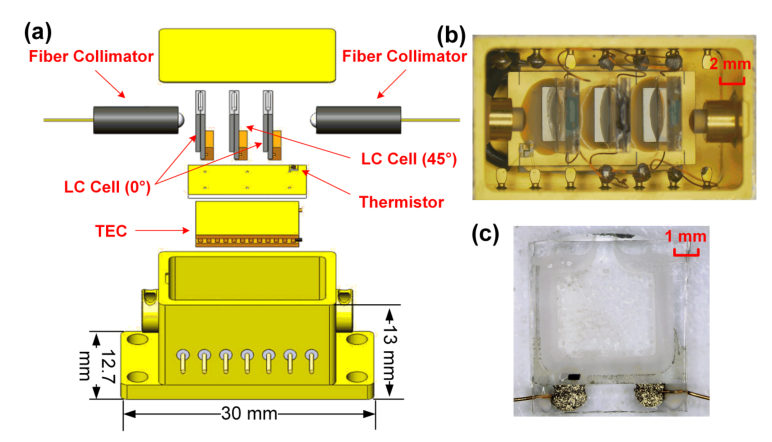 
Figure 1: Structural diagram of LC-PC: (a) Exploded View of LC- PC Structure; (b) Internal layout of the LC-PC; (c) Liquid crystal cell.

📷 Fig 2

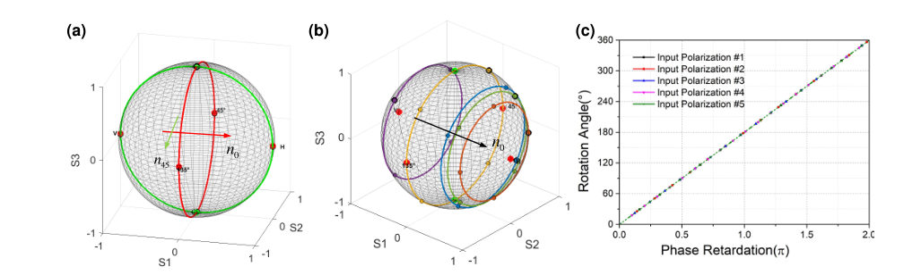 
Figure 2: Polarization modulation characteristics: (a) Modulation trajectories for 0° and 45° fast-axis orientations on the Poincaré sphere; (b) Trajectory circles corresponding to different input SOPs; (c) Phase retardation vs. rotation angle for various input polarization states.

📷 Fig 3

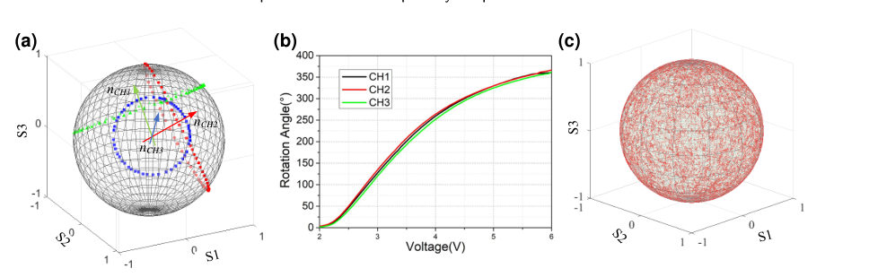 
Figure 3: Experimental Results: (a) The polarization modulation characteristics of the three channels; (b) The relationship between the rotation angle and the applied voltage; (c) Poincaré sphere coverage test.

📷 Fig 4

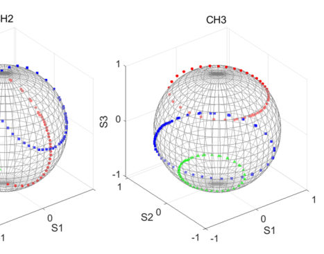 
Figure 4: Polarization modulation trajectories on the Poincaré sphere for different input SOPs.

📷 Fig 5

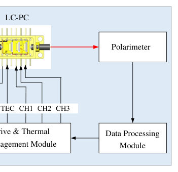 
Figure 6: Experimental setup for the verification of the proposed polarization control algorithm.

**Summary.** The paper presents a novel, compact liquid-crystal polarization controller designed to manage polarization states in photonic systems. It introduces a unique control algorithm that calculates the necessary voltage settings using only one initial state measurement. This combination offers a practical, low-loss solution for high-precision polarization management critical for quantum key distribution and optical sensing.

**Why it may be interesting.** This work directly addresses hardware implementation challenges for quantum communication protocols (like QKD) by providing a low-loss, compact component that simplifies complex polarization management into a single measurement step.

Detailed structure

**Main problem.** Existing polarization controllers suffer from performance trade-offs, requiring complex calibration or multiple state measurements.

**Main result.** The authors developed a compact liquid-crystal controller with a single-measurement direct-calculation algorithm achieving high accuracy and low loss.

**Method.** A geometric rotation synthesis approach is used to calculate required voltages directly from the initial State of Polarization (SOP) measurement, bypassing iterative optimization.

**Model / system.** The system is a compact liquid-crystal polarization controller (LC-PC) implemented in a butterfly package. It models the LC cell as a voltage-controlled linear retarder whose transformation matrix governs polarization changes on the Poincaré sphere.

**Key observables.** Insertion loss (<1 dB), driving voltage (<6 V), angular error (<2°), and full Poincaré sphere coverage.

**Important parameters / regimes.** LC cell gap ($10 \mu	ext{m}$), operating wavelength ($\lambda$), and the deterministic nature of SOP-independent trajectory normal vectors.

**Assumptions / limitations.** The control relies on the highly predictable, SOP-independent polarization modulation characteristic of the LC-PC structure.

**Figures summary.** Figures illustrate the structural layout, Poincaré sphere trajectories for various input SOPs, and schematics detailing the geometric decomposition used in the single-measurement control algorithm.

**Paper structure.** The paper first identifies limitations in existing PCs, proposes the deterministic LC-PC, details the mathematical model and the novel single-measurement direct-calculation algorithm, validates performance through experimental measurements on the Poincaré sphere, and concludes with its application potential in QKD.

Abstract

Polarization controllers (PCs) and their control algorithms are critical for compensating environmental disturbances and maintaining signal fidelity in polarization-sensitive photonic systems. However, existing controllers often involve trade-offs among key performance metrics, while associated control algorithms either converge inefficiently or require multiple state-of-polarization (SOP) measurements. This work presents a compact deterministic liquid-crystal polarization controller (LC-PC) with balanced overall performance, featuring low insertion loss (<1 dB), low driving voltage (<6 V), and full Poincaré sphere coverage. The device exhibits highly predictable and repeatable polarization modulation characterized by SOP-independent trajectory normal vectors, enabling a single-measurement direct-calculation algorithm with an angular error below 2°. The combination of this compact deterministic LC-PC and its efficient control scheme provides a practical solution for polarization management in quantum key distribution, optical sensing, and advanced photonic systems.

[↑ back to top](#top)

### [Generation of bright quantum high-order harmonic driven by combined coherent and bright squeezed vacuum light](http://arxiv.org/abs/2607.20941v1)

**Authors:** Wentao Wang, Yaoshun Sun, Liyuan Wang, Lingrui Hu, Dajun Ding, Xiangyu Tang, Mingxuan Li, Jianmin Yuan, Sizuo Luo  
**Type:** both · **Category:** other · **PDF:** <https://arxiv.org/pdf/2607.20941v1>  
**Analysis basis:** full PDF text, analyzed in chunks
**Topic relevance:** 🔥 `quantum optics experiment` **4/5** · `interference shaping light` **3/5** · `driven-dissipative phase transition` **1/5** · `methods for driven-dissipative` **1/5** · `non-equilibrium dynamics` **1/5**

📷 Fig 1

 
Fig. 1 Schematic of quantum high-order harmonic generation with hybrid coherent and BSV light. a Schematic of the HHG beamline driven by a hybrid field composed of a coherent laser (800 nm, red line) and single-spatial-mode BSV (1600 nm, orange dots). b Experimentally measured intensity distribution of the BSV field. The time domain second-order correlation g2(0) is 2.324. c Integrated HHG intensity driven by a coherent laser only (blue line) and by a combined coherent+BSV field (red line) in Kr gas at the gas pressure of 42 Torr. The laser intensity is approximately 1.7 × 1014 W/cm2 for the coherent field, and that of the BSV field reaches 2 × 1011 W/cm2.

📷 Fig 2

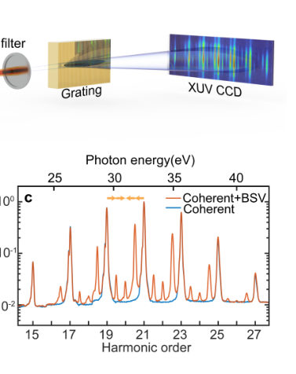 
Figure 2 presents the pressure-dependent harmonic intensity generated in the quan- tum two-color field for harmonic orders spanning from H14.5 to H27, corresponding to the photon energies of approximately 22.5–42 eV. Notably, these components exhibit distinct gas-pressure dependence, indicating different phase-matching conditions. To highlight this behavior, we plot the pressure-dependent intensities of four components, H2N+1, H2N+ 1

📷 Fig 3

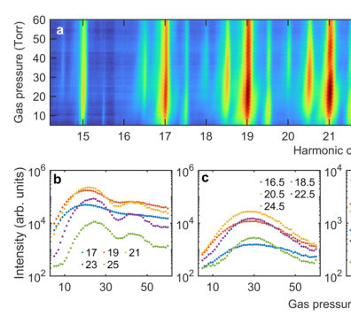 
Fig. 2 Experimentally measured high-order harmonics spectra. a Experimentally measured HHG spectra under varying gas pressure from 5 to 60 Torr, with an 800-nm (1.7 × 1014 W/cm2) and a 1600-nm BSV light (2 × 1011 W/cm2). The integrated intensities of b main harmonics (H2N+1), c, d satellite harmonics (H(2N+1)± 1

📷 Fig 4

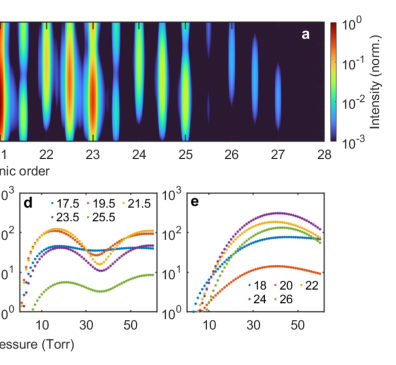 
Fig. 3 Simulated macroscopic high-order harmonic spectra. a High-order harmonic spectra after macroscopic propagation under different gas pressures. The peak intensity of the coherent 800- nm field is 1.7 × 1014 W/cm2. And the 1600-nm BSV field is simulated by an ensemble of coherent fields containing 1000 samples described by a Husimi distribution. The harmonic intensities under varying gas pressure are shown for the b odd (H2N+1), c, d satellites (H2N± 1

📷 Fig 5

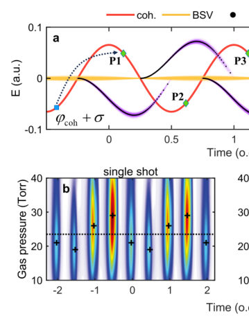 
Fig. 4 Phase-matching mechanism based on the wave-mixing model. a Classical depiction of harmonic emissions. The weak BSV field introduces an extra phase σ to the action phase accumu- lated in 800-nm field only φcoh, and four individual emissions labeled by P1–P4 jointly contribute to the final HHG spectrum. b Simulated gas-pressure dependence of single-shot attosecond pulse trains from H16–H28 harmonics, with 1600-nm field amplitude of 0.0025 a.u. and phase of 0 rad. Black crosses mark the optimal gas pressure for each burst, and dotted line represents the optimal pressure driven by the 800-nm field only. c Same as b but for integrating all shots. Yellow and green crosses indicate the...

**Summary.** This paper explores generating bright quantum high-order harmonics by combining intense coherent lasers with weak squeezed vacuum light interacting with atomic gas. The key finding is that the BSV field introduces unique spectral components and perturbs the phase matching condition based on gas pressure. This capability paves the way for advanced attosecond quantum spectroscopy.

**Why it may be interesting.** This work is highly relevant to quantum optics and open quantum systems as it demonstrates how non-classical light sources (BSV) can be used to engineer and control fundamental nonlinear processes like HHG in a medium, moving beyond standard coherent driving assumptions.

Detailed structure

**Main problem.** The study investigates the macroscopic propagation effects of quantum high-order harmonics (QHHG) generated by combining strong coherent laser light with weak bright squeezed vacuum (BSV) light interacting with atomic gas.

**Main result.** The inclusion of BSV light generates novel spectral features (half-integer and even harmonics) whose optimal generation pressures differ significantly from those driven by coherent light alone, allowing for quantum control over XUV sources.

**Method.** The research combines experimental measurements using an XUV spectrometer with theoretical simulations employing a wave-mixing model to account for macroscopic propagation effects.

**Model / system.** The system involves HHG in Krypton gas driven by a two-color field: a strong coherent laser (800 nm) and a weak BSV field (1600 nm). The theory models the phase mismatch perturbation caused by the action phase shift induced by the BSV light.

**Key observables.** Harmonic spectra ($	ext{H}_{2N+1}$, $	ext{H}_{(2N+1)\pm 1/2}$, $	ext{H}_{2N}$), gas pressure dependence of harmonic intensity, and the second-order correlation function $g_2(0)$.

**Important parameters / regimes.** Gas pressure (5 to 60 Torr); BSV quantum statistics ($g_2(0) = 2.324$); relative intensities of different harmonic components.

**Assumptions / limitations.** The theoretical model assumes that the macroscopic propagation can be analyzed by incorporating the perturbation from the weak BSV field into the phase-matching condition.

**Figures summary.** Figures illustrate schematic setups, pressure dependence of various harmonic components showing distinct optimal pressures, and simulated spectra validating the theory against experiment.

**Paper structure.** The paper progresses by establishing the physical system (coherent + BSV driving), detailing the theoretical framework (wave-mixing model, action phase perturbation), presenting experimental results on spectral features vs. pressure, and concluding with the implications for quantum spectroscopy.

Abstract

Attosecond quantum light, formed by the superposition of high-order harmonics driven by intense quantum light, opens new routes to probe quantum-mechanical correlations in matter. In this study, we have investigated the macroscopic propagation effects of quantum high-order harmonics generated by the combination of strong coherent and weak bright squeezed vacuum (BSV) lasers interacting with atomic gas. Our results reveal that the pressure-dependent intensity of harmonics arising from absorbing or emitting BSV photons differs from that of harmonics generated using only strong coherent pulses. Macroscopic propagation simulations indicate that the action phase of harmonics is perturbed by the weak BSV pulses. This perturbation modulates the phase mismatch of sub-cycle attosecond bursts and affects their quantum properties when the gas pressure varies. The ability to generate bright quantum high-order harmonics lays a foundation for the establishment and application of attosecond quantum spectroscopy.

[↑ back to top](#top)

### [Conditional probabilities in quantum-optical settings](http://arxiv.org/abs/2607.21100v1)

**Authors:** Alfredo Luis  
**Type:** theory · **Category:** other · **PDF:** <https://arxiv.org/pdf/2607.21100v1>  
**Analysis basis:** full PDF text, analyzed in chunks
**Topic relevance:** 🔥 `quantum measurements` **4/5** · `measurement-induced transitions` **3/5** · `Keldysh / 2PI / non-Gaussian methods` **1/5** · `correlated / nonlocal dissipation` **1/5**

📷 Fig 1

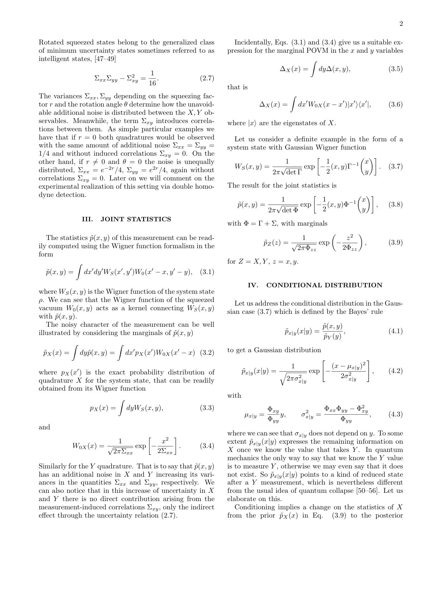 
Low-resolution page preview, page 2

📷 Fig 2

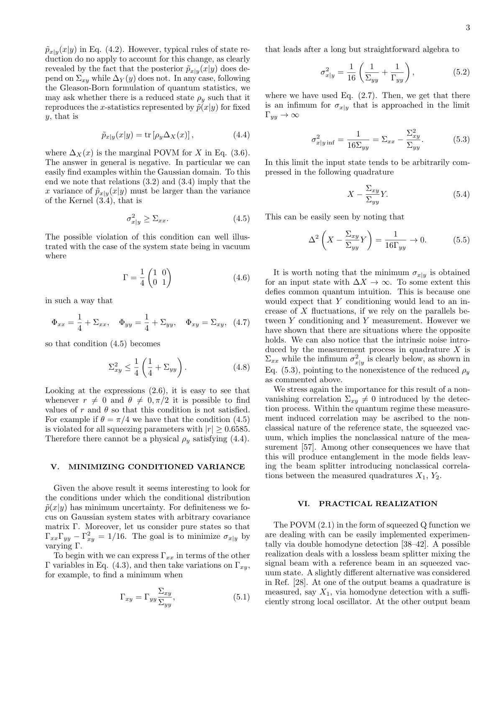 
Low-resolution page preview, page 3

📷 Fig 3

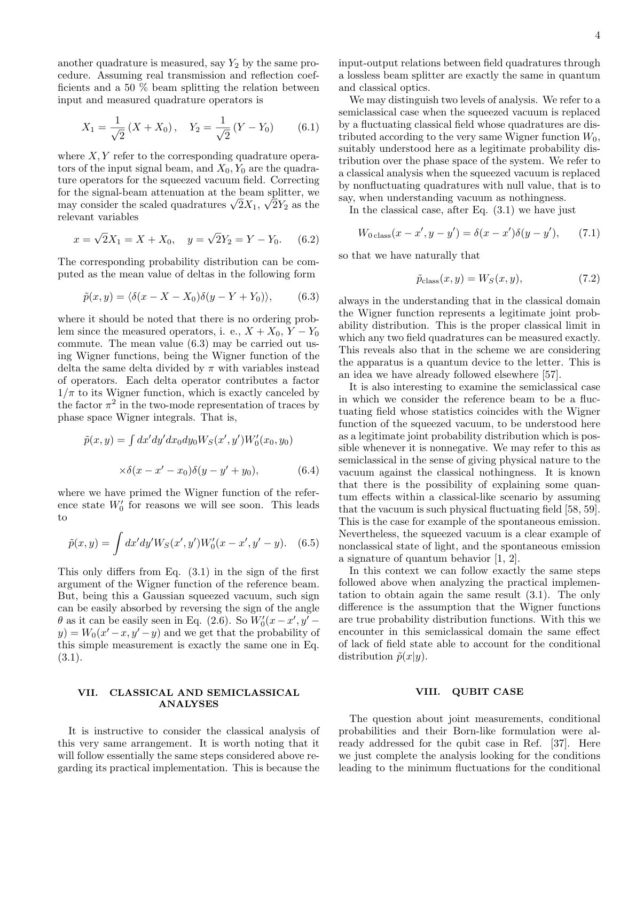 
Low-resolution page preview, page 4

📷 Fig 4

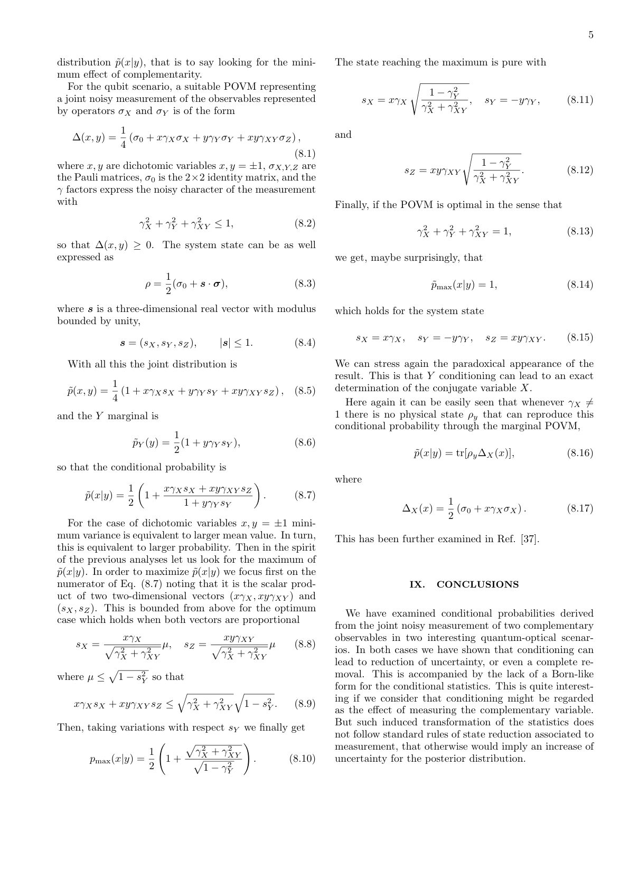 
Low-resolution page preview, page 5

📷 Fig 5

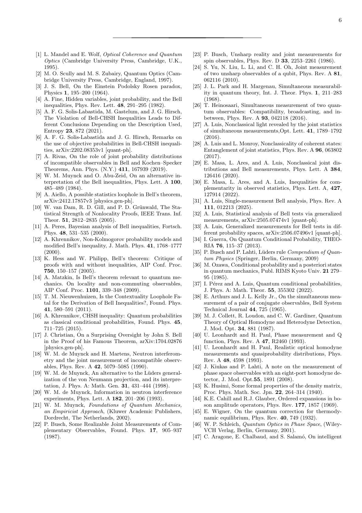 
Low-resolution page preview, page 6

**Summary.** This paper examines how conditional probabilities are generated when performing joint noisy measurements on complementary observables in quantum optics. It demonstrates that while conditioning can drastically reduce uncertainty, the resulting statistics do not generally conform to standard rules of state reduction or Born formalism. This challenges fundamental assumptions about measurement theory in quantum systems.

**Why it may be interesting.** This work directly addresses foundational issues in quantum measurement theory and contextuality within the framework of continuous variable quantum optics, which is highly relevant to AMO physics and open quantum systems.

Detailed structure

**Main problem.** The paper investigates conditional probabilities derived from joint noisy measurements of complementary observables, questioning whether these statistics adhere to standard quantum mechanical rules like Born form or typical state reduction.

**Main result.** The derived conditional probability distribution cannot, in general, be represented by a reduced state using the marginal POVM, indicating that the measurement process induces transformations not covered by standard state reduction rules.

**Method.** The analysis uses Wigner function formalisms and Bayes' rule for Gaussian cases to calculate joint and conditional probabilities ($	ilde{p}(x|y)$) in quantum-optical settings.

**Model / system.** Two primary quantum-optical schemes are analyzed: double homodyne detection (measuring quadratures $X$ and $Y$) and a qubit measurement using Pauli observables. The input state is often modeled as a squeezed vacuum state.

**Key observables.** Quadrature operators ($X, Y$), conditional variance ($\sigma_{x|y}$), and the joint probability distribution $	ilde{p}(x, y)$.

**Important parameters / regimes.** Squeezing factor ($r$), rotation angle ($	heta$), and measurement noise parameters ($\gamma$).

**Assumptions / limitations.** The explicit calculations rely on assuming Gaussian system states for simplification in later sections.

**Figures summary.** Not specified by the notes, but the analysis involves comparing joint quantum statistics $	ilde{p}(x, y)$ with classical/semiclassical limits and demonstrating violations of uncertainty relations ($\sigma_{x|y} \ge \Sigma_{xx}$).

**Paper structure.** The paper progresses from defining the joint noisy measurement via a POVM to calculating the resulting joint statistics using Wigner functions. It then analyzes the conditional distribution, culminating in proofs showing its non-reproducibility by standard reduced state formalisms.

Abstract

We examine conditional probabilities derived from the joint noisy measurement of two complementary observables. We show that conditioning on one variable can lead to reduction of uncertainty in the other one, even completely eliminating uncertainty. We show that the conditional distribution cannot, in general, be represented in Born form using the marginal positive operator valued measure and any physical system state, nor can it be derived from typical rules of state reduction. We examine these issues in two basic quantum-optical schemes. These are double homodyne detection and a qubit measurement.

[↑ back to top](#top)

### [Quasiparticle specific heat of two-component Fermi mixtures: The atomic 163Dy-40K mixture](http://arxiv.org/abs/2607.21254v1)

**Authors:** Neda Ebrahimian  
**Type:** theory · **Category:** quantum gases · **PDF:** <https://arxiv.org/pdf/2607.21254v1>  
**Analysis basis:** full PDF text, analyzed in chunks
**Topic relevance:** 🔥 `analog quantum simulation` **4/5** · `Keldysh / 2PI / non-Gaussian methods` **3/5** · `methods for driven-dissipative` **1/5** · `non-equilibrium dynamics` **1/5**

📷 Fig 1

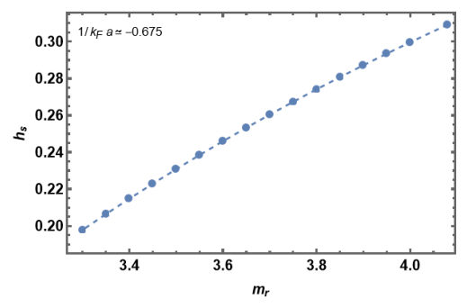 
Fig. 1. (Color online) The dimensionless imbalance chemical potential (in units of the Fermi energy, / s F h E ) versus the mass

📷 Fig 2

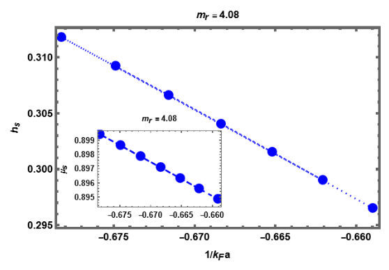 
Fig. 2. (Color online) The dimensionless imbalance chemical potential (in units of the Fermi energy, / s F h E ) versus the

📷 Fig 3

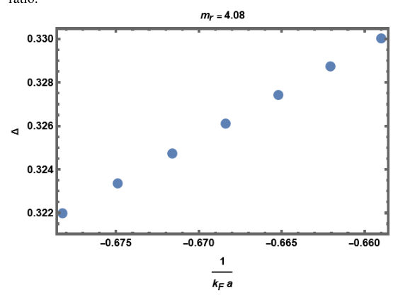 
Fig. 3. (Color online) The dimensionless energy gap (in units of the Fermi energy, / F E  ) versus the interaction strength,

📷 Fig 4

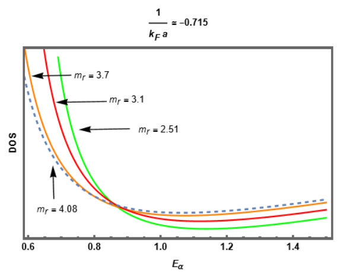 
Fig. 4. (Color online) The density of states (DOS) measured per the Fermi energy, versus the excitation energy, at a interaction

📷 Fig 5

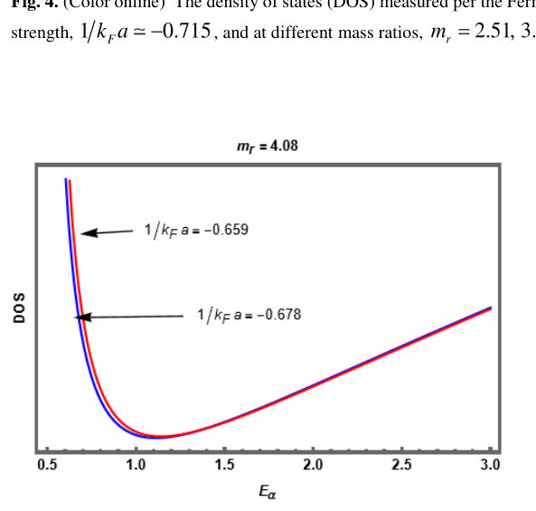 
Fig. 5. (Color online) The density of states (DOS) measured per the Fermi energy, versus the excitation energy, at a mass ratio,

**Summary.** This theoretical paper analyzes the quasiparticle specific heat in mass-imbalanced two-component Fermi mixtures of ultracold atoms. Using mean-field theory and LDA, it predicts how this thermal signature is governed by interaction strength and the ratio of atomic masses. The results highlight that the specific heat provides a measurable diagnostic tool for understanding mass-asymmetric pairing phenomena.

**Why it may be interesting.** This work directly addresses complex many-body physics in ultracold atomic systems, providing quantitative predictions (like $c_v$ dependence) that can be compared against future high-precision experimental measurements using trapped gases.

Detailed structure

**Main problem.** The study investigates the quasiparticle specific heat of two-component Fermi mixtures, focusing on the physics of normal-superfluid phase separation in mass-imbalanced ultracold atomic gases.

**Main result.** The total quasiparticle specific heat increases with increasing mass ratio ($r_m$) and decreases when interaction strength is increased or imbalance chemical potential rises. For Dy-K mixtures, this provides a thermal signature of mass-asymmetric pairing.

**Method.** The analysis employs mean-field theory within the local density approximation (LDA), utilizing Bogoliubov transformations to diagonalize the effective Hamiltonian in the BCS regime.

**Model / system.** The system is modeled as a two-component Fermi mixture of ultracold atoms, such as $^{163}	ext{Dy}-^{40}	ext{K}$, which can undergo phase separation into an unpolarized superfluid core surrounded by a normal component due to mass imbalance.

**Key observables.** Quasiparticle specific heat ($c_v$), superfluid density of states, average and imbalance chemical potentials ($\mu$, $\mu_{	ext{imbal}}$), and the energy gap ($\Delta$).

**Important parameters / regimes.** Interaction strength (related to $1/(F_k a)$) and mass ratio ($r_m = m_{\downarrow}/m_{\uparrow}$). The analysis is restricted to regimes where $\mu_{	ext{imbal}} < \Delta$.

**Assumptions / limitations.** The calculations assume the BCS regime, utilize mean-field theory within LDA, and restrict the imbalance chemical potential below the energy gap to avoid other phases.

**Figures summary.** Figures illustrate how total specific heat varies with the imbalance chemical potential ($s_h$) or directly with the mass ratio ($r_m$) at fixed temperatures and interaction strengths.

**Paper structure.** The paper builds context by reviewing superfluidity and phase separation in Fermi gases, then develops the theoretical framework using mean-field theory and LDA. The core analysis focuses on deriving expressions for thermodynamic quantities like specific heat based on the Bogoliubov transformed Hamiltonian.

Abstract

Ultracold Fermi gases can enter a regime of normal superfluid phase separation, with an unpolarized superfluid component surrounded by a partially polarized normal component. Mass-imbalanced two-component Fermi mixtures on the Bardeen Cooper Schrieffer side of the crossover are studied using mean-field theory within the local density approximation, assuming s-wave pairing induced by a Feshbach resonance and imposing the phase-equilibrium conditions for the phase-separated state. The imbalance chemical potential is chosen to be smaller than the energy gap, so that other possible phases are avoided in the regime considered here. The energy gap and Hartree Fock potentials are obtained self- consistently. The effects of interaction strength and mass ratio on the phase diagram, superfluid density of states, and quasiparticle specific heat are then examined. Within the investigated parameter range, increasing the magnitude of the interaction strength increases the average and imbalance chemical potentials, while reducing the energy gap and the superfluid density of states. The total quasiparticle specific heat decreases with increasing imbalance chemical potential and interaction strength, but increases with mass ratio. Results for the Fermi Fermi mixture of dysprosium and potassium atoms show that the specific heat provides a thermal signature of mass-asymmetric pairing.

[↑ back to top](#top)

### [Quasiparticle-induced transitions in a fluxonium qubit](http://arxiv.org/abs/2607.21329v1)

**Authors:** Maksim Litskevich, Kesavan Manivannan, Benjamin Byrd, Pavel D. Kurilovich, Vladislav D. Kurilovich, Gianluigi Catelani, Ivan V. Pechenezhskiy  
**Type:** both · **Category:** quantum information and computing · **PDF:** <https://arxiv.org/pdf/2607.21329v1>  
**Analysis basis:** full PDF text, analyzed in chunks
**Topic relevance:** 🔥 `QC/QI experiment` **4/5** · `Keldysh / 2PI / non-Gaussian methods` **1/5** · `correlated / nonlocal dissipation` **1/5** · `driven-dissipative phase transition` **1/5** · `methods for driven-dissipative` **1/5**

📷 Fig 1

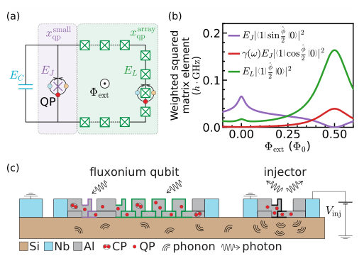 
FIG. 1. Experiment concept. (a) Circuit diagram of a fluxonium qubit with the small Josephson junction (pur- ple), the junction array (green), and the capacitor pads (light blue) connected in parallel. An external magnetic flux Φext threading the loop formed by the small junction and the junction array controls the SC phase drops across the junctions. QPs are present at two distinct locations: in the small junction (shaded in purple), with the corre- sponding QP density denoted by xsmall qp , and in the junc- tion array (shaded in green), with density xarray qp . QPs in a superconductor are coherent superpositions of electrons (light blue circles) and holes (light orange circles), whose in-...

📷 Fig 2

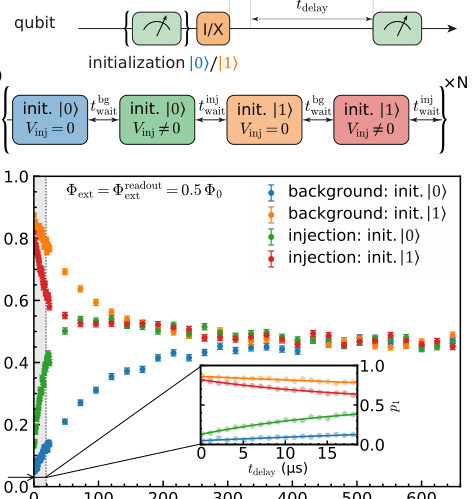 
FIG. 2. Transition rate measurements. (a) Elementary pulse sequence for measuring the qubit transition rates. The qubit is initialized in either the ground state |0⟩or the ex- cited state |1⟩at the readout flux Φreadout ext by preselecting the qubit in the |0⟩state and applying either I or X gates. Φreadout ext = 0.5 Φ0 for the data presented in the main text. A QP injection pulse is applied after the initialization, when appropriate, immediately followed by tuning of the external flux to the target value Φtarget ext ≡Φext, where the qubit idles for time tdelay. The external flux is then returned to Φreadout ext for readout of the final state. (b) Sequence of interleaved el- ementary...

📷 Fig 3

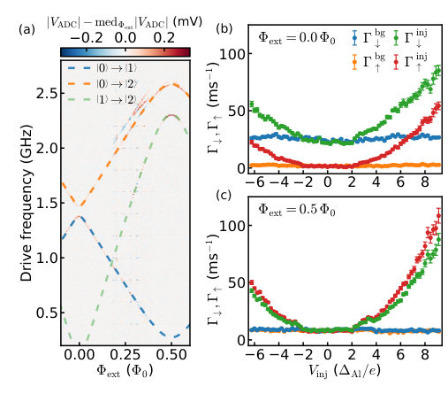 
FIG. 3. Qubit spectroscopy and dependence of the transition rates on the injection bias. (a) Conventional two-tone qubit spectroscopy as a function of Φext. The blue, orange, and green dashed lines are the |0⟩→|1⟩, |0⟩→|2⟩, and |1⟩→|2⟩qubit transitions from the fit to the measured spectrum. The extracted qubit parameters are EC/h = 1.086 GHz, EJ/h = 2.043 GHz, and EL/h = 0.078 GHz. (b,c) Mea- sured background transition rates, Γbg ↓ (blue) and Γbg ↑ (or- ange), and post-injection transition rates, Γinj ↓ (green) and Γinj ↑ (red), at the IFQ (b) and HFQ (c), plotted as a function of the injection bias Vinj. For both datasets, tinj = 4.0 µs. The transition rates are extracted from the joint...

📷 Fig 4

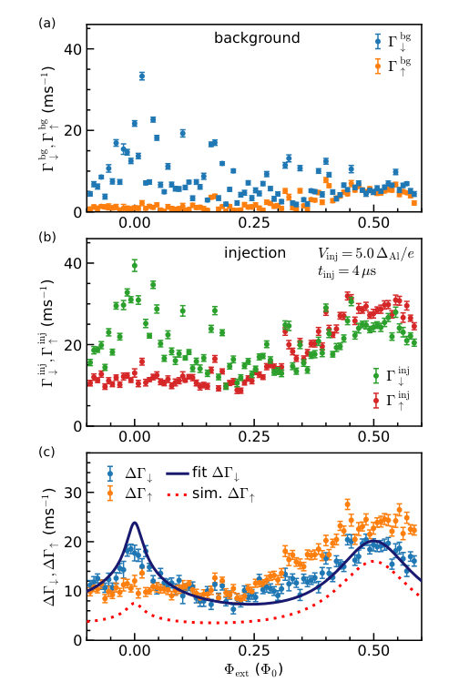 
FIG. 4. Dependence of the transition rates on exter- nal flux. (a) Background relaxation Γbg ↓ (blue) and exci- tation Γbg ↑ (orange) rates as functions of external flux Φext. (b) Post-injection relaxation Γinj ↓ (green) and excitation Γinj ↑ (red) rates following an injection pulse with Vinj = 5.0∆Al/e. Other measurement parameters are as in Fig. 3. (c) QP- induced increase in the excitation (∆Γ↑= Γinj ↑ −Γbg ↑) and relaxation (∆Γ↓= Γinj ↓ −Γbg ↓) rates as functions of external flux Φext. The measured rates exhibit an apparent inver- sion, ∆Γ↑&gt; ∆Γ↓, near the HFQ while retaining their regular order, ∆Γ↑&lt; ∆Γ↓, at the IFQ. The blue solid curve is a one-parameter fit to ∆Γ↓with the common QP...

📷 Fig 5

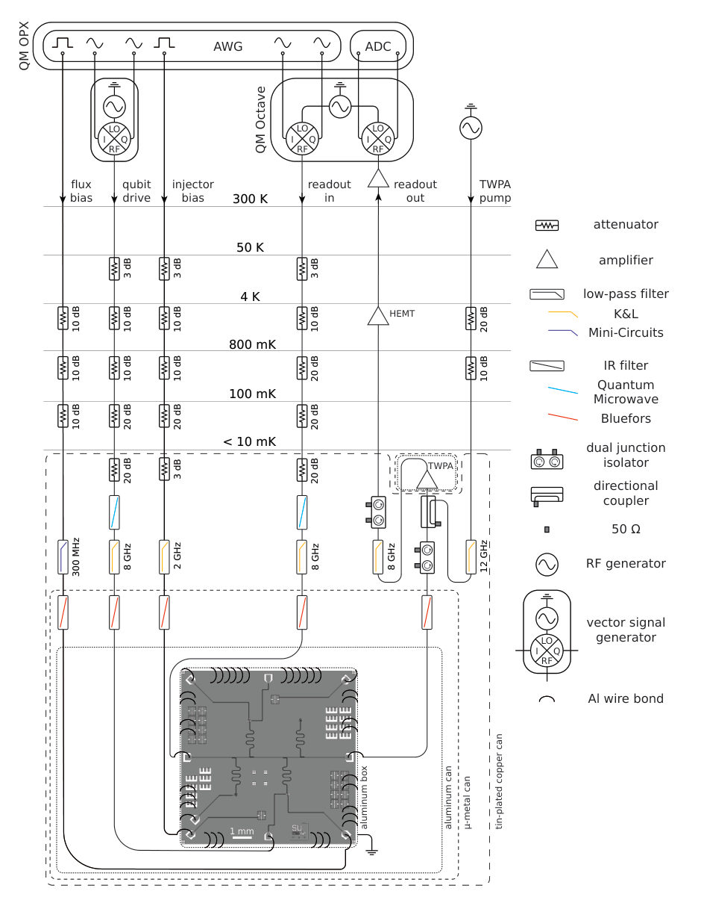 
FIG. 5. Wiring diagram of the dilution refrigerator measurement setup. The chip is enclosed in an aluminum sample box. In the false-colored chip image, the gray regions indicate the Nb ground plane, while the white regions correspond to exposed Si. Unused control lines on the chip are shorted to ground with ground caps. Magnetic and radiation shields are indicated by distinct line styles.

**Summary.** This paper investigates how quasiparticle tunneling causes decoherence in fluxonium qubits. The authors overcome the challenge of charge insensitivity by measuring excitation and de-excitation rates under controlled QP injection. They show that incorporating superconducting gap asymmetry ($\delta\Delta$) into the theory is necessary to reconcile experimental measurements with theoretical predictions regarding the relative contributions of different junction elements.

**Why it may be interesting.** This work directly addresses decoherence mechanisms in superconducting qubits by providing a detailed physical mechanism (gap asymmetry) that can be engineered to suppress environmental noise sources like quasiparticles, which is crucial for scaling quantum processors.

Detailed structure

**Main problem.** The primary challenge is isolating and quantifying quasiparticle (QP)-induced decoherence effects in fluxonium qubits, a platform difficult to analyze because it lacks the charge sensitivity of transmon qubits.

**Main result.** By incorporating superconducting gap asymmetry ($\delta\Delta$) into the theoretical model, the authors reconcile discrepancies between previously inferred QP densities from different circuit elements (junction array vs. small junction).

**Method.** The study combines controlled on-chip quasiparticle injection experiments with detailed theoretical modeling of transition rates derived from the qubit Hamiltonian.

**Model / system.** The system is a fluxonium qubit, modeled by an anharmonic Josephson junction circuit. The analysis focuses on how QP tunneling affects energy relaxation ($\Gamma_{\downarrow}$) and excitation ($\Gamma_{\uparrow}$) rates as a function of external magnetic flux bias.

**Key observables.** QP-induced energy relaxation/excitation rates ($\Delta\Gamma_{\downarrow}$), the dependence of these rates on external magnetic flux ($\Phi_{	ext{ext}}$), and the relative contributions from the junction array and small junction.

**Important parameters / regimes.** Superconducting gap asymmetry ($\delta\Delta$), characteristic QP energy width ($\delta E_{	ext{qp}}$), and operating regimes like Integer/Half-Integer Flux Quantum ($	ext{IFQ}/	ext{HFQ}$).

**Assumptions / limitations.** The analysis requires accounting for the superconducting gap asymmetry across Josephson junctions to accurately model flux dependence, contradicting previous simplifying assumptions.

**Figures summary.** Figures illustrate the external flux dependence of transition rates, comparing background vs. post-injection measurements at IFQ and HFQ, demonstrating how $\delta\Delta$ affects rate suppression.

**Paper structure.** The paper first establishes the difficulty in measuring QP effects in fluxonium. It then develops a theoretical framework to separate contributions from different junction elements using measured transition rates ($\Gamma_{if}$). Finally, it uses experimental measurements across varying magnetic fluxes to constrain the relative roles of these components.

Abstract

Quasiparticles are a prominent decoherence source in superconducting qubits, but their effects are notoriously difficult to isolate in fluxonium. Unlike a transmon, fluxonium is insensitive to offset charge, precluding charge-parity detection of quasiparticle tunneling. We address this challenge by measuring the excitation and de-excitation rates in a fluxonium qubit under controlled on-chip quasiparticle injection. We show that to accurately model the external magnetic flux dependence of the quasiparticle-induced transition rates, it is necessary to account for the superconducting gap asymmetry across the Josephson junctions. A comparison between theory and experiment constrains the relative quasiparticle contributions of the junction array and the small junction and helps explain previously reported discrepancies between the bounds on the quasiparticle densities inferred for these two circuit elements.

[↑ back to top](#top)

### [A Quantum Interface Between Neutral-Atoms and Trapped-Ions Quantum Registers](http://arxiv.org/abs/2607.20998v1)

**Authors:** Ayelet Hasson, Gal Dekel, Ehud Shahar, Nitzan Akerman, Roee Ozeri  
**Type:** theory · **Category:** other · **PDF:** <https://arxiv.org/pdf/2607.20998v1>  
**Analysis basis:** full PDF text, analyzed in chunks
**Topic relevance:** 🔥 `Rydberg arrays` **4/5** · `QC/QI experiment` **2/5** · `analog quantum simulation` **1/5**

📷 Fig 1

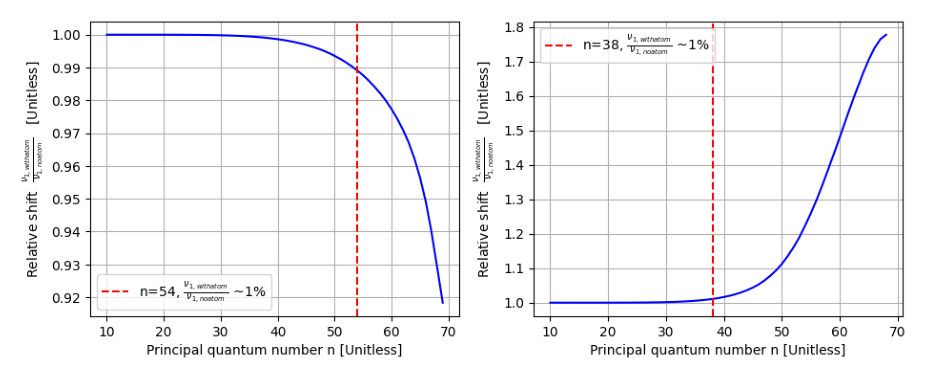 
Figure 1: Relative shift of the center-of-mass (COM) motional mode frequency of a two-ion crystal induced by a nearby neutral 88Sr atom excited to Rydberg states. The shift is shown as a function of the principal quantum number n for the 5sns (3S1) (left) and 5snd (3D1) (right) series. As n increases, the atomic polarizability grows, leading to a stronger modification of the ion crystal’s motional frequency.

📷 Fig 2

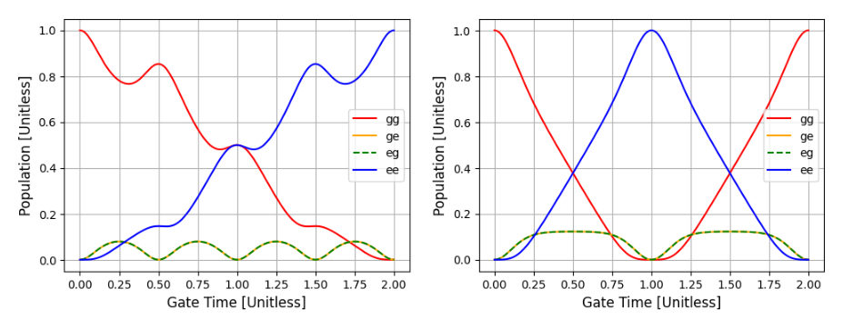 
Figure 2: Time evolution of the two-ion state populations during a Mølmer–Sørensen (MS) gate. The left panel shows the standard gate dynamics when the motional frequency is unchanged, leading to the generation of an entangled state with equal populations in |gg⟩and |ee⟩at the gate time. The right panel illustrates the case where the motional frequency is shifted, modifying the accumulated phase and preventing the formation of the entangled state.

📷 Fig 3

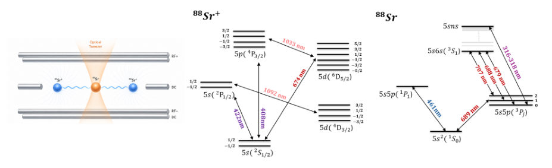 
Figure 3: Left - proposed experimental system including two 88Sr+ ions confined in a linear Paul trap, while a single 88Sr atom is trapped at their midpoint using optical tweezers. For 88Sr+, the qubit can be encoded either in the optical transition between the 5s 2S1/2 and 4d 2D5/2 states or in the Zeeman sublevels of the ground state. For the neutral atom, the qubit is encoded between the metastable clock state 5s5p (3P0) and a highly excited Rydberg state. Middle and right panels show the relevant energy levels and optical transitions for 88Sr+ and 88Sr, respectively, including the transitions used for cooling, state preparation, and coherent qubit manipulation.

📷 Fig 4

 
Fig. 4 presents the predictions of a simplified model of the dynamic polarizability of 88Sr, in

📷 Fig 5

 
Fig. 5 shows that, for a realistic optical tweezers waist of approximately 1 µm, optical powers of

**Summary.** The authors propose using an optically trapped neutral atom as a controllable interface between two trapped ions. By exciting the atom to a high-lying Rydberg state, they induce a large, state-dependent shift in the collective motional modes of the ion crystal. This controlled modification allows the neutral atom's internal state to deterministically control whether or how an entangling gate operates between the two ions.

**Why it may be interesting.** This work provides a detailed theoretical roadmap for realizing complex quantum gates in hybrid systems by leveraging highly tunable, strong long-range interactions mediated by Rydberg states, which is central to modern AMO research.

Detailed structure

**Main problem.** The paper proposes a method to create deterministic, state-dependent quantum gates by engineering an interaction between neutral atoms and trapped ions.

**Main result.** By exciting the neutral atom to a Rydberg state, its large polarizability strongly shifts the collective motional modes of the ion crystal, enabling the atom's internal state to control an entangling gate (MS gate) between two ions.

**Method.** The analysis involves calculating the modification of the system's potential energy and subsequently diagonalizing the resulting coupled harmonic oscillator Hamiltonian to find frequency shifts.

**Model / system.** The physical platform is a hybrid quantum system combining individually trapped neutral atoms (e.g., $^{88}	ext{Sr}$) in optical tweezers with a small crystal of trapped ions ($^{88}	ext{Sr}^+$) in a Paul trap.

**Key observables.** Relative frequency shift of the Center-of-Mass (COM) motional mode, and the resulting fidelity/suppression of the Mølmer–Sørensen gate operation.

**Important parameters / regimes.** Rydberg principal quantum number ($n$), atomic polarizability ($\alpha$), trapping frequencies ($
u_I \approx 1	ext{ MHz}$, $
u_A \approx 300	ext{ kHz}$), and the magic wavelength for stable trapping.

**Assumptions / limitations.** The analysis relies on the dipole approximation for interactions ($r_E, r_r \ll 1$) and assumes that thermal effects can be modeled by fitting numerical solutions to low-order polynomials.

**Figures summary.** Figure 1 shows how the COM motional mode frequency shift increases with Rydberg principal quantum number $n$. Figure 2 compares MS gate dynamics when the ion frequency is shifted versus unshifted. Figure 3 illustrates the proposed experimental setup and energy levels.

**Paper structure.** The paper first establishes the physical model using a combined potential energy function, analyzes the resulting coupled harmonic oscillator dynamics to find motional shifts, demonstrates how these shifts enable conditional control over an MS gate, and finally validates the underlying approximations (dipole approximation, temperature effects) against realistic parameters.

Abstract

Hybrid quantum systems combining neutral atoms and trapped ions offer the prospect of integrating the scalability of atom arrays with the high-fidelity control available in trapped-ion platforms. Here we propose and analyze a quantum interface between individually trapped neutral atoms and a trapped-ion crystal. In our scheme, a neutral 88Sr atom trapped in optical tweezers interacts with a small 88Sr+ ion crystal, and by exciting the atom to a Rydberg state, the atom-ion polarization interaction is strongly enhanced, resulting in a state-dependent modification of the ions' collective motional modes. We show that this shift enables conditional control of a MS gate, allowing the neutral atom to act as a control qubit for an entangling operation between two ions. We investigate the feasibility of the scheme by analyzing Rydberg trapping in the combined optical tweezers and Paul trap potentials, identifying negative-polarizability Rydberg states as particularly favorable for stable confinement. We further evaluate the relevant trapping conditions, Rydberg lifetimes, and coherence requirements, and show that the proposed interface is compatible with realistic experimental parameters. These results establish a practical route toward deterministic atom-ion hybrid quantum gates and quantum interfaces.

[↑ back to top](#top)

### [Rack-integrated quantum dot-based source of single and entangled photons at telecom C-band](http://arxiv.org/abs/2607.21454v1)

**Authors:** Michal Vyvlecka, Raphael Joos, Benjamin Breiholz, Emma Marmasse, Anna Friederike Köhler, Ponraj Vijayan, Tobias Huber-Loyola, Sven Höfling, Michael Jetter, Simone Luca Portalupi, Peter Michler  
**Type:** experiment · **Category:** quantum information and computing · **PDF:** <https://arxiv.org/pdf/2607.21454v1>  
**Analysis basis:** full PDF text, analyzed in chunks
**Topic relevance:** 🔥 `quantum optics experiment` **4/5** · `QC/QI experiment` **1/5** · `entanglement & information structure` **1/5** · `interference shaping light` **1/5**

📷 Fig 1

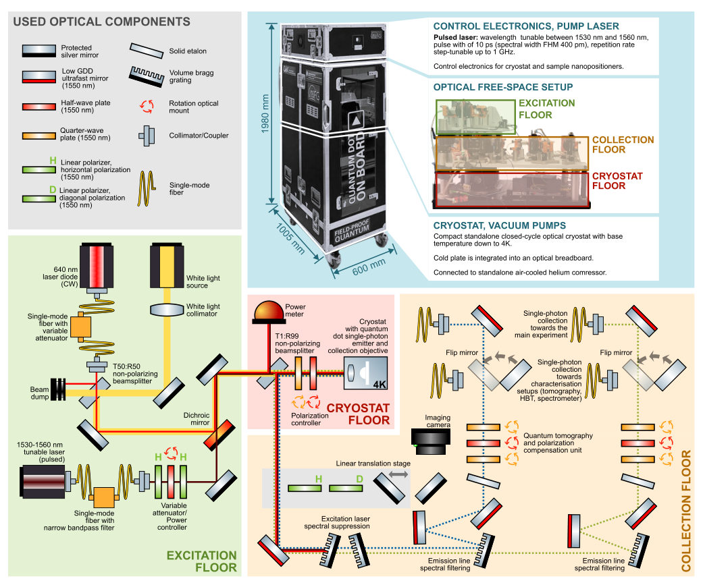 
FIG. 1. Image and sketch of the transportable source. In the blue block a picture of the overall setup with description of each part. The three floors in the optical setup are color-coded with respect to the sketch below, green of the excitation floor, orange for the collection floor, and red for the cryostat floor. All light sources, optical and optomechanical elements are visualized. In the gray block a legend of the used optical elements is shown.

📷 Fig 2

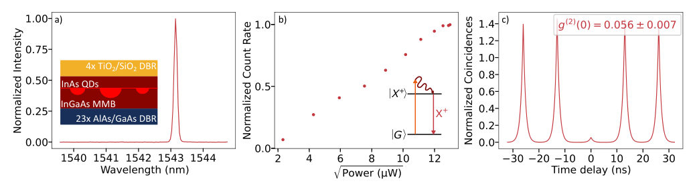 
FIG. 2. a) Spectrum of one selected quantum dot under LA-phonon assisted excitation. As the laser is fully suppressed by the spectral filtering, only the QD exciton transition is visible. In the inset, a schematic of the planar cavity sample, with a bottom semiconductor DBR (23 pairs) and a top oxide DBR (4 pairs). InAs QDs are grown on an InGaAs metamorphic buffer layer (MMB) for the strain engineering enabling emission in the telecom bands. b) Intensity over excitation power showing a saturation behavior typical of incoherent excitation methods. In the inset, a schematic energy diagram of LA-phonon assisted process followed by phonon and photon emission. c) Normalized photon...

📷 Fig 3

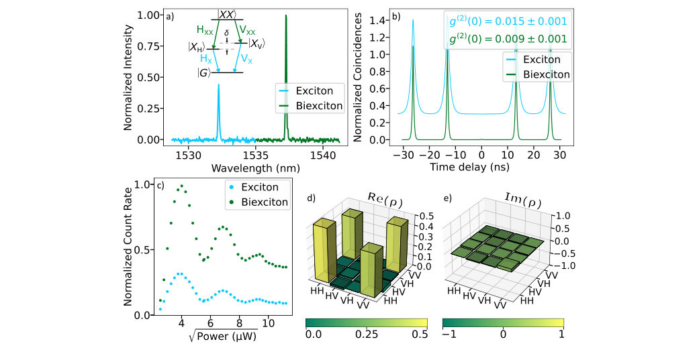 
FIG. 3. a) Spectrum of one selected quantum dot under TPE excitation. As the laser is fully suppressed by the spectral filtering, only the QD exciton and biexciton transitions are visible. b) Normalized photon autocorrelation measurements, g(2)(τ), for the exciton and biexciton emission, where the exciton measurement is shifted by an offset of 0.3. c) Intensity over excitation power showing Rabi oscillations typical of coherent excitation methods for the exciton and biexciton emission.d) Real part and e) imaginary part of the reconstructed two-photon density matrix obtained by quantum state tomography for the emitted polarization-entangled photon pairs, using a coincidence time window of 10...

📷 Fig 4

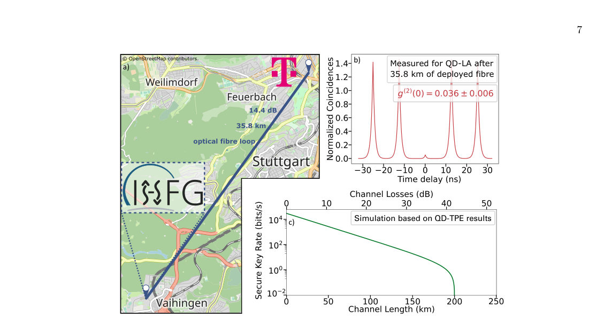 
FIG. 4. a) Deployed metropolitan optical fiber link in Stuttgart, Germany, connecting the research laboratory of the Institut f¨ur Halbleiteroptik und Funktionelle Grenzfl¨achen (IHFG) on the Vaihingen campus of the University of Stuttgart with the Deutsche Telekom AG site in Stuttgart-Feuerbach. The link consists of two optical fibers connected in Stuttgart-Feuerbach to form a fiber loop. The total loop length is 35.8 km with a propagation loss of 14.4 dB. The displayed map is based on OpenStreetMap data; for copyright information, see openstreetmap.org/copyright. b) Normalized second-order autocorrelation measurement, g(2)(τ), of QD-LA after transmission through the deployed metropolitan...

**Summary.** The research presents the development and testing of a compact, transportable source using semiconductor quantum dots to generate single and entangled photons directly at telecom C-band wavelengths. By integrating complex optical components into a field-ready rack, the authors demonstrate a major step toward realizing practical quantum internet infrastructure for secure communication.

**Why it may be interesting.** This work is highly relevant to open quantum systems and quantum optics as it provides a concrete, scalable hardware platform for generating entangled photons necessary for quantum networking protocols like QKD.

Detailed structure

**Main problem.** The primary challenge is transitioning quantum light sources from controlled laboratory settings into practical, field-deployable systems for quantum communication networks.

**Main result.** The authors demonstrated a compact, transportable source capable of emitting single and polarization-entangled photons at the telecom C-band with high efficiency and record coincidence rates.

**Method.** They utilized semiconductor Quantum Dots (QDs) embedded in an optimized, rack-based setup that integrates multiple excitation lasers and optical components for field operation.

**Model / system.** The system uses InAs/GaAs quantum dots grown on a metamorphic buffer layer, engineered to emit at telecom wavelengths. The source can be excited via various schemes, including LA-phonon-assisted or two-photon excitation (TPE), allowing control over single and entangled photon generation.

**Key observables.** Second-order correlation function ($g^{(2)}(0)$) confirming single-photon nature; high coincidence rates ($\sim 201 	ext{ kcps}$); entanglement fidelity ($\ge 0.964$); and calculated Secure Key Rates (SKR).

**Important parameters / regimes.** Operation at telecom C-band wavelengths; achieving $>50\%$ transmission efficiency; maintaining low multi-photon probability ($g^{(2)}(0) \ll 1$).

**Assumptions / limitations.** The setup assumes the ability to integrate multiple complex laser sources and remote control mechanisms into a portable unit for field use.

**Figures summary.** Figures illustrate the physical layout of the transportable source (color-coded floors), spectral measurements confirming excitation suppression, and characterization plots showing correlation functions and density matrices for entangled pairs.

**Paper structure.** The paper details the development of a state-of-the-art, compact hardware platform. It presents experimental results validating single-photon purity ($g^{(2)}$) and high-fidelity entanglement generation at telecom wavelengths, culminating in demonstrations of long-distance quantum key distribution potential.

Abstract

For quantum light sources in everyday telecommunication networks, quantum science needs to be fully transformed into quantum technology. The first necessary step to move outside a well-controlled lab environment requires the use of quantum light sources operating in the technologically relevant telecom O- and C-band. This can be provided using epitaxial quantum dots as deterministic sources of quantum light. Particularly intriguing is that emitters operating at telecom wavelengths are rapidly catching up with their short wavelength counterparts in terms of performances. Here, we make a decisive step forward in the development of quantum communication networks: a state-of-the-art source of quantum light, a semiconductor quantum dot (QD), with record coincidence rate for entangled photon emission in the telecom C-band, is operated inside an optimized rack-based setup. This setup includes a tunable pulsed laser for the QD excitation (from quasi- to fully resonant excitation), all optics for the excitation filtering, and QD signal coupling into single-mode fibers. Overall, the setup allows for above $50\%$ transmission for both exciton and biexciton photons. These results show that quantum dots-based telecom light sources can now be transported and integrated into existing fiber infrastructures, an important step to demonstrate the feasibility of the upcoming quantum internet.

[↑ back to top](#top)

### [An Optimal Analysis of the Product Test](http://arxiv.org/abs/2607.21477v1)

**Authors:** Jacob Beckey, Fernando Granha Jeronimo, Pei Wu  
**Type:** theory · **Category:** quantum information and computing · **PDF:** <https://arxiv.org/pdf/2607.21477v1>  
**Analysis basis:** full PDF text, analyzed in chunks
**Topic relevance:** 🔥 `entanglement & information structure` **4/5** · `quantum measurements` **2/5**

📷 Fig 1

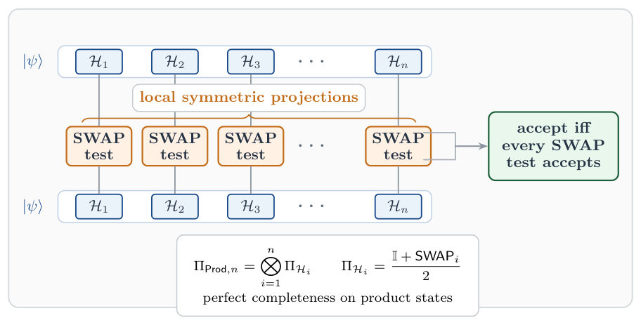 
Figure 1: The product test. Given two copies of the same multipartite state, the product test performs a SWAP test on each pair of corresponding registers, and accepts only if all individual tests accept. Although the measurements act independently on each subsystem pair, the overall acceptance probability detects the global failure of product structure.

📷 Fig 2

 
Figure 2: Exact product-test acceptance curve for every n. It shows that the curve of the bipartite case, n = 2, of Lovitz and Lowe [LL26] is extremal for every n ≥2. Compared with the two previous envelopes from [SW22, Figure 2]. The exact curve is piecewise quadratic with breakpoints at 1, 1/2, 1/3, . . ., agrees with the known branch on [1/2, 1], and tends to 1/2 in the low-overlap limit.

📷 Fig 3

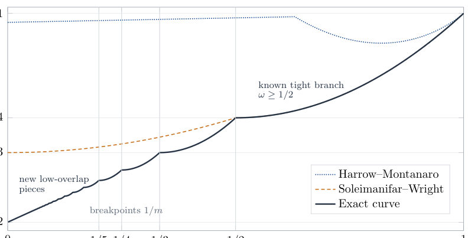 
Figure 2 plots these two envelopes together with the exact curve proved here. The exact curve agrees with ω2 −ω + 1 throughout [1/2, 1]. Below 1/2, it separates from the Soleimanifar–Wright envelope and tends to 1/2, whereas that envelope tends to 2/3 and the Harrow–Montanaro envelope tends to 1 −11/512. The theorem also gives the exact property-testing soundness statement in trace distance: if |ψ⟩ is δ-far from every product state, the product test accepts with probability at most (1 + s(1 −δ2))/2, which equals 1 −δ2 + δ4 when δ ≤1/ √

📷 Fig 4

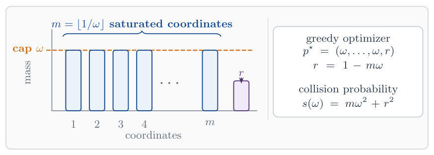 
Figure 3: The capped-simplex optimizer. Under the cap pj ≤ω, collision probability is maximized by concentrating mass as much as the cap permits: fill m = ⌊1/ω⌋entries to height ω, then put the residual mass r = 1 −mω on one final entry.

**Summary.** This paper rigorously determines the exact worst-case acceptance probability curve for the product test, a crucial tool in quantum property testing. By solving a complex optimization problem related to state overlaps, the authors provide an explicit formula $\mathrm{PT}_n(\omega)$ that resolves open questions regarding low-overlap regimes. This has direct implications for understanding entanglement and improving complexity bounds in quantum computation theory.

**Why it may be interesting.** This work provides fundamental mathematical tools for characterizing entanglement structure in multipartite quantum systems by precisely quantifying how easily a state can be distinguished from a product state using local measurements.

Detailed structure

**Main problem.** The primary goal is determining the exact worst-case acceptance probability curve for the product test, which verifies if a multipartite quantum state is unentangled across a specified tensor decomposition.

**Main result.** The authors derive an explicit, piecewise quadratic formula for this acceptance probability, $\mathrm{PT}_n(\omega)$, resolving previously unknown low-overlap regimes and confirming the limit $\lim_{\omega	o 0} \mathrm{PT}_n(\omega) = 1/2$.

**Method.** The problem is mathematically reduced to a constrained optimization problem involving maximizing squared overlaps (a capped-simplex problem), whose solution dictates the exact functional form of the acceptance probability.

**Model / system.** The study concerns pure multipartite quantum states $|\psi
angle$ residing in a tensor product Hilbert space $H_1 \otimes \cdots \otimes H_n$. The test itself is defined by local measurements (independent SWAP tests) applied to two copies of the state.

**Key observables.** The key observable is $\mathrm{PT}_n(\omega)$, the worst-case acceptance probability, which depends on $\omega$, the maximum squared overlap with any product state.

**Important parameters / regimes.** Key parameters include $n$ (number of parties), $\omega \in (0, 1]$ (the product overlap measure), and derived quantities like $m = \lfloor 1/\omega 
floor$.

**Assumptions / limitations.** The analysis assumes the validity of relating the general case to the bipartite ($n=2$) scenario for determining the worst-case bound.

**Figures summary.** Figure 2 plots the derived exact curve, showing agreement with known bounds ($\omega \ge 1/2$) and providing continuous extensions into low-overlap regimes. Figure 3 illustrates the optimization structure using a capped-simplex visualization.

**Paper structure.** The paper first establishes the problem context by defining the product test and its relation to quantum property testing. It then develops the mathematical machinery by reducing it to an optimal resource allocation (capped-simplex) problem, deriving the exact formula for $\mathrm{PT}_n(\omega)$, and finally applying this result to improve bounds in complexity theory reductions (e.g., Harrow-Montanaro reduction).

Abstract

Product testing, i.e., deciding whether a pure multipartite quantum state is fully unentangled across a specified tensor decomposition, serves as a bridge between quantum property testing, unentangled quantum proof systems, and tensor optimization. Despite being a fundamental property testing task and having many applications, the product test's exact (worst-case) acceptance probability curve has yet to be fully determined. In this work, we determine this curve exactly. Let $ω$ be the maximum squared overlap of the input with a product state, and let $\mathrm{PT}_n(ω)$ be the largest possible acceptance probability of the product test over all $n$-partite pure states with product overlap $ω$, allowing arbitrary finite local dimensions. We prove that, for every $n\ge 2 $ and every $ω\in(0,1] $, $$   \mathrm{PT}_n(ω)=\frac12\left(1+mω^2+(1-mω)^2\right), $$ where $m=\lfloor1/ω\rfloor $. The formula recovers the previously known tight section of the curve for $ω\ge 1/2 $, resolves all low-overlap regimes $ω<1/2 $, and implies $\mathrm{PT}_n(ω)\to 1/2 $ as $ω\to 0$ answering an open problem in [Soleimanifar and Wright, SODA 2022]. As a complexity-theoretic application, our results improve the one-shot soundness parameter in the Harrow-Montanaro reduction from $\mathsf{QMA}(k)$ to $\mathsf{QMA}(2)$. Our techniques, built upon those of Soleimanifar and Wright, allow us to resolve these open questions while remaining surprisingly elementary.

[↑ back to top](#top)

### [An Analytically Trained Variational Surrogate for Quantum Phase Estimation on NISQ Hardware](http://arxiv.org/abs/2607.20943v1)

**Authors:** Mousumi Kundu, Ashish Kumar Patra, Anurag K. S. V., Ruchika Bhat, Sai Shankar P., Alok Shukla, Jaiganesh G  
**Type:** both · **Category:** quantum information and computing · **PDF:** <https://arxiv.org/pdf/2607.20943v1>  
**Analysis basis:** full PDF text, analyzed in chunks
**Topic relevance:** 🔥 `QC/QI experiment` **4/5** · `methods for driven-dissipative` **1/5**

📷 Fig 1

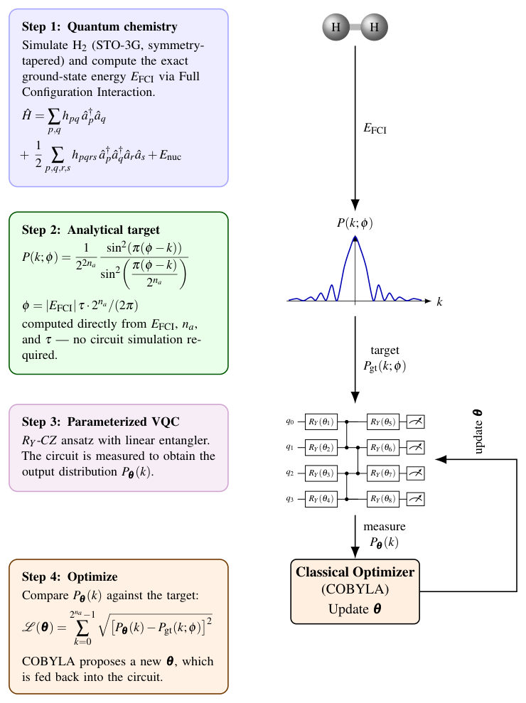 
Figure 1. Training workflow for the analytically-trained VQC surrogate. Step 1: the H2 molecular Hamiltonian is simulated classically and the exact ground-state energy EFCI is obtained via Full Configuration Interaction. Step 2: EFCI, together with the ancilla count na and evolution time τ, is substituted directly into the analytical Dirichlet kernel to obtain the target QPE measurement distribution Pgt(k;φ) — no quantum circuit simulation is required. Step 3: a parameterized RY-CZ ansatz (linear entangler) is measured to obtain the output distribution Pθ (k). Step 4: Pθ (k) is compared against the target via the cost function L (θ ), and the classical COBYLA optimizer proposes an updated...

📷 Fig 2

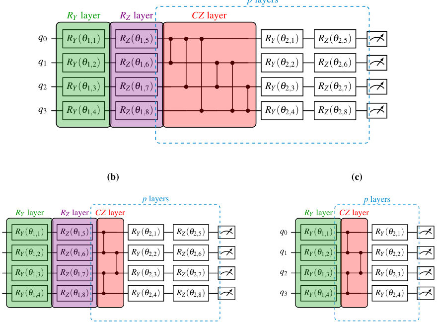 
Figure 2. VQC ansatz architectures used as QPE surrogates (p = 1 layer, na = 4 qubits shown for illustration). (a) RY-RZ-CZ ansatz with the full entangler: each repeated layer applies RY and RZ rotations to every qubit followed by a CZ gate between every pair of qubits, ending in a final untied RY-RZ rotation block. (b) RY-RZ-CZ ansatz with the linear entangler, where CZ gates connect only nearest-neighbor qubits. (c) RY-CZ ansatz with the linear entangler: identical entangling structure to (b) but with the RZ rotations omitted, halving the number of variational parameters per layer. Colored regions mark the RY layer (green), RZ layer (violet), CZ entangling layer (red), and the block of p...

📷 Fig 3

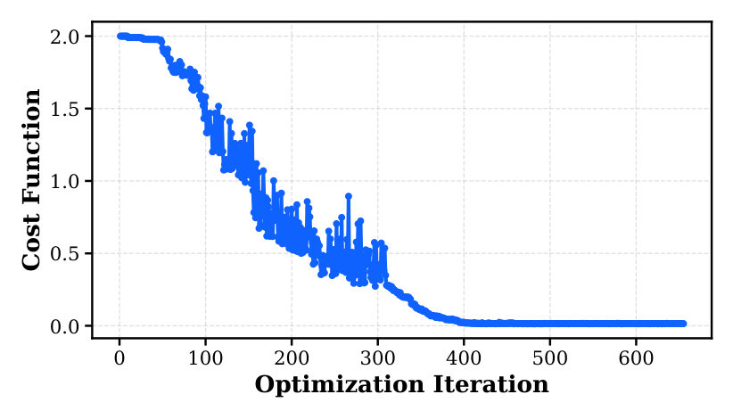 
Figure 3. Convergence of the cost function L (θ ) during COBYLA optimization of the RY-RZ-CZ VQC (linear entangler, p = 1) trained on the analytical Dirichlet distribution. The cost decreases monotonically, confirming stable convergence of the variational optimization.

📷 Fig 4

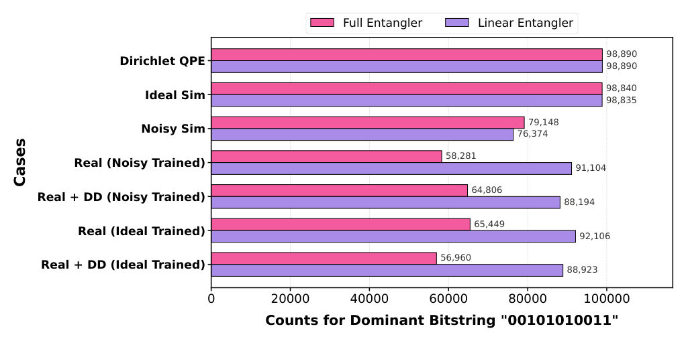 
Figure 4. Dominant bitstring 00101010011 counts for the RY-RZ-CZ ansatz at p = 1 layer, comparing the full entangler (pink) and linear entangler (purple) across all experimental cases (Nshots = 100,000). The linear entangler consistently achieves higher counts on real hardware across all configurations, with the gap being most pronounced under real hardware execution (linear: 91,104 vs full: 58,281 for noisy-trained; linear: 92,106 vs full: 65,449 for ideal-trained), confirming the superior noise resilience of the shallower linear topology.

📷 Fig 5

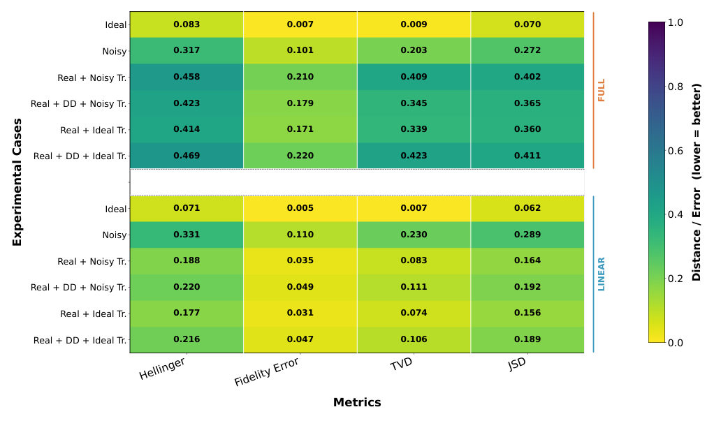 
Figure 5. Metric heatmap (Hellinger distance, fidelity error, TVD, JSD) comparing the RY-RZ-CZ ansatz with full entangler (top, orange) and linear entangler (bottom, blue) at p = 1 layer, across all experimental cases. Lower values indicate better agreement with the Dirichlet target. The linear entangler achieves uniformly lower metric values across all hardware configurations, confirming its superior noise resilience for NISQ hardware execution.

**Summary.** The paper tackles the challenge of running resource-intensive Quantum Phase Estimation (QPE) algorithms on noisy quantum hardware. It proposes an innovative variational surrogate that trains a shallow circuit to mimic QPE's measurement statistics using an analytical target calculation. This approach successfully recovers molecular ground-state energies with chemical accuracy, establishing a scalable paradigm for near-term quantum chemistry simulations.

**Why it may be interesting.** This work provides a concrete, scalable blueprint for quantum chemistry simulations on near-term devices by replacing exponentially deep circuits with shallow, trainable variational models whose training target is derived analytically from exact theory.

Detailed structure

**Main problem.** Standard Quantum Phase Estimation (QPE) circuits are too deep for current Noisy Intermediate-Scale Quantum (NISQ) hardware, making molecular energy estimation impractical.

**Main result.** The authors developed a variational surrogate framework that faithfully mimics QPE by training a shallow VQC to reproduce the measurement distribution using an analytically derived target, achieving chemical accuracy on real hardware.

**Method.** They train a Variational Quantum Circuit (VQC) whose parameters are optimized to match a classically computed target probability distribution derived from the Dirichlet kernel, bypassing full quantum circuit simulation.

**Model / system.** The method is applied to molecular ground-state energy estimation using the hydrogen molecule ($	ext{H}_2$) Hamiltonian. The experimental platform involves superconducting qubits on IBM Quantum hardware.

**Key observables.** Molecular ground-state energy ($E$), QPE measurement probability distribution, and agreement metrics (Hellinger distance, TVD).

**Important parameters / regimes.** VQC depth ($p=1$ to $5$), circuit topology (linear vs. full entangler), and Dynamical Decoupling sequence application.

**Assumptions / limitations.** The method assumes the true ground-state energy is known classically to generate the training target, and it relies on the VQC being shallow enough to outperform noise accumulation from deep circuits.

**Figures summary.** Figure A1 compares dominant bitstring counts for QPE at depths $p=8$ and $p=64$, showing that while a linear entangler is optimal, Dynamical Decoupling degrades performance compared to the non-DD baseline at moderate depth.

**Paper structure.** The paper first introduces the limitations of standard QPE on NISQ devices. It then details the analytically grounded variational surrogate framework using the Dirichlet kernel as the training target. The core work involves a multi-stage experimental investigation comparing topologies, varying VQC depths, and analyzing noise robustness on real hardware.

Abstract

Quantum Phase Estimation (QPE) is a foundational algorithm for molecular ground-state energy estimation, but its deep circuit requirements make direct hardware execution impractical on Noisy Intermediate-Scale Quantum (NISQ) devices. We present an analytically grounded variational surrogate framework in which a shallow Variational Quantum Circuit (VQC) is trained to reproduce the QPE measurement distribution without any quantum circuit simulation. The training target is computed entirely classically via the Dirichlet kernel, evaluated directly from the Full Configuration Interaction (FCI) ground-state energy, the ancilla qubit count, and the time evolution parameter, eliminating the exponentially scaling simulation bottleneck of prior surrogate approaches. We apply this framework to the hydrogen molecule (H$_2$) with a symmetry-tapered Hamiltonian, conducting a four-stage experimental investigation on IBM Quantum hardware. Stage 1 compares linear and full entangler topologies for the $R_Y$-$R_Z$-$CZ$ ansatz, with and without XpXm Dynamical Decoupling (DD), across four distributional metrics (Hellinger distance, fidelity error, total variation distance, Jensen-Shannon divergence), identifying the linear entangler as optimal. Stage 2 varies VQC layers ($p=1$ to $5$) for the linear-entangler ansatz, identifying single-layer depth as optimal under hardware noise. Stage 3 applies this configuration to the reduced $R_Y$-$CZ$ ansatz, comparing ideal and noisy simulator-trained parameters. A supplementary noise analysis at $p \in \{8,64\}$ characterizes the depth-dependent interplay between circuit depth and DD effectiveness. The framework enables faithful QPE mimicry using a linearly scaling VQC, recovering the ground-state energy within the chemical accuracy threshold (1 kcal/mol), constituting a scalable, hardware-efficient paradigm for QPE-based molecular energy estimation on NISQ devices.

[↑ back to top](#top)

### [Detecting Hidden Nonlinear High Frequency Modes Beyond Fundamental Minimal Temporal Resolution Using Weak Measurements](http://arxiv.org/abs/2607.20647v1)

**Authors:** Igor Prlina  
**Type:** theory · **Category:** other · **PDF:** <https://arxiv.org/pdf/2607.20647v1>  
**Analysis basis:** full PDF text, analyzed in chunks
**Topic relevance:** 🔥 `quantum measurements` **4/5** · `measurement-induced transitions` **1/5**

📷 Fig 1

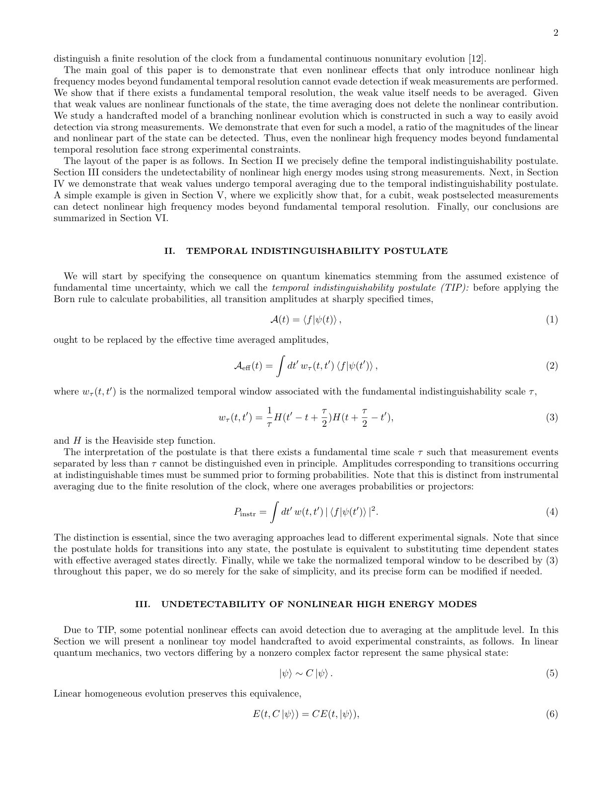 
Low-resolution page preview, page 2

📷 Fig 2

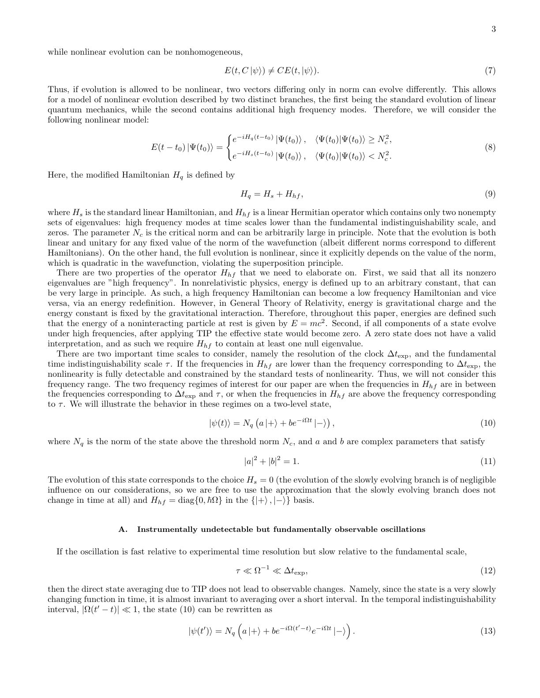 
Low-resolution page preview, page 3

📷 Fig 3

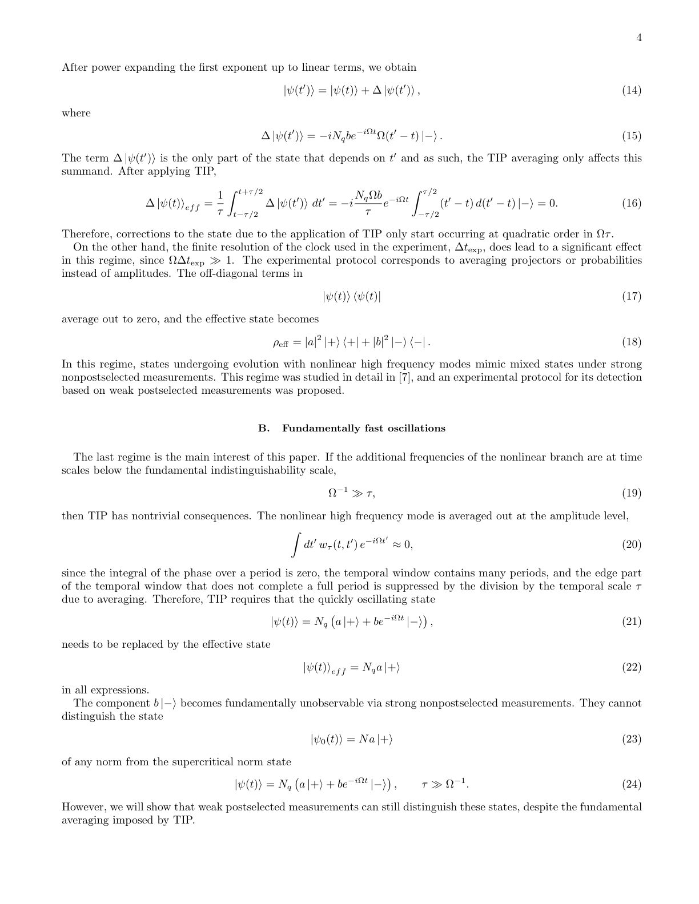 
Low-resolution page preview, page 4

📷 Fig 4

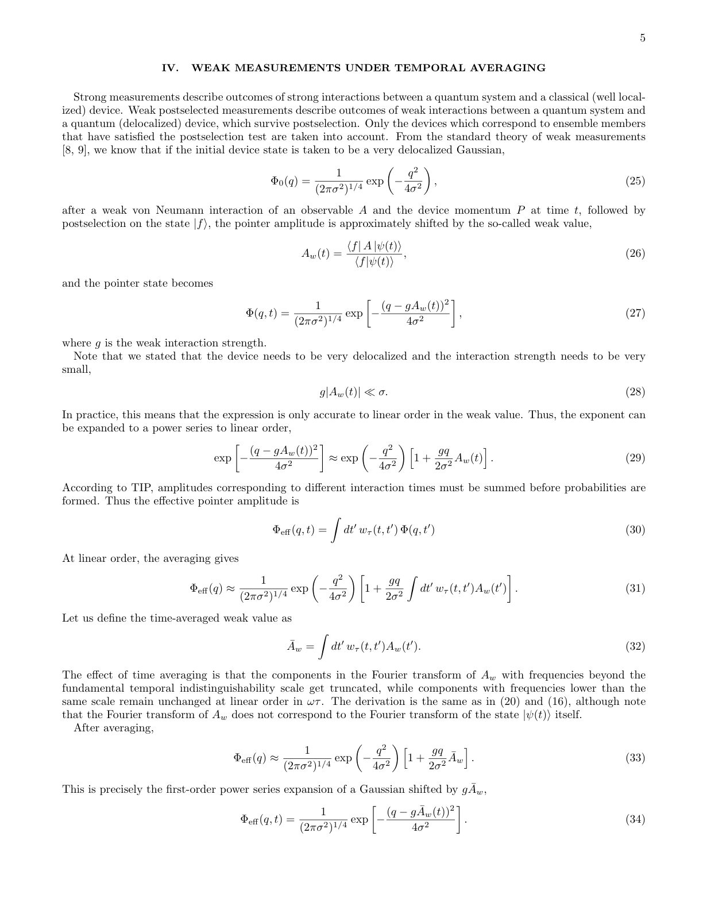 
Low-resolution page preview, page 5

📷 Fig 5

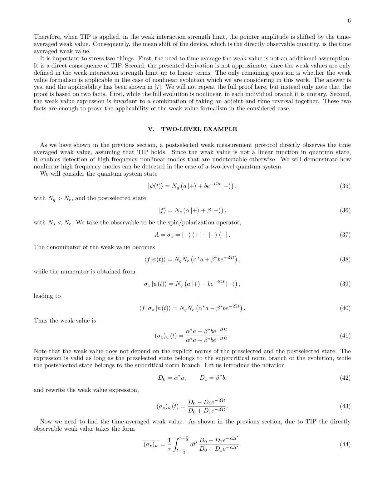 
Low-resolution page preview, page 6

**Summary.** This paper explores the possibility of detecting hidden nonlinearities in quantum mechanics that are masked by fundamental time averaging. By employing weak postselected measurements and a specific toy model, the authors demonstrate that these high-frequency modes leave a detectable signature—a sharp sign flip—in the time-averaged weak value.

**Why it may be interesting.** This work provides a theoretical mechanism showing how non-standard quantum effects (high-frequency nonlinearity) might be probed using advanced measurement techniques (weak measurements) even when standard methods fail due to averaging assumptions.

Detailed structure

**Main problem.** The work investigates whether nonlinear modifications of quantum mechanics, particularly those manifesting only as high-frequency modes beyond a fundamental temporal resolution ($	au$), can evade detection by standard strong measurements.

**Main result.** Even when designed to hide nonlinearity from strong time averaging, weak postselected measurements can still detect these hidden high-frequency modes via a characteristic discontinuous sign flip in the time-averaged weak value.

**Method.** The analysis employs weak postselected measurements and applies a 'temporal indistinguishability postulate' (TIP) which mandates amplitude averaging over fundamental time intervals ($	au$).

**Model / system.** A handcrafted nonlinear toy model is used, involving a two-level system whose evolution Hamiltonian ($H_q$) contains high-frequency components ($H_{hf}$). The nonlinearity is designed to be invisible under standard strong measurements.

**Key observables.** The time-averaged weak value $(\sigma_z)_w$ of the $\sigma_z$ observable, which exhibits a discontinuous sign flip at specific parameter ratios.

**Important parameters / regimes.** Three crucial scales are compared: experimental clock resolution ($\Delta t_{\exp}$), fundamental indistinguishability scale ($	au$), and the high-frequency mode period ($\Omega^{-1}$).

**Assumptions / limitations.** The analysis assumes the existence of a fundamental time scale $	au$ (TIP) and relies on using a specific, handcrafted nonlinear toy model.

**Paper structure.** The paper progresses by first defining the problem concerning nonlinearity evasion, then introducing the TIP and the weak measurement framework. The core is the calculation of the time-averaged weak value via contour integration, leading to the identification of the sign-flipping transition condition that signals hidden nonlinearities.

Abstract

In this work we study whether nonlinear models of quantum mechanics can avoid detection by strong measurements, if the nonlinear effects only exist as high frequency modes. A potential physical process which could hide such modes would be amplitude level time averaging over fundamentally indistinguishable times. To that end, we have defined a temporal indistinguishability postulate which describes the averaging process, and handcrafted a nonlinear toy model well suited to avoid detection. We have demonstrated that even in such an ideal setup, tabletop weak postselected measurements can still detect nonlinear behavior and put constraints on nonlinear high frequency modes of evolution, even at frequencies beyond fundamental minimal temporal resolution.

[↑ back to top](#top)

### [A solution to 2-copy distillability of Werner states](http://arxiv.org/abs/2607.21367v1)

**Authors:** Jinshi Fu, Li Gao, Sang-Jun Park  
**Type:** theory · **Category:** quantum information and computing · **PDF:** <https://arxiv.org/pdf/2607.21367v1>  
**Analysis basis:** full PDF text, analyzed in chunks
**Topic relevance:** 🔥 `entanglement & information structure` **4/5**

📷 Fig 1

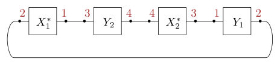 
Figure 1. A graphical proof of Eq. (2)

**Summary.** This paper resolves the long-standing question regarding the 2-copy distillability of Werner states by proving that their 2-copy threshold matches their 1-copy threshold. Using advanced operator theory, it precisely characterizes the entanglement properties of these mixed states, providing a significant result in quantum information theory.

**Why it may be interesting.** While focused on abstract quantum information theory, understanding entanglement thresholds like this is crucial for designing robust quantum communication protocols and characterizing resource states in quantum computation.

Detailed structure

**Main problem.** The paper addresses the fundamental question of determining the 2-copy distillability threshold for Werner states, which is a key step toward solving whether all Non-Positive Partial Transpose (NPT) states are distillable.

**Main result.** It proves that for Werner states in arbitrary dimension, being 2-copy distillable is equivalent to being 1-copy distillable. This establishes the exact threshold for this specific class of entangled states.

**Method.** The proof relies on advanced mathematical techniques involving geometric estimates, block-operator analysis, and establishing necessary and sufficient conditions through operator inequalities derived from partial transposes.

**Model / system.** The system analyzed is bipartite quantum states, specifically the Werner state $
ho_\alpha$, parameterized by $\alpha$. The theory uses concepts like entanglement distillation via LOCC on tensor products of these states.

**Key observables.** The primary observable is the distillability condition, tested by analyzing expectation values involving operators like $Q = \Pi(13)_A \otimes \Pi(24)_A$ and their norms.

**Important parameters / regimes.** The key parameters are the state parameter $\alpha$, which dictates entanglement strength, and the number of copies ($r=1$ vs $r=2$).

**Assumptions / limitations.** The analysis assumes the validity of using twirling arguments to reduce the general problem to the Werner state family. It notes that higher-copy distillability ($r \ge 3$) remains open.

**Figures summary.** Figure 1 provides a graphical proof illustrating an equation related to the distillability condition using tensor diagram notation.

**Paper structure.** The paper progresses by first defining the problem in terms of LOCC and partial transposes, then employing symmetry arguments (Lemma 2.3) to bound certain operator norms, followed by establishing equivalence conditions (Lemma 3.1) that lead to the final characterization of the distillability threshold.

Abstract

Entanglement distillation is a fundamental task in quantum information theory. In this work, we prove that Werner states in arbitrary dimension are 2-copy distillable if and only if they are 1-copy distillable. This answers the longstanding open question of the 2-copy distillability of Werner states. This is an important step on determining whether every non-positive partial transpose (NPT) state is distillable, which remains one of the central open problems in the field of entanglement distillation.

[↑ back to top](#top)

### [Classifying Topology via Edge-State Pure Thermalization](http://arxiv.org/abs/2607.21299v1)

**Authors:** Fatih Ozaydin, Haydar Sahin, Armando Perez-Leija, Azmi Ali Altintas, Cihan Bayindir, Ozgur E. Mustecaplioglu, Sahin K. Ozdemir  
**Type:** theory · **Category:** other · **PDF:** <https://arxiv.org/pdf/2607.21299v1>  
**Analysis basis:** full PDF text, analyzed in chunks
**Topic relevance:** `Tavis-Cummings & cavity-many-emitter` **3/5** · `analog quantum simulation` **3/5** · `correlated cavity matter` **3/5** · `driven-dissipative phase transition` **3/5** · `methods for driven-dissipative` **3/5** · `non-equilibrium dynamics` **3/5** · `correlated / nonlocal dissipation` **2/5** · `entanglement & information structure` **2/5** · `non-equilibrium universality` **2/5** · `scars & prethermalization` **2/5** · `Frenkel-Kontorova` **1/5** · `Keldysh / 2PI / non-Gaussian methods` **1/5** · `Kondo & dissipative impurity` **1/5** · `exotic spin models in light-matter` **1/5** · `quantum measurements` **1/5** · `quantum optics experiment` **1/5**

📷 Fig 1

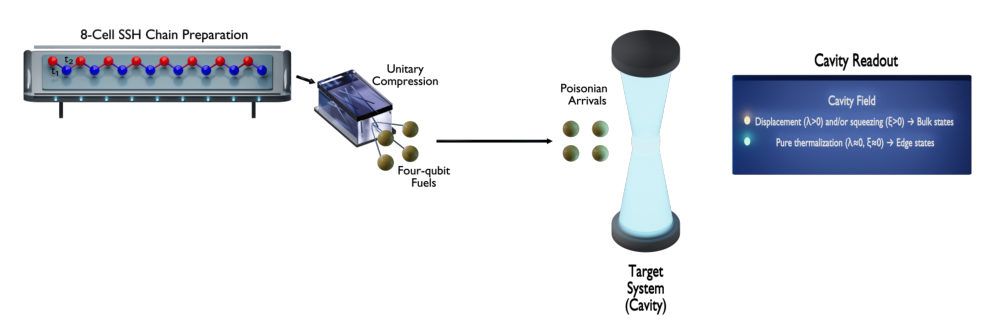 
Figure 1. Conceptual schematic of the edgefuel micromaser. An open 8-cell SSH chain is encoded on four qubits; a chosen eigenstate |vs⟩ (bulk or edge) is prepared as the fuel, undergoes generalized amplitude damping during flight (ttr), and interacts with the target system (e.g., a single cavity mode via the TavisCummings Hamiltonian) with coupling g and interaction time τ, at Poissonian arrival times. The cavity response operationally distinguishes the fuels: edge eigenstates (“edge fuels”) activate only heat-exchange channels and drive a purely thermal (Gibbs) cavity, whereas bulk eigenstates activate coherent channels (coherent displacement and squeezing) allowing ordered energy...

📷 Fig 2

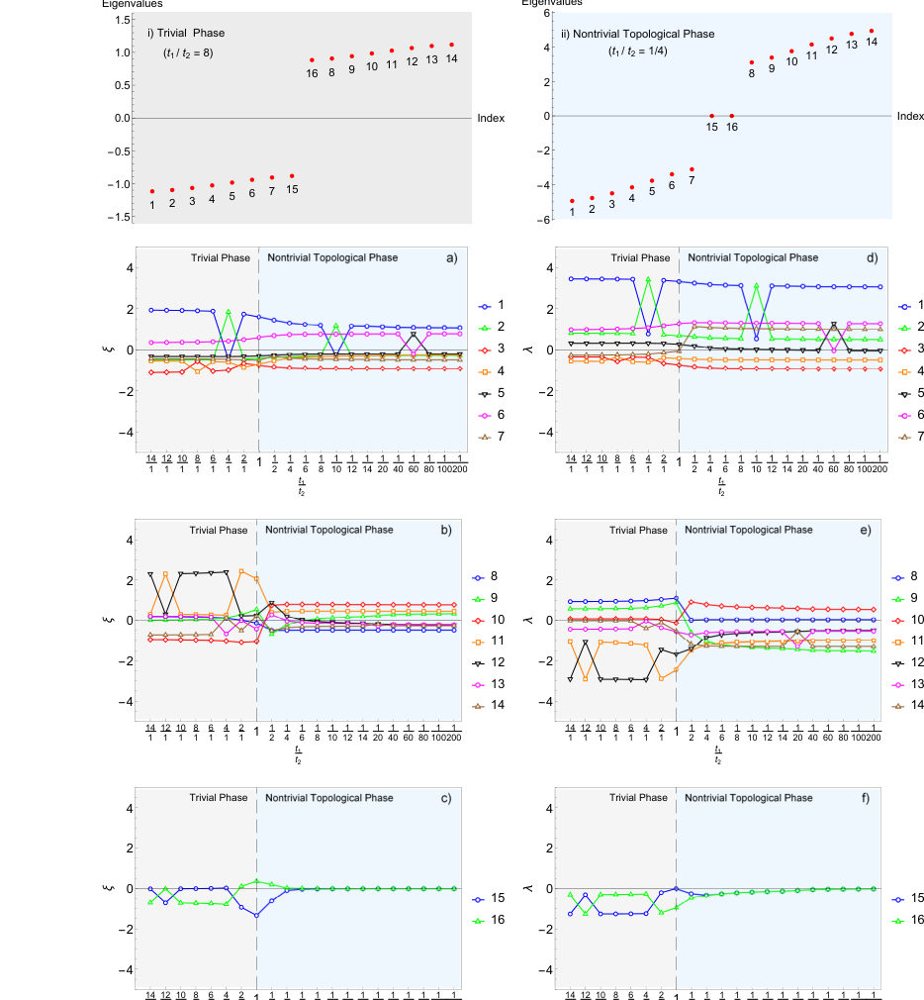 
Figure 2. Displacement and squeezing channels for sixteen SSH fuels. Four-qubit encoding of an eight-cell SSH chain driving a repeated- interaction micromaser. Eigenvalue enumeration of SSH chain in i) trivial, and ii) nontrivial topological phases. For each eigenstate fuel ρs = |vs⟩⟨vs|, (s = 1, . . . , 16), data points show (a through c) the squeezing indicator ξ, and (d through f) the displacement indicator λ as functions of the dimerization ratio t1/t2 with GADC during flight (ttr = 10 ns) and cavity loss included. Bulk fuels (the first 14 states) activate coherent channels across parameters, exhibiting λ ̸= 0 and ξ ̸= 0, whereas the two edge fuels (15th and 16th states) exhibit vanishing...

📷 Fig 3

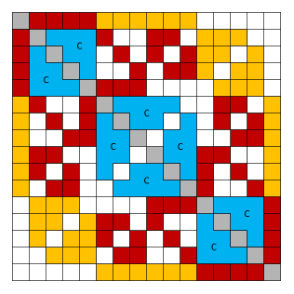 
Figure 3. Illustration of the density matrix ρ of the four-qubit fuel system in energy basis. Blue blocks represent the coherence terms driving the incoherent heat exchange process, and red and yel- low terms represent the terms contributing to coherence injection, (summing up to form λ) and squeezing (summing up to obtain ξ), respectively. Gray diagonal and white terms are the populations and ineffective coherences, respectively [23]. λ = ξ = 0 satisfy the pure thermalization condition.

**Summary.** The paper establishes that the topological nature of a quantum fuel, derived from an SSH chain, dictates whether the coupled cavity system undergoes pure thermalization or exhibits coherent work extraction. By measuring coherence indicators like squeezing and displacement, the authors show this edge-bulk dichotomy is robust against realistic noise and disorder, establishing a fundamental link between topology and thermodynamics.

**Why it may be interesting.** This work provides an operational quantum resource concept—using topology to engineer specific thermodynamic behaviors (pure heat vs. extractable work)—which is highly relevant for designing next-generation quantum engines and energy transducers.

Detailed structure

**Main problem.** The research aims to determine if quantum topology can fundamentally control the distinction between heat-like (purely thermal) and work-like (coherent) energy resources in open, interacting quantum systems.

**Main result.** Topological edge states act as robust 'pure-thermalization fuels,' suppressing coherent excitations, while bulk eigenstates activate these channels, demonstrating a clear topology-thermodynamics link.

**Method.** The authors analyze the steady-state response of a cavity coupled to an SSH chain fuel source by measuring coherence indicators derived from homodyne readout.

**Model / system.** The system uses an open Su-Schrieffer-Heeger (SSH) chain as a quantum fuel for a micromaser, modeled via coupling to a cavity mode. The dynamics are analyzed using master equations and involve mapping lattice eigenstates onto a small qubit register.

**Key observables.** Squeezing ($\xi$) and displacement ($\lambda$) indicators derived from field quadratures ($X$ and $P$), used to distinguish between pure thermalization ($\lambda \approx \xi \approx 0$) and coherent response.

**Important parameters / regimes.** The dimerization ratio ($t_1/t_2$) is crucial for tuning the system into topological regimes. Robustness tests include decoherence (phase-damping, depolarizing) and disorder levels (up to 5%).

**Assumptions / limitations.** The analysis assumes that the fuel state can be unitarily compressed onto a finite qubit register while preserving its essential topological information.

**Figures summary.** Figures demonstrate that for SSH fuels, edge states maintain vanishing $\lambda$ and $\xi$ in the topological phase, whereas bulk states show non-zero values. These results are shown to persist under various noise models and are absent in topologically trivial lattices.

**Paper structure.** The paper establishes the theoretical framework by defining the edge/bulk dichotomy using SSH chains coupled to a cavity. It then rigorously tests this classification's robustness against realistic decoherence channels, culminating in comparisons with non-topological lattice models.

Abstract

Repeated-interaction machines distinguish heat-like from work-like resources through the steady states they generate, but whether topology can control this distinction remains unknown. Here we reveal the role of topology in the process by showing that topological edge states can act as pure-thermalization fuels. For an open Su-Schrieffer-Heeger chain used as the fuel source of a micromaser, edge eigenstates suppress both displacement and squeezing and drive the cavity to a Gibbs state, whereas bulk eigenstates activate coherent channels and yield thermo-mechanical operation. This edge-bulk thermodynamic dichotomy remains robust under realistic decoherence, cavity loss, bond disorder, and moderate onsite disorder. We further design a superconducting implementation in which a sixteen-site SSH eigenstate is deterministically compressed into a four-qubit fuel register. The resulting cavity response provides a transport-free classifier of topology and identifies a topology-thermodynamics link that extends beyond cavity-QED to repeated-interaction settings more generally.

[↑ back to top](#top)

### [On-chip Radio Frequency Maser](http://arxiv.org/abs/2607.21002v1)

**Authors:** Hongliang Wu, Zhengtao Wang, Yuchen Han, Liu Yang, Zhiwei Wang, Yeliang Wang, Dezhi Zheng, Bo Zhang, Jun Zhang  
**Type:** experiment · **Category:** other · **PDF:** <https://arxiv.org/pdf/2607.21002v1>  
**Analysis basis:** full PDF text, analyzed in chunks
**Topic relevance:** `quantum measurements` **3/5** · `quantum optics experiment` **3/5** · `spintronics-quantum-optics interface` **3/5** · `QC/QI experiment` **2/5** · `Tavis-Cummings & cavity-many-emitter` **2/5** · `correlated cavity matter` **2/5** · `driven-dissipative phase transition` **2/5** · `exotic spin models in light-matter` **2/5** · `analog quantum simulation` **1/5** · `measurement-induced transitions` **1/5** · `methods for driven-dissipative` **1/5** · `non-equilibrium dynamics` **1/5** · `superradiant laser` **1/5**

📷 Fig 1

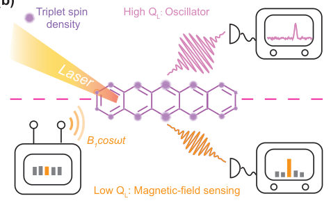 
FIG. 1. The mechanism of LF maser. (a) Pentacene molecules are pumped by a 590-nm pulse, followed by ISC and rapid IC to the first triplet excited state T1. In the ab- sence of an external magnetic field, the T1 state spontaneously splits into the X, Y, and Z sublevels. The population ratio between the X and Y sublevels is approximately 0.76: 0.16. X-Y inversion drives the approximately 106-MHz transition. (b) High QL supports self-oscillation while low QL suppresses oscillation and enables magnetic-field sensing.

📷 Fig 2

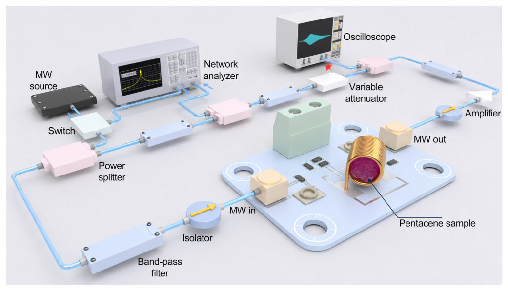 
FIG. 2. Setup for the LF maser. A gain-adjustable feedback loop tunes the LC circuit QL and switches between oscillator and sensing regimes. A logarithmic detector can be added at the position marked by a red star to convert the time-domain signal into an envelope signal.

📷 Fig 3

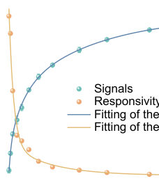 
FIG. 4. The sensitivity of the magnetic-field sensing. The green points represent the signal strengths measured at different microwave magnetic fields and are fitted by an ex- ponential equation. The slope at each data point can be ob- tained from the fitted curve, which is the responsivity of the system to the magnetic field.

📷 Fig 4

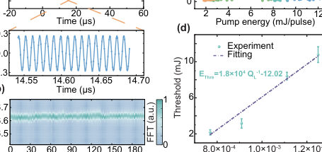 
FIG. 3. Performance of the microwave quantum os- cillator. (a) The upper panel shows the time-domain data of LF maser pulses. The lower panel provides a detailed view of the position of maximum maser output. The dots represent the data points acquired by the oscilloscope, and the solid line is the sinusoidal fit. (b) Emission spectra of the LF maser. Emission remains centered at 106.62 MHz over repeated tri- als. (c) The maser output peak intensity versus the pump energy under different QL. The relationship clearly follows a square-root function. (d) Linear relationship between the Q−1 L and the threshold pump energy. The threshold is defined at 1 µW maser output.

**Summary.** The research presents the first on-chip radio-frequency maser using optically pumped pentacene at room temperature. By integrating the gain medium into a compact LC resonator and implementing active feedback control over the circuit's quality factor, the authors achieved stable microwave emission and demonstrated ultra-sensitive magnetic field detection ($\sim 10 	ext{ fT}/\sqrt{	ext{Hz}}$). This establishes a highly integrated platform for portable quantum sensing.

**Why it may be interesting.** This work directly addresses solid-state quantum emitters for microwave detection. The ability to integrate the gain medium into a chip-scale resonator while actively tuning its coupling strength ($Q_L$) is highly relevant for building portable, high-performance quantum sensors that bridge fundamental physics with practical engineering.

Detailed structure

**Main problem.** To develop a highly integrated, room-temperature solid-state maser operating at radio frequencies (RF) for applications like ultra-sensitive microwave magnetic-field detection.

**Main result.** The authors demonstrated the first on-chip RF maser using pentacene, achieving stimulated emission at 106.62 MHz and reaching a magnetic-field sensitivity of $\sim 10 	ext{ fT}/\sqrt{	ext{Hz}}$.

**Method.** They utilized an optically pumped system within a compact on-chip LC resonant circuit, employing active feedback control to tune the resonator's quality factor ($Q_L$) between oscillator and sensing regimes.

**Model / system.** The physical platform is pentacene doped p-terphenyl exhibiting optically pumped triplet states ($T_1$). The maser operates by exploiting the X-Y sublevel transition ($\sim 106$ MHz) within an LC resonator structure integrated on a chip, replacing bulky metallic resonators.

**Key observables.** Maser output signal intensity (showing $\propto \sqrt{E_{	ext{pump}}}$ dependence), stable oscillation spectra locked to the X-Y frequency, and magnetic field response ($\partial S / \partial B_1$).

**Important parameters / regimes.** Operating frequency of 106.62 MHz; sensitivity of $10 	ext{ fT}/\sqrt{	ext{Hz}}$; tunability via controlling $Q_L$ from intrinsic ($\approx 40$) to several thousand.

**Assumptions / limitations.** The threshold pump energy required for low-$Q_L$ operation far exceeds the pentacene damage threshold, suggesting improving the intrinsic $Q_L$ is necessary for further development.

**Figures summary.** Figures illustrate the mechanism (pumping $
ightarrow T_1 
ightarrow X-Y$ inversion) and the two operating regimes. Time-domain data shows signal build-up, FFT confirms stable oscillation, and plots demonstrate intensity scaling with pump energy and threshold dependence on $Q_L$.

**Paper structure.** The paper details the physical mechanism of optical pumping in pentacene to achieve triplet state inversion, describes the integration into an LC resonator circuit, presents experimental results showing tunable operation between maser oscillation (high $Q_L$) and sensitive sensing (low $Q_L$), and concludes with performance metrics.

Abstract

Room-temperature solid-state masers offer exceptional frequency selectivity and ultra-low noise for weak-signal detection. However, their reliance on bulky metallic resonators has significantly hindered integration, miniaturization, and extension to lower frequencies. Here, we demonstrate the first on-chip radio-frequency maser operating at room temperature, exploiting optically pumped triplet states of pentacene. The device produces stimulated emission at 106.62 MHz and enables ultra-sensitive microwave magnetic-field detection with a sensitivity of ($\sim 10\,\rm{fT/\sqrt{Hz}}$), functioning simultaneously as a local oscillator and a sensor. By actively controlling microwave dissipation, we achieve efficient regulation of the maser output, revealing a key mechanism for tuning emission in open cavity-free systems. This work extends pentacene-based masers into the radio-frequency regime and establishes a highly integrated on-chip architecture for room-temperature masers, offering a new pathway toward portable quantum devices.

[↑ back to top](#top)

### [Bistability of Exciton-Photon Microcavities in the Ultrastrong-Coupling Regime](http://arxiv.org/abs/2607.20688v1)

**Authors:** Rashed Aljasmi, Hisham Sati, Hichem Eleuch  
**Type:** theory · **Category:** other · **PDF:** <https://arxiv.org/pdf/2607.20688v1>  
**Analysis basis:** full PDF text, analyzed in chunks
**Topic relevance:** `correlated cavity matter` **3/5** · `driven-dissipative phase transition` **3/5** · `methods for driven-dissipative` **3/5** · `analog quantum simulation` **2/5** · `non-equilibrium dynamics` **2/5** · `Keldysh / 2PI / non-Gaussian methods` **1/5** · `Tavis-Cummings & cavity-many-emitter` **1/5** · `non-equilibrium universality` **1/5**

📷 Fig 1

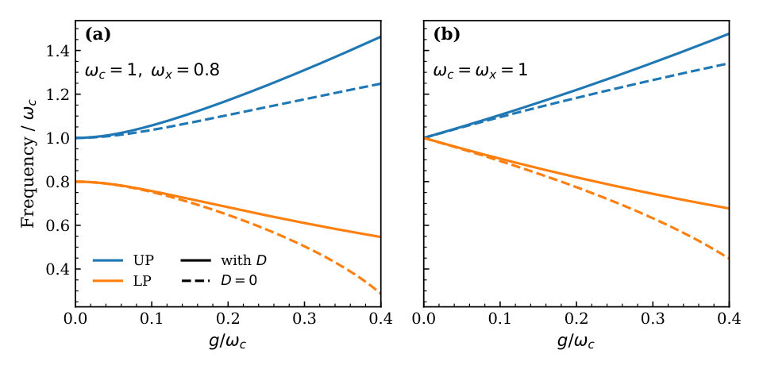 
Figure 1: Upper (UP) and lower (LP) polariton eigenfrequencies ω1,2 (normalized to ωc) as a function of the normalized light–matter coupling strength g/ωc. (a) Detuned case (ωc = 1, ωx = 0.8). (b) Resonant case (ωc = ωx = 1). In both panels, solid lines correspond to the full model including the diamagnetic term D, while dashed lines correspond to the case where the diamagnetic term is neglected (D = 0). Blue and orange curves denote the UP and LP branches, respectively. Including D produces an overall blueshift of both polariton branches, which becomes more pronounced at larger coupling.

📷 Fig 2

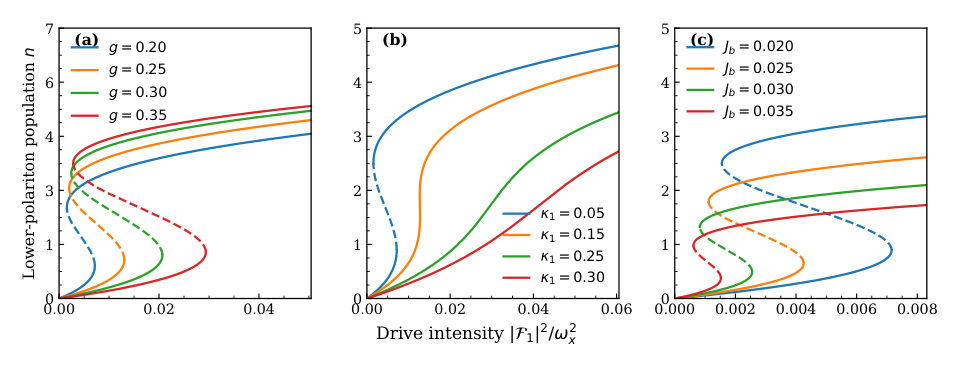 
Figure 2: Input–output curves of the driven lower polariton, obtained from the nonlinear relation in Eq. (27), with fixed bare frequencies ωc = 1.4, ωx = 1.0 and drive frequency ωd = 1.1. The vertical axis shows the lower–polariton population n, while the horizontal axis displays the drive intensity |F1|2. Solid lines indicate dynamically stable steady states, while dashed segments correspond to the unstable branch between the turning points. (a) Dependence on the light–matter coupling strength g at fixed κ0 = 0.1 and Kerr nonlinearity Jb = 0.02; the different values of g are indicated in the legend. Increasing g lowers the lower–polariton frequency, makes the effective detuning more...

📷 Fig 3

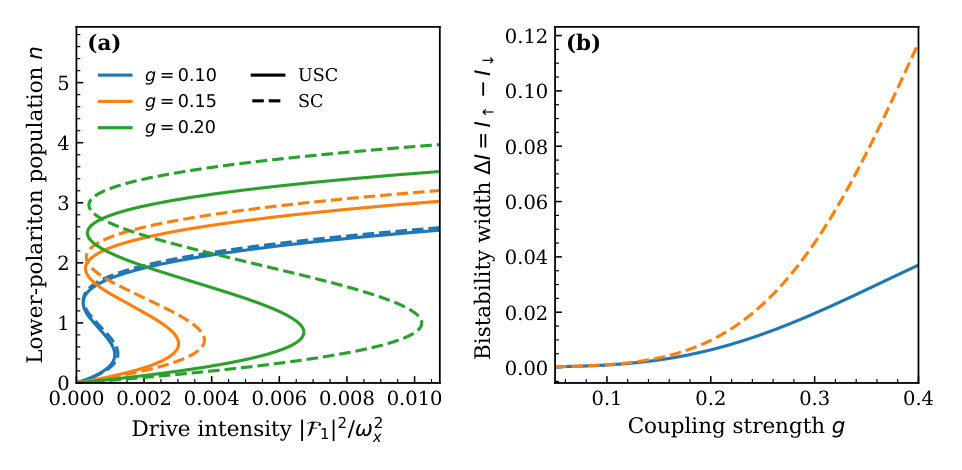 
Figure 3: Comparison between the full ultrastrong-coupling (USC) response and the strong- coupling (SC) approximation [28] for the driven lower polariton, obtained from the nonlinear relation in Eq. (27), with fixed bare frequencies ωc = 1.4, ωx = 1.0, and drive frequency ωd = 1.1. Through- out, we fix the Kerr nonlinearity to Jb = 0.02 and the bare cavity dissipation rate to κ0 = 0.05. Solid (dashed) lines denote the USC (SC) result. (a) Input–output curves of the driven lower polariton, where the vertical axis shows the lower–polariton population n and the horizontal axis displays the drive intensity |F1|2/ω2 x; the different values of g are indicated in the legend. At small light–matter...

**Summary.** The paper theoretically analyzes bistability in semiconductor microcavities operating under ultrastrong coupling. By retaining counter-rotating terms beyond the standard RWA, the authors show that while the qualitative physics remains similar to strong coupling, quantitative predictions for hysteresis loops are significantly shifted due to spectral renormalization.

**Why it may be interesting.** This work is highly relevant as it pushes beyond the standard Rotating Wave Approximation (RWA) in cavity QED systems, showing how fundamental quantum corrections (counter-rotating terms) alter macroscopic nonlinear phenomena like optical switching.

Detailed structure

**Main problem.** The study investigates the phenomenon of optical bistability in exciton-photon microcavities when operating within the ultrastrong-coupling regime.

**Main result.** While the bistability retains a standard Kerr-oscillator form, the inclusion of counter-rotating processes and diamagnetic terms renormalizes the polariton spectrum, causing measurable shifts in the turning points and hysteresis window compared to predictions from the strong-coupling (RWA) limit.

**Method.** The analysis uses a mean-field approximation on the effective single-mode Hamiltonian derived after diagonalizing the full Hopfield-Rabi model using Bogoliubov transformations.

**Model / system.** The system is an exciton-photon microcavity modeled by a Hamiltonian including Rabi coupling, Kerr nonlinearity, and external driving. The dynamics are treated via a Lindblad master equation for the lower polariton branch approximation.

**Key observables.** Bistability (S-shaped input-output curves), polariton frequencies ($\omega_{1,2}$), effective detuning ($	ilde{\Delta}_1$), and nonlinearity ($U_{\mathrm{LP}}$).

**Important parameters / regimes.** Ultrastrong-coupling regime ($\eta \gtrsim 0.1$), coupling strength ($g$), and the diamagnetic term $D$.

**Assumptions / limitations.** The analysis assumes a weakly nonlinear regime, allowing for an effective single-mode description (lower polariton approximation), and explicitly neglects phase-space filling effects.

**Figures summary.** Figure 1 illustrates how the lower and upper polariton frequencies depend on the coupling strength $g$ and other parameters.

**Paper structure.** The paper builds from the full Hamiltonian formulation, reduces it to an effective single-mode description via polariton diagonalization, derives the semiclassical equations of motion using a mean-field approach, and finally analyzes stability criteria to map out the bistability regions.

Abstract

We investigate a coherently driven exciton--photon microcavity with Kerr nonlinearity in the ultrastrong-coupling regime. When the lower and upper polariton branches are well separated in energy, the full Hopfield--Rabi--Kerr model reduces to an effective single-mode description of the lower polariton. We analyze the stability of the lower-polariton steady states. We show that the resulting bistability is qualitatively similar to that in the strong-coupling regime. However, in the ultrastrong-coupling regime counter-rotating processes and the diamagnetic $A^{2}$ term renormalize the polariton spectrum and composition, changing the effective detuning $\tildeΔ_{1}$ and nonlinearity $U_{\mathrm{LP}}$ $g$-dependency beyond the strong-coupling (RWA) picture. As a result, although the semiclassical bistability criterion keeps its standard Kerr--oscillator form, the turning points and hysteresis window are shifted relative to the strong-coupling prediction.

[↑ back to top](#top)

### [Helical stability of double-stranded semiflexible chains with interstrand interactions](http://arxiv.org/abs/2607.21133v1)

**Authors:** Farisan Dary, Donn Liew, Haiyi Liang, Ee Hou Yong  
**Type:** theory · **Category:** statistical mechanics · **PDF:** <https://arxiv.org/pdf/2607.21133v1>  
**Analysis basis:** full PDF text, analyzed in chunks
**Topic relevance:** `methods for driven-dissipative` **3/5** · `analog quantum simulation` **2/5** · `driven-dissipative phase transition` **2/5** · `non-equilibrium dynamics` **2/5** · `non-equilibrium universality` **2/5** · `Frenkel-Kontorova` **1/5** · `Keldysh / 2PI / non-Gaussian methods` **1/5** · `correlated / nonlocal dissipation` **1/5** · `entanglement & information structure` **1/5**

📷 Fig 1

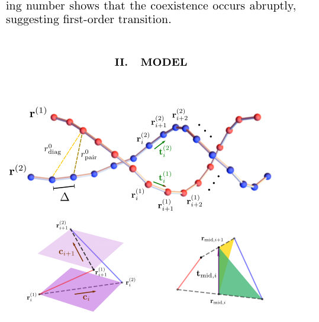 
FIG. 1. (a) A model of two semiflexible chains, ri and ri+1, each consisting of vertices that are equally separated by ∆. The vertices {ri} are connected by tangent vector, i.e., ri+1 = ri + ∆· ti. The parameters r0 diag r0 pair are the equilibrium distance of pairs that are direct opposite and di- agonal opposite of each other, respectively. (b) A schematic diagram showing the counterclockwise rotation of successive corresponding vectors {ci} and the triangular planes whose normals are used to regulate the twist.

📷 Fig 2

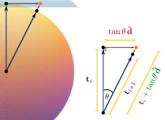 
FIG. 2. A schematic diagram of a chain generating algorithm. The subsequent tangent vector ti+1 is determined as the pro- jection of the resultant vector of preceding tangent vector ti and displacement vector tan θ ˆd onto the surface of a unit sphere.

📷 Fig 3

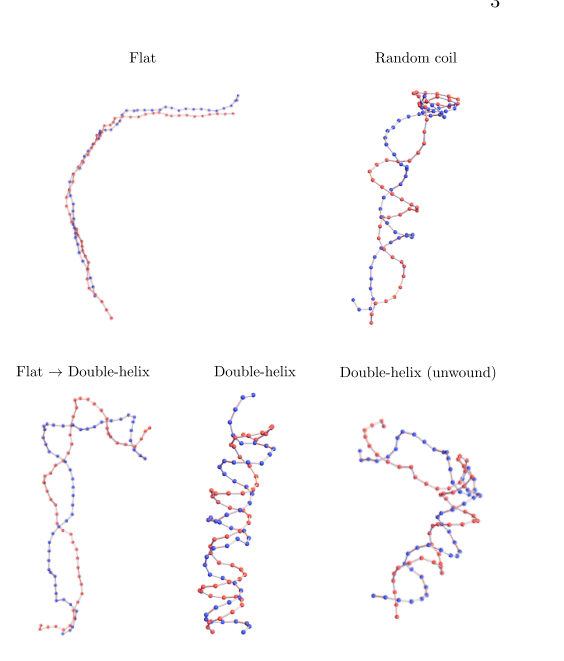 
FIG. 3. Morphologically distinct configurations obtained from different values of P and D. The flat configuration corre- sponds to P = D = 0, while the random coil configuration corresponds to P = 0 and nonzero D. When both parame- ters are nonzero, the configuration adopts three different mor- phologies depending on the magnitude of P and D.

📷 Fig 4

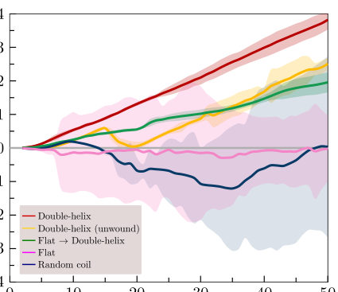 
FIG. 4. The cumulative link function Lk(n) of configurations in different morphological phases. The link in double-helix phase (red) and during the transition (green) from flat to double-helix is linearly increasing along the configuration. In unwound double-helix phase, the nonlinear trends in Lk(n) corresponds to a ladder-like configuration. The link is rela- tively small in the flat phase (lavender) since the configura- tion rarely bends and twists. In the random coil phase (blue), Lk(n) fluctuates between positive and negative link since the configuration is allowed to twist freely in any direction since the handedness-symmetry is unbroken.

📷 Fig 5

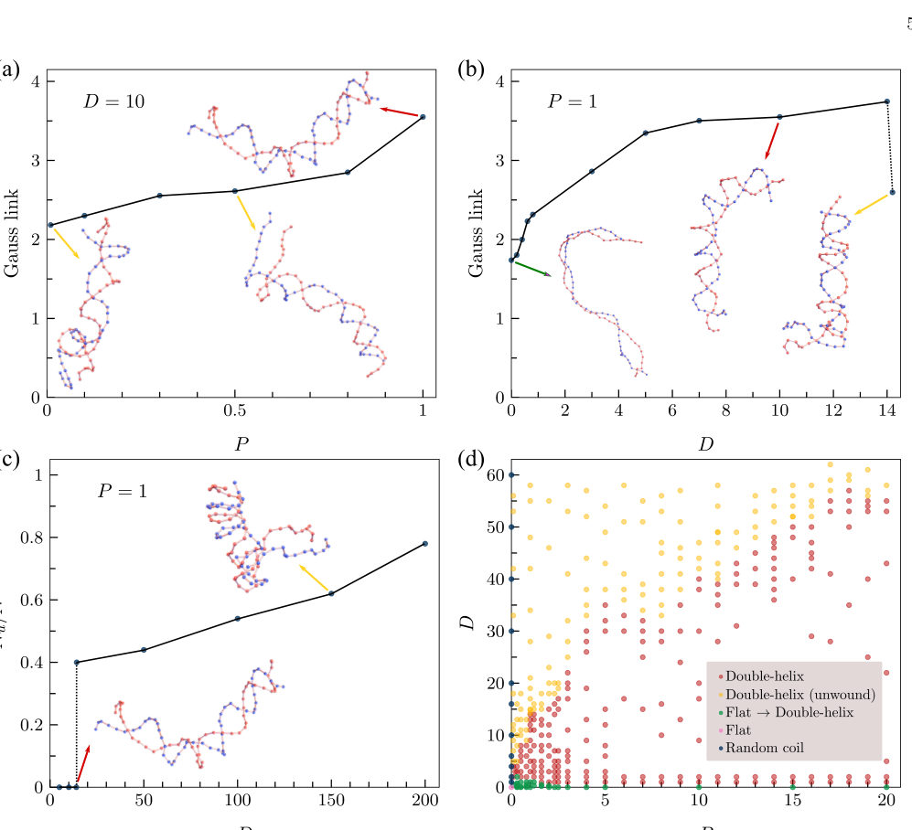 
FIG. 5. Morphological phases of the model with different values of P and D: (a) When D = 10 is fixed, the configuration becomes right-handed spontaneously when P is no longer zero. The configuration is a partially unwound double-helix (yellow →), which eventually becomes full double-helix (red →) as P increases further. (b) When P = 1 fixed, the configuration with D = 0 has nonzero linking number (green →), which steadily (signified by the gradual rise in the Gauss link) becomes a double-helix as as D increases. As D increases further, the double-helix abruptly unwound. (c) Similar to (b) but instead of Gauss link, the quantity Nu/N which represents the fraction of unwound segments is used...

**Summary.** This work models double-stranded semiflexible chains to understand how base-pairing and twisting energies dictate the overall helical structure. Using Monte Carlo simulations, the authors map out distinct morphological phases—including unwinding transitions—by tracking topological invariants like the Gauss linking number. The findings elucidate a delicate energetic balance governing structural stability in biopolymer systems.

**Why it may be interesting.** While focused on biophysics (DNA), the methodology—using statistical mechanics tools like phase transition analysis, energy minimization across competing structural states, and topological diagnostics ($	ext{Lk}$)—is highly relevant for understanding complex many-body systems in AMO physics or quantum materials where local interactions drive global order.

Detailed structure

**Main problem.** The study investigates the global morphological transitions of double-stranded semiflexible chains, specifically determining the balance required between base-pairing interactions and twisting energy to maintain the double-helix structure without external constraints.

**Main result.** The model exhibits distinct phases (flat, random coil, double-helix, unwound) whose transitions are characterized by first-order changes in linking number. The system's stability is governed by minimizing total energy across these competing structural states.

**Method.** Monte Carlo simulations using the Metropolis algorithm were employed to sample configurations based on a Hamiltonian incorporating bending, pairing, and twisting energies.

**Model / system.** The physical system is modeled as two semiflexible chains interacting via base-pairing ($E_{	ext{pair}}$) and diagonal interactions ($E_{	ext{diag}}$), with handedness regulated by $E_{	ext{twist}}$. The total energy includes bending terms derived from the Kratky-Porod potential.

**Key observables.** Gauss linking number ($	ext{Lk}$), Order Parameter ($	ext{Nu/N}$), correlation functions ($\langle t_n \cdot t_0 
angle$, $\langle c_n \cdot c_0 
angle$), and average energy per segment ($\epsilon$).

**Important parameters / regimes.** Interaction strengths ($D$ for base-stacking, $P$ for twist symmetry breaking) and the dimensionless temperature parameter ($\Lambda = T/T_0$).

**Assumptions / limitations.** Bending flexibility is assumed to follow the Kratky-Porod potential. The analysis relies on fitting correlation functions to damped oscillatory forms.

**Figures summary.** Figures illustrate distinct morphologies based on varying interaction parameters ($P$ and $D$), plot the linking number ($	ext{Lk}(n)$) across different phases, and show temperature dependence of persistence lengths.

**Paper structure.** The paper establishes the model Hamiltonian, uses Monte Carlo simulations to map out phase diagrams based on coupling constants ($D, P$), analyzes topological invariants like the linking number to pinpoint transitions, and finally examines thermal effects via correlation functions.

Abstract

The mechanical and structural properties of dsDNA have been successfully described by models with varying levels of complexity and coarse-graining schemes. Prior work has characterized local stacking/twist effects and force-torque phase diagrams under external constraints. However, the role of base-pairing and torsional elasticity in global morphological transitions remain poorly characterized in the absence of external constraints. Here we investigate the delicate balance required for the strength of base-pairing interactions and the twisting energy to preserve the double-helix structure in a model made up of two semiflexible chains. We found that the model exhibits several distinct morphological phases: flat, random coil, double-helix, and the unwound double-helix. We calculate the Gauss linking number to characterize transitions between these phases.

[↑ back to top](#top)

### [A single length scale rules ballistic aggregation: travels of a droplet train](http://arxiv.org/abs/2607.21315v1)

**Authors:** Nathan Vani, Stefan Kooij, Aritro Mukherjee, Antoine Parrenin, Cees J. M. van Rijn, Daniel Bonn  
**Type:** both · **Category:** statistical mechanics · **PDF:** <https://arxiv.org/pdf/2607.21315v1>  
**Analysis basis:** full PDF text, analyzed in chunks
**Topic relevance:** `non-equilibrium dynamics` **3/5** · `non-equilibrium universality` **3/5** · `driven-dissipative phase transition` **2/5** · `Frenkel-Kontorova` **1/5** · `Keldysh / 2PI / non-Gaussian methods` **1/5** · `analog quantum simulation` **1/5** · `correlated / nonlocal dissipation` **1/5** · `methods for driven-dissipative` **1/5**

📷 Fig 1

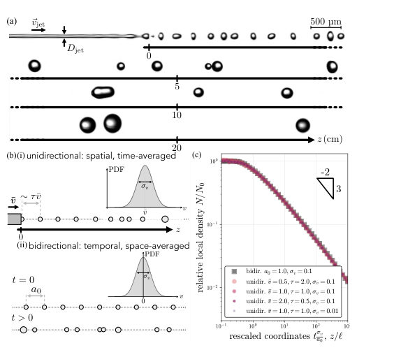 
FIG. 1. (a) Inherently unstable, a liquid jet breaks up into a train of droplets. As we look further downstream of the train we see ever fewer and larger droplets. Corresponding videos are available as supplementary material. (b) We model the train as a ‘unidirectional’ ballistic aggregation process (i) of average speed ¯v with a standard deviation σv at z = 0 and an emission period τ. Measurements are localized in space. The system is equivalent to a ‘bidirectional’ one (ii) with a zero average speed in which measurements are localized in time – as long as the initial standard deviations in velocity match and the initial particle spacing a0 matches τ ¯v. (c) Collapse of local density N/N0...

📷 Fig 2

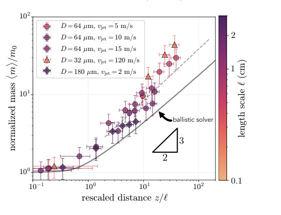 
FIG. 2. Evolution of the average mass normalized by Rayleigh-Plateau prediction of the initial droplet mass m0 as a function of the rescaled distance z/ℓwith ℓshown in the colorbar, for several jet sizes and velocities. The full gray line is the prediction from the ballistic solver. The dashed line indicates a 2/3 slope, whereas individual fits of the slope av- erage 0.67 ± 0.08.

📷 Fig 3

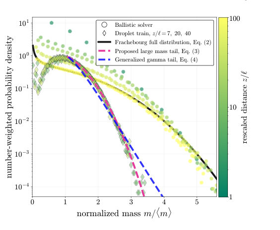 
FIG. 3. Number-weighted probability density function of the normalized mass from simulations (circles) and experi- ments (diamonds). At large z/ℓ, the former agrees with the Frachebourg distribution (Eq. (2), black line). Experimen- tal data is narrower due to drag. We fit its tail successfully with the Frachebourg-derived proposed expression (Eq. 3, pink dashed line) and without success with a Smoluchowski- derived generalized gamma (Eq. 4, blue dashed line) – both are fitted with a free amplitude prefactor. Experimental data correspond to trains of droplets originating from a jet of di- ameter Djet = 64µm, at either vjet = 10 m/s (z/ℓ= 7) or vjet = 5 m/s (z/ℓ= 20, 40).

📷 Fig 4

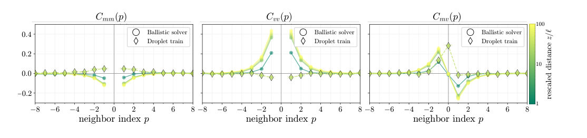 
FIG. 4. Correlation coefficients from the simulations (circles) and from experiments (diamonds) Cmm, Cvv, Cmv for various neighbor index p, with p &gt; 0 denoting droplets farther downstream. Experimental data correspond to 400.000 droplets recorded for Djet = 64µm, vjet = 5m/s at z = 15 cm, corresponding to z/ℓ= 29. Trivial values of Cmm(0) = Cvv(0) = 1 are omitted. Further experimental measurements of correlation are shown in the SM.

📷 Fig 5

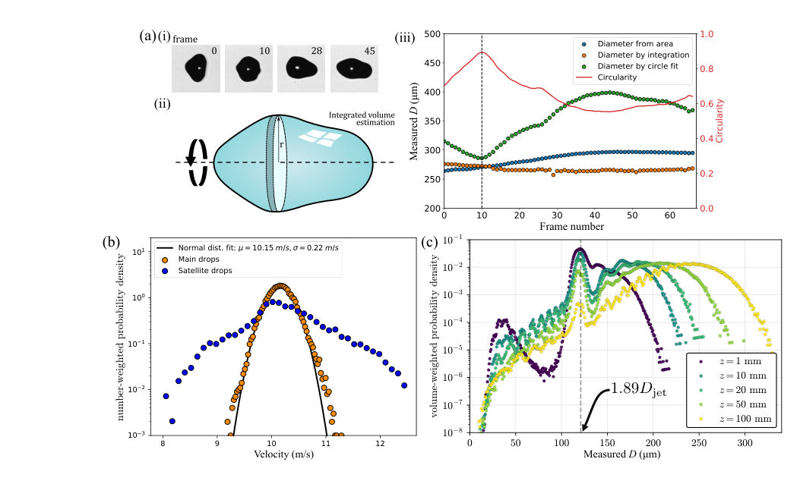 
FIG. 5. (a) Visual volume-integration method. (i) Time sequence of an oscillating droplet resulting from a merging event. (ii) Integration of the volume of the droplet under assumption of axisymmetry. (iii) Apparent diameter of the droplet inferred from area-based projection, circular fits, and axisymmetric volume integration. Area-based and circular fit show variations of approximately 30 and 15%, whereas volume-integration varies only by about 8%. All methods agree when the droplet matches a spherical shape. (b) Velocity distributions of main (orange) and satellite (blue) droplets near jet breakup, for Djet = 64 µm and vjet = 10 m s−1. The main droplets follow a narrow normal...

**Summary.** This work experimentally realizes and analyzes one-dimensional ballistic aggregation using a train of liquid droplets. The research confirms that the process follows predicted scaling laws governed by a single length scale, demonstrating that mean-field theories fail when directional memory is present in collisions.

**Why it may be interesting.** Although focused on classical fluid dynamics, the failure of mean-field descriptions due to directional memory echoes challenges in modeling non-equilibrium quantum systems where simple approximations break down.

Detailed structure

**Main problem.** The study investigates ballistic aggregation, a non-equilibrium process relevant across physics scales, by confirming theoretical scaling laws through experimental realization.

**Main result.** The global aggregation process is shown to be governed by a single length scale, and the measured mass growth exponent matches the theoretically predicted value of 2/3.

**Method.** The authors combine high-speed droplet tracking experiments with event-driven simulations to analyze particle mergers in one dimension.

**Model / system.** The system models droplets aggregating ballistically from a liquid jet breakup, which is treated as a non-equilibrium process where collisions carry directional memory. The analysis compares this physical system against theoretical frameworks like CPY scaling and Frachebourg's analytical solutions.

**Key observables.** Average particle mass growth ($\langle m 
angle$), number-weighted mass distribution function ($p(x)$), and correlation coefficients between neighboring particles (mass, velocity).

**Important parameters / regimes.** The characteristic length scale $\ell = 	au ar{v}^2/\sigma_v$, jet parameters ($D_{	ext{jet}}, v_{	ext{jet}}$), and the exponent $2/3$.

**Assumptions / limitations.** Air drag is included as a perturbation, but the 1D ordering constraint protects the bulk scaling characteristics. Mean-field descriptions (like Smoluchowski) are shown to fail due to directional memory.

**Figures summary.** Figures show confirmation of the $2/3$ growth law via data collapse vs. rescaled coordinates, convergence of mass distributions to analytical solutions, and analysis of velocity correlations for simulations versus experiments.

**Paper structure.** The paper establishes the physical relevance of ballistic aggregation, presents experimental measurements on droplet trains, confirms scaling laws using a single length scale $\ell$, analyzes fine-grained properties like mass distribution tails, and discusses deviations caused by air drag.

Abstract

Ballistic aggregation is a canonical non-equilibrium process, relevant across scales from granular gases to planetary accretion. Collisions are driven by differences in velocities, building up persistent correlations between neighbors. Here, we provide the first experimental realization of one-dimensional ballistic aggregation in a train of droplets formed by the breakup of a liquid jet. Experiments and simulations confirm the analytically predicted scaling, with the global process shown to be governed by a single length scale. While air drag inverts the sign of neighbor velocity correlations, a 1D ordering constraint protects bulk characteristics of ballistic aggregation such as the scaling exponent and the shape of the large mass tail. More broadly, our results show that Smoluchowski-like mean-field descriptions fail when collisions carry directional memory -- as demonstrated here for jet-generated sprays.

[↑ back to top](#top)

### [Probing the nonlocality of Landau levels in GaAs quantum wells through modified Purcell factors, Lamb shifts and dipole emitted spectra](http://arxiv.org/abs/2607.21528v1)

**Authors:** Lara Greten, Sabrina Meyer, Christina Schröder, Andreas Knorr, Stephen Hughes  
**Type:** theory · **Category:** other · **PDF:** <https://arxiv.org/pdf/2607.21528v1>  
**Analysis basis:** full PDF text, analyzed in chunks
**Topic relevance:** `Keldysh / 2PI / non-Gaussian methods` **3/5** · `correlated / nonlocal dissipation` **3/5** · `methods for driven-dissipative` **3/5** · `Tavis-Cummings & cavity-many-emitter` **1/5** · `correlated cavity matter` **1/5** · `interference shaping light` **1/5** · `spintronics-quantum-optics interface` **1/5**

📷 Fig 1

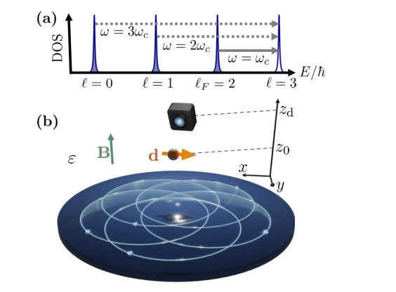 
Figure 1: (a) LL density of states (DOS) for B = 5 T, indicating dipole-allowed (ℓ→ℓ+ 1 with ω = ωc, solid) and dipole-forbidden (ω = 2ωc and ω = 3ωc, dotted) transitions. Occupied LL up to ℓF are filled. (b) In-plane polarized point dipole d (orange) at z0 above a Landau-quantized 2DEG (blue) in the xy-plane subject to a perpendicular magnetic field B (green) in a dielectric environment with permittivity ε. A detector is indicated at zd.

📷 Fig 2

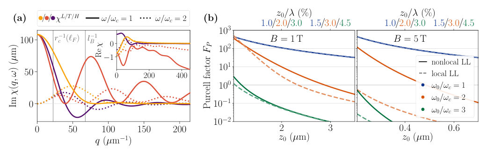 
Figure 2: (a) Imaginary (inset: real) part of the longitudinal (L), transverse (T) and Hall (H) nonlocal susceptibility χL,T,H(q; ω) of a Landau-quantized 2DEG (GaAs quantum well) for B = 3 T and temperature T = 10 K over in-plane wavevector q for ω = ωc (solid) and ω = 2ωc (dashed). Grey vertical lines indicate the inverse maximal, rc(ℓF ), and minimal, rc(ℓ= 0) = lB, Larmor radius. (b) Purcell factor for a parallel dipole with frequency ω0 at z0 above a Landau-quantized 2DEG for B = 1 T (left) and B = 5 T (right). The dipole is chosen to be resonant with the dipole allowed transition ω0 = ωc(B) (solid blue), and two dipole forbidden transitions, ω0 = 2ωc(B) (solid orange) and ω0 = 3ωc(B)...

📷 Fig 3

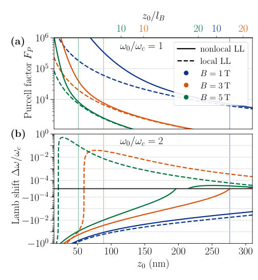 
Figure 3: (a) / (b): Purcell factor / Lamb shift for an in-plane dipole with ω0 = ωc / ω0 = 2ωc in close proximity to a Landau-quantized 2DEG for magnetic field strengths B = [1 (blue) , 3 (orange) , 5 (green)] T. The vertical lines indicate twice the Larmor radius, 2rc(ℓF ), of the highest occupied LL. Parame- ters: temperature T = 10 K, dipole moment d = 100 enm.

📷 Fig 4

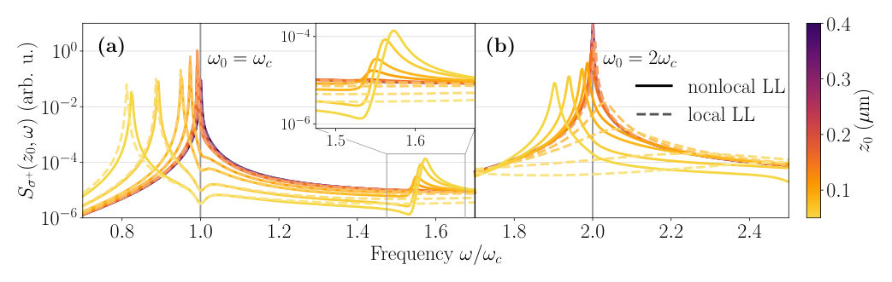 
Figure 4: Emitted spectrum S of an in-plane circular polarized point dipole with dipole moment d = 100 enm and frequency (a) ω0 = ωc , and (b) ω0 = 2ωc, indicated by grey vertical lines at z0 above a Landau-quantized 2DEG (GaAs QW at temperature T = 10 K) for B = 3 T detected at zd = 5 mm (far-field) based on the nonlocal (solid) or local (dashed) LL response. The inset magnifies the collective magnetoplasmon resonance near 1.5-1.6ωc, appearing only in the nonlocal LL response (solid) for small z0. The discontinuity at the panel- intersection occurs since the panels depict spectra of dipoles with different resonance frequencies ω0.

**Summary.** This paper develops a microscopic theory to analyze how the nonlocality of Landau levels affects electromagnetic interactions in 2DEG systems. By calculating observables like Purcell factors and Lamb shifts beyond local approximations, the authors demonstrate that spatial dispersion is crucial for accurately predicting light emission rates, especially for transitions forbidden under simple models.

**Why it may be interesting.** This work provides a rigorous quantum electrodynamics treatment of confined electron systems in strong magnetic fields, which is highly relevant for understanding light-matter interactions in nanoscale solid-state devices and plasmonics.

Detailed structure

**Main problem.** The study aims to theoretically probe the nonlocality of Landau levels (LLs) within a two-dimensional electron gas (2DEG) when subjected to strong perpendicular magnetic fields.

**Main result.** Nonlocal effects significantly modify electromagnetic responses, leading to enhanced Purcell factors for dipole-forbidden transitions and revealing collective magnetoplasmon resonances absent in local approximations.

**Method.** The authors derived the nonlocal susceptibility tensor ($\chi$) using a Green's function formalism beyond standard approximations (Markov/RWA) and applied it to calculate observables like Purcell factors and Lamb shifts.

**Model / system.** The system is a 2DEG in GaAs quantum wells under a strong magnetic field, leading to quantized Landau levels. The theory models the response using a nonlocal susceptibility $\chi(q, \omega)$ derived from microscopic current density calculations.

**Key observables.** Purcell factor ($F_P$), environment-induced Lamb shift ($\Delta\omega$), and dipole emitted spectra $S(\omega)$.

**Important parameters / regimes.** Magnetic field strength (a few Tesla), relevant length scales up to hundreds of nanometers, cyclotron frequency ($\omega_c$).

**Assumptions / limitations.** Calculations are performed beyond the Markov and rotating-wave approximations; the theory relies on decomposing the susceptibility into longitudinal, transverse, and Hall components.

**Figures summary.** Figures compare local versus nonlocal predictions for Purcell factors and Lamb shifts across various frequencies ($\omega_c, 2\omega_c$), highlighting large deviations for forbidden transitions and showing spectral features like magnetoplasmon resonances.

**Paper structure.** The paper develops the theoretical framework by deriving the Green's function and the full nonlocal susceptibility tensor $\chi(q, \omega)$, then applies this formalism to calculate key optical responses (Purcell factors, Lamb shifts) for comparison against local approximations.

Abstract

In a two-dimensional electron gas, a strong perpendicular magnetic field confines electrons to quantized cyclotron orbits, giving rise to Landau levels with discrete orbit radii. Even the smallest Landau orbit, set by the magnetic length, spans tens of nanometers for fields of a few Tesla, imposing an intrinsic nonlocal response to electromagnetic excitations. From a microscopic theory of the nonlocal susceptibility, we derive the Green's function, the central quantity governing all electromagnetic interactions, and evaluate Purcell factors, Lamb shifts, and emission spectra from a proximal dipole emitter beyond the Markov and rotating-wave approximations. Significant nonlocal effects resulting from spatial dispersion of the Landau level response modify the response for experimentally relevant situations up to distances of hundreds of nanometers and, in particular, brighten locally dipole-forbidden transitions due to near-field gradients at multiples of the cyclotron frequency. The relevant length scales are typical of state-of-the-art nanostructured terahertz architectures, and some of our nonlocal features are consistent with recent experiments using Landau level polaritons.

[↑ back to top](#top)

### [Strong correlations and local self-energies from on-site ensembles](http://arxiv.org/abs/2607.21490v1)

**Authors:** Alberto Carta, Hugo U. R. Strand, Michael Schüler, Nicola Marzari  
**Type:** theory · **Category:** strongly correlated electrons · **PDF:** <https://arxiv.org/pdf/2607.21490v1>  
**Analysis basis:** full PDF text, analyzed in chunks
**Topic relevance:** `Keldysh / 2PI / non-Gaussian methods` **3/5** · `methods for driven-dissipative` **3/5** · `Kondo & dissipative impurity` **2/5** · `analog quantum simulation` **2/5** · `correlated / nonlocal dissipation` **1/5** · `correlated cavity matter` **1/5** · `driven-dissipative phase transition` **1/5**

📷 Fig 1

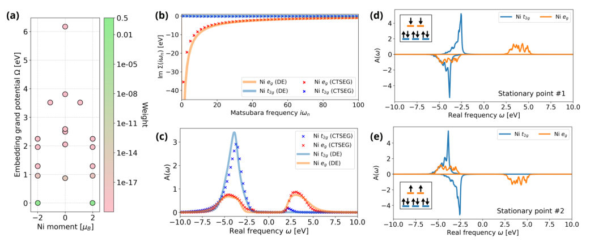 
FIG. 1. Paramagnetic state of NiO: (a) embedding grand potential Ωlandscape. Marker color scales with Boltzmann weight; green circles identify the global minima that overwhelmingly dominate the ensemble average for this system; (b) imaginary part of the Matsubara self-energy, ImΣ(iωn); (c) spin-degenerate local spectral function, A(ω), obtained via analytic continuation; solid lines represent DE results and crosses denote continuous-time quantum Monte Carlo (CTSEG) benchmarks. Calculations employ a 5-orbital d-band model (U = 6 eV, J = 1 eV, β = 40 eV−1); (d,e) symmetry-broken spectral functions corresponding to the two lowest-energy stationary states from (a) resolving the spin-up...

📷 Fig 2

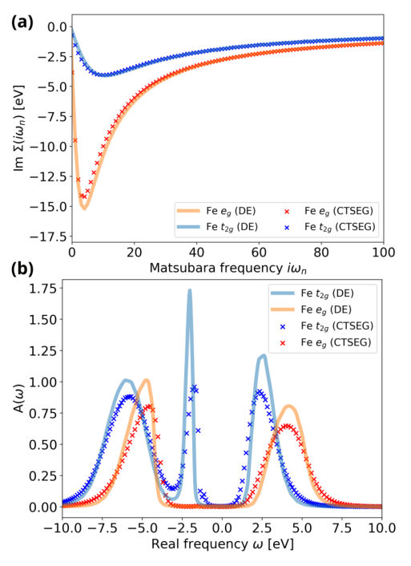 
FIG. 2. Paramagnetic state of FeO, 5 orbital model with U = 6 eV and J = 1 eV and β = 40 eV−1: (a) imaginary part of the Matsubara self-energy ImΣ(iωn); (b) local spectral function A(ω) obtained via analytic continuation of the self- energy. DE results (solid lines) are compared against CTSEG benchmarks (crosses).

**Summary.** This work introduces the On-site dephased ensemble (DE) approximation to tackle strongly correlated Mott insulators. By averaging over local static solutions, DE efficiently reproduces key signatures of strong correlations seen in DMFT. This offers a powerful, computationally cheaper alternative for studying these challenging electronic systems.

**Why it may be interesting.** While focused on solid-state physics, the concept of describing a complex quantum state as an ensemble average over multiple localized configurations shares conceptual links with open quantum system descriptions and environmental coupling in AMO physics.

Detailed structure

**Main problem.** The central challenge is accurately solving the many-body electronic structure problem, especially for paramagnetic Mott insulators which defy standard methods like DFT.

**Main result.** The proposed On-site dephased ensemble (DE) approximation successfully recovers key features of strongly correlated Mott systems, matching DMFT results while offering a computationally efficient first-principles route.

**Method.** The DE approximates the local electronic problem by treating it as a thermal ensemble over all accessible local static solutions, bypassing expensive quantum Monte Carlo or large supercell calculations.

**Model / system.** The study focuses on paramagnetic Mott insulators, using models like NiO and FeO within a 5-orbital d-band framework governed by Hubbard interactions (U).

**Key observables.** Local electronic self-energy ($\Sigma(\omega)$), local spectral function ($A(\omega)$), and the persistence of local moments.

**Important parameters / regimes.** Hubbard interaction strength (e.g., U = 6 eV) and temperature/inverse temperature ($eta$).

**Assumptions / limitations.** The DE neglects inter-basin tunneling between static solutions, making it an approximation valid in the limit of strong Hubbard U.

**Figures summary.** Figures illustrate the grand potential landscape of local states, the imaginary part of the self-energy, and the resulting spectral functions for both the ensemble average and individual symmetry-broken states.

**Paper structure.** The paper introduces the DE approximation by comparing it to DMFT and supercell methods. It then applies this method to paradigmatic Mott insulators (NiO, FeO), benchmarking its results against established DMFT calculations across various observables.

Abstract

Addressing the many-body electronic-structure problem is a central goal of modern condensed-matter physics. Paramagnetic Mott insulators, in particular, have long represented a challenge for standard approaches, such as density-functional theory. Historically, these systems have been tackled either by considering many-body dynamics, as in the case of dynamical mean-field theory (DMFT), or, more recently, by invoking a polymorphous description consisting of large supercells populated with static symmetry-broken motifs whose spatial average restores the paramagnetic state. Inspired by these viewpoints, we introduce the on-site dephased ensemble (DE) approximation, in which the local electronic-structure problem is described by a thermal ensemble of all accessible local static solutions; this gives rise to a strong frequency dependence of the local electronic self-energy, as seen in DMFT or in the coherent-potential approximation of disordered alloys. We show that the DE successfully recovers defining hallmarks of strongly correlated Mott systems, both in terms of the self-energy as well as the persistence of local moments in time, in quantitative agreement with DMFT. By bypassing expensive quantum Monte Carlo solvers or large supercell calculations, this approach offers efficient routes to treating paramagnetic Mott systems in a first-principles setting, and highlights a deeper connection between the physics of strong correlations and that of disorder.

[↑ back to top](#top)

### [Perturbatively Stable Self-Correcting Classical Memory from Gauge Averaging](http://arxiv.org/abs/2607.20605v1)

**Authors:** Ryan Thorngren  
**Type:** theory · **Category:** statistical mechanics · **PDF:** <https://arxiv.org/pdf/2607.20605v1>  
**Analysis basis:** full PDF text, analyzed in chunks
**Topic relevance:** `analog quantum simulation` **3/5** · `Keldysh / 2PI / non-Gaussian methods` **1/5** · `correlated / nonlocal dissipation` **1/5** · `driven-dissipative phase transition` **1/5** · `entanglement & information structure` **1/5** · `exotic spin models in light-matter` **1/5** · `methods for driven-dissipative` **1/5** · `non-equilibrium dynamics` **1/5** · `non-equilibrium universality` **1/5** · `scars & prethermalization` **1/5**

📷 Fig 1

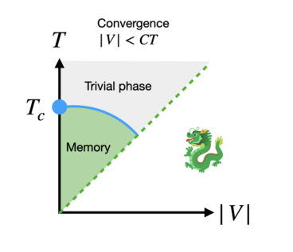 
FIG. 1. Schematic phase diagram of stable memory as a func- tion of temperature T and strength of perturbation |V |. Veff defined by gauge averaging is local in the cone |V | &lt; CT (gray) and enjoys the local symmetry exactly. Here C is a geometric constant. If there is a local-symmetry-protected memory phase at V = 0 up to some Tc, then the memory persists to a fluctuation-stabilized phase in a wedge, as shown schematically in green. Outside this region, denoted by the dragon, we can no longer use our method to define a local Veff, and the memory can break down.

**Summary.** This work proves the perturbative stability of self-correcting memory in 3D Wegner gauge theory using a novel technique called 'gauge averaging.' By showing that fluctuations effectively restore broken symmetries, the authors demonstrate that the system's topological information is robust against small perturbations. This establishes a quantitative understanding of how thermal fluctuations stabilize complex quantum phases.

**Why it may be interesting.** The rigorous mathematical techniques used—especially gauge averaging and bottleneck analysis—provide powerful tools for analyzing the stability of topological order in lattice models, which has parallels in understanding quantum error correction codes (like the toric code).

Detailed structure

**Main problem.** The primary goal is proving that the self-correcting memory inherent in 3D Wegner gauge theory remains stable even when subjected to small, arbitrary perturbations of its Hamiltonian.

**Main result.** The authors prove that this self-correcting memory phase is robustly stable against weak perturbations, and furthermore, this robustness increases with temperature up to a critical point $T_c > 0$.

**Method.** The core technique is 'gauge averaging,' which effectively restores broken gauge symmetries by averaging the system's state over the symmetry group. Stability is rigorously established by bounding the bottleneck ratio of the Markov chain, leading to an exponentially long mixing time.

**Model / system.** The model is based on Wegner's 3D $\mathbb{Z}_2$ gauge theory, describing fluctuations on a lattice (like surfaces $S$). The system is analyzed using the Gibbs state derived from a perturbed Hamiltonian ($H_0 + V$), where $H_0$ relates to the boundary length of these fluctuating surfaces.

**Key observables.** Self-correcting memory (exponentially long mixing time), topological winding number, and the bottleneck ratio $\mu(A[C]) / \mu(\partial A[C])$.

**Important parameters / regimes.** Temperature ($T$ or $\beta$), perturbation strength ($|V|$), lattice size ($L$), and critical temperature ($T_c$).

**Assumptions / limitations.** The proof assumes the symmetry group $G$ is finite abelian, that the perturbation $|V|$ is sufficiently weak relative to the temperature/parameters (e.g., $\beta|V|_{\eta} < C_{\text{gauge}}$), and relies on bounding sums over polymers using criteria like the KP criterion.

**Figures summary.** Figure 1 schematically illustrates the phase diagram, showing that stable memory exists within a region defined by gauge averaging, bounded by regions where the mathematical method fails (the 'dragon').

**Paper structure.** The paper develops the theory by first establishing bounds on the unperturbed system using Peierls arguments and bottleneck lemmas. It then introduces gauge averaging to handle perturbations, culminating in bounding the ratio of measures $\mu_G(\partial A[C]) / \mu_G(A[C])$ to prove exponential decay with system size $L$, thereby guaranteeing long mixing times.

Abstract

We show that the self-correcting memory in 3d Wegner gauge theory is stable to arbitrary small enough perturbations of the Hamiltonian. Our proof relies on a new method we dub ``gauge averaging'', which gives conditions under which explicitly broken gauge symmetries are effectively restored by fluctuations. These conditions show that the self-correcting memory phase is fluctuation stabilized, with its robustness to perturbations increasing with increasing temperature, up to some $T_c > 0$.

[↑ back to top](#top)

### [A geometric framework for spin relaxation](http://arxiv.org/abs/2607.21569v1)

**Authors:** Sophia N. Fricke, Kieren A. Harkins, Ashok Ajoy, Jeffrey A. Reimer  
**Type:** both · **Category:** other · **PDF:** <https://arxiv.org/pdf/2607.21569v1>  
**Analysis basis:** full PDF text, analyzed in chunks
**Topic relevance:** `methods for driven-dissipative` **3/5** · `Keldysh / 2PI / non-Gaussian methods` **2/5** · `driven-dissipative phase transition` **2/5** · `correlated / nonlocal dissipation` **1/5** · `non-equilibrium dynamics` **1/5** · `quantum measurements` **1/5** · `spintronics-quantum-optics interface` **1/5**

📷 Fig 1

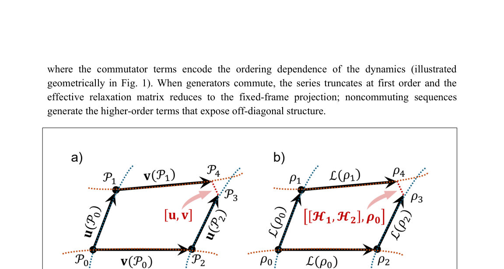 
Fig. 1. Commutators as geometric transport. (a) In general, for two vector fields 𝑢 and 𝑣, transporting a point first along 𝑢 and then 𝑣 does not necessarily return to the same location as transporting in the opposite order. The resulting failure of the quadrilateral to close defines the commutator [𝑢, 𝑣], providing a geometric measure of curvature. (b) The same construction applies in Liouville space, where superoperators act as vector fields on the density operator 𝜌. The closure defect becomes a double commutator, linking noncommuting generators to curvature-like evolution. Relaxation shrinks this loop, representing entropy production and energy exchange. Further mathematical description...

📷 Fig 2

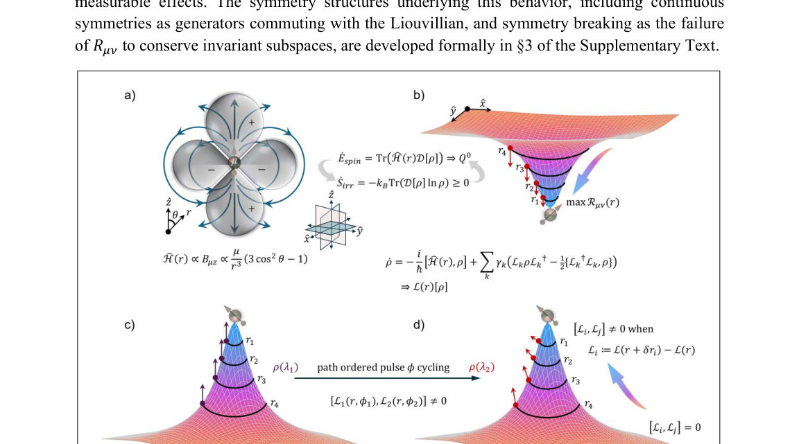 
Fig. 2. Field of local superoperators whose curvature is sourced by spatially variant relaxation dissipators and anisotropic dipolar Hamiltonians. (a) Dipolar Hamiltonian modeled by a central unpaired electron (e.g., a paramagnetic center or nitrogen vacancy) whose radial and angular dependence is given by ℋ̂(𝑟) ∝

📷 Fig 3

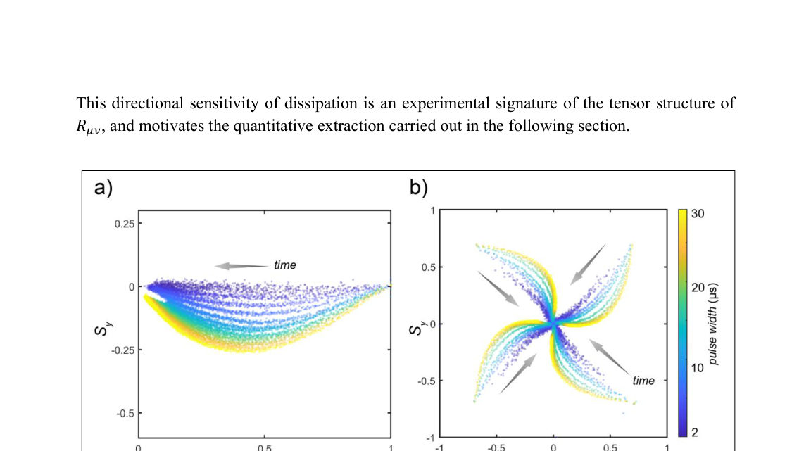 
Fig. 3. Spin trajectories reveal generator commutation. (a) Transverse plane trajectory for pulse trains with effectively commuting generators, consisting of an initial pulse along 𝑦 followed by repeated pulses along 𝑥 for 13C nuclear spins in diamond with nitrogen-vacancy (NV) centers. Trajectories are shown for pulse widths ranging from 2 μs (purple) to 30 μs (yellow). The effect of transmitter frequency offsets from −5 to +5 kHz is shown in the Supplementary Materials. (b) Transverse plane trajectory for noncommuting pulse trains, consisting of an initial 𝜋/2 pulse along 𝑦 followed by a repeating (𝑥, 𝑦, −𝑥, −𝑦) sequence. Pulse widths again range from 2 μs (purple) to 30 μs (yellow). The...

📷 Fig 4

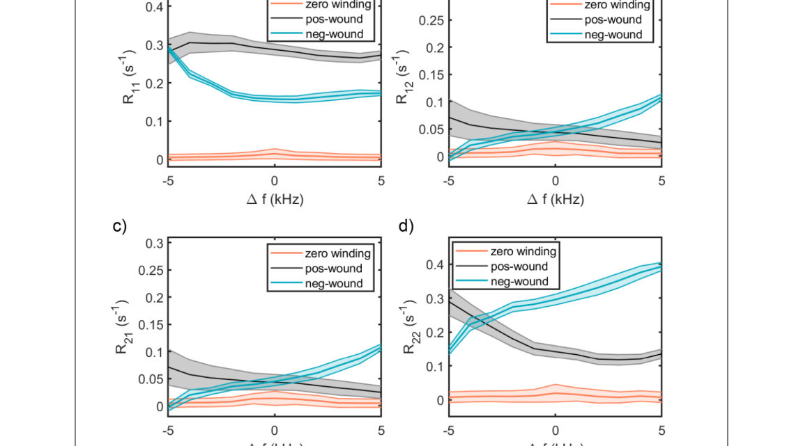 
Fig. 4. Effect of generator commutation on projected relaxation tensor components. For 13C nuclear spins in diamond with NV centers, (a) 𝑅11, (b) R12, (c) R21, and (d) R22 are shown for commuting (zero-winding, red) and noncommuting (positive and negative phase-wound, in gray and blue, respectively) pulse trains as a function of transmitter offset frequency. These measured 𝑅 represent effective transverse dissipative projections of the Floquet generator. The shaded regions represent standard error, and fits were averaged across pulse widths from 2 to 30 μs as reported in Eq. (14).

📷 Fig 5

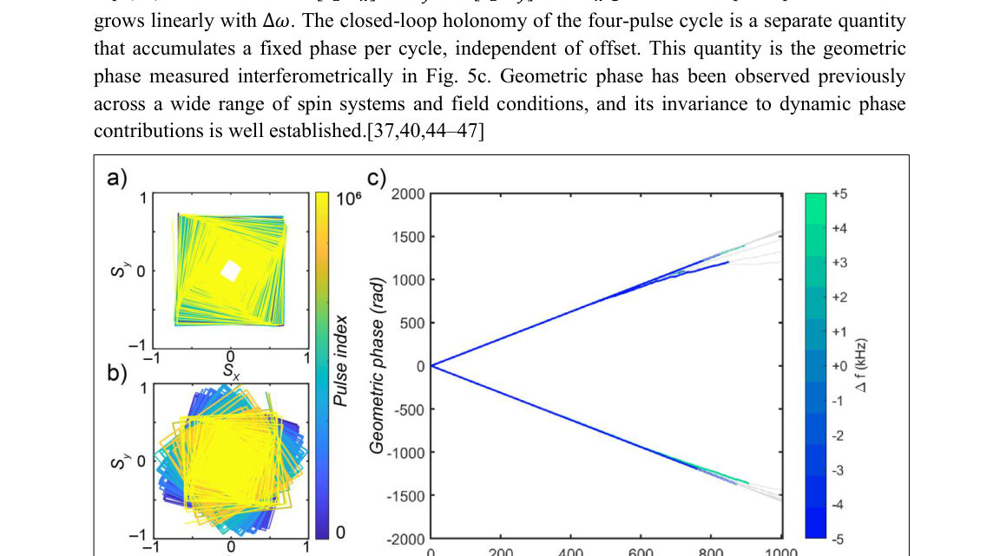 
Fig. 5. Holonomy and parallel transport in spin dynamics. (a) Continuous transverse plane trajectory corresponding to resonant excitation as shown in Fig. 3b. (b) The effect of introducing a 4 kHz transmitter frequency offset on the pulse train shown in (a) with continuous positive phase winding of (𝑥, 𝑦, −𝑥, −𝑦) . (c) Geometric phase extracted interferometrically from positive and negative phase winding experiments, referenced to a zero winding (commuting, all 𝑥 pulses), for transmitter offsets ranging from −5 kHz to +5 kHz in 1 kHz steps. Notably, geometric phase is robust to the effects of dynamic phase and relaxation, and continues accumulating identically until degradation of SNR (gray...

**Summary.** The paper proposes a geometric framework to unify spin relaxation theory by replacing separate $R_1$ and $R_2$ rates with a single covariant relaxation tensor ($\mathcal{R}_{\mu
u}$). By using noncommuting pulse sequences on hyperpolarized spins in diamond, the authors experimentally demonstrate that off-diagonal coupling terms exist, proving that relaxation is a directional process governed by this underlying tensor structure.

**Why it may be interesting.** This work provides a powerful, coordinate-independent mathematical language for open quantum systems, unifying disparate descriptions (Bloch/Redfield/Lindblad) by treating relaxation as a tensor field on the state manifold. This has direct implications for understanding decoherence in solid-state qubits and quantum sensing.

Detailed structure

**Main problem.** The conventional description of spin relaxation separates longitudinal ($R_1$) and transverse ($R_2$) rates phenomenologically, obscuring a deeper structural unity.

**Main result.** Relaxation is fundamentally governed by a single covariant tensor ($\mathcal{R}_{\mu
u}$), which can be experimentally accessed by using noncommuting pulse sequences that reveal off-diagonal coupling terms.

**Method.** The authors develop a geometric framework to describe dissipation in Liouville space, utilizing experimental measurements on spin systems subjected to noncommuting control pulses and measuring accumulated geometric phase (holonomy).

**Model / system.** The system is spin relaxation dynamics, modeled by the evolution of the density operator $\dot{
ho} = -i/\hbar[\hat{H}(r), 
ho] + \mathcal{D}(
ho)$. The framework unifies Bloch, Redfield, and Lindblad descriptions using a covariant relaxation tensor.

**Key observables.** Covariant relaxation tensor ($\mathcal{R}_{\mu
u}$), effective relaxation matrices ($R_{ij}^{	ext{eff}}$), geometric phase accumulation (holonomy).

**Important parameters / regimes.** Noncommuting pulse sequences, transmitter frequency offset ($\Delta\omega$), hyperpolarized ${}^{13}	ext{C}$ spins in diamond with NV centers.

**Assumptions / limitations.** The conventional $R_1$/$R_2$ separation is an approximation that fails in driven or anisotropic regimes where the full tensorial nature must be considered.

**Figures summary.** Figures illustrate how commuting generators yield smooth, single-axis contraction of spin trajectories, whereas noncommuting generators produce multi-lobed patterns due to ordering dependence (commutator terms).

**Paper structure.** The paper establishes the geometric framework by identifying the covariant relaxation tensor ($\mathcal{R}_{\mu
u}$), shows how this tensor is probed experimentally using noncommuting pulse sequences in diamond NV centers, and confirms that geometric phase accumulation provides an independent diagnostic of non-dissipative dynamics.

Abstract

Spin relaxation is conventionally described by two independent phenomenological rates - longitudinal ($R_1$) and transverse ($R_2$) - whose separation obscures a deeper structural unity. Here we develop a geometric framework in which dissipation is represented by a single covariant relaxation tensor acting in Liouville space, from which $R_1$ and $R_2$ emerge as complementary projections. This tensor structure is not merely formal but is experimentally accessible through pulse sequences that probe noncommuting directions in spin space. Using hyperpolarized $^{13}C$ spins in diamond with nitrogen-vacancy centers, we show that commuting pulse trains yield effective relaxation matrices that are approximately diagonal, while noncommuting sequences produce off-diagonal components that vary with transmitter frequency offset and pulse ordering, providing evidence that relaxation is a directional process governed by a tensor rather than a pair of scalar rates. Complementary measurements of geometric phase demonstrate that noncommuting dynamics introduce ordering-dependent effects that are separable from dissipation, consistent with the interpretation of relaxation as geometric transport on the state manifold. This framework unifies Bloch, Redfield, and Lindblad descriptions within a coordinate-independent formulation and provides a natural language for relaxation in driven, anisotropic, and non-equilibrium spin systems.

[↑ back to top](#top)

### [An Operational Resolution of the Third-Particle Paradox](http://arxiv.org/abs/2607.20815v1)

**Authors:** Časlav Brukner, Esteban Castro-Ruiz, Marius Krumm  
**Type:** theory · **Category:** other · **PDF:** <https://arxiv.org/pdf/2607.20815v1>  
**Analysis basis:** full PDF text, analyzed in chunks
**Topic relevance:** `quantum measurements` **3/5** · `measurement-induced transitions` **2/5** · `Keldysh / 2PI / non-Gaussian methods` **1/5** · `correlated / nonlocal dissipation` **1/5** · `driven-dissipative phase transition` **1/5** · `entanglement & information structure` **1/5** · `methods for driven-dissipative` **1/5** · `non-equilibrium dynamics` **1/5**

📷 Fig 1

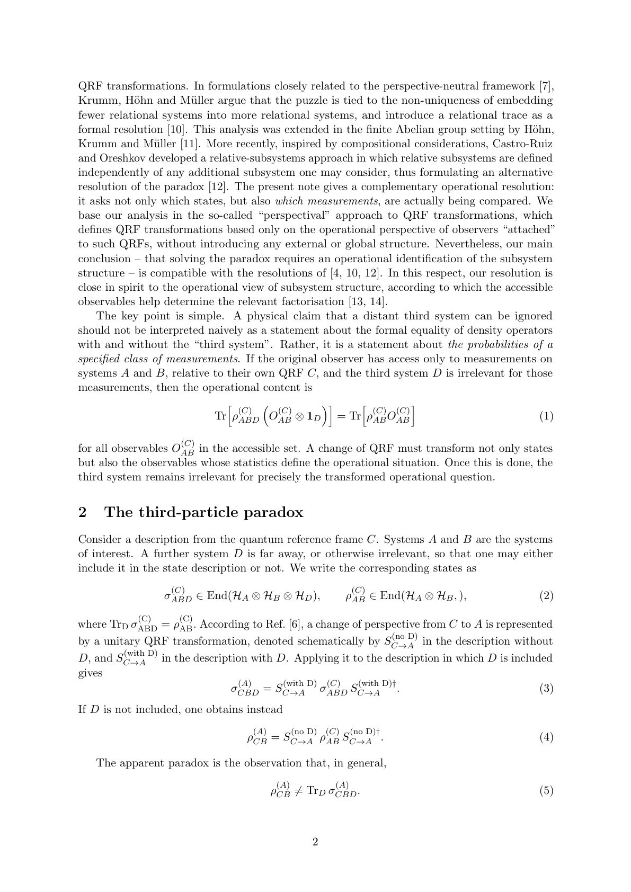 
Low-resolution page preview, page 2

📷 Fig 2

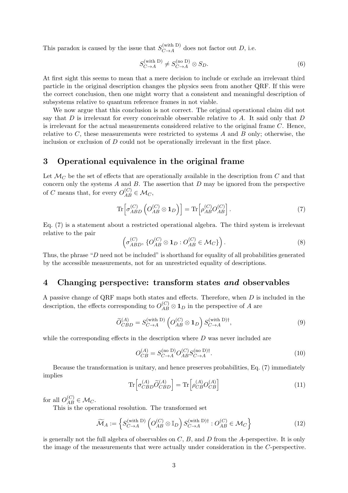 
Low-resolution page preview, page 3

📷 Fig 3

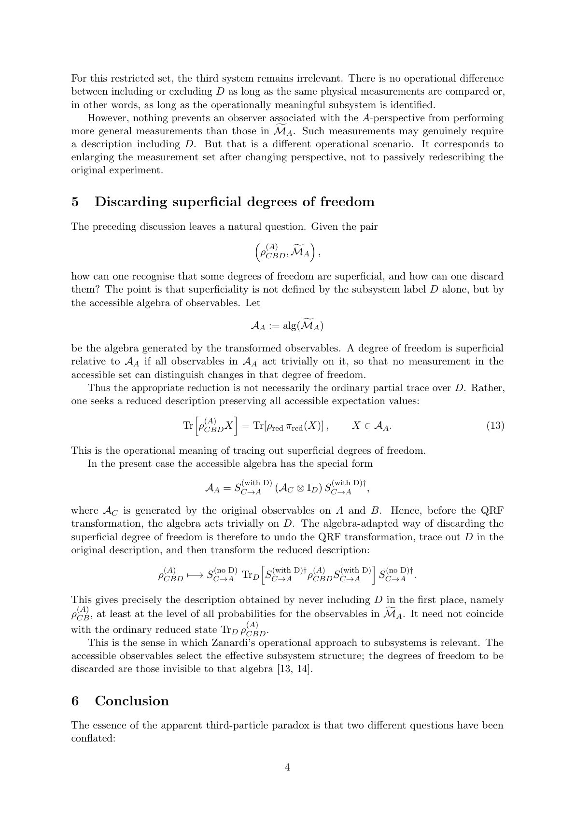 
Low-resolution page preview, page 4

📷 Fig 4

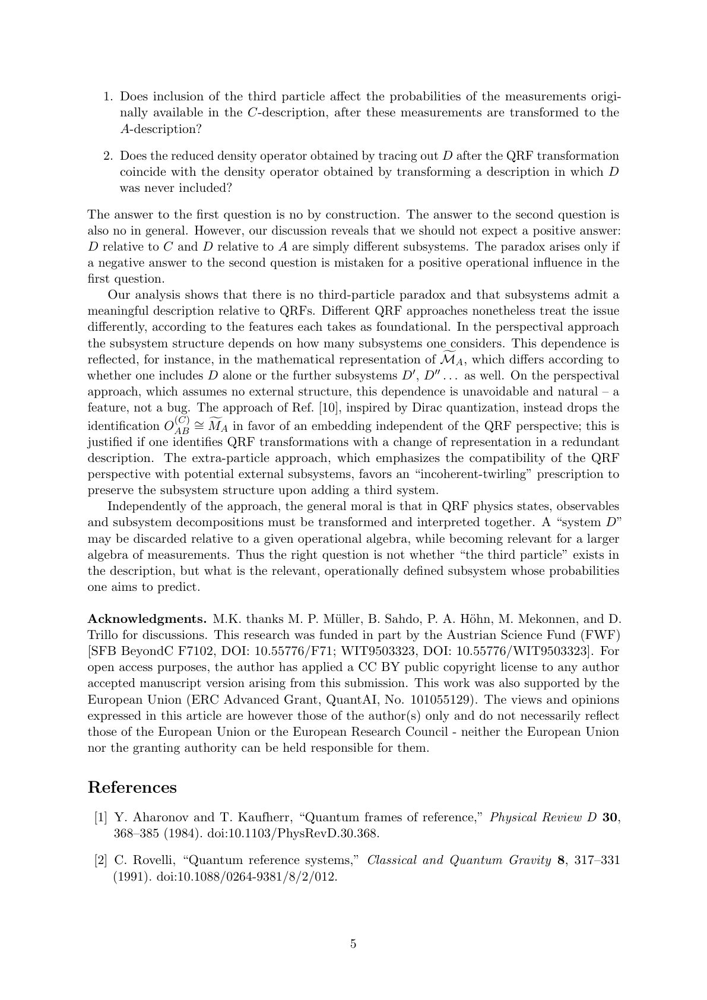 
Low-resolution page preview, page 5

📷 Fig 5

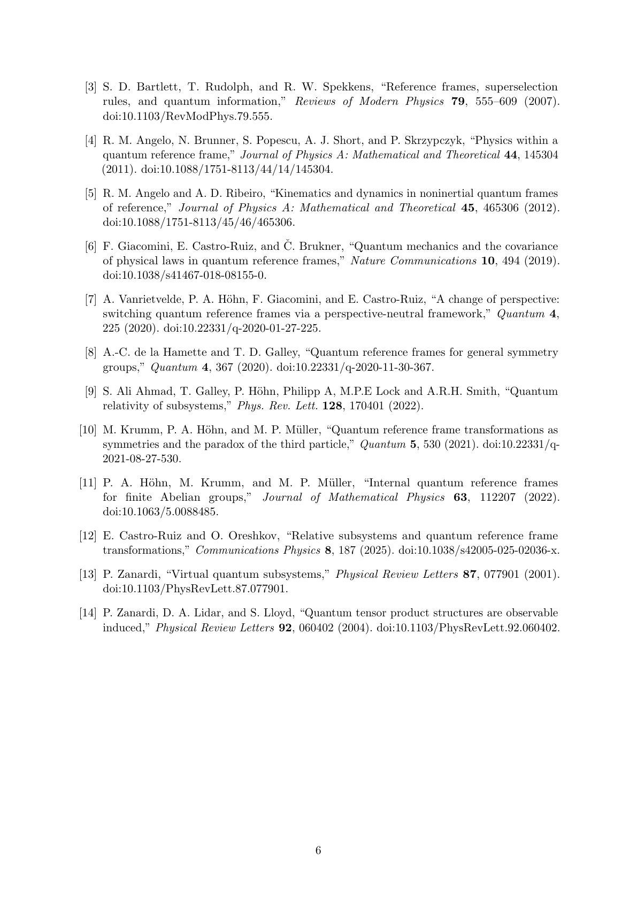 
Low-resolution page preview, page 6

**Summary.** This paper resolves the third-particle paradox in Quantum Reference Frames by shifting focus from formal equality of reduced density operators to operational constraints on measurable probabilities. It argues that irrelevance must be defined relative to the set of actually accessible measurements, providing a robust method for defining subsystem structure across different quantum descriptions.

**Why it may be interesting.** This work is highly relevant to theoretical quantum physics dealing with open systems and subsystem decomposition, as it provides a rigorous framework for defining physical relevance when multiple reference frames or subsystems are involved.

Detailed structure

**Main problem.** The paper resolves the 'third-particle paradox' that arises when describing quantum systems across different Quantum Reference Frames (QRFs). The paradox concerns apparent inconsistencies in subsystem descriptions when a system deemed irrelevant in one frame appears relevant after transformation to another.

**Main result.** The paradox is resolved by arguing that physical claims of irrelevance must be interpreted operationally—based on the measurable probabilities of available observables—rather than through formal algebraic equalities of reduced density operators. The correct focus is on the restricted algebra generated by accessible measurements.

**Method.** The authors employ an operational approach, comparing predicted probabilities for a set of relevant observables ($\mathcal{M}_A$) across different QRF descriptions rather than equating the full reduced states directly.

**Model / system.** The theoretical framework involves quantum systems partitioned into multiple subsystems (e.g., A, B, C, D) undergoing transformations between Quantum Reference Frames (QRFs).

**Key observables.** Accessible observables ($\mathcal{M}_C$), reduced density operators ($
ho(A)$), and the comparison of probabilities derived from these measurements.

**Important parameters / regimes.** The structure of the accessible algebra $	ext{alg}(\dots)$, which dictates which degrees of freedom are physically measurable or relevant.

**Assumptions / limitations.** Physical claims regarding subsystem structure must be interpreted as statements about probabilities for a specified set of measurements, not formal equalities between density operators.

**Paper structure.** The paper first defines the paradox in QRFs by comparing two procedures for tracing out an irrelevant particle. It then develops the operational resolution by focusing on the restricted algebra generated by measurable observables, concluding that this operational constraint avoids the formal contradiction.

Abstract

We give an operational resolution of the third-particle paradox, relevant in the theory of quantum reference frames. The apparent paradox is that a system which is irrelevant in one quantum-reference-frame description can seem to become relevant after changing to another quantum reference frame, because the reduced state obtained after transforming a larger system need not agree with the state obtained by first discarding the extra system and then transforming. We argue that this comparison is not operationally meaningful unless the observables are transformed together with the states, or equivalently, unless the subsystem that needs to be discarded is properly identified. If the third particle is irrelevant for all measurements actually available in the original frame, then the transformed measurements form a restricted algebra in the new frame for which the third particle remains irrelevant. The paradox therefore results from replacing an operational statement about probabilities by a stronger, representation-dependent statement about equality of reduced density operators. We close by relating the question of when degrees of freedom may be discarded to the observable-induced, operational approach to subsystem structure.

[↑ back to top](#top)

### [Graviton-induced which-path decoherence in matter-wave interferometry](http://arxiv.org/abs/2607.20867v1)

**Authors:** Hiroki Matsui  
**Type:** theory · **Category:** other · **PDF:** <https://arxiv.org/pdf/2607.20867v1>  
**Analysis basis:** full PDF text, analyzed in chunks
**Topic relevance:** `Keldysh / 2PI / non-Gaussian methods` **3/5** · `methods for driven-dissipative` **2/5** · `quantum measurements` **2/5** · `correlated / nonlocal dissipation` **1/5** · `driven-dissipative phase transition` **1/5** · `entanglement & information structure` **1/5** · `interference shaping light` **1/5**

📷 Fig 1

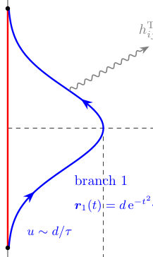 
FIG. 1. Schematic of the which-path configuration. Branch 2 (red) remains at the origin, r2(t) = 0, while branch 1 (blue) follows the smooth Gaussian excursion r1(t) = d e−t2/(2τ2)e of Eq. (42), reaching the maximum separation d at t = 0 with characteristic velocity u ∼d/τ. The branches coincide asymptotically. The difference source produces TT radiation, and the corresponding branch-conditioned field states carry which-path information; tracing out the gravitons reduces the interference visibility by e−Γ.

📷 Fig 2

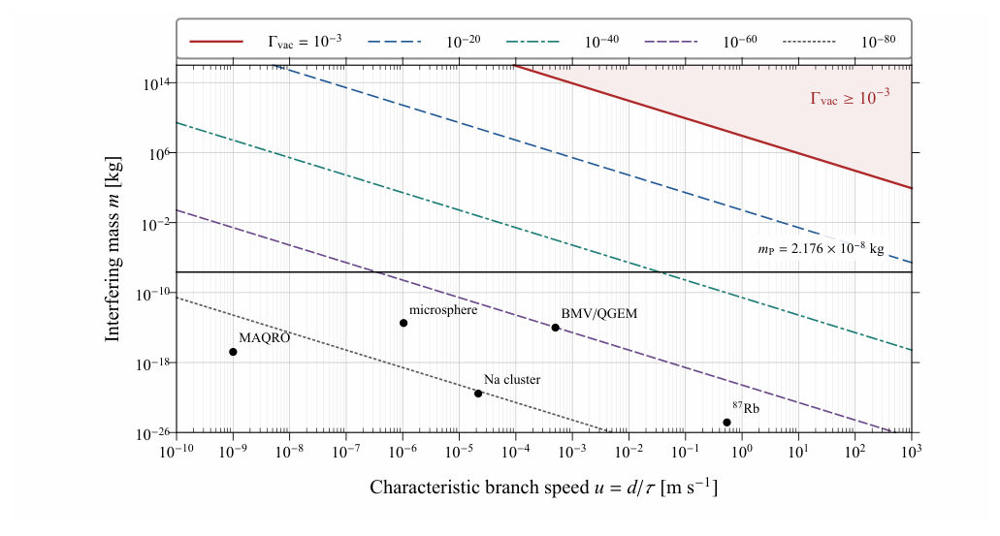 
FIG. 2. Mass–kinematic-scale dependence of vacuum graviton decoherence in the Gaussian quadrupole model. The descending contours show the interfering mass m required to obtain fixed values of Γvac as a function of the characteristic branch speed u = d/τ, as determined by Eq. (49). The thick red contour and the lightly shaded region indicate the optimistic detection threshold Γvac ≥10−3. The horizontal black line marks the Planck mass mP. The markers represent the experimental proxies listed in Table I, with their horizontal coordinates evaluated from u = d/τ.

**Summary.** This theoretical paper calculates how quantum gravity effects, specifically graviton emission, cause which-path decoherence in matter-wave interferometry. By analyzing the vacuum and squeezed states of the gravitational field, the authors derive quantitative estimates for the decoherence exponent. The main conclusion is that this effect is far too small to be measured by current or foreseeable experimental setups.

**Why it may be interesting.** While not directly focused on AMO platforms like trapped ions or cold atoms, the methodology of calculating decoherence by tracing out environmental degrees of freedom (here, gravitons) is highly relevant to open quantum systems theory and quantum optics.

Detailed structure

**Main problem.** The paper investigates which-path decoherence experienced by matter waves passing through an interferometer due to coupling with quantum gravitational fields (gravitons). It quantifies this effect by tracing out the graviton degrees of freedom.

**Main result.** The calculated decoherence exponent ($\Gamma$) for both vacuum and inflationary squeezed states is found to be extremely small, concluding that graviton-induced decoherence is negligible in current matter-wave interferometers.

**Method.** The analysis uses quantum field theory techniques, deriving the reduced coherence factor by tracing out the gravitons from the system's evolution operator. This involves calculating vacuum expectation values and utilizing displacement operators for squeezed states.

**Model / system.** The model is a matter-wave interferometer (two semiclassical branches) coupled linearly to linearized quantum gravity fields (gravitons). The calculations are performed in Minkowski spacetime, considering both standard vacuum fluctuations and highly squeezed states relevant to inflation.

**Key observables.** The primary observable is the decoherence exponent $\Gamma = -\ln |D|$, which quantifies the reduction in interference visibility. Other key observables include the coherence factor $D$ and the radiated graviton energy/number.

**Important parameters / regimes.** Key parameters include the gravitational constant ($G$), mass ($m$), separation distance ($d$), time scale ($	au$), and cosmological parameters related to inflation ($\Omega_{	ext{inf}}, H_0$).

**Assumptions / limitations.** The analysis assumes a conserved source stress tensor, restricts attention to propagating gravitons in Minkowski spacetime, and employs approximations derived from the low-energy effective field theory of gravity.

**Figures summary.** Figures illustrate the schematic setup of the which-path configuration (Gaussian excursion) and show the dependence of decoherence on mass and kinematic scales. Tables provide order-of-magnitude estimates for $\Gamma$ across various experimental platforms.

**Paper structure.** The paper builds from deriving the general formalism using displacement operators, calculating the vacuum case ($\Gamma_{	ext{vac}}$), extending the analysis to general squeezed states, and finally specializing to inflationary squeezing ($\Gamma_{	ext{inf}}$) to compare all contributions against experimental limits.

Abstract

We derive which-path decoherence for matter-wave interferometry that arises from tracing out the gravitons of linearized quantum gravity. Because the gravitons are driven linearly by the matter source, the branch-dependent evolution can be solved exactly, and the reduced coherence is given by the characteristic function of the initial graviton state, evaluated at the difference of the branch-induced field displacements. In vacuum, the decoherence exponent equals half the mean number of gravitons radiated by the difference source. For a smooth Gaussian trajectory, it reduces to $Γ_{\rm vac}=(8/15)\,Gm^2d^4/(\hbar c^5τ^4)$, ranging from $10^{-89}$ to $10^{-61}$ across representative matter-wave platforms. For a general squeezed graviton vacuum, we obtain an exact expression in which squeezing either suppresses or enhances the vacuum response, depending on the squeezing phase. For the strongly squeezed state produced by inflation, this expression reduces to $Γ_{\rm inf}=(π/20)\,Ω_{\rm inf}(md^2H_0/\hbar)^2$ and reaches at most $\sim10^{-27}$ for optimistic parameters. Hence, the which-path decoherence induced by radiative gravitons is therefore negligible in current matter-wave interferometers.

[↑ back to top](#top)

### [Learning the closest Slater determinant](http://arxiv.org/abs/2607.20623v1)

**Authors:** Nisarga Paul, Haimeng Zhao, David D. Dai  
**Type:** theory · **Category:** strongly correlated electrons · **PDF:** <https://arxiv.org/pdf/2607.20623v1>  
**Analysis basis:** full PDF text, analyzed in chunks
**Topic relevance:** `analog quantum simulation` **3/5** · `methods for driven-dissipative` **3/5** · `entanglement & information structure` **2/5** · `Keldysh / 2PI / non-Gaussian methods` **1/5** · `non-equilibrium dynamics` **1/5**

📷 Fig 1

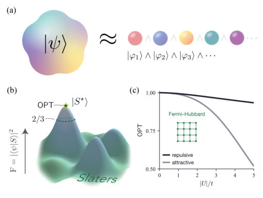 
FIG. 1. Learning the closest Slater determinant. (a) We provide a deterministic protocol to learn the closest Slater de- terminant to an arbitrary fermionic state |ψ⟩. This allows the extraction of useful information about |ψ⟩, such as its natural single-particle orbital basis. (b) Maximizing fidelity F over all Slater determinants is generally a non-convex optimization problem. The optimization landscape exhibits a transition at F = 2/3 above which there are no spurious stationary points. (c) The closest-Slater fidelity OPT of the 4×4 Fermi–Hubbard ground state versus interaction |U|/t, for repulsive and attrac- tive coupling.

📷 Fig 2

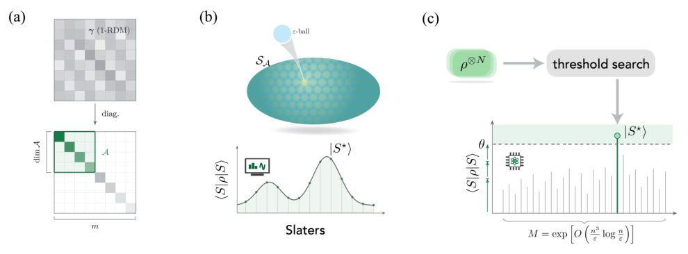 
FIG. 2. Overview of algorithms. (a) The m × m 1-RDM γ is diagonalized into natural orbitals, and an active space A of large occupation (dimension dim A = O(n2/ε)) is retained. (b) An ε-covering net over the manifold SA of Slater determinants built from A is followed by explicit search in the classical case (Theorem 1). The net has size M = exp[O( n3

📷 Fig 3

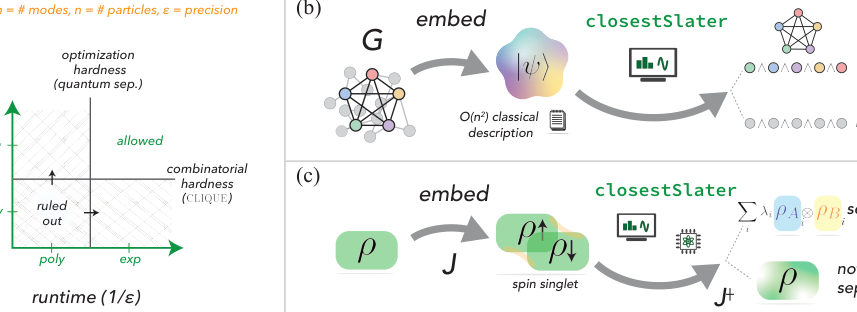 
FIG. 3. Overview of computational hardness. (a) Learning the closest Slater determinant is possible in time polynomial in m and exponential in poly(n, 1/ε). Substantially improving the dependence on n or 1/ε is ruled out by standard computational complexity conjectures. (b) To prove hardness for the n axis, we embed a graph instance G of the n-Multicolored Clique problem into a classical description of a fermionic state, which could be efficiently solved by an efficient closest Slater algorithm. (c) To prove hardness along the 1/ε axis, a bipartite state ρ is embedded by J into the opposite-spin sector of a fermionic state in such a way that a classical or quantum algorithm for the closest...

📷 Fig 4

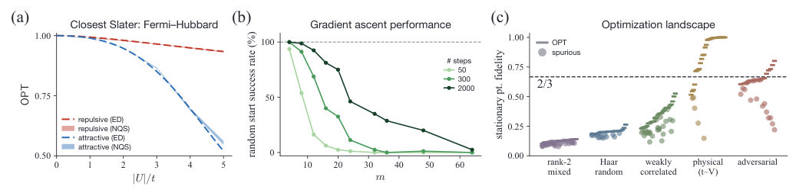 
FIG. 4. Closest Slater implementation and optimization landscape. (a) Fidelity OPT = max|S⟩|⟨S|ψ⟩|2 of the 4 × 4 Fermi–Hubbard ground state (cylinder, n↑= n↓= 2) to the closest Slater versus |U|/t, for both repulsive and attractive interactions. Dashed lines are exact diagonalization (ED) and shaded bands are from trained neural quantum states (NQS), with width the Monte Carlo sampling standard deviation. (b) Fraction of randomly initialized optimizations, for a simple gradient ascent optimizer, that reach the global OPT, versus system size m = 2LxLy (n↑= n↓= 2, U/t = 2). At any fixed # steps, as m increases gradient ascent stalls and the success rate collapses, whereas our algorithm is...

📷 Fig 5

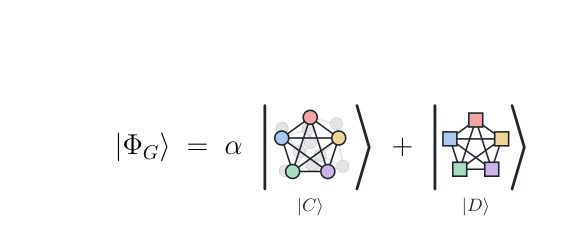 
FIG. 6. Encoding a clique into a superposition of Slaters. The augmented graph G is encoded as the unnor- malized state |ΦG⟩= α P

**Summary.** This paper develops provable classical and quantum algorithms to find the best approximation of a general fermionic state $
ho$ using only a Slater determinant. By analyzing the optimization landscape, they identify a critical fidelity threshold at $2/3$. The results offer concrete computational tools for accurately characterizing correlated many-body systems beyond simple mean-field theory.

**Why it may be interesting.** The rigorous algorithmic tools provided for approximating complex quantum states (like those from neural networks) are highly relevant for developing robust simulation techniques in AMO physics, especially when dealing with correlated electron systems where mean-field approximations fail.

Detailed structure

**Main problem.** The core problem is finding the Slater determinant that maximizes fidelity with a given, potentially complex, fermionic many-body state $
ho$. This is motivated by improving upon mean-field approximations like Hartree-Fock.

**Main result.** The authors provide provable classical and quantum algorithms to find this closest Slater determinant within specified error bounds. They also establish that $F=2/3$ marks a critical transition point in the optimization landscape.

**Method.** The approach combines estimating the 1-RDM, restricting the search space to an 'active space' using natural orbitals, and then employing $\epsilon$-covering net techniques for exhaustive search over the restricted manifold of Slater determinants.

**Model / system.** The work is applied to fermionic many-body systems, specifically mentioning the Fermi-Hubbard model on lattices and the spinless t-V chain. The state $
ho$ can originate from neural quantum states or other simulation methods.

**Key observables.** Fidelity $F = \langle S|
ho|S
angle$, the 1-RDM ($\gamma_{ij}$), and the optimal fidelity $	ext{OPT}$.

**Important parameters / regimes.** Error tolerance $\epsilon$, number of fermions $n$, single-particle modes $m$, and the critical threshold value of $2/3$.

**Assumptions / limitations.** The classical algorithm relies on restricting the search to an active space derived from the 1-RDM, which is assumed sufficient. The complexity proofs rely on standard complexity conjectures.

**Figures summary.** Figures illustrate the algorithmic protocol (including RDM estimation and covering nets), show the non-convexity of the optimization landscape with a transition at $F=2/3$, and present results for the Fermi-Hubbard model.

**Paper structure.** The paper first defines the problem, then details the classical algorithm using 1-RDM estimation and active space reduction. It proves complexity bounds, analyzes the optimization landscape's non-convexity around $F=2/3$, and concludes with applications to models like Fermi-Hubbard.

Abstract

Learning compact, interpretable descriptions of quantum many-body states is an important task in quantum science. We study the task of learning the Slater determinant with maximum fidelity to an arbitrary fermionic many-body state, with motivation from both Hartree-Fock methods and agnostic tomography. Given an $n$-fermion wavefunction built from $m$ fermionic modes, we provide classical and quantum algorithms returning a Slater determinant with fidelity within $\varepsilon$ of maximal in time $m^{\text{poly}(n,1/\varepsilon)}$. We prove matching hardness lower bounds, assuming standard complexity conjectures, along some parameter axes. Given access to quantum copies, we prove this can be accomplished with $\text{poly}(m,n,1/\varepsilon)$ copies of $ρ$. We also show that above a fidelity of $2/3$ any stationary point is the unique global maximum while below $2/3$ the optimization landscape can have spurious stationary points, and hence $2/3$ marks a transition point in the optimization landscape for this problem. We apply the algorithm to the Fermi-Hubbard model, extracting the closest Slater determinant from neural quantum state solutions. Together, our results provide algorithmic tools with provable guarantees in understanding fermionic many-body systems with classical or quantum simulation.

[↑ back to top](#top)

### [Thermal pseudo-transitions in a frustrated spin-pseudospin sawtooth chain](http://arxiv.org/abs/2607.21359v1)

**Authors:** Onofre Rojas, Jozef Strečka  
**Type:** theory · **Category:** statistical mechanics · **PDF:** <https://arxiv.org/pdf/2607.21359v1>  
**Analysis basis:** full PDF text, analyzed in chunks
**Topic relevance:** `analog quantum simulation` **3/5** · `driven-dissipative phase transition` **2/5** · `non-equilibrium universality` **2/5** · `Frenkel-Kontorova` **1/5** · `exotic spin models in light-matter` **1/5** · `non-equilibrium dynamics` **1/5**

📷 Fig 1

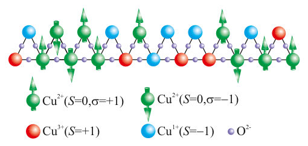 
Figure 1. A schematic illustration of the spin-pseudospin saw- tooth chain and one of its allowed configurations.

📷 Fig 2

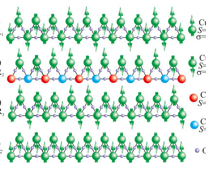 
Figure 2. Four available ground states of the spin-pseudospin sawtooth chain under the condition ∆1 = ∆and V1 = V : (a) FR1 phase with the Néel order of the base spins and a com- plete randomness of the apex spins; (b) FR2 phase with the charge order of the base entities and a complete randomness of the apex spins; (c) FR3 phase with a random three-fold degenerate character of each triangular unit; (d) AF phase with the antiferromagnetic long-range order of the base and apex spins.

📷 Fig 3

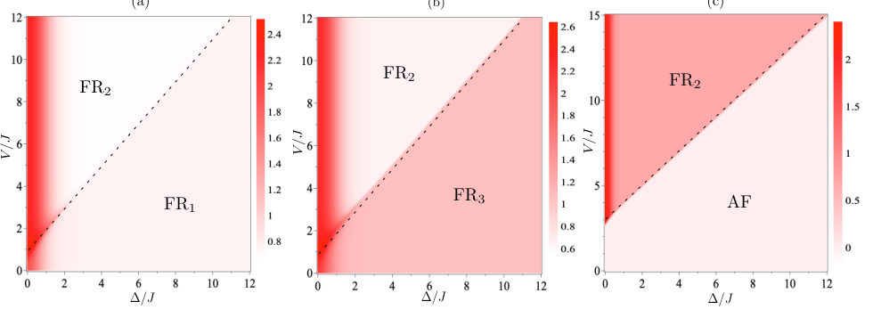 
Figure 3. Ground-state phase diagram in the plane V/J −∆/J assuming ∆1 = ∆and V1 = V for three distinct values of the coupling ratio: (a) J1/J = 0.5, (b) J1/J = 1, (c) J1/J = 2. Background density plot displays the entropy S/(NkB) at a fixed temperature kBT/J = 0.1.

📷 Fig 4

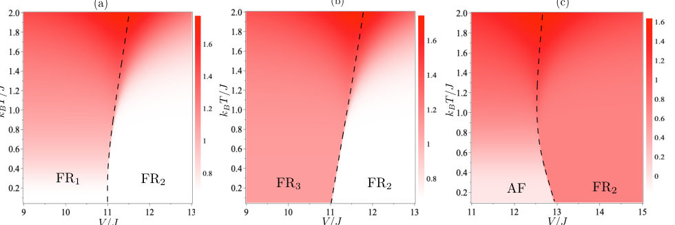 
Figure 4. Density plot of entropy S/(NkB) in the plane V/J −kBT/J for V1 = V , ∆1 = ∆and ∆/J = 10, and three representative values of the coupling ratio: (a) J1/J = 0.5; (b) J1/J = 1.0; (c) J1/J = 2.0. The color maps illustrate the combined effect of temperature and the coupling ratio V/J on the finite-temperature entropy, while the dashed curves show the pseudo-critical temperature Tp(V ) obtained from Eq. (13) and separate the quasi-phases.

📷 Fig 5

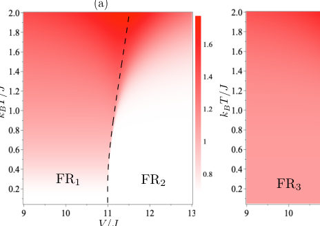 
Fig. 4(b) presents the intermediate coupling case J1/J = 1.0. In this regime, the ridge separating the quasi-phases FR3 and FR2 exhibits a positive slope and follows the condition given by Eq. (13). These phases are characterized at low temperature by entropy plateaus ap- proaching the exact residual values S/(NkB) = ln 3 and S/(NkB) = ln 2, respectively. This regime reflects a bal- ance between spin and charge correlations, analogous to the coexistence of Cu2+ and mixed-valence Cu1+/Cu3+

**Summary.** This work provides an exact analysis of a spin-pseudospin model mimicking cuprate chains, focusing on how geometric frustration leads to complex phase behavior. Using the transfer-matrix method, the authors identify pseudo-critical lines where thermodynamic anomalies occur due to competition between charge and spin degrees of freedom. The findings highlight that such geometry promotes short-range coherence and distinct quasi-phase transitions.

**Why it may be interesting.** While focused on cuprates, the methodology of analyzing quasi-degeneracy in the transfer matrix spectrum to predict continuous but sharp thermodynamic anomalies (pseudo-transitions) is a powerful technique applicable to other low-dimensional quantum systems exhibiting competing interactions.

Detailed structure

**Main problem.** The study investigates thermal pseudo-transitions occurring within a geometrically frustrated spin-pseudospin sawtooth chain, which models one-dimensional cuprates.

**Main result.** The system exhibits pronounced pseudo-transition behavior characterized by sharp but continuous peaks in specific heat and avoided-crossing scale at pseudo-critical temperatures. The geometry promotes frustration and short-range coherence.

**Method.** The analysis relies on the exact transfer-matrix method (TMM) to derive thermodynamic properties like free energy and entropy.

**Model / system.** The model is a spin–pseudospin X sawtooth chain incorporating three valence states of copper ions, capturing competition between magnetic exchange and electrostatic coupling in corner-sharing triangular units.

**Key observables.** Free energy, pseudo-critical line condition, specific heat, avoided-crossing scale, local correlation functions ($\langle S_i S_{i+1} 
angle$, $\langle \sigma_i \sigma_{i+1} 
angle$), and residual entropies of ground states.

**Important parameters / regimes.** Interaction ratios like $\Delta/J$, $V/J$, and $J_1/J$; temperature ($T$) relative to pseudo-critical temperatures ($T_p$).

**Assumptions / limitations.** Periodic boundary conditions are assumed for the chain length, and the transfer-matrix method is used for exact evaluation.

**Figures summary.** Figures illustrate the spin-pseudospin sawtooth chain structure, the four possible ground states (AF, FR1, FR2, FR3), and temperature dependence of correlation functions across different parameter regimes.

**Paper structure.** The paper first introduces the model and Hamiltonian, then uses TMM to derive eigenvalues and the pseudo-critical condition. It analyzes the resulting ground state phases and finally examines finite-temperature behavior, showing how zero-temperature boundaries evolve into entropy ridges signaling pseudo-transitions.

Abstract

We present an exact analysis of a spin--pseudospin X sawtooth chain that incorporates three distinct valence states of copper ions and serves as a minimal model for one-dimensional cuprates composed of corner-sharing copper triangles. The model includes magnetic exchange and electrostatic coupling constants both along the base sites and between base and apex sites capturing the competition between spin and charge degrees of freedom. Using the transfer-matrix method, we derive exact expressions for the free energy and obtain an analytical condition defining the pseudo-critical line associated with pronounced thermodynamic anomalies. The ground-state analysis reveals, besides an antiferromagnetic phase, three frustrated phases characterized by distinct residual entropies. At finite temperatures, these zero-temperature phase boundaries evolve into narrow entropy ridges signaling pseudo-transitions between the corresponding quasi-phases. The specific heat and the avoided-crossing scale exhibit sharp but continuous peaks at the pseudo-critical temperature, whereas the physical correlation length may be controlled by a different subleading eigenvalue. Local correlation functions uncover a cooperative rearrangement from charge-dominated to magnetically correlated regimes. Our results demonstrate that the sawtooth geometry promotes frustration and short-range coherence leading to pronounced pseudo-transition behavior.

[↑ back to top](#top)

### [Measurement of the reduced dipole matrix element in Ba$^+$](http://arxiv.org/abs/2607.20920v1)

**Authors:** N. Jayjong, M. D. K. Lee, K. J. Arnold, M. D. Barrett  
**Type:** experiment · **Category:** other · **PDF:** <https://arxiv.org/pdf/2607.20920v1>  
**Analysis basis:** full PDF text, analyzed in chunks
**Topic relevance:** `quantum measurements` **3/5** · `quantum optics experiment` **3/5** · `QC/QI experiment` **1/5** · `methods for driven-dissipative` **1/5** · `non-equilibrium dynamics` **1/5**

📷 Fig 1

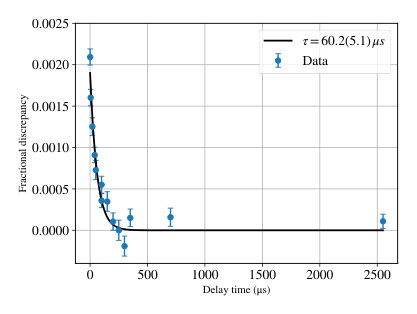 
FIG. 2. Transient response of the Stark AOM, plotted as the fractional discrepancy of the Stark shift at time t relative to the reference shift at tref = 5.0 ms. An exponential decay fit is shown to illustrate the observed trend, rather than to serve as a physical model of the dependence.

📷 Fig 2

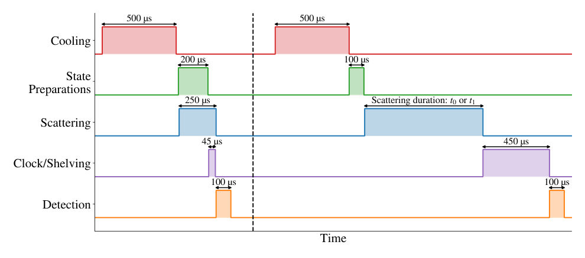 
FIG. 3. Timing sequences for Stark shift measurements (left) and scattering measurements (right). Clock pulse for the scattering measurements represents that total time for the six separate pulses discussed in the text.

📷 Fig 3

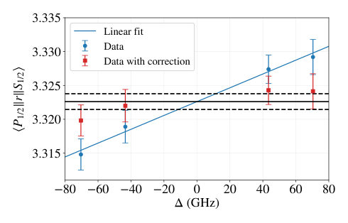 
FIG. 4. Measured matrix element ⟨P1/2∥r∥S1/2⟩as a function of ∆. The raw experimental measurements are shown as blue circles and the data corrected for Stark-shift contributions from other levels are shown as red squares. Error bars on all data points represent ±1σ uncertainties. The solid blue line represents a linear fit to the raw data. The fitted y-intercept, 3.322 7(12) ea0, yields the matrix element value that cancels leading order corrections to the Stark shift given by Eq. 1. The horizontal solid line indicates the overall average value, while the surrounding dashed lines mark the corresponding ±1σ experimental statistical uncertainty.

📷 Fig 4

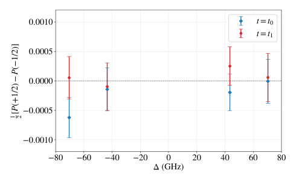 
FIG. 5. Half the measured population differences when scat- tering from either m-state of S1/2 at both t0 and t1 at each of the four detunings used in the measurements. The statistical agreement with zero supports the negligible effects of residual deviations from linear polarization or Zeeman shifts.

📷 Fig 5

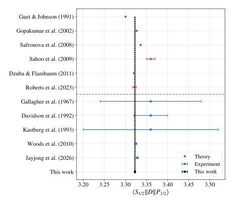 
FIG. 6. Comparison of the reduced electric-dipole matrix element ⟨P1/2∥r∥S1/2⟩measured in this work with previous literature theoretical and experimental results. Theoretical values are taken from Refs. [2–5, 21, 22], while experimental results are from Refs. [14, 16, 18–20]. Uncertainties are shown in parentheses where available. In the figure, theoretical re- sults are shown as circles and experimental results as squares, with horizontal error bars indicating reported uncertainties. The present work is represented by a diamond marker, with the central value shown as a solid vertical line and its 1σ un- certainty indicated by dashed lines.

**Summary.** This paper reports a high-precision, experimental determination of the reduced electric-dipole matrix element for $	ext{Ba}^+$ using trapped ions. By meticulously comparing scattering rates and Stark shifts, the authors significantly improve the calculated value for the static differential scalar polarizability. This advancement directly reduces systematic uncertainties in room-temperature optical clock error budgets.

**Why it may be interesting.** This work is highly relevant as it pushes the boundaries of precision measurement in atomic physics. The techniques used—combining time-resolved population dynamics with Stark shifts—are central to quantum optics and developing next-generation atomic clocks.

Detailed structure

**Main problem.** The primary goal is a high-precision measurement of the reduced electric-dipole matrix element $\langle P_{1/2}\|r\|S_{1/2}
angle$ in singly ionized barium ($	ext{Ba}^+$). This measurement aims to improve the accuracy of calculating the Blackbody Radiation (BBR) shift for optical clocks.

**Main result.** The authors determined the reduced dipole matrix element to be $3.3227(12)$ and extracted a static differential scalar polarizability $\Delta\alpha_0(0) = -73.09(12)$ a.u., significantly improving clock error budgets.

**Method.** The measurement combines off-resonant scattering rate measurements with dispersive Stark-shift measurements on the $S_{1/2} - P_{1/2}$ transition in $	ext{Ba}^+$. The ratio of these rates is used to extract the matrix element while suppressing systematic errors.

**Model / system.** The experiment uses trapped $	ext{Ba}^+$ ions, probing transitions between $S_{1/2}$, $P_{1/2}$, and other levels. The analysis relies on rate equations describing population dynamics under the Rotating Wave Approximation (RWA).

**Key observables.** Reduced dipole matrix element $\langle P_{1/2}\|r\|S_{1/2}
angle$, scattering rates ($\gamma_s$), and Stark shifts ($\Delta s$).

**Important parameters / regimes.** The measurement is highly sensitive to systematic effects like polarization imbalance, Zeeman shifts, and detuning imbalances; these are quantified and minimized.

**Assumptions / limitations.** The analysis assumes the validity of rate equations derived under certain approximations (e.g., first order in small parameters) and carefully accounts for various systematic shifts by comparing measurements at different conditions.

**Figures summary.** Figures illustrate the level structure, timing sequences for measurements, and plots showing the measured matrix element versus detuning, confirming consistency across measurement settings.

**Paper structure.** The paper details the experimental setup using $	ext{Ba}^+$ ions, describes the methodology involving interleaved Stark-shift and scattering-rate measurements, presents the data analysis to extract the RME, and concludes by applying this result to improve BBR shift calculations for optical clocks.

Abstract

We present a high-precision measurement of the reduced electric-dipole matrix element $\langle P_{1/2}\|r\|S_{1/2}\rangle$ in $^{138}\mathrm{Ba}^+$. By comparing off-resonant scattering rates with dispersive Stark-shift measurements, we determine the matrix element to be $3.322\,7(12)$, corresponding to a $P_{1/2}$ excited-state radiative lifetime of $7.866\,3(56)$~ns. Combining our experimental results with a prior model for the differential scalar polarizability $Δα_0(ω)$, we extract the static value $Δα_0(0) = -73.09(12)$a.u. This determination directly improves the evaluation of the blackbody radiation (BBR) shift, minimizing a prominent systematic limitation in room-temperature $\mathrm{Ba}^+$ optical clock error budgets. These results provide a stringent benchmark for atomic-structure calculations and advance high-precision applications in quantum metrology and tests of fundamental physics.

[↑ back to top](#top)

### [Quantum Circuit Fragments and Link Products in Continuous Variables](http://arxiv.org/abs/2607.21215v1)

**Authors:** Amalina Lai, Graeme D. Berk, Minjeong Song, Mile Gu  
**Type:** theory · **Category:** quantum information and computing · **PDF:** <https://arxiv.org/pdf/2607.21215v1>  
**Analysis basis:** full PDF text, analyzed in chunks
**Topic relevance:** `methods for driven-dissipative` **3/5** · `Keldysh / 2PI / non-Gaussian methods` **1/5** · `analog quantum simulation` **1/5** · `correlated / nonlocal dissipation` **1/5** · `driven-dissipative phase transition` **1/5** · `entanglement & information structure` **1/5** · `non-equilibrium dynamics` **1/5**

📷 Fig 1

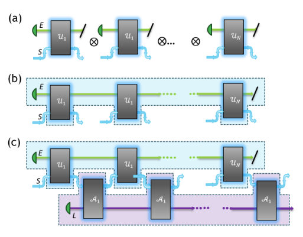 
Figure 1. Quantum circuit fragments and link prod- ucts. In traditional settings, we often treat a quantum pro- tocol as the application of some quantum process to a system S - mathematically equivalent to a unitary interaction with an environment E that is subsequently traced out (a). In many settings, however, the environment is non-Markovian, such that outputs at future times can depend on past inputs. Such objects are naturally treated as multi-time quantum circuit fragments with open ports (b). The quantum comb formal- ism provides a systematic means to describe such fragments and to connect them through the link product, as illustrated by the blue and violet fragments in (c). This...

📷 Fig 2

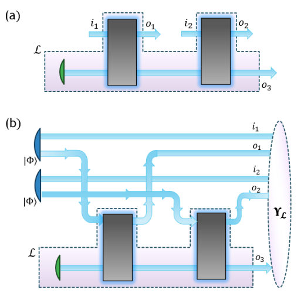 
Figure 2. Choi States of Circuit Fragments. Consider a circuit fragment L with N = 2 input qudit wires and M = 3 output qudit wires (a). Its black-box properties can then be fully captured by the corresponding N + M = 5 qudit Choi state ΥL prepared by the circuit in (b). Here, each blue disk segment denotes a maximally entangled qudit pair |Φ⟩, while the green disk segment denotes the initial state of an ancilla qudit that can interact with qudits input at i1 and i2.

📷 Fig 3

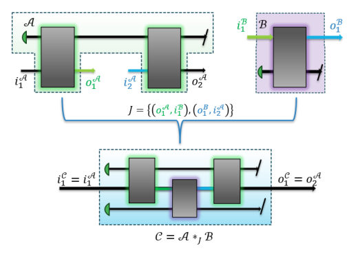 
Figure 3. J-stitching circuit fragments. Two circuit frag- ments can be composed together to form larger circuit frag- ments via a J-stitching, where J specifies exactly how the inputs and outputs on one fragment connect to the other. In the example above, circuit fragments A and B are composed to form C = A ⋆J B, where each pair of modes in J share the same color. Formally, we can write J = {(oA 1 , iB 1 ), (oB 1 , iA 2 )}, where each element denotes a pair of input/output modes to be connected. Note that this specific example is bidirectional: J includes connections from A to B and from B to A.

📷 Fig 4

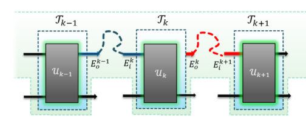 
Figure 4. Stitching a Non-Markovian Process. We can construct the Choi representation of a Non-Markovian process by stitching a sequence of circuit fragments Tk in series, such that each two consecutive circuit fragments Tk and Tk+1 are stitched together by the stitching (Ek o , Ek+1 i ).

📷 Fig 5

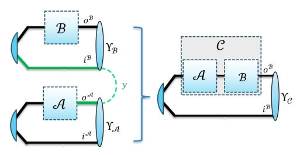 
Figure 5. Linking two quantum channels. ΥA(r) and ΥB(r′) are the Choi states of two single-input, single-output circuit fragments, i.e., quantum channels. We can find the Choi states of their concatenation ΥC via the mode-stitching y = (oA, iB).

**Summary.** This paper extends the concept of 'link products'—a method for composing quantum processes—from finite-dimensional systems to continuous variables. It introduces a systematic framework using covariance matrices that allows researchers to model complex open quantum interactions like non-Markovian noise or adaptive measurements in CV platforms. This provides essential tools for designing and analyzing advanced quantum protocols.

**Why it may be interesting.** This work provides a powerful mathematical toolset (the CV link product) that generalizes established concepts from discrete quantum information theory into the continuous variable domain, which is crucial for modern photonic quantum optics experiments.

Detailed structure

**Main problem.** The paper develops a systematic framework, analogous to link products, to analyze how quantum circuit fragments interact and compose specifically for continuous-variable (CV) systems.

**Main result.** This formalism extends existing tools to CVs, allowing the characterization of non-Markovian processes and adaptive interactions by efficiently calculating resulting covariance matrices in the Gaussian regime.

**Method.** The core method involves defining a Continuous-Variable Link Product ($\star_J$) applied to Choi states representing circuit fragments. In the Gaussian limit, this composition is calculated using iterative contractions on covariance matrices rather than full density operators.

**Model / system.** The system models quantum information tasks where the process is viewed as an 'open circuit fragment' (e.g., unknown noise source or subroutine). The mathematical tools are built around CV states characterized by quadrature expectation values and their associated covariance matrices ($\Gamma$).

**Key observables.** Covariance matrix ($\Gamma$), Choi state representation ($\Upsilon_C$), and the resulting total covariance matrix ($\Gamma_{	ext{tot}}$) after stitching.

**Important parameters / regimes.** Squeezing parameter ($r$), quadrature means ($\vec{d}$), and the limiting process variables ($s, r', s' 	o \infty$).

**Assumptions / limitations.** The formalism relies on approximations in the limits of large separation distances ($r' 	o \infty$ and $r'' 	o \infty$) to simplify the complex link product calculations.

**Figures summary.** Figure 1 illustrates the concept of circuit fragments vs. closed protocols; Figure 2 shows the Choi state representation for a fragment in finite dimensions, while later figures detail the matrix manipulations for stitching.

**Paper structure.** The paper first establishes the need for CV link products by drawing parallels to finite-dimensional systems. It then introduces the formalism using Gaussian states and covariance matrices, demonstrating its application to non-Markovianity and adaptive sensing through explicit calculation examples.

Abstract

Quantum circuits are often drawn as complete processes, with fixed inputs and outputs. In many quantum-information tasks, however, the natural object is only a fragment of such a circuit: an unknown source of non-Markovian noise to be probed, a subroutine to be inserted into a larger algorithm, or an agent implementing an adaptive strategy. In finite dimensions, the link product provides a systematic means to analyze how such circuit fragments interact and compose. Here, we develop the corresponding framework for continuous-variable systems. We introduce continuous-variable circuit fragments and associated link products that stitch such fragments together into larger processes. We show that the formalism simplifies substantially in the Gaussian regime, where link products can be evaluated efficiently using covariance-matrix representations. We use the formalism to construct non-Markovian processes and adaptive agent-environment interactions from modular components. This extends the quantum-comb toolkit to continuous variables, providing systematic methods for adaptive sensing, non-Markovian noise mitigation, and higher-order quantum circuit design.

[↑ back to top](#top)

### [ARGON: A GNN-Empowered Compilation Framework for Scalable Neutral Atom Computing](http://arxiv.org/abs/2607.21216v1)

**Authors:** Wenjie Sun, Xiaoyu Li, Zhigang Wang, Lianhui Yu, Geng Chen, Guowu Yang  
**Type:** theory · **Category:** quantum information and computing · **PDF:** <https://arxiv.org/pdf/2607.21216v1>  
**Analysis basis:** full PDF text, analyzed in chunks
**Topic relevance:** `Rydberg arrays` **3/5** · `QC/QI experiment` **2/5** · `analog quantum simulation` **1/5** · `methods for driven-dissipative` **1/5** · `non-equilibrium dynamics` **1/5**

📷 Fig 1

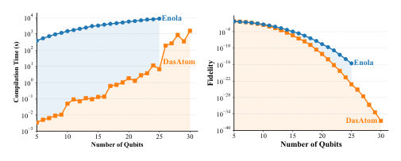 
Figure 1: The scalability bottleneck of SOTA NA compilers.

📷 Fig 2

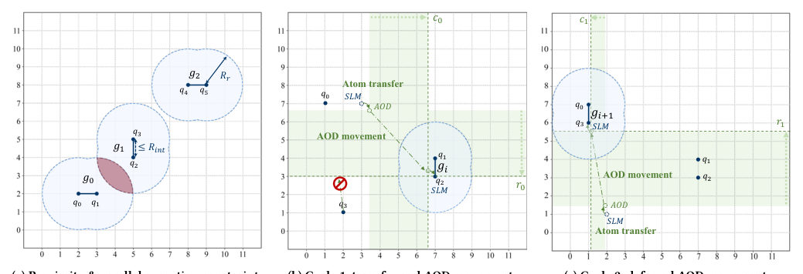 
Figure 2: Spatiotemporal scheduling constraints in reconfigurable neutral atom arrays. Blue regions represent conflict regions formed during two-qubit gate execution; for parallel execution, these regions must not overlap. Green dashed lines indicate AOD columns 𝑐𝑖and rows 𝑟𝑗, and green areas represent regions swept by AOD movement. (a) Illustration of conflict regions for two-qubit gates and parallel execution constraints. (b)(c) Sequential execution of atom transfer and AOD movement across two steps, where two-qubit gates 𝑔𝑖and 𝑔𝑖+1 cannot be executed simultaneously due to AOD movement constraints.

📷 Fig 3

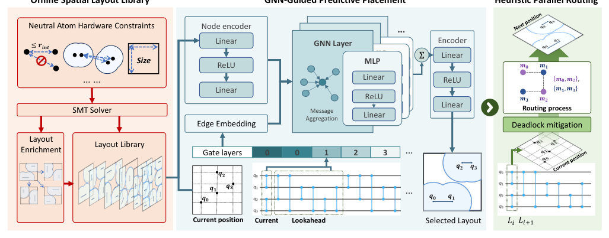 
Figure 3: Overview of the ARGON Framework. The compilation pipeline isolates spatiotemporal evaluations into three sequential phases: an offline spatial layout library construction, a GNN-guided predictive temporal placement, and a lightweight heuristic backend router. This decoupling effectively translates hardware-agnostic quantum circuits into collision-free physical transport trajectories.

📷 Fig 4

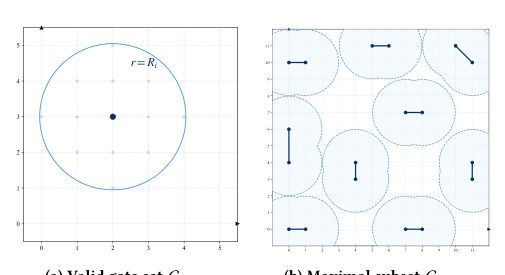 
Figure 4: Visualization of spatial connectivity and solver opti- mized parallelism on a neutral atom grid. a Valid connectivity scope: Illustration of all physically feasible two qubit gate pairings for a central atom, constrained by an interaction radius 𝑅int = 2 normalized to trap spacing. b Maximal parallel layout: A solver generated layout on a 12 × 12 grid that maxi- mizes the number of simultaneous gates Gselect. The solution achieves dense spatial packing while enforcing disjoint re- striction zones to prevent parallel execution violations.

📷 Fig 5

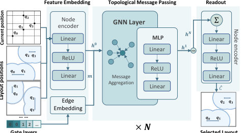 
Figure 5: The architectural structure of the GNN-guided pre- dictive placement engine.

**Summary.** This paper introduces ARGON, a novel compilation framework designed to overcome the exponential complexity barrier in programming quantum circuits for neutral atom processors. By decoupling static spatial constraints from dynamic temporal scheduling using a GNN predictor, ARGON achieves massive speedups and significantly higher execution fidelity compared to current state-of-the-art methods.

**Why it may be interesting.** It provides a critical software tool that directly addresses the scaling limitations of physical quantum hardware platforms like neutral atoms by abstracting away intractable combinatorial search problems into manageable, predictive inference tasks.

Detailed structure

**Main problem.** Compiling quantum circuits for neutral atom processors is bottlenecked by jointly optimizing dynamic atom transport scheduling and static spatial interference constraints, leading to an exponentially expanding search space.

**Main result.** ARGON achieves compilation in under 10 seconds, providing up to a $>10^4	imes$ speedup over state-of-the-art baselines while improving execution fidelity by up to $10^2	imes$.

**Method.** The framework uses a spatiotemporal decoupling paradigm: precomputing static layouts offline and employing a Graph Neural Network (GNN) to predict viable temporal routes, which are then synthesized via heuristic routing.

**Model / system.** The system is based on Neutral Atom (NA) quantum processors utilizing programmable optical tweezers for high qubit uniformity and flexible connectivity. Operations involve dynamic atom transport and entangling gates driven by the Rydberg blockade mechanism.

**Key observables.** Compilation Time, Physical Execution Fidelity, Average Speedup Factor.

**Important parameters / regimes.** Qubit Number ($N$), Interaction Radius ($R_{int}$), Decoherence rates.

**Assumptions / limitations.** The core assumption addressed is that the joint spatiotemporal coupling can be broken by separating static geometric conflict resolution from dynamic temporal routing.

**Figures summary.** Figure 1 compares compilation time and fidelity degradation of existing compilers across varying qubit numbers; Figure 2 illustrates the complex spatiotemporal scheduling constraints involving gate conflict regions and AOD movement rules.

**Paper structure.** The paper introduces ARGON by identifying the joint optimization bottleneck, proposing a three-stage solution (offline layout library $
ightarrow$ GNN prediction $
ightarrow$ heuristic routing), and validating its superior scalability and fidelity improvement over existing methods.

Abstract

Neutral atom quantum systems offer a promising pathway to large-scale quantum computing due to high qubit uniformity and flexible connectivity. To exploit this architecture, compilers must coordinate dynamic atom transport alongside highly parallel entangling gates. As circuits scale, the interplay between these operations becomes a system bottleneck, introducing denser logical interactions and longer temporal dependencies. Compilers must simultaneously satisfy rigid spatial constraints and complex movement schedules. Existing joint spatiotemporal compilation methods face an exponentially expanding search space, incurring substantial overheads or compromising fidelity as circuit size grows.   In this work, we propose ARGON, a scalable compilation framework that introduces a spatiotemporal decoupling paradigm for neutral atom processors. Our key novelty is offloading static geometric conflict resolution to an offline phase, precomputing a library of hardware-certified, high-parallelism spatial layouts. To guide temporal routing, we deploy a Graph Neural Network (GNN) predictor to evaluate candidate layouts against deep temporal horizons, proactively evading downstream kinematic bottlenecks. Finally, a heuristic router translates the selected sequence into collision-free physical transport.   Evaluations show ARGON completes compilation in under 10 seconds, delivering up to a >10^4x and 600x average speedup over state-of-the-art baselines. ARGON also minimizes routing decoherence and reduces Rydberg stages, improving execution fidelity by up to 10^2x on dense circuits.

[↑ back to top](#top)

### [Doping-induced Ferromagnetic order and its unusual evolution to Helical Antiferromagnetic Order in Sr(Ni$_{1-x}$Co$_x$)$_2$P$_2$](http://arxiv.org/abs/2607.20663v1)

**Authors:** A. Sapkota, J. Schmidt, J. M. Wilde, L. -L. Wang, W. Tian, M. Matsuda, A. Kreyssig, S. L. Bud'ko, P. C. Canfield  
**Type:** both · **Category:** strongly correlated electrons · **PDF:** <https://arxiv.org/pdf/2607.20663v1>  
**Analysis basis:** full PDF text, analyzed in chunks
**Topic relevance:** `exotic spin models in light-matter` **3/5** · `spintronics-quantum-optics interface` **3/5** · `analog quantum simulation` **2/5**

📷 Fig 1

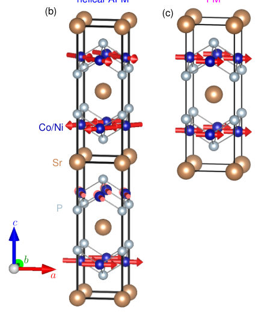 
FIG. 1. Magnetic phase diagram and magnetic structures corresponding to Sr(Ni1−xCox)2P2. (a) The magnetic phase diagram of Sr(Ni1−xCox)2P2 with N´eel temperatures (TN) in blue for the antiferromagnetic phase (AFM), and Curie temperatures (TC) in magenta for the ferromagnetic phase (FM). Critical temperatures determined from bulk magnetic susceptibility in Ref. [8] are shown as filled markers. Neutron diffraction samples are shown with red arrows and quantum phase transition (QPT) near SrCo2P2 end member with green arrow. (b) Helical antiferromagnetic structure with the propagation vector, (0 0 τ), for τ ∼0.6 r.l.u., which shows ferromagnetically aligned layers with the ordered magnetic...

📷 Fig 2

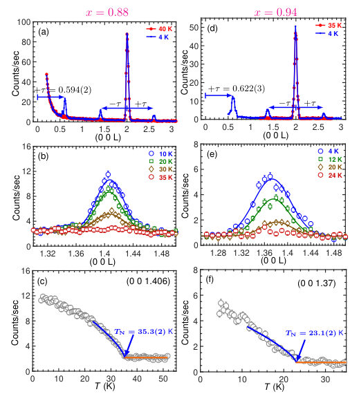 
FIG. 2. Single-crystal neutron diffraction data in the AFM region for x = 0.88 and 0.94 of Sr(Ni1−xCox)2P2. (a), (d) (0 0 L) scans showing additional Bragg peaks at low temperatures for x = 0.88 and 0.94, respectively. (b), (e) (0 0 L) scans of the incommensurate magnetic Bragg peak (0 0 2)−τ at several temperatures for x = 0.88 and 0.94, respectively. Solid lines are fits using Gaussian lineshapes. (c), (f) Intensity of the (0 0 2) −τ Bragg peak (proportional to the ordered moment squared) vs temperature for x = 0.88 and 0.94, respectively. Solid blue lines are from a power-law fit.

📷 Fig 3

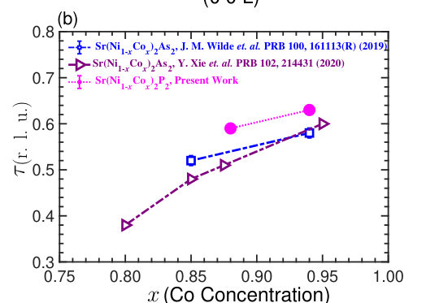 
FIG. 4. Evolution of the incommensurate antiferromagnetic propagation vector, τ = (0 0 τ), at the magnetic Bragg peak (0 0 2) −τ with x. (a) (0 0 L) scans showing incommensurate magnetic Bragg peaks for both x = 0.88 and 0.94 single crystals. The decrease in the center of the peak in L corresponds with an increase in τ. (b) Plot showing the dependence of τ on the Co concentration for Sr(Ni1−xCox)2P2 is consistent with results for Sr(Ni1−xCox)2As2 [18, 30, 31].

📷 Fig 4

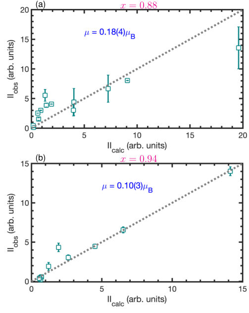 
FIG. 3. Comparison between the measured integrated intensities (IIobs) and calculated integrated intensities (IIcalc) of the incommensurate magnetic reflections for x = 0.88 (a) and x = 0.94 (b). The calculated intensities were obtained using FULLPROF based on the helical magnetic structure shown in Fig. 1(b). The dashed line represents the best linear fit, whose slope corresponds to the squared ordered magnetic moment, yielding an ordered moment of µ = 0.18(3) and 0.10(3) µB, respectively.

📷 Fig 5

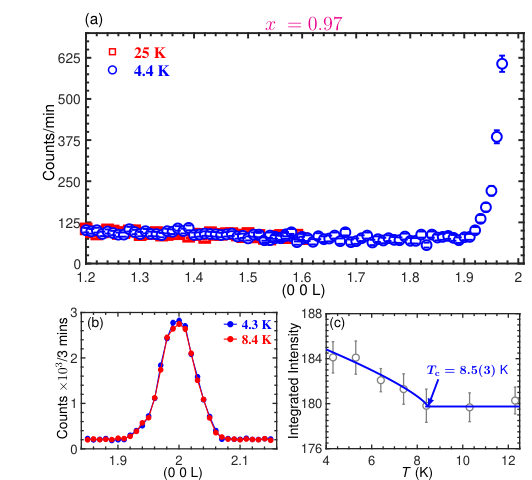 
FIG. 5. Neutron diffraction data within the FM phase for a single crystal of Sr(Ni1−xCox)2P2 for x = 0.97. (a) (0 0 L) scans over a wide range. (b) (0 0 L) scans of the (0 0 2) Bragg peak showing an enhancement of intensity at low temperatures (c) Temperature dependence of the integrated intensity of the (0 0 2) Bragg peak. The critical temperature was obtained from a power law fit of the data below 8.5 K where β = 0.38(3).

**Summary.** This paper investigates the complex interplay between structural collapse and magnetism in $	ext{Sr}(	ext{Ni}_{1-x}	ext{Co}_x)_2	ext{P}_2$. Using neutron diffraction, the authors map out a magnetic phase diagram showing a transition from helical antiferromagnetism to ferromagnetism upon Co doping. The results highlight that the magnetic evolution requires theoretical frameworks beyond standard itinerant or local-moment models.

**Why it may be interesting.** This work provides detailed experimental evidence on competing magnetic ground states in a strongly correlated material system, pushing beyond simple Heisenberg model predictions for itinerant magnetism.

Detailed structure

**Main problem.** The study aims to elucidate the detailed nature of magnetic ground states (Ferromagnetic vs. Helical Antiferromagnetic) and their evolution in doped $	ext{Sr}(	ext{Ni}_{1-x}	ext{Co}_x)_2	ext{P}_2$.

**Main result.** Neutron diffraction confirms that while doping $x=0.88$ and $x=0.94$ yield incommensurate helical AFM order, the composition $x=0.97$ exhibits a clear ferromagnetic ground state.

**Method.** The research combines single-crystal neutron diffraction measurements with Density Functional Theory (DFT) calculations to probe magnetic structures.

**Model / system.** The physical system is the $	ext{A}(	ext{TM})_2	ext{X}_2$ compound series, specifically $	ext{Sr}(	ext{Ni}_{1-x}	ext{Co}_x)_2	ext{P}_2$, which features a unique 'one-third collapsed' structural phase. The magnetic behavior is analyzed across doping levels $x$.

**Key observables.** Magnetic ordering type (FM vs. AFM), incommensurate propagation vector $	au$, Néel temperatures ($T_N$), and Curie temperatures ($T_C$).

**Important parameters / regimes.** Doping concentration $x$ (e.g., 0.88, 0.94, 0.97); temperature range; structural parameters like the $c/a$ ratio.

**Assumptions / limitations.** The evolution of magnetic states is subtle and does not appear to be fully captured by conventional itinerant or local-moment Heisenberg models.

**Figures summary.** Figures show the magnetic phase diagram, neutron diffraction data confirming incommensurate peaks for intermediate $x$, and comparisons between measured and calculated intensities using helical structure models.

**Paper structure.** The paper establishes the context of the unusual bonding motif, presents experimental results from neutron diffraction showing doping-dependent magnetic transitions (helical $
ightarrow$ ferromagnetic), and concludes by discussing how these findings challenge existing theoretical models.

Abstract

SrNi$_2$P$_2$ represents a unique case of a collapsed structural phase (one-third collapsed, where one out of every three P-P pairs forms a bond) in the A(TM)$_2$X$_2$ family of compounds (A = alkali metal, alkaline-earth metal, or rare earth; TM = transition metal; X = pnictogen). Furthermore, Co doping studies aimed at understanding the interrelationship between this unusual bonding motif and the resulting physical properties produced a magnetically rich phase diagram, specifically on the Co-rich side of the phase diagram. However, important questions remained regarding the detailed nature of the magnetic ground states. To address these issues, we performed single-crystal neutron diffraction measurements on Sr(Ni$_{1-x}$Co$_x$)$_2$P$_2$ with compositions $x = 0.88$, 0.94, and 0.97. For $x = 0.88$ and 0.94, the measurements reveal incommensurate helical magnetic order with a doping-dependent propagation vector $(0,0,τ)$, similar to that observed in Sr(Ni$_{1-x}$Co$_x$)$_2$As$_2$. In contrast, the $x = 0.97$ composition shows clear signatures of a ferromagnetically ordered ground state, resolving the earlier ambiguity regarding the nature of the low-temperature phase. Furthermore, our results highlight the subtle balance between these competing ground states, whose evolution does not appear to be fully captured by the conventional frameworks of either itinerant or local-moment Heisenberg models typically applied to related 122 systems.

[↑ back to top](#top)

### [Discrete-modulated continuous-variable quantum key distribution with uncertainty principle](http://arxiv.org/abs/2607.20840v1)

**Authors:** Jiale Mi, Yiming Bian, Song Yu, Zhengyu Li, Yichen Zhang, Hong Guo  
**Type:** both · **Category:** quantum information and computing · **PDF:** <https://arxiv.org/pdf/2607.20840v1>  
**Analysis basis:** full PDF text, analyzed in chunks
**Topic relevance:** `quantum optics experiment` **3/5** · `QC/QI experiment` **2/5** · `entanglement & information structure` **1/5** · `interference shaping light` **1/5**

📷 Fig 1

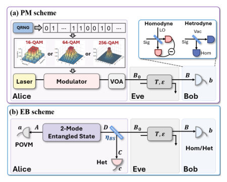 
FIG. 1. (a) The prepare-and-measure scheme of the proposed DM CV-QKD protocol. A quantum random number genera- tor (QRNG) produces n-bit symbols, each of which is mapped to one of 2n coherent states in the discrete modulation con- stellation. Inset plots show the probability distributions of three representative modulation formats: 16-QAM, 64-QAM, and 256-QAM. VOA, variable optical attenuator; Hom, ho- modyne measurement. (b) The entanglement-based scheme for the proposed protocol. POVM, positive-operator valued measure. Het, heterodyne measurement.

📷 Fig 2

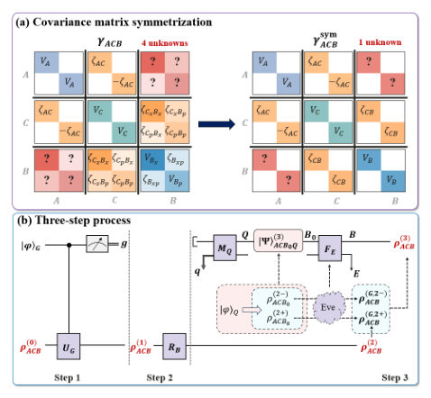 
FIG. 2. (a) Covariance matrix and its symmetric form after symmetrization. The white boxes represents 0. (b) Three steps for covariance matrix symmetrization. S1: Controlled rotation. S2: Local rotation. S3: State mixture.

📷 Fig 3

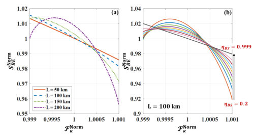 
FIG. 3. (a) The variation trend of normalized SNorm BE within the normalized interval FNorm κ under different transmission distances L. (b) The variation trend of normalized SNorm BE within the normalized interval FNorm κ under different ηBS at 100 km. FNorm κ = [−R/¯κ, R/¯κ]. Simulation parameters: excess noise ε = 0.04 SNU, detection efficiency η = 0.6, elec- tronic noise νele = 0.1 SNU. The modulation variance VM = 4 SNU, and ηA = 1 −10−4.

📷 Fig 4

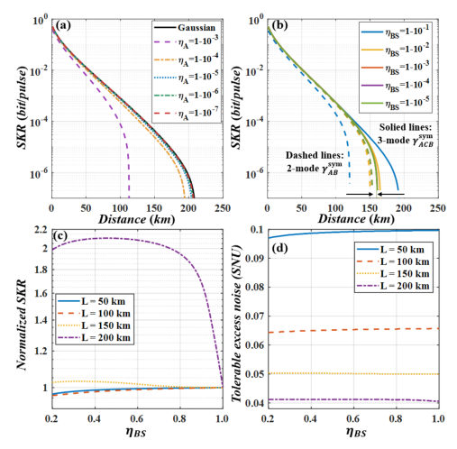 
FIG. 4. (a) SKR of the DM protocol for different ηA com- pared with the ideal Gaussian protocol, with a fixed mode variance VA = 5 SNU and ηBS = 0.9. (b) SKR based on 3-mode matrix γsym ACB and 2-mode matrix γsym AB with different ηBS. (c) Normalized SKR versus ηBS under different trans- mission distances, where the SKR is normalized to its value at ηBS = 1 −10−5. (d) Tolerable excess noise versus ηBS un- der different distances. Simulation parameters: reconciliation efficiency β = 0.95, excess noise ε = 0.04 SNU, detection effi- ciency η = 0.6, electronic noise νele = 0.1 SNU [33]. VM = 4 and ηA = 1 −10−4 for (b), VM = 4 and ηA = 1 −10−6 for (c) and (d).

📷 Fig 5

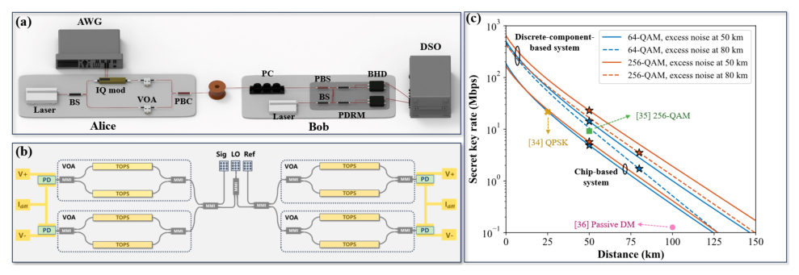 
FIG. 5. (a) Experimental setup of the DM CV-QKD system based on discrete component. AWG, arbitrary waveform generator; IQ mod, in-phase/quadrature modulator; VOA, variable optical attenuator; PC, polarization controller; PBC, polarization beam combiner; PBS, polarization beam splitter; BS, beam splitter; PMOC, polarization-maintaining optical couplers; BHD, balanced homodyne detector; PDRM, polarization diversity receiver module; DSO, digital storage oscilloscope. (b) The integrated silicon photonic receiver chip. PD, photodiode; MMI, multi-mode interferometer. (c) Experimental key rates and numerical simulations. The solid and dashed lines are the numerical simulations of SKRs using...

**Summary.** This paper introduces a novel, SDP-free security framework for discrete-modulated Continuous-Variable Quantum Key Distribution. By grounding the analysis in the Heisenberg uncertainty principle and utilizing source-mode expansion, the authors successfully quantify key rates for high-order constellations. The work is validated both theoretically and experimentally on photonic platforms, demonstrating strong noise resilience.

**Why it may be interesting.** This work directly addresses practical limitations in quantum communication protocols by providing computationally tractable security bounds for real-world hardware constraints (discrete modulation), which is crucial for realizing scalable quantum networks.

Detailed structure

**Main problem.** The primary challenge is developing a secure key rate analysis framework for discrete-modulated Continuous-Variable Quantum Key Distribution (CV-QKD) that avoids computationally prohibitive Semidefinite Programming (SDP).

**Main result.** The authors developed a security framework based on the Heisenberg uncertainty principle, enabling high-order constellation analysis and showing performance approaching ideal Gaussian limits with 256 points.

**Method.** The method involves developing an entanglement-based security bound by introducing ancillary modes and employing symmetrization techniques to simplify the covariance matrix constraints, thereby obviating SDP.

**Model / system.** The system is CV-QKD using discrete modulation, modeled via a multi-mode entangled source ($
ho_{ACB}$) characterized by its covariance matrix. The analysis extends from theoretical bounds to experimental validation on both discrete and integrated photonic platforms.

**Key observables.** Secret Key Rate (SKR), Covariance matrices ($\gamma_{ACB}$), Normalized SKR ($	ext{SNorm}_{BE}$).

**Important parameters / regimes.** Constellation size (up to 256 points), excess noise ($	ext{SNU}$), channel transmittance ($T$), and the degree of modulation order.

**Assumptions / limitations.** The security analysis relies on exploiting the convexity of the Secret Key Rate (SKR) function, and experimental results assume successful implementation of advanced Digital Signal Processing (DSP).

**Figures summary.** Figures illustrate the prepare-and-measure vs. entanglement-based schemes, show the three steps of covariance matrix symmetrization, compare SKR for different modulation orders (e.g., 256-QAM), and detail the experimental setup using chip-based photonics.

**Paper structure.** The paper progresses from identifying the SDP limitation in CV-QKD security proofs to proposing a Heisenberg uncertainty principle-based framework. This is followed by detailed mathematical derivations involving multi-mode state symmetrization, culminating in both theoretical analysis and experimental validation across various modulation formats.

Abstract

Continuous-variable quantum key distribution is a compelling framework for scalable quantum networks due to its seamless integration with existing optical communication infrastructure. However, a fundamental gap persists between theoretical protocols requiring ideal Gaussian modulation and the constrained, discrete-modulated signals dictated by practical high-speed hardware. Current security proofs for discrete modulation rely on semidefinite programming, which suffers from prohibitive computational overhead for high-order constellations and lacks direct physical insight into non-Gaussian modulation.In this Letter, we overcome this limitation by developing a security framework that obviates semidefinite programming in favor of an approach grounded fundamentally in the Heisenberg uncertainty principle. By introducing a multi-mode entanglement-source model to characterize non-Gaussian state preparation, we establish an explicit mapping between constellation geometry and the secret key rate. This framework effectively quantifies the security implications of hardware-limited, finite state preparation, enabling both numerical and analytical security analysis under high-order constellations. We experimentally validate our method on both discrete-component and integrated photonic platforms, demonstrating that a quadrature amplitude modulation format with 256 constellation points can asymptotically approach the Gaussian capacity limit. Beyond quantum key distribution, the principle of tightening uncertainty-constrained bounds via source-mode expansion offers a paradigm for exploring the information-theoretic properties of complex non-Gaussian systems.

[↑ back to top](#top)

### [Ferromagnetic transition in a chiral spin chain](http://arxiv.org/abs/2607.20629v1)

**Authors:** Yuan Xiao, Rimika Jaiswal, Oleg A. Starykh, Leon Balents  
**Type:** theory · **Category:** strongly correlated electrons · **PDF:** <https://arxiv.org/pdf/2607.20629v1>  
**Analysis basis:** full PDF text, analyzed in chunks
**Topic relevance:** `exotic spin models in light-matter` **3/5** · `analog quantum simulation` **2/5** · `Keldysh / 2PI / non-Gaussian methods` **1/5** · `spintronics-quantum-optics interface` **1/5**

📷 Fig 1

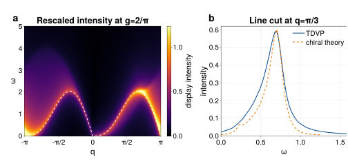 
FIG. 1. Panel (a): Dynamical structure factor from DMRG+TDVP at the transition point. The color scale shows a rescaled display intensity derived from the positive part of the spectral density, I(q, ω) = max{S(q, ω), 0}. To improve visibility of weaker features, the intensity is first clipped at the 99.5th percentile of nonzero values and then square-root rescaled: Idisp(q, ω) = [min(I(q, ω), I99.5)]1/2. The dashed white curve shows ω(q) = (π/2)| sin q|(1−sgn(q) cos q). Panel (b): Comparison of lineshape for q = π/3 to the approximate low-energy chiral boson theory. See text for details.

📷 Fig 2

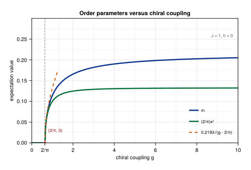 
FIG. 3. Spontaneous magnetization m and scaled vector spin chirality κz versus g at zero field calculated by Thermody- namic Bethe Ansatz (TBA). The dashed curve shows the asymptotic behavior m ∼m0 √g −gc with gc = 2/π and m0 = 0.2193 obtained from the TBA. The agreement be- tween the m and 2 π κz near gc indicates the chiral nature of the critical point.

📷 Fig 3

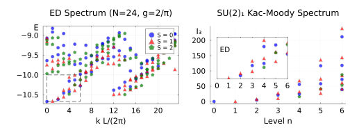 
FIG. 2. Comparison of Exact Diagonalization (ED) spectrum for a 24-site chain (left) and the spectrum of the : T 2 : theory from Eq. (13) (right). Inset in the right panel shows the cor- responding range of momenta from the ED (dashed rectangle on the left). The ordering of and number of low-energy levels for each spin at each momentum corresponds perfectly in the two plots.

📷 Fig 4

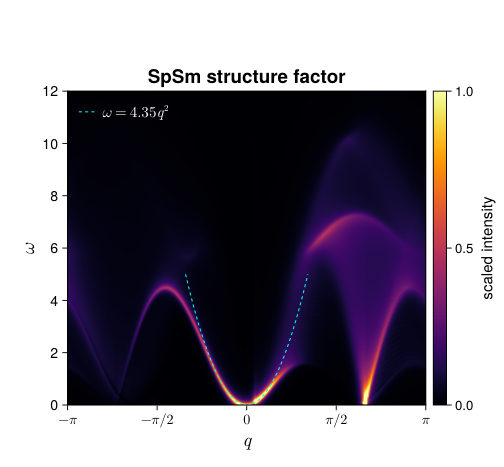 
FIG. 4. Dynamical correlation function S+−(q, ω) in the or- dered phase with g = 4, measured in the ground state with maximum magnetization along z (Sz tot = 57) calculated using DMRG+TDVP for a system of N = 300 sites. See SM Sec. J [7] for details of the method. The color indicates the scaled in- tensity I(q, ω) = min[max(S+− η (q, ω), 0)/Sclip, 1], where Sclip is 99.9% of the maximum intensity of S+−; values above Sclip are saturated. A prominent quadratically dispersing magnon is clearly visible near q = 0: the dashed line is a parabola with curvature (inverse effective mass) determined from the exact TBA equations.

📷 Fig 5

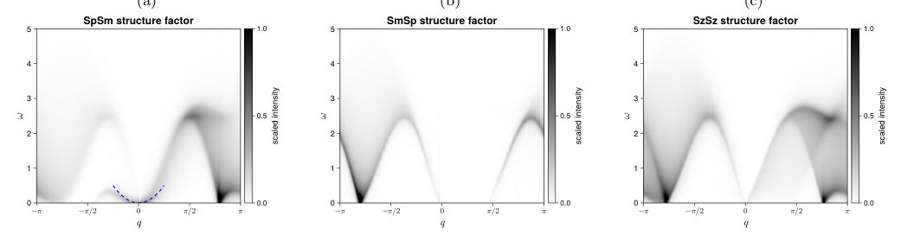 
FIG. 5. Dynamical correlation functions in the ordered phase with g = 1, measured in the ground state with maximum magnetization along z (Sz tot = 34) calculated using DMRG+TDVP for a system of N = 300 sites: (a) S+−(q, ω), (b) S−+(q, ω) and (c) Szz(q, ω). In panel (a), the parabola shows the quadratic magnon with mass calculated from the TBA. The gray scale indicates the scaled intensity I(q, ω) = min[max(SAB η (q, ω), 0)/Sclip, 1], with AB = +−in panel (a), AB = −+ in panel (b), and AB = zz in panel (c). Here Sclip is 99.9% of the maximum intensity; values above Sclip are saturated.

**Summary.** This work analyzes a chiral spin chain undergoing a phase transition driven by a three-site interaction. The authors establish that the critical point is characterized by an unusual Lifshitz transition with z=3 scaling. They derive a complex boson field theory and confirm the coexistence of magnon and Luttinger liquid excitations in the resulting ordered chiral phase.

**Why it may be interesting.** The combination of Luttinger liquid physics with a distinct ferromagnetic magnon mode at criticality is highly relevant for understanding quantum phase transitions in low-dimensional magnetic materials, connecting concepts from condensed matter theory to integrable models.

Detailed structure

**Main problem.** The study investigates the zero-temperature properties and quantum critical behavior of a spin-1/2 Heisenberg chain perturbed by a three-site chiral term.

**Main result.** The transition point exhibits an unusual Lifshitz transition with a dynamical critical exponent z=3, and the resulting chiral phase features coexisting magnon modes alongside Luttinger liquid excitations.

**Method.** The authors combine analytical field theory (chiral bosonization) with advanced computational techniques like Matrix Product States and Thermodynamic Bethe Ansatz calculations.

**Model / system.** The system is a spin-1/2 Heisenberg chain Hamiltonian modified by a three-site chiral term, $\mathcal{H} = \sum_{n} [S_n \cdot S_{n+1} - g S_n \cdot S_{n+1} 	imes S_{n+2}]$. The physics is analyzed across regimes defined by the coupling constant $g$ relative to a critical value $g_c=2/\pi$.

**Key observables.** Dynamical structure factor $S(q, \omega)$, spontaneous magnetization ($m$), and vector spin chirality ($\chi$).

**Important parameters / regimes.** The chiral coupling strength $g$, the critical point $g_c = 2/\pi$, and the dynamical critical exponent $z=3$.

**Assumptions / limitations.** Approximations include neglecting certain irrelevant interactions (like backscattering) and using finite truncations in continuum bosonization methods.

**Figures summary.** Figures illustrate the dynamical structure factor peak dispersion $\omega(q)$ at the critical point, and plots show the magnetization $m$ and chirality $\kappa_z$ exhibiting predicted asymptotic scaling near $g_c$.

**Paper structure.** The paper progresses from defining the model and identifying the phase transition to deriving a strongly interacting chiral boson field theory for the critical point. It then uses advanced numerical methods (MPS, Lanczos) and analytical tools (TBA) to calculate key observables like the structure factor and magnetization in both the ordered and critical regimes.

Abstract

We study the zero-temperature properties of a spin-$1/2$ Heisenberg chain with an additional three-site chiral term of strength $g$. The model is known to be integrable and previous work using Bethe ansatz has identified a phase transition from the usual critical state for $g< g_c = 2/π$ to a chiral phase for $g>g_c$. Here we combine analytical and computational approaches to demonstrate that the transition point comprises an unusual Lifshitz transition with dynamical critical exponent $z=3$, and the chiral phase is a partially spin-polarized phase which spontaneously breaks SU(2) symmetry. We derive a strongly interacting chiral boson field theory for the critical point, and show that even its small-momentum, low-energy response is non-trivial. We also determine the universal properties of the chiral phase, and specifically show that it has a simultaneous quadratically dispersing ferromagnetic "magnon" mode coexisting with the power-law singularities and linearly dispersing excitations typical of a Luttinger liquid. Our conclusions are validated using numerics based on matrix product state methods and exact diagonalization.

[↑ back to top](#top)

### [Interlayer interactions reshape charge-density wave through electronic elasticity in 4H$_{\mathrm{b}}$-TaS$_2$](http://arxiv.org/abs/2607.21470v1)

**Authors:** Carolina A. Marques, Martha Rösler, Berk Zengin, Aleš Cahlík, Edoardo Martino, Konstantin Semeniuk, Helmuth Berger, László Forró, Ana Akrap, Fabian D. Natterer  
**Type:** experiment · **Category:** strongly correlated electrons · **PDF:** <https://arxiv.org/pdf/2607.21470v1>  
**Analysis basis:** full PDF text, analyzed in chunks
**Topic relevance:** `Frenkel-Kontorova` **3/5** · `analog quantum simulation` **2/5** · `driven-dissipative phase transition` **1/5** · `methods for driven-dissipative` **1/5**

📷 Fig 1

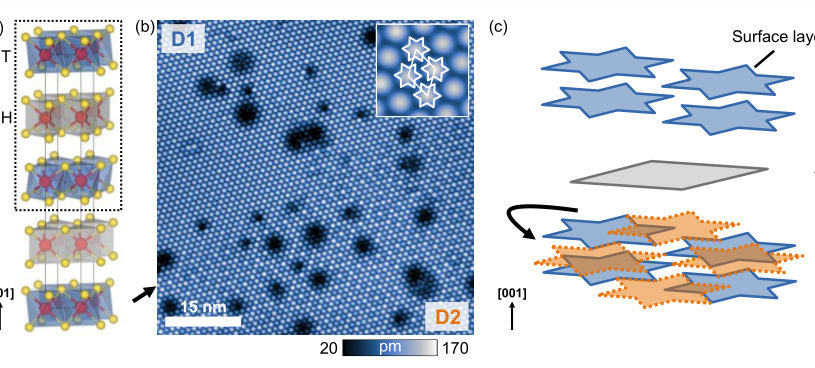 
Figure 1 -Real space super modulations at the 1T-surface of 4Hb-TaS2. (a) Unit cell of 4Hb-TaS2, showing the alternating TaS2 layers with 1T (blue) and 1H (grey) structural coordination. The dashed box indicates a three-layer stack consisting of two 1T layers and one 1H layer in between. (b) STM topography taken at the 1T-surface layer (Vset = -50 mV, Iset = 100 pA). The inset is a zoom-in on a 4x4nm2 area showing the √13 × √13 charge density wave (CDW) of the 1T-layer, as indicated by the Star-of-David patterns. There are two regions with distinct super modulations superimposed over the CDW, D1 (upper left) and D2 (bottom right), with the boundary between them running along the direction...

📷 Fig 2

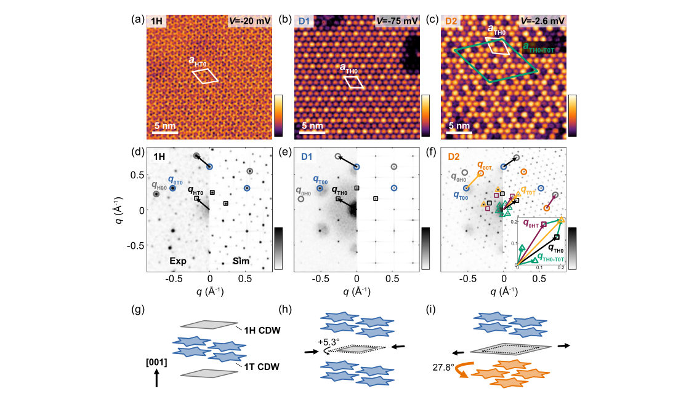 
Figure 2 – Quantifying elasticity of incommensurate charge density wave. Differential conductance maps taken on 4Hb-TaS2 at (a) 1H-TaS2 terminated surface, (b) 1T-TaS2 terminated surface in region D1, and (c) in region D2. The images are rotated to align all 1T-CDW with the image frame and are cut-outs of larger areas (see full areas in supplementary section S4). The white rhombus indicates the unit cell of the moiré pattern, aHT0 or aTH0, between the incommensurate CDW on the 1H layers and the commensurate CDW on the 1T-layer. The large-area unit cell indicated by the green rhombus in (c) corresponds to the super moiré pattern, aTH0-T0T, between the moiré of the 1T-1H CDW, aTH0, and the...

📷 Fig 3

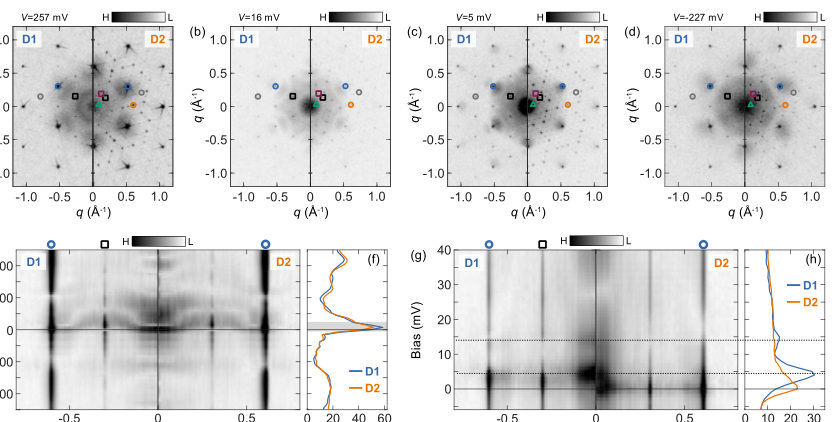 
Figure 3 –Consequences of incommensurate CDW strain on electronic structure. (a-d) Fourier transform of differential conductance images taken at decreasing bias voltages V = 257 mV, 16 mV, 5 mV and -227 mV, respectively, taken in regions D1 (left) and D2 (right). Despite distinct differences in the Bragg peak pattern, as explained in Figure 2, the QPI signatures between the two regions only show subtle differences. The circles and square symbols have the same meaning as in Figure 2. (e) Energy dispersion of the QPI signatures along qy for qx=0 Å-1 taken in regions D1 (left) and D2 (right) over a wide energy range of ±500 mV. (f) Averaged differential conductance spectrum of the map on each...

**Summary.** This work investigates how interlayer forces control the electronic state of Charge-Density Waves (CDWs) in $4	ext{H}_{\mathrm{b}}	ext{-TaS}_2$. By using STM, the authors demonstrated that the CDW wave vector elastically responds to the stacking registry between adjacent layers. This establishes electronic elasticity as a general mechanism by which weak interlayer interactions dictate correlated electronic properties in van der Waals heterostructures.

**Why it may be interesting.** While focused on solid-state physics, the concept of an order parameter's elasticity being controlled by weak coupling is analogous to how external fields or interactions can tune quantum phases in superconducting or correlated systems relevant to AMO research.

Detailed structure

**Main problem.** The intrinsic variability of incommensurate Charge-Density Wave (CDW) wave vectors in layered quantum materials obscures their fundamental electronic properties.

**Main result.** Weak interlayer interactions can reshape the low-energy electronic structure by controlling the CDW ordering wave vector through the inherent electronic elasticity of the CDW state.

**Method.** Low-temperature Scanning Tunneling Microscopy (STM) combined with Fourier and quasiparticle-interference analysis was used to probe distinct elastic states in a model heterostructure.

**Model / system.** The study uses the $4	ext{H}_{\mathrm{b}}	ext{-TaS}_2$ heterostructure, modeling alternating commensurate CDWs on 1T layers and incommensurate CDWs on 1H layers to investigate interlayer coupling effects.

**Key observables.** CDW ordering wave vectors ($\mathbf{q}$), shifts in unoccupied flat bands (few-meV shifts), and moiré patterns observed via STM/FT analysis.

**Important parameters / regimes.** Compressive ($\approx -2.3\%$) and tensile ($\approx +3.2\%$) elastic strain states induced by interlayer registry.

**Assumptions / limitations.** The CDW wave vector is treated as an intrinsic elastic degree of freedom responsive to external/interlayer strain fields.

**Figures summary.** Figures show STM images, Fourier transforms revealing distinct CDW peaks based on termination (D1 vs D2), and QPI maps demonstrating energy shifts corresponding to different strain states.

**Paper structure.** The paper systematically compares CDW patterns across different stacking registries (1H-term vs 1T-terminated regions) using STM/FT, linking the observed structural variations to measurable electronic structure changes via flat band shifts.

Abstract

Incommensurate charge-density waves (CDWs) in layered quantum materials frequently exhibit widely varying ordering wave vectors, even among nominally identical samples, obscuring their intrinsic electronic properties. Here we identify an inherent origin of this variability through the electronic elasticity of an incommensurate CDW using the model heterostructure 4H$_{\mathrm{b}}$-TaS$_2$, composed of alternating commensurate CDW on 1T and incommensurate CDW on 1H layers. Low-temperature scanning tunneling microscopy, combined with Fourier and quasiparticle-interference analysis, exploits the lattice-pinned 1T CDW as an internal reference to resolve discrete compressive ($-2.3\%$) and tensile ($+3.2\%$) elastic states of the neighboring 1H CDW selected by the interlayer registry of the adjacent layers. Corresponding few-meV shifts of a flat band demonstrate that weak interlayer interactions reshape the low-energy electronic structure through the intrinsic elasticity of the incommensurate CDW. These findings establish electronic elasticity as a mechanism by which subtle interlayer interactions control correlated electronic states in van der Waals heterostructures.

[↑ back to top](#top)

### [Magneto-Caloric effect and Multiple magnetic phases in Al doped Ni2MnSn0.75Al0.25 Heusler Alloys](http://arxiv.org/abs/2607.21181v1)

**Authors:** Satya Vijay Kumar, Simran, Madhusmita Jena, Mehroosh Fatema, Atul Gangwar, Srishti Dixit, Umashankar Rajput, Nisha Shahi, Chetna Gautam, Sanjay Singh, Anup K. Ghosh, Sandip Chatterjee  
**Type:** experiment · **Category:** disordered systems and neural networks · **PDF:** <https://arxiv.org/pdf/2607.21181v1>  
**Analysis basis:** full PDF text, analyzed in chunks
**Topic relevance:** `analog quantum simulation` **3/5** · `exotic spin models in light-matter` **3/5** · `spintronics-quantum-optics interface` **1/5**

📷 Fig 1

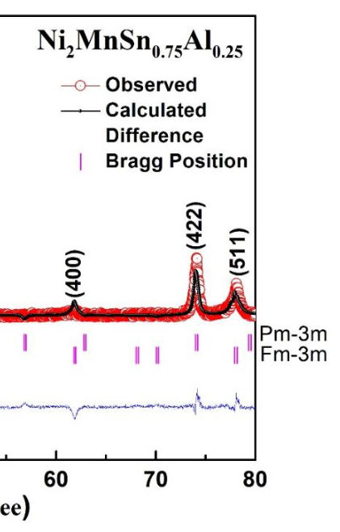 
Figure 1: Rietveld Refined XRD pattern of Ni2MnSn0.75Al0.25Heusler alloy.

📷 Fig 2

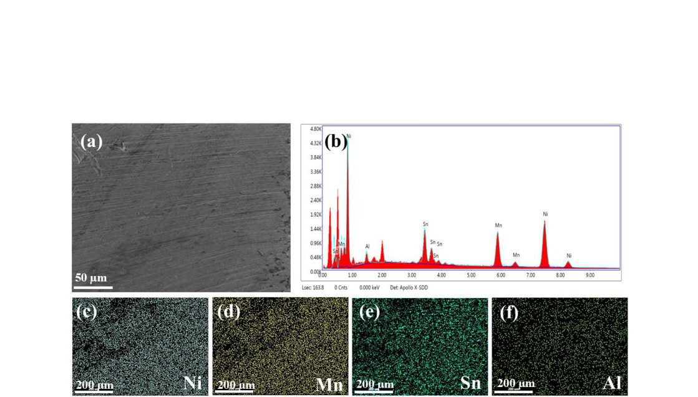 
Figure2(a): FE-SEM image illustrating the surface morphology of the NMSA sample. (b) An energy- dispersive X-ray spectroscopy (EDX) spectrum is used to determine the elemental composition of the sample. (c) Elemental-mapping images showing the spatial distribution of the alloy's constituent elements in the NMSA alloy

📷 Fig 3

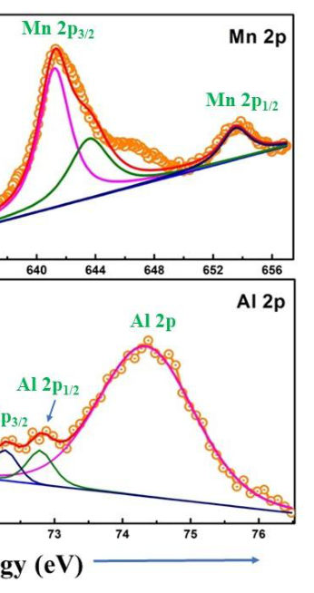 
Figure 3 : XPS spectra of Ni2MnSn0.75Al0.25Heusler alloy

📷 Fig 4

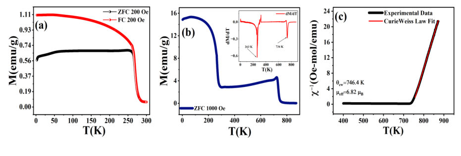 
Figure 4:(a) ZFC and FC Temperature-dependent magnetization curve at 200 Oe.

📷 Fig 5

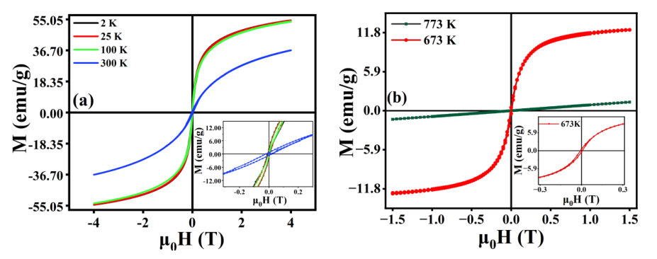 
Figure 5: M-H curves at different temperatures: (a) 2–300 K and (b) 673–773 K, with insets showing low-field

**Summary.** This work characterizes the Al-doped Ni2MnSn Heusler alloy, revealing strong coupling between its crystal structure and magnetic properties. Key findings include multiple phase transitions (paramagnetic-to-ferromagnetic and martensitic) and evidence of a complex reentrant cluster-glass state due to competing magnetic interactions. The research demonstrates potential for magnetocaloric applications based on these coupled transitions.

**Why it may be interesting.** The study of reentrant cluster-glass states and magnetostructural coupling in Heusler alloys provides a rich experimental platform for understanding how structural disorder influences complex magnetic ground states, relevant to frustrated magnetism models.

Detailed structure

**Main problem.** The study investigates the complex magnetic ground state, magnetocaloric effect, and multiple magnetic phases in Al-doped Ni2MnSn Heusler alloys.

**Main result.** The alloy exhibits strong magnetostructural coupling, evidence of competing ferromagnetic and antiferromagnetic interactions leading to a reentrant cluster-glass state, and measurable magnetocaloric response near phase transitions.

**Method.** Measurements include temperature-dependent magnetization (ZFC/FC), Differential Scanning Calorimetry (DSC), X-ray Photoemission Spectroscopy (XPS), and calculation of magnetic entropy change ($\Delta S_M$).

**Model / system.** The physical system is the intermetallic Heusler alloy Ni2MnSn0.75Al0.25, which undergoes structural changes (martensitic transformation) coupled with complex magnetic ordering.

**Key observables.** Curie temperature ($T_C \approx 734	ext{ K}$), martensitic transition temperature ($\sim 263	ext{ K}$), magnetocaloric entropy change ($\Delta S_M$), and evidence of exchange bias.

**Important parameters / regimes.** Weiss temperature ($	heta_{	ext{CW}}=746.4	ext{ K}$), effective magnetic moment ($6.82\ \mu_B$), and field exponents ($n=0.784$ to $1.07$).

**Assumptions / limitations.** The analysis assumes the observed phenomena are governed by competing FM/AFM interactions modified by Al substitution and atomic disorder.

**Figures summary.** Figures show XRD patterns confirming crystal structure, SEM/EDX images verifying composition, and magnetization curves illustrating magnetic transitions and hysteresis loops.

**Paper structure.** The paper systematically characterizes the material using structural (XRD, SEM), electronic (XPS), and thermodynamic/magnetic measurements (Magnetization, DSC, $\Delta S_M$ calculation) to map out multiple coupled phase transitions.

Abstract

Among Heusler compounds,Ni based alloys have been extensively investigated because they exhibit desirable properties such as high Curie temperatures, which are advantageous for advanced magnetic and spintronic devices.The effect of Al substitution on the magnetic ground state of Ni2MnSn was investigated using the Ni2MnSn0.75Al0.25 Heusler alloy.Temperature-dependent magnetisation measurements identify a second-order paramagnetic to ferromagnetic transition at TC is 734K,followed by a first-order martensitic transformation near 263K,demonstrating strong magnetostructural coupling.Curie Weiss analysis yields a positive Weiss temperature theta CW is 746.4K and an effective magnetic moment of 6.82muB,confirming the predominance of ferromagnetic exchange interactions. The bifurcation between the ZFC and FCW magnetization curves,together with non saturating hysteretic M vs H loops, indicates the coexistence of competing ferromagnetic and antiferromagnetic interactions.Further magnetic investigations establish the formation of an interacting reentrant cluster glass state accompanied by an exchange-bias effect.The observed magnetic behavior is attributed to the modification of Mn Mn exchange interactions induced by Al substitution and the associated atomic disorder,resulting in a complex magnetic ground state.

[↑ back to top](#top)

### [Device-Independent Self-Testing of the Three-Qubit CCZ Hypergraph State](http://arxiv.org/abs/2607.21288v1)

**Authors:** Yunguang Han, Xin Kuang, Xingyuan Bu, Yukun Wang  
**Type:** theory · **Category:** quantum information and computing · **PDF:** <https://arxiv.org/pdf/2607.21288v1>  
**Analysis basis:** full PDF text, analyzed in chunks
**Topic relevance:** `quantum measurements` **3/5** · `entanglement & information structure` **2/5** · `measurement-induced transitions` **1/5**

📷 Fig 1

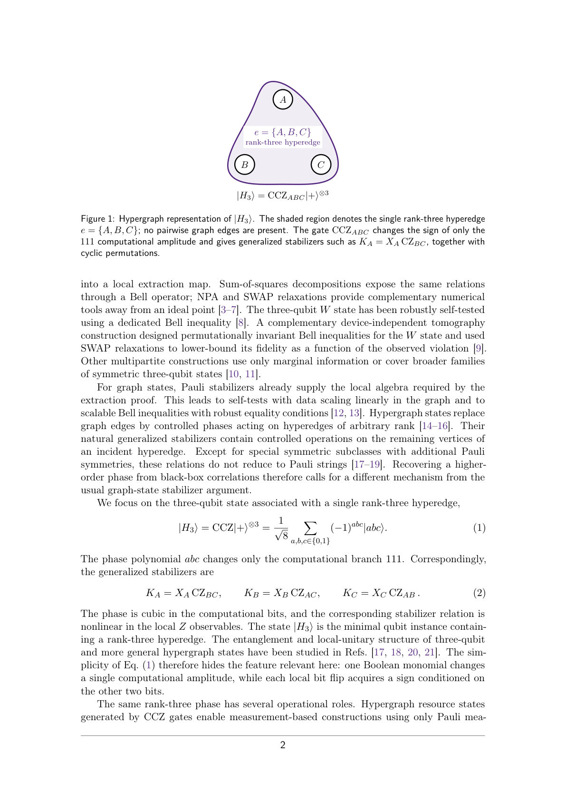 
Low-resolution page preview, page 2

📷 Fig 2

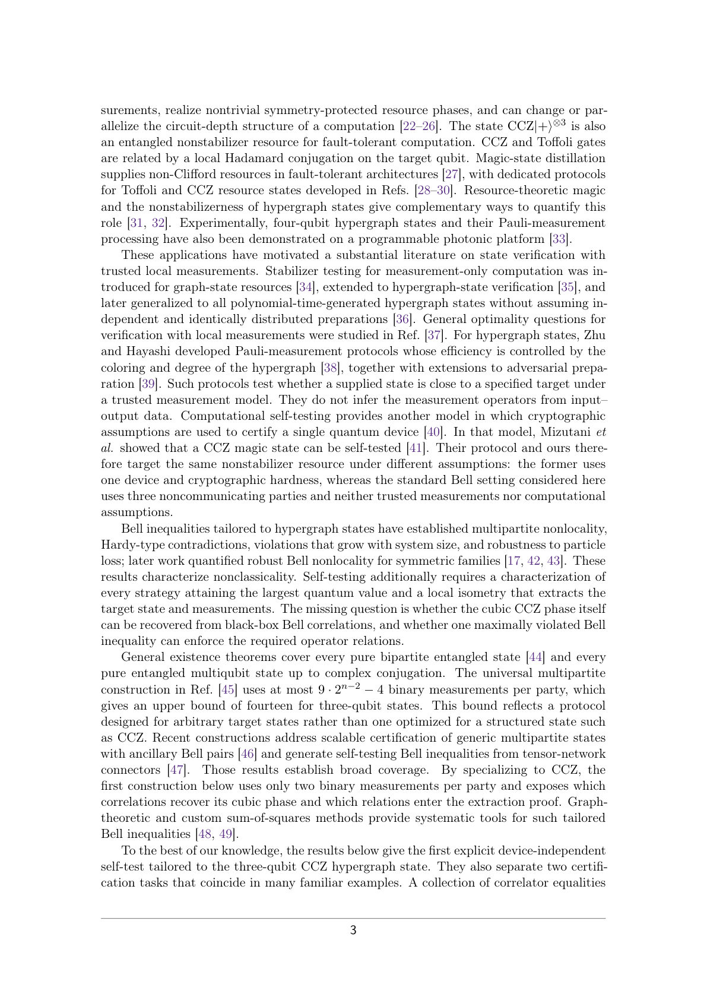 
Low-resolution page preview, page 3

📷 Fig 3

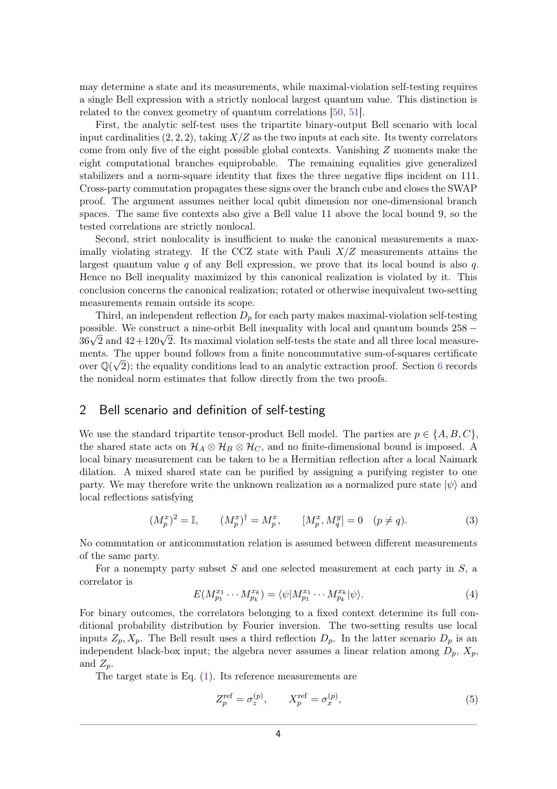 
Low-resolution page preview, page 4

📷 Fig 4

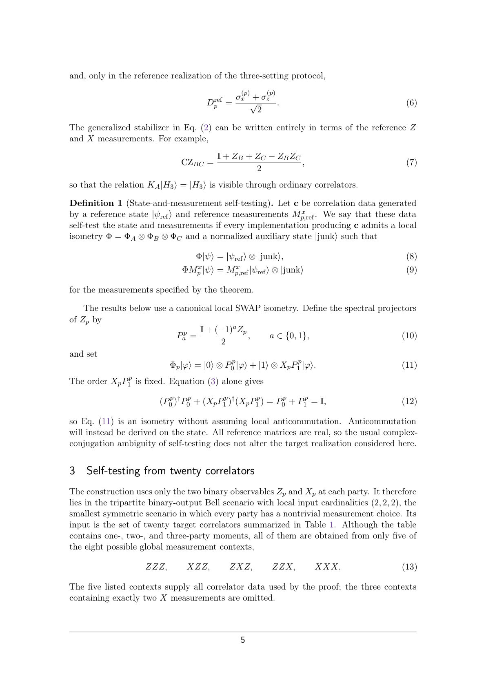 
Low-resolution page preview, page 5

📷 Fig 5

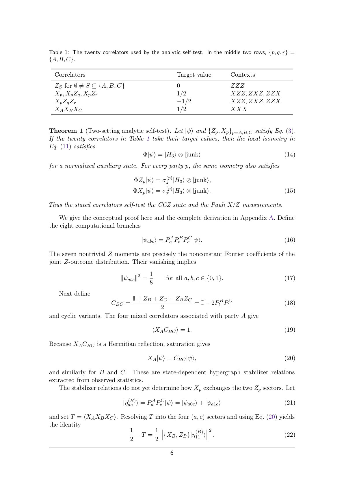 
Low-resolution page preview, page 6

**Summary.** This paper develops advanced theoretical protocols to self-test the three-qubit CCZ hypergraph state in a device-independent manner. It shows that standard methods fail due to non-Pauli stabilizers, requiring the use of specific correlator equalities and constructing novel Bell inequalities for verification. The results clarify the distinction between determining a state from correlation constraints versus finding it via maximal quantum violation.

**Why it may be interesting.** This work provides rigorous mathematical tools (SOS proofs) to verify quantum states and measurement settings without trusting the physical device's perfect operation, which is crucial for scalable quantum technologies.

Detailed structure

**Main problem.** The authors aim to develop device-independent self-tests for the three-qubit CCZ hypergraph state, addressing limitations of standard graph-state testing methods.

**Main result.** They provide two explicit device-independent self-tests for the CCZ state, demonstrating that determining a state from correlator equalities is distinct from identifying it via maximal Bell violation.

**Method.** The work combines analyzing twenty specific correlators derived from five measurement contexts with constructing and proving bounds on an explicit Bell inequality using Sum-of-Squares (SOS) decomposition over algebraic number fields.

**Model / system.** The system is the three-qubit CCZ hypergraph state, which serves as a resource for quantum information processing. The analysis focuses on its non-Pauli stabilizer structure and its behavior under local measurements.

**Key observables.** Correlators (input–output probabilities), Bell inequality violations, and generalized stabilizers ($K_A$).

**Important parameters / regimes.** The state is defined by the cubic phase polynomial; the test relies on comparing nonlocal correlations to local bounds (e.g., 11 vs 9).

**Assumptions / limitations.** Standard graph-state self-testing arguments fail because the stabilizers are not standard Pauli strings, necessitating alternative mathematical tools.

**Figures summary.** The notes reference figures showing branch cube propagation and equations defining correlations (e.g., Table 1 listing measurement contexts).

**Paper structure.** The paper progresses from establishing that correlator equalities fix the state to showing why maximal Bell violation fails for canonical measurements, culminating in the construction of a successful Bell inequality test.

Abstract

The three-qubit CCZ state is the smallest rank-three hypergraph state and an elementary entangled magic resource. Its cubic phase is governed by generalized stabilizers that are not Pauli strings, so standard graph-state self-testing arguments do not apply directly. We show that twenty correlators, all obtainable from five of the eight global input triples in the tripartite two-input, two-output scenario, determine this state and the action of the Pauli $X/Z$ measurements up to local isometries. The proof fixes eight equally weighted computational branches and propagates conditional $X$-flip relations across the branch cube, recovering the minus sign of the $111$ amplitude. These five-context correlations are nonlocal, but the canonical Pauli measurements cannot attain the largest quantum value of any Bell inequality that they violate: whenever they maximize a Bell expression, its local bound has the same value. Introducing an independent third measurement makes self-testing from maximal Bell violation possible. We construct an explicit Bell inequality whose maximal quantum violation self-tests the CCZ state and all three local measurements. An exact sum-of-squares decomposition proves the quantum bound, and its equality conditions yield an analytic SWAP extraction. Together, these results give two explicit device-independent self-tests of the CCZ state and demonstrate that determining a state and its measurements from several correlator equalities is distinct from identifying them through the maximal violation of a single Bell inequality.

[↑ back to top](#top)

### [Flavour current correlators and the non-Abelian hydrodynamic approximation: the charged sector](http://arxiv.org/abs/2607.20991v1)

**Authors:** Thomas Apostolidis, Matti Järvinen, Elias Kiritsis, Francesco Nitti, Andrea Olzi, Edwan Préau  
**Type:** theory · **Category:** statistical mechanics · **PDF:** <https://arxiv.org/pdf/2607.20991v1>  
**Analysis basis:** full PDF text, analyzed in chunks
**Topic relevance:** `Keldysh / 2PI / non-Gaussian methods` **3/5** · `non-equilibrium dynamics` **2/5** · `methods for driven-dissipative` **1/5**

📷 Fig 1

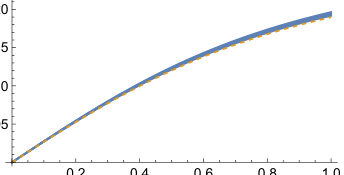 
Figure 2: Real part of the first five transverse poles as a function of the ratio of chemical potentials µ3/µq, for three different values of µq/T. From top-left to bottom, µq/T = 300, 1000 and 2000. The frequency is measured in units of 2πT. The blue curves are the numerical results, whereas the orange dashed curves show the analytic near-extremal result from (6.5).

📷 Fig 2

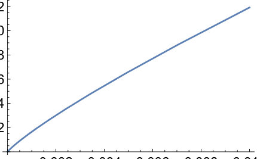 
Figure 3: Relative difference of the real part of the first transverse pole in units of 2πT with its low temperature limit, as a function of T/µq, for µ3 = µq/10.

📷 Fig 3

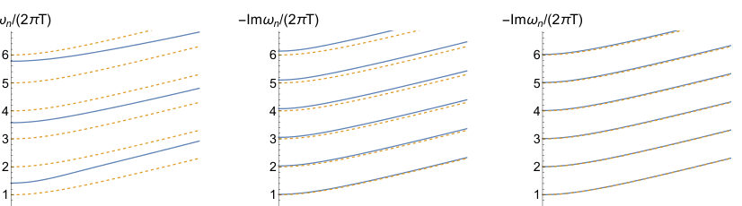 
Figure 4: Imaginary parts of the nearly imaginary transverse poles (which become purely imaginary at µ3 = 0), as a function of momentum in units of the extremal radius re, for µq/T = 5 (left), 65 (middle) and 300 (right), with µ3/µq = 0.1. The blue curves are the numerical results, whereas the orange dashed lines correspond to the AdS2 poles (6.5). As indicated by figure 1, for µq/T = 5 there are also poles with larger real parts whose imaginary parts are in the range shown in the figures. These poles are shown below in figure 6.

📷 Fig 4

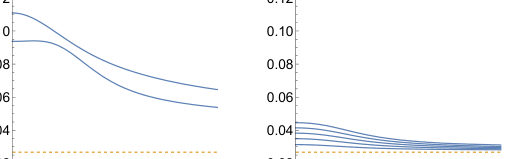 
Figure 5: Real parts of the first few poles of figure 4. For each value of µq/T, we show only the poles for which we managed to compute the real parts with good numerical accuracy (the first two poles for µq/T = 5, the first four for µq/T = 65 and the first three for µq/T = 300).

📷 Fig 5

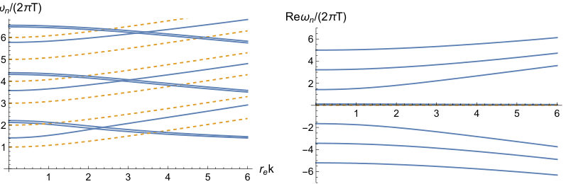 
Figure 6: For µq/T = 5 and µ3/µq = 0.1, imaginary (left) and real (right) parts of the first few transverse poles as a function of momentum.

**Summary.** This paper studies flavor current correlators in dense, strongly-coupled matter using holographic methods. It derives and verifies an extended hydrodynamic approximation that extends the known validity range of standard hydrodynamics. The findings are crucial for accurately modeling transport properties in cold, highly asymmetric quantum systems.

**Why it may be interesting.** This work extends hydrodynamic descriptions into regimes previously thought inaccessible, providing theoretical tools for understanding non-equilibrium dynamics in extreme astrophysical environments like neutron stars, which is a key area of modern statistical physics.

Detailed structure

**Main problem.** The study investigates flavor-current correlators in strongly-coupled, dense matter under conditions of finite quark chemical potential ($\mu_q$) and isospin asymmetry ($\mu_3$). The goal is to extend the applicability of hydrodynamic descriptions into non-standard regimes.

**Main result.** The authors show that the standard hydrodynamics validity extends to an extended regime ($T \ll \omega, k \ll \mu$), where correlators match non-Abelian hydrodynamic predictions. They propose a new approximation using the holographic product formula to capture both hydrodynamic and $	ext{AdS}_2$ pole effects.

**Method.** The research employs holographic methods (holographic duality) to compute two-point correlators of charged currents in the bulk, deriving non-Abelian hydrodynamics for the boundary theory. Results are verified through numerical analysis of exact correlators and quasi-normal mode spectra.

**Model / system.** The system is strongly-coupled dense matter (relevant for neutron stars), modeled holographically using a five-dimensional Einstein-Yang-Mills theory. The physics involves charged currents governed by non-Abelian dynamics due to the presence of an isospin chemical potential ($\mu_3$).

**Key observables.** Two-point correlators of charged currents, quasi-normal mode (QNMs) spectrum.

**Important parameters / regimes.** Quark chemical potential ($\mu_q$), isospin asymmetry ($\mu_3$), temperature ($T$), and wave vector/frequency ($\omega, k$). The analysis focuses on the near-extremal regime where $\omega, k, T \ll \mu$.

**Assumptions / limitations.** The primary assumptions involve using holographic duality to model strongly coupled matter and assuming validity in specific low-energy regimes (near-extremal/extended hydrodynamic).

**Paper structure.** The paper first derives the non-Abelian hydrodynamic description for charged currents. It then computes the two-point correlators holographically at finite chemical potentials, demonstrating agreement with hydrodynamics in the near-extremal regime. Finally, it applies the holographic product formula to propose an extended approximation and verifies results numerically.

Abstract

Flavor-current correlators are studied in strongly-coupled dense (holographic) matter, at finite quark chemical potential $μ_q$ and finite isospin asymmetry. The non-Abelian hydrodynamic description of the charged currents is derived in the presence of an isospin chemical potential $μ_3$. The two-point correlators of charged currents are then computed holographically at finite quark and isospin chemical potentials. In the near-extremal hydrodynamic regime, $ω, k, T, μ_3 \ll μ\equiv \sqrt{μ_q^2+μ_3^2}$, relevant for cold strongly coupled matter, the IR properties of the correlators are studied. It is shown that in this regime, the correlators agree with the non-Abelian hydrodynamic predictions. Therefore, the traditional regime of validity of standard hydrodynamics extends beyond $ω, k \ll T \ll μ$ to the so-called extended hydrodynamic regime $T\ll ω, k \ll μ$. The holographic product formula is applied to the present non-Abelian system, and is used to propose an extended hydrodynamic approximation capturing both hydrodynamic-like poles and the leading effect of AdS$_2$ poles, by resumming the low-$ω$ logarithms. The results are verified through a detailed numerical analysis of the exact correlators and quasi-normal mode spectrum.

[↑ back to top](#top)

### [Flow-based Phase-space Tomography of Continuous-variable Quantum States](http://arxiv.org/abs/2607.21584v1)

**Authors:** Owen Dugan, Rumen Dangovski, Peter Y. Lu, Di Luo  
**Type:** theory · **Category:** other · **PDF:** <https://arxiv.org/pdf/2607.21584v1>  
**Analysis basis:** full PDF text, analyzed in chunks
**Topic relevance:** `methods for driven-dissipative` **3/5** · `quantum measurements` **2/5** · `Keldysh / 2PI / non-Gaussian methods` **1/5**

📷 Fig 1

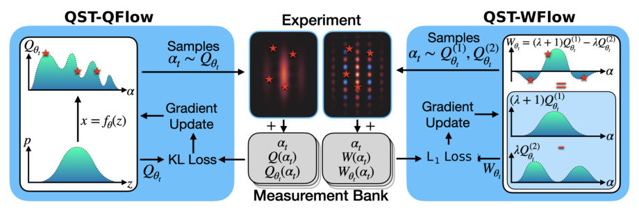 
FIG. 1. Schematic of QST-QFlow (left) and QST-WFlow (right) tomography for bosonic quantum systems. An experimental state is modeled through a normalizing-flow representation of either the Husimi Q function or the Wigner function. The current flow proposes phase-space points, measurements are acquired at those points, and the model is updated to match the measured phase-space signal.

📷 Fig 2

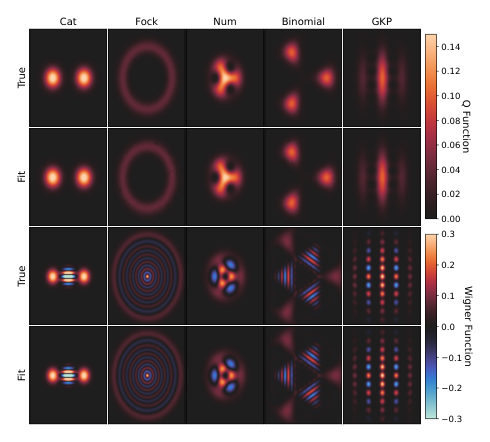 
FIG. 2. Q- and Wigner-function tomography of five single- mode continuous-variable quantum states.

📷 Fig 3

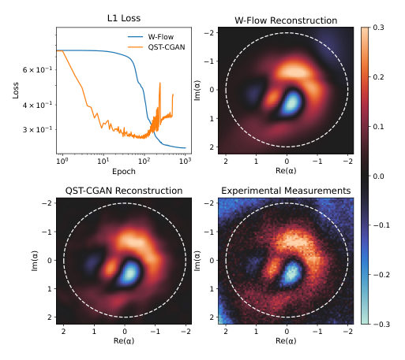 
FIG. 3. Comparison between QST-WFlow and QST-CGAN on noisy single-mode Wigner-function data.

📷 Fig 4

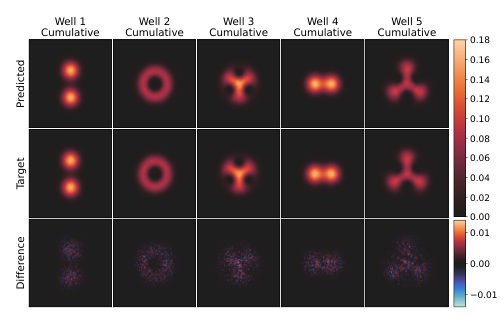 
FIG. 4. Q-function tomography of a five-mode continuous- variable quantum state.

**Summary.** The paper introduces QST-Flow, a novel framework using normalizing flows for continuous-variable quantum state tomography. It overcomes the computational bottleneck associated with resolving high-dimensional, non-Gaussian phase-space structures by representing quasiprobability distributions as trainable neural densities. This allows for scalable and measurement-efficient reconstruction of complex bosonic states.

**Why it may be interesting.** This work directly addresses the practical limitations of characterizing nonclassical quantum states in continuous variable systems, which is a major topic in quantum optics and quantum information science.

Detailed structure

**Main problem.** Continuous-variable quantum state tomography (QST) is computationally limited by resolving non-Gaussian structure in high-dimensional phase space.

**Main result.** The QST-Flow framework provides a scalable, measurement-efficient method to reconstruct CV quantum states by modeling their phase-space quasiprobability distributions using normalizing flows.

**Method.** It employs flow-based generative models (QST-Flow) to represent the Husimi Q function (QST-QFlow) or the Wigner function (QST-WFlow) as trainable neural densities, avoiding fixed grid limitations.

**Model / system.** The focus is on continuous-variable bosonic systems interrogated via phase-space quasiprobability distributions. The method handles both positive functions (Husimi Q) and sign-changing functions (Wigner).

**Key observables.** Husimi Q function, Wigner function, reconstructed quantum state density matrix.

**Important parameters / regimes.** The dimensionality of the phase space ($2M$ for $M$ modes), which dictates computational scaling.

**Assumptions / limitations.** The framework assumes that experimental measurements can provide sufficient samples to train the flow model, and it uses specific mathematical decompositions (e.g., for Wigner function) to maintain normalization.

**Figures summary.** Figures demonstrate single-mode reconstructions of various non-Gaussian states (Cat, Fock, etc.) using both Q and W representations, comparing performance against prior ML methods on noisy data.

**Paper structure.** The paper introduces the limitations of traditional tomography, proposes the unified flow-based framework (QST-Flow), details the specific models for Q and W functions, derives the necessary loss functions (KL divergence/L1 loss), and validates the method across multiple state types and modes.

Abstract

Continuous-variable quantum state tomography is limited by the cost of resolving non-Gaussian structure in high-dimensional phase space. We introduce QST-Flow, a quantum state tomography framework via flow-based generative modeling that represents experimentally accessible phase-space quasiprobability distributions with normalized, samplable neural densities rather than a truncated density matrix. The framework has two variants: QST-QFlow models the positive Husimi-$Q$ function with a single normalizing flow, while QST-WFlow models sign-changing Wigner functions as a trainable difference of two normalized flows. This construction preserves quasiprobability normalization and enables exact density evaluation, direct sampling, and importance-sampled learning from finite phase-space measurements without a fixed grid. Benchmarks on non-Gaussian cat, binomial, Gottesman-Kitaev-Preskill, number, and Fock states show accurate single-mode reconstructions, extension to multimode states, robustness on noisy Wigner data, and improved reconstruction error compared with prior machine-learning tomography methods. QST-Flow opens a promising route toward scalable, measurement-efficient phase-space tomography of nonclassical bosonic systems.

[↑ back to top](#top)

### [HI-QDC: An Isometric Modular Scalable Architecture for Quantum Data Centers](http://arxiv.org/abs/2607.20633v1)

**Authors:** Mohadeseh Azari, Anoosha Fayyaz, Amy Babay, David Tipper, Prashant Krishnamurthy, Kaushik Seshadreesan  
**Type:** theory · **Category:** quantum information and computing · **PDF:** <https://arxiv.org/pdf/2607.20633v1>  
**Analysis basis:** full PDF text, analyzed in chunks
**Topic relevance:** `entanglement & information structure` **3/5** · `QC/QI experiment` **1/5** · `methods for driven-dissipative` **1/5** · `non-equilibrium dynamics` **1/5**

📷 Fig 1

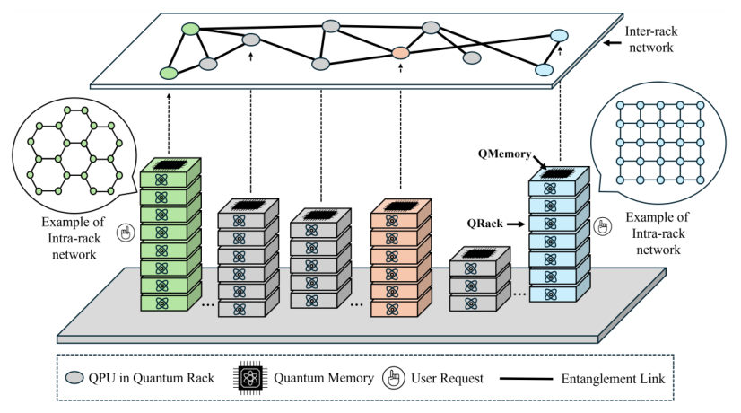 
Figure 1. Quantum data-center network architecture considered in this work. The data center is organized into quantum racks, each containing multiple QPUs and quantum memories. Each rack may use a different intra-rack connectivity pattern, chosen according to the number of QPUs, the elementary-link quality, and the operating regime required for local end-to-end entanglement generation. Across racks, we consider a high-node-degree, server-centric inter-rack topology in which QPUs themselves participate in routing and forwarding. Inter-rack connection requests are routed through this topology, whose path diversity provides multiple edge-disjoint routes between the requested endpoints and lets...

📷 Fig 2

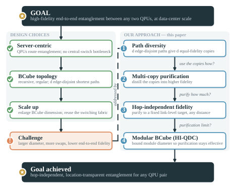 
Figure 2. Road-map of the paper. A server-centric, recursive BCube fabric can be scaled to higher dimensions to provide data-center-scale connectivity, but this increased diameter lowers the raw end-to-end fidelity of cross-QPU connections. To overcome this limitation, we use the d edge-disjoint shortest paths in BCube as d equal-fidelity copies and apply multi-copy purification to restore the connection to a fixed link-level fidelity target (Section II). The HI-QDC organization (Section III) then bounds the diameter of each module, enabling hop-independent and location-transparent entanglement distribution between any pair of QPUs (Section IV).

📷 Fig 3

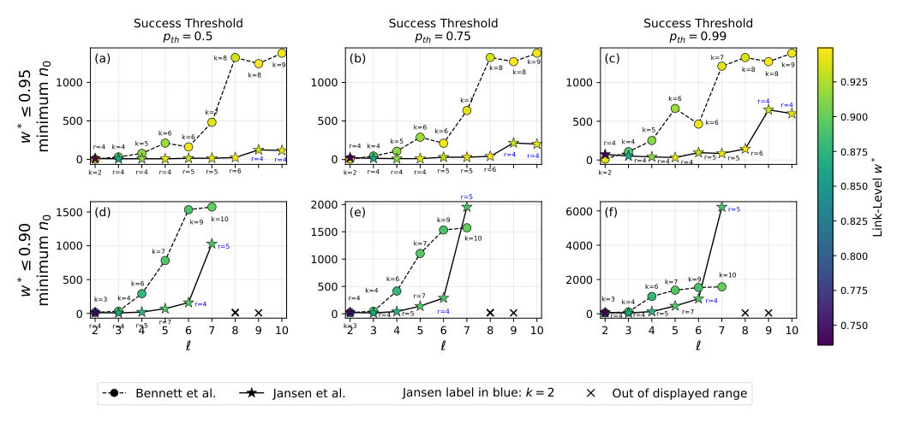 
Figure 3. Minimum number of initial copies n0 required to achieve hop-independent Werner parameter w∗as a function of path length ℓunder different purification strategies. Columns correspond to success-probability thresholds pth, and rows correspond to Werner parameter threshold (w∗≤wth). The y-axis shows the minimum n0 such that Psucc ≥pth. Circles denote BBPSSW, and stars denote the best multi-copy protocol of Jansen et al. selected from r ∈{4, 5, 6, 7}. Labels next to stars indicate the optimal r and the optimal purification recursion depth k, with blue denoting k = 2 and black denoting k = 1. All points are computed using the smallest feasible purification depth k for which purification...

📷 Fig 4

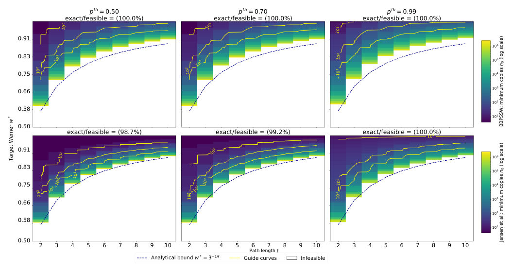 
Figure 4. Black-box resource landscape for recovering a target Werner parameter w∗over a path of length ℓunder different purification strategies and success-probability requirements. Each panel is a heatmap over (ℓ, w∗), where the color indicates the minimum number of input copies n0 required to achieve wout ≥w∗with success probability at least pth. The top row corresponds to BBPSSW purification, while the bottom row shows the best Jansen r-to-1 protocol selected from r ∈{3, 4, 5, 6, 7}. The dashed curve marks the analytical scaling w∗= 3−1/ℓ, and the overlaid contours indicate constant n0 values. White regions are infeasible within the explored search range.

📷 Fig 5

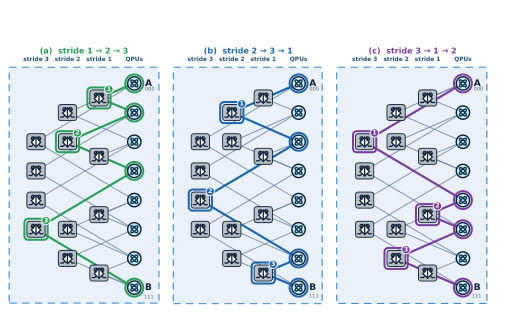 
Figure 5. Edge-disjoint paths between two QPUs separated by a length-3 shortest path, in a BCube(2, 2) inner network. Each panel shows one of the three cyclic stride orderings. Highlighted nodes and edges mark the active path, and numbered badges indicate the traversal order. The three paths use the same three link types in cyclically rotated order, yielding the same end- to-end Werner-parameter product under uniform per-level link quality.

**Summary.** This paper addresses the scalability bottleneck in large quantum data centers where long communication paths degrade entanglement fidelity. The authors propose the Hop-Independent Quantum Data Center (HI-QDC), an isometric modular architecture. By leveraging path diversity and end-to-end purification, HI-QDC ensures that network performance remains at the quality level of a single elementary link, regardless of how many modules are chained together.

**Why it may be interesting.** While focused on network topology rather than fundamental AMO physics, the concept of using topological redundancy (path diversity) as a resource input for quantum error correction/purification is highly relevant to building scalable quantum hardware platforms.

Detailed structure

**Main problem.** The primary challenge is achieving 'hop-independent fidelity' in large quantum data centers, where increasing physical path length degrades end-to-end entanglement quality.

**Main result.** The proposed HI-QDC architecture allows modular units to convert their internal path diversity into an effective link-level resource, enabling scalable networks whose performance is independent of the module's internal hop count.

**Method.** The authors analyze end-to-end entanglement purification protocols (comparing 2-to-1 vs. nested r-to-1) and apply these requirements to a probabilistic BCube network model.

**Model / system.** The system modeled is a server-centric quantum data center network utilizing the BCube topology for interconnecting Quantum Processing Units (QPUs). Entanglement quality is quantified using the Werner state parameter.

**Key observables.** Entanglement fidelity, end-to-end entanglement distribution rate, and the minimum number of raw Werner-state copies required for purification.

**Important parameters / regimes.** Path length ($\ell$), target elementary-link Werner parameter ($w^*$), and the resource cost (number of input copies $n_0$).

**Assumptions / limitations.** The analysis assumes probabilistic generation of elementary links, deterministic entanglement swapping, and that fidelity degradation is solely due to link imperfections rather than memory decoherence.

**Figures summary.** Figures illustrate the modular HI-QDC architecture, showing how path diversity supplies raw copies for purification. A key figure compares the exponentially increasing required input copies ($n_0$) versus path length ($\ell$).

**Paper structure.** The paper first establishes the fidelity bottleneck in scaling quantum data centers using a black-box model. It then analyzes resource requirements via end-to-end purification protocols, leading to the proposal of the HI-QDC module which resolves the scalability issue by converting path multiplicity into fidelity recovery.

Abstract

Server-centric quantum data-center architectures offer scalability by distributing communication tasks across QPUs rather than concentrating complexity in a centralized switching core. However, scaling such architectures increases the path length, the number of Bell-state measurements, and the loss of end-to-end fidelity. We ask whether the path diversity of a server-centric topology can be converted into a mechanism for preserving not only rate, but also fidelity. We study this through end-to-end purification as a fidelity-restoration mechanism. First, in a black-box model, we determine the minimum number of raw end-to-end Werner-state copies, each carrying the degraded Werner parameter of a distance-ell path, that purification must consume to recover a single copy matching an elementary link, comparing recursive 2-to-1 and optimized nested r-to-1 purification. Second, we instantiate these requirements in a probabilistic BCube architecture, whose edge-disjoint path diversity supplies the raw copies. Because purification imposes a lower bound on input fidelity, no path redundancy can raise the output below this threshold, which limits scaling. To address it we present the Hop-Independent Quantum Data Center (HI-QDC), an isometric, modular, scalable architecture in which purification transforms end-to-end entanglement across a module into an effective link-level resource for the inter-module topology. Our results identify the regimes in which a BCube module, under end-to-end purification, preserves both the fidelity and the yield of an elementary link. The module then hides its internal hop count and acts as an effective elementary link for a higher-level network. Thus topology supplies the path multiplicity purification requires, while purification converts it into fidelity recovery, enabling recursively scalable quantum data-center networks.

[↑ back to top](#top)

### [Pseudogap formation in the moderate correlated layered attractive Hubbard model](http://arxiv.org/abs/2607.21478v1)

**Authors:** A. V. Belov, A. N. Rubtsov, B. Krippa  
**Type:** theory · **Category:** strongly correlated electrons · **PDF:** <https://arxiv.org/pdf/2607.21478v1>  
**Analysis basis:** full PDF text, analyzed in chunks
**Topic relevance:** `Keldysh / 2PI / non-Gaussian methods` **3/5** · `analog quantum simulation` **1/5** · `driven-dissipative phase transition` **1/5** · `methods for driven-dissipative` **1/5**

📷 Fig 1

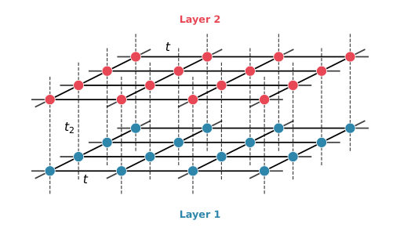 
FIG. 1: Schematic illustration of the layered system. Black solid lines denote intralayer hopping, while grey dotted lines denote interlayer hopping.

📷 Fig 2

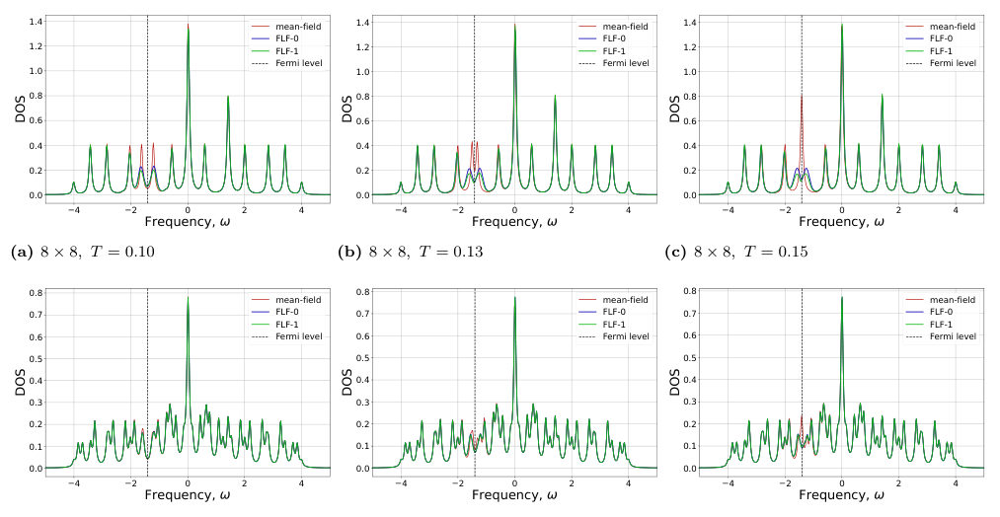 
FIG. 2: Density of states (DOS) for temperatures below, near and above mean-field transition for 8 × 8 (first row) with Tc ≈0.14 and 16 × 16 (second row) with Tc ≈0.1. Red lines is mean-field DOS, blue - FLF-0 DOS, green - FLF-1 DOS, black slashed line is Fermi level. At this line, formation of a gap and a pseudogap is clearly seen. DOS from FLF-1 with Fock correction is nearly the same as DOS in FLF-0

📷 Fig 3

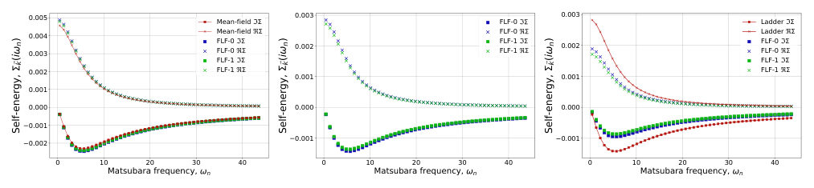 
FIG. 3: Self-energy in FLF method for tempetoratures below, near and above mean-field transition for 16 × 16 cluster with Tc ≈0.1. In (a) FLF self-energy is compared with mean-field - red color, in (c) - is compared with zero-mode ladder approximation - also red color. Square markers denote imaginary part of self-energy, cross markers - real part

📷 Fig 4

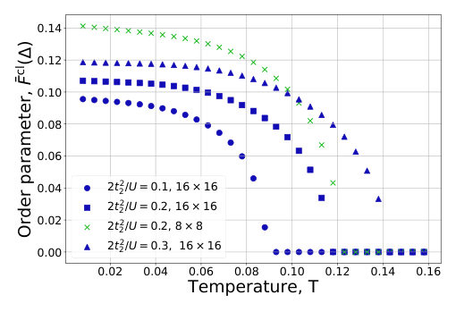 
FIG. 4: Dependence of order parameter on temperature with different exchange couplings for 16 × 16 cluster. Pink circles - 0.1, violet triangles - 0.2, green squares - 0.3 and green crosses - 0.3 for 8 × 8 cluster

📷 Fig 5

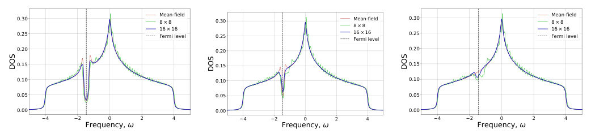 
FIG. 5: Density of states for large lattice near quarter-filling from discussed cluster scheme. Transition temperature from mean-field Tc ≈0.113. Violet lines are DOS on base of the cluster with sizes 8 × 8, green lines - cluster with sizes 16 × 16, pink lines - mean-field result, black dashed line - Fermi-level

**Summary.** This paper theoretically investigates pseudogap formation in a layered attractive Hubbard model using the Fluctuating Local Field (FLF) method. The authors demonstrate that this non-perturbative approach captures a persistent pseudogap structure in the density of states, which remains visible even when mean-field theory predicts the superconducting gap has closed due to thermal fluctuations.

**Why it may be interesting.** The non-perturbative treatment of superconducting fluctuations via the FLF method provides advanced theoretical insight into spectral weight renormalization and gap physics, which is highly relevant for understanding strongly correlated materials like cuprates.

Detailed structure

**Main problem.** The study investigates the formation of a pseudogap phase in a layered attractive Hubbard model, aiming to understand its origin relative to superconducting fluctuations.

**Main result.** The Fluctuating Local Field (FLF) method successfully demonstrates the emergence of a persistent pseudogap structure in the density of states, which persists even when mean-field theory predicts the gap should close above $T_c$.

**Method.** The primary theoretical tool is the Fluctuating Local Field (FLF) method, applied within a cluster scheme to calculate Green's functions and self-energies non-perturbatively.

**Model / system.** The system modeled is the layered attractive Hubbard model at quarter filling. The Hamiltonian includes hopping terms ($t$ intralayer, $t_2$ interlayer) and an interaction term, analyzed using a cluster approach extended to the infinite lattice via a static symmetry-breaking field $\Delta$.

**Key observables.** Green's function (GF), self-energy ($\Sigma$), Density of States (DOS), and the superconducting gap structure.

**Important parameters / regimes.** Moderate correlation strength ($|U|/t \approx 1$ to $2$) and weak interlayer coupling ($t_2$).

**Assumptions / limitations.** The analysis relies on the FLF method, which uses a static approximation for the fluctuating field ($\Delta$), and in some contexts, assumes $\Sigma' \approx 0$ when treating zero modes.

**Figures summary.** Figures illustrate the layered hopping structure; DOS plots compare mean-field vs. FLF results showing pseudogap persistence above $T_c$; Self-energy plots show agreement below $T_c$.

**Paper structure.** The paper progresses by defining the model and applying the FLF method to finite clusters, then extrapolating these results using a static $\Delta$ approximation to describe the infinite layered system, culminating in comparisons of DOS and self-energies across different temperature regimes.

Abstract

We consider the layered attractive Hubbard model with a moderate interaction strength at quarter filling. The Green's function, self-energy, and density of states are calculated for relatively large clusters using the fluctuating local field method within the approximation of vanishing effective interaction. The emergence of a pseudogap is demonstrated for the cluster system, and it is shown that integration over the fluctuating field is equivalent to the summation of zero-mode ladder diagrams above critical temperature. For the large layered system, a pseudogap in the density of states is obtained within a cluster scheme that treats the coupling between layers as a static $U(1)$ symmetry-breaking field.

[↑ back to top](#top)

### [Enhancing Entanglement Purification with Shared Randomness](http://arxiv.org/abs/2607.21555v1)

**Authors:** Allen Zang, Bikun Li, Xinan Chen, Eric Chitambar, Liang Jiang, Martin Suchara, Tian Zhong  
**Type:** theory · **Category:** quantum information and computing · **PDF:** <https://arxiv.org/pdf/2607.21555v1>  
**Analysis basis:** full PDF text, analyzed in chunks
**Topic relevance:** `entanglement & information structure` **3/5** · `methods for driven-dissipative` **1/5** · `non-equilibrium dynamics` **1/5**

📷 Fig 1

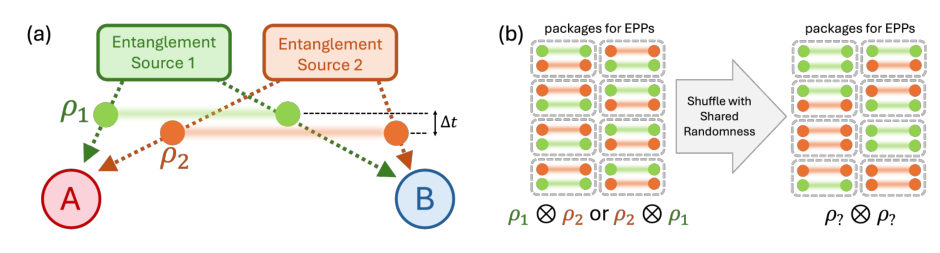 
FIG. 1. Two-source schematic of accumulating and shuffling. (a) Alice and Bob receive one pair from each of two non-identical sources in each distribution round, but the source labels of the received pairs are not available to the purification layer, likely due to e.g. a time jitter ∆t between the distribution of the entangled states that cannot be known beforehand. (b) With shared randomness and buffer memories, they accumulate over m rounds, apply the same random shuffle to their local memories, and group the stored pairs into input packages for the EPP. The mechanism applies to general n sources and n-to-1 EPPs.

📷 Fig 2

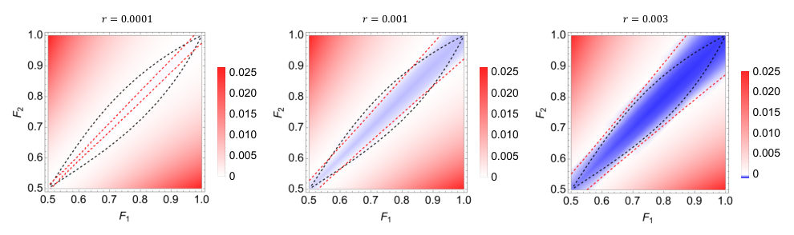 
FIG. 2. Difference between Fsucc(ρ(2) eff,n=2) and Fsucc (F1, F2) for r = 0.0001, 0.001, 0.003. White color is fixed to represent zero value, while blue color denotes negative value and red color corresponds to positive value. The red dashed lines illustrate the boundaries where the difference is exactly zero. The black dashed lines illustrate the boundaries where Fsucc (F1, F2) −max{F1, F2} is exactly zero.

📷 Fig 3

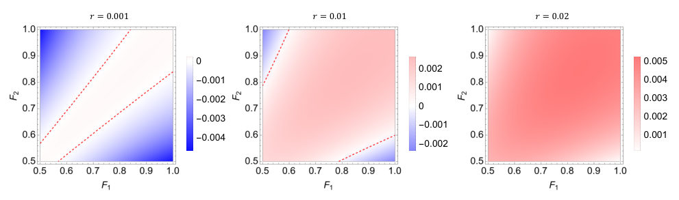 
FIG. 3. Difference between Fsucc  ρ(2) eff,n=2  and Fsucc  ρ(3) eff,n=2  for r = 0.001, 0.01, 0.02. White color is fixed to represent zero value, while blue color denotes negative value and red color corresponds to positive value. The red dashed lines illustrate the boundaries where the difference is exactly zero.

**Summary.** This paper introduces an 'accumulating and shuffling' strategy that enhances entanglement purification protocols when multiple noisy entangled sources are available but their identities are unknown. By accumulating states in buffer memories and using shared randomness to mix them before purification, the protocol significantly boosts fidelity and success probability compared to standard methods. This offers a practical theoretical tool for building robust quantum networks.

**Why it may be interesting.** This work directly impacts quantum network theory by providing a resource-efficient technique (using only classical randomness and memory) to boost entanglement quality, which is crucial for scaling up distributed quantum computation.

Detailed structure

**Main problem.** The research addresses how to improve entanglement fidelity for fault-tolerant quantum computation when input entangled pairs are noisy, heterogeneous, and the source labels are unknown at the purification stage.

**Main result.** The proposed 'accumulating and shuffling' strategy significantly enhances both the expected success probability and output Bell fidelity compared to baseline methods, with improvements increasing monotonically with the number of accumulation rounds.

**Method.** The authors develop a theoretical framework comparing the performance of standard entanglement purification protocols against those utilizing shared classical randomness to shuffle accumulated entangled states before inputting them into the protocol.

**Model / system.** The model involves quantum networks distributing noisy bipartite Werner states ($
ho_i$) from multiple sources ($n$). The core mechanism utilizes buffer quantum memories and relies on the availability of classical shared randomness.

**Key observables.** Expected success probability ($p_{succ}$) and success-weighted output Bell fidelity ($F_{succ}$ or $	ilde{F}_{succ}$).

**Important parameters / regimes.** Number of sources ($n$), number of accumulation rounds ($m$), decoherence rate parameter ($r$).

**Assumptions / limitations.** The protocol requires classical shared randomness and the ability to store states in buffer quantum memories. Simplifications are made assuming mutual independence of random source outputs for certain derivations.

**Figures summary.** Figures illustrate schematic comparisons between non-AS and AS scenarios, and later figures compare performance metrics ($F_{succ}$) across different numbers of accumulated rounds ($m=2$ vs $m=3$) relative to decoherence rates ($r$).

**Paper structure.** The paper builds from the general problem setup (heterogeneous sources) to introducing the AS strategy. It provides rigorous mathematical proofs comparing performance metrics using tools like elementary symmetric polynomials and analyzing asymptotic limits, concluding with specific analyses involving decoherence channels.

Abstract

Entanglement purification protocols (EPPs) are essential for improving entanglement fidelity to support fault-tolerant distributed quantum information processing. Practical entanglement sources are often heterogeneous and source labels may be unavailable at the EPP layer. We show that classical shared randomness, together with buffer memories, can enhance entanglement purification when source labels are unavailable, without state characterization or EPP circuit optimization. The strategy is to accumulate multiple entanglement distribution rounds and then use shared randomness to shuffle all the stored entangled states before packaging them as inputs to the EPP. For any $n$ Werner sources and any fixed $n$-to-1 bilocal Clifford EPP, we prove that accumulating and shuffling improves the expected success probability and the success-weighted output Bell fidelity over the baseline without accumulating and shuffling, for every $n$, for every finite number of accumulation rounds and in the asymptotic limit, and the improvement increases monotonically with the number of accumulation rounds.

[↑ back to top](#top)

### [Heralded high-dimensional module-based quantum computation](http://arxiv.org/abs/2607.20895v1)

**Authors:** Xiao Zhang, Wen-Qiang Liu, Hai-Rui Wei  
**Type:** theory · **Category:** quantum information and computing · **PDF:** <https://arxiv.org/pdf/2607.20895v1>  
**Analysis basis:** full PDF text, analyzed in chunks
**Topic relevance:** `quantum measurements` **3/5** · `interference shaping light` **1/5** · `measurement-induced transitions` **1/5**

📷 Fig 1

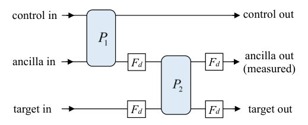 
Figure 1: The schematic diagram for constructing a deterministic high-dimensional generalized CNOT gate. Blocks P1 and P2 are two generalized parity modules. Fd denotes the qudit-based Fourier transformation, which performs the transformation |m⟩→ 1 √

📷 Fig 2

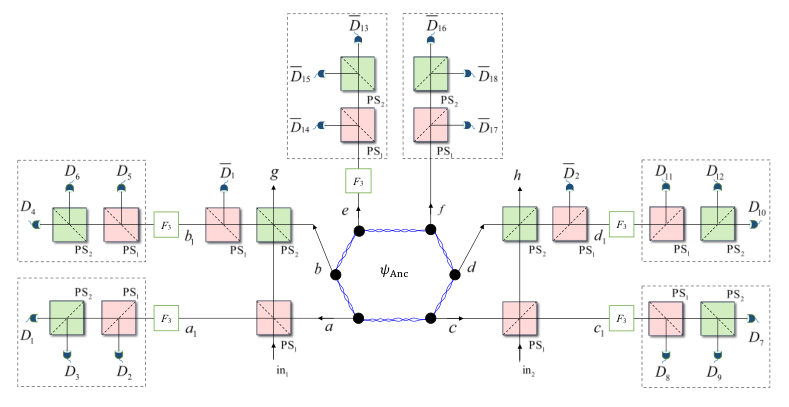 
Figure 2: Schematic diagram of generalized qutrit-based parity module. D and D denote photon-number-resolving detector and single-photon detector, respectively. F3 is qutrit-based Fourier transformation. The circuits in the dashed boxes are designed to measure the output photon in the basis {|0⟩, |1⟩, |2⟩}.

📷 Fig 3

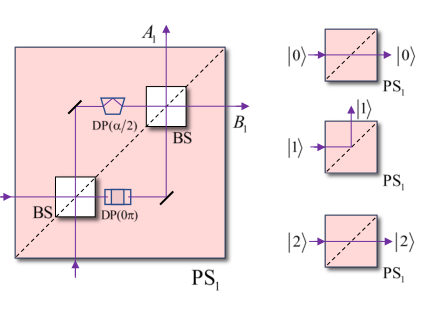 
Figure 3: Schematic diagram of a first-order parity sorter (PS1) [49]. Dove prism flips the transverse cross section of the beam in one arm while leaving the other unchanged. This Mach-Zehnder interferometer routes the photons with even ℓ(l mod 2 = 0) to Port B1 (transmitted) and those with odd ℓ(l mod 2 = 1) to Port A1 (reflected).

📷 Fig 4

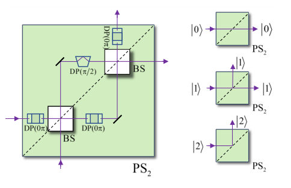 
Figure 4: Schematic diagram of a second-order parity sorter (PS2) [51]. This interferometric device classifies OAM modes by ℓmod 4. The device transmits photons with ℓmod 4 = 0 (e.g., |0⟩, | ± 4⟩), and reflects the photons with l mod 4 = 2 (e.g., | ± 2⟩, | ± 6⟩). For the photons with odd ℓ(e.g., | ± 1⟩, | ± 3⟩), they are randomly led to the two output ports.

**Summary.** The paper presents a method to build high-dimensional controlled-NOT (CNOT) quantum gates using generalized parity modules. The construction is heralded and deterministic, overcoming limitations of previous schemes by identifying only two usable module types. This work advances the feasibility of qudit-based quantum computation in optical systems.

**Why it may be interesting.** This work provides a robust theoretical framework for building universal quantum gates in high-dimensional Hilbert spaces using measurement-based techniques, which is crucial for scaling up photonic quantum computation beyond simple qubit systems.

Detailed structure

**Main problem.** The goal is to develop deterministic, heralded, and dimensionality-insensitive methods for constructing high-dimensional module-based quantum computation gates.

**Main result.** The authors successfully constructed a generalized controlled-NOT (CNOT) gate using only two specific types of parity modules out of all possible possibilities. This scheme requires no postselection and generalizes to arbitrary qudit dimensions ($d$).

**Method.** They propose constructing the CNOT gate via sequential operations involving generalized parity modules, Fourier transformations, and ancillary qubits/qudits.

**Model / system.** The system involves high-dimensional quantum states (qudits) where computation is built upon 'generalized parity modules,' which are implemented optically using Orbital Angular Momentum (OAM) degrees of freedom in single-photon systems.

**Key observables.** The success of the parity module operation is heralded by specific detection outcomes from photon-number-resolving and single-photon detectors.

**Important parameters / regimes.** The dimensionality $d$ of the qudit basis, and the structure of the two usable parity modules: $\mathcal{P}=(j\ominus i)mod d$ and $\mathcal{P}=(j \oplus i)mod d$.

**Assumptions / limitations.** The scheme assumes the ability to implement quantum nondemolition measurements for the parity module and relies on specific detection events (e.g., no firing of certain detectors) to confirm gate success.

**Figures summary.** Figures schematically illustrate the construction of the generalized CNOT gate using blocks like $P_1$, $P_2$, and Fourier transformations ($F_d$), showing the optical components involved in parity sorting.

**Paper structure.** The paper first introduces the concept and constructs the CNOT gate for qutrits, then generalizes this construction mathematically to arbitrary qudit dimensions ($d \ge 4$) using linear algebra and state evolution equations. Finally, it details an optical implementation scheme utilizing OAM encoding.

Abstract

Parity measurements have been explored as building blocks for preparing and discriminating entangled states, as well as for implementing quantum computation. We first develop two alternative high-dimensional generalized parity modules, and then propose a procedure for constructing high-dimensional generalized module-based controlled-NOT gate. The construction of module-based quantum computing introduced here is deterministic, heralded, insensitive to the dimensionality of the computing basis, and postselection technique is not required. The result shows that out of $(d-1)!$ generalized parity modules, only modules $ \mathcal{P}=(j\ominus i)\bmod d$ and $ \mathcal{P}=(j \oplus i)\bmod d$ can be used as building blocks for high-dimensional quantum computing. Furthermore, we proposed an optical nondestructive scheme for implementing generalized parity module through quantum nondemolition measurements, and the success of the parity module is heralded by photon-number-resolving detectors and single-photon detectors.

[↑ back to top](#top)

### [Space-division multiplexed quantum key distribution exploiting multi-plane light conversion for few-mode fibers](http://arxiv.org/abs/2607.21256v1)

**Authors:** Qian Zhang, Stefan Krause, Felix Kunzmann, Juergen W Czarske  
**Type:** experiment · **Category:** quantum information and computing · **PDF:** <https://arxiv.org/pdf/2607.21256v1>  
**Analysis basis:** full PDF text, analyzed in chunks
**Topic relevance:** `quantum optics experiment` **3/5** · `QC/QI experiment` **1/5** · `interference shaping light` **1/5**

📷 Fig 1

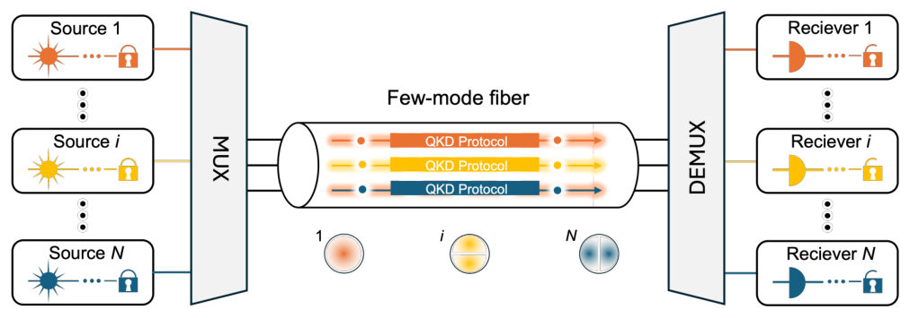 
Figure 1. Proposed concept for parallel channels for QKD using FMF. The number of available quantum channels is determined by the number of spatial modes supported by the MPLC. In the present case, the implemented MPLC supports only a few spatial modes; however, the concept allows for scaling to a large number of quantum channels.

📷 Fig 2

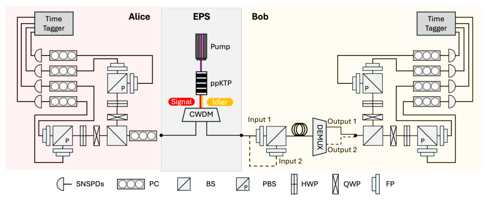 
Figure 2. Scheme of the experimental setup. Abbreviations: BS, beam splitter; CWDM, coarse wavelength division multiplexing; EPS, entangled photon source; FP, fiber port; HWP, half wave plate; PBS, polarization beam splitter; PC, polarization controller; QWP, quarter-wave plate; SNSPD, superconducting nanowire single-photon detectors.

📷 Fig 3

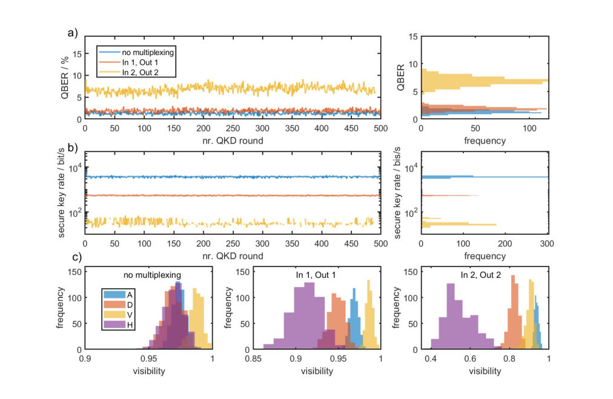 
Figure 3. Results of the BBM92 QKD experiment with (red and yellos) and without spatial multiplexing. QBER (a), secure key rate (b) and average visibility (c) as a function of QKD round together with the corresponding histograms. For the three test cases, the QKD protocol was continuously operated for 40 min in the non-multiplexed reference configuration, 115 min for the Input 1–Output 1 channel, and 184 min for the Input 2–Output 2 channel.

📷 Fig 4

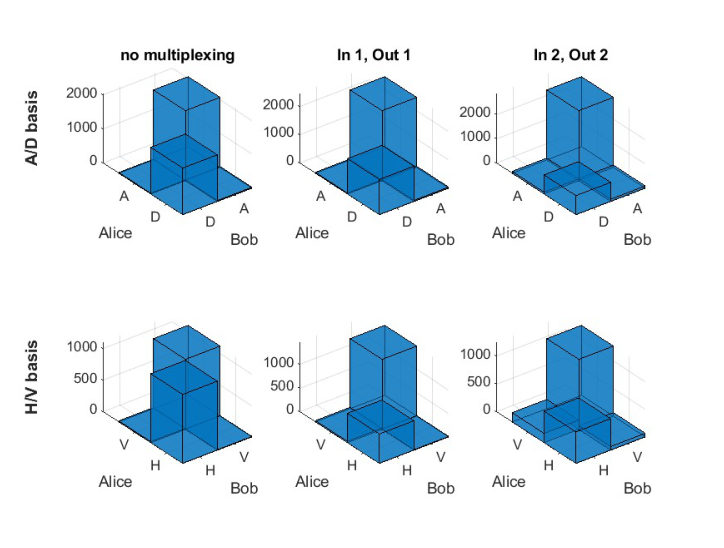 
Figure 4. Average coincidence counts per QKD round for the QKD link without and with (In 1, Out 1 and In 2 Out 2) multiplexing for the two bases A/D and H/V.

**Summary.** The paper proposes and experimentally validates a method for space-division multiplexing Quantum Key Distribution (QKD) using few-mode fibers. By employing Multi-Plane Light Conversion (MPLC), they successfully separate entangled photons transmitted through distinct guided modes, enabling parallel quantum channels. This demonstrates a pathway toward building scalable, multi-user quantum internet architectures.

**Why it may be interesting.** This work directly addresses scalability in quantum networking by integrating spatial degrees of freedom into established QKD protocols, which is a major topic at the intersection of quantum optics and communication theory.

Detailed structure

**Main problem.** The challenge is achieving high key rates and distributing independent secret keys for Quantum Key Distribution (QKD) in practical quantum communication networks.

**Main result.** The authors successfully demonstrated a space-division multiplexed BBM92 QKD scheme using few-mode fibers, achieving measurable secure key rates across multiple parallel channels.

**Method.** They employed Multi-Plane Light Conversion (MPLC) to demultiplex entangled photons transmitted through a Few-Mode Fiber (FMF), exploiting distinguishable guided modes as independent quantum channels.

**Model / system.** The system uses an FMF supporting multiple spatial modes ($	ext{LP}_{01}$ and $	ext{LP}_{11b}$) to carry entangled photon pairs generated via SPDC. The MPLC acts as the receiver component for separating these parallel channels.

**Key observables.** Quantum Bit Error Rates (QBER) ($1.9 \pm 0.4\%$ and $6.8 \pm 0.8\%$), secure key rates (bits/s), and visibility ($V_H$).

**Important parameters / regimes.** FMF core diameter ($15 \mu	ext{m}$), NA $= 0.1$, operating wavelengths ($\lambda_s = 1530 	ext{ nm}$, $\lambda_i = 1570 	ext{ nm}$), and the QKD security threshold of $11\%$.

**Assumptions / limitations.** The approach assumes that exploiting distinguishable guided modes preserves the necessary quantum correlations for secure QKD, unlike high-dimensional schemes based on coherent superpositions.

**Figures summary.** Figure 1 illustrates the concept using FMF and MPLC for parallel channels. Figure 2 details the experimental setup components. Figure 3 compares QBER and key rate vs. rounds for multiplexed versus non-multiplexed cases, and Figure 4 shows coincidence counts per round.

**Paper structure.** The paper introduces the need for scalable QKD networks, presents the theoretical concept of using FMFs with MPLC for space-division multiplexing, details the experimental setup and measurements (BBM92 protocol), reports the measured QBER and key rates, and discusses limitations regarding coupling efficiency.

Abstract

As quantum key distribution (QKD) progresses from laboratory demonstrations toward practical deployment, quantum communi- cation networks increasingly require higher key rates and the ability to distribute independent secret keys among multiple users and network nodes. In this paper we present a promsing approach with multi-plane light conversion (MPLC) for demultiplexing entangled photons, transmitted through a few-mode fiber (FMF). We experimentally demonstrated a spatially multiplexed BBM92 QKD scheme. The modes are selectively excited through separate single-mode-fibers and subsequently separated by MPLC into distinct output ports. Unlike high-dimensional QKD based on coherent modal superpositions, our approach exploits distinguishable guided modes as parallel channels while preserving the entanglement required for QKD. For the multiplexed links, we obtain quantum bit error rates of $1.9 \pm 0.4\%$ for the channel 1 and $6.8 \pm 0.8\%$ for the channel 2. These results are relevant for scalable quantum-secured networks, space-division-multiplexed QKD systems, multi-user entanglement distribution, and future quantum internet architectures, where parallel quantum channels must be implemented without compromising the quantum correlations required for security.

[↑ back to top](#top)

### [Exact Nagaoka-to-spiral transition in the doped infinite-U triangular lattice](http://arxiv.org/abs/2607.20726v1)

**Authors:** Yang Zhang, Cristian D. Batista  
**Type:** theory · **Category:** strongly correlated electrons · **PDF:** <https://arxiv.org/pdf/2607.20726v1>  
**Analysis basis:** full PDF text, analyzed in chunks
**Topic relevance:** `analog quantum simulation` **3/5** · `exotic spin models in light-matter` **1/5**

📷 Fig 1

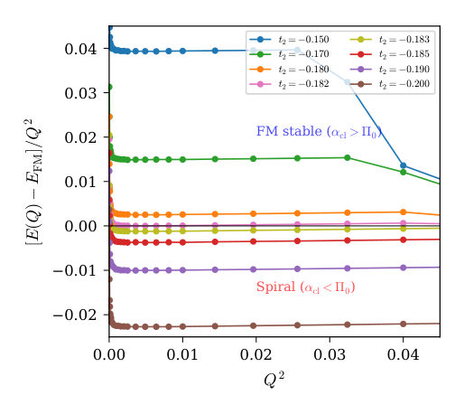 
FIG. 1. Spiral stiffness [E(Q)−EFM]/Q2 (Q along Γ–M) from the Trugman-01 method (0+1 magnon space) on 100 × 100. The sign change between t2 = −0.182 and −0.183 pinpoints t2,c/t1 = −0.182; the Q →0 plateau gives αcl −Π0, while the bending at larger Q reflects the positive one-magnon O(Q4) stiffness.

📷 Fig 2

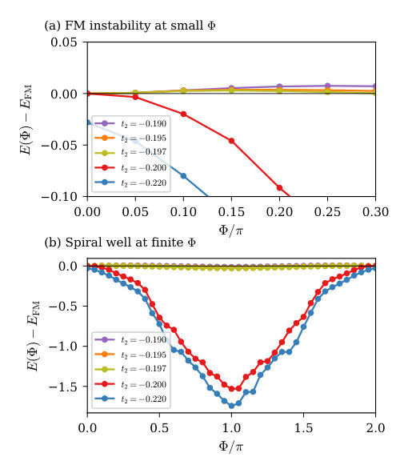 
FIG. 2. Spectral flow on 3 √

📷 Fig 3

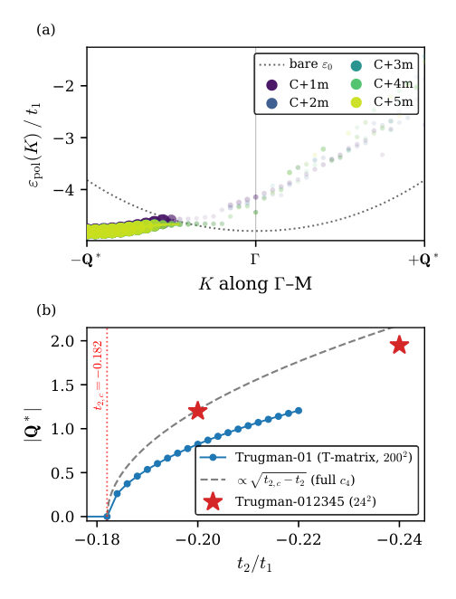 
FIG. 3. (a) Polaron dispersion in the spiral phase (t2/t1 = −0.20) versus the center-of-mass momentum K along the lab- frame path −Q∗→Γ→+Q∗(|Q∗| = 1.2), for magnon trunca- tions C+1m, . . . ,C+5m (viridis). Marker size ∝Z(K); dot- ted: bare dispersion ε0. A sharp quasiparticle (Z ≃0.92) at the Lifshitz-shifted momentum K = −Q∗evolves into a multi-magnon continuum beyond the critical momentum Kc, where the spiral becomes locally unstable (see SM [23]). The dispersion is already converged at the one-magnon level, consistent with the suppression of higher-magnon processes for the small spiral wavevector Q∗. (b) Optimal magnitude of spiral wavevector, Q∗, versus t2/t1 along Γ–M, obtained from...

**Summary.** This work precisely locates the quantum critical point where Nagaoka ferromagnetism destabilizes into an incommensurate spiral state on a triangular lattice. By combining analytical theory with advanced numerical methods, the authors establish $t_{2,c}/t_1 = -0.182$ as the transition boundary. This provides crucial theoretical insight into magnetic fluctuations and pairing mechanisms in doped correlated electron systems.

**Why it may be interesting.** The rigorous determination of a quantum phase transition boundary in a highly correlated model like the Hubbard model is fundamental to understanding magnetic ordering mechanisms relevant to high-temperature superconductivity.

Detailed structure

**Main problem.** The study determines the exact quantum instability point where Nagaoka ferromagnetism breaks down into a long-wavelength coplanar spiral state in a doped triangular lattice.

**Main result.** The transition occurs at a critical hopping ratio of $t_{2,c}/t_1 = -0.182$, establishing the first quantum instability of this ferromagnetic phase and providing a baseline for magnon-mediated pairing.

**Method.** The problem is solved by reducing it to an effective two-body hole–magnon scattering problem, utilizing analytical calculations combined with rigorous numerical techniques like Exact Diagonalization (ED) and spectral flow analysis.

**Model / system.** The system is the single-hole infinite-$U$ Hubbard model on a triangular lattice, incorporating nearest-neighbor ($t_1$) and next-nearest-neighbor ($t_2$) hopping terms. The physics is governed by kinetic energy minimization in the presence of strong correlations.

**Key observables.** Spiral stiffness coefficient ($c_2$), quasiparticle weight ($Z \simeq 0.92$), ground-state energy difference $E(\Phi) - E_{FM}$ vs. magnetic flux $\Phi$, and the optimal spiral wavevector $Q^*$.

**Important parameters / regimes.** The critical hopping ratio $t_{2,c}/t_1 = -0.182$ is central; the model operates in the infinite-$U$ limit.

**Assumptions / limitations.** The analysis treats the hard-core hole–magnon constraint exactly and relies on small-$Q$ expansions near criticality to characterize the continuous nature of the transition.

**Figures summary.** Figures illustrate the vanishing spiral stiffness at $t_{2,c}/t_1 = -0.182$, show the formation of an energy minimum (spiral well) in spectral flow plots as $|t_2|$ increases, and map out polaron dispersion curves in the resulting spiral phase.

**Paper structure.** The paper systematically analyzes the instability by first deriving effective Hamiltonians, then using analytical methods to pinpoint the critical point ($t_{2,c}/t_1 = -0.182$), confirming this result with ED and spectral flow analysis across multiple diagnostics (e.g., energy vs. flux, quasiparticle weight).

Abstract

We study the single-hole infinite-$U$ Hubbard model on the triangular lattice with nearest- and next-nearest-neighbor hoppings $t_1$ and $t_2$. A frustrating $t_2$ destabilizes Nagaoka ferromagnetism through a Lifshitz transition to a long-wavelength coplanar spiral at $t_{2,c}/t_1=-0.182$. We determine the critical point analytically by reducing the many-body problem to an effective two-body hole--magnon scattering problem in which the hard-core hole--magnon constraint is treated exactly. Numerical calculations confirm the spiral ground state and reveal a coherent spin polaron with quasiparticle weight $Z\simeq0.92$ at the Lifshitz-shifted momentum $\mathbf{K}=-\mathbf{Q}^*$. These results establish the first quantum instability of the triangular-lattice Nagaoka ferromagnet and provide the magnetic baseline for magnon-mediated pairing at finite doping.

[↑ back to top](#top)

### [Shiba duality and $η$-altermagnetism: Pairing and charge orders in bipartite attractive Hubbard models](http://arxiv.org/abs/2607.21430v1)

**Authors:** Yu-Ping Lin  
**Type:** theory · **Category:** strongly correlated electrons · **PDF:** <https://arxiv.org/pdf/2607.21430v1>  
**Analysis basis:** full PDF text, analyzed in chunks
**Topic relevance:** `analog quantum simulation` **3/5** · `Keldysh / 2PI / non-Gaussian methods` **1/5**

📷 Fig 1

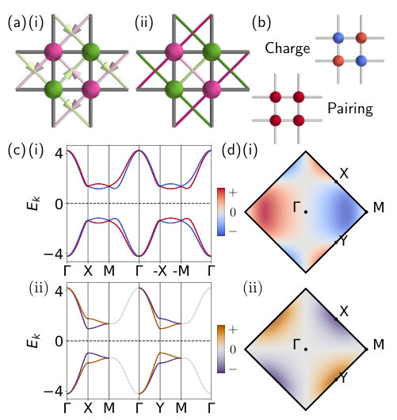 
FIG. 1. η-ALMs on the checkerboard lattice. (a) The lattice with two sublattices (green and pink). (i) The odd-parity model has sublattice currents and (ii) the even-parity model has sublattice spin bonds (darker and lighter for ±σ3 and blank for 0). (b) CDM and USP orders in the ground state, where we plot (⟨ni⟩−1)/2 and |⟨c† i↑c† i↓⟩|sign(Re(⟨c† i↑c† i↓⟩)), respectively. (c) The band structures in η-ALMs have (i) odd-parity η-pseudospin splitting with ηm = ±1 and (ii) even- parity spin-η-locked splitting with ηmσ3 = ±1. (d) The BZ mapping of splitting energy show the (i) p-wave splitting in odd-parity η-ALM and (ii) d-wave splitting in even-parity η- ALM. The colors in (b)-(d) represent...

**Summary.** This work develops the concept of $\eta$-altermagnetism by applying Shiba duality to map spin-based Altermagnetism principles onto charge and pairing orders. Using BdG theory on attractive Hubbard models, the authors predict specific $\eta$-pseudospin splitting patterns that arise from symmetry breaking due to lattice hopping anisotropies.

**Why it may be interesting.** It extends concepts of magnetic ordering (ALM) into superconducting/charge sectors using a novel pseudospin degree of freedom ($\eta$), which is relevant for understanding exotic pairing symmetries in strongly correlated superconductors.

Detailed structure

**Main problem.** The paper investigates $\eta$-altermagnetism ($\eta$-ALM) as a generalization of Altermagnetism (ALM) to pairing and charge orders in attractive Hubbard models.

**Main result.** Shiba duality establishes an exact correspondence between repulsion-driven Antiferromagnetism (AFM) and attraction-driven $\eta$-AFM, leading to observable $\eta$-pseudospin splitting structures like $p$-, $d$-, or $f$-wave patterns.

**Method.** The study employs mean-field Bogoliubov-de Gennes (BdG) theory combined with Shiba duality mapping techniques.

**Model / system.** The system is modeled by the pure Hubbard Hamiltonian on bipartite lattices, analyzed at half-filling using both spin and $\eta$-pseudospin order parameters.

**Key observables.** Onsite charge order ($s_{\mu}^i$), onsite spin order ($\sigma_{\mu}^2$), onsite pairing order ($p_{\mu}^i$), and the resulting $\eta$-pseudospin splitting energies in band structures.

**Important parameters / regimes.** Half-filling ($n_f=1$), attractive interaction strength (related to $U_0 < 0$), and hopping anisotropies (e.g., second-neighbor hopping).

**Assumptions / limitations.** The analysis relies on mean-field approximations within the BdG formalism, assuming intrinsic particle-hole symmetry for certain analyses.

**Figures summary.** Figures illustrate $\eta$-ALMs on checkerboard and honeycomb lattices, showing ground-state orders (CDM and USP), resulting band splitting patterns, and BZ mappings of these energies.

**Paper structure.** The paper first establishes the connection via Shiba duality between spin ALM and $\eta$-ALM. It then details the BdG formalism for calculating charge/pairing orders and analyzes how anisotropic hopping breaks symmetry to generate measurable $\eta$-pseudospin splitting in momentum space.

Abstract

We show that Shiba duality maps the altermagnetic principle of momentum-dependent band splitting from spin to $η$-pseudospin, defining $η$-altermagnetism ($η$-ALM) as a Bogoliubov-de Gennes (BdG) counterpart of ALM in pairing and charge orders. In half-filled pure Hubbard models on bipartite lattices, the duality relates repulsion-driven antiferromagnetism (AFM) to attraction-driven $η$-AFM with uniform singlet pairing and staggered charge-density modulation. In the BdG bands, the Shiba-dual parity-time-reversal $\mathcal{\tilde{P}}\mathcal{\tilde{T}}$ symmetry protects a Kramers degeneracy of $η$-pseudospin. Anisotropic second-neighbor hopping breaks this degeneracy and generates $η$-ALM. Odd-parity $η$-ALM shows $η$-pseudospin splitting, whereas even-parity $η$-ALM has spin-$η$-locked splitting. Hartree-Fock-Bogoliubov computations on checkerboard and honeycomb lattices find $η$-ALMs with $p$-, $d$-, and $f$-wave splitting structures. Possible generalizations and experimental probes are discussed.

[↑ back to top](#top)

### [Tailoring optical Schrödinger cat states via orientation-dependent high-harmonic generation in $\rm{H}_2^+$](http://arxiv.org/abs/2607.21248v1)

**Authors:** Ziyang Gan, Wei-Chao Jiang, Ahai Chen, Yuhai Jiang  
**Type:** theory · **Category:** other · **PDF:** <https://arxiv.org/pdf/2607.21248v1>  
**Analysis basis:** full PDF text, analyzed in chunks
**Topic relevance:** `interference shaping light` **3/5**

📷 Fig 1

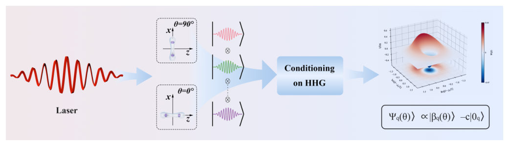 
FIG. 1. Schematic of the orientation-controlled cat-state-generation scheme. An intense linearly polarized 800-nm laser pulse, initially in a high-photon-number coherent state |αL⟩, is focused into an aligned H+ 2 target. The molecular axis is oriented at an angle θ with respect to the laser polarization ˆez; the two limiting geometries θ = 0◦(parallel) θ = 90◦(perpendicular) are highlighted. The strong-field interaction generates a high-harmonic spectrum whose amplitude and phase depend on θ. Conditioning on the HHG signal — selected either at the resonance-enhanced low orders ( 1σg →1σu, near the 7th harmonic) or at the two-center-interference plateau harmonics — projects the selected...

📷 Fig 2

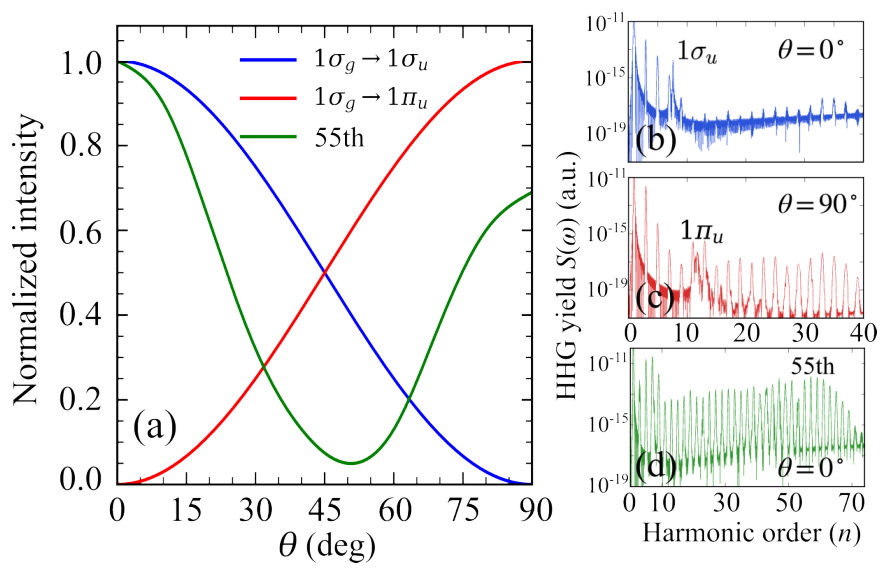 
FIG. 2. Orientation dependence of the HHG response of H+ 2 and representative spectra. (a) Normalized harmonic intensity as a function of molecular orientation angle θ for the three conditioning channels used in this work: the 1σg →1σu resonance- enhanced peak (blue), the 1σg →1πu resonance-enhanced peak (red), and the q = 55 plateau harmonic subject to two-center interference (green). (b,c) HHG spectra at θ = 0◦and θ = 90◦, respectively, for a driving intensity I0 = 1 × 1014 W/cm2; the two non-odd resonance peaks near orders qσ and qπ are clearly visible. (d) HHG spectrum at θ = 0◦for I0 = 3 × 1014 W/cm2, showing the plateau region in which the q = 55 harmonic is selected for conditioning.

📷 Fig 3

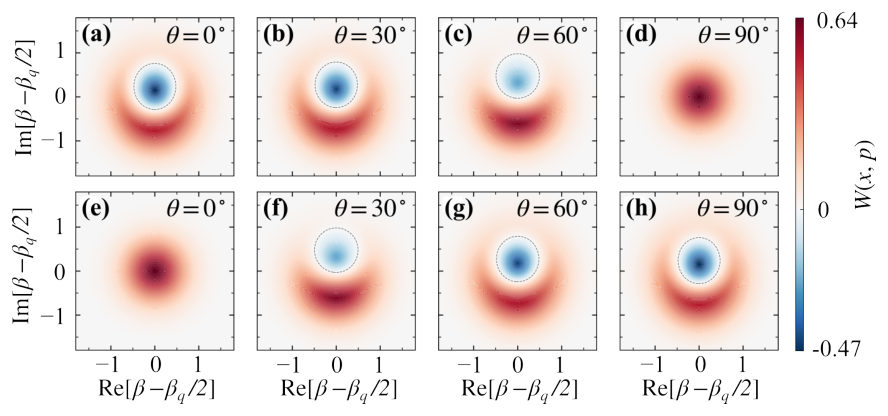 
FIG. 3. Post-selected Wigner functions Wq(x, p; θ) for conditioning on the two resonance-enhanced low-order peaks of H+ 2 (I0 = 1 × 1014 W/cm2, 800 nm), plotted in the shifted quadrature plane (Re[β −βq/2], Im[β −βq/2]) of harmonic mode q, centered at the midpoint βq/2 of the two coherent components. Top row [(a)–(d)]: conditioning on the 1σg →1σu resonance (order qσ) at θ = 0◦, 30◦, 60◦, and 90◦, illustrating the | cos θ|-driven progression from a genuine Schr¨odinger cat (a) through intermediate configurations (b,c) to a tight kitten approaching the single-photon Fock state |1qσ⟩(d). Bottom row [(e)–(h)]: conditioning on the 1σg →1πu resonance (order qπ) at the same four orientations,...

📷 Fig 4

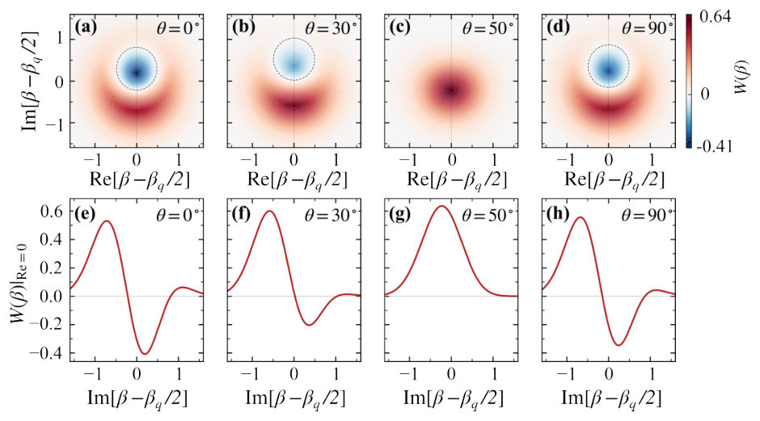 
FIG. 4. Post-selected Wigner functions Wq=55(x, p; θ) for conditioning on the q = 55 plateau harmonic of H+ 2 (I0 = 3×1014 W/cm2, 800 nm), plotted in the shifted quadrature plane (Re[β−βq/2], Im[β−βq/2]). Top row [(a)–(d)]: Wigner distri- butions at θ = 0◦, 30◦, 50◦, and 90◦, showing the two-center-interference-driven reentrant crossover across the order-dependent interference angle θ∗(55) ≈50◦[Eq. (9)]: genuine Schr¨odinger cats at θ = 0◦(a) and 30◦(b), a tight kitten approaching |1q=55⟩ at the interference angle θ = 50◦(c), and a recovered cat at θ = 90◦(d). Bottom row [(e)–(h)]: corresponding cross-sections Wq=55(0, p; θ) at Re[β −βq/2] = 0, reaching the analytical |1⟩-state floor −2/π...

**Summary.** The authors theoretically show that the orientation of an $
m{H}_2^+$ molecule acts as a structural switch to engineer optical Schrödinger cat states using high-harmonic generation. By analyzing two different physical mechanisms—resonance selection and destructive interference—they demonstrate tunable crossovers between 'kitten' and 'cat' quantum regimes, offering unprecedented control over nonclassical light sources.

**Why it may be interesting.** This work demonstrates using molecular structure ($	heta$) as a novel, intrinsic control knob in quantum optics to manipulate complex nonclassical states like Schrödinger cats, which is highly relevant for advanced quantum light sources and quantum simulation.

Detailed structure

**Main problem.** The goal is to engineer nonclassical optical Schrödinger cat states by controlling the high-harmonic generation (HHG) process in a molecular system.

**Main result.** Molecular orientation ($	heta$) provides a structural control parameter, enabling tunable crossovers between 'kitten' and 'cat' quantum states via two distinct physical mechanisms: resonance enhancement and two-center destructive interference.

**Method.** The study couples Time-Dependent Schrödinger Equation (TDSE) simulations with the fully quantized HHG framework to calculate post-selected harmonic-mode states.

**Model / system.** The system involves an $
m{H}_2^+$ molecule interacting with a strong, linearly polarized 800 nm laser pulse. The state is characterized by its Wigner function $W(x, p; 	heta)$.

**Key observables.** Wigner function negativity (diagnosing nonclassicality), the amplitude $|eta_q(	heta)|$ of the post-selected state, and the characterization as 'kitten', 'cat', or classical.

**Important parameters / regimes.** The molecular orientation angle ($	heta$), the harmonic order ($q$), and the laser intensity/focal geometry (which are shown to be decoupled from the primary control).

**Assumptions / limitations.** The coherence factor $c$ is assumed essentially orientation-independent, and the analysis relies on post-selection via XUV photon-number resolution.

**Figures summary.** Figures schematically illustrate how varying $	heta$ causes a crossover between 'kitten' and 'cat' states. Specific cuts show the evolution of $|eta_{55}(	heta)|$, demonstrating reentrant behavior around an interference minimum $	heta^*$.

**Paper structure.** The paper develops the theoretical framework by coupling TDSE to quantized HHG, then analyzes two distinct control regimes: resonance-enhanced low-order harmonics (showing opposite crossovers for different transitions) and plateau harmonics exploiting two-center destructive interference (showing a reentrant cat $	o$ kitten $	o$ cat sequence).

Abstract

We theoretically demonstrate that the molecular orientation angle $θ$ provides a structurally intrinsic, continuously tunable control parameter for engineering optical Schrödinger cat states via high-harmonic generation (HHG) in H$_2^+$. Coupling time-dependent Schrödinger equation simulations to the fully quantized HHG framework, we evaluate the Wigner functions of the post-selected harmonic-mode states under two complementary conditioning strategies. Conditioning on resonance-enhanced low-order harmonics exploits the complementary dipole selection rules of the $1σ_g\to1σ_u$ and $1σ_g\to1π_u$ transitions, driving a kitten-cat crossover whose direction is opposite in the two channels as $θ$ is varied. Conditioning on plateau harmonics instead exploits two-center destructive interference, producing a reentrant cat$\to$kitten$\to$cat transition controlled by the order-dependent interference angle $θ^*(q)$. In both cases the crossover is decoupled from the laser intensity, focal geometry, and molecular density, offering a degree of control with no counterpart in atomic targets.

[↑ back to top](#top)

### [Colloquium: Semi-Dirac Fermions in Quantum Matter](http://arxiv.org/abs/2607.20627v1)

**Authors:** Bruno Uchoa, Mohamed M. Elsayed, Valeri N. Kotov, Yinming Shao, Dmitri N. Basov  
**Type:** theory · **Category:** strongly correlated electrons · **PDF:** <https://arxiv.org/pdf/2607.20627v1>  
**Analysis basis:** full PDF text, analyzed in chunks
**Topic relevance:** `Keldysh / 2PI / non-Gaussian methods` **2/5** · `analog quantum simulation` **2/5** · `driven-dissipative phase transition` **2/5** · `Kondo & dissipative impurity` **1/5** · `correlated cavity matter` **1/5** · `entanglement & information structure` **1/5** · `methods for driven-dissipative` **1/5** · `non-equilibrium dynamics` **1/5** · `non-equilibrium universality` **1/5**

📷 Fig 1

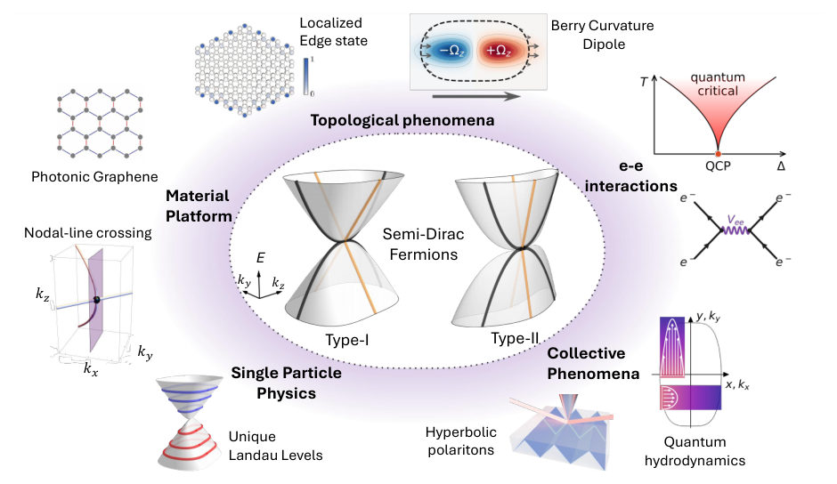 
FIG. 1 Overview of the topics covered in the review. Semi-Dirac particles have been experimentally observed in different platforms, including synthetic lattices of various kinds (Sec. III.A) and in quantum materials with nodal lines (Sec. III.B). These quasiparticles show distinctive optical (Sec. II.D.1) and topological properties (Sec. II.A and II.D.3) and have a singular spectrum of Landau levels (Sec. II.C). The many-body problem resulting from electron-electron interactions is predicted to show a range of effects in both perturbative (Sec. IV.A) and non-perturbative regimes (Sec. IV.B), such as quantum hydrodynamics (Sec. IV.C.1), strong renormalizations (Sec. IV.C) and anisotropic...

📷 Fig 2

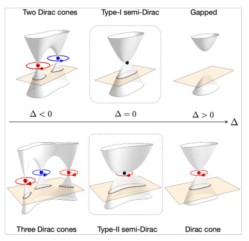 
FIG. 2 Topological Lifshitz transition controlled by param- eter ∆. Top row: in the Dirac phase ∆&lt; 0, the merger of two Dirac cones with opposite π Berry phases, indicated by the circles, results in a semi-Dirac point of type I, with 2π Berry phase (∆= 0). The ∆&gt; 0 phase describes a triv- ial band insulator. Bottom row: three proximate anisotropic Dirac cones (∆&lt; 0) coalesce into a semi-Dirac point of type II, which has a π Berry phase (modulo 2π). The ∆&gt; 0 phase is semimetallic, with a single Dirac point.

📷 Fig 3

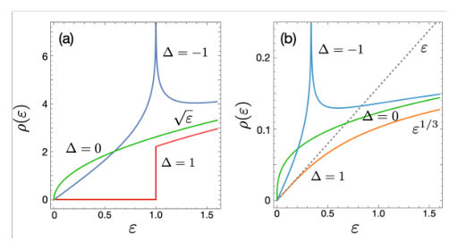 
FIG. 3 Density of states ρ(ε) across the Lifshitz transition, in units of 2π2v/ √

📷 Fig 4

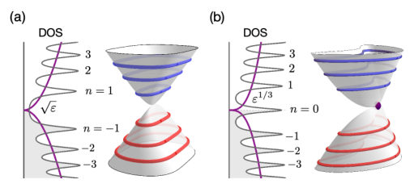 
FIG. 4 Illustration of the energy scaling of the density of states (DOS) and the LL energy spectrum for type I (a) and type II (b) semi-Dirac fermions in the presence of a magnetic field B. Type-II semi-Dirac fermions have a π Berry phase and show a zero energy LL (n = 0), in contrast with the type- I case. Purple line: zero-field density of states. The energy of the levels scales with the signature B2/3 and B3/4 dependence with magnetic field, respectively.

📷 Fig 5

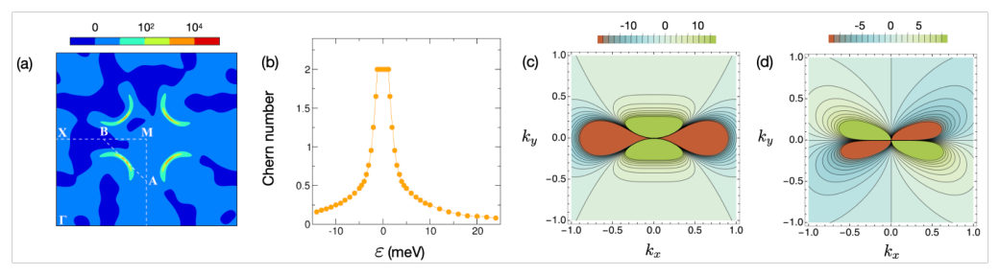 
FIG. 5 (a) Brillouin zone of a TiO2/VO2 heterostructure. Density plot of the Berry curvature Ωz(k) in the presence of spin-orbit coupling. Gapped type-II semi-Dirac points form at the four red areas with Berry curvature accumulation. (b) Predicted total Chern number of TiO2/VO2 as a function of energy away from the Fermi level. Chern number is quantized inside the spin-orbit coupling gap. (c) Contour plot of the gradient of the Berry curvature of type-I semi-Dirac fermions, ∇kΩa z(kx, ky) along the massive direction, where two Dirac cones merge, and (d) along the relativistic direction, in the vicinity of the semi-Dirac point. Both panels are symmetric under momentum inversion k →−k, but...

**Summary.** This review comprehensively surveys semi-Dirac fermions—quasiparticles with unique directional dispersion—which emerge at topological Lifshitz transition points. It details the theoretical differences between Type-I and Type-II phases by analyzing their distinct signatures in measurable quantities like DOS, Landau levels, and optical response. The work highlights that these exotic states are crucial for understanding modern quantum materials.

**Why it may be interesting.** The study of topological phase transitions and exotic band structures provides rich ground for understanding emergent collective behavior in strongly interacting electron systems, which is central to condensed matter theory.

Detailed structure

**Main problem.** The article reviews semi-Dirac fermions, which are two-dimensional quasiparticles exhibiting unique dispersion relations (quadratic or linear) depending on the direction of motion.

**Main result.** The existence and properties of these fermions are intrinsically linked to topological Lifshitz transitions that govern changes in Fermi surface connectivity. Type-I and Type-II phases exhibit distinct signatures in their electronic structure.

**Method.** Theoretical analysis involving calculating topological invariants like the Berry curvature, solving for Density of States (DOS) and Landau Levels (LLs), and analyzing transport properties using semiclassical quantization.

**Model / system.** The physics is modeled using effective Hamiltonians (e.g., Type-I and Type-II forms) that describe low-energy excitations in quantum materials, often arising from topological phase boundaries.

**Key observables.** Density of States ($
ho(\epsilon)$), Landau Level energy spectra ($\epsilon_n$), optical conductivity ($\sigma(\omega)$), and the Berry phase (topological invariant).

**Important parameters / regimes.** The transition parameter $\Delta$ controls the type of semi-Dirac fermion; magnetic field $B$ is crucial for LL quantization.

**Assumptions / limitations.** Calculations often assume the clean limit for transport properties, and the analysis relies on semiclassical approximations for Landau levels.

**Figures summary.** Figures illustrate the evolution of DOS across the Lifshitz transition for both Type-I ($
ho \propto \sqrt{\epsilon}$) and Type-II ($
ho \propto \epsilon^{1/3}$), and show the characteristic energy scaling of LLs for different fermion types.

**Paper structure.** The review progresses by introducing the concept, detailing specific Hamiltonian models (Type-I vs. Type-II), analyzing key diagnostics like DOS and LLs, discussing transport properties, and concluding with experimental evidence from synthetic lattices and quantum materials.

Abstract

This article reviews the recent progress on the subject of semi-Dirac fermions, two dimensional quasiparticles that disperse quadratically, as Galilean invariant particles, or linearly, as massless relativistic particles, depending on their direction of motion. These particles exist at a phase boundary set by the continuous change in the connectivity of Fermi surfaces, known as topological Lifshitz transitions. The basic properties and the current experimental evidence of the existence of these particles in both synthetic lattices and quantum materials are presented. The many-body problem of semi-Dirac fermions is discussed from a theoretical perspective with an eye to physical observables of relevance to experiments.

[↑ back to top](#top)

### [Duality constrains optimal thresholds in quantum error correction](http://arxiv.org/abs/2607.21160v1)

**Authors:** Lucas H. English, Haoyuan Luo, Yangming Wang, Basudha Srivastava, Stephen D. Bartlett, Dominic J. Williamson  
**Type:** theory · **Category:** quantum information and computing · **PDF:** <https://arxiv.org/pdf/2607.21160v1>  
**Analysis basis:** full PDF text, analyzed in chunks
**Topic relevance:** `Keldysh / 2PI / non-Gaussian methods` **2/5** · `entanglement & information structure` **2/5** · `analog quantum simulation` **1/5** · `correlated / nonlocal dissipation` **1/5** · `driven-dissipative phase transition` **1/5** · `methods for driven-dissipative` **1/5** · `non-equilibrium dynamics` **1/5** · `non-equilibrium universality` **1/5**

📷 Fig 1

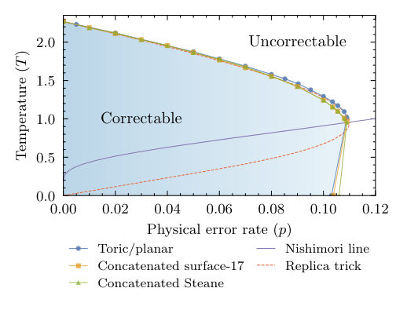 
FIG. 1. Phase diagram for concatenated and topological QEC codes under bit-flip noise in the code capacity setting. The phase boundary is shown for the toric/planar code family (blue; data taken from Refs. [14, 15]), concatenated surface- 17 code (orange) and concatenated Steane code (green). The dashed red line indicates the phase boundary prediction ob- tained via the replica trick. We obtain the phase boundaries for the concatenated codes in this work. The intersection of the Nishimori line with each phase boundary determines the corresponding optimal error threshold. The shaded region denotes the stable ordered phase, in which quantum error correction is feasible and logical failures...

📷 Fig 2

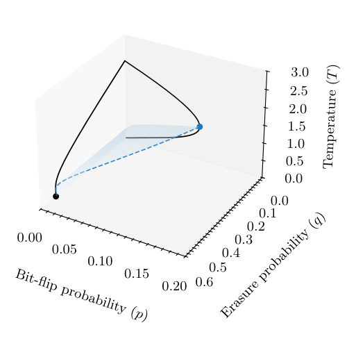 
FIG. 2. The predicted phase diagram incorporating bit-flips and qubit erasures using the replica trick. The intersection of the Nishimori surface, defined by K = Jβ = 1

📷 Fig 3

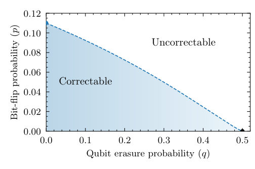 
FIG. 3. Correctability phase diagram obtained by the inter- section of the Nishimori surface with the phase boundary pre- dicted by the replica trick. The shaded region is correctable in the thermodynamic limit.

📷 Fig 4

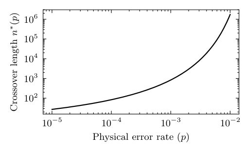 
FIG. 4. Estimated crossover length n∗(p) for the concate- nated Steane code relative to a planar surface code in the path-counting regime. For n ≳n∗(p), the improved distance scaling of the concatenated family is expected to overcome its entropic penalty.

📷 Fig 5

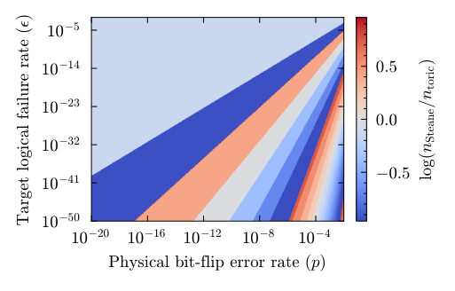 
FIG. 5. Code family crossover in the fully postselected set- ting. Blue indicates the concatenated Steane code requires fewer physical qubits than the toric code to achieve a target logical failure rate; red indicates the converse.

**Summary.** This work establishes that deep mathematical symmetries, specifically duality constraints derived from statistical mechanics, dictate the optimal error correction threshold for many quantum codes. By mapping QEC to a critical point problem and employing Renormalization Group techniques, the authors show that these universal constraints unify the understanding of performance across different code architectures.

**Why it may be interesting.** It provides a powerful mathematical framework (duality/RG) from condensed matter physics to analyze fundamental limits in quantum computation, connecting abstract symmetries to concrete physical performance metrics like error thresholds.

Detailed structure

**Main problem.** The paper investigates how duality constraints determine the optimal error correction threshold for various families of quantum error-correcting codes.

**Main result.** Duality constrains all em-symmetric CSS codes to share a single universal optimal code capacity threshold, and this self-duality is preserved under code concatenation.

**Method.** The authors employ statistical mechanical mappings, generalized Kramers-Wannier duality, and Renormalization Group (RG) flow analysis on the associated disordered Ising model.

**Model / system.** The system analyzed is Quantum Error Correction (QEC), specifically focusing on CSS codes. The problem is mapped to a critical point of a statistical mechanical model described by an Ising-like Hamiltonian involving Pauli stabilizers.

**Key observables.** Optimal error correction thresholds ($p_c$), logical failure rate ($	ext{P}_{	ext{fail}}$), and the free energy cost associated with logical operators.

**Important parameters / regimes.** Error probability ($p$), code block size ($n$ or $L$), coupling constant ($K_p$), and the replica limit.

**Assumptions / limitations.** The analysis relies on mapping QEC to a statistical mechanical model, assuming self-duality holds for zero-rate families, and using approximations like full postselection in RG flow calculations.

**Figures summary.** Figures illustrate phase diagrams comparing different code types (topological vs. concatenated) relative to the Nishimori line, and show data collapse plots demonstrating the fit of $	ext{P}_{	ext{fail}}$ to scaling laws derived from RG analysis.

**Paper structure.** The paper progresses by first establishing the connection between QEC thresholds and critical points via statistical mechanics. It then applies generalized duality arguments to constrain these thresholds for specific code classes, culminating in an analysis using RG flow to model concatenation effects on the failure probability.

Abstract

Error correction thresholds are often treated as the primary figure of merit for comparing quantum error-correcting code families. We show that the optimal error correction threshold for many commonly considered codes is constrained to a single universal value at leading order in a replica limit. Through a statistical mechanical mapping, we demonstrate that duality constrains all zero-rate em-symmetric CSS codes to have the same optimal code capacity threshold. Here, em symmetry means that the X- and Z-type parity-check matrices are equivalent up to row and column permutations. Under this statistical mechanical mapping, em-symmetric CSS codes are self-dual under a generalized Kramers-Wannier duality up to a mixing of logical sectors. For zero-rate code families, this mixing contributes only subextensive corrections, so the thermodynamic bulk free energy is self-dual in the trivial logical sector. This self-duality fixes the clean critical point and constrains the disordered phase boundary. We also show that self-duality is preserved under code concatenation, and that optimal decoding of concatenated codes can be reformulated as a renormalization group flow on a hierarchical lattice. Our results provide a common framework for analyzing topological, concatenated, and more general quantum low-density parity-check code families, including both their optimal code capacity thresholds and their sub-threshold logical error suppression.

[↑ back to top](#top)

### [Exceptional-Point Geometry of Weak Topological Boundary States](http://arxiv.org/abs/2607.21148v1)

**Authors:** Rafael A. Molina, Kevin González, Pedro A. Orellana  
**Type:** theory · **Category:** other · **PDF:** <https://arxiv.org/pdf/2607.21148v1>  
**Analysis basis:** full PDF text, analyzed in chunks
**Topic relevance:** `analog quantum simulation` **2/5** · `driven-dissipative phase transition` **2/5** · `Kondo & dissipative impurity` **1/5** · `correlated / nonlocal dissipation` **1/5** · `correlated cavity matter` **1/5** · `non-equilibrium dynamics` **1/5**

📷 Fig 1

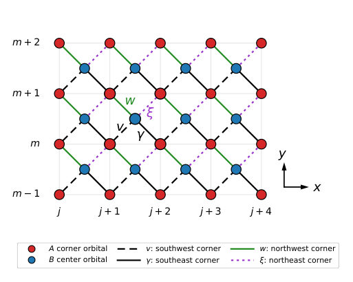 
FIG. 1. Lattice schematic of the PCL model with the different hoppings. Sublattice A, red dots, only connects with sites in sublattice B, blue dots.

📷 Fig 2

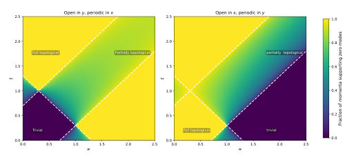 
FIG. 2. Dual weak topology in the PCL model. The color scale gives the fraction of conserved momenta satisfying the SSH condition for ribbons open in y (left) and open in x (right). Dark regions are trivial, bright regions are fully weak topological, and intermediate colors correspond to par- tial weak topology with boundary states only in finite mo- mentum windows.

📷 Fig 3

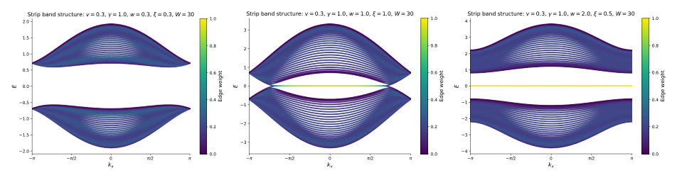 
FIG. 3. Strip band structures in different topological regimes computed numerically from the finite lattice Hamiltonian periodic in x and open in y with W number of sites. Edge states appear within momentum windows determined by the SSH conditions. We only show examples with a finite y direction, equivalent spectra can be found in the dual direction exchanging the parameters w and γ. The color intensity represents the weight of the wave function in the three sites closer to the edges, directly related to the localization length.

📷 Fig 4

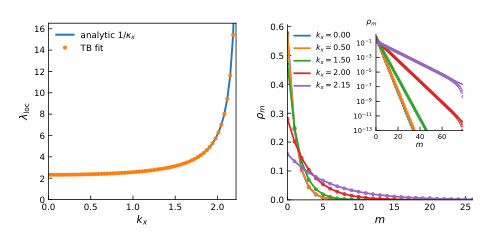 
FIG. 4. Left: analytic localization length λx = (log |Bx/Ax|)−1 and compared with tight-binding fits. The parameters are v = 0.3, γ = 1.0, w = 1.0, ξ = 1.0, and W = 80 Right: edge-state density profiles for representative momenta. Solid curves show ρm ∝|zEP y |2m and markers are numerical tight-binding densities; the logarithmic inset dis- plays the exponential decay.

📷 Fig 5

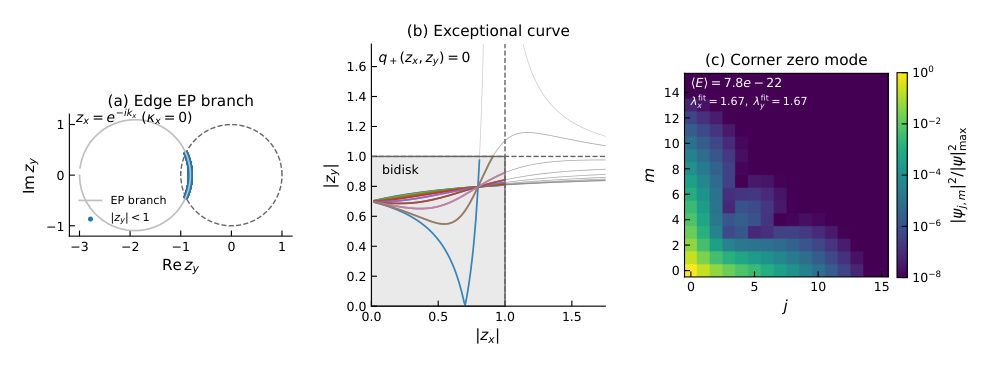 
FIG. 5. Exceptional curves and corner-localized zero modes. (a) Edge exceptional-point branch obtained from zy = −(v + γzx)/(w + ξzx) with zx = e−ikx. The highlighted part satisfies |zy| &lt; 1. (b) Projection of the two-complex-momentum exceptional curve q+(zx, zy) = 0 onto the (|zx|, |zy|) plane. The shaded square is the bidisk where solutions decay in both directions. (c) Density of a near-zero eigenstate of a finite open PCL sample, localized near a corner.

**Summary.** The paper introduces an exceptional point geometry approach to unify the description of weak topological boundary states in 2D lattices. Using the PCL model, it shows that edge, corner, and compact localized modes can all be understood as manifestations of singularities (exceptional points/curves) within the complex momentum space of the system's Hamiltonian. This offers a powerful, unified theoretical tool for characterizing various forms of topological localization.

**Why it may be interesting.** This work provides a powerful generalization of topological concepts (like bulk-boundary correspondence) into the language of complex geometry (exceptional points), which is highly relevant for designing novel quantum materials or photonic structures with controlled boundary physics.

Detailed structure

**Main problem.** The paper aims to develop a unified geometric framework for understanding weak topological boundary states, encompassing edge, corner, and compact localized modes.

**Main result.** Weak topology can be described by exceptional singularities in the complex momentum space of an analytically continued Bloch Hamiltonian. This provides a single theoretical structure unifying different types of boundary localization phenomena.

**Method.** The analysis involves analytically continuing the lattice Hamiltonian into complex momentum space and identifying zero modes by solving equations derived from this continuation.

**Model / system.** The primary model is the Plaquette Chiral Lattice (PCL) in two dimensions, which serves as a minimal realization of dual weak topology. The system's behavior is governed by its Bloch Hamiltonian, $h(\mathbf{k})$.

**Key observables.** Momentum-resolved winding numbers ($
u_x, 
u_y$), the location of exceptional points (EPs) and curves in complex momentum space, and the boundary localization length ($\ell$).

**Important parameters / regimes.** The key parameters include the hopping coefficients ($v, \gamma, w, \xi$) and the complex momenta variables ($z_x, z_y$), which determine the nature of the localized state.

**Assumptions / limitations.** The analysis relies on analytically continuing the Bloch Hamiltonian to complex momentum space for applicability beyond the specific PCL model. A transition occurs when reciprocal exceptional singularities reach the real Brillouin zone.

**Figures summary.** Figures illustrate the lattice structure, show the fraction of conserved momenta supporting zero modes in ribbons, and depict the construction involving edge EP branches and corner mode localization within the bidisk.

**Paper structure.** The paper establishes the PCL model, derives the Bloch Hamiltonian, extends the analysis to complex momentum space by analytically continuing the Hamiltonian, and then uses the resulting exceptional point geometry to characterize edge, corner, and compact localized states sequentially.

Abstract

In this article, we demonstrate that weak topology can be formulated geometrically in terms of exceptional singularities of an analytically continued Bloch Hamiltonian. A general plaquette chiral model in two dimensions serves as a minimal realization of dual weak topology, possessing two independent families of weak topological invariants, one for each spatial direction. The weak-topological edge states correspond to exceptional points in complex momentum space, while corner zero modes emerge from exceptional curves obtained by complexifying both momenta. Compact localized states arise when the exceptional roots collapse to the origin. This framework provides a unified complex-momentum description of edge, corner, and compact localization.

[↑ back to top](#top)

### [High Order Geometric Channels for Nonlinear Transport in Bloch Bands](http://arxiv.org/abs/2607.20702v1)

**Authors:** Sami Farrag, Eugene Mele, Tony Low  
**Type:** theory · **Category:** other · **PDF:** <https://arxiv.org/pdf/2607.20702v1>  
**Analysis basis:** full PDF text, analyzed in chunks
**Topic relevance:** `Keldysh / 2PI / non-Gaussian methods` **2/5** · `non-equilibrium dynamics` **2/5** · `analog quantum simulation` **1/5** · `driven-dissipative phase transition` **1/5** · `methods for driven-dissipative` **1/5** · `non-equilibrium universality` **1/5**

📷 Fig 1

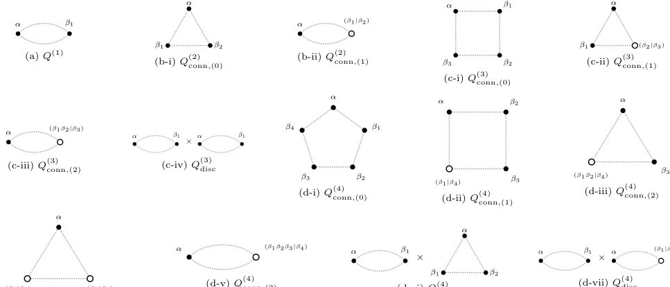 
FIG. 1. Bargmann expansion through fourth order. Gray dotted lines denote projective contractions (intermediate-band sums) at fixed n and k; they carry no energy denominators. A black vertex labelled µ denotes Aµ, while an open vertex labelled (ρ1 · · · ρr|µ) denotes Dρ1 · · · DρrAµ. Panels (a), (b-i)–(b-ii), (c-i)–(c-iv), and (d-i)–(d-vii) collect the Q(1), Q(2), Q(3), and Q(4)

📷 Fig 2

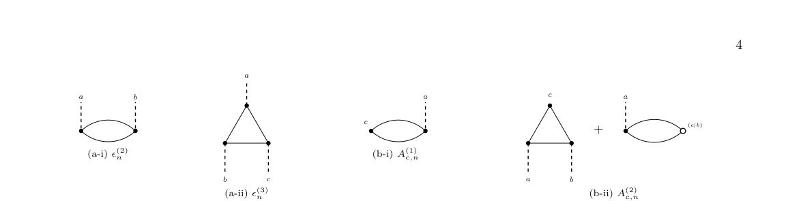 
FIG. 2. Strict-order diagrams needed for the second- and third-order charge conductivity. These are the local geometric paths of Fig. 1 after attaching external perturbation legs and weighting their interband segments by bare resolvents. Panels (a-i) and (a-ii) are the first two nonzero energy corrections, while panels (b-i) and (b-ii) are the connection corrections through second order. Thin loop lines carry intermediate-band sums weighted by bare gaps 1/∆nm. Dashed legs label external perturbation weights αa, and the free connection index c is written.

**Summary.** This work establishes a sophisticated geometric perturbation theory for nonlinear electronic transport in Bloch bands. It extends standard descriptions by calculating higher-rank tensors that capture complex multiband geometry. The key achievement is the derivation of intrinsic third-order conductivity channels using rigorous diagrammatic and recursive methods.

**Why it may be interesting.** While focused on solid-state transport, the rigorous geometric framework—using higher-order invariants beyond curvature—provides powerful mathematical machinery applicable to any system where geometry dictates response, such as quantum optics or open quantum systems dynamics.

Detailed structure

**Main problem.** The paper develops a geometric perturbation theory to calculate nonlinear transport coefficients, specifically charge conductivity, in electronic systems described by Bloch bands.

**Main result.** It derives the full set of intrinsic third-order conductivity channels ($\sigma^L$ and $\sigma^W$) that are purely geometric, showing how higher-rank tensors encode physics beyond simple quantum metrics.

**Method.** The methodology involves constructing a hierarchy of geometric tensors ($Q^{(N)}$) using the Bargmann trace and employing diagrammatic techniques to separate vertex-order (dressed) corrections from strict-order (bare gap) corrections.

**Model / system.** The system is electronic matter described by Bloch wavefunctions in periodic potentials, analyzed via perturbation theory applied to interband couplings induced by an external electric field.

**Key observables.** Third-order charge conductivity components ($\sigma_{abc;d}$), including intrinsic channels like the gradient of a three-band energy loop ($\sigma^L$) and curvature corrections ($\sigma^W$).

**Important parameters / regimes.** Electric field strength ($E$), perturbation order ($N=3$ for conductivity), and relaxation time ($	au$).

**Assumptions / limitations.** The analysis assumes the use of equilibrium distribution functions for intrinsic channels, leading to fully geometric results independent of scattering rates in the $	au 	o 0$ limit.

**Figures summary.** Figures illustrate the Bargmann expansion up to fourth order, diagrammatic rules for connected/disconnected tensors ($Q^{(N)}$), and specific diagrams showing strict-order corrections needed for second- and third-order conductivity calculations.

**Paper structure.** The paper builds from developing the general geometric perturbation theory via the Bargmann trace hierarchy ($\Lambda(N)$) to deriving algebraic recursion relations, then applying these tools to calculate energy corrections (BW formalism), and finally collecting terms into specific, physically interpretable nonlinear transport channels for conductivity.

Abstract

We develop a geometric perturbation theory of Bloch states for perturbations coupling via the interband Berry connection. The gauge-invariant Bargmann trace builds the dressed dispersion and connection order by order as a hierarchy \(Q^{(N)}\), starting with the quantum geometric tensor. Higher members encode multiband geometry beyond the quantum metric and Berry curvature. Connected amplitudes control vertex-order corrections, while strict-order corrections reduce to disconnected products. For a uniform electric field we find the fully coherent, purely geometric sector of the third-order response.

[↑ back to top](#top)

### [Enabling Neutral Atom Integration: Redesigning Device Models for Universal Quantum Ecosystems](http://arxiv.org/abs/2607.20616v1)

**Authors:** Yannick Stade, Lukas Burgholzer, Ludwig Schmid, Robert Wille  
**Type:** theory · **Category:** quantum information and computing · **PDF:** <https://arxiv.org/pdf/2607.20616v1>  
**Analysis basis:** full PDF text, analyzed in chunks
**Topic relevance:** `QC/QI experiment` **2/5** · `Rydberg arrays` **1/5** · `analog quantum simulation` **1/5** · `methods for driven-dissipative` **1/5** · `non-equilibrium dynamics` **1/5**

📷 Fig 1

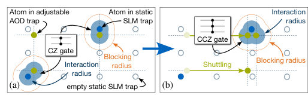 
Figure 1. (a) two atoms (blue) in SLM traps; three atoms (green) in AOD traps; two atom pairs perform a CZ gate. (b) two leftmost AOD atoms were shuttled right; a group of three atoms performs a CCZ gate.

📷 Fig 2

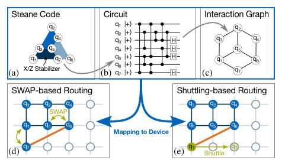 
Figure 2. (a) the six stabilizers of the Steane code. (b) a circuit preparing its logical |0⟩-state with NA-native gates. (c) the resulting interaction graph (edges are CZ gates). (d) a qubit mapping to an NA device featuring local addressable multi-qubit gates. At least one CZ gate (the orange connection) requires the insertion of SWAP gates to route qubits. (e) the missing connection is enabled by shuttling offered by NA devices.

📷 Fig 3

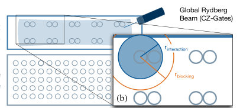 
Figure 3. (a) schematic of a zoned NA device showing the storage and entanglement zone; (b) magnification of the entanglement zone depicting the interaction and blocking radius clearly demonstrating that swapping qubits between different site pairs is infeasible.

📷 Fig 4

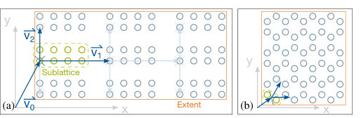 
Figure 4. (a) a group of sites, the sublattice in green, is duplicated and shifted by two lattice vectors ⇀ 𝑣1 and ⇀ 𝑣2 in blue to form a 2D lattice of sites within a given extent in orange; (b) also other structures like honeycomb lattices can be defined using this method.

📷 Fig 5

 
Figure 5. A JSON specification of the NA device is compiled into a shared library with QDMI as an interface. The library is loaded and accessed by the driver. Our driver implementation provides Python bindings that interact with the driver and eventually with the device.

**Summary.** The paper tackles the incompatibility between current quantum device modeling standards (designed for superconducting qubits) and the unique capabilities of neutral atom systems. By proposing an enhanced, spatially aware device model that accounts for dynamic shuttling and zoned operations, the authors demonstrate a massive improvement in compilation fidelity when integrating these advanced platforms into universal quantum software ecosystems.

**Why it may be interesting.** This work directly addresses the software abstraction layer bottleneck for next-generation quantum hardware, providing a crucial theoretical blueprint for integrating dynamic physical platforms like neutral atoms into standardized quantum computing toolkits.

Detailed structure

**Main problem.** Existing universal quantum ecosystem device models are limited by superconducting hardware assumptions, failing to capture the dynamic capabilities of emerging neutral atom platforms.

**Main result.** The proposed redesign of device models enables seamless integration of neutral atoms into existing ecosystems, leading to a routing overhead fidelity improvement up to a factor of 100,000.

**Method.** The authors propose targeted extensions to current device model specifications (using JSON) to incorporate spatial coordinates and dynamic operations like shuttling and zoning.

**Model / system.** The system involves Neutral Atom quantum processors utilizing optical tweezers/lattices for qubits. The model must abstract features like dynamic qubit rearrangement, zoned operations, and precise site locations in 2D/3D space.

**Key observables.** Routing overhead fidelity (the primary metric), which measures the accumulated error across a circuit's gates.

**Important parameters / regimes.** Qubit count (e.g., 16 qubits) and gate count (e.g., 600 gates); spatial parameters like interaction/blocking radii, basis vectors for lattice definition.

**Assumptions / limitations.** Current universal quantum ecosystems rely on device models that assume static qubit positions and fixed coupling maps, which is the core limitation being addressed.

**Figures summary.** Figures illustrate NA operations including shuttling and zoned gates; Figure 4 shows how lattices are constructed via basis vectors; Figure 5 details the workflow from JSON specification to a shared library accessed via QDMI.

**Paper structure.** The paper identifies the technology lock caused by SC-centric device models, proposes model extensions to capture NA dynamics (shuttling/zoning), demonstrates this using the QDMI framework, and quantifies the fidelity improvement over static models.

Abstract

Quantum computing is transitioning from an academic idea to a practical technology, driven by recent hardware advancements and clear paths toward real-world applications. Universal quantum ecosystems (e.g., Qiskit, Cirq, PennyLane) facilitate this transition by providing a consistent interface to diverse quantum devices, abstracting hardware-specific details through a device model that captures each device's computational capabilities. However, these device models have historically been shaped by superconducting hardware, assuming static qubit positions and fixed coupling maps. This prevents them from representing the unique computational capabilities of emerging technologies such as neutral atoms, which feature dynamic qubit rearrangement and zoned operations. As a result, although numerous specialized compilers for neutral atom devices already exist, they cannot retrieve the hardware information they need through these ecosystems - creating a technology lock that hinders or even prevents the integration of neutral atom devices. In this work, we demonstrate how this limitation leads to suboptimal compilation results and can exclude certain devices entirely. Motivated by this, we propose rethinking current device models to faithfully represent neutral atom devices, enabling their seamless integration into universal quantum ecosystems. Evaluations conducted within the Quantum Device Management Interface (QDMI) demonstrate that the proposed device model unlocks a routing overhead fidelity improvement by a factor of up to 100,000 on a circuit with 16 qubits and 600 gates.

[↑ back to top](#top)

### [Gaplessness indicator by topologically trivial twisting operators](http://arxiv.org/abs/2607.20944v1)

**Authors:** Yuan Yao, Linhao Li, Feng-Feng Song  
**Type:** theory · **Category:** strongly correlated electrons · **PDF:** <https://arxiv.org/pdf/2607.20944v1>  
**Analysis basis:** full PDF text, analyzed in chunks
**Topic relevance:** `analog quantum simulation` **2/5** · `Keldysh / 2PI / non-Gaussian methods` **1/5** · `entanglement & information structure` **1/5**

📷 Fig 1

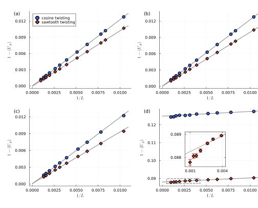 
FIG. 1. QMC simulations of (1 −⟨UF⟩) with Fcos and Fsawtooth: (a) the gapped AKLT model; (b) the MG model; (c) XXZ model with ∆= 2 in the gapped regime; (d) the gapless spin-1/2 HAF model.

**Summary.** This theoretical work establishes a general criterion to distinguish between gapped and gapless quantum many-body systems in 1D with U(1) symmetry. It achieves this by analyzing the finite-size scaling of expectation values involving 'topologically trivial twisting operators.' This provides a robust diagnostic tool, which can also predict measurable decay rates for static structure factors.

**Why it may be interesting.** The development of gaplessness indicators based on local, topologically trivial observables provides a powerful, potentially experimentally accessible diagnostic tool that circumvents the need for complex topological invariants previously required.

Detailed structure

**Main problem.** The authors aim to develop general, necessary conditions for determining if a one-dimensional quantum many-body system with U(1) symmetry is gapped.

**Main result.** They show that the ground-state expectation value of specific 'topologically trivial twisting operators' must approach unity in the thermodynamic limit for a gapped system. Violation of this scaling indicates gaplessness.

**Method.** The method involves analyzing the behavior of correlation functions and specialized lattice operators (twisting operators) in the ground state sector using techniques involving Fourier decomposition and finite-size scaling arguments.

**Model / system.** The theory applies to general one-dimensional quantum many-body systems possessing U(1) symmetry and lattice translation symmetry, including models like spin chains or fermion chains.

**Key observables.** The primary diagnostic is the ground-state expectation value $\langle 	ext{gs}|U_F|	ext{gs}
angle$, which must scale as $1 + O(1/L)$ for gapped systems. Additionally, static structure factors are analyzed.

**Important parameters / regimes.** One dimension (1D), U(1) symmetry, thermodynamic limit ($L 	o \infty$), and the zero average value of the function defining the operator ($ar{F}=0$).

**Assumptions / limitations.** The analysis relies on the existence of lattice translation symmetry and assumes certain conditions on the structure factor decay rates for gapped states.

**Figures summary.** Numerical results confirm that gapped models exhibit $\langle U_F 
angle = 1 + O(1/L)$, while gapless models violate this scaling. The Fermi sea calculation serves as a concrete example of violation.

**Paper structure.** The paper develops from proposing initial, restrictive conditions (Theorem 3) to generalizing the diagnostic tool using 'topologically trivial' operators (Theorem 4). It then proves key lemmas regarding operator behavior in gapped systems and derives a general scaling law for static structure factors (Theorem 9).

Abstract

We propose several general necessary conditions for quantum many-body system in one dimension respecting U(1) symmetry to be gapped. We show that the ground-state expectation value of topologically trivial twisting operators must approach unity in the thermodynamic limit with a certain finite-size scaling. Equivalently, its violation can indicate gaplessness of U(1)-symmetric Hamiltonians. The topological triviality of such a twisting operator enables us to derive infinitely many other gaplessness indicators by static structure factor to any order in real experiments, which are impossible to obtain by earlier topologically nontrivial twisting operators. We also apply analytic and numerical calculations to test the efficiency and consistency of our results.

[↑ back to top](#top)

### [The trainability of photonic quantum circuits](http://arxiv.org/abs/2607.21544v1)

**Authors:** Alexander Makarovskiy, Adam Taylor, Zhenghao Li, Michael Hanks, Aubrey Clark, M. S. Kim, Ian Walmsley, William Clements  
**Type:** theory · **Category:** quantum information and computing · **PDF:** <https://arxiv.org/pdf/2607.21544v1>  
**Analysis basis:** full PDF text, analyzed in chunks
**Topic relevance:** `quantum measurements` **2/5** · `analog quantum simulation` **1/5** · `methods for driven-dissipative` **1/5**

📷 Fig 1

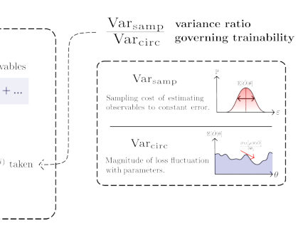 
Figure 1: We illustrate the class of VQAs considered in this paper. The ratio between two notions of variance, sample and circuit variance, give a measure of the number of samples needed to estimate accurate gradients to train a photonic circuit with respect to a specific observable. Circuit variance governs the fluctuations of the expected value of an observable with respect to circuit parameters, and exponentially small circuit variance is known as a barren plateau. Sample variance determines the number of samples needed to estimate the value of an observable within a given error. We study the trainability of photon-number observables, which exhibit a polynomially scaling variance ratio,...

📷 Fig 2

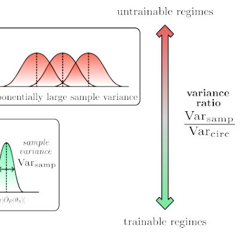 
Figure 2: We visualise the distribution of a finite-sample estimate of a fixed observable at different parameter settings. For regimes with a high variance ratio, two observable estimates from different parameter settings will likely not be sufficiently distinct to resolve for which parameter set the ground-truth loss was smaller, due to the overlap in the distributions of the estimates. This can arise either through the means of the observable at different parameter settings being exponentially concentrated (top left), or through the variance of sampling the observable being exponentially large (top right).

📷 Fig 3

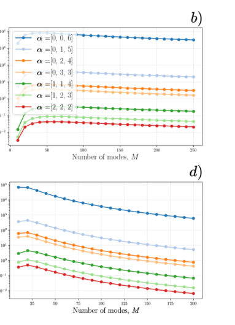 
Figure 3: Sample and circuit variances as functions of the number of modes M for PNMs satisfying |α| = 6 and K ≤3. Panels (a) and (c) show the sample variance for photon densities ν = 0.5 and ν = 1 respectively. The dotted lines denote the asymptotic limits µ1(2α)|M→∞, towards which the sample variances converge. Panels (b) and (d) show the corresponding circuit variances. In both cases, the circuit variance decays only very slowly with M. Its visibly non-linear behaviour on the logarithmic vertical scale suggests that the decay is not exponential. We therefore conjecture that the circuit variance instead decays polynomially with M, as stated in Eq. (13).

📷 Fig 4

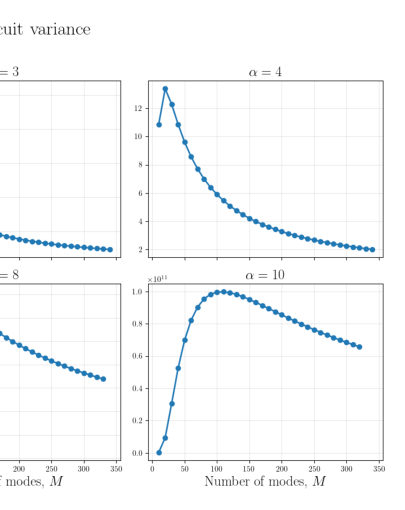 
Figure 4: Circuit variance as a function of the number of modes M for observables ˆnα at several values of α. The input state is |1, 0⟩with photon density ν = 0.5. For each α, the circuit variance initially increases before entering a regime of very slow decay, with the maximum shifting to larger M as α increases. Although deriving the asymptotic decay analytically is challenging, the numerical results suggest a polynomial dependence on M, consistent with the scaling analysis in Fig. 3.

📷 Fig 5

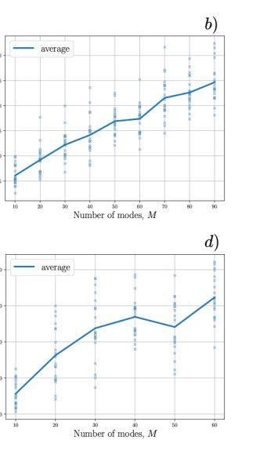 
Figure 5: Numerical scaling of the circuit and sample variances for two classes of photon- number polynomials (PNPs). For each value of M, we generate 20 PNPs with inde- pendently sampled random coefficients. Individual instances are shown as crosses, while solid lines indicate the corresponding averages. In panels (a) and (b), the PNPs contain all photon-number monomials (PNMs) satisfying |α| ≤2, with coefficients sampled uni- formly from [−1, 1]. Since the number of terms scales as |A| ∼O(M2), the average sample variance in (a) exhibits approximately quadratic growth. The circuit variance in (b) grows approximately linearly, indicating that the increasing number of terms compensates for...

**Summary.** This paper analyzes the feasibility of using photonic circuits in Variational Quantum Algorithms by quantifying 'trainability' through variance ratios. It establishes a critical distinction: low-order polynomial observables remain trainable with polynomial resource scaling, whereas higher-order ones fail exponentially. This work validates photonic VQC as a promising near-term platform under specific structural constraints.

**Why it may be interesting.** It provides rigorous, resource-based analysis showing that certain structured observables (low-order PNPs) maintain favorable scaling properties necessary for practical near-term quantum computation on photonic hardware.

Detailed structure

**Main problem.** The study investigates the 'trainability' of photonic quantum circuits for Variational Quantum Algorithms (VQAs), which determines if loss function gradients can be resolved efficiently.

**Main result.** Fixed-order photon-number polynomials maintain trainability, requiring only polynomially many samples as system size grows, unlike high-order observables which require exponential resources.

**Method.** The authors introduce a diagnostic framework based on the ratio of sample variance to circuit variance to quantify the required number of quantum measurements for gradient estimation.

**Model / system.** The platform is passive linear optical networks (PLONs) acting on photonic qubits, restricted to fixed total photon number input states. The dynamics are governed by unitary matrices U(M).

**Key observables.** Photon-number observables (PNMs), which form the basis for constructing general polynomial observables.

**Important parameters / regimes.** The ratio of sample variance to circuit variance; system size ($M$) and photon number ($n$).

**Assumptions / limitations.** The analysis focuses on passive linear optics (PLONs) and assumes a fixed total photon number input state for the initial analysis.

**Figures summary.** Figures illustrate how the ratio between sample and circuit variance measures the required samples for gradient estimation, showing scaling differences based on observable complexity.

**Paper structure.** The paper develops a theoretical framework using moment calculations (first and second moments) to analyze the variances associated with estimating expectation values derived from photon number polynomials in PLONs. It compares polynomial vs. exponential scaling of these required samples.

Abstract

Variational quantum algorithms are a leading approach to near-term quantum computing, but their scalability can be limited by barren plateaus and the sampling cost of resolving small changes in the loss landscape. Here, we study the trainability of passive linear-optical quantum circuits and introduce a framework based on the ratio of sample variance to circuit variance. This ratio determines the number of circuit samples required to resolve local loss differences and gradients to proportional accuracy. We apply this framework to photon-number observables and identify both trainable and non-trainable regimes. Supported by analytic results and a numerically observed polynomial decay of the circuit variance, we find that fixed-order photon-number polynomials require only polynomially many samples as the system size grows, whereas high-order polynomials and observables based on output probabilities generally require exponentially many samples. Within the trainable regime, we further identify classes of observables in which quantum estimation achieves a polynomial speed-up over multiple classical methods. Within this family, neural network observables provide one practical construction that allow measurement outcomes to be efficiently processed into the desired polynomial. These results establish photonic variational quantum computing as a promising platform for near-term applications.

[↑ back to top](#top)

### [Gauge Auxiliary-Field Quantum Monte Carlo Method for Many-Fermion Systems](http://arxiv.org/abs/2607.20917v1)

**Authors:** Zhaozhan Zhang  
**Type:** theory · **Category:** strongly correlated electrons · **PDF:** <https://arxiv.org/pdf/2607.20917v1>  
**Analysis basis:** full PDF text, analyzed in chunks
**Topic relevance:** `analog quantum simulation` **2/5** · `Keldysh / 2PI / non-Gaussian methods` **1/5**

📷 Fig 1

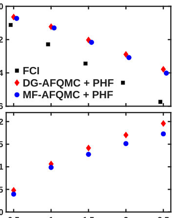 
FIG. 2. Correlation energy of the LMG model for N = 10 and αy = 2αx = 2Gε, where G denotes the dimensionless coupling strength. The statistical uncertainty of the total correlation energy is on the order of 1% and is too small to be visible. Top: correlation energy per particle as a function of G. Bottom: deviation of the QMC results from the exact FCI values obtained by exact diagonalization of the LMG Hamiltonian. We compare the performance of MF-AFQMC with that of conventional AFQMC (denoted DG-AFQMC), with both QMC simulations guided by a parity-projected HF (PHF) trial state.

📷 Fig 2

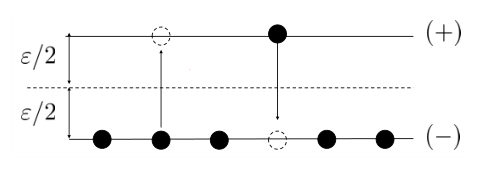 
FIG. 1. A configuration of the LMG model with N = 6 particles, in which transitions can only occur directly upward or downward due to the monopole-monopole interaction.

📷 Fig 3

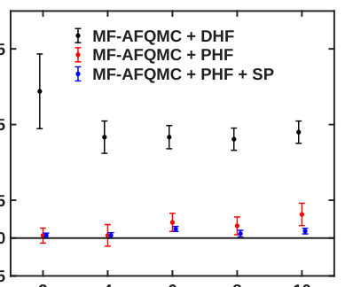 
FIG. 4. Relative error of the angular momentum observable Jz in the LMG model with N = 10 and W = 0 across various interaction strengths χ = (N −1)V/ε. The relative error is defined as |(⟨Jz⟩QMC −⟨Jz⟩FCI)/⟨Jz⟩FCI|, and the error bars denote the QMC statistical uncertainty. Results are shown for MF-AFQMC simulations guided by a deformed HF (DHF) trial state and a parity-projected HF (PHF) trial state with and without symmetry-projection sampling (SP).

📷 Fig 4

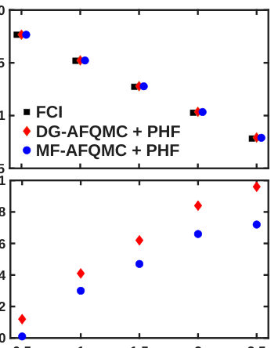 
FIG. 3. Correlation energy of the LMG model for N = 10 and αx = 2αy = 2Gε, where G denotes the dimensionless coupling strength. The statistical uncertainty of the total correlation energy is on the order of 0.1% and is too small to be visible. Top: correlation energy per particle as a function of G. Bottom: deviation of the QMC results from the exact FCI values obtained by exact diagonalization of the LMG Hamiltonian. We compare the performance of MF-AFQMC with that of conventional AFQMC (denoted DG-AFQMC), with both QMC simulations guided by a parity-projected HF (PHF) trial state.

**Summary.** This paper advances Quantum Monte Carlo simulations for strongly correlated fermions by introducing gauge augmentation into the AFQMC framework. It reinterprets stochastic process non-uniqueness as a tunable 'gauge' parameter, allowing researchers to dynamically improve sampling efficiency and accuracy. The results demonstrate that these gauge-enhanced methods provide robust tools for tackling complex many-body Hamiltonians.

**Why it may be interesting.** While focused on nuclear/condensed matter Hamiltonians, the development of advanced stochastic sampling techniques applicable to fermionic dynamics is highly relevant for simulating complex quantum many-body systems in AMO physics.

Detailed structure

**Main problem.** Calculating the ground state properties of interacting many-fermion systems is computationally challenging due to strong correlations and basis set limitations.

**Main result.** The proposed gauge-augmented AFQMC methods successfully enhance sampling efficiency and reduce statistical fluctuations compared to conventional approaches when applied to models like LMG.

**Method.** The core method involves extending Phaseless Auxiliary-Field Quantum Monte Carlo (AFQMC) by incorporating stochastic gauge freedom, treating the force bias as a drift gauge or utilizing Fermi gauges derived from natural orbitals.

**Model / system.** The work focuses on general interacting many-fermion systems, using the Lipkin-Meshkov-Glick model as a proof of concept. The underlying physics is described by a second-quantized Hamiltonian with strong correlations.

**Key observables.** Ground state energy expectation values and systematic bias/statistical fluctuations relative to exact results (FCI).

**Important parameters / regimes.** Interaction strength ($\lambda$), imaginary time evolution parameter ($	au$), and the choice of gauge parameters ($g_s$).

**Assumptions / limitations.** The AFQMC approach relies on approximations, notably the phaseless constraint; the novelty lies in systematically exploiting the non-uniqueness of the stochastic process via gauge transformations.

**Figures summary.** Comparison of QMC estimators against exact FCI results demonstrating reduced bias and fluctuations when using symmetry-projected trial states (PHF+SP) versus standard methods (DHF).

**Paper structure.** The paper introduces the challenge, details the theoretical framework by proposing gauge augmentation (drift/Fermi gauges), discusses implementation via natural orbitals and symmetry projection, and validates these techniques on a simple shell model Hamiltonian.

Abstract

We propose novel Quantum Monte Carlo (QMC) methods for interacting many-fermion systems by leveraging the stochastic gauge freedom, originally developed in Gaussian phase-space QMC, within the phaseless auxiliary-field QMC (AFQMC) framework. In particular, we reinterpret the conventional force bias in phaseless AFQMC as a drift gauge and explore Fermi gauges based on natural orbitals of a reduced one-body density matrix defined via a mixed estimator, yielding stochastic, time-dependent Hartree-Fock-like dynamics. We propose a symmetry-projection sampling scheme to enhance the sampling efficiency. As a proof of concept, we apply these gauge-augmented AFQMC methods to a simple shell-model Hamiltonian: the Lipkin-Meshkov-Glick model. Numerical results illustrate the potential of stochastic gauges to enhance accuracy and reduce fluctuations, underscoring the promise for advancing these new techniques toward more realistic shell-model applications.

[↑ back to top](#top)

### [Benchmarking Agents for Proving Theorems in Quantum Algorithms and Quantum Information](http://arxiv.org/abs/2607.21533v1)

**Authors:** Lei Zhang, Yusheng Zhao, Yimeng Cao, Ranyiliu Chen, Mingrui Jing, Jizhe Lai, Ziao Tang, Jingu Xie, Hongshun Yao, Xuanqiang Zhao, Guocheng Zhen, Chengkai Zhu, Xin Wang  
**Type:** theory · **Category:** quantum information and computing · **PDF:** <https://arxiv.org/pdf/2607.21533v1>  
**Analysis basis:** full PDF text, analyzed in chunks
**Topic relevance:** `entanglement & information structure` **2/5**

📷 Fig 1

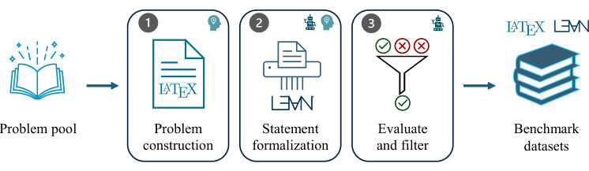 
Figure 1: Benchmark construction workflow. Candidate problems are selected and written, translated into Lean, and checked before they enter the QAlg-Bench and QIT-Bench suites.

📷 Fig 2

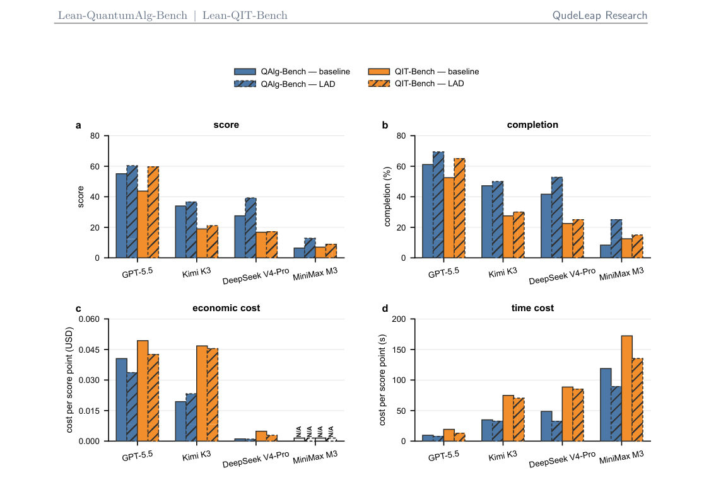 
Figure 2: Verified performance and per-score costs across QAlg-Bench and QIT-Bench. Panels (a,b) show the difficulty-weighted score and completion, respectively. Panels (c,d) show economic cost in USD per score point and time cost in seconds per score point, respectively; lower values indicate lower cost. Blue and orange identify QAlg-Bench and QIT-Bench. Solid, unhatched bars indicate the baseline condition, while dashed, diagonally hatched bars indicate LAD. Black N/A labels mark unavailable economic-cost values.

📷 Fig 3

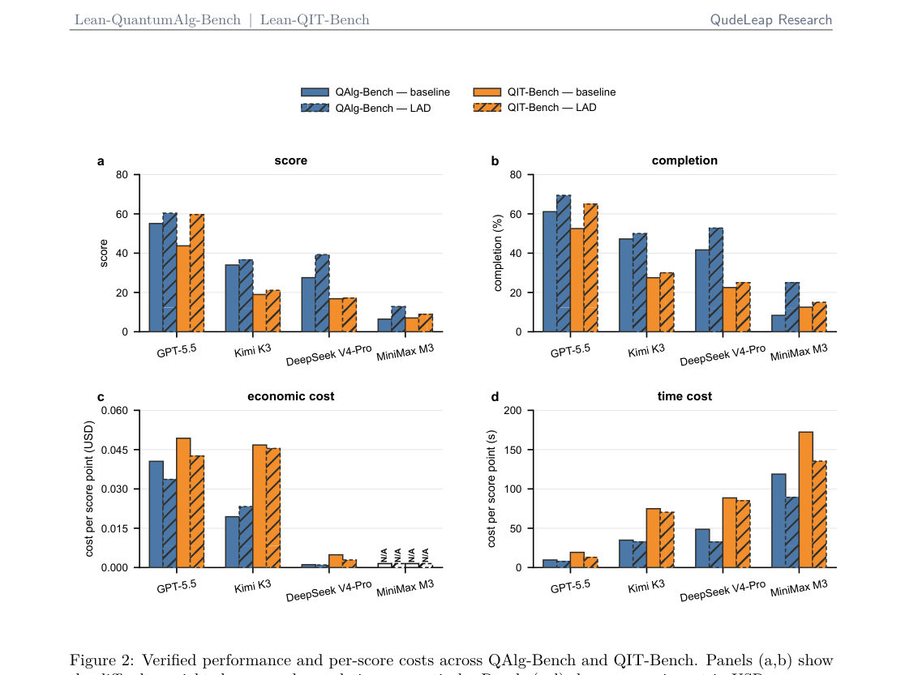 
Figure 2(a,b) compares the 16 recorded results. GPT-5.5 has the highest observed score in every suite– condition combination. In all eight historical within-model comparisons, the LAD result has higher score and completion than the baseline result. The magnitude varies substantially: DeepSeek V4-Pro, for example, shows a much larger separation between conditions on QAlg-Bench than on QIT-Bench. These single-run differences describe the recorded runs; the unmatched execution details prevent their interpretation as estimates of an access-condition effect. Figure 2(c,d) shows that the cost ordering differs from the performance ordering. DeepSeek V4-Pro has

📷 Fig 4

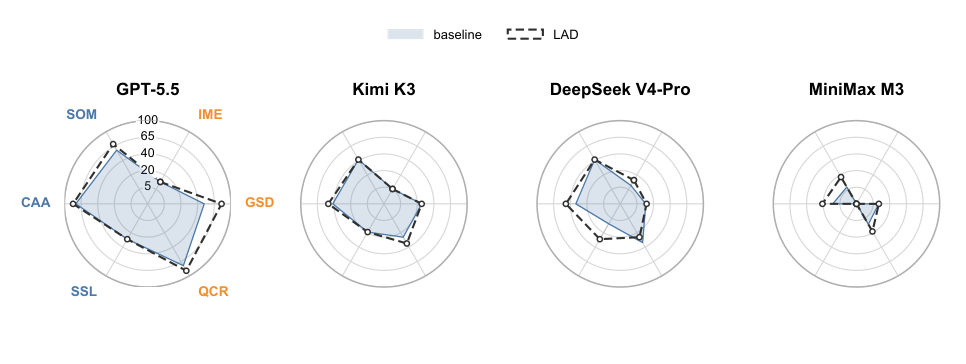 
Figure 3: Difficulty-normalized field profiles for GPT-5.5, Kimi K3, DeepSeek V4-Pro, and MiniMax M3, from left to right. The six axes represent the QAlg-Bench and QIT-Bench fields defined in Tables 2 and 3; exact values are reported in Table 8. All panels use the same radial mapping, with equally spaced rings labelled 5, 20, 40, 65, and 100. Baseline is shown as a translucent filled profile with a solid outline, while LAD is shown as an unfilled dashed profile with hollow nodes. Each axis aggregates 10 to 17 tasks, so a single verified task can visibly move a field score.

📷 Fig 5

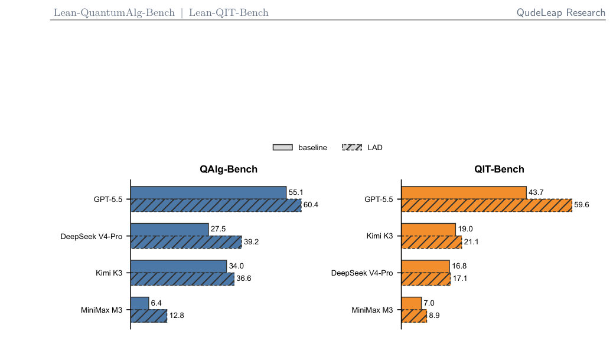 
Figure 4: Within-suite score leaderboards for QAlg-Bench and QIT-Bench. Each model has adjacent baseline and LAD bars, with exact difficulty-weighted scores printed at the bar ends. Models are ordered within each suite by the larger of their two condition scores; ties are ordered as GPT-5.5, Kimi K3, DeepSeek V4-Pro, and MiniMax M3. Blue and orange identify QAlg-Bench and QIT-Bench, while solid outlines identify baseline and dashed, diagonally hatched outlines identify LAD.

**Summary.** The paper introduces standardized benchmarks (QAlg-Bench and QIT-Bench) to rigorously test how well large language models can formally prove theorems in quantum information science. By comparing performance with and without access to verified domain libraries (LAD), the authors quantify model strengths, showing that structured knowledge significantly improves proof generation capabilities.

**Why it may be interesting.** This work directly addresses the frontier of formal verification in quantum theory, providing a concrete, quantifiable measure of AI's current mathematical reasoning capabilities within the domain of quantum computation.

Detailed structure

**Main problem.** The primary goal is to measure the current capability of large AI agents (LLMs) to construct rigorous, machine-checkable proofs for theorems in quantum algorithms and quantum information theory.

**Main result.** Library-Augmented Deduction (LAD) significantly boosts performance across all tested models compared to baseline attempts, while revealing recurring weaknesses in areas like quantum simulation and entanglement theory.

**Method.** The authors developed two formal benchmarks, Lean-QuantumAlg-Bench and Lean-QIT-Bench, consisting of theorem-completion tasks evaluated within the Lean 4 proof assistant environment.

**Model / system.** The work evaluates four state-of-the-art LLMs (GPT-5.5, Kimi K3, DeepSeek V4-Pro, MiniMax M3) attempting to prove theorems concerning quantum algorithms and information theory concepts.

**Key observables.** Difficulty-weighted scores (e.g., 60.4/100 on QAlg-Bench), completion rates, economic cost ($	ext{USD}/	ext{score point}$), and time cost ($	ext{s}/	ext{score point}$).

**Important parameters / regimes.** The evaluation compares a task-only baseline against the Library-Augmented Deduction (LAD) setting, which provides access to verified domain libraries.

**Assumptions / limitations.** The benchmarks assume that performance can be quantified by deterministic proof checking within a fixed Lean 4 environment, establishing a reproducible baseline for future AI development.

**Figures summary.** Figure 1 illustrates the benchmark construction workflow. Figure 2 and 4 show score leaderboards comparing model performance (score/completion) across QAlg-Bench and QIT-Bench in both baseline and LAD settings. Table 8 provides detailed difficulty-normalized field scores.

**Paper structure.** The paper introduces the problem, details the construction of the two benchmarks (QAlg-Bench and QIT-Bench), describes the evaluation methodology (baseline vs. LAD), presents quantitative results comparing multiple LLMs across various metrics, and concludes by discussing implications for AI science.

Abstract

Formal verification is becoming increasingly practical for quantum computing, yet the ability of AI agents to construct machine-checkable proofs in this domain remains unmeasured. We introduce Lean-QuantumAlg-Bench and Lean-QIT-Bench, two Lean 4 benchmarks containing 36 and 40 theorem-completion tasks for quantum algorithms and quantum information theory, respectively. Every task compiles in a fixed environment and is evaluated by deterministic proof checking and targeted semantic review, with difficulty weights assigned before model execution. We evaluate four models-GPT-5.5, Kimi K3, DeepSeek V4-Pro, and MiniMax M3-within a common theorem-proving framework under two settings: a task-only baseline and library-augmented deduction (LAD), which additionally provides access to a verified domain library. The highest difficulty-weighted scores are 60.4 out of 100 on the quantum-algorithm benchmark and 59.6 out of 100 on the quantum-information benchmark. LAD improves both score and completion rate in all eight model-benchmark comparisons, with gains of up to 15.9 points, providing evidence that verified libraries can strengthen domain-specific proof agents. The results reveal recurring weaknesses of agentic proving in areas such as quantum simulation, quantum learning, quantum information measures, and entanglement theory. Monetary and wall-clock costs per score point also vary substantially across models, highlighting important capability-efficiency trade-offs. We expect these benchmarks to establish a reproducible baseline for developing more capable and reliable proof agents, and to pave the way toward self-evolving AI scientists for advancing quantum information science.

[↑ back to top](#top)

### [Entanglement, Evolutionary Stability, and Strategy-Space Dependence in an EWL Quantum Game](http://arxiv.org/abs/2607.21103v1)

**Authors:** Azhar Iqbal, Derek Abbott  
**Type:** theory · **Category:** other · **PDF:** <https://arxiv.org/pdf/2607.21103v1>  
**Analysis basis:** full PDF text, analyzed in chunks
**Topic relevance:** `correlated / nonlocal dissipation` **1/5** · `driven-dissipative phase transition` **1/5** · `entanglement & information structure` **1/5** · `methods for driven-dissipative` **1/5**

📷 Fig 1

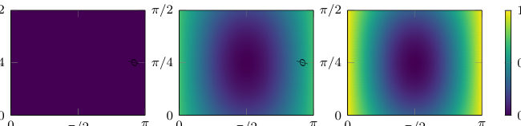 
Figure 1: Normalized Nash payoffgap (54) in the restricted two-parameter EWL strategy space. Colour represents b∆(2) NE on a common scale with minimum 0 (dark purple) and maximum 1 (yellow). The actual panel maxima are 0, sin(π/4) = 1/ √

📷 Fig 2

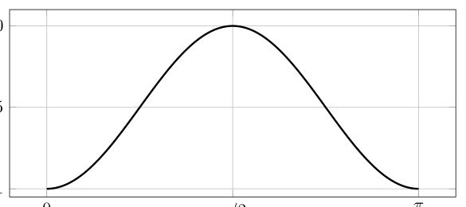 
Figure 2: Normalized second ESS payoffgap at γ = 0. Since −cos2 θ is not strictly positive for mutants, the equilibrium corresponding to the classical mixed equilibrium is not evolutionarily stable at zero entanglement.

📷 Fig 3

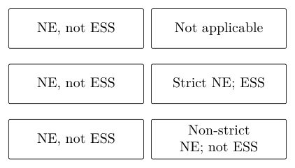 
Figure 3: Strategy-space dependence of evolutionary stability. Entanglement stabilizes the equilibrium in the restricted EWL space, but the stabilization does not survive enlargement to the full pure SU(2) strategy space.

**Summary.** This paper analyzes an EWL quantum game to determine how entanglement influences evolutionary stability. It finds that while entanglement stabilizes the equilibrium within a restricted strategy subspace, this stabilizing effect vanishes when the allowed strategies are expanded to the full SU(2) group. This demonstrates a strong dependence of dynamical stability on the assumed strategic domain.

**Why it may be interesting.** This work explores how the mathematical structure imposed by quantum constraints (like entanglement) can stabilize dynamical equilibria that are unstable classically, highlighting the critical role of the underlying parameter space in determining emergent stability properties.

Detailed structure

**Main problem.** The study investigates how entanglement, introduced via EWL quantization, affects the evolutionary stability (ESS) of an interior mixed Nash equilibrium in a quantum game.

**Main result.** Entanglement successfully stabilizes the equilibrium as an ESS only within a restricted two-parameter strategy space; this stabilization fails when the strategy space is enlarged to the full SU(2) manifold.

**Method.** The authors use concepts from evolutionary game theory (ESS criteria) applied to quantum games, comparing payoff gaps calculated under restricted versus full parameterizations of quantum strategies.

**Model / system.** The model is a symmetric $2 	imes 2$ game analyzed using the Eisert–Wilkens–Lewenstein (EWL) quantization scheme. Strategies are parameterized either by a restricted two-parameter set or the full three-parameter SU(2) group.

**Key observables.** Payoff gaps ($P(s^*, s^*) - P(s, s^*)$), strictness of Nash equilibrium, and satisfaction of the second ESS condition.

**Important parameters / regimes.** The entanglement parameter $\gamma$, which controls the degree of quantum correlation in the game dynamics.

**Assumptions / limitations.** The analysis is confined to a specific $2 	imes 2$ game structure and relies on comparing stability across restricted vs. full strategic domains.

**Figures summary.** Figure 1 shows the normalized Nash payoff gap confirming strictness in the restricted space for $\gamma > 0$. Figure 3 summarizes the loss of ESS status when moving from the restricted EWL domain to the full pure SU(2) space.

**Paper structure.** The paper first establishes that the classical game ($\gamma=0$) fails the ESS condition. It then proves stabilization in the restricted EWL space for $\gamma > 0$. Finally, it demonstrates the failure of this stability when extending the strategy set to the full SU(2) family.

Abstract

We examine how Eisert--Wilkens--Lewenstein (EWL) quantization affects evolutionary stability in a symmetric $2\times2$ game whose interior mixed Nash equilibrium is not evolutionarily stable. In the restricted two-parameter EWL strategy space, the quantum equilibrium $s^*=(π/2,π/4)$ becomes a strict symmetric Nash equilibrium, and hence an evolutionarily stable strategy, for every $γ>0$. Extending the admissible pure strategies to the full three-parameter $SU(2)$ family preserves the Nash equilibrium but introduces a continuum of payoff-neutral mutants, causing strictness and the second ESS condition to fail. Thus, entanglement stabilizes the equilibrium only within the restricted EWL strategy space; the effect does not survive enlargement to full $SU(2)$.

[↑ back to top](#top)

### [Free-volume origin of diverging direct correlations in hard crystals: insights from an exact one-dimensional model](http://arxiv.org/abs/2607.21379v1)

**Authors:** Alessandro Simon, Martin Oettel  
**Type:** theory · **Category:** statistical mechanics · **PDF:** <https://arxiv.org/pdf/2607.21379v1>  
**Analysis basis:** full PDF text, analyzed in chunks
**Topic relevance:** `Frenkel-Kontorova` **1/5** · `Keldysh / 2PI / non-Gaussian methods` **1/5**

📷 Fig 1

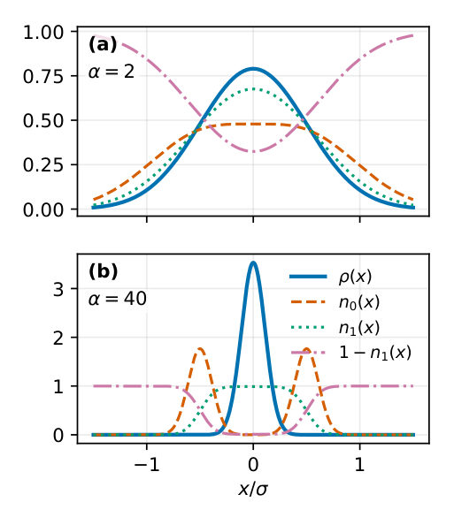 
FIG. 1. Density profiles and corresponding weighted densities for a broad peak (a) and a sharply localized peak (b) for nvac = 1 × 10−2. The weighted packing fraction n1 determines the local insertion free volume A = 1 −n1.

📷 Fig 2

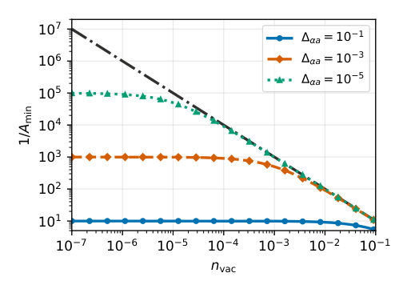 
FIG. 2. Crossover for the inverse minimal free volume implied by Equation (20). The minimum insertion free volume follows Amin ≃nvac only while the vacancy contribution exceeds the residual free volume ∆αa. The corresponding inverse-free- volume amplification saturates at 1/∆αa when nvac ≪∆αa.

📷 Fig 3

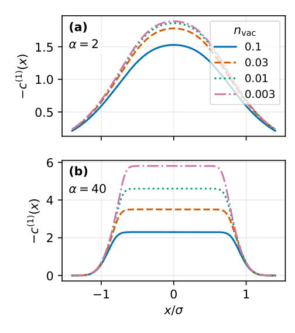 
FIG. 3. First direct correlation function for a single broad density peak (a) and a sharply localized peak (b). The strong vacancy dependence in panel (b) reflects the regime Amin ≃ nvac; the weak dependence in panel (a) reflects saturation at a finite residual free volume.

📷 Fig 4

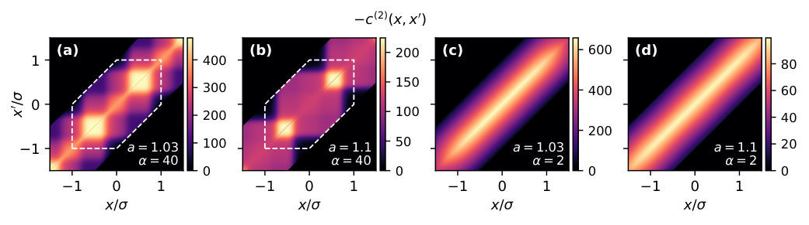 
FIG. 4. Full second direct correlation function for sharply localized peaks (a, b), and broad density peaks (c, d) at nvac = 1×10−2. The lattice spacing was either a/σ = 1.03 for (a, c) and a/σ = 1.1 for (b, d). The strict support (marked by the dashed region) remains fixed by the rod length, but the dominant large-amplitude contribution becomes concentrated along geometrically selected regions in the sharp case. For the numerics, a lattice with five density peaks has been used, shown is only the region around the middle peak.

📷 Fig 5

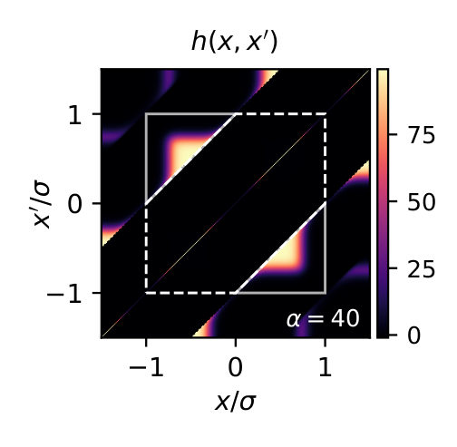 
FIG. 5. Numerical solution of the inhomogeneous Ornstein– Zernike equation for a sharply localized profile at nvac = 1 × 10−2 and a = 1.03. The dashed and full lines show the different support in the unit cell, cf. Figure 6.

**Summary.** This work uses an exact 1D hard-rod model within statistical mechanics to explain the anomalous behavior of direct correlation functions in crystalline solids. It shows that these divergences are not arbitrary but arise directly from the geometry and scarcity of local free volume within the crystal lattice. The findings provide a minimal, physically grounded explanation for both the magnitude and structure of these key thermodynamic quantities.

**Why it may be interesting.** While focused on classical hard-body systems, the rigorous connection drawn between singular thermodynamic quantities (like $c^{(2)}$) and geometric constraints (like minimal free volume) provides a powerful theoretical template applicable to understanding correlations in quantum many-body systems near phase boundaries or confinement.

Detailed structure

**Main problem.** The study aims to explain the unusually large amplitudes and specific spatial structure of second-order direct correlation functions in hard-sphere crystals compared to their liquid counterparts.

**Main result.** The paper establishes that both the magnitude (scaling as $1/n_{vac}$) and the lattice-specific form of these correlations are fundamentally controlled by the minimum local insertion free volume, $A_{\min}$.

**Method.** The authors employ an exact one-dimensional model for hard rods within a classical Density Functional Theory framework to derive theoretical scaling laws.

**Model / system.** The system modeled is a crystal of hard spheres (approximated by hard rods in 1D) characterized by a periodic, crystal-like density profile. The analysis focuses on the local insertion free volume $A(x)$ as the key thermodynamic quantity.

**Key observables.** Second direct correlation function ($c^{(2)}$), first direct correlation function ($c^{(1)}$), and the local insertion free volume ($A(x)$).

**Important parameters / regimes.** Vacancy concentration ($n_{vac}$), residual free volume ($\Delta\alpha_a$), and the minimum local free volume ($A_{\min}$).

**Assumptions / limitations.** The analysis relies on using an exactly solvable 1D model and imposing a periodic density profile, rather than modeling the full crystallization transition.

**Figures summary.** Figures illustrate density profiles showing how $A$ changes between broad and sharply localized peaks. Other figures compare $c^{(2)}$ for sharp versus broad peaks, demonstrating geometric selectivity related to free volume.

**Paper structure.** The paper develops the theory by first establishing the relationship between direct correlations and local free volume in 1D (using the Ornstein-Zernike equation). It then analyzes how this mechanism dictates both the magnitude ($c^{(2)} \sim -1/A_{\min}$) and the spatial structure of the correlation functions.

Abstract

Second order direct correlation functions in three-dimensional hard-sphere crystals have much larger amplitudes (of the order of $1/n_{\mathrm{vac}}$ where $n_{\mathrm{vac}}$ is the vacancy concentration) and a more strongly structured spatial form of apparent shorter range than their liquid-state counterparts. We separate the two underlying questions---why the correlations are large and why they have the form they do---using the exact one-dimensional Percus functional for hard rods. A periodic crystal-like density is represented by Gaussian peaks with occupation probability $q=1-n_{\mathrm{vac}}$. The relevant thermodynamic quantity is the local insertion free volume $A(x)$. Its minimum can be written as $A_{\mathrm{min}} =Δ_{αa}+(1-Δ_{αa})n_{\mathrm{vac}}$, where $Δ_{αa}$ is the residual free volume at full occupation caused by finite localization (characterized by a width parameter $α$) and lattice spacing $a$. The first and second direct correlations therefore contain the singular dependences $c^{(1)}\sim\ln A_{\mathrm{min}} $ and $c^{(2)} \sim-1/A_{\mathrm{min}} $. The observed $1/n_{\mathrm{vac}}$ dependence is the vacancy-dominated limit $n_{\mathrm{vac}}\ggΔ_{αa}$, rather than the most general result. The spatial form of $c^{(2)}$ has a separate geometrical origin: the hard-rod weight functions select configurations in which exclusion intervals and their boundaries intersect regions of small free volume. This produces plateaus, edges, and localized ridges tied to the underlying periodic density. A numerical solution of the inhomogeneous Ornstein--Zernike equation shows how these singular direct correlations are redistributed in the total and pair correlations. The model provides a minimal free-volume explanation for both the magnitude and the lattice-specific form of crystalline direct correlation functions.

[↑ back to top](#top)

### [Thermal Hall Resistivity as a Unifying Description of Phonon Thermal Hall Effect in Various Insulators](http://arxiv.org/abs/2607.21157v1)

**Authors:** Dirui Wu, Ying Kit Tsui, Xavier Loh, Minseong Lee, Eun Sang Choi, Takao Sasagawa, Toshimitsu Ito, Xiao Renshaw Wang, Pinaki Sengupta, Xinyang Zhang, Christos Panagopoulos  
**Type:** experiment · **Category:** strongly correlated electrons · **PDF:** <https://arxiv.org/pdf/2607.21157v1>  
**Analysis basis:** full PDF text, analyzed in chunks
**Topic relevance:** `analog quantum simulation` **1/5** · `non-equilibrium dynamics` **1/5**

📷 Fig 1

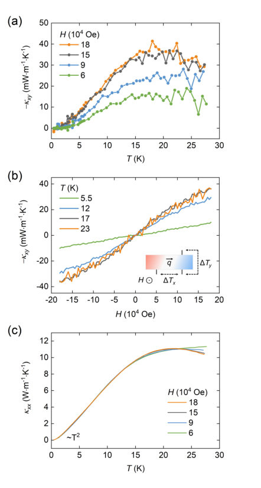 
FIG. 1. Measured thermal conductivity tensor of LSNO-1/3. (a) Temperature dependence of the anti-symmetrized ther- mal Hall conductivity −κxy at various magnetic field, show- ing peak features at ∼20 K. (b) Linear or slightly sublinear magnetic-field dependence of −κxy at different temperatures. Inset shows a schematic of the THE experiment with a heat current q along the a-axis of LSNO-1/3 and a magnetic field H along the c-axis. (c) Temperature dependence of the lon- gitudinal thermal conductivity κxx at various magnetic field, following a T 2 power-law at low temperatures and exhibiting similar peak features as κxy.

📷 Fig 2

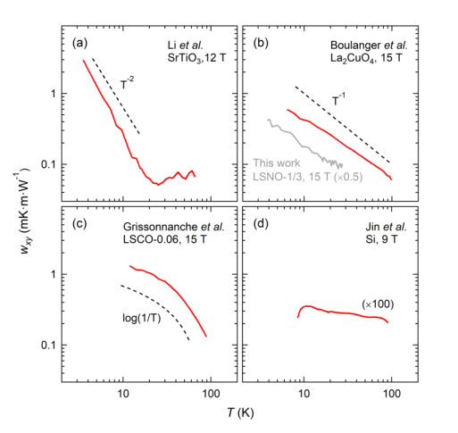 
FIG. 3. Insulating-like temperature dependence of thermal Hall resistivity wxy = −κxy/κ2 xx at low temperatures of (a) SrTiO3 from Ref. [16] showing a T −2 divergence, (b) La2CuO4 from Ref. [17] showing a T −1 divergence similar to LSNO-1/3 in this work, (c) LSCO-0.06 from Ref. [15] showing a logarith- mic divergence, and (d) Silicon from Ref. [32] showing a weak negative temperature dependence. The wxy of silicon was cal- culated using κxx(H = 0) due to data availability; data was multiplied by 100 to facilitate the comparison with other ma- terials. All dashed lines are guides to the eye, indicating the respective divergence laws.

📷 Fig 3

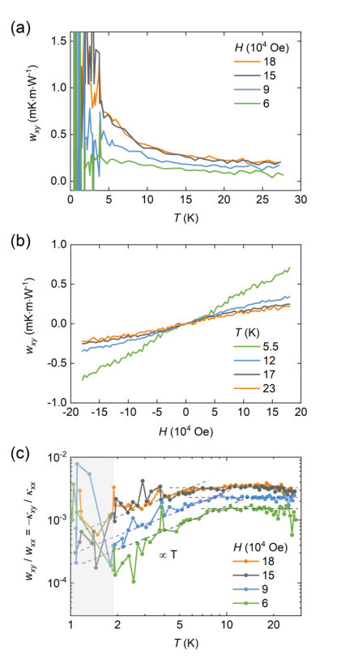 
FIG. 2. Measured thermal Hall resistivity and thermal Hall angle of LSNO-1/3. (a) Temperature dependence of the anti- symmetrized thermal Hall resistance wxy at various mag- netic fields following a diverging T −1 power-law. (b) Linear magnetic-field dependence of wxy near H = 0 at different temperatures. (c) T-linear temperature dependence of the thermal Hall angle at low temperatures. These three phe- nomena can be found prevalently in other insulators showing phonon THE.

**Summary.** This work investigates the phonon thermal Hall effect across various insulating materials, using $	ext{La}_{5/3}	ext{Sr}_{1/3}	ext{NiO}_4$ as a primary example. By measuring the thermal Hall resistivity ($\omega_{xy}$), the authors establish that its characteristic temperature and field dependencies provide a unified description for this phenomenon in different Mott insulators.

**Why it may be interesting.** While focused on thermal transport rather than quantum dynamics, the study probes collective excitations (phonons) in strongly correlated Mott insulators, which is a key area where lattice vibrations interact with electronic correlations.

Detailed structure

**Main problem.** To establish a unifying description for the phonon thermal Hall effect (THE) observed across various insulating materials.

**Main result.** The thermal Hall resistivity ($\omega_{xy}$) exhibits characteristic temperature and magnetic field dependencies ($T^{-1}$ divergence, linear $H$ dependence) that serve as a unifying signature for phonon THE in diverse insulators.

**Method.** Experimental measurements using dedicated one-heater-three-thermometer setups to measure the full thermal resistivity tensor ($\mathbf{w}$) and calculate conductivities ($oldsymbol{\kappa}$).

**Model / system.** The study focuses on doped Mott insulators, specifically $	ext{La}_{5/3}	ext{Sr}_{1/3}	ext{NiO}_4$, and compares results across other insulating systems like $	ext{SrTiO}_3$ and cuprates.

**Key observables.** Thermal Hall resistivity ($\omega_{xy}$), Thermal Hall angle ($	heta_{	ext{TH}}$), Longitudinal thermal conductivity ($\kappa_{xx}$), and specific heat ($C(T)$).

**Important parameters / regimes.** Low temperatures (down to $\sim 2$ K), magnetic fields near $H=0$, and doping levels in Mott insulators.

**Assumptions / limitations.** The analysis assumes an isotropic and field-antisymmetric thermal resistivity tensor ($\mathbf{w}$).

**Figures summary.** Figures compare measured $\kappa_{xy}$ vs. $\omega_{xy}$, showing characteristic temperature divergences ($T^{-1}, T^{-2}$) for different materials, and illustrate the linear $H$ dependence of $\omega_{xy}$.

**Paper structure.** The paper systematically presents measurements on $	ext{LSNO-1/3}$, analyzes its unique signatures ($\omega_{xy}(T)$, $\omega_{xy}(H)$), compares these findings to established data from other insulators (STO, LCO, Si), and concludes by proposing the unifying role of $\omega_{xy}$.

Abstract

A considerable phonon thermal Hall effect was recently discovered across a diverse collection of materials. To clarify this enigmatic thermal Hall response in various insulators, we investigate the doped Mott insulator La$_{5/3}$Sr$_{1/3}$NiO$_4$ as an example material system and reveal a characteristic phonon-dominated thermal Hall effect. As a sensitive probe of the transverse thermal response, the thermal Hall resistivity $w_{xy}$ exhibits an insulating-like temperature dependence $w_{xy}(T)$, a linear magnetic-field dependence $w_{xy}(H)$ near $H=0$, and a $T$-linear thermal Hall angle at low temperatures. The presence of similar phenomena across a series of insulators suggests that $w_{xy}$ serves as a unifying description of phonon thermal Hall effect, corroborated by an apparent correlation between the insulating-like $w_{xy}(T)$ and material's localized electronic state.

[↑ back to top](#top)

### [Unconditional Unclonable Encryption](http://arxiv.org/abs/2607.21551v1)

**Authors:** Prabhanjan Ananth, Amit Sahai  
**Type:** theory · **Category:** quantum information and computing · **PDF:** <https://arxiv.org/pdf/2607.21551v1>  
**Analysis basis:** full PDF text, analyzed in chunks
**Topic relevance:** `entanglement & information structure` **1/5** · `quantum measurements` **1/5**

📷 Fig 1

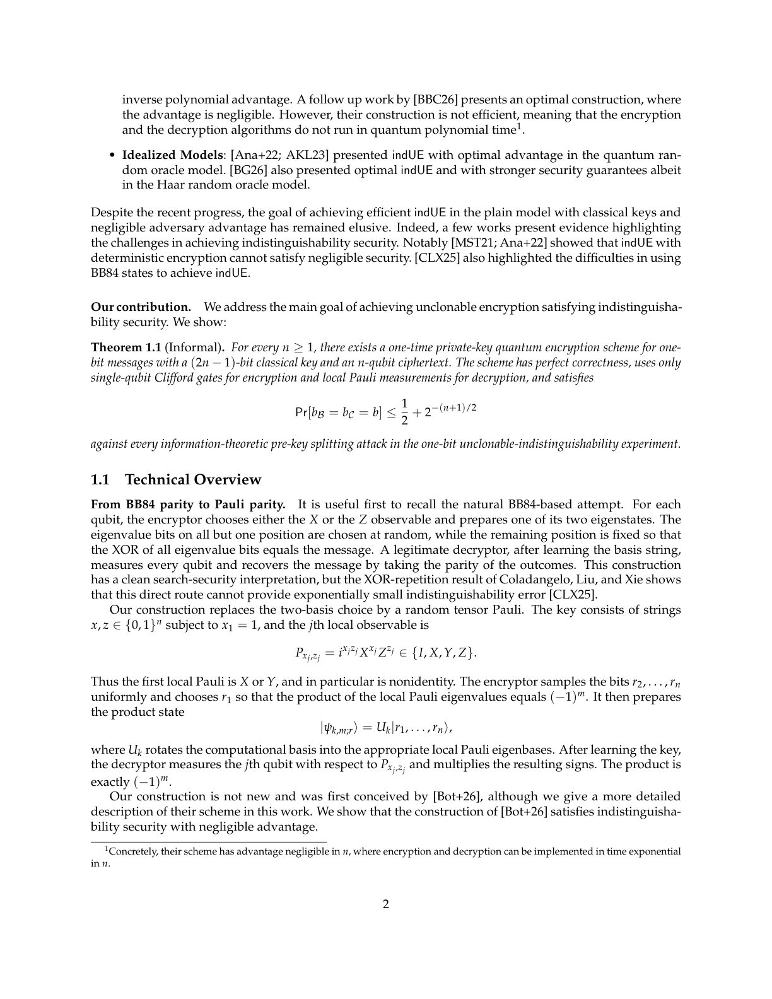 
Low-resolution page preview, page 2

📷 Fig 2

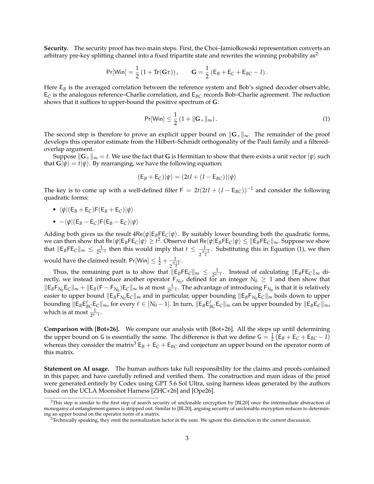 
Low-resolution page preview, page 3

📷 Fig 3

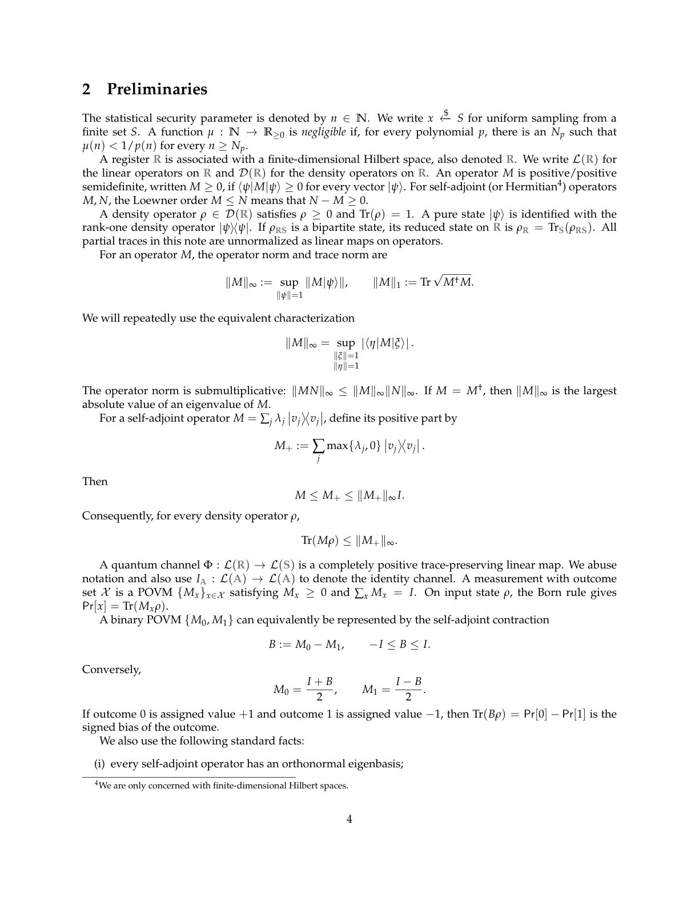 
Low-resolution page preview, page 4

📷 Fig 4

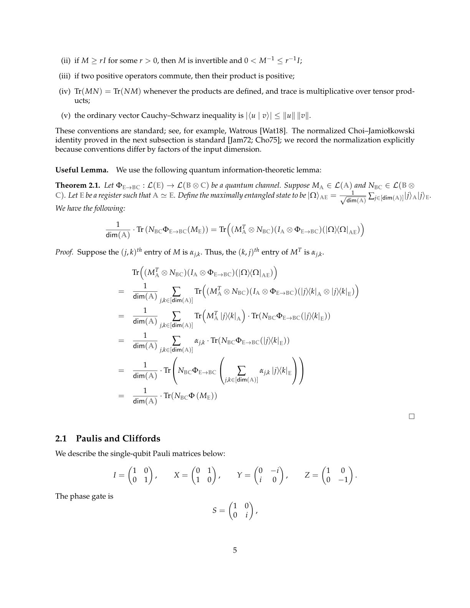 
Low-resolution page preview, page 5

📷 Fig 5

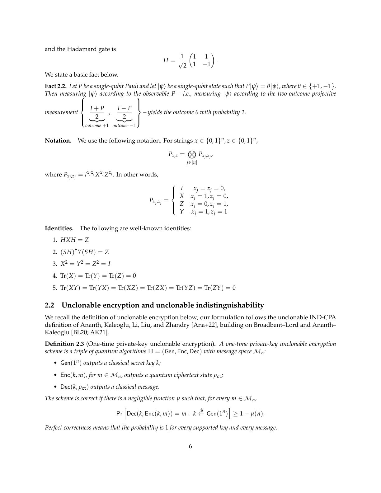 
Low-resolution page preview, page 6

**Summary.** This paper presents an unconditional construction for a one-time private-key unclonable encryption scheme for single bits. The authors rigorously prove its security by bounding the adversary's advantage using advanced techniques involving operator norms and spectral analysis within quantum information theory. It advances the field by providing tight, information-theoretic security guarantees for this cryptographic primitive.

**Why it may be interesting.** This work provides a rigorous, information-theoretic security proof for a quantum primitive (UE) that is highly relevant to quantum communication protocols, building upon foundational concepts in quantum cryptography.

Detailed structure

**Main problem.** The core problem is constructing an unconditionally secure, information-theoretically secure one-time private-key unclonable encryption (UE) scheme for single-bit messages.

**Main result.** The authors provide a construction achieving an advantage bound of $	ext{Pr}[	ext{Win}] \le 1/2 + 2^{-(n+1)/2}$, demonstrating the security of the proposed quantum encryption protocol.

**Method.** The proof involves advanced techniques from quantum information theory, utilizing Choi–Jamiołkowski representations and bounding operator norms ($\lVert G_+ 
Vert_\infty$) derived from analyzing the winning probability in an unclonable indistinguishability game.

**Model / system.** The model is a quantum cryptographic scheme operating on one-bit messages using $n$-qubit ciphertexts and classical keys. Security relies fundamentally on the no-cloning principle applied to quantum states.

**Key observables.** The success probability of an adversary ($	ext{Pr}[	ext{Win}]$) in the unclonable indistinguishability experiment, and related operator norms like $\lVert E_{BC} 
Vert_\infty$.

**Important parameters / regimes.** The key length $n$ (determining the security parameter), and derived bounds such as $\gamma = d/L$.

**Assumptions / limitations.** The proof relies on spectral decomposition, bounding quadratic forms using filter operators ($F$), and assuming specific algebraic properties of Pauli operators acting on tensor product Hilbert spaces.

**Paper structure.** The paper progresses by defining the scheme, formulating the security game in terms of operator traces (Choi states), deriving bounds on correlation operators using lemmas (like Lemma 3.3), and finally applying spectral analysis with filter operators to achieve the tight final bound.

Abstract

We give an unconditional construction of information-theoretically secure one-time private-key unclonable encryption scheme for one-bit messages, with efficient encryption and decryption and exponentially small unclonable-indistinguishability advantage.

[↑ back to top](#top)

### [Unified theory of classical and quantum semiparametric efficiency](http://arxiv.org/abs/2607.21524v1)

**Authors:** Mankei Tsang  
**Type:** theory · **Category:** other · **PDF:** <https://arxiv.org/pdf/2607.21524v1>  
**Analysis basis:** full PDF text, analyzed in chunks
**Topic relevance:** `entanglement & information structure` **1/5** · `quantum measurements` **1/5**

📷 Fig 1

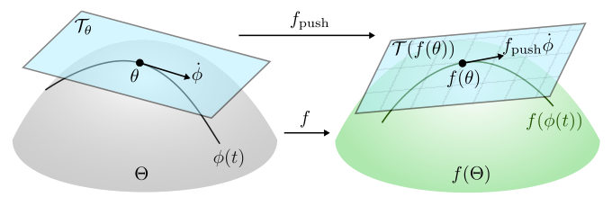 
FIG. 1. Picture the parameter space Θ as a manifold. A curve ϕ(t) in Θ passes through the true parameter θ, and its tangent vector there is denoted as ˙ϕ. The tangent space Tθ is the set of tangent vectors of all curves. The parametrization function f maps the parameter to a key property of the statistical model, so that each curve ϕ(t) is mapped to a curve f(ϕ(t)) in the statistical manifold f(Θ) on the right. The pushforward fpush is the map of each tangent vector ˙ϕ to a score fpush ˙ϕ in the score tangent space T (f(θ)); the score can be pictured as a tangent vector of f(ϕ(t)). The grid on T (f(θ)) represents its inner product, which determines the length of a tangent vector as well as...

📷 Fig 2

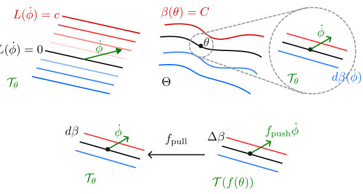 
FIG. 2. Top left: a tangent covector L ∈T ∗ θ can be pictured as a meter that measures a tangent vector ˙ϕ ∈Tθ via the flat and parallel level sets L( ˙ϕ) = c, c ∈R. Top right: the differential dβ can be pictured as level sets on Tθ that are flat approximations of the global level sets of β(θ) on Θ. Bottom: a covector ∆β on T (f(θ)) can be pulled back to become a covector (fpull∆β)( ˙ϕ) = ∆β(fpush ˙ϕ) on Tθ. Eq. (2.48) requires the resulting covector to match the original differential dβ.

📷 Fig 3

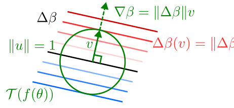 
FIG. 3. Picture the covector ∆β as level sets on the score tangent space T (f(θ)). Consider the unit vectors on the unit sphere ∥u∥f(θ) = 1. The highest level ∆β(v) attained by a unit vector v is the operator norm ∥∆β∥. The Riesz representation ∇β of ∆β is this v times ∥∆β∥. ∇β is orthogonal to the ∆β(u) = 0 level set because ⟨∇β, u⟩f(θ) = ∆β(u) = 0.

📷 Fig 4

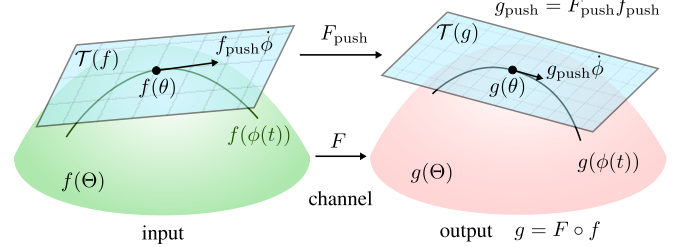 
FIG. 4. The channel map F relates the input parametrization function f(θ) to the output parametrization function g(θ) by g = F ◦f. This map induces a linear channel pushforward map Fpush that relates each input score fpush ˙ϕ in the input score tangent space T (f) to the output score gpush ˙ϕ in the output score tangent space T (g) by gpush = Fpushfpush.

📷 Fig 5

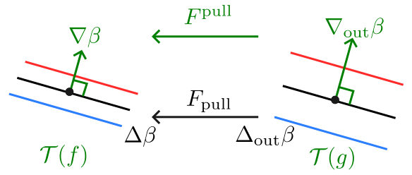 
FIG. 5. The score differentials ∆β and ∆βout are depicted as level sets on the score tangent spaces T (f) and T (g), respectively. Eq. (4.26) requires Fpull applied to the output score differential ∆βout to match the input score differential ∆β. The efficient influences ∇β and ∇outβ are the Riesz representations of the score differentials and depicted as vectors orthogonal to the level sets. Eq. (4.30) requires the channel pullback F pull of the output efficient influence ∇outβ to match the input efficient influence ∇β.

**Summary.** This paper introduces a unified geometric theory to calculate statistical efficiency bounds for estimating parameters when the underlying model is high-dimensional (semiparametric). By generalizing classical and quantum concepts like the Cramér-Rao and Helstrom bounds, it offers a powerful tool to determine fundamental limits on measurement precision in fields ranging from general sensing to advanced optical imaging.

**Why it may be interesting.** It provides a powerful mathematical toolkit for quantifying ultimate measurement precision limits in scenarios where many parameters are unknown, which is crucial for advanced quantum sensing and metrology beyond simple parameter estimation.

Detailed structure

**Main problem.** The paper aims to develop a unified statistical theory for efficiency bounds applicable to both classical and quantum semiparametric models.

**Main result.** It provides a general framework that unifies the Cramér-Rao and Helstrom bounds, allowing computation of classical and quantum limits for complex estimation tasks like optical imaging.

**Method.** The approach is highly abstract and geometric, defining concepts like the parameter tangent space and information semimetric to generalize existing statistical bounds beyond finite dimensions.

**Model / system.** The theory is applied broadly, covering general classical and quantum models (Gaussian, Poisson fields) with specific applications in coherent and incoherent optical imaging problems.

**Key observables.** Statistical efficiency bounds, the output efficient influence ($
abla_{	ext{out}}eta$), and classical/quantum limits to imaging resolution.

**Important parameters / regimes.** High-dimensional unknown parameters ($	heta$) summarized by a finite-dimensional parameter of interest ($eta(	heta)$).

**Assumptions / limitations.** The primary assumption is the need for minimal assumptions about high-dimensional parameters, and mathematically, it relies on differentiability and the existence/properties of certain operators like $F^{	ext{push}}$.

**Paper structure.** The paper builds from fundamental abstract concepts (parameter tangent space, information semimetric) to specific applications in classical statistics (e.g., Gaussian fields), quantum estimation theory (Helstrom bounds), and finally applies the unified formalism to complex physical systems like optical imaging.

Abstract

In classical and quantum statistics, high-dimensional unknown parameters are abundant and it is often prudent to make minimal assumptions about them using so-called semiparametric models. To attack a wide range of semiparametric problems in one broad stroke, we present a unified treatment of statistical efficiency for classical and quantum semiparametric models, generalizing the Cramér-Rao and Helstrom bounds beyond finite-dimensional parameters. We introduce the fundamental concepts in abstract and geometric terms before applying them to many examples, covering general classical and quantum models as well as the paradigmatic special cases of Gaussian and Poisson fields. We give an in-depth treatment of channels in the semiparametric efficiency theory and advocate the use of the singular value decomposition to elucidate the statistical effects of channels. To demonstrate the utility of the formalism, we apply it to coherent and incoherent optical imaging problems, assuming an arbitrary field or intensity on the object plane without parametric assumptions. Our formalism enables us to compute classical and quantum limits to coherent and incoherent imaging resolution in statistical terms. For subdiffraction incoherent imaging, we demonstrate that spatial-mode demultiplexing can be far superior to direct imaging in estimating generalized Fourier coefficients and come closer to the quantum limits. We envision our theory becoming an essential tool for both classical and quantum statistics with useful applications to sensing and imaging, whenever minimal assumptions about a high-dimensional parameter should be made.

[↑ back to top](#top)

### [Ideal Bands in Tight-Binding Models](http://arxiv.org/abs/2607.20624v1)

**Authors:** Lexu Zhao, Yang Ge, Shinsei Ryu, Jiabin Yu  
**Type:** theory · **Category:** other · **PDF:** <https://arxiv.org/pdf/2607.20624v1>  
**Analysis basis:** full PDF text, analyzed in chunks
**Topic relevance:** `analog quantum simulation` **1/5**

📷 Fig 1

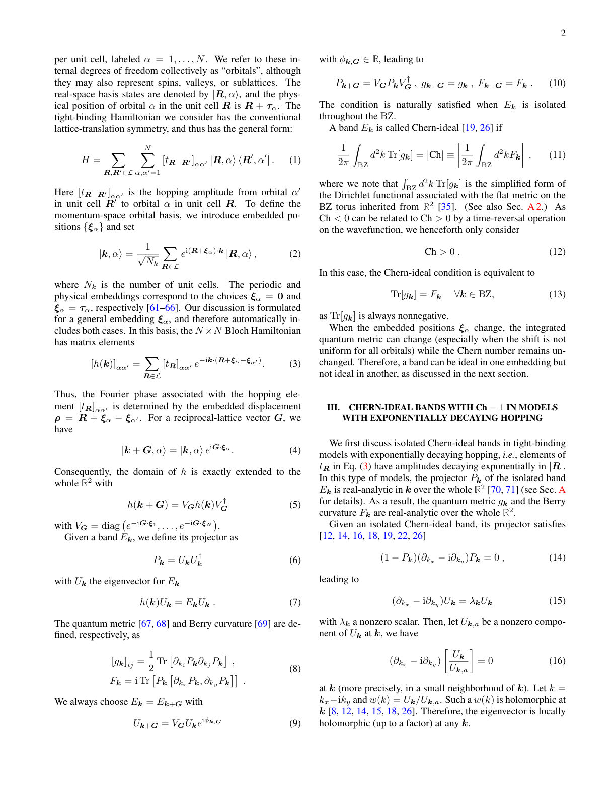 
Low-resolution page preview, page 2

📷 Fig 2

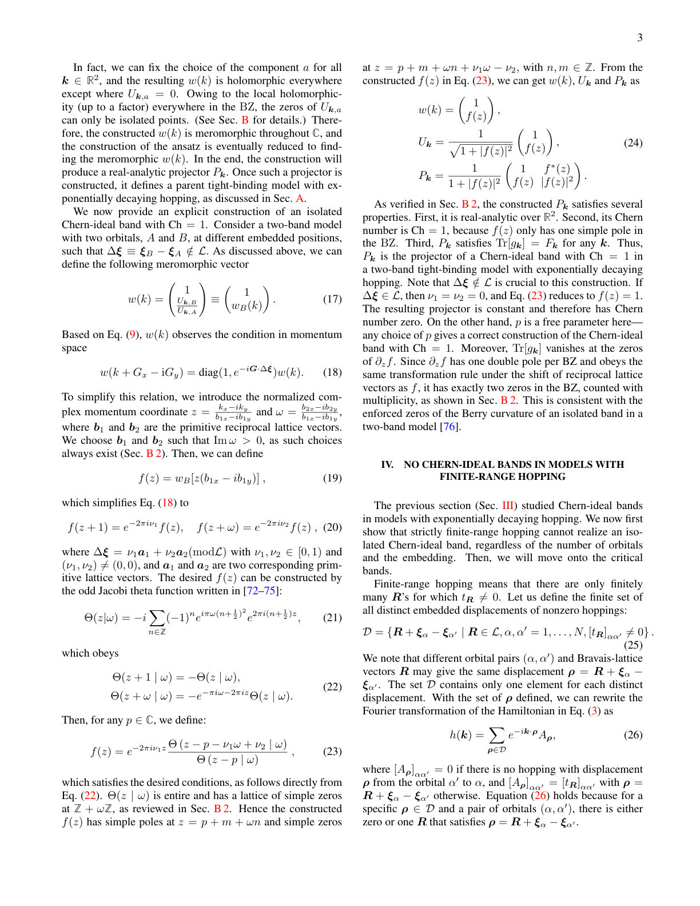 
Low-resolution page preview, page 3

📷 Fig 3

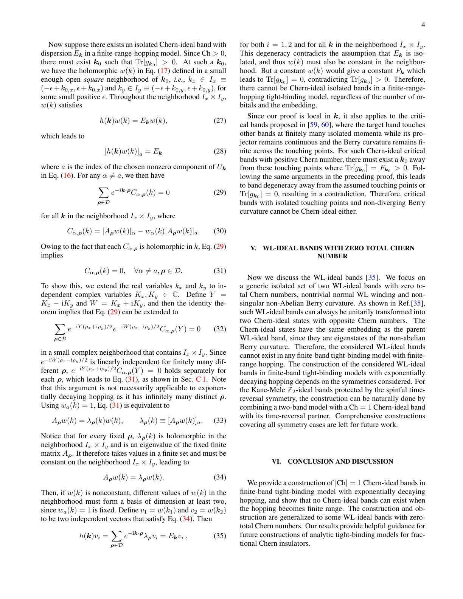 
Low-resolution page preview, page 4

📷 Fig 4

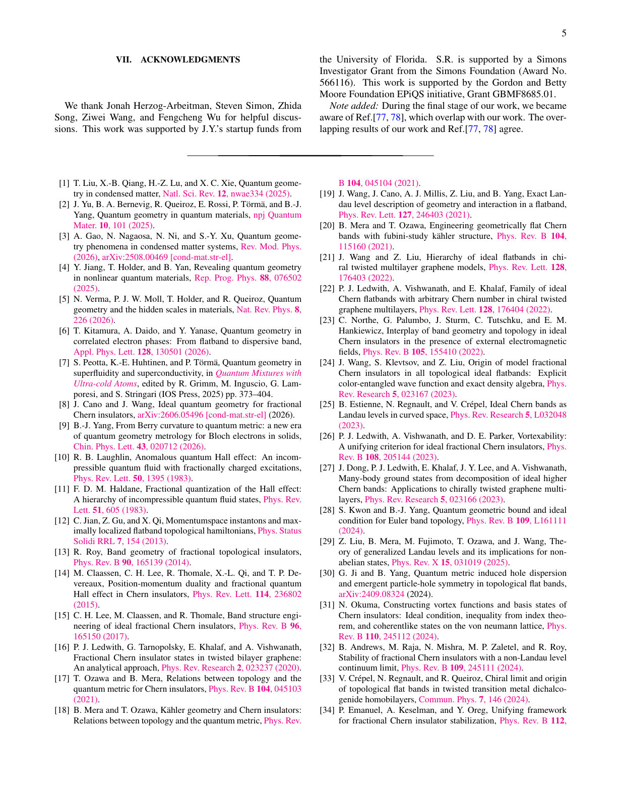 
Low-resolution page preview, page 5

📷 Fig 5

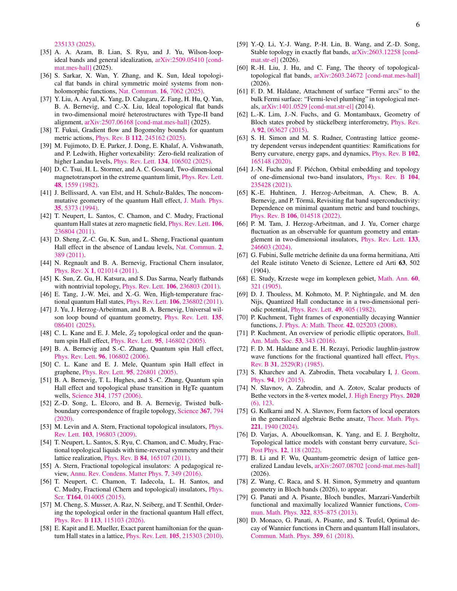 
Low-resolution page preview, page 6

**Summary.** This paper rigorously analyzes the concept of 'ideal bands' by examining when their associated topological functional saturates a theoretical lower bound. The authors provide an explicit construction for such bands under conditions of exponentially decaying hopping but prove that these ideal states are impossible to realize in models with only finite-range interactions. This establishes fundamental limitations on the topology achievable in lattice Hamiltonians.

**Why it may be interesting.** The mathematical constraints derived from topological invariants like the Chern number place severe restrictions on the realizability of specific band structures in physical models, which is fundamental knowledge for designing topological materials.

Detailed structure

**Main problem.** The study investigates 'ideal bands,' specifically Chern-ideal and Wilson-loop-ideal bands, defined by the saturation of a topological lower bound on their Dirichlet functional.

**Main result.** The authors prove that isolated Chern-ideal bands with non-zero Chern number cannot exist in finite-band tight-binding models utilizing only finite-range hopping. This conclusion extends to critical and Wilson-loop-ideal bands under similar conditions.

**Method.** The proof heavily relies on complex analysis, specifically using the identity theorem applied to functions derived from Bloch Hamiltonians defined over the Brillouin zone.

**Model / system.** The system is a finite-band tight-binding model defined on a 2D Bravais lattice with conventional translation symmetries. The Hamiltonian structure is analyzed via its momentum-space representation, $h(\mathbf{k})$.

**Key observables.** Chern number (Ch), Quantum metric ($\mathbf{g}_{\mathbf{k}}$), Berry curvature ($F_{\mathbf{k}}$), and the Dirichlet functional.

**Important parameters / regimes.** The nature of hopping decay (exponentially decaying vs. finite-range) and the relative positions of embedded orbitals ($\Delta\xi$).

**Assumptions / limitations.** Conventional lattice translation symmetry is assumed; the proof for non-existence relies on assuming $	ext{Ch} > 0$ or that the Berry curvature does not diverge.

**Paper structure.** The paper first provides an explicit construction of Chern-ideal bands with Ch=1 using exponentially decaying hopping. It then develops a rigorous proof, utilizing complex analysis techniques (like extending variables to $\mathbb{C}^2$), demonstrating that the requirement for non-zero Chern number leads to contradictions when restricted to finite-range hoppings.

Abstract

A band is called ideal when its Dirichlet functional saturates the topological lower bound. We study ideal bands in finite-band tight-binding models with conventional two-dimensional lattice translation symmetries, allowing the bands to have non-flat dispersion. We first provide an analytic construction of isolated Chern-ideal bands with Chern number $|\mathrm{Ch}|=1$ in finite-band models with exponentially decaying hopping. This construction applies only when at least two orbitals have different embedded positions (modulo lattice vectors), complementing the previously known construction for $|\mathrm{Ch}|>1$. We then show that isolated Chern-ideal bands with any nonzero Chern number cannot exist in finite-band models with finite-range hopping, regardless of the embedded orbital positions. The conclusion holds even if there are isolated band touching points, as long as the Berry curvature does not diverge anywhere in the Brillouin zone. We finally generalize the conclusions to Wilson-loop-ideal bands with zero total Chern number, such as Kane-Mele $\mathbb{Z}_2$-ideal bands.

[↑ back to top](#top)

### [Long-wavelength density response and momentum resolution in strange-metal charge spectroscopy](http://arxiv.org/abs/2607.21206v1)

**Authors:** Ilmo Sung  
**Type:** theory · **Category:** strongly correlated electrons · **PDF:** <https://arxiv.org/pdf/2607.21206v1>  
**Analysis basis:** full PDF text, analyzed in chunks
**Topic relevance:** `Keldysh / 2PI / non-Gaussian methods` **1/5**

📷 Fig 1

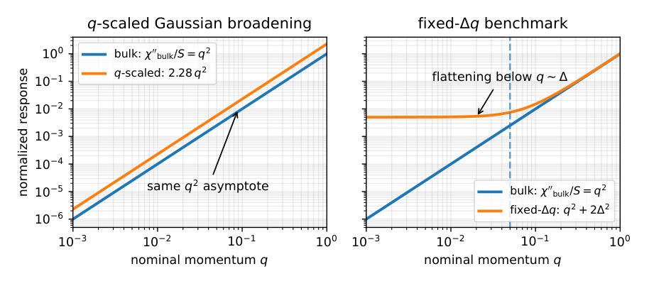 
Figure 1: Illustration of the momentum-resolution theorem. Left: for a toy bulk law 𝜒′′ bulk/𝑆= 𝑞2, 𝑞-scaled Gaussian broadening with per-component width 𝜎𝑞preserves the same 𝑞2 asymptotic behavior and only rescales the prefactor. The plotted value is 𝜎= 0.8, giving 1 + 2𝜎2 = 2.28. Right: an illustrative fixed-Δ𝑞 Gaussian benchmark with per-component width Δ instead produces low-𝑞flattening below 𝑞∼Δ. The theorem applies to the left-hand class of models; the fixed-Δ𝑞comparison is heuristic.

📷 Fig 2

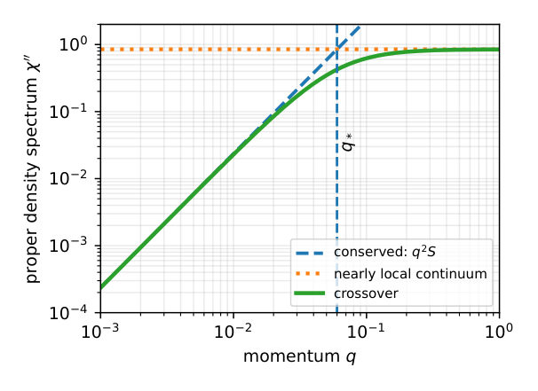 
Figure 2: Schematic crossover implied by charge conservation. At fixed nonzero frequency and temperature, a homogeneous conserved metallic response must satisfy 𝜒′′ bulk ∼𝑞2𝑆(𝜔,𝑇) as 𝑞→0. A nearly local finite-𝑞 continuum can exist over an intermediate momentum window, but if it connects to the optical metal it must cross over at 𝑞∗(𝜔,𝑇).

**Summary.** This work theoretically connects momentum-resolved EELS data with optical conductivity in strange metals by analyzing the underlying charge density response function. It proves that this bulk response must obey a universal $q^2$ scaling law as momentum transfer approaches zero. This constraint defines a crossover surface, offering a fundamental test for theories describing charge dynamics in high-temperature superconductors.

**Why it may be interesting.** The rigorous mathematical constraint derived from fundamental symmetries (Ward identity) provides a powerful tool to test theoretical models of strongly correlated electron systems against disparate experimental measurements.

Detailed structure

**Main problem.** The paper aims to reconcile discrepancies between charge dynamics measured by momentum-resolved EELS (finite momentum) and those from optical spectroscopy (local limit) in strange metals.

**Main result.** It proves that the proper bulk density response function must exhibit a universal $q^2$ asymptotic suppression at fixed frequency, which constrains how finite-$q$ measurements relate to the local optical conductivity.

**Method.** The analysis uses the Ward identity connecting the charge-density polarization ($\chi''_{
ho
ho}$) to the longitudinal conductivity ($\sigma_L$), and then proves this $q^2$ scaling holds for any non-negative, self-similar momentum-resolution kernel.

**Model / system.** The study focuses on strange-metal cuprates like Bi-2212, treating the charge dynamics via the proper homogeneous bulk charge-density polarization function ($\chi''_{
ho
ho}$).

**Key observables.** Proper longitudinal charge-density polarization $\chi''_{
ho
ho}(q, \omega)$, local conductivity $\sigma_L(\omega)$, and the resulting crossover surface $q^*(\omega, T)$.

**Important parameters / regimes.** Momentum transfer ($q$), frequency ($\omega$), temperature ($T$), and the ratio of momentum-resolution kernel width to nominal momentum.

**Assumptions / limitations.** The analysis assumes the system is a homogeneous, U(1)-conserving metal, and that the measured quantity can be related back to the proper bulk response via electrodynamic conversion.

**Figures summary.** Not specified in the notes; the focus is on deriving functional relationships (Eq. 6, Eq. 8) and proving asymptotic theorems.

**Paper structure.** The paper establishes the Ward identity linking $\chi''_{
ho
ho}$ to $\sigma_L$, derives the required $q^2$ asymptotic behavior for the bulk response, proves this scaling is robust against realistic momentum-resolution kernels, and concludes by defining the crossover surface connecting different measurement regimes.

Abstract

Momentum-resolved electron energy-loss spectroscopy (EELS) on strange-metal Bi$_2$Sr$_2$CaCu$_2$O$_{8+x}$ (Bi-2212) observes a broad charge continuum that is nearly momentum independent over an extended finite-momentum regime, whereas optical spectroscopy determines a metallic local conductivity. We analyze the long-wavelength response function that connects these regimes: the proper homogeneous bulk charge-density polarization. For any homogeneous $U(1)$-conserving metal whose longitudinal matter conductivity remains finite in the $q\to0$ limit at fixed nonzero frequency, the Ward identity gives $χ''_{ρρ}({\bf q},ω)=q^2\operatorname{Re}σ_L({\bf q},ω)/ω$. We then prove that any nonnegative normalized momentum-resolution kernel with a self-similar $q$-scaled profile, uniformly bounded second moment, and tight second-moment tails preserves this $q^2$ asymptotic behavior, changing only the prefactor. Consequently, a nearly local finite-$q$ continuum in Bi-2212, if continuously connected to a regular metallic optical limit of the same proper bulk response, is naturally described by a crossover surface $q_\ast(ω,T)$. The theorem is a constraint on the proper bulk density response, or on a positive $q$-scaled convolution of it; screened loss functions and surface EELS observables require the corresponding electrodynamic conversion before the constraint is applied.

[↑ back to top](#top)

### [QSTAR: Quantum Selective Transfer with Adaptive Routing](http://arxiv.org/abs/2607.21411v1)

**Authors:** Saim Rehman, Nouhaila Innan, Muhammad Shafique  
**Type:** theory · **Category:** disordered systems and neural networks · **PDF:** <https://arxiv.org/pdf/2607.21411v1>  
**Analysis basis:** full PDF text, analyzed in chunks
**Topic relevance:** `methods for driven-dissipative` **1/5**

📷 Fig 1

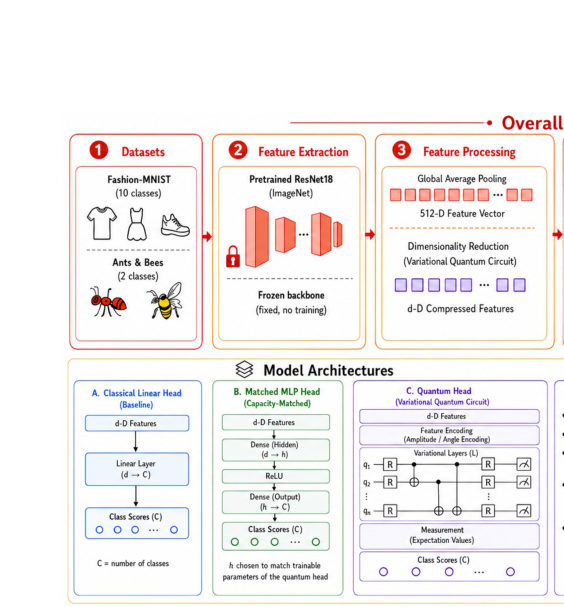 
Fig. 1: Overview of the proposed QSTAR methodology.

**Summary.** This paper introduces QSTAR, a selective framework for Quantum Transfer Learning that routes samples to a quantum circuit head only if the initial classical prediction is low-confidence. The results demonstrate that this targeted approach significantly boosts accuracy by leveraging quantum computation where it is most needed, suggesting quantum heads are best used as specialized fallback tools rather than general replacements.

**Why it may be interesting.** While focused on machine learning, the concept of selectively engaging complex physical models (like quantum circuits) only when classical methods fail or are uncertain mirrors concepts in open quantum systems where specific environmental coupling or measurement protocols are only applied under certain conditions.

Detailed structure

**Main problem.** The evaluation of Quantum Transfer Learning (QTL) often incorrectly assumes the quantum head replaces the classical classifier, obscuring when the quantum component is genuinely useful.

**Main result.** Selective routing, which only passes low-confidence samples to a quantum fallback branch, significantly improves performance over standard QTL methods and outperforms adaptive classical baselines.

**Method.** The authors propose QSTAR, a selective framework that uses sample confidence scores ($	au$) to route inputs: high-confidence data stays with the classical prediction, while uncertain data is passed to a parameterized quantum circuit head.

**Model / system.** The model utilizes a frozen ResNet18 backbone for feature extraction on Fashion-MNIST. The classification involves comparing linear classical heads, MLP fallbacks, and various architecture-searched quantum circuits (KetGPT-designed heads).

**Key observables.** Accuracy ($	ext{Acc.}$), F1-score, and the performance improvement of the quantum branch specifically on low-confidence samples.

**Important parameters / regimes.** The confidence threshold $	au$ used for adaptive routing; circuit parameters (e.g., 10 parameters, 9 gates) in ablation studies.

**Assumptions / limitations.** The primary assumption is that the utility of quantum heads is conditional on input uncertainty rather than being a universal replacement for classical methods.

**Figures summary.** Figure 1 illustrates the QSTAR methodology. Table I compares fixed-head transfer learning results, and Table II shows adaptive routing performance across different confidence thresholds ($	au$).

**Paper structure.** The paper introduces the limitation of standard QTL evaluation, proposes the selective QSTAR framework using adaptive routing based on sample confidence, presents quantitative comparisons against various baselines (classical/quantum heads), and concludes by arguing for the role of quantum circuits as targeted fallback mechanisms.

Abstract

Quantum transfer learning (QTL) is often evaluated by replacing a classical classifier with a fixed variational quantum head, but this hides a key question: when is the quantum branch actually useful? We propose QSTAR: Quantum Selective Transfer with Adaptive Routing, a selective QTL framework that keeps high-confidence classical predictions and routes only low-confidence samples to a fallback branch. Using a frozen ResNet18 backbone on Fashion-MNIST, we compare manually designed QTL heads, KetGPT-designed quantum heads, and parameter-matched classical baselines under a common data split and optimization schedule. Standard QTL heads reach at most 57.0% accuracy, while the strongest KetGPT head in the main filtered sweep reaches 78.5% accuracy and 0.785 F1-score. Although the strongest fixed classical head remains higher at 81.6%, selective routing gives the quantum branch a clearer role. On low-confidence samples, KetGPT #180 improves accuracy over a parameter-matched MLP fallback by 6.82, 4.31, and 3.03 percentage points at thresholds of 0.70, 0.80, and 0.90. At the full-system level, Adaptive KetGPT-QTL reaches 80.9% accuracy and 0.807 F1-score, outperforming the adaptive classical baseline. A separate compact-circuit ablation identifies KetGPT #160 as a stronger fixed-head candidate, reaching 81.9% accuracy with only 10 quantum parameters and 9 gates. These results suggest that architecture-searched quantum heads are most useful as targeted fallback branches for uncertain inputs rather than uniform replacements for classical classifiers.

[↑ back to top](#top)

### [Relational path integral, effective actions and quantum frame covariance](http://arxiv.org/abs/2607.21463v1)

**Authors:** Sergio E. Aguilar-Gutierrez, Renata Ferrero, Philipp A. Hoehn, Luca Marchetti  
**Type:** theory · **Category:** other · **PDF:** <https://arxiv.org/pdf/2607.21463v1>  
**Analysis basis:** full PDF text, analyzed in chunks
**Topic relevance:** `Keldysh / 2PI / non-Gaussian methods` **1/5**

📷 Fig 1

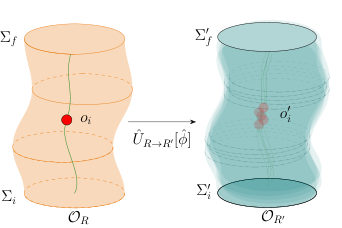 
FIG. 1. A sharply localized event oi (red) in a foliation between two Cauchy slices Σi,f in OR (left) corresponds to a ‘fuzzy’ (field-dependent) event o′ i in a ‘fuzzy’ foliation between sharp slices Σ′ i,f in OR′ (right).

📷 Fig 2

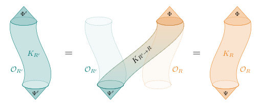 
FIG. 2. KR→R′ links transition amplitudes and inner prod- ucts in distinct frame perspectives [138].

📷 Fig 3

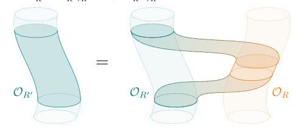 
FIG. 3. ‘Bending’ the evolution kernel from R′- to R- spacetime links distinct relational time evolutions [138]. Thus, frame change and evolution kernels are compatible.

📷 Fig 4

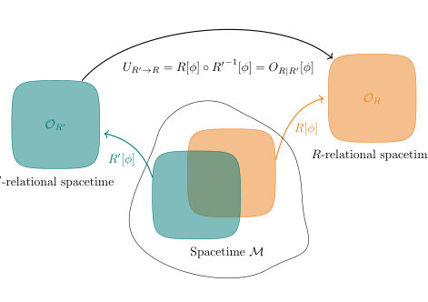 
FIG. 4. Changes of dynamical frame in gravity are field- dependent coordinate transformations from one relational spacetime to another and given by the relational observable OR|R′[ϕ] describing the new frame relative to the old one.

📷 Fig 5

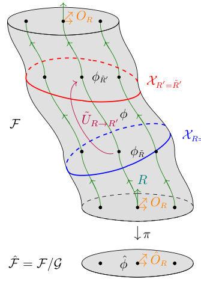 
FIG. 5. Pictorial summary of the field space bundle F underlying our construction of the relational path integral. Green curves depict the fibers, i.e. gauge orbits of the small diffeomorphism gauge group G. Field configurations ϕ ∈F correspond to the entire history of the dynamical fields on spacetime M. Field configurations in the base space of orbits ˆF are gauge equivalence classes of histories (entire fibers) and denoted by ˆϕ. Each atlas of frame fields (cf. App. D) defines a family of local sections X ˜ R (red and blue circles) in F, determined by fixing the frame fields R into orientation ˜R. Each such atlas also determines a horizontal connection, defining vertical (tangen- tial to...

**Summary.** This paper proposes a novel, gauge-invariant path integral formulation for quantum gravity by introducing Quantum Reference Frames (QRFs). By formulating physics using 'relational observables,' it achieves manifest gauge invariance without explicit gauge fixing. The key finding is that physical measurements become frame-dependent—localizing an event in one reference frame makes it appear 'fuzzy' when viewed from another.

**Why it may be interesting.** While focused on quantum gravity, the core concept of describing physical quantities relative to internal, dynamical reference frames (QRFs) shares conceptual parallels with developing gauge-invariant descriptions in open quantum systems or time evolution when the background geometry itself is fluctuating or ill-defined.

Detailed structure

**Main problem.** The primary goal is formulating a manifestly gauge-invariant path integral for quantum gravity that resolves issues arising from diffeomorphism invariance.

**Main result.** The authors propose a relational path integral formulation using Quantum Reference Frames (QRFs) which yields an anomaly-free, gauge-invariant description of gravity.

**Method.** They develop the formalism by constructing the path integral in terms of 'relational' or frame-dressed observables, bypassing explicit gauge fixing procedures.

**Model / system.** The system is Quantum Gravity, specifically addressing the gravitational path integral. The approach centers on defining physics relative to internal, dynamical reference frames (QRFs) rather than fixed background coordinates.

**Key observables.** Relational observables ($\hat{O}^A_R$), the relational effective action ($\Gamma_R$), and frame-change kernels ($K_{R 	o R'}$).

**Important parameters / regimes.** The formulation is characterized by its covariance under arbitrary QRF changes, leading to 'fuzziness' in local correlators when changing perspectives.

**Assumptions / limitations.** The construction proceeds at a non-perturbative level of quantum gravity, and while gauge invariance is achieved, the relationship between dynamics across different frames requires specialized kernels.

**Figures summary.** Figure 1 conceptually illustrates the difference between sharply localized events in one foliation versus 'fuzzy' (field-dependent) events when viewed from another QRF perspective.

**Paper structure.** The paper introduces the problem of gauge invariance in gravity, proposes the relational bundle-geometric formulation using QRFs and relational observables, derives the path integral structure, discusses the implications for vacuum states and correlators (fuzziness), and concludes by defining frame-dependent effective actions for renormalization.

Abstract

We propose a relational bundle-geometric formulation of the gravitational path integral by invoking the new tool of quantum reference frames (QRFs), which in gravity are gauge-covariant coordinate systems constructed from the available field content. Formulated in terms of relational (frame-dressed) observables, this yields a manifestly gauge-invariant path integral without ghosts and anomalies, and in which observables and their correlators are local to a frame. While eliminating the need for gauge fixing, it is equivalent to Faddeev-Popov versions in which the QRF is gauge-fixed, recovering certain previous proposals. A key feature is its covariance under QRF changes: it is a perspective-neutral path integral which encodes all internal QRF perspectives and the transformations between them. This leads to several qualitative predictions: local correlators and time evolution of relational observables in one QRF perspective become fuzzy in another, and a new spectrum of relational vacua arises. Comprised of frame-dependent no-boundary and asymptotic ground states, a vacuum from one perspective appears generally excited in another. Finally, we construct gauge-invariant, yet frame-dependent effective actions by coupling sources exclusively to relational observables, setting the stage for a relational definition of renormalization.

[↑ back to top](#top)

### [Representation of the causal logic for the Dirac system and the electron](http://arxiv.org/abs/2607.21266v1)

**Authors:** Domenico P. L. Castrigiano, Carmine De Rosa, Valter Moretti  
**Type:** theory · **Category:** other · **PDF:** <https://arxiv.org/pdf/2607.21266v1>  
**Analysis basis:** full PDF text, analyzed in chunks
**Topic relevance:** `quantum measurements` **1/5**

📷 Fig 1

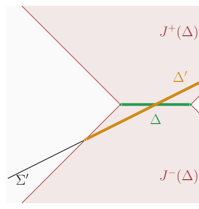 
Figure 1: The achronal region ∆⊂Σ and its region of influence ∆′ = Σ′ ∩(J+(∆) ∪ J−(∆)) on the causal base Σ′. Here J±(∆) := {x+z : x ∈∆, z nonspacelike , ±z0 ≥0}.

**Summary.** This paper develops a mathematically rigorous framework to define particle localization for the Dirac electron that strictly adheres to principles of relativistic causality. It constructs a covariant causal-logic representation by analyzing conserved probability currents and establishing connections between different mathematical definitions of localization. The work is significant for providing a consistent, projection-valued observable in relativistic quantum mechanics.

**Why it may be interesting.** While highly technical, the rigorous treatment of relativistic causality constraints on position measurement is fundamental to understanding quantum field theory observables beyond standard QFT formalism.

Detailed structure

**Main problem.** The central problem is constructing a covariant, causality-respecting localization observable for relativistic quantum particles like the Dirac electron.

**Main result.** The authors construct a Representation of the Causal Logic (RCL) that provides a projection-valued measure satisfying microscopic causality and correctly reproduces known results in specific limits.

**Method.** The methodology involves defining achronal localization via conserved probability currents, utilizing non-stationary phase arguments, and establishing mathematical correspondences between different types of localization operators (AL $\iff$ RCL).

**Model / system.** The primary system is the Dirac equation describing relativistic fermions (the electron), analyzed in both full spacetime regions and restricted to the positive-energy subspace. The underlying mathematics involves Lorentzian geometry and causal set theory.

**Key observables.** Covariant achronal localization operators ($T(\Delta)$ or $F(\Delta\wedge)$), the position operator, and the conserved Dirac probability current.

**Important parameters / regimes.** The high-boost limit (Lorentz contraction) and the structure of achronal regions ($\Lambda$) defined by Lipschitz continuity are key parameters analyzed.

**Assumptions / limitations.** The construction relies on extending measures from local intersections to full $\sigma$-additive extensions, assuming certain decay estimates hold for the probability current.

**Paper structure.** The paper builds logically by first defining the mathematical framework of achronal sets and their associated projection operators (using geometric measure theory), then applying this machinery to construct the covariant localization observable for the Dirac system, and finally analyzing its properties in various limits.

Abstract

We construct a covariant representation of the causal logic for the Dirac system and the electron, based on the conserved Dirac probability current and a general current-to-localization procedure for achronal regions. A polynomial decay estimate, derived by a non-stationary phase argument, verifies the conditions required to define covariant achronal localization for the full Dirac system. Extending this localization to complete spacetime regions yields the corresponding causal-logic representation; restriction to the positive-energy invariant subspace gives the analogous construction for the electron. We establish several structural properties. On Euclidean space, Dirac localization agrees with canonical projection-valued localization, while its position operator differs from the Newton--Wigner operator by an explicitly determined bounded self-adjoint correction. Full Dirac achronal localization is projection valued and represents achronal separateness by orthogonality, thus satisfying microscopic causality. After compression to the electron subspace, it becomes positive-operator valued while preserving causality. We further extend known results from spatial to general achronal regions, prove separation and norm-one criteria, and analyze the high-boost limit, obtaining Lorentz contraction in a precise probabilistic sense. Finally, we discuss the electron--positron decomposition and the state transformation induced by position measurements, showing that measurement-induced positron production is universal and independent of the specific measuring device.

[↑ back to top](#top)

### [Uni-XAS: Alignment-Driven Bidirectional Multimodal Learning for X-ray Absorption Spectroscopy](http://arxiv.org/abs/2607.20906v1)

**Authors:** Suyang Zhong, Yuhao Zhao, Boying Huang, Fanjie Xu, Pengwei Xu, Haoyi Tao, Xi Fang, Jun Cheng, Fujie Tang  
**Type:** both · **Category:** disordered systems and neural networks · **PDF:** <https://arxiv.org/pdf/2607.20906v1>  
**Analysis basis:** full PDF text, analyzed in chunks
**Topic relevance:** `methods for driven-dissipative` **1/5**

📷 Fig 1

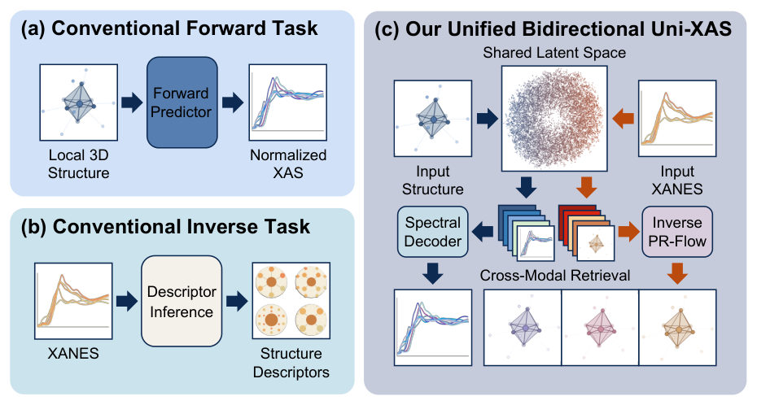 
Figure 1: Comparison of XAS modeling pipelines. (a) Forward surrogate prediction. (b) Descriptor-level inverse interpretation. (c) Uni-XAS establishes a shared latent interface supporting cross-modal retrieval, retrieval-augmented forward prediction, and conditional 3D local-structure generation.

📷 Fig 2

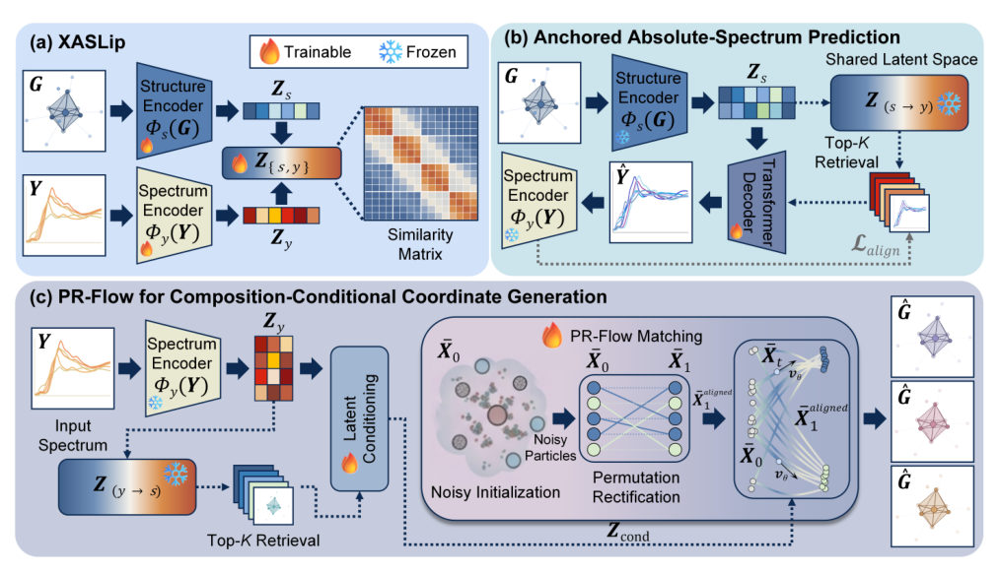 
Figure 2: Uni-XAS architecture based on a Shared Latent Space (Z). (a) XASLip Alignment: Encoders map 3D structures and 1D spectra to shared embeddings (Zs, Zy) via an absorber-aware objective. (b) Absolute-Spectrum Prediction: Query Zs retrieves spectral priors (Z) from the frozen space to augment decoding, regularized by a Latent Consistency Constraint (Lalign). (c) PR-Flow Inverse Generation: Type-wise optimal transport assigns initial noise (X0) to identical atoms to resolve permutation ambiguity. Flow trajectory (Xt) is optimized toward the aligned target (Xaligned 1 ) under retrieved structural conditioning.

📷 Fig 3

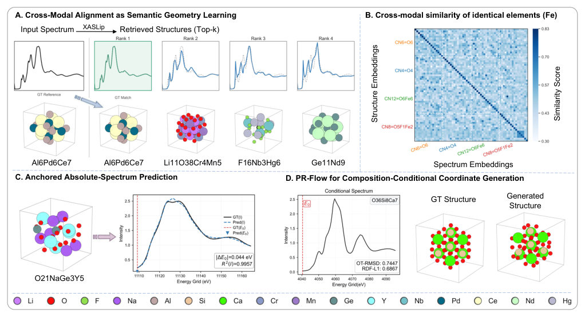 
Figure 3: Qualitative results of Uni-XAS. The shared latent space effectively aligns modalities to retrieve structurally consistent 3D geometries from spectral queries (A), and resolves distinct intra-element coordination numbers within the learned manifold (B). This unified interface enables accurate forward absolute-spectrum prediction (C) and high-fidelity inverse composition-conditional generation (D). Grey boxes denote absorber-centered local crops rather than periodic unit cells.

📷 Fig 4

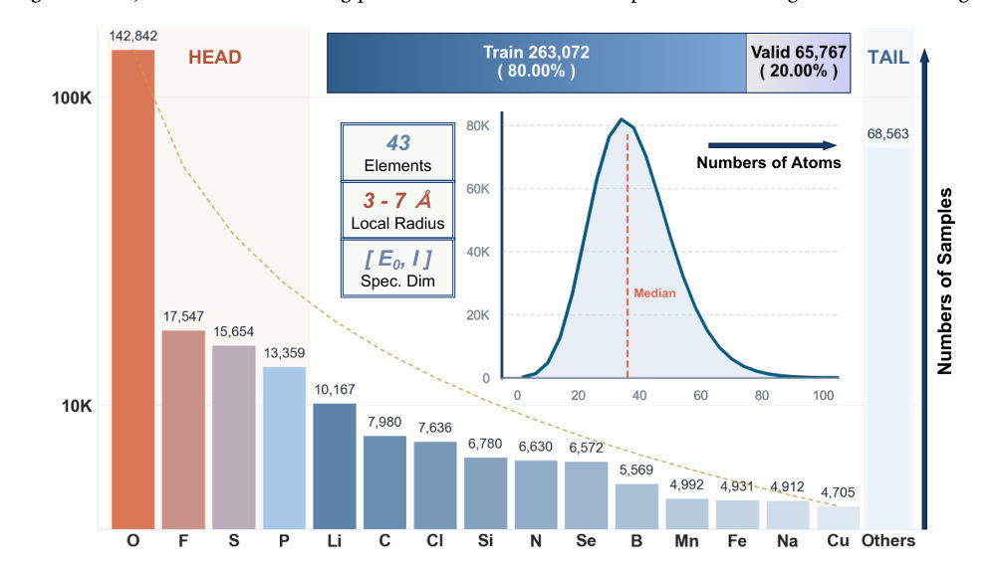 
Figure 4: Statistics of the curated paired benchmark, detailing overall dataset scale, absorber distribution, and local- graph-size variability.

📷 Fig 5

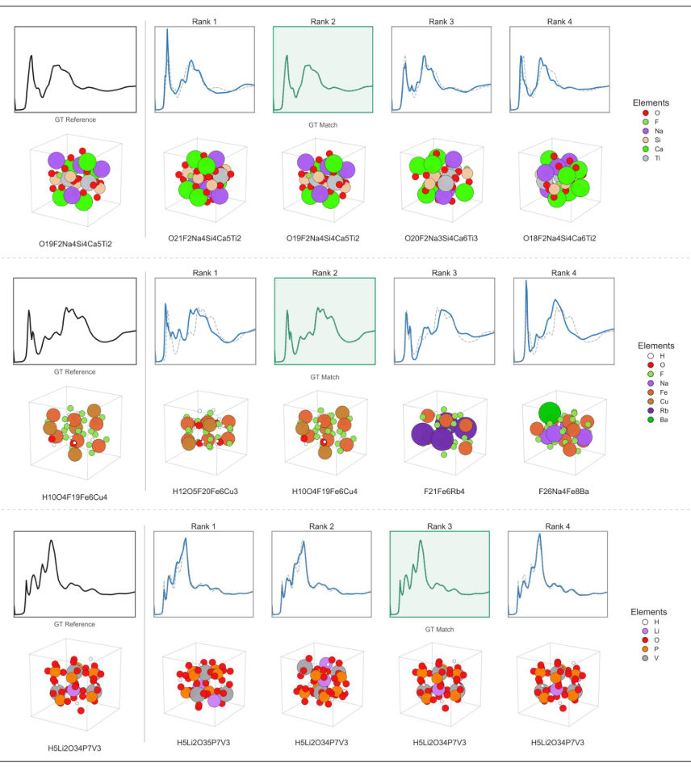 
Figure 5: Extended qualitative examples of spectrum-to-structure retrieval across diverse absorbing elements. For each case, the input is a query spectrum (top-left). The remaining panels in the top row show the spectra associated with the retrieved candidate structures, ranked by similarity in the latent space. The bottom row visualizes the corresponding local structures: the ground-truth structure of the query (bottom-left) and the retrieved candidate structures (right). Green bounding boxes indicate the correct match among the ranked results. Note that the spectra in the top row (except the query) are not model predictions, but are shown for visualization to illustrate...

**Summary.** This paper introduces Uni-XAS, a unified machine learning framework designed to solve the challenging bidirectional problem in X-ray Absorption Spectroscopy (XAS). It overcomes limitations of prior methods by treating spectral and structural inference as a single cross-modal alignment task. The resulting framework achieves state-of-the-art performance across retrieval, forward prediction, and inverse structure generation on a massive dataset.

**Why it may be interesting.** While focused on materials science spectroscopy, the methodology heavily relies on advanced deep learning techniques—such as generative flow matching, cross-modal alignment, and manifold optimization—which are highly relevant to developing ML models for complex physical systems beyond standard quantum computing paradigms.

Detailed structure

**Main problem.** The core challenge is developing a unified machine learning framework for X-ray Absorption Spectroscopy (XAS) that can consistently bridge the gap between heterogeneous 1D spectral data and 3D local atomic structures.

**Main result.** Uni-XAS establishes a scalable, reproducible benchmark demonstrating strong performance in cross-modal retrieval, accurate absolute-spectrum prediction, and composition-conditional 3D structure generation.

**Method.** The authors propose reframing the bidirectional problem as a cross-modal alignment and conditional generation task using specialized components like XASLip for alignment and Permutation-Rectified Flow Matching (PR-Flow) for inverse inference.

**Model / system.** The system is X-ray Absorption Spectroscopy (XAS), which probes local atomic environments by mapping between 3D local coordination geometries ($\mathbf{G}$) and continuous spectra ($\mathbf{Y}$).

**Key observables.** XAS spectra (1D continuous sequences) and explicit 3D coordinates defining local coordination geometry.

**Important parameters / regimes.** The framework utilizes a large-scale benchmark of 328,839 structure-spectrum pairs; key metrics include MAE in physical eV for energy anchors and OT-RMSD for structural fidelity.

**Assumptions / limitations.** Existing methods are limited by decoupling forward/inverse tasks or failing to resolve permutation ambiguity among identical atoms. The framework assumes a shared latent space can unify these modalities.

**Figures summary.** Figures illustrate the comparison between conventional decoupled pipelines and Uni-XAS's unified approach, showing how the shared latent interface supports retrieval, RAG forward prediction, and conditional 3D local-structure generation.

**Paper structure.** The paper introduces Uni-XAS as a framework, detailing XASLip for alignment, followed by formulations for anchored absolute-spectrum generation (forward) and Permutation-Rectified Flow Matching (inverse). It concludes with performance evaluation on the large benchmark.

Abstract

X-ray absorption spectroscopy (XAS) is a key technique for probing local atomic environments, yet learning based modeling must bridge two heterogeneous modalities: 1D continuous spectra and 3D atomic structures. Existing approaches typically decouple forward spectrum prediction and inverse structure inference into separate regression tasks, hindering shared representation learning. Moreover, severe permutation ambiguity among identical atoms often limits inverse modeling to coarse structure descriptors rather than explicit 3D structure generation. In this work, we present Uni-XAS, a unified benchmark and learning framework that reframes bidirectional XAS modeling as a cross-modal alignment and conditional generation problem. We first propose XASLip, an alignment recipe coupling a physics-aware spectral encoder with an absorberaware manifold optimization strategy to resolve fine-grained intra-element coordination variations. Building upon this shared latent space, we formulate forward prediction as anchored absolute-spectrum generation via retrieval-augmented decoding, effectively preventing physical scale collapse and energy drift. For the inherently ill-posed inverse problem, we introduce Permutation-Rectified Flow Matching, which integrates type-wise optimal transport into a continuous generative flow to provide a principled solution to ligand permutation ambiguity without relying on heavy high-order equivariant architectures. Evaluated on a largescale standardized benchmark of 328,839 structure-spectrum pairs, Uni-XAS demonstrates strong performance in cross-modal retrieval, accurate absolute-spectrum prediction, and composition-conditional 3D structure generation, establishing a scalable, reproducible, and protocol-consistent foundation for multimodal learning and standardized evaluation in scientific spectroscopy.

[↑ back to top](#top)

## Other papers (12)

*Papers from primary archives without highlighted authors or any topic match. Click to expand.*

Show other papers

### [Approximate Quantum State Preparation Through Proximal Policy Optimization](http://arxiv.org/abs/2607.21121v1)

**Authors:** Marco Mordacci, Michele Amoretti  
**Type:** both · **Category:** quantum information and computing · **PDF:** <https://arxiv.org/pdf/2607.21121v1>  
**Analysis basis:** full PDF text, analyzed in chunks

📷 Fig 1

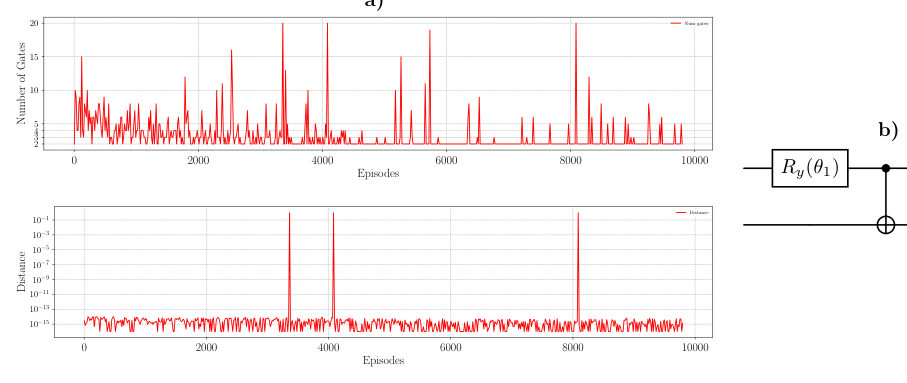 
Figure 1: (a) Number of gates and trace distance achieved during training for the Bell state. (b) Circuit learned by the agent to approximate the Bell state.

📷 Fig 2

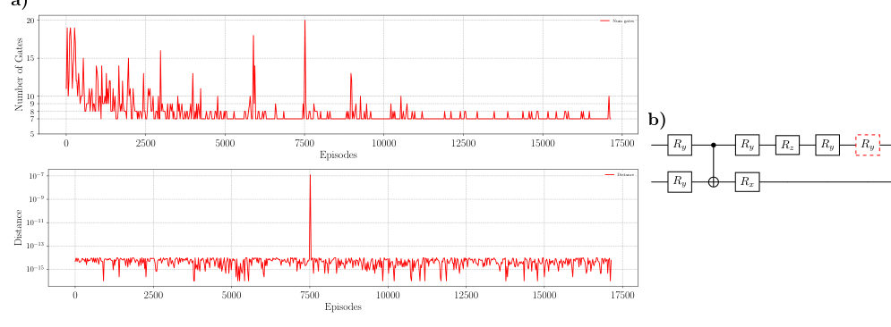 
Figure 2: a) Number of gates and trace distance achieved during the training for a random 2-qubit state. b) Circuit achieved by the agent to approximate a 2-qubit random state.

📷 Fig 3

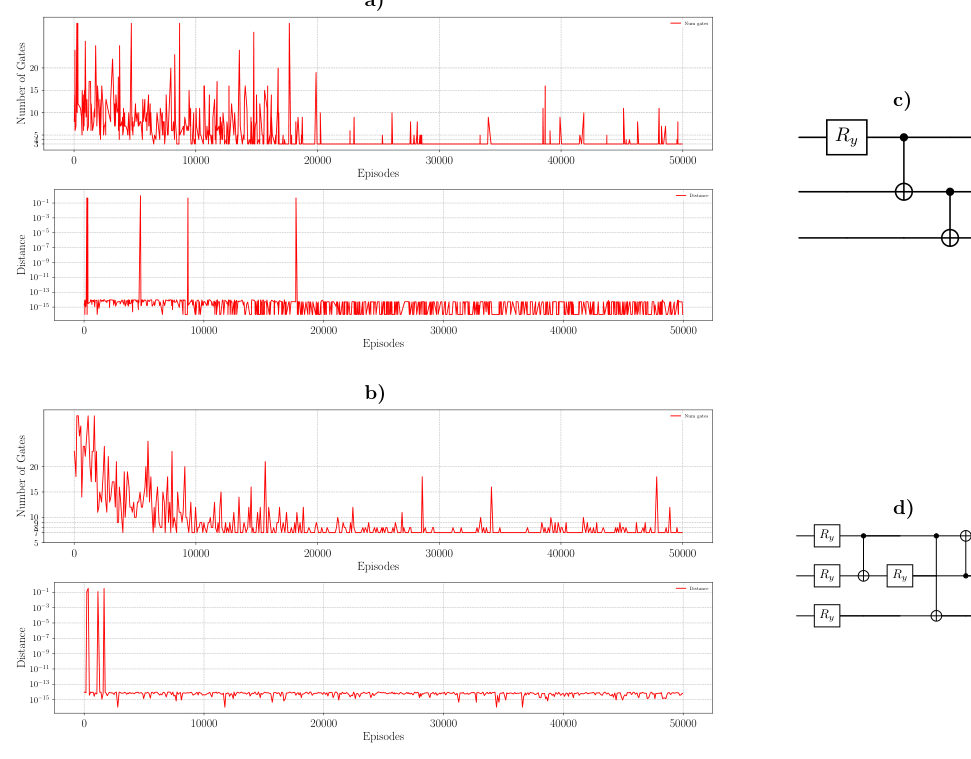 
Figure 3: Number of gates and trace distance achieved during the training for a) GHZ and b) W states. Furthermore, the circuits for c) GHZ and d) W states are presented.

📷 Fig 4

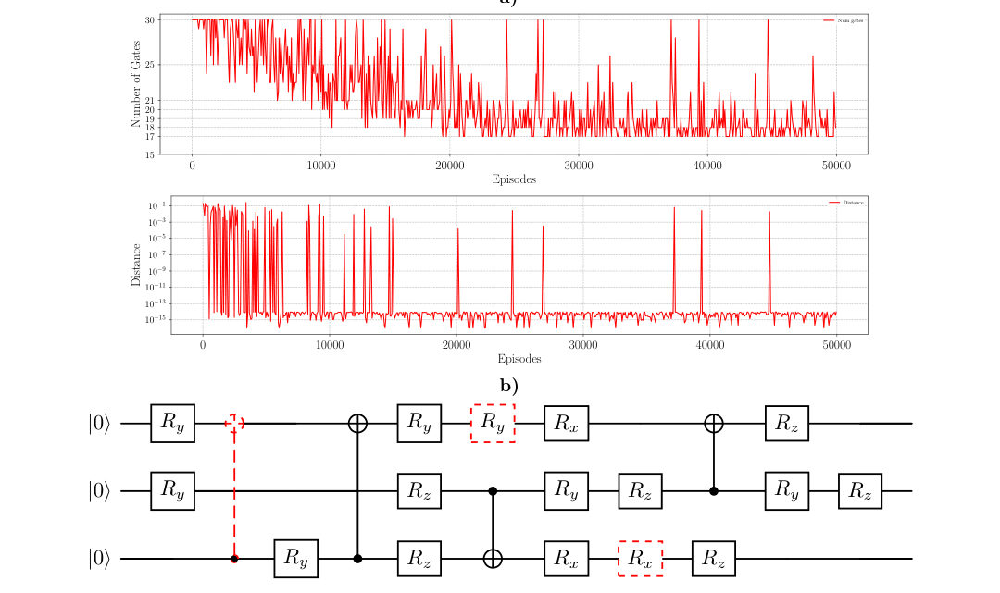 
Figure 4: a) Number of gates and trace distance achieved during the training for a 3-qubit random state. b) Circuit achieved by the agent to approximate a random 3-qubit state.

📷 Fig 5

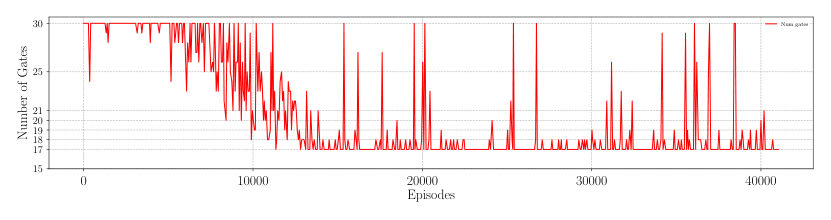 
Figure 5: Number of gates achieved during the training for a 3-qubit random state with λ = 1 and p = 5 × #AppendedGates.

**Summary.** The paper presents a novel deep reinforcement learning framework utilizing Proximal Policy Optimization (PPO) to solve the challenging problem of Approximate Quantum State Preparation (QSP). By treating circuit construction as an sequential decision-making process, the agent learns to append gates optimally to approximate target states with high fidelity. This demonstrates a powerful ML approach for quantum circuit design across multiple qubit counts.

**Why it may be interesting.** This work directly addresses quantum circuit synthesis, a crucial component of near-term quantum algorithm development. The application of advanced ML techniques like PPO to navigate exponentially large physical search spaces is highly relevant for designing complex quantum protocols.

Detailed structure

**Main problem.** The core challenge is Approximate Quantum State Preparation (QSP), which requires finding a quantum circuit to approximate a target state, a problem whose search space grows exponentially with the number of qubits.

**Main result.** The proposed framework successfully achieved high-fidelity approximations ($10^{-14}$) for various predefined and random states up to 5 qubits by optimizing circuit construction.

**Method.** Deep Reinforcement Learning (RL) using Proximal Policy Optimization (PPO) is employed. An agent iteratively appends gates to a Parameterized Quantum Circuit (PQC), guided by a custom logarithmic reward function that balances fidelity improvement and gate count minimization.

**Model / system.** The system involves $n$-qubit quantum circuits initialized at $|0
angle^{\otimes n}$. The action space includes single-qubit rotations ($R_x, R_y, R_z$) and CNOT gates. Performance is tested on 2 to 5 qubits.

**Key observables.** Fidelity $F(\psi, \phi)$ between the target state $\psi$ and the current state $\phi$, and the total number of gates used in the resulting circuit.

**Important parameters / regimes.** The required approximation error threshold is set to $10^{-14}$. Training involves hyperparameters like penalty factor $p=10$ and scaling coefficient $\lambda=10$.

**Assumptions / limitations.** The primary limitation noted is that performance degrades as the number of qubits increases due to the exponential search space growth, and the agent's action space might be incomplete (e.g., missing Hadamard gate).

**Figures summary.** Figures illustrate the training evolution (gates vs. distance) for Bell states and random 2-qubit states, alongside results comparing the number of gates required for GHZ and W states.

**Paper structure.** The paper introduces QSP as a hard problem, proposes using PPO/RL to solve it by sequentially building PQCs. It details the specific RL setup (reward function, action space), presents experimental results across 2-5 qubits for various target states, and concludes with performance analysis.

Abstract

In this work, a quantum architecture search framework for approximate quantum state preparation (QSP) is proposed. QSP is a challenging task, since the search space grows exponentially with the number of qubits, making the identification of the optimal circuit non-trivial. To address this problem, deep reinforcement learning is employed through an agent based on proximal policy optimization. The objective of the agent is to identify the best possible approximation of the target state while simultaneously minimizing the number of gates used. At each step, the agent appends a new gate to the circuit and recomputes the fidelity between the approximated state and the target states. Various experiments have been performed from 2 to 5 qubits. Both predefined states, such as Bell, GHZ, W, and Dicke states, and completely random states are considered. The proposed framework is able to achieve approximation errors of $10^{-14}$.

[↑ back to top](#top)

### [Cautious optimism for deep parameterized quantum circuits](http://arxiv.org/abs/2607.21409v1)

**Authors:** Marie Kempkes, Elies Gil-Fuster, Carlos Bravo-Prieto, Aroosa Ijaz, Alissa Wilms, Jens Eisert, Evert van Nieuwenburg, Vedran Dunjko  
**Type:** theory · **Category:** disordered systems and neural networks · **PDF:** <https://arxiv.org/pdf/2607.21409v1>  
**Analysis basis:** full PDF text, analyzed in chunks

📷 Fig 1

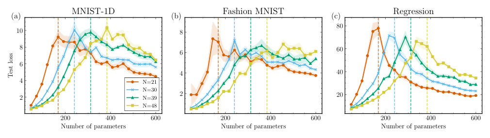 
Figure 1. Test loss as a function of the number of parameters p for (a) MNIST-1D and (b) Fashion MNIST classification, and (c) a multi- dimensional synthetic regression task, for different training set sizes N. Vertical dashed lines indicate the predicted interpolation thresholds p = NK. In all three tasks, the test loss peaks close to interpolation and decreases again in the overparameterized regime, displaying a characteristic double descent profile. The shaded areas correspond to the standard deviation for ten independent experiment repetitions, each using independently sampled training data.

**Summary.** This paper investigates the generalization capabilities of parameterized quantum circuits by analyzing their scaling behavior with model size. Using advanced random matrix theory and spectral analysis, the authors prove that these circuits can exhibit a double descent phenomenon. This suggests that increasing circuit depth/parameters does not automatically lead to performance degradation in practice.

**Why it may be interesting.** This work connects concepts from classical overparameterized neural networks (double descent) to quantum machine learning models, providing theoretical grounding for the utility of very large, complex quantum circuits.

Detailed structure

**Main problem.** The central challenge is understanding how the generalization performance of parameterized quantum circuits (PQCs) scales with an increasing number of trainable parameters.

**Main result.** The authors show that gradient-based PQCs can exhibit a double descent phenomenon, meaning their test error does not necessarily degrade as model size increases past the interpolation threshold.

**Method.** The analysis combines rigorous theoretical derivations using add-one-in perturbation techniques and spectral properties of random matrices to bound the expected risk. These bounds are then compared against numerical results.

**Model / system.** The study focuses on data re-uploading PQCs, where the quantum state $
ho(x; \vartheta)$ depends on input data $x$ and trainable parameters $\vartheta$. The performance is measured by minimizing an expected risk function.

**Key observables.** Expected risk ($L(\vartheta)$) vs. model size ($p$), test loss, and eigenvalues of sample covariance/Hessian matrices.

**Important parameters / regimes.** Number of trainable parameters ($p$), training set size ($N$), the ratio $p/N$, and the interpolation threshold ($p=NK$).

**Assumptions / limitations.** The analysis relies on asymptotic limits ($N, p 	o \infty$) and several technical assumptions regarding spectral properties (e.g., Assumptions 1-7) and local minima existence.

**Figures summary.** Numerical experiments consistently observe the predicted double descent behavior across multiple datasets, showing test loss peaking near the interpolation threshold ($p=NK$).

**Paper structure.** The paper develops theoretical lower and upper bounds on the expected risk using spectral analysis. It then demonstrates that these derived bounds exhibit a maximum at $p=N$ (or $p=NK$), confirming double descent behavior both theoretically and numerically.

Abstract

A central challenge in quantum machine learning is understanding the scaling behavior of parameterized quantum circuits (PQCs). In particular, it remains unclear how their performance on unseen data changes as the number of trainable parameters increases. Prior works have derived formal generalization guarantees for quantum models, but it is well-known that many such results do not fully characterize generalization behavior in practice. In this work, we show that gradient-based PQCs can exhibit improved performance on unseen data as model size increases, displaying the phenomenon of double descent. This contrasts with the traditional view that larger models lead to degraded generalization. We provide analytical results rigorously underpinning this behavior by leveraging add-one-in perturbation techniques and spectral properties of random matrices. We support these results with numerical experiments on re-uploading PQCs across several data sets and training set sizes, consistently observing the predicted double descent behavior. While other obstacles on the path toward practical quantum machine learning remain, our finding that deeper parameterized quantum circuits do not necessarily exhibit degraded performance provides reasons for cautious optimism.

[↑ back to top](#top)

### [Do emulated quantum circuits change what CNNs look at? Performance and explainability comparison in medical image classification](http://arxiv.org/abs/2607.21186v1)

**Authors:** Guillermo Rubiños Rodríguez, Martín Ottavianelli, Mateo Alonso, Gonzalo Blázquez Gil, Boris-Stephan Rauchmann, Pablo Díez-Valle, Sergio Altares-López  
**Type:** both · **Category:** quantum information and computing · **PDF:** <https://arxiv.org/pdf/2607.21186v1>  
**Analysis basis:** full PDF text, analyzed in chunks

📷 Fig 1

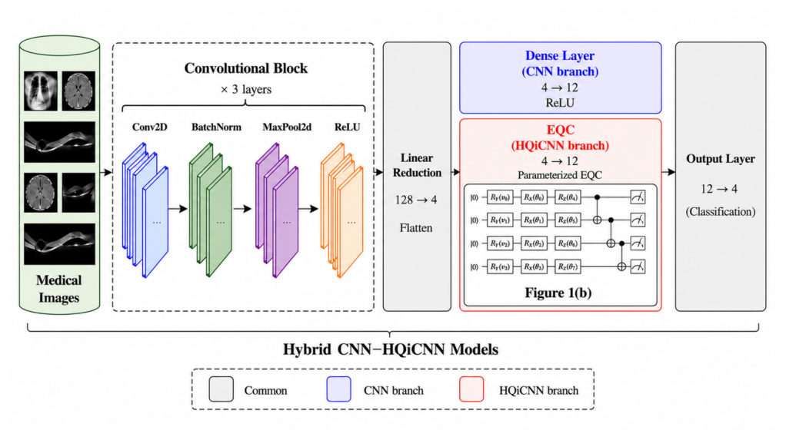 
Figure 1. Schematic representation of the model to compare. Both share a common architecture and only differ in the layer right before the output. The HQiCNN uses a preprocessing scaled sigmoid transformation to map the input data into the quantum circuit. (b) Parameterized EQC used within the HQiCNN algorithm.

📷 Fig 2

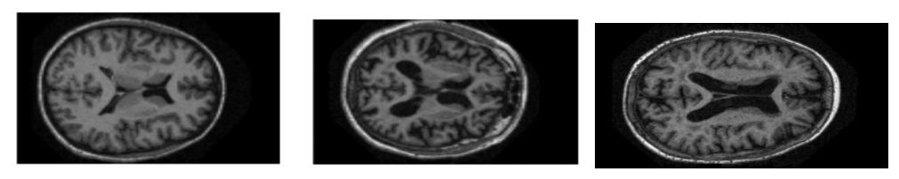 
Figure 2. Class samples of the considered datasets. Sub-figures a, b,c and d correspond to the retinal OCT images28. Sub-figures e, f and g correspond to the OASIS-1 Dementia dataset16.

📷 Fig 3

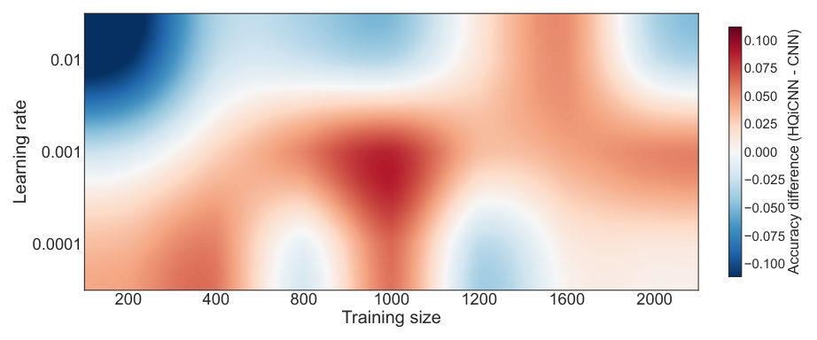 
Figure 3. Mean test accuracy across ten different seeds with for the CNN and HQiCNN models exploring different learning rates and training sizes. The read areas indicate a better mean accuracy performance of HQiCNN model, while the blue area indicate that the CNN outperforms the hybrid model. The used metric values are discretized, however interpolation is used to make the figure smoother.

📷 Fig 4

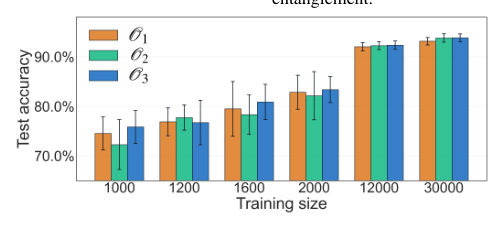 
Figure 4. Batch size and quantum properties comparisons for the OCT dataset. In subfigures 4a and 4b, the black horizontal lines of the box plots represent the median, the box covers from the first to the third quartile and the whiskers represent the maximum and minimum points within a 1.5×IQR from the quartiles.

📷 Fig 5

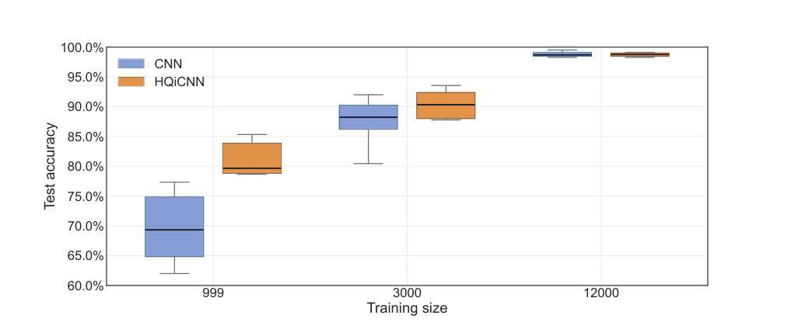 
Figure 5. Accuracy comparison between the HQiCNN and CNN models for the dementia dataset (See Section 4.1). Each model uses the best learning rate found for the most comparable training size in Table 2. We remark that the use of a training size of 999 is cause by ensuring a balanced dataset within the 3 classes. The black horizontal lines of the box plots represent the median, the box covers from the first to the third quartile and the whiskers represent the maximum and minimum points within a 1.5×IQR from the quartiles.

**Summary.** This work compares hybrid quantum-inspired CNNs (HQiCNN) against standard CNNs for medical image classification using emulated quantum circuits. The study finds that performance depends heavily on data availability and hyperparameters, demonstrating that both models can achieve high accuracy while providing comparable, anatomically plausible explanations of their predictions.

**Why it may be interesting.** It provides a rigorous benchmark for quantum-inspired machine learning models by comparing them against classical baselines under controlled conditions, addressing the question of genuine quantum advantage in practical AI tasks.

Detailed structure

**Main problem.** The study investigates whether small, classically-emulated quantum circuit components can meaningfully enhance complex deep learning models for medical image classification compared to purely classical architectures.

**Main result.** No single architecture consistently dominates; HQiCNN shows gains in intermediate data regimes, while CNN excels with large datasets. Both methods prove capable of attending to anatomically plausible regions.

**Method.** A systematic comparison was conducted between a Hybrid Quantum-inspired CNN (HQiCNN) and a classical CNN by varying hyperparameters like dataset size, entanglement, and observable sets.

**Model / system.** The model uses an emulated quantum circuit component (EQC) with four qubits, parameterized by rotations ($R_X, R_Y, R_Z$) and CNOT gates, which replaces a dense layer in the CNN backbone. This approach avoids physical hardware limitations.

**Key observables.** $|SHAP|$IoU and $EMD_{pos}$ metrics are used to quantify the spatial overlap and similarity of model attention maps across different architectures and data regimes.

**Important parameters / regimes.** Training set size (1000 vs. 30,000 samples), learning rate ($10^{-2}$ to $10^{-4}$), circuit entanglement status, and observable sets ($	ext{O}1, 	ext{O}2, 	ext{O}3$).

**Assumptions / limitations.** The quantum component is simulated using native PyTorch functions; the analysis relies on comparing performance under controlled hyperparameter variations.

**Figures summary.** Figure 6 compares explainability plots ($|SHAP|$IoU) for OCT data across different training sizes, showing consistent attention regions. Figure 6b relates image count to $EMD_{pos}$, demonstrating convergence of explanations with more data.

**Paper structure.** The paper systematically introduces the HQiCNN vs. CNN comparison, details the model architecture and hyperparameter search space (Table 1), presents results on performance across varying datasets/hyperparameters, and concludes with an explainability analysis using SHAP metrics.

Abstract

Numerous studies have analyzed the use of hybrid quantum-classical convolutional neural networks as a promising alternative to classical deep learning. However, network components on quantum hardware impose fundamental limitations, while the scalability of quantum circuits leads to trainability issues. In this work, we investigate whether small, classically-emulated quantum circuit components can play a meaningful role within complex models, offering an alternative to purely classical convolutional architectures. To this end, we present a systematic study of the effectiveness of a Hybrid Quantum-inspired Convolutional Neural Network (HQiCNN) compared with a parameter-matched classical Convolutional Neural Network (CNN) that differs only in an intermediate dense neural layer. Both models are evaluated on two real-world medical datasets while systematically varying the different hyperparameters, ensuring a fair model comparison that is both dataset and hyperparameter independent. The results show that no architecture consistently dominates the other: the HQiCNN achieves its largest gains in intermediate-data regimes, whereas the CNN reaches the highest accuracies for the largest training sets in both datasets. Furthermore, removing entanglement produces comparable performance while enabling substantially better scalability of quantum simulations, and richer observable sets become beneficial only when sufficient training data are available. Finally, we propose two SHAP-based explainability tools for comparing the predictions between both models, $|SHAP|$IoU and $EMD_{pos}$ metric, to demonstrate that both architectures consistently attend to anatomically plausible regions. Thus, we provide a comprehensive benchmark showing that, under certain conditions, hybrid quantum-inspired models are an alternative that can offer benefits in practical tasks such as medical image classification.

[↑ back to top](#top)

### [Efficient classical simulation of large-scale unitary cluster Jastrow circuits](http://arxiv.org/abs/2607.21337v1)

**Authors:** Hrishikesh Belagali, Thomas Van Camp, R. Pradeep, Sourin Das, Namit Anand, Ryan LaRose  
**Type:** theory · **Category:** numerical methods · **PDF:** <https://arxiv.org/pdf/2607.21337v1>  
**Analysis basis:** full PDF text, analyzed in chunks

📷 Fig 1

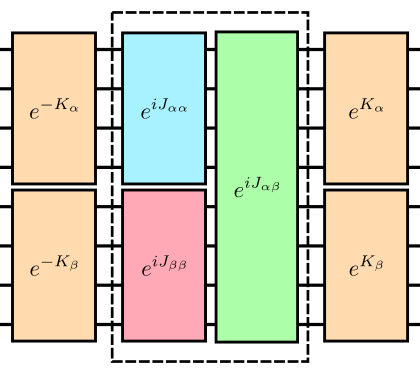 
FIG. 1. Structure of the unitary cluster Jastrow (UCJ) ansatz (3) for L = 1 layer. The top qubit lines are α spins and the bottom qubit lines are β spins. The orange boxes can be implemented with O(N 2) Givens rotations where N = No + Nv is the sum of occupied and virtual orbitals. These operators do not change between the UCJ and local UCJ ansatz. In the local UCJ (LUCJ) ansatz, sparsity is im- posed on the Jastrow J = Jαα+Jββ+Jαβ operators (blue, red, and green operators in the dashed box) by removing interac- tions which are not supported on a given quantum computer.

📷 Fig 2

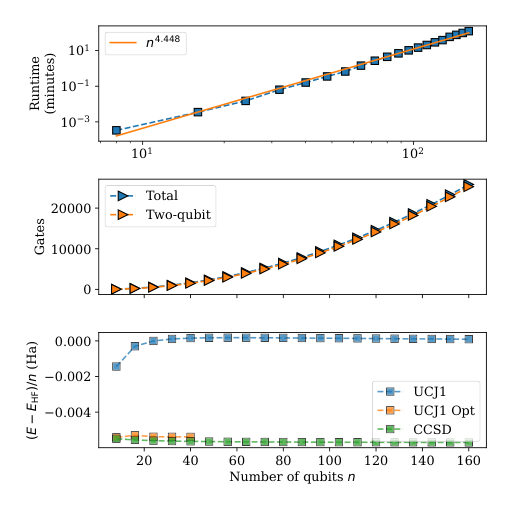 
FIG. 2. Algorithm runtime, circuit statistics, and energies for simulating the single-layer UCJ (UCJ1) ansatz for Hydrogen chains up to 80 atoms (160 qubits). For visualization, we sub- tract the HF energy and normalize by the number of qubits n. As can be seen, the UCJ1 ansatz, initialized from CCSD parameters, closely follows Hartree-Fock energies. The max- imum difference (in magnitude) between HF and UCJ1 is 16 mHa, and the average difference (in magnitude) is 12 mHa with a standard deviation of 5 mHa. We also optimize the parameters of the UCJ1 ansatz up to 40 qubits and obtain comparable energies to CCSD.

📷 Fig 3

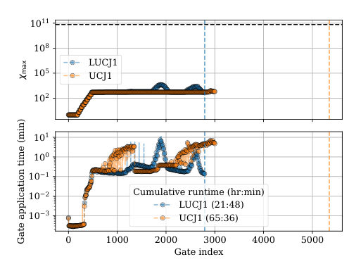 
FIG. 5. Analysis of MPS TEBD for the n = 72 qubit iron sulfur LUCJ1 and UCJ1 circuits. The top plot shows the maximum bond dimension and the bottom plot shows the gate application time vs gate index. Dashed vertical lines represent the final gate index for each circuit. The horizontal dashed black line in the top plot shows the maximum possible bond dimension of 2n/2.

📷 Fig 4

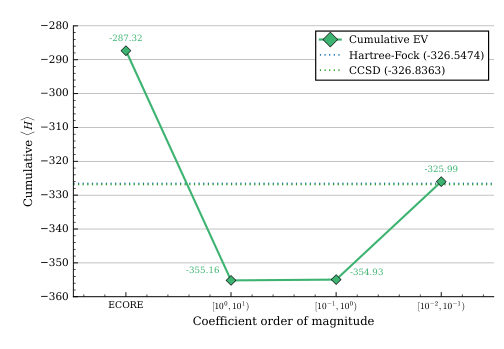 
FIG. 3. Cumulative energy of Majorana propagation for the n = 72 qubit iron sulfur cluster Hamiltonian of [18] through a 1 layer LUCJ ansatz with heavy-hex connectivity. Here, en- ergy is computed by Majorana backpropagation with a cutoff of 10−6 for terms partitioned by coefficient magnitude (see Fig. 4). The final cumulative energy is not yet converged, and over 500 mHa from the Hartree-Fock energy, demonstrating the challenge of this approach. More accurate simulations (larger cutoffs) are prohibitively expensive, as the number of terms grows exponentially with the number of gates in the circuit, and truncation is used as a heuristic.

📷 Fig 5

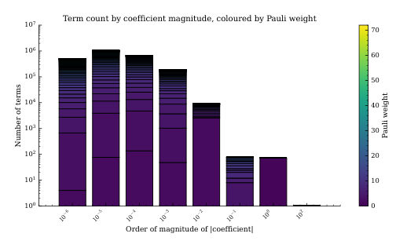 
FIG. 4. Partitioning of the 72 qubit iron sulfur cluster Hamil- tonian from [18], showing the number of terms in the Hamil- tonian vs coefficient magnitude, colored by Pauli weight.

**Summary.** This paper introduces a novel polynomial-time classical algorithm for calculating the ground state energy of unitary cluster Jastrow (UCJ) circuits. By efficiently propagating fermionic integrals through unitary transformations, it achieves results comparable to or better than current large-scale quantum hardware experiments. This provides a crucial theoretical benchmark for simulating strongly correlated molecular systems.

**Why it may be interesting.** This work provides a powerful classical benchmark tool that bypasses hardware limitations by offering an exact, scalable method to evaluate complex quantum chemistry circuits used in AMO physics simulations.

Detailed structure

**Main problem.** The primary goal is developing an efficient, polynomial-time classical algorithm to compute the energy of single-layer unitary cluster Jastrow (UCJ) circuits.

**Main result.** The authors presented a method that can simulate large-scale UCJ experiments in minutes on standard hardware and achieved lower ground state energies than previously reported quantum simulations.

**Method.** The algorithm uses Heisenberg evolution of the second-quantized Hamiltonian, propagating one-body and two-body integrals through unitary transformations using techniques derived from Löwdin's formula.

**Model / system.** The work focuses on simulating electronic structure in chemistry using the Unitary Cluster Jastrow (UCJ) ansatz, which is a quantum circuit inspired by coupled cluster methods for strongly correlated molecules.

**Key observables.** Ground state energy ($E_{	ext{UCJ}}$), compared against Hartree-Fock and CCSD results.

**Important parameters / regimes.** Number of orbitals ($N$), number of qubits (up to 160 in testing).

**Assumptions / limitations.** The algorithm computes only the expectation value (weak simulation) and is limited to single layers ($L=1$) due to complexity issues with higher layers.

**Figures summary.** Figure 2 plots runtime scaling for Hydrogen chains; Figure 3 compares cumulative energy from different propagation methods against approximation levels.

**Paper structure.** The paper develops mathematical machinery to exactly update one- and two-body integrals under unitary evolution, culminating in a polynomial-time algorithm for the single-layer UCJ energy calculation.

Abstract

Recent experiments on quantum computers have challenged the limits of classical computation in chemistry, simulating ground states of strongly correlated molecules. Many of these experiments have utilized the unitary cluster Jastrow ansatz, a quantum circuit inspired by the unitary coupled cluster ansatz that can be tailored to current quantum hardware. Notably, the largest experiment in Sci. Adv. 11, 25 (2025) executed a quantum circuit with 77 qubits and 10,570 gates on an IBM quantum computer and performed classical post-processing with up to 6400 nodes on Fugaku to compute ground state energies better than Hartree-Fock. In this work, we present a polynomial time classical algorithm to compute the energy of any single-layer unitary cluster Jastrow circuit, independent of locality constraints for quantum hardware. Our algorithm can reproduce the largest experiment from Sci. Adv. 11, 25 (2025) in less than a minute on a laptop, and through circuit optimization enabled by fast simulation we achieve a lower ground state energy than the experiment.

[↑ back to top](#top)

### [Fault-tolerant quantum algorithms for simulating atomic nuclei](http://arxiv.org/abs/2607.21563v1)

**Authors:** James Benstead, Michael Garn, Neil Gaspar, Sean Greenaway, Angus Kan, Lloyd La Ronde, Chandan Sarma, Paul Stevenson  
**Type:** theory · **Category:** quantum information and computing · **PDF:** <https://arxiv.org/pdf/2607.21563v1>  
**Analysis basis:** full PDF text, analyzed in chunks

📷 Fig 1

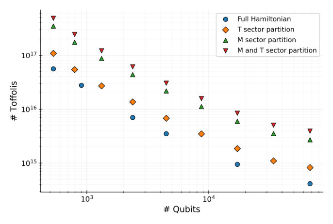 
FIG. 1: Quantum resource estimates for applying quantum phase estimation to the no-core shell-model Hamiltonian explored in Sec. III B. Each set of data corresponds to a partitioning strategy, with the blue circles corresponding to the full Hamiltonian with no partitioning into symmetry sectors, the orange diamonds corresponding to a partitioning into sectors with different isospin quantum numbers, the green triangles corresponding to partitioning into sectors with different total angular momentum projection quantum numbers and the red inverted triangles corresponding to a partitioning by both isospin projection and total angular momentum quantum numbers. The variation in Toffoli...

**Summary.** This paper develops and analyzes fault-tolerant quantum algorithms designed to simulate the complex Hamiltonians governing atomic nuclei. By providing resource estimates for both effective shell-model and no-core models, it establishes a crucial benchmark for applying quantum computing to nuclear physics. The research highlights the computational challenges specific to nuclear interactions compared to electronic structure problems.

**Why it may be interesting.** This work directly addresses the feasibility frontier of applying quantum computation to fundamental physics problems outside chemistry, offering concrete benchmarks that guide future hardware development for nuclear structure theory.

Detailed structure

**Main problem.** To develop concrete applications for fault-tolerant quantum computers by simulating the complex structure of atomic nuclei.

**Main result.** The authors provide resource estimates for simulating nuclear Hamiltonians using both effective shell-model and no-core-shell-model approaches, noting that while some benchmarks are comparable to chemistry simulations, the full no-core model requires significantly higher resources.

**Method.** They construct quantum algorithms based on Quantum Phase Estimation (QPE) tailored for fermionic systems, utilizing techniques like Jordan-Wigner transformations and circuit optimization to estimate resource costs in terms of Toffoli gates and qubits.

**Model / system.** The system is the atomic nucleus, modeled by Hamiltonians derived from chiral effective field theory. These Hamiltonians include one-, two-, and three-body interactions, which are more complex than those typically used for electronic structure problems.

**Key observables.** Ground state energy estimation, quantum resource estimates (Toffoli gate count, qubit counts), and nuclear structure properties.

**Important parameters / regimes.** The complexity scales with the number of particles and orbitals; specific parameters include $e_{\max} = 8$, $e_{2\max} = 16$, and $e_{3\max} = 8$ for EFT interactions.

**Assumptions / limitations.** They assume that quantum resource estimation is the primary goal, and they compare results across different Hamiltonian formulations (phenomenological vs. no-core).

**Figures summary.** Figure 1 compares resource estimates for simulating the full Hamiltonian versus partitioning it by symmetry sectors ($T_z$ or $M$), showing that sector-wise simulation leads to redundancy and increased cost for no-core models.

**Paper structure.** The work progresses from establishing the need for new applications beyond chemistry, detailing the construction of quantum algorithms (QPE) for nuclear Hamiltonians, providing resource estimates for specific nuclei ($^{32}	ext{Mg}$, $^{219}	ext{At}$), and finally analyzing the efficiency of Hamiltonian decomposition strategies.

Abstract

To maximize the value of fault-tolerant quantum computers, it is essential to develop concrete applications beyond well-established domains such as chemistry and condensed-matter physics. Here we construct and compile quantum algorithms to simulate the structure of atomic nuclei -- a topic that has received relatively little attention from the quantum computing community despite its similarities to the electronic structure problem in chemistry -- via effective shell-model Hamiltonians and no-core-shell-model Hamiltonians with three-body interactions derived from chiral effective field theory. Furthermore, we provide quantum resource estimates, in terms of Toffoli gate and qubit counts, for these algorithms, which, to our knowledge, are the first such estimates for fault-tolerant quantum simulation of atomic nuclei. Notably, the estimates for $^{32}$Mg and $^{219}$At shell-model Hamiltonians are comparable to recent estimates of Femoco simulations, a standard benchmark in chemistry. For no-core-shell-model Hamiltonians suitable for light nuclei (up to $^{40}$Ca or so), we find that resource requirements are significantly higher, suggesting that more bespoke strategies are required to make such simulations practicable. Throughout this work, we draw upon the similarities between nuclear and electronic structure problems, while also highlighting challenges that are specific to the former. We hope this work will spur long-term collaborations between the nuclear and quantum computing community with the ultimate goal of realizing useful nuclear simulations on quantum computers.

[↑ back to top](#top)

### [Finite Key Underwater Quantum Key Distribution: Performance Analysis and Improvements](http://arxiv.org/abs/2607.20664v1)

**Authors:** Trevor Thomas, Michael Warnock, Sarah Previte, Benjamin Drozdenko, Walter O. Krawec  
**Type:** theory · **Category:** quantum information and computing · **PDF:** <https://arxiv.org/pdf/2607.20664v1>  
**Analysis basis:** full PDF text, analyzed in chunks

📷 Fig 1

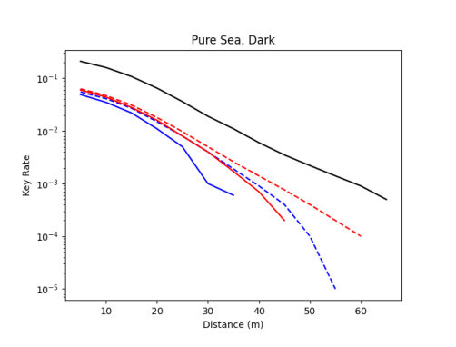 
Fig. 1. Comparing the key-rate of the three (Blue) and the two (Red) decoy state BB84 protocol, for N = 107 rounds (Solid) and N = 108 rounds (Dashed) Here we assume near ideal detector efficiency of 0.9, pure sea water α = 0.043, and low ambient light E0 = 10−3. We note that two decoy outperforms three decoy in this scenario. Black: Asymptotic upper bound.

📷 Fig 2

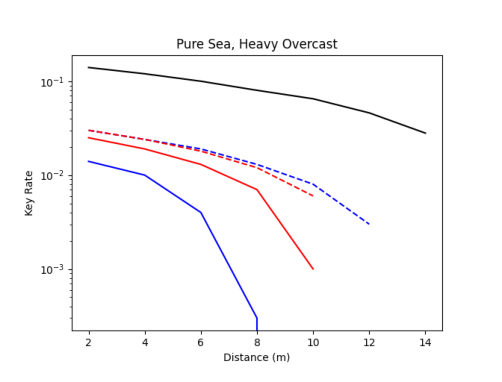 
Fig. 2. Comparing the key-rate of the three (Blue) and the two (Red) decoy state BB84 protocol, for N = 107 rounds (Solid) and N = 108 rounds (Dashed) Here we assume near ideal detector efficiency of 0.9, pure sea water α = 0.043, and heavy overcast, with the sun at the horizon E0 = 10. We note that at N = 108 signals, three decoy outperforms slightly the two decoy protocol.

📷 Fig 3

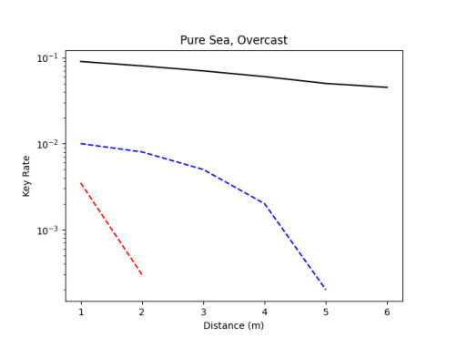 
Fig. 3. Comparing the key-rate of the three (Blue) and the two (Red) decoy state BB84 protocol for N = 108 rounds (Dashed) Here we assume near ideal detector efficiency of 0.9, pure sea water α = 0.043, and lighter overcast E0 = 20. We note that, here, the three decoy state always outperforms, though distances are severely limited. We also note that N = 107 rounds did not produce a positive key-rate for either protocol.

📷 Fig 4

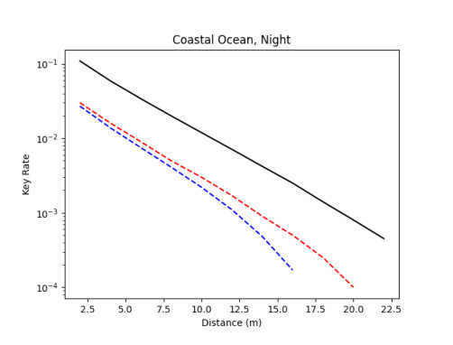 
Fig. 4. Comparing the key-rate of the three (Blue) and the two (Red) decoy state BB84 protocol for N = 108 rounds (Dashed) Here we assume near ideal detector efficiency of 0.9, coastal ocean water α = 0.398, and night E0 = 10−3. We note that, here, again, the two decoy state protocol outperforms. We also note that N = 107 rounds did not produce a positive key-rate for either protocol.

📷 Fig 5

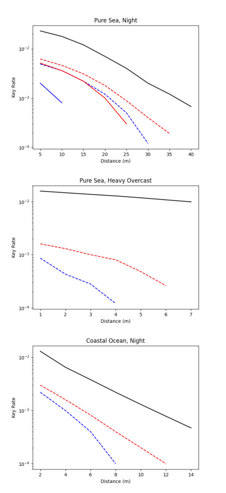 
Fig. 5. Comparing the key-rate of the three (Blue) and the two (Red) decoy state BB84 protocol, for N = 107 rounds (Solid) and N = 108 rounds (Dashed) Here we assume low detector efficiency of 0.1. As expected, detector efficiency can greatly reduce maximal distances, even at night in ideal water.

**Summary.** This paper provides a detailed theoretical analysis of Quantum Key Distribution (QKD) performance when transmitting keys underwater. It simulates the finite key regime, accounting for realistic noise sources like ambient light and water attenuation. The study demonstrates that post-processing techniques like Classical Advantage Distillation can significantly boost achievable distances in noisy underwater environments.

**Why it may be interesting.** This work directly addresses quantum communication in complex, noisy media (underwater), which is a major open problem in quantum networking and requires advanced understanding of channel capacity estimation beyond simple loss models.

Detailed structure

**Main problem.** The paper evaluates Quantum Key Distribution (QKD) performance over realistic underwater channels, moving beyond asymptotic bounds to consider the finite key regime.

**Main result.** Classical Advantage Distillation (CAD) can significantly improve the maximal supported distance for QKD underwater when ambient light noise is high, although protocol choice and detector efficiency are critical factors.

**Method.** The authors simulate two decoy state protocols in a finite key setting, incorporating detailed models for signal attenuation loss and background noise specific to underwater environments.

**Model / system.** The system modeled is quantum communication through an underwater channel using weak coherent sources. The model incorporates Poisson photon statistics, detector imperfections (dark counts, efficiency), and environmental factors like water type and ambient light.

**Key observables.** Secret key establishment rate ($\ell$ / total signals sent) and the maximal supported distance under various noise conditions.

**Important parameters / regimes.** Attenuation coefficient ($\alpha$), background irradiance ($E_0$), detector efficiency ($\eta$), and the CAD block size ($C$).

**Assumptions / limitations.** The analysis assumes a weak coherent source, relies on specific mathematical models for attenuation (e.g., exponential decay), and treats post-processing steps like error correction and privacy amplification.

**Figures summary.** Figures compare key rates using decoy state BB84 protocols with and without CAD under varying environmental conditions; Tables summarize the maximal asymptotic distance based on detector efficiency, light level, and CAD block settings for different water types.

**Paper structure.** The paper progresses by first detailing the physical models for signal attenuation loss over distance, then modeling background noise sources. It culminates in evaluating the protocol performance using finite key derivations, specifically analyzing the benefit of Classical Advantage Distillation (CAD) under varying environmental parameters.

Abstract

Quantum key distribution (QKD) allows for the establishment of a secret key between two parties, secure against computationally unbounded adversaries. Most experimental and theoretical research in this area, investigates the performance of QKD over fiber or free space channels. A growing body of work, however, has begun to investigate its performance in underwater scenarios. Here, we consider the realistic finite key scenario, and evaluate the simulated performance of two different decoy state protocols. We show that there are certain underwater channels where "simpler" QKD protocols outperform more complex ones. Finally, we also investigate methods to improve QKD performance underwater, specifically looking at classical advantage distillation, which we show can greatly improve the maximal distance supported by QKD underwater.

[↑ back to top](#top)

### [Hardness and Complexity Transition of Noisy Random Circuit Sampling](http://arxiv.org/abs/2607.20804v1)

**Authors:** Byeongseon Go, Changhun Oh, Hyunseok Jeong  
**Type:** theory · **Category:** quantum information and computing · **PDF:** <https://arxiv.org/pdf/2607.20804v1>  
**Analysis basis:** full PDF text, analyzed in chunks

📷 Fig 1

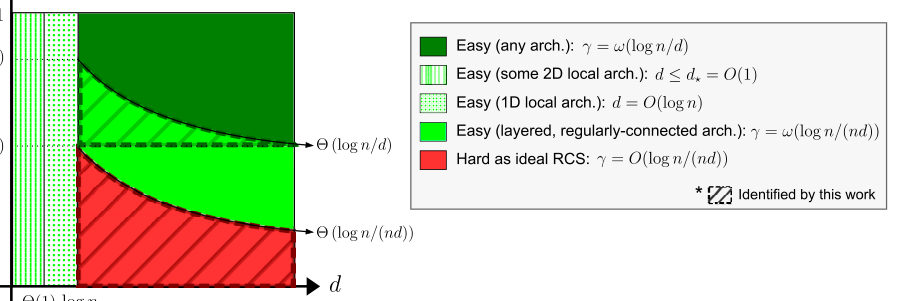 
FIG. 1. Complexity phase diagram for simulating (sampling) noisy RCS under i.i.d. depolarizing noise (Definition 5) within inverse-polynomial TVD. The horizontal axis denotes the circuit depth d, and the vertical axis denotes the depolarizing noise strength γ in Definition 5. Colored regions indicate parameter regimes where, for certain circuit architectures, classical simulation is either known to be efficient or provably hard under the hardness conjecture for ideal RCS (Conjecture 1). The dark green region is implied by Refs. [12, 13, 34–36]. The hatched and dotted regions are obtained from known shallow-depth simulability results for RCS: Refs. [37–39] for some local 2D architectures, and...

📷 Fig 2

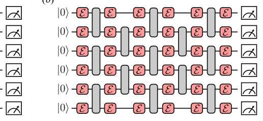 
FIG. 2. Schematics of our RCS settings. (a) Schematic of ideal RCS. The gray boxes denote Haar-random gates, so that the overall circuit is drawn from the ensemble HA in Definition 4. The input |0n⟩is evolved by a random circuit C ∼HA and measured in the computational basis, yielding an output x ∈{0, 1}n distributed according to p(C, x) in Eq. (6). (b) Schematic of noisy RCS. From (a), single-qubit depolarizing channels (red boxes) in Definition 5 are applied to each qubit at each time step (depth), such that the output x ∈{0, 1}n is distributed according to ep(C, γ, x) in Eq. (10). While we draw a 1D local architecture in the figure for illustration, we consider general circuit architecture A...

📷 Fig 3

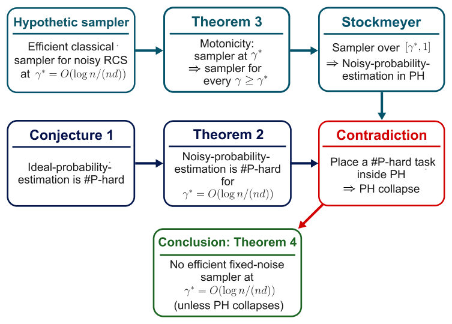 
FIG. 3. Logical flow of the noisy-RCS sampling-hardness proof. In the top row, assuming an efficient classical sampler for noisy RCS at noise strength γ∗= O(log n/(nd)), Theorem 3 implies an efficient sampler for every larger noise strength γ ≥γ∗. Stockmeyer’s reduction (Lemma 1) then yields noisy-probability estimation for any γ ≥γ∗within a finite level of the polynomial hierarchy (PH). In the bottom row, Conjecture 1 gives average-case #P-hardness of ideal-probability estimation, and Theorem 2 transfers this hardness to noisy-probability estimation when γ ≥γ∗is given as an input parameter. Combining the two arguments would place a #P-hard estimation task inside a finite level of PH, implying a...

**Summary.** This paper rigorously establishes a complexity-theoretic threshold for Random Circuit Sampling under realistic depolarizing noise. By combining polynomial extrapolation with a monotonicity argument, the authors show that RCS remains classically hard to simulate up to a specific noise strength $\gamma = \Theta(\log n/(nd))$. This identifies this scale as the asymptotic boundary between quantum advantage and classical simulation feasibility.

**Why it may be interesting.** This work directly addresses the practical limitations of quantum advantage claims by quantifying how noise degrades computational hardness. For AMO/Open Quantum Systems researchers, understanding this boundary is crucial for designing fault-tolerant protocols or interpreting experimental results from noisy hardware.

Detailed structure

**Main problem.** The central problem is determining the noise-strength boundary that separates regimes where Random Circuit Sampling (RCS) remains classically hard to simulate from those where it becomes efficiently simulable.

**Main result.** The authors establish that noisy RCS remains classically hard to simulate within an inverse-polynomial total variation distance for noise strengths $\gamma = O(\log n/(nd))$, unless the polynomial hierarchy collapses.

**Method.** The proof combines a low-degree polynomial extrapolation technique with a monotonicity reduction, transferring known ideal hardness results to the noisy setting without extra assumptions.

**Model / system.** The model is Noisy Random Circuit Sampling (noisy RCS) applied to $n$-qubit circuits subjected to standard local depolarizing noise of strength $\gamma$. The analysis relies on comparing the noisy output probability to its ideal counterpart.

**Key observables.** Inverse-polynomial total variation distance (TVD) between the true and simulated sampling distributions, and the resulting hardness/simulability boundary scale.

**Important parameters / regimes.** Noise strength $\gamma$, number of qubits $n$, and circuit depth $d$. The critical asymptotic scale is identified as $\gamma = \Theta(\log n/(nd))$.

**Assumptions / limitations.** The result assumes the standard average-case \#P-hardness conjecture for ideal RCS. It also relies on combining its hardness bound with existing simulability results for layered, regularly connected architectures.

**Figures summary.** Figure 1 illustrates a complexity phase diagram showing the established hard region (red) relative to known efficient simulation regimes under i.i.d. depolarizing noise.

**Paper structure.** The paper first defines the problem of noisy RCS hardness and then develops the mathematical machinery using polynomial extrapolation and monotonicity reduction. It applies these tools to transfer the ideal hardness conjecture to a specific, non-trivial noise strength $\gamma^*$. Finally, it combines this result with known simulability bounds to pinpoint the transition scale.

Abstract

Random circuit sampling (RCS) is a leading candidate for demonstrating quantum advantage, supported by strong complexity-theoretic evidence of hardness in the ideal setting and by rapid experimental progress to date. In practice, however, noise is unavoidable, and a central problem is to identify the noise-strength boundary between classically simulable and classically hard regimes. In this work, we establish an architecture-general hardness bound for this boundary for the standard local depolarizing noise of strength $γ$. Assuming the standard average-case #P-hardness conjecture for ideal RCS, we show that, for any circuit architecture satisfying this conjecture, noisy RCS on the same architecture remains hard to simulate classically within any inverse-polynomial total variation distance whenever $γ=O(\log n/(nd))$ for $n$-qubit circuits of depth $d$, unless the polynomial hierarchy collapses. Crucially, noisy-RCS hardness follows without any additional conjectural or architecture-specific assumption beyond those already entering the ideal-RCS hardness framework. Our proof combines a low-degree polynomial extrapolation with a monotonicity reduction showing that efficient classical simulation at one depolarizing noise strength implies efficient simulation at every larger strength. Together, these ingredients transfer the standard ideal-RCS hardness conjecture to sampling hardness at a prespecified noise strength. Finally, combining the convergence-to-uniformity result of Dalzell et al. [Commun. Math. Phys. 405, 78 (2024)] with our monotonicity reduction yields efficient classical simulation for $γ=ω(\log n/(nd))$ on layered, regularly connected architectures. Thus, wherever the two architectural settings overlap, this identifies $γ=Θ(\log n/(nd))$ as the asymptotic complexity-transition scale.

[↑ back to top](#top)

### [QuantumChain: Blockchain-Backed Quantum Federated Learning for Financial Fraud Detection](http://arxiv.org/abs/2607.21449v1)

**Authors:** Epameinondas Douros, Konstantinos Dalampekis, Nouhaila Innan, Ioannis Theodonis, Muhammad Shafique  
**Type:** theory · **Category:** quantum information and computing · **PDF:** <https://arxiv.org/pdf/2607.21449v1>  
**Analysis basis:** full PDF text, analyzed in chunks

📷 Fig 1

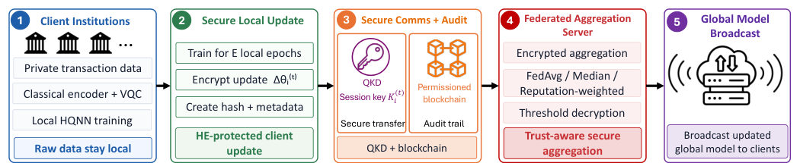 
Fig. 1: Overview of QuantumChain, including local HQNN training, encrypted update submission, blockchain-based auditability, QKD-derived session keys, and secure federated aggregation.

📷 Fig 2

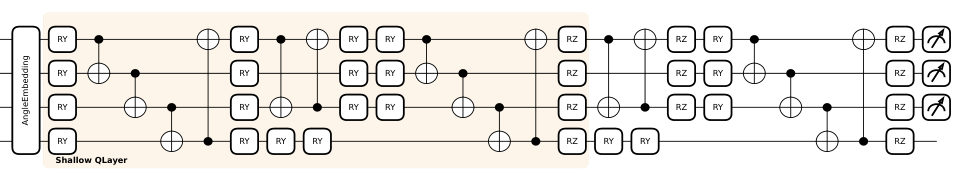 
Fig. 2: Shallow and Deep QLayer architectures. The highlighted region denotes the Shallow QLayer embedded within the Deep QLayer, with shared AngleEmbedding input encoding and Pauli-Z readout.

**Summary.** This paper introduces QuantumChain, a novel framework that applies Quantum Federated Learning to solve financial fraud detection under strict privacy constraints. It combines hybrid quantum-classical neural networks with advanced security measures like homomorphic encryption and blockchain auditing. The results demonstrate that this secure, quantum-enhanced approach improves detection recall over purely classical methods.

**Why it may be interesting.** While applied to finance, the core mechanism involves embedding variational quantum circuits into a deep learning structure (HQNN) for computation, which is relevant to NISQ device applications in quantum machine learning theory.

Detailed structure

**Main problem.** The paper addresses financial fraud detection, which is complicated by decentralized data, class imbalance, and strict privacy requirements.

**Main result.** The proposed QuantumChain framework successfully integrates hybrid quantum models into a secure federated learning pipeline, achieving improved fraud-class recall over classical baselines while maintaining stable global convergence.

**Method.** It employs a multi-layered security protocol combining Hybrid Quantum Neural Networks (HQNNs), homomorphic encryption, threshold secret sharing, and blockchain auditing for privacy and integrity.

**Model / system.** The core model is the QuantumChain framework utilizing HQNNs, which embed variational quantum circuits between classical neural layers. Security relies on QKD-derived keys and a permissioned blockchain ledger.

**Key observables.** Fraud-class recall (primary metric), global accuracy, and the Quantum Bit Error Rate (QBER) for security checks.

**Important parameters / regimes.** Federated rounds (e.g., 5 rounds), client count (10 heterogeneous clients), circuit depth (Shallow vs. Deep QLayer).

**Assumptions / limitations.** The blockchain layer is simulated using a local Ethereum/Ganache environment, and QKD security relies on pre-shared credentials or digital signatures for authentication.

**Figures summary.** Figures illustrate the overall QuantumChain process flow (local training to aggregation), compare Shallow vs. Deep QLayer architectures, and show performance results across different settings.

**Paper structure.** The paper details the architecture of QuantumChain, outlines the multi-step protocol involving local quantum training, secure update transmission via encryption/QKD, blockchain commitment, and final server-side aggregation.

Abstract

Financial fraud detection is challenged by decentralized data, severe class imbalance, and privacy constraints. This paper presents QuantumChain, a secure Quantum Federated Learning (QFL) framework that combines hybrid quantum-classical neural networks, encrypted federated aggregation, blockchain-based auditability, and quantum-secure communication. Each client trains a local hybrid model in which a variational quantum circuit is embedded between classical neural layers, while model updates are protected through homomorphic encryption, threshold secret sharing, and QKD-based keying. A permissioned blockchain records aggregation events and supports reputation-weighted trust among participants. We evaluate QuantumChain on financial transaction data using a compact, size-matched classical baseline to isolate the effect of the quantum layer. Results show that the HQNN achieves comparable accuracy while improving fraud-class recall in most settings, reaching 94.6% recall compared with 93.2% for the classical model. The Deep QLayer improves performance in full-data settings, suggesting that added circuit depth helps recover representational capacity when the shallow circuit becomes limited. Mixed-state simulations further show that the recall trend persists under non-ideal quantum evolution. In federated deployment with 10 heterogeneous clients, global accuracy increases from 97.7% to 98.8% over five rounds before stabilizing. These results show that QuantumChain can integrate depth-aware hybrid quantum models into a secure federated fraud-detection pipeline while maintaining stable global convergence.

[↑ back to top](#top)

### [Sp(4,Z) actions on 3d U(1)^2 symmetric theories: Order-five duality and bilayer quantum Hall hierarchies](http://arxiv.org/abs/2607.20622v1)

**Authors:** Yasin F. Alam, Andreas Karch, Da-Chuan Lu, Ryan C. Spieler  
**Type:** theory · **Category:** strongly correlated electrons · **PDF:** <https://arxiv.org/pdf/2607.20622v1>  
**Analysis basis:** full PDF text, analyzed in chunks

📷 Fig 1

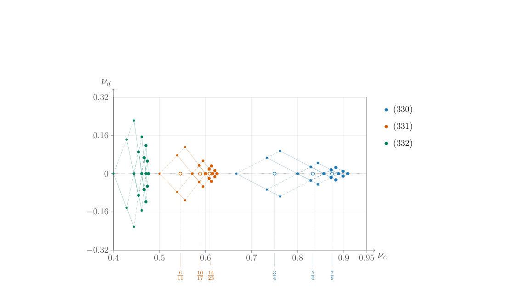 
Figure 1. Layer-imbalanced hierarchy grid in the (νc, νd) plane for (33n) + r(220) + p[2]u + q[2]ℓ, with n, r = 0, 1, 2 and p, q = 0, 1, 2. The horizontal coordinate is the total charge response νc, and the vertical coordinate is the layer-imbalance response νd = νu −νℓ. Solid lines fix the upper-layer Jain level, dashed lines fix the lower-layer Jain level, and the horizontal center line is νd = 0. Solid circles denote the ordinary Jain-sequence grid, while open circles mark the layer-symmetric final- (221) branch (33n) + r(220) + (221), with r = 0, 1, 2, placed on the equal-layer line.

📷 Fig 2

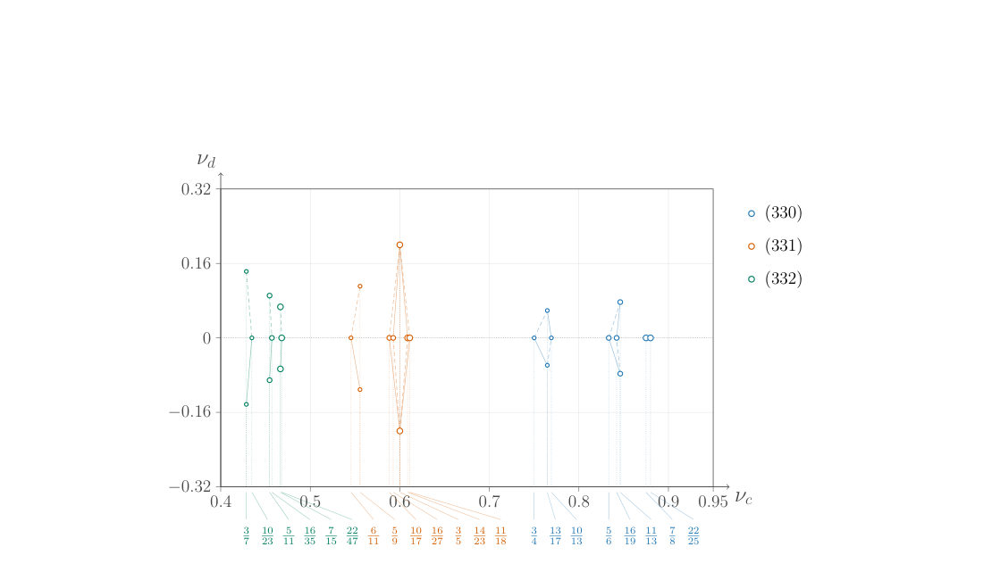 
Figure 2. Layer-imbalanced plot in the (νc, νd) plane for (33n) + r(220) + (221) + p[2]u + q[2]ℓ, with n, r = 0, 1, 2 and p, q = 0, 1. The colors label the parent (330), (331), or (332). Within each fixed r slice, solid lines fix the upper scalar level p, dashed lines fix the lower scalar level q. Singular entries for which νd is not defined are omitted.

**Summary.** This theoretical work extends electromagnetic duality symmetries from single-$U(1)$ theories to $U(1)^2$ symmetric quantum field theories, governed by $\mathrm{Sp}(4,\mathbb{Z})$. By identifying an order-five duality element, the authors successfully generalize the Haldane–Halperin construction. This framework predicts specific Abelian states in bilayer fractional quantum Hall systems at even-denominator fillings.

**Why it may be interesting.** The connection between high-rank symplectic dualities ($\mathrm{Sp}(4,\mathbb{Z})$) and concrete physical predictions for correlated electron states (FQH liquids) provides a powerful mathematical toolset for classifying topological phases in condensed matter systems.

Detailed structure

**Main problem.** The work generalizes the electromagnetic duality structure from single-$U(1)$ symmetric theories to those with $U(1)^2$ symmetry, governed by the $\mathrm{Sp}(4,\mathbb{Z})$ group.

**Main result.** They identify an intrinsically two-component element of order five in the boundary action and apply this framework to predict candidate Abelian states in bilayer fractional quantum Hall systems at specific even-denominator fillings.

**Method.** The authors use the K-matrix formalism to organize theory-generating webs, recasting the Haldane–Halperin hierarchy construction as a sequence of generalized $\mathrm{SL}(2,\mathbb{Z})$ operations.

**Model / system.** The focus is on 3D quantum field theories with $U(1)^2$ global symmetry, specifically applied to bilayer fractional quantum Hall (FQH) systems and Abelian Chern-Simons theories.

**Key observables.** Candidate FQH filling fractions ($
u=3/8+3/8$, $
u=5/12+5/12$), duality group structure ($\mathrm{Sp}(4,\mathbb{Z})$), and the order-five duality element.

**Important parameters / regimes.** The number of $U(1)$ symmetries ($n=2$) and the specific filling fractions characterizing the correlated states.

**Assumptions / limitations.** The analysis assumes that integral changes of anyon basis establish equivalence between the derived theories and their composite-fermion descriptions.

**Paper structure.** The paper progresses by first generalizing the $\mathrm{SL}(2,\mathbb{Z})$ duality to $\mathrm{Sp}(4,\mathbb{Z})$, deriving boundary operations, identifying the order-five element, and finally applying this structure to construct and analyze bilayer FQH hierarchies.

Abstract

The $\mathrm{SL}(2,\mathbb{Z})$ electromagnetic duality of 4d Maxwell theory induces theory-generating operations on 3d theories with $U(1)$ global symmetry. For theories with $U(1)^n$ symmetry, this structure generalizes to $\mathrm{Sp}(2n,\mathbb{Z})$. Focusing on the $U(1)^2$ case, we formulate the bulk $\mathrm{Sp}(4,\mathbb{Z})$ action and derive the corresponding boundary operations. We identify an intrinsically two-component element of order five, which generalizes the order-three $ST$ element of the single-$U(1)$ theory. Although its fifth power acts trivially in the bulk, the corresponding boundary operation closes only up to a decoupled $U(1)_1$ invertible phase, suggesting a mixed duality-gravitational anomaly. We realize the resulting theory-generating web for Abelian Chern-Simons theories within the $K$-matrix formalism and apply it to bilayer fractional quantum Hall systems. Recasting the Haldane--Halperin hierarchy construction as a sequence of $\mathrm{SL}(2,\mathbb{Z})$ operations, we generalize it to systems with charge $U(1)_c$ and pseudospin $U(1)_s$ symmetries. The resulting bilayer hierarchies contain branches terminating in an interlayer-correlated bosonic $(221)$ daughter sector, yielding candidate Abelian states at the even-denominator equal-layer fillings $3/8+3/8$ and $5/12+5/12$. Integral changes of anyon basis establish the equivalence of these states to their corresponding Abelian composite-fermion descriptions. We further discuss the spin-charge constraints that arise when the electromagnetic background field is treated as a spin-$c$ connection.

[↑ back to top](#top)

### [Suppressing errors in analog logical rotation gates via balanced fusion](http://arxiv.org/abs/2607.20756v1)

**Authors:** Sam McArdle, Alexander M. Dalzell, Fernando G. S. L. Brandão  
**Type:** theory · **Category:** quantum information and computing · **PDF:** <https://arxiv.org/pdf/2607.20756v1>  
**Analysis basis:** full PDF text, analyzed in chunks

📷 Fig 1

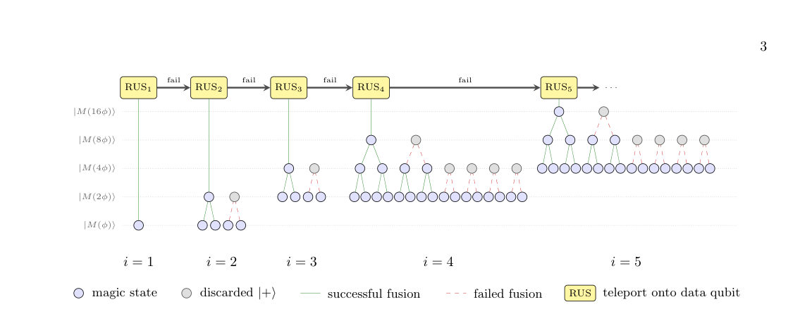 
FIG. 1. Schematic of the balanced fusion RUS process for implementing a single-qubit rotation Rz(ϕ). At trial i, we attempt to teleport a resource state |M(2i−1ϕ)⟩onto the data qubit. This resource state is built by fusing (in expectation) 4⌈(i−1)/2⌉

📷 Fig 2

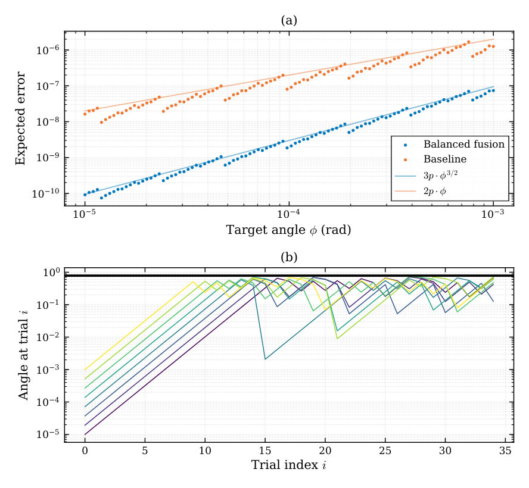 
FIG. 2. Error accumulation and angle growth during the RUS process with i = 35 RUS trials and p = 10−3. Note that the probability of requiring more trials than this is ≤10−10. a) The expected error accumulated in the RUS process. When target angles exceed π/4, they are rescaled using an S gate. Balanced fusion controls the error accumulation more effectively than the baseline approach. b) The growth of the target angle over the RUS iterations, for 100 different initial angles. Initially the target angle doubles on each iteration. When it would exceed π/4 (black horizontal line) it is rescaled. We observe that the target angle oscillates in size, but is typically much larger than the...

📷 Fig 3

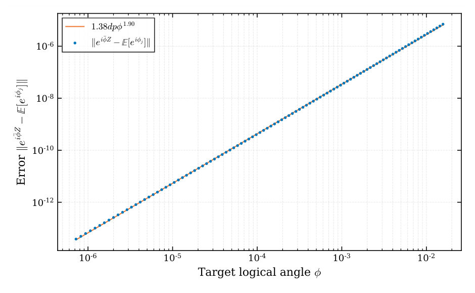 
FIG. 3. Computing the error using the Mixing Lemma, Eq. (B1). We consider a d = 13 phase-flip repetition code, with a single-qubit phase flip error model on each qubit, where each single-qubit phase flip occurs with probability p. Here p = 10−3. We assume stabilizer measurement is noiseless. The resulting mixture of rotations can be computed analytically. We evaluate and plot || exp(i¯ϕZ)−E[exp(iϕjZ)]|| for the corresponding distribution {qj, ϕj}. We observe that the error scaling is consistent with O(dpϕ(1−1

**Summary.** This paper presents 'balanced fusion,' a novel technique designed to significantly reduce error rates when implementing analog logical rotation gates crucial for fault-tolerant quantum computing. By restructuring how resource states are prepared via randomized unitaries simulation, the authors improve the error scaling from $O(p\phi)$ to $O(p\phi^{1.5})$. This advancement enhances the viability of these rotations as a practical alternative to other synthesis methods.

**Why it may be interesting.** This work provides a concrete algorithmic improvement in resource estimation for fault-tolerant quantum computation, directly impacting the feasibility of running complex algorithms on near-term devices by reducing gate errors.

Detailed structure

**Main problem.** The primary goal is to suppress errors when implementing analog logical rotation gates ($R_z(\phi)$) required for fault-tolerant quantum computation.

**Main result.** The authors introduce 'balanced fusion,' a technique that improves the error scaling of these rotations from $O(p\phi)$ (baseline) to a superior $O(p\phi^{1.5})$.

**Method.** They analyze the accumulation of coherent errors in randomized unitaries simulation (RUS) processes, specifically by fusing resource states in a binary tree structure rather than sequential preparation.

**Model / system.** The work focuses on logical qubits implementing $R_z(\phi)$ gates using resource states $|M(2i-1\phi)
angle$ and the Randomized Unitary Simulation (RUS) process. The analysis compares this to standard synthesis methods.

**Key observables.** Error scaling with respect to physical error rate ($p$) and rotation angle ($\phi$), specifically achieving $O(p\phi^{1.5})$.

**Important parameters / regimes.** Physical error rate ($p$), target rotation angle ($\phi$), number of trials ($k$), and the structure of resource state preparation.

**Assumptions / limitations.** The analysis relies on an improved understanding of coherent error accumulation, assumes access to a black-box protocol for preparing magic states $|M(\phi)
angle$, and compares results against baseline RUS methods.

**Figures summary.** Figure 1 schematically illustrates the balanced fusion process using a binary tree structure for resource state preparation. Figure 2 compares expected error accumulation between Balanced Fusion and Baseline approaches over iterations.

**Paper structure.** The paper builds by first identifying the limitations of existing $O(p\phi)$ scaling methods, then introducing and analyzing 'balanced fusion' to achieve $O(p\phi^{1.5})$, providing detailed mathematical bounds for this improved error suppression.

Abstract

There have been a number of recent proposals to use analog logical rotations in early fault-tolerant quantum algorithms. Existing proposals implement a logical rotation by angle $φ$, with error $O(pφ)$, where $p$ is the physical error rate. While this is not fault-tolerant, if $φ$ is sufficiently small the logical error rate can be suppressed. In this work, we introduce and analyze the `balanced fusion' technique for improving the error scaling of analog logical rotations to $O(p φ^{1.5})$, without having to resort to fallback synthesis. Balanced fusion is enabled by an improved analysis of the accumulation of coherent error terms in analog logical rotations. Our techniques improve the viability of analog logical rotations for small rotation angles as an alternative to cultivation-powered rotation synthesis.

[↑ back to top](#top)

### [Symmetry and Quantum Geometry in Bloch Bands](http://arxiv.org/abs/2607.21581v1)

**Authors:** Ziwei Wang, Charlie Raca, Steven H. Simon  
**Type:** theory · **Category:** strongly correlated electrons · **PDF:** <https://arxiv.org/pdf/2607.21581v1>  
**Analysis basis:** full PDF text, analyzed in chunks

📷 Fig 1

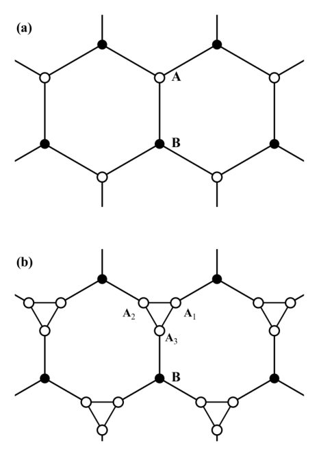 
FIG. 1: The honeycomb lattice (a) and a decorated honeycomb lattice (b), where each A site is replaced by a trimer. C3 symmetry requires the trimer to be arranged symmetrically around the center of C3-rotation, but does not uniquely specify an embedding.

📷 Fig 2

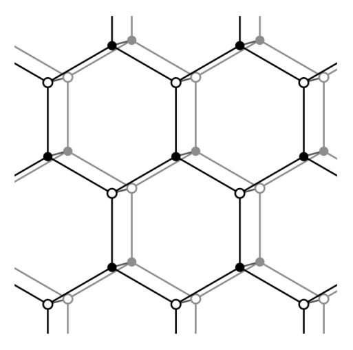 
FIG. 2: Two honeycomb lattices with an offset and bonds in-between. C3-symmetry for the entire lattice is only restored if the offset is zero.

**Summary.** This paper investigates quantum geometric quantities derived from Bloch bands, which typically depend on both model parameters and the specific real-space arrangement of orbitals. The authors show that if the system possesses underlying spatial symmetries, the geometry that minimizes key measures like Berry curvature variance must itself obey those symmetries. This provides a powerful symmetry constraint for understanding quantum geometry in crystalline solids.

**Why it may be interesting.** The connection drawn between fundamental physical symmetries (like spatial or magnetic translation symmetries) and the minimization of geometric invariants is a powerful tool for constraining theoretical models in condensed matter physics.

Detailed structure

**Main problem.** The authors aim to find an explicit, geometry-independent measure for quantum geometric quantities (like Berry curvature variance or integrated quantum metric) in tight-binding models.

**Main result.** They prove that if the underlying tight-binding model possesses certain spatial symmetries, then the real-space geometry that minimizes these quantum geometric measures must necessarily respect those same spatial symmetries.

**Method.** The work uses minimization arguments over the space of possible real-space embeddings (orbital positions) for a given lattice structure to constrain the optimal geometry.

**Model / system.** The study focuses on Bloch bands described by tight-binding models, initially in two dimensions and generalized to include magnetic translation symmetries. The analysis involves optimizing quantities related to the Berry curvature and quantum metric tensor.

**Key observables.** Berry curvature ($\Omega$), Quantum metric tensor ($g_{ij}$), Integrated quantum metric ($I$), and Variance of Berry curvature ($\sigma^2_\Omega$).

**Important parameters / regimes.** Spatial symmetries, magnetic flux parameters (related to the Hofstadter model), and lattice geometry/orbital embedding $\{r_{a,i}\}$.

**Assumptions / limitations.** The analysis assumes that a global minimum for the geometric quantities exists in the space of embeddings, and it extends symmetry considerations to include gauge transformations.

**Figures summary.** Figure 1 illustrates the honeycomb lattice structure used as an example system.

**Paper structure.** The paper first establishes the problem of geometry dependence. It then details the mathematical setup using quantum geometric tensors ($Q_{ij}, g_{ij}, \Omega$). The core argument demonstrates that symmetry dictates the minimal geometry, extending this principle to magnetic and composite symmetries, concluding with implications for models like the Hofstadter model.

Abstract

Quantum geometric quantities have featured heavily in the discussion of the properties of quantum systems in recent years. Among quantities most commonly discussed is the variance of Berry curvature and the integral of the trace of the quantum metric tensor. Despite their usefulness, it is known that they suffer from one significant complication: for a tight-binding model, the quantum geometric quantities depend not only on the parameters of the tight-binding model itself, but also the real space geometry of the tight-binding model, the so-called "orbital embedding". One explicitly geometry-independent quantity is therefore the minimal value of the quantum geometric quantity out of all possible real space geometries. In this work, we demonstrate that, if the tight-binding model is compatible with certain spatial symmetries, then the real space geometry that minimizes the variance of the Berry curvature or the integral of the trace of the quantum metric tensor must obey all those spatial symmetries. We further show that the statement is applicable to systems with magnetic translation symmetries and other composite symmetries, with implications for the quantum geometry of the Hofstadter model.

[↑ back to top](#top)

### [Towards more accurate natural orbital functional approximations: including 4-index cumulant contributions](http://arxiv.org/abs/2607.21399v1)

**Authors:** Valerii Chuiko, Paul W. Ayers, Eduard Matito  
**Type:** theory · **Category:** strongly correlated electrons · **PDF:** <https://arxiv.org/pdf/2607.21399v1>  
**Analysis basis:** full PDF text, analyzed in chunks

📷 Fig 1

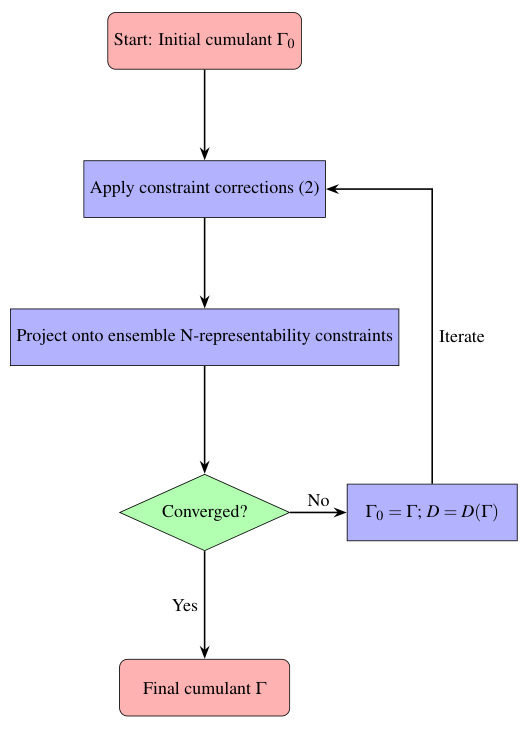 
FIG. 1: Schematic iterative procedure: impose the subsystem constraints on the cumulant, project the 2-RDM D onto the (approximate) set of ensemble N-representable 2-RDMs using the algorithm from reference 72; repeat until convergence.

📷 Fig 2

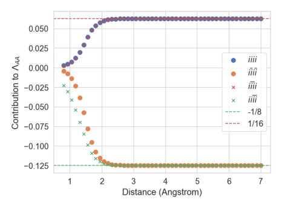 
FIG. 2: Contributions of selected elements of the cumulant during dissociation of N2; i = 1, ¯i = 4

📷 Fig 3

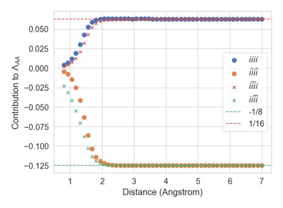 
FIG. 4: Contributions of selected elements of the cumulant during dissociation of NO+; i = 1, ¯i = 4

📷 Fig 4

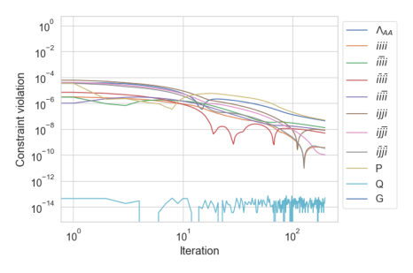 
FIG. 5: Change of violations of constraints of N2 molecule at dissociation regime during iterative procedure.

📷 Fig 5

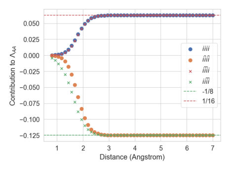 
FIG. 3: Contributions of selected elements of the cumulant during dissociation of O2; i = 0, ¯i = 3

**Summary.** This paper improves Reduced Density Matrix Functional Theory (RDMFT) by systematically correcting natural orbital functionals using 4-index cumulant contributions. The method enforces strict physical constraints derived from the asymptotic behavior of fragment spin and delocalization indices upon bond breaking. This leads to highly accurate energy predictions that match high-level CASSCF calculations in the dissociation limit.

**Why it may be interesting.** This work directly addresses fundamental limitations in describing static correlation and bond dissociation within quantum chemistry methods, which is crucial for understanding molecular electronic structure dynamics relevant to AMO physics.

Detailed structure

**Main problem.** Developing more accurate natural orbital functional approximations for Reduced Density Matrix Functional Theory (RDMFT) to correctly model bond breaking.

**Main result.** The updated functional, incorporating 4-index cumulant contributions and enforcing physical constraints, reproduces CASSCF energies exactly in the dissociation regime for benchmark molecules like N2 and O2.

**Method.** The authors correct the PNOF5 functional by minimizing the distance to a target cumulant while imposing linear constraints derived from known asymptotic behaviors of local spin and delocalization indices.

**Model / system.** The study focuses on electronic structure calculations using RDMFT, specifically analyzing the dissociation process of diatomic molecules (e.g., N2, O2) into two fragments.

**Key observables.** Bond dissociation energies, fragment population covariance (delocalization index), local spin angular momentum ($\langle \hat{S}^2 
angle$), and cumulant elements ($\Gamma_{ij;kl}$).

**Important parameters / regimes.** The dissociation limit ($|R_{AB}|	o\infty$) is the critical regime analyzed for benchmarking.

**Assumptions / limitations.** The approach assumes that enforcing physical constraints on the cumulants can systematically improve functional accuracy, although limitations exist when active electrons are small or far from dissociation.

**Figures summary.** Figures illustrate the iterative procedure flowchart and show how constraint violations (P, Q, G conditions) decrease towards convergence during molecular dissociation for various species.

**Paper structure.** The paper progresses by identifying the failure of existing functionals at bond breaking, proposing a constrained optimization method to correct cumulant contributions, demonstrating convergence through iterative projection onto N-representability, and finally benchmarking against CASSCF results across several molecules.

Abstract

Accurate modeling of bond breaking remains a central challenge for reduced density matrix functional theory (RDMFT). Although some modern functionals can yield reasonably accurate dissociation energies, they often fail to reproduce key properties of the dissociated fragments, such as a vanishing fragment population covariance (also known as the delocalization index) and the correct total spin angular momentum of each fragment (local spin). In this work, we revisit the construction of natural orbital functionals by correcting the cumulant contribution produced by the PNOF5 functional. Our method enforces known contributions of the cumulant to local spin fragments and the delocalization index at the dissociation limit. We obtain the closest cumulant consistent with these physically motivated constraints and subsequently purify the corresponding one- and two-electron reduced density matrices by imposing the standard $P, Q, \text{and } G$ $N$-representability conditions. The resulting functional yields improved behavior in strongly correlated regimes. Benchmarking on the dissociation of the singlet states of \ce{N2}, \ce{NO+}, \ce{O2}, \ce{S2}, and \ce{CO} shows that in the dissociation regime the energies computed from the updated cumulant exactly reproduce the complete active space self-consistent field (CASSCF) energies. We further analyze the limitations of the approach and identify scenarios in which the current approach performs poorly. This work provides a pathway for systematically improving natural orbital functionals to achieve reliable bond-breaking calculations within RDMFT.

[↑ back to top](#top)

## Secondary cond-mat archives

*Papers from  mes-hall, other, soft, supr-con. These archives are de-prioritized — they appear at the end regardless of relevance score.*

### Relevant in secondary archives (16)

### [A statistical-physics framework for translocation elastometry of deformable particles](http://arxiv.org/abs/2607.21506v1)

**Authors:** Pierre Ronceray  
**Type:** theory · **Category:** statistical mechanics · **PDF:** <https://arxiv.org/pdf/2607.21506v1>  
**Analysis basis:** full PDF text, analyzed in chunks
**Topic relevance:** 🔥 `methods for driven-dissipative` **4/5** · 🔥 `non-equilibrium dynamics` **4/5** · `Keldysh / 2PI / non-Gaussian methods` **3/5** · `driven-dissipative phase transition` **3/5** · `non-equilibrium universality` **3/5** · `Frenkel-Kontorova` **2/5** · `quantum measurements` **2/5** · `Kondo & dissipative impurity` **1/5** · `analog quantum simulation` **1/5** · `correlated / nonlocal dissipation` **1/5** · `scars & prethermalization` **1/5**

📷 Fig 1

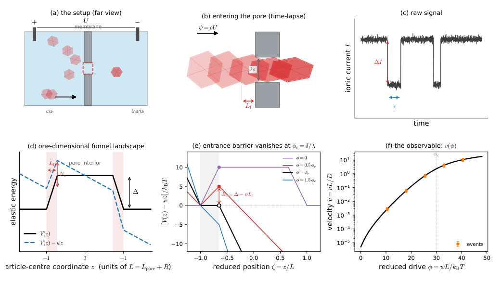 
FIG. 1. From experiment to model. (a) An example setting: soft particles suspended in an electrolyte are driven by a voltage U across a membrane pierced by a single pore. (b) Time-lapse of a single particle entering the pore: driven by a force ψ = cU, a particle of radius R &gt; a compresses radially to pass, over an axial funnel length Lf—the distance its centre advances between first contact and full insertion. (c) The raw observable: each translocation is a blockade in the ionic current, of depth ∆I and dwell time τ. (d) The one-dimensional reduction: the particle-centre coordinate z experiences a piecewise-linear elastic potential V (z) of depth ∆, ramped over Lf at each mouth and tilted...

📷 Fig 2

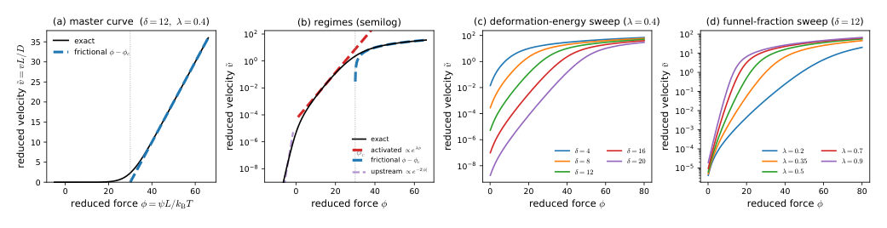 
FIG. 2. Master velocity curve. (a) Reduced velocity ˜v = vL/D versus reduced force ϕ = ψL/kBT on a linear scale, with the frictional asymptote ϕ −ϕc. (b) The same on a semilog scale, with the activated and upstream asymptotes and the crossover ϕc marked. (c,d) Sweeps over the reduced deformation energy δ = ∆/kBT and funnel fraction λ = Lf/L. All curves are the exact closed form Eq. (6).

📷 Fig 3

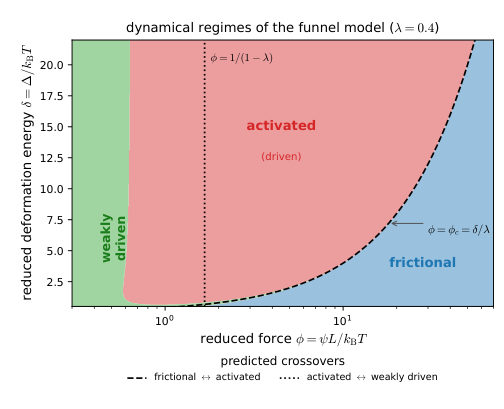 
FIG. 3. Dynamical-regime phase diagram in the reduced force–deformation-energy plane (ϕ, δ) at fixed λ. Colours mark which asymptote best approximates the exact veloc- ity; the dashed/dotted lines are the predicted crossovers ϕ = ϕc = δ/λ and ϕ = 1/(1 −λ).

📷 Fig 4

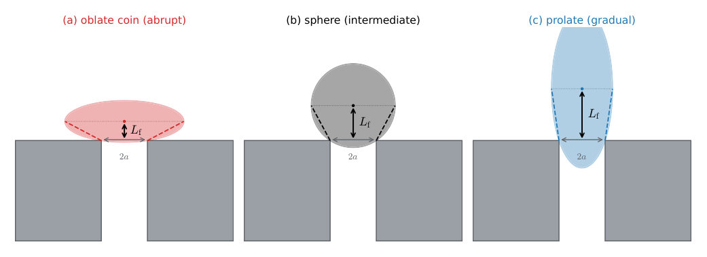 
FIG. 4. The funnel length carries geometric information. Three equal-volume particles of different shape driven along the pore axis into the same pore, drawn at first contact so the funnel length is directly comparable: (a) an oblate “coin” funnels in abruptly (small Lf), (b) a sphere intermediately, and (c) a prolate body gradually (large Lf). Dashed lines mark the effective funnel—the taper from pore rim to equator over the axial distance Lf. For a spheroid of equatorial radius b and polar semi- axis c, Lf = c p

📷 Fig 5

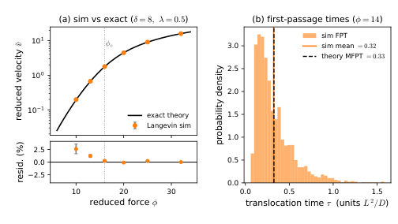 
FIG. 5. Langevin simulation validates the theory. (a) Source– sink simulated velocity (points) on the exact curve (line) across regimes. (b) Simulated translocation-time distribution with the simulated and analytic mean first-passage times.

**Summary.** This work presents a statistical physics framework to measure the elasticity and shape of soft nanoparticles by observing their translocation through a nanopore. It models the process using Brownian dynamics across an elastic barrier, deriving distinct velocity laws for low- and high-drive regimes. The key innovation is combining fits from both regimes to create a self-calibrating measurement that bypasses unknown experimental constants.

**Why it may be interesting.** The rigorous application of non-equilibrium statistical mechanics (Fokker-Planck formalism) to extract mechanical parameters from time-dependent current measurements is highly relevant for understanding open quantum systems where dissipation and thermal fluctuations dominate the dynamics.

Detailed structure

**Main problem.** To develop a mathematical framework that converts rate measurements of a soft particle passing through a narrow pore into quantitative mechanical characterization of the particle's deformation energy and geometry.

**Main result.** By combining measurements from both low-drive (activated) and high-drive (frictional) regimes, the method achieves a self-calibrating readout to determine the dimensionless deformation energy ($\Delta/k_B T$) without needing to know the unknown force-to-voltage conversion factor.

**Method.** The problem is solved exactly by analyzing the steady-state Fokker–Planck equation governing one-dimensional over-damped Brownian dynamics across an elastic barrier, identifying distinct dynamical regimes based on applied drive strength.

**Model / system.** The system models a deformable soft particle translocating through a pore using a 'funnel model' potential. The dynamics are governed by the Langevin equation, analyzed via its steady-state probability flux.

**Key observables.** Mean translocation velocity ($v$), deformation energy ($\Delta/k_B T$), funnel length ($L_f$), and crossover force ($\psi_c$).

**Important parameters / regimes.** Deformation energy ($\Delta$), pore geometry parameter ($L_f$), applied driving force ($\psi$), and thermal energy scale ($k_B T$).

**Assumptions / limitations.** The analysis assumes the drive is constant, the process can be reduced to a single reaction coordinate (one-dimensional dynamics), and initially models the elastic potential as piecewise linear.

**Figures summary.** Figures illustrate the one-dimensional potential landscape, the master velocity curve showing distinct regimes (linear/activated), and phase diagrams mapping these dynamical regions in parameter space.

**Paper structure.** The paper establishes the physical model via the Langevin equation, solves the resulting Fokker-Planck equation to derive analytical expressions for velocity in different drive regimes, and then proposes a dual-readout fitting procedure that combines linear (frictional) and exponential (activated) fits to eliminate unknown constants.

Abstract

A soft particle driven through a pore narrower than itself must deform to pass, and how quickly it does so is set by how hard it is to squeeze. We propose a mathematical framework for turning rate measurements of this driven, stochastic passage into quantitative mechanical measurements. Treating the entry of the particle as one-dimensional Brownian dynamics across an elastic barrier, we solve the transport problem exactly and identify two dynamical regimes: at low drive the passage is thermally activated and limited by the energy needed to deform the particle, and at high drive it is friction-limited. We propose a framework to extract the particle's deformation energy and relevant geometrical information by combining measurements in these two regimes. This method could be used in the context of nanopore sensing, where the drive is an applied voltage: the framework then provides a self-calibrating route---translocation elastometry---from a current-voltage measurement to the elasticity and shape of individual soft nanoparticles.

[↑ back to top](#top)

### [An integrated all-van der Waals nanobeam laser](http://arxiv.org/abs/2607.21566v1)

**Authors:** Aris Koulas-Simos, Pietro Metuh, Athanasios Paralikis, Kartik Gaur, Maximilian Klonz, Imad Limame, Bárbara L. T. Rosa, Chirag C. Palekar, Battulga Munkhbat, Stephan Reitzenstein  
**Type:** experiment · **Category:** other · **PDF:** <https://arxiv.org/pdf/2607.21566v1>  
**Analysis basis:** full PDF text, analyzed in chunks
**Topic relevance:** 🔥 `quantum optics experiment` **4/5** · `correlated cavity matter` **3/5** · `driven-dissipative phase transition` **3/5** · `interference shaping light` **3/5** · `superradiant laser` **3/5** · `Tavis-Cummings & cavity-many-emitter` **2/5** · `non-equilibrium dynamics` **2/5** · `analog quantum simulation` **1/5** · `correlated / nonlocal dissipation` **1/5** · `methods for driven-dissipative` **1/5** · `non-equilibrium universality` **1/5** · `quantum measurements` **1/5**

📷 Fig 1

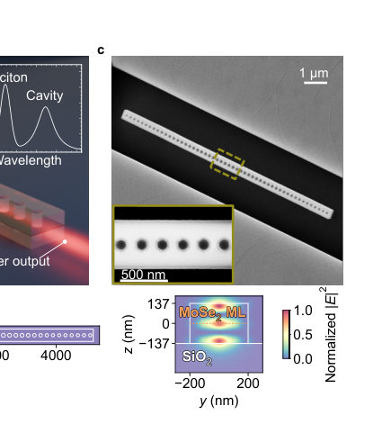 
Fig. 1 All-vdW nanobeam cavity platform. a Schematic illustration of the WS2/MoSe2/WS2 heterostructure integrated into a photonic-crystal nanobeam cavity. The embedded MoSe2 ML pro- vides optical gain, while the surrounding multilayer WS2 simultaneously acts as the photonic cavity. b Three-dimensional FEM simulations of the dielectric-band cavity mode, showing the electric-field intensity distribution in the lateral (x–y) and vertical (y–z) planes together with the nanobeam geometry consisting of a taper and a mirror section. c Scanning electron microscopy image of a rep- resentative fabricated nanobeam cavity with a magnified view of the photonic-crystal region.

📷 Fig 2

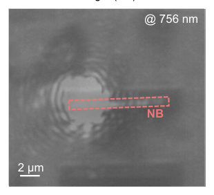 
Fig. 2 Exciton-cavity coupling and directional emission in all-vdW nanobeam cavities. a Normalized temperature-dependent µPL map showing the spectral evolution of the neutral MoSe2 A- exciton (X) and cavity mode (C). The dotted lines represent fits to the extracted emission wavelengths (see Supplementary Section 6 for details on the fits). b Representative unnormalized spectra recorded at selected temperatures. c Real-space PL image recorded at the cavity resonance wavelength, show- ing resonant coupling into and propagation along the nanobeam. d Angle-resolved Fourier-space emission measured for linear polarizations oriented perpendicular and parallel to the nanobeam axis, respectively....

**Summary.** The research demonstrates a novel all-van der Waals nanobeam laser built from $	ext{WS}_2/	ext{MoSe}_2/	ext{WS}_2$ heterostructures. By combining structural engineering with advanced photon correlation measurements, the authors provide strong evidence for high-$eta$ lasing operation in these layered materials. This establishes a promising platform for scalable quantum-photonic circuits.

**Why it may be interesting.** This work directly addresses the intersection of solid-state physics, cavity QED, and nonlinear optics by using layered materials to create highly controllable, integrated quantum light sources.

Detailed structure

**Main problem.** To demonstrate an all-van der Waals (all-vdW) high-$eta$ nanobeam laser and establish these heterostructures as a viable platform for integrated coherent light sources.

**Main result.** The authors successfully demonstrated lasing in the $	ext{WS}_2/	ext{MoSe}_2/	ext{WS}_2$ structure, verified by observing a transition to Poissonian photon statistics ($g^{(2)}(0) 	o 1.07$) and characteristic high-$eta$ nonlinear input-output behavior.

**Method.** The study combines microphotoluminescence ($\mu	ext{PL}$) spectroscopy, finite-element simulations for optical confinement, and crucial quantum-optical measurements using photon autocorrelation ($g^{(2)}$).

**Model / system.** The physical system is an all-vdW heterostructure ($	ext{WS}_2/	ext{MoSe}_2/	ext{WS}_2$) patterned into a nanobeam cavity, where the $	ext{MoSe}_2$ monolayer provides optical gain coupled to the surrounding $	ext{WS}_2$-based resonator.

**Key observables.** Photon autocorrelation function $g^{(2)}(0)$ (decreasing from 1.28 to 1.07), soft S-shaped input-output curve, linewidth narrowing, and strong directional/linear polarization of emission.

**Important parameters / regimes.** High-$eta$ parameter ($\approx 0.986$), threshold power ($P_{	ext{th}} \approx 9-29 	ext{ kW cm}^{-2}$), cryogenic temperatures (operating near $T_{	ext{eff}} \approx 60 	ext{ K}$).

**Assumptions / limitations.** The authors argue that conventional signatures ($	ext{I/O}$ curve) are insufficient, necessitating quantum measurements ($g^{(2)}$) for unambiguous proof of high-$eta$ lasing.

**Figures summary.** Figures show $\mu	ext{PL}$ maps confirming mode confinement and spectral overlap; subsequent figures detail the power-dependent $g^{(2)}(	au)$ measurements showing the transition to Poissonian statistics, and the temporal broadening analysis.

**Paper structure.** The paper progresses from demonstrating basic exciton-cavity coupling via $\mu	ext{PL}$ (Fig. 2), establishing classical high-$eta$ signatures ($	ext{I/O}$ curve) (Fig. 3), and finally providing definitive quantum verification through power-dependent photon autocorrelation measurements (Section 5).

Abstract

Transition-metal dichalcogenides offer a promising platform for integrated coherent light sources, yet lasing has largely relied on hybrid photonic architectures without direct quantum-optical verification. Here, we demonstrate an all-van der Waals (all-vdW) high-$β$ nanobeam laser based on a WS$_2$/MoSe$_2$/WS$_{2}$ heterostructure, with the MoSe$_2$ monolayer directly integrated in the WS$_{2}$-based optical resonator for optimal gain-mode overlap. The devices exhibit efficient exciton-cavity coupling at cryogenic temperatures, strongly directional and linearly polarized emission, soft nonlinear input-output characteristics and linewidth narrowing, enabling lasing operation with $β$ near unity. Excitation-power-dependent photon-autocorrelation measurements reveal a transition from thermal to Poissonian photon statistics, with $g_{\mathrm{peak}}^{(2)}(0)$ decreasing from $(1.28\,\pm\,0.09)$ near threshold to $(1.07\,\pm\,0.07)$ above threshold, directly verifying lasing operation. Furthermore, temporal broadening of the autocorrelation uncovers fluctuation-dominated lasing dynamics. These results establish all-vdW heterostructures as a highly attractive platform for integrated coherent light sources in layered-material photonic architectures and scalable quantum-photonic circuits.

[↑ back to top](#top)

### [Exceptional Points in a Parallel Double-Quantum-Dot Josephson Junction Coupled to a Ferromagnetic Reservoir](http://arxiv.org/abs/2607.20856v1)

**Authors:** Yiyan Wang, Ruixin Zhou, Bing Dong  
**Type:** theory · **Category:** other · **PDF:** <https://arxiv.org/pdf/2607.20856v1>  
**Analysis basis:** full PDF text, analyzed in chunks
**Topic relevance:** 🔥 `driven-dissipative phase transition` **4/5** · 🔥 `methods for driven-dissipative` **4/5** · `Keldysh / 2PI / non-Gaussian methods` **3/5** · `correlated / nonlocal dissipation` **3/5** · `spintronics-quantum-optics interface` **3/5** · `Kondo & dissipative impurity` **2/5** · `non-equilibrium dynamics` **2/5** · `analog quantum simulation` **1/5** · `exotic spin models in light-matter` **1/5** · `non-equilibrium universality` **1/5**

📷 Fig 1

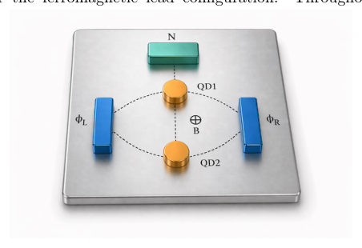 
FIG. 1. (Color online) Parallel double-quantum-dot Joseph- son junction coupled to a normal or ferromagnetic reservoir.

📷 Fig 2

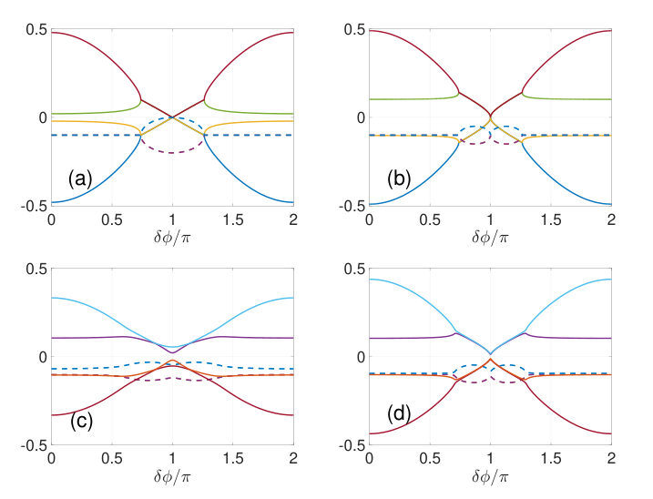 
FIG. 2. (Color online) Energy spectrum of the parallel double quantum dot system based on the BdG Hamiltonian. The solid and dashed lines represent the real and imaginary parts of the eigenenergies, respectively. Parameters are set as: Γ = 0.25, γ↑= γ↓= 0.2, ϕB = 0 and (a) ∆→∞, td = 0. (b) ∆→∞, td = 0.1. (c) ∆= 1, td = 0.1. (d)∆= 10, td = 0.1.

📷 Fig 3

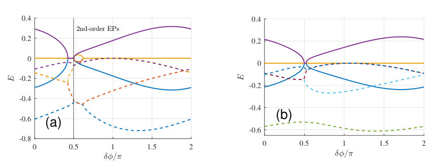 
FIG. 3. (Color online) Energy spectrum of the parallel double quantum dot (DQD) system based on the BdG Hamiltonian. The solid and dashed lines represent the real and imaginary parts of the eigenenergies, respectively. Parameters are set as: Γ = 0.25, γ↑= 0.75, γ↓= 0.25, ϕB = 0.5 π, td = 0 and (a) ∆→∞, (b) ∆= 1.

📷 Fig 4

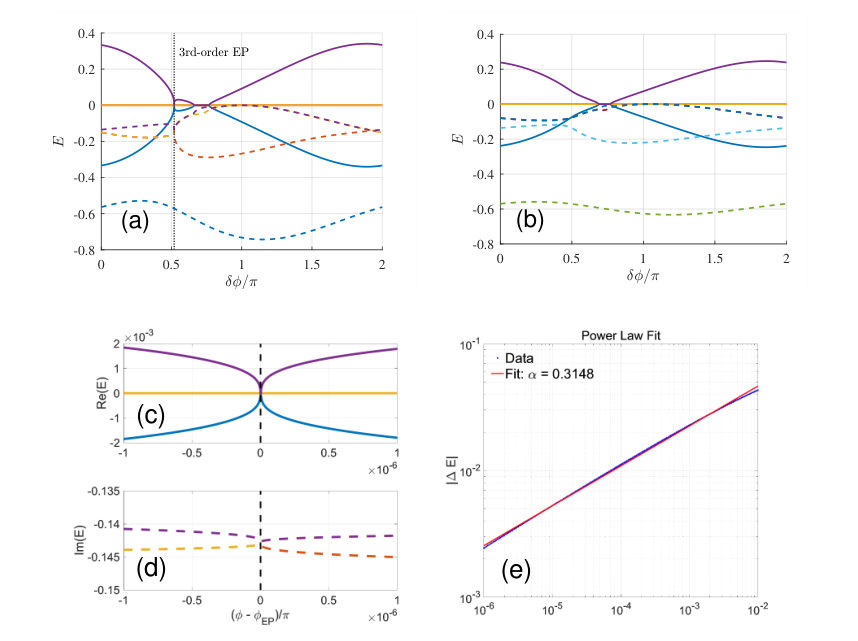 
FIG. 4. (Color online) (a) Complex-energy spectrum for Γ = 0.25, γ↑= 0.75, γ↓= 0.25, ϕB = 0.24075202π, td = 0, and ∆→∞. Solid and dashed curves denote real and imaginary parts, respectively. (b) Corresponding five-level finite-gap surrogate spectrum at ∆= 1. (c),(d) Real and imaginary parts of the eigenvalue splitting near ϕEP. (e) Power-law fit of ∆E versus |δϕ −ϕEP|.

📷 Fig 5

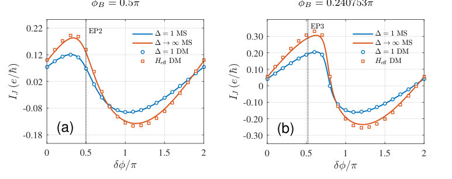 
FIG. 5. (Color online) Josephson current at the two magnetic fluxes indicated above the panels. The currents are calculated using the Matsubara free-energy derivative IJ = 2∂F/∂δϕ, and the density-matrix expectation value IJ = 2⟨∂˜H/∂δϕ⟩. In the legend, MS and DM denote the Matsubara-summation and density-matrix calculations, respectively. For the finite-gap surrogate Hamiltonian with ∆= 1, the two methods give consistent results. The large-gap result with ∆= 100 approaches the infinite-gap low-energy effective model. The vertical dotted lines mark the EP2 and EP3 phase positions identified in Figs. 3(a) and 4(a), respectively; the EP3 label denotes the infinite-gap coalescence, which is...

**Summary.** The paper theoretically examines Exceptional Points in a Josephson junction modeled by double quantum dots coupled to reservoirs. It shows that while simple dissipation eliminates predicted EPs, incorporating spin-dependent loss from a ferromagnet stabilizes these singularities. This highlights the potential for controlling non-Hermitian physics using engineered magnetic and spin interactions.

**Why it may be interesting.** This work directly addresses open quantum systems dynamics (dissipation) coupled with superconducting phenomena, providing a detailed theoretical framework for controlling non-Hermitian degeneracies using magnetic fields and spin interactions.

Detailed structure

**Main problem.** The study investigates the emergence and persistence of Exceptional Points (EPs) in a superconducting nanostructure subjected to dissipation and magnetic flux.

**Main result.** Spin-selective dissipation from a ferromagnetic reservoir can stabilize second-order EPs in the finite-gap regime, while Josephson currents remain continuous across these singularities.

**Method.** The analysis employs Green's function techniques, deriving effective Hamiltonians (including surrogate models for finite gaps) and performing parity-resolved Fock-space analyses.

**Model / system.** The system is a parallel double-quantum-dot Josephson junction coupled to reservoirs, modeled using the Bogoliubov-de Gennes formalism. The physics is governed by superconducting phase difference ($\delta\phi$) and orbital flux ($\Phi_B$).

**Key observables.** Complex Andreev spectrum eigenvalues (EPs), Josephson current ($I_J$), and energy splitting behavior.

**Important parameters / regimes.** Superconducting gap ($\Delta$), magnetic flux ($\Phi_B$), spin-independent vs. spin-dependent dissipation rates ($\gamma_{\uparrow}, \gamma_{\downarrow}$), and the superconducting phase difference ($\delta\phi$).

**Assumptions / limitations.** The analysis compares results in the infinite-gap limit versus a finite-gap surrogate model, noting that finite-gap corrections alter EP coalescence predictions.

**Figures summary.** Figures illustrate the complex energy spectrum showing EP2s for spin-independent loss (Fig. 2a) and persistent EP2s under spin-selective dissipation with flux tuning (Fig. 4a).

**Paper structure.** The paper progresses by first establishing the model in different limits, comparing infinite-gap vs. finite-gap descriptions, analyzing how dissipation type affects EPs, and finally confirming the robustness of physical observables like Josephson current across these non-Hermitian singularities.

Abstract

We investigate exceptional points (EPs) in a parallel double-quantum-dot Josephson junction coupled to a dissipative reservoir. By integrating out the leads, we obtain a non-Hermitian Bogoliubov-de Gennes description wherein the superconducting phase difference and orbital flux govern the complex Andreev spectrum. For spin-independent dissipation, the second-order EPs identified within the infinite superconducting gap limit are eliminated when the finite superconducting gap is properly incorporated. In contrast, spin-dependent dissipation originating from a ferromagnetic reservoir, in conjunction with magnetic flux, gives rise to second-order EPs that persist in superconducting leads with finite gap. Moreover, flux tuning enables the coalescence of two second-order EPs into a third-order EP, whose eigenvalue splitting exhibits cubic-root scaling behavior. A many-body parity analysis establishes the connection between the contrasting finite-gap behavior and the spectral relationship between the even- and odd-parity sectors. Finally, Josephson currents calculated from both the free-energy derivative and the surrogate-model density matrix demonstrate consistency and remain continuous across the EPs. These findings establish spin-selective dissipation and interferometric flux as effective control parameters for robust non-Hermitian singularities in superconducting nanostructures.

[↑ back to top](#top)

### [Machine Learning for Charge State Characterization of Isolated Double Quantum Dots](http://arxiv.org/abs/2607.20871v1)

**Authors:** Hyma Vallabhapurapu, Marco Candido, Krishna Choudhary, Paul Steinacker, Ensar Vahapoglu, Chris Escott, Wee Han Lim, Andre Saraiva, Nard Dumoulin Stuyck, MengKe Feng  
**Type:** experiment · **Category:** quantum information and computing · **PDF:** <https://arxiv.org/pdf/2607.20871v1>  
**Analysis basis:** full PDF text, analyzed in chunks
**Topic relevance:** 🔥 `QC/QI experiment` **4/5** · `methods for driven-dissipative` **1/5** · `quantum measurements` **1/5** · `spintronics-quantum-optics interface` **1/5**

📷 Fig 1

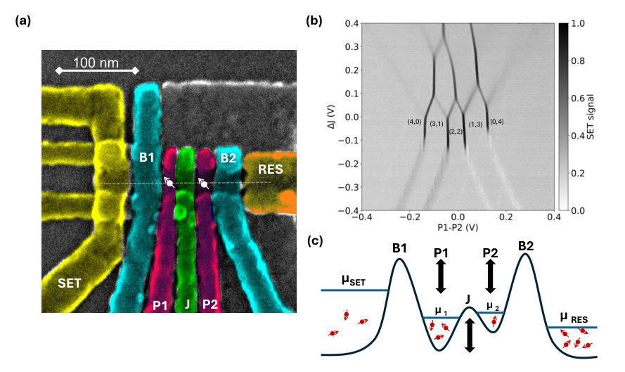 
Figure 1. Overview of the double-quantum-dot (DQD) device and its charge stability map. (a) Representative Scanning- electron-microscope (SEM) image of a DQD device with an integrated single-electron-transistor (SET) charge sensor, with the barrier gates B1 and B2 controlling the tunnel barriers to the SET and to the reservoir respectively. The image is of a device fabricated in an academic cleanroom, shown for illustration of the gate layout only; all charge-stability data in this work are from imec-fabricated devices of nominally identical architecture. (b) A measured charge stability map (CSM): the sensor current recorded while sweeping two plunger-gate voltages (P1-P2), with...

📷 Fig 2

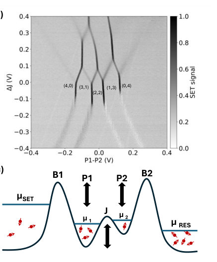 
fig. 1(b).

📷 Fig 3

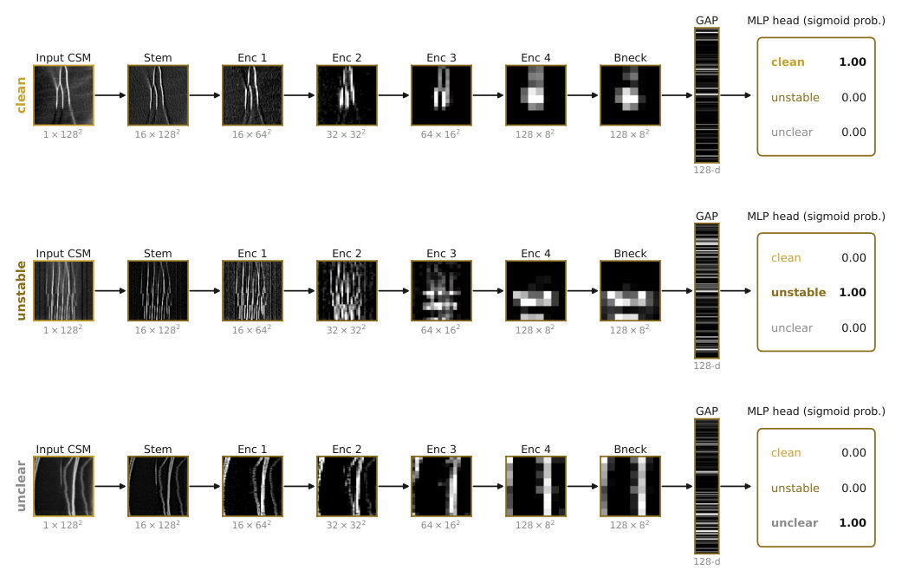 
Figure 2. CSMClassifier architecture visualised on real CSM images, one row per quality class (clean, unstable, unclear). Each row passes a hand-labelled experimental CSM of that class through the trained network and shows the actual intermediate feature maps (only the single highest-variance, i.e. most active, channel is shown at each stage; the remaining channels are omitted to avoid clutter): input →histogram-invariant stem (LCN ∥InstanceNorm) →four isotropic encoder stages →bottleneck →global average pooling (GAP) to a 128-dimensional vector. Spatial and channel dimensions are annotated below each panel. The two-layer MLP head then maps the pooled vector to three independent sigmoid...

📷 Fig 4

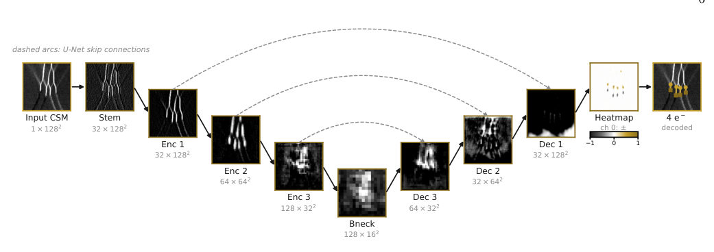 
Figure 3. ChargeLineNet architecture visualised on a real CSM image. A hand-labelled experimental CSM is passed through the trained network and the actual intermediate feature maps are shown left to right (only the single highest-variance, i.e. most active, channel is shown at each stage; the remaining channels are omitted to avoid clutter): input →histogram-invariant stem (LCN ∥InstanceNorm) →three anisotropic encoder levels →bottleneck →three U-Net decoder levels, whose skip connections are drawn as dashed arcs. The spatial and channel dimensions after each stage are annotated below the corresponding panel. The final 1×1 head produces the signed heatmap (channel 0; positive peaks mark...

📷 Fig 5

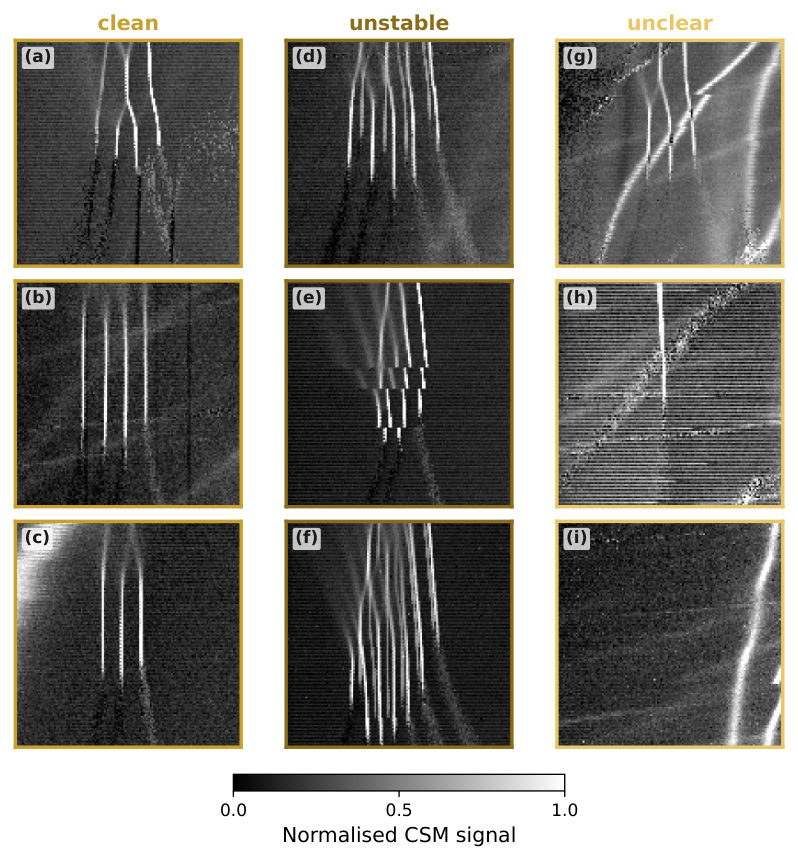 
Figure 4. Representative CSM images from the three quality classes, one class per column (three examples each). Left column (a–c), clean: well-resolved charge-transition lines with clear contrast against the background, suitable for automated line detection. Middle column (d–f), unstable: images in which the electron occupancy visibly jumps mid-scan, so that transition lines abruptly appear or disappear part-way across the image (telegraph switching or spurious tunnelling), leaving no single consistent line count. Right column (g–i), unclear: images whose line count is ambiguous even to a human reader, owing to low signal, sensor artefacts, obscuring background transitions, or SET signal...

**Summary.** This paper presents two specialized Convolutional Neural Networks designed to automate the analysis of Charge Stability Maps (CSMs) from isolated double quantum dots. By combining a quality classifier with a line-counting network, the authors created a highly accurate and computationally efficient pipeline for determining electron occupancy. This breakthrough offers a practical path toward scalable characterization and tuning of solid-state spin qubits.

**Why it may be interesting.** This work directly addresses the engineering bottleneck in scaling solid-state quantum computing platforms by providing an automated diagnostic tool for qubit characterization.

Detailed structure

**Main problem.** The manual analysis of Charge Stability Maps (CSMs) for tuning spin qubits in quantum dot arrays is inefficient, especially in the isolated-mode regime.

**Main result.** A combined ML pipeline achieved high accuracy (93.8% on clean images) and demonstrated scalability by running fast (under 60 ms) with minimal memory footprint (6.5 MB).

**Method.** The authors developed two specialized Convolutional Neural Networks (CNNs)—CSMClassifier and ChargeLineNet—to automate image quality screening and charge-transition line localization, respectively.

**Model / system.** The work uses Double Quantum Dots (DQDs) fabricated on SiMOS devices, operated in an isolated mode. The system is characterized by measuring CSMs via automated cryogenic probing at $\sim 1$ K.

**Key observables.** Charge-transition lines, electron occupancy derived from line counts, and image quality metrics (Clean/Unstable/Unclear).

**Important parameters / regimes.** Operating temperature ($\sim 1$ K), number of parameters (< 1 million for each model), and cross-device generalization performance.

**Assumptions / limitations.** The primary assumption is that the near-vertical nature of charge transitions in isolated mode makes them ideal targets for compact, task-specific CNN models; classical counting methods are insufficient due to artifacts.

**Figures summary.** Figure 1 illustrates the DQD device structure, a measured CSM showing transition lines, and potential/gate voltage diagrams used for characterization.

**Paper structure.** The paper introduces the problem of automated qubit tuning via CSM analysis. It details the two-stage ML pipeline (classification followed by line detection) using CNNs trained on experimental data, reports quantitative performance metrics against held-out sets, and concludes with a discussion of the practical scalability of the combined tool.

Abstract

Scaling semiconductor quantum dot arrays toward fault-tolerant quantum computing requires efficient tuneup of spin qubits, a process that depends on the analysis of charge stability maps (CSMs) and remains largely manual. While machine learning has been widely applied to CSM analysis in reservoir-coupled devices, automated tuning in the increasingly important isolated-mode regime has received limited attention. In isolated-mode CSMs, charge transitions appear as near-vertical lines, making them well suited to compact, task-specific models. We present two convolutional neural networks with fewer than one million parameters, trained on CSMs collected from 32 silicon metal-oxide-semiconductor (SiMOS) double-quantum-dot devices measured at approximately 1 K using an automated cryogenic probing system. Sixteen devices were used for training and sixteen were held out to evaluate cross-device generalization against hand-labeled ground truth. CSMClassifier identifies charge instability and sensor artifacts, achieving 94% macro-averaged accuracy across three quality classes on 2,407 held-out images. ChargeLineNet localizes charge-transition lines and determines electron occupancy, achieving 95.3% exact line-count accuracy on 1,131 held-out images. Combined into a single pipeline, the models correctly determine electron occupancy for 93.8% of clean held-out images. Pre-training on synthetic images substantially improves label efficiency. Fine-tuning the pre-trained model on limited experimental data maintains over 90% accuracy, whereas training from scratch degrades significantly under the same conditions. Together, the two models occupy only 6.5 MB and process images in less than 60 ms on standard laboratory hardware, demonstrating a practical path toward scalable, automated characterization and tuneup of quantum-dot devices.

[↑ back to top](#top)

### [Sequential Topological Superconductivity in a Square Lattice with Chiral Charge Density Waves](http://arxiv.org/abs/2607.21525v1)

**Authors:** Zhong-Xian Jin, Junkang Huang, Yu-Xuan Li, Tao Zhou  
**Type:** theory · **Category:** strongly correlated electrons · **PDF:** <https://arxiv.org/pdf/2607.21525v1>  
**Analysis basis:** full PDF text, analyzed in chunks
**Topic relevance:** 🔥 `analog quantum simulation` **4/5** · `Keldysh / 2PI / non-Gaussian methods` **1/5** · `driven-dissipative phase transition` **1/5** · `entanglement & information structure` **1/5**

📷 Fig 1

 
FIG. 1. Schematic of the real-space CDW pattern. Solid and dashed bonds represent the charge bond order (CBO), with solid (dashed) lines denoting inter-cell (intra-cell) bonds. Ar- rows indicate the loop currents of the chiral flux phase (CFP), with the arrow direction encoding the sign of the imaginary hopping modulation.

📷 Fig 2

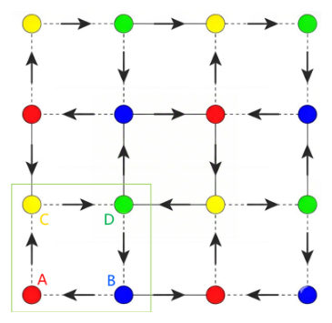 
Fig. 1. The corresponding Hamiltonian is

📷 Fig 3

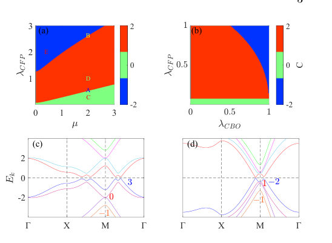 
FIG. 2. Topological phase diagrams and band-resolved Chern numbers. (a) Phase diagram in the µ-λCFP plane with λCBO = 0.2. (b) Phase diagram in the λCBO-λCFP plane with µ = 0.2. (c),(d) Band structures at points D and E in (a), corresponding to the C = 2 and C = −2 phases with (µ, λCFP) = (2, 1) and (0.5, 2), respectively. The Chern num- ber of each occupied band is labeled in each panel.

📷 Fig 4

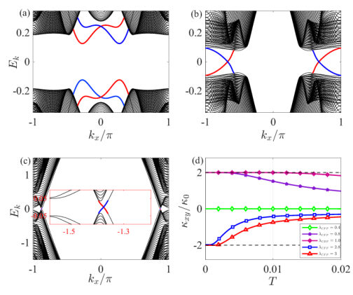 
FIG. 3. Energy spectra under partial open boundary con- ditions and thermal Hall conductivity. (a)–(c) Energy spec- tra with λCBO = 0.2 at points C, D, and E in Fig. 2(a), with (µ, λCFP) = (2, 0.4), (2, 1), and (0.5, 2), respectively. (d) Thermal Hall conductivity κxy versus T for (µ, λCBO) = (2, 0.2) at several λCFP values.

📷 Fig 5

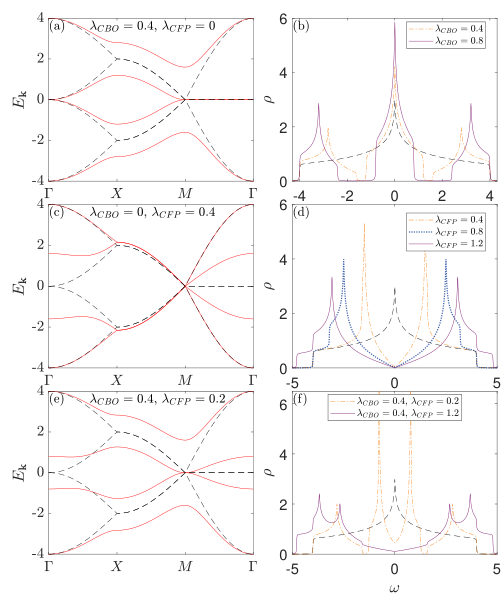 
FIG. 4. Energy bands (left panels) and DOS (right panels) along the high-symmetry path Γ-X-M-Γ. (a),(b) CBO only (λCFP = 0); (c),(d) CFP only (λCBO = 0); (e),(f) both CBO and CFP. Dashed curves indicate the corresponding quantities without CDW.

**Summary.** This work theoretically explores how the combination of real and imaginary bond modulations within a square lattice superconductor induces sequential transitions into topologically non-trivial superconducting phases. By calculating the Chern number and predicting quantized thermal Hall conductivity plateaus, the authors establish this platform as a robust method for engineering topological superconductivity.

**Why it may be interesting.** The explicit connection between engineered charge order parameters (CDW) and robust topological superconductivity provides a concrete theoretical pathway for realizing exotic quantum states, which is highly relevant to understanding unconventional pairing mechanisms in correlated materials.

Detailed structure

**Main problem.** The study investigates topological superconducting phases arising from the interplay between superconductivity and a composite Charge Density Wave (CDW) in a square lattice.

**Main result.** The coexistence of real bond modulation (CBO) and imaginary hopping modulation (CFP) drives the system into two distinct, topologically nontrivial superconducting phases characterized by Chern numbers $C=+2$ and $C=-2$.

**Method.** Theoretical analysis using the Bogoliubov-de Gennes (BdG) Hamiltonian in momentum space, calculating topological invariants like the Chern number via the Kubo formula.

**Model / system.** The model is a square-lattice superconductor subjected to a composite CDW consisting of CBO ($\lambda_{	ext{CBO}}$) and CFP ($\lambda_{	ext{CFP}}$). The Hamiltonian is analyzed in the Altland-Zirnbauer class D, breaking time-reversal symmetry.

**Key observables.** Quantized plateaus in the zero-temperature thermal Hall conductivity ($\kappa_{xy} \propto C$), Chern number ($C$), and gapless edge modes observed via spectral function analysis.

**Important parameters / regimes.** The relative strengths of $\lambda_{	ext{CBO}}$ and $\lambda_{	ext{CFP}}$, chemical potential ($\mu$), and temperature (analyzed in the zero-temperature limit).

**Assumptions / limitations.** The superconducting pairing is assumed to be an isotropic s-wave form, and the analysis relies on diagonalizing the BdG Hamiltonian.

**Figures summary.** Figures schematically show the real-space CDW pattern (CBO/CFP) and illustrate topological phase diagrams showing transitions between $C=-2, 0, 2$ phases as parameters are varied.

**Paper structure.** The paper progresses by defining the Hamiltonian incorporating CBO and CFP, analyzing the resulting band structure evolution through different parameter regimes, determining the topological invariants ($C$) at critical points via gap closing mechanisms (quadratic vs. linear touching), and finally predicting observable signatures like quantized $\kappa_{xy}$.

Abstract

The interplay between charge order and superconductivity offers a fertile ground for emergent quantum phases. Here we theoretically investigate a square-lattice superconductor coexisting with a composite charge density wave (CDW) consisting of a real bond modulation (charge bond order, CBO) and an imaginary hopping modulation (chiral flux phase, CFP) that breaks time-reversal symmetry. We uncover that, while CFP alone does not induce topology in square lattices, its coexistence with CBO drives the system into two topologically nontrivial superconducting phases with Chern numbers $C=+2$ and $C=-2$. The low-temperature thermal Hall conductivity $κ_{xy}$ exhibits quantized plateaus proportional to the Chern number, providing a clear experimental fingerprint. Our results establish the square lattice as a pristine platform for engineering topological superconductivity through the synergy of real and imaginary bond modulations.

[↑ back to top](#top)

### [Supercurrent effect in a charge density wave intertwined superconductor](http://arxiv.org/abs/2607.21507v1)

**Authors:** Zhen Zhu, Wei Cheng, Dang Liu, Pengyu Hu, Yi Yang, Qiaoyan Yu, Shasha Xue, Ruijun Xi, Xingsen Chen, Jice Sun, Dandan Guan, Yaoyi Li, Shiyong Wang, Canhua Liu, Zhuan Xu, Xin Liu, Hao Zheng, Jinfeng Jia  
**Type:** both · **Category:** other · **PDF:** <https://arxiv.org/pdf/2607.21507v1>  
**Analysis basis:** full PDF text, analyzed in chunks
**Topic relevance:** `Keldysh / 2PI / non-Gaussian methods` **3/5** · `driven-dissipative phase transition` **3/5** · `methods for driven-dissipative` **3/5** · `Frenkel-Kontorova` **2/5** · `non-equilibrium dynamics` **2/5** · `Kondo & dissipative impurity` **1/5** · `analog quantum simulation` **1/5** · `correlated cavity matter` **1/5** · `non-equilibrium universality` **1/5**

📷 Fig 1

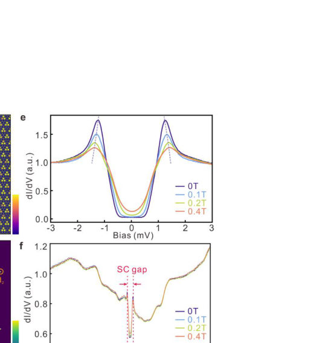 
Figure 1. CDW order and Doppler-shifted superconducting spectra in 2H-NbSe2. a, Atomically resolved topography showing 3×3 CDW superlattice superimposed on 1×1 atomic lattice (V = 3 mV, I = 100 pA). The inset shows a zoomed-in view, where the red rhombus marks the CDW unit cell. Scale bar, 5 nm. b, Fast Fourier transformed (FFT) of the STM image shown in a. The Bragg peaks are indicated by white triangles. The blue and orange circles and the green square mark the CDW peaks. The first Brillouin zone is outlined by a white hexagon. c, Simulated real-space local density of

📷 Fig 2

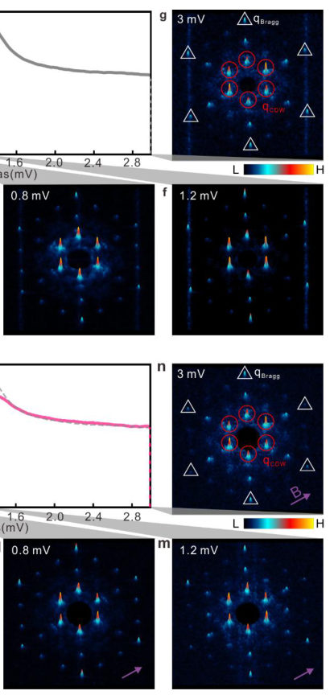 
Figure 2. Supercurrent effect of CDW modulations on Bogoliubov quasiparticles. a, dI/dV spectra taken under zero magnetic field (V = 3 mV, I = 500 pA). b-g, 3D representation of FFTed conductance maps (V = 3 mV, I = 500 pA) taken at indicated energies under zero field. Six CDW peaks (red circles) emerge above 0.5 mV with equal intensity. Bragg peaks are marked by white triangles. h, dI/dV spectra (pink) measured under a 100 mT in-plane magnetic field along Γ-M direction (V = 3 mV, I = 500 pA).

📷 Fig 3

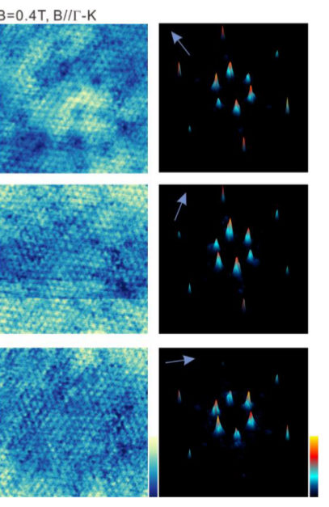 
Figure 3. Manipulation of the CDW modulations on Bogoliubov quasiparticles by in-plane magnetic fields. a-c, Real-space dI/dV maps and the corresponding 3D representation of FFT depicting the CDW modulations on Bogoliubov quasiparticles with magnetic field oriented along the Γ-M directions. Two CDW peaks aligned parallel to the field direction are selectively enhanced. d-f, Replicating a-c with the magnetic field applied along the Γ-K directions, where four CDW peaks closest to the field direction display markedly enhanced intensity. All data were acquired within the same 22×22 nm2 area, at a bias voltage of 0.6 mV and under an in-plane magnetic field of 400 mT (V = 2 mV, I = 1 nA, Vmod =...

📷 Fig 4

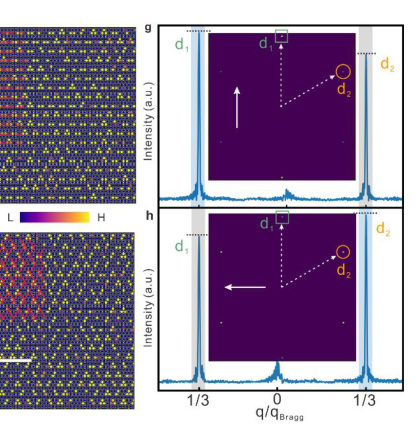 
Figure 4. Numerical simulations of supercurrent effect on CDW mediated patterns a, b, Calculated Bogoliubov quasiparticle dispersions with fields applied along Γ-M and Γ-K directions, respectively. The Doppler shift develops perpendicular to the magnetic field and parallel to the direction of screening supercurrent. Τhe blue and gray planes together represent constant-energy cuts at E = 0.5Δ, where the blue plane highlights regions of the constant-energy contour that become populated by Doppler- shifted quasiparticles, while the gray plane remains gapped. The black hexagon denotes the Brillouin zone, with high-symmetry points indicated. c, d, Constant-energy

**Summary.** The research demonstrates that supercurrents flowing in a CDW-intertwined superconductor like $	ext{NbSe}_2$ can actively control the symmetry of the charge density wave. By applying an in-plane magnetic field, the system undergoes a measurable phase transition ($C_{3v}$ to $C_s$) observable through spectroscopic measurements and confirmed by theoretical modeling.

**Why it may be interesting.** This work provides an example of how external electromagnetic fields can be used as a tool to selectively tune quantum ground states (CDW order) by coupling to superconducting excitations, which is highly relevant for designing novel electronic materials.

Detailed structure

**Main problem.** The study investigates how supercurrents, specifically Meissner currents induced by an in-plane magnetic field, modify the electronic structure of superconductors that are intertwined with Charge Density Wave (CDW) order.

**Main result.** The applied supercurrent induces a Doppler shift on Bogoliubov quasiparticles, which drives a symmetry breaking transition in the CDW modulation from $C_{3v}$ to $C_s$ within the superconducting gap. This demonstrates momentum-space engineering control over emergent electronic phases.

**Method.** The work combines experimental scanning tunneling spectroscopy (STS) measurements with theoretical modeling using tight-binding Hamiltonians and Bogoliubov-de Gennes equations incorporating Peierls substitution for supercurrent effects.

**Model / system.** The physical system is superconducting $	ext{NbSe}_2$, which exhibits both s-wave superconductivity ($	ext{T}_{	ext{c}} \approx 7.2	ext{ K}$) and a $3	imes3$ CDW phase. The model incorporates hopping terms, the CDW potential, and pairing potentials into the BdG Hamiltonian.

**Key observables.** Bogoliubov quasiparticle spectra (coherence peaks), CDW modulation symmetry ($C_{3v}$ vs $C_s$), field-dependent peak intensities in Fourier Transforms of LDOS maps.

**Important parameters / regimes.** Applied magnetic field strength and direction ($\Gamma-	ext{M}, \Gamma-	ext{K}$ directions); energy window within the superconducting gap ($0.2-0.6 	ext{ meV}$).

**Assumptions / limitations.** The authors assume that surface-vortex contributions are negligible during measurements, allowing the field effect to be attributed directly to the interplay between CDW order and Bogoliubov quasiparticles.

**Figures summary.** Figures illustrate CDW modulation patterns (real space/FFT) under applied fields, showing symmetry breaking ($C_{3v} 	o C_s$) in the superconducting gap region. Band structures and constant-energy contours confirm the field dependence of the electronic states.

**Paper structure.** The paper establishes the theoretical framework by coupling CDW order to superconductivity via a Hamiltonian. It then presents experimental evidence using STS/STS mapping under varying magnetic fields, correlating observed symmetry breaking in the CDW modulation with Doppler shifts calculated from quasiparticle spectra and model calculations.

Abstract

The energy-momentum (E-k) dispersion of quasiparticles constitutes a fundamental concept in condensed matter systems. The ability to modify the E-k dispersion, exemplified by supercurrent-induced Doppler shifts of Bogoliubov quasiparticle spectra in superconductors, enables manipulation of various emergent quantum properties. However, investigations into the supercurrent effect on superconductors intertwined with charge orders remain scarce. Here, we report that the Meissner current, generated by the diamagnetic response to an applied in-plane magnetic field, can tailor Bogoliubov quasiparticle excitations at the precursor charge density wave (CDW) vectors. Our scanning tunneling spectroscopic imaging reveals a field-driven symmetry breaking of CDW modulations, specifically a C3v-to-Cs transition, in superconducting NbSe2. Model calculations suggest that the observed anisotropy originates from a selective Doppler-shift-induced E-k dispersion reconstruction. Furthermore, altering the field direction enables on-demand tuning of anisotropic CDW modulations and visualization of their momentum-space distribution. These results highlight a novel mechanism for controlling emergent electronic phases through momentum-space engineering.

[↑ back to top](#top)

### [Emergent ferromagnetism in the NiI$_2$-NbSe$_2$ van der Waals heterostructure](http://arxiv.org/abs/2607.21218v1)

**Authors:** Büşra Gamze Arslan, Mohammad Amini, Ziying Wang, Alessandro Orsini, Jose L. Lado, Adolfo O. Fumega, Robert Drost, Peter Liljeroth  
**Type:** both · **Category:** strongly correlated electrons · **PDF:** <https://arxiv.org/pdf/2607.21218v1>  
**Analysis basis:** full PDF text, analyzed in chunks
**Topic relevance:** `exotic spin models in light-matter` **3/5** · `spintronics-quantum-optics interface` **3/5** · `Kondo & dissipative impurity` **2/5** · `analog quantum simulation` **2/5** · `Keldysh / 2PI / non-Gaussian methods` **1/5** · `correlated / nonlocal dissipation` **1/5** · `driven-dissipative phase transition` **1/5** · `methods for driven-dissipative` **1/5**

📷 Fig 1

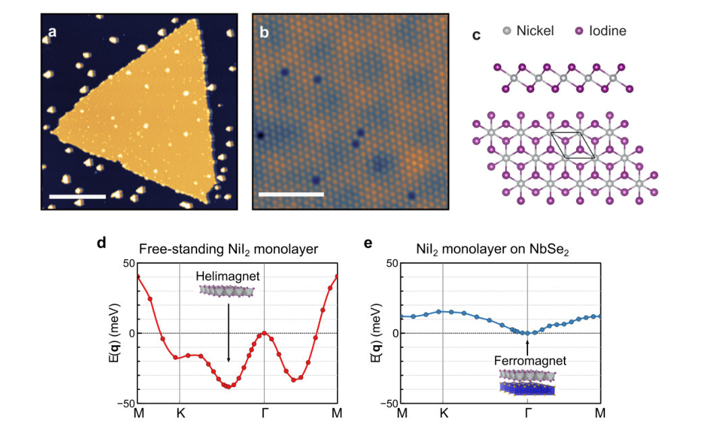 
FIG. 1. Monolayer NiI2 grown by MBE on NbSe2. a, Large area topography image of a NiI2 island (scale bar 50 nm, setpoint 1 V, 5.1 pA). b, Atomic resolution topography image of NiI2 (scale bar 4 nm, setpoint 100 mV, 308 pA). c, The schematic illustration of monolayer NiI2 with a side and top view. The black rhombohedron represents the unit cell of NiI2. d, e, Energy diagrams of free standing NiI2 and NiI2 on NbSe2 substrate, respectively. Free standing NiI2 shows a helimagnetic ground state while NiI2 on NbSe2 is ferromagnetic.

📷 Fig 2

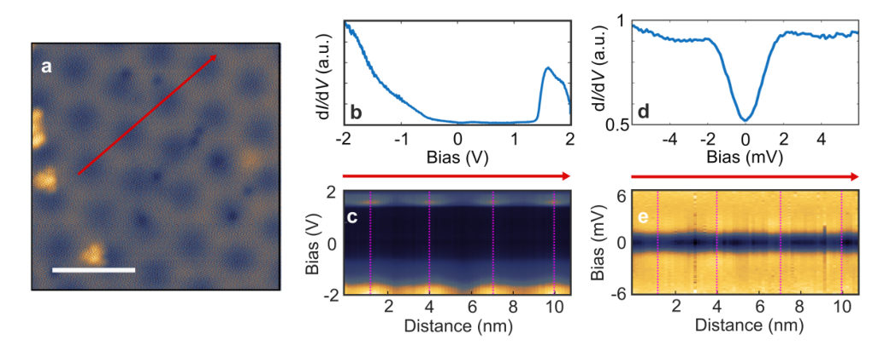 
FIG. 2. Electronic characterization of NiI2 on NbSe2 at 5 K. a, Topography image of NiI2 on NbSe2 (scale bar 5 nm, setpoint 1 V, 315 pA). b, Typical conductance spectrum of NiI2 on NbSe2 between 2 V and −2 V (stabilization parameters 2 V, 500 pA). c, Differential conductance spectra along the line specified with the red arrow in panel a. d, Typical conductance spectrum of the SC gap NbSe2 under NiI2 (stabilization parameters 10 mV, 500 pA). e, Differential conductance spectra along the red line indicated in panel a (10 mV, 500 pA). The magenta dotted lines in panels c and e mark the moir´e period, with a slight shift on the last moir´e period in e due to the drift.

📷 Fig 3

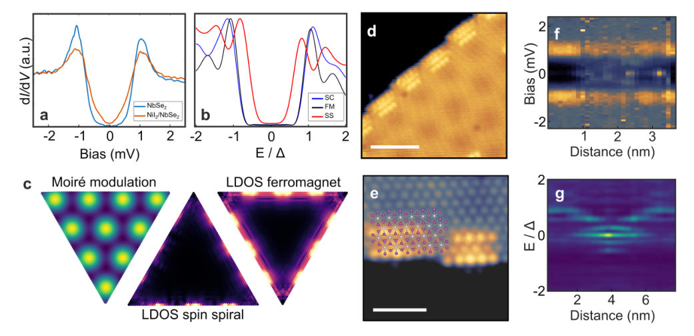 
FIG. 3. a, Differential conductance spectra measured on NbSe2 substrate (blue curve) and on the NiI2 island (orange curve) at 350 mK (stabilization parameters 3 mV, 106.5 pA and 101 pA, respectively, modulation voltage Vm = 50 µV). b, Calculated LDOS states for ferromagnetic (FM, black curve) and spin spiral (SS, red curve) magnetic ground states. Blue curve shows the calculated conductance spectrum on bare NbSe2 (SC). c, Illustration of the moir´e modulation used for the theoretical results, and the calculated LDOS maps for spin spiral and ferromagnetic ground states for a triangular NiI2 island. d, STM image showing the edge contrast and its registry with the moir´e pattern (scale bar 4...

**Summary.** This work demonstrates that coupling the multiferroic $	ext{NiI}_2$ monolayer to a superconducting $	ext{NbSe}_2$ substrate drives a fundamental change in its magnetic state, forcing it from a helimagnetic to a ferromagnetic configuration. This control is experimentally verified by observing characteristic Yu-Shiba-Rusinov states using low-temperature scanning tunneling spectroscopy.

**Why it may be interesting.** The ability to use superconducting proximity effects (a quantum phenomenon) to tune magnetic ordering in 2D materials provides a powerful platform for realizing controllable quantum magnets relevant to spintronics and topological physics.

Detailed structure

**Main problem.** The study aims to demonstrate experimental control over magnetic order, specifically driving a transition from a helimagnetic to a ferromagnetic state in monolayer $	ext{NiI}_2$ using proximity effects from a superconducting substrate.

**Main result.** The coupling of $	ext{NiI}_2$ to the $	ext{NbSe}_2$ substrate renormalizes exchange interactions, inducing a robust ferromagnetic ground state confirmed by spectroscopic signatures.

**Method.** The research combines low-temperature Scanning Tunneling Microscopy/Spectroscopy ($	ext{STM}/	ext{STS}$) with theoretical modeling using Bogoliubov-de-Gennes Hamiltonians to predict and interpret the electronic states.

**Model / system.** The system is a van der Waals heterostructure of monolayer $	ext{NiI}_2$ (a multiferroic) placed on a superconducting $	ext{NbSe}_2$ substrate. The physics involves coupling magnetic exchange interactions ($H_J$) to the intrinsic $s$-wave superconductivity ($H_{SC}$).

**Key observables.** Yu-Shiba-Rusinov ($	ext{YSR}$) states within the superconducting gap, reduction of coherence peaks in $	ext{STS}$ spectra, and spatial patterns of Local Density of States ($	ext{LDOS}$).

**Important parameters / regimes.** Low temperature (e.g., $350 	ext{ mK}$), proximity coupling strength, and the transition between helimagnetic and ferromagnetic magnetic order.

**Assumptions / limitations.** The observed $	ext{YSR}$ states are directly attributable to the substrate-induced renormalization of the magnetic ground state in $	ext{NiI}_2$.

**Figures summary.** Figures show atomic structure, $	ext{STS}$ spectra comparing bare and coupled systems (showing gap filling/$	ext{YSR}$ bands), and theoretical predictions for $	ext{LDOS}$ patterns corresponding to different magnetic states.

**Paper structure.** The paper establishes the physical system ($	ext{NiI}_2/	ext{NbSe}_2$), uses theory ($	ext{DFT}/	ext{BdG}$) to predict the transition from spin spiral to ferromagnetic state, and validates this prediction using low-temperature $	ext{STS}$ measurements focusing on $	ext{YSR}$ states.

Abstract

Multiferroicity arising from non-collinear spin textures and strong spin-orbit interactions offers a route to magnetoelectric functionality in the monolayer limit. Although theory predicts that the properties of monolayer multiferroics can be tuned by strain, gating, or proximity effects, experimental demonstrations of such control remain scarce. Here we show that the magnetic ground state of monolayer NiI$_2$, a prototypical two-dimensional multiferroic, is altered by proximity to a superconducting NbSe$_2$ substrate. Using low-temperature scanning tunnelling microscopy (STM) and spectroscopy (STS), we show that the metallic substrate renormalizes the exchange interactions within NiI$_2$ and drives it into a ferromagnetic ground state. This can be visualized by probing the Yu-Shiba-Rusinov (YSR) states within the superconducting gap of the NbSe$_2$ substrate. Our results establish YSR states as an in situ probe of two-dimensional magnetism and demonstrate substrate engineering as a means of controlling magnetic order in atomically thin materials.

[↑ back to top](#top)

### [Tunnel magnetoresistance effect with a Cr-doped $\mathrm{RuO_{2}}(110)$ altermagnet](http://arxiv.org/abs/2607.21092v1)

**Authors:** Katsuhiro Tanaka, Takuya Nomoto, Ryotaro Arita  
**Type:** theory · **Category:** other · **PDF:** <https://arxiv.org/pdf/2607.21092v1>  
**Analysis basis:** full PDF text, analyzed in chunks
**Topic relevance:** `spintronics-quantum-optics interface` **3/5** · `Keldysh / 2PI / non-Gaussian methods` **1/5** · `Kondo & dissipative impurity` **1/5** · `analog quantum simulation` **1/5** · `exotic spin models in light-matter` **1/5** · `methods for driven-dissipative` **1/5** · `non-equilibrium dynamics` **1/5**

📷 Fig 1

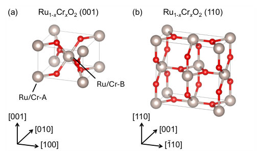 
FIG. 1. (a) Crystal structures of the rutile Ru1−xCrxO2 prim- itive cell. (b) Crystal structure of the rutile Ru1−xCrxO2 stacked along [110]-direction.

📷 Fig 2

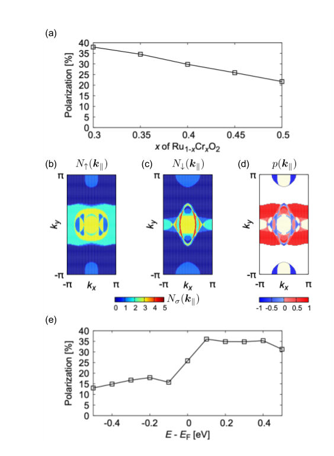 
FIG. 2. Calculation results of the spin polarization in the bulk Ru1−xCrxO2(110) systems. (a) Cr-concentration dependence of the polarization ptot (Eq. (3)) at E = EF. (b), (c) In- plane momentum dependence of the number of conduction channels for (b) up and (c) down spins at E = EF for the x = 0.45 system. (d) In-plane momentum dependence of the polarization, p(k∥) (Eq. (2)), corresponding to (b) and (c). (e) Energy dependence of ptot for the x = 0.45 system. Note that the k-mesh is 151 × 151 at E = EF and 101 × 101 for others.

📷 Fig 3

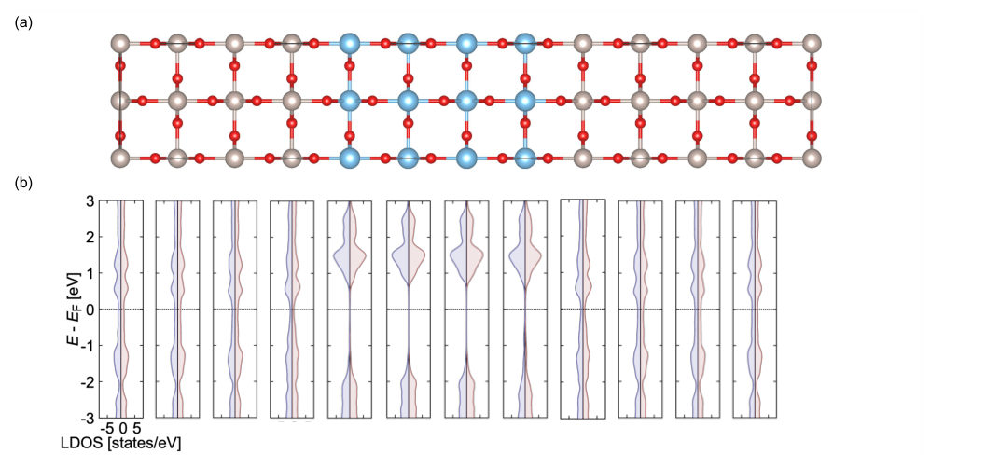 
FIG. 3. (a) Crystal structure of the Ru1−xCrxO2(110)/TiO2(110)/Ru1−xCrxO2(110) tunnel junction with four monolayers of TiO2(110). Specifically, the scattering region used in the calculations is shown. (b) Density of states (DOS) of the scattering region with the parallel configuration for the x = 0.45 system. Each DOS contains the projected DOS of the layers with Ru/Ti atoms and the oxygen atoms nearby.

📷 Fig 4

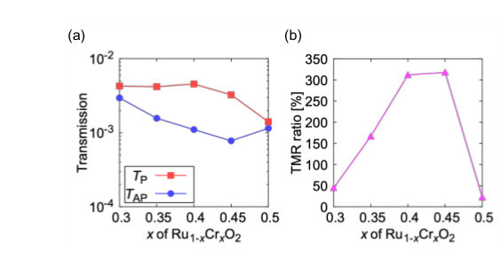 
FIG. 4. (a) Cr-doping amount dependence of the total trans- mission for the parallel and antiparallel configurations, TP and TAP, respectively, at E = EF with four monolayers of TiO2(110). (b) Cr-doping amount dependence of the TMR ratio calculated by (TP −TAP) /TAP ×100% corresponding to (a).

📷 Fig 5

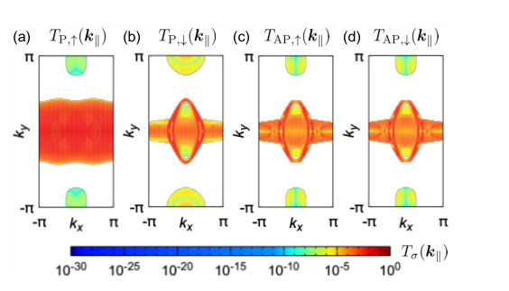 
FIG. 5. Momentum resolved transmission at E = EF for the x = 0.45 system with four monolayers of TiO2(110). (a), (b) Transmission for the parallel configuration with (a) up and (b) down spins. (c), (d) Transmission for the antiparallel configuration with (c) up and (d) down spins.

**Summary.** This theoretical study calculates the Tunnel Magnetoresistance (TMR) effect in a doped altermagnet $\mathrm{Ru}_{1-x}\mathrm{Cr}_x\mathrm{O}_2(110)$ junction. Using DFT, the authors demonstrate that a finite TMR signal emerges due to spin polarization originating from the crystal structure and interfacial effects. This work advances understanding of spintronics in antiferromagnetic oxides.

**Why it may be interesting.** While focused on condensed matter magnetism, the calculation of electronic transport properties (TMR) using first-principles methods is foundational for understanding quantum phenomena in solid-state devices, which has parallels with open quantum system modeling.

Detailed structure

**Main problem.** The study investigates the Tunnel Magnetoresistance (TMR) effect occurring in antiferromagnetic tunnel junctions using doped altermagnets.

**Main result.** A finite TMR effect is predicted and calculated for $\mathrm{Ru}_{1-x}\mathrm{Cr}_x\mathrm{O}_2(110)/\mathrm{TiO}_2(110)/\mathrm{Ru}_{1-x}\mathrm{Cr}_x\mathrm{O}_2(110)$ junctions, attributed to momentum-dependent spin polarization and interfacial magnetic structures.

**Method.** The research employs first-principles calculations (DFT) combined with the scattering theory method and Landauer–Büttiker formalism to model tunneling transport.

**Model / system.** The system is a Magnetic Tunnel Junction (MTJ) composed of $\mathrm{Ru}_{1-x}\mathrm{Cr}_x\mathrm{O}_2(110)$ altermagnets separated by a $\mathrm{TiO}_2(110)$ barrier. The material properties are derived from first-principles calculations using the virtual crystal approximation for Cr doping.

**Key observables.** Total spin polarization ($p_{	ext{tot}}$), momentum-dependent spin polarization $p(\mathbf{k}_{\parallel})$, total transmission ($\mathrm{T}_{	ext{P}}, \mathrm{T}_{	ext{AP}}$), and the TMR ratio.

**Important parameters / regimes.** Cr doping concentration ($x$), crystal orientation ($(110)$ vs $(001)$), and Fermi energy ($E_{	ext{F}}$).

**Assumptions / limitations.** The analysis assumes that the TMR effect arises from a combination of bulk spin-polarized current, momentum dependence, and interfacial magnetic structures.

**Figures summary.** Figures illustrate the crystal structures for different orientations, show how total spin polarization changes with Cr concentration, map out the momentum dependence of spin polarization, and plot the calculated TMR ratio versus doping concentration and barrier thickness.

**Paper structure.** The paper first establishes the theoretical basis by showing that the $(110)$ orientation allows for a finite bulk spin-polarization in the altermagnet. It then applies this to model the MTJ structure, calculating the TMR effect based on tunneling transport theory and analyzing its dependence on doping and barrier thickness.

Abstract

Antiferromagnets can have a finite spin-polarization in the momentum space when their magnetic structure breaks the macroscopic time-reversal symmetry. This spin-polarization can produce a spin-polarized electric current even in antiferromagnets with vanishingly small net magnetizaton, which supports the antiferromagentic tunnel magnetoresistance (TMR) effect. In this paper, using first-principles calculations, we study the TMR effect with a doped altermagnet $\mathrm{Ru}_{1-x}\mathrm{Cr}_{x}\mathrm{O}_{2}$ with $(110)$ orientation, whose collinear antiferromagnetic structure breaks the time-reversal symmetry macroscopically. The momentum-dependent spin-polarization combined with the $(110)$ crystal orientation makes the electric current spin-polarized through bulk $\mathrm{Ru}_{1-x}\mathrm{Cr}_{x}\mathrm{O}_{2}(110)$. We further calculate the TMR effect in the $\mathrm{Ru}_{1-x}\mathrm{Cr}_{x}\mathrm{O}_{2}(110)/\mathrm{TiO_{2}}(110)/\mathrm{Ru}_{1-x}\mathrm{Cr}_{x}\mathrm{O}_{2}(110)$ tunnel junction and show that a finite TMR effect emerges. Based on the analysis of the tunneling transport, the TMR effect is attributed to the spin polarized tunneling transport with momentum dependence and the interfacial magnetic structures, as well as the spin-polarized electric current in a bulk form of $\mathrm{Ru}_{1-x}\mathrm{Cr}_{x}\mathrm{O}_{2}(110)$.

[↑ back to top](#top)

### [Visualization of Defect Electronic States in Layered Semiconductor CrSBr](http://arxiv.org/abs/2607.21301v1)

**Authors:** Jonathan Brunette, Joost Aretz, Kiyoung Jo, Aljoscha Soll, Zdeněk Sofer, Malte Rösner, Nathan Guisinger, Adina Luican-Mayer  
**Type:** both · **Category:** other · **PDF:** <https://arxiv.org/pdf/2607.21301v1>  
**Analysis basis:** full PDF text, analyzed in chunks
**Topic relevance:** `exotic spin models in light-matter` **3/5** · `spintronics-quantum-optics interface` **3/5** · `Keldysh / 2PI / non-Gaussian methods` **1/5** · `Kondo & dissipative impurity` **1/5**

📷 Fig 1

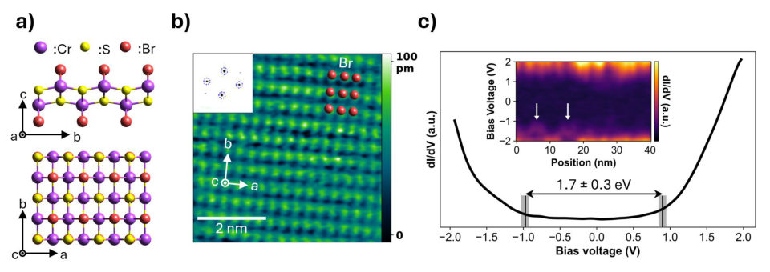 
Figure 1. a) CrSBr crystal structure. b) STM topographic image of bulk CrSBr showing atomic

📷 Fig 2

 
Figure 1b, where the rectangular symmetry is apparent along the a and b directions. The symmetry

📷 Fig 3

 
Figure 1c shows a band gap of 1.7 ± 0.3 eV, in agreement with existing measurements and

📷 Fig 4

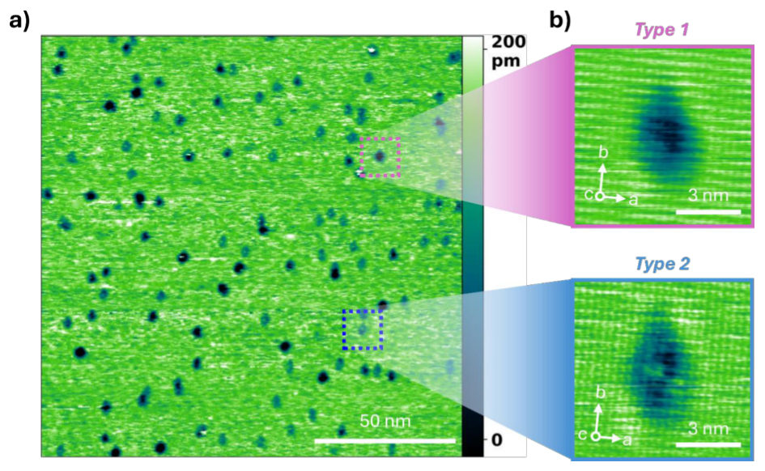 
Figure 2. a) Typical STM topographic map (VB = -0.55 V, IS = -50 pA). Two primary defect types

📷 Fig 5

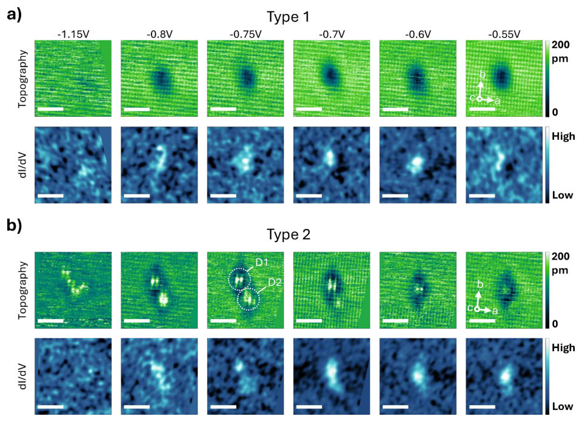 
Figure 3. Series of STM topographs and corresponding dI/dV maps acquired from -0.55V to -

**Summary.** This work uses STM/STS on $	ext{CrSBr}$ to investigate intrinsic defects, finding two distinct defect types. By comparing these experimental observations with DFT simulations, the authors propose that the Type 2 defect is structurally equivalent to a $b$-axis-aligned double sulfur vacancy ($	ext{V}_2	ext{S}$). This advances understanding of how native defects dictate the electronic structure and potential optical properties of layered semiconductors.

**Why it may be interesting.** While primarily condensed matter physics, the detailed mapping of localized electronic states induced by vacancies provides a model system for studying how point defects modify band edges and potentially enable tunable emission in 2D materials, relevant to quantum emitters.

Detailed structure

**Main problem.** The study aims to understand the microscopic structure, electronic properties, and nature of intrinsic defects within the layered magnetic semiconductor $	ext{CrSBr}$.

**Main result.** Experimental STM/STS measurements strongly suggest that a common defect corresponds to a $b$-axis-aligned double sulfur vacancy ($	ext{V}_2	ext{S}$), which is supported by qualitative agreement with DFT simulations.

**Method.** The research combines Scanning Tunneling Microscopy/Spectroscopy (STM/STS) experiments at atomic resolution with first-principles Density Functional Theory ($	ext{DFT}+	ext{U}$) calculations.

**Model / system.** The physical system is $	ext{CrSBr}$, a layered magnetic semiconductor. The analysis focuses on characterizing defect states by comparing experimental electronic signatures (dI/dV maps) against theoretical predictions for various vacancy types.

**Key observables.** Electronic features near the valence band edge, localized electronic states centered on defects, and topographic contrast changes observed across varying bias voltages.

**Important parameters / regimes.** The material exhibits a bulk band gap of $1.7 \pm 0.3 	ext{ eV}$. Key defect candidates include $b$-axis-aligned double sulfur vacancies ($	ext{V}_2	ext{S}$).

**Assumptions / limitations.** The comparison between simulated and experimental STM signatures is qualitative, and $	ext{DFT}+	ext{U}$ calculations are acknowledged to be approximations for weakly screened semiconductors.

**Figures summary.** Figures show bulk crystal structure, topographic maps identifying two defect types (Type 1 and Type 2), and comparisons of calculated band structures/simulated STM images against experimental measurements on the Type 2 defect.

**Paper structure.** The paper systematically uses STM to map defects, analyzes electronic signatures via STS across bias ranges, and then employs DFT calculations to model specific vacancy types ($	ext{V}_2	ext{S}$) for direct comparison with the observed defect states.

Abstract

Chromium sulfur bromide (CrSBr) is a layered magnetic semiconducting material combining a rich magnetic phase diagram with axis-dependent electronic and optical properties. While defects in CrSBr have been shown to affect magnetic order and excitonic responses, their microscopic nature, atomic structure, and electronic properties are not yet fully understood. In this work, we use scanning tunneling microscopy/spectroscopy (STM/STS) to explore the structure and electronic signatures of two prominent defects in bulk CrSBr. Their structure reflects the symmetries of the underlying lattice, with electronic features near the valence band edge. By comparing experimental data with ab initio simulated STM images, we infer that a common defect corresponds to a b-axis-aligned double sulfur vacancy, in line with findings from a recent growth analysis study. This result advances our understanding of the role of intrinsic defects in shaping the electronic structure of CrSBr.

[↑ back to top](#top)

### [Magnetically memorable inductance in superconducting multilayer resonators](http://arxiv.org/abs/2607.21147v1)

**Authors:** R. Tyumenev, D. S. Kalashnikov, B. V. Fradkin, A. A. Neilo, A. G. Shishkin, N. V. Klenov, I. I. Soloviev, A. A. Golubov, M. Yu. Kupriyanov, I. A. Golovchanskiy, V. S. Stolyarov, A. S. Sidorenko, S. V. Bakurskiy  
**Type:** experiment · **Category:** disordered systems and neural networks · **PDF:** <https://arxiv.org/pdf/2607.21147v1>  
**Analysis basis:** full PDF text, analyzed in chunks
**Topic relevance:** `spintronics-quantum-optics interface` **3/5** · `Kondo & dissipative impurity` **1/5** · `QC/QI experiment` **1/5** · `exotic spin models in light-matter` **1/5**

📷 Fig 1

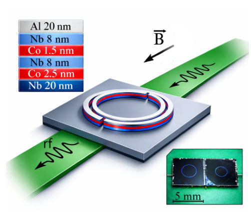 
Figure 1. Schematic illustration of the studied sample. A multilayer split-ring resonator (SRR) on a Si (100) substrate is placed on top of the central line of a planar waveguide (strip- line type). The external magnetic field B is applied along the waveguide. The top-left inset shows a cross-sectional sketch of the sample with the actual layer thicknesses. The bottom- right inset shows a photograph (top view) of the measured samples.

📷 Fig 2

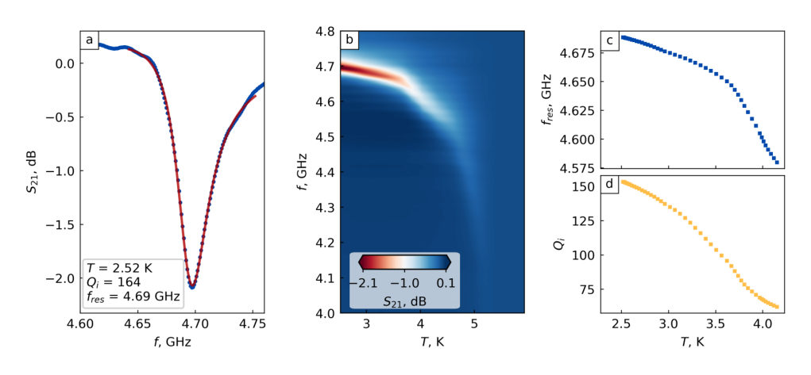 
Figure 2. Temperature dependences of the parameters of the 4.7 GHz multilayer resonator. (a) Transmission coefficient S21 of the resonator at a fixed temperature of 2.5 K after background subtraction. The red curve shows a fit using the asymmetric Lorentzian profile (1). The resonator parameters obtained from the fit are indicated in the legend. (b) Temperature dependence of S21(f). (c) Resonant frequency and (d) internal quality factor of the resonator as functions of temperature.

📷 Fig 3

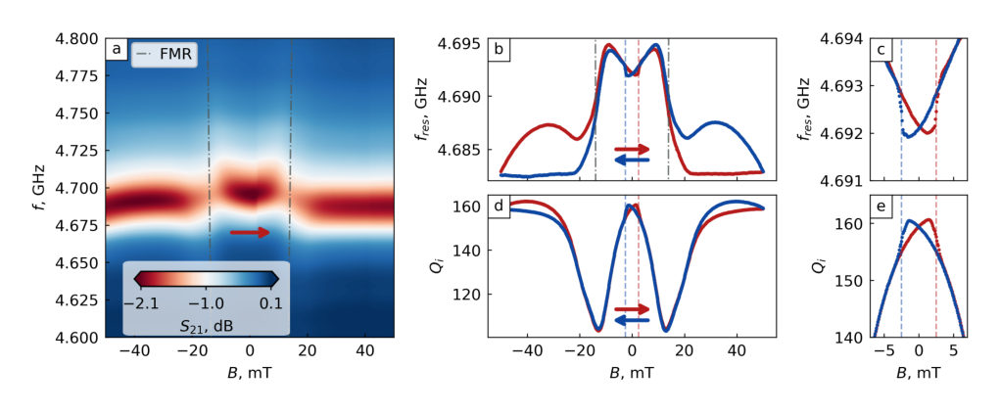 
Figure 3. Dependence of the parameters of the 4.7 GHz multilayer resonator on the external magnetic field. (a) Measured transmission coefficient S21 as a function of the magnetic field after background subtraction. The dotted-dashed line indicates the FMR dependence. (b) Resonant frequency and (d) internal quality factor, extracted using the fit from Eq. (1), as functions of the external magnetic field. The dashed line marks the field at which the thinner ferromagnetic layer reverses, resulting in an antiparallel configuration. (c) Resonant frequency and (e) internal quality factor in an expanded view of the region corresponding to the reversal of the thin layer.

📷 Fig 4

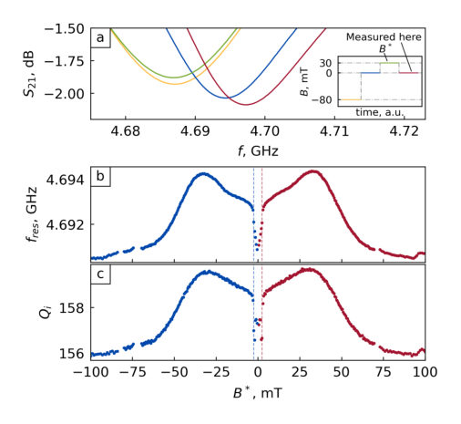 
Figure 4. Characteristics of the 4.7 GHz multilayer res- onator depending on the history of the applied external mag- netic field. (a) Transmission coefficient S21 under a field B1 = −80 mT (yellow curve); after switching the field off, the sample is in the P-state (blue curve); under a field B = 30 mT (green curve); and after switching the field off, the sample is in the AP-state (red curve). The inset shows the history of the applied external magnetic field. Dependence of the reso- nant frequency (b) and the internal quality factor (c) of the multilayer resonator, measured at zero field after full magneti- zation reversal and the temporary application of a finite field B∗(indicated on the...

📷 Fig 5

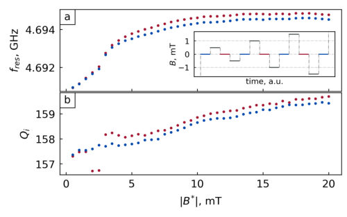 
Figure 5. Dependence of the resonant frequency (a) and the internal quality factor (b) of the multilayer resonator, mea- sured at zero field after full magnetization reversal and the temporary application of a finite field B, whose value is in- dicated within the panel. Blue (red) points show the mea- surement results at zero field after the temporary application of a field in the negative (positive) direction. The inset il- lustrates the history of the applied external magnetic field. After applying a field of 2.5 mT, at which the reversal of the thinner ferromagnetic layer occurs, a sharp jump in the reso- nant frequency change of approximately 0.7 MHz is observed for both the red and...

**Summary.** The authors fabricated superconducting multilayer resonators incorporating ferromagnetic layers to create magnetic memory elements. They experimentally demonstrated a non-volatile shift in the resonant frequency upon reversing the magnetization of the Co layers, confirming a spin-valve effect. This work establishes these structures as promising components for building tunable inductive circuits for neuromorphic and quantum computing applications.

**Why it may be interesting.** This work directly bridges superconducting electronics with spintronics, creating tunable inductive elements whose state is controlled magnetically—a key concept for implementing artificial synapses in quantum/neuromorphic computing architectures.

Detailed structure

**Main problem.** The research aims to demonstrate a non-volatile spin-valve effect on superconducting multilayer resonators, establishing them as viable field-programmable inductive elements for neuromorphic circuits.

**Main result.** A reproducible shift in the resonant frequency ($\Delta f$ up to 4 MHz) was observed upon magnetization reversal at zero applied magnetic field, confirming the magnetic memory of the structure.

**Method.** Microwave characterization using transmission coefficient measurements ($S_{21}(f)$) on fabricated split-ring resonators (SRRs).

**Model / system.** The physical platform is a superconducting multilayer resonator ($	ext{Nb}/	ext{Co}/	ext{Nb}/	ext{Co}/	ext{Nb}/	ext{Al}$) utilizing superconductor-ferromagnet hybrid structures. The physics is modeled using the Usadel equations.

**Key observables.** Resonant frequency shift ($\Delta f$), internal quality factor ($Q_i$), and kinetic inductance contrast between parallel and antiparallel magnetic states.

**Important parameters / regimes.** Operating temperature (2.5 K), resonant frequency range (4–7 GHz), and the magnitude of the frequency shift ($\sim 4 	ext{ MHz}$).

**Assumptions / limitations.** The analysis assumes that the observed effects are governed by changes in kinetic inductance due to magnetic state, and that the inclusion of an Al overlayer improves reproducibility.

**Figures summary.** Figures illustrate temperature dependence ($T$ vs $f_{	ext{res}}, Q_l$) and field dependence ($B$ vs $S_{21}, f_{	ext{res}}$), highlighting FMR anticrossings, sharp jumps at low fields, and the memory effect upon controlled magnetization reversal.

**Paper structure.** The paper progresses from demonstrating the basic spin-valve effect via frequency shifts to quantifying the enhancement provided by an aluminum shunt layer, comparing results against theoretical models (Usadel equations) and control samples.

Abstract

Superconductor-ferromagnet hybrid structures with tunable kinetic inductance are promising elements for neuromorphic and quantum computing circuits. We report the fabrication and microwave characterization of split-ring resonators based on Nb/Co/Nb/Co/Nb/Al spin-trigger multilayers and demonstrate a non-volatile spin-valve effect on their resonant properties. Reversal of the relative magnetization orientation of the cobalt layers produces a reproducible shift of the resonant frequency up to 4 MHz at zero applied magnetic field, corresponding to a change in the kinetic inductance of the structure. The incorporation of a proximitized aluminum overlayer is shown to enhance the inductance contrast between the parallel and antiparallel magnetic states by a factor of approximately three relative to structures without this layer. The experimental results are in quantitative agreement with a microscopic model based on the Usadel equations. The demonstrated magnetic memory of the resonant frequency at zero field establishes spin-trigger multilayers as viable field-programmable inductive elements for superconducting digital and neuromorphic circuits.

[↑ back to top](#top)

### [Circular phonon dichroism in $d$-wave altermagnets](http://arxiv.org/abs/2607.21221v1)

**Authors:** Ding Li, Tao Qin, Jianhui Zhou  
**Type:** theory · **Category:** other · **PDF:** <https://arxiv.org/pdf/2607.21221v1>  
**Analysis basis:** full PDF text, analyzed in chunks
**Topic relevance:** `spintronics-quantum-optics interface` **3/5** · `exotic spin models in light-matter` **1/5**

📷 Fig 1

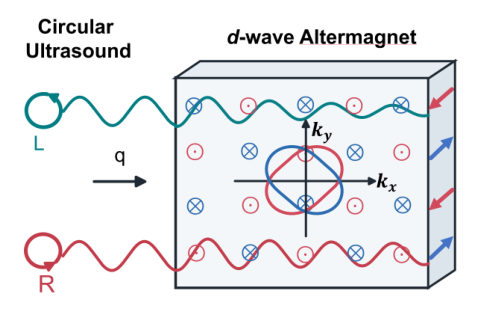 
Figure 1. Dichroic attenuation of circular ultrasound through an altermagnetic material. The red and blue circles denote the local magnetic moments, which are perpendicular to the page and antiparallel to one another. Equal-amplitude left- and right-circular ultrasound are transmitted separately through a d-wave altermagnet with a static alternating-spin lattice. The red and blue contours schematically depict the d-wave altermagnetic Fermi-surface splitting, which vanishes on the crystalline axes and changes sign between adjacent quadrants. The unequal transmitted amplitudes correspond to γL ̸= γR. At fixed and calibrated (q, ω), the sign of the attenuation difference distinguishes opposite...

📷 Fig 2

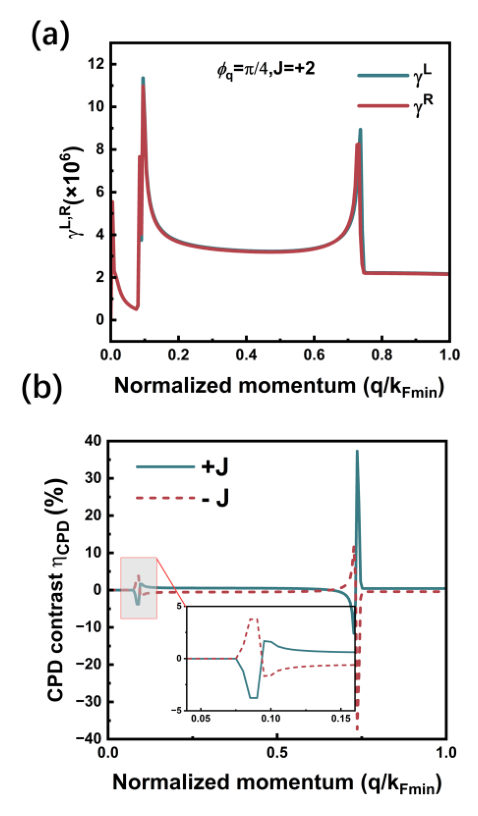 
Figure 2. Radial circular-channel absorption and CPD asym- metry ratio. (a) Momentum dependence of γL and γR(1/s) along ϕq = π/4 for J = 2 eV. (b) Normalized CPD asymme- try ratio ηCPD along the same direction for J = ±2 eV. Solid and dashed curves denote J = 2 eV and J = −2 eV, respec- tively. The inset enlarges the low-q resonance region.

📷 Fig 3

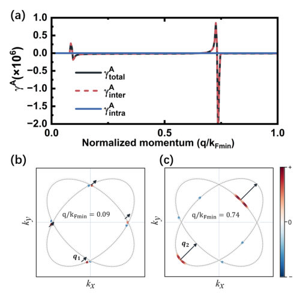 
Figure 3. Channel and k-resolved origin of the radial res- onances. (a) Channel-resolved γA(1/s) for J = 2 eV: to- tal (solid black), inter-band (dashed red), and intra-band (solid blue). Inter-band kernel gA(k, q) of γA plotted as sgn(gA)|gA/gA,max| on the SOC Fermi surfaces for (b) q1/kF,min = 0.09 and (c) q2/kF,min = 0.74. Red and blue denote positive and negative values after separate panel nor- malization. Dash line show the SOC Fermi surfaces. Arrows indicate representative near-Fermi transitions ki →ki + q1,2 selected by the corresponding peak momenta.

📷 Fig 4

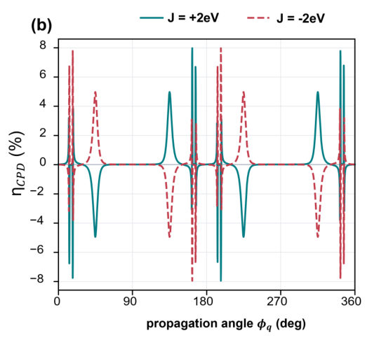 
Figure 4. Directional scan of the finite-momentum CPD for J = ±2 eV. The momentum magnitude is fixed at |q|/kF,min = 0.72.

**Summary.** The authors propose using finite-momentum circular phonon dichroism (CPD) as a highly sensitive and direct diagnostic tool to determine the orientation of the Néel vector in $d$-wave altermagnets. By exploiting symmetry constraints, they show that CPD's sign reverses when the magnetic order is reversed, offering a practical acoustic method for characterizing these complex antiferromagnetic materials.

**Why it may be interesting.** This work connects macroscopic acoustic measurements (ultrasound) directly to microscopic magnetic order parameters ($\mathbf{N}$), providing a novel, non-magnetic readout mechanism relevant for spintronics applications in correlated materials.

Detailed structure

**Main problem.** The primary challenge is developing a direct, measurable technique to determine the orientation of the Néel vector ($\mathbf{N}$) in altermagnets because their magnetic order is otherwise difficult to read out.

**Main result.** Finite-momentum circular phonon dichroism (CPD) acts as a direct and sign-sensitive probe for the Néel vector, showing that the signal reverses when $\mathbf{N}$ is flipped.

**Method.** The theory calculates CPD by analyzing the difference between left ($\gamma_L$) and right ($\gamma_R$) circular ultrasound amplitudes, relating it to the Hall-like component of the electron-phonon coupling tensor ($\eta_{	ext{CPD}} = -\gamma_A / \gamma_D$).

**Model / system.** The study focuses on two-dimensional ($d$-wave) altermagnets. The electronic structure is modeled using a minimal two-band Hamiltonian incorporating $d$-wave exchange splitting ($J$) and Rashba spin-orbit coupling ($\lambda$).

**Key observables.** Circular phonon dichroism asymmetry ratio ($\eta_{	ext{CPD}}$), which is expected to change sign upon Néel vector reversal.

**Important parameters / regimes.** The magnitude of the dichroic signal, exemplified by $|\eta_{	ext{CPD}}| = 37.3\%$, and the dependence on phonon wave vectors ($q$).

**Assumptions / limitations.** The analysis relies on combining Onsager reciprocity with $C_{2z}$ lattice symmetry to predict the sign change of CPD upon Néel vector reversal.

**Figures summary.** Figures illustrate the concept by showing unequal transmitted amplitudes ($\gamma_L 
eq \gamma_R$) for opposite $\mathbf{N}$ orientations, and quantify the dichroic asymmetry ratio across various momentum cuts.

**Paper structure.** The paper establishes a theoretical framework using electron-phonon coupling to define CPD. It derives symmetry constraints based on crystal and time-reversal symmetries, calculates the signal originating from interband transitions, and presents quantitative results confirming its utility as an orientation probe.

Abstract

Altermagnets, a new class of collinear antiferromagnets, exhibit momentum-dependent spin splitting and offer compelling advantages for antiferromagnetic spintronics. However, the magnetic order is intrinsically difficult to read out, which hinders practical applications. We propose finite-momentum circular phonon dichroism as a direct probe of Néel vector in two-dimensional $d$-wave altermagnets. Combining Onsager reciprocity with $C_{2z}$ lattice symmetry, we find that the dichroic signal reverses sign when the Néel vector is flipped for the in-plane phonon wave vectors. Moreover, a channel-resolved decomposition identifies the circular phonon dichroism originates from the interband coherent transitions. Representative finite-momentum cuts show pronounced dichroic asymmetric ratio, with $|η_{\mathrm{CPD}}|=37.3\%$. Our work reveals that the circular-ultrasound absorption acts as a direct probe of the Néel vector of $d$-wave altermagnets.

[↑ back to top](#top)

### [Evidence for fully-gapped superconductivity in BCS superconductor NiBi3](http://arxiv.org/abs/2607.20974v1)

**Authors:** Atul Gangwar, Kunal Yadav, S. Patnaik, Sandip Chatterjee  
**Type:** experiment · **Category:** quantum gases · **PDF:** <https://arxiv.org/pdf/2607.20974v1>  
**Analysis basis:** full PDF text, analyzed in chunks
**Topic relevance:** `analog quantum simulation` **2/5** · `Keldysh / 2PI / non-Gaussian methods` **1/5**

📷 Fig 1

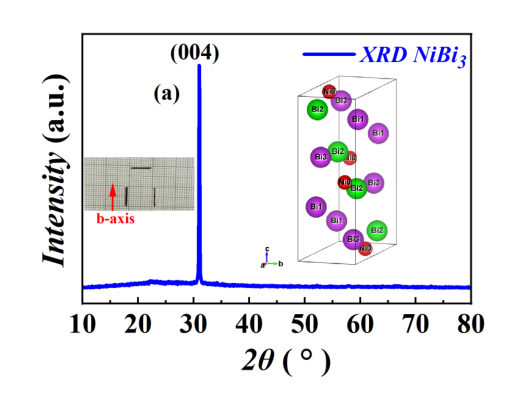 
FIG. 1. shows the single crystal reflection of NiBi3. The left inset shows a photograph of single crystals NiBi3 on a millime- ter paper and the right inset shows the unit cell corresponds to Ni and Bi atoms.

📷 Fig 2

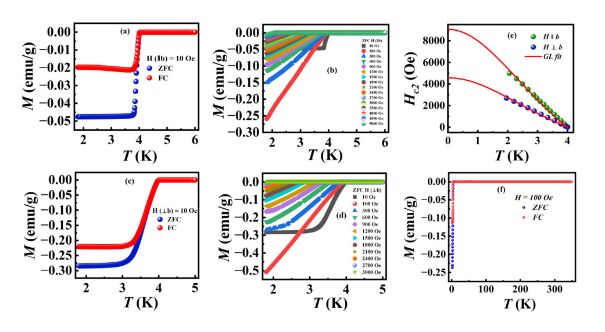 
FIG. 2. (a)-(d) temperature dependent DC magnetization with field applied perpendicular and parallel to the b direction. (e) represents the Hc2 phase diagrams for both directions (H ∥b) and (H ⊥b), solid red lines are the generalized GL fit. (f) shows magnetization in temperature range 1.8-350 K.

📷 Fig 3

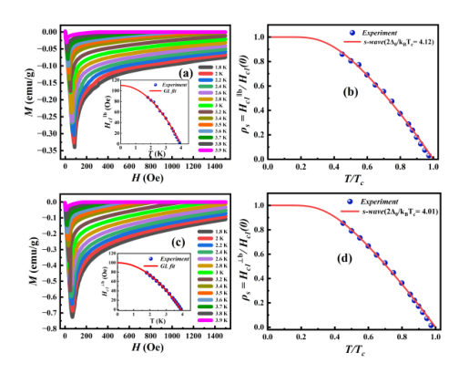 
FIG. 3. (a) and (c) show M(H) isotherms at various temper- atures for both parallel and perpendicular directions respec- tively. (b) and (d) shows the calculated superfluid density (ρs) from Hc1 and solid red lines are BCS s-wave fittings.

📷 Fig 4

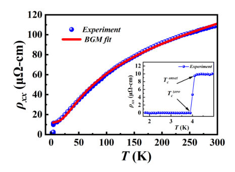 
FIG. 4. shows the temperature-dependent electrical resistiv- ity ρxx in the temperature range between 2 and 300 K in zero applied magnetic field and solid red line is the Bloch Gruneisen-Mott (BGM) fitting of equation (7) as discussed in text

📷 Fig 5

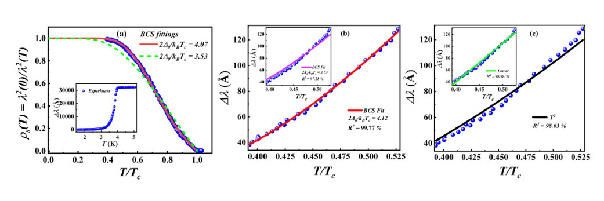 
FIG. 5. (a) shows the superfluid density calculated from penetration depth λ(T) and solid red line is the BCS fitting with 2∆0 kBTc = 4.07 while green dotted line is the standard BCS fitting. Inset shows the variation of ∆λ with T. (b) shows the low temperature penetration depth ∆λ(T) as a function of reduced temperature (T/Tc), fitted with exponential model (solid red line with 2∆0 kBTc = 4.12) and the upper inset shows the BCS model fitting with standard 2∆0 kBTc = 3.53. (c) shows T 2 fitting with R2 = 98.03% and the upper inset shows the linear fitting with R2 = 98.98%.

**Summary.** This work experimentally characterizes NiBi3 as a type-II superconductor by measuring its magnetic response and penetration depth. By fitting the temperature dependence of these quantities to theoretical models, the authors provide compelling evidence that the material possesses a fully opened superconducting gap with s-wave pairing symmetry. The results confirm its nature as a BCS-like superconductor in the dirty limit.

**Why it may be interesting.** While focused on condensed matter superconductivity, the rigorous application of BCS theory and gap analysis provides a model for understanding superconducting pairing mechanisms that can be conceptually related to strongly interacting quantum systems studied in AMO physics or ultracold atomic gases.

Detailed structure

**Main problem.** The study investigates the physical characteristics, normal state, and superconducting properties of NiBi3 single crystals to determine its pairing symmetry.

**Main result.** The analysis strongly indicates that NiBi3 is a type-II, BCS-like superconductor exhibiting fully gapped s-wave superconductivity with moderately strong coupling. The gap structure rules out nodal superconductivity.

**Method.** Measurements include electrical resistivity, magnetization (ZFC/FC), and London penetration depth measurements across varying magnetic fields and temperatures.

**Model / system.** The physical system is the intermetallic compound NiBi3. The analysis relies on fitting temperature dependencies of superfluid density ($
ho_s(T)$) and penetration depth ($\Delta\lambda(T)$) to BCS models, comparing them against linear or quadratic power-law fits.

**Key observables.** Superconducting Transition Temperature ($T_c \approx 4.0$ K), Upper Critical Field ($H_{c2}$), Coherence Lengths ($\xi$), Superconducting Gap Ratio ($2\Delta_0 / k_B T_c \approx 4.1$).

**Important parameters / regimes.** Type-II superconductivity, BCS framework, dirty limit, s-wave pairing symmetry.

**Assumptions / limitations.** The superconducting state is modeled using the single-gap isotropic s-wave BCS theory; orbital pair breaking dominates over Pauli limiting effects.

**Figures summary.** Figures show XRD patterns confirming purity, temperature-dependent magnetization curves used to fit $H_{c2}$, and plots of $\Delta\lambda(T)$ vs. T which are best described by the exponential BCS function.

**Paper structure.** The paper proceeds by characterizing the normal state (resistivity) and then systematically analyzing superconducting properties using magnetic measurements ($M(H)$, $H_{c2}$) and penetration depth ($\Delta\lambda(T)$) to constrain the pairing symmetry and gap structure, culminating in a full BCS characterization.

Abstract

We investigate the physical characteristics, normal state and superconducting properties of NiBi3 single crystals. Measurements of electrical resistivity, magnetization, and London penetration depth demonstrate a superconducting transition temperature, Tc=4.0 K, with a sharp transition in resistivity (Tc = 0.20 K) and RRR = 18, reflecting the high quality of NiBi3 single crystals. With both orientations H perpendicular b and H parallel b of NiBi3 single crystals, we estimated the upper critical field, Hc2, from the magnetization data. In both orientations, Hc2 is significantly smaller than the Pauli limit, suggesting the orbital pair breaking in superconducting state. The coherence length, xi(0) = 26.78 nm, electron-phonon coupling constant, lambda(e-p) = 0.81, and penetration depth, lambda0 = 181.8 nm, suggest type-II superconductivity in NiBi3. In the superconducting state, lambda(T) is best described by an s-wave BCS model and does not have linear or quadratic dependency with T, which is in line with the expectation for a node-less superconducting order parameter. The temperature evolution of the superfluid density, obtained from lambda(T), reveals a fully gapped superconductivity in NiBi3, with a superconducting gap = 4.07. All the results from the present study indicate that NiBi3 is a typical type-II, BCS-like, moderately strong coupled, and fully gapped superconductor in the dirty limit.

[↑ back to top](#top)

### [Puzzling superconductivity in strontium ruthenate: then and now](http://arxiv.org/abs/2607.21194v1)

**Authors:** James F. Annett, Karol I. Wysokiński  
**Type:** both · **Category:** strongly correlated electrons · **PDF:** <https://arxiv.org/pdf/2607.21194v1>  
**Analysis basis:** full PDF text, analyzed in chunks
**Topic relevance:** `Keldysh / 2PI / non-Gaussian methods` **1/5** · `Kondo & dissipative impurity` **1/5** · `analog quantum simulation` **1/5** · `spintronics-quantum-optics interface` **1/5**

📷 Fig 1

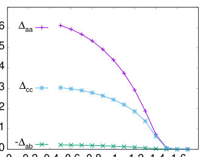 
FIG. 1. Temperature-dependent gap parameters in the model Eg pairing state considered here. We denote the three Ru d- orbitals as a (dyz), b (dzx) and c (dxy) respectively. (color online)

📷 Fig 2

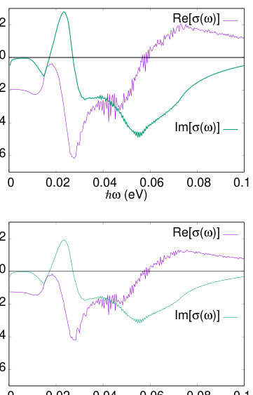 
FIG. 2. Calculated Hall conductance σxy(ω) for the chiral Eg (dxz + idyz) pairing state. The upper panel is T = 0.5K, and the lower panel for T = 1K, showing the reduction of the magnitude of the Hall effect spectrum as the pairing gap reduces to zero as T →Tc. Note the scale is 10−6e2/¯hd, where d = c/2 is the interlayer separation in Sr2RuO4. (color online)

📷 Fig 3

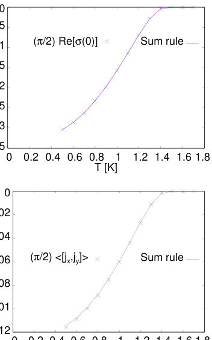 
FIG. 3. Top panel: Berry curvature sum rule compared to zero frequency conductance Re[σxy(0)]. Lower panel f- sum rule compared to the calculated current commutator, ⟨[ˆjx,ˆjy]⟩. Here, for simplicity, we use natural units e = ¯h = 1. (color online)

**Summary.** This paper reviews the decades-long mystery surrounding the superconducting order parameter in $	ext{Sr}_2	ext{RuO}_4$. By analyzing recent experimental data that challenge early spin-triplet models, the authors calculate signatures (like the Kerr effect) for a candidate chiral d-wave singlet state. The work aims to pinpoint the true pairing symmetry by connecting theoretical predictions of transport properties to measurable physical effects.

**Why it may be interesting.** The investigation into unconventional superconductivity symmetry in correlated oxides like $	ext{Sr}_2	ext{RuO}_4$ is highly relevant as it touches upon exotic pairing mechanisms and the interplay between electronic correlations and superconducting ground states, which are key areas of study for many-body physics.

Detailed structure

**Main problem.** The central problem is determining the precise symmetry of the superconducting order parameter in strontium ruthenate ($	ext{Sr}_2	ext{RuO}_4$), which remains unknown despite decades of research.

**Main result.** Calculations for a chiral d-wave $	ext{E}_g$ pairing state yield a non-zero Hall conductance, suggesting that the symmetry might be singlet rather than the previously hypothesized triplet state.

**Method.** The authors use theoretical calculations to predict measurable quantities like the Kerr effect and Hall conductance ($\sigma_{xy}(\omega)$) for various superconducting pairing symmetries.

**Model / system.** The system is $	ext{Sr}_2	ext{RuO}_4$, a low-temperature superconductor with a well-behaved Fermi liquid normal state. The analysis involves modeling the superconductivity using multi-orbital Hamiltonians and considering different pairing symmetries (p-wave vs. d-wave, spin singlet vs. triplet).

**Key observables.** Hall conductance ($\sigma_{xy}$), Kerr effect signal, Knight shift, and spin susceptibility $\chi_s(T)$.

**Important parameters / regimes.** Superconducting gap symmetry ($E_g$ state considered), temperature dependence below $T_c$, and the presence/absence of inter-orbital pairing.

**Assumptions / limitations.** The analysis relies on comparing theoretical predictions (e.g., sum rules for $\sigma_{xy}$) against experimental measurements, while acknowledging that simple models may not capture all complexities like spin-orbit coupling effects.

**Figures summary.** Not specified in the notes; the discussion revolves around calculating and interpreting spectral functions related to the Hall conductance and Kerr effect.

**Paper structure.** The paper reviews historical evidence supporting a chiral p-wave triplet state, presents recent experimental results (Knight shift/$\mu	ext{SR}$) challenging this view towards spin singlet pairing, and concludes by performing new theoretical calculations for a chiral d-wave $	ext{E}_g$ state to predict measurable signatures.

Abstract

Strontium ruthenate is a very interesting low temperature superconductor with relatively simple normal state and very puzzling superconducting state properties. Despite over thirty years of intensive research, even the precise symmetry of the order parameter is not known. In this paper we briefly review some of the key developments, focussing on some of the newer experiments, especially those which challenged the previous understanding that it is a spin triplet odd parity chiral p-wave superconductor. Since Sr$_2$RuO$_4$ now appears most probably a spin singlet superconductor we have calculated the Kerr effect for one candidate $d$-wave pairing state. We find that for the chiral $d$-wave $E_g$ pairing state the calculated Hall conductance is non-zero and qualitatively similar to that found earlier under the assumption of a chiral p-wave $E_u$ order parameter. We characterize the Hall conductance in relation to two sum rules, one related to Berry curvatures in the Bogoliubov quasiparticle states, and the other $f$-sum rule indicating the presence of inter-orbital pairing.

[↑ back to top](#top)

### [Direct Measurement of Exciton Dispersion in the Long-Wavelength Limit](http://arxiv.org/abs/2607.21234v1)

**Authors:** Peiyi He, Jiade Li, Jiakai Wang, Jiangxu Li, Jiahao Wang, Weiyu Sun, Yiwen Song, Xiaoyue Gao, Quanlin Guo, Bo Han, Ruochen Shi, Niklas Dellby, Tracy Lovejoy, Xing-Qiu Chen, Kaihui Liu, Yu Ye, Hailin Peng, Peng Gao  
**Type:** experiment · **Category:** other · **PDF:** <https://arxiv.org/pdf/2607.21234v1>  
**Analysis basis:** full PDF text, analyzed in chunks
**Topic relevance:** `non-equilibrium dynamics` **1/5**

📷 Fig 1

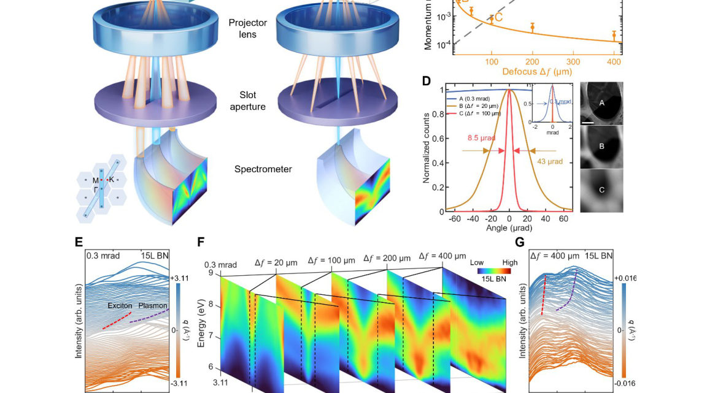 
Fig. 1. Experimental setup for high-momentum-resolved STEM-EELS. (A) Schematic of conventional momentum-resolved STEM-EELS using a small convergence semi-angle. The lower-left inset shows the Brillouin zone of hBN and the slot aperture used to select specific momentum directions. The map after the spectrometer shows a full-Brillouin-zone dataset acquired along the Γ-M direction with a convergence semi-angle of 0.3 mrad, spanning an energy range from 5.7 to 13 eV. (B) Defocus-engineered geometry: retuning the projector lens to refocus the diffraction pattern onto the slot aperture, and a controlled defocus Δ𝑓𝑓 maps scattering angle to a spatial displacement at the spectrometer entrance,...

📷 Fig 2

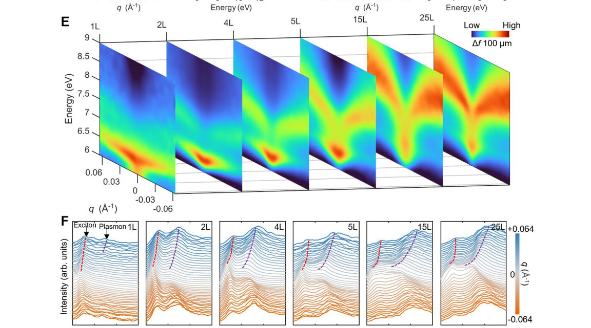 
Fig. 2. Thickness evolution of exciton band structure in freestanding hBN. (A and B) Conventional STEM-EELS results on monolayer hBN (𝛼𝛼 = 0.3 mrad): 𝜔𝜔-𝑞𝑞 map along the M-Γ-M (A) and the corresponding momentum-tagged EDCs (B). (C and D) Defocus-engineered STEM- EELS results on monolayer hBN (Δ𝑓𝑓 = 20 μm): 𝜔𝜔-𝑞𝑞 map (C) and momentum-tagged EDCs (D). (E) Thickness series (L = 1, 2, 4, 5, 15, 25 layers) of 𝜔𝜔-𝑞𝑞 maps acquired at Δ𝑓𝑓 = 100 μm. (F) Corresponding momentum-tagged EDCs for each thickness. Red and purple dashed lines are guides to the eye, indicating the exciton and plasmon features, respectively.

📷 Fig 3

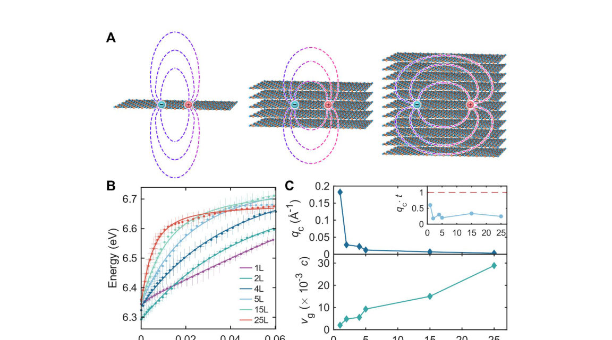 
Fig. 3. Screening-controlled crossover of exciton band structure. (A) Conceptual schematic illustrating the evolution from weak to strong dielectric screening as the thickness increases from monolayer to bulk limit. Dashed contours schematically depict the electric-field lines associated with the electron-hole pair. (B) Extracted exciton dispersions, E(q), for representative thicknesses (1L, 2L, 4L, 5L, 15L and 25L). Filled symbols represent the experimental data extracted from the spectra, and solid curves are the corresponding fits using Eq. (1). Horizontal and vertical error bars denote the uncertainties in momentum and energy, respectively, estimated from the instrumental resolution...

📷 Fig 4

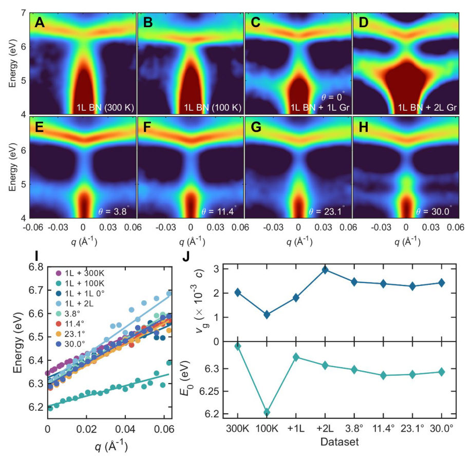 
Fig. 4. Environmental control of massless exciton. (A to H), ω-q maps for freestanding monolayer hBN acquired at Δ𝑓𝑓 = 100 μm: 300 K (A), 100 K (B), coupled to one graphene layer (C) and to two graphene layers (D), and a twist-angle series (θ = 3.8°, 11.4°, 23.1°, 30.0°) (E to H). Panels (C) to (H) were measured at 300 K. (I) Extracted exciton dispersions, E(q), from the datasets in (A) to (H) (small dots), together with linear fits (solid lines). (J) Summary of the extracted group velocity 𝑣𝑣𝑔𝑔 (top) and optical gap 𝐸𝐸0 (bottom) for each dataset.

**Summary.** Researchers used advanced momentum-resolved STEM-EELS to measure exciton dispersion in hBN films. They demonstrated that the characteristic linear (massless) exciton behavior observed in monolayers systematically changes—compressing and increasing group velocity—as the film thickness increases toward bulk values. This establishes a powerful experimental tool for understanding low-dimensional excitonic physics.

**Why it may be interesting.** This work provides an unprecedentedly precise experimental probe into quasiparticle dynamics in 2D materials, offering insights into dimensionality crossover effects that are crucial for designing next-generation optoelectronic devices.

Detailed structure

**Main problem.** The primary challenge was achieving direct, quantitative characterization of exciton dispersion evolution across different thicknesses, especially in the ultralow-momentum (q < 0.02 Å^-1) regime.

**Main result.** The study successfully resolved layer-dependent exciton dispersion in hBN, showing that increasing thickness compresses the nonanalytic linear-dispersion regime and increases the low-q group velocity towards a bulk limit.

**Method.** Defocus-engineered momentum-resolved electron energy-loss spectroscopy (STEM-EELS) was employed to achieve ultrahigh momentum resolution ($0.0002 	ext{ Å}^{-1}$).

**Model / system.** The system under study is excitons (electron-hole pairs) in freestanding hexagonal boron nitride (hBN), investigated as a function of film thickness and environmental coupling (e.g., temperature, adjacent graphene).

**Key observables.** Exciton band structure E(q), characteristic crossover momentum ($q_{cc}$), and low-q group velocity.

**Important parameters / regimes.** Ultralow-momentum regime ($q < 0.02 	ext{ Å}^{-1}$); thickness variation (monolayer to 25 layers).

**Assumptions / limitations.** The analysis relies on the ability of defocus engineering to control momentum resolution, overcoming limitations of conventional STEM-EELS.

**Figures summary.** Figures illustrate the experimental setup comparing conventional vs. defocus methods; they show thickness evolution of exciton band structure and $\omega-q$ maps under varying environmental conditions.

**Paper structure.** The paper details the advanced experimental methodology (defocus engineering) to achieve high momentum resolution, presents quantitative measurements showing layer-dependent changes in linear dispersion, and concludes by examining how external factors tune this fundamental low-dimensional exciton physics.

Abstract

Exciton dispersion, which governs the propagation, scattering and radiative decay of electron-hole pairs, is essential to optoelectronics and quantum materials. In two-dimensional systems, weakened dielectric screening and long-range electron-hole exchange are predicted to induce nonanalytic exciton dispersion in the long-wavelength limit. However, direct quantitative characterization of its dimensional evolution remains lacking, especially in the ultralow-q regime (q < 0.02 $Å^{-1}$). Here we employ defocus-engineered momentum-resolved electron energy-loss spectroscopy in scanning transmission electron microscopy, achieving an ultrahigh momentum resolution of 0.0002 $Å^{-1}$. Using freestanding hBN as a prototypical platform, we resolve layer-dependent exciton dispersion and quantify its characteristic crossover momentum and group velocity in the long-wavelength limit. With increasing thickness, the nonanalytic linear-dispersion regime is progressively compressed, manifested by a reduction in characteristic crossover momentum q_c from $1.82 \times 10^{-1} Å^{-1}$ in the monolayer to $3.0 \times 10^{-1} Å^{-1}$ in 25 layers. Meanwhile, the low-q group velocity increases from $2.0 \times 10^{-3} c$ to $2.9 \times 10^{-2} c$, before the dispersion ultimately approaches the bulk-like parabolic limit. We further examine how the exciton band structure of monolayer hBN responds to its surrounding environment, including temperature, adjacent graphene layers, and interlayer twist in BN/graphene heterostructures. These findings uncover the fundamental physics of low-dimensional excitons, deliver valuable guidance for modulating exciton transport, diffusion and quasiparticle coupling in layered quantum materials, and establish a powerful experimental route to explore low-dimensional exciton physics.

[↑ back to top](#top)

### [End-State-Controlled Quantum Transport in Armchair Graphene Nanoribbon Artificial Quantum Materials](http://arxiv.org/abs/2607.21141v1)

**Authors:** David M T Kuo  
**Type:** theory · **Category:** other · **PDF:** <https://arxiv.org/pdf/2607.21141v1>  
**Analysis basis:** full PDF text, analyzed in chunks
**Topic relevance:** `non-equilibrium dynamics` **1/5**

📷 Fig 1

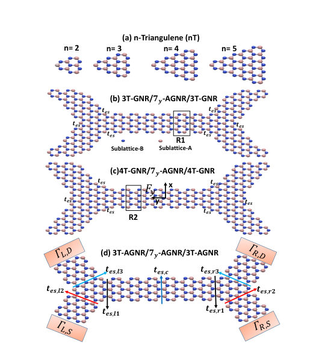 
FIG. 1: Schematic illustrations of the graphene nanostruc- tures investigated in this work. (a) Atomic structures of n-triangulenes with n = 2, 3, 4, and 5, illustrating the sublattice imbalance of (n −1). (b) Schematic of the 3T- GNR/7y-AGNR/3T-GNR nanostructure, consisting of two 3-triangulenes (3T) connected by five graphene nanoribbon (GNR) segments. The central segment is a 7-atom-wide arm- chair graphene nanoribbon (7-AGNR) terminated by zigzag edges. Each zigzag-terminated end of the central AGNR with the R1 unit-cell (u.c.) structure supports a single end state (ES). The notation y denotes the bond length between the two 3T structures. Each outer GNR segment also possesses one ES at...

📷 Fig 2

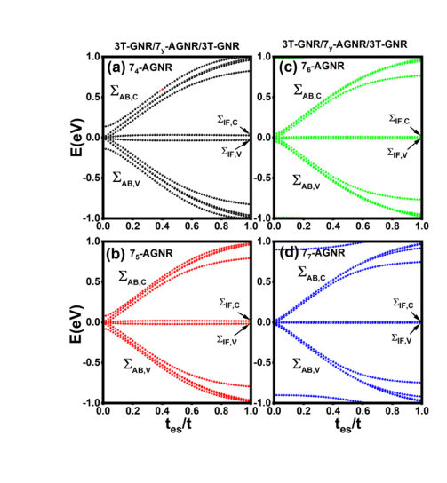 
FIG. 2: Energy levels of the 3T-GNR/7y-AGNR/3T-GNR heterostructure as functions of tes for different 7-AGNR seg- ment lengths: (a) 74-AGNR, (b) 75-AGNR, (c) 76-AGNR, and (d) 77-AGNR. Here, the subscript y denotes the length of the 7-AGNR segment with R1 = 3acc per unit cell (u.c.), where acc is the carbon–carbon bond length.

📷 Fig 3

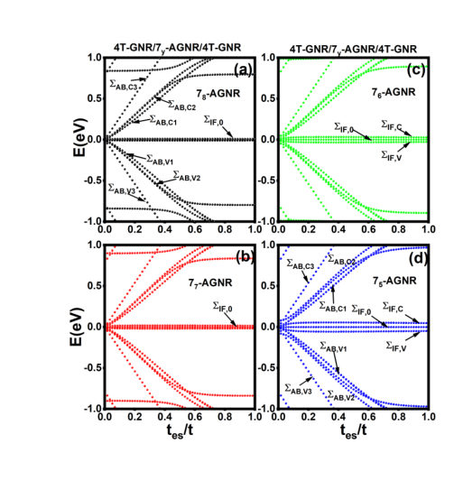 
FIG. 3: Energy levels of the 4T-GNR/7y-AGNR/4T-GNR heterostructure as functions of tes for different 7-AGNR seg- ment lengths: (a) 78-AGNR, (b) 77-AGNR, (c) 76-AGNR, and (d) 75-AGNR.

📷 Fig 4

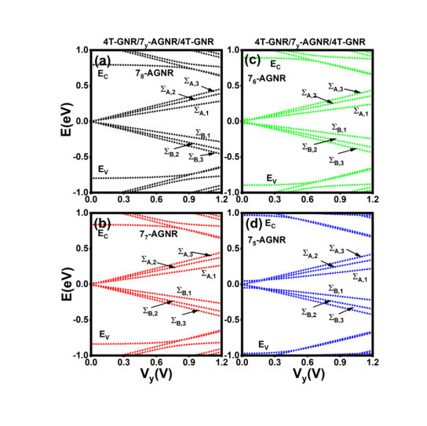 
FIG. 4: Energy levels of the 4T-GNR/7y-AGNR/4T-GNR heterostructure as functions of the applied voltage Vy at tes = t for different 7-AGNR segment lengths: (a) 78-AGNR, (b) 77-AGNR, (c) 76-AGNR, and (d) 75-AGNR.

📷 Fig 5

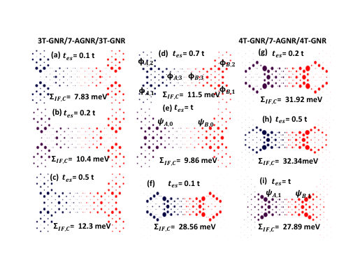 
FIG. 5: (a)-(e) Charge density distributions of the 3T- GNR/76-AGNR/3T-GNR heterostructure for different values of tes: (a) tes = 0.1 t, (b) tes = 0.2 t, (c) tes = 0.5 t, (d) tes = 0.7 t, and (e) tes = t. (f)-(i) Charge density distribu- tions of the 4T-GNR/76-AGNR/4T-GNR heterostructure for different values of tes: (f) tes = 0.1 t, (g) tes = 0.2 t, (h) tes = 0.5 t, and (i) tes = t.

**Summary.** This work develops a real-space theoretical model to understand interface states in graphene nanostructures formed by connecting triangulenes and AGNRs. It derives a universal rule linking the number of localized node orbitals to the end states and zero-energy modes of the constituent parts. This framework proves that these junctions can be engineered to create artificial nanoribbons with highly controllable flat subbands for quantum transport applications.

**Why it may be interesting.** The focus on localized, geometrically determined states (CLS) provides a concrete, real-space mechanism for engineering electronic properties in low-dimensional carbon systems, which is highly relevant for solid-state quantum devices.

Detailed structure

**Main problem.** The study aims to elucidate the microscopic origin of interface states in complex graphene architectures, moving beyond purely bulk topological descriptions.

**Main result.** The research establishes a universal relation governing the number and chirality of localized node orbitals formed at junctions, demonstrating that these sites act as elementary building blocks for constructing nanoribbons with tunable flat subbands.

**Method.** A real-space theoretical framework using a tight-binding Hamiltonian is developed to model electronic structure evolution by tuning inter-building block couplings.

**Model / system.** The system involves artificial quantum materials based on graphene, specifically Y-junctions formed by connecting $n$-triangulenes and armchair graphene nanoribbons (AGNRs). The analysis uses a single-$p_z$ orbital tight-binding model.

**Key observables.** Number and chirality of node orbitals ($	ext{N}_{	ext{node},\delta}$), flat subbands near the Fermi energy, and tunneling spectra.

**Important parameters / regimes.** The coupling strength between graphene building blocks ($t_{es}$) is a key tuning parameter; an applied longitudinal electric field (Stark effect) is used as a diagnostic tool.

**Assumptions / limitations.** The primary assumption is that the interface states can be understood by analyzing the hybridization of end states and zero-energy modes, providing a real-space picture over bulk topological invariants.

**Figures summary.** Figures illustrate the structural components (triangulenes, AGNRs) and device configurations used for calculating electronic properties and transport spectra.

**Paper structure.** The paper first introduces the physical system and theoretical framework, then analyzes specific junction geometries (e.g., 3T-GNR/7y-AGNR/3T-GNR), derives the universal relation for node orbitals, and concludes by demonstrating their utility in designing tunable quantum transport elements.

Abstract

Artificial quantum materials based on atomically precise graphene nanostructures provide an ideal platform for exploring quantum phenomena arising from localized electronic states. Here, we develop a real-space theoretical framework to elucidate the microscopic origin of interface states in graphene architectures composed of $n$-triangulenes and armchair graphene nanoribbons (AGNRs). By continuously tuning the coupling between graphene building blocks, we reveal the evolution of triangulene zero-energy modes and AGNR end states into compact localized node orbitals at three-arm junctions. The number and chirality of these node orbitals obey a universal relation, $N_{node,δ}=|N_{es,t,A(B)}-N_{tri,0,B(A)}|$, where $N_{es,t}$ denotes the total number of AGNR end states contributed by the three AGNR arms at the junction, and $N_{tri,0}$ is the number of zero-energy modes of the attached triangulene. The chirality of the node orbitals is determined by the dominant constituent: when $N_{es,t}>N_{tri,0}$, they inherit the sublattice chirality of the AGNR end states ($δ=A(B)$), whereas for $N_{tri,0}>N_{es,t}$ they inherit that of the triangulene zero-energy modes ($δ=B(A)$). This real-space picture provides a transparent understanding of compact localized state (CLS) formation beyond conventional bulk topological descriptions. Using experimentally synthesized triangulene nanographenes as representative examples, we further explain the emergence of their zero-energy modes and quantitatively reproduce their tunneling spectra within an extended Anderson model. Finally, we demonstrate that these node orbitals can serve as elementary building blocks for constructing artificial graphene nanoribbons with highly tunable flat subbands near the Fermi energy. The resulting CLSs exhibit controllable degeneracy and strongly anisotropic quantum transport.

[↑ back to top](#top)

### [Geometric Superconducting Diode Effect in an NbN Nanoring](http://arxiv.org/abs/2607.20794v1)

**Authors:** Tianyu Li, Peiyuan Huang, Jiong Li, Jiyao Shang, Nuo-Zhou Yang, Wuyue Xu, Wen-Cheng Yue, Yang-Yang Lyu, Chong Li, Yihuang Xiong, Xuecou Tu, Tao Tao, Xiaoqing Jia, Qing-Hu Chen, Huabing Wang, Peiheng Wu, Yong-Lei Wang  
**Type:** experiment · **Category:** other · **PDF:** <https://arxiv.org/pdf/2607.20794v1>  
**Analysis basis:** full PDF text, analyzed in chunks
**Topic relevance:** `non-equilibrium dynamics` **1/5**

📷 Fig 1

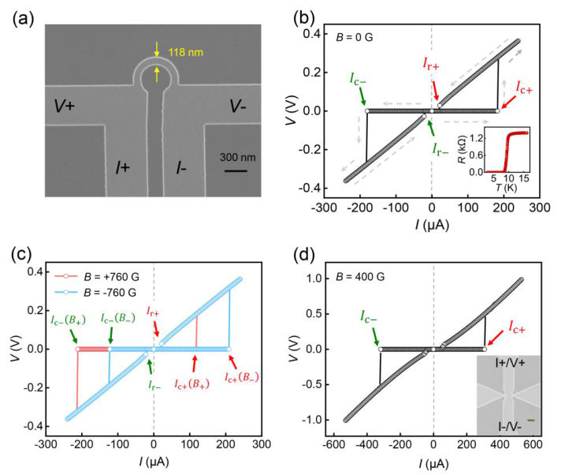 
Figure 1. Superconducting diode effect in an NbN nanoring. (a) SEM image of the nanoring superconducting diode device. (b) I-V characteristics measured at zero magnetic field. The curve exhibits symmetric behavior with negligible nonreciprocity. Inset: Temperature-dependent resistance of the superconducting nanoring, showing a critical temperature Tc = 8.6 K. (c) I-V characteristics measured at T = 2 K under the magnetic fields of +760 G (red) and -760 G (blue), revealing a significant and switchable nonreciprocitiy in critical currents. (d) I-V characteristics of a symmetric device measured as a reference. Inset: SEM image of the symmetric device. Scale bar = 500 nm.

📷 Fig 2

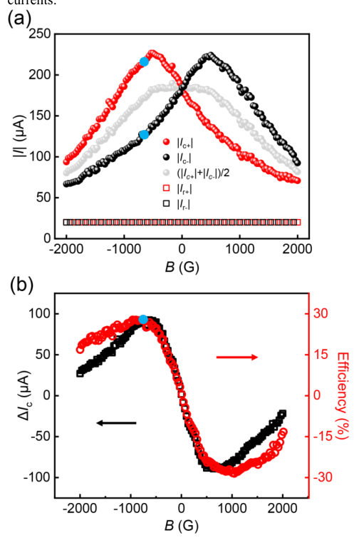 
Figure 2. Magnetic field dependence of nonreciprocity. (a) Magnetic-field dependence of the critical current (𝐼c ) and retrapping current ( 𝐼r ) measured for opposite current directions at 𝑇 = 2 K. The gray dots represent the average of the positive and negative critical current magnitudes. (b) Nonreciprocal critical current (∆𝐼c) and diode efficiency (η) as a function of the magnetic field.

📷 Fig 3

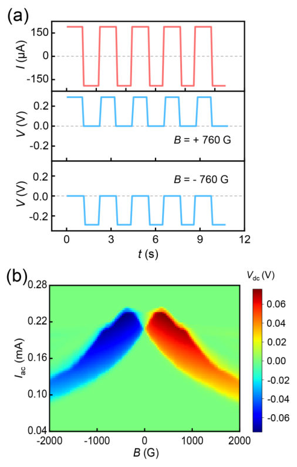 
Fig. 3. Rectification effect. (a) Half-wave rectification measured under a square-wave current drive (top panel). Measurements were performed at 2 K under magnetic fields of +760 G (middle panel) and -760 G (bottom panel). The magnetic field of 760 G (Corresponding to the blue dots

📷 Fig 4

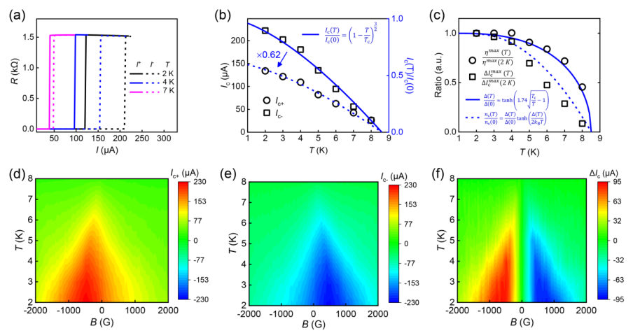 
Figure 4. Temperature dependence of nonreciprocity. (a) Current-voltage curves for positive (solid lines) and negative (dashed lines) bias measured at various temperatures in a magnetic field of 700 G. (b) Temperature dependence of the critical current obtained under positive (black circles) and negative (black squares) bias measured at a magnetic field of 500 G. The solid blue curve is a fit based on the theoretical Ginzburg-Landau depairing critical current formula. The dashed blue line is the solid blue curve shifted by a ratio of 0.62, representing the same temperature evolution for the positive and negative critical currents. (c) Maximal normalized nonreciprocal diode efficiencies...

**Summary.** This work demonstrates a superconducting diode effect in an asymmetric NbN nanoring using only geometric asymmetry. By applying an external magnetic field, the device exhibits switchable nonreciprocity in its critical currents, confirming that curvature effects can induce one-way supercurrent transport. This establishes a minimal design principle for next-generation superconducting electronics.

**Why it may be interesting.** The study provides a simple, lithographically scalable platform for realizing non-reciprocal superconducting transport, which is crucial for building low-power cryogenic electronic components that rely on directional current flow.

Detailed structure

**Main problem.** The study aims to demonstrate a superconducting diode effect, characterized by nonreciprocal critical currents, using a structurally minimal platform.

**Main result.** Pronounced and polarity-switchable critical-current nonreciprocity is achieved solely by introducing geometric asymmetry in an NbN nanoring when subjected to an out-of-plane magnetic field.

**Method.** Transport measurements were performed using a standard four-probe method, measuring current-voltage (I-V) characteristics under varying perpendicular magnetic fields and temperatures.

**Model / system.** The physical system is an asymmetric nanoring fabricated from a single material, NbN. The nonreciprocity arises from the interplay of curvature-induced current crowding, Meissner screening currents, and asymmetric vortex-entry barriers.

**Key observables.** Critical currents ($I_{c+}$ and $I_{c-}$), nonreciprocity ($\Delta I_c$), diode efficiency ($\eta$), and retrapping current ($I_r$).

**Important parameters / regimes.** Temperature (2 K to 8 K), perpendicular magnetic field strength, and the geometric asymmetry of the nanoring.

**Assumptions / limitations.** The nonreciprocity is attributed to directional modulation of the superconducting switching instability, distinct from thermal effects or uniform superconductivity suppression.

**Figures summary.** Figures show SEM images and I-V curves demonstrating field-dependent, switchable nonreciprocity. Other figures plot magnetic field dependence of $I_c$ and $\eta$, and temperature dependence comparing results to BCS gap/superfluid density models.

**Paper structure.** The paper establishes the superconducting diode effect in an asymmetric nanoring by measuring critical current asymmetry ($\Delta I_c$) under applied magnetic fields. It systematically analyzes the field and temperature dependence of this nonreciprocity, contrasting it with reciprocal effects like retrapping currents to pinpoint the geometric origin.

Abstract

Superconducting diodes, which exhibit nonreciprocal critical currents, are promising building blocks for low-power cryogenic electronics and superconducting circuits. Existing superconducting diode platforms commonly rely on Josephson junctions, multilayer heterostructures, ferromagnetic elements, gate-difined structures. Here, we demonstrate a geometrically induced superconducting diode effect realized in a structurally minimal, single-materials NbN nanoring, where inversion-symmetry breaking is introduced solely by the asymmetric geometry. The device exhibits pronounced and polarity-switchable critical-current nonreciprocity. Systematic magnetic-field and temperature-dependent measurements reveal that, at low fields, the applied magnetic field redistributes the critical current asymmetrically between opposite bias directions without significantly reducing the overall superconducting current-carrying capability. Moreover, the maximal nonreciprocity and diode efficiency exhibit distinct temperature dependence: the maximal diode efficiency follows the evolution of the energy gap, whereas the maximal nonreciprocity is more closely associated with the superfluid density. These results establish asymmetric superconducting nanorings as a minimal geometric platform for studying nonreciprocal superconducting transport and provide a simple design principle for future superconducting electronics.

[↑ back to top](#top)
