
# arxiv digest (quant-ph + cond-mat) — 2026-07-28

*83 papers · 31 relevant · 3 highlighted*

## 🔥 Most relevant (31)

*Every paper with at least one nonzero topic score, sorted by best-matching score. 🔥 marks scores ≥4/5. Click the title to jump to the full entry below; click [arXiv] to open the paper page. `(secondary)` marks papers from de-prioritized cond-mat archives.*

Show 31 relevant papers

- [Fractal quantum many-body scars and Hamiltonian inverse design from ZX-calculus](#paper-2607.22495) [[arXiv]](http://arxiv.org/abs/2607.22495v1) — 🔥 `scars & prethermalization` **5/5** · `analog quantum simulation` **3/5** · `entanglement & information structure` **3/5** · `non-equilibrium dynamics` **3/5** · `methods for driven-dissipative` **2/5** · `non-equilibrium universality` **2/5** · `Keldysh / 2PI / non-Gaussian methods` **1/5** · `correlated / nonlocal dissipation` **1/5** · `driven-dissipative phase transition` **1/5**
- [Quantum transport in Cooper pair splitters using hierarchical equations of motion](#paper-2607.22235) [[arXiv]](http://arxiv.org/abs/2607.22235v1) `(secondary)` — 🔥 `methods for driven-dissipative` **5/5** · 🔥 `Keldysh / 2PI / non-Gaussian methods` **4/5** · `Kondo & dissipative impurity` **3/5** · `non-equilibrium dynamics` **3/5** · `non-equilibrium universality` **2/5** · `correlated / nonlocal dissipation` **1/5** · `driven-dissipative phase transition` **1/5**
- [Hydrodynamic Memory and Long-Time Tails in Clean Frustrated Magnets](#paper-2607.21827) [[arXiv]](http://arxiv.org/abs/2607.21827v1) — 🔥 `analog quantum simulation` **4/5** · 🔥 `exotic spin models in light-matter` **4/5** · `methods for driven-dissipative` **3/5** · `non-equilibrium dynamics` **3/5** · `spintronics-quantum-optics interface` **3/5** · `Keldysh / 2PI / non-Gaussian methods` **2/5** · `correlated / nonlocal dissipation` **2/5** · `driven-dissipative phase transition` **2/5** · `non-equilibrium universality` **2/5** · `Kondo & dissipative impurity` **1/5** · `entanglement & information structure` **1/5** · `scars & prethermalization` **1/5**
- [Optomechanical systems with a Fano membrane in the middle](#paper-2607.22526) [[arXiv]](http://arxiv.org/abs/2607.22526v1) — 🔥 `interference shaping light` **4/5** · `Keldysh / 2PI / non-Gaussian methods` **3/5** · `correlated cavity matter` **3/5** · `driven-dissipative phase transition` **3/5** · `methods for driven-dissipative` **3/5** · `analog quantum simulation` **2/5** · `correlated / nonlocal dissipation` **2/5** · `non-equilibrium dynamics` **2/5** · `non-equilibrium universality` **2/5** · `Tavis-Cummings & cavity-many-emitter` **1/5** · `quantum measurements` **1/5**
- [Thermal avalanches in a quasiperiodic XXZ model](#paper-2607.21708) [[arXiv]](http://arxiv.org/abs/2607.21708v1) — 🔥 `non-equilibrium dynamics` **4/5** · `driven-dissipative phase transition` **3/5** · `entanglement & information structure` **3/5** · `methods for driven-dissipative` **3/5** · `scars & prethermalization` **3/5** · `analog quantum simulation` **2/5** · `correlated / nonlocal dissipation` **2/5** · `non-equilibrium universality` **2/5** · `Frenkel-Kontorova` **1/5** · `Keldysh / 2PI / non-Gaussian methods` **1/5** · `Kondo & dissipative impurity` **1/5** · `exotic spin models in light-matter` **1/5**
- [Fermions on a 1D lattice: localized sources and sinks with dephasing](#paper-2607.22240) [[arXiv]](http://arxiv.org/abs/2607.22240v1) — 🔥 `methods for driven-dissipative` **4/5** · 🔥 `non-equilibrium dynamics` **4/5** · `driven-dissipative phase transition` **3/5** · `non-equilibrium universality` **3/5** · `Kondo & dissipative impurity` **2/5** · `analog quantum simulation` **2/5** · `scars & prethermalization` **2/5** · `Frenkel-Kontorova` **1/5** · `Keldysh / 2PI / non-Gaussian methods` **1/5** · `correlated / nonlocal dissipation` **1/5** · `entanglement & information structure` **1/5**
- [Multiplexed storage and interaction of Rydberg spinwaves via the gradient echo memory protocol](#paper-2607.22466) [[arXiv]](http://arxiv.org/abs/2607.22466v1) — 🔥 `Rydberg arrays` **4/5** · `analog quantum simulation` **3/5** · `exotic spin models in light-matter` **3/5** · `QC/QI experiment` **2/5** · `methods for driven-dissipative` **2/5** · `non-equilibrium dynamics` **2/5** · `quantum optics experiment` **2/5** · `Keldysh / 2PI / non-Gaussian methods` **1/5** · `correlated / nonlocal dissipation` **1/5** · `correlated cavity matter` **1/5** · `driven-dissipative phase transition` **1/5** · `entanglement & information structure` **1/5** · `interference shaping light` **1/5**
- [Current-induced creation and dynamics of embedded magnetic skyrmion bags](#paper-2607.21889) [[arXiv]](http://arxiv.org/abs/2607.21889v1) `(secondary)` — 🔥 `driven-dissipative phase transition` **4/5** · `exotic spin models in light-matter` **3/5** · `non-equilibrium dynamics` **3/5** · `spintronics-quantum-optics interface` **3/5** · `analog quantum simulation` **2/5** · `methods for driven-dissipative` **2/5** · `non-equilibrium universality` **2/5** · `Keldysh / 2PI / non-Gaussian methods` **1/5** · `correlated / nonlocal dissipation` **1/5** · `entanglement & information structure` **1/5** · `scars & prethermalization` **1/5**
- [An Experimental Scheme for Testing Molecular Rectification with Only Micrometer-Scale Fabrication Requirements](#paper-2607.22203) [[arXiv]](http://arxiv.org/abs/2607.22203v1) — 🔥 `non-equilibrium dynamics` **4/5** · `driven-dissipative phase transition` **3/5** · `methods for driven-dissipative` **3/5** · `non-equilibrium universality` **3/5** · `Keldysh / 2PI / non-Gaussian methods` **2/5** · `analog quantum simulation` **2/5** · `correlated / nonlocal dissipation` **2/5** · `Kondo & dissipative impurity` **1/5** · `entanglement & information structure` **1/5** · `scars & prethermalization` **1/5**
- [When Can a Cavity Move a Mott Transition? A Spectral-Density Criterion within Gutzwiller Theory](#paper-2607.22283) [[arXiv]](http://arxiv.org/abs/2607.22283v1) — 🔥 `analog quantum simulation` **4/5** · 🔥 `correlated cavity matter` **4/5** · `Keldysh / 2PI / non-Gaussian methods` **3/5** · `driven-dissipative phase transition` **3/5** · `Tavis-Cummings & cavity-many-emitter` **2/5** · `methods for driven-dissipative` **2/5** · `correlated / nonlocal dissipation` **1/5** · `exotic spin models in light-matter` **1/5** · `non-equilibrium dynamics` **1/5** · `non-equilibrium universality` **1/5**
- [Critical Sensing with Autonomous Devices: The Self-Oscillation Threshold of a Frequency-Locked NV-Centre Magnetometer](#paper-2607.22521) [[arXiv]](http://arxiv.org/abs/2607.22521v1) — 🔥 `driven-dissipative phase transition` **4/5** · `methods for driven-dissipative` **3/5** · `non-equilibrium universality` **3/5** · `quantum measurements` **3/5** · `spintronics-quantum-optics interface` **3/5** · `non-equilibrium dynamics` **2/5** · `QC/QI experiment` **1/5** · `measurement-induced transitions` **1/5**
- [Fluctuational Quantum Electrodynamics of Dispersive Time-Varying Media](#paper-2607.22340) [[arXiv]](http://arxiv.org/abs/2607.22340v1) — 🔥 `Keldysh / 2PI / non-Gaussian methods` **4/5** · `correlated / nonlocal dissipation` **3/5** · `driven-dissipative phase transition` **3/5** · `methods for driven-dissipative` **3/5** · `non-equilibrium dynamics` **3/5** · `non-equilibrium universality` **2/5** · `correlated cavity matter` **1/5** · `interference shaping light` **1/5**
- [Fractional parametric resonance in spintronic diodes](#paper-2607.22150) [[arXiv]](http://arxiv.org/abs/2607.22150v1) `(secondary)` — 🔥 `driven-dissipative phase transition` **4/5** · `methods for driven-dissipative` **3/5** · `spintronics-quantum-optics interface` **3/5** · `non-equilibrium dynamics` **2/5** · `non-equilibrium universality` **2/5** · `Frenkel-Kontorova` **1/5** · `Keldysh / 2PI / non-Gaussian methods` **1/5** · `analog quantum simulation` **1/5** · `correlated / nonlocal dissipation` **1/5** · `exotic spin models in light-matter` **1/5**
- [Page transition for the complexity of an evaporating black hole](#paper-2607.21734) [[arXiv]](http://arxiv.org/abs/2607.21734v1) — 🔥 `entanglement & information structure` **4/5** · `driven-dissipative phase transition` **3/5** · `non-equilibrium dynamics` **3/5** · `Keldysh / 2PI / non-Gaussian methods` **2/5** · `non-equilibrium universality` **2/5** · `correlated / nonlocal dissipation` **1/5** · `measurement-induced transitions` **1/5** · `methods for driven-dissipative` **1/5** · `scars & prethermalization` **1/5**
- [Quantum advantage of nonlinear quantum battery and superconducting circuit implementation](#paper-2607.21905) [[arXiv]](http://arxiv.org/abs/2607.21905v1) — 🔥 `QC/QI experiment` **4/5** · `correlated cavity matter` **3/5** · `quantum optics experiment` **3/5** · `analog quantum simulation` **2/5** · `quantum measurements` **2/5** · `Tavis-Cummings & cavity-many-emitter` **1/5** · `driven-dissipative phase transition` **1/5** · `methods for driven-dissipative` **1/5** · `non-equilibrium dynamics` **1/5**
- [Deleterious effect of photon-phonon coupling on microcavities in their application as quantum sources](#paper-2607.21743) [[arXiv]](http://arxiv.org/abs/2607.21743v1) — 🔥 `quantum optics experiment` **4/5** · `Keldysh / 2PI / non-Gaussian methods` **2/5** · `analog quantum simulation` **2/5** · `correlated / nonlocal dissipation` **2/5** · `methods for driven-dissipative` **2/5** · `QC/QI experiment` **1/5** · `correlated cavity matter` **1/5** · `driven-dissipative phase transition` **1/5** · `entanglement & information structure` **1/5** · `non-equilibrium dynamics` **1/5**
- [Thermal phase slips in superconducting films near the critical current at arbitrary temperatures](#paper-2607.21801) [[arXiv]](http://arxiv.org/abs/2607.21801v1) `(secondary)` — 🔥 `non-equilibrium universality` **4/5** · `Keldysh / 2PI / non-Gaussian methods` **3/5** · `driven-dissipative phase transition` **3/5** · `non-equilibrium dynamics` **2/5** · `Frenkel-Kontorova` **1/5** · `analog quantum simulation` **1/5** · `correlated / nonlocal dissipation` **1/5** · `methods for driven-dissipative` **1/5**
- [Effective field theories of nonlinear fluctuating hydrodynamics in one dimension](#paper-2607.22527) [[arXiv]](http://arxiv.org/abs/2607.22527v1) — 🔥 `non-equilibrium dynamics` **4/5** · `methods for driven-dissipative` **3/5** · `non-equilibrium universality` **3/5** · `driven-dissipative phase transition` **2/5** · `Frenkel-Kontorova` **1/5** · `Keldysh / 2PI / non-Gaussian methods` **1/5** · `correlated / nonlocal dissipation` **1/5**
- [Identifying the signatures of residual activity in harmonically bound active Brownian dynamics](#paper-2607.22222) [[arXiv]](http://arxiv.org/abs/2607.22222v1) — 🔥 `non-equilibrium dynamics` **4/5** · `driven-dissipative phase transition` **3/5** · `methods for driven-dissipative` **3/5** · `non-equilibrium universality` **2/5** · `Frenkel-Kontorova` **1/5** · `Keldysh / 2PI / non-Gaussian methods` **1/5** · `correlated / nonlocal dissipation` **1/5**
- [Resolving topological order crossovers on NISQ hardware](#paper-2607.21707) [[arXiv]](http://arxiv.org/abs/2607.21707v1) — 🔥 `QC/QI experiment` **4/5** · `analog quantum simulation` **3/5** · `methods for driven-dissipative` **3/5** · `correlated / nonlocal dissipation` **1/5** · `driven-dissipative phase transition` **1/5** · `entanglement & information structure` **1/5** · `exotic spin models in light-matter` **1/5** · `non-equilibrium dynamics` **1/5**
- [Highly indistinguishable photons from a tin-vacancy spin qubit in diamond](#paper-2607.22439) [[arXiv]](http://arxiv.org/abs/2607.22439v1) — 🔥 `QC/QI experiment` **4/5** · `interference shaping light` **3/5** · `quantum optics experiment` **3/5** · `spintronics-quantum-optics interface` **3/5** · `quantum measurements` **1/5**
- [Molecular chiral discrimination through symmetry-breaking spin dynamics](#paper-2607.22154) [[arXiv]](http://arxiv.org/abs/2607.22154v1) — 🔥 `QC/QI experiment` **4/5** · `spintronics-quantum-optics interface` **3/5** · `quantum measurements` **2/5** · `correlated / nonlocal dissipation` **1/5** · `driven-dissipative phase transition` **1/5** · `exotic spin models in light-matter` **1/5** · `methods for driven-dissipative` **1/5** · `non-equilibrium dynamics` **1/5**
- [Non-Markovian heavy-quark equilibration and equilibrium correlation function in a thermal medium](#paper-2607.22403) [[arXiv]](http://arxiv.org/abs/2607.22403v1) — 🔥 `Keldysh / 2PI / non-Gaussian methods` **4/5** · `methods for driven-dissipative` **3/5** · `non-equilibrium dynamics` **3/5** · `non-equilibrium universality` **2/5** · `correlated / nonlocal dissipation` **1/5** · `driven-dissipative phase transition` **1/5**
- [Proposal for Estimating the Energy Gap of the Transverse-Field Ising Hamiltonian Using a D-Wave Quantum Annealer](#paper-2607.21940) [[arXiv]](http://arxiv.org/abs/2607.21940v1) — 🔥 `analog quantum simulation` **4/5** · `QC/QI experiment` **2/5** · `methods for driven-dissipative` **2/5** · `non-equilibrium dynamics` **2/5** · `quantum measurements` **2/5** · `driven-dissipative phase transition` **1/5** · `exotic spin models in light-matter` **1/5**
- [Entanglement in Presence of Topological Interfaces and Dualities](#paper-2607.22451) [[arXiv]](http://arxiv.org/abs/2607.22451v1) — 🔥 `entanglement & information structure` **4/5** · `non-equilibrium dynamics` **2/5** · `Keldysh / 2PI / non-Gaussian methods` **1/5** · `analog quantum simulation` **1/5** · `correlated / nonlocal dissipation` **1/5** · `driven-dissipative phase transition` **1/5** · `methods for driven-dissipative` **1/5** · `non-equilibrium universality` **1/5**
- [Counting Edge Modes with the Higher Berry Curvature: A Bulk Topological Order Parameter for Quantum Spin Chains](#paper-2607.21705) [[arXiv]](http://arxiv.org/abs/2607.21705v1) — 🔥 `analog quantum simulation` **4/5** · `entanglement & information structure` **3/5** · `exotic spin models in light-matter` **3/5** · `Frenkel-Kontorova` **1/5**
- [Entanglement purification for arbitrary multipartite high-dimensional Greenberger-Horne-Zeilinger state](#paper-2607.21907) [[arXiv]](http://arxiv.org/abs/2607.21907v1) — 🔥 `entanglement & information structure` **4/5** · `quantum measurements` **2/5** · `correlated / nonlocal dissipation` **1/5** · `measurement-induced transitions` **1/5** · `methods for driven-dissipative` **1/5**
- [Exact Neural-Network Representations of the Motzkin States](#paper-2607.22522) [[arXiv]](http://arxiv.org/abs/2607.22522v1) — 🔥 `entanglement & information structure` **4/5** · `methods for driven-dissipative` **3/5** · `analog quantum simulation` **1/5** · `non-equilibrium dynamics` **1/5**
- [Structural stability, electronic structure, and magnetism of the $d^9$ double infinite-layer La$_3$Ni$_2$O$_5$F under chemical pressure and epitaxial strain](#paper-2607.22029) [[arXiv]](http://arxiv.org/abs/2607.22029v1) — 🔥 `analog quantum simulation` **4/5** · `exotic spin models in light-matter` **1/5** · `non-equilibrium dynamics` **1/5**
- [Substrate-metal interface engineering enhances TaN/Ta thin film superconducting resonator performance](#paper-2607.22294) [[arXiv]](http://arxiv.org/abs/2607.22294v1) — 🔥 `QC/QI experiment` **4/5** · `correlated / nonlocal dissipation` **1/5**
- [Low loss superconducting resonators enabled by aluminum microstructural engineering and dielectric trimming](#paper-2607.22265) [[arXiv]](http://arxiv.org/abs/2607.22265v1) — 🔥 `QC/QI experiment` **4/5**

## ⭐ Highlighted (3)

*Papers by authors on your watch list. Click the title to jump to the full entry below; click [arXiv] to open the paper page.*

Show 3 highlighted papers

- ⭐ [Correlated Coherent Errors in Stabilizer Codes: A General Cumulant Framework and Interference-Based Error Suppression](#paper-2607.22503) [[arXiv]](http://arxiv.org/abs/2607.22503v1) — Aashish Clerk
- ⭐ [GHz non-reciprocal optical conductivity in hematite ($α$-$\text{Fe}_2\text{O}_3$)](#paper-2607.22176) [[arXiv]](http://arxiv.org/abs/2607.22176v1) — Johannes Knolle
- ⭐ [Klein tunneling through an asymmetric barrier: Symmetric transmission and directional pair creation](#paper-2607.22337) [[arXiv]](http://arxiv.org/abs/2607.22337v1) — Denys I. Bondar

## All papers (66, sorted by relevance)

*Papers from quant-ph and your primary cond-mat archives (quant-gas, stat-mech, str-el, dis-nn). Highlighted papers (⭐) come first, then everything else sorted by topic-relevance score, highest first.*

### ⭐ [Klein tunneling through an asymmetric barrier: Symmetric transmission and directional pair creation](http://arxiv.org/abs/2607.22337v1)

**Highlighted author(s):** Denys I. Bondar  
**Authors:** Andre G. Campos, Denys I. Bondar  
**Type:** theory · **Category:** other · **PDF:** <https://arxiv.org/pdf/2607.22337v1>  
**Analysis basis:** full PDF text, analyzed in chunks
**Topic relevance:** `non-equilibrium dynamics` **3/5** · `driven-dissipative phase transition` **2/5** · `methods for driven-dissipative` **2/5** · `non-equilibrium universality` **2/5** · `Keldysh / 2PI / non-Gaussian methods` **1/5** · `Kondo & dissipative impurity` **1/5** · `correlated / nonlocal dissipation` **1/5**

↔ Scroll figures horizontally

<figure class="paper-figure-card">
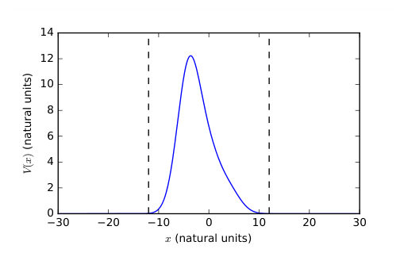
<figcaption class="paper-figure-caption"><b>Fig 1.</b> FIG. 1. The spatially asymmetric barrier V (x) used in the simulations, in natural units. One edge is sharp and the other decays over an extended smooth tail, while the asymptotic values on the two sides coincide, V (x →−∞) = V (x → +∞) = 0. The barrier height exceeds the rest energy mc2 = 1, so the dynamics lies in the Klein regime. The dashed lines at x = ±12 delimit the interior region; |x| &gt; 12 defines the reflected and transmitted populations quoted in the text.</figcaption>
</figure>
<figure class="paper-figure-card">
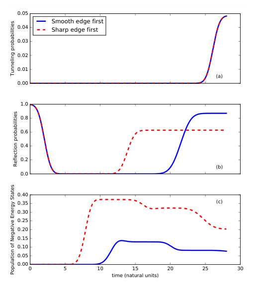
<figcaption class="paper-figure-caption"><b>Fig 2.</b> FIG. 2. Time-resolved observables for the two propagations, one in which the wave packet meets the sharp edge of the barrier of Fig. 1 first and one in which it meets the smooth edge first. (a) Tunneling probability, i.e., the population be- yond the barrier. The two curves coincide, confirming Theo- rem 1 (b) Reflection probability, i.e., the population in front of the barrier. The two curves separate. (c) Population of the negative-energy states. The sharp edge generates about four times more antiparticles than the smooth edge; this popula- tion remains under the barrier and accounts for the difference in panel (b).</figcaption>
</figure>
<figure class="paper-figure-card">

<figcaption class="paper-figure-caption"><b>Fig 3.</b> Fig. 3(a), is a single compact positive Gaussian displaced toward the barrier along the momentum axis. The barrier of Fig. 1 is held fixed throughout; the two propagations differ only in where the initial packet is pre- pared and in which direction it is launched, so that it en- counters the sharp edge first in one run and the smooth edge first in the other. In the first run the packet starts to the left of the barrier and moves toward +x: we then call the probability of finding the particle at x &lt; −12 the reflection probability and the probability of finding it at x &gt; 12 the tunneling probability (see Fig. 2). In the sec- ond run the packet starts to the right of the barrier and moves...</figcaption>
</figure>
<figure class="paper-figure-card">
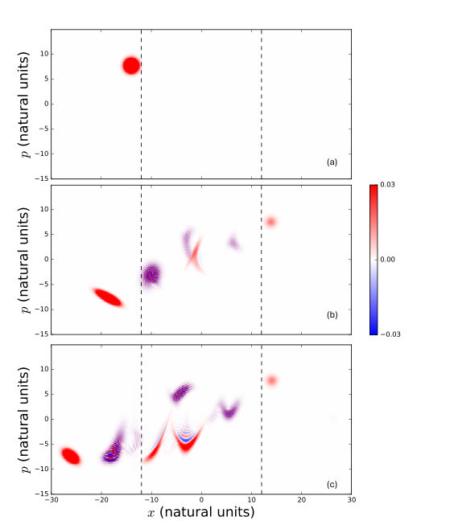
<figcaption class="paper-figure-caption"><b>Fig 4.</b> FIG. 3. Phase-space portrait of the two propagations, dis- played as the Wigner function W(x, p) in natural units. (a) Initial state, in the geometry in which it faces the smooth edge. (b) Final state of that run. (c) Final state of the run facing the sharp edge, plotted after the phase-space inversion W(x, p) →W(−x, −p), which maps the mirrored geometry onto the axes of panel (b) and allows the two final states to be compared directly. The dashed lines at x = ±12 delimit the interior region entering Fig. 2. The sharp edge generates a rich interference pattern, the phase-space signature of zit- terbewegung, concentrated underneath the barrier.</figcaption>
</figure>

**Summary.** This paper proves that the transmission probability for Klein tunneling through an asymmetric barrier is symmetric. However, using time-dependent simulations, the authors show this asymmetry is not in the transmitted current but rather in the generation of negative-energy states within the barrier region. Therefore, directional control in this regime must be sought by analyzing pair production rather than just particle flux.

**Why it may be interesting.** The finding that asymptotic transport is robust while internal dynamics are sensitive provides a nuanced view of how symmetry breaking can be 'hidden' from simple current measurements, which is relevant for understanding non-equilibrium quantum transport in mesoscopic systems.

Detailed structure

**Main problem.** The study investigates whether Klein tunneling through a spatially asymmetric potential barrier maintains left-right symmetry for Dirac fermions, contrasting with expectations of asymmetry.

**Main result.** Transmission probability remains symmetric ($T_L = T_R$), but the asymmetry manifests in the interior dynamics as a directionally dependent population of negative-energy states (pair creation).

**Method.** The analysis combines time-independent scattering matrix arguments with time-dependent Wigner-function simulations in phase space.

**Model / system.** The system is modeled by the relativistic Dirac equation describing quantum particle scattering off a one-dimensional, spatially asymmetric potential barrier $M(x)$.

**Key observables.** Transmission probability ($T$), Reflection probability ($R$), and the population of under-barrier negative-energy states.

**Important parameters / regimes.** The analysis is restricted to asymptotic leads carrying exactly one propagating channel per direction.

**Assumptions / limitations.** The stationary state analysis assumes current conservation, while the time-dependent part relies on Wigner function propagation in phase space.

**Figures summary.** Figures illustrate the tunneling probability, reflection probability, and negative energy population for both left and right incidence across an asymmetric barrier, comparing sharp vs. smooth edges.

**Paper structure.** The paper first uses time-independent scattering theory to prove $T_L = T_R$. It then employs time-dependent Wigner-function simulations to locate the source of asymmetry in the interior negative-energy population, concluding that pair production, not current, carries the directional information.

Abstract

We prove that the transmission probability for the Klein tunneling through a spatially asymmetric barrier is the same for left and right incidence whenever each asymptotic lead carries a single propagating channel per direction. Time-dependent Wigner-function simulations confirm this and locate the missing directionality in the barrier's interior, where a sharp edge generates several times more under-barrier negative-energy population than a smooth one. Directional control in the Klein regime therefore resides in pair production rather than in the transmitted current.

[↑ back to top](#top)

### ⭐ [GHz non-reciprocal optical conductivity in hematite ($α$-$\text{Fe}_2\text{O}_3$)](http://arxiv.org/abs/2607.22176v1)

**Highlighted author(s):** Johannes Knolle  
**Authors:** Peng Rao, Johannes Gröbmeyer, P. Peter Stavropoulos, Alexander Mook, Matthias Althammer, Hans Huebl, Alexander Holleitner, Johannes Knolle  
**Type:** theory · **Category:** strongly correlated electrons · **PDF:** <https://arxiv.org/pdf/2607.22176v1>  
**Analysis basis:** full PDF text, analyzed in chunks
**Topic relevance:** `exotic spin models in light-matter` **3/5** · `spintronics-quantum-optics interface` **3/5** · `Keldysh / 2PI / non-Gaussian methods` **1/5** · `analog quantum simulation` **1/5** · `non-equilibrium dynamics` **1/5**

↔ Scroll figures horizontally

<figure class="paper-figure-card">
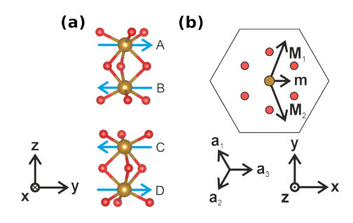
<figcaption class="paper-figure-caption"><b>Fig 1.</b> FIG. 1. Illustration of the unit cell of hematite (α −Fe2O3), showing iron atoms in brown and oxygen atoms in red. (a) Side-view of the unit cell with the magnetic moments shown in blue. (b) Top view looking down the c-axis. The in-plane projection of the lattice and the vectors a1, a2 and a3 are shown. The magnetic moments M1 (sub- lattices A, D) and M2 (sublattices B,C) are almost anti-parallel and in-plane.</figcaption>
</figure>
<figure class="paper-figure-card">
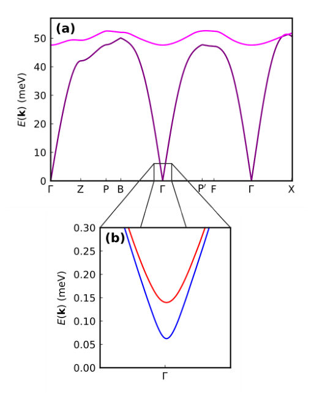
<figcaption class="paper-figure-caption"><b>Fig 2.</b> FIG. 2. Linear spin wave spectrum for the spin Hamiltonian Eq. (1). (a) Magnon spectrum across the Brillouin zone (BZ) of αFe2O3. Here, four magnon branches are pair-wise almost degenerate (ma- genta and purple lines for each pair). (b) The magnon spectrum near the Γ-point. The lower magnon branch corresponds to in-plane os- cillations of the Ne´el vector and the higher branch to out-of-plane oscillations.</figcaption>
</figure>
<figure class="paper-figure-card">
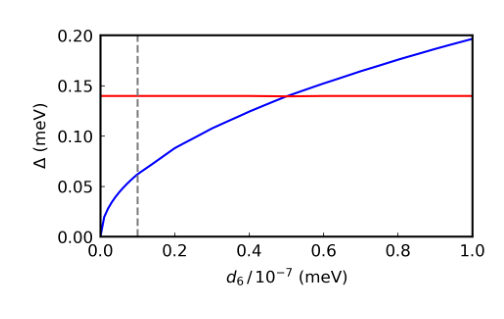
<figcaption class="paper-figure-caption"><b>Fig 3.</b> FIG. 3. Minimal magnon gaps energy of the two lower branches in Fig. 2(b) as a function of the triaxial basal anisotropy strength d6 in Eq. (6). The gray dashed line corresponds to d6 = 10−8 meV used elsewhere in the paper. Only the blue branch depends on d6 since it corresponds to in-plane oscillations. The strong dependence on d6 is due to the exchange enhancement effect discussed below Eq. (8).</figcaption>
</figure>
<figure class="paper-figure-card">
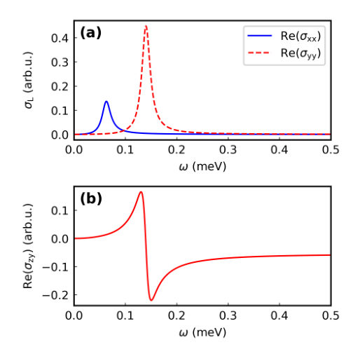
<figcaption class="paper-figure-caption"><b>Fig 4.</b> FIG. 4. Real part of conductivities of the spin Hamiltonian Eq. (1) as a function of frequency ω. (a) Longitudinal conductivities where Re σxx and Re σyy couple to the lower and higher magnon branches in Fig. (2)(b) respectively. (b) The non-zero antisymmetric conduc- tivity component satisfying Eq. (22), coupling to the higher magnon branch. The other off-diagonal conductivities are zero.</figcaption>
</figure>
<figure class="paper-figure-card">
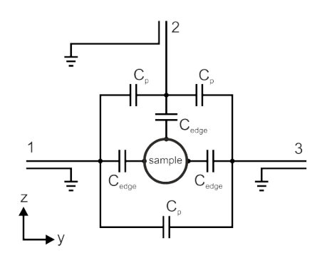
<figcaption class="paper-figure-caption"><b>Fig 5.</b> FIG. 5. Scheme of a three-port circulator with the sample material in the center. The circulator ports 1, 2, and 3 are capacitively coupled via Cedge to the sample (hematite). The term Cp describes the para- sitic coupling between the port arms.</figcaption>
</figure>

**Summary.** The paper theoretically investigates how Dzyaloshinskii-Moriya interactions induce a net magnetization in hematite ($\alpha$-Fe$_2$O$_3$), leading to non-reciprocal optical conductivity. By calculating the anomalous Hall conductivity using magnon theory, the authors demonstrate that this material can be engineered for use in high-frequency non-reciprocal circulators.

**Why it may be interesting.** This work connects fundamental magnetism (DMI, canting) directly to macroscopic quantum phenomena like non-reciprocity and device physics (circulators), which is highly relevant for understanding spin-charge coupling in magnetic insulators.

Detailed structure

**Main problem.** The study investigates non-reciprocal optical conductivity in hematite ($\alpha$-Fe$_2$O$_3$) within the GHz to THz frequency range.

**Main result.** The finite net magnetic moment, induced by Dzyaloshinskii-Moriya interactions (DMI), leads to a non-zero anomalous Hall conductivity and allows for the design of non-reciprocal circulators.

**Method.** Linear response theory is used with Kubo's formula applied to single-magnon contributions derived from linear spin wave theory analysis of the magnetic Hamiltonian.

**Model / system.** The system is hematite ($\alpha$-Fe$_2$O$_3$), modeled as a canted easy-plane antiferromagnet. The physics is governed by a spin Hamiltonian including exchange, DMI, and anisotropy terms.

**Key observables.** Non-reciprocal optical conductivity tensor components ($\sigma_{xy}$), anomalous Hall conductivity ($\sigma^{(as)}$), and circulator transmission amplitude ($|S_{13}|/|S_{31}|$)

**Important parameters / regimes.** DMI energy scale ($\sim 0.1 	ext{ meV}$); magnetic anisotropy terms ($d_2, d_6$); operating frequency range (GHz to THz).

**Assumptions / limitations.** The analysis relies on the single-magnon approximation for conductivity and treats the system in the weak ferromagnetic phase above $T_M$.

**Figures summary.** Figures illustrate the magnon spectrum near $\Gamma$, the dependence of magnon gaps on anisotropy, and simulated non-reciprocal responses $|S_{13}|/|S_{31}|$ vs. frequency for a circulator.

**Paper structure.** The paper progresses from establishing the magnetic ground state via spin Hamiltonian analysis to calculating the optical conductivity using linear response theory, culminating in the application of these results to model a three-port non-reciprocal circulator.

Abstract

We study the non-reciprocal properties of the iron oxide $α$-Fe$_2$O$_3$ (hematite) in the canted easy-plane antiferromagnetic phase, specifically in the GHz to THz frequency range. First, using the the microscopic spin Hamiltonian, we obtain the correct classical ground state where the canting is induced by the Dzyaloshinskii-Moriya interactions (DMI). The magnon spectrum is simulated using linear spin wave theory. We then compute the polarizability and the sub-gap optical conductivities using linear response. We find that the conductivity tensor contains frequency peaks at the zero momentum magnon gaps of order $0.1~$meV which can be tuned by the DMI and on-site anisotropic spin interactions. Furthermore, we show that the canting-induced net magnetic moment $\mathbf{m}$ represents a measure for the effective time-reversal-symmetry breaking and non-reciprocity of the system: a finite $\mathbf{m}$ results in a non-zero Hall conductivity. Finally, we discuss the prospective application of hematite in non-reciprocal circulator design, by computing the non-reciprocal circulator transmission amplitude using the conductivities as input.

[↑ back to top](#top)

### ⭐ [Correlated Coherent Errors in Stabilizer Codes: A General Cumulant Framework and Interference-Based Error Suppression](http://arxiv.org/abs/2607.22503v1)

**Highlighted author(s):** Aashish Clerk  
**Authors:** Rohan N Rajmohan, Antoine Brillant, Peter Groszkowski, Alireza Seif, Jens Koch, Aashish Clerk  
**Type:** theory · **Category:** quantum information and computing · **PDF:** <https://arxiv.org/pdf/2607.22503v1>  
**Analysis basis:** full PDF text, analyzed in chunks
**Topic relevance:** `correlated / nonlocal dissipation` **2/5** · `Keldysh / 2PI / non-Gaussian methods` **1/5** · `methods for driven-dissipative` **1/5**

↔ Scroll figures horizontally

<figure class="paper-figure-card">
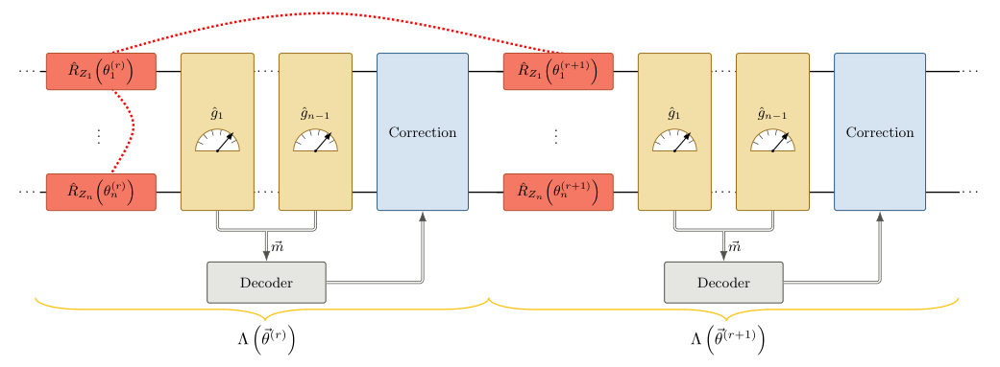
<figcaption class="paper-figure-caption"><b>Fig 1.</b> Figure 1. Quantum-circuit representation of two consecutive QEC cycles for a stabilizer code. In each cycle r, errors on the n data qubits (red boxes) are modeled as coherent Z rotations, ˆRZi(θ(r) i ) [Eq. (1)], where the stochastic rotation angles may be correlated both across qubits and across cycles (dashed red lines). The stabilizer generators ˆgi are measured directly (yellow boxes), and the resulting syndrome ⃗m is decoded using a maximum-likelihood decoder. This then determines the recovery operation (blue box). For a fixed realization of the correlated noise, the action of each complete QEC cycle on the data qubits, restricted to a stabilizer eigenspace, is described by an...</figcaption>
</figure>
<figure class="paper-figure-card">
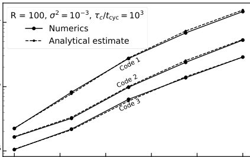
<figcaption class="paper-figure-caption"><b>Fig 2.</b> Figure 2. Infidelity of random odd-dZ CSS codes with the conventional syndrome-zero encoding under increasing strength of positive noise correlations. We plot the logical infidelity ϵ(R) after R = 100 cycles for three random J9, 1K CSS codes [see App. J] with dZ = 5, using the conventional syndrome-zero encoding and the noise model in Eq. (41), with noise strength σ2 and inter-cycle correlation range τc/tcyc fixed while inter-qubit correlation strength ϱ is varied over [0, 1]. Over this range, noise correlations are positive, and ϵ(R) increases monotonically with ϱ. Solid lines show numerical results, obtained by noise-averaging the exact expression in Eq. (23); error bars are within marker...</figcaption>
</figure>
<figure class="paper-figure-card">
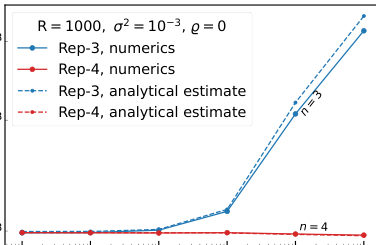
<figcaption class="paper-figure-caption"><b>Fig 3.</b> Figure 3. Impact of inter-cycle noise correlation range on infidelity ϵ(R) and sensitivity to the parity of the code’s Z distance. We plot ϵ(R) after R = 1000 cycles for the three-qubit (Rep-3; blue, circles) and four-qubit (Rep-4; red, squares) phase-flip repetition codes, under the noise model in Eq. (41), with noise strength σ2 and inter-qubit correlation strength ϱ fixed. The inter-cycle correlation range τc/tcyc is varied. For τc/tcyc →0, the two codes perform similarly. Increasing τc/tcyc increases ϵ(R) for the Rep-3 code, whereas for the Rep-4 code, ϵ(R) decreases slightly. Solid lines show numerical results, obtained by noise-averaging the exact expression in Eq. (23); error bars...</figcaption>
</figure>
<figure class="paper-figure-card">
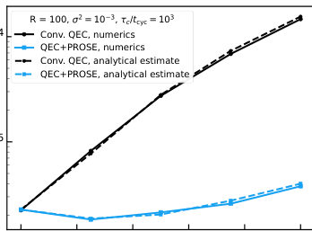
<figcaption class="paper-figure-caption"><b>Fig 4.</b> Figure 4. Identifying PROSE encodings and corre- sponding fidelity improvement. Results here are for one of the J9, 1K CSS codes [see App. J] and noise model from Fig. 2. Noise strength σ2 and inter-cycle correlation range τc/tcyc are fixed, and inter-qubit correlation strength ϱ varies over [0, 1]. (a) Logical infidelity for a single QEC cycle for different eigenspaces of the three Z stabilizers, as a function of ϱ. The eigenvalues of the X stabilizer generators in the codespace are fixed to +1. There are 3 PROSEs (i.e., optimal encodings) for each ϱ &gt; 0, indicated by dashed white lines; at ϱ = 0 all encodings perform equivalently. (b) Logical infidelity ϵ(R) for R = 100 as ϱ is varied,...</figcaption>
</figure>
<figure class="paper-figure-card">
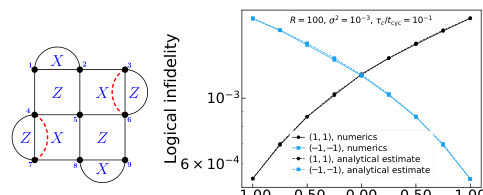
<figcaption class="paper-figure-caption"><b>Fig 5.</b> Figure 5. Impact of correlations with and without PROSE encoding. Left: A distance-3 rotated surface code, with X and Z stabilizer generators and qubits labeled. Right: Logical infidelity ϵ(R) after R = 100 QEC cycles for this code, under a simplified version of the noise model in Eq. (41) with intra-cycle correlations only between the qubit pairs (3, 6) and (4, 7), both controlled by ϱ. We vary ϱ while holding the noise strength σ2 and inter-cycle correlation range τc/tcyc fixed. For each value of ϱ, the PROSE is one of two codespaces distinguished by the eigenvalues of ˆZ3 ˆZ6 and ˆZ4 ˆZ7, with all other stabilizer eigenvalues fixed to +1. For ϱ &gt; 0, the (−1, −1) eigenspace (blue,...</figcaption>
</figure>

**Summary.** This work provides a comprehensive theoretical framework for analyzing how correlated coherent errors affect stabilizer codes during QEC. By developing the PROSE encoding strategy, the authors show that selecting the optimal codespace can actively suppress these structured errors. Crucially, they demonstrate that positive noise correlations, often viewed as detrimental, can actually be harnessed as a resource to improve error correction performance.

**Why it may be interesting.** The ability to treat structured, non-Markovian noise (coherent errors) analytically is highly valuable for designing robust quantum hardware protocols, especially in superconducting or trapped-ion platforms where correlated noise sources are common.

Detailed structure

**Main problem.** The paper develops a general analytical framework to treat correlated coherent errors occurring during repeated Quantum Error Correction (QEC) cycles in stabilizer codes.

**Main result.** It introduces Protected Stabilizer Eigenspace (PROSE) encoding, which can exploit noise correlations to reduce logical infidelity below the level predicted by uncorrelated error models. Furthermore, PROSE combined with Pauli twirling matches or outperforms standard error suppression techniques.

**Method.** The authors derive the exact logical channel using a general cumulant-expansion framework, yielding a non-perturbative expression for the noise-averaged logical infidelity.

**Model / system.** The system analyzed is quantum information encoded in stabilizer codes. The noise model specifically considers correlated coherent dephasing errors (Z-noise) acting on data qubits during each QEC cycle.

**Key observables.** Logical infidelity ($\epsilon(R)$), which quantifies the error rate after $R$ cycles, and the dependence of the induced channel on the chosen stabilizer eigenspace.

**Important parameters / regimes.** The noise correlation structure (positive correlations are shown to be beneficial), the number of QEC cycles ($R$), and the strength of coherent errors ($	heta$).

**Assumptions / limitations.** The analysis assumes that the syndrome measurement and recovery operations within a single QEC cycle are noiseless. The derivations rely on cumulant expansions, which provide analytical insight into the noise average.

**Figures summary.** Figures illustrate quantum circuits for multiple QEC cycles with coherent Z errors; captions highlight how positive noise correlations can reduce logical infidelity below the uncorrelated baseline when using PROSE encoding.

**Paper structure.** The paper progresses by first deriving the exact channel under correlated noise, then developing the general cumulant framework. It introduces PROSE encoding based on the dependence of the channel on the codespace choice. Finally, it compares PROSE+twirling against standard techniques like dynamical decoupling and Pauli twirling.

Abstract

Coherent errors in stabilizer codes are often correlated across qubits and QEC cycles. Having a general analytical treatment of such noise would thus be extremely valuable. We derive here the exact logical channel induced by repeated QEC cycles under correlated coherent $Z$ noise, and develop a broadly general cumulant-expansion framework that yields a tractable expression for the noise-averaged logical infidelity. Crucially, this expression is non-perturbative in the noise, and applies to arbitrary stabilizer codes and correlation structures. It reveals a feature with no analogue in standard stochastic Pauli error models: the induced channel depends on which stabilizer eigenspace is chosen as the codespace. Exploiting this, we introduce protected stabilizer eigenspace (PROSE) encoding, an error-suppression strategy that selects the optimal codespace. We show that this eigenspace can be efficiently identified in many relevant situations. Further, when combined with logical Pauli twirling, PROSE matches or outperforms standard error suppression techniques (dynamical decoupling, Pauli twirling of physical qubits). We also show that noise correlations, usually assumed to be harmful to QEC, can instead be a resource: with the right encoding, even positive correlations reduce the logical infidelity below the uncorrelated baseline. Our results offer a new, broadly applicable lens on correlated coherent noise in stabilizer codes.

[↑ back to top](#top)

### [Fractal quantum many-body scars and Hamiltonian inverse design from ZX-calculus](http://arxiv.org/abs/2607.22495v1)

**Authors:** Marcin Szyniszewski  
**Type:** theory · **Category:** other · **PDF:** <https://arxiv.org/pdf/2607.22495v1>  
**Analysis basis:** full PDF text, analyzed in chunks
**Topic relevance:** 🔥 `scars & prethermalization` **5/5** · `analog quantum simulation` **3/5** · `entanglement & information structure` **3/5** · `non-equilibrium dynamics` **3/5** · `methods for driven-dissipative` **2/5** · `non-equilibrium universality` **2/5** · `Keldysh / 2PI / non-Gaussian methods` **1/5** · `correlated / nonlocal dissipation` **1/5** · `driven-dissipative phase transition` **1/5**

↔ Scroll figures horizontally

<figure class="paper-figure-card">
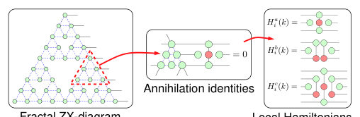
<figcaption class="paper-figure-caption"><b>Fig 1.</b> FIG. 1. Summary of the methodology: a fractal ZX-diagram state with atypical properties is selected as a candidate many- body quantum scar; parent Hamiltonian techniques and local ZX identities are used to find annihilators; associated local Hamiltonians are constructed that host the fractal ZX-diagram as a scar.</figcaption>
</figure>
<figure class="paper-figure-card">
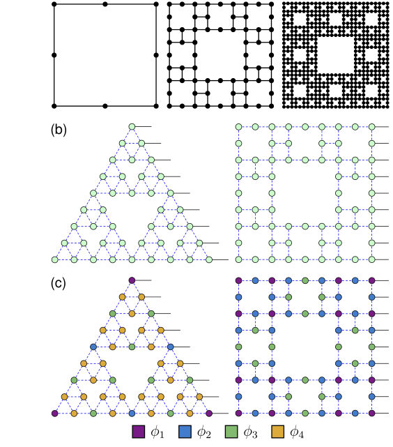
<figcaption class="paper-figure-caption"><b>Fig 2.</b> FIG. 2. (a) Successive generations g for graphs of the Sierpi´nski triangle (top row) and the Sierpi´nski carpet (bottom row). (b) Example fractal ZX-diagrams constructed from the triangle g = 3 and the carpet g = 2. Spider phases are omitted for clarity. (c) Generation-dependent spider phases ϕg in the ZX-diagrams are indicated here by color.</figcaption>
</figure>
<figure class="paper-figure-card">
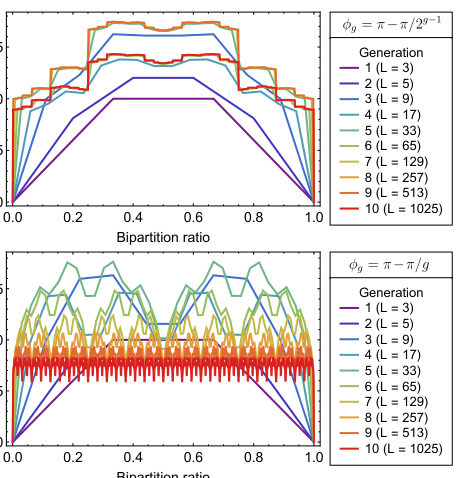
<figcaption class="paper-figure-caption"><b>Fig 3.</b> FIG. 4. The von Neumann entanglement entropy as a function of the bipartition ratio for successive generations g (and the corresponding system sizes L) for the Sierpi´nski triangle ZX- diagram. Z-spider phases are (a) ϕg = π(1 −1/2g−1) and (b) ϕg = π(1 −1/g).</figcaption>
</figure>
<figure class="paper-figure-card">
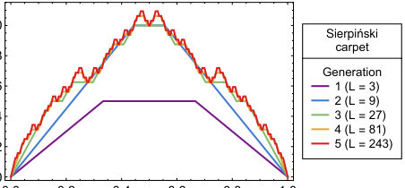
<figcaption class="paper-figure-caption"><b>Fig 4.</b> FIG. 3. Minimum-cut entanglement bound for states repre- sented by ZX-diagrams based on (a) the Sierpi´nski triangle and (b) the Sierpi´nski carpet, for successive generations g (and the corresponding system sizes L). The maximum min-cut grows logarithmically with system size L for the triangle and as a power law ∼Llog3 2 for the carpet.</figcaption>
</figure>
<figure class="paper-figure-card">
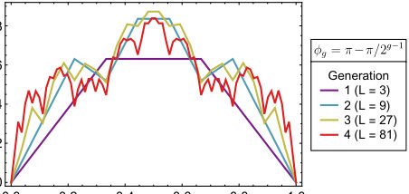
<figcaption class="paper-figure-caption"><b>Fig 5.</b> FIG. 5. Entanglement entropy divided by log2 L as a function of the bipartition ratio for different generations (and the cor- responding system sizes) of the Sierpi´nski carpet ZX-diagram. Z-spider phases are ϕg = π(1 −1/2g−1). The approximate collapse of the curves is consistent with logarithmic entangle- ment growth over the accessible system sizes, together with a self-similar spatial profile.</figcaption>
</figure>

**Summary.** This paper introduces a powerful framework using ZX-calculus to design quantum many-body scars based on fractal geometries. By constructing these states and their associated Hamiltonians analytically, the authors demonstrate how to embed exact, atypical eigenstates into otherwise chaotic energy spectra. This provides a novel, diagrammatically verifiable route for Hamiltonian inverse design in condensed matter physics.

**Why it may be interesting.** This work bridges advanced diagrammatic quantum computation tools (ZX-calculus) directly into condensed matter theory by providing an explicit, constructive method for generating non-trivial, non-thermal eigenstates (scars) in complex many-body systems.

Detailed structure

**Main problem.** The primary goal is to develop a systematic framework using ZX-calculus for Hamiltonian inverse design, specifically constructing quantum many-body scars (QMBS) that are atypical eigenstates embedded within otherwise thermalizing systems.

**Main result.** The paper demonstrates that the ZX-calculus can serve as this inverse design tool, allowing the explicit construction and mathematical relationship between fractal scar states, their local annihilators, and the chaotic Hamiltonians embedding them.

**Method.** The authors utilize diagrammatic languages (ZX-calculus) to encode fractal many-body states derived from Sierpiński structures. They combine these with parent-Hamiltonian techniques and local ZX identities to construct exact scars and then deform the Hamiltonian to induce chaos while preserving the scar state.

**Model / system.** The model involves quantum many-body systems whose states are represented by fractal patterns (Sierpiński triangle/carpet) encoded in ZX-diagrams. The dynamics are governed by Hamiltonians constructed via local terms derived from these diagrams, allowing for embedding into chaotic spectra.

**Key observables.** Entanglement entropy (showing area law or logarithmic scaling), local expectation values ($\langle X_i 
angle$), and spectral statistics (diagnosing transition between Poissonian/integrable and Wigner-Dyson/chaotic regimes).

**Important parameters / regimes.** The fractal generation parameter ($g$) defining the level of self-similarity, and system size ($L$).

**Assumptions / limitations.** It is assumed that the ZX-calculus provides a sufficiently rigorous graphical language to certify both the state structure and the Hamiltonian constraints (annihilation conditions).

**Figures summary.** Figures illustrate the methodology: selecting fractal ZX-diagrams as scars, using parent Hamiltonians/local identities for construction, and showing entanglement entropy scaling ($	ext{S}$ vs. bipartition ratio) for triangle (area law) and carpet (logarithmic scaling) families.

**Paper structure.** The paper progresses by first establishing the use of ZX-calculus for state representation; then, it details the fractal construction of states with specific entanglement properties; subsequently, it applies parent-Hamiltonian methods to find annihilators; finally, it constructs a local deformation to embed these scars into chaotic Hamiltonians.

Abstract

Diagrammatic languages such as ZX-calculus provide compact and intuitive descriptions of quantum processes and have become established tools for circuit simplification, verification, and compilation. However, their potential as a framework for constructing many-body states and the Hamiltonians that host them remains largely unexplored. Here, we introduce families of fractal many-body states obtained from ZX-diagrams based on the Sierpiński triangle and Sierpiński carpet. By construction, the underlying graph connectivity imposes atypical subvolume-law minimum-cut upper bounds on the entanglement, while the actual states are parametrically less entangled still: the triangle family obeys an area law, whereas the carpet family displays approximately logarithmic scaling across the available system sizes. Additionally, their local observables retain fractal-like spatial structure, identifying these states as natural candidates for atypical eigenstates in otherwise thermalizing systems. For the triangle family, we combine parent-Hamiltonian methods, insights from ZX-calculus, and local ZX identities that certify exact annihilation of the target state, producing frustration-free Hamiltonians whose terms admit simple representations in the same diagrammatic language as the states themselves. We then construct a local deformation that produces chaotic level statistics while embedding the fractal ZX state in the bulk of the energy spectrum as an exact quantum many-body scar. Our results demonstrate, through this explicit construction, that ZX-calculus can serve as a framework for Hamiltonian inverse design, in which quantum many-body scars, their local annihilators, and the chaotic Hamiltonians embedding them can be constructed and related through a set of graphical identities.

[↑ back to top](#top)

### [Hydrodynamic Memory and Long-Time Tails in Clean Frustrated Magnets](http://arxiv.org/abs/2607.21827v1)

**Authors:** Yufei Pei, Claudio Castelnovo, Roderich Moessner  
**Type:** theory · **Category:** statistical mechanics · **PDF:** <https://arxiv.org/pdf/2607.21827v1>  
**Analysis basis:** full PDF text, analyzed in chunks
**Topic relevance:** 🔥 `analog quantum simulation` **4/5** · 🔥 `exotic spin models in light-matter` **4/5** · `methods for driven-dissipative` **3/5** · `non-equilibrium dynamics` **3/5** · `spintronics-quantum-optics interface` **3/5** · `Keldysh / 2PI / non-Gaussian methods` **2/5** · `correlated / nonlocal dissipation` **2/5** · `driven-dissipative phase transition` **2/5** · `non-equilibrium universality` **2/5** · `Kondo & dissipative impurity` **1/5** · `entanglement & information structure` **1/5** · `scars & prethermalization` **1/5**

↔ Scroll figures horizontally

<figure class="paper-figure-card">
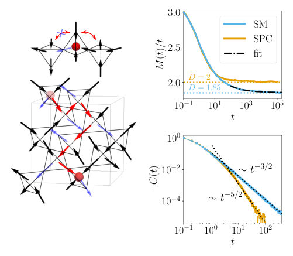
<figcaption class="paper-figure-caption"><b>Fig 1.</b> Figure 1. Schematic illustration of spin ice and monopole hopping. Top left panel: The middle tetrahedron (3-in-1-out) can hop to the right without increasing the system energy, by flipping a majority spin; hopping to the left instead creates a costly double monopole, by flipping a minority spin, and is suppressed at low temperatures. Bottom left panel: example of a (zero-energy) monopole trail, with the flipped spins shown in red, and the blocked spins at each step shown in blue. The cubic box indicates one unit cell of 16 spins. Right panels: mean-square displacement 𝑀(𝑡) (top) and (negative of the) velocity autocorrelation function 𝐶(𝑡) (bottom), for the standard model monopole dynamics...</figcaption>
</figure>
<figure class="paper-figure-card">
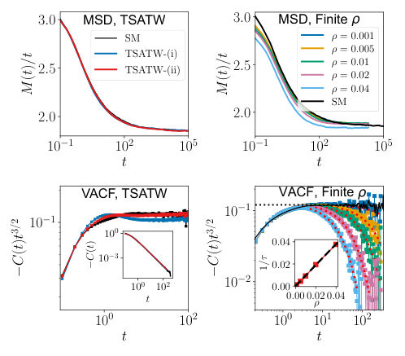
<figcaption class="paper-figure-caption"><b>Fig 2.</b> Figure 2. Left panels: comparison between the monopole ran- dom walk and the TSATW with suitably chosen parameters (see main text). We find good agreement for both the MSD (top) and VACF (−𝐶(𝑡)𝑡3/2, bottom main; −𝐶(𝑡), bottom inset). Right panels: simulations of standard model spin ice with fixed finite density of monopoles (microcanonical ensemble). The MSD (top) converges to the diffusive limit more quickly the higher the monopole density, and −𝐶(𝑡)𝑡3/2 (bottom) exhibits a long-time exponential decay due to monopole motion altering other monopoles’ memory trail (Dirac strings). Fits to the VACFs of the form 𝐶(𝑡) ∼𝑡−3/2𝑒−𝑡/𝜏are shown as red dotted lines. Bottom right panel inset: monopole...</figcaption>
</figure>
<figure class="paper-figure-card">
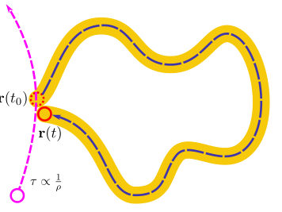
<figcaption class="paper-figure-caption"><b>Fig 3.</b> Figure 3. Schematic illustration of the origin of the hydrodynamic memory of a monopole random walk in spin ice. The monopole (red circle) wanders across the system (black dashed line), leaving behind a memory trail of traversed spins (yellow brush) with which it later interacts. At finite monopole density, other monopoles may scramble the stored memory (pink circle and dashed line), with a characteristic timescale inversely proportional to the monopole density.</figcaption>
</figure>
<figure class="paper-figure-card">
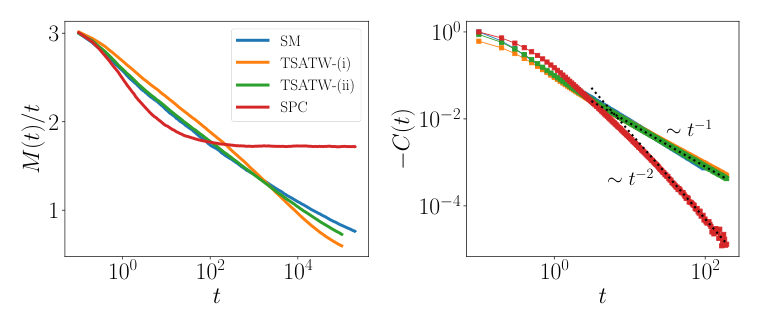
<figcaption class="paper-figure-caption"><b>Fig 4.</b> Figure 4. Two-dimensional square spin ice results. (a) MSD divided by time, 𝑀(𝑡)/𝑡, for the monopole random walk in 𝑑= 2 and for two TSATWs on the square lattice (see text); we also present results for the structural percolation cluster random walk on the square lattice. The VACFs −𝐶(𝑡) for the same processes are shown in panel (b).</figcaption>
</figure>
<figure class="paper-figure-card">
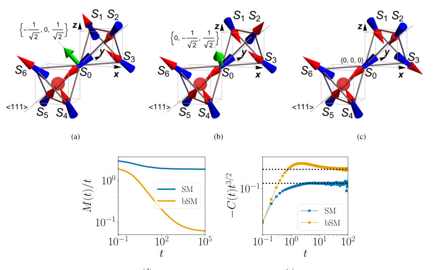
<figcaption class="paper-figure-caption"><b>Fig 5.</b> Figure 5. Illustration of symmetry-inequivalent configurations for a single spin and its nearest neighbors (a)-(c), for the case where flipping the central spin leads to monopole hopping. The direction of the transverse field due to nearest-neighbor exchange interactions is shown as a green arrow; it vanishes exactly by symmetry, and therefore it is not shown, in panel (c). We present a comparison between standard model (SM) and bSM results in panels (d), MSD divided by time 𝑀(𝑡)/𝑡, and (e), −𝐶(𝑡)𝑡3/2. The horizontal dashed lines are guides to the eye. Panels (a)-(c) are reproduced from Ref. 48.</figcaption>
</figure>

**Summary.** This work analyzes the slow relaxation dynamics of magnetic monopoles in frustrated spin ice. It shows that single monopoles exhibit hydrodynamic memory characterized by a $t^{-3/2}$ decay tail. Crucially, interactions between these quasiparticles at finite density introduce an exponential cutoff to this long-time memory effect.

**Why it may be interesting.** The study provides a concrete, physical realization—frustrated magnets—to model complex non-Markovian dynamics, which is highly relevant for understanding relaxation in open quantum systems or disordered materials.

Detailed structure

**Main problem.** The study investigates self-interacting stochastic processes, hydrodynamic memory effects, and non-Markovian quasiparticle transport in frustrated magnetic systems.

**Main result.** Single monopoles exhibit an algebraic long-time tail ($t^{-3/2}$) in the velocity autocorrelation function, while finite density introduces an exponential cutoff due to inter-monopole interactions.

**Method.** The analysis relies on calculating the Mean-Square Displacement (MSD) and the Velocity Autocorrelation Function (VACF), alongside analyzing the Power Spectral Density (PSD).

**Model / system.** The system is based on nearest-neighbor classical spin ice (nnSI) on a pyrochlore lattice, where excitations are deconfined magnetic monopoles. The dynamics are modeled as stochastic single-spin-flip processes.

**Key observables.** Mean-Square Displacement ($	ext{MSD}$), Velocity Autocorrelation Function ($	ext{VACF}$), and Power Spectral Density ($	ext{PSD}(\omega)$).

**Important parameters / regimes.** Monopole density ($
ho$), temperature ($T$), and time scales ($	au$).

**Assumptions / limitations.** The analysis often focuses on the low-temperature, dilute gas regime of monopoles; comparisons are made against idealized models like structural percolation clusters.

**Figures summary.** Figures illustrate the comparison between monopole dynamics (showing $t^{-3/2}$ scaling) and other walks (like SPC showing $t^{-5/2}$), and demonstrate the exponential decay of $	ext{VACF}$ at finite density.

**Paper structure.** The paper progresses by establishing the model (spin ice monopoles), calculating single-particle dynamics ($	ext{MSD}/	ext{VACF}$ scaling), introducing the effect of particle interactions (exponential cutoff), and finally analyzing spectral properties ($	ext{PSD}$) across different dynamic regimes.

Abstract

In a simple, clean but constrained magnet, we identify a self-interacting random walk with memory. For the motion of a single monopole -- a fractionalized quasiparticle in spin ice -- this produces a subtle and unusually slow relaxation toward diffusive motion. This is manifested as an algebraic long-time tail in the velocity autocorrelation function, decaying as $t^{-3/2}$. At finite monopole density, the interactions between the trails of different monopoles introduce an additional timescale, corresponding to the disruption of a monopole's memory by other monopoles, and leading to an exponential cutoff of the long-time tail. Our results identify clean frustrated magnets as microscopic platforms for studying self-interacting stochastic processes, hydrodynamic memory, and the emergence of non-Markovian quasiparticle transport from local Markovian dynamics.

[↑ back to top](#top)

### [Optomechanical systems with a Fano membrane in the middle](http://arxiv.org/abs/2607.22526v1)

**Authors:** Lei Du, Aymeric Frerejean, Witlef Wieczorek, Janine Splettstoesser, Juliette Monsel  
**Type:** theory · **Category:** other · **PDF:** <https://arxiv.org/pdf/2607.22526v1>  
**Analysis basis:** full PDF text, analyzed in chunks
**Topic relevance:** 🔥 `interference shaping light` **4/5** · `Keldysh / 2PI / non-Gaussian methods` **3/5** · `correlated cavity matter` **3/5** · `driven-dissipative phase transition` **3/5** · `methods for driven-dissipative` **3/5** · `analog quantum simulation` **2/5** · `correlated / nonlocal dissipation` **2/5** · `non-equilibrium dynamics` **2/5** · `non-equilibrium universality` **2/5** · `Tavis-Cummings & cavity-many-emitter` **1/5** · `quantum measurements` **1/5**

↔ Scroll figures horizontally

<figure class="paper-figure-card">
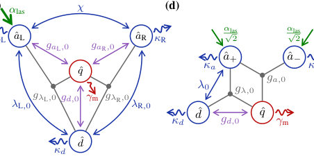
<figcaption class="paper-figure-caption"><b>Fig 1.</b> FIG. 1. (a) Schematics of the membrane-in-the-middle setup. (b) Diagram of the system in the transparent-membrane limit where only one cavity mode (ˆa) is relevant, coupling to the optical membrane mode ( ˆd) and to the mechanical mode (ˆq), see Sec. II A. (c) Dia- gram of the system in the reflective-membrane limit, with a left cav- ity mode (ˆaL), a right cavity mode (ˆaR) and the optical membrane mode ( ˆd), coupled to each other and to the mechanical mode (ˆq). (d) Diagram of the system in the reflective-membrane limit in the sym- metric case where the left and right cavity modes are identical, in the {ˆa−, ˆa+, ˆd} basis, see Sec. II B.</figcaption>
</figure>
<figure class="paper-figure-card">
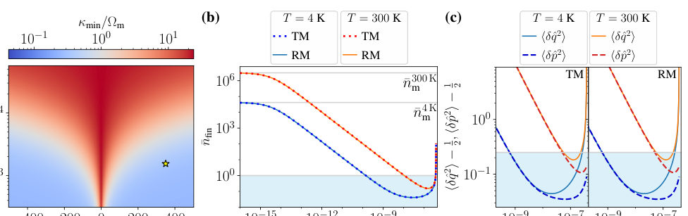
<figcaption class="paper-figure-caption"><b>Fig 2.</b> FIG. 2. (a) Effective sideband resolution κmin/Ωm as a function of the detuning δ∆(see Secs. II A 3 and II B 3 for the TM and RM cases respectively) and coherent coupling λ0. (b) Steady-state phonon number ¯nfin in the mechanical fluctuations as a function of the laser power Plas, for both the TM and the RM cases. In both cases, the narrowest normal mode is driven on its red sideband, ∆− TM/RM = Ωm. The horizontal gray lines indicate the thermal phonon numbers at 4 K and 300 K. (c) Mechanical position and momentum fluctuations ⟨δˆq2⟩and ⟨δˆp2⟩as functions of the laser power in the TM and RM cases. Blue shading indicates parameter regimes in which ¯nfin &lt; 1. The yellow star in panel (a)...</figcaption>
</figure>
<figure class="paper-figure-card">
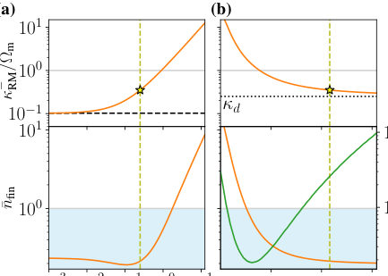
<figcaption class="paper-figure-caption"><b>Fig 3.</b> FIG. 3. Effective sideband resolution (top) and the correspond- ing steady-state phonon number (bottom), minimized over ∆− RM and Plas, as functions of (a) the intrinsic Fano-mode decay rate κd and (b) the detuning δ∆RM, varied by changing ωd. In panel (a), the dashed black line indicates the effective sideband resolution in the limit |δ∆RM| ≫λ0 and κd →0, κlim = λ2 0κa/(4δ∆2 RM) [Eq. (17)]. In the bottom of panel (b), the laser power at which the minimum ¯nfin is reached (green curve) is shown on the right axis. The blue shaded areas indicate parameter regimes in which ¯nfin &lt; 1. Unless otherwise indicated, the parameters are the same as for the RM case in Fig. 2(b), at T = 300 K. The...</figcaption>
</figure>
<figure class="paper-figure-card">
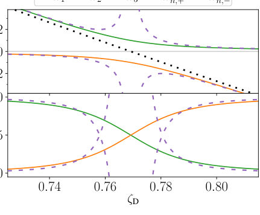
<figcaption class="paper-figure-caption"><b>Fig 4.</b> FIG. 4. Resonances ˜ωj = ωj −iγj, with j = 1, 2, 3 of the transfer- matrix model as functions of the polarizability ζD of the unpatterned membrane. Panel (b) is a zoom-in, in linear scale, of panel (a) in the area where ˜ω2 and ˜ω3 are almost equal. The solid lines were obtained by numerically solving Eq. (A23). The thick dotted and dashed black lines are the resonances for an unpatterned membrane [Eq. (A17)] and the gray horizontal lines indicate the FP resonances in the limits ζD →0 [Eq. (A18)] and ζD →∞[Eq. (A19)]. In panel (b), the purple dashed lines correspond to the analytical approxima- tions ˜ω0 n,+ + δ˜ω, ωF −δ˜ω [Eq. (A27)]. The parameters are L = 50 µm, ζN = 50, and ωF/2π =...</figcaption>
</figure>
<figure class="paper-figure-card">
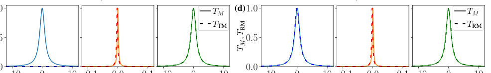
<figcaption class="paper-figure-caption"><b>Fig 5.</b> FIG. 5. Comparison of the transfer matrix and coupled-mode models: (a), (c) TM case and (b), (d) RM case. (a), (b) Resonances of the transfer-matrix model (solid lines) and of the corresponding coupled-mode model (dashed lines) as functions of the polarizability ζD. (c), (d) Transmission in energy through the setup around the resonance frequencies ωj, j = 1, 2, 3 of the transfer-matrix model at the values of ζD indicated by the vertical dotted black lines in (a) and (b), respectively. The parameters depending on ζD were computed using the expressions in Table I, while the other parameters are the ones given in Table II for the TM case in (a), (c) and the RM case in (b), (d).</figcaption>
</figure>

**Summary.** This paper investigates using a photonic-crystal Fano membrane within an optomechanical cavity to overcome limitations in linewidth control. By modeling both transparent and reflective membrane regimes, the authors show that the unique hybridization provided by the Fano resonance generates narrow optical modes. These engineered modes enable efficient ground-state cooling of the mechanical oscillator even when standard cavity parameters suggest otherwise.

**Why it may be interesting.** This work directly addresses advanced topics in cavity quantum electrodynamics (cavity QED) and open quantum systems, specifically focusing on engineered coupling mechanisms to enhance ground-state cooling capabilities beyond standard limits.

Detailed structure

**Main problem.** Conventional optomechanical systems suffer from limited control over optical linewidth, which restricts their performance when attempting ground-state cooling in the unresolved-sideband regime.

**Main result.** The incorporation of a photonic-crystal Fano membrane enables spectral engineering, generating narrow optical normal modes that maintain efficient coupling to external drives and allow for ground-state cooling even when the bare cavity is in the unresolved sideband regime.

**Method.** The authors employ quantum Langevin equations combined with a transfer-matrix description of the optical scattering problem to analyze the system dynamics across different reflectivity regimes.

**Model / system.** The system is an optomechanical setup involving a Fabry-Pérot cavity containing a photonic-crystal Fano membrane. The model considers two limits: a transparent-membrane regime (single mode) and a reflective-membrane regime (two coupled subcavity modes).

**Key observables.** Final phonon occupation number ($ar{n}_{fin}$), effective sideband resolution ($\kappa^-$), and the required laser power for cooling.

**Important parameters / regimes.** Membrane reflectivity, coupling strengths ($g_{d,0}, g_{\lambda,0}$), cavity loss rates ($\kappa$), and mechanical frequency ($\Omega_m$).

**Assumptions / limitations.** The analysis relies on linearizing the dynamics in the weak-coupling regime and assumes that the Fano membrane provides a frequency-dependent optical response superior to conventional dielectric membranes.

**Figures summary.** Figure 1 illustrates schematics of the setup, detailing diagrams for both the transparent-membrane (TM) limit (single mode coupling) and the reflective-membrane (RM) limit ($\hat{a}_L$, $\hat{a}_R$ subcavities).

**Paper structure.** The paper first establishes the limitations of conventional MIM systems. It then develops the theoretical framework by analyzing the Hamiltonian and dynamics for both TM and RM regimes using Langevin equations. Finally, it derives key results showing how Fano-induced hybridization enables superior cooling performance.

Abstract

Conventional membrane-in-the-middle (MIM) optomechanical systems offer limited control over the optical linewidth, which can limit their performance when operating in the unresolved-sideband regime. We investigate cavity optomechanics with a photonic-crystal Fano membrane placed at the center of a Fabry-Pérot (FP) cavity. In contrast to a conventional dielectric membrane, the photonic-crystal membrane supports a localized optical resonance, which hybridizes with the cavity field and enables spectral engineering of the relevant optical modes. Besides the usual dispersive optomechanical coupling associated with cavity-length changes, the membrane motion also modifies the Fano-mode resonance and its hybridization with the cavity field. We consider two limits set by the membrane reflectivity: a transparent-membrane regime with a single FP-like mode, and a reflective-membrane regime with two coupled subcavity modes. In the latter case, only the symmetric cavity mode hybridizes with the Fano mode, while the antisymmetric mode remains decoupled. Using quantum Langevin equations together with a transfer-matrix description of the optical scattering problem, we show that the Fano-induced hybridization can generate narrow optical normal modes that remain efficiently accessible to the external drive for experimentally realistic parameters. These modes can provide effective sideband resolution and enable ground-state cooling of the membrane motion even when the bare cavity is in the unresolved-sideband regime. Our results establish Fano MIM systems as a promising platform for spectral and optomechanical engineering.

[↑ back to top](#top)

### [Thermal avalanches in a quasiperiodic XXZ model](http://arxiv.org/abs/2607.21708v1)

**Authors:** Paolo Molignini, Antonio Štrkalj  
**Type:** theory · **Category:** disordered systems and neural networks · **PDF:** <https://arxiv.org/pdf/2607.21708v1>  
**Analysis basis:** full PDF text, analyzed in chunks
**Topic relevance:** 🔥 `non-equilibrium dynamics` **4/5** · `driven-dissipative phase transition` **3/5** · `entanglement & information structure` **3/5** · `methods for driven-dissipative` **3/5** · `scars & prethermalization` **3/5** · `analog quantum simulation` **2/5** · `correlated / nonlocal dissipation` **2/5** · `non-equilibrium universality` **2/5** · `Frenkel-Kontorova` **1/5** · `Keldysh / 2PI / non-Gaussian methods` **1/5** · `Kondo & dissipative impurity` **1/5** · `exotic spin models in light-matter` **1/5**

↔ Scroll figures horizontally

<figure class="paper-figure-card">
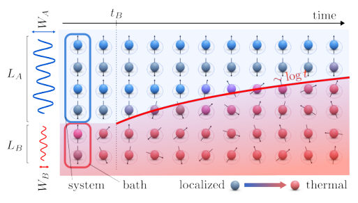
<figcaption class="paper-figure-caption"><b>Fig 1.</b> FIG. 1. Thermal bubble spreading in a quasiperi- odic spin chain. A localized subsystem A (blue, quasiperi- odic amplitude WA) is coupled to an ergodic bath B (red, quasiperiodic amplitude WB). The bath acts as a seed for thermalization, generating after time tB a thermal bubble that gradually invades subsystem A. The red curve indicates the position of the thermalization front, which propagates ap- proximately logarithmically in time.</figcaption>
</figure>
<figure class="paper-figure-card">
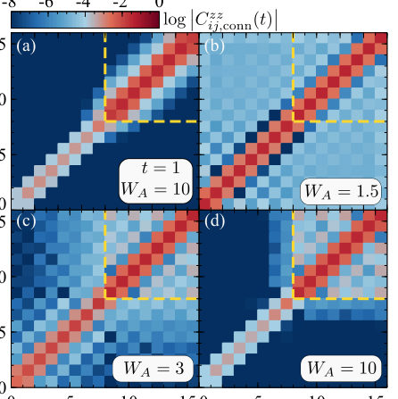
<figcaption class="paper-figure-caption"><b>Fig 2.</b> FIG. 2. Two-point connected correlation function. Logarithm of sample-averaged two-point correlations at short, t = 1 (a), and long times t = 10000 (b-d). The potential strength in the subsytem A is (a),(d) WA = 10, (b) W = 1.5, and (c) W = 3.0. The times are in units of the hopping J. In all plots, we used chains with L = 16 sites and the bath con- taining LB = 8 sites with weak potential strength WB = 0.5. The dynamics is calculated starting from an initial N´eel state. Dashed yellow lines enclose the sites belonging to the bath.</figcaption>
</figure>
<figure class="paper-figure-card">
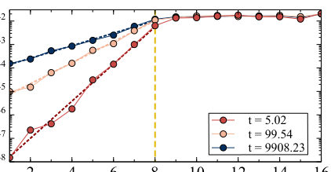
<figcaption class="paper-figure-caption"><b>Fig 3.</b> FIG. 3. Bath-averaged two-point correlation function and bath thermalization. (a) Mean of the off-diagonal elements of g(2) calculated only in the bath region, i.e. i, j ∈ LB, for three different strengths of the potential. (b) Bath- averaged g(2) as a function of the distance from the bath i plotted for three different hopping times. Dashed color-coded lines show the exponential fit inside the localized part of the system. The vertical dashed line shows the position of the last site in the localized subsystem, i.e. i = LA. For all curves we used L = 16, LA = 8, and WA = 3.0, WB = 0.5. All parameters, except WA, are the same as in (a).</figcaption>
</figure>
<figure class="paper-figure-card">

<figcaption class="paper-figure-caption"><b>Fig 4.</b> FIG. 4. Time dynamics of the correlation length. Correlation length ξd as a function of time for different WA for (a)-(b) a large bath with L = 16, LB = 8, (c)-(d) a small bath with L = 16, LB = 2. The dashed lines in (a) and (c) show the exponential fit, from which the LIOM localization length ξ is extracted in (b) and (d).</figcaption>
</figure>
<figure class="paper-figure-card">
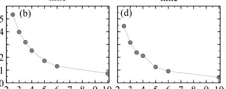
<figcaption class="paper-figure-caption"><b>Fig 5.</b> Fig. 4(a). We also observe faster-than-logarithmic growth of ξd in our numerics. However, this behavior appears only on the ergodic side of the crossover at lower potential strengths, as shown in Appendix B. This comparison indicates that faster-than-logarithmic growth reflects globally ergodic dynamics in our model, rather than being a necessary signature of avalanche proliferation within the localized regime. The correlation length ξd can be related to the LIOM localization length, as pointed in Ref. [35]. As discussed in Sec. III, the LIOM inside the initially localized part of the system that is ∆x sites away from the bath, decays after a time t∆x ∝exp(2∆x/ξ). Taking the distance ∆x to...</figcaption>
</figure>

**Summary.** The paper examines how heat spreads (thermalizes) in a localized spin chain coupled to an external bath under quasiperiodic driving. By comparing two diagnostics—correlations and entropy—the authors find that only the entropy reveals clear signs of thermal avalanches, while correlations do not. This suggests that standard theories describing such spreading must be updated to account for the unique short-range physics introduced by quasiperiodicity.

**Why it may be interesting.** This work directly addresses non-equilibrium quantum dynamics in quasiperiodic systems, a key area intersecting MBL physics with open quantum system theory. The finding that different observables yield conflicting results highlights the need for careful diagnostic tools when modeling complex many-body thermalization processes.

Detailed structure

**Main problem.** The study investigates bath-induced thermalization, specifically analyzing the mechanism of 'thermal avalanches' in a Many-Body Localized (MBL) system subjected to a quasiperiodic magnetic field.

**Main result.** The particle-number entropy clearly shows signatures of thermal avalanches propagating into the localized subsystem, whereas two-point correlations fail to show this signature, suggesting standard avalanche theory needs revision for quasiperiodic potentials.

**Method.** The analysis uses quantum simulation techniques by comparing results from two complementary observables: the two-point connected correlation function and the particle-number entropy, within an XXZ spin chain model.

**Model / system.** The system is an XXZ spin chain partitioned into a localized subsystem (A) coupled to a thermal bath (B), subjected to both interacting and quasiperiodic magnetic fields. The dynamics are analyzed by engineering a thermal inclusion in the bath region.

**Key observables.** Two-point connected correlation function, particle-number entropy, correlation length ($\xi_d(t)$), and entanglement entropy ($S_E$).

**Important parameters / regimes.** Quasiperiodic field strength ($W_A$), weak disorder in the bath ($W_B=0.5$), and the comparison between quasiperiodic vs. random potentials.

**Assumptions / limitations.** The standard avalanche theory framework is assumed to apply, but the authors argue this assumption breaks down due to short-range correlations inherent to quasiperiodic potentials.

**Figures summary.** Figure 1 illustrates thermal bubble spreading, showing the localized subsystem A coupled to an ergodic bath B, with a red curve indicating the propagating thermalization front.

**Paper structure.** The paper sets up the MBL system under external fields, introduces two diagnostic observables (correlations and entropy), compares their predictions regarding avalanche signatures, and concludes by proposing necessary revisions to existing theoretical frameworks based on the observed discrepancy.

Abstract

We study bath-induced thermalization in the many-body localized XXZ spin chain subjected to a quasiperiodic magnetic field. We engineer a thermal inclusion by setting the field strength in one part of the chain below the localization threshold and analyze thermalization via the avalanche mechanism. To study the nature of such avalanches, we use two complementary observables, namely the two-point connected correlation function and the particle-number entropy. Surprisingly, the correlations alone show no signatures of avalanches. Instead, they display a logarithmic growth of the correlation length throughout the dynamics and predict localization lengths of the local integrals of motion that remain well below the avalanche threshold. In contrast, the particle number entropy shows clear signatures of the thermal avalanche, with the avalanche front progressively propagating deeper into the localized subsystem for sufficiently large baths. The discrepancy between the two observables shows that two-point correlations are unreliable in identifying thermal avalanches in quasiperiodic systems, as opposed to the random case. On one hand, qualitative results are consistent with the analytical predictions of the standard avalanche theory. On the other hand, significant quantitative deviations persist, which could be due to short-range resonances generated by the quasiperiodic potential. Our results suggest that the standard avalanche framework requires revision to account for the short-range correlations of quasiperiodic potentials.

[↑ back to top](#top)

### [Fermions on a 1D lattice: localized sources and sinks with dephasing](http://arxiv.org/abs/2607.22240v1)

**Authors:** Elka Bhattacharya, Sushant Saryal, Soumya Ghosh, Kabir Ramola  
**Type:** theory · **Category:** statistical mechanics · **PDF:** <https://arxiv.org/pdf/2607.22240v1>  
**Analysis basis:** full PDF text, analyzed in chunks
**Topic relevance:** 🔥 `methods for driven-dissipative` **4/5** · 🔥 `non-equilibrium dynamics` **4/5** · `driven-dissipative phase transition` **3/5** · `non-equilibrium universality` **3/5** · `Kondo & dissipative impurity` **2/5** · `analog quantum simulation` **2/5** · `scars & prethermalization` **2/5** · `Frenkel-Kontorova` **1/5** · `Keldysh / 2PI / non-Gaussian methods` **1/5** · `correlated / nonlocal dissipation` **1/5** · `entanglement & information structure` **1/5**

↔ Scroll figures horizontally

<figure class="paper-figure-card">
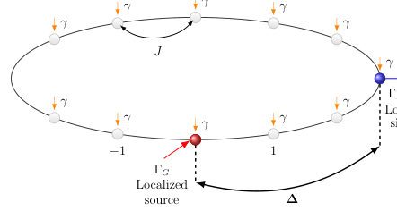
<figcaption class="paper-figure-caption"><b>Fig 1.</b> FIG. 1. Schematic illustration of the source-sink with de- phasing setup. A one-dimensional periodic lattice of size L with nearest-neighbor hopping amplitude J is coupled to a localized source at the origin and a localized sink located a distance ∆away. The source injects particles at rate ΓG, while the sink removes particles at rate ΓL. In addition, each lattice site is subjected to local dephasing with rate γ.</figcaption>
</figure>
<figure class="paper-figure-card">
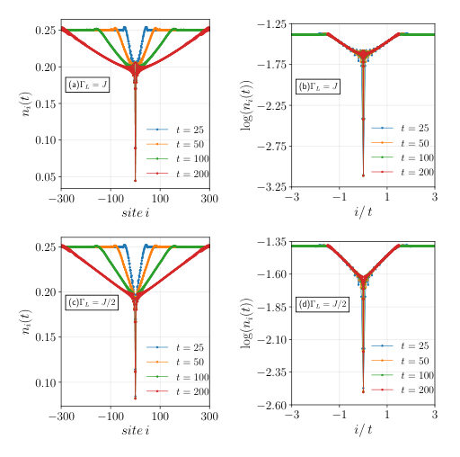
<figcaption class="paper-figure-caption"><b>Fig 2.</b> FIG. 2. Local particle density profile ni(t) obtained from Eq. (17) for a localized sink at the origin. Panels (a) and (c) show the results for ΓL = J and ΓL = J/2, respectively, with J = 1 and L = 601. The scaling plots in (b) and (d) confirm the ballistic propagation of the density perturbation.</figcaption>
</figure>
<figure class="paper-figure-card">

<figcaption class="paper-figure-caption"><b>Fig 3.</b> FIG. 3. Total particle loss rate, ∣dN/dt∣/J [Eq. (22)], as a function of time tJ for different system sizes L, with a local- ized sink at the origin (i = 0) and loss rate ΓL. The duration of the second dynamical regime scales linearly with the system size, indicating ballistic propagation of the density perturba- tion. For all curves, the initial filling is N(0)/L = 0.25, and ΓL/J = 1.</figcaption>
</figure>
<figure class="paper-figure-card">
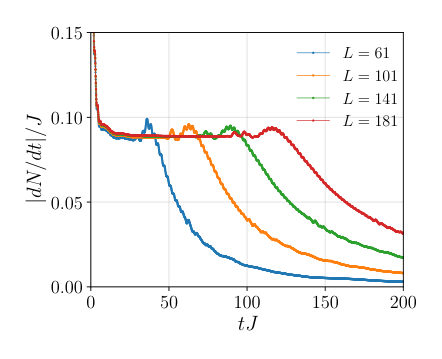
<figcaption class="paper-figure-caption"><b>Fig 4.</b> Figure 3 shows the total particle loss rate, ∣dN/dt∣/J, as a function of the dimensionless time tJ. Here, both the particle loss rate and time are scaled by the hopping amplitude J, the intrinsic energy scale of the system, to yield dimensionless quantities. The loss-rate curves exhibit three distinct dynamical regimes: (i) At very short times, the loss rate decreases rapidly due to local particle depletion in the vicinity of the sink. (ii) This is followed by a regime in which the loss rate remains nearly constant, during which the perturbation generated by the sink propagates ballisti- cally through the system. Consequently, the duration of this regime scales linearly with system size, as...</figcaption>
</figure>
<figure class="paper-figure-card">
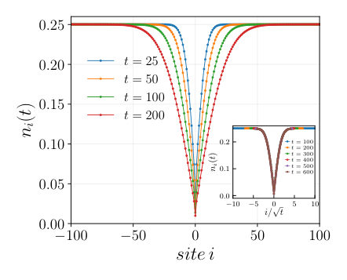
<figcaption class="paper-figure-caption"><b>Fig 5.</b> FIG. 4. Local particle density profiles ni(t) [Eq. (30)] at different times for a system of size L = 201, with a localized sink at the origin (i = 0), loss rate ΓL, and dephasing rate γ. The inset shows the same data plotted against the scaled coordinate i/ √</figcaption>
</figure>

**Summary.** The paper analyzes particle transport on a 1D fermionic lattice subjected to localized sources/sinks and bulk dephasing. It demonstrates that dephasing suppresses quantum coherence signatures like Friedel oscillations and simplifies the system's complex dynamics from three distinct regimes down to two, ultimately leading to classical diffusive behavior.

**Why it may be interesting.** This work provides a detailed theoretical understanding of how environmental coupling (dephasing) fundamentally alters quantum transport phenomena, offering insights applicable to open quantum systems in condensed matter physics.

Detailed structure

**Main problem.** The study investigates particle transport dynamics, thermalization, and coherence decay in open quantum systems modeled on a 1D lattice.

**Main result.** Bulk dephasing suppresses coherent features like Friedel oscillations and reduces the system's dynamical regimes from three to two, driving the behavior towards a classical diffusive limit.

**Method.** The time evolution is calculated using the Lindblad master equation framework, analyzing two-point correlation functions via matrix exponentiation of superoperators.

**Model / system.** The model is a one-dimensional spinless fermionic system on a lattice governed by a tight-binding Hamiltonian. The dynamics are open, incorporating localized sources/sinks and bulk dephasing ($\gamma$) via the Lindblad master equation.

**Key observables.** Local density profile ($n_i(t)$), two-point correlation functions ($C_{i,j}(t)$), Friedel oscillations, and particle loss rate ($|dN/dt|$).

**Important parameters / regimes.** Dephasing rate ($\gamma$), source/sink rates ($\Gamma_G, \Gamma_L$), lattice hopping ($J$), and separation distance ($\Delta$). Key regimes include coherent ($\gamma=0$) vs. dephased ($\gamma>0$) transport.

**Assumptions / limitations.** The system is treated within the Lindblad framework; calculations often utilize approximations like the adiabatic limit or focus on specific correlation function evolutions.

**Figures summary.** Figures illustrate density profiles showing ballistic spreading and secondary peaks (coherent case), and subsequent collapse onto universal curves when dephasing drives the system into a diffusive regime. Loss rate plots show crossovers between three and two distinct dynamical regimes.

**Paper structure.** The paper analyzes the evolution of correlation functions using the Lindblad master equation, contrasting the coherent limit (showing multiple dynamic regimes) with the presence of dephasing noise, which simplifies the dynamics to fewer regimes and diffusive scaling.

Abstract

We study a general one-dimensional spinless fermionic system subject to a localized source, sink, and bulk dephasing. Within the Lindblad framework, we compute the time evolution of the density profile and spatial correlation functions. We find that the presence of bulk dephasing suppresses certain coherent quantum features, such as the Friedel oscillations, and it alters the transport dynamics to exhibit two distinct dynamical regimes instead of three as observed in the absence of dephasing. This effect can be understood as the destruction of ballistic motion caused by the dephasing noise. Under strong dephasing, the density profile becomes similar to the one expected for a classical diffusive regime. We also investigate the system in the presence of both a localized source and sink, placed at a distance of $Δ$. Interestingly, quantum coherence generates secondary density peaks at integer multiples of the source-sink separation $Δ$, which are systematically washed out as bulk dephasing drives the system toward the classical diffusive limit.

[↑ back to top](#top)

### [Multiplexed storage and interaction of Rydberg spinwaves via the gradient echo memory protocol](http://arxiv.org/abs/2607.22466v1)

**Authors:** Bartosz Niewelt, Stanisław Kurzyna, Bartosz Kasza, Wojciech Wasilewski, Michał Parniak  
**Type:** both · **Category:** other · **PDF:** <https://arxiv.org/pdf/2607.22466v1>  
**Analysis basis:** full PDF text, analyzed in chunks
**Topic relevance:** 🔥 `Rydberg arrays` **4/5** · `analog quantum simulation` **3/5** · `exotic spin models in light-matter` **3/5** · `QC/QI experiment` **2/5** · `methods for driven-dissipative` **2/5** · `non-equilibrium dynamics` **2/5** · `quantum optics experiment` **2/5** · `Keldysh / 2PI / non-Gaussian methods` **1/5** · `correlated / nonlocal dissipation` **1/5** · `correlated cavity matter` **1/5** · `driven-dissipative phase transition` **1/5** · `entanglement & information structure` **1/5** · `interference shaping light` **1/5**

↔ Scroll figures horizontally

<figure class="paper-figure-card">
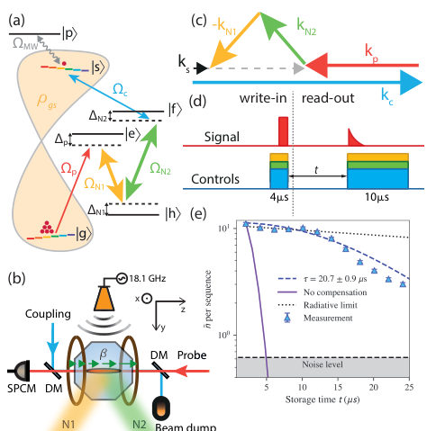
<figcaption class="paper-figure-caption"><b>Fig 1.</b> Figure 1: (a) Energy levels structure of 87Rb relevant in the experiment for the Rydberg GEM interface, (b) Simplified scheme of the experimental setup for storing Rydberg co- herence in the GEM. (c) Geometrical representation of the beams’ wavevectors used to instantaneously create the spin- wave with reduced wavevector. Grey dashed arrow represents uncompensated spinwave wavevector ks in a typical ladder- type scheme. (d) Simplified sequence for the lifetime ex- tension protocol. All of the controls (N1, N2, coupling) are enabled at the same time. (e) Experimental data for the life- time extension protocol. Blue triangles represent the number of readout photons collected with SPCM, while...</figcaption>
</figure>
<figure class="paper-figure-card">
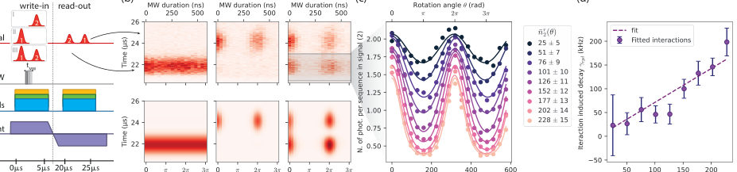
<figcaption class="paper-figure-caption"><b>Fig 2.</b> Figure 2: Controlled attenuation of the readout for different rotation angles θ and different numbers of control excitations ¯n1. (a) Simplified sequence for the Rydberg interaction-controlled Rabi oscillation. (b) Upper row: experimental data for the ¯nr 2 = 228 initial number of Rydberg excitations, lower row: Numerical simulations. The columns correspond to I: only the signal pulse (2nd) is stored; II: only the gating pulse (1st) is stored and, by means of MW rotation, is distributed between states |s⟩and |p⟩in the ratio cos2 θ to sin2 θ. III: both pulses are stored. Due to the dipolar Rydberg interactions, the atoms in |p⟩induce dephasing of the stored signal pulse. (c) The number of...</figcaption>
</figure>
<figure class="paper-figure-card">
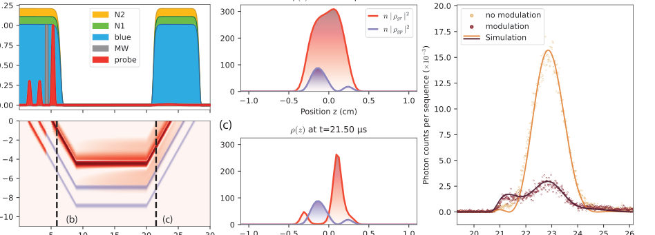
<figcaption class="paper-figure-caption"><b>Fig 3.</b> Figure 3: Interaction-induced diffraction. (a) Sequence of operations (upper plot) and the simulation of the memory contents, i.e., stored spinwaves as a colormap of the Fourier transform along the z-axis (lower plot). Red map represents coherence ρgs, and the purple map corresponds to ρgp. (b),(c) Simulated amplitudes of the stored atomic coherences as a function of the position along the atomic ensemble right after the storage of the signal and right before the readout. During the storage (from t = 6 µs to t = 20 µs), the dipolar interactions between the Rydberg atoms disturb the spinwave coherence in regions where both |s⟩and |p⟩overlap, reducing the readout from those positions. The...</figcaption>
</figure>

**Summary.** The paper overcomes a major hurdle in using Rydberg spinwaves for quantum memory by introducing a specialized four-photon addressing scheme that minimizes momentum transfer. This technique extends the coherence time significantly, allowing for the storage and manipulation of long-lived excitations within multimode quantum memories compatible with Gradient Echo Memory protocols.

**Why it may be interesting.** This work directly tackles the intersection of advanced quantum memory techniques (GEM) with highly interacting Rydberg systems, providing crucial engineering solutions to overcome fundamental decoherence limits in quantum networking architectures.

Detailed structure

**Main problem.** The primary challenge addressed is integrating Rydberg spinwave storage/interaction with multiplexing schemes like Gradient Echo Memory (GEM), which is typically limited by rapid motional dephasing due to large wavevectors.

**Main result.** A novel four-photon addressing scheme generates collective Rydberg excitations with near-zero momentum transfer, extending the spinwave lifetime significantly and reestablishing compatibility between Rydberg excitations and GEM protocols for multimode quantum memory.

**Method.** The authors propose a specific multi-photon interfacing scheme using off-resonant driving fields at a magic angle to create a closed wavevector loop, enabling long-lived storage.

**Model / system.** The system uses neutral atoms (e.g., Rb-87) excited to Rydberg states. The physics is modeled by solving coupled propagation equations for the probe pulse Rabi frequency and atomic coherence, incorporating interaction-induced decay terms.

**Key observables.** Rydberg spinwave lifetime ($	au$), signal decay curves, and controlled attenuation between stored excitation modes.

**Important parameters / regimes.** Near-zero momentum transfer ($\mathbf{k}_s \approx 0$), magic angle configuration, and the ability to manage inhomogeneous broadening from GEM.

**Assumptions / limitations.** The derivation relies on adiabatic elimination and approximations for pulse propagation in the semi-classical Hamiltonian framework. The initial problem assumes motional dephasing limits storage time.

**Figures summary.** Figure 1 illustrates the energy level structure, the experimental setup geometry forming a closed wavevector loop, the lifetime extension protocol sequence, and comparative decay data showing the extended coherence time.

**Paper structure.** The paper progresses from identifying the decoherence limitation in multiplexed Rydberg spinwave storage to proposing a novel four-photon interface. It then details the theoretical modeling using propagation equations and concludes by demonstrating the capability for long-lived, controllable multimode quantum memory operations.

Abstract

Collective Rydberg excitations offer strong and controllable interactions for quantum information processing, sensing, and nonlinear quantum optics, but their integration with temporally or spectrally multiplexed schemes, such as the Gradient Echo Memory (GEM) protocol, is hindered by rapid motional dephasing caused by the large spinwave wavevector. We demonstrate a new type of multi-photon addressing and interfacing scheme (with levels following the shape of the letter Ń) that allows us to generate collective Rydberg excitations with near-zero momentum transfer, extending the Rydberg spinwave lifetime almost tenfold. The scheme relies on two additional off-resonant driving fields arranged at a magic angle, forming a closed wavevector loop while remaining compatible with GEM-induced inhomogeneous broadening. This enables storage and manipulation of long-lived Rydberg spinwaves in a multimode quantum memory. Using microwave coupling between neighboring Rydberg states, we can control the attenuation between stored excitation modes by interaction-induced decay and demonstrate interaction-controlled diffraction of a retrieved optical signal. Our results reestablish compatibility between Rydberg excitations and GEM, providing a route toward multimode quantum memories with controllable long-range interactions and applications in quantum networking, sensing, and quantum information processing.

[↑ back to top](#top)

### [An Experimental Scheme for Testing Molecular Rectification with Only Micrometer-Scale Fabrication Requirements](http://arxiv.org/abs/2607.22203v1)

**Authors:** Jiantang Jiang  
**Type:** both · **Category:** statistical mechanics · **PDF:** <https://arxiv.org/pdf/2607.22203v1>  
**Analysis basis:** full PDF text, analyzed in chunks
**Topic relevance:** 🔥 `non-equilibrium dynamics` **4/5** · `driven-dissipative phase transition` **3/5** · `methods for driven-dissipative` **3/5** · `non-equilibrium universality` **3/5** · `Keldysh / 2PI / non-Gaussian methods` **2/5** · `analog quantum simulation` **2/5** · `correlated / nonlocal dissipation` **2/5** · `Kondo & dissipative impurity` **1/5** · `entanglement & information structure` **1/5** · `scars & prethermalization` **1/5**

↔ Scroll figures horizontally

<figure class="paper-figure-card">
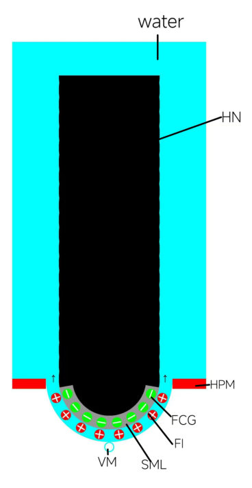
<figcaption class="paper-figure-caption"><b>Fig 1.</b> Fig.2. Interface A deformed by the needle tip. HPM: hy- drophobic porous membrane; HN: hydrophilic needle; FCG: fixed charged groups; FI: free ions; SML: surface modification layer; VM: vapor molecule.</figcaption>
</figure>
<figure class="paper-figure-card">
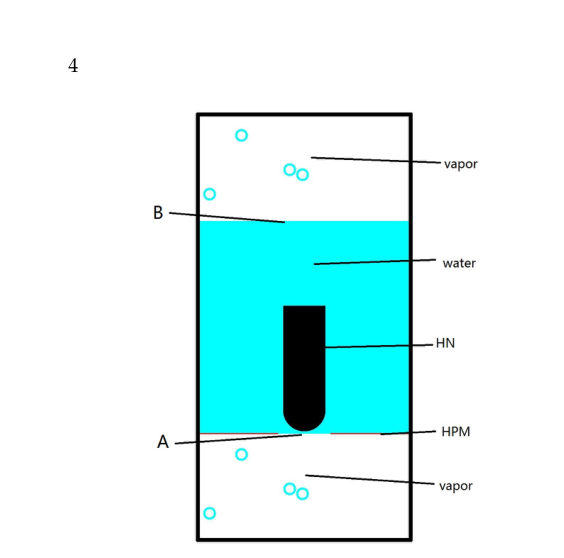
<figcaption class="paper-figure-caption"><b>Fig 2.</b> Fig.3. Schematic illustration of the apparatus used to mea- sure the effect of needle pressure on vapor pressure. HPM: hydrophobic porous membrane; HN: hydrophilic needle.</figcaption>
</figure>

**Summary.** This work proposes a significantly simplified experimental setup to test a theory of molecular rectification—the directed flow of molecules without external energy. By using a hydrophilic needle on a porous membrane, the authors can create and maintain an ionic concentration gradient at micrometer scales. This greatly lowers the technical barrier for experimentally validating this non-equilibrium transport mechanism.

**Why it may be interesting.** While focused on classical thermodynamics and transport, the underlying principles of non-equilibrium steady states driven by interfacial energy minimization are highly relevant to open quantum systems modeling, particularly those involving dissipation or boundary effects.

Detailed structure

**Main problem.** The paper addresses the experimental verification of a theoretical model predicting sustained directed transport (molecular rectification) without external energy input.

**Main result.** A simplified, micrometer-scale experimental design is proposed that can sustain a measurable concentration difference and confirm the predicted directed flow cycle by observing steady liquid levels or pressure differences.

**Method.** The authors combine theoretical derivations based on chemical potential, Laplace's equation, and osmotic equilibrium with proposals for novel, low-complexity microfluidic/interfacial experiments.

**Model / system.** The system involves a hydrophobic porous membrane separating two liquid-vapor interfaces. Directed transport is driven by maintaining an ionic concentration gradient ($	ext{C}_a - 	ext{C}_b$) using a hydrophilic needle tip to locally modify the interface, analogous to semipermeable membranes.

**Key observables.** Sustained directed flow (steady state), measurable pressure differences ($P_n$ and $P_d$), and liquid-level differences ($	ext{A}_1$ vs $	ext{B}_1$).

**Important parameters / regimes.** Fabrication scale reduced to micrometer level; theoretical maximum pressures up to 288,000 Pa for water.

**Assumptions / limitations.** Assumes the charged groups act like a semipermeable membrane and employs ideal dilute solution approximations ($\pi = CRT$).

**Figures summary.** Figures illustrate the schematic setup using a porous membrane and needle tip (Fig. 1, Fig. 3), showing interface deformation and ion release. Supplementary figures detail MD simulations of directed flux ($	ext{NNWM}$) and alternative experimental configurations.

**Paper structure.** The paper progresses from establishing the theoretical basis for rectification via concentration gradients to proposing a simplified, low-complexity experimental platform using micrometer fabrication requirements, supported by both analytical derivations and simulation results.

Abstract

In our previous work, we proposed a theoretical model capable of inducing sustained directed transport without consuming information or external energy. However, the experimental verification schemes proposed previously were technically challenging, and the model has therefore not yet been experimentally tested. In this work, we propose a greatly simplified experimental design. By introducing hydrophilic functional groups onto the tip of a gold needle through surface modification and pressing the needle against one of two liquid-vapor interfaces, the compressed interface is maintained at a higher ionic concentration than the other interface, thereby sustaining a concentration difference between them. This design reduces the fabrication requirement from the nanometer scale to the micrometer scale, substantially lowering experimental complexity and facilitating experimental examination of the proposed mechanism.

[↑ back to top](#top)

### [When Can a Cavity Move a Mott Transition? A Spectral-Density Criterion within Gutzwiller Theory](http://arxiv.org/abs/2607.22283v1)

**Authors:** Nikhil Vamsodharakan Seshadri, Yu Zhang  
**Type:** theory · **Category:** strongly correlated electrons · **PDF:** <https://arxiv.org/pdf/2607.22283v1>  
**Analysis basis:** full PDF text, analyzed in chunks
**Topic relevance:** 🔥 `analog quantum simulation` **4/5** · 🔥 `correlated cavity matter` **4/5** · `Keldysh / 2PI / non-Gaussian methods` **3/5** · `driven-dissipative phase transition` **3/5** · `Tavis-Cummings & cavity-many-emitter` **2/5** · `methods for driven-dissipative` **2/5** · `correlated / nonlocal dissipation` **1/5** · `exotic spin models in light-matter` **1/5** · `non-equilibrium dynamics` **1/5** · `non-equilibrium universality` **1/5**

↔ Scroll figures horizontally

<figure class="paper-figure-card">
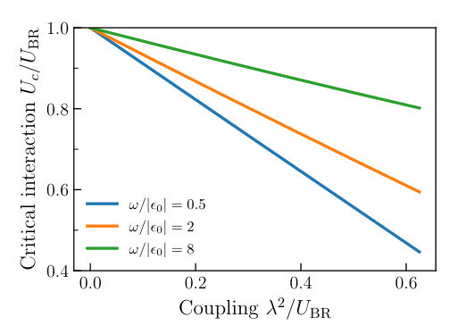
<figcaption class="paper-figure-caption"><b>Fig 1.</b> FIG. 1. Cavity-induced displacement of the Brinkman–Rice boundary. Solutions of Eq. 6 for νm = r = 1 show that the same gauge-complete coupling lowers Uc through a residual self- polarization penalty for slow modes and bandwidth narrowing for fast modes. Here UBR = 8A0 is the Brinkman–Rice critical interaction in the absence of light–matter coupling.</figcaption>
</figure>
<figure class="paper-figure-card">
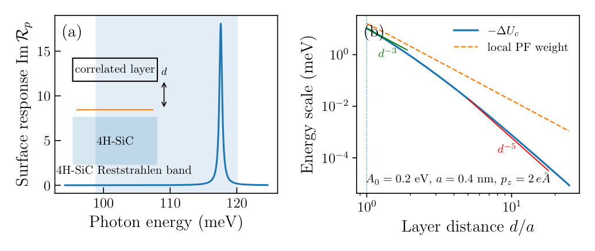
<figcaption class="paper-figure-caption"><b>Fig 2.</b> FIG. 2. Bond-scale field variation controls the surface-polariton shift. (a) Geometry and surface response of 4H-SiC. (b) Cavity-induced shift of the Mott boundary and total local Pauli–Fierz weight versus layer–surface distance. Although the local near-field weight grows as d decreases, only its bond-projected component shifts Uc, producing a crossover from d−3 to d−5. Parameters are given in the panel.</figcaption>
</figure>
<figure class="paper-figure-card">
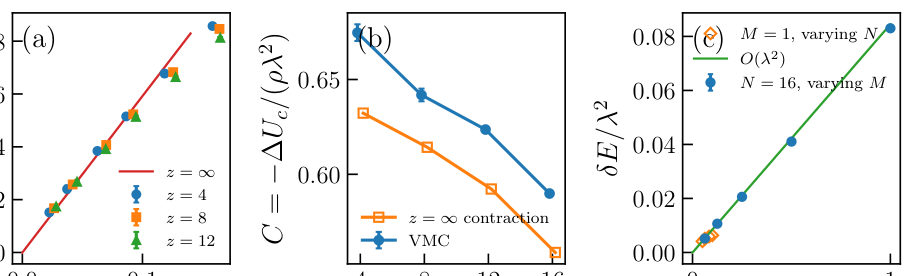
<figcaption class="paper-figure-caption"><b>Fig 3.</b> FIG. 3. Finite-coordination validation of the spectral-density criterion. (a) Weak-coupling cavity energy density versus measured double occupancy; its D →0 slope determines the shift of the Mott boundary. (b) The VMC coefficient on N = 24 random regular graphs agrees with the infinite-coordination prediction within 5–7%; error bars include graph-to-graph fluctuations. (c) Separate variation of M and N confirms δe ∝M/N and the vanishing 1/N contribution of a single normalized mode.</figcaption>
</figure>

**Summary.** The paper develops a criterion within Gutzwiller theory to determine when vacuum electromagnetic fluctuations can shift a Mott insulator transition. The key finding is that this requires the environment to provide finite, spatially varying spectral weight across the electronic hopping bonds. This bridges concepts from quantum optics and strongly correlated materials physics.

**Why it may be interesting.** This work provides a rigorous, quantitative link between quantum electrodynamics (vacuum fluctuations) and strongly correlated electron physics. It establishes that simple local density of states is insufficient; the spatial structure of the field coupling to electronic bonds dictates the phase transition outcome.

Detailed structure

**Main problem.** The study determines the precise criterion by which vacuum electromagnetic fluctuations, such as those from a cavity or surface plasmons, can induce a shift in a bulk Mott metal-insulator transition.

**Main result.** A Mott transition shifts only if the coupling environment supplies finite thermodynamic spectral weight that varies spatially across the electronic hopping bonds. The magnitude of this shift depends on the joint frequency-spatial Pauli-Fierz density.

**Method.** The analysis employs the Gutzwiller variational method, deriving a critical criterion using the joint frequency–spatial Pauli–Fierz density ($J_{PF}$). This is complemented by Variational Monte Carlo (VMC) simulations for finite coordination systems.

**Model / system.** The system is modeled as a half-filled Hubbard model coupled to normalized electromagnetic modes or planar phonon-polariton surfaces. The Hamiltonian includes hopping, on-site repulsion ($U$), and the coupling term derived from the cavity environment.

**Key observables.** Mott boundary shift ($\Delta U_c$); Joint frequency–spatial Pauli–Fierz density ($J_{PF}$); Critical coefficient for phase boundary shift.

**Important parameters / regimes.** Bond-scale variation of spectral weight; Distance scaling ($d^{-3}$ to $d^{-5}$ crossover); Thermodynamic weight ($\eta_\alpha$).

**Assumptions / limitations.** The analysis relies on Gutzwiller variational approximations, often assuming infinite coordination or using first-order expansions in mode density.

**Figures summary.** Figures illustrate the cavity-induced displacement of the Brinkman–Rice boundary and show that only the bond-projected component of the local near-field weight drives the Mott transition shift, causing a crossover in scaling behavior.

**Paper structure.** The paper develops the criterion by analyzing the coupling Hamiltonian using Gutzwiller theory. It derives the leading shift formula based on $J_{PF}$, applies this to specific environments (like surface polaritons), and validates the results using VMC simulations for finite lattices.

Abstract

Can vacuum electromagnetic fluctuations shift a bulk Mott transition? Within the Gutzwiller variational method, we derive a criterion that separates collective spectroscopic hybridization from thermodynamic phase control. We show that a Mott transition shifts only when the electromagnetic environment supplies finite thermodynamic spectral weight with bond-scale variation. A joint frequency--spatial Pauli--Fierz density gives the leading shift. Surface phonon polaritons yield a $d^{-3}$-to-$d^{-5}$ crossover, while finite-coordination variational Monte Carlo supports the predicted critical coefficient and $M/N$ scaling.

[↑ back to top](#top)

### [Critical Sensing with Autonomous Devices: The Self-Oscillation Threshold of a Frequency-Locked NV-Centre Magnetometer](http://arxiv.org/abs/2607.22521v1)

**Authors:** Joan Toledo Aguilera, Gonzalo Reina Rivero, Marcel Morillas-Rozas, Javier Cerrillo  
**Type:** experiment · **Category:** other · **PDF:** <https://arxiv.org/pdf/2607.22521v1>  
**Analysis basis:** full PDF text, analyzed in chunks
**Topic relevance:** 🔥 `driven-dissipative phase transition` **4/5** · `methods for driven-dissipative` **3/5** · `non-equilibrium universality` **3/5** · `quantum measurements` **3/5** · `spintronics-quantum-optics interface` **3/5** · `non-equilibrium dynamics` **2/5** · `QC/QI experiment` **1/5** · `measurement-induced transitions` **1/5**

↔ Scroll figures horizontally

<figure class="paper-figure-card">
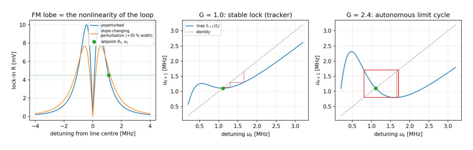
<figcaption class="paper-figure-caption"><b>Fig 1.</b> FIG. 1. The lock as a dynamical system (simulation with rig-like parameters). Left: the FM lock-in lobe R(f) is the nonlinearity of the map; the working point sits on a flank. Middle and right: cobweb diagrams of Eq. (1) below threshold (stable lock, G = 1) and above threshold (G = 2.4), where the orbit settles on a period-2 limit cycle.</figcaption>
</figure>
<figure class="paper-figure-card">
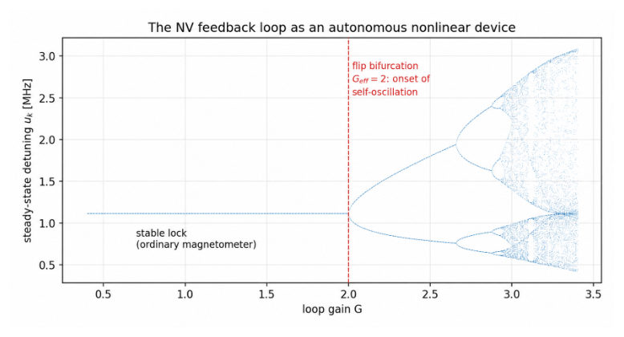
<figcaption class="paper-figure-caption"><b>Fig 2.</b> FIG. 2. Simulated bifurcation diagram of the loop (noise-free): steady-state orbit versus gain. The flip bifurcation at Geff = 2 separates the stable lock from the period-2 self-oscillation, followed by the period-doubling cascade.</figcaption>
</figure>
<figure class="paper-figure-card">
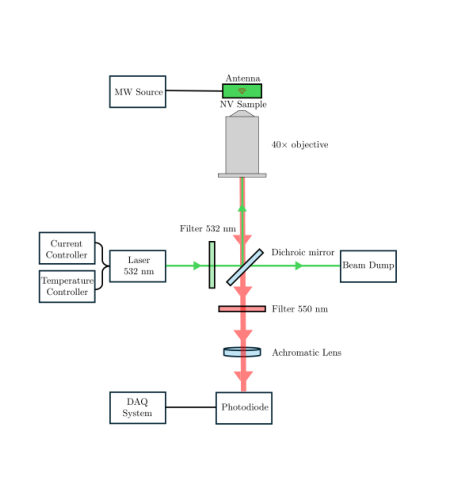
<figcaption class="paper-figure-caption"><b>Fig 3.</b> FIG. 3. Schematic of the continuous-wave ODMR mag- netometer used in this work.</figcaption>
</figure>
<figure class="paper-figure-card">

<figcaption class="paper-figure-caption"><b>Fig 4.</b> Figure 4 summarizes the measurements. Three observations quantitatively support the dynamical model: The coherent period-2 amplitude a2 is flat at 12– 19 kHz for G ≤1.4 and jumps to 48–97 kHz for G ≳ 1.8, with the crossing estimator giving Gc = 2.0 ± 0.1. Because this run was self-calibrated (Dtrue ≈</figcaption>
</figure>
<figure class="paper-figure-card">
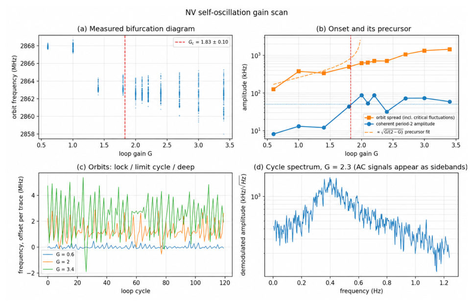
<figcaption class="paper-figure-caption"><b>Fig 5.</b> FIG. 4. Measured loop dynamics (gain scan, 250 cycles per gain; statistics run of 4000 cycles at G = 2.3). (a) Orbit frequencies versus gain: the experimental bifurcation diagram. (b) Orbit spread (orange) and coherent period-2 amplitude a2 (blue) versus gain; the spread grows below threshold in qualitative agreement with Eq. (6), while a2 steps up by a factor ≈4 across G ≈1.8–2.2, consistent with the parameter-free prediction Gc = 2 for a self-calibrated loop. (c) Example orbits below, near and above threshold. (d) Spectrum of the demodulated cycle from the statistics run.</figcaption>
</figure>

**Summary.** The researchers studied a frequency-locked NV magnetometer by intentionally driving its feedback loop past its stable operational point. They modeled this using a discrete map exhibiting a period-doubling bifurcation, predicting an oscillation onset at $G_c=2$. Experimentally, they confirmed this transition, demonstrating the system's ability to self-oscillate and characterizing the approach to this critical threshold.

**Why it may be interesting.** This work provides an excellent example of using nonlinear dynamics (bifurcation theory) to characterize and control a quantum sensor's operating regime, moving beyond simple linear sensing modes into controlled non-equilibrium dynamics.

Detailed structure

**Main problem.** The study investigates autonomous self-oscillating behavior in a frequency-locked Nitrogen-Vacancy (NV) centre magnetometer by deliberately operating the lock outside its stable regime.

**Main result.** The experiment successfully confirmed the theoretical prediction that the onset of self-oscillation occurs at a critical gain $G_c \approx 2.0$, validating the model's description of the flip bifurcation in the feedback loop.

**Method.** The authors employed continuous measurements on an NV magnetometer, analyzing the system dynamics by driving the frequency lock through a period-doubling (flip) bifurcation using software control.

**Model / system.** The physical platform is a Continuous-Wave ODMR ensemble magnetometer. The operation is modeled as a one-dimensional discrete map whose stability and bifurcations are controlled by adjusting the dimensionless loop gain $G$.

**Key observables.** Coherent period-2 amplitude ($a_2$), sub-threshold orbit spread ($\sigma_f(G)$), and the critical gain threshold ($G_c$).

**Important parameters / regimes.** Loop gain ($G$), calibration slope ($D_{	ext{cal}}$), true operating slope ($D_{	ext{true}}$), and the bifurcation point $G_c$.

**Assumptions / limitations.** The nonlinearity is implemented in software after digitization, which limits its metrological advantage compared to physical nonlinearities.

**Figures summary.** Figures summarize measurements showing the jump in coherent period-2 amplitude ($a_2$) around $G \approx 1.8-2.2$, and the divergence of the orbit spread following the predicted $\propto 1/(2 - G)$ trend.

**Paper structure.** The paper establishes the theoretical model based on a discrete map, derives the critical threshold condition ($G_c$), performs identifiability analysis, and concludes with experimental measurements confirming the bifurcation onset and divergence behavior.

Abstract

Feedback locking of a probe frequency to a spin resonance is the standard operating mode of precision quantum sensors. Here we deliberately operate such a lock outside its stable regime: a continuous-wave nitrogen-vacancy (NV) ensemble magnetometer, frequency-modulation (FM) locked to one flank of its optically detected magnetic resonance (ODMR), is driven through the flip (period-doubling) bifurcation of its discrete feedback map by raising the software loop gain $G$. Beyond a critical gain $\Gc$ the lock becomes a self-sustained oscillator whose limit cycle is generated by the loop itself. We derive the threshold condition $\Gc = 2\,\Dcal/\Dtrue$, which identifies the measurable content of the threshold: the ratio of the transduction slope of the ODMR lock-in signal at calibration time $D_{cal}$ to its value at present $D_{true}$. We present an identifiability analysis showing which physical parameters this single scalar can and cannot distinguish, characterize the estimators of $\Gc$ under realistic noise, and report measurements on our current setup: an experimental bifurcation diagram with onset at $\Gc \approx 2$ as predicted for a self-calibrated loop, sub-threshold critical fluctuations following the predicted $\sqrt{G/(2-G)}$ divergence.

[↑ back to top](#top)

### [Fluctuational Quantum Electrodynamics of Dispersive Time-Varying Media](http://arxiv.org/abs/2607.22340v1)

**Authors:** Jaime E. Sustaeta-Osuna, Thomas F. Allard, Francisco J. García-Vidal, Paloma A. Huidobro  
**Type:** theory · **Category:** other · **PDF:** <https://arxiv.org/pdf/2607.22340v1>  
**Analysis basis:** full PDF text, analyzed in chunks
**Topic relevance:** 🔥 `Keldysh / 2PI / non-Gaussian methods` **4/5** · `correlated / nonlocal dissipation` **3/5** · `driven-dissipative phase transition` **3/5** · `methods for driven-dissipative` **3/5** · `non-equilibrium dynamics` **3/5** · `non-equilibrium universality` **2/5** · `correlated cavity matter` **1/5** · `interference shaping light` **1/5**

↔ Scroll figures horizontally

<figure class="paper-figure-card">
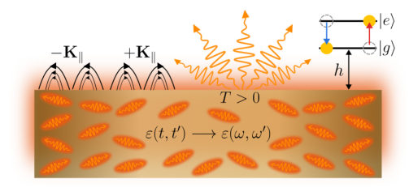
<figcaption class="paper-figure-caption"><b>Fig 1.</b> FIG. 1: Diagram of a frequency-dispersive, dissipative and time-modulated half-space. The time modulation breaks time-translational symmetry, leading to a two- frequency permittivity in the Fourier-domain. Owing to losses and by virtue of the fluctuation-dissipation the- orem, the medium supports fluctuating currents, which emit thermal radiation for T &gt; 0. For large modula- tion frequencies, the time modulation generates entan- gled pairs of polaritons with opposite lateral momenta ±K∥. Finally, a probe quantum emitter is placed at a height h above the surface; owing to the time modula- tion, the emitter experiences both loss (spontaneous de- cay) and gain (spontaneous excitation).</figcaption>
</figure>
<figure class="paper-figure-card">
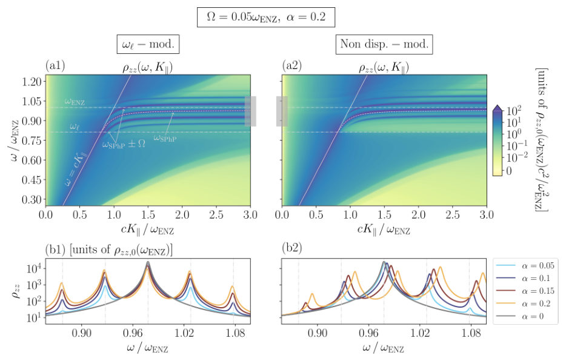
<figcaption class="paper-figure-caption"><b>Fig 2.</b> FIG. 2: LDOS for slowly driven polar insulator half-space. (a1)-(a2) Momentum-resolved z-projected LDOS for a time-modulated SiC half-space; units of ρzz,0(ωENZ)c2/ω2 ENZ, where ρzz,0(ω) = ω2/(3π2c3) is the free-space z- projected LDOS at a frequency ω. Vertical axis is the frequency (normalized to ωENZ) and horizontal axis is the lateral momentum (normalized to ωENZ/c). In (a1) it is the Lorentz frequency ωℓwhich is modulated in time, leading to a dispersive temporal modulation, whereas in (a2) the temporal modulation is non-dispersive. Furthermore, in (a1) the modulation strength is set to α = 0.2, while in (a2) it is αnd = 17.3α = 3.46. (b1) Total z-projected LDOS [units of ρzz,0(ωENZ)]...</figcaption>
</figure>
<figure class="paper-figure-card">
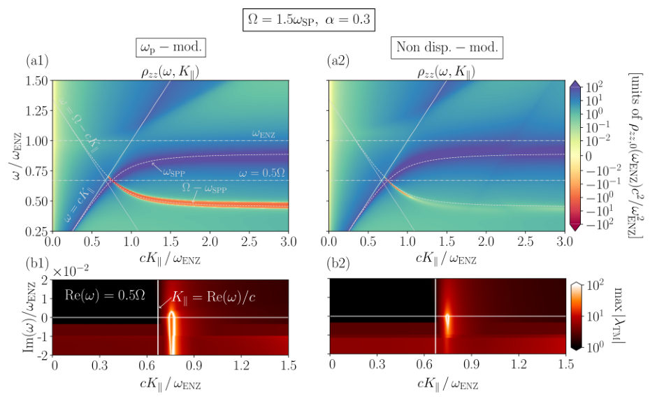
<figcaption class="paper-figure-caption"><b>Fig 3.</b> FIG. 3: LDOS for fast driven plasmonic half-space. (a1)-(a2) Momentum-resolved z-projected LDOS for a time- modulated ITO half-space vs frequency and lateral momentum. In (a1) it is the plasma frequency ωp which is modulated in time, whereas in (a2) the modulation is non-dispersive, similar to Fig. 2(a2). On the other hand, in (a1) the modulation strength is α = 0.3, while in (a2) it is αnd = 1.5. Blue regions in the plot have positive LDOS and are associated to loss. Conversely, red regions correspond to a negative LDOS and are thus a signature of gain. (b1)-(b2) Maximum eigenvalue in modulus of the scattered Green’s dyadic for TM-polarized waves vs imaginary part of the frequency and...</figcaption>
</figure>
<figure class="paper-figure-card">
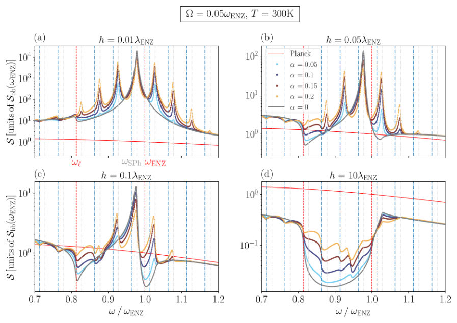
<figcaption class="paper-figure-caption"><b>Fig 4.</b> FIG. 4: Thermal radiation in a time-modulated polar insulator. The panels show the spectral density S [nor- malized to the black-body spectral density evaluated at ωENZ, Sbb(ωENZ)] vs frequency for a SiC half-space with a periodically time-varying Lorentz frequency. We consider values different values of α and compare with Planck’s law (red line) as well. On the other hand, we study different values of the height above the surface, h = 0.01λENZ(a), 0.05λENZ(b), 0.1λENZ(c), 10λENZ(d). Finally, the modulation frequency is set to Ω= 0.05ωENZ and the polar insulator is initially (prior to the start of the temporal modulation) in a thermal state with temperature T = 300K.</figcaption>
</figure>
<figure class="paper-figure-card">
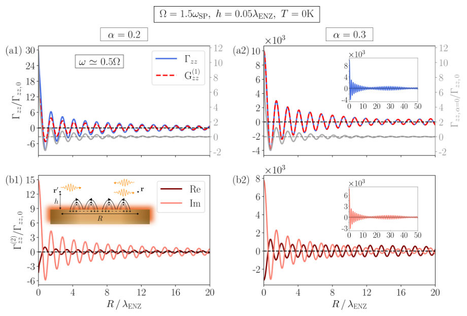
<figcaption class="paper-figure-caption"><b>Fig 5.</b> FIG. 5: Dynamical Casimir effect in a time-modulated plasmonic medium. The panels show the first order correlation functions of the electric field generated by an ITO half-space with periodically time-varying plasma frequency. (a1)- (a2) Polariton-conserving correlation functions (normalized to Γzz,0) vs the lateral separation between points R (normalized to λENZ). The solid blue line and the red dashed line are Γzz and G(1) zz , respectively, while the grey line is Γzz,α=0. (b1)-(b2) Real (maroon) and imaginary (pink) parts of Γ(2) zz , the two-polariton absorption correlation function. In (a1)-(b1) the modulation strength is α = 0.2, for which the system is stable, whereas in (a2)-(b2) it...</figcaption>
</figure>

**Summary.** This paper develops a comprehensive theoretical framework for Quantum Electrodynamics in dispersive, dissipative, and time-varying materials. It establishes a generalized fluctuation-dissipation theorem applicable to non-equilibrium systems by treating temporal modulation exactly. The results demonstrate that accurately modeling dispersion and losses is critical for predicting phenomena like enhanced thermal emission and the dynamical Casimir effect.

**Why it may be interesting.** This work is highly relevant as it extends quantum electrodynamics into complex, realistic open quantum systems. The exact treatment of dispersion and dissipation in time-varying media provides powerful tools for understanding light-matter interaction dynamics beyond simple weak-coupling approximations.

Detailed structure

**Main problem.** Developing a rigorous theoretical framework for fluctuational quantum electrodynamics (QED) when applied to time-varying media that exhibit both frequency dispersion and dissipation.

**Main result.** The theory successfully derives a generalized Fermi Golden Rule applicable to non-equilibrium, time-modulated systems, showing that treating dispersion and losses exactly is crucial for accurate predictions of thermal emission and vacuum fluctuations.

**Method.** The authors utilize Kubo's linear response theory extended to time-modulated media, employing the Green's dyadic formalism in the frequency domain to handle dispersive and dissipative effects non-perturbatively.

**Model / system.** The system is a macroscopic dielectric body (e.g., SiC half-space) whose optical properties are modulated periodically in time. The theory models the interaction between the electromagnetic field and the material polarization density $P(r, t)$.

**Key observables.** Local Density of States (LDOS), spectral density of thermal radiation, correlation functions of the electric field, and entangled polariton pairs.

**Important parameters / regimes.** Modulation strength ($\alpha$), modulation frequency ($\Omega$), temperature ($T$), and material dispersion/loss parameters ($\epsilon(\omega)$).

**Assumptions / limitations.** The analysis assumes linearity for the media; key advancements overcome limitations of previous work that treated modulation perturbatively or assumed lossless behavior.

**Figures summary.** Figures illustrate spectral density vs. frequency comparisons, contrasting results from non-dispersive versus dispersive time modulation in a SiC half-space, and showing sideband structures related to phonon frequencies.

**Paper structure.** The paper progresses by first establishing the generalized fluctuation-dissipation theorem for time-modulated systems (Chunk 1 & 2). It then applies this formalism to calculate the spectral density of thermal emission, explicitly comparing the necessity of including dispersion versus assuming non-dispersive modulation (Chunk 3). Finally, it analyzes the temperature dependence and low-temperature limit of these fluctuations (Chunk 4).

Abstract

We present the theoretical framework of fluctuational quantum electrodynamics in frequency-dispersive and dissipative time-varying media. Our theory accounts for dispersion and losses in the temporal modulation, which is treated in an exact manner, without relying on perturbative methods. Thus, our work constitutes the first consistent quantization of the electromagnetic field in time-modulated material bodies. We derive a Fermi Golden Rule for time-varying media and use it to define the local density of states for these time-dependent systems, which includes both loss and gain contributions. Additionally, we prove the equivalence between the quantum Fermi Golden Rule and the power emitted by a classical harmonic point dipole. Moreover, we show that neglecting the dispersive and dissipative nature of the time modulation leads to erroneous predictions for both slow and fast modulations. Furthermore, we analyze the thermal radiation emitted by a time-varying material body, revealing new features in the enhancement of thermal emission in time-varying media. Finally, we study the dynamical Casimir effect, showing how the time modulation amplifies vacuum fluctuations and generates entangled pairs of polaritons exhibiting non-local spatial correlations.

[↑ back to top](#top)

### [Page transition for the complexity of an evaporating black hole](http://arxiv.org/abs/2607.21734v1)

**Authors:** Violet Concepcion, Yasunori Nomura, Kyle Ritchie, Samuel Weiss  
**Type:** theory · **Category:** other · **PDF:** <https://arxiv.org/pdf/2607.21734v1>  
**Analysis basis:** full PDF text, analyzed in chunks
**Topic relevance:** 🔥 `entanglement & information structure` **4/5** · `driven-dissipative phase transition` **3/5** · `non-equilibrium dynamics` **3/5** · `Keldysh / 2PI / non-Gaussian methods` **2/5** · `non-equilibrium universality` **2/5** · `correlated / nonlocal dissipation` **1/5** · `measurement-induced transitions` **1/5** · `methods for driven-dissipative` **1/5** · `scars & prethermalization` **1/5**

↔ Scroll figures horizontally

<figure class="paper-figure-card">
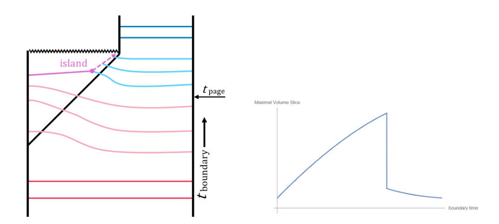
<figcaption class="paper-figure-caption"><b>Fig 1.</b> Figure 1: (a) We sketch the maximal volume slices associated with the boundary at a given time in the AdS/Schwarzschild Penrose diagram. Before the Page time, we have the light red slices which go through the interior of the black hole. The blue slices end on the edge of the island, since they are the maximal volume slices through the entanglement wedge of the CFT living on the boundary, which no longer includes the island. At late times, the dark blue slices represent the post-black hole near-flat maximal volume slices. (b) We depict the value of the volume qualitatively. It increases at a rate proportional to M 2 until the time the island forms, at which point the volume drops...</figcaption>
</figure>
<figure class="paper-figure-card">
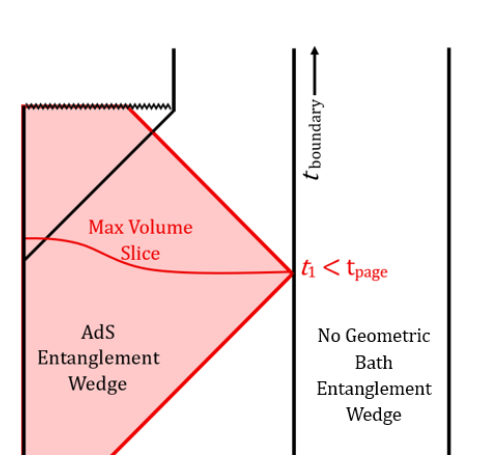
<figcaption class="paper-figure-caption"><b>Fig 2.</b> Figure 2: Before the Page time tPage, the entanglement wedge e(R) of the bath system is the bath itself. The entanglement wedge e(B) of the CFT (living on the AdS bound- ary) at time t1 &lt; tPage is the region in AdSd that can be reached from the equal-time hypersurface of the boundary at t1.</figcaption>
</figure>
<figure class="paper-figure-card">
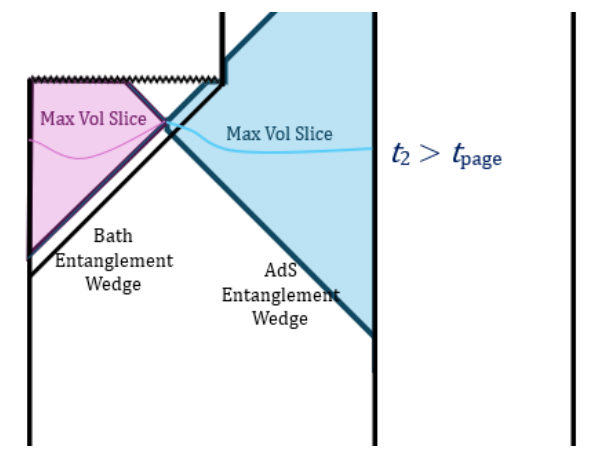
<figcaption class="paper-figure-caption"><b>Fig 3.</b> Figure 3: After the Page time, the bath’s entanglement wedge (pink) now includes the black hole interior. The entanglement wedge of the CFT degrees of freedom (blue) extends to the black hole exterior.</figcaption>
</figure>
<figure class="paper-figure-card">
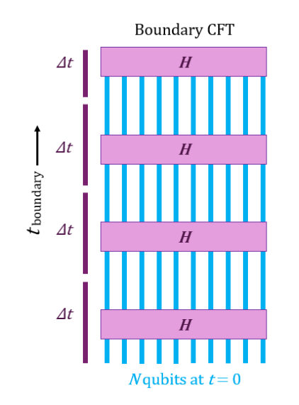
<figcaption class="paper-figure-caption"><b>Fig 4.</b> Figure 4: A time dependent quantum circuit as a set of N qubits. Every ∆t we act on the circuit with an operator H which consists of a product of p-gates, acting nonlocally.</figcaption>
</figure>
<figure class="paper-figure-card">
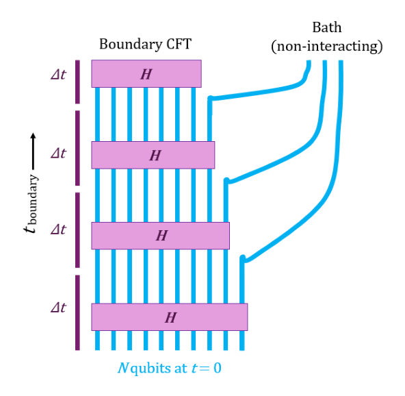
<figcaption class="paper-figure-caption"><b>Fig 5.</b> Figure 5: A time dependent quantum circuit that more closely resembles a system undergoing evaporation. Since the black hole is a fast scrambler, we see rapid interac- tions modeled such that an operator H consisting of a product of p-gates acts on the circuit in every time interval ∆t. We also have a bath system in which no interactions occur, and no gates are used. Every ∆t we remove one qubit from the circuit to this bath system.</figcaption>
</figure>

**Summary.** This theoretical work applies concepts from quantum complexity theory to black hole evaporation within the AdS/CFT framework. It predicts that holographic complexity exhibits a Page-like transition when the radiation subsystem grows past half its size. This transition is attributed to an 'island' region, suggesting this mechanism resolves a deep paradox analogous to the information loss problem.

**Why it may be interesting.** While focused on gravity/QFT, the core methodology—analyzing how information measures (complexity) undergo sharp transitions based on subsystem size relative to a critical point—is highly relevant to understanding non-equilibrium dynamics in open quantum systems.

Detailed structure

**Main problem.** The paper investigates whether a Page-like transition occurs for the holographic complexity of subsystems during black hole evaporation, analogous to the resolution of the information paradox.

**Main result.** A Page-like transition is predicted in the radiation complexity due to the emergence of an 'island' contribution when using the Complexity=Volume (CV) proposal, which resolves a complexity paradox similar to the information paradox.

**Method.** The authors employ quantum information tools like basis-spectrum decomposition and holographic complexity calculations, comparing them against circuit models for subsystem complexity.

**Model / system.** The system modeled is an evaporating Anti-de Sitter (AdS) black hole coupled to a bath, analyzed using concepts from AdS/CFT correspondence and quantum circuits representing the interior dynamics.

**Key observables.** Subsystem complexity (general and holographic), radiation complexity, and the volume contribution of the 'island' region.

**Important parameters / regimes.** The subsystem size relative to half ($	ext{size} > 1/2$), and the time evolution across the Page time.

**Assumptions / limitations.** The analysis relies on the Complexity=Volume (CV) proposal for subregions, and models black hole evaporation via random circuit evolution on an interior subsystem.

**Figures summary.** Figures sketch maximal volume slices in AdS/Schwarzschild diagrams showing how the island forms post-Page time, causing a dramatic change in the calculated volume contribution.

**Paper structure.** The paper builds from established results on complexity transitions for random states to applying these concepts to the holographic complexity of an evaporating black hole, culminating in the prediction and interpretation of the Page-like transition via the island structure.

Abstract

Recent results demonstrate that there exists a sharp, Page-like transition for the complexity of subsystems of Haar-random states as their fractional subsystem size surpasses one half. They further demonstrate that this transition also occurs for the holographic complexity of boundary subregions of eternal AdS black holes, assuming the Complexity$=$Volume (CV) proposal for subregions. We interpret this transition as a crossover from spectrum-dominated to basis-dominated subsystem complexity, reflecting the breakdown of approximate thermality beyond half-system size. We then apply this reasoning to an evaporating AdS black hole coupled to a bath, modeled by a quantum circuit undergoing random evolution on an interior subsystem of diminishing size. Using the basis-spectrum decomposition of subsystem complexity, we argue for a similar Page-like transition in the radiation complexity. We then show, using CV for subregions, that the same transition appears in the holographic complexity of the radiation subsystem through the emergence of an island, whose volume gives the dominant contribution. We argue that the island volume contribution resolves an apparent complexity paradox analogous to the information paradox.

[↑ back to top](#top)

### [Quantum advantage of nonlinear quantum battery and superconducting circuit implementation](http://arxiv.org/abs/2607.21905v1)

**Authors:** Wei-Jun Han, Peng-Yu Sun, Guo-Feng Zhang  
**Type:** both · **Category:** other · **PDF:** <https://arxiv.org/pdf/2607.21905v1>  
**Analysis basis:** full PDF text, analyzed in chunks
**Topic relevance:** 🔥 `QC/QI experiment` **4/5** · `correlated cavity matter` **3/5** · `quantum optics experiment` **3/5** · `analog quantum simulation` **2/5** · `quantum measurements` **2/5** · `Tavis-Cummings & cavity-many-emitter` **1/5** · `driven-dissipative phase transition` **1/5** · `methods for driven-dissipative` **1/5** · `non-equilibrium dynamics` **1/5**

↔ Scroll figures horizontally

<figure class="paper-figure-card">
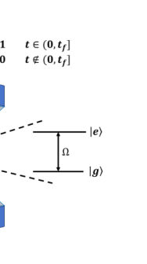
<figcaption class="paper-figure-caption"><b>Fig 1.</b> FIG.1. Schematic of the optical-field-dependent nonlinear quantum battery model, where the optical cavity acts as</figcaption>
</figure>
<figure class="paper-figure-card">
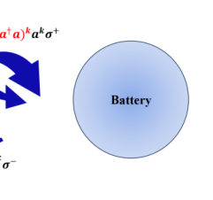
<figcaption class="paper-figure-caption"><b>Fig 2.</b> FIG. 2. Schematic diagram of the energy exchange between the charger and the quantum battery, where 𝑔 is the</figcaption>
</figure>
<figure class="paper-figure-card">
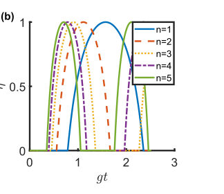
<figcaption class="paper-figure-caption"><b>Fig 3.</b> FIG. 6. For the resonant case Δ = 0, performance of the O-NQB for different photon numbers, (a) Time evolution</figcaption>
</figure>
<figure class="paper-figure-card">

<figcaption class="paper-figure-caption"><b>Fig 4.</b> Fig. 7 details how detuning Δ affects Δ𝐸(𝑡𝑓) , showing that with detuning present, maximum</figcaption>
</figure>
<figure class="paper-figure-card">
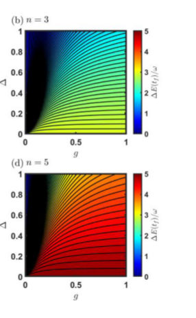
<figcaption class="paper-figure-caption"><b>Fig 5.</b> FIG. 7. Effect of detuning Δ and coupling constant 𝑔 on the maximum stored energy Δ𝐸(𝑡𝑓) of the O-NQB for</figcaption>
</figure>

**Summary.** The paper introduces an Optical-Field-Dependent Nonlinear Quantum Battery model that predicts a superlinear advantage in charging power due to multiphoton absorption. It provides both the rigorous theoretical derivation and a detailed experimental blueprint using superconducting circuits, successfully demonstrating that the achievable charging time saturates the fundamental quantum speed limit.

**Why it may be interesting.** This work directly bridges advanced quantum optics theory (nonlinear cavity QED, multiphoton effects) with cutting-edge solid-state hardware (superconducting qubits), providing concrete pathways to realizing enhanced energy storage devices based on fundamental quantum mechanics principles.

Detailed structure

**Main problem.** To enhance the charging performance of quantum batteries (QBs) by developing a theoretical model for an optical-field-dependent nonlinear quantum battery and demonstrating its feasibility in superconducting circuits.

**Main result.** The proposed Nonlinear Quantum Battery exhibits a superlinear quantum advantage in charging power, confirming that this enhancement stems from multiphoton absorption effects. Furthermore, the experimental design successfully verifies that the charging time saturates the theoretical Quantum Speed Limit (QSL).

**Method.** Theoretical analysis involves deriving an unbiased nonlinear interaction function by comparing energy metrics and QSL benchmarks; experimentally, it uses dispersive readout on superconducting circuits to measure charging time.

**Model / system.** The system is modeled as an Optical-Field-Dependent Nonlinear Quantum Battery (O-NQB) comprising a two-level atom coupled to an optical cavity. The physical realization utilizes superconducting quantum circuits with tunable Josephson junctions, allowing precise control over the coupling strength and resonance conditions.

**Key observables.** Stored energy ($\Delta E(t)$), average charging power ($\langle P(t) 
angle$), charging time ($t_f$), and relative entropy of coherence ($C_{	ext{rel}}(
ho)$).

**Important parameters / regimes.** Nonlinearity order $k\geq2$, multiphoton absorption number $n$ (tunable in the range 2 to 6), detuning ($\Delta$), and coupling strength ($g$).

**Assumptions / limitations.** The derivation relies on establishing an unbiased benchmark by equating QSL times across different models, eliminating arbitrary parameter tuning.

**Figures summary.** Figures illustrate the schematic of the O-NQB model, energy exchange dynamics in nonlinear QBs, and time evolution plots showing coherence decay and energy accumulation under varying detunings.

**Paper structure.** The paper progresses from theoretical modeling (deriving the Hamiltonian and finding the unbiased nonlinearity) to quantitative analysis (comparing charging metrics against the QSL benchmark), culminating in a detailed experimental design scheme using superconducting circuits for verification.

Abstract

A quantum battery is a novel energy storage device that operates on the principles of quantum mechanics. To enhance the charging performance of quantum batteries and further provide theoretical support for their physical implementation, we constructed an optical-field-dependent nonlinear quantum battery model. Meanwhile, we solved for the unbiased form of nonlinear interactions in this model, where the charging power of the proposed model exhibits a superlinear quantum advantage, and the charging time saturates the quantum speed limit. Through theoretical analysis, we confirm that this quantum advantage arises from the quantum effect of multiphoton absorption. Subsequently, with the derived nonlinear function form, we further investigated other properties of this nonlinear quantum battery. Finally, an experimental design scheme for this nonlinear quantum battery in superconducting quantum circuits is presented.

[↑ back to top](#top)

### [Deleterious effect of photon-phonon coupling on microcavities in their application as quantum sources](http://arxiv.org/abs/2607.21743v1)

**Authors:** Y. Sacha C. L. S., G. C. Rickli, J. Dipold, R. A. Kögler, Paulo Nussenzveig, Nathália B. Tomazio, M. Martinelli  
**Type:** experiment · **Category:** quantum information and computing · **PDF:** <https://arxiv.org/pdf/2607.21743v1>  
**Analysis basis:** full PDF text, analyzed in chunks
**Topic relevance:** 🔥 `quantum optics experiment` **4/5** · `Keldysh / 2PI / non-Gaussian methods` **2/5** · `analog quantum simulation` **2/5** · `correlated / nonlocal dissipation` **2/5** · `methods for driven-dissipative` **2/5** · `QC/QI experiment` **1/5** · `correlated cavity matter` **1/5** · `driven-dissipative phase transition` **1/5** · `entanglement & information structure` **1/5** · `non-equilibrium dynamics` **1/5**

↔ Scroll figures horizontally

<figure class="paper-figure-card">
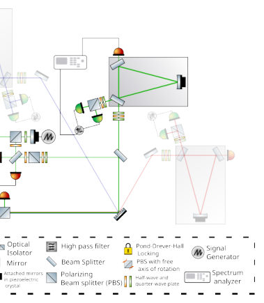
<figcaption class="paper-figure-caption"><b>Fig 1.</b> Figure 1. Diagram of the complete measurement setup. The shaded area indicates the portion of the system not utilized in this work, since all measurements are performed below the OPO’s oscillation threshold and therefore do not produce a nonzero average beam pair for detection.</figcaption>
</figure>
<figure class="paper-figure-card">
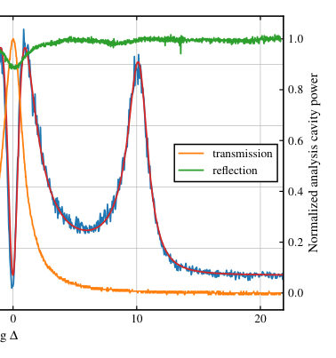
<figcaption class="paper-figure-caption"><b>Fig 2.</b> Figure 2. Spectral noise for a scanning detection cavity. The transmitted signal is used to calibrate the detuning, normalized here by the half bandwidth at half maximum. Noise power has the electronic noise subtracted and is normalized to the standard quan- tum limit by the shot noise level measurement. The continuous line is the adjustment of Equation 18. Analysis frequency of 20 MHz, cavity bandwidth of 4 MHz.</figcaption>
</figure>
<figure class="paper-figure-card">
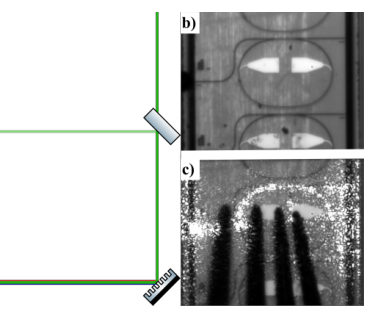
<figcaption class="paper-figure-caption"><b>Fig 3.</b> Figure 3. Diagram of the part of the setup that constitutes the Mach-Zehnder interfer- ometer (a) and pictures of the chip taken with a near-infrared camera. Micro-ring (b) has a height of 390 𝜇m and a width of 540 𝜇m. The white pads are contacts of the platinum wire. Once the contacts run a current, the cavity can be tuned into resonance (c), and some scattering from the surface of the waveguide can be observed. The inter- action length between the bus waveguide and the cavity waveguide is about 200 𝜇m.</figcaption>
</figure>
<figure class="paper-figure-card">
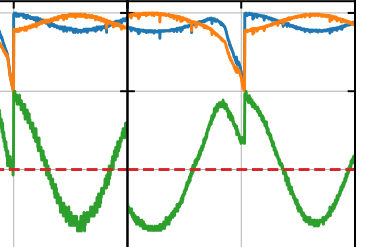
<figcaption class="paper-figure-caption"><b>Fig 4.</b> Figure 4. Graphs of the reflected amplitude for the different cavity coupling regimes. In the graphs on the top row, you can see the complex amplitude response of the reflected field in each coupling regime, where the y-axis represents the imaginary component and the x-axis the real component. In the graphs in the bottom row, the actual char- acterizations of the coupling regime show phase inversions in the overcoupled case when depletion crosses the dashed red line. The blue and orange curves represent the normalized detector signals, while the green curve shows their difference, rescaled for visibility. These coupling regimes were all made in the same cavity, which is typically...</figcaption>
</figure>
<figure class="paper-figure-card">
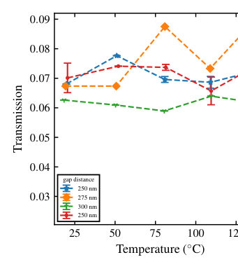
<figcaption class="paper-figure-caption"><b>Fig 5.</b> Figure 5. Graphs of the estimated coupling and spurious losses. The First column presents the coupling losses, and the second column presents the spurious losses. As one can see by the graphs, in all cases the coupling regimes were overcoupled since the coupling losses were always bigger than the spurious ones.</figcaption>
</figure>

**Summary.** This paper experimentally characterizes the detrimental effect of photon-phonon coupling on microcavities intended for quantum state generation. By measuring excess phase noise as a function of temperature, the authors confirm that this noise originates from thermal acoustic fluctuations within the crystal lattice. The findings emphasize that controlling this environmental coupling is a necessary prerequisite for utilizing these cavities in robust quantum information applications.

**Why it may be interesting.** This work directly addresses decoherence mechanisms (phonon coupling) in solid-state photonic platforms used for generating entangled states, which is a core challenge in practical quantum networking and quantum optics.

Detailed structure

**Main problem.** The study investigates how photon-phonon coupling introduces excess noise into microcavities, thereby degrading their performance when used as sources for quantum states.

**Main result.** The observed excess noise is confirmed to be phononic in nature and its temperature dependence allows for the quantification of the coupling rate. Controlling this source of environmental noise is crucial for implementing these devices in quantum networks.

**Method.** The authors analyzed the spectral covariance matrix of the output field, measuring excess phase noise as a function of temperature across different resonant conditions.

**Model / system.** The physical system involves $	ext{Si}_3	ext{N}_4$ micro-cavities coupled to a thermal phonon reservoir. The analysis uses input-output formalism and Langevin equations to model the field dynamics, incorporating noise terms from acoustic fluctuations.

**Key observables.** Excess phase noise power ratio ($\eta$), spectral covariance matrix components ($V(\Omega)$), and temperature coefficients of loss ($\delta\eta/\delta T$).

**Important parameters / regimes.** Temperature dependence ($T$) and driving field power ($P$); the coupling rate was estimated to be proportional to $TP$.

**Assumptions / limitations.** Key assumptions include treating the phonon reservoir as unaffected by the electromagnetic field, ignoring parametric processes below threshold, and simplifying acoustic correlation functions.

**Figures summary.** Figures show spectral matrix components measurements for multiple cavities under different resonance conditions ($R1$ and $R2$), illustrating noise power ratios versus temperature dependence.

**Paper structure.** The paper progresses from establishing the theoretical framework using input-output formalism to measuring excess noise, quantifying its temperature dependence across two distinct resonant conditions, and concluding with recommendations for noise mitigation in quantum network applications.

Abstract

In quantum systems, the contact with the environment is detrimental to the purity of the state, thus limiting the practical use of entangled sources in quantum information applications. This loss of purity is observed in the form of additional noise in the tomography of the state. We investigate this noise dependence in $Si_3N_4$ micro-cavities, previously used for quantum state generation, and demonstrate that the dependence of this noise on the temperature is compatible with a coupling of the photonic chips to a thermal reservoir. The control of this noise source is a necessary condition for the efficient implementation of these devices as sources of entangled states in quantum networks.

[↑ back to top](#top)

### [Effective field theories of nonlinear fluctuating hydrodynamics in one dimension](http://arxiv.org/abs/2607.22527v1)

**Authors:** Matija Koterle, Enej Ilievski  
**Type:** theory · **Category:** statistical mechanics · **PDF:** <https://arxiv.org/pdf/2607.22527v1>  
**Analysis basis:** full PDF text, analyzed in chunks
**Topic relevance:** 🔥 `non-equilibrium dynamics` **4/5** · `methods for driven-dissipative` **3/5** · `non-equilibrium universality` **3/5** · `driven-dissipative phase transition` **2/5** · `Frenkel-Kontorova` **1/5** · `Keldysh / 2PI / non-Gaussian methods` **1/5** · `correlated / nonlocal dissipation` **1/5**

↔ Scroll figures horizontally

<figure class="paper-figure-card">
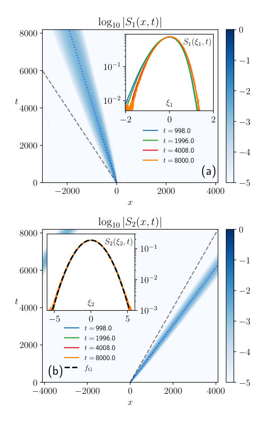
<figcaption class="paper-figure-caption"><b>Fig 1.</b> FIG. 1. Diagonal structure factors in a minimal model of a two-component nonlinear EFT. Time evolution of Sa(x, t) in the minimal model (cf. Eqs. (14), (15) and (16)) with bare parameters c = 0.5, λ = 1.0, χ = 0.1 and κ = 1.0. Gray dashed lines indicate the bare characteris- tics v♭t with v♭= ±c, while blue dotted lines trace the ac- tual peak trajectories vat propagating with dressed velocities (v1 ≈−0.234, v2 ≈0.650). Insets demonstrate collapse of the rescaled structure factors Sa(ξa, t) ≡t1/zaSa (ξa, t), with scaling variables ξa(x, t) ≡t−1/za(x −vat). (a) Mode 1 ex- hibits superdiffusive broadening with z1 = 3/2. (b) Mode 2 exhibits diffusive transport with z2 = 2 and a Gaussian...</figcaption>
</figure>
<figure class="paper-figure-card">
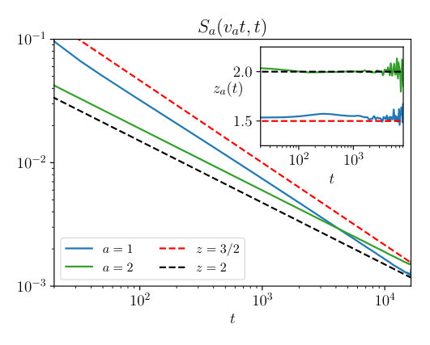
<figcaption class="paper-figure-caption"><b>Fig 2.</b> FIG. 2. Decay of diagonal structure factors and run- ning exponents. The decay of the peaks of diagonal struc- ture factors Sa(vat, t) in the minimal model. The dashed lines show the expected asymptotic decay rates t−1/z for z ∈{3/2, 2}. In the inset we show time-resolved dynami- cal exponents za(t) = −[dlog Sa(vat, t)/d logt]−1 which shows that mode 1 is superdiffusive with limt→∞z1(t) ≈3/2, while mode 2 clearly converges to the expected value z2 = 2. Pa- rameters of simulation: N = L = 8192, ∆t = 0.04, number of samples 2 × 104.</figcaption>
</figure>
<figure class="paper-figure-card">
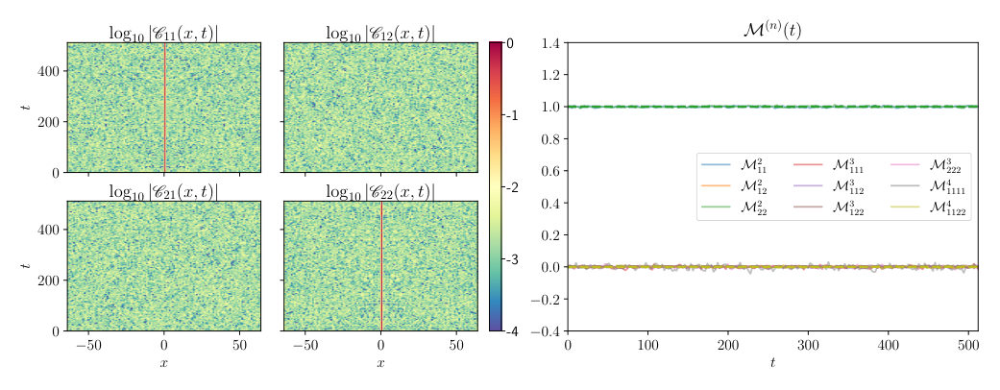
<figcaption class="paper-figure-caption"><b>Fig 3.</b> FIG. 3. Stationarity of a Gaussian equilibrium state Peq under dynamics in the cyclic test model. The left panel shows evolution of C (2) which preserves contact form, while the right panel shows the dynamics of equal-time correlators M(n)(t) which evidently fluctuate around expected equilibrium values that are denoted by dashed lines (determined analytically). Simulation parameters: ∆t = 0.04, number of samples 1000, N = 128.</figcaption>
</figure>
<figure class="paper-figure-card">
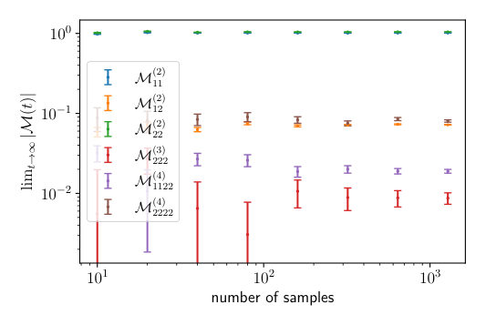
<figcaption class="paper-figure-caption"><b>Fig 4.</b> FIG. 4. Dynamical generation of nonzero cumulants M(n&gt;2) under dynamics with a non-cyclic Hessian. The equal-time correlators M(n)(t) are evaluated in equilibrium with an increasing number of samples. The Gaussian prediction limt→∞Mab = δab and limt→∞M(n&gt;2) = 0 are broken. Simulation parameters: ∆t = 0.04, N = 128.</figcaption>
</figure>
<figure class="paper-figure-card">
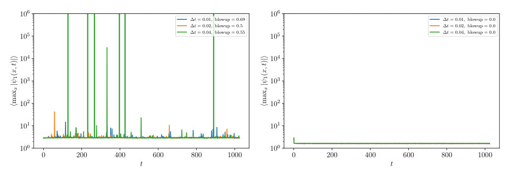
<figcaption class="paper-figure-caption"><b>Fig 5.</b> FIG. 5. Stability of the cyclic (left panel) and the consistent (right panel) numerical schemes. The panels show maxx ψ1(x, t) averaged over 100 initial conditions as a function of time for increasing ∆t. The legend denotes the used timestep ∆t and the fraction of trajectories that exhibited instability maxx ψ1(x, t) &gt; 106. The consistent scheme stabilizes the dynamics to a large degree. Parameters: N = 128, c = 0.3, κ = 2, number of samples 100.</figcaption>
</figure>

**Summary.** This paper develops a systematic effective field theory framework for nonlinear fluctuating hydrodynamics in 1D systems. It overcomes limitations of previous models by enforcing key thermodynamic symmetries like the Maxwell relation through a master potential. The work successfully predicts superdiffusive transport regimes and provides robust numerical methods for non-Gaussian equilibrium states.

**Why it may be interesting.** It provides rigorous theoretical tools for describing non-equilibrium dynamics in low dimensions where simple perturbative methods fail, connecting macroscopic hydrodynamics directly to fundamental thermodynamic symmetries.

Detailed structure

**Main problem.** Developing a general and systematic effective field theory approach for nonlinear fluctuating hydrodynamics in one dimension that rigorously respects fundamental symmetry constraints of local equilibrium states.

**Main result.** The authors successfully construct EFTs by introducing a master potential that manifestly enforces the Maxwell relation, demonstrating superdiffusive transport ($z=3/2$) alongside diffusive modes in a minimal non-Gaussian model.

**Method.** The work combines theoretical construction based on symmetry principles (Maxwell relation) with numerical simulations of stochastic partial differential equations (SPDEs) and advanced sampling techniques like tilted ensembles.

**Model / system.** The study focuses on one-dimensional interacting systems exhibiting emergent phenomena, modeled via nonlinear fluctuating hydrodynamics described by coupled stochastic Langevin-type equations. The analysis is tested on a minimal model featuring two interacting hydrodynamic modes with a non-Gaussian stationary equilibrium measure.

**Key observables.** Superdiffusive algebraic exponents ($z$), static covariance matrices ($C_{ab}$), and the preservation of symmetry relations like $B_{a|b} = B_{b|a}$.

**Important parameters / regimes.** The dimensionality (one dimension) and the nature of the equilibrium measure (non-Gaussian vs. Gaussian).

**Assumptions / limitations.** Previous NLFHD formulations are shown to have conceptual issues when applied to non-Gaussian measures, necessitating a symmetry-preserving EFT construction.

**Figures summary.** Figures illustrate structure factors showing superdiffusive and diffusive broadening over time; other figures compare numerical sampling methods (Metropolis vs. exact) for minimal models.

**Paper structure.** The paper progresses from identifying limitations in existing NLFHD/MCE approaches to developing a symmetry-enforcing EFT via a master potential, followed by applying this framework to analyze transport properties and test the numerical stability of the resulting SPDEs.

Abstract

Describing emergent macroscopic phenomena in low spatial dimensions is known to be notoriously challenging, primarily due to strong interactions that render perturbative approaches inapplicable. On the other hand, low-dimensional systems host a wealth of unorthodox phenomena. A prominent example is the emergence of superdiffusive transport in one-dimensional interacting systems, traditionally studied in the framework of nonlinear fluctuating hydrodynamics. After identifying and discussing internal inconsistencies in the previous formulations, in this work we develop a general and systematic approach for constructing effective field theories of one-dimensional hydrodynamic systems in the form of coupled stochastic Langevin-type equations compatible with the physical requirements of local equilibrium states such as the thermodynamic Maxwell relation and fluctuation-dissipation symmetry. We implemented a general numerical integration scheme and exemplified our construction on a simple model of two interacting hydrodynamic modes with a non-Gaussian stationary equilibrium measure.

[↑ back to top](#top)

### [Identifying the signatures of residual activity in harmonically bound active Brownian dynamics](http://arxiv.org/abs/2607.22222v1)

**Authors:** Sanatan Halder, Manas Khan  
**Type:** theory · **Category:** statistical mechanics · **PDF:** <https://arxiv.org/pdf/2607.22222v1>  
**Analysis basis:** full PDF text, analyzed in chunks
**Topic relevance:** 🔥 `non-equilibrium dynamics` **4/5** · `driven-dissipative phase transition` **3/5** · `methods for driven-dissipative` **3/5** · `non-equilibrium universality` **2/5** · `Frenkel-Kontorova` **1/5** · `Keldysh / 2PI / non-Gaussian methods` **1/5** · `correlated / nonlocal dissipation` **1/5**

↔ Scroll figures horizontally

<figure class="paper-figure-card">
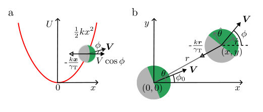
<figcaption class="paper-figure-caption"><b>Fig 1.</b> Fig. 1. An active Brownian particle (ABP) in a harmonic well (HW). (a) Schematic shows an ABP, depicted as an active Janus colloid (gray-green), in an HW with potential U = 1 2kx2 (orange curve). The corresponding restoring velocity (= −kx/γT) is shown as an open arrow. The Janus particle undergoes active propulsion with velocity V , which has a constant speed and points from the coated side (gray) to the bare side (green), making an angle ϕ with the x-axis in the x−y plane. V and its x-component V cos ϕ are represented by the solid arrows. (b) Active propulsion velocity V (solid arrows) and the restoring velocity (= −kr/γT, open arrow) are shown in the x −y plane for the initial (t = 0)...</figcaption>
</figure>
<figure class="paper-figure-card">
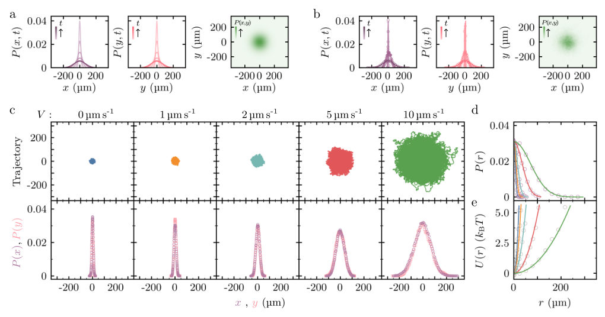
<figcaption class="paper-figure-caption"><b>Fig 2.</b> Fig. 2. Position distributions in regime - I, where τR ≪τk (τR/τk = 0.01; τR = 1 s, τk = 100 s). (a) Analytically predicted time evolution of P(x, t) (left) and P(y, t) (middle) for V = 10 µm s−1, displayed as color-coded curves at successive times t. The 2D steady-state distribution following Eq. 5 is shown as a density plot (right). (b) Numerically simulated position distributions at increasing times are shown in the same way. (c) Five simulated trajectories of 105 s duration, generated at 103 Hz, with propulsion speeds V varying from V = 0 (HBBP) to 10 µm s−1, are displayed in blue, orange, cyan, red, and green, respectively (top panel). The corresponding steady-state position...</figcaption>
</figure>
<figure class="paper-figure-card">
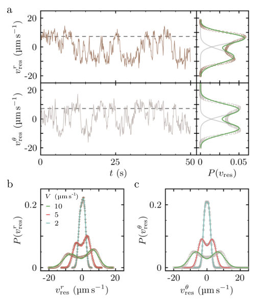
<figcaption class="paper-figure-caption"><b>Fig 3.</b> Fig. 3. Residual, i.e., resultant velocity distributions for τR ≪τk ((τR/τk = 0.01; τR = 1 s, τk = 100 s)). (a) Short segments (50 s) of the time series (left) and probability distribu- tions (right) of the radial component vr res (top) and azimuthal component vθ res (bottom), calculated from the simulated trajec- tory with V = 10 µm s−1. The dashed horizontal lines in the time series represent the respective rms values. Both P(vr res) and P(vθ res) exhibit bimodal shapes that fit well with the sum of two symmetrically positioned Gaussians (solid lines). (b, c) Probability distributions P(vr res) and P(vθ res) for three differ- ent propulsion speeds, V = 2, 5, and 10 µm s−1. The bimodal...</figcaption>
</figure>
<figure class="paper-figure-card">
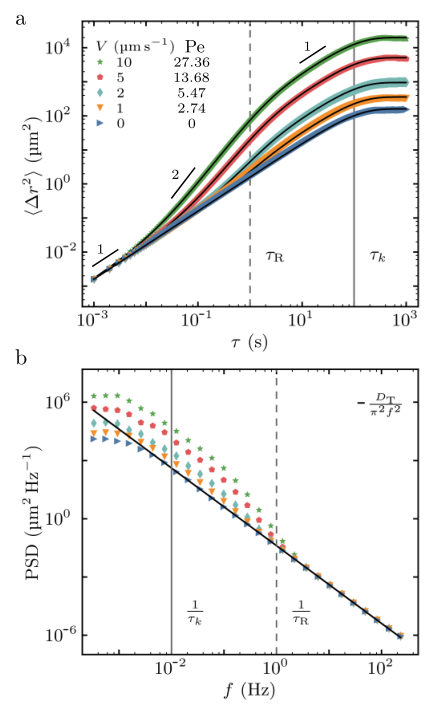
<figcaption class="paper-figure-caption"><b>Fig 4.</b> Fig. 4. Mean square displacement (MSD) and power spectral density (PSD) in regime - I (τR/τk = 0.01; τR = 1 s, τk = 100 s). (a) Computed MSDs, ⟨∆r2⟩, for five propulsion speeds (V ), varying from 0 (HBBP) to 10 µm s−1, are shown with color-coded symbols consistent with the corresponding trajec- tories in Fig. 2c. The V values and respective P´eclet numbers (Pe) are specified in the inset. Fitting to the analytical solution (Eq. 12) are shown with solid black lines. The characteristic timescales τR and τk are marked with dashed and solid ver- tical lines, respectively, and the apparent slopes of 1 and 2 are indicated by short black straight lines as visual guides. (b) PSDs, computed for...</figcaption>
</figure>
<figure class="paper-figure-card">
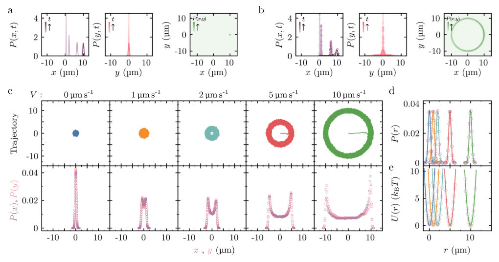
<figcaption class="paper-figure-caption"><b>Fig 5.</b> Fig. 5. Position distributions in regime - II, where τR ≫τk (τR/τk = 100; τR = 100 s, τk = 1 s). (a) Time evolution of P(x, t) (left) and P(y, t) (middle) from analytical predictions are shown by color-coded curves for V = 10 µm s−1. The 2D position distribution P(x, y) prior to reaching the steady-state is presented as a density plot (right). (b) Position distributions obtained from the numerically simulated dynamics of an HBABP are exhibited in the same fashion as those in (a). (c) The simulated trajectories of 105 s duration, generated at 103 Hz, for five different propulsion speeds, from V = 0 (HBBP) to 10 µm s−1, are shown in blue, orange, cyan, red, and green (top). The bottom panel...</figcaption>
</figure>

**Summary.** The paper investigates how self-propelled particles confined by a harmonic potential behave under different activity levels. By analyzing multiple dynamical signatures—including MSD and PSD—the authors distinguish between regimes where residual activity dominates versus those where the activity is effectively quenched by the confining force field.

**Why it may be interesting.** This work provides a rigorous, multi-diagnostic framework (beyond just distribution shape) to characterize non-equilibrium steady states in active matter systems, which is highly relevant for understanding energy dissipation and effective potentials in complex physical settings.

Detailed structure

**Main problem.** The study aims to reliably identify and quantify the signature of residual or remnant activity in the dynamics of an Active Brownian Particle (ABP) confined within a harmonic potential.

**Main result.** The nature of the particle's motion depends critically on the ratio between the persistence time ($	au_R$) and the confinement equilibration time ($	au_k$): $	au_R \ll 	au_k$ shows residual activity signatures, while $	au_R \gg 	au_k$ suggests the activity is balanced by the restoring force.

**Method.** The analysis combines analytical calculations of correlation functions and position distributions with numerical simulations solving the underlying Langevin equations for the system.

**Model / system.** The model describes an ABP undergoing self-propulsion ($V$) confined in 2D by a harmonic potential $U(r) = rac{1}{2}kr^2$. The dynamics are governed by coupled Langevin equations involving propulsion, confinement restoring forces, and thermal noise.

**Key observables.** Position distribution ($P_{ss}(r)$), residual/resultant velocity components ($\mathbf{v}_{	ext{res}}$), Mean Square Displacement (MSD), and Power Spectral Density (PSD).

**Important parameters / regimes.** Activity strength quantified by the Péclet number ($	ext{Pe}$); characteristic timescales $	au_R$ (persistence time) and $	au_k$ (confinement equilibration time).

**Assumptions / limitations.** The analysis relies on examining two extreme limits ($	au_R \ll 	au_k$ and $	au_R \gg 	au_k$) and assumes that cross-terms involving uncorrelated Brownian velocity noises vanish.

**Figures summary.** Figures illustrate position distributions ($P(x, t), P(y, t)$) and steady-state radial distributions $P_{ss}(r)$, comparing analytical predictions to simulations across different activity regimes.

**Paper structure.** The paper systematically analyzes the dynamics by deriving theoretical expressions for observables (like MSD and distribution functions) in the two limiting cases ($	au_R \ll 	au_k$ and $	au_R \gg 	au_k$), contrasting these results with the passive Brownian counterpart ($V=0$).

Abstract

A confined self-propelled particle exhibits a range of intriguing dynamical phenomena dictated by the interplay between the intrinsic activity of the particle and the imposed confinement. This competition manifests as a crossover in the steady-state position distribution of a harmonically bound active Brownian particle (HBABP) from Boltzmann-like to bimodal, commonly recognized as the passive and active regimes, respectively, upon variations in activity and confinement strength. We present a comprehensive analysis of the resultant dynamics of an HBABP employing analytical calculations and numerical simulations, examining the variations in the position distribution, residual or resultant velocity, mean square displacement, power spectral density, and effective harmonic confinement at varying activities in the characteristic regimes across the crossover. These analyses provide a reliable identification of the signature of residual or remnant activity in ABP dynamics after being impeded by the harmonic confinement. Our results show that the resultant HBABP dynamics in the regime with a Boltzmann-like position distribution is dominated by residual activity, and the motion in the other regime, with a bimodal position distribution, is similar to that of a harmonically bound Brownian particle--devoid of residual activity--at a displaced position, where the activity is balanced by the restoring force field.

[↑ back to top](#top)

### [Resolving topological order crossovers on NISQ hardware](http://arxiv.org/abs/2607.21707v1)

**Authors:** Ruizhe Shen, Yin Zhong, Ching Hua Lee  
**Type:** both · **Category:** other · **PDF:** <https://arxiv.org/pdf/2607.21707v1>  
**Analysis basis:** full PDF text, analyzed in chunks
**Topic relevance:** 🔥 `QC/QI experiment` **4/5** · `analog quantum simulation` **3/5** · `methods for driven-dissipative` **3/5** · `correlated / nonlocal dissipation` **1/5** · `driven-dissipative phase transition` **1/5** · `entanglement & information structure` **1/5** · `exotic spin models in light-matter` **1/5** · `non-equilibrium dynamics` **1/5**

↔ Scroll figures horizontally

<figure class="paper-figure-card">
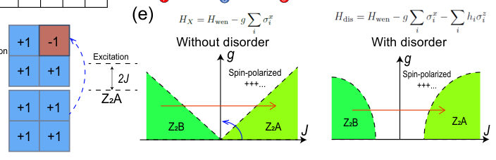
<figcaption class="paper-figure-caption"><b>Fig 1.</b> FIG. 1. Illustration of the Wen–plaquette model and its finite-size diagnostic structure. (a) Schematic of the Wen–plaquette model [Eq. 1] on a square lattice. (b,c) Schematic definitions of the elementary plaquette operator [F1, Eq. (3)] and the extended Wilson-loop operator [Eq. (5)], respectively. The latter corresponds to the nonlocal boundary string W. (d) Local excitation of the Wen–plaquette Hamiltonian: flipping a single plaquette eigenvalue from +1 to −1 creates a localized defect separated from the reference stabilizer sector by an energy cost 2J. (e) Schematic finite-size response maps of the Wen–plaquette model in the clean case (left, Eq. 4) and in the presence of disorder...</figcaption>
</figure>
<figure class="paper-figure-card">
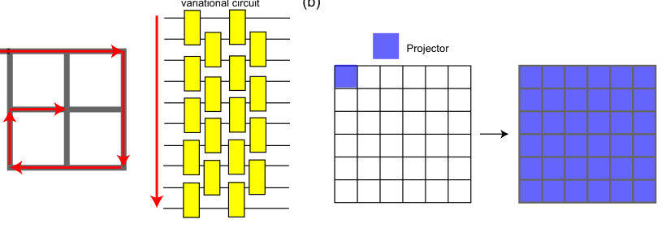
<figcaption class="paper-figure-caption"><b>Fig 2.</b> FIG. 2. Simulation strategies for the Wen–plaquette model. (a) Variational method used for the detailed characteri- zation of crossover signatures. The red arrows indicate the one-dimensional qubit ordering used to embed the two-dimensional plaquette geometry into a hardware-efficient brickwork circuit. The target states of the finite Wen–plaquette Hamiltonian [Eq. 2] are approximated by a variational circuit composed of trainable local blocks (yellow), whose parameters are optimized using the loss function in Eq. 9. This approach enables controlled comparisons with exact results for the small system and is used to study the effects of disorder, accumulated hardware noise, and non-Hermitian...</figcaption>
</figure>
<figure class="paper-figure-card">
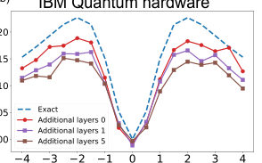
<figcaption class="paper-figure-caption"><b>Fig 3.</b> FIG. 3. Noise resilience of topological diagnostics via the Wilson loop. (a) Noise-amplification protocol [Eq. 11]. The circuit Vprep (blue) denotes the optimized variational ansatz, while VId (green) denotes the inserted identity block. This construction increases the physical circuit depth, and hence the accumulated gate and decoherence errors, while leaving the ideal unitary evolution unchanged. Explicit circuit layouts and transpilation details are provided in Appendix S5. (b) Robustness of the Wilson-loop crossover (between J/g ∈[1, 2]) under noise, measured on IBM Quantum hard- ware by preparing approximate ground states of Eq. (4) and evaluating the large Wilson loop W [Eq. (5)]....</figcaption>
</figure>
<figure class="paper-figure-card">
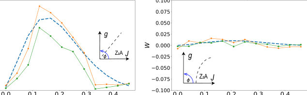
<figcaption class="paper-figure-caption"><b>Fig 4.</b> FIG. 4. Measurement of finite-size stabilizer and loop diagnostics in clean and disordered Wen–plaquette models on IBM Quantum. We compare the disorder-free and disordered Hamiltonians in Eqs. (4) and (6), following the parameter trajectories illustrated in Fig. 1(e). Disorder is included in panels (b) and (d) with h = 5, while panels (a) and (c) show the clean case, h = 0. (a,b) Expectation value of the single-plaquette stabilizer F1 as J is varied at fixed g = 1, revealing the finite- size crossover between the ⟨F1⟩≃−1 and ⟨F1⟩≃+1 stabilizer sectors. (c,d) Expectation value of the boundary Wilson loop W [Eq. (5)] along the path (J, g) = (cos ϕ, sin ϕ), which probes the crossover between...</figcaption>
</figure>
<figure class="paper-figure-card">
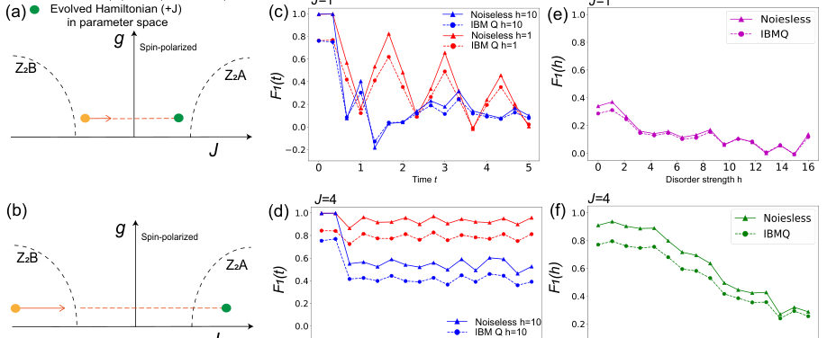
<figcaption class="paper-figure-caption"><b>Fig 5.</b> FIG. 5. Unitary quench dynamics of finite-size plaquette diagnostics. (a,b) Finite-size response maps of the disordered model [Eq. 6]. Black curves denote the disorder-reshaped crossover lines obtained from exact diagonalization. Orange arrows indicate the quench protocols of Eq. 14: panel (a) considers a weak-coupling quench near the finite-size crossover, while panel (b) considers a strong-coupling quench deep in the stabilizer-dominated regime. The dashed orange segment connects the late-time trajectory to the post-quench Hamiltonian at +J (blue dot). (c,d) Time evolution of the plaquette expectation F1(t) for initial states prepared at the red dots in panels (a,b). Solid curves show...</figcaption>
</figure>

**Summary.** The paper investigates the feasibility of measuring topological order crossovers in the Wen–plaquette model on noisy quantum computers. Using local plaquette stabilizers and Wilson loops as diagnostics, the authors show that these signatures remain surprisingly robust even when subjected to realistic hardware imperfections like disorder and amplified circuit noise. This provides a practical pathway for using near-term quantum processors to probe fundamental aspects of topological matter.

**Why it may be interesting.** This work directly bridges abstract topological theory with near-term quantum hardware constraints. By providing concrete metrics for signal degradation due to realistic noise models, it offers a crucial roadmap for realizing fault-tolerant topological quantum computation using current NISQ devices.

Detailed structure

**Main problem.** The central question is whether signatures of topological crossovers, crucial for robust quantum information processing, remain resolvable when implemented on current Noisy Intermediate-Scale Quantum (NISQ) hardware.

**Main result.** The study demonstrates that plaquette-sector signatures are substantially stable deep within the strong-stabilizer regime and exhibit only weak degradation when extended to a physical 2D IBM processor under local coherent perturbations.

**Method.** A two-stage strategy is employed: first, characterizing crossovers on small systems using variational circuits; second, scaling this approach to a physical lattice while quantifying robustness against disorder, noise, and non-Hermitian effects.

**Model / system.** The Wen–plaquette model is used, which exhibits topological order characterized by plaquette stabilizers ($F_{i,j}$). The study analyzes crossovers between stabilizer-dominated, trivial, or disorder-dominated regimes on IBM Quantum hardware.

**Key observables.** Local plaquette stabilizers ($F_i$), nonlocal Wilson loops ($W$), and the lattice-averaged plaquette response.

**Important parameters / regimes.** The relative strengths of coupling constants ($J$ vs. $g$) defining different topological regimes, disorder strength ($h$), and circuit noise/depth ($\gamma$, identity layers).

**Assumptions / limitations.** The work assumes that controlled finite-size characterization can inform a scalable hardware implementation, although limitations regarding gate error rates and classical feedforward are noted.

**Figures summary.** Figures illustrate the Wen–plaquette model structure (lattice diagrams), schematic comparisons of clean vs. disordered crossover trajectories, and workflow diagrams for implementing measurements using ancilla qubits or coherent representative-qubit methods.

**Paper structure.** The paper systematically introduces the Wen–plaquette Hamiltonian, details diagnostic tools like plaquettes and Wilson loops, develops simulation protocols (variational circuits, projector construction), analyzes the system's response to various perturbations (disorder, noise), and concludes by validating the approach on a physical 2D processor.

Abstract

Topological phases of matter provide a promising route toward robust quantum information processing, but on present-day noisy intermediate-scale quantum devices the experimentally relevant question is whether signatures of topological crossovers remain resolvable under realistic imperfections. Here, we address this question in the Wen--plaquette model through a two-stage strategy on the IBM Quantum hardware. We first use a tractable system to systematically characterize crossover signatures. Using variationally compiled equilibrium and quench-generated states, we resolve crossovers between stabilizer-dominated and trivial or disorder-dominated regimes through local plaquette stabilizers and a Wilson loop, and quantify their robustness against static disorder, deliberately amplified circuit noise, and effective non-Hermitian fields. The quench dynamics further reveal that plaquette-sector signatures remain substantially more stable deep in the strong-stabilizer regime than near the finite-size crossover. Building on the properties established in the small system, we extend the implementation to a physical two-dimensional IBM processor using a layered representative-qubit construction. The resulting lattice-averaged plaquette response exhibits only weak degradation under intentionally amplified local coherent perturbations. Together, these results connect controlled finite-size characterization with a scalable hardware implementation, providing a practical route for preparing and probing topological signatures on near-term quantum processors.

[↑ back to top](#top)

### [Highly indistinguishable photons from a tin-vacancy spin qubit in diamond](http://arxiv.org/abs/2607.22439v1)

**Authors:** Dennis Herrmann, Robert Morsch-Golsong, Tobias Bauer, Marlon Schäfer, David Lindler, Linus Ehre, Peter van Loock, Matthew Markham, Nicola Palmer, Soumen Mandal, Oliver Williams, Christoph Becher  
**Type:** experiment · **Category:** quantum information and computing · **PDF:** <https://arxiv.org/pdf/2607.22439v1>  
**Analysis basis:** full PDF text, analyzed in chunks
**Topic relevance:** 🔥 `QC/QI experiment` **4/5** · `interference shaping light` **3/5** · `quantum optics experiment` **3/5** · `spintronics-quantum-optics interface` **3/5** · `quantum measurements` **1/5**

↔ Scroll figures horizontally

<figure class="paper-figure-card">
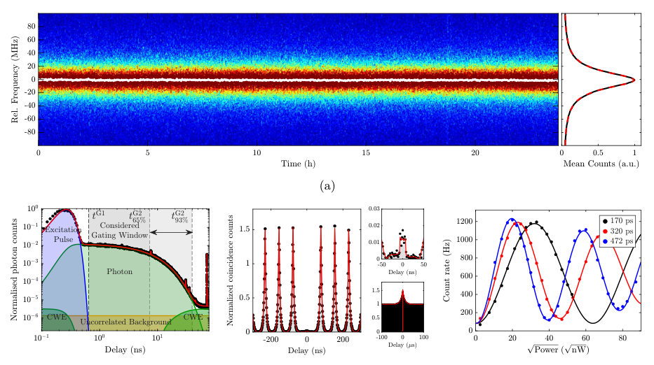
<figcaption class="paper-figure-caption"><b>Fig 1.</b> Fig. 1: a, Photoluminescence excitation spectrum of a single SnV center recorded over 24 h. The average of all individual scans (solid black line) is fitted with a Lorentzian function (red dashed line), yielding a slightly power-broadened linewidth of 30.8(2) MHz. This value agrees with the linewidth obtained from a single scan, 30.7(4) MHz, indicating negligible spectral drift over the entire measurement duration. Furthermore the linewidth remains close to the Fourier-transform-limited value of 28.9(2) MHz expected from the measured excited-state lifetime of 5.68 ns. The white trace indicates the central peak position for each individual scan; the observed drift remains below the 2 MHz...</figcaption>
</figure>
<figure class="paper-figure-card">
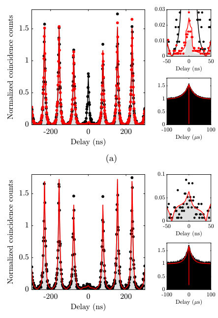
<figcaption class="paper-figure-caption"><b>Fig 2.</b> Fig. 2: a, Two-photon HOM interference of res- onantly excited photons with repetition period Trep = 77.5 ns and using the 93% time-gating window. Consecutive photons are overlapped in an unbalanced fiber-based MZI with orthogonal (black) or parallel (red) polarization. Comparison of the central peak areas yields a raw visibility of V raw,93% HOM = 0.950+0.006 −0.008. The grey shaded area represents the expected coincidence distribution for perfectly indistinguishable emitter photons, taking into account the measured background noise. b, Two-photon HOM interference after fre- quency conversion, resulting in a raw visibility of V raw,93% HOM = 0.80+0.01 −0.03.</figcaption>
</figure>
<figure class="paper-figure-card">
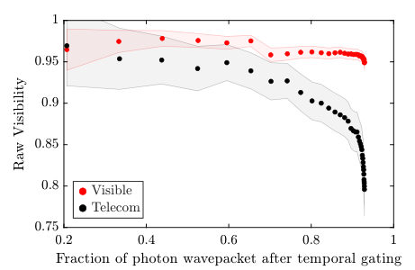
<figcaption class="paper-figure-caption"><b>Fig 3.</b> Fig. 3: Raw two-photon interference visibility in the visible (red) and telecom (black) regime as a function of the remaining fraction of the photon wave packet after temporal gating of the detection window. The visibility is extracted from the raw coincidence counts by comparing the integrated area of the central peak to those of the far-delayed peaks. Shaded regions denote the 95% confidence interval, which increases for narrower gating win- dows due to reduced photon statistics.</figcaption>
</figure>
<figure class="paper-figure-card">
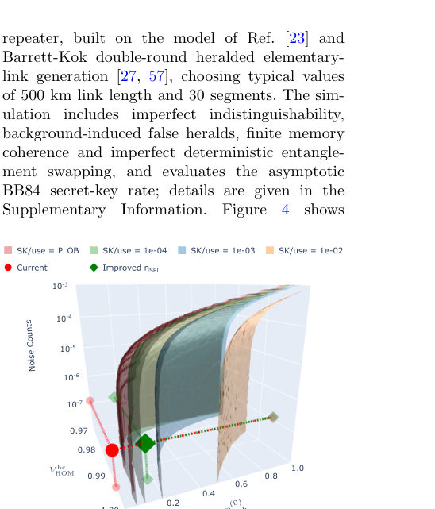
<figcaption class="paper-figure-caption"><b>Fig 4.</b> Fig. 4: Monte Carlo simulation of repeater per- formance versus background-corrected HOM vis- ibility V bc HOM, single-photon detection efficiency (excluding fiber losses) η(0) link and total noise counts per detector and excitation round. Iso-surfaces show parameter combinations resulting in the same secret key bits per channel use (SK/use). In the parallel protocol considered here, one repeater channel use corresponds to one simultaneous elementary-link attempt in all segments. Its dura- tion τcu is limited by the signal travel time. The simulation assumes L = 500 km, n = 30 (therefore τcu = 83.4 µs), T2,mem = 1.35 s and Fswap = 0.999. The red marker shows the measured 65 % time- gated...</figcaption>
</figure>

**Summary.** The research demonstrates that tin-vacancy centers in diamond can generate single photons with extremely high indistinguishability ($\approx 0.999$). By meticulously separating emitter physics from technical noise sources, the authors establish this platform as a leading candidate for building long-distance quantum networks and photonic quantum information processors.

**Why it may be interesting.** This work provides concrete experimental metrics (high visibility, quantified intrinsic indistinguishability) crucial for assessing solid-state emitters as viable nodes in future quantum communication infrastructure, directly impacting photonic QI protocols.

Detailed structure

**Main problem.** The primary goal is demonstrating highly indistinguishable single photons from a tin-vacancy (SnV) spin qubit in diamond for use in long-distance quantum networks.

**Main result.** The authors achieved raw Hong-Ou-Mandel interference visibilities exceeding 0.95, establishing an intrinsic photon indistinguishability up to 0.999, even after frequency conversion to the telecom band.

**Method.** Measurements involve characterizing single-photon purity using Hanbury-Brown-Twiss setups and measuring indistinguishability via Hong-Ou-Mandel interference, complemented by detailed noise modeling using TCSPC data.

**Model / system.** The platform is the SnV center in diamond, acting as a solid-state quantum emitter. The work models photon generation fidelity, decoherence effects, and simulates performance improvements in quantum repeater links.

**Key observables.** Raw Hong–Ou–Mandel (HOM) interference visibilities (>0.95), intrinsic indistinguishability ($\approx 0.999$), single-photon purity ($g^{(2)}(0)$), and spectral linewidths ($\sim 30$ MHz).

**Important parameters / regimes.** Intrinsic indistinguishability, coherence times (electron/nuclear spin), temporal gating fractions (e.g., 65% of the wave packet), and frequency conversion efficiency.

**Assumptions / limitations.** The analysis separates intrinsic emitter properties from technical imperfections, assuming that residual reflections are the main limitation to raw purity.

**Figures summary.** Figures illustrate Rabi oscillations, photoluminescence excitation spectra, $g^{(2)}(	au)$ measurements showing background subtraction, and comparisons of HOM visibility in visible versus telecom regimes.

**Paper structure.** The paper progresses by first demonstrating high single-photon purity from the SnV center, then quantifying indistinguishability via HOM interference, and finally extending this potential by showing preservation of indistinguishability after quantum frequency conversion to the telecom C-band for network applications.

Abstract

Quantum networks promise secure communication, distributed sensing and modular quantum computing by interconnecting distant quantum nodes through photonic links. Extending such networks beyond metropolitan distances requires quantum repeaters to overcome the exponential attenuation of photons in optical fiber. Across all architectures, a key requirement is the indistinguishability of single photons, which directly impacts the fidelity of photonic operations based on two-photon interference, such as Bell-state measurements and fusion gates. Here, we demonstrate generation of highly indistinguishable single photons from a coherently excited tin-vacancy center in diamond, achieving raw Hong-Ou-Mandel interference visibilities exceeding 0.95. By separating intrinsic emitter properties from technical imperfections, we show that decoherence plays a negligible role and that the remaining limitations are predominantly technical in nature, arriving at an intrinsic indistinguishability of up to 0.999. We further show that quantum frequency conversion to the telecom C-band preserves the photon indistinguishability. In combination with the long-lived electron and nuclear spin coherence times, these results establish tin-vacancy centers in diamond as a competitive platform for long-distance quantum networks and photonic quantum information processing. We further substantiate this potential through Monte Carlo simulations of a quantum-repeater link, demonstrating that the SnV-center platform surpasses the bound set by direct transmission.

[↑ back to top](#top)

### [Molecular chiral discrimination through symmetry-breaking spin dynamics](http://arxiv.org/abs/2607.22154v1)

**Authors:** Tianyu Xie, Yucheng Hao, Mingzhe Liu, Mengqi Wang, Shaoyi Xu, Zhiyuan Zhao, Chang-Kui Duan, Ya Wang, Fazhan Shi, Jiangfeng Du  
**Type:** both · **Category:** other · **PDF:** <https://arxiv.org/pdf/2607.22154v1>  
**Analysis basis:** full PDF text, analyzed in chunks
**Topic relevance:** 🔥 `QC/QI experiment` **4/5** · `spintronics-quantum-optics interface` **3/5** · `quantum measurements` **2/5** · `correlated / nonlocal dissipation` **1/5** · `driven-dissipative phase transition` **1/5** · `exotic spin models in light-matter` **1/5** · `methods for driven-dissipative` **1/5** · `non-equilibrium dynamics` **1/5**

↔ Scroll figures horizontally

<figure class="paper-figure-card">
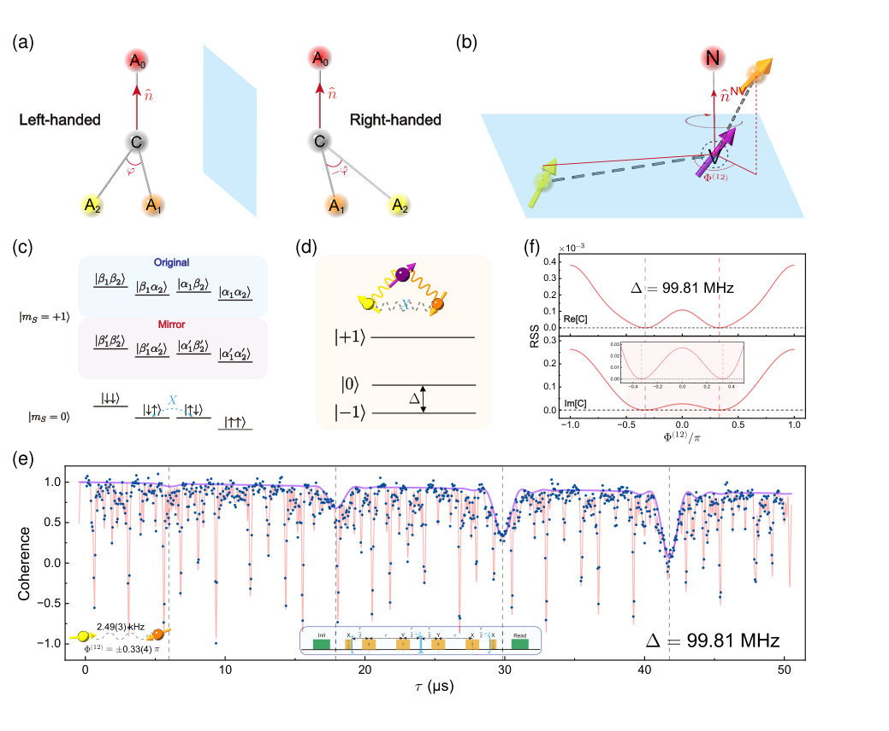
<figcaption class="paper-figure-caption"><b>Fig 1.</b> FIG. 1. Chiral molecules, chiral discrimination and dynamics of the nearby nuclear spins. (a)</figcaption>
</figure>
<figure class="paper-figure-card">
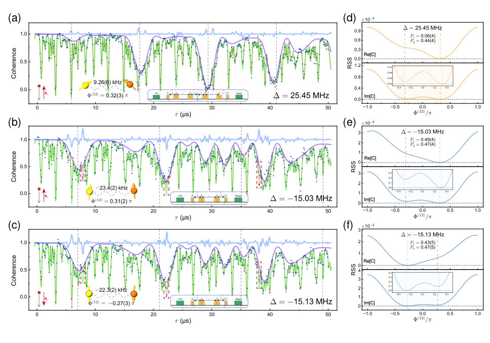
<figcaption class="paper-figure-caption"><b>Fig 2.</b> FIG. 2. Chiral discrimination through symmetry-breaking dynamics of two nuclear spins under spin</figcaption>
</figure>
<figure class="paper-figure-card">
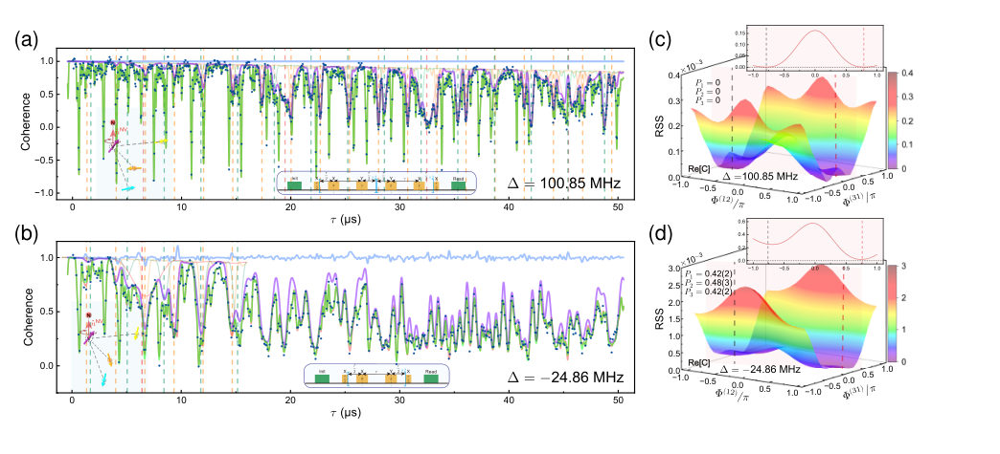
<figcaption class="paper-figure-caption"><b>Fig 3.</b> FIG. 3. Quantum three-body dynamics for chiral discrimination. (a) Three-body dynamics of</figcaption>
</figure>
<figure class="paper-figure-card">
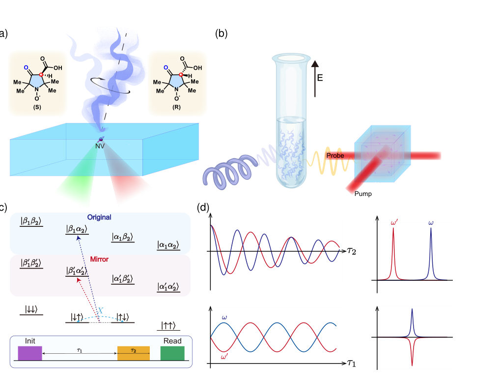
<figcaption class="paper-figure-caption"><b>Fig 4.</b> FIG. 4. Generalization and the underlying principle. (a) Setup for chiral discrimination of single</figcaption>
</figure>
<figure class="paper-figure-card">
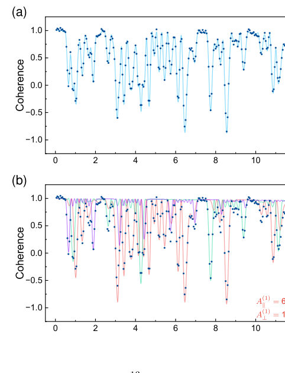
<figcaption class="paper-figure-caption"><b>Fig 5.</b> Fig. 2 of the main text.</figcaption>
</figure>

**Summary.** The authors present an MR-based technique to determine the absolute chirality of single molecules by analyzing symmetry-breaking dynamics among coupled nuclear spins. They show that while standard MR spectra are blind to chirality, measuring spin evolution after polarizing the system reveals a unique signature dependent on molecular handedness. This method offers a novel quantum tool for chemistry and biology.

**Why it may be interesting.** This work provides a powerful quantum sensing platform using solid-state defects (NV centers) to probe fundamental symmetries related to molecular structure, bridging quantum information concepts with chirality detection in condensed matter systems.

Detailed structure

**Main problem.** The primary goal is to achieve direct molecular chiral discrimination at the single-molecule level using magnetic resonance (MR) spectroscopy.

**Main result.** Chirality is successfully determined by observing how the spin dynamics diverge when the system transitions from unpolarized to partially polarized states, breaking the joint symmetry of mirror reflection and time reversal in spin space.

**Method.** The method involves constructing and analyzing the symmetry-breaking dynamics of nearby nuclear spins coupled to an electron spin using single-molecule MR techniques.

**Model / system.** The system utilizes Nitrogen-Vacancy (NV) centers in diamond, probing the quantum three-body dynamics of coupled $^{13}	ext{C}$ nuclear spins. The analysis involves Hamiltonian modeling and measuring coherence under dynamical decoupling sequences.

**Key observables.** Chirality-related phases ($\Phi(ij)$), population differences ($P|_{+
angle} - P_{|0
angle}$), and the deviation of spin dynamics from unpolarized expectations.

**Important parameters / regimes.** Electron spin gap ($\Delta$), magnetic field strength, and hyperfine coupling parameters derived from DFT calculations.

**Assumptions / limitations.** The method assumes that molecular chirality manifests as a breaking of MT-symmetry in the measured spin dynamics when polarization is induced.

**Figures summary.** Figures illustrate the energy spectra comparison (Fig. 1(c)), dynamical profiles showing divergence upon polarization (Figs. 2, 3), and methods for determining NV axis direction using electric fields (Fig. S8).

**Paper structure.** The paper progresses from establishing the need for chiral discrimination to detailing the MR-based measurement technique, analyzing two-body and then three-body spin dynamics under varying polarization levels, and finally confirming the results via field reversal and comparison with theoretical calculations.

Abstract

Molecular chirality plays a crucial role in physics, chemistry, life sciences and pharmacology. Nowadays, the chiral discrimination and control at the single-molecule level is urgently needed to reveal the origin of the chirality-relevant phenomena by recovering the information disturbed by the ensemble averaging. The method of magnetic resonance (MR), as one of powerful tools for structure analysis, is blind to the molecular chirality in the absence of a chiral reagent. Here we propose and experimentally demonstrate a direct MR-based method for determining the chirality at the single-molecule level through constructing the symmetry-breaking dynamics of nearby nuclear spins. In principle, the mirror asymmetry of two enantiomers in real space is manifested by breaking the joint symmetry of the mirror reflection and time reversal in spin space under spin dynamics. Experimentally, two enantiomers are indistinguishable from the dynamics of strongly-coupled but unpolarized nuclear spins, but diverge evidently in the dynamical results that break the field-inversion symmetry after spins are polarized. Our method and results will benefit the study of chirality-induced properties in the fields of chemistry and biology.

[↑ back to top](#top)

### [Non-Markovian heavy-quark equilibration and equilibrium correlation function in a thermal medium](http://arxiv.org/abs/2607.22403v1)

**Authors:** Monisha Nair, Juan Torres-Rincon, Santosh K. Das  
**Type:** theory · **Category:** statistical mechanics · **PDF:** <https://arxiv.org/pdf/2607.22403v1>  
**Analysis basis:** full PDF text, analyzed in chunks
**Topic relevance:** 🔥 `Keldysh / 2PI / non-Gaussian methods` **4/5** · `methods for driven-dissipative` **3/5** · `non-equilibrium dynamics` **3/5** · `non-equilibrium universality` **2/5** · `correlated / nonlocal dissipation` **1/5** · `driven-dissipative phase transition` **1/5**

↔ Scroll figures horizontally

<figure class="paper-figure-card">
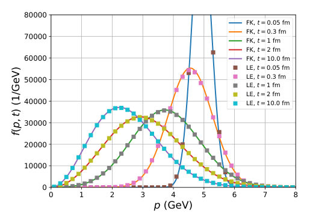
<figcaption class="paper-figure-caption"><b>Fig 1.</b> FIG. 1: Heavy-quark momentum distribution (dN/dp) evolution obtained from numerical Langevin simulations in a non-relativistic system (LE) and the analytical solution of the Fokker–Planck equation (FP). Results are shown for a drag coefficient A = 0.4 fm−1, temperature T = 0.1 GeV, mass m = 25 GeV, an ensemble size of N = 105 and Nev = 50 events.</figcaption>
</figure>
<figure class="paper-figure-card">
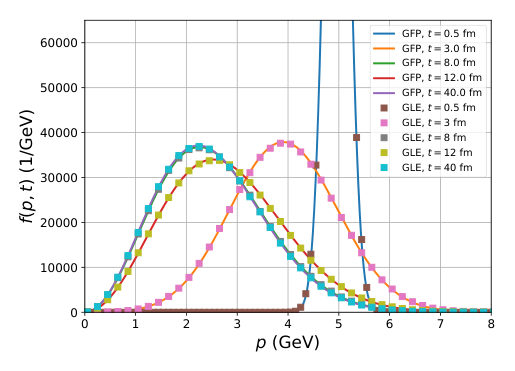
<figcaption class="paper-figure-caption"><b>Fig 2.</b> FIG. 3: Heavy-quark momentum distribution (dN/dp) evolution obtained from numerical generalized numerical Langevin simulations in a non-relativistic system (GLE) and the analytical solution of the generalized Fokker–Planck equation (GFP). Results are shown for a drag coefficient A = 0.4 fm−1, temperature T = 0.1 GeV, mass m = 25 GeV, memory time τm = 5 fm, an ensemble size of N = 105 and Nev = 50 events.</figcaption>
</figure>
<figure class="paper-figure-card">
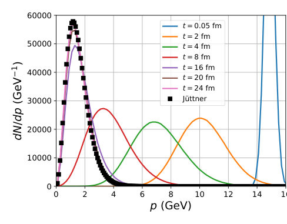
<figcaption class="paper-figure-caption"><b>Fig 3.</b> FIG. 2: Heavy-quark momentum distribution (dN/dp) evolution obtained from numerical Langevin simulations in a relativistic system. Results are shown for a drag coefficient A = 0.2 fm−1, temperature T = 0.4 GeV, mass m = 1.27 GeV, an ensemble size of N = 105, and Nev = 50 events.</figcaption>
</figure>
<figure class="paper-figure-card">
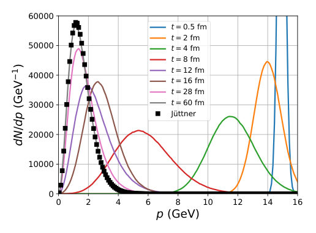
<figcaption class="paper-figure-caption"><b>Fig 4.</b> FIG. 4: Heavy-quark momentum distribution (dN/dp) evolution obtained from numerical generalized Langevin simulations in a relativistic system. Results are shown for a drag coefficient A = 0.2 fm−1, temperature T = 0.4 GeV, mass m = 1.27 GeV, memory time τm = 5 fm, an ensemble size of N = 105, and Nev = 50 events.</figcaption>
</figure>
<figure class="paper-figure-card">
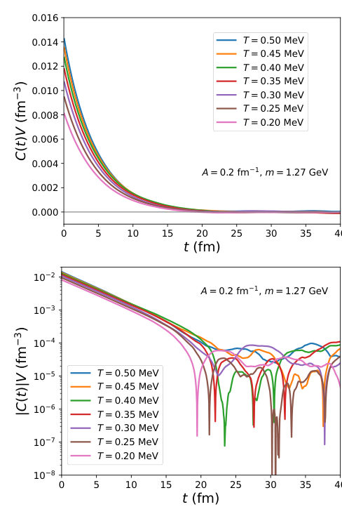
<figcaption class="paper-figure-caption"><b>Fig 5.</b> FIG. 5: Volume-scaled heavy-quark current–current correlation function C(t) V as a function of time in a static box at various temperatures, evaluated without memory effects.</figcaption>
</figure>

**Summary.** This paper theoretically analyzes how heavy quarks thermalize and diffuse in a hot medium by extending standard Langevin descriptions to include memory effects. It calculates transport coefficients like the diffusion coefficient using correlation functions derived from generalized Fokker-Planck equations. The findings show that while memory introduces oscillatory behavior, it maintains consistency with established results in certain limits.

**Why it may be interesting.** The incorporation of non-Markovian dynamics is crucial for accurately modeling relaxation processes in strongly coupled systems where memory effects cannot be ignored, providing a more realistic description than simple white noise approximations.

Detailed structure

**Main problem.** The study investigates heavy-quark (HQ) equilibration and correlation functions within a thermal medium, specifically focusing on incorporating non-Markovian memory effects.

**Main result.** Memory effects qualitatively alter the transient structure of current correlations but do not change the transport coefficient in the non-relativistic limit; however, they can induce damped, oscillatory equilibration in the relativistic case.

**Method.** The analysis employs kinetic theory approaches, utilizing generalized Langevin equations and comparing solutions derived from both the generalized Fokker-Planck equation and the corresponding Langevin framework.

**Model / system.** The system models heavy quarks (charm/beauty) propagating through a hot, dense medium like the Quark-Gluon Plasma. The dynamics are governed by stochastic processes incorporating memory kernels into the standard Markovian description.

**Key observables.** Heavy-quark diffusion coefficient ($D_s$), HQ momentum distribution function $f(\mathbf{p}, t)$, and current–current correlation functions $\langle \mathbf{j}(t) \cdot \mathbf{j}(0) 
angle$.

**Important parameters / regimes.** Temperature ($T$), heavy quark mass ($m$), drag coefficient ($A$), and memory time ($	au_m$). The analysis compares non-relativistic (NR) and relativistic limits.

**Assumptions / limitations.** The work assumes space homogeneity, uses the Green-Kubo formula to relate transport coefficients to equilibrium correlations, and often relies on approximations like constant drag coefficients or assumed exponential decay forms for correlation functions at large times.

**Figures summary.** Figures illustrate the time evolution of $D_s(t^*)$ calculated via integrating the current-current correlation function $C(t)$, showing plateaus that approach an asymptotic value, which is sensitive to the chosen integration cutoff time $t^*$.

**Paper structure.** The paper builds from establishing the foundational Langevin/Fokker-Planck framework (Markovian case), extending it to include memory effects via generalized equations, calculating key observables like $D_s$ using Green-Kubo relations in both NR and relativistic limits, and finally comparing numerical solutions across different time regimes.

Abstract

We compute the charm-quark current-current correlation function within the Langevin framework and extract the heavy-quark diffusion coefficient using the Green--Kubo formula. The formalism is further extended to evaluate the correlation function using a generalized Langevin equation that incorporates memory effects via an exponentially decaying memory kernel. We find that while memory effects qualitatively modify the transient structure of the current correlations, the value of the transport coefficient remains unchanged in the non-relativistic limit. In addition, we investigate heavy-quark thermalization in the presence of memory and compare the non-equilibrium solution of a generalized Fokker--Planck equation with the one obtained from the generalized Langevin equation in the non-relativistic limit. We also consider the relativistic version of the correlated noise case and observe that memory effects can give rise to a damped, oscillatory equilibration of the heavy quark in a non-Markovian bath.

[↑ back to top](#top)

### [Proposal for Estimating the Energy Gap of the Transverse-Field Ising Hamiltonian Using a D-Wave Quantum Annealer](http://arxiv.org/abs/2607.21940v1)

**Authors:** Kota Yamada, Yuichiro Matsuzaki  
**Type:** both · **Category:** quantum information and computing · **PDF:** <https://arxiv.org/pdf/2607.21940v1>  
**Analysis basis:** full PDF text, analyzed in chunks
**Topic relevance:** 🔥 `analog quantum simulation` **4/5** · `QC/QI experiment` **2/5** · `methods for driven-dissipative` **2/5** · `non-equilibrium dynamics` **2/5** · `quantum measurements` **2/5** · `driven-dissipative phase transition` **1/5** · `exotic spin models in light-matter` **1/5**

↔ Scroll figures horizontally

<figure class="paper-figure-card">
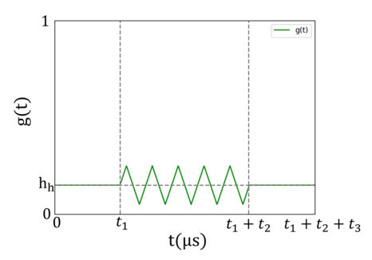
<figcaption class="paper-figure-caption"><b>Fig 1.</b> FIG. 2: Value of g(t) as a function of time t. hh denotes the central value of the oscillating magnetic field.</figcaption>
</figure>
<figure class="paper-figure-card">
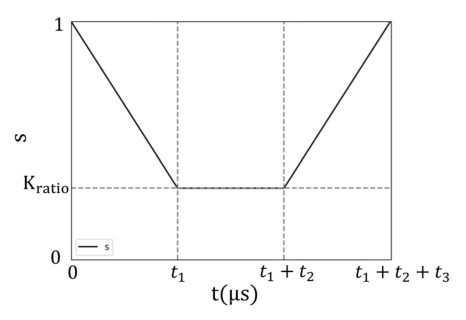
<figcaption class="paper-figure-caption"><b>Fig 2.</b> FIG. 3: Value of s as a function of time t. Kratio denotes the minimum value of s during the annealing schedule.</figcaption>
</figure>
<figure class="paper-figure-card">
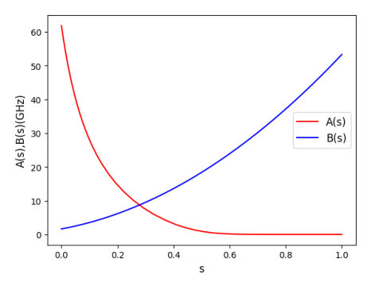
<figcaption class="paper-figure-caption"><b>Fig 3.</b> FIG. 1: Annealing schedules A(s) and B(s) as func- tions of s for the standard annealing schedule of the D- Wave Advantage system4.1 solver [25]. The horizontal axis represents s, while the vertical axis represents A(s) (GHz) and B(s) (GHz).</figcaption>
</figure>
<figure class="paper-figure-card">
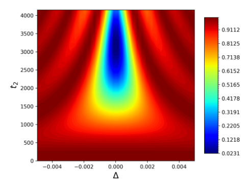
<figcaption class="paper-figure-caption"><b>Fig 4.</b> FIG. 4: Occupation probability of the ground state at t = t1 + t2 + t3. The x-axis represents ∆= ωdrive −ω01, the y-axis represents the duration of the applied oscil- lating magnetic field t2, and the z-axis represents the occupation probability of the ground state. Here, ωdrive denotes the driving frequency of the triangular wave, and ω01 = 0.756580(GHz) is the energy difference between the ground state and the first excited state. The param- eters are set to L = 2, λ = 0.01, J = −1, h = −0.01, hh = 1, Kratio = 0.4004004, t1 = t3 = 240(ns).</figcaption>
</figure>
<figure class="paper-figure-card">
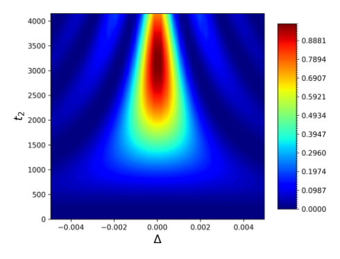
<figcaption class="paper-figure-caption"><b>Fig 5.</b> FIG. 5: Occupation probability of the first excited state at t = t1+t2+t3. The x-axis represents ∆= ωdrive−ω01, the y-axis represents the duration of the applied oscillat- ing magnetic field t2, and the z-axis represents the occu- pation probability of the first excited state. Here, ωdrive denotes the driving frequency of the triangular wave, and ω01 = 0.756580(GHz) represents the energy difference be- tween the ground state and the first excited state. The parameters are the same as those used in Fig. 4.</figcaption>
</figure>

**Summary.** The paper proposes using D-Wave quantum annealers to estimate the energy gap of the Transverse-Field Ising Hamiltonian by inducing and measuring Rabi oscillations. By applying a triangular-wave modulated magnetic field, they circumvent classical limitations on accessing excited states. This technique proves a promising pathway for simulating complex quantum systems on current quantum hardware.

**Why it may be interesting.** This work is highly relevant as it bridges fundamental condensed matter physics (Ising model) with near-term quantum hardware capabilities, providing a concrete protocol for accessing excited state information beyond simple ground-state optimization.

Detailed structure

**Main problem.** The primary goal is estimating the energy gap between the ground and first excited states of the Transverse-Field Ising Hamiltonian for large systems.

**Main result.** The authors successfully demonstrated a method using D-Wave quantum annealers to estimate these gaps by observing Rabi resonance, confirming applicability on small 2D lattices.

**Method.** They propose inducing Rabi oscillations using a triangular-wave modulated magnetic field on the quantum annealer, and then fitting the resulting spectral response with a Lorentzian function to extract the gap frequency.

**Model / system.** The system studied is the Transverse-Field Ising model ($\hat{H}_p$), which models competition between quantum fluctuations and interactions. The computation is performed using a D-Wave quantum annealer, simulating periodic driving via linear control of the longitudinal magnetic field $g(t)$.

**Key observables.** The primary observable is the population transfer (or ground state occupation probability) as a function of the sweeping driving frequency ($\omega_{drive}$), which exhibits resonance peaks.

**Important parameters / regimes.** Key parameters include the energy gap $\omega_{01}$, the driving strength, and hardware limitations such as the time resolution ($\approx 10	ext{ ns}$) and waveform programmability limits.

**Assumptions / limitations.** The method assumes that higher harmonics of the triangular wave are negligible near resonance, and it relies on approximating complex periodic driving fields with linear control over $g(t)$.

**Figures summary.** Figures illustrate annealing schedules, the time evolution of the magnetic field $g(t)$, and crucially, the spectral response curves showing Lorentzian fits to determine $\omega_{01}$ for various qubit numbers and 2D lattices.

**Paper structure.** The paper first introduces the physical problem (energy gap estimation) and computational limitations. It then details the novel methodology using D-Wave hardware to simulate Rabi oscillations via triangular driving fields. Finally, it presents numerical results confirming the method's accuracy on small systems like 2-qubit and $2 	imes 3$ lattices.

Abstract

The transverse-field Ising model is a fundamental quantum spin system that captures the competition between quantum fluctuations and interactions, playing a central role in studies of quantum phase transitions and non-equilibrium dynamics. However, classical computations of ground and excited states in large-scale or high-dimensional systems are severely limited by the exponential growth of the Hilbert space. Here, we propose a novel approach using a D-Wave quantum annealer, where a triangular-wave oscillating magnetic field is applied to induce Rabi oscillations, allowing the estimation of energy gaps between the ground and excited states. Unlike conventional quantum annealing methods limited to ground-state searches, this approach can directly access excited-state information. It is potentially applicable to larger systems, providing a new avenue for quantum-device-based simulation. The validity of the method is demonstrated through numerical simulations of relatively small systems.

[↑ back to top](#top)

### [Entanglement in Presence of Topological Interfaces and Dualities](http://arxiv.org/abs/2607.22451v1)

**Authors:** Christian Northe, Riccardo Poletti, Paolo Rossi  
**Type:** theory · **Category:** statistical mechanics · **PDF:** <https://arxiv.org/pdf/2607.22451v1>  
**Analysis basis:** full PDF text, analyzed in chunks
**Topic relevance:** 🔥 `entanglement & information structure` **4/5** · `non-equilibrium dynamics` **2/5** · `Keldysh / 2PI / non-Gaussian methods` **1/5** · `analog quantum simulation` **1/5** · `correlated / nonlocal dissipation` **1/5** · `driven-dissipative phase transition` **1/5** · `methods for driven-dissipative` **1/5** · `non-equilibrium universality` **1/5**

↔ Scroll figures horizontally

<figure class="paper-figure-card">
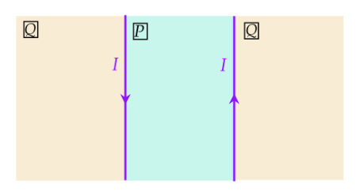
<figcaption class="paper-figure-caption"><b>Fig 1.</b> Figure 1. From right to left: Phase Q is mapped into phase P by a PQ interface I and back by the same orientation-reversed interface. The arrow on the left interface may be inverted at the price of relabeling I →¯I. ¯I is a QP interface.</figcaption>
</figure>
<figure class="paper-figure-card">
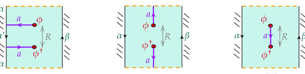
<figcaption class="paper-figure-caption"><b>Fig 2.</b> Figure 2. Twist field RDMs obtained by qualitatively different choices of defect networks, in the strip frame (A.7). Here we assumed minimal fusion rules N c ab ∈{0, 1}, otherwise one should add extra labels for the (αaα′) junctions in (i). As in (1.2), these should be normalized to ensure Trρϕ,a αβ = 1. The normalization factor is the correlator obtained by gluing the ends of the strip. The parameter R accounts for the (dimensionless) length of the interval, see appendix A.</figcaption>
</figure>
<figure class="paper-figure-card">
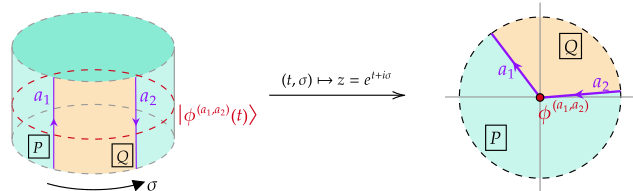
<figcaption class="paper-figure-caption"><b>Fig 3.</b> Figure 3. System in the presence of two interface lines a1, a2 separating phases P and Q. In radial quantization, the state |ϕ(a1,a2)⟩corresponding to the interface field ϕ(a1,a2) sits at the junction between a1 and a2.</figcaption>
</figure>
<figure class="paper-figure-card">
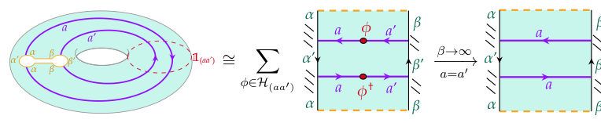
<figcaption class="paper-figure-caption"><b>Fig 4.</b> Figure 4. Steps to simplify the RDM for the thermal state. ∼= means a relation through an appropriate conformal map. The β0 →∞limit is meaningful only for a = a′ and selects the vacuum state on the defect, reproducing a special case of (4.2) for P = Q.</figcaption>
</figure>
<figure class="paper-figure-card">
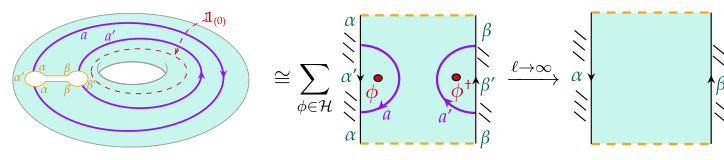
<figcaption class="paper-figure-caption"><b>Fig 5.</b> Figure 5. Another simplification of the RDM for the thermal state. Using the S-transformed frame, the identity decomposition is in terms of bulk fields. The ℓ→∞limit selects the vacuum state, after which the defect network can be simplified and one recovers the bulk vacuum RDM.</figcaption>
</figure>

**Summary.** This paper develops a generalized framework for calculating entanglement across topological interfaces connecting different Conformal Field Theories. The key finding is that duality interfaces project the system's quantum correlations onto specific symmetry sectors, mirroring symmetry resolution but arising naturally from the physical boundary itself. This provides a rigorous tool to quantify how dual theories constrain quantum information at their junction.

**Why it may be interesting.** The mechanism described—where physical boundaries naturally impose symmetry constraints on entanglement—provides a powerful theoretical tool applicable to understanding boundary effects and correlation structure in complex many-body systems beyond simple thermalization assumptions.

Detailed structure

**Main problem.** The work extends the theory of entanglement through topological defects/interfaces, specifically focusing on interfaces connecting two distinct Conformal Field Theories (CFTs), particularly when these theories are dual to each other.

**Main result.** For duality interfaces, the reduced density matrix acts as a projector onto a fixed-charge subsector of the vacuum's entanglement spectrum, naturally reflecting quantum correlations back into the entangling interval.

**Method.** The authors utilize a framework involving 'twisted states' to construct the full reduced density matrix (RDM) and employ relative entropy to quantify the distinguishability between the interface RDM and the vacuum RDM.

**Model / system.** The study is set in 1+1 dimensional CFTs, with specific examples including the free boson CFT and systems exhibiting duality relations (e.g., Kramers-Wannier or T-duality).

**Key observables.** Reduced Density Matrix (RDM), Entanglement Entropy ($S$), Relative Entropy, and the entanglement spectrum.

**Important parameters / regimes.** The nature of the CFTs (diagonal/non-diagonal rational, free boson) and the specific type of interface (duality vs. general).

**Assumptions / limitations.** Previous foundational theories for interface entropies are noted to be incompatible with numerical results; the framework extends prior work on defects to distinct CFT interfaces.

**Figures summary.** Figure 1 illustrates the mapping between two phases P and Q connected by an interface I (and $\bar{I}$).

**Paper structure.** The paper first establishes the general framework for entanglement through topological defects, then applies it to study interfaces connecting distinct CFTs, culminating in a detailed analysis of how duality interfaces project quantum correlations.

Abstract

Entanglement through interfaces has attracted considerable attention in 2d conformal field theory (CFT). However, it is known that field-theoretic predictions based on the existing framework are in general incompatible with numerical results [1-4]. A new framework for entanglement through topological defects was recently proposed in [5]. It provides a general description of entanglement through topological defects and successfully reproduces the numerical results for the Ising model in all tested cases and regimes. The key insight is that the relevant quantum correlations are encoded in twisted states, allowing for the construction of the full reduced density matrix (RDM). In this work we pursue two objectives. First, we provide new examples by studying defects in the free boson CFT. Second, we extend the framework to topological interfaces connecting two, possibly distinct, CFTs. Of particular interest are interfaces relating dual theories. We show that the reduced density matrix for a duality interface is the projection of the vacuum reduced density matrix onto a single symmetry sector, closely paralleling the framework of symmetry resolution. Unlike symmetry resolution, however, the projection is imposed by the physical interface itself, demonstrating that duality interfaces reflect quantum correlations back into the entangling interval. We establish this mechanism for diagonal and non-diagonal rational CFTs as well as the free boson CFT. Relative entropy allows us to quantify the distinguishability of the duality interface RDM from the vacuum RDM.

[↑ back to top](#top)

### [Counting Edge Modes with the Higher Berry Curvature: A Bulk Topological Order Parameter for Quantum Spin Chains](http://arxiv.org/abs/2607.21705v1)

**Authors:** Adam J. McRoberts, Joe Crossley, Chris Hooley, Joe H. Winter  
**Type:** theory · **Category:** strongly correlated electrons · **PDF:** <https://arxiv.org/pdf/2607.21705v1>  
**Analysis basis:** full PDF text, analyzed in chunks
**Topic relevance:** 🔥 `analog quantum simulation` **4/5** · `entanglement & information structure` **3/5** · `exotic spin models in light-matter` **3/5** · `Frenkel-Kontorova` **1/5**

↔ Scroll figures horizontally

<figure class="paper-figure-card">
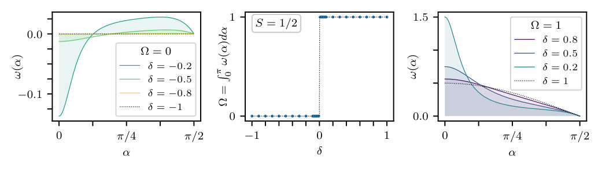
<figcaption class="paper-figure-caption"><b>Fig 1.</b> FIG. 1. Higher Berry curvature and the integer-valued HBC order parameter for the S = 1/2 spin-Peierls chain, with the Hamiltonian given in Eq. (16), where δ is the staggering between the coupling strengths J(1 −δ) of odd bonds and J(1 + δ) of even bonds. (Left) Representative HBC functions ω(α) for selected values of δ in the Ω= 0 phase, where a cut through an even bond does not produce any gapless edge modes; and (Right) The same, but for the Ω= 1 phase, where a cut through an even bond produces a protected free spin-1/2 edge mode on each side. For a given δ, we use a maximum field strength h = 1 + |δ|. (Middle) HBC order parameter Ω, defined by Eqs. (7)-(10), as a function of δ. For δ =...</figcaption>
</figure>
<figure class="paper-figure-card">
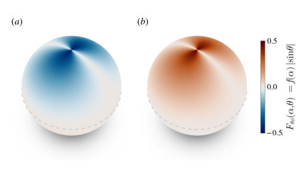
<figcaption class="paper-figure-caption"><b>Fig 2.</b> FIG. 2. Singularities in F, the 2-form Berry curvature for the left-half of the chain, for the exactly solvable model ˆH = ˆHN 0 . This Hamiltonian has Ω= 1, meaning F (Eq. (14)) is ill- defined at (at least one of) the poles of S3. In the images shown, the polar angle is α, and the azimuthal angle is θ (ϕ cannot be shown). The function plotted is f(α, θ), where F = f(α, θ) dθ ∧dϕ. A view of the singularity at the north pole α = 0 is shown in (a); and the image is rotated by π in (b) to give a view of the south pole α = π. Note that to obtain a closed 2-sphere we have, just for these images, extended the range of θ from [0, π] to [0, 2π), and correspondingly cut the range of ϕ from [−π, π)...</figcaption>
</figure>
<figure class="paper-figure-card">
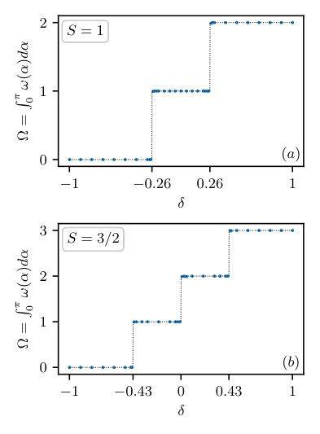
<figcaption class="paper-figure-caption"><b>Fig 3.</b> FIG. 3. HBC order parameter as a function of the bond- strength staggering δ for the (a) S = 1 and (b) S = 3/2 spin-Peierls chains, cf. Eq. (16). As expected, the HBC order parameter measures the spin of the protected gapless edge modes in each phase, cf. the discussion in the main text. The maximum field strength in all cases is h = 1.0. Each integral (10) is calculated from 1001 sampled values of ω(α), and the largest Schmidt weight discarded from any state is less than 10−8.</figcaption>
</figure>
<figure class="paper-figure-card">
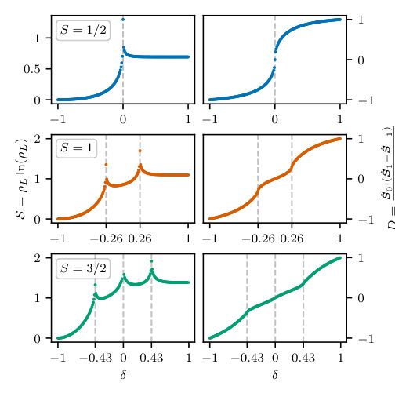
<figcaption class="paper-figure-caption"><b>Fig 4.</b> FIG. 4. Entanglement entropy (left) and dimer-order (right) as a function of bond-strength staggering δ in the S = 1/2, S = 1, and S = 3/2 spin-Peierls chains (16), for comparison with the HBC order parameter (Figs. 1 &amp; 3). The spikes in the entanglement entropy at the critical points are clear signa- tures of the transitions, and their locations are in agreement with those found by the HBC order parameter. The dimer- order does not show the transition points quite as clearly, though it does have features reminiscent of non-analyticities at the correct points. The largest Schmidt weight discarded from any state is less than 10−8.</figcaption>
</figure>
<figure class="paper-figure-card">
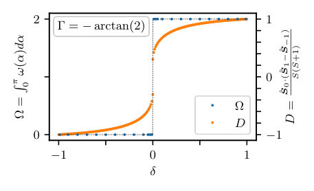
<figcaption class="paper-figure-caption"><b>Fig 5.</b> FIG. 5. HBC and dimer order parameters for the bilinear- biquadratic chain (19) at Γ = −arctan(2) ≈−1.107. There is a first-order transition at δ = 0, where there is spontaneous dimerisation, and the dimer order parameter is discontinuous. The HBC order parameter Ωjumps from 0 to 2 across this transition. Each value of Ωwas obtained from 1001 sampled values of ω(α), and the largest Schmidt weight discarded from any state was less than 10−8. As discussed in the main text, a strict SPT classification would consider the two sides to be same SPT phase—but, if only transformations for which the HBC is well-defined are permitted, any change in Ωalways requires a phase transition.</figcaption>
</figure>

**Summary.** The paper introduces the Higher Berry Curvature (HBC) as a novel, geometric tool to calculate a topological order parameter ($\Omega$) for quantum spin chains. This integer invariant quantifies the spin carried by gapless edge modes created when the chain is cut. By applying this method to various models, the authors demonstrate that $\Omega$ successfully maps out phase transitions and classifies different ground states.

**Why it may be interesting.** This work provides a powerful geometric tool—the HBC integral—to calculate topological invariants for interacting quantum systems where simple single-particle descriptions fail. It connects bulk topology directly to measurable edge properties (edge modes), which is highly relevant for understanding boundary physics in condensed matter and AMO settings.

Detailed structure

**Main problem.** To define a geometric, integer-valued topological order parameter for quantum spin chains that can distinguish between different phases where traditional methods fail.

**Main result.** The Higher Berry Curvature (HBC) integral yields an integer invariant ($\Omega$) that quantifies the spin of gapless edge modes exposed by an entanglement cut. This invariant successfully distinguishes multiple gapped sectors in models like the staggered J1-J2 chain.

**Method.** The method involves constructing a closed, extended family of Hamiltonians and integrating the associated Higher Berry Curvature (HBC) 3-form over the parameter space ($S^3$).

**Model / system.** The study focuses on quantum spin chains, exemplified by $S=1/2$, $S=1$, and $S=3/2$ spin-Peierls chains, as well as the staggered $J_1$-$J_2$ chain. The analysis uses Hamiltonian extensions parameterized over a 3-manifold.

**Key observables.** Higher Berry Curvature (HBC), Topological Order Parameter ($\Omega$), Gapless edge modes count, Spin content of entanglement boundary states.

**Important parameters / regimes.** Spin quantum number ($S$), Dimerization parameter ($\delta$), Coupling constants ($J_1, J_2$).

**Assumptions / limitations.** The method requires constructing a smooth family of normalized states over a compact manifold and relies on specific extensions to define the relative invariant.

**Figures summary.** Figures illustrate the HBC ($\omega$) and the resulting order parameter ($\Omega$) for spin-Peierls chains across varying staggering parameters, showing $\Omega$ approaching integer values (0 or 1). Another figure shows the phase diagram of the $J_1$-$J_2$ chain with plots of $\omega(\alpha)$ for different phases.

**Paper structure.** The paper develops the concept by first defining HBC as a diagnostic tool, then constructing an interpolating Hamiltonian family over $S^3$, calculating the quantized invariant ($\Omega$), and finally applying this machinery to various physical models (Spin-Peierls, $J_1$-$J_2$) to map out phase transitions.

Abstract

We show that the higher Berry curvature (HBC) can be used to count the gapless edge modes created by an entanglement cut, and thus defines an integer-valued topological order parameter for quantum spin chains. Given an individual spin-chain Hamiltonian, we construct an extending family by interpolating to a reference product Néel state, and show that the integral of the HBC over this extension is equal to the ordinary Berry phase of half of the chain swept out in response to an \textit{infinitesimal} field. It thus counts the spin of the gapless edge modes exposed by the cut, and a change in its integer value signals a phase transition. We illustrate this with several examples: $S=1/2$, $S=1$, and $S=3/2$ spin-Peierls chains, which undergo `singlet flop' transitions between different patterns of dimerisation; the bilinear-biquadratic chain, which clarifies the connection to the strict symmetry-protected topological phases classification; and the staggered $J_1$--$J_2$ chain, which has both nearest-neighbour and third-neighbour patterns of singlets depending on the signs of the interactions.

[↑ back to top](#top)

### [Entanglement purification for arbitrary multipartite high-dimensional Greenberger-Horne-Zeilinger state](http://arxiv.org/abs/2607.21907v1)

**Authors:** Yu-Qing Kong, Jia-Ye Liu, Hui-Hui Kong, Hai-Rui Wei  
**Type:** theory · **Category:** quantum information and computing · **PDF:** <https://arxiv.org/pdf/2607.21907v1>  
**Analysis basis:** full PDF text, analyzed in chunks
**Topic relevance:** 🔥 `entanglement & information structure` **4/5** · `quantum measurements` **2/5** · `correlated / nonlocal dissipation` **1/5** · `measurement-induced transitions` **1/5** · `methods for driven-dissipative` **1/5**

↔ Scroll figures horizontally

<figure class="paper-figure-card">
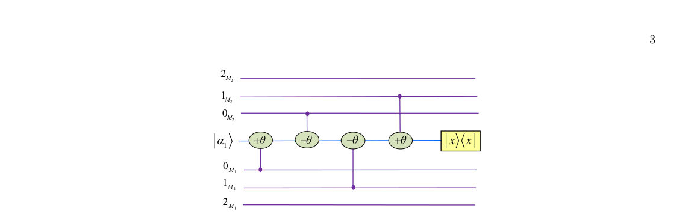
<figcaption class="paper-figure-caption"><b>Fig 1.</b> Figure 1: The principle of the proposed nondestructive quantum nondemolition detector (QND) in three-dimensional systems. |0⟩M, |1⟩M, and |2⟩M (|0⟩M ′, |1⟩M ′, and |2⟩M ′) are the three temporal-DOF of single-photon system M1 (M2).</figcaption>
</figure>
<figure class="paper-figure-card">
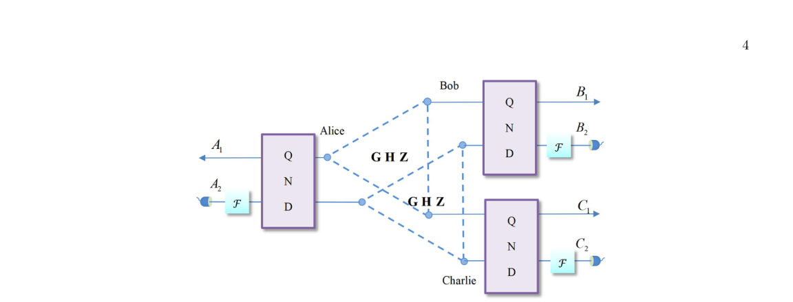
<figcaption class="paper-figure-caption"><b>Fig 2.</b> Figure 2: Schematic principle of the entanglement purification protocol for correcting qutrit-flip errors in three-dimensional GHZ states.</figcaption>
</figure>
<figure class="paper-figure-card">
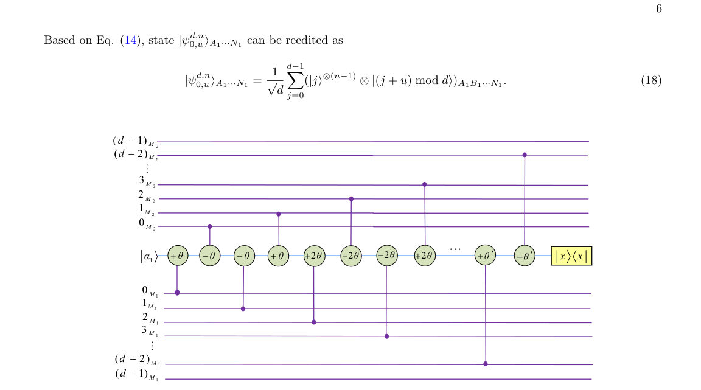
<figcaption class="paper-figure-caption"><b>Fig 3.</b> Figure 3: The principle of the proposed QND in qudit systems. Phase shifts +θ, −θ, +2θ, −2θ, +3θ, −3θ, +4θ, −4θ, · · · , θ′ are introduced to the states 0M1, 1M1, 2M1, 3M1, 4M1, 5M1, 6M1, 7M1, · · · , (d −2)M1, respectively. Phase shifts −θ, +θ, −2θ, +2θ, −3θ, +3θ, −4θ, +4θ, · · · , −θ′ are introduced to the states 0M2, 1M2, 2M2, 3M2, 4M2, 5M2, 6M2, 7M2, · · · , (d −2)M2, respectively. Here θ′ = (−1)n  n+1</figcaption>
</figure>
<figure class="paper-figure-card">
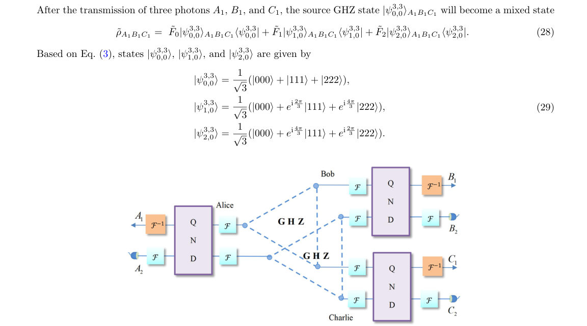
<figcaption class="paper-figure-caption"><b>Fig 4.</b> Figure 4: Schematic of the entanglement purification protocol for rectifying phase-flip errors in three-dimensional GHZ states.</figcaption>
</figure>
<figure class="paper-figure-card">
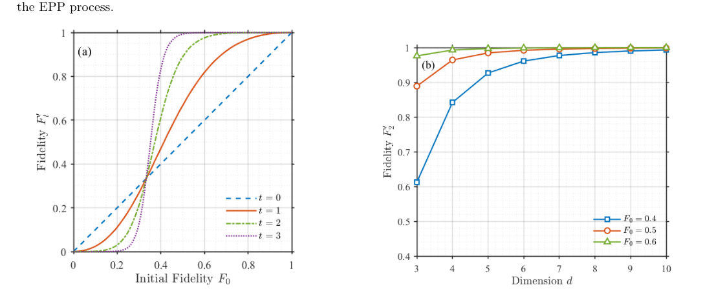
<figcaption class="paper-figure-caption"><b>Fig 5.</b> Figure 5: Fidelity of the EPP protocol for correcting qutrit-flip errors. (a) The fidelity F ′ t as a function of input fidelity F0, where d = 3 and the iterative rounds t = 0, 1, 2, 3. (b) The fidelity F ′ 2 as a function of the dimension d, where t = 2 and F0 = 0.4, 0.5, 0.6.</figcaption>
</figure>

**Summary.** This paper develops advanced entanglement purification protocols specifically tailored for multipartite Greenberger-Horne-Zeilinger (GHZ) states encoded in high-dimensional qudits. By employing QND measurements and iterative error correction steps, the authors demonstrate methods to counteract various noise channels, theoretically boosting state fidelity towards perfect purity. This research is vital for realizing scalable quantum communication networks using high-dimensional encoding.

**Why it may be interesting.** This work directly advances the theoretical toolkit for quantum communication by providing robust methods to maintain high entanglement quality in complex, high-dimensional systems, which is crucial for scaling up photonic quantum networks.

Detailed structure

**Main problem.** The paper addresses the challenge of mitigating environmental noise and channel losses when utilizing high-dimensional quantum states for quantum information processing.

**Main result.** It proposes entanglement purification protocols that can asymptotically improve the fidelity of arbitrary multipartite qudit GHZ states to unity, correcting both qudit-flip and phase-flip errors.

**Method.** The methods involve iterative application of Entanglement Purification Protocols (EPPs) utilizing Quantum Non-Demolition (QND) measurements and Fourier transformations on entangled mixed states.

**Model / system.** The system under study is the high-dimensional qudit ($d$-level) $n$-partite Greenberger-Horne-Zeilinger (GHZ) state. The protocols are designed to function using nonlinear interactions, such as those modeled by a cross-Kerr Hamiltonian.

**Key observables.** Fidelity of the output state ($ar{F}_0$), which can be asymptotically improved to unity; detection of qudit-flip and phase-flip errors.

**Important parameters / regimes.** The dimensionality $d$ (where $d>2$) and the number of entangled parties $n$. The fidelity threshold $ar{F}_0 \in (1/d, 1)$ is a key constraint derived for phase-flip error correction.

**Assumptions / limitations.** The protocols rely on the ability to perform specific QND measurements and subsequent classical feed-forward operations based on measurement outcomes.

**Figures summary.** Figures illustrate the principle of the QND detector in 3D systems, the schematic steps for correcting qudit-flip errors, and the protocol for rectifying phase-flip errors using Fourier transforms.

**Paper structure.** The paper details the general framework for EPPs, first focusing on specific cases like tripartite qutrit GHZ states (addressing qudit-flip errors), then generalizing to arbitrary $d$-dimensional $n$-partite states under both qudit-flip and phase-flip error models, concluding with an analysis of fidelity thresholds.

Abstract

High-dimensional qudit (i.e., $d$-level or $d$-state) systems outperform two-dimensional qubit (i.e., 2-level or 2-state) systems in some quantum information processing tasks. We exploit entanglement purification protocols (EPPs) for extracting a subset of high quality arbitrary $d$-dimensional $n$-partite Greenberger-Horne-Zeilinger (GHZ) states from a large set of less entangled GHZ states. In our protocols, qudit-flip and phase-flip errors can be corrected, and the fidelity of the output state can be asymptotically improved to unity by iterating the EPP process. Moreover, the schemes are immune to the number of polluted photons, the fidelity thresholds of the proposed EPPs are developed, and the spatial-based single-qudit operations can be well manipulated with a range of balanced beam splitters, and phase shifters. These features make the proposed schemes offer an alternative method for high-dimensional multipartite entanglement purification.

[↑ back to top](#top)

### [Exact Neural-Network Representations of the Motzkin States](http://arxiv.org/abs/2607.22522v1)

**Authors:** Runde Zha, Yuntian Gu, Chaohui Fan, Jia-lin Chen, Hai-Jun Liao, Tao Xiang  
**Type:** theory · **Category:** numerical methods · **PDF:** <https://arxiv.org/pdf/2607.22522v1>  
**Analysis basis:** full PDF text, analyzed in chunks
**Topic relevance:** 🔥 `entanglement & information structure` **4/5** · `methods for driven-dissipative` **3/5** · `analog quantum simulation` **1/5** · `non-equilibrium dynamics` **1/5**

↔ Scroll figures horizontally

<figure class="paper-figure-card">
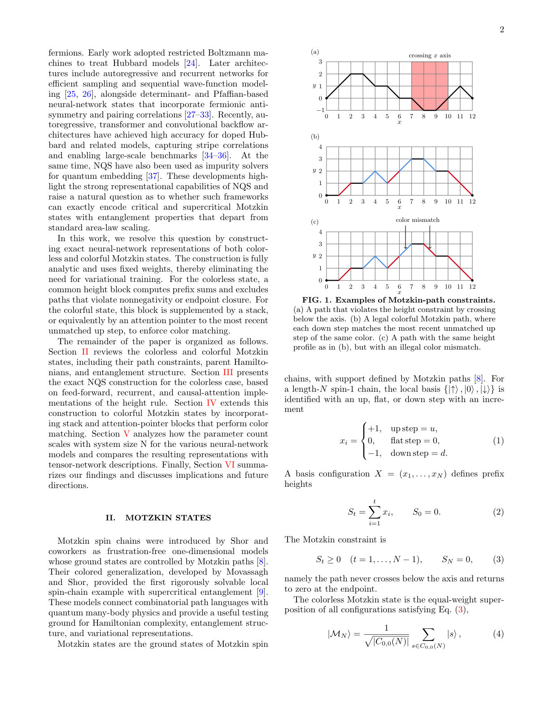
<figcaption class="paper-figure-caption"><b>Fig 1.</b> Low-resolution page preview, page 2</figcaption>
</figure>
<figure class="paper-figure-card">
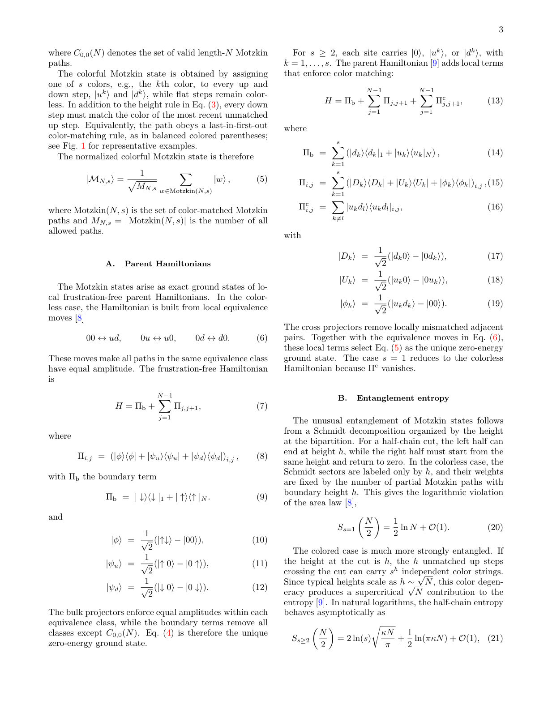
<figcaption class="paper-figure-caption"><b>Fig 2.</b> Low-resolution page preview, page 3</figcaption>
</figure>
<figure class="paper-figure-card">
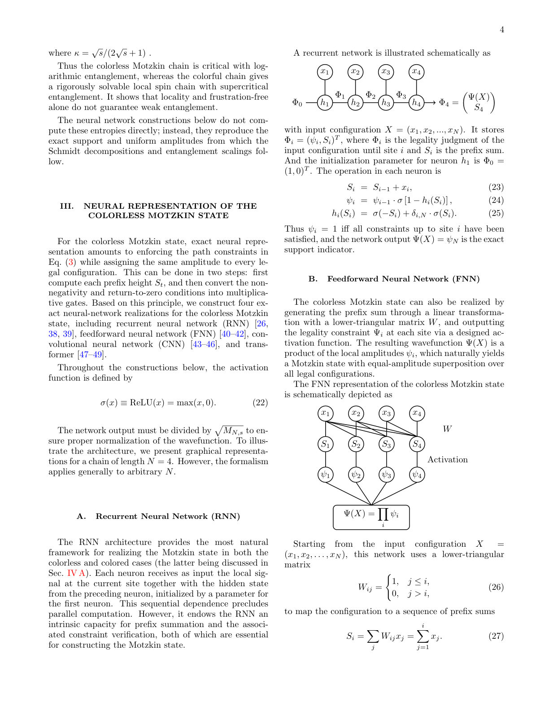
<figcaption class="paper-figure-caption"><b>Fig 3.</b> Low-resolution page preview, page 4</figcaption>
</figure>
<figure class="paper-figure-card">
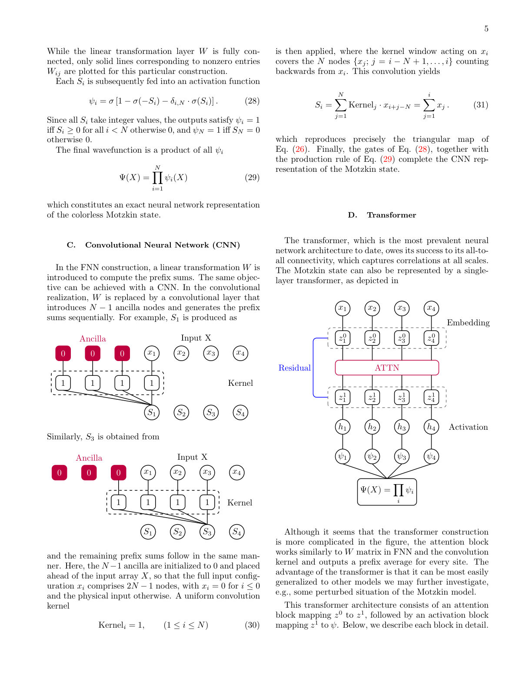
<figcaption class="paper-figure-caption"><b>Fig 4.</b> Low-resolution page preview, page 5</figcaption>
</figure>
<figure class="paper-figure-card">
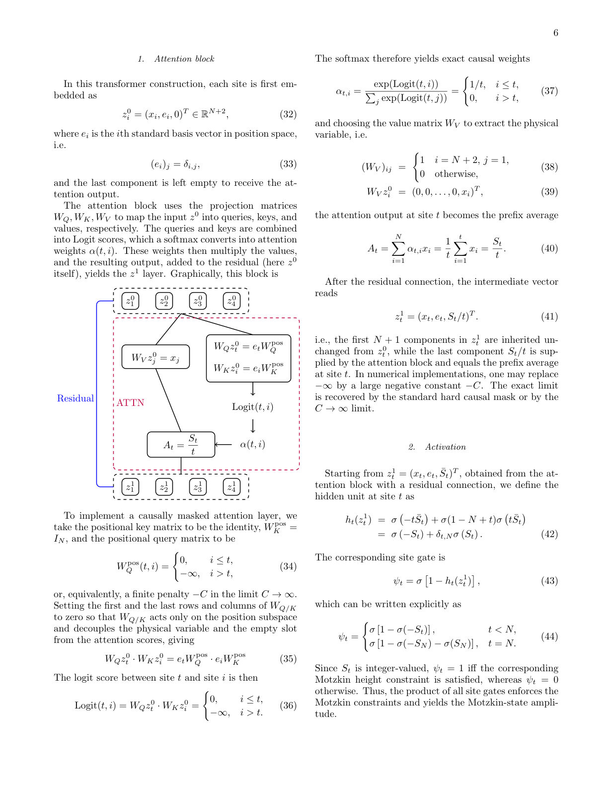
<figcaption class="paper-figure-caption"><b>Fig 5.</b> Low-resolution page preview, page 6</figcaption>
</figure>

**Summary.** This paper develops analytic, fixed-weight neural network representations for Motzkin spin chains, which are known to exhibit entanglement scaling beyond the area law. By adapting recurrent, convolutional, and transformer architectures, the authors prove that NNs can faithfully encode these complex combinatorial constraints. This establishes a general design principle for using neural networks as powerful tools to model strongly entangled quantum many-body systems.

**Why it may be interesting.** This work provides a powerful, constructive framework showing that advanced NNs can encode quantum correlations beyond simple area-law scaling, offering new benchmarks for simulating strongly correlated systems where standard tensor networks fail.

Detailed structure

**Main problem.** The core problem is constructing exact, training-free neural network representations for Motzkin states whose entanglement properties exceed those captured by standard Matrix Product States.

**Main result.** The authors successfully demonstrated that multiple neural architectures (RNN, FNN, CNN, Transformer) can analytically encode the complex support of these highly entangled quantum states.

**Method.** They systematically designed fixed-weight NQS layers incorporating causal prefix-sum modules and specialized gates to enforce combinatorial path constraints (height matching and color matching).

**Model / system.** The system studied is the Motzkin spin chain, which includes colorless generalizations defined by height constraints and colorful versions requiring an additional last-in-first-out color-matching rule.

**Key observables.** Entanglement entropy scaling ($\log N$ for colorless; $\sqrt{N}$ for colorful), and the ability to reproduce the exact support of the ground state wavefunction.

**Important parameters / regimes.** System size $N$, and the specific architectural components (e.g., causal prefix-sum module, color stack).

**Assumptions / limitations.** The representations are fixed-weight constructions based on the assumption that the state's support is governed by a finite causal algorithm.

**Figures summary.** Figures illustrate Motzkin path constraints, including height violations and legal/illegal color matching paths for small system sizes ($N=4$).

**Paper structure.** The paper first establishes the physical properties and entanglement scaling of Motzkin states based on their Hamiltonian. It then systematically details how four different neural network architectures (RNN, FNN, CNN, Transformer) can mathematically reproduce the exact support required by these path constraints.

Abstract

Motzkin spin chains are paradigmatic frustration-free one-dimensional quantum systems whose ground states feature exactly solvable combinatorial structures and exotic, area-law-violating entanglement scaling. Specifically, colorless Motzkin states exhibit critical logarithmic entanglement divergence \(\log N\) with system size \(N\), while their colorful counterparts host supercritical sublinear \(\sqrt{N}\) entanglement growth. Such unconventional entanglement behaviors place these states well beyond the expressive capability of standard matrix product states, which are fundamentally constrained by the entanglement area law. Here, we systematically construct exact, training-free neural-network representations for both colorless and colorful Motzkin states across four mainstream architectures, including recurrent, feedforward, convolutional, and transformer networks. Our core design leverages a causal prefix-sum module, implementable via recurrent updates, feedforward mappings, or masked attention layers, combined with position-selective rectified linear gates that enforce the Motzkin height constraints. For the colorful states, we further introduce a dedicated causal stack module that explicitly encodes the last-in-first-out color-matching rule. Our results demonstrate that neural architectures can accurately capture highly non-trivial entanglement features inaccessible to conventional tensor networks, providing prototypic examples for benchmarking and a constructive design framework for future neural-network quantum state developments targeting strongly entangled quantum systems.

[↑ back to top](#top)

### [Structural stability, electronic structure, and magnetism of the $d^9$ double infinite-layer La$_3$Ni$_2$O$_5$F under chemical pressure and epitaxial strain](http://arxiv.org/abs/2607.22029v1)

**Authors:** K. Madani, Q. N. Meier, A. Cano  
**Type:** theory · **Category:** strongly correlated electrons · **PDF:** <https://arxiv.org/pdf/2607.22029v1>  
**Analysis basis:** full PDF text, analyzed in chunks
**Topic relevance:** 🔥 `analog quantum simulation` **4/5** · `exotic spin models in light-matter` **1/5** · `non-equilibrium dynamics` **1/5**

↔ Scroll figures horizontally

<figure class="paper-figure-card">
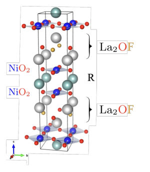
<figcaption class="paper-figure-caption"><b>Fig 1.</b> Figure 1. Ball-and-stick model of the double infinite-layer nickelate La2RNi2O5F. The system comprises a bilayer NiO2 block separated by fluorite-type La2OF spacers. Within this block, the two square-planar NiO2 layers are separated by rare-earth R elements. Lines indicate the conventional cell for the O/F ordering considered throughout.</figcaption>
</figure>
<figure class="paper-figure-card">
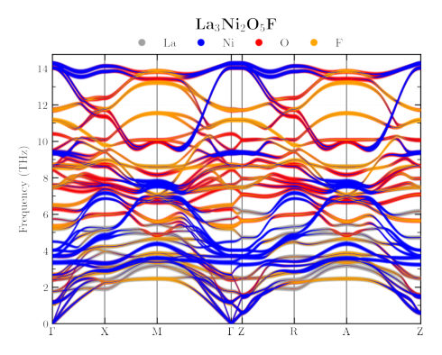
<figcaption class="paper-figure-caption"><b>Fig 2.</b> Figure 2. Calculated phonon spectrum of La3Ni2O5F. The colors indicate the main atoms involved in the corresponding modes.</figcaption>
</figure>
<figure class="paper-figure-card">
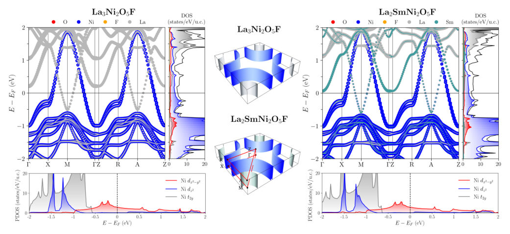
<figcaption class="paper-figure-caption"><b>Fig 3.</b> Figure 3. Calculated electronic structure of (left) La3Ni2O5F and (right) La2SmNi2O5F, with the corresponding k-path shown as an inset. Orbital-resolved density of states (DOS) and Fermi surfaces are shown alongside the bands.</figcaption>
</figure>
<figure class="paper-figure-card">
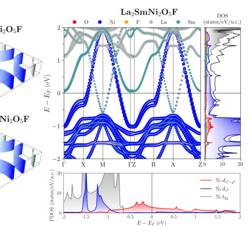
<figcaption class="paper-figure-caption"><b>Fig 4.</b> Figure 3 shows the calculated electronic structure of La2SmNi2O5F. Compared with La3Ni2O5F, the Ni- dx2−y2 bands and the O-2p manifold remain essentially unchanged, while the rare-earth-derived bands shift sub- tly downward. Specifically, the self-doping band sinks further below EF around M and A, and the empty rare- earth conduction band moves closer to EF along Γ-Z. Although the absolute position of these states might be sensitive to the 4f treatment of the rare-earth ions, their evolution with chemical pressure is robust, yielding a con- sistent trend across the rare-earth series (Fig. S3). Oth- erwise, despite the reduced NiO2 interlayer spacing, the resulting Fermi surface closely...</figcaption>
</figure>
<figure class="paper-figure-card">
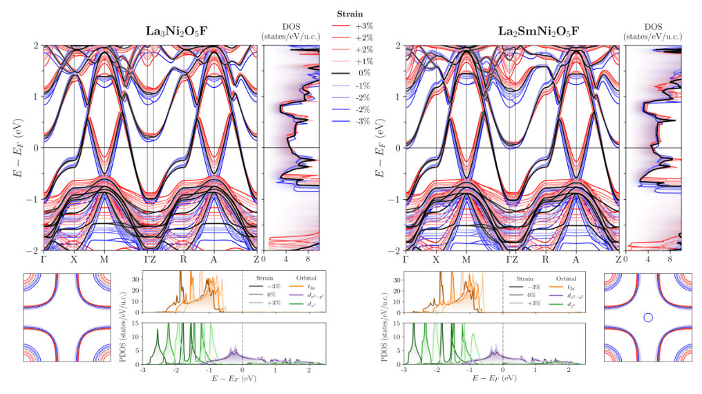
<figcaption class="paper-figure-caption"><b>Fig 5.</b> Figure 4. Electronic band structures, orbital-resolved Ni DOS, and Fermi surfaces calculated for La3Ni2O5F (left) and La2SmNi2O5F (right) as a function of epitaxial strain.</figcaption>
</figure>

**Summary.** This theoretical study examines $	ext{La}_3	ext{Ni}_2	ext{O}_5	ext{F}$ as a tunable cuprate analogue, using first-principles calculations to probe its electronic and magnetic properties. The research demonstrates that the material maintains a robust, two-dimensional Ni-$d_{x^2-y^2}$ Fermi surface even when subjected to chemical pressure or epitaxial strain. Ultimately, it establishes lattice engineering as a powerful tool for controlling correlated electron behavior in nickelates.

**Why it may be interesting.** The ability to use lattice engineering (strain/pressure) to continuously control correlated parameters like doping and magnetic interactions in a solid-state system is highly relevant for understanding emergent quantum phases in strongly correlated materials.

Detailed structure

**Main problem.** The study investigates how structural stability, electronic structure, and magnetism of the double infinite-layer oxyfluoride $	ext{La}_3	ext{Ni}_2	ext{O}_5	ext{F}$ are influenced by external tuning parameters like chemical pressure and epitaxial strain.

**Main result.** The material is identified as a promising cuprate analogue because its electronic structure remains robustly two-dimensional, while lattice engineering allows for continuous fine-tuning of carrier doping and magnetic frustration.

**Method.** First-principles calculations using DFT (PBE functional) are employed to calculate phonon spectra, band structures, Fermi surfaces, and magnetic ground states under varying strain and chemical substitutions.

**Model / system.** The system is the double infinite-layer nickelate $	ext{La}_3	ext{Ni}_2	ext{O}_5	ext{F}$, which is modeled as a correlated electron material exhibiting strong electronic correlations in the Ni $d$-orbitals, analogous to high-Tc cuprates.

**Key observables.** Phonon spectrum (stability), Fermi surface character ($	ext{Ni-}d_{x^2-y^2}$ dominance), self-doping level, and magnetic ground state energy/frustration.

**Important parameters / regimes.** Epitaxial strain ($\epsilon$), chemical pressure (rare-earth substitution $	ext{La} 	o 	ext{Sm}$), and the charge-transfer energy ($\Delta$).

**Assumptions / limitations.** The calculations rely on DFT approximations, treating the system as a solid-state material where electronic correlations are captured via orbital analysis and magnetic modeling.

**Figures summary.** Figures illustrate the phonon spectrum confirming stability under strain, band structures showing 2D cuprate-like features across substitutions, and energy comparisons detailing competing magnetic ground states.

**Paper structure.** The paper first establishes the structural and electronic baseline of $	ext{La}_3	ext{Ni}_2	ext{O}_5	ext{F}$. It then systematically explores how chemical pressure (substitution) and epitaxial strain modify the robust 2D electronic structure and tune the magnetic frustration landscape.

Abstract

Nickelate materials exhibit rich electronic properties that can be engineered toward cuprate-like regimes through topotactic and mixed-anion chemistry. Using first-principles calculations, we investigate the newly synthesized double infinite-layer oxyfluoride La$_3$Ni$_2$O$_5$F and its evolution under chemical pressure and epitaxial strain. The calculated phonon spectrum confirms the dynamical stability of the reported double infinite-layer crystal structure. Further, we find a highly two-dimensional cuprate-like Fermi surface dominated by Ni-$d_{x^2-y^2}$ states, with a moderate rare-earth-derived self-doping yielding an effective $\sim d^{1.2}_{x^2-y^2}$ filling. These electronic features remain remarkably robust under both chemical pressure and epitaxial strain. Spin-polarized calculations further reveal an extended manifold of nearly degenerate magnetic configurations with different in-plane and out-of-plane spin arrangements. Compressive strain further enhances this magnetic frustration while leaving the underlying electronic structure largely unchanged. Our results thus identify La$_3$Ni$_2$O$_5$F as a promising cuprate analogue and establish lattice engineering as an effective strategy for fine tuning its electronic and magnetic properties.

[↑ back to top](#top)

### [Substrate-metal interface engineering enhances TaN/Ta thin film superconducting resonator performance](http://arxiv.org/abs/2607.22294v1)

**Authors:** Moritz Singer, Harsh Gupta, Benedikt Schoof, Elena Willinger, Anton Orekhov, Alexandra Schewski, Samuil Kostadinov, Philip Constantin Schneider, Marc Tornow  
**Type:** experiment · **Category:** quantum information and computing · **PDF:** <https://arxiv.org/pdf/2607.22294v1>  
**Analysis basis:** full PDF text, analyzed in chunks
**Topic relevance:** 🔥 `QC/QI experiment` **4/5** · `correlated / nonlocal dissipation` **1/5**

↔ Scroll figures horizontally

<figure class="paper-figure-card">
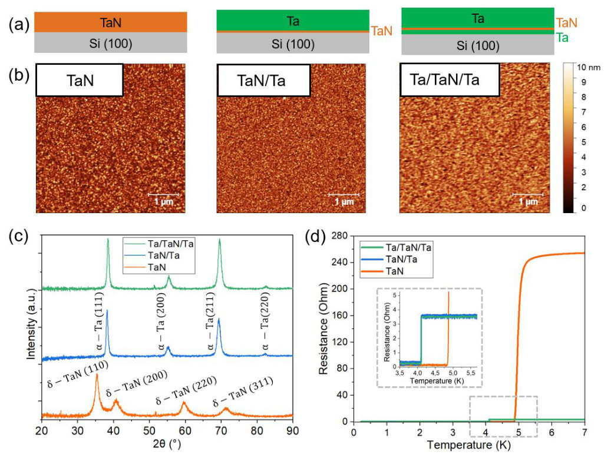
<figcaption class="paper-figure-caption"><b>Fig 1.</b> Figure 1: (a) Schematic sketches of the sputtered material stacks: 200 nm thick of TaN, as well as 5 nm TaN followed by 200 nm of Ta and 10 nm of Ta, followed by 5 nm of TaN and 200 nm of Ta were deposited on Si (100) substrates. (b) AFM pictures of the three deposited thin film stack surfaces. The surface roughness is in the range of 0.4-0.9 nm for all three films. (c) GI-XRD spectra of the thin films, showing exclusively alpha-peaks in Ta/TaN and Ta/TaN/Ta. The TaN spectrum shows peak associated with cubic delta-TaN. (d) Critical temperature measurements, where a superconducting transition was observed for all stacks. Ta on TaN and on TaN/Ta turns superconducting at ~4.1 K, while the TaN...</figcaption>
</figure>
<figure class="paper-figure-card">
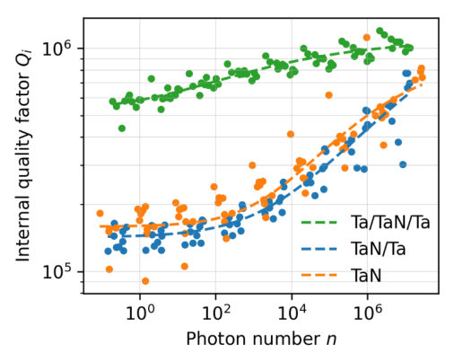
<figcaption class="paper-figure-caption"><b>Fig 2.</b> Figure 2: Internal quality factors of thin film CPW resonators measured at 100 mK, as function of the mean photon number n. In the single-photon regime, TaN and Ta on TaN have similar Qi of QiTaN = 1.53×105 and QiTaN/Ta = 1.41×105. In contrast, the stack with the added 10 nm Ta has a significantly higher QiTa/TaN/Ta = 5.88×105. In the high-power regime, the Ta/TaN/Ta stack still has higher Qi, but the difference to the other thin films is much smaller than in the single-photon regime. Circle symbols: measured data points.. Dashed lines: numerical fits to eq. 1.</figcaption>
</figure>
<figure class="paper-figure-card">
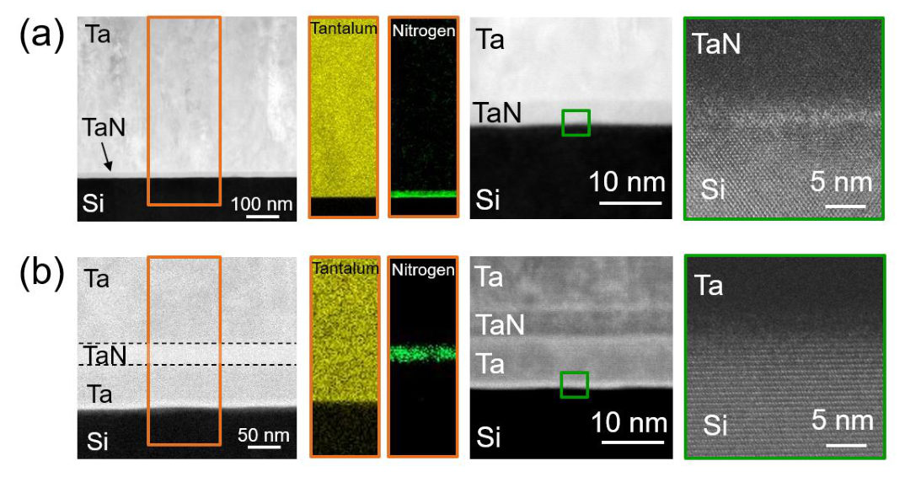
<figcaption class="paper-figure-caption"><b>Fig 3.</b> Figure 3: (a) TEM pictures and EELS analysis of the TaN/Ta stack, confirming the expected layer stack of Ta on 5 nm of TaN on Si. In the high-resolution TEM images in the right, irregular lighter and darker regions next to the interface can be seen, indicating dislocations and disorder in the Si lattice. (b) TEM and EELS analysis for the Ta/TaN/Ta stack, where again Ta is deposited on 5 nm of TaN, but a 10 nm thick Ta buffer layer between TaN and Si is introduced. For this stack, no structural disorder or defects in the Si lattice are visible and the interface to the Si looks undistorted.</figcaption>
</figure>

**Summary.** The research investigates how modifying the interface between tantalum nitride ($	ext{TaN}$) thin films and their silicon substrate affects superconducting resonator performance. By introducing a thin Ta buffer layer, the authors significantly boost the internal quality factor ($Q_i$) from $\sim 1.5 	imes 10^5$ to $5.9 	imes 10^5$. This improvement is attributed to suppressing structural disorder and minimizing energy loss mechanisms concentrated at the metal-substrate interface.

**Why it may be interesting.** This work directly addresses material science limitations in superconducting quantum hardware, providing actionable engineering guidelines for improving coherence times and resonator quality factors in solid-state qubits.

Detailed structure

**Main problem.** The primary goal is enhancing the performance of superconducting resonators used in qubit circuits by engineering the interface between the deposited metal films and the substrate.

**Main result.** Introducing a thin Ta buffer layer significantly enhances the internal quality factor ($Q_i$) of the resonator, showing that controlling this substrate-metal interface is crucial for minimizing energy loss mechanisms like Two-Level Systems (TLS).

**Method.** The study uses superconducting microwave resonators patterned on Si substrates and measures their $Q_i$ using VNA measurements. Structural analysis via TEM/EELS confirms the physical origin of performance changes.

**Model / system.** The platform is a superconducting circuit utilizing TaN/Ta thin films deposited on silicon, tested at cryogenic temperatures (100 mK). The loss mechanism is modeled using the Two-Level System (TLS) theory to quantify interface-related energy dissipation.

**Key observables.** Internal quality factor ($Q_i$), critical temperature ($T_c$), structural disorder observed via TEM/EELS, and TLS loss parameters ($Q_{TLS,0}$).

**Important parameters / regimes.** Film thicknesses (few nm scale), operating temperature ($\sim 100$ mK), and the presence/absence of a Ta buffer layer.

**Assumptions / limitations.** The performance degradation is dominated by interface-related TLS losses, and that modifying this interface directly mitigates these losses.

**Figures summary.** Figures schematically illustrate the three investigated film stacks ($	ext{TaN}$ only, $	ext{TaN}/	ext{Ta}$, $	ext{Ta}/	ext{TaN}/	ext{Ta}$) and show TEM/EELS evidence contrasting structural disorder at the direct $	ext{TaN-Si}$ interface versus the clean interface achieved with the Ta buffer layer.

**Paper structure.** The paper progresses by first establishing baseline performance ($	ext{TaN}$ only), then comparing it to structures with different interfaces, and finally using advanced characterization (TEM/EELS) to correlate observed structural disorder at the $	ext{TaN-Si}$ interface with the measured reduction in $Q_i$ when a Ta buffer is added.

Abstract

Tantalum has been demonstrated as a promising material for superconducting qubits. However, comparatively little attention has been given to its nitrides. Tantalum nitride exhibits a range of stoichiometries, resulting in a variety of material properties, including both superconducting and non-superconducting phases. Owing to this versatility, tantalum nitrides can serve multiple purposes in superconducting qubits: as seed layers for alpha-Ta growth, as a superconducting base material and as a non-superconducting barrier in the Josephson junction. In this study, we explore the performance of superconducting TaN and Ta thin film combinations on silicon substrates in terms of internal quality factor Qi. We find that standalone TaN films exhibit Qi values of about 1.5x10^5 at 100mK in the single-photon regime. Surprisingly, a resonator made from Ta grown on a few-nanometers-thick TaN seed layer yields largely the same performance. However, adding an additional, few-nanometers-thick Ta buffer layer between the Si substrate and this TaN seed layer enhances Qi significantly up to 5.9x10^5. Supporting transmission electron microscopy measurements reveal nitrogen accumulation and structural disorder at the TaN-Si interface, while this interfacial modification is suppressed when the Ta buffer layer is introduced. The observed improvement in resonator performance is consistent with a reduction of interface-related two-level system losses and strongly supports the hypothesis that controlling the substrate-metal interface is pivotal for the performance of superconducting qubit circuitry.

[↑ back to top](#top)

### [Low loss superconducting resonators enabled by aluminum microstructural engineering and dielectric trimming](http://arxiv.org/abs/2607.22265v1)

**Authors:** Mahmoud Almansouri, Umar T. F. Alhuwaymel, Ibraheem AlYousef, Albaraa Shafi, Abdullah Albogime, Igor Getmanov, Ahmed Hajr, Atif Shamim  
**Type:** experiment · **Category:** quantum information and computing · **PDF:** <https://arxiv.org/pdf/2607.22265v1>  
**Analysis basis:** full PDF text, analyzed in chunks
**Topic relevance:** 🔥 `QC/QI experiment` **4/5**

↔ Scroll figures horizontally

<figure class="paper-figure-card">
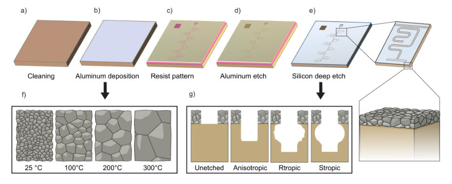
<figcaption class="paper-figure-caption"><b>Fig 1.</b> Figure 1: Fabrication process for the resonators, combining microstructural engineering and dielectric trimming. (a) A high-resistivity silicon wafer is cleaned and stripped of native oxide [using buffered oxide etch (BOE 7:1) / in dilute HF]. (b) High-purity aluminum is deposited at different substrate temperatures to engineer the film microstructure, with the inset (f) showing the conditions used: RT, 100 ◦C, 200 ◦C, and 300 ◦C. (c) The circuitry is defined by photolithography. (d) The aluminum is dry-etched using a Cl2/BCl3 reactive-ion etch (RIE). (e) The exposed silicon is deep-etched by RIE using CHF3 or a combination of SF6 and CHF3, producing the different edge profiles shown in...</figcaption>
</figure>
<figure class="paper-figure-card">
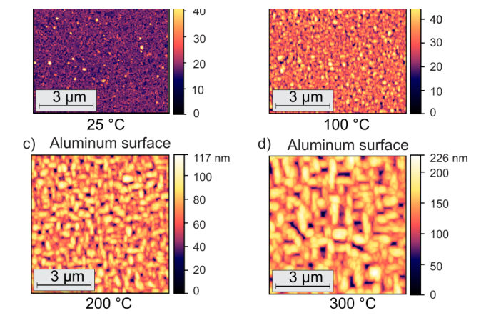
<figcaption class="paper-figure-caption"><b>Fig 2.</b> Figure 2: Microstructural engineering of the aluminum grains. Atomic force microscopy (AFM) images showing the evolution of the aluminum grain morphology with increasing substrate temperature: (a) room temperature (RT), (b) 100 ◦C, (c) 200 ◦C, and (d) 300 ◦C.</figcaption>
</figure>
<figure class="paper-figure-card">
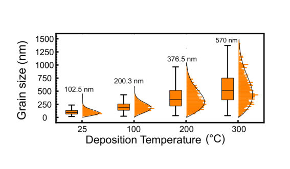
<figcaption class="paper-figure-caption"><b>Fig 3.</b> Figure 3: Grain size distribution for the four deposition temperatures; the value above each distribution gives the average grain size.</figcaption>
</figure>
<figure class="paper-figure-card">
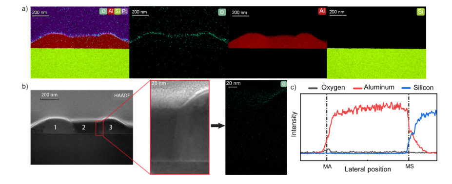
<figcaption class="paper-figure-caption"><b>Fig 4.</b> Figure 4: Cross-sectional STEM analysis of the 300 ◦C large-grain aluminum film on silicon. (a) False- colored energy-dispersive X-ray spectroscopy (EDS) maps showing the Al, O, Si, and Pt distributions across the sample cross-section; the Pt layer is deposited during sample preparation. (b) High-angle annular dark-field (HAADF) image of three aluminum grains (labeled 1, 2, 3), with the inset showing a zoomed-in HAADF image at the grain boundary overlaid with the oxygen EDS map. (c) Elemental distribution along the cross-section, with vertical lines marking the MA and MS interfaces.</figcaption>
</figure>
<figure class="paper-figure-card">
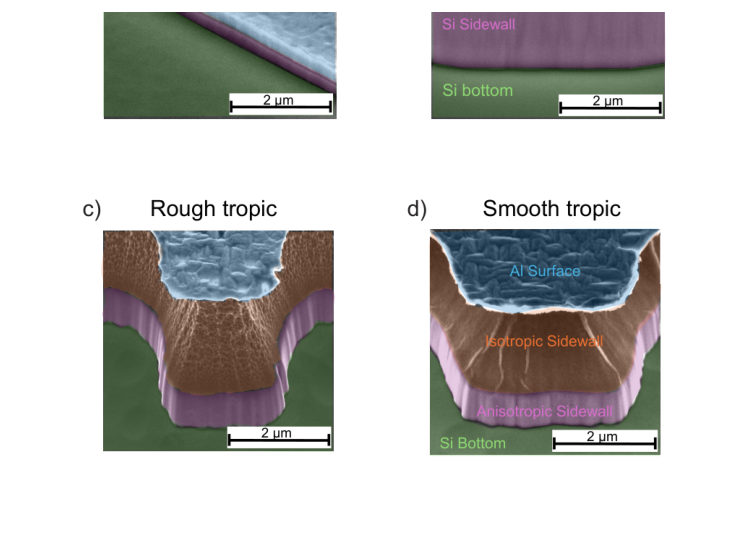
<figcaption class="paper-figure-caption"><b>Fig 5.</b> Figure 5: Dielectric trimming of the coplanar waveguide edge. False-colored scanning electron microscopy (SEM) images of the silicon edge profile for edges fabricated with (a) aluminum etching only, (b) anisotropic deep etching with CHF3 following the aluminum etch, (c) the rough-sidewall Tropic etch (with 60 mTorr pressure during SF6 etch followed by CHF3; ‘Rtropic’), and (d) the smooth-sidewall Tropic etch (with 5 mTorr pressure during SF6 etch followed by CHF3; ‘Stropic’).</figcaption>
</figure>

**Summary.** The paper tackles the fundamental challenge of material losses limiting qubit performance in superconducting resonators. The authors propose a two-pronged solution: engineering aluminum grain size to reduce non-TLS loss and using advanced etching techniques to smooth dielectric interfaces and minimize TLS loss. This combined approach results in a significant, measurable enhancement in resonator quality factor.

**Why it may be interesting.** This work directly addresses hardware limitations in superconducting quantum circuits by providing actionable, materials-science based fabrication protocols to boost coherence times, which is critical for scaling up quantum processors.

Detailed structure

**Main problem.** Material losses, stemming from Two-Level Systems (TLS) and non-TLS sources, fundamentally limit qubit coherence times and resonator quality factors in superconducting circuits.

**Main result.** By combining aluminum microstructural engineering (increasing grain size) with dielectric trimming (smoothing the silicon edge), the authors achieved a two-orders-of-magnitude improvement in the resonator quality factor ($Q$), reaching $2.3 	imes 10^6$.

**Method.** The study employed advanced nanofabrication techniques, including controlled aluminum deposition temperatures and specialized multi-step etching (Tropic etch), followed by cryogenic characterization.

**Model / system.** The physical system is a superconducting coplanar waveguide (CPW) resonator fabricated on high-resistivity silicon using aluminum films. The loss mechanism is modeled as the sum of TLS losses (related to surface disorder) and non-TLS losses (related to metal microstructure).

**Key observables.** Resonator quality factor ($Q$), which was measured at cryogenic temperatures; Atomic Force Microscopy (AFM) roughness measurements ($	ext{R}_t$); Grain size distribution.

**Important parameters / regimes.** Deposition temperature of aluminum film ($25^\circ	ext{C}$ to $300^\circ	ext{C}$); Etching profiles (e.g., Tropic etch); Quality factor improvement factor ($\sim 40$).

**Assumptions / limitations.** The improvements in microstructure and edge profiling are assumed to be generalizable enhancements for other superconducting quantum devices.

**Figures summary.** Figures illustrate the full fabrication process combining both engineering steps; AFM images show grain size evolution with temperature; SEM/AFM compare silicon edge profiles from different etching methods; $Q$ factor plots demonstrate the combined enhancement effect.

**Paper structure.** The paper systematically identifies material loss sources (TLS vs. non-TLS), proposes two complementary mitigation strategies—microstructural control via heating and surface smoothing via specialized etching—and presents quantitative evidence showing that combining both yields superior resonator performance.

Abstract

Material losses in superconducting circuits fundamentally limit qubit coherence times and resonator quality factors. Most research efforts focus on mitigating losses at circuit interfaces, including metal--substrate, substrate--air, and metal--air interfaces. However, the correlation between TLS and non-TLS losses with the intrinsic properties of the superconducting metal and the dielectric edge smoothness is not well studied. In this work, we link the aluminum film grain size to non-TLS losses and the dielectric trimming profile and roughness to TLS loss; both loss mechanisms are subsequently mitigated. To reduce metal-related losses, we engineer the aluminum microstructure by heating during deposition, increasing grain size and reducing grain boundary density. Beyond mitigating metal losses, we introduce a two-step etching technique, Tropic etching, to suppress dielectric TLS loss by producing an ultra-smooth silicon surface with minimal defects and redeposition. These results lay out the fabrication pathway for aluminum resonators with lower loss, demonstrating two-orders-of-magnitude improvement in quality factor from $6\times10^{4}$ to $2.3\times10^{6}$. Since aluminum is the basis for most high-coherence Josephson junctions and dielectric edges are inherent to all common device geometries, the improvements in aluminum microstructure and edge profiling, presented here, can enhance the performance of superconducting quantum devices.

[↑ back to top](#top)

### [Tunable nonlinear electromechanics at the zero-point motion scale](http://arxiv.org/abs/2607.21764v1)

**Authors:** Christoffer B. Møller, Roger Tormo-Queralt, Elsa Vázquez-Rodríguez, Victor Román-Rodríguez, Marta Cagetti, Eneko Mateos-Madinabeitia, Janine C. Franz, Stefan Forstner, Sergio L. De Bonis, Luca Ornago, Maria El Abbassi, Seoho Jung, Andrew N. Cleland, David A. Czaplewski, Fabio Pistolesi, Adrian Bachtold  
**Type:** both · **Category:** other · **PDF:** <https://arxiv.org/pdf/2607.21764v1>  
**Analysis basis:** full PDF text, analyzed in chunks
**Topic relevance:** `analog quantum simulation` **3/5** · `correlated cavity matter` **3/5** · `driven-dissipative phase transition` **3/5** · `Tavis-Cummings & cavity-many-emitter` **2/5** · `methods for driven-dissipative` **2/5** · `non-equilibrium dynamics` **2/5** · `quantum optics experiment` **2/5** · `spintronics-quantum-optics interface` **2/5** · `Keldysh / 2PI / non-Gaussian methods` **1/5** · `correlated / nonlocal dissipation` **1/5** · `entanglement & information structure` **1/5** · `exotic spin models in light-matter` **1/5** · `measurement-induced transitions` **1/5** · `non-equilibrium universality` **1/5** · `quantum measurements` **1/5**

↔ Scroll figures horizontally

<figure class="paper-figure-card">
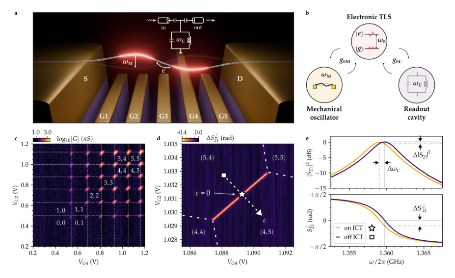
<figcaption class="paper-figure-caption"><b>Fig 1.</b> Figure 1: Hybrid system overview. a. Simplified representation of a double-quantum dot (red) embedded in a vibrating carbon nanotube suspended above five gate electrodes G1-G5, one of which is galvanically connected to a superconducting microwave resonator used for cavity readout. b. Schematic of the tri-partite hybrid system comprising a mechanical oscillator, an electronic two-level system (ETLS), and superconducting microwave cavity. c. Charge stability diagram showing the double-quantum dot electron configuration controlled by the gate voltages 𝑉G2 and 𝑉G4, and measured via the electrical conductance 𝐺at 10 K with an applied source-drain bias 𝑉SD = 3 mV. We continuously compensate gate...</figcaption>
</figure>
<figure class="paper-figure-card">
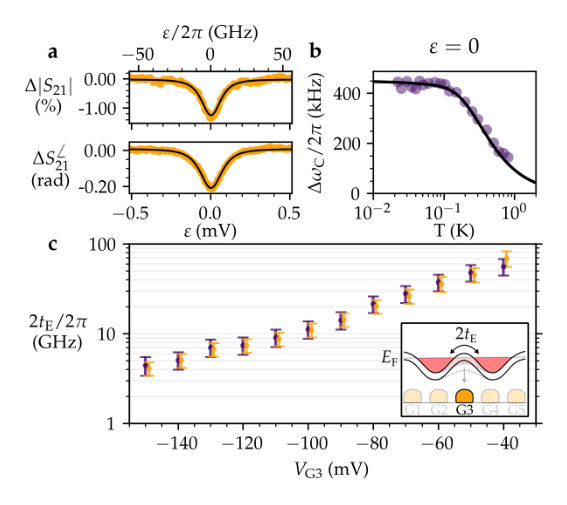
<figcaption class="paper-figure-caption"><b>Fig 2.</b> Figure 2: Highly tunable electronic two-level system. a. Magnitude and phase shift of the cavity transmission as a function of the ETLS detuning 𝜀measured at base temperature with𝑉G3 = −100 mV. b. ETLS induced cavity frequency shift as a function of temperature measured at 𝜀= 0 and𝑉G3 = −100 mV. c. ETLS frequency at 𝜀= 0 as a function of the control gate voltage 𝑉G3. The ETLS frequency is quantified from the two independent measurement methods shown in (a) and (b). The inset is a schematic of the gated nanotube electrostatic potential, relative to the Fermi energy 𝐸F, with the two quantum dots (red) formed by three tunnel barriers enabled by the nanotube bandgap. The tunnel coupling 2𝑡E is...</figcaption>
</figure>
<figure class="paper-figure-card">
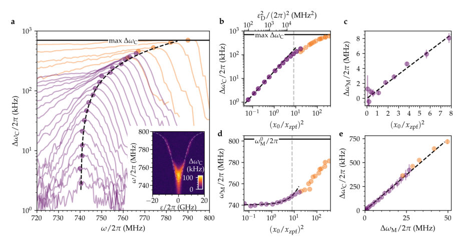
<figcaption class="paper-figure-caption"><b>Fig 3.</b> Figure 3: Nonlinearity in both the mechanical motion and its readout. a. Mechanical spectra for different drives at 𝜀= 0 measured by two-tone spectroscopy with an AM (purple) and CW (orange) homodyne detection scheme. Solid horizontal line is given by the maximum cavity frequency shift Δ𝜔C. Inset shows the mechanical frequency 𝜔M suppression as a function of detuning. Dashed white line shows theoretical prediction of the suppression without any Kerr contribution. b. Dependence of Δ𝜔C on calibrated displacement in units of the zero-point motion. The measured Δ𝜔C depends quadratically on the detuning drive (dashed line) consistent with a 𝑥2-readout. The scaling persists until 2𝑔EM𝑥/𝑥zpf ≃2𝑡E...</figcaption>
</figure>
<figure class="paper-figure-card">
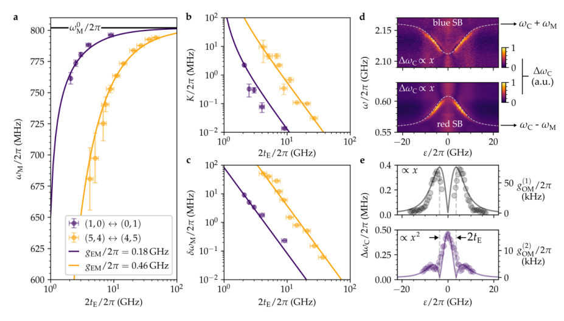
<figcaption class="paper-figure-caption"><b>Fig 4.</b> Figure 4: Highly tunable hybrid system. a-c. Mechanical frequency, Kerr nonlinearity, and linewidth of the mechanical resonance measured at 𝜀= 0 as a function of the ETLS tunnel coupling 2𝑡E for two different electromechanical couplings reached at two ICT electron configurations. Solid lines are theory predictions in (a) &amp; (b), and fit to a 1/(2𝑡E)3 dependence in (c). d. Two-tone spectroscopy of the upper and lower optomechanical sidebands as a function of ETLS detuning at a fixed detuning drive amplitude. The shift of the measured sideband frequencies 𝜔C ± 𝜔M are consistent with the measured 𝜀dependence of 𝜔M. e. Observed cavity frequency shift as a function of the ETLS detuning as well as...</figcaption>
</figure>

**Summary.** The paper reports on an experimental realization of tunable nonlinear electromechanics using a coupled nanotube oscillator and double quantum dots. By operating in the ultrastrong coupling regime, they achieve significant mechanical anharmonicity ($\alpha=1.4\%$) and demonstrate purely quadratic readout sensitivity near zero-point motion. This establishes a versatile platform for fundamental studies in nanoscale quantum control.

**Why it may be interesting.** This work directly bridges quantum optics (cavity QED), nanomechanics, and solid-state physics, providing a highly tunable platform for observing nonlinear dynamics near the quantum ground state, which is central to modern AMO research.

Detailed structure

**Main problem.** The primary challenge addressed is achieving tunable nonlinear electromechanics at the zero-point motion scale for nanomechanical systems.

**Main result.** The authors demonstrate a platform exhibiting a mechanical Kerr nonlinearity ($\alpha=1.4\%$) and purely quadratic continuous readout, both controllable via ultrastrong coupling (USC).

**Method.** Theoretical modeling using Hamiltonian approaches combined with experimental measurements of frequency shifts and linewidths.

**Model / system.** The system is a hybrid setup involving a carbon nanotube mechanical oscillator coupled to an electronic two-level system (ETLS) formed by quantum dots, all integrated within a microwave cavity.

**Key observables.** Mechanical Kerr nonlinearity ($\alpha$), purely quadratic readout signal ($\Delta\omega_C \propto x^2$), and the thermal linewidth ($\langle \delta\omega_M^2 
angle$).

**Important parameters / regimes.** Ultrastrong coupling (USC) regime, zero-point motion scale, gate tunability of ETLS parameters ($t_E$, $\epsilon$), and mechanical frequency ($\omega_M$).

**Assumptions / limitations.** The analysis relies on the dispersive ultrastrong-coupling regime where low-lying eigenstates remain predominantly mechanical.

**Figures summary.** Figures illustrate system setups, quantum dot control mechanisms, measurements confirming quadratic readout scaling, and spectral density plots comparing analytical thermal linewidth estimates with numerical diagonalization results.

**Paper structure.** The paper progresses from establishing the physical platform and Hamiltonian to demonstrating strong nonlinearity via Kerr effects, followed by characterizing the purely quadratic continuous readout mechanism, and finally analyzing thermal broadening using advanced spectral density calculations.

Abstract

Nonlinearity at the scale of zero-point motion opens new possibilities for the control and readout of nanomechanical systems, but achieving this remains a formidable challenge. Here we demonstrate that ultrastrong coupling (USC) between a nanotube mechanical oscillator and a double-quantum-dot electronic two-level system enables a mechanical Kerr (Duffing) nonlinearity at the zero-point motion scale. In the dispersive regime, this large coupling yields a mechanical anharmonicity of $α= 1.4\%$ - three orders of magnitude larger than in previous work - while preserving the predominantly mechanical nature of the lowest energy states. We further demonstrate a purely quadratic cavity-based continuous readout of the mechanical motion. This continuous nonlinear optomechanical readout is enforced by a double-quantum dot symmetry, which can be broken by gate tuning to introduce a large linear transduction. These results establish a tunable USC platform that enables strong mechanical anharmonicity and nonlinear continuous readout at the zero-point motion scale.

[↑ back to top](#top)

### [Optical time travel: proposal for testing Hawking's Chronology Protection Conjecture in an optical analogue](http://arxiv.org/abs/2607.22056v1)

**Authors:** D. Bermudez, U. Leonhardt  
**Type:** both · **Category:** other · **PDF:** <https://arxiv.org/pdf/2607.22056v1>  
**Analysis basis:** full PDF text, analyzed in chunks
**Topic relevance:** `Keldysh / 2PI / non-Gaussian methods` **3/5** · `analog quantum simulation` **3/5** · `correlated / nonlocal dissipation` **3/5** · `driven-dissipative phase transition` **3/5** · `methods for driven-dissipative` **3/5** · `non-equilibrium dynamics` **2/5** · `non-equilibrium universality` **2/5** · `quantum optics experiment` **2/5** · `entanglement & information structure` **1/5** · `interference shaping light` **1/5** · `measurement-induced transitions` **1/5** · `quantum measurements` **1/5**

↔ Scroll figures horizontally

<figure class="paper-figure-card">
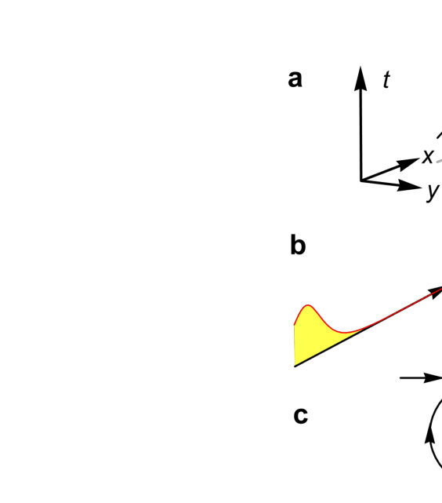
<figcaption class="paper-figure-caption"><b>Fig 1.</b> Figure 1: Time travel. a: Spacetime diagram of a time traveler. The particles of the traveler move at uniform velocity (black lines). When starting the “time machine” (an event marked by the upper dot) the traveler meets a precise copy of himself made of antiparticles and gets annihilated. The antiparticles (red) are made in the past (lower dot) together with the particles of the traveler who moves freely, while the antiparticles are on the way to meet his future self. The spatial trajectories are shown in gray. In b — the optical implementation of time travel — the trajectories are replaced by a fibre loop of delay time t0 connected via a parametric amplifier (dot) to a straight fibre; c...</figcaption>
</figure>
<figure class="paper-figure-card">
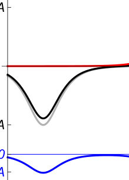
<figcaption class="paper-figure-caption"><b>Fig 2.</b> Figure 2: Time travel with modest gain. Input pulse a1(t) [red curve] versus the output pulse b1(t) [black curve, Eqs. (7) and (8)] compared with −a1(t + t0) [grey curve] for a gain of 10 (cosh2 ζ = 10) and no loss. Only the envelopes of the pulses are shown (for their optical oscillations see Fig. 5). The separate plot in blue shows the initial light in the loop [Eqs. (2) and (8)]. As input pulse we took a1 = A sech[−10(t −1.25 t0)/t0)] where the bulk of the incident pulse arrives in the interval [t0, 2t0]. We clearly see that the output leaves before the input has arrived, and with good fidelity (80%, see Appendix B) even for modest gain.</figcaption>
</figure>
<figure class="paper-figure-card">
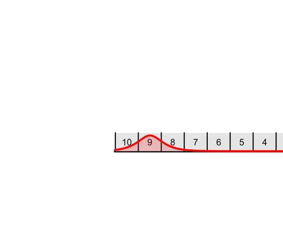
<figcaption class="paper-figure-caption"><b>Fig 3.</b> Figure 3: Box modes. We quantize the field in terms of box modes (boxes, labeled by integers) that are long in comparison with the wavelength and short in comparison with the variations of the pulse amplitudes (red). The modes interact with each other at the amplifier (dot).</figcaption>
</figure>
<figure class="paper-figure-card">

<figcaption class="paper-figure-caption"><b>Fig 4.</b> Figure 4: Setup. Our scheme (Fig. 1) can be implemented in free–space optics using a χ(2) crystal41 as parametric amplifier24 (grey box). The signal mode of the amplifier serves as the signal in our setup, with amplitudes a1 before and b1 after amplification. The idler,24 with amplitudes a0 before and b0 after amplification, is reflected by mirrors to form the loop of the optical time machine (Fig. 1).</figcaption>
</figure>
<figure class="paper-figure-card">
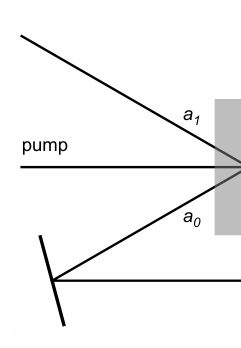
<figcaption class="paper-figure-caption"><b>Fig 5.</b> Figure 5 shows a sequence of time frames for the setup at different stages in the time–traveling process. Let x be the coordinates of the incident light and y the coordinate in the loop. The light propagates as a1(t −x/c) and b0(t − y/c). Initially (t = 0) the pulse a1(−x) is incident at a greater distance than ct0 away and the loop is filled with light matching the precursor of the pulse as b0(−y/c) for y ∈[0, t0] and b0 given by Eq. (8). The filling could be done e.g. by sending light through one of the mirrors in the loop (Fig. 4) being made slightly semitransparent. The next panel shows the setup halfway through the time loop (t = t0/2). One sees that an output pulse is created before...</figcaption>
</figure>

**Summary.** The paper outlines an experimental proposal to test Hawking's Chronology Protection Conjecture using an optical time machine built from a fiber loop and parametric amplifier. By analyzing both classical and full quantum field dynamics, the authors show that while time travel is classically possible under high gain, quantum noise generation fundamentally limits or prevents it.

**Why it may be interesting.** This work bridges general relativity concepts (closed timelike curves) directly into the domain of quantum optics and open quantum systems by using parametric amplification as a physical model for vacuum energy buildup.

Detailed structure

**Main problem.** The paper proposes an optical analogue experiment to test Hawking's Chronology Protection Conjecture (CPC), which suggests quantum mechanics prevents time travel.

**Main result.** While classical analysis suggests that time travel is possible under conditions of high gain exceeding loss, the quantum mechanical treatment predicts that vacuum fluctuations will generate measurable extra noise, thereby imposing limitations on any achievable time machine.

**Method.** The authors use both classical differential equation solving (Fourier transforms) and full quantum field quantization techniques (mode operators, Wigner functions) to model light propagation through an amplifier feedback loop.

**Model / system.** The system is an optical setup involving a fiber connected to a loop via a parametric amplifier ($\chi^{(2)}$ crystal), designed to mimic the closed null geodesics required for time travel in general relativity.

**Key observables.** Classical fidelity ($F$), extra quantum noise quantified by particle number ($ar{n}$), and the temporal relationship between input and output pulses.

**Important parameters / regimes.** Amplifier gain parameter ($\zeta$), loss parameter ($\gamma$), and the time delay in the loop ($t_0$).

**Assumptions / limitations.** The analysis assumes that quantum noise generation (amplification of vacuum fluctuations) is the dominant effect, and it compares regimes where classical causality might be violated versus where quantum constraints must hold.

**Figures summary.** Figures illustrate the spacetime diagram for time travel, the optical setup using a fiber loop/parametric amplifier, and temporal comparisons showing output pulses preceding input arrivals.

**Paper structure.** The paper progresses from establishing the theoretical link between GR time travel and amplified vacuum fluctuations (Hawking's argument), developing classical solutions for light propagation in the ring, and finally quantizing the system to calculate the unavoidable quantum noise associated with the process.

Abstract

Classical general relativity allows time travel, but Hawking [Phys. Rev. D 46, 603 (1992)] conjectured that quantum mechanics ultimately prevents it. Here we propose a feasible experiment to test Hawking's Chronology Protection Conjecture in optics. In this scheme, time travel is inherently related to lasing, and the amplified vacuum fluctuations above laser threshold establish the quantum limits of time travel

[↑ back to top](#top)

### [Understanding interaction-driven transport in flux lattices with evolution-path symmetry](http://arxiv.org/abs/2607.22288v1)

**Authors:** Jian-Song Pan, Xiaofan Zhou, Wei Yi  
**Type:** theory · **Category:** other · **PDF:** <https://arxiv.org/pdf/2607.22288v1>  
**Analysis basis:** full PDF text, analyzed in chunks
**Topic relevance:** `analog quantum simulation` **3/5** · `methods for driven-dissipative` **3/5** · `non-equilibrium dynamics` **3/5** · `Keldysh / 2PI / non-Gaussian methods` **2/5** · `driven-dissipative phase transition` **2/5** · `non-equilibrium universality` **2/5** · `Frenkel-Kontorova` **1/5** · `correlated / nonlocal dissipation` **1/5** · `entanglement & information structure` **1/5** · `interference shaping light` **1/5** · `quantum measurements` **1/5**

↔ Scroll figures horizontally

<figure class="paper-figure-card">
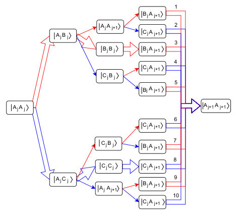
<figcaption class="paper-figure-caption"><b>Fig 1.</b> FIG. 2. Shortest evolution paths in two-particle Fock space connecting the doublon state |AjAj⟩to |Aj+1Aj+1⟩on the rhombic lattice. Each path consists of four hopping steps. Thin arrows represent single-particle hopping with amplitude 1; bold arrows represent correlated hopping with amplitude √</figcaption>
</figure>
<figure class="paper-figure-card">
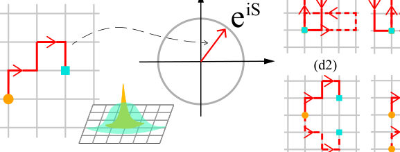
<figcaption class="paper-figure-caption"><b>Fig 2.</b> FIG. 3. Examples of evolution-path symmetries in a square lattice. (a) General illustration of evolution paths and their phase factors, which govern the dynamical evolution. (b1) Paths with the same initial and final site, related by reflection symmetry. (b2) Paths with the same initial and final site, related by rotation symmetry. (c1) Paths with the same initial and final sites (but different sites), related by reflection symmetry. (d1) Paths with the same initial site but different final sites, related by rotation symmetry. (d2) Paths with the same initial site but different final sites, related by reflection symmetry. (e1) Paths with different initial and final sites, related by...</figcaption>
</figure>
<figure class="paper-figure-card">
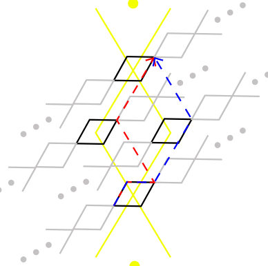
<figcaption class="paper-figure-caption"><b>Fig 3.</b> FIG. 4. Illustration of the product of rhombic lattices of two distinguishable particles (big yellow and small grey/black rhombic lattices). Two evolution paths denoted by red and blue dashed lines have opposite contributions, since they in- volve the same first half part and opposite latter half parts due to the π flux.</figcaption>
</figure>
<figure class="paper-figure-card">
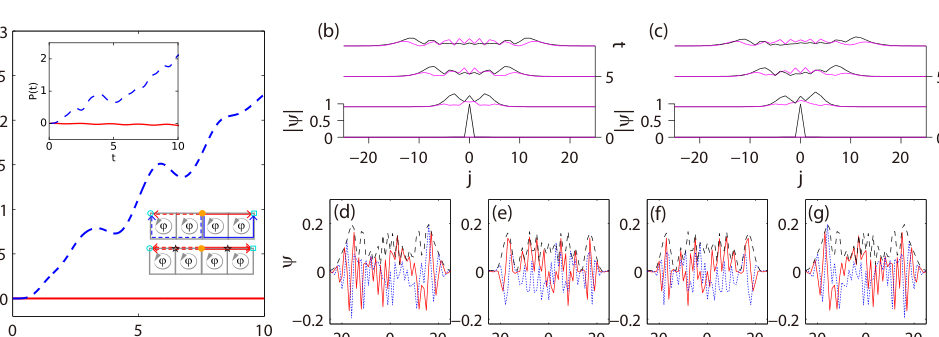
<figcaption class="paper-figure-caption"><b>Fig 4.</b> FIG. 5. (a) Time evolution of the chiral displacement P(t) for a BEC initial state at site ˆa0 on the flux ladder. For U = 0 (red solid), P(t) remains zero due to conjugate-phase EPS. For U = 4 (blue dashed), the EPS is broken, leading to a finite chiral current. Higher left inset: The chiral displacement of a two-particle initial state |0a⟩N |0a⟩calculated with density matrix renormalization group (DMRG) method. Lower right inset: Schematic of the flux ladder and examples of symmetric single-particle paths (solid and dashed lines) that are conjugates when U = 0. It shows how an interaction event (pentagram) breaks the conjugate-phase relationship for a pair of two-particle paths. (b)(c):...</figcaption>
</figure>

**Summary.** This work introduces Evolution-Path Symmetry (EPS) as a unifying theoretical concept to explain interaction effects in quantum transport. By showing that interactions selectively break the path symmetries responsible for destructive interference in flux lattices, the authors successfully account for phenomena like AB caging destruction and chiral current generation. This framework provides a powerful tool for analyzing correlated many-body dynamics.

**Why it may be interesting.** The use of a generalized 'Evolution-Path Symmetry' provides a powerful, non-standard diagnostic tool for understanding complex many-body dynamics beyond simple eigenstate analysis, relevant for strongly correlated systems.

Detailed structure

**Main problem.** The research aims to find a unifying physical picture for interaction-driven quantum transport, specifically addressing how interactions destroy Aharonov-Bohm (AB) caging and induce chiral currents in flux lattices.

**Main result.** The concept of Evolution-Path Symmetry (EPS) successfully explains that interactions break the path phase balance responsible for destructive interference, thereby enabling delocalization and chiral current flow.

**Method.** The study employs a theoretical framework based on analyzing quantum dynamics via interfering trajectories in Fock space, utilizing the concept of EPS to diagnose symmetry breaking.

**Model / system.** The models involve bosonic lattice systems (flux lattices like $\pi$-flux rhombic lattices and flux ladders) governed by tight-binding Hamiltonians with interaction terms ($H = H_0 + H_{	ext{int}}$).

**Key observables.** AB caging effect, interaction-induced delocalization rate, non-vanishing chiral current.

**Important parameters / regimes.** Interaction strength ($U$), magnetic flux ($\pi$-flux), and the path structure connecting neighboring doublon states.

**Assumptions / limitations.** The analysis focuses on analyzing the shortest evolution paths connecting neighboring doublon states; it also compares bosonic vs. fermionic statistics.

**Figures summary.** Figures illustrate particle density evolution showing delocalization when interactions are present, and detail the phase factors associated with various short-time evolution paths connecting specific many-body states.

**Paper structure.** The paper first introduces the problem of AB caging in non-interacting systems. It then develops the EPS framework, demonstrating how interaction terms selectively modify path phases (those involving double occupancy) to break symmetry and induce transport. Finally, it generalizes this mechanism to explain chiral currents and compares the robustness of EPS across different quantum statistics.

Abstract

The destruction of Aharonov-Bohm (AB) caging by interaction and the emergence of interaction-induced chiral currents in flux lattices are two paradigmatic examples of interaction-driven quantum transport. While various mechanisms, such as bound-state formation and chiral spectral imbalance, have been proposed, a unifying physical picture remains elusive. Here, we employ the concept of \textit{evolution-path symmetry} (EPS) and its interaction-induced breaking as a framework to understand interaction-induced delocalization in flux lattices. EPS is defined as the invariance of a path's contribution under combined geometric and phase transformations. We demonstrate that in a $π$-flux rhombic lattice, interactions break the EPS present in the non-interacting limit by modifying the phase accumulation of many-body paths, thereby lifting the destructive interference responsible for AB caging. Furthermore, we apply this framework to explain interaction-induced chiral transport in flux ladders, where interactions break the phase relationship between symmetric paths, leading to a non-vanishing chiral current. Our work establishes EPS as a powerful tool for understanding transport phenomena beyond conventional eigenstate analysis.

[↑ back to top](#top)

### [Electron shuttling as a probe for charge defects](http://arxiv.org/abs/2607.21718v1)

**Authors:** Hamza Jnane, Tamas Daniel Lipovics, Guido Burkard  
**Type:** theory · **Category:** quantum information and computing · **PDF:** <https://arxiv.org/pdf/2607.21718v1>  
**Analysis basis:** full PDF text, analyzed in chunks
**Topic relevance:** `methods for driven-dissipative` **3/5** · `quantum measurements` **3/5** · `spintronics-quantum-optics interface` **3/5** · `Kondo & dissipative impurity` **2/5** · `non-equilibrium dynamics` **2/5** · `Keldysh / 2PI / non-Gaussian methods` **1/5** · `correlated / nonlocal dissipation` **1/5** · `driven-dissipative phase transition` **1/5** · `measurement-induced transitions` **1/5**

↔ Scroll figures horizontally

<figure class="paper-figure-card">
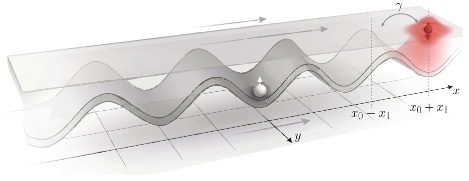
<figcaption class="paper-figure-caption"><b>Fig 1.</b> FIG. 1. Illustration of shuttling-based defect probing. An electron is shuttled back and forth in the x-direction. For simplicity, we represent a charge defect fluctuating in the x-direction in red but consider fluctuations in 3D in the main text. The closer the shuttled electron is to the defect (red zone in the potential landscape), the more spin dephasing it experiences. The goal is to leverage this to characterise the average position x0 of the TLF by measuring the average phase the electron has accumulated during its trip. This illustration is inspired by Fig. 2 of [7].</figcaption>
</figure>
<figure class="paper-figure-card">
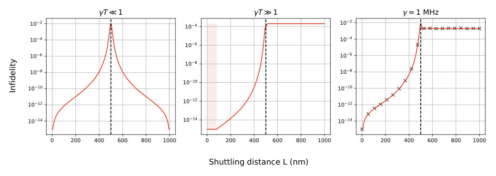
<figcaption class="paper-figure-caption"><b>Fig 2.</b> FIG. 2. Infidelity (1 −|W|) in dependence of the shuttling distance L when the TLF is fluctuating in the x-direction for the FB protocol (red). We explore three different regimes: static defect (γT ≪1, left), fast fluctuations (γT ≫1, centre) and intermediate fluctuations (γ = 1 MHz, right). The agreement between the analytically derived results (red line) with Monte-Carlo simulations (crosses) is very good. The mean position of the defect is chosen to be x0 = 500 nm (vertical dashed line). Generally, parameters are chosen according to Table I, with fluctuations in the y- and z-direction equal to zero here. Due to numerical instability and precision constraints, values within the red shaded...</figcaption>
</figure>
<figure class="paper-figure-card">
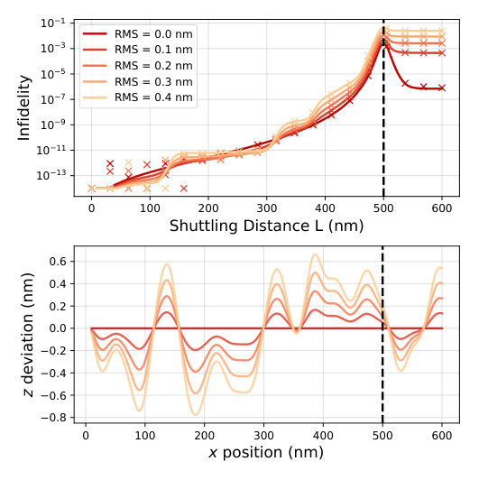
<figcaption class="paper-figure-caption"><b>Fig 3.</b> FIG. 3. (Top) Evolution of the infidelity (1 −|W|) as a func- tion of the shuttling distance L along different Si/SiO2 inter- face (RMS) roughness values. The crosses represent results of Monte-Carlo simulations with 105 shots. (Bottom) Physical interface terrain profiles.</figcaption>
</figure>
<figure class="paper-figure-card">
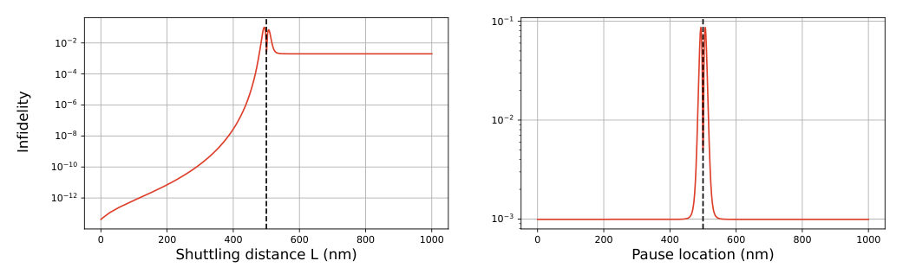
<figcaption class="paper-figure-caption"><b>Fig 4.</b> FIG. 4. Infidelity with respect to shuttling distance when the TLF is fluctuating in the x-direction. The left panel corresponds to an electron being shuttled back and forth with a 1 µs pause at the turning point (FWB protocol). In the right panel, we study an electron travelling in one direction from x = 0 to x = 1000 nm. The x axis corresponds to the position at which the electron is stopped for 1 µs to accumulate phase before resuming its journey (FWF protocol). The mean position of the defect is chosen to be x0 = 500 nm (vertical dashed line). Generally, parameters are chosen according to Table I.</figcaption>
</figure>
<figure class="paper-figure-card">
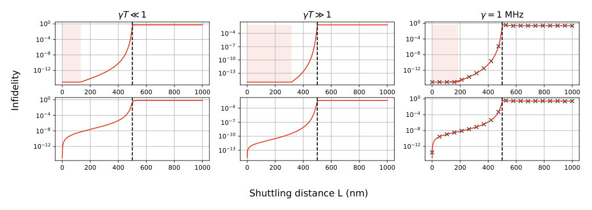
<figcaption class="paper-figure-caption"><b>Fig 5.</b> FIG. 5. Infidelity with respect to shuttling distance when the TLF is fluctuating in the y-direction (top) and z-direction (bottom) for γT ≪1 (left), γT ≫1 (middle) and γ = 1 MHz (right). The mean position of the defect is chosen to be x0 = 500 nm (vertical dashed line). Generally, parameters are chosen according to Table I. Due to numerical instability and precision constraints, values within the red shaded region have been clipped.</figcaption>
</figure>

**Summary.** The paper proposes using controlled electron shuttling in silicon spin qubits to map and characterize charge defects (TLFs). By measuring the resulting loss of spin coherence (infidelity), researchers can localize these noise sources and determine their switching dynamics. This offers a practical, hardware-agnostic method for improving solid-state quantum computing platforms.

**Why it may be interesting.** This work provides a concrete, scalable measurement protocol for characterizing noise sources (TLFs) that fundamentally limit solid-state quantum memories, directly impacting qubit coherence time predictions.

Detailed structure

**Main problem.** Charge noise, caused by Two-Level Fluctuators (TLFs), limits the performance of silicon spin qubits for quantum computation.

**Main result.** Electron shuttling acts as a scalable scanning probe to localize charge defects and characterize their switching rates without requiring additional hardware.

**Method.** The authors analyze the dephasing factor by modeling the time evolution of the spin's coherence during controlled back-and-forth electron shuttling over a defect site.

**Model / system.** The system involves single spin qubits in silicon interacting with charge noise modeled by TLFs, whose effect is incorporated into the qubit Hamiltonian via g-factor modulation. The dynamics are solved using coupled differential equations for probability amplitudes.

**Key observables.** Dephasing factor ($W(T)$) and its derived quantity, the infidelity ($1 - |W(T)|$), which quantifies decoherence due to defects.

**Important parameters / regimes.** The fluctuation regime ($\gamma_T \ll 1$ vs. $\gamma_T \gg 1$) and the shuttling distance $L$ are key parameters used to extract defect properties.

**Assumptions / limitations.** The analysis often relies on approximations, such as expanding exponentials or assuming specific limits for the fluctuation rate relative to the measurement time.

**Figures summary.** Figures illustrate the infidelity versus shuttling distance ($L$) under different fluctuation regimes and show how this dependence allows defect localization. Another figure compares results with varying interface roughness ($	ext{RMS}$).

**Paper structure.** The paper develops the theoretical framework by deriving the evolution of the coherence factor based on the time-dependent g-factor modulation from a TLF, solving the resulting differential equations in different fluctuation limits, and demonstrating defect localization via the measured infidelity.

Abstract

Silicon spin qubits are a leading platform for scalable quantum computing, but their performance is limited by charge noise, widely attributed to two-level fluctuators (TLFs). The location of individual TLFs is generally unknown, and existing methods to localise them does not scale favourably with device size. Here, we show that electron shuttling turns a single mobile spin into a scanning probe of individual defects. We show that by shuttling a spin over a range of distances and tracking its coherence loss, one can localise defects along the channel and constrain their switching rate and fluctuation amplitude. Because one shuttled electron sweeps an extended region, the approach scales more favourably than previous methods. Our protocol requires no additional hardware and provides a practical route to mapping the charge-defect landscape of large silicon devices, enabling defect-aware calibration and avoidance in shuttling-based architectures.

[↑ back to top](#top)

### [Materializing split, mixed, and three-body interactions using rotor-based mechanical hysterons](http://arxiv.org/abs/2607.21974v1)

**Authors:** Oche T. Ali, Faten A. Al Ardat, Jack Feider, Harry Maakestad, Alex Walk, Zachariah S. Schrecengost, Joseph D. Paulsen  
**Type:** both · **Category:** disordered systems and neural networks · **PDF:** <https://arxiv.org/pdf/2607.21974v1>  
**Analysis basis:** full PDF text, analyzed in chunks
**Topic relevance:** `exotic spin models in light-matter` **3/5** · `non-equilibrium dynamics` **3/5** · `analog quantum simulation` **2/5** · `driven-dissipative phase transition` **2/5** · `spintronics-quantum-optics interface` **2/5** · `Frenkel-Kontorova` **1/5** · `correlated / nonlocal dissipation` **1/5** · `methods for driven-dissipative` **1/5** · `non-equilibrium universality` **1/5**

↔ Scroll figures horizontally

<figure class="paper-figure-card">
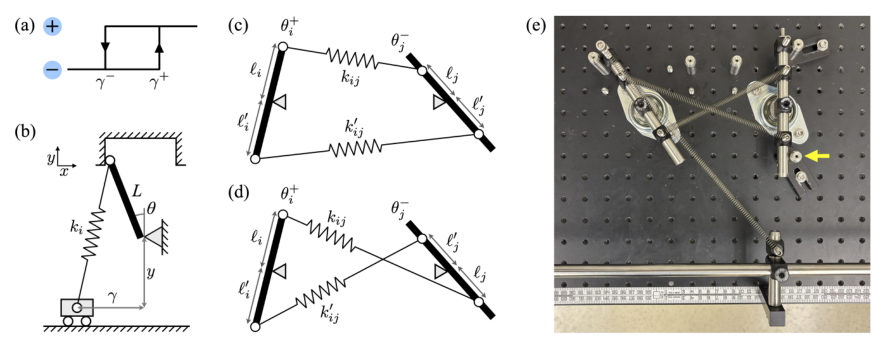
<figcaption class="paper-figure-caption"><b>Fig 1.</b> FIG. 1. Rotor hysteron design. (a) Abstract hysteron with two states and hysteretic transitions between them, γ−&lt; γ+. (b) Following Ref. [25], we build a mechanical hysteron by coralling a hinged bar between rigid stoppers and penalizing intermediate rotor angles with a linear spring. We drive the system by translating a driving rod with displacement γ. The rotor is bistable when γ−&lt; γ &lt; γ+; outside this interval, there is one stable state. (c) We create tunable interactions by joining rotors i and j with coupling springs [25]. Each spring exerts a torque τij on rotor i. This uncrossed configuration creates a ferromagnetic-like interaction, Jij &gt; 0. (d) Crossed springs create an...</figcaption>
</figure>
<figure class="paper-figure-card">
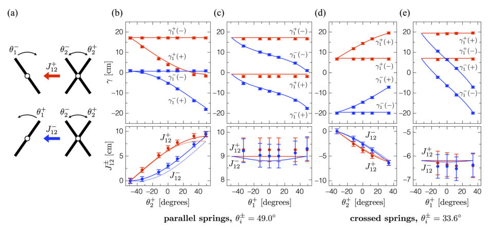
<figcaption class="paper-figure-caption"><b>Fig 2.</b> FIG. 2. Splitting J± ij via rotor angles. (a) J+ 12 is the interaction from rotor j when θi = θ− i . (b) Switching thresholds for rotor 1, which is connected to rotor 2 with uncrossed coupling springs. We break a symmetry in the system by varying θ+ 2 away from 49.0◦; this splits J± 12. (c) Varying θ+ 1 also breaks the symmetry, and splits J± 12 to a lesser degree. (d,e) Analogous results for crossed springs with the maximum angles reduced to ±33.6◦. Dashed lines in panels (b) and (d) are exact results for vanishing spring rest lengths, Eq. 11. There is no splitting of J± ij in this limit for panels (c) and (e). Parameters for all panels: y = 15.0 cm, L = 6.3 cm, w = 15.24 cm. Coupling...</figcaption>
</figure>
<figure class="paper-figure-card">
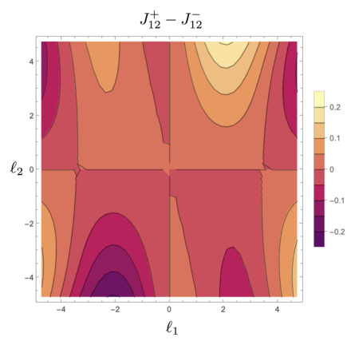
<figcaption class="paper-figure-caption"><b>Fig 3.</b> FIG. 3. Splitting J± ij via spring mounting positions. Two rotors are coupled by a single spring mounted at positions ℓ1 and ℓ2. We plot J+ 12 −J− 12 as a function of ℓ1 and ℓ2. Splitting of J± ij is present but weak. In the limit of small spring rest lengths, J+ 12 −J− 12 would vanish everywhere. Parameters: y = 15.0 cm, L = 6.3 cm, w = 15.24 cm, θ± i = ±33.6◦. Coupling spring: k12 = 0.19 N/cm, x0 = 4.1 cm. Driving spring: k1 = 0.070 N/cm, x0 = 2.25 cm.</figcaption>
</figure>
<figure class="paper-figure-card">
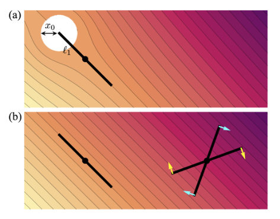
<figcaption class="paper-figure-caption"><b>Fig 4.</b> FIG. 4. Geometric origin of mixed interactions. (a) Contour plot of Eq. 2 for the torque τ12 on rotor 1 due to a single coupling spring of rest length x0. One end of the spring is mounted at ℓ1 on rotor 1 and the other is held at an arbitrary location. (b) We may approximate x0 ≃0 for springs mounted to a second rotor a distance w ≫x0 away. Cyan arrows: Typical case where increasing θ2 increases the torque on rotor 1 for uncrossed springs and decreases the torque on rotor 2 for crossed springs. Yellow arrows: When the angle between the rotors exceeds 90◦, this relationship inverts. Mixed interactions are built by inverting this relationship for some of the states.</figcaption>
</figure>
<figure class="paper-figure-card">
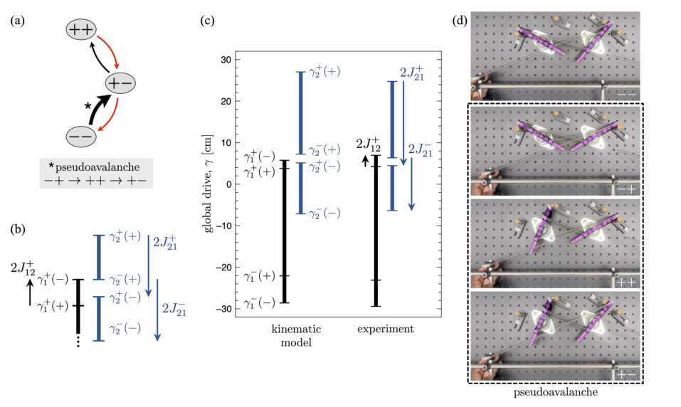
<figcaption class="paper-figure-caption"><b>Fig 5.</b> FIG. 5. Building a pseudoavalanche. (a) Transition graph containing a pseudoavalanche. This behavior requires a mixed interaction: J+ 12 &gt; 0, J± 21 &lt; 0. (b) One possible ordering of switching thresholds that produces this transition graph. The thresholds γ+ 1 (−) and γ− 2 (+) can be in either order. (c) Switching thresholds consistent with this ordering, obtained from the kinematic model (Eqs. 3, 5, 7) and from the experiment. Mounting positions: L = 6.3 cm, ℓ1 = −ℓ2 = 3.2 cm, y = 10 cm, w = 15.24 cm, x1 = 36 cm, x2 = −35 cm. Coupling springs: k12, k′ 12 = 0.18, 0.19 N/cm, x0, x′ 0 = 4.2, 4.7 cm. Driving springs: k1 = k2 = 0.037 N/cm, x0 = 6.5, 9.7 cm. To reach long extensions while staying...</figcaption>
</figure>

**Summary.** The paper details the construction of rotor-based mechanical hysterons capable of realizing highly controllable and complex interactions. By manipulating geometric parameters like spring mounting positions and rotor angles, the authors achieve tunable split, mixed-sign, and three-body coupling terms in a physical system. This work expands the design space for mechanically computing matter based on interacting disordered elements.

**Why it may be interesting.** This work provides a tangible, mechanical platform for studying concepts typically confined to abstract spin models or theoretical Hamiltonians, offering experimental insight into non-equilibrium dynamics and complex many-body interactions relevant to disordered systems.

Detailed structure

**Main problem.** To systematically demonstrate control over complex interaction types—split, mixed, and three-body interactions—in a mechanical system designed to model hysteretic spins.

**Main result.** The authors successfully build rotor-based mechanical hysterons that exhibit tunable non-reciprocal, state-dependent pairwise couplings and controllable three-body effects by manipulating geometric parameters.

**Method.** The study combines analytical derivations based on torque balance equations with experimental realization using coupled rotors to map abstract interaction terms onto physical hardware.

**Model / system.** The system consists of rotor hysterons coupled by mechanical springs, modeling interacting spins relevant for studying athermal disordered matter and developing intelligent matter.

**Key observables.** Switching thresholds (gamma), pairwise interaction strengths ($J_{\pm}^{ij}$), and three-body coupling terms ($K^{\pm}_{ijk}$).

**Important parameters / regimes.** Spring stiffnesses ($k$), rotor angles ($	heta$), mounting positions ($\ell$), and the ratio of spring rest lengths to separation distances ($x_0$).

**Assumptions / limitations.** The analysis often relies on approximations derived from small coupling spring rest lengths, though the work explicitly explores regimes where these assumptions break down.

**Figures summary.** Figures illustrate the splitting of interaction strengths by varying rotor angles or mounting positions, demonstrate pseudoavalanches requiring mixed interactions, and show the emergence of three-body terms when nonlinear torque regimes are accessed.

**Paper structure.** The paper progresses from establishing the general hysteretic model and its required interactions to demonstrating symmetry breaking (splitting), then showing how mixed signs can be engineered, culminating in the realization of tunable three-body effects.

Abstract

Interacting hysteretic spins are an appealing model for cyclically-driven athermal disordered matter. Because they provide a basis for storing and processing information from their environment, such models are also being pursued as a framework for intelligent matter. Recent proof-of-concept designs have begun to demonstrate the strong, controlled, pairwise interactions that are necessary for this endeavor. But, it is not yet clear what are the limits---practically or fundamentally---on such interactions. Here we build rotor-based mechanical hysterons that extend the generality of their interactions in three ways: (i) splitting the interaction strength based on the hysteron state, (ii) building a non-reciprocal interaction of mixed sign, and (iii) incorporating tunable three-body effects. We access these effects within a simple, replicable design platform, and we rationalize our results. Our work expands the space of behaviors for designed structures that compute on mechanical inputs.

[↑ back to top](#top)

### [Inertial Asynchronous Computation](http://arxiv.org/abs/2607.21965v1)

**Authors:** Doruk Efe Gökmen, Michel Fruchart, Dmitrii Zendrikov, Giacomo Indiveri, Giulio Biroli, Vincenzo Vitelli  
**Type:** both · **Category:** disordered systems and neural networks · **PDF:** <https://arxiv.org/pdf/2607.21965v1>  
**Analysis basis:** full PDF text, analyzed in chunks
**Topic relevance:** `driven-dissipative phase transition` **3/5** · `methods for driven-dissipative` **3/5** · `non-equilibrium dynamics` **3/5** · `non-equilibrium universality` **2/5** · `Frenkel-Kontorova` **1/5** · `Keldysh / 2PI / non-Gaussian methods` **1/5** · `analog quantum simulation` **1/5** · `correlated / nonlocal dissipation` **1/5**

↔ Scroll figures horizontally

<figure class="paper-figure-card">
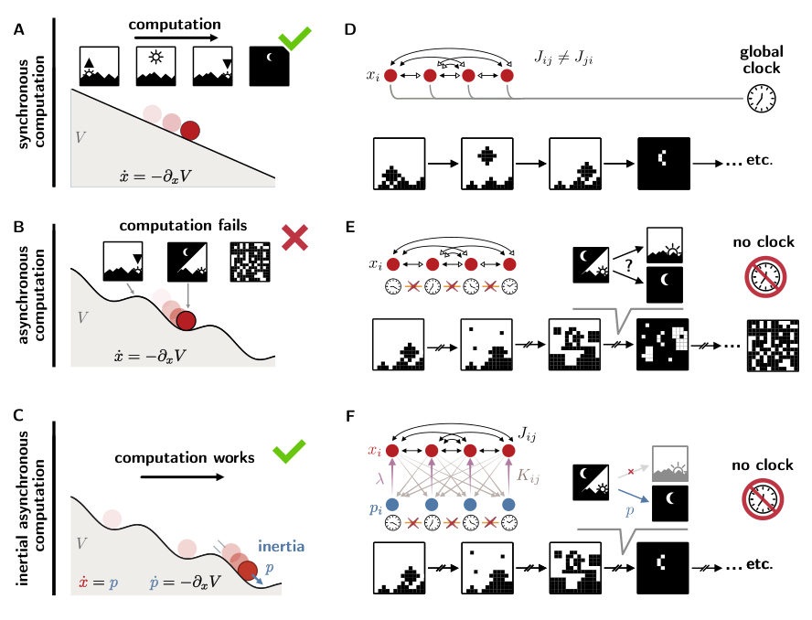
<figcaption class="paper-figure-caption"><b>Fig 1.</b> Figure 1. Saving asynchronous computations from chaos: inertia to the rescue. As an example computation, we consider the retrieval of a sequence of patterns ξ1 →ξ2 →· · · ξP →ξ1 →· · · of length P. Here, these are represented by pictures of day, sunset, night, sunrise (going back to day, and so on, so here P = 4), as shown in panel A. (Note that in the Hopfield model we describe in the main text, ξµ are uncorrelated i.i.d Rademacher random patterns, see Methods for the modern Hopfield version where actual pictures can be encoded.) A-C. Computation is pictured as a ball (in red) rolling on a hill (in grey). In panels A-B, the ball’s motion is overdamped (like in honey), i.e. its position x...</figcaption>
</figure>
<figure class="paper-figure-card">
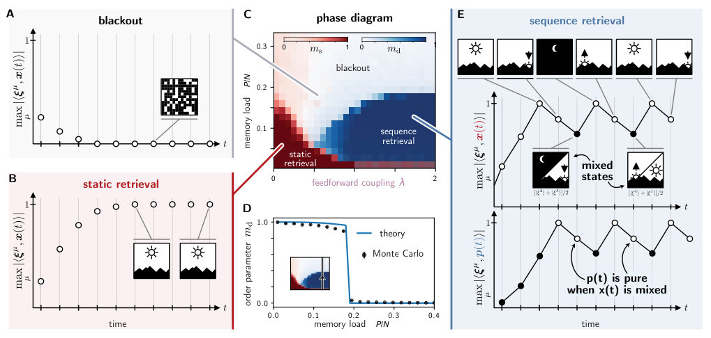
<figcaption class="paper-figure-caption"><b>Fig 2.</b> Figure 2. The phase diagram of an asynchronous computer. The phase diagram obtained from Monte-Carlo simulations (C; see Methods for details) shows three behaviors, that we interpret as thermodynamic phases in the limit where both the number N of neurons and the number of stored patterns P go to infinity, at fixed memory load P/N. These are: A a blackout phase where no stored pattern ξµ is retrieved, so all overlaps ⟨ξµ, x(t)⟩vanish, B a static retrieval phase where a single stored pattern (here, day) is retrieved and it does not change in time (Supplementary Movie 3), and E a sequence retrieval phase where the ordered sequence of patterns is retrieved in order, in a loop, forever. We...</figcaption>
</figure>
<figure class="paper-figure-card">
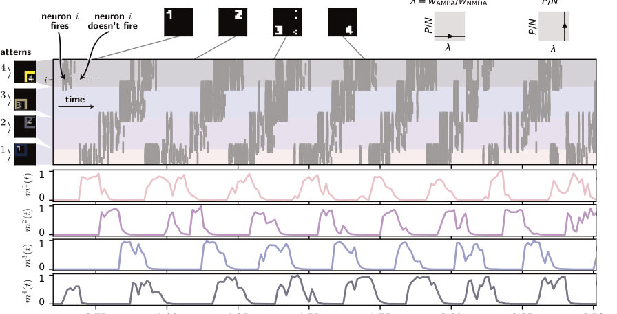
<figcaption class="paper-figure-caption"><b>Fig 3.</b> Figure 3. Experimental demonstration on asynchronous hardware. A The neuromorphic chip DYNAP-SE consists of an array of mixed-signal analog/digital circuits that emulate the dynamics of spiking neurons (top right) and synapses (bottom right) in continuous time. B We represent the two neuron species x and y on separate cores of the chip, and implement the recurrent Hebbian synapses within each core, while inter-core connections implement the asymmetric coupling between the two species of neurons. C We map out the phase diagram of this neural system by tuning these synapses (cf. Extended Data Fig. 1D). Left: we observe a transition from static memory retrieval to dynamic sequence retrieval as...</figcaption>
</figure>
<figure class="paper-figure-card">
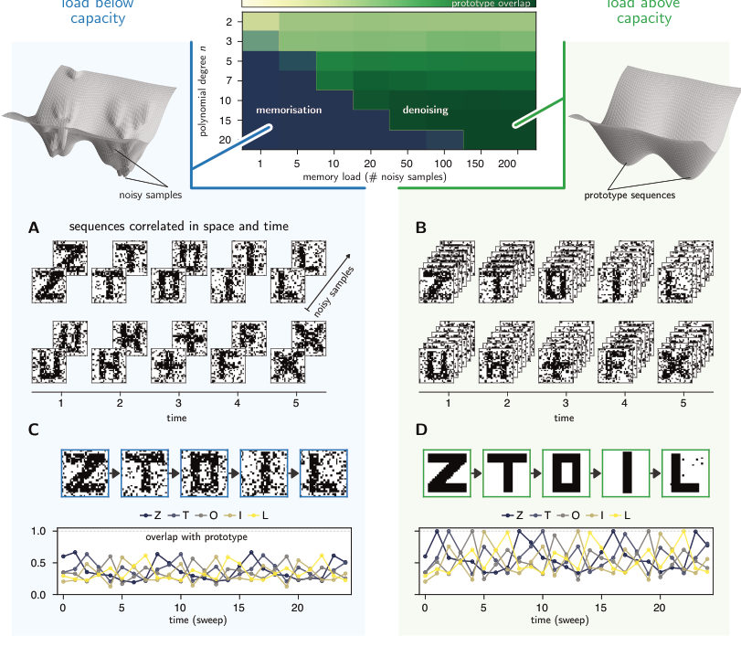
<figcaption class="paper-figure-caption"><b>Fig 4.</b> Figure 4. Asynchronous software: denoising correlated sequences. A, B Training data comprises noisy samples of each frame of different prototype sequences; the clean prototypes themselves are never shown to the network. The network behaves distinctly depending on whether it is loaded with noisy samples below (A, memorisation regime) or above (B, gener- alisation regime) its storage capacity. C, D Asynchronous retrieval dynamics. In the low-load memorisation regime (C) the retrieved cycle snaps onto whichever stored noisy sample sits closest. Strikingly, well above capacity (D), the same dynamics instead denoises the training samples: retrieved frames reconstructs the underlying clean...</figcaption>
</figure>

**Summary.** This work proposes that reliable computation in decentralized, asynchronous physical systems requires an inertial mechanism. By modeling the system using coupled position and momentum variables, the authors demonstrate how this inertia guides the state evolution to correctly retrieve temporal sequences. The findings are supported by theoretical phase diagram analysis and experimental implementation on neuromorphic hardware.

**Why it may be interesting.** The concept of emergent order from local, asynchronous interactions, mediated by an 'inertial' memory term, provides a rich analogy for understanding non-equilibrium dynamics in open quantum systems or complex many-body physics where global control is absent.

Detailed structure

**Main problem.** The core problem is understanding how natural processes can perform reliable, ordered computation when components update asynchronously without a global clock.

**Main result.** Inertia, modeled by coupling position and momentum variables, provides the necessary mechanism to guide asynchronous state evolution toward correct computational sequences.

**Method.** The authors employ loop dynamical mean-field theory to analyze the phase diagram of the system, supplemented by experimental validation on neuromorphic chips.

**Model / system.** The model is an inertial asynchronous computation network where physical hardware is split into two asymmetrically coupled parts (position $\mathbf{x}$ and momentum $\mathbf{p}$). The dynamics are governed by coupled, non-variational update rules.

**Key observables.** Order parameters ($m_\mu(t)$ for static retrieval; $m_d$ for sequence retrieval), phase diagram boundaries (Blackout, Static Retrieval, Sequence Retrieval).

**Important parameters / regimes.** The ratio of patterns to neurons ($P/N$), the inertial coupling strength ($\lambda$), and the memory load.

**Assumptions / limitations.** The approach assumes that coupling position and momentum in this specific manner provides a general strategy for reliable, decentralized computation.

**Figures summary.** Figure 1 illustrates the concept of inertia enabling successful asynchronous computation compared to failure modes. Later panels show concrete results contrasting synchronous success, asynchronous failure, and proposed model success in associative memory retrieval.

**Paper structure.** The paper introduces the mystery of natural asynchronous computation, proposes the inertial $\mathbf{x}/\mathbf{p}$ model, develops the theoretical framework using loop DMFT to map the phase diagram, and concludes with experimental demonstrations on neuromorphic hardware and software applications like movie denoising.

Abstract

Computation is the controlled evolution of a state. Asynchronous evolutions, where all parts of the state change in their own time without stopping each other, put this control in jeopardy. It is in fact a mystery how natural processes perform asynchronous computations using many units with no global orchestration. Here we demonstrate how collective computational abilities can emerge in asynchronous many-body systems. The key insight is to split the physical "hardware" underlying the computation into two asymmetrically coupled parts, analogous to position and momentum in a harmonic oscillator. The resulting inertia nudges the evolution of the state so that the asynchronous computation proceeds in the right order. By treating our inertial asynchronous computer as a nonequilibrium material, we map out its phase diagram numerically and analytically using a framework we dub loop dynamical mean-field theory. We experimentally demonstrate our approach using analog spiking neuromorphic chips designed to mimic actual neurons in the brain. In addition, we construct software that can run on asynchronous hardware: we denoise movies whose clean versions were never seen during training, an instantiation of the generalization transition underlying modern machine learning. Our results point to a general strategy for reliable, decentralized computation in energy-constrained settings from dynamics self-assembly to cell differentiation.

[↑ back to top](#top)

### [Spectral Gap of the Davies Generator for the Mean-Field Heisenberg Model](http://arxiv.org/abs/2607.21798v1)

**Authors:** Joao Basso, Thiago Bergamaschi, Lin Lin, Michael Ragone, Kevin D. Stubbs  
**Type:** theory · **Category:** statistical mechanics · **PDF:** <https://arxiv.org/pdf/2607.21798v1>  
**Analysis basis:** full PDF text, analyzed in chunks
**Topic relevance:** `methods for driven-dissipative` **3/5** · `non-equilibrium dynamics` **3/5** · `non-equilibrium universality` **2/5** · `Keldysh / 2PI / non-Gaussian methods` **1/5** · `analog quantum simulation` **1/5** · `correlated / nonlocal dissipation` **1/5** · `driven-dissipative phase transition` **1/5** · `entanglement & information structure` **1/5** · `exotic spin models in light-matter` **1/5** · `scars & prethermalization` **1/5**

↔ Scroll figures horizontally

<figure class="paper-figure-card">
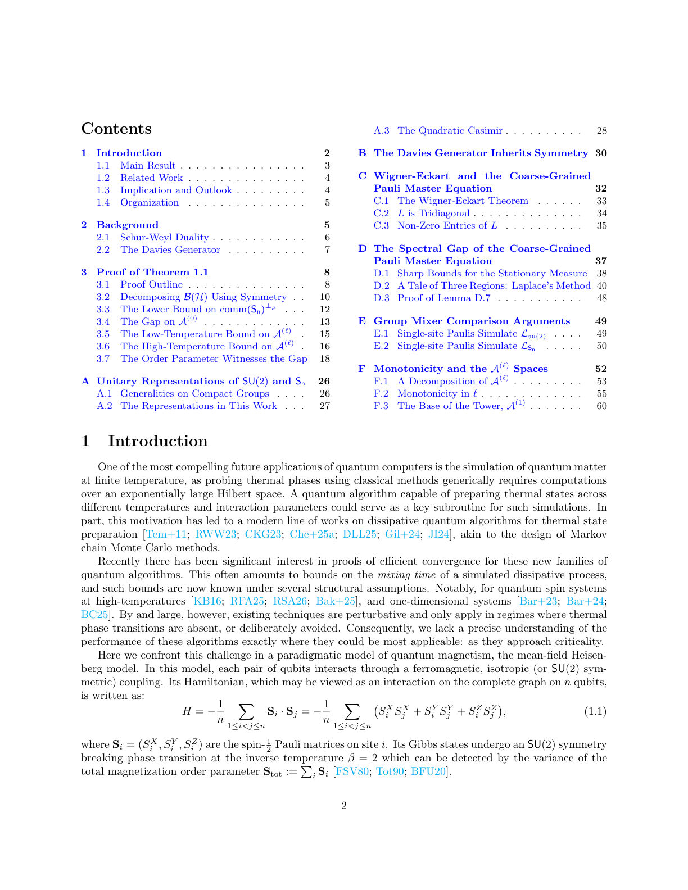
<figcaption class="paper-figure-caption"><b>Fig 1.</b> Low-resolution page preview, page 2</figcaption>
</figure>
<figure class="paper-figure-card">
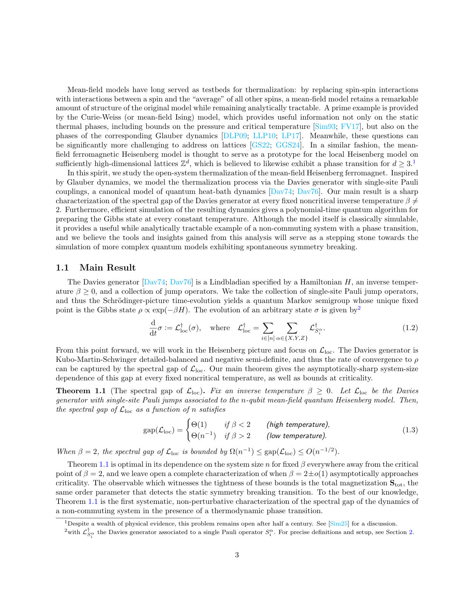
<figcaption class="paper-figure-caption"><b>Fig 2.</b> Low-resolution page preview, page 3</figcaption>
</figure>
<figure class="paper-figure-card">
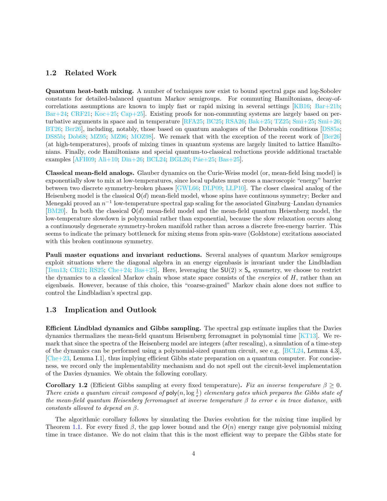
<figcaption class="paper-figure-caption"><b>Fig 3.</b> Low-resolution page preview, page 4</figcaption>
</figure>
<figure class="paper-figure-card">
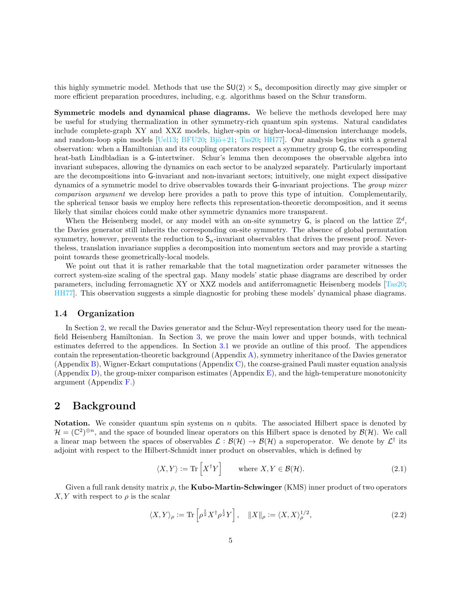
<figcaption class="paper-figure-caption"><b>Fig 4.</b> Low-resolution page preview, page 5</figcaption>
</figure>
<figure class="paper-figure-card">
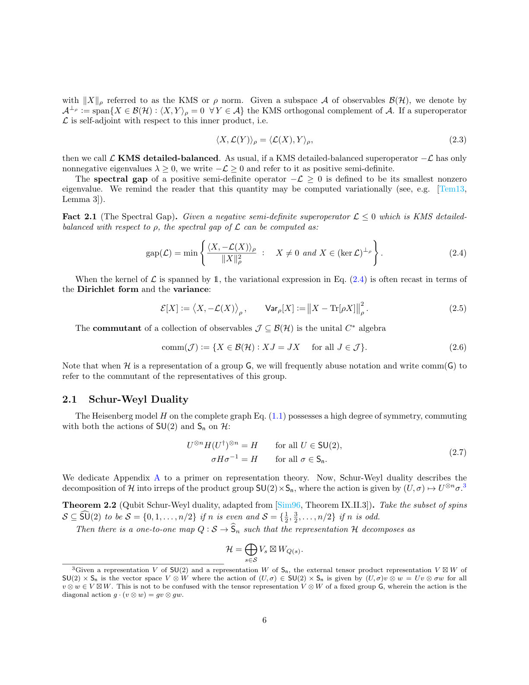
<figcaption class="paper-figure-caption"><b>Fig 5.</b> Low-resolution page preview, page 6</figcaption>
</figure>

**Summary.** This paper rigorously analyzes the rate of thermalization for the mean-field Heisenberg ferromagnet using the Davies generator. It establishes that the spectral gap scales differently depending on whether the system is above or below its critical temperature ($eta=2$). The results show that slow dynamics at low temperatures are linked to continuous symmetry breaking.

**Why it may be interesting.** This work provides rigorous quantitative estimates for thermalization rates in a highly symmetric quantum spin model, directly linking dynamical behavior (spectral gap) to underlying symmetries and phase transitions.

Detailed structure

**Main problem.** The primary goal is characterizing the spectral gap of the Davies generator associated with the mean-field Heisenberg model at noncritical temperatures.

**Main result.** The spectral gap exhibits different system size scaling depending on temperature: $\Theta(1)$ for high temperatures ($eta<2$) and $\Theta(n-1)$ for low temperatures ($eta>2$).

**Method.** The analysis employs comparison arguments using auxiliary generators, decomposing observables into spherical tensor operators, and utilizing Dirichlet form calculations based on the Davies generator.

**Model / system.** The system is the mean-field Heisenberg ferromagnet (spin-1/2 interactions on a complete graph). The dynamics are modeled by the open-system evolution governed by the Davies generator, which describes thermalization towards the Gibbs state $
ho \propto e^{-eta H}$.

**Key observables.** Spectral gap of the Davies generator ($	ext{gap}(L_{	ext{loc}})$) and the total magnetization order parameter ($S_{	ext{tot}}$).

**Important parameters / regimes.** Inverse temperature ($eta$), system size ($n$). The critical point is $eta=2$.

**Assumptions / limitations.** The analysis relies on symmetry properties (SU(2) and S_n) and the decomposition of observables into spherical tensor operators.

**Figures summary.** Not specified in the notes, but calculations involve matrix elements derived from Pauli twirls ($	ext{d}(\ell)_{s,s'}$) and bounds on ratios involving moments of spin quantum numbers ($s$).

**Paper structure.** The paper develops results by first establishing properties of the generator using Wigner 3j/6j symbols, then deriving lower bounds on the spectral gap via Dirichlet form calculations that exploit symmetry decomposition.

Abstract

The mean-field Heisenberg ferromagnet is a quantum spin model on the complete graph with isotropic spin-1/2 interactions. This non-commuting Hamiltonian is permutation and $\mathsf{SU}(2)$ invariant, and its Gibbs states undergo an $\mathsf{SU}(2)$ symmetry breaking phase transition at inverse temperature $β=2$. We consider the associated Davies generator, a canonical model of open-system thermalization, and prove tight asymptotic estimates for its spectral gap at all noncritical temperatures. For fixed $β<2$, the gap as a function of number of qubits $n$ is $Θ(1)$, while for fixed $β>2$ the gap is $Θ(n^{-1})$. The matching upper bound of the spectral gap is witnessed by the total magnetization order parameter, suggesting that the low-temperature ($β>2$) slowdown is associated with broken continuous symmetry. Two key ingredients in our approach are a comparison argument, which introduces auxiliary generators to bound dissipation on nontrivial representations of the symmetry groups $\mathsf{SU}(2)$ and $\mathsf{S}_n$, and a decomposition of the space of observables into spherical tensor operators to reveal a form of monotonicity.

[↑ back to top](#top)

### [Turbulence in Quantum Gases: Vortices, Waves, and Cascades](http://arxiv.org/abs/2607.22244v1)

**Authors:** Ashton S. Bradley, Tyler W. Neely, Xiaoquan Yu, Brian P. Anderson  
**Type:** theory · **Category:** quantum gases · **PDF:** <https://arxiv.org/pdf/2607.22244v1>  
**Analysis basis:** full PDF text, analyzed in chunks
**Topic relevance:** `analog quantum simulation` **3/5** · `non-equilibrium dynamics` **3/5** · `non-equilibrium universality` **2/5** · `Keldysh / 2PI / non-Gaussian methods` **1/5** · `driven-dissipative phase transition` **1/5** · `entanglement & information structure` **1/5** · `methods for driven-dissipative` **1/5**

↔ Scroll figures horizontally

<figure class="paper-figure-card">
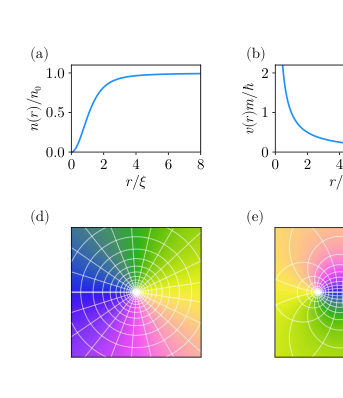
<figcaption class="paper-figure-caption"><b>Fig 1.</b> Fig. 1 Vortex properties for the GPE: (a) numerically computed stationary radial GPE density profile of a singly charged vortex, (b) velocity, (c) current, and quantum phase (colour) with streamlines for (d) a single vortex, (e) a vortex–antivortex dipole with vanishing net phase winding in the far field, and (f) a same-sign vortex pair with a stagnation point between the vortices and 4휋 phase winding in the far field</figcaption>
</figure>
<figure class="paper-figure-card">
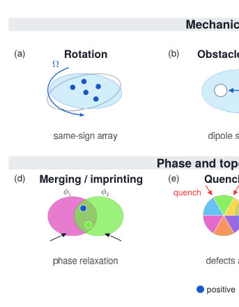
<figcaption class="paper-figure-caption"><b>Fig 2.</b> Fig. 2 Schematic mechanisms for vortex formation in quantum gases. Mechanical forcing creates circulation by rotating the gas [panel (a)] [8, 9], by shedding, splitting, or pinning vortices with localized optical potentials [panel (b)] [32, 11, 33], or by driving the trap [panel (c)] [34, 12]; panel (c) represents time-dependent shaking or deformation of the confinement, which injects energy until shape instabilities nucleate vortex cores. Phase and topological routes create vortices when condensates with distinct phase are merged or directly imprinted [panel (d)] [35, 36, 37], when phase domains freeze out [38, 39] or BKT pairs unbind [panel (e)] [40], or when synthetic gauge fields and...</figcaption>
</figure>
<figure class="paper-figure-card">
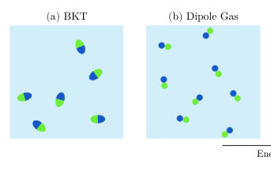
<figcaption class="paper-figure-caption"><b>Fig 3.</b> Fig. 3 Equilibrium vortex phases in 2D, with vortex energy increasing left to right. (a) Phase- fluctuating BKT regime in strict 2D; In the effective 2D vortex regime: (b) low-energy vortex dipole gas; (c) uncorrelated vortex plasma; (d) high-energy clustered Onsager vortex phase</figcaption>
</figure>
<figure class="paper-figure-card">
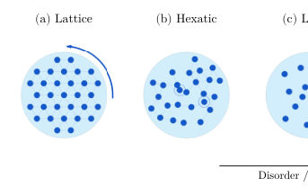
<figcaption class="paper-figure-caption"><b>Fig 4.</b> Fig. 4 Schematic chiral vortex matter in 2D, with all vortices carrying positive counter-clockwise circulation. (a) At low excitation energy, same-sign vortices form an ordered triangular lattice with long-range positional and orientational order. (b) With increasing disorder the lattice can melt into a hexatic state, where local sixfold orientational order remains but positional order is disrupted. (c) Further excitation produces a liquid-like state with only short-range spatial correlations. (d) In the plasma-like regime, same-sign vortices are nearly uncorrelated and strongly disordered. (e) Confinement and finite angular momentum can also support off-axis same-sign vortex matter, which is...</figcaption>
</figure>
<figure class="paper-figure-card">
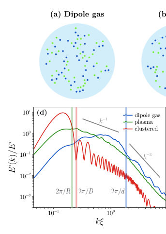
<figcaption class="paper-figure-caption"><b>Fig 5.</b> Fig. 5 Gross-Pitaevskii vortex-gas diagnostics in a hard-wall disk trap. A Thomas-Fermi back- ground density is imprinted with vortices (including images due to the boundary) to analyse spectra and correlations. (a) A low-energy vortex dipole gas consists of closely bound vortex-antivortex pairs, so far-field circulation is strongly cancelled. (b) An uncorrelated neutral plasma contains free positive and negative vortices with weak spatial order. (c) A clustered Onsager-like state is sampled from two independent elongated Gaussian clouds, one for each vortex sign, with their long axes tangential to the boundary; the resulting sign separation produces large-scale same-circulation flow. (d) The...</figcaption>
</figure>

**Summary.** This review systematically examines turbulence in Bose-Einstein condensates by analyzing the Gross-Pitaskii Equation. It introduces sophisticated diagnostics to differentiate between wave-driven cascades and vortex-dominated dynamics. The paper is crucial for understanding how quantized topological excitations govern energy dissipation in quantum fluids.

**Why it may be interesting.** This work is highly relevant as it tackles non-equilibrium dynamics and energy transport in ultracold atomic systems, requiring advanced knowledge of both superfluid hydrodynamics and quantum field theory techniques.

Detailed structure

**Main problem.** The paper reviews the complex physics of turbulence in ultracold quantum gases, aiming to bridge classical fluid concepts like energy cascades with microscopic wave-function dynamics.

**Main result.** It establishes that simple power laws are insufficient evidence for a cascade and requires detailed diagnostics (like spectral fluxes and vortex correlations) to distinguish between different turbulent regimes.

**Method.** The analysis relies on deriving hydrodynamic equations from the Gross-Pitaevskii Equation (GPE), treating the system in terms of particle current, superfluid velocity, and considering both wave and topological excitation sectors.

**Model / system.** The primary model is a scalar contact-interaction Bose-Einstein condensate described by the GPE. The physics involves quantized circulation, density fluctuations, and the interplay between quantum pressure and interaction energy.

**Key observables.** Incompressible/compressible kinetic-energy spectra, wave-occupation spectra, spectral fluxes, vortex-resolved correlations, and velocity statistics.

**Important parameters / regimes.** Healing length ($\xi$), quantized circulation ($\hbar/m$), critical velocity ($c$), and the system's dimensionality (2D vs 3D).

**Assumptions / limitations.** The analysis distinguishes between weak-wave turbulence (classical field approximation) and strong vortex turbulence, noting that the quantum potential term is crucial near cores.

**Figures summary.** Figure 1 illustrates vortex properties for GPE, showing density profiles and velocity fields associated with quantized vortices.

**Paper structure.** The paper progresses by introducing the BEC model via the GPE, deriving the superfluid Euler equation using the particle current, detailing various diagnostic tools to characterize different turbulent regimes (wave vs. vortex), and concluding by placing the system in a broader context of quantum fluids.

Abstract

We review turbulence in ultracold quantum gases, using the scalar contact-interaction Bose-Einstein condensate as the reference system for quantized circulation, compressibility, vortices, sound, and cascades. We focus on the quantitative diagnostics that connect helium and classical phenomenology to microscopic wave-function dynamics: incompressible and compressible kinetic-energy spectra, wave-occupation spectra, spectral fluxes, vortex-resolved correlations, and velocity statistics. These diagnostics distinguish equilibrium vortex organization, decaying turbulent relaxation, forced cascade dynamics, and weak-wave turbulence, and show why power laws alone are insufficient evidence for a cascade. We survey experiments on two-dimensional Onsager clustering, three-dimensional vortex-line turbulence, box-trap wave cascades, engineered dissipation, and turbulent equations of state. We close by briefly placing the contact-interaction scalar superfluid system in a broader landscape of nonlocal, multicomponent, fermionic, and driven-dissipative quantum fluids, where turbulence concepts can be tested for universality.

[↑ back to top](#top)

### [Quantum Cellular Automata from Kramers-Wannier Dualities and Modular Relations](http://arxiv.org/abs/2607.21728v1)

**Authors:** Carolyn Zhang, Po-Shen Hsin  
**Type:** theory · **Category:** strongly correlated electrons · **PDF:** <https://arxiv.org/pdf/2607.21728v1>  
**Analysis basis:** full PDF text, analyzed in chunks
**Topic relevance:** `analog quantum simulation` **3/5** · `entanglement & information structure` **2/5** · `non-equilibrium dynamics` **2/5** · `Keldysh / 2PI / non-Gaussian methods` **1/5** · `driven-dissipative phase transition` **1/5** · `methods for driven-dissipative` **1/5** · `non-equilibrium universality` **1/5**

↔ Scroll figures horizontally

<figure class="paper-figure-card">
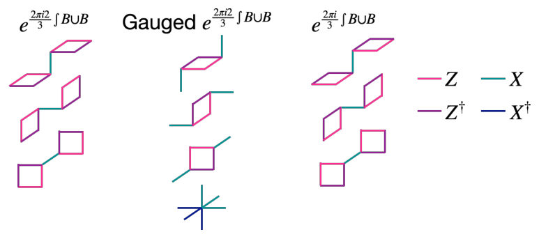
<figcaption class="paper-figure-caption"><b>Fig 1.</b> Figure 1: Stabilizer group on a cubic lattice for the Z3 1-form SPT with p = 2 (i.e. the partition function e 4πi</figcaption>
</figure>
<figure class="paper-figure-card">
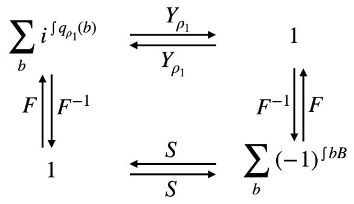
<figcaption class="paper-figure-caption"><b>Fig 2.</b> Figure 2: Square of dualities in 1+1d. The bottom two phases are bosonic while the top two phases are fermionic. Gauging refers to gauging the Z2 0-form symmetry (i.e. Kramers- Wannier duality) while stacking refers to stacking with the Kitaev wire P</figcaption>
</figure>
<figure class="paper-figure-card">
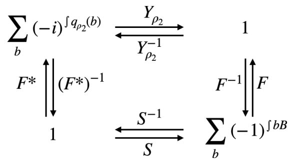
<figcaption class="paper-figure-caption"><b>Fig 3.</b> Figure 3: Square of dualities in 3+1d. The bottom two phases are bosonic with background 2-form gauge field B while the top two phases have background 2-form gauge field ρ2. Gauging refers to gauging the Z2 1-form symmetry (i.e. Kramers-Wannier duality) while stacking refers to stacking with Yρ2 = P</figcaption>
</figure>
<figure class="paper-figure-card">
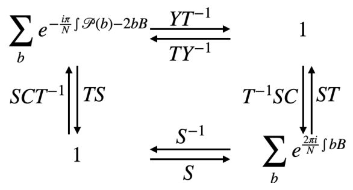
<figcaption class="paper-figure-caption"><b>Fig 4.</b> Figure 4: Square of dualities for ZN 1-form symmetries in 3+1d. Here C is charge conjugation. We gave labels for even N; for odd N the definition of T is slightly different.</figcaption>
</figure>
<figure class="paper-figure-card">
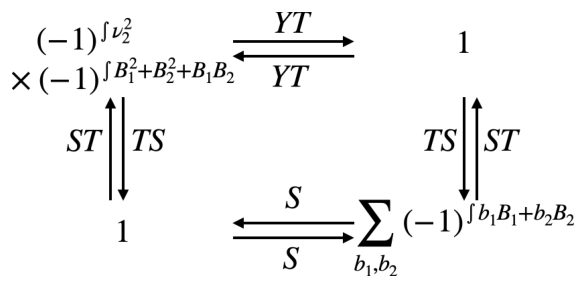
<figcaption class="paper-figure-caption"><b>Fig 5.</b> Figure 5: Square of dualities for Y corresponding to Stiefel-Whitney counterterms. Since everything is Z2, T 2 = S2 = Y 2 = 1 so we do not need to use inverses.</figcaption>
</figure>

**Summary.** This work connects advanced concepts from algebraic topology (like Stiefel-Whitney classes) to the physics of Quantum Cellular Automata. It shows that gravitational topological responses are crucial for distinguishing true lattice entanglement from simpler circuit preparations. The findings unify several theoretical frameworks, providing a deeper understanding of topological order in quantum systems.

**Why it may be interesting.** It provides a rigorous lattice framework for understanding topological invariants that are often glossed over in continuum field theory treatments of quantum matter, directly impacting how we model exotic correlated states.

Detailed structure

**Main problem.** The paper addresses a fundamental mismatch between continuum field theory descriptions of topological terms (which often ignore gravitational effects) and their essential, non-trivial manifestation on a discrete lattice.

**Main result.** It establishes that Quantum Cellular Automata (QCAs) associated with gravitational topological responses arise in four distinct physical settings, unifying the study across dualities, higher dimensions, and lattice models.

**Method.** The authors derive new projective SL(2, Z_N) relations using gravitational topological responses constructed from Stiefel-Whitney classes and provide protocols for state preparation using finite-depth circuits.

**Model / system.** The core model involves Quantum Cellular Automata (QCAs) derived from higher-dimensional analogs of Kramers-Wannier duality, analyzed via lattice realizations of projective SL(2, Z_N) relations and higher-form gauging.

**Key observables.** Gravitational topological responses, Ground State Degeneracy (GSD), and the comparison between states prepared by Finite-Depth Quantum Circuits (FDQCs) versus QCA entanglement.

**Important parameters / regimes.** The lattice dimension ($3+1$d mentioned), the symmetry group ($	ext{SL}(2,\mathbb{Z}_N)$), and the topological invariants (Stiefel-Whitney classes).

**Assumptions / limitations.** Field theory often treats gravitational topological terms as inessential counterterms, an assumption contradicted by lattice physics.

**Figures summary.** Figure 1 illustrates the mismatch between stabilizer groups for different SPT phases on a cubic lattice. Figure 8 shows two sets of stabilizers derived from ST and (ST)^3 operations.

**Paper structure.** The paper systematically analyzes how gravitational topological responses manifest in four contexts: projective SL(2, Z_N) relations, dualities generalizations, higher-form gauging, and time-reversal protected phases. It builds mathematical machinery around Gauss sums to classify these responses.

Abstract

Recent work has constructed higher-dimensional analogs of non-invertible symmetries similar to 1+1d Kramers-Wannier duality. Although their continuum descriptions often treat purely gravitational topological terms as inessential counterterms, these terms can have an essential lattice manifestation: they distinguish states prepared by finite-depth quantum circuits (FDQCs) from those entangled by nontrivial quantum cellular automata (QCAs). Motivated by this mismatch, we show that QCAs associated with gravitational topological responses arise in several related settings: (1) lattice realizations of projective $\mathrm{SL}(2,\mathbb{Z}_N)$ relations generated by topological operations on symmetries; (2) squares of dualities that generalize the relation between fermionization and Kramers-Wannier duality; (3) lattice implementations of QCAs through higher-form gauging; and (4) invertible phases protected by generalized time-reversal symmetries. We derive new projective $\mathrm{SL}(2,\mathbb{Z}_N)$ relations whose projective phases are gravitational topological responses constructed from Stiefel-Whitney classes. We furthermore give a general protocol for preparing the associated QCA-entangled states using finite-depth unitary circuits, measurements, and error correction. These results unify the study of gravitational topological responses in field theories, higher dimensional dualities, and quantum cellular automata.

[↑ back to top](#top)

### [Extreme First-Passage Time of Many Interacting Particles](http://arxiv.org/abs/2607.22528v1)

**Authors:** Ruicheng Bao  
**Type:** theory · **Category:** statistical mechanics · **PDF:** <https://arxiv.org/pdf/2607.22528v1>  
**Analysis basis:** full PDF text, analyzed in chunks
**Topic relevance:** `non-equilibrium dynamics` **3/5** · `non-equilibrium universality` **2/5** · `Keldysh / 2PI / non-Gaussian methods` **1/5** · `analog quantum simulation` **1/5** · `correlated / nonlocal dissipation` **1/5** · `driven-dissipative phase transition` **1/5** · `methods for driven-dissipative` **1/5**

↔ Scroll figures horizontally

<figure class="paper-figure-card">
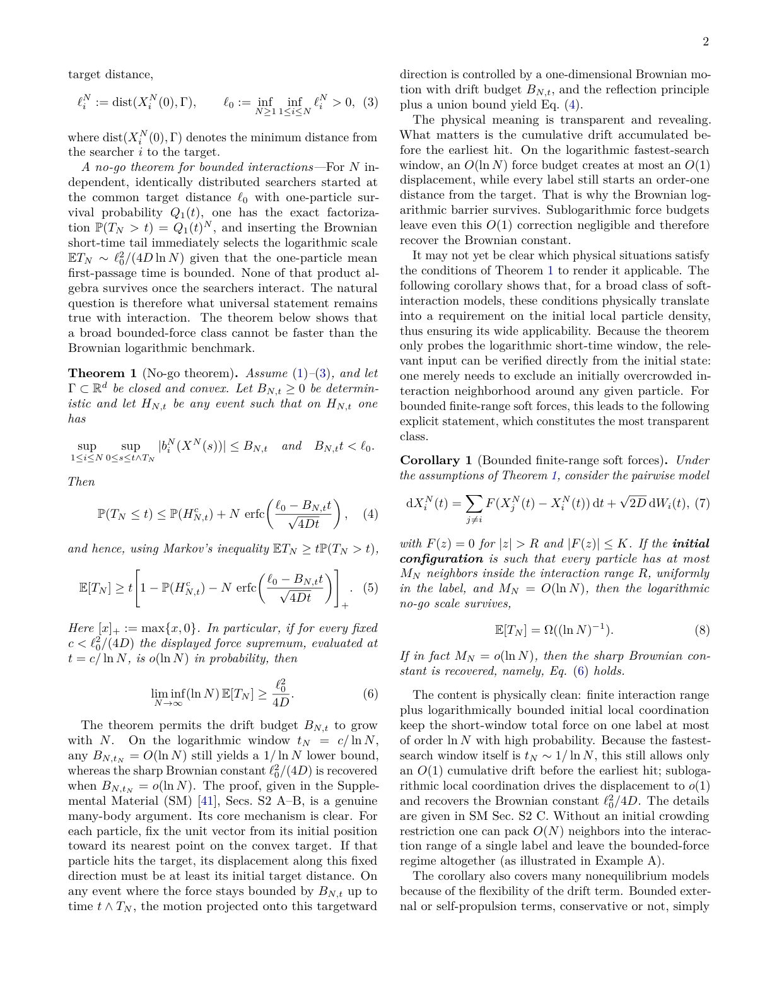
<figcaption class="paper-figure-caption"><b>Fig 1.</b> Low-resolution page preview, page 2</figcaption>
</figure>
<figure class="paper-figure-card">
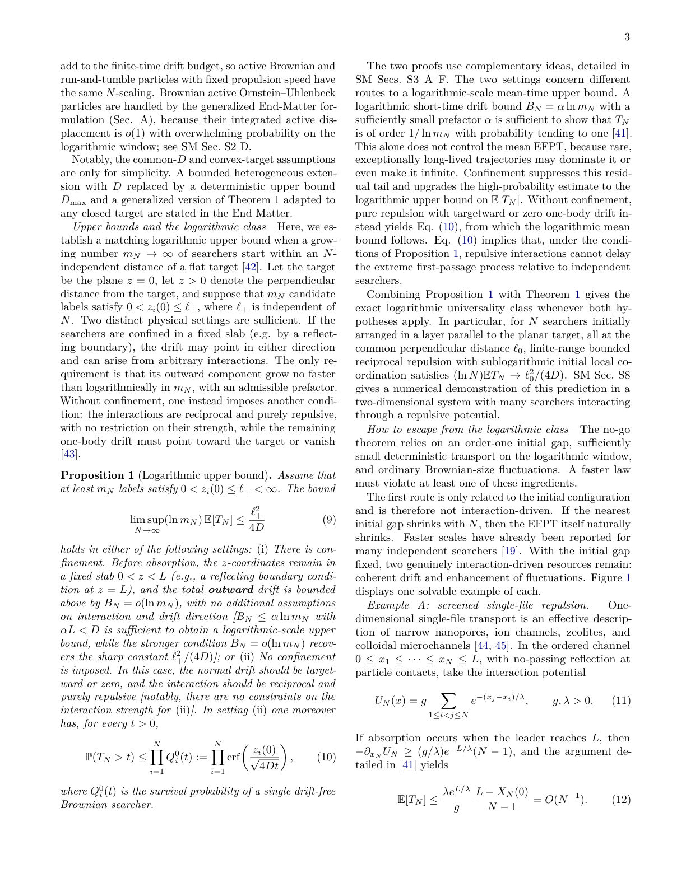
<figcaption class="paper-figure-caption"><b>Fig 2.</b> Low-resolution page preview, page 3</figcaption>
</figure>
<figure class="paper-figure-card">
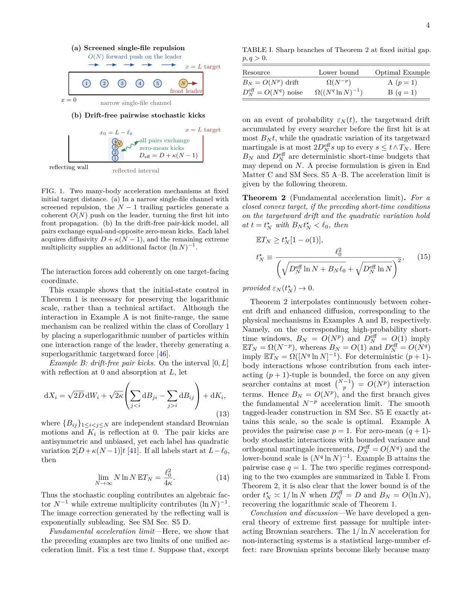
<figcaption class="paper-figure-caption"><b>Fig 3.</b> Low-resolution page preview, page 4</figcaption>
</figure>
<figure class="paper-figure-card">
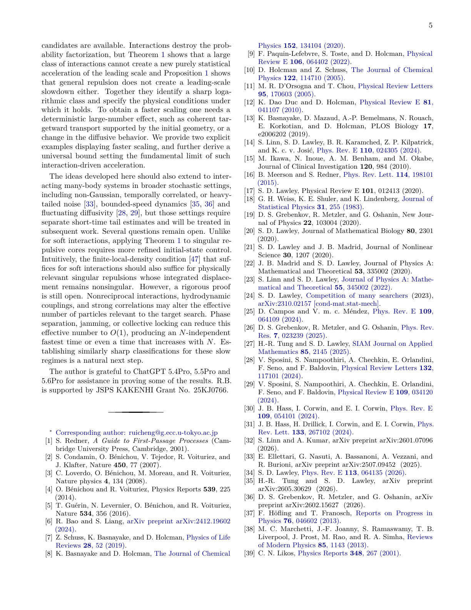
<figcaption class="paper-figure-caption"><b>Fig 4.</b> Low-resolution page preview, page 5</figcaption>
</figure>
<figure class="paper-figure-card">
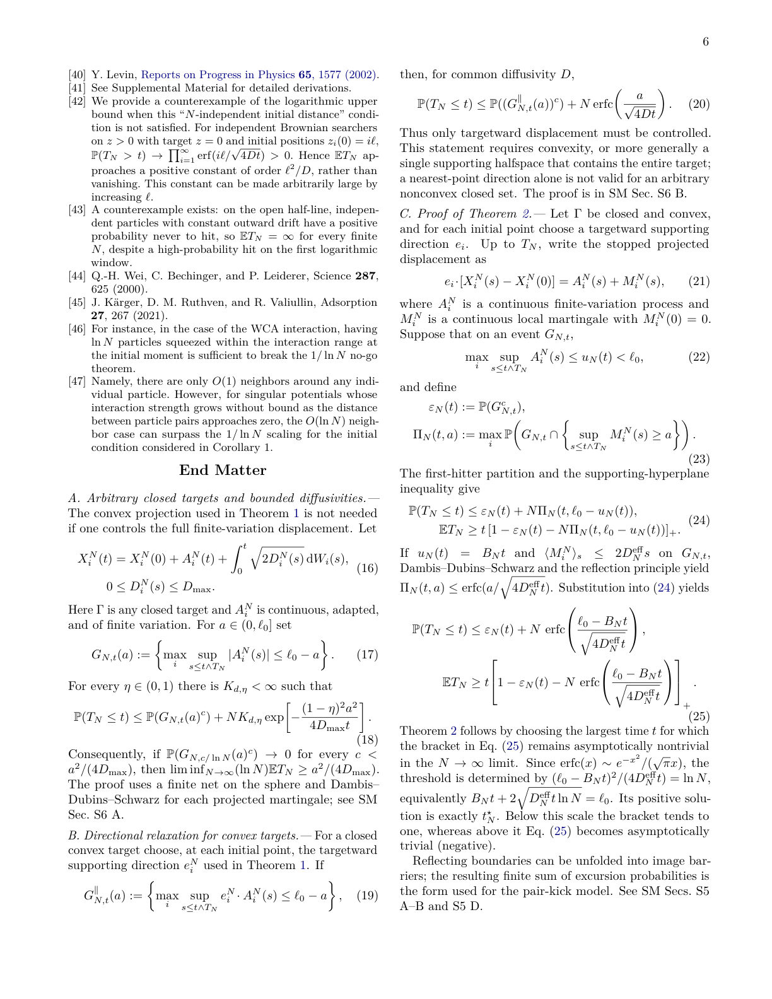
<figcaption class="paper-figure-caption"><b>Fig 5.</b> Low-resolution page preview, page 6</figcaption>
</figure>

**Summary.** This paper develops a general theoretical framework to calculate the extreme first-passage time for multiple diffusing particles that interact with each other. It proves that while statistical effects limit this time to $1/\ln N$, specific coherent interactions can accelerate the process, achieving rates as fast as $1/N$ or $1/(N \ln N)$. The work deepens understanding by separating acceleration sources into those from redundancy versus those from collective transport.

**Why it may be interesting.** While focused on classical diffusion, the rigorous mathematical framework for bounding collective transport times in interacting systems is highly relevant to understanding non-equilibrium dynamics in quantum many-body systems, such as reaction rates or quench dynamics where rare events dominate.

Detailed structure

**Main problem.** The research addresses determining the extreme first-passage time (EFPT) for multiple interacting particles to reach a target, especially when this earliest arrival dictates the outcome of a physical process.

**Main result.** The authors establish that while independent searchers yield an EFPT scaling of $1/\ln N$, interactions can accelerate this rate up to deterministic pairwise interaction ($O(1/N)$) or stochastic forcing ($O(1/(N \ln N))$).

**Method.** The work employs rigorous probabilistic bounding techniques, including establishing no-go theorems and deriving unified lower bounds by analyzing the interplay between coherent drift and enhanced diffusion.

**Model / system.** The model consists of $N$ overdamped searchers diffusing in a $d$-dimensional space towards an absorbing target set $\Gamma$, governed by Langevin dynamics with various interaction potentials (e.g., repulsive, deterministic).

**Key observables.** Extreme first-passage time ($T_N$), initial minimum distance ($\ell_0$), and the scaling exponents related to drift ($B_N$) and effective diffusion ($	ext{Deff}_N$).

**Important parameters / regimes.** The number of particles $N$, the dimensionality $d$, and the nature/strength of the pairwise interactions.

**Assumptions / limitations.** Key results rely on assumptions about bounded interactions, specific initial-state control (e.g., local coordination $\mathrm{M}_N$), or analyzing short-time logarithmic windows.

**Figures summary.** Figures illustrate the scaling differences between independent searchers and those subjected to various interaction mechanisms, showing how different resource types (drift vs. diffusion) determine the lower bound on $T_N$.

**Paper structure.** The paper builds from establishing the benchmark for non-interacting particles ($1/\ln N$) via a no-go theorem, then systematically deriving sharp upper and lower bounds by identifying specific mechanisms—deterministic drift or stochastic forcing—that lead to faster acceleration regimes.

Abstract

Extreme first-passage events are broadly relevant to biological, chemical, and physical processes in which the first successful arrival determines the outcome. Existing theories are confined to noninteracting searchers. Interacting extreme-statistics problems are notoriously difficult because correlations destroy probability factorization. We establish a general framework for interacting extreme search. A no-go theorem shows that broad classes of bounded interactions cannot beat the $1/\ln N$ extreme timescale of $N$ independent Brownian searchers, and complementary upper bounds prove that this scale is exact for broad classes of repulsive interactions. We then identify two sharp mechanisms beyond the logarithmic class and derive a unified interaction-driven acceleration limit. In particular, deterministic pairwise interaction can at most reduce the extreme search time to order $1/N$, while stochastic pairwise forcing attains $1/(N\ln N)$. Our results separate acceleration due to statistical redundancy from that generated by coherent many-body transport or amplified fluctuations, deepening our understanding of interacting stochastic systems.

[↑ back to top](#top)

### [SSP-QST: Spectral Subspace Purification for Photonic Quantum State Tomography](http://arxiv.org/abs/2607.21836v1)

**Authors:** Anuvab Sen, Saibal Mukhopadhyay  
**Type:** theory · **Category:** quantum information and computing · **PDF:** <https://arxiv.org/pdf/2607.21836v1>  
**Analysis basis:** full PDF text, analyzed in chunks
**Topic relevance:** `quantum optics experiment` **3/5** · `entanglement & information structure` **2/5** · `quantum measurements` **2/5** · `QC/QI experiment` **1/5** · `analog quantum simulation` **1/5** · `interference shaping light` **1/5**

↔ Scroll figures horizontally

<figure class="paper-figure-card">
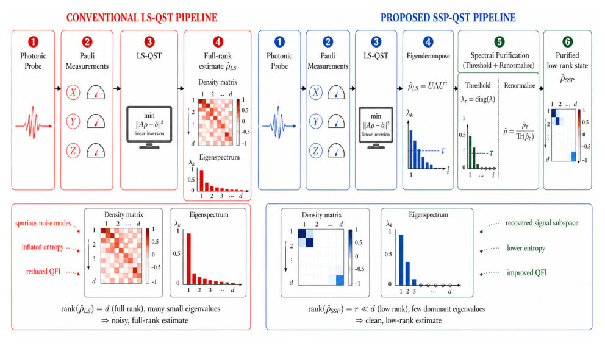
<figcaption class="paper-figure-caption"><b>Fig 1.</b> Fig. 1. Existing Pipelines vs. SSP-QST. Left: Conventional tomography reconstructs a photonic probe from Pauli measurements using LS-QST, producing a full- rank estimate ˆρ with noise-inflated eigenmodes, increased entropy, and reduced quantum Fisher information (QFI). Right: SSP-QST applies eigendecomposition, spectral thresholding, and renormalisation to the same LS-QST output, removing low-eigenvalue noise modes and recovering a low-rank purified estimate ρSSP with improved QFI.</figcaption>
</figure>
<figure class="paper-figure-card">
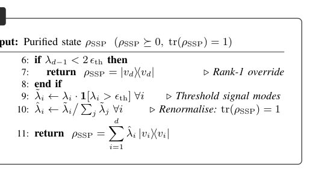
<figcaption class="paper-figure-caption"><b>Fig 2.</b> Fig. 2 shows the full closed-loop architecture. Photonic source imperfections fall into two categories that require differ- ent corrective mechanisms. Coherent drift, arising from wave- plate creep, electro-optic modulator (EOM) voltage offsets, and slow thermal phase shifts, displaces the control vector θ from its calibrated operating point and can be corrected by parameter adjustment. Incoherent noise, arising from photon loss and dephasing, randomises the probe state stochastically in each shot and cannot be undone by any classical post-processing. SSP-QST addresses both: it mitigates the reconstruction error induced by incoherent noise, and provides the fidelity gradient signal that the...</figcaption>
</figure>
<figure class="paper-figure-card">
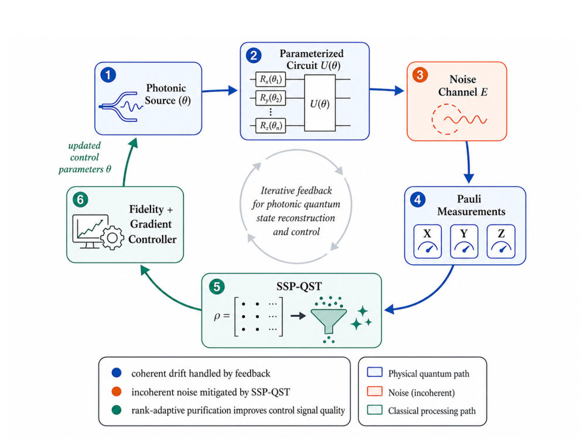
<figcaption class="paper-figure-caption"><b>Fig 3.</b> Fig. 2. Closed-loop system architecture. A parameterised photonic source prepares a probe state, which is corrupted by the noise channel E and measured across Pauli bases. The classical reconstruction module applies LS-QST followed by SSP-QST, then computes a parameter-shift fidelity gradient to update θ.</figcaption>
</figure>
<figure class="paper-figure-card">
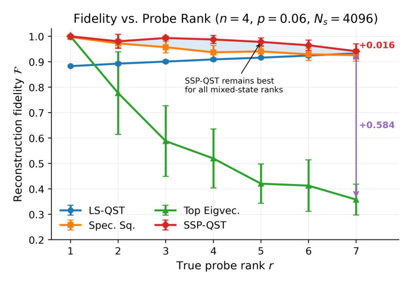
<figcaption class="paper-figure-caption"><b>Fig 4.</b> Fig. 3. Reconstruction fidelity versus true probe rank r for n = 4 qubits (d = 16), depolarising noise p = 0.06, Ns = 4096 shots per Pauli basis. Each point is averaged over 14 independently drawn rank-r states; error bars denote one standard deviation. The shaded region marks SSP-QST’s advantage over spectral squaring, the strongest non-iterative baseline in the mixed-state regime. SSP-QST matches the rank-1 top-eigenvector solution for pure probes and is the best method for every mixed-state rank tested.</figcaption>
</figure>
<figure class="paper-figure-card">
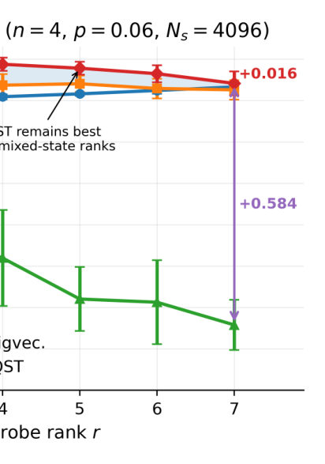
<figcaption class="paper-figure-caption"><b>Fig 5.</b> Fig. 4(b) demonstrates that this advantage is not an artefact of one operating point. We sweep the depolarising rate</figcaption>
</figure>

**Summary.** The paper introduces Spectral Subspace Purification (SSP-QST), a novel technique to clean up noisy density matrix estimates from photonic quantum state tomography. By adaptively thresholding eigenvalues based on a derived noise floor, SSP-QST avoids discarding valid signal information while removing measurement artifacts. This results in more reliable and efficient quantum sensing measurements.

**Why it may be interesting.** This work provides a computationally lightweight, non-iterative post-processing tool for quantum state estimation in photonic systems, directly addressing the practical limitations of noise handling in quantum sensing protocols relevant to AMO physics and quantum optics.

Detailed structure

**Main problem.** Standard Quantum State Tomography (QST) estimates suffer from eigenvalue contamination due to noise, which inflates entropy and reduces the usable Quantum Fisher Information. Furthermore, fixed rank-1 purification discards valid signal modes if the true state has a higher effective rank.

**Main result.** The proposed SSP-QST method achieves the highest fidelity among non-iterative baselines by adaptively purifying the density matrix estimate while preserving valid signal modes for $r>1$ probes, significantly improving shot efficiency.

**Method.** SSP-QST is a rank-adaptive post-processing layer applied to the least-squares QST estimate ($
ho_{LS}$). It eigendecomposes $
ho_{LS}$, estimates a noise floor using Weyl-motivated theory, removes modes below this threshold, and renormalizes the remaining subspace.

**Model / system.** The work focuses on photonic quantum sensing utilizing low-rank entangled probes such as GHZ, Bell, and NOON states. The analysis is performed on the density matrix reconstruction ($\hat{
ho}$) derived from Pauli measurements.

**Key observables.** Quantum Fisher Information (QFI), Reconstruction Fidelity, Eigenvalue Spectrum of $
ho_{LS}$, and the purified state $
ho_{SSP}$.

**Important parameters / regimes.** Probe rank ($r$), finite-shot noise level, and the calculated spectral noise floor ($\epsilon_{th}$).

**Assumptions / limitations.** The method requires no prior knowledge of the true rank, avoids iterative optimization, and relies only on a single eigendecomposition.

**Figures summary.** Figure 1 compares conventional LS-QST (full-rank, noisy $\hat{
ho}$) against SSP-QST's purified estimate ($
ho_{SSP}$), showing improved QFI. Other figures validate performance across varying ranks and shot budgets.

**Paper structure.** The paper first identifies the limitations of existing QST methods (LS-QST, fixed rank purification). It then introduces SSP-QST as a novel spectral thresholding technique derived from noise theory. Finally, it presents extensive simulations demonstrating superior fidelity and efficiency compared to all tested baselines.

Abstract

Photonic quantum sensing often uses low-rank entangled probes such as Greenberger-Horne-Zeilinger (GHZ), Bell, and NOON states. Although these probes are ideally rank-1, practical quantum state tomography (QST) can produce density-matrix estimates with many small finite-shot and noise-induced eigenmodes. This eigenvalue contamination can increase the estimated entropy of the reconstruction and reduce the quantum Fisher information (QFI) available for downstream sensing, while fixed rank-1 purification can discard valid signal modes when real probes acquire additional signal modes. We introduce Spectral Subspace Purification for Quantum State Tomography (SSP-QST), a rank-adaptive post-processing layer for least-squares quantum state tomography (LS-QST). SSP-QST eigendecomposes the least-squares estimate, computes a Weyl-motivated noise floor from the measured spectrum and shot count, removes eigenmodes below this floor, and renormalises the retained subspace. It requires no rank prior, no iterative optimisation, and only one eigendecomposition. In Qiskit Aer simulations, SSP-QST achieves the highest fidelity among the tested non-iterative baselines across the evaluated probe ranks, with a maximum fidelity gain of $+0.584$. It also improves shot efficiency by at least $8\times$ within the tested range. These results show that SSP-QST can make photonic QST more reliable under finite-shot noise while providing a lightweight reconstruction primitive for feedback-oriented quantum sensing pipelines.

[↑ back to top](#top)

### [Self-adjoint extensions of $k$-photon light-matter Hamiltonians](http://arxiv.org/abs/2607.22378v1)

**Authors:** Felix Fischer, Felix Knapp, Daniel Burgarth, Davide Lonigro  
**Type:** theory · **Category:** other · **PDF:** <https://arxiv.org/pdf/2607.22378v1>  
**Analysis basis:** full PDF text, analyzed in chunks
**Topic relevance:** `correlated cavity matter` **3/5** · `Tavis-Cummings & cavity-many-emitter` **2/5** · `Keldysh / 2PI / non-Gaussian methods` **1/5** · `analog quantum simulation` **1/5** · `driven-dissipative phase transition` **1/5** · `methods for driven-dissipative` **1/5**

↔ Scroll figures horizontally

<figure class="paper-figure-card">
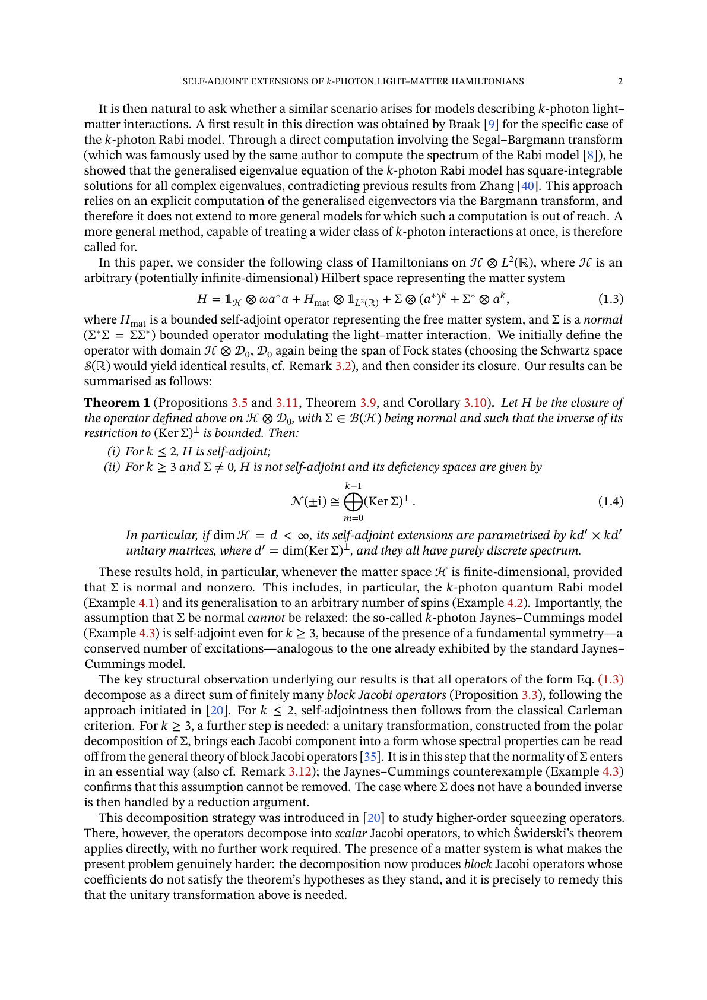
<figcaption class="paper-figure-caption"><b>Fig 1.</b> Low-resolution page preview, page 2</figcaption>
</figure>
<figure class="paper-figure-card">
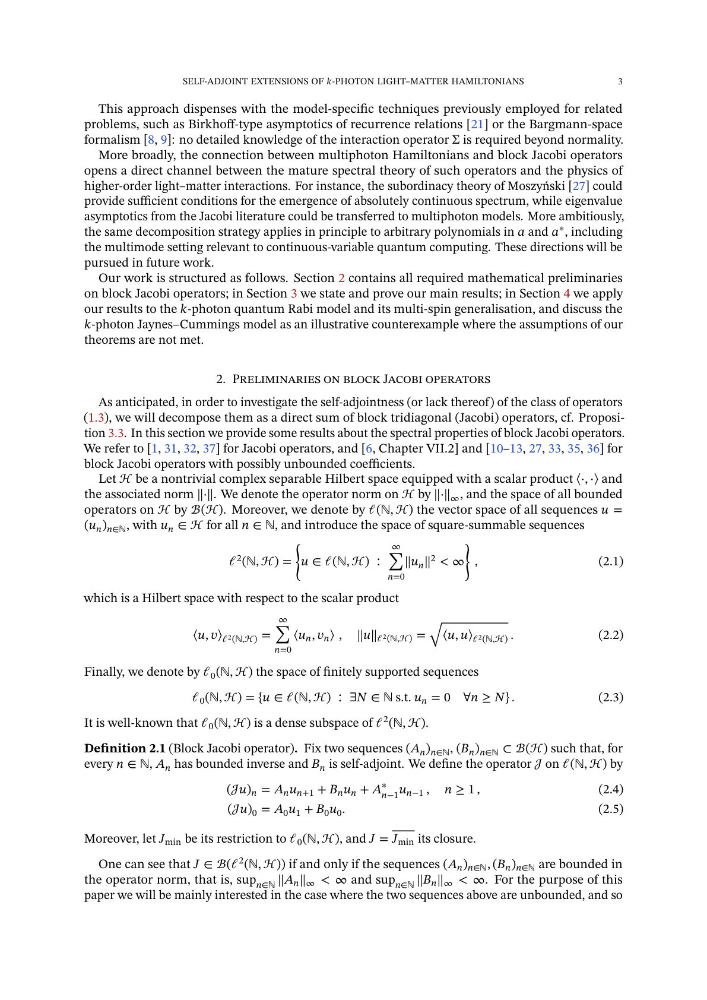
<figcaption class="paper-figure-caption"><b>Fig 2.</b> Low-resolution page preview, page 3</figcaption>
</figure>
<figure class="paper-figure-card">
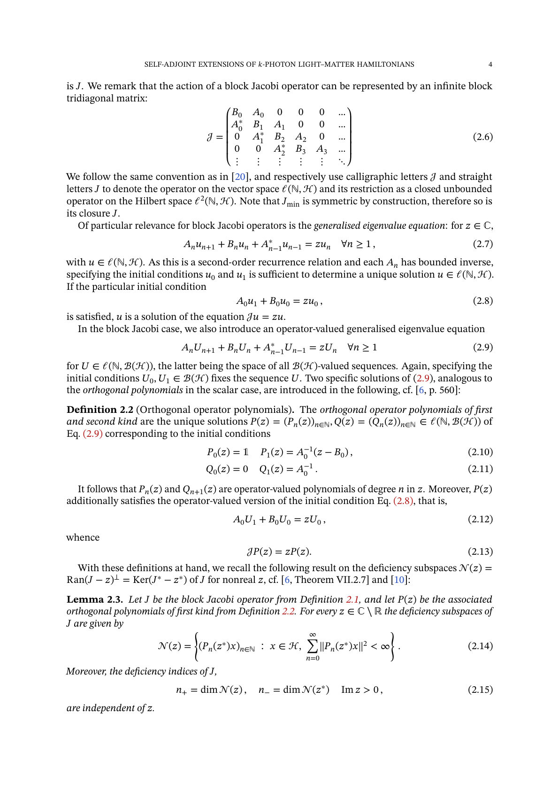
<figcaption class="paper-figure-caption"><b>Fig 3.</b> Low-resolution page preview, page 4</figcaption>
</figure>
<figure class="paper-figure-card">
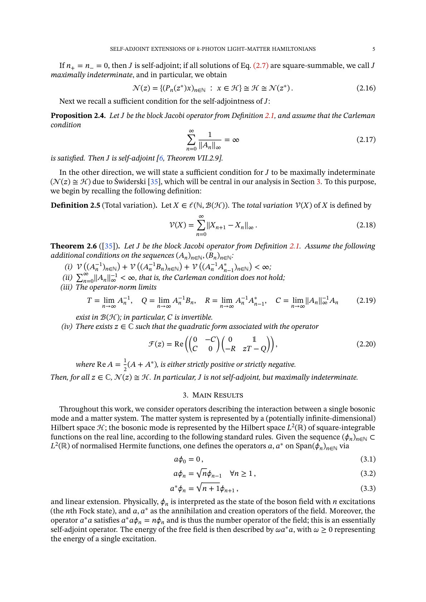
<figcaption class="paper-figure-caption"><b>Fig 4.</b> Low-resolution page preview, page 5</figcaption>
</figure>
<figure class="paper-figure-card">
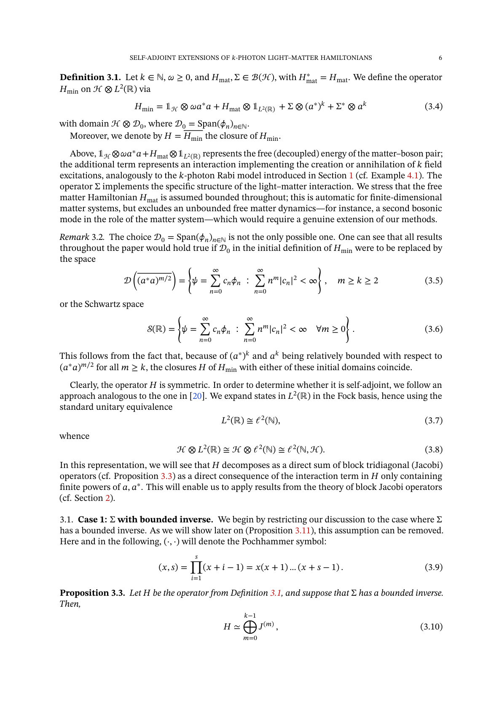
<figcaption class="paper-figure-caption"><b>Fig 5.</b> Low-resolution page preview, page 6</figcaption>
</figure>

**Summary.** This paper mathematically investigates $k$-photon light-matter interaction Hamiltonians, determining when they are self-adjoint operators. It proves that the Hamiltonian's mathematical properties change drastically depending on whether $k$ is less than or greater than three. The findings provide essential theoretical constraints for modeling nonlinear quantum optical processes.

**Why it may be interesting.** This work provides rigorous mathematical tools to analyze quantum optical Hamiltonians that exhibit strong nonlinearity, which is crucial for understanding high-order light-matter coupling in cavity QED settings.

Detailed structure

**Main problem.** The core problem is determining the self-adjoint extensions of Hamiltonians that describe nonlinear light-matter interactions involving the exchange of $k$ photons at a time.

**Main result.** The Hamiltonian is guaranteed to be self-adjoint only for $k \le 2$ under specific conditions; for $k \ge 3$, multiple self-adjoint extensions exist, all possessing purely discrete spectra if the matter system is finite-dimensional.

**Method.** The analysis employs advanced spectral theory techniques, including block Jacobi decomposition and utilizing properties derived from the polar decomposition of the coupling operator $\Sigma$.

**Model / system.** The model describes a single bosonic mode coupled to an arbitrary quantum matter system ($\mathcal{H}$) via a $k$-photon interaction term. Examples include the $k$-photon Rabi and Dicke models.

**Key observables.** Self-adjointness of the Hamiltonian, deficiency indices, and the spectrum (which is shown to be purely discrete for finite $\mathcal{H}$).

**Important parameters / regimes.** $k$ (the number of exchanged photons), the coupling operator $\Sigma$, and the energy $\omega$ of a single excitation.

**Assumptions / limitations.** The initial rigorous analysis often assumes that the coupling operator $\Sigma$ is normal ($\Sigma^* \Sigma = \Sigma \Sigma^*$).

**Paper structure.** The paper establishes the general Hamiltonian form, analyzes its self-adjointness based on $k$, derives deficiency indices for non-self-adjoint cases ($k\ge3$), and illustrates results using specific models like the Rabi and Dicke systems.

Abstract

Multiphoton light-matter interactions, in which a bosonic mode exchanges $k$ excitations at a time with a quantum system, are a source of genuine nonlinearity in quantum optics and are increasingly accessible experimentally. Here we study the class of operators $H = H_{\rm mat}\otimes I + I\otimesωa^\ast a + Σ\otimes(a^\ast)^k + Σ^\ast\otimes a^k$ on $\mathcal{H}\otimes L^2(\mathbb{R})$, coupling a single bosonic mode to an arbitrary matter system through a bounded operator $Σ$. When $Σ$ is normal and nonzero, we prove that $H$ is self-adjoint if and only if $k\leq2$; for $k\geq3$ we compute the deficiency indices, parametrise all self-adjoint extensions, and show that every extension has purely discrete spectrum whenever the matter system is finite-dimensional. Our analysis rests on a block Jacobi decomposition paired with a suitable unitary transformation depending on the polar decomposition of $Σ$. The normality of $Σ$ is optimal: a $k$-photon Jaynes-Cummings model, with non-normal coupling, remains self-adjoint for every $k$. We illustrate our results on the $k$-photon Rabi and Dicke models.

[↑ back to top](#top)

### [Dark Polaron Theory for High Intensity Laser Cooling](http://arxiv.org/abs/2607.22243v1)

**Authors:** Marcel Morillas-Rozas, Alberto López-García, Enamul Haque, Gonzalo Reina Rivero, Javier Cerrillo  
**Type:** theory · **Category:** other · **PDF:** <https://arxiv.org/pdf/2607.22243v1>  
**Analysis basis:** full PDF text, analyzed in chunks
**Topic relevance:** `methods for driven-dissipative` **3/5** · `Keldysh / 2PI / non-Gaussian methods` **1/5** · `analog quantum simulation` **1/5** · `correlated / nonlocal dissipation` **1/5** · `driven-dissipative phase transition` **1/5** · `non-equilibrium dynamics` **1/5**

↔ Scroll figures horizontally

<figure class="paper-figure-card">
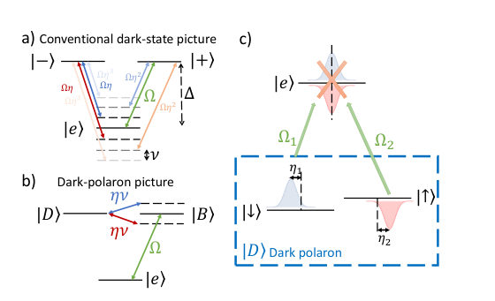
<figcaption class="paper-figure-caption"><b>Fig 1.</b> FIG. 1. (a) In the conventional EIT picture, laser couplings connect the dark state |−⟩to the excited state |e⟩through odd-order blue and red sidebands of coupling strengths pro- portional to Ωη2n+1. Carrier coupling of strength Ωand even- order blue and red sidebands of strengths proportional to Ωη2n connect the bright state |+⟩to the excited state |e⟩. (Not shown: High order effects additionally modulate cou- pling strengths in terms of Laguerre polynomials [16]). (b) Polaron picture of EIT only contains three couplings: a car- rier coupling of strength Ωbetween the bright polaron |B⟩and the excited state and the blue and red sidebands of strength ην connecting the dark polaron |D⟩to the...</figcaption>
</figure>
<figure class="paper-figure-card">
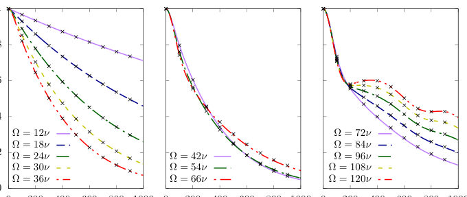
<figcaption class="paper-figure-caption"><b>Fig 2.</b> FIG. 2. Simulation of laser cooling dynamics for various values of Rabi frequency Ωusing both the original picture from Eq.(2) (lines) and the polaron picture from Eqs.(10,11) (crosses). Full agreement is reported in all three cooling regimes. On the left, laser cooling rate increases with Rabi frequency. In the center, a cross-over regime appears where the rate stays constant over a large range of Rabi frequencies. On the right, an underdamped regime arises, with pronounced oscillations and decreasing cooling rate as the Rabi frequency increases. Parameters: Γ = 10ν, η1 = −η2 = 1/ √</figcaption>
</figure>
<figure class="paper-figure-card">
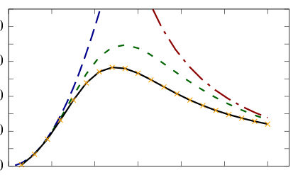
<figcaption class="paper-figure-caption"><b>Fig 3.</b> FIG. 3. Cooling rate as a function of Rabi frequency Ωfor the full master equation Eq.(15) in the original picture (solid black line), in the polaron picture (orange crosses), for rate equation Eq.(23) (dashed green line), for low intensity approx- imation Eq.(6) (long-dashed blue line) and for high intensity approximation Eq.(19) (dash-dotted red line). Parameters: Γ = 10ν, η1 = −η2 = 1/ √</figcaption>
</figure>

**Summary.** This paper introduces the dark polaron theory to address limitations in cooling trapped ions using high-intensity lasers. By transforming the system into a polaron basis, the authors derive an effective Hamiltonian that remains simple and linear even when conventional approximations break down. This provides a robust theoretical framework for understanding laser cooling dynamics under strong driving fields.

**Why it may be interesting.** This work provides a powerful theoretical tool—the polaron approach—to analyze open quantum systems (trapped ions) operating under extreme conditions (high laser intensities), extending the applicability of standard quantum optics models.

Detailed structure

**Main problem.** To overcome limitations of conventional laser control schemes for trapped ion cooling, which are restricted to weak laser intensities and small Lamb-Dicke parameters.

**Main result.** The dark polaron theory successfully derives a description valid in the high-intensity limit, showing that the coupling between electronic and motional degrees of freedom remains linear and intensity-independent.

**Method.** The authors employ a polaron transformation to map the system Hamiltonian into a simplified basis, allowing for the derivation of rate equations applicable beyond standard weak-coupling approximations.

**Model / system.** The physical system is trapped ions undergoing laser cooling via Electromagnetically Induced Transparency (EIT) in a Lambda ($\Lambda$) configuration. The model involves coupling electronic states to vibrational modes using two Raman lasers.

**Key observables.** Cooling rates, phonon population $\langle n 
angle$, and the dynamics of dark/bright polarons.

**Important parameters / regimes.** Laser intensities (high intensity limit), Lamb-Dicke parameter ($\eta$), Rabi frequencies ($\Omega$), and spontaneous decay rates ($\Gamma$).

**Assumptions / limitations.** The analysis assumes counter-propagating beams ($\eta_1 = -\eta_2 = \eta$) and utilizes the polaron basis to handle high-order coupling terms that vanish identically in this three-level system.

**Figures summary.** Figure 2 compares dynamics simulated using the original Hamiltonian versus the simplified polaron picture across various cooling regimes, showing agreement. Other figures illustrate the dark/bright polaron states and rate dependencies on Rabi frequency.

**Paper structure.** The paper first identifies the limitations of conventional treatments (Lamb-Dicke expansion). It then introduces the dark polaron basis via a transformation to simplify the Hamiltonian. Finally, it derives rate equations in this new picture, demonstrating its validity across all laser intensity regimes compared to full master equation simulations.

Abstract

Conventional laser control schemes for cooling and gate operation of trapped ions are limited to the regime of weak laser intensities and small Lamb-Dicke parameters. To overcome this limitation, we present the concept of dark polarons: spatially extended states of pseudospin polarization that are fully decoupled from a lambda laser configuration. In this picture, all high-order Lamb-Dicke terms collapse into a single linear coupling independent of laser intensity. We apply it to definitively elucidate the reasons behind cooling rate limitations observed in recent experimental implementations of electromagnetically induced transparency with high-intensity lasers.

[↑ back to top](#top)

### [Intrinsic single crystals of MnTe altermagnet](http://arxiv.org/abs/2607.21803v1)

**Authors:** Kim-Khuong Huynh, Michael Anthony Quintero, Martin Klanjšek, Tilen Knaflič, Yuta Ishii, Norimasa Sasabe, Nhu-Quynh T. Phan, Frej Søren Rattenborg, Yuichi Yamasaki, Denis Arčon, Bo Brummerstedt Iversen  
**Type:** experiment · **Category:** strongly correlated electrons · **PDF:** <https://arxiv.org/pdf/2607.21803v1>  
**Analysis basis:** full PDF text, analyzed in chunks
**Topic relevance:** `spintronics-quantum-optics interface` **3/5** · `Kondo & dissipative impurity` **1/5** · `analog quantum simulation` **1/5** · `exotic spin models in light-matter` **1/5** · `non-equilibrium dynamics` **1/5**

↔ Scroll figures horizontally

<figure class="paper-figure-card">
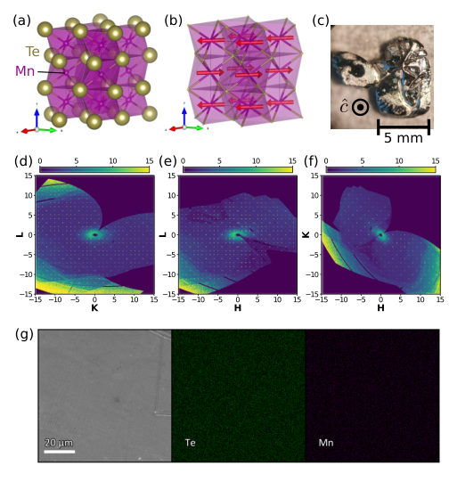
<figcaption class="paper-figure-caption"><b>Fig 1.</b> FIG. 1. Crystal quality. (a) Crystal structure of MnTe as obtained from the refinement of synchrotron SCXRD data. (b) AFM order with spin axis aligned along [010]-direction. (c) Single crystals of MnTe obtained from flux growth, af- ter washing by aqua regia. (d-f) Reconstructed SCXRD pre- cession images oriented along the [10¯10], [01¯10], and [0001] directions. (g) SEM-EDX result showing homogeneous distri- bution of stoichiometric Mn:Te composition.</figcaption>
</figure>
<figure class="paper-figure-card">
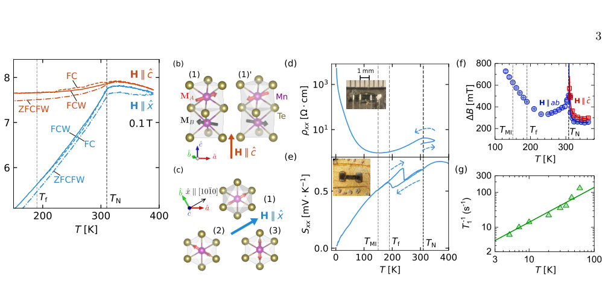
<figcaption class="paper-figure-caption"><b>Fig 2.</b> FIG. 2. Complex ALTM/AFM transition, domain degeneracy, and low-T insulating state. (a) Anisotropic superheating and supercooling hysteresis loops around TN exhibited by magnetic susceptibilities χcc(T) and χxx(T). The magnetic field parallel to c- and x-axes, as shown in (b) and (c), respectively. (b) and (c) illustrate the c- and in-plane degeneracy of domain orientations, respectively. The spin canting angle in (b) is exaggerated for clarity. (d-e) Hysteresis loops around TN and Anderson localization at low-T in the zero-field T-dependencies of resistivity ρxx(T) and the Seebeck coefficient Sxx(T). The dashed arrows indicate the cooling/warming processes, and the insets show the set-up...</figcaption>
</figure>
<figure class="paper-figure-card">
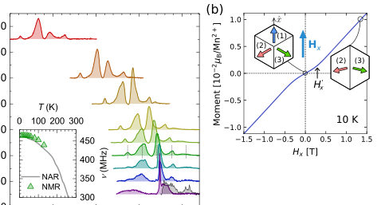
<figcaption class="paper-figure-caption"><b>Fig 3.</b> FIG. 3. Local probe of magnetic domain. (a) The colored bands in the main figure represent the 55Mn NMR spectra measured in a magnetic field of 0.5 T applied in the crystal ab plane at various temperatures. The vertical offset of each spectrum corresponds to its measurement temperature. For comparison, the spectrum recorded at 10 K and 0 T is shown in gray with an enhanced intensity. The vertical dashed lines mark the frequencies of the five transitions in the quadrupole- split I = 5/2 spectrum at 40 K. The inset compares the temperature dependence of the central-line frequency with the previously reported NAR [33]. (b) Magnetization versus Hx. The cartoons illustrate the depopulating...</figcaption>
</figure>
<figure class="paper-figure-card">
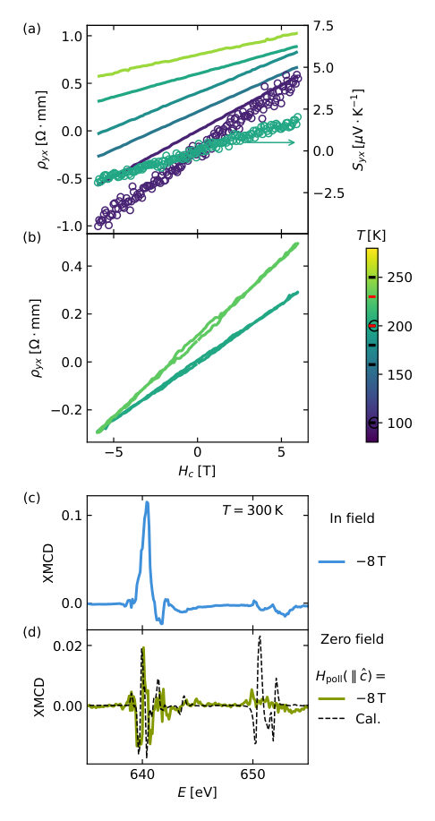
<figcaption class="paper-figure-caption"><b>Fig 4.</b> FIG. 4. ALTM hallmarks. (a) Hall (ρyx) and Nernst (Syx) effects at various temperatures. (b) Hysteresis loops associated with AHE observed in ρya(H) curves measured at T = 200 K and 230 K. A line (circle) on the color bar on the right indicates the temperature at which a ρyx (Syx) curve was measured. (c) Room temperature XMCD signals col- lected in H ∥c exhibit clear H-induced magnetizations. (d) Zero-field XMCD signals after polling at Hpoll = −8 T show- ing the ALTM spectral shape predicted by theory.</figcaption>
</figure>

**Summary.** This work reports on high-quality single crystals of MnTe to investigate its intrinsic altermagnetic properties. By using advanced measurements like EPR, NMR, and transport studies, the authors characterize complex domain kinetics near the magnetic transition and observe a low-temperature Anderson insulating state. The findings establish these materials as crucial platforms for studying strongly correlated phenomena in clean crystalline environments.

**Why it may be interesting.** Although focused on condensed matter magnetism, the study's deep dive into domain dynamics, localization physics (Anderson insulator), and the interplay between magnetic order and charge carriers provides rich context for understanding correlated electron behavior in novel quantum materials.

Detailed structure

**Main problem.** To study the intrinsic magnetic, electronic, and domain kinetics properties of MnTe, an archetypal altermagnet, by synthesizing ultra-high quality single crystals free from chemical imperfections.

**Main result.** The synthesized crystals exhibit robust hallmarks of altermagnetism (AHE, XMCD) alongside complex anisotropic domain kinetics near the Néel temperature ($T_N$), and transition into an Anderson insulating state at lower temperatures.

**Method.** The study employs a combination of advanced characterization techniques including transport measurements ($
ho(T)$, Seebeck coefficient), magnetic susceptibility, Electron Paramagnetic Resonance (EPR), and Nuclear Magnetic Resonance (NMR) on single crystals grown via self-flux methods.

**Model / system.** The physical system is intrinsic single crystals of MnTe, which exhibits altermagnetism. The research probes the interplay between magnetic ordering, charge localization (Anderson insulating state), and structural/mechanical stress effects in this strongly correlated material.

**Key observables.** Anomalous Hall effect (AHE) signals, anisotropic hysteresis loops in magnetic susceptibility ($\chi$), resistivity ($
ho_{xx}$), Seebeck coefficient ($S_{xx}$), EPR linewidth divergence near $T_N$, and Variable Range Hopping (VRH) behavior below $T_{	ext{MI}}$.

**Important parameters / regimes.** Altermagnetic transition temperature ($T_N \approx 310\,\mathrm{K}$), Metal-Insulator Transition temperature ($T_{	ext{MI}} \approx 150\,\mathrm{K}$), and carrier density ($\sim 1.6	imes 10^{17}\,\mathrm{cm}^{-3}$).

**Assumptions / limitations.** The primary assumption is that the synthesized crystals represent the intrinsic limit, minimizing extrinsic effects like Te-deficiency or mechanical stress.

**Figures summary.** Figures illustrate crystal structure confirmation (SCXRD), anisotropic magnetic hysteresis loops around $T_N$, temperature dependence of transport properties ($
ho_{xx}, S_{xx}$), and EPR/NMR spectra showing domain-related broadening and changes across various transition temperatures.

**Paper structure.** The paper systematically reports on the synthesis methodology to achieve high crystal quality, followed by detailed measurements covering magnetic transitions (domain kinetics via $\chi$), electronic transport ($
ho, S$), and local probes of magnetism/localization (EPR, NMR).

Abstract

We report the synthesis methodology, structure, and intrinsic properties of ultra-high quality single crystals of MnTe, an archetypal altermagnet. The crystals, obtained from self-flux method, are nearly free from crystal imperfections and disproportionate chemical compositions as seen by various investigation methods. In measurements under quasi free-standing configuration minimizing stress induced effects, the crystals exhibit complex and anisotropic domain kinetics in both superheating and supercooling regimes around the altermagnetic transition at $T_{\mathrm{N}} = 310\,\mathrm{K}$. An Anderson insulating state is observed below $T_{\mathrm{MI}}\approx 150\,\mathrm{K}$ with a carrier density of about $1.6\times 10^{17}\,\mathrm{cm}^{-3}$, being sharply contrast to metallic states usually seen in Te-deficit samples. Nevertheless, hallmarks of altermagnetism, anomalous Hall effect and X-ray magnetic circular dichroism signal, are robust in this intrinsic limit, however with significantly reduced magnitudes.

[↑ back to top](#top)

### [Capacitive Loading in Two-dimensional Fluxonium Quantum Processors](http://arxiv.org/abs/2607.22138v1)

**Authors:** Quan Guan, Guo Xuan Chan, Xu Dou, Chunqing Deng, Lijing Jin  
**Type:** theory · **Category:** quantum information and computing · **PDF:** <https://arxiv.org/pdf/2607.22138v1>  
**Analysis basis:** full PDF text, analyzed in chunks
**Topic relevance:** `QC/QI experiment` **2/5** · `Keldysh / 2PI / non-Gaussian methods` **1/5** · `correlated / nonlocal dissipation` **1/5** · `driven-dissipative phase transition` **1/5** · `methods for driven-dissipative` **1/5**

↔ Scroll figures horizontally

<figure class="paper-figure-card">
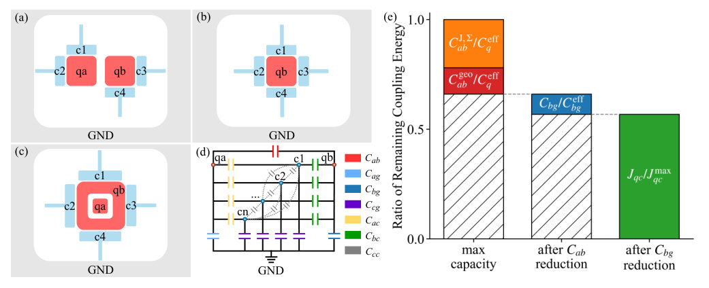
<figcaption class="paper-figure-caption"><b>Fig 1.</b> FIG. 1. Qubit–coupler coupling configurations, circuit model, and capacitive loading decomposition. Representative qubit–coupler coupling geometries: (a) Dumbbell floating qubit, with pads qa and qb coupled by 2 coupler pads each. (b) Grounded qubit [10], with pad qb coupled by 4 coupler pads. (c) Concentric floating qubit [11], with pad qb coupled by 4 coupler pads. (d) Equivalent circuit model of a floating qubit coupled by X couplers. (e) Decomposition of the maxi- mum achievable qubit–coupler capacitive coupling energy, Jmax qc = 4e2/(XCcg)ηqcηcc. Orange and red: The reduction fraction Cab/Ceff q induced by Cab, where Cab includes both the geometric pad-to-pad capacitance, Cgeo ab , and...</figcaption>
</figure>
<figure class="paper-figure-card">
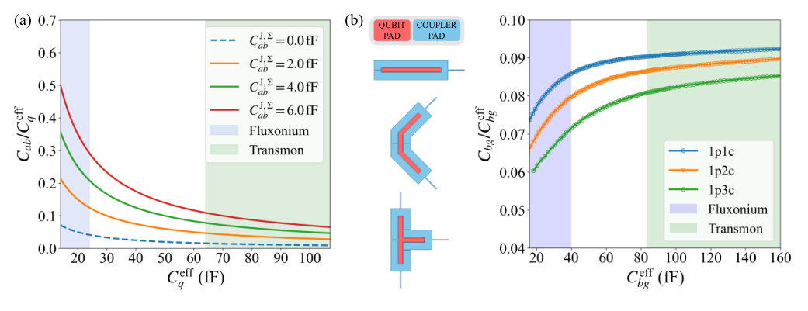
<figcaption class="paper-figure-caption"><b>Fig 2.</b> FIG. 2. Scaling behavior of the two critical capacitance participation ratios governing capacitive loading. (a) Inter-pad capacitance participation ratio Cab/Ceff q as a function of the qubit effective capacitance Ceff q , with the geometric contribution fixed at Cgeo ab = 1 fF. Increasing the junction parasitic capacitance CJ,Σ ab substantially increases Cab/Ceff q in the fluxonium regime, while having a much weaker effect in the transmon regime because of its larger capacitance budget. (b) Electromagnetically optimized layouts for one-pad-one-coupler (1p1c), one-pad-two-coupler (1p2c), and one-pad-three-coupler (1p3c) configurations, together with the corresponding pad-to-ground...</figcaption>
</figure>
<figure class="paper-figure-card">
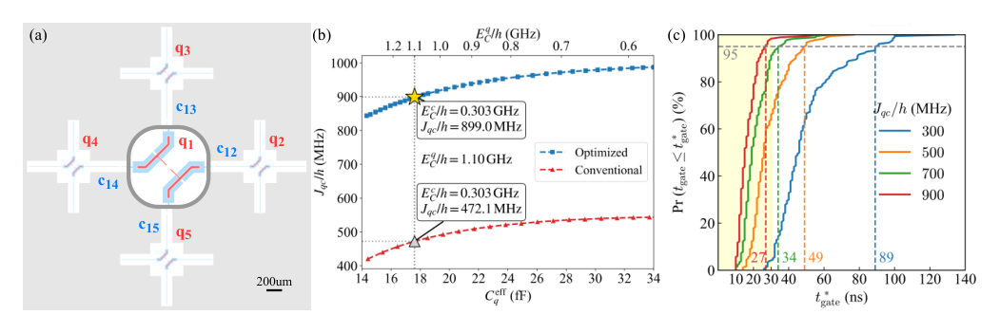
<figcaption class="paper-figure-caption"><b>Fig 3.</b> FIG. 3. Demonstration of the proposed design principles in a scalable fluxonium processor. (a) Unit cell of a two-dimensional grid fluxonium processor based on double-transmon couplers implementing the proposed capacitive loading mitigation strategy. cij stands for the double transmon coupler connecting qi and qj. (b) Achievable qubit–coupler coupling strength, Jqc, for the optimized and conventional layouts as a function of the qubit effective capacitance, Ceff q . The optimized design nearly doubles the achievable coupling while maintaining identical qubit and coupler charging energies. (c) Impact of enhanced qubit–coupler coupling on MAP-gate performance under 5% fabrication-induced...</figcaption>
</figure>
<figure class="paper-figure-card">
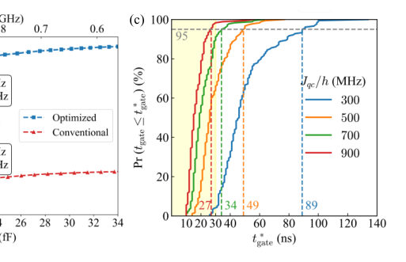
<figcaption class="paper-figure-caption"><b>Fig 4.</b> Fig. 3(b) shows qubit–coupler coupling strength Jqc, obtained through combining full-wave electromagnetic simulations with circuit-QED analysis, as a function of the qubit capacitance budget. Notably, an ultra- strong qubit–coupler coupling approaching 900 MHz is achieved. Achieving such large Jqc relies on two key strategies to mitigate capacitive loading: i) a lower junction-specific capacitance (hCJJ/EJ ≈0.6 fF/GHz),</figcaption>
</figure>

**Summary.** This paper addresses the critical challenge of capacitive loading when scaling fluxonium qubits to 2D arrays. By deriving analytical models based on capacitance budgets, the authors show that this loading can be mitigated through careful geometric engineering of the qubit-coupler layout. They demonstrate that high-fidelity gates are achievable in large processors by optimizing parasitic coupling paths.

**Why it may be interesting.** This work provides concrete, physics-based engineering guidelines for scaling superconducting qubits by quantifying parasitic losses, which is crucial for realizing large quantum processors.

Detailed structure

**Main problem.** Capacitive loading is a major obstacle preventing the scaling of fluxonium qubits from 1D to highly connected 2D architectures, and its physical origin remains poorly understood.

**Main result.** The authors show that capacitive loading does not constitute a fundamental limit for 2D fluxonium quantum processors if proper design principles are followed by optimizing qubit-coupler geometry.

**Method.** They derive analytical relations and use circuit QED analysis to model the coupling strength ($J_{qc}$) based on capacitance participation ratios, comparing optimized vs. conventional layouts.

**Model / system.** The system is a fluxonium quantum processor extended to 2D arrays with double-transmon couplers (DTCs). The analysis uses circuit QED principles and Hamiltonian modeling for qubit-coupler interactions.

**Key observables.** Achievable two-qubit gate coupling strength ($J_{qc}$), capacitive loading factors ($	ext{C}_{	ext{ab}}/	ext{C}_{	ext{eff}}^q$, $	ext{C}_{	ext{bg}}/	ext{C}_{	ext{eff}}^{	ext{bg}}$), and gate infidelity ($\eta$).

**Important parameters / regimes.** Capacitance budget, coupling energy ($J_{qc}$), parasitic capacitances, and the minimum physical junction size.

**Assumptions / limitations.** The leakage analysis assumes that the overall leakage probability is dominated by the most dominant parasitic transition path.

**Figures summary.** Figures illustrate coupling geometries, show $J_{qc}$ vs. capacitance budgets comparing optimized to conventional layouts, and detail high-connectivity processor unit cells (e.g., 7q6c).

**Paper structure.** The paper progresses from deriving the fundamental analytical relations governing capacitive loading in simple models, to developing quantitative design principles using participation ratios, and finally demonstrating these principles on complex, high-connectivity 2D architectures while analyzing gate fidelity.

Abstract

Capacitive loading has emerged as a major obstacle to scaling fluxonium qubits from one-dimensional to highly connected two-dimensional (2D) architectures, yet its physical origin remains poorly understood. We derive an analytical relation between the qubit capacitance budget and the achievable capacitive coupling to external circuit elements, identifying the parasitic capacitances of Josephson junctions and Josephson junction arrays as the dominant source of capacitive loading while showing that the qubit-pad geometry can instead be engineered to mitigate it. Building on these insights, we formulate practical design principles and numerically demonstrate ultrafast, high-fidelity two-qubit gates in 2D fluxonium architectures. Our results reveal that capacitive loading does not constitute a fundamental limit for 2D fluxonium quantum processors.

[↑ back to top](#top)

### [Non-Invertible Symmetries Mixing with Witt Non-Trivial Quantum Cellular Automata](http://arxiv.org/abs/2607.21698v1)

**Authors:** Kansei Inamura, Oskar Wojdel, Lukasz Fidkowski, Sakura Schafer-Nameki  
**Type:** theory · **Category:** strongly correlated electrons · **PDF:** <https://arxiv.org/pdf/2607.21698v1>  
**Analysis basis:** full PDF text, analyzed in chunks
**Topic relevance:** `analog quantum simulation` **2/5** · `Keldysh / 2PI / non-Gaussian methods` **1/5** · `driven-dissipative phase transition` **1/5** · `entanglement & information structure` **1/5** · `exotic spin models in light-matter` **1/5**

↔ Scroll figures horizontally

<figure class="paper-figure-card">
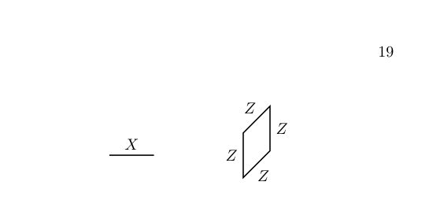
<figcaption class="paper-figure-caption"><b>Fig 1.</b> Figure 6. The generators of the algebra of Z2 1-form sym- metric local operators. Here, the solid lines represent edges of the dual lattice.</figcaption>
</figure>
<figure class="paper-figure-card">
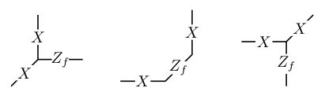
<figcaption class="paper-figure-caption"><b>Fig 2.</b> Figure 10. The fermion hopping operator ˜uf illustrated on the dual lattice.</figcaption>
</figure>
<figure class="paper-figure-card">
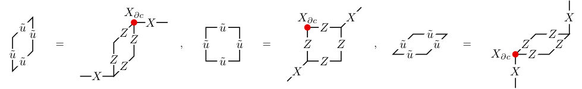
<figcaption class="paper-figure-caption"><b>Fig 3.</b> Figure 11. The fermion flux operator ˜uδe illustrated on the dual lattice. The red dot represents the dual of cube c where the operator X∂c acts. We recall our convention that Pauli X’s act before Pauli Z’s.</figcaption>
</figure>
<figure class="paper-figure-card">
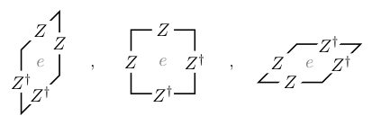
<figcaption class="paper-figure-caption"><b>Fig 4.</b> Figure 15. The flux operator Zδe for each edge e. Here, the plaquette in each diagram represents the dual of e.</figcaption>
</figure>
<figure class="paper-figure-card">
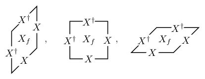
<figcaption class="paper-figure-caption"><b>Fig 5.</b> Figure 16. The Gauss law operator Gf illustrated on the direct lattice. Here, the middle plaquette in each diagram represents face f.</figcaption>
</figure>

**Summary.** This theoretical paper investigates how non-invertible symmetries, particularly those involving duality, manifest on quantum lattices. By comparing continuum predictions from Witt group theory with explicit constructions using Quantum Cellular Automata, the authors characterize the underlying algebraic structure governing these exotic symmetries in 3+1 dimensions.

**Why it may be interesting.** It provides a deep connection between abstract algebraic structures (Witt groups) and concrete physical realizations in lattice models (QCA), which is crucial for understanding topological order beyond simple symmetry protection.

Detailed structure

**Main problem.** The paper addresses constructing a lattice framework for non-invertible symmetries, particularly those involving duality operations, in quantum many-body systems.

**Main result.** It establishes that the group of locality-preserving automorphisms on the lattice matches predictions from advanced categorical calculations (the pointed Witt group), identifying specific Quantum Cellular Automata (QCA) generators for these symmetries.

**Method.** The authors use algebraic methods, comparing continuum defect relations derived from the graded Witt group with explicit constructions using local operator algebras and QCA acting on spin lattices.

**Model / system.** The study focuses on quantum many-body systems exhibiting a Zp one-form symmetry in 3+1 dimensions. The mathematical machinery involves analyzing automorphisms of constrained local spin operator algebras built upon a cubic lattice structure.

**Key observables.** The group structure of locality-preserving automorphisms, which is related to the Clifford group for p=2 and SL(2, Zp) for odd primes p.

**Important parameters / regimes.** The symmetry parameter p (prime), the dimensionality (3+1d), and the specific form of the symmetry ($\mathbb{Z}_p$ 1-form).

**Assumptions / limitations.** The analysis relies on conjectures regarding the full group of automorphisms modulo finite depth circuits, and some proofs are noted to fall short of rigor.

**Figures summary.** Not specified in detail, but notes reference Tables I and II comparing continuum defect theory relations with lattice operators (KWW, TW).

**Paper structure.** The paper progresses by first defining the symmetry problem using $\mathbb{Z}_p$ 1-form symmetries, then calculating the expected group structure via Witt groups, and finally realizing this structure microscopically through specific Quantum Cellular Automata acting on local operator algebras.

Abstract

Self-dualities and the stacking of symmetry-protected topological (SPT) phases are basic operations on quantum many-body systems. For a $\mathbb{Z}_p$ one-form symmetry in 3+1d these correspond to the Kramers-Wannier-Wegner duality $S$, which is the gauging operation underlying non-invertible duality symmetries, and the stacking of a 1-form symmetry SPT $T$. In the continuum, they form a central extension of $PSL(2,\mathbb{Z}_4)$ for $p=2$, and of $SL(2,\mathbb{Z}_p)$ for odd primes $p$, whose central elements are invertible theories with purely gravitational response. These central extensions are governed by a twisted, graded generalization of the Witt group of abelian anyon theories, which we determine. For $p=2$ the resulting group is the single-qubit Clifford group, with duality and entangler acting as the Hadamard and phase gates. We realize this entire structure microscopically as quantum cellular automata (QCA) acting on a certain local operator algebra associated with a spin lattice Hilbert space on a cubic lattice. Specifically, our local operator algebra is built by starting with all local operators commuting with a $\mathbb{Z}_p$ 1-form symmetry, and taking the quotient by all the (local) 1-form symmetry generators. The central elements can always be extended to the full tensor product algebra with a uniquely defined QCA class. For $p=2$ they are generated by the non-trivial semion QCA, and for odd prime $p$ they are generated by the non-trivial $\mathbb{Z}_p$ Clifford QCA. Consequently the lattice fusion rules reproduce the continuum ones only up to these QCAs and lattice translations, giving rise to fusion rules refined by QCAs.

[↑ back to top](#top)

### [QC-PHAST Search: Classical--Quantum Query Benchmarks for Finite-Pool Rare-Regime Discovery](http://arxiv.org/abs/2607.21995v1)

**Authors:** Harsh Milind Tirhekar, Chandrajit Bajaj  
**Type:** theory · **Category:** other · **PDF:** <https://arxiv.org/pdf/2607.21995v1>  
**Analysis basis:** full PDF text, analyzed in chunks
**Topic relevance:** `driven-dissipative phase transition` **2/5** · `analog quantum simulation` **1/5** · `methods for driven-dissipative` **1/5** · `non-equilibrium dynamics` **1/5** · `non-equilibrium universality` **1/5**

↔ Scroll figures horizontally

<figure class="paper-figure-card">
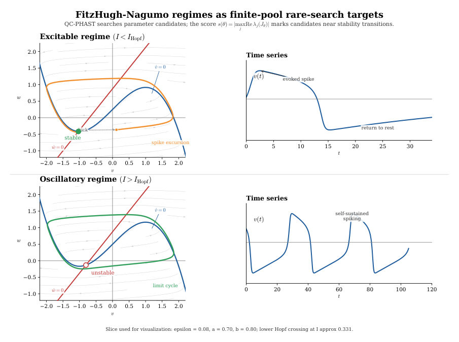
<figcaption class="paper-figure-caption"><b>Fig 1.</b> Figure 1: FHN regime bridge. QC-PHAST searches parameter candidates, and each candidate induces a phase portrait, equilibrium stability, trajectory response, and voltage trace. In the excitable regime, a stable equilibrium returns to rest after a perturbation-driven spike; in the oscil- latory regime, the equilibrium is unstable and trajectories approach a limit cycle. The benchmark score minimizes | maxj Re λj(JFHN)| over relevant equilibria; this slice visualizes one such stability transition and gives a concrete phase-space meaning to the finite-pool rare-regime predicate.</figcaption>
</figure>
<figure class="paper-figure-card">
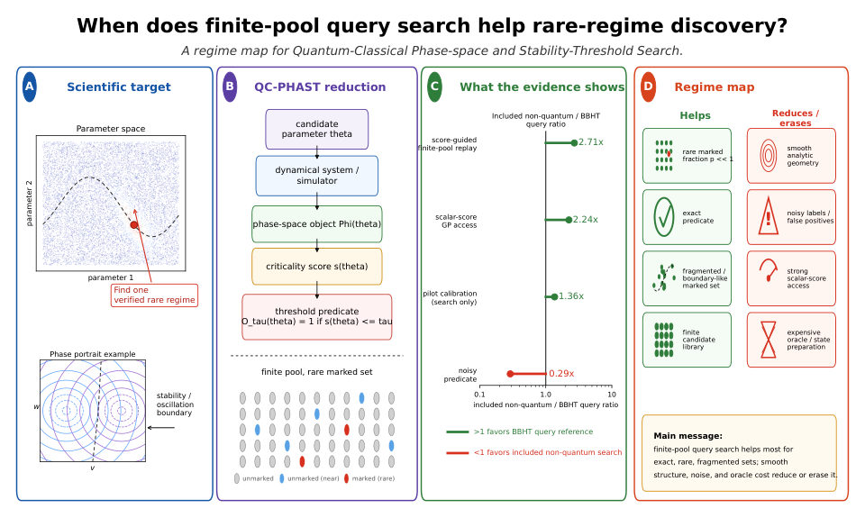
<figcaption class="paper-figure-caption"><b>Fig 2.</b> Figure 2: A regime map for Quantum-Classical Phase-space and Stability-Threshold Search. Panel A frames rare-regime discovery as finding one verified parameter near a phase-space transition. Panel B shows the reduction from candidate parameter to simulator, phase-space object, criticality score, threshold predicate, and finite marked set. Panel C reports selected included non-quantum / BBHT query-count ratios, where values above one favor the BBHT query reference and values below one favor included non-quantum search. The first row is the exact finite-pool replay with scalable score-guided baselines; BBHT itself has exact binary marked-oracle access. Its pilot point is a...</figcaption>
</figure>
<figure class="paper-figure-card">
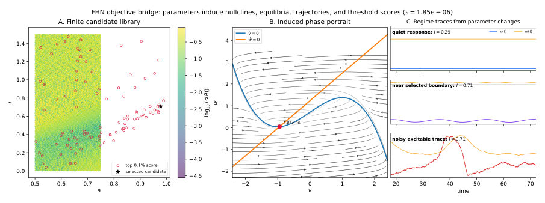
<figcaption class="paper-figure-caption"><b>Fig 3.</b> Figure 3: FHN objective bridge generated from the saved stress dataset. Left: QC-PHAST searches parameter candidates; red outlines mark the top 0.1% score set under the FHN stability-boundary score. Right: the selected parameter vector induces a phase portrait with v- and w-nullclines, an equilibrium, and a near-zero leading real Jacobian eigenvalue. The figure illustrates the mapping θ 7→Φθ 7→s(θ) 7→Oτ(θ) used throughout the benchmark.</figcaption>
</figure>
<figure class="paper-figure-card">
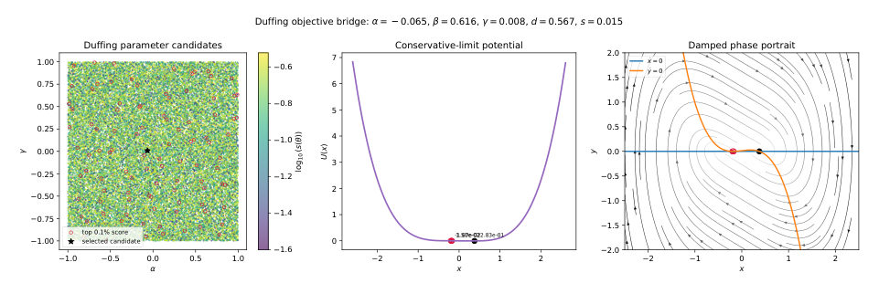
<figcaption class="paper-figure-caption"><b>Fig 4.</b> Figure 4: Duffing objective bridge generated from the saved stress dataset. Left: parameter can- didates projected onto (α, γ) with the top 0.1% score set highlighted. Middle: conservative-limit potential for the selected parameter vector, with real equilibria annotated by leading real Jacobian eigenvalue. Right: damped phase portrait and nullclines. This second worked example shows the same QC-PHAST map as FHN: parameter candidate θ, induced phase-space structure, stability score, and marked rare-regime predicate.</figcaption>
</figure>
<figure class="paper-figure-card">
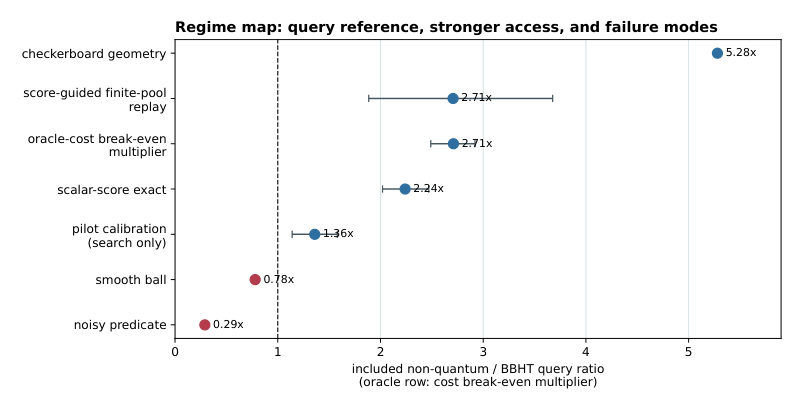
<figcaption class="paper-figure-caption"><b>Fig 5.</b> Figure 5: Forest view of the main regime map. Values above one favor the Boyer–Brassard– Høyer–Tapp (BBHT) marked-set query reference in verified first-hit query count, except for the oracle-cost row, which reports the maximum per-oracle cost multiplier that preserves parity with the included non-quantum baseline. The figure shows query-count and break-even diagnostics only, not simulator or quantum-hardware runtime. Geometry and access-model rows explain when the finite-pool query reference is meaningful and when it should be bypassed.</figcaption>
</figure>

**Summary.** This paper introduces QC-PHAST, a formal protocol designed to guide the search for rare physical regimes within parameterized dynamical systems. It rigorously compares the potential efficiency gains of quantum query models (like Grover's algorithm) against classical simulation methods by accounting for noise and data access limitations. The work provides a decision framework rather than a single solution, helping researchers understand when advanced computational resources are truly necessary.

**Why it may be interesting.** While not directly about AMO physics, the rigorous framework for determining when advanced computational tools (like quantum queries) provide a genuine advantage over classical simulation/optimization techniques in complex physical modeling is highly relevant to developing robust theoretical tools for open quantum systems analysis.

Detailed structure

**Main problem.** The paper addresses rare-regime discovery in parameterized dynamical systems: finding a specific parameter value where a qualitative physical threshold is crossed, especially when such parameters are scarce or complex.

**Main result.** It develops QC-PHAST, an auditable protocol that determines the optimal search strategy (quantum vs. classical) by quantifying the advantage of quantum query models against classical simulation costs and noise.

**Method.** The methodology introduces QC-PHAST, an evidence-gated decision protocol that compares theoretical quantum query complexity (using Grover/BBHT benchmarks) against practical metrics derived from dynamical system simulations.

**Model / system.** The framework is tested using parameterized dynamical systems, with the FitzHugh-Nagumo (FHN) system serving as a canonical reduced model for excitable dynamics. The search space involves varying parameters that govern phase portraits and stability.

**Key observables.** Simulator-derived criticality score ($s(\mathbf{x}_i)$), verified first-hit predicates, and the ratio of non-quantum to BBHT query counts are key diagnostics.

**Important parameters / regimes.** The rarity/density of acceptable candidates (marked set size $M$ relative to total pool size $N$), noise levels in measurements, and the specific dynamical system parameters ($\epsilon, a, b$, etc.).

**Assumptions / limitations.** The quantum reference is treated purely as a theoretical query-count benchmark, not claiming physical circuit implementation or hardware speedup. The protocol itself is an auditable decision rule.

**Figures summary.** Figure 1 illustrates FHN regimes and the search process; Figure 2 maps the scientific objective onto measurable components (object, score, predicate); Table 1 summarizes how different dynamical features relate to active-search implications.

**Paper structure.** The paper defines the rare-regime discovery problem, introduces QC-PHAST as a decision protocol, details the comparison between quantum query models and classical search methods using quantitative benchmarks (e.g., 875-configuration sweeps), and concludes by establishing the conditions under which each search paradigm is most informative.

Abstract

Rare-regime discovery in parameterized dynamical systems is an active-search problem: find one verified parameter at which a scientifically defined qualitative threshold is crossed, even when acceptable candidates are rare, nonconvex, or fragmented. We introduce Quantum-Classical Phase-space and Stability-Threshold Search (QC-PHAST), an evidence-gated decision protocol and query-accounting framework for finite candidate libraries. A candidate induces a dynamical object, simulator-derived criticality score, and verified first-hit predicate. Scientific metadata and charged pilot evidence are used to assess whether equation-aware search, scalar-score active search, predicate-only search, or only a query-model comparison is admissible. The quantum row is the inherited Grover/Boyer--Brassard--Hoyer--Tapp (BBHT) unknown-$M$ marked-set query reference; it is not a new quantum-search theorem, materialized circuit, or hardware-speedup claim. The result is a regime map. Direct boundary constructions, geometry controls, online simulator loops, and learned-label accounting further identify when classical structure, false positives, calibration cost, or state preparation erases the query-model margin. QC-PHAST is therefore an auditable protocol for deciding when a finite-pool marked-set reference is informative and when classical or resource-aware search should dominate.

[↑ back to top](#top)

### [Automated Flag-based Fault-Tolerant State Preparation using Integer Linear Programming](http://arxiv.org/abs/2607.22498v1)

**Authors:** Ben Criger, Aaron Hankin, Justin J. Burau, Abigail R. Perry  
**Type:** both · **Category:** quantum information and computing · **PDF:** <https://arxiv.org/pdf/2607.22498v1>  
**Analysis basis:** full PDF text, analyzed in chunks
**Topic relevance:** `QC/QI experiment` **2/5** · `entanglement & information structure` **1/5** · `methods for driven-dissipative` **1/5** · `quantum measurements` **1/5**

↔ Scroll figures horizontally

<figure class="paper-figure-card">
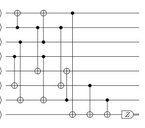
<figcaption class="paper-figure-caption"><b>Fig 1.</b> FIG. 1. From [7]; a circuit for fault-tolerant |0⟩state prepara- tion for the J7, 1, 3K Steane code, incorporating measurement of a single weight-3 operator to achieve a total operation count of 12.</figcaption>
</figure>
<figure class="paper-figure-card">
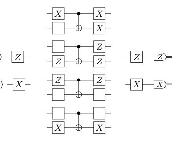
<figcaption class="paper-figure-caption"><b>Fig 2.</b> FIG. 3. Elements of a generating set for the gauge group of a circuit comprised of CNots, |0⟩/|+⟩preparations, and Z/X- basis measurements.</figcaption>
</figure>
<figure class="paper-figure-card">
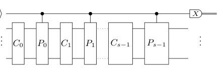
<figcaption class="paper-figure-caption"><b>Fig 3.</b> FIG. 4. A circuit incorporating a flag measurement, com- posed of s Clifford stages {C0, C1, . . . , Cs−1}, interleaved with controlled-Pauli gates {P0, P1, . . . , Ps−1}, with the con- trol qubit initially prepared in the |+⟩state, and finally mea- sured in the X basis.</figcaption>
</figure>
<figure class="paper-figure-card">
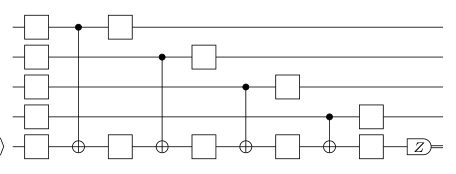
<figcaption class="paper-figure-caption"><b>Fig 4.</b> FIG. 2. A subcircuit measuring Z⊗4, with locations repre- sented using empty boxes. Note that this set of locations, while capable of describing the support of any fault caused by a faulty operation, does not have support on every qubit at every point in time, as in [13].</figcaption>
</figure>
<figure class="paper-figure-card">
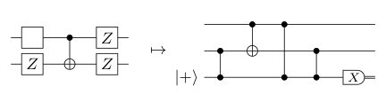
<figcaption class="paper-figure-caption"><b>Fig 5.</b> FIG. 5. Example of gauge-operator-to-flag-circuit mapping.</figcaption>
</figure>

**Summary.** This paper presents an automated method to design highly reliable circuits for preparing specific quantum states required in fault-tolerant quantum computing. By modeling the problem as an Integer Linear Program using circuit gauge operators, the authors achieve state preparation circuits with minimal gate counts while rigorously guaranteeing detection of multiple error types. This work demonstrates a significant step toward practical implementation on current quantum hardware.

**Why it may be interesting.** While focused on computation, the rigorous mathematical framework involving graph theory, linear programming, and error detection mechanisms provides deep insights into the structure of fault-tolerant quantum information processing protocols.

Detailed structure

**Main problem.** The core problem is developing automated, fault-tolerant methods for preparing stabilizer states, which is a crucial subroutine in quantum error correction and initializing logical qubits.

**Main result.** The authors successfully optimize state preparation circuits using Integer Linear Programming (ILP) based on the circuit gauge operator formalism, achieving low gate counts while maintaining high levels of fault detection capability.

**Method.** They formulate the problem as finding a minimum-cost set cover by solving an ILP, which determines the necessary gauge operators to ensure that any error pattern is detectable or results in a distinguishable output error.

**Model / system.** The work applies to general quantum error-correcting codes (e.g., Steane code, two-block group algebra codes) and is tested on physical hardware platforms like Quantinuum's System Model H2.

**Key observables.** Logical block error rate ($\sim 10^{-4}$), circuit gate count, weight of gauge operators, and the ability to detect specific numbers of faults (e.g., up to three errors).

**Important parameters / regimes.** Code distance ($d$), number of qubits/blocks, and the cost function derived from operator weights.

**Assumptions / limitations.** The primary assumption is that expressing fault detection as a weighted set cover solvable by ILP provides an optimal or near-optimal circuit construction compared to existing state-of-the-art methods.

**Figures summary.** Figures illustrate various state preparation circuits for multiple QEC codes (e.g., J16, J24), demonstrating how the designed flag measurements detect single and pairs of faults.

**Paper structure.** The paper introduces the necessity of fault-tolerant state preparation, details the gauge operator formalism, formulates the optimization as an ILP, presents results comparing gate counts to SOTA methods across various codes, and concludes with hardware testing on a specific quantum computer model.

Abstract

Post-selected stabilizer state preparation is a necessary subroutine in fault-tolerant quantum computation, both for initialization of logical qubits, and for logical-ancilla-based error correction gadgets (e.g. Steane and Knill). Therefore, reducing the number of gates needed to prepare a stabilizer state fault-tolerantly can simultaneously reduce time-to-solution and increase reliability. For small, low-distance codes such as the [[7, 1, 3]] Steane code, circuits with low gate counts can be found by inspection. This becomes impractical for larger codes, necessitating automation. There are two state-of-the-art methods for automated fault-tolerant state preparation, SAT-based stabilizer measurement and flag-at-origin. In this work, we optimize state preparation circuits using the circuit gauge operator formalism to express the construction of flag circuits as an integer linear program. This allows the construction of circuits with equal or lower gate count than the state of the art, while detecting up to three errors. We use this technique to derive a Steane error correction gadget for the [[24, 10, 4]] two-block group algebra code, and test it on Quantinuum's System Model H2 quantum computer with 10,000 shots, resulting in a logical block error rate ~0.00014 (~0.000014 per logical qubit), with ~1.6% of the shots post-selected due to weight-two errors.

[↑ back to top](#top)

### [Quantum Spectral Model: Data Reuploading with Input-Conditioned Frequency Support](http://arxiv.org/abs/2607.22516v1)

**Authors:** Peiyong Wang, Udaya Parampalli, Casey R. Myers  
**Type:** both · **Category:** disordered systems and neural networks · **PDF:** <https://arxiv.org/pdf/2607.22516v1>  
**Analysis basis:** full PDF text, analyzed in chunks
**Topic relevance:** `analog quantum simulation` **2/5** · `correlated cavity matter` **1/5** · `driven-dissipative phase transition` **1/5** · `entanglement & information structure` **1/5**

↔ Scroll figures horizontally

<figure class="paper-figure-card">
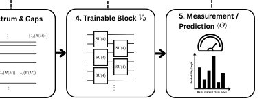
<figcaption class="paper-figure-caption"><b>Fig 1.</b> Figure 1: Synthesiser view of the quantum spectral model. Top, conceptual signal flow in a music synthesiser; bottom, the corresponding flow in a quantum spectral model. Reading the panels from left to right, the control signal corresponds to the input matrix, the oscillator bank to the input-derived Hamiltonian, the available tones to its spectrum and spectral gaps, the mixer and filter to the trainable quantum block, and the output sound to quantum measurement and prediction. A matrix input M defines a Hamiltonian H(M) whose spectrum supplies sample-conditioned candidate phase carriers and whose spectral projectors help determine their coefficients through the trainable mixer and quantum...</figcaption>
</figure>
<figure class="paper-figure-card">
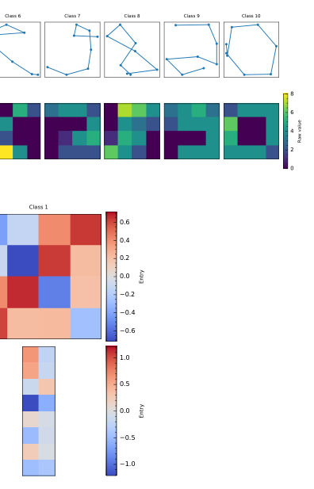
<figcaption class="paper-figure-caption"><b>Fig 2.</b> Figure 2: Representative training samples from the real-world and controlled synthetic bench- marks. (a) Pendigits. One example from each of the ten original classes is shown using two paired representations. The upper row shows the DYN representation, in which eight ordered two-dimensional pen coordinates are connected in their recorded sequence. The lower row shows the corresponding STA4 representation as a 4 × 4 bitmap-like matrix. Raw feature values are displayed for visualisation, whereas the model inputs are standardised using statistics computed from the training split; the colour bar reports the raw STA4 entry values. (b) Synthetic spectral benchmarks. One noisy training input from...</figcaption>
</figure>
<figure class="paper-figure-card">
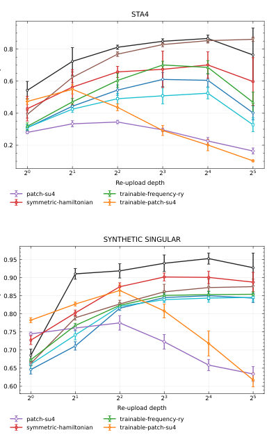
<figcaption class="paper-figure-caption"><b>Fig 3.</b> Figure 3: (a) Final test accuracy on the Pendigits benchmark as a function of reuploading depth. The two panels show the DYN 8×2 trajectory representation and the STA4 4×4 matrix representation. Each point is the mean over 20 parameter-initialisation seeds, and error bars show one standard deviation across seeds. QSMs lead the tested depth-32 comparisons. The global block-Hamiltonian QSM has the largest observed mean across the six depths on both representations, while the patch- local block-Hamiltonian QSM has the largest mean at depth 32. (b) Final test accuracy on the two synthetic spectral benchmarks as a function of reuploading depth. The SYNTHETIC EIGENGAP task uses noisy 4 × 4...</figcaption>
</figure>
<figure class="paper-figure-card">
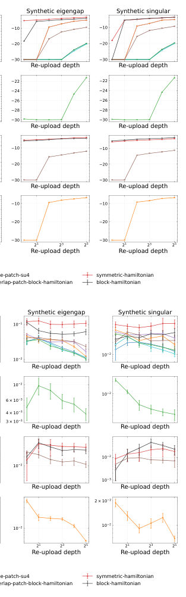
<figcaption class="paper-figure-caption"><b>Fig 4.</b> Figure 4: (a) Gradient variance at initialisation as a function of reuploading depth. For each run configuration, gradients are computed on a fixed diagnostic training batch of size 32 for 20 random initialisations. The plotted quantity is the median log10 variance across parameters within each parameter group, averaged over 20 run seeds; error bars show one standard deviation across run seeds. The coordinate-wise rotation-gate data-encoding unitaries exhibit strongly suppressed mixer-gradient variance at large depth, whereas the QSMs retain substantially larger initialisation variance. (b) Final-checkpoint RMS gradient as a function of reuploading depth. Gradients are computed at the final...</figcaption>
</figure>
<figure class="paper-figure-card">
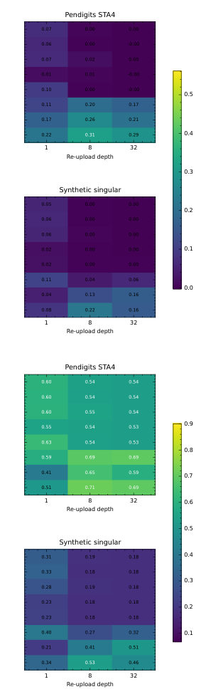
<figcaption class="paper-figure-caption"><b>Fig 5.</b> Figure 5: (a) Within-minus-between fidelity gap of the final quantum states. For each trained model, we compute the pure-state fidelity kernel Kij = | ⟨ψi|ψj⟩|2 on a fixed 32-example validation diagnostic batch and report the mean same-label off-diagonal fidelity minus the mean different-label off-diagonal fidelity. Larger values indicate stronger class separation in quantum-state geometry. At high depth, the global QSMs and the patch-local block-Hamiltonian QSM produce substantially larger gaps than the coordinate-wise rotation-gate and patch-SU(4) baselines. (b) Kernel-target alignment of the final quantum-state fidelity kernel. The plotted metric is the centred alignment between the...</figcaption>
</figure>

**Summary.** This paper proposes Quantum Spectral Models (QSMs) to improve data encoding in quantum machine learning by deriving the unitary generator directly from the input matrix's spectral properties. By analyzing how different structural components—like eigenvalues versus eigenvectors—contribute to performance on various tasks, the authors demonstrate that structure-aware design yields superior results over standard models.

**Why it may be interesting.** While focused on ML, the explicit use of spectral decomposition and structural constraints derived from physical Hamiltonians ($H(M)$) provides a powerful framework for designing quantum circuits that respect underlying mathematical symmetries or physical conservation laws relevant in AMO physics.

Detailed structure

**Main problem.** The core challenge is designing quantum machine learning models whose inductive bias explicitly incorporates the structure of matrix-valued input data, moving beyond simple coordinate-wise encodings.

**Main result.** Quantum Spectral Models (QSMs) consistently outperform tested quantum and classical benchmarks across multiple datasets by leveraging input-conditioned spectral representations. The optimal structural reliance (spectral values vs. subspaces) is task-dependent.

**Method.** The authors introduce QSMs that construct the data-encoding unitary generator directly from the input matrix, leading to an output with a truncated Fourier representation governed by input-derived spectral gaps and subspaces.

**Model / system.** The model utilizes Quantum Spectral Models (QSMs) which encode data via Hamiltonians derived from the input matrix (e.g., symmetric or block structures). The architecture alternates between these Hamiltonian unitaries and trainable mixers.

**Key observables.** Mean test accuracy across four benchmarks, target alignment (KTA), fidelity gap, and ablation performance metrics comparing spectrum-only vs. subspace-preserving controls.

**Important parameters / regimes.** Circuit depth (tested up to 32) and the specific structure of the input Hamiltonian (symmetric, global block, patch-local).

**Assumptions / limitations.** The primary assumption is that conditioning the unitary generator on spectral properties provides a superior, analysable inductive bias for quantum data encoding.

**Figures summary.** Figures compare performance across depths and show diagnostic plots tracking target alignment (KTA) and effective rank evolution during training. Tables summarize quantitative comparisons against classical baselines and ablation studies.

**Paper structure.** The paper introduces QSMs, details the Hamiltonian construction and Fourier representation, evaluates them on multiple datasets (Pendigits/Synthetic), analyzes performance diagnostics layer-by-layer, and concludes with an ablation study to dissect the necessity of spectral vs. subspace information.

Abstract

A central design principle in modern machine learning and artificial intelligence is to align a model's inductive bias with the structure of its input data. For matrix-valued inputs, relevant matrix-level relationships can be characterised through spectral values and spectral subspaces; however, common coordinate-wise rotation-gate data-encoding unitaries used in most quantum machine learning models do not explicitly construct such a matrix-level representation. We introduce Quantum Spectral Models (QSMs), in which we construct the generator of the data-encoding unitary directly from each input matrix. We study three QSM variants based on symmetric, global block, and non-overlapping patch-local block Hamiltonians. Their outputs admit truncated Fourier representations in which input-dependent spectral gaps supply candidate phase carriers, while spectral subspaces help determine their coefficients. We evaluate the QSMs and comparison quantum models on two matrix representations of Pendigits and two controlled synthetic tasks defined by spectral statistics. At the largest evaluated circuit depth, QSM variants lead the tested quantum models in mean test accuracy across all four benchmarks. The patch-local QSM leads on Pendigits, whereas the global block-Hamiltonian QSM leads on the controlled spectral tasks. Ablations show a task-dependent reversal: subspace-preserving controls perform better on Pendigits, whereas spectral-value-only controls lead among the tested ablations on the synthetic tasks. Together, these results shed new light on quantum machine-learning model design by showing how input-conditioned spectral representations can provide an analysable inductive bias, while offering a broader perspective on structure-aware model design in machine learning and artificial intelligence.

[↑ back to top](#top)

### [A route to damage tolerance exceeding $10\%$ in shuttling-equipped quantum processors](http://arxiv.org/abs/2607.22429v1)

**Authors:** Quinten Eggerickx, Simon C. Benjamin  
**Type:** theory · **Category:** quantum information and computing · **PDF:** <https://arxiv.org/pdf/2607.22429v1>  
**Analysis basis:** full PDF text, analyzed in chunks
**Topic relevance:** `QC/QI experiment` **2/5** · `methods for driven-dissipative` **1/5** · `quantum measurements` **1/5**

↔ Scroll figures horizontally

<figure class="paper-figure-card">
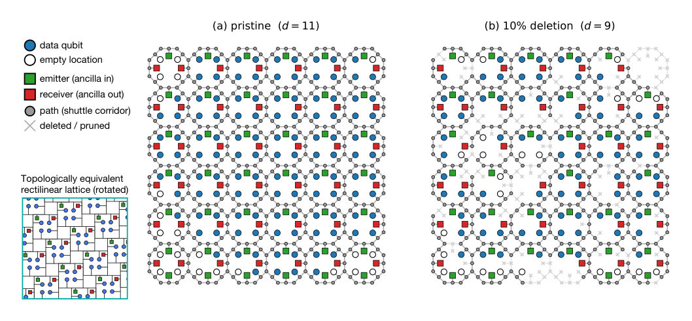
<figcaption class="paper-figure-caption"><b>Fig 1.</b> FIG. 1. The truncated-square (octagon) latticework, pristine (a) and after 10% node deletion (b). Filled blue circles are location nodes occupied by a data qubit; white circles are unoccupied locations. Green and red squares are emitter and receiver nodes, where ancillas are injected and read out; small grey circles are path nodes forming the shuttle corridors. Deleted nodes, and nodes pruned because deletion disconnected them from the main component, are shown as light crosses. The pristine 6 × 6 latticework hosts the full distance-11 code (121 data qubits); on the damaged instance shown, distance 9 is the largest code that fits (81 data qubits). The inset (lower left) redraws the pristine...</figcaption>
</figure>
<figure class="paper-figure-card">
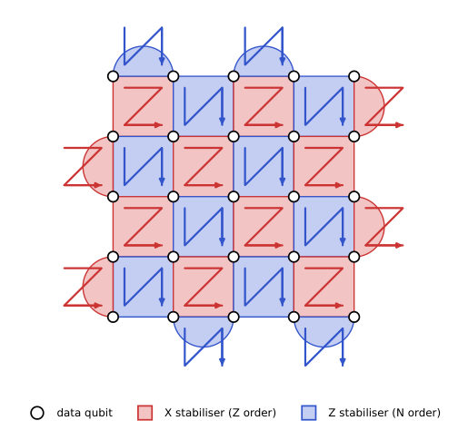
<figcaption class="paper-figure-caption"><b>Fig 2.</b> FIG. 2. The distance-d rotated surface code (shown for d = 5): d2 data qubits, with d2 −1 X (red) and Z (blue) stabilisers in a checkerboard, and weight-two boundary sta- bilisers as lobes. The hook-error-avoiding N–Z syndrome- extraction ordering [27, 28] is shown for each stabilizer: X- type ancillas visit their corner data qubits in the “Z”-shaped order NW→NE→SW→SE, Z-type ancillas in the “N”-shaped order NW→SW→NE→SE. The four steps form one global schedule; boundary stabilisers simply skip their missing cor- ners.</figcaption>
</figure>
<figure class="paper-figure-card">
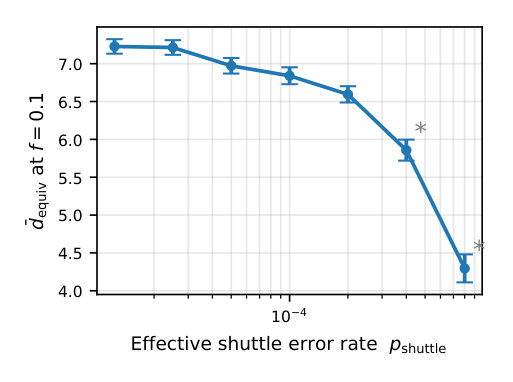
<figcaption class="paper-figure-caption"><b>Fig 3.</b> FIG. 3. Mean equivalent distance ¯dequiv at 10% deletion (6 × 6 grid, X basis) as a function of the dephasing shuttle error rate. Each point maps the damaged samples’ best LER onto an equivalent pristine distance via the same-noise pris- tine fit; error bars are the standard error of the mean (SEM). The curve is nearly flat below ∼2 × 10−4 and falls steeply above it, where the pristine log-linear fit also begins to break down (R2 dropping from 0.99 to 0.86) as the code approaches threshold. Asterisks mark the operating points where this equivalent-distance mapping is becoming unreliable — a de- graded pristine fit (R2 &lt; 0.95) and/or some samples whose LER falls beyond the pristine reference...</figcaption>
</figure>
<figure class="paper-figure-card">
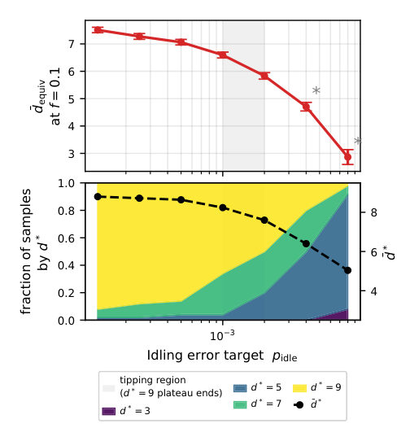
<figcaption class="paper-figure-caption"><b>Fig 4.</b> FIG. 4. Idling sensitivity at 10% deletion (6 × 6 grid), with the shuttle rate fixed at 2 × 10−4. Top: mean equivalent dis- tance ¯dequiv vs the idling target pidle (error bars are the SEM). Bottom: the composition of the winning code size d∗across samples, with ¯d∗overlaid. The shaded band marks the tip- ping region (1 × 10−3–2 × 10−3) where the winning distance departs its low-noise d = 9 plateau and the equivalent dis- tance tips down. Asterisks (top panel) mark points where the equivalent-distance mapping is becoming unreliable — a de- graded pristine fit (R2 &lt; 0.95) and/or extrapolated samples — as the code nears threshold, exactly as in Fig. 3.</figcaption>
</figure>
<figure class="paper-figure-card">

<figcaption class="paper-figure-caption"><b>Fig 5.</b> Fig. 4 fixes the shuttle rate at this primary value and sweeps the idling target. Below ∼10−3 the winning code size sits on a stable d = 9 plateau; between 10−3 and 2 × 10−3 the winning distance collapses off that plateau and the equivalent distance tips downward in lockstep. We adopt pidle = 10−3 as our baseline — the low edge of this tipping region, i.e. the largest idling error still short of the collapse. As established in the error model, this baseline is already about 20 times more pessimistic than the ∼5×10−5 implied by demonstrated silicon T2 times, so it is a conservative operating point in absolute terms as well.</figcaption>
</figure>

**Summary.** This work proposes an advanced method to maintain fault tolerance in shuttling quantum processors despite significant physical damage. By adapting pathfinding algorithms to route syndrome measurements around defective lattice sites, the authors show that 10% damage only reduces the effective code distance by a predictable factor. This demonstrates that mobility significantly enhances hardware robustness compared to fixed-qubit approaches.

**Why it may be interesting.** It provides a concrete, quantitative framework for assessing hardware resilience in solid-state quantum computing platforms, directly addressing scalability limitations imposed by physical defects.

Detailed structure

**Main problem.** The study addresses how fault-tolerant quantum computation can maintain functionality when subjected to physical damage (defects or 'drop outs') in the underlying hardware.

**Main result.** The proposed shuttling-based method allows for substantial damage tolerance, achieving performance equivalent to a pristine lattice with only 48% to 60% of its distance even after 10% node deletion.

**Method.** It adapts the CAbLECAR method by using route-solving software on time-expanded graphs to find efficient paths for ancillas performing syndrome measurements around damaged physical lattices.

**Model / system.** The model is based on semiconductor electron spin-qubit systems configured in a latticework architecture supporting shuttling. It implements the surface code and simulates damage by deleting nodes from this lattice structure.

**Key observables.** Logical error rate (LER), reduced equivalent surface-code distance ($d_{	ext{equiv}}$), and the maximum achievable code distance ($d$).

**Important parameters / regimes.** Damage fraction ($f$), shuttle error rate ($p_{	ext{shuttle}}$), idling error rate, and the lattice size ($G 	imes G$ array).

**Assumptions / limitations.** The damage is assumed to be static and known before runtime; the analysis focuses on the surface code in memory mode.

**Figures summary.** Figures illustrate the latticework structure showing pristine vs. 10% deleted nodes, detailing location, path, and ancillary node placements.

**Paper structure.** The paper introduces the problem of damage tolerance in shuttling qubits, details the adaptation of CAbLECAR using route-solving on damaged lattices, presents results quantifying performance degradation via $d_{	ext{equiv}}$, and concludes by generalizing the approach to other QLDPC codes.

Abstract

This is a short study of an approach offering high tolerance to damage (i.e. defects or 'drop outs') in solid state fault-tolerant quantum computing. Our method is primarily aimed at semiconductor electron spin-qubit systems, which have been shown to support fast and high-fidelity shuttling along pre-defined paths. We adapt the recent CAbLECAR method of Chadwick and Chong: stabilisers are performed by ancillas which each follow a bespoke pre-programmed path. We consider the simple surface code but we damage the physical lattice, and rely on route-solving software to find efficient pathways under constraints enforcing stabiliser commutation and hook error avoidance. Solutions are then converted to detector error models for Stim and logical error rates are obtained. We express our results by gauging the logical performance against that of a pristine lattice, using the notion of a reduced equivalent surface-code distance; for reasonable underlying error rates we find that $10\%$ damage leaves roughly half of the pristine equivalent distance ($d_\text{equiv}\approx0.48\,d_\text{pristine}$ in the large-array limit, rising to $\approx0.60$ for our smallest array). This suggests that one can tolerate substantial damage by building oversized arrays. We note that investigating damage tolerance of other qLDPC codes is a straightforward generalisation, and potentially one could adapt to damage emerging at runtime.

[↑ back to top](#top)

### [Maximal Fisher Budget Forces Blind Directions in Bipartite Collective SU(d) Metrology](http://arxiv.org/abs/2607.22195v1)

**Authors:** Tariq Aziz, Naeem Akhtar, Dong Wang, Augusto Smerzi  
**Type:** theory · **Category:** quantum information and computing · **PDF:** <https://arxiv.org/pdf/2607.22195v1>  
**Analysis basis:** full PDF text, analyzed in chunks
**Topic relevance:** `entanglement & information structure` **2/5** · `correlated / nonlocal dissipation` **1/5** · `quantum measurements` **1/5**

↔ Scroll figures horizontally

<figure class="paper-figure-card">
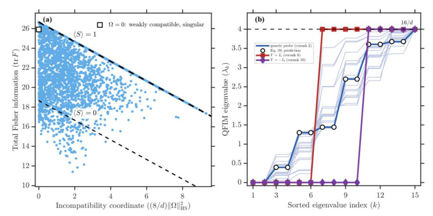
<figcaption class="paper-figure-caption"><b>Fig 1.</b> FIG. 1. (a) For 𝑑= 3, randomly generated pure probes obey the exact conservation law between</figcaption>
</figure>
<figure class="paper-figure-card">
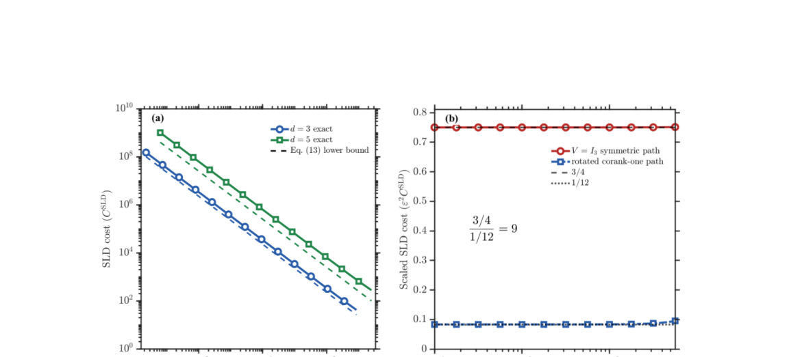
<figcaption class="paper-figure-caption"><b>Fig 2.</b> FIG. 2. (a) For exchange-symmetric probes, the SLD cost diverges inversely in the Schmidt-</figcaption>
</figure>

**Summary.** This theoretical paper rigorously analyzes the limits of quantum parameter estimation using bipartite probes under $SU(d)$ symmetry. It derives exact mathematical identities demonstrating that maximal Fisher sensitivity conflicts with full local identifiability, leading to inherent 'blind directions' in the measurement spectrum. The findings establish a hierarchy among distinct resources—sensitivity, compatibility, and identifiability—in non-commuting generator systems.

**Why it may be interesting.** This work provides deep structural constraints on quantum estimation protocols, showing that achieving optimal precision requires sacrificing full parameter distinguishability in certain directions, which is a crucial concept for designing practical metrology schemes.

Detailed structure

**Main problem.** The paper investigates the fundamental trade-offs between achieving maximal total Fisher sensitivity, ensuring full local identifiability, and satisfying weak compatibility constraints in quantum metrology.

**Main result.** It establishes exact identities linking the Fisher information trace to measurable probe properties, showing that maximizing sensitivity forces blind directions unless generalized GHZ probes are used for $N \ge 3$.

**Method.** The analysis involves deriving exact sum rules relating the Fisher matrix and incompatibility measures, utilizing structural decompositions of the underlying Lie algebra $\mathfrak{su}(d)$, and comparing bounds derived from different probe symmetries.

**Model / system.** The system is a pure bipartite quantum probe state used to estimate an unknown collective $SU(d)$ transformation. The analysis focuses on the structure of the Quantum Fisher Information Matrix (QFIM) associated with this estimation process.

**Key observables.** Quantum Fisher Information Matrix ($\mathcal{F}$), Total Fisher Budget ($	ext{tr} \mathcal{F}$), Exchange Symmetry Expectation ($\langle\mathcal{S}
angle$), and Weak Incompatibility Measure ($\Omega_{\mu
u}$).

**Important parameters / regimes.** $d$ (the dimension of the $SU(d)$ group), the number of qubits/probes ($N$), and the structure of entanglement.

**Assumptions / limitations.** The analysis assumes a single fixed collective setting for the probe measurement, and later compares results across different structural assumptions like exchange symmetry or weak compatibility ($\Omega=0$).

**Figures summary.** Figure 1 visualizes the exact conservation law between $	ext{tr} \mathcal{F}$ and $\|\Omega\|_{	ext{HS}}^2$ for $d=3$, while Figure 2 compares QFIM spectra on the maximally entangled boundary for $d=4$.

**Paper structure.** The paper progresses by first deriving exact identities relating Fisher sensitivity to two measurable properties (Chunk 1). It then analyzes the implications of weak compatibility and entanglement structure (Chunk 2). Finally, it tackles lower bounds on the inverse QFIM trace using advanced techniques involving $	au$-involutions and Fourier-frame constructions (Chunks 3 & 4).

Abstract

For pure two-qudit probes used in a single fixed setting to estimate a common SU(d) transformation, maximal total Fisher sensitivity and full local identifiability are mutually exclusive. We derive exact identities that determine the trace of the quantum Fisher information matrix from two measurable probe properties: exchange symmetry and collective polarization. Every maximizer is exchange symmetric and maximally entangled. Its Fisher matrix has equal sensitivity in every visible direction, while $d(d-1)/2$ generator directions are blind. More generally, weak compatibility, defined by vanishing mean generator commutators, forces at least $\lfloor d/2\rfloor$ blind directions for every pure bipartite probe. A probe-defined antiunitary invariant classifies the complete Fisher spectrum at maximal entanglement, and approaches to the optimum that preserve exchange symmetry have a divergent Holevo cost. The bipartite obstruction is sharp in particle number: for $N\geq 3$, generalized GHZ probes can satisfy weak compatibility, attain the corresponding $N$-partite Fisher trace bound, and retain full local identifiability. Hence, Fisher sensitivity, weak compatibility, identifiability, and attainable precision are distinct resources in quantum metrology with noncommuting generators.

[↑ back to top](#top)

### [Multiplicity of Stable Attractors in Disordered Neural Models](http://arxiv.org/abs/2607.22047v1)

**Authors:** Raffaele Marino, Roberto Livi, Antonio Politi  
**Type:** theory · **Category:** disordered systems and neural networks · **PDF:** <https://arxiv.org/pdf/2607.22047v1>  
**Analysis basis:** full PDF text, analyzed in chunks
**Topic relevance:** `Keldysh / 2PI / non-Gaussian methods` **1/5** · `analog quantum simulation` **1/5** · `driven-dissipative phase transition` **1/5** · `methods for driven-dissipative` **1/5** · `non-equilibrium dynamics` **1/5** · `non-equilibrium universality` **1/5**

↔ Scroll figures horizontally

<figure class="paper-figure-card">
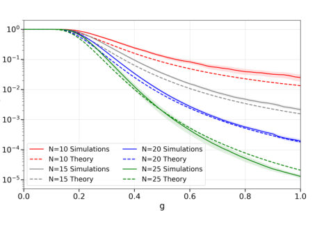
<figcaption class="paper-figure-caption"><b>Fig 1.</b> Figure 1. Fraction of PN(g) of SFPs as a function of g for several sizes. Solid curves are simulation estimates averaged over different matrices (10 for N ≤20, 2 for N = 25); shaded bands indicate the uncertainty on the mean (error bar on the average). Dashed curves are the perturbative predictions obtained by integrating the minima density.</figcaption>
</figure>
<figure class="paper-figure-card">
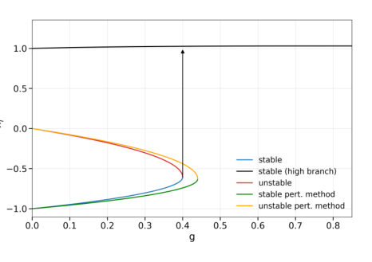
<figcaption class="paper-figure-caption"><b>Fig 2.</b> Figure 2. For small g, the stable fixed point (blue, lower branch) is a descendant of the g = 0 sign pattern with x∗(k) i ≈−1, and the component drifts continuously as g in- creases. The unstable equilibrium branch (red) approaches the stable one and annihilates with it near g ≃0.4. In green (orange) is presented the stable (unstable) path computed using our perturbative method.</figcaption>
</figure>
<figure class="paper-figure-card">
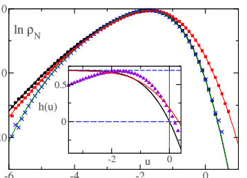
<figcaption class="paper-figure-caption"><b>Fig 3.</b> Figure 3. Main panel: the symbols denote numerical esti- mates of ρN(u) for N = 20. Data have been obtained by averaging over 1000 realizations of the matrix A. Full cir- cles, crosses, and squares correspond to the Ginibre ensem- ble, a uniform distribution of entries, and to the symmetric case, respectively. The solid curves identify the correspond- ing theoretical predictions. Inset: the triangles correspond to h(u) estimated as ln ρN/N +ln 2 for the Ginibre ensemble. The black and red solid curves correspond to the theoretical predictions for asymmetric and symmetric matrices, respec- tively.</figcaption>
</figure>
<figure class="paper-figure-card">
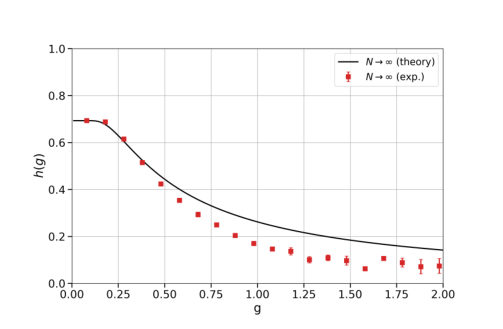
<figcaption class="paper-figure-caption"><b>Fig 4.</b> Figure 4. Comparison between the perturbative theoretical prediction h(g) = ln 2 + ln[1 −Φ(uc(g))] (black solid line) and the rate extracted from direct numerical simulations in the large-N limit (red squares with error bars).</figcaption>
</figure>
<figure class="paper-figure-card">
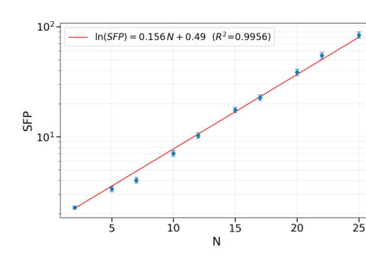
<figcaption class="paper-figure-caption"><b>Fig 5.</b> Figure 5. Number of stable fixed points (SFP) as a func- tion of the system size N, shown on a linear–log scale. Blue markers denote the mean SFP averaged over disorder real- izations, with error bars. The red line is a least-squares fit that confirms an exponential growth SFP ∼e0.159N.</figcaption>
</figure>

**Summary.** This work analyzes how the number of stable fixed points in disordered neural networks changes as coupling strength increases. Using large-deviation statistics and perturbation theory, the authors predict that SFPs disappear through bifurcations at a critical coupling $g_c$. The findings establish a quantitative link between disorder structure and dynamical stability in these complex systems.

**Why it may be interesting.** While focused on classical dynamics, the analysis of stability boundaries, bifurcations, and the role of disorder in determining system attractors shares conceptual links with understanding phase transitions or localization phenomena in quantum many-body systems.

Detailed structure

**Main problem.** The study aims to determine the multiplicity of stable fixed-points (SFPs) in disordered neural ordinary differential equation models.

**Main result.** For small coupling strengths, there are no qualitative differences between symmetric and asymmetric dynamics; SFP depletion occurs via saddle-node bifurcations at a critical coupling strength $g_c$.

**Method.** The authors employ large-deviation statistics combined with a perturbative method in the disorder amplitude to estimate the number of stable attractors.

**Model / system.** The model consists of N neurons governed by nODEs, featuring local double-well potentials and interactions mediated by a random coupling matrix $A$.

**Key observables.** Average fraction of SFPs ($P_N(g)$), the minimum value $u$ derived from correlated Gaussian variables, and the multiplicity index $h(g)$.

**Important parameters / regimes.** Coupling strength ($g$), disorder amplitude, and system size ($N$).

**Assumptions / limitations.** The perturbative method is reliable for small $g$, and asymptotic analysis relies on large-deviation theory approximations.

**Figures summary.** Figures show the sharp drop in SFP fraction vs. coupling strength (Fig. 1), comparisons between perturbative estimates and exact solutions near bifurcations (Fig. 2), and density estimations $
ho_N(u)$ for different matrix ensembles (Fig. 3).

**Paper structure.** The paper develops the theoretical framework using large-deviation theory to calculate SFP multiplicity, applies this to specific disordered neural models (asymmetric vs. symmetric coupling), derives analytical forms for the distribution of minima $u$, and compares these predictions against numerical simulations across different coupling regimes.

Abstract

We show how large-deviation statistics allows one to obtain reliable estimates of the multiplicity of stable fixed-points in a model of neural ordinary differential equations previously employed in computational tasks. The result is obtained by developing a suitable perturbative method in the amplitude of the disorder. It turns out that for not-too-large coupling strengths there are no qualitative differences between the symmetric case, when the dynamics is a purely gradient evolution, and the asymmetric case, when limit cycles and chaos can, in principle, arise. The selection of this specific model is dictated by pedagogical reasons, but we are confident that the approach can be extended to other many-degree-of-freedom dynamical models characterized by different classes of random coupling matrices.

[↑ back to top](#top)

### [Hyperspatial Sampling: Circumventing Free-Energy Barriers via Replica Exchange with Extra Dimensions](http://arxiv.org/abs/2607.22417v1)

**Authors:** Henrik Christiansen, Matheus Ferraz, Takashi Maruyama, Francesco Alesiani  
**Type:** theory · **Category:** statistical mechanics · **PDF:** <https://arxiv.org/pdf/2607.22417v1>  
**Analysis basis:** full PDF text, analyzed in chunks
**Topic relevance:** `analog quantum simulation` **1/5** · `driven-dissipative phase transition` **1/5** · `methods for driven-dissipative` **1/5** · `non-equilibrium dynamics` **1/5**

↔ Scroll figures horizontally

<figure class="paper-figure-card">
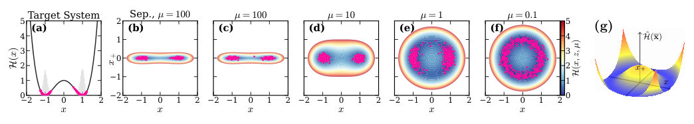
<figcaption class="paper-figure-caption"><b>Fig 1.</b> FIG. 1. (a) Target one-dimensional potential H(x) (black curve) with the marginal x-histogram and trajectory samples (pink) from the separable HS-REX replica, showing equal occupancy of both minima. (b)–(f) Contours of the two-dimensional hyperspatial potential H(x) and trajectory samples for µ = 100 (separable), 100, 10, 1, and 0.1. As µ decreases, the penalty on the extra coordinate x+ weakens, the accessible region in the extended space expands, and samples at small µ circumnavigate the x-barrier via nonzero x+. Exchange acceptance is ∼100% between the separable replica and µ = 100, and 36–45% between neighboring non-separable pairs. The d = 2 dimensional Hamiltonian is shown in (g).</figcaption>
</figure>
<figure class="paper-figure-card">
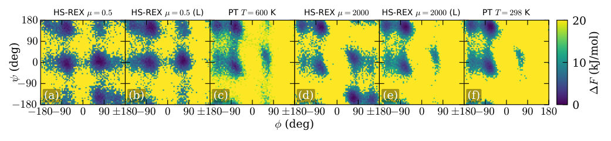
<figcaption class="paper-figure-caption"><b>Fig 2.</b> FIG. 2. Backbone free-energy surfaces ∆F for HS-REX and PT at the physical and enhanced replicas. (a)–(c) show the ability of the methods enhanced replicas to explore the configuration space, (d)–(f) present the sampling under target physical conditions. (a) and (d) are results from HS-REX at (a) µ = 0.5 and (d) the separable system with µ = 2000, respectively. Panels (b) and (e) show the same data, but remapped to L-chiral configurations by transforming D-form frames as (ϕ, ψ) 7→(−ϕ, −ψ). Reference PT simulations are show in (c) for T = 600 K and (f) the target temperature T = 298 K. The data shown uses an identical number of simulation steps. The initial equilibration frames are discarded.</figcaption>
</figure>
<figure class="paper-figure-card">
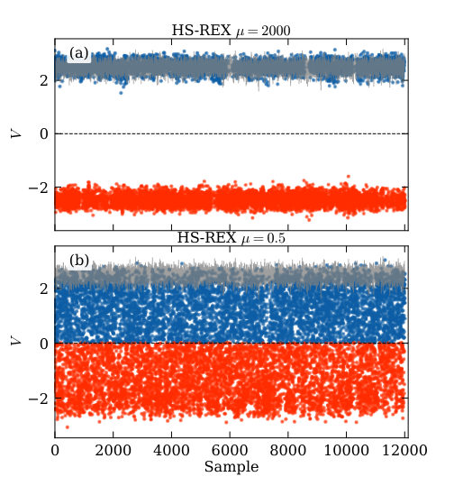
<figcaption class="paper-figure-caption"><b>Fig 3.</b> FIG. 3. Signed Cα chirality volume for alanine dipeptide (common trajectory length; first 100 frames discarded). (a) HS-REX physical replica (µ = 2000); gray: PT T = 298 K reference. (b) HS-REX enhanced replica (µ = 0.5) with the same reference.</figcaption>
</figure>
<figure class="paper-figure-card">
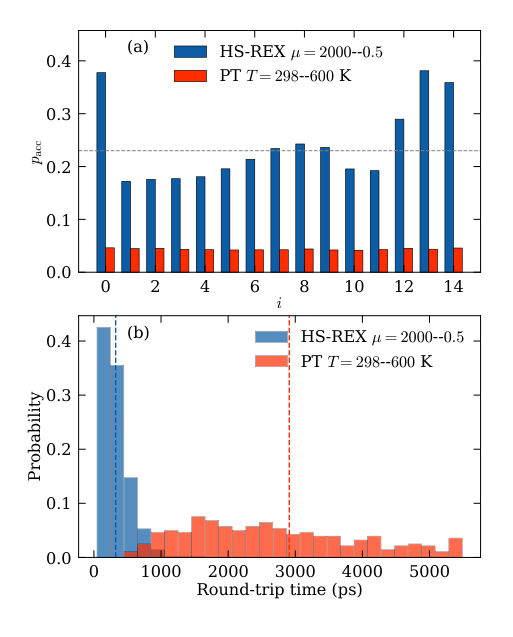
<figcaption class="paper-figure-caption"><b>Fig 4.</b> FIG. 4. Replica-exchange diagnostics for alanine dipeptide (common trajectory length). (a) Per-pair acceptance rates for HS-REX (µ = 2000–0.5, blue) and PT (T = 298–600 K, red); dashed line: optimal 23% [22]. (b) Round-trip time distributions (dashed lines: means).</figcaption>
</figure>

**Summary.** This paper introduces Hyperspatial Replica Exchange (HS-REX), an advanced enhanced sampling technique that artificially increases the dimensionality of a physical system. By utilizing extra dimensions, HS-REX allows simulations to bypass high free-energy barriers inaccessible in the original space. This method is shown to efficiently sample complex conformational changes in biomolecules like alanine dipeptide, outperforming conventional temperature replica exchange.

**Why it may be interesting.** While focused on classical statistical mechanics, the concept of mapping complex dynamics onto higher-dimensional spaces to achieve better sampling parallels theoretical approaches used in quantum simulation and optimization problems where high barriers limit exploration.

Detailed structure

**Main problem.** The central challenge is simulating physical systems trapped in rugged free-energy landscapes due to high energy barriers between metastable states.

**Main result.** Hyperspatial Replica Exchange (HS-REX) successfully circumvents these barriers by artificially extending the system into higher dimensions, achieving enhanced ergodic sampling compared to standard methods.

**Method.** The method extends the physical Hamiltonian into extra spatial dimensions and uses a replica exchange framework where exchanges occur based on varying harmonic penalties in these added dimensions.

**Model / system.** Benchmark systems include a double-well model and alanine dipeptide simulated in explicit water. The formalism involves extending the Hamiltonian to $D = d + d_+$ dimensions with a quadratic penalty term applied selectively to solute atoms.

**Key observables.** Enhanced conformational sampling, successful crossing of energy barriers (e.g., L/D chirality inversion), and significantly reduced round-trip simulation times compared to Parallel Tempering (PT).

**Important parameters / regimes.** The harmonic penalty strength ($\mu$) is varied across replicas; the method's efficiency depends on maintaining appropriate acceptance rates.

**Assumptions / limitations.** The technique assumes that the added dimensions define a fast subsystem suitable for exact propagation methods, and the penalty is applied only to solute atoms to maintain physical relevance in solvated systems.

**Figures summary.** Figures compare free-energy surfaces ($\Delta F$) showing enhanced exploration via HS-REX versus trapping in PT. Other figures compare acceptance rates and round-trip time distributions, demonstrating superior mixing for HS-REX.

**Paper structure.** The paper introduces the concept of hyperspatial extension to overcome barriers, validates it on a simple double-well model, and then applies it rigorously to biomolecular systems like alanine dipeptide in water, comparing performance metrics (acceptance rates, time scales) against established methods like PT.

Abstract

Simulating systems with rugged free-energy landscapes remains a central challenge in computational physics and chemistry. We introduce hyperspatial replica exchange (HS-REX), an enhanced sampling method in which the physical system is artificially extended by additional spatial dimensions. In higher dimensions, free-energy barriers can be circumvented through paths that are geometrically inaccessible in the original space. Restricting the penalty to only solute atoms dramatically reduces the number of replicas required for solvated systems compared to standard temperature replica exchange, a feature especially relevant for biological applications. As proof of concept, we demonstrate the method on a double-well model system and on alanine dipeptide in explicit water as benchmark system. In the latter case, HS-REX achieves enhanced conformational sampling of not only the slow backbone dihedral angles, but also both chiral configurations of the molecule, which are sterically inaccessible to standard sampling in three dimensions. This demonstrates enhanced ergodic sampling over conventional temperature replica exchange.

[↑ back to top](#top)

### [Non-Clifford quantum cellular automata from invertible topological quantum field theories](http://arxiv.org/abs/2607.21697v1)

**Authors:** Meng Sun, Zongyuan Wang, Bowen Yang, Nathanan Tantivasadakarn, Yu-An Chen  
**Type:** theory · **Category:** other · **PDF:** <https://arxiv.org/pdf/2607.21697v1>  
**Analysis basis:** full PDF text, analyzed in chunks
**Topic relevance:** `analog quantum simulation` **1/5** · `driven-dissipative phase transition` **1/5** · `methods for driven-dissipative` **1/5** · `non-equilibrium dynamics` **1/5**

↔ Scroll figures horizontally

<figure class="paper-figure-card">
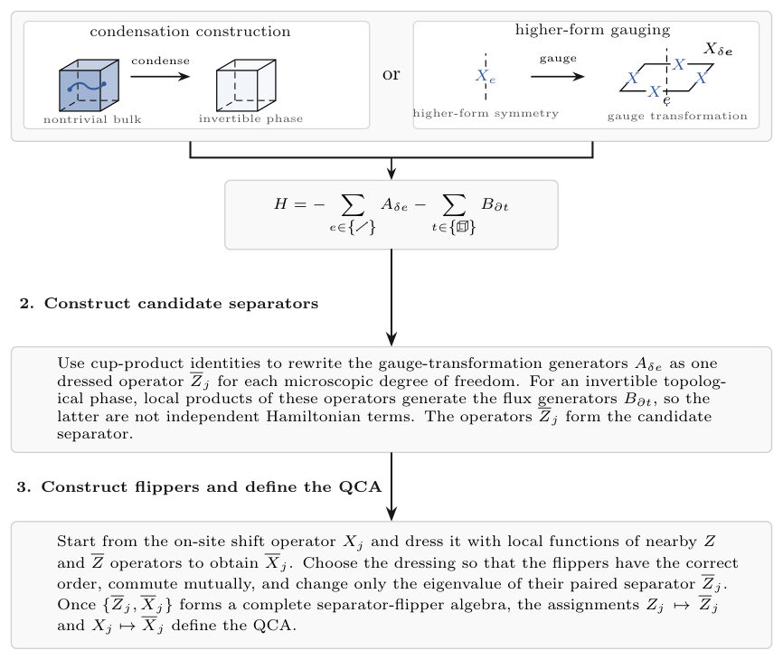
<figcaption class="paper-figure-caption"><b>Fig 1.</b> Figure 1: Workflow for constructing the QCAs in this work. A commuting Hamiltonian is first obtained through condensation or higher-form gauging. Cup-product identities reorganize its generators into one candidate separator per microscopic degree of freedom. Compatible local flippers then complete the separator algebra, whose identification with the on-site clock and shift algebra defines the QCA.</figcaption>
</figure>

**Summary.** This paper introduces a unified algebraic construction to derive Quantum Cellular Automata (QCAs) directly from invertible Topological Quantum Field Theories (TQFTs). By extending the Hamiltonian generators into a complete separator-flipper algebra, the authors provide a systematic route to construct and classify QCAs in higher dimensions. This advances our understanding of how topological invariants dictate microscopic quantum dynamics.

**Why it may be interesting.** This work is highly relevant as it provides a systematic, algebraic bridge between abstract topological field theories (a mathematical/theoretical framework) and concrete, physically realizable quantum dynamics models like QCAs, which are crucial for understanding non-equilibrium many-body physics.

Detailed structure

**Main problem.** The core problem is developing a unified algebraic construction to derive Quantum Cellular Automata (QCAs) directly from invertible Topological Quantum Field Theories (TQFTs). This addresses the challenge that a TQFT action alone does not specify the full local operator algebra automorphism required for a QCA.

**Main result.** The authors provide a general, systematic algebraic framework to convert invertible TQFTs into microscopic QCAs in various dimensions. They also proved that certain higher-dimensional QCAs are stably trivial by constructing finite-depth quantum circuits for them.

**Method.** The method involves extending the commuting generators of the Hamiltonian to a complete separator-flipper algebra on the full Hilbert space, utilizing techniques from cochain theory and cup products to define the necessary local automorphisms.

**Model / system.** The study focuses on Quantum Cellular Automata (QCAs), which model locality-preserving quantum dynamics. The input physics is an invertible TQFT response action, leading to constructions in dimensions $d=4k-1$ and general higher dimensions.

**Key observables.** The resulting QCA must be an automorphism of the full local operator algebra; key diagnostics include identifying generalized U(1) QCAs associated with products of Wu classes.

**Important parameters / regimes.** Spatial dimension ($d$), specific topological invariants (e.g., those derived from Witt groups or Wu classes), and algebraic structures like separator-flipper algebras.

**Assumptions / limitations.** The primary assumption is that the QCA structure can be fully captured by extending the Hamiltonian generators into a complete, commuting algebra of local operators.

**Figures summary.** Figure 1 illustrates the workflow: starting from a TQFT response action to obtain a Hamiltonian, then constructing candidate separators via cup-products, and finally defining the full QCA automorphism using flippers.

**Paper structure.** The paper builds by first establishing the algebraic necessity of moving beyond just the ground state Hamiltonian. It then details the unified construction for 3D systems, generalizes this to higher dimensions ($d=4k-1$), provides explicit constructions for arbitrary Wu class products, and concludes with proofs of triviality for specific cases.

Abstract

Quantum cellular automata (QCAs) describe locality-preserving quantum dynamics and connect quantum information, many-body physics, and topological quantum field theory (TQFT). Constructing a QCA from a TQFT, however, is challenging. Although a topological action can produce a commuting Hamiltonian realizing the desired ground state, it does not by itself specify an automorphism of the full local operator algebra. In this work, we develop a unified algebraic construction that extends the commuting generators of the Hamiltonian to a complete separator-flipper algebra on the full tensor-product Hilbert space, providing a microscopic definition of the corresponding QCA. In three spatial dimensions, our formalism unifies all previously known QCA constructions associated with the $\mathbb Z_8\times\mathbb Z_2$ subgroup of the Witt group, including the $U(1)_2$ and $U(1)_4$ QCAs. The same algebraic structure directly yields new infinite families of generalized $U(1)_2$ and $U(1)_4$ non-Clifford QCAs in dimensions $d=4k-1$. We also reformulate the 4-dimensional $w_2w_3$ QCA and use it to develop a general construction of QCAs from TQFTs associated with arbitrary products of Wu classes. This construction includes two infinite families. The first consists of $w_2^nw_3^m$ QCAs in dimension $d=2n+3m-1$, while the second consists of $w_2w_{4k-1}$ QCAs in dimension $d=4k$. As a contrasting result, we explicitly construct finite-depth quantum circuits for the 5-dimensional $w_3^2$ and $w_2^3$ QCAs, thereby proving that they are trivial, in agreement with the cobordism classification. Overall, these results convert invertible TQFTs into microscopic QCAs, provide a scalable route to higher-dimensional constructions beyond the Clifford setting, and open a systematic approach to classifying their stable structures and boundary anomalies.

[↑ back to top](#top)

### [Norm of resonance states in quantum scattering and electromagnetic systems](http://arxiv.org/abs/2607.22052v1)

**Authors:** Florian Lorenz, Jan Möseritz-Schmidt, Roland Ketzmerick  
**Type:** theory · **Category:** other · **PDF:** <https://arxiv.org/pdf/2607.22052v1>  
**Analysis basis:** full PDF text, analyzed in chunks
**Topic relevance:** `Keldysh / 2PI / non-Gaussian methods` **1/5** · `correlated / nonlocal dissipation` **1/5** · `driven-dissipative phase transition` **1/5** · `methods for driven-dissipative` **1/5**

↔ Scroll figures horizontally

<figure class="paper-figure-card">
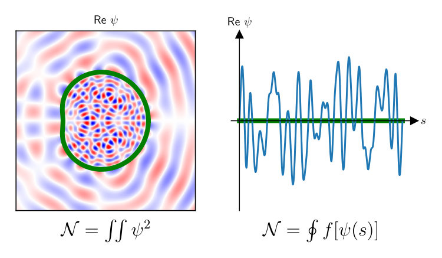
<figcaption class="paper-figure-caption"><b>Fig 1.</b> FIG. 1. Resonance state of a scattering system with piecewise homogeneous properties showing its real part in position space (left) and on the boundary (right). While its norm is defined by an integral over infinite space, we show in various physical settings that it can be computed using a convenient boundary integral only.</figcaption>
</figure>

**Summary.** This paper addresses the technical difficulty of normalizing resonance states whose wavefunctions diverge at infinity by replacing divergent volume integrals with boundary surface integrals using the divergence theorem. It provides general, rigorous formulas applicable to both quantum particle scattering problems and electromagnetic cavity analysis, making it a key theoretical resource for open quantum systems.

**Why it may be interesting.** This work provides essential, rigorous mathematical tools for calculating quantities like coupling strengths or state normalization in open quantum systems where standard $L^2$ methods fail due to continuum coupling. This is vital for modeling resonance phenomena in quantum optics and scattering theory.

Detailed structure

**Main problem.** The primary challenge is defining and calculating the 'norm' of resonance states in quantum scattering and electromagnetic systems because the standard $L^2$-norm integral diverges at infinity.

**Main result.** The paper successfully derives methods to replace the divergent volume integral with a mathematically tractable boundary integral using the divergence theorem, yielding explicit formulas for the norm.

**Method.** The core method involves applying the divergence theorem (Green's identities) to rewrite volume integrals of products of resonance states into surface integrals over the system boundaries. Zel'dovich regularization is used to handle the asymptotic divergences.

**Model / system.** The work covers two main areas: quantum particles in $D$-dimensional spaces with hard-wall or piecewise constant potentials, and electromagnetic fields within cavities possessing piecewise homogeneous material properties (2D/3D).

**Key observables.** The resonance state norm ($\langle\psi_L|\psi_R
angle$ or $N_{TM}, N_{TE}$), which quantifies the normalization of these quasi-bound states.

**Important parameters / regimes.** Complex eigenfrequencies ($\lambda$), boundary geometry (e.g., spherical scatterers, circular disks), and material properties defining piecewise homogeneity.

**Assumptions / limitations.** The derivation relies heavily on expressing the integrand as a divergence of a suitable vector field and employing regularization techniques to manage infinite integrals.

**Figures summary.** Figure 1 illustrates that the norm, defined over infinite space, can be computed entirely via an integral restricted to the finite boundary surface ($\partial\Gamma$).

**Paper structure.** The paper develops general mathematical frameworks by first establishing the need for regularization and then systematically applying the divergence theorem. It applies these derived boundary integral formulas separately to quantum scattering problems (hard-wall potentials) and electromagnetic cavity problems.

Abstract

Resonance states spatially diverge and are thus not square integrable. Instead, their norm is defined by the biorthogonal scalar product of left and right states. We replace the corresponding volume integral by a convenient boundary integral in piecewise homogeneous systems and apply this procedure to diverse physical settings. For a quantum particle in any number of dimensions we treat hard-wall and piecewise constant potentials. For electromagnetic systems with piecewise homogeneous material properties, we consider three-dimensional and effectively two-dimensional cavities of arbitrary shape. As examples, we treat the spherical scatterer and the circular disk.

[↑ back to top](#top)

### [Quasiparticle interference as a tool to study quantum materials](http://arxiv.org/abs/2607.22487v1)

**Authors:** Luke C. Rhodes, Yuhki Kohsaka, Tetsuo Hanaguri, Carolina de Almeida Marques, Peter Wahl  
**Type:** both · **Category:** strongly correlated electrons · **PDF:** <https://arxiv.org/pdf/2607.22487v1>  
**Analysis basis:** full PDF text, analyzed in chunks
**Topic relevance:** `Keldysh / 2PI / non-Gaussian methods` **1/5** · `Kondo & dissipative impurity` **1/5** · `analog quantum simulation` **1/5** · `non-equilibrium dynamics` **1/5**

↔ Scroll figures horizontally

<figure class="paper-figure-card">
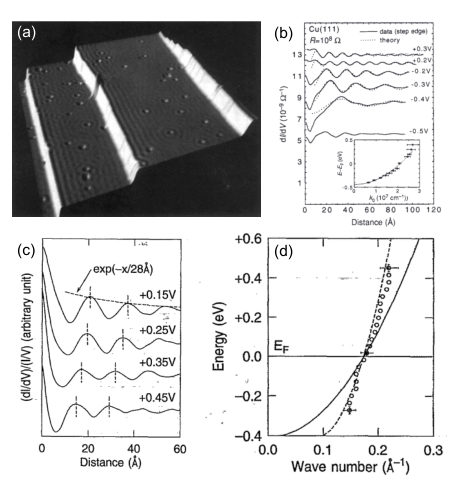
<figcaption class="paper-figure-caption"><b>Fig 1.</b> FIG. 1. First experiments on QPI in noble metal (111) surface states. (a) Topographic</figcaption>
</figure>
<figure class="paper-figure-card">
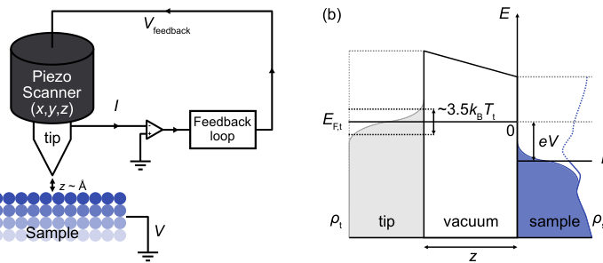
<figcaption class="paper-figure-caption"><b>Fig 2.</b> FIG. 2. Illustration of the working principle of STM. (a) Sketch of the measurement geometry</figcaption>
</figure>
<figure class="paper-figure-card">
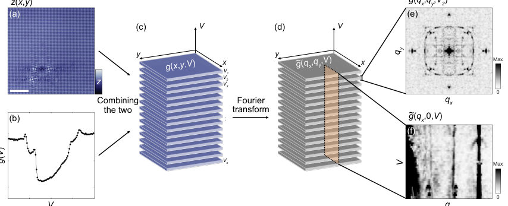
<figcaption class="paper-figure-caption"><b>Fig 3.</b> FIG. 3. Measurement of Quasi-particle interference. (a) Topographic STM image z(x, y),</figcaption>
</figure>
<figure class="paper-figure-card">
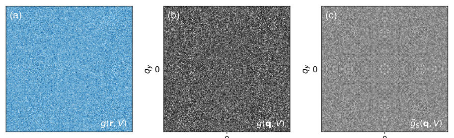
<figcaption class="paper-figure-caption"><b>Fig 4.</b> FIG. 4. Signal from noise. (a) synthetic conductance map g(r, V ) consisting of random noise.</figcaption>
</figure>
<figure class="paper-figure-card">
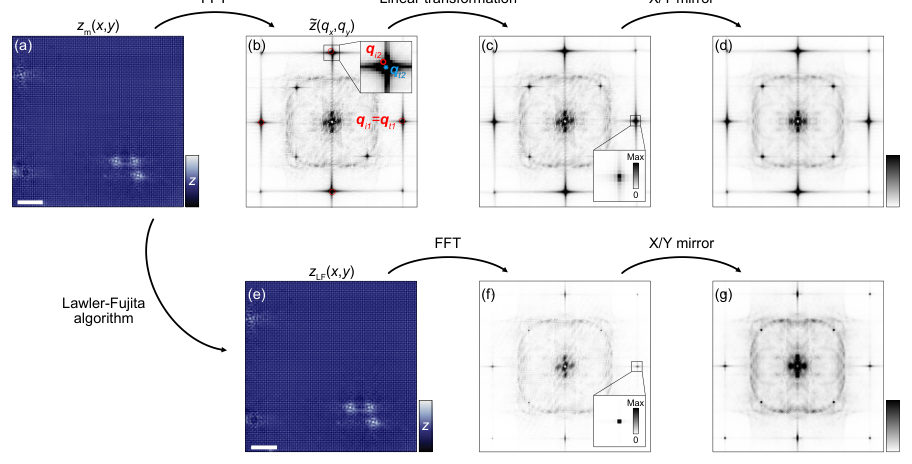
<figcaption class="paper-figure-caption"><b>Fig 5.</b> FIG. 5. Linear transformation and Lawler-Fujita algorithm. (a) Constant-current topography,</figcaption>
</figure>

**Summary.** This review details Quasiparticle Interference (QPI) as a vital experimental technique for probing the low-energy electronic structure of quantum materials. By analyzing standing wave patterns observed via STM, researchers can map out momentum-space information related to electron scattering. This methodology has proven invaluable across diverse fields, from topological insulators to unconventional superconductors.

**Why it may be interesting.** While focused on condensed matter, the underlying physics involves many-body dynamics and electronic correlations in strongly interacting systems, which shares conceptual overlap with open quantum system descriptions of quasiparticle interactions.

Detailed structure

**Main problem.** Understanding the properties of quantum materials requires detailed knowledge of their low energy electronic structure to enable control and design.

**Main result.** Quasiparticle interference (QPI) imaging using STM provides a powerful, real-space tool to map out the underlying electronic structure, revealing details about correlations and symmetries in various novel materials.

**Method.** The study reviews QPI principles, which are experimentally detected via Scanning Tunneling Microscopy (STM) by analyzing standing wave modulations in the Local Density of States (LDOS). Theoretical modeling is crucial for interpreting these complex scattering patterns.

**Model / system.** The focus is on various quantum materials, including topological insulators, Weyl semimetals, graphene, and unconventional superconductors. The analysis relies on STM measurements of tunneling current/conductance ($g(r, V)$) which are sensitive to the electronic structure via quasiparticle scattering.

**Key observables.** Standing wave patterns in LDOS modulations; Fourier Transform ($	ilde{g}(q_x, q_y, V)$) revealing momentum-space information (dispersion relations); superconducting gap structures and Fermi arc signatures.

**Important parameters / regimes.** Low energy electronic structure details; temperature regimes down to 50mK; magnetic fields; scattering vectors ($q$).

**Assumptions / limitations.** The interpretation of QPI data requires advanced theoretical modeling, and experimental measurements must account for artifacts like the setpoint effect or raster scanning distortions.

**Figures summary.** Figures illustrate initial QPI experiments on noble metal surfaces showing standing wave patterns and extracted dispersion relations, alongside diagrams detailing the STM working principle and tunneling current measurement geometry.

**Paper structure.** The review progresses by first establishing the necessity of electronic structure knowledge. It then details the experimental capabilities of STM/QPI, covering theory (elastic vs. inelastic tunneling), data acquisition ($g(r, V)$), and analysis (Fourier Transform). Finally, it reviews successful applications across diverse quantum materials.

Abstract

To understand the properties of quantum materials a detailed knowledge of the material's low energy electronic structure is key. Details of the electronic structure drive the ground state through electronic instabilities, electronic correlation effects, new electronic orders or just the absence of electronic states near the Fermi energy - making a realistic and detailed understanding crucial to be able to control and design properties of quantum materials. The past 25 years have seen a significant improvement in experimental techniques to observe the true electronic structure, in particular in techniques such as Angle resolved photoemission spectroscopy (ARPES) where energy resolutions of 2meV are routinely achievable now, which however is limited to zero magnetic field and only provides information about the occupied states. Scanning tunneling microscopy (STM) achieves a significantly better energy resolution <100$μ$eV and can operate at temperatures well below 50mK and in magnetic fields. While per se a real-space technique, by imaging quasiparticle interference (QPI) STM can also provide information about the electronic structure. This technique has been used over the past decades to study a wide range of quantum materials to understand correlated electron behaviour. Recent theoretical progress now enables routine modelling of QPI, a key requirement to interpret the complex data. Here, we review the principles of QPI, its origin, experimental detection, and the physical insight gained from the study of QPI and possible future directions for this technique.

[↑ back to top](#top)

### [Metrology of quantum imaging schemes](http://arxiv.org/abs/2607.22373v1)

**Authors:** Emma Brambila, Giacomo Sorelli  
**Type:** theory · **Category:** other · **PDF:** <https://arxiv.org/pdf/2607.22373v1>  
**Analysis basis:** full PDF text, analyzed in chunks
**Topic relevance:** `entanglement & information structure` **1/5** · `interference shaping light` **1/5** · `quantum measurements` **1/5**

↔ Scroll figures horizontally

<figure class="paper-figure-card">
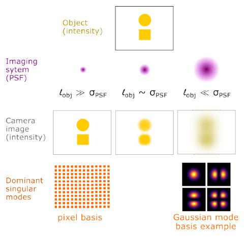
<figcaption class="paper-figure-caption"><b>Fig 1.</b> FIG. 1. Effect of the point-spread function (PSF) widths σPSF, corresponding to different singular-mode decomposi- tions, from a fixed object of size ℓobj.</figcaption>
</figure>
<figure class="paper-figure-card">
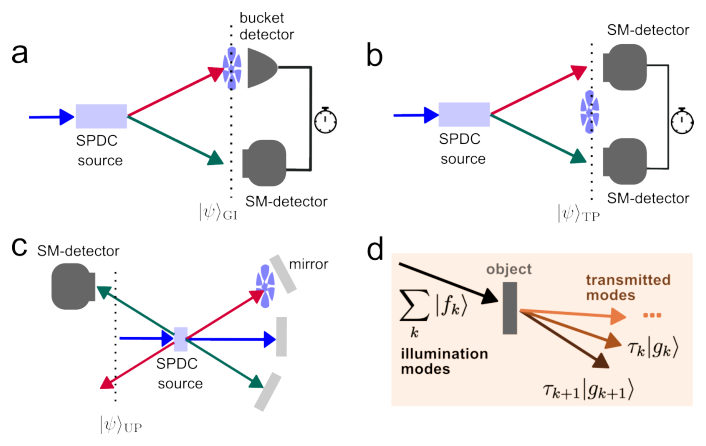
<figcaption class="paper-figure-caption"><b>Fig 2.</b> FIG. 2. Simplified experimental schemes for different imaging techniques based on SPDC spatial correlations: a) ghost imaging, b) camera-based coincidence detection, and c) imaging with undetected photons. We highlight that the measurement for each technique can differ depending on which singular modes are resolved by the detector (SM-resolving detector). The dashed line shows where the state is written down. In d) we illustrate how our metrology analysis is based on a singular-mode decomposition, where the illumination of an object is a superposition in the object basis and the output is described by the transmission coefficients τk.</figcaption>
</figure>
<figure class="paper-figure-card">
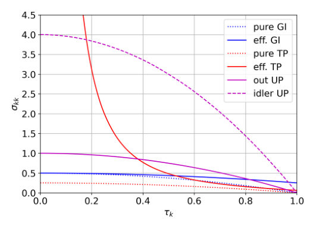
<figcaption class="paper-figure-caption"><b>Fig 3.</b> FIG. 3. Calculated variance σkk (from {Q−1}kk), for the es- timation of the transmission τk of a single object mode using the different quantum imaging schemes. The blue dotted and blue solid curves show the pure-state and effective-state re- sults for ghost imaging (GI), obtained from Eqs. (12) and (21), respectively. The red dotted and red solid curves show the corresponding results for two-photon imaging (TP), from Eqs. (28) and (37). For imaging with undetected photons (UP), the solid purple curve corresponds to the output state after tracing out the environmental modes [Eq. (44)], while the dashed purple curve corresponds to the reduced idler state [Eq. (47)]. Here we assume matching...</figcaption>
</figure>

**Summary.** This paper theoretically compares three quantum imaging techniques—Ghost Imaging, Two-Photon Imaging, and Undetected Photon Imaging—for estimating an object's transmission profile. By calculating Quantum Fisher Information matrices, the authors determine that while GI and TP are generally more precise, UP offers the unique advantage of allowing independent estimation for each spatial mode. The work provides practical guidelines for designing quantum sensing technologies based on photon correlations.

**Why it may be interesting.** This work provides a rigorous theoretical framework for optimizing quantum sensing in optical systems by quantifying the fundamental limits imposed by quantum correlations, which is highly relevant to advanced quantum optics research.

Detailed structure

**Main problem.** The paper compares the ultimate quantum precision limits for estimating multiple unknown transmission coefficients ($\{	au_k\}$) characterizing an object using different quantum imaging schemes.

**Main result.** While Ghost Imaging and Two-Photon Imaging generally offer higher precision than imaging with undetected photons, the latter is unique in allowing independent estimation of each spatial mode's transmission coefficient.

**Method.** The authors formulate the problem as a quantum multiparameter estimation task, calculating and comparing Quantum Fisher Information (QFI) matrices derived from various measurement protocols.

**Model / system.** The system involves quantum imaging using spatially correlated photon pairs generated via Spontaneous Parametric Down-Conversion (SPDC). The object's transmission is modeled by unknown coefficients ($	au_k$) acting on the probe state.

**Key observables.** Quantum Fisher Information matrices ($F$ and $Q$), achievable variances ($\sigma(	au)$), and the comparison between Ghost Imaging (GI), Two-Photon Imaging (TP), and Undetected Photon Imaging (UP).

**Important parameters / regimes.** Object transmission coefficients ($	au_k$), Schmidt number ($K$), and the spatial correlation properties of the photon pairs.

**Assumptions / limitations.** The analysis assumes that the singular-mode basis characterizing the object structure is known beforehand; furthermore, some analyses simplify by assuming the object basis matches the signal Schmidt basis.

**Figures summary.** Figure 3 plots variances ($\sigma_{kk}$) for GI, TP, and UP as functions of transmission $	au_k$, showing a comparative performance landscape across different schemes.

**Paper structure.** The paper systematically develops quantum metrology tools (QFI/QCRB) to analyze three distinct imaging protocols (GI, TP, UP), deriving the optimal measurement settings for each case and comparing their resulting precision limits.

Abstract

We compare the performance of quantum imaging schemes based on spatially correlated photon pairs by formulating them as quantum multiparameter estimation problems, in which the object is characterized by transmission coefficients associated with different spatial modes. Our work focuses on standard quantum imaging techniques such as ghost imaging, two-photon imaging, and imaging with undetected photons. Specifically, we compute the quantum Fisher information matrices and show that they are saturated by Fisher information matrices corresponding to measurements in the object-mode basis, which generalize the common detection schemes employed in each imaging configuration. We find that ghost imaging and two-photon imaging generally provide higher precision for transmission estimation than imaging with undetected photons, but the latter is the only one that naturally does not couple transmission estimation across different spatial modes. These results identify which imaging protocols are best suited for specific tasks and provide practical guidelines for the design and optimization of quantum sensing technologies based on spatial correlations.

[↑ back to top](#top)

### [Orbital Embedding and the Physical Definition of Quantum Geometry](http://arxiv.org/abs/2607.21882v1)

**Authors:** Chang-geun Oh, Shuichi Murakami  
**Type:** theory · **Category:** strongly correlated electrons · **PDF:** <https://arxiv.org/pdf/2607.21882v1>  
**Analysis basis:** full PDF text, analyzed in chunks
**Topic relevance:** `Keldysh / 2PI / non-Gaussian methods` **1/5** · `analog quantum simulation` **1/5** · `driven-dissipative phase transition` **1/5**

↔ Scroll figures horizontally

<figure class="paper-figure-card">
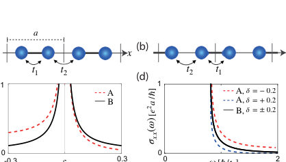
<figcaption class="paper-figure-caption"><b>Fig 1.</b> FIG. 1. The unit-cell paradox in the SSH model. (a) Lattice struc- ture of the SSH model, defining t1 as the intra-cell hopping (bold line) and t2 as the inter-cell hopping (thin line), with lattice con- stant a. (b) The identical physical chain with a shifted unit cell parti- tion, equivalent to a t1 ↔t2 exchange. (c) The BZ-integrated quan- tum metric (total Wannier spread) Gxx as a function of the hopping asymmetry parameter δ that quantifies the dimerization. Here, we set t1 = t0(1 + δ) and t2 = t0(1 −δ). The dashed line corre- sponds to G∂,(A) xx by Convention A, while the solid line corresponds to Gphys xx by Convention B. (d) Optical conductivity spectrum σxx(ω) for δ = ±0.2 (solid...</figcaption>
</figure>

**Summary.** This work resolves a fundamental ambiguity in calculating the Quantum Geometric Tensor by proposing a physically mandated definition using a covariant derivative that includes the full orbital position operator. The authors demonstrate that ignoring this embedding leads to unphysical results, particularly in low-energy effective theories near gapped regimes.

**Why it may be interesting.** While focused on solid-state theory, the concept of defining observables via covariant derivatives incorporating full position operators is a general mathematical tool applicable to open quantum systems where boundary conditions or spatial degrees of freedom must be rigorously accounted for.

Detailed structure

**Main problem.** The standard calculation of the Quantum Geometric Tensor (QGT) suffers from an ambiguity dependent on the choice of unit-cell convention when dealing with Bloch states and $k$-derivatives.

**Main result.** A physically mandated, convention-independent QGT must be defined using a covariant derivative that explicitly incorporates the full position operator, revealing leading-order failures in standard k.p effective theories for gapped systems.

**Method.** The authors introduce a covariant derivative $D_\mu = i[\cdot, \hat{r}_\mu]$ to define a physical QGT, contrasting it with conventional $k$-derivative approaches.

**Model / system.** The analysis uses general condensed matter models, specifically demonstrating the issue using the Su-Schrieffer-Heeger (SSH) model and a one-dimensional massive Dirac Hamiltonian.

**Key observables.** Quantum Geometric Tensor ($	ext{QGT}$), quantum metric ($g_{\mu
u}$), Berry curvature ($\mathcal{F}_{\mu
u}$), Wannier spread, interband optical conductivity ($\sigma_{xx}(\omega)$).

**Important parameters / regimes.** Bond-ordered gaps, orbital embedding parameter ($c$), hopping amplitudes ($t_1, t_2$).

**Assumptions / limitations.** The standard $k$-derivative approach is insufficient because it neglects the explicit dependence on intra-unit-cell coordinates ($\hat{X}$).

**Figures summary.** Figures compare results for SSH models and Dirac Hamiltonians, showing that convention A leads to unphysical asymmetries in observables like conductivity, while convention B restores necessary symmetries.

**Paper structure.** The paper first identifies the ambiguity in QGT calculation; it then uses the SSH model to demonstrate the failure of standard derivatives; subsequently, it analyzes gapped effective theories using the Dirac Hamiltonian to show that orbital embedding corrections are essential for accurate physical responses.

Abstract

The Quantum Geometric Tensor, encompassing the quantum metric and Berry curvature, is a central concept in modern condensed matter physics. However, its standard calculation via $k$-derivatives of the Bloch projector conceals a fundamental ambiguity regarding the choice of unit-cell convention, specifically in the treatment of intra-cell orbital positions (i.e., with or without the orbital position $e^{ikx_α}$). We resolve this inconsistency by introducing a convention-independent physical QGT defined via a covariant derivative that explicitly incorporates the full position operator. We demonstrate that this formulation is uniquely mandated by the microscopic derivation of the physical current via the Peierls substitution. Notably, we uncover a leading-order failure in standard $k \cdot p$ effective theories for systems with bond-ordered gaps, identifying a need for caution in their application. Finally, we propose geometric engineering as a new design paradigm, enabling the independent tuning of geometric responses without altering the energy dispersion.

[↑ back to top](#top)

### [Explicit block-encodings for biharmonic boundary-value problems](http://arxiv.org/abs/2607.22396v1)

**Authors:** Chuwen Ma, Zihao Tang  
**Type:** theory · **Category:** quantum information and computing · **PDF:** <https://arxiv.org/pdf/2607.22396v1>  
**Analysis basis:** full PDF text, analyzed in chunks
**Topic relevance:** `analog quantum simulation` **1/5** · `methods for driven-dissipative` **1/5**

↔ Scroll figures horizontally

<figure class="paper-figure-card">
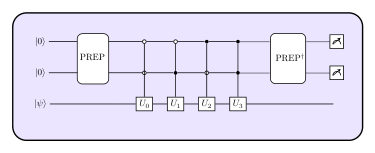
<figcaption class="paper-figure-caption"><b>Fig 1.</b> Figure 1: LCU construction with PREP, SELECT, and PREP†.</figcaption>
</figure>
<figure class="paper-figure-card">
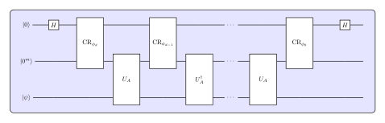
<figcaption class="paper-figure-caption"><b>Fig 2.</b> Figure 2: Basic QSVT circuit for applying a polynomial transformation to the singular values of a block-encoded matrix. When the polynomial approximates a scaled re- ciprocal function, the success component is proportional to A−1 |ψ⟩.</figcaption>
</figure>
<figure class="paper-figure-card">
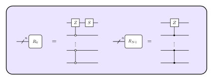
<figcaption class="paper-figure-caption"><b>Fig 3.</b> Figure 3: Boundary reflections R0 and RN−1 used in the shift-based block-encoding of the one-dimensional Dirichlet Laplacian.</figcaption>
</figure>
<figure class="paper-figure-card">
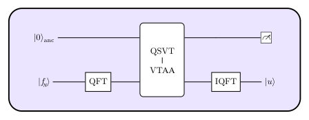
<figcaption class="paper-figure-caption"><b>Fig 4.</b> Figure 4: Circuit structure for the periodic biharmonic problem. the QSVT-VTAA linear-system solver prepares the augmented solution state, and the inverse QFT re- covers the physical-space solution after extraction of the bu-component.</figcaption>
</figure>
<figure class="paper-figure-card">
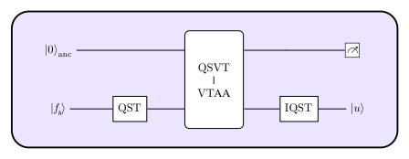
<figcaption class="paper-figure-caption"><b>Fig 5.</b> Figure 5: Circuit structure for the simply supported bi- harmonic problem.</figcaption>
</figure>

**Summary.** This paper presents a theoretical framework to solve biharmonic boundary-value problems using advanced quantum linear algebra techniques. By constructing explicit block-encodings for the discretized operators, the authors apply QSVT-VTAA algorithms to achieve efficient solutions across various physical boundary conditions. This work advances the application of quantum computation to classical computational physics challenges.

**Why it may be interesting.** While focused on PDE solving rather than direct AMO Hamiltonians, the techniques developed—especially efficient block-encoding of structured operators and leveraging QSVT for large sparse matrices—are foundational tools applicable to simulating quantum many-body systems governed by differential equations or complex lattice models.

Detailed structure

**Main problem.** Developing quantum linear-system algorithms for solving high-order partial differential equations, specifically the biharmonic boundary-value problem.

**Main result.** The authors developed explicit block-encodings tailored to various boundary conditions (periodic, simply supported, Dirichlet–Neumann) and demonstrated that QSVT-VTAA can solve these systems with condition number scaling improvements over direct methods.

**Method.** The core method involves constructing explicit block-encodings of the discretized differential operators and applying Quantum Singular Value Transformation combined with Variable Time Amplitude Amplification (QSVT-VTAA).

**Model / system.** The model is the biharmonic equation ($\Delta^2 u = f$), which arises in continuum mechanics. The problem is discretized using finite-difference or spectral methods, leading to large, sparse linear systems $Ax=b$.

**Key observables.** Condition number scaling ($\kappa(A)$), gate complexity, discretization error ($L^2$ and $L^\infty$ norms), and solution extraction cost.

**Important parameters / regimes.** The order of the PDE (fourth-order), boundary conditions (periodic, simply supported, Dirichlet–Neumann), and system size ($N$).

**Assumptions / limitations.** Assumes that normalized quantum states for the right-hand side and boundary data are efficiently preparable; separates discretization errors from quantum state-preparation errors.

**Figures summary.** Figures illustrate schematic circuits for LCU construction, basic QSVT diagrams, and visualizations of boundary reflections used in Laplacian block-encodings.

**Paper structure.** The paper first introduces the challenge of high-order PDEs. It then details the quantum algorithmic framework (QSVT-VTAA) and how to construct necessary block-encodings for specific boundary conditions, culminating in numerical validation across different physical scenarios.

Abstract

The biharmonic equation is a prototypical fourth-order partial differential equation whose high-dimensional discretization suffers from rapidly growing degrees of freedom and severe ill-conditioning. We develop QSVT--VTAA quantum linear-system algorithms by constructing explicit block-encodings tailored to periodic, simply supported, and Dirichlet--Neumann boundary conditions. For periodic and simply supported problems, Fourier and sine-transform diagonalizations yield augmented Poisson systems with the condition-number scaling of a second-order operator. For Dirichlet--Neumann problems, we introduce a second-order boundary-corrected finite-difference discretization, establish mesh-independent stability, and construct an explicit block-encoding of the resulting nonsymmetric matrix. We also formulate a coupled-Laplace system with additional boundary unknowns and characterize its complexity in terms of the condition number of the complete augmented matrix. The analysis covers discretization error, block-encoding normalization, gate complexity, and solution extraction under an amplitude-input and quantum-state-output model. Numerical experiments validate the proposed discretizations and the corresponding linear solves.

[↑ back to top](#top)

### [Frame-Dependent Traces and the Third-Particle Paradox](http://arxiv.org/abs/2607.21703v1)

**Authors:** Alessandro Palumbo, Luca Apadula  
**Type:** theory · **Category:** other · **PDF:** <https://arxiv.org/pdf/2607.21703v1>  
**Analysis basis:** full PDF text, analyzed in chunks
**Topic relevance:** `entanglement & information structure` **1/5** · `quantum measurements` **1/5**

↔ Scroll figures horizontally

<figure class="paper-figure-card">
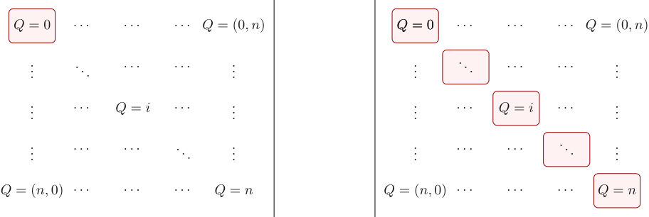
<figcaption class="paper-figure-caption"><b>Fig 1.</b> Figure 1. Schematic representation of the strong twirling (left) and weak twirling (right), in the charge basis associated with Eve’s description. The black matrix elements denote the original kinematical density operator. The red blocks indicate the components retained by the projection onto the trivial-charge sector in the strong case, and onto the weakly invariant algebra in the weak case.</figcaption>
</figure>
<figure class="paper-figure-card">
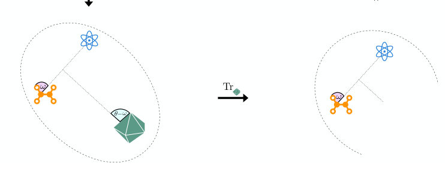
<figcaption class="paper-figure-caption"><b>Fig 2.</b> Figure 2. Heuristic explanation of the clash between tracing before and after projection onto the physical Hilbert space. The atom and the molecule represent subsystem 12, with the information θ encoded in the relative phase between them; the diamond represents the third particle. The upper pictures show Eve’s perspective, where the Cartesian axes pictorially indicate an external reference frame; tracing from this external perspective recovers the information on θ. In the bottom pictures the axes are absent, indicating that the global degrees of freedom have been discarded by the strong twirling. After strong twirling (bottom-left), the information on θ is spread onto correlations with the...</figcaption>
</figure>
<figure class="paper-figure-card">
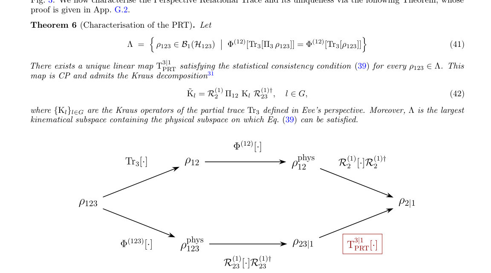
<figcaption class="paper-figure-caption"><b>Fig 3.</b> Figure 3. Graphical interpretation of Eq. (40). The statistical consistency condition is equivalent to requiring that the same state be obtained in the following cases: (Top arrows) trace, project into Hphys 12 and map to the QRF of 1; (Bottom arrows) project into Hphys 123 , map to the QRF of 1 and apply the Perspective Relational Trace, highlighted by the red box.</figcaption>
</figure>

**Summary.** This theoretical paper tackles the Third-Particle Paradox by developing the Perspective Relational Trace (PRT) condition. It shows that the paradox is an artifact of comparing inconsistent physical descriptions derived from different Quantum Reference Frames (PN vs. QI). The work provides a refined understanding of subsystem description consistency in quantum theory.

**Why it may be interesting.** It provides a rigorous framework for understanding how local measurements or subsystem definitions can fail when global reference frames are not properly accounted for in quantum field theory contexts.

Detailed structure

**Main problem.** The paper addresses the Third-Particle Paradox, which arises from inconsistencies when comparing subsystem descriptions across different Quantum Reference Frame (QRF) perspectives.

**Main result.** It introduces the Perspective Relational Trace (PRT) condition, showing that the paradox stems from comparing inequivalent physical layers rather than being a true contradiction.

**Method.** The authors develop novel statistical consistency conditions (PRT) and compare different algebraic structures arising from various tracing procedures (PN vs. QI).

**Model / system.** The analysis uses abstract quantum systems defined on kinematical Hilbert spaces $H = igotimes H_i$, often involving symmetries described by a compact Lie group G.

**Key observables.** Consistency of subsystem discarding, the Perspective Relational Trace (PRT), and entropy decomposition formulas for reduced states.

**Important parameters / regimes.** The distinction between Perspective-Neutral (PN) and Quantum-Information (QI) approaches; the structure of the underlying symmetry group G.

**Assumptions / limitations.** The analysis assumes ideal QRFs and relies on comparing different algebraic structures derived from partial traces over subsystems.

**Figures summary.** Not specified by notes, but the discussion implies comparisons between different types of invariant algebras and trace equalities.

**Paper structure.** The paper systematically analyzes the paradox's origins, introduces the PRT condition to characterize state consistency, compares PN and QI descriptions across multiple subsystems, and concludes with implications for boundary-charge structures.

Abstract

The Paradox of the Third Particle arises when comparing subsystem descriptions across Quantum Reference Frame (QRF) perspectives. We isolate two distinct origins of the Paradox: the QRF covariance of the partial trace and the failure of the physical Hilbert space to inherit the kinematical tensor-product structure. We give an explicit counterexample to the Relational Trace (RT) resolution: an uncorrelated product state for which the RT statistical condition trivialises. We then introduce a new statistical consistency condition comparing subsystem discarding between external and internal QRFs, together with an associated frame-dependent map, the Perspective Relational Trace (PRT). We argue that our condition captures the operational content of the Paradox: rather than imposing consistency on the whole state space, we characterise exactly the states on which it holds in the Perspective-Neutral (PN) and Quantum-Information (QI) approaches. This separates three levels of description: a PN subsystem of a PN whole, where consistency fails on a characterised set that includes product states; a QI subsystem of a QI whole, where it holds for all states; and a QI subsystem obtained from a PN whole by kinematical partial trace, where the full weakly invariant algebra is recovered, yet consistency holds only on a proper subset. These results show that the PN approach can consistently describe only a closed, isolated system, while the QI approach can accommodate arbitrary subsystems. Tracing out a subsystem from a globally PN state yields a charge-superselected algebra, reproducing in a minimal QRF model the boundary-charge structure of edge modes. We understand the Paradox not as a genuine contradiction, but as the consequence of comparing inequivalent physical layers without tracking which information is externally and which internally accessible.

[↑ back to top](#top)

### [Quantum-informed surrogate sampling for combinatorial optimization](http://arxiv.org/abs/2607.22372v1)

**Authors:** Elisabeth Wybo, Jernej Rudi Finžgar  
**Type:** both · **Category:** disordered systems and neural networks · **PDF:** <https://arxiv.org/pdf/2607.22372v1>  
**Analysis basis:** full PDF text, analyzed in chunks
**Topic relevance:** `QC/QI experiment` **1/5** · `methods for driven-dissipative` **1/5**

↔ Scroll figures horizontally

<figure class="paper-figure-card">
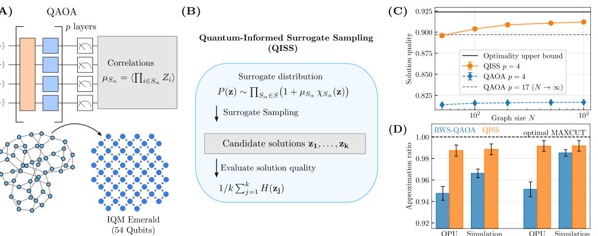
<figcaption class="paper-figure-caption"><b>Fig 1.</b> FIG. 1. Overview of the surrogate sampling procedure. (A) We estimate the correlations µSα from a depth-p QAOA circuit. The circuit can be executed on a quantum device, such as the 54-qubit IQM Emerald QPU with square-grid connectivity. (B) From a polynomially sized set of correlations, we construct a factor distribution P(z) as a classical surrogate. We sample candidate solutions from it by MCMC and evaluate their quality. We refer to this procedure as Quantum-Informed Surrogate Sampling (QISS). (C) Sampling from the classical surrogate improves the solution quality compared to vanilla QAOA. Here, we consider the MaxCut problem on 3-regular graphs and a p = 4 QAOA circuit. We include all...</figcaption>
</figure>
<figure class="paper-figure-card">
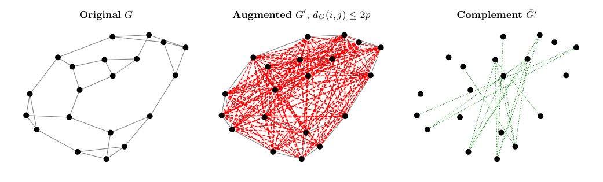
<figcaption class="paper-figure-caption"><b>Fig 2.</b> FIG. 2. Starting from an original graph G, we construct an augmented graph G′. There is an edge in the augemented graph if dG(i, j) ≤2p, in this figure we consider p = 2. We also show the complement graph of G′ to highlight the distinction from the complete graph.</figcaption>
</figure>
<figure class="paper-figure-card">
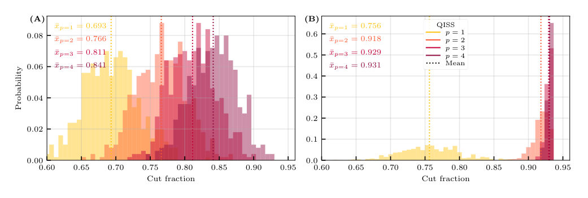
<figcaption class="paper-figure-caption"><b>Fig 3.</b> FIG. 3. Cut fractions obtained with QISS for a single MaxCut instance on a 3-regular graph of size N = 100. The histograms show the cut fractions corresponding to 500 samples generated via QISS based on the mean value input. (A) Only the QAOA edge correlators E are included in the sampling model. (B) All non-zero QAOA edge correlators E′ are included in the sampling model. For this particular instance, the optimal cut fraction is 14/15 (= 0.933...).</figcaption>
</figure>
<figure class="paper-figure-card">
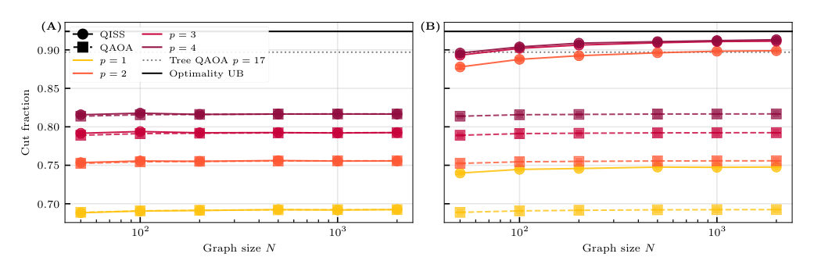
<figcaption class="paper-figure-caption"><b>Fig 4.</b> FIG. 4. QISS for MaxCut on 3-regular graphs based on QAOA correlations. Average cut fractions from vanilla QAOA and from QISS, for various QAOA depths p, averaged over 40 instances per system size N. (A) Only the edge correlators are included in the surrogate model; QISS reproduces the QAOA cut fraction. (B) All non-zero correlators within the light cone (dG(i, j) ≤2p) are included, giving a large improvement over vanilla QAOA. The dotted line marks vanilla tree QAOA at p = 17 [35].</figcaption>
</figure>
<figure class="paper-figure-card">
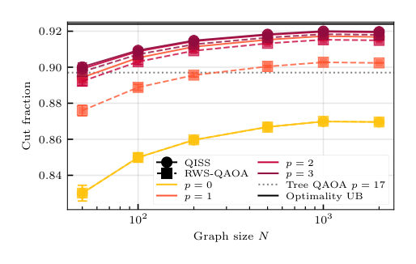
<figcaption class="paper-figure-caption"><b>Fig 5.</b> FIG. 5. QISS for MaxCut on 3-regular graphs based on RWS-QAOA correlations. Average cut fractions obtained from the RWS-QAOA and combined with QISS postprocessing at different depths p. Here, p = 0 corresponds to the expectation values estimated with respect to the initial RWS-QAOA state; the QISS postprocessing is unable to improve. For reference, the p = 17 mean cut fraction from vanilla QAOA is shown [35]. QISS improves upon the supplied RWS-QAOA correlations, with the relative improvement decreasing as we approach the optimality upper bound with increasing p.</figcaption>
</figure>

**Summary.** This paper introduces Quantum-Informed Surrogate Sampling (QISS), a post-processing technique that uses low-order correlations measured from shallow quantum circuits (like QAOA) to build an effective classical probability distribution. This surrogate distribution is then sampled via MCMC to generate candidate solutions for combinatorial optimization problems like MaxCut, achieving performance superior to the raw output of the quantum algorithm itself.

**Why it may be interesting.** It provides a concrete pathway for near-term quantum devices: instead of demanding perfect state preparation or deep circuits, it extracts robust statistical information that can be leveraged by scalable classical algorithms to solve hard optimization problems.

Detailed structure

**Main problem.** Developing a post-processing framework, Quantum-Informed Surrogate Sampling (QISS), to generate high-quality candidate solutions for computationally hard combinatorial optimization problems.

**Main result.** QISS significantly outperforms vanilla QAOA by using low-order quantum correlations as input to a classical sampling procedure, showing noise resilience on near-term hardware.

**Method.** The method estimates local observables (low-weight correlations) from shallow quantum circuits and uses these values to construct a factorized surrogate probability distribution over the solution space, which is then sampled via MCMC.

**Model / system.** The framework applies to classical optimization problems like MaxCut and Maximum Independent Set. The underlying physics involves using QAOA on qubits (validated on a 54-qubit QPU) to generate these informative statistics.

**Key observables.** Cut fraction, Energy density ($\epsilon$), low-weight correlations ($\mu_{S_\alpha}$), and comparison against theoretical bounds like the SDP value or Parisi energy.

**Important parameters / regimes.** Circuit depth ($p$), inverse temperature ($eta$), and graph structure (e.g., 3-regular graphs).

**Assumptions / limitations.** The method assumes that low-weight expectation values are sufficient to capture the necessary structural information, allowing for classical sampling without needing full quantum state simulation.

**Figures summary.** Figures illustrate the QISS procedure: estimating correlations from QAOA (Fig. 1A), constructing a factor distribution (Fig. 1B), and showing improved solution quality over vanilla QAOA (Fig. 1C). Other figures compare QISS performance against other algorithms for MaxCut/MIS.

**Paper structure.** The paper introduces the QISS framework, details how low-order correlations from shallow circuits are used to build a classical surrogate distribution, demonstrates its superior performance over direct quantum sampling methods (QAOA), and validates its noise resilience on real hardware.

Abstract

We introduce Quantum-Informed Surrogate Sampling (QISS), a post-processing framework that generates candidate solutions to combinatorial optimization problems from low-weight correlations of shallow quantum circuits. The quantum device estimates local observables, which are directly accessible by repeated measurements and for which a wide range of error-mitigation tools are available, while candidate solutions are generated classically without explicit dependence on the combinatorial optimization problem itself. We evaluate QISS on Maximum Cut and Maximum Independent Set problems on $N$ variables and show that only $O(N)$ low-order correlators from shallow circuits suffice to produce competitive solutions that surpass vanilla QAOA. For MaxCut on 3-regular graphs, QISS from $p=3$ QAOA correlators outperforms vanilla QAOA at $p=17$ on average, with further improvements possible by warm-starting QAOA. We validate the procedure on the 54-qubit IQM Emerald quantum device and demonstrate its noise resilience. Our results support a regime for near-term optimization in which shallow circuits serve not as direct samplers but as generators of informative statistics for scalable classical sampling.

[↑ back to top](#top)

### [Quasi-Two-Dimensional Quantum Antiferromagnetism in the Distorted Honeycomb Compound KCuIn(PO4)2](http://arxiv.org/abs/2607.21868v1)

**Authors:** S. Gayen, S. S. Ali, V. K. Singh, B. Koteswararao, S. K. Panda  
**Type:** both · **Category:** strongly correlated electrons · **PDF:** <https://arxiv.org/pdf/2607.21868v1>  
**Analysis basis:** full PDF text, analyzed in chunks
**Topic relevance:** `analog quantum simulation` **1/5** · `exotic spin models in light-matter` **1/5**

↔ Scroll figures horizontally

<figure class="paper-figure-card">
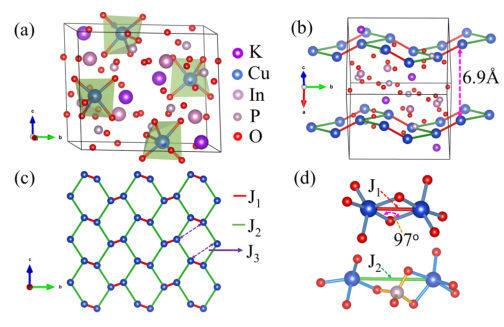
<figcaption class="paper-figure-caption"><b>Fig 1.</b> FIG. 1. (a) Crystal structure of KCuIn(PO4)2, highlighting the local environment around Cu-ions. (b) Each layer of Cu ions forming the distorted honeycomb network in the b-c plane is displayed, and the large interlayer separation (= 6.9 Å) between adjacent layers along the a-axis is highlighted, demonstrating the effectively quasi-two- dimensional nature of the magnetic lattice. (c) Each Cu-ion layer is shown separately to illustrate the formation of the distorted honey- comb geometry, with the first-, second-, and third-nearest-neighbor (NN) Cu–Cu exchange couplings labeled as J1, J2, and J3, respec- tively. (d) Superexchange paths between Cu ions for the first- and second-nearest-neighbor...</figcaption>
</figure>
<figure class="paper-figure-card">
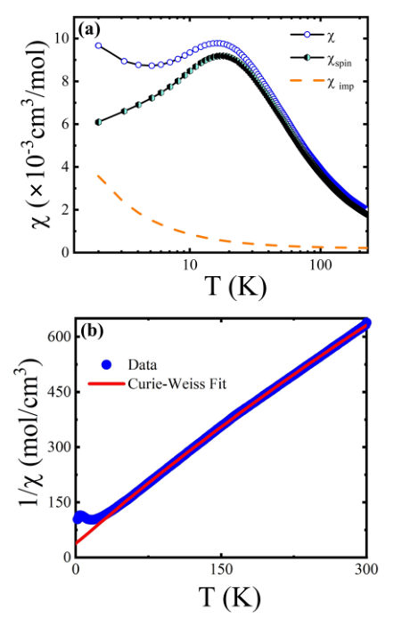
<figcaption class="paper-figure-caption"><b>Fig 2.</b> FIG. 2. (a) The temperature dependence of the magnetic suscepti- bility χ(T) is presented. The blue open circles represent the mea- sured experimental data collected at an applied field of 1 T. The yellow dashed curve illustrates the impurity contribution, χimp(T). The intrinsic spin susceptibility, χspin(T), is extracted by subtracting χimp(T) from the total measured χ(T). (b) The inverse susceptibil- ity 1/χ is plotted as a function of temperature T. The solid red line represents the Curie-Weiss fit, highlighting the linear behavior in the high-temperature regime.</figcaption>
</figure>
<figure class="paper-figure-card">
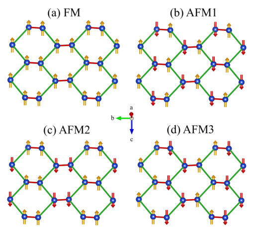
<figcaption class="paper-figure-caption"><b>Fig 3.</b> FIG. 3. Four distinct Cu2+ spin configurations within the distorted honeycomb plane are shown: (a) a ferromagnetic state with all spins aligned parallel, (b) both first- and second-nearest-neighbor interac- tions are antiferromagnetic, (c) the first-nearest-neighbor interaction is ferromagnetic while the second-nearest-neighbor interaction is an- tiferromagnetic, and (d) the first-nearest-neighbor interaction is an- tiferromagnetic while the second-nearest-neighbor interaction is fer- romagnetic.</figcaption>
</figure>
<figure class="paper-figure-card">
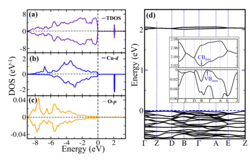
<figcaption class="paper-figure-caption"><b>Fig 4.</b> FIG. 4. (a) Total electronic density of states (DOS) of KCuIn(PO4)2 . (b) Partial density of states corresponding to the Cu–d orbitals and (c) the O–p orbitals. (d) Electronic band dispersion plotted along the high-symmetry directions of the Brillouin zone. The inset highlights the positions of the valence-band maximum and conduction-band minimum, illustrating the indirect-gap nature of the insulating ground state. The Fermi energy is set at 0 eV for all the figures.</figcaption>
</figure>
<figure class="paper-figure-card">
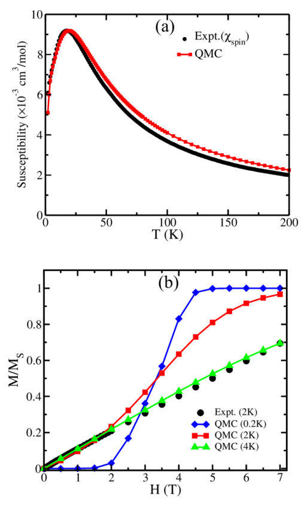
<figcaption class="paper-figure-caption"><b>Fig 5.</b> FIG. 5. (a) Temperature-dependent magnetic susceptibility calcu- lated using quantum Monte Carlo simulations for the effective spin- 1</figcaption>
</figure>

**Summary.** The authors theoretically and experimentally characterize $	ext{KCuIn}(	ext{PO}_4)_2$ as a quasi-two-dimensional quantum antiferromagnet. They use DFT to determine its insulating nature and calculate magnetic exchange couplings, which reveal a spin-chain like structure. QMC simulations then successfully model the material's low-temperature magnetic susceptibility, confirming its behavior as a strongly correlated quantum magnet.

**Why it may be interesting.** This work provides a detailed case study of how fundamental solid-state theory (DFT) combined with advanced many-body simulation techniques (QMC) can map out the phase diagram and underlying physics of real, complex quantum magnets.

Detailed structure

**Main problem.** The study investigates the electronic structure and magnetic properties of the quasi-two-dimensional quantum antiferromagnet $	ext{KCuIn}(	ext{PO}_4)_2$. The goal is to establish a consistent theoretical framework linking its electronic structure, exchange interactions, and collective magnetic behavior.

**Main result.** The compound is confirmed as a quasi-two-dimensional quantum antiferromagnet composed of weakly coupled spin chains. Quantum Monte Carlo simulations successfully reproduce experimental signatures like the susceptibility maximum and field-induced saturation characteristic of low-dimensional magnetism.

**Method.** A combination of Density Functional Theory (DFT) calculations using GGA+U, microscopic evaluation of magnetic exchange interactions via the magnetic force theorem, and large-scale Quantum Monte Carlo (QMC) simulations were employed. Experimental measurements included magnetization and susceptibility ($\chi(T)$).

**Model / system.** The physical system is the distorted honeycomb compound $	ext{KCuIn}(	ext{PO}_4)_2$, featuring localized $	ext{Cu}^{2+}$ ($S=1/2$) moments. The magnetism is modeled using an effective spin-$1/2$ Heisenberg Hamiltonian incorporating dominant isotropic exchange interactions and single-ion anisotropy.

**Key observables.** Temperature-dependent magnetic susceptibility ($\chi(T)$), field-dependent magnetization, calculated exchange couplings ($J_{NNN}$ dominating $J_{NN}$), and the insulating band gap ($\approx 2.0 	ext{ eV}$).

**Important parameters / regimes.** The ratio of next-nearest-neighbor to nearest-neighbor coupling ($J_2/J_1$) is identified as the key parameter controlling the magnetic ground state regime.

**Assumptions / limitations.** The system can be accurately described by an effective spin-$1/2$ Heisenberg Hamiltonian, and interlayer couplings are negligible due to structural separation.

**Figures summary.** Figure 1 illustrates the crystal structure showing the distorted honeycomb network. Figure 2 presents experimental data for $\chi(T)$ vs $T$, which is compared against theoretical fits.

**Paper structure.** The paper proceeds by first establishing the electronic structure using DFT, then calculating the magnetic exchange interactions to derive an effective Hamiltonian. Finally, QMC simulations are used on this model to reproduce and explain the measured low-temperature magnetic response.

Abstract

We investigate the electronic structure and magnetic properties of the distorted honeycomb lattice compound KCuInP2O8 through a combination of experimental measurements, first principles calculations and quantum monte carlo simulations. Density functional theory calculations within the GGA+U framework establishes KCuInP2O8 as an indirect gap insulator with Cu2+ local moments and finite magnetocrystalline anisotropy arising from spin orbit coupling. A microscopic evaluation of magnetic exchange interactions using the magnetic force theorem reveals a pronounced hierarchy of couplings, with the next nearest neighbor interaction dominating over the nearest neighbor exchange, while interlayer couplings remain negligible. This exchange hierarchy naturally maps the system onto weakly coupled antiferromagnetic spin chains embedded in a distorted honeycomb lattice. Motivated by the ab initio estimated exchange interactions, we construct an effective spin half Hamiltonian and investigate its magnetic response using large scale quantum Monte Carlo simulations. The calculated temperature dependent susceptibility and field dependent magnetization quantitatively reproduce the experimental behavior and capture key signatures of low dimensional quantum magnetism, including a broad susceptibility maximum and a field induced saturation at low temperatures. Our results establish KCuInP2O8 as a quasi-two-dimensional quantum antiferromagnet composed of coupled spin chains, providing a consistent theoretical framework that links electronic structure, exchange interactions, and collective magnetic behavior.

[↑ back to top](#top)

### [Robustness of Off-Axis Electron Vortices in Nonuniform Magnetic Fields](http://arxiv.org/abs/2607.22315v1)

**Authors:** Hui-Dong Huang, Qi Meng, Zhi-Bin Wang, Liang Lu, Jian Chen, Li-Ping Zou  
**Type:** both · **Category:** other · **PDF:** <https://arxiv.org/pdf/2607.22315v1>  
**Analysis basis:** full PDF text, analyzed in chunks
**Topic relevance:** `methods for driven-dissipative` **1/5** · `non-equilibrium dynamics` **1/5**

↔ Scroll figures horizontally

<figure class="paper-figure-card">
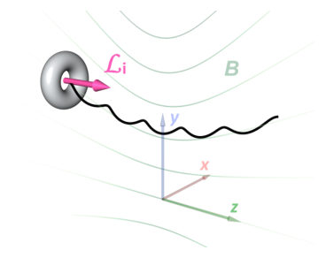
<figcaption class="paper-figure-caption"><b>Fig 1.</b> FIG. 1. An off-axis vortex wavepacket propagating through a magnetic lens. The centroid follows a helical trajectory that winds around the curved magnetic field lines, while the in- trinsic OAM, defined relative to the centroid, is not protected by axial symmetry alone.</figcaption>
</figure>
<figure class="paper-figure-card">
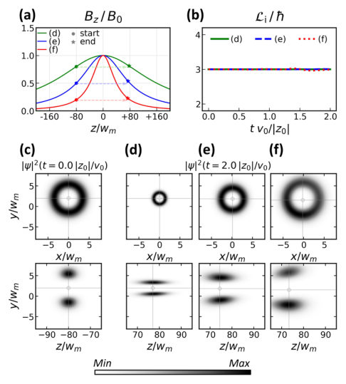
<figcaption class="paper-figure-caption"><b>Fig 2.</b> FIG. 2. Dynamics of an off-axis vortex-electron wavepacket in Glaser lenses with different characteristic lengths a. Panel (a) shows the longitudinal magnetic-field profiles Bz(z) for a = 160, 80, 40 wm, and panel (b) the evolution of the intrinsic canonical OAM Li. Panels (c–f) show the corresponding prob- ability density |ψ|2 at the initial time and at t = 2.0|z0|/v0. The initial wavepacket has topological charge ℓ= +3, char- acteristic scales w⊥= 2 wm and wz = 4 wm, centroid position r0 = (0, +2, −80) wm, and axial speed v0 = (160 wm)/(6Tc). Here B0 = 0.02 T, corresponding to wm = p</figcaption>
</figure>
<figure class="paper-figure-card">
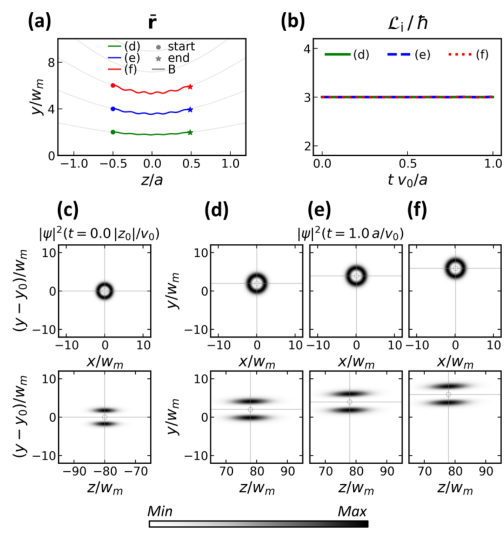
<figcaption class="paper-figure-caption"><b>Fig 3.</b> FIG. 3. Dynamics of an off-axis vortex-electron wavepacket for different initial transverse offsets y0. Panel (a) dis- plays the centroid trajectories ¯r in the z–y plane for y0 = +2, +4, +6 wm, while panel (b) shows the evolution of the in- trinsic canonical OAM Li. Panels (c–f) show the correspond- ing probability density |ψ|2 at the initial time and at t = a/v0. The initial wavepacket has topological charge ℓ= +3, char- acteristic scales w⊥= 1 wm and wz = 4 wm, centroid position r0 = (0, y0, −0.5 a), and axial speed v0 = a/(6Tc). The Glaser field is specified by a = 160 wm and B0 = 0.02 T, yielding the characteristic scales wm = 0.256 µm and Tc = 1.786 ns.</figcaption>
</figure>

**Summary.** This paper analyzes the conservation of intrinsic orbital angular momentum for electron vortices moving off-axis through magnetic lenses. The authors prove that this conservation is guaranteed by a hidden SU(1,1) dynamical invariant, even when simple symmetries are broken. This finding is confirmed via detailed theoretical derivations and robust 3D numerical simulations.

**Why it may be interesting.** The discovery of a non-obvious dynamical symmetry (SU(1,1)) protecting a key quantum observable ($L_i$) in a complex physical setting like nonuniform fields is highly relevant for understanding topological robustness in wave propagation.

Detailed structure

**Main problem.** The study investigates how the intrinsic orbital angular momentum (OAM) of off-axis electron vortices is conserved when propagating through nonuniform magnetic fields, contrasting this with on-axis cases protected by rotational symmetry.

**Main result.** The intrinsic OAM is found to be robustly conserved due to a hidden SU(1,1) dynamical invariant, which is confirmed by both theoretical derivation in the paraxial limit and high-fidelity 3D numerical simulations.

**Method.** The work combines analytical derivations using Hamiltonian mechanics (Heisenberg equations of motion) with advanced numerical techniques like operator-splitting Fourier pseudo-spectral methods to simulate wavepacket evolution.

**Model / system.** The system models an electron vortex propagating in a magnetic field, specifically utilizing the Glaser lens profile $B(z) = B_0(1 + z^2/a^2)^{-1}$. The dynamics are governed by the time-dependent Schrödinger equation with a vector potential $\mathbf{A}$.

**Key observables.** Intrinsic Orbital Angular Momentum ($L_i$), Extrinsic OAM ($L_{	ext{ext}}$), and the conserved SU(1,1) norm.

**Important parameters / regimes.** Magnetic field variation scale ($a$), initial transverse offset ($y_0$), and topological charge ($\ell$).

**Assumptions / limitations.** The theoretical proof relies on the paraxial approximation, although numerical results suggest robustness beyond this limit.

**Figures summary.** Figures illustrate off-axis vortex propagation through a magnetic lens, showing centroid trajectories and confirming that $L_i$ remains nearly constant despite field gradients and initial offsets.

**Paper structure.** The paper develops the Hamiltonian formalism for electron dynamics in nonuniform fields, derives equations of motion for expectation values (including $L_{	ext{ext}}$), identifies the hidden SU(1,1) invariant, and validates this conservation law through both analytical proofs and extensive 3D numerical simulations.

Abstract

Rotational symmetry protects the topological charge of on-axis electron vortices but not of off-axis vortices. We identify an additional SU(1,1) dynamical invariant that guarantees conservation of their intrinsic orbital angular momentum within the near-axis approximation. First-principles simulations of an off-axis electron vortex traversing a Glaser lens confirm this prediction, establishing a robust transport mechanism in axisymmetric nonuniform magnetic fields.

[↑ back to top](#top)

### [Efficient Unclonable Encryption from Pauli Eigenstates](http://arxiv.org/abs/2607.21811v1)

**Authors:** Seyoon Ragavan  
**Type:** theory · **Category:** quantum information and computing · **PDF:** <https://arxiv.org/pdf/2607.21811v1>  
**Analysis basis:** full PDF text, analyzed in chunks
**Topic relevance:** `entanglement & information structure` **1/5**

↔ Scroll figures horizontally

<figure class="paper-figure-card">
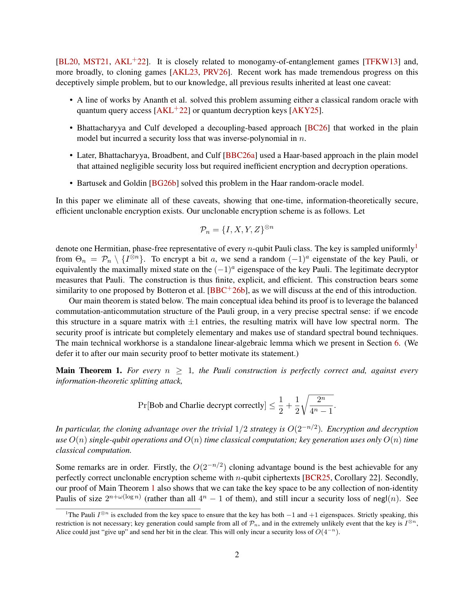
<figcaption class="paper-figure-caption"><b>Fig 1.</b> Low-resolution page preview, page 2</figcaption>
</figure>
<figure class="paper-figure-card">
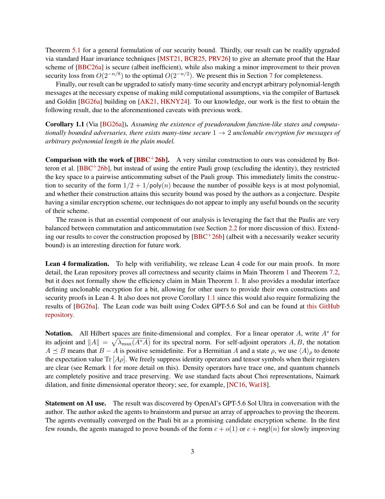
<figcaption class="paper-figure-caption"><b>Fig 2.</b> Low-resolution page preview, page 3</figcaption>
</figure>
<figure class="paper-figure-card">
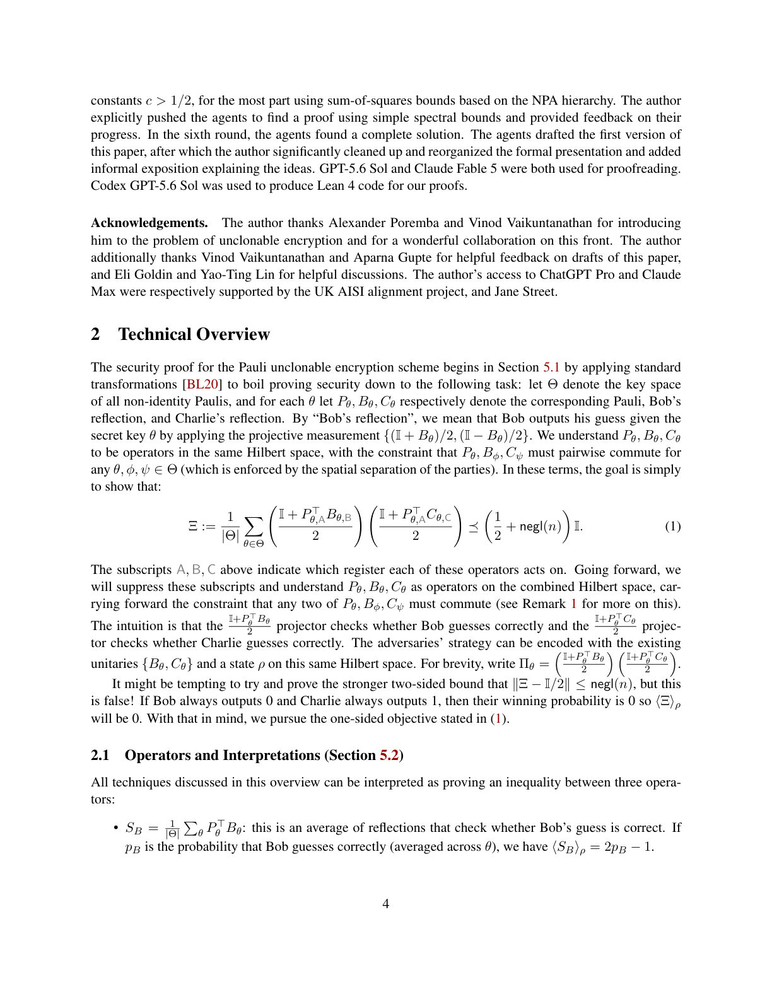
<figcaption class="paper-figure-caption"><b>Fig 3.</b> Low-resolution page preview, page 4</figcaption>
</figure>
<figure class="paper-figure-card">
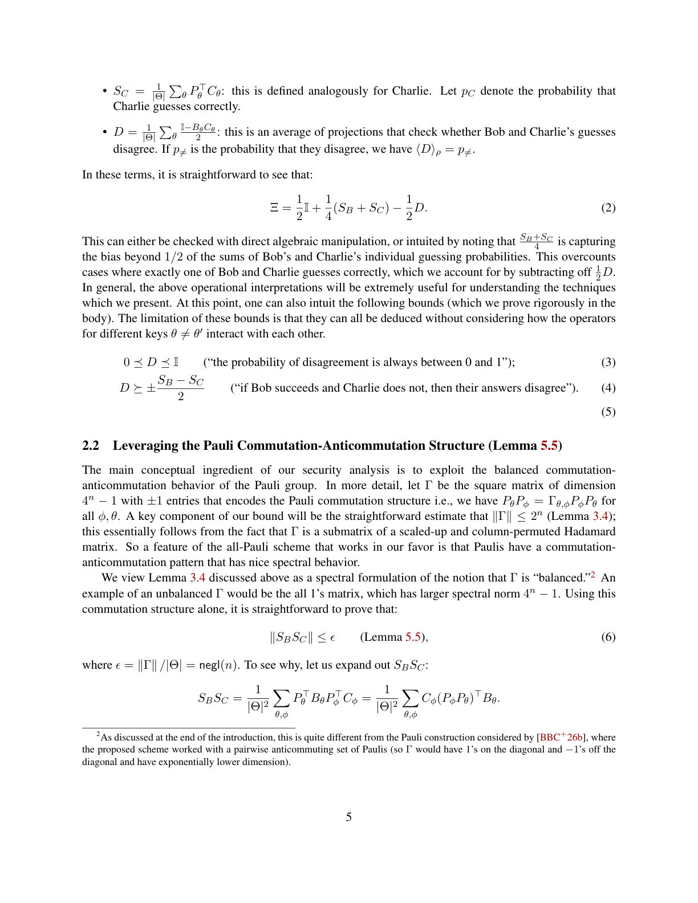
<figcaption class="paper-figure-caption"><b>Fig 4.</b> Low-resolution page preview, page 5</figcaption>
</figure>
<figure class="paper-figure-card">
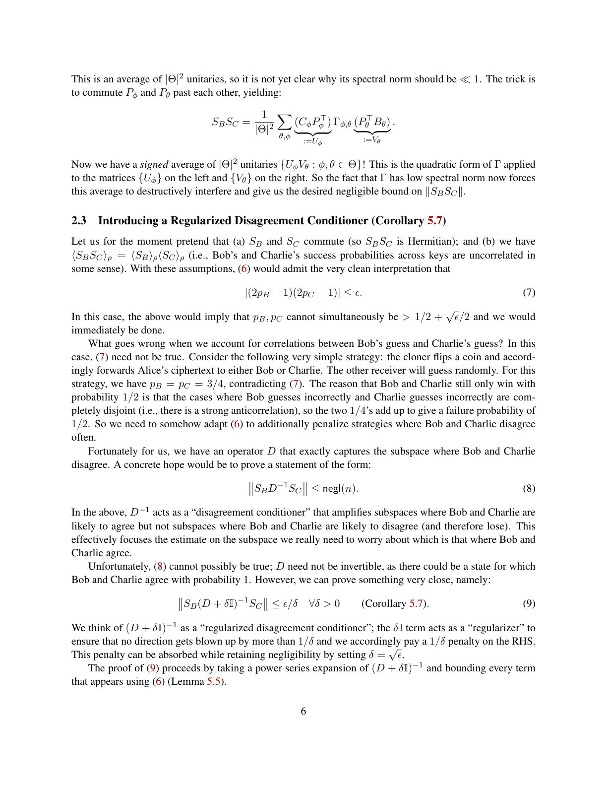
<figcaption class="paper-figure-caption"><b>Fig 5.</b> Low-resolution page preview, page 6</figcaption>
</figure>

**Summary.** This paper presents a novel, efficient, and information-theoretically secure Unclonable Encryption scheme using random Pauli operators on $n$ qubits. It achieves state-of-the-art security bounds by leveraging the algebraic structure of the Pauli group within its rigorous proof framework. This advances quantum cryptography by providing a practical primitive for device-independent security.

**Why it may be interesting.** It provides a concrete, physically realizable quantum cryptographic primitive whose security proof is deeply rooted in the algebraic structure of Pauli operators, which are fundamental tools in characterizing quantum states.

Detailed structure

**Main problem.** Developing an efficient, plain-model, one-time information-theoretically secure Unclonable Encryption (UE) scheme for a single classical bit.

**Main result.** The Pauli construction achieves the best known security bound against information-theoretic splitting attacks for $n$-qubit ciphertexts, providing efficiency and security previously lacking in related schemes.

**Method.** The security proof relies on analyzing expectation values involving operators derived from the Pauli group structure, utilizing advanced spectral bound techniques and linear algebra to bound cloning success probabilities.

**Model / system.** The system is based on quantum information theory using the Pauli group ($\mathcal{P}_n$) acting on $n$ qubits. The key is a random non-identity phase-free Pauli operator $	heta$.

**Key observables.** The probability that both separated receivers correctly recover the bit, and expectation values involving operators like $\Xi$, $S_B$, $S_C$, and $D$.

**Important parameters / regimes.** The number of qubits ($n$), which dictates the exponential security scaling ($	ext{negl}(n) \sim O(2^{-n/2})$).

**Assumptions / limitations.** Assumes the existence of pseudorandom function-like states for message extension; the core proof relies on complex spectral analysis techniques.

**Paper structure.** The paper introduces the Pauli construction, proves its security by bounding expectation values related to information leakage (Chunks 2 & 3), and discusses extensions and comparisons with prior work (Chunk 1).

Abstract

We give, to our knowledge, the first plain-model, one-time information-theoretically secure, efficient unclonable encryption scheme for one classical bit. Previous work by Bhattacharyya and Culf (Nature Physics, 2026) and Bhattacharyya, Broadbent, and Culf either only showed $1/\mathsf{poly}(λ)$ security loss or required inefficient encryption/decryption operations. We avoid both of these caveats; in doing so, we obtain (to our knowledge) the first plain-model construction of many-time secure $1 \to 2$ unclonable encryption for arbitrary polynomial-length messages, assuming the existence of pseudorandom function-like states (Bartusek and Goldin).   The key is a uniformly random non-identity phase-free Pauli on $n$ qubits, and bit $a$ is encrypted as a random $(-1)^a$ eigenstate of that Pauli. The scheme is exponentially secure; we prove that the probability that both receivers recover the bit is at most $\frac{1}{2}+\frac{1}{2}\sqrt{{2^n}/({4^n-1})} = \frac{1}{2} + O\left(2^{-n/2}\right).$ By a lower bound due to Broadbent, Culf, and Rochette, this is the best probability bound achievable with $n$-qubit ciphertexts (up to the constant hidden in the $O(\cdot)$).   The main conceptual idea is to leverage, in a precise spectral sense, the balanced commutation-anticommutation structure of the Pauli group. The proof is intricate but completely elementary and makes use of standard spectral bound techniques. The main technical workhorse is a standalone linear-algebraic lemma that informally relates the positivity of two different operators, each capturing the intuition that if the two receivers can individually decrypt unusually often then they must also disagree often.   GPT-5.6 Sol Ultra found this proof in an extended conversation with the author and drafted a preliminary version of this paper. The author is fully accountable for the correctness of this paper.

[↑ back to top](#top)

### [Exactness of Symmetry-Broken Self-Interaction Correction in the Strongly-Correlated or Classical Limit: Harmonium as a Demonstration](http://arxiv.org/abs/2607.22488v1)

**Authors:** Cody Woods, Yunzhi Li, Wenqing Yao, Chen Li, John Perdew  
**Type:** theory · **Category:** strongly correlated electrons · **PDF:** <https://arxiv.org/pdf/2607.22488v1>  
**Analysis basis:** full PDF text, analyzed in chunks
**Topic relevance:** `Keldysh / 2PI / non-Gaussian methods` **1/5**

↔ Scroll figures horizontally

<figure class="paper-figure-card">
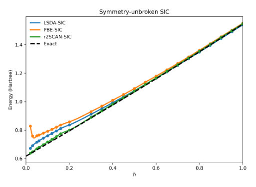
<figcaption class="paper-figure-caption"><b>Fig 1.</b> FIG. 2. Total energy vs. ℏfor LSDA, PBE, r2SCAN SIC variants. The plot highlights the range to 0 ≤ℏ≤1; The black dashed line is the exact energy of Eq. (8).(Symmetry unbroken)</figcaption>
</figure>
<figure class="paper-figure-card">
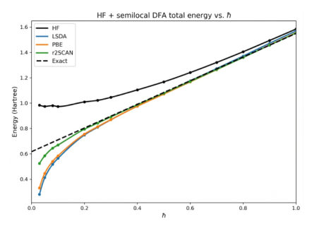
<figcaption class="paper-figure-caption"><b>Fig 2.</b> FIG. 1. E vs ℏfor Harmonium model without SIC correc- tion. Verifying Calculation from Truncated Solution [10]. The black dashed line is the exact energy of Eq. (8).</figcaption>
</figure>
<figure class="paper-figure-card">
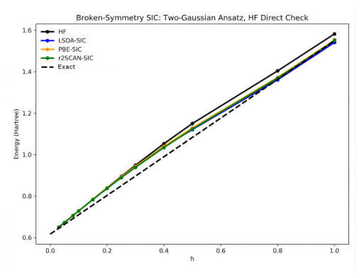
<figcaption class="paper-figure-caption"><b>Fig 3.</b> FIG. 3. Implementation of SIC correction (symmetry bro- ken). The visible errors could arise from the restricted Gaus- sian form of the SIC orbitals of Eqs. (10) and (11). The black dashed line is the exact energy of Eq. (8).</figcaption>
</figure>
<figure class="paper-figure-card">
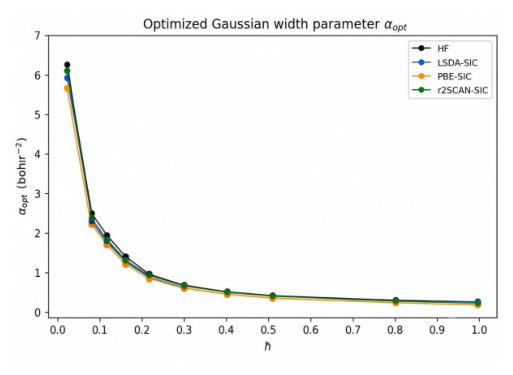
<figcaption class="paper-figure-caption"><b>Fig 4.</b> FIG. 4. Variationally-optimized Gaussian exponent parame- ter with symmetry-broken SIC. Since the Gaussian density is proportional to e−αr2, increasing αopt corresponds to increas- ing orbital localization(decreasing orbital width).</figcaption>
</figure>
<figure class="paper-figure-card">
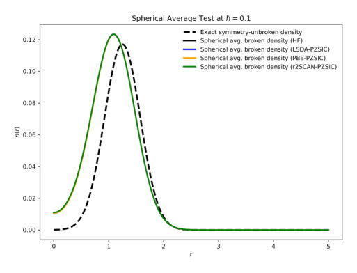
<figcaption class="paper-figure-caption"><b>Fig 5.</b> FIG. 6. Spherical average test at ℏ= 0.1. DFA Densities overlap. The small difference probably arises from the re- stricted Gaussian form of the SIC orbital of Eqs. (10) and (11).</figcaption>
</figure>

**Summary.** This work investigates how well Self-Interaction Correction methods describe strongly correlated electron systems by modeling two electrons in a harmonic trap (harmonium). The authors prove that the symmetry-broken SIC approach yields exact results in the classical limit ($\hbar 	o 0$). This demonstrates SIC's utility for bridging the gap between standard quantum DFT and purely classical descriptions.

**Why it may be interesting.** While focused on electronic structure theory, the concept of approaching a classical limit from quantum mechanics using specialized corrections (SIC) is relevant for understanding semiclassical approximations in many-body systems.

Detailed structure

**Main problem.** The study addresses strong electron correlation, a major challenge for Density Functional Theory (DFT), by examining the exactness of symmetry-broken Self-Interaction Correction (SIC) in the semiclassical or classical limit.

**Main result.** The authors demonstrate that for the harmonium model, symmetry-broken SIC yields results exact in the $\hbar 	o 0$ limit and highly accurate across all intermediate values of Planck's constant ($\hbar$).

**Method.** The research employs a variational approach using localized Gaussian orbitals within the framework of PZ-SIC to calculate ground-state energies for the two-electron harmonium system.

**Model / system.** The model is the harmonium: two Coulomb-interacting electrons confined by a spherically-symmetric harmonic-oscillator potential. The Hamiltonian includes tunable Planck's constant ($\hbar$) and confinement strength ($\omega$).

**Key observables.** Ground-state energy ($E$), ground-state density ($
ho(r)$), optimized localization distance ($R_{opt}$), and Gaussian exponent ($\alpha_{opt}$).

**Important parameters / regimes.** Planck's constant ($\hbar$), harmonic confinement strength ($\omega$), and the electron-electron interaction strength (Coulomb repulsion).

**Assumptions / limitations.** The primary assumption is that symmetry-broken SIC correctly captures the physics in the strongly correlated limit, although limitations exist due to the restricted variational ansatz.

**Figures summary.** Figures illustrate the total energy vs. $\hbar$ for various DFAs (showing DFA failure near $\hbar 	o 0$), and show how optimized parameters ($R_{opt}, \alpha_{opt}$) converge towards classical values as $\hbar$ decreases.

**Paper structure.** The paper progresses by establishing the physical problem in the harmonium model, comparing standard DFT failures in the semiclassical limit, introducing and applying symmetry-broken SIC via a variational ansatz, and finally demonstrating convergence to the known exact classical limit ($\hbar 	o 0$).

Abstract

Strong electron correlation is an important challenge to both wavefunction and density functional theory. It has been argued that the Perdew-Zunger 1981 self-interaction correction to any density functional approximation, after symmetry breaking, can correctly describe the ground-state energy in the strongly-correlated limit in which each electron is described by a highly-localized and non-overlapped one-electron spin orbital. It has also been argued that the classical limit, in which Planck's constant tends to zero, is the strongly-correlated limit of quantum mechanics, where standard density functionals fail badly, as demonstrated by the exactly-solvable problem of harmonium (two Coulomb-interacting electrons bound by a spherically-symmetric harmonic-oscillator external potential). Here we combine these two ideas and demonstrate that, for harmonium, symmetry-broken self-interaction correction is exact in the limit where Planck's constant tends to zero, and usefully accurate for all values between 0 and the physical value (1 in atomic units). We also show that the Planck-constant-dependent symmetric ground-state density can be restored by spherical averaging of the broken-symmetry density.

[↑ back to top](#top)

### [Observation of room temperature intrinsic nonlinear thermoelectric effects in low-dimensional semimetals](http://arxiv.org/abs/2607.21808v1)

**Authors:** Kurea Nakagawa, Krishnaraajan Sundararajan, Cédric A. Cordero-Silis, Bart J. van Wees, Marcos H. D. Guimarães  
**Type:** experiment · **Category:** other · **PDF:** <https://arxiv.org/pdf/2607.21808v1>  
**Analysis basis:** full PDF text, analyzed in chunks
**Topic relevance:** `non-equilibrium dynamics` **1/5**

↔ Scroll figures horizontally

<figure class="paper-figure-card">
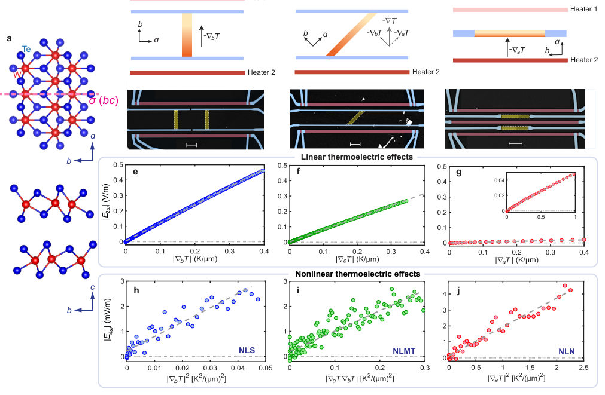
<figcaption class="paper-figure-caption"><b>Fig 1.</b> FIG. 1. Linear/nonlinear thermoelectric responses in WTe2 a, Crystal structure of Td-WTe2, with the mirror plane [σ(bc)] indicated by the pink dashed line. b-d, Schematic illustrations (top) and corresponding false-coloured scanning electron microscopy (SEM) images (bottom) of the devices designed to measure the NLS (b), NLMT (c), and NLN (d) effects. In the SEM images, WTe2, Pt heaters, and Au contacts are shown in yellow, red, and light blue, respectively (Scale bar: 10 µm). e–g, Second-harmonic thermoelectric responses at T = 35 K, plotted as a function of the applied temperature gradient for the three devices shown in b–d, respectively. The axis scales are unified across all panels,...</figcaption>
</figure>
<figure class="paper-figure-card">
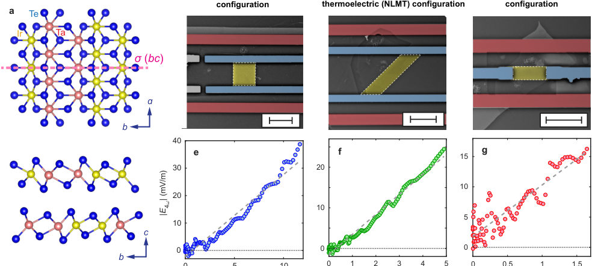
<figcaption class="paper-figure-caption"><b>Fig 2.</b> FIG. 2. Nonlinear thermoelectric responses in TaIrTe4 at room temperature a, Crystal structure of TaIrTe4, with the mirror plane [σ(bc)] indicated by the pink dashed line. b-d, False-coloured SEM images of the devices designed to measure the NLS (b), NLMT (c), and NLN (d) effects. In the SEM images, TaIrTe4, Pt heaters, and Au contacts are shown in yellow, red, and light blue, respectively (Scale bar: 5 µm). e–g, Fourth-harmonic thermoelectric responses at room temperature (T = 292.5 K), plotted as a function of the square of the applied temperature gradient for the same devices. The data are symmetrized with respect to temperature-gradient reversal to isolate intrinsic nonlinear...</figcaption>
</figure>
<figure class="paper-figure-card">
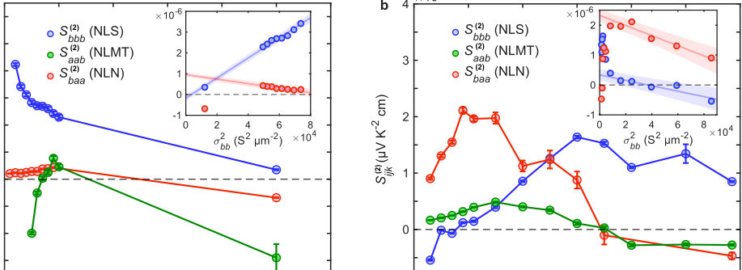
<figcaption class="paper-figure-caption"><b>Fig 3.</b> FIG. 3. Nonlinear thermoelectric coefficients in WTe2 and TaIrTe4 a-b, Temperature dependence of the nonlinear thermoelectric coefficients: NLS [S(2) bbb], NLN [S(2) baa], NLMT [S(2) aab] in WTe2 (a) and TaIrTe4 (b). The insets show the NLS and NLN coefficients as functions of the square of the electrical conductivity along b-axis; σbb. Linear fits to the data below 55 K are shown, with the shaded regions representing the standard deviation of the fits.</figcaption>
</figure>

**Summary.** This work reports the first observation of intrinsic nonlinear thermoelectric effects—including NLS, NLN, and NLMT—at room temperature in low-symmetry Weyl semimetals. By employing harmonic detection techniques, the authors successfully isolated these higher-order responses, demonstrating that they arise fundamentally from reduced crystal symmetry rather than external magnetic fields.

**Why it may be interesting.** While focused on solid-state transport, the ability to engineer higher-order energy conversion mechanisms via symmetry control is relevant for understanding non-equilibrium quantum dynamics in mesoscopic systems.

Detailed structure

**Main problem.** The study aims to demonstrate and characterize intrinsic nonlinear thermoelectric effects at room temperature in low-dimensional semimetals, moving beyond reliance on external symmetry breaking.

**Main result.** All three symmetry-allowed components of the nonlinear thermoelectric tensor (NLS, NLN, NLMT) were observed intrinsically up to room temperature in $	ext{WTe}_2$ and $	ext{TaIrTe}_4$.

**Method.** Measurements utilized harmonic detection ($4\omega$) techniques on fabricated devices with specific geometries to isolate intrinsic nonlinear contributions from linear response terms.

**Model / system.** The physical systems are low-symmetry type-II Weyl semimetals ($	ext{WTe}_2$ and $	ext{TaIrTe}_4}$). The analysis uses a third-rank tensor formalism ($\mathbf{S}^{(2)}$) to describe the nonlinear thermoelectric response.

**Key observables.** Nonlinear Seebeck (NLS), Nonlinear Nernst (NLN), and Nonlinear Mixed-directional thermoelectric (NLMT) coefficients, measured as fourth-harmonic voltage responses ($E_{i, 4\omega}$).

**Important parameters / regimes.** Room temperature ($\sim 290 	ext{K}$); zero magnetic field; low-dimensional semimetals.

**Assumptions / limitations.** The intrinsic nonlinear contribution is isolated by exploiting the directional nature of linear effects through symmetrization and ruling out temperature dependence of heater resistance.

**Figures summary.** Figures show device schematics, measured fourth-harmonic responses for NLS/NLMT/NLN in $	ext{TaIrTe}_4$, and the temperature dependence of these nonlinear coefficients in both materials.

**Paper structure.** The paper establishes the theoretical framework using second-order tensors for linear response and third-rank tensors for nonlinear effects. It details experimental measurements using harmonic detection to isolate intrinsic contributions, followed by analysis showing the origin (Berry curvature vs. scattering) and temperature dependence of these novel thermoelectric responses.

Abstract

Nonreciprocal control of thermoelectric responses offers a promising strategy for next-generation thermal-management and energy-conversion. While nonlinear electrical transport has recently emerged as an intrinsic property of low-symmetry quantum materials, their thermoelectric counterparts have not been demonstrated. Here, exploiting harmonic detection with gradient-reversal techniques, we report intrinsic nonlinear thermoelectric responses up to room temperature in the low-symmetry type-II Weyl semimetals $T_\mathrm{d}$-WTe$_2$ and TaIrTe$_4$ in the absence of magnetic fields or magnetic materials. We resolve all symmetry-allowed components of the second-order thermoelectric tensor, including the nonlinear Seebeck, nonlinear Nernst, and nonlinear mixed-directional thermoelectric effects and demonstrate that both Berry-curvature-related and scattering-induced contributions govern the different nonlinear thermoelectric responses. Our results show that nonlinear thermoelectricity arises intrinsically from reduced crystal symmetry and that engineering effects related to scattering in these materials provides a versatile platform for exploring higher-order heat-to-charge current conversion beyond the linear response.

[↑ back to top](#top)

## Other papers (8)

*Papers from primary archives without highlighted authors or any topic match. Click to expand.*

Show other papers

### [Algebraic structure of Tiger codes](http://arxiv.org/abs/2607.22460v1)

**Authors:** Clément Poirson, Anthony Leverrier, Christophe Vuillot  
**Type:** theory · **Category:** quantum information and computing · **PDF:** <https://arxiv.org/pdf/2607.22460v1>  
**Analysis basis:** full PDF text, analyzed in chunks

↔ Scroll figures horizontally

<figure class="paper-figure-card">
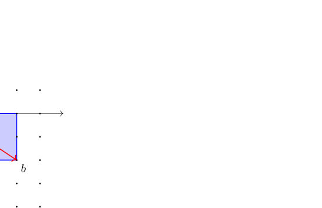
<figcaption class="paper-figure-caption"><b>Fig 1.</b> Figure 2: Graphical representation of the partial order in Definition 10: Let b = 3 −2⊤∈Z2. The blue shaded area represents all the vectors of Z2 less than or equal to b.</figcaption>
</figure>

**Summary.** This paper rigorously develops the theory of Tiger codes, which are advanced multimode bosonic quantum error-correcting codes. It uses sophisticated algebraic tools to prove the code structure is mathematically sound, deriving an explicit basis and characterizing its logical degrees of freedom via homology. Crucially, it provides methods to implement non-Clifford gates necessary for universal quantum computation within this bosonic encoding framework.

**Why it may be interesting.** This work provides a deep mathematical underpinning for bosonic quantum error correction, moving beyond simple stabilizer models by incorporating complex algebraic structures and characterizing universal gate sets necessary for fault-tolerant computation in superconducting circuits or cavity QED systems.

Detailed structure

**Main problem.** To provide a rigorous algebraic treatment of Tiger codes, which are multimode bosonic quantum error-correcting codes unifying several known constructions.

**Main result.** The paper establishes that the code structure is governed by the homology of an underlying chain complex and develops criteria for implementing non-Clifford logical gates using polynomial phase rotations. This confirms Tiger codes as a robust framework for bosonic encoding.

**Method.** The authors employ algebraic techniques, including kernel definitions, Fourier transforms over the codespace, and analysis via homological algebra to characterize the code space and its logical operations.

**Model / system.** The system involves multimode bosonic quantum states (Fock states) protected by constraints derived from both annihilation-type ($\hat{a}$-type) and number-type ($\hat{n}$-type) operators. These codes generalize concepts from stabilizer codes to bosonic systems.

**Key observables.** Logical Pauli operators, the structure of the homology group ($Z^{d_1} 	imes \cdots$), and the required polynomial form $P(\hat{\mathbf{n}})$ for gate implementation.

**Important parameters / regimes.** The constraints are defined by integer matrices ($G$ and $H$) and associated parameters ($\alpha, \Delta$). The complexity is related to the degree of polynomials used in gates.

**Assumptions / limitations.** The analysis relies on extending definitions from linear constraints to non-linear number constraints. A key algebraic result involves decomposing preserving polynomials into univariate components under certain assumptions.

**Figures summary.** Not specified, but the notes reference structural relationships derived from matrix decompositions (e.g., $L_f = H$) and specific code examples like the cat or paircat codes.

**Paper structure.** The paper progresses by first defining the rigorous algebraic structure of Tiger codes using kernel definitions; it then develops tools like Fourier transforms to find dual bases; subsequently, it extends the framework to non-linear constraints; finally, it characterizes the implementation of logical operations, especially non-Clifford gates.

Abstract

Tiger codes form a family of multimode bosonic quantum codes that unify several previously known constructions, including cat, paircat, and the two-mode binomial code. In this work, we give a rigorous algebraic treatment of these codes. Starting from a kernel definition of the codespace, we prove that the annihilation-type constraints admit a finite generating set, construct an explicit orthonormal basis, and show that the logical structure of the code is governed by the homology of an underlying chain complex, as expected in the original work on Tiger codes of Xu et al. We then develop a Fourier transform over the codespace to prove that the span of phase-rotated projected coherent states is dense therein, and to yield dual $X$- and $Z$-type descriptions of the code. We further extend the framework to non-linear number constraints, encompassing codes such as the four-legged cat or the repetition cat code. Finally, we investigate the implementation of logical operations. We first generalise the construction of logical Pauli operators proposed by Xu et al. to arbitrary logical spaces, and then construct non-Clifford gates using physical polynomial phase rotations of the form $e^{iP(\hat{\boldsymbol{n}})}$. We derive criteria on the real polynomial $P$ which, for positive single-logical-qubit Tiger codes satisfying an additional sign assumption, such as the paircat code, characterise the polynomials $P$ that preserve the codespace by decomposing them into a family of univariate polynomials. Through this decomposition, we relate the degrees of the resulting components to the induced logical action in the Clifford hierarchy. These results establish Tiger codes as a mathematically robust framework for describing a broad class of bosonic encodings.

[↑ back to top](#top)

### [How to calculate the Wigner angle](http://arxiv.org/abs/2607.21724v1)

**Authors:** C. J. McKinstrie, M. V. Kozlov  
**Type:** theory · **Category:** other · **PDF:** <https://arxiv.org/pdf/2607.21724v1>  
**Analysis basis:** full PDF text, analyzed in chunks

↔ Scroll figures horizontally

<figure class="paper-figure-card">
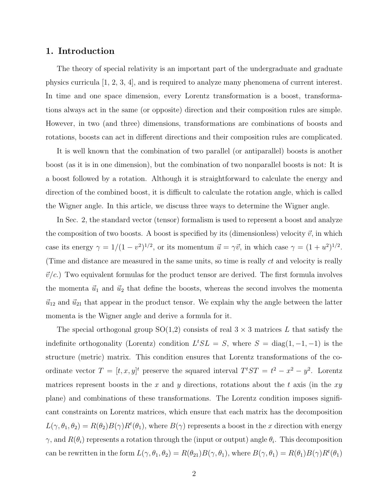
<figcaption class="paper-figure-caption"><b>Fig 1.</b> Low-resolution page preview, page 2</figcaption>
</figure>
<figure class="paper-figure-card">
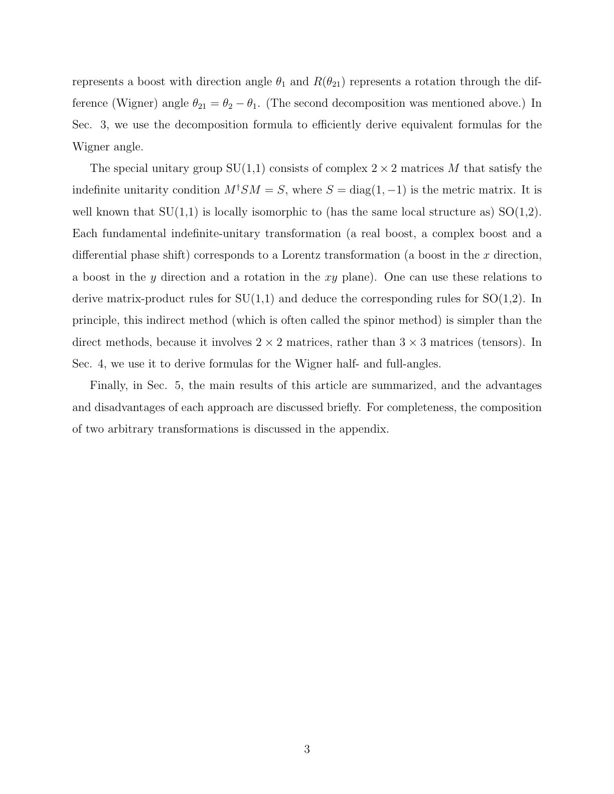
<figcaption class="paper-figure-caption"><b>Fig 2.</b> Low-resolution page preview, page 3</figcaption>
</figure>
<figure class="paper-figure-card">
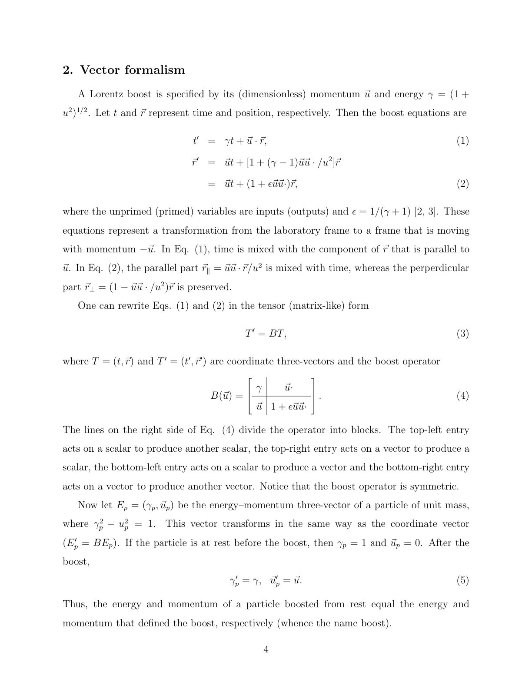
<figcaption class="paper-figure-caption"><b>Fig 3.</b> Low-resolution page preview, page 4</figcaption>
</figure>
<figure class="paper-figure-card">
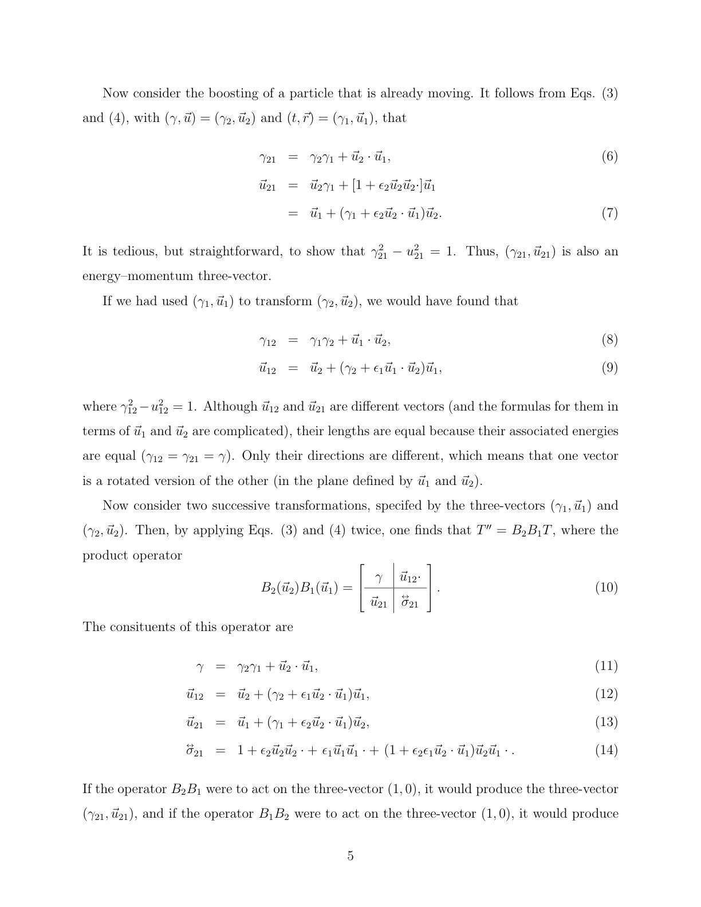
<figcaption class="paper-figure-caption"><b>Fig 4.</b> Low-resolution page preview, page 5</figcaption>
</figure>
<figure class="paper-figure-card">
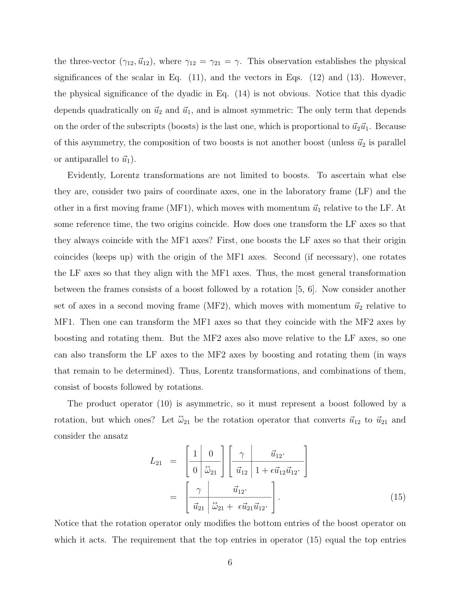
<figcaption class="paper-figure-caption"><b>Fig 5.</b> Low-resolution page preview, page 6</figcaption>
</figure>

**Summary.** This paper tackles the complex problem of calculating the Wigner angle, defined as the rotation angle resulting from combining two Lorentz boosts in 2+1 dimensions. It achieves this by reviewing and demonstrating the mathematical equivalence of formulas derived using vector, matrix, and spinor formalisms. The work confirms that such a composition is not simply another boost but rather a combination of a boost followed by a rotation.

**Why it may be interesting.** While not directly about quantum information or AMO systems, the rigorous treatment of Lorentz transformations and their composition rules provides a deep theoretical understanding of how sequential physical boosts combine in spacetime geometry, which has analogues in relativistic quantum field theory.

Detailed structure

**Main problem.** The primary goal is calculating the Wigner angle, which represents the rotation angle resulting from the composition of two nonparallel Lorentz boosts in 2+1 dimensions.

**Main result.** The paper derives equivalent formulas for the Wigner angle using vector, matrix, and spinor formalisms, confirming that the product of two boosts results in a boost followed by a rotation.

**Method.** It reviews and compares multiple mathematical derivations—including vector algebra, Lorentz matrix decomposition ($SO(1,2)$), and indefinite unitary group analysis ($	ext{SU}(1,1)$)—to determine the angle.

**Model / system.** The system analyzed is special relativity in 2+1 dimensions, focusing on Lorentz transformations involving combinations of boosts and rotations. The mathematical tools include boost operators $B(\vec{u})$ and associated transformation matrices.

**Key observables.** Wigner angle ($	heta_{21}$ or $	heta_w$), composite energy ($\gamma_{21}$), and the rotation dyadic ($\leftrightarrow\sigma_{21}$).

**Important parameters / regimes.** Boost parameters (velocity $\vec{u}$, energy $\gamma$) and transformation angles ($	heta_1, 	heta_2$).

**Assumptions / limitations.** The composition of two boosts is assumed to decompose into a boost followed by a rotation; equivalence between different mathematical formalisms (vector vs. spinor) is asserted.

**Figures summary.** Not specified in the notes, but derivations involve equations for product operators, trigonometric relations for $\sin(	heta_w)$ and $\cos(	heta_w)$, and matrix decompositions.

**Paper structure.** The paper proceeds by reviewing vector, matrix, and spinor derivations sequentially. It establishes the general structure of the combined transformation ($B_2 B_1 	o 	ext{Boost} 	imes 	ext{Rotation}$) before deriving explicit formulas for the Wigner angle using various mathematical frameworks.

Abstract

Lorentz transformations in time and two space dimensions consist of boosts and rotations, and combinations thereof. In general, the combination of two boosts is not another boost: It is a boost followed by a rotation. The rotation angle is called the Wigner angle. Although it is straightforward to determine the energy and direction of the combined boost, it is difficult to determine the Wigner angle. In this article, the vector, matrix and spinor derivations of formulas for the Wigner angle are reviewed, and the underlying mathematics and physics are discussed briefly. Although the derivations are different, the results they produce are equivalent, as they should be. Like many physics problems, if one looks at the problem in the right way, it is not difficult to solve.

[↑ back to top](#top)

### [Learning to Prepare Molecular Ground States with Transformer Models](http://arxiv.org/abs/2607.22468v1)

**Authors:** Alex Koziell-Pipe, Jasmine Brewer, Jem Guhit, Marwa H. Farag, Kripa Panchagnula, Gabriel Laude, Fabian Finger, Carlo Gaggioli, Ludmila Szulakowska, Oliver J. Backhouse, Christos Papalitsas, Jason G. Mustakis, Thomas Soini, David Munoz Ramo, Stephen Clark, Elica Kyoseva, Enrico Rinaldi  
**Type:** both · **Category:** quantum information and computing · **PDF:** <https://arxiv.org/pdf/2607.22468v1>  
**Analysis basis:** full PDF text, analyzed in chunks

↔ Scroll figures horizontally

<figure class="paper-figure-card">
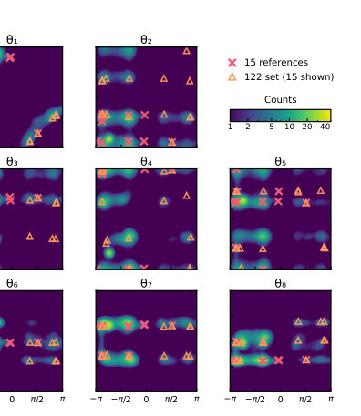
<figcaption class="paper-figure-caption"><b>Fig 1.</b> Fig. 1: Imipramine dihedral definitions and conformational density. (a) Imipramine structure with the nine selected dihedral angles labelled. Atom numbers indicate the indices used to define each dihedral angle, and the inset table lists the corresponding four-atom tuples. (b) Dataset density in dihedral-angle space for θ0 against each remaining selected dihedral angle θ1–θ8. Color indicates smoothed dataset counts for (θ0, θi) values on a logarithmic scale. Pink crosses show the 15-reference conformer set; orange open triangles show the displayed subset from the 122-reference conformer set. The dataset forms well-separated clusters across the allowed dihedral- angle space, broadly...</figcaption>
</figure>
<figure class="paper-figure-card">
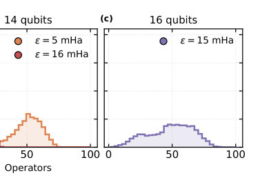
<figcaption class="paper-figure-caption"><b>Fig 2.</b> Fig. 2: Operator counts for each dataset. Number of operators from the operator pool for the 12- (a), 14- (b), and 16-qubit (c) systems in the ADAPT-VQE training data. The 12- and 14-qubit cases use a UCCGSD pool with energy thresholds defined as the difference from CASCI, while the 16-qubit case uses a UCCSD pool with error measured relative to CCSD.</figcaption>
</figure>
<figure class="paper-figure-card">
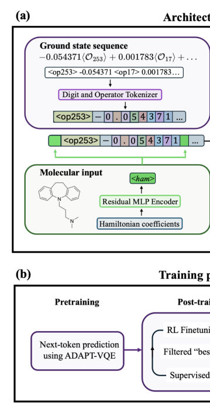
<figcaption class="paper-figure-caption"><b>Fig 3.</b> Fig. 3: Trained-from-scratch transformer architecture and training. (a) ADAPT-VQE ground-state operator sequences are tokenized, with operators and numerical digits represented as individual tokens. Pauli-term coefficients from the molecular Hamiltonian are encoded with a residual MLP and interleaved within the token sequence before processing by the Gemma 3 transformer. (b) During pre- training, the model is trained for next-token prediction on ADAPT-VQE-generated sequences. During post-training, the model is iteratively refined through RL and super- vised fine-tuning on model-generated sequences.</figcaption>
</figure>
<figure class="paper-figure-card">
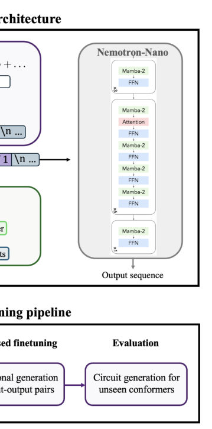
<figcaption class="paper-figure-caption"><b>Fig 4.</b> Fig. 4: Pretrained NVIDIA Nemotron architecture and training. (a) ADAPT-VQE ground-state operator sequences are represented by their corresponding operator-pool indices and coefficients, and tokenized using the standard BPE tok- enizer. The coefficients of the Pauli terms in the molecular Hamiltonian are encoded with a residual MLP and prepended to the token sequence before being processed by the Nemotron Nano transformer. (b) The pretrained model is first adapted to the operator language through continual pretraining and then specialized for circuit gen- eration via supervised fine-tuning on ADAPT-VQE-generated sequences.</figcaption>
</figure>
<figure class="paper-figure-card">
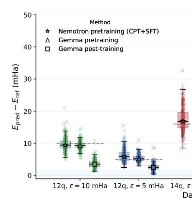
<figcaption class="paper-figure-caption"><b>Fig 5.</b> Fig. 5: Generated circuit energy errors for Nemotron and Gemma models. Generated circuit energy errors after pretraining on ADAPT-VQE data (stars and triangles, respectively) and from the Gemma model after post-training (squares) for all datasets (indicated by color). For each case, individual data points are shown as circles, with summary statistics overlaid as a box-and-whisker plot (the central mark indicates the median, the box spans the interquartile range, and the whiskers extend over the non-outlier range). Energy tolerances ε of the ADAPT-VQE training datasets are shown for reference with grey dashed lines. Models after pretraining faithfully mimic the accuracy of both 12-qubit...</figcaption>
</figure>

**Summary.** The paper introduces ADAPT-GQE, an AI framework that uses Transformer models to automatically synthesize efficient quantum circuits required for calculating molecular ground states. By training on existing high-quality data and using reinforcement learning, it drastically reduces the time needed compared to state-of-the-art iterative methods like ADAPT-VQE. This establishes a pathway toward automated, scalable quantum chemistry simulations on modern hardware.

**Why it may be interesting.** This work directly tackles the resource bottleneck in applying quantum computation to chemistry by replacing iterative optimization with a learned generative model, which is highly relevant for scaling quantum algorithms beyond small test cases.

Detailed structure

**Main problem.** The core problem is developing scalable methods for quantum state preparation, specifically calculating molecular ground states, because existing iterative algorithms are computationally prohibitive for large molecules.

**Main result.** The proposed ADAPT-GQE framework achieves order-of-magnitude reductions in circuit generation time compared to ADAPT-VQE while maintaining or improving state-preparation accuracy on challenging molecules like imipramine.

**Method.** The authors use a generative AI approach, training Transformer models (like Gemma) on reference circuits generated by ADAPT-VQE. Reinforcement Learning is then employed to refine circuit generation beyond the initial training data's scope.

**Model / system.** The physical system is molecular quantum chemistry, using Hamiltonians derived from molecules like imipramine. The methodology involves mapping these Hamiltonians into a format suitable for large language models (LLMs) to predict optimal quantum circuits.

**Key observables.** Energy accuracy ($	ext{E}_{	ext{pred}}$ vs $	ext{E}_{	ext{ref}}$ in mHa), circuit generation time, and the number of required quantum gates/operators.

**Important parameters / regimes.** Qubit count (up to 16 qubits), target energy tolerance ($\epsilon$), and hardware platform (Quantinuum Helios-1).

**Assumptions / limitations.** The primary reward function relies on computationally expensive reference energies (CASCI or CCSD) for training, though an alternative reward function was shown to be effective.

**Figures summary.** Figures detail the conformational sampling of imipramine using MD/NEB; tables compare computational costs and energy accuracies between ADAPT-VQE and the Transformer models across various qubit counts.

**Paper structure.** The paper systematically introduces the limitations of VQE/ADAPT-VQE, details the data generation pipeline (MD/NEB for diverse conformers), presents the LLM architecture for Hamiltonian encoding, and finally demonstrates performance gains via training and RL fine-tuning on hardware.

Abstract

Quantum state preparation is a key component of many quantum algorithms. Performing this step efficiently is essential for realizing practical quantum advantage in quantum chemistry applications. Iterative algorithms like ADAPT-VQE can produce shallow ground-state preparation circuits, but become computationally prohibitive for the larger molecules relevant to materials science and pharmaceutical development. Here, we introduce ADAPT-GQE, a generative AI framework that learns to synthesize ground-state preparation circuits for electronic structure calculations. We first use ADAPT-VQE to generate high-quality reference circuits, which are then used as targets for training models for circuit generation. Once trained, the model can efficiently propose and score circuits, enabling reinforcement learning (RL) to drive circuit generation accuracy beyond the accuracy of the ADAPT-VQE training data. This pipeline achieves order-of-magnitude reductions in circuit generation time relative to ADAPT-VQE while maintaining comparable or improved state-preparation accuracy. We demonstrate ADAPT-GQE on imipramine, a well-established tricyclic antidepressant that serves as a representative, challenging target for computational modelling in drug stability protocols. We execute generated circuits on Quantinuum Helios-1, representing a milestone for AI-generated quantum chemistry circuits on state-of-the-art quantum hardware. These results establish a pathway toward automated quantum circuit synthesis for utility-scale quantum computational chemistry.

[↑ back to top](#top)

### [Quantum multi-label k-nearest neighbor](http://arxiv.org/abs/2607.21919v1)

**Authors:** Yilin Shen, Qin Liao  
**Type:** theory · **Category:** quantum information and computing · **PDF:** <https://arxiv.org/pdf/2607.21919v1>  
**Analysis basis:** full PDF text, analyzed in chunks

↔ Scroll figures horizontally

<figure class="paper-figure-card">
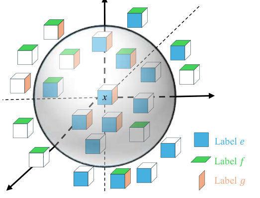
<figcaption class="paper-figure-caption"><b>Fig 1.</b> FIG. 1. An example of the ML-kNN algorithm. The dataset contains 23 instances, each possibly associated with up to three labels e, f, g given in the legend. The circle marks the k = 10 nearest neighbors of the central instance x.</figcaption>
</figure>
<figure class="paper-figure-card">
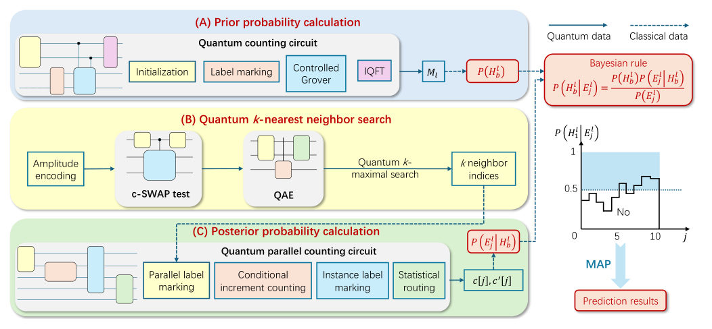
<figcaption class="paper-figure-caption"><b>Fig 2.</b> FIG. 2. Overall workflow of QML-kNN. It is divided into prior probability calculation, quantum k-nearest neighbor search and posterior probability calculation.</figcaption>
</figure>
<figure class="paper-figure-card">
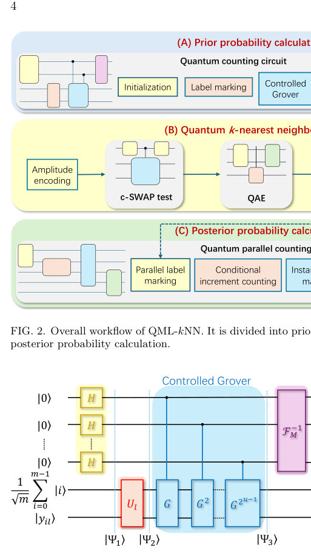
<figcaption class="paper-figure-caption"><b>Fig 3.</b> FIG. 3. Quantum counting circuit for calculating Ml. It mainly integrates controlled Grover iterations with IQFT, starting from a uniform superposition of all training instances.</figcaption>
</figure>
<figure class="paper-figure-card">
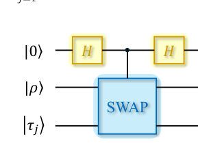
<figcaption class="paper-figure-caption"><b>Fig 4.</b> FIG. 4. Circuit for the c-SWAP test. It consists of two Hadamard gates and a SWAP gate that exchanges the two input states when the control qubit is |1⟩.</figcaption>
</figure>
<figure class="paper-figure-card">
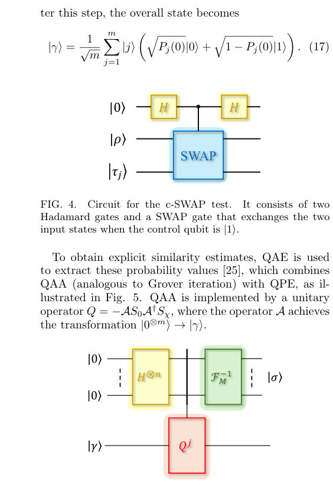
<figcaption class="paper-figure-caption"><b>Fig 5.</b> FIG. 5. The quantum circuit for QAE. QAA process converts the probability information associated with the amplitudes into corresponding phase information, which is subsequently extracted by the QPE procedure.</figcaption>
</figure>

**Summary.** This paper introduces QML-kNN, a quantum algorithm designed to overcome the computational bottleneck of traditional ML-kNN for multi-label classification. By utilizing quantum circuits for probability estimation and neighbor searching, it achieves significant theoretical speedups and superior performance compared to its classical counterpart.

**Why it may be interesting.** It demonstrates a direct application of advanced quantum algorithms (QAE, Quantum Counting) to solve a complex machine learning problem, providing concrete theoretical speedups that could motivate hardware development in the NISQ era.

Detailed structure

**Main problem.** The classical Multi-label k-Nearest Neighbor (ML-kNN) algorithm suffers from unacceptable time complexity when applied to large-scale, high-dimensional datasets.

**Main result.** The proposed Quantum ML-kNN (QML-kNN) significantly reduces the time complexity and outperforms classical methods across all tested evaluation metrics.

**Method.** It integrates quantum techniques—including quantum counting circuits, c-SWAP tests, and a specialized Quantum Parallel Counting Circuit (QPCC)—to accelerate probability estimation and neighbor searching.

**Model / system.** The model is an algorithmic framework designed to replace classical ML-kNN steps with quantum subroutines. These include using Quantum Phase Estimation for prior probabilities and amplitude encoding/c-SWAP tests for similarity calculation.

**Key observables.** Hamming Loss, Coverage, Ranking Loss, One-error, Macro-AUC, and computational time complexity (Big O notation).

**Important parameters / regimes.** Feature dimension ($U$), training instances ($m$), number of neighbors ($k$), and number of labels ($Q$).

**Assumptions / limitations.** The analysis relies on theoretical models for quantum speedups; practical implementation is currently limited by existing quantum hardware.

**Figures summary.** Figures illustrate the overall QML-kNN workflow across three modules, show performance comparisons between classical and quantum approaches (e.g., Fig. 8), and plot the leading-order complexity reduction achieved by the quantum algorithm (e.g., Fig. 9).

**Paper structure.** The paper first establishes the computational bottleneck of ML-kNN. It then details the QML-kNN framework across three modules: Module A for prior probabilities using QPE/Grover's, Module B for neighbor search via c-SWAP and quantum k-maximal search, and Module C for posterior probability calculation using a QPCC.

Abstract

Although multi-label k-nearest neighbor (ML-kNN) is able to effectively solve multi-label learning (MLL) problem with local neighborhood similarity, its time complexity is nearly unacceptable with large-scale datasets. To solve this issue, we propose a novel ML-kNN algorithm with quantum computing techniques, which called quantum multi-label k-nearest neighbor (QML-kNN). In particular, we first accelerate the calculation of the prior probability by taking advantage of quantum phase estimation and Grover's amplitude amplification. Then, a controlled-SWAP test and a quantum k-maximal similarity search are used for efficiently identifying the neighbors. Subsequently, a quantum parallel counting circuit (QPCC) is designed to rapidly calculate the posterior probabilities. Experimental results demonstrate that QML-kNN is able to significantly reduce the time complexity of solving multi-label problems with performance improvement, achieving a substantial speedup over the classical MLL algorithm.

[↑ back to top](#top)

### [Real-Space Imaging of Band Topology via Wavefunction Zeros](http://arxiv.org/abs/2607.21699v1)

**Authors:** Julian Ingham, Raquel Queiroz  
**Type:** theory · **Category:** other · **PDF:** <https://arxiv.org/pdf/2607.21699v1>  
**Analysis basis:** full PDF text, analyzed in chunks

↔ Scroll figures horizontally

<figure class="paper-figure-card">
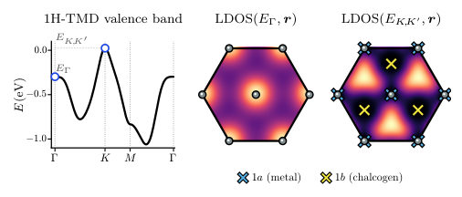
<figcaption class="paper-figure-caption"><b>Fig 1.</b> FIG. 1: Imaging the band topology of TMDs. Left: valence-band dispersion of 1H-TMDs. The band transforms with C3 eigenvalues 1 and e2πi/3 at Γ and K, indicating a topologically obstructed atomic insulator (OAI). Middle: LDOS(EΓ, r); Right: LDOS(EK,K′, r). At K, symmetry- enforced zeros appear at the 1a and 1b positions (crosses); no zeros appear at Γ. The change in LDOS between these two energies is a real-space signature of an OAI.</figcaption>
</figure>
<figure class="paper-figure-card">
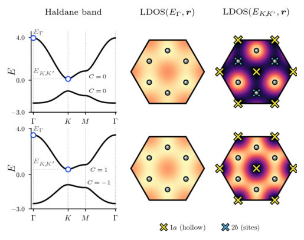
<figcaption class="paper-figure-caption"><b>Fig 2.</b> FIG. 2: Imaging the Chern number of the Haldane model. Top row: trivial phase, C = 0; bottom row: Chern phase, |C| = 1. In the trivial phase, the K/K′ states have zeros on the same sublattice. In the Chern phase the two valleys have zeros (crosses) on opposite sublattices, leaving only the hexagon centre dark in the total LDOS. The distinct dark sets allow inference of the Chern number modulo three.</figcaption>
</figure>
<figure class="paper-figure-card">
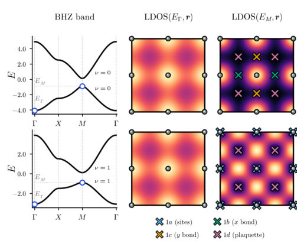
<figcaption class="paper-figure-caption"><b>Fig 3.</b> FIG. 3: Imaging the Z2 invariant of the BHZ model. Top row: trivial phase, ν = 0; bottom row: quantum spin Hall phase, ν = 1. In the trivial phase the bonds and plaquette centre have zeros (crosses) at M; in the quantum spin Hall phase the bonds are bright. The Kane-Mele Z2 invariant can be diagnosed simply by whether the bonds have the same (ν = 1) or opposite (ν = 0) contrast at Γ and M.</figcaption>
</figure>
<figure class="paper-figure-card">
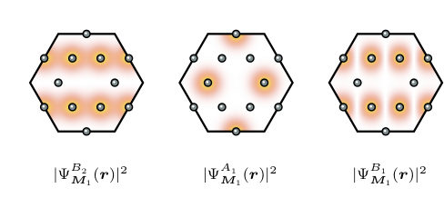
<figcaption class="paper-figure-caption"><b>Fig 4.</b> FIG. 4: Kagome Van Hove dark sets. The wavefunctions at the VHS of an s orbital kagome lattice correspond to irreps A1 and B1,2. At the momentum M1, the A1 irrep is forced- dark on B and C, while the B1,2 irreps are forced dark on A.</figcaption>
</figure>
<figure class="paper-figure-card">
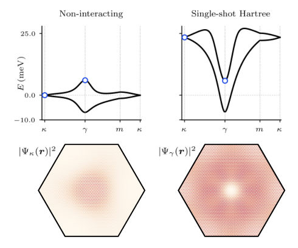
<figcaption class="paper-figure-caption"><b>Fig 5.</b> FIG. 5: Band renormalisation in moiré graphene. Top: non-interacting and Hartree-renormalised narrow bands of TBG near θ = 1.05◦. The Γ states (bottom right) are forced- dark at the AA-stacked regions, where the K states (bottom left) are bright. The Hartree potential is strongest at the AA regions, strongly increasing the energy at K, but not at Γ where the wavefunction avoids the Hartree potential.</figcaption>
</figure>

**Summary.** The paper introduces a novel technique to determine band topology by analyzing where the wavefunction must vanish in real space, using symmetry constraints. By mapping these 'dark spots' at high-symmetry points, researchers can infer fundamental topological invariants like the Chern number or $\mathbb{Z}_2$ index. This connects advanced group theory directly to experimental techniques like STM imaging.

**Why it may be interesting.** This work provides a powerful theoretical link between abstract group representation theory (mathematics) and measurable real-space electronic structure (condensed matter), offering an alternative diagnostic tool to traditional momentum-space topological measurements.

Detailed structure

**Main problem.** To determine the topological invariants of electronic bands by probing real-space properties, specifically the symmetry-enforced zeros in the wavefunction's local density of states (LDOS).

**Main result.** The pattern and location of these 'dark spots' at high-symmetry momenta are sufficient to uniquely determine the irreducible representation ($
ho$) of the band structure group, thereby diagnosing topological invariants like the Chern number or $\mathbb{Z}_2$ index.

**Method.** The method uses group theory to derive symmetry selection rules that force wavefunctions to vanish (create zeros) at specific real-space positions ($r^*$) when evaluated at high-symmetry momenta ($k^*$).

**Model / system.** The analysis is applied to crystalline solids, including 2D materials like TMDs, and theoretical models such as the Haldane model, BHZ model, and Kagome lattice.

**Key observables.** Symmetry-enforced zeros ('dark spots') in the Local Density of States (LDOS) measured by STM; local indices ($m_{k^*, r^*}$).

**Important parameters / regimes.** High-symmetry momenta ($k^*$), symmetry group representations ($
ho$, $	ext{irrep}$), and topological invariants (Chern number, $\mathbb{Z}_2$ index).

**Assumptions / limitations.** The method relies on probing high-symmetry momenta and assumes the bias energy intersects a single, isolated irreducible representation.

**Figures summary.** Figures illustrate the detection of band topology in TMDs by comparing LDOS changes between $\Gamma$ and $K$, showing zero patterns that distinguish topological phases (e.g., Chern number mod 3 or $\mathbb{Z}_2$ index).

**Paper structure.** The paper establishes a general theorem linking symmetry-enforced zeros to group representation theory, then applies this framework sequentially to specific physical models: TMDs, Haldane model, BHZ model, Kagome lattice, and Twisted Bilayer Graphene.

Abstract

We prove that the wavefunction of a crystal at a high-symmetry momentum, $Ψ_{\boldsymbol{k}_*}(\boldsymbol{r})$, has symmetry-enforced zeros at certain positions in the unit cell, using a new invariant fixed uniquely by the symmorphic symmetry representation of the wavefunction. This allows one to infer the topology of an electronic band by probing zeros of the charge density, and in turn to connect scanning tunnelling microscopy to the group representation theory of bandstructure. We apply the theorem to 1H transition metal dichalcogenides, where it detects the obstructed atomic limit of WSe$_2$, the Haldane model, where it detects the Chern number modulo three, and the Bernevig-Hughes-Zhang model, where it detects the $\mathbb{Z}_2$ index. In addition, the zeros have important consequences for interaction effects: in kagome metals, they fix the sublattice structure of Van Hove wavefunctions, and in twisted bilayer graphene, they explain the qualitative interaction-induced reshaping of the flat bands.

[↑ back to top](#top)

### [The Threshold Theorem in Watts: Fault Tolerance as a Question About Objective Probability](http://arxiv.org/abs/2607.22276v1)

**Authors:** Amit Hagar  
**Type:** theory · **Category:** quantum information and computing · **PDF:** <https://arxiv.org/pdf/2607.22276v1>  
**Analysis basis:** full PDF text, analyzed in chunks

↔ Scroll figures horizontally

<figure class="paper-figure-card">
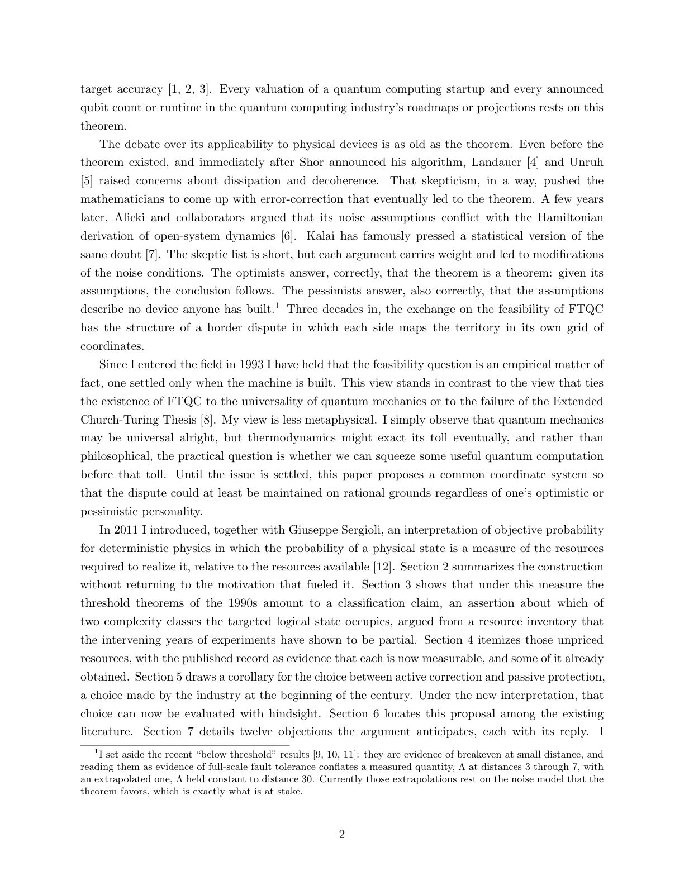
<figcaption class="paper-figure-caption"><b>Fig 1.</b> Low-resolution page preview, page 2</figcaption>
</figure>
<figure class="paper-figure-card">
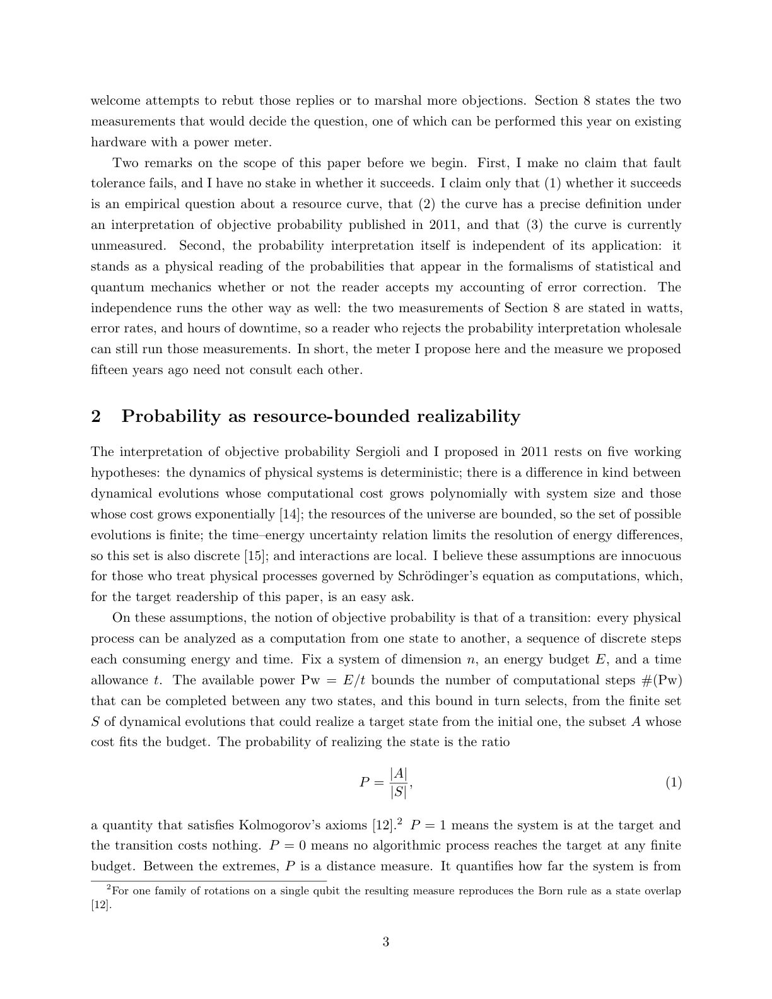
<figcaption class="paper-figure-caption"><b>Fig 2.</b> Low-resolution page preview, page 3</figcaption>
</figure>
<figure class="paper-figure-card">
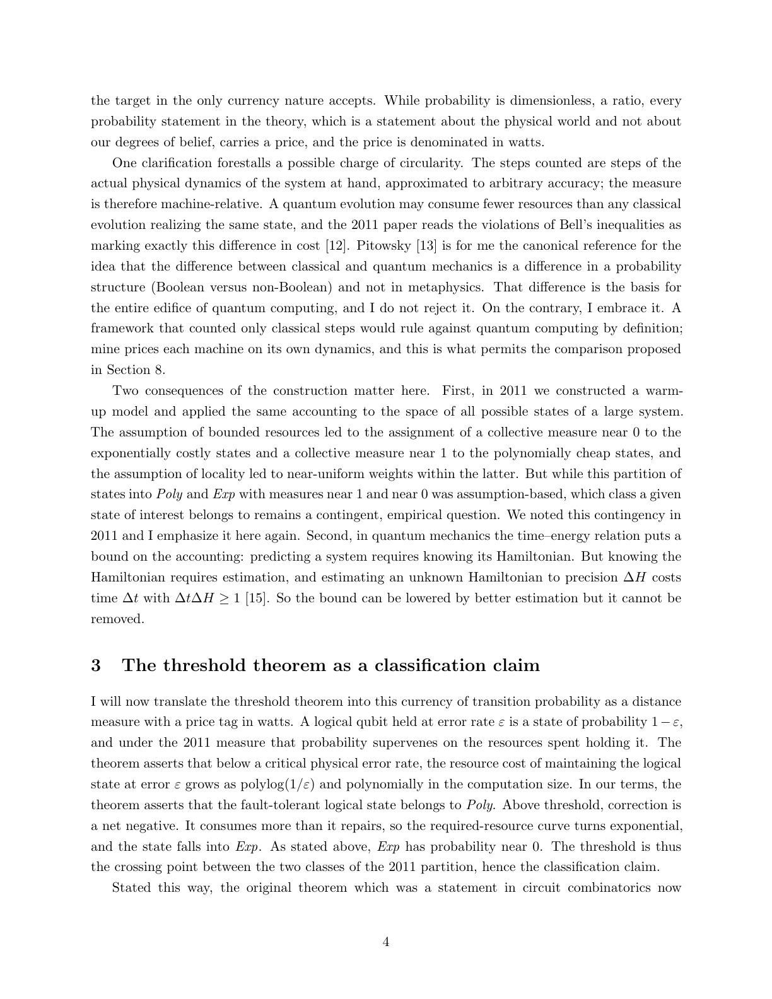
<figcaption class="paper-figure-caption"><b>Fig 3.</b> Low-resolution page preview, page 4</figcaption>
</figure>
<figure class="paper-figure-card">
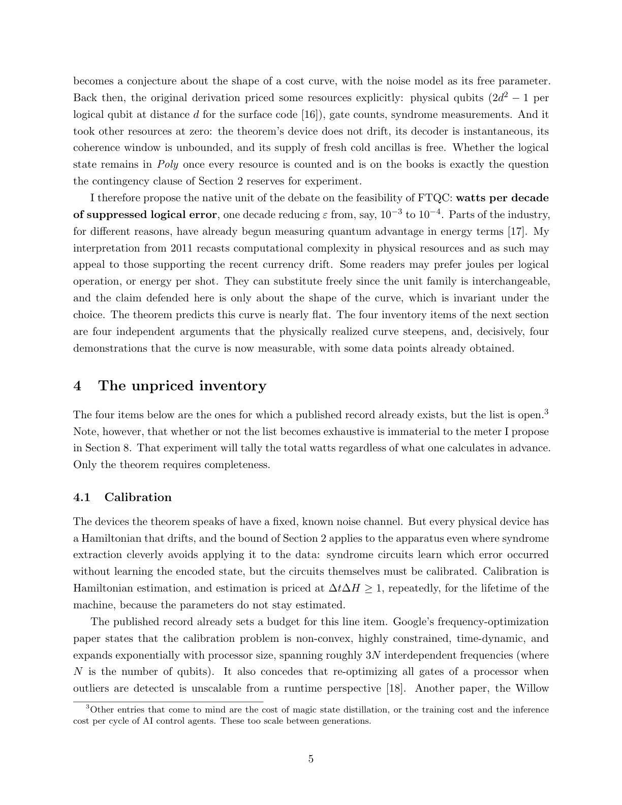
<figcaption class="paper-figure-caption"><b>Fig 4.</b> Low-resolution page preview, page 5</figcaption>
</figure>
<figure class="paper-figure-card">
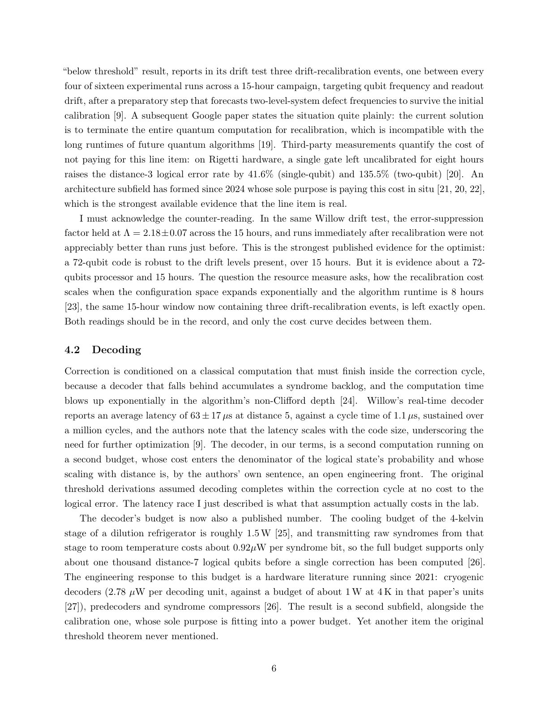
<figcaption class="paper-figure-caption"><b>Fig 5.</b> Low-resolution page preview, page 6</figcaption>
</figure>

**Summary.** This paper reframes the Threshold Theorem for fault-tolerant quantum computing by applying an objective probability measure based on resource costs (like energy). The authors argue that standard analyses neglect crucial overheads such as calibration and decoding power. By quantifying these missing resources in watts, they transform a theoretical debate into a concrete, measurable engineering challenge.

**Why it may be interesting.** It provides a powerful physical lens—resource accounting—to re-evaluate fundamental computational complexity results in quantum information theory, connecting abstract theorems to measurable engineering constraints.

Detailed structure

**Main problem.** The paper reinterprets the Threshold Theorem for Fault-Tolerant Quantum Computing (FTQC) by framing it as a question of objective resource probability rather than just circuit combinatorics.

**Main result.** By incorporating previously unpriced overheads like calibration, decoding latency, and entropy flushing, the required resources to maintain logical coherence are quantified in watts per decade of error suppression.

**Method.** The authors translate FTQC feasibility into a measurable resource cost (watts/decade) using a novel objective probability measure derived from Hagar & Sergioli's work.

**Model / system.** The system analyzed is Fault-Tolerant Quantum Computation, specifically concerning the scaling of error correction overheads for logical qubits.

**Key observables.** Watts per decade of suppressed logical error; resource cost curves comparing quantum vs. classical computation.

**Important parameters / regimes.** Logical error rate ($\epsilon$); machine size (number of physical qubits/distance); power budget (watts).

**Assumptions / limitations.** The interpretation relies on deterministic dynamics and the assumption that all necessary resources (calibration, decoding, etc.) must be accounted for in the objective probability measure.

**Paper structure.** The paper first introduces the resource-bounded objective probability framework. It then applies this to FTQC, identifying four previously unpriced overheads. Finally, it translates the theoretical threshold into a concrete measurement: watts per decade of error suppression.

Abstract

In 2011 Hagar & Sergioli proposed a new interpretation of objective probability in deterministic physics. On it, the probability of a physical state supervenes on the resources, energy over time, required to realize it from a given state, relative to the resources available (arXiv:1101.3521). The motivation for that paper was an objective alternative to QBism, the view that sees quantum probabilities as subjective degrees of belief. Here I apply this interpretation to a more practical subject matter: fault-tolerant quantum computing (FTQC). Under the resource-bounded measure Hagar & Sergioli proposed, the threshold theorem becomes a claim about classification: it asserts that error-corrected logical states belong to the class of relatively cheaply realizable states, whose probability remains near 1 as the machine grows. The theorem originally derived this claim from a resource inventory that was partial, and left out four resources consumed by error correction: calibration of a drifting device, decoding within the correction cycle, coherence as a finite time budget, and entropy flush through fresh ancillas. These entered the original derivation at zero price. Here I translate the feasibility of FTQC into a measurable quantity, watts per decade of suppressed logical error (a decade, in the engineer's usage, being one factor of ten in the error rate). I then show that the published record already contains its first data points for this translation, and I state the two measurements that would settle the question empirically. The three-decade debate on FTQC, conducted so far as an exchange about noise-model assumptions, turns out to be, under this interpretation, a quantitative dispute about a single object: the resource-bounded objective probability of the target logical states.

[↑ back to top](#top)

### [Weak Permanent Anti-Concentration for Random Gaussian Matrices in Boson Sampling](http://arxiv.org/abs/2607.22088v1)

**Authors:** Fei Meng, Bin Cheng, Jianan Li, Man-Hong Yung  
**Type:** theory · **Category:** quantum information and computing · **PDF:** <https://arxiv.org/pdf/2607.22088v1>  
**Analysis basis:** full PDF text, analyzed in chunks

↔ Scroll figures horizontally

<figure class="paper-figure-card">
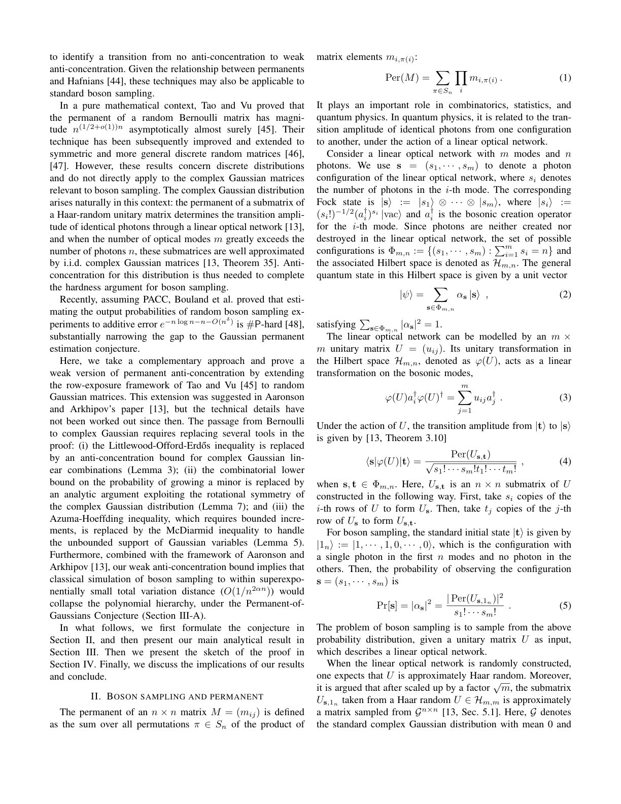
<figcaption class="paper-figure-caption"><b>Fig 1.</b> Low-resolution page preview, page 2</figcaption>
</figure>
<figure class="paper-figure-card">
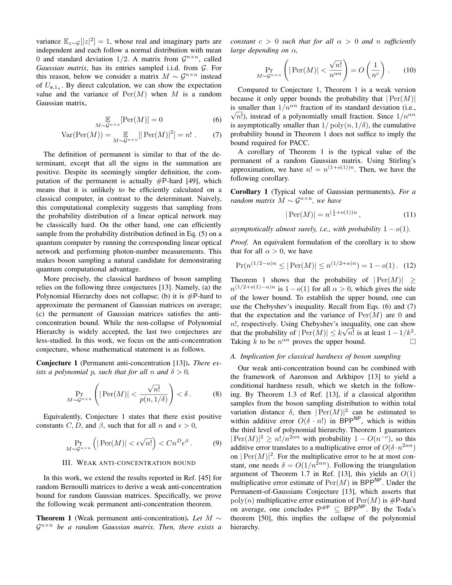
<figcaption class="paper-figure-caption"><b>Fig 2.</b> Low-resolution page preview, page 3</figcaption>
</figure>
<figure class="paper-figure-card">
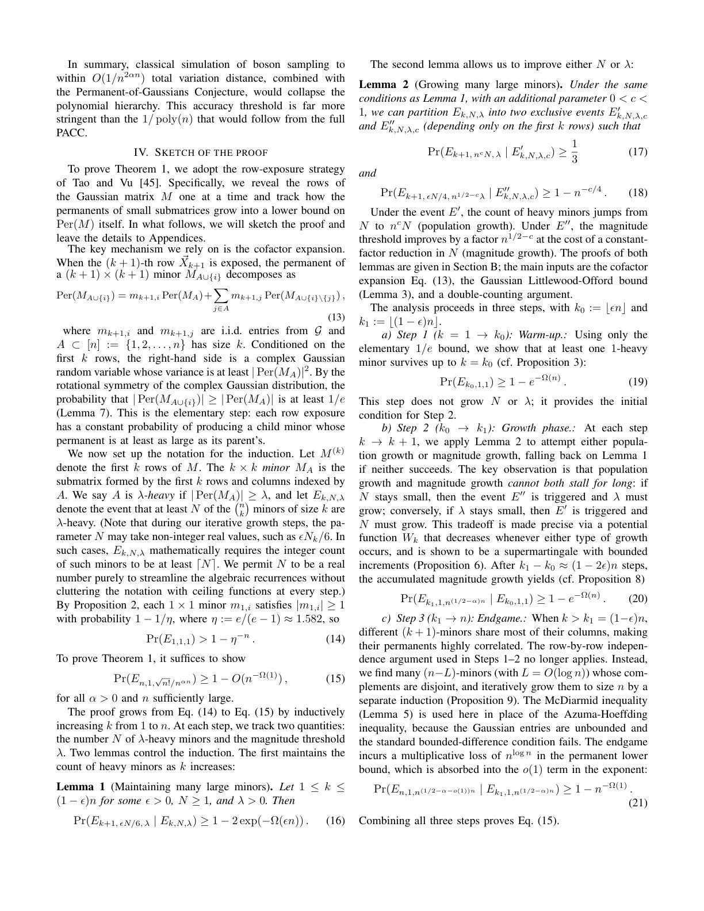
<figcaption class="paper-figure-caption"><b>Fig 3.</b> Low-resolution page preview, page 4</figcaption>
</figure>
<figure class="paper-figure-card">
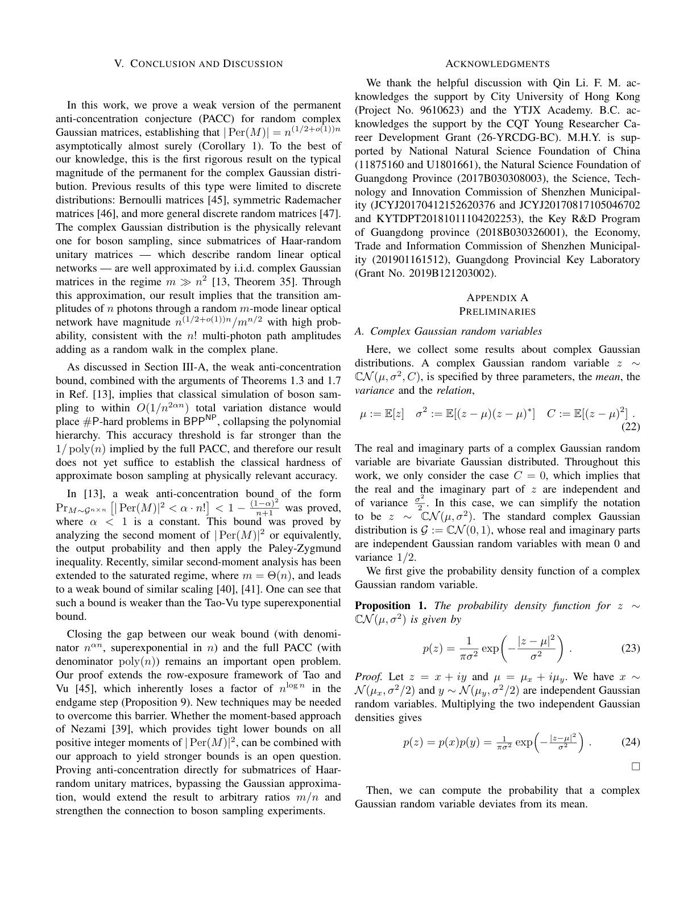
<figcaption class="paper-figure-caption"><b>Fig 4.</b> Low-resolution page preview, page 5</figcaption>
</figure>
<figure class="paper-figure-card">
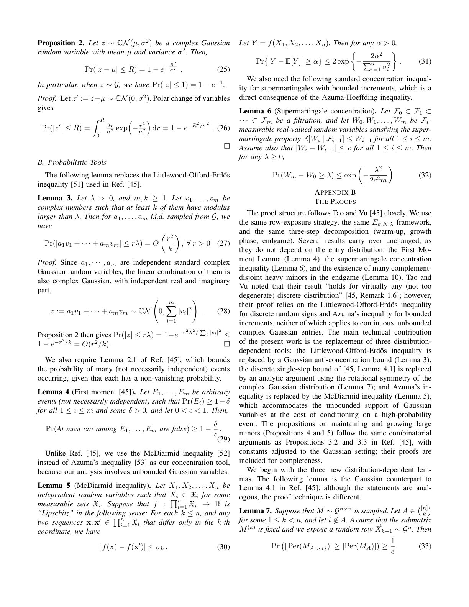
<figcaption class="paper-figure-caption"><b>Fig 5.</b> Low-resolution page preview, page 6</figcaption>
</figure>

**Summary.** This paper analyzes the classical hardness of boson sampling by deriving a weak anti-concentration bound for the permanent of random Gaussian matrices. Using advanced probabilistic methods, the authors show that while they cannot prove the full conjecture, their result implies that simulating boson sampling to high precision would have profound consequences for computational complexity theory.

**Why it may be interesting.** This work directly addresses the theoretical foundations of quantum computational advantage in photonic systems (boson sampling) by providing rigorous mathematical tools to bound key physical observables (the permanent).

Detailed structure

**Main problem.** To establish a weak anti-concentration bound for the permanent of random Gaussian matrices, which is crucial for understanding the classical hardness of boson sampling.

**Main result.** The authors established a weak anti-concentration bound showing that the probability of the Gaussian permanent being superexponentially small is bounded by $O(n^{-c})$, implying potential consequences for collapsing the polynomial hierarchy if true.

**Method.** The proof employs an extension of the row-exposure strategy, utilizing advanced concentration inequalities like McDiarmid's inequality and analyzing recursive structures involving $\lambda$-heavy minors.

**Model / system.** The study focuses on Boson Sampling, where the probability distribution is governed by the permanent of a submatrix approximated by entries i.i.d. from the standard complex Gaussian distribution ($G_{n 	imes n}$).

**Key observables.** The primary observable is the permanent, $	ext{Per}(M)$, and its concentration properties relative to its standard deviation ($\sqrt{n!}$).

**Important parameters / regimes.** Matrix size $n$, the exponent $c$ in the bound $O(n^{-c})$, and the relationship between classical simulation error (total variation distance) and computational complexity.

**Assumptions / limitations.** The result is a *weak* version of the Permanent Anti-Concentration Conjecture (PACC), and the final hardness implication relies on assuming other unproven conjectures hold.

**Paper structure.** The paper builds upon prior work by adapting techniques from Bernoulli matrices to Gaussian random matrices, proceeding through a structured proof involving warm-up, growth, and endgame phases using concentration bounds.

Abstract

Recent demonstrations of quantum computational advantage have been driven largely by sampling problems. A prominent model, boson sampling, involves sampling from the output distribution of a linear optical network. However, its classical hardness hinges on two plausible yet less-studied conjectures: the average-case hardness of approximating Gaussian permanents, and the permanent anti-concentration conjecture (PACC). The PACC is a purely mathematical assertion regarding the distributional properties of random Gaussian matrices. While the typical magnitude of the permanent has been established for discrete random matrices, the complex Gaussian case, which governs transition amplitudes in linear optical networks, has remained open. Here, we establish a weak anti-concentration bound by upper-bounding the probability that a random Gaussian permanent is superexponentially smaller than its standard deviation. Tightening this bound to an inverse-polynomial fraction would prove the original PACC. As a corollary, we establish the typical magnitude of Gaussian permanents, on par with Tao and Vu's seminal result for Bernoulli matrices. Combined with the Aaronson-Arkhipov framework, our result implies that classically simulating boson sampling to within a superexponentially small total variation distance would collapse the polynomial hierarchy, assuming the remaining conjectures hold.

[↑ back to top](#top)

### [Zero-field magnetic structure of the antiferromagnetic metal EuSnP](http://arxiv.org/abs/2607.22245v1)

**Authors:** Mizuki Urai, Hiraku Saito, Daisuke Nishio-Hamane, Taro Nakajima, Rina Takagi  
**Type:** experiment · **Category:** strongly correlated electrons · **PDF:** <https://arxiv.org/pdf/2607.22245v1>  
**Analysis basis:** full PDF text, analyzed in chunks

↔ Scroll figures horizontally

<figure class="paper-figure-card">
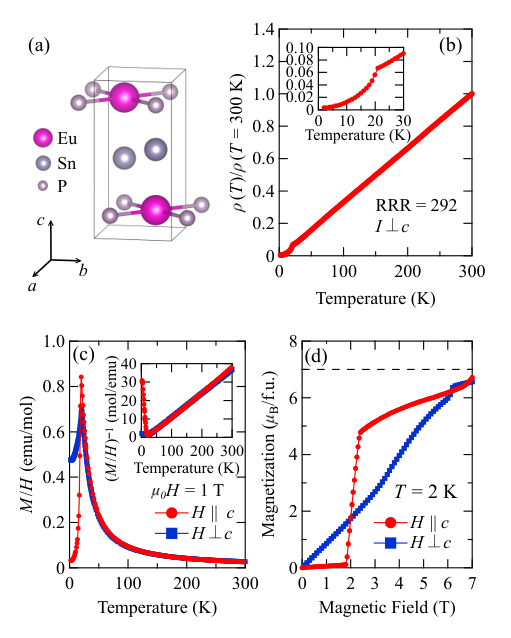
<figcaption class="paper-figure-caption"><b>Fig 1.</b> FIG. 1. (a) Crystal structure of EuSnP [5], drawn using visu- alizing software VESTA [6]. (b) Temperature dependence of resistivity normalized at 300 K. (Inset) Enlarged plot below 30 K. (c) Magnetic susceptibility measured at 1 T. (Inset) Inverse of magnetic susceptibility. (d) Magnetization curves at 2 K.</figcaption>
</figure>
<figure class="paper-figure-card">
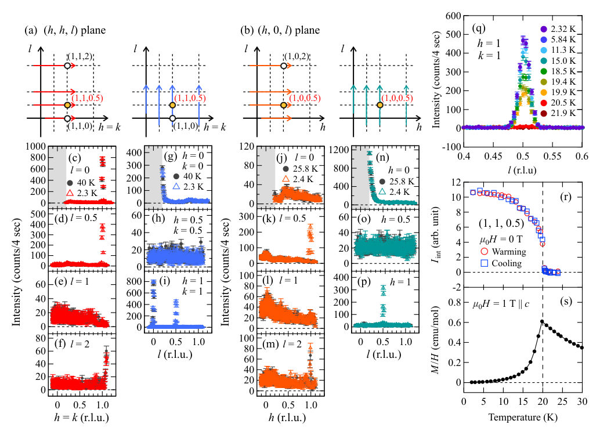
<figcaption class="paper-figure-caption"><b>Fig 2.</b> FIG. 2. (a,b) Scanning ranges of reciprocal space in the (a) (h, h, l) and (b) (h, 0, l) planes. Observed nuclear Bragg reflections at (1,1,0), (1,1,2), and (1,0,2), and magnetic Bragg reflections at (1,1,0.5) and (1,0,0.5) are indicated by white- and yellow-filled circles, respectively. (c–i) Reciprocal space scans in the (h, h, l) plane at 40 K and 2.3 K. (j–p) Reciprocal space scans in the (h, 0, l) plane at 25.8 K and 2.4 K. The gray-colored regions around (0, 0, 0) in (c), (g), (j) and (n) are not accessible due to the presence of the direct beam. (q) Temperature evolution of the magnetic Bragg peak at (1,1,0.5). (r,s) Temperature dependence of (r) the integrated intensity of the magnetic...</figcaption>
</figure>
<figure class="paper-figure-card">
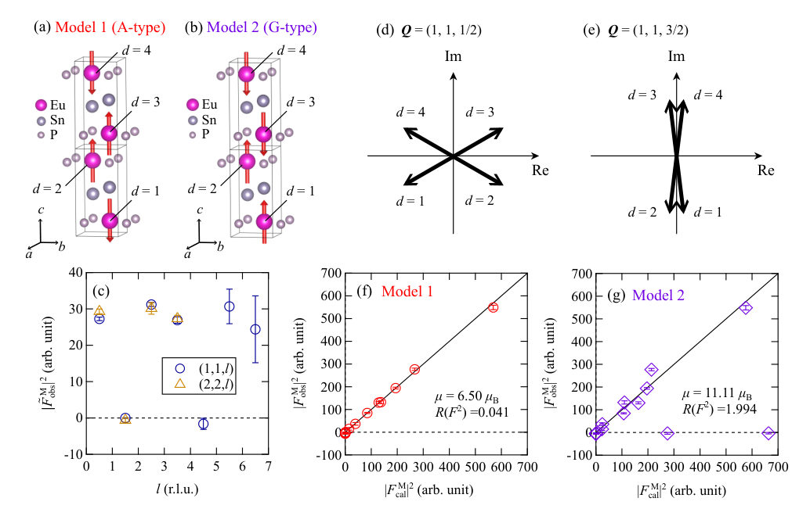
<figcaption class="paper-figure-caption"><b>Fig 3.</b> FIG. 3. (a,b) Candidate magnetic structures characterized by a magnetic propagation vector q = (0, 0, 1/2), with magnetic moments aligned parallel to the c axis. The nearest-neighbor Eu moments are aligned (a) parallel in Model 1 (A-type) and (b) antiparallel in Model 2 (G-type). (a) and (b) were drawn using visualizing software VESTA [6]. (c) The l-dependence of</figcaption>
</figure>
<figure class="paper-figure-card">
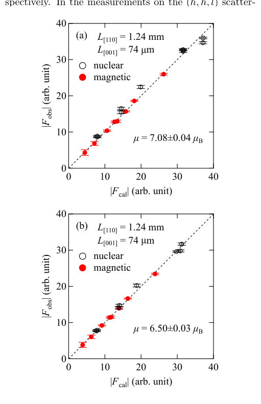
<figcaption class="paper-figure-caption"><b>Fig 4.</b> FIG. 4. Comparison of the observed and calculated structure factors for nuclear and magnetic diffraction (see the text in Appendix A for details).</figcaption>
</figure>

**Summary.** This experimental work used neutron diffraction on EuSnP to map its zero-field magnetic structure. The findings confirm an A-type antiferromagnetism, where the local Eu2+ moments are ferromagnetically coupled within layers but antiferromagnetically stacked along the c-axis. This structural determination helps explain the material's complex magnetic behavior.

**Why it may be interesting.** The study provides a concrete example of localized magnetism (Eu2+ moments) interacting with itinerant electrons, which is central to understanding strongly correlated electron systems and complex magnetic phase transitions in solids.

Detailed structure

**Main problem.** To determine the zero-field magnetic structure of the antiferromagnetic metal EuSnP and understand its microscopic origin.

**Main result.** The material exhibits a collinear A-type antiferromagnetic structure, characterized by ferromagnetic alignment within the Eu–P layers and antiferromagnetic coupling along the stacking direction.

**Method.** Single-crystal neutron diffraction experiments were used to search for and analyze magnetic Bragg reflections as a function of temperature and scattering vector.

**Model / system.** The system is the antiferromagnetic metal EuSnP, containing localized divalent Eu2+ moments interacting with conduction electrons in a tetragonal lattice structure. The analysis compared observed magnetic structure factors against theoretical models (A-type vs G-type).

**Key observables.** Magnetic propagation vector q = (0, 0, 1/2); Magnetic Bragg peak intensities; Magnetic susceptibility and resistivity anomalies.

**Important parameters / regimes.** Néel temperature TN ≈ 21 K; Estimated magnetic moment μ ≈ 6.5 to 7.1 $\mu_B$.

**Assumptions / limitations.** The analysis relies on fitting observed structure factors using theoretical models derived from the crystal structure and assuming specific sample dimensions for absorption corrections.

**Figures summary.** Figures show temperature dependence of resistivity, susceptibility, and magnetic Bragg peak intensities; subsequent figures compare observed vs. calculated squared magnetic structure factors for candidate A-type and G-type models.

**Paper structure.** The paper proceeds by characterizing the bulk magnetic properties (resistivity/susceptibility) near TN, followed by detailed single-crystal neutron diffraction measurements to determine the propagation vector q. The core of the analysis involves fitting observed magnetic reflections against theoretical structure factor calculations for competing magnetic models to confirm the A-type ordering.

Abstract

We investigated the zero-field magnetic structure of the antiferromagnetic metal EuSnP through single-crystal neutron diffraction experiments. The magnetic propagation vector in the magnetically ordered phase was determined to be $(0,0,1/2)$, indicating that commensurate antiferromagnetic ordering is realized in this material. The detailed magnetic structure analysis revealed a collinear A-type antiferromagnetic structure with ferromagnetic alignment of Eu$^{2+}$ moments within the Eu--P layer. The present findings provide a microscopic basis for understanding the intriguing magnetic behaviors of EuSnP, as exemplified by the multiple metamagnetic transitions in the antiferromagnetic state and the strong pressure dependence of the magnetic transition temperature.

[↑ back to top](#top)

## Secondary cond-mat archives

*Papers from cond-mat.mtrl-sci, mes-hall, other, soft, supr-con. These archives are de-prioritized — they appear at the end regardless of relevance score.*

### Relevant in secondary archives (9)

### [Quantum transport in Cooper pair splitters using hierarchical equations of motion](http://arxiv.org/abs/2607.22235v1)

**Authors:** Riya Baruah, Neill Lambert, Franco Nori, Christian Flindt  
**Type:** theory · **Category:** statistical mechanics · **PDF:** <https://arxiv.org/pdf/2607.22235v1>  
**Analysis basis:** full PDF text, analyzed in chunks
**Topic relevance:** 🔥 `methods for driven-dissipative` **5/5** · 🔥 `Keldysh / 2PI / non-Gaussian methods` **4/5** · `Kondo & dissipative impurity` **3/5** · `non-equilibrium dynamics` **3/5** · `non-equilibrium universality` **2/5** · `correlated / nonlocal dissipation` **1/5** · `driven-dissipative phase transition` **1/5**

↔ Scroll figures horizontally

<figure class="paper-figure-card">
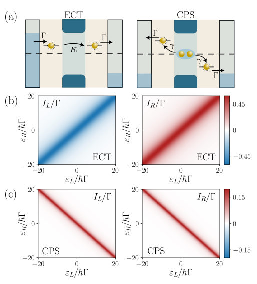
<figcaption class="paper-figure-caption"><b>Fig 1.</b> FIG. 1. Quantum transport in a Cooper pair splitter. (a) The device consists of a left and a right quantum dot that are cou- pled to a superconductor and separate normal-state leads. If a voltage is applied across the quantum dots, and the quantum dot levels are aligned, εL = εR, charge transport takes place via elastic cotunneling (ECT). When the normal-state leads function as drains, charge transport takes place via Cooper pair splitting (CPS), if the quantum dot levels are asymmetri- cally detuned, εL = −εR. The amplitudes for ECT and CPS are denoted by κ and γ, respectively, and Γ is the rate for tunneling to the leads. (b) Particle currents in the left and right leads for ECT. (c)...</figcaption>
</figure>
<figure class="paper-figure-card">
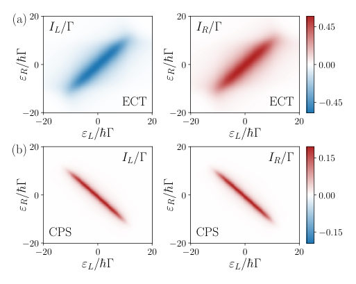
<figcaption class="paper-figure-caption"><b>Fig 2.</b> FIG. 2. Charge transport with finite voltages. (a) A fi- nite voltage is applied between the normal-state electrodes, and elastic cotunneling (ECT) is on resonance, when the two quantum dot levels are aligned. The charge transport is sup- pressed, if the quantum dot levels are moved outside the volt- age window. (b) Here, both normal-state electrodes function as drains, and Cooper pair splitting (CPS) is on resonance, when the two quantum dot levels are oppositely detuned. The charge transport is suppressed, if one of the quantum dot lev- els is moved below the chemical potential of the leads. The parameters are γ = 0.4ℏΓ, κ = 2ℏΓ, kBT = 1ℏΓ, and (a) µL = −µR = 10ℏΓ and (b) µL = µR = −10ℏΓ,...</figcaption>
</figure>
<figure class="paper-figure-card">
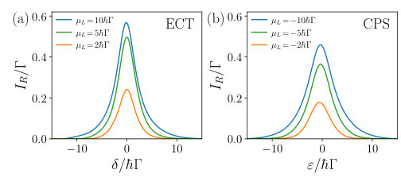
<figcaption class="paper-figure-caption"><b>Fig 3.</b> FIG. 3. Finite voltages. (a) Particle current in the right lead for different voltages across the device with µL = −µR, where the transport is dominated by elastic cotunneling (ECT). (b) Particle current in the right lead for different values of the chemical potential in both leads, µL = µR, and the transport is dominated by Cooper pair splitting (CPS). The other pa- rameters are γ = 2ℏΓ, κ = 3ℏΓ, and kBT = 1ℏΓ.</figcaption>
</figure>
<figure class="paper-figure-card">

<figcaption class="paper-figure-caption"><b>Fig 4.</b> FIG. 4. Finite temperatures. (a) Particle current in the right lead for different temperatures of the leads and opposite chem- ical potentials, µL = −µR = 5ℏΓ, such that the transport is dominated by elastic cotunneling (ECT). (b) Particle current in the right lead for different temperatures of the leads and the same chemical potentials, µL = µR = −5ℏΓ, such that the transport is dominated by Cooper pair splitting (CPS). The other parameters are γ = 2ℏΓ and κ = 3ℏΓ.</figcaption>
</figure>
<figure class="paper-figure-card">
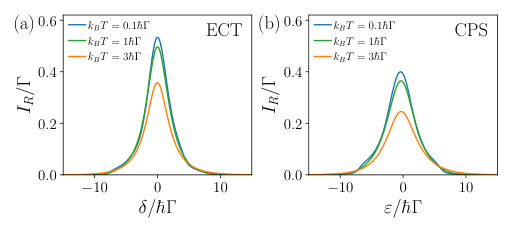
<figcaption class="paper-figure-caption"><b>Fig 5.</b> Figure 3 illustrates how the finite voltage bias affects transport through the Cooper pair splitter. In Fig. 3(a), we consider elastic cotunneling and show the current as a function of the detuning for several values of the applied bias. The current exhibits a resonance centered at zero detuning, where elastic cotunneling is most efficient. As the bias voltage is reduced, the resonance peak decreases in height and becomes narrower. This behavior reflects the shrinking transport window available for electrons tunneling between the leads. While the resonance con- dition itself is unaffected by the bias, a smaller voltage limits the range of energies that contribute to transport. A similar...</figcaption>
</figure>

**Summary.** This paper develops and applies the Hierarchical Equations of Motion (HEOM) method to model charge transport in Cooper pair splitters. It moves beyond simplified Markovian descriptions to accurately predict currents under realistic conditions involving finite voltage or temperature biases. The results establish HEOM as a crucial tool for understanding non-equilibrium quantum dynamics in superconducting hybrid devices.

**Why it may be interesting.** This work is highly relevant as it applies advanced open quantum system techniques (HEOM) to a solid-state superconducting device, providing tools for modeling non-equilibrium transport in mesoscopic quantum circuits.

Detailed structure

**Main problem.** The study investigates charge transport mechanisms in Cooper pair splitters, specifically focusing on regimes beyond the standard weak-coupling and Markovian approximations.

**Main result.** The Hierarchical Equations of Motion (HEOM) framework successfully reproduces quantitative agreement with experimental measurements of currents at finite voltage or temperature differences, where simpler models fail.

**Method.** The authors employ the HEOM technique to solve the time evolution of the reduced density matrix, allowing for the inclusion of strong coupling and nonperturbative effects.

**Model / system.** The system is a Cooper pair splitter—a hybrid nanostructure combining quantum dots coupled to superconducting leads. The dynamics are governed by a Hamiltonian incorporating dot energies, interactions, and tunneling couplings.

**Key observables.** Electric currents ($I$) as functions of the quantum dot level positions ($\epsilon_L, \epsilon_R$), including thermoelectric effects.

**Important parameters / regimes.** Finite voltage/temperature differences (requiring HEOM), large-bias regime (reducing to Lindblad equation), and superconducting coupling strength.

**Assumptions / limitations.** The primary assumption is the necessity of using HEOM because experimental conditions involve finite bias, invalidating Markovian descriptions.

**Figures summary.** Figure 1 illustrates device geometry and expected current profiles for Elastic Cotunneling (ECT) and Cooper Pair Splitting (CPS). Figure 3 shows particle current dependence on voltage ($\mu_L$) under finite bias.

**Paper structure.** The paper progresses by defining the system Hamiltonian, deriving the equation of motion for the reduced density matrix, first analyzing the large-bias limit using Lindblad equations, and then employing HEOM to address the complex physics at finite biases.

Abstract

We investigate charge transport in Cooper pair splitters beyond the weak-coupling and Markovian limits. To this end, we employ hierarchical equations of motion (HEOM), which can capture the combined effects of strong coupling to the leads, nonperturbative interactions, and finite voltage and temperature differences. Within this framework, we compute the electric currents as functions of the level positions of a Cooper pair splitter for various voltage and temperature configurations. In the large-bias regime, our results reduce to analytical expressions obtained from a Markovian Lindblad equation. However, recent experiments were conducted with finite voltage or temperature differences, where a Markovian description may not suffice. In this regime, HEOM yield quantitative agreement with the measured currents. We can also account for an experimentally observed thermoelectric effect in Cooper pair splitters. Our results show that HEOM provide a useful framework for describing nonequilibrium quantum transport in Cooper pair splitters and related hybrid devices.

[↑ back to top](#top)

### [Current-induced creation and dynamics of embedded magnetic skyrmion bags](http://arxiv.org/abs/2607.21889v1)

**Authors:** Yaodong Wu, Jialiang Jiang, Lingyao Kong, Meng Shi, Shouguo Wang, Mingliang Tian, Haifeng Du, Jin Tang  
**Type:** experiment · **Category:** other · **PDF:** <https://arxiv.org/pdf/2607.21889v1>  
**Analysis basis:** full PDF text, analyzed in chunks
**Topic relevance:** 🔥 `driven-dissipative phase transition` **4/5** · `exotic spin models in light-matter` **3/5** · `non-equilibrium dynamics` **3/5** · `spintronics-quantum-optics interface` **3/5** · `analog quantum simulation` **2/5** · `methods for driven-dissipative` **2/5** · `non-equilibrium universality` **2/5** · `Keldysh / 2PI / non-Gaussian methods` **1/5** · `correlated / nonlocal dissipation` **1/5** · `entanglement & information structure` **1/5** · `scars & prethermalization` **1/5**

↔ Scroll figures horizontally

<figure class="paper-figure-card">
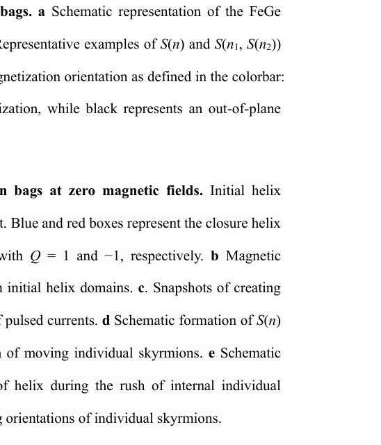
<figcaption class="paper-figure-caption"><b>Fig 1.</b> Fig. 3 | Representative skyrmion bags captured during the cycle of current-induced</figcaption>
</figure>

**Summary.** This paper reports the direct electrical creation and manipulation of complex magnetic skyrmion bags in FeGe nanoplates using current pulses. The researchers demonstrated that spin-transfer torque drives transitions from initial helical states into highly ordered, nested topological structures. This work establishes a pathway for all-electrical control over high-topological-charge spintronic components.

**Why it may be interesting.** While focused on magnetism, the study's reliance on non-equilibrium dynamics driven by external currents (STT) to control quantized topological structures is highly relevant to open quantum systems research, particularly in understanding energy dissipation and state preparation protocols.

Detailed structure

**Main problem.** The study addresses the challenge of directly generating and manipulating embedded magnetic skyrmion bags with tunable topological charge using only electrical currents, bypassing the need for external magnetic fields.

**Main result.** The authors successfully demonstrated current-induced formation and manipulation of complex, nested skyrmion bag structures ($	ext{S}(n_1, 	ext{S}(n_2))$) in an FeGe nanoplate, showing that spin-transfer torque drives these topological transitions.

**Method.** Experiments utilized in-situ Lorentz transmission electron microscopy (TEM) to observe dynamic transformations under precisely controlled nanosecond current pulses. Theoretical analysis was used to model the underlying physics.

**Model / system.** The physical system is a magnetic FeGe nanoplate, studied using electrical currents applied across electrodes. The dynamics involve transitions between helical ground states and various topologically charged skyrmion bag configurations.

**Key observables.** Topological charge (Q), skyrmion bag morphology ($	ext{S}(n)$ notation), lattice rotation trajectories, and the observation of topological defects like magnetic monopoles and bobbers.

**Important parameters / regimes.** Current density ($j$), particularly optimal regimes around $3.5 - 5.0 	imes 10^{10} 	ext{ A/m}^2$, and temperature rise ($\Delta T$).

**Assumptions / limitations.** The primary driving force for topological changes is assumed to be the spin-transfer torque (STT), rather than Joule heating, although thermal effects are modeled.

**Figures summary.** Figures detail the transformation sequence from a helical state to skyrmion lattices and bags using current pulses. Supplementary figures provide extensive evidence of nested bag formation ($	ext{S}(n_1, 	ext{S}(n_2))$) and dynamic collapse pathways.

**Paper structure.** The work progresses by first establishing the feasibility of electrical generation from a helix state, then detailing the rules for forming complex, nested bags via current pulses, and finally demonstrating controlled transitions between different topological states using time-resolved imaging.

Abstract

Magnetic skyrmion bags-vortex-like structures hosting multiple skyrmions with tunable topological charge (Q)-hold significant promise for next-generation spintronic computing. However, while their creation using magnetic fields has been demonstrated, their direct electrical generation remains an outstanding challenge. Here, we report the direct current-induced formation and manipulation of embedded skyrmion bags in a FeGe nanoplate under zero magnetic field. Using in-situ Lorentz transmission electron microscopy, we capture the transformation of a distorted helical ground state into embedded skyrmion bags with diverse configurations, driven by nanosecond current pulses. Theoretical analysis indicates that this process is driven by the spin-transfer-torque-induced fracture of the helical state. Furthermore, we demonstrate electrically-induced transitions between skyrmion bags of different Q, leading to the stabilization of complex three-dimensional topological structures, including experimental signatures of magnetic monopoles and bobbers. Our work establishes a foundation for all-electrical control of high-Q topological spin textures and topological defects, paving the way for their application in functional spintronic devices.

[↑ back to top](#top)

### [Fractional parametric resonance in spintronic diodes](http://arxiv.org/abs/2607.22150v1)

**Authors:** Andrea Grimaldi, Denys Slobodianiuk, Eleonora Raimondo, Raghav Sharma, Anna Giordano, Mario Carpentieri, Hyunsoo Yang, Riccardo Tomasello, Roman Verba, Giovanni Finocchio  
**Type:** theory · **Category:** other · **PDF:** <https://arxiv.org/pdf/2607.22150v1>  
**Analysis basis:** full PDF text, analyzed in chunks
**Topic relevance:** 🔥 `driven-dissipative phase transition` **4/5** · `methods for driven-dissipative` **3/5** · `spintronics-quantum-optics interface` **3/5** · `non-equilibrium dynamics` **2/5** · `non-equilibrium universality` **2/5** · `Frenkel-Kontorova` **1/5** · `Keldysh / 2PI / non-Gaussian methods` **1/5** · `analog quantum simulation` **1/5** · `correlated / nonlocal dissipation` **1/5** · `exotic spin models in light-matter` **1/5**

↔ Scroll figures horizontally

<figure class="paper-figure-card">
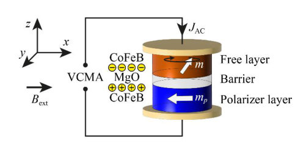
<figcaption class="paper-figure-caption"><b>Fig 1.</b> Figure 1. Schematic representation of the simulated device.</figcaption>
</figure>
<figure class="paper-figure-card">

<figcaption class="paper-figure-caption"><b>Fig 2.</b> Figure 2. Micromagnetic simulations showing the resonance spectra of the MTJ. (a) Resonance spectra (oscillation magnitude of 𝑚𝑥 magnetization component) as a function of 𝐵VCMA and 𝑓𝑝 with no external field. (b) The spectrum with 𝐵VCMA = 45 mT from (a), the 𝑥-axis ticks marking the pumping frequency in terms of fractions of the FMR frequency. (c) Fourier spectrum of magnetization dynamics at 𝐵VCMA = 45 mT. (d) Resonance spectra as in (a) with 𝐵ext = 5 mT. (e) Spectrum at 𝐵VCMA = 45 mT from (d).</figcaption>
</figure>
<figure class="paper-figure-card">
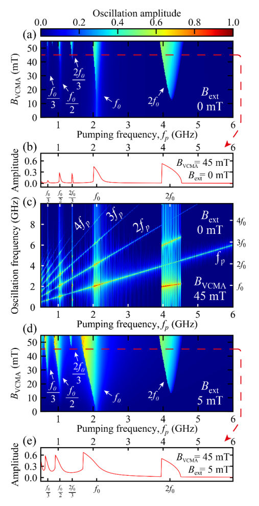
<figcaption class="paper-figure-caption"><b>Fig 3.</b> Figure 2 summarizes the simulated response of MTJ for a fixed 𝐽ac = 0.1 MA/cm2 while sweeping the VCMA amplitude 𝐵VCMA from 0 to 55 mT. First, we consider the zero-field case in Figure 2(a). Beyond the FMR (𝑓𝑝= 𝑓0) and conventional parametric resonance at 𝑓𝑝= 2𝑓0, we observe a sequence of additional resonance bands at fractional values of the FMR frequency: 2𝑓0/3, 𝑓0/2, 𝑓0/3. All these fractional bands, as well as the main parametric resonance, are absent when the VCMA contribution vanishes. Only the linear FMR exists at 𝐵VCMA = 0, excited by the ac STT. With increasing VCMA amplitude, the bands behave differently: conventional parametric resonance at 2𝑓0 and the resonance at 2𝑓0/3 exhibit...</figcaption>
</figure>
<figure class="paper-figure-card">
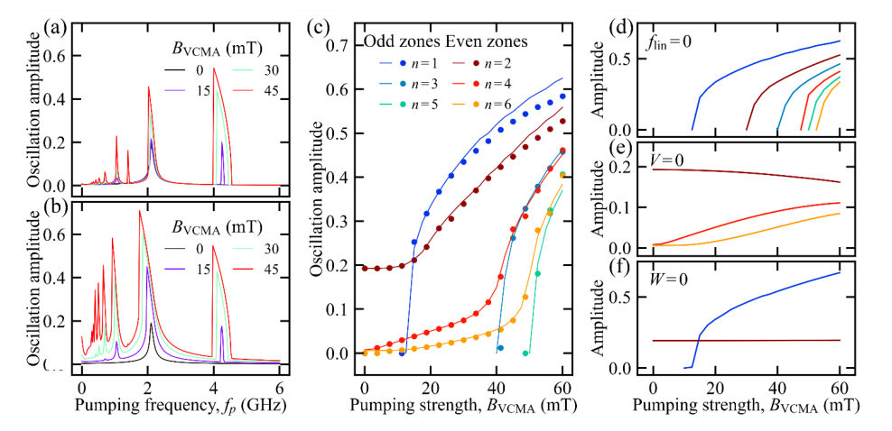
<figcaption class="paper-figure-caption"><b>Fig 4.</b> Figure 3. Results of theoretical model. (a,b) Resonance spectra of MTJ for different VCMA pumping strength at external field 𝐵ext = 0 (a) and 𝐵ext = 5 mT (b). (c) Amplitudes of resonance peaks in different resonance zones for 𝐵ext = 0 highlighting different behavior of odd and even zone resonances; lines – solution of Eq. (1), symbols – micromagnetic simulations. (d,e,f) Stationary solution of Eq. (1) for no linear force, 𝑓lin = 0, (d), no parametric coupling term, 𝑉= 0 (e), and no frequency modulation term, 𝑊= 0 (f), legend is shared with (c) for all three panels.</figcaption>
</figure>
<figure class="paper-figure-card">
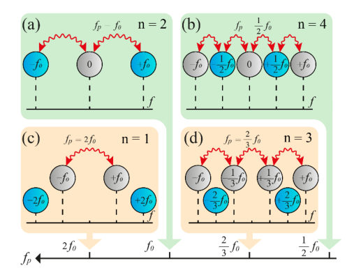
<figcaption class="paper-figure-caption"><b>Fig 5.</b> Figure 4. Scheme of pumping coupling interactions in the first four stable zones. (a,b) In even zones, the pumping frequency modes are included in the interaction chain coupling the FMR modes. (c,d) In odd zones, the interaction chain that couples the FMR modes does not include the pumping frequency mode.</figcaption>
</figure>

**Summary.** This paper theoretically analyzes fractional parametric resonance in spintronic diodes subjected to combined STT and VCMA driving. It proves that higher-order resonances ($n>1$) exist, distinguishing between threshold-dependent odd resonances (VCMA only) and thresholdless even resonances (STT + VCMA). The findings establish a general framework for using these devices in nonlinear signal processing applications.

**Why it may be interesting.** While focused on spintronics, the underlying physics involves parametric excitation in nonlinear oscillators (the magnetic system), which shares mathematical parallels with driven quantum systems studied in AMO/Quantum Optics.

Detailed structure

**Main problem.** The research investigates fractional parametric resonance in spintronic diodes, extending beyond the traditionally studied lowest-order ($n=1$) resonance.

**Main result.** The study demonstrates higher-order odd and even fractional resonances, showing that VCMA-driven modulation is crucial for these effects, opening avenues for nonlinear signal processing.

**Method.** A theoretical analysis combining micromagnetic simulations with an analytical model was employed to characterize the magnetization dynamics.

**Model / system.** The physical system is a spintronic diode (MTJ) driven by simultaneous ac Spin-Transfer Torque (STT) and Voltage-Controlled Magnetic Anisotropy (VCMA). The dynamics are modeled using equations derived from spin wave perturbation formalism, showing irreducibility to the standard Mathieu model.

**Key observables.** Resonance spectra, peak amplitudes in odd vs. even zones, threshold behavior, and broadband response.

**Important parameters / regimes.** STT current densities ($< 10^6$ A/cm$^2$), VCMA anisotropy fields ($< 50$ mT), and the resonance order $n$.

**Assumptions / limitations.** The standard Mathieu model is insufficient for describing the full parametric magnetization dynamics; a more complete theoretical framework incorporating VCMA modulation is necessary.

**Figures summary.** Figures compare theoretical predictions to micromagnetic simulations, illustrating resonance spectra in both odd and even zones under varying external fields ($\mathbf{B}_{ext}$).

**Paper structure.** The paper develops the theory by analyzing the dynamic equation governing magnetization amplitude, comparing results against numerical simulations, and concluding with a general framework for engineering these resonances.

Abstract

Parametric pumping is a powerful tool for the excitation, amplification, and processing of oscillations and waves of different nature. In general, parametric resonance can occur when the pumping frequency $f_p$ and eigenfrequency of a linear mode (or wave) $f_0$ satisfy the relation $f_p$=2$f_0$/n (n=1,2,3,...). While such parametric resonance is well known in mechanical, superconductive, and quantum systems, in magnetic and spintronic systems only the lowest (n=1) parametric resonance at double the spin wave mode frequency $f_p$=2$f_0$ was thoroughly studied and explored. Here, using a theoretical analysis based on both micromagnetic simulations and an analytical model, we show the emergence of resonances at fractional frequencies $f_p$=2$f_0$/n (with n>10) in spintronic diodes driven by the simultaneous action of ac spin-transfer torque (STT, current densities < $10^6$ A/cm2) and voltage-controlled magnetic anisotropy (VCMA, effective anisotropy fields < 50 mT). The analytical model shows that parametric magnetization dynamics is irreducible to the standard Mathieu model of a parametric oscillator and demonstrates the crucial role of VCMA-driven mode frequency modulation: together with parametric coupling, it results in higher-order odd (n=3,5,7,...) fractional resonances, observed above certain VCMA pumping threshold, while simultaneous action with linear STT drive produces thresholdless even (n=4,6,8,...) resonances. This higher-order parametric dynamics is not restricted to VCMA pumping and opens new directions for the application of spintronic diodes for nonlinear signal processing and electromagnetic energy harvesting.

[↑ back to top](#top)

### [Thermal phase slips in superconducting films near the critical current at arbitrary temperatures](http://arxiv.org/abs/2607.21801v1)

**Authors:** Ivan M. Artemov, Mikhail A. Skvortsov  
**Type:** theory · **Category:** statistical mechanics · **PDF:** <https://arxiv.org/pdf/2607.21801v1>  
**Analysis basis:** full PDF text, analyzed in chunks
**Topic relevance:** 🔥 `non-equilibrium universality` **4/5** · `Keldysh / 2PI / non-Gaussian methods` **3/5** · `driven-dissipative phase transition` **3/5** · `non-equilibrium dynamics` **2/5** · `Frenkel-Kontorova` **1/5** · `analog quantum simulation` **1/5** · `correlated / nonlocal dissipation` **1/5** · `methods for driven-dissipative` **1/5**

↔ Scroll figures horizontally

<figure class="paper-figure-card">
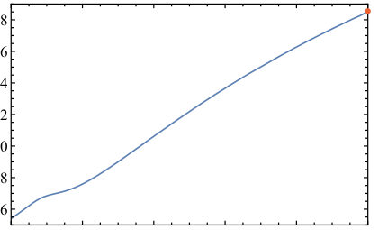
<figcaption class="paper-figure-caption"><b>Fig 1.</b> FIG. 1. Temperature dependence of the coefficient c2D(T) in the activation barrier (28) for a 2D film. The red point cor- responds to the analytical result in the GL region: c2D(Tc) = 227/43−9/4π ≈28.5 [10].</figcaption>
</figure>
<figure class="paper-figure-card">
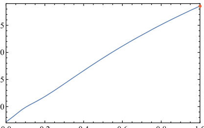
<figcaption class="paper-figure-caption"><b>Fig 2.</b> FIG. 2. Temperature dependence of the coefficient c1D(T) in the activation barrier (37) for a 1D wire. The red point corresponds to the LA analytical result in the GL region: c1D(Tc) = 225/43−5/45−1 ≈3.86 [6].</figcaption>
</figure>
<figure class="paper-figure-card">
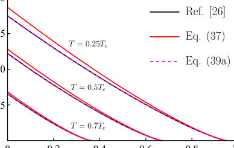
<figcaption class="paper-figure-caption"><b>Fig 3.</b> FIG. 3. Current dependence of the activation barrier ∆F1D for a 1D wire at three values of T/Tc. Shown are the numerical data of Ref. [26] (black), our near-critical asymptotics (37) (red), and the fit (39) (dashed). Currents are scaled by Ic0, the critical current at T = 0.</figcaption>
</figure>

**Summary.** This paper provides a rigorous theoretical framework for calculating the thermal activation barrier governing phase slips in superconducting films near their critical current. By mapping the problem onto an integrable Boussinesq field theory, the authors derive precise asymptotic scaling laws for both 2D and 1D geometries across all temperatures below $T_c$. This work is crucial for understanding dissipation mechanisms in superconducting devices.

**Why it may be interesting.** While focused on superconductivity, the use of instanton methods, field theory reduction (Boussinesq), and critical exponent analysis connects strongly to non-equilibrium statistical mechanics and phase transition dynamics relevant in AMO systems like Josephson junctions or superconducting qubits.

Detailed structure

**Main problem.** The paper develops a comprehensive theory for calculating the activation barrier associated with thermal phase slips in superconducting films biased near their critical current.

**Main result.** It derives asymptotic scaling laws for the activation barrier ($\Delta F \propto (1 - I/I_c)^\alpha$) for both 2D films ($\alpha=3/4$) and 1D wires ($\alpha=5/4$), valid across a wide temperature range.

**Method.** The theory involves reducing the complex free-energy functional derived from Usadel equations to an exactly integrable Boussinesq field theory, allowing for analytical solutions of the instanton configuration.

**Model / system.** The system is disordered superconducting films (2D) and wires (1D), analyzed using a theoretical framework based on the replica sigma model and coupled Usadel equations. The physics concerns phase slips driven by thermal fluctuations near $I_c(T)$.

**Key observables.** Activation barrier ($\Delta F$), supercurrent density ($j$), and temperature-dependent coefficients ($E(T), c_{2D}(T), c_{1D}(T)$).

**Important parameters / regimes.** Temperature ($T < T_c$), applied current ($I 	o I_c(T)$), dimensionality (1D vs 2D).

**Assumptions / limitations.** The analysis relies on a gradient expansion and the reduction of the free energy functional to the Boussinesq form, which is most accurate near $I_c$.

**Figures summary.** Figures illustrate the temperature dependence of coefficients ($c_{2D}(T), c_{1D}(T)$) and compare derived asymptotic forms for $\Delta F_{1D}$ against numerical solutions.

**Paper structure.** The paper builds from general theory using Usadel equations, simplifies the functional to Boussinesq form, derives specific scaling laws for 2D and 1D geometries, and finally calculates temperature-dependent coefficients via Matsubara sums.

Abstract

We develop a theory of thermal phase slips in disordered superconducting films biased near the critical current $I_c(T)$. Generalizing recent results obtained close to $T_c$, we show that the optimal fluctuation governing the phase-slip barrier in two dimensions satisfies the exactly integrable Boussinesq equation for arbitrary temperatures $T<T_c$. Since both the transverse and longitudinal sizes of the optimal nucleus diverge as $I\to I_c(T)$, the Usadel equation for quasiparticles in the presence of a slowly varying order parameter can be solved perturbatively using a gradient expansion. The resulting field theory for a complex order parameter is further reduced to the Boussinesq free energy for a single real field, with the coefficients expressed as Matsubara sums over the solutions of the uniform Usadel equation at $I_c(T)$. The activation barrier near $I_c$ has the asymptotic form $ΔF(T,I\to I_c) = E(T) (1-I/I_c)^α$. We calculate $E(T)$ over the full temperature range for both two-dimensional films ($α=3/4$) and one-dimensional wires ($α=5/4$). For films, the theory is valid within a narrow $10\%$ window below $I_c(T)$, where the saddle-point configuration remains vortex-free. For wires, $ΔF(T,I\to I_c)$ provides a good approximation to the activation barrier for all temperatures and currents.

[↑ back to top](#top)

### [Supermoiré-trapped quadrupolar exciton](http://arxiv.org/abs/2607.22532v1)

**Authors:** Anish Kumar, Suman Chatterjee, Kenji Watanabe, Takashi Taniguchi, Kausik Majumdar  
**Type:** both · **Category:** other · **PDF:** <https://arxiv.org/pdf/2607.22532v1>  
**Analysis basis:** full PDF text, analyzed in chunks
**Topic relevance:** `analog quantum simulation` **3/5** · `correlated cavity matter` **3/5** · `quantum optics experiment` **2/5** · `Keldysh / 2PI / non-Gaussian methods` **1/5** · `correlated / nonlocal dissipation` **1/5** · `driven-dissipative phase transition` **1/5** · `entanglement & information structure` **1/5** · `interference shaping light` **1/5** · `methods for driven-dissipative` **1/5** · `non-equilibrium dynamics` **1/5**

↔ Scroll figures horizontally

<figure class="paper-figure-card">
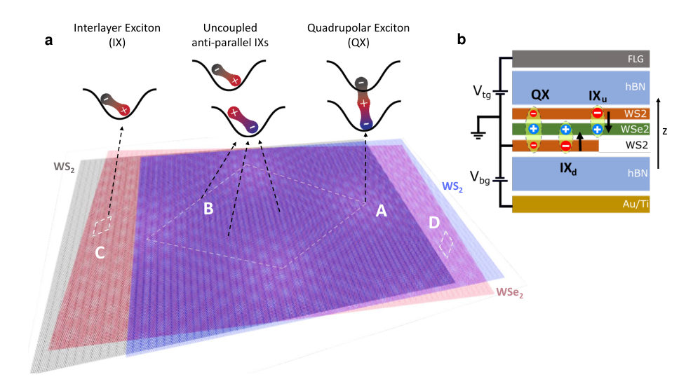
<figcaption class="paper-figure-caption"><b>Fig 1.</b> Figure 1: Supermoir´e landscape in hetero-trilayer:(a) Illustration of the moir´e land- scape in the heterostructure and different excitonic species existing at different local stack- ings. The bilayer regions (WS2/WSe2) host interlayer excitons (IXs) at positions defined by the moir´e, as shown by the white dashed lines (regions C and D). The trilayer region (WS2/WSe2/WS2) shows the emergence of a supermoir´e and can host uncoupled IXs (in re- gion B) and quadrupolar excitons (QXs) (in region A) at different positions. (b) Schematic of the dual gated heterostructure with top and bottom gate enabling independent doping and electric field control. The distribution of the electrons and holes...</figcaption>
</figure>
<figure class="paper-figure-card">
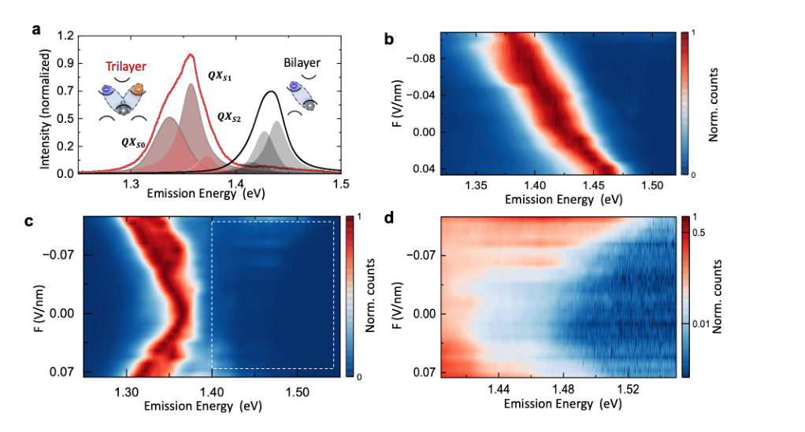
<figcaption class="paper-figure-caption"><b>Fig 2.</b> Figure 2: Emission features of dipolar and quadrupolar exciton:(a) Photolumines- cence (PL) Spectra from WS2/WSe2/WS2 trilayer and WS2/WSe2 bilayer regions of the heterostructure with their corresponding decomposed peaks. The insets illustrate the simpli- fied band structure of the corresponding regions. (b,c) Colour plot of electric field dependent PL for (b) WS2/WSe2 bilayer and (c) WS2/WSe2/WS2 trilayer. (d) Colour plot of the higher energy emission (corresponding to the white dashed box in c) from trilayer region in log scale. All spectra in (b,c,d) are individually normalized to 1.</figcaption>
</figure>
<figure class="paper-figure-card">
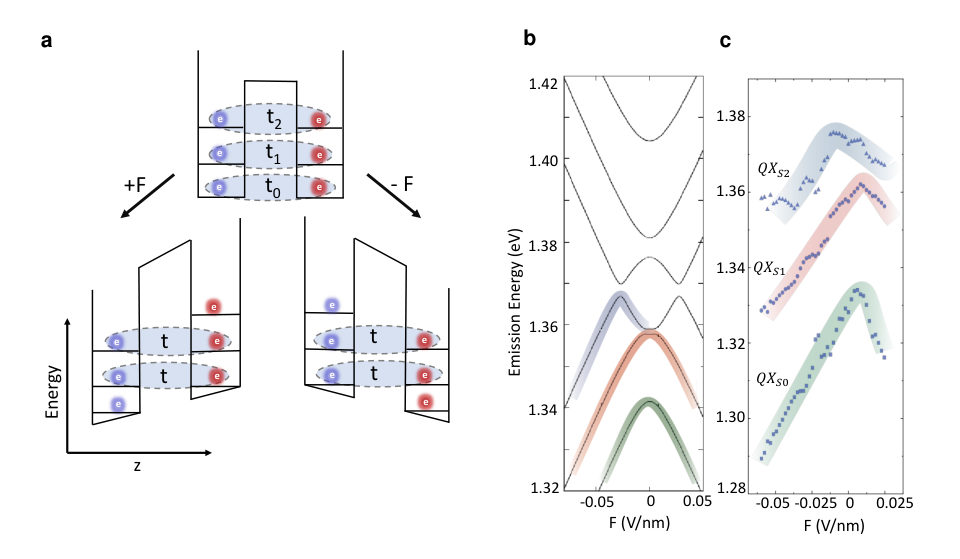
<figcaption class="paper-figure-caption"><b>Fig 3.</b> Figure 3: Vertical moir´e-moir´e interaction: (a) Simplified potential well picture for the two vertically-coupled moir´e wells. (top) The situation at zero applied electric field. The corresponding ti={0,1,2} represents the coupling between the electronic states between the top and bottom WS2layers with the same level in the moir´e wells. (bottom) At nonzero electric field, t represents coupling between states QXi̸=j. (b) Calculated and (c) measured electric field dependence for the energy of QX states. The colored overlays show the correspondence between predicted and observed dispersions. The emission energy in (b) is offset to match the measured emission energy.</figcaption>
</figure>
<figure class="paper-figure-card">
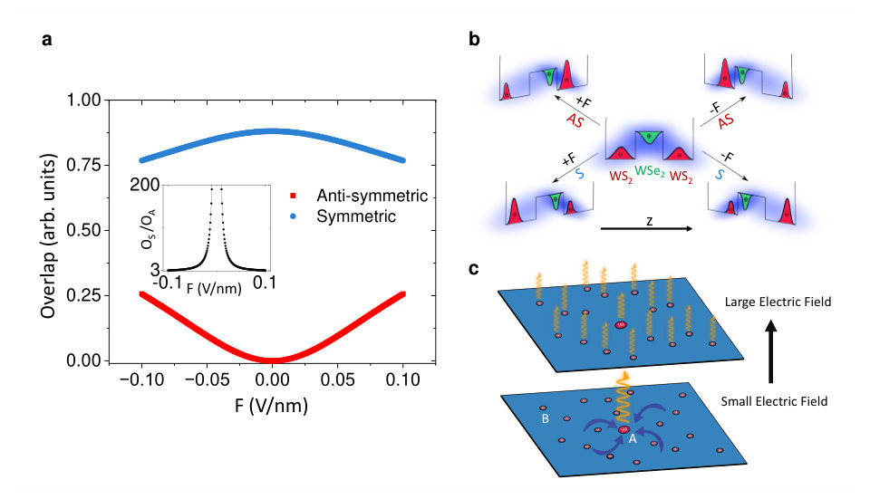
<figcaption class="paper-figure-caption"><b>Fig 4.</b> Figure 4: Quadrupolar exciton at high electric field: (a) External electric field de- pendence of calculated overlap between the electron and hole wavefunctions in symmetric and anti-symmetric QXs. The inset shows the change in ratio of electron-hole wavefunc- tion overlap for symmetric (OS) and anti-symmetric (OA) state with external electric field. (b) Illustration of the effect of external electric field on symmetric and antisymmetric QX. The comparative sizes of the electron wave packets illustrate the weight of the electronic wavefunction in the corresponding potential well. The color of the hue connecting the wave packets represents the overlap strength (darker meaning more overlap.)...</figcaption>
</figure>

**Summary.** This paper reports on the realization and characterization of supermoiré-trapped quadrupolar excitons in a heterotrilayer. By leveraging the periodic potential from the supermoiré effect, the authors overcome limitations in vertical coupling to create robust QX states. These states are spectroscopically confirmed via unique electric field-dependent optical signatures, highlighting the supermoiré structure's role in controlling complex excitonic physics.

**Why it may be interesting.** This work is highly relevant as it deals with engineered quantum optical systems (excitons) whose properties are dictated by complex moiré potentials and external fields, touching upon concepts used in cavity QED or open quantum system dynamics.

Detailed structure

**Main problem.** The study investigates how the supermoiré effect can facilitate the formation of quadrupolar excitons (QX) in multi-layered heterostructures, overcoming issues caused by unintentional twist-angle mismatch.

**Main result.** The authors demonstrate that the supermoiré structure creates periodic pockets enabling QX formation, which exhibit distinct non-linear and field-tunable optical signatures compared to simple dipolar excitons.

**Method.** The research combines experimental photoluminescence (PL) measurements on a heterotrilayer with theoretical modeling using Hamiltonians describing exciton hybridization under an applied electric field.

**Model / system.** The physical system is a WS2/WSe2/WS2 heterotrilayer exhibiting moiré superlattice effects. The model involves treating the excitons as hybridized states derived from interlayer dipolar excitons (IX) forming quadrupolar exciton (QX) superposition states.

**Key observables.** PL redshift in trilayers vs. bilayers, non-linear/hyperbolic Stark shift dependence on electric field (F), and changes in circular polarization degree (DOCP).

**Important parameters / regimes.** Electric field strength (F), hybridization energy ($\delta \sim 11.5$ meV), and the supermoiré periodicity.

**Assumptions / limitations.** The QX formation is robust against slight variations in twist angles due to the supermoiré structure; theoretical analysis often assumes negligible interactions between excitons from different moiré sites for simplification.

**Figures summary.** Figures illustrate the supermoiré landscape, PL spectra showing redshift (trilayer vs. bilayer), and field-dependent shifts: linear shift for IX vs. hyperbolic/non-linear shift for QX.

**Paper structure.** The paper progresses from establishing the physical problem (mismatch degradation) to proposing the supermoiré solution, presenting experimental evidence via PL spectroscopy across varying electric fields, and finally using theoretical models to explain the observed hybridization and field tunability of the resulting quadrupolar states.

Abstract

Moiré-trapped dipolar interlayer exciton in heterobilayers offers a rich platform to explore interaction-driven phenomena. Extending the number of layers to three and beyond leads to highly intriguing multipolar exciton - a superposition state of vertically aligned phase-coherent excitons. However, in experiments, unintentional twist-angle mismatch among layers may degrade the strength and homogeneity of the vertical Coulomb coupling. Here we propose that the supermoiré effect in a heterotrilayer comes to the rescue by creating periodic pockets of vertically aligned atomic registries that facilitate the formation of quadrupolar excitons trapped in such pockets. Using WS$_2$/WSe$_2$/WS$_2$ stack, we show interaction between multiple confined levels of the top and bottom moiré interfaces, creating electric field tunable multi-level hybridized bright (symmetric) and dark (anti-symmetric) quadrupolar states. Our work underscores the critical role of supermoiré effect in quadrupolar excitons. The discovery of reduced sensitivity on precise angle-alignment will ignite exploration of complex excitonic states in multi-layered heterostructures.

[↑ back to top](#top)

### [Towards on-chip nascent all-van-der-Waals polarization optical components for nanoscale photonic applications](http://arxiv.org/abs/2607.21748v1)

**Authors:** Dmitrii Litvinov, Ilia Begichev, Iakov Reznikov, Changyi Chen, Maksim Sargsyan, Sergey Y. Grebenchuk, Makars Siskins, Kostya S. Novoselov, Alexey I. Berdyugin, Maciej Koperski, Davit A. Ghazaryan  
**Type:** both · **Category:** other · **PDF:** <https://arxiv.org/pdf/2607.21748v1>  
**Analysis basis:** full PDF text, analyzed in chunks
**Topic relevance:** `interference shaping light` **3/5** · `quantum optics experiment` **3/5** · `QC/QI experiment` **2/5** · `analog quantum simulation` **1/5** · `correlated cavity matter` **1/5** · `spintronics-quantum-optics interface` **1/5**

↔ Scroll figures horizontally

<figure class="paper-figure-card">
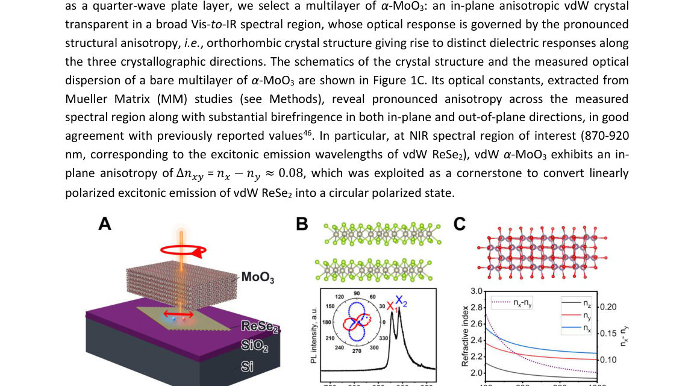
<figcaption class="paper-figure-caption"><b>Fig 1.</b> Figure 1. All-vdW NIR spectral region on-chip quarter-wave plates. (A) The schematic illustration showing the design of the device composed of pre-aligned ReSe2/α-MoO3 vdW heterostructure positioned on top of Si/SiO2 substrate. (B) The schematic illustration of triclinic crystal structure (top, side view) and low-temperature PL spectra (bottom) of vdW ReSe2. The inset represents the angular linear polarization dependence of excitonic states indicated as 𝑋1 and 𝑋2. (C) The schematic illustration</figcaption>
</figure>
<figure class="paper-figure-card">
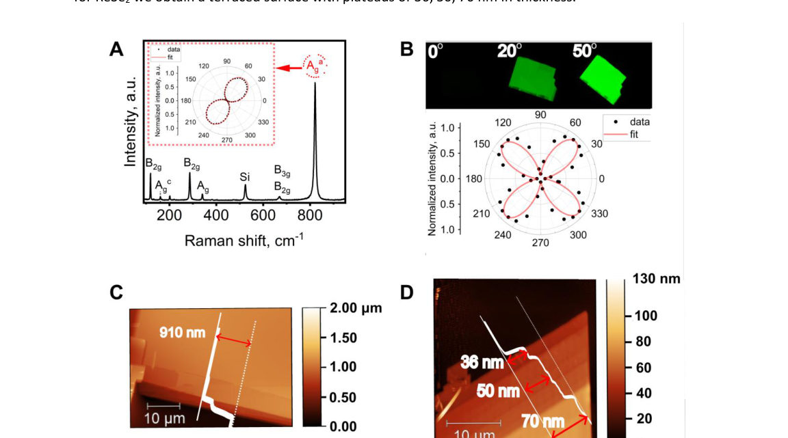
<figcaption class="paper-figure-caption"><b>Fig 2.</b> Figure 2. Identifying crystallographic axes of biaxial α-MoO3 along with thickness characteristics of vdW layers selected for the design of on-chip quarter-wave plates. (A) The unpolarized Raman spectra of vdW α-MoO3 placed on top of Si/SiO2 substrate illustrating its representative 𝐴𝑔 and 𝐵𝑔 vibrational modes. The polar diagram in the inset shows the angular polarization dependence of the strongest 𝐴𝑔𝑎 mode obtained in co-polarized geometry. (B) Polarization resolved Vis micro- reflection response of vdW α-MoO3 placed onto Si/SiO2 The top panel displays reflection micrographs at 0o, 20o and 50o rotations with respect to crystallographic axes. The bottom panel shows the full angular...</figcaption>
</figure>
<figure class="paper-figure-card">
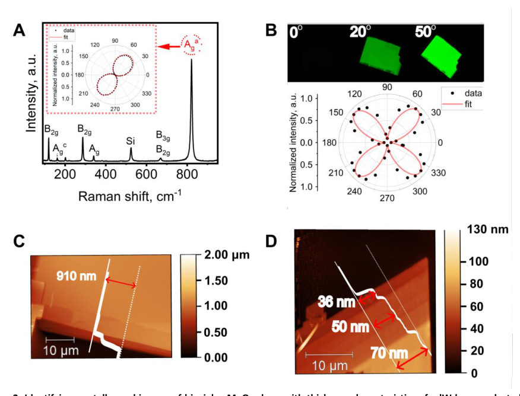
<figcaption class="paper-figure-caption"><b>Fig 3.</b> Figure 3 demonstrates the optical micrograph of our proof-of-principle sample, i.e., twisted vdW heterostructure assembled (see Methods) on top of Si/SiO2 substrate for a case of pre-identified directions of linear excitonic polarization in the selected ReSe2 (by measuring polarization-resolved PL response, similar to data shown in the inset of Figure 1B, bottom) and the &quot;fast&quot; axis of the chosen α- MoO3 (by measuring polarization-resolved Raman response, similar to data shown in the inset of Figure 2A) with a twist-angle of 21o between them. The polarization-resolved PL mapping (see Figure 3B and</figcaption>
</figure>
<figure class="paper-figure-card">
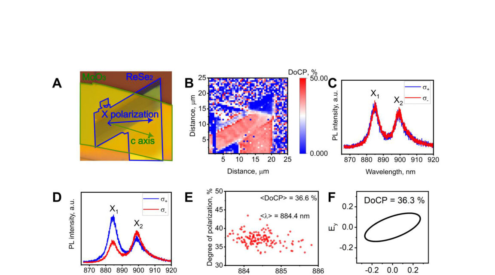
<figcaption class="paper-figure-caption"><b>Fig 4.</b> Figure 3. Probing DoCP in ReSe2/α-MoO3twisted stack assembled on top of Si/SiO2 chip. (A) 50 X optical micrograph of our proof-of-principle sample. The blue arrow denotes the linear polarization direction of 𝐴 excitonic emission from ReSe2, while the green arrow shows the &quot;fast&quot; axis of α-MoO3. (B) The DoCP map collected all over the sample, including bare ReSe2 terraces and substrate. (C) and (D) Examples of circularly polarized 𝜎+ and 𝜎− state PL spectra acquired from bare ReSe2 sample of 70 nm thickness (C) and ReSe2/α-MoO3 twisted heterostructure (D). The excitonic states are denoted as 𝑋1 and 𝑋2. (E) The DoCP histogram collected from twisted stack as a function of wavelength (in a...</figcaption>
</figure>

**Summary.** This paper presents a method to create all-vdW on-chip optical components capable of controlling light polarization. By engineering twisted heterostructures from $	ext{ReSe}_2$ and $\alpha	ext{-MoO}_3$, the authors convert linearly polarized excitons into highly circularly polarized light. The combination of advanced spectroscopy and FDTD simulations confirms this approach, paving the way for nanoscale photonic architectures.

**Why it may be interesting.** This work is highly relevant to quantum optics and open quantum systems because it demonstrates precise control over single-photon polarization states using solid-state layered materials, which is foundational for integrated quantum photonic circuits.

Detailed structure

**Main problem.** The central challenge addressed is integrating polarization-control elements into continuously miniaturizing on-chip optical circuits.

**Main result.** The authors demonstrate a practical route to fully integrated, all-van-der-Waals (vdW) polarization optical components, achieving up to 95% degree of circular polarization (DoCP).

**Method.** A combination of advanced characterization techniques (ellipsometry, Raman spectroscopy, PL mapping) and rigorous theoretical modeling using Finite-Difference Time-Domain (FDTD) simulations was employed.

**Model / system.** The physical system is a twisted vdW heterostructure composed of $	ext{ReSe}_2$ (as the source of linearly polarized excitons) and in-plane birefringent $\alpha	ext{-MoO}_3$ (for polarization conversion), built on an $	ext{Si}/	ext{SiO}_2$ platform.

**Key observables.** Degree of Circular Polarization (DoCP), linear/circular polarization state, optical anisotropy ($\Delta n_{xy}$), and layer thicknesses.

**Important parameters / regimes.** Layer thicknesses, twist-angle, operating wavelength in the Near-Infrared (NIR) region ($870-920 	ext{ nm}$), and Fabry–Pérot interference effects.

**Assumptions / limitations.** The control of alignment between the emitted signal's polarization and the fast axis of $\alpha	ext{-MoO}_3$ is crucial; FDTD simulations rely on derived optical constants from experimental fits.

**Figures summary.** Figures illustrate schematic designs, PL spectra showing polarization dependence, micro-reflection responses confirming anisotropy, and FDTD field trajectories used to calculate DoCP.

**Paper structure.** The work progresses by establishing the need for miniaturized components, characterizing the anisotropic optical properties of $\alpha	ext{-MoO}_3$ using multiple spectroscopic methods (ellipsometry/Raman), modeling the quarter-wave plate condition, and finally simulating/measuring the polarization conversion efficiency in the full heterostructure.

Abstract

The integration of polarization-control elements into nanoscale photonic circuits remains a central challenge for modern on-chip optical technologies, which call for continuous miniaturization. Van der Waals (vdW) crystals provide a versatile platform for the creation of such components owing to their strong optical anisotropy, high-refractive indices and atomically precise heterostructure assembly capabilities. In this work, we demonstrate an approach towards the creation of all-vdW on-chip polarization optical components, exemplified with quarter-wave plates operating in the near-infrared (NIR) spectral region, realized in specifically twisted ReSe2/alpha-MoO3 vdW heterostructures on a Si/SiO2 platform. Here, low-symmetry ReSe2 layer serves as a source of exceptionally high linearly polarized excitonic emission, whereas in-plane birefringent alpha-MoO_3 provides polarization-state conversion. Furthermore, our finite-difference time-domain (FDTD) simulations quantitatively reproduce the experimental observations with high accuracy revealing the critical roles of layer thicknesses, twist-angle, Fabry-Perot interference and emitter distribution effects in the determination of polarization conversion efficiency, which yields up to 95 % degrees of circular polarization (DoCP) for the optimized parametrization. Our findings establish a practical route towards fully integrated all-vdW polarization optical components, providing a foundation for nanoscale photonic architectures based entirely on layered materials.

[↑ back to top](#top)

### [Levitated nano-trampoline resonators for magnetic field sensing](http://arxiv.org/abs/2607.22160v1)

**Authors:** Xianfeng Chen, Nirmala Raj, Matthew R. Chua, Yi Fan Chen, Chenyue Gu, Minxing Xu, Young-Wook Cho, Syed M. Assad, Lu Ding, Ping Koy Lam  
**Type:** experiment · **Category:** other · **PDF:** <https://arxiv.org/pdf/2607.22160v1>  
**Analysis basis:** full PDF text, analyzed in chunks
**Topic relevance:** `spintronics-quantum-optics interface` **3/5** · `quantum measurements` **2/5** · `driven-dissipative phase transition` **1/5** · `exotic spin models in light-matter` **1/5**

↔ Scroll figures horizontally

<figure class="paper-figure-card">
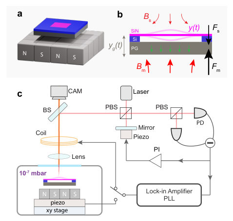
<figcaption class="paper-figure-caption"><b>Fig 1.</b> FIG. 1. Hybrid diamagnetically levitated nanomechanical magnetometer. (a) Schematic of a pyrolytic graphite (PG) plate levitating above an array of permanent magnets with alternating magnetization, where N and S represent the north and south poles of the magnet, respectively. A chip consisting of a Si substrate and a nanometer-thick SiN square membrane is placed on top of the graphite. (b) Cross-section of the chip (not to scale). The green arrows represent the diamagnetic response of the graphite. (c) Experimental setup for magnetic field sensing, including optical interferometric readout of the nanomechanical resonator motion (see also SI-IV).</figcaption>
</figure>
<figure class="paper-figure-card">
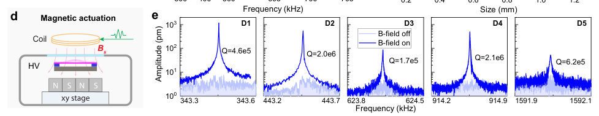
<figcaption class="paper-figure-caption"><b>Fig 2.</b> FIG. 2. Dynamic characterization and magnetic response of the hybrid levitated nanomechanical resonator. (a) Schematic of mechanical actuation using a piezoelectric disk. HV: high-vacuum chamber. (b) Measured frequency response of a representative nanomechanical resonator under piezoelectric actuation, showing the first three mechanical modes; the corresponding simulated mode shapes are shown next to each peak. (c) Resonance frequencies of the first three modes for square membrane resonators with different side lengths, measured via piezoelectric actuation. (d) Schematic of magnetic actuation using a coil. (e) Frequency response near the first resonance of five representative devices with...</figcaption>
</figure>
<figure class="paper-figure-card">
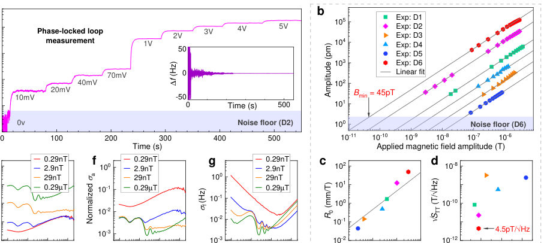
<figcaption class="paper-figure-caption"><b>Fig 3.</b> FIG. 3. Magnetic field sensing and sensitivity characterization. (a) Amplitude response of a representative nanomechanical resonator (device D2) to applied magnetic field amplitudes, obtained by using a phase-locked loop. The inset shows the corre- sponding resonance frequency fluctuations recorded over the same measurement duration. The shaded gray region represents the measured noise floor of device D2. (b) Measured peak amplitude as a function of applied magnetic field amplitude for six different devices. Error bars are smaller than the marker size. The shaded gray region indicates the measured noise floor of device D6. (c) Responsivity R0 as a function of Q/f 2 11 for different devices,...</figcaption>
</figure>
<figure class="paper-figure-card">
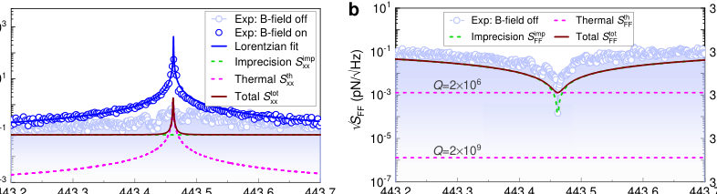
<figcaption class="paper-figure-caption"><b>Fig 4.</b> FIG. 4. Noise and sensitivity analysis. (a) Measured and calculated amplitude noise spectrum of device D2 around its resonance frequency. Total Stot xx represents the PSD due to both Sth xx and Simp xx (b) Equivalent force and magnetic field noise spectrum inferred from the data in panel (a) using the mechanical transfer function of the resonator and the measured Q-factor.</figcaption>
</figure>
<figure class="paper-figure-card">
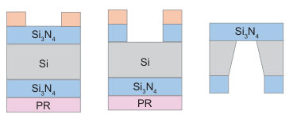
<figcaption class="paper-figure-caption"><b>Fig 5.</b> FIG. 5. Si3N4 membrane fabrication process flow.</figcaption>
</figure>

**Summary.** This paper presents a novel magnetometer utilizing a hybrid system where a diamagnetically levitated graphite plate converts weak magnetic fields into mechanical motion. This signal is then read out by an ultra-high quality factor nano-trampoline resonator, achieving sensitivities in the picotesla range at room temperature. The approach offers a solid-state pathway for highly sensitive AC magnetic field sensing.

**Why it may be interesting.** While not directly quantum information focused, this work involves high-precision measurement at the nanoscale, which often interfaces with quantum noise limits (like thermal noise) and requires advanced control techniques relevant to quantum optics/sensing.

Detailed structure

**Main problem.** The primary goal is to develop a high-precision magnetometer by combining diamagnetic levitation with nanomechanical resonators, overcoming challenges related to functionalization without losing low dissipation.

**Main result.** The authors achieved a peak magnetic field sensitivity of $4.5 	ext{ pT}/\sqrt{	ext{Hz}}$ at room temperature using the hybrid platform, establishing it as a new class of high-sensitivity magnetometers.

**Method.** The system uses a macroscopic diamagnetically levitated graphite plate to transduce weak oscillating magnetic fields into mechanical motion, which is then amplified and read out by a high-Q silicon nitride nano-trampoline resonator.

**Model / system.** The platform consists of a free-floating proof mass (graphite) coupled to a $	ext{SiN}$ membrane resonator. The coupling converts magnetic field variations into mechanical force, which is then measured via the resonator's resonance response.

**Key observables.** Peak magnetic field sensitivity ($	ext{pT}/\sqrt{	ext{Hz}}$), Resonance frequency ($f$), Quality factor ($Q$), and Displacement amplitude ($\delta x(t)$).

**Important parameters / regimes.** Room temperature operation, $Q=6	imes10^6$, $	ext{P} < 5 	imes 10^{-7} 	ext{ mbar}$, and the theoretical limit of femtotesla-level sensing.

**Assumptions / limitations.** The system's sensitivity is limited by thermomechanical noise, and the magnetic signal force component ($F_s$) is assumed to be proportional to $\chi/\mu_0 B_s 
abla B_m$.

**Figures summary.** Figures illustrate the setup schematic (levitating graphite over magnets), dynamic characterization via piezoelectric actuation, and detailed analysis of frequency response curves comparing levitated vs. mounted states.

**Paper structure.** The paper details the physical coupling mechanism between magnetic fields and mechanical motion, presents experimental measurements using interferometry and PLL tracking to measure resonance parameters ($Q$, $f$), and concludes with a performance comparison against other sensing technologies.

Abstract

Levitated systems and high-$Q$ membrane nanomechanical resonators have achieved exceptional sensitivity in precision sensing, but functionalizing such resonators for practical applications without degrading their low dissipation remains challenging. Here, we combine diamagnetic levitation with a high-$Q$ nanomechanical resonator to realize a high-precision magnetometer for sensing weak oscillating magnetic fields. A macroscopic diamagnetically levitated graphite plate acts as a free-floating proof mass that couples strongly to magnetic fields, converting them into mechanical motion that is resonantly amplified by a low-dissipation nano-trampoline resonator. Operating at room temperature and without magnetic shielding, we achieve a peak magnetic-field sensitivity of $4.5\, \mathrm{pT}/\sqrt{\mathrm{Hz}}$ using a resonator with a mechanical quality factor of $Q=6\times10^{6}$ at $443\, \mathrm{kHz}$. The system sensitivity is limited by thermomechanical noise. With further improvements in mechanical $Q$, this hybrid levitated platform offers a pathway toward femtotesla-level AC magnetic-field sensing, establishing diamagnetically levitated nanomechanical resonators as a new class of high-sensitivity magnetometers at room temperature.

[↑ back to top](#top)

### [Accelerating grain boundary modelling and simulation by automated pre-evaluation of the irreducible macroscopic representation](http://arxiv.org/abs/2607.22090v1)

**Authors:** Wei Wan  
**Type:** theory · **Category:** numerical methods · **PDF:** <https://arxiv.org/pdf/2607.22090v1>  
**Analysis basis:** full PDF text, analyzed in chunks
**Topic relevance:** `methods for driven-dissipative` **1/5**

↔ Scroll figures horizontally

<figure class="paper-figure-card">
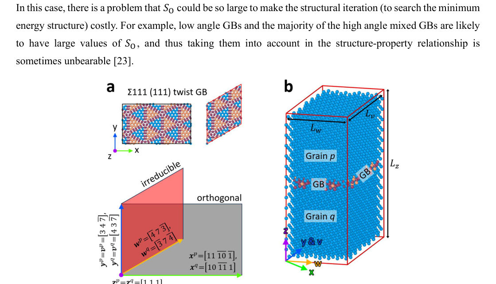
<figcaption class="paper-figure-caption"><b>Fig 1.</b> Figure 1. (a) Atomic structure of a Σ111 (111) twist GB (disorientation angle is 9.43°) under the orthogonal and irreducible</figcaption>
</figure>
<figure class="paper-figure-card">

<figcaption class="paper-figure-caption"><b>Fig 2.</b> Figure 2. (a) Comparison of computed supercell sizes over a group of 14 random aluminum GBs in the Homer dataset. (b)</figcaption>
</figure>
<figure class="paper-figure-card">
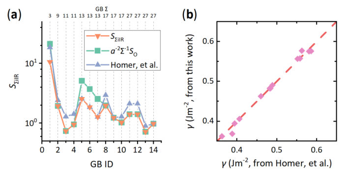
<figcaption class="paper-figure-caption"><b>Fig 3.</b> Figure 2a compares the parameter 𝑆ΣiIR obtained from the Homer dataset and this work, as well as the</figcaption>
</figure>
<figure class="paper-figure-card">
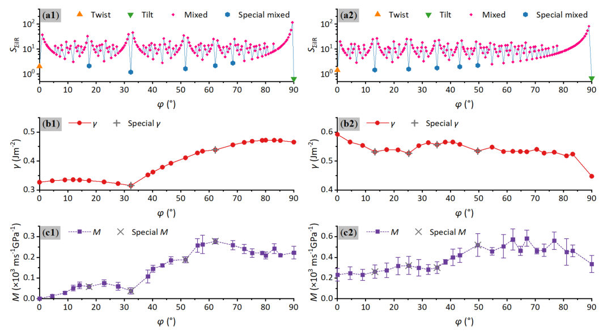
<figcaption class="paper-figure-caption"><b>Fig 4.</b> Figure 3. Aluminum GB properties as the function of φ: (a1) 𝑆𝛴𝑖𝐼𝑅 of θ = 36.87° Σ5 &lt;001&gt; GBs; (b1) γ of θ = 36.87° Σ5 &lt;001&gt;</figcaption>
</figure>

**Summary.** This work introduces an algorithm to calculate the irreducible macroscopic representation of grain boundaries in crystalline lattices. By determining a minimal supercell size parameter, it allows researchers to predict which complex GB structures are 'structurally special' before running expensive atomistic simulations. This significantly accelerates the study of structure-property relationships in polycrystalline materials.

**Why it may be interesting.** While focused on materials simulation, the core methodology—developing a rigorous mathematical framework (irreducible representation) to reduce dimensionality and complexity for high-throughput screening—is highly relevant to developing efficient computational models across physics.

Detailed structure

**Main problem.** The primary challenge is efficiently modeling grain boundaries (GBs) because computational resources limit the accessible system size, restricting the characterization of all possible GB structures.

**Main result.** The authors propose an algorithm to determine the irreducible macroscopic representation and supercell size for any given CSL GB character, significantly reducing computational overhead compared to conventional methods.

**Method.** They developed a novel algorithm based on finding the irreducible macroscopic representation of the GB character, allowing the construction of minimal-sized monoclinic supercells. This is coupled with a weighted sampling strategy for high-throughput screening.

**Model / system.** The study focuses on Grain Boundaries (GBs) in cubic lattices, specifically analyzing Coincident-Site Lattice (CSL) characters. The model involves defining the GB structure via five macroscopic degrees of freedom and simulating its properties using atomistic methods like LAMMPS.

**Key observables.** Irreducible supercell size ($S_{\Sigma i}^{IR}$), Grain Boundary Energy ($\gamma$), and GB mobility ($M$).

**Important parameters / regimes.** The structural particularity is quantified by the irreducible supercell size, which serves as a pre-evaluation criterion for selecting 'special' GB characters.

**Assumptions / limitations.** The weighted sampling strategy assumes mutual independence of the five macroscopic parameters defining the character space; furthermore, GB mobility is noted to be less definitive for structural particularity than GB energy.

**Figures summary.** Figures compare the proposed irreducible supercell size ($S_{\Sigma i}^{IR}$) against existing methods, showing consistency in calculated GB energy ($\gamma$) regardless of the method used. Figure 3 correlates low $S_{\Sigma i}^{IR}$ with lower GB energy and specific trends in $\gamma-\varphi$ curves.

**Paper structure.** The paper introduces the core algorithm for finding the irreducible representation, compares its size parameter ($S_{IR}$) against orthogonal methods, validates this method using existing datasets (Homer), and finally applies the tool to predict structural particularity by correlating small $S_{\Sigma i}^{IR}$ with low GB energy in mixed GB simulations.

Abstract

A major challenge in the modelling and simulation of grain boundaries (GBs) is the conflict between the system size and computation capability, which inherently restricts the computationally accessible boundary characters. We present an algorithm to find the irreducible macroscopic representation of any given coincident-site-lattice GB character in the cubic lattice, and thus determine the irreducible size of its supercell. The algorithm is compared with the conventional orthogonal supercell and a published calculation method to assess its merits in saving computational resources. This supercell size parameter can be used to predict which GB character is relatively special across the vast 5D space, as those GBs possess small structural units are likely to exhibit particular structure-property relationships that are worthy of attention. The prediction is confirmed by examining the energy and mobility trends of aluminum mixed GBs obtained from the atomistic simulations.

[↑ back to top](#top)

### [Phenomenological geometric ordering in fractional quantum Hall systems](http://arxiv.org/abs/2607.22058v1)

**Authors:** M. A. Hidalgo  
**Type:** theory · **Category:** strongly correlated electrons · **PDF:** <https://arxiv.org/pdf/2607.22058v1>  
**Analysis basis:** full PDF text, analyzed in chunks
**Topic relevance:** `Kondo & dissipative impurity` **1/5**

↔ Scroll figures horizontally

<figure class="paper-figure-card">
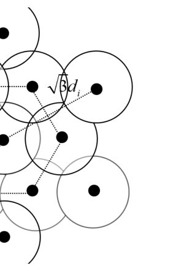
<figcaption class="paper-figure-caption"><b>Fig 1.</b> Fig. 1 Schematic representation of impurity-induced correlations between displaced Landau orbitals. Zenithal view of the impurity plane and the two-dimensional electron system (2DES). The correlated guiding-center basic displacement, (ξ), couples neighboring cyclotron states separated by the char- acteristic impurity spacing (di), generating coherent orbital structures within a Landau level. The impurity distribution is highlighted in black.</figcaption>
</figure>
<figure class="paper-figure-card">
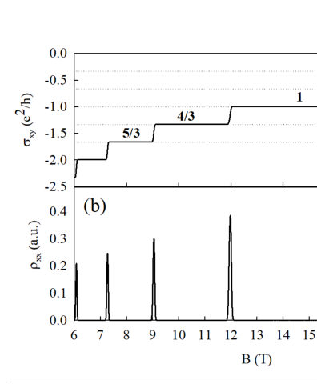
<figcaption class="paper-figure-caption"><b>Fig 2.</b> Fig. 2 Phenomenological impurity-induced fractional sublevel structure associated with the dom- inant 1/3 hierarchy. (a) Effective Hall magnetoconductivity exhibiting fractional plateau-like structures associated with the impurity-induced sublevels. (b) Corresponding longitudinal magnetore- sistivity minima obtained from the fractional energy spectrum of Eq. (40). The results illustrate how correlated orbital coherence can reorganize the effective Landau-level structure into experimentally relevant odd-denominator sequences.</figcaption>
</figure>
<figure class="paper-figure-card">
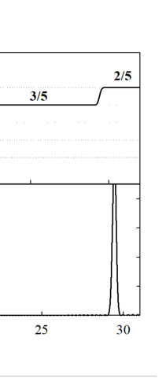
<figcaption class="paper-figure-caption"><b>Fig 3.</b> Fig. 3 Phenomenological fractional sublevel organization associated with higher-order odd- denominator states of the 1/5 family. (a) Effective Hall magnetoconductivity exhibiting fractional plateau-like structures associated with the impurity-induced sublevels. (b) Corresponding longitudi- nal magnetoresistivity minima obtained from the fractional energy spectrum of Eq. (40). The results illustrate how correlated orbital coherence can reorganize the effective Landau-level structure into experimentally relevant odd-denominator sequences.</figcaption>
</figure>

**Summary.** This paper proposes that impurity-induced geometric correlations within Landau levels can stabilize and organize the energy spectrum of Fractional Quantum Hall Effect states. By modeling the system as coupled displaced orbitals, it derives an effective correlation energy dependent on disorder geometry. This framework suggests that orbital coherence plays a key role in generating fractional spectral features without requiring full topological many-body theory.

**Why it may be interesting.** It offers a concrete, geometrically motivated mechanism to explain spectral features (like fractional plateaus) in FQH systems using disorder parameters, providing a complementary view to purely interaction-driven theories.

Detailed structure

**Main problem.** To propose a complementary phenomenological framework for understanding fractional quantum Hall effect (FQHE) states by attributing their organization and stability partly to impurity-induced geometric correlations within a Landau level, rather than solely relying on strongly correlated many-body descriptions.

**Main result.** The model shows that impurity correlations can reorganize the effective Landau-level structure, reproducing odd-denominator fractional sequences through guiding-center quantization and orbital coherence. This suggests geometry provides an additional contribution to FQH stability.

**Method.** The analysis constructs an effective correlated orbital basis using displaced Landau orbitals and calculates energy splittings based on nearest-neighbor couplings induced by the impurity potential.

**Model / system.** The system is a 2DEG coupled to a correlated distribution of ionized impurities. The model uses a Hamiltonian approach, treating the interaction via coupling terms derived from overlapping displaced Landau orbitals.

**Key observables.** Effective fractional sublevel structure, shot-noise suppression factor (Fq ~ 1/q), and activated transport gaps ($\Delta E_{p/q}$).

**Important parameters / regimes.** Magnetic length ($\ell_B$), impurity spacing ($d_i$), and the separation between the electron gas and impurities ($\Delta$).

**Assumptions / limitations.** The model is explicitly phenomenological, does not derive topological order or anyonic statistics, and approximates interactions by retaining only nearest-neighbor couplings.

**Figures summary.** Figures illustrate the schematic representation of impurity-induced correlations between displaced Landau orbitals and show fractional sublevel organization for 1/3 and 1/5 hierarchies via magnetoconductivity plateaus.

**Paper structure.** The paper develops a geometric model by analyzing the coupling between displaced Landau orbitals, deriving an effective correlation energy ($\gamma$), and mapping this structure onto observable quantities like transport gaps and fractional plateau patterns.

Abstract

The fractional quantum Hall effect (FQHE) is conventionally understood in terms of strongly correlated many-body states and emergent quasiparticles with fractional charge. Here, we propose a complementary phenomenological framework in which impurity-induced geometric correlations within a Landau level contribute to the organization and stability of fractional quantum Hall states. The model considers a two-dimensional electron gas coupled to a correlated distribution of ionized impurities located at a finite distance from the electronic layer. Impurity-induced overlap between displaced Landau orbitals generates coherent guiding-center correlations and an effective splitting of the Landau-level degeneracy into fractional sublevels. Within this framework, the resulting energy spectrum reproduces the principal odd-denominator fractional sequences through the interplay between guiding-center quantization and impurity-induced orbital coherence. An explicit expression for the correlation energy is obtained in terms of the magnetic length, impurity spacing, and impurity-layer separation, providing a direct connection between the proposed mechanism and experimentally controllable heterostructure parameters. The model naturally incorporates the integer quantum Hall regime as the limiting case of vanishing correlation-induced splitting. Within this geometric picture, effective fractional factors emerge from collective orbital coherence and correlation-modified guiding-center dynamics rather than being uniquely associated with independent fractionally charged quasiparticles. Although the model does not attempt to derive topological order, anyonic statistics, or many-body incompressibility, it suggests that impurity-induced geometry and guiding-center coherence may provide an additional contribution to the emergence, stability, and experimental visibility of fractional quantum Hall states.

[↑ back to top](#top)
