
# arxiv digest (quant-ph + cond-mat) — 2026-07-29

*185 papers · 59 relevant · 1 highlighted*

## 🔥 Most relevant (59)

*Every paper with at least one nonzero topic score, sorted by best-matching score. 🔥 marks scores ≥4/5. Click the title to jump to the full entry below; click [arXiv] to open the paper page. `(secondary)` marks papers from de-prioritized cond-mat archives.*

Show 59 relevant papers

- [Comment on "Observation of Kardar--Parisi--Zhang universal scaling in two dimensions"](#paper-2607.24152) [[arXiv]](http://arxiv.org/abs/2607.24152v1) — 🔥 `non-equilibrium universality` **5/5** · 🔥 `analog quantum simulation` **4/5** · 🔥 `non-equilibrium dynamics` **4/5** · `correlated cavity matter` **3/5** · `driven-dissipative phase transition` **3/5** · `quantum optics experiment` **3/5** · `Tavis-Cummings & cavity-many-emitter` **2/5** · `methods for driven-dissipative` **2/5** · `Keldysh / 2PI / non-Gaussian methods` **1/5** · `correlated / nonlocal dissipation` **1/5** · `entanglement & information structure` **1/5** · `interference shaping light` **1/5**
- [Entanglement transitions and multifractality in monitored free-fermions with random long-range hopping](#paper-2607.23871) [[arXiv]](http://arxiv.org/abs/2607.23871v1) — 🔥 `measurement-induced transitions` **5/5** · 🔥 `entanglement & information structure` **4/5** · 🔥 `quantum measurements` **4/5** · `correlated / nonlocal dissipation` **3/5** · `driven-dissipative phase transition` **3/5** · `methods for driven-dissipative` **3/5** · `non-equilibrium universality` **3/5** · `non-equilibrium dynamics` **2/5** · `Keldysh / 2PI / non-Gaussian methods` **1/5** · `Kondo & dissipative impurity` **1/5** · `analog quantum simulation` **1/5**
- [Quantum Fisher information and imperfect detection in a monitored fermion chain](#paper-2607.24438) [[arXiv]](http://arxiv.org/abs/2607.24438v1) — 🔥 `quantum measurements` **5/5** · 🔥 `measurement-induced transitions` **4/5** · `driven-dissipative phase transition` **3/5** · `methods for driven-dissipative` **3/5** · `correlated / nonlocal dissipation` **2/5** · `entanglement & information structure` **2/5** · `non-equilibrium universality` **2/5** · `Keldysh / 2PI / non-Gaussian methods` **1/5** · `Kondo & dissipative impurity` **1/5** · `analog quantum simulation` **1/5** · `non-equilibrium dynamics` **1/5**
- [Emergent integrable dynamics in a non-integrable Rydberg-atom chain](#paper-2607.22933) [[arXiv]](http://arxiv.org/abs/2607.22933v1) — 🔥 `Rydberg arrays` **5/5** · 🔥 `analog quantum simulation` **4/5** · `entanglement & information structure` **3/5** · `methods for driven-dissipative` **3/5** · `non-equilibrium dynamics` **3/5** · `non-equilibrium universality` **2/5** · `Frenkel-Kontorova` **1/5** · `exotic spin models in light-matter` **1/5** · `scars & prethermalization` **1/5**
- [Thermodynamics with thermodynamic variable first-passage time. I. From stochastic trajectories to nonlinear transport equations](#paper-2607.24078) [[arXiv]](http://arxiv.org/abs/2607.24078v1) — 🔥 `non-equilibrium dynamics` **5/5** · 🔥 `methods for driven-dissipative` **4/5** · 🔥 `non-equilibrium universality` **4/5** · `Keldysh / 2PI / non-Gaussian methods` **3/5** · `driven-dissipative phase transition` **3/5** · `correlated / nonlocal dissipation` **2/5** · `quantum measurements` **1/5**
- [Single-Aperture Dual-Color Ion Addressing with a DUV-Compatible Bilayer Grating](#paper-2607.23529) [[arXiv]](http://arxiv.org/abs/2607.23529v1) — 🔥 `QC/QI experiment` **5/5** · 🔥 `analog quantum simulation` **4/5** · `interference shaping light` **3/5** · `quantum optics experiment` **3/5** · `Tavis-Cummings & cavity-many-emitter` **1/5** · `correlated cavity matter` **1/5**
- [Phonon heat transport with squeezing-based symmetry breaking](#paper-2607.22990) [[arXiv]](http://arxiv.org/abs/2607.22990v1) — 🔥 `analog quantum simulation` **4/5** · 🔥 `non-equilibrium dynamics` **4/5** · `correlated / nonlocal dissipation` **3/5** · `correlated cavity matter` **3/5** · `driven-dissipative phase transition` **3/5** · `entanglement & information structure` **3/5** · `methods for driven-dissipative` **3/5** · `Keldysh / 2PI / non-Gaussian methods` **2/5** · `non-equilibrium universality` **2/5** · `quantum optics experiment` **2/5** · `Tavis-Cummings & cavity-many-emitter` **1/5** · `quantum measurements` **1/5** · `scars & prethermalization` **1/5**
- [Exceptional Cones from an Indefinite Bogoliubov Metric in Hyperbolic Polariton Condensates](#paper-2607.24456) [[arXiv]](http://arxiv.org/abs/2607.24456v1) `(secondary)` — 🔥 `analog quantum simulation` **4/5** · 🔥 `driven-dissipative phase transition` **4/5** · 🔥 `methods for driven-dissipative` **4/5** · `correlated / nonlocal dissipation` **3/5** · `correlated cavity matter` **3/5** · `non-equilibrium universality` **3/5** · `Tavis-Cummings & cavity-many-emitter` **2/5** · `non-equilibrium dynamics` **2/5** · `Keldysh / 2PI / non-Gaussian methods` **1/5** · `Kondo & dissipative impurity` **1/5** · `entanglement & information structure` **1/5**
- [Fluctuation theorems for autonomous work in the quantum regime](#paper-2607.24690) [[arXiv]](http://arxiv.org/abs/2607.24690v1) — 🔥 `non-equilibrium dynamics` **4/5** · `correlated / nonlocal dissipation` **3/5** · `methods for driven-dissipative` **3/5** · `non-equilibrium universality` **3/5** · `Keldysh / 2PI / non-Gaussian methods` **2/5** · `Tavis-Cummings & cavity-many-emitter` **2/5** · `driven-dissipative phase transition` **2/5** · `quantum measurements` **2/5** · `Dicke superradiance` **1/5** · `Rydberg arrays` **1/5** · `analog quantum simulation` **1/5** · `correlated cavity matter` **1/5** · `entanglement & information structure` **1/5** · `measurement-induced transitions` **1/5**
- [Spin-induced multipartite steady-state entanglement of motional modes in hexagonal boron nitride membranes](#paper-2607.22855) [[arXiv]](http://arxiv.org/abs/2607.22855v1) — 🔥 `analog quantum simulation` **4/5** · 🔥 `entanglement & information structure` **4/5** · `exotic spin models in light-matter` **3/5** · `methods for driven-dissipative` **3/5** · `spintronics-quantum-optics interface` **3/5** · `correlated / nonlocal dissipation` **2/5** · `driven-dissipative phase transition` **2/5** · `non-equilibrium dynamics` **2/5** · `Keldysh / 2PI / non-Gaussian methods` **1/5** · `Tavis-Cummings & cavity-many-emitter` **1/5** · `correlated cavity matter` **1/5** · `non-equilibrium universality` **1/5**
- [Full-wave nonlinear microscopy reveals guided channel for ultrafast polariton transport](#paper-2607.22860) [[arXiv]](http://arxiv.org/abs/2607.22860v1) — 🔥 `analog quantum simulation` **4/5** · 🔥 `methods for driven-dissipative` **4/5** · 🔥 `non-equilibrium dynamics` **4/5** · `correlated cavity matter` **3/5** · `driven-dissipative phase transition` **3/5** · `Tavis-Cummings & cavity-many-emitter` **2/5** · `non-equilibrium universality` **2/5** · `Keldysh / 2PI / non-Gaussian methods` **1/5** · `correlated / nonlocal dissipation` **1/5** · `entanglement & information structure` **1/5** · `interference shaping light` **1/5**
- [Dynamical control of particle jets from a driven condensate in a one-dimensional lattice with double-well potential](#paper-2607.23533) [[arXiv]](http://arxiv.org/abs/2607.23533v1) — 🔥 `analog quantum simulation` **4/5** · 🔥 `non-equilibrium dynamics` **4/5** · `driven-dissipative phase transition` **3/5** · `methods for driven-dissipative` **3/5** · `Frenkel-Kontorova` **2/5** · `Keldysh / 2PI / non-Gaussian methods` **2/5** · `non-equilibrium universality` **2/5** · `correlated / nonlocal dissipation` **1/5** · `entanglement & information structure` **1/5** · `scars & prethermalization` **1/5**
- [Quantum simulacra](#paper-2607.24739) [[arXiv]](http://arxiv.org/abs/2607.24739v1) — 🔥 `measurement-induced transitions` **4/5** · `Tavis-Cummings & cavity-many-emitter` **3/5** · `quantum measurements` **3/5** · `correlated / nonlocal dissipation` **2/5** · `driven-dissipative phase transition` **2/5** · `entanglement & information structure` **2/5** · `Dicke superradiance` **1/5** · `analog quantum simulation` **1/5** · `correlated cavity matter` **1/5** · `methods for driven-dissipative` **1/5** · `non-equilibrium dynamics` **1/5** · `non-equilibrium universality` **1/5** · `superradiant laser` **1/5**
- ⭐ [Signatures of Topological Magnon Edge States in THz Spectroscopy and Cavity Response](#paper-2607.23170) [[arXiv]](http://arxiv.org/abs/2607.23170v1) `(secondary)` — 🔥 `spintronics-quantum-optics interface` **4/5** · `analog quantum simulation` **3/5** · `driven-dissipative phase transition` **3/5** · `exotic spin models in light-matter` **3/5** · `methods for driven-dissipative` **2/5** · `non-equilibrium dynamics` **2/5** · `quantum optics experiment` **2/5** · `Keldysh / 2PI / non-Gaussian methods` **1/5** · `Tavis-Cummings & cavity-many-emitter` **1/5** · `correlated cavity matter` **1/5** · `non-equilibrium universality` **1/5**
- [Electron Shuttle Waiting Times for Electric Field Sensing](#paper-2607.24350) [[arXiv]](http://arxiv.org/abs/2607.24350v1) — 🔥 `methods for driven-dissipative` **4/5** · `Keldysh / 2PI / non-Gaussian methods` **3/5** · `driven-dissipative phase transition` **3/5** · `Kondo & dissipative impurity` **2/5** · `non-equilibrium dynamics` **2/5** · `quantum measurements` **2/5** · `analog quantum simulation` **1/5** · `correlated / nonlocal dissipation` **1/5** · `entanglement & information structure` **1/5** · `measurement-induced transitions` **1/5** · `non-equilibrium universality` **1/5**
- [Mixing times and spectra of non-equilibrium symmetric exclusion processes on general graphs](#paper-2607.22991) [[arXiv]](http://arxiv.org/abs/2607.22991v1) — 🔥 `non-equilibrium dynamics` **4/5** · `methods for driven-dissipative` **3/5** · `non-equilibrium universality` **3/5** · `Keldysh / 2PI / non-Gaussian methods` **2/5** · `correlated / nonlocal dissipation` **2/5** · `driven-dissipative phase transition` **2/5** · `Kondo & dissipative impurity` **1/5** · `analog quantum simulation` **1/5** · `entanglement & information structure` **1/5** · `exotic spin models in light-matter` **1/5** · `scars & prethermalization` **1/5**
- [Electrical control of the metal-insulator transition in a one dimensional device](#paper-2607.23138) [[arXiv]](http://arxiv.org/abs/2607.23138v1) `(secondary)` — 🔥 `Frenkel-Kontorova` **4/5** · `analog quantum simulation` **3/5** · `driven-dissipative phase transition` **3/5** · `methods for driven-dissipative` **3/5** · `non-equilibrium dynamics` **2/5** · `non-equilibrium universality` **2/5** · `Keldysh / 2PI / non-Gaussian methods` **1/5** · `Kondo & dissipative impurity` **1/5**
- [Mitigation of Measurement-Induced State Transitions via a Fast-Load and Fast-Clear Readout](#paper-2607.23681) [[arXiv]](http://arxiv.org/abs/2607.23681v1) — 🔥 `QC/QI experiment` **4/5** · 🔥 `measurement-induced transitions` **4/5** · `methods for driven-dissipative` **3/5** · `quantum measurements` **3/5** · `non-equilibrium dynamics` **2/5** · `Keldysh / 2PI / non-Gaussian methods` **1/5** · `driven-dissipative phase transition` **1/5** · `quantum optics experiment` **1/5**
- [Thermodynamics with thermodynamic variable first-passage time. II. Dynamics of explosive boiling of superheated liquid, critical indices, fractional calculus](#paper-2607.24094) [[arXiv]](http://arxiv.org/abs/2607.24094v1) — 🔥 `non-equilibrium universality` **4/5** · `correlated / nonlocal dissipation` **3/5** · `driven-dissipative phase transition` **3/5** · `methods for driven-dissipative` **3/5** · `non-equilibrium dynamics` **3/5** · `Keldysh / 2PI / non-Gaussian methods` **1/5** · `Kondo & dissipative impurity` **1/5** · `analog quantum simulation` **1/5**
- [Dynamical Quantum Phase Transitions in a Pseudo-Hermitian Hamiltonian: The Imbalanced-Pairing Kitaev Model](#paper-2607.23956) [[arXiv]](http://arxiv.org/abs/2607.23956v1) — 🔥 `driven-dissipative phase transition` **4/5** · 🔥 `non-equilibrium dynamics` **4/5** · `methods for driven-dissipative` **3/5** · `non-equilibrium universality` **3/5** · `Keldysh / 2PI / non-Gaussian methods` **1/5** · `Kondo & dissipative impurity` **1/5** · `analog quantum simulation` **1/5** · `correlated / nonlocal dissipation` **1/5**
- [Kinetic and Hydrodynamic Theories of Chiral Intruder Dynamics in Nonequilibrium Baths](#paper-2607.23223) [[arXiv]](http://arxiv.org/abs/2607.23223v1) — 🔥 `non-equilibrium dynamics` **4/5** · `Keldysh / 2PI / non-Gaussian methods` **3/5** · `methods for driven-dissipative` **3/5** · `non-equilibrium universality` **3/5** · `correlated / nonlocal dissipation` **2/5** · `driven-dissipative phase transition` **2/5** · `Frenkel-Kontorova` **1/5**
- [Multiconfigurational Mixed Quantum-Classical Approach for Correlated Many-Body Dynamics](#paper-2607.23414) [[arXiv]](http://arxiv.org/abs/2607.23414v1) — 🔥 `methods for driven-dissipative` **4/5** · `Keldysh / 2PI / non-Gaussian methods` **3/5** · `non-equilibrium dynamics` **3/5** · `driven-dissipative phase transition` **2/5** · `Frenkel-Kontorova` **1/5** · `analog quantum simulation` **1/5** · `correlated / nonlocal dissipation` **1/5** · `correlated cavity matter` **1/5** · `entanglement & information structure` **1/5** · `non-equilibrium universality` **1/5**
- [Non-Hermitian-enhanced quantum sensing in an optical interferometer](#paper-2607.23978) [[arXiv]](http://arxiv.org/abs/2607.23978v1) — 🔥 `quantum optics experiment` **4/5** · `interference shaping light` **3/5** · `quantum measurements` **3/5** · `correlated / nonlocal dissipation` **2/5** · `driven-dissipative phase transition` **2/5** · `Kondo & dissipative impurity` **1/5** · `QC/QI experiment` **1/5** · `methods for driven-dissipative` **1/5** · `non-equilibrium dynamics` **1/5**
- [Floquet time-convolutionless master equation for non-Markovian driven quantum systems](#paper-2607.24406) [[arXiv]](http://arxiv.org/abs/2607.24406v1) — 🔥 `methods for driven-dissipative` **4/5** · 🔥 `non-equilibrium dynamics` **4/5** · `driven-dissipative phase transition` **3/5** · `correlated / nonlocal dissipation` **2/5** · `non-equilibrium universality` **2/5** · `Keldysh / 2PI / non-Gaussian methods` **1/5** · `analog quantum simulation` **1/5**
- [Non-Reciprocal yet Equilibrium Critical Dynamics](#paper-2607.24252) [[arXiv]](http://arxiv.org/abs/2607.24252v1) — 🔥 `non-equilibrium universality` **4/5** · `Keldysh / 2PI / non-Gaussian methods` **3/5** · `driven-dissipative phase transition` **3/5** · `methods for driven-dissipative` **2/5** · `non-equilibrium dynamics` **2/5** · `analog quantum simulation` **1/5** · `correlated / nonlocal dissipation` **1/5** · `correlated cavity matter` **1/5**
- [Control of morphology and topology in a lattice model of branching morphogenesis](#paper-2607.24619) [[arXiv]](http://arxiv.org/abs/2607.24619v1) — 🔥 `non-equilibrium dynamics` **4/5** · `driven-dissipative phase transition` **3/5** · `methods for driven-dissipative` **3/5** · `non-equilibrium universality` **3/5** · `Frenkel-Kontorova` **1/5** · `Keldysh / 2PI / non-Gaussian methods` **1/5** · `correlated / nonlocal dissipation` **1/5**
- [QuantumFCS.jl: Efficient Full-Counting Statistics for Open Quantum Systems](#paper-2607.24429) [[arXiv]](http://arxiv.org/abs/2607.24429v1) — 🔥 `methods for driven-dissipative` **4/5** · `Keldysh / 2PI / non-Gaussian methods` **3/5** · `correlated / nonlocal dissipation` **2/5** · `driven-dissipative phase transition` **2/5** · `non-equilibrium dynamics` **2/5** · `Tavis-Cummings & cavity-many-emitter` **1/5** · `correlated cavity matter` **1/5** · `non-equilibrium universality` **1/5**
- [Stochastic Counterdiabatic Driving via Biorthogonal Liouvillian Eigenmodes](#paper-2607.24393) [[arXiv]](http://arxiv.org/abs/2607.24393v1) — 🔥 `non-equilibrium dynamics` **4/5** · `driven-dissipative phase transition` **3/5** · `methods for driven-dissipative` **3/5** · `non-equilibrium universality` **2/5** · `Frenkel-Kontorova` **1/5** · `Keldysh / 2PI / non-Gaussian methods` **1/5** · `correlated / nonlocal dissipation` **1/5** · `entanglement & information structure` **1/5**
- [A Bogoliubov-ratio framework for quantum-information diagnostics of time-dependent two-mode Boson Hamiltonian](#paper-2607.24404) [[arXiv]](http://arxiv.org/abs/2607.24404v1) — 🔥 `entanglement & information structure` **4/5** · `methods for driven-dissipative` **3/5** · `driven-dissipative phase transition` **2/5** · `non-equilibrium dynamics` **2/5** · `Keldysh / 2PI / non-Gaussian methods` **1/5** · `analog quantum simulation` **1/5** · `correlated / nonlocal dissipation` **1/5** · `non-equilibrium universality` **1/5**
- [Chiral Dynamics of an Intruder across Dilute and Hydrodynamic Regimes](#paper-2607.23221) [[arXiv]](http://arxiv.org/abs/2607.23221v1) — 🔥 `non-equilibrium dynamics` **4/5** · `methods for driven-dissipative` **3/5** · `non-equilibrium universality` **3/5** · `driven-dissipative phase transition` **2/5** · `Frenkel-Kontorova` **1/5** · `Keldysh / 2PI / non-Gaussian methods` **1/5** · `correlated / nonlocal dissipation` **1/5**
- [Krylov complexity and spectral density of BMN matrix model](#paper-2607.24632) [[arXiv]](http://arxiv.org/abs/2607.24632v1) — 🔥 `entanglement & information structure` **4/5** · `non-equilibrium dynamics` **3/5** · `non-equilibrium universality` **2/5** · `scars & prethermalization` **2/5** · `Keldysh / 2PI / non-Gaussian methods` **1/5** · `analog quantum simulation` **1/5** · `driven-dissipative phase transition` **1/5** · `methods for driven-dissipative` **1/5**
- [Machine Learning of Quantum Entanglement from Noisy Measurements](#paper-2607.22853) [[arXiv]](http://arxiv.org/abs/2607.22853v1) — 🔥 `entanglement & information structure` **4/5** · `quantum measurements` **3/5** · `quantum optics experiment` **3/5** · `QC/QI experiment` **2/5** · `correlated / nonlocal dissipation` **1/5** · `measurement-induced transitions` **1/5** · `methods for driven-dissipative` **1/5**
- [Magnetic-texture winding controls fermion-parity switches in an interacting $p$-wave magnet wire](#paper-2607.24038) [[arXiv]](http://arxiv.org/abs/2607.24038v1) — 🔥 `analog quantum simulation` **4/5** · `exotic spin models in light-matter` **3/5** · `spintronics-quantum-optics interface` **3/5** · `entanglement & information structure` **2/5** · `Kondo & dissipative impurity` **1/5** · `methods for driven-dissipative` **1/5** · `non-equilibrium dynamics` **1/5**
- [Permutationally Invariant Quantum State Tomography for Fermions](#paper-2607.23579) [[arXiv]](http://arxiv.org/abs/2607.23579v1) — 🔥 `analog quantum simulation` **4/5** · `quantum measurements` **3/5** · `entanglement & information structure` **2/5** · `measurement-induced transitions` **2/5** · `correlated / nonlocal dissipation` **1/5** · `driven-dissipative phase transition` **1/5** · `methods for driven-dissipative` **1/5** · `non-equilibrium dynamics` **1/5**
- [Skew scattering induced contribution to orbital Hall response](#paper-2607.24671) [[arXiv]](http://arxiv.org/abs/2607.24671v1) `(secondary)` — 🔥 `Keldysh / 2PI / non-Gaussian methods` **4/5** · `methods for driven-dissipative` **3/5** · `non-equilibrium dynamics` **3/5** · `non-equilibrium universality` **2/5** · `analog quantum simulation` **1/5** · `correlated / nonlocal dissipation` **1/5** · `driven-dissipative phase transition` **1/5**
- [Coincidence free certification and quantification of spatial entanglement with stimulated parametric down conversion](#paper-2607.24718) [[arXiv]](http://arxiv.org/abs/2607.24718v1) — 🔥 `quantum optics experiment` **4/5** · `quantum measurements` **3/5** · `entanglement & information structure` **2/5** · `measurement-induced transitions` **2/5** · `QC/QI experiment` **1/5** · `driven-dissipative phase transition` **1/5** · `interference shaping light` **1/5**
- [Position measurement of a levitated particle with vectorial light](#paper-2607.23833) [[arXiv]](http://arxiv.org/abs/2607.23833v1) — 🔥 `quantum measurements` **4/5** · `interference shaping light` **3/5** · `measurement-induced transitions` **3/5** · `Keldysh / 2PI / non-Gaussian methods` **2/5** · `methods for driven-dissipative` **1/5** · `non-equilibrium dynamics` **1/5**
- [Current cross-correlations as probes for poor man's Majorana states](#paper-2607.23498) [[arXiv]](http://arxiv.org/abs/2607.23498v1) — 🔥 `Keldysh / 2PI / non-Gaussian methods` **4/5** · `methods for driven-dissipative` **3/5** · `driven-dissipative phase transition` **2/5** · `Kondo & dissipative impurity` **1/5** · `analog quantum simulation` **1/5** · `exotic spin models in light-matter` **1/5** · `non-equilibrium dynamics` **1/5**
- [Pound-Drever-Hall Feedforward for Trapped-Ion Optical Qubits](#paper-2607.24050) [[arXiv]](http://arxiv.org/abs/2607.24050v1) — 🔥 `QC/QI experiment` **4/5** · `quantum measurements` **3/5** · `interference shaping light` **2/5** · `quantum optics experiment` **2/5** · `measurement-induced transitions` **1/5** · `methods for driven-dissipative` **1/5**
- [Testing edge chirality with a three-path fractional quantum Hall interferometer](#paper-2607.24451) [[arXiv]](http://arxiv.org/abs/2607.24451v1) — 🔥 `Keldysh / 2PI / non-Gaussian methods` **4/5** · `methods for driven-dissipative` **3/5** · `non-equilibrium dynamics` **2/5** · `analog quantum simulation` **1/5** · `driven-dissipative phase transition` **1/5** · `interference shaping light` **1/5** · `non-equilibrium universality` **1/5**
- [Two-copy nondistillability of Werner states: sharp partial-trace inequalities and finite-copy extensions](#paper-2607.24479) [[arXiv]](http://arxiv.org/abs/2607.24479v1) — 🔥 `entanglement & information structure` **4/5** · `Keldysh / 2PI / non-Gaussian methods` **2/5** · `methods for driven-dissipative` **2/5** · `analog quantum simulation` **1/5** · `correlated / nonlocal dissipation` **1/5** · `correlated cavity matter` **1/5** · `driven-dissipative phase transition` **1/5** · `non-equilibrium dynamics` **1/5**
- [Engineering two-body interaction for the Moore-Read State](#paper-2607.23695) [[arXiv]](http://arxiv.org/abs/2607.23695v1) — 🔥 `analog quantum simulation` **4/5** · `entanglement & information structure` **3/5** · `exotic spin models in light-matter` **3/5** · `correlated cavity matter` **1/5** · `non-equilibrium dynamics` **1/5**
- [Freezing Swampland: A Krylov Complexity Criterion for the Weak Gravity Conjecture](#paper-2607.23747) [[arXiv]](http://arxiv.org/abs/2607.23747v1) — 🔥 `entanglement & information structure` **4/5** · `non-equilibrium dynamics` **2/5** · `non-equilibrium universality` **2/5** · `Keldysh / 2PI / non-Gaussian methods` **1/5** · `correlated / nonlocal dissipation` **1/5** · `driven-dissipative phase transition` **1/5** · `methods for driven-dissipative` **1/5**
- [Quantum fluctuation-driven transport crossover between two liquid states in distinguishable helium-4](#paper-2607.23127) [[arXiv]](http://arxiv.org/abs/2607.23127v1) — 🔥 `non-equilibrium dynamics` **4/5** · `non-equilibrium universality` **3/5** · `driven-dissipative phase transition` **2/5** · `Frenkel-Kontorova` **1/5** · `Keldysh / 2PI / non-Gaussian methods` **1/5** · `methods for driven-dissipative` **1/5**
- [A Slice-Rank Drift Bound for Random Quantum \(k\)-SAT](#paper-2607.23847) [[arXiv]](http://arxiv.org/abs/2607.23847v1) — 🔥 `analog quantum simulation` **4/5** · `entanglement & information structure` **2/5** · `Keldysh / 2PI / non-Gaussian methods` **1/5** · `correlated / nonlocal dissipation` **1/5** · `driven-dissipative phase transition` **1/5** · `methods for driven-dissipative` **1/5**
- [Coherence as a resource for $N$-box and quantum pigeonhole paradoxes](#paper-2607.24282) [[arXiv]](http://arxiv.org/abs/2607.24282v1) — 🔥 `quantum measurements` **4/5** · `measurement-induced transitions` **3/5** · `Keldysh / 2PI / non-Gaussian methods` **1/5** · `driven-dissipative phase transition` **1/5** · `entanglement & information structure` **1/5**
- [Effect of classical noises on the coherent population trapping based on the Green's function approach to the multiplicative stochastic processes](#paper-2607.23630) [[arXiv]](http://arxiv.org/abs/2607.23630v1) — 🔥 `Keldysh / 2PI / non-Gaussian methods` **4/5** · `methods for driven-dissipative` **3/5** · `correlated / nonlocal dissipation` **1/5** · `driven-dissipative phase transition` **1/5** · `interference shaping light` **1/5**
- [Experimental Protocol Fingerprinting in Quantum Networks via Physical Layer Side Channel Analysis](#paper-2607.24624) [[arXiv]](http://arxiv.org/abs/2607.24624v1) — 🔥 `QC/QI experiment` **4/5** · `quantum optics experiment` **3/5** · `entanglement & information structure` **1/5** · `quantum measurements` **1/5**
- [Highly integrated quantum key distribution transmitter enabled by silicon photonics](#paper-2607.23413) [[arXiv]](http://arxiv.org/abs/2607.23413v1) — 🔥 `QC/QI experiment` **4/5** · `quantum optics experiment` **3/5** · `interference shaping light` **1/5** · `quantum measurements` **1/5**
- [Protocols of coherent motion control for an interaction-driven Rydberg gate](#paper-2607.23090) [[arXiv]](http://arxiv.org/abs/2607.23090v1) — 🔥 `Rydberg arrays` **4/5** · `analog quantum simulation` **1/5** · `correlated cavity matter` **1/5** · `entanglement & information structure` **1/5** · `non-equilibrium dynamics` **1/5**
- [Quantum-Level Crosstalk Characterization of a 16x16 MEMS Optical Switch for Dynamic Quantum Communications](#paper-2607.24299) [[arXiv]](http://arxiv.org/abs/2607.24299v1) — 🔥 `QC/QI experiment` **4/5** · `quantum optics experiment` **3/5** · `quantum measurements` **1/5**
- [New class of exactly flat topological bands - compact localised states protected by local graph topology](#paper-2607.22831) [[arXiv]](http://arxiv.org/abs/2607.22831v1) — 🔥 `analog quantum simulation` **4/5** · `correlated cavity matter` **1/5** · `entanglement & information structure` **1/5** · `non-equilibrium dynamics` **1/5**
- [Quantum entanglement within quarkonium](#paper-2607.24068) [[arXiv]](http://arxiv.org/abs/2607.24068v1) — 🔥 `entanglement & information structure` **4/5** · `Keldysh / 2PI / non-Gaussian methods` **1/5** · `methods for driven-dissipative` **1/5** · `non-equilibrium dynamics` **1/5**
- [A partial-trace matrix inequality and Werner-state distillability](#paper-2607.23416) [[arXiv]](http://arxiv.org/abs/2607.23416v1) — 🔥 `entanglement & information structure` **4/5** · `Keldysh / 2PI / non-Gaussian methods` **1/5** · `correlated / nonlocal dissipation` **1/5**
- [Generalized Mermin Inequalities for Benchmarking Large-Scale GHZ States](#paper-2607.23574) [[arXiv]](http://arxiv.org/abs/2607.23574v1) — 🔥 `QC/QI experiment` **4/5** · `entanglement & information structure` **1/5** · `quantum measurements` **1/5**
- [Neural Network Learning of One-Bit Protocols for Qubit Measurement Simulation](#paper-2607.23645) [[arXiv]](http://arxiv.org/abs/2607.23645v1) — 🔥 `quantum measurements` **4/5** · `measurement-induced transitions` **1/5** · `methods for driven-dissipative` **1/5**
- [Systematic Experiment Tracking in Quantum Software: A Case Study of Reservoir Computing with Error Mitigation](#paper-2607.24264) [[arXiv]](http://arxiv.org/abs/2607.24264v1) — 🔥 `QC/QI experiment` **4/5** · `methods for driven-dissipative` **1/5** · `quantum measurements` **1/5**
- [Irreducible Architectures of Multipartite Entanglement](#paper-2607.23112) [[arXiv]](http://arxiv.org/abs/2607.23112v1) — 🔥 `entanglement & information structure` **4/5**
- [Quantum Separability in Polynomial Time](#paper-2607.23773) [[arXiv]](http://arxiv.org/abs/2607.23773v1) — 🔥 `entanglement & information structure` **4/5**

## ⭐ Highlighted (1)

*Papers by authors on your watch list. Click the title to jump to the full entry below; click [arXiv] to open the paper page.*

Show 1 highlighted papers

- ⭐ [Signatures of Topological Magnon Edge States in THz Spectroscopy and Cavity Response](#paper-2607.23170) [[arXiv]](http://arxiv.org/abs/2607.23170v1) `(secondary)` — Johannes Knolle

## All papers (154, sorted by relevance)

*Papers from quant-ph and your primary cond-mat archives (quant-gas, stat-mech, str-el, dis-nn). Highlighted papers (⭐) come first, then everything else sorted by topic-relevance score, highest first.*

### [Comment on "Observation of Kardar--Parisi--Zhang universal scaling in two dimensions"](http://arxiv.org/abs/2607.24152v1)

**Authors:** J. Bloch, M. Escalera, Q. Fontaine, F. Helluin, A. Minguzzi, L. Canet, S. Ravets  
**Type:** experiment · **Category:** other · **PDF:** <https://arxiv.org/pdf/2607.24152v1>  
**Analysis basis:** full PDF text, analyzed in chunks
**Topic relevance:** 🔥 `non-equilibrium universality` **5/5** · 🔥 `analog quantum simulation` **4/5** · 🔥 `non-equilibrium dynamics` **4/5** · `correlated cavity matter` **3/5** · `driven-dissipative phase transition` **3/5** · `quantum optics experiment` **3/5** · `Tavis-Cummings & cavity-many-emitter` **2/5** · `methods for driven-dissipative` **2/5** · `Keldysh / 2PI / non-Gaussian methods` **1/5** · `correlated / nonlocal dissipation` **1/5** · `entanglement & information structure` **1/5** · `interference shaping light` **1/5**

📷 Fig 1

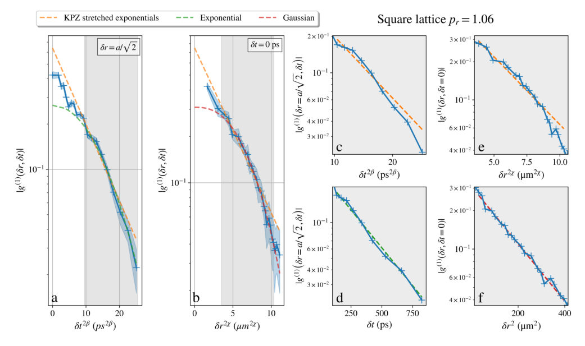 
FIG. 1. Experimental data for the first-order correlation used in Fig. 2C and Fig. 3A of Ref. [1], obtained on a square lattice and for pr = 1.06. a Semi-logarithmical plot of the measured |g1(|δr| = a/ √

📷 Fig 2

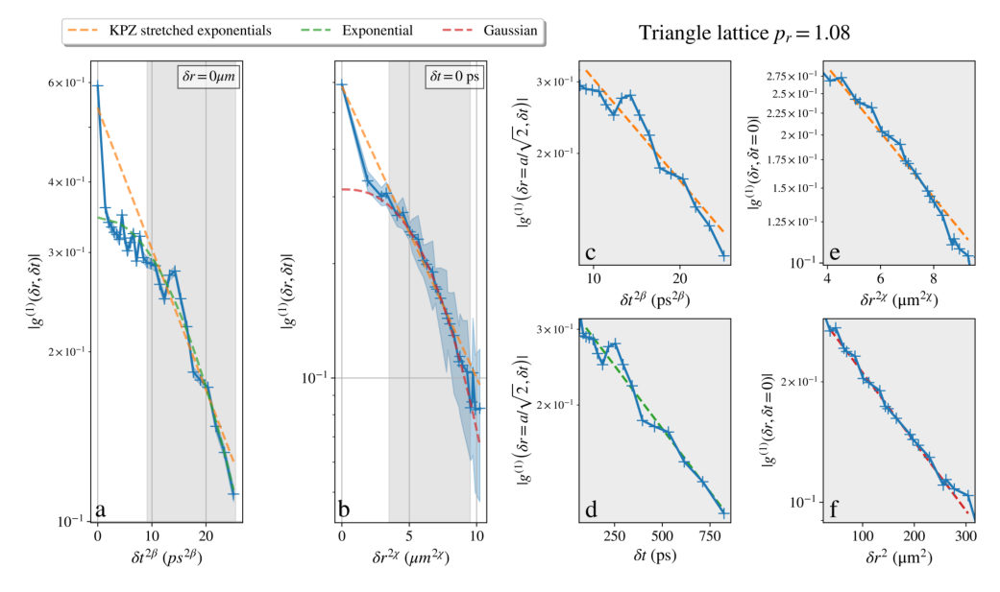 
FIG. 2. Experimental data for the first-order correlation used in Fig. 3b of Ref. [1], obtained on a triangular lattice and for pr = 1.07. a Semi-logarithmical plot of the measured |g1(|δr| = a/ √

📷 Fig 3

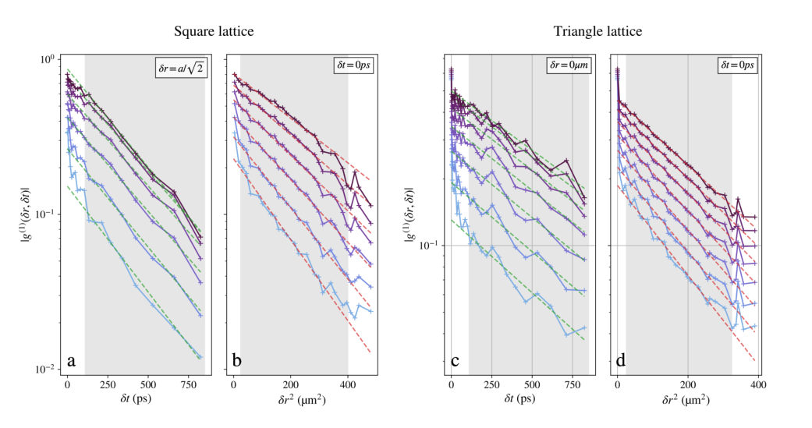 
FIG. 3. Experimental data for the first-order correlation used in Fig. 2C and Fig. 3 of Ref. [1]. a and b: data for the square lattice and for pumping rates pr = {1.042, 1.061, 1.079, 1.094, 1.11, 1.12} (from light blue to dark violet) as a function of a δt for δr = a/ √

📷 Fig 4

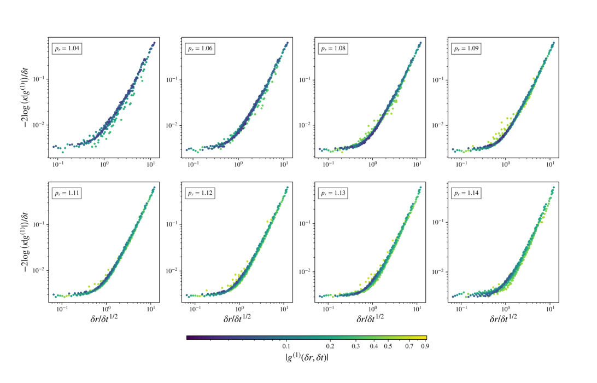 
FIG. 4. Data collapse of the full space-time map of the first-order correlation function measured on the square lattice using β = 0.5 and χ = 1 and for increasing pumping rates from top left to bottom right. The colorscale indicates coherence, from yellow (high coherence) to blue (low coherence).

📷 Fig 5

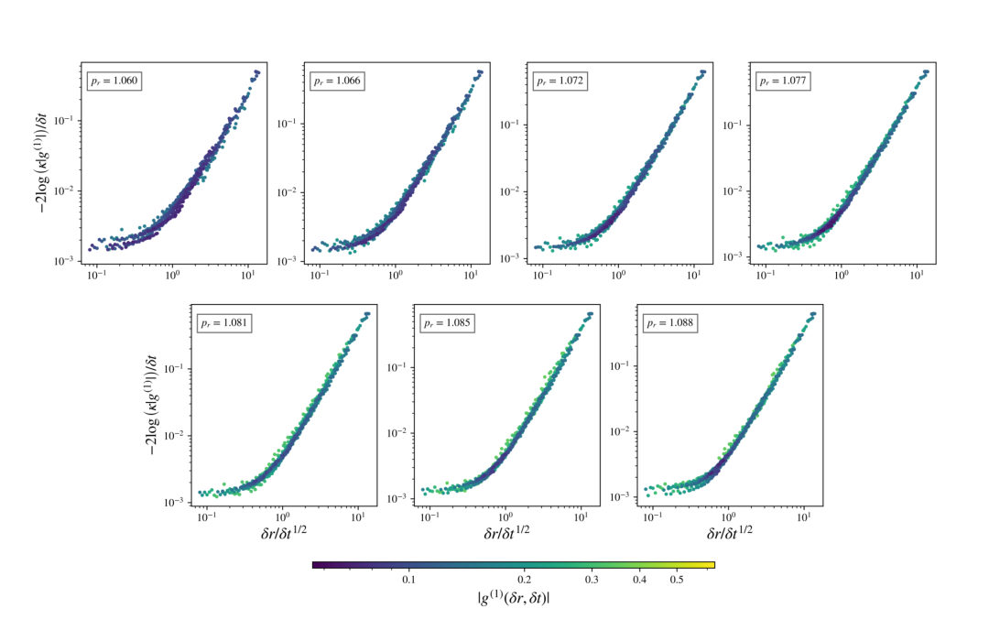 
FIG. 5. Data collapse of the full space-time map of the first-order correlation function measured on the triangular lattice using β = 0.5 and χ = 1 and for increasing pumping rates from top left to bottom right. The colorscale indicates coherence, from yellow (high coherence) to blue (low coherence).

**Summary.** The paper critically re-examines claims of KPZ universal scaling observed in the coherence decay of a 2D polariton condensate. By re-analyzing the interferometry data, the authors argue that the apparent KPZ collapse is due to improper data normalization. They conclude that the decay is more accurately modeled by a simple exponential time decay and Gaussian spatial decay.

**Why it may be interesting.** This is highly relevant as it deals with non-equilibrium dynamics and universal scaling in interacting quantum systems (polaritons), directly challenging established theoretical interpretations of experimental data in AMO/Quantum Optics.

Detailed structure

**Main problem.** The paper challenges a claim of Kardar–Parisi–Zhang (KPZ) universal scaling observed in the spatio-temporal coherence decay of a 2D polariton condensate.

**Main result.** Re-analysis shows that the data collapse is better described by an exponential decay in time and Gaussian decay in space, suggesting the original KPZ claim was an artifact of incorrect data normalization.

**Method.** The authors re-analyzed interferometry experimental data on both square and triangular lattices, comparing fits to KPZ scaling theory against a simple exponential-Gaussian model using data collapse techniques.

**Model / system.** The physical system is a two-dimensional polariton condensate generated in an array of coupled resonators. The analysis focuses on the decay of the first-order correlation function, g(1)(delta r, delta t).

**Key observables.** First-order coherence function, |g(1)|, measured as a function of spatial separation (delta r) and time delay (delta t).

**Important parameters / regimes.** Excitation power, lattice geometry (square/triangular), and the exponents used in scaling laws (e.g., beta=0.5, chi=1 vs. KPZ values).

**Assumptions / limitations.** The analysis assumes that proper normalization ($\kappa$) is crucial for correctly identifying the underlying physical decay mechanism.

**Figures summary.** Figures compare data fits on square and triangular lattices, showing systematic agreement with exponential-Gaussian models while demonstrating how incorrect normalization can force a misleading collapse onto KPZ scaling functions.

**Paper structure.** The paper follows a structure of critique: first, identifying the claim in prior work; second, re-analyzing the raw data using multiple fitting frameworks (KPZ vs. Exponential-Gaussian); and finally, quantitatively demonstrating that the simpler model provides a superior fit across all tested regimes.

Abstract

In their paper published in Science 392, 221 (2026), Widmann and collaborators reported interferometry experiments to explore the emission coherence decay of a two-dimensional polariton condensate generated in an array of coupled resonators. The authors claim evidence of Kardar--Parisi--Zhang (KPZ) universal scaling in the measured spatio-temporal coherence decay. We argue in the following that the data were not properly analyzed. We re-analyze the experimental data acquired both with the square and the triangular lattices for various values of the excitation power. Instead of stretched exponential decays, in the space (time) windows considered in the paper we find that the measured $|g^{(1)}(δ{\bf r}, δt)|$ at $δt=0$ ($|δ{\bf r}| $ close to $0$) rather show Gaussian (exponential) decay for all excitation powers. As a result, using as temporal and spatial exponents $β=0.5$ and $χ=1$, the data for all pump powers are found to collapse onto a single curve, which is not the KPZ scaling function. In particular, we show that the data collapse onto the KPZ scaling function presented in the paper is an artifact stemming from incorrect data normalization. We thus conclude that the main claim of the paper is not justified as the spatio-temporal decays of the coherence over the space-time windows analyzed in the paper are not well described by the KPZ universal behavior.

[↑ back to top](#top)

### [Entanglement transitions and multifractality in monitored free-fermions with random long-range hopping](http://arxiv.org/abs/2607.23871v1)

**Authors:** Bo Fan, Antonio M. García-García  
**Type:** theory · **Category:** statistical mechanics · **PDF:** <https://arxiv.org/pdf/2607.23871v1>  
**Analysis basis:** full PDF text, analyzed in chunks
**Topic relevance:** 🔥 `measurement-induced transitions` **5/5** · 🔥 `entanglement & information structure` **4/5** · 🔥 `quantum measurements` **4/5** · `correlated / nonlocal dissipation` **3/5** · `driven-dissipative phase transition` **3/5** · `methods for driven-dissipative` **3/5** · `non-equilibrium universality` **3/5** · `non-equilibrium dynamics` **2/5** · `Keldysh / 2PI / non-Gaussian methods` **1/5** · `Kondo & dissipative impurity` **1/5** · `analog quantum simulation` **1/5**

📷 Fig 1

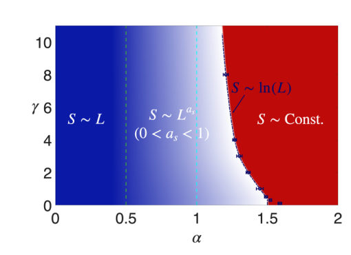 
Figure 1. Phase diagram showing the scaling of the steady-state entanglement entropy S with system size L, as a function of the power-law hopping exponent α and the monitoring strength γ. For α ≲1, the EE exhibits sub-volume-law scaling, S ∝Las with 0 &lt; as &lt; 1 for any γ, and tends towards as →1, volume law, for α ≲1/2. For α &gt; 3/2, the system is in the area-law phase, as = 0 for any finite monitoring strength γ &gt; 0, while in the region 1 &lt; α ≲3/2, it experiences a line of MIPT (navy dash-dotted line) between sub-volume-law and area-law phases at αc(γ). At this critical point, the EE scales logarithmically, S ∝ln(L), and certain correlation functions become multifrac- tal, see Fig. 7....

📷 Fig 2

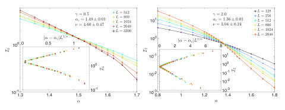 
Figure 2. The mutual information I2 Eq. (6) as a function of α for γ = 0.5 (left) and γ = 2.0 (right). The sharp crossing at α = αc indicates a MIPT, where I2 becomes scale-invariant. The insets show the optimal finite-size data collapse around αc. The esti- mated critical points are αc = 1.49±0.01 and αc = 1.36±0.01 for γ = 0.5 and 2.0, respectively. The critical exponent ν ex- hibits larger fluctuations, due to the absence of a well-defined uni- versal critical exponent in the model we are considering. Results for additional values of γ are presented in Appendix B, Fig. 12.

📷 Fig 3

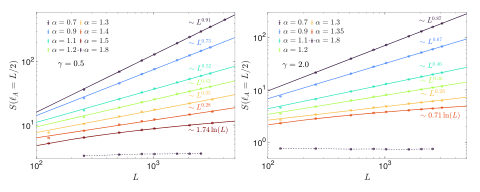 
Figure 4. Steady-state entanglement entropy S(ℓA = L/2) Eq. (5) as a function of the system size L for γ = 0.5 (left) and γ = 2.0 (right), and different power-law exponents α. Fits to a power-law growth S ∼Las(α) reveal a gradual increase of as with increasing α. For weak monitoring γ = 0.5, the system transits from as ≈1 (volume-law) for small α to a logarithmic growth α ≈3/2, and finally to an area-law phase for sufficiently large α (α = 1.8). The difference between weak and strong monitoring is that both the logarithmic growth, and the area-law phase occur at a slightly smaller α. These results are consistent with the mutual information analysis depicted in Fig. 2.

📷 Fig 4

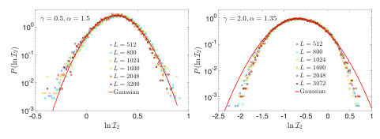 
Figure 3. The probability distribution of the mutual information ln I2 Eq. (6) for different system size L around the MIPT. Left: γ = 0.5, αc = 1.5. Right: αc = 1.35, γ = 2.0. The distribution P(ln I2) is size independent, consistent with the scale invariance of I2 at the transition. The tails of P(ln I2) deviate from a Gaus- sian form, especially in the strong measurement limit γ = 2.

📷 Fig 5

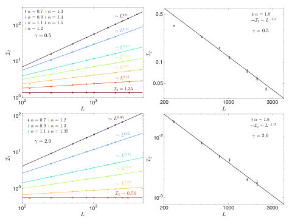 
Figure 5. Scaling of the mutual information I2 with system size L for γ = 0.5 (Upper panel) and γ = 2.0 (Lower panel), and different values of α. For sufficiently small α, I2 ∼Lap with 0 &lt; ap ≤1. At the MIPT α = αc, I2 is scale-invariant, and I2 decays as a power-law in the area-law phase. These results are consistent with the αc obtained in Fig. 2 using the MI and also with those for the EE in Fig. 4.

**Summary.** The research analyzes entanglement dynamics in monitored free fermions with random long-range hopping. It maps out distinct phases based on the hopping decay exponent $\alpha$, identifying a Measurement-Induced Phase Transition (MIPT) at critical points. These transitions are characterized by unique scaling behaviors of entanglement entropy and multifractal properties.

**Why it may be interesting.** This work provides concrete examples of non-equilibrium phase transitions (MIPTs) driven by measurement backaction in interacting/disordered quantum systems, which is highly relevant to open quantum system dynamics.

Detailed structure

**Main problem.** The study investigates entanglement dynamics and identifies measurement-induced phase transitions (MIPTs) in a system of monitored free fermions with random long-range hopping.

**Main result.** The paper establishes distinct scaling regimes for the entanglement entropy based on the hopping decay exponent $\alpha$, revealing an $\alpha$-dependent MIPT where correlation functions exhibit multifractal features at criticality.

**Method.** The analysis employs numerical simulations using the Quantum State Diffusion (QSD) protocol, calculating entanglement entropy and mutual information across different disorder realizations.

**Model / system.** The system is a one-dimensional chain of non-interacting complex fermions described by a Hamiltonian with random power-law hopping $t_{ij} \propto |i-j|^{-2\alpha}$. The dynamics are governed by continuous monitoring via the QSD protocol.

**Key observables.** Entanglement Entropy (EE), Mutual Information ($I_2$), and the density-density correlation function, analyzed for their scaling with system size $L$.

**Important parameters / regimes.** The decay exponent $\alpha$ of the hopping terms, and the measurement strength $\gamma$ (monitoring strength).

**Assumptions / limitations.** The QSD protocol is used to model the monitoring process, which preserves the Gaussian nature of fermionic states.

**Figures summary.** Figures summarize the phase diagram showing EE scaling vs. $\alpha$ and $\gamma$, and illustrate $I_2$ crossings and power-law decays of correlation functions across different regimes.

**Paper structure.** The paper systematically analyzes how entanglement measures (EE, MI) change as a function of the hopping exponent $\alpha$ and monitoring strength $\gamma$, identifying critical points where scaling laws transition between area-law, sub-volume-law, and logarithmic behavior.

Abstract

We study the entanglement dynamics of a one-dimensional chain of monitored non-interacting complex fermions with random power-law hopping characterized by a decay exponent $α$. For $α\lesssim 1$, in stark contrast with the case of hopping to nearest neighbors, the scaling of the entanglement entropy (EE) of the steady state with system size $L$ is faster than logarithmic for any monitoring or disorder strength and it tends towards a linear (volume-law) scaling for sufficiently small $α\lesssim 1/2$. For $α> 3/2$, the EE is in the area-law phase, namely, no scaling with $L$, for any monitoring strength. For $1 < α\lesssim 3/2$, we identify an $α$-dependent measurement-induced phase transition (MIPT) at a critical value of the monitoring strength separating the mentioned area-law and sub-volume-law phases. At this critical point, the EE scales logarithmically with system size, and the density-density correlation function, closely related to the EE, exhibits multifractal features. These results highlight the importance of superdiffusive classical hopping in the entanglement dynamic of quantum many-body systems and also help differentiate its role with respect to conventional sources of entanglement such as genuine quantum non-locality.

[↑ back to top](#top)

### [Quantum Fisher information and imperfect detection in a monitored fermion chain](http://arxiv.org/abs/2607.24438v1)

**Authors:** Giovanni Di Fresco, Davide Valenti, Angelo Carollo  
**Type:** theory · **Category:** statistical mechanics · **PDF:** <https://arxiv.org/pdf/2607.24438v1>  
**Analysis basis:** full PDF text, analyzed in chunks
**Topic relevance:** 🔥 `quantum measurements` **5/5** · 🔥 `measurement-induced transitions` **4/5** · `driven-dissipative phase transition` **3/5** · `methods for driven-dissipative` **3/5** · `correlated / nonlocal dissipation` **2/5** · `entanglement & information structure` **2/5** · `non-equilibrium universality` **2/5** · `Keldysh / 2PI / non-Gaussian methods` **1/5** · `Kondo & dissipative impurity` **1/5** · `analog quantum simulation` **1/5** · `non-equilibrium dynamics` **1/5**

📷 Fig 1

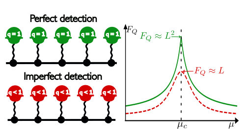 
Figure 1. Schematic illustration of the effect of imperfect detection on the Fisher-information peak near criticality. For perfect detection, q = 1, the Fisher information develops a sharp singular contribution at the critical point µc, solid green line. For imperfect detection, q &lt; 1, this singularity is rounded into a smooth crossover, red dashed line, reflecting the smoothing of the critical mode and the restoration of extensive scaling.

📷 Fig 2

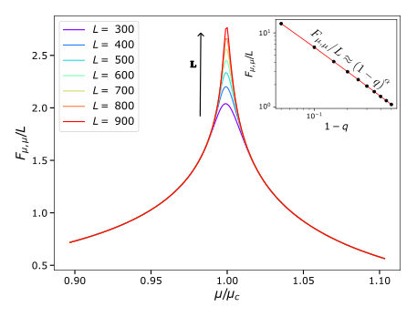 
Figure 2. The main plot shows Fµµ for q = 1 across the critical point, clearly displaying the superextensive peak at criticality. The inset shows the scaling behavior of the Fisher information away from perfect detection on a log-log scale, with a fitted exponent α = −1.095. In these simulations, γ = 1.

📷 Fig 3

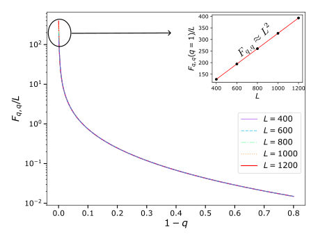 
Figure 3. The main plot shows Fqq as a function of 1 −q, clearly displaying the superextensive peak at q = 1. The inset reports the scaling behavior of Fqq/L at q = 1, revealing its L2 scaling. In these simulations, µ = 0 and γ = 0.3.

**Summary.** This paper analyzes the precision limits (QFI) for estimating parameters in a monitored fermion chain when detection is imperfect. It finds that while perfect monitoring leads to super-extensive metrological enhancement near criticality, any finite detection inefficiency smooths out this singularity, reducing the scaling back to an extensive form. This demonstrates that incomplete measurement information fundamentally degrades quantum sensing capabilities.

**Why it may be interesting.** It provides a concrete example of how measurement backaction (specifically incomplete information) fundamentally alters quantum metrological bounds in condensed matter systems, offering insights into realistic experimental limitations.

Detailed structure

**Main problem.** The study investigates how imperfect detection during continuous monitoring affects the metrological enhancement of a quantum system near criticality.

**Main result.** Imperfect detection ($q<1$) rounds the singular, super-extensive Quantum Fisher Information (QFI) seen at perfect detection ($q=1$), restoring only extensive scaling. This shows incomplete information destroys the critical metrological advantage.

**Method.** The analysis uses Gaussian dynamics characterized by the fermionic correlation matrix and calculates QFI and mean Uhlmann curvature based on these matrices.

**Model / system.** The system is a Kitaev chain undergoing continuous monitoring, conditioned on a no-click record with detector efficiency $q$. The evolution remains Gaussian, allowing characterization via the fermionic correlation matrix $\Gamma$.

**Key observables.** Quantum Fisher Information ($F_{Q}$), mean Uhlmann curvature ($U_{\alphaeta}$).

**Important parameters / regimes.** Detector efficiency ($q$), chemical potential ($\mu$), monitoring strength ($\gamma$). Key regimes are $q=1$ (perfect) vs. $q<1$ (imperfect).

**Assumptions / limitations.** The conditional dynamics remain Gaussian, which is possible because the underlying Hamiltonian and jump operators are quadratic/linear.

**Figures summary.** Figure 1 illustrates the QFI peak: a sharp singularity for perfect detection ($q=1$) versus a rounded crossover for imperfect detection ($q<1$). Figure 3 shows $F_{qq}$ scaling, confirming super-extensive behavior at $q=1$.

**Paper structure.** The paper analyzes the conditional dynamics using the correlation matrix, deriving QFI and Uhlmann curvature. It contrasts the singular critical structure found for perfect detection with the smoothed crossover observed when detector efficiency is less than one.

Abstract

We study the metrological properties of a continuously monitored Kitaev chain in the presence of imperfect detection. The system is conditioned on a no-click record, while each emitted fermion is registered only with probability $0\leq q\leq 1$. Because the conditional dynamics remains Gaussian, the steady state is fully characterized by the fermionic correlation matrix. This allows a direct evaluation of the quantum Fisher information and of the mean Uhlmann curvature. For perfect detection, the monitored steady state retains a singular critical structure and the quantum Fisher information with respect to the chemical potential becomes super-extensive. For any $q<1$, imperfect detection introduces a finite smoothing length that rounds the singularity and restores extensive scaling. The detector efficiency behaves instead as a compatible mixed-state estimation parameter, as signaled by the vanishing mean Uhlmann curvature. These results show that incomplete trajectory information destroys the metrological enhancement associated with monitored criticality through a mechanism that differs from ordinary thermal smearing.

[↑ back to top](#top)

### [Emergent integrable dynamics in a non-integrable Rydberg-atom chain](http://arxiv.org/abs/2607.22933v1)

**Authors:** Gianluca Morettini, Luca Capizzi, Leonardo Mazza, Maurizio Fagotti  
**Type:** theory · **Category:** other · **PDF:** <https://arxiv.org/pdf/2607.22933v1>  
**Analysis basis:** full PDF text, analyzed in chunks
**Topic relevance:** 🔥 `Rydberg arrays` **5/5** · 🔥 `analog quantum simulation` **4/5** · `entanglement & information structure` **3/5** · `methods for driven-dissipative` **3/5** · `non-equilibrium dynamics` **3/5** · `non-equilibrium universality` **2/5** · `Frenkel-Kontorova` **1/5** · `exotic spin models in light-matter` **1/5** · `scars & prethermalization` **1/5**

📷 Fig 1

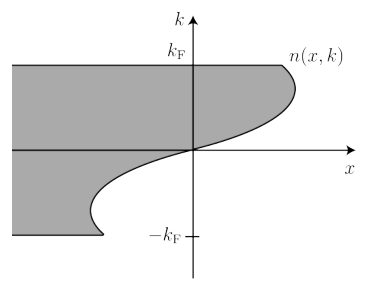 
Figure 1. The local occupation n(x, k) as a function of the po- sition x and the momentum k for t &gt; 0, evolved from the ini- tial condition (8) with the free-fermionic hydrodynamic equa- tion (7). The function n(x, k) equals 1 within the gray regions and 0 otherwise.

📷 Fig 2

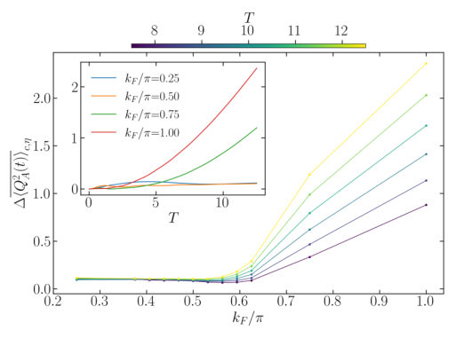 
Figure 3. Difference between the magnetization variance in the presence of the perturbation (at η = 1/8) and in its ab- sence, averaged over the time window t ∈[0, T] and plotted as a function of kF. An inset show the same quantity as a function of T. The parameters are [J, L] = [1, 64].

📷 Fig 3

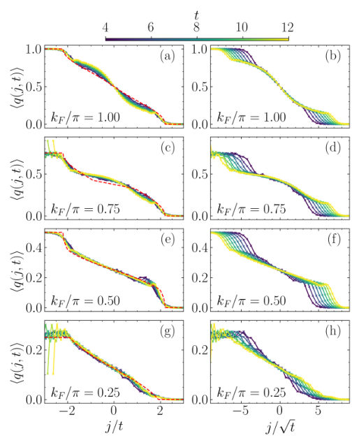 
Figure 2. Spatial profile of the charge density for different values of kF . Left panels: Plot as a function of j/t (bal- listic rescaling); we compare the data with a free fermionic approximation (dashed red line). Right panels: Plot as a function of j/ √

📷 Fig 4

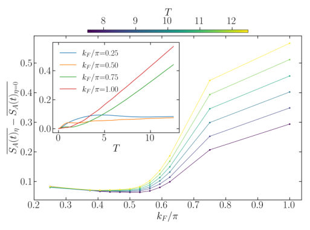 
Figure 5. Difference between the half-chain entropy in the presence of the perturbation (at η = 1/8) and in its absence, averaged over the time window t ∈[0, T] and plotted as a function of kF. An inset shows the same quantity as a function of T. The parameters are [J, L] = [1, 64].

📷 Fig 5

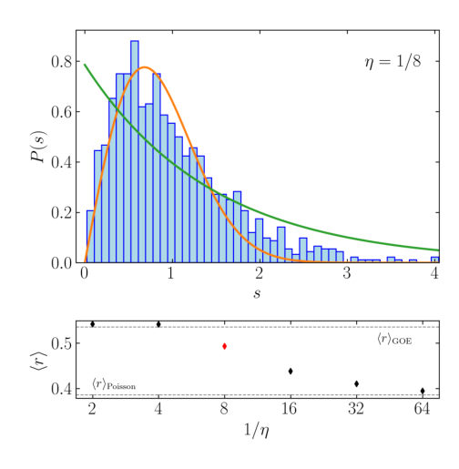 
Figure 4. (a) Level-spacing distribution P(s) of the model for η = 1/8. The curves show fits with the Poisson distribu- tion (green) and with the Wigner-Dyson distribution expected from the GOE (orange). (b) Average ratio ⟨r⟩as a function of 1/η. The red point highlights the value corresponding to η = 1/8. Data are obtained from exact diagonalization with parameters [J, L] = [1, 16], in the zero-magnetization sector and within the (I, F) = (1, 1) symmetry sectors.

**Summary.** The paper investigates a Rydberg-atom chain to demonstrate that whether its dynamics are integrable or non-integrable depends not only on the Hamiltonian but crucially on how the system is initially prepared. By analyzing transport and spectral properties, the authors show clear evidence of state-dependent quantum behavior, offering new insights into controlling many-body physics in quantum simulators.

**Why it may be interesting.** This work is highly relevant as it tackles the fundamental question of how quantum chaos/integrability emerges in controllable physical platforms like Rydberg arrays. The dependence on initial state provides new control knobs for manipulating quantum dynamics beyond just tuning coupling constants.

Detailed structure

**Main problem.** The research investigates how integrable and non-integrable dynamics can coexist within a single quantum many-body system, with the initial state playing a crucial role in determining the emergent behavior.

**Main result.** Integrability breaking is not solely determined by the Hamiltonian or coupling strength but critically depends on the specific initial state preparation of the system. The study finds sharp qualitative transitions in transport properties based on particle density.

**Method.** The authors employ theoretical mapping to effective integrable Fermi gases, coupled with numerical simulations using techniques like MPS Itensors and analyzing quantum signatures such as level spacing statistics and entanglement entropy growth.

**Model / system.** The system is a Rydberg-atom chain modeled by an effective dipolar XY Hamiltonian ($H = H_0 + \eta V$). The dynamics are studied in the context of nearest-neighbor interactions (integrable part $H_0$) perturbed by longer-range couplings ($\eta V$), which break conservation laws.

**Key observables.** Transport phenomena (ballistic vs. diffusive), variance of half-chain magnetization ($\Delta\langle Q_A^2 
angle_{c,\eta}$), level spacing statistics ($P(s)$), and entanglement entropy growth ($S_A$).

**Important parameters / regimes.** Particle density ($
ho$ or $k_F$), the perturbation strength $\eta$, and the initial state preparation protocol (e.g., bipartition).

**Assumptions / limitations.** The analysis relies on approximations such as restricting to the perturbative regime ($\eta$ small) for conservation law analysis, and assuming validity of mean-field or specific boundary conditions for simulations.

**Figures summary.** Figures illustrate the evolution of local occupation profiles showing transitions between ballistic and diffusive scaling based on $k_F$, and show level spacing distributions comparing Poisson (integrable) vs. Wigner-Dyson (non-integrable) statistics.

**Paper structure.** The paper progresses by first defining the Hamiltonian and mapping it to an effective model, then analyzing scattering processes using conservation laws, followed by numerical simulations on a bipartition protocol that reveals state-dependent dynamics, and concluding with diagnostics like level spacing and entropy growth.

Abstract

We show that integrable and non-integrable dynamics can coexist in the same Rydberg-atom chain, depending on the initial state in which the system is prepared. In the setting we consider, Rydberg atoms mainly experience an effective dipolar interaction and, within the nearest-neighbor approximation, their dynamics can be mapped onto an effective integrable Fermi gas with ballistic transport. The inclusion of longer-range couplings, however, is essential for the theory to be predictive; those terms break the conservation laws associated with integrability, enabling, in particular, the emergence of genuine diffusive transport. We study the dynamics generated by a bipartition protocol and reveal a sharp qualitative change in behavior as the particle density is varied, suggesting the possibility of accessing weaker and stronger integrability breaking dynamics in the same Hamiltonian depending on the relevance of local interactions. We propose a theoretical mechanism that accounts for the differences. Our findings provide clear and concrete evidence that integrability breaking is not solely a property of the Hamiltonian and of the magnitude of the couplings that break integrability, but also of the state in which the system is prepared.

[↑ back to top](#top)

### [Thermodynamics with thermodynamic variable first-passage time. I. From stochastic trajectories to nonlinear transport equations](http://arxiv.org/abs/2607.24078v1)

**Authors:** V. V. Ryazanov  
**Type:** theory · **Category:** statistical mechanics · **PDF:** <https://arxiv.org/pdf/2607.24078v1>  
**Analysis basis:** full PDF text, analyzed in chunks
**Topic relevance:** 🔥 `non-equilibrium dynamics` **5/5** · 🔥 `methods for driven-dissipative` **4/5** · 🔥 `non-equilibrium universality` **4/5** · `Keldysh / 2PI / non-Gaussian methods` **3/5** · `driven-dissipative phase transition` **3/5** · `correlated / nonlocal dissipation` **2/5** · `quantum measurements` **1/5**

📷 Fig 1

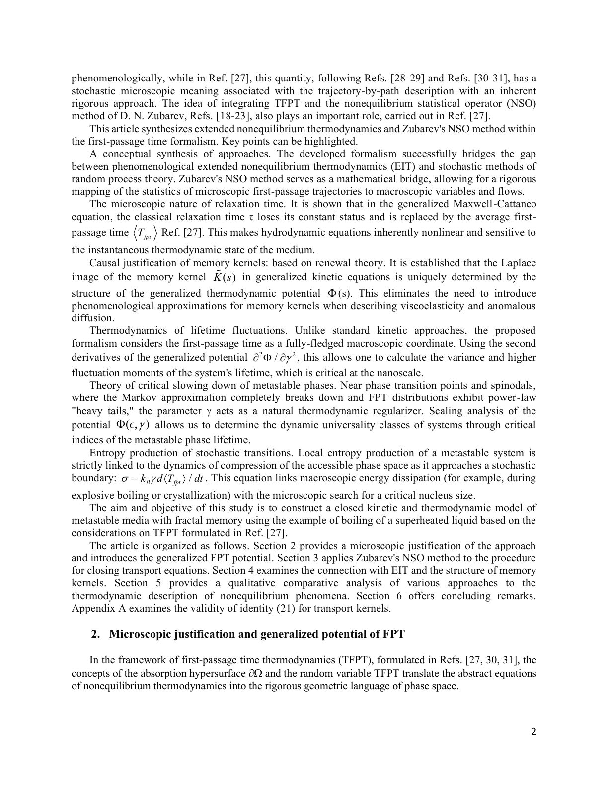 
Low-resolution page preview, page 2

📷 Fig 2

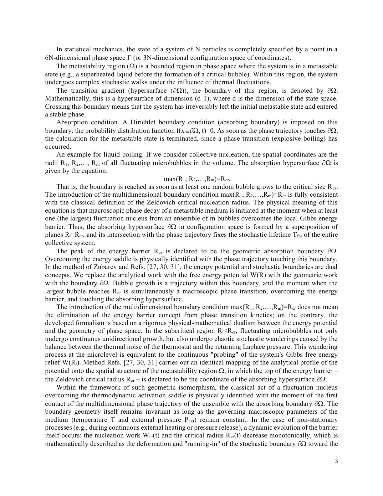 
Low-resolution page preview, page 3

📷 Fig 3

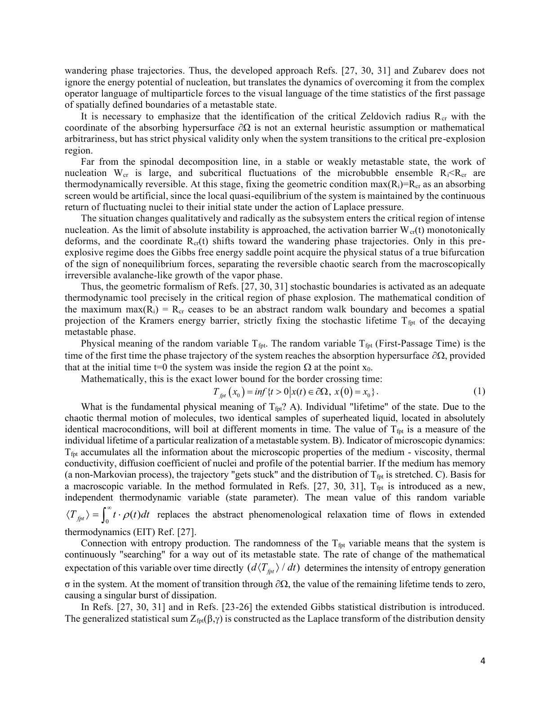 
Low-resolution page preview, page 4

📷 Fig 4

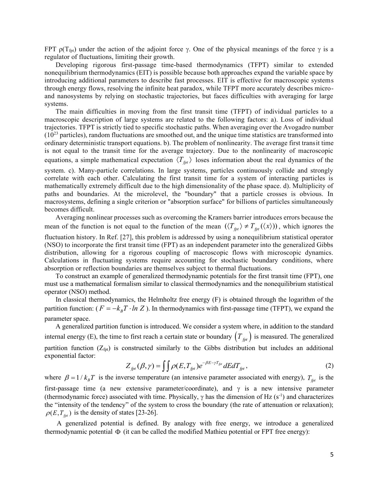 
Low-resolution page preview, page 5

📷 Fig 5

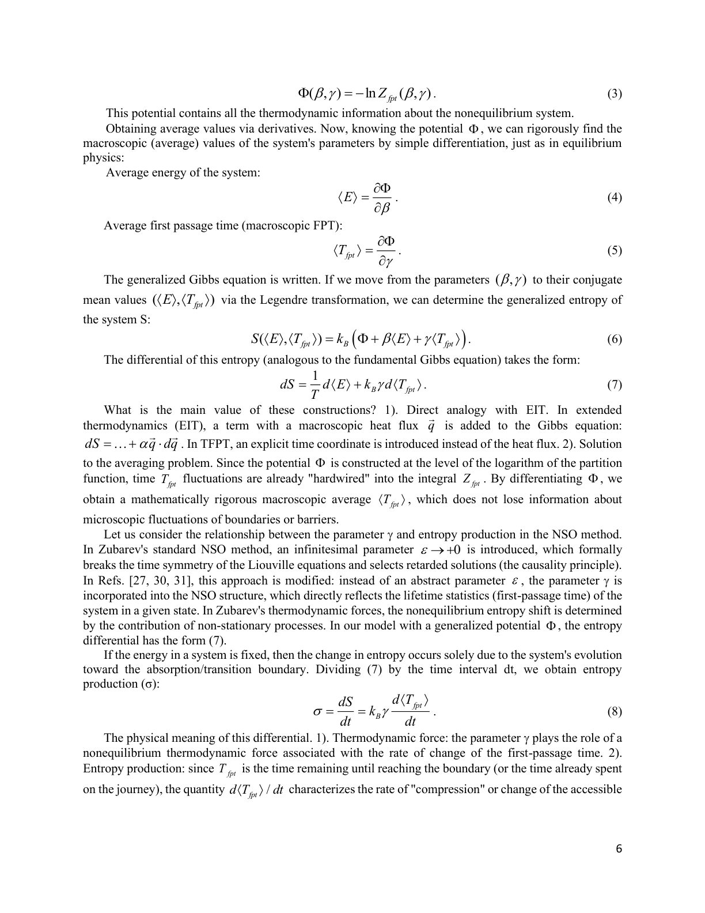 
Low-resolution page preview, page 6

**Summary.** This paper develops an advanced thermodynamic theory that treats the time taken to escape a metastable state (First-Passage Time) as a primary thermodynamic variable. It rigorously connects stochastic trajectory statistics to macroscopic transport equations by showing that fluctuation-dissipation theorems uniquely determine memory effects, thereby providing a nonlinear description of non-equilibrium dynamics.

**Why it may be interesting.** This work provides a powerful, general framework for understanding how microscopic stochastic dynamics (like crossing an energy barrier) dictates macroscopic transport properties in systems far from equilibrium, which is crucial for modeling complex processes like phase transitions or reaction kinetics.

Detailed structure

**Main problem.** To develop a rigorous theoretical framework for nonequilibrium thermodynamics that incorporates the first-passage time (FPT) as an independent, macroscopic thermodynamic variable.

**Main result.** The mean FPT replaces classical relaxation times in transport equations, introducing inherent macroscopic nonlinearity. Furthermore, the memory kernel governing non-Markovian processes is uniquely determined by the microscopic statistics of state lifetimes via fluctuation-dissipation relations.

**Method.** The authors combine Nonequilibrium Statistical Operator (NSO) methods with renewal theory and generalized thermodynamic potential constructions to bridge stochastic trajectory dynamics to macroscopic transport equations.

**Model / system.** The study models metastable systems undergoing phase transitions, such as superheated liquid boiling or nucleation processes. The system's evolution is analyzed in a high-dimensional phase space ($\Gamma$) relative to an absorbing boundary ($\partial\Omega$).

**Key observables.** First-Passage Time ($	ext{T}_{	ext{FPT}}$), Generalized Thermodynamic Potential ($\Phi$), Macroscopic Memory Kernel ($K(t)$), and Entropy Production ($\sigma$).

**Important parameters / regimes.** The mean first passage time $\langle 	ext{T}_{	ext{fpt}} 
angle$ acts as a key macroscopic parameter, replacing the classical relaxation time $	au$. The system is analyzed near critical points where barrier deformation occurs.

**Assumptions / limitations.** The central assumption is that FPT can be treated as a fully-fledged macroscopic coordinate. Consistency requires satisfying fluctuation-dissipation relations and assuming Bogolyubov's timescale separation.

**Figures summary.** Not specified by the notes, but the structure implies derivations relating potential functions ($\Phi$) to time statistics ($P(t)$) and memory kernels ($K(t)$).

**Paper structure.** The paper progresses from establishing the theoretical foundation (bridging EIT/NSO with FPT), deriving generalized potentials using stochastic methods, and finally enforcing thermodynamic consistency by showing that fluctuation-dissipation theorems uniquely determine the non-Markovian transport memory kernels.

Abstract

The theoretical foundation of combining external nonequilibrium thermodynamics, the nonequilibrium statistical operator method, and stochastic first passage time thermodynamics are explored. It is shown that including a random lifetime of a metastable state in the generalized distribution function allows the first passage time to be considered as a fully - fledged macroscopic coordinate. A microscopic justification for this approach is provided, and a generalized thermodynamic potential is introduced. A procedure for closing the transport equations based on on thermodynamic consistency conditions is developed. It is shown that in the generalized Maxwell - Catteneo equation, the classical relaxation time is strictly replaced by the mean first passage time, which imparts internal macroscopic nonlinearity to the system. Using renewal theory, the exact mathematical structure of transport memory kernels for non-Markovian processes is derived. A qualitative comparative analysis of various approaches to the thermodynamic description of nonequilibrium phenomena is presented.

[↑ back to top](#top)

### [Single-Aperture Dual-Color Ion Addressing with a DUV-Compatible Bilayer Grating](http://arxiv.org/abs/2607.23529v1)

**Authors:** Gyanendra Yadav  
**Type:** both · **Category:** other · **PDF:** <https://arxiv.org/pdf/2607.23529v1>  
**Analysis basis:** full PDF text, analyzed in chunks
**Topic relevance:** 🔥 `QC/QI experiment` **5/5** · 🔥 `analog quantum simulation` **4/5** · `interference shaping light` **3/5** · `quantum optics experiment` **3/5** · `Tavis-Cummings & cavity-many-emitter` **1/5** · `correlated cavity matter` **1/5**

📷 Fig 1

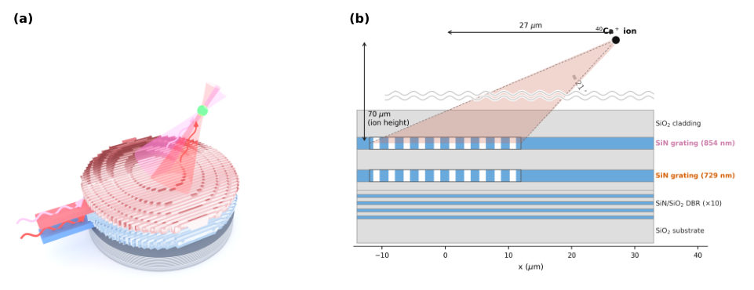 
Figure 1: Inverse-designed bilayer coupler co-focusing two wavelengths onto one ion. (a) Three- dimensional rendering of the featured dual-color DUV design, generated from its simulated height maps: the two stacked, multi-level-apodized SiN gratings launch their guided modes into converging free-space beams that co-focus on a single 40Ca+ ion; the concentric surface relief is the confocal (astigmatic) tooth curvature. The render uses artistic cropping to a disc and an exaggerated vertical relief for visibility; the true aperture is 24 × 24 µm square and the reflector has ten SiN/SiO2 pairs. (b) Side view of the stratified stack: a shared buried SiN/SiO2 distributed Bragg reflector (DBR,...

📷 Fig 2

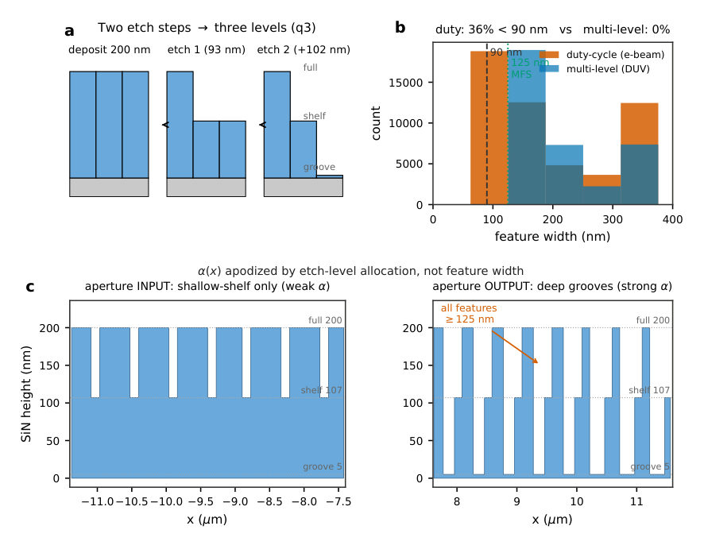 
Figure 2: Multi-level depth-allocation apodization. (a) The two-etch-step q3 process yields three SiN levels (full / shallow shelf / deep groove). (b) Minimum-feature distribution (per-row run-length encoding on the 62.5 nm design grid): the duty-cycle taper (e-beam) puts 36% of features below 90 nm, whereas depth- allocation apodization keeps 0% sub-90 nm. (c) 729 nm cross-section of the featured dual-color DUV design: weakly-coupled input realized by a wide shallow shelf, strong output by deep grooves that grow toward the aperture edge—every feature ≥125 nm. The panels use the simulated height maps of the featured design.

📷 Fig 3

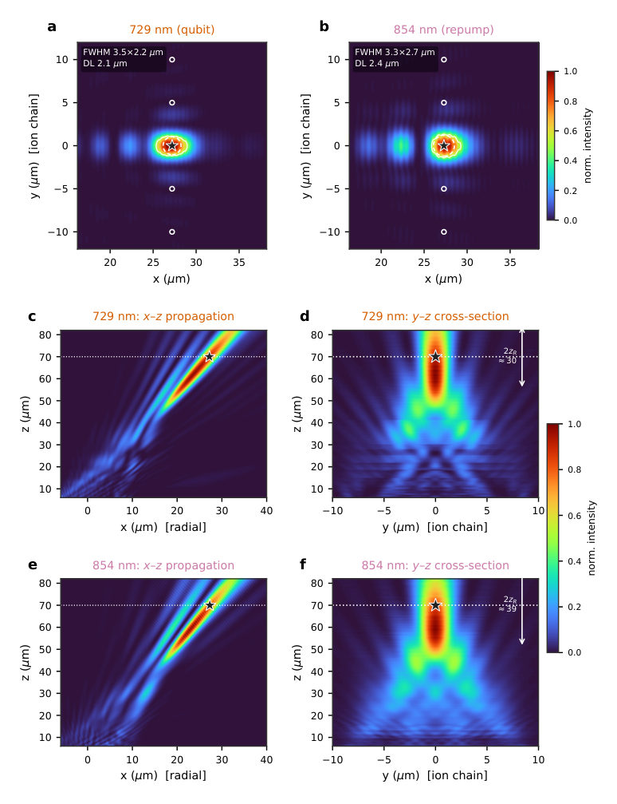 
Figure 3: Co-focused dual-wavelength spots at the ion plane. Primary three-dimensional FDTDX near fields propagated by angular spectrum (the same kernel as the analysis pipeline). (a) 729 nm and (b) 854 nm focal-plane intensity at 70 µm, with the half-maximum contour, the diffraction-limit circle (dashed), the focus (star), and the ±5/ ± 10 µm neighboring ion sites (open circles). (c,d) the 729 nm and (e,f) 854 nm x–z and y–z (ion-chain) beam-axis cross-sections. The low numerical aperture (≈0.18) yields an extended confocal parameter (2zR ≈30 µm), placing the fixed 70 µm ion plane slightly above the design’s absolute 3D beam waist (z ≈58 µm); at this plane the neighboring ion sites fall in...

📷 Fig 4

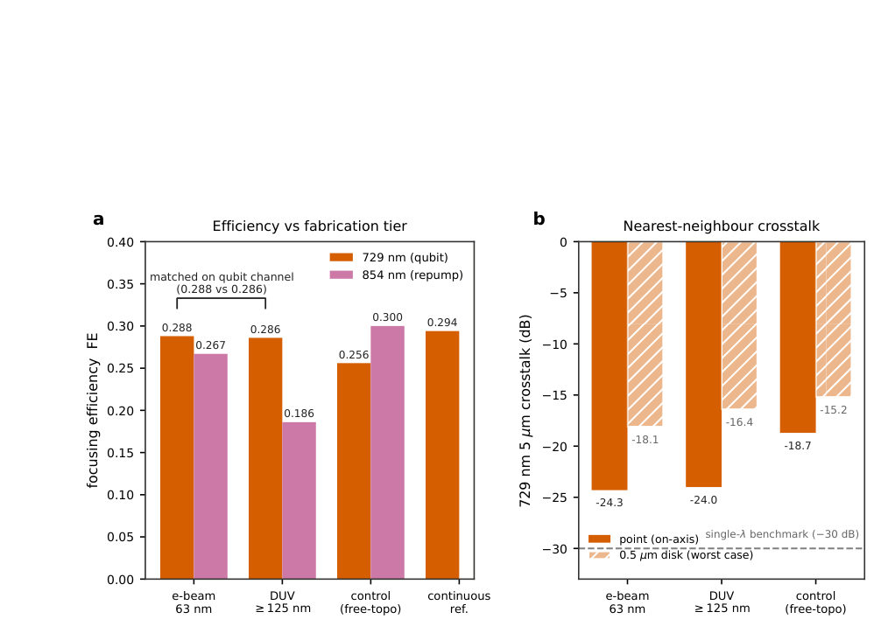 
Figure 4: The realization gap, quantified. (a) Focusing efficiency of both channels across fabrication tiers: on the 729 nm qubit channel the DUV-clean device is indistinguishable from the e-beam device at the common 50 nm reporting grid (0.288 vs 0.286). (b) 729 nm nearest-neighbor (5 µm) crosstalk, point and 0.5 µm-disk worst case, with a representative single-wavelength benchmark (−30 dB; demonstrated integrated-photonic addressing crosstalk reaches −40 to ≤−50 dB [31, 35]). The corresponding single-qubit gate-error figure of merit is given in §2.6. All values are the verified device-table numbers.

📷 Fig 5

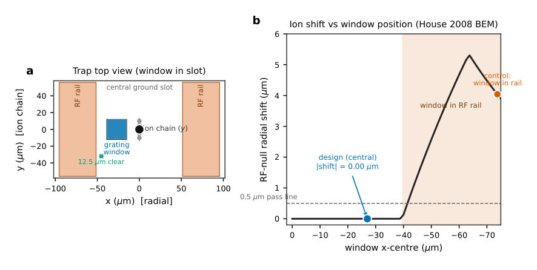 
Figure 5: Trap integration. (a) Trap top view: the outcoupling window sits in the central RF-quiet ground slot, 27 µm off-axis, clear of the RF rails. (b) RF-null radial shift vs. window position from a gapless surface-electrode boundary-element model [36]. The ion is unshifted while the window stays in the field-free ground slot—where a grounded aperture leaves the RF potential unchanged by construction—and the shift rises only when the window is displaced into an RF rail (the computed clearance control).

**Summary.** This paper presents a novel approach to overcome the area limitations of multi-wavelength optical addressing in trapped-ion quantum computers. By utilizing a vertically stacked silicon-nitride bilayer grating coupler and employing depth-allocation apodization, the authors successfully co-focus two distinct colors onto a single ion while remaining compatible with standard deep-UV lithography rules. This vertical integration transforms wavelength scaling from a lateral area penalty into a manageable layer allocation problem.

**Why it may be interesting.** This work directly addresses hardware scalability in quantum computing platforms by proposing a photonic integration technique that decouples wavelength scaling from lateral footprint constraints, which is crucial for realizing complex ion trap architectures.

Detailed structure

**Main problem.** Scaling multi-wavelength optical control for trapped-ion quantum computing is bottlenecked by the physical area required for separate surface emitters.

**Main result.** A vertically stacked SiN bilayer grating coupler successfully co-focuses two widely separated wavelengths onto a single ion while adhering to strict, deep-UV foundry fabrication rules.

**Method.** The authors employ multi-level depth-allocation apodization, encoding the coupling envelope in discrete etch depths rather than relying on minimum feature widths.

**Model / system.** The system is a trapped-ion setup using Ca40+ qubits requiring control fields at 729.4 nm and 854.2 nm. The proposed hardware solution is a vertically stacked silicon-nitride bilayer grating coupler integrated over an ion trap.

**Key observables.** Focusing efficiency, crosstalk (e.g., -24 dB), color separation ($\approx 0.10 \mu	ext{m}$), and the ability to maintain performance comparable to aggressive electron-beam designs.

**Important parameters / regimes.** Wavelengths: 729.4 nm and 854.2 nm; Focusing distance: $70 \mu	ext{m}$; Minimum feature size rule: $\ge 125 	ext{ nm}$.

**Assumptions / limitations.** The technique assumes the availability of a discrete multi-level (qn) platform with sufficient etch-depth contrast for apodization control.

**Figures summary.** Figures illustrate the 3D rendering of the dual-color design, side views of the stratified stack, and comparisons between standard duty-cycle apodization versus the proposed depth-allocation method.

**Paper structure.** The paper first establishes the scaling bottleneck in trapped-ion optics. It then details the novel multi-level depth-allocation grating structure using a SiN bilayer. Performance is validated via 3D FDTD and Lumerical simulations, comparing results against ideal e-beam designs and analyzing focus stability under fabrication tolerances.

Abstract

Multi-wavelength optical control is a scaling bottleneck for trapped-ion hardware: separate surface emitters consume trap area, interrupt the electrode plane, and expose charge-sensitive dielectric near the ions. Here, a vertically stacked silicon-nitride bilayer routes the $^{40}\text{Ca}^+$ qubit and repump fields-729.4 and 854.2 nm-through one electrode aperture and focuses them $70~μ\text{m}$ above the chip. Three-dimensional FDTDX predicts $0.10~μ\text{m}$ color separation and near-diffraction-limited spots along the ion-chain axis. Multi-level depth-allocation apodization enables this architecture by encoding the coupling envelope in discrete etch levels rather than sub-resolution linewidths. Every feature satisfies a strict $\ge 125\text{ nm}$ deep-UV rule using two etch depths per film. Full-3D Ansys Lumerical simulations independently corroborate directionality, spot size, and repump efficiency. At a common 50 nm reporting grid, the DUV-compatible device matches a 63 nm electron-beam design on the qubit channel (focusing efficiency 0.286 vs 0.288; crosstalk -24.0 vs -24.3 dB). Vertical integration therefore converts wavelength scaling from a lateral-footprint penalty into a layer-allocation problem, providing a pathway toward compact multi-color photonic interfaces for trapped ions and other chip-addressed quantum emitters.

[↑ back to top](#top)

### [Phonon heat transport with squeezing-based symmetry breaking](http://arxiv.org/abs/2607.22990v1)

**Authors:** Yan Cao, Cheng Yang, Xintong Gu, Shenzhu Wang, Jiteng Sheng, Haibin Wu  
**Type:** both · **Category:** statistical mechanics · **PDF:** <https://arxiv.org/pdf/2607.22990v1>  
**Analysis basis:** full PDF text, analyzed in chunks
**Topic relevance:** 🔥 `analog quantum simulation` **4/5** · 🔥 `non-equilibrium dynamics` **4/5** · `correlated / nonlocal dissipation` **3/5** · `correlated cavity matter` **3/5** · `driven-dissipative phase transition` **3/5** · `entanglement & information structure` **3/5** · `methods for driven-dissipative` **3/5** · `Keldysh / 2PI / non-Gaussian methods` **2/5** · `non-equilibrium universality` **2/5** · `quantum optics experiment` **2/5** · `Tavis-Cummings & cavity-many-emitter` **1/5** · `quantum measurements` **1/5** · `scars & prethermalization` **1/5**

📷 Fig 1

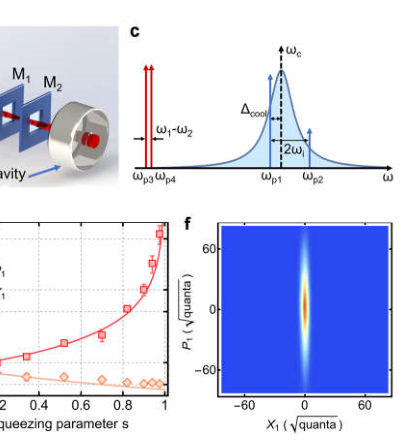 
Fig. 1. Experimental setup and characterization of the two-membrane cavity

📷 Fig 2

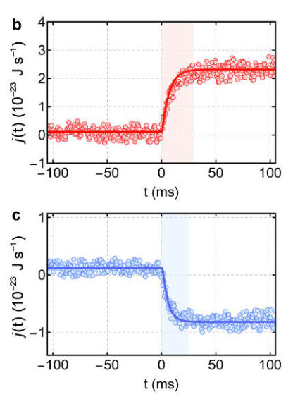 
Fig. 2. Observations of squeezing-engineered phonon heat current. a, Measured

📷 Fig 3

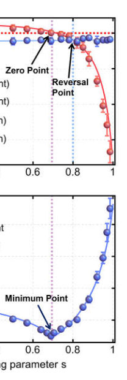 
Fig. 3. Correspondence between heat channels and quantum discord. a, b, Heat

📷 Fig 4

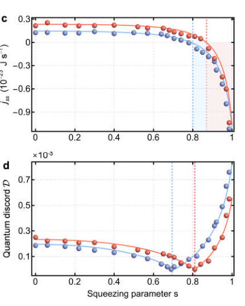 
Fig. 4. Controllability of squeezing-engineered phonon heat transport. a, b, Steady-

**Summary.** The authors demonstrate that applying phonon squeezing in an optomechanical cavity allows for unprecedented, active control over heat flow in solid-state systems. By breaking the system's continuous symmetry, they can deterministically amplify or reverse heat currents under a constant temperature gradient. This establishes quantum squeezing as a powerful tool for realizing programmable thermal management in future quantum technologies.

**Why it may be interesting.** This work directly addresses non-equilibrium thermodynamics in a quantum setting by using engineered quantum states (squeezing) to manipulate energy transport, which is highly relevant for understanding thermalization and heat management in nanoscale quantum devices.

Detailed structure

**Main problem.** The core challenge is achieving on-demand, real-time control over phonon heat flow, which is typically constrained by the temperature gradient.

**Main result.** Phonon squeezing breaks system symmetry, enabling deterministic amplification, reduction, or even reversal of heat flow with high efficiency within milliseconds.

**Method.** The study uses quantum mechanical modeling (Hamiltonians and Langevin equations) combined with experimental measurements to diagnose thermal transport properties.

**Model / system.** The platform is a cavity optomechanical system coupling two nanomechanical resonators ($	ext{M1}$ and $	ext{M2}$) cooled near their ground states. The dynamics are governed by an effective Hamiltonian incorporating squeezing terms and coherent coupling.

**Key observables.** Phonon heat currents ($j_{ss}$, $j_{	ext{transient}}$), quantum discord ($\Delta$), and quadrature variances.

**Important parameters / regimes.** Squeezing parameter ($s$), temperature gradient ($\Delta T$), and coupling strength ($\eta/	ext{2}\pi$).

**Assumptions / limitations.** The system is assumed to be cooled to near ground states, allowing quantum effects like squeezing to dominate the thermal dynamics.

**Figures summary.** Figures illustrate the setup (Fig. 1), show steady-state heat current dependence on squeezing (Fig. 2), and correlate heat channels with quantum discord (Fig. 3).

**Paper structure.** The paper establishes the problem of phonon control, introduces the optomechanical system and squeezing mechanism that breaks U(1) symmetry, details measurements showing controllable heat flow reversal/amplification, and finally links this anomalous transport to measurable quantum correlations like quantum discord.

Abstract

The controllability of phonon thermal transport is fundamental for numerous technologies, from cooling high-performance chips to managing heat in quantum computing. Despite extensive efforts, on-demand, real-time control of phonon heat flow remains elusive, being fundamentally constrained by the temperature gradient. Here we achieve this long-sought phonon heat transport by introducing a novel mechanism using quantum squeezing in a cavity optomechanical system. We find that phonon squeezing of near-ground-state mechanical resonators via an optomechanically induced parametric process breaks the continuous U(1) rotation symmetry in phase space, and consequently the symmetry in the heat current structure. We reveal that heat flow under a constant temperature gradient can be deterministically amplified, reduced, or even reversed, a capability previously unattainable. With phonon squeezing, we achieve over twentyfold amplification of heat flow and reversal within 30 milliseconds. Importantly, quantum discord analysis reveals a direct connection between heat flow reversal and quantum correlation. Our results establish quantum squeezing as a versatile platform for on-demand phononic thermal control, opening avenues for active heat management in quantum devices and thermal logic circuits.

[↑ back to top](#top)

### [Fluctuation theorems for autonomous work in the quantum regime](http://arxiv.org/abs/2607.24690v1)

**Authors:** Xiu-Hua Zhao, H. T. Quan  
**Type:** theory · **Category:** statistical mechanics · **PDF:** <https://arxiv.org/pdf/2607.24690v1>  
**Analysis basis:** full PDF text, analyzed in chunks
**Topic relevance:** 🔥 `non-equilibrium dynamics` **4/5** · `correlated / nonlocal dissipation` **3/5** · `methods for driven-dissipative` **3/5** · `non-equilibrium universality` **3/5** · `Keldysh / 2PI / non-Gaussian methods` **2/5** · `Tavis-Cummings & cavity-many-emitter` **2/5** · `driven-dissipative phase transition` **2/5** · `quantum measurements` **2/5** · `Dicke superradiance` **1/5** · `Rydberg arrays` **1/5** · `analog quantum simulation` **1/5** · `correlated cavity matter` **1/5** · `entanglement & information structure` **1/5** · `measurement-induced transitions` **1/5**

📷 Fig 1

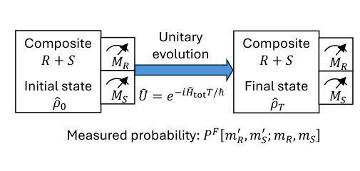 
FIG. 1. General framework of formulating fluctuation the- orems for autonomous work in the quantum regime. The composite system (the work source R and the system of in- terest S) undergoes unitary evolution. Successive projective measurements on the work source and on the system are im- plemented at initial and final times. Here, mR (m′ R) and mS (m′ S) denote the outcomes of the initial (final) measurements over the work source and the system, respectively.

📷 Fig 2

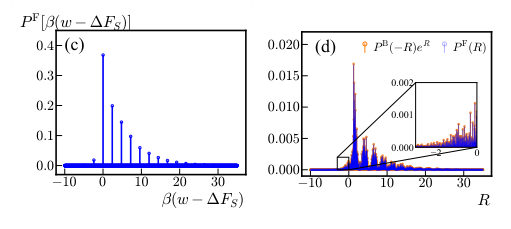 
FIG. 2. (a) Illustration of the Dicke model, consisting of a single-mode radiation field and N two-level atoms. (b) The evolution of the expected value ⟨ˆJx⟩of the atoms. (c) and (d) show the statistics of the finite-time excitation β(w −∆FS) of the radiation field and the joint fluctuation variable R = β(w −∆FS) + ∆ϕ, respectively. In panels (b) (c) and (d), ℏ= 1, β = 3, ωc = 0.8, ωz = 0.4, λ = 0.25. The number of atoms is N = 50. The dimension of the Hilbert space of the radiation field is truncated at 50, a large enough value in the evolution. The initial distribution pj of atoms is generated by the normal distribution with the average value −25 and the standard deviation 5 and then...

📷 Fig 3

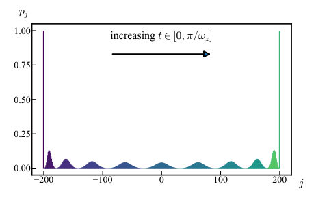 
FIG. 3. The distribution of ˆJx in the Dicke model [Eq. (23)] at different times during the evolution in the limit of vanishing backaction. The eleven distributions from the left to the right correspond to t ∈[0, 1] with the interval 0.1. Parameters: ℏ= 1, β = 1, ωc = 8, ωz = π, λ = 0.6. The number of atoms is N = 400. The dimension of the Hilbert space of the radiation field is truncated at 20, a large enough value in the evolution. The initial state of the ensemble of atoms is the eigenstate of ˆJx with the minimum eigenvalue, j = −200. The initial state of the radiation field is the thermal state with j = −200 [Eq. (7)].

📷 Fig 4

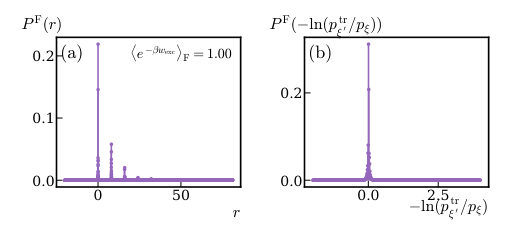 
FIG. 4. Recover the fluctuation theorems for nonautonomous exclusive work in the limit of vanishing backaction. (a) The distribution of r. (b) The distribution of −ln  ptr ξ′/pξ  . In this plot, ℏ= 1, β = 1, ωc = 8, ωz = π, λ = 0.6. The number of atoms is N = 400. The dimension of the Hilbert space of the radiation field is truncated at 20. The initial distribution of atoms on the eigenvalues of ˆJz in the forward process is generated by the normal distribution with the average value 0 and the standard deviation 50 and then renormalized. The initial state of the radiation field is the thermal state of ˆH0 S. The time of obtaining this plot is t = 5.2.

📷 Fig 5

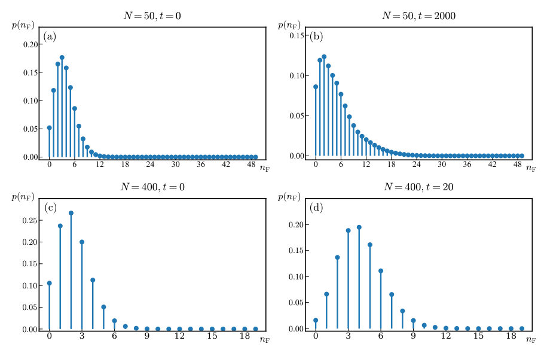 
FIG. 5. Convergence check of the truncated Fock states. (a) and (b), using the same parameters as those in Fig. 2(b-c) in the main text. ℏ= 1, β = 3, ωc = 0.8, ωz = 0.4, and λ = 0.25. The number of atoms is N = 50. The dimension of the local Hilbert space of the radiation field is truncated at 50. The initial distribution of atoms pj on the eigenvalues of ˆJx in the forward process is generated by the normal distribution with the average value −25 and standard deviation 5 and then renormalized. The initial state of the radiation field is the mixed thermal state. (c) and (d), using the same parameters as those in Fig. 3 in the main text. ℏ= 1, β = 1, ωc = 8, ωz = π, λ = 0.6. The number of...

**Summary.** This paper extends fluctuation theorems for autonomous work from classical physics into the quantum regime. It derives generalized Jarzynski and Crooks relations using projective measurements on a coupled system. The key finding is that quantum noncommutativity imposes fundamental constraints, preventing simple reduction to classical forms, which is demonstrated using the Dicke model.

**Why it may be interesting.** This work directly addresses non-equilibrium thermodynamics in open quantum systems, which is central to understanding energy transduction in nanoscale quantum devices and quantum heat engines.

Detailed structure

**Main problem.** The primary goal is extending fluctuation theorems for autonomous work from classical statistical mechanics into the quantum domain.

**Main result.** Fluctuation theorems (Jarzynski-type and Crooks-type) are derived for inclusive work, showing that quantum noncommutativity prevents a simple reduction to nonautonomous forms.

**Method.** The authors use successive projective measurements over the work source and system Hamiltonian to derive generalized fluctuation relations by comparing forward and backward process probabilities.

**Model / system.** The analysis is generally framed for a composite system ($S$ coupled to $R$), but the Dicke model (single-mode radiation field as system, two-level atoms as work source) is used for concrete illustration.

**Key observables.** Inclusive work ($w[\Gamma]$), joint probabilities ($P_F[\Gamma], P_B[	ilde{\Gamma}]$), and fluctuation variables $R$.

**Important parameters / regimes.** Temperature ($eta$), time ($T$), coupling strengths ($\lambda, \omega_c$).

**Assumptions / limitations.** The analysis assumes the work source observable has a discrete spectrum; crucially, quantum noncommutativity prevents a direct reduction to nonautonomous fluctuation theorems.

**Figures summary.** Figure 1 illustrates the general measurement framework. Figure 2 and 8 confirm the Crooks-type theorem in the Dicke model by showing the collapse of $P_F$ and $P_B e^R$.

**Paper structure.** The paper establishes the theoretical extension of fluctuation theorems for autonomous work to the quantum regime, derives the relations using measurement formalism, discusses the constraints imposed by quantum mechanics (noncommutativity), and verifies these results using the Dicke model.

Abstract

Fluctuation theorems for work provide universal constraints on nonequilibrium fluctuations, yet their quantum generalizations often rely on externally prescribed classical driving protocols. While for classical systems, fluctuation theorems have been extended to autonomous work, where the dynamics of the work source is subject to the backaction of the system, their generalization to the quantum regime is constrained by the uncertainty principle. Here, we extend fluctuation theorems for autonomous work from the classical regime to the quantum regime. By performing successive projective measurements over the work source and the system, we derive Jarzynski-type and Crooks-type fluctuation theorems for autonomous inclusive work from initial mixed thermal states. These relations are analogous to fluctuation theorems for autonomous work in the classical regime and explicitly incorporate the fluctuations of the work source. However, quantum noncommutativity prevents a consistent reduction to the nonautonomous counterparts, even in the limit of a large work source and correspondingly negligible backaction. By contrast, under the exclusive work definition, the nonautonomous limit is recovered when the measured observable of the work source commutes with its bare Hamiltonian and the backaction of the system on the work source is negligible. Our results are illustrated with the Dicke model, where a single-mode radiation field and an ensemble of two-level atoms act as the system of interest and the work source, respectively.

[↑ back to top](#top)

### [Spin-induced multipartite steady-state entanglement of motional modes in hexagonal boron nitride membranes](http://arxiv.org/abs/2607.22855v1)

**Authors:** Nahid Yazdi, Vahid Salari, Roohollah Ghobadi  
**Type:** theory · **Category:** quantum information and computing · **PDF:** <https://arxiv.org/pdf/2607.22855v1>  
**Analysis basis:** full PDF text, analyzed in chunks
**Topic relevance:** 🔥 `analog quantum simulation` **4/5** · 🔥 `entanglement & information structure` **4/5** · `exotic spin models in light-matter` **3/5** · `methods for driven-dissipative` **3/5** · `spintronics-quantum-optics interface` **3/5** · `correlated / nonlocal dissipation` **2/5** · `driven-dissipative phase transition` **2/5** · `non-equilibrium dynamics` **2/5** · `Keldysh / 2PI / non-Gaussian methods` **1/5** · `Tavis-Cummings & cavity-many-emitter` **1/5** · `correlated cavity matter` **1/5** · `non-equilibrium universality` **1/5**

📷 Fig 1

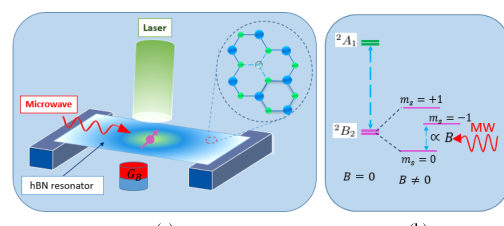 
Figure 1. Schematic description of the proposed setup. (1a) A single spin can be addressed to couple to three mechanical modes via mag- netic coupling. (1b) Level structure of hBN.

📷 Fig 2

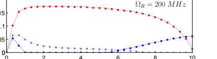 
Figure 3. Plot of logarithmic negativity EN of the three bipartite subsystems E12 N (phonons 1 and 2), E23 N (phonons 2 and 3), and E13 N (phonons 1 and 3) vs the normalized coupling constant g/ωmax in which ωmax = ω3 and g = g1 for two different values of the Rabi frequency, (3a) ΩR/2π = 30 MHz and (3b) ΩR/2π = 200 MHz, for ¯nk = 0 (k = 1, 2, 3).

📷 Fig 3

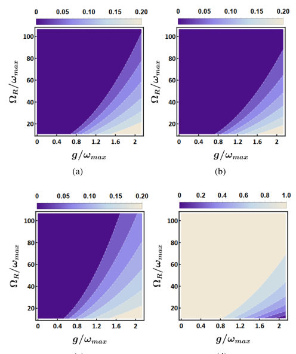 
Figure 2. Density plot of the steady-state bipartite entanglement (log- arithmic negativity EN ) for (2a) E12 N , (2b) E13 N , and (2c) E23 N , and (2d) density plot of the stability of the system, vs the normalized Rabi frequency of the classical driving field ΩR/ω1 and the ratio of coupling constant and mode frequency g/ω1 for the parameters given in the text.

📷 Fig 4

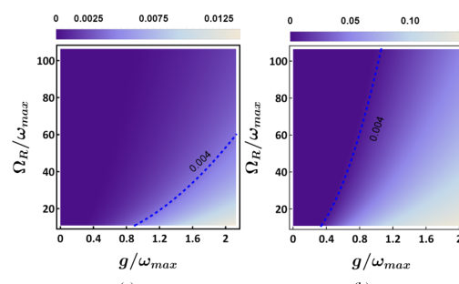 
Figure 4. (4a) Genuine tripartite entanglement as measured by the minimum residual contangle Emin τ . (4b) Bipartite entanglement for ω1/2π = ω2/2π = ω3/2π = 4.70 MHz and g1 = g2 = g3. The other parameters are the same as in Fig. 2.

📷 Fig 5

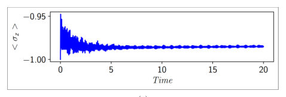 
Figure 5. Expectation value for the operator σz as time goes by, in the far-detuning regime. The other parameters are the same as in the main text.

**Summary.** The paper theoretically models how coupling three mechanical modes of an hBN membrane to a spin defect can induce effective phonon-phonon interactions. By analyzing the steady state using advanced quantum dynamics techniques, the authors show that robust bipartite and tripartite entanglement is achievable. This work proposes a solid-state route toward generating continuous-variable cluster states for universal quantum computation.

**Why it may be interesting.** This work directly addresses solid-state quantum memories and processing elements by engineering robust, controllable multipartite entanglement between mechanical oscillators, a key requirement for scalable continuous-variable quantum computation.

Detailed structure

**Main problem.** The central goal is achieving and characterizing genuine multipartite steady-state entanglement among the motional modes of a hexagonal boron nitride (hBN) membrane.

**Main result.** The study demonstrates that both bipartite and genuinely tripartite steady-state entanglement can be achieved in these mechanical modes using a spin defect mediator, paving the way for scalable cluster state generation.

**Method.** The analysis employs theoretical tools including deriving effective Hamiltonians via Schrieffer-Wolff transformations and analyzing system dynamics using Langevin-Heisenberg equations of motion to find stable steady states.

**Model / system.** The physical platform is an hBN membrane with three coupled mechanical (motional) modes interacting with a common, optically addressable spin defect. The interaction leads to effective phonon-phonon coupling.

**Key observables.** Bipartite and genuinely tripartite steady-state entanglement quantified by measures like Logarithmic Negativity ($	ext{EN}$) and minimum residual continuous-variable tangle ($	ext{Emin}_	au$).

**Important parameters / regimes.** Operation requires the dispersive regime ($\delta_{\min} \gg g_k$) and extremely low temperatures ($T \approx 0.05 	ext{ mK}$). The Rabi frequency ($\Omega_R$) is a critical control parameter.

**Assumptions / limitations.** The primary assumptions include operating in the dispersive regime, allowing for adiabatic elimination of the spin degree of freedom, and assuming high mechanical quality factors ($Q_m \gg 1$).

**Figures summary.** Figures illustrate achievable bipartite entanglement levels ($	ext{EN}$) across different mode frequencies and show how $	ext{EN}$ and genuine tripartite entanglement ($	ext{Emin}_	au$) vary with the coupling strength relative to the Rabi frequency.

**Paper structure.** The paper progresses from defining the full Hamiltonian, deriving an effective quadratic Hamiltonian using SW transformations in the dispersive regime, analyzing stability via Lyapunov equations for the covariance matrix, and finally quantifying entanglement measures in the resulting steady state.

Abstract

In this paper, we focus on a scheme in which three high-quality-factor mechanical modes of a hexagonal boron nitride (hBN) membrane monolayer are coupled to a common optically addressable spin defect present in the membrane via magnetic field interaction. We show that this coupling induces an effective phonon-phonon interaction in the dispersive regime and under appropriate magnetic field and microwave modulation. We derive the Langevin-Heisenberg equations of motion for vibrational modes to analyze optimal parameter regimes for reaching a physically stable system. We also investigate the effect of coupling strength on purity and entanglement. Our results demonstrate that bipartite and genuinely tripartite steady-state entanglement between different vibrational modes of hBN may be achieved in a broad spectrum of experimental parameters. This study has the potential to enable scalability to be implemented for the generation of two-dimensional continuous-variable cluster states for universal quantum computation.

[↑ back to top](#top)

### [Full-wave nonlinear microscopy reveals guided channel for ultrafast polariton transport](http://arxiv.org/abs/2607.22860v1)

**Authors:** Qingyi Zhou, Piper Fowler-Wright, Zongfu Yu, Joel Yuen-Zhou, Michael Reitz  
**Type:** theory · **Category:** other · **PDF:** <https://arxiv.org/pdf/2607.22860v1>  
**Analysis basis:** full PDF text, analyzed in chunks
**Topic relevance:** 🔥 `analog quantum simulation` **4/5** · 🔥 `methods for driven-dissipative` **4/5** · 🔥 `non-equilibrium dynamics` **4/5** · `correlated cavity matter` **3/5** · `driven-dissipative phase transition` **3/5** · `Tavis-Cummings & cavity-many-emitter` **2/5** · `non-equilibrium universality` **2/5** · `Keldysh / 2PI / non-Gaussian methods` **1/5** · `correlated / nonlocal dissipation` **1/5** · `entanglement & information structure` **1/5** · `interference shaping light` **1/5**

📷 Fig 1

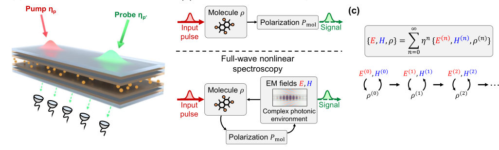 
FIG. 1. Full-wave nonlinear spectroscopy. (a) Prototypical setup for spatially resolved pump–probe spectroscopy with light- matter back-action: an ensemble of molecules is placed inside an optical cavity formed by DBR mirrors, which is driven by input pulses with amplitudes ηp (pump) and ηp′ (probe). (b) Schematic comparison between the proposed “full-wave nonlinear spectroscopy” and conventional “free-space spectroscopy”. In the conventional framework, molecules are driven by a prescribed incident field. In contrast, our framework accounts for the feedback of the molecular response onto the optical field, enabling a self-consistent treatment of coupled light–matter dynamics in complex and...

📷 Fig 2

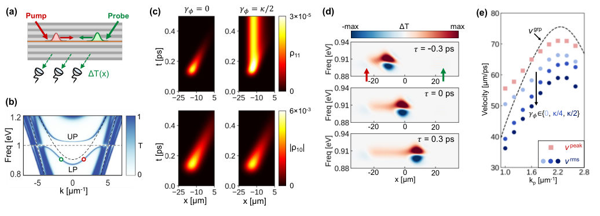 
FIG. 2. Full-wave pump-probe microscopy results for molecules inside a DBR cavity. (a) Schematics of the pump-probe experiment, where a planar DBR cavity (gray) containing a molecular layer (orange) is driven by counter-propagating pump (p) and probe (p′) pulses. Information about pump-induced transport is retrieved through the differential signal ∆T(x), detected along the probe direction. (b) TMM results of the dispersion relation, revealing the UP and LP branches. The red (green) dot indicates the in-plane wave vector of the incident pump (probe) pulse, centered at kp = −kp′ = π/2 µm−1. The molecules’ transition frequency is fixed as ω0 = 1 eV. The dashed lines indicate the molecular...

📷 Fig 3

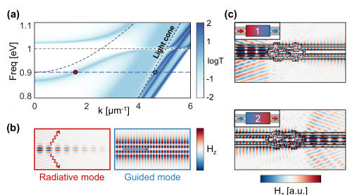 
FIG. 3. Co-existence of radiative and nonradiative channels inside a DBR cavity. (a) Transmission heatmap of the DBR cavity with molecular layer inside, obtained via TMM. The black dashed lines indicate the molecular transition frequency at 1.0 eV, the bare cavity dispersion, and the light line. The blue dashed line marks the operating frequency at 0.9 eV, cor- responding to the carrier frequency of the input pulse. The red and blue dots identify the cavity polariton mode and the guided polariton mode, respectively. The results are visual- ized in log scale to reveal the dispersion of the guided modes below the light cone. (b) Hz field distribution of the radiative cavity mode and the...

📷 Fig 4

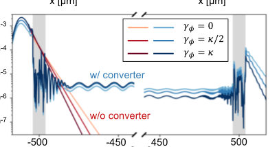 
FIG. 4. Leveraging the guided mode in a DBR cavity for long-range excitation transport. (a) Simulation setup. The cavity polariton excited by the pump is first converted into a guided polariton by the first converter, propagates through the low-loss guided mode, and is then transformed back into a cavity polariton by the second converter. (b) Results with- out dephasing (γϕ = 0). Top: population heatmap ρ11(x, t). Bottom: the corresponding pump–probe microscopy signal ∆T(x, ω), which is separated into two regions by the mode converters; in the region between them, no radiation escapes the structure, so ∆T ≈0. (c) The same two quantities for γϕ = κ/2, which leads to static dark population....

**Summary.** The paper develops a full-wave simulation framework to model ultrafast polariton transport in DBR cavities. It overcomes the inherent limitations of molecular excitation transport by designing photonic mode converters that couple energy from leaky cavity modes into low-loss guided modes. This engineering feat enables long-range, efficient transport of quantum excitations.

**Why it may be interesting.** This work directly addresses open quantum system dynamics (excitons coupled to cavity fields) and uses advanced numerical techniques (FDTD, adjoint optimization) to engineer macroscopic transport pathways for quantum excitations, which is highly relevant to AMO physics and quantum optics.

Detailed structure

**Main problem.** The primary challenge is overcoming the short-range transport bottleneck of molecular excitations by enabling fast, long-range polariton transport.

**Main result.** By engineering mode converters using guided photonic modes below the light line, researchers demonstrated energy transfer that enables molecular excitation transport over a millimeter, an order of magnitude improvement.

**Method.** The study employs self-consistent Maxwell–Liouville framework solved via full-wave finite-difference time-domain (FDTD) simulations and optimization techniques to design mode converters.

**Model / system.** The system involves exciton polaritons in strongly coupled light-matter systems within Distributed Bragg Reflector (DBR) cavities. The model incorporates molecular dynamics governed by a quantum master equation coupled self-consistently with Maxwell's equations.

**Key observables.** Spatially-resolved pump–probe differential transmission signal ($\Delta T$), polariton transport characteristics, and energy population dynamics ($n_B(t)$).

**Important parameters / regimes.** Molecular dephasing rate ($\gamma_\phi$), cavity loss rate ($\kappa$), and the ability to utilize guided modes below the light cone.

**Assumptions / limitations.** The initial model uses a minimal two-level description for molecules, but the core advancement relies on extending simulations beyond single-mode descriptions to include the full modal landscape.

**Figures summary.** Figures illustrate self-consistent nonlinear spectroscopy (comparing to free-space), dispersion relations showing LP/UP modes, and crucially, heatmaps demonstrating energy transport over long distances when mode converters couple radiative polaritons into low-loss guided channels.

**Paper structure.** The paper progresses from establishing the full-wave simulation framework for nonlinear microscopy, detailing how molecular back-action is included. It then focuses on the limitation imposed by dephasing in single modes and introduces the structural engineering solution: designing mode converters to couple energy into low-loss guided polariton channels.

Abstract

We show how finite-difference time-domain (FDTD) simulations can be extended to model ultrafast nonlinear microscopy, enabling the prediction of spatially-resolved pump--probe signals in arbitrary electromagnetic environments. Focusing on polariton transport in strongly coupled light--matter systems, we develop a perturbative framework to study the ultrafast propagation of hybrid light--matter excitations in nanophotonic structures. We first apply the framework to a standard distributed Bragg reflector (DBR) cavity, reproducing established results for polariton transport from a multimode Tavis--Cummings model. We then consider the full modal landscape of the same cavity, including guided modes below the light line that are typically neglected in single-mode-family descriptions. Exploiting these modes, we design compact mode converters that transfer radiative cavity polaritons into photon-like guided polaritons and back, utilizing the guided modes for low-loss propagation. Despite molecular dephasing, this enables transport of molecular excitation over a millimeter, an order of magnitude beyond current transport experiments. We further compute the pump--probe differential transmission signal, providing an experimental signature of the mechanism. Our results show that the modal landscape of a photonic cavity can be engineered to bypass limitations commonly assumed to be intrinsic to the transport of molecular polaritons.

[↑ back to top](#top)

### [Dynamical control of particle jets from a driven condensate in a one-dimensional lattice with double-well potential](http://arxiv.org/abs/2607.23533v1)

**Authors:** Z. Li, L. Q. Lai  
**Type:** theory · **Category:** quantum gases · **PDF:** <https://arxiv.org/pdf/2607.23533v1>  
**Analysis basis:** full PDF text, analyzed in chunks
**Topic relevance:** 🔥 `analog quantum simulation` **4/5** · 🔥 `non-equilibrium dynamics` **4/5** · `driven-dissipative phase transition` **3/5** · `methods for driven-dissipative` **3/5** · `Frenkel-Kontorova` **2/5** · `Keldysh / 2PI / non-Gaussian methods` **2/5** · `non-equilibrium universality` **2/5** · `correlated / nonlocal dissipation` **1/5** · `entanglement & information structure` **1/5** · `scars & prethermalization` **1/5**

📷 Fig 1

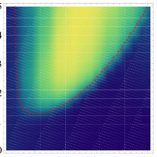 
FIG. 4. Number of excited particles ∆N vs the drive strength g and the hopping amplitude J. The color area results from the numerics of Eqs. (2) and (3), and the red dashed line comes from the analytical solution in Eqs. (16) and (17). We have taken the depth of the well V = −2 and the drive fre- quency ω = 4Jh. The tunneling strength is Jl = 1, and the evolution time is τ = 100.

📷 Fig 2

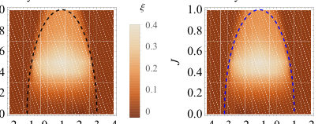 
FIG. 2. Regimes for the symmetric mode and antisymmetric mode. The numerical results (color areas) are obtained by di- rectly solving Eqs. (2) and (3), while the analytical solutions (dashed lines) come from Eqs. (10) and (11). Color bars de- notes the emission rate ξ of the particles. Here, the tunneling strength is Jl = 1, and the drive strength is g = 0.2. We have taken the simulation time τ = 50.

📷 Fig 3

 
Figure 3 shows the short-time decay behavior of the total particle number N0 under a fixed drive strength,

📷 Fig 4

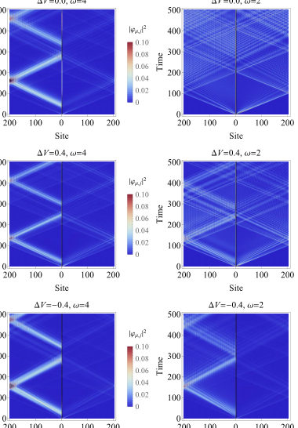 
FIG. 7. Number of particles |φµ,j|2 on the jth site of each lead as a function of time, when the drive frequency is tuned to ω = 4 and ω = 2. The depth of the left well is kept as Vc = −2, while the right one varies as Vb = −2, −1.6, and −2.4, respectively. The other parameters are g = 0.3, Jb = 0.1, Jc = 0.3, and Jl = 1.

**Summary.** This paper theoretically explores how external driving and structural asymmetries can be used to control the emission of particles from a Bose-Einstein condensate confined in a double-well lattice. By tuning parameters like well depth bias or hopping imbalance, researchers demonstrated methods to enhance or suppress quantum particle jets, offering insights for building atomtronic devices.

**Why it may be interesting.** This work directly addresses controllable quantum transport phenomena using ultracold atoms (BECs) in engineered potentials, which is a major focus area for AMO physics and atomtronic device design.

Detailed structure

**Main problem.** The study investigates the nonlinear dynamics of particle jets emitted from a Bose-Einstein condensate trapped in a double-well potential subjected to time-periodic external driving.

**Main result.** The emission rate can be precisely controlled by tuning the depth asymmetry between the wells or by modulating the hopping amplitudes, demonstrating tunable quantum many-body transport.

**Method.** The analysis uses mean-field approximations and solves coupled differential equations derived from a Hamiltonian describing the driven condensate dynamics in the double well.

**Model / system.** The system is a Bose-Einstein condensate confined to a one-dimensional lattice with a double-well potential, where interatomic interactions are periodically modulated. The model incorporates hopping terms, on-site potentials, and time-dependent driving fields.

**Key observables.** Particle emission rate ($\xi$), total particle number decay ($N_0(t)$), and particle imbalance between the two wells.

**Important parameters / regimes.** Drive strength ($g$), lattice hopping amplitude ($J$), depth asymmetry ($\Delta V = V_b - V_c$), and hopping imbalance ($\Delta J = J_b - J_c$).

**Assumptions / limitations.** The analysis often proceeds using the mean-field approximation, sometimes simplifying to $U=0$ or employing a two-mode approximation ansatz.

**Figures summary.** Figures illustrate excitation regimes based on drive strength and hopping amplitude (Fig. 2), particle number decay over time under varying driving frequencies (Fig. 3), and dependence of emission rate on depth asymmetry ($\Delta V$) and hopping imbalance ($\Delta J$).

**Paper structure.** The paper builds from defining the Hamiltonian and mean-field equations, analyzing excitation regimes in symmetric cases, and then systematically introducing asymmetries ($\Delta V 
eq 0$) and imbalances ($\Delta J$) to demonstrate control over particle emission.

Abstract

We investigate the nonlinear dynamics of a Bose-Einstein condensate trapped in a double-well potential of a one-dimensional lattice, where the interatomic interactions are periodically modulated in time. In the typical case of a symmetric double-well, we observe collective particle emission under resonant driving, where the excitation regimes are explicitly constrained by the interplay between the drive strength and the hopping amplitude. By introducing a depth asymmetry between the wells, we find that moderate bias specifically enhances the emission rate, while large asymmetry suppresses it. The particle jets can be further controlled by modulating the hopping amplitudes, where the emission is weakened for finite hopping imbalances. These results outline the roles of asymmetry and external driving in precisely manipulating quantum many-body transport, and may offer insights into the design of atomtronic devices.

[↑ back to top](#top)

### [Quantum simulacra](http://arxiv.org/abs/2607.24739v1)

**Authors:** L. F. Alves da Silva, M. H. Y. Moussa  
**Type:** theory · **Category:** other · **PDF:** <https://arxiv.org/pdf/2607.24739v1>  
**Analysis basis:** full PDF text, analyzed in chunks
**Topic relevance:** 🔥 `measurement-induced transitions` **4/5** · `Tavis-Cummings & cavity-many-emitter` **3/5** · `quantum measurements` **3/5** · `correlated / nonlocal dissipation` **2/5** · `driven-dissipative phase transition` **2/5** · `entanglement & information structure` **2/5** · `Dicke superradiance` **1/5** · `analog quantum simulation` **1/5** · `correlated cavity matter` **1/5** · `methods for driven-dissipative` **1/5** · `non-equilibrium dynamics` **1/5** · `non-equilibrium universality` **1/5** · `superradiant laser` **1/5**

📷 Fig 1

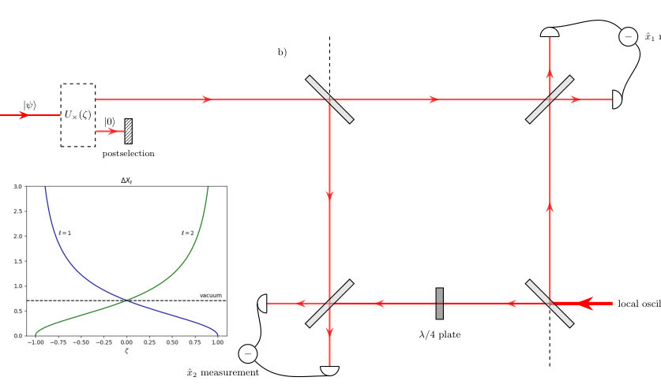 
Fig. 1: (a) Success-failure mechanism implementing the postselection required by the con-

**Summary.** The paper introduces 'quantum simulacra,' demonstrating how changing the mathematical metric used to measure a quantum system can make it appear to exhibit properties—like entanglement or superradiance—that are not present in its underlying Hamiltonian. This is achieved by combining advanced measurement techniques (POVMs with postselection) with a metric operator $\Theta$, suggesting that experimental context fundamentally shapes perceived physical reality.

**Why it may be interesting.** This work provides a powerful conceptual tool showing that physical reality is not solely determined by the Hamiltonian but can be engineered or revealed through the choice of measurement framework (the metric).

Detailed structure

**Main problem.** The paper analyzes 'quantum simulacra': phenomena that emerge when quantum systems are analyzed using metrics other than the standard L2 norm.

**Main result.** By redefining the measurement metric ($\Theta$), one can generate observable effects, such as Bell violations with unentangled photons or superradiant phase transitions, that are absent in the standard Hamiltonian description.

**Method.** The analysis adapts pseudo-Hermitian quantum mechanics frameworks, utilizing a positive-definite metric operator $\Theta$ and combining Positive Operator-Valued Measures (POVM) with postselected subensembles for measurement.

**Model / system.** The work applies to various systems, including radiation-field modes (squeezing), two-level systems (entanglement/Bell tests), and the Tavis–Cummings model. The core concept involves modifying the inner product via $\Theta$.

**Key observables.** Correlation functions $E(\varphi_A, \varphi_B)$, Concurrence ($C$), squeezing quadratures ($\Delta X_\ell$), and photon number ($\hat{n}$).

**Important parameters / regimes.** The metric choice is parametrized by $\zeta$ (or related parameters in the Tavis-Cummings model), which dictates whether a simulacrum manifests.

**Assumptions / limitations.** The procedure critically relies on combining POVMs with postselection to enforce the use of the non-standard metric $\Theta$ during measurement, rather than assuming it is inherent to the Hamiltonian.

**Figures summary.** Figures illustrate the 'POVM + postselection' scheme for continuous quadratures and show theoretical uncertainties ($\Delta X_\ell$) versus a parameter $\zeta$.

**Paper structure.** The paper builds from general principles of metric-dependent observables, applies this to specific examples like squeezing and entanglement (showing simulacra), and culminates in demonstrating the feasibility of superradiant phase transitions via metric engineering.

Abstract

Here we analyze the creation of quantum simulacra: phenomena that emerge from treating a Hermitian or non-Hermitian quantum system in metrics other than the standard $L^{2}$. Changing the metric redefines the set of system observables and thus the experimental arrangement for their measurement, making quantum contextuality and microscopic reality metric-dependent. The simulacra therefore consist, on the one hand, of a resizing of the status of quantum measurement, which has always occupied a central role in quantum mechanics: beyond the connection between quantum and classical dynamics, measurements performed in an appropriate metric can emulate a microscopic reality distinct from that prescribed by the Hamiltonian. On the other hand, simulacra provide a route to implementing quantum operations that lie beyond the reach of the $L^2$ metric. Quantum simulacra offer, as an example, an explanation for the recent observation of the violation of Bell inequalities with unentangled photons [Sci. Adv. \textbf{11}, eadr1794 (2025)]: photons that are separable in $L^2$ metric, become entangled when analyzed within a new metric framework. Simulacrum comes at the cost of implementing measurements of the metric-redefined observables; to address this challenge, we propose a scheme combining positive operator-valued measures with postselected subensembles.

[↑ back to top](#top)

### [Electron Shuttle Waiting Times for Electric Field Sensing](http://arxiv.org/abs/2607.24350v1)

**Authors:** Alberto Mayorgas, Alberto López-García, Enamul Haque, Javier Cerrillo  
**Type:** theory · **Category:** other · **PDF:** <https://arxiv.org/pdf/2607.24350v1>  
**Analysis basis:** full PDF text, analyzed in chunks
**Topic relevance:** 🔥 `methods for driven-dissipative` **4/5** · `Keldysh / 2PI / non-Gaussian methods` **3/5** · `driven-dissipative phase transition` **3/5** · `Kondo & dissipative impurity` **2/5** · `non-equilibrium dynamics` **2/5** · `quantum measurements` **2/5** · `analog quantum simulation` **1/5** · `correlated / nonlocal dissipation` **1/5** · `entanglement & information structure` **1/5** · `measurement-induced transitions` **1/5** · `non-equilibrium universality` **1/5**

📷 Fig 1

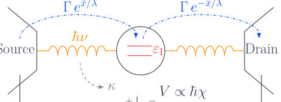 
FIG. 1: Schematic representation of the electron shuttle. The central island (quantum dot) is modeled as a two-level system with level spacing εI (red) and moves in a harmonic potential with energy quantum ℏν, represented by the orange springs. The blue dash-dotted arrows indicate position-dependent electron tunnelling from the source to the island and from the island to the drain, with rates Γeˆx/λ and Γe−ˆx/λ, respectively, where ˆx is the island displacement and λ is the tunnelling length. The applied bias V controls the island–oscillator coupling strength χ, while the gray dashed arrow denotes mechanical damping at rate κ due to the coupling of the oscillator to a thermal bath.

📷 Fig 2

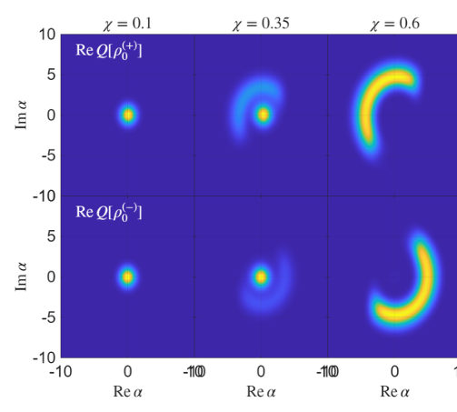 
FIG. 2: Husimi function of the stationary solution in the electronic diagonal elements subspaces ρ(+) 0 = ⟨1| ρ0 |1⟩ (top row) and ρ(−) 0 = ⟨0| ρ0 |0⟩(bottom row), for three values of the electric field χ = 0.1ν, 0.35ν, 0.6ν in the tunneling, crossover and shuttle regimes respectively (left to right columns). The axis represent the real and imaginary part of the phase space parameter α. The parameters used are Γ = 0.01ν, κ = 0.05ν, λ = 2x0 and an oscillator basis of size N = 50.

📷 Fig 3

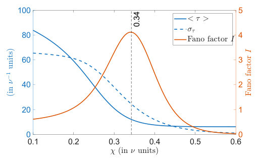 
FIG. 4: Mean waiting time (solid blue) and standard deviation (dashed) in ν−1 units at the left axis, and Fano factor (orange) at the right axis. Magnitudes are derived from the waiting time distribution of the electron shuttle (7). The parameters used are Γ = 0.01ν, κ = 0.05ν, λ = 2x0 and an oscillator basis of size N = 50. The WTD has been calculated in a 1000 elements time window of τ ∈[0, 300ν−1].

📷 Fig 4

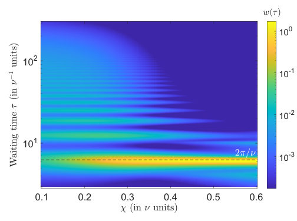 
FIG. 3: Heatmap of the waiting time distribution w(τ) as a function of the coupling χ (in ν units) and the waiting times (in ν−1 units). The WTD has been calculated in a 1000 elements time window of τ ∈[0, 300ν−1], in logarithmic scale to increase the point density for low waiting times. The horizontal dashed line identifies the period of the oscillator in the shuttle regime, 2π/ν ≃6.28ν−1. The parameters used are Γ = 0.01ν, κ = 0.05ν, λ = 2x0 and an oscillator basis of size N = 50.

📷 Fig 5

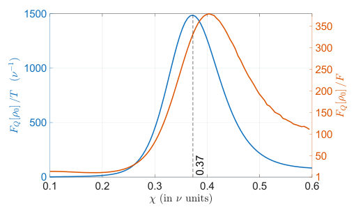 
FIG. 6: Quantum Fisher Information for a continuous measurement (11) divided by the measuring time T (blue), and QFI divided by the CFI of Figure 5 bottom panel (orange), both as function of the coupling χ. The parameters used are Γ = 0.01ν, κ = 0.05ν, λ = 2x0 and an oscillator basis of size N = 50.

**Summary.** This paper investigates using the timing of electron tunneling events in a quantum electron shuttle to sense electric fields. By analyzing waiting-time statistics derived from a master equation model, the authors quantify the sensing limit by comparing classical and quantum Fisher information. The results highlight that the system's crossover regime offers superior sensitivity for electromechanical parameter estimation.

**Why it may be interesting.** This work bridges mesoscopic physics (quantum dots/shuttles) with quantum metrology by showing how temporal statistics (waiting times) in open quantum systems can be used as sensitive probes for external fields, a key area for AMO and quantum optics research.

Detailed structure

**Main problem.** The study aims to utilize waiting-time statistics from an electron shuttle system to estimate external electric fields, thereby quantifying the metrological potential of charge transport fluctuations.

**Main result.** The analysis shows that the crossover region between tunneling and shuttling regimes exhibits enhanced fluctuations and a pronounced enhancement in the Fisher information, improving parameter sensitivity for sensing.

**Method.** The authors analyze stationary dynamics using Markovian quantum master equations to derive waiting time distributions (WTDs) and compare the resulting classical Fisher information against the theoretical quantum Fisher information.

**Model / system.** The physical system is a quantum electron shuttle, modeled as a single-level quantum dot coupled to leads and an oscillating nanomechanical resonator. The dynamics are governed by a master equation incorporating tunneling, oscillator coupling ($\propto E$), and Ohmic dissipation.

**Key observables.** Waiting time distribution (WTD), mean waiting time ($\langle	au
angle$), variance ($\sigma_	au$), Fano factor ($I$), classical Fisher information, and quantum Fisher information.

**Important parameters / regimes.** Electric field coupling strength ($\chi$), bias voltage regime (high-bias), Coulomb blockade strength, and the ratio of tunneling rates to mechanical frequency ($\Gamma/
u$).

**Assumptions / limitations.** The dynamics are treated using a Markovian master equation derived via Born-Markov approximations, assuming constant parameters for frequencies and rates.

**Figures summary.** Figure 1 schematically illustrates the electron shuttle setup. Figure 2 shows transitions in the Husimi function from Fock to toroidal shapes as coupling changes. Figure 3 displays WTD heatmaps showing frequency dependence on $\chi$.

**Paper structure.** The paper establishes the physical model and Hamiltonian, derives the master equation for the island-oscillator subsystem, analyzes stationary states via phase space methods, calculates WTDs, and finally applies quantum estimation theory to compare classical vs. quantum Fisher information.

Abstract

We explore the use of waiting-time statistics in a quantum electron shuttle for electric-field sensing. Electron shuttles convert nanomechanical motion into charge transport, showing a noise-broadened crossover between stochastic tunneling and mechanically assisted charge transfer. This allows investigation of how transport fluctuations encode electromechanical parameters. Using a single-level quantum shuttle in strong-Coulomb-blockade and high-bias regimes with a Markovian quantum master equation, we analyze stationary dynamics in phase space and waiting time distributions. By estimating the electromechanical coupling, proportional to the electric field, we evaluate the classical Fisher information in waiting times and compare it with the quantum Fisher information of the stationary state. We relate the metrological response to mean waiting time, variance, and Fano factor. Our results show that the crossover from tunneling to shuttling is characterized by enhanced fluctuations and increased parameter sensitivity, leading to a pronounced enhancement of the Fisher information.

[↑ back to top](#top)

### [Mixing times and spectra of non-equilibrium symmetric exclusion processes on general graphs](http://arxiv.org/abs/2607.22991v1)

**Authors:** Leonard J. Schulman, Alistair Sinclair  
**Type:** theory · **Category:** statistical mechanics · **PDF:** <https://arxiv.org/pdf/2607.22991v1>  
**Analysis basis:** full PDF text, analyzed in chunks
**Topic relevance:** 🔥 `non-equilibrium dynamics` **4/5** · `methods for driven-dissipative` **3/5** · `non-equilibrium universality` **3/5** · `Keldysh / 2PI / non-Gaussian methods` **2/5** · `correlated / nonlocal dissipation` **2/5** · `driven-dissipative phase transition` **2/5** · `Kondo & dissipative impurity` **1/5** · `analog quantum simulation` **1/5** · `entanglement & information structure` **1/5** · `exotic spin models in light-matter` **1/5** · `scars & prethermalization` **1/5**

📷 Fig 1

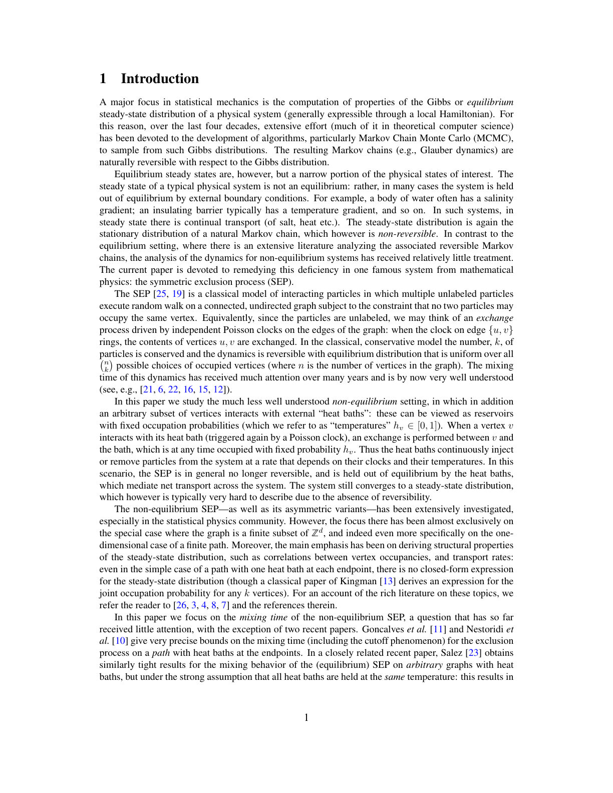 
Low-resolution page preview, page 2

📷 Fig 2

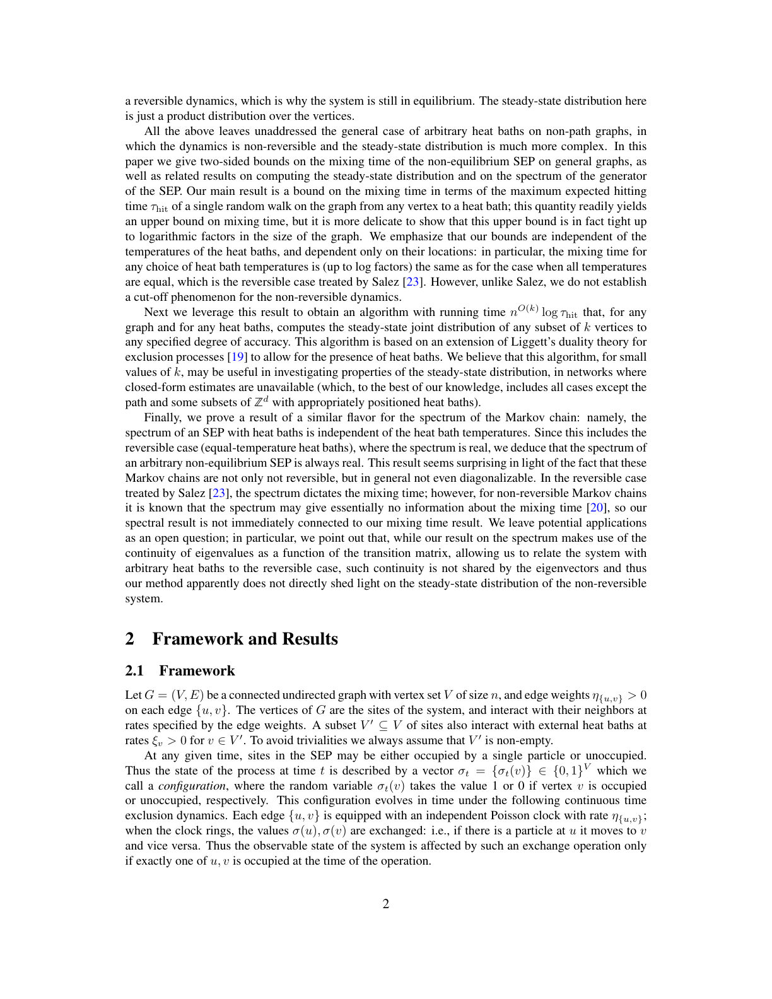 
Low-resolution page preview, page 3

📷 Fig 3

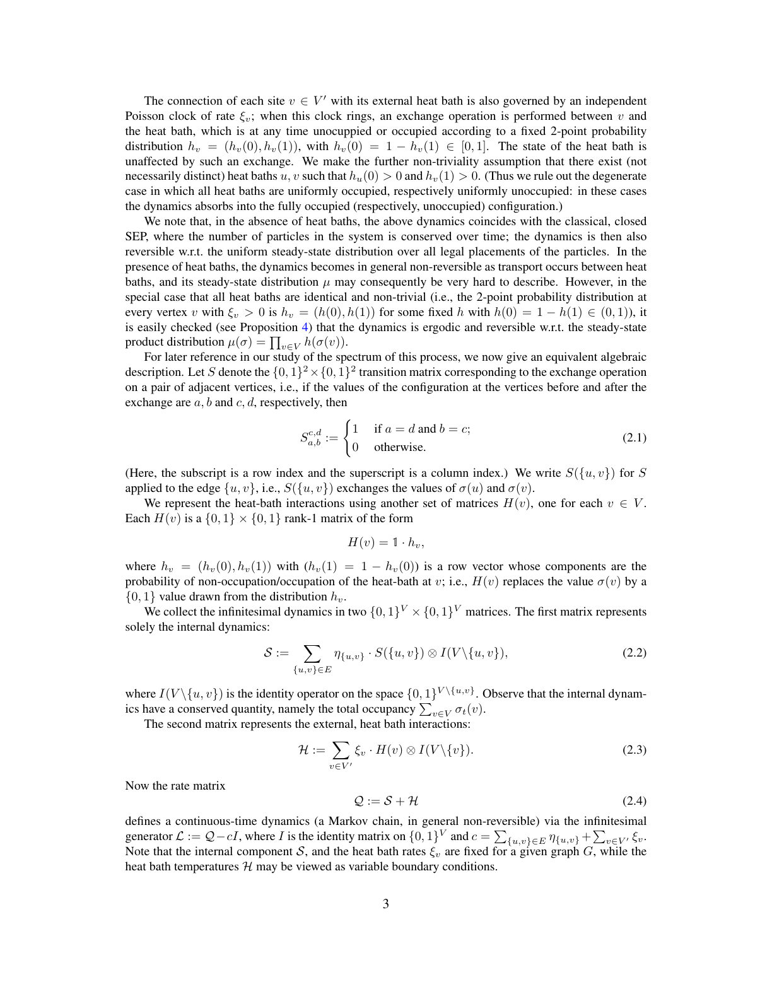 
Low-resolution page preview, page 4

📷 Fig 4

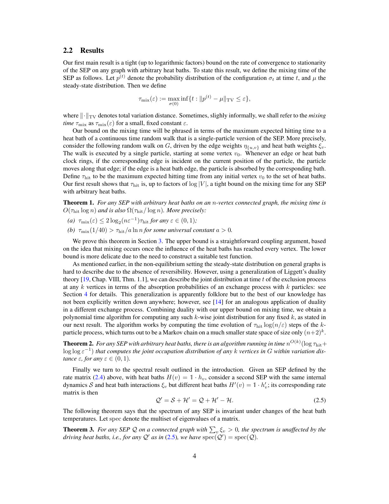 
Low-resolution page preview, page 5

📷 Fig 5

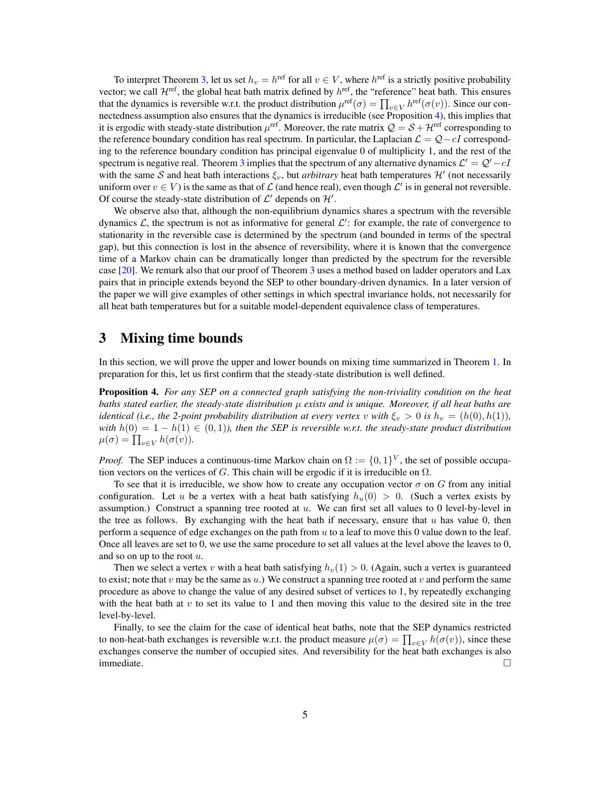 
Low-resolution page preview, page 6

**Summary.** This paper analyzes the challenging non-equilibrium behavior of particles on a graph modeled by the Symmetric Exclusion Process (SEP) when external heat baths are present. The authors provide quantitative bounds for how fast the system reaches steady state and develop an algorithm to calculate local correlations in this complex regime. Crucially, they prove that despite the non-reversible dynamics, the underlying spectral properties remain invariant with respect to changes in bath temperatures.

**Why it may be interesting.** While focused on classical statistical mechanics, the study of non-reversible Markov dynamics, spectral gaps, and convergence rates in complex interacting systems provides foundational mathematical tools applicable to open quantum systems where dissipation drives the system away from equilibrium.

Detailed structure

**Main problem.** The paper investigates the non-equilibrium dynamics, mixing times, and spectral properties of the Symmetric Exclusion Process (SEP) when external heat baths drive the system out of equilibrium on general graphs.

**Main result.** They derive tight bounds for the mixing time related to single-particle hitting times and prove that the spectrum of the Markov chain is independent of the specific temperatures of the heat baths.

**Method.** The analysis employs coupling arguments, generalizations of Liggett's duality theory for correlation calculations, and advanced spectral graph theory techniques (like commutator relations) to establish invariance properties.

**Model / system.** The system is the Symmetric Exclusion Process (SEP), modeling interacting particles on a general graph G. The non-equilibrium aspect is introduced by coupling vertices to external heat baths at different temperatures, leading to a non-reversible Markov process.

**Key observables.** Mixing time ($	au_{	ext{mix}}$), steady-state joint occupation distribution for $k$ sites, and the spectrum of the rate matrix.

**Important parameters / regimes.** Graph structure (arbitrary graphs), heat bath rates ($\xi_v$), and temperatures ($h_v$).

**Assumptions / limitations.** The graph G is connected and undirected; the analysis relies on extending known duality properties to include arbitrary non-equilibrium driving forces.

**Paper structure.** The paper builds from establishing the difficulty of non-equilibrium SEP, deriving quantitative bounds for mixing time using hitting times, presenting an algorithm for computing joint distributions via dual processes, and finally proving spectral invariance through algebraic conditions on the generator matrix.

Abstract

The symmetric exclusion process (SEP) is a classical model of interacting particles on a graph, in which multiple particles execute random walks subject to the constraint that no two particles may occupy the same vertex. The version of the process in which the number of particles is fixed, is by now very well understood, through the study of reversible Markov chains.   In this paper, we study the non-equilibrium version of the SEP, in which some vertices of the graph interact with external heat baths, held at different temperatures, that mediate transport through the graph. The resulting steady-state distribution is still the stationary distribution of a natural Markov chain, but the chain is no longer reversible. This means that even the steady-state distribution is very hard to describe, and indeed is the subject of a rich literature, which has focused almost exclusively on graphs which are finite subsets of the lattice $Z^d$. Very little is known about other important quantities, notably the mixing time.   We derive various quantitative results about the non-equilibrium SEP for arbitrary graphs with arbitrary heat baths. Our main result is a bound on the mixing time in terms of the worst-case hitting time of a single particle to any of the heat baths; this bound is tight up to two logarithmic factors in the size of the graph. We then use this result to derive a simple algorithm, running in time roughly $n^{O(k)}$, that computes the steady-state joint occupation distribution for any set of $k$ vertices; since the steady-state distribution is very elusive, this provides a potentially useful tool to study its $k$-wise correlations for small values of $k$. Finally, we prove that the spectrum of the Markov chain associated with the non-reversible dynamics for the SEP is independent of the heat bath temperatures; thus in particular the spectrum is always real.

[↑ back to top](#top)

### [Mitigation of Measurement-Induced State Transitions via a Fast-Load and Fast-Clear Readout](http://arxiv.org/abs/2607.23681v1)

**Authors:** Wei-En Lin, Li-Chieh Hsiao, Chen-Hsun Ma, Erh-Hsiang Yeh, Wei-Lun Peng, Hsi-Sheng Goan, Cen-Shawn Wu, Yueh-Nan Chen, Yung-Fu Chen, Chung-Ting Ke, Chii-Dong Chen  
**Type:** both · **Category:** quantum information and computing · **PDF:** <https://arxiv.org/pdf/2607.23681v1>  
**Analysis basis:** full PDF text, analyzed in chunks
**Topic relevance:** 🔥 `QC/QI experiment` **4/5** · 🔥 `measurement-induced transitions` **4/5** · `methods for driven-dissipative` **3/5** · `quantum measurements` **3/5** · `non-equilibrium dynamics` **2/5** · `Keldysh / 2PI / non-Gaussian methods` **1/5** · `driven-dissipative phase transition` **1/5** · `quantum optics experiment` **1/5**

📷 Fig 1

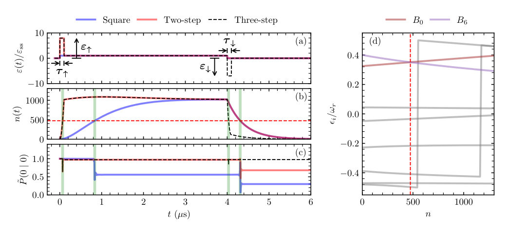 
FIG. 1. Floquet analysis of various pulse shapes. (a) Pulse amplitudes ε(t) normalized by the steady-state amplitude εss, (b) the corresponding photon populations n(t), and (c) time-dependent branch probabilities ˜P(0 | 0) evaluated via Eq. (5), for square (blue), two-step (red), and three-step (black dashed) pulses, all initialized at t = 0. (τss + τ↑= 4 µs and τ↑= τ↓= 100 ns). (d) Normalized quasienergies ϵi/ωr as a function of the instantaneous resonator photon number n, with brown and purple curves denoting branches B0 and B6, respectively. The red dashed lines in (b) and (d) mark the critical crossing point, located at n = n0,cri = 474, while the green-shaded regions in (b) and (c)...

📷 Fig 2

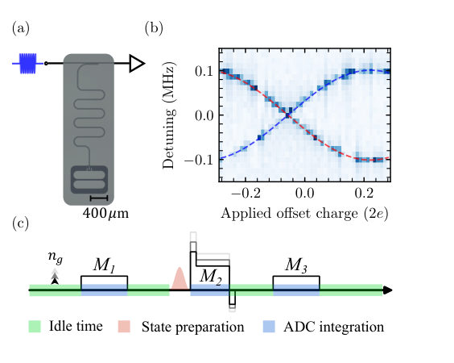 
FIG. 2. Device architecture and MIST characterization framework. (a) Optical micrograph of the device compris- ing a floating transmon coupled to its dedicated readout res- onator, which is inductively coupled to a common transmis- sion line. (b) Detuning frequencies extracted from the Fourier transform of Ramsey measurements at 3.077 GHz, showing the even- and odd-parity qubit frequencies as a function of applied offset charge for Q1. (c) Schematic of the MIST char- acterization protocol, incorporating three distinct analog-to- digital converter (ADC) signal integration windows. After the Ramsey-based calibration of ng and stabilization at the target bias point, the M1 pulse is applied for...

📷 Fig 3

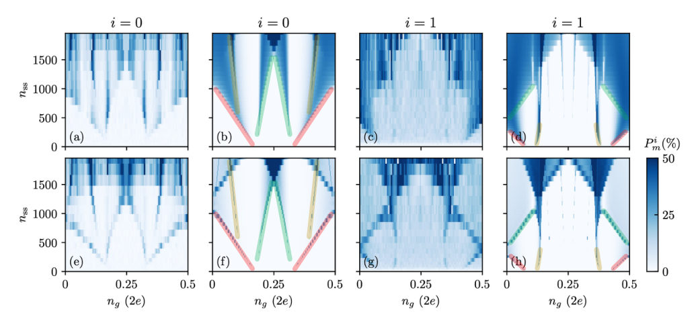 
FIG. 3. MIST structures associated with M2 and their suppression via pulse shaping for initial qubit states |i⟩. (a),(c) Measured and (b),(d) simulated MIST structures versus ng and nss, characterized by P i m for a square pulse. The experimental data are benchmarked against numerical simulations via Eq. (6). (e),(g) Measured and (f),(h) simulated suppression of MIST features, achieved via a calibrated two-step pulse scheme with τ↑= 100 ns and a state-independent amplitude ε↑determined by Eq. (10). The red, green, and brown semi-transparent guide lines overlaying panels (b),(f) are applied for the qubit prepared in |0⟩to trace the transitions from B0 to branches B6, B8, and B9,...

📷 Fig 4

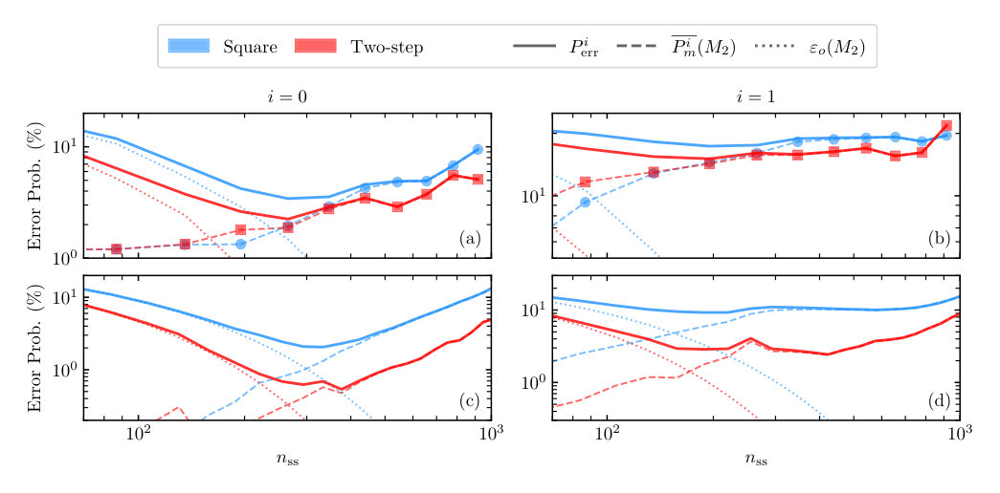 
FIG. 4. Readout error probabilities for initial qubit states |i⟩as a function of nss, extracted from the data in Fig. 3. Blue and red denote the square and two-step pulses, respectively. Throughout all panels, solid, dashed, and dotted curves represent the total readout error probability P i err, the ng-averaged transition probability P im(M2), and the overlap error εo(M2), respectively. (a),(b) Experimental data. The measured P im(M2) for the square and two-step pulses are indicated by dashed curves with circles (blue) and squares (red), respectively. (c),(d) Corresponding numerical simulations.

📷 Fig 5

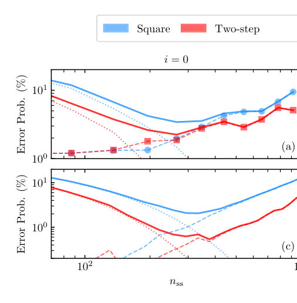 
Figure 3 presents the measured P i m values for Q1 along- side numerical simulations to systematically investigate the behavior of MIST under both square (Figs. 3(a)–(d)) and calibrated two-step (Figs. 3(e)–(h)) pulse profiles. In these panels, multiple band structures characterized by high transition probabilities are clearly visible, indicat- ing the presence of MIST. The background probability is higher in the experiment than that in the simulation, an offset we attribute to decoherence, which is not accounted for in our model. To identify the underlying physics of these features, we perform a numerical Floquet branch analysis. For instance, the red, green, and brown semi- transparent...

**Summary.** This paper tackles the critical issue of Measurement-Induced State Transitions (MIST) limiting qubit readout speed and fidelity in superconducting processors. The authors propose engineering fast-load and fast-clear pulse sequences to suppress unwanted resonator photon dynamics. By showing that a simple three-step pulse minimizes total error probabilities, they offer a robust, practical solution for improving quantum processor performance.

**Why it may be interesting.** This work provides highly practical, hardware-agnostic pulse shaping techniques that directly address fundamental limitations in superconducting quantum processor readout fidelity, which is crucial for scaling up quantum computation.

Detailed structure

**Main problem.** The primary challenge addressed is mitigating Measurement-Induced State Transitions (MIST) during rapid, high-fidelity readout of superconducting qubits.

**Main result.** The authors demonstrate that a straightforward three-step pulse scheme effectively minimizes overall readout errors by suppressing resonator photon overshoots and optimizing the diabatic passage through resonance crossings.

**Method.** They systematically investigate MIST dynamics using Floquet branch analysis on a semiclassical driven transmon model, comparing various pulse shaping techniques (square vs. two/three-step).

**Model / system.** The system is a superconducting transmon qubit coupled to a resonator in a charge-sensitive architecture. The Hamiltonian describes the time evolution under external driving fields and includes terms sensitive to the offset charge $n_g$.

**Key observables.** Measurement-induced transition probability ($P_{im}$), total readout error probabilities ($P_{i}^{	ext{err}}$), and resonator photon number dynamics $n(t)$.

**Important parameters / regimes.** Offset charge ($n_g$), steady-state resonator photon number ($n_{	ext{ss}}$), cavity decay rate ($\kappa$), and the quasienergy gap ($\Delta_{	ext{ac}}$).

**Assumptions / limitations.** The analysis relies on a semiclassical approximation, neglecting quantum fluctuations, and assumes conditions like $\kappa \ll \omega_d$ for Floquet analysis.

**Figures summary.** Figures compare MIST structures using different pulse shapes (square vs. two/three-step) across varying $n_g$ and $n_{	ext{ss}}$, showing error probability maps for Q1 and Q2.

**Paper structure.** The paper progresses from identifying the fundamental limitation (MIST due to readout), developing a theoretical framework using Floquet analysis, proposing fast-load/fast-clear pulse engineering, and finally validating the optimal three-step scheme through detailed numerical simulations and comparisons across different qubit states.

Abstract

High-fidelity and rapid qubit readout is essential for superconducting quantum processors, typically realized through the quantum non-demolition (QND) dispersive interaction within a qubit-resonator architecture. However, the achievable readout speed and fidelity are fundamentally limited by measurement-induced state transitions (MIST). For a transmon qubit, MIST is highly sensitive to the offset charge $n_g$ due to the charge dispersion of its higher-lying energy levels. In this work, we systematically investigate $n_g$-dependent MIST dynamics governed by the diabaticity and symmetry of pulse shaping within a charge-sensitive transmon architecture. We engineer fast-load and fast-clear pulses that effectively suppress resonator photon overshoots, thereby demonstrating a highly practical strategy to mitigate MIST without requiring complex waveforms or real-time feedback. Utilizing active gate-voltage control and rapid feedback, the measurement-induced transition probability is precisely mapped against $n_g$ and the steady-state resonator photon number, exhibiting strong agreement with numerical Floquet branch analysis. Ultimately, we evaluate the $n_g$-averaged total error probabilities for both readout and post-readout stages, verifying that a straightforward three-step pulse scheme consistently minimizes overall readout errors. Within the framework of large-scale superconducting quantum processors, this practical, hardware-free approach inherently offers a better trade-off between the readout signal-to-noise ratio and QND preservation.

[↑ back to top](#top)

### [Thermodynamics with thermodynamic variable first-passage time. II. Dynamics of explosive boiling of superheated liquid, critical indices, fractional calculus](http://arxiv.org/abs/2607.24094v1)

**Authors:** V. V. Ryazanov  
**Type:** theory · **Category:** statistical mechanics · **PDF:** <https://arxiv.org/pdf/2607.24094v1>  
**Analysis basis:** full PDF text, analyzed in chunks
**Topic relevance:** 🔥 `non-equilibrium universality` **4/5** · `correlated / nonlocal dissipation` **3/5** · `driven-dissipative phase transition` **3/5** · `methods for driven-dissipative` **3/5** · `non-equilibrium dynamics` **3/5** · `Keldysh / 2PI / non-Gaussian methods` **1/5** · `Kondo & dissipative impurity` **1/5** · `analog quantum simulation` **1/5**

📷 Fig 1

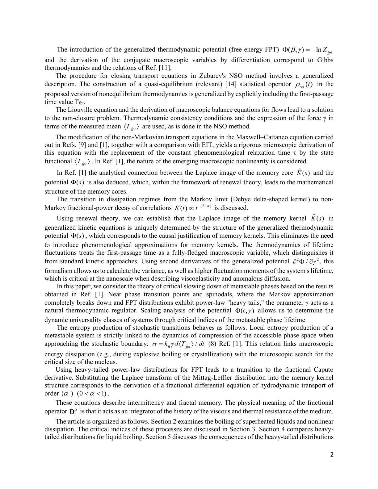 
Low-resolution page preview, page 2

📷 Fig 2

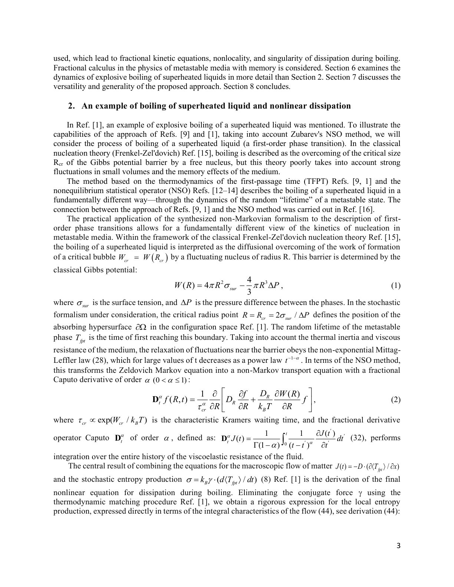 
Low-resolution page preview, page 3

📷 Fig 3

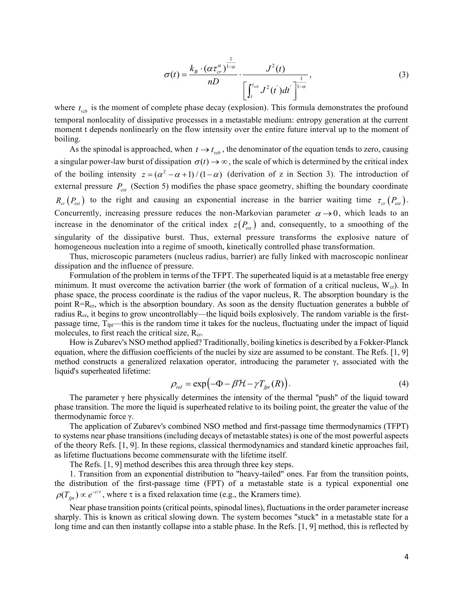 
Low-resolution page preview, page 4

📷 Fig 4

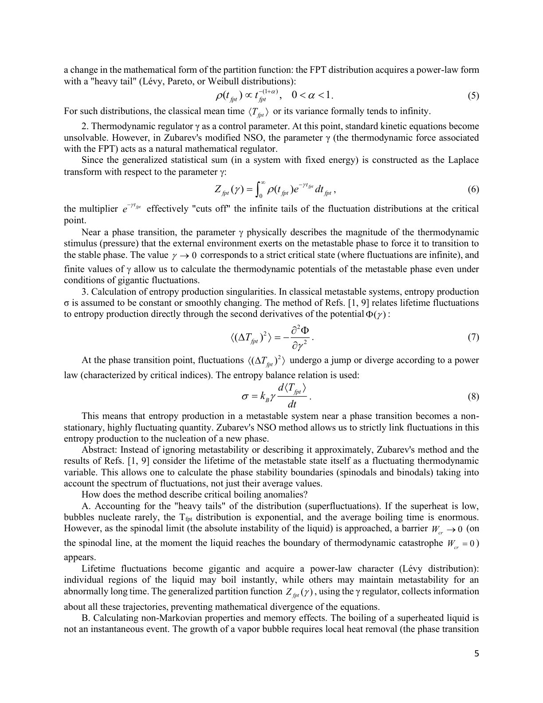 
Low-resolution page preview, page 5

📷 Fig 5

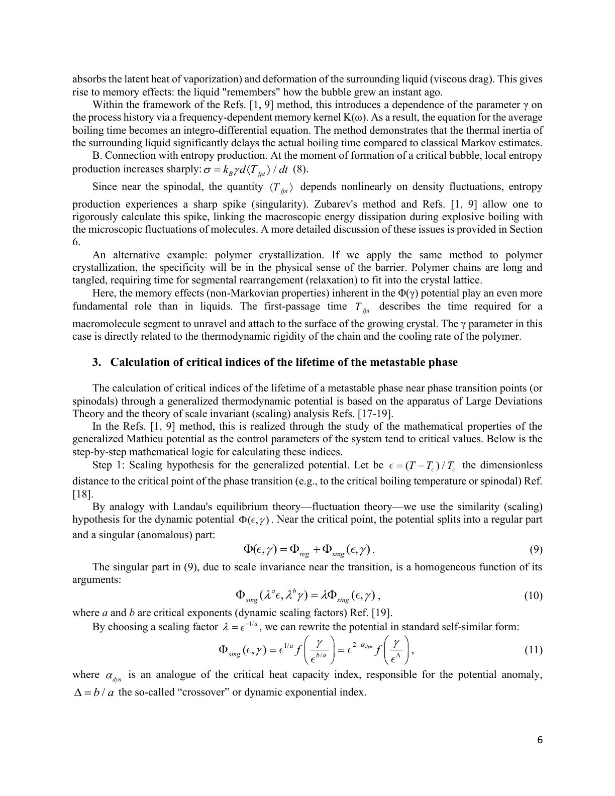 
Low-resolution page preview, page 6

**Summary.** This paper develops a sophisticated thermodynamic framework using stochastic first-passage time concepts to analyze extreme non-equilibrium processes, such as explosive boiling. It mathematically justifies the use of fractional calculus by showing that memory effects naturally lead to these derivatives in transport equations. The work provides critical indices describing kinetic instabilities and extends its utility to general mesoscopic systems beyond simple phase transitions.

**Why it may be interesting.** While focused on classical phase transitions, the rigorous mathematical machinery involving fractional derivatives and memory effects is highly relevant for modeling open quantum systems where dissipation and environmental coupling lead to non-Markovian dynamics (e.g., quantum Brownian motion).

Detailed structure

**Main problem.** The study investigates non-equilibrium thermodynamics, particularly focusing on how stochastic first-passage time (FPT) dynamics influence processes like explosive boiling near phase transitions.

**Main result.** The framework establishes that dissipation is determined by the integral history of matter flow and shows that critical indices describe kinetic catastrophes violating minimum entropy production principles.

**Method.** It combines First-Passage Time Thermodynamics with Zubarev's Non-Equilibrium Statistical Operator theory, leading to the incorporation of fractional Caputo derivatives into hydrodynamic equations.

**Model / system.** The primary model is the explosive boiling of a superheated liquid undergoing a first-order phase transition. The analysis extends this framework to general open dissipative systems like charge transport in nanostructures and viscoelastic fluids.

**Key observables.** Nonlocal entropy production, critical index of dissipation intensity (z), average/variance of first-passage time ($\langle fpt/
angle$, $	ext{Var}(fpt/\langle
angle)$).

**Important parameters / regimes.** Fractional derivative order ($\alpha$), thermodynamic regulator ($\gamma$), external pressure ($P_{	ext{ext}}$), and the history integral of matter flow $J(t)$.

**Assumptions / limitations.** The approach assumes that classical thermodynamics fails near phase transitions due to strong memory effects, necessitating the use of fractional calculus and FPT as a primary thermodynamic variable.

**Figures summary.** Not specified by notes; figures likely illustrate the dependence of entropy production or critical indices on external parameters like pressure or time history.

**Paper structure.** The paper builds from establishing TFPT thermodynamics using power-law distributions, applying this to explosive boiling to derive nonlocal entropy production and critical indices, and finally generalizing the formalism to other non-equilibrium systems like charge transport and viscoelastic relaxation.

Abstract

Within the framework of stochastic first-passage time thermodynamics (TFPT) and power-law distributions (Mittag-Leffler and Levy), the appearance of fractional Caputo derivatives in hydrodynamic equations is substantiated. The developed framework is applied to the problem of explosive boiling of a superheated liquid: an integral formula for nonlocal entropy production is derived and the critical index of dissipation intensity is calculated, along with qualitative changes in these parameters upon introducing external pressure. It is found that dissipation at a given instant is strictly determined by the integral history of the macroscopic matter flow J(t) over the entire evolutionary interval up to the moment of phase explosion. The calculated critical dissipation index z strictly describes the kinetic catastrophe and the violation of Prigogine's minimum entropy production principle near spinodals.

[↑ back to top](#top)

### [Dynamical Quantum Phase Transitions in a Pseudo-Hermitian Hamiltonian: The Imbalanced-Pairing Kitaev Model](http://arxiv.org/abs/2607.23956v1)

**Authors:** R. Jafari, Alireza Akbari, Shukhrat Mardonov, H. Yavartanoo  
**Type:** theory · **Category:** statistical mechanics · **PDF:** <https://arxiv.org/pdf/2607.23956v1>  
**Analysis basis:** full PDF text, analyzed in chunks
**Topic relevance:** 🔥 `driven-dissipative phase transition` **4/5** · 🔥 `non-equilibrium dynamics` **4/5** · `methods for driven-dissipative` **3/5** · `non-equilibrium universality` **3/5** · `Keldysh / 2PI / non-Gaussian methods` **1/5** · `Kondo & dissipative impurity` **1/5** · `analog quantum simulation` **1/5** · `correlated / nonlocal dissipation` **1/5**

📷 Fig 1

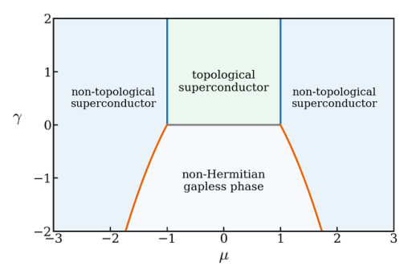 
FIG. 1. Equilibrium phase diagram of the imbalanced- pairing Kitaev model in the µ-γ plane. The diagram shows the topological superconducting, non-topological superconduct- ing, and gapless non-Hermitian phases. The boundaries of the gapless non-Hermitian region for γ &lt; 0 correspond to ex- ceptional points.

📷 Fig 2

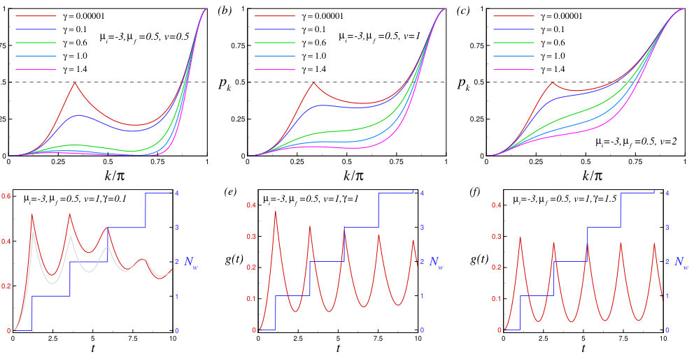 
FIG. 2. Transition probability pk as a function of momentum for ramps from µi = −3 to µf = 0.5, crossing the single critical point µc = −1. Panels (a)–(c) show pk for different values of γ and sweep velocities: (a) v = 0.5, (b) v = 1, and (c) v = 2. Panels (d)–(f) show the corresponding biorthogonal dynamical free energy g(t) and DTOP Nw(t) for v = 1: (d) γ = 0.1, (e) γ = 1, and (f) γ = 1.5. The blurred curve in panel (d) denotes the conventional dynamical free energy, shown for comparison. The system size is N = 1000.

📷 Fig 3

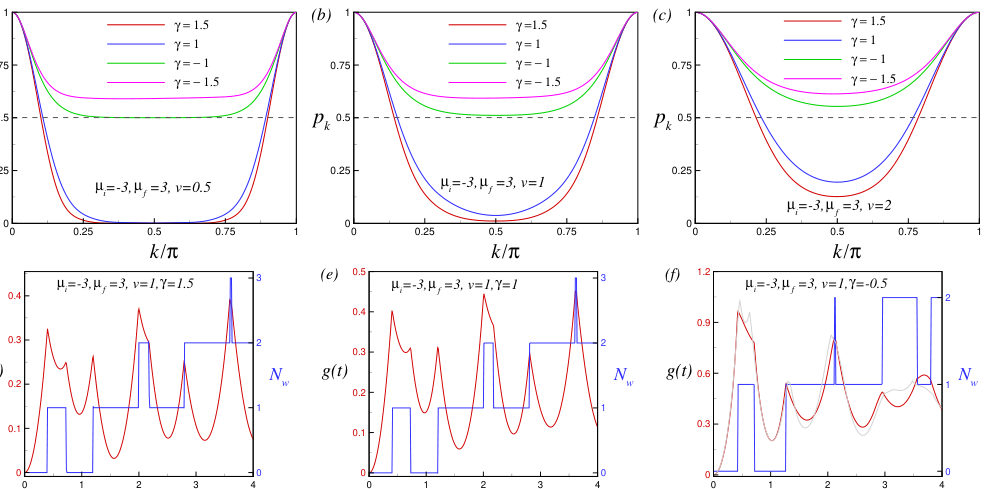 
FIG. 3. Transition probability pk as a function of momentum for ramps from µi = −3 to µf = 3, crossing two critical points, µc = ±1, or two exceptional points, µex = ± p

📷 Fig 4

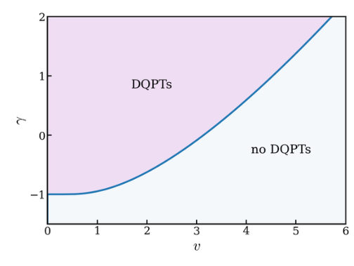 
FIG. 4. Dynamical phase diagram in the v-γ plane for a ramp across two critical points or two exceptional points. The region marked “DQPTs” indicates parameter values for which dynamical quantum phase transitions occur.

**Summary.** The paper analyzes Dynamical Quantum Phase Transitions (DQPTs) in the pseudo-Hermitian imbalanced-pairing Kitaev model under time-dependent driving. Using the biorthogonal Loschmidt echo formalism, it establishes that DQPTs are contingent upon the final Hamiltonian having a real spectrum. The results quantify how non-Hermiticity affects these transitions, showing critical velocities that vanish in certain limits.

**Why it may be interesting.** This work directly addresses non-equilibrium dynamics in open or non-Hermitian quantum systems, which is highly relevant for understanding driven many-body physics beyond standard equilibrium thermodynamics.

Detailed structure

**Main problem.** The study investigates Dynamical Quantum Phase Transitions (DQPTs) occurring during non-equilibrium evolution, specifically in pseudo-Hermitian quantum systems driven by time-dependent fields.

**Main result.** DQPTs are found to occur only when the final Hamiltonian possesses a real energy spectrum; furthermore, for certain driving protocols, the critical sweep velocity above which transitions vanish is dependent on the non-Hermiticity parameter.

**Method.** The analysis employs the biorthogonal framework and utilizes the Loschmidt echo formalism to diagnose nonanalyticities in the dynamical free-energy density during a linear ramp protocol.

**Model / system.** The system under study is the imbalanced-pairing Kitaev model, which serves as a prototypical pseudo-Hermitian Hamiltonian. The dynamics are driven by a linearly time-dependent chemical potential, $\mu(t) = \mu_f + vt$.

**Key observables.** Dynamical free-energy density ($g(t)$), Loschmidt echo ($L(t)$), and the critical sweep velocity.

**Important parameters / regimes.** Non-Hermiticity parameter ($\gamma$), linear ramp rate ($v$), and the final chemical potential ($\mu_f$).

**Assumptions / limitations.** The analysis assumes an integrable system that can be decomposed into independent two-level Hamiltonians for each momentum mode, necessitating the use of the biorthogonal framework.

**Figures summary.** Figure 1 illustrates the equilibrium phase diagram in the $\mu-\gamma$ plane, demarcating topological, non-topological, and gapless non-Hermitian phases, with boundaries related to exceptional points.

**Paper structure.** The paper establishes the theoretical framework using biorthogonal techniques for pseudo-Hermitian systems. It then applies this formalism to analyze the time evolution under a linear ramp protocol, calculating observables like the Loschmidt echo and identifying conditions for DQPTs based on spectral properties.

Abstract

Although parity-time (PT)-symmetric Hamiltonians are often associated with real energy spectra, PT symmetry is neither a sufficient nor a necessary condition for a real spectrum. More generally, real spectra are associated with the broader class of pseudo-Hermitian Hamiltonians, of which PT-symmetric Hamiltonians constitute a simple subclass. Here, we investigate the nonequilibrium dynamics of the imbalanced-pairing Kitaev model, a prototypical pseudo-Hermitian system, under a linearly time-dependent chemical potential. The dynamics are analyzed within the biorthogonal framework using the concept of dynamical quantum phase transitions (DQPTs). We show that, under a linear ramp protocol, DQPTs occur only when the post-ramp Hamiltonian possesses a real energy spectrum. For positive values of the non-Hermiticity parameter ($γ>0$), where the energy spectrum remains entirely real, a ramp crossing a single quantum critical point gives rise to a single family of critical times, analogous to the Hermitian case. Furthermore, for ramps crossing two critical or exceptional points, the critical sweep velocity above which DQPTs disappear decreases as the non-Hermiticity parameter is reduced and vanishes in the staggered-pairing limit, $γ=-1$.

[↑ back to top](#top)

### [Kinetic and Hydrodynamic Theories of Chiral Intruder Dynamics in Nonequilibrium Baths](http://arxiv.org/abs/2607.23223v1)

**Authors:** Raphaël Maire, Ignacio Pagonabarraga  
**Type:** theory · **Category:** statistical mechanics · **PDF:** <https://arxiv.org/pdf/2607.23223v1>  
**Analysis basis:** full PDF text, analyzed in chunks
**Topic relevance:** 🔥 `non-equilibrium dynamics` **4/5** · `Keldysh / 2PI / non-Gaussian methods` **3/5** · `methods for driven-dissipative` **3/5** · `non-equilibrium universality` **3/5** · `correlated / nonlocal dissipation` **2/5** · `driven-dissipative phase transition` **2/5** · `Frenkel-Kontorova` **1/5**

📷 Fig 1

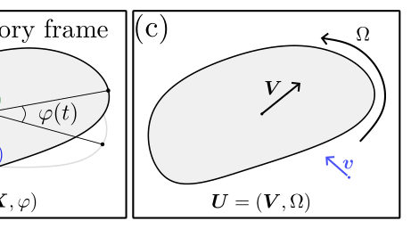 
FIG. 1. Cartoon of the intruder and its parametrization

📷 Fig 2

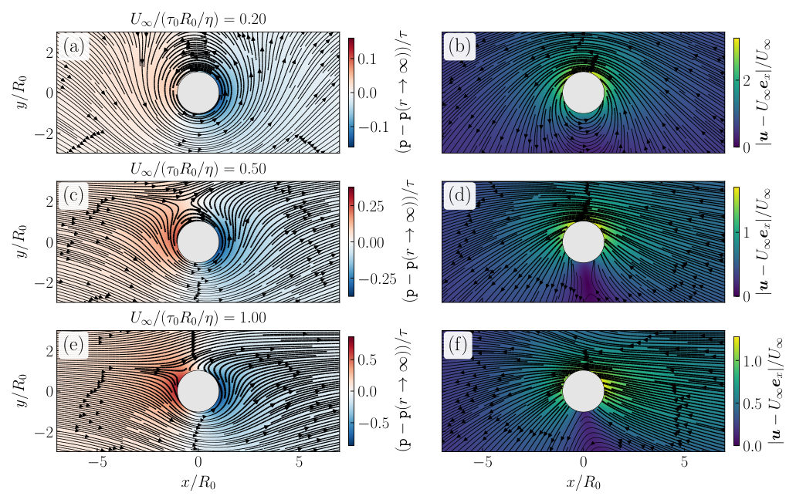 
FIG. 2. Pressure and velocity field (streamline plot) (a, c, e) around an intruder in a chiral bath using Eqs. (F33), (F34), and (F35). The corresponding body frame velocity field is also shown in (b, d, f). For (a) and (b) U∞η/τ0R0 = 0.2, for (c) and (d) U∞η/τ0R0 = 0.5 and for (e) and (f) U∞η/τ0R0 = 1.

📷 Fig 3

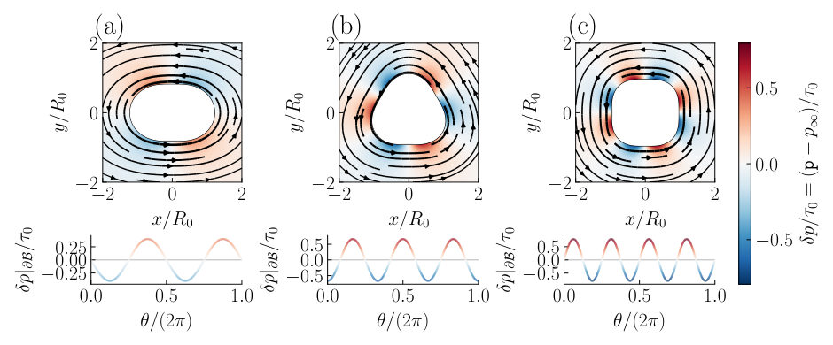 
FIG. 3. Pressure and velocity fields around a convex intruder (top), together with the pressure distribution along its boundary (bottom), for an ellipse (a: m = 2, ϵ = 1/5), a triangle (b: m = 3, ϵ = 1/10), and a square (c: m = 4, ϵ = 1/17).

📷 Fig 4

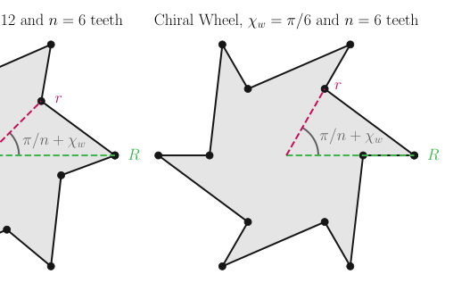 
FIG. 4. Examples of wheels as given by Eqs. (E26) and (E27), for various χw at fixed number of teeth n.

**Summary.** This paper develops a comprehensive theory to describe how an object (intruder) moves within a surrounding fluid bath under non-equilibrium conditions. It rigorously derives separate descriptions for both dilute kinetic collisions and dense hydrodynamic flow regimes. The key contribution is quantifying the role of chirality, showing it generates unique odd responses and torques in both theoretical limits.

**Why it may be interesting.** This work provides advanced theoretical tools for modeling non-equilibrium transport phenomena, particularly how geometric chirality introduces odd responses that are crucial in understanding active matter or complex fluids far from equilibrium.

Detailed structure

**Main problem.** The study investigates the chiral dynamics of an intruder immersed in a nonequilibrium bath across two distinct theoretical limits: the dilute kinetic regime and the dense hydrodynamic regime.

**Main result.** In the dilute limit, chirality generates odd responses and torques via an effective Langevin equation; conversely, the dense limit reveals that edge currents generate antisymmetric drag and curvature-induced torque when inertia is included.

**Method.** The authors employ a multi-scale theoretical approach, deriving equations from Boltzmann-Lorentz descriptions (kinetic) and analyzing flow fields using hydrodynamic expansions (dense).

**Model / system.** The system consists of an intruder interacting with a surrounding bath fluid. The analysis uses concepts ranging from collision rules and Kramers-Moyal expansions to full chiral Navier-Stokes equations.

**Key observables.** Odd response, torque generation, ratchet effects, antisymmetric drag, edge currents, damping coefficients ($\Gamma_{ab}, \Gamma_{a\phi}$), and diffusion tensors ($D_{ij}$).

**Important parameters / regimes.** Dilute kinetic regime vs. dense hydrodynamic regime; intruder shape chirality; bath density; inertia (when included).

**Assumptions / limitations.** The analysis relies on deriving effective equations by separating effects in different limits, though the connection between these regimes is a key focus.

**Figures summary.** Not specified.

**Paper structure.** The paper systematically develops the theory by first addressing the dilute kinetic limit via Langevin derivations and then transitioning to the dense hydrodynamic regime using continuum fluid mechanics principles.

Abstract

We study the chiral dynamics of an intruder immersed in a nonequilibrium bath in two complementary limits: the dilute kinetic regime and the dense hydrodynamic regime. In the dilute limit, starting from a Boltzmann-Lorentz description, we derive an effective Langevin equation whose coefficients are given explicitly by geometry-dependent boundary integrals. This formulation separates the effects of intruder-shape chirality from those of chiral intruder-bath interactions. We find that the chiral interactions generate an odd response and a torque, whereas the chirality of the intruder leads to a ratchet effect. We also show that fluctuation-dissipation-like relations exist and that certain symmetry-allowed couplings vanish in the dilute regime. In the dense regime, we argue that intruder dynamics are governed primarily by bath hydrodynamics and torque-density-driven edge currents not captured by the previous framework. These currents can generate both an antisymmetric drag and a curvature-induced torque, leading to an antisymmetric response when inertia is accounted for. Taken together, these results provide a step toward understanding the mechanisms governing the chiral dynamics of an intruder in a nonequilibrium bath across different scales.

[↑ back to top](#top)

### [Multiconfigurational Mixed Quantum-Classical Approach for Correlated Many-Body Dynamics](http://arxiv.org/abs/2607.23414v1)

**Authors:** Pritha Ghosh, Rajanya Sarkar, Arkajit Mandal  
**Type:** theory · **Category:** strongly correlated electrons · **PDF:** <https://arxiv.org/pdf/2607.23414v1>  
**Analysis basis:** full PDF text, analyzed in chunks
**Topic relevance:** 🔥 `methods for driven-dissipative` **4/5** · `Keldysh / 2PI / non-Gaussian methods` **3/5** · `non-equilibrium dynamics` **3/5** · `driven-dissipative phase transition` **2/5** · `Frenkel-Kontorova` **1/5** · `analog quantum simulation` **1/5** · `correlated / nonlocal dissipation` **1/5** · `correlated cavity matter` **1/5** · `entanglement & information structure` **1/5** · `non-equilibrium universality` **1/5**

📷 Fig 1

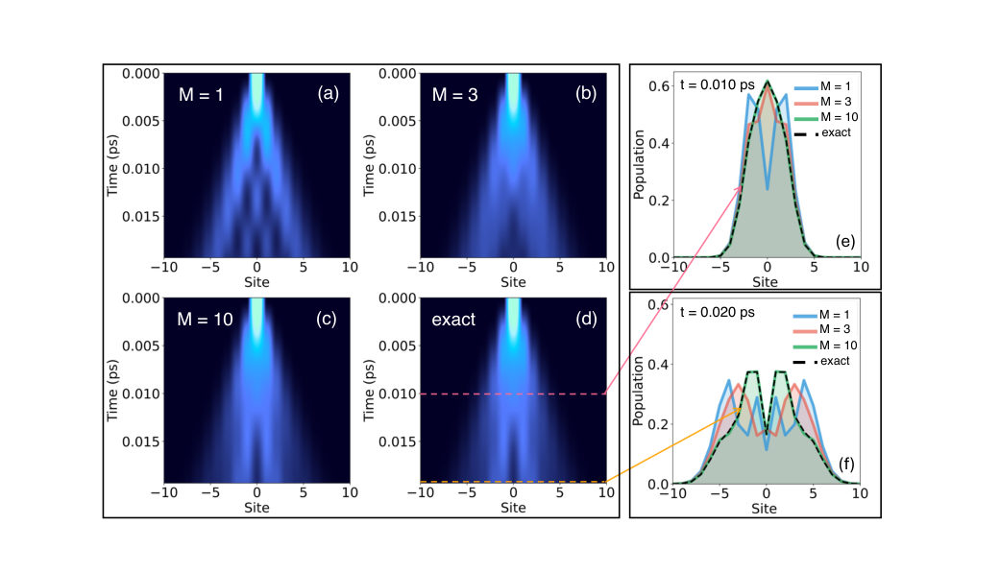 
FIG. 1. Multiconfigurational many-body dynamics of a centrally initialized bosonic density of 3 excitations over a lattice of 21 sites, compared with the exact (Schr¨odinger) propagation of the same system. (a)-(c) The single-mode (M = 1), three-mode (M = 3) and ten- mode (M = 10) dynamics, respectively, of the bosonic density over time (in picoseconds). (d) The exact dynamics of the same 3-excitation system. (e)-(f) The spatial population profiles of the bosonic density at time 0.010 ps and 0.020 ps, respectively, for the representative cases (M = 1, 3, 10) (shown in (a)-(c)) and the exact (Schr¨odinger) propagation (shown in (d)). The nearest-neighbor hopping parameter (τ) is set to 0.004...

📷 Fig 2

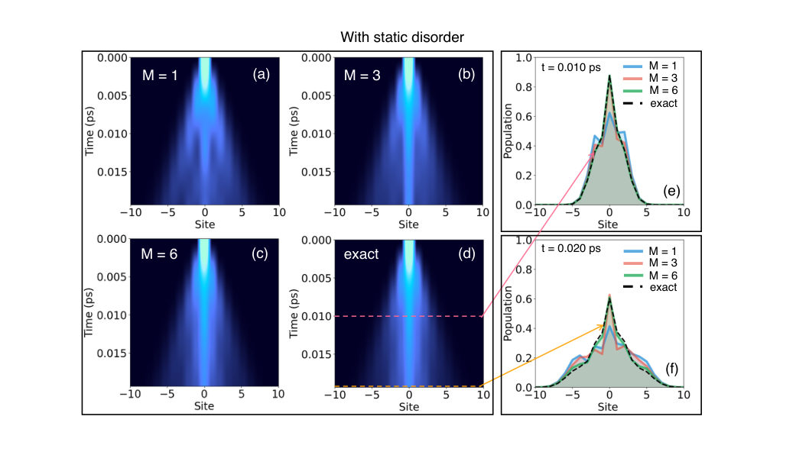 
FIG. 2. Multiconfigurational many-body dynamics of a centrally excited 3-excitation wave packet in the presence of 2% static disorder, where the on-site energies are sampled from a normal distribution. (a)-(c) The single-mode (M = 1), three-mode (M = 3) and six-mode (M = 6) dynamical evolution, respectively, of the bosonic density over time (in ps). (d) The exact dynamics of the same 3 -excitation system (for the same realizations of static disorder as in (a)-(c)). (e)-(f) Disorder-modified spatial population profiles of the bosonic density at time 0.010 ps and 0.020 ps, respectively, for the representative cases (M = 1, 3, 6) (shown in (a)-(c)) and the case of the exact quantum propagation...

📷 Fig 3

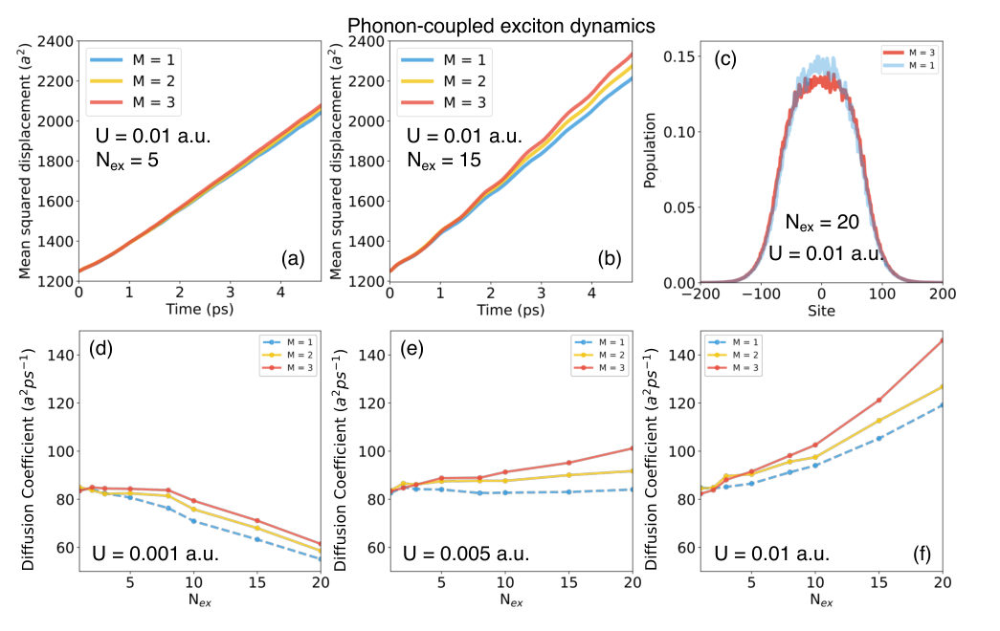 
FIG. 3. Phonon-coupled exciton dynamics in the presence of dynamic disorder on a lattice of 400 sites at 150 K. The excitonic density is initialized as a many-body Gaussian wave packet centered at the middle of the lattice with σ = 50 units. (a)-(b) The mean squared displacement (MSD) of the excitonic density versus time (in ps) for single-mode (M = 1) (solid blue line) as well as for multiconfigurational calculations: (M = 2) (solid yellow line) and (M = 3) (solid red line) at U = 0.01 a.u., for 5 and 15 excitations, respectively. (c) Final-time (tf = 4.8 ps) spatial excitonic density profiles for the M = 1 (solid light blue) and M = 3 (solid red) dynamics for a density initialized with 20...

📷 Fig 4

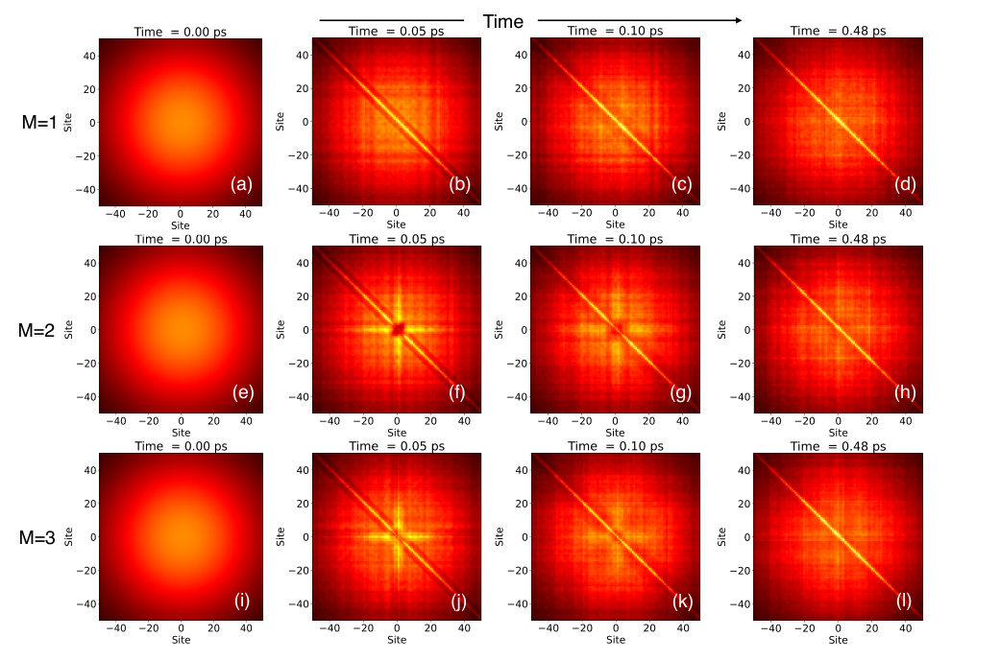 
FIG. 4. Spatial pair-probability density, at different representative times (in ps) in the many-body dynamics of excitons at a temperature of 150 K , for an initial 10-excitation wave packet on a lattice of 400 molecular sites. All the figures have been zoomed in to focus on the central zone where the dynamics hold relevance. (a)-(d) Snapshots of the single-mode (M = 1) evolution of the spatial two-body reduced density matrix (ρ(2)(i, j)) at 0 ps, 0.05 ps, 0.10 ps and 0.48 ps respectively. (e)-(h) Snapshots of the two-mode (M = 2) dynamical evolution of ρ(2)(i, j) at the same representative times as in (a)-(d), capturing transient correlations. (i)-(l) Snapshots of the three-mode (M = 3)...

📷 Fig 5

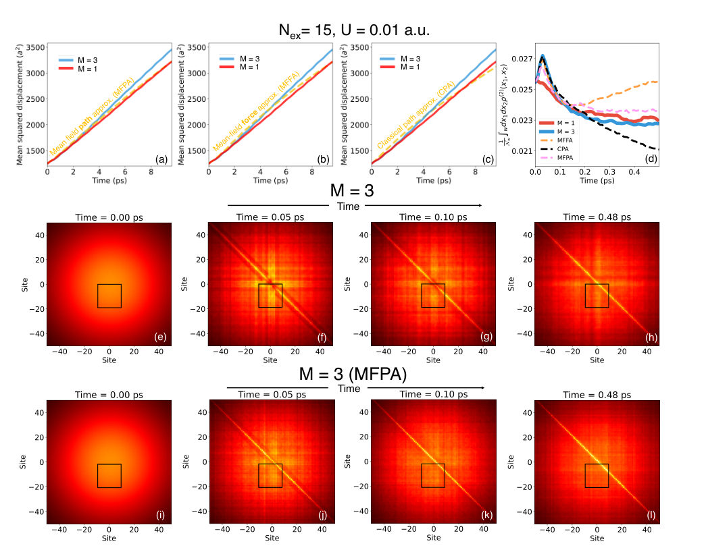 
FIG. 5. Comparison of the mean squared displacement (MSD) for the multiconfigurational M = 3 dynamics over time, where the MSD plot of the M = 1 case is present as a reference, among three distinct types of approximations in the multiconfigurational (M = 3) many-body Ehrenfest dynamics of a 15-exciton system with interaction strength U = 0.01 a.u., followed by spatial pair density signatures over time in the approximate early dynamics that are compared to the reference M = 3 dynamics. (a) MSD versus time plot for M = 3 dynamics with precomputed positions and momenta (from M = 1 dynamics) (mean field path approximation or MFPA). (b) MSD versus time plot for M = 3 dynamics, but with the...

**Summary.** The paper introduces a multiconfigurational mixed quantum-classical method to simulate complex exciton dynamics in disordered environments. It demonstrates that while standard mean-field approaches fail to capture essential spatial correlations, an efficient Mean-Field Path Approximation can successfully reproduce these many-body effects. This positions the approach as a powerful tool for studying correlated light-matter interactions in condensed matter systems.

**Why it may be interesting.** This work is highly relevant as it tackles open quantum systems dynamics (excitons coupled to phonons) using advanced mixed quantum-classical techniques, providing systematic ways to recover strong correlations beyond simple mean-field limits.

Detailed structure

**Main problem.** The work addresses simulating finite-temperature, correlated multi-exciton dynamics when coupled to phonons that induce both static and dynamic disorder.

**Main result.** A multiconfigurational mixed quantum-classical approach is proposed, showing that while mean-field methods fail to capture spatial correlations, a Mean-Field Path Approximation (MFPA) can accurately reproduce these crucial correlations.

**Method.** The core method is a multiconfigurational mixed quantum-classical treatment where the excitonic subsystem uses a multiconfigurational wavefunction ansatz, and the lattice vibrations (phonons) are treated quasi-classically.

**Model / system.** The system models interacting excitons on a lattice coupled to phonons, governed by an effective Hamiltonian involving Bose-Hubbard terms for excitons ($\hat{H}_e$) and phonon oscillators ($\hat{H}_p$).

**Key observables.** Excitonic transport (Mean Squared Displacement), spatial pair correlation function ($g^{(2)}(i, j)$), single-particle and two-particle reduced density matrices ($
ho^{(1)}, 
ho^{(2)}$).

**Important parameters / regimes.** System parameters include hopping ($	au$), interaction strength ($U$), phonon coupling ($\gamma$), temperature ($T=150$ K), and disorder variance.

**Assumptions / limitations.** The primary approximation is the Mean-Field Path Approximation (MFPA) used to efficiently capture spatial correlations, although this method is noted as insufficient for long-time transport dynamics.

**Figures summary.** Figures illustrate the convergence of dynamics with increasing number of modes ($M$) and compare the evolution of the spatial pair correlation function $g^{(2)}$ between mean-field (low $M$) and multiconfigurational/MFPA results.

**Paper structure.** The paper details the derivation of coupled equations of motion for Single Particle Functions and expansion coefficients, implements numerical techniques like gauge fixing and re-orthonormalization, and then applies this framework to simulate dynamics under varying levels of quantum correlation inclusion ($M$).

Abstract

In this work, we introduce a multiconfigurational mixed quantum-classical many-body approach for simulating the finite-temperature correlated multi-exciton dynamics in the presence of phonon-induced static and dynamic disorder. In this mixed quantum-classical approach, the excitonic subsystem is described using a multiconfigurational wavefunction that extends beyond the mean-field limit, while the phonons are evolved quasi-classically. Using this approach, we simulate a multi-excitonic dissipative system and show how the interplay between phonon-induced dynamic disorder and exciton-exciton many-body interactions determines excitation-dependent excitonic transport and spatial correlations. Our results show that while the mean-field approach produces semi-quantitatively accurate diffusive dynamics, it does not capture the spatial correlations as expected. We find that a mean-field path approximation, where we generate pre-computed trajectories using our mean-field mixed quantum-classical approach and then perform multiconfigurational dynamics, can reproduce the spatial correlations to a good accuracy, positioning this approach as an efficient method for capturing spatial correlations in complex systems.

[↑ back to top](#top)

### [Non-Hermitian-enhanced quantum sensing in an optical interferometer](http://arxiv.org/abs/2607.23978v1)

**Authors:** X. J. Huang, Lei Xiao, Bingzi Huo, X. X. Yi, Peng Xue  
**Type:** experiment · **Category:** other · **PDF:** <https://arxiv.org/pdf/2607.23978v1>  
**Analysis basis:** full PDF text, analyzed in chunks
**Topic relevance:** 🔥 `quantum optics experiment` **4/5** · `interference shaping light` **3/5** · `quantum measurements` **3/5** · `correlated / nonlocal dissipation` **2/5** · `driven-dissipative phase transition` **2/5** · `Kondo & dissipative impurity` **1/5** · `QC/QI experiment` **1/5** · `methods for driven-dissipative` **1/5** · `non-equilibrium dynamics` **1/5**

📷 Fig 1

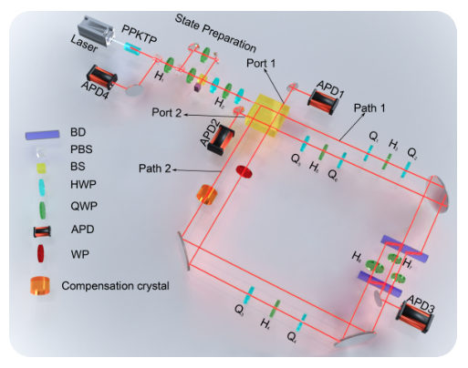 
FIG. 1. Experimental setup. Photon pairs are generated via spontaneous parametric down-conversion. In each pair, one photon serves as the trigger and the other is sent into the state-preparation stage followed by a Sagnac interferome- ter. In the interferometer, a BS splits the photon into path-1 and path-2 with equal probability. Along path-1, the pho- ton undergoes the unitary evolution U †, while along path-2, it undergoes the normalized positive operation R′. The two paths propagate in clockwise and counterclockwise directions, respectively, forming a closed loop and interfering at the BS. Coincidence detection of output photons with trigger photons is performed using APDs with a 3-ns...

📷 Fig 2

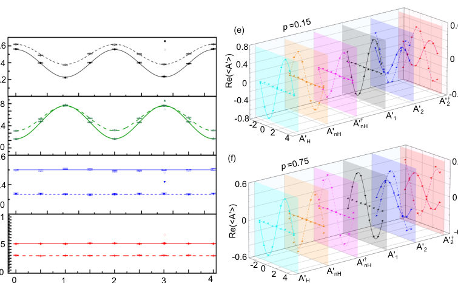 
FIG. 2. Panels (a)–(d) show photon counts versus ϕ: (a) The I(ϕ) pattern of quantum parameter estimation using the non-optimal non-Hermitian observable A′ 1 (black solid line) and non-optimal Hermitian observable A′ 2 (black dashed line) with the initial state ρ0 at p = 0.75. (b) The I(ϕ) pattern of quantum parameter estimation using the non-optimal non-Hermitian observable A′ 1 (green solid line) and non-optimal Hermitian observable A′ 2 (green dashed line) with the initial state ρ0 at p = 0.15. (c) The I(ϕ) pattern of the optimal non-Hermitian observable A′ nH (blue dashed line) and optimal Hermitian observable A′ H (blue solid line) with the initial state at p = 0.75. (d) The I(ϕ)...

📷 Fig 3

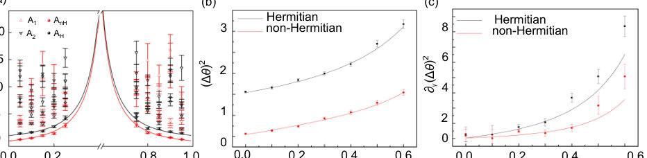 
FIG. 3. (a) Variance (∆θ)2 versus the state parameter p in the noiseless case. Theoretical predictions are shown as lines: red for the optimal non-Hermitian observable and black for the optimal Hermitian observable. Experimental variances are represented by symbols: red circles for the optimal non-Hermitian observable, black circles for the optimal Hermitian observable, red triangles for a non-optimal non-Hermitian observable, and black triangles for a non-optimal Hermitian observable. (b) Variance (∆θ)2 versus the amplitude-damping strength γ for the optimal Hermitian observable (black) and the optimal non-Hermitian observable (red), with p = 0.01 and θ = 0.3π. (c) Noise-induced variance...

**Summary.** The paper experimentally demonstrates enhanced quantum parameter estimation sensitivity by employing a non-Hermitian observable readout technique on an optical interferometer. Using single photons in a Sagnac setup, the authors show that the resulting error variance is lower than the best Hermitian counterpart, even with noise present. This work provides a practical route for implementing and validating non-Hermitian concepts in quantum sensing.

**Why it may be interesting.** This work provides a concrete experimental realization of using non-Hermitian physics in metrology. It is highly relevant to open quantum systems and quantum optics as it shows how engineered dissipation (non-Hermiticity) can enhance sensing while remaining physically consistent when measured fully.

Detailed structure

**Main problem.** The primary goal is to enhance quantum parameter estimation sensitivity beyond limits set by standard Hermitian measurements by utilizing non-Hermitian observables.

**Main result.** The experiment successfully demonstrated a reduced error-propagation variance using a non-Hermitian observable compared to the optimal Hermitian one, an advantage that persists under amplitude-damping noise.

**Method.** Quantum parameter estimation was performed experimentally using a single-photon Sagnac interferometer setup. The non-Hermitian expectation value was reconstructed by analyzing interference fringes from multiple output ports.

**Model / system.** The physical platform is a linear optical system utilizing single-photon probe states and a Sagnac interferometer. Non-Hermiticity is implemented through controllable, polarization-dependent photon loss within the measurement path.

**Key observables.** Error-propagation variance $(\Delta	heta)^2$, reconstructed complex expectation value of the non-Hermitian observable $\langle A' 
angle(	heta)$, and Classical Fisher Information (CFI).

**Important parameters / regimes.** State parameter $p$ (related to initial state preparation), noise strength $\gamma$ (amplitude damping), and the comparison between Hermitian vs. Non-Hermitian observables.

**Assumptions / limitations.** The analysis assumes that while a non-Hermitian advantage is observed at the readout level, including all output ports in the full POVM measurement ensures consistency with standard quantum metrological limits.

**Figures summary.** Figures show interference patterns $I(\phi)$ for different observables and parameters, and plots illustrate the variance $(\Delta	heta)^2$ versus the state parameter $p$, comparing non-Hermitian vs. Hermitian performance.

**Paper structure.** The paper details the theoretical framework of using non-Hermitian Fisher information, describes the experimental setup involving SPDC and the Sagnac interferometer for readout, presents measurements showing variance reduction with non-Hermitian observables, and concludes by confirming consistency with standard quantum limits via POVM analysis.

Abstract

The precision of quantum parameter estimation is traditionally constrained by the quantum Cramér-Rao bound, which is based on the Hermitian measurement framework. Recent studies of non-Hermitian systems have suggested new possibilities for enhancing parameter-estimation sensitivity. Here, we experimentally realize quantum parameter estimation using a non-Hermitian observable on a linear optical platform. The parameter is encoded in single-photon probe states and read out with a Sagnac interferometer, which allows us to reconstruct the complex expectation value of the implemented non-Hermitian observable from interference fringes. We observe a reduced error-propagation variance compared with the optimal Hermitian observable for the same probe-state model. This advantage remains visible under amplitude-damping noise. We further analyze the complete optical measurement as a physical positive-operator-valued measure (POVM) and show, through the corresponding classical Fisher information (CFI), that the observed non-Hermitian advantage is consistent with the standard quantum metrological limit when all output ports are included. Our results provide an experimental route to non-Hermitian observable readout and clarify its operational meaning in quantum sensing.

[↑ back to top](#top)

### [Floquet time-convolutionless master equation for non-Markovian driven quantum systems](http://arxiv.org/abs/2607.24406v1)

**Authors:** Pietro Follia, Heinz-Peter Breuer, Bassano Vacchini  
**Type:** theory · **Category:** other · **PDF:** <https://arxiv.org/pdf/2607.24406v1>  
**Analysis basis:** full PDF text, analyzed in chunks
**Topic relevance:** 🔥 `methods for driven-dissipative` **4/5** · 🔥 `non-equilibrium dynamics` **4/5** · `driven-dissipative phase transition` **3/5** · `correlated / nonlocal dissipation` **2/5** · `non-equilibrium universality` **2/5** · `Keldysh / 2PI / non-Gaussian methods` **1/5** · `analog quantum simulation` **1/5**

📷 Fig 1

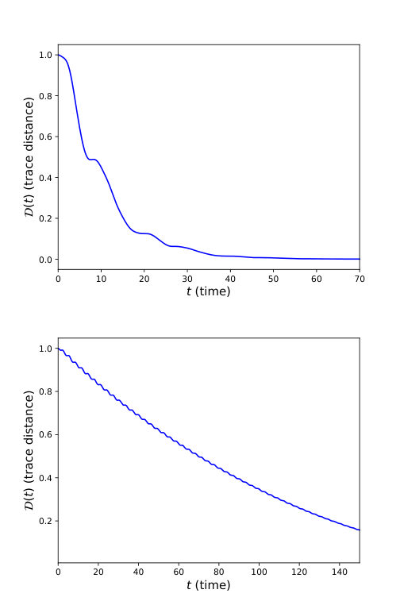 
Figure 1. Top: Trace distance for a pair of states maximizing the non-Markovianity in the non-degenerate case, corresponding to d0 = (−0.25, 0.88, 0.39) for ε = 0.167. Bottom: Trace distance for a pair of state maximizing non-Markovianity in the degenerate case, that is ε = 0. Now the optimal pair corresponds to the vec- tor d0 = (0.99, 0.02, −0.11). In both cases with consider a Lorentz- Drude spectral density as in Eq. (39) with α = 0.1ω0, Λ = 1.2ω0 and β = 1.0ω0.

📷 Fig 2

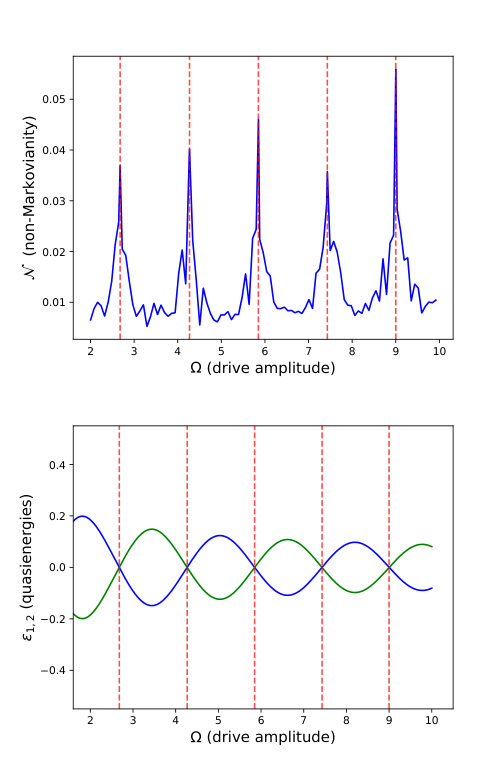 
Figure 2. Non-Markovianity (top) and quasienergies (bottom) as a function of the driving strength Ω. Vertical dashed red lines indicate quasienergy degeneracies, occurring at Ω = {2.68, 4.27, 5.88, 7.43, 9.00}ω0. The relevant parameters of the spec- tral density are the same as in Fig. 1.

**Summary.** The paper develops the Floquet time-convolutionless master equation to model open quantum systems under periodic driving while retaining full memory effects. By applying this formalism to the spin-boson model, the authors show that non-Markovianity exhibits sharp peaks precisely when quasienergy degeneracies occur. This work offers a rigorous theoretical tool for understanding how coherent spectral features dictate dissipative dynamics.

**Why it may be interesting.** This work provides a powerful, non-Markovian framework for analyzing driven quantum systems, directly linking spectral properties (quasienergy crossings) to memory effects in dissipation, which is crucial for understanding engineered quantum dynamics.

Detailed structure

**Main problem.** The primary goal is deriving a time-local quantum master equation that accurately describes the non-Markovian dynamics of open quantum systems subjected to external, periodic driving forces.

**Main result.** The authors derive the Floquet time-convolutionless (TCL) master equation, demonstrating it captures strong non-Markovian effects characterized by sharp peaks in non-Markovianity at quasienergy crossings.

**Method.** The methodology combines Floquet theory with the time-convolutionless projection operator technique to achieve a time-local description without resorting to the Markov approximation.

**Model / system.** The study uses an open quantum system model, exemplified by the driven spin-boson system (a two-level system coupled to a bath of harmonic oscillators). The dynamics are governed by periodically time-dependent Hamiltonians.

**Key observables.** Non-Markovianity measure (trace-distance based), quasienergies ($\epsilon_n$), and the evolution of the reduced density matrix components (Bloch vector $\mathbf{x}(t)$).

**Important parameters / regimes.** Driving frequency ($\omega$), coupling strength, bath spectral density parameters ($\alpha, \Lambda, eta$), and the driving amplitude.

**Assumptions / limitations.** The derivation is perturbative, restricted to second order in the coupling strength. It also assumes an initial factorized state for the system-environment interaction.

**Figures summary.** Figures illustrate sharp peaks of non-Markovianity as a function of driving amplitude, linked to quasienergy crossings; they also show persistent trace distance revivals in the undriven case when $\epsilon=0$.

**Paper structure.** The paper first establishes the general Floquet-TCL master equation. It then analyzes specific regimes (undriven, RWA circular driving) and focuses heavily on the degenerate quasienergy limit ($\epsilon=0$), providing explicit analytical forms for time evolution coefficients.

Abstract

We study the dynamics of open quantum systems driven by an external time-periodic force. Combining Floquet theory and the time-convolutionless projection operator technique we derive a time-local quantum master equation which exactly takes into account the periodic driving, while treating the system-environment interaction within second order in the coupling strength without performing the Markov approximation. The resulting equation of motion for the reduced density matrix is called Floquet time-convolutionless master equation. Employing the example of the driven spin-boson system, we demonstrate that this master equation is capable of describing strong non-Markovian effects, while yielding the Floquet-Lindblad master equation in the Markovian limit. A characteristic feature of memory effects in such driven dissipative systems is the emergence of sharp peaks of the trace-distance based non-Markovianity measure as a function of the driving amplitude, which can be traced back to quasienergy crossings leading to almost decoherence-protected subspaces through a quasienergy-induced dissipative decoupling mechanism.

[↑ back to top](#top)

### [Non-Reciprocal yet Equilibrium Critical Dynamics](http://arxiv.org/abs/2607.24252v1)

**Authors:** Emir Sezik  
**Type:** theory · **Category:** statistical mechanics · **PDF:** <https://arxiv.org/pdf/2607.24252v1>  
**Analysis basis:** full PDF text, analyzed in chunks
**Topic relevance:** 🔥 `non-equilibrium universality` **4/5** · `Keldysh / 2PI / non-Gaussian methods` **3/5** · `driven-dissipative phase transition` **3/5** · `methods for driven-dissipative` **2/5** · `non-equilibrium dynamics` **2/5** · `analog quantum simulation` **1/5** · `correlated / nonlocal dissipation` **1/5** · `correlated cavity matter` **1/5**

📷 Fig 1

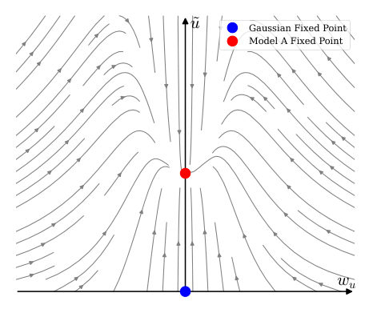 
FIG. 1. RG flows for ˜u and wu at wD = 0 — There are two fixed points present in the system: the trivial Gaussian fixed point and the Model A fixed point. For d &lt; 4, the system flows to the stable Model A fixed point, where the ordering dynamics is effectively thermal. The RG flows are odd in wu as the physics is overall invariant under swapping the signs of all the non-reciprocal couplings, which simply determine the direction of the “run-and-chase” dynamics.

**Summary.** This paper uses field-theoretic Renormalization Group techniques to analyze critical dynamics in systems with non-reciprocal couplings between multiple order parameters. The authors find that, despite the system being inherently non-equilibrium, the critical behavior is robustly governed by the standard equilibrium Model A universality class. This suggests that non-reciprocity alone may not be sufficient to generate entirely new universal physics.

**Why it may be interesting.** This work provides rigorous theoretical tools (RG) to classify critical behavior in systems driven far from equilibrium. The finding that non-reciprocity does not change the universality class is a key result for understanding non-equilibrium phase transitions relevant to AMO physics and active matter.

Detailed structure

**Main problem.** The study investigates whether non-reciprocal interactions induce novel universality classes in critical dynamics, generalizing analyses from single to multiple vector order parameters.

**Main result.** The renormalization group analysis shows that the non-reciprocal couplings are RG-irrelevant, meaning the critical behavior is governed by the equilibrium Model A universality class despite the transition being into a non-equilibrium state.

**Method.** The primary method employed is field-theoretic Renormalization Group (RG) analysis, performed to lowest order in $\epsilon = 4 - d$, applied to Langevin equations describing the dynamics.

**Model / system.** The system models the ordering dynamics of two non-reciprocally coupled $n$-vector order parameters ($\phi_i \in \mathbb{R}^n$) governed by a noisy multi-component complex Ginzburg-Landau equation. This generalizes previous studies to higher symmetry ($U(n)$).

**Key observables.** Critical dynamics, scaling exponents ($\eta, \eta', \eta_c$), response function $\chi(k, \omega)$, and correlation function $C(k, \omega)$.

**Important parameters / regimes.** The dimensionality parameter $\epsilon = 4-d$, the number of components $n$, and dimensionless coupling ratios like $w_u$ and $w_D$.

**Assumptions / limitations.** The analysis assumes that the structure of the Langevin equation is protected by symmetry, allowing for a perturbative RG treatment. The large-$n$ limit also simplifies calculations significantly.

**Figures summary.** Figure 1 illustrates RG flows showing couplings flowing towards the stable Model A fixed point when $w_D=0$.

**Paper structure.** The paper progresses from defining the non-reciprocal coupled system via a Langevin equation, to performing an RG analysis by calculating Z-factors and solving Callan-Symanzik equations, culminating in determining scaling exponents at stable fixed points.

Abstract

Non-reciprocal interactions find broad applicability in non-equilibrium and living systems. Their canonical implementation involves asymmetric couplings between two entities, which generally induce spatio-temporal patterns and time-dependent steady states that break time-translational invariance, representing a clear deviation from equilibrium physics. Although their phenomenology is well understood, whether non-reciprocal interactions induce new universality classes, and if so, under what conditions, remains an open question. In the present work, we perform a field-theoretic renormalization group (RG) analysis of the dynamics of two non-reciprocally coupled $n$-vector order parameters possessing a $U(n)$ symmetry, generalizing previous results to order parameters with multiple components, a feature that has been shown to generate novel non-equilibrium critical behavior in certain non-reciprocal systems. To lowest order in $ε= 4-d$, we find that the non-reciprocal coupling is RG-irrelevant, and the critical behavior is governed by the equilibrium fixed point of the Model A universality class of Hohenberg and Halperin with $2n$ vector components, even though the transition is into a non-equilibrium state. Our results demonstrate that non-reciprocity alone may not be sufficient to induce novel universality classes.

[↑ back to top](#top)

### [Control of morphology and topology in a lattice model of branching morphogenesis](http://arxiv.org/abs/2607.24619v1)

**Authors:** Christian Hanauer, Frank Jülicher, Efe Ilker  
**Type:** theory · **Category:** statistical mechanics · **PDF:** <https://arxiv.org/pdf/2607.24619v1>  
**Analysis basis:** full PDF text, analyzed in chunks
**Topic relevance:** 🔥 `non-equilibrium dynamics` **4/5** · `driven-dissipative phase transition` **3/5** · `methods for driven-dissipative` **3/5** · `non-equilibrium universality` **3/5** · `Frenkel-Kontorova` **1/5** · `Keldysh / 2PI / non-Gaussian methods` **1/5** · `correlated / nonlocal dissipation` **1/5**

📷 Fig 1

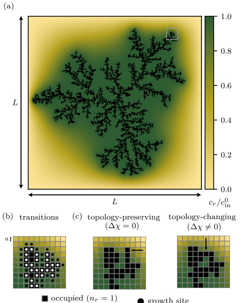 
FIG. 1. Morphogen-controlled cluster growth. (a) Ex- ample cluster of size N = 7000 with associated morphogen field (green-yellow tone). (b) Magnification of the gray dashed region indicated in (a) with possible growth (filled circle) and degrowth sites (emtpy circle). (c) We present an example of a topology-preserving and topology-changing transition. The changed lattice site is highlighted by an arrow.

📷 Fig 2

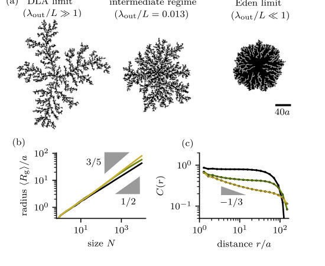 
FIG. 2. Control of cluster morphologies by morphogen dynamics. (a) Clusters of size N = 104 obtained from Eq. (1) and Eq. (3) for different morphogen gradient lengths λout. (b) Radius of gyration for the structures shown in (a). (c) Correlation function C(r) for the structures shown in (a). The colors correspond to the DLA-limit (yellow), intermedi- ate regime (green), and Eden limit (black). In (b), (c) we averaged over M = 16 realizations.

📷 Fig 3

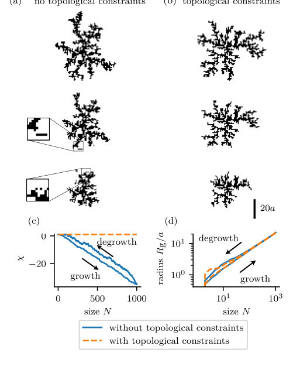 
FIG. 3. Growth and degrowth characterization. (a) Degrowth of clusters without topological constraints. (b) De- growth of clusters with topological constraints. (c) Euler char- acteristic χ(t) of the structures with and without topological constraint. (d) Radius of gyration Rg as a function cluster size N for growth (blue) and degrowth (orange).

📷 Fig 4

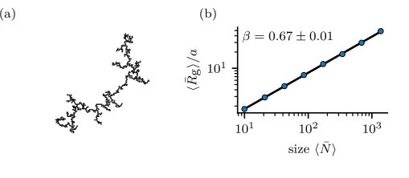 
FIG. 5. Steady-state clusters on a hexagonal lattice (a) We show a steady-state snapshot of a cluster subject to alternating growth and degrowth on a hexagonal lattice. The shown cluster has size N = 692. (b) Radius of gyration as a function of stationary system size N averaged over M = 10 realizations.

📷 Fig 5

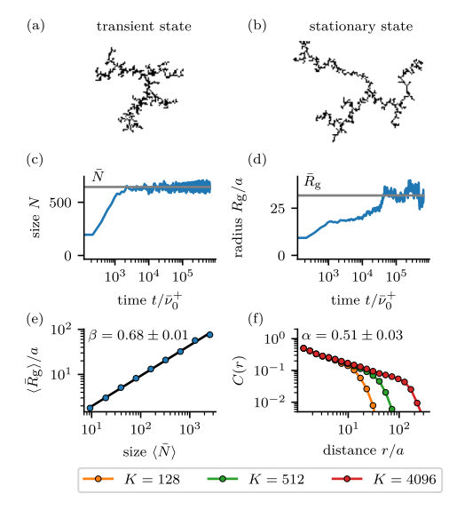 
FIG. 4. Statistical properties of steady-state cluster obtained by alternating growth and degrowth. (a) We show a snapshot of a cluster subject to alternating growth and degrowth for t/¯ν+ 0 ≈3.96 · 103. The shown cluster has size N = 599. (b) We show a snapshot of a cluster subject to alternating growth and degrowth for t/¯ν+ 0 ≈1.1 · 105. The shown cluster has size N = 669. (c) Cluster size N(t) as a function of time t. (d) Radius of gyration Rg as a function of time t. (e) Average radius of gyration ⟨¯Rg⟩as a function of stationary system size ⟨¯ N⟩. (f) Correlation function C(r) as a function of distance r for the values. The displayed scaling exponent was determined for the case K =...

**Summary.** This paper develops a sophisticated lattice model combining cell growth/degrowth dynamics with morphogen signaling gradients to simulate branching morphogenesis. By introducing local operators that enforce topological conservation, the authors study steady-state patterns. They find that these constrained steady states exhibit specific power-law scaling exponents ($eta \approx 0.67$), demonstrating how topology can regulate macroscopic pattern formation.

**Why it may be interesting.** The framework of using non-equilibrium statistical mechanics principles (like reaction-diffusion coupled with stochastic processes) to model complex biological pattern formation is highly relevant for understanding active matter systems and phase transitions in soft matter physics.

Detailed structure

**Main problem.** The study focuses on controlling both the morphology (shape) and topology of branching patterns using a lattice model governed by morphogen concentration gradients.

**Main result.** The steady-state clusters formed under combined growth and degrowth, while maintaining topological constraints, exhibit a power-law scaling exponent for the radius of gyration ($eta \approx 0.67 - 0.68$), which is robust across different lattice symmetries.

**Method.** The research employs stochastic lattice models simulated via Kinetic Monte Carlo (KMC) and utilizes quasi-stationary approximations to solve coupled reaction-diffusion equations for morphogen fields.

**Model / system.** The system is a stochastic lattice model simulating branching morphogenesis, coupling cell occupation dynamics with the concentration of signaling molecules (morphogens). The dynamics include terms for growth ($
u^+$), degrowth ($
u^-$), and diffusion/reaction of morphogens ($c_r$).

**Key observables.** Radius of gyration scaling exponent ($eta$), correlation function $C(r)$, Euler characteristic ($\chi$), and steady-state cluster morphology.

**Important parameters / regimes.** Diffusion-limited aggregation (DLA) limit, Eden model limit, morphogen degradation rate ($k$), and the local topological control operator ($f_r$).

**Assumptions / limitations.** The primary assumption is the quasistatic limit for the morphogen field, meaning its concentration relaxes much faster than the cluster growth/degrowth processes.

**Figures summary.** Figures illustrate examples of morphogen-controlled cluster growth and potential sites for change. Comparisons are made between DLA, Eden limits, and steady-state dynamics, showing $R_g$ and $C(r)$ scaling behavior.

**Paper structure.** The paper establishes the coupled stochastic lattice model (growth/degrowth + morphogen diffusion). It analyzes limiting cases (DLA/Eden) and then introduces a local operator to enforce topological constraints ($\delta\chi=0$). The main results compare the resulting steady-state scaling exponents against unconstrained growth.

Abstract

We present a lattice model for morphogen-controlled branching morphogenesis which combines ideas and concepts from non-equilibrium physics and developmental biology. In this model, the stochastic occupation dynamics of cells is coupled with signaling molecules (morphogens) produced by the cells. We investigate growth patterns governed by morphogen concentration gradients, spanning regimes ranging from the diffusion-limited aggregation limit to the stochastic surface growth (Eden model) limit. Moreover, we introduce control over topology by a local operator and study growth, degrowth, and steady-state dynamics of branched patterns. The topology-preserving steady-state clusters exhibit a power-law scaling of radius of gyration with cluster size, yielding the exponents $0.68\pm0.01$ in square lattice and $0.67\pm 0.01$ in hexagonal lattice.

[↑ back to top](#top)

### [QuantumFCS.jl: Efficient Full-Counting Statistics for Open Quantum Systems](http://arxiv.org/abs/2607.24429v1)

**Authors:** Aaron Daniel, Marcelo Janovitch  
**Type:** theory · **Category:** other · **PDF:** <https://arxiv.org/pdf/2607.24429v1>  
**Analysis basis:** full PDF text, analyzed in chunks
**Topic relevance:** 🔥 `methods for driven-dissipative` **4/5** · `Keldysh / 2PI / non-Gaussian methods` **3/5** · `correlated / nonlocal dissipation` **2/5** · `driven-dissipative phase transition` **2/5** · `non-equilibrium dynamics` **2/5** · `Tavis-Cummings & cavity-many-emitter` **1/5** · `correlated cavity matter` **1/5** · `non-equilibrium universality` **1/5**

📷 Fig 1

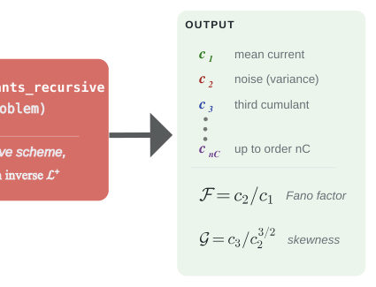 
Figure 1: Overview of the FCS workflow implemented in QuantumFCS.jl. (a) An open quantum system is specified by a Hamiltonian H and jump operators Jk; a current is defined by selecting monitored jumps M and weights ν, which determine the integrated current N(t) = P

📷 Fig 2

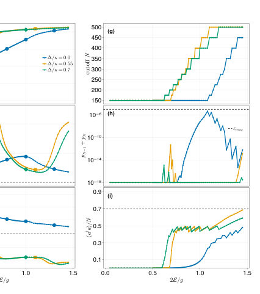 
Figure 2: Full-counting statistics and cavity Fock-state distributions of the driven-dissipative Jaynes- Cummings model at fixed g/κ = 14 and ∆/κ ∈{0, 0.55, 0.70} (blue, orange, green), swept as a function of 2E/g. (a–c) Steady-state cavity Fock-state distribution Pn for each detuning, at three drives spanning that cut’s blockade-breakdown transition (below, at, and after: dotted, dashed, solid; values in the legends). Pn is on a logarithmic scale and the photon number n on a square-root scale to resolve the dim peak near n = 0. The vertical dashed line and the bottom-axis nscale tick mark the semi-classical scale nscale = (g/κ)2 = 196; the shaded band and the top-axis labels indicate the...

📷 Fig 3

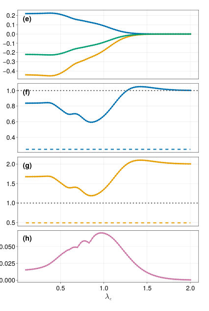 
Figure 3: Antibunching regime of the non-linear heat engine. The left column shows the g sweep at fixed λc = 0.89, while the right column shows the λc sweep at the strongest viable hot-antibunching point of the g scan, g ≃7.21. Panels (a) and (e) show the scaled heat currents and output power, (b) and (f) the hot Fano factor with its TUR threshold and the Poisson reference, (c) and (g) the corresponding cold Fano factor, and (d) and (h) the RWA-link coherence CRWA. The sweep is centred around the blockade-like regime selected by the Laguerre matrix elements.

📷 Fig 4

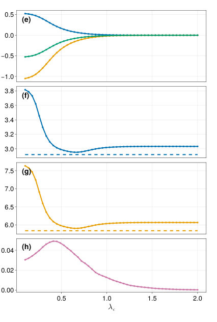 
Figure 4: Finite-affinity regime approaching the TUR bound. The left column shows the g sweep at fixed λc = 0.7, ¯nh = 2.5, and ¯nc = 1.5, while the right column shows the λc sweep at fixed g = 10. Panels (a) and (e) show the scaled heat currents and output power, (b) and (f) the hot Fano factor with its TUR threshold, (c) and (g) the corresponding cold Fano factor, and (d) and (h) the RWA-link coherence CRWA. Reducing the thermodynamic affinity raises the Fano-factor thresholds and brings the hot and cold uncertainty products close to the classical bound while the currents and output power remain small.

📷 Fig 5

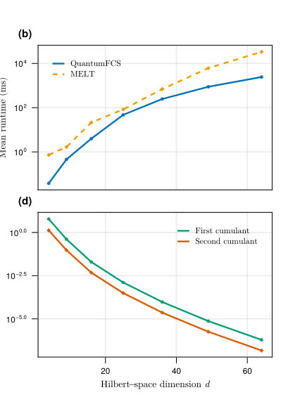 
Figure 5: Benchmark summary for the linearised and dense quantum heat-engine models. (a) perfor- mance comparison for the linearised quantum heat-engine model, showing the mean runtime required to compute the first two cumulants as a function of Hilbert-space dimension using the default LU method. QuantumFCS.jl remains faster than Melt throughout the tested range, with the largest speed-ups appearing at the largest cutoffs. (b) performance comparison for the dense zero-bias circuit-QED heat- engine benchmark again using the default LU method. The dense benchmark is more demanding for both packages, but QuantumFCS.jl remains faster across all tested cutoffs. (c) relative error between the...

**Summary.** This paper introduces QuantumFCS.jl, an efficient Julia package designed to calculate Full-Counting Statistics (FCS) for open quantum systems. It allows researchers to analyze current fluctuations—like photon or heat currents—by computing high-order cumulants. The tool is demonstrated on complex models such as the Jaynes-Cummings system and circuit-QED engines, providing deep insights into non-classical noise phenomena.

**Why it may be interesting.** This is highly relevant as it provides a powerful, general computational tool for quantifying noise and non-Gaussian statistics in open quantum systems, which is crucial for understanding realistic quantum devices.

Detailed structure

**Main problem.** The primary goal is characterizing current fluctuations (Full-Counting Statistics, FCS) in open quantum systems, moving beyond simple average currents.

**Main result.** The authors introduce QuantumFCS.jl, an efficient Julia package that successfully calculates high-order cumulants for various quantum transport and optics problems.

**Method.** The method relies on computing the cumulant generating function using a recursive algorithm applied to a counting-field-resolved density matrix governed by a tilted master equation.

**Model / system.** The framework applies to open quantum systems described by Lindblad master equations, demonstrated on models like the Jaynes-Cummings system and circuit-QED heat engines.

**Key observables.** Full-Counting Statistics (FCS), particle/electric/heat currents, and higher cumulants ($\langle\langle I^n 
angle
angle$) revealing phenomena like antibunching and intermittency.

**Important parameters / regimes.** The calculation depends on defining monitored jump operators ($M$) and associated weights ($
u$). Benchmarks use specific parameters for heat engines and circuit-QED setups.

**Assumptions / limitations.** The core theory assumes Markovian open-system dynamics governed by the Lindblad master equation.

**Figures summary.** Figure 1 provides an overview of the FCS workflow, detailing the problem setup, the `LindbladFCS` structure, and inputs/outputs. Table 1 illustrates how different current types are defined via monitored jumps and weights.

**Paper structure.** The paper introduces the theoretical framework for FCS using a recursive cumulant algorithm, details the implementation in QuantumFCS.jl supporting sparse solvers, and validates it through benchmarks on photon counting (Jaynes-Cummings) and heat-current fluctuations (Circuit-QED).

Abstract

Full-counting statistics (FCS) provides a systematic framework for characterising current fluctuations in quantum transport, quantum optics, and open quantum systems. We introduce QuantumFCS.jl, an open-source Julia package for efficient and flexible numerical FCS calculations. The package defines currents through monitored jump operators and weights, allowing particle, electric, and heat currents to be treated within the same workflow. It implements a recursive cumulant algorithm with dense, sparse, and iterative solver backends, making it suitable for models that are challenging for direct dense methods. We demonstrate the package on photon counting in a driven-dissipative Jaynes-Cummings system near the blockade-breakdown phase transition and on heat-current fluctuations in a non-linear circuit-QED heat engine. These examples show how higher cumulants reveal intermittency between bright and dim emission, antibunching, and provide probes of thermodynamic uncertainty relations. Benchmarks against an existing FCS implementation show substantial speed-ups.

[↑ back to top](#top)

### [Stochastic Counterdiabatic Driving via Biorthogonal Liouvillian Eigenmodes](http://arxiv.org/abs/2607.24393v1)

**Authors:** Sandeep Suresh Cranganore, Sebastian Lehner, Johannes Brandstetter, Max Welling  
**Type:** theory · **Category:** statistical mechanics · **PDF:** <https://arxiv.org/pdf/2607.24393v1>  
**Analysis basis:** full PDF text, analyzed in chunks
**Topic relevance:** 🔥 `non-equilibrium dynamics` **4/5** · `driven-dissipative phase transition` **3/5** · `methods for driven-dissipative` **3/5** · `non-equilibrium universality` **2/5** · `Frenkel-Kontorova` **1/5** · `Keldysh / 2PI / non-Gaussian methods` **1/5** · `correlated / nonlocal dissipation` **1/5** · `entanglement & information structure` **1/5**

📷 Fig 1

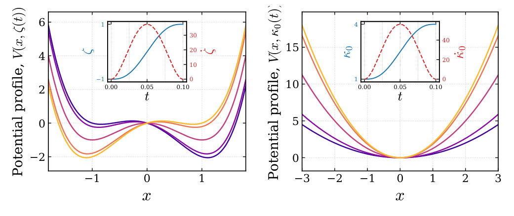 
FIG. 1: Time-varying experimental potentials and control protocol profiles. (a) Double-well potential Vdw(x, ζt) = x4 −2x2 + ζtx with tilt parameter ζt driven from ζi = −1 to ζf = +1 over t ∈[0, 0.1]. The potentials start at t = 0.0 (violet coded) and modulates to t = 0.1 (orange coded) at the end of the protocol. Inset: protocol ζ(t) and driving rate ˙ζ(t). (b) Harmonic trap Vh(x, κ0(t)) = 1

📷 Fig 2

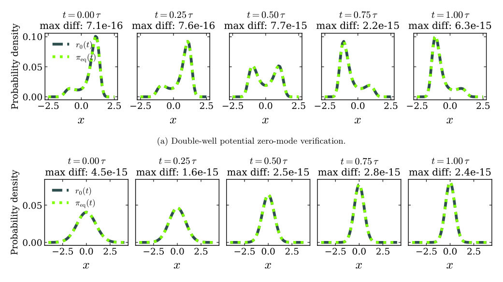 
FIG. 2: Spectral verification of the discrete stationary zero-mode. The numerically diagonalized right eigenvector r0(t) (dashed grey profile) corresponding to the zero eigenvalue is coincides upto machine precision with the analytical instantaneous Boltzmann distribution πeq(t) (dotted green profile).

📷 Fig 3

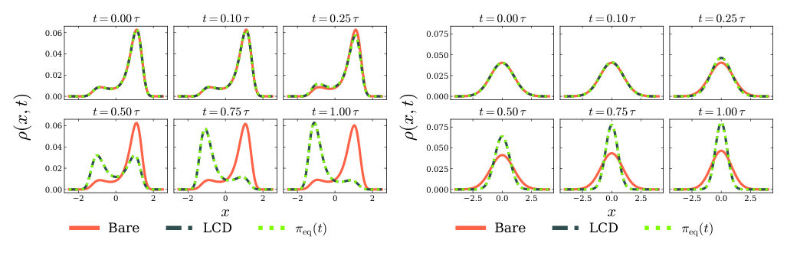 
FIG. 3: Evolutionary snapshots of the probability density distributions. Spatiotemporal density profiles ρ(x, t) comparing the bare driving dynamics (solid orange line) and our spectral-based Liouvillian CD driving (LCD) (grey) against the instantaneous target Boltzmann distribution πeq(x, t) (dashed green) across selected temporal fractions of the protocol for (a) the double-well landscape and (b) the harmonic confinement trap.

📷 Fig 4

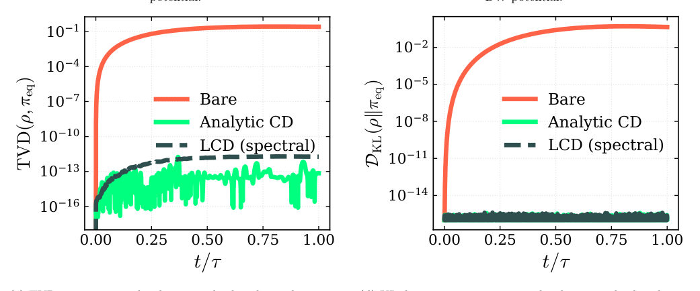 
FIG. 4: Informational metrics comparison across potentials. Total variational distance (TVD) and KL divergence between the time-evolved FP density and the instantaneous equilibrium distribution. Top row (a, b) shows results of the TVD and KL when evolved under a DW potential respectively, whereas the bottom row (c, d) details the same for the harmonic potential. Bare (uncontrolled) evolution (solid orange line), LCD (dashed grey line) and if available, Analytic CD (solid green line).

📷 Fig 5

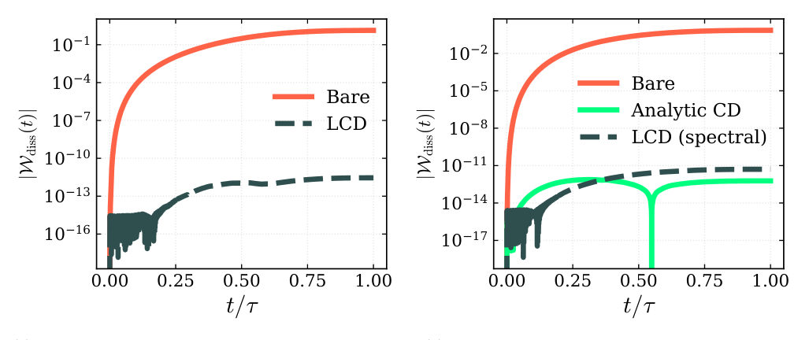 
FIG. 5: Dissipation during Fokker–Planck time-evolution. Dissipated work magnitude plotted against normalized time t/τ. Bare (uncontrolled) evolution (solid orange line), LCD (dashed grey line) and if available, Analytic CD (solid green line).

**Summary.** This paper develops Liouvillian Counterdiabatic Driving (LCD) to eliminate the excess dissipation that plagues free energy estimation when rapidly driving stochastic systems. By utilizing the biorthogonal eigenbasis of the Fokker-Planck generator, they construct a correction term that forces the probability distribution to track instantaneous equilibrium perfectly. This provides an exact, computationally robust tool for non-equilibrium statistical mechanics.

**Why it may be interesting.** This work provides a rigorous, spectral method for controlling non-equilibrium dynamics in classical stochastic systems, drawing strong analogies to quantum shortcuts-to-adiabaticity concepts relevant to open quantum system control.

Detailed structure

**Main problem.** Finite-time driving of stochastic systems causes excess dissipation, leading to a lag between the evolving probability distribution and the instantaneous equilibrium state, which degrades free energy estimators.

**Main result.** The authors introduce Liouvillian Counterdiabatic Driving (LCD), a framework that exactly cancels this non-adiabatic lag by using the biorthogonal decomposition of the Fokker-Planck generator.

**Method.** They construct the counterdiabatic correction operator directly from the spectral decomposition of the time-dependent Liouville operator, avoiding generalized coordinate transformations used in prior work.

**Model / system.** The system is modeled by an overdamped particle governed by a time-dependent Fokker-Planck equation (Liouvillian $\hat{L}(t)$), verified using double-well and harmonic trap potentials.

**Key observables.** Non-adiabatic lag, excess dissipated work ($W_{diss}$), Total Variation Distance (TVD), and Kullback-Leibler Divergence (KL divergence).

**Important parameters / regimes.** Driving speed ($	au$), spectral gap size, and the number of retained relaxation modes ($M$).

**Assumptions / limitations.** The method relies on the exact spectral decomposition of the Liouville operator; numerical stability is challenged in deep metastability regimes where gaps close.

**Figures summary.** Figures compare diagonalization time scaling (dense vs. sparse/tridiagonal solvers) and show convergence metrics (TVD, DKL) demonstrating lag suppression across various protocols.

**Paper structure.** The paper establishes the problem of non-adiabatic dissipation in stochastic driving; it develops LCD using biorthogonal decomposition and gauge transforms; it validates this approach numerically on standard potentials while also analyzing computational scalability via sparse matrix techniques.

Abstract

Finite-time driving of stochastic systems generates excess dissipation, causing the evolving probability distribution to lag behind the instantaneous equilibrium, and consequently degrading the convergence of nonequilibrium free energy estimators based on the Jarzynski equality. Escorted free energy simulations address the non-adiabatic lag by engineering control fields $\mathbf{u}$ that eliminate the lag, enforcing the trajectory-wise equality $\mathcal{W}_\mathbf{u} = Δ\mathcal{F}$, and yielding zero-variance estimators. However, constructing the escorting field in closed form remains a challenge, approached variously through flow-field methods, targeted free energy perturbation, or learned diffeomorphisms. In this work, we construct a complementary numerical framework based on gauge-type transforms instead of generalized coordinate transforms for perfect escorting based on the exact spectral decomposition of the time-dependent Fokker-Planck generator. The biorthogonal decomposition of the Liouville operator directly yields a counterdiabatic correction whose action on the instantaneous equilibrium distribution exactly cancels the non-adiabatic lag at arbitrary driving speed in formal analogy with shortcuts-to-adiabaticity techniques such as Berry's transitionless driving for quantum systems. Numerical verification for simulations of an overdamped particle in a time-varying double-well potential and harmonic traps confirms that the counterdiabatic condition is satisfied to machine precision, with the non-adiabatic lag suppressed by roughly twelve orders of magnitude in total variation distance and sixteen orders in KL divergence relative to the unescorted dynamics. As a diagnostic, we demonstrate vanishing dissipated work $\mathcal{W}_{\text{diss}}(t) \approx 0$ for the deterministically propagated Fokker-Planck density across all protocol speeds.

[↑ back to top](#top)

### [A Bogoliubov-ratio framework for quantum-information diagnostics of time-dependent two-mode Boson Hamiltonian](http://arxiv.org/abs/2607.24404v1)

**Authors:** Shi-Cheng Liu, Lei-Hua Liu, Bichu Li, Yuebing Zhou, Hai-Qing Zhang  
**Type:** theory · **Category:** other · **PDF:** <https://arxiv.org/pdf/2607.24404v1>  
**Analysis basis:** full PDF text, analyzed in chunks
**Topic relevance:** 🔥 `entanglement & information structure` **4/5** · `methods for driven-dissipative` **3/5** · `driven-dissipative phase transition` **2/5** · `non-equilibrium dynamics` **2/5** · `Keldysh / 2PI / non-Gaussian methods` **1/5** · `analog quantum simulation` **1/5** · `correlated / nonlocal dissipation` **1/5** · `non-equilibrium universality` **1/5**

📷 Fig 1

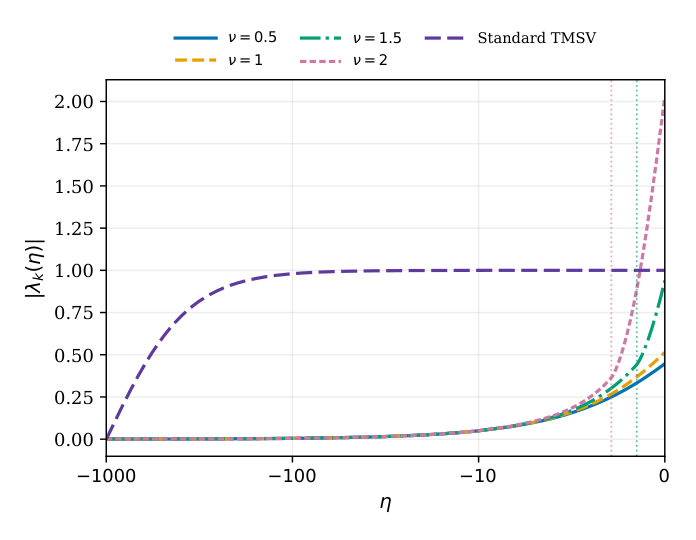 
FIG. 1: Evolution of |λk| for the cosmological model and the standard TMSV benchmark. The

📷 Fig 2

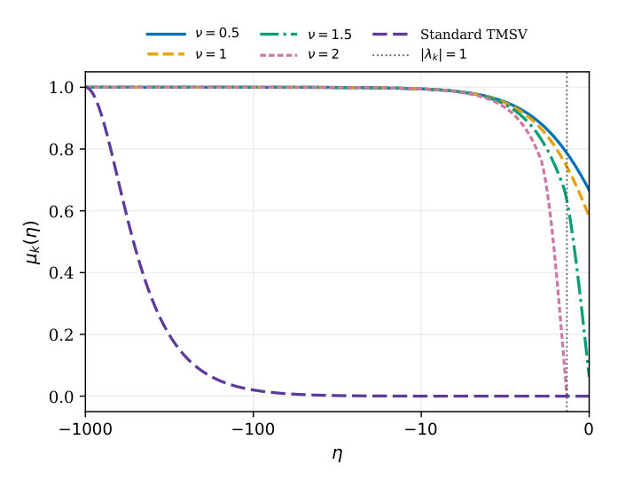 
FIG. 2: One-mode purity for the cosmological model and the standard TMSV benchmark. The

📷 Fig 3

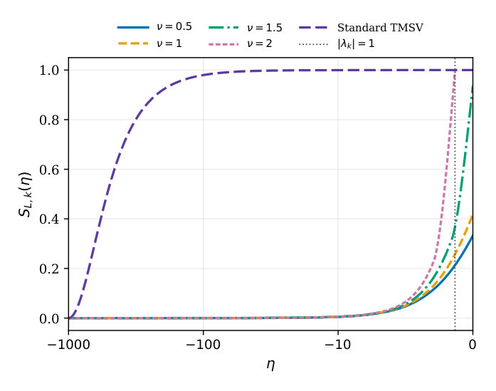 
FIG. 3: Linear entropy for the cosmological model and the standard TMSV benchmark. The

📷 Fig 4

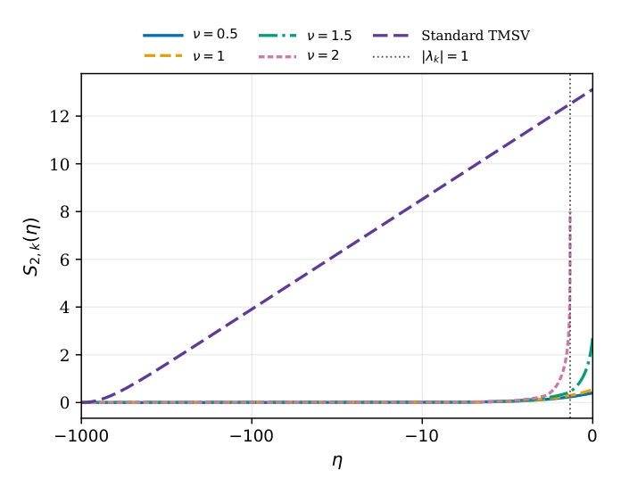 
FIG. 4: R´enyi-2 entropy for the cosmological model and the standard TMSV benchmark. The

📷 Fig 5

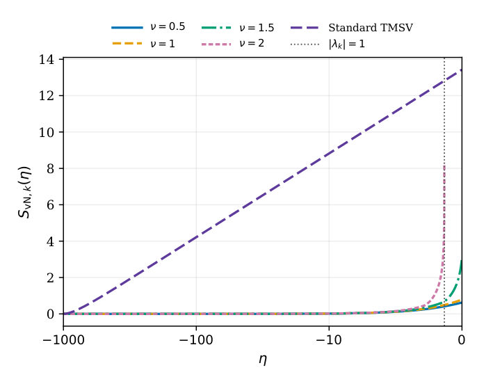 
FIG. 5: Von Neumann entropy of the reduced k mode for the cosmological model and the standard

**Summary.** The paper introduces the Bogoliubov-ratio framework to diagnose quantum information measures for any time-dependent two-mode bosonic system described by a quadratic Hamiltonian. By mapping the dynamics onto a single Riccati equation using the ratio $\lambda_k$, it allows researchers to calculate entanglement and purity metrics model-independently. This method is demonstrated in diverse physical settings, including cosmology and advanced optical parametric amplification.

**Why it may be interesting.** This work provides a powerful, standardized diagnostic tool that cleanly separates the physics of the driving protocol (model-dependent) from universal quantum information metrics, which is highly valuable for analyzing complex open or time-varying bosonic systems in AMO/Optics.

Detailed structure

**Main problem.** The goal is to create a unified, model-independent framework for diagnosing quantum information properties of time-dependent two-mode bosonic systems.

**Main result.** The state dynamics are entirely characterized by the Bogoliubov ratio $\lambda_k$, which allows for the direct calculation of various entanglement and purity measures without full density matrix reconstruction.

**Method.** The framework utilizes the Bogoliubov ratio $\lambda_k = eta_k/\alpha_k$ to reduce the complex state evolution governed by a quadratic Hamiltonian into a single, solvable Riccati differential equation.

**Model / system.** The system is modeled by a general time-dependent two-mode bosonic Hamiltonian, applied successfully to both primordial cosmological perturbations and chirped-pulse nondegenerate optical parametric amplifiers.

**Key observables.** Reduced-state purity, linear entropy, Rényi-2 entropy, and von Neumann entropy, all derived from the squared magnitude $q_k = |\lambda_k|^2$.

**Important parameters / regimes.** The time-dependent coefficients $\omega_k(\eta)$ (frequency/detuning) and $g_k(\eta)$ (coupling/squeezing strength) govern the evolution of $\lambda_k$.

**Assumptions / limitations.** The framework assumes the system's dynamics can be mapped onto a normalized paired Bogoliubov representation, and it is valid for quadratic Hamiltonians.

**Figures summary.** Not specified in the notes; however, the analysis involves solving differential equations (Riccati equation) to track $\lambda_k(\eta)$ over time ($\eta$ or $	au$).

**Paper structure.** The paper introduces the framework using a general Hamiltonian, derives the governing Riccati equation for $\lambda_k$, and then demonstrates its utility by applying it sequentially to two distinct physical examples: cosmology and optical parametric amplification.

Abstract

We present a compact and unified framework for quantum-information diagnostics of time-dependent two-mode bosonic systems based on the Bogoliubov ratio $λ_k(η) \equiv β_k(η)/α_k(η)$. For a general time-dependent quadratic two-mode Hamiltonian, the state dynamics is exactly reduced to a single complex Riccati equation for $λ_k$. Upon tracing out one partner mode, the spectrum of the one-mode reduced density matrix is determined entirely by the squared magnitude $q_k(η) = \vert{}λ_k(η)\vert{}^2$. Consequently, we could construct the explicit, model-independent formula for the for the reduced-state purity, linear entropy, Rényi-2 entropy, and von Neumann entropy without reconstructing and diagonalizing the reduced density matrix on a model-by-model basis using coupled squeezing parameters ($r_k, φ_k$). We demonstrate the utility of this framework in two distinct non-stationary setups: primordial cosmological perturbations and a chirped-pulse nondegenerate optical parametric amplifier. In the cosmological context, our formulation clarifies how background-induced phase rotation and frequency softening regulate squeezing growth and state mixedness; in the optical domain, it captures the delayed onset, suppression of squeezing accumulation, and late-time entropy saturation induced by finite pump duration and frequency chirp. By cleanly factorizing model-dependent driving protocols from universal information-theoretic metrics, this framework offers an efficient, standardized diagnostic tool for a broad class of parametrically driven quadratic bosonic systems.

[↑ back to top](#top)

### [Chiral Dynamics of an Intruder across Dilute and Hydrodynamic Regimes](http://arxiv.org/abs/2607.23221v1)

**Authors:** Raphaël Maire, Ignacio Pagonabarraga  
**Type:** theory · **Category:** statistical mechanics · **PDF:** <https://arxiv.org/pdf/2607.23221v1>  
**Analysis basis:** full PDF text, analyzed in chunks
**Topic relevance:** 🔥 `non-equilibrium dynamics` **4/5** · `methods for driven-dissipative` **3/5** · `non-equilibrium universality` **3/5** · `driven-dissipative phase transition` **2/5** · `Frenkel-Kontorova` **1/5** · `Keldysh / 2PI / non-Gaussian methods` **1/5** · `correlated / nonlocal dissipation` **1/5**

📷 Fig 1

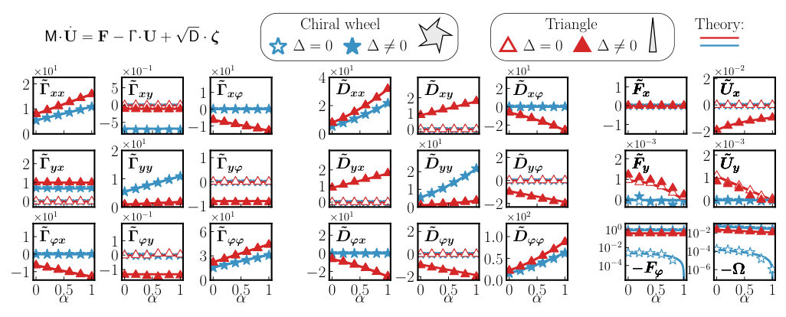 
FIG. 1. Parameters entering Eq. (7) as functions of α for a chiral wheel and an isosceles triangle in a Gaussian bath. Simulation methods are detailed in the Supplemental Material (SM) [76], and the theory in the companion paper [72]. For the chiral wheel, the outermost-to-innermost radius ratio is R/r = 2, and adjacent vertices are separated by angles π(1 ± 1)/5. For the triangle, the height-to-base ratio is h/a = 5. Units are set by length ℓ(ℓ= r or a), mass m, and time ℓ/ p

📷 Fig 2

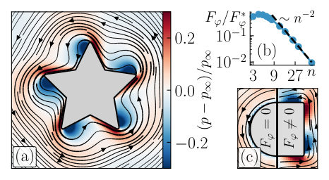 
FIG. 3. Chiral bath around a fixed intruder. (a) Pressure field p approximated by half the trace of the virial stress and velocity streamlines for an achiral wheel in a chiral bath, with R/r = 2 and R/σ = 20. (b) Torque on regular n-gons with circumradius R/σ = 10. (c) Same as (a) for a circle (left, n →∞) and a square (right, n = 4). αb = 0.8, ∆b &gt; 0, nbπσ2 = 0.3, I →∞, M →∞, ∆= 0 and α = 1. We define ¯Fφ = πτR2. Each simulation ran for 108σ/ p

📷 Fig 3

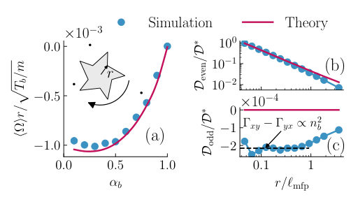 
FIG. 2. Intruder dynamics within an explicit bath. (a) Angu- lar velocity versus bath restitution coefficient at nbr2 = 10−3. The cartoon is to scale, with r/σ = 30. (b), (c) Even and odd diffusivities: D = Deven1 + Doddε, versus bath density for αb = 0.5, with ℓmfp the bath mean free path. Momentum is weakly relaxed by a Langevin bath, ˙v = −γv+ p

**Summary.** This work develops a comprehensive model to study how chirality affects the motion of an object (intruder) moving through a fluctuating bath. It successfully bridges two distinct physical regimes—the dilute gas limit and the dense hydrodynamic limit—by showing that the source of chiral transport changes fundamentally between these limits.

**Why it may be interesting.** It provides a detailed theoretical mapping between microscopic collision dynamics (Boltzmann) and macroscopic continuum fluid mechanics (Stokes/hydrodynamics), which is crucial for understanding non-equilibrium transport in complex media.

Detailed structure

**Main problem.** The study investigates how chiral dynamics of an intruder are governed by its geometry when moving through a non-equilibrium bath, comparing results across dilute and dense hydrodynamic regimes.

**Main result.** The odd response (chirality) arises from distinct mechanisms in the dilute limit (fluctuation-driven) versus the dense limit (hydrodynamic edge currents), leading to a density-controlled crossover in dynamics.

**Method.** Theoretical derivation using Boltzmann-Lorentz equations, followed by approximations yielding Langevin descriptions, and comparison with molecular dynamics simulations.

**Model / system.** The system consists of an intruder of arbitrary shape immersed in a non-equilibrium bath of point particles. Chirality can be introduced via the bath, the intruder, or their coupling mechanisms.

**Key observables.** Odd diffusivity ($D_{odd}$), rotational damping ($\Gamma$), and the torque generated by chiral edge currents.

**Important parameters / regimes.** Bath density ($n_b$), restitution coefficient ($\alpha$), and the degree of chirality ($\Delta$).

**Assumptions / limitations.** The Langevin equation is valid when bath-particle inertia is small compared to intruder inertia; in the dense limit, continuum approximations are used.

**Figures summary.** Figures compare parameters for different shapes (wheel vs. triangle) and illustrate how even/odd diffusivities change with bath density, showing deviations from dilute theory at finite density.

**Paper structure.** The paper progresses by first establishing the collision rules, deriving the Langevin equation in the dilute limit via Boltzmann-Lorentz analysis, and then extending the framework to the dense hydrodynamic regime where edge currents dominate the torque generation.

Abstract

We introduce and simulate an analytically tractable model for an intruder of arbitrary shape in a nonequilibrium bath, with chirality originating from the bath, the intruder, or their coupling. In the dilute regime, a Langevin description derived from a Boltzmann-Lorentz equation shows how intruder geometry governs ratchet effects and odd response. In the dense regime, the dynamics of the intruder are instead governed by the hydrodynamic modes of the bath and edge currents, which are described by a Stokes equation including a chiral torque density. Our results link shape to chiral transport and show that odd response arises from distinct mechanisms in the dilute and dense limits.

[↑ back to top](#top)

### [Krylov complexity and spectral density of BMN matrix model](http://arxiv.org/abs/2607.24632v1)

**Authors:** Dibakar Roychowdhury  
**Type:** theory · **Category:** strongly correlated electrons · **PDF:** <https://arxiv.org/pdf/2607.24632v1>  
**Analysis basis:** full PDF text, analyzed in chunks
**Topic relevance:** 🔥 `entanglement & information structure` **4/5** · `non-equilibrium dynamics` **3/5** · `non-equilibrium universality` **2/5** · `scars & prethermalization` **2/5** · `Keldysh / 2PI / non-Gaussian methods` **1/5** · `analog quantum simulation` **1/5** · `driven-dissipative phase transition` **1/5** · `methods for driven-dissipative` **1/5**

📷 Fig 1

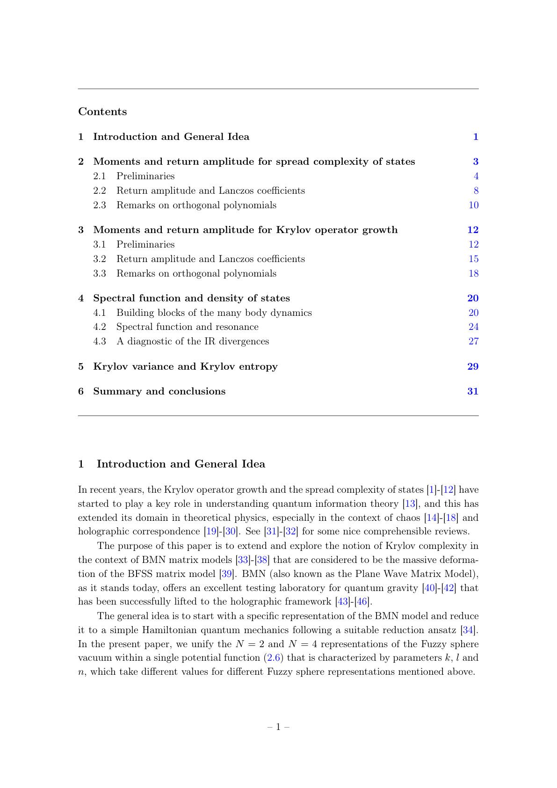 
Low-resolution page preview, page 2

📷 Fig 2

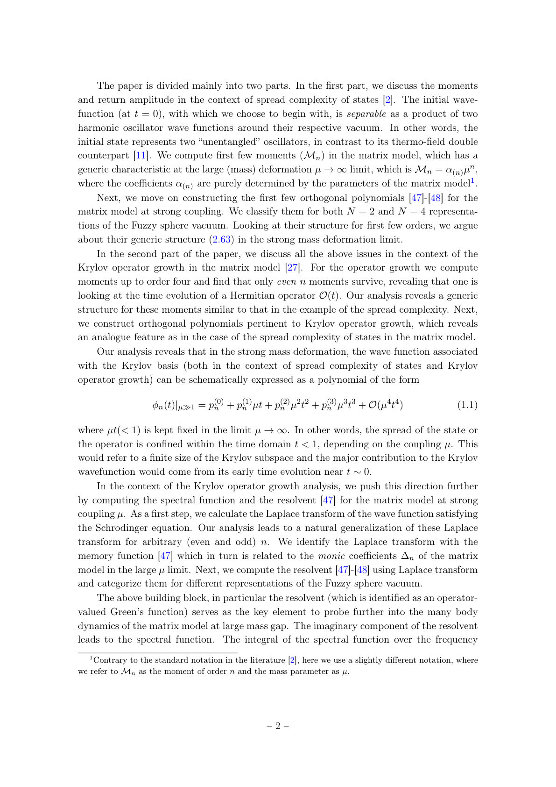 
Low-resolution page preview, page 3

📷 Fig 3

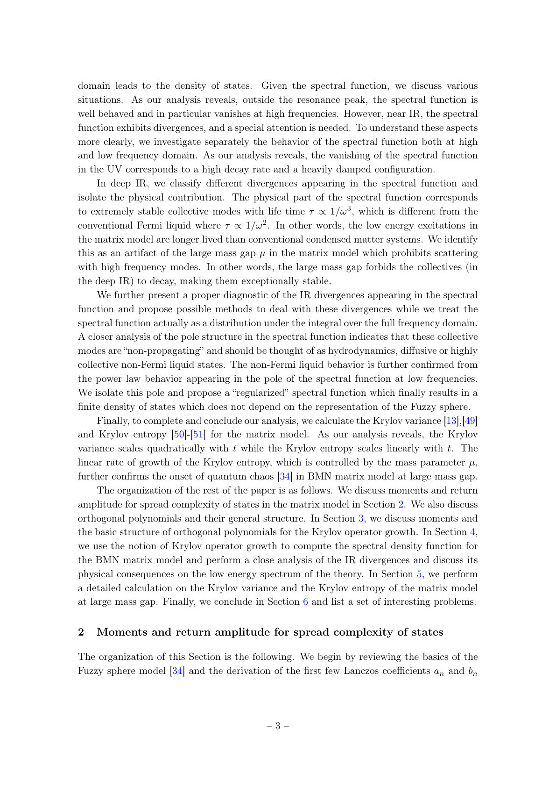 
Low-resolution page preview, page 4

📷 Fig 4

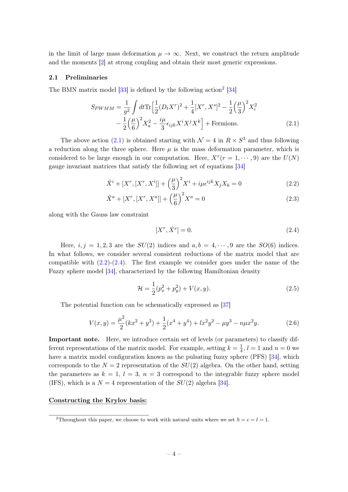 
Low-resolution page preview, page 5

📷 Fig 5

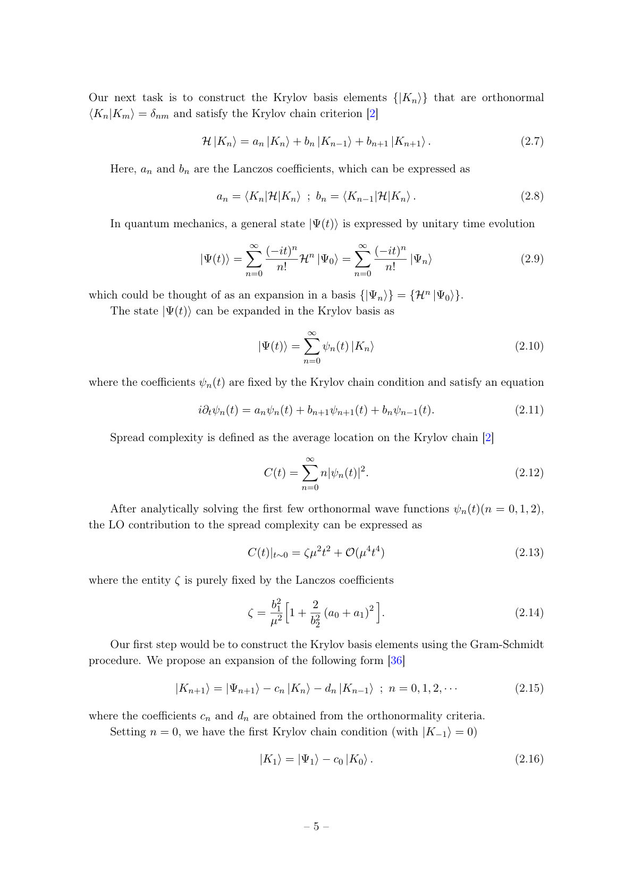 
Low-resolution page preview, page 6

**Summary.** This paper applies Krylov complexity theory to analyze the dynamics of the BMN matrix model at large mass gaps. By calculating spectral properties and entropy, the authors confirm that the system exhibits quantum chaotic behavior while also characterizing low-frequency excitations as non-propagating relaxation modes rather than conventional quasi-particles.

**Why it may be interesting.** The use of complexity measures like Krylov entropy to diagnose quantum chaos in a highly interacting, strongly coupled system like the BMN model provides theoretical tools applicable to understanding thermalization and scrambling in complex many-body systems relevant to condensed matter physics.

Detailed structure

**Main problem.** To use Krylov complexity as a diagnostic tool for understanding quantum many-body dynamics within the BMN matrix model, particularly in the regime of a large mass gap.

**Main result.** The linear early-time growth of the Krylov entropy confirms the onset of quantum chaos in the BMN model. Furthermore, spectral analysis suggests that low-frequency collective modes are non-propagating diffusion or relaxation modes.

**Method.** The authors calculate physical entities like moments and return amplitudes by constructing a Krylov basis set for the system's Hamiltonian. They analyze the resulting spectral function and entropy growth over time.

**Model / system.** The study focuses on the BMN matrix model, which is a massive deformation of the BFSS matrix model relevant to quantum gravity and holographic correspondence. The dynamics are governed by matrices $X_r$ and $X_a$.

**Key observables.** Krylov complexity (spread and operator growth), moments ($M_n$), return amplitudes, spectral function, density of states, Krylov variance, and Krylov entropy.

**Important parameters / regimes.** Large mass gap ($\mu 	o \infty$) is the primary regime analyzed. The analysis also considers early time evolution ($t \sim 0$).

**Assumptions / limitations.** The spectral function is treated as a distribution to handle divergences, and for spread complexity, the initial state is assumed separable.

**Figures summary.** Not specified by notes; the text describes calculations of moments, entropy growth curves, and spectral features near resonance.

**Paper structure.** The paper systematically calculates observables (moments, return amplitude) using the Krylov basis construction. It then analyzes the spectral properties, diagnosing divergences as non-propagating modes, and finally computes the entropy to confirm chaotic behavior.

Abstract

We use Krylov complexity as a typical diagnostic of quantum many body dynamics in the context of BMN matrix model at large mass gap. We calculate several physical entities, for example, the moments and return amplitudes at large mass deformation. We calculate them for both spread complexity of states as well as Krylov growth of operators in the matrix model. We propose a general expression for the moments at any given order $n$. We also discuss orthogonal polynomials for spread as well as operator Krylov complexity. In the context of the Krylov operator growth we further compute the spectral function and the density of states. A careful analysis of the spectral function near the resonance reveals various IR divergences in addition to the physical collective modes. These collective modes appear to be exceptionally stable due to large mass gap. On the other hand, the UV of the theory appears to be extremely damped due to higher scattering rates. We carefully diagnose these IR divergences near resonance which reveals that these collective modes are in fact non-propagating and should be thought of as diffusion modes or relaxation modes with infinite relaxation time. We also calculate the Krylov variance and Krylov entropy for the matrix model and in particular at early time. The linear early time growth of the Krylov entropy confirms the onset of quantum chaos in the matrix model at large mass gap.

[↑ back to top](#top)

### [Machine Learning of Quantum Entanglement from Noisy Measurements](http://arxiv.org/abs/2607.22853v1)

**Authors:** Artur Czerwinski, Maciej Wiśniewski, Paweł Moszczyński  
**Type:** both · **Category:** quantum information and computing · **PDF:** <https://arxiv.org/pdf/2607.22853v1>  
**Analysis basis:** full PDF text, analyzed in chunks
**Topic relevance:** 🔥 `entanglement & information structure` **4/5** · `quantum measurements` **3/5** · `quantum optics experiment` **3/5** · `QC/QI experiment` **2/5** · `correlated / nonlocal dissipation` **1/5** · `measurement-induced transitions` **1/5** · `methods for driven-dissipative` **1/5**

📷 Fig 1

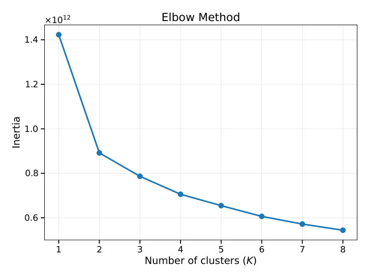 
FIG. 1. Dependence of inertia on the number of clusters in the KMeans method. The largest decrease in inertia occurs for the transition from K = 1 to K = 2, which indicates two natural groups in the measurement-data space.

📷 Fig 2

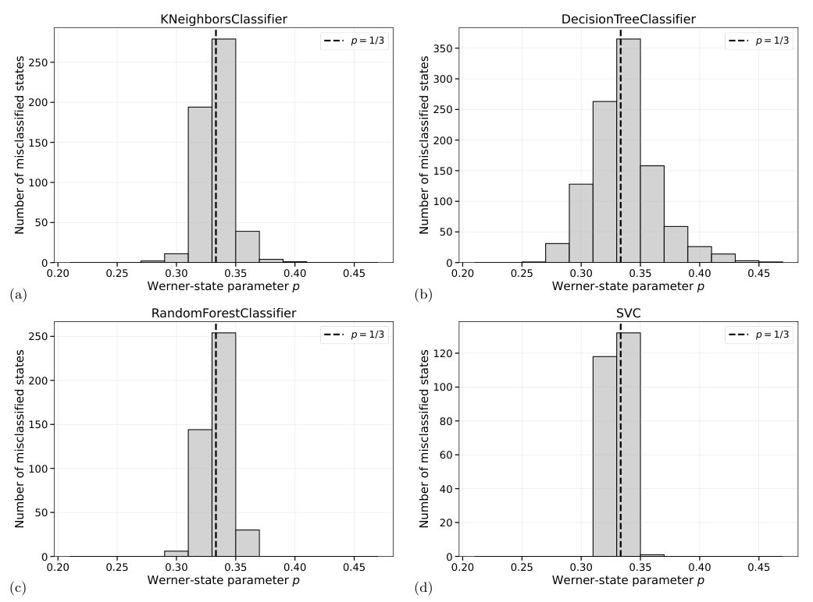 
FIG. 2. Histograms showing the distribution of misclassified states as a function of the Werner-state parameter p for (a) KNeighborsClassifier, (b) DecisionTreeClassifier, (c) RandomForestClassifier, and (d) SVC.

**Summary.** The authors demonstrate that Machine Learning can effectively characterize quantum entanglement in two-qubit photon systems by analyzing raw coincidence count data from simulated measurements. By training ML models on these noisy vectors, they achieve high accuracy in distinguishing entangled states from separable ones without needing to reconstruct the full density matrix. This proposes a computationally efficient pathway for quantum state verification in experimental settings.

**Why it may be interesting.** This work directly addresses the practical challenge of characterizing fragile quantum resources like entanglement using noisy, realistic measurement data, which is crucial for experimental quantum optics and communication protocols.

Detailed structure

**Main problem.** The work investigates using Machine Learning (ML) algorithms to identify and quantify quantum entanglement directly from noisy measurement statistics, bypassing complex density matrix reconstruction.

**Main result.** ML methods achieve very high classification accuracy for distinguishing separable from entangled states, suggesting an efficient alternative to conventional state analysis under simulated noise conditions.

**Method.** Supervised ML algorithms (e.g., Random Forests, SVMs) are trained on 16-dimensional measurement vectors derived from simulated SIC-POVM measurements of polarization-entangled photon pairs.

**Model / system.** The system involves two-qubit polarization states analyzed using simulated symmetric, informationally complete POVM (SIC-POVM) measurement data. The analysis focuses on Werner states and Bell states to cover the entanglement spectrum.

**Key observables.** Classification of separable vs. entangled states; continuous estimation of Concurrence ($C(
ho)$).

**Important parameters / regimes.** Poissonian shot noise level (related to total photon count $N$); entanglement parameter $p$ for Werner states.

**Assumptions / limitations.** The analysis is limited to simulated data affected by Poissonian counting noise, and the performance relies on the representativeness of the training set.

**Paper structure.** The paper systematically applies various ML techniques (classification/regression) to datasets representing known entangled and separable states derived from simulating quantum measurements.

Abstract

In this work, we investigate the application of Machine Learning (ML) algorithms to the identification and quantitative characterization of quantum entanglement in polarization-entangled photon pairs. The analysis is based on simulated symmetric, informationally complete, positive operator-valued measure (SIC-POVM) measurement data, where each two-qubit state is represented by a 16-dimensional measurement vector corresponding to experimentally accessible coincidence counts. The generated SIC-POVM measurement data include Poissonian shot noise. Several supervised ML algorithms, including Logistic Regression, k-Nearest Neighbors, Decision Trees, Support Vector Machines, and Random Forests, are applied to the classification of separable and entangled states directly from raw measurement data, without explicit density matrix reconstruction or the use of conventional separability criteria. The study additionally explores clustering methods and nonlinear regression techniques for estimating continuous entanglement measures. The obtained results demonstrate that ML methods can achieve very high classification accuracy, even under extremely limited training conditions. These findings indicate that ML may provide an efficient alternative to conventional quantum-state analysis under simulated Poissonian noise conditions.

[↑ back to top](#top)

### [Magnetic-texture winding controls fermion-parity switches in an interacting $p$-wave magnet wire](http://arxiv.org/abs/2607.24038v1)

**Authors:** Hyun-Yong Lee  
**Type:** theory · **Category:** strongly correlated electrons · **PDF:** <https://arxiv.org/pdf/2607.24038v1>  
**Analysis basis:** full PDF text, analyzed in chunks
**Topic relevance:** 🔥 `analog quantum simulation` **4/5** · `exotic spin models in light-matter` **3/5** · `spintronics-quantum-optics interface` **3/5** · `entanglement & information structure` **2/5** · `Kondo & dissipative impurity` **1/5** · `methods for driven-dissipative` **1/5** · `non-equilibrium dynamics` **1/5**

📷 Fig 1

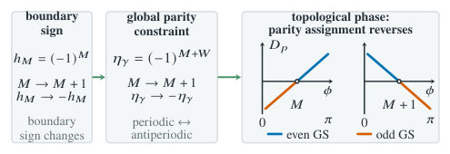 
FIG. 1. Boundary condition and fermion-parity response. (a) Adjacent coplanar textures have pitches 𝑄𝑀and 𝑄𝑀+1. The spin rotations that align the textures obey 𝑈𝑗+𝐿= (−1)𝑀𝑈𝑗; adding one winding reverses this boundary sign. (b) 𝑊denotes the winding of the pair phase, and electron single-valuedness fixes the neutral- fermion boundary condition 𝜂𝛾= (−1)𝑀+𝑊. In the topological phase, 𝑀→𝑀+ 1 reverses the parity assignment of neighboring phase-winding branches and hence the leading flux slope of the signed splitting 𝐷𝑝= 𝐸corr odd −𝐸corr even. Adjacent physical textures also differ by a finite-size pitch shift.

📷 Fig 2

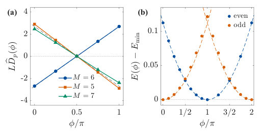 
FIG. 2. Reversal of the parity assignment between adjacent texture windings. (a) The scaled, charging-corrected five-point es- timator 𝐿b𝐷𝑝,𝑀at 𝐿= 24 for adjacent texture windings 𝑀= 5, 6, 7: adding one winding reverses the parity assignment of the phase- winding energy branches. (b) Parity-resolved energies at the refer- ence winding 𝑀0 = 6 (𝐿= 24): the even- and odd-parity minima are displaced by 𝜋in 𝜙and approach the same bulk stiffness, although their finite-size curvatures differ (dashed parabolas). Numerical data and convergence analysis are given in the Supplemental Material.

📷 Fig 3

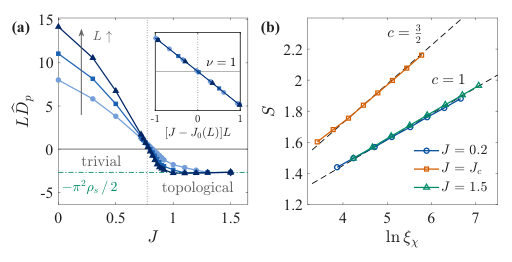 
FIG. 3. Parity scaling and the Ising transition. (a) Scaled zero-flux parity-splitting estimator 𝐿b𝐷𝑝,𝑀at the reference pitch 𝑄= 𝜋/2 for 𝐿= 16, 24, 32, with additional 𝐽= 1.5 points for 𝐿= 40, 48: a finite neutral gap makes it grow with 𝐿in the trivial phase, whereas an 𝑂(1/𝐿) phase-winding energy makes it saturate near −𝜋2𝜌𝑠/2 in the topological phase. Inset: centering each size at its size-dependent zero 𝐽0(𝐿) gives a data collapse consistent with Ising finite-size scaling with 𝜈= 1. (b) Entanglement entropy 𝑆 versus finite-entanglement correlation length 𝜉𝜒; the fitted slopes are consistent with 𝑐≃1, 3/2, 1 across the transition. Details are in the Supplemental Material.

**Summary.** This work analyzes an interacting p-wave magnet wire on a ring, showing that the magnetic texture winding imposes a global boundary condition. This topology dictates a switch in fermion parity between neighboring states, providing a robust, number-conserving probe of topological pairing mechanisms.

**Why it may be interesting.** It provides a concrete realization where geometric/topological constraints (magnetic texture) dictate global many-body properties (fermion parity), which is highly relevant for understanding topological superconductivity in engineered materials or superconducting circuits.

Detailed structure

**Main problem.** The study investigates how the winding number of a magnetic texture controls fundamental fermion-parity switches within an interacting p-wave magnet wire geometry.

**Main result.** A global parity constraint causes neighboring phase-winding branches to reverse their fermion-parity assignment when the winding changes by one, demonstrating that the boundary condition is controlled by topology rather than local band structure.

**Method.** The research employs a combination of exact fixed-number derivations and advanced numerical techniques like Density-Matrix Renormalization Group (DMRG) simulations.

**Model / system.** The system is an interacting p-wave magnet wire realized on a ring geometry, modeled by Hamiltonians incorporating hopping, attraction, and exchange coupling modulated by local spin textures.

**Key observables.** Signed parity splitting ($D_p(M)$), central charge ($c$) extracted from entanglement entropy, and finite-size curvatures ($
ho_s$).

**Important parameters / regimes.** The winding number ($M$), the ring circumference ($L$), and the interaction strength parameters ($U, J$).

**Assumptions / limitations.** The analysis assumes a fixed particle number sector and that the system can be mapped to low-energy theories involving charge and neutral Majorana modes.

**Figures summary.** Figures illustrate pitch changes and parity sign reversals across adjacent textures; other figures show scaling behavior of energy splittings and entanglement entropy supporting critical transitions.

**Paper structure.** The paper progresses from establishing the exact boundary condition imposed by magnetic winding to using DMRG simulations to observe parity reversal, followed by low-energy continuum analysis to characterize the nature of the quantum phase transition via central charge calculations.

Abstract

Coplanar magnetic spirals map locally onto uniform spin--orbit-coupled wires, but on a ring the rotating spin frame can change the electronic boundary condition. We prove, level by level in every fixed-particle-number sector, that even and odd texture windings impose boundary phases separated by half the single-electron flux period. Changing the winding by one also changes the physical pitch in inverse proportion to the circumference; a symmetric comparison removes this leading pitch correction. In the number-conserving topological phase, a global parity constraint then reverses the fermion-parity assignment of neighboring phase-winding branches. Density-matrix renormalization-group simulations show this reversal, support an Ising transition coexisting with a gapless charge mode, and relate the finite-size parity splitting to an independently calculated charge stiffness. Magnetic-texture winding thus changes the many-body spectrum through a global boundary condition that is not determined by the local band dispersion, providing a closed-geometry, number-conserving probe of topological pairing.

[↑ back to top](#top)

### [Permutationally Invariant Quantum State Tomography for Fermions](http://arxiv.org/abs/2607.23579v1)

**Authors:** Shion Yamashika, Daisuke Yamamoto  
**Type:** theory · **Category:** quantum gases · **PDF:** <https://arxiv.org/pdf/2607.23579v1>  
**Analysis basis:** full PDF text, analyzed in chunks
**Topic relevance:** 🔥 `analog quantum simulation` **4/5** · `quantum measurements` **3/5** · `entanglement & information structure` **2/5** · `measurement-induced transitions` **2/5** · `correlated / nonlocal dissipation` **1/5** · `driven-dissipative phase transition` **1/5** · `methods for driven-dissipative` **1/5** · `non-equilibrium dynamics` **1/5**

📷 Fig 1

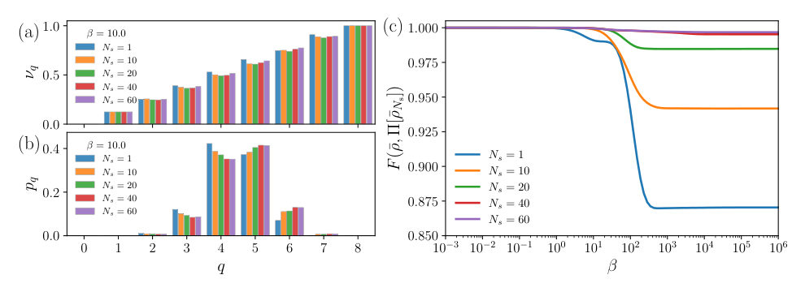 
FIG. 1. Few-sample construction of a permutation-invariant disorder-averaged state in the complex SYK model. (a,b) Con- ditional uniform-mode occupation νq and particle-number distribution pq at β = 10, estimated from Ns disorder realizations. These two quantities are the only inputs inserted into Eq. (4) to construct Π(¯ρNs(β)). (c) Uhlmann fidelity between Π(¯ρNs(β)) and a large-sample reference for ¯ρ(β) obtained from 104 disorder realizations. We set N = 8 in all panels.

📷 Fig 2

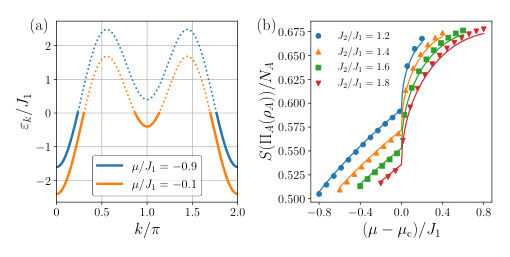 
FIG. 2. (a) The energy dispersion relation of the Hamilto- nian (18) with J2/J1 = 1.5. The empty and occupied modes are plotted by dotted and solid lines, respectively. (b) von Neumann entropy of the permutation-symmetrized reduced density matrix for the ground state of the Hamiltonian (18). The symbols and solid lines are the exact numerical results and the asymptotic prediction in Eq. (17), respectively. We use NA = 27 and N = 214.

**Summary.** The paper introduces a scalable tomography protocol for fermionic many-body states by exploiting particle permutation symmetry. It shows that the full state information can be captured using only the total particle number distribution and the occupation of one collective mode, both measurable in cold atom setups. This opens a pathway to characterize strongly correlated quantum matter experimentally.

**Why it may be interesting.** This work provides an information-theoretic characterization tool that translates difficult quantum state reconstruction problems into measurable observables ($p_q, 
u_q$) directly accessible in modern ultracold atom experiments.

Detailed structure

**Main problem.** To develop a scalable quantum state tomography protocol for fermionic many-body states that avoids the exponential measurement cost associated with full reconstruction.

**Main result.** The permutation-symmetrized density matrix can be fully reconstructed using only two quantities—the total particle number distribution ($p_q$) and the conditional occupation of a single collective mode ($
u_q$)—which scale linearly with system size.

**Method.** The protocol leverages $U(1)$ particle-number symmetry to decompose the state and utilizes properties derived from permutation invariance (Schur's Lemma) to simplify the required observables.

**Model / system.** The theory is applied to fermionic many-body states, particularly those with $U(1)$ particle-number symmetry, demonstrated using models like the Sachdev-Ye-Kitaev (SYK) model and free-fermion chains in optical lattices.

**Key observables.** Total particle-number distribution ($p_q$) and conditional occupation of a uniform mode ($
u_q$).

**Important parameters / regimes.** System size ($N$), temperature/inverse coupling strength ($eta$), and the filling parameter ($\varrho$).

**Assumptions / limitations.** The protocol is restricted to states with $U(1)$ particle-number symmetry, and some derivations rely on asymptotic approximations (e.g., Stirling's formula).

**Figures summary.** Figure 1 shows reconstruction using the SYK model via estimated $
u_q$ and $p_q$. Figure 2 demonstrates calculating von Neumann entropy for free fermions across a Lifshitz transition, showing predicted nonanalyticity.

**Paper structure.** The paper first introduces the scalability problem of tomography, derives the PIQT protocol based on symmetry constraints, applies it to reconstruct complex states (SYK), and then uses the framework to calculate thermodynamic quantities like von Neumann entropy for free fermions near a critical point.

Abstract

Quantum state tomography provides complete information about a quantum state, but its measurement cost generally grows exponentially with system size. In many-particle quantum simulators, this challenge is further compounded by the limited accessibility of local measurements and controls. Here we develop a tomography protocol for permutation-invariant fermionic many-body states with U(1) particle-number symmetry. We show that any such state is completely determined by the distribution of the total particle number and the occupation of a single collective mode within each particle-number sector, both of which are accessible in current ultracold-atom experiments. The number of required observables scales only linearly with the system size. More generally, the protocol reconstructs the permutation-symmetrized component of arbitrary U(1)-symmetric fermionic states, which can still encode nontrivial many-body and state-level structure beyond conventional few-body observables. We demonstrate this protocol in interacting non-Gaussian states of the complex Sachdev-Ye-Kitaev model and in free-fermion chains across a Lifshitz transition. This framework opens a route toward information-theoretic characterization of strongly correlated itinerant quantum matter in experimentally realistic fermionic quantum simulators.

[↑ back to top](#top)

### [Coincidence free certification and quantification of spatial entanglement with stimulated parametric down conversion](http://arxiv.org/abs/2607.24718v1)

**Authors:** M. G. Damaceno, G. H. dos Santos, N. Rubiano da Silva, S. P. Walborn, P. H. Souto Ribeiro  
**Type:** experiment · **Category:** other · **PDF:** <https://arxiv.org/pdf/2607.24718v1>  
**Analysis basis:** full PDF text, analyzed in chunks
**Topic relevance:** 🔥 `quantum optics experiment` **4/5** · `quantum measurements` **3/5** · `entanglement & information structure` **2/5** · `measurement-induced transitions` **2/5** · `QC/QI experiment` **1/5** · `driven-dissipative phase transition` **1/5** · `interference shaping light` **1/5**

📷 Fig 1

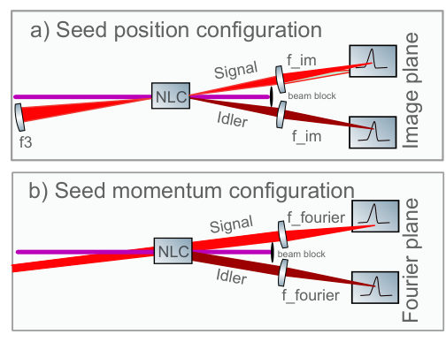 
FIG. 1. Conceptual diagram of the two seed beam config- urations used to obtain the conditional distributions of the idler beam. Only first-order intensity measurements are per- formed. Measurements of the signal field are used only to calibrate the seed profile at the crystal. Details in the main text.

📷 Fig 2

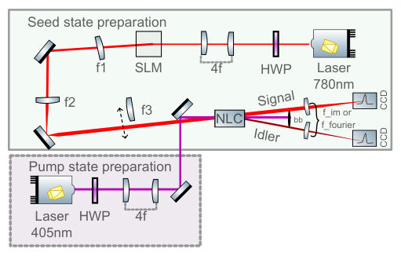 
FIG. 2. Experimental setup. See main text for details.

📷 Fig 3

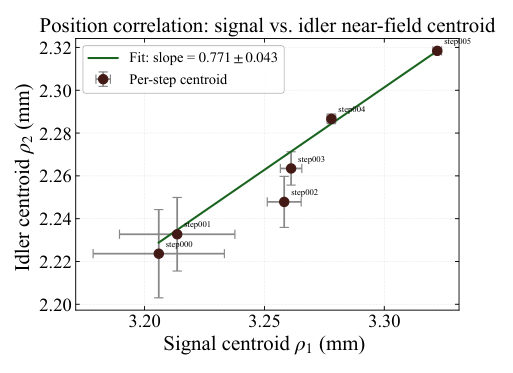 
FIG. 5. Position correlation: idler near field centroid ρ2 vs. signal near field centroid ρ1 across the six seed positions. Lin- ear fit slope 0.77 ± 0.04.

📷 Fig 4

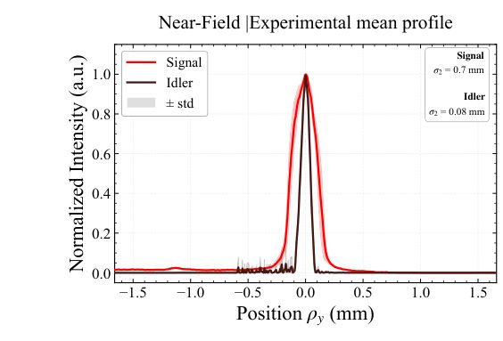 
FIG. 3. Near-field intensity profile along the vertical posi- tion for the position configuration (image plane): signal and stimulated idler mean profiles over N = 10 repetitions; shaded bands indicate the standard deviation across repetitions. Sec- ond moment widths: σ2 = 0.7 mm (signal), σ2 = 0.08 mm (idler).

📷 Fig 5

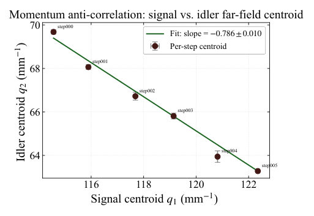 
FIG. 6. Momentum anticorrelation: idler far field centroid q2 vs. signal far field centroid q1. Linear fit slope 0.79 ± 0.01, confirming anticorrelation.

**Summary.** This paper details a novel technique to certify and quantify spatial entanglement in photon pairs generated by SPDC. By employing stimulated parametric down conversion (StimPDC), the authors replace slow coincidence counting with simple intensity measurements on the idler beam. This method successfully verifies entanglement using established witnesses, proving its utility for quantum optics experiments where precise photon detection is challenging.

**Why it may be interesting.** This work provides a highly practical experimental protocol for quantum optics that bypasses major technical hurdles in quantum measurement, making entanglement characterization accessible under difficult experimental conditions.

Detailed structure

**Main problem.** The core problem is certifying and quantifying spatial entanglement of photon pairs generated by SPDC without relying on slow, coincidence-counting measurements.

**Main result.** Spatial entanglement and EPR steering can be robustly certified using only intensity measurements from the idler beam via stimulated parametric down conversion (StimPDC).

**Method.** The authors use StimPDC by seeding the signal mode with a bright classical beam, allowing them to measure conditional idler states using standard intensity detectors instead of coincidence counting.

**Model / system.** The system involves entangled photon pairs generated via SPDC. The measurement technique utilizes stimulated emission into the idler field, which is then analyzed in both transverse position and momentum bases.

**Key observables.** Entanglement witnesses (Reid criterion, MGVT product) and the Fedorov ratio ($R$), calculated from measured conditional variances ($\sigma^2$).

**Important parameters / regimes.** The correlation strength is tracked by varying the pump waist size; finite seed widths only broaden measured variances.

**Assumptions / limitations.** The analysis assumes paraxial and quasi-monochromatic approximations, and the method's robustness relies on imperfections only broadening measurements, preventing false positives.

**Figures summary.** Figures illustrate conceptual diagrams for position-space and momentum-space seeding (Fig. 1). Other figures show measured near-field/far-field intensity profiles and correlation plots confirming expected linear fits.

**Paper structure.** The paper introduces the StimPDC method to replace coincidence counting, derives the conditional idler state, applies entanglement witnesses (Reid, MGVT), calculates the Fedorov ratio, and presents results demonstrating robust certification of spatial entanglement using only intensity measurements.

Abstract

Using stimulated emission, a photon pair source can be characterized by seeding the signal mode with a bright classical beam and measuring the stimulated idler field, thus replacing two-photon coincidence counting with classical intensity detection. We apply this approach to the continuous transverse spatial degrees of freedom of a down conversion source and show that it is possible to certify spatial entanglement with only intensity measurements. We demonstrate this capability through variance-based entanglement and steering witnesses, as well as the Fedorov ratio. This method is useful for studying entanglement properties of photon pair sources in conditions where alignment and photon counting measurements are difficult and time-consuming.

[↑ back to top](#top)

### [Position measurement of a levitated particle with vectorial light](http://arxiv.org/abs/2607.23833v1)

**Authors:** Daniel Tandeitnik, Lucas Bianchi, Sebastian Gutierrez-Bernal, Joanna A. Zielińska, Paulo A. Maia Neto, Thiago Guerreiro  
**Type:** theory · **Category:** other · **PDF:** <https://arxiv.org/pdf/2607.23833v1>  
**Analysis basis:** full PDF text, analyzed in chunks
**Topic relevance:** 🔥 `quantum measurements` **4/5** · `interference shaping light` **3/5** · `measurement-induced transitions` **3/5** · `Keldysh / 2PI / non-Gaussian methods` **2/5** · `methods for driven-dissipative` **1/5** · `non-equilibrium dynamics` **1/5**

📷 Fig 1

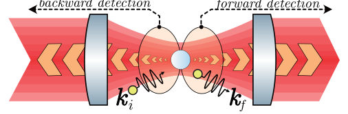 
FIG. 1. Schematic representation of coherent photon scatter- ing and position detection in an optical levitation setup. The trapping beam (propagating left to right) is strongly focused by a high-NA objective. The levitated nanoparticle acts as a driven point-dipole, interacting with an incident photon (wavevector ki) and scattering it into a final state (wavevec- tor kf). The resulting dipole radiation pattern carries the particle’s spatial information into the far-field. This coherent signal is subsequently gathered either by the trapping objec- tive (backward detection) or by a secondary collection lens (forward detection) for phase-sensitive measurement.

📷 Fig 2

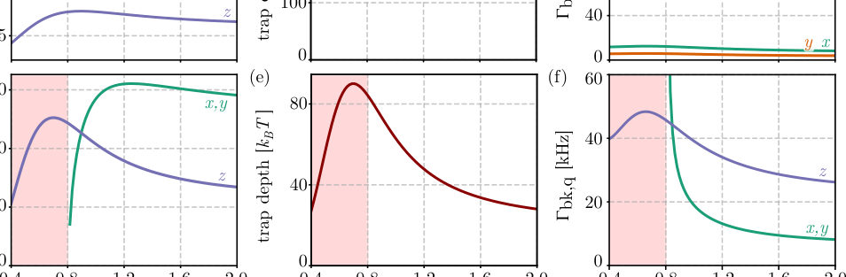 
FIG. 3. Comparison of optomechanical trapping parameters for a linearly polarized fundamental Gaussian beam (top row, a–c) and a radially polarized beam (bottom row, d–f) as a function of the objective filling factor f0. All calculations assume a total incident laser power of 1 W prior to the trapping objective (NA = 0.75), and a SiO2 particle with diameter 156 nm. (a, d) Mechanical trap frequencies Ωq/2π. (b, e) Trap depth at the focal origin, normalized by the thermal energy kBT at 293 K. (c, f) Backaction decoherence rates Γbk,q. The light red shaded regions denote unstable parameter regimes. For the radial mode, this instability occurs at lower filling factors (f0 ≲0.8) where the...

📷 Fig 3

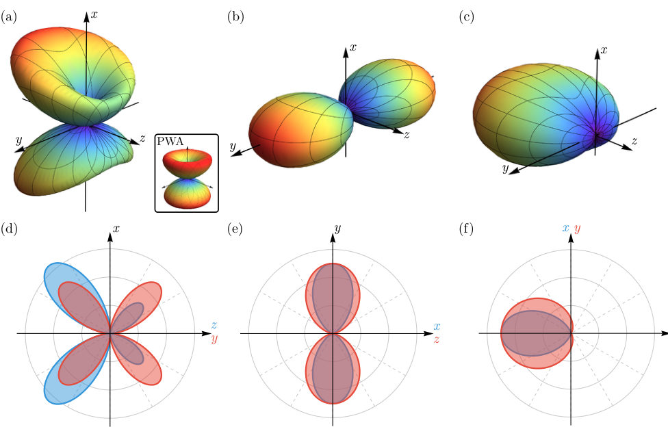 
FIG. 4. Spatial distribution of the position information radiated by a dipolar scatterer trapped in a strongly focused fundamental Gaussian beam (linearly polarized along the x-axis). (a)-(c) Three-dimensional IRP for displacements along the x, y, and z axes. (d)-(f) Two-dimensional polar cross-sections of the 3D patterns, evaluated in the xz-plane (blue) and xy-plane or yz-plane (red). Inset in (a) shows the PWA prediction.

📷 Fig 4

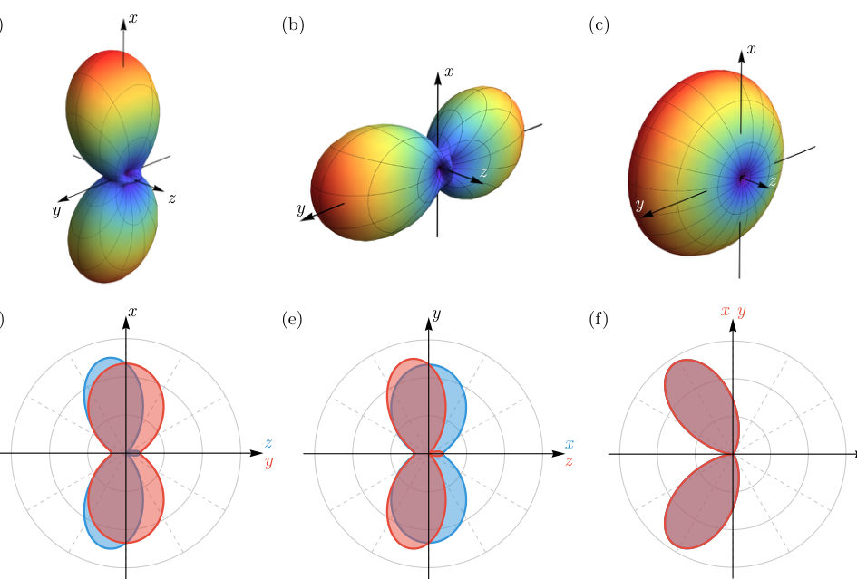 
FIG. 5. Spatial distribution of the position information radiated by a dipolar scatterer trapped in a strongly focused radial beam. (a)-(c) Three-dimensional Information Radiation Patterns for the x, y, and z axes. (d)-(f) Two-dimensional polar cross-sections.

📷 Fig 5

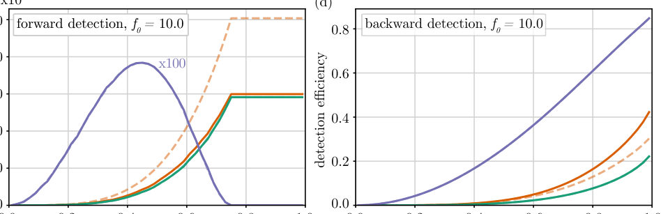 
FIG. 6. Comparison of detection efficiencies ηdet,q evaluated using the ASR (solid lines) and analytical PWA (dashed lines) for a linearly (x-)polarized trapping beam. (a, b) Forward and backward detection efficiencies for a Gaussian beam with filling factor f0 = 1.0. (c, d) Efficiencies in the uniform aperture limit (f0 = 10.0). In the forward detection panels (a, c), the trapping NA is fixed at 0.75, yielding peak efficiencies once the collection NA captures the entire scattered cone. Note that ηz is scaled by a factor of 100 for visibility in the forward direction.

**Summary.** The paper introduces a comprehensive, fully vectorial theory to analyze how position measurements are limited by photon scattering noise in levitated nanoparticles. By using the Angular Spectrum Representation, it accurately models non-paraxial effects, demonstrating that structured light like radial polarization can suppress unwanted axial backaction forces compared to standard Gaussian traps.

**Why it may be interesting.** This work provides advanced theoretical tools for designing next-generation quantum sensors by rigorously accounting for the polarization and angular structure of light fields on measurement backaction limits.

Detailed structure

**Main problem.** To develop a fully vectorial, semiclassical formalism for characterizing position measurement backaction noise and detection efficiency in optically levitated dipolar scatterers.

**Main result.** The vectorial approach shows that structured light fields, such as radially polarized beams, can fundamentally suppress axial measurement backaction compared to conventional Gaussian traps.

**Method.** The authors use the angular spectrum representation (ASR) within a semiclassical scattering formalism to calculate momentum transfer and detection efficiency, moving beyond paraxial approximations.

**Model / system.** The system involves levitating mesoscopic nanoparticles trapped by arbitrary optical fields. The theoretical model incorporates Langevin dynamics and treats the measurement process using photon shot noise statistics.

**Key observables.** Information radiation pattern, mode-matching efficiency ($\eta_{det,q}$), backaction force spectral density ($S_{b,k,q}$), and the resulting effective imprecision noise ($\Delta x_{	ext{eff}}$).

**Important parameters / regimes.** The generalized geometric factor ($	ext{C}_q$), filling factor ($f_0$), and the comparison between linearly vs. radially polarized beams.

**Assumptions / limitations.** The analysis assumes the Rayleigh scattering regime ($a \ll \lambda$) and employs a semiclassical treatment for the trapping field, while using ASR to handle non-paraxial effects.

**Figures summary.** Figures compare optomechanical parameters (like backaction rates) for different polarizations as a function of beam filling factor, highlighting differences between vectorial and paraxial approximations.

**Paper structure.** The paper builds from developing the general vectorial scattering formalism using ASR to calculate momentum transfer ($	ext{C}_q$), then applies this framework to quantify detection efficiency ($\eta_{det,q}$), culminating in specific examples comparing Gaussian versus radially polarized traps.

Abstract

We develop a fully vectorial, semiclassical scattering formalism for optically levitated dipolar scatterers, expressed within the angular spectrum representation and applicable to arbitrary trapping-field configurations as well as to high--numerical-aperture focusing. Within this framework, we introduce the information radiation pattern to characterize the angular distribution of position-dependent information and use a Richards--Wolf projection of the scattered field onto the local-oscillator mode to quantify the resulting mode-matching efficiency, yielding experimentally realistic forward- and backward-detection efficiencies. As a worked example, we apply the formalism to a radially polarized trapping beam and confirm that the axial recoil heating rate is reduced relative to a conventional linearly polarized Gaussian tweezer. The theoretical framework is implemented in LevitationToolbox, an open-source Python package intended to support the design and optimization of near-Heisenberg-limited levitated optomechanical experiments.

[↑ back to top](#top)

### [Current cross-correlations as probes for poor man's Majorana states](http://arxiv.org/abs/2607.23498v1)

**Authors:** Saatwik Patnaik, Aditya Saran, Himadri S Dhar, Pertti Hakonen, Thierry Martin, Bhaskaran Muralidharan  
**Type:** theory · **Category:** other · **PDF:** <https://arxiv.org/pdf/2607.23498v1>  
**Analysis basis:** full PDF text, analyzed in chunks
**Topic relevance:** 🔥 `Keldysh / 2PI / non-Gaussian methods` **4/5** · `methods for driven-dissipative` **3/5** · `driven-dissipative phase transition` **2/5** · `Kondo & dissipative impurity` **1/5** · `analog quantum simulation` **1/5** · `exotic spin models in light-matter` **1/5** · `non-equilibrium dynamics` **1/5**

📷 Fig 1

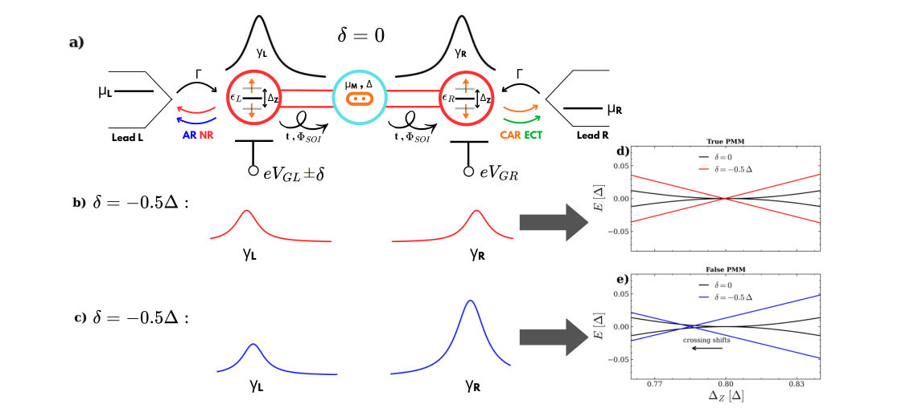 
Figure 1. Preliminaries. (a) Device schematic of the MKC with three quantum dots. The middle dot is superconducting, and the outer dots have spin-split energy levels due to the presence of an external magnetic field. The energy levels of the outer dots can be controlled via a gate potential. The interdot tunneling has both spin-conserving and spin-flip tunnel processes facilitated by the Rashba spin-orbit interaction. The MKC is coupled to normal metallic leads through which currents flow. At the interfaces between the leads and the MKC system, one has four local (nonlocal) processes, namely, the NR (ECT) and the AR (CAR) processes. (b) A schematic of a true PMM mode that does not hybridize...

📷 Fig 2

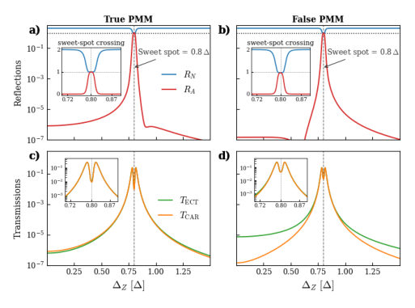 
Figure 2. Reflection and transmission calculated at E = 0, traced over both spin channels, through the device as a func- tion of the Zeeman field, ∆z. (a), (b) At the sweet spot, the AR reaches its maximum, and the NR reaches its minimum. (c), (d) Away from the sweet spot, the AR probability reduces to less than that of CAR and ECT, in order of magnitude. Both true and false PMMs show very similar primary charac- teristics around the sweet spot when ∆z is tuned.

📷 Fig 3

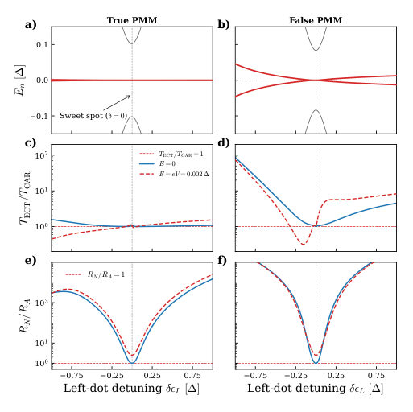 
Figure 4. Effect of dot detuning on competing transport processes. (a) and (b) represent the energy spectrum of the system as a function of left-dot detuning δ for true and false PMM parameters, respectively. (c) and (d) show the corre- sponding transmission ratio TECT/TCAR at E = 0 (blue) and at the bias point E = eV = 0.002∆(red dash). At the sweet spot (δ = 0), both regimes are indistinguishable. However, under finite detuning, the true PMM remains robustly sta- ble, whereas the false PMM is highly sensitive, rapidly losing its zero-energy degeneracy and exhibiting a sharply diverging transmission ratio. (e) and (f) Shows the ratio of RN/RA for the same range of detuning at E = 0 (blue)...

📷 Fig 4

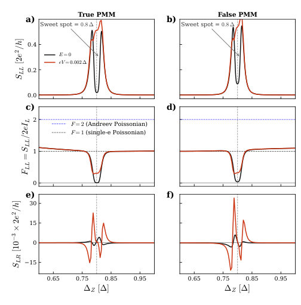 
Figure 3. Current correlations and the Fano factor (a) and (b) illustrate the local current correlations SLL at a bias of eV = 0.002∆as a function of the Zeeman field ∆Z for true and false PMMs, respectively. We also plot the correlation integrand SI LL(E = 0) to illustrate the cross-term cancellation discussed in the text. (c) and (d) depict the local Fano factor FLL = SLL/2eILL, at negligible bias, which goes to zero at the sweet spot, due to perfect transmission at zero energy. There is also a suppression below the Andreev (F = 2) limit to the single-electron (F = 1) Poissonian limit, away from the sweet spot. (e) and (f) show the cross-correlation SLR, with the black line showing the...

📷 Fig 5

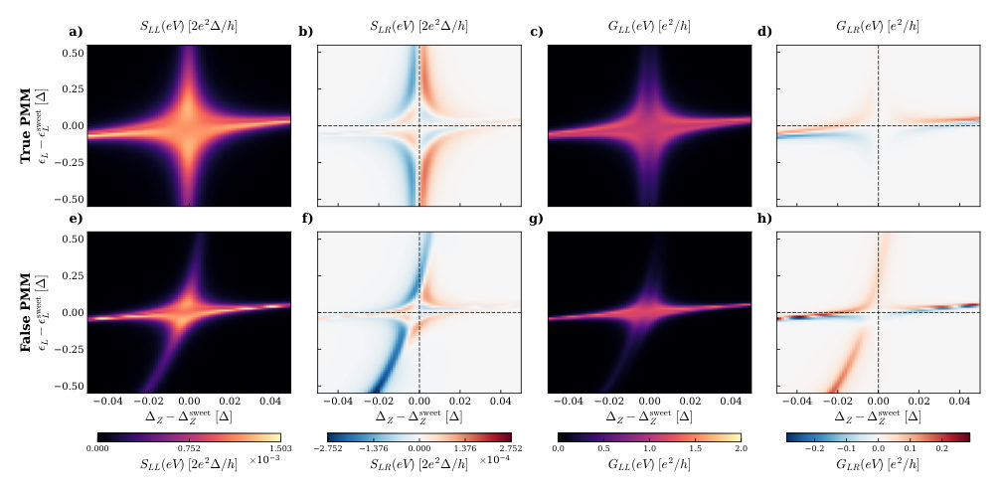 
Figure 5. Current correlations and conductance profiles at a small bias, eV = 2 × 10−3∆. (a)–(d) and (e)–(h) map the transport and noise signatures for true and false PMM configurations, respectively, as a function of Zeeman field detuning ∆Z −∆sweet Z and left-dot chemical potential detuning ϵL −ϵsweet L . The columns display the local correlations SLL [(a), (e)], non- local cross-correlation noise SLR [(b), (f)], local conductance GLL [(c), (g)], and non-local conductance GLR [(d), (h)]. While the local signatures (SLL and GLL) remain qualitatively similar near the sweet spot for both cases, the non-local measurements exhibit distinct profiles that help to distinguish between the True and...

**Summary.** The paper proposes using current cross-correlations as a superior diagnostic tool to verify the existence of Poor Man's Majorana modes in quantum dot arrays. By analyzing how these correlations behave when tuning away from ideal sweet spots, the authors demonstrate that only true topological states exhibit characteristic robustness. This provides a clear experimental pathway for confirming non-local entanglement signatures.

**Why it may be interesting.** This work provides a concrete, measurable signature (noise correlation) that can distinguish between trivial and topological zero-energy states, which is crucial for experimental realization of Majorana physics in superconducting nanostructures.

Detailed structure

**Main problem.** The authors aim to develop diagnostic methods beyond standard differential conductance spectroscopy to verify the true non-locality and topological order of Poor Man's Majorana (PMM) modes.

**Main result.** Current cross-correlations are shown to be robust, exhibiting remarkable stability around the PMM sweet spot with respect to outer dot detuning, which distinguishes true topologically protected PMMs from false ones.

**Method.** The study employs advanced transport theory, calculating zero-frequency current cross-correlation functions ($S_{LR}$) using the Keldysh Non-Equilibrium Green's Function (NEGF) formalism and scattering matrix techniques.

**Model / system.** The system is modeled by a minimal Kitaev chain (MKC) setup with three quantum dots, emulating a topological superconductor. The physics is described using the Bogoliubov-de Gennes Hamiltonian in Nambu spinor space.

**Key observables.** Current cross-correlations ($S_{LR}$), local conductance ($G_{LL}$), and the Fano factor ($F_{LL}$).

**Important parameters / regimes.** The analysis focuses on the PMM sweet spot, zero energy ($E=0$), and varying detuning ($\delta$) of outer quantum dots.

**Assumptions / limitations.** The calculations assume the $T=0$ limit for simplicity in Fermi functions and utilize the wide-band limit approximation for self-energies from normal leads.

**Figures summary.** Figures illustrate the MKC device schematic, comparing true vs. false PMM modes under detuning; they also show energy landscapes around sweet spots and calculated local/nonlocal current correlation signatures ($S_{LL}$ and $S_{LR}$).

**Paper structure.** The paper progresses from identifying the limitations of conductance spectroscopy to deriving the theoretical framework for current cross-correlations using NEGF, culminating in demonstrating the unique diagnostic power of these correlations.

Abstract

The minimal Kitaev chain that emulates a topological superconductor with three quantum dots offers a tunable platform for potentially hosting poor man's Majorana (PMM) modes. Asserting the need to go beyond differential conductance spectroscopy, we introduce current-current correlations as a viable framework for verifying their true non-locality. The robustness of the PMM modes, specifically with respect to delocalization as the system is tuned away from sweet spots, we show, is embedded in the relative magnitudes of the nonlocal transport processes. This aspect is adeptly captured by current cross-correlations, whose features show remarkable stability around the PMM sweet spot, specifically with respect to the detuning of an outer dot. We establish this as a prominent feature and a diagnostic for true PMMs even in the short chain limit. Our results accentuate the need for current cross-correlation measurements as a diagnostic framework for unambiguously verifying true non-locality of entangled states as well as topologically protected states.

[↑ back to top](#top)

### [Pound-Drever-Hall Feedforward for Trapped-Ion Optical Qubits](http://arxiv.org/abs/2607.24050v1)

**Authors:** Jia-Yang Gao, Jianwei Lee, Morteza Ahmadi, Manas Mukherjee  
**Type:** experiment · **Category:** other · **PDF:** <https://arxiv.org/pdf/2607.24050v1>  
**Analysis basis:** full PDF text, analyzed in chunks
**Topic relevance:** 🔥 `QC/QI experiment` **4/5** · `quantum measurements` **3/5** · `interference shaping light` **2/5** · `quantum optics experiment` **2/5** · `measurement-induced transitions` **1/5** · `methods for driven-dissipative` **1/5**

📷 Fig 1

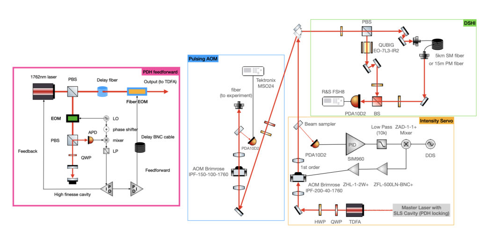 
FIG. 1: Experimental setup for phase noise stabilization, DSHI measurement, intensity servo, and pulsing AOM The PDH feedforward setup recycles the PID control signal through a delayed BNC cable, which is then applied as feedforward to a fiber electro-optic modulator (Jenoptik PM1750). A delayed fiber is used to match the optical phase between the two arms, and the output serves as the seed laser for the thulium-doped fiber amplifier (TDFA). For intensity stabilization, the signal from a photodetector is used for electrical feedback to control the RF drive of the acousto-optic modulator (AOM). In the delayed self-heterodyne interferometer (DSHI) measurement, one path is delayed by the...

📷 Fig 2

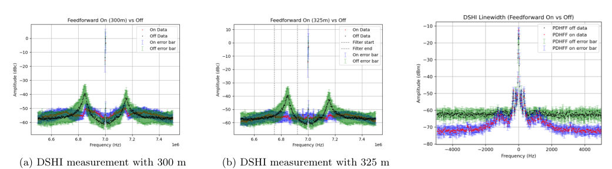 
FIG. 2: DSHI measurements of the phase noise and linewidth of the 1762 nm laser. Figure 2a shows that when the BNC cable length is not optimal (300 m), the phase noise cannot be fully reduced. Figure 2b demonstrates that at the optimal cable length (325 m), the feedforward servo suppresses the servo-bump phase noise by up to 15 dB. Figure 2c shows that the feedforward servo does not broaden the laser linewidth, ensuring minimal impact on the qubit transition.

📷 Fig 3

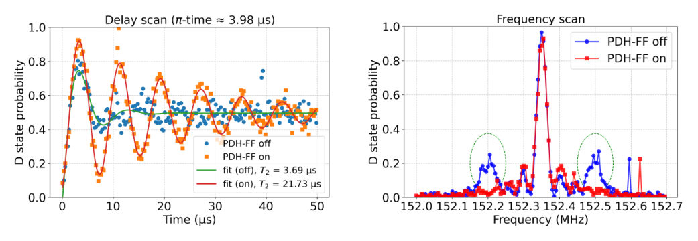 
FIG. 3: Rabi Oscillation measurements. Figure 3a compare the Rabi oscillations with and without phase noise stabilization and perform T2 fitting. From the data, we observe that T2 is longer when the beam is stabilized. The D-state probability at the first π-time improves, demonstrating a corresponding enhancement in gate fidelity. Figure 3b compare the frequency scan excitation spectra with and without phase noise stabilization (pi time used: 22.1us). The additional off-resonant excitation is clearly observable (circled by a dashed green line), with its shape determined by the servo noise and locking bandwidth.

📷 Fig 4

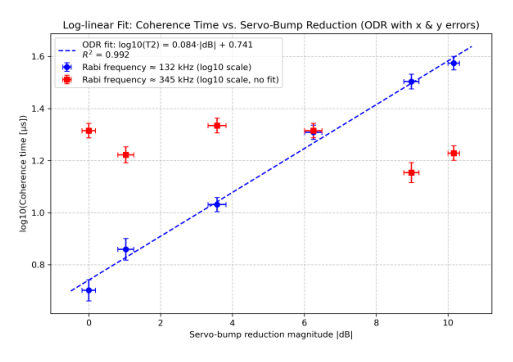 
FIG. 4: Log-linear scaling of T2 coherence time with servo-bump phase-noise reduction. The plot shows the measured coherence time T2 as a function of the servo-bump phase-noise reduction (in dB). A log-linear fit shows an improvement factor of approximately 1.21× in T2 per dB of noise suppression. Blue points (Rabi frequency ≈132 kHz) are used for the fit, while red points (≈345 kHz) are shown for comparison.

📷 Fig 5

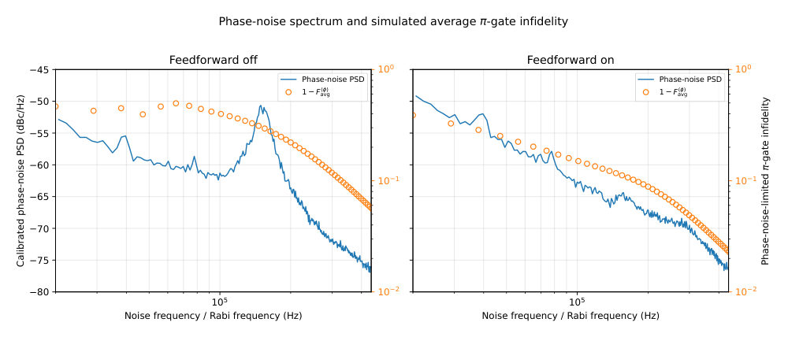 
FIG. 5: Phase-noise spectrum and simulated phase-noise-limited average π-gate infidelity versus frequency. Blue curves: calibrated phase-noise PSD (left axis, dBc/Hz). Orange open circles: 1 −F (ϕ) avg for resonant π pulses (logarithmic right axis), where at each marker the Rabi frequency equals that frequency and tπ = 1/(2fR). The full measured spectrum, not just the PSD value at f = fR, enters each finite-time calculation. Left and right panels show PDH feedforward disabled and enabled. The Rabi frequency is scanned from 20 to 450 kHz with one common calibration factor.

**Summary.** The paper addresses laser phase noise, a major hurdle for trapped-ion qubits, by implementing an active Pound-Drever-Hall feedforward stabilization system. This technique successfully suppresses detrimental servo-bump phase noise near the operating frequency. The results confirm that this stabilization significantly improves qubit coherence time and gate fidelity across previously restricted operational regimes.

**Why it may be interesting.** This work provides an essential experimental blueprint for mitigating technical noise sources (laser phase noise) that fundamentally limit the achievable gate fidelity in trapped-ion quantum computing architectures.

Detailed structure

**Main problem.** Laser phase noise is a critical limiting factor for achieving high gate fidelities and coherence times in trapped-ion quantum systems.

**Main result.** The implementation of Pound-Drever-Hall (PDH) feedforward stabilization successfully suppresses servo-bump phase noise by 15 dB, allowing optical qubit operations to maintain coherence even when the Rabi frequency is near this problematic noise region.

**Method.** The authors employed an active phase-noise stabilization system using a fiber electro-optic modulator (EOM) and electrical feedforward servo, validated through Delayed Self-Heterodyne Interferometry (DSHI).

**Model / system.** The experiment uses a trapped-ion optical qubit platform based on Barium ions ($	ext{Ba}^+$) at 1762 nm. The analysis models the qubit dynamics using Pauli-transfer matrices and stochastic differential equations to track coherence decay.

**Key observables.** Coherence time ($T_2$), gate fidelity ($\epsilon_{	ext{avg}}$), Rabi oscillation amplitude decay, and measured phase noise suppression (15 dB).

**Important parameters / regimes.** Rabi frequency relative to the servo-bump bandwidth; stabilization level of 15 dB; operating wavelength of 1762 nm.

**Assumptions / limitations.** The technique's applicability was experimentally verified for optical qubits, and coherence time analysis relies on fitting $\log_{10} T_2$ vs. $\Delta 	ext{dB}$.

**Figures summary.** Figures illustrate the experimental setup involving PDH stabilization and DSHI measurement, comparing noise suppression results with linewidth measurements.

**Paper structure.** The paper progresses from identifying laser phase noise as a limitation to detailing the PDH feedforward technique, measuring its performance via DSHI, and finally demonstrating the resulting improvement in qubit coherence time through Rabi oscillation analysis.

Abstract

Laser phase noise is one of the limiting factors that dictate gate fidelities and coherence times in trapped-ion quantum systems. Previous studies have reported that when the Rabi frequency of an ion qubit is close to the servo-bump phase-noise frequency, the driving laser limits the fidelity and coherence time. This issue has typically been mitigated by choosing a Rabi frequency outside the servo-bump region. However, this constrains the usable range of gate speeds and can limit the achievable fidelity. To address this issue, we developed an active phase-noise stabilization system for a barium-ion optical-qubit laser at 1762 nm, employing a fiber electro-optic modulator (EOM) with an electrical feedforward servo. Our results demonstrate that this setup, based on the Pound-Drever-Hall (PDH) feedforward method, can suppress servo-bump phase noise by 15 dB near the bump peak frequency in our locking system. The laser phase noise is analyzed using delayed self-heterodyne interferometry (DSHI). We further tested the stabilized laser on an optical qubit and observed a clear improvement in coherence time based on the measured amplitude decay of Rabi oscillations, even when the Rabi frequency lies within the servo-bump bandwidth. This technique can be readily adapted to other optical qubits with minimal modifications.

[↑ back to top](#top)

### [Testing edge chirality with a three-path fractional quantum Hall interferometer](http://arxiv.org/abs/2607.24451v1)

**Authors:** Eugene V. Sukhorukov  
**Type:** theory · **Category:** strongly correlated electrons · **PDF:** <https://arxiv.org/pdf/2607.24451v1>  
**Analysis basis:** full PDF text, analyzed in chunks
**Topic relevance:** 🔥 `Keldysh / 2PI / non-Gaussian methods` **4/5** · `methods for driven-dissipative` **3/5** · `non-equilibrium dynamics` **2/5** · `analog quantum simulation` **1/5** · `driven-dissipative phase transition` **1/5** · `interference shaping light` **1/5** · `non-equilibrium universality` **1/5**

📷 Fig 1

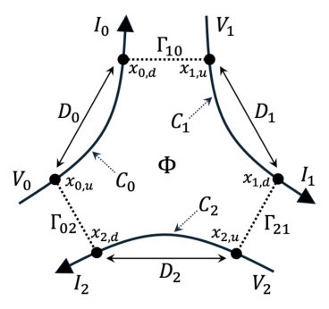 
FIG. 1. Cyclic three-path interferometer. The coherent seg- ments Ca are ordered from xa,u to xa,d along their positive chiral velocities and are connected by QPC amplitudes Γa,a−1. Reservoir a fixes the incoming distribution at the end marked Va, while Ia is read on the outgoing side of the same reservoir- defined terminal and is positive when charge leaves that reser- voir. For any a, a direct transfer between a −1 and a + 1 in- terferes with a coherent two-step alternative through Ca. The latter samples downstream propagation on Ca for a−1 →a+1 and upstream propagation for the reversed transfer. Together the two histories traverse the three QPC links and enclose the signed flux Φ.

📷 Fig 2

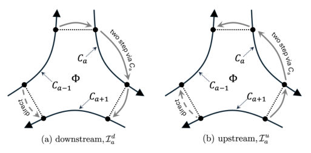 
FIG. 2. Directional contributions to the same fundamental AB harmonic. In each panel the dashed path is the direct one- QPC transition amplitude and the gray path is the coherent two-QPC transition amplitude through Ca. In (a), the two- step history propagates from xa,u to xa,d and samples the downstream retarded function. Reversing the terminal transfer in (b) requires propagation from xa,d to xa,u and samples the upstream retarded function.

📷 Fig 3

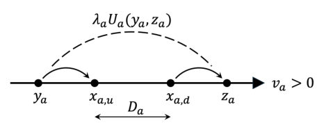 
FIG. 3. Static interaction bridge on one coherent segment. The local edge velocity is positive, va &gt; 0, and Da = xa,d −xa,u. The kernel λaUa(ya, za) couples a density upstream of both tunneling points to one downstream of both. The two solid arrows are ordinary downstream propagation; the dashed arc is an instantaneous interaction, not a counterpropagating channel.

📷 Fig 4

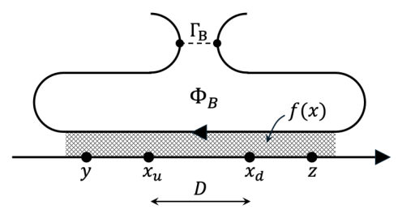 
FIG. 4. Flux-controlled auxiliary bridge. The upper curve is a folded piece of a macroscopic same-filling Laughlin edge. The QPC ΓB connects two points of that edge; together with the intervening segment it encloses the auxiliary flux ΦB. The facing auxiliary branch counterpropagates relative to the generic primary-edge piece below. The hatched region denotes the support of the effective capacitive phase-response envelope f(x), which must extend both upstream of xu and downstream of xd to bridge the primary QPC pair. In the controlled operating regime ΓB is weak; at full pinch-off the intervening segment forms an isolated loop of circumference ℓB.

**Summary.** This theoretical work proposes using a three-path quantum interferometer to measure the directional chirality of fractional quantum Hall edges. By analyzing interference patterns sensitive to flux and voltage orderings, the authors demonstrate that it is possible to independently extract vertex properties like scaling dimension and exchange angle, which are otherwise conflated in simpler transport measurements.

**Why it may be interesting.** The use of a mesoscopic interferometer setup to probe fundamental topological properties (chirality) in strongly correlated electron systems is highly relevant for understanding edge physics beyond simple Luttinger liquid models.

Detailed structure

**Main problem.** The goal is to test the directional causal response (chirality) of fractional quantum Hall edge excitations and separately determine vertex properties like scaling dimension and exchange angle.

**Main result.** The interferometer setup allows for a measurement that resolves directional causality, providing parameters ($\Delta\ell$ and $	heta_\ell$) that are generally independent when only using standard scaling spectroscopy.

**Method.** Theoretical derivation utilizing the Keldysh formalism to calculate cubic interference kernels in a three-path interferometer geometry. Directionality is isolated by analyzing voltage orderings.

**Model / system.** The system models fractional quantum Hall (FQH) edge excitations ($
u=1/m$) connected via three coherent Quantum Point Contacts (QPCs) forming a flux-enclosing loop. The analysis focuses on the interference between direct and two-step quasiparticle tunneling paths.

**Key observables.** Directional current amplitudes ($A^u_\ell, A^d_\ell$), relative phase ($\Delta\varphi_a$), scaling dimension exponent ($\Delta\ell$), and exchange angle ($	heta_\ell$).

**Important parameters / regimes.** Filling factor $
u$, magnetic flux $\Phi$ (via AB harmonics), tunneling weights ($\delta_+$, $\delta_-$), and the ratio of amplitudes $r_\ell$.

**Assumptions / limitations.** The analysis assumes low temperature, unresolved delay regimes, and fixed-point universality for the vertex properties.

**Figures summary.** Figure 1 illustrates the cyclic three-path interferometer geometry. Figure 2 compares direct vs. two-step transition amplitudes for downstream and upstream paths contributing to the fundamental AB harmonic.

**Paper structure.** The paper builds from deriving the general cubic interference kernel using Keldysh formalism, separating contributions into directional kernels ($I_d^a$ and $I_u^a$), and finally relating these measured ratios/phases back to the intrinsic vertex parameters ($\Delta\ell, 	heta_\ell$).

Abstract

We propose an average-current interferometer for the directional causal response of fractional quantum Hall edges. Three coherent quantum point contacts (QPCs) form a flux-enclosing loop, so the leading Aharonov-Bohm harmonic is cubic in tunneling. Interference between a direct transfer and a coherent two-step path resolves downstream and upstream propagation. For a local Laughlin edge at $ν=1/m$, the upstream coefficient vanishes exactly, while the downstream amplitude scales as $E^{3ν-2}$. A weak finite-range nonlocal density interaction spanning the tunneling points activates the upstream coefficient without creating an upstream mode. At low temperature and unresolved delay, its amplitude scales as $E^{2ν-1}$ and its aligned phase relative to the downstream reference is $-π(1-ν)/2+χ_a$ modulo $2π$, with $χ_a=0$ or $π$. Opposite cyclic voltage orderings isolate the two directions, while a folded same-filling Laughlin edge with a neutral weak link realizes a sign-tunable bridge. For a general Abelian edge, the device probes the directional content of the selected tunneling vertex. If $δ_\pm$ are its downstream and upstream weights, its nonzero directional amplitudes scale as $E^{3Δ_\ell-2}$, with $Δ_\ell=δ_++δ_-$, and obey $A^u_\ell/A^d_\ell=|\sin(πδ_-)/\sin(πδ_+)|$. When both are nonzero, positive-flux alignment gives, after removal of a known fixed sign, the relative phase $πΔ_\ell=2πh_\ell$. In the same-vertex coherent unresolved-flight regime, the scaling dimension and directional ratio determine the exchange angle $θ_\ell=π(δ_+-δ_-)$ modulo $2π$. The Aharonov-Bohm flux frequency additionally gives the charge, enabling separate extraction of quasiparticle charge, scaling dimension, and exchange angle.

[↑ back to top](#top)

### [Two-copy nondistillability of Werner states: sharp partial-trace inequalities and finite-copy extensions](http://arxiv.org/abs/2607.24479v1)

**Authors:** Kishor Bharti, Rishikesh Gajjala, Tobias Haug  
**Type:** theory · **Category:** quantum information and computing · **PDF:** <https://arxiv.org/pdf/2607.24479v1>  
**Analysis basis:** full PDF text, analyzed in chunks
**Topic relevance:** 🔥 `entanglement & information structure` **4/5** · `Keldysh / 2PI / non-Gaussian methods` **2/5** · `methods for driven-dissipative` **2/5** · `analog quantum simulation` **1/5** · `correlated / nonlocal dissipation` **1/5** · `correlated cavity matter` **1/5** · `driven-dissipative phase transition` **1/5** · `non-equilibrium dynamics` **1/5**

📷 Fig 1

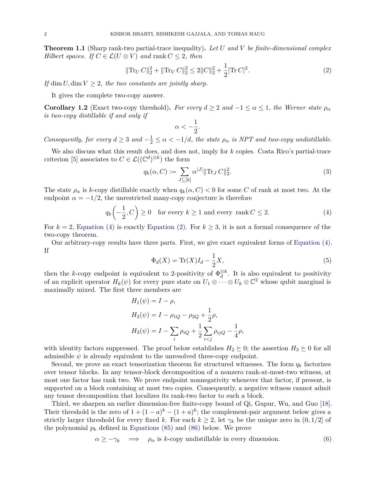 
Low-resolution page preview, page 2

📷 Fig 2

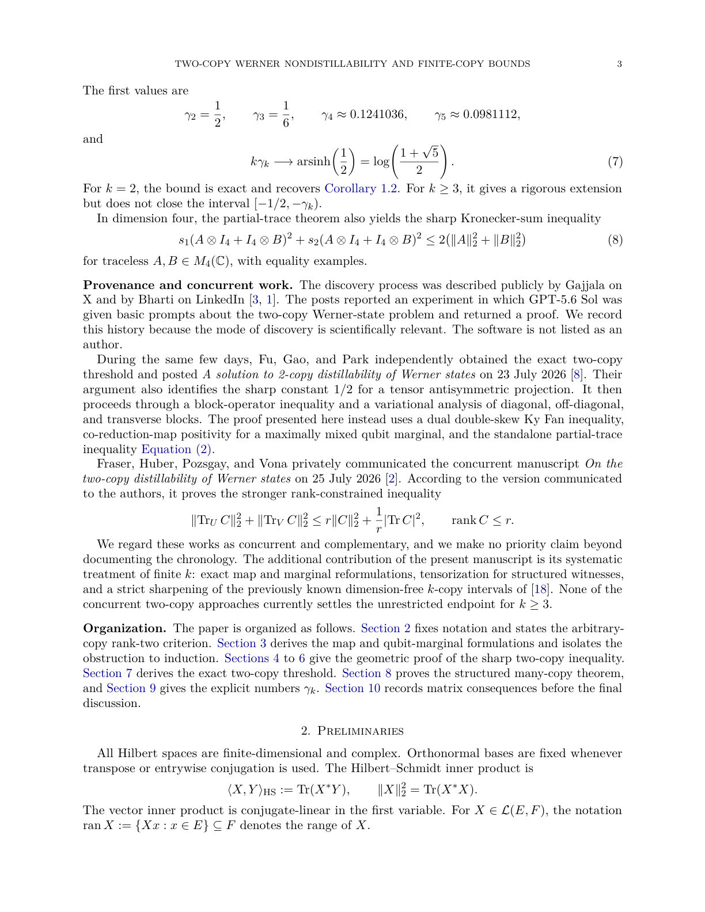 
Low-resolution page preview, page 3

📷 Fig 3

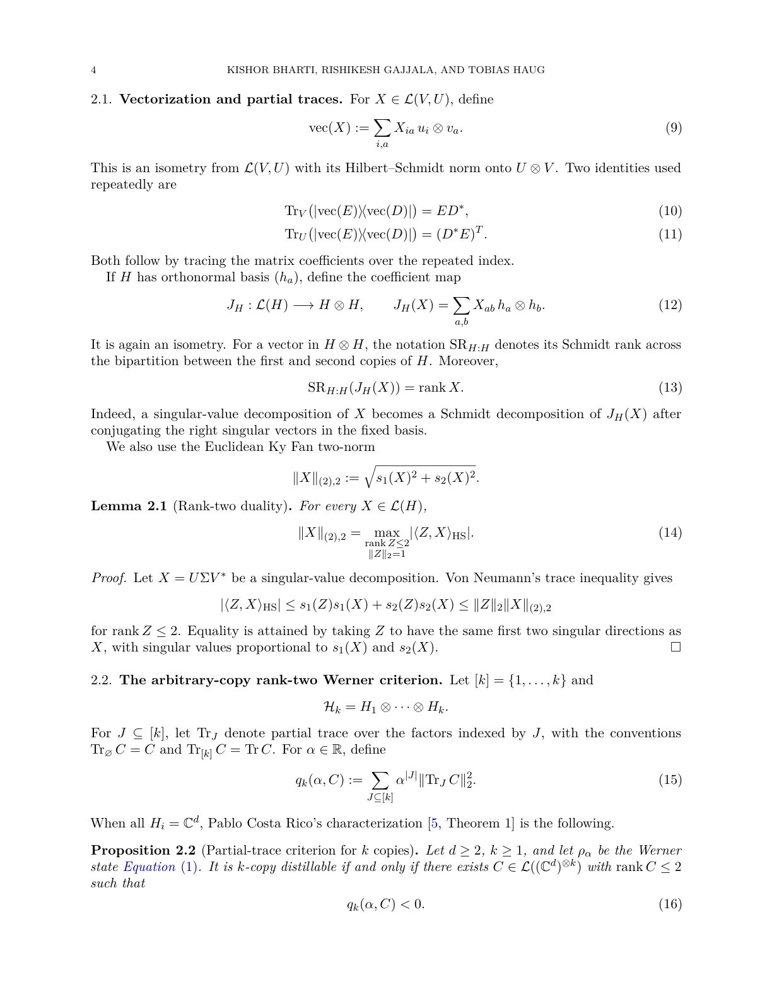 
Low-resolution page preview, page 4

📷 Fig 4

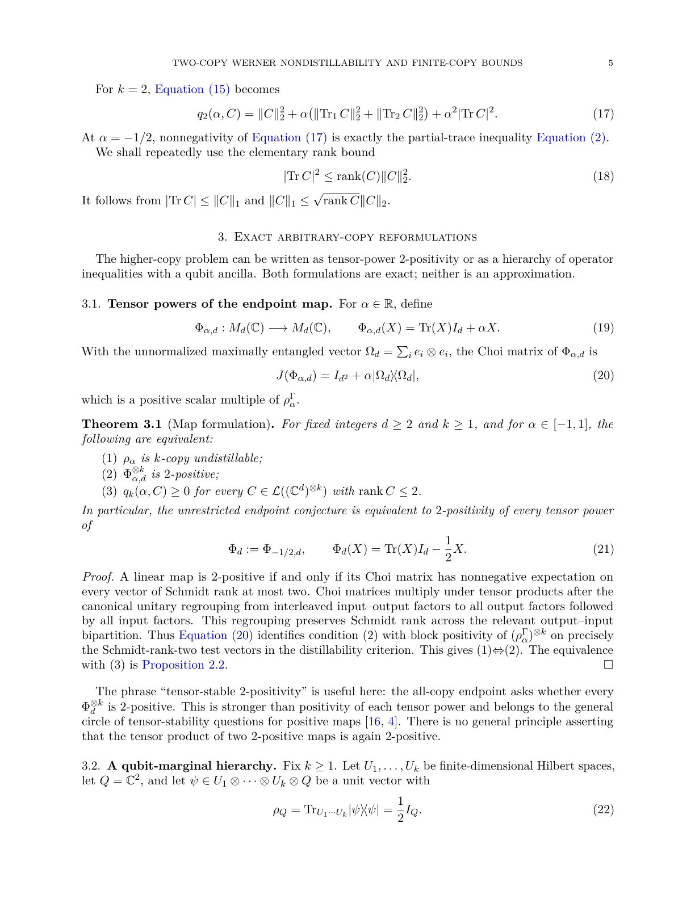 
Low-resolution page preview, page 5

📷 Fig 5

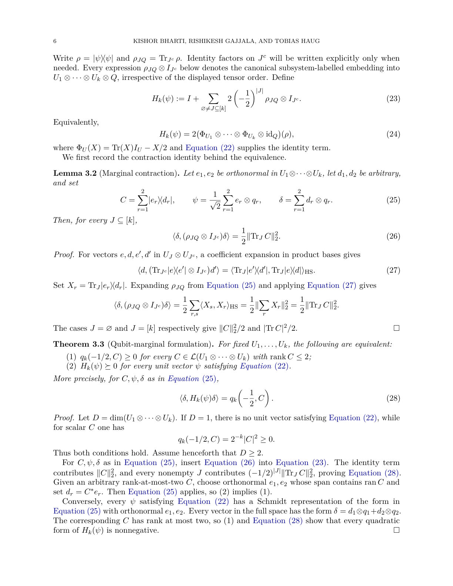 
Low-resolution page preview, page 6

**Summary.** This paper rigorously solves the two-copy distillability problem for Werner states by deriving a sharp, dimension-free inequality. It extends this analysis to arbitrary copies ($k$), establishing concrete polynomial bounds that define the threshold for $k$-copy undistillability. The work provides deep theoretical insights into entanglement measures using advanced operator inequalities.

**Why it may be interesting.** While focused on entanglement theory rather than AMO Hamiltonians, the rigorous mathematical techniques involving positive maps, partial traces, and bounding operators are highly relevant to characterizing quantum correlations in many-body systems studied in AMO physics.

Detailed structure

**Main problem.** The paper addresses the distillability of Werner states ($
ho_\alpha$) when multiple copies are available, aiming to find sharp, dimension-free criteria for $k$-copy undistillability.

**Main result.** They established that $
ho_\alpha$ is two-copy distillable if and only if $\alpha < -1/2$, and derived explicit polynomial bounds ($\alpha \ge -\gamma_k$) guaranteeing $k$-copy undistillability for arbitrary $k$.

**Method.** The work employs advanced techniques involving sharp partial-trace inequalities, operator theory (e.g., double-skew Ky Fan bound), and the formulation of necessary conditions via positive operator hierarchies ($H_k(\psi) \succeq 0$).

**Model / system.** The study focuses on Werner states $
ho_\alpha$ defined on a bipartite system $C^d \otimes C^d$, analyzed within the framework of quantum information theory, specifically concerning entanglement measures like distillability.

**Key observables.** Distillability criterion ($q_k(\alpha, C) < 0$), operator inequalities ($H_k(\psi) \succeq 0$), and the state parameter $\alpha$.

**Important parameters / regimes.** The number of copies $k$, the local dimension $d$, and the threshold constant $\gamma_k$ which quantifies the boundary between distillable and undistillable states.

**Assumptions / limitations.** The primary limitation noted is that the general conjecture for all $k \ge 3$ remains unproven, as partial trace does not generally preserve rank-two properties across tensor products.

**Paper structure.** The paper progresses by first solving the two-copy case using a sharp inequality, then generalizing this to arbitrary $k$ via operator hierarchies and polynomial bounds derived from complementary bipartite inequalities, while constantly comparing results against known limitations in tensor product structures.

Abstract

We solve the two-copy distillability problem for Werner states in every local dimension. Our main matrix result is a sharp, dimension-free inequality: for every rank-at-most-two operator, the sum of the squared Hilbert--Schmidt norms of its two partial traces is bounded by twice its squared Hilbert--Schmidt norm plus one half of the squared modulus of its trace. This implies that a Werner state $ρ_α$ is two-copy distillable if and only if $α<-1/2$. In particular, the two-ququart state $ρ^{(4)}_{-1/2}$ is two-copy undistillable, resolving Problem 5 of Horodecki, Rudnicki, and Życzkowski. For an arbitrary finite number $k$ of copies, we give three exact formulations of the remaining problem. At the endpoint $α=-1/2$, undistillability is equivalent to nonnegativity of the endpoint partial-trace form on every rank-at-most-two operator. We also derive an equivalent hierarchy of operator inequalities $H_k(ψ)\succeq0$ for pure states with a maximally mixed qubit marginal. The two-copy proof does not formally induct, because partial trace can increase rank and $2$-positivity is not generally preserved by tensor products. We prove two rigorous many-copy extensions. First, the quadratic form factorizes exactly on tensor-factorized witnesses; for any such decomposition, the endpoint inequality holds if its possible rank-two factor is supported on a block containing at most two copies. Second, we construct explicit constants $γ_k>0$ such that $α\ge-γ_k$ implies $k$-copy undistillability in every dimension. The initial proofs were generated by ChatGPT 5.6 Sol; the authors have verified and rewritten them to enhance readability and provide additional context.

[↑ back to top](#top)

### [Engineering two-body interaction for the Moore-Read State](http://arxiv.org/abs/2607.23695v1)

**Authors:** Yi Yang, Xin Wan, Zi-Xiang Hu  
**Type:** theory · **Category:** strongly correlated electrons · **PDF:** <https://arxiv.org/pdf/2607.23695v1>  
**Analysis basis:** full PDF text, analyzed in chunks
**Topic relevance:** 🔥 `analog quantum simulation` **4/5** · `entanglement & information structure` **3/5** · `exotic spin models in light-matter` **3/5** · `correlated cavity matter` **1/5** · `non-equilibrium dynamics` **1/5**

📷 Fig 1

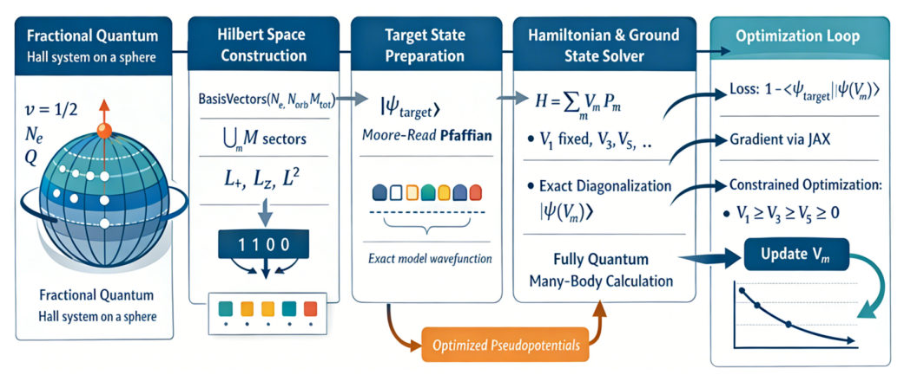 
FIG. 1: Schematic overview of the overlap-driven pseudopotential optimization scheme. A half-filled FQH system on the sphere is considered, with the two-body interaction parameterized by odd Haldane pseudopotentials {Vm}. The leading component V1 is fixed to set the energy scale, while the higher odd components are treated as variational parameters. For each set of {Vm}, the many-body ground state |Ψ({Vm})⟩is obtained by exact diagonalization. The pseudopotentials are then optimized by minimizing an overlap-based loss function with respect to the MR Pfaffian target state, subject to positivity and monotonicity constraints.

📷 Fig 2

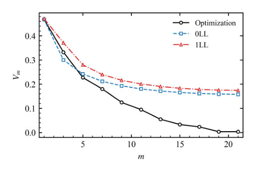 
FIG. 2: Haldane pseudopotentials for Ne = 12 electrons at the MR shift. The black solid line with circles denotes the gradient-optimized pseudopotentials, while the blue dashed line with squares and the red dash-dotted line with triangles denote the Coulomb pseudopotentials in the lowest and first excited Landau levels, respectively. The optimized ground state has an overlap of 99.49% with the MR Pfaffian state.

📷 Fig 3

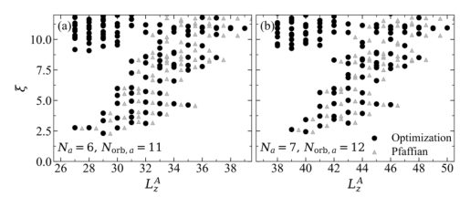 
FIG. 4: Orbital entanglement spectrum of the optimized Ne = 12 ground state at the MR shift. Two contiguous orbital cuts are shown: (a) Na = 6, Norb,a = 11; and (b) Na = 7, Norb,a = 12. Black circles denote the optimized state, while grey triangles denote the exact MR Pfaffian state. For visual clarity, the Pfaffian data are shifted horizontally by 0.5. In both cuts, the low-lying OES levels of the optimized state reproduce the Pfaffian counting and dispersion and are sepa- rated from higher nonuniversal levels by a clear entanglement gap.

📷 Fig 4

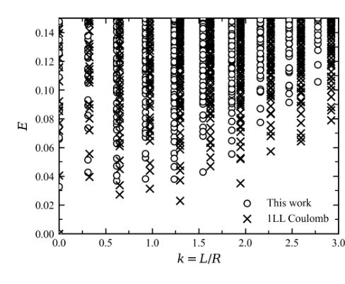 
FIG. 3: Neutral excitation spectrum at the MR shift for Ne = 12 on the sphere. Open circles denote for the opti- mized pseudopotentials, while crosses show the result for the Coulomb interaction projected into the first excited Landau level. As a function of k = L/R, the optimized interaction produces a more clearly resolved low-energy collective branch and a larger neutral gap than the 1LL Coulomb interaction for this system size.

📷 Fig 5

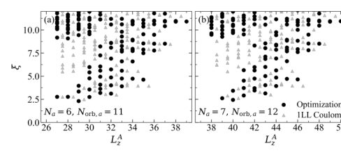 
FIG. 5: Comparison of the OES at the MR shift for Ne = 12 on the sphere. Two contiguous orbital cuts are shown: (a) Na = 6, Norb,a = 11; and (b) Na = 7, Norb,a = 12. Black cir- cles denote the optimized state, and grey triangles denote the 1LL Coulomb state. For visual clarity, the Coulomb data are shifted horizontally by 0.5. In both cuts, the optimized state displays a larger entanglement gap and a cleaner low-lying Pfaffian-like structure, while the 1LL Coulomb state shows stronger mixing with higher entanglement levels.

**Summary.** The paper introduces a novel gradient-based method to design two-body interactions that force an electron system into a desired non-Abelian topological state, specifically the Moore-Read Pfaffian phase. By optimizing pseudopotentials against the known ground state overlap, they achieve near-perfect stabilization of this exotic quantum order. This framework offers a general tool for engineering complex many-body physics using only local interaction terms.

**Why it may be interesting.** This work provides a powerful, generalizable computational methodology—inverse Hamiltonian design—to engineer exotic topological order in theoretical models relevant to quantum simulation platforms like cold atoms or superconducting circuits.

Detailed structure

**Main problem.** The central challenge addressed is engineering specific two-body interactions capable of stabilizing non-Abelian fractional quantum Hall (FQH) phases, such as the Moore-Read Pfaffian state.

**Main result.** The authors successfully designed a pseudopotential profile using gradient optimization that achieves overlaps exceeding 99% with the target Pfaffian ground state for small electron numbers. This demonstrates encoding complex three-body physics into simple two-body interactions.

**Method.** They employed an inverse Hamiltonian design framework, optimizing Haldane pseudopotentials by minimizing the loss function based on the overlap between the system's calculated ground state and the known target Pfaffian wave function.

**Model / system.** The model considers fully spin-polarized electrons confined to a sphere (Haldane geometry) under a magnetic monopole, simulating strongly correlated topological matter at fractional filling ($
u=5/2$).

**Key observables.** Pfaffian overlap ($|\langle \Psi_{	ext{MR}} | \Psi_0 
angle|$), neutral excitation spectrum, and Orbital Entanglement Spectrum (OES).

**Important parameters / regimes.** The optimization is constrained by ensuring short-range, repulsive interactions via constraints on the pseudopotentials $\{V_m\}$.

**Assumptions / limitations.** The primary assumption is that the ground state remains non-degenerate during the gradient-based optimization process.

**Figures summary.** Figures compare optimized vs. Coulomb pseudopotentials (Fig 2), show excitation spectra and OES confirming Pfaffian/anti-Pfaffian character (Figs 3, 4, 5, 10), and illustrate the exponential decay of optimized potentials with system size (Fig 6).

**Paper structure.** The paper introduces the inverse design framework using JAX for optimization. It details the overlap maximization procedure, validates the results using spectral diagnostics (OES/TEE), and concludes by identifying a universal, exponentially decaying pseudopotential profile.

Abstract

Engineering interactions that stabilize non-Abelian fractional quantum Hall phases is a central challenge in strongly correlated topological matter and quantum simulation. We introduce a differentiable framework for inverse Hamiltonian design, in which Haldane pseudopotentials are optimized by gradient-based exact diagonalization to stabilize target fractional quantum Hall phases. In spherical geometry, the Haldane pseudopotentials are treated as variational parameters and optimized in a JAX-based exact-diagonalization framework. By directly maximizing the overlap between the many-body ground state and the Moore-Read state, we obtain a robust pseudopotential profile that has Pfaffian overlaps exceeding $99\%$ for systems up to $N_e=12$, substantially improving over conventional Coulomb interactions. Analyses of the neutral excitation spectrum and orbital entanglement spectrum further confirm that the optimized interaction stabilizes the Pfaffian topological phase. Our results demonstrate that essential features of the three-body Pfaffian parent Hamiltonian can be effectively encoded in a suitably designed two-body interaction. Furthermore, they identify a nearly universal exponentially decaying pseudopotential profile that stabilizes the Pfaffian phase and establishes a general framework toward engineering non-Abelian topological order in quantum simulation.

[↑ back to top](#top)

### [Freezing Swampland: A Krylov Complexity Criterion for the Weak Gravity Conjecture](http://arxiv.org/abs/2607.23747v1)

**Authors:** Amin Faraji Astaneh, Reza Ghomi Shurkaie  
**Type:** theory · **Category:** other · **PDF:** <https://arxiv.org/pdf/2607.23747v1>  
**Analysis basis:** full PDF text, analyzed in chunks
**Topic relevance:** 🔥 `entanglement & information structure` **4/5** · `non-equilibrium dynamics` **2/5** · `non-equilibrium universality` **2/5** · `Keldysh / 2PI / non-Gaussian methods` **1/5** · `correlated / nonlocal dissipation` **1/5** · `driven-dissipative phase transition` **1/5** · `methods for driven-dissipative` **1/5**

📷 Fig 1

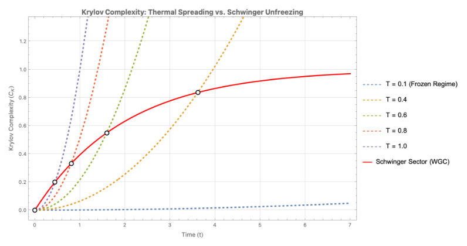 
Figure 1: Krylov complexity crossover in a charged AdS Reissner–Nordstr¨om black hole. The dashed curves show the thermal contribution, Cth K (t) ≈αT 3t2, at different temperatures, il- lustrating the freezing behavior in the extremal limit T →0 (here shown, for example, for T = 0.1). The solid red curve denotes the Schwinger-induced unfreezing bound, 1 −e−Γt. The marked points indicate the crossover times at which the instability-driven contribution overtakes the thermal spreading.

**Summary.** This paper proposes using Krylov spread complexity as a quantum information measure to diagnose the Weak Gravity Conjecture. By studying charged AdS black holes, the authors show that approaching extremality causes the system's complexity to 'freeze.' The introduction of a discharge channel (via pair production) lifts this freezing, suggesting that WGC implies a necessary non-trivial evolution in quantum complexity.

**Why it may be interesting.** While highly theoretical, the use of quantum complexity as a diagnostic tool for fundamental conjectures like WGC connects concepts from black hole physics to information theory, which is relevant for understanding complex many-body dynamics boundaries.

Detailed structure

**Main problem.** The paper aims to establish a quantum-information-theoretic diagnostic for the Weak Gravity Conjecture (WGC) by analyzing how quantum complexity behaves in charged black hole systems.

**Main result.** It suggests that WGC might be characterized by the requirement that the Krylov spread complexity must not exhibit exact freezing when an available discharge channel is present, leading to nontrivial dynamics.

**Method.** The analysis uses quantum information tools, specifically Krylov spread complexity derived from the return amplitude of a charged thermofield double state dual to an AdS Reissner-Nordström black hole.

**Model / system.** The system involves a charged TFD state holographically dual to a charged AdS black hole. The analysis incorporates semiclassical effects like Schwinger pair production via a charged scalar probe ($\phi$) in the near-extremal $	ext{AdS}_2$ throat.

**Key observables.** Krylov spread complexity ($C_K(t)$), return amplitude $A(t)$, and the one-loop effective action ($\mathcal{W}_\phi$).

**Important parameters / regimes.** Near-extremal limit ($T 	o 0$), temperature crossover scale ($T_c$), electric field strength ($E$).

**Assumptions / limitations.** The analysis relies on semiclassical approximations and restricts the study to the near-extremal $	ext{AdS}_2$ throat, not capturing full backreacting evolution.

**Figures summary.** Figure 1 illustrates the crossover of Krylov complexity, comparing thermal spreading (dashed curves) against a nonvanishing lower bound induced by Schwinger pair production (solid red curve).

**Paper structure.** The paper develops from proposing the diagnostic using TFD states and Krylov complexity in the near-extremal limit. It then incorporates charged matter and the discharge channel via scalar field calculations, culminating in the conclusion that non-freezing dynamics are required by WGC.

Abstract

We propose a quantum-information-theoretic perspective on the Weak Gravity Conjecture through the behavior of Krylov spread complexity. For a charged thermofield double state holographically dual to an AdS Reissner--Nordström black hole, we show that the extremal limit on the black-hole side is accompanied by an effective freezing of Krylov spreading. In this regime, the return amplitude becomes effectively a pure phase, and the dual quantum state ceases to spread nontrivially in Krylov space. We then incorporate charged matter and study the effect of Schwinger pair production in the near-horizon region. Within this semiclassical near-extremal analysis, the frozen behavior is lifted once the discharge channel is opened, and the dynamics become nontrivial again. This suggests that the Weak Gravity Conjecture may admit a complexity-based interpretation in terms of the absence of exact freezing in the presence of an available discharge channel. More broadly, our results point to a new connection between the swampland program, black-hole physics, and quantum information theory.

[↑ back to top](#top)

### [Quantum fluctuation-driven transport crossover between two liquid states in distinguishable helium-4](http://arxiv.org/abs/2607.23127v1)

**Authors:** Mika Tanabe, Momoko Tsujimoto, Kenichi Kinugawa  
**Type:** theory · **Category:** statistical mechanics · **PDF:** <https://arxiv.org/pdf/2607.23127v1>  
**Analysis basis:** full PDF text, analyzed in chunks
**Topic relevance:** 🔥 `non-equilibrium dynamics` **4/5** · `non-equilibrium universality` **3/5** · `driven-dissipative phase transition` **2/5** · `Frenkel-Kontorova` **1/5** · `Keldysh / 2PI / non-Gaussian methods` **1/5** · `methods for driven-dissipative` **1/5**

📷 Fig 1

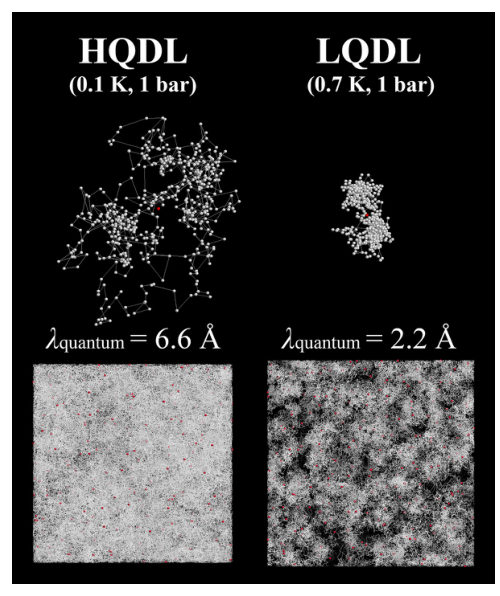 
FIG. 1. Representative xy-projected snapshots of an atomic necklace and its centroid (top panels) and of all atomic neck- laces and centroids in the simulation box (bottom panels) for HQDL (0.1 K, 1 bar; left) and LQDL (0.7 K, 1 bar; right). Red and white spheres denote centroids and beads, respec- tively. The left and right panels are shown on the same length scale, whereas the sizes of the centroids and beads are arbi- trary. The atomic necklaces in HQDL are substantially more spatially delocalized than those in LQDL and exhibit signif- icant overlap among neighboring necklaces. The indicated values of the quantum wavelength λquantum are averages for the corresponding thermodynamic...

📷 Fig 2

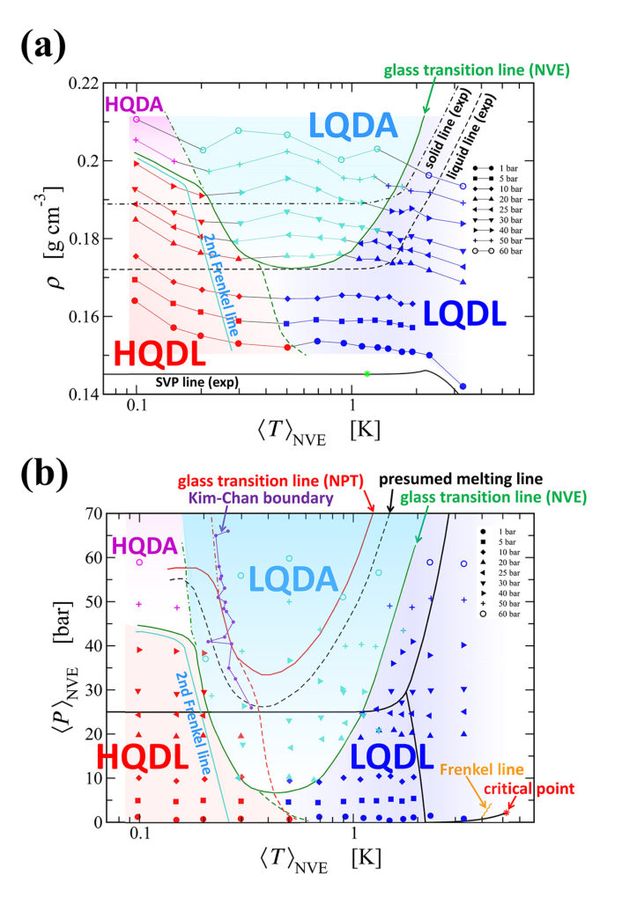 
FIG. 2. State diagrams of distinguishable 4He on (a) the density–temperature plane and (b) the pressure–temperature plane. Symbols indicate the states identified in the present NVE-CMD simulations, plotted at the corresponding average temperature and density in (a) or pressure in (b) (see Sec. III A). The color-coded regions are determined from the results of the present NVE simulations. In the NVE simulations, the averaged pressures sometimes show deviations from those obtained in the preceding NPT simulations. In panel (a), the region between the experimental solid and liquid density lines [47] corresponds to the solid–liquid coexistence region (hcp and He II) of real 4He [48]. The green...

📷 Fig 3

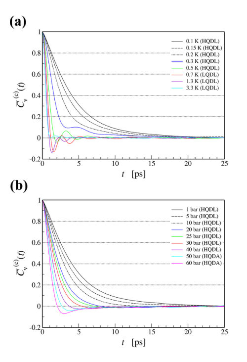 
FIG. 3. Normalized centroid velocity autocorrelation func- tions ¯C(c) v (t) [Eq. (17)] at (a) densities corresponding to 1 bar and (b) at T = 0.1 K, obtained from NVE simulations.

📷 Fig 4

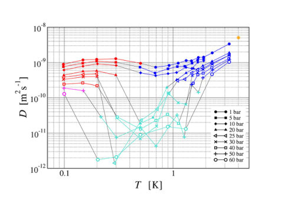 
FIG. 4. Temperature dependence of the self-diffusion coeffi- cient D of distinguishable 4He: LQDL (blue), LQDA (cyan), HQDL (red), and HQDA (magenta). The pressure values indicated in the legend denote those of the preceding NPT runs. The LQDL above the experimental lambda-transition temperature is expected to be nearly equivalent to real He I. The system with D ≤2.0×10−10 m2 s−1 is identified as being in a glassy state. The asterisk denotes the value of D calcu- lated by CMD at 4 K and at the saturated vapor pressure density in Ref. 33. The upper bound of the VAF integral is 25 ps.

📷 Fig 5

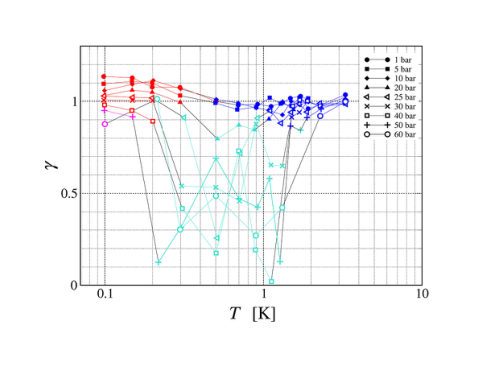 
FIG. 5. Temperature dependence of the power-law exponent γ of the mean square displacement (MSD) in Eq. (28): LQDL (blue), LQDA (cyan), HQDL (red), and HQDA (magenta). The pressure values indicated in the legend denote those of the preceding NPT runs.

**Summary.** This work uses advanced molecular dynamics simulations to study the transport behavior of distinguishable helium-4 across two distinct liquid states: LQDL and HQDL. The key finding is that cooling induces a crossover into an anomalous, gas-like state (HQDL) due to quantum fluctuations alone. This provides a unified picture of quantum fluid dynamics without relying on superfluidity.

**Why it may be interesting.** It provides a detailed quantum mechanical description of liquid dynamics far from equilibrium, offering insights into how fundamental quantum statistics (like NQEs) dictate macroscopic transport properties even when superfluidity is absent.

Detailed structure

**Main problem.** The study investigates a quantum fluctuation-driven transport crossover between two distinct liquid states (LQDL and HQDL) in distinguishable helium-4, specifically isolating effects from nuclear quantum fluctuations.

**Main result.** The system exhibits a transition across the LQDL-HQDL boundary marked by anomalous gas-like dynamics (superdiffusion, ultralow viscosity) emerging upon cooling, driven solely by NQEs without invoking superfluidity.

**Method.** Path Integral Centroid Molecular Dynamics (CMD) simulations were employed to calculate various transport properties using the Green-Kubo formalism.

**Model / system.** The system is distinguishable Helium-4 atoms obeying Boltzmann statistics. The simulation maps the quantum problem onto classical polymers via centroid coordinates, allowing investigation of two liquid states: Low Quantum-Dispersion Liquid (LQDL) and High Quantum-Dispersion Liquid (HQDL).

**Key observables.** Self-diffusion coefficient (D), shear viscosity ($\eta_s$), thermal conductivity ($\lambda$), Velocity Autocorrelation Function (VAF), and the Prandtl number.

**Important parameters / regimes.** Temperature range ($0.1–3.3 	ext{ K}$) and pressure range ($1–60 	ext{ bar}$); quantum wavelength ($\lambda_{	ext{quantum}}$).

**Assumptions / limitations.** The analysis assumes that the observed phenomena are driven solely by nuclear quantum fluctuations (NQEs) in a distinguishable particle framework, avoiding Bose statistics considerations.

**Figures summary.** Figures illustrate snapshots showing spatial delocalization differences between LQDL and HQDL states based on $\lambda_{	ext{quantum}}$.

**Paper structure.** The paper systematically analyzes transport properties across varying P-T conditions to map the crossover boundary. Key diagnostics include monitoring VAF changes, Prandtl number transitions, and identifying minima in various transport coefficients.

Abstract

We show the emergence of a quantum fluctuation-driven transport crossover between two liquid states in distinguishable helium-4 obeying Boltzmann statistics, in the absence of atomic exchange. Using path integral centroid molecular dynamics simulations over 0.1-3.3 K and 1-60 bar, we investigate the transport properties of two distinct liquid states: the low quantum-dispersion liquid (LQDL) and the high quantum-dispersion liquid (HQDL). While LQDL exhibits conventional liquid behavior consistent with the Stokes-Einstein (SE) relation, HQDL emerges at lower temperatures and displays anomalous gas-like transport characterized by superdiffusion and ultralow viscosity, accompanied by a breakdown of the SE relation. This counterintuitive emergence of gas-like dynamics upon cooling reflects the dominant role of nuclear quantum fluctuations, in contrast to thermal fluctuations at higher temperatures. Across the LQDL-HQDL boundary, we identify a transport crossover marked by a qualitative change in the velocity autocorrelation function (VAF), a transition in the Prandtl number, and the emergence of transport minima in shear and kinematic viscosities, thermal conductivity, and thermal diffusivity. These minima reflect a crossover from liquid-like to gas-like transport upon cooling in the low-temperature subcritical region, in addition to the universal transport minima observed in the supercritical regime. The transition from oscillatory to monotonic VAF defines a second Frenkel line, distinct from the conventional Frenkel line observed in the supercritical region. LQDL is a heat-transport-dominated dissipative fluid, whereas HQDL is a momentum-dominated inertial fluid. These results demonstrate that nuclear quantum fluctuations alone induce gas-like liquid behavior and provide a unified picture of transport phenomena in distinguishable helium-4 without superfluidity.

[↑ back to top](#top)

### [A Slice-Rank Drift Bound for Random Quantum \(k\)-SAT](http://arxiv.org/abs/2607.23847v1)

**Authors:** Jean Bernoulli Ravelomanana  
**Type:** theory · **Category:** statistical mechanics · **PDF:** <https://arxiv.org/pdf/2607.23847v1>  
**Analysis basis:** full PDF text, analyzed in chunks
**Topic relevance:** 🔥 `analog quantum simulation` **4/5** · `entanglement & information structure` **2/5** · `Keldysh / 2PI / non-Gaussian methods` **1/5** · `correlated / nonlocal dissipation` **1/5** · `driven-dissipative phase transition` **1/5** · `methods for driven-dissipative` **1/5**

📷 Fig 1

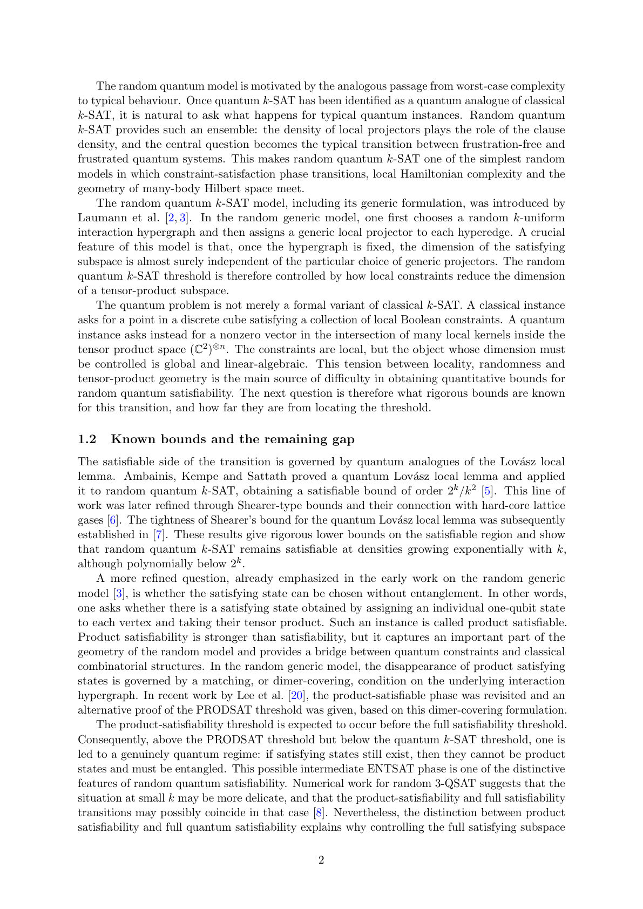 
Low-resolution page preview, page 2

📷 Fig 2

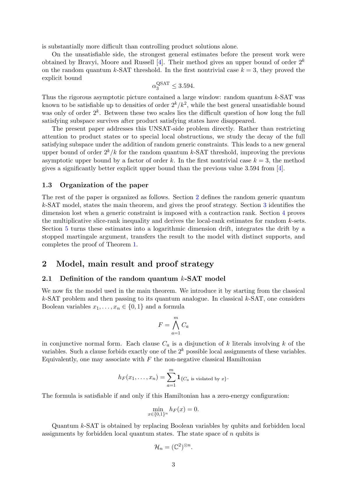 
Low-resolution page preview, page 3

📷 Fig 3

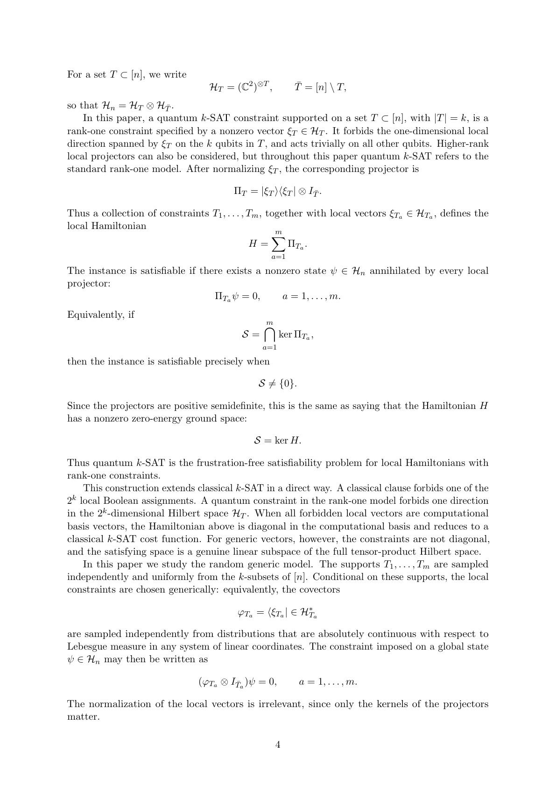 
Low-resolution page preview, page 4

📷 Fig 4

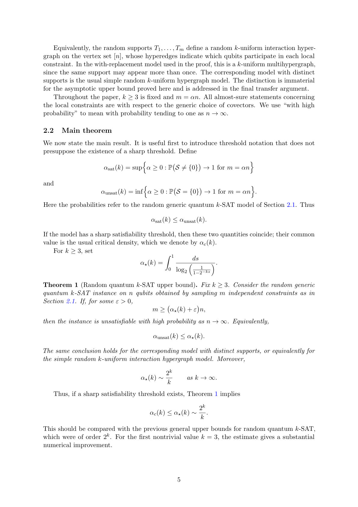 
Low-resolution page preview, page 5

📷 Fig 5

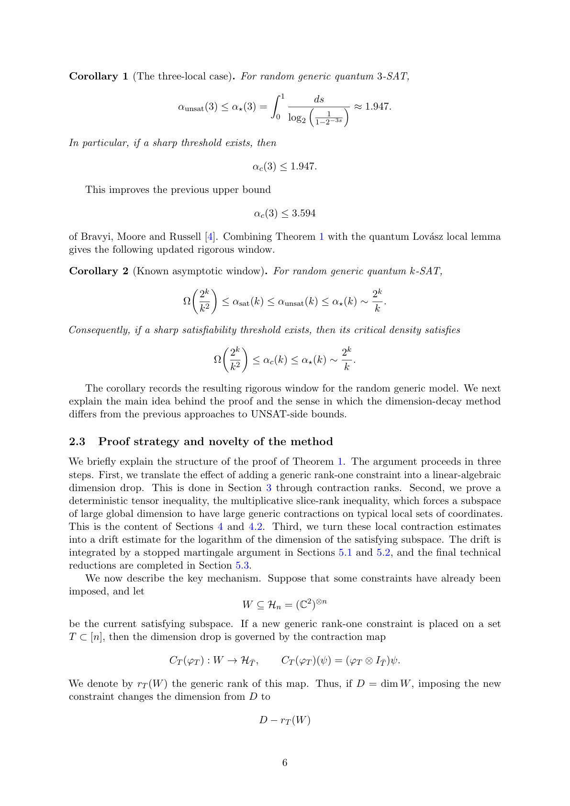 
Low-resolution page preview, page 6

**Summary.** This paper tackles the hard problem of finding the threshold where random quantum k-SAT instances transition from being satisfiable to unsatisfiable. By developing a dimension-decay analysis using advanced tensor methods, the authors derive a significantly improved upper bound for this critical threshold, $\alpha_{\star}(k) \sim 2^k/k$. This provides crucial quantitative insight into the physics of highly constrained quantum systems.

**Why it may be interesting.** This work provides rigorous theoretical bounds on the complexity of quantum constraint satisfaction problems, which are central to understanding ground states in frustrated quantum many-body systems.

Detailed structure

**Main problem.** The primary goal is determining the quantitative location of the satisfiability threshold for random quantum k-SAT instances.

**Main result.** The authors establish a new upper bound on this threshold, showing it scales as $2^k/k$, significantly improving previous asymptotic estimates.

**Method.** The proof combines geometric formulation with a dimension-decay analysis of the satisfying subspace, utilizing a multiplicative Shearer-type inequality for tensor-product subspaces.

**Model / system.** The model is random quantum k-SAT, which serves as a quantum analogue to classical constraint satisfaction problems and models frustration-free local Hamiltonians. Satisfiability requires finding a non-zero state in the kernel of the local Hamiltonian projectors.

**Key observables.** Dimension of the satisfying subspace ($S$), satisfiability threshold ($\alpha_c(k)$), and contraction ranks ($r_T(W)$).

**Important parameters / regimes.** The constraint size $k$, the number of constraints relative to system size ($m/n = \alpha$), and the critical density $\alpha_{\star}(k)$.

**Assumptions / limitations.** The analysis relies on the 'generic' nature of the random local constraints, meaning results hold outside sets of measure zero.

**Paper structure.** The paper builds from defining the problem (quantum k-SAT threshold) to developing key mathematical tools (Shearer-type inequality, dimension drop lemma), and finally applying a stopped martingale/drift analysis to derive the asymptotic bound $\alpha_{\star}(k)$.

Abstract

Random quantum satisfiability is a natural quantum analogue of random constraint satisfaction and a basic model for frustration-free local Hamiltonians. Despite extensive work on its satisfiable and unsatisfiable regimes, the quantitative location of the random quantum \(k\)-SAT threshold has remained poorly understood, with the best general upper bounds leaving a large gap to the known lower bounds. In this paper we prove a new upper bound on the satisfiability threshold of random quantum \(k\)-SAT. Our result improves the previously known asymptotic upper bound by a factor of order \(k\), giving a bound of order \(2^k/k\). The improvement is also significant at small values of \(k\); in particular, for random quantum \(3\)-SAT we obtain a substantially smaller explicit upper bound than the one previously available. The proof combines the geometric formulation of generic quantum satisfiability with a dimension-decay analysis of the full satisfying subspace. The key input is a multiplicative Shearer-type inequality for tensor-product subspaces, which quantifies how global dimension forces nontrivial local dimension on typical sets of qubits.

[↑ back to top](#top)

### [Coherence as a resource for $N$-box and quantum pigeonhole paradoxes](http://arxiv.org/abs/2607.24282v1)

**Authors:** Som Kanjilal, Rafael Wagner, Ernesto F. Galvão  
**Type:** theory · **Category:** other · **PDF:** <https://arxiv.org/pdf/2607.24282v1>  
**Analysis basis:** full PDF text, analyzed in chunks
**Topic relevance:** 🔥 `quantum measurements` **4/5** · `measurement-induced transitions` **3/5** · `Keldysh / 2PI / non-Gaussian methods` **1/5** · `driven-dissipative phase transition` **1/5** · `entanglement & information structure` **1/5**

📷 Fig 1

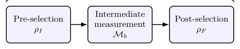 
FIG. 1. The N-box PPS scenario. A system—interpreted as a particle which can be in N + 1 distinct boxes—is pre- pared in quantum state ρI. An intermediate measurement Mb = {Πb, 1 −Πb} with Πb = |b⟩⟨b|, interpreted as checking whether the particle is found in box b, follows. The measure- ment checking whether the particle is found in box N + 1 is excluded. Finally, the system is post-selected on ρF . In all runs, we assume that the post-selection onto ρF (successful or not) cannot yield information about which intermediate measurement was performed, a constraint captured by the non-disturbance condition from Eq. (14).

📷 Fig 2

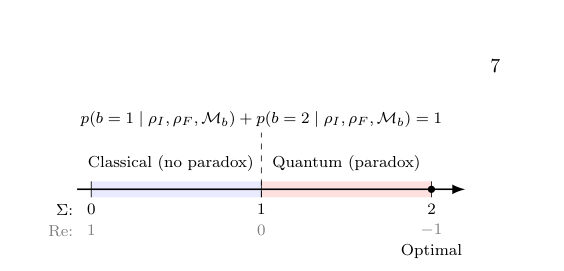 
FIG. 2. The 3-box paradox as a function of Re (⟨Π3⟩w). Under the operational non-disturbance condition (14), the 3-box statistics obey Σ ≡P2 b=1 p(b | ρI, ρF , Mb) = 1 − Re  ⟨Π3⟩w  (see Theorem IV.2); the lower (grey) axis shows the corresponding Re  ⟨Π3⟩w  . The classicality bound Σ ≤1, Ineq. (12), is violated in the pink shaded “paradox” re- gion, where the excluded box has an anomalous weak value Re  ⟨Π3⟩w  &lt; 0. The logical three-box paradox saturates the algebraic maximum Σ = 2, i.e. ⟨Π3⟩w = −1.

📷 Fig 3

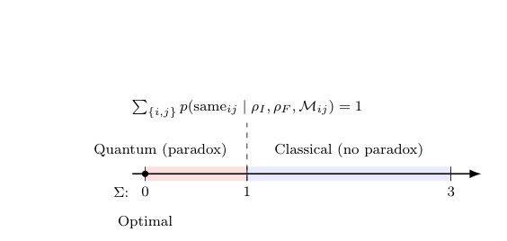 
FIG. 3. The pigeonhole paradox as a function of Re  ⟨Θ⟩w  . Under the operational non-disturbance condi- tion (51), the pigeonhole statistics obey Σ ≡P

**Summary.** This work investigates non-logical quantum paradoxes like the N-box and quantum pigeonhole scenarios within the framework of pre- and post-selection. The authors demonstrate that these paradoxes are not merely conceptual curiosities but require a quantifiable resource: coherence, which is evidenced by anomalies in weak measurement values. This clarifies how different forms of quantum nonclassicality manifest in inference problems.

**Why it may be interesting.** It provides a rigorous, quantitative link between fundamental quantum resources (coherence) and observable paradoxes arising from measurement inference in open quantum systems, which is highly relevant to foundational studies in AMO physics.

Detailed structure

**Main problem.** The paper analyzes general, non-logical Pre- and Post-selection (PPS) paradoxes, specifically the N-box and quantum pigeonhole paradoxes, to determine if coherence is a necessary resource for these paradoxes.

**Main result.** It is shown that both the N-box and quantum pigeonhole paradoxes require coherence in both pre-selected and post-selected states relative to the intermediate measurement basis. This requirement is quantified by observing an anomaly in a single weak value.

**Method.** The analysis involves generalizing existing paradoxes, calculating joint probabilities using trace operations, and establishing an equivalence between the paradox's existence and the presence of a weak-value anomaly.

**Model / system.** The primary model is the N-box PPS scenario involving an $(N+1)$-level system. The process involves pre-selection ($
ho_I$), an intermediate measurement ($M_b$), and post-selection ($
ho_F$).

**Key observables.** Weak value of an observable $\langle A 
angle_w$, Bargmann invariants, and the violation of summation inequalities related to joint probabilities.

**Important parameters / regimes.** The number of boxes $N$ (generalized from the three-box paradox).

**Assumptions / limitations.** The analysis extends previous work on mixed states and contrasts with logical PPS paradoxes linked to contextuality. The operational constraints defining the paradox must be met for the conclusion to hold.

**Figures summary.** Figure 1 illustrates the N-box PPS scenario, detailing the sequence: preparation ($
ho_I$) $
ightarrow$ intermediate measurement ($M_b$) $
ightarrow$ post-selection ($
ho_F$).

**Paper structure.** The paper develops by generalizing the three-box paradox to $N$ boxes, calculating joint probabilities under ABL rules, and then proving that the existence of the non-logical paradoxes necessitates coherence as a resource.

Abstract

Pre- and post-selection (PPS) paradoxes are striking demonstrations of quantum nonclassicality. Logical PPS paradoxes, where inferences made with the Aharonov-Bergmann-Lebowitz (ABL) rule are exactly 0 or 1, are linked to contextuality. Non-logical paradoxes lack this strong signature. In this work, we analyse more general, non-logical PPS scenarios involving mixed pre- and post-selected states. We show that two such scenarios, the $N$-box and quantum pigeonhole paradoxes, require coherence of both pre- and post-selected states in the basis of the intermediate measurement. This is done by showing each paradox holds if and only if there is weak-value anomaly for a single, paradox-specific operator, together with the fact that weak-value anomaly requires coherence. This clarifies the role of different notions of nonclassicality in these scenarios, highlighting the required quantitative departures from (strictly) classical explanations provided by incoherent sub-theories of quantum theory.

[↑ back to top](#top)

### [Effect of classical noises on the coherent population trapping based on the Green's function approach to the multiplicative stochastic processes](http://arxiv.org/abs/2607.23630v1)

**Authors:** M. Mirzaee, B. Askari, Ali Motazedifard, A. Dalafi  
**Type:** theory · **Category:** other · **PDF:** <https://arxiv.org/pdf/2607.23630v1>  
**Analysis basis:** full PDF text, analyzed in chunks
**Topic relevance:** 🔥 `Keldysh / 2PI / non-Gaussian methods` **4/5** · `methods for driven-dissipative` **3/5** · `correlated / nonlocal dissipation` **1/5** · `driven-dissipative phase transition` **1/5** · `interference shaping light` **1/5**

📷 Fig 1

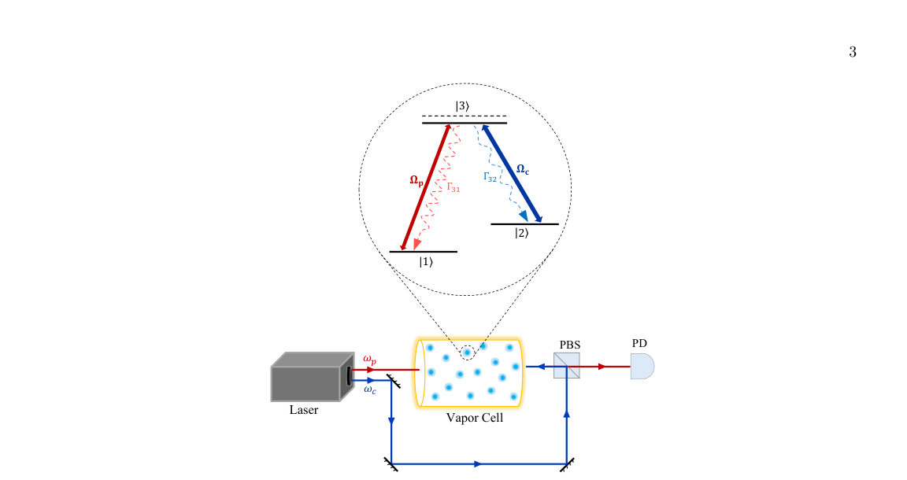 
FIG. 1. Schematic representation of the experimental setup for detection of the CPT transmission resonance line when a gas of alkali-metal atoms are subjected to the radiation of two beams extracted from the same laser source so that the atomic levels form a Λ-shape structure. The excited level |3⟩of each interacting atom has the spontaneous emission rates of Γ31 and Γ32 to the hyperfine ground state levels |1⟩and |2⟩while the |1⟩→|2⟩transition is dipole forbidden. The two coupling and probe beams with frequencies ωc and ωp are counterpropagating in order to neutralize the Doppler broadening as much as possible.

📷 Fig 2

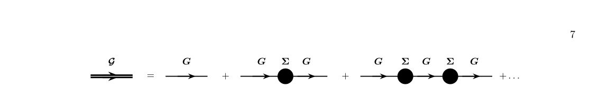 
FIG. 2. Feynman diagram representation of the infinite series expansion of the interacting (noisy) GF. The interacting GF is demonstrated by the directional double line on the left hand side, while the noninteracting (noiseless) GF is represented by directional single lines and the self-energy contribution by solid black circles on the right hand side. The diagrams illustrate the repeated interaction processes appearing in the perturbative expansion of Eq.(40).

📷 Fig 3

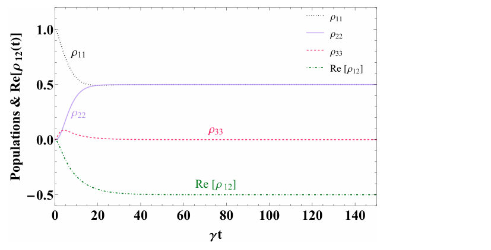 
FIG. 3. Time evolution of the populations of energy levels as well as the coherence between ground state hyperfine levels in the absence of noises and broadening mechanisms with the initial condition where the atom is its ground state assuming γ12 = 0. The lasers parameters have been considered as Ωc = Ωp = 0.4γ, ∆c = 0, and δ = 0.

📷 Fig 4

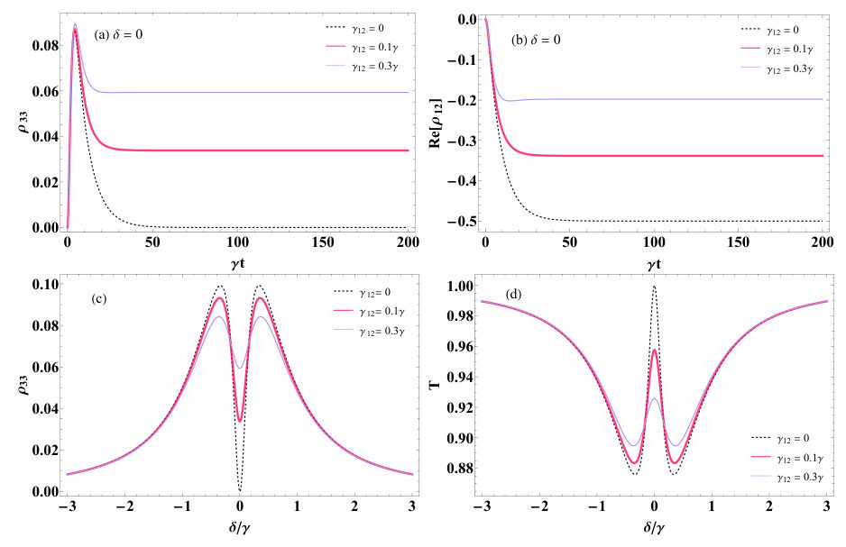 
FIG. 4. (Color online) (a) Time evolution of ρ33(γt), and (b) time evolution of ρ12(γt), at δ = 0 for three different values of γ12 = 0, 0.1γ, 0.3γ. (c) The steady state of ρ33, and (d) the probe transmission T for three different values of γ12 = 0, 0.1γ, 0.3γ. The Rabi frequencies have been considered as Ωc(p) = 0.4γ, and the coupling laser detuning is ∆c = 0.

📷 Fig 5

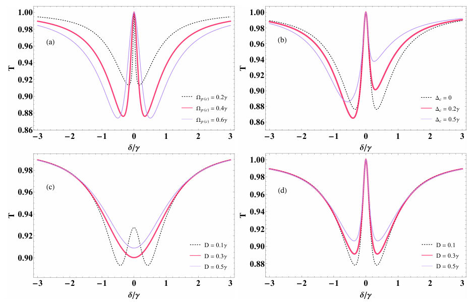 
FIG. 5. (Color online) The probe transmission versus δ/γ in the absence of any noises and dephasing (γ12 = 0), (a) for three different values of Rabi frequencies Ωc(p) = 0.2γ, 0.4γ, 0.6γ at ∆c = 0, and (b) for three different values ∆c = 0, 0.2γ, 0.5γ at Ωc(p) = 0.4γ. (c) and (d) for three different values of Doppler width D = 0.1γ, 0.3γ, 0.5γ for Ωc(p) = 0.4γ with ∆c = 0. In (c) the two beams are copropagating and in (d) they are counterpropagating.

**Summary.** The paper develops an advanced mathematical formalism using the Green's function approach to analyze open quantum systems subjected to classical multiplicative stochastic noises. It applies this theory to Coherent Population Trapping (CPT) in atomic clocks, demonstrating how noise from laser fluctuations and collisions broaden the resonance line shape. This provides a general framework applicable to any system with such noise sources.

**Why it may be interesting.** This work provides a powerful, generalized theoretical tool—the Green's function approach for multiplicative noise—that moves beyond simpler white-noise approximations to model realistic decoherence sources in quantum optics experiments.

Detailed structure

**Main problem.** The study investigates how classical multiplicative stochastic noises affect Coherent Population Trapping (CPT), a phenomenon vital for high-precision atomic clocks.

**Main result.** A generalized Green's function formalism is developed that allows the calculation of system dynamics under colored noise, providing insights into how various broadening mechanisms destructively interact on the CPT resonance line shape.

**Method.** The core method involves extending the Green's function approach from QFT to solve stochastic differential equations (SDEs) describing the noisy quantum evolution via infinite perturbative series approximations.

**Model / system.** The system is an atomic ensemble exhibiting CPT in a $\Lambda$-scheme, driven by two coherent laser fields. The dynamics are modeled using multiplicative SDEs incorporating noise from laser phase and amplitude fluctuations, alongside standard broadening mechanisms like Doppler shifts and collisions.

**Key observables.** CPT transmission resonance line shape (width, height, contrast); the interacting Green's function $\langle G(t) 
angle$.

**Important parameters / regimes.** Noise bandwidth relative to system damping rate; correlation time scales of the colored noise ($\kappa$ vs. $\gamma$).

**Assumptions / limitations.** The formalism assumes that for multiplicative colored noises, an approximation by a closed form is valid when the noise bandwidth significantly exceeds the system damping rate.

**Figures summary.** Figure 1 schematically illustrates the experimental setup involving a laser source interacting with an atomic vapor cell to measure CPT.

**Paper structure.** The paper introduces the general GF formalism for multiplicative stochastic processes, applies it to the specific case of CPT dynamics governed by master equations derived from SDEs, and then analyzes the resulting power spectra under different noise assumptions (white vs. colored).

Abstract

Inspired by the Green's function (GF) approach in quantum field theory (QFT) and many body physics, we have developed a mathematical formalism to investigate classical multiplicative stochastic processes. Based on this approach, the interacting GF of any dynamical system subjected to classical stochastic noises, which enter into the system equations of motion in a multiplicative way, can be obtained from the noninteracting (free of noise) GF through an infinite perturbative series which may converge to an exact closed form under special conditions. Using this formalism, we have studied the effects of classical noises of the driving laser on the coherent population trapping (CPT) which have a crucial role in the performance of CPT-based atomic clocks. We have shown that if the bandwidth of the colored noise is sufficiently larger than the system damping rate, the infinite series corresponding to the interacting GF can be approximated by the closed form. The presented formalism enables us to investigate all kinds of homogeneous and inhomogeneous broadening mechanisms on the CPT transmission resonance lineshape, including dephasing due to atomic collisions, power/Doppler broadenings, as well as the broadening mechanisms due to phase and amplitude fluctuations of driving laser and compared their destructive effect with each other. It should be emphasized that the presented formalism is applicable to any dynamical system with multiplicative stochastic noises and the CPT phenomenon is just a prototype for the application of the presented formalism in practice.

[↑ back to top](#top)

### [Experimental Protocol Fingerprinting in Quantum Networks via Physical Layer Side Channel Analysis](http://arxiv.org/abs/2607.24624v1)

**Authors:** Lance Young, Contessa Wilburn, Carrie Houston, Blaine Keyton, Marwan Elawady, Mohamed Shaban, Muhammad Ismail  
**Type:** experiment · **Category:** quantum information and computing · **PDF:** <https://arxiv.org/pdf/2607.24624v1>  
**Analysis basis:** full PDF text, analyzed in chunks
**Topic relevance:** 🔥 `QC/QI experiment` **4/5** · `quantum optics experiment` **3/5** · `entanglement & information structure` **1/5** · `quantum measurements` **1/5**

📷 Fig 1

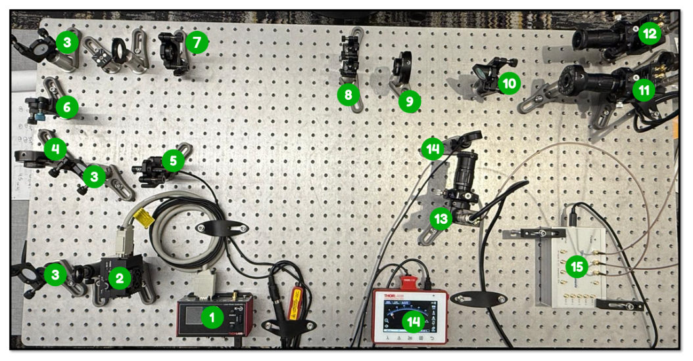 
Fig. 1: Quantum communication testbed used for protocol fingerprinting via physical layer observations. The setup includes (1) laser driver, (2) 405 nm pump laser source, (3) kinematic mirrors for beam alignment, (4) 405 nm half-wave plate, (5) alignment laser, (6) temporal compensation crystal, (7) BBO nonlinear crystal for entangled photon generation, (8) spatial compensation crystals, (9) 808 nm half-wave plate for state preparation, (10) beam splitter for passive sampling, (11) single-photon avalanche photodetectors (signal photon receiver), (12) herald photon detector, (13) passive observer detector, (14) passive observer power meter, and (15) time-tagger.

📷 Fig 2

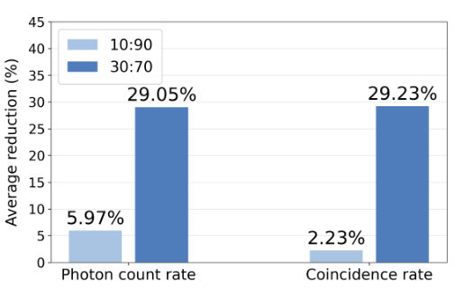 
Fig. 2: Effect of passive sampling on photon count and coinci- dence rates. The 30:70 configuration introduces significantly higher reductions in photon count rate and coincidence rate compared to the 10:90 configuration.

📷 Fig 3

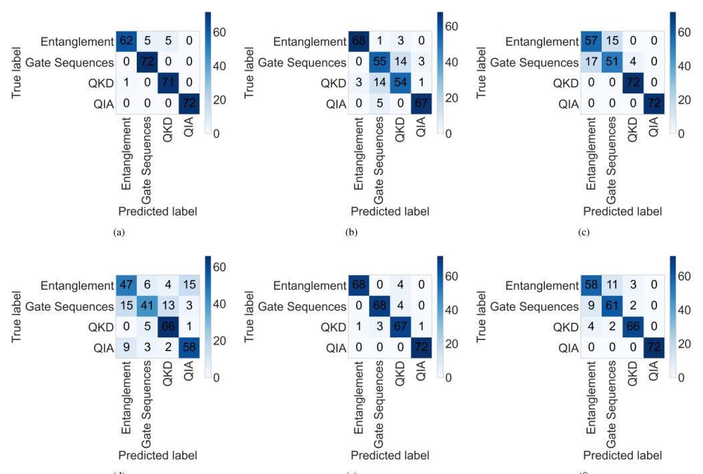 
Fig. 3: Confusion matrices illustrating the impact of sampling ratio and feature type on protocol classification. (a) Time tagger features at 30:70, (b) power meter features at 30:70, (c) time tagger features at 10:90, (d) power meter features at 10:90, (e) combined features at 30:70, and (f) combined features at 10:90. Higher sampling ratios improve class separability, while time-resolved features provide stronger discriminative capability than intensity-based measurements. The combination of both feature types yields the highest overall performance.

📷 Fig 4

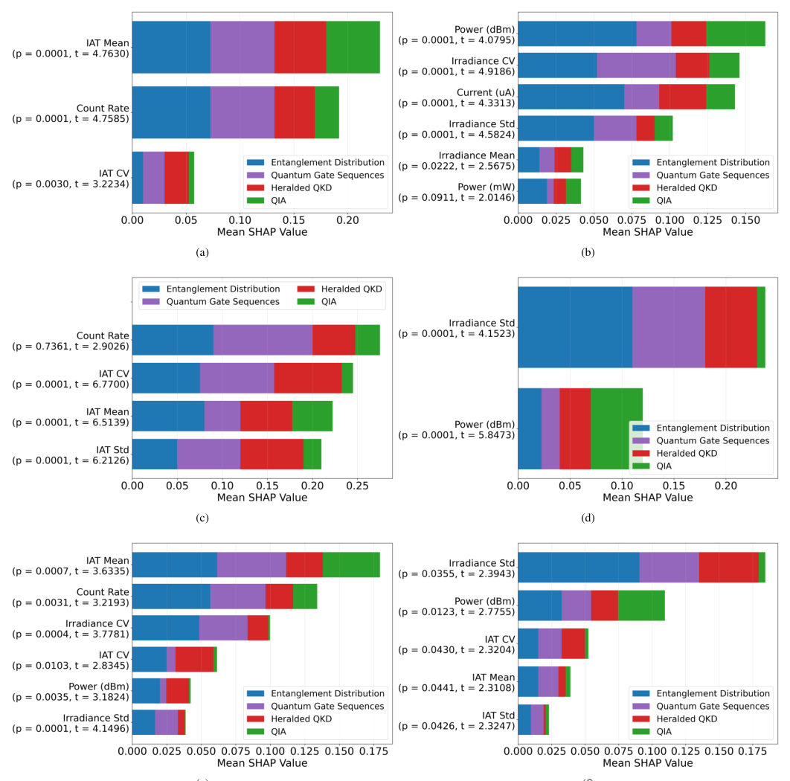 
Fig. 4: SHAP feature importance analysis for different sampling configurations and feature sets: (a) 10:90 time tagger, (b) 10:90 power meter, (c) 30:70 time tagger, (d) 30:70 power meter, (e) 10:90 combined, and (f) 30:70 combined.

**Summary.** This work experimentally demonstrates that quantum communication protocols can be identified by passively monitoring the physical characteristics of the transmitted optical signal. By analyzing photon arrival statistics and power fluctuations, researchers achieved high classification accuracy even when only a fraction of the signal was observed. This reveals a significant side-channel vulnerability in quantum networks, necessitating new security considerations for future quantum infrastructure.

**Why it may be interesting.** It provides concrete experimental evidence of information leakage from quantum processes based purely on physical layer observables (timing/power), which is crucial for designing physically secure quantum hardware.

Detailed structure

**Main problem.** The study investigates whether different quantum communication protocols leave distinguishable physical signatures detectable through passive side channel analysis.

**Main result.** Protocol identity can be inferred with high accuracy (up to 96%) by analyzing physical layer features, demonstrating a new information leakage channel in quantum networks.

**Method.** A data-driven framework using deep learning models classifies protocols based on passively collected physical measurements from the optical signal.

**Model / system.** The experiment uses a polarization-entangled photon link to realize and test four distinct quantum communication protocols: entanglement distribution, gate sequences, QKD, and QIA.

**Key observables.** Single photon detection statistics (time tagger features like IAT), optical power measurements (power meter features), and coincidence counts.

**Important parameters / regimes.** Sampling ratios (e.g., 30:70 vs 10:90) defining the fraction of the signal observed by the passive tap.

**Assumptions / limitations.** The observer can only passively access a fraction of the optical signal via tapping, without directly measuring or disturbing the encoded quantum states.

**Figures summary.** Figures illustrate confusion matrices showing performance vs. sampling ratio/feature type, and SHAP analyses confirming that timing features are dominant discriminators over intensity measurements.

**Paper structure.** The paper establishes the gap in security analysis (physical side channels), models the passive observation threat, experimentally implements multiple protocols on a photon link, develops a data-driven classification framework using time/power statistics, and quantifies the achievable fingerprinting accuracy.

Abstract

Quantum communication is a key enabler of next-generation networks, leveraging quantum entanglement to enable a new class of information exchange. While prior work has focused on the theoretical analysis of communication protocols, their exposure to physical layer side channel analysis remains largely unexplored. In classical systems, side channel analysis has been shown to reveal sensitive information without accessing the underlying data, raising the question of whether similar risks exist in quantum networks. In this work, we investigate whether different quantum communication protocols exhibit distinguishable signatures that can be inferred through passive side channel observations. We consider a threat model in which an observer accesses only a fraction of the optical signal without directly measuring the encoded quantum states. Under this setting, we experimentally examine four representative protocols, namely entanglement distribution, quantum gate sequences, heralded quantum key distribution, and quantum identity authentication, realized on a polarization entangled photon link. Observable physical layer features, including single photon detection statistics and optical power measurements, are collected and used to construct protocol fingerprints. We develop a data-driven framework for protocol identification based on these observations. Our results show that protocol identity can be inferred with accuracy reaching up to 96% under 30:70 sampling configuration/optical tapping, while remaining distinguishable at 10:90 with accuracy ranging from 70-89%. Bell inequality measurements confirm that the sampling/tapping process preserves entanglement, validating the non-destructive nature of the observation model. These findings demonstrate that side channel analysis can expose protocol-level information without disrupting quantum correlations, introducing new security considerations.

[↑ back to top](#top)

### [Highly integrated quantum key distribution transmitter enabled by silicon photonics](http://arxiv.org/abs/2607.23413v1)

**Authors:** Rende Liu, Yan-Lin Tang, Cheng-Guang Dong, Yan Ma, Guo-Qing Liu, Zhi-Lin Xie, Shuai Li, Mi Zou, Hao Liang, Shi-biao Tang  
**Type:** experiment · **Category:** quantum information and computing · **PDF:** <https://arxiv.org/pdf/2607.23413v1>  
**Analysis basis:** full PDF text, analyzed in chunks
**Topic relevance:** 🔥 `QC/QI experiment` **4/5** · `quantum optics experiment` **3/5** · `interference shaping light` **1/5** · `quantum measurements` **1/5**

📷 Fig 1

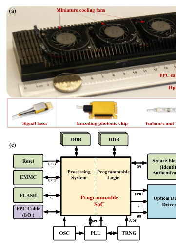 
Fig. 1. (a) Photograph of the QKD transmitter; (b) Schematic of the optical subsystem (quantum and synchronization channels); pink regions are integrated on the silicon photonic chip. (c) Block diagram of the electronic subsystem. (d) Microscope image of the encoding silicon photonic chip.

📷 Fig 2

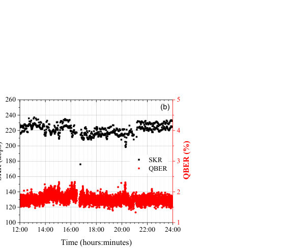 
Fig. 3. (a)Simulated secret-key rate (SKR) as a function of transmission distance, together with experimental results at 51.3 km and 101.8 km; (b) SKR and QBER measured during a 12-hour continuous operation over 51.3 km of standard single-mode fiber.

**Summary.** This paper presents a novel, highly integrated standalone transmitter for Quantum Key Distribution (QKD) that overcomes the bulk limitations of current rack-mounted systems. By combining monolithic silicon photonics with an embedded System-on-Chip, they achieved practical key rates over tens of kilometers in a dramatically reduced physical footprint. This work marks a significant engineering milestone toward commercializing compact QKD hardware.

**Why it may be interesting.** This work is highly relevant to quantum optics and photonic QI as it tackles the engineering challenge of scaling up quantum communication protocols from lab benches to field-deployable devices using advanced silicon photonics integration techniques.

Detailed structure

**Main problem.** The large size, cost, and complexity of current Quantum Key Distribution (QKD) hardware hinder its widespread deployment.

**Main result.** The authors demonstrated a highly integrated, standalone QKD transmitter that achieves practical key rates comparable to conventional systems while being significantly smaller than rack-mounted equipment.

**Method.** They employed a hybrid integration strategy combining monolithic silicon photonics for quantum state preparation with an external programmable System-on-Chip (SoC) for real-time protocol execution and control.

**Model / system.** The system is a standalone QKD transmitter built around a silicon photonic encoding chip, integrating components like DFB lasers, MEMS-VOA, and the entire BB84 post-processing chain onto a compact board-level platform.

**Key observables.** Secure key rate (SKR) of 219.1 kbps over 51.3 km; stable operation maintained over continuous 12-hour tests.

**Important parameters / regimes.** Transmitter volume: $167 	imes 56 	imes 21 	ext{ mm}^3$ ($\sim 0.2 	ext{ dm}^3$), representing a reduction of $>30	imes$ compared to 1U rack systems.

**Assumptions / limitations.** The reported key rates are considered conservative as they assume a deployment-oriented receiver architecture, which differs from ideal laboratory setups.

**Figures summary.** Figures show photographs and schematics of the integrated transmitter, block diagrams detailing optical and electronic subsystems, and plots illustrating SKR vs. distance and QBER stability over time.

**Paper structure.** The paper introduces the problem of QKD deployment limitations, details the hybrid architecture integrating photonics (SiPh) and electronics (SoC), presents performance measurements (key rates/stability), and concludes by positioning this work as a major step toward compact, deployable hardware.

Abstract

Quantum key distribution (QKD) provides information-theoretic security independent of computational assumptions, yet the bulk and cost of current systems hinder large-scale deployment. Although integrated photonic technologies have enabled highly integrated QKD chips, practical QKD transmitters are still predominantly implemented as rack-mounted systems. Here, we demonstrate a highly integrated standalone QKD transmitter that integrates all essential functionalities required for practical QKD operation within a compact platform built around a silicon photonic encoding chip. The transmitter occupies only $167 \times 56 \times 21~\mathrm{mm}^3$ ($\sim 0.2~\mathrm{dm}^3$), comparable in size to a half-height, half-width PCIe card and more than 30 times smaller in volume than a conventional 1U rack-mounted system. Paired with a conventional discrete-component receiver, it achieves a secure key rate of 219.1 kbps over 51.3 km of standard single-mode fiber, with performance comparable to that of conventional discrete-component implementations. This work bridges the gap between photonic chip integration and deployable QKD hardware, marking an important step toward transitioning QKD transmitters from conventional rack-mounted equipment to compact board-level platforms.

[↑ back to top](#top)

### [Protocols of coherent motion control for an interaction-driven Rydberg gate](http://arxiv.org/abs/2607.23090v1)

**Authors:** Valentin Magro, Wojciech Adamczyk, Sylvain de Léséleuc  
**Type:** theory · **Category:** other · **PDF:** <https://arxiv.org/pdf/2607.23090v1>  
**Analysis basis:** full PDF text, analyzed in chunks
**Topic relevance:** 🔥 `Rydberg arrays` **4/5** · `analog quantum simulation` **1/5** · `correlated cavity matter` **1/5** · `entanglement & information structure` **1/5** · `non-equilibrium dynamics` **1/5**

📷 Fig 1

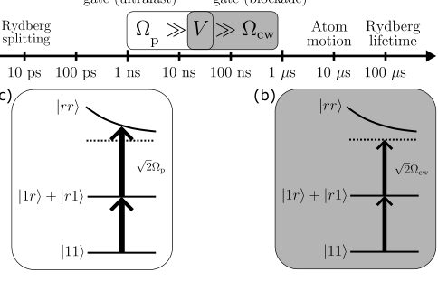 
FIG. 1: Rydberg gates concepts. (a) Relevant dynamical timescales of the system. Energy-level diagrams in the blockade regime (b) and in the interaction-driven regime (c). In (b), the entangling phase is generated by the laser drive, whereas in (c) it is accumulated during the interaction time between the atoms.

📷 Fig 2

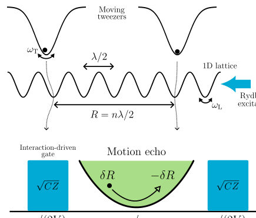 
FIG. 2: Tools and concepts for interaction-driven gate implementation. (a) Schematic of movable optical tweez- ers adiabatically loaded into a one-dimensional optical lattice to precisely set interatomic distance R. The lat- tice with period λ/2 reduces positioning errors when its trapping frequency ωL exceeds that of the tweezers ωT. (b) Schematic of motion-echo protocol. The CZ gate is implemented in two steps, separated by half a motional oscillation period. In this protocol thermal and quantum fluctuations δR of the atomic positions within the trap- ping potentials cancel to first order.

📷 Fig 3

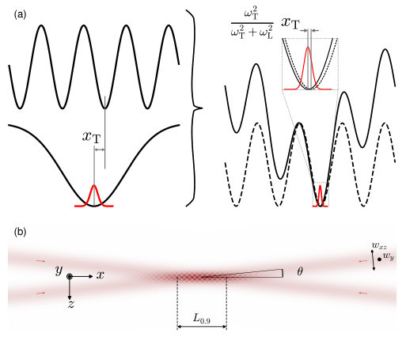 
FIG. 3: (a) Combined tweezer–lattice trapping poten- tial for a tweezer displaced by xT from the lattice site. The resulting total potential shows that the shift of the trap minimum is strongly suppressed when ωL ≫ ωT . Ground-state harmonic oscillator wavefunctions are shown in light red, illustrating the reduction of quantum fluctuations δR0 at the lattice site. (b) Geometry of the two-dimensional lattice. Two standing waves are gener- ated by elliptical beams propagating in the x-z plane at angles ±θ with respect to the interaction axis x. The re- sulting summed potential confines the atoms along both x and z. Near the central axis the trap-frequency ra- tio is ωz,L/ωx,L = tan θ. The...

📷 Fig 4

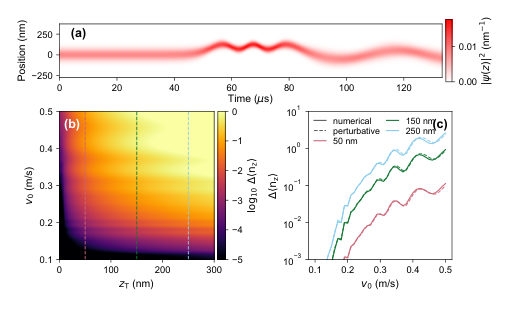 
FIG. 4: Transport-induced motional excitation in the lat- tice gate zone. (a) Probability density of an atom trans- ported into and out of the lattice interaction region at v0 = 0.6 m/s with tweezer–lattice offset zT = 100 nm. The atom is pinned to the lattice minimum while travers- ing the interaction region; the residual oscillation after the passage reflects motional excitation. (b) Change in the mean vibrational occupation ∆⟨nz⟩after the full transport sequence, obtained from numerical propagation in the full time-dependent potential and averaged over a 10% Gaussian spread in lattice trap frequency. Atom is initially assumed to be in the motional ground state. (c) Numerical cuts from...

📷 Fig 5

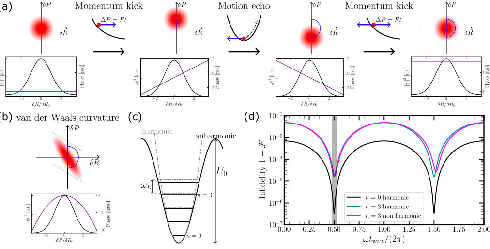 
FIG. 5: Motion echo sequence. (a) Schematic of the interaction gate. Each panel shows both a phase-space represen- tation and the corresponding position-space probability density, with the associated phase profile. The initial state has zero phase. After the first interaction step, a global π/2 phase is acquired and the state is displaced along δP axis, corresponding to a linear phase gradient. The third step shows the state after a half period rotation in the harmonic trap. The final interaction adds an identical phase, reaching a total of π, and cancels the phase gradient, returning the state to its initial point in phase space. (b) Same sequence including the second order term in the...

**Summary.** The paper presents advanced protocols for realizing high-fidelity two-qubit gates in neutral atom quantum computers by exploiting direct interaction-driven coupling rather than relying solely on blockade physics. By integrating coherent control techniques like motion-echo sequences within optical lattices, the authors suppress detrimental errors arising from atomic position uncertainty and thermal motion to levels required for fault-tolerant computation.

**Why it may be interesting.** This work represents a sophisticated blend of quantum control theory applied to atomic physics. The detailed mathematical treatment of motion-echo sequences and the quantitative error budgeting against multiple noise sources (thermal, static) is highly relevant for designing next-generation quantum hardware.

Detailed structure

**Main problem.** The primary goal is to achieve high-fidelity two-qubit entanglement gates for neutral atoms by moving beyond the limitations of the standard Rydberg-blockade regime.

**Main result.** The proposed protocols, combining coherent control of atomic motion with optical lattices and echo sequences, enable ultrafast interaction-driven gates with error contributions from position noise below $10^{-4}$.

**Method.** The authors derive theoretical models for the motional propagator under an echo sequence and analyze gate infidelity by calculating expectation values for thermal and Fock states.

**Model / system.** The system involves neutral atoms trapped in a combination of optical tweezers and superimposed two-dimensional optical lattices, utilizing Rydberg excitations to mediate entanglement.

**Key observables.** Gate fidelity ($F$), error contributions from position noise ($\Delta R$, $\delta R$), motional propagator expectation values, and residual displacement parameters ($\alpha_{	ext{res}}$).

**Important parameters / regimes.** Target error $1-F \lesssim 10^{-4}$, required static precision $\Delta R < 4$ nm, low heating rate ($\Delta n < 0.01$), and short Rydberg interaction time ($\sim 10$ ns).

**Assumptions / limitations.** The analysis assumes the ability to implement precise lattice loading and motion-echo sequences; error contributions are analyzed by treating various noise sources (static vs. thermal) independently.

**Figures summary.** Figure S2 provides an error budget comparing different gate protocols based on interatomic separation $R$, quantifying contributions from lifetime, static/thermal motion in x, y, and z directions.

**Paper structure.** The paper progresses by first establishing the need to overcome Rydberg-blockade limitations (Chunk 1), then detailing how lattice confinement and echo sequences suppress position errors ($\Delta R$ and $\delta R$) down to required nanometer precision (Chunk 2). Finally, it provides rigorous theoretical derivations of the motional propagator and error budget analysis for these advanced protocols (Chunks 3 & 4).

Abstract

Generating entanglement between two Rydberg atoms is at the core of neutral-atom quantum computers. Current two-qubit gates operate in the Rydberg-blockade regime, in which the full strength of the van der Waals interaction between the two Rydberg atoms is not directly exploited, to avoid sensitivity to the position noise of the tweezer-trapped atoms, at the cost of a longer time spent in the Rydberg state. Here, we propose a set of techniques based on coherent control of the atomic motion obtained by combining optical tweezers and a two-dimensional optical lattice, and a sequence of multiple on/off pulses. The protocols keep the two-qubit gate error contribution from position noise below $10^{-4}$, heat the atom by less than~$Δn = 0.01$, while being robust to alignment errors of the potential up to $50$~nm and thermal excitation up to $\bar{n} = 3$. This toolbox opens the path for new two-qubit Rydberg gates directly, or partially, driven by the interaction, in which the atoms spend only $\sim 10$~ns in the Rydberg state, minimizing the increasingly dominant error source originating from its finite lifetime.

[↑ back to top](#top)

### [Quantum-Level Crosstalk Characterization of a 16x16 MEMS Optical Switch for Dynamic Quantum Communications](http://arxiv.org/abs/2607.24299v1)

**Authors:** Persefoni Konteli, Nikolas Makris, Grigoris Anastasiou, Konstantinos Tsimvrakidis, George T. Kanellos  
**Type:** both · **Category:** quantum information and computing · **PDF:** <https://arxiv.org/pdf/2607.24299v1>  
**Analysis basis:** full PDF text, analyzed in chunks
**Topic relevance:** 🔥 `QC/QI experiment` **4/5** · `quantum optics experiment` **3/5** · `quantum measurements` **1/5**

📷 Fig 1

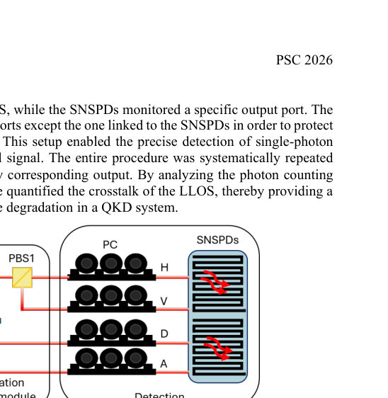 
Fig. 1. The LLOS quantum-level crosstalk characterization setup.

📷 Fig 2

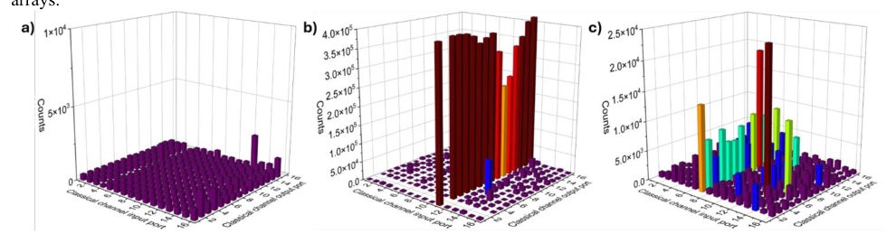 
Fig. 2: Noise counts obtained for all classical input–output port combinations of a single quantum channel. The x- and y-axes represent the classical output and input ports, respectively, while the z-axis indicates the corresponding photon noise counts. Figures (a)–(c) illustrate different observed patterns, highlighting the non-uniform distribution of crosstalk-induced noise across the MEMS switch.

📷 Fig 3

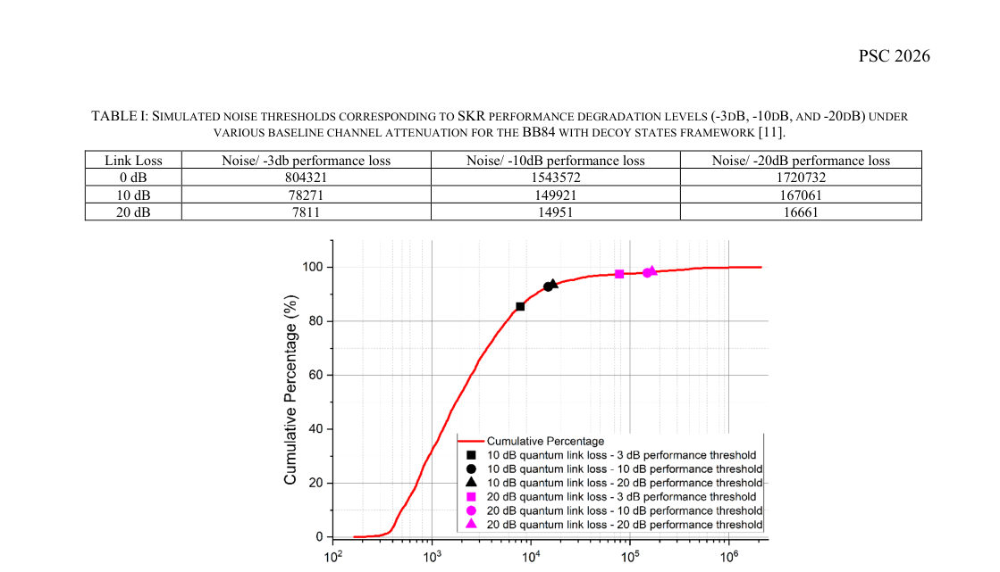 
Fig. 3. ECDF of the measured crosstalk noise counts across all input–output port combinations. The curve represents the cumulative percentage of port combinations with noise counts below a given value. The markers denote simulated noise thresholds corresponding to SKR degradation levels of −3 dB, −10 dB, and −20 dB for baseline quantum channel losses of 10 dB (black color symbols) and 20 dB (magenta color symbols).

**Summary.** The paper characterizes the quantum crosstalk noise generated by a commercial 16x16 MEMS optical switch when used for multi-user quantum communications. By measuring photon leakage and correlating this with the decoy-state BB84 QKD protocol, the authors demonstrate that while some port combinations suffer severe noise, the majority are compatible with maintaining high key rates even under significant channel attenuation.

**Why it may be interesting.** This work directly addresses the engineering challenges of integrating macro-scale classical optical components into delicate quantum communication systems, providing crucial empirical data for network feasibility studies in quantum information science.

Detailed structure

**Main problem.** The study characterizes quantum-level crosstalk introduced by commercial MEMS optical switches, which poses a potential limitation for implementing robust Quantum Key Distribution (QKD) networks.

**Main result.** Most port configurations of the 16x16 MEMS switch are found to be compatible with quantum communication, supporting link budgets up to 20 dB, suggesting practical viability for dynamic QKD systems.

**Method.** The authors performed systematic experimental measurements of photon leakage across all input-to-output combinations using SNSPDs and correlated these empirical results with theoretical impact analyses on the decoy-state BB84 protocol.

**Model / system.** The platform is a commercial 16x16 MEMS Optical Low-Loss Switch (LLOS) used in conjunction with Superconducting Nanowire Single Photon Detectors (SNSPDs) for quantum signal detection. The analysis focuses on the performance of the decoy-state BB84 QKD protocol.

**Key observables.** Crosstalk (photon leakage) measured in counts per second ($	ext{cps}$), Secret Key Rate ($	ext{SKR}$) degradation percentage, and Link Loss/Attenuation levels.

**Important parameters / regimes.** Link budgets up to $20 	ext{ dB}$; specific noise thresholds corresponding to $	ext{SKR}$ degradation at $-3 	ext{ dB}$, $-10 	ext{ dB}$, and $-20 	ext{ dB}$.

**Assumptions / limitations.** The analysis assumes the use of a C-band CW tunable laser source at $1550.12 	ext{ nm}$ and relies on the established framework of the decoy-state BB84 protocol for performance evaluation.

**Figures summary.** Fig. 1 shows the experimental setup; Fig. 2 displays non-uniform noise counts across port combinations; Fig. 3 presents the ECDF comparing measured crosstalk against simulated $	ext{SKR}$ degradation thresholds for various channel losses.

**Paper structure.** The paper introduces the problem of classical component crosstalk in quantum networks, details the experimental setup and measurement process (sweeping laser signals), presents the quantitative results showing non-uniform leakage patterns, and concludes with a theoretical impact analysis confirming overall compatibility up to 20 dB attenuation.

Abstract

We present an all-to-all quantum-level crosstalk characterization of a commercial 16x16 MEMS optical switch for multi-user quantum communications using SNSPDs, correlating experimental data with a theoretical impact analysis on the decoy-state BB84 QKD protocol.

[↑ back to top](#top)

### [New class of exactly flat topological bands - compact localised states protected by local graph topology](http://arxiv.org/abs/2607.22831v1)

**Authors:** Tamaghna Hazra  
**Type:** theory · **Category:** strongly correlated electrons · **PDF:** <https://arxiv.org/pdf/2607.22831v1>  
**Analysis basis:** full PDF text, analyzed in chunks
**Topic relevance:** 🔥 `analog quantum simulation` **4/5** · `correlated cavity matter` **1/5** · `entanglement & information structure` **1/5** · `non-equilibrium dynamics` **1/5**

📷 Fig 1

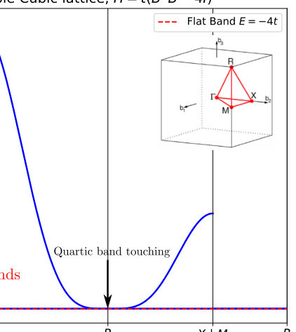 
Figure 2: Bandstructure of the hopping Hamiltonian defined on the faces of a cubic lattice

📷 Fig 2

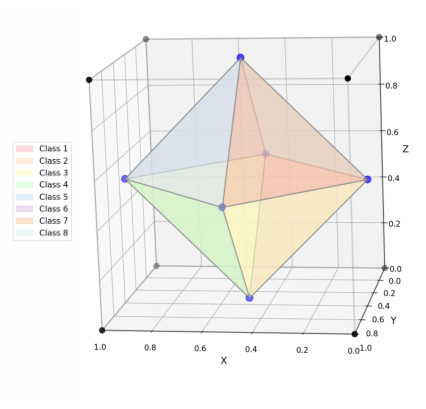 
Figure 3: 8 distinct classes of faces of an FCC lattice, shown in the conventional unit cell

📷 Fig 3

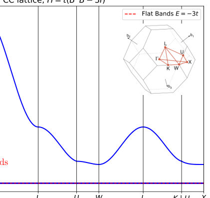 
Figure 4: Bandstructure of the hopping Hamiltonian defined on the faces of an FCC lattice

📷 Fig 4

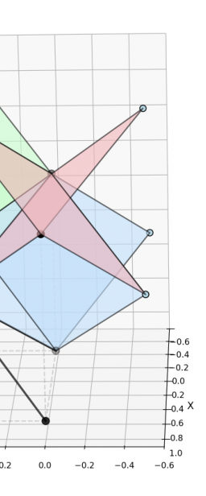 
Figure 5: 6 distinct faces of a BCC lattice, shown in the conventional unit cell

📷 Fig 5

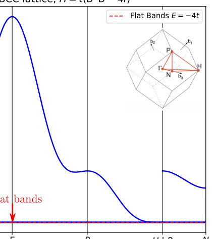 
Figure 6: Bandstructure of the hopping Hamiltonian defined on the faces of a BCC lattice

**Summary.** This work introduces a general method to construct exact flat band Hamiltonians on the faces of any arbitrary graph. By linking the resulting extensive ground-state degeneracy to the local topology via graph index theorems, the authors prove that these macroscopic degeneracies are topologically protected. This has broad implications for designing quantum systems with robust, non-dispersing quantum modes.

**Why it may be interesting.** The focus on engineered flat bands in moiré heterostructures directly relates to creating platforms for strongly correlated physics, which is a major area of interest in condensed matter theory.

Detailed structure

**Main problem.** The primary goal is constructing an infinite family of exact flat band Hamiltonians supported on the faces of arbitrary graphs to study exotic strongly correlated phases.

**Main result.** The resulting extensive ground-state degeneracies are rigorously proven to be protected by the local topology of the face-graph connectivity, yielding compact localized states.

**Method.** The construction uses a prescription based on the face-vertex incidence matrix (B) and generalizes concepts from the Atiyah-Singer index theorem via graph theory.

**Model / system.** The model is built upon tight-binding Hamiltonians defined on the faces of arbitrary graphs, motivated by moiré heterostructures to engineer macroscopic degeneracies in quantum matter.

**Key observables.** Extensive ground-state degeneracy (scaling with $|F| - |V|$), compact localized states, and topological protection.

**Important parameters / regimes.** The hopping amplitudes ($t$) and the structure of the graph connectivity (faces $F$ vs. vertices $V$).

**Assumptions / limitations.** The definition of a 'face' as an irreducible cycle is central to the construction; the analysis relies on the rank-nullity theorem applied to the incidence matrix.

**Figures summary.** Figures illustrate hopping processes (intra/inter-orbital) and show bandstructures for various lattices (cubic, hexagonal), demonstrating flat bands at specific energies.

**Paper structure.** The paper proceeds by defining faces on graphs, deriving the Hamiltonian using the face-vertex incidence matrix B, calculating the null space dimension via rank-nullity, and finally proving topological protection using graph theory generalizations of index theorems.

Abstract

Strongly correlated quantum matter is fundamentally defined by the tension between non-commuting quantum operators. Hamiltonians exhibiting macroscopic degeneracies are of general interest in this field because they imply an infinite susceptibility to any non-commuting perturbation. In moiré heterostructures, engineering such extensive degeneracies in the kinetic Hamiltonian creates a fertile garden for exotic strongly correlated phases of matter to emerge from the resulting flat bands. Here, we introduce a prescription to construct an infinite family of exact flat band Hamiltonians supported on the faces of arbitrary graphs. We demonstrate this algorithm on the faces of four Bravais lattices. Using a discrete graph generalization of the Atiyah-Singer index theorem, we prove that the extensive degeneracies of such face-graph Hamiltonians are protected by the local topology of the face-graph connectivity. The resulting macroscopic null spaces yield compact localised states that remain localised over time due to frustration in hopping pathways. We discuss the broad implications of such non-dispersing quantum modes in diverse settings, from arrested dynamics in quantum networks and quantum machine learning algorithms to Majorana-free topological quantum computation.

[↑ back to top](#top)

### [Quantum entanglement within quarkonium](http://arxiv.org/abs/2607.24068v1)

**Authors:** Wenyu Zhang, Yiyu Zhou, Yang Li, Qun Wang  
**Type:** theory · **Category:** other · **PDF:** <https://arxiv.org/pdf/2607.24068v1>  
**Analysis basis:** full PDF text, analyzed in chunks
**Topic relevance:** 🔥 `entanglement & information structure` **4/5** · `Keldysh / 2PI / non-Gaussian methods` **1/5** · `methods for driven-dissipative` **1/5** · `non-equilibrium dynamics` **1/5**

📷 Fig 1

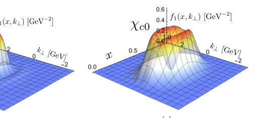 
FIG. 1. 3D images of the unpolarized TMDs f1(x, k⊥) for ηc, η′ c and χc0.

📷 Fig 2

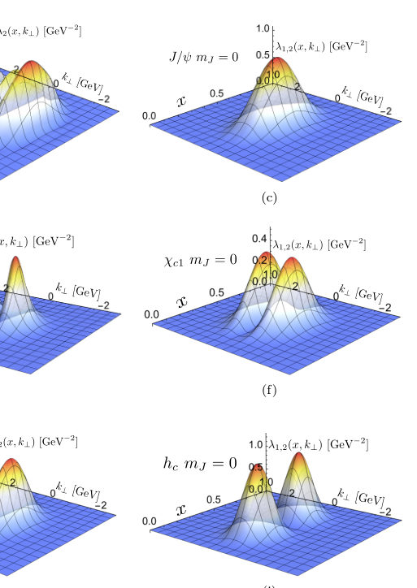 
FIG. 2. 3D images of the eigenvalues of the quark spin density matrix λ1,2(x, k⊥) for J/ψ, χc1 and hc.

📷 Fig 3

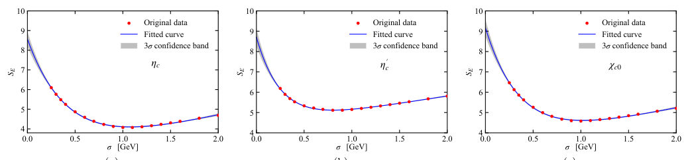 
FIG. 3. Entanglement entropy between quark and anti-quark d.o.f’s in charmonium as a function of Gaussian wave packet width σ in the transverse direction. The entanglement entropy is calculated in the harmonic oscillator representation with Nmax = 8. The red scatter points represent the calculated results, the blue solid lines are the nonlinear fitting results, the gray bands denote the 99.73% confidence interval. The nonlinear fitting function is given by f(x) = ae−bx + cx + d.

📷 Fig 4

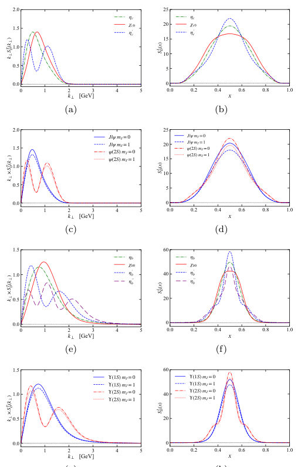 
FIG. 5. Distribution of entanglement entropy in transverse and longitudinal momentum for charmonium (panels (a)-(d)) with P + 0 V = 396 GeV−2 and bottomonium (panels (e)-(h)) with P + 0 V = 3186 GeV−2.

📷 Fig 5

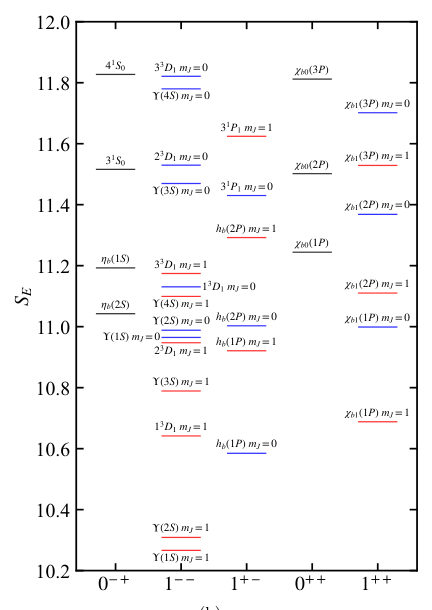 
FIG. 4. The entanglement entropy between quark and anti-quark d.o.f’s for charmonium (top panel) with P + 0 V/(2π)3 = 396 [GeV−2] and bottomonium (bottom panel) with P + 0 V/(2π)3 = 3186 [GeV−2].

**Summary.** This theoretical paper calculates the entanglement entropy within heavy quarkonium states ($	ext{charmonium}$ and $	ext{bottomonium}$) using a light-front Hamiltonian approach. It establishes that this quantum information measure provides a direct, quantitative link between fundamental quantum correlations and measurable partonic structure functions (TMDs). The results demonstrate how polarization affects the entanglement, offering a powerful new tool for probing nonperturbative QCD.

**Why it may be interesting.** While focused on QCD structure rather than AMO systems, the methodology of using entanglement entropy as a diagnostic tool is highly relevant. The techniques developed for handling reduced density matrices in strongly coupled field theories could inspire analogous studies in open quantum systems or many-body physics where correlations are key.

Detailed structure

**Main problem.** The study investigates quantifying quantum entanglement within heavy quarkonium bound states ($	ext{charmonium}$ and $	ext{bottomonium}$) to probe their nonperturbative internal structure.

**Main result.** Entanglement entropy ($S_q$) is shown to be a novel observable that directly links quantum information measures to measurable partonic observables, such as transverse momentum dependent parton distributions (TMDs).

**Method.** The authors employ the von Neumann entropy calculation on the reduced density matrix ($
ho_q$), derived within a nonperturbative light-front Hamiltonian framework using Basis Light-Front Quantization (BLFQ).

**Model / system.** The system is heavy quarkonium ($qar{q}$), modeled using an effective Hamiltonian solved via the light-front Schrödinger equation. Calculations are performed in the valence Fock sector, utilizing Gaussian wavepackets and taking the Narrow Wavepacket Limit ($\sigma 	o 0$).

**Key observables.** Entanglement entropy ($S_q$), reduced density matrix ($
ho_q$), and various TMDs (unpolarized $f_1$, polarized $h_\perp^1$, etc.).

**Important parameters / regimes.** Polarization of the vector mesons, infrared cutoffs ($\Lambda_{	ext{IR}}$), and the wavepacket width parameter $\sigma$.

**Assumptions / limitations.** The analysis relies on retaining only the valence Fock sector and taking the Narrow Wavepacket Limit ($\sigma 	o 0$) to simplify the density matrix diagonalization.

**Figures summary.** Figure 1 illustrates 3D images of unpolarized TMDs for various charmonium states. Figure 2 shows 3D images of eigenvalues related to these TMDs for different quarkonium spin states.

**Paper structure.** The paper develops the formalism by defining entanglement entropy in the light-front framework, deriving specific formulas for spin-0 and spin-1 mesons connecting $S_q$ to TMDs, evaluating these quantities for charmonium/bottomonium, and finally proposing a method to resolve infrared divergences.

Abstract

We investigate quark-antiquark entanglement in heavy quarkonium within a nonperturbative light-front Hamiltonian framework. By tracing over the antiquark degrees of freedom in the hadronic state vector, we construct the reduced density matrix of the quark subsystem and compute the associated von Neumann entropy. For spin-0 quarkonia, we show that this entropy reduces to the Shannon entropy of the unpolarized transverse momentum dependent parton distribution (TMD), up to constant color and spin contributions. For spin-1 quarkonia, we derive the explicit polarization dependence of the entropy and connect it to polarized and tensor-polarized TMDs. Using light-front wave functions obtained via basis light-front quantization (BLFQ), we evaluate the entanglement entropy for charmonium and bottomonium states, revealing a pronounced sensitivity to the polarization of vector mesons. Furthermore, we resolve the infrared parameter by matching the momentum-space entropy to a harmonic-oscillator representation. Ultimately, these results establish entanglement entropy as a novel probe of nonperturbative quarkonium structure, forging a direct link between quantum information measures and partonic observables.

[↑ back to top](#top)

### [A partial-trace matrix inequality and Werner-state distillability](http://arxiv.org/abs/2607.23416v1)

**Authors:** Zhiwei Song, Lin Chen  
**Type:** theory · **Category:** quantum information and computing · **PDF:** <https://arxiv.org/pdf/2607.23416v1>  
**Analysis basis:** full PDF text, analyzed in chunks
**Topic relevance:** 🔥 `entanglement & information structure` **4/5** · `Keldysh / 2PI / non-Gaussian methods` **1/5** · `correlated / nonlocal dissipation` **1/5**

📷 Fig 1

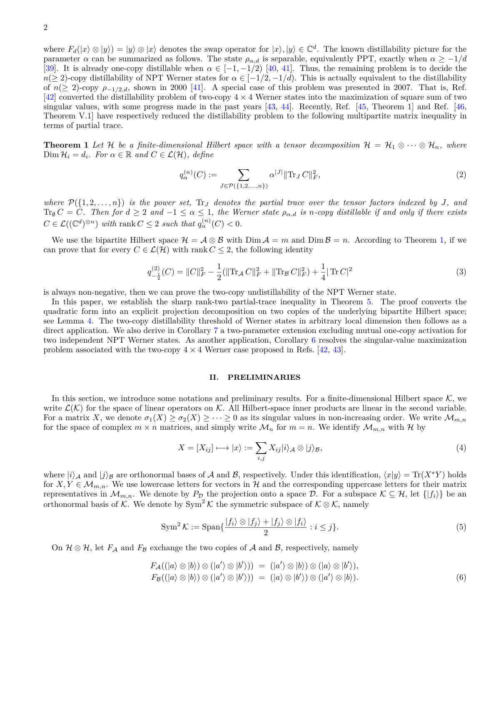 
Low-resolution page preview, page 2

📷 Fig 2

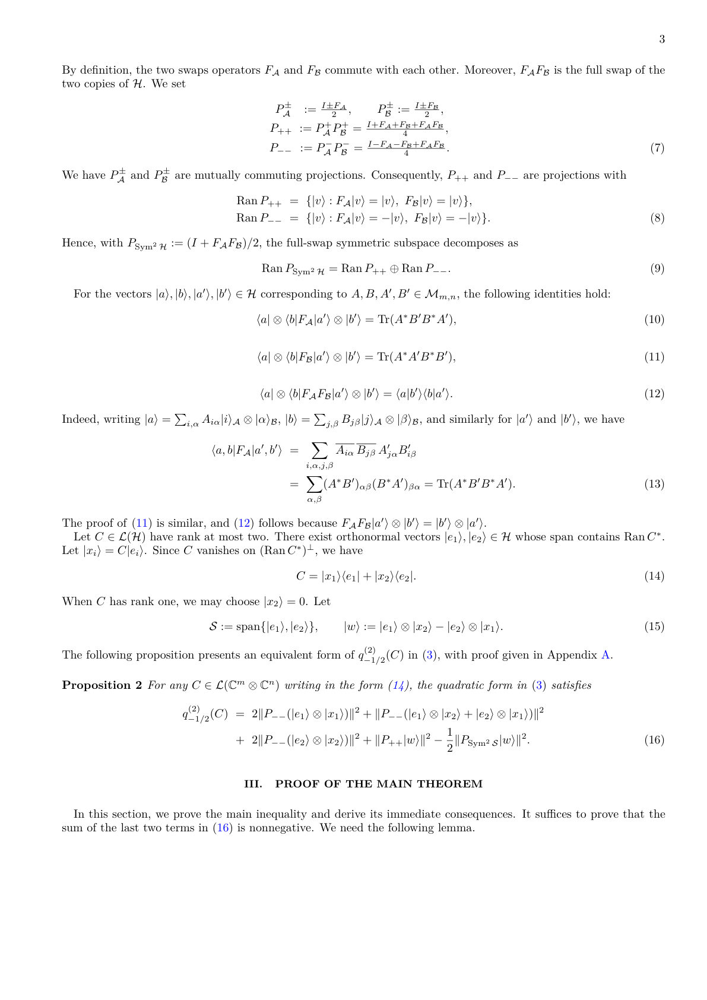 
Low-resolution page preview, page 3

📷 Fig 3

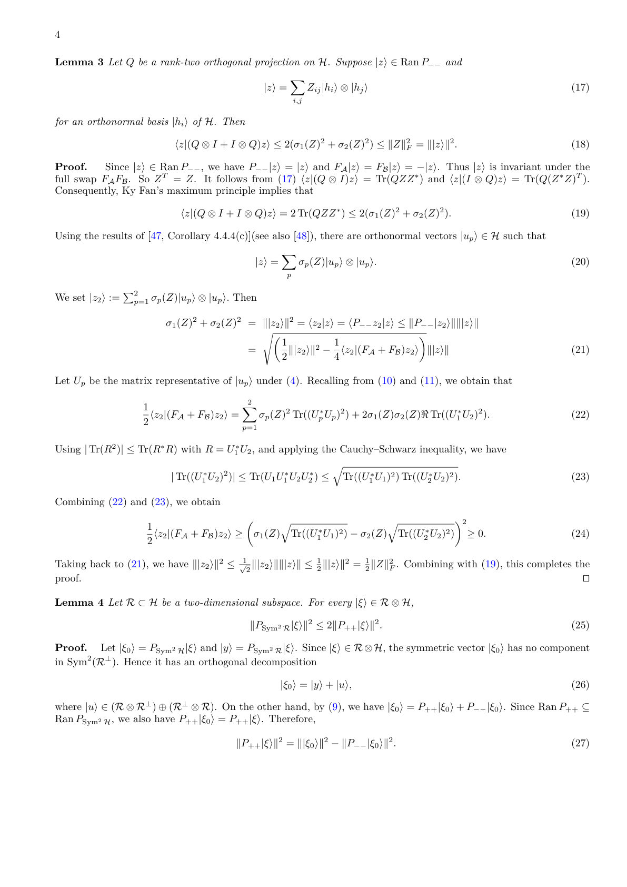 
Low-resolution page preview, page 4

📷 Fig 4

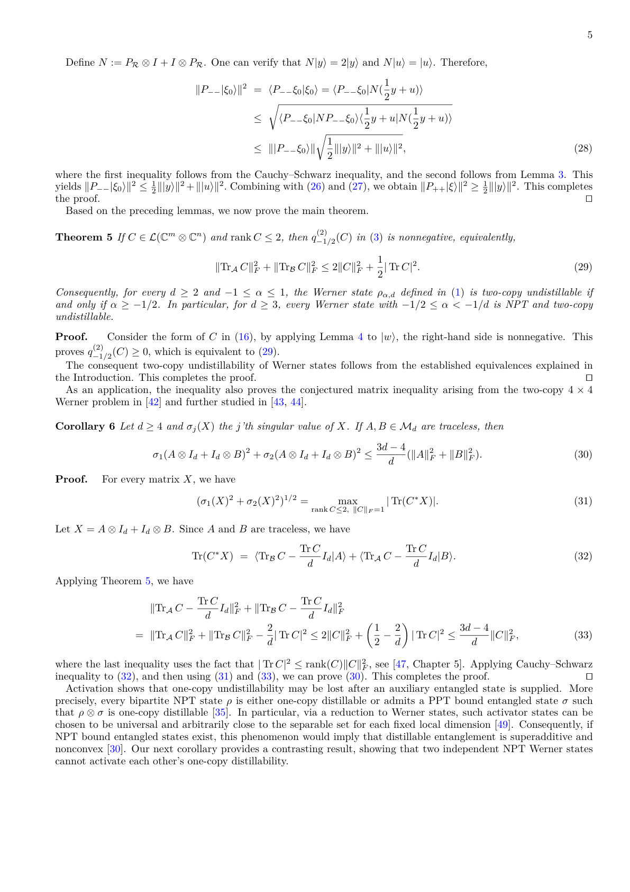 
Low-resolution page preview, page 5

📷 Fig 5

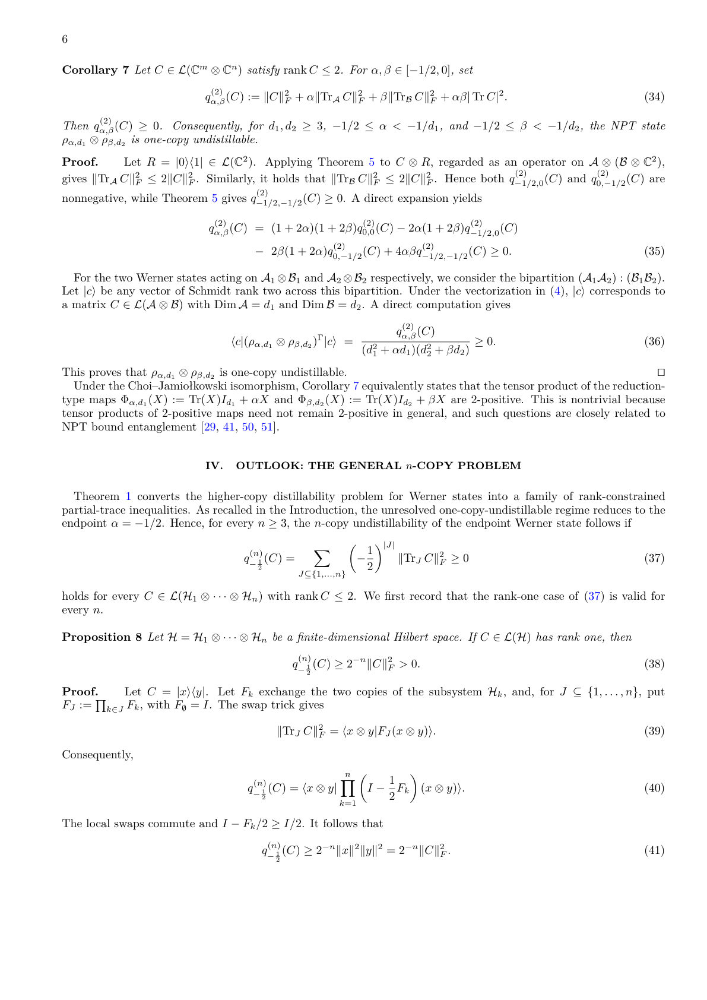 
Low-resolution page preview, page 6

**Summary.** This paper tackles the problem of entanglement distillability for Werner states by proving a novel bipartite partial-trace inequality applicable to rank-two matrices. This key result resolves the long-standing question regarding the two-copy undistillability of these states across arbitrary local dimensions. It advances the theoretical understanding of resource constraints in quantum information processing.

**Why it may be interesting.** This work provides fundamental mathematical tools (the partial-trace inequality) that constrain entanglement distillation protocols, which is crucial for understanding resource theories in quantum information.

Detailed structure

**Main problem.** The paper investigates the distillability of Werner states, specifically by proving a bipartite partial-trace inequality for matrices of rank at most two.

**Main result.** They prove that NPT Werner states are two-copy undistillable in arbitrary local dimension, resolving a long-standing open problem in quantum information theory.

**Method.** The core method involves deriving and applying sharp bipartite partial-trace inequalities related to the distillability criterion $q^{(n)}_\alpha(C)$, using techniques involving projection operators and quadratic forms.

**Model / system.** The study focuses on bipartite quantum systems described by Werner states $
ho_{\alpha,d}$ acting on tensor products of local Hilbert spaces. The analysis uses abstract matrix formulations derived from the partial trace operation.

**Key observables.** Distillability (determined by $q^{(n)}_\alpha(C)$), singular values ($\sigma_j(Z)$), and the Werner state parameter $\alpha$.

**Important parameters / regimes.** The number of copies ($n$), the rank of the matrix ($rank \le 2$), and the local dimension ($d$).

**Assumptions / limitations.** The analysis is based on the framework of Local Operations and Classical Communication (LOCC) for entanglement distillation.

**Paper structure.** The paper builds from establishing a general partial-trace inequality for rank-two matrices, applying this to prove the two-copy undistillability result, and concluding with extensions regarding multi-parameter analysis and singular value maximization.

Abstract

Motivated by the equivalent partial-trace formulations of Werner-state distillability [P. Costa Rico, Lett. Math. Phys. 115, 47 (2025); S.-Y. Qi et al., Phys. Rev. A 110, 012406 (2024)], we prove a bipartite partial-trace inequality for every matrix of rank at most two. As applications, we prove the two-copy undistillability of NPT Werner states in arbitrary local dimension, thereby resolving this open problem highlighted in [P. Horodecki et al., PRX Quantum 3, 010101 (2022)]. We further prove a two-parameter extension of the matrix inequality and show that two individually one-copy-undistillable NPT Werner states cannot activate each other's one-copy distillability. We also resolve the singular-value maximization problem associated with the two-ququart case.

[↑ back to top](#top)

### [Generalized Mermin Inequalities for Benchmarking Large-Scale GHZ States](http://arxiv.org/abs/2607.23574v1)

**Authors:** Jianbin Cai, Junxiang Huang, Fynn Otto, Yuan Li, Carlos de Gois, Tao Jiang, Sirui Cao, Fangzheng Chen, Hao Fu, Jin Lin, Wei Xie, Naibin Zhou, Shibiao Tang, Xiang-Yang Li, Cheng-Zhi Peng, Xiao Yuan, Otfried Gühne, Ming Gong  
**Type:** both · **Category:** quantum information and computing · **PDF:** <https://arxiv.org/pdf/2607.23574v1>  
**Analysis basis:** full PDF text, analyzed in chunks
**Topic relevance:** 🔥 `QC/QI experiment` **4/5** · `entanglement & information structure` **1/5** · `quantum measurements` **1/5**

📷 Fig 1

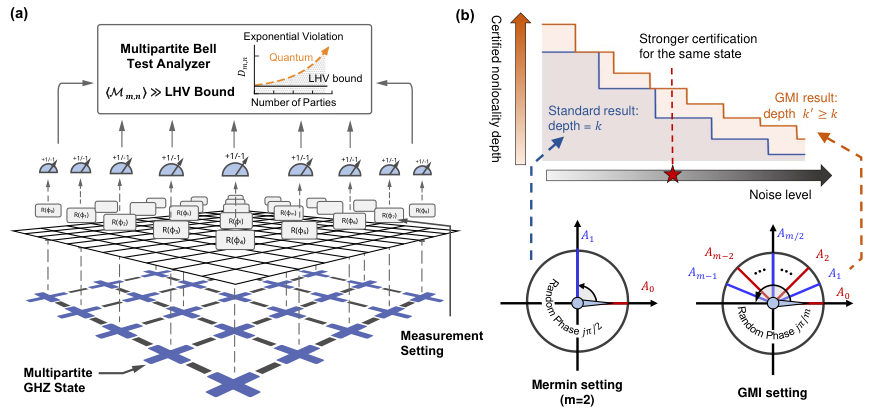 
FIG. 1. Bell-test logic and measurement-space refinement. (a) Local equatorial rotations R(ϕk) are applied to an n-qubit GHZ state to measure the generalized Mermin operator ⟨Mm,n⟩. The inset shows exponential LHV violation with system size. (b) Increasing m can tighten the relevant bounds and deepen certification for the same noisy GHZ state.

📷 Fig 2

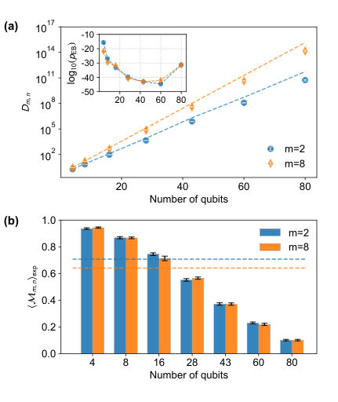 
FIG. 3. Large-scale Bell violation and scaling perfor- mance. (a) Experimental Bell ratios Dexp m,n for the standard Mermin test (m = 2, blue circles) and the generalized Mermin test (m = 8, orange diamonds) up to n = 80. Dashed lines show the corresponding ideal scalings Did m,n = 1/Cm,n. Error bars denote 40× the standard error and are enlarged for vis- ibility because the unscaled errors are smaller than the sym- bols. The inset shows setting-level empirical-Bernstein up- per bounds against the LHV model as log10(pEB), with lower values indicating stronger rejection. Color coding follows the main panel. (b) Measured expectation values ⟨Mm,n⟩exp; col- ored dashed lines mark the...

📷 Fig 3

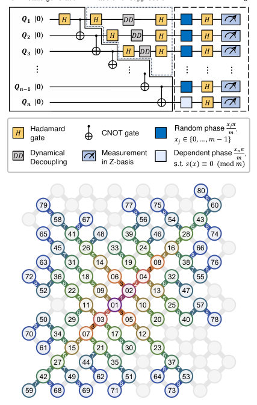 
FIG. 2. GHZ preparation and hardware embedding. (a) Experimental sequence for GHZ-state generation (solid), phase-error suppression (dotted), and setting-dependent mea- surement of Eq. (1) (dashed). (b) The accompanying chip map shows the active qubits and compiled depth for the 80- qubit GHZ instance on the superconducting processor. The numbers on the links denote the sequence steps of entangling gates for generating the GHZ state, illustrating how the en- tangled region is built up step by step.

📷 Fig 4

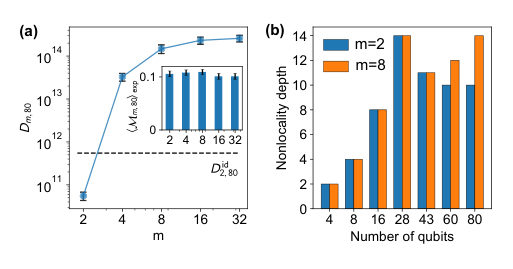 
FIG. 4. Generalized Mermin advantage at fixed size and nonlocality depth certification. (a) Experimental Bell ratio for the 80-qubit GHZ state versus the number of set- tings m. The horizontal dashed line marks the ideal standard- Mermin value Did 2,80. The inset shows the corresponding ex- pectation values. Error bars denote 40× and 10× the stan- dard error in the main panel and inset, respectively. (b) Cer- tified nonlocality depth versus system size for m = 2 and m = 8.

**Summary.** The paper proposes and experimentally validates generalized Mermin inequalities as an improved benchmark for testing large-scale GHZ states on superconducting processors. By incorporating an extra measurement setting parameter ($m$), the inequality strengthens its violation ratio and certifies a deeper nonlocality depth compared to standard tests. This provides a powerful, noise-robust tool for assessing quantum processor performance using only measured correlations.

**Why it may be interesting.** This work directly addresses scalability in quantum benchmarking, providing a robust, resource-efficient method to certify nonlocality depth using only measured correlators, which is crucial for near-term noisy intermediate-scale quantum (NISQ) devices.

Detailed structure

**Main problem.** The primary challenge is benchmarking large-scale quantum processors using multipartite Bell tests, which suffer from noise susceptibility and exponentially complex expressions.

**Main result.** The authors introduce generalized Mermin inequalities that strengthen the Bell violation ratio and certify a higher nonlocality depth compared to standard methods, even when considering noise.

**Method.** They developed a finite-setting generalized Mermin family of state-tailored Bell inequalities ($\mathcal{M}_{m,n}$) and tested them experimentally using randomized sampling on superconducting qubits.

**Model / system.** The study focuses on Greenberger-Horne-Zeilinger (GHZ) states prepared on a programmable superconducting processor with up to 80 qubits. The theoretical framework involves generalizing Mermin operators by introducing an additional measurement setting dimension, $m$.

**Key observables.** Bell violation ratio ($	ext{Did}_{m,n}$), certified nonlocality depth ($k$), and the expectation value of the generalized Mermin operator $\langle\mathcal{M}_{m,n}
angle$.

**Important parameters / regimes.** System size $n$ (up to 80 qubits) and measurement setting number $m$ (generalized beyond standard $m=2$).

**Assumptions / limitations.** The test relies solely on measured correlators and analytical bounds, avoiding readout correction or tomography. The locality and freedom-of-choice loopholes are noted as open.

**Figures summary.** Figures compare Bell ratios for different settings ($m=2$ vs $m=8$) showing exponential scaling advantages; other figures detail the experimental sequence and the relationship between certified depth and system size.

**Paper structure.** The paper first introduces the generalized Mermin inequality framework, derives analytic bounds comparing it to standard tests, details the experimental implementation on superconducting qubits (including error suppression), presents results showing improved Bell ratios and depth certification with increasing $m$, and concludes by analyzing the hierarchy of local bounds.

Abstract

Multipartite Bell tests provide a correlation-only route to benchmarking quantum processors, but their application at large scales is hindered by the rapid decay of many-body correlators under noise and exponentially many terms in conventional Bell expressions. Here we address these scalability obstacles by introducing a finite-setting generalized Mermin family of state-tailored Bell inequalities with analytic certification bounds, in which the measurement-setting number $m$ provides an additional certification dimension complementary to the system size $n$. We show that, for the powers-of-two setting choices considered here, increasing $m$ leaves the ideal normalized multipartite quantum value unchanged while lowering the relevant classical bounds, thereby strengthening the Bell-violation ratios and yielding an improved noise-robustness scaling compared to the standard Mermin inequality. We test this construction experimentally on a programmable superconducting processor by preparing Greenberger-Horne-Zeilinger (GHZ) states of up to 80 qubits. Using randomized sampling for direct Bell-operator estimation, we observe Bell ratios that grow exponentially with system size, certify a nonlocality depth of 14, and show that increasing $m$ strengthens both the Bell ratio and depth certification. All results are obtained solely from measured correlators and analytical bounds, without readout correction, tomography, or model-based mitigation. Generalized Mermin inequalities therefore provide a sharper Bell benchmark for noisy large-scale GHZ states.

[↑ back to top](#top)

### [Neural Network Learning of One-Bit Protocols for Qubit Measurement Simulation](http://arxiv.org/abs/2607.23645v1)

**Authors:** Josep Escrig, Mani Zartab, Giulio Gasbarri, Estel Ferrer, Ramon Muñoz-Tapia, Gael Sentís  
**Type:** theory · **Category:** quantum information and computing · **PDF:** <https://arxiv.org/pdf/2607.23645v1>  
**Analysis basis:** full PDF text, analyzed in chunks
**Topic relevance:** 🔥 `quantum measurements` **4/5** · `measurement-induced transitions` **1/5** · `methods for driven-dissipative` **1/5**

📷 Fig 1

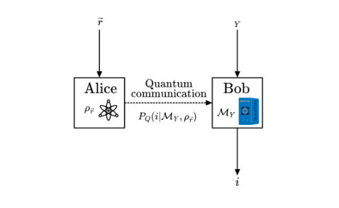 
Figure 1. Quantum PM scenario. Alice prepares the qubit state ρ⃗r and sends it to Bob, who performs the POVM MY and reports the outcome i.

📷 Fig 2

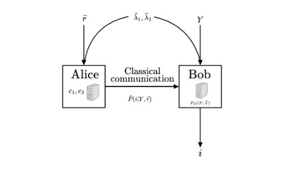 
Figure 2. 2-bit classical simulation protocol of Ref. [10] for the PM scenario. Alice and Bob share ⃗λ1,⃗λ2 ∈S2, Alice sends the bits c1, c2, and Bob outputs i according to the protocol.

📷 Fig 3

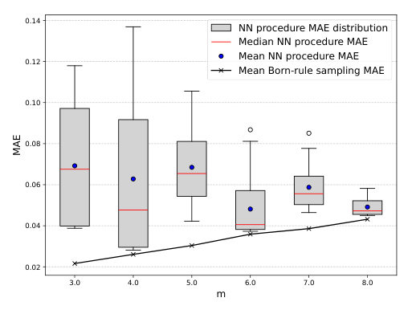 
Figure 3. MAE of the probabilities calculated with the NN- procedure for POVMs with different numbers of elements m, compared with the mean MAE sampled directly from the Born rule.

📷 Fig 4

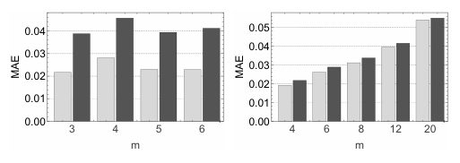 
Figure 5. MAE of the NN-procedure (dark gray) and of the Born rule (light gray) for various e-POVMs with m outcomes, taking 4000 samples (value of N) and averaging over 1000 dif- ferent states (value of M). In the left plot, we have polygon configurations, while on the right plot we have regular poly- hedra.

📷 Fig 5

 
Fig. 5 compares the MAE of the NN-procedure with the MAE obtained by direct sampling from the Born rule for several such configurations. The comparison reveals a clear qualitative distinction. For polygonal configurations such as the triangle, square, pentagon, and hexagon, the MAE of the NN-procedure remains noticeably above the Born rule baseline. By contrast, for regular polyhedra configurations, the gap between the NN-procedure and the Born rule baseline is signif- icantly smaller. This suggests that the symmetric three- dimensional configuration of measurement vectors, rep- resenting an informationally complete POVM plays an important role. Overall, the numerical results support two...

**Summary.** The paper explores the minimum classical resources needed to simulate qubit measurements. By using neural networks and rigorous analysis, the authors show that highly symmetric measurement settings allow for an accurate approximation of quantum statistics using only a single classical bit. This result highlights how exploiting geometric symmetries can drastically improve resource efficiency in quantum information tasks.

**Why it may be interesting.** This work provides a concrete example of how leveraging underlying symmetries in quantum processes can lead to significant resource reductions (from 2 classical bits to 1 bit) for simulation tasks, which is crucial knowledge for designing efficient quantum communication protocols.

Detailed structure

**Main problem.** The core problem is quantifying the minimum classical communication resources required to simulate quantum measurement statistics (qubit prepare-and-measure scenario). Specifically, it investigates if restricted families of measurements allow for an accurate 1-bit classical approximation.

**Main result.** For highly symmetric and informationally complete POVMs, a single bit can achieve high average accuracy in simulating qubit measurements, and this protocol becomes exact in the continuous isotropic limit. This demonstrates that symmetry can significantly reduce the required classical communication compared to the general worst-case scenario (which requires 2 bits).

**Method.** The authors employ a neural network procedure trained via minimizing Mean Squared Error (MSE) to learn candidate 1-bit protocols, which are then rigorously analyzed using mathematical bounding techniques to prove convergence rates.

**Model / system.** The system is the qubit prepare-and-measure scenario, where quantum states $
ho$ and measurements $M=\{M_i\}$ are described in terms of Bloch vectors. The simulation compares true Born probabilities with those predicted by a classical protocol based on one bit of communication.

**Key observables.** Mean Absolute Error (MAE) quantifying the average approximation accuracy; the convergence rate $O(1/\sqrt{t})$ for the error bound $	ext{L}_1(P_{1	ext{-bit}}, P_{	ext{Q}})$

**Important parameters / regimes.** The symmetry of the POVMs (e.g., regular polyhedra vs. polygons); the number of training samples ($M$) and shared randomness samples ($N$); the continuous limit ($t 	o \infty$).

**Assumptions / limitations.** The analysis relies on approximating complex sums using integral bounds and asymptotic theorems related to spherical $t$-designs.

**Figures summary.** Figures illustrate the comparison of MAE for different POVM structures (polyhedra vs. polygons) and show conditional response maps comparing NN outputs against analytical 1-bit protocols, demonstrating convergence.

**Paper structure.** The paper progresses from establishing the general 2-bit requirement to using an NN procedure to probe restricted cases. It then analyzes how symmetry improves performance, culminating in rigorous mathematical proofs bounding the error of the derived 1-bit protocol as the measurement ensemble becomes continuous or highly symmetric.

Abstract

Communication complexity provides a natural framework for quantifying the classical resources required to reproduce quantum statistics. In the qubit prepare-and-measure scenario, two classical bits have been shown to be necessary and sufficient to simulate arbitrary qubit states and arbi- trary quantum measurements exactly. However, this result does not exclude the possibility that restricted families of measurements may admit accurate 1-bit classical approximations. We use a neural network procedure to demonstrate that a single bit can achieve high average accuracy for specific measurement families. A performance analysis of our neural network reveals that symmet- ric measurements with uniformly weighted elements, such as those forming regular polyhedra, are particularly amenable to this restricted communication. By analyzing the patterns learned by the neural network, we derive an analytical protocol that is extremely accurate for finite information- ally complete symmetric configurations and becomes exact in the limit of a continuous isotropic measurement.

[↑ back to top](#top)

### [Systematic Experiment Tracking in Quantum Software: A Case Study of Reservoir Computing with Error Mitigation](http://arxiv.org/abs/2607.24264v1)

**Authors:** Otso Kinanen, Valter Uotila, Vlad Stirbu  
**Type:** both · **Category:** quantum information and computing · **PDF:** <https://arxiv.org/pdf/2607.24264v1>  
**Analysis basis:** full PDF text, analyzed in chunks
**Topic relevance:** 🔥 `QC/QI experiment` **4/5** · `methods for driven-dissipative` **1/5** · `quantum measurements` **1/5**

📷 Fig 1

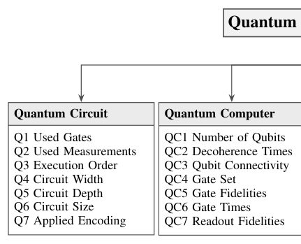 
Fig. 1: Quantum provenance taxonomy capturing key metadata across the quantum computing stack.

📷 Fig 2

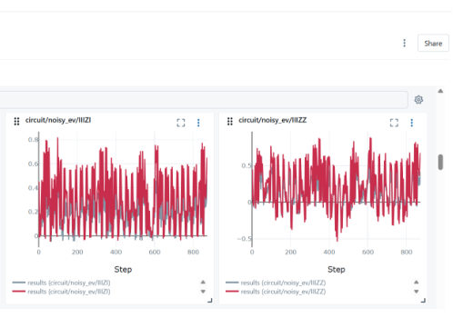 
Fig. 2: Example view of the graphical user interface of MLflow running in a browser

📷 Fig 3

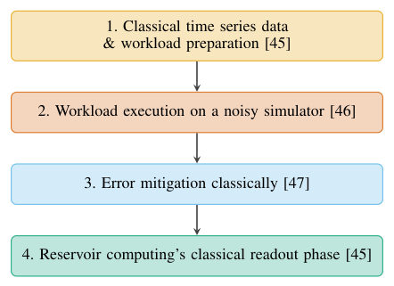 
Fig. 3: Summary of use case actions. References refer to the GitHub implementations.

📷 Fig 4

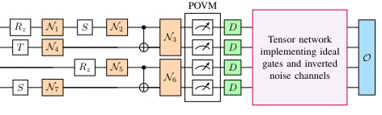 
Fig. 4: Overall TEM-pipeline: Every gate has its associated noise, modeled as channels Ni. Then, we perform the POVM measurements. With the corresponding dual frame (D boxes), we can map the state into a tensor network, in which the orig- inal ideal gates and inverted noise channels are applied [48]. Finally, we estimate the expectation value of an observable O.

📷 Fig 5

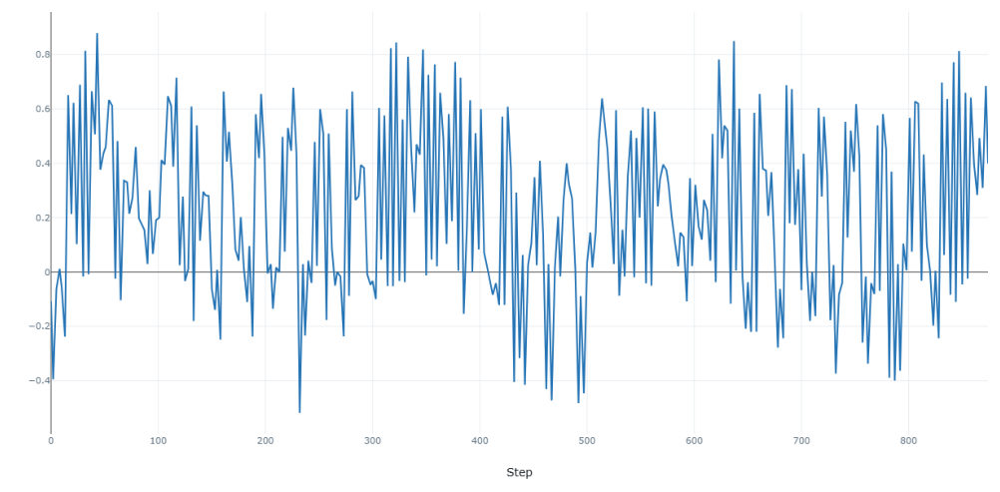 
Fig. 5: The error-mitigated expectation values across the 875 circuits retrieved automatically from MLflow. A step refers to a single expectation value estimation for a circuit. The y-axis contains the expectation values.

**Summary.** This paper addresses the critical need for systematic experiment tracking in quantum software development due to hardware noise and complexity. Using a case study involving quantum reservoir computing, the authors detail how to track all necessary provenance data—from circuit parameters to error mitigation steps. This methodology provides a generalized framework for ensuring reproducibility across diverse quantum research projects.

**Why it may be interesting.** It provides an essential software engineering framework for validating results on current noisy hardware, which is crucial for any physicist working with near-term quantum devices or complex open quantum systems simulations.

Detailed structure

**Main problem.** The field requires systematic experiment tracking due to the novel, complex, and error-prone nature of quantum software development.

**Main result.** The authors propose defining and detailing comprehensive experiment tracking practices specific to quantum workflows, demonstrated via a case study in quantum reservoir computing.

**Method.** They adapt classical ML workflow tools like MLflow to track quantum provenance data across the entire stack, from circuit design to noisy execution.

**Model / system.** The focus is on superconducting quantum devices and implementing Quantum Reservoir Computing for chaotic time series prediction, requiring error mitigation techniques.

**Key observables.** Experiment tracking metrics, hardware characterization metrics ($T_1, T_2$, gate/readout error rates), and comprehensive provenance data (circuit parameters, noise characteristics).

**Important parameters / regimes.** Circuit depth, qubit count ($\le 30$ qubits for simulation), error mitigation effectiveness, and the ratio of marginal gain to tracking overhead.

**Assumptions / limitations.** Current NISQ devices necessitate relying on error mitigation methods rather than full quantum error correction codes; existing classical ML tools can be adapted for quantum provenance.

**Figures summary.** Figure 1 details a taxonomy of quantum provenance metadata across the stack (Provenance, Circuit, Compilation, Execution); Figure 2 illustrates data visualization using MLflow.

**Paper structure.** The paper introduces the problem space, details the necessary tracking components via a case study (quantum reservoir computing), and generalizes these findings into best practices for the broader quantum development process.

Abstract

Quantum computers are more widely available than ever, making the field more accessible and widespread. Practitioners are coming from a wide range of domains, conducting experiments and research using quantum computing approaches across a variety of problems. The current literature suggests that developers follow certain methodologies in quantum software development, often with a matching set of tools provided. Yet with the novel paradigm, there are areas that remain unaddressed in practices and tools. In this article, we go into the details of experiment tracking in quantum software development. We explain the basic concept of experiment tracking and detail how, in essence, quantum computing sets demands on tracking practices. Given the experimental state of hardware and the constantly evolving software, quantum execution must be monitored, marginal gains aggregated for the best outcome, and error sources detected. In our case study, quantum reservoir computing for chaotic time series data prediction with error mitigation, we present a detailed quantum software development process and describe how experiments can be tracked throughout development. We then generalize this knowledge into the broader quantum development process.

[↑ back to top](#top)

### [Irreducible Architectures of Multipartite Entanglement](http://arxiv.org/abs/2607.23112v1)

**Authors:** Augusto Smerzi, Manuel Gessner  
**Type:** theory · **Category:** quantum information and computing · **PDF:** <https://arxiv.org/pdf/2607.23112v1>  
**Analysis basis:** full PDF text, analyzed in chunks
**Topic relevance:** 🔥 `entanglement & information structure` **4/5**

📷 Fig 1

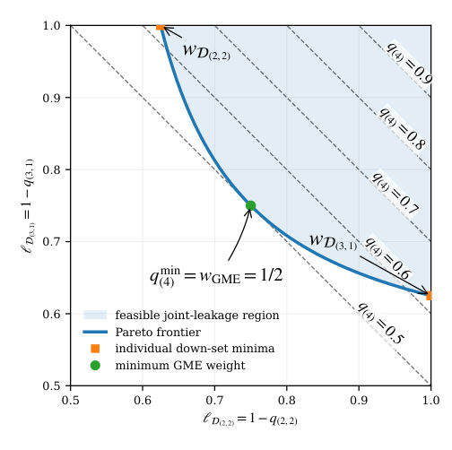 
FIG. 1. Joint-leakage geometry of ρP. The horizontal and vertical axes are ℓD(2,2) = 1 −q(2,2) and ℓD(3,1) = 1 −q(3,1), respectively. The shaded region contains all feasible leakage pairs, while the solid boundary is their Pareto frontier. Its endpoints separately minimize the two incomparable leakages, and no single decomposition attains both minima. The sym- metric point satisfies q(2,2) = q(3,1) = 1/4 and minimizes the exact-(4) weight, yielding qmin (4) = 1/2.

📷 Fig 2

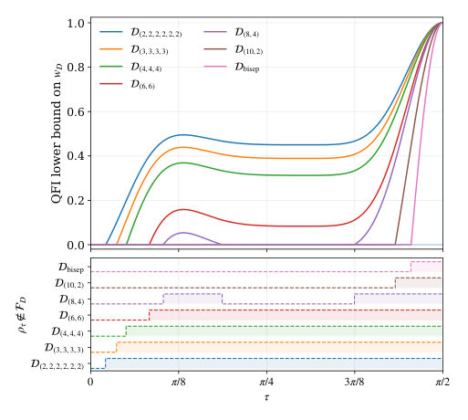 
FIG. 2. QFI lower bounds on architectural weights dur- ing ideal one-axis twisting for N = 12. The upper panel shows QFI lower bounds on the unavoidable weight outside representative down-sets, while the lower panel retains only the corresponding exclusion thresholds. At τ = π/2, the state has exact architecture (12), and every proper-down-set weight equals one.

**Summary.** This paper develops a sophisticated framework to characterize multipartite entanglement by analyzing the full 'formation profile'—a probability distribution over all possible entangled cluster structures. It shows this architecture is often a continuous set (Pareto frontier), not unique, and introduces quantitative 'architectural tail weights.' These weights can be bounded using experimentally measurable quantities like the Quantum Fisher Information, providing deep connections between abstract entanglement structure and physical certification.

**Why it may be interesting.** This work provides a rigorous, fine-grained geometric tool for quantifying entanglement structure that goes far beyond simple depth or separability criteria, offering new theoretical benchmarks for quantum resource theories relevant to quantum computation.

Detailed structure

**Main problem.** The paper addresses the limitations of characterizing multipartite entanglement using only scalar measures, aiming instead to analyze the full distribution of entangled cluster sizes in mixed states.

**Main result.** The irreducible architecture of a state is generally not unique but forms a continuous Pareto frontier, and this geometry allows for deriving quantitative lower bounds on unavoidable entanglement weights using tools like the Quantum Fisher Information.

**Method.** The authors introduce 'formation profiles' as probability distributions over Young diagrams describing pure-state decompositions. They define the irreducible architecture via the Pareto frontier of these feasible profiles.

**Model / system.** The analysis focuses on mixed quantum states $
ho$ in an $N$-partite Hilbert space, using Young diagrams ($\Lambda$) to classify entangled cluster sizes (e.g., genuine multipartite entanglement). Specific examples include four-qubit systems and one-axis-twisted states.

**Key observables.** Formation profiles $\{q_\Lambda\}$, the Pareto frontier $P(
ho)$, architectural weights $w_D(
ho)$, and lower bounds derived from Quantum Fisher Information (QFI).

**Important parameters / regimes.** The number of qubits ($N$), specific state parameters ($\alpha$ in $
ho_\alpha$), and the structure of the down-set $D$.

**Assumptions / limitations.** The analysis relies on decomposing the mixed state into a convex combination of pure states whose architectures are characterized by Young diagrams. The use of QFI assumes certain decoherence models.

**Figures summary.** Figures illustrate the joint-leakage geometry and the Pareto frontier for small systems, while others show how QFI provides quantitative lower bounds on unavoidable weights outside specific architectural classes for larger systems.

**Paper structure.** The paper builds from defining formation profiles over Young diagrams to identifying the irreducible architecture as a continuous Pareto frontier. It then develops resource-weight concepts ($w_D(
ho)$) and connects these structural measures to experimentally accessible lower bounds using convex witnesses like QFI.

Abstract

Multipartite entanglement is commonly characterized by scalar notions such as separability and entanglement depth, which do not resolve the distribution of entangled cluster sizes. For mixed states, we introduce formation profiles that assign weights to the entanglement architectures appearing in pure-state decompositions. We show that after discarding every profile that admits a strictly weaker feasible replacement, the remaining irreducible structure need not be unique: a four-qubit example exhibits a continuous family of incomparable irreducible profiles. Monotone functions of the architectures recover widely used scalar quantifiers as special cases, whereas the full profile geometry retains additional information, including the minimum weight that every decomposition must assign outside a chosen architectural class. Finally, we derive experimentally accessible bounds on these weights from convex witnesses, including the quantum Fisher information, thereby connecting detailed formation structure with practical entanglement certification.

[↑ back to top](#top)

### [Quantum Separability in Polynomial Time](http://arxiv.org/abs/2607.23773v1)

**Authors:** Giulio Malavolta  
**Type:** theory · **Category:** quantum information and computing · **PDF:** <https://arxiv.org/pdf/2607.23773v1>  
**Analysis basis:** full PDF text, analyzed in chunks
**Topic relevance:** 🔥 `entanglement & information structure` **4/5**

📷 Fig 1

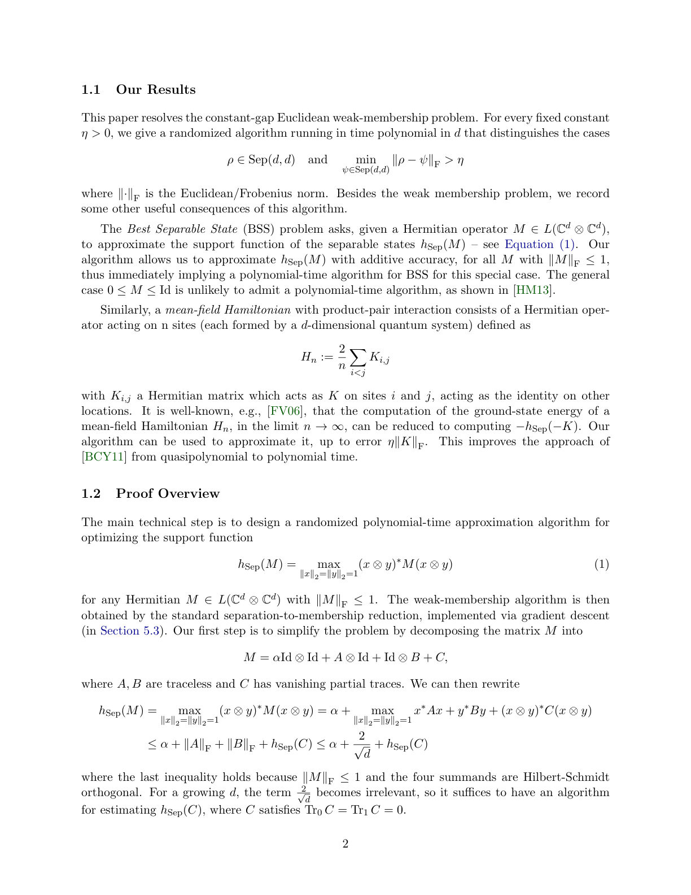 
Low-resolution page preview, page 2

📷 Fig 2

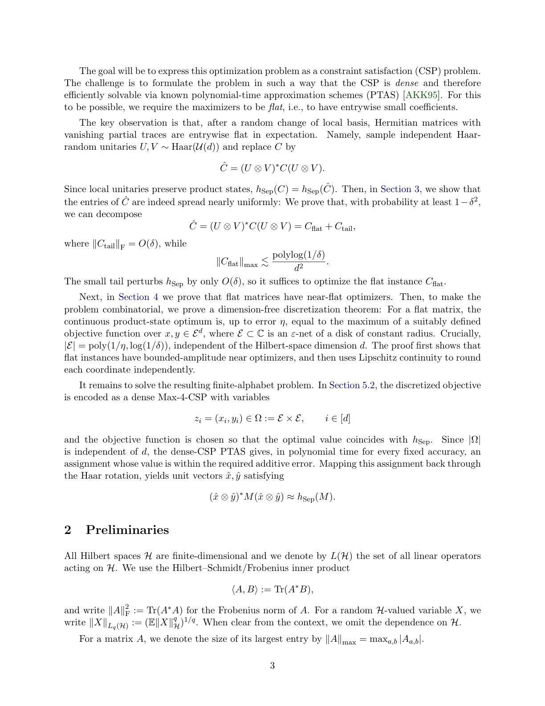 
Low-resolution page preview, page 3

📷 Fig 3

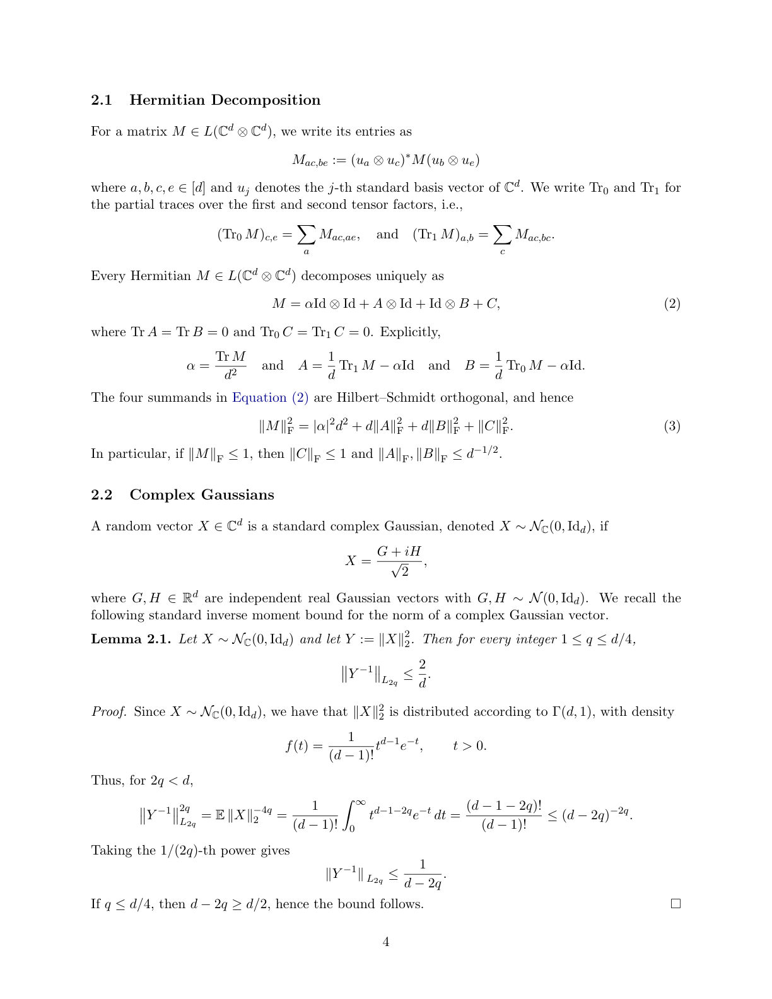 
Low-resolution page preview, page 4

📷 Fig 4

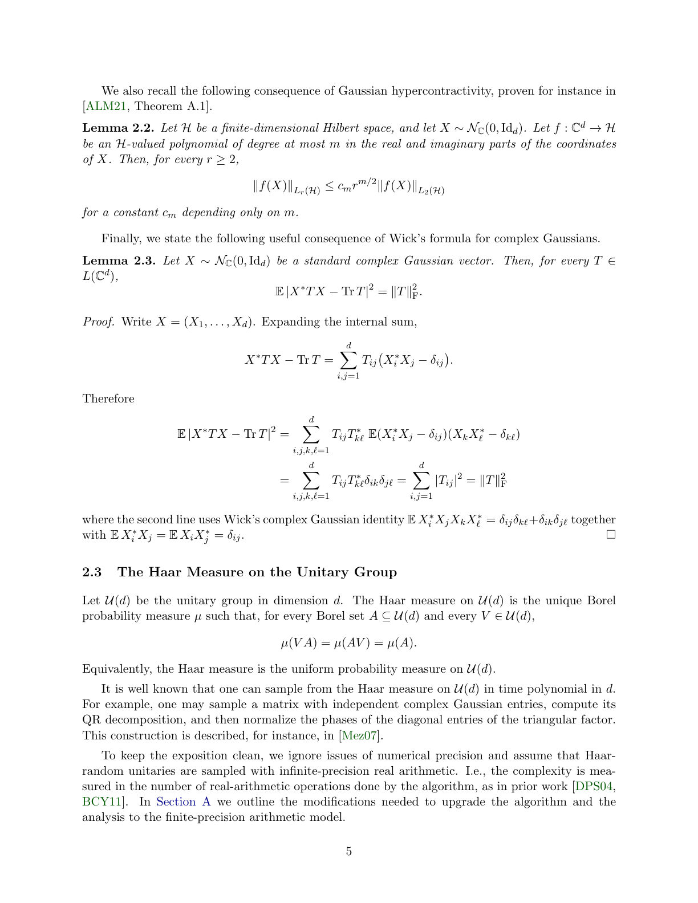 
Low-resolution page preview, page 5

📷 Fig 5

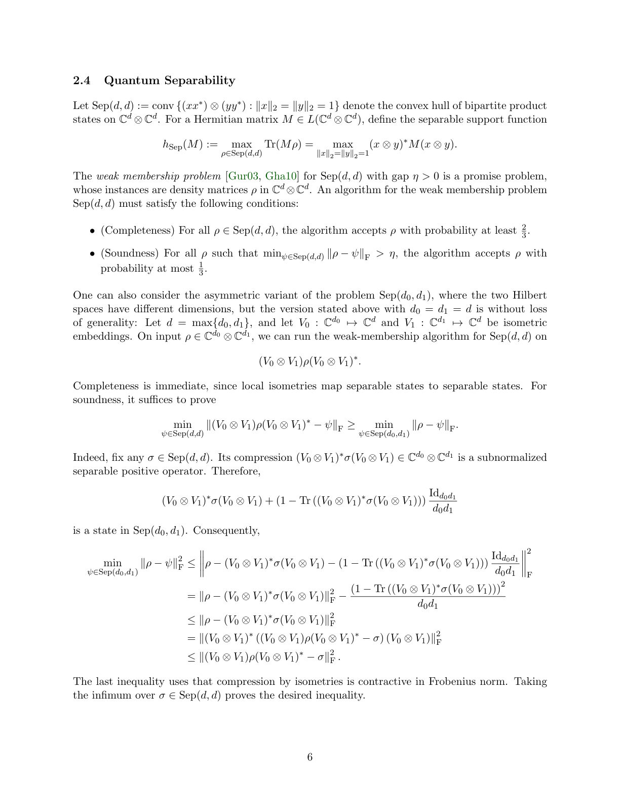 
Low-resolution page preview, page 6

**Summary.** This paper develops a randomized polynomial-time algorithm to solve the quantum separability problem for bipartite quantum systems. It achieves this by approximating the separable support function and formulating the task as solving a dense Max-4-CSP instance. This advances our computational ability to distinguish entangled states from classically correlated ones.

**Why it may be interesting.** This work provides algorithmic breakthroughs in characterizing entanglement by providing polynomial-time methods to test separability, which is fundamental for understanding quantum correlations beyond classical physics.

Detailed structure

**Main problem.** The paper addresses the quantum separability problem: determining if a bipartite density matrix is separable or $\eta$-far from the set of separable states.

**Main result.** It provides a randomized polynomial-time algorithm for solving the constant-gap Euclidean weak-membership problem for quantum separability, improving previous complexity bounds.

**Method.** The approach involves reducing the problem to approximating the separable support function $h_{	ext{Sep}}(M)$ and then encoding this approximation into a dense Max-4-CSP solvable in polynomial time using known PTAS techniques.

**Model / system.** The system is described by bipartite quantum states represented by density matrices $
ho \in L(\mathbb{C}^d \otimes \mathbb{C}^d)$. Separability is defined as membership in the convex hull of pure product states, $	ext{Sep}(d, d)$.

**Key observables.** Separability (membership in $	ext{Sep}(d, d)$), the separable support function $h_{	ext{Sep}}(M)$, and the distance from a matrix to this set.

**Important parameters / regimes.** The constant gap $\eta > 0$, the dimension $d$, and approximation parameters $	au$ and $\delta$.

**Assumptions / limitations.** The analysis assumes fixed constant gaps ($\eta$) and relies on the existence of a PTAS for dense CSPs. The general case is noted to be computationally hard.

**Paper structure.** The paper builds from defining the separability problem and its support function, developing techniques using random unitaries (Haar moments) to simplify matrix analysis, reducing the problem to a Max-4-CSP instance, and finally presenting the multi-step randomized algorithm for solving the weak membership problem.

Abstract

The quantum separability problem asks whether a bipartite density matrix is separable or is $η$-far from every separable state. We give a randomized polynomial-time algorithm for this problem for every fixed constant gap $η>0$, when distance is measured in the Euclidean norm.

[↑ back to top](#top)

### [High-order quantum correlations in nonlinear waveguide quantum electrodynamics](http://arxiv.org/abs/2607.24106v1)

**Authors:** I Gusti Ngurah Yudi Handayana, Ya-Tang Yu, C. -Y. Lee, K. -T. Lin, G. -D. Lin, H. H. Jen  
**Type:** theory · **Category:** other · **PDF:** <https://arxiv.org/pdf/2607.24106v1>  
**Analysis basis:** full PDF text, analyzed in chunks
**Topic relevance:** `analog quantum simulation` **3/5** · `correlated / nonlocal dissipation` **3/5** · `correlated cavity matter` **3/5** · `driven-dissipative phase transition` **3/5** · `entanglement & information structure` **3/5** · `methods for driven-dissipative` **3/5** · `Tavis-Cummings & cavity-many-emitter` **2/5** · `non-equilibrium dynamics` **2/5** · `non-equilibrium universality` **2/5** · `Keldysh / 2PI / non-Gaussian methods` **1/5** · `exotic spin models in light-matter` **1/5** · `interference shaping light` **1/5**

📷 Fig 1

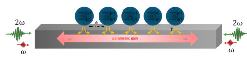 
FIG. 1. Schematic of an array of N two-level emitters coupled to a nonlinear one-dimensional waveguide. Each emitter has ground state |g⟩, excited state |e⟩, and transition frequency ω0. The emit- ters couple to the guided-mode continuum, giving rise to the guided decay rate γ under the Markov approximation. A classical pump at frequency ωp ≃2ω induces broadband parametric gain for guided field fluctuations around the signal frequency ω. The dimensionless interatomic distance is ϕ = k0∆x, where k0 is the guided-mode wavenumber evaluated at the emitter transition frequency and ∆x is the nearest-neighbor distance.

📷 Fig 2

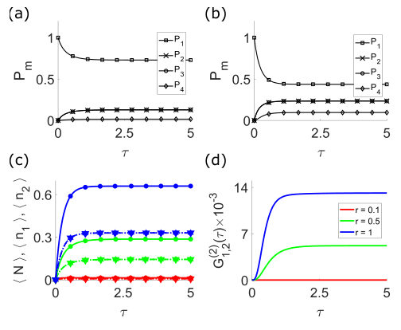 
FIG. 2. Dynamics of a two-emitter system coupled to a nonlin- ear waveguide. (a) and (b) show the state populations Pm(t) = ⟨m|ρ(t)|m⟩for (a) r = 0.5 and (b) r = 1, using the ordered ba- sis {|m⟩} = {|gg⟩, |eg⟩, |ge⟩, |ee⟩}. The black curves with square, cross, circle, and diamond markers denote P1, P2, P3, and P4, re- spectively. (c) shows the total excitation number ⟨N⟩and the site populations ⟨n1⟩and ⟨n2⟩for r = 0.1, 0.5, and 1, shown in red, green, and blue, respectively. For each r, solid, dashed, and dot- ted curves denote ⟨N⟩, ⟨n1⟩, and ⟨n2⟩, respectively. (d) shows the connected second-order correlation, G(2) 1,2(τ), using the same color convention as in (c). Here, τ = γrt is the...

📷 Fig 3

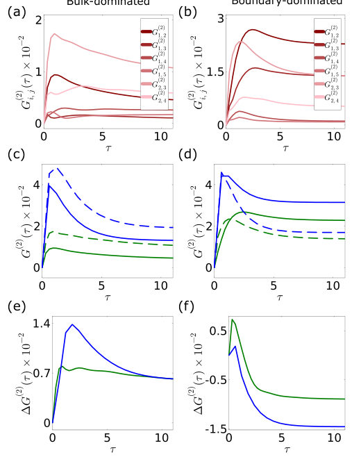 
FIG. 3. Dynamics of the connected second-order correlations for N = 5. (a) and (b) show the time evolution of the representative pair correlations G(2) i,j (τ) for r = 0.5. The representative pairs are selected according to the mirror symmetry of the array. (c) and (d) focus on the near-boundary and bulk nearest-neighbor correlations, defined as G(2) bd (τ) ≡G(2) 1,2(τ) and G(2) bk (τ) ≡G(2) 2,3(τ), respectively.

📷 Fig 4

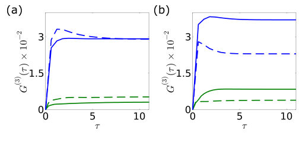 
FIG. 4. Dynamics of the connected third-order correlations. (a) and (b) show the time evolution of the near-boundary and bulk third-order correlations for the same parameter regimes used in Fig. 3. The near- boundary and bulk correlations are defined as G(3) bd (τ) ≡G(3) 1,2,3(τ)

📷 Fig 5

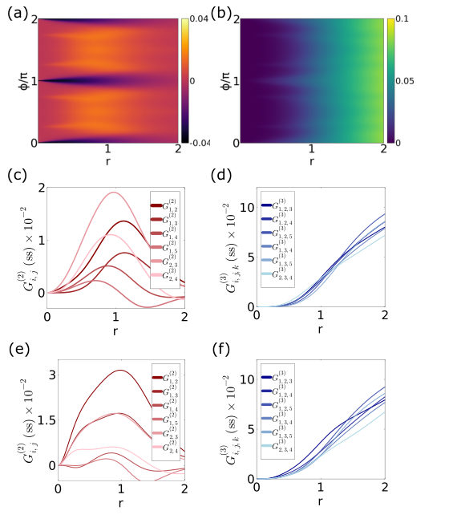 
FIG. 5. Steady-state connected correlations for N = 5. (a) and (b) show heatmaps of the system-averaged second- and third-order steady-state correlations, G(2) all (ss) and G(3) all (ss), respectively, in the (r, ϕ) parameter space. (c) and (d) display representative steady- state correlations G(2) i,j (ss) and G(3) i,j,k(ss) as functions of r for ϕ = π/6, corresponding to the bulk-dominated local regime in Fig. 3. (e) and (f) show the corresponding steady-state correlations for ϕ = π/4, corresponding to the boundary-dominated local regime. The remaining parameters are the same as in Fig. 3.

**Summary.** This paper explores the generation and spatial control of high-order quantum correlations in an array of emitters coupled to a nonlinear waveguide. By analyzing second- and third-order connected correlations using an effective master equation, the authors show that tuning emitter spacing allows for switching between bulk and boundary correlation dominance. This establishes nonlinear waveguide QED as a versatile platform for engineering complex quantum states.

**Why it may be interesting.** This work directly addresses correlation engineering in open quantum optical arrays, providing concrete mechanisms (via nonlinear coupling and geometry) to manipulate higher-order quantum statistics.

Detailed structure

**Main problem.** The study investigates how high-order quantum correlations (second- and third-order) are generated and controlled in an array of emitters coupled to a nonlinear waveguide.

**Main result.** The research demonstrates that the system allows for tunable spatial control over connected quantum correlations by manipulating interparticle distance, and shows strong enhancement of third-order correlations with increasing squeezing.

**Method.** The analysis employs an effective master equation derived from nonlinear waveguide QED to track transient and steady-state correlation functions.

**Model / system.** The system consists of $N$ two-level emitters coupled linearly to a one-dimensional, parametrically driven nonlinear waveguide. The dynamics are governed by an effective master equation incorporating excitation exchange and squeezing-induced pair terms.

**Key observables.** Second-order and third-order connected correlations ($G^{(2)}, G^{(3)}$), local boundary–bulk contrast in correlations.

**Important parameters / regimes.** Squeezing parameter ($r$), nearest-neighbor distance ($\Delta x$), interparticle distance, and the number of emitters ($N$).

**Assumptions / limitations.** The analysis assumes an ideal guided-mode limit for the waveguide and focuses on the pure squeezing-accumulation regime.

**Figures summary.** Figure 1 schematically illustrates $N$ emitters coupled to a nonlinear waveguide, highlighting how near-boundary correlations arise from asymmetric contributions versus balanced bulk contributions.

**Paper structure.** The paper develops the effective master equation for the system, analyzes the two-emitter limit as a benchmark, and then extends the analysis to many-emitter arrays to show spatial control over local correlations by tuning interparticle distance.

Abstract

Quantum emitters coupled to nonlinear one-dimensional waveguides provide a route for quantum-state engineering by utilizing parametric gain accumulation along with modified waveguide-mediated interactions. Since the accumulated squeezing depends on propagation distance, different emitter separations can experience different effective gain, making the spatial structure of connected quantum correlations a central feature of the dynamics. Here we investigate the transient and steady-state connected correlations of emitter arrays coupled to a parametrically driven waveguide. Using an effective master equation for nonlinear waveguide QED, we analyze second- and third-order connected correlations as functions of the squeezing parameter and interparticle distance. In the two-emitter limit, accumulated squeezing drives excitation buildup and generates a nonzero connected second-order correlation. For many-emitter arrays, tuning the interparticle distance switches the dominant local second-order correlation between the bulk and boundary regions, and enables an analogous spatial control of genuine third-order connected correlations. In the steady state, the averaged second-order correlation exhibits sign-changing and nonmonotonic behavior in the squeezing--interparticle distance parameter space, whereas the third-order connected correlation is strongly enhanced by increasing the squeezing parameter. These results identify nonlinear waveguide QED as a tunable platform for spatially controlling connected quantum correlations and provide insights into correlation engineering in open quantum optical arrays. We further show that this local contrast remains visible in both odd and even number of atomic arrays.

[↑ back to top](#top)

### [Thermal Quantum Correlations in Coupled Andreev Spin Qubits: Interplay of Superconducting Phase and Spin-Orbit Interaction](http://arxiv.org/abs/2607.24521v1)

**Authors:** Mohammad Reza Pourkarimi, Mina Shiri, Mehdi Monemi, Vadim Ohanyan  
**Type:** theory · **Category:** quantum information and computing · **PDF:** <https://arxiv.org/pdf/2607.24521v1>  
**Analysis basis:** full PDF text, analyzed in chunks
**Topic relevance:** `entanglement & information structure` **3/5** · `exotic spin models in light-matter` **3/5** · `spintronics-quantum-optics interface` **3/5** · `analog quantum simulation` **2/5** · `correlated / nonlocal dissipation` **2/5** · `driven-dissipative phase transition` **2/5** · `methods for driven-dissipative` **2/5** · `non-equilibrium dynamics` **2/5** · `Keldysh / 2PI / non-Gaussian methods` **1/5** · `Kondo & dissipative impurity` **1/5** · `QC/QI experiment` **1/5** · `non-equilibrium universality` **1/5**

📷 Fig 1

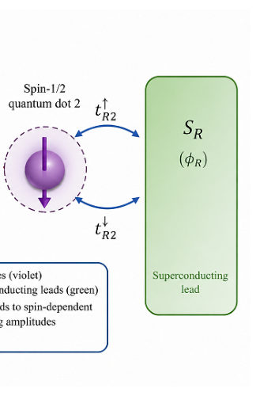 
Figure 1. Schematic illustration of two coupled superconducting spin qubits formed by spin-1/2 quantum dots connected to superconducting leads SL and SR with phases ϕL and ϕR. The tunneling amplitudes between the quantum dots and the superconducting leads are denoted by tjn. Due to the presence of spin–orbit interaction (SOI), the tunneling processes become spin dependent and may involve spin-flip transitions. The superconducting phase difference φ = ϕL −ϕR controls the effective interaction between the qubits and plays a central role in the generation of quantum correlations.

📷 Fig 2

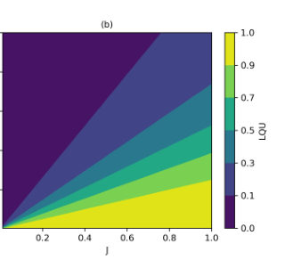 
Figure 2. (a) Local quantum Fisher information (LQFI) and (b) local quantum uncertainty (LQU) versus T and J for α = φ = π/8.

📷 Fig 3

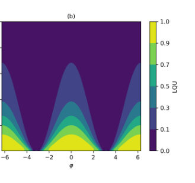 
Figure 3. (a) Local quantum Fisher information (LQFI) and (b) local quantum uncertainty (LQU) versus φ and T for α = π/8 and J = 0.5.

📷 Fig 4

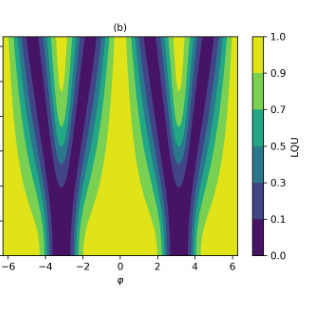 
Figure 4. (a) Local quantum Fisher information (LQFI) and (b) local quantum uncertainty (LQU) versus φ and α for J = 0.5 and T = 0.1.

📷 Fig 5

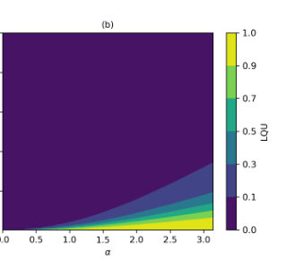 
Figure 5. (a) Local quantum Fisher information (LQFI) and (b) local quantum uncertainty (LQU) versus α and T for φ = π and J = 0.5.

**Summary.** This paper analyzes thermal quantum correlations within coupled Andreev spin qubits, using LQFI and LQU to quantify nonclassical properties. The research reveals that while temperature degrades these correlations, strong coupling effects and phase engineering can protect them by increasing the system's energy gap. It provides crucial insights into designing robust superconducting quantum devices.

**Why it may be interesting.** This work is highly relevant as it bridges superconducting circuit physics with fundamental quantum information theory by quantifying resource protection mechanisms (correlations) in a realistic solid-state platform.

Detailed structure

**Main problem.** The study investigates how thermal quantum correlations behave in coupled Andreev spin qubits, specifically analyzing the interplay between superconducting phase difference and spin-orbit interaction.

**Main result.** Quantum correlations decrease with temperature but are enhanced by stronger tunneling and spin-orbit coupling. The superconducting phase introduces periodic modulation of couplings, and correlation enhancement correlates with an increased energy gap.

**Method.** The authors use Local Quantum Fisher Information (LQFI) and Local Quantum Uncertainty (LQU) as quantitative measures for quantum correlations, deriving analytical expressions for the thermal density matrix to evaluate these quantities.

**Model / system.** The system is modeled by two coupled Andreev spin qubits described by an effective Hamiltonian. The physical setup involves superconducting leads connected to the qubits, leading to complex exchange couplings dependent on the superconducting phase difference.

**Key observables.** Local Quantum Fisher Information (LQFI), Local Quantum Uncertainty (LQU), and the energy gap between the ground and first excited states.

**Important parameters / regimes.** Superconducting phase difference ($\varphi$), tunneling amplitude, spin-orbit coupling strength, and temperature ($T$).

**Assumptions / limitations.** The analysis relies on obtaining analytical expressions for the thermal density matrix and comparing LQFI vs. LQU in the context of the Andreev Hamiltonian.

**Figures summary.** Figure 1 schematically illustrates two coupled superconducting spin qubits connected to leads with phases $\phi_L$ and $\phi_R$.

**Paper structure.** The paper introduces the physical model (coupled Andreev qubits) and then applies advanced quantum information measures (LQFI, LQU) derived from the thermal density matrix to systematically analyze how various external parameters modulate these nonclassical correlations.

Abstract

We investigate thermal quantum correlations in a system of two coupled superconducting spin qubits described by an effective Andreev spin-qubit Hamiltonian in the presence of spin-orbit interaction. Using Local Quantum Fisher Information (LQFI) and Local Quantum Uncertainty (LQU) as quantum-correlation quantifiers, we analyze the effects of the superconducting phase difference, tunneling amplitude, spin-orbit coupling, and temperature on the nonclassical properties of the system. Analytical expressions for the thermal density matrix are obtained and employed to evaluate both quantities. Our results show that quantum correlations decrease monotonically with increasing temperature, while stronger tunneling and spin-orbit interaction significantly enhance their robustness. Moreover, the superconducting phase introduces a pronounced periodic behavior through the modulation of the effective exchange couplings, leading to constructive and destructive interference regimes that strongly influence the correlations. By analyzing the energy spectrum of the effective Hamiltonian, we demonstrate that the enhancement of quantum correlations is closely associated with an increased energy gap between the ground and first excited states, which suppresses thermal excitations and stabilizes the correlated ground state. Furthermore, LQFI is consistently larger than LQU throughout the investigated parameter space, reflecting its higher sensitivity to quantum fluctuations and local parameter estimation. These findings reveal the microscopic mechanism governing thermal quantum correlations in Andreev spin qubits and highlight the important roles of phase engineering, spin-orbit interaction, and tunneling in protecting quantum resources in hybrid superconducting quantum devices.

[↑ back to top](#top)

### [Finite-Time Optomechanical Cooling by Multi-Exceptional-Point Braiding](http://arxiv.org/abs/2607.23179v1)

**Authors:** Borhan Ahmadi  
**Type:** theory · **Category:** other · **PDF:** <https://arxiv.org/pdf/2607.23179v1>  
**Analysis basis:** full PDF text, analyzed in chunks
**Topic relevance:** `correlated cavity matter` **3/5** · `driven-dissipative phase transition` **3/5** · `methods for driven-dissipative` **3/5** · `analog quantum simulation` **2/5** · `correlated / nonlocal dissipation` **2/5** · `non-equilibrium dynamics` **2/5** · `non-equilibrium universality` **2/5** · `Keldysh / 2PI / non-Gaussian methods` **1/5** · `Tavis-Cummings & cavity-many-emitter` **1/5** · `quantum measurements` **1/5**

📷 Fig 1

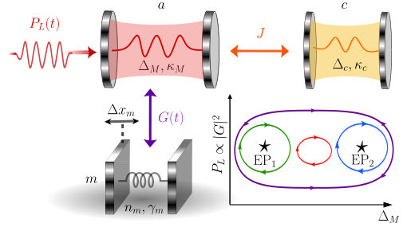 
FIG. 1: Schematic of the auxiliary-cavity-assisted op- tomechanical system and its control topology. A laser with power PL(t) drives the main optical cavity mode a, whose detuning ∆M and linewidth κM are indicated. The mechanical mode m is represented as a movable end mir- ror with displacement ∆xm, and is coupled to the main cavity through the drive-enhanced optomechanical inter- action G(t); its occupation and damping rate are nm and γm, respectively. The main cavity is also coupled, with hopping amplitude J, to a lossy auxiliary cavity mode c, characterized by detuning ∆c and linewidth κc. The inset shows the control plane spanned by ∆M and PL ∝|G|2. The two marked points are the exact...

📷 Fig 2

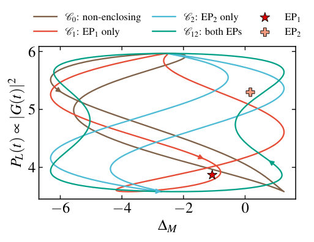 
FIG. 2: Optimized control-plane trajectories under the common prescribed power waveform PL(t) ∝|G(t)|2. The four paths belong to the non-enclosing class C0, the single-EP classes C1 and C2, and the two-EP class C12. The markers indicate the two exact exceptional points of the full three-mode drift, while the arrows show the direction of traversal.

📷 Fig 3

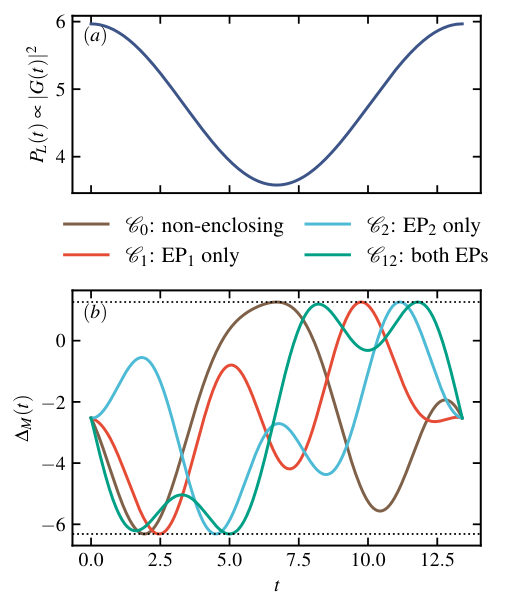 
FIG. 3: Matched control resources for the four topo- logical classes. (a) Common prescribed power waveform PL(t) ∝|G(t)|2, which is identical at every instant for C0, C1, C2, and C12. (b) Optimized K = 3 detuning wave- forms. All protocols have the same duration, endpoint, minimum and maximum detuning, mean detuning, and integrated detuning-control effort. The horizontal dotted lines mark the common bounds ∆min M = −6.315335 and ∆max M = 1.263067.

📷 Fig 4

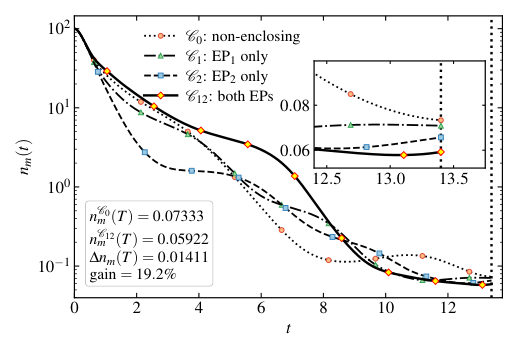 
FIG. 4: Finite-time cooling for the four topological classes under an identical prescribed power waveform and matched detuning resources. The mechanical occupa- tion nm(t) is obtained from the full three-mode covari- ance dynamics, and the inset magnifies the completed- loop endpoint on a linear scale. At T = 13.4, the non- enclosing, single-EP1, single-EP2, and two-EP trajecto- ries give nm(T) = 0.073328, 0.070920, 0.065701, and 0.059218, respectively. The two-EP trajectory therefore lowers the final occupation by 19.2% relative to the op- timized non-enclosing trajectory. The parameters are: ∆c = 1, κM = 10, κc = 0.5, γm = 10−3, and J = 1, with nth M = nth c = 0, nth m = 100, and N(0) =...

**Summary.** The paper shows that by designing the time evolution path in the detuning-power plane to braid around two exceptional points, one can significantly enhance finite-time optomechanical cooling. This topological control method outperforms protocols based on single EPs or simple closed loops, establishing EP braiding as a powerful resource for quantum state engineering.

**Why it may be interesting.** This work provides a concrete example of how geometric control in parameter space (topological invariants like EP braiding) can be leveraged as a controllable resource to achieve superior quantum state preparation compared to standard optimization techniques.

Detailed structure

**Main problem.** The study demonstrates that controlling the system's evolution by braiding around multiple exceptional points (EPs) can significantly enhance finite-time cooling in an optomechanical setup.

**Main result.** Traversing a path that encloses two EPs yields the lowest final mechanical occupation, outperforming single-EP enclosures and non-enclosing paths by significant margins.

**Method.** The authors optimize the detuning trajectory ($\Delta_M(t)$) while keeping the drive power fixed, comparing protocols based on their topological winding numbers around the EPs.

**Model / system.** The system is an auxiliary-cavity-assisted optomechanical setup modeled by a full three-mode linearized Bogoliubov dynamics. The dynamics are governed by the evolution of the covariance matrix or the Bogoliubov vector, incorporating coupling between mechanical and optical modes.

**Key observables.** Final mechanical occupation $n_m(T)$ (the primary cooling metric); topological winding numbers ($
u_D$) characterizing the control path.

**Important parameters / regimes.** Fixed drive power resource; detuning trajectory $\Delta_M(t)$; presence of two distinct exceptional points (EP1 and EP2).

**Assumptions / limitations.** The comparison is made fair by matching shared resources like total duration, mean detuning, and integrated control effort across all topological classes.

**Figures summary.** Figures illustrate the optimized control-plane trajectories in the $(\Delta_M, P_L)$ plane for different winding numbers (C0, C1, C2, C12) and compare the resulting mechanical occupation $n_m(T)$ across these paths.

**Paper structure.** The paper establishes the physical model, defines the control parameter space using EPs, optimizes detuning trajectories based on topological enclosure, and finally compares the resultant cooling performance (mechanical occupation) under both RWA and full Bogoliubov treatments.

Abstract

Cooling protocols are usually optimized through static detunings and damping rates. Here we show that exceptional-point braiding can enhance finite-time optomechanical cooling under a fixed drive-power resource. We consider an auxiliary-cavity-assisted optomechanical system whose full three-mode drift contains two second-order exceptional points. Using the same prescribed power waveform for every protocol, we optimize only the detuning trajectory while matching its duration, endpoint, range, mean, and integrated control effort. Encircling either exceptional point produces a distinct pairwise eigenbranch exchange, whereas enclosing both generates a three-branch spectral cycle. The optimized two-EP trajectory lowers the final mechanical occupation by \(19.2\%\) relative to the optimized non-enclosing class and by \(9.9\%\) relative to the best single-EP protocol. A full Bogoliubov calculation including counter-rotating Stokes processes preserves this hierarchy. These results establish multi-exceptional-point braiding as a controllable resource for finite-time mechanical state preparation.

[↑ back to top](#top)

### [Non-classical photon statistics in frequency-modulated double quantum dot cavity systems](http://arxiv.org/abs/2607.24067v1)

**Authors:** T. Mihaescu, A. Isar, M. A. Macovei  
**Type:** theory · **Category:** other · **PDF:** <https://arxiv.org/pdf/2607.24067v1>  
**Analysis basis:** full PDF text, analyzed in chunks
**Topic relevance:** `analog quantum simulation` **3/5** · `correlated cavity matter` **3/5** · `Tavis-Cummings & cavity-many-emitter` **2/5** · `driven-dissipative phase transition` **2/5** · `methods for driven-dissipative` **2/5** · `non-equilibrium dynamics` **2/5** · `Keldysh / 2PI / non-Gaussian methods` **1/5** · `correlated / nonlocal dissipation` **1/5** · `entanglement & information structure` **1/5** · `interference shaping light` **1/5** · `non-equilibrium universality` **1/5** · `spintronics-quantum-optics interface` **1/5**

📷 Fig 1

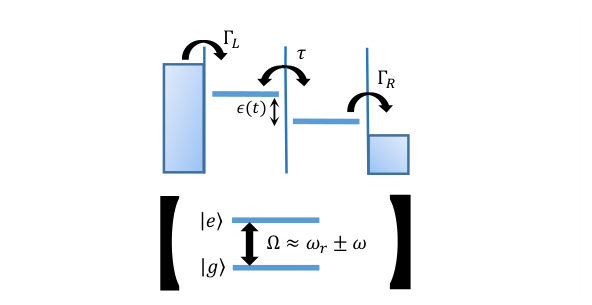 
Figure 1: Schematic picture of the system. The resonator frequency 𝜔𝑟is being near resonance with the modulated DQD frequency Ω. Electron’s tunnelling processes are illustrated by solid arrows.

📷 Fig 2

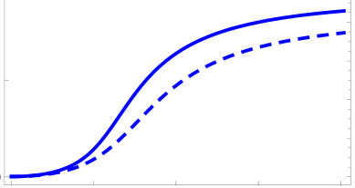 
Figure 2: The steady-state cavity mean photon number ⟨𝑚⟩= ⟨𝑎†𝑎⟩as a function of 𝑔𝑟∕𝜔. Here, 𝜏∕𝜖= 0.2, 𝜔∕𝜖= 0.1, 𝜖0∕(2𝜔) = 0.3, Γ𝐿∕𝜔= Γ𝑅∕𝜔= 0.03, 𝜅∕𝜔= ̃𝜅∕𝜔= 10−3, ℏ𝜖∕(𝑘𝐵𝑇) = 5, and ̄𝑛𝑟= 0.019. The solid line is plotted for Γ∕𝜔= 0, while the dashed one for Γ∕𝜔= 0.02, respectively.

📷 Fig 3

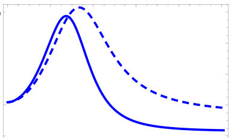 
Figure 3: The steady-state behaviour of the Fano’s factor 𝐹as a function of 𝑔𝑟∕𝜔. The involved parameters are as in Fig. (2).

📷 Fig 4

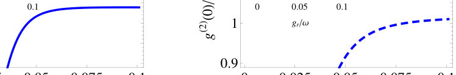 
Figure 4: The ratio of the steady-state values of correlation functions 𝑔(2)(0)∕𝑔(3)(0) as a function of 𝑔𝑟∕𝜔, for (a) Γ∕𝜔= 0 while (b) Γ∕𝜔= 0.02, respectively. The inset shows the corresponding steady-state behaviour of the second-order photon- photon correlation function. The other involved parameters are as in Fig. (2).

**Summary.** The paper theoretically models a double quantum dot coupled to a microwave resonator to study photon emission. By analyzing the system's dynamics using master equations, the authors demonstrate that single photons exhibiting sub-Poissonian statistics can be generated. This work is significant for realizing solid-state sources of non-classical light for quantum technologies.

**Why it may be interesting.** This work directly addresses quantum light sources in solid-state platforms (DQD/cavity), which is central to cavity QED and quantum optics research, demonstrating control over non-classical light generation.

Detailed structure

**Main problem.** The study investigates the generation of non-classical photon statistics from quantum electron transport within a double quantum dot coupled to a microwave resonator.

**Main result.** The system can generate an output cavity field exhibiting sub-Poissonian quantum photon statistics, indicating single-photon emission. This feature is robust and tunable by modulating the qubit frequency.

**Method.** The dynamics are analyzed using master equations derived under Born–Markov approximations to eliminate environmental degrees of freedom.

**Model / system.** The system consists of a double quantum dot (DQD) two-level emitter coupled to a single-mode leaking microwave resonator. The DQD is driven by a time-dependent field, and the total dynamics include coupling to electronic leads, phonon baths, and the cavity mode.

**Key observables.** Sub-Poissonian photon statistics quantified by the Fano's factor ($F < 1$) or second/third-order correlation functions ($g^{(2)}(0) < 1$).

**Important parameters / regimes.** Strong Coulomb interaction limit, weak couplings to reservoirs, and resonance conditions between cavity and modulated qubit frequencies ($\omega_r \approx \Omega$).

**Assumptions / limitations.** The analysis relies on Born–Markov approximations; the system is analyzed in the strong coupling and weak reservoir limits.

**Figures summary.** Figures illustrate the schematic coupling (Fig. 1), show how mean photon number saturates (Fig. 2), confirm sub-Poissonian statistics via Fano's factor ($F < 1$) (Fig. 3), and analyze correlation function ratios $g^{(2)}(0)/g^{(3)}(0)$ (Fig. 4).

**Paper structure.** The paper first sets up the full Hamiltonian, then derives a master equation using Born-Markov approximations to account for various environmental couplings. Finally, it calculates steady-state expectation values and correlation functions to diagnose photon statistics.

Abstract

The quantum dynamics of a double quantum dot two-level system, coupled to a leaking microwave resonator mode, is theoretically investigated. The double quantum dot is driven by applying a continuous field giving rise to time-dependent modulations of its energy separation between the ground levels of each dot, forming the qubit. Therefore, the cavity resonances occur when the difference between the resonator and the qubit frequencies equals the multiple of the modulation frequency, respectively. In the strong Coulomb interaction limit and the weak couplings of the combined system, i.e. the qubit and the single-mode cavity, to corresponding electronic, phononic or photonic reservoirs, we have demonstrated that the output cavity electromagnetic field is formed of a single-photon flux obeying the sub-Poissonian quantum photon statistics. This was proved via Fano's factor behaviour or by comparing the resonator's second- and third-order photon correlation functions, respectively. The phonon, the cavity mode dephasing or the environmental temperatures influence on the quantum properties of the photons are also discussed.

[↑ back to top](#top)

### [Autonomous Physical Computation: A Categorical Closure Criterion for Physical and Neuromorphic Reservoirs](http://arxiv.org/abs/2607.23902v1)

**Authors:** Nima Dehghani  
**Type:** theory · **Category:** disordered systems and neural networks · **PDF:** <https://arxiv.org/pdf/2607.23902v1>  
**Analysis basis:** full PDF text, analyzed in chunks
**Topic relevance:** `driven-dissipative phase transition` **3/5** · `methods for driven-dissipative` **3/5** · `non-equilibrium dynamics` **3/5** · `non-equilibrium universality` **2/5** · `Frenkel-Kontorova` **1/5** · `Keldysh / 2PI / non-Gaussian methods` **1/5** · `analog quantum simulation` **1/5** · `correlated / nonlocal dissipation` **1/5** · `correlated cavity matter` **1/5** · `entanglement & information structure` **1/5** · `quantum measurements` **1/5** · `scars & prethermalization` **1/5**

📷 Fig 1

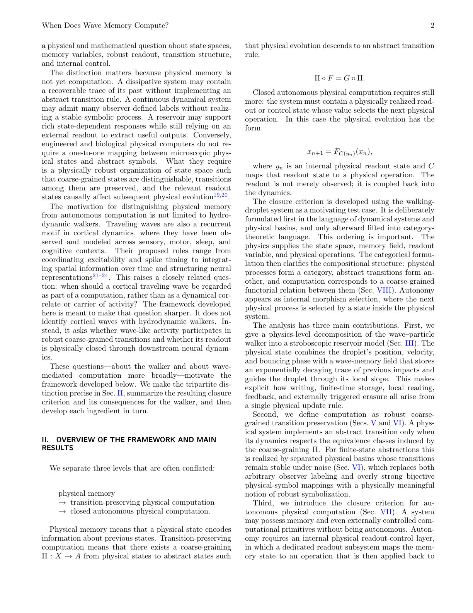 
Low-resolution page preview, page 2

📷 Fig 2

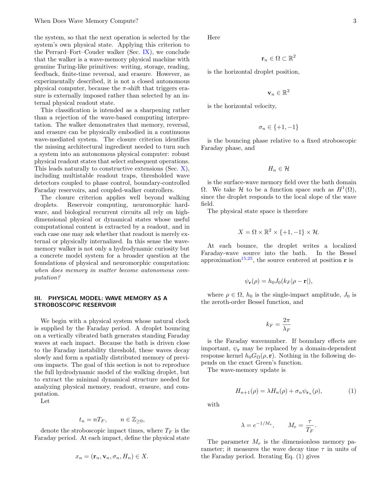 
Low-resolution page preview, page 3

📷 Fig 3

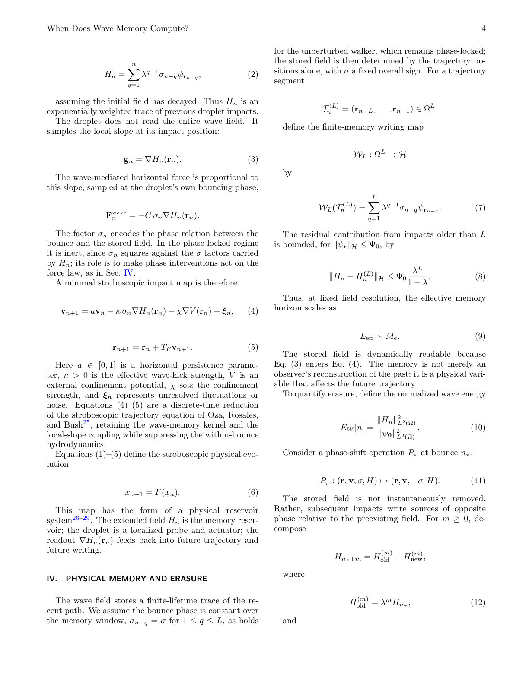 
Low-resolution page preview, page 4

📷 Fig 4

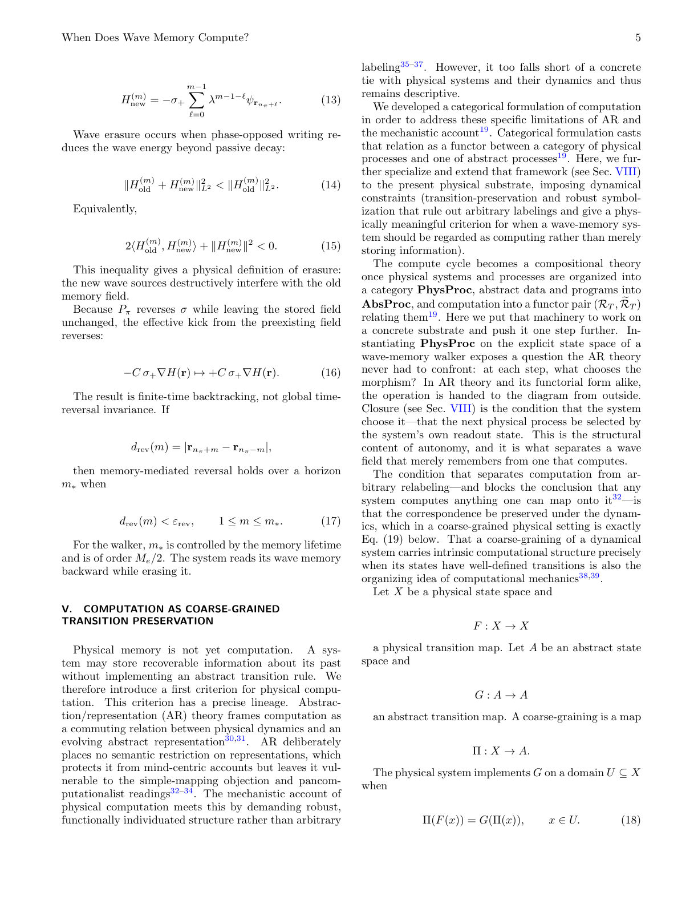 
Low-resolution page preview, page 5

📷 Fig 5

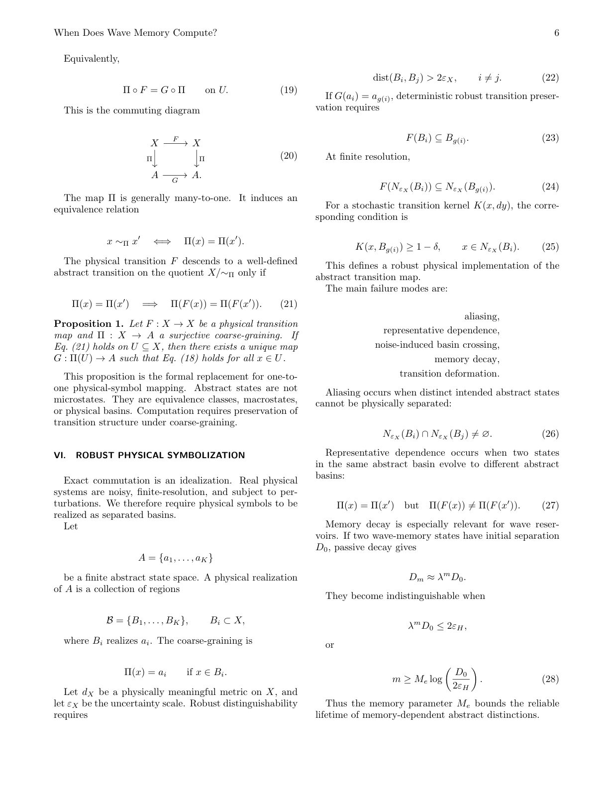 
Low-resolution page preview, page 6

**Summary.** The paper establishes a formal 'closure criterion' to distinguish between passive memory storage and active autonomous computation in physical systems like wave-mediated walkers. It argues that autonomy requires the system's internal readout state to actively select subsequent operations, closing the control loop. This framework provides design principles for building truly self-governing computational devices from physical dynamics.

**Why it may be interesting.** This work provides a highly formalized framework linking physical dynamics (wave fields, reservoirs) to abstract computational concepts (Turing primitives), which is relevant for understanding computation in complex open quantum systems or engineered solid-state memories.

Detailed structure

**Main problem.** The core problem is defining a rigorous criterion for when a physical system with memory and feedback achieves true autonomous computation, distinguishing it from mere dynamical storage.

**Main result.** Autonomous computation requires an internal readout state to select the next operation, forming a closed loop that couples the readout back into the dynamics. The wave-particle walker demonstrates primitives but fails autonomy because its erasure phase is externally imposed.

**Method.** The authors develop formal criteria based on coarse-grained transition preservation ($\Pi \circ F = G \circ \Pi$) and propose constructive architectural extensions to enforce internal control selection.

**Model / system.** The primary model is the wave–particle walker, simulated using a stroboscopic reservoir state $x_n$ involving droplet positions, velocities, and an exponentially decaying surface-wave memory field ($H_n$).

**Key observables.** Robust coarse-grained transition preservation, basin separation ($	ext{dist}(B_i, B_j)$), and the ability of the readout state to select subsequent operations.

**Important parameters / regimes.** Memory decay factor ($\lambda$), effective memory horizon ($L_{	ext{eff}}$), and noise/barrier height ratios for assessing robustness.

**Assumptions / limitations.** The analysis assumes that computation can be mapped onto robust, distinguishable physical basins in the state space to preserve abstract transition structure.

**Paper structure.** The paper progresses by first defining memory and basic primitives (writing/reading) using the wave walker. It then introduces the formal criterion for computation via transition preservation. Finally, it develops and analyzes several constructive architectures to enforce an internal readout-control loop necessary for true autonomy.

Abstract

Physical reservoirs, neuromorphic devices, and wave-mediated systems often possess memory, feedback, and rich state-dependent dynamics, but these properties do not by themselves establish autonomous computation. Here we develop a closure criterion for autonomous physical computation, motivated by the wave--particle walker. We formulate the walker as a stroboscopic reservoir with state, where the wave field stores an exponentially decaying trace of previous droplet impacts and guides future motion through local slope coupling. This model separates physical writing, storage, reading, feedback, and externally triggered erasure. We then define computation as robust coarse-grained transition preservation: a physical map implements an abstract transition only when a coarse-graining satisfies compositionality, with abstract states realized by separated physical basins and transitions stable under noise. Autonomous physical computation requires a further closure condition: an internal physical readout state must select the next physical operation. This criterion classifies the wave--particle walker as a wave-memory machine with genuine Turing-like primitives, but not as a closed autonomous physical computer, because the erasing phase shift is externally imposed. The framework turns this distinction into a design principle: memory becomes autonomous computation when physical readout basins are coupled back to operation selection.

[↑ back to top](#top)

### [Chiral thermal fluctuations and enhanced refrigeration in a nonreciprocal nanomechanical system](http://arxiv.org/abs/2607.24209v1)

**Authors:** Jesse J. Slim, Javier del Pino, Sander A. Mann, Ewold Verhagen  
**Type:** experiment · **Category:** statistical mechanics · **PDF:** <https://arxiv.org/pdf/2607.24209v1>  
**Analysis basis:** full PDF text, analyzed in chunks
**Topic relevance:** `correlated / nonlocal dissipation` **3/5** · `driven-dissipative phase transition` **3/5** · `methods for driven-dissipative` **3/5** · `non-equilibrium dynamics` **3/5** · `analog quantum simulation` **2/5** · `non-equilibrium universality` **2/5** · `Keldysh / 2PI / non-Gaussian methods` **1/5** · `entanglement & information structure` **1/5** · `quantum optics experiment` **1/5**

📷 Fig 1

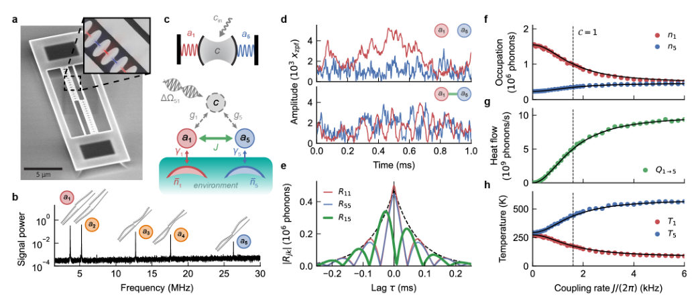 
FIG. 1. Imaging heat flows in a nano-optomechanical cavity. (a) Experimental setup consisting of a sliced nanobeam nanocavity coupled to multiple mechanical modes. (b) Its thermomechanical spectrum reveals multiple optomechanically active modes (‘resonators’) that span a synthetic dimension. Flexural mode profiles of the first five modes are shown. (c) Resonators are coupled to a room-temperature bath at rates γj and can be optically coupled via time-modulated radiation pressure. This couples resonators with different frequency Ωj and corresponding bath occupancy nth j . Experiments in this figure concern a ‘hot’ resonator a1 with frequency Ω1/(2π) = 3.66 MHz, decay rate γ1/(2π) = 1.5 kHz,...

📷 Fig 2

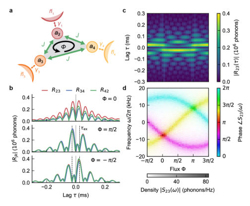 
FIG. 2. Chiral thermal fluctuations in a nanomechani- cal loop. (a) Three resonators a2, a3, a4 form a loop (coupling strength J/(2π) = 7.5 kHz) threaded by a synthetic flux Φ, and interact with independent phonon baths with occupa- tions nth 2,3,4 = {0.70, 0.64, 0.32} × 106. (b) Cross-correlations Rjk(τ) measured for Φ = 0 (time-reversal symmetric) and Φ = ±π/2 (broken TRS). For Φ = ±π/2, the intermode ex- change time τex = ±2π/(3J √

📷 Fig 3

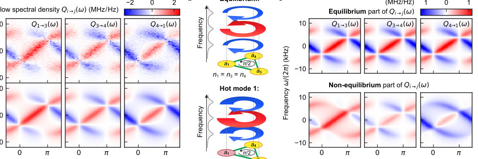 
FIG. 3. Spectrally resolved chiral heat flows. (a) Flux Φ tunes the spectral densities Qi→j(ω) of the flows between resonators a1, a3, a4 (bath occupations nth 1,3,4 = {1.51, 0.45, 0.36} × 106) connected in a loop. All three coupling strengths are J/(2π) = 3.6 kHz, comparable to the optothermally matched decay rates γ3/(2π) ≈γ4/(2π) = 3.8 kHz, while γ1/(2π) = 1.5 kHz. Experiment (top) is compared to theory (bottom). (b) At TRS-breaking Φ = π/2, the three hybridized modes at different frequencies carry chiral currents with opposite handedness. In equilibrium (top), these spectrally resolved currents integrate to zero net flow. Out of equilibrium, with resonator 1 hotter than the other two,...

📷 Fig 4

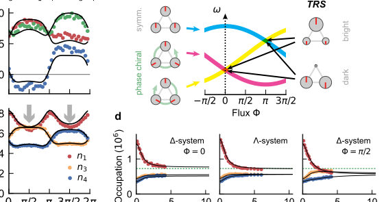 
FIG. 4. Broken TRS enhances refrigeration. (a) Thermal heat flows Qj→k and (b) average resonator occupations nj as a function of flux Φ, for the network presented in Fig. 3. Black lines are calculated by integrating (20). Grey arrows indicate the fluxes for which optimal refrigeration is reached. (c) Spectral structure of a three-mode loop. Its three eigenmodes can always be written as flux-independent angular momentum states (left) that tune with Φ (colored bands, cf. Fig. 2(d)), two of which carry chiral phase advance. The chiral modes become degenerate at TRS-preserving Φ = 0, where they can be combined into bright and dark modes (right). The same holds at TRS-preserving flux Φ = π,...

**Summary.** The authors experimentally demonstrate that controlling nonreciprocity in a nanomechanical resonator network using synthetic magnetism allows for the creation of chiral thermal currents. This chirality enhances refrigeration effects, enabling the system to cool below theoretical bounds applicable when time-reversal symmetry is preserved. The work provides a powerful platform for studying directed energy transport at the nanoscale.

**Why it may be interesting.** This work provides an experimental realization and quantitative measure of how engineered broken symmetries (nonreciprocity) can fundamentally alter fundamental thermodynamic limits, which has implications for quantum heat engines and energy conversion.

Detailed structure

**Main problem.** The study investigates how breaking time-reversal symmetry (nonreciprocity) influences microscopic thermodynamic processes like heat flow and refrigeration in nanoscale systems.

**Main result.** Nonreciprocity, controlled by a synthetic magnetic flux, imprints chirality on thermal fluctuations, leading to enhanced cooling below the limits set for time-reversal symmetric networks.

**Method.** The research combines experimental measurements of thermal flows with theoretical analysis using correlation functions and spectral density calculations derived from coupled oscillator dynamics.

**Model / system.** The system is a nanomechanical resonator network, specifically analyzed as a loop or dimer structure. Nonreciprocity is engineered via an optically-induced synthetic magnetic flux controlling the coupling Hamiltonian.

**Key observables.** Heat flow ($Q_{j	o k}$), effective temperature, chiral circulation of thermal fluctuations, and steady-state correlations $R_{jk}(	au)$.

**Important parameters / regimes.** Synthetic magnetic flux ($\Phi$), bath occupation imbalance ($\Delta n_{th}$), and coupling strengths ($J$).

**Assumptions / limitations.** Baths are modeled as Markovian and independent; the analysis relies on gauge-invariant fluxes around closed loops.

**Figures summary.** Figures illustrate the experimental setup, time-resolved correlation functions showing thermalization, and heat flow diagrams demonstrating chiral currents in response to flux bias.

**Paper structure.** The paper progresses from establishing the physical platform (nanomechanical network) to quantifying non-equilibrium energy transport using correlations. It first examines dimer dynamics, then extends to loop systems where chirality is quantified by the magnetic flux, culminating in the demonstration of enhanced refrigeration.

Abstract

Understanding how the breaking of reciprocity influences thermal flows and microscopic thermodynamic processes such as refrigeration and energy conversion is of broad current interest. We report experimental measurements of thermal flows and refrigeration in nanomechanical resonator networks in which nonreciprocity is controlled through an optically-induced synthetic magnetic flux. Time-modulated optomechanical interactions allow controlled coupling, gauge fields, and refrigeration processes through nanomechanical frequency conversion. We quantify nonequilibrium heat flows between resonators coupled to dissipative baths of different occupation and image heat and effective temperature in networks through measuring correlations of fluctuations. Synthetic magnetism is shown to imprint chirality on thermal fluctuations in a loop of resonators, leading to pronounced chiral flows with different handedness in distinct frequency bands. We find that the heat flows in a non-equilibrium system are tuned by the synthetic magnetic flux, which redistributes energy in the thermal steady-state. Specifically, we illustrate how nonreciprocity enhances the refrigeration of a resonator in the strong coupling regime, reducing its temperature below the bound that applies to time-reversal symmetric networks. These results experimentally demonstrate the impact of nonreciprocity on thermodynamic machines, and provide new methods to characterize them at the microscopic level.

[↑ back to top](#top)

### [Spatial spread of infection: transitions between pulled and pushed fronts](http://arxiv.org/abs/2607.23728v1)

**Authors:** Evgeniy Khain, Rohan Sukumar  
**Type:** theory · **Category:** statistical mechanics · **PDF:** <https://arxiv.org/pdf/2607.23728v1>  
**Analysis basis:** full PDF text, analyzed in chunks
**Topic relevance:** `analog quantum simulation` **3/5** · `driven-dissipative phase transition` **3/5** · `non-equilibrium dynamics` **3/5** · `non-equilibrium universality` **3/5** · `methods for driven-dissipative` **2/5** · `Frenkel-Kontorova` **1/5** · `Keldysh / 2PI / non-Gaussian methods` **1/5** · `correlated / nonlocal dissipation` **1/5** · `entanglement & information structure` **1/5**

📷 Fig 1

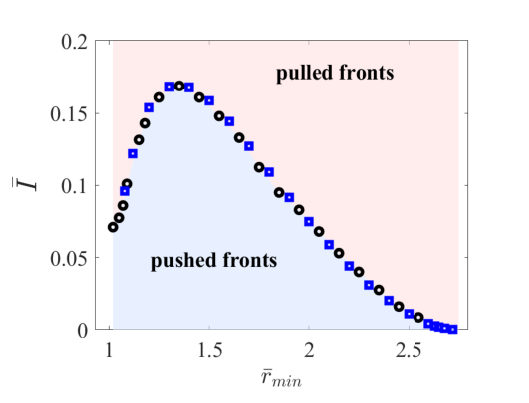 
FIG. 1: Phase plane of parameters: the border between the regions of pulled and pushed fronts, ¯rmax = 2.8. Black circles are computed from the numerical solution of Eqs. (2-3). Blue squares are computed by employing the “shooting” numerical procedure, see text.

📷 Fig 2

 
Figure 2 shows an example of the pulled and pushed front profiles for both the fraction of infected (Fig. 2a) and the fraction of susceptible (Fig. 2b). As the tran- sition across the border between the pulled and pushed regions can be discontinuous, the pulled and pushed front profiles can be remarkably different. In the pushed case (black dash-dotted lines), the amplitude of the infection pulse is higher (and therefore the remaining fraction of susceptible is lower) and the pulse decays faster compared to the pulled case (blue solid lines).

📷 Fig 3

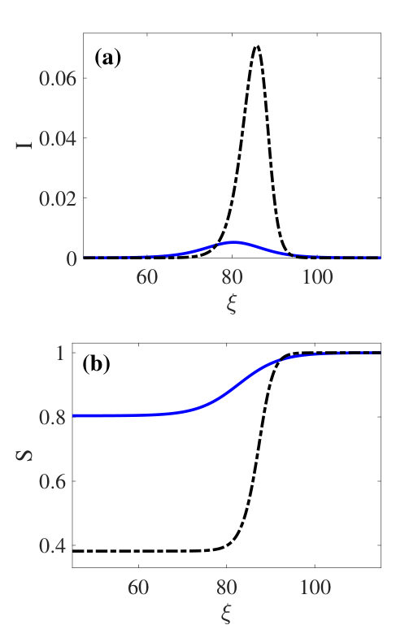 
FIG. 2: The fraction of infected (a) and the fraction of suscep- tible (b): pulled and pushed front profiles. The parameters are ¯rmin = 1.06, ¯rmax = 2.8, ¯I = 0.0800 (pulled front, blue solid line) and ¯I = 0.0745 (pushed front, black dash-dotted line).

📷 Fig 4

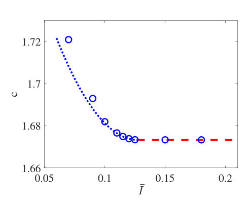 
FIG. 3: Continuous transition: Front speed as a function of ¯I. The pushed front asymptotics is given by cpushed = cpulled + β(¯Ic −¯I)2, the blue dotted line, see text. The parameters are: ¯rmin = 1.7, ¯rmax = 2.8, β ≃10.714, ¯Ic ≃0.127.

📷 Fig 5

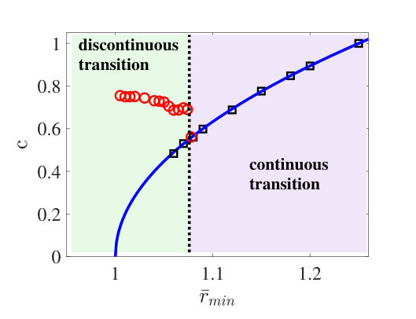 
FIG. 6: The pushed and the pulled front speeds as a function of ¯rmin along the border (and from both sides of the border) of the phase diagram (Fig. 1). Red circles denote the speeds of the pushed fronts, while black squares denote the speeds of the pulled fronts as computed from the numerical solution of Eqs. (1). The theoretical pulled front speed is shown by the blue solid line. The vertical dotted line at ¯rc = 1.076 separates the regions of discontinuous (left) and continuous (right) transitions. ¯rmax = 2.8.

**Summary.** This paper analyzes how an epidemic spreads spatially using a modified SIR model, focusing on the transition between 'pulled' and 'pushed' front propagation regimes. The authors use both theory and numerical simulations to map out parameter regions where these transitions occur, revealing continuous jumps, abrupt speed changes, and bistability. This work provides insights into nonlinear pattern formation dynamics applicable across various physical systems.

**Why it may be interesting.** While applied to epidemiology, the mathematical framework of pattern formation, phase transitions (continuous vs. jump), and bistability in nonlinear reaction-diffusion systems is highly relevant to understanding non-equilibrium dynamics in quantum many-body systems or open quantum systems.

Detailed structure

**Main problem.** The study investigates how the spatial spread of an infection (epidemic) transitions between two distinct propagation regimes: 'pulled' fronts and 'pushed' fronts.

**Main result.** The system exhibits both continuous and discontinuous transitions between these front types, and a region of bistability exists where either type of pulse can be realized depending on initial conditions.

**Method.** The research combines theoretical analysis of front propagation with numerical solutions of the spatial Susceptible-Infected-Recovered (SIR) partial differential equations.

**Model / system.** The model is an SIR epidemiological framework where the transmission rate depends nonlinearly on the fraction of infected individuals. The dynamics are governed by coupled PDEs describing the concentration changes in S, I, and R over space and time.

**Key observables.** Front speed (c), phase diagram boundaries separating pulled/pushed regimes, and the existence/size of a bistable region.

**Important parameters / regimes.** The minimum transmission rate ($ar{r}_{\min}$), the parameter $ar{I}$, and critical thresholds that define transition points.

**Assumptions / limitations.** The analysis assumes propagation into an unstable (healthy) state, and the model is acknowledged as a 'toy model' with unknown exact dependencies for the transmission rate.

**Figures summary.** Figures illustrate the phase plane showing the border between pulled and pushed regions on $(ar{r}_{\min}, ar{I})$, and provide profiles comparing the shapes of pulled versus pushed front solutions.

**Paper structure.** The paper proceeds by defining the nonlinear SIR model, performing theoretical analysis to characterize front types, numerically solving the PDEs using shooting methods, and finally mapping out the parameter space exhibiting continuous jumps, discontinuous jumps, and bistability.

Abstract

We consider the spatial spread of epidemic into an unstable, healthy state. When the transmission rate depends on the fraction of infected, the propagating pulse of infection can be either a pulled front or a pushed front. We determined the phase space of parameters for the pulled and pushed regions both by numerically solving the spatial SIR partial differential equations and by a theoretical analysis of the front propagation phenomenon. We found both a continuous and a discontinuous transition between the pulled and pushed front solutions; in the latter transition, the front speed undergoes a jump as a certain parameter crosses the critical threshold. The behavior of the propagating pulses near the transitions has been analyzed and a good agreement between the theory and numerics has been observed. Finally, a bistable region where both pushed and pulled propagating pulses can be realized has been discovered.

[↑ back to top](#top)

### [Environment-assisted squeezing in a coherently driven non-Hermitian degenerate parametric oscillator](http://arxiv.org/abs/2607.23816v1)

**Authors:** Muhdin Abdo Wodedo, Berihu Teklu, Konstantin G. Zloshchastiev, Jorge P. Zubelli, Tesfay Gebremariam Tesfahannes  
**Type:** theory · **Category:** other · **PDF:** <https://arxiv.org/pdf/2607.23816v1>  
**Analysis basis:** full PDF text, analyzed in chunks
**Topic relevance:** `correlated / nonlocal dissipation` **3/5** · `driven-dissipative phase transition` **3/5** · `methods for driven-dissipative` **3/5** · `non-equilibrium dynamics` **2/5** · `non-equilibrium universality` **2/5** · `Keldysh / 2PI / non-Gaussian methods` **1/5** · `correlated cavity matter` **1/5** · `interference shaping light` **1/5** · `quantum optics experiment` **1/5**

📷 Fig 1

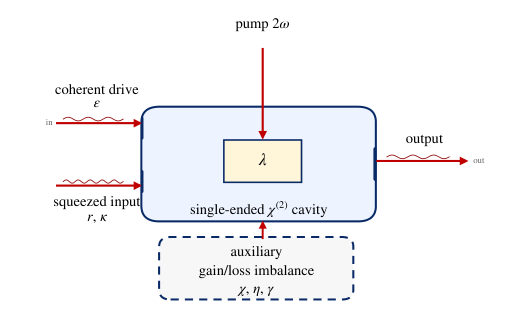 
FIG. 1. Schematic of the effective setup considered in this work. The χ(2) element provides the Hermitian parametric coupling λ, the reso- nant coherent input sets the drive amplitude ε, the squeezed-reservoir port is characterized by the squeeze parameter r and decay rate κ, and a calibrated auxiliary gain/loss imbalance yields the effective non-Hermitian drift parameters χ, η, and γ.

📷 Fig 2

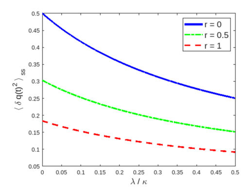 
FIG. 2. Steady-state intracavity amplitude-quadrature variance δq(t)2

📷 Fig 3

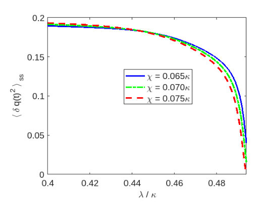 
FIG. 3. Steady-state intracavity amplitude-quadrature variance δq(t)2

📷 Fig 4

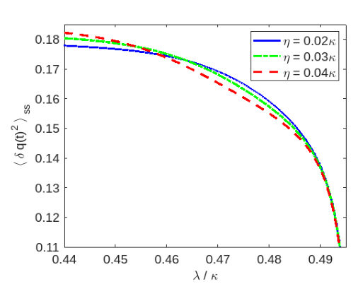 
FIG. 4. Steady-state intracavity amplitude-quadrature variance δq(t)2

📷 Fig 5

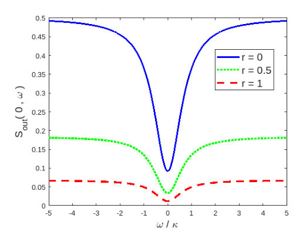 
FIG. 5. Output amplitude-quadrature squeezing spectrum Sout(0, ω) as a function of ω/κ for several squeeze parameters r, with λ = 0.2κ and the non-Hermitian contributions set to zero.

**Summary.** This paper theoretically analyzes quantum noise reduction in a parametric oscillator coupled to a squeezed reservoir and exhibiting gain-loss imbalance. By using input--output theory, the authors show that these environment-assisted mechanisms allow for operating regimes where squeezing surpasses fundamental limits. The results provide guidelines for designing cavity QED systems to generate highly nonclassical light.

**Why it may be interesting.** This work provides concrete, experimentally testable parameter maps showing how engineered dissipation (reservoir squeezing) can synergize with cavity loss/gain imbalances to achieve nonclassical light states beyond what is possible in purely Hermitian models.

Detailed structure

**Main problem.** The study investigates how environment-assisted techniques can enhance quantum squeezing in a realistic, lossy optical cavity system.

**Main result.** The research demonstrates that combining reservoir engineering (squeezing) with controlled gain/loss imbalance (non-Hermitian terms) opens parameter windows for suppressing intracavity noise below the standard quantum limit.

**Method.** The analysis employs input--output theory applied to a master equation formalism, deriving closed-form expressions for steady-state variances and spectra.

**Model / system.** The system is a degenerate parametric oscillator (DOPO) cavity mode coupled to a broadband squeezed reservoir. The dynamics are modeled using an effective non-Hermitian Hamiltonian incorporating gain/loss imbalances ($\chi, \eta, \gamma$).

**Key observables.** Steady-state quadrature variances, output squeezing spectrum, and power spectrum.

**Important parameters / regimes.** Reservoir squeeze factor ($r$), coherent drive amplitude ($\epsilon$), parametric gain ($\lambda$), and non-Hermitian imbalance coefficients ($\chi, \eta, \gamma$).

**Assumptions / limitations.** The analysis is restricted to the stable Gaussian regime where the drift matrix remains stable.

**Figures summary.** Figures illustrate quadrature variance suppression (Figure 2), the effect of loss terms on intracavity variance (Figures 3 & 4), and the output squeezing spectrum/power spectrum showing enhancement due to non-Hermitian contributions (Figures 6, 7, 8).

**Paper structure.** The paper proceeds by deriving mean dynamics from a master equation, then calculating quadrature fluctuations via Langevin equations. Finally, it computes the steady-state spectra for both the output field and the power spectrum.

Abstract

Environment-assisted approaches to nonclassical light offer a practical path to strong squeezing in imperfect, lossy platforms. In this paper, we study a degenerate parametric oscillator in which a coherently driven cavity is coupled to a broadband squeezed reservoir via a single-port mirror. At the same time, the intracavity dynamics include non-Hermitian (gain-loss-imbalanced) terms. Within input--output theory, we obtain closed-form expressions for the steady-state quadrature variances, the output squeezing spectrum, and the power spectrum, and map their dependence on the reservoir squeeze factor, the coherent drive amplitude, and the parametric gain. We find that the non-Hermitian contributions open operating windows in which the intracavity quadrature noise is markedly suppressed below the standard quantum limit and, depending on the parameter set, either sharpen or amplify spectral squeezing and power-spectral features at the output. The non-Hermitian coefficients are treated as effective, low-order drift parameters that describe calibrated imbalance between engineered source and sink channels after auxiliary degrees of freedom have been eliminated. The analysis is restricted to the stable Gaussian regime in which the drift matrix is stable, and the squeezed-reservoir diffusion matrix remains physical. The results demonstrate an environment-assisted approach in which reservoir engineering and coherent driving work together to enhance squeezing. The resulting parameter maps identify experimentally testable windows, rather than a unique device prescription, for combining reservoir squeezing, coherent driving, and controlled gain/loss imbalance in cavity-QED and nonlinear photonic settings.

[↑ back to top](#top)

### [The role of nestedness and saturating feedback in bipartite ecological systems](http://arxiv.org/abs/2607.24328v1)

**Authors:** Nirbhay Patil, Ada Altieri  
**Type:** theory · **Category:** disordered systems and neural networks · **PDF:** <https://arxiv.org/pdf/2607.24328v1>  
**Analysis basis:** full PDF text, analyzed in chunks
**Topic relevance:** `Keldysh / 2PI / non-Gaussian methods` **3/5** · `driven-dissipative phase transition` **3/5** · `analog quantum simulation` **2/5** · `methods for driven-dissipative` **2/5** · `non-equilibrium dynamics` **2/5** · `non-equilibrium universality` **2/5** · `correlated / nonlocal dissipation` **1/5** · `correlated cavity matter` **1/5** · `entanglement & information structure` **1/5**

📷 Fig 1

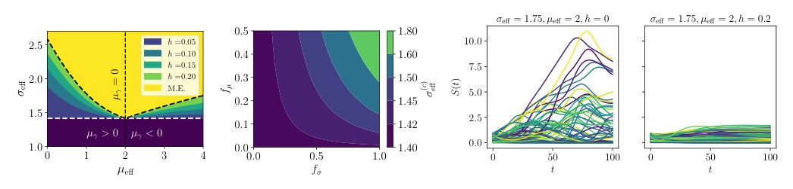 
Figure 1: The phase boundary between the Unique Fixed Point and Multiple Attractor phases moves upwards as we increase h. Left plot: the axes represent the effective mean and variances µeff = µβ −µγ and σ2 eff = σ2 β + σ2 γ.

📷 Fig 2

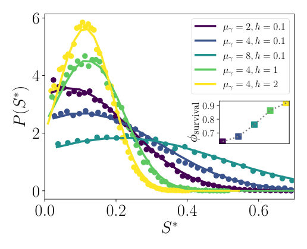 
Figure 2: Theoretical predictions of the stationary species abundance distributions overlaid on simulation results represented by points, with µβ = 10, σβ = 0.5, and σγ = 1. Notice that both parameters have a pos- itive effect on the survival probability, as shown in the inset plot. Results for fully connected networks.

📷 Fig 3

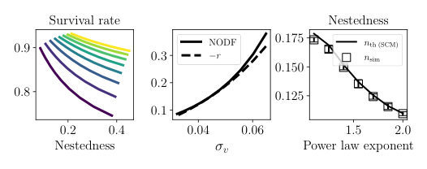 
Figure 3: The survival rate of species plotted alongside the nestedness for different values of the average con- nectance varying from 0.01 (deep purple) to 0.1 (yel- low), taking µβ = 0.1, µγ = 0.15, σβ = 0.1, σγ = 0.5 and h = 0.01. For each value of the average connectiv- ity chosen, we take a power law distributed graph, and calculate its nestedness, disassortativity (negative of the assortativity r), and degree heterogeneity. We are un- able to observe any benefits provided by the nestedness of a graph, as it isn’t possible to isolate this feature from the degree heterogeneity which makes the system less stable. The right most plot shows how a more fat- tailed power law (i.e. a lower...

📷 Fig 4

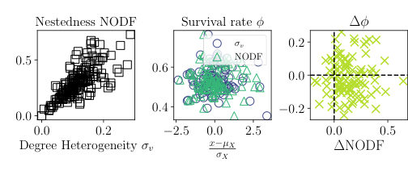 
Figure 4: For real networks from the Web of Life database, we show that nestedness is strongly corre- lated with degree heterogeneity. Consistent with our theoretical predictions, species survival shows no sys- tematic dependence on either degree heterogeneity or rescaled, demeaned nestedness. Moreover, degree- preserving randomized networks can differ substantially in nestedness without exhibiting corresponding changes in survival. Among networks that are more nested than expected from their degree sequence, 56% actually dis- play lower survival than their randomized counterparts.

**Summary.** This theoretical work analyzes ecological stability in bipartite networks using advanced techniques like Dynamical Mean-Field Theory. It demonstrates that introducing saturation into mutualistic interactions is crucial for preventing system collapse, and critically argues that structural features like nestedness are not intrinsically stabilizing; rather, stability emerges from the combined statistics of nonlinearity and network disorder.

**Why it may be interesting.** While applied to ecology, the mathematical machinery—DMFT analysis on disordered, interacting systems with nonlinear feedback—is highly relevant to understanding non-equilibrium dynamics in complex quantum many-body systems or neural network models exhibiting glassy behavior.

Detailed structure

**Main problem.** The paper investigates how complex ecological systems balance competition and cooperation, specifically addressing why standard models fail when mutualism is present.

**Main result.** Nonlinear saturation in mutualistic feedbacks stabilizes the system by bounding runaway growth, while structural measures like nestedness do not provide an independent source of stability; stability depends on the joint statistics of saturation, disorder, and degree heterogeneity.

**Method.** The analysis employs Dynamical Mean-Field Theory (DMFT) combined with random-matrix theory to derive effective dynamics for large bipartite ecological networks.

**Model / system.** The system models bipartite ecological interactions (e.g., plant-pollinator), governed by generalized Lotka-Volterra equations extended with Monod-like saturation terms and incorporating quenched interaction disorder.

**Key observables.** Stationary species abundance distributions, stability/survival rates, effective mean ($\mu_{eff}$) and variance ($\sigma^2_{eff}$), and the nestedness measure (NODF).

**Important parameters / regimes.** Saturation parameter ($h$), degree heterogeneity ($\sigma_v$), interaction coefficients ($eta_{ij}, \gamma_{ij}$), and network structure.

**Assumptions / limitations.** The analysis relies on DMFT approximations, assuming large-dimensional limits and sometimes employing an adiabatic approximation (separation of timescales).

**Figures summary.** Figures illustrate how increasing saturation ($h$) shifts phase boundaries away from instability, and show that while real networks exhibit correlations between nestedness and degree heterogeneity, these properties do not systematically determine species survival rates.

**Paper structure.** The paper progresses by first establishing the failure of linear GLV models, then introducing saturation via DMFT to stabilize the system. It subsequently analyzes structural parameters like nestedness, concluding that stability is determined by the joint statistics rather than any single architectural feature.

Abstract

Large ecosystems balance competition and cooperation, yet standard generalized Lotka--Volterra models make mutualism destabilizing by amplifying disorder and driving unbounded growth. We show that Monod-like saturation resolves this paradox: dynamical mean-field theory and random-matrix analysis reveal a broader stable phase and enhanced survival. Network architecture provides a second control mechanism, but nestedness offers no intrinsic stability advantage. Instead, it is a byproduct of degree distributions with high connectivity necessary for stability.

[↑ back to top](#top)

### [DC Conductance of X-shaped Majorana Interferometer reveals Non-Abelian Anyon Statistics](http://arxiv.org/abs/2607.24171v1)

**Authors:** Domenico Giuliano, Andrea Nava, Reinhold Egger, Fabian Hassler  
**Type:** theory · **Category:** other · **PDF:** <https://arxiv.org/pdf/2607.24171v1>  
**Analysis basis:** full PDF text, analyzed in chunks
**Topic relevance:** `Keldysh / 2PI / non-Gaussian methods` **3/5** · `spintronics-quantum-optics interface` **3/5** · `Kondo & dissipative impurity` **2/5** · `analog quantum simulation` **2/5** · `methods for driven-dissipative` **2/5** · `correlated / nonlocal dissipation` **1/5** · `correlated cavity matter` **1/5** · `driven-dissipative phase transition` **1/5** · `non-equilibrium dynamics` **1/5**

📷 Fig 1

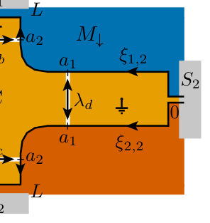 
Figure 1. Schematic setup for a symmetric X-shaped chiral Majorana interferometer formed on the surface of a topological insulator. The surface is proximitized by a conventional superconductor (SC, orange) in the region defining the interferometer. The outer regions are proximitized by magnetic materials of opposite magnetization (M↑and M↓, indicated by red and blue regions, respectively). At interfaces between magnetic materials, we have 1D chiral Dirac fermion channels (short black double lines). At the SC-magnet interfaces, we have four neutral 1D chiral Majorana fermion modes ξn,j(x) of length L (black lines; arrows indicate the propagation direction), with 0 &lt; x &lt; L for each mode....

📷 Fig 2

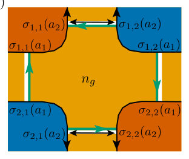 
Figure 2. Schematic illustration of composite EV tunneling processes in the X-shaped Majorana interferometer, see Secs. 2.4 and 2.5 for details. We show the center part of figure 1, with the four Josephson line junctions surrounding the floating central SC island. Left panel: Clockwise (solid green arrowed lines) and counter-clockwise (dashed green arrowed lines) EV tunneling processes in the vacuum fusion channel. Right panel: Example for a composite EV tunneling process in the fermionic fusion channel. Black double-arrowed lines indicate possible pairs of Majorana fermion tunneling processes.

📷 Fig 3

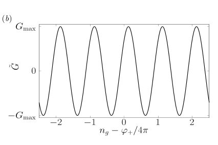 
Figure 3. Linear-response DC conductance ˜G = Gmax sin(π/4−φ+/2+2πng) in Eq. (3.12), which determines the conductance tensor (3.9) in the weak-coupling regime of an X-shaped Majorana interferometer, see Eq. (2.38). (a) 2D color-scale plot for the conductance amplitude Gmax in the plane spanned by temperature T (in units of ∆) and δa = a2 −a1 (in units of lc = v/∆), see figure 1. As T decreases and δa increases, the growth of Gmax indicates a crossover toward the strong-coupling regime. (b) The conductance ˜G oscillates as a function of the effective gate charge ng −φ+/4π with an offset 1/8 due to the topological spin of Ising anyons.

**Summary.** This theoretical paper proposes using an X-shaped Majorana interferometer to directly measure the non-Abelian statistics of Ising anyons via DC conductance. By analyzing the system's low-energy effective theory, the authors show that a finite conductance signal is uniquely generated when both Majorana fermion and edge-vortex tunneling channels are active. This offers a robust transport signature for topological quantum phenomena.

**Why it may be interesting.** The work provides a concrete transport measurement scheme for detecting exotic topological excitations (Ising anyons), bridging abstract topological theory with measurable condensed matter observables like linear conductance.

Detailed structure

**Main problem.** The primary goal is demonstrating the non-Abelian braiding statistics of Ising anyons using direct measurements of electrical DC conductance.

**Main result.** A finite, measurable DC conductance in the X-shaped geometry provides direct evidence for non-Abelian statistics, which is impossible to achieve with simpler two-arm interferometers.

**Method.** The analysis uses a low-energy effective theory derived via chiral bosonization to calculate the linear-response DC conductance tensor.

**Model / system.** The system is a four-terminal, X-shaped chiral Majorana interferometer built on a topological insulator surface proximitized by superconductors and ferromagnets. It supports Ising anyons realized as edge vortices (EVs) interacting with Majorana fermions.

**Key observables.** The DC conductance tensor ($\sigma_{DC}$ or $	ilde{G}$), which is predicted to be completely isotropic in this geometry.

**Important parameters / regimes.** Gate-tunable charge parameter ($n_g$), topological spin offset, and the ratio of Josephson energy to charging energy ($E_J/E_C$).

**Assumptions / limitations.** The analysis assumes no localized vortices initially and relies on linear-response theory in both weak and strong coupling limits.

**Figures summary.** Figure 1 shows the schematic X-shaped interferometer setup. Figure 2 illustrates the theoretical processes, comparing vacuum vs. fermionic fusion channels for EV tunneling. Figure 3 details conductance oscillations related to topological spin.

**Paper structure.** The paper develops the theory by first defining the Hamiltonian using chiral bosonization (incorporating Majorana modes, source/drain coupling, and tunneling terms). It then calculates the DC conductance in both weak-coupling (perturbative) and strong-coupling limits, culminating in the prediction of finite conductance as a signature.

Abstract

We propose a four-terminal, X-shaped chiral Majorana interferometer with a central floating superconducting island, enabling the direct detection of the non-Abelian statistics of Ising anyons via the linear-response DC conductance tensor in charge transport experiments. Here, Ising anyons are realizable as edge vortices nucleated at Josephson line junctions defining the superconducting island, where both edge-vortex and Majorana-fermion tunneling processes can occur. We show that in such a multi-terminal Majorana interferometer, both the vacuum and the fermionic fusion channel for Ising anyons are possible. This is in contrast to two-arm interferometers, where only the vacuum fusion channel is accessible and the DC conductance contribution from edge vortices always vanishes. Using a low-energy effective theory derived via chiral bosonization, we find that in the X-shaped interferometer, the DC conductance tensor is completely isotropic, yielding a non-zero conductance when simultaneous edge-vortex and Majorana tunneling activates the fermionic fusion channel. Apart from conductance oscillations in a gate-tunable charge parameter, which display an offset related to the anyon topological spin, measuring a finite conductance can already provide direct evidence for non-Abelian statistics in this geometry.

[↑ back to top](#top)

### [Parameter Calibration for Reduced-Bandwidth Two-Photon Waveguide-QED Simulations](http://arxiv.org/abs/2607.23036v1)

**Authors:** Romain Piron, Akihito Soeda  
**Type:** theory · **Category:** other · **PDF:** <https://arxiv.org/pdf/2607.23036v1>  
**Analysis basis:** full PDF text, analyzed in chunks
**Topic relevance:** `analog quantum simulation` **3/5** · `correlated cavity matter` **3/5** · `methods for driven-dissipative` **3/5** · `Tavis-Cummings & cavity-many-emitter` **2/5** · `Keldysh / 2PI / non-Gaussian methods` **1/5** · `correlated / nonlocal dissipation` **1/5** · `driven-dissipative phase transition` **1/5** · `interference shaping light` **1/5** · `non-equilibrium dynamics` **1/5**

📷 Fig 1

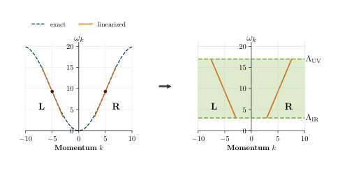 
Fig. 2. Linearization and truncation of the dispersion relation around the relevant set of electromagnetic modes.

📷 Fig 2

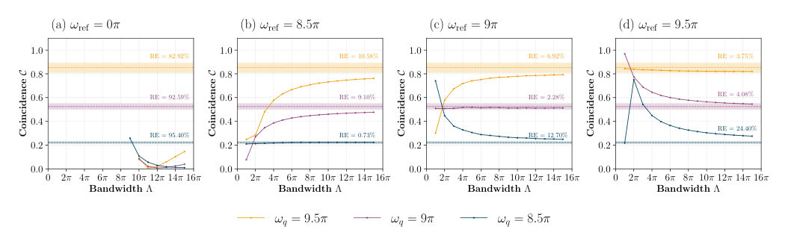 
Fig. 3. Coincidence against the simulation bandwidth for different incoming photon frequencies. The frequency windows are centered at ωref = 0π (a), 8.5π (b), 9π (c), and 9.5π (d)

📷 Fig 3

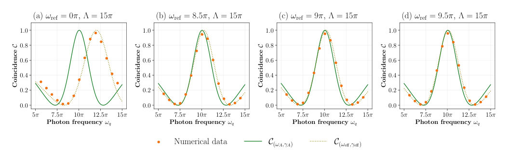 
Fig. 4. Coincidence (orange points) against incoming photon frequency for windows centered at ωref = 0π (a), 8.5π (b), 9π (c), and 9.5π (d), bandwidth Λ = 15π across all cases. The expected theoretical curve is shown in green, and the effective fit with a dashed line.

📷 Fig 4

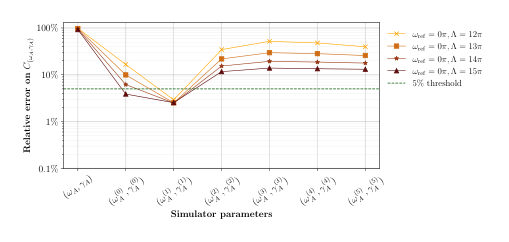 
Fig. 5. Relative error on the coincidence at ωq = 9π for different parameter sets (ω0, γ0). Each curve corresponds to a different frequency window.

📷 Fig 5

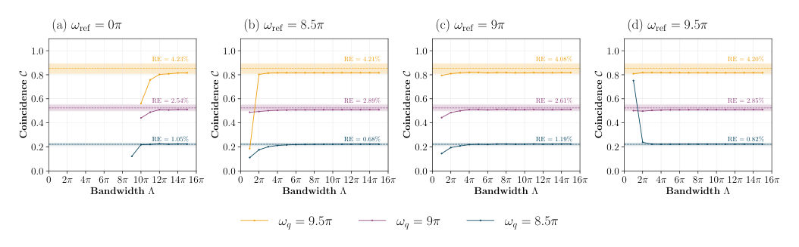 
Fig. 6. Convergence of the coincidence restored after calibration, as a function of the simulation bandwidth for different incoming photon frequencies. The frequency windows are centered at ωref = 0π (a), 8.5π (b), 9π (c), and 9.5π (d)

**Summary.** This paper addresses the computational bottleneck in waveguide QED simulations caused by large frequency bandwidths. The authors introduce an end-to-end framework that explicitly controls the spectral window and derives a systematic calibration procedure. This method drastically reduces simulation dimensionality while maintaining high physical accuracy, enabling deeper studies of two-photon quantum phenomena.

**Why it may be interesting.** This work provides a crucial numerical tool for simulating complex quantum light-matter interactions in engineered platforms like waveguides, allowing researchers to explore physics regimes previously limited by computational resources.

Detailed structure

**Main problem.** Waveguide-QED simulations are computationally prohibitive because simulating a large bandwidth requires an exponentially increasing number of frequency modes, creating a trade-off between accuracy and computational tractability.

**Main result.** The authors developed a systematic calibration procedure that allows explicit control over the effective spectral bandwidth, enabling a significant reduction in the required Hilbert space dimension while preserving physical accuracy for two-photon scattering simulations.

**Method.** They transitioned from time-domain simulation methods (constrained by time step $\Delta t$) to an end-to-end frequency-domain framework. This allowed them to derive and apply parameter shifts that compensate for spectral truncation effects.

**Model / system.** The system is Waveguide Quantum Electrodynamics (QED), involving a two-level emitter coupled to photons confined in one-dimensional waveguides. The simulation focuses on the two-photon scattering process using an effective Hamiltonian approach.

**Key observables.** Coincidence probability ($C$), relative error ($	ext{RE}$) compared to theoretical benchmarks, and the spectral profile of the coincidence probability.

**Important parameters / regimes.** The central frequency ($\omega_{	ext{ref}}$) and the effective bandwidth ($\Lambda$) are key tunable parameters. The simulation is benchmarked against monochromatic limits.

**Assumptions / limitations.** The analysis assumes a Markovian regime for simplicity, and the calibration procedure primarily corrects the linear component of the two-photon response, potentially neglecting higher-order multi-photon contributions.

**Figures summary.** Figures illustrate the convergence of coincidence probability after applying the calibration procedure across various central frequencies ($\omega_{	ext{ref}}$) and show spectral profile comparisons with and without correction as a function of incoming photon frequency.

**Paper structure.** The paper first establishes the computational bottleneck in QED simulations. It then introduces the frequency-domain framework, detailing how bandwidth truncation is implemented. The core contribution is presenting and validating the systematic calibration algorithm (Alg. 1) to restore physical accuracy across varying spectral windows.

Abstract

Waveguide-QED platforms represent one potential approach to scalable quantum technologies, but their simulation remains computationally demanding due to the large number of frequency modes required to describe traveling photons. In practice, increasing the simulated bandwidth rapidly raises the numerical cost, leading to a trade-off between accuracy and tractability. The existing approaches formulated in time-domain indirectly control this trade-off through the choice of time step, which obscures the connection between discretization parameters and the represented spectral window. In this work, we introduce an end-to-end framework to explicitly control the effective bandwidth in waveguide-QED simulations of two-photon scattering. We show that truncating the frequency domain requires consistent shifts of the model parameters, and derive a systematic calibration procedure that preserves the physical accuracy of the reduced model. This enables tuning the central frequency and the bandwidth of the numerical spectrum, leading to a several-fold reduction in the Hilbert space dimension while maintaining physical accuracy. We discuss the limitations of this calibration and relate the finite-bandwidth viewpoint to time-domain discretizations.

[↑ back to top](#top)

### [CP2K: An electronic structure and molecular dynamics software package - Dynamics, Transport, and Spectroscopic Response](http://arxiv.org/abs/2607.22916v1)

**Authors:** Jan Wilhelm, Anna Hehn, Hossam Elgabarty, Beliz Sertcan Gökmen, Maximilian Graml, Stepan Marek, Ritaj Tyagi, Frederick Stein, Johann V. Potoschnig, Augustin Bussy, Christian S. Ahart, Zehua Chen, Linnea Andersson, Zdenek Futera, Filip Ivanovic, Margherita Buraschi, Christoph Schran, Remi Pasquier, Leonard Prokisch, Bibek Samal, Jelena Schmitz, Shridhar Sanjay Shanbhag, Harald Forbert, Ole Schütt, Franz Pöschl, Sebastian Ehlert, Stefano Battaglia, Michele Nottoli, Benjamin Stamm, Vamsee Voora, Rustam Z. Khaliullin, Sergey K. Chulkov, Matt B. Watkins, Clotilde S. Cucinotta, Jochen Blumberger, Chao Zhang, Yang Yang, Dominik Marx, Matthias Krack, Jürg Hutter, Marcella Iannuzzi, Thomas D. Kühne  
**Type:** theory · **Category:** statistical mechanics · **PDF:** <https://arxiv.org/pdf/2607.22916v1>  
**Analysis basis:** full PDF text, analyzed in chunks
**Topic relevance:** `Keldysh / 2PI / non-Gaussian methods` **3/5** · `methods for driven-dissipative` **3/5** · `non-equilibrium dynamics` **3/5** · `correlated / nonlocal dissipation` **2/5** · `driven-dissipative phase transition` **2/5** · `non-equilibrium universality` **1/5**

📷 Fig 1

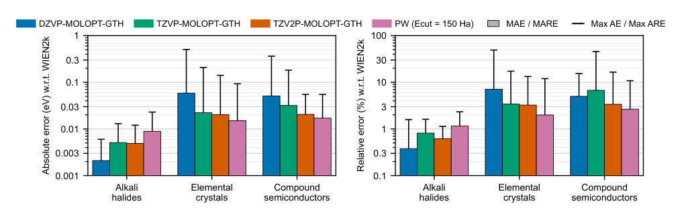 
FIG. 1. Accuracy of spin–orbit-coupling splittings in the electronic band structure computed using PBE with HGH spin– orbit coupling,71,72 evaluated against all-electron reference from WIEN2k.73,74 The benchmark set contains spin splittings of various crystals: alkali halides, elements, and semiconductors.74 We employ various Gaussian basis sets with CP2K and a PW basis set with ABINIT.72,75,76 Left panel: absolute errors (eV). The bar and whisker give the mean and maximum absolute errors, respectively, over the spin splittings in each material class. Right panel: corresponding relative errors (%).

📷 Fig 2

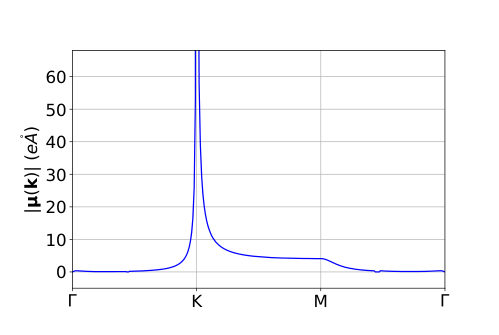 
FIG. 2. Magnitude of the transition-dipole matrix element for the transition between the highest valence and lowest conduction bands in graphene as a function of k in the Brillouin zone, computed with CP2K from the off-diagonal transition-dipole expression detailed in Section IV C in the SI.

📷 Fig 3

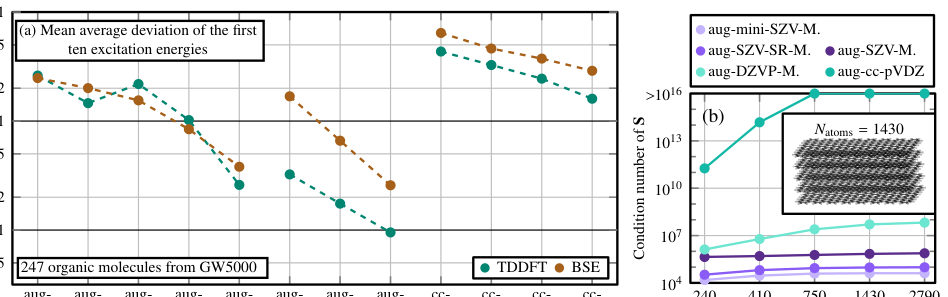 
FIG. 3. Benchmarking the new augmented MOLOPT basis sets. (a) shows the basis set convergence of the first ten excitation energies from TDDFT (PBE0) and BSE calculations on top of G0W0@PBE0 over 247 molecules from the GW5000 database. We report both the mean absolute deviation for the augmented MOLOPT, aug-cc-pVXZ and cc-pVXZ basis sets, with the aug-cc-pV5Z results taken as reference. (b) shows the condition number of the overlap matrix for different basis sets in finite graphite pieces of increasing size. The inset shows the case for 1430 atoms, the number of atoms is varied by changing the horizontal size. Data from Ref. 140.

📷 Fig 4

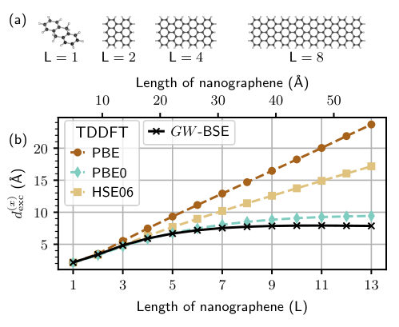 
FIG. 4. Size of an excitation in quasi-one-dimensional nanographenes of different length L for different excited- state methods. (a) Geometries of quasi-one-dimensional nanographenes with increasing length L, visualized using Ref. 151. (b) Size of the excitation [d(x) exc, Eq. (40)] along the long nanographene axis for TDDFT (in color, employ- ing the PBE,152 PBE0,153 and HSE06,154,155 XC function- als) and GW plus the BSE (black curve). d(x) exc is strongly dependent on the XC functional in TDDFT, where the hy- brid functional PBE0,153 agrees largely with the GW plus BSE predictions. The Tamm–Dancoff approximation is used throughout. Data are taken from Ref. 150.

📷 Fig 5

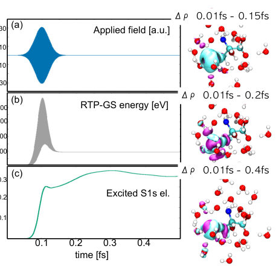 
FIG. 5. RT-TDDFT simulation of the dianion of cysteine in aqueous solution (PBE0, 6-311G** basis set). (a) Ap- plied laser pulse with intensity 1014 W/cm2 and wavelength 0.5073 nm, resonant with the S K-edge. (b) Total KS en- ergy change during the pulsed excitation. (c) Projection of the time-dependent orbital coefficients onto the ground-state reference for all occupied orbitals, quantifying the degree of excitation per orbital. Right column: charge-density differ- ence maps at three time steps following the pulse onset. Pur- ple indicates charge accumulation, cyan charge depletion.

**Summary.** This paper reviews the CP2K software package's advanced capabilities to bridge electronic structure theory with statistical mechanics. It details how the code calculates observables like spectra and transport coefficients by correctly accounting for finite temperature effects, such as nuclear motion and thermal averaging. This makes it a powerful tool for simulating complex chemical and condensed matter systems beyond simple ground-state calculations.

**Why it may be interesting.** It provides a comprehensive computational framework for calculating time-dependent or thermally averaged properties, which is crucial for understanding open quantum systems and non-equilibrium dynamics in condensed matter.

Detailed structure

**Main problem.** To move beyond static, zero-temperature calculations for predicting experimental observables by incorporating finite-temperature effects like nuclear motion and anharmonicity.

**Main result.** The paper details CP2K's unique capability to unify quantum chemistry with statistical mechanics by enabling the calculation of spectra and transport properties averaged over thermal ensembles or propagated in real time.

**Method.** It systematically reviews methods linking electronic structure (DFT, GW) to dynamics via techniques like time-correlation functions, path integrals, and open-boundary simulations for response calculations.

**Model / system.** The package is applicable to chemical systems ranging from single molecules to condensed phases, covering diverse environments such as liquids, interfaces, and disordered solids where fluctuating potentials are key.

**Key observables.** Spectroscopic signatures (IR, Raman, THz), transport coefficients (conductivity), chemical shifts (NMR), and excitation energies.

**Important parameters / regimes.** Finite temperature ($T$), external electric fields ($\mathbf{E}$ or $\mathbf{D}$), and quantum nuclear effects (CNEO).

**Assumptions / limitations.** The primary limitation addressed is the necessity to sample the underlying free energy landscape at finite temperature rather than relying solely on static potential energy surfaces.

**Figures summary.** Table I maps out CP2K's comprehensive spectroscopic and response capabilities across various probes; Table II specifies when static calculations must be embedded in finite-temperature sampling techniques.

**Paper structure.** The structure is a systematic review, first establishing the need to incorporate dynamics/temperature, then detailing the integration of electronic structure methods with MD/response theories, and finally covering advanced topics like field coupling and quantum nuclear effects.

Abstract

One of the distinguishing aspects of CP2K is its seamless integration of diverse structural and transition-state optimization techniques with advanced sampling approaches including Monte Carlo, molecular dynamics, and metadynamics, enabling the efficient exploration of complex potential- and free-energy landscapes, including rare events. These capabilities are combined with a broad hierarchy of energy and force evaluation methods, ranging from classical and machine-learned interaction potentials and mixed quantum-classical multiscale and semiempirical schemes, to highly accurate quantum-mechanical electronic-structure approaches. At the heart of the latter lies the Gaussian and plane-wave framework, along with its augmented all-electron generalization, which have been described in detail in our previous code review [T. D. Kühne et al., J. Chem. Phys. 152, 194103 (2020)]. Building on this foundation, the present work revisits the methods within CP2K that turn electronic structure into dynamics, transport, and spectroscopic response. Particular emphasis is placed on the coupling between static response calculations and nuclear motion: spectra may be evaluated at optimized structures, averaged over thermally sampled configurations, obtained from time-correlation functions along ab-initio or path integral molecular trajectories, or followed in real time together with electronic and nuclear dynamics. The same modular structure also enables equilibrium and biased transport simulations, from Kubo-type linear response to open-boundary approaches under external potentials, highlighting CP2K's unique capability to unify quantum chemistry with quantum and statistical mechanics within a versatile, holistic simulation environment.

[↑ back to top](#top)

### [Dynamic hysteresis in an autocatalytic reaction network](http://arxiv.org/abs/2607.24163v1)

**Authors:** Sheela Yadav, Jason R. Green, Moupriya Das  
**Type:** theory · **Category:** statistical mechanics · **PDF:** <https://arxiv.org/pdf/2607.24163v1>  
**Analysis basis:** full PDF text, analyzed in chunks
**Topic relevance:** `driven-dissipative phase transition` **3/5** · `methods for driven-dissipative` **3/5** · `entanglement & information structure` **2/5** · `non-equilibrium universality` **2/5** · `Keldysh / 2PI / non-Gaussian methods` **1/5** · `correlated / nonlocal dissipation` **1/5** · `non-equilibrium dynamics` **1/5**

📷 Fig 1

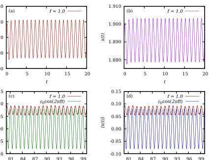 
FIG. 2. (a-b) Temporal evolution of x(t) initially positioned at the left and right well minima, respectively, under the deterministic drift force in the absence of noise. (c) The time series of ensemble- averaged response ⟨x(t)⟩(red line) of the stochastic system subject to drift, fluctuations, and periodic drive, along with the comparison with the periodic drive (green smooth line) at frequency f = 1, with the initial condition at the left well minimum. (d) Same as (c) but with the initial condition in the right well; the periodic forcing is shown as the blue smooth curve.

📷 Fig 2

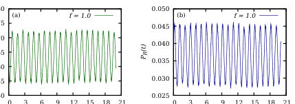 
FIG. 3. (a-b) Temporal variation of the occupation probabilities for the left (PL(t)) and right (PR(t)) wells at frequency f = 1.

📷 Fig 3

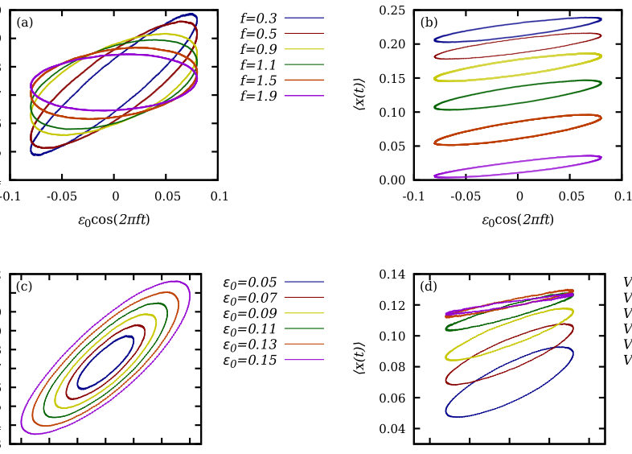 
FIG. 4. Dynamic hysteresis in the ensemble-averaged autocatalyst concentration. (a) Hysteresis loops of ⟨x(t)⟩versus the periodic drive ε0 cos(2π ft) for different driving frequencies f. (b) Hysteresis loops for different well widths w at fixed f = 0.5. (c) Hysteresis loops for different driving amplitudes ε0 at fixed f = 0.5. (d) Hysteresis loops for different system sizes V at fixed f = 0.5.

📷 Fig 4

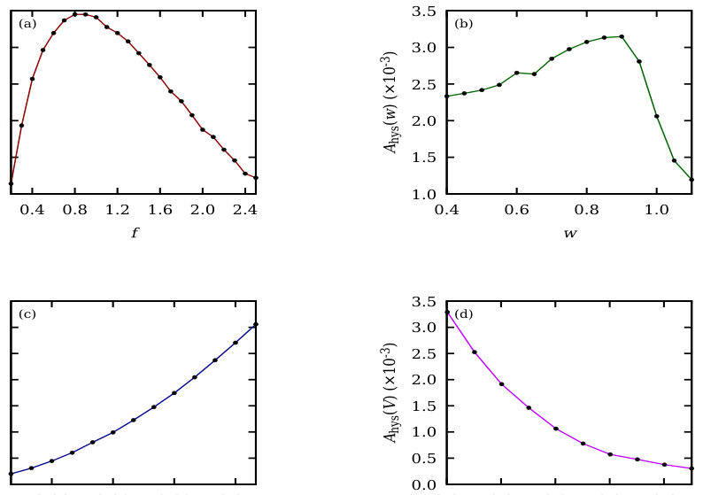 
FIG. 5. Parameter dependence of the dynamic hysteresis loop area. (a) Loop area Ahys(f) as a function of driving frequency showing a maximum near f = 0.8–0.9. (b) Loop area Ahys(w) as a function of well width showing a maximum near w = 0.9. (c) Loop area Ahys(ε0) as a function of driving amplitude showing a monotonic increase. (d) Loop area Ahys(V) as a function of system size at fixed f = 0.5 showing a monotonic decrease.

📷 Fig 5

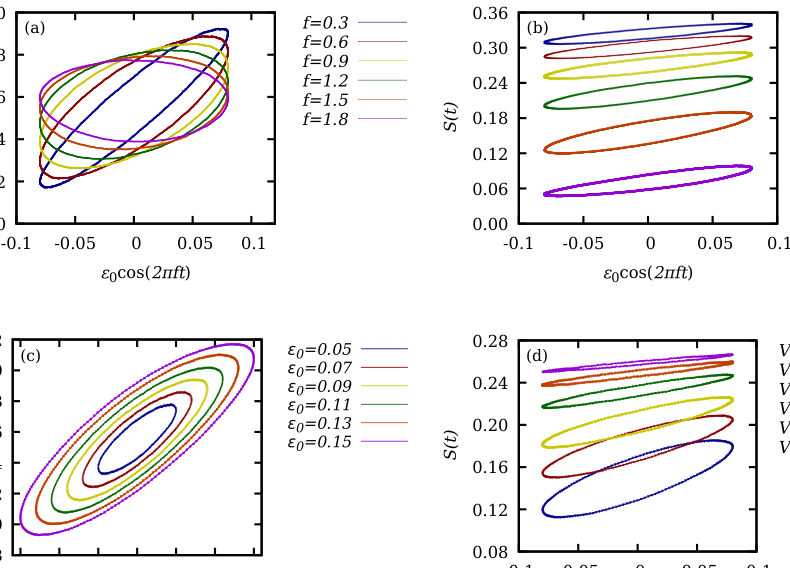 
FIG. 6. Hysteresis loops representing the uncertainty in the concentration of the autocatalytic species X, quantified via information entropy S(t) as a function of external periodic force ε0 cos(2π ft). (a) Loops for different frequencies f of driving periodic force. (b) loops at a fixed driving frequency f = 0.5, showing the effect of varying the potential well width w. (c) Loops for varying the amplitude of the periodic force ε0 at fixed frequency f = 0.5. (d) Loops showing the response of the system under the effect of varying system size V at fixed frequency f = 0.5

**Summary.** This paper analyzes how an autocatalytic reaction network exhibits dynamic hysteresis when subjected to periodic external driving. The key finding is that the magnitude of this hysteretic response is critically controlled by the interplay between the driving frequency and intrinsic system fluctuations. This work connects chemical non-equilibrium behavior to information-theoretic measures, suggesting applications for building complex chemical logic gates.

**Why it may be interesting.** This work provides a framework connecting non-equilibrium thermodynamics (entropy production) and information theory (Shannon entropy) to observable macroscopic phenomena like dynamic hysteresis in driven chemical systems, which has parallels in open quantum systems dynamics.

Detailed structure

**Main problem.** The study investigates dynamic hysteresis in an autocatalytic reaction network, arising from the interplay between intrinsic relaxation times and external periodic driving.

**Main result.** Dynamic hysteresis is quantified by a loop area that is primarily controlled by the driving protocol (frequency) and fluctuation strength, rather than just amplitude or system size.

**Method.** The authors use numerical simulations of the chemical Langevin dynamics derived from the Chemical Master Equation to track concentration responses.

**Model / system.** The model uses a periodically driven Schlögl reaction network, which is an autocatalytic system exhibiting intrinsic bistability. The dynamics are described by a Langevin equation with multiplicative noise.

**Key observables.** Dynamic Hysteresis Loop Area, Shannon Entropy, and Total Entropy Production Rate (used as measures of irreversibility).

**Important parameters / regimes.** Driving frequency ($f$), driving amplitude ($\epsilon_0$), intrinsic fluctuation strength (well width $w$), and system size ($V$).

**Assumptions / limitations.** The analysis relies on the Fokker-Planck approximation leading to a Langevin representation for the concentration variable.

**Figures summary.** Figures illustrate how the hysteresis loop area changes with driving frequency, showing an optimal intermediate regime, and how it varies monotonically with driving amplitude and system size.

**Paper structure.** The paper establishes the physical model (autocatalysis + periodic drive), derives the stochastic dynamics via Langevin equations, analyzes the resulting dynamic hysteresis using various diagnostics (loop area, entropy), and concludes by interpreting the controlling factors for applications like chemical logic gates.

Abstract

Here we show that an autocatalytic reaction network can exhibit dynamic hysteresis as a result of the competition between its intrinsic relaxation time scale and that of the periodic drive. The autocatalytic reaction steps generate bistability in the concentration of the autocatalytic species, and periodic pumping of the product species provides the external drive. Hysteresis arises from the lag between the concentration response of the autocatalytic species and the external periodic drive. The resulting hysteresis-loop area quantifies the extent of the system's hysteretic response. Using the periodically driven Schlögl model as a representative bistable chemical system, we use this loop area to determine how the magnitude of the hysteretic response is controlled by the driving protocol, intrinsic fluctuations, and the size of the system. Varying the driving frequency and the strength of the fluctuations causes a turnover of the hysteresis loop area, whereas the area changes monotonically with driving amplitude and system size. These trends identify the driving protocol and fluctuation strength as primary controls on the magnitude of dynamic hysteresis. In contrast to stochastic resonance, which is typically associated with weak periodic forcing and noise-assisted amplification, dynamic hysteresis can characterize the reaction-system response over a wider range of external control conditions. We further show that the delayed concentration response is mirrored in Shannon entropy and in the total entropy production rate, connecting dynamic hysteresis to information-theoretic and stochastic-thermodynamic measures of irreversibility. Overall, we identify and interpret the role of the controlling factors in chemical dynamic hysteresis and suggest implications for efficient chemical logic gates and eventually, chemical computers.

[↑ back to top](#top)

### [Gravitational acceleration encoded in Jaynes Cummings exchange frequencies: Quantum Fisher information, readout, and validity conditions](http://arxiv.org/abs/2607.23324v1)

**Authors:** Salman Sajad Wani, Mughees Ahmed Khan, Mohammad Haris Khan, Fardeen Ahmad Sofi, Abrar Ahmed Naqash, Saif Al-Kuwari  
**Type:** theory · **Category:** other · **PDF:** <https://arxiv.org/pdf/2607.23324v1>  
**Analysis basis:** full PDF text, analyzed in chunks
**Topic relevance:** `correlated cavity matter` **3/5** · `analog quantum simulation` **2/5** · `entanglement & information structure` **2/5** · `quantum measurements` **2/5** · `Keldysh / 2PI / non-Gaussian methods` **1/5** · `Tavis-Cummings & cavity-many-emitter` **1/5** · `driven-dissipative phase transition` **1/5** · `methods for driven-dissipative` **1/5**

📷 Fig 1

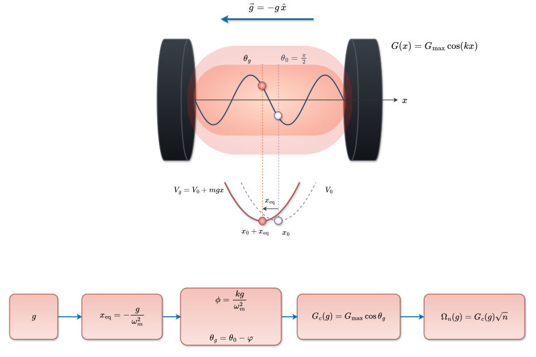 
Figure 1. Gravity-to-carrier-frequency transduction. A gravitational acceleration component along the cavity axis appears as a static force on the bound center-of-mass oscillator and shifts its equilibrium from x0 to x0 + xeq, with xeq = −g/ω2 m. The equilibrium shift changes the standing-wave phase sampled by the atom to θg = θ0 −ϕ, where ϕ = kg/ω2 m. Retaining the leading Lamb Dicke carrier gives Gc(g) = Gmax cos θg, and the Jaynes Cummings ladder converts this coupling into the exchange frequencies Ωn(g) = Gc(g)√n. Filled points mark positions on the cavity axis, while open circles mark the corresponding values of the standing-wave coupling profile. The displacement is schematic and not...

📷 Fig 2

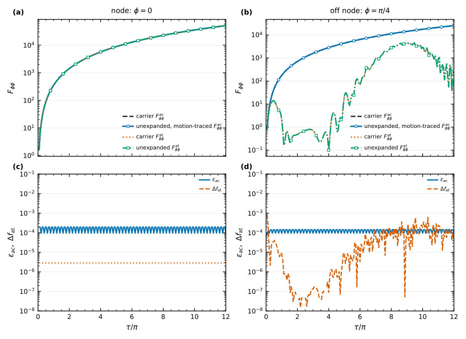 
Figure 2. Validation of the carrier-only reduction. Panels (a) and (c) show the node operating point, ϕ = 0, whereas panels (b) and (d) show the off-node point ϕ = π/4. The upper panels compare the atom–cavity and atom-only QFIs of the effective carrier model with those obtained from the unexpanded displaced-frame Hamiltonian in Eq. (21). For the unexpanded model, the motional mode is traced out before evaluating the atom–cavity QFI, as defined in Eq. (23). The lower panels show εac and ∆fat from Eqs. (24) and (25). For the benchmark specified above, the maximum relative atom–cavity-QFI discrepancies over the sampled nonzero times 0 &lt; τ ≤12π are 1.96 × 10−4 at the node and 1.45 × 10−4

📷 Fig 3

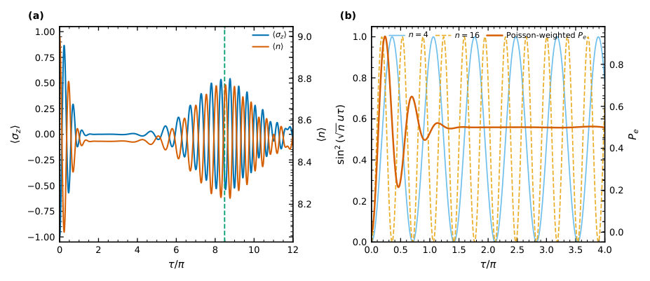 
Figure 3. Closed coherent oscillations at θ0 = π/2, ϕ = π/4, and ¯n = 9. (a) Atomic inversion ⟨σz⟩ and mean photon number ⟨n⟩exchange energy coherently. The √n frequency spread causes collapse and revival near τrev ≈2π √

📷 Fig 4

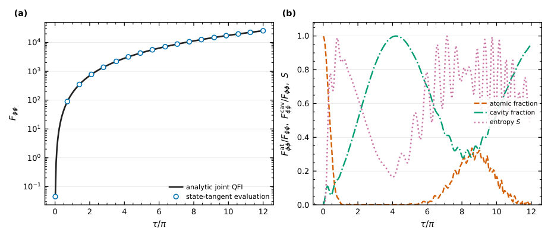 
Figure 4. QFI versus time. (a) The joint atom-cavity QFI follows the exact parabola Fϕϕ = 4¯nτ 2 sin2(θ0 −ϕ); a numerical state-tangent evaluation reproduces the closed form. (b) Local atom- only and cavity-only QFI fractions, F at ϕϕ/Fϕϕ and F cav ϕϕ /Fϕϕ, together with entanglement entropy S. The gravitational information is redistributed between local subsystems while remaining bounded by the joint atom-cavity QFI. The working point is θ0 = π/2, ϕ = π/4, and ¯n = 9.

📷 Fig 5

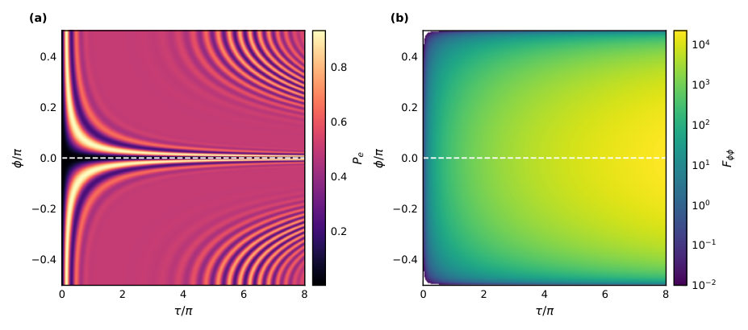 
Figure 5. Signal and joint atom-cavity sensitivity maps. (a) Atomic excited-state population Pe(τ, ϕ) computed from the exact JC state for θ0 = π/2 and ¯n = 9. The node ϕ = 0 is dark in population because the carrier coupling vanishes there, whereas away from the node the fringes accelerate as Ωn = Gmax cos(θ0 −ϕ)√n. (b) Joint displaced-frame atom-cavity QFI Fϕϕ = 4¯nτ 2 sin2(θ0 −ϕ), shown on a logarithmic color scale for the same parameters. The QFI is maximal on the node ridge because it is proportional to the square of the standing-wave slope, even though the population signal in panel (a) vanishes at that point. Values below Fϕϕ = 10−2 are masked on the logarithmic display.

**Summary.** The paper develops a model to measure gravitational acceleration using an atom coupled to an optical cavity. It shows that gravity shifts the system's coupling frequencies, allowing for the calculation of a joint Quantum Fisher Information (QFI). This demonstrates a robust quantum sensing protocol applicable to trapped-atom gravimeters.

**Why it may be interesting.** This work provides a detailed theoretical framework for next-generation quantum sensors by showing how fundamental forces like gravity can be mapped onto measurable quantum correlations (QFI) in cavity QED systems.

Detailed structure

**Main problem.** The paper focuses on encoding gravitational acceleration ($g$) into measurable quantum parameters, specifically the Jaynes-Cummings exchange frequencies ($\Omega_n(g)$), using a trapped atom coupled to an optical cavity mode.

**Main result.** The joint Quantum Fisher Information (QFI) is derived and shown to be proportional to the square of the local coupling slope, demonstrating that gravity's influence can be read out through this quantum metric. The carrier approximation successfully reproduces results from the unexpanded model under appropriate conditions.

**Method.** The analysis involves deriving an effective Hamiltonian by applying the Optical Rotating-Wave Approximation (RWA) and performing a displacement transformation to account for gravity, followed by calculating the QFI for both closed and open systems using Lindblad dynamics.

**Model / system.** The system is a trapped atom coupled to a single cavity mode and subject to quantized center-of-mass motion along the cavity axis. The Hamiltonian incorporates terms for cavity, atomic, mechanical oscillation, dipole interaction, and gravity ($mg\hat{x}$).

**Key observables.** Joint atom–cavity Quantum Fisher Information (QFI), local coupling slope, sign-sensitive estimates of axial acceleration via Ramsey detection.

**Important parameters / regimes.** Gravitational acceleration ($g$), Lamb-Dicke parameter ($\epsilon_{	ext{LD}}$), interrogation time ($	au$), mean photon number ($ar{n}$).

**Assumptions / limitations.** The analysis relies on the carrier approximation, which requires both small Lamb-Dicke support and suppression of first and second-order sidebands. Open-system dynamics are treated using Lindblad master equations.

**Figures summary.** Figures illustrate the transduction chain from $g$ to $\Omega_n(g)$ and compare QFI results between different theoretical models (e.g., carrier vs. unexpanded).

**Paper structure.** The paper systematically derives the full lab-frame Hamiltonian, applies approximations (RWA, Lamb-Dicke expansion) to derive an effective carrier model, calculates the joint QFI for this model, and finally analyzes readout strategies under open-system dynamics.

Abstract

We derive an effective trapped atom--cavity model in which a constant gravitational acceleration shifts the oscillator equilibrium and changes the local standing-wave coupling, thereby encoding the acceleration in the Jaynes Cummings exchange frequencies. With the atom and motion initially in their ground states and the cavity field initially coherent, we solve the closed-system carrier dynamics exactly and derive the displaced-frame quantum Fisher information (QFI) of the joint atom-cavity state. This QFI is proportional to the square of the local coupling slope, grows quadratically with interrogation time, and scales linearly with mean photon number. At the node, phase-referenced Ramsey detection gives a sign-sensitive estimate of axial acceleration and locally saturates the joint QFI. Away from the node, photon counting and phase-optimized homodyne detection provide cavity readouts when the cavity state carries more QFI than the atomic state. At the off-node operating point studied, Lindblad simulations show that cavity loss produces a finite-time QFI optimum. Lamb Dicke and sideband-suppression conditions control the carrier approximation. In the closed-system benchmark, the carrier-model QFI agrees with the atom-cavity QFI obtained from the unexpanded model after tracing out motion.

[↑ back to top](#top)

### [Local micromechanics in a mean-field model of glasses reveal key properties of its non-equilibrium RSB phase](http://arxiv.org/abs/2607.23603v1)

**Authors:** Makoto Suda, Edan Lerner, Eran Bouchbinder  
**Type:** theory · **Category:** disordered systems and neural networks · **PDF:** <https://arxiv.org/pdf/2607.23603v1>  
**Analysis basis:** full PDF text, analyzed in chunks
**Topic relevance:** `non-equilibrium dynamics` **3/5** · `non-equilibrium universality` **2/5** · `Keldysh / 2PI / non-Gaussian methods` **1/5** · `analog quantum simulation` **1/5** · `correlated / nonlocal dissipation` **1/5** · `driven-dissipative phase transition` **1/5** · `entanglement & information structure` **1/5** · `exotic spin models in light-matter` **1/5** · `methods for driven-dissipative` **1/5** · `scars & prethermalization` **1/5**

📷 Fig 1

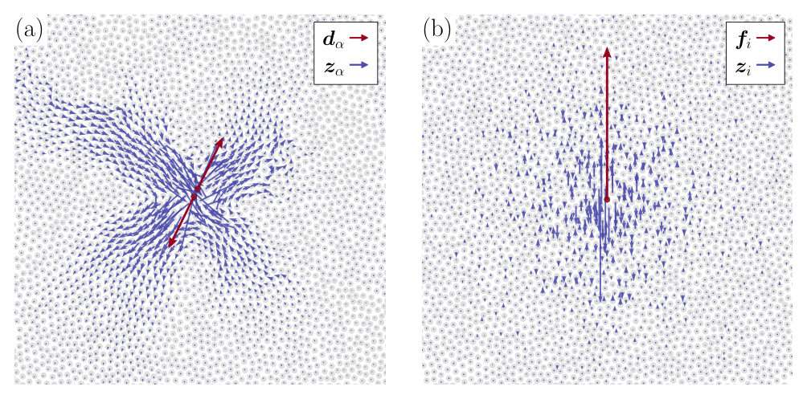 
FIG. 1. (a) The displacement response zα (blue arrows) to a local force dipole dα (red arrows) in a 2D computer glass with spatially-decaying, finite-range interactions [53], see text. The response is localized near the force dipole. (b) A 2D representation of the displacement response zi (blue arrows) to a local force monopole fi (red arrow) in the mean-field model, where the ith oscillator is placed at the center and the response arrows are oriented relative to the imposed force. While the mean-field model features no spatial structure, and specifically it is characterized by statistically uniform all-to-all interactions, by arranging the the remaining oscillators such that those with...

📷 Fig 2

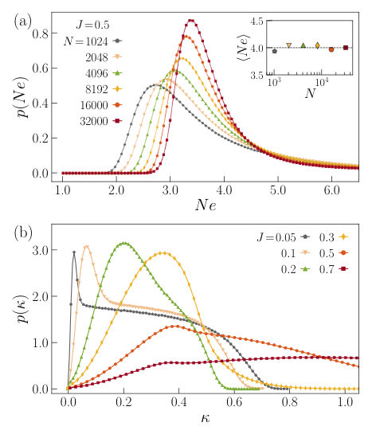 
FIG. 2. (a) The distribution p(Ne) of the participation num- ber Ne of the monopole response z for J = 0.5 and various system sizes N (see legend). (inset) The mean participation number ⟨Ne⟩vs. N. The superimposed horizontal dashed line indicates an N-independent value, herein ⟨Ne⟩= 4. (b) The distribution p(κ) of monopole stiffnesses for N = 8192 and various J values (see legend). See text for definitions and discussion.

📷 Fig 3

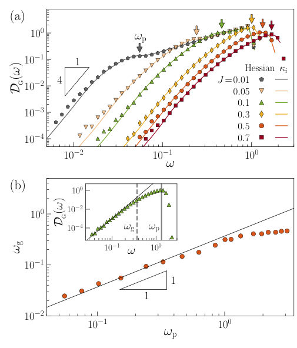 
FIG. 3. (a) The nonphononic VDoS DG(ω), obtained both from diagonalizing the Hessian (marked in legend as “Hes- sian”; filled symbols) and based on the reconstruction from monopole stiffness statistics (marked in legend as “κi”; solid lines), see text, for various J (see legend). The local max- imum of DG(ω), termed the intrinsic boson-peak frequency, is marked on each curve (see downward-pointing arrows) and denoted as ωp. (b) ωp(J) vs. the upper-cutoff frequency ωg(J) of the ∼ω4 low-frequency tail, plotted for 0.01 ≤J ≤2 (from bottom-left to top-right). The superimposed solid line indi- cates ωp ∼ωg. (inset) Demonstrating the extraction of ωg, here for J = 0.5. The solid line is a fit to...

📷 Fig 4

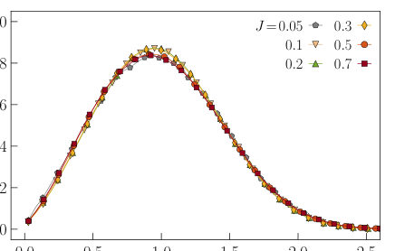 
FIG. 4. The collapsed distributions p(κ/⟨κ⟩st|k &lt; J2χ) of stabilized-sector monopole stiffness for various J values and N =8192 (see legend), where ⟨κ⟩st(J) is the mean stabilized- sector stiffness. See text for definitions and discussion.

📷 Fig 5

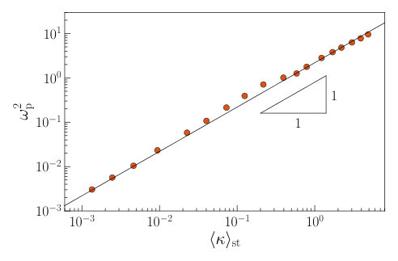 
FIG. 5. The characteristic stiffness scale ω2 p(J) of the non- phononic modes vs. ⟨κ⟩st(J) for N = 8192 and 0.01 ≤J ≤2 (from bottom-left to top-right). The superimposed solid line corresponds to ⟨κ⟩st(J)∼ω2 p(J).

**Summary.** This paper investigates a mean-field model for glasses by introducing a local micromechanical response function related to force monopoles. By establishing exact theoretical links between this local stiffness and global susceptibilities, the authors bridge the gap between abstract mean-field theory and measurable properties of real amorphous solids. The work predicts that key spectral features characteristic of glassy states persist even under non-equilibrium conditions.

**Why it may be interesting.** While focused on classical disordered systems, the mathematical techniques involving Hessian analysis, localization properties (Participation Ratio), and non-equilibrium dynamics are highly relevant to understanding complex energy landscapes in quantum many-body systems.

Detailed structure

**Main problem.** To reveal key properties of the non-equilibrium Replica-Symmetry-Breaking (RSB) phase of a mean-field model for glasses by studying its local micromechanical response.

**Main result.** The micromechanical observables derived from the force monopole stiffness establish a concrete bridge between the glassy mean-field model and finite-dimensional glasses, predicting specific spectral features like the $\omega^4$ tail in the vibrational spectrum.

**Method.** The authors introduce and analyze a micromechanical response function—the linear response to local force monopoles—and derive exact relations linking this local stiffness to global susceptibilities using mean-field theory techniques.

**Model / system.** The study uses a disordered Hamiltonian mean-field model for glasses, characterized by random couplings ($J_{ij}$) and local stiffnesses ($k_i$), analyzed under non-equilibrium quench conditions.

**Key observables.** Force monopole stiffness ($\kappa_i$), Vibrational Density of States (VDoS), global susceptibilities ($\chi, \chi_{SG}$), and the Participation Ratio ($e$).

**Important parameters / regimes.** The analysis focuses on the non-equilibrium RSB phase, particularly in limits where initial stiffness is gapless ($k_m=0$) and no external field ($h=0$).

**Assumptions / limitations.** The derivation relies on extending equilibrium replica methods to non-equilibrium quenched dynamics, and some results assume asymptotic exactness in the $N 	o \infty$ limit.

**Figures summary.** Figures compare displacement response (dipole) versus monopole response in finite dimensions vs. mean-field models, showing analogous localization patterns for participation numbers and stiffness distributions.

**Paper structure.** The paper progresses by first establishing the theoretical framework using replica methods to define local micromechanical responses, deriving exact identities linking these local quantities to global susceptibilities, and finally applying this formalism to predict observable spectral features relevant to real glasses.

Abstract

A recently formulated mean-field model of glasses features an equilibrium, zero-temperature Replica-Symmetry-Breaking (RSB) transition in some parameter range. In this range, the model's solution in the Replica-Symmetric phase is expressed in terms of an effective, self-consistent random potential for uncoupled degree of freedoms, where the transition to the RSB phase is characterized by the emergence of spectral-edge localized modes and a pseudogapped quartic vibrational spectrum, resulting in a finite spin-glass susceptibility. These properties are preserved in numerical solutions of the model under non-equilibrium conditions, i.e., upon an instantaneous quench. Inspired by recent advances in computer glasses, we define a micromechanical response function --- the linear response to local force monopoles --- in the framework of the mean-field model. We establish exact relations between the force monopole stiffness and global susceptibilities, which suggest a close correspondence between the non-equilibrium RSB phase of the model and the above-mentioned effective random potential description. As such, the obtained micromechanical observables constitute a concrete realization of the collective degrees of freedom of the model, offering a bridge between a glassy mean-field model and finite-dimensional glasses. We show that the model's vibrational spectrum can be computed solely from the monopole response statistics and, by employing a marginal stability criterion, we extract a characteristic frequency/stiffness scale of soft glassy modes, which is related to the boson peak in finite-dimensional, laboratory glasses.

[↑ back to top](#top)

### [Reasoning about Continuous-Variable Quantum Systems](http://arxiv.org/abs/2607.23137v1)

**Authors:** Tianshi Yu, Gilles Barthe, Minbo Gao, Mingsheng Ying, Li Zhou  
**Type:** theory · **Category:** quantum information and computing · **PDF:** <https://arxiv.org/pdf/2607.23137v1>  
**Analysis basis:** full PDF text, analyzed in chunks
**Topic relevance:** `quantum measurements` **3/5** · `measurement-induced transitions` **2/5** · `Keldysh / 2PI / non-Gaussian methods` **1/5** · `analog quantum simulation` **1/5** · `correlated / nonlocal dissipation` **1/5** · `correlated cavity matter` **1/5** · `driven-dissipative phase transition` **1/5** · `entanglement & information structure` **1/5** · `methods for driven-dissipative` **1/5** · `non-equilibrium dynamics` **1/5**

📷 Fig 1

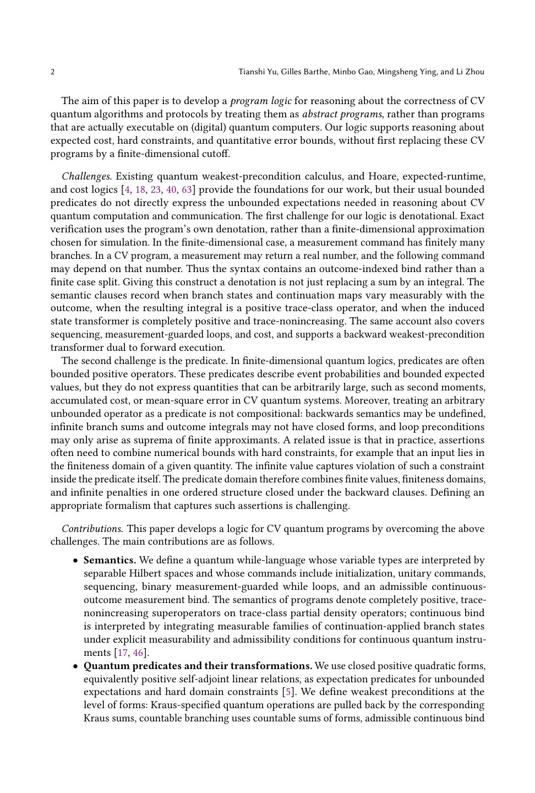 
Low-resolution page preview, page 2

📷 Fig 2

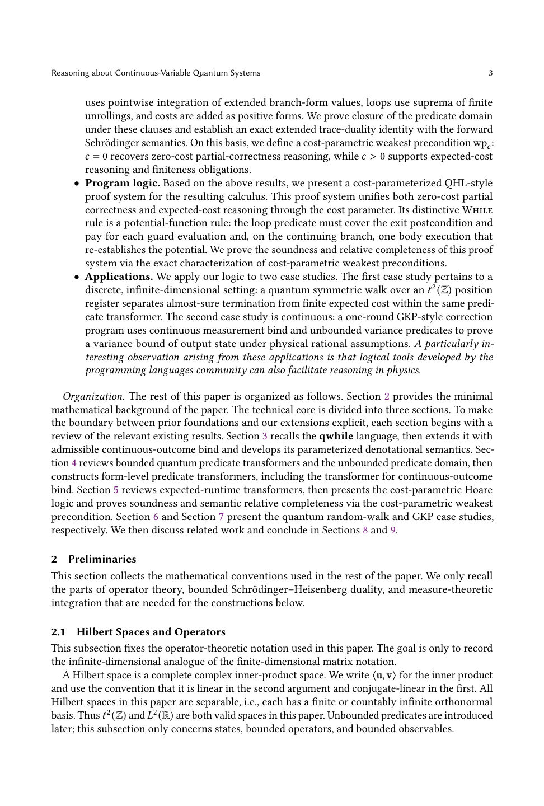 
Low-resolution page preview, page 3

📷 Fig 3

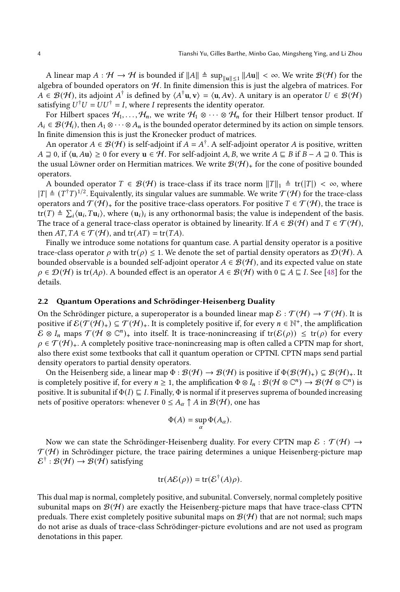 
Low-resolution page preview, page 4

📷 Fig 4

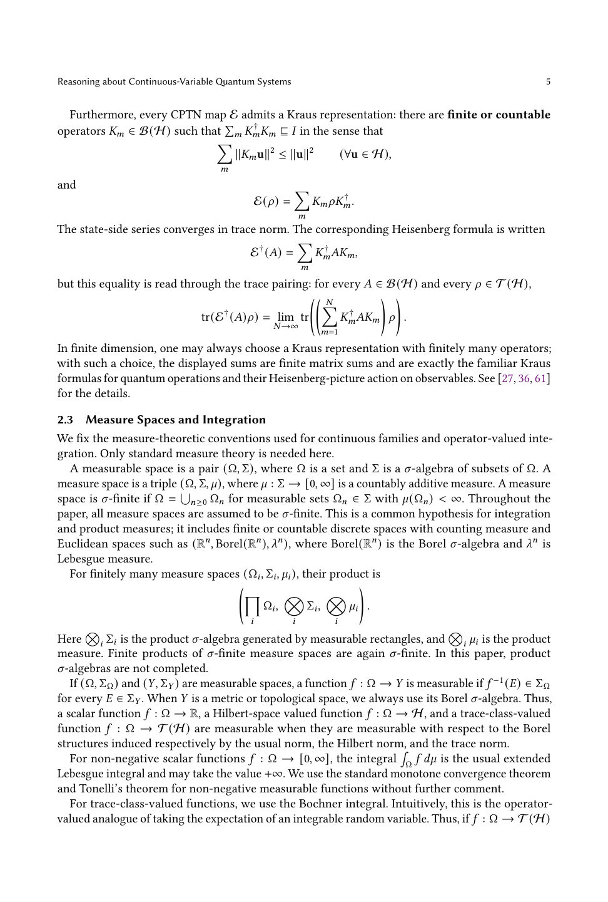 
Low-resolution page preview, page 5

📷 Fig 5

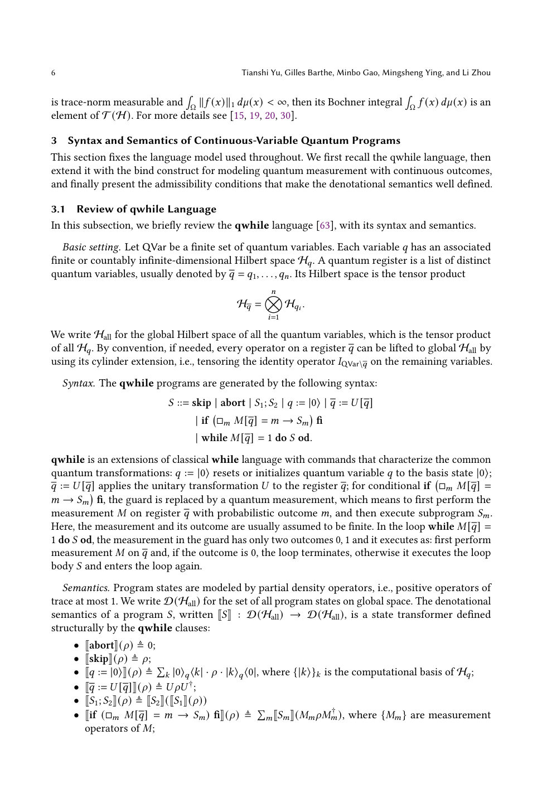 
Low-resolution page preview, page 6

**Summary.** This paper develops a formal semantics for Continuous-Variable Quantum Computing (CVQC) by defining a specialized logic that can handle unbounded values. It introduces closed positive quadratic forms as semantic predicates to reason about expected costs and error bounds. This framework is validated using the GKP code, providing tools for verifying quantum algorithms in continuous settings.

**Why it may be interesting.** This work provides the necessary mathematical rigor to analyze complex continuous measurements and feedback loops common in quantum optics experiments, bridging theoretical computation models with physical constraints.

Detailed structure

**Main problem.** The work aims to develop a formal semantics and sound verification methods for Continuous-Variable Quantum Computing (CVQC) programs.

**Main result.** A formal semantics is established using closed positive quadratic forms as semantic predicates, allowing the rigorous reasoning about unbounded values inherent in continuous quantum systems.

**Method.** The authors extend Hoare logic with a cost-parameterized weakest precondition ($	ext{wp}_c$) and define the predicate domain using closed positive quadratic forms to handle infinite-dimensional expectations.

**Model / system.** The focus is on CVQC paradigms, particularly those based on quantum optics, and includes validation via the Gottesman–Kitaev–Preskill (GKP) error-correcting code protocol.

**Key observables.** Expected cost, hard constraints, error bounds (e.g., second moment bound for GKP), and position variance ($\hat{q}^2$).

**Important parameters / regimes.** The structure of the semantic predicates must accommodate unbounded values arising from continuous measurements.

**Assumptions / limitations.** Existing weakest-precondition calculus often uses bounded predicates, which is insufficient for the unbounded expectations required in CVQC.

**Paper structure.** The paper develops a formal semantics for a quantum while-language over separable Hilbert spaces, defines the predicate domain using closed positive quadratic forms, and validates this with case studies including GKP error correction.

Abstract

Continuous-variable quantum computing (CVQC) is a computing paradigm in which measurements yield values over a continuous domain. CVQC is both a convenient omputational framework for modeling physical quantum systems, and a good abstraction for hardware platforms based on quantum optics. Yet, the semantic foundations of CVQC remain underdeveloped. To address this gap, we develop a formal semantics for a core CV quantum programming language, and sound verification methods for program correctness.   A main contribution of this work is to isolate a well-behaved quantitative predicate domain that achieves sufficient expressiveness to accommodate unbounded values as they arise in the infinite-dimensional, continuous setting. Specifically, we choose closed positive quadratic forms as semantic predicates, representing finite expectations, domains of finiteness, and infinite penalties in one ordered object. We validate our choice by establishing that our semantic predicates satisfy desirable closure properties including the definition of weakest preconditions.   We validate our design with two case studies, including an example based on the celebrated GKP error-correcting code, for which we establish a second moment bound.

[↑ back to top](#top)

### [Bulk spectra and the non-Hermitian skin effect in systems with long-range couplings](http://arxiv.org/abs/2607.24496v1)

**Authors:** Jonathan Sturm, Pia Kreß, Adriana Pálffy  
**Type:** theory · **Category:** other · **PDF:** <https://arxiv.org/pdf/2607.24496v1>  
**Analysis basis:** full PDF text, analyzed in chunks
**Topic relevance:** `correlated / nonlocal dissipation` **3/5** · `methods for driven-dissipative` **3/5** · `driven-dissipative phase transition` **2/5** · `Keldysh / 2PI / non-Gaussian methods` **1/5** · `Kondo & dissipative impurity` **1/5** · `analog quantum simulation` **1/5** · `non-equilibrium dynamics` **1/5**

📷 Fig 1

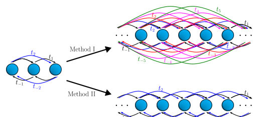 
FIG. 1. Illustration of the two Methods: A finite chain of N = 3 sites with couplings tn (−2 ≤n ≤2) is extended to an infinite chain. The infinite chain either incorporates all possible long-range couplings tn, n ∈Z (Method I), or does only consider the coupling strengths present in the finite chain (Method II). (For Method I we only show a selection of couplings up to |n| = 5 for illustrative purposes.)

📷 Fig 2

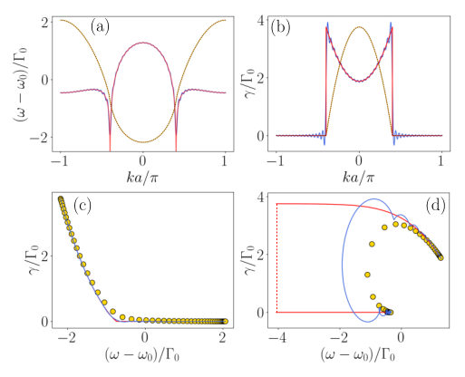 
FIG. 2. Band structures of a quantum emitter chain in free space. (a) and (b) show the frequency shifts ω = Re(ωI/II(k)) and collective decay rates γ = −2Im(ωI/II(k)). Parallel po- larization is shown in the black dashed (Method I) and or- ange (Method II) curves, perpendicular polarization in the red (Method I) and blue (Method II) curves. (c) and (d) show the curves ωI/II (red/blue) as well as the finite size eigen- values (yellow dots) in the complex plane for parallel and perpendicular polarization, respectively. The red dashed line in (d) indicates the discontinuity that actually takes place at ω/Γ0 = −∞. Parameters in all panels are N = 50 and φ = 2π/5.

📷 Fig 3

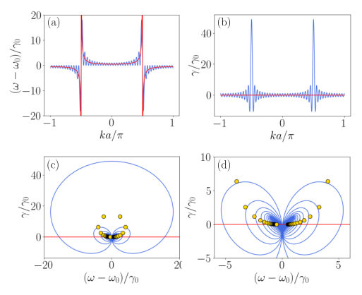 
FIG. 3. Band structures of a quantum emitter chain cou- pled to a waveguide. (a) and (b) show the frequency shifts ω = Re(ωI/II) and collective decay rates γ = −2Im(ωI/II), respectively. The red (blue) curves show the results for Method I (II). (c) shows the band structures in the complex plane with finite chain eigenvalues (yellow dots). (d) shows a zoom of (c). Parameters in all panels are N = 50, φ = π/2, and ξ = 1.

📷 Fig 4

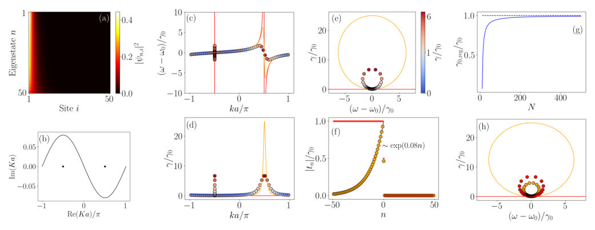 
FIG. 4. Non-Hermitian skin effect in a quantum emitter chain chirally coupled to a waveguide with directionality parameter ξ = 2 × 10−5. (a) Localization of eigenstates |ψn⟩of the finite size Hamiltonian in Eq. (7) with N = 50. Eigenstates are sorted by the negative imaginary part of their corresponding eigenvalues (i.e., n = 1 corresponds to highest decay rate γ, n = N to the lowest). (b) Regularization path according to Eq. (23). (c) and (d) show the frequency shift ω = Re(ωI) and collective decay rates γ = −2Im(ωI), respectively, as functions of k. The red (orange) curve is the original (regularized) band structure. Colored dots are finite size eigenvalues [color bar in panel (e)]. (e)...

📷 Fig 5

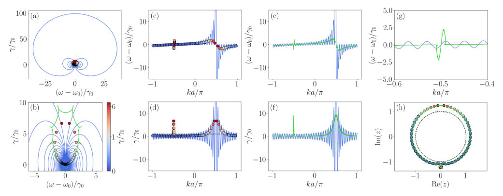 
FIG. 5. Band structure of a quantum emitter chain chirally coupled to a waveguide with ξ = 2 × 10−5 calculated according to Method II. (a) shows the band structure ωII as a curve (blue) in the complex plane. In the close-up (b) we also present the calculated limiting set Λ (green dots) and the finite size eigenvalues (colored dots where the color indicates the decay rate: red ˆ= superradiance, blue ˆ= subradiance). (c) and (d) show the frequency shift ω = Re(ωII) and collective decay rates γ = −2Im(ωII) (blue curves), respectively, with the corresponding finite size eigenvalues [color code as in (b)]. The dashed black line in (d) corresponds to γ/γ0 = 1, marking the border between...

**Summary.** This paper rigorously compares two methods—infinite chain approximation versus periodic boundary conditions—for calculating band structures in quantum systems with long-range couplings. It demonstrates that for complex, non-Hermitian systems like emitters coupled to waveguides, the PBC approach is mathematically superior and necessary to correctly capture phenomena such as the non-Hermitian skin effect.

**Why it may be interesting.** This work is highly relevant as it provides a critical methodological guide for theorists studying open quantum systems (like emitters coupled to waveguides) that exhibit non-Hermitian physics and long-range interactions. The distinction between infinite vs. periodic boundary conditions is a subtle but crucial theoretical point.

Detailed structure

**Main problem.** The paper compares two distinct methods for calculating band structures in systems with long-range couplings, specifically addressing discrepancies that arise when translational symmetry is enforced.

**Main result.** For long-range couplings, the periodic boundary condition approach (Method II) yields physically and mathematically robust results, while the infinite chain approximation (Method I) fails to correctly describe phenomena like the non-Hermitian skin effect in waveguide systems.

**Method.** The authors employ theoretical analysis comparing two summation methods: one assuming an infinite lattice ($\omega_I$) and another based on finite periodic boundary conditions ($\omega_{II}$).

**Model / system.** The study uses one-dimensional quantum emitter chains, analyzed both in free space and when coupled to a waveguide. The Hamiltonian involves couplings $t_{ij}$ that can decay as short-range or long-range (power-law).

**Key observables.** Band structure ($\omega(k)$), collective dipole shifts, decay rates ($\gamma(k)$), Generalized Brillouin Zone (GBZ), and the spectral winding number $
u(\epsilon_0)$.

**Important parameters / regimes.** The ratio of couplings controlling chirality ($\xi = \gamma_R/\gamma_L$) is crucial for inducing the non-Hermitian skin effect.

**Assumptions / limitations.** The primary assumption tested is whether Method I and Method II converge, which they fail to do in the presence of long-range or chiral couplings in the waveguide setup.

**Figures summary.** Figures compare $\omega_I(k)$ vs. $\omega_{II}(k)$ for free space emitters (showing dipole shifts/decay rates) and illustrate the complex structure of the GBZ and limiting set ($\Lambda$) under strong chirality.

**Paper structure.** The paper develops by first establishing the general problem of long-range couplings, comparing Method I and II in simple models. It then applies this rigorous comparison to the more complex waveguide system, demonstrating where the methods diverge, culminating in an analysis of topological invariants like the winding number.

Abstract

To achieve translational symmetry for the computation of the band structure of a lattice model, one can either consider an infinite lattice or impose periodic boundary conditions. While in sys- tems with short-range couplings these two approaches are equivalent, we show that for long-range couplings one can obtain considerably different results. We compare the two methods on the basis of one-dimensional quantum emitter chains both in free space and when coupled to a waveguide. The latter system allows for asymmetric couplings enabling the non-Hermitian skin effect, which we analyze using the two different band-structure calculation methods. We find that only periodic boundary conditions lead to physically and mathematically robust results, while the infinite-chain approach entails convergence issues and is unable to satisfyingly explain the emergence of the non- Hermitian skin effect in the waveguide system. In addition, the waveguide system yields unusual findings like a non-star shaped generalized Brillouin zone and strongly localized eigenstates with zero winding number.

[↑ back to top](#top)

### [From Local Payoffs to Global Instabilities: A Spectral Cartography of Spatiotemporal Chaos in Canonical 2x2 Evolutionary Games](http://arxiv.org/abs/2607.24638v1)

**Authors:** Ozgur Aydogmus  
**Type:** theory · **Category:** statistical mechanics · **PDF:** <https://arxiv.org/pdf/2607.24638v1>  
**Analysis basis:** full PDF text, analyzed in chunks
**Topic relevance:** `driven-dissipative phase transition` **3/5** · `non-equilibrium universality` **3/5** · `non-equilibrium dynamics` **2/5** · `Frenkel-Kontorova` **1/5** · `Keldysh / 2PI / non-Gaussian methods` **1/5** · `analog quantum simulation` **1/5** · `methods for driven-dissipative` **1/5**

📷 Fig 1

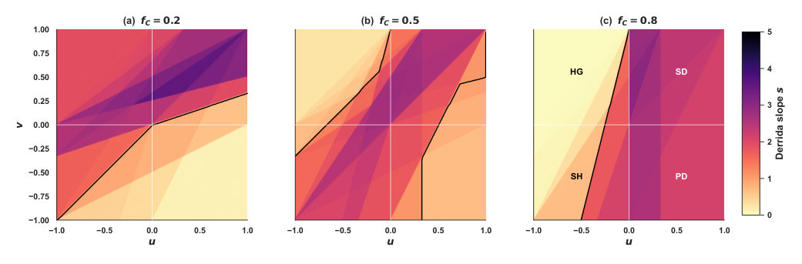 
FIG. 1. The chaotic phase boundary shifts systematically with initial cooperator density, implying distinct dominant instability mechanisms at each density. Each panel shows the Derrida slope s(u, v) for a fixed initial cooperator frequency fC; darker colors indicate s &gt; 1 (chaotic phase) and lighter colors s &lt; 1 (ordered phase). Black contours mark the empirical chaotic boundaries s ≈1. The shape and position of these contours shift substantially with fC (see e.g. “chaotic corridor” appearing only at fC = 0.5) indicating that the dominant instability mechanism depends on the initial spatial composition of the population. Section IV identifies which motif (and its corresponding spectral...

📷 Fig 2

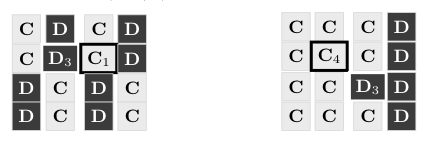 
FIG. 2. Each chaotic phase boundary traces to a single microscopic competition event, fully determined by the payoff functions. Each panel shows the local configura- tion (motif) associated with the labeled sector; light cells are cooperators (C), dark cells are defectors (D). Cells with sub- scripted letters mark the critical competing pair whose pay- off balance defines the motif’s marginal-stability condition; subscripts give each agent’s cooperative-neighbor count nC. Panels (a–c) show that the long-wavelength limit k →(0, 0) captures localized invasion geometries (single invader or two- site cluster); panels (d–f) probe domain-wall stability and its transverse kink instabilities;...

📷 Fig 3

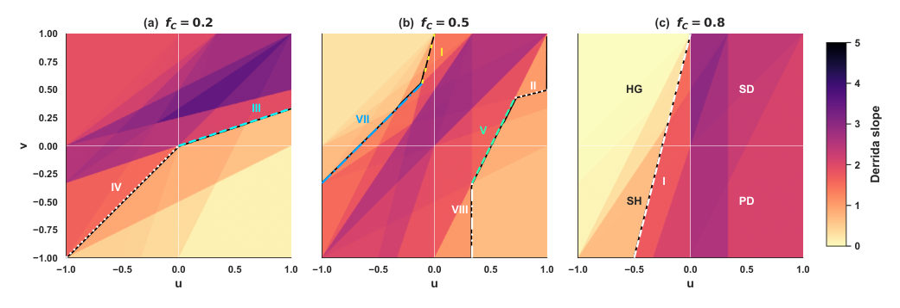 
FIG. 3. The analytically derived instability lines (Table I) quantitatively predict the numerical chaos boundaries, with each boundary segment attributable to a single dominant motif. Black contours show the empirical Derrida boundary s ≈1 from Fig. 1; colored dashed lines are the analytical predictions from Table I. Panel (a) (fC = 0.2): the chaotic region is bounded below by the stripe equilibrium line IV (v = u) and the nucleation line III (v = u/3). Panel (b) (fC = 0.5): the upper boundary of the “chaotic corridor” follows lines VII and I; the lower boundary is a composite of lines V, II, and VIII. Panel (c) (fC = 0.8): dominated by the single-defector invasion line I (v = 4u + 1). The...

📷 Fig 4

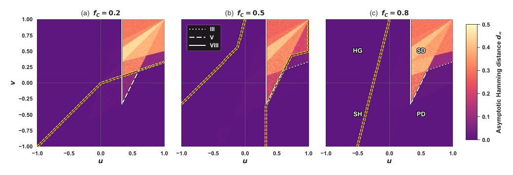 
FIG. 4. Two distinct chaos regimes coexist: transient chaos (large) and sustained chaos (smaller interior region), with a subcritical pocket where linear stability and persistent chaos coexist. Each panel shows d∞(u, v), the long- run fraction of sites that differ between two initially close replicas, for initial cooperator frequency fC(0) = 0.2 (a), 0.5 (b), 0.8 (c). Color encodes d∞on a perceptually uniform sequential scale: dark purple indicates d∞≈0 (eventual synchronization) and lighter colors indicate d∞&gt; 0 (sustained chaos). Yellow contours reproduce the empirical Derrida boundary s ≈1 from Fig. 1; white lines bound the region of sustained chaos (d∞&gt; 0). The gap between the yellow...

📷 Fig 5

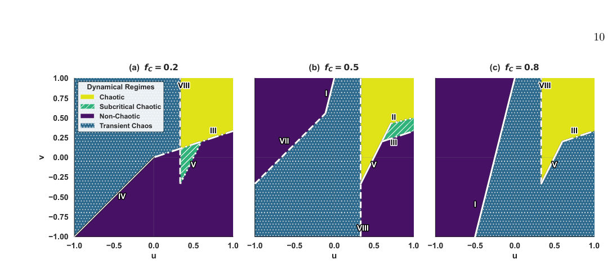 
FIG. 5. Three motif instability lines (III, V, VIII) universally bound the sustained-chaos region across all initial cooperator densities, indicating the spectral origin of the phase boundaries. Each point in the (u, v) plane is classified by the joint values of s and d∞into one of four dynamical regimes. Color key: dark blue (ordered, s &lt; 1, d∞≈0); dotted light blue (transient chaos, s &gt; 1, d∞≈0); yellow (sustained chaos, s &gt; 1, d∞&gt; 0); dashed-green (subcritical chaos, s &lt; 1, d∞&gt; 0). Dashed lines are the analytical instability lines from Table I; the boundaries between colored regions coincide with Lines III, V, and VIII across all three panels. Panels show fC(0) = 0.2 (a), 0.5 (b), 0.8...

**Summary.** This work develops a motif-based theory to map the chaotic phase diagram of spatial evolutionary games. By analyzing local pattern instabilities using tools like the Derrida slope and Hamming distance, the authors classify dynamics into four regimes. The key finding is the identification of a subcritical chaotic regime, providing a comprehensive understanding of how chaos emerges in spatially structured non-equilibrium systems.

**Why it may be interesting.** The rigorous mathematical connection drawn between pattern formation/chaos (via CA dynamics) and spectral stability criteria is highly relevant to understanding non-equilibrium phase transitions in complex many-body systems, which share structural analogies with quantum field theories or interacting particle models.

Detailed structure

**Main problem.** To develop a motif-based framework for spatiotemporal chaos in spatial evolutionary games and map the dynamical phase diagram in the payoff plane.

**Main result.** The authors establish a four-region cartography (ordered, transient-chaotic, sustained-chaotic, subcritical-chaotic) governed by local motif instability thresholds. They identify a subcritical chaotic phase where finite perturbations sustain chaos despite linear stability.

**Method.** The analysis uses Boolean linearization of the imitate-the-best rule and combines diagnostics like the Derrida slope (s) and asymptotic Hamming distance ($d_\infty$) to map stability boundaries.

**Model / system.** The system is a deterministic cellular automaton based on canonical 2x2 evolutionary games played on a square lattice, governed by a synchronous 'imitate-the-best' update rule.

**Key observables.** Derrida slope ($s$), asymptotic Hamming distance ($d_\infty$), and the stability thresholds derived from payoff balance at motif interfaces.

**Important parameters / regimes.** Payoff parameters $(u, v)$, initial cooperator density $f_C(0)$, and lattice size $L$.

**Assumptions / limitations.** The analysis relies on linearization techniques (Boolean Jacobian) and an effective-medium argument for random configurations; the subcritical regime is outside the linear scope.

**Figures summary.** Figure 5 shows a spectral cartography in the $(u, v)$ plane classifying points into four dynamical regimes based on $s$ and $d_\infty$ for different initial densities.

**Paper structure.** The paper progresses from defining the chaotic diagnostics ($s$, $d_\infty$) to developing the motif-based framework. It derives analytical thresholds from local payoff balances, establishes the structural identity $s=\Lambda$ for homogeneous cases, and culminates in mapping the full four-region phase diagram.

Abstract

We develop a motif-based framework for spatiotemporal chaos in spatial evolutionary games and use it to map the dynamical phase diagram in the payoff plane. Using Boolean linearization of the imitate-the-best rule, we derive analytical instability thresholds for local motifs including invaders, cooperative pairs, stripe interfaces, and cooperative cores. These thresholds are obtained from payoff balance at contested motif interfaces and recover classical invasion thresholds of spatial evolutionary games, which emerge here as boundaries of the chaotic phase. Combining the Derrida slope with the asymptotic Hamming distance, we obtain a four-region cartography: ordered, transient-chaotic, sustained-chaotic, and subcritical-chaotic dynamics. The phase diagram is organized by density-dependent motif selection: different initial cooperator densities activate different instability mechanisms, yet a small set of motif-instability lines consistently bounds the sustained-chaos region across densities. This cartography reveals a subcritical chaotic phase (Derrida slope $s<1$ but asymptotic Hamming distance $d_\infty>0$), where infinitesimal perturbations decay while finite-amplitude perturbations sustain chaos. The motif-based framework is anchored by an exact benchmark: for homogeneous backgrounds, the Boolean Jacobian yields an exact correspondence between the Derrida slope and spectral radius, linking damage spreading to deterministic instability.

[↑ back to top](#top)

### [Learning limit cycles via Hebbian synaptic plasticity](http://arxiv.org/abs/2607.24478v1)

**Authors:** Samantha J. Fournier, Luca Vincenzo Spallanzani, Pierfrancesco Urbani  
**Type:** theory · **Category:** disordered systems and neural networks · **PDF:** <https://arxiv.org/pdf/2607.24478v1>  
**Analysis basis:** full PDF text, analyzed in chunks
**Topic relevance:** `driven-dissipative phase transition` **3/5** · `methods for driven-dissipative` **3/5** · `non-equilibrium dynamics` **2/5** · `non-equilibrium universality` **2/5** · `Frenkel-Kontorova` **1/5** · `Keldysh / 2PI / non-Gaussian methods` **1/5**

📷 Fig 1

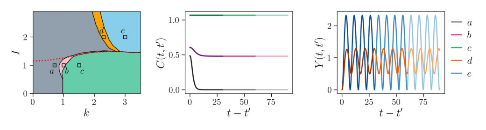 
FIG. 1: Phenomenology of steady-states in the memorization phase t ≫Tht, for Tst = Tht ≫1. (Left) Phase diagram with a. Plain chaos (grey), b. Semi-freezable chaos (pink), c. Freezable chaos (green), d. Semi-freezable limit cycle (orange) and e. Freezable limit cycle (blue). The red dotted line denotes the transition from chaotic dynamics to limit cycle activity during the periodic stimulation (t &lt; Tst). (Middle and Right) Steady-state behavior of C(t, t′) and Y (t, t′) in the memorization phase (t ≥t′ ≫Tht). Color shadings correspond to different values of t′.

📷 Fig 2

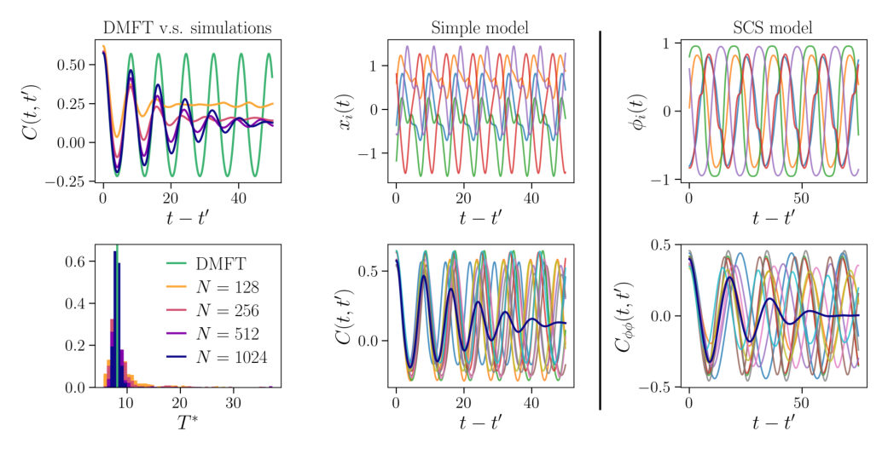 
FIG. 2: Comparison between DMFT and finite-size numerical simulations in the memorization phase. The left and middle panels show results for the dynamical system Eq. (1), while the right panel is obtained with the SCS model. C(t, t′) as obtained from numerical simulations with N neurons and averaged over Ns disorder realizations converges slowly as N increases to its DMFT prediction (Top-left). This is due to sample-to-sample fluctuations in the period T ∗of the oscillations in C(t, t′), which result in destructive interference (Bottom-left). (Middle) Numerical simulations with N = 1024 neurons in the memorization phase t ≥t′ ≫Tht with I = 2, k = 2.5. Traces of neuronal activities xi(t)...

📷 Fig 3

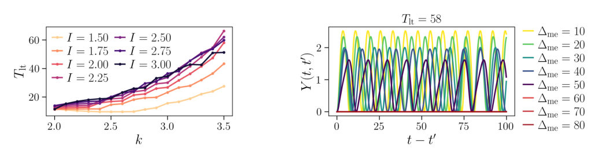 
FIG. 3: (Left) Lifetime of persistent oscillations for t ≥Tst with active plasticity (Tht →∞). The lifetime Tlt is defined as the time interval over which C(t, Tst), plotted as a function of t −Tst, displays sustained oscillations. Numerically, Tlt is obtained by locating the point after the final oscillation peak where |∂tC(t, Tst)| falls below a fixed threshold. (Right) Impact of a non-zero metabolic phase ∆me = Tht −Tst on the limit cycle attractor of the memorization phase (t ≥t′ ≫Tht). As long as ∆me is sufficiently small compared to Tlt, the MSD vanishes periodically, indicating limit cycle activity (shades of viridis). Parameters are: I = 2, k = 3.5.

**Summary.** This paper models high-dimensional neural networks subject to periodic external drives and Hebbian synaptic plasticity. It theoretically demonstrates that the network can 'learn' a stable, self-sustained rhythmic pattern—a limit cycle—even after the initial driving forces are removed. The findings highlight how plasticity allows transient inputs to imprint lasting oscillatory memories onto the system's connectivity.

**Why it may be interesting.** This work provides a theoretical framework for how complex, sustained rhythmic behaviors (limit cycles) can emerge and persist in artificial neural networks purely through local learning rules (Hebbian plasticity), which has implications for understanding biological rhythm generation.

Detailed structure

**Main problem.** The study investigates whether limit cycle activity, transiently induced by external periodic stimulation in high-dimensional neural networks, can be stabilized through Hebbian synaptic plasticity.

**Main result.** The system exhibits a novel regime where the interplay of periodic drive and plasticity imprints a memory of rhythmic patterns onto network connectivity, causing the dynamics to spontaneously settle into a limit cycle after the external inputs are removed.

**Method.** The analysis employs Dynamical Mean Field Theory (DMFT) in the thermodynamic limit ($N 	o \infty$) to characterize the system's phase diagram and time evolution.

**Model / system.** The model is a high-dimensional, non-linear dynamical system incorporating Hebbian synaptic plasticity. The dynamics are governed by external periodic inputs and internal coupling terms that evolve based on past activity.

**Key observables.** Two-time correlation function $C(t, t')$, Mean Square Displacement (MSD) $Y(t, t')$, and the period of the resulting limit cycle ($T^*$).

**Important parameters / regimes.** Driving amplitude ($I$), plasticity coupling strength ($k$), and the metabolic phase duration ($\Delta_{me} = T_{ht} - T_{st}$).

**Assumptions / limitations.** The analysis relies on DMFT in the $N 	o \infty$ limit, and later sections involve approximating the dynamics by decomposing degrees of freedom into two uncorrelated stochastic processes.

**Figures summary.** Figures illustrate the phase diagram showing transitions between chaotic, fixed point, and limit cycle attractors based on parameters. Later figures show the lifetime of persistent oscillations ($T_{lt}$) versus input strength and the effect of $\Delta_{me}$ on attractor type.

**Paper structure.** The paper first establishes the model dynamics under periodic drive and plasticity. It then analyzes the resulting phase diagram using DMFT to identify regimes supporting limit cycles. Finally, it investigates the robustness of these learned rhythms by varying the metabolic time window ($\Delta_{me}$).

Abstract

We investigate high-dimensional, non-linear dynamical systems when exposed to incoherent periodic inputs and Hebbian-like synaptic plasticity. Our findings reveal a striking phenomenon: depending on the interplay between the strength of the periodic drive and synaptic plasticity, the system's phase diagram can give rise to a region where, once both inputs are removed, the collective dynamics spontaneously settles into a limit cycle. This suggests that periodic drives can imprint lasting rhythmic patterns into the network through plasticity, effectively teaching it to oscillate on its own. Numerical simulations on finite size systems show that the limit cycle phase can be easily detected on single-sample trajectories, while averaged curves are affected by strong finite size effects due to sample-to-sample fluctuations of the period of the limit cycles.

[↑ back to top](#top)

### [Microphase Separation in Quorum-Sensing Active Particles with Competing Interactions](http://arxiv.org/abs/2607.23259v1)

**Authors:** Michele Antonioli, Nicoletta Gnan, Claudio Maggi  
**Type:** theory · **Category:** statistical mechanics · **PDF:** <https://arxiv.org/pdf/2607.23259v1>  
**Analysis basis:** full PDF text, analyzed in chunks
**Topic relevance:** `Keldysh / 2PI / non-Gaussian methods` **3/5** · `driven-dissipative phase transition` **2/5** · `non-equilibrium dynamics` **2/5** · `non-equilibrium universality` **2/5** · `Frenkel-Kontorova` **1/5** · `analog quantum simulation` **1/5** · `methods for driven-dissipative` **1/5**

📷 Fig 1

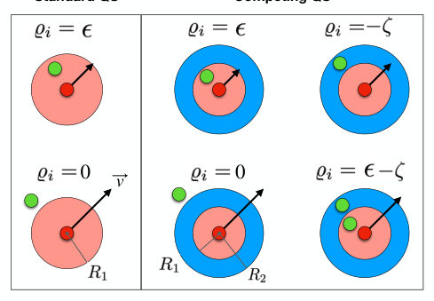 
FIG. 1. Schematic representation of the standard quorum sensing mechanism (left panel) compared to the model with competing interactions (right panel). The drawing shows how the sensed density ϱ (entering the velocity kernel) is evaluated for a target particle (red) in the presence of neighboring par- ticles (green). The black arrow indicates the velocity vector. In the left panel (standard quorum sensing): the red circle in- dicates the “sensing” neighborhood of radius R1. When the red particles senses the neighboring particle it slows down. In the right panel (model with competing interactions): the red circle indicates the inner neighborhood of radius R1, while the blue disk indicates...

📷 Fig 2

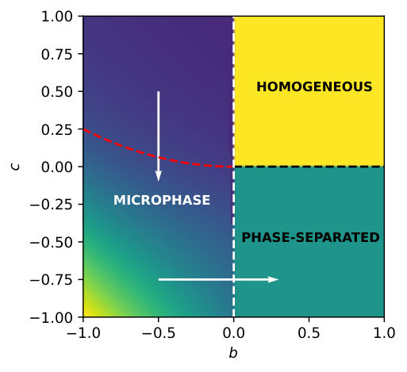 
FIG. 2. Mean-field phase diagram. The phase diagram is di- vided in four main regions: for b &gt; 0 and for c &gt; 0 the system is homogeneous. Lowering c and crossing the critical line at c = 0 (black dashed line) the system phase separates. For b &lt; 0 the system forms a microphase and the Gaussian the- ory predicts that, by lowering c (vertical arrow), the system undergoes a phase transition at the critical line c = b2/4 (red dashed line), where ξ diverges. Differently the renormalized theory predicts always a finite ξ which smoothly increases upon lowering c and b. The colormap represents the values of the renormalized ξ from low (blue) to high (yellow). By increasing b at fixed c &lt; 0...

📷 Fig 3

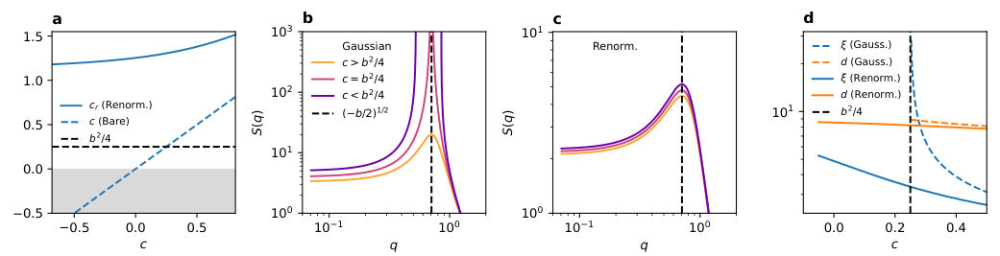 
FIG. 3. (a) Renormalized mass cr as a function of the bare mass c (full line). cr is always above the critical value b2/4 (dashed horizontal line) even for c &lt; 0 (gray area). (b) Gaussian structure factor at different values of the mass parameter c (see legend). As the threshold value c = b2/4 is approached, the peak at finite wavevector q∗= p

📷 Fig 4

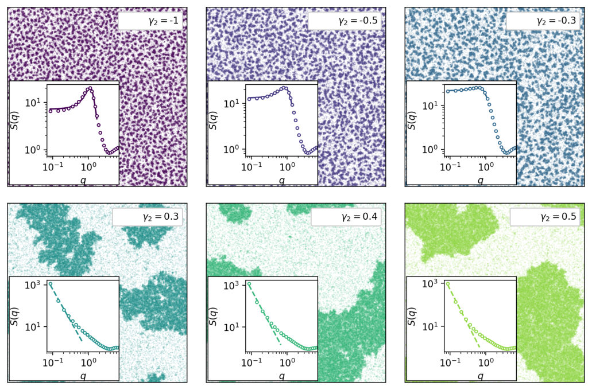 
FIG. 4. Representative steady-state configurations obtained from numerical simulations of the competing quorum-sensing model at fixed parameters ρ/ρ0 = 2.82, ∆V/V0 = 30, and γ0 = 1, for different values of the parameter γ2 (see legend). The size of the system is N = 150 × 103 particles. As γ2 is increased, the system progressively crosses over from microphase- separated states characterized by finite-size dense domains (top panels) to macrophase-separated configurations (bottom panels) displaying large-scale coarsening. Insets: corresponding static structure factors S(q). For negative γ2, the structure factor develops a pronounced peak at finite wavevector, signaling the emergence of a...

📷 Fig 5

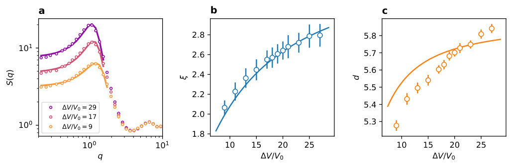 
FIG. 5. (a) Numerical structure factor in the microphase region at different values of the parameter ∆V (data points, see legend). Parameters are set to N = 15 × 103 particles, ρ/ρ0 = 2.82, γ2/γ0 = −0.5. Upon increasing ∆V the S(q) grows in amplitude and its peak slightly shifts to lower q. Around the peak the S(q) can be fitted well with Teubner–Strey form S(q) = A/(q4 + bq2 + c) (full lines) that allows to extract the characteristic lengths ξ and d. (b) and (c) show, respectively, the correlation length ξ and the modulation length d as a function of ∆V (circles) where the errobars are estimated from the fits of the data in (a). The full lines in (b) and (c) represent a fit with the...

**Summary.** This work analyzes how competing sensing interactions modify phase separation in active particles governed by quorum sensing. By deriving a coarse-grained field theory, the authors show that these competing ranges suppress large-scale phase separation, instead stabilizing tunable microphase structures with finite characteristic lengths. This establishes a powerful theoretical link between microscopic interaction rules and mesoscopic pattern formation.

**Why it may be interesting.** The rigorous mapping from microscopic particle dynamics (active matter) to a mesoscopic, continuous field theory is highly valuable. This methodology for predicting emergent spatial order using interaction moments can be adapted to model complex many-body systems in AMO physics or active quantum simulators.

Detailed structure

**Main problem.** The study investigates how incorporating competing sensing ranges, inspired by microbial communication, qualitatively alters the collective behavior of active particles exhibiting quorum-sensing dynamics.

**Main result.** Competing interactions suppress standard macroscopic phase separation (MIPS), instead leading to self-organized microphases characterized by a finite emergent length scale. The theory also predicts richer cluster phases with percolating networks under strong competition.

**Method.** The authors derive a coarse-grained field theory from microscopic particle dynamics, allowing for a direct comparison between continuum predictions and numerical simulations.

**Model / system.** The system consists of active Ornstein–Uhlenbeck particles whose motility is regulated by a perceived density derived from a piecewise sensing function involving an inner positive range ($\epsilon$) and an outer negative range ($-\zeta$).

**Key observables.** Static structure factor $S(q)$, characteristic modulation length ($d$), correlation length ($\xi$), and the phase diagram showing transitions between homogeneous, microphase-separated, and macrophase-separated states.

**Important parameters / regimes.** The competition strength between sensing scales (related to $\epsilon$ and $\zeta$, or parameters like $\gamma_2$) controls the transition between different phases.

**Assumptions / limitations.** The analysis relies on mean-field approximations and deriving an effective Hamiltonian via gradient expansion, which may break down when secondary peaks emerge at larger wavevectors.

**Figures summary.** Figures illustrate the crossover from microphase to macrophase separation as interaction parameters are varied. The structure factor $S(q)$ is shown developing a peak at finite $q$ in the microphase regime and shifting towards low-$q$ power-law decay in the macrophase regime.

**Paper structure.** The paper progresses by first establishing the standard MIPS model, then introducing the competing sensing ranges to derive an effective field theory. It analyzes this continuum theory using structure factors $S(q)$ and renormalization group techniques to predict characteristic length scales ($\xi$ and $d$) across different parameter regimes.

Abstract

Standard quorum-sensing models in active matter exhibit collective phenomena such as motility-induced phase separation. Here, we show that incorporating competing sensing ranges-- a minimal ingredient inspired by microbial communication --qualitatively changes this behavior, replacing macroscopic phase separation with self-organized microphases characterized by an emergent finite length scale. Starting from the microscopic dynamics, we derive a coarse-grained field theory whose coefficients are explicitly related to the moments of the microscopic sensing function. This mapping enables a direct comparison between particle-based simulations and continuum theory, allowing the characteristic modulation and correlation lengths to be predicted directly from the microscopic interaction parameters. Two-dimensional numerical simulations confirm these predictions and reveal a transition from macrophase separation to finite-wavelength density modulations as the competition between sensing scales increases. For stronger competing interactions, the system develops a peculiar cluster phase with an interstitial percolating network, which is captured by a higher-order gradient expansion. Our results identify competing quorum-sensing interactions as a simple microscopic mechanism for generating tunable active microphases.

[↑ back to top](#top)

### [Observation of an emergent energy scale close to dimensional reduction in a quasi-two-dimensional quantum magnet](http://arxiv.org/abs/2607.23547v1)

**Authors:** Anneke Reinold, Laur Peedu, Kirill Amelin, Urmas Nagel, Toomas Rõõm, Sven Luther, Hannes Kühne, Dirk Wulferding, Kingshuk Mukhuti, Maarten W. de Dreu, Peter C. M. Christianen, Dennis Kudlacik, Dmitri Yakovlev, Zhiying Zhao, Taro Nakajima, Yoshimitsu Kohama, Thomas Lorenz, Franco Lisandrini, Corinna Kollath, Marcin Raczkowski, Fakher F. Assaad, Zhe Wang  
**Type:** both · **Category:** strongly correlated electrons · **PDF:** <https://arxiv.org/pdf/2607.23547v1>  
**Analysis basis:** full PDF text, analyzed in chunks
**Topic relevance:** `exotic spin models in light-matter` **3/5** · `analog quantum simulation` **2/5** · `driven-dissipative phase transition` **2/5** · `Keldysh / 2PI / non-Gaussian methods` **1/5** · `methods for driven-dissipative` **1/5** · `non-equilibrium dynamics` **1/5** · `non-equilibrium universality` **1/5** · `spintronics-quantum-optics interface` **1/5**

📷 Fig 1

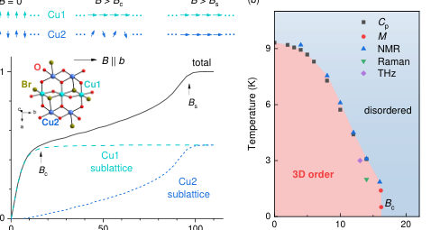 
Figure 1. (a) Total and sublattice magnetizations in the direction of the applied magnetic field B ∥b at zero temperature by quantum Monte Carlo simulations [43]. A critical field Bc ≃16.3 T and a satu- ration field Bs ≃95 T correspond to the field-induced saturation spin alignment of the Cu1 and the Cu2 sublattices, respectively. (b) Phase boundary TN(B) of a three-dimensionally ordered and a field-induced disordered phase determined by specific heat Cp, magnetization M, NMR 1/T1 (Fig. 2), Raman (Fig. 3), and THz spectroscopic mea- surements (Fig. 4).

📷 Fig 2

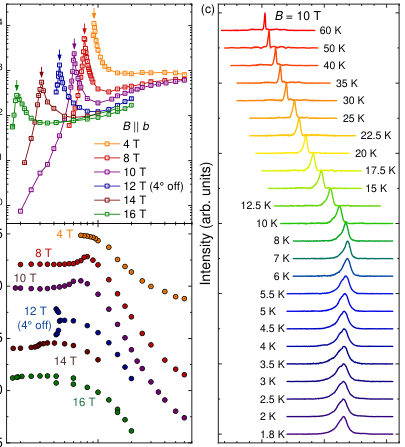 
Figure 2. (a) Temperature-dependent 1/T1 rate at different mag- netic fields, applied parallel to the crystallographic b axis. The verti- cal arrows mark the transition temperature TN into the magnetically ordered phase. (b) Temperature dependence of the 81Br NMR fre- quency shift ∆ν for fields between 4 and 16 T. For clarity, the curves from 10 to 16 T are vertically shifted with respect to each other by −0.3 MHz. (c) Waterfall diagram of frequency-swept spectra at 10 T and temperatures between 1.8 and 60 K.

📷 Fig 3

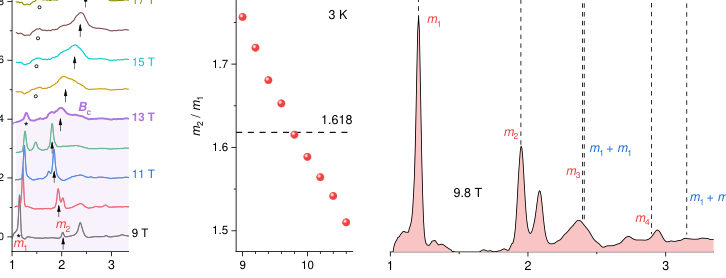 
Figure 4. (a) Color-coded plot of THz absorption coefficient measured at 3 K with polarization hω ∥a for various applied magnetic fields B ∥b up to 17 T. (b) THz absorption spectra ∆α/ω around the field-induced phase transition at Bc = 13 T [see Fig. 1(b)]. ∆α denotes field-induced change of absorption coefficient and ω for wavenumber, both in the unit of cm−1. At the 9 T spectrum the asterisk and arrow indicate the two lowest-lying m1 and m2 modes, respectively. (c) Ratio of the m2 and m1 frequencies versus the applied magnetic field. m2/m1 reaches the golden ratio of 1.618 at B = 9.8 T, marked by the dashed line. (d) ∆α/ω spectrum at 9.8 T in comparison to the energy scale (top scale) of...

**Summary.** This work reports experimental evidence from the quantum magnet $	ext{Cu}_2(	ext{OH})_3	ext{Br}$ demonstrating an emergent $E_8$ symmetry near a field-induced dimensional reduction. By measuring various spectroscopic signals (THz, NMR), the authors observed characteristic energy ratios matching predictions from integrable field theory. This links complex many-body quantum critical behavior in solids to deep mathematical symmetries.

**Why it may be interesting.** The connection between a measurable condensed matter phenomenon (magnetic excitation spectra) and highly abstract mathematical structures like $E_8$ symmetry via integrable field theory is a powerful demonstration of emergent order, relevant to understanding complex many-body quantum dynamics.

Detailed structure

**Main problem.** The study aims to observe an emergent energy scale associated with an $E_8$ symmetry near a field-induced dimensional reduction transition in a quasi-two-dimensional quantum magnet.

**Main result.** Experimental measurements of THz absorption and spectroscopic ratios confirmed the presence of characteristic energy scales matching predictions from integrable field theory, suggesting an emergent $E_8$ symmetry.

**Method.** The research combines experimental techniques (NMR, Raman, THz spectroscopy) with theoretical modeling based on integrable field theories to analyze quantum magnetic excitations.

**Model / system.** The physical system is the quasi-two-dimensional spin-$1/2$ quantum magnet $	ext{Cu}_2(	ext{OH})_3	ext{Br}$, which features coupled ferromagnetic and antiferromagnetic spin chains. The theoretical framework models its behavior near a critical point perturbed by an external magnetic field.

**Key observables.** Spin-lattice relaxation rate ($1/T_1$), NMR line splitting, Raman scattering intensity, THz absorption coefficient ($\Delta\alpha/\omega$), and the ratio of excitation frequencies ($m_2/m_1$).

**Important parameters / regimes.** Applied magnetic field ($B$) along the $b$-axis, critical fields ($B_c \approx 16.3	ext{ T}$), saturation field ($B_s \approx 95	ext{ T}$), and temperatures near phase transitions.

**Assumptions / limitations.** The analysis assumes that the observed spectral features can be accurately described by an integrable Toda field theory associated with $E_8$ symmetry, particularly in the regime approaching dimensional reduction.

**Figures summary.** Figures show magnetization curves defining critical fields; spectroscopic data (NMR, Raman, THz) track changes across phase transitions; Figure 4 specifically plots the ratio $m_2/m_1$ reaching the golden ratio at $9.8	ext{ T}$ and displays corresponding energy spectra.

**Paper structure.** The paper first establishes the magnetic structure and field-induced dimensional reduction via magnetization measurements, then uses multiple spectroscopic probes (NMR, Raman, THz) to track excitations across this transition, culminating in the identification of an $E_8$-predicted signature (the golden ratio) in the low-energy spectrum.

Abstract

By appropriately perturbing a critical transverse-field Ising chain away from its critical point, the system can develop a finite correlation length with a characteristic purely massive spectrum, whose ratios and correlations are precisely described by an integrable field theory and an infinite set of integrals of motion corresponding to the $E_8$ Lie algebra. In this work, we report on experimental observation of a characteristic massive spectrum close to transverse field-induced dimensional reduction in a quasi-two-dimensional quantum magnet Cu$_2$(OH)$_3$Br, providing evidence for an emergent $E_8$ symmetry and the corresponding excitations of bound states in the sublattice of its ferromagnetic chains. These results demonstrate the power of integrable field theory in describing emergent many-body quantum critical phenomena in condensed matter systems.

[↑ back to top](#top)

### [A Bohmian version of a 2-state quantum system](http://arxiv.org/abs/2607.24480v1)

**Authors:** Matthew Dickau  
**Type:** theory · **Category:** other · **PDF:** <https://arxiv.org/pdf/2607.24480v1>  
**Analysis basis:** full PDF text, analyzed in chunks
**Topic relevance:** `methods for driven-dissipative` **3/5** · `quantum measurements` **3/5** · `non-equilibrium dynamics` **2/5** · `Keldysh / 2PI / non-Gaussian methods` **1/5** · `correlated / nonlocal dissipation` **1/5** · `driven-dissipative phase transition` **1/5**

📷 Fig 1

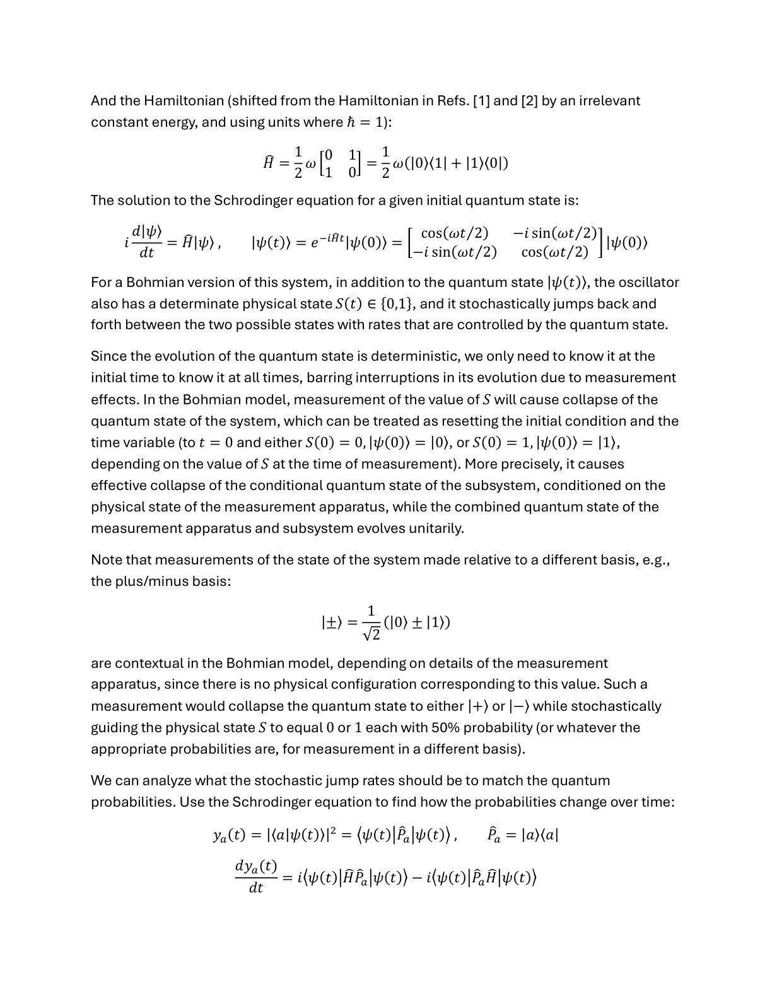 
Low-resolution page preview, page 2

📷 Fig 2

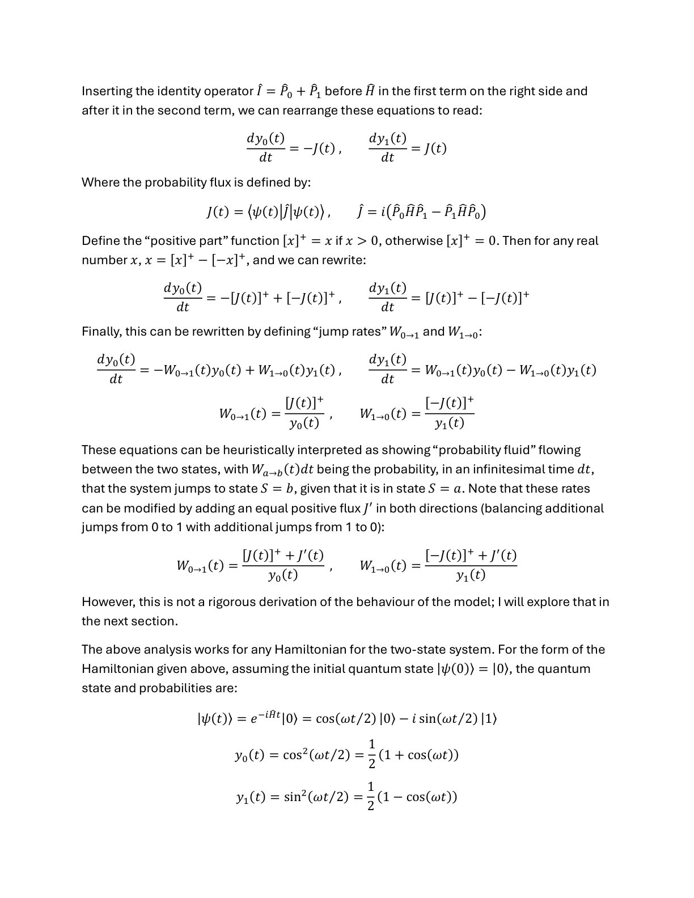 
Low-resolution page preview, page 3

📷 Fig 3

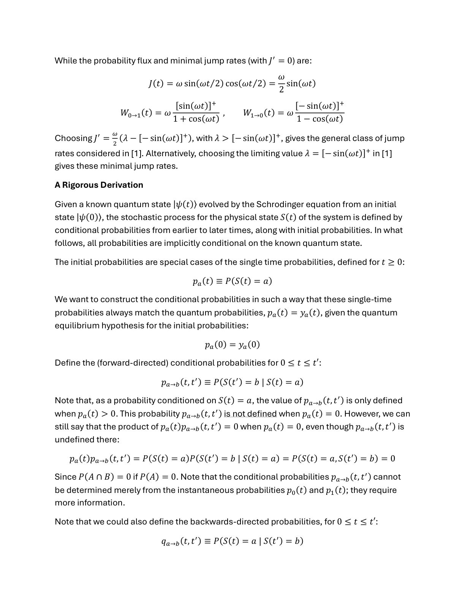 
Low-resolution page preview, page 4

📷 Fig 4

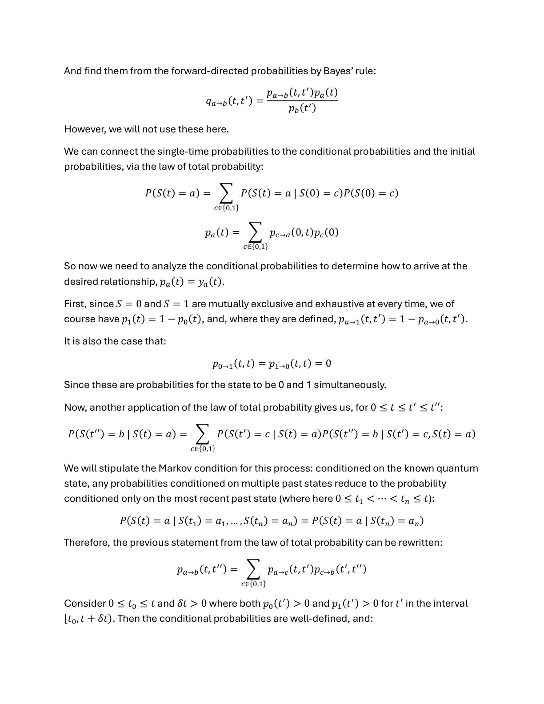 
Low-resolution page preview, page 5

📷 Fig 5

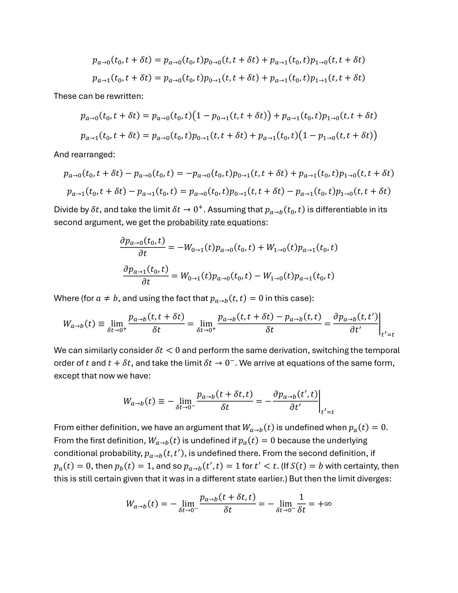 
Low-resolution page preview, page 6

**Summary.** The paper develops a Bohmian mechanical description for a simple two-state quantum system where the physical state undergoes stochastic jumps guided by the quantum wave function. The authors rigorously prove that this model is mathematically consistent, successfully refuting prior claims that such a formulation must fail due to issues related to Markov process assumptions.

**Why it may be interesting.** This work tackles foundational issues at the intersection of quantum foundations and open systems theory, providing a detailed mathematical framework for interpreting stochastic jumps within a non-Markovian (or modified Markovian) context.

Detailed structure

**Main problem.** To construct a mathematically consistent Bohmian interpretation for a two-state quantum system, specifically addressing criticisms from related models regarding the validity of stochastic jump rates.

**Main result.** The authors demonstrate that the proposed Bohmian dynamics for the 2-state system are internally consistent, showing that the derived probability flow and conditional probabilities do not contradict established quantum mechanical expectations or critiques based on Markov process assumptions.

**Method.** The analysis involves deriving and solving rate equations for conditional probabilities $p_{a	o b}(t_0, t)$ by taking limits of the full PDF text, comparing these results against standard quantum evolution, and re-evaluating prior theoretical arguments.

**Model / system.** The system is a two-state quantum system ($S \in \{0, 1\}$) governed by a Hamiltonian $\hat{H} = rac{1}{2} \omega (\sigma_x)$. The dynamics are described by coupling the deterministic Schrödinger evolution of $|\psi(t)
angle$ with stochastic jumps in the definite physical state $S(t)$.

**Key observables.** Conditional probabilities ($p_{a	o b}(t_0, t)$), jump rates ($W_{a	o b}(t)$), and single-time occupation probabilities ($y_a(t)$).

**Important parameters / regimes.** The coupling frequency $\omega$ and the time interval $\Delta t$ used in limit calculations.

**Assumptions / limitations.** The derivation assumes differentiability of conditional probabilities with respect to time, and it focuses on the two-state case, which does not guarantee general validity for all quantum systems.

**Paper structure.** The paper first establishes the basic Bohmian dynamics using rate equations derived from the Schrödinger equation. It then rigorously derives these rates by analyzing conditional probabilities over small time intervals, culminating in a direct rebuttal of prior theoretical criticisms regarding process consistency.

Abstract

I construct a Bohmian version of a 2-state quantum system, where in addition to the quantum state, the system is characterized by a definite physical state which changes stochastically under the guidance of the quantum state. I argue that the probabilities produced by this process are well-defined, contrary to claims in "Why quantum mechanics cannot be formulated as a Markov process" by D. Gillespie (1994) about a related model.

[↑ back to top](#top)

### [Coupling of Cation and Anion Dynamics in Solid Electrolytes Revealed by Virtual Isotopic Substitution Molecular Dynamics](http://arxiv.org/abs/2607.24133v1)

**Authors:** Xintian Wang, Andrew L. Goodwin, Theodosios Famprikis  
**Type:** theory · **Category:** disordered systems and neural networks · **PDF:** <https://arxiv.org/pdf/2607.24133v1>  
**Analysis basis:** full PDF text, analyzed in chunks
**Topic relevance:** `non-equilibrium universality` **3/5** · `driven-dissipative phase transition` **2/5** · `non-equilibrium dynamics` **2/5** · `Frenkel-Kontorova` **1/5** · `Keldysh / 2PI / non-Gaussian methods` **1/5** · `correlated / nonlocal dissipation` **1/5** · `methods for driven-dissipative` **1/5**

📷 Fig 1

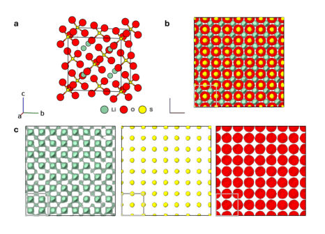 
FIG. 1. Average structure of α-Li2SO4. (a) Approximate crystallographic unit cell based on Ref. 28. (b,c) Probability density coloured per atom from a molecular dynamics simu- lation of a 4 × 4 × 4 supercell of α-Li2SO4 at 1000 K

📷 Fig 2

 
Figure 1 exemplifies the structure and dynamics of α-Li2SO4 as probed using molecular dynamics simu- lations at 1000 K. α-Li2SO4 adopts an antifluorite-like crystal structure with sulfate anions arranged in a face- centered-cubic arrangement and lithium cations occupy- ing preferentially the corresponding tetrahedral intersti- tials, consistent with previous experimental and compu- tational results [14, 28–31]. Lithium ion translational diffusion proceeds through hopping between tetrahedral and octahedral sites; likewise, sulfate ion rotational diffu- sivity is evident from the smearing of the time-averaged oxygen-atom probability density in shells around the sul-

📷 Fig 3

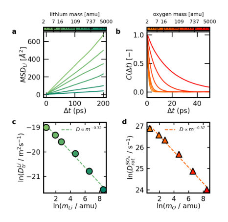 
FIG. 2. Independent control of rotational and transla- tional dynamics in α-Li2SO4 at 1000 K. (a) Mean-squared- displacement of lithium as a function of its mass. b) S–O bond self-correlation as a function of oxygen mass c) Lithium-ion translational diffusivity as a function of lithium mass and d) sulfate-ion rotational diffusivity as a function of oxygen mass.

📷 Fig 4

 
Figure 3 shows the radial distribution functions cal- culated from our VISMD simulations with the extreme (highest and lowest) masses of lithium and oxygen; it is evident that the isotopic substitution has no effect on the average structure of the system as the correspond- ing distribution functions are indistinguishable. Hence, this approach allows us to independently vary the mag- nitude of the translational or rotational diffusion coeffi- cients, while controlling for the chemical interactions and average structure of α-Li2SO4.

📷 Fig 5

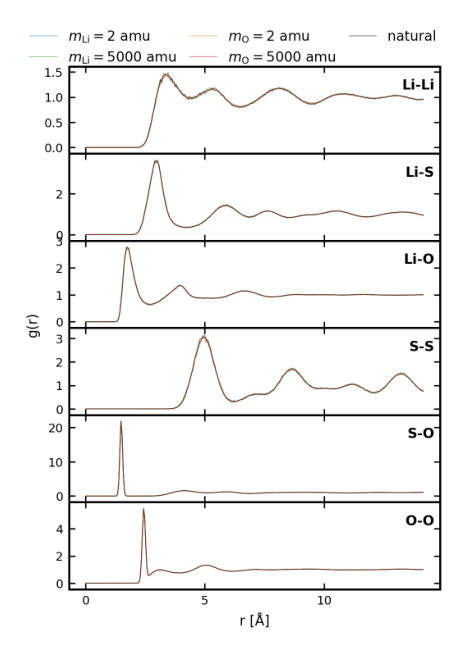 
FIG. 3. Partial pair distribution functions at 1000 K with natural, reduced and increased lithium and oxygen masses.

**Summary.** This work uses molecular dynamics simulations on Li2SO4 to characterize the coupling between lithium ion translation and sulfate anion rotation. By varying component masses using VISMD, the authors demonstrate a clear bidirectional coupling mechanism between these two distinct diffusive modes. This finding provides deep insight into how structural dynamics govern ionic conductivity in solid electrolytes.

**Why it may be interesting.** While focused on ionic solids, the rigorous mathematical framework developed to relate temperature-dependent Arrhenius behavior to power-law scaling exponents (Chunk 4) provides general tools for analyzing coupled dynamics in complex many-body systems, which has parallels in understanding quantum phase transitions or correlated disorder effects.

Detailed structure

**Main problem.** The study investigates the coupling mechanism between cation translational dynamics and anion rotational dynamics within solid electrolytes.

**Main result.** The simulations reveal a bidirectional, mode-coupling relationship between the two types of diffusion, suggesting that changes in one dynamic process influence the other.

**Method.** Virtual Isotopic Substitution Molecular Dynamics (VISMD) is employed to independently vary component masses and thus control individual diffusivity rates while preserving the underlying potential energy landscape.

**Model / system.** The model system is alpha-Li2SO4, an archetypal rotor-phase solid electrolyte. The analysis focuses on the interplay between Li+ cation translation and SO4 2- anion rotation.

**Key observables.** Lithium translational diffusivity (D_Li^tr), sulfate rotational diffusivity (D_SO4^rot), power-law scaling exponents, and apparent activation energy for diffusion.

**Important parameters / regimes.** Temperature range (800 K to 1400 K), mass variation factors (varying Li and O masses), and the coupling strength parameter derived from comparing Arrhenius vs. power-law fits.

**Assumptions / limitations.** The VISMD approach assumes that varying atomic masses while keeping potential parameters constant allows for a meaningful, controlled investigation of dynamic mode interplay.

**Figures summary.** Figures illustrate the structure, the power-law scaling of both diffusivities with component mass, and how the apparent activation energy depends on isotopic substitution, confirming coupling effects.

**Paper structure.** The paper establishes the physical problem (coupling in solid electrolytes), details the VISMD methodology for controlling individual diffusion modes, presents results showing bidirectional coupling via mass dependence analysis, and concludes by analyzing the implications of this coupling on activation energies.

Abstract

We characterise the interplay between cation-translational and anion-rotational dynamics on the model system $\rm α\text{-}Li_{2}SO_{4}$ through virtual isotopic substitution molecular dynamics (VISMD) simulations. We independently control in turn the lithium translational- and sufate rotational- diffusivity by varying the masses of lithium and oxygen, respectively, showing that both diffusivities exhibit power-law relationships with the masses of each individual component. Changing either diffusivity produces an effect on the other; i.e. there exists a bidirectional coupling between anion and cation diffusive dynamics. From our variable-temperature/variable-mass dataset we demonstrate that the apparent activation energy for lithium diffusion depends strongly on the isotope mass, decreasing with accelerated sulfate dynamics; an observation which provides clear evidence of mode-coupling between cation and anion dynamics.

[↑ back to top](#top)

### [Extreme outbreaks in non-Markovian epidemics on complex networks](http://arxiv.org/abs/2607.24615v1)

**Authors:** Ami Taitelbaum, Michael Assaf  
**Type:** theory · **Category:** statistical mechanics · **PDF:** <https://arxiv.org/pdf/2607.24615v1>  
**Analysis basis:** full PDF text, analyzed in chunks
**Topic relevance:** `Keldysh / 2PI / non-Gaussian methods` **3/5** · `non-equilibrium dynamics` **2/5** · `non-equilibrium universality` **2/5** · `analog quantum simulation` **1/5** · `correlated / nonlocal dissipation` **1/5** · `driven-dissipative phase transition` **1/5** · `methods for driven-dissipative` **1/5**

📷 Fig 1

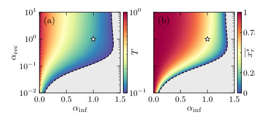 
FIG. 1. (a) Per-edge transmissibility T (log-scale colorbar) versus shape parameters αinf and αrec, for an ER network with ¯k = 10 and R0 = 1.5, with gamma-distributed infection and recovery. (b) Deterministic outbreak fraction x∗r for the same network. Dashed line: epidemic threshold; grey region: sub-threshold regime; star: Markovian point (αinf =αrec =1).

📷 Fig 2

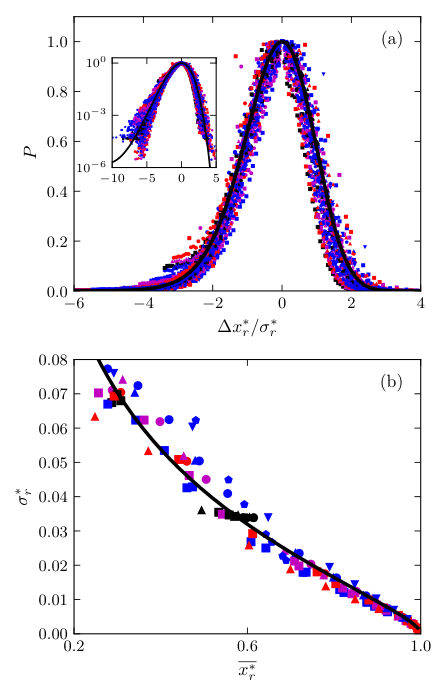 
FIG. 2. Universal collapse of outbreak statistics for non- Markovian epidemics on networks with N = 3000, σk/¯k &lt; 0.5, and R0 = 1.2 and 1.5. The markers encode the net- work type and WT distribution: circles (◦), squares (□) and triangles (△) are regular, ER, and gamma networks with gamma-distributed WTs for infection and exponential recov- ery. Inverted triangles (▽) and pentagons ( ) are regular networks with ¯k = 10, respectively with log-normal WTs for infection (see Appendix A), and gamma WTs for recovery. Color encodes ¯k or σk (blue: smallest, magenta: middle, red: largest), and black markers are Markovian simulations (α=1). (a) Rescaled outbreak-size distributions. Each distribution...

📷 Fig 3

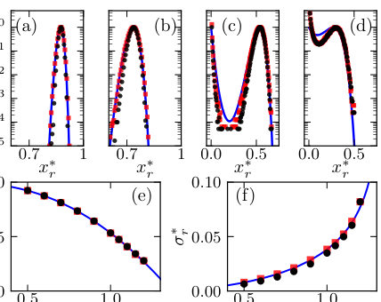 
FIG. 3. ER network with N = 3000, ¯k = 10, R0 = 1.5, gamma WTs for infection and exponential recovery. (a)– (d) Outbreak-size distributions for αinf = 0.6, 0.8, 1.0, 1.2, each normalized by its extensive-outbreak peak. Black cir- cles: non-Markovian network simulations. Blue line: WKB theory for R0 = Reff 0 taken from Eq. (8). Red squares: well- mixed Markovian simulation with N = 3000 for the same Reff 0 . (e) Conditional mean x∗r and (f) conditional standard deviation σ∗ r versus αinf.

📷 Fig 4

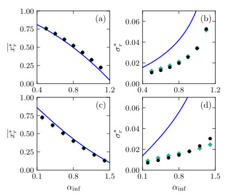 
FIG. 4. Conditional mean (left) and standard deviation (right) of the final outbreak-size distribution versus infection shape parameter αinf on highly heterogeneous networks. Pan- els (a,b): gamma network with N = 3000, ¯k = 10, σk = 8, and R0 = 1.5. Panels (c,d): Hamsterster network with N = 2426, R0 = 3. Black circles: non-Markovian network simulations with gamma WTs for infection and exponential recovery. Green diamonds: Markovian (exponential) simula- tions on the same network at Rnet 0 from Eq. (9). Blue: WKB with Reff 0 from Eq. (8). Here we have used an extended bond- percolation mapping due to the degree-degree correlations in the Hamsterster network, see Appendix D.

**Summary.** This work develops a theoretical framework to predict extreme epidemic risk by modeling non-Markovian spreading on complex networks. The core innovation is mapping the system's complex waiting-time statistics onto an equivalent, simpler Markovian process. This allows for quantitative prediction of outbreak size distributions even when infection and recovery times are not exponentially distributed.

**Why it may be interesting.** While focused on epidemiology, the mathematical techniques—mapping complex stochastic processes (non-Markovian) onto simpler, analytically tractable forms (effective Markovian)—are directly applicable to analyzing open quantum systems or non-equilibrium dynamics in many-body physics.

Detailed structure

**Main problem.** The primary goal is determining the full outbreak-size distribution, especially its right tail, for non-Markovian epidemic spreading on complex networks.

**Main result.** The authors show that mapping non-Markovian SIR dynamics to an effective Markovian description allows for quantitative prediction of extreme outbreak risk across diverse network topologies and waiting-time distributions.

**Method.** They map the non-Markovian process to an effective Markovian one using a single edge transmissibility, employing WKB semiclassical theory for large deviations in weakly heterogeneous networks.

**Model / system.** The model is based on SIR epidemic dynamics ($S+I+R=N$) generalized from standard Markovian assumptions to include arbitrary waiting-time distributions (e.g., Gamma) for infection and recovery periods on complex networks.

**Key observables.** Outbreak-size distribution $P(x^*_r)$, mean outbreak fraction ($x^*_r$), conditional standard deviation ($\sigma^*_r$), and the effective per-edge transmissibility ($T$).

**Important parameters / regimes.** Infection/recovery shape parameters ($\alpha_{inf}, \alpha_{rec}$), network heterogeneity quantified by $\sigma_k/ar{k}$, and the basic reproduction number $R_0$.

**Assumptions / limitations.** The theory relies on mapping non-Markovian dynamics to an effective Markovian process; universality holds best for weakly heterogeneous networks, where WKB approximations are applicable.

**Figures summary.** Figures illustrate the dependence of transmissibility ($T$) and deterministic outbreak fractions on shape parameters ($\alpha$), demonstrating universal collapse for weak heterogeneity, while supplementary figures compare results across different network types (ER, Gamma, Hamsterster) showing deviations due to degree correlations.

**Paper structure.** The paper progresses by first establishing the mapping from non-Markovian to effective Markovian dynamics. It then analyzes outbreak statistics using WKB theory for weakly heterogeneous cases, before extending the framework to highly correlated networks using bond percolation concepts.

Abstract

Extreme epidemic risk is controlled by the right tail of the outbreak-size distribution, but this distribution is generally unknown for non-Markovian spreading on networks. Here we determine this distribution by mapping non-Markovian SIR dynamics to an effective Markovian description. We show that arbitrary infection and recovery time statistics can be incorporated through a single edge transmissibility, yielding an effective Markovian process that reproduces the full outbreak-size statistics. For weakly heterogeneous networks, the reduction yields a universal well-mixed semiclassical theory governed by the bond-percolation reproductive number. Outbreak statistics across diverse waiting-time distributions and topologies collapse onto one predictive curve. For highly heterogeneous and empirical networks, the corresponding effective Markovian dynamics on the network captures the complete distribution. Our results provide a direct route from measured waiting-time distributions to quantitative predictions of network-level extreme-outbreak risk.

[↑ back to top](#top)

### [Field-tuned incommensurate fan phase in an Ising-like triangular antiferromagnet](http://arxiv.org/abs/2607.23173v1)

**Authors:** D. Flavián, R. Okuma, P. Manuel, Q. Huang, H. Zhou, R. Coldea  
**Type:** both · **Category:** strongly correlated electrons · **PDF:** <https://arxiv.org/pdf/2607.23173v1>  
**Analysis basis:** full PDF text, analyzed in chunks
**Topic relevance:** `analog quantum simulation` **3/5** · `exotic spin models in light-matter` **3/5** · `spintronics-quantum-optics interface` **3/5** · `Frenkel-Kontorova` **1/5** · `Keldysh / 2PI / non-Gaussian methods` **1/5**

📷 Fig 1

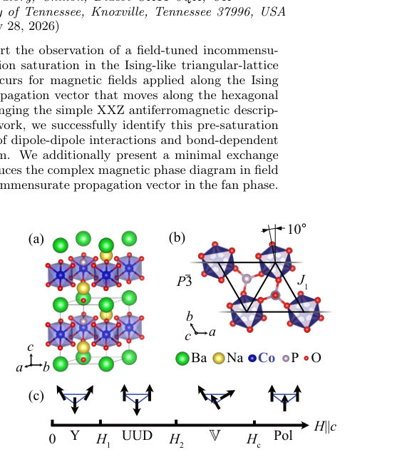 
FIG. 1. (a) Na2BaCo(PO4)2 crystallizes in a P¯3 structure, where magnetic Co2+ ions sit at the center of oxygen oc- tahedra forming a triangular lattice. (b) A rotation of the octahedra around the c axis breaks mirror planes normal to the a and b-axes, impacting the allowed exchange pathways for neighbors in adjacent triangular layers. Black bonds (la- beled J1) indicate the nearest-neighbor couplings, relevant for Eq. (1) and Eq. (4). (c) Schematic of the expected magnetic phase diagram for the triangular-lattice XXZ model in Eq. (1) in axial magnetic field (H∥z). The additional phase found in Fig. 3 in-between the V and the field-polarized phase calls for a refinement of the spin...

📷 Fig 2

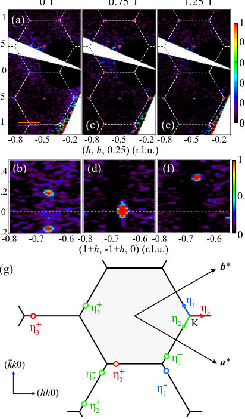 
FIG. 2. (a-f) Representative single crystal neutron diffrac- tion maps in phases I-III at three selected magnetic fields, increasing from left to right. Dashed lines in top row pan- els show boundaries of structural Brillouin zones. Note all magnetic Bragg peaks occur at the two-dimensional Brillouin zone corner K points in (a), (c), and (e), but with different out-of-plane component ±qz in the three phases, (b) qz near 1/6 in zero field (phase I), (d) qz = 0 at 0.75 T in the 1/3rd

📷 Fig 3

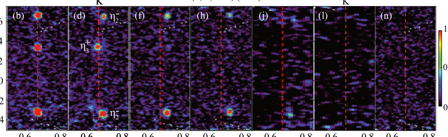 
FIG. 3. Detail of the magnetic neutron diffraction in phase IV as a function of magnetic field increasing from left to right. (Upper panels) Magnetic diffraction in the (h, h, −1/3) × (−k, k, −1/3) plane integrated for -0.35 &lt; l &lt; -0.30 following the evolution of a magnetic reflection with η− 2 propagation vector. Dashed lines show the 2D Brillouin zone boundaries. Upon increasing field, the magnetic Bragg peak moves away from the K point along one of the three Brillouin zone boundaries towards an M point. (Lower panels) Magnetic diffraction in the orthogonal plane (1, −2, 0) × (0, 0, 1), where the dashed vertical red lines indicate the in-plane K point position for reference. The color...

📷 Fig 4

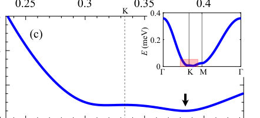 
FIG. 4. Comparing the location of the minima of the magnon dispersion in the field polarized state just above the critical field Hc for different single-layer Hamiltonians. (a) In the pure XXZ model the branch minimum is at the K point (vertical dashed line). Inset shows the ai vectors (red arrows) used in the definition of the anisotropic exchange terms in Eq. (5). (b) Including the nearest-neighbor part of the dipolar interactions splits the K-point minimum into two inequivalent minima, the lowest of which is towards the M point (as indicated by a vertical black arrow). (c) Including the long-ranged dipolar couplings for the whole triangular layer further accentuates this splitting, but...

📷 Fig 5

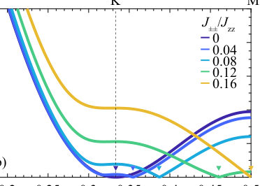 
FIG. 5. Magnon dispersion in the polarized phase in the presence of bond-dependent exchange anisotropy J±± as per Eq. (5). Note the dispersion depends only on the magnitude and not the sign of the J±± term. (a) Dispersion as a func- tion of field (color coded) at fixed J±±. The minimum shifts away from the K point (dashed line) towards an incommen- surate wavevector on the K-M line when the applied field is sufficiently close to Hc, i.e., when the spin gap becomes small enough to be comparable to the strength of the anisotropic ex- change. (b) Dispersion as a function of increasing J±± (color coded) at the corresponding critical field Hc(J±±) in each case. Symbols indicate the gap closing...

**Summary.** This work reports experimental evidence for a field-tuned incommensurate fan phase in $	ext{Na}_2	ext{BaCo}(	ext{PO}_4)_2$ using neutron diffraction. By combining this data with theoretical modeling, the authors argue that dipole-dipole interactions are crucial for stabilizing this complex magnetic state. The paper successfully refines the underlying spin Hamiltonian to account for the observed field dependence of the incommensurate propagation vector.

**Why it may be interesting.** The detailed study of how long-range interactions (dipolar coupling) stabilize exotic phases like the fan phase provides insights into emergent quantum magnetism and frustrated lattice models relevant to strongly correlated electron systems.

Detailed structure

**Main problem.** The study aims to understand the nature of a field-tuned incommensurate fan phase observed in an Ising-like triangular antiferromagnet, which challenges simple theoretical descriptions.

**Main result.** The authors identify this pre-saturation phase as a coplanar fan phase stabilized by dipole-dipole interactions and bond-dependent exchange anisotropy. They propose a refined spin Hamiltonian that successfully reproduces the complex magnetic phase diagram observed experimentally.

**Method.** The research combines single-crystal neutron diffraction experiments with theoretical modeling using semiclassical Linear Spin Wave Theory (LSWT) and mean-field analysis.

**Model / system.** The system is $	ext{Na}_2	ext{BaCo}(	ext{PO}_4)_2$, an Ising-like triangular-lattice antiferromagnet. The physics is modeled by anisotropic Hamiltonians, requiring the inclusion of dipole-dipole couplings and bond-dependent exchange terms beyond simple nearest-neighbor XXZ models.

**Key observables.** Magnetic Bragg peaks with field-dependent incommensurate propagation vectors ($\mathbf{Q}$), particularly showing movement along the hexagonal Brillouin zone boundary from K towards M points.

**Important parameters / regimes.** Applied magnetic field ($H$), temperature (down to 0.05 K), and coupling constants related to exchange anisotropy ($\Delta$) and dipolar interactions.

**Assumptions / limitations.** The analysis relies on semiclassical approximations, treating dipole-dipole coupling as a small source of bond-dependent anisotropy, and using nearest-neighbor approximations for long-range interactions.

**Figures summary.** Figures illustrate the crystal structure, representative neutron diffraction maps showing varying $q_z$ components across different magnetic phases (I-III), and critically, the continuous movement of a magnetic Bragg peak in Phase IV as a function of applied field H.

**Paper structure.** The paper progresses from presenting experimental observations of novel incommensurate peaks to developing theoretical frameworks. It first establishes the limitations of simple XXZ models, then incorporates dipolar couplings via LSWT to explain the observed field-dependent fan phase, culminating in a minimal exchange model that reproduces the full magnetic phase diagram.

Abstract

Using single-crystal neutron diffraction we report the observation of a field-tuned incommensurate phase in a field range just below magnetization saturation in the Ising-like triangular-lattice antiferromagnet Na$_2$BaCo(PO$_4$)$_2$. This phase occurs for magnetic fields applied along the Ising axis and exhibits an in-plane incommensurate propagation vector that moves along the hexagonal Brillouin zone boundary upon varying field, challenging the simple $XXZ$ antiferromagnetic description of the system. Within a semiclassical framework, we successfully identify this pre-saturation phase as a coplanar fan phase and study the role of dipole-dipole interactions and bond-dependent exchange anisotropy in its stabilization mechanism. We additionally present a minimal exchange model including interlayer couplings, which reproduces the complex magnetic phase diagram in field including the observed field-dependence of the incommensurate propagation vector in the fan phase.

[↑ back to top](#top)

### [Hyperdeterminant wavefunctions](http://arxiv.org/abs/2607.23392v1)

**Authors:** Guan-Lin Lin, Di Xiao, Ying Ran  
**Type:** theory · **Category:** strongly correlated electrons · **PDF:** <https://arxiv.org/pdf/2607.23392v1>  
**Analysis basis:** full PDF text, analyzed in chunks
**Topic relevance:** `Keldysh / 2PI / non-Gaussian methods` **3/5** · `analog quantum simulation` **3/5** · `correlated cavity matter` **1/5** · `driven-dissipative phase transition` **1/5** · `entanglement & information structure` **1/5** · `exotic spin models in light-matter` **1/5** · `methods for driven-dissipative` **1/5**

📷 Fig 1

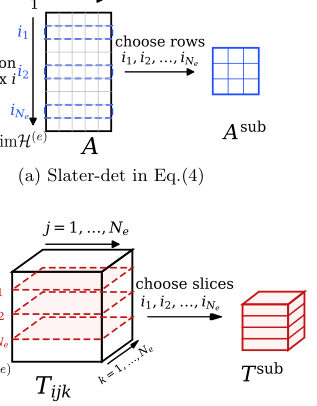 
FIG. 1: Illustration of selecting submatrix/subtensor to define many-body wavefunctions.

📷 Fig 2

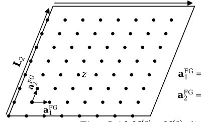 
FIG. 3: The Fine-Grid on a finite torus with N(e) s = 8.

📷 Fig 3

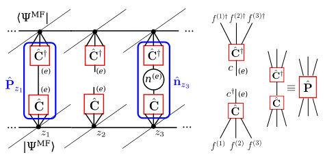 
FIG. 4: Illustration of the Grassmann tensor-network picture with fusion gate ˆCz and the gate ˆPz.

📷 Fig 4

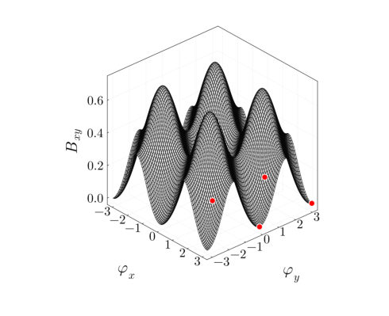 
FIG. 5: The exact Berry’s curvature of flat-gauge-connections Bxy(φx,φy) for ν = 1

📷 Fig 5

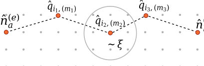 
FIG. 6: Schematic illustration of PE corrections to long-range observables.

**Summary.** This paper introduces Hyperdeterminant wavefunctions as a powerful, generalized variational method for studying strongly correlated quantum matter. It allows researchers to access fractionalized degrees of freedom crucial for understanding topological phases like FCI and QSLs. The framework provides both theoretical tools (VMPI) and numerical algorithms (PE) to derive effective field theories for these complex systems.

**Why it may be interesting.** While focused on solid-state correlations, the development of a general variational framework applicable to fractionalized excitations is mathematically rich and could inspire new ways to model complex quantum dynamics in AMO systems.

Detailed structure

**Main problem.** Developing a theoretical framework to microscopically investigate strongly correlated quantum states of matter, particularly those exhibiting fractionalized degrees of freedom.

**Main result.** The authors introduce Hyperdeterminant (Hdet) wavefunctions as a general variational approach that provides access to fractionalized degrees of freedom and yields reliable microscopic effective field theories for systems like FCI and QSLs.

**Method.** The framework utilizes Hdet wavefunctions, which are generalized from Slater determinants, combined with Variational Manifold Path Integral (VMPI) techniques and Projective Expansion (PE) algorithms for numerical simulation.

**Model / system.** The theory is applied to strongly correlated quantum states of matter, specifically modeling Fractional Chern Insulators (FCI) and Quantum Spin Liquids (QSL). The formalism generalizes fermionic parton constructions beyond standard electron degrees of freedom.

**Key observables.** Microscopic effective field theories, Ward identities for gauge fluctuations, and the structure of the fusion tensor defining the Hdet state.

**Important parameters / regimes.** The rank ($r$) of the underlying tensors, which dictates bosonic or fermionic statistics; lattice parameters governing correlation strength.

**Assumptions / limitations.** Simulating generic Hdet wavefunctions is NP-hard, necessitating approximations like PE. The framework assumes a locality structure for physical reasonableness.

**Figures summary.** Figures illustrate the mathematical construction of Hdet states by comparing submatrix selection in Slater determinants versus tensor contraction using the fusion tensor.

**Paper structure.** The paper systematically introduces Hdet wavefunctions, establishes their locality structure, demonstrates applications to QSL and FCI models, derives effective theories via VMPI, and concludes with numerical simulation techniques (PE).

Abstract

We systematically introduce hyperdeterminant wavefunctions as a variational-wavefunction-based theoretical framework for strongly correlated quantum states of matter, together with practical numerical simulation algorithms. This framework generalizes previously known fermionic parton constructions, yields reliable microscopics with intuitive physical pictures, and allows direct access to the fractionalized degrees of freedom together with associated microscopic effective field theories. We demonstrate the applications of this framework to fractional Chern insulators and quantum spin liquids. We comment that the hyperdeterminant states belong to a more general class of variational wavefunctions: the fused Gaussian states.

[↑ back to top](#top)

### [Reframing the coupling force of adaptive resolution simulation in terms of the Liouville-type hierarchy for open systems](http://arxiv.org/abs/2607.24574v1)

**Authors:** Julian F. Hille, Rupert Klein  
**Type:** theory · **Category:** statistical mechanics · **PDF:** <https://arxiv.org/pdf/2607.24574v1>  
**Analysis basis:** full PDF text, analyzed in chunks
**Topic relevance:** `Keldysh / 2PI / non-Gaussian methods` **3/5** · `methods for driven-dissipative` **3/5** · `non-equilibrium dynamics` **2/5** · `correlated / nonlocal dissipation` **1/5** · `driven-dissipative phase transition` **1/5** · `non-equilibrium universality` **1/5**

📷 Fig 1

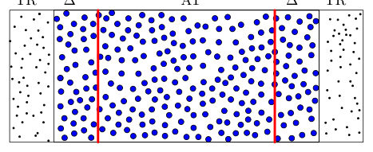 
Figure 1. Different setups for the simulation of an open molecular system. Full-AT: Reference setup of the open system represented by a small subsystem in a larger fully-atomistic simulation. AdResS: Adaptive resolution simulation setup of the open system by enclosing a small subsystem in between two AT/∆boundaries; Within AT∪∆, the particles interact with each other via the same pair-wise potential as in the full-AT reference; In the TR region, the particles have no interactions, giving rise to artifacts of the ∆/TR interfaces that need to be compensated; The x-axis is normal to the AT/∆boundaries and ∆/TR interfaces. The boundaries of the open system are marked in red in both graphics.

📷 Fig 2

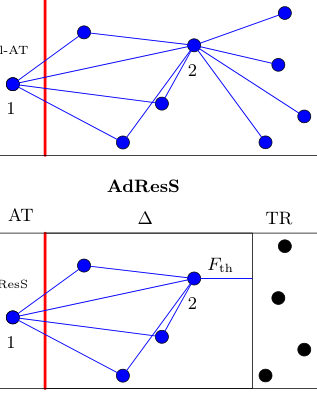 
Figure 2. Situation at the open system’s boundary with particle 1 residing within the open system and particle 2 residing in the reservoir. Full-AT: Particle 1 experiences an average force ⃗Fav, Full-AT through the boundary at xAT/∆due to the particles in the reservoir, which are correctly distributed due to themselves having a correct environment (see particle 2). AdResS: Particle 1 experiences an average force ⃗Fav, AdResS through the AT/∆boundary. However, the particles in ∆, e.g. particle 2, lack the forces through the ∆/TR interface at x∆/TR. These, among other effects, must be reintroduced in an average fashion by the thermodynamic force Fth.

📷 Fig 3

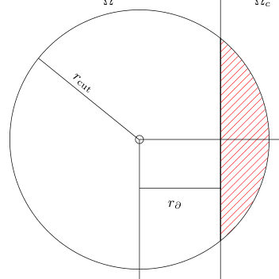 
Figure 3. Illustration of the integral appearing in Eq. (25), projected into the xy plane. The simplified integration domain is shaded red and was obtained by transforming into spherical polar coordinates with polar axis rx, a potential with cut-off radius rcut and the dependence on the distance r∂of the particle i at position xi to the boundary at position x∂. The domain of the open system where the particle resides is Ωand the reservoir region is Ωc.

📷 Fig 4

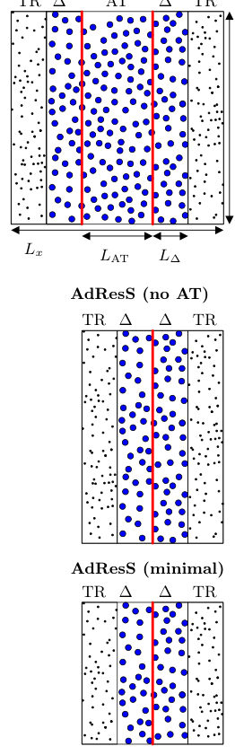 
Figure 4. Proposed box setups for the calculation and validation of the thermodynamic force. AdResS (complete): AdResS setup as it has been used so far with an extended AT region, two adjacent ∆regions and a TR region beyond two ∆/TR interfaces. AdResS (no AT): Like complete but with LAT = 0, effectively collapsing the two AT/∆boundaries onto a single one. AdResS (minimal): Like no AT, but with smaller box dimensions Ly and Lz.

📷 Fig 5

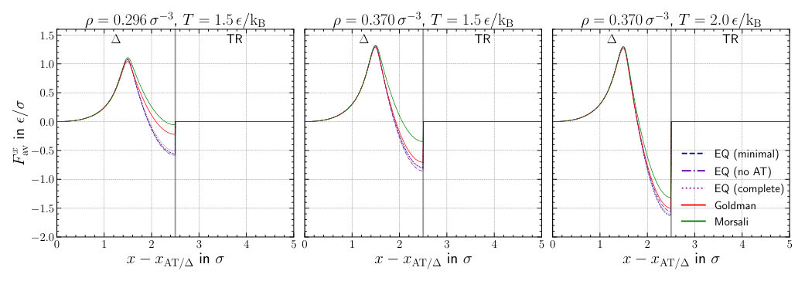 
Figure 5. Initial guesses for the thermodynamic force iterations. Each column represents one thermodynamic state. The forces were obtained as the average interface forces F x av with the “boundary” placed at the position x∆/TR of the ∆/TR interface marked with a vertical gray line. We used the radial distribution functions obtained in equilibration (EQ) runs in the minimal (dashed dark blue), no AT (dashed and dotted purple) or complete (dotted pink) box setups or taken from Morsali et al. (green) or Goldman (red)[42, 43]. The x-axis was shifted by the position xAT/∆of the right-hand AT/∆boundary. Shown here are thus only the right-hand ∆and TR regions, which are representative of the...

**Summary.** The paper offers a novel theoretical framework by relating the artificial 'thermodynamic force' needed in Adaptive Resolution Simulations (AdResS) to the Liouville-type hierarchy governing open quantum systems. By establishing this correspondence, it derives an integral expression for the force, providing new tools to analyze and validate simulations of complex fluids at interfaces.

**Why it may be interesting.** This work provides a deep theoretical grounding for computational techniques used in simulating complex open systems, connecting mesoscopic numerical artifacts (interface forces) to fundamental statistical mechanics principles (Liouville dynamics).

Detailed structure

**Main problem.** The work reinterprets the artificial 'thermodynamic force' required in Adaptive Resolution Simulations (AdResS) for open systems by mapping it onto the theoretical framework of the Liouville-type hierarchy.

**Main result.** A substantial part of this coupling force can be rigorously framed using the Liouville-type hierarchy, leading to a derived integral expression that allows for parameter dependency analysis and new validation criteria.

**Method.** The authors derive an explicit correspondence between the numerical force correction in AdResS and the source terms ($\Psi_n$, $\Phi_{n+1}^n$) governing particle flux across boundaries in the Liouville-type equation for open systems.

**Model / system.** The system is modeled as an open many-particle fluid (e.g., Lennard-Jones fluid) simulated using AdResS, which partitions space into interacting, transition, and tracer regions to handle interfaces.

**Key observables.** Particle number fluctuations, radial distribution functions, the thermodynamic force ($F_{	ext{th}}$), and the average force ($\vec{F}_{	ext{av}}$) exerted by the environment across boundaries.

**Important parameters / regimes.** Simulation parameters include density ($
ho$), temperature ($T$), time step size, and the convergence tolerance for the force calculation.

**Assumptions / limitations.** The derivation assumes that the system can be accurately described by mapping to the Liouville hierarchy, and simplifications are made assuming planar geometry and global thermal equilibrium for the environment.

**Figures summary.** Figures illustrate the setup comparison between full-atomistic reference simulations and AdResS setups across different thermodynamic states; other figures detail particle crossing statistics and force convergence.

**Paper structure.** The paper first introduces the AdResS method and the need for a compensating 'thermodynamic force.' It then develops the theoretical mapping to the Liouville-type hierarchy, deriving integral expressions for the average boundary force. Finally, it validates these theoretical claims through detailed simulation studies of an atomistic fluid.

Abstract

In this work, we present a novel perspective on the coupling force employed to compensate the interface artifacts prevalent in adaptive resolution simulations (AdResS) of open many-particle systems. We show that a substantial part of this "thermodynamic force" can be framed in terms of the theoretical model of the Liouville-type hierarchy for open systems. The correspondence is made explicit for the case of a simple atomistic fluid, for which a one-dimensional integral expression is derived. This enables the analysis for dependencies of the thermodynamic force on important simulation parameters, which is taken to inspire both simplifications for the numerical calculation of the thermodynamic force and new criteria for its validation that are adequate to the interfacial nature of the problem. The theoretical claims are then verified in a simulation study of the atomistic supercritical Lennard-Jones fluid at different thermodynamic states.

[↑ back to top](#top)

### [A TQFT-based Platform for Efficient Computation of Knot Invariants](http://arxiv.org/abs/2607.23551v1)

**Authors:** Amena Al Rawi, Hisham Sati, Vivek Kumar Singh  
**Type:** theory · **Category:** other · **PDF:** <https://arxiv.org/pdf/2607.23551v1>  
**Analysis basis:** full PDF text, analyzed in chunks
**Topic relevance:** `methods for driven-dissipative` **3/5** · `Keldysh / 2PI / non-Gaussian methods` **2/5** · `analog quantum simulation` **2/5** · `entanglement & information structure` **2/5** · `non-equilibrium dynamics` **1/5**

📷 Fig 1

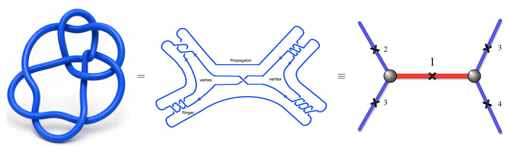 
Figure 1: Three complementary views of the knot 1093: its conventional projection, its FRD description, and the corresponding TQFT tangle representation.

📷 Fig 2

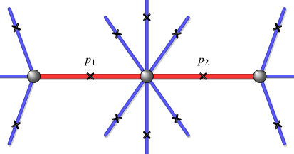 
Figure 2: The basic structure of a FRD. Blue lines are fingers, red lines are propagators, and gray dots are vertices. Small black marks on the fingers indicate positions carrying integer-valued braiding parameters.

📷 Fig 3

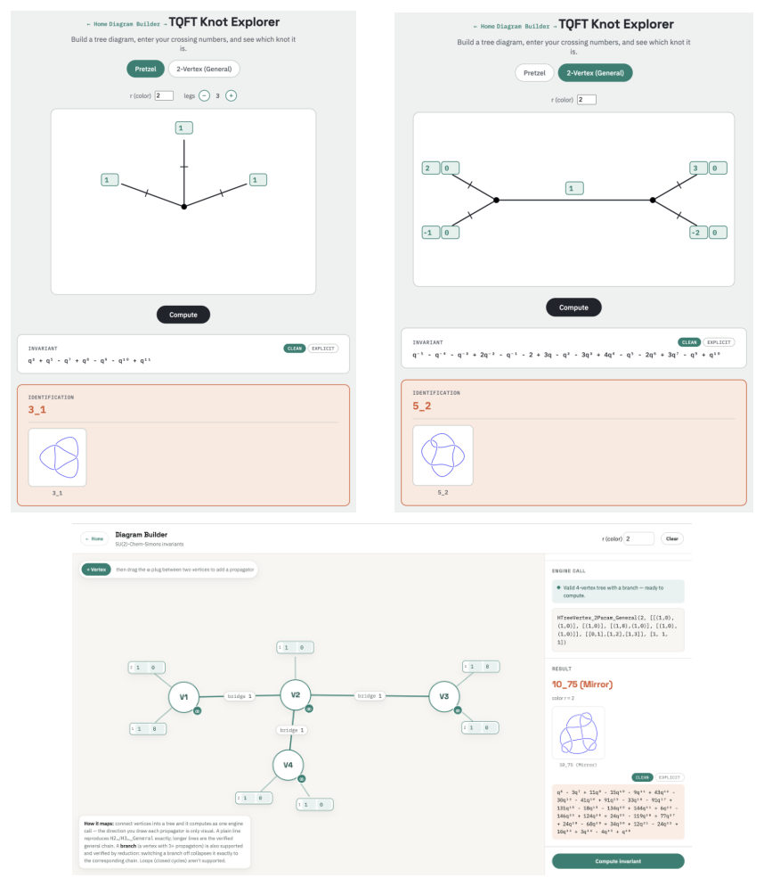 
Figure 4: The web interface showing (left) the Pretzel explorer, (right) the 2-vertex explorer, and (bottom) the Diagram Builder.

📷 Fig 4

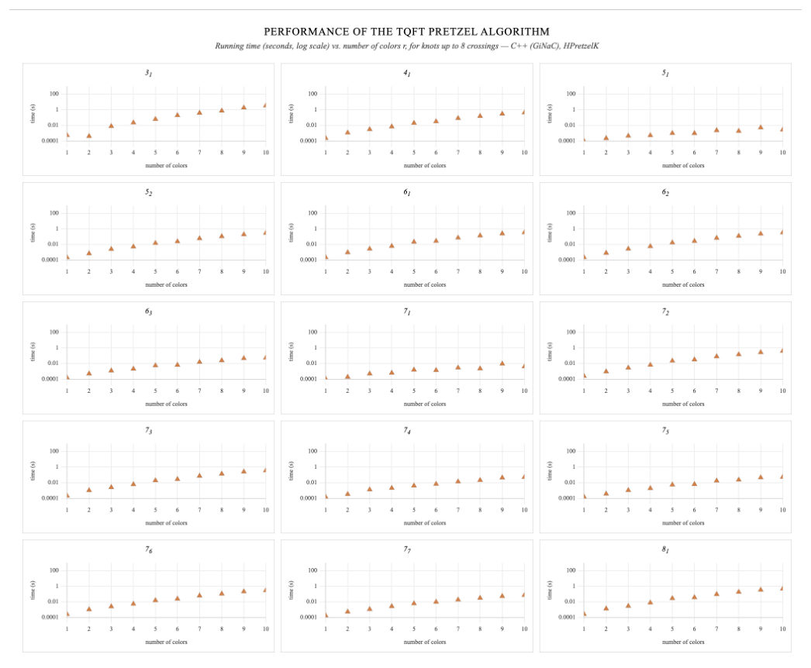 
Figure 5: Running time of the single-vertex pretzel algorithm (HPretzelK) implemented in C++ (GiNaC) for the first 15 arborescent knots up to 8 crossings, at representation parameter r = 1,...,10.

📷 Fig 5

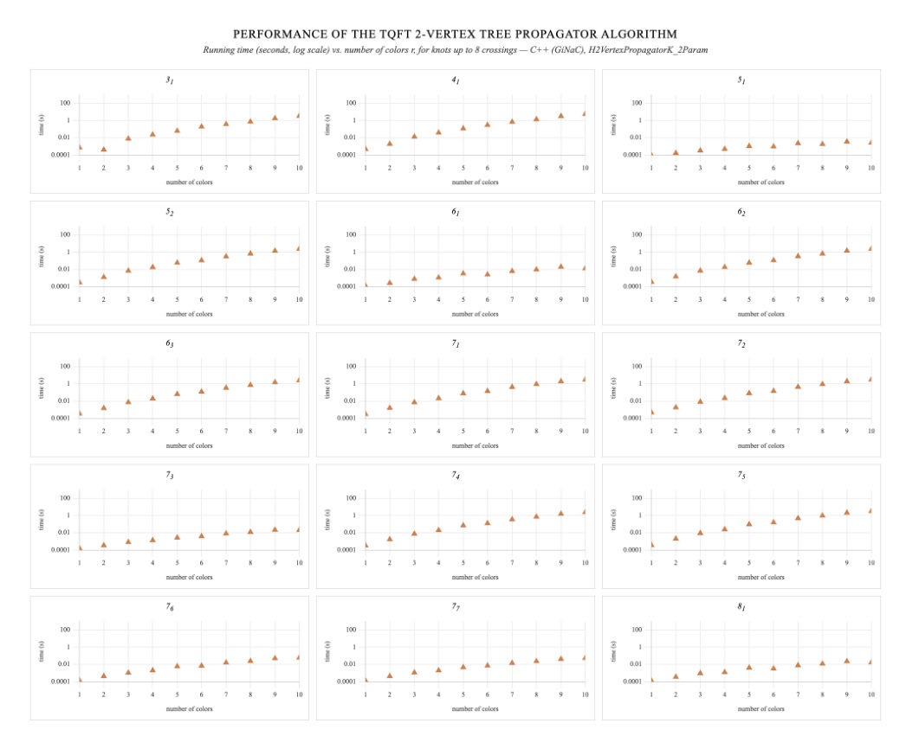 
Figure 6: Running time of the 2-vertex 2-parameter tree propagator algorithm (H2VertexPropagatorK 2Param) implemented in C++ (GiNaC) for the first 15 arborescent knots up to 8 crossings, at representation parameter r = 1,...,10.

**Summary.** This paper introduces an interactive web platform that unifies knot diagram construction, tensor network evaluation via TQFT, and the computation of colored Chern-Simons invariants. It demonstrates that this framework can systematically classify arborescent knots by mapping their topology onto computable quantum invariants. This represents a significant computational advance in topological quantum field theory.

**Why it may be interesting.** While not directly about AMO systems, the use of tensor networks (a computational tool) derived from topological field theory provides a powerful analogy for calculating entanglement or correlation functions in quantum many-body systems where local structure dictates global properties.

Detailed structure

**Main problem.** The core problem is classifying knots in 3D space, which becomes computationally intractable as the crossing number increases.

**Main result.** The authors developed a unified web platform that uses Feynman ribbon diagrams (FRDs) and TQFT principles to compute strong knot invariants for arborescent knots up to at least 10 crossings.

**Method.** They map the combinatorial structure of an FRD onto a tensor network calculation, evaluating it using techniques derived from Chern-Simons theory to yield colored quantum invariants.

**Model / system.** The model is Knot Theory, specifically focusing on arborescent knots represented by Feynman ribbon diagrams (FRDs). The underlying physics framework is Topological Quantum Field Theory (TQFT) applied via Chern-Simons theory.

**Key observables.** Colored quantum invariants (Laurent polynomials in q), which must remain invariant under Reidemeister moves, and the knot determinant.

**Important parameters / regimes.** The crossing number of the knot ($c(K)$); the structure parameters defining the two-vertex FRD ($\Gamma(A_1; p_{12}; A_2)$).

**Assumptions / limitations.** The platform is currently restricted to tree-shaped (arborescent) FRDs, and while the computation engine is general, knot identification relies on matching computed invariants against a finite database.

**Figures summary.** Figures illustrate the relationship between a knot's conventional projection, its representation as an FRD, and its corresponding TQFT tangle structure. Figure 3 details the two-vertex diagram structure.

**Paper structure.** The paper introduces the problem of knot classification, proposes the TQFT/FRD framework, details the construction of the interactive web platform ('TQFT Knot Explorer'), presents the mathematical machinery for tensor network evaluation, and concludes with results on the completeness of the two-vertex diagram family up to 10 crossings.

Abstract

We present an interactive web platform that unifies the construction Feynman ribbon diagrams (FRDs), the evaluation of higher-rank Chern--Simons knot invariants, and the identification of FRD-like knots at higher crossing numbers. These tree-structured diagrams naturally represent arborescent knots, which we refer to throughout as FRD-like knots. Within a single visual environment, users can construct an FRD as a tensor network, evaluate its associated Chern--Simons invariants, and use the resulting invariant data to distinguish and identify the corresponding knot. To our knowledge, this is the first platform to combine diagrammatic construction, tensor-network evaluation, invariant computation, and knot identification within a unified workflow.

[↑ back to top](#top)

### [Purcell-Engineered Hybrid Coupler for Leakage-Suppressed Robust CZ Gates](http://arxiv.org/abs/2607.23463v1)

**Authors:** Hui Wang, Feng Bao, Yan-Jun Zhao, Xun-Wei Xu  
**Type:** theory · **Category:** quantum information and computing · **PDF:** <https://arxiv.org/pdf/2607.23463v1>  
**Analysis basis:** full PDF text, analyzed in chunks
**Topic relevance:** `correlated / nonlocal dissipation` **3/5** · `methods for driven-dissipative` **3/5** · `QC/QI experiment` **1/5** · `correlated cavity matter` **1/5** · `driven-dissipative phase transition` **1/5** · `non-equilibrium dynamics` **1/5**

📷 Fig 1

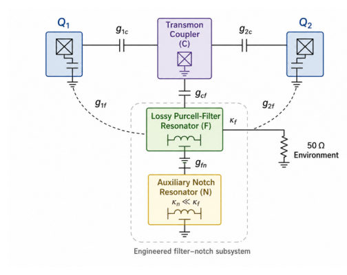 
FIG. 1. Schematic of the Purcell-engineered filter–notch hy- brid coupler. The engineered environment comprises two cou- pled resonant elements: a lossy Purcell-filter resonator F and a weakly dissipative auxiliary notch resonator N. The filter mode couples to the dominant 50 Ωdissipative environment with rate κf, whereas the notch mode couples coherently to the filter through gfn and has only weak intrinsic loss κn. To- gether, the two resonators form a single integrated filter–notch subsystem. Their interference suppresses the environmental response near the computational transitions while retaining a stronger response near selected leakage-related transitions.

📷 Fig 2

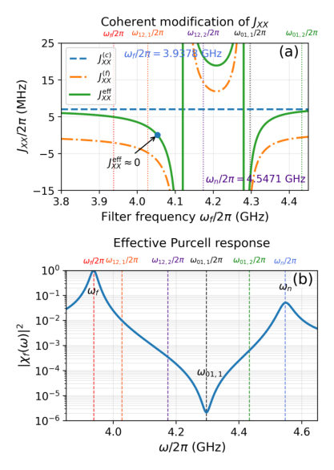 
FIG. 2. (a) Representative dependence of the effective trans- verse interaction Jeff XX on the filter frequency ωf. The ef- fective interaction consists of the direct qubit–qubit coupling g12, the virtual exchange mediated by the nonlinear transmon coupler, J(c) XX [Eq. (6)], and the filter-mediated contribution J(f) XX [Eq. (7)], giving Jeff XX ≃g12 + J(c) XX + J(f) XX. The near- zero crossing is included only to illustrate the available tuning range and does not represent the final CZ operating point. (b) Qualitative frequency response R(ω) = |χf(ω)|2 of the cou- pled filter–notch subsystem [Eq. (8)]. The plotted response illustrates the qualitative spectral engineering principle and does...

📷 Fig 3

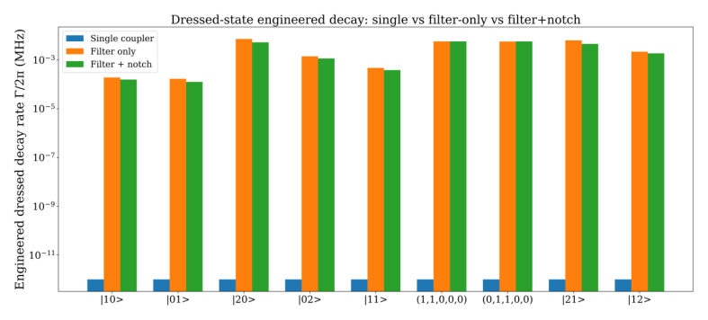 
FIG. 3. Engineered decay rates for representative computational and leakage-related eigenstates. Results are shown for the single-coupler, filter-only (gfn = 0), and full filter–notch architectures. Leakage-dominated dressed eigenstates, identified by their largest overlap with the corresponding bare leakage states |20⟩, |02⟩, |21⟩, and |12⟩, exhibit decay rates more than an order of magnitude larger than those of the computational manifold (|10⟩, |01⟩, and |11⟩), demonstrating strong leakage- selective dissipation. The inclusion of the notch resonator slightly suppresses both computational and leakage decay rates while preserving this strong separation. Tuple labels follow the notation...

📷 Fig 4

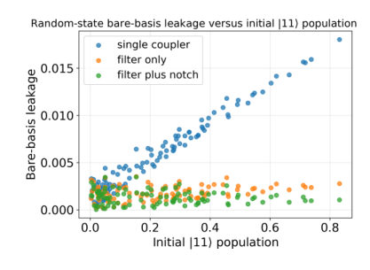 
FIG. 4. Random-state bare-projector leakage as a func- tion of the initial |11⟩population. Each point corresponds to a different randomly generated computational state |ψ0⟩= c00|00⟩+ c01|01⟩+ c10|10⟩+ c11|11⟩, with all four complex amplitudes sampled simultaneously and normalized. Thus, the figure represents a statistical correlation between leak- age and the initial |11⟩population rather than a scan per- formed at fixed P11. The single-coupler architecture shows a strong increase of leakage with increasing |11⟩weight, indi- cating that the dominant leakage pathway is associated with the two-excitation manifold. The filter-only and filter+notch architectures keep the leakage much lower and...

📷 Fig 5

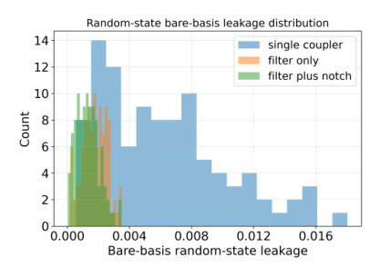 
FIG. 5. Distribution of random-state bare-projector leakage for the optimized single-coupler, filter-only, and filter+notch architectures. The hybrid architectures shift the leakage distribution toward lower values compared with the single- coupler reference, with the filter+notch design giving the smallest mean leakage.

**Summary.** The paper introduces a novel Purcell-engineered hybrid coupler designed to enhance the robustness of CZ gates in superconducting quantum processors. By integrating both coherent interaction engineering (via the transmon coupler) and leakage-selective dissipation (using filter/notch resonators), the authors achieve state-of-the-art gate fidelities while drastically suppressing unwanted energy loss pathways.

**Why it may be interesting.** This work directly addresses open quantum system dynamics in superconducting circuits by showing how engineered dissipation (the notch/filter) can complement coherent control to achieve higher fidelity gates, which is a key area for AMO physicists studying cavity QED and open systems.

Detailed structure

**Main problem.** The primary challenge is developing robust superconducting controlled-Z (CZ) gates by effectively suppressing leakage into non-computational states.

**Main result.** The proposed Purcell-engineered hybrid coupler significantly reduces leakage probability (down to $1.6	imes10^{-3}$) and improves worst-case gate fidelity ($F_{	ext{min}}=99.62\%$) compared to optimized single-coupler designs.

**Method.** The study employs dressed-eigenstate analysis combined with Lindblad master-equation simulations to model the open quantum system dynamics.

**Model / system.** The platform is superconducting qubits (transmons) coupled via a nonlinear transmon coupler, augmented by an engineered subsystem consisting of a Purcell filter and an auxiliary notch resonator. The Hamiltonian describes coherent interactions ($H_{	ext{int}}$), while dissipation is modeled via Lindblad operators.

**Key observables.** Gate fidelity metrics ($F_{	ext{avg}}, F_{	ext{min}}$) and the leakage probability are the key diagnostics used to quantify gate performance.

**Important parameters / regimes.** The architecture's robustness is tested over a broad range of coherence assumptions and device parameters, with optimized values listed in tables.

**Assumptions / limitations.** Analysis assumes fixed operating frequencies for qubits and coupler during the gate operation. The notch mode coupling is treated under an approximation hierarchy ($g_{fn} \gg g_{1n}, g_{2n}$).

**Figures summary.** Figures illustrate the schematic of the hybrid coupler, how effective transverse interaction depends on filter frequency, and spectral responses showing engineered dissipation minima near computational transitions.

**Paper structure.** The paper builds from identifying the leakage problem to proposing the hybrid architecture. It analyzes coherent interactions using dressed-eigenstates, models dissipation engineering via the coupled filter-notch subsystem, and finally validates performance using master equation simulations across varying parameters.

Abstract

We propose a Purcell-engineered notch-filter hybrid coupler for superconducting controlled-$Z$ (CZ) gates that combines coherent interaction engineering with leakage-selective dissipation. The architecture integrates a nonlinear transmon coupler with a coupled Purcell-filter and notch-resonator subsystem, providing additional control over both the coherent interaction pathways and the engineered dissipative environment. The filter branch reshapes the effective interaction pathways, while the notch resonator further tailors the frequency response of the coupled filter network and preserves strong leakage-selective dissipation.   Using dressed-eigenstate analysis together with Lindblad master-equation simulations, we show that the proposed architecture substantially reduces leakage and improves the worst-case computational-state fidelity compared with an optimized single-transmon coupler while remaining robust over a broad range of coherence assumptions and device parameters. The optimized gate achieves $F_{\rm avg}=99.74\%$, $F_{\rm min}=99.62\%$, and a maximum leakage probability of $1.6\times10^{-3}$. These results demonstrate that engineered dissipation complements conventional coherent interaction engineering and provides an additional design degree of freedom for realizing robust, high-fidelity superconducting CZ gates.

[↑ back to top](#top)

### [Response-Selected Hidden Hyperuniformity in Hydrodynamic Active Matter](http://arxiv.org/abs/2607.24102v1)

**Authors:** Liyu Zhong, Yang Jiao  
**Type:** theory · **Category:** statistical mechanics · **PDF:** <https://arxiv.org/pdf/2607.24102v1>  
**Analysis basis:** full PDF text, analyzed in chunks
**Topic relevance:** `non-equilibrium universality` **3/5** · `non-equilibrium dynamics` **2/5** · `Keldysh / 2PI / non-Gaussian methods` **1/5** · `analog quantum simulation` **1/5** · `correlated / nonlocal dissipation` **1/5** · `driven-dissipative phase transition` **1/5** · `methods for driven-dissipative` **1/5**

📷 Fig 1

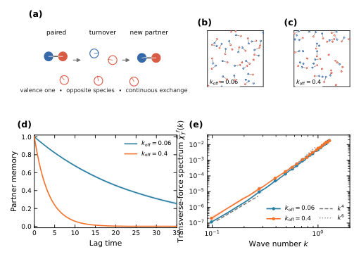 
FIG. 1. Exchangeable active multipoles. (a) Reversible valence-one association with no prescribed partner. (b,c) Steady-state crops at N = 1024 for weak and strong turnover; filled particles are associated, open particles are unpaired, and gray segments are bonds. (d) Partner memory averaged over four independent seeds. (e) Transverse-force spectra; shaded regions are 95% confidence intervals and the gray segments indicate k4 and k6 slopes.

📷 Fig 2

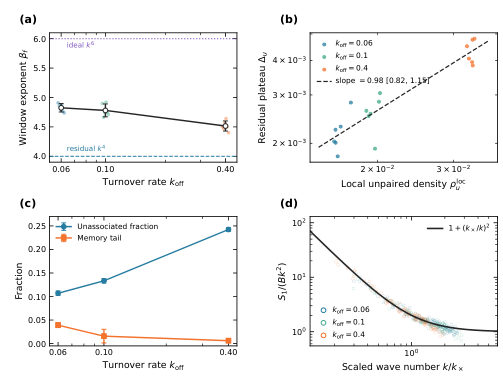 
FIG. 2. Turnover controls a universal infrared crossover. (a) Seed-resolved force-spectrum window expo- nent; black markers and bars are means and 95% confidence intervals. (b) Spectral plateau versus the independently mea- sured local unpaired density. The dashed line is a joint log–log fit, with its bootstrap 95% interval shown in the legend. (c) Unassociated fraction and long-lag memory tail. (d) Collapse of all N = 256 spectra onto S1/(Bk2) = 1 + (k×/k)2.

📷 Fig 3

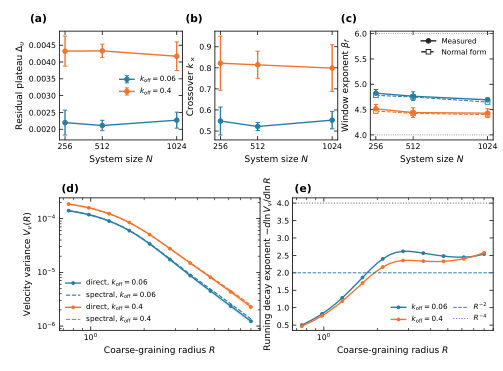 
FIG. 3. Finite-size persistence and macroscopic re- sponse. (a,b) Residual plateau and crossover wave number for N = 256, 512, and 1024. (c) Measured window exponent and the value predicted by the two-term normal form. Error bars are 95% confidence intervals. (d) Direct coarse-grained velocity variance and its spectral prediction at N = 1024; shaded regions are 95% intervals. (e) Corresponding running decay exponent.

**Summary.** This work introduces 'response-selected hyperuniformity' for active fluids, arguing that the observable long-range order depends on which components of the driving force the fluid physically responds to. The authors derive a universal crossover scaling law for the transverse-force spectrum, showing that perfect hyperuniformity is only achieved in the idealized zero-residual limit.

**Why it may be interesting.** While focused on classical active matter hydrodynamics, the concept of 'response selection' and deriving universal scaling laws from microscopic constraints (like incompressibility) shares conceptual parallels with how quantum response functions are analyzed in many-body physics.

Detailed structure

**Main problem.** To characterize a novel form of emergent hyperuniformity in hydrodynamic active matter, moving beyond treating it as a property of prescribed density fields.

**Main result.** The transverse-force spectrum exhibits a universal crossover from fourth- to sixth-order scaling, demonstrating that strict hyperuniformity requires zero residual activity moments.

**Method.** Mathematical derivation using Fourier space analysis and source-response formalism applied to hydrodynamic interactions in an incompressible fluid.

**Model / system.** A reversible valence-one active fluid model involving overdamped carriers with signed first moments, interacting hydrodynamically.

**Key observables.** Transverse-force spectrum $	ilde{\chi}_f^T(\mathbf{k})$, source spectrum $S_1(\mathbf{k})$, and the crossover wave number $k_	imes$.

**Important parameters / regimes.** The ratio of unscreened residual to screened analytic contribution, which sets the crossover scale.

**Assumptions / limitations.** The analysis assumes an incompressible fluid response and models the source spectrum as a sum of an analytic (cluster) term and a constant plateau (residual moment).

**Figures summary.** Figures illustrate active multipoles evolution and display the resulting transverse-force spectra, showing the characteristic crossover behavior.

**Paper structure.** The paper introduces response-selected hyperuniformity by analyzing how fluid incompressibility selects specific force components. It derives the spectral form exhibiting a $k^4 	o k^6$ crossover based on residual vs. screened contributions, concluding that finite residuals cause infrared leakage.

Abstract

Hyperuniformity in active matter is usually treated as a property of a prescribed density or continuum field. This view misses a basic feature of hydrodynamic active matter: an incompressible fluid does not respond equally to every microscopic force. Longitudinal forcing is absorbed into pressure, whereas transverse forcing drives flow. The relevant question is therefore not only whether particles are uniformly arranged or whether the total activity is small, but which sector of the active forcing is selected by the physical response. Here we introduce response-selected hyperuniformity, in which long-wavelength order is a property of a source-response pair. In a reversible valence-one fluid with no prescribed partners, locally neutral clusters screen the signed active-moment sector that controls transverse flow, producing a first-moment spectrum that vanishes quadratically at low wavenumber. Locally unscreened moments instead generate a nonzero infrared plateau. The resulting transverse-force spectrum has a universal crossover from fourth- to sixth-order scaling, with the crossover set by the ratio of the unscreened residual to the screened analytic contribution. Complete partner renewal preserves this normal form, establishing exchangeable multipole inheritance, while turnover tunes the residual through an independently measured local defect density. The zero-residual limit yields strictly hyperuniform velocity fluctuations; any finite residual causes defect-controlled infrared leakage and sets a finite screening length. Thus microscopic exchange need not destroy hidden hyperuniform flow order, but rare unscreened moments determine how far the quiet-flow regime survives.

[↑ back to top](#top)

### [The Physics of Unresolved Uncertainty: Quantum Mechanics as a Theory of Potentiality](http://arxiv.org/abs/2607.23745v1)

**Authors:** Lionel Martellini  
**Type:** theory · **Category:** other · **PDF:** <https://arxiv.org/pdf/2607.23745v1>  
**Analysis basis:** full PDF text, analyzed in chunks
**Topic relevance:** `quantum measurements` **3/5** · `measurement-induced transitions` **2/5** · `correlated / nonlocal dissipation` **1/5** · `driven-dissipative phase transition` **1/5** · `entanglement & information structure` **1/5** · `interference shaping light` **1/5** · `non-equilibrium dynamics` **1/5**

📷 Fig 1

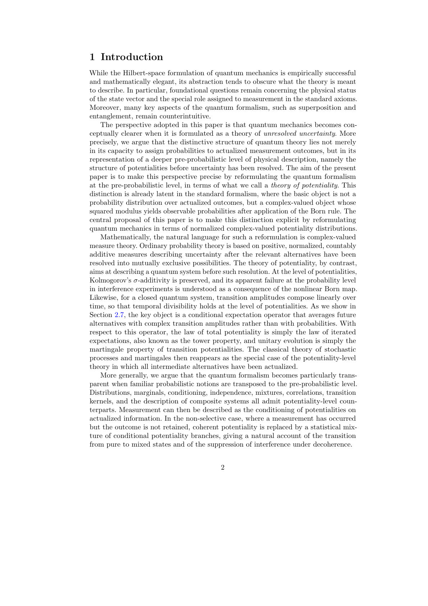 
Low-resolution page preview, page 2

📷 Fig 2

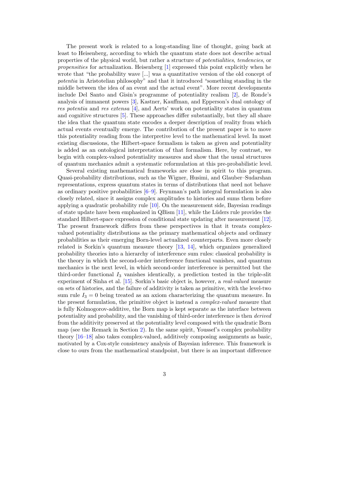 
Low-resolution page preview, page 3

📷 Fig 3

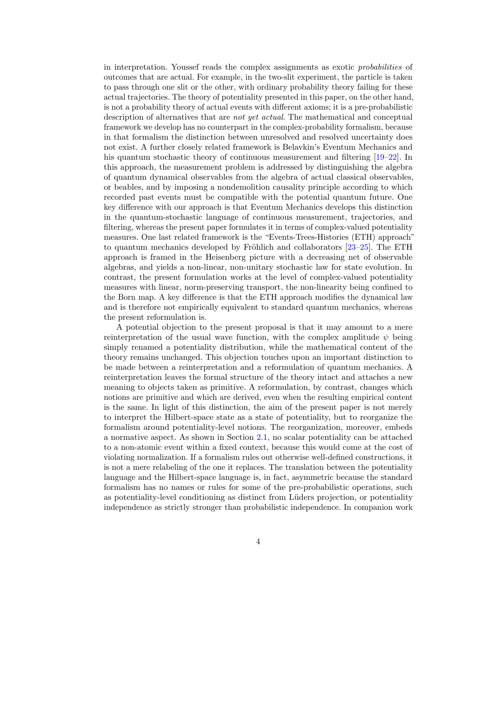 
Low-resolution page preview, page 4

📷 Fig 4

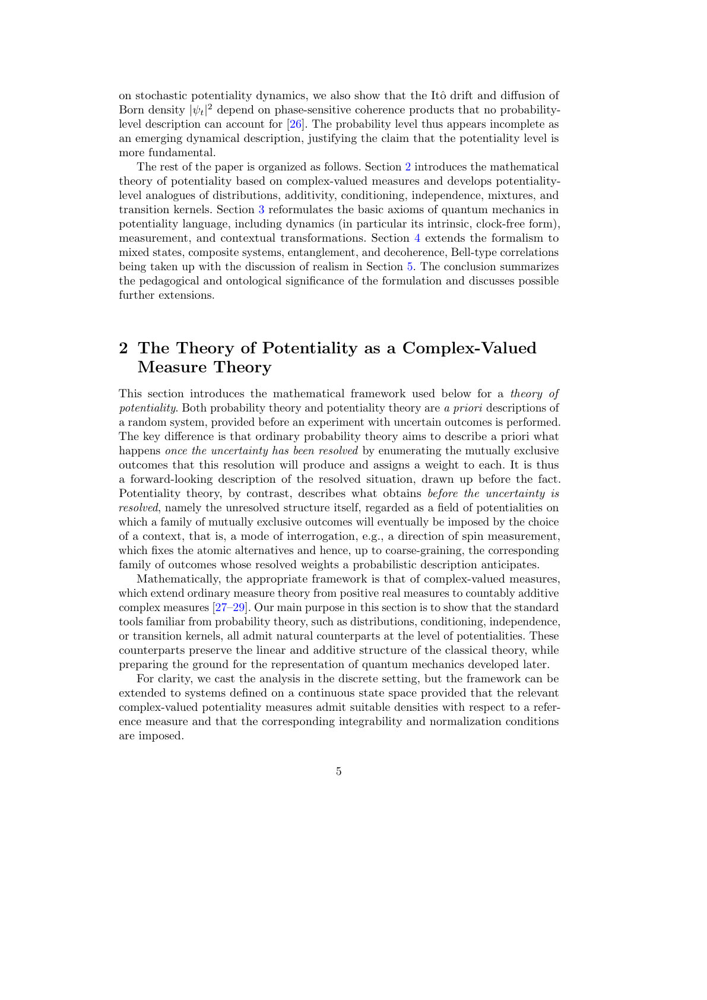 
Low-resolution page preview, page 5

📷 Fig 5

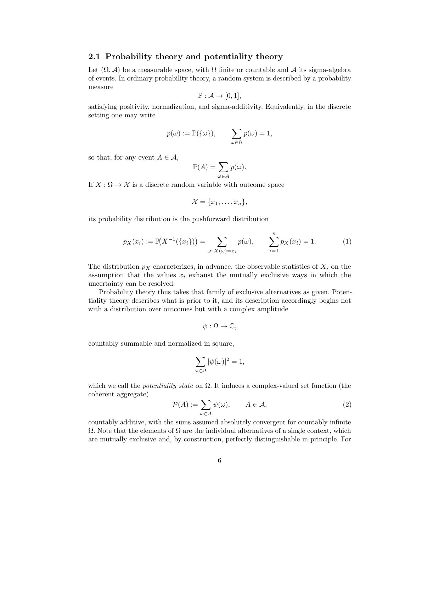 
Low-resolution page preview, page 6

**Summary.** The paper proposes reformulating quantum mechanics as a 'Theory of Potentiality' using complex-valued measure theory. It distinguishes between the linear mathematics governing unactualized potentialities and the nonlinear Born map that yields observable probabilities. This framework aims to provide a deeper, pre-probabilistic understanding of QM while remaining mathematically equivalent to standard formalism.

**Why it may be interesting.** This work offers a deep conceptual re-foundation of quantum mechanics that addresses the measurement problem by positing an underlying mathematical structure of unresolved potentiality, which is highly relevant to foundational questions in open quantum systems theory.

Detailed structure

**Main problem.** To reformulate quantum mechanics (QM) as a fundamental theory of 'unresolved uncertainty' rather than solely focusing on probabilities derived from actualized outcomes.

**Main result.** The proposed potentiality framework is empirically equivalent to standard QM but makes explicit the pre-probabilistic structure underlying quantum phenomena like interference and entanglement.

**Method.** It utilizes complex-valued measure theory, treating potentialities as primary objects that retain linear additivity, contrasting this with the nonlinear Born map required for observable probabilities.

**Model / system.** The model describes general quantum systems using potentiality distributions ($\psi$), which are complex-valued measures over an underlying context space $\Omega$. It systematically maps standard QM concepts (e.g., partial trace, Lüders update) to analogous structures in this new formalism.

**Key observables.** Observable probabilities ($p_X(x)$), coherent potentiality aggregates ($P(A)$), and the structure of joint potentialities ($\psi(x, y)$).

**Important parameters / regimes.** The distinction between linear (potentiality) and quadratic (probability/Born map) structures is key; no specific physical parameters are emphasized over the mathematical formalism.

**Assumptions / limitations.** The core assumption is that QM can be fundamentally understood as a theory of pre-probabilistic potentialities, which requires redefining primitive notions away from standard probability axioms.

**Figures summary.** A detailed comparison table maps standard quantum mechanical concepts (e.g., density matrix, Lüders update) to their corresponding structures within the Theory of Potentiality.

**Paper structure.** The paper systematically develops a 'potentiality language,' contrasting it with standard QM by defining analogues for core probabilistic operations (conditioning, independence) at the complex measure level before applying the Born map.

Abstract

We propose a reformulation of quantum mechanics as a theory of unresolved uncertainty. The framework is formulated in the language of complex-valued measure theory, regarded as a pre-probabilistic counterpart of ordinary probability theory. In this formulation, additivity, conditioning, independence, mixtures, transition kernels, and temporal divisibility retain natural linear forms at the potentiality level, while non-classical probability-level features such as interference arise from the nonlinear Born map. Measurement is described as Bayesian-type conditioning of potentialities on actualized information, and non-selective measurement as the replacement of coherent potentiality by statistical mixtures of conditional branches. Mixed states, decoherence, composite systems, entanglement, and Bell-type correlations are also given a unified potentiality-level interpretation. The resulting formulation is empirically equivalent to standard quantum mechanics, but it makes explicit a pre-probabilistic description of physical reality that is usually implicit in the Hilbert-space formalism.

[↑ back to top](#top)

### [Tree Tensor Network Reservoir Computing: Hierarchical Ensemble with Invariant Phase Boundaries](http://arxiv.org/abs/2607.24127v1)

**Authors:** Daiki Sasaki, Chih-Chieh Chen, Tomah Sogabe  
**Type:** theory · **Category:** numerical methods · **PDF:** <https://arxiv.org/pdf/2607.24127v1>  
**Analysis basis:** full PDF text, analyzed in chunks
**Topic relevance:** `methods for driven-dissipative` **3/5** · `non-equilibrium dynamics` **2/5** · `Keldysh / 2PI / non-Gaussian methods` **1/5** · `analog quantum simulation` **1/5** · `driven-dissipative phase transition` **1/5** · `entanglement & information structure` **1/5** · `non-equilibrium universality` **1/5**

📷 Fig 1

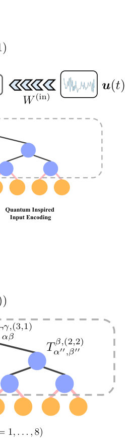 
Figure 1. Conceptual diagram of TTN-RC (L = 3): (a) shows the recursive structure in which the reservoir state is obtained by applying an activation function to the sum of (i) the contraction result of the random TTN function and (ii) the weighted external input, and then feeding that state back as input. (b) shows only the random TTN function component. Here, the encoded reservoir state at the current time is propagated by successively contracting the random TTN from the bottom up.

📷 Fig 2

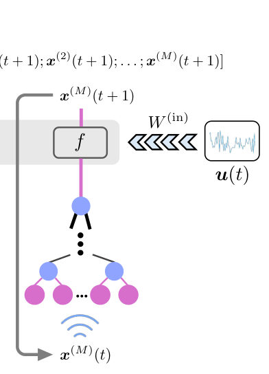 
Figure 2. The recursive structure of the ensemble TTN-RC. Each tree is contracted and recursed independently, but their outputs are concatenated to form the overall reservoir state vector.

📷 Fig 3

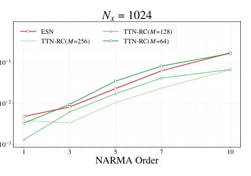 
Figure 3. Comparison of the performance between TTN-RC and ESN on the NARMA1, 3, 5, 7, and 10 tasks. The horizontal axis represents the order of the NARMA task, n = 1, 3, 5, 7, 10, and the vertical axis represents the NMSE. In the left panel, the total reservoir size is fixed at Nx = 128, while in the right panel, it is fixed at Nx = 1024. For TTN-RC, the results are shown for values of M corresponding to ˜Nx = 4, 8, and 16. The presented result is the NMSE on the test data, averaged over 10 different reservoir realizations, using optimized parameters. Outliers, defined as data points falling outside 1.5 times the interquartile range, were removed, after which the average NMSE was...

📷 Fig 4

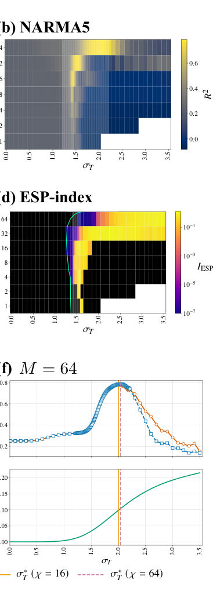 
Figure 4. Performance evaluation of the TTN-RC. (a): Heatmap of the total memory capacity, Ctot STM, for the STM task. (b, c): Heatmaps of the R2 score for the NARMA5 and NARMA10 tasks, respectively. (d): Heatmap of the ESP metric, IESP(100). The light-green line indicates the contour for C = 1. In panel (d), values of 10−7

📷 Fig 5

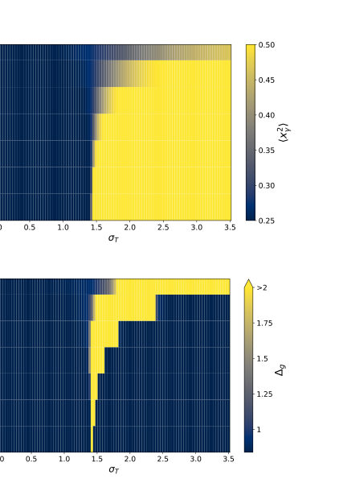 
Figure 5. Heatmaps of theoretical metrics. The horizontal axis represents σT , and the vertical axis represents the number of trees M. Nx = 256 for all calculations. (a): Heatmap of C, obtained by calculating the reservoir’s Jacobian. Values of C ≥10 are saturated to the same color. The light-green line indicates the contour for C = 1. (b): Heatmap of the reservoir-state mean square qx = ⟨x2 γ⟩, given by equation (22), calculated using mean-field theory. (c): Mean-field contraction constant ρ. (d): Phenomenological learning-theory proxy based on a mean-field generalization-gap bound.

**Summary.** This paper introduces Tree Tensor Network Reservoir Computing (TTN-RC), a method for time-series prediction that uses random tree tensors as its reservoir. To ensure stable operation, they propose a hierarchical ensemble structure and derive theoretical stability boundaries using Jacobian analysis. This provides both improved predictive performance and a rigorous design principle based on tensor network physics.

**Why it may be interesting.** While primarily ML-focused, the rigorous mathematical analysis of stability boundaries ($\sigma_T=\sqrt{2}$) and the use of tensor network contractions echo techniques used in analyzing quantum many-body systems and entanglement measures.

Detailed structure

**Main problem.** Developing a quantum-inspired reservoir computing framework (TTN-RC) for time-series prediction that addresses the inherent exponential concentration or divergence of outputs in standard Tree Tensor Networks.

**Main result.** The proposed hierarchical ensemble method mitigates instability, and an asymptotic stability boundary is identified at $\sigma_{T}=\sqrt{2}$, providing a design principle for tensor-network-based reservoir computing.

**Method.** The authors combine the use of random Tree Tensor Networks as reservoirs with a novel hierarchical ensemble technique to stabilize the system's dynamics. They employ mean-field theory and Jacobian analysis to derive stability criteria.

**Model / system.** The model is TTN-RC, an extension of Echo State Networks (ESNs) where the reservoir state generation uses a random tree tensor network structure instead of standard weight matrices. The system utilizes $M$ independent sub-reservoirs whose outputs are concatenated.

**Key observables.** Expected contraction rate ($C$), variance of the Jacobian matrix ($V^{(l)}_J$), and performance metrics like $R^2$ on NARMA benchmarks.

**Important parameters / regimes.** Tensor-element standard deviation ($\sigma_T$), total reservoir size ($N_x$), number of sub-reservoirs ($M$), and network depth ($L$).

**Assumptions / limitations.** The analysis relies on the independence assumption for tensor contractions and assumes that the ensemble structure allows for a mean-field description of stability.

**Figures summary.** Figure 1 conceptually illustrates the recursive, tree-like structure used for updating the reservoir state in TTN-RC.

**Paper structure.** The paper introduces the TTN-RC model and its hierarchical ensemble extension. It then develops theoretical analyses using Jacobian calculations to derive stability criteria (contraction rate) and concludes with experimental validation on time-series prediction tasks.

Abstract

We propose Tree Tensor Network Reservoir Computing (TTN-RC), a quantum-inspired reservoir computing framework for time-series prediction that uses the hierarchical structure of Tree Tensor Networks as a random reservoir. To control the exponential concentration or divergence of TTN outputs, we introduce a hierarchical ensemble method that partitions a fixed-size reservoir into multiple independent sub-reservoirs. In the tested NARMA benchmarks, TTN-RC achieves competitive or improved performance compared with conventional Echo State Networks, especially for tasks requiring higher-order nonlinear processing and longer contextual dependence. We also derive an expected contraction rate based on the reservoir Jacobian and develop a mean-field description of the reservoir-state statistics. These analyses identify an asymptotic stability boundary at $σ_{T}=\sqrt{2}$ in the large per-tree-size limit, where several theoretical indicators converge. Our results provide a design principle for tensor-network-based reservoir computing and clarify how hierarchical reservoir topology controls stability and nonlinear information processing.

[↑ back to top](#top)

### [How Many Shots Does It Take? A Noise-Aware Quantum Resource Allocation Framework](http://arxiv.org/abs/2607.24704v1)

**Authors:** Prateek P. Kulkarni, Sumit K. Mandal  
**Type:** theory · **Category:** quantum information and computing · **PDF:** <https://arxiv.org/pdf/2607.24704v1>  
**Analysis basis:** full PDF text, analyzed in chunks
**Topic relevance:** `quantum measurements` **3/5** · `measurement-induced transitions` **2/5** · `Keldysh / 2PI / non-Gaussian methods` **1/5** · `correlated / nonlocal dissipation` **1/5** · `driven-dissipative phase transition` **1/5** · `methods for driven-dissipative` **1/5**

📷 Fig 1

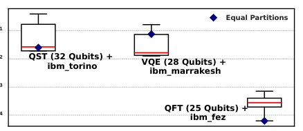 
Figure 1: Estimation error for quantum algorithms across all partitioning strategies, under a fixed shot budget. Equal shot partitioning shows substantial variation across algorithms.

📷 Fig 2

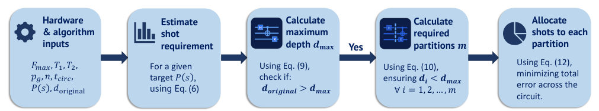 
Figure 2: Overview of the Proposed Framework. The workflow begins with hardware parameters and algorithm specifications, estimates total shot requirements, computes maximum executable depth, partitions circuits exceeding depth limits, and optimally distributes shots across partitions to minimize error while achieving target success probability. 4 Methodology

📷 Fig 3

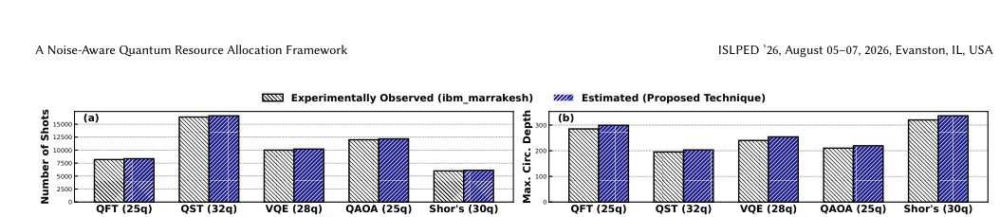 
Figure 3: Experimental validation of proposed analytical model on IBM Marrakesh at 𝑃(𝑠) = 0.95: (a) Shot estimation using Eq. 6 achieves 98.2% accuracy on average, (b) Maximum depth estimation using Eq. 9 achieves 95% accuracy on average.

📷 Fig 4

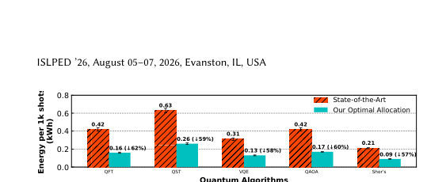 
Figure 4: Energy consumption per 1000 shots for different quantum algorithms comparing state-of-the-art equal shot allocation with our optimal allocation strategy (20 runs, error bars indicate 95% confidence intervals).

📷 Fig 5

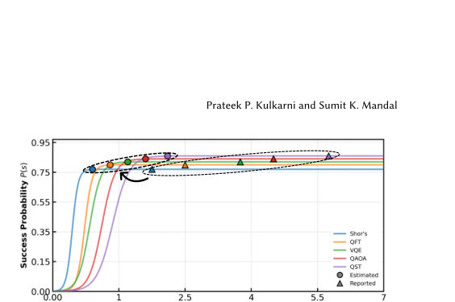 
Figure 5: Our technique identifies optimal shot count, avoid- ing the wasteful over-provisioning.

**Summary.** This paper introduces a comprehensive, noise-aware framework to optimize quantum algorithm execution on current hardware. It derives analytical methods to calculate the minimum necessary number of measurement shots and optimally distributes these shots across circuit partitions. The resulting resource allocation strategy significantly reduces both computational error and energy consumption compared to standard practices.

**Why it may be interesting.** While focused on computation, the rigorous mathematical treatment of noise accumulation and resource optimization (shot allocation) provides deep insights into the fundamental limits imposed by decoherence in open quantum systems, which is relevant for theoretical modeling of noisy physical platforms.

Detailed structure

**Main problem.** The work addresses determining the optimal number of measurement shots required for reliable quantum algorithm execution and developing a noise-aware method to distribute a fixed shot budget across circuit partitions.

**Main result.** The proposed analytical framework reduces required shots by about 58% (leading to up to 62% energy reduction) and can reduce the total estimation error by up to 73% compared to conventional, non-optimized approaches.

**Method.** It derives closed-form analytical expressions for optimal shot counts and uses Lagrange multipliers to solve a resource allocation problem that minimizes total estimation error subject to fixed budget constraints.

**Model / system.** The analysis is applied to near-term quantum computers characterized by noise, limited gate fidelities, and the need for repeated circuit executions (shots). It models success probability using binomial/normal distributions incorporating hardware noise variance.

**Key observables.** Shots ($s$), Total Estimation Error ($\mathcal{E}$), Energy Consumption, Maximum Executable Depth ($d_{\max}$).

**Important parameters / regimes.** Coherence times ($T_1, T_2$), gate error probability ($p_g$), Circuit Depth ($d$), Target Success Probability ($P(s)$).

**Assumptions / limitations.** Approximations are made for circuit execution time ($t_{circ} \approx d \cdot t_g$) and the noise variance calculation relies on suppressing higher-order terms in the noise model.

**Figures summary.** Figures illustrate comparisons of estimation error across different partitioning strategies, show the workflow for shot estimation and depth calculation, and compare energy consumption savings between optimal vs. equal shot allocation.

**Paper structure.** The paper progresses from establishing the need for reliable shots to deriving analytical expressions for required shots, then developing a framework to calculate maximum feasible circuit depth ($d_{\max}$), and finally solving an optimization problem using Lagrange multipliers to optimally allocate shots across partitions to minimize total error.

Abstract

Any algorithm execution on quantum computers requires several repeated and costly executions (known as shots) to obtain reliable results. In this work, we propose a closed-form accurate analytical expression to determine optimal number of shots required for reliable execution of any algorithm on a quantum computer. We also present a theoretically grounded technique to distribute fixed shot budget across different partitions in a quantum circuit minimizing the total error. Our proposed analytical model helps to reduce the shots associated with reliable execution of quantum algorithms by about 58\% compared to current practice, in turn reducing the energy consumption by upto 62\%. Furthermore, our proposed optimal shot allocation technique across different partitions reduces total error by up to 73\% compared to conventional approaches.

[↑ back to top](#top)

### [Fixed points in de Finetti hierarchies](http://arxiv.org/abs/2607.23689v1)

**Authors:** Gereon Kossmann, Julius A. Zeiss  
**Type:** theory · **Category:** quantum information and computing · **PDF:** <https://arxiv.org/pdf/2607.23689v1>  
**Analysis basis:** full PDF text, analyzed in chunks
**Topic relevance:** `entanglement & information structure` **3/5** · `correlated / nonlocal dissipation` **1/5** · `driven-dissipative phase transition` **1/5** · `methods for driven-dissipative` **1/5** · `non-equilibrium dynamics` **1/5** · `non-equilibrium universality` **1/5**

📷 Fig 1

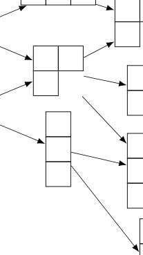 
Figure 1. The Bratteli diagram of the family of symmetric group algebras C [S0] ,→C [S1] ,→· · · ,→C [S4], also known as the Young lattice (cf. Ex. D.4). The Bratteli diagram of the permutation matrix algebras  Ad k 

**Summary.** This paper extends de Finetti theorems by constraining physical states to be fixed points of quantum channels, thereby generalizing symmetry arguments. Using advanced tools from functional analysis and representation theory, the authors derive tight bounds on quantum capacities and provide efficient algorithms for related problems. This work advances the mathematical understanding of correlations in quantum systems under structural constraints.

**Why it may be interesting.** It provides rigorous mathematical machinery to analyze quantum correlations under symmetry constraints, which is crucial for understanding resource theories in open quantum systems and quantum information processing.

Detailed structure

**Main problem.** The work studies de Finetti hierarchies when quantum states are constrained to be fixed points of quantum channels, generalizing classical symmetry arguments.

**Main result.** They derive several quantitative de Finetti theorems with improved convergence rates and establish efficient computational schemes for related problems like separable inner approximations.

**Method.** The approach combines the mean-ergodic theorem with structure theory of conditional expectations, utilizing algebraic tools from representation theory (Schur-Weyl duality, Gelfand-Tsetlin bases).

**Model / system.** The focus is on quantum statistical processes and density operators constrained by fixed points of quantum channels ($\Phi(
ho) = 
ho$), which subsumes invariance under compact symmetry groups.

**Key observables.** Entanglement-assisted classical capacity, block-wise distortion bounds for measurements, and convergence rates in de Finetti theorems (e.g., $O(\sqrt{\log n}/n)$).

**Important parameters / regimes.** The local dimension ($d$), the number of subsystems ($n$), and the error tolerance ($\epsilon$).

**Assumptions / limitations.** The results rely on adapting information-theoretic proofs to fixed point constraints, effectively treating symmetries as general fixed point conditions.

**Paper structure.** The paper develops tools by first establishing bounds related to conditional expectations and measurements adapted to fixed point algebras. This leads to the derivation of refined de Finetti theorems (double-sided extension, interpolation) and concludes with applications to optimization and error correction.

Abstract

De Finetti theorems convert permutation symmetry into approximate mixtures of product states and thereby justify a wide range of reductions in classical and quantum statistics. In this work we study de Finetti hierarchies in which the feasible states are additionally constrained to be fixed points of quantum channels, a condition that subsumes invariance under arbitrary compact symmetry groups. Combining the mean-ergodic theorem with the structure theory of conditional expectations, we prove a tight bound on the entanglement-assisted classical capacity of the dual of a conditional expectation, block-wise distortion bounds for informationally complete measurements adapted to fixed point algebras, and an exact type-based refinement of the chain rule for permutation-invariant states. From these tools we derive several de Finetti theorems: a double-sided extension theorem with $O\left(\sqrt{\log n}/n\right)$ convergence, an interpolation theorem whose dimension dependence is governed solely by the block structure of the fixed point algebras and which recovers the dimension-independent classical behavior for maximal tori, and a Bose-symmetric variant. Exploiting Schur-Weyl duality and Gelfand-Tsetlin bases, we further show that the rounding scheme producing certifiably good separable inner approximations for (constrained) separability problems can be implemented in time polynomial in $1/ε$ for fixed local dimensions, complementing the known efficient outer hierarchies. Applications to bilinear optimization under symmetries and to approximate quantum error correction are discussed.

[↑ back to top](#top)

### [Loss and distinguishability effects in heralded entangled state generation with Gaussian resources](http://arxiv.org/abs/2607.23048v1)

**Authors:** Yun-Long Cao, Xiao-Ye Xu, Wiwittawin Sukmas, Chuan-Feng Li, Guang-Can Guo  
**Type:** theory · **Category:** quantum information and computing · **PDF:** <https://arxiv.org/pdf/2607.23048v1>  
**Analysis basis:** full PDF text, analyzed in chunks
**Topic relevance:** `interference shaping light` **3/5** · `Keldysh / 2PI / non-Gaussian methods` **1/5** · `correlated / nonlocal dissipation` **1/5** · `driven-dissipative phase transition` **1/5** · `entanglement & information structure` **1/5** · `methods for driven-dissipative` **1/5**

📷 Fig 1

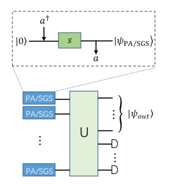 
FIG. 1. Schematic of ideal heralded entanglement generation model with photon addition/subtraction Gaussian source. The photon addition and subtraction operations are realized via Gaussian operations and conditional measurements, which can be arbitrarily configured as required. The single-mode squeezers S and the linear interferometer U are serving as op- timization parameters.

📷 Fig 2

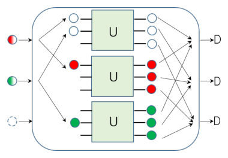 
FIG. 3. Schematic of heralded entanglement generation model with partial distinguishability. Partially distinguish- able photon states are inputted into the first two modes of a three-mode linear interferometer. The states are decomposed into indistinguishable components and distinguishable com- ponents that propagate independently. Both pass through the interferometer to the detectors. The solid rectangle U repre- sents the interferometer for indistinguishable photons. The dashed rectangles represent the virtual interferometer for dis- tinguishable photons.

📷 Fig 3

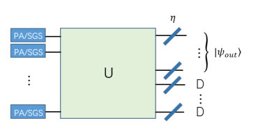 
FIG. 2. Schematic of heralded entanglement generation model with loss. The transmissivity η of beam splitters is used to model the total loss. The single-mode squeezers S and the linear interferometer U are serving as optimization parame- ters.

📷 Fig 4

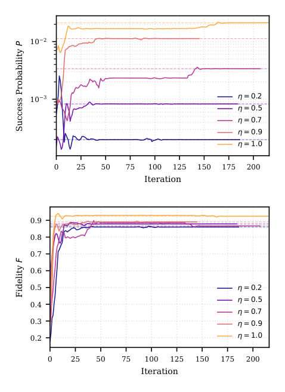 
FIG. 4. Probability and fidelity of the Bell state generated with different efficiency as a function of optimal steps. The weights w1, w2 and ϵ are set to 10, 1 and 10−4.

📷 Fig 5

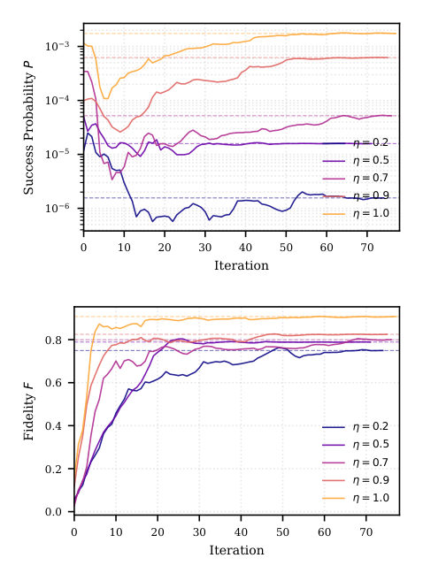 
FIG. 5. Probability and fidelity of the GHZ state generated with different efficiency as a function of optimal steps. The weights w1, w2 and ϵ are set to 10, 1 and 10−4.

**Summary.** This work analyzes how optical loss and photon indistinguishability affect generating entangled states using Gaussian resources in photonics. By developing a numerical optimization framework, the authors show that while these imperfections degrade efficiency, fidelity remains high if non-Gaussian operations are strategically employed alongside post-selection. This offers crucial guidelines for building robust quantum photonic circuits.

**Why it may be interesting.** It provides practical design guidelines for scalable quantum state engineering on integrated photonic platforms by quantifying the impact of unavoidable experimental imperfections like loss and distinguishability.

Detailed structure

**Main problem.** The study quantitatively investigates how optical loss and photon distinguishability degrade the heralded generation of entangled quantum states using Gaussian resources.

**Main result.** Non-Gaussian operations, combined with non-vacuum post-selection, can enhance state generation performance under realistic imperfections, showing that losses primarily reduce success probability rather than fundamentally compromising fidelity.

**Method.** An efficient numerical framework in a phase-space representation is established to optimize target-state fidelity and success probability by incorporating mode-dependent loss and partial distinguishability statistics.

**Model / system.** The system models heralded entanglement generation using multi-mode Gaussian sources (squeezed states) directed through an interferometer, subject to linear loss channels ($\eta$) and modeled photon distinguishability components.

**Key observables.** Target-state fidelity ($F$), success probability ($P$), and the trade-off between these two observables mapped via Pareto frontiers.

**Important parameters / regimes.** Squeezing parameters, interferometer tuning parameters, optical loss rate ($\eta$), and the degree of photon distinguishability.

**Assumptions / limitations.** The analysis treats the system using a combination of Gaussian operations and an approximation for partial distinguishability; post-selection strategies are used to mitigate vacuum noise.

**Figures summary.** Figures illustrate the dependence of $P$ and $F$ on loss rates ($\eta$) and non-Gaussian operation counts, showing Pareto frontiers mapping the trade-off between fidelity and success probability for Bell, GHZ, and W states.

**Paper structure.** The paper progresses by first establishing the model incorporating loss and distinguishability, then optimizing system parameters (squeezing/interferometer) using numerical methods, and finally demonstrating performance enhancement via non-Gaussian operations and post-selection.

Abstract

The effects of optical loss and photon distinguishability on the heralded generation of entangled states based on Gaussian resources are quantitatively investigated. By incorporating mode-dependent loss and the statistical characteristics of partially distinguishable photons into a phase-space representation, an efficient numerical framework is established to optimize target-state fidelity and success probability, with a specific focus on the enhancement triggered by non-Gaussian operations such as photon addition and subtraction. The numerical optimization results indicate that a non-vacuum post-selection strategy within a dual-rail encoding framework, combined with the simultaneous tuning of squeezing parameters and the interferometer network, effectively suppresses vacuum noise, enabling the generation of high-fidelity Bell, GHZ, and W states under realistic experimental constraints. The results show that introducing non-Gaussian operations can successfully enhance the state generation performance under realistic imperfections analogous to the enhancements observed under ideal conditions. This study demonstrates that experimental imperfections primarily scale down the success probability rather than fundamentally compromising the state fidelity, providing practical design guidelines for scalable state engineering on integrated photonic platforms.

[↑ back to top](#top)

### [Observation of correlation-driven topological transport and robust ferromagnetism in 2D CrS$_2$](http://arxiv.org/abs/2607.23625v1)

**Authors:** Sk Md Obaidulla, M. Nur Hasan, Dayal Das, Rafiqul Alam, Antonio Supina, Muhammad Awais Aslam, Sherif Kamal, Iva Šarić Jankovic, Aleksandar Matkovic, Christian Teichert, Atindra Nath Pal, Heike C. Herper, Marko Kralj  
**Type:** both · **Category:** strongly correlated electrons · **PDF:** <https://arxiv.org/pdf/2607.23625v1>  
**Analysis basis:** full PDF text, analyzed in chunks
**Topic relevance:** `spintronics-quantum-optics interface` **3/5** · `analog quantum simulation` **2/5** · `Kondo & dissipative impurity` **1/5** · `exotic spin models in light-matter` **1/5** · `non-equilibrium dynamics` **1/5**

📷 Fig 1

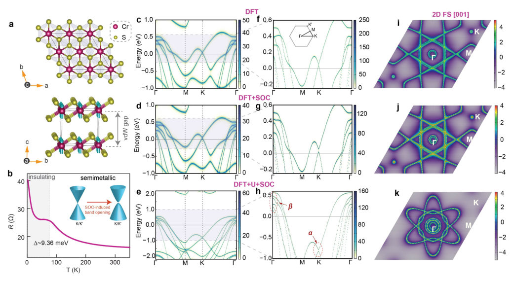 
FIG. 1. Crystal structure, electronic transport, spectral function, and 2D FS of 1T-CrS2. a, Top and side views of the 1T-CrS2 crystal structure, illustrating the vdW gap between adjacent layers. Cr and S atoms are shown as cherry and yellow spheres, respectively. b, R(T), showing a semimetal-to-insulator crossover. The inset schematically illustrates the lifting of the band degeneracy at the K/K′ points. c–h, Calculated spectral function (SF) along the high-symmetry path (Γ–M–K–Γ), indicated in the inset of f, obtained using c,f spin-polarized DFT without SOC, d,g DFT+SOC, and e,h DFT+U+SOC. In the absence of SOC (c,f), multiple dispersive bands cross the Fermi level. Including SOC (d,g)...

📷 Fig 2

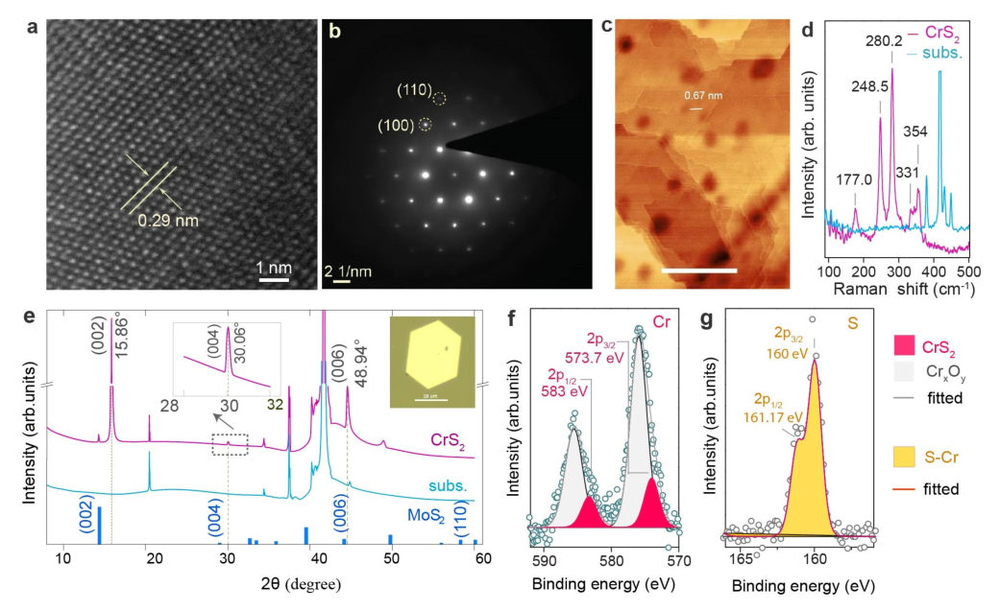 
FIG. 2. Structural and chemical characterization of 1T-CrS2. a, HRTEM image of 1T-CrS2, showing a well-ordered hexagonal lattice with an interplanar spacing of ∼0.29 nm. b, SAED pattern confirming the crystalline nature and hexagonal symmetry, indexed to the (100) and (110) planes. c, AFM of CrS2 with step-height (0.67 nm) displaying layered nature. Scale bar: 1 µm. d, Raman spectra of CrS2 (magenta) compared with background signal (cyan), displaying characteristic vibrational modes. e, XRD pattern of CrS2 (cherry) with background (cyan), and showing prominent (00l) reflections, consistent with a layered structure. Reference peaks from CVD-synthesized MoS2 are included for comparison....

📷 Fig 3

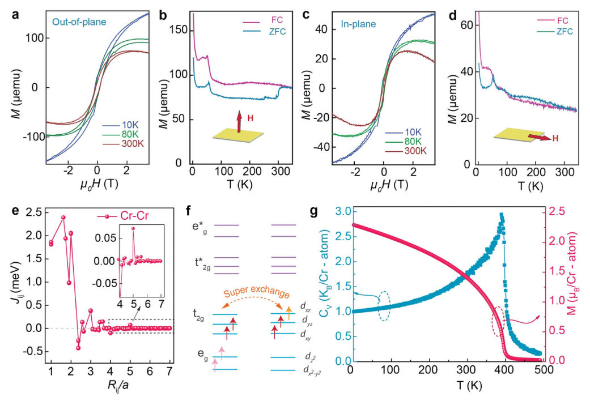 
FIG. 3. Magnetic properties, Heisenberg exchange interactions, and finite-temperature behavior of 1T-CrS2. a,b, Out-of-plane field-dependent magnetization, M(H), and temperature-dependent magnetization, M(T). The hysteresis loop confirms an out-of-plane easy axis. c,d, In-plane field-dependent magnetization, M(H), and temperature-dependent magnetization, M(T). Temperature-dependent magnetization b,c,, M(T) measured under an applied field of 100 Oe. e, Calculated Heisenberg exchange coupling parameters, Jij, as a function of the normalized Cr–Cr distance (Rij/a). The nearest-neighbor interaction is strongly ferromagnetic. f, Schematic illustration of the superexchange mechanism in 1T-CrS2....

📷 Fig 4

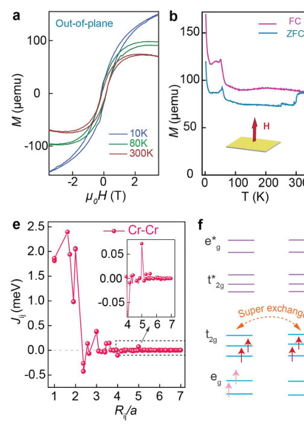 
Fig. 3e shows the calculated isotropic exchange parameters Jij as a function of the normalized Cr–Cr distance (Rij/a). The calculated exchange interactions are predominantly ferromagnetic and remain finite over several neighbouring shells. Interestingly, although the nearest-neighbour exchange interaction is ferromagnetic, the second- and third-nearest-neighbour couplings become comparatively stronger. This behaviour reflects the itinerant nature of magnetic exchange in 1T- CrS2, where indirect Cr–S–Cr hybridization enhances intermediate-range exchange pathways beyond the shortest Cr–Cr distance. Such an exchange hierarchy originates from the edge-sharing CrS6 octahedral environment...

📷 Fig 5

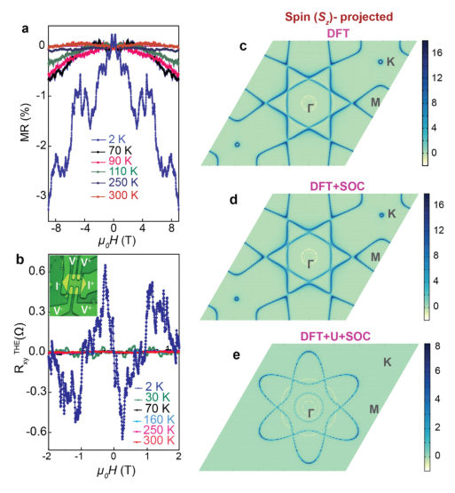 
FIG. 4. Magnetotransport and partial FS topology of 1T-CrS2. a, MR measured at different temperatures (2–300 K), showing a pronounced negative MR at low temperatures. b, Hall resistance RT HE xy as a function of magnetic field at various temperatures. The nonlinear behaviour at low temperatures indicates multiband transport, whereas the nearly linear response at higher temperatures suggests a dominant single-carrier contribution. Inset: Optical image of the device and the electrical-contact configuration used for transport measurements. c–e, Calculated 2D spin-projected (Sz) FS. The calculations were performed using spin-polarized DFT without SOC (c), fully relativistic DFT+SOC (d), and...

**Summary.** This work reports the synthesis and characterization of $1T-	ext{CrS}_2$, demonstrating it as a promising layered magnet. The research combines experimental transport measurements showing topological effects with sophisticated theoretical calculations that prove these phenomena arise from the cooperative action of electronic correlations and spin-orbit coupling in this correlated material.

**Why it may be interesting.** The interplay between strong electron correlations (Hubbard physics), spin-orbit coupling, and emergent topology is central to modern condensed matter theory, making this highly relevant for understanding correlated materials beyond simple band theory.

Detailed structure

**Main problem.** The challenge is realizing a single 2D platform that robustly integrates correlated magnetism, electronic topology, and transport phenomena in layered magnets.

**Main result.** The study establishes $1T-	ext{CrS}_2$ as a rare correlated 3d layered ferromagnet where electronic correlations and spin-orbit coupling cooperatively drive emergent topological transport.

**Method.** A combination of experimental techniques (CVD growth, transport/magnetization measurements) and advanced theoretical calculations ($	ext{DFT}+U+	ext{SOC}$, Heisenberg exchange) was employed.

**Model / system.** The physical system is layered $1T-	ext{CrS}_2$, a transition-metal dichalcogenide known for its octahedral coordination, which promotes strong electron correlations and intrinsic magnetism.

**Key observables.** Robust ferromagnetism with out-of-plane easy-axis anisotropy; semimetal–insulator crossover near 80 K; topological Hall effect below 30 K; gap opening upon inclusion of SOC/correlations.

**Important parameters / regimes.** Curie temperature ($T_C$) above room temperature; low temperatures ($	ext{T} < 30	ext{ K}$) for topological effects; correlation strength ($U$).

**Assumptions / limitations.** The study assumes the stability and synthesizability of the $1T$ polymorph via CVD, and uses theoretical models (like $\Delta_\alpha(T)$) to describe temperature-dependent crossovers.

**Figures summary.** Figures show crystal structures, temperature dependence of resistance revealing a crossover, calculated spectral functions comparing DFT vs. SOC vs. correlated methods, and 2D Fermi surface projections under different theoretical treatments.

**Paper structure.** The paper progresses by first reporting the synthesis (CVD) and basic magnetic/transport measurements. It then uses advanced electronic structure calculations ($	ext{DFT} 	o 	ext{DFT}+	ext{SOC} 	o 	ext{DFT}+U+	ext{SOC}$) to explain the observed phenomena, culminating in a unified picture of correlation-driven topological transport.

Abstract

The realization of correlated layered magnets hosting robust ferromagnetism with emergent topological transport remains a key challenge in quantum materials. Here we report the first catalyst-free chemical vapour deposition growth of layered 1T-CrS$_2$, establishing a highly stable vdWs ferromagnet with an out-of-plane easy-axis anisotropy and a Curie temperature above room temperature. Transport measurements reveal a semimetal--insulator crossover near 80 K and pronounced negative magnetoresistance up to 350 K. A topological Hall effect emerges below 30 K, a rare signature of correlated transport in layered transition-metal dichalcogenide ferromagnets. First-principles calculations show that spin--orbit coupling gaps Dirac-like crossings, while electronic correlations reconstruct the Fermi surface by suppressing electron pockets and reducing the carrier density, enhancing momentum-dependent out-of-plane spin polarization. Magnetic measurements, supported by Heisenberg exchange calculations, reveal strong nearest-neighbour ferromagnetic exchange that stabilizes long-range ferromagnetism. Our results establish 1T-CrS$_2$ as a rare correlated 3$d$ layered ferromagnet in which electronic correlations and spin--orbit coupling cooperatively drive emergent topological transport.

[↑ back to top](#top)

### [Self-energy pole optimization of superconductivity in the bilayer Hubbard model](http://arxiv.org/abs/2607.24549v1)

**Authors:** Taka-Shi Fujiwara, Shiro Sakai, Ryotaro Arita  
**Type:** theory · **Category:** strongly correlated electrons · **PDF:** <https://arxiv.org/pdf/2607.24549v1>  
**Analysis basis:** full PDF text, analyzed in chunks
**Topic relevance:** `Keldysh / 2PI / non-Gaussian methods` **3/5** · `analog quantum simulation` **3/5** · `driven-dissipative phase transition` **1/5** · `methods for driven-dissipative` **1/5**

📷 Fig 1

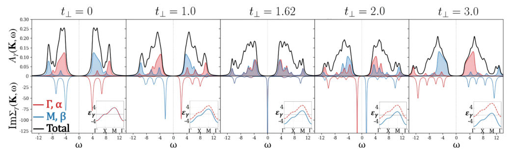 
FIG. 1. Spectral function Aγ(K, ω) (top row) and imaginary part of the normal self-energy Im Σnor γ (K, ω) (bottom row) at half filling (δ = 0) and U = 12 for t⊥= 0, 1.0, 1.62, 2.0, and 3.0 (left to right). Red and blue curves denote the Γ-α and M-β components; the black curve in the top row is the total DOS. The poles of Im Σnor γ , located inside the Mott gap, cross around t⊥≃t⊥,c ≃1.62, identifying the MI–BI crossover as a rearrangement of these poles between the two components. Insets in the lower panels show the bare (U = 0) band dispersions εγ(k) along Γ-X-M-Γ.

📷 Fig 2

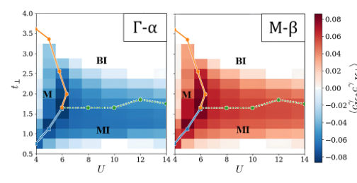 
FIG. 2. Superconducting order parameters in the (U, t⊥) plane at δ = 0.02: ⟨cα Γ↑cα Γ↓⟩for the Γ-α component (left) and ⟨cβ M↑cβ M↓⟩for the M-β component (right), on a common color scale. The opposite signs (Γ-α &lt; 0: blue, M-β &gt; 0: red) indicate s±-wave symmetry. The phase diagram at half filling is superimposed (M: metal, MI: Mott insulator, BI: band in- sulator; the MI–BI boundary is determined in Sec. S5). Both components are largest near the MI–BI boundary and peak toward the metallic region.

📷 Fig 3

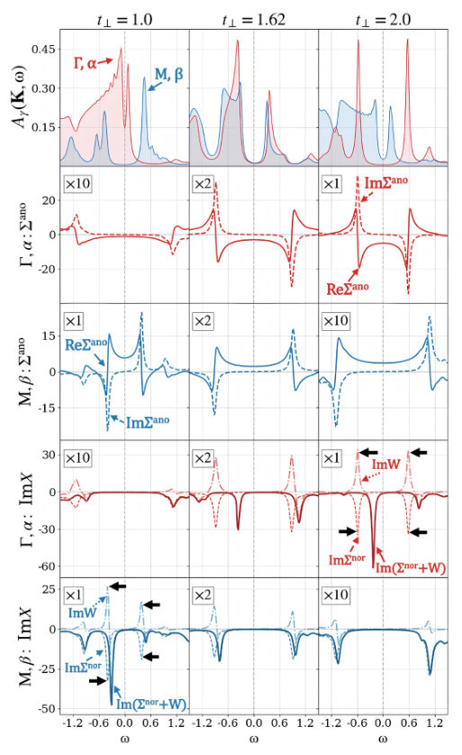 
FIG. 3. Real-frequency results in the superconducting state at U = 12 and δ = 0.02 for t⊥= 1.0, 1.62 (≃t⊥,c), and 2.0 (left to right). From top to bottom: spectral function Aγ(K, ω) (Γ-α: red, M-β: blue); anomalous self-energy Σano γ (K, ω) for Γ-α and then M-β (solid: Re Σano, dashed: Im Σano); and Im Xγ for Γ-α and then M-β with X ∈{Σnor, W, Σnor + W} (Im Σnor γ : dashed, Im Wγ: dash-dotted, sum: solid). Per- panel scale factors (except Aγ) are given in the upper-left corner. Black arrows mark the pole-to-pole cancellation be- tween Σnor γ and Wγ, derived analytically in Sec. S3.

📷 Fig 4

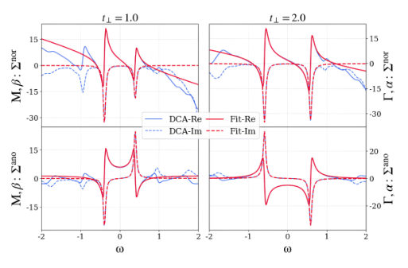 
FIG. 4. Hidden-fermion fit of Σnor γ (K, ω) (top) and Σano γ (K, ω) (bottom) at U = 12 and δ = 0.02: the M-β com- ponent at t⊥= 1.0 (left) and the Γ-α component at t⊥= 2.0 (right). Blue curves are the DCA data and red curves are the fitting with the hidden-fermion model [Eqs. (7) and (8)]; solid and dashed curves denote real and imaginary parts. A single low-energy hidden fermion reproduces the pole structure of both channels.

**Summary.** This theoretical study analyzes the bilayer Hubbard model, showing that superconducting pairing is optimally enhanced near a Mott Insulator–Band Insulator crossover. This enhancement mechanism is driven by the cooperative development of low-energy self-energy poles in both electronic bands. The work demonstrates that interlayer hopping ($t_\perp$) acts as a tunable knob to control this exotic pairing mechanism.

**Why it may be interesting.** The concept of using controllable parameters ($t_\perp$) to tune emergent fermionic excitations (self-energy poles) for optimizing superconductivity is highly relevant to understanding engineered quantum materials and strongly correlated physics.

Detailed structure

**Main problem.** The study investigates how the real-frequency structure of the self-energy dictates superconductivity enhancement in the bilayer Hubbard model.

**Main result.** Superconductivity is maximized near the Mott Insulator–Band Insulator (MI–BI) crossover boundary, where low-energy self-energy poles from both bands cooperatively enhance $s^{\pm}$-wave pairing.

**Method.** The research employs the Dynamical Cluster Approximation (DCA) combined with an equation of motion approach to analyze spectral functions and self-energies.

**Model / system.** The system is the bilayer Hubbard model on a square lattice, described by hopping parameters ($t, t_\perp$) and onsite repulsion ($U$). The analysis focuses on bonding ($eta$) and antibonding ($\alpha$) bands.

**Key observables.** Self-energy poles (real-frequency structure), superconducting order parameter ($\Delta$), band-selective pseudogaps, and the excitation gap $\Delta$.

**Important parameters / regimes.** Interlayer hopping ($t_\perp$), onsite repulsion ($U$), doping level ($\delta=0.02$ to $0.05$), and the MI–BI crossover boundary.

**Assumptions / limitations.** The analysis relies on interpreting self-energies via a 'hidden-fermion model' which successfully captures pole structure across the crossover, although this ansatz fails at higher doping levels.

**Figures summary.** Figures map out superconducting order parameters in $(U, t_\perp)$ planes, showing maxima near the MI–BI boundary. Other figures illustrate spectral functions and self-energy evolution during the MI–BI crossover via pole crossing.

**Paper structure.** The paper systematically analyzes the self-energy poles across doping regimes ($\delta=0$ to $\delta=0.05$) and varying $t_\perp$. It first establishes the MI–BI crossover mechanism, then uses this structure to explain enhanced pairing, culminating in mapping out phase boundaries.

Abstract

We study the real-frequency structure of the self-energy in the bilayer Hubbard model, using the dynamical cluster approximation. At half filling, the Mott insulator-band insulator (MI-BI) crossover involves a rearrangement of self-energy poles between the bonding and antibonding bands; these poles cross as the interlayer hopping $t_{\perp}$ is varied. Upon doping, this pole structure produces a band-selective pseudogap and enhances $s^{\pm}$-wave superconductivity. The order parameter is maximized near the MI-BI boundary, where low-energy anomalous self-energy poles develop simultaneously in both bands and cooperatively enhance the pairing. We further show that these self-energy poles can be interpreted as emergent fermionic excitations, offering an enhanced-pairing mechanism in common with the single-layer Hubbard model. The controllability of these poles through $t_{\perp}$ makes the bilayer system an unconventional platform for optimizing strongly correlated superconductivity.

[↑ back to top](#top)

### [Sign-optimized Quantum Monte Carlo](http://arxiv.org/abs/2607.24679v1)

**Authors:** Julius S. Herz, Robin Schäfer, Matías G. Gonzalez, David J. Luitz  
**Type:** theory · **Category:** numerical methods · **PDF:** <https://arxiv.org/pdf/2607.24679v1>  
**Analysis basis:** full PDF text, analyzed in chunks
**Topic relevance:** `analog quantum simulation` **3/5** · `exotic spin models in light-matter` **3/5** · `methods for driven-dissipative` **1/5** · `non-equilibrium dynamics` **1/5**

📷 Fig 1

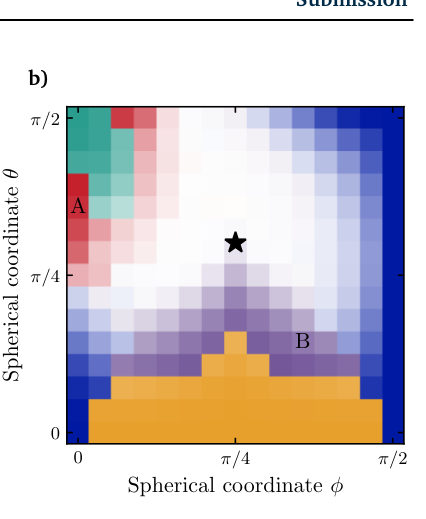 
Figure 1: (Left) Maple-leaf lattice with its three symmetry-inequivalent couplings: Jd (amber) along dimers, Jt (teal) along triangles, and Jh (blue) along hexagons. (Right) Computational phase diagram of the MLL for T = 0.5J: the color indicates the basis with the largest average QMC sign (computational/dimer/trimer eigen- basis in blue/amber/teal; optimized 2-spin/3-spin clustering in purple/red) on an N = 54 site lattice. The transparency indicates the average sign. The isotropic point Jh = Jt = Jd is marked by the black star.

📷 Fig 2

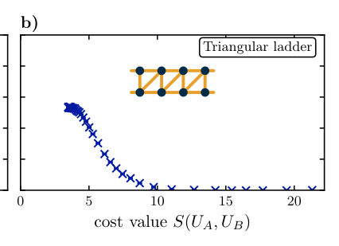 
Figure 2: (Left) average QMC sign 〈s〉as a function of the generalized non- stoquasticity S(UA, UB) along the optimization trajectory for the fully-frustrated lad- der (shown in the inset) of N = 24 sites at T = J. (Right) the same for the triangular ladder.

📷 Fig 3

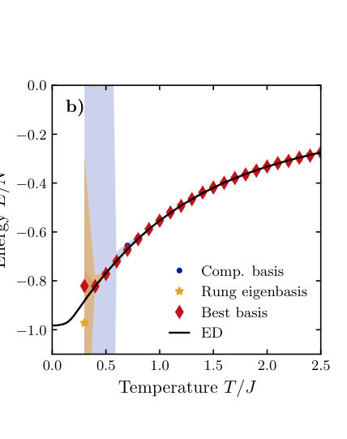 
Figure 3: (Left) Average sign against temperature for the triangular ladder system simulated in bases resulting from the optimization with randomly distributed initial conditions. For each class of bases we plot one sign–temperature curve. For compari- son, the sign-temperature curves for the computational basis and the rung eigenbasis are also plotted. (Right) Energy obtained from QMC simulations in the same bases. The black line represents the ED result for an N = 12 lattice. The simulations are performed on an N = 24 triangular ladder.

📷 Fig 4

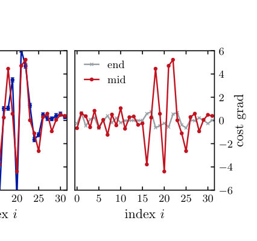 
Figure 4: (Left) Sign gradient at the middle and end points of the optimization pro- cedure. (Right) Non-stoquasticity gradient at the middle and end points of the opti- mization procedure. (Middle) Comparison between the two gradients at the middle point of the optimization (data taken from the left and right panels). Every point i represents a component of the gradient in the 32-dimensional space defined by the parametrization (see main text). We choose ε = 0.075. The simulations are per- formed on an N = 20 triangular ladder at T = J.

📷 Fig 5

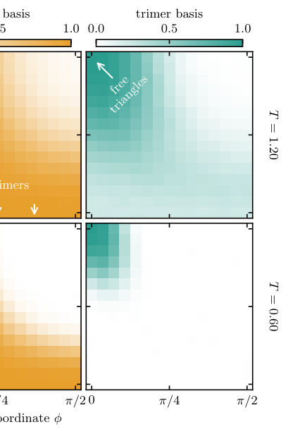 
Figure 5: Average QMC sign for the maple-leaf lattice on the (θ,φ) grid, obtained from simulations in three different bases at T = 1.2 and 0.6. The lattice consists of N = 54 sites with periodic boundary conditions (see Appendix E for the full cluster). The limiting cases of free dimers (θ = 0), free trimers (θ = π/2,φ = 0), and the honeycomb lattice (φ = π/2) are indicated in white.

**Summary.** This paper introduces a novel basis optimization technique to alleviate the sign problem plaguing Quantum Monte Carlo simulations. By systematically rotating the local Hilbert space basis based on minimizing non-stoquasticity, the authors achieve improved simulation accuracy and reach lower temperatures for frustrated magnetic models. This provides a powerful new computational tool for studying strongly correlated quantum matter.

**Why it may be interesting.** While focused on condensed matter magnetism, the core methodology—systematic numerical optimization of simulation representations using advanced gradient descent techniques—is highly relevant to developing robust computational tools for complex quantum systems in AMO physics.

Detailed structure

**Main problem.** The primary challenge addressed is the sign problem in Quantum Monte Carlo (QMC) simulations, which causes exponential statistical fluctuations for certain quantum many-body systems.

**Main result.** The authors developed a basis optimization technique that significantly mitigates the sign problem by rotating the local Hilbert space basis, enabling simulations at lower temperatures than previous state-of-the-art methods.

**Method.** The method involves optimizing the local basis via unitary rotations, guided by minimizing a generalized non-stoquasticity measure ($S(U)$), which is hypothesized to coincide with maximizing the average sign ($\langle s 
angle$).

**Model / system.** The approach is benchmarked on frustrated Heisenberg antiferromagnets on lattices such as the one-dimensional chain, the two-dimensional maple-leaf lattice (MLL), and ladder systems.

**Key observables.** Average Sign ($\langle s 
angle$), Non-stoquasticity ($S(U)$), Specific Heat Capacity.

**Important parameters / regimes.** Temperature ($T$) and various coupling strengths defining the magnetic interactions ($J$).

**Assumptions / limitations.** The optimization relies on the assumption that minimizing non-stoquasticity guides the system toward maximizing the average sign, although this is noted to be a sufficient but not necessary condition for solving the problem.

**Figures summary.** Figures illustrate computational phase diagrams showing optimal basis changes across coupling strengths (MLL), and plots comparing $\langle s 
angle$ versus $S(U)$ for different ladder systems.

**Paper structure.** The paper progresses from defining the sign problem in SSE-QMC to proposing a general unitary basis rotation scheme, detailing the two-stage optimization process (Adam/LBFGS), and finally benchmarking this technique on specific frustrated lattice models.

Abstract

The sign problem breaks the polynomial scaling of Quantum Monte Carlo methods. We alleviate it by rotation of the local basis of the Hilbert space, such that the phase of off-diagonal matrix elements of the rotated Hamiltonian is minimized. These minima coincide with optima of the average sign. We benchmark our method for frustrated Heisenberg antiferromagnets in one dimension and on the two-dimensional maple-leaf lattice. Our approach reveals more efficient bases with improved sign in a large part of the parameter space for all models considered, enabling us to reach lower temperatures, on par with state-of-the-art numerical linked cluster expansions which we directly compare to.

[↑ back to top](#top)

### [Simultaneous estimation of relative phase and coherence in astronomical interferometry](http://arxiv.org/abs/2607.24105v1)

**Authors:** Yawen Tang, Wei Ye, Lu Qin, Jinxin Li, Xinxin Wang, Zunlue Zhu, Shoukang Chang, Shao-Ming Fei, Xingdong Zhao  
**Type:** theory · **Category:** quantum information and computing · **PDF:** <https://arxiv.org/pdf/2607.24105v1>  
**Analysis basis:** full PDF text, analyzed in chunks
**Topic relevance:** `quantum measurements` **3/5** · `interference shaping light` **2/5** · `entanglement & information structure` **1/5** · `measurement-induced transitions` **1/5** · `quantum optics experiment` **1/5**

📷 Fig 1

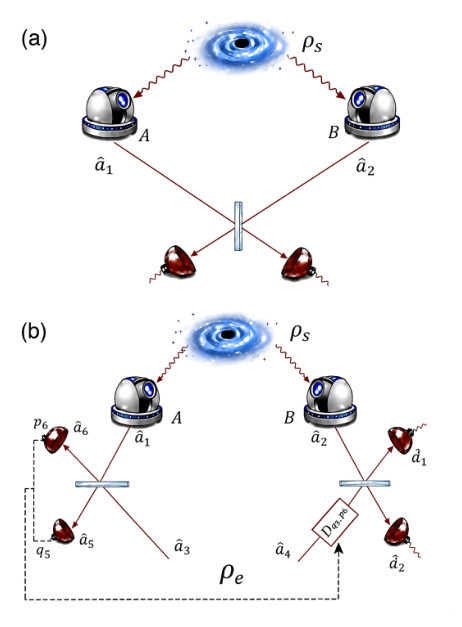 
Figure 1 (Color online) Comparison of two schemes for the simultaneous estimation of the relative phase and the degree of coherence in astronomi- cal interferometry. (a) Direct interferometry scheme: two modes, ˆa1 and ˆa2, of the stellar state ˆρs are collected by separated telescopes (A and B) and physically interfered. Each mode undergoes transmission loss characterized by an identical transmissivity T. (b) Continuous-variable quantum telepor- tation scheme: a two-mode squeezed vacuum ˆρe with modes ˆa3 and ˆa4 is distributed via lossy channels of transmissivity T. At telescope A, modes ˆa1 and ˆa3 are combined on a beam splitter, and homodyne outcomes q5 and p6 are sent via a classical...

📷 Fig 2

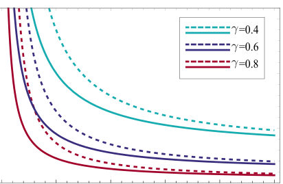 
Figure 2 (Color online) The QCRB for the direct interferometry and continuous-variable quantum teleportation schemes as a function of the to- tal mean photon number ϵ with T = 1 and r = 1. The solid and dashed lines correspond to the direct interferometry and continuous-variable quan- tum teleportation schemes, respectively.

📷 Fig 3

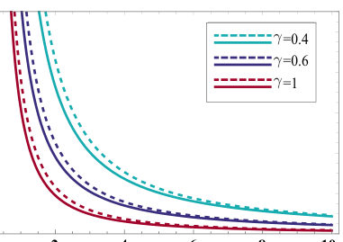 
Figure 3 (Color online) The optimized difference fopt for the direct in- terferometry and continuous-variable quantum teleportation schemes as a function of the total mean photon number ϵ with T = 1, ϕ = π/2 and r = 0.5. The solid and dashed lines correspond to the direct interferome- try and continuous-variable quantum teleportation schemes, respectively.

📷 Fig 4

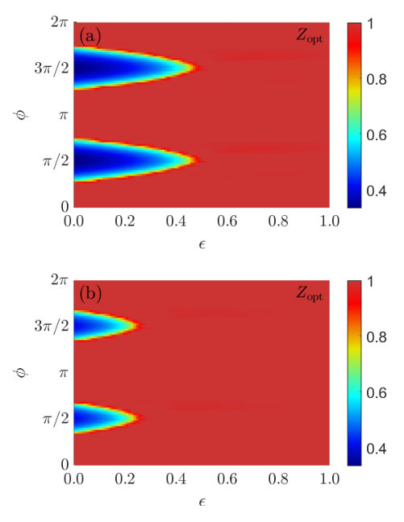 
Figure 4 (Color online) The optimal parameter zopt for the direct interfer- ometry and continuous-variable quantum teleportation schemes as a function of the total mean photon number ϵ and the relative phase ϕ. (a) the direct in- terferometry with T = 1 and γ = 0.6. (b) the continuous-variable quantum teleportation schemes with T = 1, r = 1 and γ = 0.6.

📷 Fig 5

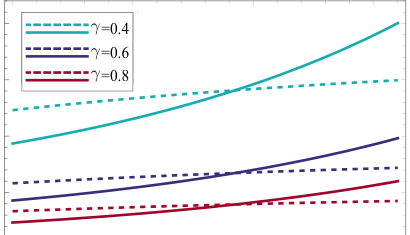 
Figure 6 (Color online) The optimized CRB for the direct interferometry and continuous-variable quantum teleportation schemes as a function of the baseline length L with ϵ = 3, ϕ = π/2, r = 0.5 and the transmission loss coefficient α = 0.2 dB/Km. The solid and dashed lines correspond to the di- rect interferometry and continuous-variable quantum teleportation schemes, respectively.

**Summary.** This paper theoretically investigates how best to estimate both the phase and coherence of light collected by astronomical interferometers. It compares two methods—direct measurement versus quantum teleportation—and finds that direct interferometry is generally superior, though the optimal method depends on the baseline length. The work establishes key theoretical bounds for achievable estimation precision.

**Why it may be interesting.** This work directly applies advanced quantum estimation theory to a fundamental problem in astrophysics (interferometry), providing quantitative comparisons between different quantum measurement protocols for parameter estimation.

Detailed structure

**Main problem.** The core problem is the simultaneous estimation of both the relative phase ($\phi$) and the degree of coherence ($\mu$ or $\gamma$) in astronomical interferometry, as joint recovery is necessary for true imaging.

**Main result.** The direct interferometry scheme consistently achieves a lower Quantum Cramér-Rao Bound (QCRB) compared to the continuous-variable quantum teleportation scheme. Furthermore, performance depends on baseline length: direct methods are better for short baselines, while teleportation excels at long baselines.

**Method.** The analysis uses Gaussian multiparameter quantum estimation theory, comparing the Classical and Quantum Fisher Information Matrices (CRB vs QCRB) derived for two distinct measurement schemes.

**Model / system.** The physical system is astronomical interferometry using separated telescopes to measure light coherence. The theoretical models compared are the direct interferometry scheme and a continuous-variable quantum teleportation scheme utilizing squeezed vacuum states.

**Key observables.** Relative phase ($\phi$), degree of coherence ($\gamma$ or $\mu$), Quantum Cramér-Rao Bound (QCRB), and Classical Cramér-Rao Bound (CRB).

**Important parameters / regimes.** Total mean photon number ($\epsilon$), transmissivity ($T$), baseline length ($L$), and the coherence parameter ($\gamma$).

**Assumptions / limitations.** The analysis relies on Gaussian measurement theory, and specific comparisons are made under assumptions regarding transmission loss coefficients.

**Figures summary.** Figures compare QCRB vs. photon number ($\epsilon$) for different coherences ($\gamma$); they also plot the optimized difference between CRB and QCRB, and show a crossover behavior in performance versus baseline length ($L$).

**Paper structure.** The paper introduces the joint estimation problem, develops theoretical frameworks for both direct interferometry and quantum teleportation schemes using Fisher information matrices, derives and compare the resulting QCRBs, and finally analyzes the dependence of precision on environmental factors like transmission loss and baseline distance.

Abstract

Astronomical interferometry is a cornerstone technique for high-resolution stellar imaging and observational astrophysics, extracting spatial information from the coherence of light collected by separated telescopes. Since the degree of coherence is complex, a genuine imaging task requires the joint recovery of the modulus and the relative phase, instead of independent singleparameter estimations. We investigate the simultaneous estimation of both parameters based on direct interferometry scheme and continuou-svariable quantum teleportation scheme. We find that in simultaneous estimation the direct interferometry scheme consistently yields a lower quantum Cramér-Rao bound, demonstrating its superiority over the continuous-variable quantum teleportation scheme. Furthermore, we establish the conditions under which the classical Cramér-Rao bound for Gaussian measurements saturates the quantum Cramér-Rao bound, identifying heterodyne detection as a near-optimal measurement scheme in the large mean photon number regime. An analysis of transmission loss reveals that the direct interferometry scheme yields superior precision in the short-baseline regime, whereas the continuous-variable quantum teleportation scheme outperforms it at longer baselines.

[↑ back to top](#top)

### [Single crystal growth, structural and magnetic properties of CeZn$_{2-x}$Ga$_{2+x}$](http://arxiv.org/abs/2607.22942v1)

**Authors:** Danila Sokratov, H. Cein Mandujano, Ram Kumar, Jared Z. Dans, Phineas Sobel, Nicholas A. Crombie, Alicia Manjón-Sanz, Danielle R. Yahne, Philip Piccoli, Peter Y. Zavalij, Efrain E. Rodriguez, Johnpierre Paglione  
**Type:** experiment · **Category:** strongly correlated electrons · **PDF:** <https://arxiv.org/pdf/2607.22942v1>  
**Analysis basis:** full PDF text, analyzed in chunks
**Topic relevance:** `exotic spin models in light-matter` **3/5** · `spintronics-quantum-optics interface` **3/5** · `Kondo & dissipative impurity` **1/5** · `analog quantum simulation` **1/5**

📷 Fig 1

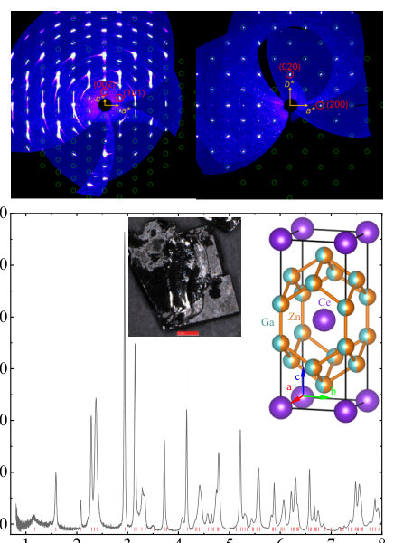 
FIG. 1. (a) Precession images from single crystal X-ray scat- tering for hk0 (top, right) and h0l (top, left). (b) Neutron powder diffraction data obtained at POWGEN. Background subtracted data shown in gray with peak indices obtained from ideal CeZn2Ga2 structure reported in ref.[1]. Typical crystal shown in inset, together with a unit cell of 1-2-2 struc- ture.

📷 Fig 2

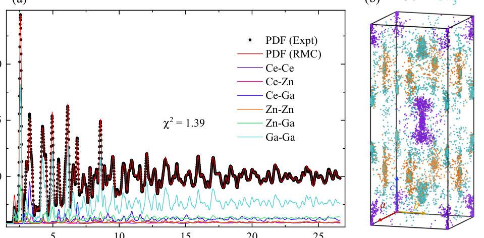 
FIG. 2. (a) Reverse Monte Carlo fit to the experimental Pair Distribution Functions (PDF) obtained from POWGEN mea- surement. Individual PDFs from atomic bonds are shown below the fit. Calculation done assuming a fixed CeZnGa3 chemical composition. (b) Average unit cell obtained by collapsing the multi-cell structure into a single cell for visual purposes. Purple dots indicate positions of Ce atoms, orange dots of Zn atoms, and teal of Ga atoms. The unit cell generally agrees with the idealized 1-2-2 structure, though there is notable spread in the Ce atomic position in the center of the unit cell.

📷 Fig 3

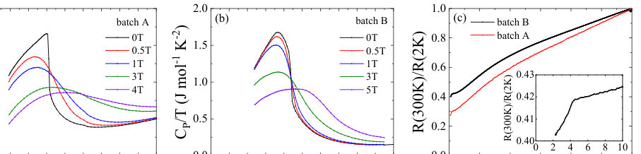 
FIG. 3. Heat capacity and resistivity of CeZn2−xGa2+x. Heat capacity of batch A (a) and batch B (b) at fixed fields. (c) Normalized resistance of batch A and batch B samples. Inset shows zoom lf low temperature magnetic transition in batch B sample.

📷 Fig 4

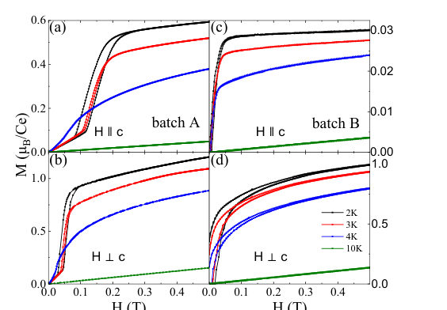 
FIG. 5. Magnetization of CeZn2−xGa2+x compared between two batches. Low temperature magnetization for field (a) parallel to and (b) perpendicular to the c-axis-axis at fixed temperatures for batch A. Low temperature magnetization for field (c) parallel to and (d) perpendicular to the c-axis- axis at fixed temperatures for batch B.

📷 Fig 5

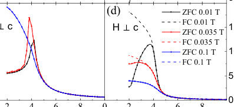 
FIG. 4. Magnetic susceptibility χ of CeZn2−xGa2+x com- pared between two batches. Low temperature χ for field (a) parallel to and (b) perpendicular to the c-axis-axis at fixed temperatures for batch A. Low temperature χ for field (c) parallel to and (d) perpendicular to the c-axis-axis at fixed temperatures for batch B.

**Summary.** This paper reports on single crystals of $	ext{CeZn}_{2-x}	ext{Ga}_{2+x}$, finding that the material exhibits complex magnetism, including metamagnetic transitions. The key finding is that local structural disorder at the Ce site drives competing ferromagnetic and antiferromagnetic correlations, leading to spin glass behavior. This demonstrates a method for engineering frustrated magnetic states by controlling crystallographic imperfections.

**Why it may be interesting.** This work provides an experimental demonstration of how engineering lattice disorder can tune competing magnetic interactions (FM/AFM), a concept highly relevant for designing novel quantum materials with tailored magnetic ground states.

Detailed structure

**Main problem.** The study investigates the structural and magnetic properties of $	ext{CeZn}_{2-x}	ext{Ga}_{2+x}$ to understand how tuning local crystallographic disorder influences complex magnetic states.

**Main result.** The material exhibits distinct magnetic transitions ($\sim 4 	ext{ K}$) and metamagnetic states, which are attributed to positional disorder at the Ce site driving competing ferromagnetic and antiferromagnetic correlations, leading to spin glass behavior.

**Method.** The research combines single crystal growth, transport measurements (resistivity, heat capacity), and advanced structural analysis using neutron powder diffraction coupled with Reverse Monte Carlo simulations.

**Model / system.** The physical system is the $	ext{R-Zn-Ga}$ intermetallic family, specifically $	ext{CeZn}_{2-x}	ext{Ga}_{2+x}$, which adopts a tetragonal $	ext{BaAl}_4$ ($	ext{I}4/	ext{mmm}$) parent structure. The focus is on how local disorder affects the magnetic interactions within this crystalline lattice.

**Key observables.** Magnetic transition temperature ($\sim 4 	ext{ K}$), metamagnetic states, strong magnetic anisotropy, and evidence of local crystallographic disorder at the Ce site (from RMC analysis).

**Important parameters / regimes.** Temperature ($T$), applied magnetic field ($H$), and stoichiometry variations ($x$).

**Assumptions / limitations.** The complex magnetism observed is driven by positional disorder of the Ce atom, rather than just $	ext{Zn}/	ext{Ga}$ site disorder.

**Figures summary.** Figures show X-ray/neutron diffraction data used for structural refinement and RMC analysis; other figures present magnetic susceptibility ($\chi$) and heat capacity ($C_p$) vs. $T$ curves demonstrating the transitions.

**Paper structure.** The paper proceeds by characterizing the crystal structure via multiple diffraction techniques, establishing the presence of magnetic features through transport measurements, and finally using advanced RMC analysis on neutron data to link the observed magnetism directly to local structural disorder.

Abstract

The tetragonal BaAl$_4$ ($I4/mmm$) parent structure underpins a diverse family of materials exhibiting novel phenomena, including nematic superconductivity, topological semimetallicity, and heavy fermion behavior. The recent growth of ternary R-Zn-Ga compounds, such as the previously reported CeZn$_2$Ga$_2$, has explored some of the members exhibiting rare-earth magnetism within this family. In this paper, we report on the structural and magnetic properties of single crystals of CeZn$_{2-x}$Ga$_{2+x}$, a Ga-rich analogue of CeZn$_2$Ga$_2$. Our CeZn$_{2-x}$Ga$_{2+x}$ samples exhibit magnetic properties distinct from the paramagnetic behavior previously reported for CeZn$_2$Ga$_2$. We observe a magnetic transition around 4 K, pronounced metamagnetic states at low temperatures, and strong magnetic anisotropy. Though there are batch-to-batch variations that suggest a strong sensitivity to local structural imperfections, we consistently see the presence of magnetic transitions and metamagnetic states in our crystals. To investigate the local structural sensitivity hypothesis, we performed Reverse Monte Carlo analysis of collected powder neutron diffraction data, revealing the presence of significant local crystallographic disorder of the magnetic Ce site. Our findings demonstrate that the positional disorder drives competing ferromagnetic and antiferromagnetic correlations that lead to the observed spin glass behavior and complex anisotropic magnetism. This study illustrates that tuning the local crystallographic disorder enables engineering frustrated magnetic states in BaAl$_4$-type and similar intermetallic structures.

[↑ back to top](#top)

### [Theory of approximate quantum error correction and the error-set model](http://arxiv.org/abs/2607.22995v1)

**Authors:** Dor Elimelech, Victor V. Albert, Alexander Barg  
**Type:** theory · **Category:** quantum information and computing · **PDF:** <https://arxiv.org/pdf/2607.22995v1>  
**Analysis basis:** full PDF text, analyzed in chunks
**Topic relevance:** `Rydberg arrays` **3/5** · `analog quantum simulation` **1/5** · `correlated / nonlocal dissipation` **1/5** · `entanglement & information structure` **1/5** · `methods for driven-dissipative` **1/5** · `non-equilibrium dynamics` **1/5**

📷 Fig 1

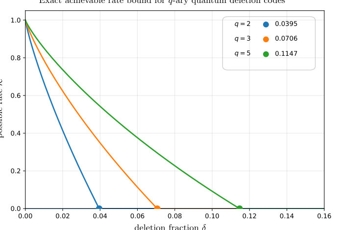 
Figure 1: Exact achievable rate bound for 𝑞-ary quantum deletion codes. The colored dots marked on the horizontal axis indicate the first positive zero of the corresponding exact rate function for 𝑞= 2, 3, 5.

📷 Fig 2

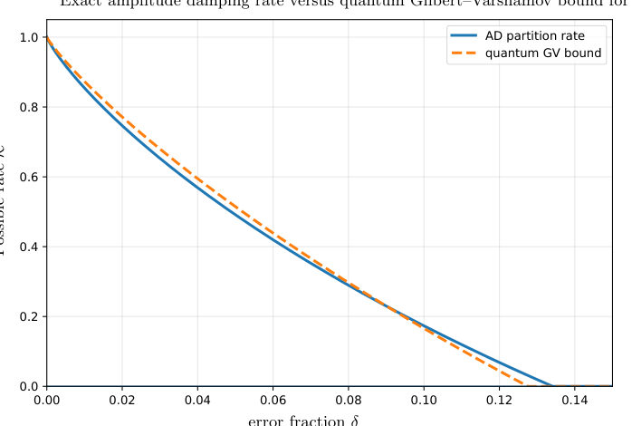 
Figure 2: Comparison between the exact partition-code amplitude damping rate 𝑅AD 3 (𝛿) and the standard ternary quantum Gilbert–Varshamov bound for correcting 𝛿𝑁arbitrary errors.

📷 Fig 3

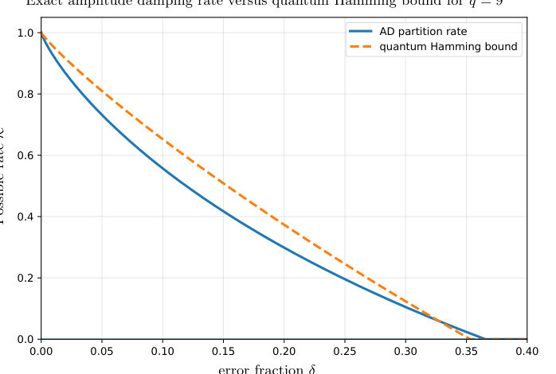 
Figure 3: Comparison between the exact partition-code amplitude damping rate 𝑅AD 9 (𝛿) and the nondegenerate quantum Hamming bound for correcting 𝛿𝑁arbitrary errors.

**Summary.** This paper develops a structural theory for Approximate Quantum Error Correction (AQEC) by generalizing the successful error-set model from exact QEC. It shows that while full linearity fails in the approximate regime, a restricted form suffices to define uniform performance guarantees using new metrics like environment-leakage distance. This advances the field by providing general tools applicable across diverse quantum physical systems.

**Why it may be interesting.** It provides a powerful, general mathematical framework for analyzing noise resilience in quantum systems beyond simple channel-by-channel analysis, directly impacting how we design fault-tolerant protocols for platforms like Rydberg arrays or fermionic qubits.

Detailed structure

**Main problem.** The goal is to develop a structural theory for Approximate Quantum Error Correction (AQEC) that mirrors the robust error-set formulation available for exact QEC.

**Main result.** The authors establish a restricted form of Knill–Laflamme linearity sufficient for AQEC, deriving uniform fidelity guarantees using new parameters like the environment-leakage distance and the Knill-Laflamme Hellinger distance.

**Method.** The methodology involves extending the error-set model by analyzing families of channels whose Kraus operators are linear combinations of a fixed error set under spectral constraints. This utilizes both worst-case (Bény-Oreshkov) and average-case (Petz) frameworks.

**Model / system.** The theory is applied to general quantum systems, developing constructions for fermionic systems, one-dimensional Rydberg-blockaded systems, and deletion errors, placing exact and approximate correction on equal footing.

**Key observables.** Fidelity guarantees, environment-leakage distance, Knill-Laflamme Hellinger distance, code distance.

**Important parameters / regimes.** Approximation parameter $\epsilon$, error set $\mathcal{E}$, spectral constraint norms ($\|C\|_\infty$).

**Assumptions / limitations.** The core assumption is that a restricted form of linearity survives the transition from exact to approximate QEC. The analysis also uses Bény-Oreshkov and Petz average-case frameworks.

**Paper structure.** The paper progresses by first identifying the structural gap between exact and approximate QEC, then proposing the restricted error-set model governed by spectral constraints. It details the derivation of new fidelity guarantees using worst-case and average-case metrics before presenting diverse physical constructions.

Abstract

We develop a theory of approximate quantum error correction (QEC) based on the error-set model, complemented by general methods for code construction. Exact QEC has a powerful error-set structure: by the Knill-Laflamme conditions, a code correcting a given error set automatically protects against every channel whose Kraus operators lie in their linear span. This linearity gives rise to code distance, the equivalence between erasures and general errors, and a theory of asymptotically good codes. A longstanding view has been that these features do not extend to AQEC, leaving the theory essentially channel-by-channel. We show instead that, although full Knill--Laflamme linearity fails, a restricted form survives and suffices to extend all three structural features to the approximate setting. Specifically, a common error-set criterion governs families of channels whose Kraus operators are linear combinations of a given error set and whose coefficient matrices satisfy a spectral constraint. Using the Bény-Oreshkov worst-case and Petz average-case frameworks, we derive uniform fidelity guarantees for these families in terms of two new code parameters--the \emph{environment-leakage distance}, controlling worst-case performance, and the \emph{Knill-Laflamme Hellinger distance}, characterizing the average-case performance of Petz recovery. To demonstrate the scope of this model, we develop partition-based constructions across diverse quantum systems and geometries, placing exact and approximate correction on equal footing. These constructions lead to a metric--error alignment hierarchy for Hilbert spaces, metrics, and error families, which in turn characterizes the resulting recovery guarantees. They yield the first known asymptotically good code families for fermionic systems, one-dimensional Rydberg-blockaded systems, and deletion errors, and extend to other physical platforms.

[↑ back to top](#top)

### [Unravelling time-resolved Interparticle Coulombic Decay: From spectral formation to decay lifetimes](http://arxiv.org/abs/2607.24597v1)

**Authors:** Alexander V. Riegel, Max K. Humm, Jan-Thore Kahle, Elke Fasshauer  
**Type:** both · **Category:** other · **PDF:** <https://arxiv.org/pdf/2607.24597v1>  
**Analysis basis:** full PDF text, analyzed in chunks
**Topic relevance:** `methods for driven-dissipative` **3/5** · `non-equilibrium dynamics` **2/5** · `Keldysh / 2PI / non-Gaussian methods` **1/5** · `correlated / nonlocal dissipation` **1/5** · `driven-dissipative phase transition` **1/5**

📷 Fig 1

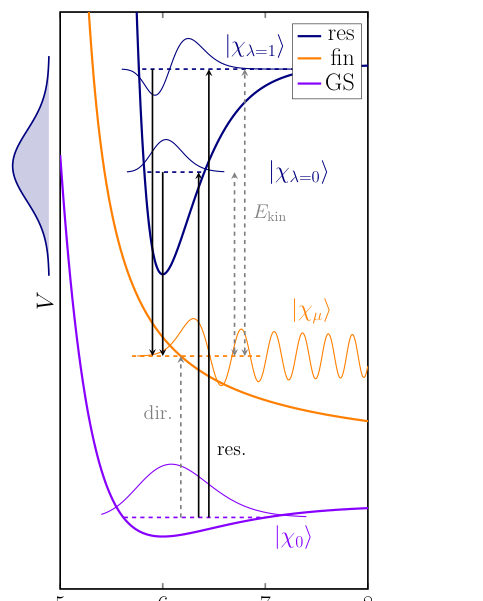 
FIG. 1. (Colour online) Schematic illustration [51] of energy levels and processes in a diatomic system. Lower curve: elec- tronic ground state hosting one bound vibrational state |χ0⟩; upper curve: electronic resonance state hosting Nλ bound vibrational states |χλ⟩; middle curve: dissociative electronic final state hosting a continuum of nuclear states |χµ⟩. Possi- ble pathways into a given final state: direct pathway (dashed arrow); resonance pathways (solid arrows), both leading to emission of electron with kinetic energy Ekin (dashed double- headed arrows).

📷 Fig 2

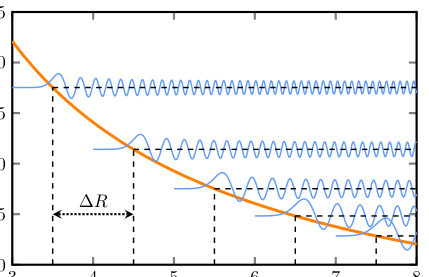 
FIG. 2. (Colour online) Repulsive Coulomb nuclear potential Eq. (11) of the final state (orange) with a selection of energy- normalized nuclear Coulomb eigenfunctions Eq. (12) (blue). Energies are chosen for constant steps ∆R in the internuclear distance R which correspond to non-uniformly distributed en- ergies (dashed black lines) to better sample the region of in- terest.

📷 Fig 3

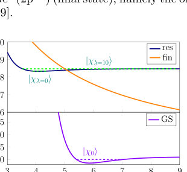 
FIG. 3. (Colour online) The PECs used to model the neon dimer. Top: PECs for the resonance state (blue curve), and for the final state (orange curve). The resonance state hosts 11 bound vibrational states |χλ⟩; the lowest and highest of their energy levels are indicated between their respective classical turning points (green dashed lines). Bottom: PEC for the electronic ground state (violet curve). The energetic level of the vibrational ground state |χ0⟩is indicated between the classical turning points (violet dashed line) and serves as the reference point for the energy scale.

📷 Fig 4

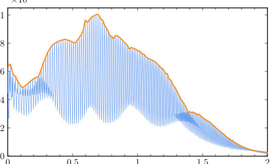 
FIG. 4. (Colour online) ICD electron spectrum (blue curve) as function of the kinetic energy of the secondary electron, Ekin, at constant time t = 1 ps and kinetic energy of the photoelectron, Ep = 9.754 eV. The ionizing laser pulse has FWHM of 6 fs. The overall structure is physical (orange curve on top, see Sec. IV B), the fine structure is an artefact due to the discretization of the continuum of nuclear final states in steps of 0.01 ˚A, see main text.

📷 Fig 5

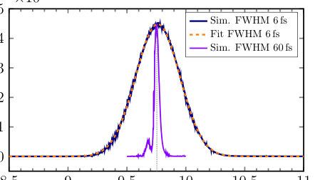 
FIG. 5. (Colour online) ICD signal intensity (dark blue solid line) as a function of the kinetic energy of the photoelectron, Ep, at constant time t = 1 ps and kinetic energy of the ICD electron, Ekin = 0 eV. The ionizing laser pulse has FWHM of 6 fs. The spectral shape can be closely fitted to a Gaussian function (orange dashed line). Spectrum for the pulse with FWHM of 60 fs shown for comparison (violet solid line), a few data points affected by numerical noise have been discarded and the spectrum has been scaled up. Central photoelectron energy used in subsequent simulations is indicated.

**Summary.** The research analyzes time-resolved Interparticle Coulombic Decay (ICD) by coupling electronic decay theory with dissociative nuclear motion. The authors demonstrate that extracting the true decay lifetime requires careful consideration of the underlying temporal structure, as simple exponential fitting can lead to erroneous results. This provides a crucial methodological guide for interpreting ultrafast spectroscopy in molecular physics.

**Why it may be interesting.** This work is highly relevant as it tackles the complex interplay between electronic excitation dynamics and molecular structure (nuclear wavepacket evolution) in ultrafast processes, which is a core theme in advanced AMO physics and quantum optics.

Detailed structure

**Main problem.** The study aims to accurately extract the true decay lifetime ($\tau$) governing time-resolved Interparticle Coulombic Decay (ICD) by correctly modeling the influence of dissociative nuclear dynamics on the measured electronic spectrum.

**Main result.** A conventional mono-exponential fit can yield a significantly different lifetime than the underlying physical value; applying a more complex fitting model yields an ICD lifetime ($\tau \approx 73$ fs) consistent with previous theoretical predictions.

**Method.** The authors developed and applied an analytical description of time-resolved electronic decay spectra, extending it to include dissociative nuclear dynamics, and compared results from mono-exponential versus double-exponential fitting models.

**Model / system.** The system is the neon dimer undergoing ICD following photoionization. The theoretical framework involves solving the time-dependent Schrödinger equation with a Hamiltonian partitioned into non-decaying, coupling, and light-matter interaction terms, incorporating repulsive Coulomb potentials for the final state continuum.

**Key observables.** Time-resolved ICD electron spectrum $P(E_{\text{kin}}, E_p, t)$ and the integrated decay signal vs. time ($t$).

**Important parameters / regimes.** Decay lifetime ($\tau$), internuclear distance ($R$), photoelectron energy ($E_p$), and kinetic energy of the emitted ICD electron ($E_{\text{kin}}$).

**Assumptions / limitations.** Key approximations include assuming a product ansatz for the total state, approximating the coupling matrix element factorization, and ignoring interactions between emitted electrons in the continuum.

**Figures summary.** Figure 1 schematically illustrates energy levels and decay pathways (direct vs. resonance); Figure 2 shows the repulsive Coulomb potential and associated eigenfunctions; later figures compare experimental data fits using different exponential models.

**Paper structure.** The paper builds from establishing the theoretical framework for time-resolved ICD spectra, detailing the necessary analytical extensions to include nuclear motion, presenting the results of fitting simulated/experimental data with various decay functions, and concluding with implications for general lifetime extraction techniques.

Abstract

Electronic decay processes provide a fascinating window into correlated electronic rearrangements occurring on ultrafast timescales. Following these dynamics in real time has become increasingly accessible experimentally, but extracting the underlying electronic dynamics from measured spectra requires understanding how nuclear motion shapes the observable signal. Here, we extend an analytical description of time-resolved electronic decay spectra to include dissociative nuclear dynamics and apply it to Interparticle Coulombic Decay (ICD) in the neon dimer. The resulting spectra reproduce the experimentally observed spectral shape and reveal an unexpectedly important role of interference between pathways involving different vibronic resonance states. We further establish a clear connection between the temporal build-up of the spectral structure and the nuclear wavepacket dynamics in the decaying electronic state. Most strikingly, our analytical expressions reveal that the time-dependent integrated ICD signal contains contributions proportional to both $\exp(-t/τ)$ and $\exp[-t/(2τ)]$. Nevertheless, a conventional mono-exponential fit can describe the temporal signal remarkably well while yielding a decay lifetime that differs substantially from the underlying value. Applying the theoretically derived fitting model to experimental data for the neon dimer yields an ICD lifetime $τ$ of 73 fs, rather than the previously extracted 150(50) fs, placing the experimental value within the range of previous theoretical predictions. Since the underlying temporal structure is common to electronic decay processes, our findings have implications for extracting lifetimes from time-resolved decay spectra well beyond ICD.

[↑ back to top](#top)

### [Accessing Few-Layer CrI$_3$ Magnetoelasticity Through Bulk Single Crystals](http://arxiv.org/abs/2607.24222v1)

**Authors:** J. Arneth, M. Möller, D. A. S. Kaib, P. P. Stavropoulos, A. Razpopov, M. Jonak, S. Spachmann, M. Abdel-Hafiez, S. Biswas, K. Riedl, R. Valentí, R. Klingeler  
**Type:** both · **Category:** strongly correlated electrons · **PDF:** <https://arxiv.org/pdf/2607.24222v1>  
**Analysis basis:** full PDF text, analyzed in chunks
**Topic relevance:** `exotic spin models in light-matter` **3/5** · `spintronics-quantum-optics interface` **3/5** · `analog quantum simulation` **1/5**

📷 Fig 1

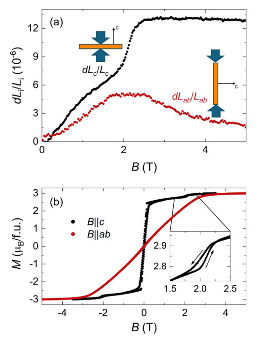 
FIG. 1. (a) Isothermal magnetostriction and (b) magnetization for B ∥c (black) and B ∥ab (red) at T = 2 K. Sketches in (a) depict the measured length changes. The inset in (b) shows a zoom into the region around B∗.

📷 Fig 2

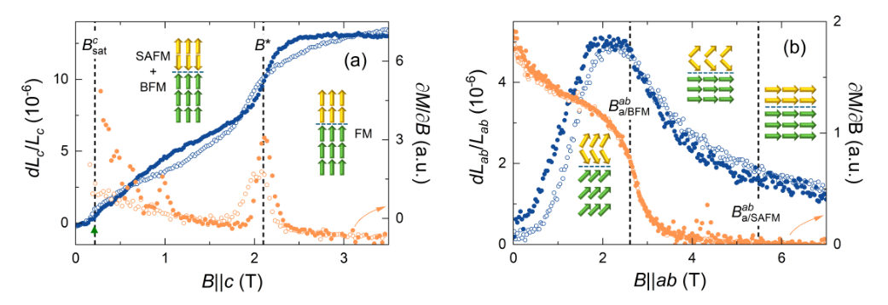 
FIG. 2. Isothermal magnetostriction (blue) and differential magnetic susceptibility (orange) for B ∥c (a) and B ∥ab (b) at T = 2 K. Vertical dashed lines mark characteristic magnetic fieldsa, as described in the text. Sketches illustrate the Cr3+ spin structure in the corresponding field ranges. Closed (open) circles mark up-(down-)sweeps of the magnetic field.

📷 Fig 3

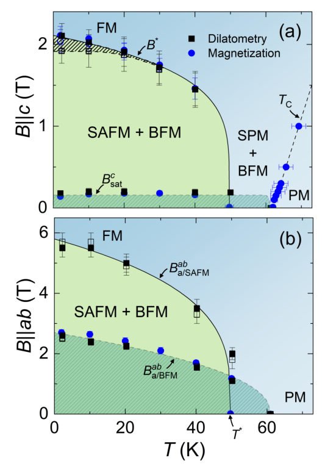 
FIG. 3. Magnetic phase diagrams obtained from dilatometry (black data points) and magnetization (blue data points) mea- surements for B ∥c (a) and B ∥ab (b). PM, FM, SPM+BFM and SAFM+BFM label paramagnetic, ferromagnetic, mixed surface paramagnetic and bulk ferromagnetic, and mixed surface antiferromagnetic and bulk ferromagnetic phases, respectively. In (a), a hysteresis region is denoted by the striped region around B∗. Green shaded areas depict field regimes where the BFM phase is not fully polarized. Data points marking the PM-FM-crossover were obtained by ac susceptibility measurements (see the Appendix for more details). All lines serve as guides to the eye.

📷 Fig 4

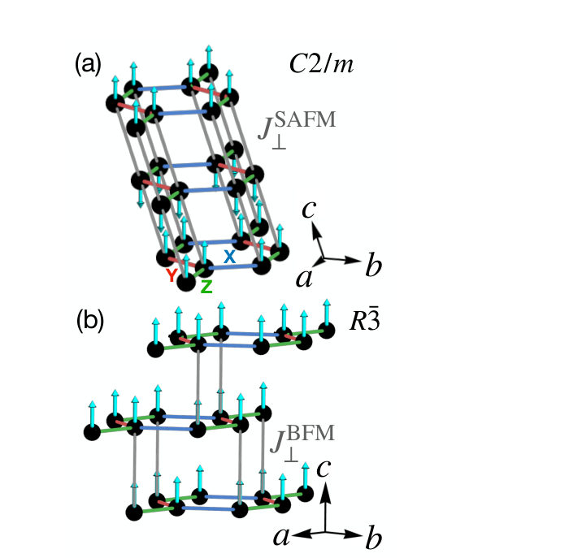 
FIG. 4. Low-temperature Cr site honeycomb network in CrI3 for (a) the layers proximate to the surface (with C2/m symmetry) and (b) the bulk (with R¯3 symmetry). The intralayer nearest neighbors X-, Y- and Z-bonds are show in blue, red, and green respectively. The interlayer bonds are labeled JSAFM ⊥ and JBFM ⊥ . Each layer consists of 8-sites, representing the cluster used within the SCCMFT calculations.

📷 Fig 5

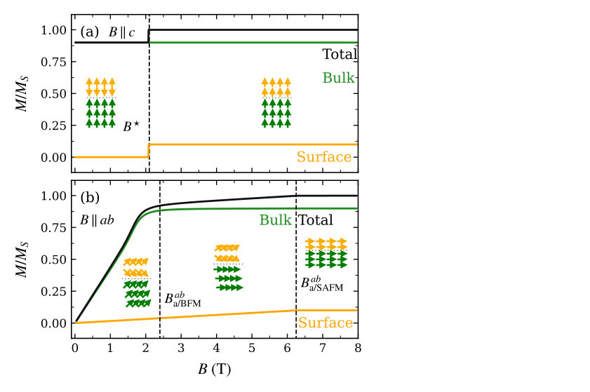 
FIG. 5. Magnetization curves obtained from the self-consistent ED calculation for applied field B ∥b (a) and B ∥c (b), split into surface and bulk contributions, in units of saturation magnetization MS.

**Summary.** This work investigates how uniaxial strain affects the magnetism of few-layer $	ext{CrI}_3$ by combining magnetostriction experiments on bulk crystals with theoretical calculations. The key finding is that surface effects dominate the magnetoelastic response, allowing researchers to study crucial magnetic couplings in both ferromagnetic and antiferromagnetic phases using readily available single crystals.

**Why it may be interesting.** The detailed study of magnetoelastic coupling using measurable bulk properties (magnetostriction) provides an accessible route to probe quantum magnetic phenomena typically restricted to highly controlled 2D systems or high-pressure environments, which is relevant for understanding emergent quantum states in layered materials.

Detailed structure

**Main problem.** To elucidate the role of uniaxial lattice strain on the magnetic properties and magnetoelastic coupling in few-layer $	ext{CrI}_3$ without requiring material exfoliation.

**Main result.** Magnetostriction is highly sensitive to surface effects, allowing separate investigation of in-plane and out-of-plane strain. The surface antiferromagnetic (SAFM) phase exhibits magnetostrictive responses significantly larger than those in the bulk ferromagnetic (BFM) phase.

**Method.** The study combines high-resolution magnetostriction experiments on bulk single crystals with ab-initio magnetoelastic calculations using first-principles methods.

**Model / system.** The physical system is the van der Waals semiconductor $	ext{CrI}_3$, which exhibits distinct BFM and SAFM magnetic phases. The analysis models the interplay between strain, magnetism, and surface/bulk contributions to the overall material properties.

**Key observables.** Magnetostriction ($	ext{d}L/	ext{L}$), magnetization ($M$), uniaxial strain dependence of interlayer coupling ($J^{
m SAFM}_{\perp}$), and spin-flip field ($B^*$).

**Important parameters / regimes.** Critical temperatures ($T_{
m C}=61\,\mathrm{K}$, $T^* \simeq 50\,\mathrm{K}$), strain magnitude, and the ratio of surface to bulk contributions.

**Assumptions / limitations.** The study assumes that magnetostriction measurements can effectively probe directional strain effects, overcoming historical limitations to hydrostatic pressure only.

**Figures summary.** Figure 1 shows measured isothermal magnetostriction ($	ext{d}L/	ext{L}$) and corresponding magnetization ($M$) curves for both $B \parallel c$ and $B \parallel ab$.

**Paper structure.** The paper structure moves from establishing the potential of $	ext{CrI}_3$ for spintronics to presenting experimental magnetostriction data, followed by theoretical calculations that separate strain effects in the BFM and SAFM phases.

Abstract

The persistence of ferromagnetic long-range order in monolayers of the van der Waals semiconductor CrI$_3$ opens new routes for spintronic applications based on two-dimensional quantum magnets. In the fabrication of such devices, the constituent materials inevitably experience anisotropic strain, which modifies their intrinsic electronic properties. At the same time, strain can serve as a powerful tuning parameter, driving the material to desired regimes. While several theoretical studies have investigated the effect of biaxial in-plane strain on CrI$_3$ numerically, experiments are widely limited to the application of hydrostatic pressure. Here, we perform high-resolution magnetostriction experiments on bulk CrI$_3$ samples, and \textit{ab-initio}-based magnetoelastic calculations, to elucidate the role of uniaxial lattice strain on the magnetic properties. Our data show that magnetostriction in CrI$_3$ is unexpectedly sensitive to surface effects, which enables us to investigate the influence of in-plane and out-of-plane strain separately, in both the bulk ferromagnetic (BFM) phase emerging at $T_{\rm C}=61\,\mathrm{K}$ and the surface antiferromagnetic (SAFM) phase below $T^* \simeq 50\,\mathrm{K}$. In particular, we quantify the uniaxial strain dependence of the surface interlayer coupling $J^{\rm SAFM}_{\perp}$ and the surface spin-flip field $B^*$, which drastically exceed the strain effects in the BFM phase by a factor of $\sim 30$. The large magnetostrictive response allows us to study the magnetoelastic coupling in few-layer CrI$_3$ through experiments on bulk single crystals, without requiring exfoliation.

[↑ back to top](#top)

### [Scalable Photon-Mediated Two-Qubit Gates with Spectrally Noisy Quantum Emitters](http://arxiv.org/abs/2607.23959v1)

**Authors:** Shreekanth S. Yuvarajan, W. A. Coish, David Hucul, Herbert F. Fotso  
**Type:** theory · **Category:** other · **PDF:** <https://arxiv.org/pdf/2607.23959v1>  
**Analysis basis:** full PDF text, analyzed in chunks
**Topic relevance:** `correlated cavity matter` **3/5** · `Keldysh / 2PI / non-Gaussian methods` **1/5** · `Tavis-Cummings & cavity-many-emitter` **1/5** · `driven-dissipative phase transition` **1/5** · `methods for driven-dissipative` **1/5**

📷 Fig 1

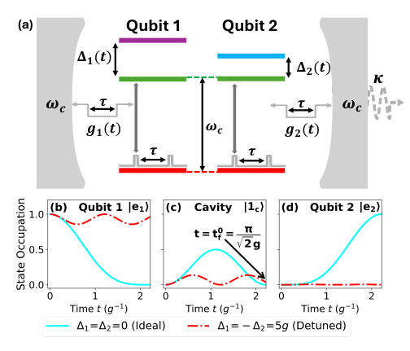 
FIG. 1. (a): Schematic description of the POCEG applied to a system of two qubits coupled through a cavity. Qubit 1 and Qubit 2 operate at frequencies ω1(t) = ωc + ∆1(t) and ω2(t) = ωc + ∆2(t) respectively and are coupled to the cavity with respective coupling strengths g1(t) and g2(t). ∆1(t) and ∆2(t) are the detunings of Qubit 1 and Qubit 2 respectively with the cavity that has a damping rate κ and is at frequency ωc. (b, c, d): Evolution of the occupation of the excited state of the qubits and the first excited state of the cavity as a function of time without the POCEG, with g1 = g2 = g, and with the excitation initially in Qubit 1, when the qubits are resonant with the cavity (cyan...

📷 Fig 2

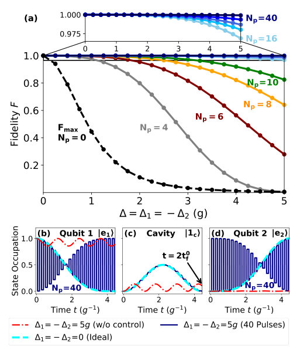 
FIG. 2. (a): POCEG fidelity F as a function of the num- ber of pulses for a range of detuning combinations where the qubits are oppositely detuned from the cavity. The dashed black line represents the maximum fidelity achieved without the protocol. (b, c, d): Evolution of the occupation of the excited state of the qubits and the first excited state of the cavity as a function of time when the excitation is initially in Qubit 1, with the POCEG (navy blue lines) and without it ( dashed red lines). The cyan lines represent the ideal case where both qubits are resonant with the cavity. The corre- sponding state transfer occurs after a time t0 f and its plot is rescaled here to match the 2t0 f...

📷 Fig 3

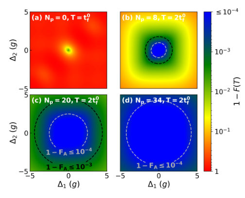 
FIG. 3. Performance of the POCEG measured as the infidelity 1−F as a function of all detuning combinations (∆1, ∆2) that represent the quasistatic regime for a noise bandwidth 10g centered at the cavity frequency. (a): Without POCEG. (b, c, d): With POCEG for different number of pulses Np applied periodically within a time T = 2t0 f. The dashed black and gray lines represent boundaries within which the analytically derived infidelities are 1 −FA = 10−3 and 1 −FA = 10−4

📷 Fig 4

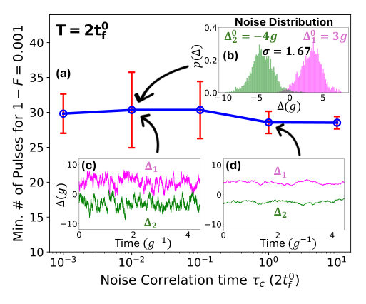 
FIG. 4. (a): Performance of the POCEG measured as the number of pulses required for F = 0.999 as a function of the correlation time τc of the noise, ranging from the white noise regime to the quasistatic noise regime. Inset (b) shows a distribution of the detunings ∆1 and ∆2 with mean values ∆0 1 = 3g and ∆0 2 = −4g and standard deviation σ = 1.67, for τc = 0.02t0 f, from which its instantaneous detunings are sampled. Insets (c) and (d) show the detunings as a function of time over the protocol transfer time T = 2t0 f for noise correlation times τc = 0.02t0 f and τc = 2t0 f respectively.

📷 Fig 5

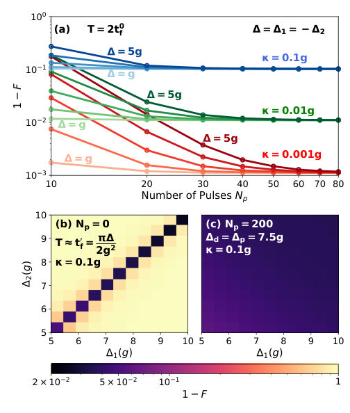 
FIG. 5. Infidelity 1 −F as a function of the number of pulses Np for different values of the cavity damping rate κ and de- tunings ∆1 = −∆2 = ∆ranging from g to 5g. (a): Per- formance of POCEG for different values of κ. (b): State transfer fidelity as a function of the detunings ∆1 and ∆2 in the dispersive regime, for κ = 0.1g, emphasizing that disper- sive transfer yields higher fidelity relative to resonant transfer when the cavity damping is large. However, fidelity rapidly drops off for ∆1 ̸= ∆2. (c): Performance of POCEG-D for κ = 0.1g when the qubits are dispersively coupled to the cav- ity, here at a detuning ∆d = 7.5g, to mitigate cavity loss.

**Summary.** The paper introduces the Protocol for Optimal Cavity-Enabled Gates (POCEG) to realize high-fidelity two-qubit gates between noisy qubits coupled via an optical cavity. By applying tailored pulsed sequences, the protocol successfully mitigates fidelity loss caused by spectral detuning in both low and high damping environments. This demonstrates a pathway toward scalable quantum computation using solid-state emitters.

**Why it may be interesting.** This work directly addresses a major bottleneck in solid-state quantum computing—decoherence due to spectral mismatch—by proposing engineered pulse sequences that stabilize gate operations. It bridges theoretical control techniques with practical platform limitations.

Detailed structure

**Main problem.** The primary challenge addressed is achieving high-fidelity two-qubit gates mediated by a cavity when the constituent qubits suffer from spectral noise or significant detuning.

**Main result.** A protocol (POCEG) was developed that successfully overcomes spectral mismatches, enabling state transfer fidelities exceeding 99.9% in both low and high damping rate regimes.

**Method.** The authors employ theoretical analysis using the average Hamiltonian theory and time-dependent pulse sequences to engineer robust quantum gates.

**Model / system.** The system consists of two solid-state qubits coupled to a single optical cavity mode. The dynamics are governed by a complex Hamiltonian incorporating time-dependent couplings and detunings, analyzed via master equations.

**Key observables.** State transfer fidelity ($F$), which is the primary metric; also analyzed are cavity occupation probabilities ($n_c$).

**Important parameters / regimes.** Qubit/Cavity detunings ($\Delta_{1}, \Delta_{2}$), cavity damping rate ($\kappa$), and control parameters like pulse sequence length or number of pulses ($N_p$).

**Assumptions / limitations.** The analysis relies on perturbative expansions (e.g., Magnus expansion) assuming small inter-pulse delays ($	au$) relative to other timescales, and truncating the Hilbert space based on cavity excitation levels.

**Figures summary.** Figures illustrate fidelity deterioration under uncontrolled evolution versus improvement using POCEG; they also map out the parameter space where high fidelity is maintained as a function of detuning and pulse number.

**Paper structure.** The paper introduces the problem, develops the POCEG protocol for both low and high damping regimes (using different control sequences), derives an effective Hamiltonian via average Hamiltonian theory, and finally simulates state transfer fidelity to demonstrate robustness against spectral noise.

Abstract

When two quantum bits are coupled through a cavity, a two-qubit gate can be realized between them either in the near-resonant regime over a timescale established by the coupling strength of the qubits with the cavity, or in the dispersive regime, over a longer timescale established by the combination of the coupling strength and the frequency detuning between the qubits and the cavity. When the qubits are spectrally noisy or differently detuned from the cavity, the fidelity for the operation can be drastically reduced in either case, precluding scalable realizations. We introduce the protocol for optimal cavity-enabled gates (POCEG) that is shown, through reliable numerical and analytical solutions, to overcome spectral differences between quantum bits and to achieve high fidelity between disparate/noisy quantum emitters. Namely, for a cavity with low damping rate, we apply a sequence of pulses to the qubits at the frequency of the cavity while periodically modulating the coupling of the qubits to the cavity. Alternatively, in the case of a large damping rate, we operate in the dispersive regime and overcome spectral disparities by applying the pulses at a frequency far-detuned from the cavity. In both instances, we find for the quantum state transfer between the two qubits that, with a modest inter-pulse delay, the fidelity that would otherwise be strongly suppressed by the spectral mismatch of the qubits can be increased beyond 99.9%. These protocols have the capacity to bring two-qubit gates between solid state systems across the threshold required for fault-tolerant quantum computing.

[↑ back to top](#top)

### [Almost all pure entangled states enable unbounded nonlocality sharing](http://arxiv.org/abs/2607.24700v1)

**Authors:** Anna Steffinlongo, Nicola D'Alessandro, Martin J. Renner  
**Type:** theory · **Category:** quantum information and computing · **PDF:** <https://arxiv.org/pdf/2607.24700v1>  
**Analysis basis:** full PDF text, analyzed in chunks
**Topic relevance:** `entanglement & information structure` **3/5** · `quantum measurements` **2/5** · `measurement-induced transitions` **1/5**

📷 Fig 1

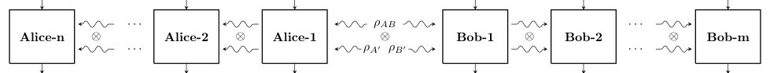 
FIG. 1. Sequential scenario considered in this work. A source distributes a pure entangled state together with two quantum ancillas ρ = ρAB ⊗ρA′ ⊗ρB′ = |Ψ⟩⟨Ψ|AB ⊗|no⟩⟨no|A′ ⊗|no⟩⟨no|B′ to chains of observers on Alice’s and Bob’s sides. For convenience, the ancillas are included in the initial state distributed by the source, so that all observers perform the same operation. Equivalently, they could be prepared locally by the first observers. Each observer may perform a projective measurement or pass the system to the next observer.

**Summary.** The paper proves that almost all pure entangled states possess the capability to share nonlocality among an arbitrary number of observers. This is achieved by linking the phenomenon to Hardy's paradox and constructing a protocol using local ancillas and projective measurements. It establishes that two-sided nonlocality sharing is a generic feature of quantum entanglement.

**Why it may be interesting.** This work provides a powerful demonstration of how fundamental quantum correlations (Hardy paradox) can be leveraged to establish robust, scalable nonlocality resources necessary for quantum communication protocols.

Detailed structure

**Main problem.** The paper establishes a general connection between Hardy's paradox correlations and the ability to share nonlocality among an arbitrarily large number of distant observer pairs in sequential bipartite measurements.

**Main result.** It is shown that almost all pure entangled quantum states (excluding the maximally entangled state) can facilitate two-sided nonlocality sharing using only projective measurements and a small local ancilla system.

**Method.** The authors use the CHSH inequality as a diagnostic tool, linking its violation to the existence of Hardy correlations within the shared entangled state in a sequential measurement protocol.

**Model / system.** The model involves a bipartite quantum system ($	ext{|\Psi
angle_{AB}}$) distributed to two parties (Alice and Bob), who then perform sequential measurements assisted by local ancilla qubits or qutrits.

**Key observables.** CHSH value ($S$), which must exceed the classical bound of $3/4$; Hardy correlations, characterized by specific zero probabilities in correlation tables.

**Important parameters / regimes.** The entanglement structure of the state (Schmidt coefficients $\lambda_i$); measurement strategies defined by parameters like $\alpha, eta, \gamma$.

**Assumptions / limitations.** The protocol assumes the availability of a local memory register/ancilla to track measurement history and that measurements are projective.

**Figures summary.** Figures illustrate the sequential setup involving the source, entangled state, and ancillas for chains of observers; tables detail probability distributions for various measurement strategies (I, II, III).

**Paper structure.** The paper builds by first connecting Hardy's paradox to nonlocality sharing in a general bipartite setting. It then develops a protocol using an ancilla to demonstrate simultaneous CHSH violation across multiple pairs of observers, culminating in the proof that this is generic for most entangled states.

Abstract

We establish a connection between Hardy's paradox and nonlocality sharing in sequential bipartite scenarios, where each subsystem is measured in turn by a chain of observers. We show that any correlations exhibiting a Hardy paradox in the two-input two-output scenario enable sequential violations of the CHSH inequality between arbitrarily many pairs of observers, using only projective measurements and the assistance of a small local ancilla system. Since almost all pure entangled states, with the only exception of the maximally entangled one, admit Hardy correlations, our protocol applies generically: almost all pure entangled states, if assisted by a local ancilla, allow for nonlocality sharing between arbitrarily many observer pairs using only projective measurements.

[↑ back to top](#top)

### [An Integrated DFT-Wannier-Quantum Embedding Pipeline for Strongly Correlated Materials: Scaling Benchmarks in Li-hBN](http://arxiv.org/abs/2607.23590v1)

**Authors:** Hermawan Kresno Dipojono  
**Type:** theory · **Category:** strongly correlated electrons · **PDF:** <https://arxiv.org/pdf/2607.23590v1>  
**Analysis basis:** full PDF text, analyzed in chunks
**Topic relevance:** `methods for driven-dissipative` **3/5** · `Keldysh / 2PI / non-Gaussian methods` **1/5** · `analog quantum simulation` **1/5** · `driven-dissipative phase transition` **1/5**

📷 Fig 1

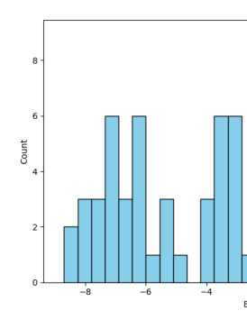 
Figure 1: Distribution of onsite energies for the Wannier functions. The Fermi level (0 eV) separates the occupied valence states from the unoccupied conduction states.

**Summary.** The paper introduces an integrated computational pipeline combining DFT with ADAPT-VQE to simulate strongly correlated materials like Li-hBN. By using Wannier functions and advanced tensor network techniques (MPS), it overcomes the exponential memory wall associated with large active spaces. This establishes a rigorous performance baseline for future hybrid quantum-classical simulations in condensed matter physics.

**Why it may be interesting.** This work provides a crucial blueprint for applying quantum computing methods (like VQE) to condensed matter problems, specifically addressing the resource scaling issues inherent in simulating strongly correlated materials beyond current hardware limits.

Detailed structure

**Main problem.** The core challenge is developing a scalable computational method to accurately simulate strongly correlated electronic systems, which are difficult for standard DFT methods.

**Main result.** The authors successfully demonstrated an end-to-end pipeline that can process up to 28 active orbitals by employing tensor network techniques, establishing a clear performance benchmark for hybrid quantum-classical simulation.

**Method.** The approach integrates DFT calculations with the ADAPT-VQE framework, enhanced by GOCP and MPS tensor networks to manage the exponential scaling of the Hilbert space.

**Model / system.** The study uses Lithium Hexagonal Boron Nitride (Li-hBN) as a benchmark system. The electronic structure is modeled via Wannier functions derived from DFT, leading to an active-space Hamiltonian suitable for quantum embedding.

**Key observables.** Variational energies calculated by ADAPT-VQE; the relationship between active-space size and computational demand.

**Important parameters / regimes.** Active space size (benchmarked from 8 to 14 spatial orbitals); MPS bond dimension ($\chi_{\max} = 64$); singular value truncation threshold ($\epsilon_{	ext{trunc}} = 10^{-8}$).

**Assumptions / limitations.** The primary limitation addressed is the exponential scaling of the Hilbert space, necessitating the use of bounded tensor networks (MPS) for tractability.

**Figures summary.** Figure 1 shows onsite energy distributions; Table 2 summarizes variational energies and scaling parameters across different qubit counts (16 to 28 qubits).

**Paper structure.** The paper outlines an end-to-end pipeline: DFT relaxation $
ightarrow$ NSCF calculations $
ightarrow$ Wannier localization, followed by the ADAPT-VQE simulation using GOCP and MPS tensor networks.

Abstract

The seamless integration of Density Functional Theory (DFT) with quantum variational algorithms is essential for the predictive simulation of strongly correlated materials. In this work, we present an end-to-end computational pipeline - comprising DFT geometry relaxation, non-self-consistent field (NSCF) calculations, and Wannier-based orbital localization - to prepare active-space Hamiltonians for quantum embedding. We utilize the Adaptive Variational Quantum Eigensolver (ADAPT-VQE) framework, significantly enhanced by a Greedy-Operator Commutativity Partitioning (GOCP) approach and a Taylor-expanded O(5) operator evolution strategy to efficiently manage the exponential scaling of the Hilbert space. We demonstrate this framework through a systematic benchmark study of Li-hBN, mapping the system onto qubit registers and investigating the convergence behavior as the active space is expanded from 8 to 14 spatial orbitals. Our results quantify the relationship between active-space size and computational demand, identifying a critical "scaling wall" where classical simulation costs transition from manageable to intractable. This study provides a rigorous performance baseline for the DFT-to-ADAPT-VQE workflow and offers empirical insights into the memory and processing limits currently facing hybrid quantum-classical architectures using advanced co-processing strategies.

[↑ back to top](#top)

### [Magnetic anisotropy in the near-stoichiometric van der Waals ferromagnet Fe$_3$GeTe$_2$](http://arxiv.org/abs/2607.24543v1)

**Authors:** Riju Pal, Joyal John Abraham, Satyabrata Bera, Mintu Mondal, Atindra Nath Pal, Bernd Buchner, Vladislav Kataev, Alexey Alfonsov  
**Type:** experiment · **Category:** strongly correlated electrons · **PDF:** <https://arxiv.org/pdf/2607.24543v1>  
**Analysis basis:** full PDF text, analyzed in chunks
**Topic relevance:** `spintronics-quantum-optics interface` **3/5** · `analog quantum simulation` **1/5** · `exotic spin models in light-matter` **1/5** · `non-equilibrium dynamics` **1/5**

📷 Fig 1

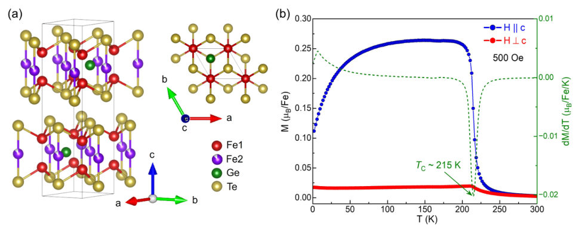 
Figure 1. (a) Crystal structure of Fe3GeTe2. The unit cell (left) and the top view (right) of a single vdW layer of Fe3GeTe2 are shown here. The unit cell is enclosed using the dotted lines. The top view of the structure shows the hexagonal symmetry of the ab plane. Two inequivalent Fe sites are termed Fe1 and Fe2. (b) The temperature dependence of magnetization and its temperature derivative, measured under a magnetic field of 500 Oe in the H ∥c and H ⊥c configurations. The minimum in the temperature derivative of the magnetization (dM/dT) reveals the Curie temperature TC ∼215 K of Fe3GeTe2.

📷 Fig 2

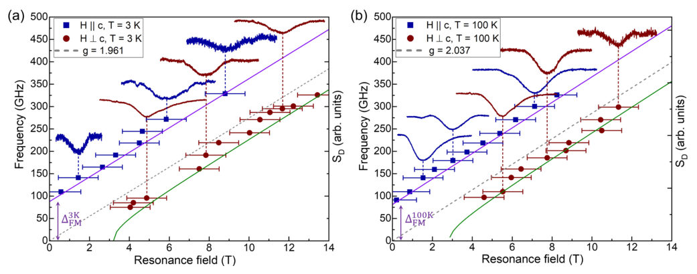 
Figure 2. Frequency dependence of the resonance fields Hres at T = 3 K (a) and 100 K (b) measured in H ∥c (blue squares) and in H ⊥c (red circles) configurations, respectively. Dashed lines represent the paramagnetic response estimated with Eq. 1 with the average g-factors given in the legends. Solid lines indicate the simulated best fit results using Eq. 2.1 and 2.2. Representative normalized and vertically shifted spectra are shown for some of the frequencies (right vertical axis) with the colors following respective magnetic field orientations.

📷 Fig 3

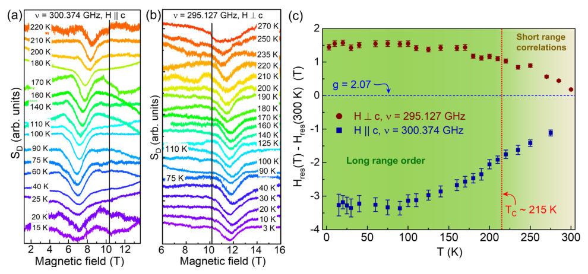 
Figure 3. Temperature evolution of the HF-ESR spectra in the field direction H ∥c (a) and H ⊥c (b), measured at fixed excitation frequencies of approximately 300 GHz. For clarity, all spectra are normalized to unity and vertically offset. Vertical black solid lines indicate the expected paramagnetic resonance position as given by Eq. 1. (c) Temperature dependence of the resonance shift, δH(T), at a microwave frequency ν of ≈300 GHz with an external magnetic field applied parallel (blue squares) and perpendicular (red circles) to the c axis. A blue dashed line indicates the zero shift in the paramagnet state with the g-factor, g = 2.07. The red dotted line shows the ordering temperature (TC...

📷 Fig 4

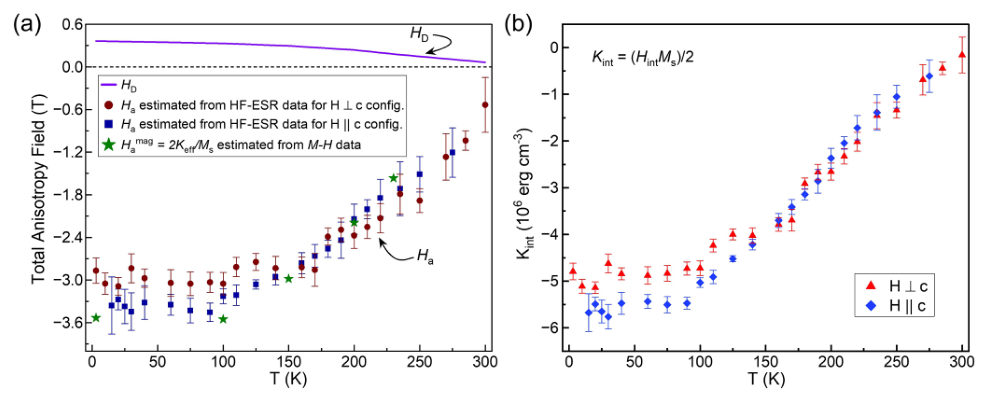 
Figure 4. (a) Total anisotropy field Ha as a function of temperature for both H ⊥c and H ∥c configurations, extracted from the temperature dependence of the resonance fields. The purple solid line is the calculated shape anisotropy field HD given by the shape of the crystal. Green stars are the total anisotropy field calculated from the M −H data. (b) Temperature dependence of the intrinsic MA constant (Kint) estimated from the measurements in the H ⊥c and H ∥c configurations, respectively.

📷 Fig 5

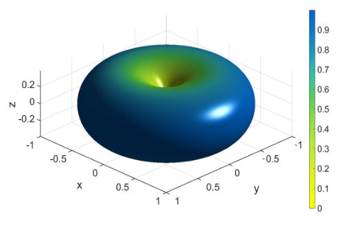 
Figure 5. Anisotropy energy density demonstration in Carte- sian coordinates (following Eq. 5), illustrating magnetic anisotropy of a single sublattice of Fe3GeTe2, as follows from the analysis of the HF-ESR results. Here, the yellow color corresponds to the energetically favorable direction (easy axis along the c-axis), while blue indicates higher-energy regions (hard plane). The surface is rotationally symmetric about the z-axis, reflecting the uniaxial magnetic anisotropy of the crystal.

**Summary.** This work uses high-frequency Electron Spin Resonance (ESR) on $	ext{Fe}_3	ext{GeTe}_2$ to characterize its magnetic anisotropy and spin dynamics. Key findings include confirming easy-axis ferromagnetism, measuring a large magnon gap, and showing that the material's magnetic properties are extremely sensitive to minor changes in chemical stoichiometry. It establishes this compound as an excellent model system for studying tunable magnetism in 2D materials.

**Why it may be interesting.** The study provides quantitative measurements of magnon excitations and magnetic anisotropy in a highly tunable 2D system, which is crucial for understanding emergent quantum phenomena in low-dimensional magnets relevant to spintronics and quantum simulation.

Detailed structure

**Main problem.** To gain quantitative insights into the magnetic anisotropy and spin dynamics of quasi-two-dimensional (2D) van der Waals ferromagnets, specifically investigating the role of Fe stoichiometry.

**Main result.** The study established $	ext{Fe}_3	ext{GeTe}_2$ as an easy-axis ferromagnet with a large magnon gap ($\approx 87.8 	ext{ GHz}$ at $3 	ext{ K}$) and demonstrated that spin dynamics are extremely sensitive to small variations in Fe content.

**Method.** The primary methods involved comprehensive Electron Spin Resonance (ESR) measurements across wide ranges of frequencies, temperatures, and magnetic fields, supplemented by magnetization measurements ($M-T$, $M-H$).

**Model / system.** The physical system is the near-stoichiometric van der Waals ferromagnet $	ext{Fe}_3	ext{GeTe}_2$, which exhibits itinerant magnetism in a quasi-two-dimensional layered structure.

**Key observables.** Magnetic anisotropy, internal magnetic field evolution with temperature, uniaxial magnetocrystalline anisotropy ($K_{	ext{int}}$), and the zero-field magnon gap ($\Delta$).

**Important parameters / regimes.** Low temperatures (e.g., $3 	ext{ K}$), specific stoichiometry variations ($	ext{Fe}_{3.03} 	ext{GeTe}_2$), and high magnetic fields ($16 	ext{ T}$).

**Assumptions / limitations.** The analysis relies on fitting the experimental data to established models for uniaxial ferromagnets, assuming the material behaves as a model vdW ferromagnet.

**Figures summary.** Figures illustrate crystal structure details (hexagonal symmetry), temperature dependence of magnetization ($M-T$), and how magnetic anisotropy parameters vary with field orientation relative to the $c$-axis.

**Paper structure.** The paper progresses by first characterizing the material's basic ferromagnetic nature via frequency-dependent ESR, then analyzing the temperature evolution of the internal field to detect short-range correlations above $T_C$, and finally quantifying anisotropy parameters like $K_{	ext{int}}$ and $\Delta$ using spin-wave analysis.

Abstract

Quasi-two-dimensional (2D) van der Waals (vdW) ferromagnets such as the series Fe$_{3-x}$GeTe$_2$, with a relatively high Curie temperature and robust metallicity, offer an ideal platform for investigating itinerant magnetism in reduced dimensions. Here, we present a comprehensive electron spin resonance (ESR) investigation of single-crystalline almost-stoichiometric Fe$_{3.03 \pm 0.03}$GeTe$_{2}$ across wide ranges of frequencies, temperatures, and magnetic fields to gain quantitative insights into its magnetic anisotropy and spin dynamics. Frequency-dependent ESR measurements establish Fe$_{3}$GeTe$_{2}$ as an easy-axis ferromagnet. Temperature-dependent high-field ESR reveals a large internal field that gradually decreases at higher temperatures. Remarkably, this internal field persists even above $T_\mathrm{C}$, evidencing short-range spin correlations in Fe$_{3}$GeTe$_{2}$. Analysis of spin-wave modes yields a strong uniaxial magnetocrystalline anisotropy $K_{\text{int}} \approx - 5 \times 10^6$ erg cm$^{-3}$ at 3 K and a large magnon gap $Δ(3 \mathrm{K})$ $\approx$ 87.8 $\pm$ 13.7 GHz ($\approx$ 0.363 $\pm$ 0.057 meV). Our study highlights that small variations in Fe content in Fe$_{3}$GeTe$_{2}$ lead to substantial changes in the magnon gap at low temperatures, indicating the extreme sensitivity of spin dynamics to the chemical composition. These results establish Fe$_{3}$GeTe$_{2}$ as a model vdW ferromagnet for exploring tunable anisotropies and magnon excitations in metallic 2D magnets.

[↑ back to top](#top)

### [Performance of Krotov, PRONTO and PINN for optimal control of quantum gates](http://arxiv.org/abs/2607.23276v1)

**Authors:** Martín D. Jiménez, Murilo D. Forlevesi, Emanuel F. de Lima, Leonardo K. Castelano  
**Type:** theory · **Category:** quantum information and computing · **PDF:** <https://arxiv.org/pdf/2607.23276v1>  
**Analysis basis:** full PDF text, analyzed in chunks
**Topic relevance:** `methods for driven-dissipative` **3/5** · `QC/QI experiment` **1/5** · `quantum measurements` **1/5** · `spintronics-quantum-optics interface` **1/5**

📷 Fig 1

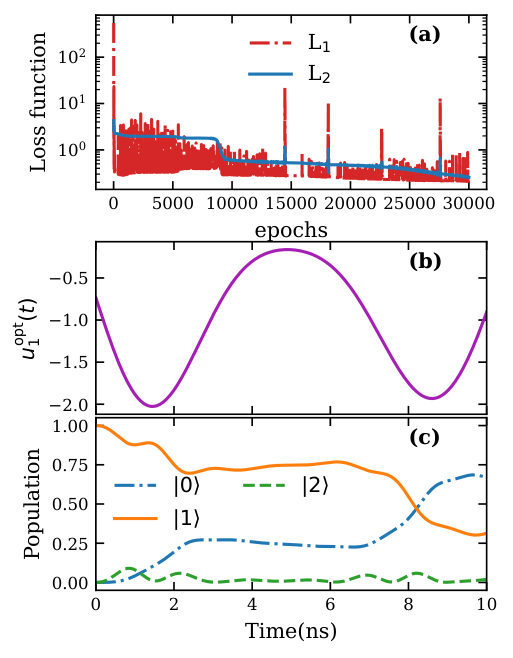 
FIG. 1. (a) Loss functions according to Eqs. (39) and (40) as a function of the number of epochs. (b) The optimized control field uopt 1 (t) and (c) the populations for each state, obtained by driving the system with this optimized control, considering the initial state |ψ(0)⟩= |1⟩, as a function of time.

📷 Fig 2

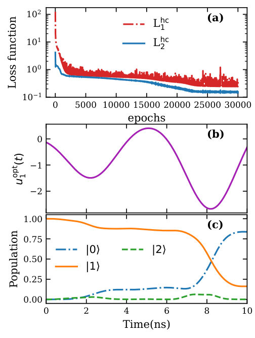 
FIG. 2. (a) Loss functions according to Eqs. (43) and (44) as a function of the number of epochs. (b) The optimized control field uopt 1 (t) and (c) the populations for each state, obtained by driving the system with this optimized control, considering the initial state |ψ(0)⟩= |1⟩, as a function of time.

📷 Fig 3

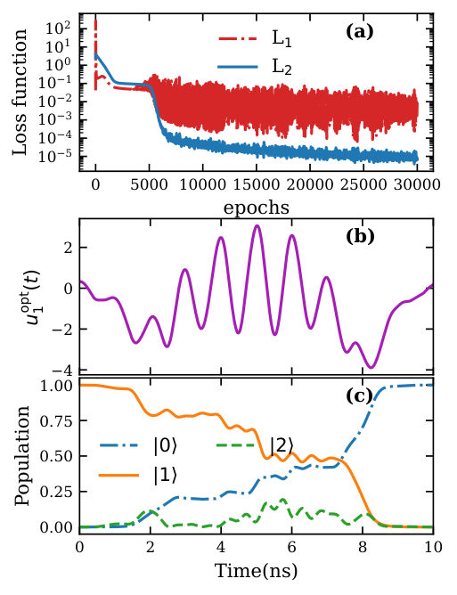 
FIG. 4. (a) Loss functions according to Eqs. (39) and (40) as a function of the number of epochs. (b) The optimized control field uopt 1 (t) and (c) the populations for each state, obtained by driving the system with this optimized control, considering the initial state |ψ(0)⟩= |1⟩, as a function of time.

📷 Fig 4

 
FIG. 3. (a) Loss functions according to Eq. (46) as a function of the number of epochs. (b) The optimized control field uopt 1 (t) and (c) the populations for each state, obtained by driving the system with this optimized control, considering the initial state |ψ(0)⟩= |1⟩, as a function of time.

📷 Fig 5

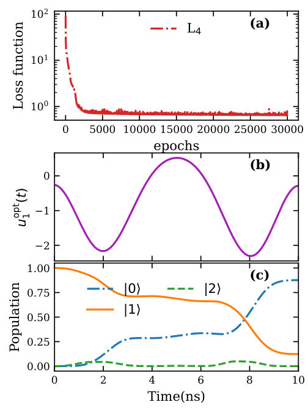 
Figure 4 (c) shows the population of the state as a function of time, and the population of the state |0⟩in- creases to 0.99999 in the final time. In summary, our new procedure is capable of solving the control problem with very high fidelity. The use of hard constraints within this new procedure does not bring any advantages (results not shown here); therefore, all the results presented hereafter will minimize the loss functions of Eqs. (39) and (40) by employing the pretraining, normalization in each epoch, and the inclusion of the Fourier features. Figures 5 (a) and 6 (a) show the value of the functional

**Summary.** This paper develops an enhanced Physics-Informed Neural Network scheme (PINNQOC) for solving quantum optimal control problems. It benchmarks this ML approach against established methods like Krotov's and PRONTO's on multi-level qubit systems. The results show that PINNQOC achieves high fidelity while offering a promising pathway for real-time, adaptive control in future autonomous quantum hardware.

**Why it may be interesting.** This work directly addresses the practical implementation challenges in quantum computing by providing a machine learning approach (PINN) that can automate pulse engineering and adapt to hardware imperfections better than purely analytical or trajectory-dependent solvers.

Detailed structure

**Main problem.** The core problem is achieving high-fidelity quantum gate operations while actively suppressing population leakage into non-computational states.

**Main result.** The proposed PINNQOC framework successfully matches the fidelity of traditional solvers (Krotov, PRONTO) and demonstrates superior leakage suppression in multi-level systems.

**Method.** The authors propose an enhanced Physics-Informed Neural Network scheme (PINNQOC) to solve quantum optimal control problems, benchmarking it against established gradient-based methods like Krotov's and PRONTO's optimization techniques.

**Model / system.** The study uses truncated multi-level systems as models, specifically a three-level fluxonium qubit and a four-level Nitrogen-Vacancy center coupled to a Carbon-13 nuclear spin. The dynamics are governed by the time-dependent Schrödinger equation.

**Key observables.** Gate fidelity (target vs. achieved), mean population leakage ($\ell$), computational time, and iteration efficiency.

**Important parameters / regimes.** Penalization factors ($q=0.2$ or $0.3$), target gate specifications, and the number of time steps ($N_t$).

**Assumptions / limitations.** Standard PINNs suffer from numerical bottlenecks (spectral bias) when solving highly oscillatory dynamics; traditional solvers are strictly trajectory-specific.

**Figures summary.** The notes indicate comparisons across multiple tables summarizing performance metrics for different gate types and system sizes, comparing fidelity, leakage, time, and iterations for the three methods.

**Paper structure.** The paper introduces the problem of high-fidelity control, details the theoretical background of QOC (Krotov/PRONTO), presents the novel PINNQOC framework enhancements, benchmarks performance on specific multi-level qubits, and concludes with an analysis of computational trade-offs for autonomous quantum hardware.

Abstract

Achieving scalable quantum computing demands high-fidelity operations capable of mitigating population leakage into non-computational states. Physics-Informed Neural Networks (PINNs) have recently emerged as a powerful paradigm to unify quantum hardware characterization (inverse problems) and pulse engineering (direct problems), laying the foundational architecture for autonomous quantum processors. However, standard PINN frameworks face severe numerical bottlenecks, such as spectral bias, when attempting to simultaneously solve highly oscillatory multi-level dynamics and optimize continuous control fields under strict global phase constraints. In this work, we propose an enhanced PINN scheme for quantum optimal control (PINNQOC) that circumvents these limitations by incorporating Fourier feature embeddings, dynamic epoch normalization, and an informed pre-training routine. To rigorously evaluate its performance, we systematically benchmark our framework against two premier continuous control solvers: the first-order Krotov method and the second-order Projection Operator Newton Method for Trajectory Optimization (PRONTO). These techniques are applied to implement multiple quantum gates on a truncated three-level fluxonium qubit and a four-level Nitrogen-Vacancy center coupled to a Carbon-13 nuclear spin. Our advanced PINNQOC approach successfully suppresses population leakage while achieving gate fidelities exceeding 99.9$\%$, matching the efficacy of traditional solvers. Finally, we provide a comprehensive analysis of computational times, iteration efficiency, and mean leakage, highlighting the distinct trade-offs and avenues for embedding physics-guided machine learning into automated quantum hardware pipelines.

[↑ back to top](#top)

### [Practical advantage beyond the quadratic speedup limit with fully-quantum walks](http://arxiv.org/abs/2607.22818v1)

**Authors:** Massimiliano Incudini, Guglielmo Mazzola  
**Type:** theory · **Category:** disordered systems and neural networks · **PDF:** <https://arxiv.org/pdf/2607.22818v1>  
**Analysis basis:** full PDF text, analyzed in chunks
**Topic relevance:** `exotic spin models in light-matter` **3/5** · `analog quantum simulation` **1/5** · `methods for driven-dissipative` **1/5** · `non-equilibrium dynamics` **1/5**

📷 Fig 1

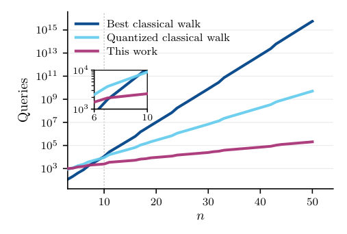 
FIG. 1: Number of queries as a function of n for β = 4 and ε = 10−2. The vertical dashed line separates exact simulations from numerical extrapolations.

📷 Fig 2

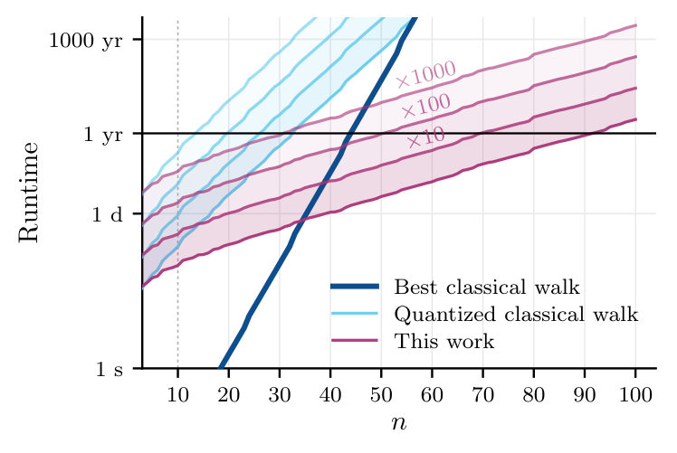 
FIG. 2: Runtime versus system size n for β = 4 and TV-distance error ε = 10−2. The vertical dashed line separates exact simulations from numerical extrapolations. For the quantum methods, the lowest line assumes a physical operation time of 20 ns, while the subsequent lines increase this time by factors of 10, 100, and 1000. The classical walk is implemented on FPGA hardware.

📷 Fig 3

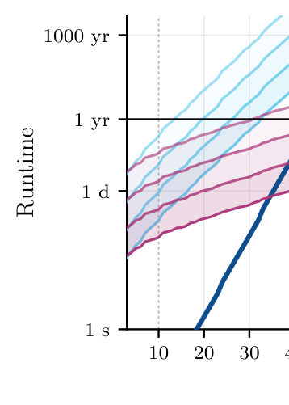 
Figure 2 shows the runtime estimate as a function of the system size n for the three main walks considered in the text. These results are obtained by combining the query costs simulations of the previous Sect. IV A with the cost of a single logical classical and quantum steps (see Sect. III C, III D and III E). We choose the hybrid fixed-point arithmetic for the quantum walk operator, which is the most time efficient implementation albeit the space scales about quadratically in the space. Additional experiments at different β and ε are shown in Appendix I.

📷 Fig 4

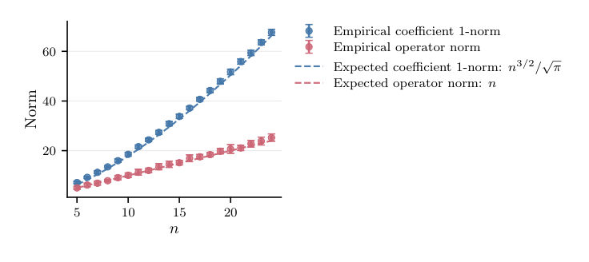 
FIG. 3: Empirical coefficient 1-norm and operator norm of 30 independent random instances for each system size n = 5, . . . , 24, compared with the expected scalings n3/2/√π and n. Error bars show one standard deviation.

📷 Fig 5

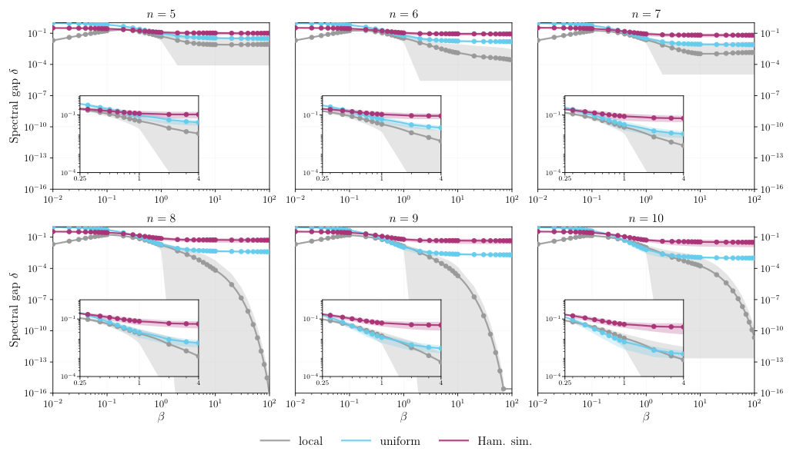 
FIG. 4: Spectral gap as a function of β for a fixed number of spins n. Grey, light blue and magenta lines correspond to the local, uniform, and Hamiltonian simulation moves, respectively. The shaded areas show one standard deviation. The statistics shown are the mean and standard deviation.

**Summary.** The paper proposes a novel 'fully-quantum Metropolis walk' algorithm designed to sample complex probability distributions arising from Ising models. By making both proposal and acceptance steps inherently quantum via Hamiltonian simulation, the authors achieve significant theoretical speedups over existing quantum walk methods. This work establishes that super-quadratic advantages are achievable for sampling problems in condensed matter physics.

**Why it may be interesting.** This work directly addresses how advanced quantum walk techniques can provide polynomial speedups for sampling problems relevant to spin glasses and disordered systems, pushing beyond previously assumed quadratic limits.

Detailed structure

**Main problem.** The primary goal is efficiently sampling from the low-temperature Gibbs distribution of classical dense Ising models, which is a key problem in statistical physics.

**Main result.** The authors demonstrate that fully-quantum Metropolis walks can achieve an asymptotic advantage of about a cubic polynomial over previous quantum walk methods, suggesting super-quadratic speedups are possible.

**Method.** They introduce 'fully-quantum Metropolis walks' where both proposal and acceptance steps are intrinsically quantum, utilizing Hamiltonian simulation for the proposal mechanism within a Szegedy quantum walk framework.

**Model / system.** The study focuses on classical dense Ising models defined by a Hamiltonian $H(\mathbf{x})$, aiming to sample the low-temperature Gibbs distribution $\pi_eta(x)$. The analysis involves simulating annealing paths across various inverse temperatures ($eta$).

**Key observables.** Total variation distance ($\|q - \pi_eta\|_{TV}$), spectral gap ($\delta_eta$), and query complexity (classical vs. quantum counts).

**Important parameters / regimes.** Inverse temperature $eta$, error tolerance $\epsilon$, system size $n$, and the annealing schedule parameters.

**Assumptions / limitations.** The analysis relies on fault-tolerant compilation of primitives, using a Zeno-rewind protocol to manage spectral projections, and assuming parallel execution for Pauli measurements.

**Figures summary.** Figures compare resource requirements (e.g., surface code distance vs. $n$) across different proposals (local, uniform, Hamiltonian) and varying error tolerances ($\epsilon$), showing the crossover point where quantum walks outperform classical methods.

**Paper structure.** The paper builds from defining the sampling problem using MCMC/quantum walks to introducing the novel fully-quantum proposal mechanism. It then details the resource scaling analysis across an annealing schedule, culminating in runtime comparisons against state-of-the-art classical and quantum approaches.

Abstract

We introduce a new class of fully-quantum Metropolis walks in which both the proposal and acceptance steps are intrinsically quantum. Unlike standard quantum walks obtained by quantizing classically efficient Markov chains, our algorithm employs Hamiltonian simulation as a quantum-native proposal mechanism, enlarging the class of quantum walks beyond classical counterparts. We target the problem of sampling from the low-temperature Gibbs distribution of classical dense Ising models, within a fixed error in total variation distance. This approach achieves about a cubic polynomial asymptotic advantage over previous quantum-walks, resulting in a total sixth-degree polynomial queries speedup compared to the best classical walk. This shows that speedups beyond the widely assumed quadratic limit are possible within the quantum walk formalism. We perform a complete fault-tolerant compilation of all algorithmic primitives and benchmark against CPU, GPU, and FPGA implementations of the best classical Markov chain. Under identical hardware assumptions, the resulting advantage runtime crossover is reduced from approximately $10^3$ years for conventional quantum walks to less than one day. These results identify fully-quantum Markov chains as a promising route toward practical quantum advantage.

[↑ back to top](#top)

### [Quantum-Limited Symbol-Blind Channel Estimation for Coherent State Discrimination](http://arxiv.org/abs/2607.24644v1)

**Authors:** Hongxu Chen, Renzhi Yuan, Haifeng Yao, Mugen Peng  
**Type:** theory · **Category:** quantum information and computing · **PDF:** <https://arxiv.org/pdf/2607.24644v1>  
**Analysis basis:** full PDF text, analyzed in chunks
**Topic relevance:** `quantum measurements` **3/5** · `Keldysh / 2PI / non-Gaussian methods` **1/5** · `entanglement & information structure` **1/5** · `interference shaping light` **1/5**

📷 Fig 1

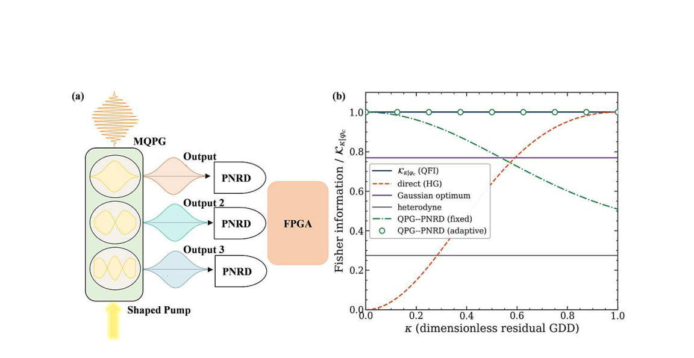 
FIG. 1. (a) An MQPG implements the three-mode analysis and routes the outputs to frequency-

📷 Fig 2

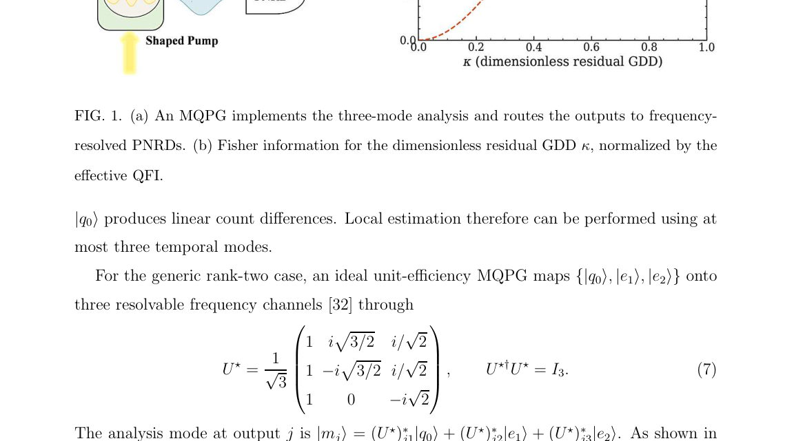 
Fig. 1(a), the first column distributes |q0⟩equally among the outputs, while the remaining

📷 Fig 3

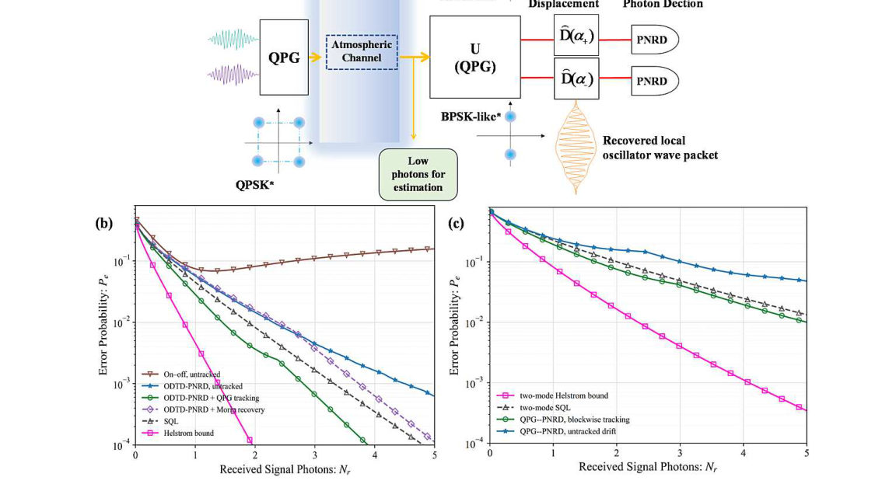 
FIG. 2. (a) Proposed temporal-mode-assisted receiver. (b) Error probabilities of Kennedy-type

**Summary.** This paper develops a quantum-enhanced technique for estimating channel impairments like dispersion and delay in low-photon-number optical links. By employing a Quantum Pulse Gate with photon-number resolution, the authors show that they can achieve measurement precision limited only by fundamental quantum noise, surpassing classical bounds.

**Why it may be interesting.** This work directly applies advanced quantum information techniques (QFI, POVMs) to a practical problem in quantum communication (optical fiber links), providing concrete bounds on achievable sensing precision below the SQL.

Detailed structure

**Main problem.** The primary goal is establishing the quantum limit for blind joint estimation of group delay ($	au$) and second-order dispersion ($\kappa$) in photon-starved coherent optical links.

**Main result.** A Quantum Pulse Gate (QPG) combined with Photon-Number-Resolving Detectors (PNRDs) measurement locally attains the Quantum Cramér–Rao Bound, achieving performance below the Standard Quantum Limit (SQL).

**Method.** The analysis uses quantum estimation theory, deriving the effective Quantum Fisher Information matrix by exploiting parity decomposition and eliminating unknown common carrier phases via a Schur complement.

**Model / system.** The system models coherent state discrimination in fiber links suffering from residual dispersion. The measurement setup involves projecting the field onto phase-diverse temporal modes using a QPG followed by PNRD detection.

**Key observables.** Quantum Fisher Information (QFI) matrix, error probabilities ($P_e$), and the covariance matrix $C$ of centered generators.

**Important parameters / regimes.** Average photon number ($N_s$), residual dispersion ($\kappa$), group delay ($	au$), and detector efficiency ($\eta_d$).

**Assumptions / limitations.** The analysis neglects third-order dispersion, assumes equiprobable M-ary PSK states, and utilizes the Schur complement to eliminate unknown common phase dependence.

**Figures summary.** Figures illustrate the proposed temporal-mode-assisted receiver setup and compare error probabilities for different mode-recovery strategies under simulated residual dispersion, showing performance below the SQL.

**Paper structure.** The paper progresses from defining the physical problem (dispersion in coherent links) to deriving the QCRB using quantum measurement theory. It details the construction of the optimal QPG/PNRD measurement and concludes by demonstrating that this method surpasses classical limits for blind parameter estimation.

Abstract

Residual dispersion breaks temporal-mode matching in photon-starved coherent links. For equiprobable $M$-ary PSK coherent states in a known spectral mode, with unknown symbols and carrier phase, we establish the quantum limit for blind joint estimation of group delay and second-order dispersion: after eliminating the common phase, it is $4N_s\mathbf{C}$, set by the covariance of the centered generators alone. A multi-output quantum pulse gate with photon-number-resolving detection locally attains it and supports reception below the standard quantum limit under turbulent fading.

[↑ back to top](#top)

### [Performance and Stability of Quantum Krylov Diagonalization for the Hubbard Model](http://arxiv.org/abs/2607.23604v1)

**Authors:** Mohammad Mirzakhani, Hyukgun Kwon, Kyungsun Moon  
**Type:** both · **Category:** strongly correlated electrons · **PDF:** <https://arxiv.org/pdf/2607.23604v1>  
**Analysis basis:** full PDF text, analyzed in chunks
**Topic relevance:** `analog quantum simulation` **3/5** · `QC/QI experiment` **2/5**

📷 Fig 1

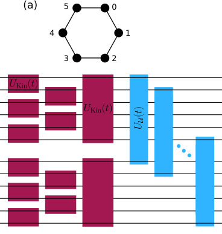 
FIG. 1. (a) 1D Hubbard chain with PBC, illustrated for the representative case of L = 6 lattice sites labeled from 0 to 5. (b) Quantum circuit implementing the time-evolution op- erator of the Hubbard Hamiltonian [Eq. (1)]. The first L qubits encode the spin-up orbitals, while the remaining L qubits encode the spin-down orbitals. The red blocks, UKin(t), implement the hopping evolution between neighboring lat- tice sites, whereas the blue blocks, UU(t), implement the on- site Coulomb interaction between the spin-up and spin-down qubits associated with the same lattice site (qi and qL+i). Details of the circuit decomposition for UKin(t) and UU(t) are given in Ref. [54].

📷 Fig 2

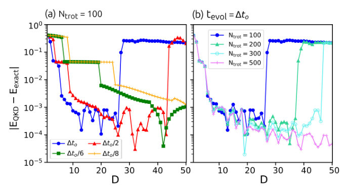 
FIG. 3. (a) Absolute GSE error as a function of the Krylov dimension D for different evolution times tevol, as indicated in the figure. Results are shown for the weakly interacting case U0 = 2 using Ntrot = 100 Trotter steps. (b) GSE error for the tevol = ∆to case shown in panel (a), obtained with different Trotter numbers, Ntrot = 100, 200, 300, and 500. The reference evolution time is ∆to = π/∥H∥≈0.28.

📷 Fig 3

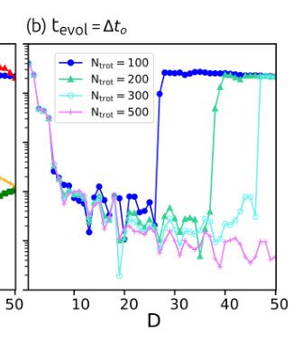 
Figure 3(a) shows the convergence of the QKD GSE for the half-filled six-site Hubbard model as a function of the Krylov dimension D for several choices of tevol. The evolution time is expressed relative to the reference scale ∆to = π/∥H∥[42, 48], where ∥H∥denotes the spectral norm of the Hamiltonian. We present results for the weakly interacting case U0 = 2 with Ntrot = 100, while the effects of varying interaction strength are discussed in Sec. III A 3. Figure 3(a) reveals two distinct convergence regimes governed by the competition between Krylov approxi- mation and time-discretization (Trotter) errors. For suf- ficiently small evolution times, namely tevol = ∆to/6 and tevol = ∆to/8, the...

📷 Fig 4

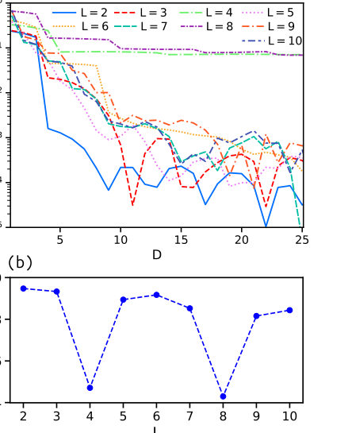 
FIG. 4. (a) Convergence of the GSE error as a function of the Krylov dimension D for different lattice sizes L. For each system size, the time-evolution parameter tevol and the num- ber of Trotter steps Ntrot are selected relative to the reference time scale ∆to, as summarized in Table I, to provide compa- rable dynamical resolution across different lattice sizes. (b) Fidelity between the Slater-determinant reference state |ψ0⟩ and the exact ground state |0⟩of the Hubbard model as a function of the lattice size L. The pronounced reductions in fidelity for L = 4 and L = 8 correlate with the slower conver- gence observed in panel (a), indicating a substantially reduced overlap between the...

📷 Fig 5

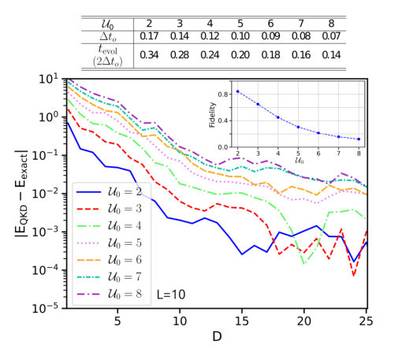 
FIG. 5. Absolute GSE error as a function of the Krylov di- mension D for different on-site Coulomb interaction strengths U0 = 2–8 at fixed system size L = 10. For each value of U0, the time-evolution parameter is chosen as tevol = 2∆to (see the table at the top of the figure), with Ntrot = 200 Trotter steps. The inset shows the fidelity between the Slater-determinant reference state and the true ground state as a function of U0, illustrating the reduction in their overlap as the interaction strength increases.

**Summary.** This paper evaluates Quantum Krylov Diagonalization (QKD) as a method to find ground-state energies of the 1D Hubbard model. It systematically analyzes how algorithmic choices—such as evolution time and basis truncation—affect convergence and stability. The results confirm that QKD is a viable, hardware-efficient tool for studying strongly correlated fermionic systems on current quantum processors.

**Why it may be interesting.** The work provides concrete, actionable guidelines for applying advanced quantum algorithms (QKD) to benchmark strongly correlated models like the Hubbard model on near-term noisy hardware, bridging theory with experimental feasibility.

Detailed structure

**Main problem.** Estimating ground-state properties of strongly correlated quantum systems, which is computationally intractable due to the exponential growth of the Hilbert space.

**Main result.** Quantum Krylov Diagonalization (QKD) proves to be a practical and hardware-efficient method for studying these systems on current NISQ processors, provided algorithmic parameters are carefully balanced.

**Method.** The study uses QKD, a hybrid quantum-classical approach, to estimate extremal eigenvalues by constructing and diagonalizing a projected Hamiltonian matrix derived from time evolution simulations.

**Model / system.** The primary model is the one-dimensional (1D) Hubbard model with periodic boundary conditions. The system's dynamics are mapped onto qubits using the Jordan–Wigner transformation, resulting in a Hamiltonian expressed as a sum of Pauli strings.

**Key observables.** Ground State Energy (GSE), spectral gap $\Delta(s)$, and the absolute GSE error ($\Delta E$) monitored against the Krylov dimension ($D$).

**Important parameters / regimes.** Krylov dimension, time-evolution parameter ($	ext{tevol}$), Trotter number ($N_{	ext{trot}}$), Singular-Value Truncation (SVT) threshold, and interaction strength ($U_0$).

**Assumptions / limitations.** The method relies on approximating the time evolution operator via first-order Trotterization and requires regularization (SVD) to handle near linear dependencies in the basis states.

**Figures summary.** Figures illustrate the 1D Hubbard chain setup, quantum circuits for time evolution, convergence of GSE error vs. Krylov dimension/Trotter steps, and spectral gap analysis along interpolation paths.

**Paper structure.** The paper systematically investigates QKD performance by analyzing its dependence on various algorithmic parameters (Krylov dimension, Trotterization) using the 1D Hubbard model. It details the mathematical framework for constructing projected matrices ($	ilde{H}, 	ilde{S}$) and validates the approach both through ideal simulations and actual measurements on IBM quantum hardware.

Abstract

Quantum Krylov diagonalization (QKD) has emerged as a promising hybrid quantum-classical approach for estimating ground-state properties of many-body systems on near-term quantum devices. In this work, we investigate the convergence, stability, and hardware performance of QKD for the one-dimensional Hubbard model with periodic boundary conditions. Building upon our previously developed low-depth Jordan--Wigner implementation, which reduces the number of two-qubit (CNOT) gates required for quantum time evolution, we perform a systematic study of the influence of the Krylov dimension, Hamiltonian evolution parameters, system size, interaction strength, and singular-value truncation (SVT) on the convergence of the method. Our results show that the performance of QKD is governed by a delicate interplay between the low-energy spectral structure of the Hamiltonian and numerical stability. In particular, systems with near-closing energy gaps require longer evolution times to efficiently resolve nearby eigenstates, while the evolution time, Krylov dimension, Trotter number, and SVT threshold must be carefully balanced to avoid numerical instabilities and accumulated time-discretization errors. This analysis provides practical guidelines for selecting algorithmic parameters in QKD. Finally, we demonstrate the algorithm on IBM quantum hardware, where the experimental results reproduce the convergence trends predicted by ideal simulations using only lightweight readout-error mitigation and a modest measurement budget. Together, these results demonstrate that QKD is a practical and hardware-efficient approach for studying strongly correlated fermionic systems on current NISQ quantum processors.

[↑ back to top](#top)

### [Strategies for quantum-enabled Bitcoin miners](http://arxiv.org/abs/2607.23952v1)

**Authors:** Zach Manson, Barry C. Sanders  
**Type:** theory · **Category:** other · **PDF:** <https://arxiv.org/pdf/2607.23952v1>  
**Analysis basis:** full PDF text, analyzed in chunks
**Topic relevance:** `quantum measurements` **3/5** · `measurement-induced transitions` **2/5**

📷 Fig 1

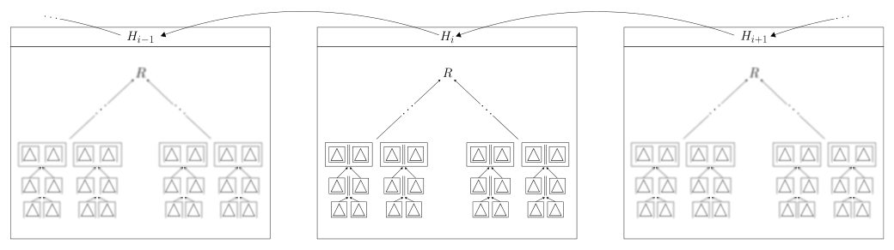 
FIG. 1. The structure of a block. Blocks are depicted as squares that are partitioned into two rectangles. The upper rectangle is labeled Hi, which is the block header of the ith block, and the lower rectangle is the Merkle tree with root R. Within the Merkle tree, a triangle (△) represents the hash of an individual transaction. A square (□) represents the application of a hash function whose inputs are the contents inside the square, and || denotes concatenation. The Merkle tree construction is shown for an even number of transactions. For an odd number of transactions, the last transaction is duplicated to make the number of transactions even. The arrows between blocks represent the hash...

📷 Fig 2

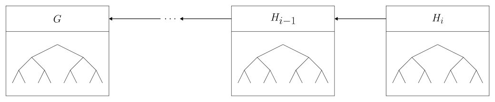 
FIG. 2. The blockchain depicted as a back-linked list of blocks. Each block is shown as a square divided into two rectangles. The upper rectangle represents the block header H of the ith block, and the lower rectangle contains the Merkle tree of transactions, depicted as a tree structure. Back-links are depicted by arrows between block headers, representing the previous block hash stored in each block’s header. The ellipses denote further preceding and succeeding blocks in the blockchain, and the block with header labeled G represents the genesis block, which has no predecessor.

📷 Fig 3

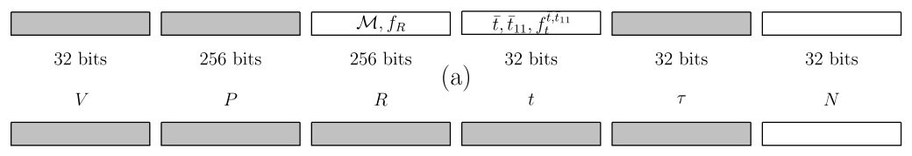 
FIG. 3. A visualization of finding a proof-of-work for (a) the PoW problem and (b) the bounded PoW problem. The concatenated block header is represented by six rectangles. A rectangle represents a specific bitstring in the concatenation of the block header. Each rectangle is labeled above by the symbol of the element in the block header. The length of the bitstring for each label is indicated below the rectangle. A filled rectangle represents a bitstring whose value remains constant. An empty rectangle denotes a bitstring whose value is computed by the node finding a proof-of-work. In (a), for the Merkle Root R, the mempool M and the oracle fR are inputs, as are ¯t, ¯t11, and f ¯t,¯t11 t...

📷 Fig 4

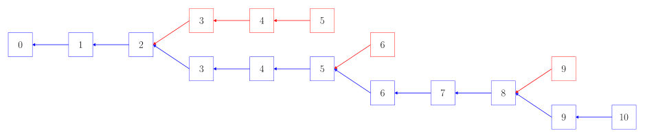 
FIG. 4. The blockchain represented as a DAG during a temporary fork. A vertex (□) represents a block, each labeled with its block height. Directed edges represent the block hash of preceding blocks. A blue square (□) indicates a block that has become part of the longest blockchain. A red square (□) indicates a block that is not part of the longest blockchain. Each vertex (except the genesis block with height 0) has one outgoing edge to a preceding block, but can have multiple incoming edges from succeeding blocks during a temporary fork. This figure represents a temporary fork because not all nodes have the same symbol.

📷 Fig 5

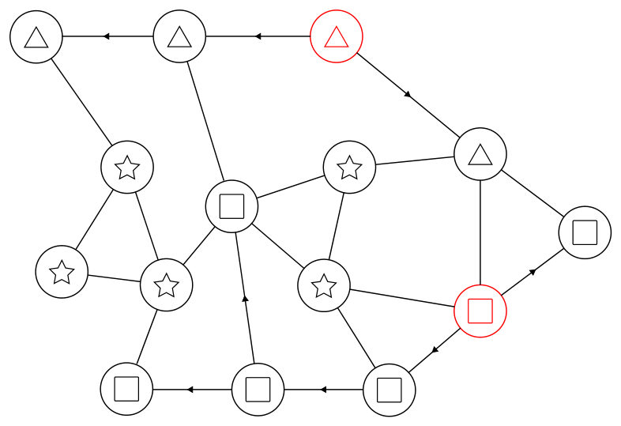 
FIG. 5. A temporary fork occurring due to near-simultaneous block discovery. A vertex (⃝) represents a node in the Bitcoin network. A red vertex (⃝) represents a node that has just mined a new block. Each vertex contains either a star (⋆), representing the state of the network before the fork, or a triangle (△) or a square (□) representing one of the new branches created by the temporary fork. An arrow within an edge indicates the broadcast of a new block to a peer. An edge without an arrow represents a peer-to-peer connection where no new block is being broadcast.

**Summary.** This paper analyzes the security of Bitcoin against two competing quantum miners by developing a game-theoretic model. By calculating optimal strategies that allow for multiple measurements, the authors demonstrate that these advanced quantum mining techniques do not significantly lower the network's 51% attack threshold in practice. The work is crucial for assessing future quantum threats to Proof-of-Work cryptocurrencies.

**Why it may be interesting.** While not directly focused on AMO physics, the rigorous application of quantum computation concepts (like Grover's algorithm and measurement uncertainty) within a complex, real-world decentralized system provides an excellent case study for modeling open quantum systems under adversarial conditions.

Detailed structure

**Main problem.** To study how two quantum-enabled Bitcoin miners affect the network's 51% attack threshold when playing a competitive game against each other.

**Main result.** The optimal quantum mining strategies, even those incorporating aggressive measurements, have a negligible effect on the established 51% attack threshold of the Bitcoin network under current difficulty regimes.

**Method.** The authors extended existing game-theoretic frameworks by computing payoff matrices and determining Nash equilibria for two non-colluding miners. They simulated these optimal strategies within the classical Bitcoin protocol structure.

**Model / system.** The model is an otherwise classical Bitcoin network infiltrated by two aggressive quantum miners (Alice and Bob). The analysis incorporates concepts like UTXOs, SHA-256 hashing, and extends game theory to include multiple quantum measurements between block attempts.

**Key observables.** The resulting threshold for the 51% attack; stale rate ($	ext{pstale}$); detection probability ($	ext{Pdet}$).

**Important parameters / regimes.** Network difficulty ($D$); number of Grover iterations ($\kappa$); number of measurements ($c$).

**Assumptions / limitations.** The analysis assumes the miners employ optimal strategies derived from game theory and accounts for multiple measurement opportunities, unlike prior single-computation models.

**Figures summary.** Figures illustrate the structure of a Bitcoin block header and show simulated metrics like $	ext{P95}$ and $	ext{Pdet}$ as functions of network difficulty ($D$).

**Paper structure.** The paper builds from defining the classical Bitcoin cryptographic model (transactions, UTXOs) to setting up a game-theoretic framework using payoff matrices for quantum mining strategies. The core analysis then simulates these optimal strategies across different difficulty regimes.

Abstract

We study the impact that two miners equipped with quantum computers purpose-built for quantum Bitcoin mining will have on the 51% attack threshold of the Bitcoin network, given that the miners are playing a competitive game against each other to be the first to mine a block. We extend an existing game-theoretic framework for Bitcoin mining and compute the resultant payoff matrices. From these payoff matrices, we determine optimal quantum mining strategies for two non-colluding and aggressive quantum miners with multiple opportunities at finding a valid block in an otherwise classical Bitcoin network. We show that these optimal quantum mining strategies have a negligible effect on the 51% attack threshold. The novelty of our work is the inclusion of the Aggressive Quantum Mining Strategy and the realistic approach of allowing the quantum miners to restart their search if their measurements do not yield a valid block when determining the optimal quantum mining strategies. Our result is important for evaluating quantum-mining threats on cryptocurrencies based on Proof-of-Work, e.g. Bitcoin

[↑ back to top](#top)

### [The Uhlenbeck-Ford model in two dimensions: Reference system for fluid-phase free-energy calculations](http://arxiv.org/abs/2607.23824v1)

**Authors:** Samuel Cajahuaringa, Rodolfo Paula Leite, Maurice de Koning  
**Type:** theory · **Category:** statistical mechanics · **PDF:** <https://arxiv.org/pdf/2607.23824v1>  
**Analysis basis:** full PDF text, analyzed in chunks
**Topic relevance:** `Keldysh / 2PI / non-Gaussian methods` **3/5** · `methods for driven-dissipative` **1/5** · `non-equilibrium dynamics` **1/5**

📷 Fig 1

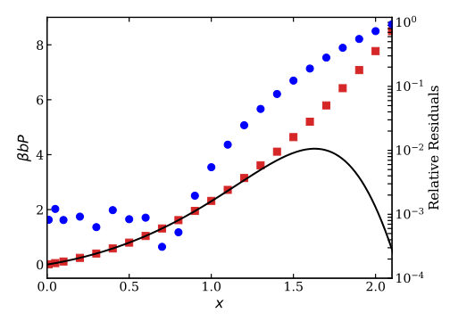 
FIG. 1. Comparison of the reduced pressure as a function of the di- mensionless variable x for the 2D UF model with p = 1, as obtained from the exact virial expansion truncated after eB1 10 using the coef- ficients listed in Table I (solid line) and from MD simulations (red squares). The relative residuals are shown as blue circles. The statis- tical uncertainty of the MD averages is smaller than the symbol size over the entire range of x.

📷 Fig 2

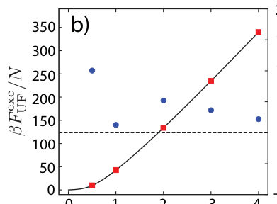 
FIG. 2. a) Convergence of nonequilibrium work estimator a a func- tion of the switching time ts for p = 70 and x = 0.4 b) Comparison of the excess Helmholtz free energy as a function of the dimension- less variable x for the 2D UF model with p = 70, obtained from the cubic-spline equation of state (solid line) and the NETI results (red squares). The relative residuals are shown as blue circles. The sta- tistical uncertainty of the NETI data is smaller than the symbol size over the entire range of x.

📷 Fig 3

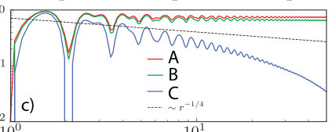 
FIG. 3. a) Scaled potential energy per particle, U∗≡UUF/(Np) (top), and global translational and bond-orientational order param- eters, ΨT and Ψ6 (bottom), as functions of the effective temperature T ∗≡1/p for x = 0.5. b) Static structure factors across the melt- ing transition at three representative values of p corresponding to the points labeled A, B, and C in the potential-energy plot in panel a). c) Bond-orientational correlation functions g6(r) corresponding to the points labeled A, B, and C in the potential-energy plot in panel a). The dashed line indicates the algebraic decay g6(r) ∼r−1/4 ex- pected at the hexatic–fluid transition according to KTHNY theory.

📷 Fig 4

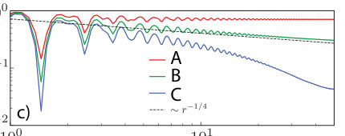 
FIG. 4. a) Scaled potential energy per particle, U∗≡UUF/(Np) (top), and global translational and bond-orientational order param- eters, ΨT and Ψ6 (bottom), as functions of the effective temperature T ∗≡1/p for x = 1.0. b) Static structure factors across the melt- ing transition at three representative values of p corresponding to the points labeled A, B, and C in the potential-energy plot in panel a). c) Bond-orientational correlation functions g6(r) corresponding to the points labeled A, B, and C in the potential-energy plot in panel a). The dashed line indicates the algebraic decay g6(r) ∼r−1/4 ex- pected at the hexatic–fluid transition according to KTHNY theory.

📷 Fig 5

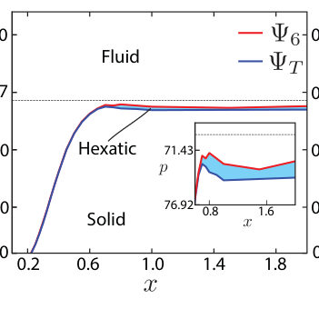 
FIG. 5. Phase diagram of the two-dimensional UF model. The solid blue and red lines depict the boundaries between the solid and hex- atic and between the hexatic and fluid phases, respectively. These were obtained by visually identifying the temperatures at which ΨT and Ψ6, respectively, undergo their rapid decrease, corroborated by the evolution of the static structure factor S(k). The shaded blue re- gion indicates the hexatic phase. The horizontal black dashed line corresponds to the scaling parameter p = 70 level. The inset shows an enlarged view of the hexatic phase region.

**Summary.** This paper establishes the 2D Uhlenbeck-Ford model as a robust and highly accurate reference fluid for calculating the thermodynamic properties of other two-dimensional fluids. By combining exact virial expansions with advanced free-energy techniques like Non-Equilibrium Thermodynamic Integration, the authors validate its use across various physical regimes.

**Why it may be interesting.** While focused on classical fluids, the rigorous application of advanced statistical mechanics techniques like NETI for free-energy calculations provides methodological insights applicable to determining equilibrium properties in complex quantum many-body systems where direct simulation is hard.

Detailed structure

**Main problem.** The study investigates using the Uhlenbeck-Ford (UF) model as a highly accurate reference system for calculating the free energy of two-dimensional (2D) fluids.

**Main result.** The 2D UF model was shown to be an excellent reference fluid, accurately predicting thermodynamic properties and remaining thermodynamically stable in the fluid phase up to significant scaling parameters ($p \lesssim 70$).

**Method.** The authors employed advanced statistical mechanics techniques including exact computation of virial coefficients (up to tenth order) and Non-Equilibrium Thermodynamic Integration (NETI).

**Model / system.** The system analyzed is the 2D Uhlenbeck-Ford (UF) model, characterized by a specific pair potential. The methodology involves constructing an equation of state and excess Helmholtz free energy using this reference fluid.

**Key observables.** Equation of State (EOS), excess Helmholtz free energy ($eta F_{exc}$), phase diagram boundaries, reduced pressure ($eta b P$), and structural order parameters ($\Psi_6$).

**Important parameters / regimes.** Dimensionless density variable ($x$) and the scaling parameter $p$, which dictates stability limits.

**Assumptions / limitations.** The primary approximations involve truncating the virial expansion (up to 10th order) and using NETI, whose errors are related to finite switching times.

**Figures summary.** Figure 1 compares reduced pressure vs. dimensionless variable $x$ for the 2D UF model, contrasting exact virial expansions with Molecular Dynamics simulation data.

**Paper structure.** The paper progresses by first establishing the accuracy of the UF model via high-order virial coefficient calculations and comparison to MD simulations. It then uses this reference system in thermodynamic integration methods (NETI) to calculate the free energy of a target fluid, validating its applicability against other theoretical models.

Abstract

We investigate the Uhlenbeck-Ford (UF) model as a reference system for free-energy calculations in two-dimensional (2D) fluids. The 2D virial coefficients are computed exactly up to tenth order and combined with molecular simulation data to construct highly accurate numerical representations of the equation of state and the excess Helmholtz free energy. We then determine the phase diagram of the model in order to establish the thermodynamic stability limits of the fluid phase and thereby identify the range of applicability of the UF model as a fluid reference system. In the course of this analysis, we identify the solid, hexatic, and fluid phases, and show that the fluid remains the only thermodynamically stable phase, independent of density, for scaling parameters up to $p\lesssim 70$. Finally, we demonstrate the practical applicability of the 2D UF model as a reference system through thermodynamic integration calculations of the free energy of a two-dimensional Lennard-Jones fluid.

[↑ back to top](#top)

### [On the two-copy distillability of Werner states and a new partial trace inequality](http://arxiv.org/abs/2607.24309v1)

**Authors:** Thomas C. Fraser, Felix Huber, Balázs Pozsgay, István Vona  
**Type:** theory · **Category:** quantum information and computing · **PDF:** <https://arxiv.org/pdf/2607.24309v1>  
**Analysis basis:** full PDF text, analyzed in chunks
**Topic relevance:** `entanglement & information structure` **3/5**

📷 Fig 1

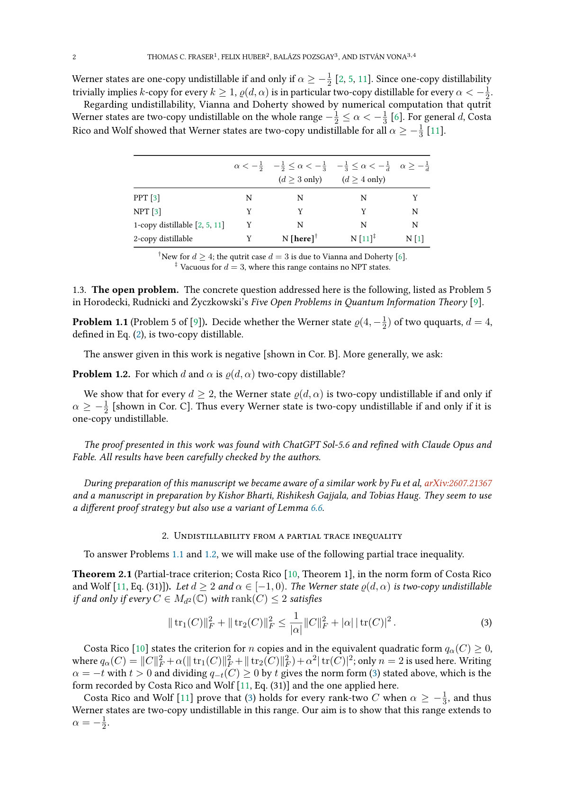 
Low-resolution page preview, page 2

📷 Fig 2

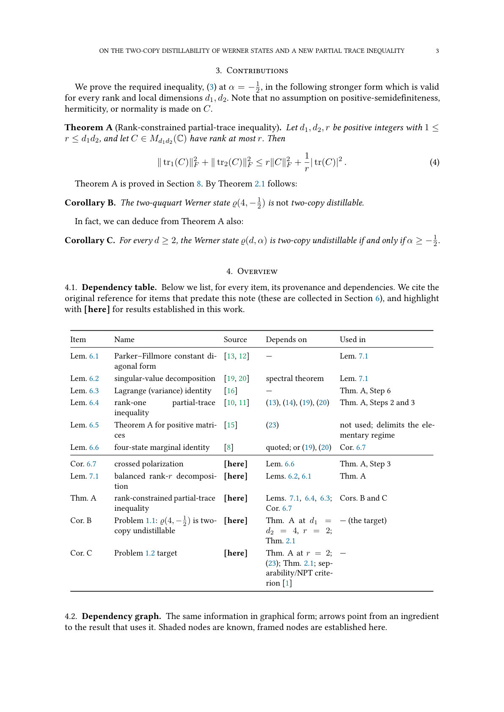 
Low-resolution page preview, page 3

📷 Fig 3

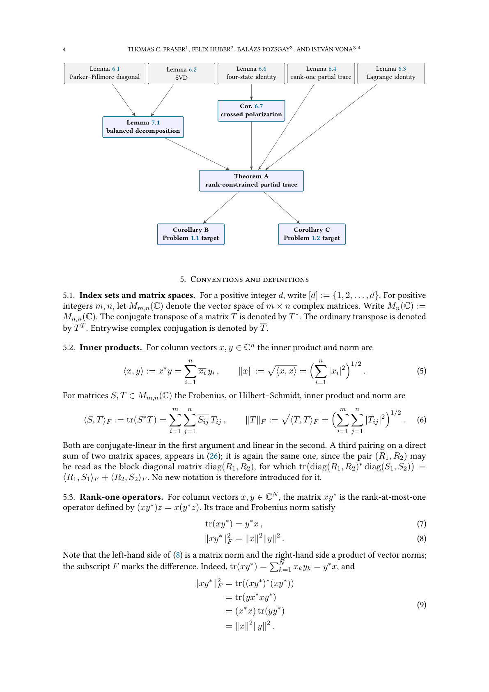 
Low-resolution page preview, page 4

📷 Fig 4

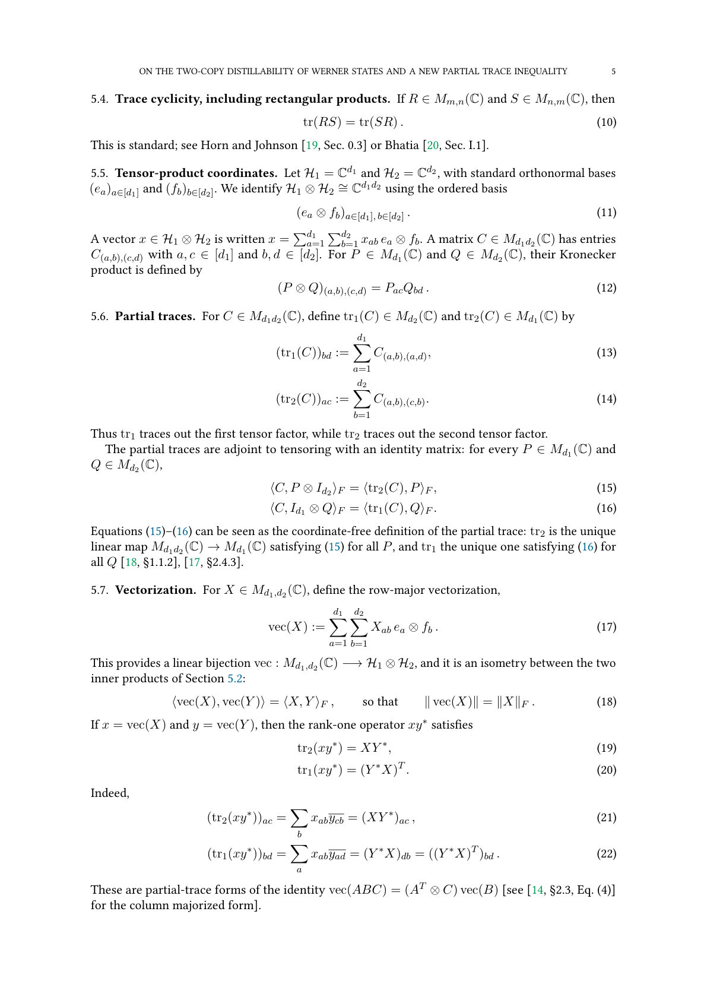 
Low-resolution page preview, page 5

📷 Fig 5

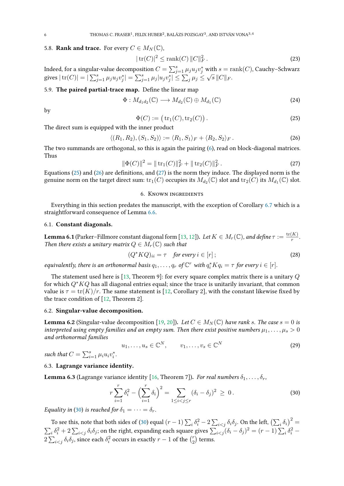 
Low-resolution page preview, page 6

**Summary.** The authors determine the two-copy distillability threshold for Werner states using a novel and strong partial trace inequality. They prove that $\varrho(4, -1/2)$ is undistillable and establish that this state family's one-copy and two-copy distillability regions coincide when $\alpha \ge -1/2$. This advances the understanding of entanglement measures in quantum information theory.

**Why it may be interesting.** This work provides a powerful, quantitative tool—the partial trace inequality—to characterize fundamental properties (like distillability) of quantum states, which has implications across quantum information theory.

Detailed structure

**Main problem.** The paper addresses the open question of determining the two-copy distillability of Werner states, specifically focusing on $\varrho(4, -1/2)$.

**Main result.** They prove that $\varrho(4, -1/2)$ is not two-copy distillable and establish a general criterion: $\varrho(d, \alpha)$ is undistillable if and only if $\alpha \ge -1/2$.

**Method.** The core method involves proving a strong partial trace inequality for matrices of low rank, which serves as a necessary condition for two-copy distillability.

**Model / system.** The analysis centers on the Werner state $\varrho(d, \alpha) = (I + \alpha F) / (d^2 + \alpha d)$, which is a bipartite quantum state acting on two $d$-dimensional systems.

**Key observables.** Two-copy distillability, partial trace norms ($\lVert 	ext{tr}_1(C) 
Vert_F$, $\lVert 	ext{tr}_2(C) 
Vert_F$), and the Frobenius norm of the matrix $C$.

**Important parameters / regimes.** The dimension $d$ of the subsystems, the parameter $\alpha$ defining the state, and the rank $r$ of the matrix $C$.

**Assumptions / limitations.** The results rely on proving a specific partial trace inequality for matrices whose rank is bounded by $r$, utilizing advanced linear algebra techniques like balanced decomposition.

**Paper structure.** The paper builds from establishing the general rank-constrained partial-trace inequality (Theorem A) using matrix decompositions, which then allows them to apply a known criterion to settle Problem 5 regarding $\varrho(4, -1/2)$ and generalize the result for all Werner states.

Abstract

Problem 5 in {\it Five Open Problems in Quantum Information Theory} [PRX Quantum 3, 010101 (2022)], asks whether the two-ququart Werner state $\varrho(4,-\tfrac12)$ is two-copy distillable, where $\varrho(d,α)=(I+αF)/(d^2+αd)$. We answer it in the negative. To this end, we show the following stronger statement: for all $C\in M_{d_1d_2}(\mathbb{C})$ of rank at most $r \le d_1 d_2$, $\mathrm{tr}_1(C)\|_F^2+\|\mathrm{tr}_2(C)\|_F^2 \le r\|C\|_F^2+\frac{1}{r}|\mathrm{tr}(C)|^2$. A result by Costa Rico on the equivalence of this inequality with two-copy undistillability at $r = 2$ then settles Problem 5: $\varrho(4,-\tfrac{1}{2})$ is not two-copy distillable. Furthermore, we show that $\varrho(d,α)$ is two-copy undistillable for every $d\ge2$, if and only if $α\ge-\tfrac{1}{2}$. Thus, the one and two-copy distillability regions of $\varrho(d,α)$ coincide. These results have been found and written up with AI tools, pointing towards a structural change affecting the field of quantum information and computation.

[↑ back to top](#top)

### [Quantum Speed Limits and the Ultimate Scaling of the Quantum Sensors](http://arxiv.org/abs/2607.23573v1)

**Authors:** Yusef Maleki  
**Type:** theory · **Category:** other · **PDF:** <https://arxiv.org/pdf/2607.23573v1>  
**Analysis basis:** full PDF text, analyzed in chunks
**Topic relevance:** `analog quantum simulation` **2/5** · `entanglement & information structure` **2/5** · `non-equilibrium dynamics` **2/5** · `quantum measurements` **2/5** · `Keldysh / 2PI / non-Gaussian methods` **1/5** · `Tavis-Cummings & cavity-many-emitter` **1/5** · `correlated cavity matter` **1/5** · `driven-dissipative phase transition` **1/5** · `methods for driven-dissipative` **1/5** · `non-equilibrium universality` **1/5**

📷 Fig 1

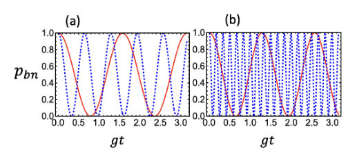 
FIG. 1. Probability of finding the atom in the ground state for the initial condition |b, n⟩with n = 4 in (a) and n = 6 in (b). The solid curves correspond to the single-photon process (m = 1), while the dotted curves correspond to the four-photon process (m = 4). The faster oscillations for larger m show that higher-order multipho- ton coupling drives the system through distinguishable states more rapidly. This increased dynamical speed corresponds to a larger quantum Fisher information for time estimation and therefore sup- ports the improved time-resolution scaling δt ∝1/Ωn−m,m.

**Summary.** This paper redefines the understanding of ultimate precision in quantum sensors by linking metrological bounds to fundamental quantum speed limits. It resolves apparent paradoxes in scaling laws—such as super-Heisenberg improvements—by providing a physically grounded resource accounting method. The framework successfully reconciles different scaling regimes using dynamical constraints derived from atomic/optical models.

**Why it may be interesting.** This work is highly relevant as it provides a rigorous theoretical framework connecting quantum dynamics (speed limits) directly to achievable measurement precision in atomic/optical systems, which is central to modern AMO research.

Detailed structure

**Main problem.** The paper aims to clarify the true scaling of precision limits (Heisenberg limit) in quantum metrology by grounding the analysis in physically derived resource accounting using quantum speed limits.

**Main result.** It shows that the Heisenberg limit is an information-theoretic manifestation of the quantum speed limit, and super-resolving protocols can be reconciled by identifying the generator norm as the relevant operational resource.

**Method.** The authors employ quantum speed limits (QSL) and relate metrological sensitivity to the Quantum Fisher Information (QFI), analyzing scaling laws for phase and time estimation in specific physical models.

**Model / system.** The analysis uses general quantum sensing protocols, focusing on a concrete example of Rabi oscillations in two-level atoms driven by an $m$-photon resonance. The dynamics are governed by Hamiltonians involving photon number operators ($a^\dagger^2 a^2$).

**Key observables.** Phase error ($\delta\varphi$), time error ($\delta t$), Quantum Fisher Information ($F_Q(t)$), and the expectation value of an observable $P$.

**Important parameters / regimes.** Average photon number ($n$), resonance order ($m$), and coupling constants ($\lambda$). Scaling regimes include $\delta\varphi \propto n^{-m/2}$ and $\delta\varphi \propto 1/n$.

**Assumptions / limitations.** The analysis relies on recasting metrological bounds through dynamical speed limits, assuming ideal coherent evolution for the derivation of fundamental scaling laws.

**Figures summary.** Figure 1 compares probability distributions ($p_{b n}(t)$) for different multiphoton coupling orders ($m=1$ vs $m=4$) in Rabi oscillations, illustrating faster dynamics for larger $m$.

**Paper structure.** The paper establishes the problem by contrasting apparent super-Heisenberg scaling with fundamental bounds. It then develops a framework using QSL and QFI to derive operational bounds, applying this to specific multiphoton resonance models before concluding on the resource identification.

Abstract

Quantum metrology promises sensitivity beyond classical strategies, yet it remains unsettled how quantum-enabled precision should scale with physical resources and how to interpret quantum advantage. We provide a physically grounded resource accounting that clarifies the true Heisenberg limit and resolves apparent super-Heisenberg paradoxes. We demonstrate that the Heisenberg limit is best viewed as an information-theoretic manifestation of the quantum speed limit. We illustrate these ideas with a simple, super-resolving phase-estimation protocol based on Rabi oscillations in two-level atoms driven on an $m$-photon resonance. In this setting, the phase error scales as $n^{-m/2}$, where $n$ is the average photon number. Recasting metrological sensitivity through quantum dynamical speed limits yields operational bounds that reconcile such super-resolution strategies with the standard Heisenberg interpretation and identify the relevant resources in the norm of the generator. We also revisit the common attribution of the NOON state's $1/n$ scaling to quantum entanglement. We show that such an attribution is not generic and the Heisenberg $1/n$ scaling does not, by itself, certify entanglement as the enabling resource.

[↑ back to top](#top)

### [Nested Integral Generator Theorem: From Operator Tautologies to Families of Exact Integral Identities](http://arxiv.org/abs/2607.23240v1)

**Authors:** Ghasem Asadi Cordshooli  
**Type:** theory · **Category:** quantum information and computing · **PDF:** <https://arxiv.org/pdf/2607.23240v1>  
**Analysis basis:** full PDF text, analyzed in chunks
**Topic relevance:** `Tavis-Cummings & cavity-many-emitter` **2/5** · `correlated cavity matter` **2/5** · `Keldysh / 2PI / non-Gaussian methods` **1/5** · `analog quantum simulation` **1/5** · `driven-dissipative phase transition` **1/5** · `methods for driven-dissipative` **1/5** · `non-equilibrium dynamics` **1/5**

📷 Fig 1

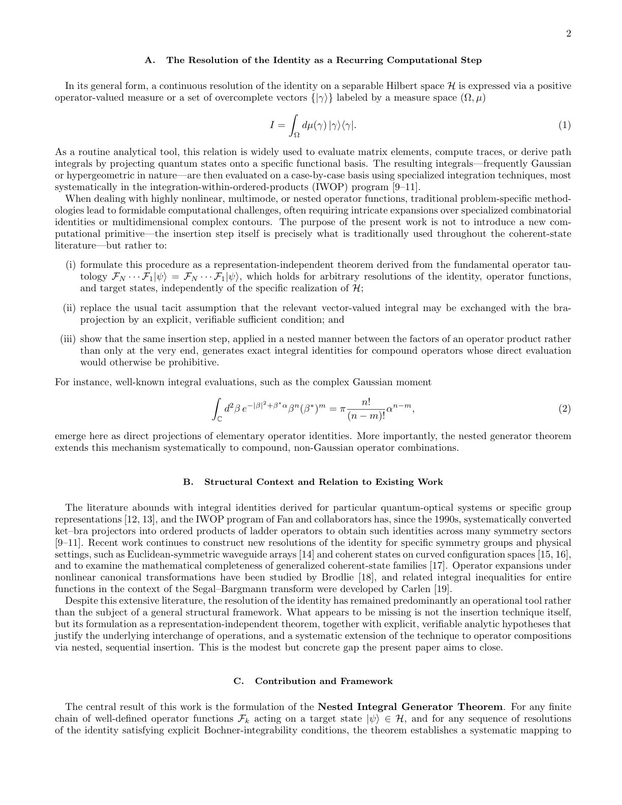 
Low-resolution page preview, page 2

📷 Fig 2

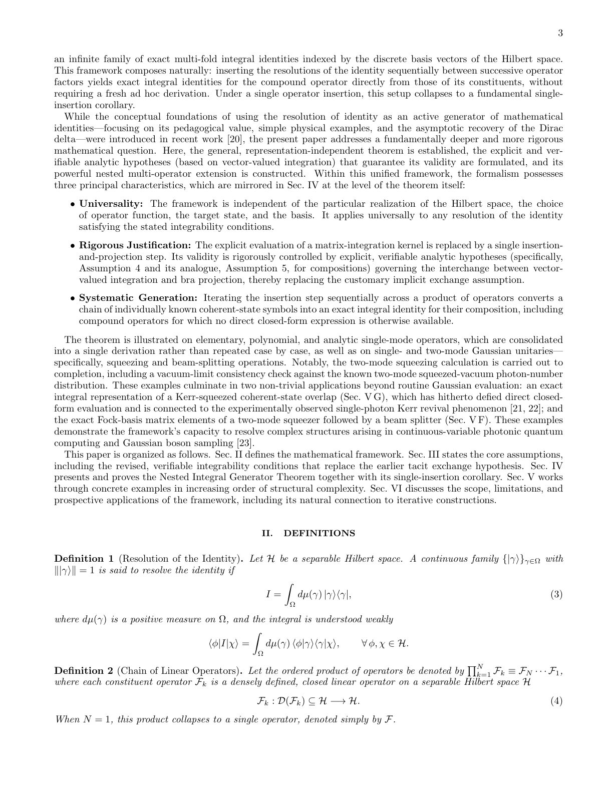 
Low-resolution page preview, page 3

📷 Fig 3

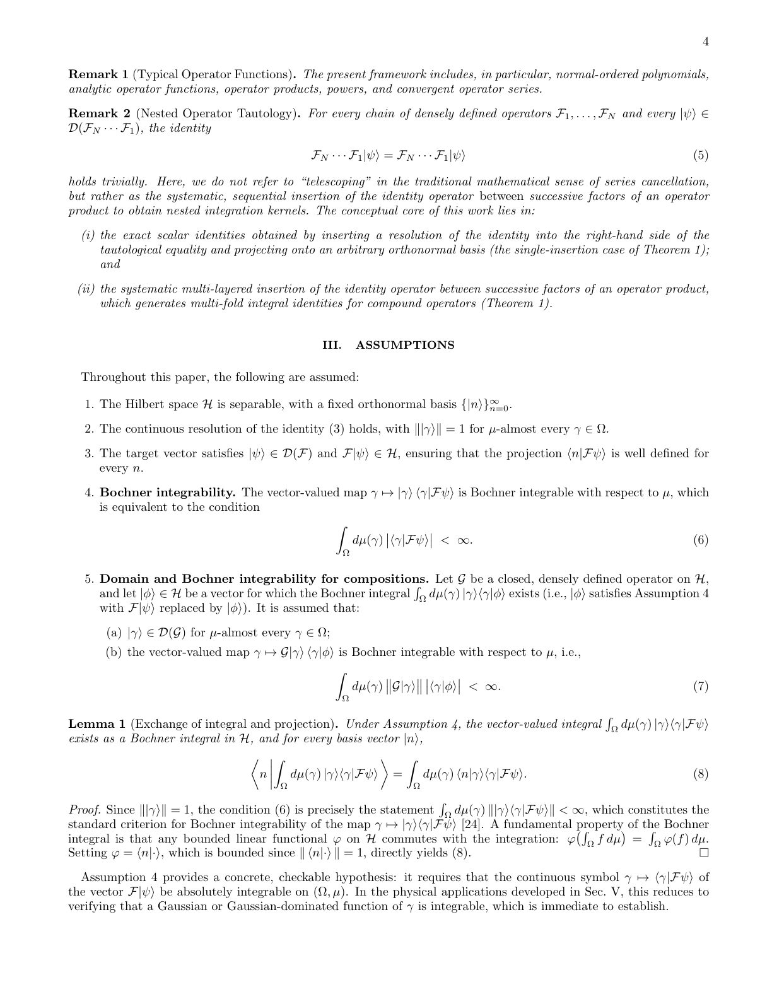 
Low-resolution page preview, page 4

📷 Fig 4

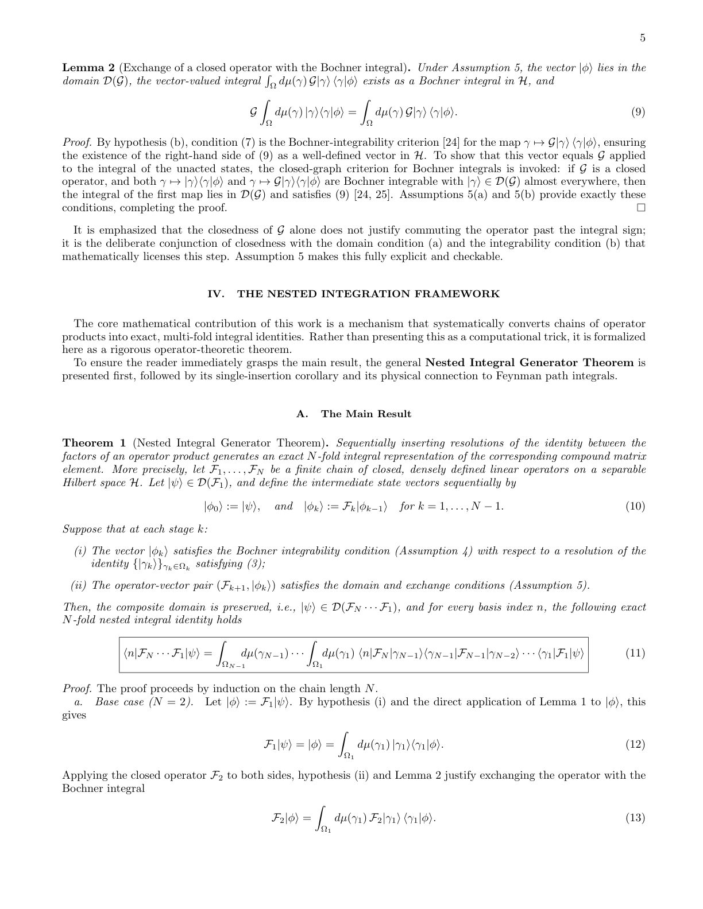 
Low-resolution page preview, page 5

📷 Fig 5

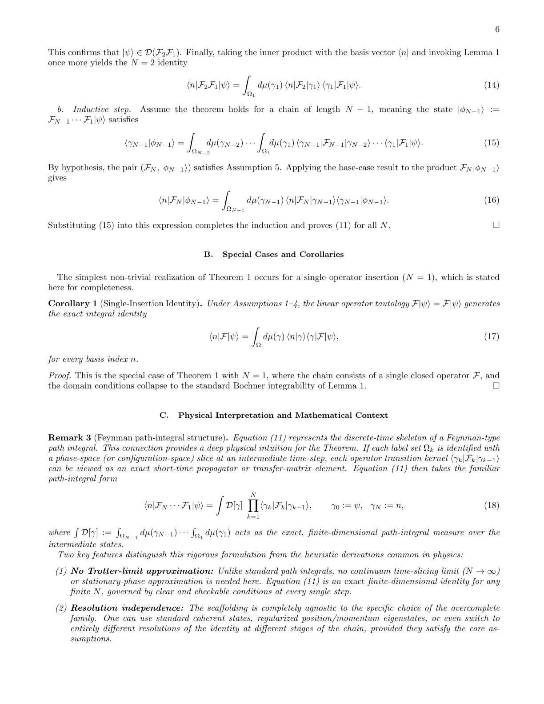 
Low-resolution page preview, page 6

**Summary.** This paper introduces the Nested Integral Generator Theorem, a rigorous mathematical framework to convert operator equalities into multi-fold exact integral identities. By systematically using resolutions of the identity, it provides universal tools to calculate matrix elements for complex systems in continuous-variable quantum optics, such as those involving squeezing and nonlinear Kerr interactions.

**Why it may be interesting.** It provides a powerful, systematic tool that replaces potentially intractable direct calculation or approximation methods (like Trotter expansions) with exact integral formulas for complex quantum optical processes.

Detailed structure

**Main problem.** To establish a rigorous, representation-independent mathematical framework for calculating complex operator compositions by systematically converting them into exact multi-fold integral identities.

**Main result.** The Nested Integral Generator Theorem provides an exact $N$-fold nested integral representation for matrix elements involving chains of operators, applicable to various quantum systems.

**Method.** The core method involves starting from operator tautologies and iteratively inserting continuous resolutions of the identity, utilizing vector-valued integration theory to rigorously justify the interchange of inner products with Bochner integrals.

**Model / system.** The framework is applied to continuous-variable bosonic systems, including single-mode operators, two-mode Gaussian unitaries (squeezing, beam splitting), and nonlinear interactions like the Kerr effect. It provides exact calculations for matrix elements $\langle n| \mathcal{O} | \alpha, \lambda 
angle$.

**Key observables.** Exact integral representations of operator functions, such as the overlap between a Kerr-squeezed coherent state and Fock states, and two-mode Gaussian network matrix elements.

**Important parameters / regimes.** Squeezing parameters ($\zeta$), beam-splitter angles ($\varphi$), Kerr nonlinearity strength ($\chi$), and photon number ($n, m$).

**Assumptions / limitations.** The primary assumptions involve the existence of a continuous resolution of the identity and meeting verifiable sufficient conditions (Bochner integrability) to interchange integration and projection operators.

**Figures summary.** Not specified in detail, but the notes reference specific equations (e.g., Eq. 18 for path integral analogy, Eq. 48 for compound network result, Eq. 53 for Kerr overlap).

**Paper structure.** The paper builds from general operator tautologies to the Nested Integral Generator Theorem (Theorem 1), providing specific applications to Gaussian unitaries and nonlinear systems, culminating in explicit matrix element calculations.

Abstract

Inserting resolutions of the identity is a standard technique for representing states and operators throughout quantum theory, quantum field theory, and related areas of mathematical physics. This paper elevates this procedure to a rigorous, representation-independent framework through the Nested Integral Generator Theorem. Starting from operator tautologies, the theorem systematically generates exact multi-fold integral identities by successive insertions of continuous resolutions of the identity followed by projection onto arbitrary orthonormal basis vectors. The resulting construction applies to arbitrary finite compositions of closed operators acting on arbitrary target states and establishes a general mapping from operator equalities to families of exact integral identities. Using the theory of vector-valued integration, explicit and verifiable sufficient conditions are derived under which inner products may be interchanged rigorously with Bochner integrals, thereby placing a step that is often left implicit in the physics literature on a firm mathematical foundation. As an immediate consequence, the theorem yields exact integral representations for individual operator functions. Its scope is illustrated through elementary, polynomial, and analytic single-mode operators, as well as single- and two-mode Gaussian unitaries, including squeezing and beam splitting. The framework is further applied to two nontrivial examples beyond standard Gaussian calculations: an exact integral representation of a Kerr-squeezed coherent-state overlap and exact Fock-basis matrix elements for a composite two-mode Gaussian network expressed in terms of bivariate Hermite polynomials.

[↑ back to top](#top)

### [Finite-Precision Algebraic Quantum Field Theory](http://arxiv.org/abs/2607.24445v1)

**Authors:** Abbas Edalat  
**Type:** theory · **Category:** other · **PDF:** <https://arxiv.org/pdf/2607.24445v1>  
**Analysis basis:** full PDF text, analyzed in chunks
**Topic relevance:** `measurement-induced transitions` **2/5** · `quantum measurements` **2/5** · `Keldysh / 2PI / non-Gaussian methods` **1/5** · `correlated / nonlocal dissipation` **1/5** · `driven-dissipative phase transition` **1/5** · `entanglement & information structure` **1/5**

📷 Fig 1

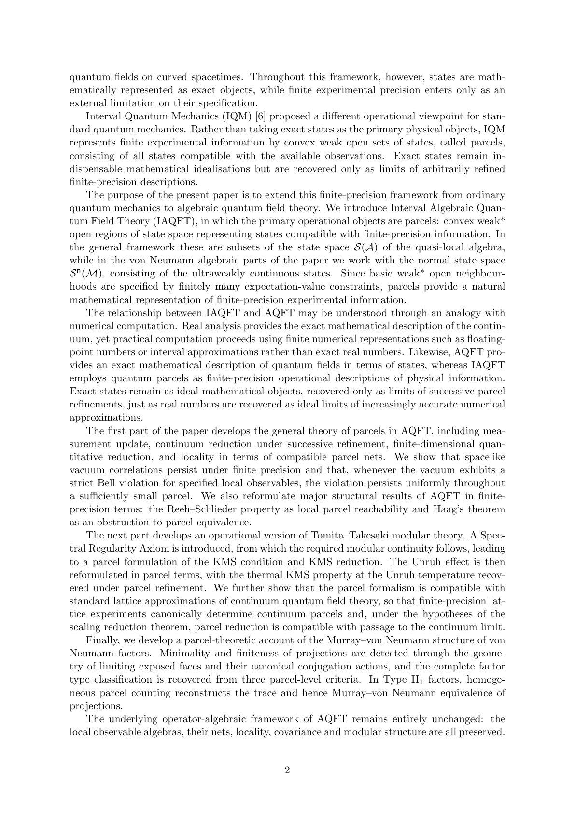 
Low-resolution page preview, page 2

📷 Fig 2

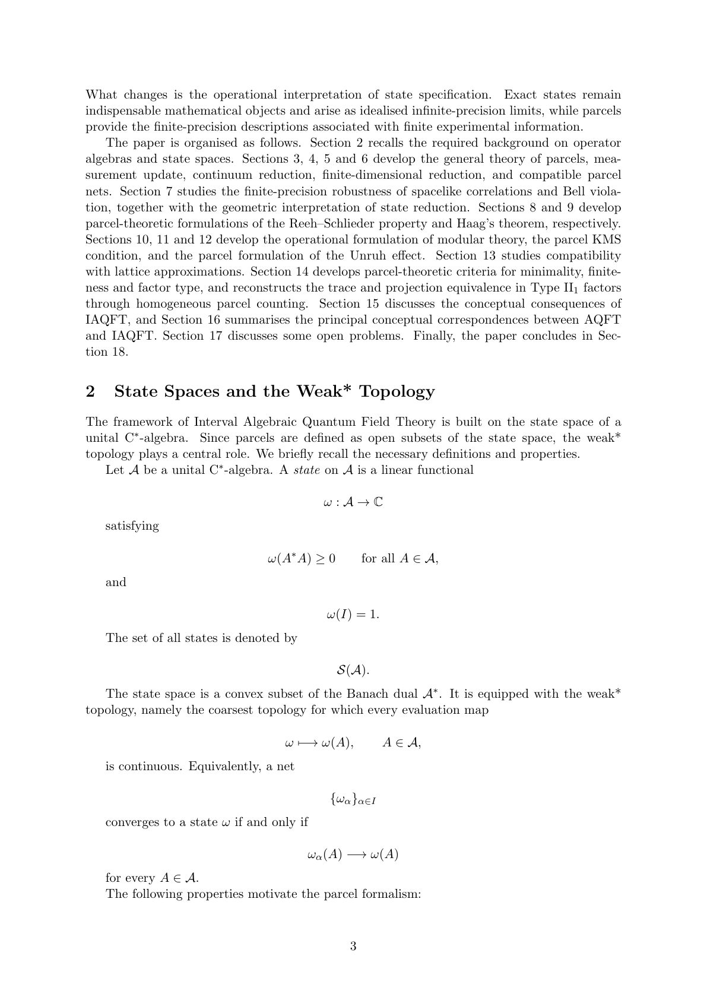 
Low-resolution page preview, page 3

📷 Fig 3

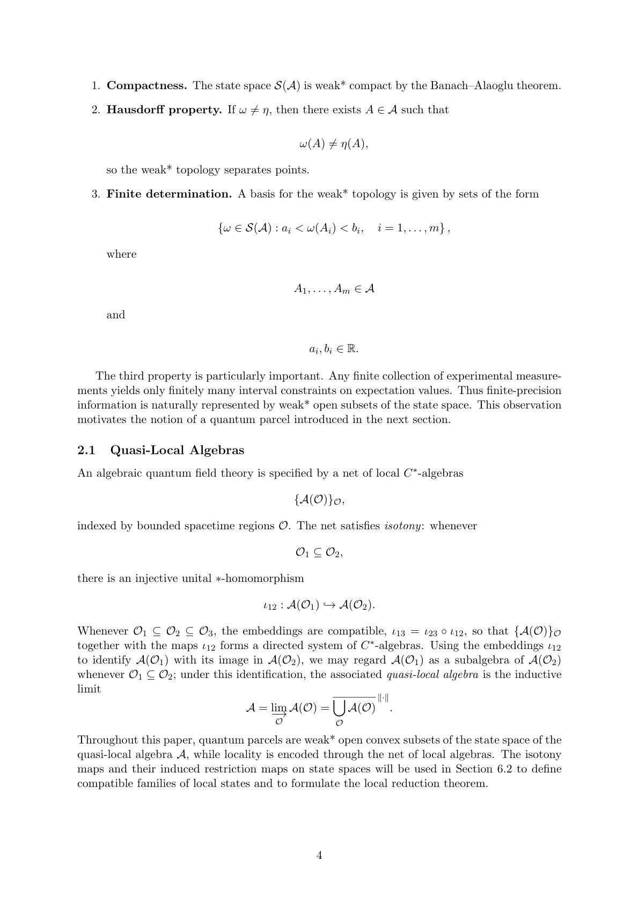 
Low-resolution page preview, page 4

📷 Fig 4

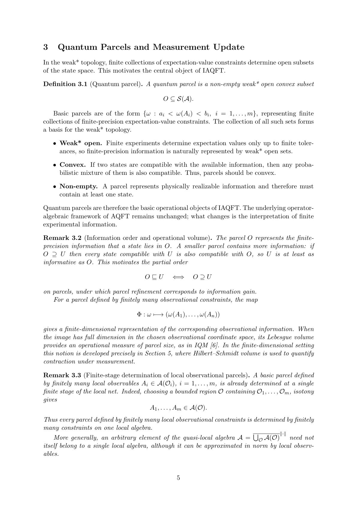 
Low-resolution page preview, page 5

📷 Fig 5

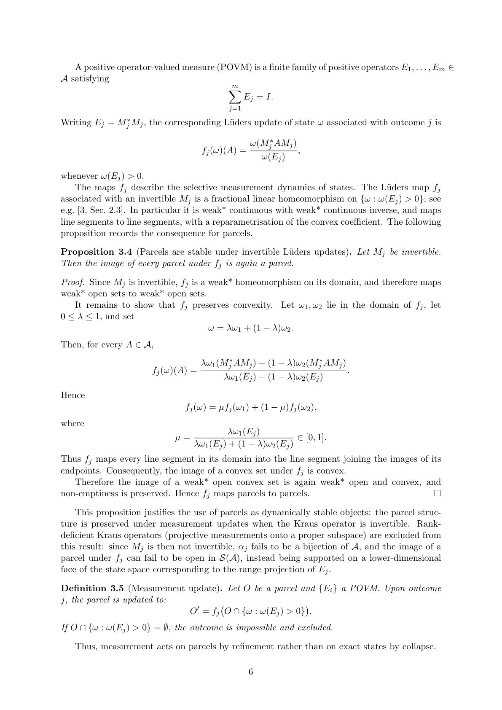 
Low-resolution page preview, page 6

**Summary.** This paper develops Interval Algebraic Quantum Field Theory (IAQFT) by replacing exact mathematical states with 'quantum parcels,' which represent finite-precision information from local measurements. It successfully reformulates core concepts of relativistic quantum theory—such as modular structure and vacuum correlations—within this operational, finite-precision framework. This provides a unified theoretical tool for modeling QFT under realistic measurement constraints.

**Why it may be interesting.** For a theoretical physicist working on open quantum systems or many-body dynamics, IAQFT offers a formal way to incorporate inherent measurement limitations and computational constraints directly into the fundamental structure of QFT, moving beyond idealized continuous mathematics.

Detailed structure

**Main problem.** The central problem is extending Algebraic Quantum Field Theory (AQFT) from exact mathematical descriptions to a rigorous framework capable of handling finite-precision information derived from physical measurements.

**Main result.** The authors introduce Interval AQFT (IAQFT), which successfully recasts major structural features of relativistic quantum theory—including modular theory and the Unruh effect—into terms involving 'quantum parcels' that encode finite precision.

**Method.** The methodology involves replacing exact states with weak* open convex regions called 'quantum parcels,' developing procedures for parcel reduction, and establishing connections between these operational objects and deep mathematical structures of operator algebras.

**Model / system.** The theory applies to relativistic quantum field theory, formulated using the algebraic approach (AQFT) based on a net of local $C^*$-algebras indexed by spacetime regions. The core mathematical machinery involves analyzing state spaces under the weak* topology.

**Key observables.** Spacelike vacuum correlations, Bell violations, and structural properties like the Reeh–Schlieder property are key diagnostics that must persist under finite precision.

**Important parameters / regimes.** The framework is defined by the geometry of quantum parcels (weak* open convex regions) and their evolution via measurement updates or refinement processes.

**Assumptions / limitations.** The theory assumes that exact states remain as indispensable ideal limits, recovered only through increasingly refined sequences of finite-precision parcels. The structure relies heavily on the weak* topology and its finite determination property.

**Paper structure.** The paper builds by first defining quantum parcels to replace exact states in AQFT. It then develops operational procedures like parcel reduction and measurement updates, showing how these preserve key physical features (like vacuum correlations). Finally, it connects this finite-precision framework to deep mathematical results concerning the classification of von Neumann factors.

Abstract

Recent work introduced Interval Quantum Mechanics (IQM), a finite-precision framework in which physical information is represented by sets of possible states rather than exact states. We extend this approach to algebraic quantum field theory (AQFT) by introducing Interval Algebraic Quantum Field Theory (IAQFT), whose basic objects are quantum parcels: weak* open convex regions of state space encoding finite-precision information obtained from finitely many local observations.   We develop parcel reduction and measurement update, establish finite-dimensional information-contraction results, and formulate locality through compatible parcel nets. Major structural features of AQFT are recast in parcel-theoretic terms, including the Reeh--Schlieder property, Haag's theorem, modular theory, the KMS condition, and the Unruh effect. We show that spacelike vacuum correlations and strict Bell violations persist under finite precision, and that lattice approximations are compatible with the parcel framework. Finally, we recover the Murray--von Neumann classification of factors together with the trace and projection equivalence in Type~$\mathrm{II}_1$ factors from the geometry of limiting parcels. IAQFT thus provides a unified finite-precision formulation of the operational, modular, and operator-algebraic structures of relativistic quantum theory.

[↑ back to top](#top)

### [Optimal Dynamic Cooling of Multiple Qubits](http://arxiv.org/abs/2607.23641v1)

**Authors:** Mattia Reda, Massimiliano Sacchi, Chiara Macchiavello, Giacomo Guarnieri  
**Type:** theory · **Category:** statistical mechanics · **PDF:** <https://arxiv.org/pdf/2607.23641v1>  
**Analysis basis:** full PDF text, analyzed in chunks
**Topic relevance:** `non-equilibrium dynamics` **2/5** · `analog quantum simulation` **1/5** · `correlated / nonlocal dissipation` **1/5** · `driven-dissipative phase transition` **1/5** · `entanglement & information structure` **1/5** · `methods for driven-dissipative` **1/5** · `non-equilibrium universality` **1/5**

📷 Fig 1

 
FIG. 1: Dynamic cooling of 𝑀target qubits. A global unitary 𝑈acts on 𝑁identical qubits initially at temperature 𝑇, cooling the targets to a common temperature 𝑇′ while transferring entropy and energy to the remaining 𝑁−𝑀ancillary qubits.

📷 Fig 2

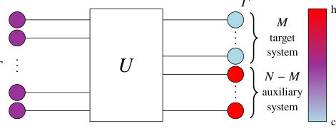 
Figure 1 summarizes the setting: a global unitary redis- tributes energy and entropy between the 𝑀targets and the re- maining 𝑁−𝑀qubits. We now formulate the corresponding spectral optimization. Consider 𝑁identical, noninteracting qubits with single-qubit Hamiltonian

📷 Fig 3

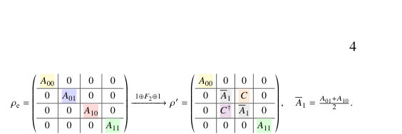 
FIG. 2: Complex-Hadamard correction for two targets. The unitary 𝑈sym = 1 ⊕𝐹2 ⊕1 acts only on the target-weight-one subspace span{|01⟩, |10⟩}. It replaces the two diagonal ancillary blocks by their average and may create the coherence block 𝐶, while preserving every sector probability and the total energy.

📷 Fig 4

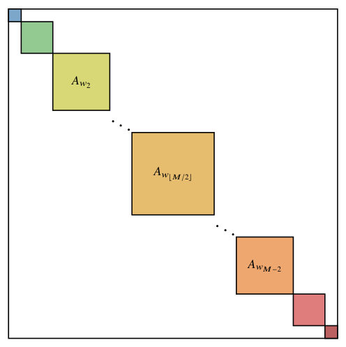 
FIG. 3: Block structure induced by target Hamming weight. Sector 𝑤contains 𝑀 𝑤  target strings, each labeling an ancillary block of dimension 2𝑁−𝑀. The passive rearrangement fills these sectors in increasing 𝑤.

📷 Fig 5

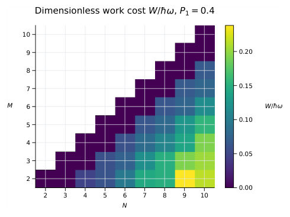 
FIG. 5: Minimum permutation work 𝑊min perm/ℏ𝜔for 2 ≤𝑀≤𝑁≤10 at 𝑃1 = 0.4. The smaller spectral bias near 𝑃1 = 1/2 reduces the work required by the passive rearrangement.

**Summary.** This paper develops a comprehensive theory for optimally cooling multiple qubits by treating the system as a single closed unit. It proves that a global unitary transformation achieves the lowest possible target temperature, outperforming parallel cooling strategies. The methodology involves spectral analysis and combinatorial constraints to determine when simpler, permutation-based protocols can match this theoretical optimum.

**Why it may be interesting.** This work provides rigorous theoretical tools to analyze resource optimization in quantum thermodynamics, specifically quantifying how collective coupling (global unitary) improves energy extraction compared to independent local operations, which is highly relevant for designing efficient quantum refrigerators or thermalization protocols.

Detailed structure

**Main problem.** The paper addresses the closed-system problem of optimally cooling $M$ target qubits selected from a larger pool of $N$ identical thermal qubits to achieve the lowest common local temperature allowed by unitarity.

**Main result.** A universal optimal protocol exists that achieves the minimum possible mean target energy, and this global strategy strictly outperforms parallel single-target cooling methods. The analysis also provides exact criteria for when simpler permutation-only protocols suffice.

**Method.** The authors combine spectral analysis of the initial state with optimization techniques to derive an optimal unitary transformation ($U_*$) composed of a passive rearrangement and a complex-Hadamard correction. They use graph theory concepts (hypergraph coloring) to analyze feasibility conditions for permutations.

**Model / system.** The system consists of $N$ identical, noninteracting qubits initially prepared in a Gibbs state $
ho(eta)$. The cooling process is modeled as the evolution under a global unitary transformation acting on this register.

**Key observables.** Local target temperature, mean target energy ($p_\star(P_1)$), and the cooling curve depth ($\xi_M^\star$).

**Important parameters / regimes.** $N$ (total qubits), $M$ (target qubits), initial inverse temperature $eta$, and the ratio of global vs. parallel cooling performance.

**Assumptions / limitations.** The analysis assumes the system remains closed, and while a complex-Hadamard correction is optimal, alternative permutation realizations are analyzed for implementation simplicity.

**Figures summary.** Figures illustrate dynamic cooling protocols using global unitaries on $N$ qubits to cool $M$ targets; they also show resource allocation diagrams comparing global vs. parallel target populations for specific $(N, M)$ pairs.

**Paper structure.** The paper first establishes the optimal protocol via two steps (passive rearrangement and Hadamard correction). It then derives necessary and sufficient arithmetic criteria for achieving this optimum using only permutations, classifying feasibility islands. Finally, it provides quantitative bounds on the achievable cooling depth by comparing global vs. parallel strategies.

Abstract

We solve the closed-system problem of cooling $M$ qubits, selected from $N$ identical thermal qubits, to the lowest common local temperature allowed by unitarity. The optimal protocol consists of two conceptually distinct steps. First, a passive rearrangement assigns the largest eigenvalues of the initial state to target sectors of lowest Hamming weight, thereby minimizing the total target energy. Second, a target-only complex-Hadamard transformation within each fixed-Hamming-weight subspace equalizes the one-qubit target marginals without changing any target-sector probability or the total energy. Consequently, imposing a common local temperature costs neither cooling depth nor additional work: the constrained optimum coincides with the unconstrained passive minimum for every $N>M$ and every initial temperature. The complex-Hadamard correction may nevertheless be costly at the circuit level. We therefore derive an exact arithmetic criterion for when the same optimum can be attained by a temperature-independent computational-basis permutation alone, and exhaustively classify the resulting finite-size islands of feasibility for $M+2\leq N\leq 128$. At isolated temperatures, further optimal permutations can arise through numerical cancellations between different thermal eigenvalue shells. These alternative realizations may reduce implementation complexity, but they cannot improve the cooling curve already attained by the universal protocol. We also derive the exact cooling curve, prove that at least two ancillary qubits are necessary and sufficient for nontrivial cooling, and show that joint many-target cooling can strictly outperform parallel single-target strategies.

[↑ back to top](#top)

### [Bias-preserving cat-cat CNOT gate via vacuum-conditional beam-splitter](http://arxiv.org/abs/2607.22852v1)

**Authors:** Yufeng, Ye, Connor T. Hann, Kyungjoo Noh, Harald Putterman, Ron Belyansky, Arne L. Grimsmo, Oskar Painter  
**Type:** theory · **Category:** quantum information and computing · **PDF:** <https://arxiv.org/pdf/2607.22852v1>  
**Analysis basis:** full PDF text, analyzed in chunks
**Topic relevance:** `QC/QI experiment` **2/5** · `correlated / nonlocal dissipation` **1/5** · `correlated cavity matter` **1/5** · `driven-dissipative phase transition` **1/5** · `methods for driven-dissipative` **1/5** · `quantum optics experiment` **1/5**

📷 Fig 1

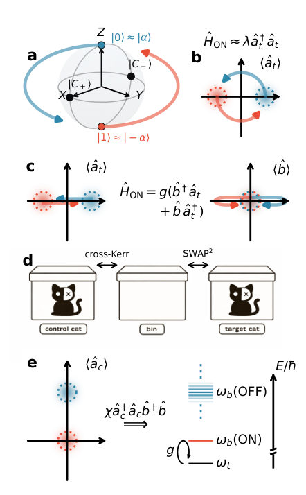 
Figure 1. Conditional SWAP2 realizes bias-preserving cat- cat CNOT. (a) Bloch sphere of the cat qubit. To remain bias-preserving, an X gate must leave the two-dimensional code space — its trajectory (colored arcs) exits the Bloch- sphere surface into the larger oscillator Hilbert space, rather than crossing the unprotected equator on the surface. (b) Ex- isting X gates rotate the cat in phase space via a frequency shift Hamiltonian λˆa†ˆa. (c) Proposed X gate SWAPs the cat (target mode ˆat) in and out of an auxiliary bin mode (ˆb) via a beam-splitter Hamiltonian g(ˆb†ˆat + ˆb ˆa† t), complet- ing a SWAP2 geometric phase gate (Sec. S-I E of [34]). (d) Schematic of the proposed CNOT gate: A...

📷 Fig 2

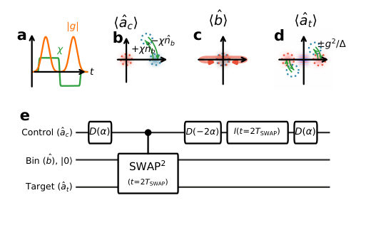 
Figure 2. Echo techniques for gate error suppression. (a) χ- echo pulse sequence: The cross-Kerr coupling χ (green) flips sign at the gate midpoint while two π/2 beam-splitter pulses |g| (orange) execute the conditional SWAP2. (b)–(d) Phase- space diagrams for the control, bin, and target modes. In (b), the OFF-state control |2αc⟩acquires a cross-Kerr phase ±χˆnb that is refocused by the χ-echo. In (c), the χ-echo is invisible to the ON branch (control in vacuum has no cross-Kerr shift); the bin still returns to vacuum after the complete SWAP2 cy- cle. In (d), the target cat acquires a g2/ ¯∆AC Stark phase in the OFF branch, which is also refocused by the χ-echo. (e) Full gate protocol with...

📷 Fig 3

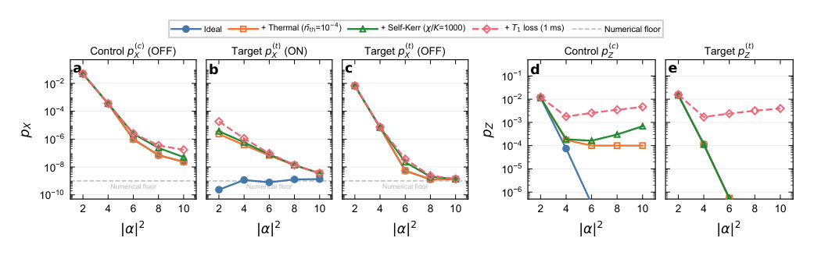 
Figure 3. VCB gate performance. Each panel tracks one error channel versus |α|2 (= |αc|2 = |αt|2): (a) control OFF bit-flip, (b) target ON bit-flip, (c) target OFF bit-flip, (d) control phase-flip, and (e) target phase-flip. Successive curves cumulatively add imperfections. Blue: Ideal Hamiltonian (cross-Kerr + beam-splitter + χ-echo + DRAG, vacuum initial states). Orange: Adds thermal population (¯nth = 10−4) to both control and bin (negligible for target). Green: Adds self-Kerr on all three modes (Ka = Kb = Kt = χ/1000) with displacement echo on the control phase-flip channel. Red dashed: Adds single-photon loss (T1 = 1 ms) analytically—target phase-flip via (1 −e−2¯nTCX/T1)/2, control...

📷 Fig 4

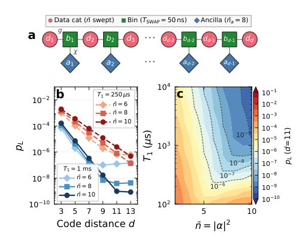 
Figure 4. Repetition code performance with the VCB gate (elementary SWAP duration TSWAP = 50 ns). (a) Physical layout: data cats (green), ancilla cats (blue), and a single shared bin mode (pink diamond) per ancilla in a linear chain. (b) Logical error per syndrome cycle versus code distance d for ¯n = 6, 8, and 10 at T1 = 1 ms (solid) and T1 = 250 µs (dashed). (c) Logical error per cycle at d = 11 as a function of ¯n and T1. Parameters: χ/2π = 4 MHz, σ = 0.22, ¯nth = 10−4, ¯na = 8. See Sec. S-XII of [34] for pulse-shaping details.

**Summary.** The paper presents a novel, unitary scheme to implement bias-preserving CNOT and Toffoli gates on cat qubits. By leveraging vacuum-conditional interactions mediated by cross-Kerr nonlinearities, the authors overcome limitations associated with dissipation-based gate schemes. This breakthrough enables fault-tolerant quantum computation by maintaining exponential suppression of bit-flip errors.

**Why it may be interesting.** This work is highly relevant as it tackles fundamental resource limitations in superconducting quantum computing platforms by providing a theoretically robust method for implementing multi-qubit gates while maintaining crucial noise protection mechanisms.

Detailed structure

**Main problem.** The core challenge is implementing logical quantum gates, specifically CNOT and Toffoli, on cat qubits while preserving the inherent exponential suppression of bit-flip errors (noise bias). Existing methods often rely on engineered dissipation, which introduces limitations.

**Main result.** The authors propose a unitary, vacuum-conditional gate scheme that successfully preserves the noise bias for both CNOT and extends it to a universal Toffoli gate. This allows for logical memory with error rates below $10^{-6}$ using repetition codes.

**Method.** The gates are realized using controlled interactions involving cross-Kerr nonlinearities ($\chi$) and beam-splitter drives ($g$). Error suppression is achieved through echo sequences (e.g., displacement echoes) to mitigate coherent phase-flip errors.

**Model / system.** The system utilizes cat qubits, which are stabilized by engineered two-photon loss. The gate mechanism involves coupling the control, target, and an auxiliary 'bin' mode via these nonlinear interactions.

**Key observables.** Bit-flip error probabilities ($p_X$) and phase-flip error probabilities ($p_Z$); logical error rates ($	ext{error} < 10^{-6}$).

**Important parameters / regimes.** Cat size parameter $|\alpha|^2$, interaction strengths ($\chi, g$), and the coherence time $T_1 = 1 	ext{ ms}$.

**Assumptions / limitations.** Assumes good component lifetimes and precise nonlinearity engineering; the gate speed is limited by coupling strengths rather than dissipation rates.

**Figures summary.** Figures illustrate the Bloch sphere representation of X gates, the schematic setup using cross-Kerr/beam-splitter interactions for CNOT, and phase-space diagrams detailing echo sequences used for error suppression.

**Paper structure.** The paper first introduces the bias problem in cat qubits. It details the unitary CNOT gate mechanism (Chunk 1), followed by a rigorous analysis of error channels using echo techniques (Chunk 2). Finally, it extends this methodology to implement the universal Toffoli ($	ext{CCX}$) gate (Chunk 3).

Abstract

Cat qubits can exhibit strong noise bias due to their exponentially enhanced bit-flip times and only polynomially reduced phase-flip times with increasing photon number, which makes them attractive candidates for hardware-efficient quantum error correction. However, it is difficult to maintain this strong noise bias in logical operations such as CNOT gates between cats. Here, we propose a coherent CNOT gate scheme between two dissipative cats that preserves the exponential noise bias. The proposed gate relies only on unitary operations, which avoids the non-idealities associated with many existing gate schemes that rely on engineered dissipations. Assuming good component lifetimes and precise nonlinearity engineering, the proposed gate can enable logical memory in the megaquop regime (logical error rates < 10^-6) with a distance-7 repetition code consisting of 13 cat qubits.

[↑ back to top](#top)

### [A Probabilistic Representation for Multi-State Discrete-time Quantum Walks](http://arxiv.org/abs/2607.23569v1)

**Authors:** Hoang Vu  
**Type:** theory · **Category:** other · **PDF:** <https://arxiv.org/pdf/2607.23569v1>  
**Analysis basis:** full PDF text, analyzed in chunks
**Topic relevance:** `non-equilibrium dynamics` **2/5** · `Keldysh / 2PI / non-Gaussian methods` **1/5** · `analog quantum simulation` **1/5** · `driven-dissipative phase transition` **1/5** · `methods for driven-dissipative` **1/5**

📷 Fig 1

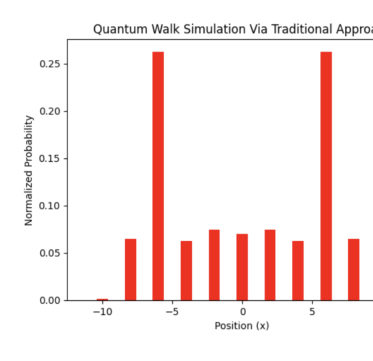 
Fig. 1. The Hadamard walk’s probability distribution for n = 10, α = 1 √

📷 Fig 2

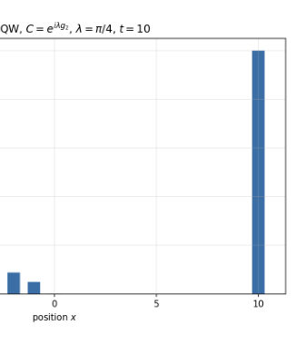 
Fig. 2. The three-state quantum walk’s probability distribution with the coin C = eiλg2 for n = 10, α = 1 √

📷 Fig 3

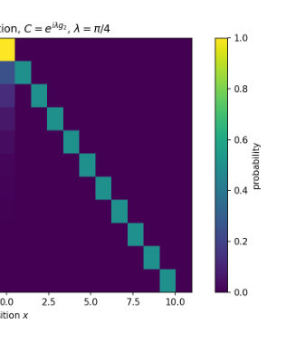 
Fig. 3. The three-state quantum walk’s spacetime behavior with the coin C = eiλg2 for n = 10, α = 1 √

📷 Fig 4

 
Figure 2 and 3 show the distribution of the walk via unitary evolution and its spacetime behavior.

📷 Fig 5

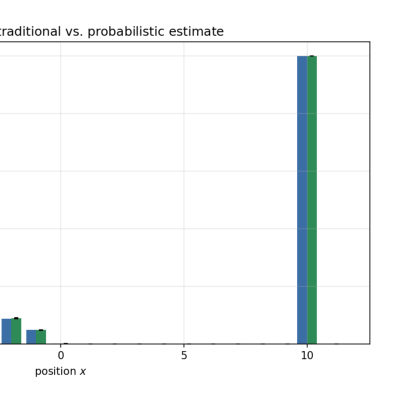 
Fig. 4. The three-state quantum walk’s probability distribution with the coin C = eiλg2 for n = 10, α = 1 √

**Summary.** This paper develops a novel probabilistic framework to simulate multi-state discrete-time quantum walks. By mapping the quantum evolution onto classical stochastic processes driven by Poisson variables, the authors rigorously prove that these walks converge in the continuum limit to solutions of coupled Dirac partial differential equations. This offers a scalable theoretical alternative for analyzing complex quantum dynamics using classical methods.

**Why it may be interesting.** This work provides a powerful, non-unitary classical tool (stochastic processes) to analyze complex quantum dynamics, offering potential computational advantages for simulating higher-dimensional or multi-state quantum systems where direct unitary simulation is hard.

Detailed structure

**Main problem.** The core problem is constructing a rigorous probabilistic representation for multi-state discrete-time quantum walks (QWs) on lattices.

**Main result.** The authors successfully demonstrate that this classical stochastic process converges to the continuum solution of coupled linear Dirac partial differential equations in the limit.

**Method.** They derive the probabilistic formulation by mapping the unitary quantum evolution onto a system driven by independent Poisson random variables, followed by a continuous rescaling limit.

**Model / system.** The model is a multi-state discrete-time Quantum Walk on an integer lattice, generalized from two to three states using Gell-Mann matrices for the coin operator. The dynamics are governed by unitary evolution operators.

**Key observables.** Probability amplitudes ($\alpha, eta, \gamma$) and the limiting probability density function $\Psi(t, z, y)$ that solves the Dirac PDEs.

**Important parameters / regimes.** The number of states (3), the coin matrix $C$ (e.g., $e^{i\lambda g_k}$), and the continuum limit parameter ($\epsilon 	o 0$).

**Assumptions / limitations.** The analysis relies on establishing weak convergence using Poisson processes to bridge the gap between discrete quantum evolution and continuous PDE solutions.

**Figures summary.** Figures compare simulation results for various coins (Hadamard, Grover) showing both unitary evolution benchmarks against the derived probabilistic representation in spacetime plots.

**Paper structure.** The paper progresses from reviewing the two-state case to extending the construction using Gell-Mann matrices for three states. It then rigorously derives the Poisson process formulation and finally establishes the convergence of this discrete walk to a set of coupled Dirac PDEs via rescaling.

Abstract

Building upon the pioneering framework of Vu (2026), we construct a probabilistic representation for three-state discrete-time quantum walks on integer lattices and validate it through empirical examples. Furthermore, we establish that this representation converges to the continuum solution of multi-state Dirac partial differential equations. Broadly, our findings demonstrate that this probabilistic paradigm serves as a robust alternative for simulating higher-dimensional quantum walks, opening new theoretical avenues to analyze quantum dynamics using classical stochastic processes.

[↑ back to top](#top)

### [A strong converse for stabilizer codes over Pauli channels via the blowing-up lemma](http://arxiv.org/abs/2607.23450v1)

**Authors:** Marco Tomamichel  
**Type:** theory · **Category:** quantum information and computing · **PDF:** <https://arxiv.org/pdf/2607.23450v1>  
**Analysis basis:** full PDF text, analyzed in chunks
**Topic relevance:** `entanglement & information structure` **2/5** · `Keldysh / 2PI / non-Gaussian methods` **1/5** · `correlated / nonlocal dissipation` **1/5** · `driven-dissipative phase transition` **1/5** · `methods for driven-dissipative` **1/5**

📷 Fig 1

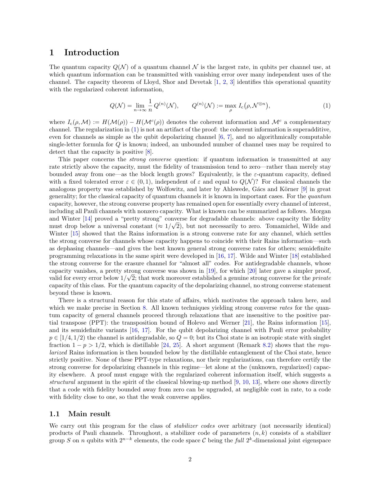 
Low-resolution page preview, page 2

📷 Fig 2

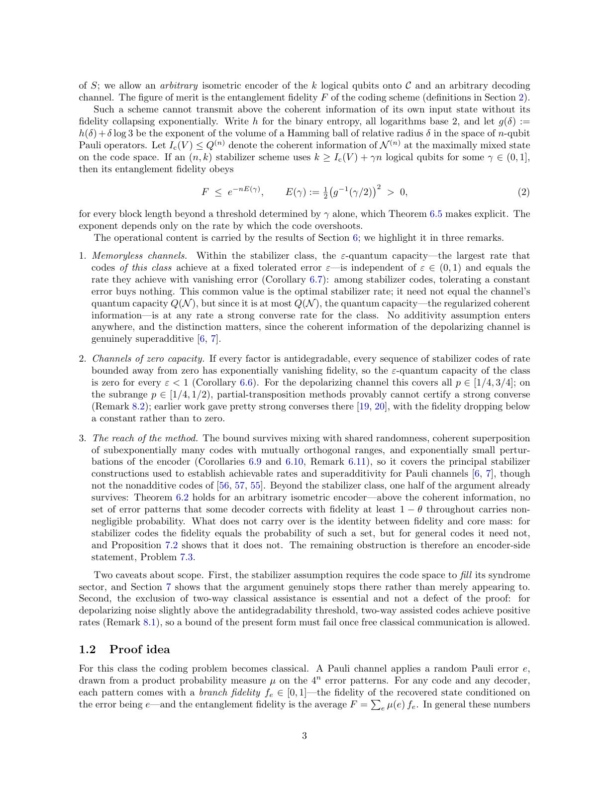 
Low-resolution page preview, page 3

📷 Fig 3

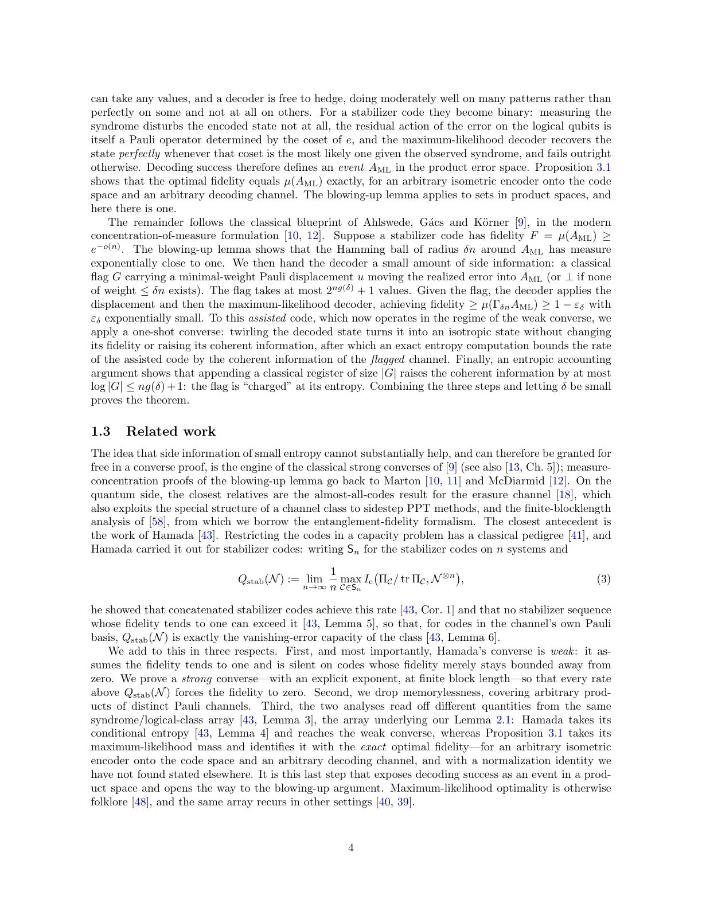 
Low-resolution page preview, page 4

📷 Fig 4

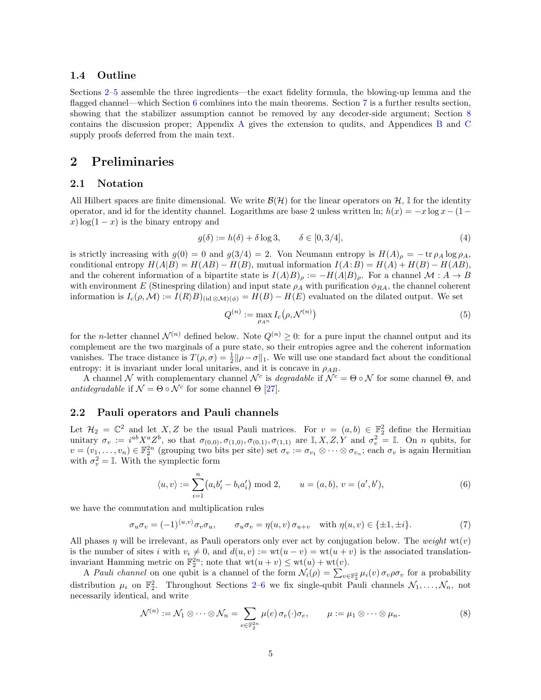 
Low-resolution page preview, page 5

📷 Fig 5

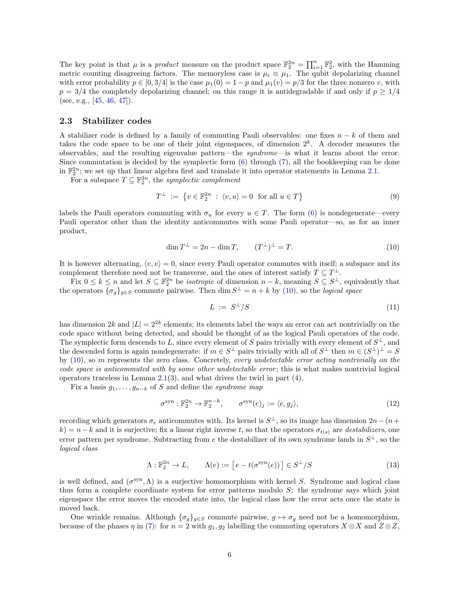 
Low-resolution page preview, page 6

**Summary.** This work proves a strong converse for the quantum capacity of stabilizer codes under Pauli noise. By leveraging the blowing-up lemma and avoiding common mathematical assumptions, it rigorously shows that exceeding the coherent information rate leads to exponentially decaying fidelity. This advances fundamental understanding of error correction limits in quantum communication.

**Why it may be interesting.** It provides rigorous, non-asymptotic bounds on quantum channel capacity that do not rely on standard assumptions like additivity or semidefinite programming, which are foundational tools in open quantum systems theory.

Detailed structure

**Main problem.** The paper aims to prove a strong converse for quantum communication capacity when using stabilizer codes over Pauli noise channels.

**Main result.** It establishes that if the transmission rate exceeds the coherent information, the entanglement fidelity must decay exponentially with block length, providing a strong bound on achievable rates.

**Method.** The proof employs the blowing-up lemma from classical probability theory and reduces the quantum problem to an entropic accounting argument involving side information derived from decoding success events.

**Model / system.** The system models quantum communication using stabilizer codes subjected to memoryless Pauli channels, analyzed asymptotically over large block lengths (n).

**Key observables.** Entanglement Fidelity ($F$), Coherent Information ($	ext{Ic}$), and the rate of information transmission.

**Important parameters / regimes.** Pauli error probability ($p$) for the depolarizing channel; the exponent $\gamma$ defining the excess rate over capacity.

**Assumptions / limitations.** The proof relies on the structure of stabilizer codes and crucially excludes the possibility of two-way classical assistance.

**Figures summary.** Not specified (Notes focus on mathematical arguments rather than figure descriptions).

**Paper structure.** The paper develops the converse by first relating optimal fidelity to measure theory via the blowing-up lemma, then using side information derived from decoding success events to constrain the achievable rate through an entropic bound.

Abstract

We prove a strong converse for quantum communication over Pauli channels within the class of stabilizer codes. If a code whose code space is a full joint eigenspace of a stabilizer group transmits above the coherent information of its own input state, its entanglement fidelity decays exponentially in the block length; the encoder may be any isometry onto that space and the decoder any channel. For memoryless channels this determines the $\varepsilon$-quantum capacity of the class for every $\varepsilon < 1$, so that tolerating a constant error buys no rate; for antidegradable channels, such as the depolarizing channel with error probability $p \in [1/4, 3/4]$, that capacity is zero, while for $p \in [1/4,1/2)$ partial-transposition bounds provably cannot certify a strong converse. The proof uses neither additivity assumptions nor semidefinite relaxations: optimal decoding succeeds precisely on an event in a product probability space, so the blowing-up lemma of Ahlswede, Gács and Körner applies, and the side information it produces is charged against the coherent information. The argument also constrains near-deterministic decoding for codes of any kind, and we isolate the encoder-side statement that would extend it to all of them.

[↑ back to top](#top)

### [Entanglement Distillation and Swapping Scheduling in Quantum Repeaters with Noisy Memories](http://arxiv.org/abs/2607.24557v1)

**Authors:** Siddharth Chander, Xinan Chen, Allen Zang  
**Type:** theory · **Category:** quantum information and computing · **PDF:** <https://arxiv.org/pdf/2607.24557v1>  
**Analysis basis:** full PDF text, analyzed in chunks
**Topic relevance:** `entanglement & information structure` **2/5** · `correlated / nonlocal dissipation` **1/5** · `driven-dissipative phase transition` **1/5** · `methods for driven-dissipative` **1/5** · `non-equilibrium dynamics` **1/5**

📷 Fig 1

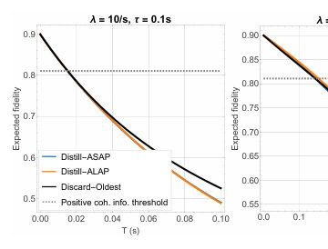 
Fig. 2. The expected fidelity ¯F for one-hop strategies with λ = 10/s and τ = 0.1, 1, 100 s.

📷 Fig 2

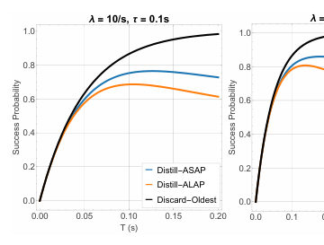 
Fig. 3. The success probability Pr(success) for one-hop strategies with λ = 10/s and τ = 0.1, 1, 100 s.

📷 Fig 3

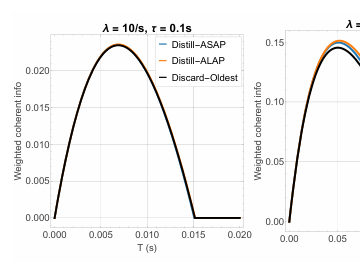 
Fig. 4. The weighted coherent information R for one-hop strategies with λ = 10/s and τ = 0.1, 1, 100 s.

📷 Fig 4

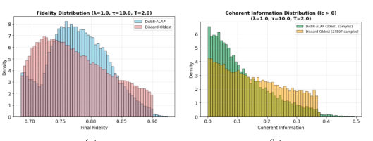 
Fig. 5. (a) Distribution of final fidelities for Distill-ALAP (mean ¯F ≈0.780, standard deviation ≈0.048) and Discard-Oldest (mean ¯F = 0.776, standard deviation 0.056) at fixed parameters (λ = 1.0 s−1, τ = 10.0 s, T = 2.0 s, 105 attempted samples). (b) Distribution of coherent information conditioned on Ic &gt; 0 at the same parameters. Of 105 attempted samples, 20,681 (Distill- ALAP) and 27,507 (Discard-Oldest) successful outputs have positive Ic.

📷 Fig 5

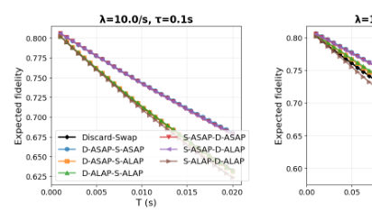 
Fig. 6. The expected fidelity ¯F for two-hop strategies with λ = 10/s and τ = 0.1, 1, 100 s.

**Summary.** This paper analyzes the scheduling of entanglement distillation and swapping operations in quantum repeaters whose memories suffer from decoherence. By comparing timing strategies like 'ASAP' versus 'ALAP', the authors determine that the optimal protocol shifts depending on the memory coherence time. The findings provide essential, physics-grounded insights into designing robust quantum communication links.

**Why it may be interesting.** It provides concrete, quantitative guidelines on how decoherence fundamentally alters optimal resource management strategies in quantum communication architectures, which is crucial for designing practical quantum networks.

Detailed structure

**Main problem.** The work aims to elucidate the fundamental trade-offs induced by memory decoherence on the optimal timing and ordering of entanglement distillation and swapping in quantum repeater networks.

**Main result.** Optimal strategies depend critically on the coherence time ($	au$): 'Discard-Oldest' is best for low $	au$, while delaying final distillation ('Distill-ALAP') maximizes weighted coherent information for high $	au$.

**Method.** The authors use analytical derivations for one-hop links and Monte Carlo simulations for two-hop chains to compare various timing protocols.

**Model / system.** The system models quantum repeaters using elementary building blocks (one-hop and two-hop chains) where entangled states are stored in noisy quantum memories subject to depolarizing noise.

**Key observables.** Expected output fidelity, overall success probability, and weighted coherent information ($R_S$).

**Important parameters / regimes.** Memory coherence time ($	au$), initial state fidelity ($F_0$), and the arrival rate of entangled pairs ($\lambda$).

**Assumptions / limitations.** The analysis assumes multiplexed repeater chains and focuses on depolarization noise, neglecting gate or measurement errors.

**Figures summary.** Figures compare expected fidelity, success probability, and weighted coherent information for various one-hop strategies across different coherence time regimes.

**Paper structure.** The paper first analyzes the minimal one-hop setting analytically, comparing ASAP vs. ALAP distillation timing. It then extends this analysis to two-hop repeater chains using Monte Carlo simulations to compare complex sequencing protocols.

Abstract

Entanglement distillation and entanglement swapping have been extensively studied assuming perfect quantum memories. However, near-term quantum networks will be fundamentally limited by quantum memories with a finite coherence time, resulting in complex choices for the timing and ordering of these operations. In this work, we study entanglement distillation and entanglement swapping at the level of the elementary building blocks of noisy quantum repeater networks, with the goal of elucidating the fundamental tradeoffs induced by memory decoherence. First, we focus on a minimal one-hop setting, where we analytically compare ``distill-as-soon-as-possible'' and ``distill-as-late-as-possible'' strategies against a baseline strategy that simply discards the older entangled state. We find that in the low memory coherence time regime, discarding the older entangled state achieves higher expected output fidelity, while in the high coherence time regime, delaying distillation until the end achieves the highest expected output fidelity and, over most of the deadline range, the highest weighted coherent information, at the expense of a lower success probability. We then extend our analysis to two-hop repeater chains using Monte Carlo simulation. In this setting, we find that the highest weighted coherent information is achieved by strategies that defer distillation to the end of the time window, with \textsf{Distill-ALAP-then-Swap-ALAP} and \textsf{Swap-ASAP-then-Distill-ALAP} leading at different operating points, while \textsf{Discard-Oldest-then-Swap} never reaches positive weighted coherent information in any regime tested. Together, these results clarify how decoherence reshapes the optimal operation timing in quantum networks and provide instructive insights into the link-level principles that govern larger-scale architectures.

[↑ back to top](#top)

### [Quantum Incapacity beyond No-Cloning and PPT Mechanisms](http://arxiv.org/abs/2607.24693v1)

**Authors:** Chengkai Zhu, Xin Wang  
**Type:** theory · **Category:** quantum information and computing · **PDF:** <https://arxiv.org/pdf/2607.24693v1>  
**Analysis basis:** full PDF text, analyzed in chunks
**Topic relevance:** `entanglement & information structure` **2/5** · `Keldysh / 2PI / non-Gaussian methods` **1/5** · `correlated / nonlocal dissipation` **1/5** · `driven-dissipative phase transition` **1/5** · `methods for driven-dissipative` **1/5**

📷 Fig 1

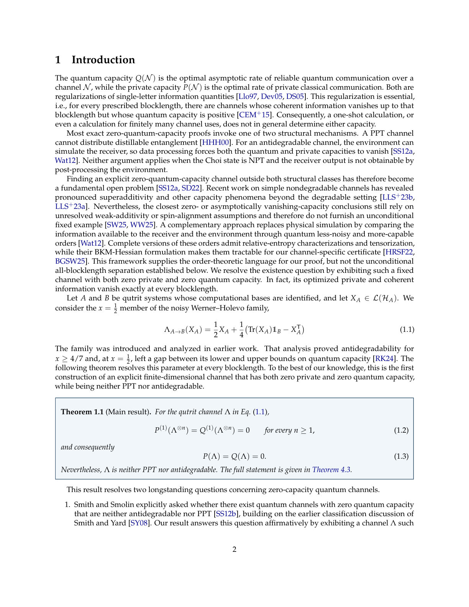 
Low-resolution page preview, page 2

📷 Fig 2

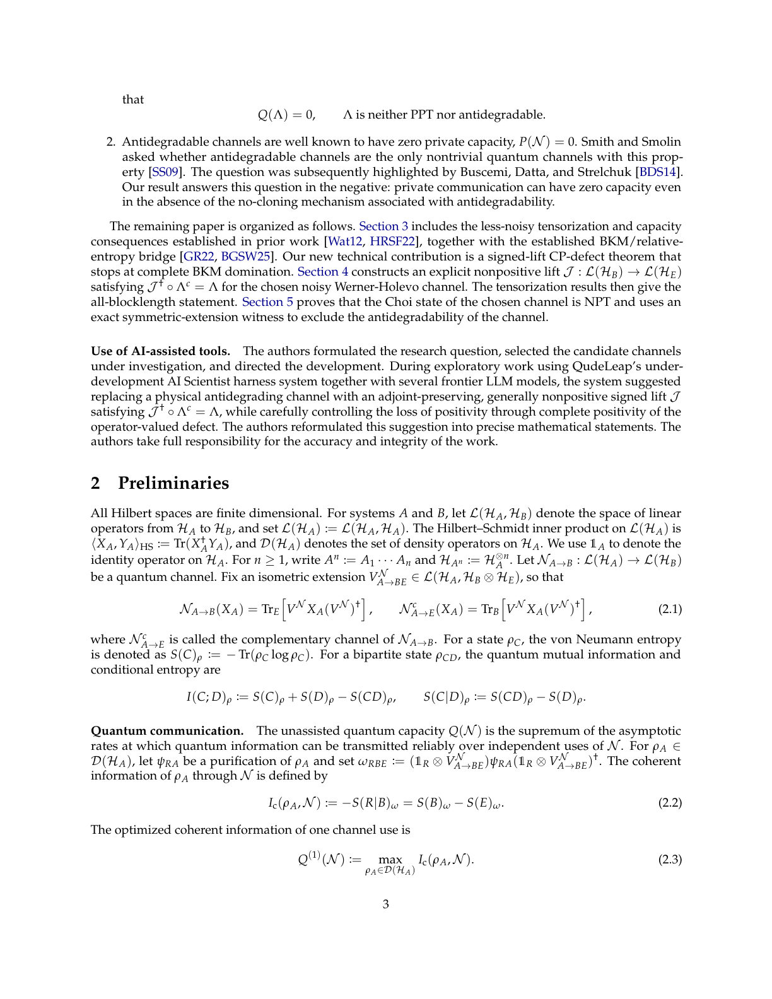 
Low-resolution page preview, page 3

📷 Fig 3

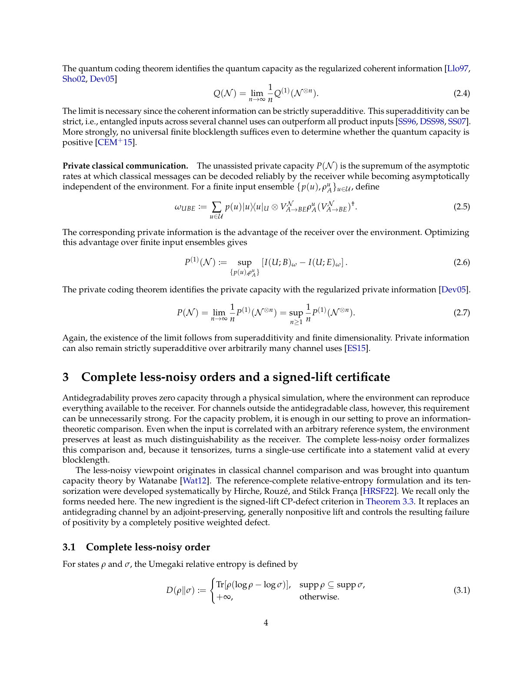 
Low-resolution page preview, page 4

📷 Fig 4

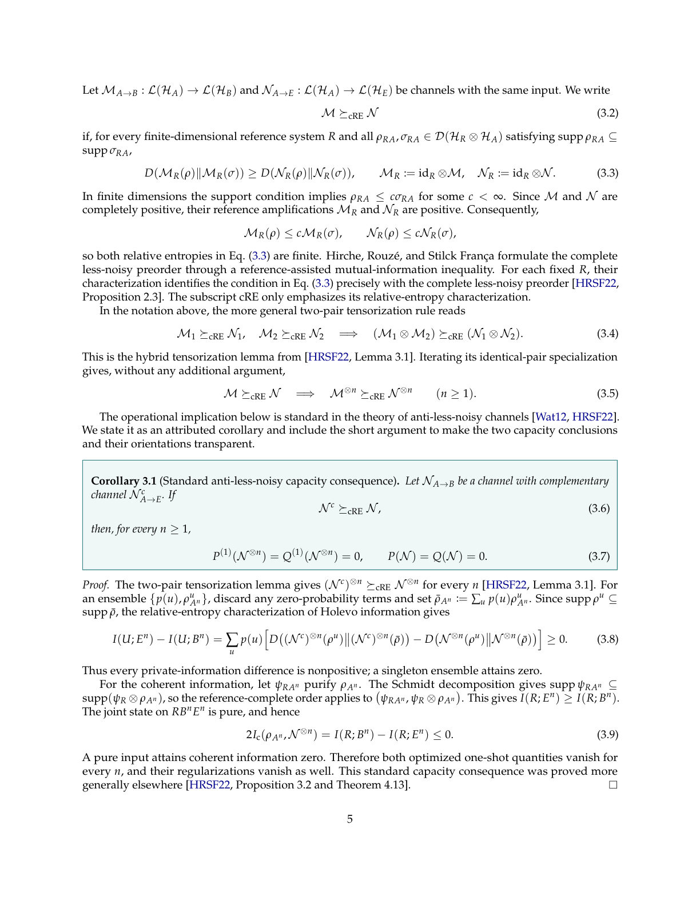 
Low-resolution page preview, page 5

📷 Fig 5

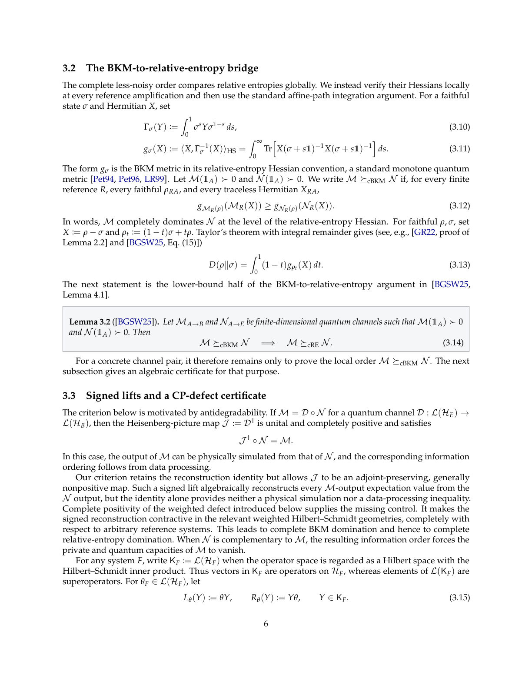 
Low-resolution page preview, page 6

**Summary.** The paper introduces a novel qutrit quantum channel that achieves zero private and quantum capacities without being Positive under Partial Transposition or antidegradable. By employing advanced tools like signed lifts and relative entropy comparisons, the authors resolve long-standing open problems by demonstrating that capacity vanishing can occur outside these standard structural bounds.

**Why it may be interesting.** This work provides a powerful counterexample that challenges existing structural theorems in quantum information theory, suggesting that capacity limitations can arise from mechanisms beyond those previously assumed (PPT or antidegradability).

Detailed structure

**Main problem.** To construct an explicit quantum channel that exhibits zero private and quantum capacities despite not satisfying standard structural conditions like being Positive under Partial Transposition (PPT) or antidegradable.

**Main result.** The authors present a qutrit channel demonstrating $P(\Lambda)=Q(\Lambda)=0$ while proving it is neither PPT nor antidegradable, thus expanding the known mechanisms for capacity vanishing.

**Method.** The proof utilizes advanced techniques involving signed lifts, relative entropy comparisons (complete less-noisy order), and constructing explicit witness operators to test structural properties like antidegradability.

**Model / system.** The study focuses on a specific qutrit channel $\Lambda_{A	o B}$ acting on finite-dimensional quantum systems. The analysis involves tensor products of these channels across multiple blocklengths ($n$).

**Key observables.** Quantum Capacity ($Q(\Lambda)$), Private Capacity ($P(\Lambda)$), PPT property, Antidegradability, and the relative entropy $D(
ho\|\sigma)$.

**Important parameters / regimes.** The channel is defined on qutrit systems ($\mathbb{C}^3$). The results hold for every tensor power of the channel.

**Assumptions / limitations.** The core proof relies on establishing an information ordering (the complete less-noisy order) via a signed lift and demonstrating that this order forces the vanishing of capacities.

**Figures summary.** Not specified, but the notes reference mathematical derivations involving structural decompositions, defect maps, and inequalities proving capacity bounds.

**Paper structure.** The paper first introduces the problem by defining the specific channel. It then establishes a general information ordering criterion ($\preceq_{	ext{cRE}}$) using signed lifts and relative entropy comparisons. Finally, it applies these tools to the concrete channel to prove zero capacities while explicitly violating PPT and antidegradability conditions.

Abstract

We show an explicit qutrit channel whose private and quantum capacities both vanish, although it is neither antidegradable nor positive under partial transposition (PPT). This resolves two longstanding open problems in quantum information theory: whether zero quantum capacity can occur outside the PPT and antidegradable classes, and whether antidegradability is the only nontrivial mechanism that forces the private capacity to vanish. For qutrit systems $A$ and $B$, the channel is \[ Λ_{A\to B}(X)= \frac{1}{2}X+\frac{1}{4}\left(\operatorname{Tr}(X)\mathbb{1}_{B}-X^{\mathsf T} \right). \] We prove that, for every tensor power and every finite-dimensional quantum reference system, the complementary output dominates the receiver output in relative entropy. Consequently, we show that the optimized private and coherent information vanish at every blocklength, and hence $P(Λ)=Q(Λ)=0$. The proof uses a nonpositive, adjoint-preserving signed lift whose weighted defect admits an exact rank-three completely positive factorization. Applying established Bogoliubov--Kubo--Mori/relative-entropy comparison results and complete less-noisy tensorization results then yields the stated order at every tensor power, leading to zero quantum and private capacities. Meanwhile, we show that the channel is neither PPT nor antidegradable. The channel therefore realizes exact quantum and private incapacity beyond the standard PPT-based bound-entanglement mechanism and the no-cloning mechanism.

[↑ back to top](#top)

### [Unified Framework for Bidirectional and Cyclic Teleportation under Noise](http://arxiv.org/abs/2607.23820v1)

**Authors:** Soubhik De, Vedhanayagi R, Basherrudin Mahmud Ahmed A, Alok Sharan  
**Type:** theory · **Category:** quantum information and computing · **PDF:** <https://arxiv.org/pdf/2607.23820v1>  
**Analysis basis:** full PDF text, analyzed in chunks
**Topic relevance:** `quantum measurements` **2/5** · `correlated / nonlocal dissipation` **1/5** · `driven-dissipative phase transition` **1/5** · `entanglement & information structure` **1/5** · `methods for driven-dissipative` **1/5**

📷 Fig 1

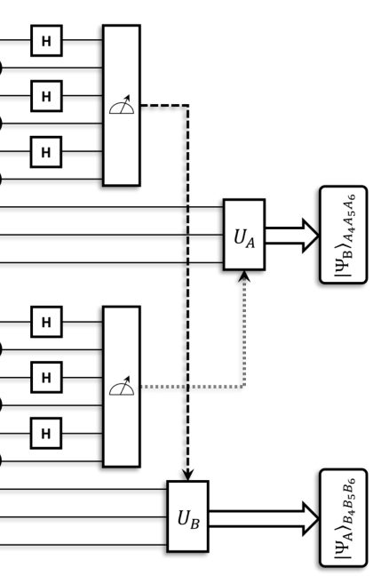 
Fig. 1: Schematic diagram depicting the bidirectional teleportation of arbitrary three-qubit states via a twelve-qubit entangled state. UA and UB represent the unitary operations to be done by Alice and Bob respectively, and dashed arrows represent classical communication.

📷 Fig 2

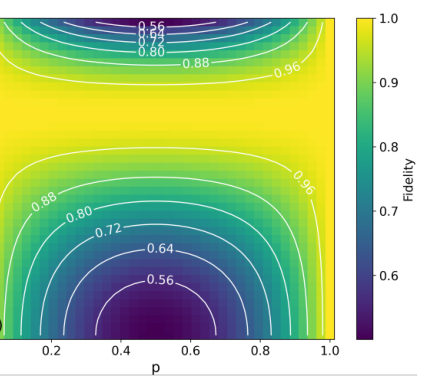 
Fig. 2: Fidelity as a function of noise parameter p and input parameter a under the influence of the Bit-flip noise channel for the (a) 3 ⇔3 Bidirectional teleportation protocol and (b) 2 ⇔2 ⇔2 Cyclic teleportation protocol. The value of parameters b = c = 1 √

📷 Fig 3

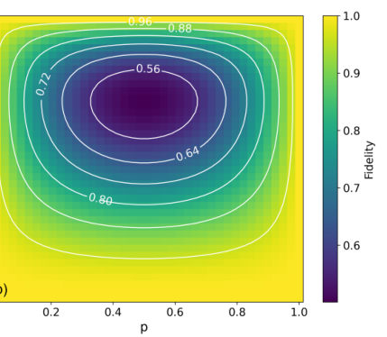 
Fig. 3: Fidelity as a function of noise parameter p and input parameter a under the influence of the Phase-flip noise channel for the (a) 3 ⇔3 Bidirectional teleportation protocol and (b) 2 ⇔2 ⇔2 Cyclic teleportation protocol. The value of parameters b = c = 1 √

📷 Fig 4

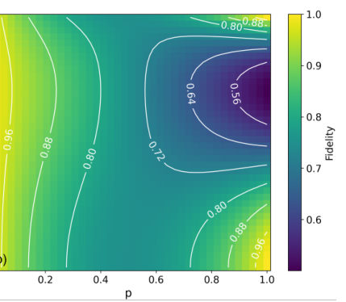 
Fig. 4: Fidelity as a function of noise parameter p and input parameter a under the influence of the Amplitude-damping noise channel for the (a) 3 ⇔3 Bidirectional teleportation protocol and (b) 2 ⇔2 ⇔2 Cyclic teleportation protocol. The value of parameters b = c = 1 √

📷 Fig 5

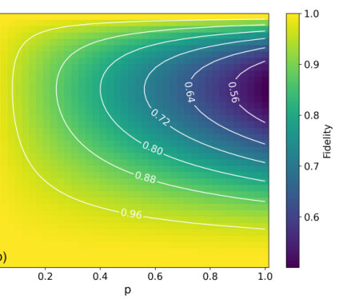 
Fig. 5: Fidelity as a function of noise parameter p and input parameter a under the influence of the Phase-damping noise channel for the (a) 3 ⇔3 Bidirectional teleportation protocol and (b) 2 ⇔2 ⇔2 Cyclic teleportation protocol. The value of parameters b = c = 1 √

**Summary.** This paper presents a unified framework using a single twelve-qubit entangled resource to achieve both bidirectional and cyclic quantum teleportation. The authors demonstrate the protocols' scalability and analyze their performance under various noise models, showing that the bidirectional scheme is remarkably robust against bit-flip errors.

**Why it may be interesting.** The rigorous analysis of multi-party quantum communication channels under realistic noise conditions is highly relevant for developing robust quantum networks and understanding decoherence effects in complex quantum information tasks.

Detailed structure

**Main problem.** The work aims to develop a unified quantum communication framework capable of supporting both bidirectional and cyclic teleportation using a single, shared entangled resource.

**Main result.** A twelve-qubit entangled channel was shown to enable the bidirectional teleportation of three-qubit states and cyclic teleportation of two-qubit states. The protocol maintains perfect fidelity under bit-flip noise for the bidirectional case while achieving an intrinsic efficiency of 25%.

**Method.** The authors utilize local Bell-state measurements (BSM) on a pre-established multi-qubit entangled channel and apply subsequent single-qubit operations to reconstruct the unknown quantum state.

**Model / system.** The core model is a twelve-qubit entangled resource ($\vert G_{12} 
angle$) used to facilitate communication between multiple parties. The protocols are analyzed by subjecting them to various noise channels, including amplitude-damping and depolarizing noise.

**Key observables.** Teleportation Fidelity (as a function of input state parameters and noise strength $p$), intrinsic efficiency, and the final collapsed quantum state after measurements.

**Important parameters / regimes.** Noise strengths ($p$) for various channels (amplitude-damping, bit-flip, etc.), and the number of qubits involved in the teleportation tasks (3-qubit states, 2-qubit cycles).

**Assumptions / limitations.** The analysis assumes the ability to perform local Bell-state measurements and single-qubit operations on the shared entangled resource.

**Figures summary.** Figure 1 schematically illustrates bidirectional teleportation ($A \leftrightarrow B \leftrightarrow C$), and Figure 2 plots the fidelity of both bidirectional and cyclic protocols against the noise parameter $p$.

**Paper structure.** The paper first introduces the problem, then details the construction of the twelve-qubit channel. It proceeds to derive the mathematical steps for the three-qubit bidirectional and cyclic teleportation protocols using BSMs. Finally, it analyzes the performance of these schemes under various noise models.

Abstract

Quantum teleportation has evolved from single-qubit, unidirectional communication to multi-qubit and multidirectional protocols. However, most existing schemes rely on protocol-specific entangled resources, motivating the development of universal quantum channels capable of supporting multiple communication tasks simultaneously. In this work, we demonstrate that a single twelve-qubit entangled channel exhibits such versatility by enabling the bidirectional teleportation of arbitrary three-qubit states and the cyclic teleportation of arbitrary two-qubit states through local Bell-state measurements and single-qubit operations. Both protocols are further generalized to multi-qubit and multi-party configurations, establishing the scalability of the proposed framework. To assess its practical applicability, the protocols are analyzed under amplitude-damping, phase-damping, bit-flip, phase-flip, and depolarizing noise channels by plotting the teleportation fidelity as a function of both the input-state parameters and noise strength. The analysis reveals distinct noise sensitivities, with the bidirectional protocol remaining perfectly faithful under bit-flip noise for all input states and noise strengths, while the cyclic protocol is consistently more vulnerable to environmental disturbances. The proposed schemes achieve an intrinsic efficiency of $25\%$, which is compared with several existing protocols. The framework therefore provides a scalable and resource-efficient approach to unified quantum communication in realistic noisy quantum networks.

[↑ back to top](#top)

### [Reminiscences about Hans Capel](http://arxiv.org/abs/2607.24380v1)

**Authors:** Constantino Tsallis  
**Type:** theory · **Category:** statistical mechanics · **PDF:** <https://arxiv.org/pdf/2607.24380v1>  
**Analysis basis:** full PDF text, analyzed in chunks
**Topic relevance:** `non-equilibrium universality` **2/5** · `analog quantum simulation` **1/5** · `driven-dissipative phase transition` **1/5** · `non-equilibrium dynamics` **1/5**

📷 Fig 1

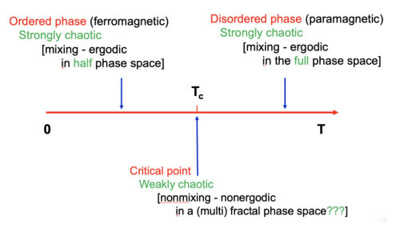 
Figure 1: As a paradigmatic illustration we may think of a prolate anisotropic (cigar-like, satisfying an axial symmetry) XY or Heisenberg next-nearest-coupled 𝑑= 3 ferromagnetic model. Through the critical point (𝑇𝑐) emerging at the 𝑁→∞ limit, the system undergoes the breakdown of the up-down symmetry corresponding to the disordered (paramagnetic) phase.

📷 Fig 2

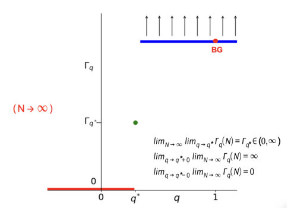 
Figure 2: Γ𝑞diverges along the blue line (𝑞&gt; 𝑞⋆), vanishes along the red line (𝑞&lt; 𝑞⋆), and is finite on the green dot (𝑞= 𝑞⋆). The red dot corresponds to the BG theory (𝑞= 1). When universal quantities such as the dimensionality 𝑑and the symmetry which is spontaneously broken vary (e.g., 𝑑= 2, 3 and XY or Heisenberg symmetries), then the value of 𝑞⋆

**Summary.** This paper explores the limitations of classical Boltzmann-Gibbs statistical mechanics when analyzing physical systems exactly at a critical point. It proposes using nonadditive entropic functionals, specifically Tsallis entropy ($S_q$), to develop a more robust theoretical framework. The key finding is that these generalized entropies correctly predict finite physical quantities at $T_c$, unlike standard theory.

**Why it may be interesting.** This work is highly relevant because it extends statistical mechanics beyond standard assumptions, providing tools ($S_q$) that can model complex non-equilibrium or strongly interacting regimes where simple thermodynamic limits fail. The connection to dynamical properties (Lyapunov exponents) suggests deep links between entropy formalism and chaos theory.

Detailed structure

**Main problem.** The paper addresses the failure of traditional Boltzmann-Gibbs (BG) statistics to accurately describe physical systems precisely at a critical point ($T_c$). It seeks an alternative framework using nonadditive entropic functionals.

**Main result.** Nonadditive entropies, characterized by an index $q$, provide a more physically consistent description of critical phenomena than BG theory, particularly by yielding finite values for generalized critical parameters ($\Gamma_q$) at $T_c$ where BG theory predicts only divergence.

**Method.** The analysis involves comparing theoretical predictions derived from standard BG statistics against those obtained using Tsallis' nonadditive entropy ($S_q$). This comparison is applied to analyze phase transitions and critical exponents in various models.

**Model / system.** The study considers general many-body Hamiltonians exhibiting phase transitions, exemplified by ferromagnetic models like the XY or Heisenberg model. The focus is on the behavior of these systems near their critical temperature ($T_c$).

**Key observables.** Critical exponents ($\alpha, eta, \gamma, 
u$), the order parameter ($\eta$), and generalized critical parameters ($\Gamma_q$) are key observables.

**Important parameters / regimes.** The entropic index $q$ is crucial, as its value determines whether the system's behavior at $T_c$ is described by BG theory ($q=1$) or a nonadditive generalization ($q 
eq 1$).

**Assumptions / limitations.** The primary assumption is that standard statistical mechanics breaks down exactly at $T_c$, necessitating the use of generalized entropic functionals to capture the true physics.

**Figures summary.** Figure 2 illustrates how the generalized Gruneisen parameter ($\Gamma_q$) behaves: it diverges for $q>q^*$, vanishes for $q<q^*$, and is finite at a special index $q=q^*$, contrasting sharply with the BG prediction ($q=1$).

**Paper structure.** The paper progresses by first establishing the limitations of BG theory at criticality, then introducing nonadditive entropies as a mathematical tool to resolve these issues. It develops specific relationships between critical exponents and the entropic index $q$ before presenting quantitative comparisons using generalized parameters.

Abstract

As an homage to the memory of Hans Willem Capel, I present some personal reminiscences and thoughts that come to my mind in this special occasion.

[↑ back to top](#top)

### [Anyon Condensation In Symmetry-Enriched Topological Phases: $G$-Grading of Multifusion Categories](http://arxiv.org/abs/2607.24740v1)

**Authors:** Nianrui Fu, Siyuan Wang, Yu Zhao, Yidun Wan  
**Type:** theory · **Category:** statistical mechanics · **PDF:** <https://arxiv.org/pdf/2607.24740v1>  
**Analysis basis:** full PDF text, analyzed in chunks
**Topic relevance:** `analog quantum simulation` **2/5** · `Keldysh / 2PI / non-Gaussian methods` **1/5** · `driven-dissipative phase transition` **1/5**

📷 Fig 1

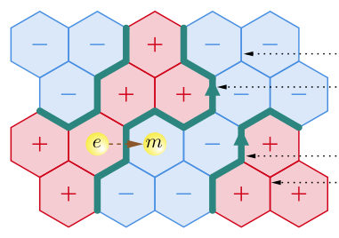 
Figure 1: Input data for an SET lattice model. Plaquette domains are labeled the elements of symmetry group. The red and blue regions represent two local domain types, and the thick green links mark the domain walls between them. In the toric-code SET with EM- exchange symmetry, crossing such a wall sends an e anyon to an m anyon. The same domain labels determine the block of the input multifusion category from which each edge label is chosen: edges inside + and −domains carry objects in the diagonal blocks M++ and M−−, while oriented domain-wall edges carry objects in the off-diagonal blocks M+− and M−+.

📷 Fig 2

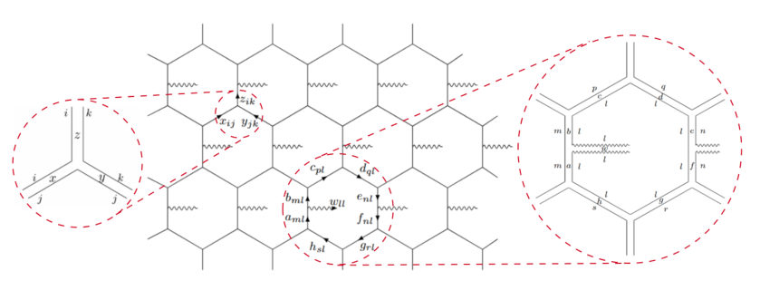 
Figure 2: The fattened honeycomb lattice. Here, xij ∈Mij, yjk ∈Mjk, zik ∈Mik, etc. The fusion rule Mij ⊗Mkl ⊂δjkMil allows each vertex to be fattened, as shown in the left figure. Multifusion indices are assigned to the doubled lines, with connected doubled lines carrying the same index. Consequently, after fattening the entire lattice, each plaquette is naturally labeled by a multifusion index, as illustrated in the right figure.

**Summary.** This paper develops a theory for anyon condensation in topologically ordered phases that possess global symmetries. It shows that symmetry preservation requires the underlying algebraic structure (the multifusion category) to carry a specific group grading. This framework allows researchers to predict the resulting topological phase after a symmetry-respecting quantum transition.

**Why it may be interesting.** It provides a rigorous mathematical framework for understanding how symmetries constrain topological phase transitions, which is crucial for designing and classifying exotic quantum materials relevant to AMO physics.

Detailed structure

**Main problem.** The paper investigates how anyon condensation occurs within Symmetry-Enriched Topological (SET) phases, addressing the complexity introduced by requiring the condensate to respect global symmetries.

**Main result.** Symmetry-preserving condensation is mathematically characterized by the input multifusion category admitting a compatible group grading, which in turn constructs the input for the resulting child SET phase.

**Method.** The study employs advanced mathematical techniques involving multifusion categories and their $G$-gradings to model topological order transitions.

**Model / system.** The physical system is modeled by SET phases described using an enlarged Hu-Geer-Wu (HGW) string-net model, whose input data is formalized via multifusion categories.

**Key observables.** The existence of a compatible group grading on the input multifusion category; the structure of the resulting child SET phase's input category.

**Important parameters / regimes.** Global symmetry groups ($G$, $N$), finite group extensions ($E$), and the specific quantum-double examples ($\mathbb{Z}_2 	imes \mathbb{Z}_2$, $S_3$, $\mathbb{Z}_4$).

**Assumptions / limitations.** The global symmetries are described by finite groups, and the physical description of SET phases is accurately captured by the multifusion category framework.

**Figures summary.** Figure 1 illustrates the input data for an SET lattice model using a $\mathbb{Z}_2$ toric code. Figure 2 shows the 'fattened honeycomb lattice' structure related to fusion rules.

**Paper structure.** The paper progresses from defining the mathematical tools (multifusion categories, $G$-grading) to analyzing the mechanism of symmetry-preserving condensation through successive condensations, culminating in concrete examples using group extensions.

Abstract

Although anyon condensation is a standard mechanism for relating topological orders, anyon condensation in symmetry-enriched topological (SET) phases is more intricate because the condensate must also be compatible with the global symmetry. We study symmetry-preserving anyon condensation in SET phases described by the enlarged Hu-Geer-Wu (HGW) string-net model with multifusion-category input data. We show that a $G$-preserving condensation is characterized by a compatible grading of the input multifusion category, and that this grading constructs the multifusion-category input of the child SET phase. To make this construction concrete, we consider the case where the relevant data come from a finite group extension $E$ of $G$ by $N$: an $E$-graded fusion category induces a $G$-SET input by passing to the quotient symmetry $G$, and the resulting input naturally carries a compatible $N$-grading that implements the further condensation inside the SET phase while preserving $G$. We illustrate the construction using three quantum-double examples: the trivial extension $\mathbb{Z}_2\times\mathbb{Z}_2$, the non-Abelian semidirect product $S_3$, and the nontrivial central extension $\mathbb{Z}_4$. The $\mathbb{Z}_4$ example further shows that symmetry fractionalized anyons do not obstruct symmetry-preserving condensation once the condensate is treated as a physical coherent state.

[↑ back to top](#top)

### [Classical simulation and model concentration in passive linear optics](http://arxiv.org/abs/2607.24728v1)

**Authors:** Léo Monbroussou, Hugo Thomas, Hela Mhiri, Zoë Holmes, Elham Kashefi  
**Type:** theory · **Category:** quantum information and computing · **PDF:** <https://arxiv.org/pdf/2607.24728v1>  
**Analysis basis:** full PDF text, analyzed in chunks
**Topic relevance:** `entanglement & information structure` **2/5** · `analog quantum simulation` **1/5** · `interference shaping light` **1/5**

📷 Fig 1

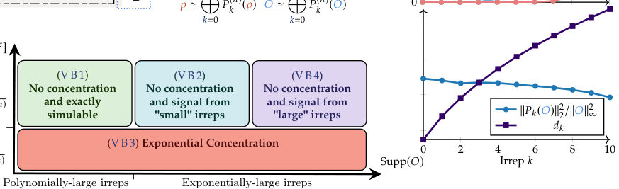 
FIG. 1: Summary of the main results: we study passive linear-optical models through the lens of the decomposition of its operator into irreducible components. By adapting the iterative procedure from [1], we study the irreducible component purities of the input state 𝜌and observable 𝑂in order to study the concentration of the model. We present the example of Fock-state purities and the number-phase observable introduced in Section V A compared with the irreducible dimension, for 𝑛= 10 photons and 𝑚= 20 modes. Finally, we compare our results with simulation techniques, and we identify four regimes of interest.

📷 Fig 2

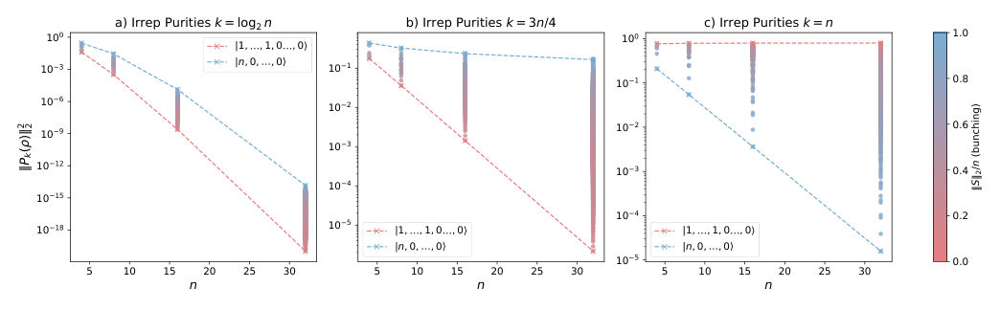 
FIG. 2: Scaling of the Fock-state purities: a) Fock-states purities for the irrep 𝑘= log2 𝑛; b) Fock-states purities for the irrep 𝑘= 3𝑛/4; c) Fock-states purities for the irrep 𝑘= 𝑛. The colour-scale corresponds to the 2-norm of the occupation vector (𝑠1, · · · , 𝑠𝑚) for each Fock state.

📷 Fig 3

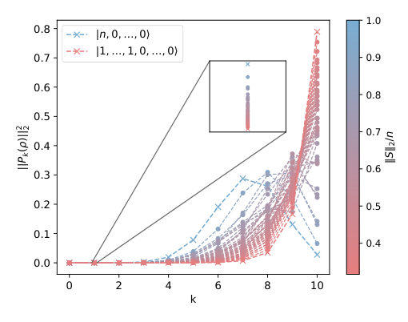 
FIG. 3: Fock-State purity profile: Fock state purity dis- tribution for 𝑛= 10 particles in 𝑚= 2𝑛modes. We only consider the Fock states that are all different under any permutation of the occupation.

📷 Fig 4

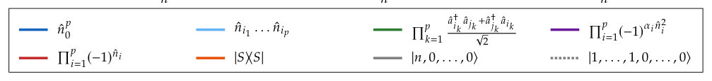 
FIG. 4: Passive linear optical model concentration: Expectation value variance of the different observable of interest presented in Section V A. For the Fock-state projector case, we consider a projection over the Fock state |𝑆⟩such that occ(𝑆) = 𝑝. A comparison between the different scaling and simulation method is presented in Table I and discussed in Section V B.

📷 Fig 5

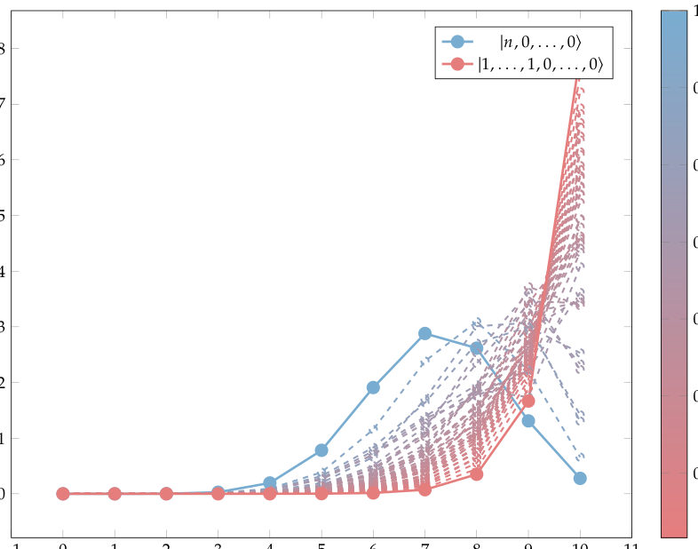 
FIG. 5: Fock state purity distribution for 𝑛= 10 particles in 𝑚= 2𝑛modes. We only consider the Fock states that are all different under any permutation of the occupation.

**Summary.** This work develops a representation-theoretic framework to study how expectation values behave in passive linear optics. By analyzing projections onto irreducible representations, the authors characterize when these systems exhibit exponential concentration or retain signals that are classically hard to simulate. This provides a systematic route for understanding quantum advantage in bosonic photonic circuits.

**Why it may be interesting.** It provides a powerful mathematical tool (representation theory) to analyze the complexity of quantum optical circuits, directly linking physical diagnostics (concentration) to computational hardness.

Detailed structure

**Main problem.** The paper characterizes the concentration of expectation values for observables in passive linear optics, aiming to establish an analogous tradeoff between quantum advantage and classical simulability for bosonic systems.

**Main result.** Concentration is governed by the misalignment of projections into irreducible representations (irreps) of the unitary group. The authors identify regimes that evade exponential concentration while retaining a signal component not accessible to known efficient classical simulation methods.

**Method.** The analysis employs a representation-theoretic framework, decomposing operators and states into irreps of $U(m)$ to calculate variances over random unitaries (Haar measure).

**Model / system.** The system is passive linear optics, modeled by photon evolution through beam splitters and phase shifters, described by unitary transformations $U \in U(m)$ acting on fixed particle-number sectors $\mathcal{F}_n$.

**Key observables.** Expectation values of particle-number-preserving observables ($\langle \hat{O} 
angle$), generalized entanglement (state purity), and generalized locality (observable purity).

**Important parameters / regimes.** Photon number ($n$), number of modes ($m$), and the scaling index $k$ used for irrep decomposition.

**Assumptions / limitations.** The analysis focuses on fixed total photon numbers ($n$) and utilizes theorems derived from averaging over Haar-random unitaries. The separation between hard/easy regimes is noted to be only partial.

**Figures summary.** Figure 1 summarizes four regimes based on irrep decomposition (Exponential Concentration, No concentration/small irreps, etc.). Figure 2 shows the scaling of Fock-state purities for different choices of irrep indices $k$ relative to $n$.

**Paper structure.** The paper develops a representation-theoretic framework by decomposing operators into irreducible representations. It then applies this to calculate variances over random unitaries, relating concentration properties to entanglement/locality measures and comparing these findings against known classical simulation techniques for specific observables.

Abstract

Passive linear optics is a restricted model of quantum computation, with complexity-theoretic evidence of quantum advantage for sampling tasks and low losses that make it attractive for near-term algorithms. In qubit architectures, a body of work has revealed a close connection between barren plateaus and classical simulability. Whether an analogous tradeoff exists for bosonic systems remains largely unexplored. Building on a recently developed representation-theoretic framework for moments of random passive linear-optical circuits, we characterize the concentration of expectation values for relevant families of particle-number-preserving observables by evaluating their projections into irreducible representations of the unitary group and analyzing their asymptotic scaling. We show that concentration is governed by the misalignment of the projections into irreducible representations of the input state and the observable, giving a unified representation-theoretic interpretation of generalized entanglement and locality in the bosonic setting. We further relate these concentration properties to existing classical simulation techniques, identifying broad classes of trainable observables that admit efficient classical simulation. Conversely, we identify Fock-state inputs and observables that appear to evade exponential concentration while retaining a polynomially large signal component not accessible to known efficient classical simulation methods. The separation is only partial: most of the signal remains classically tractable, and the residual part, while not exponentially suppressed, is small enough that a truncation serves as a classical surrogate with polynomially small error. Our framework nonetheless provides a systematic route for searching for regimes that unambiguously combine the absence of exponential concentration and lies beyond known efficient classical simulation methods.

[↑ back to top](#top)

### [Parallelizable Exact Synthesis of Quantum Circuits via Semi-Tensor Product](http://arxiv.org/abs/2607.24195v1)

**Authors:** Chenjian Li, Dingchao Gao, Xiangzhen Zhou, Ji Guan, Pengcheng Zhu, Zhufei Chu  
**Type:** both · **Category:** quantum information and computing · **PDF:** <https://arxiv.org/pdf/2607.24195v1>  
**Analysis basis:** full PDF text, analyzed in chunks
**Topic relevance:** `entanglement & information structure` **2/5** · `analog quantum simulation` **1/5** · `methods for driven-dissipative` **1/5**

📷 Fig 1

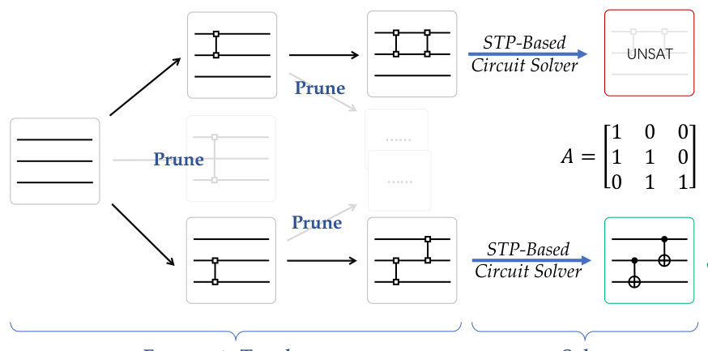 
Fig. 1. Overall structure of our STP-based synthesis algorithm for a fixed gate count (#g). Given a synthesis target, candidate topologies are enumerated, while infeasible ones are eliminated through pruning. Each surviving topology is then passed to an STP-based circuit solver, which either proves it unsatisfiable or returns a complete circuit implementation. Both topology enumeration and circuit solving can be processed in parallel, since different topologies can be handled independently.

📷 Fig 2

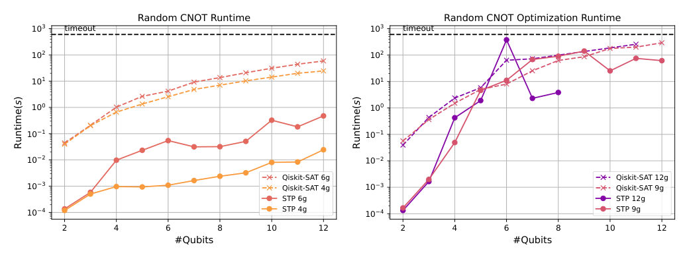 
Fig. 2. Runtime of STP against Qiskit-SAT on random CNOT circuits. For each data point, 10 random circuits are generated and tested. The timeout value is set to 600 seconds.

📷 Fig 3

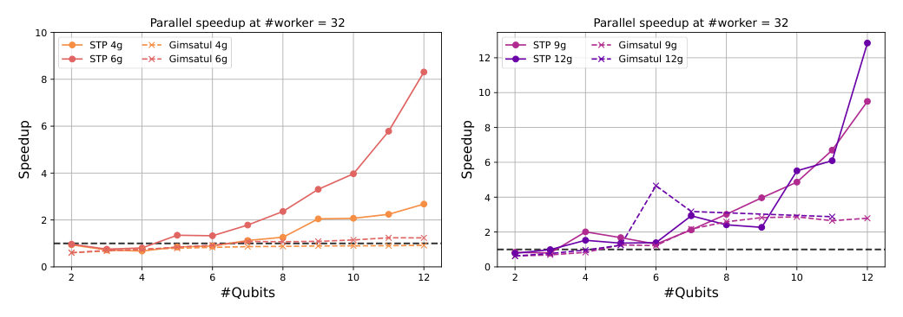 
Fig. 3. Parallel speedup of STP against Qiskit-SAT with the Gimsatul backend [29] with 32 workers on random CNOT circuits. For each data point, 10 random circuits are generated and tested.

📷 Fig 4

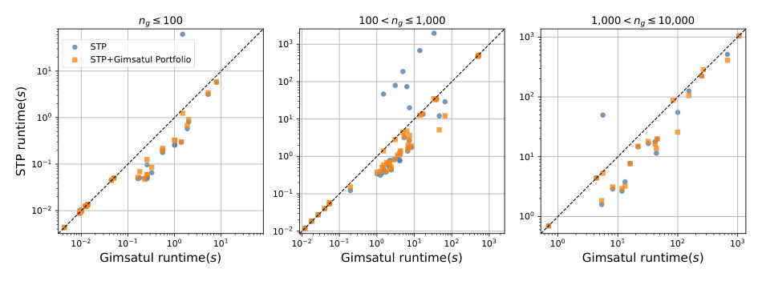 
Fig. 4. Optimization runtime of Gimsatul, STP and STP+Gimsatul portfolio on QASMBench. Left: QASMBench cases with gate count smaller than 100; Middle: Cases with gate count greater than 100 but smaller than 1000; Right: Cases with gate count greater than 1,000 but smaller than 10,000.

📷 Fig 5

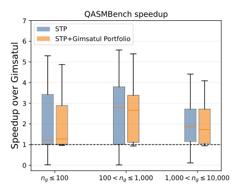 
Fig. 5. Speedup of STP-based kernels over Gimsatul on different categories of QASMBench

**Summary.** This work presents a novel, parallel exact synthesis framework for optimizing quantum circuits using the Semi-Tensor Product (STP) theory. By efficiently solving circuit constraints derived from CNOT and phase polynomial gates, it significantly outperforms existing SAT-based methods on benchmark tests. This advancement provides a powerful kernel for improving overall quantum compilation workflows.

**Why it may be interesting.** While focused on quantum computation optimization rather than AMO dynamics, the underlying mathematical tools (tensor products, algebraic structure analysis) are highly relevant to characterizing entanglement structures or simulating complex multi-body interactions in open quantum systems.

Detailed structure

**Main problem.** The paper addresses the challenge of exact synthesis for quantum circuits, which is crucial for optimizing small circuit shards in quantum compilation.

**Main result.** The proposed Semi-Tensor Product (STP) framework achieves significant parallel speedups (up to 12.8x on random circuits) compared to SAT-based methods when synthesizing CNOT and phase polynomial circuits.

**Method.** It introduces a parallel exact synthesis framework based on STP theory, decomposing the problem into topology enumeration and solving missing gate directions via canonical STP factorization procedures.

**Model / system.** The system is quantum computation using qubits, where circuit semantics are modeled by linear parity matrices (for CNOT) or phase polynomials ($Rz$ gates).

**Key observables.** Computational speedup factor, synthesis feasibility, and the number of required gates/circuit size.

**Important parameters / regimes.** The complexity is NP-hard; performance is measured against SAT-based baselines on benchmarks like QASMBench.

**Assumptions / limitations.** Existing methods suffer from encoding overhead (SAT) or memory bottlenecks; the STP approach assumes that circuit constraints can be mapped to solvable canonical STP formulas.

**Figures summary.** Figures compare parallel speedups of STP against SAT/Gimsatul on random circuits and show end-to-end runtime comparisons across different gate count regimes of QASMBench.

**Paper structure.** The paper details the need for exact synthesis, introduces the STP theory as a solution, presents the framework involving topology enumeration and factorization, and validates its performance against state-of-the-art methods on established benchmarks.

Abstract

Exact synthesis is a useful tool in quantum compilation by providing optimal alternative implementations of small circuit shards and is widely used as a circuit re-synthesis optimization kernel. However, existing exact synthesis methods suffer from encoding overhead, poor parallel scalability, and memory bottlenecks. This paper introduces a parallel exact synthesis framework for CNOT and phase polynomial circuits, which is based on the semi-tensor product (STP) theory of matrices. By enumerating undirected partial-gate topologies and solving the missing gate directions separately, we are able to parallelize both stages and achieve a parallel speedup of up to $12.8\times$ with 32 workers on this NP-hard problem. More specifically, for each topology, the circuit semantics are converted into canonical STP formulas, and feasibility is decided by a right-to-left factorization procedure that removes infeasible direction assignments. On randomly generated synthesis targets, STP is typically $100\times-1000\times$ faster than the SAT-based baseline on small instances, and remains competitive for more difficult instances. When integrated in a real-world circuit optimization workflow, our algorithm outperforms the SAT-based approach on 89% of cases in QASMBench, and achieves a median speedup of $1.91\times$.

[↑ back to top](#top)

### [Performance Analysis of QAOA Across Distributed Quantum Network Topologies Using SwitchQNet](http://arxiv.org/abs/2607.23407v1)

**Authors:** Samanvay Sharma, Siyuan Niu, Amin Taherkhani, Michal Hajdusek, Rodney Van Meter  
**Type:** theory · **Category:** quantum information and computing · **PDF:** <https://arxiv.org/pdf/2607.23407v1>  
**Analysis basis:** full PDF text, analyzed in chunks
**Topic relevance:** `QC/QI experiment` **2/5** · `methods for driven-dissipative` **1/5** · `non-equilibrium dynamics` **1/5**

📷 Fig 1

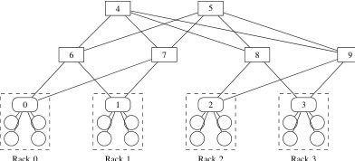 
Fig. 1: Clos topology for n = 4 generated from gen_clos_conn function. Each rack contains one ToR switch and four QPUs.

📷 Fig 2

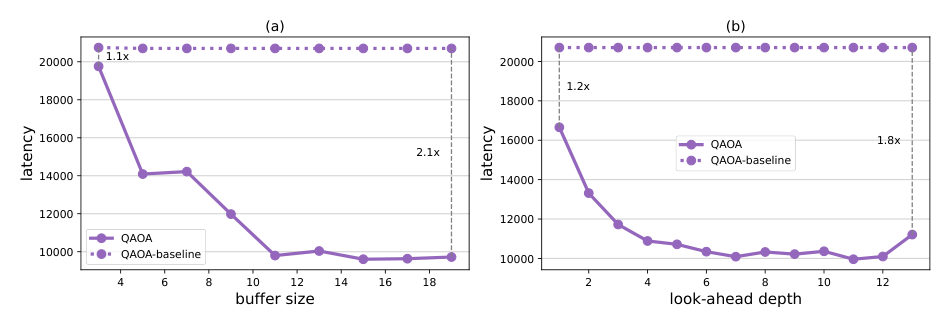 
Fig. 2: QAOA performance improvement of SwitchQNet varying with (a) buffer-size and (b) look-ahead depth

📷 Fig 3

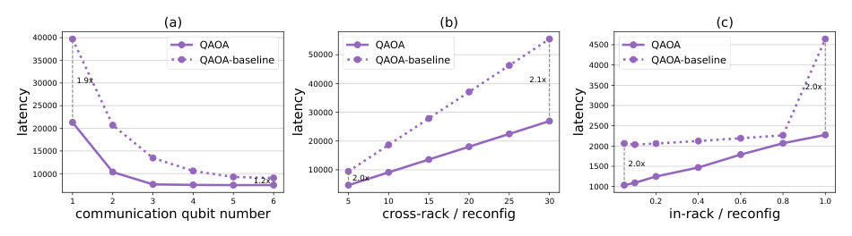 
Fig. 3: QAOA sensitivity varying with (a) communication qubits per QPU, (b) cross-rack EPR latency normalized by reconfiguration latency, and (c) in-rack EPR latency normalized by reconfiguration latency.

**Summary.** This work evaluates the Quantum Approximate Optimization Algorithm (QAOA) as a benchmark workload for distributed quantum computing architectures simulated via SwitchQNet. By mapping QAOA's graph interactions onto network communication requests, the authors measure performance metrics like latency across various topologies. The results confirm that while QAOA shows measurable improvements, its performance is highly sensitive to cross-rack entanglement generation overhead.

**Why it may be interesting.** While focused on quantum networking rather than AMO physics directly, understanding resource constraints (like entanglement generation latency) in large-scale quantum processors is crucial for realizing complex quantum simulation algorithms that might utilize trapped ions or superconducting circuits.

Detailed structure

**Main problem.** The paper analyzes how the performance of QAOA, a structured quantum algorithm, scales when executed across complex distributed quantum computing (DQC) network architectures.

**Main result.** QAOA provides modest but consistent latency reductions compared to baseline compilers, confirming its value as a diagnostic benchmark for understanding the interplay between algorithm structure and network limitations.

**Method.** The authors adapted QAOA by adding a routing generator that translates graph-based cost interactions into remote communication requests processed by the SwitchQNet compiler framework.

**Model / system.** The system is a Quantum Data-Center (QDC) architecture interconnecting multiple QPUs via reconfigurable optical switch networks, evaluated across topologies like Clos, fat-tree, and spine-leaf.

**Key observables.** Communication latency, EPR-pair overhead, EPR wait time, retry overhead, and sensitivity to buffer size/look-ahead depth.

**Important parameters / regimes.** Target graph degree ($k=3$), look-ahead depth (10), in-rack vs. cross-rack latencies (0.1 ms vs 10 ms).

**Assumptions / limitations.** Intra-QPU computation time is neglected; the analysis focuses on one QAOA layer ($p=1$) at the routing level.

**Figures summary.** Figures illustrate performance improvements varying with buffer size and look-ahead depth, while tables summarize latency and wait time gains across different architectural settings (e.g., QPU count vs. baseline).

**Paper structure.** The paper establishes QAOA as a structured workload benchmark, details the adaptation of QAOA to SwitchQNet via a routing generator, evaluates performance metrics across various topologies, and concludes by quantifying the algorithmic benefit relative to network overheads.

Abstract

Quantum data-center (QDC) architectures aim to scale distributed quantum computing (DQC) by interconnecting multiple quantum processing units (QPUs), but their performance depends strongly on how algorithmic communication patterns interact with entanglement generation, switch reconfiguration, and network topology. This paper studies the Quantum Approximate Optimization Algorithm (QAOA) as a graph-structured optimization workload for QDC-based distributed quantum computing. We adapt QAOA to SwitchQNet, a distributed quantum compiler framework that schedules communication and entanglement generation over switch-based QDC networks, by adding a routing generator that converts graph-dependent two-qubit cost interactions into remote-CX communication requests across QPUs. Using this extension, we evaluate QAOA instances across Clos, fat-tree, and spine-leaf topologies, measuring communication latency, EPR-pair overhead, EPR wait time, retry overhead, and sensitivity to buffer size, look-ahead depth, communication-qubit count, EPR latency, and EPR fidelity assumptions. The results show that QAOA obtains modest but consistent latency reductions, highlighting its value as a diagnostic benchmark for studying the interaction between algorithm structure, entanglement management, and quantum-network architecture.

[↑ back to top](#top)

### [Quantum key distribution over a 2 km free-space channel with a high secure key rate](http://arxiv.org/abs/2607.24118v1)

**Authors:** Kyungdeuk Park, Dongkyu Kim, Dong-Gil Im, Yonggi Jo, Jisu Kim, Jonguk Choi, Yong Sup Ihn  
**Type:** experiment · **Category:** quantum information and computing · **PDF:** <https://arxiv.org/pdf/2607.24118v1>  
**Analysis basis:** full PDF text, analyzed in chunks
**Topic relevance:** `quantum optics experiment` **2/5** · `QC/QI experiment` **1/5** · `quantum measurements` **1/5**

📷 Fig 1

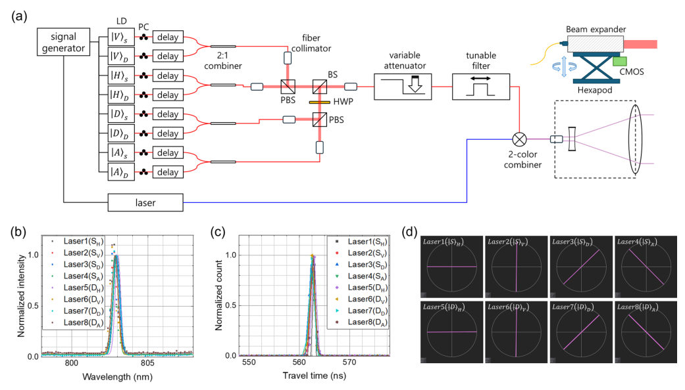 
FIG. 1. (a) Schematic diagram of the free-space decoy-state BB84 QKD transmitter setup. (b) Measured optical spectra of the eight independent pulsed lasers after passing through the narrow-band tunable filter. (c) Temporal pulse profiles of the eight channels, demonstrating tight sub-nanosecond synchronization. (d) Polarization state measurements of each channel verifying the H, V , D, and A states for both signal and decoy pulses. LD: laser diode, PC: polarization controller, PBS: polarization beam splitter, BS: beam splitter, HWP: half waveplate.

📷 Fig 2

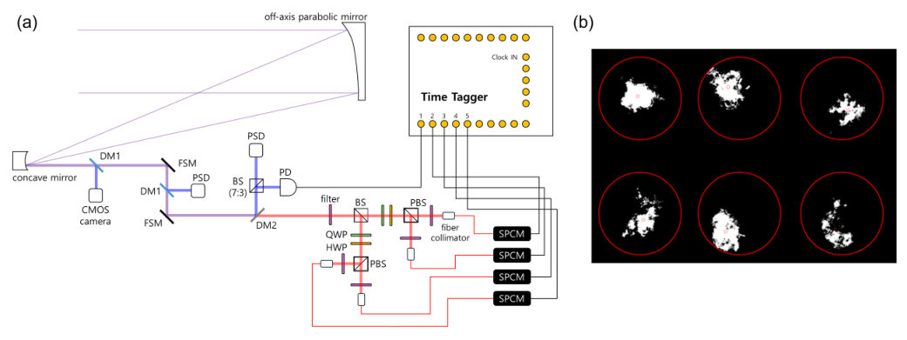 
FIG. 2. (a) Optical layout of the free-space QKD receiver and active tracking system. (b) Raw intensity profiles of the 660 nm guide laser captured by the receiver CMOS camera at different time intervals. DM: dichroic mirror, FSM: fast-steering mirror, PD: photo-detector, PSD: position sensitive detector, BS: beam splitter, PBS: polarization beam splitter, QWP: quarter waveplate, HWP: half waveplate, SPCM: single photon counting module.

📷 Fig 3

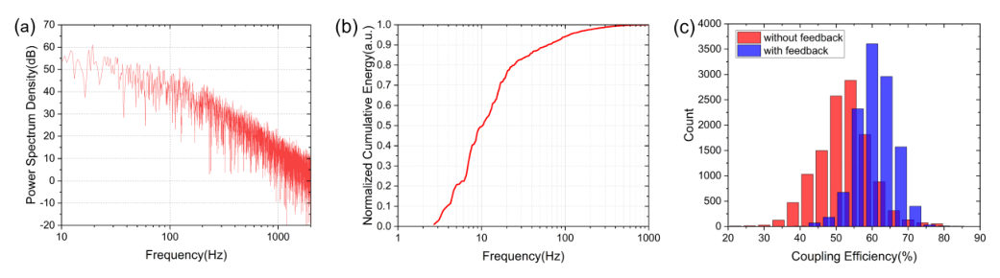 
FIG. 3. Characterization of atmosperic turbulence and stabilization performance. (a) Power spectral density of the beam- wander measured by the position-sensitive detector (PSD1) at the receiver. (b) Normalized cumulative energy of the beam- wander as a function of frequency, showing that 90% of the turbulence energy is concentrated below 60 Hz. (c) Histogram of the single-photon coupling efficiency into the MMF measured over a 1-minute interval, comparing the performance with (blue) and without (red) the active FSM-PSD feedback loop.

📷 Fig 4

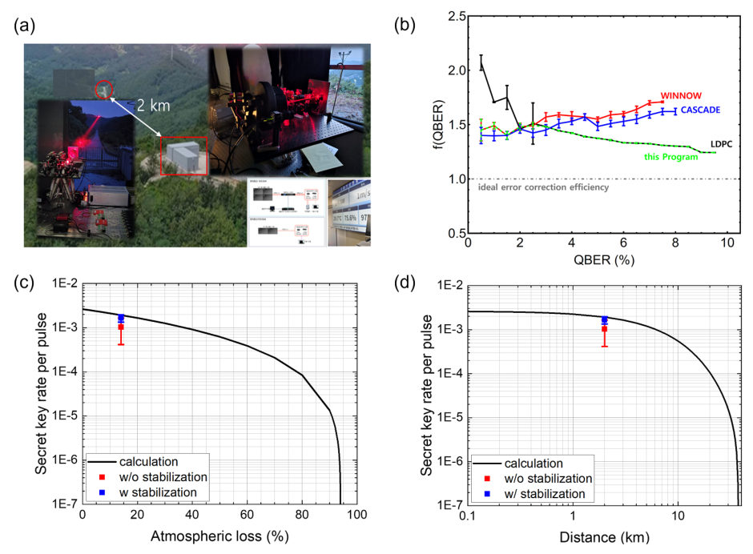 
FIG. 4. Outdoor QKD experimental results and performance analysis. (a) Photographic overview of the 2 km free-space QKD link established at the Agency for Defense Development. (b) Error correction efficiency f(QBER) as a function of the quantum bit error rate (QBER), comparing the experimental performance of the Winnow and LDPC protocols against the ideal error correction limit. (c) Secret key rate per pulse as a function of atmospheric loss, comparing experimental data point (with and without stabilization) with the theoretical simulation. (d) Secret key rate per pulse as a function of channel distance, showing the projected performance up to 30 km under clear-air conditions.

**Summary.** The authors experimentally demonstrated a high-rate Quantum Key Distribution (QKD) system operating over a 2 km outdoor link. They overcame significant hurdles from atmospheric turbulence and beam wander by integrating an active stabilization system using FSMs and PSDs. This work provides a practical framework, achieving a secure key rate of 164.8 kbps, essential for future mobile quantum networks.

**Why it may be interesting.** This work directly addresses the engineering challenges of deploying quantum communication outside controlled laboratory settings, which is crucial for realizing global quantum networks that rely on free-space links.

Detailed structure

**Main problem.** The primary challenge addressed is demonstrating high-rate, long-distance Quantum Key Distribution (QKD) over free-space channels affected by atmospheric turbulence and structural drift.

**Main result.** The system successfully achieved a secure key rate of 164.8 kbps over a 2 km outdoor channel, proving the viability of high-speed quantum communication in realistic environments.

**Method.** The methodology involves implementing an active beam stabilization system using Fast-Steering Mirrors (FSMs) and Position Sensitive Detectors (PSDs) to counteract atmospheric turbulence and structural misalignment during BB84 QKD transmission.

**Model / system.** The physical platform is a free-space decoy-state BB84 QKD link operating outdoors over 2 km, utilizing a 100 MHz multi-channel transmitter source. The receiver incorporates active tracking optics (FSMs/PSDs) coupled with coarse alignment via a hexapod platform.

**Key observables.** Secure key rate (164.8 kbps), Quantum Bit Error Rate (QBER $\approx 3.3\%$), and the standard deviation of the secure key rate.

**Important parameters / regimes.** 2 km channel distance, 100 MHz repetition rate, $7.5 \mu	ext{rad}$ pointing resolution requirement, and a closed-loop control bandwidth $>500$ Hz.

**Assumptions / limitations.** The performance scaling up to 30 km is simulated assuming clear atmospheric conditions; the use of weak coherent pulses necessitates the decoy-state protocol.

**Figures summary.** Figures illustrate schematic setups, measured spectra, temporal pulse profiles, and critically, show the comparison of coupling efficiency with and without active FSM-PSD feedback loops.

**Paper structure.** The paper details the experimental setup (transmitter/receiver), describes the necessity and implementation of multi-stage active beam stabilization (coarse alignment followed by high-speed tracking), presents performance metrics comparing stabilized vs. unstabilized operation, and concludes with scalability projections.

Abstract

Free-space quantum key distribution (QKD) provides crucial advantages, including mobility and deployment flexibility, for securing next-generation communication networks. However, practical free-space implementations face major challenges, such as muilti-photon vulnerabilities, spatial mode mismatch, and atmospheric turbulence-induced beam fluctuations. In this work, we experimentally demonstrate a free-space decoy-state BB84 QKD system operating at a 100 MHz repetition rate with a 2.5 ns pulse width over a 2 km outdoor channel. By employing an active beam-wander correction based on fast-steering mirrors (FSMs) and position sensitive detectors (PSDs) con?figuration, our system achieves a secure key rate of 164.8 kbps under a quantum bit error rate (QBER) of approximately 3.3 %. This demonstration provides a practical framework for deploying high-rate, long-distance free-space quantum communication in realistic turbulence environments.

[↑ back to top](#top)

### [CP-preserving channels](http://arxiv.org/abs/2607.24682v1)

**Authors:** Indu Bala, Sourav Das, Swapan Rana  
**Type:** theory · **Category:** quantum information and computing · **PDF:** <https://arxiv.org/pdf/2607.24682v1>  
**Analysis basis:** full PDF text, analyzed in chunks
**Topic relevance:** `entanglement & information structure` **2/5** · `correlated / nonlocal dissipation` **1/5**

📷 Fig 1

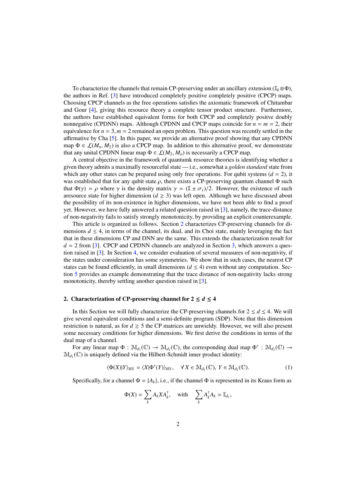 
Low-resolution page preview, page 2

📷 Fig 2

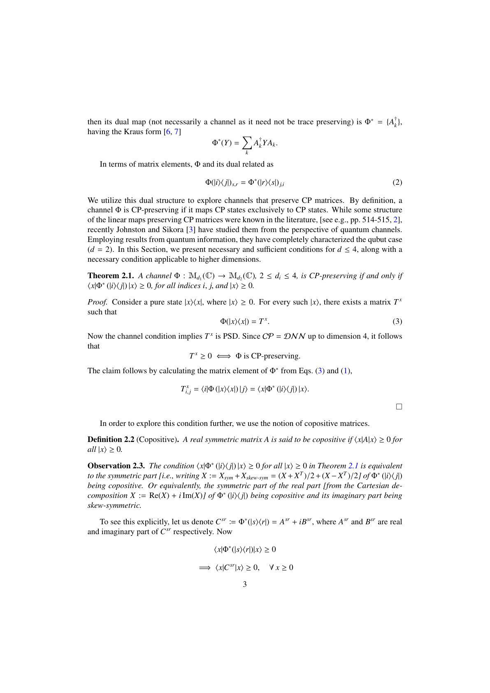 
Low-resolution page preview, page 3

📷 Fig 3

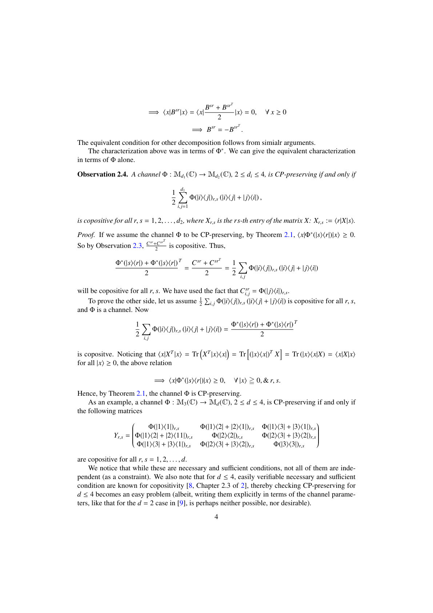 
Low-resolution page preview, page 4

📷 Fig 4

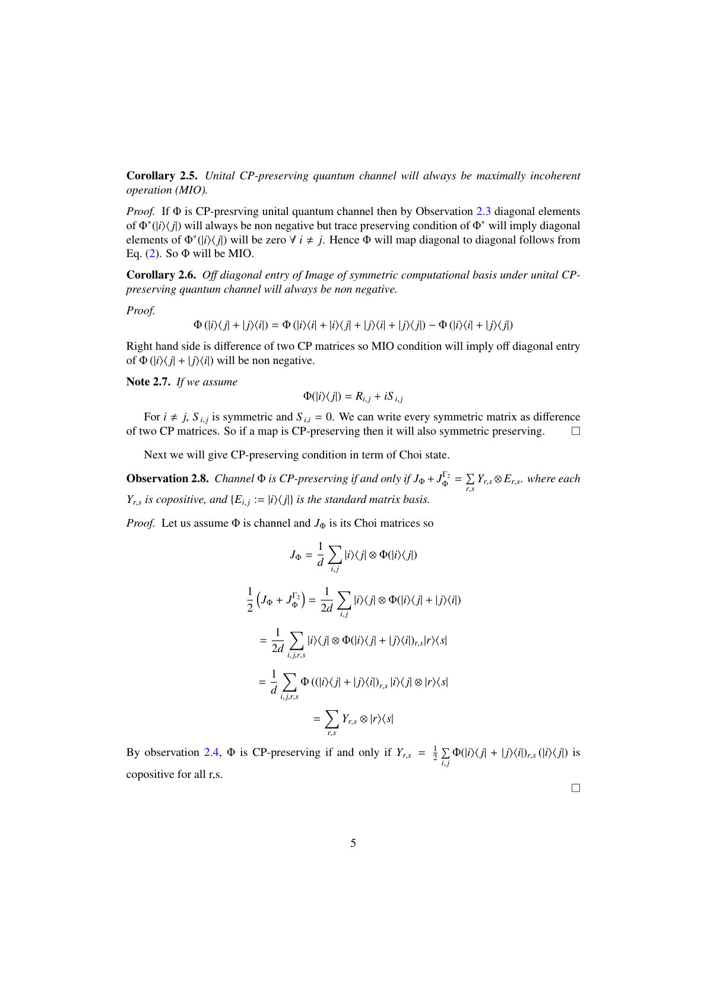 
Low-resolution page preview, page 5

📷 Fig 5

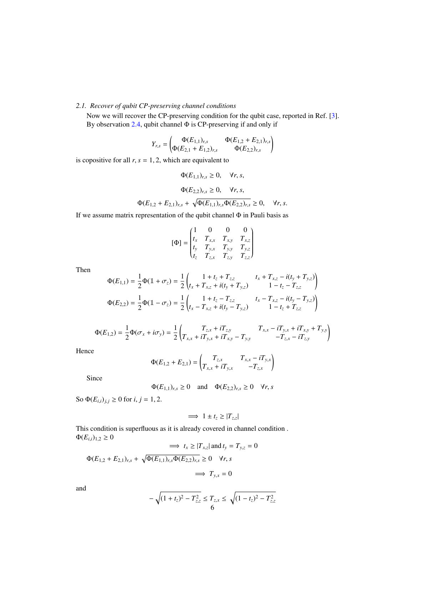 
Low-resolution page preview, page 6

**Summary.** This paper characterizes CP-preserving quantum channels, providing necessary and sufficient conditions for small dimensions using algebraic tools like copositivity. Crucially, it demonstrates that a common measure of non-negativity, the trace distance ($	ext{NT}$), fails to be strongly monotone under these free operations by constructing an explicit counterexample.

**Why it may be interesting.** This work is highly relevant as it rigorously defines the boundaries of 'free' operations in quantum information theory by characterizing when physical channels preserve certain structural properties (like CP states), which guides resource quantification.

Detailed structure

**Main problem.** The paper aims to characterize CP-preserving quantum channels ($\Phi$) within the framework of quantum resource theories, specifically addressing necessary and sufficient conditions for these maps.

**Main result.** It provides explicit characterizations for small dimensions ($d \le 4$), demonstrates that the trace-distance measure of non-negativity fails strong monotonicity via a counterexample, and establishes equivalences between different types of quantum channels (e.g., CPDNN $\iff$ CPCP).

**Method.** The analysis relies on using the dual map ($\Phi^*$) and properties of copositive matrices to derive necessary and sufficient conditions for channel preservation. It also involves constructing explicit counterexamples to test resource monotonicity.

**Model / system.** The study concerns general quantum channels $\Phi: M_{d_1}(\mathbb{C}) 	o M_{d_2}(\mathbb{C})$ acting on density matrices, focusing particularly on the qubit case ($d=2$) and small higher dimensions up to $d=4$.

**Key observables.** CP-preserving condition ($\langle x|\Phi^*(|i
angle\langle j|) |x
angle \ge 0$), copositivity of matrix combinations, Robustness ($	ext{NR}$), and Trace Distance ($	ext{NT}$) measures of non-negativity.

**Important parameters / regimes.** The dimension $d$ (especially $d=2, 3, 4$) and the mixing parameter $p$ used in constructing counterexamples are critical parameters.

**Assumptions / limitations.** The analysis provides necessary and sufficient conditions only for small dimensions ($d \le 4$), and the failure of strong monotonicity is demonstrated using specific mixed states $
ho = p|\Psi_2
angle\langle\Psi_2| \oplus (1-p)|\Psi_3
angle\langle\Psi_3|$.

**Figures summary.** Not specified in notes, but the analysis involves tables summarizing non-negativity values for specific dimensions.

**Paper structure.** The paper proceeds by establishing necessary and sufficient conditions for CP-preserving channels using copositivity (for small $d$), then investigates resource measures like $	ext{NT}$, culminating in a detailed construction of a counterexample to disprove strong monotonicity under free operations.

Abstract

Completely positive (CP) matrices are ubiquitous in modern science and technology with applications in optimization, graph theory, and quantum entanglement. Recently, Johnston \emph{et al.} [Linear Algebra and its Applications, 2022] have cast CP matrices into the framework of quantum resource theories, where CP states serve as free states and CP-preserving channels act as free operations. This work addresses several questions raised in their work. Specifically, we provide the necessary and sufficient conditions of CP-preserving channels in small dimensions, which are necessary in higher dimensions, and discuss the resource quantification via the trace distance of non-negativity. By constructing an explicit counterexample, we demonstrate that the trace-distance measure of non-negativity violates strong monotonicity. We also provide an alternative proof that every CPDNN channel $Φ:\MM_n\to \MM_2$ is CPCP. Additionally, we show that any unital CPDNN map $Φ:\MM_2\to \MM_n$ is also CPCP.

[↑ back to top](#top)

### [Multivariate Time Series Forecasting with Adaptive Non-Local Observables](http://arxiv.org/abs/2607.24399v1)

**Authors:** Yu-Ting Lee, Huan-Hsin Tseng, Samuel Yen-Chi Chen  
**Type:** both · **Category:** quantum information and computing · **PDF:** <https://arxiv.org/pdf/2607.24399v1>  
**Analysis basis:** full PDF text, analyzed in chunks
**Topic relevance:** `quantum measurements` **2/5** · `measurement-induced transitions` **1/5**

📷 Fig 1

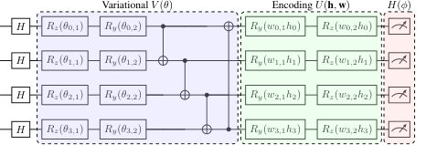 
Fig. 1: VQC architecture of MTSF-ANO. Each layer con- sists a variational circuit of parameterized Rz, Ry rotations, cir- cular CNOT gates, and a data re-uploading encoding U(h, w) with trainable input scaling w. For measurement, trainable k-local observables H(ϕ) are employed.

📷 Fig 2

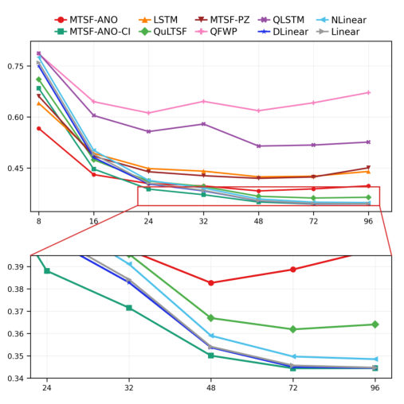 
Fig. 2: Impact of lookback window size (ETTh1). We report MSE with H = 48 and varying lookback from L = 8 to L = 96. MTSF-ANO and its channel-independent variant, MTSF-ANO-CI, outperform all other models, with MTSF- ANO best at L ∈{8, 16} and MTSF-ANO-CI best for L &gt; 16.

**Summary.** This paper introduces MTSF-ANO, a novel hybrid model that integrates variational quantum circuits with Adaptive Non-Local Observables (ANO) for Multivariate Time Series Forecasting. By replacing fixed local measurements with trainable non-local observables, the model significantly enhances its ability to capture complex correlations in time-series data. The results confirm ANO's potential as a powerful tool for advancing quantum machine learning applications.

**Why it may be interesting.** The work directly applies advanced concepts from quantum information—specifically the use of non-local observables in measurement—to solve a complex data science problem. This demonstrates a practical pathway for leveraging quantum computational power beyond simple feature mapping, which is highly relevant to theoretical studies of quantum circuit expressivity.

Detailed structure

**Main problem.** The paper addresses Multivariate Time Series Forecasting (MTSF), a task requiring models to capture complex, high-dimensional temporal correlations.

**Main result.** The proposed model, MTSF-ANO, significantly outperforms strong baselines on multiple benchmark datasets by effectively utilizing adaptive non-local observables within its quantum circuit structure.

**Method.** It proposes a hybrid architecture combining variational quantum circuits (VQCs) with Adaptive Non-Local Observables (ANO), which allows the measurement process to couple features across distant qubits.

**Model / system.** The core model is MTSF-ANO, built upon VQCs that encode data via unitaries and are measured using trainable $k$-local Hermitian observables $H(\phi)$. This framework extends standard QNNs by moving beyond fixed local measurements to capture broader correlations.

**Key observables.** Mean Squared Error (MSE) and Mean Absolute Error (MAE) used for performance benchmarking; the key observable is the expectation value derived from the ANO measurement, $\langle H(\phi) 
angle$.

**Important parameters / regimes.** Non-locality parameter $k$ (where performance peaks between 3 and 5); Lookback window size $L$; Circuit depth/number of layers.

**Assumptions / limitations.** The primary limitation addressed is the restricted expressivity of standard VQCs relying only on fixed local measurements. The model assumes that incorporating trainable non-local observables can capture necessary high-dimensional correlations.

**Figures summary.** Figure 1 details the MTSF-ANO VQC architecture using $k$-local observables. Figure 2 illustrates how performance changes with lookback window size ($L$). Tables compare MSE improvements over baselines based on ANO's non-locality ($k$) and circuit depth.

**Paper structure.** The paper introduces the MTSF problem, proposes the MTSF-ANO hybrid model incorporating ANO for enhanced measurement. It details the architecture, presents extensive empirical results across multiple ETT datasets varying $L$ and $k$, analyzes ablation studies on circuit components (depth, CNOTs), and concludes that ANO is a powerful tool for quantum time series forecasting.

Abstract

Multivariate time series forecasting (MTSF) predicts future values of multiple variables from historical data. While quantum neural networks have been increasingly applied to this task, they typically rely on fixed local measurements, which restrict their expressivity. We propose MTSF-ANO, a simple hybrid model for MTSF that integrates variational quantum circuits with adaptive non-local observables (ANO). On the four ETT datasets, MTSF-ANO ranks first or second in MSE in 17 of 20 settings, improving over the strongest baseline by up to 20% on ETTh1, and outperforms or matches its fixed local observable counterpart across all settings. Our ablations show how the quantum circuit design and ANO non-locality affect performance. These results suggest that ANO is a promising direction for quantum time series forecasting.

[↑ back to top](#top)

### [Sample complexity of quantum resource testing via one-shot quantum blurring](http://arxiv.org/abs/2607.24712v1)

**Authors:** Dmitry Grinko, Ludovico Lami  
**Type:** theory · **Category:** quantum information and computing · **PDF:** <https://arxiv.org/pdf/2607.24712v1>  
**Analysis basis:** full PDF text, analyzed in chunks
**Topic relevance:** `entanglement & information structure` **2/5** · `quantum measurements` **1/5**

📷 Fig 1

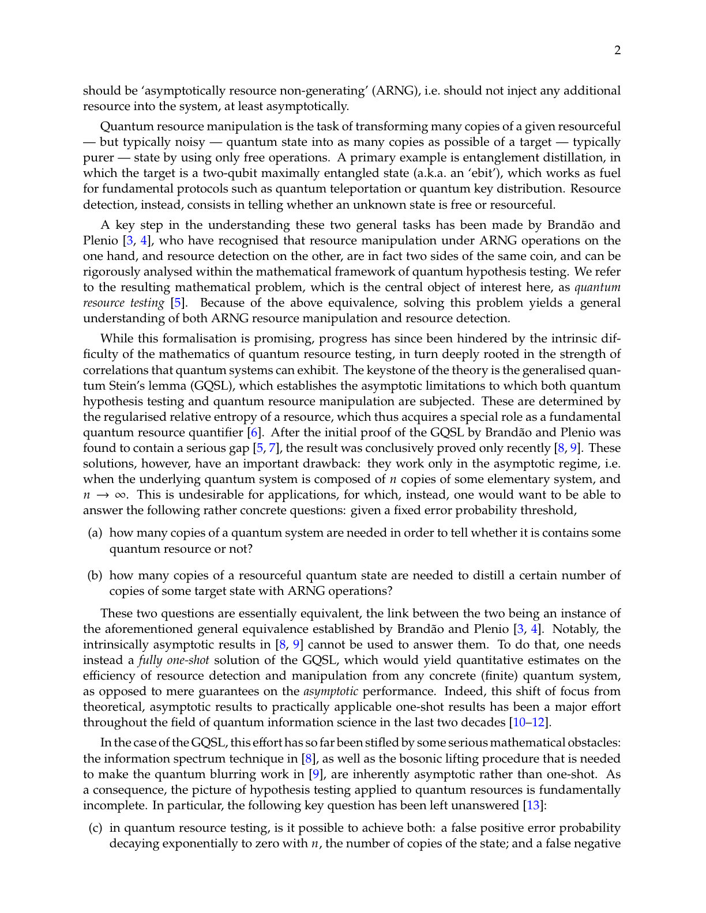 
Low-resolution page preview, page 2

📷 Fig 2

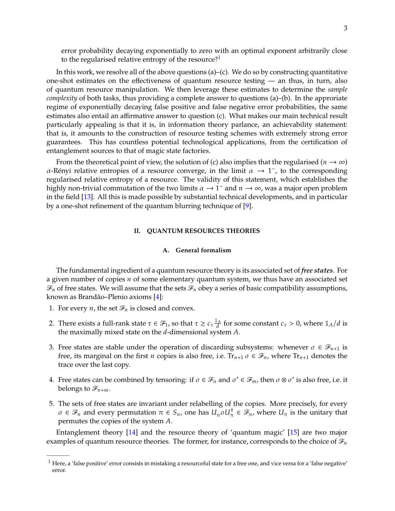 
Low-resolution page preview, page 3

📷 Fig 3

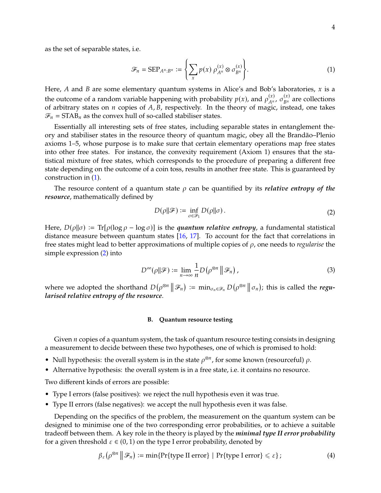 
Low-resolution page preview, page 4

📷 Fig 4

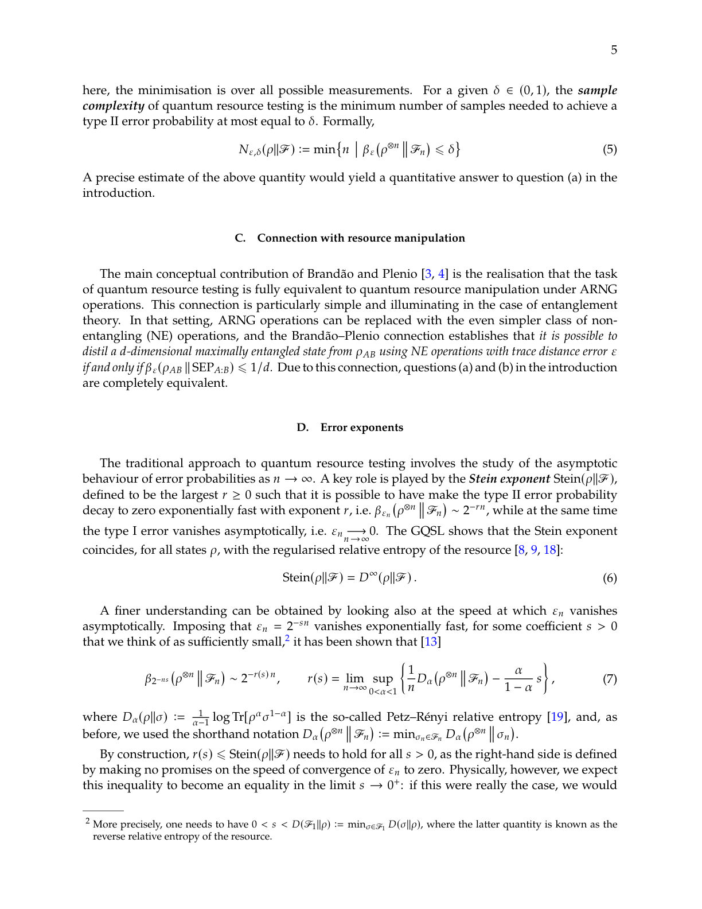 
Low-resolution page preview, page 5

📷 Fig 5

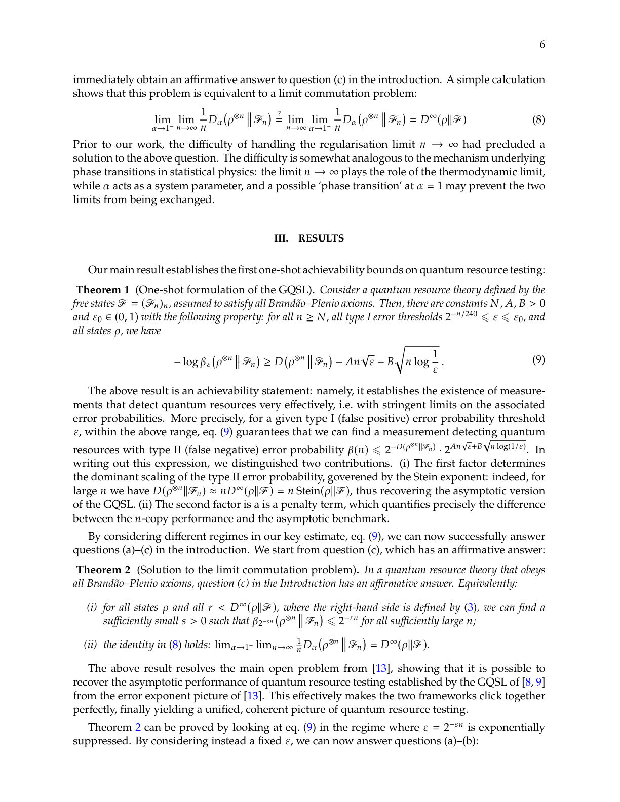 
Low-resolution page preview, page 6

**Summary.** This paper develops rigorous finite-sample bounds for quantum resource testing, a process used to verify if a state possesses a specific quantum resource like entanglement. By providing explicit estimates on the number of required copies ($n$), it moves beyond asymptotic theory, resolving key open problems and offering concrete guidelines for experimental implementation in quantum information processing.

**Why it may be interesting.** This work provides concrete, experimentally relevant quantitative measures (finite-sample bounds) for fundamental concepts in quantum information theory that were previously only understood asymptotically. This is crucial for designing practical quantum protocols.

Detailed structure

**Main problem.** The paper addresses quantum resource testing: discriminating between a resourceful state $
ho^{\otimes n}$ and any free (resourceless) state $F_n$. It aims to provide rigorous, finite-sample bounds for this fundamental task in quantum information processing.

**Main result.** The authors establish the first rigorous finite-$n$ sample complexity bound, showing that $O\left(rac{\log(1/\delta)}{D_\infty(
ho\|F)}
ight)$ copies are needed to achieve a desired false negative error probability $\delta$. They also resolve an open problem regarding the convergence of regularised Rényi relative entropies.

**Method.** The analysis uses quantum hypothesis testing frameworks, refining techniques related to the generalized quantum Stein's lemma and employing one-shot refinements of quantum blurring techniques.

**Model / system.** The theory applies to general quantum resource theories, using specific examples like entanglement (separable states) and nonstabiliser-ness. The core mathematical objects are the resourceful state $
ho$ and the set of free states $F$.

**Key observables.** Relative entropy ($D(
ho\|F)$), regularised relative entropy ($D_\infty(
ho\|F)$), and the sample complexity $N_{\epsilon, \delta}(
ho\|F)$.

**Important parameters / regimes.** The number of copies ($n$), the false positive error probability ($\epsilon$), and the target false negative error probability ($\delta$).

**Assumptions / limitations.** The resource theory must satisfy the Brandão–Plenio axioms for certain theorems to hold. The results move beyond asymptotic limits by providing finite-$n$ estimates.

**Figures summary.** Not specified in detail, but notes mention Figure S2 illustrating the behavior of a discrete delta approximant $\mathfrak{q}_r(x)$ constructed using Chebyshev polynomials.

**Paper structure.** The paper builds from defining quantum resource testing as hypothesis testing, deriving finite-$n$ bounds by refining asymptotic tools like the GQSL, and concluding with explicit sample complexity estimates for asymmetric testing.

Abstract

Quantum resource testing is a fundamental primitive of quantum information processing, profoundly connected to resource manipulation. Its goal is to discriminate $n$ copies of a given resourceful state $ρ$ from all free (i.e., resourceless) states; key instances for applications are entanglement testing and quantum magic testing. The asymptotic characterisation relies on the recently proven generalised quantum Stein's lemma, which establishes the rate of decay of the false negative error probability for a fixed false positive error probability. This result, however, is intrinsically asymptotic and thus can provide no finite-resource guarantees, which makes its practical implications unclear. Here, we establish the first rigorous finite-$n$ bounds on quantum resource testing and hence quantum resource manipulation, providing explicit estimates on the number of copies needed to achieve a prescribed performance. As notable consequences, we obtain (a) the convergence of the regularised Rényi relative entropies of a resource, which settles the important open problem from [Fang/Hayashi, IEEE ToIT 72:6, 2026]; and (b) the first sample-complexity bound for asymmetric resource testing: for any fixed false positive error probability, a false negative error probability of at most $δ$ can be achieved with $n=O\left(\frac{\log(1/δ)}{D^\infty(ρ\|F)}\right)$ copies of $ρ$, in the limit where $δ\to 0$.

[↑ back to top](#top)

### [Local Universality and Structural Certificates for Minimal Fixed-Depth Two-Qutrit Gate Decomposition](http://arxiv.org/abs/2607.24129v1)

**Authors:** Yurui Liu, Ruoting Dou, Peng Xu, Xinsheng Tan, Shengjun Wu, Yang Yu, Zeng-Bing Chen  
**Type:** both · **Category:** quantum information and computing · **PDF:** <https://arxiv.org/pdf/2607.24129v1>  
**Analysis basis:** full PDF text, analyzed in chunks
**Topic relevance:** `QC/QI experiment` **2/5**

📷 Fig 1

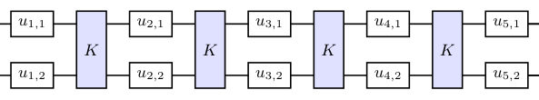 
FIG. 1. Dimension-saturating four-core ansatz. Each local layer is Li = ui,1 ⊗ui,2 ∈SU(3) ⊗SU(3), and the nonlocal core K ∈SU(9) is fixed.

📷 Fig 2

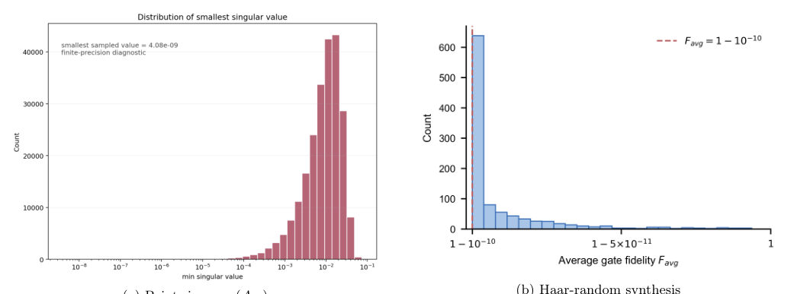 
FIG. 2. Compact Clifford-core diagnostics. Panel (a) shows the distribution of the sampled pointwise smallest singular value σmin(Apt); the smallest recorded value, 4.08 × 10−9, lies well above the numerical rank floor, so no sampled rank collapse occurs. Panel (b) shows high-precision Haar-random synthesis for one randomly selected good Clifford-word core. The dashed line marks Favg = 1 −10−10.

📷 Fig 3

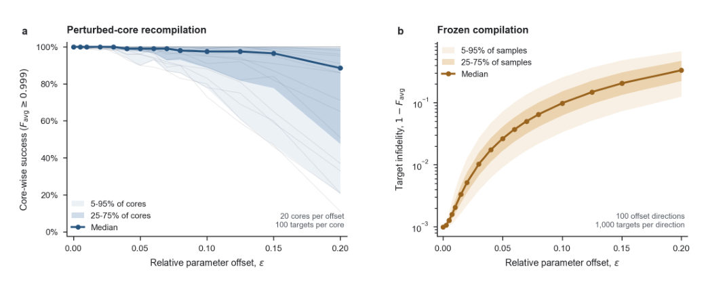 
FIG. 3. Hamiltonian-parameter robustness under shared static coefficient offsets. (a) Perturbed-core recompilation. The nonzero Hamiltonian coefficients are varied multiplicatively along 20 fixed offset directions, while nominally zero coefficients are held at zero. The complete dense scan reuses these directions at each of 14 sampled amplitudes through ϵ = 0.20. Each perturbed core is evaluated on the same 100-target subset, and success means Favg ≥0.999. The line is the median core-wise success fraction, the dark band is the interquartile range, the light band is the 5th–95th percentile range, and faint lines show individual core directions. (b) Frozen-compilation target infidelity under...

📷 Fig 4

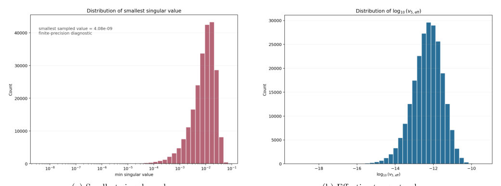 
FIG. 4. Pointwise differential diagnostics for the Clifford-word cores. Panel (a) shows the distribution of σmin(Apt); the smallest recorded value is 4.08 × 10−9, so no sampled configuration reaches the numerical rank floor. Panel (b) shows the distribution of log10(v5,eff). Both panels are finite-precision sampled diagnostics rather than uniform bounds over L5.

📷 Fig 5

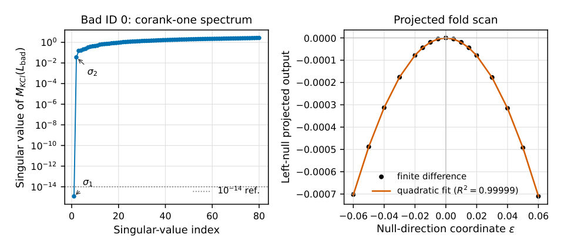 
FIG. 5. Fold-like diagnostics for the Clifford-word core. Left, a representative singular-value spectrum of MKCl(hbad) shows one near-zero singular value at the numerical floor and a visible gap to σ2. Right, a finite-difference scan along the approximate right-null direction, projected onto the left-null direction, is well fit by a quadratic curve. These finite-precision diagnostics are numerically consistent with simple-fold behavior; they are not an interval-certified fold proof.

**Summary.** This paper rigorously proves local universality for decomposing two-qutrit gates by constructing a parameter-counting-minimal ansatz and deriving an exact mathematical certificate via differential analysis. It contrasts this theoretical proof with practical hardware testing using superconducting cores, demonstrating high fidelity while respecting structural constraints imposed by gate symmetries.

**Why it may be interesting.** This work bridges abstract quantum information theory (local universality proofs) with concrete physical implementations using superconducting qudits. The explicit handling of structural constraints based on symmetry is highly relevant for designing robust, physically realizable quantum circuits.

Detailed structure

**Main problem.** The primary goal is determining local universality for decomposing fixed-depth quantum gates acting on two qutrits ($SU(9)$). This involves finding structural certificates proving that the gate set can approximate any target gate within a certain fidelity.

**Main result.** Local universality is established using an exact Clifford certificate derived from a parameter-counting-minimal, dimension-saturating ansatz. The study also identifies a structural obstruction for complex-symmetric cores and validates performance with a hardware-motivated core ($K_{sc}$).

**Method.** The authors use differential geometry on the gate decomposition map $\Phi_K$, employing the right-trivialized differential to derive local certificates of full rank (local surjectivity). They complement this theory with numerical benchmarking using superconducting circuit models.

**Model / system.** The system is a two-qutrit quantum gate space, $SU(9)$. The ansatz uses four fixed copies of a core $K \in SU(9)$ interleaved with five adjustable local layers from $L=SU(3)\otimes SU(3)$.

**Key observables.** Local differential rank (must equal 80 for universality), average fidelity ($F_{	ext{avg}} \ge 0.999$), and the minimum singular value ($\sigma_{\min}$) of the Jacobian matrix.

**Important parameters / regimes.** The dimension saturation condition ($5 \cdot \dim L = \dim SU(9) = 80$) is crucial; the perturbation amplitude $\epsilon$ was tested up to $0.20$.

**Assumptions / limitations.** The results strictly prove *local* universality, and global surjectivity remains an open question. The numerical diagnostics are interpreted as sampled evidence rather than analytic guarantees.

**Figures summary.** Figure 1 illustrates the dimension-saturating four-core ansatz structure; Figure 10 benchmarks structured targets (CZ, CNOT, etc.) for the superconducting core $K_{sc}$ under fixed-budget synthesis.

**Paper structure.** The paper first establishes the theoretical framework using differential geometry and provides an exact Clifford certificate. It then analyzes structural obstructions related to symmetry ($K=K^T$). Finally, it validates these findings by applying the theory to a hardware-motivated superconducting core ($K_{sc}$) through numerical testing of fidelity under perturbation.

Abstract

We study a dimension-saturating fixed-core ansatz in which four copies of a fixed, non-tunable two-qutrit core $K\in SU(9)$ are interleaved with five adjustable local layers from $L=SU(3)\otimes SU(3)$. Since $\dim SU(9)=80$ and $5\dim L=80$, this is the shortest fixed-core architecture not excluded by parameter counting. We formulate the smooth map $Φ_K:L^5\to SU(9)$ and use its right-trivialized differential to give verifiable certificates for local universality. We construct an explicit Clifford-word core whose Pauli-label splitting makes the identity-point differential an exact isometry, and we classify all 2304 symplectic actions satisfying the same splitting criterion. We also prove a structural obstruction for an important symmetry class: every complex-symmetric core $K=K^{T}$, including every core generated by a time-independent real-symmetric Hamiltonian in the chosen computational basis, has identity-point differential rank at most 78; hence any full-rank certificate for such a core must occur away from that point. We then assess a hardware-motivated superconducting core generated by a noncommuting, temporally asymmetric drive. Direct calculation verifies $K_{\rm sc}\neq K_{\rm sc}^{\mathsf T}$, and the core achieves $F_{\rm avg}\ge 0.999$ for all 1000 Haar-random targets tested under the stated restart protocol. We also report favorable sampled Jacobian-rank, structured-target, and robustness diagnostics. These results establish local universality at the parameter-counting-minimal, dimension-saturating depth, with an exact Clifford certificate complemented by a hardware-motivated numerical case study. Throughout, we separate exact local certificates from numerical evidence for broader synthesis performance.

[↑ back to top](#top)

### [Lossless Address Coding for Quantum Networks](http://arxiv.org/abs/2607.23510v1)

**Authors:** Dick Maryopi  
**Type:** theory · **Category:** quantum information and computing · **PDF:** <https://arxiv.org/pdf/2607.23510v1>  
**Analysis basis:** full PDF text, analyzed in chunks
**Topic relevance:** `entanglement & information structure` **2/5**

📷 Fig 1

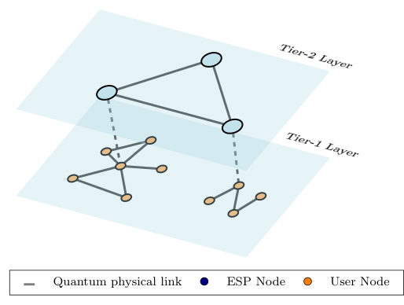 
Fig. 1. A simple hierarchical quantum network model considered in this paper. Network nodes are partitioned into two functional layers: 1) the tier-2 layer serves as an entanglement service provider (ESP), and 2) the tier-1 layer consists of user nodes organized into clusters that consume the distributed entanglement.

📷 Fig 2

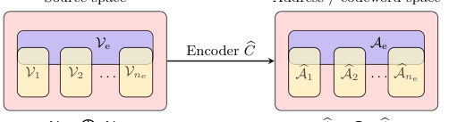 
Fig. 2. Hierarchical decomposition of the source space and its image under isometric encoder bC, which maps each subspace Vj into mutually orthogonal address subspace b Aj .

**Summary.** This paper introduces a novel lossless source coding scheme designed to provide coherent and compact addressing within complex quantum networks. By structuring the address space hierarchically using prefix-suffix codes derived from local probability distributions, it ensures unique decodability without needing classical communication of node indices. This offers a practical framework for building scalable quantum infrastructure.

**Why it may be interesting.** This work provides a rigorous theoretical link between classical information theory (source coding) and quantum network architecture design, offering concrete methods for scalable quantum resource management.

Detailed structure

**Main problem.** The work addresses the critical need for a lossless source coding scheme to manage node identification and resource management in complex, interconnected quantum networks.

**Main result.** A hierarchical encoder-decoder structure is proposed that guarantees unique decodability while embedding necessary subspace information directly into the address state without requiring classical side channels.

**Method.** The authors model addressing as an information-theoretic lossless source coding problem, utilizing a prefix-suffix address space and constructing isometric operators based on Huffman-like procedures derived from local source matrix diagonalization.

**Model / system.** The system is a quantum network modeled as a graph partitioned into functional layers (Tier-2 ESP and Tier-1 User Nodes) and multiple clusters. The addressing function maps nodes to structured quantum address states $|\kappa_j\sigma_{ij}
angle$.

**Key observables.** Perfect fidelity ($F(v)=1$) in the encoding/decoding process, isometry error ($\epsilon_{iso}$), and the structure of the resulting codeword state.

**Important parameters / regimes.** Cluster sizes, node probabilities derived from source matrices ($
ho_e, 
ho_j$), and the maximum address length $\ell_{\max}$.

**Assumptions / limitations.** The scheme assumes an ideal, noise-free environment for its primary demonstration; it also relies on the ability to construct isometries based on local probability distributions.

**Figures summary.** Figure 1 illustrates the simple hierarchical quantum network model showing partitioning. Figure 2 (mentioned) illustrates the hierarchical decomposition of the source space $V$ into mutually orthogonal address subspaces $bA_j$.

**Paper structure.** The paper establishes the problem by defining the need for coherent addressing, then develops the mathematical framework using prefix-suffix coding and isometric operators derived from local source matrix diagonalization (Huffman procedure), culminating in proofs of unique decodability.

Abstract

As quantum systems advance toward interconnected architectures, the ability to identify nodes, manage resources, and support network-level functions becomes increasingly critical. In this work, we propose a lossless source coding scheme for addressing in quantum networks that enables compact, hierarchical, and coherently processable quantum address states. Specifically, we introduce a prefix-suffix address space and develop an isometric hierarchical encoder-decoder that guarantees unique decodability. We further provide a practical Huffman-based procedure that embeds prefix-free, length-eigenstate codewords into the address space, thereby preserving isometry. The scheme is particularly designed for networks with hierarchical structure, heterogeneous cluster sizes, and configurable address assignment to accommodate dynamic network conditions. A numerical example on a 13-node network demonstrates that the proposed hierarchical encoding scheme is feasible and achieves perfect fidelity. This work establishes a rigorous connection between source coding theory and quantum network design, offering a practical framework towards scalable and coherent quantum addressing.

[↑ back to top](#top)

### [Revisiting the invariant ring of two-qubit mixed states](http://arxiv.org/abs/2607.23039v1)

**Authors:** Bing Xie, Lin Zhang  
**Type:** theory · **Category:** quantum information and computing · **PDF:** <https://arxiv.org/pdf/2607.23039v1>  
**Analysis basis:** full PDF text, analyzed in chunks
**Topic relevance:** `entanglement & information structure` **2/5**

📷 Fig 1

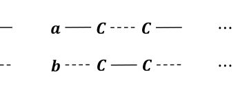 
Figure 2: The graphical representation of some A- and B-type vectors.

📷 Fig 2

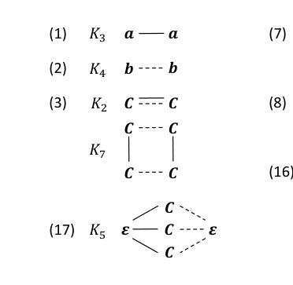 
Figure 3: Some candidate invariants.

📷 Fig 3

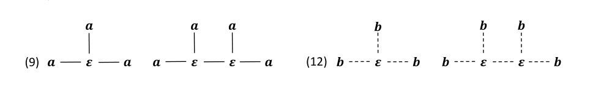 
Figure 5: In both cases (9) and (12), there must be a three-order tensor connecting two identical

📷 Fig 4

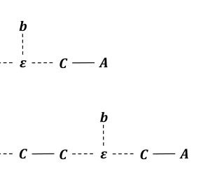 
Figure 6: The two types of invariants in situation (31).

📷 Fig 5

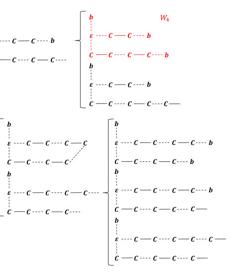 
Figure 7: The single candidate invariant in case (24).

**Summary.** This paper tackles the complex problem of finding all polynomial invariants that characterize two-qubit mixed states under local unitary transformations. By rigorously deriving the Molien series and employing a systematic graphical method, the authors provide a complete generating set of 21 such invariants. This work is crucial for advancing the mathematical understanding of entanglement classification in quantum information theory.

**Why it may be interesting.** Understanding local unitary invariants is fundamental for classifying entanglement in quantum information protocols; this provides concrete mathematical tools for that classification.

Detailed structure

**Main problem.** The central problem is mathematically characterizing the invariant ring associated with local unitary (LU) equivalence for two-qubit mixed quantum states.

**Main result.** The authors rigorously derive the Molien series and systematically construct a generating set consisting of 21 polynomial invariants that characterize this invariant ring.

**Method.** The work combines advanced tools from Invariant Theory, including calculating the Molien series via contour integration and constructing generators using an explicit graphical tensor method.

**Model / system.** The system analyzed is a two-qubit quantum state described by its density matrix $\rho$, which is studied under the action of local unitary groups $G = \text{GL}_A(2) \times \text{GL}_B(2)$.

**Key observables.** Local Unitary (LU) invariants, the invariant ring $\mathbb{C}[V]^G$, and the Molien series $M(q)$ are key mathematical observables.

**Important parameters / regimes.** The system size is fixed to two qubits; the analysis relies on properties derived from the Pauli matrix basis expansion.

**Assumptions / limitations.** It assumes that the invariant ring is finitely generated and Cohen-Macaulay, building upon prior work by King et al.

**Figures summary.** Figures illustrate complete enumeration diagrams for constructing candidate invariants in various cases related to the two-qubit system structure.

**Paper structure.** The paper revisits established results by first rigorously deriving the Molien series via contour integration, and then systematically presenting the construction of all 21 generators using a detailed graphical method.

Abstract

Local unitary equivalence serves as the cornerstone for classifying entanglement in bipartite quantum systems. Mathematically, it reduces to the study of polynomial invariants of the density matrix under the action of local unitary groups. The collection of all such polynomial invariants forms a ring, known as the invariant ring. However, identifying the complete generators of the invariant ring is the central issue. In 2007, for the two-qubit system, King et al fully characterized the structure of the invariant ring and determined its Cohen--Macaulay decomposition. In this paper, we revisit their work, with a focus on the computation of the Molien series and the construction of invariants. On one hand, we rigorously derive the Molien series via explicit contour integration over the maximal torus, filling in all previously omitted computational steps. On the other hand, we systematically construct all invariants using a graphical method, and then reduce the candidate set by applying various identities and algebraic relations, obtaining a generating set consisting of 21 invariants. This paper aims to make this important result more widely accessible to researchers in quantum information and invariant theory through the above discussions.

[↑ back to top](#top)

### [Role of $p$-$d$ Hybridization on Optical Properties of Chalcopyrite Semiconductors](http://arxiv.org/abs/2607.22992v1)

**Authors:** Neunghee Han, Harang Kim, Minjae Kim, Woonhyuk Baek  
**Type:** both · **Category:** strongly correlated electrons · **PDF:** <https://arxiv.org/pdf/2607.22992v1>  
**Analysis basis:** full PDF text, analyzed in chunks
**Topic relevance:** `Keldysh / 2PI / non-Gaussian methods` **1/5** · `Kondo & dissipative impurity` **1/5** · `analog quantum simulation` **1/5** · `correlated / nonlocal dissipation` **1/5** · `driven-dissipative phase transition` **1/5** · `methods for driven-dissipative` **1/5** · `non-equilibrium dynamics` **1/5**

📷 Fig 1

 
Figure 1. (a) Density of states of CuInS2 bulk. The bar with a color gradient presents the energy for the Cu(d)-S(p) hybridized peak structure in the density of states. (b) Den- sity of states of AgInS2 bulk. The red and orange colored bars present the energies for the Ag(d) and the S(p) dominant den- sity of states, respectively, having a smaller p-d hybridization compared to the case of CuInS2. The total density of states are for the formula unit.

📷 Fig 2

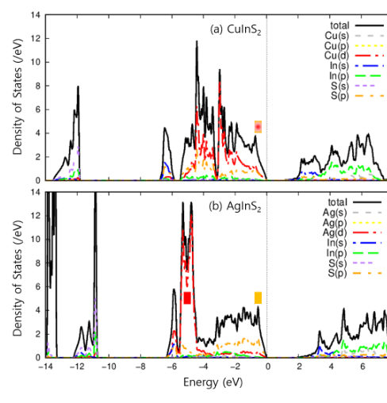 
Figure 1 presents the density of states of pristine CuInS2 and AgInS2 bulk. In the nominal ionic state, transition metal (TM), In, and S atoms have a valency of [TM]1+In3+S2− 2 . For the d10 configuration of the [TM]1+

📷 Fig 3

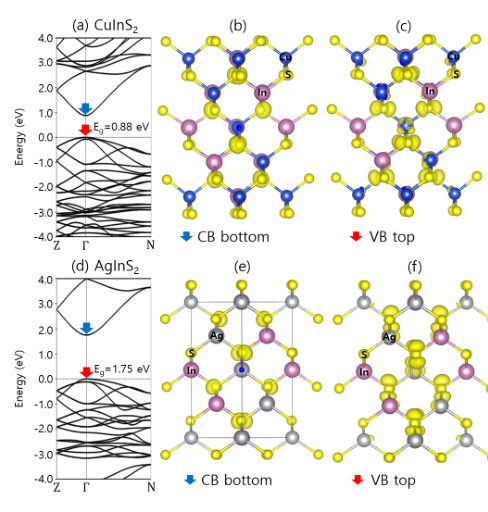 
Figure 2. (a) The band structure of CuInS2 bulk. The direct band gap (Eg) at k = Γ is 0.88 eV. (b, c) The charge densities for the wave function of (b) the conduction band (CB) bottom and (c) the valence band (VB) top at k = Γ are presented, indicated by blue and red arrows in (a), respectively. (d) The band structure of AgInS2 bulk. The direct band gap (Eg) at k = Γ is 1.75 eV. (e, f) The charge densities for the wave function of (e) the conduction band (CB) bottom and (f) the valence band (VB) top at k = Γ are presented, indicated by blue and red arrows in (d), respectively. The contour for the charge densities is set to 0.002 e/Å3.

📷 Fig 4

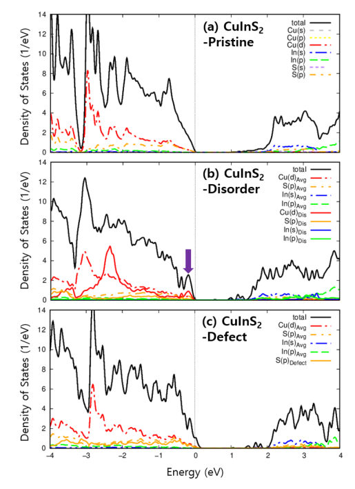 
Figure 3. (a, b, c) The electronic structures of CuInS2 bulk for (a) the pristine structure, (b) the anti-site disorder of Cu- In, and (c) the defect from the Cu deficiency. See the main text for the details of the structures. Averaged values over the supercell structure are presented by Avg. The disordered Cu and In sites, and the nearest neighboring S sites are presented by Dis. The nearest neighboring S sites from the Cu defect site is presented by Defect. The total density of states are for the unit cell of the pristine structure. The purple arrow in (b) presents the anti-site disorder driven defect states at the Cu site, strongly hybridized with its environment atoms’ orbital.

📷 Fig 5

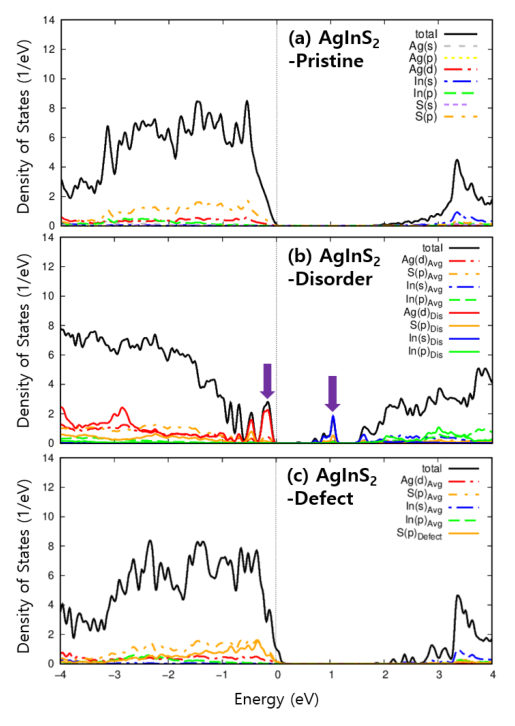 
Figure 4. (a, b, c) The electronic structures of AgInS2 bulk for (a) the pristine structure, (b) the anti-site disorder of Ag- In, and (c) the defect from the Ag deficiency. See the main text for the details of the structures. Averaged values over the supercell structure are presented by Avg. The disordered Ag and In sites, and the nearest neighboring S sites are presented by Dis. The nearest neighboring S sites from the Ag defect site is presented by Defect. The total density of states are for the unit cell of the pristine structure. The purple arrows in (b) present the anti-site disorder driven defect states at the Cu and In sites, strongly localized and disconnected from environment...

**Summary.** The paper investigates how the hybridization between transition metal $d$ and ligand $p$ orbitals dictates the optical coherence in chalcopyrite semiconductor quantum dots. Using advanced DFT calculations, the authors show that strong $p$-$d$ coupling induces detrimental Coulomb scattering channels. They conclude that to achieve coherent optical emission, material design must minimize this specific type of orbital hybridization in the photo-excited carriers.

**Why it may be interesting.** This work directly addresses open quantum systems dynamics (coherence loss) in solid-state nanostructures by linking electronic structure theory (Hubbard models/correlation effects) to measurable optical properties. The concept of hybridization controlling scattering channels is highly relevant for designing robust quantum emitters.

Detailed structure

**Main problem.** The central challenge is designing quantum materials with coherent optical properties, as structural and compositional inhomogeneity degrades coherence in semiconductor quantum dots.

**Main result.** Strong $p$-$d$ hybridization in the photo-doped carrier leads to $	ext{Cu}(d)$ Coulomb scattering, which causes an incoherent optical response; thus, avoiding this character is key for coherence.

**Method.** The study combines first-principles electronic structure calculations (DFT+U+V) with analysis of experimental optical spectroscopy on chalcopyrite semiconductors.

**Model / system.** The system under investigation is chalcopyrite semiconductor quantum dots ($	ext{I–III–VI}_2$), specifically comparing $	ext{CuInS}_2$ and $	ext{AgInS}_2$, and analyzing doped variants like $	ext{Ag}_{1-x}	ext{Cu}_x	ext{In}_{1-y}	ext{Ga}_y	ext{S}_2$.

**Key observables.** Optical spectra, band gap energy ($E_g$), charge densities showing $p$-$d$ hybridization strength, and photoluminescence (PL) lifetime changes.

**Important parameters / regimes.** The degree of $p$-$d$ hybridization (strong vs. weak), the concentration ratio of $	ext{Cu}$ doping ($x$), and Hubbard parameters ($U$, $V$).

**Assumptions / limitations.** The analysis relies on DFT+U+V calculations to model strong electronic correlations, which is necessary because simple DFT fails to capture the localized nature of $d$ electrons.

**Figures summary.** Figures compare calculated DOS and charge densities for different chalcopyrites, showing hybridization differences; experimental PL spectra track spectral shifts and broadening upon Cu doping, correlating with scattering mechanisms.

**Paper structure.** The paper establishes the problem (coherence loss in QDs), uses theory ($	ext{DFT}+	ext{U}+	ext{V}$) to model $	ext{CuInS}_2$ vs. $	ext{AgInS}_2$, and then applies these principles to interpret experimental PL data on doped materials, concluding with design guidelines.

Abstract

Designing quantum materials for coherent optical properties is a central agenda in quantum technology. Semiconductor quantum dots are an emerging approach for controlling coherent optical properties via confinement effects, tunable band gaps, and exciton binding energies, yet their inherent structural and compositional inhomogeneity degrades the coherence of the optical spectra, posing a major obstacle. We show that, for chalcopyrite semiconductors, hybridization between transition-metal $d$ and ligand $p$ electrons in the valence band is key to the coherence of the quantum dot optical spectrum. We demonstrate this using first-principles electronic-structure calculations and optical spectroscopy. The strong $p$-$d$ hybridization in CuInS$_{2}$ induces the Cu($d$) Coulomb scattering channel, giving rise to the incoherent photodoped hole carrier, while the weak $p$-$d$ hybridization in AgInS$_{2}$ induces the delocalized photodoped hole carrier having a predominant S($p$) orbital character. Our experimental results on optical spectra suggest that when the Cu ratio is enhanced in the Ag$_{1-x}$Cu$_{x}$In$_{1-y}$Ga$_{y}$S$_{2}$ quantum dot, Cu atoms at both Ag sites and defect sites experience enhanced $p$-$d$ hybridization, and a coupling begins to develop between the electrons in the quantum dot and the defect electrons at a small Cu ratio. This coupling activates Cu($d$) Coulomb scattering for photodoped holes traversing the defect sites, producing an incoherent optical response that naturally explains the long-standing absence of band-edge spectral signatures in CuIn$_{1-y}$Ga$_y$S$_2$ quantum dots. These results serve as a guideline for designing semiconductor quantum dots. To achieve a coherent optical spectrum, avoid $p$-$d$-hybridized orbital character in the photo-doped carrier.

[↑ back to top](#top)

### [A Resource Estimation Model for the Hardware-Software Co-Design of Distributed Quantum Architectures](http://arxiv.org/abs/2607.22998v1)

**Authors:** Raymond P. H. Wu, Chathurika Ranaweera, Sutharshan Rajasegarar, Ria Rushin Joseph, Jinho Choi, Seng W. Loke  
**Type:** theory · **Category:** quantum information and computing · **PDF:** <https://arxiv.org/pdf/2607.22998v1>  
**Analysis basis:** full PDF text, analyzed in chunks
**Topic relevance:** `analog quantum simulation` **1/5** · `correlated / nonlocal dissipation` **1/5** · `driven-dissipative phase transition` **1/5** · `entanglement & information structure` **1/5** · `methods for driven-dissipative` **1/5** · `non-equilibrium dynamics` **1/5**

📷 Fig 1

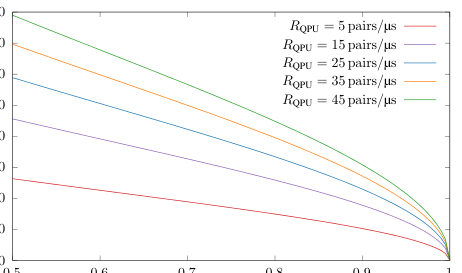 
Fig. 1. Estimation of the optimal number of communication qubits for distributed quantum architectures.

**Summary.** This paper introduces an economic model based on perishable inventory theory to optimize the allocation of communication qubits in distributed quantum computing architectures. It quantifies the critical trade-off between minimizing network latency and mitigating decoherence losses. The resulting framework offers actionable guidelines for both hardware designers setting static resource budgets and software compilers managing dynamic reservations.

**Why it may be interesting.** While focused on DQC resource management rather than fundamental AMO physics, the underlying principles of managing finite resources under decoherence (like inventory control) are highly relevant to designing robust quantum communication protocols in trapped ion or superconducting qubit systems.

Detailed structure

**Main problem.** The core problem is optimizing resource allocation in Distributed Quantum Computing (DQC) by balancing the trade-off between entanglement distribution latency and decoherence time.

**Main result.** The authors propose an optimal number of communication qubits ($N_{comm}^*$) derived from minimizing a total system cost function, providing guidance for both hardware architects and compiler developers.

**Method.** They adapt an Economic Order Quantity (EOQ) model from perishable inventory theory to quantify the time cost associated with entanglement distribution delays versus decoherence penalties.

**Model / system.** The study models DQC across interconnected Quantum Processing Units (QPUs), where qubits are split into computational and communication roles. The optimization is governed by a total system time cost function incorporating latency, physical execution costs, and decoherence rates.

**Key observables.** Total system time cost $C(N_{comm})$, optimal number of communication qubits ($N_{comm}^*$), entanglement demand rate ($R_{QPU}$).

**Important parameters / regimes.** Coherence time ($T_2$), algorithmic fidelity threshold ($F_{th}$), network latency costs ($C_{lat}, c_{lat}$), and the QPU demand rate ($R_{QPU}$).

**Assumptions / limitations.** The model assumes continuous consumption of entanglement resources, using time-averaged rates; a proactive cutoff strategy is employed to manage decoherence by discarding pairs exceeding a maximum usable lifetime.

**Figures summary.** Figure 1a illustrates the trade-off between latency cost and decoherence cost versus $N_{comm}$, while Figure 1b shows how the optimal $N_{comm}^*$ changes as a function of the fidelity threshold ($F_{th}$).

**Paper structure.** The paper develops the mathematical model by defining the total time cost, deriving the unconstrained optimum, and then incorporating physical constraints from coherence time to yield the final piecewise minimum estimate.

Abstract

In distributed quantum computing (DQC), executing monolithic quantum circuits across multiple interconnected quantum processing units (QPUs) requires dedicated communication qubits to generate and distribute entanglement. Because the number of physical qubits within a QPU is finite, a trade-off emerges where allocating more communication qubits increases the capacity of quantum channels for concurrent non-local operations, but reduces the number of computational qubits available for local gate operations. Distributed quantum compilation routinely ignores this channel capacity, while hardware architects lack a method to determine it prior to quantum circuit partitioning. Moreover, scheduling entanglement on demand introduces severe latency, whereas pre-fetching exposes stored pairs to decoherence. We propose an economic order quantity model from perishable inventory theory to optimize the trade-off between entanglement distribution latency and the time cost of decoherence. The resulting estimate is driven by algorithmic demand and physical constraints, offering a dual application for the hardware-software co-design of high-performance DQC: for hardware architects, it gives the optimal allocation of dedicated communication qubits in static heterogeneous architectures; for compiler developers, it gives the optimal number to reserve dynamically in homogeneous architectures.

[↑ back to top](#top)

### [Nanoscale linear response of strongly disordered stable solids](http://arxiv.org/abs/2607.23768v1)

**Authors:** D. V. Babin, I. O. Raikov, Y. M. Beltukov  
**Type:** theory · **Category:** disordered systems and neural networks · **PDF:** <https://arxiv.org/pdf/2607.23768v1>  
**Analysis basis:** full PDF text, analyzed in chunks
**Topic relevance:** `Frenkel-Kontorova` **1/5** · `Keldysh / 2PI / non-Gaussian methods` **1/5** · `analog quantum simulation` **1/5** · `correlated / nonlocal dissipation` **1/5** · `methods for driven-dissipative` **1/5**

📷 Fig 1

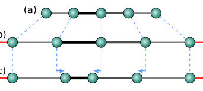 
FIG. 1. One-dimensional illustration of nonaffine deforma- tion in a chain of particles connected by bonds of unequal stiffness, represented by the thickness and color of the hori- zontal lines. (a) Undeformed chain. (b) Affine deformation, for which all bonds undergo the same relative extension. (c) Energy-minimizing nonaffine deformation at the same total elongation of the chain. The nonaffine displacements relative to the affine configuration are indicated by blue arrows, and the dashed blue lines are visual guides.

📷 Fig 2

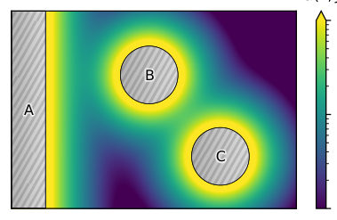 
FIG. 2. Two-dimensional illustration of the spatial stiffen- ing of an amorphous matrix caused by the suppression of nonaffine deformations near rigid inclusions, as described by Eq. (1). The hatched gray regions represent a planar rigid boundary (A) and two circular inclusions (B, C). The sur- rounding amorphous matrix is colored according to its effec- tive stiffness. The yellow regions correspond to the strongest suppression of nonaffine relaxation and, consequently, to the largest stiffness enhancement. The disorder length is chosen as ξ = R/2, where R is the radius of the circular inclusions.

📷 Fig 3

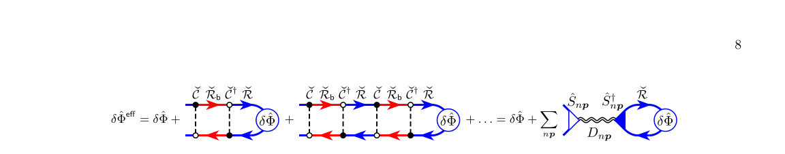 
FIG. 3. Graphical presentation of the ladder series given by Eq. (32) and its factorized presentation using eigenoperator decomposition (38). See Appendices A and B for a more detailed explanation of the diagrams.

📷 Fig 4

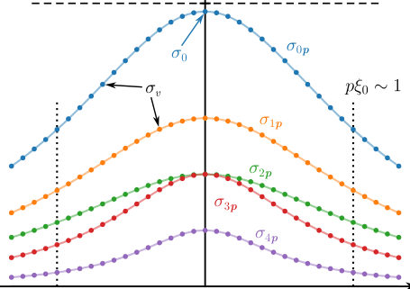 
FIG. 4. Schematic illustration of the branches σnp (color lines) and discrete eigenvalues σv for the finite system (color points) for σ0 = 0.97. The vertical dotted lines show the position of pξ0 ∼1.

📷 Fig 5

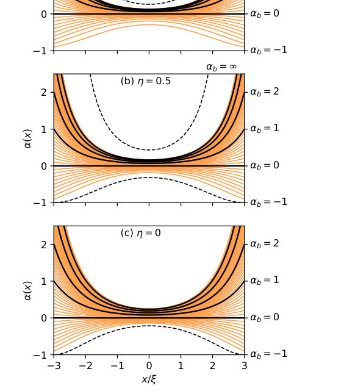 
FIG. 6. One-dimensional solutions of Eq. (85) for different values of the parameter η: (a) η = 1, (b) η = 0.5, and (c) η = 0. Different lines correspond to different boundary values α(±W/2) = αb at the edges of the displayed region of width W = 6ξ. Solutions with integer values of αb are represented by black lines. Dashed lines shows the limiting solutions for minimum αb = −1 and maximum αb = ∞possible values if such a solution exists.

**Summary.** This work develops a modified continuum theory to describe how strongly disordered solids respond elastically at the nanoscale. It shows that disorder averaging leads to an effective contrast field, which quantifies systematic stiffening around rigid features like nanoparticles. The findings are confirmed via molecular dynamics simulations of glassy materials.

**Why it may be interesting.** While focused on classical elasticity, the mathematical techniques used—disorder averaging, effective medium theories, and characterizing spatial correlations ($\xi$)—are highly relevant to understanding localization phenomena in quantum systems or modeling complex energy landscapes in AMO physics.

Detailed structure

**Main problem.** The paper addresses how to describe the nanoscale linear response of strongly disordered stable solids where conventional continuum theories fail due to significant spatial heterogeneity.

**Main result.** The disorder-averaged response can be modeled by a modified continuum theory, which predicts that in the strong disorder limit, the long-wavelength behavior is governed by a scalar disorder-induced contrast field describing stiff shells around inclusions.

**Method.** The approach involves using a disorder-averaged linear response framework applied to the force-constant matrix of the solid, leading to an effective continuum description.

**Model / system.** The system studied is amorphous or structurally disordered solids (like glasses or polymers) analyzed near equilibrium. The theory uses elastic response principles derived from minimizing potential energy subject to disorder averaging.

**Key observables.** Nonlocal Elastic Contrast Field ($\alpha(r)$), which quantifies systematic spatial stiffening; the disorder-averaged linear response coefficients.

**Important parameters / regimes.** The nonaffine length ($\xi$), characterizing the scale of local strain fluctuations, and the temperature regime ($T \ll T_g$).

**Assumptions / limitations.** The theory relies on a disorder-averaged approach and initially assumes conditions that allow reduction to a scalar contrast field, though generalizations are discussed.

**Figures summary.** Figure 1 illustrates nonaffine deformation in a 1D chain comparing undeformed, affine, and energy-minimizing nonaffine states. Figure 2 shows spatial stiffening around rigid inclusions due to suppressed nonaffine relaxation.

**Paper structure.** The paper develops the theory by first establishing the need for modified continuum descriptions, deriving equations for the disorder-averaged Green functions, and then solving for the contrast field $\alpha(r)$ which governs the long-wavelength response in the strong disorder limit.

Abstract

Strongly disordered solids exhibit distinctive properties at the nanoscale, where conventional continuum theory breaks down. We show that their disorder-averaged linear response can be described by a modified continuum theory in which the response coefficients are local but depend nonlocally on the structural properties. The stability criterion requires the response operator to be positive semidefinite, which naturally leads to a correlated Wishart disorder. In the limit of strong disorder, these equations reduce the long-wavelength response to a scalar disorder-induced contrast field. In elasticity, this field describes the formation of a stiff shell around rigid nanoparticles and boundaries, whose characteristic extent is set by the nonaffine length. The predictions are confirmed by molecular-dynamics simulations of a Lennard-Jones glass and a model polymer. Direct calculation of the nonlocal elastic kernels further shows that the response is predominantly local on the scale of the stiffened interphase.

[↑ back to top](#top)

### [A Grand-Canonical Solution to a Class of Random Optimization Problems](http://arxiv.org/abs/2607.24455v1)

**Authors:** Izat B Baybusinov, Enrico M Fenoaltea, Zhen Han, Yi-Cheng Zhang  
**Type:** theory · **Category:** disordered systems and neural networks · **PDF:** <https://arxiv.org/pdf/2607.24455v1>  
**Analysis basis:** full PDF text, analyzed in chunks
**Topic relevance:** `Keldysh / 2PI / non-Gaussian methods` **1/5** · `analog quantum simulation` **1/5** · `driven-dissipative phase transition` **1/5** · `methods for driven-dissipative` **1/5**

📷 Fig 1

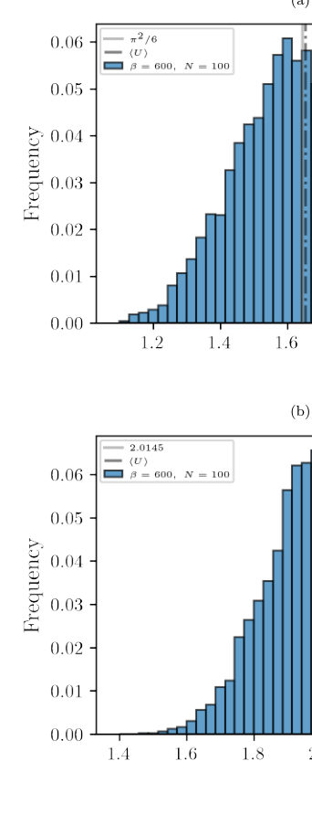 
Figure 1: Distribution of energies computed from Eq. (11) over 5000 realizations for a system of N = 100 sites with β = 600. The top panel (a) corresponds to the matching problem (k = 1), and the bottom panel (b) to the minimum weight 2-factor problem (k = 2). The solid gray lines represent the classical solutions derived in [19, 38], while the black dashed line denotes the numerical sample average. The insets show the average energy as a function of β and N, where the shaded region indicates the standard deviation and the dashed line shows the theoretical values. Note that the averages shown in the insets are necessarily computed at large but finite N and β, respectively. The theoretical...

📷 Fig 2

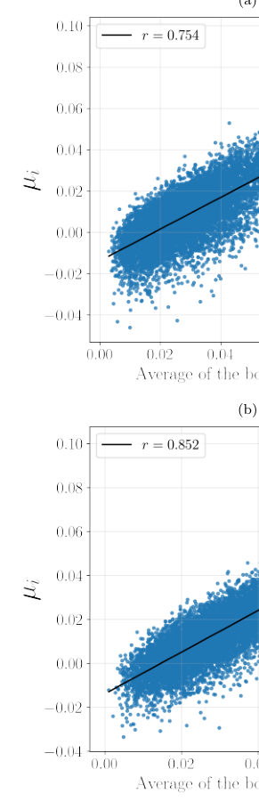 
Figure 2: Chemical potential of agent i versus the average energy computed over the bottom 5% of energies for agent i, i.e., ⟨Eij⟩bottom 5% j. The points are taken from 5000 realizations with N = 100 and β = 600, with k = 1 in panel (a) and k = 2 in panel (b). In general, the higher the chemical potential of an agent, the less inclined the agent is to form connections in the grand-canonical framework. In the legends, r is the Pearson correlation coefficient.

📷 Fig 3

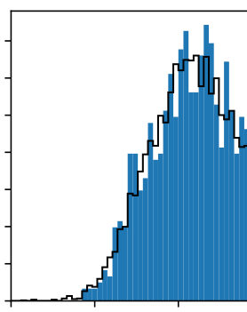 
Figure 3: Distribution of the variables {µi}i=1,..,N for k = 1 (top panel) and k = 2 (bottom panel) with N = 100 and β = 600. The blue bars show a single realization while the black lines correspond to an average over 10 realizations. One realization of the system can describe the probability distribution, suggesting a self averaging behavior.

**Summary.** This work introduces a powerful theoretical framework that maps difficult random combinatorial optimization problems onto the language of statistical physics using the grand-canonical ensemble. By introducing chemical potentials, it relaxes strict topological constraints, yielding an analytical approach to approximate minimum energy solutions for problems like TSP and matching.

**Why it may be interesting.** While focused on classical optimization, the use of statistical mechanics tools (grand-canonical ensemble, chemical potentials) to solve hard combinatorial constraints is highly relevant to understanding phase transitions and ground states in complex quantum systems or neural network models.

Detailed structure

**Main problem.** The paper addresses solving complex combinatorial optimization problems, such as TSP and minimum weight k-factor problems, when the underlying weights are random.

**Main result.** They developed a general framework using the grand-canonical ensemble that provides an analytical solution leading to a polynomial-time approximation algorithm for finding the approximate minimum cost.

**Method.** The core method involves recasting the optimization problem into a statistical physics framework by introducing chemical potentials ($\mu_i$) to relax strict topological constraints, allowing calculation via the partition function in the grand-canonical ensemble.

**Model / system.** The model is an agent network whose configuration is described by a matrix $V$ (or $X$), and the energy/Hamiltonian $	ilde{H}[V]$ sums over pairwise connection energies $E_{ij}$. This framework was successfully applied to known problems like matching and TSP.

**Key observables.** The average ground-state energy ($\langle U_{\min} 
angle_{\epsilon}$), chemical potentials ($\mu_i$), and the link probability matrix ($V_{ij}$).

**Important parameters / regimes.** Inverse temperature ($eta$) and the required fixed average degree ($k$). The thermodynamic limit ($eta 	o \infty$ or $N 	o \infty$) is a key regime.

**Assumptions / limitations.** The method relies on reformulating hard constraints into average constraints via Lagrangian relaxation, which is justified in the thermodynamic limit for certain problems.

**Figures summary.** Figure B.1 illustrates accuracy vs. inverse temperature ($eta$) for matching; Algorithm 2 details a greedy procedure to refine a 2-factor solution into an approximate Hamiltonian cycle.

**Paper structure.** The paper introduces the general framework by defining the energy function and recasting it in the grand-canonical ensemble. It then derives the average ground-state energy, showing its applicability to specific problems like TSP and matching, culminating in a proposed greedy algorithm for refinement.

Abstract

We introduce a general framework to solve a class of combinatorial opti- mization problems, including the matching problem, the Traveling Salesman Problem, and also the minimum weight k-factor problem. By reformulating these problems as an arrangement model, we recast the optimization task into a grand-canonical ensemble, where chemical potentials are used to re- lax strict topological constraints. The analytical solution found can serve as a polynomial-time algorithm to compute an approximate minimum cost for arbitrary k and link-weight distributions. Our framework is complementary to existing approaches and reveals new connections between combinatorial optimization and the statistical physics of disordered systems.

[↑ back to top](#top)

### [Distinct finite-temperature phase diagrams of non-invertible Kennedy--Tasaki duals](http://arxiv.org/abs/2607.24231v1)

**Authors:** Weiguang Cao, Haruki Watanabe  
**Type:** theory · **Category:** statistical mechanics · **PDF:** <https://arxiv.org/pdf/2607.24231v1>  
**Analysis basis:** full PDF text, analyzed in chunks
**Topic relevance:** `Keldysh / 2PI / non-Gaussian methods` **1/5** · `analog quantum simulation` **1/5** · `driven-dissipative phase transition` **1/5**

📷 Fig 1

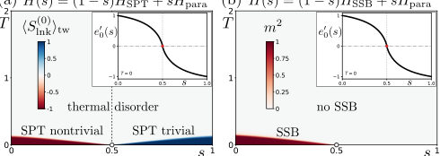 
FIG. 2. One-dimensional finite-size crossover maps on rings of 2 × 106 qubits (L = 106). (a) Exact flux-twist product ⟨S(0) lnk⟩tw for the cluster model. (b) Squared magnetization m2 of its KT dual, from the controlled Toeplitz evaluation described in the SM (Sec. S2). Both apparent ordered regions contract onto the T = 0 axis as L →∞. Inset: the slope e′ 0(s) of the ground-state energy density e0(s), which vanishes continuously at s = 1 2 with no jump (though its curvature diverges as δ ln 1/|δ|, δ = 1 −2s); see the SM (Sec. S2 D) for the derivation.

📷 Fig 2

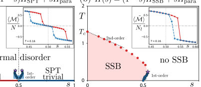 
FIG. 3. Unrestricted three-dimensional phase diagrams. (a) Cluster model: QMC boundaries of the self-dual frozen wedge; bars are metastability intervals, not equilibrium er- ror bars. The red (blue) T = 0 segment denotes the ex- act twisted-membrane response −1 (+1) in the SPT (trivial) phase. (b) Dual gauge model: the continuous arm (consistent with a second-order transition at the accessible sizes) and, near s = 1

**Summary.** The paper investigates whether non-invertible dualities preserve finite-temperature phase diagrams by comparing a cluster model to its KT dual gauge theory. In 3D, the authors find an exact mismatch at $s=0$, where the dual exhibits a deconfinement transition absent in the other description. The analysis relies on advanced statistical mechanics techniques applied to lattice Hamiltonians.

**Why it may be interesting.** This work provides deep insights into the limitations of duality transformations when those transformations are not invertible, which has implications for understanding thermal physics in strongly coupled quantum systems beyond simple symmetries.

Detailed structure

**Main problem.** The central question is whether two Hamiltonians related by a non-invertible Kennedy--Tasaki (KT) dual necessarily share the same finite-temperature phase diagram.

**Main result.** In 3D, the KT duals exhibit an exact inequivalence at $s=0$, as one side shows deconfinement while the other has analytic free energy. The mismatch persists over a finite region of the interpolation parameter $s$.

**Method.** The authors compare projected partition functions and analyze phase transitions using theoretical calculations (e.g., Toeplitz determinants) and numerical simulations (Quantum Monte Carlo, two-start scans).

**Model / system.** The study compares a cluster-model interpolation $H(s)$ with its KT dual $	ilde{H}(s)$, which is related to a $\mathbb{Z}_2$ gauge theory on lattices in 1D and 3D. The Hamiltonians are parameterized by $s \in [0, 1]$.

**Key observables.** Free energy singularities, deconfinement transition temperatures ($T_c$), order parameters like $\langle S(0)_{lnk} 
angle_{tw}$ and squared magnetization ($m^2$), and the strip-averaged splitting ($	ilde{M}$).

**Important parameters / regimes.** Temperature ($T$) and the interpolation parameter $s$. The analysis distinguishes between finite-size effects, thermodynamic limits, and specific critical points like $(s, T) = (1/2, 0)$.

**Assumptions / limitations.** The KT map is a partial isometry, meaning it only equates projected partition functions ($	ext{Tr}_{P+}$), ignoring exponentially many annihilated charge sectors.

**Figures summary.** Figures illustrate the relationship between Hamiltonians via the non-invertible KT map and show 1D finite-size crossover maps comparing observables for both the cluster model and its dual gauge theory.

**Paper structure.** The paper progresses by first establishing the theoretical framework of the partial isometry, then analyzing the simple 1D case where agreement is found, before presenting the complex and contrasting results in three dimensions regarding deconfinement transitions and metastable regions.

Abstract

Do two Hamiltonians related by a non-invertible transformation necessarily share the same finite-temperature phase diagram? For a cluster-model interpolation $H(s)$ and its Kennedy--Tasaki dual $\tilde H(s)$, the map is a partial isometry and equates only their all-plus-sector partition functions. In one dimension, thermal order is forbidden on both sides, leaving only the common zero-temperature transition at $s=\tfrac12$. In three dimensions, however, the inequivalence is exact already at $s=0$: the cluster model has an analytic paramagnetic free energy, whereas its dual $\mathbb Z_2$ gauge theory has a deconfinement transition at $T_c\approx1.31$. Quantum Monte Carlo shows that the mismatch occupies a finite window of the interpolation, marked by a self-dual frozen wedge on the cluster side and a deconfined dome on the gauge side; once both close the two phase diagrams agree again, coinciding over the entire remaining interval up to the shared trivial endpoint $s=1$.

[↑ back to top](#top)

### [Generalized Bloch-like ground states in distinct electron-site configurations derived from the same quasiperiodic structure](http://arxiv.org/abs/2607.23180v1)

**Authors:** Yuki Yamamoto, Nayuta Takemori  
**Type:** theory · **Category:** disordered systems and neural networks · **PDF:** <https://arxiv.org/pdf/2607.23180v1>  
**Analysis basis:** full PDF text, analyzed in chunks
**Topic relevance:** `analog quantum simulation` **1/5** · `methods for driven-dissipative` **1/5** · `non-equilibrium dynamics` **1/5**

📷 Fig 1

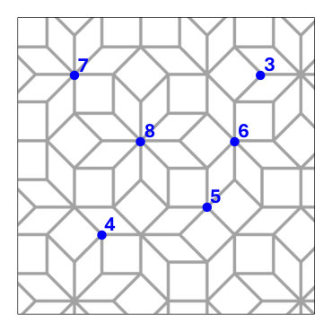 
FIG. 1. Portion of the Ammann-Beenker tiling. Blue dots indicate representative vertices, and the adjacent numbers denote their coordination numbers, which vary from 3 to 8 depending on the position.

📷 Fig 2

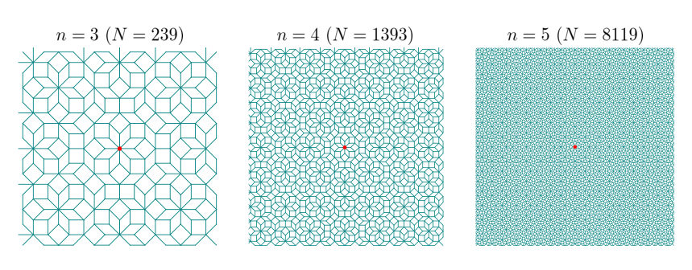 
FIG. 2. Square approximants of generations n = 3, 4, 5, with corresponding numbers of sites N = 239, 1393, 8119. Red dot at the center marks the origin (eightfold rotational symmetry center). Unit cell size increases with n, providing a better approximation to the infinite quasiperiodic system.

📷 Fig 3

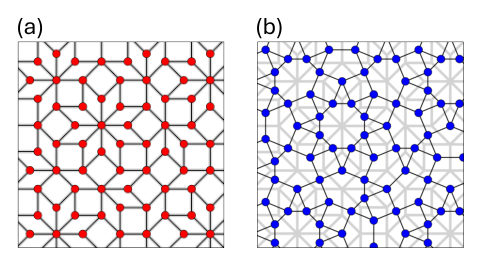 
FIG. 4. Two lattice configurations derived from the Ammann- Beenker (AB) tiling. The underlying AB tiling is shown with light gray lines. (a) Vertex model with electron sites (red dots) at tiling vertices and bonds (black lines) along tile edges. The bond length is constant and the coordination number zi varies from 3 to 8. (b) Dual model with electron sites (blue dots) at tile centers and bonds (black lines) connecting adjacent centers. Unlike the vertex model, the bond length is non- uniform, whereas the coordination number is fixed at zi = 4.

📷 Fig 4

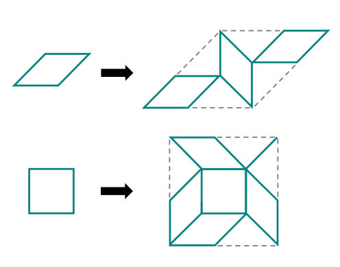 
FIG. 3. Inflation rules for the Ammann-Beenker tiling. Each prototile is transformed into a patch composed of square and rhombic tiles.

📷 Fig 5

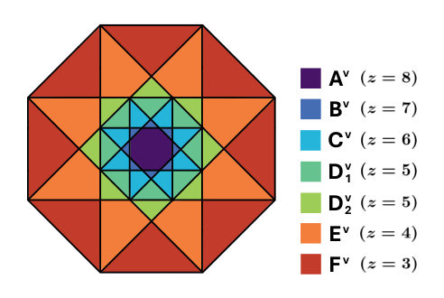 
FIG. 5. Partition of the acceptance window W ⊂S⊥into the seven site classes Av, Bv, Cv, Dv 1, Dv 2, Ev and Fv. In the cut-and-project construction, each vertex of the Ammann- Beenker tiling is associated with a point in W, and the col- ored region containing this point determines its class. The coordination number z is constant within each class and is indicated in the legend.

**Summary.** The paper develops a systematic, constructive theory to find generalized Bloch states (SKK states) in quasiperiodic systems like the Ammann-Beenker tiling. By applying a generalized Fourier transform technique, they successfully derive these states for two related electron-site configurations—the vertex and dual models. This confirms that such ground state properties are inherent to the underlying quasiperiodicity rather than specific site choices.

**Why it may be interesting.** This work provides rigorous mathematical machinery for characterizing extended eigenstates in complex, non-periodic lattices, which is crucial for understanding transport and localization phenomena beyond simple periodic assumptions.

Detailed structure

**Main problem.** The work addresses the challenge of systematically constructing generalized Bloch-like ground states (SKK states) in quasiperiodic systems where translational symmetry is absent.

**Main result.** A constructive method based on a generalized Fourier transform successfully reproduces known SKK states for both vertex and dual models derived from the Ammann-Beenker tiling, showing structural consistency between them.

**Method.** The authors develop a systematic procedure by enforcing a 'closure condition' on the Hamiltonian using a generalized Fourier transform of creation operators, reducing the problem to an effective eigenvalue equation.

**Model / system.** The study uses tight-binding models on the Ammann-Beenker (AB) quasiperiodic tiling. Two distinct electron-site configurations are analyzed: the vertex model (sites at vertices with varying coordination numbers) and the dual model (sites at tile centers with uniform coordination).

**Key observables.** Class-dependent prefactors ($\Psi_{0,\Lambda}(a)$), which form components of the lowest eigenvector, and the effective Hamiltonian matrix elements ($M_{ab}$).

**Important parameters / regimes.** The quasiperiodicity itself (AB tiling); onsite potential $V$ (vertex model) and coupling strength $\lambda$ (dual model).

**Assumptions / limitations.** Previous methods relied on ansatz-based arguments; the authors provide a systematic, constructive framework. Numerical calculations use finite square approximants of the AB tiling.

**Figures summary.** Figures illustrate the AB tiling structure and compare class-dependent prefactors ($\Psi_{0,\Lambda}(a)$) for both vertex and dual models across different approximant generations ($n=4$ to $7$), showing convergence.

**Paper structure.** The paper develops a constructive approach using generalized Fourier transforms, applies it to the Hamiltonian on two related AB tiling configurations (vertex/dual), derives necessary closure conditions, and numerically verifies the resulting SKK states by analyzing the class-dependent prefactors across multiple approximants.

Abstract

Sutherland-Kalugin-Katz (SKK) states have been proposed as generalized Bloch-like states in quasiperiodic systems where the absence of translational symmetry prevents the application of Bloch's theorem. However, previous studies have largely relied on ansatz-based arguments, and a systematic procedure for constructing the SKK state from a specified Hamiltonian has remained unclear. In this work, we develop a constructive approach based on a generalized Fourier transform of creation operators in tight-binding models. We then apply this framework to vertex and dual models on the Ammann-Beenker (AB) tiling that stem from the same quasiperiodicity but differ in their electron-site configurations. Our construction reproduces the previously reported SKK state in the ground state of the vertex model and reveals a corresponding SKK state in the ground state of the dual model with high fidelity. The structural correspondence between the two SKK states indicates that such states are not tied to a particular choice of electron sites and reflect the underlying quasiperiodicity of the AB tiling.

[↑ back to top](#top)

### [Geometric bounds on multiparameter Heisenberg scaling in optical metrology with limited squeezed resources](http://arxiv.org/abs/2607.24657v1)

**Authors:** Atmadev Rai, Paolo Facchi, Vincenzo Tamma  
**Type:** theory · **Category:** quantum information and computing · **PDF:** <https://arxiv.org/pdf/2607.24657v1>  
**Analysis basis:** full PDF text, analyzed in chunks
**Topic relevance:** `entanglement & information structure` **1/5** · `interference shaping light` **1/5** · `quantum measurements` **1/5**

📷 Fig 1

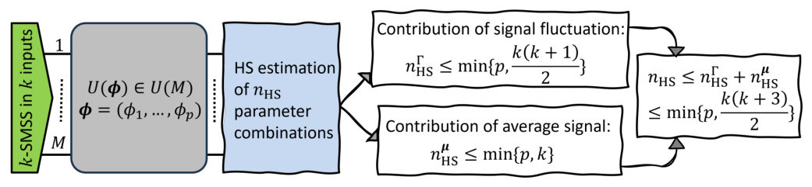 
FIG. 1. Schematic of a generic M-channel optical sensor with p arbitrarily encoded parameters and k injected single-mode squeezed states (SMSSs). Due to the Gaussian nature of probe and passive optical network, the quantum Fisher information matrix separates into a covariance contribution FΓ in Eq. (5), associated with parameter-dependent fluctuations, and a first- moment (mean) contribution Fµ in Eq. (6), associated with parameter-dependent displacements of the Gaussian center. The figure summarizes the resulting bounds on Heisenberg-scaling (HS) precision. The covariance contribution of QFIM can obtain at most nΓ HS independent parameter combinations with HS sensitivity as given in Eq....

**Summary.** The paper derives fundamental geometric bounds on the number of parameters that can achieve Heisenberg scaling sensitivity in passive multimode Gaussian quantum interferometers. By analyzing the Quantum Fisher Information Matrix's covariance and first-moment components separately, it establishes a tight upper bound $n_{HS} \le \min\{p, k(k+3)/2\}$. This result is crucial for designing optimal multi-parameter quantum sensors using limited squeezed light resources.

**Why it may be interesting.** This work provides fundamental geometric resource bounds for quantum sensing in continuous-variable systems. It establishes a quantitative limit on how many parameters can be simultaneously measured with the ultimate Heisenberg scaling precision using limited non-classical resources (squeezing).

Detailed structure

**Main problem.** The central problem is determining the maximum number of independent parameter combinations that can achieve Heisenberg scaling sensitivity when simultaneously estimating multiple parameters in a multimode Gaussian optical network using limited squeezed resources.

**Main result.** The maximum number of such independently estimable parameters, $n_{HS}$, is bounded by $\min\{p, k(k+3)/2\}$, where $p$ is the total parameter count and $k$ is the number of single-mode squeezed inputs. This bound separates into contributions from covariance ($\le k(k+1)/2$) and first-moment terms ($\le k$).

**Method.** The analysis uses asymptotic expansions of the Quantum Fisher Information Matrix (QFIM), separating it into covariance ($\mathcal{F}_\Gamma$) and first-moment ($\mathcal{F}_\mu$) contributions, to determine the rank of the leading Heisenberg-scaling coefficient matrix.

**Model / system.** The system is an arbitrary passive linear optical network acting on Gaussian probe states composed of $k$ single-mode squeezed states (SMSSs) and potentially coherent states in remaining modes. The analysis focuses on the QFIM derived from these moments.

**Key observables.** Quantum Fisher Information Matrix (QFIM), its rank ($	ext{rank}(\mathbf{F}_{	ext{HS}})$), and the separation into covariance and first-moment contributions.

**Important parameters / regimes.** $p$ (number of parameters), $k$ (number of squeezed modes), and the scaling factor $N$ (total input photon number).

**Assumptions / limitations.** The analysis assumes the QFIM can be accurately approximated by its leading large-$s$ asymptotic terms ($\mathcal{O}(N^2)$) derived from the covariance and first-moment contributions.

**Figures summary.** Figure 1 schematically illustrates the separation of the QFIM into fluctuation ($F_\Gamma$) and mean displacement ($F_\mu$) parts, summarizing the derived bounds on $n_{HS}$.

**Paper structure.** The paper establishes the problem in multimode Gaussian metrology, derives the asymptotic structure of the QFIM by separating it into covariance and first-moment terms, calculates the rank bound for each contribution independently ($\le k(k+1)/2$ and $\le k$), and finally combines these to yield the overall universal bound $n_{HS} \le \min\{p, k(k+3)/2\}$, demonstrating saturation via construction.

Abstract

The simultaneous estimation of multiple parameters is a central task in quantum metrology, distributed sensing, and the calibration of large photonic interferometers. A fundamental question is how many independent parameter combinations can inherit Heisenberg scaling from a given number of squeezed probes in a multimode Gaussian network. Here, we answer this question for arbitrary passive linear optical networks. For a $p$-parameter, $M$-channel interferometer probed by $k$ single-mode squeezed states and at least one coherent state in the remaining channels, we show that the rank of the Heisenberg-scaling coefficient of the quantum Fisher information matrix is bounded by $n_{\rm HS}\le \min\{p,k(k+3)/2\}$, which corresponds to the maximum number of independent combinations of parameters that can be estimated with Heisenberg-scaling sensitivity. The bound separates into two geometrically distinct contributions. The covariance contribution of the quantum Fisher information, which describes squeezing-enhanced fluctuations, provides at most $k(k+1)/2$ parameter combinations estimable at Heisenberg-scaling sensitivity, while the first-moment contribution provides at most $k$ additional independent parameter combinations with Heisenberg-scaling sensitivity. We identify the conditions for saturating these bounds and construct a passive family of interferometers that saturates these bounds.

[↑ back to top](#top)

### [Interaction-driven electronic ferroelectricity in van der Waals heterostructures](http://arxiv.org/abs/2607.24087v1)

**Authors:** Ziying Wang, Ana Vera Montoto, Mohammad Amini, Yuxiao Ding, Jose L. Lado, Robert Drost, Adolfo O. Fumega, Peter Liljeroth  
**Type:** both · **Category:** strongly correlated electrons · **PDF:** <https://arxiv.org/pdf/2607.24087v1>  
**Analysis basis:** full PDF text, analyzed in chunks
**Topic relevance:** `Frenkel-Kontorova` **1/5** · `Keldysh / 2PI / non-Gaussian methods` **1/5** · `analog quantum simulation` **1/5**

📷 Fig 1

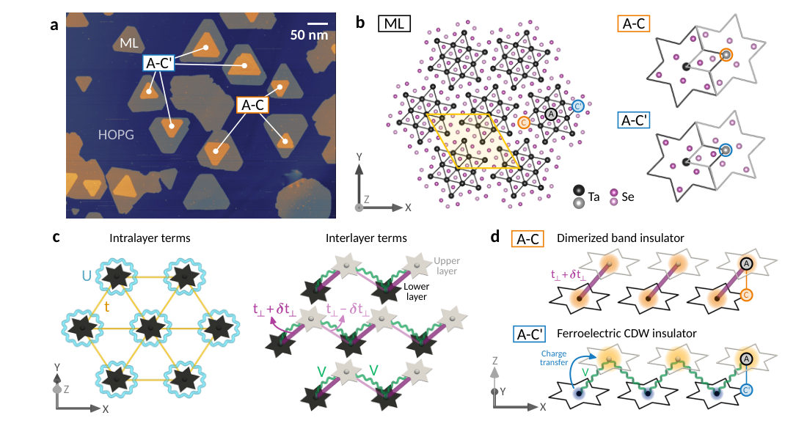 
FIG. 1. a Large-scale STM image of monolayer (ML) and different bilayer configurations (A-C and A-C′) of 1T-TaSe2 on an HOPG sample. V = 1 V, I = 10 pA. b Top view of the SoD structure in monolayer 1T-TaSe2 and the bilayer stacking arrangements A-C and A-C′. For clarity, only the Se atoms directly above the lower SoD (dark-colored) and below the upper SoD (light-colored) are depicted. c Schematic of the minimal tight-binding model for A-C and A-C′ bilayers as quasi-1D interacting fermionic chains, where each star represents a single orbital at the center of a SoD. The intralayer model’s parameters include small nearest-neighbor hopping t and on-site U interaction. The interlayer terms are...

📷 Fig 2

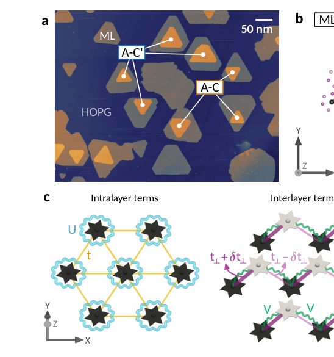 
Figure 1a shows the bilayer 1T-TaSe2 sample grown by MBE on a highly oriented pyrolytic graphite (HOPG) substrate. In addition to monolayer (ML) islands, two bilayer stacking configurations are identified as A-C and A-C′ (see below for full experimental characterization of the structures). These bilayers present the same relative

📷 Fig 3

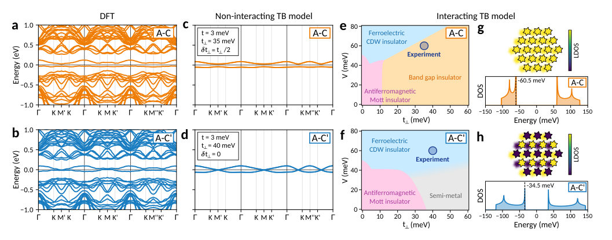 
FIG. 2. Simulated band structures and predicted phase diagrams and LDOS of the 1T-TaSe2 bilayers from DFT and fitted tight-binding model. a, b DFT-simulated band structures of A-C (a) and A-C′ (b) bilayers. c, d, Band structures of the A-C (c) and A-C′ (d) bilayers from the non-interacting tight-binding model with parameters fitted to the DFT results. e, f Phase diagrams of the A-C (e) and A-C′ (f) bilayers from the interacting tight-binding model, with on-site interactions U = 100 meV. The regions corresponding to the experimental results are highlighted. g, h Simulated DOS of the A-C (e) and A-C′

📷 Fig 4

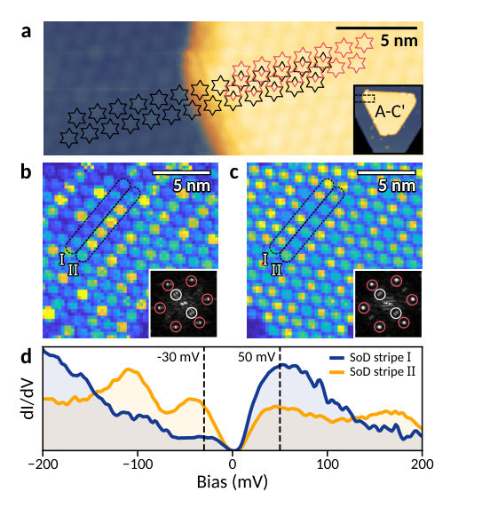 
FIG. 4. Correlation-driven stripe CDW phase in A-C′ bilayer. a, A terrace of a typical bilayer island of A-C′ stacking. V = 1 V, I = 10 pA. b, c, dI/dV maps collected from grid measure- ment showing the stripe CDW phase. The neighboring CDW rows alternate in intensity (repeating stripes labeled I-II) and form a double periodicity modulation. Insets: corresponding FT image. Peaks in the red circles correspond to the CDW sites, and peaks in the white circles correspond to the new striped phase. V = −30 mV (panel b). V = 50 mV (panel c). I = 20 pA. d, Spectra collected on SoD sites belonging to stripes I and II. I = 300 pA. Vm = 1 mV.

📷 Fig 5

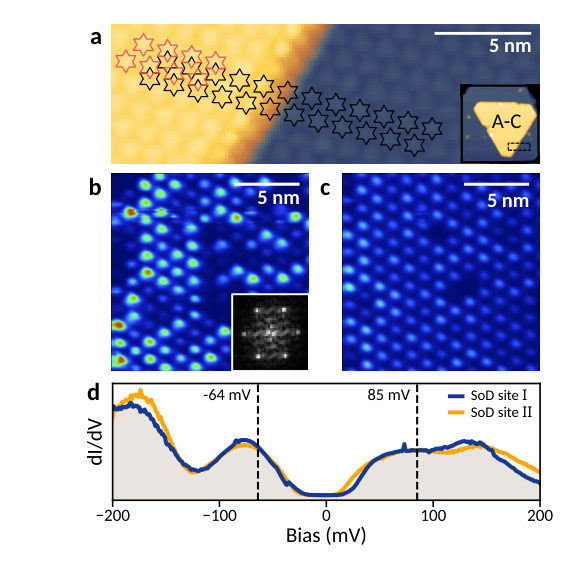 
FIG. 3. A-C stacking 1T-TaSe2 as a band insulator. a, A terrace of a typical bilayer island of A-C stacking. V = 1 V, I = 10 pA. The SoD cluster centres in the upper layer and bottom layer are marked with differently shaded stars. b, c, Constant-height DOS mapping at the energy of V = −64 mV and V = 85 mV. I = 50 pA. Vm = 5 mV. Inset: corresponding FT image showing CDW modulation. d, Spectra collected on two adjacent SoD centers (SOD site I and II) of the A-C bilayer. Both show a gap size of around 40 mV. I = 300 pA. Vm = 5 mV.

**Summary.** The authors demonstrate that electronic correlations, rather than structural distortions, can induce ferroelectricity in bilayer 1T-TaSe2. By comparing two stacking arrangements (A-C and A-C'), they show the A-C' stack develops a polar charge density wave phase. This establishes a new platform for studying interaction-driven correlated quantum states.

**Why it may be interesting.** This work provides a clear example of correlation effects driving macroscopic polarization in 2D materials, which is highly relevant for understanding correlated quantum states beyond simple band theory predictions.

Detailed structure

**Main problem.** The study investigates generating ferroelectricity directly from electronic interactions, bypassing traditional structural symmetry breaking mechanisms common in van der Waals (vdW) materials.

**Main result.** Bilayer 1T-TaSe2 exhibits interaction-driven electronic ferroelectricity in the A-C' stacking geometry, which can be electrically switched between antiferroelectric and ferroelectric CDW states.

**Method.** The research combines first-principles DFT calculations with a minimal tight-binding model solved via mean-field approximation, complemented by STM/STS measurements on MBE-grown samples.

**Model / system.** The system is bilayer 1T-TaSe2, modeled as quasi-one-dimensional interacting chains governed by a Hamiltonian including hopping ($H_0$), onsite repulsion ($H_U$), and interlayer Coulomb interactions ($H_V$). Two stacking geometries (A-C and A-C') are compared.

**Key observables.** Out-of-plane ferroelectric polarization, electronic band structure (insulating vs. CDW), charge modulation patterns observed via STM/STS ($	ext{dI/dV}$ spectra).

**Important parameters / regimes.** Interlayer Coulomb interaction strength ($V$), dimerization parameter ($\delta t_{\perp}$), and external electric field bias ($\Delta$).

**Assumptions / limitations.** The analysis relies on a mean-field approximation for solving the full interacting Hamiltonian.

**Figures summary.** Figures illustrate STM images of A-C and A-C' bilayers, DFT band structures showing insulating/CDW states, and phase diagrams mapping out correlated electronic phases based on interaction strengths.

**Paper structure.** The paper systematically compares two stacking geometries (A-C vs. A-C') using theoretical modeling and experimental characterization to demonstrate how interlayer interactions dictate the emergent ferroic order.

Abstract

Strong electronic correlations in narrow-band systems provide a promising route to realize emergent quantum phases. While ferroelectricity in van der Waals materials is typically associated with inversion symmetry breaking driven by lattice distortions, interlayer sliding, or moiré reconstruction, the possibility of generating ferroelectricity directly from electronic interactions remains largely unexplored. Here, using molecular beam epitaxy, scanning tunneling microscopy, and ab initio calculations, we investigate two stacking geometries of bilayer 1T-TaSe$_2$, A-C and A-C$'$, formed by coupled Star-of-David charge density wave phases. We show that both stackings realize quasi-one-dimensional interacting chains, but are governed by distinct interaction mechanisms. In the A-C stacking, strong interlayer hybridization leads to dimerization and the formation of a band insulating state. In contrast, the A-C$'$ stacking is dominated by interlayer Coulomb interactions, producing a spontaneous charge imbalance between layers that gives rise to an out-of-plane ferroelectric polarization. Furthermore, we demonstrate that ferroelectric and antiferroelectric interchain configurations can be stabilized and electrically switched by an external field. Our results prove that bilayer 1T-TaSe$_2$ is a platform for interaction-driven electronic ferroelectricity, establishing an overlooked family of charge-ordered correlated states in 1T-TaSe$_2$ multilayers.

[↑ back to top](#top)

### [Response Morphologies of a Canonical Fluctuation Diagnostic Across Ehrenfest Phase Transitions](http://arxiv.org/abs/2607.22978v1)

**Authors:** Fangfang Wang, Wei Liu, Ying Tang, Zengru Di  
**Type:** theory · **Category:** statistical mechanics · **PDF:** <https://arxiv.org/pdf/2607.22978v1>  
**Analysis basis:** full PDF text, analyzed in chunks
**Topic relevance:** `driven-dissipative phase transition` **1/5** · `non-equilibrium dynamics` **1/5** · `non-equilibrium universality` **1/5**

📷 Fig 1

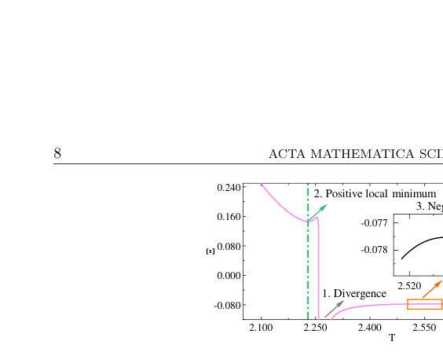 
Figure 2 Temperature dependence of the canonical fluctuation diagnostic Ξ(T) in the

📷 Fig 2

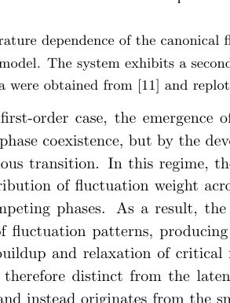 
Figure 3 Heat-capacity signature of ideal three-dimensional Bose–Einstein condensation. The heat

**Summary.** This paper investigates the behavior of a specific fluctuation diagnostic ($\Xi(T)$) across first-, second-, and third-order phase transitions using three distinct models. By comparing the results, the authors show that the diagnostic's morphology is highly sensitive to the underlying transition mechanism—displaying paired extrema for lower orders versus a direct jump for BEC. This suggests the observable probes the reorganization of energy fluctuations rather than simply classifying the order of the transition.

**Why it may be interesting.** For a theorist working on many-body dynamics, understanding how local energy fluctuations encode global phase transition information is crucial for developing robust experimental or theoretical probes beyond simple heat capacity measurements.

Detailed structure

**Main problem.** The study aims to systematically compare how a fixed, fluctuation-based diagnostic behaves across different Ehrenfest classes of primary phase transitions (first-, second-, and third-order). It seeks to determine if the observed morphology is universal or dependent on the underlying thermodynamic nonanalyticity.

**Main result.** The canonical third-order diagnostic ($\Xi(T)$) exhibits qualitatively distinct response morphologies—paired extrema for first/second order vs. a direct jump for third order—demonstrating that its shape reflects the specific nature of the transition rather than serving as a universal classifier.

**Method.** The analysis uses the canonical formulation by examining energy cumulants ($\kappa_2, \kappa_3$) to construct $\Xi(T) = \kappa_3(T) / [\kappa_2(T)]^3$, avoiding direct density-of-states reconstruction.

**Model / system.** Three representative systems are analyzed: the eight-state Potts model (first-order), the two-dimensional Ising model (second-order), and ideal three-dimensional Bose–Einstein condensation (third-order).

**Key observables.** The canonical third-order fluctuation diagnostic, $\Xi(T)$, which is constructed from energy cumulants ($\kappa_2$ and $\kappa_3$).

**Important parameters / regimes.** Transition temperatures ($T_c$) for the three models; thermodynamic limits are considered.

**Assumptions / limitations.** The analysis assumes that the fluctuation diagnostic can be calculated using canonical cumulant relations, allowing comparison across different physical systems.

**Figures summary.** Figures illustrate $\Xi(T)$ for the Potts (first-order) and Ising (second-order) models showing paired extrema, while BEC shows a direct, discontinuous jump at $T_c$.

**Paper structure.** The paper introduces the diagnostic by noting previous limitations in canonical fluctuation analysis. It then applies this diagnostic to three distinct Ehrenfest classes of transitions—Potts, Ising, and BEC—to compare their resulting response morphologies.

Abstract

Microcanonical inflection-point analysis identifies MIPA-type higher-order transition structures from derivatives of the microcanonical entropy. Until recently, however, there was no canonical formulation for probing the corresponding fluctuation-level behavior directly from measurable energy fluctuations without reconstructing the density of states. Previous work addressed this limitation by introducing a canonical fluctuation diagnostic that quantifies energy-fluctuation asymmetry. Here, we investigate how this diagnostic behaves across representative first-, second-, and third-order phase transitions in the Ehrenfest classification. We consider the eight-state Potts model, the two-dimensional Ising model, and ideal three-dimensional Bose--Einstein condensation. The Potts and Ising systems exhibit a robust paired-extremum structure of the diagnostic near their respective transition regions, whereas ideal Bose--Einstein condensation exhibits a discontinuous response at the condensation temperature in the thermodynamic limit. These results show that a single fluctuation-based observable can display qualitatively distinct response morphologies across thermodynamic regimes, reflecting sensitivity to the nature of the underlying phase transition rather than serving as a direct classifier of Ehrenfest order.

[↑ back to top](#top)

### [Symmetry Criterion for Van Hove Criticality at Non-Time-Reversal-Invariant Momenta](http://arxiv.org/abs/2607.23985v1)

**Authors:** Min-Quan Kuang, Hua-Yu Li  
**Type:** theory · **Category:** strongly correlated electrons · **PDF:** <https://arxiv.org/pdf/2607.23985v1>  
**Analysis basis:** full PDF text, analyzed in chunks
**Topic relevance:** `Keldysh / 2PI / non-Gaussian methods` **1/5** · `analog quantum simulation` **1/5** · `driven-dissipative phase transition` **1/5**

📷 Fig 1

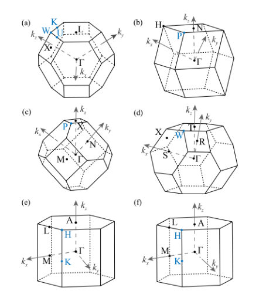 
FIG. 1. Brillouin zones for the six crystal systems classified in Table II. The TRIMs and non-TRIMs are marked by black and blue dots, respectively. Panels: (a) face-centered cubic (FCC) lattice with TRIMs Γ, X, L and non-TRIMs W, K, U; (b) body-centered cubic (BCC) lattice with TRIMs Γ, H, N and non-TRIM P; (c) body-centered tetragonal (BCT) lattice with TRIMs Γ, M, X, N and non-TRIM P; (d) body-centered orthorhombic (BCO) lattice with TRIMs Γ, X, S, R, T and non-TRIM W; (e) hexagonal (Hex) lattice with TRIMs Γ, A, M, L and non-TRIMs K, H; and (f) trigonal (Trig) lattice in the hexagonal setting with TRIMs Γ, A, M, L and non- TRIMs K, H.

📷 Fig 2

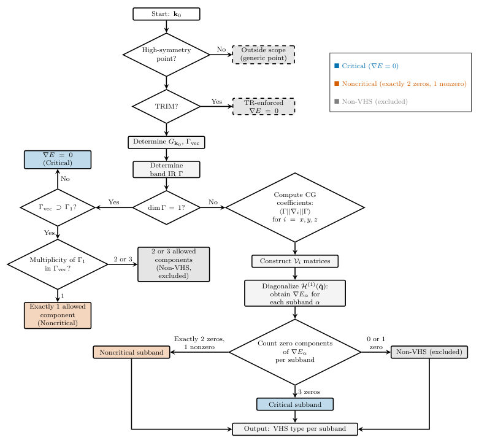 
FIG. 2. Flowchart for classifying VHS types at non-TRIM high-symmetry points. For nondegenerate bands (dim Γ = 1), the criterion proceeds in two steps: (i) check whether Γvec contains the trivial representation Γ1; if not, all 1D bands are critical; (ii) if yes, count the multiplicity of Γ1 in Γvec: multiplicity 1 ⇒noncritical, multiplicity 2 or 3 ⇒Non-VHS (excluded). For degenerate bands (dim Γ &gt; 1), each subband is classified independently by counting the zero components of ∇Eα: 3 zeros ⇒ critical; exactly 2 zeros and 1 nonzero ⇒noncritical; otherwise (0 or 1 zero) ⇒Non-VHS (excluded). Dashed boxes indicate cases outside the scope of this work (generic points and TRIMs).

📷 Fig 3

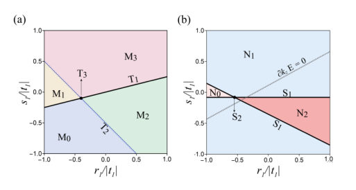 
FIG. 3. Tight-binding phase diagrams for the s-orbital model in the single-group limit (excluding spin-orbit coupling). (a) Phase diagram at the W point (A1 representation), show- ing exclusively critical phases (M0–M3, T1–T3) as enforced by symmetry (Γvec ̸⊃A1). The higher-order phase T1 corre- sponds to the solid black line, while T2 is denoted by the dot- ted blue line. (b) Phase diagram at the K point, dominated by noncritical phases (N0–N2, S1, S2). The higher-order non- critical phase S1 is explicitly marked by the solid black lines. True criticality emerges only accidentally along the gray dot- ted line (∂kzE = 0) via specific parameter tuning. In both panels, the shaded background...

**Summary.** This paper develops a powerful group-theoretical framework to predict when Van Hove Singularities (VHSs) are guaranteed to occur at non-time-reversal-invariant momenta in electronic band structures. By analyzing the little group symmetry, it provides a parameter-independent criterion that dictates whether the band gradient must vanish due to fundamental symmetries of the crystal lattice.

**Why it may be interesting.** While focused on solid-state band structure, the rigorous application of representation theory to determine fundamental physical constraints ($
abla E=0$) is highly relevant to understanding symmetry protection in quantum materials, which underpins many advanced topics in AMO physics and topological systems.

Detailed structure

**Main problem.** The paper establishes a systematic, symmetry-based criterion to determine whether the band gradient ($
abla E$) vanishes at non-time-reversal-invariant momenta (non-TRIMs) in electronic band structures.

**Main result.** The vanishing of $
abla E$ is dictated by the representation theory of the little group ($G_{\mathbf{k}_0}$); specifically, for nondegenerate bands, criticality is forced if and only if the vector representation ($\Gamma_{	ext{vec}}$) does not contain the trivial representation ($\Gamma_1$).

**Method.** The analysis uses group theory (representation theory of the little group) applied to the band dispersion $E(\mathbf{k})$ near high-symmetry points, utilizing Wigner-Eckart theorem and Clebsch–Gordan coefficients for classification.

**Model / system.** The study analyzes single-particle electronic band dispersions in three dimensions, modeled using a tight-binding framework applied to specific space groups (e.g., 225) under the single-group limit (no SOC).

**Key observables.** Vanishing or non-vanishing of the band gradient ($
abla E$), which determines if Van Hove Singularities (VHSs) are symmetry-enforced critical points.

**Important parameters / regimes.** The crystal space group, the specific high-symmetry momentum $\mathbf{k}_0$, and the structure of the little group's vector representation ($\Gamma_{	ext{vec}}$).

**Assumptions / limitations.** The analysis is strictly limited to single-particle band theory in weakly correlated, paramagnetic systems within the single-group (no SOC) limit.

**Figures summary.** Figures illustrate Brillouin zones marking TRIMs and non-TRIMs; tables summarize criticality ($
abla E=0?$) based on group symmetry for various points and bands.

**Paper structure.** The paper develops a general criterion using little group theory, applies it systematically to specific space groups (like 225) to classify VHS types at non-TRIMs, and concludes by providing a parameter-independent framework for engineering these singularities.

Abstract

At non-time-reversal-invariant momenta (non-TRIMs), time-reversal symmetry does not constrain the linear term of the band dispersion. Whether $\nabla E$ vanishes is therefore determined entirely by the representation theory of the little group. For nondegenerate bands, $\nabla E$ is forced to zero if and only if the vector representation $Γ_{\mathrm{vec}}$ of the little group does not contain the trivial representation $Γ_1$. When $Γ_{\mathrm{vec}}$ does contain $Γ_1$, $\nabla E$ is not forced to vanish for any nondegenerate band; the classification instead depends on the multiplicity of $Γ_1$ in $Γ_{\mathrm{vec}}$. For degenerate bands, the Wigner-Eckart theorem and Clebsch--Gordan coefficients determine whether linear couplings vanish, with classification performed at the subband level. Applied to space group 225, the criterion explains why the $W$ point is critical for all nondegenerate bands, the degenerate $E$ bands are generically noncritical, and the $K$ and $U$ points host parameter-dependent criticality. Supporting phase diagrams reveal a two-tier hierarchy: symmetry enforces $\nabla E=0$, while band parameters determine higher-order character. We extend this classification to all space groups hosting non-TRIMs in the single-group limit, providing a symmetry-dictated, parameter-independent framework for engineering Van Hove singularities in three-dimensional quantum materials.

[↑ back to top](#top)

### [Amortized Posteriors for Estimation of Material Constitutive Parameters from Multimodal Measurements on Small Punch Tests](http://arxiv.org/abs/2607.24534v1)

**Authors:** Mohammad Ali Seyed Mahmoud, Aditya Venkatraman, Raj Mahat, Samantha Mitra, Surya R. Kalidindi  
**Type:** both · **Category:** statistical mechanics · **PDF:** <https://arxiv.org/pdf/2607.24534v1>  
**Analysis basis:** full PDF text, analyzed in chunks
**Topic relevance:** `methods for driven-dissipative` **1/5** · `quantum measurements` **1/5**

📷 Fig 1

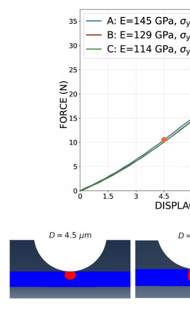 
Figure 1: Parameter coupling in the early SPT response. (a) Simulated early force–displacement responses for three combinations of Young’s modulus E and yield strength σy; markers denote punch displacements D = 4.5, 9, and 12 µm on curve A, and the inset shows the FE model of the SPT configuration. (b) Regions satisfying the von Mises yield condition (red) beneath the punch at the three marked displacements.

📷 Fig 2

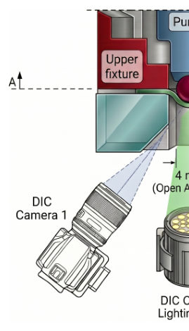 
Figure 2: Experimental setup: small punch test fixture with the direct-view stereoscopic DIC system. The punch and die assembly, clamped specimen, two cameras with 100 mm lenses, and LED illumination directed at the speckled bottom surface through the die opening are shown.

📷 Fig 3

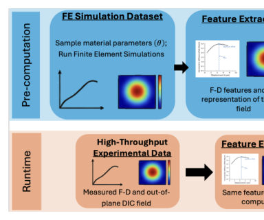 
Figure 3: Overview of the two-stage inference workflow. Top (pre-computation): finite element simulations are con- verted into compact features that are used to train a surrogate model and a posterior estimator. Bottom (runtime): the experimental F–D and DIC measurements are processed using the same feature representation and supplied to the trained CFM model to generate posterior samples of the material parameters.

📷 Fig 4

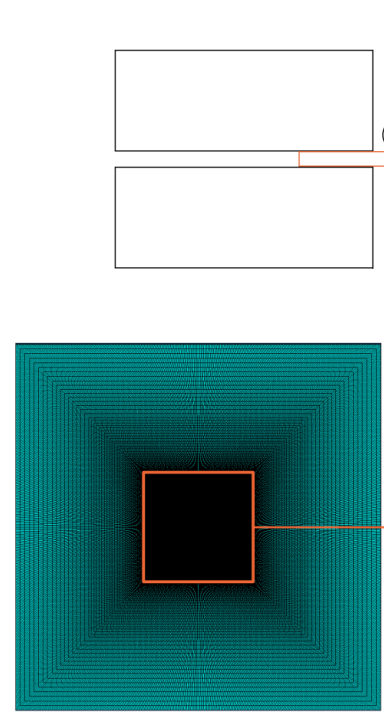 
Figure 4: Finite element model of the SPT specimen: (a) Boundary conditions. The punch reference point (RP) is loaded in displacement control (downward arrow). The upper die RP is held fixed after the clamping step. The lower die RP is fully fixed. The specimen (orange) sits between the dies. (b) FE mesh: full 10 × 10 mm domain (left) and zoom into the 3 × 3 mm DIC region of interest (right). The structured C3D8 mesh is locally refined toward the punch-contact region; within the region of interest the bottom-surface element faces form a regular rectangular grid.

📷 Fig 5

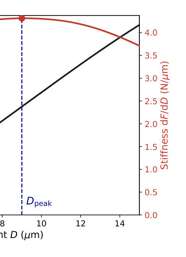 
Figure 5: Truncation of the F–D curve for the estimation of E and σy. The force F (black, left axis) and the stiffness dF/dD (red, right axis) are plotted against punch displacement. The displacement Dpeak corresponding to the maximum in the dF/dD was used to truncate the F–D curves for the analyses in this study.

**Summary.** This paper introduces a novel, scalable framework using Gaussian Processes and Conditional Flow Matching to estimate material properties from combined mechanical test data (Force vs. Displacement and DIC fields). By learning conditional posteriors directly, it overcomes the mathematical difficulties of defining joint likelihoods across different measurement types, providing robust parameter inference for complex materials testing like Small Punch Tests.

**Why it may be interesting.** While focused on classical materials science, the core methodology—using advanced generative ML models (Flow Matching) for likelihood-free inference from complex, multi-source experimental data—is highly relevant for analyzing noisy measurements in quantum experiments (e.g., characterizing decoherence rates or interaction strengths).

Detailed structure

**Main problem.** The primary challenge is performing Bayesian calibration of material constitutive parameters from multimodal mechanical test data when specifying a joint likelihood across different measurement types is difficult.

**Main result.** The proposed framework successfully uses DIC measurements to contract broad posteriors derived from force-displacement curves alone, leading to accurate estimation of Young's modulus and yield strength.

**Method.** A novel amortized, likelihood-free framework combining Gaussian Process (GP) surrogates with Conditional Flow Matching (CFM) is used to learn conditional posteriors directly from synthetic data.

**Model / system.** The study uses the Small Punch Test (SPT) on aluminum alloys, modeling the material response using an elastic–perfectly plastic (EPP) constitutive model. Measurements include global force-displacement curves and spatially resolved displacement fields from Digital Image Correlation (DIC).

**Key observables.** Young's modulus ($E$), yield strength ($\sigma_y$), Force–Displacement ($F–D$) curve, and out-of-plane displacement field $w(x, y)$.

**Important parameters / regimes.** Constitutive parameters ($E$, $\sigma_y$); reference values from independent tensile tests.

**Assumptions / limitations.** The framework assumes that conditional posteriors can be learned robustly without explicitly constructing a joint likelihood function across modalities.

**Figures summary.** Figures illustrate the experimental setup (DIC), show parameter coupling in $F–D$ data alone, and demonstrate how adding DIC displacement fields contracts the posterior distributions towards known reference values.

**Paper structure.** The paper introduces the problem of multimodal Bayesian inference for material parameters. It proposes the GP-CFM framework trained on synthetic data. The utility is demonstrated by applying this to SPT/DIC data, showing improved parameter estimation over using force data alone.

Abstract

Bayesian calibration of material constitutive parameters from multimodal mechanical test data is often limited by the need to specify a joint likelihood across measurement modalities that differ in dimensionality, noise structure, and physical units. The resulting posteriors are often broad or strongly correlated, causing standard Markov Chain Monte Carlo (MCMC) samplers to mix poorly. Here, we present an amortized, likelihood-free framework that combines Gaussian process (GP) surrogates with Conditional Flow Matching (CFM) to learn conditional posteriors over constitutive parameters directly from synthetic multimodal parameter--observation pairs, avoiding hand-crafted likelihoods and repeated MCMC sampling. Once trained, the GP--CFM model generates posterior samples for each new specimen at negligible cost. The utility of this novel approach is demonstrated in this paper by estimating the values of Young's modulus and yield strength from the early portion of the force--displacement ($F$--$D$) curve and a Digital Image Correlation (DIC)-based displacement field measured in a Small Punch Test (SPT). It is observed that the $F$--$D$ data alone produce broad posteriors, consistent with limited parameter discrimination in the global response. Adding the DIC-measured displacement field was seen to contract the posteriors and shift them towards the independently measured tensile reference values. This work establishes a robust likelihood-free framework for the inference of material constitutive parameters from multimodal data, demonstrated through SPT--DIC integration.

[↑ back to top](#top)

### [Efficient LLM-Generated Shuttling Compilers for Complex Trapped-Ion Architectures](http://arxiv.org/abs/2607.24714v1)

**Authors:** Fabian Kreppel, Reza Salkhordeh, Ferdinand Schmidt-Kaler, André Brinkmann  
**Type:** both · **Category:** other · **PDF:** <https://arxiv.org/pdf/2607.24714v1>  
**Analysis basis:** full PDF text, analyzed in chunks
**Topic relevance:** `QC/QI experiment` **1/5** · `methods for driven-dissipative` **1/5**

📷 Fig 1

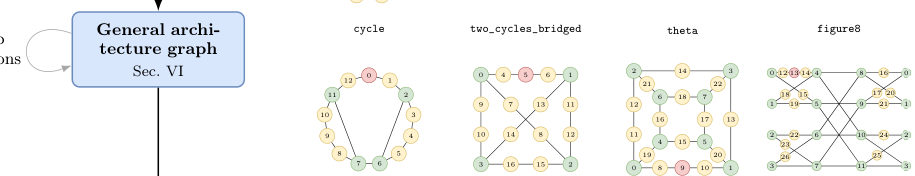 
Fig. 1. Overview of the approach. The three shuttling compilers are generated in a chained sequence of increasing architectural generality: from top to bottom, a linear architecture (Sec. IV), a branched architecture with junctions and stacks (Sec. V), and a general architecture (Sec. VI). Each subsequent compiler is seeded with the previous one’s optimized code together with a written specification of what must change, while the linear-architecture compiler starts from scratch. Each emitted compiler is then refined through follow-up optimization prompts that target timesteps, compile time, and memory use. Beside each stage, we draw the corresponding architecture, in which qubit segments...

📷 Fig 2

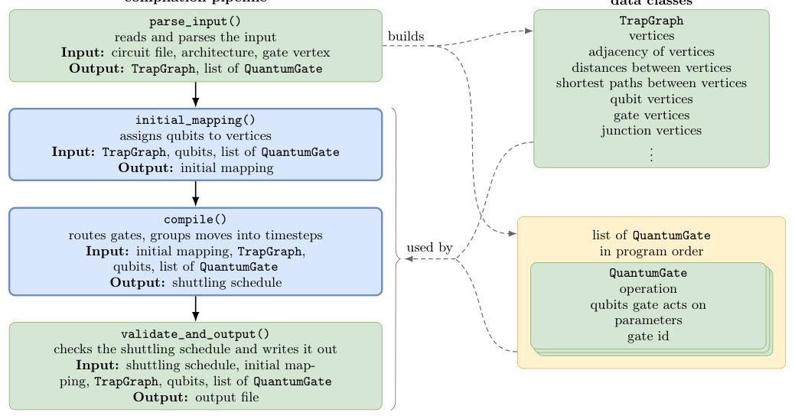 
Fig. 2. Structure of the single-file compiler ion_trap_compiler.py. Boxes in green are the provided, fixed components that the LLM may not change: the outer functions parse_input and validate_and_output and the data classes TrapGraph and QuantumGate. Boxes in blue are the two functions written by the LLM: initial_mapping and compile. The shaded frame groups the QuantumGate objects into the list the pipeline passes along. Solid arrows follow the compilation pipeline, and dashed lines show which data-class objects each function builds or uses. Of TrapGraph’s query methods, the figure shows only those shared by all three compilers.

📷 Fig 3

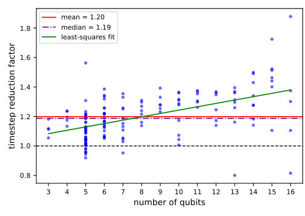 
Fig. 4. Linear architecture, optimized LLM-based compiler versus the hand-crafted baseline11 on the 153 library circuits. Each circuit’s reduction factor is plotted against its qubit count. The dashed line marks factor 1, and the red, pur- ple, and green lines mark the mean, the median, and a least- squares fit.

📷 Fig 4

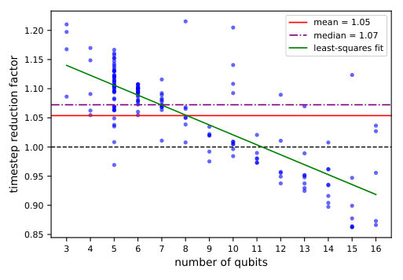 
Fig. 5. Branched architecture, optimized LLM-based com- piler versus the hand-crafted baseline16 on the circuit library at stack height 1 and junction distance 1. Each circuit’s re- duction factor is plotted against its qubit count. The dashed line marks factor 1, and the red, purple, and green lines mark the mean, the median, and a least-squares fit.

📷 Fig 5

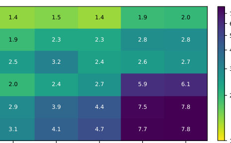 
figure8

**Summary.** This paper demonstrates that frontier Large Language Models can autonomously generate highly efficient shuttling compilers for complex trapped-ion quantum architectures. By treating the trap as a graph, the LLMs minimize the required ion movement time steps compared to existing methods. This capability significantly accelerates the development cycle for new quantum hardware designs.

**Why it may be interesting.** This work directly addresses the crucial engineering bottleneck in trapped-ion quantum computing—the translation layer between abstract circuits and physical hardware movements—using advanced AI tools.

Detailed structure

**Main problem.** The core problem is developing efficient software compilers that translate abstract quantum algorithms into physical sequences of ion-qubit movements (shuttling) required by trapped-ion hardware.

**Main result.** Frontier LLMs can generate working, competitive shuttling compilers for complex architectures without manual algorithmic engineering, drastically reducing development time from months to days.

**Method.** The authors used state-of-the-art LLMs (Claude Opus 4.7 and Fable 5) to iteratively generate and refine Python code that maps quantum circuits onto physical trap graphs representing ion connectivity.

**Model / system.** The system is a trapped-ion quantum computer, modeled as a graph where vertices are trap segments and edges represent shuttling paths. The compiler must schedule sequential movements of ions (qubits) across this graph structure.

**Key observables.** The primary observable is the number of shuttling timesteps required to execute a circuit; reductions up to 76% were reported compared to hand-crafted methods.

**Important parameters / regimes.** Architectural complexity, measured by connectivity (linear vs. junction-rich graphs), and qubit count (up to 50 qubits tested).

**Assumptions / limitations.** Shuttling operations are assumed to be executed sequentially; the current focus deliberately excludes scheduling simultaneous gates across multiple segments.

**Figures summary.** Figure 1 illustrates the systematic, chained generation process from simple linear traps to complex general graph architectures. Figure 2 shows the structure of the resulting compiler code, highlighting LLM-written functions within a fixed framework.

**Paper structure.** The paper systematically develops the compiler by testing increasing architectural complexity: first on linear segments, then on junctions, and finally on broad classes of connected trap graphs using comprehensive test suites (T1-T14).

Abstract

Trapped-ion quantum computers rely on shuttling compilers, which cast an input algorithm into a sequence of ion-qubit movements within a given architecture. We present the first study in which a single frontier large language model (LLM), Claude Opus 4.7, generates and iteratively refines the full Python code of shuttling compilers from written specifications. We start with a compiler for (i) a linear segmented trap, extend it to (ii) a trap with junctions, and finally achieve efficient compilation for (iii) a broad class of connected trap graphs. The compilers for the more general cases are seeded with code from the previous ones. We benchmark the LLM-generated compilers against state-of-the-art hand-crafted ones using a common suite of quantum circuits. The number of shuttling timesteps is reduced by up to 76% for (i) and up to 39% for (ii). For the broad case (iii) of freely connected architectures, we find large variations in the required number of shuttling timesteps, depending on the connectivity. A densely connected, junction-rich architecture yields an order-of-magnitude reduction in shuttling timesteps compared to a corridor-like one. Repeating the complete generation and evaluation with a second frontier LLM, Claude Fable 5, reproduces these findings, with the Fable 5 compilers surpassing the hand-crafted ones more often on the largest circuits. Our results show that an unmodified frontier LLM can produce working, correct, and competitive shuttling compilers without additional manual algorithmic engineering, thus reducing the development time for new architectures from several months to a few days.

[↑ back to top](#top)

### [Recoverable Quantum Computation: An Information-Centric Paradigm for Quantum Computing with Errors](http://arxiv.org/abs/2607.23996v1)

**Authors:** Shengwang Du  
**Type:** theory · **Category:** quantum information and computing · **PDF:** <https://arxiv.org/pdf/2607.23996v1>  
**Analysis basis:** full PDF text, analyzed in chunks
**Topic relevance:** `entanglement & information structure` **1/5** · `quantum measurements` **1/5**

📷 Fig 1

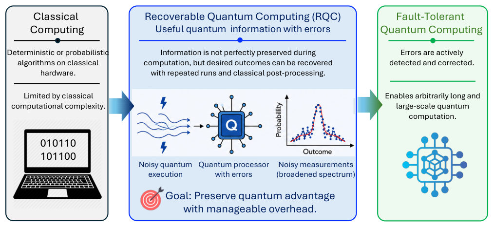 
FIG. 1. Conceptual relationship among classical computing, recoverable quantum computation (RQC), and fault-tolerant quantum computing (FTQC). Classical computing is limited by classical computational complexity. FTQC achieves arbitrarily accurate quantum computation through active error detection and correction. RQC occupies an intermediate regime in which useful computational outcomes can be extracted from noisy quantum processors through repeated executions and classical post-processing while preserving quantum advantage with manageable overhead.

📷 Fig 2

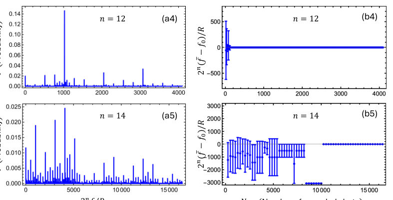 
FIG. 2. Experimental demonstration of RQC using QFT period estimation on IBM quantum hardware. (a1)–(a5) Measured probability spectra for n = 4, 8, 10, 12, and 14 qubits. The horizontal axis is the normalized frequency coordinate 2nf/R, which coincides with the discrete frequency-bin index. The correct signal frequency corresponds to f0 = R/4 and is located at 2 n−2. (b1)–(b5) Recovery of the computational information (signal frequency). The vertical axis shows the normalized frequency error, 2n( ¯f −f0)/R, as a function of the number of recorded shots, Nrec. Error bars represent one standard deviation obtained from independent subsets of the experimental data.

📷 Fig 3

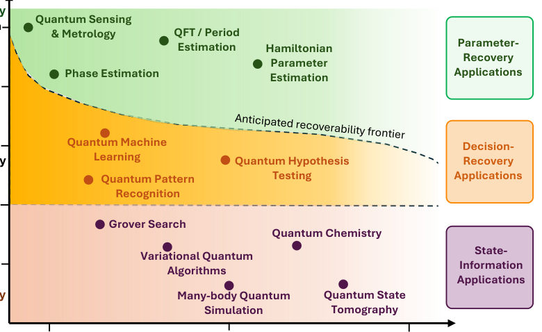 
FIG. 3. Conceptual recoverability landscape of quantum applications. Recoverability is expected to decrease as the amount and complexity of the computational information to be recovered from the quantum state increase. Parameter-recovery and decision-recovery applications are anticipated to exhibit higher recoverability than applications requiring preservation of large amounts of quantum-state information. The placement of individual applications is illustrative and conceptual rather than quantitative.

**Summary.** This paper introduces Recoverable Quantum Computation (RQC), a new paradigm that evaluates quantum computation based on whether task-specific information can be extracted from noisy outputs. Instead of demanding full fault tolerance, RQC focuses on preserving only the necessary computational data. This offers a practical framework for assessing useful quantum advantage in today's imperfect hardware.

**Why it may be interesting.** It provides a crucial theoretical lens for assessing near-term quantum hardware capabilities beyond simple fidelity measures, directly impacting the feasibility assessment for complex quantum simulations or algorithms.

Detailed structure

**Main problem.** The realization of fault-tolerant quantum computers is hindered by massive error correction overhead, raising the question of whether useful computation must wait for perfect hardware.

**Main result.** The paper proposes Recoverable Quantum Computation (RQC), an information-centric paradigm showing that useful computational information can be extracted from noisy outputs even without full state fidelity.

**Method.** It introduces recoverability as an operational principle, defining it by the ability to extract task-specific information with overhead preserving quantum advantage over classical methods.

**Model / system.** The framework applies to general quantum computation operating in the intermediate regime between current Noisy Intermediate-Scale Quantum (NISQ) devices and future Fault-Tolerant Quantum Computers (FTQC).

**Key observables.** Computational information required for a task (e.g., frequency estimate, decision label), recovery overhead, and recoverability efficiency.

**Important parameters / regimes.** The degree of noise/error; the quantum advantage threshold relative to classical methods.

**Assumptions / limitations.** It assumes that many practical applications only require extracting specific pieces of information rather than preserving the entire quantum state vector.

**Figures summary.** Figure 1 conceptually maps the relationship between Classical Computing, RQC (intermediate regime), and FTQC, illustrating useful outcome extraction from noise.

**Paper structure.** The paper introduces RQC as a paradigm shift, defines recoverability operationally with metrics, illustrates it using examples like QFT period estimation, and concludes by proposing a classification of applications and a research roadmap.

Abstract

Quantum computing promises transformative advances in computation, communication, sensing, and machine learning. Yet the realization of large-scale fault-tolerant quantum computers remains hindered by the enormous overhead required for quantum error correction. This challenge raises a fundamental question: Must useful quantum computing wait until fully fault-tolerant quantum hardware becomes available? In this Perspective, we propose Recoverable Quantum Computation (RQC), an information-centric paradigm for quantum computing with errors. Rather than requiring faithful preservation of the complete quantum state, RQC focuses on preserving the computational information required to accomplish a given task. A quantum computation is considered recoverable if the desired computational information can be extracted from noisy quantum outputs with an overhead that preserves quantum advantage relative to the best known classical method. We introduce recoverability as an operational principle for evaluating noisy quantum computations and propose practical metrics based on recovery overhead and recoverability efficiency. We illustrate the framework using quantum Fourier transform period estimation on IBM quantum hardware and a conceptual example from quantum machine learning, demonstrating that useful computational information may remain recoverable despite significant physical errors. Building on these examples, we propose a preliminary classification of quantum applications according to their expected recoverability and outline a research roadmap toward a predictive theory of recoverability. RQC is intended not as an alternative to fault-tolerant quantum computing, but as a complementary paradigm for understanding and evaluating useful quantum computation in the broad intermediate regime between today's noisy quantum processors and tomorrow's fault-tolerant quantum computers.

[↑ back to top](#top)

### [The Ruskai-Audenaert conjecture & equipartitions of positive operators](http://arxiv.org/abs/2607.23066v1)

**Authors:** Niranjan Kumar, Michael M. Wolf  
**Type:** theory · **Category:** quantum information and computing · **PDF:** <https://arxiv.org/pdf/2607.23066v1>  
**Analysis basis:** full PDF text, analyzed in chunks
**Topic relevance:** `entanglement & information structure` **1/5** · `quantum measurements` **1/5**

📷 Fig 1

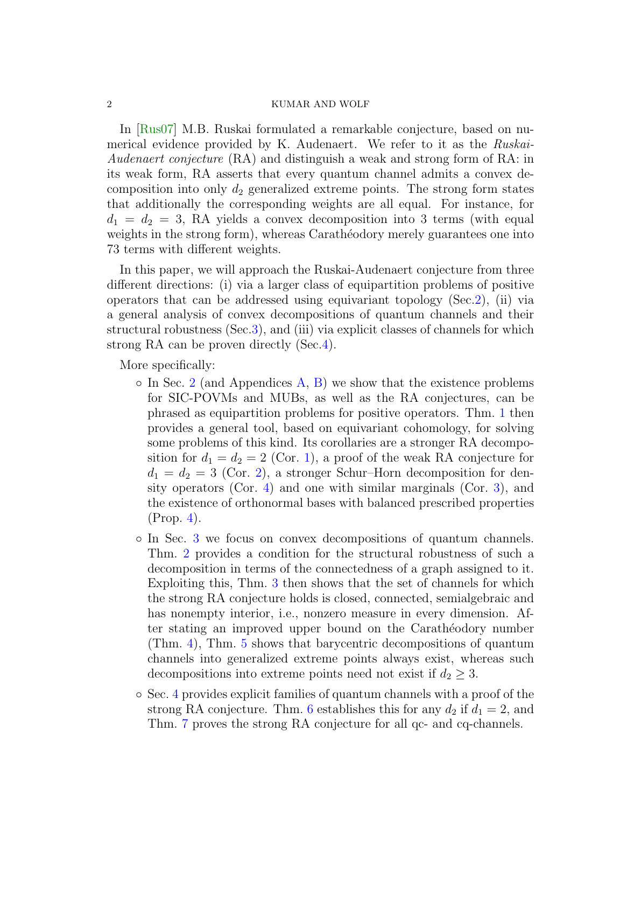 
Low-resolution page preview, page 2

📷 Fig 2

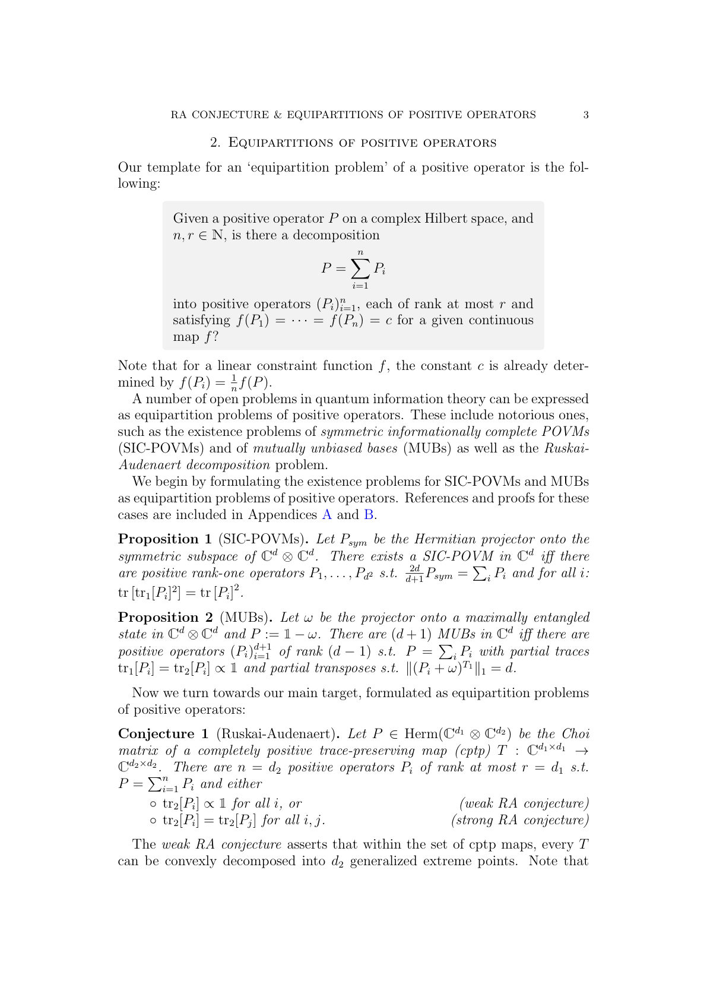 
Low-resolution page preview, page 3

📷 Fig 3

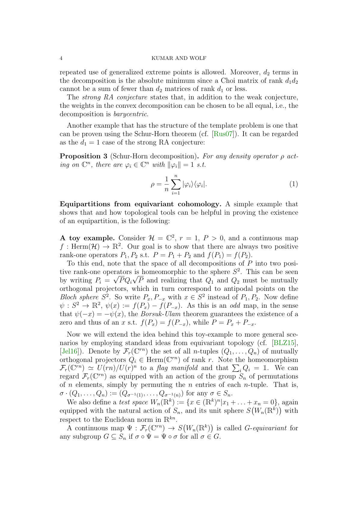 
Low-resolution page preview, page 4

📷 Fig 4

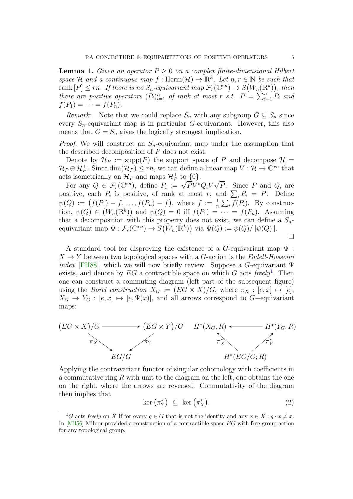 
Low-resolution page preview, page 5

📷 Fig 5

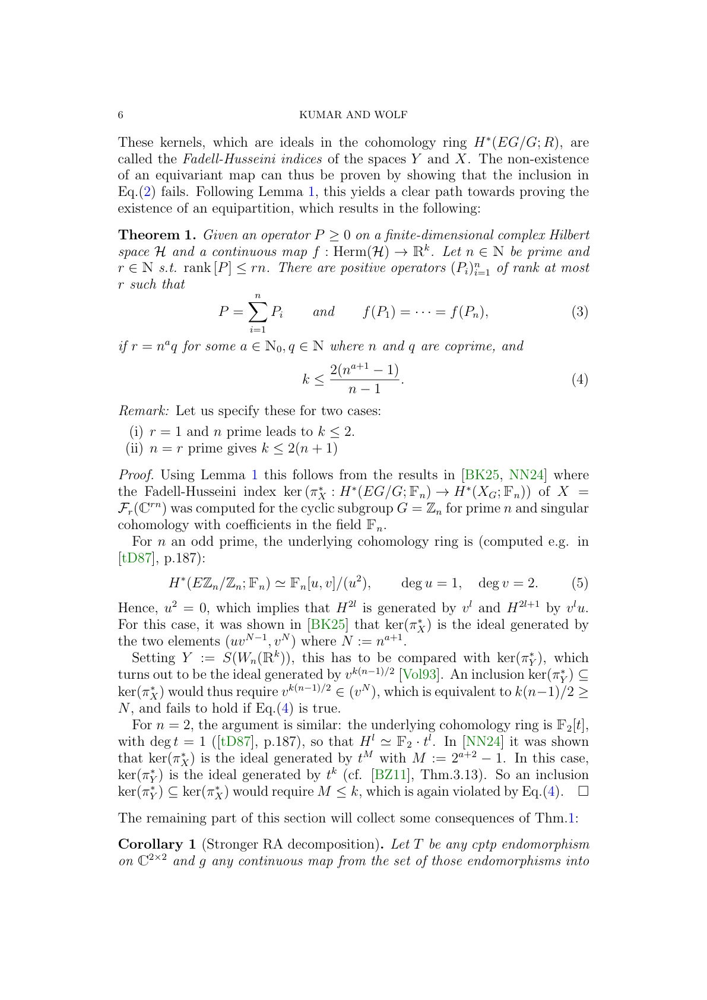 
Low-resolution page preview, page 6

**Summary.** This paper tackles major open problems in quantum information, such as the Ruskai-Audenaert conjecture and MUB existence, by framing them as equipartition problems for positive operators. The authors develop a sophisticated mathematical framework using equivariant cohomology to prove these conjectures for wide classes of quantum channels and related structures.

**Why it may be interesting.** The reliance on deep mathematical tools like equivariant cohomology to solve fundamental questions about quantum resource theory (like channel decomposition or POVM existence) provides powerful new theoretical machinery applicable across quantum physics.

Detailed structure

**Main problem.** The paper addresses open problems in quantum information theory, specifically formulating them as equipartition problems for positive operators.

**Main result.** They prove the strong Ruskai-Audenaert conjecture for a large set of quantum channels and establish necessary and sufficient conditions relating MUB existence to operator decompositions using topological methods.

**Method.** The authors primarily use advanced mathematical tools, including equivariant cohomology (Borsuk-Ulam theorem) and functional analysis on convex sets of operators, alongside direct algebraic proofs.

**Model / system.** The core models are quantum channels ($\mathcal{T}$), represented by Choi matrices, and positive operators acting on finite-dimensional complex Hilbert spaces. The context involves decomposing these operators into rank-bounded parts.

**Key observables.** Equipartition existence (i.e., finding decompositions $P = \sum P_i$ with uniform constraints $f(P_1) = \cdots = f(P_n)$), and the structure of projectors related to MUBs ($R_U$).

**Important parameters / regimes.** The dimension of the Hilbert space ($d$), the number of components in the decomposition ($n$), and the rank constraints on the parts ($	ext{rank}(P_i) \le r$).

**Assumptions / limitations.** The analysis often relies on establishing topological obstructions (non-existence of equivariant maps) or analyzing stationary points of functionals defined over the space of quantum channels.

**Figures summary.** Not specified in the notes, but the structure suggests figures illustrating geometric constraints on operator spaces and cohomology diagrams.

**Paper structure.** The paper is structured by first defining the general equipartition problem template. It then applies topological methods (equivariant cohomology) to prove existence theorems for specific physical problems like MUBs and the Ruskai-Audenaert conjecture, culminating in concrete proofs for certain classes of quantum channels.

Abstract

Several open problems in quantum information theory can be formulated as equipartition problems for positive operators, asking for a decomposition into bounded-rank positive parts under uniform constraints. The existence problems for SIC-POVMs and MUBs are of this type, as is the Ruskai-Audenaert conjecture. We first show that certain problems of this form can be attacked using equivariant cohomology, and then present new results on the Ruskai-Audenaert conjecture. In its weak form, this conjecture asserts that every quantum channel admits a convex decomposition into a minimal number of generalized extreme points; in its strong form, one with equal weights. We prove the strong conjecture in all dimensions for a set of channels of nonzero measure, including all cq- and qc-channels, as well as for all channels with qubit inputs. We also prove the weak conjecture for all qutrit channels, along with further results on convex decompositions of quantum channels.

[↑ back to top](#top)

### [Wigner negativity and stellar rank for SU(1,1) states](http://arxiv.org/abs/2607.22810v1)

**Authors:** A. B. Klimov, A. Muñoz, F. Leuchs, J. -P. Gazeau, L. L. Sanchez-Soto  
**Type:** theory · **Category:** other · **PDF:** <https://arxiv.org/pdf/2607.22810v1>  
**Analysis basis:** full PDF text, analyzed in chunks
**Topic relevance:** `Keldysh / 2PI / non-Gaussian methods` **1/5** · `entanglement & information structure` **1/5**

📷 Fig 1

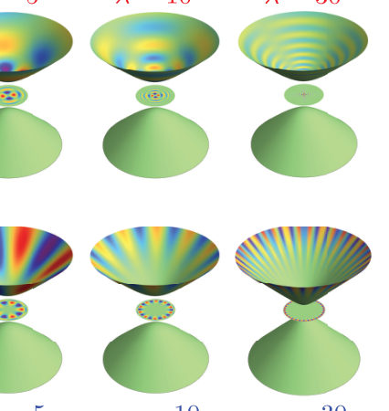 
Figure 1: Density plots of the real part of the harmonic functions uλm(ζ) on the upper sheet of the hy- perboloid H+ 2 , together with their associated distributions on the unit disk D obtained via stereographic projection from the south pole. The corresponding indexes are indicated in each plot.

📷 Fig 2

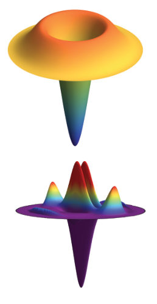 
Figure 2: Plots of the Wigner function on the unit disk for the states discussed in the text. Upper panel: coherent state (left) and basis state |k, µ⟩. Lower panel: even cat state (left) and odd cat state (right).

📷 Fig 3

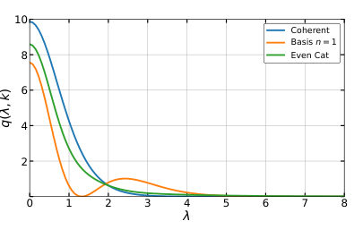 
Figure 3: Multipole norm as a function of the order λ for (left panel) a coherent state for different values of the Bargmann parameter k and (right panel) the different states considered in the text all of them with k = 1.

**Summary.** This paper develops advanced phase-space tools to measure quantumness in systems possessing SU(1,1) symmetry. It establishes that Wigner negativity is a reliable indicator of nonclassicality for these systems, contrasting with other symmetries. By combining this with generalized multipole expansions, the authors offer a comprehensive mathematical toolkit for characterizing quantum states.

**Why it may be interesting.** This work provides a rigorous mathematical framework for quantifying quantum resources in systems with hyperbolic symmetries, offering an alternative diagnostic tool beyond standard quadrature measurements relevant to quantum optics and field theory.

Detailed structure

**Main problem.** The goal is to systematically characterize and quantify quantum resources (quantumness) for systems governed by SU(1,1) dynamical symmetry using phase-space methods.

**Main result.** For SU(1,1) systems, Wigner negativity serves as an unambiguous sufficient witness of nonclassicality because the Wigner function remains strictly positive for all coherent states. The analysis provides a comprehensive toolkit combining Wigner negativity and generalized multipoles.

**Method.** The authors construct covariant quasiprobability distributions on the two-sheeted hyperboloid and analyze quantumness using spectral methods, harmonic expansions, and comparisons between different state representations (e.g., cat states vs. coherent states).

**Model / system.** The study focuses on quantum systems exhibiting SU(1,1) dynamical symmetry. The phase space is modeled by the two-sheeted hyperboloid or Poincaré unit disk, utilizing Perelomov SU(1,1) coherent states.

**Key observables.** Wigner negativity (negative volume), Stellar Rank (zeros of the Husimi Q-function), and generalized multipole strengths ($q_{\varrho}(k, \lambda)$).

**Important parameters / regimes.** The analysis involves parameters related to the excitation number ($n$), hyperbolic coordinates ($\zeta$), and spectral indices ($\lambda$).

**Assumptions / limitations.** The analysis assumes the applicability of harmonic function theory on the hyperboloid and relies on comparing state properties against those of coherent states.

**Figures summary.** Figures illustrate density plots of harmonic functions, Wigner functions for various states (coherent, basis, cat), and plots showing multipole norms ($q$) versus spectral index ($\lambda$).

**Paper structure.** The paper proceeds by establishing the covariant quasiprobability framework on the hyperboloid. It then analyzes key diagnostics like Wigner negativity and stellar rank, introduces generalized multipoles via harmonic expansion, and finally applies these tools to specific quantum states (e.g., cat states) to quantify nonclassicality.

Abstract

Quasiprobability distributions for systems endowed with SU(1,1) dynamical symmetry have received surprisingly little attention, despite the central role of this symmetry in two-photon physics, squeezed states, and nonlinear interferometry. Here, we fill this gap by constructing a full covariant family of $s$-ordered quasiprobability distributions defined on the two-sheeted hyperboloid, or equivalently, on the Poincaré unit disk via stereographic projection. A key result is that the Wigner function is strictly positive for all Perelomov SU(1,1) coherent states, in sharp contrast to the SU(2) case. This positivity endows Wigner negativity with an unambiguous operational meaning: any negative volume is a direct signature of genuinely quantum behavior. We further examine the stellar rank of SU(1,1) states, defined through the zeros of the Husimi $Q$-function, and show how it compares with Wigner negativity as a geometry-adapted witness of nonclassicality in this setting. We further introduce a hierarchy of generalized multipoles through a harmonic expansion of the density operator on the hyperboloid, providing a complementary framework for probing quantumness. This offers a comprehensive toolkit for characterizing and quantifying quantum resources in SU(1,1) systems.

[↑ back to top](#top)

### [DeComp2: Description Complexity aware Decomposition](http://arxiv.org/abs/2607.23990v1)

**Authors:** Aritra Sarkar  
**Type:** theory · **Category:** quantum information and computing · **PDF:** <https://arxiv.org/pdf/2607.23990v1>  
**Analysis basis:** full PDF text, analyzed in chunks
**Topic relevance:** `entanglement & information structure` **1/5**

📷 Fig 1

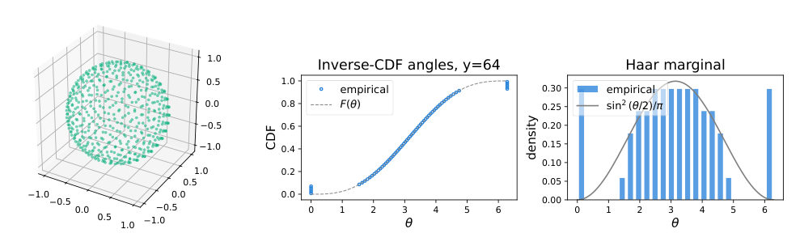 
Figure 1 Deterministic target ensemble of 𝑆𝑈(2): axis grid (left) and Haar-induced angle grid (right) at (𝑥, 𝑦) = (512, 64).

📷 Fig 2

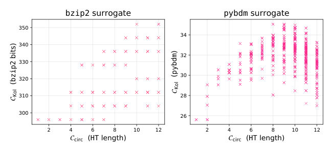 
Figure 2 (Ccirc, CKol) scatter, one point per Fibonacci-grid target covered by the HT enumeration at (𝑥, 𝑦, 𝜀, 𝑀) = (512, 64, 0.15, 12). Left: bzip2 bit-length surrogate of CKol. Right: pybdm block-decomposition surrogate. Off-diagonal spread under both surrogates supports the independence-of-axes claim (i).

📷 Fig 3

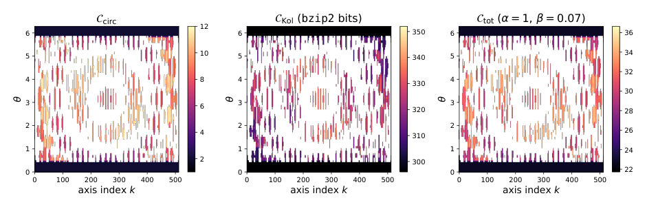 
Figure 3 Heatmaps of Ccirc, CKol (bzip2) and Ctot over the axis index 𝑘∈{1, . . . , 𝑥} and rotation angle 𝜃∈[0, 2𝜋] at (𝑥, 𝑦, 𝜀, 𝑀) = (512, 64, 0.15, 12). The two cost fields are qualitatively different, so Ctot is not a monotone reshading of either component alone.

📷 Fig 4

 
Figure 4 Ctot optima distinctness for a single Fibonacci-grid target (𝑘, 𝑗) = (41, 10) at (𝑥, 𝑦, 𝜀, 𝑀) = (512, 64, 0.15, 12) with weights (𝛼, 𝛽) = (1, 0.07). Horizontal axis: HT-enumeration index of the 10 strings inside the 𝜀-ball. Left axis: 𝛼Ccirc (circles); right axis: 𝛽CKol (bzip2 bits, squares). Vertical guides mark arg min 𝛼Ccirc, arg min 𝛽CKol, and arg min Ctot; the three minimizers are at distinct decomposition candidates, so the joint cost picks a non-trivial decomposition (11, 320) that neither component alone selects.

📷 Fig 5

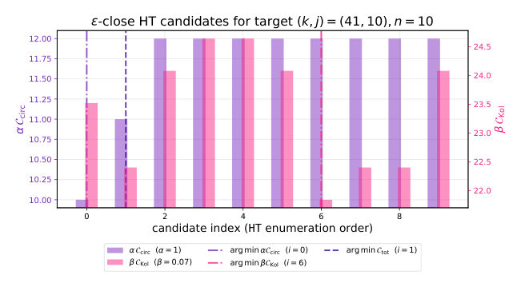 
Figure 4 illustrates one such split target into the candidate-level picture. For the Fibonacci-grid point (𝑘, 𝑗) = (41, 10), the 𝜀-ball contains 10 HT-strings. The per-axis minimizers arg min 𝛼Ccirc at raw (Ccirc, CKol) = (10, 336) and arg min 𝛽CKol at (12, 312) each beat the other only on its own axis. The joint minimizer arg min Ctot sits distinctly at (11, 320): a candidate that is neither the shortest nor the most compressible HT-string in the ball, but is the unique minimizer under the additive cost. The corresponding unitary, the output decompositions and their corresponding length, bzip encoding length and fidelity are listed below.

**Summary.** This paper proposes DeComp2, a new metric for quantum compilation that combines the standard circuit complexity with a Kolmogorov-style description complexity. By minimizing this total cost, it regularizes the optimization landscape to favor structured decompositions over merely shortest ones. This suggests incorporating structural information into compiler objectives for better resource management.

**Why it may be interesting.** It provides a mathematically rigorous framework for improving quantum compiler design by incorporating information-theoretic measures of program structure alongside physical execution costs.

Detailed structure

**Main problem.** Quantum compilers currently optimize only for execution resources (like gate count or depth), ignoring the structural complexity of the program that generates the circuit.

**Main result.** The proposed total cost function, $C_{	ext{tot}} = \alpha C_{	ext{circ}} + eta C_{	ext{Kol}}$, selects compilation candidates that are superior to those chosen by minimizing either execution cost or description length alone.

**Method.** The authors introduce a regularization term based on Kolmogorov complexity ($C_{	ext{Kol}}$) and minimize the weighted sum of this term with the standard circuit complexity ($C_{	ext{circ}}$).

**Model / system.** The problem is instantiated for decomposing an arbitrary target unitary $U$ within the $SU(2)$ group, treating the compilation process as finding a sequence of elementary gates.

**Key observables.** Total Complexity ($\mathcal{C}_{	ext{tot}}$), Circuit Complexity ($\mathcal{C}_{	ext{circ}}$), and Kolmogorov Description Complexity ($\mathcal{C}_{	ext{Kol}}$).

**Important parameters / regimes.** Weights $\alpha$ and $eta$; the tolerance $\epsilon$ for unitary approximation.

**Assumptions / limitations.** The approach assumes that total complexity can be modeled as an additive combination of positional (circuit) and kinetic (description) entropy, borrowing structure from physical laws rather than deriving it from them.

**Paper structure.** The paper establishes the limitation of execution-only optimization, proposes the $\mathcal{C}_{	ext{tot}}$ objective function by analogy to second law thermodynamics, and validates this joint cost on $SU(2)$ decompositions, showing its unique selection capability.

Abstract

Quantum compilers optimize execution-only proxies such as gate count, depth, and fidelity, treating the compiled circuit as the unit of cost. This conflates two distinct resources, how much the substrate has to do at run time, and how much has to be said to describe what to do. Unrolling a looped program leaves run-time cost unchanged while erasing the hierarchical structure on which downstream optimization and reuse rely.   We propose lifting the compiler objective from execution to life cycle complexity by pairing the circuit complexity $\mathcal{C}_{\mathrm{circ}}$ with a Kolmogorov-style description complexity $\mathcal{C}_{\mathrm{Kol}}$ of the emitted circuit, and minimizing the additive total $\mathcal{C}_{\mathrm{tot}} = α\,\mathcal{C}_{\mathrm{circ}} + β\,\mathcal{C}_{\mathrm{Kol}}$. The mirrors the additive positional and kinetic entropy of the second law of quantum complexity, and reads as a minimum-description-length regularizer over the otherwise degenerate set of $\mathcal{C}_{\mathrm{circ}}$-minimizers.   We instantiate the objective on $SU(2)$ through exhaustive HT-enumeration with compression-based surrogates upper-bounding $\mathcal{C}_{\mathrm{Kol}}$. Across a Haar-representative target grid the two surrogates correlate positively with $\mathcal{C}_{\mathrm{circ}}$ yet break its rank order on a non-trivial fraction of points, ruling out a tight functional dependence. With calibrated weights the joint cost selects, for a small but operationally meaningful fraction of targets, a candidate that is neither the shortest nor the most compressible HT-string in the $\varepsilon$-ball, exhibiting the compilation choices a $\mathcal{C}_{\mathrm{circ}}$-only optimizer discards and motivating $\mathcal{C}_{\mathrm{Kol}}$ as an active optimization signal for hierarchical intermediate representation for compiler.

[↑ back to top](#top)

### [Effects of Curvature-Scalar Coupling on Vacuum Energy in Flat (3+1)-Dimensional Space-Time](http://arxiv.org/abs/2607.23331v1)

**Authors:** Volodymyr Gorkavenko, Oleh Barabash, Pavlo Nakaznyi, Mariia Tsarenkova, Nazar Yakovenko, Andrii Zaporozhchenko  
**Type:** theory · **Category:** other · **PDF:** <https://arxiv.org/pdf/2607.23331v1>  
**Analysis basis:** full PDF text, analyzed in chunks
**Topic relevance:** `Keldysh / 2PI / non-Gaussian methods` **1/5**

📷 Fig 1

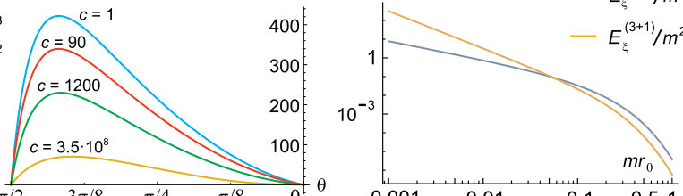 
Figure 1: Left panel: the induced dimensionless vacuum energy E3+1 ξ /m2 is plotted as a function of the parameter θ, which characterizes the Robin boundary conditions on the surface of the impenetrable magnetic tube, for various tube thicknesses. For clarity, the curves are multiplied by the coefficient c. Right panel: comparison of the induced dimensionless vacuum energy in (3 + 1)- and (2 + 1)-dimensional space-times as functions of the dimensionless tube thickness mr0 with the boundary condition parameter θ = −1. For both panels, we restrict ourselves to a half-integer magnetic flux F = 1/2.

📷 Fig 2

 
Fig.1. One can see that the induced dimensionless vacuum energy in three-dimensional flat space- time, E(3+1) ξ /m2, induced by the presence of the magnetic topological defect is independent of the curvature coupling ξ only in the limiting cases of Dirichlet (θ = 0) and Neumann (θ = −π/2) boundary conditions, where E(3+1) ξ /m2 = 0. For intermediate values, −π/2 &lt; θ &lt; 0, the induced

📷 Fig 3

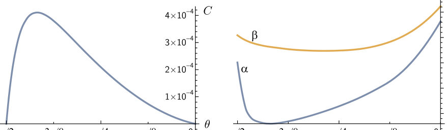 
Figure 2: Left panel: the dependence of the coefficient C(θ, F) in the asymptotic relation at mr0 ≪1 (21) on boundary condition parameter θ. Right panel: the dependence of the coefficients α(θ, F) and β(θ, F) in the asymptotic relations at mr0 ≫1 (22), (23) on boundary condition parameter θ. We restrict ourselves to a half-integer magnetic flux F = 1/2.

📷 Fig 4

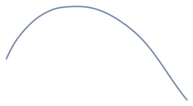 
Figure 3: The dependence of the tube thickness mr0, at which the dimensionless induced vacuum energy E(3+1) ξ /m2 in (3 + 1)-dimensional space-time equals the corresponding dimensionless

**Summary.** This paper calculates the vacuum energy induced by a magnetic topological defect on a scalar field in flat spacetime, incorporating terms dependent on spacetime curvature. The key finding is that using general boundary conditions introduces an explicit dependence on the curvature coupling constant ($\xi$), highlighting the crucial role of boundary physics in quantum vacuum effects.

**Why it may be interesting.** While focused on QFT in curved spacetime, the rigorous treatment of boundary conditions (Robin vs. Dirichlet/Neumann) and the explicit inclusion of curvature coupling ($\xi$) provide general theoretical tools applicable to effective field theories describing quantum systems near boundaries or defects.

Detailed structure

**Main problem.** The study investigates how a magnetic topological defect influences the vacuum polarization, quantified by the induced vacuum energy, of a charged massive scalar field in flat (3+1)-dimensional spacetime.

**Main result.** The induced vacuum energy explicitly depends on the curvature coupling constant ($\xi$) when general Robin boundary conditions are applied, unlike special cases like Dirichlet or Neumann boundaries. This dependence is significant even in flat space-time.

**Method.** The analysis involves solving the stationary Klein-Gordon equation using Bessel functions and calculating the renormalized expectation value of the energy-momentum tensor ($T_{00}$).

**Model / system.** The system models a charged massive scalar field interacting with spacetime curvature ($\xi R$) near an impenetrable, finite-thickness cylindrical tube carrying a magnetic flux. The analysis employs the most general Robin boundary condition.

**Key observables.** Induced vacuum energy density ($\epsilon$ or $E^{(3+1)}_\xi$).

**Important parameters / regimes.** Curvature coupling constant ($\xi$), magnetic flux ($F$), tube radius ($r_0$), and boundary condition parameter ($	heta$).

**Assumptions / limitations.** The analysis is performed in flat spacetime, and the calculation requires renormalization by subtracting the zero-flux contribution to handle divergences.

**Figures summary.** Figures compare dimensionless vacuum energy dependence on $	heta$ and tube thickness ($m r_0$), showing crossover points between (3+1)D and (2+1)D results.

**Paper structure.** The paper establishes the Lagrangian involving curvature coupling, derives the governing Klein-Gordon equation with general Robin boundary conditions, calculates the vacuum energy using $T_{00}$, and compares the resulting energy in (3+1)D to known limits and lower dimensions.

Abstract

We investigated how a magnetic topological defect affects the vacuum polarization of a charged massive scalar field in a flat $(3+1)$-dimensional space-time. The defect was modeled as an impenetrable to matter field finite-thickness tube with magnetic flux inside. We implemented the most general form of the Robin boundary condition on the surface of the magnetic tube, which enables a fully general analysis of the problem. We have found that in flat spacetime, the total vacuum energy generated by a magnetic topological defect depends on the curvature $ξ$, except for special cases corresponding to the Dirichlet and Neumann boundary conditions. By contrast, when Robin's general boundary conditions are imposed, the induced vacuum energy acquires an explicit dependence on the curvature coupling $ξ$, which is significant even in flat space-time. A detailed study of the dependence of the effect on the boundary condition parameter has been carried out. The obtained results highlight the nontrivial role played by boundary conditions in vacuum polarization phenomena.

[↑ back to top](#top)

### [MPStab: an hybrid stabilizers tensor-network quantum circuit simulator](http://arxiv.org/abs/2607.24258v1)

**Authors:** Giulio Crognaletti, Mattia Robbiano, Michele Grossi, Matteo Robbiati  
**Type:** theory · **Category:** numerical methods · **PDF:** <https://arxiv.org/pdf/2607.24258v1>  
**Analysis basis:** full PDF text, analyzed in chunks
**Topic relevance:** `methods for driven-dissipative` **1/5**

📷 Fig 1

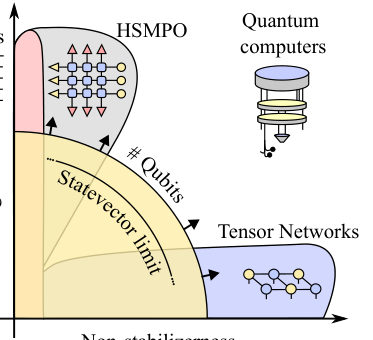 
FIG. 1. A qualitative representation of classical simulator realms. Laying on the entanglement axis, stabilizers simu- lators allow representing pure-Clifford circuits at large scale. On the magic axis, tensor networks consent simulation of large systems if entanglement growth remains under control. Mixed approaches, like the hybrid stabilizer-matrix product opera- tor (HSMPO) implemented here, push the boundaries of the classical simulators closer to the bijector of the plane, which corresponds to the quantum computers realm.

📷 Fig 2

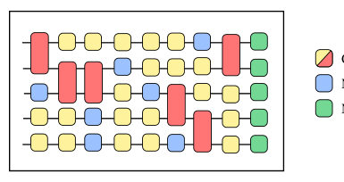 
FIG. 2. Any quantum circuit can be written in terms of Clif- ford operations (red and yellow gates) alternated with local magic operations (blue gates).

📷 Fig 3

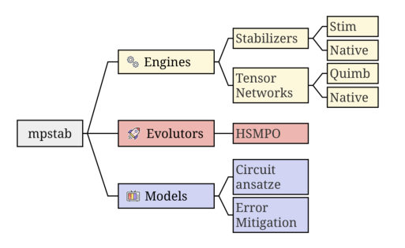 
FIG. 3. Schematic representation of mpstab 0.1.0.

📷 Fig 4

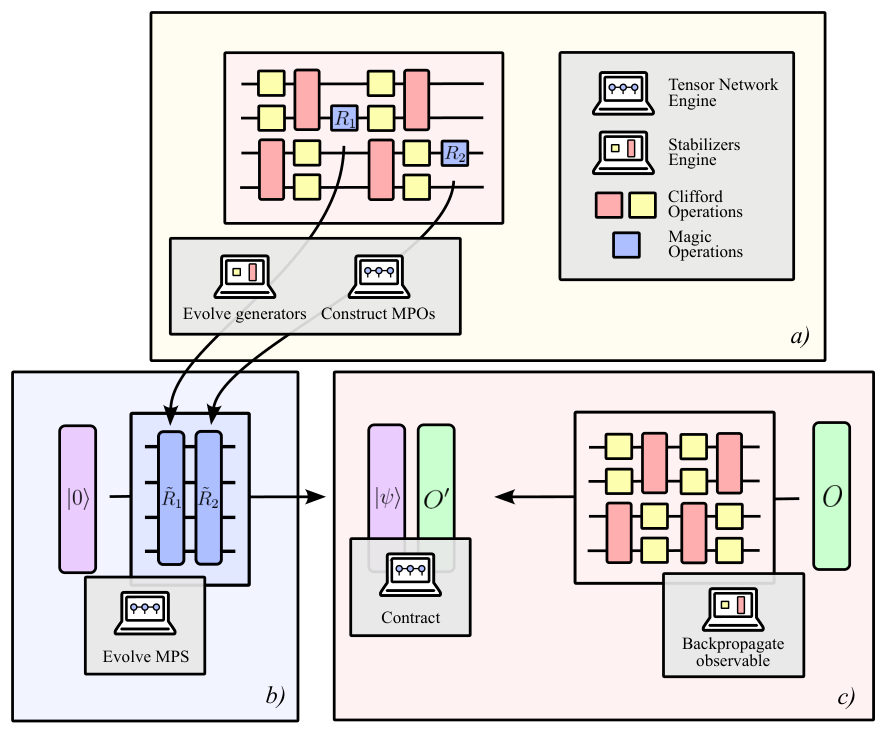 
FIG. 4. mpstab’s operational workflow when computing the expectation value of an observable O over the state represented by an HSMPO. A tensor network and a stabilizers engines cooperate to prepare the evolved MPS and use it to perform the contraction with the given observable.

📷 Fig 5

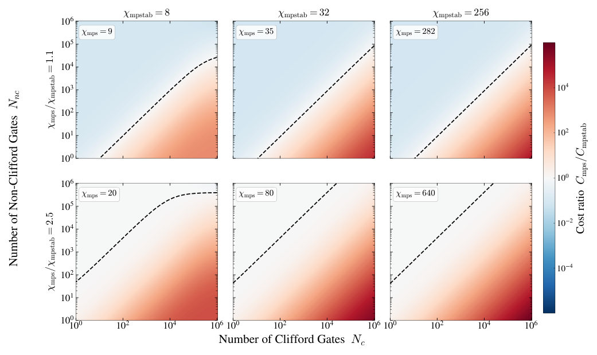 
FIG. 5. Cost ratio Cmps/Cmpstab as a function of Clifford (NC) and non-Clifford (NnC) gate counts. Red regions indicate where mpstab is cheaper than standard MPS; blue regions indicate the opposite. The dashed curve marks the iso-cost boundary Cmps = Cmpstab. Columns fix the mpstab bond dimension χmpstab ∈{8, 32, 256}, spanning strongly- to weakly-compressed hybrid representations; rows fix the ratio χmps/χmpstab ∈{1.1, 2.5} between the two methods, corresponding respectively to a weak and a strong fidelity advantage of the hybrid method. The leftmost column exhibits the arched regime, where the stabilizer overhead NnC NC saturates the boundary at high NC; the middle and right columns...

**Summary.** This paper introduces MPStab, a novel hybrid simulator that combines the exact simulation power of stabilizer formalism for Clifford gates with the efficiency of tensor networks for non-Clifford rotations. It allows for polynomial-time simulation of complex quantum circuits by treating different gate types optimally. This is crucial for benchmarking and understanding the computational boundaries between classical and quantum computation.

**Why it may be interesting.** The explicit combination of stabilizer methods with tensor networks provides a powerful tool to simulate quantum dynamics in regimes previously inaccessible or computationally prohibitive for pure MPS approaches.

Detailed structure

**Main problem.** Efficiently simulating quantum circuits on classical computers, which is challenging due to exponential state space growth from entanglement.

**Main result.** The proposed hybrid simulator (MPStab) achieves polynomial-time simulation for circuits mixing Clifford and non-Clifford gates by combining exact stabilizer tracking with tensor network evolution.

**Method.** It decomposes the unitary circuit into alternating Clifford blocks (simulated exactly via stabilizers) and single-qubit rotations (encoded as bond-2 Matrix Product Operators, MPOs).

**Model / system.** The method targets general quantum circuits composed of Pauli strings and arbitrary unitaries, which are decomposed into Clifford ($C$) and rotation ($R$) components.

**Key observables.** Expectation values of linear combinations of Pauli observables ($\langle O 
angle$), Fidelity Lower Bound ($F_{lb}$), and Execution Time.

**Important parameters / regimes.** Number of qubits ($L$), Circuit depth ($D$), Maximum bond dimension ($\chi_{	ext{max}}$), and Magic retention ($eta$).

**Assumptions / limitations.** The tensor network evolution for rotations is an approximation due to bond dimension truncation ($\chi$); the method relies on circuit decomposition into Clifford/non-Clifford parts.

**Figures summary.** Figures illustrate the simulator's modular structure, the operational workflow combining stabilizer backpropagation and TN forward evolution, and benchmark results comparing time cost and fidelity against pure tensor network methods across varying magic content.

**Paper structure.** The paper introduces the hybrid formalism (HSMPO), details the implementation of separate engines for Clifford (stabilizer) and non-Clifford (MPO/TN) parts, validates the approach by benchmarking performance against standard TN simulators using fidelity and time metrics, and discusses future algorithmic extensions.

Abstract

The development of techniques for simulating quantum systems using classical computers is a paramount task for two primary reasons: i) there exist configurations for which classical computers are remarkably effective and will continue to be so, and ii) exploring the limits of classical computation facilitates the identification of the regimes of competence for quantum computers. In this work, we present MPStab, a quantum circuit simulator based on a hybrid formalism combining stabilizers and tensor networks, recently introduced in Ref. [1]. We present the package, its core functionalities, and explore its performances in a few interesting simulation regimes.

[↑ back to top](#top)

### [Pulse engineering via projection of response functions at infinite nonlinear order](http://arxiv.org/abs/2607.24725v1)

**Authors:** Lia Kley, Ludwig Mathey  
**Type:** theory · **Category:** quantum information and computing · **PDF:** <https://arxiv.org/pdf/2607.24725v1>  
**Analysis basis:** full PDF text, analyzed in chunks
**Topic relevance:** `quantum measurements` **1/5**

📷 Fig 1

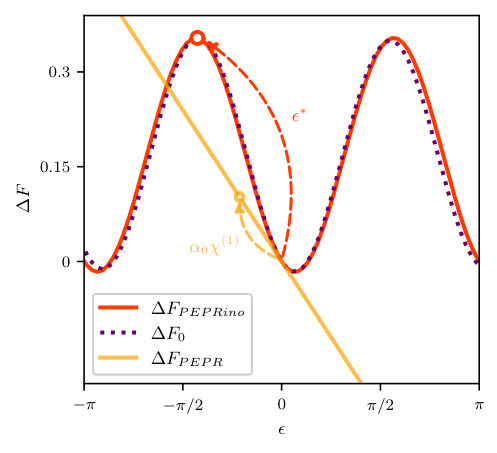 
Figure 1. Fidelity landscape and update strat- egy. We show the fidelity landscape ∆F0 as a func- tion of the parameter ϵ, corresponding to a shift of a trainable parameter θj,k of a control operator Bj, for a two-qubit system discussed in the text. Specifically, the shift is given by θj,k →θj,k −2ϵ

📷 Fig 2

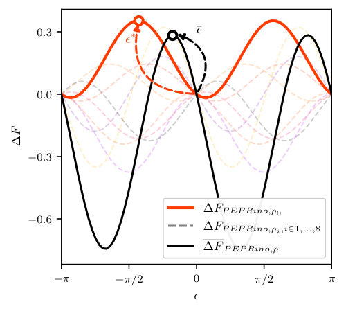 
Figure 2. Change of the fidelity landscape for dif- ferent initial states. We show the change of the fidelity ∆FP EP Rino as a function of ϵ for 8 random initial states ρi (dashed lines), as well as the initial state ρ0 (red line) which is used in Fig. 1. ∆FP EP Rino is evaluated at the same random time tr and for the same control operator for all nB = 9 initial states ρ. This figure motivates that, for gate optimization, the averaged fidelity landscape has to be considered (black line) and an averaged update θj,k →θj,k −¯ϵ 2

📷 Fig 3

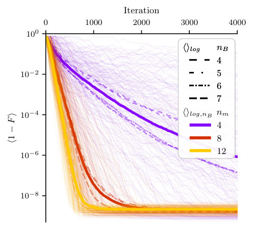 
Figure 3. Infidelity of the 2-qubit optimization pro- cess using PEPRino. We show the infidelity during the optimization process of the QFT for two qubits as a func- tion of iteration steps for PEPRino. Thin dotted lines rep- resent individual optimization runs for different batch sizes nB ∈{4, 5, 6, 7} and numbers of modes nm ∈{4, 8, 12} in the control pulse parameterization. The thick solid lines show the logarithmic average across all considered runs and batch sizes for the specified number of modes. Additionally, the thin solid lines with distinct line styles illustrate the loga- rithmic averages for each batch size, with the mode number indicated by the corresponding color. Our method...

📷 Fig 4

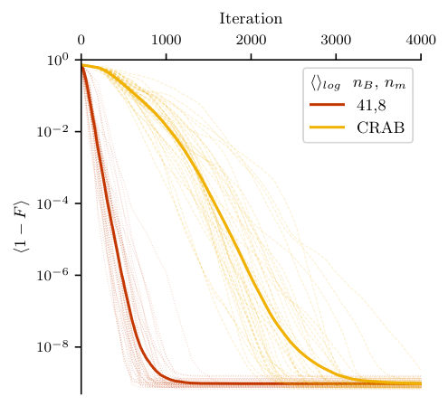 
Figure 4. PEPRino vs CRAB for the 2-qubit QFT op- timization. We show the infidelity obtained using PEPRino (red) and CRAB (orange) as a function of iterations. For PEPRino, we choose nm = 8 with a batch size of nB = 41, in accordance with the size of the simplex used in CRAB, where we also consider nm = 8. The dashed lines are individual optimization runs, and the solid lines are the logarithmic av- erage over the runs. Both methods converge against the same lower bound, which is reached in fewer iterations utilizing our proposed method. Additionally, the variance of the individ- ual runs and computational time for individual iteration steps are less for PEPRino compared to CRAB.

📷 Fig 5

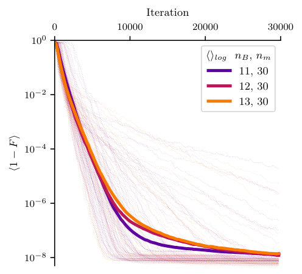 
Figure 5. Infidelity of the 3-qubit optimization process using PEPRino. We present the infidelity during the op- timization process of the QFT for three qubits as a function of iteration steps for PEPRino. For three qubits, we con- sider nm = 30 modes in the control pulse parameterization. We show the results for batch sizes nB = {11, 12, 13}. The solid lines are the logarithmic average over an ensemble of 40 optimization runs for the given batch sizes. The findings agree with the findings for the 2-Qubit-QFT optimization. For increasing batch sizes, we find a tendency towards con- vergence in fewer iteration steps, however, the behavior and result remain generally similar for the range of...

**Summary.** This paper introduces PEPRino, a novel algorithm for optimal quantum control that avoids hyperparameters and gradients by analyzing system response functions to infinite order. By leveraging only the first two-order susceptibilities, it efficiently finds high-fidelity control pulses for multi-qubit systems like those implementing the QFT. The results confirm its superior convergence speed compared to existing state-of-the-art methods.

**Why it may be interesting.** It provides a sophisticated theoretical tool for designing robust quantum pulses by efficiently characterizing the control landscape without relying on gradient information or manual hyperparameter tuning.

Detailed structure

**Main problem.** Developing a hyperparameter and gradient-free algorithm for optimal control problems in quantum computing to achieve high-fidelity operations.

**Main result.** The proposed PEPRino algorithm demonstrates faster convergence in iteration steps and computational time compared to established methods like CRAB when optimizing the Quantum Fourier Transform on 2 qubits.

**Method.** It leverages response theory by determining the control landscape via projection of response functions up to infinite nonlinear order, approximated using only first and second-order susceptibilities ($\chi^{(1)}$ and $\chi^{(2)}$).

**Model / system.** The study focuses on controlling quantum systems (two and three qubits) governed by a time-dependent Hamiltonian $H(t)$, aiming for high-fidelity implementation of gates like the QFT.

**Key observables.** Fidelity ($\Delta F$), averaged infidelity ($\langle 1 - F 
angle$), and susceptibilities ($\chi^{(n)}$).

**Important parameters / regimes.** The optimal perturbation parameter $\epsilon^*$, the number of qubits ($n_q$), and the number of control modes ($n_m$).

**Assumptions / limitations.** The method approximates the infinite nonlinear response series using only the first and second-order susceptibilities ($\chi^{(1)}$ and $\chi^{(2)}$).

**Figures summary.** Figures compare the fidelity landscape approximation (PEPRino vs. linear) and show convergence plots comparing PEPRino against CRAB for QFT optimization, highlighting efficiency gains.

**Paper structure.** The paper introduces the problem of optimal control in quantum computing, derives the PEPRino method based on response theory expansions, applies it to the QFT on 2-3 qubits, and benchmarks its performance against existing algorithms using fidelity measurements.

Abstract

Optimal control problems arise in a wide range of scientific disciplines, but the corresponding optimization algorithms often display a strong dependence on hyperparameters that significantly influence performance and convergence. For the optimal implementation of quantum algorithms, these challenges are further amplified by high-dimensional control landscapes and the need for high-fidelity operations. Here, we propose an algorithm for optimal control problems in quantum computing to efficiently generate high-fidelity control protocols for multi-qubit systems in a hyperparameter and gradient free manner. The method, referred to as Pulse Engineering via Projection of response functions at infinite nonlinear order (PEPRino), leverages the framework of response theory to navigate the control landscape to find high-fidelity implementations. This is achieved by determining the control landscape via response functions to infinite order, efficiently evaluated by resummation in terms of the first and second order response function. To demonstrate the approach, we apply it to quantum systems consisting of two and three qubits for the optimal implementation of the Quantum Fourier Transform (QFT). We benchmark the proposed algorithm against the Chopped Random Basis (CRAB) algorithm utilizing the Nelder-Mead method, focusing on the 2-qubit scenario. The results indicate faster convergence regarding iteration steps and computational time, highlighting the advantages of our approach.

[↑ back to top](#top)

### [Scalable Variational Quantum Optimization via Pauli Correlation Encoding: Application to Large-Scale Power Demand Portfolio Optimization](http://arxiv.org/abs/2607.24722v1)

**Authors:** Takuya Yoshioka, Keita Sasada, Riku Usuki, Yuichiro Nakano, Keisuke Fujii  
**Type:** both · **Category:** quantum information and computing · **PDF:** <https://arxiv.org/pdf/2607.24722v1>  
**Analysis basis:** full PDF text, analyzed in chunks
**Topic relevance:** `QC/QI experiment` **1/5**

📷 Fig 1

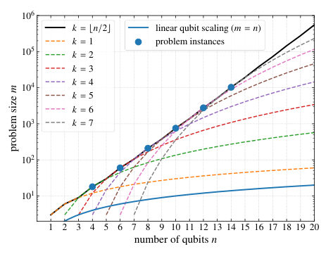 
FIG. 1. Maximum representable problem size m as a func- tion of the number of qubits n for different correlation orders k in Pauli correlation encoding (PCE) [13], where m = 3 n k  . The black solid curve corresponds to k = ⌊n/2⌋, which max- imizes the number of Pauli correlators (i.e., expectation val- ues of Pauli correlation operators). The linear reference line (m = n) indicates direct encodings with one-to-one qubit– variable mapping. Filled markers denote the (n, m) instances considered in this work.

📷 Fig 2

 
FIG. 2. Normalized cost gap as a function of the problem size m for the time-averaged portfolio optimization (Model 1). The vertical axis shows the normalized cost gap ∆CT /WT [Eq. (5)]. Crosses [greedy (all-zero)] denote results obtained by the greedy algorithm initialized from the all-zero bit string, while plus markers [greedy (random)] show results averaged over 1,000 runs with independent random initial bit strings; error bars indicate standard deviations over these runs. Cir- cles and diamonds correspond to results obtained using the complete PCE workflow, including greedy post-processing af- ter sign-based decoding, in simulation and on the quantum processing unit (QPU),...

📷 Fig 3

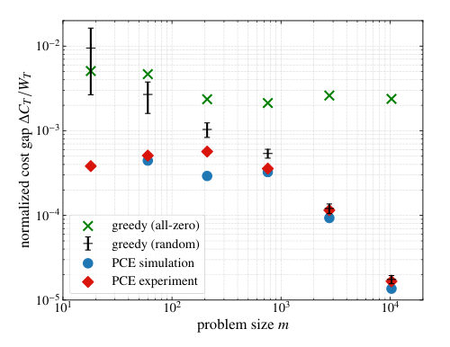 
Figure 2 shows the normalized cost gap for Model 1 as a function of the problem size m, demonstrating the scal- ability of the PCE-based optimization framework from small to large instances. The corresponding optimiza- tion settings and convergence statistics are summarized in Table I. Across all tested instances, the PCE-based solver achieves consistently low normalized cost gaps, indicat- ing that the proposed encoding and optimization strategy remain effective as the problem size increases. This scal- ability is enabled by the compact representation of vari- ables through Pauli correlation operators, which avoids the linear growth of qubit requirements typical of direct binary encodings....

📷 Fig 4

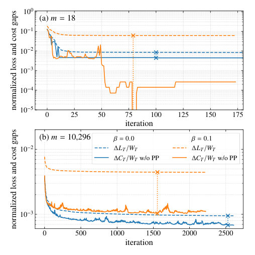 
FIG. 3. Iteration dependence of the normalized loss ∆LT /WT and cost ∆CT /WT gaps (without post-processing, w/o PP). Results are shown for β = 0.0 and 0.1. Panels correspond to (a) m = 18 with αsc = 1.5 (α = 6.0), and (b) m = 10,296 with αsc = 0.1 (α = 274.4). The continuous loss decreases monotonically during optimization, whereas the corresponding decoded binary cost exhibits step-like or irreg- ular, non-monotonic behavior due to the nonlinear discretiza- tion into binary variables. Crosses connected by dotted lines indicate the minimum cost values attained along the opti- mization trajectory, together with the corresponding loss val- ues at the same iterations. For m = 18, the cost...

📷 Fig 5

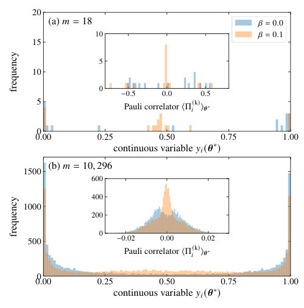 
FIG. 4. Frequency distributions of the sets {yi(θ∗)}m i=1 with yi(θ∗) = ς(2αsc⟨Π(k) i ⟩θ∗). Results are shown for β = 0.0 and 0.1. Panels correspond to (a) m = 18 with αsc = 1.5 (α = 6.0), and (b) m = 10,296 with αsc = 0.1 (α = 274.4). The main panels show the distributions of {yi(θ∗)}m i=1, while the insets display those of the corresponding sets {⟨Π(k) i ⟩θ∗}m i=1. All distributions are evaluated at θ∗, which corresponds to the minimum decoded binary cost in Fig. 3 (without post- processing). All results are obtained from state-vector simu- lations.

**Summary.** This paper introduces Pauli Correlation Encoding (PCE), a scalable method to encode large-scale combinatorial optimization problems into quantum circuits using few qubits. By applying this framework to power portfolio optimization, the authors demonstrate near-optimal performance across thousands of variables on both simulation and trapped-ion hardware. PCE offers a qubit-efficient pathway for tackling complex real-world industrial challenges with current NISQ devices.

**Why it may be interesting.** The work directly addresses a major bottleneck in quantum computation—scaling up problem size—by proposing a structured encoding (PCE) that maps complex combinatorial constraints onto low-qubit-count expectation values, which is highly relevant for simulating many-body physics or optimization problems.

Detailed structure

**Main problem.** The core problem is developing a scalable variational quantum optimization framework for large-scale combinatorial problems, exemplified by electric power demand portfolio optimization.

**Main result.** Pauli Correlation Encoding (PCE) provides a qubit-efficient and physically motivated method to encode these large problems, achieving near-optimal performance across massive system sizes ($m=10,296$) on both simulation and trapped-ion hardware.

**Method.** The authors use PCE to represent binary variables as expectation values of Pauli correlation operators, enabling a continuous relaxation that is optimized variationally before decoding to discrete solutions.

**Model / system.** The application domain is electric power demand portfolio optimization, modeled by QUBO-type objective functions. The quantum implementation utilizes variational circuits parameterized by angles ($	heta$) acting on qubits, and the results are tested on a trapped-ion quantum processor.

**Key observables.** Normalized cost gaps (e.g., $10^{-4}$ relative to optimal), Pauli correlators ($\langle\Pi^{(k)}_i
angle$), procured power profiles ($P_t$), and uncertainty coefficients of variation (CV).

**Important parameters / regimes.** Problem size $m$ ranges from 18 up to 10,296; correlation order $k$; regularization parameter $eta$.

**Assumptions / limitations.** The performance relies on the assumption that improvements in the continuous loss function reliably translate into better discrete solutions, and discrepancies between simulation/QPU are attributed to noise.

**Figures summary.** Figures illustrate the scaling of representable problem size ($m$ vs $n$), histograms showing correlator distributions transitioning from discrete peaks (small $m$) to continuous structures (large $m$), and time-series plots comparing PCE results against greedy baselines for power procurement profiles.

**Paper structure.** The paper introduces PCE as a scalable framework, applies it to the two-stage hybrid optimization model (time-averaged initialization followed by time-resolved refinement), validates performance across large scales ($m=18$ to $10,296$), and demonstrates robustness on physical hardware.

Abstract

Variational quantum algorithms offer a promising route to combinatorial optimization, but their applicability is limited by the challenge of encoding large-scale problems within restricted qubit resources. In this work, we introduce a scalable variational framework based on Pauli correlation encoding (PCE) and apply it to electric power demand portfolio optimization. Binary variables are represented through expectation values of Pauli correlation operators, which encode multi-body correlations of the quantum state and provide a continuous relaxation enabling compact representations with few qubits. We further propose a two-stage hybrid formulation, in which a time-averaged problem provides initialization for a time-resolved optimization. Numerical simulations demonstrate near-optimal performance across problem sizes ranging from $m$=18 to 10,296, with normalized cost gaps on the order of $10^{-4}$ relative to solutions with certified optimality. We show that the performance is governed by the interplay between continuous relaxation and discretization: the effective resolution of the correlator representation determines how reliably improvements in the continuous loss translate into better discrete solutions, with larger systems exhibiting more consistent behavior. Finally, we demonstrate robustness on a trapped-ion quantum processor, where high-quality solutions are obtained despite noise and finite sampling. These results establish PCE as a physically motivated and qubit-efficient framework for large-scale combinatorial optimization.

[↑ back to top](#top)

### [Scaling a CUDA-Q GQE + QSCI pipeline to 40 qubits for EUV photoresist chemistry](http://arxiv.org/abs/2607.23988v1)

**Authors:** Karim Elgammal, Marc Maußner  
**Type:** both · **Category:** strongly correlated electrons · **PDF:** <https://arxiv.org/pdf/2607.23988v1>  
**Analysis basis:** full PDF text, analyzed in chunks
**Topic relevance:** `QC/QI experiment` **1/5**

📷 Fig 1

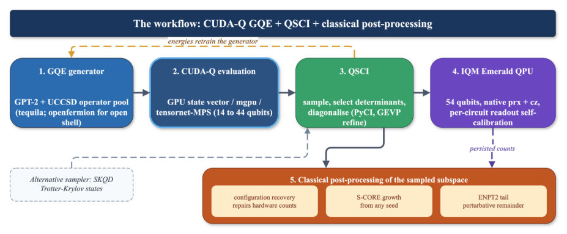 
Figure 1: The hybrid system. GPT-2 policy (GPU) → CUDA-Q circuit sampling (single-GPU fp32 statevector to 32q; pooled 4-GPU mgpu at 34q via a persistent containerised worker; tensornet-mps at 40q; real IQM Emerald via the native iqm target) → classical QSCI diagonalisation and GEVP refinement → loss update, with classical post-processing of the sampled subspace (details in Table 1).

📷 Fig 2

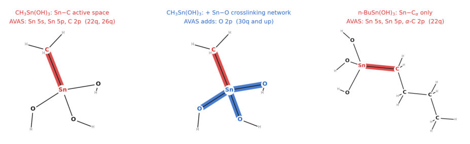 
Figure 2: The AVAS active-space regions, tinted as in Table 1. Left and centre, the resist CH3Sn(OH)3: the Sn-C space, the EUV solubility switch (AVAS Sn 5s, Sn 5p, C 2p; 22q and 26q), then the added Sn-O crosslinking network (+O 2p; 30q and up). Right, the industrial ligand n-BuSn(OH)3: its AVAS label is atom-indexed on the alpha carbon, so the rest of the chain stays outside the active space and the ligand occupies the same (14e,11o) space at 22q as the methyl resist, the one rung at which it is run.

📷 Fig 3

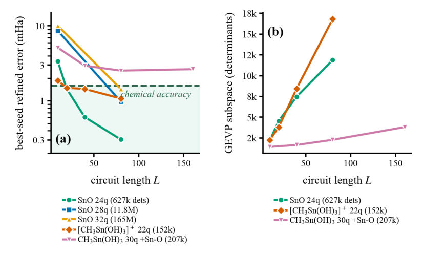 
Figure 3: Circuit depth closes the scaling gap (best seed, fixed 200-iteration budget and determinant cap; GEVP-refined error against each system’s exact CASCI). (a) Error falls with the generated-operator count 𝐿: the SnO 24, 28 and 32q rungs enter the chemical-accuracy band (shaded) from 3.36, 8.64 and 10.06 mHa at 𝐿 = 10. (b) Mechanism: the cross-circuit GEVP subspace grows near-linearly with 𝐿; the resist’s concentrated 24-electron wavefunction grows an order of magnitude more slowly, the origin of its saturation (broken at 𝐿 = 600, see text).

📷 Fig 4

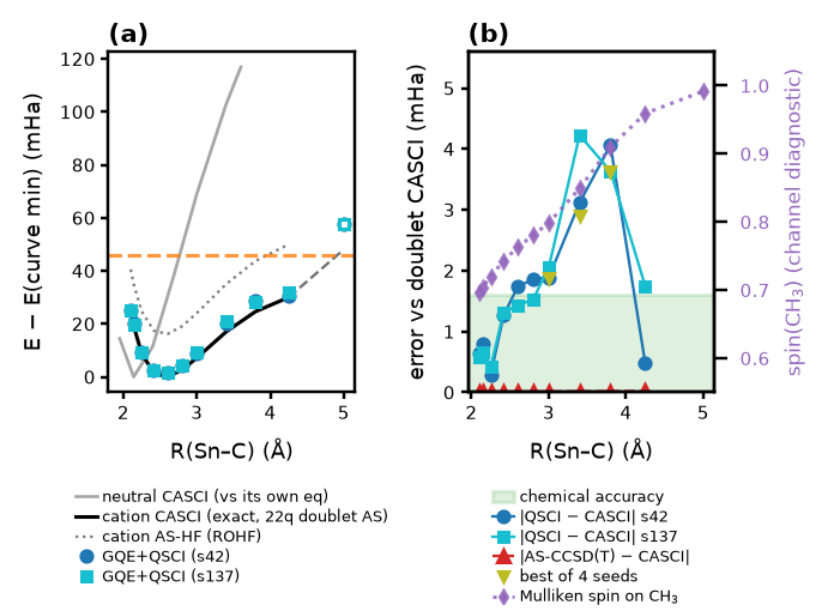 
Figure 4: The EUV switch in CH3Sn(OH)3 at 22 qubits. (a) The radical cation’s Sn-C dissociation surface: GEVP-refined QSCI energies ride the exact doublet CASCI curve out to 4.25 Å, two thirds of the way to the asymptote; the neutral curve (grey) is far steeper, and the dashed orange line is the CH3 radical plus charged Sn(OH)3 frozen-fragment gap at UCCSD(T). Ionisation collapses the classical UCCSD(T) bond-dissociation energy from 72.6 to 21.2 kcal/mol. (b) Per-point error against the chemical-accuracy band, with the active-space CCSD(T) deviation, the best of four seeds where run, and the Mulliken spin on CH3 (right axis) tracking the channel. The open markers and dashed segment at 5.0 Å...

**Summary.** The authors present a scalable quantum pipeline combining GQE and QSCI to simulate complex bond chemistry in EUV photoresists up to 40 qubits. By leveraging circuit depth as the scaling mechanism, they achieve chemical accuracy benchmarks against exact methods. This work is significant for demonstrating near-term quantum computation's potential in materials informatics.

**Why it may be interesting.** This work pushes the boundaries of simulating strongly correlated electronic structure problems relevant to materials science, using quantum machine learning techniques (GPT-2 policy) to manage exponentially large Hilbert spaces on near-term hardware.

Detailed structure

**Main problem.** The study addresses simulating bond-breaking chemistry in EUV photoresist materials, which requires methods beyond single-determinant approximations due to multireference character.

**Main result.** The developed quantum pipeline successfully scales calculations up to 40 qubits while maintaining chemical accuracy for key molecular fragments relevant to lithography. The method demonstrates that circuit depth, rather than training length, is the primary scaling lever.

**Method.** A hybrid computational approach coupling a Generative Quantum Eigensolver (GQE) with Quantum-Selected Configuration Interaction (QSCI), implemented on CUDA-Q and tested on real quantum hardware.

**Model / system.** The system models EUV photoresist chemistry, specifically methyltin trihydroxide and n-butyltin trihydroxide, using active spaces ranging from 14 to 44 qubits. Reference calculations are benchmarked against exact CASCI or FCI results for smaller fragments like SnO.

**Key observables.** Energy error (in mHa), bond dissociation energy changes upon ionization, and the size of the refined quantum subspace relative to the total determinant space.

**Important parameters / regimes.** Qubit count (scaling from 14 to 40 qubits), circuit depth ($L$), and chemical accuracy targets ($\le 1.6 	ext{ mHa}$).

**Assumptions / limitations.** The full trained ansatz on hardware awaits better fidelities, and the boundary beyond $\sim 32$ qubits is currently mapped by classical subspace expansion rather than quantum mechanical breakthrough.

**Figures summary.** Figures illustrate Active Space Projection (AVAS) regions for both resists, while tables detail error metrics across various qubit rungs comparing GQE+QSCI against other methods.

**Paper structure.** The paper progresses by establishing the chemical problem, detailing the hybrid quantum-classical pipeline (GQE $
ightarrow$ QSCI), demonstrating successful scaling and accuracy benchmarks on smaller systems ($	ext{SnO}$), and finally applying this to complex resist chemistry up to 40 qubits.

Abstract

We scale a CUDA-Q-native pipeline coupling a generative quantum eigensolver (GQE) to quantum-selected configuration interaction (QSCI) across active spaces of 14 to 44 qubits, applied to the extreme-ultraviolet (EUV) photoresist chemistry of monoalkyltin oxo-hydroxides. A GPT-2 policy emits UCCSD operator sequences; sampled bitstrings become determinants, diagonalised classically, and a cross-circuit generalised-eigenvalue refinement makes every reported GQE+QSCI energy a variational upper bound. Every rung from 14 to 40 qubits carries an exact CASCI or FCI reference, up to 166 million determinants for SnO at 32 qubits. The pipeline is chemically accurate, below 1.6 mHa, through 30 qubits on methyltin trihydroxide and through 32 on SnO, on the best seed at the top rungs. Circuit depth rather than training length is the scaling lever; the refined subspace grows near-linearly with the operator count while staying a vanishing fraction of the determinant space, 0.017% at the 32-qubit SnO rung. It also runs on the 54-qubit IQM Emerald processor, at the shallow depths its routed two-qubit gates allow, reaching +0.330 mHa for SnO at 14 qubits from a CCSD-amplitude-ordered pool prefix and +3.92 mHa for the industrial n-butyltin ligand at 22 qubits from depth-truncated trained circuits under per-circuit readout self-calibration, 81% of the active-space correlation; classical configuration recovery on those counts tightens the 22-qubit result to +0.18 to 0.21 mHa. For the methyl resist, ionisation collapses the classical UCCSD(T) Sn-C bond dissociation energy from 72.6 to 21.2 kcal/mol, the switch that flips solubility on exposure. Against that, the 40-qubit result is support-limited at 22.8 mHa, the full trained ansatz on hardware awaits better fidelities, and classical subspace expansion reaches the 32 to 40-qubit spaces with no quantum sampler, so that boundary is mapped, not beaten.

[↑ back to top](#top)

### [The bare necessities of a physically reasonable mathematical model for quantum theory](http://arxiv.org/abs/2607.24474v1)

**Authors:** Gerd Niestegge  
**Type:** theory · **Category:** other · **PDF:** <https://arxiv.org/pdf/2607.24474v1>  
**Analysis basis:** full PDF text, analyzed in chunks
**Topic relevance:** `quantum measurements` **1/5**

📷 Fig 1

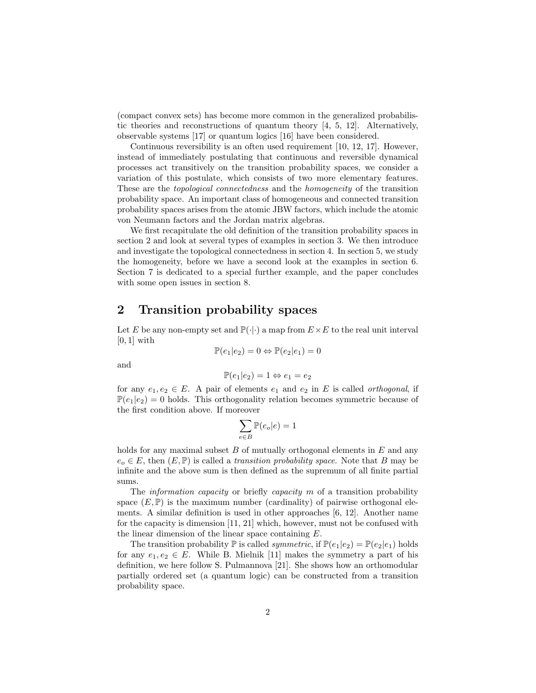 
Low-resolution page preview, page 2

📷 Fig 2

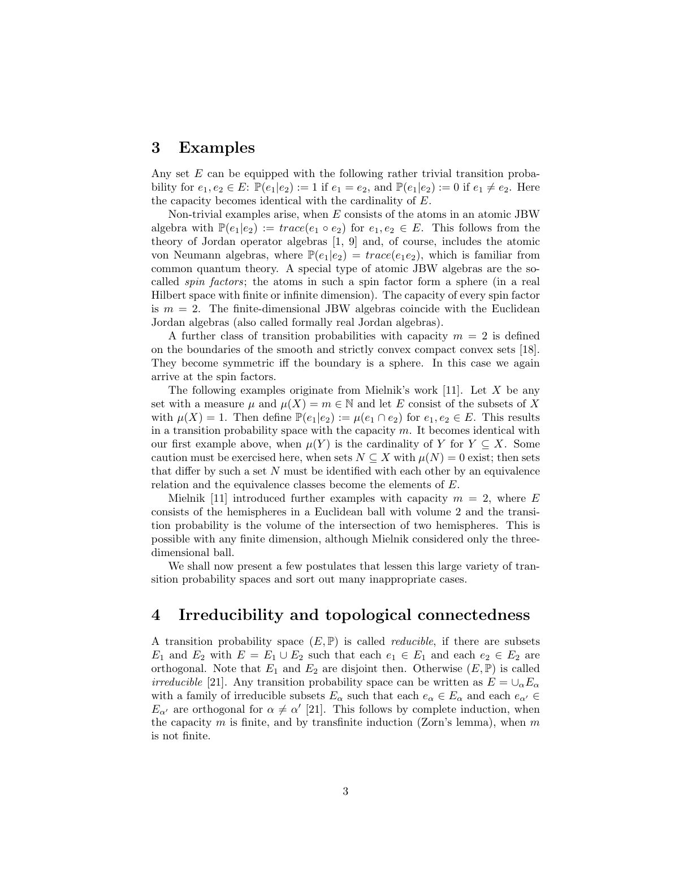 
Low-resolution page preview, page 3

📷 Fig 3

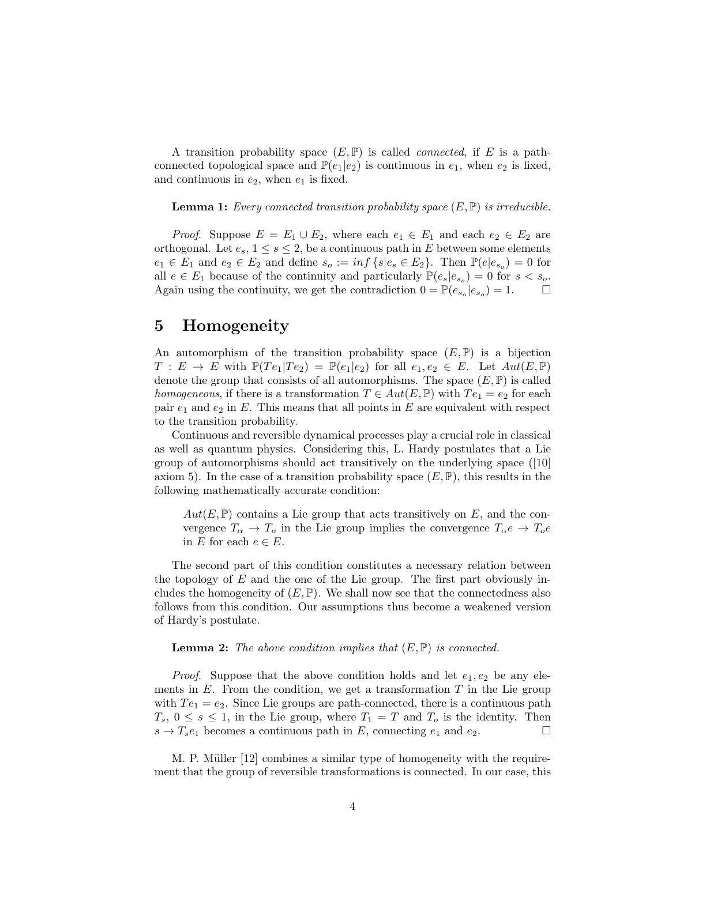 
Low-resolution page preview, page 4

📷 Fig 4

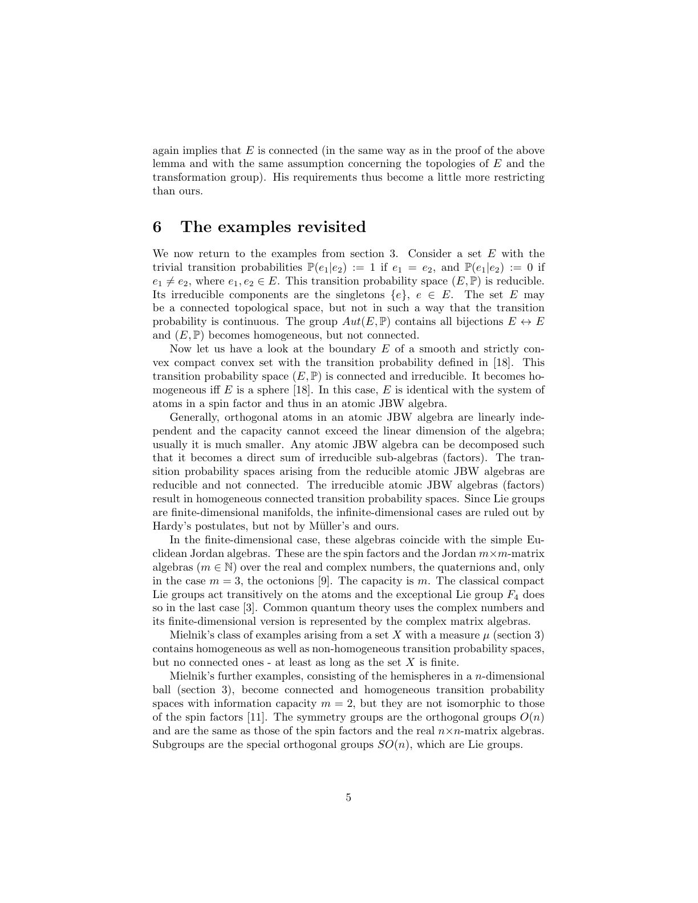 
Low-resolution page preview, page 5

📷 Fig 5

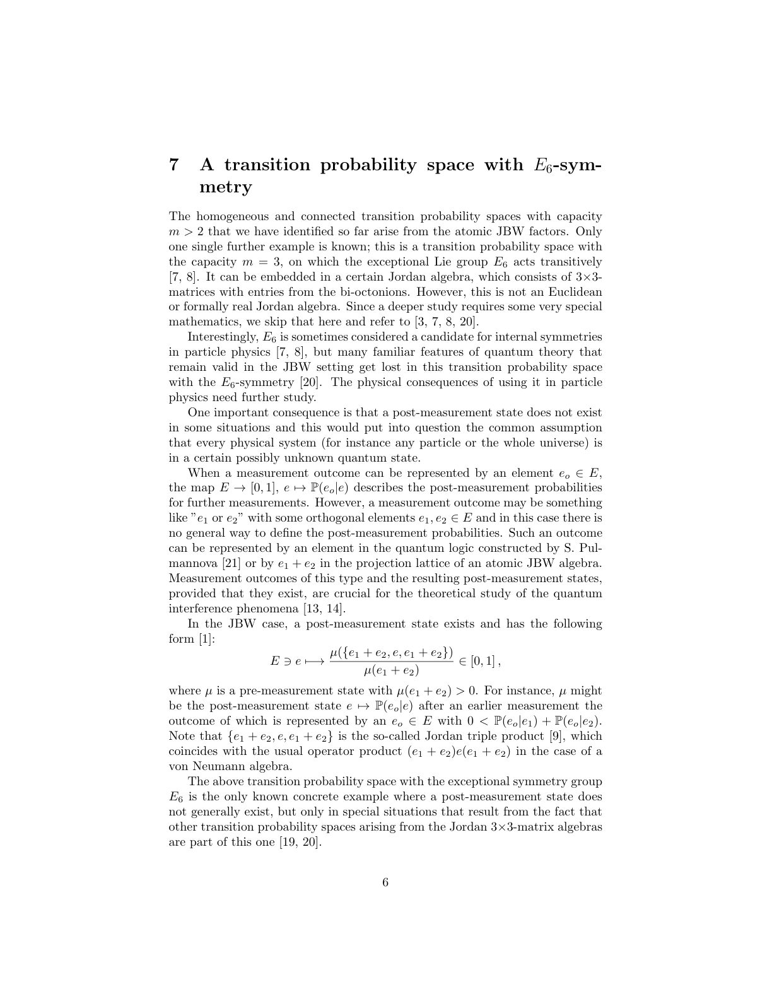 
Low-resolution page preview, page 6

**Summary.** This theoretical paper investigates the fundamental mathematical requirements for a consistent theory of quantum mechanics by analyzing its transition probability spaces. It proposes that three key features—transition probabilities, continuous dynamics, and topological homogeneity—must be present in any physically valid model. The work connects these abstract requirements to known algebraic structures like JBW factors and exceptional Lie groups.

**Why it may be interesting.** This work tackles the foundational axioms of quantum mechanics, which underpins all applications in AMO physics. Understanding the necessary mathematical structure provides deep insight into what physical principles must govern measurement and evolution.

Detailed structure

**Main problem.** The core problem is determining the minimal set of mathematical features required for a physically reasonable formulation of quantum theory, as its foundational basis remains mysterious.

**Main result.** The paper suggests that such models must possess transition probabilities, continuous reversible dynamics acting transitively, and topological homogeneity. These constraints lead to structures related to atomic JBW factors or specific exceptional Lie group actions like E6.

**Method.** The analysis involves abstract mathematical characterization of 'transition probability spaces' (E, P), examining their algebraic structure via Jordan algebras, and analyzing symmetry groups acting on these spaces.

**Model / system.** The model is the general formalism of quantum theory itself, analyzed through its transition probabilities. Specific mathematical realizations include atomic JBW factors, von Neumann factors, and models associated with convex sets or exceptional Lie groups like E6.

**Key observables.** Transition probabilities P(e1|e2), capacity (m), connectedness, and homogeneity of the state space.

**Important parameters / regimes.** The dimension of the underlying algebra, the structure group acting on the space (e.g., SO(n) or E6).

**Assumptions / limitations.** It assumes that a physically reasonable model must satisfy three specific mathematical criteria: transition probabilities, continuous reversible dynamics, and topological homogeneity.

**Paper structure.** The paper progresses by defining the necessary features (transition probabilities + dynamics/topology) and then reviewing known mathematical structures—such as JBW factors and models based on convex sets—that satisfy these criteria. It concludes by listing open classification problems.

Abstract

The physical foundation of the mathematical formalism of quantum theory is still an iffy mystery. Here it is presumed that a physically reasonable mathematical model needs only three basic features. The first one are the transition probabilities, which are so typical of quantum theory. The other two constitute a variation of the postulate that continuous reversible dynamical processes exist and act transitively on the underlying space. One class of mathematical models with these features arises from the atomic JBW factors, which include the atomic von Neumann factors and become identical with the Jordan matrix algebras, when the dimension is finite. A further model is known, on which the exceptional Lie group E6 acts transitively. Interestingly, E6 is sometimes considered a candidate for internal symmetries in particle physics, but many familiar features of quantum theory get lost in this case (particularly the general existence of post-measurement states). The paper concludes with some open issues, concerning this problem and the classification of the mathematical structures with the three features.

[↑ back to top](#top)

### [Variational Quantum Conditional Boltzmann Machines for Time-Series Forecasting: Architectures, Symmetric Hyperparameter Evaluation, and a Nonlinear Benchmark](http://arxiv.org/abs/2607.24065v1)

**Authors:** Gerhard Hellstern, Danyal Maheshwari, Martin Zaefferer, Martin Braun, Tanja Döhler  
**Type:** both · **Category:** disordered systems and neural networks · **PDF:** <https://arxiv.org/pdf/2607.24065v1>  
**Analysis basis:** full PDF text, analyzed in chunks
**Topic relevance:** `methods for driven-dissipative` **1/5**

📷 Fig 1

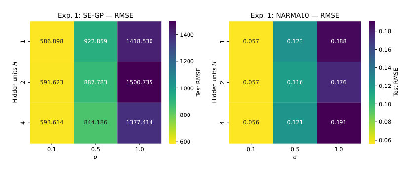 
Figure 1: Exp. 1: RMSE heatmap (H, σ) for GP (left) and NARMA-10 (right) and mean values of k.

📷 Fig 2

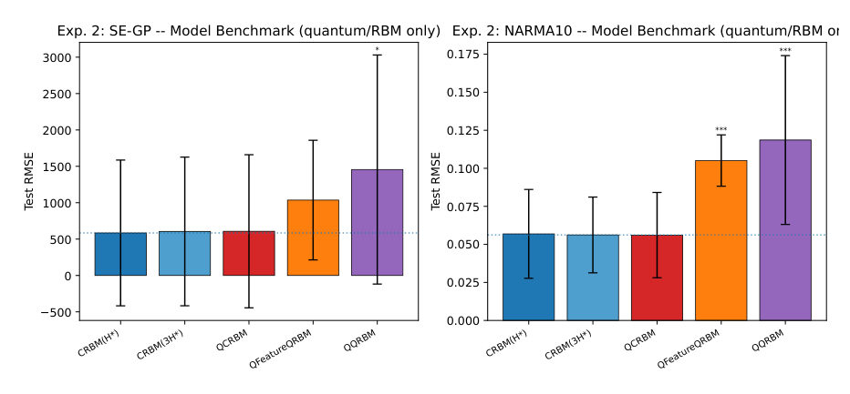 
Figure 2: Exp. 2: Mean RMSE by model for GP (left) and NARMA-10 (right). Error bars: ±1 SD across n=12 paired observations. Holm-corrected significance vs. CRBM(H∗): ∗p&lt;0.05, ∗∗p&lt;0.01, ∗∗∗p&lt;0.001 (e.g. QQRBM on GP, padj=0.024, is marked ∗). GP RMSE in raw units; NARMA-10 in raw (unstandardised) units. On NARMA-10 the horizontal references mark the mean-predictor σ(y)=0.109, the linear-window asymptote 0.064, and the empirical nonlinear-window floor 0.056: the top models sit at the nonlinear floor, while QQRBM reaches mean-predictor level.

📷 Fig 3

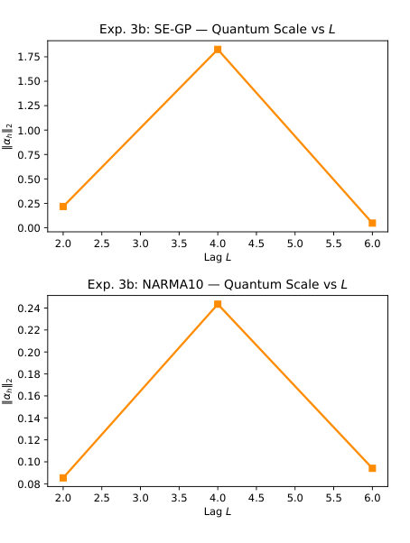 
Figure 3: Exp. 3: RMSE vs. L and ∥αh∥2 vs. L for GP (top) and NARMA-10 (bottom).

📷 Fig 4

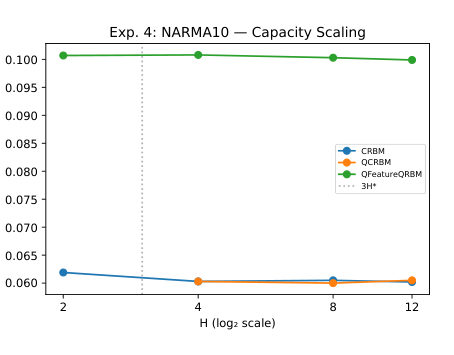 
Figure 4: Exp. 4: RMSE vs. H for GP (left) and NARMA-10 (right).

📷 Fig 5

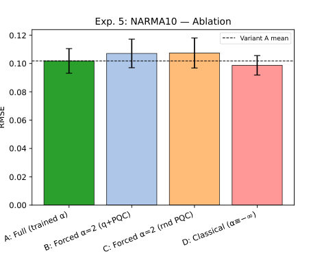 
Figure 5: Exp. 5: Ablation RMSE for GP (left) and NARMA-10 (right).

**Summary.** This paper rigorously compares Variational Quantum Conditional Boltzmann Machines against classical counterparts for time-series forecasting. Using extensive symmetric hyperparameter optimization across two datasets, the authors conclude that no definitive quantum advantage exists at current sample sizes. The best performance was consistently achieved by the strongest classical baseline model.

**Why it may be interesting.** While focused on ML, the rigorous comparison between classical and quantum computational resources for complex time-series modeling touches upon the fundamental limits of computation in physical systems, which is relevant to understanding resource scaling in quantum simulation.

Detailed structure

**Main problem.** The study compares classical energy-based models with quantum enhancements for time-series forecasting, aiming to find evidence of a quantum advantage.

**Main result.** No systematic evidence of a quantum advantage was found; the hybrid quantum architecture performed statistically indistinguishably from the best classical baseline across multiple rigorous tests.

**Method.** The authors developed and evaluated four Variational Quantum Conditional Boltzmann Machine architectures using symmetric hyperparameter optimization on two distinct data benchmarks (GP and NARMA-10).

**Model / system.** The core models are VQCBMs, including classical CRBM, hybrid QCRBM, full-register QQRBM, and lag-feature QFeatureQRBM. These build upon energy-based modeling principles for time-series prediction.

**Key observables.** Predictive accuracy measured by Normalized Root Mean Square Error (NRMSE) and $R^2$ across various budget constraints.

**Important parameters / regimes.** Sample size ($n=12$), hyperparameter budgets ($P \in\{84, 120, 156, 192\}$), and circuit depth/layers ($L_Q$).

**Assumptions / limitations.** The comparison is limited by the available sample size, and the quantum path optimization was performed on a soft surrogate reconstruction loss rather than directly on the forecast objective.

**Figures summary.** Not specified in detail, but comparisons are made across various model classes (e.g., CRBM vs QCRBM) using NRMSE/R^2 tables for NARMA-10 and GP datasets.

**Paper structure.** The paper introduces the VQCBM architectures, details the derivations of conditional distributions and gradients, performs comprehensive symmetric hyperparameter optimization across 13 experiments on two data regimes, and concludes with performance comparisons under matched-budget analysis.

Abstract

In this study, we developed and evaluated four conditional energy-based forecasting architectures: a classical Gaussian-Bernoulli CRBM, a hybrid quantum-classical QCRBM, a full-register QQRBM, and a lag-feature QFeatureQRBM with complete derivations of their conditional distributions, Contrastive-Divergence gradients, and hybrid training, bridging the energy-based formulation and the implementation-level quantum computation. Unlike prior comparisons, our evaluation enforces symmetric hyperparameter optimisation: classical and quantum-specific hyperparameters receive an equally thorough grid search across thirteen structured experiments. We test on two data classes, a Gaussian-process dataset (GP) generated with real financial data and the input-driven NARMA-10 nonlinear benchmark. Across both regimes we find no systematic evidence of a quantum advantage at the available sample size: no quantum architecture improves on the best classical baseline. The fully quantum QQRBM and QFeatureQRBM are significantly worse, whereas the hybrid QCRBM is statistically indistinguishable from the strongest classical CRBM on both datasets. A power analysis bounds this null result: at n = 12 only medium-to-large effects are detectable, so small advantages cannot be excluded. An iso-parameter (matched-budget) comparison reaches the same conclusion: the classical CRBM is lowest at three of the four budgets and no CRBM-vs-QCRBM difference is significant at any budget.

[↑ back to top](#top)

## Other papers (11)

*Papers from primary archives without highlighted authors or any topic match. Click to expand.*

Show other papers

### [A Quantitative Framework for Comparing Classical and Quantum Algorithms for the Traveling Salesman Problem](http://arxiv.org/abs/2607.24581v1)

**Authors:** Krit Grover, Marcelo Ponce  
**Type:** both · **Category:** quantum information and computing · **PDF:** <https://arxiv.org/pdf/2607.24581v1>  
**Analysis basis:** full PDF text, analyzed in chunks

📷 Fig 1

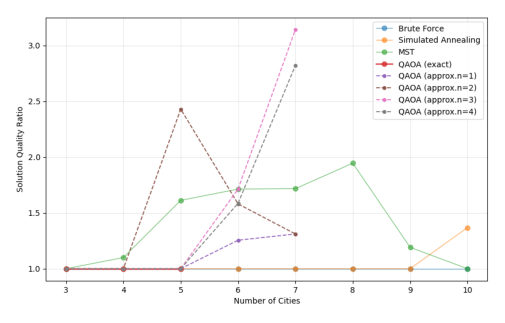 
Figure 2: Approximation ratios (𝐶alg/𝐶opt) versus number of cities (fully connected) for each algorithm on instances where the optimum was available from brute force.

📷 Fig 2

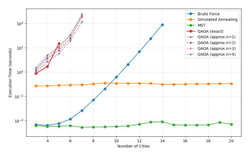 
Figure 1: Execution time (log scale) versus number of cities (fully connected) for each algorithm.

📷 Fig 3

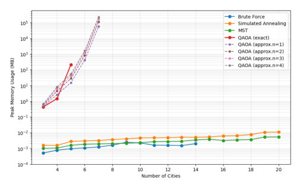 
Figure 3: Peak memory usage (log scale) versus number of cities (fully connected) for each algorithm.

📷 Fig 4

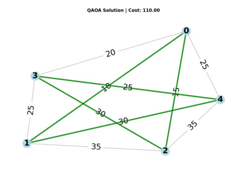 
Figure 4: Paths found by each algorithm on a 5-city, fully connected graph.

**Summary.** This work quantitatively compares classical heuristics (like Simulated Annealing) against the QAOA algorithm for solving the TSP. The empirical results show that while QAOA can achieve optimal solutions on small instances, its computational overhead and scalability issues currently render it non-competitive with optimized classical methods. This highlights the need for better problem mappings or hardware improvements for quantum optimization algorithms.

**Why it may be interesting.** It provides concrete, performance-based benchmarks for applying variational quantum algorithms to a notoriously hard combinatorial optimization problem, directly addressing near-term quantum advantage claims in optimization.

Detailed structure

**Main problem.** The paper compares classical heuristics (like Simulated Annealing) against quantum algorithms (QAOA) for solving the NP-hard Traveling Salesman Problem (TSP).

**Main result.** Optimized classical heuristics, particularly Simulated Annealing, demonstrated superior scalability and solution quality compared to current implementations of QAOA on small graphs.

**Method.** The study involves implementing and comparing four distinct solvers: brute force, MST approximation, SA, and the variational quantum algorithm QAOA. Performance is evaluated empirically across varying graph sizes.

**Model / system.** The problem is modeled as finding the minimum cost Hamiltonian cycle on a weighted graph. For QAOA, this requires mapping the TSP to a QUBO formulation using specific cost and mixing Hamiltonians.

**Key observables.** Execution time vs. problem size, solution quality (approximation ratio), and peak memory usage are the primary diagnostics used for comparison.

**Important parameters / regimes.** For QAOA, key parameters include the number of layers ($p$) and the Trotter step count ($	ext{num\_approx}$). For SA, the cooling schedule rate is critical.

**Assumptions / limitations.** The analysis assumes that current classical simulation resources limit exact quantum evolution to very small systems ($n \le 5$), while QAOA's complexity is bottlenecked by classical precomputation and state vector size.

**Figures summary.** Figures illustrate the exponential time growth of brute-force methods, polynomial scaling for SA/MST, and sharp increases in runtime/memory for QAOA due to overhead.

**Paper structure.** The paper follows a comparative structure: first establishing classical baselines (Brute Force, MST, SA), then detailing the quantum approach (QAOA Hamiltonian formulation), and finally presenting empirical results comparing all methods across time, quality, and memory metrics.

Abstract

The Traveling Salesman Problem is a classical NP-hard problem with significant implications in logistics, circuit design, and operations research. This paper presents a comparative study of four approaches to solving the Traveling Salesman Problem: brute-force enumeration, a 2-approximation algorithm using minimum spanning trees, simulated annealing, and the Quantum Approximate Optimization Algorithm. We implement each technique and evaluate them on graphs of varying sizes to analyze performance, solution quality, and scalability. In doing so, we have also developed an open-source framework that allows researchers and practitioners to explore, test and extend these methods.

[↑ back to top](#top)

### [Can PCE solve the factorisation problem via optimisation?](http://arxiv.org/abs/2607.23727v1)

**Authors:** Fernando Alonso, Colomán Samprón, Jacobo Veiga, Andrés Gómez  
**Type:** theory · **Category:** quantum information and computing · **PDF:** <https://arxiv.org/pdf/2607.23727v1>  
**Analysis basis:** full PDF text, analyzed in chunks

📷 Fig 1

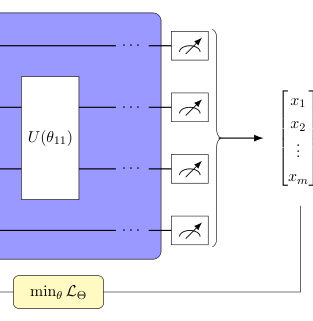 
Figure 1: Schematic of the quantum circuit used to construct the PQC.

📷 Fig 2

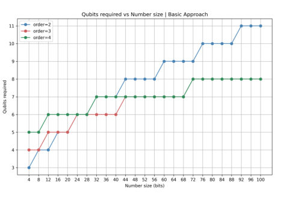 
Figure 2: Scaling of the number of qubits as a function of the number of bits.

📷 Fig 3

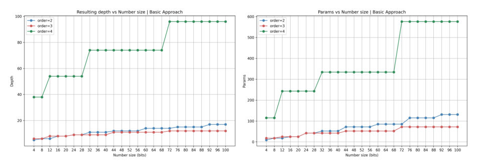 
Figure 3: Scaling of the ideal circuit depth and resultant number of parameters as a function of the number of bits.

📷 Fig 4

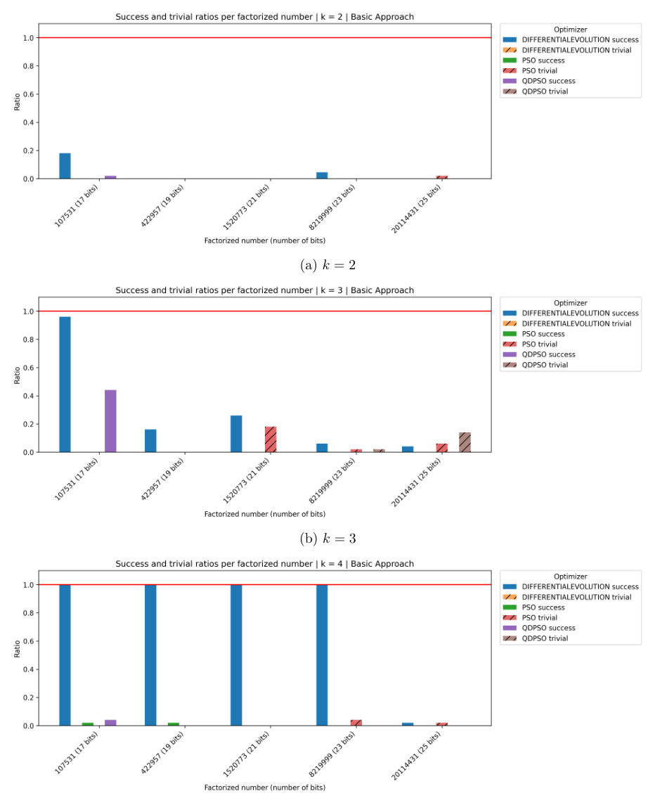 
Figure 4: Factorisation success and trivial solution rates as a function of the number of bits, for different compression orders k and optimisers, over 50 random initialisations.

📷 Fig 5

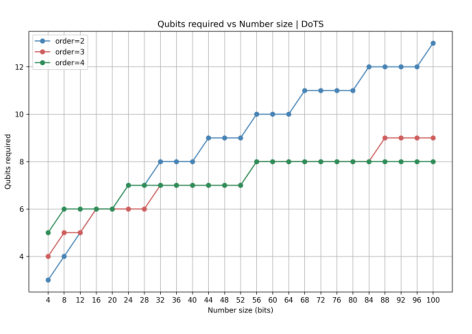 
Figure 5: Scaling of the number of qubits as a function of the number of bits.

**Summary.** This paper investigates using the Pauli Correlation Encoding (PCE) algorithm as a potential method to solve the computationally hard integer factorisation problem on near-term quantum hardware. By reformulating factorisation as an optimization task, the authors aim to drastically reduce the required number of qubits compared to existing variational approaches. The work serves as an exploratory study into the feasibility and limitations of this encoding for quantum computation.

**Why it may be interesting.** While focused on number theory, the exploration of resource reduction via novel encodings like PCE is highly relevant to quantum information science, particularly in developing scalable algorithms for hard optimization problems that might interface with AMO systems or complex Hamiltonian simulations.

Detailed structure

**Main problem.** The paper addresses the integer factorisation problem, which is cryptographically relevant (e.g., RSA), by reformulating it as a binary optimisation problem suitable for quantum computation.

**Main result.** The authors propose adapting the Pauli Correlation Encoding (PCE) algorithm to reduce the qubit requirements for solving factorisation via optimization compared to standard variational approaches.

**Method.** The core method involves encoding the factorisation constraints into an optimization cost function and then attempting to solve this minimization problem using the PCE framework within a quantum computational setting.

**Model / system.** The focus is on theoretical quantum computation models, specifically utilizing Variational Quantum Algorithms (VQAs) and adapting the Pauli Correlation Encoding (PCE) technique. The underlying mathematical structure relates to finding factors $p$ and $q$ such that $N=pq$.

**Key observables.** The global minimum of the cost function $L$, which corresponds to a valid factorisation, and the required number of qubits for encoding.

**Important parameters / regimes.** Qubit count scaling (PCE aims for reduction), circuit depth, variational parameters, and the size/bit-length ($m$) of the integer $N$.

**Assumptions / limitations.** The study provides a preliminary examination; no computational advantage is claimed over established methods, and limitations regarding NISQ hardware are acknowledged.

**Paper structure.** The paper details formulating factorisation as an optimization problem (classical/quantum), describing the PCE methodology for encoding, and implementing this approach using different strategies (Basic and DoTS). Future work involves exploring advanced ansatzes and warm-start techniques.

Abstract

The ongoing progress in quantum technologies has fueled a sustained exploration of their potential applications across various domains, particularly in computational problems that are considered intractable for classical systems. Among these problems, integer factorisation remains of special interest due to its relevance to widely used cryptographic schemes such as RSA. Among the different possibilities, one approach to factorisation is to convert the problem into a binary optimisation problem. However, current proposals usually need a large number of qubits that make them unfeasible within the current hardware. In this work, we investigate a possible adaptation of the Pauli Correlation Encoding (PCE) algorithm to the factorisation problem. Due to its compression capability, it can drastically reduce the number of needed qubits. The proposed approach explores how the structure and dynamics of the PCE framework may be employed to encode and analyze candidate factor relations within a quantum computational setting. Rather than presenting a replacement for established quantum factorisation methods, this study aims to provide a preliminary examination of the feasibility and limitations of the proposed adaptation. We discuss the algorithmic design, its conceptual relationship with existing quantum approaches, and the practical constraints associated with implementation on current or near-term quantum hardware. Initial observations suggest that the method may offer an alternative perspective for studying factorisation within the broader context of quantum computation, although no claim is made regarding computational advantage. These results are intended primarily as an exploratory contribution to ongoing research in quantum algorithms and computational number theory.

[↑ back to top](#top)

### [Exact and Fixed-Point Grover Search with Qudits](http://arxiv.org/abs/2607.24658v1)

**Authors:** Tanay Roy  
**Type:** theory · **Category:** quantum information and computing · **PDF:** <https://arxiv.org/pdf/2607.24658v1>  
**Analysis basis:** full PDF text, analyzed in chunks

📷 Fig 1

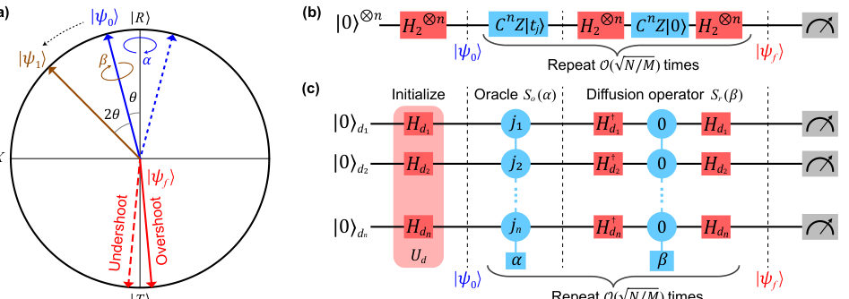 
FIG. 1. Generic Grover search with qudits. (a) Effective two-level description on the Bloch sphere spanned by the collective unmarked state |R⟩and target state |T⟩. The oracle So(α) applies a phase to the target subspace, while the diffusion operator Sr(β) rotates the state about the initial-state axis |ψ0⟩. For the standard choice α = β = π, the trajectory remains in the ZX plane and generally ends near, but not exactly at, |T⟩. (b) Standard circuit structure with n qubits: prepare |ψ0⟩, apply kopt oracle–diffusion iterations, and measure the register. (c) Heterogeneous qudit implementation in which the blue layer denotes a generic multi-qudit controlled-phase operation with an arbitrary...

📷 Fig 2

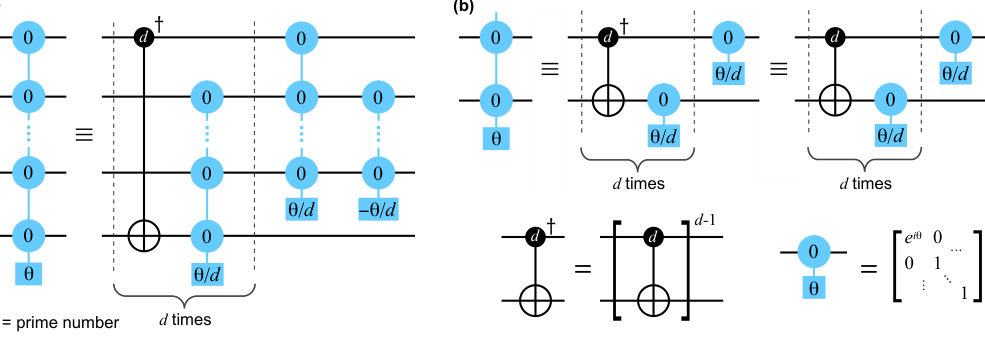 
FIG. 2. Decomposition of a multi-controlled qudit CPHASE(θ) gate for qudits with identical prime dimension d. (a) The decomposition involves two-qudit CSUM† gates and CPHASE(θ) gates with fewer controls. (b) Decomposition of the two-qudit CPHASE(θ) gate (top). The bottom panel shows the identity CSUM† = CSUMd−1 and the single-qudit phase gate acting on basis state |0⟩.

📷 Fig 3

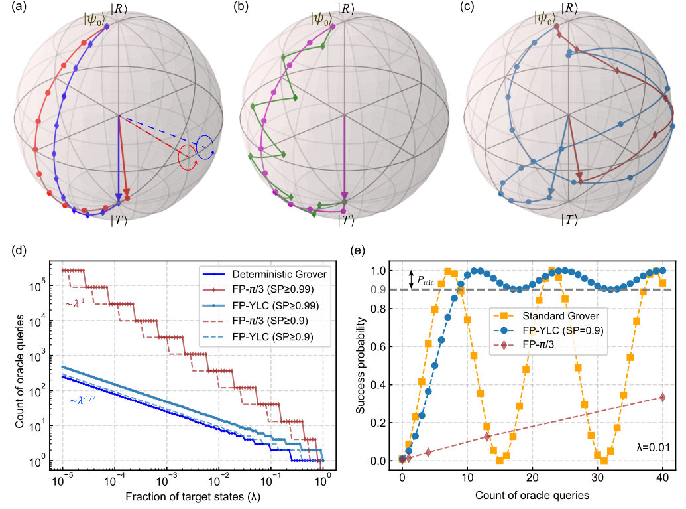 
FIG. 3. Comparison of quantum search protocols. Bloch-sphere trajectories illustrate how different phase choices steer the state toward the target state: (a) standard Grover search (red circles) and the one-parameter deterministic protocol D1p (blue diamonds), (b) the two-parameter D2p (green diamonds) and three-parameter D3p (magenta circles) deterministic protocols, and (c) the π/3 (brown diamonds) and YLC (blue circles) fixed-point (FP) protocols. The initial state |ψ0⟩is prepared with λ = 0.005. (d) Oracle-query counts versus target-state fraction λ for deterministic and fixed-point searches. Solid and dashed fixed-point curves correspond to success-probability thresholds of 0.99 and...

**Summary.** This paper develops a comprehensive framework to adapt Grover's search algorithm for quantum processors using qudits, moving beyond the traditional qubit model. It introduces advanced phase-matching techniques to ensure deterministic success probabilities and provides explicit circuit decompositions suitable for various hardware platforms. This advances the practical application of quantum search in multilevel quantum systems.

**Why it may be interesting.** This work is highly relevant as it provides concrete, hardware-oriented protocols for quantum algorithms on multilevel systems. The focus on phase matching to achieve deterministic results moves beyond idealized theoretical bounds toward practical circuit implementation suitable for platforms like trapped ions or superconducting circuits that naturally support qudits.

Detailed structure

**Main problem.** The primary goal is generalizing Grover's search algorithm from standard qubits to qudits (systems with dimension > 2) and handling heterogeneous qudit registers.

**Main result.** The authors present a unified framework for qudit-based Grover search, detailing deterministic phase-matched protocols that ensure exact success probabilities, alongside explicit circuit decompositions for hardware implementation.

**Method.** The methodology involves deriving generalized oracle and diffusion operators for qudits, analyzing the system's evolution on an effective two-dimensional subspace (Bloch sphere mapping), and employing advanced phase-matching techniques to achieve deterministic search counts ($k_{	ext{certain}}$).

**Model / system.** The model is a quantum computation framework utilizing qudits $\{d_1, d_2, \ldots, d_n\}$ in potentially heterogeneous registers. The core operations involve generalized Hadamard gates ($H_d$) and controlled-phase gates ($	ext{CPHASE}_{d,m}$).

**Key observables.** Success probability $P_{	ext{succ}}(k) = \sin^2\left(rac{(k+1)	heta}{2}
ight)$, the optimal number of steps ($k_{	ext{opt}}$), and the required deterministic step count ($k_{	ext{certain}}$).

**Important parameters / regimes.** Database size $N$, marked entries $M$, initial state overlap $\lambda = M/D$, and phase parameters ($	heta, eta_1, eta_2$).

**Assumptions / limitations.** The analysis assumes the total Hilbert space dimension $D$ is large enough to accommodate the database size $N$. For deterministic search, specific phase adjustments are necessary.

**Figures summary.** Figure 1 illustrates the generic qudit Grover search on the Bloch sphere and shows standard/heterogeneous circuit structures. Other figures detail alternative qudit diffusion operator circuits using controlled-phase gates.

**Paper structure.** The paper progresses from establishing the general framework for qudits, to addressing the challenge of achieving exact success probability via phase matching (D1p, D2p, D3p protocols), and finally detailing the underlying mathematical identities and gate complexity analysis for implementing these advanced search routines.

Abstract

Grover's algorithm provides a quadratic speedup for searching unstructured databases and is traditionally implemented with qubits in Hilbert spaces whose dimensions are powers of two. With the advent of quantum platforms utilizing qudits---quantum systems with more than two levels---there is a need to generalize Grover search to these architectures, including heterogeneous systems with qudits of varying dimensions. Here, we present a unified framework for qudit-based Grover search, detailing the construction of oracles and diffusion operators with and without ancilla qubits and generalizing deterministic and fixed-point search variants that ensure exact or bounded success probabilities. We analyze phase-matching techniques and provide explicit circuit decompositions suitable for diverse hardware platforms. We also compare the corresponding trajectories on the Bloch sphere to provide an intuitive visualization of how the different phase choices amplify the target state. These results facilitate flexible, hardware-oriented protocols for implementing Grover search on qudit processors, potentially reducing circuit depth and enhancing success probabilities, thereby offering a practical toolkit for quantum computation and sensing applications leveraging multilevel quantum systems.

[↑ back to top](#top)

### [Pair-Density Wave from Doping an Altermagnetic Mott Insulator](http://arxiv.org/abs/2607.23654v1)

**Authors:** Shuai A. Chen, Qianqian Chen, Guangyu Yu, Zheng Zhu  
**Type:** theory · **Category:** strongly correlated electrons · **PDF:** <https://arxiv.org/pdf/2607.23654v1>  
**Analysis basis:** full PDF text, analyzed in chunks

📷 Fig 1

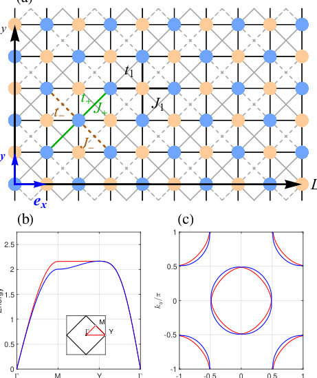 
FIG. 1. (a) Checkerboard lattice and model parameters. Blue (or- ange) circles are 𝐴(𝐵) sublattice sites. Black solid lines: nearest- neighbor bonds with hopping 𝑡1 and exchange 𝐽1. Green solid (brown dashed) lines: next-nearest-neighbor bonds with hopping 𝑡+ (𝑡−) and anisotropic altermagnetic exchange 𝐽+ (𝐽−). (b) Two branches of magnon dispersion along high-symmetry paths and (c) the isoenergy contours at 𝐸= 1.8𝐽1. We obtain the magnon dispersion at 𝜂= 0.7 by Holstein–Primakoff theory.

📷 Fig 2

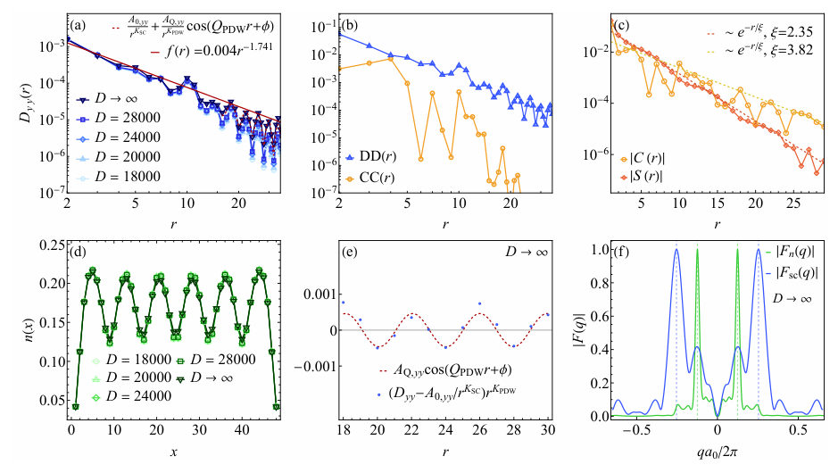 
FIG. 2. DMRG results for the PDW phase on an 𝑁= 48×6 cylinder at doping 𝛿= 1/6 and AM anisotropy 𝜂= 0.7. (a) Pair correlation 𝐷𝑦𝑦(𝑟) as a function of distance 𝑟for several bond dimensions 𝐷, together with the extrapolation to 𝐷→∞. The red solid line shows a power-law fit 𝑓(𝑟) = 0.004𝑟−1.741. The long-distance behavior (red dashed line) follows the two-scale form of Eq. (3) with 𝐾SC = 2.30 and 𝐾PDW = 1.40. (b) Normalized superconducting correlations DD(𝑟) ≡𝐷(𝑟)/𝛿2 (blue triangles) and single-particle Green’s function CC(𝑟) ≡[𝐶(𝑟)/𝛿]2

📷 Fig 3

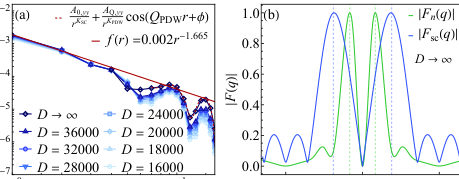 
FIG. 3. DMRG results for the PDW phase on an 𝑁= 24 × 8 cylinder at 𝛿= 1/8 and 𝜂= 0.8. (a) Pair correlation 𝐷𝑦𝑦extrapolated to 𝐷→∞. The red solid line denotes a single power-law fit, 𝑓(𝑟) = 0.002𝑟−1.665, while the red dashed line denotes the two-scale fit of Eq. (3), with 𝐾SC = 2.2 and 𝐾PDW = 1.4 [72]. (b) Structure factors: superconducting structure factor |𝐹sc(𝑞)| (blue) and density structure factor |𝐹𝑛(𝑞)| (green) after extrapolation to 𝐷→∞. |𝐹sc(𝑞)| exhibits a peak at 𝑄PDW ≈0.19(2𝜋/𝑎0), while the density structure factor |𝐹𝑛(𝑞)| peaks at 𝑄Stripe ≈0.10(2𝜋/𝑎0). The peak heights are scaled to 1 for better visibility and comparison.

📷 Fig 4

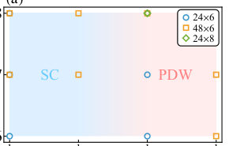 
FIG. 4. (a) Ground-state phase diagram as a function of hole doping 𝛿and AM anisotropy 𝜂. We identify two regimes: coexistence of SC and CDW (blue) and coexistence of PDW and stripe (pink). (b) Wave- vector locking in the PDW phase: QPDW ≈2QStripe (dashed line) across various system sizes and parameters. Colors denote system sizes 𝑁, while symbols denote different hole doping concentrations 𝛿.

**Summary.** The authors use DMRG simulations on a doped altermagnetic Mott insulator described by the $t$-$J$ model to study superconductivity. They find that doping stabilizes a Pair-Density Wave (PDW) state coexisting with charge stripes, characterized by an unconventional wavevector locking ($Q_{PDW} \approx 2 Q_{Stripe}$). This work establishes altermagnetism as a strong-coupling mechanism driving finite-momentum pairing in these correlated materials.

**Why it may be interesting.** This work directly addresses superconductivity in strongly correlated electron systems (Mott insulators) using advanced numerical techniques (DMRG), providing insights into how magnetic anisotropy can fundamentally alter superconducting pairing symmetries and wavevectors.

Detailed structure

**Main problem.** The study investigates whether doping an altermagnetic Mott insulator can stabilize a Pair-Density Wave (PDW) superconducting state, and how this PDW coexists with charge stripe order.

**Main result.** The system transitions into a PDW regime exhibiting an unconventional wave-vector locking relation ($Q_{PDW} \approx 2 Q_{Stripe}$), confirming altermagnetism as a route to finite-momentum superconductivity.

**Method.** Large-scale Density Matrix Renormalization Group (DMRG) simulations were employed on checkerboard lattices to map the ground-state phase diagram and analyze correlation functions.

**Model / system.** The system is modeled using the $t$-$J$ model applied to a doped altermagnetic Mott insulator on a checkerboard lattice. The Hamiltonian incorporates bond-anisotropic exchange ($\propto \eta$) that microscopically realizes the altermagnetic sublattice relation.

**Key observables.** Pair correlator ($D_{\alphaeta}(r)$), structure factors for superconducting and charge order ($\left| F_{sc}(q) 
ight|$ and $\left| F_n(q) 
ight|$), and local hole density $n(x)$.

**Important parameters / regimes.** Hole doping ($\delta$) and altermagnetic anisotropy ($\eta$), with focus on the regime $0.6 \le \eta \le 0.8$.

**Assumptions / limitations.** The analysis relies on mapping the ground-state phase diagram using DMRG techniques, assuming the validity of the $t$-$J$ model description for the correlated state.

**Figures summary.** Figures illustrate the checkerboard lattice structure and magnon dispersion related to AM anisotropy. Key results show pair correlations exhibiting a two-scale structure (short-range $d$-wave + long-range PDW) and confirm the unconventional locking relation ($Q_{PDW} \approx 2 Q_{Stripe}$) via structure factors.

**Paper structure.** The paper proceeds by defining the physical model and methods, mapping the phase diagram as a function of doping and anisotropy, presenting evidence for the coexisting PDW/stripe order, and concluding with a symmetry-based Ginzburg--Landau analysis to establish the unconventional locking mechanism.

Abstract

Pair-density-wave (PDW) superconductivity is a state in which the superconducting order parameter modulates at a finite wavevector. Using large-scale density matrix renormalization group, we study the doped altermagnetic Mott insulator in the checkerboard $t$-$J$ model, where altermagnetic exchange anisotropy is encoded microscopically through anisotropic ferromagnetic next-nearest-neighbor exchange. By mapping the ground-state phase diagram as a function of doping and altermagnetic anisotropy, mainly on six-leg cylinders, we identify a transition from a uniform $d$-wave superconducting regime with charge modulation to a PDW regime coexisting with stripe order. In the PDW regime, we report an unconventional wave-vector locking $\mathbf Q_{\mathrm{PDW}}\approx 2\mathbf Q_{\mathrm{Stripe}}$ along the cylinder direction, in contrast to the conventional relation. Pair correlations reveal a two-scale structure, consisting of short-distance local $d$-wave pairing and long-distance finite-momentum PDW correlations. A symmetry-based Ginzburg--Landau analysis is presented for the observed locking. Our results identify altermagnetism as a strong-coupling, microscopically grounded route to finite-momentum superconductivity in doped Mott insulators.

[↑ back to top](#top)

### [Photon pair antibunching and second-order correlations between pair events](http://arxiv.org/abs/2607.23483v1)

**Authors:** Chien-Chang Chen, Ite A. Yu, Hsi-Sheng Goan  
**Type:** theory · **Category:** other · **PDF:** <https://arxiv.org/pdf/2607.23483v1>  
**Analysis basis:** full PDF text, analyzed in chunks

📷 Fig 1

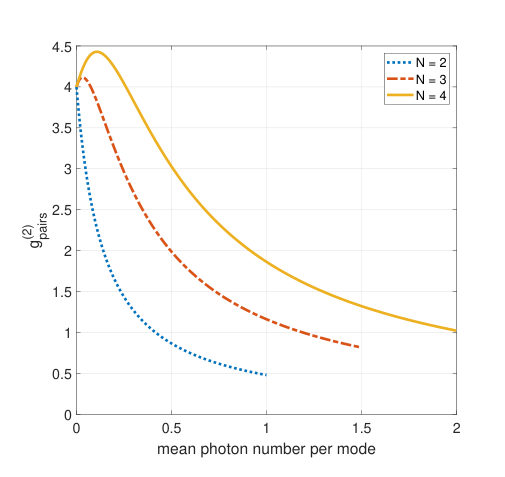 
Figure 1. Pair second-order correlation g(2) pairs as a function of the mean photon number per mode ¯n for truncated TMSV states with truncation orders N = 2,3, and 4. All cases ap- proach the universal weak-squeezing limit g(2) pairs →4 at low ¯n. For N = 2 and N = 3, the pair correlation exhibits a crossover from bunching to antibunching as ¯n increases, while for N = 4 the statistics remain bunched over the entire pa- rameter range. The curves are obtained from Eq. (B2).

📷 Fig 2

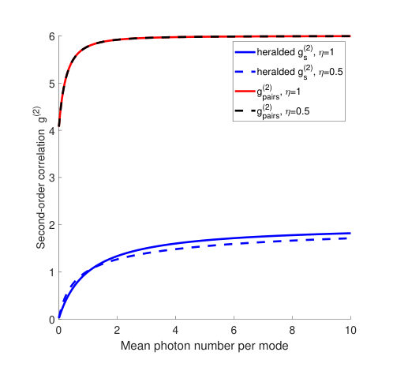 
Figure 2. Comparison of pair and heralded second-order cor- relations for a two-mode squeezed vacuum state as a function of the mean photon number per mode, ¯n = sinh2 r. Shown are the pair correlation g(2) pairs and the heralded signal corre-

**Summary.** The paper introduces the pair second-order correlation function, $g^{(2)}_{	ext{pairs}}$, to characterize statistics of photon pairs generated from two-mode quantum states. It establishes that observing antibunching ($g^{(2)}_{	ext{pairs}} < 1$) is a signature of nonclassicality because it violates a bound applicable to all classical fields. This observable is experimentally accessible via standard coincidence measurements.

**Why it may be interesting.** This work provides a powerful, non-standard diagnostic tool in quantum optics that directly probes correlations between pair generation events, offering a distinct advantage over conventional single-mode or heralded correlation measurements.

Detailed structure

**Main problem.** To establish a rigorous, experimentally accessible, and loss-tolerant benchmark for genuinely quantum pair emission statistics by characterizing correlations between pair events.

**Main result.** The pair second-order correlation function $g^{(2)}_{	ext{pairs}}$ provides an unambiguous signature of nonclassicality because observing $g^{(2)}_{	ext{pairs}} < 1$ violates the classical bound derived from positive P-functions.

**Method.** Theoretical derivation using the pair operator $P^\dagger = a^\dagger b^\dagger$, combined with applying the Cauchy–Schwarz inequality to establish classical bounds for two-mode fields.

**Model / system.** The analysis focuses on two-mode quantum states, particularly the Two-Mode Squeezed Vacuum (TMSV) state, and its behavior under various approximations like finite-order truncations.

**Key observables.** Pair second-order correlation function $g^{(2)}_{	ext{pairs}}$, which quantifies pair bunching ($>1$), Poissonian statistics ($=1$), or antibunching ($<1$).

**Important parameters / regimes.** Squeezing parameter ($\lambda$) and mean photon number ($ar{n}$); the comparison is drawn between $g^{(2)}_{	ext{pairs}}$ and heralded single-mode correlations.

**Assumptions / limitations.** The analysis compares results derived from exact quantum calculations against bounds established using classical field representations (positive Glauber–Sudarshan P-function).

**Figures summary.** Figures compare the pair correlation function $g^{(2)}_{	ext{pairs}}$ to heralded correlations for TMSV states, showing how bunching/antibunching changes with mean photon number and truncation order.

**Paper structure.** The paper introduces the novel observable $g^{(2)}_{	ext{pairs}}$, derives its physical meaning (bunching vs. antibunching), establishes the classical bound ($g^{(2)}_{	ext{pairs}} \ge 1$), and then evaluates this function for representative quantum states like TMSV.

Abstract

We introduce the pair second-order correlation function $g_{\textrm{pairs}}^{\left(2\right)}=\left\langle \left(P^{\dagger}\right)^{2}P^{2}\right\rangle /\left\langle P^{\dagger}P\right\rangle ^{2}$, defined through the pair operator $P^{\dagger}=a^{\dagger}b^{\dagger}$, to characterize second-order correlations and pair bunching and antibunching in photon-pair creation processes. This quantity directly probes correlations between pair-generation events within a single two-mode quantum state, providing access to the intrinsic pair-generation process beyond conventional single-mode or heralded second-order correlations, which do not directly capture correlations between pair events. Values of $g_{\textrm{pairs}}^{\left(2\right)}$ greater than, equal to, or less than unity correspond respectively to pair bunching, Poissonian pair statistics, and pair antibunching. Using the Cauchy--Schwarz inequality, we further show that all classical two-mode fields described by a positive Glauber--Sudarshan \ensuremath{P}-function satisfy $g_{\textrm{pairs}}^{\left(2\right)}\geq1$, so that pair antibunching is classically forbidden and constitutes an unambiguous signature of nonclassicality. We evaluate $g_{\textrm{pairs}}^{\left(2\right)}$ for several representative quantum states and show, in particular, that even arbitrarily weak two-mode squeezed vacuum states exhibit pair bunching. Comparison with heralded second-order correlations highlights the complementary information provided by these observables. The proposed correlation function is experimentally accessible via standard coincidence measurements, requires no phase reference or state reconstruction, and remains invariant under uniform loss.

[↑ back to top](#top)

### [Qutrit-Based Neural Quantum Kernels for Classification Tasks](http://arxiv.org/abs/2607.23683v1)

**Authors:** Camila Cristiano-Romero, Pablo Rodriguez-Grasa, Mikel Sanz  
**Type:** theory · **Category:** quantum information and computing · **PDF:** <https://arxiv.org/pdf/2607.23683v1>  
**Analysis basis:** full PDF text, analyzed in chunks

📷 Fig 1

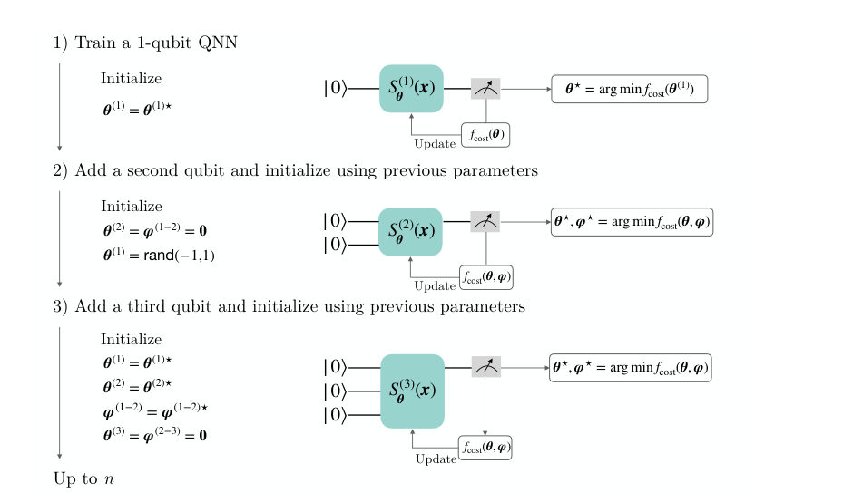 
FIG. 1: Progressive-growth training strategy used to scale the data re-uploading QNN embedding. Training starts from a single subsystem and iteratively appends additional subsystems, initializing new parameters (including entangling parameters) at zero while reusing the previously learned optimum for the existing blocks. Inspired by the procedure introduced in Ref. [54].

📷 Fig 2

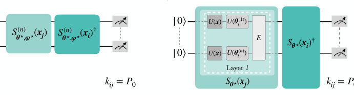 
FIG. 2: Schematic description of the two neural quantum kernel constructions considered in this work. (a) n-to-n: an n-qubit QNN is trained to obtain optimized embedding parameters (θ⋆, φ⋆), which are then frozen and used to construct the EQK by estimating kij = P0, where P0 denotes the probability of measuring the all-zero outcome after preparing S(n) θ⋆,φ⋆(xi)† S(n) θ⋆,φ⋆(xj)|0⟩. (b) 1-to-n: a single-qubit QNN is trained to obtain θ⋆, replicated across an n-qubit register, and interleaved at each re-uploading layer with a fixed entangling operation E; the resulting embedding is used to construct the EQK via the same overlap-estimation procedure.

📷 Fig 3

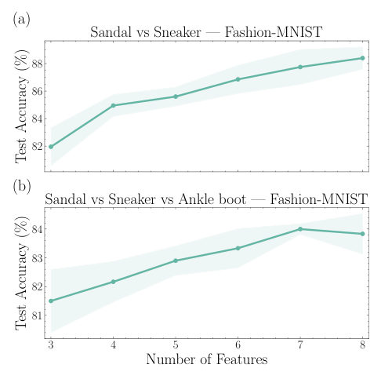 
FIG. 3: Test accuracy of the 1-qutrit QNN on Fashion-MNIST as a function of the number of encoded features (mean ± stan- dard error over 5 stratified folds). (a) Binary task (classes Sandal vs. Sneaker). (b) Three-class task (classes Sandal vs. Sneaker vs. Ankle boot).

📷 Fig 4

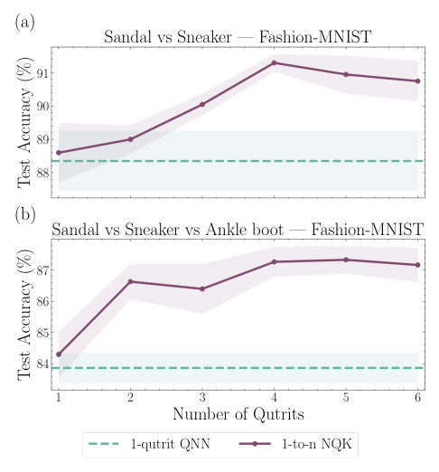 
FIG. 4: Test accuracy on Fashion-MNIST as a function of the number of qutrits for the 1-to-n qutrit NQK (mean ± stan- dard error over 5 stratified folds), with the number of encoded features fixed to p = 8. The dashed horizontal line shows the corresponding 1-qutrit QNN baseline used to construct the embedding. (a) Binary task (classes Sandal vs. Sneaker). (b) Three-class task (classes Sandal vs. Sneaker vs. Ankle boot).

📷 Fig 5

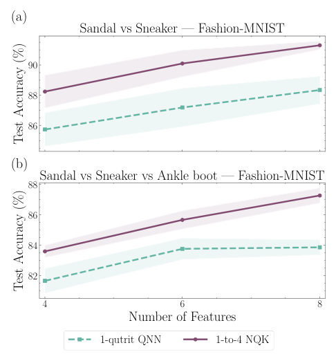 
FIG. 5: Test accuracy on Fashion-MNIST as a function of the number of encoded features at fixed system size n = 4. The 1-to-n NQK (4 qutrits) is compared against the corresponding 1-qutrit QNN baseline (mean ± standard error over 5 strati- fied folds). (a) Binary task (classes Sandal vs. Sneaker). (b) Three-class task (classes Sandal vs. Sneaker vs. Ankle boot).

**Summary.** This paper extends Neural Quantum Kernels (NQKs) to utilize qutrit systems, moving beyond standard qubit architectures. By systematically testing various circuit designs and parameterizations, the authors show that qudit-based NQKs significantly boost classification performance on multiple datasets. This highlights qudits as a promising avenue for exploiting complex data structures in quantum machine learning.

**Why it may be interesting.** This work demonstrates how increasing the local dimension from qubits to qutrits provides a richer mathematical structure (larger SU(d) algebra) that can be leveraged in quantum machine learning for better feature representation.

Detailed structure

**Main problem.** The paper addresses extending Neural Quantum Kernels (NQKs) from qubits to qudits ($d=3$) for enhanced classification tasks.

**Main result.** Qutrit NQKs consistently improve performance over standard QNN baselines across multiple benchmarks, demonstrating the potential of higher-dimensional quantum systems for complex data embedding.

**Method.** The authors systematically study various design choices—including feature budget, system size, and kernel construction (1-to-$n$ vs. $n$-to-$n$)—while comparing different SU(3) unitary parameterizations.

**Model / system.** The model utilizes qudit-based quantum circuits parameterized by local unitaries in SU(d), specifically focusing on qutrits ($d=3$). NQKs are constructed by pretraining a QNN and reusing the resulting trained circuit as a task-adapted embedding for kernel calculation.

**Key observables.** Test Accuracy (%) across binary and three-class tasks, optimization behavior, and convergence of performance with increasing system size or feature budget.

**Important parameters / regimes.** Local dimension ($d=3$), System size ($n$), Feature budget ($p$), Choice of SU(3) parameterization (Geometric, Euler-angles, Givens-rotation).

**Assumptions / limitations.** The performance gains are shown to be dataset-dependent and may saturate; the choice of unitary parameterization significantly impacts results.

**Figures summary.** Figures compare test accuracy vs. feature budget ($p$) or system size ($n$) for 1-to-$n$ and $n$-to-$n$ NQKs, comparing different SU(3) parameterizations and showing the relative performance against QNN baselines.

**Paper structure.** The paper introduces NQKs, generalizes them to qudits (qutrits), systematically tests various architectural choices ($p$, $n$, kernel type), compares results across multiple benchmarks, and analyzes the impact of parameterization and training objectives.

Abstract

Neural quantum kernels (NQKs) construct quantum kernels by pretraining a quantum neural network (QNN) and subsequently reusing the trained circuit as a task-adapted embedding. Extending this framework to qudits, with local unitaries in $\mathrm{SU}(d)$, provides a natural route to richer data embeddings through the increased local degrees of freedom and a direct interface for multiclass classification via intrinsically multi-level quantum systems. In this work, focusing on qutrits ($d=3$), we extend NQKs to the qudit setting and perform a systematic study of key design choices, including the number of encoded features, the number of qutrits, the kernel construction (1-to-$n$ and $n$-to-$n$), and the parameterization of $\mathrm{SU}(3)$ unitaries. Across binary and three-class tasks on four benchmark datasets, qutrit NQKs improve over the corresponding QNN baselines in nearly all settings considered and can benefit from scaling both the feature budget and the system size, although the magnitude of these gains may saturate, is dataset-dependent, and depends on the chosen parameterization. In particular, an ablation over $\mathrm{SU}(3)$ parameterizations shows that the unitary representation can substantially impact both optimization behaviour and classifier performance. These findings highlight the potential of qudit-based quantum models not only as a straightforward generalization of qubit-based architectures, but also as a promising means to better exploit complex data structures in quantum machine learning.

[↑ back to top](#top)

### [Scalable Quantum Machine Learning: Trainability, Expressivity and Efficiency](http://arxiv.org/abs/2607.24014v1)

**Authors:** Iordanis Kerenidis  
**Type:** theory · **Category:** quantum information and computing · **PDF:** <https://arxiv.org/pdf/2607.24014v1>  
**Analysis basis:** full PDF text, analyzed in chunks

📷 Fig 1

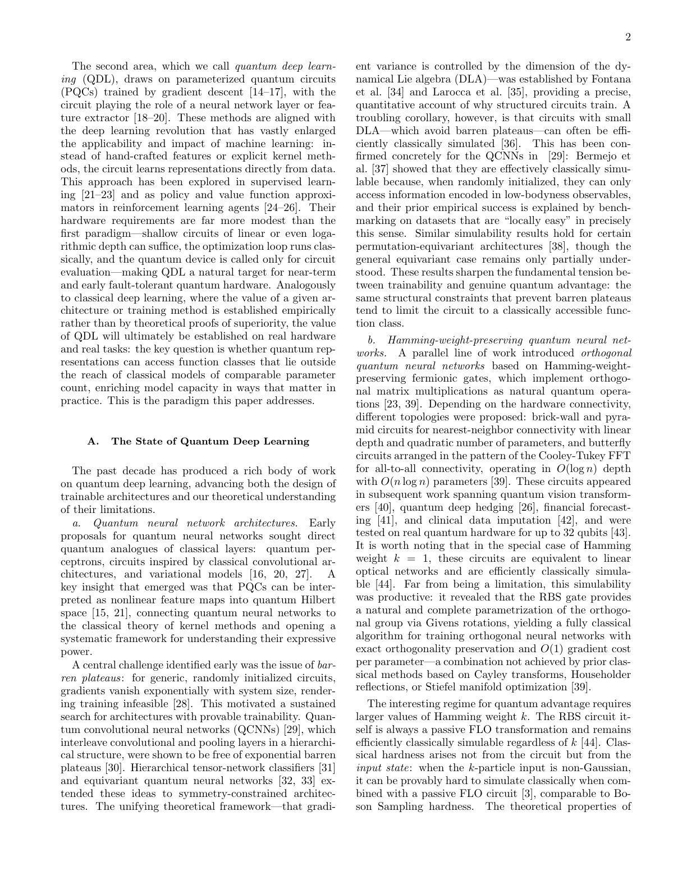 
Low-resolution page preview, page 2

📷 Fig 2

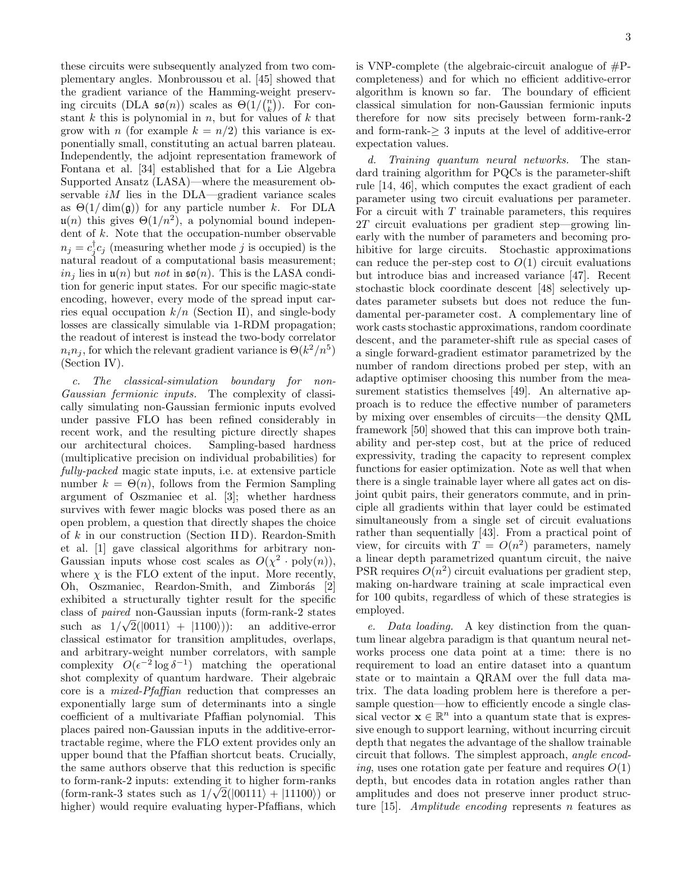 
Low-resolution page preview, page 3

📷 Fig 3

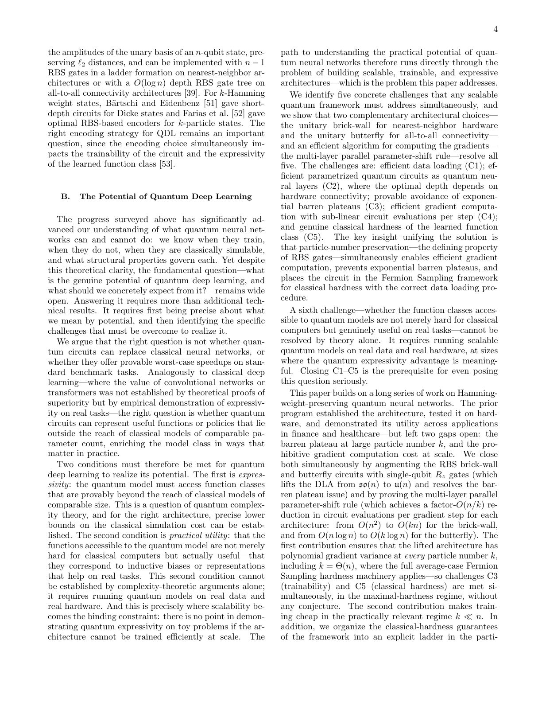 
Low-resolution page preview, page 4

📷 Fig 4

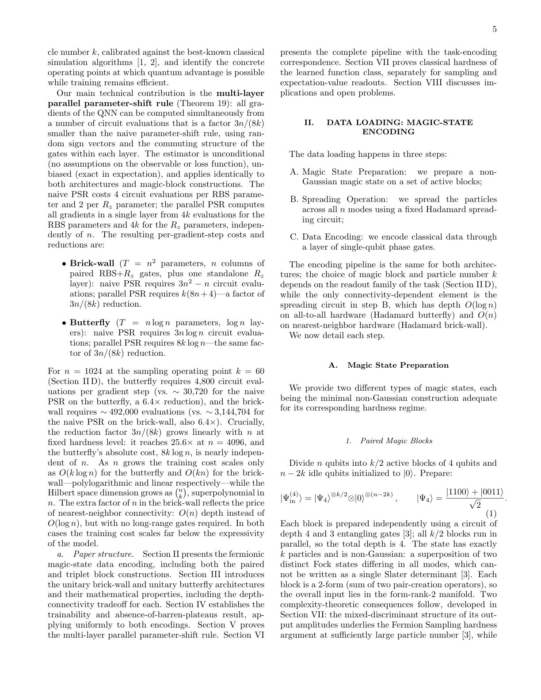 
Low-resolution page preview, page 5

📷 Fig 5

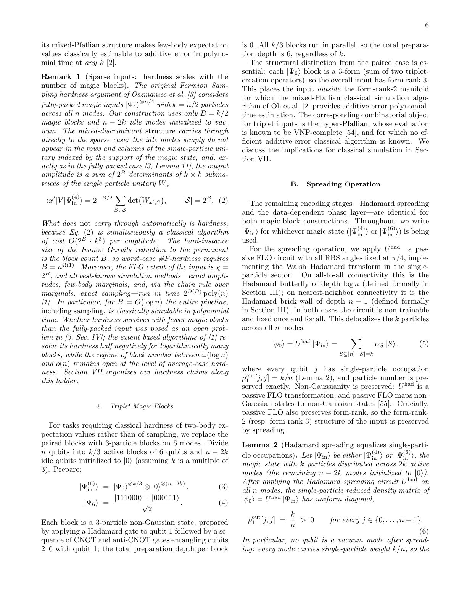 
Low-resolution page preview, page 6

**Summary.** This paper introduces the 'unitary brick-wall' circuit as a scalable solution for Quantum Machine Learning by addressing issues like barren plateaus and high training costs. It demonstrates how tuning a key parameter ($k$) allows control over both the computational hardness and the gradient variance of the learned quantum function class.

**Why it may be interesting.** The work directly tackles the practical limitations of applying quantum computation to ML tasks, providing concrete architectural proposals that improve gradient calculation efficiency while maintaining desirable quantum complexity features.

Detailed structure

**Main problem.** The core challenge is designing scalable parameterized quantum circuits (PQCs) for machine learning that overcome barren plateaus, guarantee classical hardness, and maintain efficient gradient computation.

**Main result.** The proposed 'unitary brick-wall' architecture addresses these issues by tuning the particle number $k$ to balance training cost against provable computational hardness. The butterfly variant achieves similar guarantees with reduced circuit evaluations per step.

**Method.** Theoretical analysis involving constructing specific fermionic architectures, analyzing gradient variance scaling ($\Theta(k^2/n^5)$), and employing advanced parameter-shift rules for efficient gradient calculation.

**Model / system.** The model is a parameterized quantum circuit (PQC) based on $k$-particle fermionic architectures, specifically the 'unitary brick-wall' or its all-to-all variant. These circuits utilize Reconfigurable Beam Splitter gates and are designed to operate on nearest-neighbor or all-to-all hardware.

**Key observables.** Gradient variance ($\Theta(k^2/n^5)$), classical simulation time ($2^{\Theta(k)}	ext{poly}(n)$), and the number of circuit evaluations required per gradient step ($O(n^2)$ or $O(n \log n)$).

**Important parameters / regimes.** The particle number $k$ acts as a critical tunable dial controlling the trade-off between classical hardness and training cost. The system size is parameterized by $n$.

**Assumptions / limitations.** For the butterfly variant, the sharp gradient variance rate holds under a two-particle approximate-2-design conjecture.

**Paper structure.** The paper first identifies three fundamental obstacles in QML scalability. It then proposes and analyzes the unitary brick-wall circuit for nearest-neighbor hardware, detailing its trainability, expressivity (hardness), and efficiency improvements over standard methods. An alternative butterfly variant is also presented, followed by a discussion of related theoretical concepts like spectral gaps and 2-design properties.

Abstract

Designing scalable parameterized quantum circuits for machine learning faces three fundamental obstacles: barren plateaus that prevent gradient-based training, the absence of provable guarantees that the learned function class is classically hard, and prohibitive circuit evaluations per gradient step. We propose the unitary brick-wall: a $k$-particle fermionic architecture for nearest-neighbor hardware, combining Reconfigurable Beam Splitter gates with interleaved single-qubit phase gates and a non-Gaussian magic-state encoding, where the particle number $k$ is a tunable dial trading classical simulation hardness against training cost.   Trainable. The brick-wall has dynamical Lie algebra $\mathfrak{u}(n)$ and directly parametrizes $U(n)$ via Givens rotations, enabling Haar initialization. Two-body correlator readouts achieve gradient variance $Θ(k^2/n^5)$.   Expressive. Classical hardness is controlled by the particle number $k$: best-known classical algorithms for sampling and for two-body expectation values run in time $2^{Θ(k)}\mathrm{poly}(n)$, worst-case #P-hardness holds at $k = n^ε$, and average-case hardness applies at $k = Θ(n)$.   Efficient. A multi-layer parallel parameter-shift rule computes all $O(n^2)$ gradients from $k(8n+4)$ circuit evaluations per gradient step, a factor $3n/(8k)$ reduction over the $3n^2$ evaluations required by the standard parameter-shift rule.   The unitary butterfly variant targets all-to-all hardware, with depth $2\log n$ and $n\log n$ parameters. It achieves similar hardness guarantees at $8k\log n$ evaluations per gradient step, the same factor $3n/(8k)$ reduction. Its trainability is established at two levels: the absence of exponential barren plateaus is unconditional, whereas the sharp $Θ(k^2/n^5)$ rate holds under a two-particle approximate-2-design conjecture.

[↑ back to top](#top)

### [Scale Weight Decay and Train Better](http://arxiv.org/abs/2607.23777v1)

**Authors:** Anuj Apte  
**Type:** theory · **Category:** disordered systems and neural networks · **PDF:** <https://arxiv.org/pdf/2607.23777v1>  
**Analysis basis:** full PDF text, analyzed in chunks

📷 Fig 1

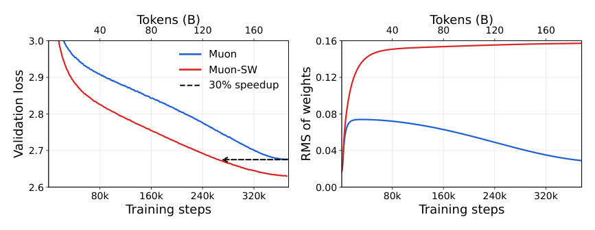 
Figure 1: Scaled weight decay trains faster and keeps weights from collapsing (width-1024 MoE, ∼932M parameters). Left: validation loss versus optimizer steps for Muon with standard weight decay and Muon-SW with scaled weight decay (decay factor η2 t λ/ηmax instead of ηtλ). Muon-SW reaches the best validation loss of the standard run (2.675) in 264k steps versus 374k, a ∼30% reduction in steps (dashed arrow). Right: RMS norm of the weights, averaged across non-router layers. Under standard weight decay the norm peaks early and then steadily decays, whereas under scaled weight decay it settles to a roughly constant value. The models are trained on FineWeb dataset [1] and use identical...

📷 Fig 2

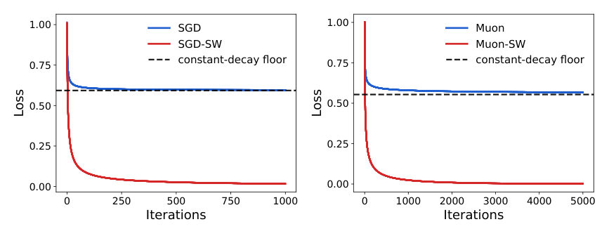 
Figure 2: Scaled weight decay converges to a minimizer of the original loss, while constant weight decay does not. Left: deterministic gradient descent on the shifted scalar quadratic f(w) = a

📷 Fig 3

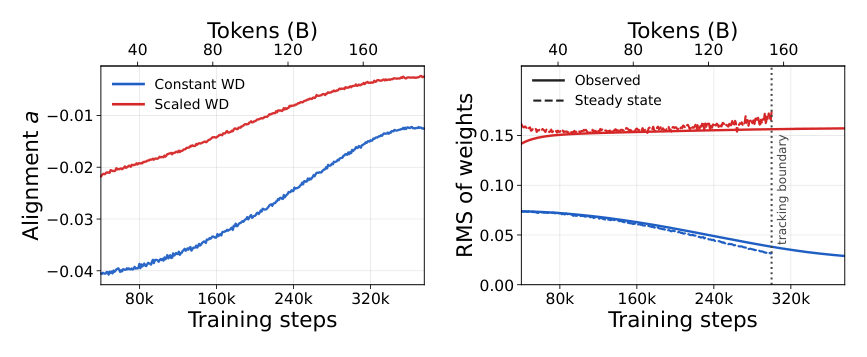 
Figure 3: Weight–update alignment and steady-state weight norm (width 1024). Left: the aggre- gate alignment at between the weights and the Muon update is negative under both rules, with its magnitude decreasing through training as the learning rate and relative update size fall. Right: the observed RMS weight norm (solid) against the instantaneous steady-state prediction (dashed). The theory captures the separation between the two, with scaled weight decay sustaining a nearly constant norm, whereas constant weight decay produces a norm that falls by roughly 60% from its peak value. The steady-state approximation is predictive before the marked tracking boundary near 300k steps; beyond it...

📷 Fig 4

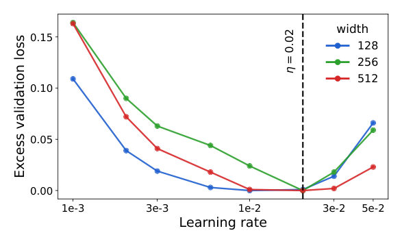 
Figure 4: µP-MoE learning-rate transfer across width. We train µP LLaMA-style sparse MoE models at widths 128, 256, and 512 with fixed MoE granularity. The y-axis shows excess validation loss relative to the best learning rate at each width, making the transfer shape comparable across model sizes. A broad shared low-loss basin appears around 10−2–3 × 10−2, and we select η = 0.02 for subsequent experiments.

📷 Fig 5

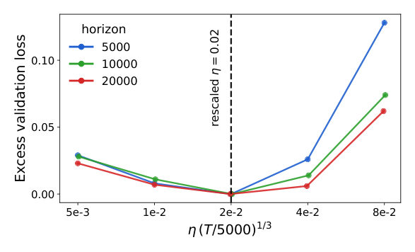 
Figure 5: Learning-rate transfer across training horizon. We train the µP LLaMA-style sparse MoE model at width 256 for horizons T ∈{5000, 10000, 20000} optimizer steps and sweep the peak AdamW learning rate. The y-axis shows excess validation loss relative to the best learning rate at each horizon; the x-axis is the horizon-rescaled learning rate η (T/5000)1/3. Under this rescaling the three curves share a common minimum near 0.02 (dashed line), so the peak learning rate for a new horizon can be obtained by rescaling the width-transferred value η = 0.02.

**Summary.** This paper introduces 'Scale Weight Decay' as a principled replacement for standard weight decay in deep learning optimization. By scaling the decay term based on the current learning rate, it mathematically proves that the regularization does not bias the convergence target. Empirically, this method significantly accelerates the training of massive models like MoE.

**Why it may be interesting.** While purely computational, the mathematical rigor concerning asymptotic optimization guarantees (Robbins–Monro conditions) is highly relevant to understanding the long-term stability of complex quantum simulations or variational algorithms that rely on iterative minimization.

Detailed structure

**Main problem.** Standard constant decoupled weight decay introduces an asymptotic bias during training on massive datasets, potentially preventing convergence to the true minimum of the loss function.

**Main result.** The proposed scaled weight decay preserves the asymptotic stationarity guarantees for both SGD and Muon optimizers, leading to substantial speedups (up to 30%) in training large models like MoE.

**Method.** The authors propose scaling the standard weight decay term by the ratio of the current learning rate to the peak learning rate ($\eta_t/\eta_{\max}$), which ensures the regularization perturbation enters at a higher order ($O(\eta_t^2)$).

**Model / system.** The work analyzes the optimization process for training large neural networks, specifically focusing on Mixture-of-Experts (MoE) models using optimizers like Muon.

**Key observables.** Validation loss vs. training steps, RMS norm of weights vs. training steps, and convergence rate comparison between standard and scaled decay methods.

**Important parameters / regimes.** Learning rates ($\eta_t$, $\eta_{\max}$), weight decay constant ($\lambda$), model size (up to 930 million parameters).

**Assumptions / limitations.** The analysis relies on Robbins–Monro conditions for stochastic approximation schemes, assuming the loss function is L-smooth and bounded below.

**Figures summary.** Figures compare validation loss curves showing Muon-SW reaching target losses faster than standard Muon. Weight norm plots illustrate that scaled decay allows the weight norm to settle at a constant value rather than steadily decaying.

**Paper structure.** The paper establishes the theoretical failure of constant weight decay, proposes and proves the convergence benefits of scaling the decay term by $\eta_t/\eta_{\max}$, and validates this improvement empirically on large-scale MoE training benchmarks.

Abstract

The discovery of scaling laws has motivated training neural networks on ever increasing quantities of data. This is typically done with a constant decoupled weight decay which causes the network weights to shrink steadily over the course of training. Taking inspiration from the Robbins--Monro conditions, we propose to scale weight decay by the fraction of the peak learning rate $η/η_{\max}$. We prove that this scaled weight decay preserves the asymptotic stationarity guarantees of the corresponding unregularized methods for both stochastic gradient descent and the non-Euclidean spectral optimizer Muon, thereby avoiding the additional asymptotic bias introduced by constant decoupled weight decay. This retains the stability benefits of weight decay without changing the asymptotic optimization target. Using a steady-state analysis, we explain why under standard weight decay the weight norm shrinks steadily as training proceeds, whereas under scaled weight decay it settles to a roughly constant value. When applied to the training of mixture-of-experts models, Muon with scaled weight decay (Muon-SW) consistently outpaces Muon with identical hyperparameters, reaching the same validation loss $\mathbf{30\%}$ faster at our largest scale across models from $72 - 930$ million parameters trained at $\sim 600$ tokens per active parameter. If this trend continues to hold, the method promises to substantially accelerate the pre-training of frontier models while requiring only a few lines of code to implement.

[↑ back to top](#top)

### [Stacking the Deck: Tunable Trainability in Stacked LCUs](http://arxiv.org/abs/2607.24686v1)

**Authors:** Nikhil Khatri, Stefan Zohren, Gabriel Matos  
**Type:** theory · **Category:** quantum information and computing · **PDF:** <https://arxiv.org/pdf/2607.24686v1>  
**Analysis basis:** full PDF text, analyzed in chunks

📷 Fig 1

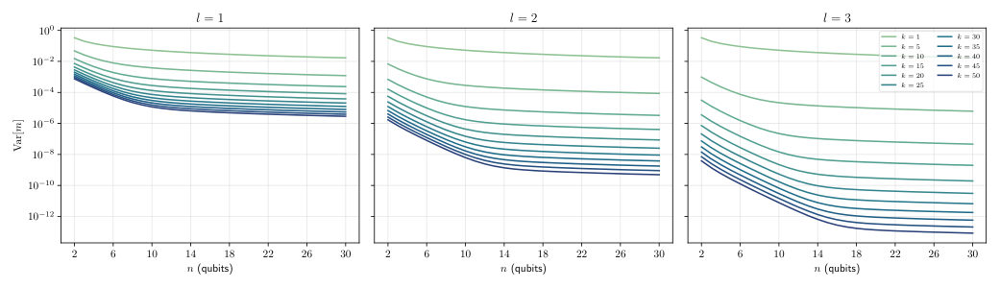 
FIG. 1: Variance of the unnormalised expectation value Var[m] as a function of the number of qubits n, for l ∈{1, 2, 3} and varying LCU term count k. Observable O = Z1, initial state ρ0 = |0⟩⟨0|⊗n.

📷 Fig 2

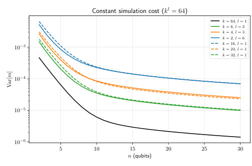 
FIG. 2: Variance for FF-S-LCU configurations with con- stant expanded term count kl = 64. Solid lines: (k, l) pairs with kl = 64. Dashed lines: single-layer models with comparable k. Distributing a fixed term count over more layers produces a larger variance in these examples.

📷 Fig 3

 
Figure 2 plots the variance as a function of the num- ber of qubits for various (k, l) combinations with kl = 64. For the configurations shown, keeping the expanded term count (and therefore direct simulation cost) constant while increasing the number of layers reduces cost con- centration.

**Summary.** This paper introduces the Stacked Linear Combination of Unitaries (S-LCU) as a variational ansatz to resolve the tension between quantum circuit expressivity and training stability. By analyzing its loss landscape variance using moment calculations, the authors show that the depth parameter ($l$) acts as a dial, allowing users to systematically tune the trade-off between classical simulation cost and barren plateau risk.

**Why it may be interesting.** The systematic control over circuit expressivity versus barren plateau susceptibility via a single parameter ($l$) is highly relevant for designing practical, hardware-efficient quantum algorithms.

Detailed structure

**Main problem.** The paper addresses the fundamental conflict between designing variational quantum circuits that are expressive enough for quantum advantage (which often leads to barren plateaus) and those that remain classically tractable.

**Main result.** They propose a Stacked Linear Combination of Unitaries (S-LCU) ansatz, demonstrating that its depth parameter ($l$) provides a tunable trade-off, allowing practitioners to systematically balance computational complexity against the rate of cost concentration in the loss landscape variance.

**Method.** The analysis employs diagrammatic techniques and moment calculations (first and second moments) on the expectation value of the cost function's variance ($	ext{Var}[m]$).

**Model / system.** The model is the S-LCU, specialized to the Free Fermion S-LCU (FF-S-LCU), which uses fermionic Gaussian unitaries acting on $n$ fermionic modes. The underlying mathematical framework involves calculating integrals over Haar distributed unitaries.

**Key observables.** Variance of the cost function ($	ext{Var}[m]$), first and second moments of observables, and the quantum gate complexity vs. classical simulation cost.

**Important parameters / regimes.** Number of layers ($l$), number of qubits/fermionic modes ($n$), and the number of terms per layer ($k$).

**Assumptions / limitations.** Unitaries are drawn from the Haar distribution over a compact group, and coefficients follow a Dirichlet distribution. The analysis relies on specific moment calculations for fermionic Gaussian unitaries.

**Paper structure.** The paper develops results by first analyzing the general S-LCU structure using diagrammatic methods to derive bounds on $	ext{Var}[m]$. It then specializes this to the FF-S-LCU, providing explicit formulas for the first and second moments based on layer independence. The appendix details the rigorous mathematical machinery (e.g., Gram matrix calculations) required for these moment derivations.

Abstract

Variational quantum circuits have been central to many proposed near-term applications of quantum computing, but a growing body of evidence suggests that trainability and quantum advantage are fundamentally at odds: ansätze expressive enough to resist efficient classical simulation tend to exhibit barren plateaus, while structures that provably rule out barren plateaus typically render them classically simulable. We propose a stacked linear combination of unitaries (S-LCU) as a variational ansatz which provides a tunable trade-off between barren plateaus and classical simulability. Using a diagrammatic analysis, we bound the loss-landscape variance of the Free Fermion S-LCU, whose elements are fermionic Gaussian unitaries. We prove a variance lower bound of $Ω(1/(n k^{3l}))$, with a simulation cost of $O(k^{2l} n^3)$ using the best known classical algorithm, compared to a quantum gate complexity of only $O(lkn^2)$. The number of layers $l$ serves as a single dial that trades computational complexity against the rate of cost concentration. This offers practitioners a systematic method for constructing ansätze with a complexity-trainability trade-off that best suits their application and hardware.

[↑ back to top](#top)

### [Superpixel-Based QUBO for Scalable Quantum-Enhanced Medical Image Segmentation](http://arxiv.org/abs/2607.24288v1)

**Authors:** Mohammad Chalhoub, Mahdi Chehimi, Laia Domingo, Omar Alhussein, Ahmed Farouk, Saif Al-Kuwari  
**Type:** both · **Category:** other · **PDF:** <https://arxiv.org/pdf/2607.24288v1>  
**Analysis basis:** full PDF text, analyzed in chunks

📷 Fig 1

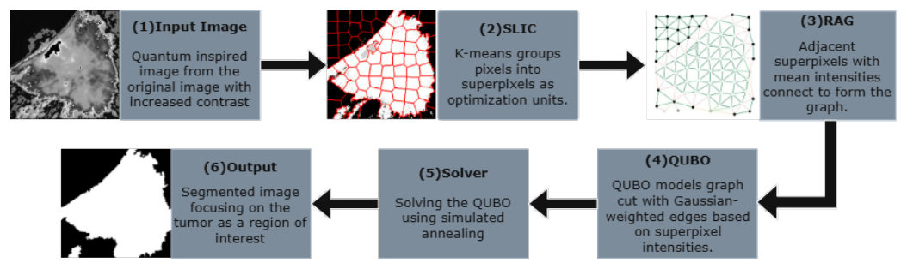 
Fig. 1. Superpixel-based QUBO segmentation pipeline. (1) Input mammography image undergoes quantum-inspired contrast-enhancement preprocessing. (2) SLIC algorithm generates 50 superpixels from 65,536 pixels. (3) Region Adjacency Graph connects adjacent superpixels with similarity-weighted edges. (4) QUBO formulation models segmentation as a graph cut with Gaussian weights. (5) Simulated annealing optimizes the binary labeling. (6) Full-resolution segmentation mask isolates the tumor region. The pipeline reduces problem complexity by 97.3% while maintaining image fidelity.

📷 Fig 2

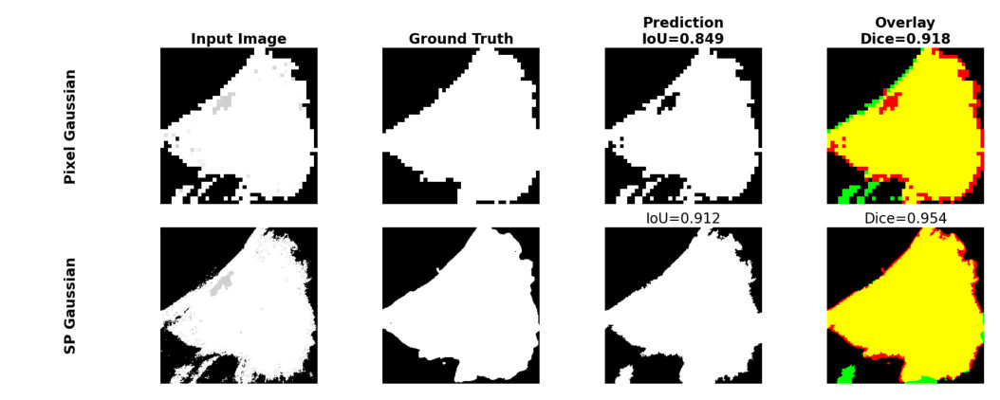 
Fig. 2. Visual comparison of pixel-level and superpixel-level QUBO segmentation on mammography image (idx=7). Top row: Pixel-level baseline on 42×42 downsampled image shows blocky artifacts. Bottom row: Superpixel approach on full 256 × 256 resolution preserves fine anatomical details. Overlay shows correct predictions (yellow), false positives (red), and false negatives (green).

**Summary.** This paper introduces a superpixel-based framework to solve medical image segmentation using Quadratic Unconstrained Binary Optimization (QUBO). By clustering pixels into perceptually coherent regions, the authors drastically reduce the problem size from tens of thousands of variables to dozens while preserving full resolution. This results in superior segmentation quality and massive computational speedups, making quantum optimization feasible for real-world clinical data.

**Why it may be interesting.** While the core application is in medical imaging (CV/ML), the methodology involves mapping a complex combinatorial optimization problem onto a QUBO structure suitable for quantum annealers. The successful reduction of variables while maintaining fidelity is highly relevant to scaling up any NISQ-era quantum algorithm implementation.

Detailed structure

**Main problem.** The core problem is performing high-fidelity medical image segmentation, specifically on mammography images, which requires processing large amounts of pixel data.

**Main result.** The superpixel-based QUBO framework significantly improved segmentation quality (4.2% relative IoU improvement) and achieved a 33x speedup compared to pixel-level methods while drastically reducing the problem size for quantum solvers.

**Method.** A novel approach uses SLIC clustering to group pixels into perceptually meaningful superpixels, which are then used to construct a Region Adjacency Graph (RAG). The segmentation objective is formulated as a QUBO over this graph structure.

**Model / system.** The model is the Quadratic Unconstrained Binary Optimization (QUBO) formulation of an energy function that combines min-cut and smoothness objectives. This framework is designed to map directly onto quantum annealing hardware, utilizing binary variables representing superpixel labels.

**Key observables.** Mean Intersection over Union (IoU), Mean Dice Coefficient, computational runtime (seconds), and the size of the QUBO matrix/number of variables.

**Important parameters / regimes.** Superpixel count ($K=60$), smoothness hyperparameter ($\alpha=10$), Gaussian kernel scale parameter ($\sigma$).

**Assumptions / limitations.** The primary assumption is that grouping pixels into superpixels preserves enough structural information to allow for accurate segmentation, overcoming the data loss inherent in simple downsampling techniques.

**Figures summary.** Figures illustrate the entire pipeline: SLIC clustering $
ightarrow$ RAG construction with Gaussian weights $
ightarrow$ QUBO formulation $
ightarrow$ Optimization $
ightarrow$ Final Segmentation Mask. Comparisons show visual improvements over pixel-level artifacts.

**Paper structure.** The paper follows a structure of identifying the limitation (scalability of pixel-QUBO), proposing the superpixel solution using SLIC and RAG, detailing the mathematical QUBO formulation derived from graph objectives, validating this method on mammography images against baselines, and concluding with performance metrics.

Abstract

Quadratic unconstrained binary optimization (QUBO) has emerged as a powerful framework for medical computing problems. Binary decision variables naturally represent clinical choices, making QUBO formulations well-suited for quantum annealing hardware. However, a fundamental scalability challenge limits practical deployment: problem size grows rapidly with input dimensionality, creating computational bottlenecks that restrict applications to simplified scenarios. This paper addresses this challenge through hierarchical problem reduction, as demonstrated in medical image segmentation, where pixel-level QUBO formulations create over 65,000 variables for a 256x256 image, forcing existing approaches to downsample to 42x42 resolution and discard 97% of pixel information. A superpixel-based QUBO framework is proposed using simple linear iterative clustering (SLIC) to group pixels into perceptually meaningful regions, then formulate segmentation as QUBO over a region adjacency graph (RAG) combining min-cut and smoothness objectives. Validation on INbreast mammography breast cancer images demonstrates a 4.2% improvement in segmentation quality (mean IoU 0.76 vs 0.73) with 33 computational speedup (0.67s vs 21.97s) and a 97.3% reduction in problem size (1764 to 48 variables), all achieved while processing full-resolution images rather than downsampled versions. The reduced problem size also fits well within current quantum annealer connectivity limits, removing the embedding overhead that has historically blocked direct deployment of pixel-level QUBO segmentation on quantum hardware.

[↑ back to top](#top)

### [Universal temperature-dependent electrical resistivity in actinides](http://arxiv.org/abs/2607.23484v1)

**Authors:** E. F. Talantsev  
**Type:** theory · **Category:** strongly correlated electrons · **PDF:** <https://arxiv.org/pdf/2607.23484v1>  
**Analysis basis:** full PDF text, analyzed in chunks

📷 Fig 1

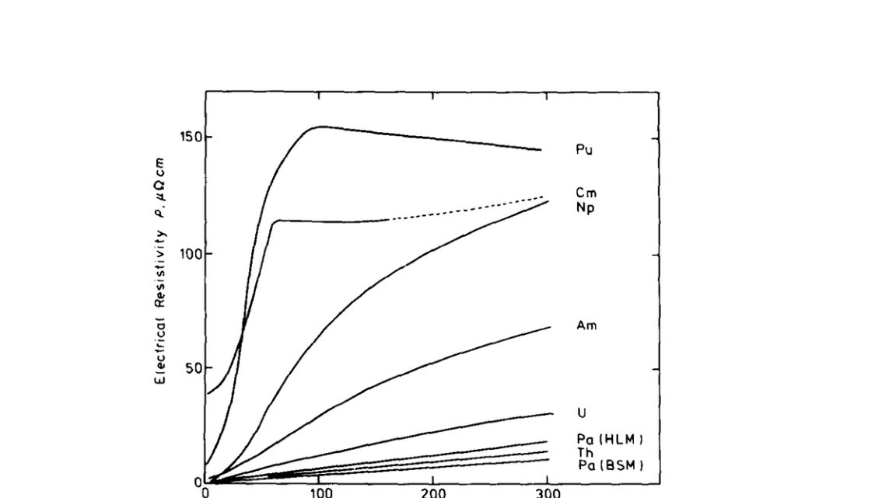 
Figure 1. The temperature dependence of the electrical resistivities of the actinide metals. Plot is reproduced from Bett et al. [7] with permission from Elsevier (Licensed Content Publisher: Elsevier; Permission: License Number: 6315391153351; License date: Jul 24, 2026).

📷 Fig 2

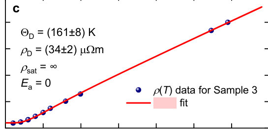 
Figure 2. Fits with the nearest-neighbor hopping parallel resistance model (Equation 10) of three 𝜌(𝑇) datasets for pure thorium samples reported by Schettler et al [25]. (a) Sample 1 has

📷 Fig 3

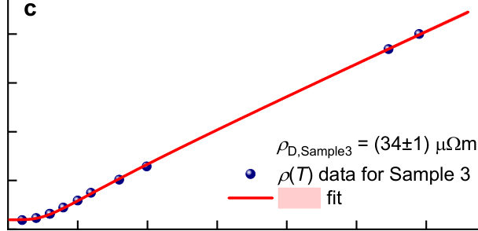 
Figure 3. Global fits with the nearest-neighbor hopping parallel resistance model (Equation 16) of three 𝜌(𝑇) datasets for pure thorium samples reported by Schettler et al [25]. Global fit quality R-square (COD) = 0.9993. (a) Sample 1 has

📷 Fig 4

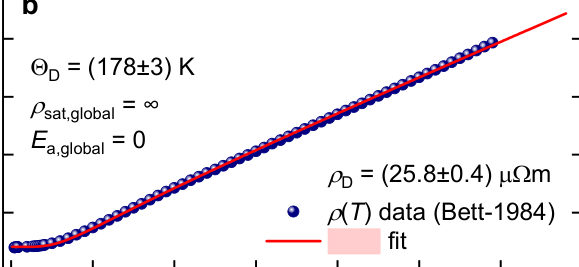 
Figure 4. Fits with the nearest-neighbor hopping parallel resistance model (Equation 10) of two 𝜌(𝑇) datasets for pure protoactinium samples reported by (a) Hall et al [28], and by (b) Bett et al [7]. (a) Fit quality R-square (COD) = 0.9997. (b) Fit quality R-square (COD) = 0.9998. Deduced parameters are shown in each panel. The 95% confidence bands are shown by pink shadow areas.

📷 Fig 5

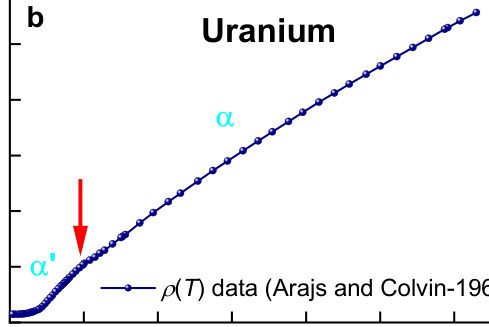 
Figure 5. 𝜌(𝑇) data for pure uranium samples reported by (a) Meaden [11], and by (b) Arajs and Colvin (Sample U-1) [23]. Red arrows show the inflection point for the α ⇆αᇱ phase transition.

**Summary.** This paper addresses the lack of a unified theory for understanding temperature-dependent electrical resistivity in actinides by proposing a two-channel parallel resistance model. The model combines an Arrhenius term (for nearest-neighbor hopping) with a Bloch-Grüneisen term (for electron-phonon scattering). By successfully fitting data across multiple actinide elements, it provides a quantitative framework for analyzing the complex electronic transport mechanisms in these materials.

**Why it may be interesting.** The study tackles the complex transport properties of actinides, which are quintessential examples of strongly correlated electron systems due to their partially filled $5f$ orbitals. Developing a successful empirical fit that incorporates both hopping and phonon mechanisms provides valuable physical insight into the underlying electronic structure.

Detailed structure

**Main problem.** Experimental temperature-dependent electrical resistivity data for actinides are highly variable, lacking a unified theoretical approach for understanding and fitting these measurements.

**Main result.** The authors propose a model based on two parallel conduction channels (Arrhenius hopping and Bloch-Grüneisen) that successfully fits the $\rho(T)$ data for eight elemental actinide phases.

**Method.** The resistivity is modeled as the reciprocal sum of conductivities from two distinct channels: one governed by Arrhenius behavior (NNH conductivity) and the other by electron-phonon scattering (Bloch-Grüneisen).

**Model / system.** The system under study is pure elemental actinides (Th to Cm) and related alloys. The model, termed the NNH-parallel resistance model, treats total resistance as a parallel combination of two conduction channels: $\rho(T) = 1/(\sigma_{	ext{Arr}}(T) + \sigma_{	ext{BG}}(T))$.

**Key observables.** Temperature-dependent electrical resistivity ($\rho(T)$), Debye temperatures ($\Theta_D$), and Arrhenius activation energy ($E_a$).

**Important parameters / regimes.** Actinide elements (Th, Pa, U, Np, Pu); $E_a = 15.9$ meV for Np; $\Theta_D$ values consistent with heat capacity measurements.

**Assumptions / limitations.** Matthiessen's rule is inapplicable for single-phase elemental metals, requiring the total resistance to be treated as a parallel combination of conduction channels.

**Figures summary.** Figures illustrate successful fits using the proposed model (Equation 10) across various actinide phases (Th, Pa, U, Np), comparing raw data against theoretical curves for both single-phase and multi-phase materials.

**Paper structure.** The paper establishes the problem of $\rho(T)$ variability in actinides. It then introduces the two-channel parallel resistance model ($\rho(T) = 1/(\sigma_{	ext{Arr}} + \sigma_{	ext{BG}})$). The core is applying and validating this model across multiple actinide elements, showing its success while noting specific parameters derived for each.

Abstract

Temperature-dependent electrical resistivity $ρ(T)$ is one of the most common types of experimental data analyzed in condensed matter physics. For one group of pure metals, the actinides, experimental $ρ(T)$ curves differ radically from one another to the point that there is no unified theoretical approach to understanding and fitting $ρ(T)$ data in these elements. First-principles calculations result in $ρ(T)$ curves that differ from experimental data, even qualitatively. In an attempt to unravel this long-standing problem, here I propose a simple model that accurately fits the $ρ(T)$ data for eight phases of elemental actinides (from thorium (Th) to curium (Cm)) for which experimental data are publicly available to date. The model is based on the concept of two parallel conduction channels: one is described by the Bloch-Grüneisen equation, which is associated with the classical electron-phonon dissipation mechanism, and the other by the Arrhenius equation, which is associated with the nearest-neighbor hopping (NNH) conductivity. Debye temperatures $Θ_D$ derived from application of the model to $ρ(T)$ data for eight elemental actinide phases agree well with reported values deduced from heat capacity measurements. For neptunium (Np) a maximum Arrhenius activation energy (among all actinides) of $E_a=15.9$ $meV$ was derived. The model was also successfully applied to $ρ(T)$ data measured on $δ$-phase plutonium-based alloys Pu-Ce and Pu-Ce-Ga.

[↑ back to top](#top)

## Secondary cond-mat archives

*Papers from  mes-hall, other, soft, supr-con. These archives are de-prioritized — they appear at the end regardless of relevance score.*

### Relevant in secondary archives (20)

### ⭐ [Signatures of Topological Magnon Edge States in THz Spectroscopy and Cavity Response](http://arxiv.org/abs/2607.23170v1)

**Highlighted author(s):** Johannes Knolle  
**Authors:** Ipsika Mohanty, Johannes Knolle, Silvia Viola Kusminskiy  
**Type:** both · **Category:** other · **PDF:** <https://arxiv.org/pdf/2607.23170v1>  
**Analysis basis:** full PDF text, analyzed in chunks
**Topic relevance:** 🔥 `spintronics-quantum-optics interface` **4/5** · `analog quantum simulation` **3/5** · `driven-dissipative phase transition` **3/5** · `exotic spin models in light-matter` **3/5** · `methods for driven-dissipative` **2/5** · `non-equilibrium dynamics` **2/5** · `quantum optics experiment` **2/5** · `Keldysh / 2PI / non-Gaussian methods` **1/5** · `Tavis-Cummings & cavity-many-emitter` **1/5** · `correlated cavity matter` **1/5** · `non-equilibrium universality` **1/5**

📷 Fig 1

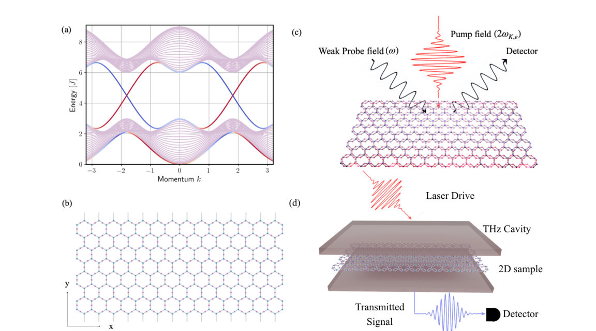 
FIG. 1: Magnon Band Structure and THz-Probing of a Topological Magnon Insulator (a) Magnon band structure for a S=3/2 FM insulator on a honeycomb lattice in a ribbon geometry with a bearded boundary condition taking 24 sites in the finite direction. Pink curves indicate the bulk bands, while red and blue curves correspond to chiral edge modes. Results for n.n.n DMI Dz = 0.3J, where J is the exchange constant. (b) Honeycomb lattice extended along the x-direction and finite along the y-direction, representing a nanoribbon configuration, where the blue dots denote the transition metals (TM) and the purple dots denote halides (X) in a TM-X. The TM atoms are magnetic and form the spin lattice...

📷 Fig 2

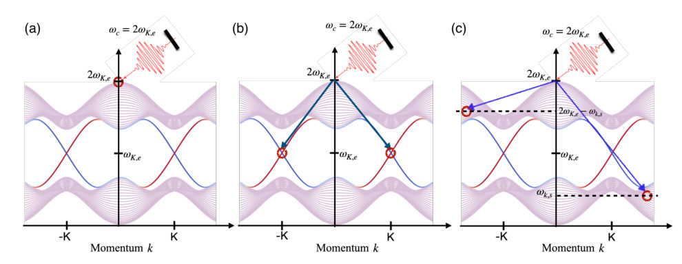 
FIG. 2: Symmetry-allowed photon-absorption processes A linearly polarized EM field is incident at frequency 2ωK,e. The FM TMI bandstructure (with frequencies shown relative to ωK,e) is shown together with the possible magnon-creation processes via photon absorption. The red circles denote modes in k-space which are resonantly excited. (a) A bulk magnon is created at frequency 2ωK,e. (b) A pair of magnon edge modes are created at K and −K. (c) Pair of bulk modes created at opposite momenta, satisfying the resonance condition.

📷 Fig 3

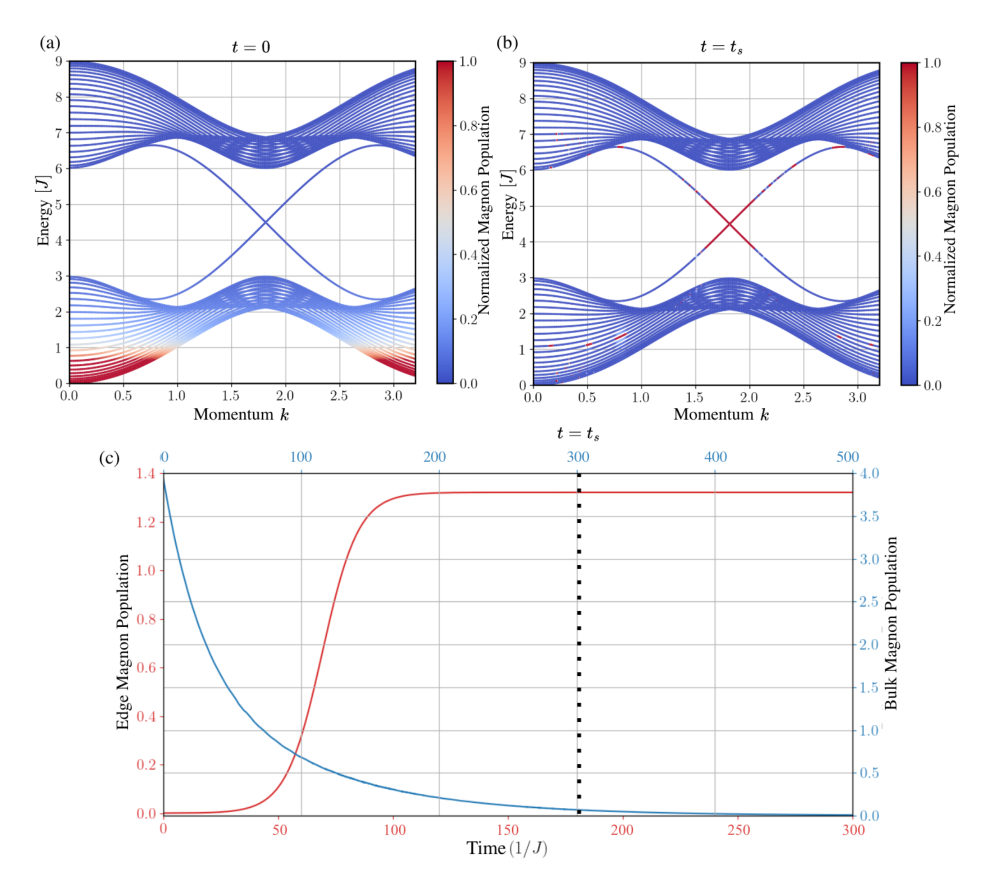 
FIG. 3: Edge mode amplification under driving at 2ωK,e (a) Magnon band structure with normalized magnon population encoded in the colors. The first panel shows the initial state, with a magnon population in the low energy states. The second panel shows the magnon population after amplification at t = ts when the system has reached the steady state. A maximum population in the edge modes can be observed. (b) Temporal dynamics of the edge mode (red) and a bulk mode (blue) under driving at frequency 2ωK,e. We plot the magnon population at a K-point, averaged over the finite sites along the y-direction. The edge mode shows amplification and subsequent stabilization, while bulk modes relax. The...

📷 Fig 4

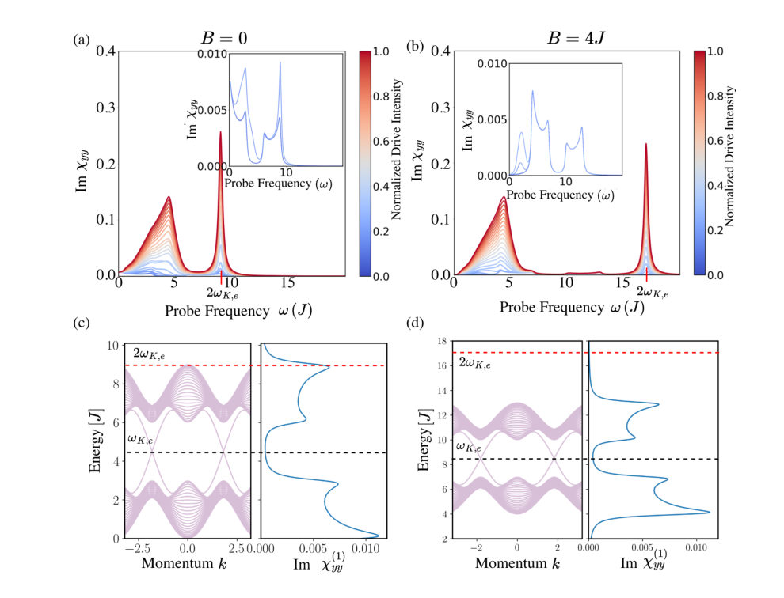 
FIG. 4: Response of the TMI under a resonant pump drive at 2ωK,e for increasing pump-intensity A pump laser is incident at 2ωK,e and a probe laser after time ts. The susceptibility is obtained as a function of the probe laser frequency for varying intensity of the pump-laser. The color gradient, blue (low intensity) to red (high intensity), shows the normalized pump intensity corresponding to drive-magnon edge mode coupling strengths ˜Gν,K,e,e in the range 0.01 −0.25J. This is equivalent to varying the pump-intensity in the range 1012 −1014 W/m2. (a) Without a bias magnetic field, the resonance frequency is 2ωK,e = 9J. The peak at the lower frequency range is due to scattering between two...

📷 Fig 5

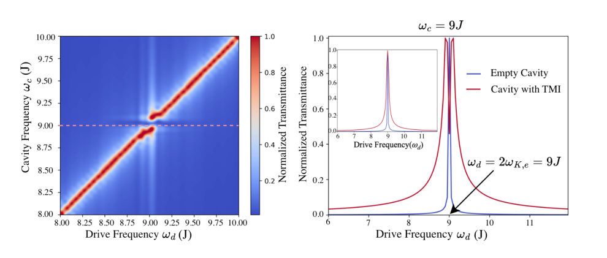 
FIG. 5: Cavity spectrum (a) Normalized transmittance for a cavity coupled to the TMI, with cavity dissipation rate κ = 0.01J, dissipation of the cavity due to coupling to external ports κex = 0.005J, and input field amplitude ⟨ˆcin⟩= 10. The linear and non-linear magnon dissipation parameters considered are ζ = 0.04J and η = 0, 004J, respectively and the coupling to the edge mode at the K-point is taken to be ˜GE ν,K,e,e = 0.05J. A hybridization between cavity and a discrete edge pair can be observed at the two-magnon resonant frequency 9J. The 2D plot is smoothened using Lanczos interpolation.(b) A cross-section of the transmittance plot, with ωc = 9J, shows broadening of the linewidth and...

**Summary.** This paper outlines an advanced all-optical method to detect elusive topological magnon edge modes in 2D ferromagnetic insulators using THz spectroscopy. By leveraging the magnetoelectric coupling, they propose exciting these robust edge states through parametric amplification driven by resonant electromagnetic fields. This establishes a crucial experimental pathway for exploring topological phenomena in magnetic quantum materials.

**Why it may be interesting.** This work bridges condensed matter magnetism with quantum optics/AMO physics by proposing a highly specific, non-linear optical measurement technique to probe exotic topological states in magnetic materials. The reliance on parametric amplification via magnetoelectric effects is key for AMO physicists studying light-matter interactions.

Detailed structure

**Main problem.** The primary goal is to develop an all-optical method to experimentally detect robust, chiral topological magnon edge states in ferromagnetic Topological Magnon Insulators (TMIs), as conventional probes lack sufficient sensitivity.

**Main result.** The authors propose a THz pump-probe spectroscopy protocol that uses parametric amplification via magnetoelectric coupling ($\omega_{	ext{pump}} = 2\omega_{K,e}$) to selectively excite and detect these edge modes. They also discuss using THz cavities for spectral filtering of bulk contributions.

**Method.** The theoretical framework combines spin wave theory (Holstein-Primakoff) with the inclusion of electromagnetic coupling ($\hat{H}_{	ext{int}}$), analyzing processes like magnon pair creation/annihilation under resonant driving conditions.

**Model / system.** The system is a 2D van der Waals ferromagnetic material on a honeycomb lattice, modeled by an extended Heisenberg Hamiltonian incorporating Dzyaloshinskii-Moriya interaction (DMI). The detection relies on coupling the magnons to external THz electromagnetic fields.

**Key observables.** Topological magnon edge modes; spectral signatures in absorption following parametric amplification; two-magnon density of states ($
ho^{(2)}(\omega)$); and bulk demagnetization effects.

**Important parameters / regimes.** Terahertz (THz) frequency range; pump intensity ($I$); resonance condition $\omega_{	ext{pump}} = 2\omega_{K,e}$; and the strength of magnetoelectric coupling.

**Assumptions / limitations.** The analysis assumes the dipolar limit for the EM field ($\lambda \gg$ sample size), utilizes Linear Spin Wave Theory (LSWT), and employs approximations like the Rotating Wave Approximation (RWA).

**Figures summary.** Figures illustrate magnon band structures showing chiral edge modes, schematics of pump-probe setups using THz cavities, and plots detailing edge mode splitting versus pump intensity.

**Paper structure.** The paper builds from establishing the theoretical necessity for an all-optical detection route to deriving the coupling Hamiltonian ($\hat{H}_{	ext{int}}$) via magnetoelectric effects. It then details two experimental proposals: THz pump-probe spectroscopy and cavity coupling, supported by symmetry analysis (AM conservation) when considering circular polarization.

Abstract

Topological magnon insulators (TMIs) have emerged as promising platforms for low-energy spin-based information processing, due to their non-trivial bulk magnon topology and robust, chiral edge modes that support dissipationless transport. Although theoretical models predict these edge states, direct experimental detection remains challenging due to their limited sensitivity to conventional probes. In this work, we propose an all-optical pathway to detect topological magnon edge modes in ferromagnetic TMIs. Our approach harnesses parametric amplification of edge magnons via resonant electromagnetic driving, enabled by magnetoelectric coupling mechanisms. We concentrate on two-dimensional van der Waals ferromagnetic materials on the honeycomb lattice with magnonic band gaps in the terahertz (THz) range. We show that a spin-dependent effective electric dipole moment, arising from dynamic charge fluctuations and consistent with the lattice symmetry up to next-nearest-neighbor interactions, gives rise to one-photon-two-magnon processes leading to parametric amplification. On this basis, we propose a THz pump-probe spectroscopy protocol in which edge modes are selectively amplified and subsequently detected in absorption. Furthermore, we discuss the possibility of using THz cavities, enabling selective coupling to edge modes while filtering out bulk contributions. These findings establish a route for probing topological magnets and open new avenues for experimental exploration of exotic topological phenomena in magnetic quantum materials.

[↑ back to top](#top)

### [Exceptional Cones from an Indefinite Bogoliubov Metric in Hyperbolic Polariton Condensates](http://arxiv.org/abs/2607.24456v1)

**Authors:** Junhui Cao, Kirill Bazarov, Alexey Kavokin  
**Type:** theory · **Category:** other · **PDF:** <https://arxiv.org/pdf/2607.24456v1>  
**Analysis basis:** full PDF text, analyzed in chunks
**Topic relevance:** 🔥 `analog quantum simulation` **4/5** · 🔥 `driven-dissipative phase transition` **4/5** · 🔥 `methods for driven-dissipative` **4/5** · `correlated / nonlocal dissipation` **3/5** · `correlated cavity matter` **3/5** · `non-equilibrium universality` **3/5** · `Tavis-Cummings & cavity-many-emitter` **2/5** · `non-equilibrium dynamics` **2/5** · `Keldysh / 2PI / non-Gaussian methods` **1/5** · `Kondo & dissipative impurity` **1/5** · `entanglement & information structure` **1/5**

📷 Fig 1

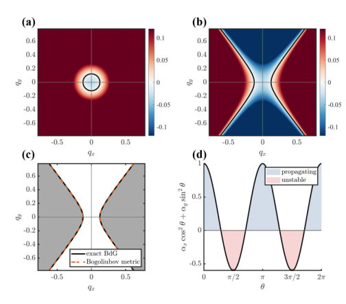 
FIG. 1. Metric origin of the exceptional contour. (a) For an ordinary condensate with αx = αy = 1, the exact non- Hermitian condition D(q) = 0 gives a closed exceptional ring. (b) For a hyperbolic condensate with αx = 1, αy = −0.6, the same condition opens into a hyperbola. (c) The exact con- tour is almost indistinguishable from the Bogoliubov metric prediction close to the origin. For ηn0 = 0.35 the qy = 0 exceptional momentum differs by only 0.38%. (d) The sign of αx cos2 θ + αy sin2 θ selects propagating and dynamically unstable angular regimes.

📷 Fig 2

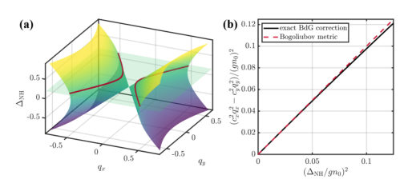 
FIG. 2. Exceptional cone and metric collapse. (a) The zero-discriminant condition c2 xq2 x −c2 yq2 y = ∆2 NH forms a cone in the augmented space (qx, qy, ∆NH). The red plane marks a fixed gain saturation. (b) Exact BdG exceptional points, sampled over several gain saturations and hyperbolic curva- tures, collapse when plotted as (c2 xq2 x −c2 yq2 y)/(gn0)2 versus (∆NH/gn0)2. The dashed diagonal is the long-wavelength Bo- goliubov metric prediction, while the solid curve is the finite- momentum BdG correction 2[ p

📷 Fig 3

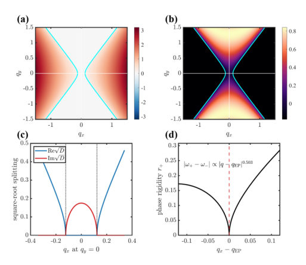 
FIG. 3. Spectral and eigenvector diagnostics of the excep- tional hyperbola. (a,b) Maps of the real and imaginary parts of ω+, with the cyan line marking D(q) = 0. (c) Along qy = 0, the centered splitting √

📷 Fig 4

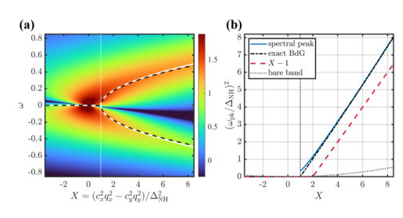 
FIG. 4. Metric-resolved spectral observable. (a) Particle spectral function | −2 Im GR 11| after projecting momenta onto X = (c2 xq2 x −c2 yq2 y)/∆2 NH. The solid line is the exact BdG branch, the dashed line is the Bogoliubov metric limit, and the vertical dotted line marks XEP. (b) The positive spec- tral peak in the propagating sector collapses onto the ex- act BdG hyperboloid, while the bare single-particle disper- sion fails. For the representative GaAs polariton parameters [28, 29], mx = 9.0 × 10−5me, my = −1.5 × 10−4me, and gn0 = 0.50 meV, the coefficients are αx = 0.423 meV µm2

📷 Fig 5

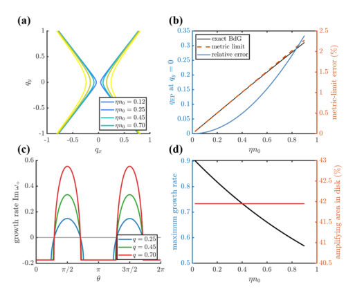 
FIG. 5. Tunability and angular selectivity. (a) Increasing ηn0 moves the exceptional hyperbola outward, making the non-Hermitian null surface directly controllable by gain satu- ration and density. (b) The exact qEP follows the Bogoliubov metric prediction at small ηn0. The relative error remains below a few percent over the range shown. (c) The growth rate Im ω+ is strongly angle-dependent where only momenta in the hyperbolic unstable sectors are amplified. (d) Loss reduces the maximum growth rate, while the fraction of am- plifying momenta inside the unit disk remains approximately fixed by the metric.

**Summary.** The paper investigates collective excitations in hyperbolic polariton condensates, finding that the underlying Bogoliubov metric is indefinite, unlike standard acoustic systems. This geometry dictates that gain saturation leads to an exceptional cone structure in parameter space. The study demonstrates that this framework allows for the controlled engineering and observation of non-Hermitian degeneracies using optical matter waves.

**Why it may be interesting.** This work directly connects geometric concepts (indefinite metrics) from condensed matter theory to topological features (exceptional degeneracies) in open quantum systems, providing a powerful framework for understanding non-Hermitian physics in controllable optical platforms like polaritons.

Detailed structure

**Main problem.** To characterize the collective excitation geometry of a condensate formed in a hyperbolic polariton band, particularly how this relates to non-Hermitian exceptional degeneracies.

**Main result.** The system exhibits an indefinite Bogoliubov metric, causing the light cone to become a hyperbolic stability wedge. The resulting zero-discriminant surface forms a controllable exceptional cone/hyperbola structure in parameter space.

**Method.** Analysis involves linearizing the driven-dissipative condensate equation and deriving effective quadratic metrics (Bogoliubov metric) that govern the dispersion relation across different regimes.

**Model / system.** The system is modeled by a scalar driven-dissipative condensate equation describing hyperbolic polariton condensates. The physics is analyzed via Bogoliubov excitations, leading to non-Hermitian spectral analysis.

**Key observables.** Bogoliubov metric signature (indefinite), exceptional cone/hyperbola structure, eigenvalue splitting $|\omega_+ - \omega_-|$, and biorthogonal phase rigidity $r_+$.

**Important parameters / regimes.** Gain saturation ($\Delta_{NH}$), band curvatures ($\alpha_x\alpha_y < 0$), and interaction strength ($g$).

**Assumptions / limitations.** The analysis relies on the long-wavelength limit for deriving the effective metric, and it models the system using a driven-dissipative mean-field approach.

**Figures summary.** Figures illustrate spectral diagnostics showing the collapse of the particle spectral function onto the exact BdG hyperboloid near exceptional points (EPs), and real-space simulations show localized perturbations developing elongated, sign-alternating profiles aligned with unstable hyperbolic sectors.

**Paper structure.** The paper progresses from establishing the standard acoustic metric in ordinary condensates to deriving the indefinite Bogoliubov metric for hyperbolic polaritons. It then incorporates gain saturation to introduce non-Hermiticity, leading to the identification and characterization of the exceptional cone structure via spectral analysis and real-space evolution.

Abstract

Long-wavelength Bogoliubov phonons in an ordinary condensate realize the standard acoustic Lorentz metric. We show that a condensate formed in a hyperbolic polariton band realizes a different collective geometry with an indefinite Bogoliubov metric whose spatial signature is inherited from the opposite signs of the band curvatures. This metric converts the acoustic light cone into a hyperbolic stability wedge, separating propagating quasiparticles from dynamically unstable ones. In a driven-dissipative condensate, gain saturation turns this metric relation into a non-Hermitian Bogoliubov dispersion. The zero-discriminant surface becomes an exceptional cone in the parametric space $(q_x,q_y,Δ_{\rm NH})$, appearing as an exceptional hyperbola at fixed gain saturation. Across this surface the Bogoliubov branches coalesce, the biorthogonal phase rigidity collapses, and the spectrum changes from propagation to amplified or overdamped dynamics. Our results identify hyperbolic polariton condensates as a controllable setting where non-Hermitian exceptional degeneracies are organized by an effective Bogoliubov metric.

[↑ back to top](#top)

### [Electrical control of the metal-insulator transition in a one dimensional device](http://arxiv.org/abs/2607.23138v1)

**Authors:** J. Craquelin, L. Jarjat, B. Hue, A. Théry, C. Fruy, N. Struchkov, D. Stefani, M. M. Desjardins, A. Cottet, M. R. Delbecq, T. Kontos  
**Type:** both · **Category:** other · **PDF:** <https://arxiv.org/pdf/2607.23138v1>  
**Analysis basis:** full PDF text, analyzed in chunks
**Topic relevance:** 🔥 `Frenkel-Kontorova` **4/5** · `analog quantum simulation` **3/5** · `driven-dissipative phase transition` **3/5** · `methods for driven-dissipative` **3/5** · `non-equilibrium dynamics` **2/5** · `non-equilibrium universality` **2/5** · `Keldysh / 2PI / non-Gaussian methods` **1/5** · `Kondo & dissipative impurity` **1/5**

📷 Fig 1

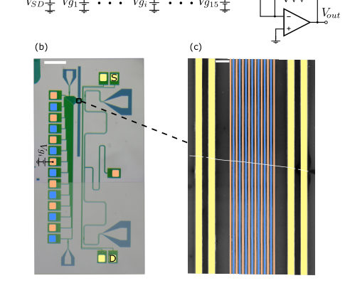 
FIG. 1. Carbon nanotube device a. Schematics of the device comprising a carbon nanotube with 15 gates controlled individually. The setup explored here consists of gates with alternating voltage between the ”orange” and ”blue” gates. The Pd contacts on the carbon nanotube are represented by the yellow source (S) and drain (D) pads. The current through the device is measured with a standard I-V converter amplifier. b. Large scale view of a typical device layout. The device is embedded into a mi- crowave cavity. The bar is 1 cm. c. Close up on a typical device with the 15 (Pd) gates and a suspended carbon nan- otube deposited over Pd contacts, in false colors. The bar is 1 µm.

📷 Fig 2

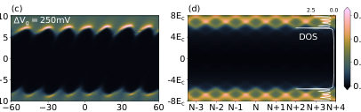 
FIG. 2. Observation of gate induced transport gap a. Differential conductance map as a function of Vg7 for the weak modulation case (∆Vg = −50 mV) showing the nearly metallic nanotube case. b. Modeling of the nearly metallic case using the single electron transistor transport theory cor- responding to the panel (a.), case of our experiment. c. Dif- ferential conductance map as a function of Vg7 for the strong modulation case (∆Vg = 250 mV) showing the gapped nan- otube case. d. Modeling of the gapped case using the sin- gle electron transistor transport theory corresponding to the panel (c.), case of our experiment. All the experimental con- ductance maps were realized at ⟨Vg⟩= 0.2 V. The...

📷 Fig 3

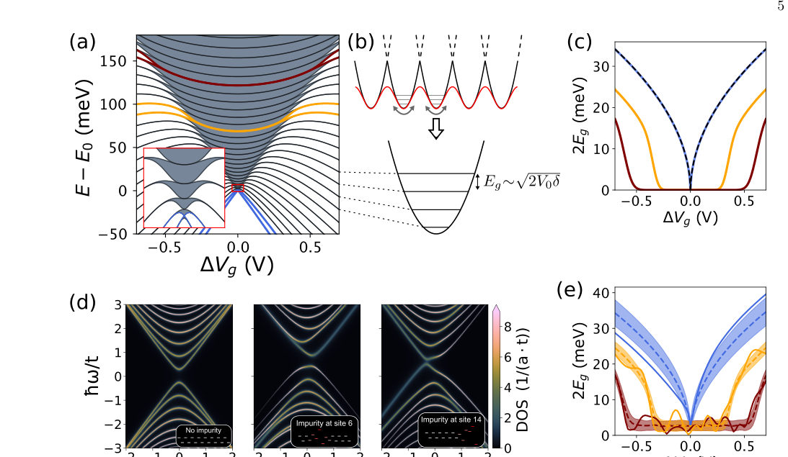 
FIG. 3. Metal-Insulator transition physics of the device. (a) Numerically calculated energy spectrum obtained by solving the Schr¨odinger equation with an infinite cosine potential of amplitude ∆Vg, assuming a parabolic dispersion relation with intrinsic semiconductor band gap E0. The inset provides a zoomed-in view of the band bottom. The grey shaded areas are the region of continuum of states. (b) Illustration of the cosine modulation potential (red curve), showing the quadratic approximation valid near each potential minimum. In the strong modulation limit, the bands become increasingly narrow and converge toward the discrete energy levels of a harmonic oscillator. (c) Energy gaps...

📷 Fig 4

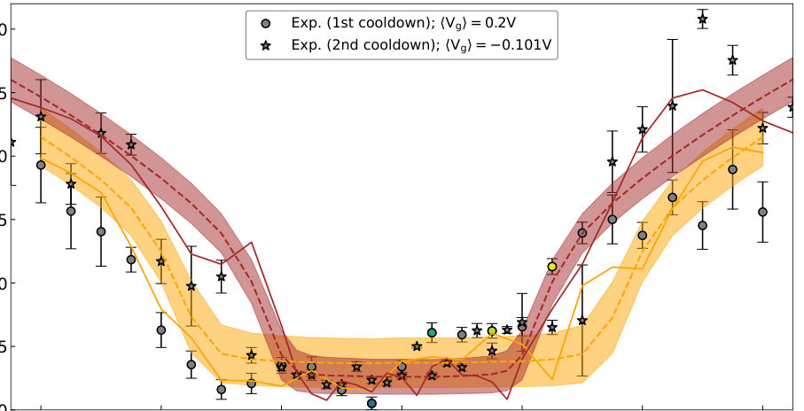 
FIG. 4. Electrical control of the gap a. Differential conductance as a function the bias voltage VSD highlighting the electrical control of the energy gap using the spatial modulation, for different values of ∆Vg. In these linear plots, one should bear in mind that there is also a contribution from the charging energy, hence the asymmetry with respect to zero bias in general. b. Dependance of the extracted energy gap as a function of the gate number for 3 different gap values. c. Dependence of the energy gap (measured as described in figure 2) on the gate spatial modulation. Circle and star symbols represent two distinct sets of measurements performed on the same sample during separate...

📷 Fig 5

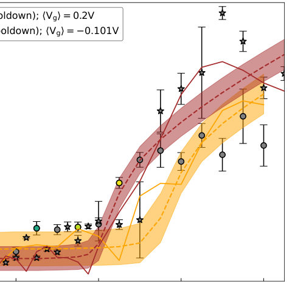 
Figure 6. In the main text, we start by the middle and in the supplementary, we start by the side of the chain. The corresponding potential landscape is shown above each panel. In the upper left panel, we show the effect of a single central gate. In this case, we see Coulomb

**Summary.** The researchers show how applying patterned gate voltages can electrically induce a large, tunable energy gap in a one-dimensional carbon nanotube, effectively controlling its transition between metallic and insulating states. By modeling this using Mathieu's equation, they confirm that the gap opening is a single-particle effect controllable by the modulation strength. This technique offers a powerful tool for engineering quantum materials at the nanoscale.

**Why it may be interesting.** This work provides an excellent platform for studying fundamental concepts like topological transitions and gap engineering in mesoscopic systems, which are highly relevant to realizing robust quantum components.

Detailed structure

**Main problem.** The work demonstrates electrical control over the metal-insulator transition (MIT) in a one-dimensional nanoscale device by inducing and tuning a large energy gap.

**Main result.** A sizable, homogeneous energy gap ($E_g \approx 5	ext{ meV}$) can be opened and tuned across two orders of magnitude simply by spatially modulating the local potential using external gates.

**Method.** The study combines transport measurements (differential conductance mapping) with theoretical modeling based on solving the Schrödinger equation for a cosine-modulated potential, leading to Mathieu's equation.

**Model / system.** The physical system is a suspended carbon nanotube patterned over multiple individually controlled gates. The underlying model treats the electronic structure as being governed by an effective periodic potential, analogous to the Su–Schrieffer–Heeger (SSH) chain or a cosine potential solved via Mathieu functions.

**Key observables.** Differential conductance ($G_{	ext{diff}}$) maps showing transitions between metallic and insulating states; the magnitude of the energy gap ($E_g$).

**Important parameters / regimes.** Gate modulation amplitude ($\Delta V_g$), temperature ($\approx 30	ext{ mK}$), and the periodicity/wavelength of the potential modulation.

**Assumptions / limitations.** The analysis often assumes a non-interacting electron picture, simplifying the full Poisson-Schrödinger problem to an effective single-particle Hamiltonian solvable by Mathieu functions or tight-binding diagonalization.

**Figures summary.** Figures show differential conductance maps comparing weak vs. strong gate modulation, illustrating the transition from conductive (metallic) to gapped (insulating) behavior; theoretical plots confirm gap opening based on the modulated potential strength.

**Paper structure.** The paper progresses by establishing the experimental setup and observing the MIT via transport measurements, then developing a theoretical framework using Mathieu's equation to model the gate-induced periodic potential, culminating in quantitative agreement between theory (including disorder) and experiment.

Abstract

Controlling the low energy spectrum at the nanoscale with an external physical parameter has become an important resource for quantum devices. The emergence of an energy gap is one such key feature, linked to the mitigation of decoherence needed for quantum information processing. Indeed, the detrimental effects of high-energy uncontrolled excitations can only be cured at some specific tuning points in general. Achieving an energy gap is a natural way to extend decoherence countermeasures over a finite region of parameter space. This would be particularly useful in view of the recent efforts to build superconducting topological chains in a top-down approach. In this work, we demonstrate a large energy gap by spatially modulating the local potential of a suspended carbon nanotube, exploiting an analogy with condensed matter systems. This gap is homogeneous on the nanotube and tunable by about two orders of magnitude, bringing the electronic system from an insulating state to a near-metallic state at low temperatures.

[↑ back to top](#top)

### [Skew scattering induced contribution to orbital Hall response](http://arxiv.org/abs/2607.24671v1)

**Authors:** Dayana Joy, Vivek Pandey, Rhonald Burgos Atencia, Pankaj Bhalla  
**Type:** theory · **Category:** other · **PDF:** <https://arxiv.org/pdf/2607.24671v1>  
**Analysis basis:** full PDF text, analyzed in chunks
**Topic relevance:** 🔥 `Keldysh / 2PI / non-Gaussian methods` **4/5** · `methods for driven-dissipative` **3/5** · `non-equilibrium dynamics` **3/5** · `non-equilibrium universality` **2/5** · `analog quantum simulation` **1/5** · `correlated / nonlocal dissipation` **1/5** · `driven-dissipative phase transition` **1/5**

📷 Fig 1

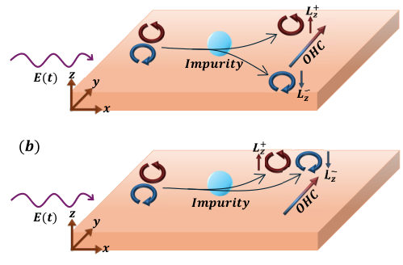 
FIG. 1. The diagram shows the orbital Hall current (OHC) generated due to the transverse motion of the orbital angular momentum (OAM) by the scattering process, such as skew scattering and side-jump mechanism, under the influence of an oscillating electric field along the x-direction. (a) OHC induced by Skew scattering mechanism: the impurity scatters the OAM (Lz) in asymmetrically forms, an accumulation of L+ z and L− z in opposite directions, eventually generates OHC. (b) OHC induced from the side-jump mechanism: The impurity creates a coordinate shift in the OAM on the same side and generates OHC in the system.

📷 Fig 2

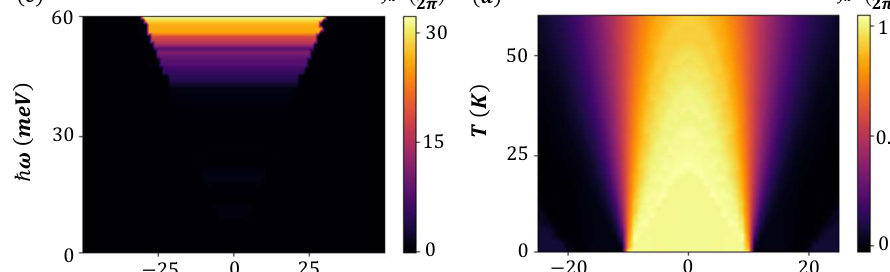 
FIG. 2. The figure illustrates the dependence of total OH conductivity (σext yx ) on Fermi energy (εf) for different parameters. Panels (a), (b), (c), and (d) show the variation of σext yx with disorder potential (U), Weyl node separation (b), applied energy (ℏω), and the temperature, respectively. In each panel, the remaining parameters are fixed at b = 0.04 ˚A −1, ℏω = 20 meV, U = 50 meV˚A 3 and T = 1K.

📷 Fig 3

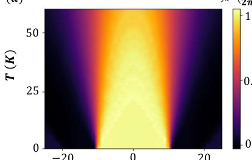 
Figure 2(b) illustrates the extrinsic OH conductivity for different Weyl node separation (2b). Here, we have taken b within the first Brillouin zone. The results indicate that the extrinsic part of the OH conductivity suppresses with the node separation, in contrast to the intrinsic contribution [63]. On further reducing the Weyl node separation, the system moves from the Weyl to the Dirac semimetal limit, i.e., with b approaches zero, and the two Weyl nodes merge into one. Here, the

📷 Fig 4

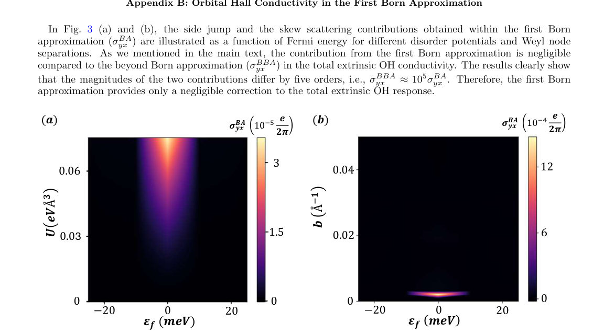 
FIG. 3. The plots depict the relation between total OH conductivity arising from the first Born approximation (σBA yx ) on Fermi energy (εf). (a) and (b) shows the variation of σBA yx with disorder potential (U) and Weyl node separation (b) with an applied energy (ℏω = 20meV) at the temperature T = 1K. The remaining parameters in each panel are fixed at b = 0.04 ˚A −1, and U = 50 meV˚A 3.

**Summary.** This theoretical study calculates how disorder influences the orbital Hall conductivity in Weyl semimetals. By analyzing side-jump and skew scattering contributions using a quantum kinetic approach, the authors show that higher-order disorder terms dominate the effect. The results highlight that this topological transport property can be actively tuned by controlling material parameters like disorder strength and energy.

**Why it may be interesting.** Although focused on condensed matter transport, the use of non-equilibrium quantum kinetic equations and perturbation theory to analyze response functions under external driving fields shares mathematical formalism with open quantum systems dynamics.

Detailed structure

**Main problem.** The study investigates the disorder-induced contribution to the orbital Hall conductivity ($\sigma_{OH}$) in three-dimensional Weyl semimetals that possess broken time-reversal symmetry.

**Main result.** Skew scattering dominates over side-jump mechanisms, and the extrinsic $\sigma_{OH}$ can be significantly enhanced by tuning the disorder potential strength, applied energy, and Weyl node separation.

**Method.** The analysis employs the quantum kinetic equation framework, solving for off-diagonal components of the density matrix using perturbation theory up to third order in the disorder potential.

**Model / system.** The system is a 3D Weyl semimetal described by an effective k.p Hamiltonian, subjected to both a time-dependent external electric field and a random disorder potential U.

**Key observables.** Orbital Hall conductivity ($\sigma_{OH}$), transverse flow of orbital angular momentum (OAM).

**Important parameters / regimes.** Disorder potential strength ($U$), applied energy ($\hbar\omega$), Weyl node separation ($b$).

**Assumptions / limitations.** The analysis is performed for an AC-driven field ($\omega$) and involves extending the scattering term to beyond the first Born approximation to capture disorder dependence.

**Figures summary.** Figure 1 illustrates OHC generation via skew scattering (asymmetric scattering of OAM) versus the side-jump mechanism. Figure 2 shows $\sigma_{OH}$ vs $U$, $b$, and $\hbar\omega$, demonstrating linear dependence on $U$ and suppression as $b$ decreases.

**Paper structure.** The paper develops the theoretical framework using quantum kinetic theory, analyzes the contributions from side-jump and skew scattering mechanisms in the presence of disorder, derives the leading order disorder dependence ($U^3$), and concludes with quantitative results showing tunability of $\sigma_{OH}$.

Abstract

Our study provides the disorder-induced contribution to the orbital Hall conductivity in three-dimensional Weyl semimetals with broken time-reversal symmetry. Using the quantum kinetic approach, we analyse the impact of side-jump and skew scattering contributions to the system. The dependence of the orbital Hall conductivity on both disorder potential and the Fermi energy is explicitly demonstrated. Furthermore, we demonstrate that the higher-order disorder contribution, especially from the third power of disorder potential, dominates the orbital Hall conductivity under an oscillating electric field in a time-reversal symmetry broken Weyl semimetal, suppressing other scattering mechanisms, including the side jump contributions. We can enhance the extrinsic orbital Hall conductivity by tuning the strength of the disorder potential, applied energy, and choosing the system with appropriate Weyl node separation. Finally, our results are supported by numerical estimations and highlight potential experimental relevance for advancing orbitronics device technologies.

[↑ back to top](#top)

### [Radiative Spin Caloritronics](http://arxiv.org/abs/2607.22845v1)

**Authors:** Philippe Ben-Abdallah  
**Type:** theory · **Category:** statistical mechanics · **PDF:** <https://arxiv.org/pdf/2607.22845v1>  
**Analysis basis:** full PDF text, analyzed in chunks
**Topic relevance:** `exotic spin models in light-matter` **3/5** · `spintronics-quantum-optics interface` **3/5** · `analog quantum simulation` **2/5** · `non-equilibrium dynamics` **2/5** · `non-equilibrium universality` **2/5** · `Keldysh / 2PI / non-Gaussian methods` **1/5** · `correlated / nonlocal dissipation` **1/5** · `driven-dissipative phase transition` **1/5** · `methods for driven-dissipative` **1/5**

📷 Fig 1

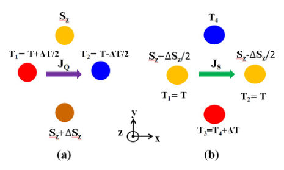 
FIG. 1. Schematic of the: (a) radiative Spin Thermal Hall Effect where a temperature gradient ∆T and therfefore a heat flux JQ through a non-reciprocal network of C4 symmetry made with magneto-optical nanoparticles under the action of an external magnetic field Hext in the the z direction induces a variation ∆Sz of spin angular momentum in the transversal direction of primary gradient ; (b) Inverse Spin Thermal Hall Effect where a variation ∆Sz in one direction (due to a spatial variation of ecternal field), and therefore a spin current JS in the same direction, gives rise to a temperture gradient ∆T in the transverse direction even without temperature gradient (i.e. T1 = T2 = T).

📷 Fig 2

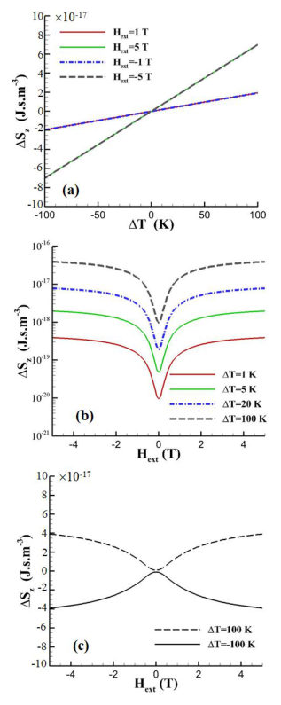 
FIG. 2. Thermal spin accumulation in the four-particle network of InSb nanoparticles as a function of (a) the longitudinal temperature difference ∆T for different external magnetic fields applied along the +z direction; (b) the external magnetic field magnitude Hext for different temperature differences; and (c) the external magnetic field magnitude Hext for temperature differences of opposite sign. The optical response of the InSb nanoparticles is described by the gyrotropic Drude–Lorentz model [23].

📷 Fig 3

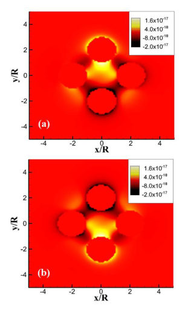 
FIG. 3. Spatial distribution of the normal component Sz of spin angular momentum density in the plane z = 0 around the same C4 network of InSb particles when (a) ∆T = 100K and (b) ∆T = −100K under the action of an external magnetic field applied along +z of magnitude of Hext = 1T.

📷 Fig 4

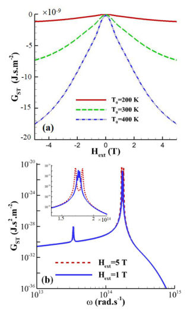 
FIG. 4. (a) Thermal spin accumulation coefficient GST as a function of the external magnetic field Hext applied along the z axis for different equilibrium temperatures T0. (b) Spectral thermal spin accumulation coefficient GST (ω) at T0 = 300 K for Hext = 1 T and Hext = 5 T. The inset shows a magnified view of the spectral region where the hybridization of resonant modes occurs.

**Summary.** The paper develops the theory of photon spin caloritronics by predicting the Spin Thermal Hall Effect (STHE) in magneto-optical nanostructures. It proves that STHE and its inverse counterpart form an Onsager-Casimir pair, establishing a complete thermodynamic framework for coupling heat flow to spin angular momentum transport. This work lays conceptual foundations for designing nonreciprocal photonic thermal devices.

**Why it may be interesting.** This work bridges concepts from non-equilibrium thermodynamics (heat/spin coupling) with quantum optics and condensed matter transport, providing a theoretical framework for novel energy conversion devices based on spin polarization in photonic systems.

Detailed structure

**Main problem.** To establish a complete thermodynamic framework for photon spin caloritronics by investigating the relationship between the Spin Thermal Hall Effect (STHE) and its reciprocal counterpart, the Inverse Spin Thermal Hall Effect (ISTHE).

**Main result.** The STHE and ISTHE form an Onsager-Casimir reciprocal pair, establishing a unified thermodynamic framework for photon spin caloritronics. The analysis yields a thermal-spin figure of merit quantifying conversion efficiency.

**Method.** Linear response theory is employed alongside fluctuational electrodynamics to derive reciprocity relations between coupled heat and spin fluxes driven by temperature gradients.

**Model / system.** The study models nonreciprocal magneto-optical many-body systems, specifically using four identical InSb nanoparticles arranged in a square lattice immersed in a thermal bath.

**Key observables.** Spin contrast ($\Delta S_z$), the thermal spin Hall susceptibility ($\chi_{	ext{STHE}}$), and the dimensionless figure of merit ($Z_{TS}$).

**Important parameters / regimes.** External magnetic field strength ($H_{	ext{ext}}$), temperature bias ($\Delta T$), and nanoparticle size/arrangement.

**Assumptions / limitations.** The analysis relies on linear-response theory and the application of Onsager–Casimir reciprocity relations derived from microscopic reversibility.

**Figures summary.** Figures illustrate the schematic relationship between heat gradients and spin accumulation (STHE) versus spin gradients and heat flux (ISTHE). Plots show $\Delta S_z$ dependence on $\Delta T$ and $H_{	ext{ext}}$, and spectral decomposition highlighting resonance features.

**Paper structure.** The paper develops the theory by defining coupled fluxes, applying linear response theory to derive transport coefficients ($G_{ij}$), establishing the Onsager-Casimir symmetry between STHE and ISTHE, and finally quantifying efficiency using a thermal-spin figure of merit.

Abstract

We predict the spin thermal Hall effect in nonreciprocal magneto-optical many-body systems, in which a longitudinal radiative heat current generates a transverse accumulation of the spin angular momentum carried by thermal photons. We show that this effect and the inverse spin thermal Hall effect constitute an Onsager-Casimir reciprocal pair, thereby establishing heat and photon spin as coupled transport channels in nonreciprocal photonic systems. The second law of thermodynamics imposes fundamental bounds on the spin-heat coupling, leading to a thermal-spin figure of merit that quantifies the efficiency of radiative spin-heat conversion. Our results establish a complete thermodynamic framework for photon spin caloritronics and lay the conceptual foundations for spin-controlled thermal radiation and nonreciprocal photonic thermal devices.

[↑ back to top](#top)

### [Spectral Topology and Non-Bloch Band Theory for Domain-Wall Systems](http://arxiv.org/abs/2607.22976v1)

**Authors:** Mingtao Xu, Rui Wang, Tian-Shu Deng, Wei Yi  
**Type:** theory · **Category:** other · **PDF:** <https://arxiv.org/pdf/2607.22976v1>  
**Analysis basis:** full PDF text, analyzed in chunks
**Topic relevance:** `driven-dissipative phase transition` **3/5** · `methods for driven-dissipative` **3/5** · `analog quantum simulation` **2/5** · `non-equilibrium dynamics` **2/5** · `non-equilibrium universality` **2/5** · `Frenkel-Kontorova` **1/5** · `Keldysh / 2PI / non-Gaussian methods` **1/5** · `Kondo & dissipative impurity` **1/5** · `correlated / nonlocal dissipation` **1/5**

📷 Fig 1

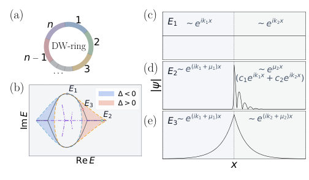 
FIG. 1. Overview of the DW non-Bloch theory. (a) Schematic of an n-DW ring. (b) Schematic eigenspectrum of a 2-domain ring. The dashed curves denote the PBC spectra of the two constituent domains, the solid black curves denote the DW- ring spectrum, and the dash-dotted purple curves denote the spectrum obtained from the individual-domain (a)GBZ condi- tions. The color-shaded regions (bounded by dashed curves) indicate different signs of the winding-number mismatch ∆(E), whereas ∆(E) = 0 in other regions. (c)(d)(e) Typical spatial wave-function profiles for (c) extended state without NHSE, (d) standing-wave-like skin modes, and (e) traveling- wave-like skin modes, with their eigenenergies...

📷 Fig 2

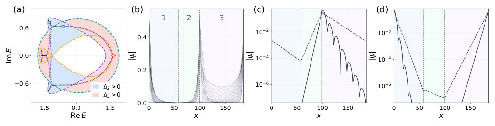 
FIG. 2. Topological origin of NHSE in a 3-DW model. (a) PBC spectra of the three constituent domains and eigenenergies of the full DW-ring. The green, orange, and purple dashed curves denote the PBC spectra of domains 1, 2, and 3, respectively, while the black dots denote the DW-ring eigenenergies. The shaded regions indicate ∆2 &gt; 0 (blue) and ∆3 &gt; 0 (red), for the interfaces 2|3 and 3|1, respectively, while we have ∆2 = ∆3 = 0 in regions not shaded. The blue markers correspond to the parameters in (c), whereas the red markers correspond to those in (d). (b) Spatial wave-function profiles for all eigenstates. (c)(d) Spatial profiles of representative right eigenstates localized near the 2|3...

📷 Fig 3

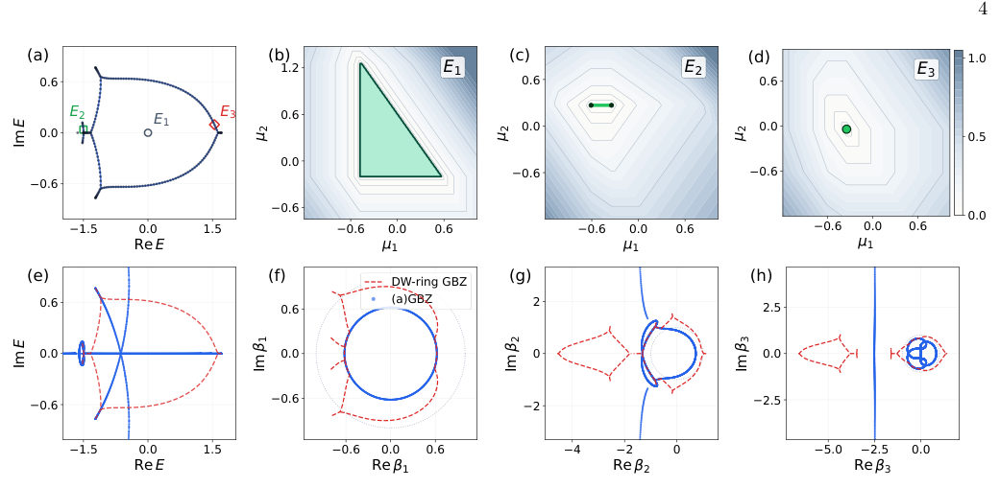 
FIG. 3. Ronkin function and domain-resolved GBZs for the 3-DW ring. (a) DW-ring eigenspectrum obtained from direct diagonalization (dotted) and the Ronkin-function calculation (solid). (b)(c)(d) Constrained Ronkin functions at E1, E2, and E3, as marked in (a), respectively. Typically, a two-dimensional flat region of the Ronkin function emerges, as in (b), indicating that E1 lies in a point gap of the DW-ring. The collapse of the flat region, illustrated in (c) and (d), places the corresponding E2 and E3 on the DW eigenspectrum. Here, (c) corresponds to a standing-wave-like skin mode and (d) corresponds to a traveling- wave-like skin mode. (e) Comparison between the DW-ring spectrum (red)...

📷 Fig 4

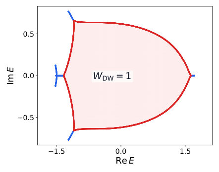 
FIG. 4. Spectral winding and eigenspectrum of a 3-DW ring. The shaded region features nonzero flux spectral wind- ing WDW = 1. The red curves represent eigenenergies of the traveling-wave-like modes, and the blue curves are those of the standing-wave-like modes. The model and parameters are the same as those in Fig. 2.

**Summary.** This paper develops a topological theory for non-Hermitian models arranged in a ring of domains (DW ring). It shows that the system supports two distinct types of skin modes—standing and traveling—whose existence is dictated by spectral winding number mismatches between adjacent domains. The methodology extends established band theories using constrained Ronkin functions to map out the generalized Brillouin zone for these complex boundary conditions.

**Why it may be interesting.** This work provides a rigorous topological framework for understanding localization in complex, non-Hermitian structures like domain walls, which is highly relevant to engineered quantum systems where boundary effects are crucial.

Detailed structure

**Main problem.** The study investigates the spectral topology and non-Bloch band theory for one-dimensional non-Hermitian models arranged in a domain-wall (DW) ring configuration.

**Main result.** The system supports two distinct types of skin modes—standing-wave-like and traveling-wave-like—whose existence and properties are governed by different topological constraints derived from spectral winding numbers. The unique traveling-wave modes carry a finite flux spectral winding number, indicating boundary sensitivity.

**Method.** The authors extend the Ronkin-function formalism to the DW ring geometry and utilize spectral winding numbers ($\Delta_\alpha(E)$) to characterize topological protection and determine the Generalized Brillouin Zone (GBZ).

**Model / system.** The model is a general one-dimensional non-Hermitian system composed of $n$ domains connected in a ring geometry ($n$-DW ring), where the DW boundary generalizes both OBC and PBC.

**Key observables.** Spectral winding numbers ($\Delta_\alpha(E)$), Generalized Brillouin Zone (GBZ) conditions, standing-wave-like skin modes, traveling-wave-like skin modes, and Flux Spectral Winding Number ($	ext{WDW}$).

**Important parameters / regimes.** The number of domains ($n$), the energy $E$, and the complex momentum parameters $\mu_\alpha$.

**Assumptions / limitations.** The analysis relies on extending established formalisms (like Ronkin functions) to the DW ring structure, and comparisons between open chain and closed ring geometries are made in the thermodynamic limit.

**Figures summary.** Figures illustrate schematic diagrams comparing mode profiles for different types of skin modes; one figure shows the topological origin using a 3-DW model by mapping winding number mismatches ($\Delta_\alpha > 0$); another compares DOS calculated via Ronkin minimum versus real-space diagonalization for the DW ring.

**Paper structure.** The paper develops theory by first defining spectral topology using relative winding numbers, then extends the Ronkin function formalism to derive GBZ conditions distinguishing between standing-wave (Case I) and traveling-wave (Case II) modes. It concludes by comparing the results for the closed ring versus open chain geometries.

Abstract

We study the spectral topology of one-dimensional non-Hermitian models in a domain-wall configuration, where different domains are arranged in a ring geometry. While eigenstates can localize near an interface under the non-Hermitian skin effect, we show that the localization of an eigenstate originates from the difference in the spectral winding numbers, with respect to the corresponding eigenenergy, between the two adjacent domains. We then obtain the conditions for the generalized Brillouin zone (GBZ) in the complex momentum space, by extending the Ronkin-function formalism to the domain-wall configuration. In addition to the conventional skin modes that correspond to standing waves on individual domains under the open boundary condition, a unique type of traveling-wave-like skin modes emerges, whose construction involves all domains. Besides their difference in the spatial profiles, these two types of modes obey distinct GBZ conditions, making them differentiable on the GBZ. Interestingly, the traveling-wave-like modes further carry a finite flux spectral winding number, indicating their boundary sensitivity.

[↑ back to top](#top)

### [Current- and field-driven domain wall dynamics and chirality switching in a planar helimagnet](http://arxiv.org/abs/2607.23252v1)

**Authors:** Roman Teslia, Oleksiy Kolezhuk  
**Type:** theory · **Category:** other · **PDF:** <https://arxiv.org/pdf/2607.23252v1>  
**Analysis basis:** full PDF text, analyzed in chunks
**Topic relevance:** `non-equilibrium dynamics` **3/5** · `spintronics-quantum-optics interface` **3/5** · `driven-dissipative phase transition` **2/5** · `non-equilibrium universality` **2/5** · `Frenkel-Kontorova` **1/5** · `Keldysh / 2PI / non-Gaussian methods` **1/5** · `exotic spin models in light-matter` **1/5** · `methods for driven-dissipative` **1/5**

📷 Fig 1

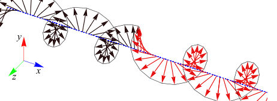 
FIG. 1. Schematic depiction of an in-plane chiral (Hubert- type) domain wall connecting left-handed (on the left) and right-handed (on the right) helical domains.

📷 Fig 2

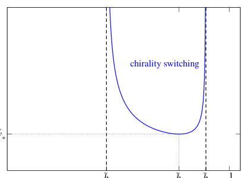 
FIG. 2. Schematic view of the region of parameters in the current-field plane where the chirality switching occurs via the domain nucleation mechanism, as given by the condition (46).

📷 Fig 3

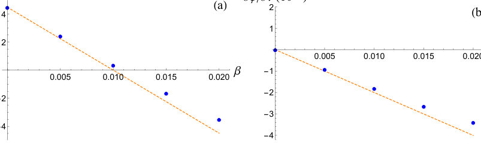 
FIG. 3. Results of spin-lattice simulations (circles) compared to analytical predictions from continuum theory (lines) for the effects of the non-adiabatic spin transfer torque. The current is set to j(c) = 1011 A/m2 (˜v ≃2.3 · 10−3), the Gilbert damping is chosen as αG = 0.01, and the field ˜h = 0. (a) Dependence of the out-of-plane magnetization component nx, taken at the center of the system, on the non-adiabatic spin transfer torque parameter β. The line corresponds to (23) with ˜q given by (24). (b) Dependence of the angular velocity of the central spin on β, the line corresponds to ω = −˜q ˜V with ˜V defined in (22).

📷 Fig 4

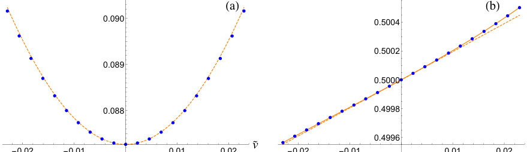 
FIG. 4. Results of spin-lattice simulations (circles) compared to analytical predictions from continuum theory (lines) for the effects of adiabatic spin-transfer torque. The non-adiabatic spin transfer torque component is switched off, β = 0. (a) Depen- dence of the renormalized helical pitch ˜q on the applied current ˜v. In the absence of magnetic field ˜h = 0 the renormalization is insensitive to the sign of the current. The dashed line corresponds to (24). (b) Dependence of the out-of-plane magnetization cos ϑ on the applied current ˜v, for the fixed value of the magnetic field ˜h = 0.5. The dashed line corresponds to (43) with the initial pitch φ′ = ˜θ, and the solid curve accounts for...

📷 Fig 5

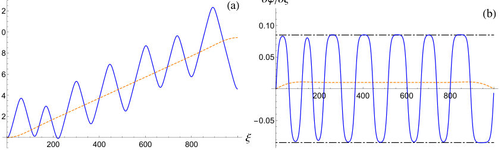 
FIG. 5. Results of spin-lattice simulations of the system with Nx = 1000 spins with zero magnetic field ˜h = 0. A uniform right-handed helix with ˜θ = 0.01 has been chosen as the initial state, and the current j(c) = 3.7 · 1012 A/m2 (corresponding to ˜v ≈0.085 in dimensionless units) has been applied over the time interval ∆t = 100 ns. For the sake of clarity, the results are shown as continuous curves interpolating between individual lattice sites (corresponding to integer values of the dimensionless coordinate ξ = x/a). (a) The resulting evolution of φ(ξ). The dashed line corresponds to the initial single-domain state, and the solid curve shows the final state consisting of a sequence of...

**Summary.** The paper theoretically models how electric currents and magnetic fields drive domain wall dynamics and chirality switching in planar helimagnets. Using continuum theory, it shows that spin-transfer torques break chiral symmetry, enabling the manipulation of helical states. The findings provide quantitative predictions for pitch renormalization and domain wall velocities.

**Why it may be interesting.** This work provides a detailed theoretical framework connecting macroscopic transport phenomena (current/field) to microscopic magnetic order parameters (chirality), which is highly relevant for understanding spintronics in complex magnetic materials.

Detailed structure

**Main problem.** The study investigates how electric current and external magnetic fields influence the dynamics of chirality switching in a planar helimagnet.

**Main result.** The combined action of field and current breaks chiral symmetry, allowing for domain wall motion driven by non-adiabatic spin-transfer torque. However, achieving chirality switching via nucleation is shown to be difficult or impossible under certain theoretical constraints.

**Method.** The authors employ continuum theory derived near the Lifshitz point, analyzing an effective Lagrangian incorporating spin-transfer torques and external fields.

**Model / system.** The system is a planar helimagnet with strong easy-plane anisotropy, modeled using a quasi-one-dimensional description parameterized by spherical angles. The dynamics are governed by an effective Lagrangian derived from the underlying Hamiltonian.

**Key observables.** Domain wall velocity (V_DW), renormalized helical pitch ($	ilde{q}$ or $\psi_R$), and the degree of out-of-plane magnetization ($\cos \vartheta$).

**Important parameters / regimes.** The ratio of anisotropy energy to exchange coupling ($K/J$), current density ($	ilde{v}$), and magnetic field strength ($	ilde{h}$).

**Assumptions / limitations.** Approximations include neglecting higher-order gradient terms in the continuum theory, assuming $	ilde{	heta} \ll 1$, and analyzing the system near the Lifshitz point.

**Figures summary.** Figures compare theoretical predictions to spin-lattice simulations showing pitch renormalization ($	ilde{q}$ vs. $	ilde{v}$) and domain wall velocity scaling with system size ($N_x$).

**Paper structure.** The paper progresses from establishing the continuum theory for the helimagnet, deriving the effective Lagrangian including torque terms, analyzing the effects of current (dissipative/adiabatic) on pitch renormalization, and finally investigating the conditions required for chirality switching via domain wall dynamics.

Abstract

We study the effect of electric current and magnetic field on the dynamics of chirality in a helimagnet with a strong easy-plane anisotropy. Using a continuum theory, derived for a quasi-one-dimensional frustrated ferromagnet close to the Lifshitz point, we show that a domain wall connecting domains with opposite chiralities can be driven by the current via the dissipative (non-adiabatic) component of the spin-transfer torque. Further, it is demonstrated that the adiabatic part of the torque in the presence of a magnetic field breaks the symmetry of the effective magnetic potential energy with respect to the chirality. We show that the leading symmetry-breaking term arises in the third order in the magnetization gradient, and derive the conditions of the chirality switching. Our conclusions are supported by numerical spin-lattice simulations.

[↑ back to top](#top)

### [Spin-Hall devices: spin relaxation spatially separates current injection from Joule dissipation](http://arxiv.org/abs/2607.23589v1)

**Authors:** Yanbo Qiao, Sariah Al Saati, Jean-Eric Wegrowe  
**Type:** theory · **Category:** statistical mechanics · **PDF:** <https://arxiv.org/pdf/2607.23589v1>  
**Analysis basis:** full PDF text, analyzed in chunks
**Topic relevance:** `methods for driven-dissipative` **3/5** · `non-equilibrium dynamics` **3/5** · `correlated / nonlocal dissipation` **2/5** · `driven-dissipative phase transition` **2/5** · `non-equilibrium universality` **2/5** · `Keldysh / 2PI / non-Gaussian methods` **1/5** · `spintronics-quantum-optics interface` **1/5**

📷 Fig 1

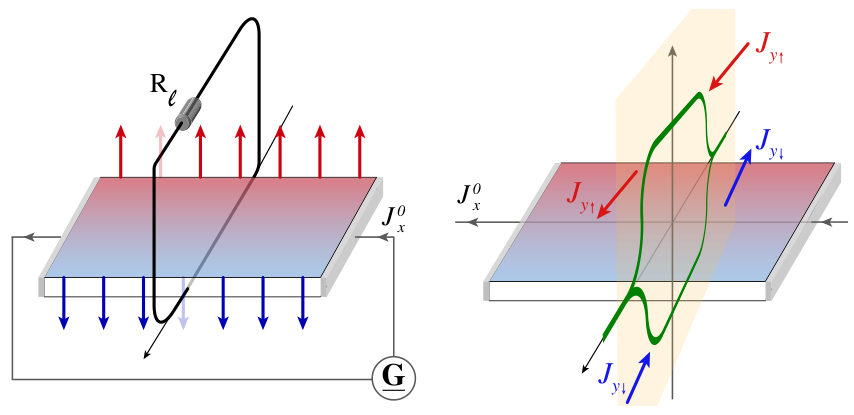 
FIG. 1: Schematic representation of the spin-Hall bar connected to a load resistance Rℓ. Left: An

📷 Fig 2

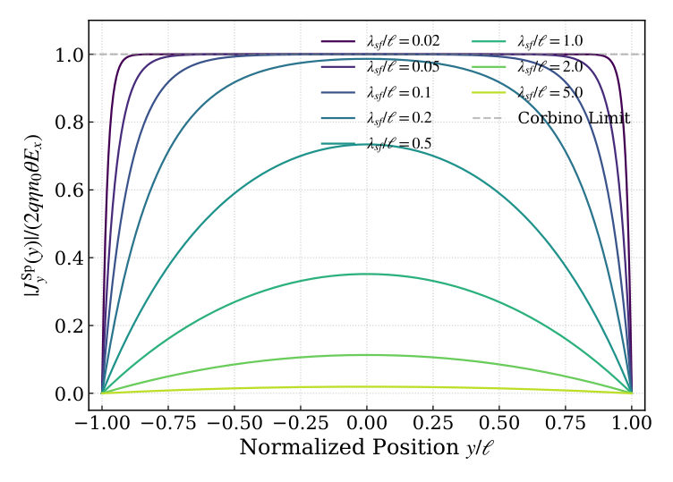 
FIG. 2: Normalized spatial profiles of the transverse spin current amplitude. The current is scaled

📷 Fig 3

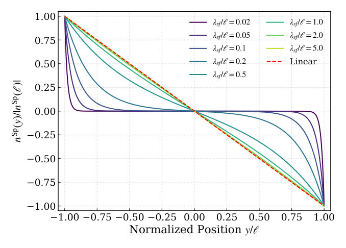 
FIG. 3: Normalized spatial profiles of the spin accumulation nSp(y). Each profile is scaled by

📷 Fig 4

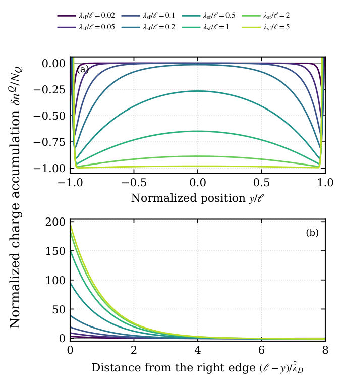 
FIG. 4: Corrected charge-accumulation profiles normalized by NQ = ϵθ2E2 x/kT, for ˜λD/ℓ= 0.005

📷 Fig 5

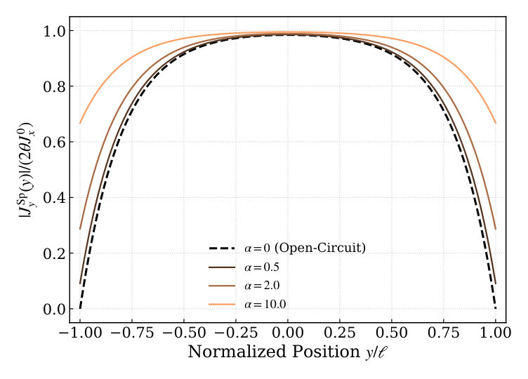 
FIG. 5: Spatial distribution of the transverse spin current JSp y (y) normalized by 2θJ0 x. Parameters

**Summary.** This theoretical work analyzes current flow in a spin-Hall device using variational methods based on minimum power dissipation. The key finding is that strong spin relaxation fundamentally alters the system's stationary state, causing the Joule heating in an external load to vanish under certain conditions. This demonstrates a spatial decoupling between pure spin current injection and energy dissipation.

**Why it may be interesting.** While focused on condensed matter transport, the use of minimum dissipation principles and non-equilibrium thermodynamics connects to general frameworks used in studying energy flow and steady states in complex quantum systems.

Detailed structure

**Main problem.** The study investigates how spin relaxation spatially separates current injection from Joule dissipation when analyzing the stationary state of a spin-Hall bar connected to an external load circuit.

**Main result.** It is shown that under conditions of strong spin relaxation, the Joule dissipation in the load resistance vanishes, indicating a non-trivial separation between injected pure spin current and energy dissipation.

**Method.** The analysis employs a variational approach based on minimizing power dissipation (or entropy production) within a two-spin-channel model framework.

**Model / system.** The system is a homogeneous, non-magnetic conducting layer (spin-Hall bar) modeled with two spin channels ($\uparrow$ and $\downarrow$), driven by an external electric field and connected to a load resistance $R_\ell$.

**Key observables.** Longitudinal and transverse current densities ($J_{x\sigma}, J_{y\sigma}$), charge/spin accumulations, and the total Joule dissipation power in the load.

**Important parameters / regimes.** The dimensionless control parameter $\alpha = R/R_\ell$ (load resistance vs. internal resistance) and the spin-relaxation length ($\lambda_{sf}$) relative to the device dimensions ($\ell$).

**Assumptions / limitations.** Assumptions include longitudinal invariance ($\partial_x=0$), small Hall angle ($	heta \ll 1$), and linear response for spin-flip processes.

**Figures summary.** Figures illustrate normalized spatial profiles of transverse spin current, spin accumulation, and the load power ratio ($P_{	ext{load}}/P_0$) as a function of $\alpha$ and $\lambda_{sf}/\ell$.

**Paper structure.** The paper progresses by setting up the variational principle for the stationary state, deriving coupled differential equations for current profiles, analyzing limiting cases (e.g., open/short circuit), and finally quantifying the load power dependence on spin relaxation strength.

Abstract

The stationary state of a spin Hall bar connected to an external load circuit is investigated through a variational approach based on the principle of minimum power dissipation generalized to the two-spin-channel model. The self-consistent distributions of longitudinal and transverse current densities, alongside the corresponding spin and charge accumulations and dissipation power in the resistance, are derived. Surprisingly, it is shown that the Joule dissipation vanishes when the load resistance is placed at a sufficiently large distance compared with the spin-relaxation length. Such a highly non-trivial global stationary state appears as the most striking characteristic of the injection of pure spin current compared with more usual current injection.

[↑ back to top](#top)

### [Anomalous Localization in Magnetically Doped Two-Dimensional Topological Insulators](http://arxiv.org/abs/2607.24373v1)

**Authors:** Felippe Amorim, Washington F. dos Santos, Mauro S. Ferreira, Alexandre Reily Rocha, Caio Lewenkopf  
**Type:** theory · **Category:** disordered systems and neural networks · **PDF:** <https://arxiv.org/pdf/2607.24373v1>  
**Analysis basis:** full PDF text, analyzed in chunks
**Topic relevance:** `exotic spin models in light-matter` **3/5** · `spintronics-quantum-optics interface` **3/5** · `Keldysh / 2PI / non-Gaussian methods` **1/5** · `Kondo & dissipative impurity` **1/5** · `analog quantum simulation` **1/5** · `driven-dissipative phase transition` **1/5** · `methods for driven-dissipative` **1/5** · `non-equilibrium dynamics` **1/5** · `non-equilibrium universality` **1/5**

📷 Fig 1

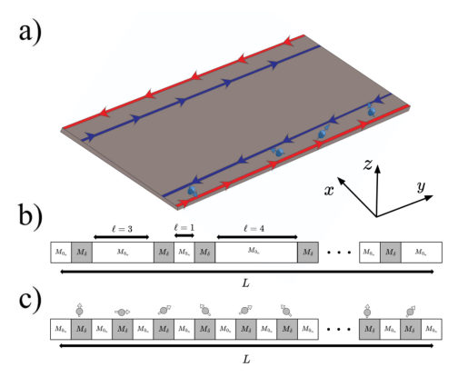 
FIG. 1. Structure of the quantum wire: a) Shows the edge currents of a topological insulator. Then, we have the lines that can be regarded as the wire, consisting of alternating seg- ments: free propagation regions M0n and scattering regions Mδ, which represent localized impurities. b) Illustrates a gen- eral configuration in which the total length L can take arbi- trary values, and impurities ( Mδ) are spatially distributed at random positions. c) Shows a specific realization with spacing ℓ= 1.

📷 Fig 2

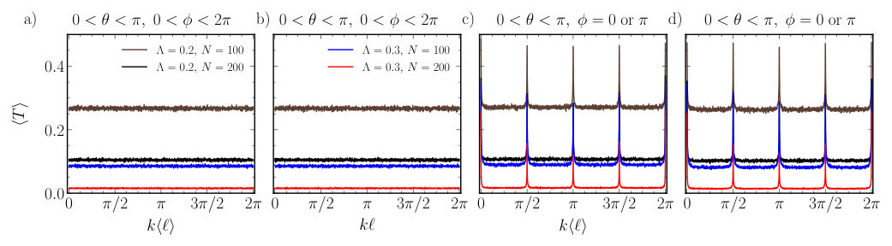 
FIG. 2. Ensemble-averaged transmission ⟨T⟩as a function of the dimensionless momentum kℓunder different spatial and magnetic disorder configurations. (a) Full disorder: independent fluctuations are present in both the polar θn and azimuthal ϕn angles, as well as the inter-impurity distance ℓ, with a mean spacing ⟨ℓ⟩= 1. (b) Full angular disorder with uniform spatial spacing: θn and ϕn are random, while ℓn = 1 for all sites. (c) Polar disorder with constrained azimuthal and spatial parameters: θn is random, while ϕn = 0 and ℓn = 1 are kept fixed. (d) Fully constrained angular and spatial configuration: θn is random, while ϕn ∈{0, π} and ℓn = 1. Remarkably, ⟨T⟩is statistically equivalent...

📷 Fig 3

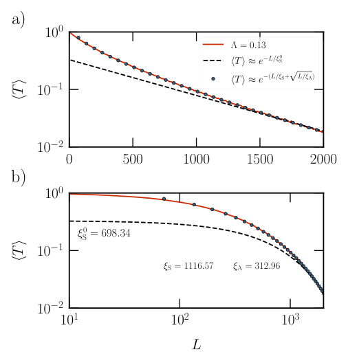 
FIG. 4. Average transmission ⟨T⟩as a function of system length L for coupling parameter Λ = 0.13. (a) Transmis- sion plotted on a linear scale. (b) Transmission plotted on a logarithmic scale. The dots represent numerical simula- tion data. The black dashed line shows a fit assuming con- ventional Anderson localization, ⟨T⟩∝exp(−L/ξ0 S), which clearly fails to capture the full spatial decay. The solid red curve represents a fit incorporating the dual scaling ansatz of Eq. (26), demonstrating excellent agreement across both short- and long-lengths regimes.

📷 Fig 4

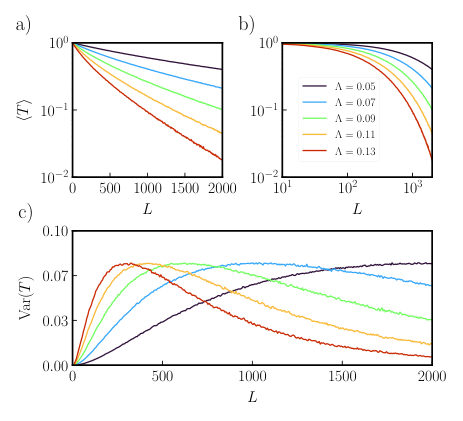 
FIG. 3. Ensemble-averaged transmission ⟨T⟩and transmis- sion variance as a function of system length L for various coupling parameters Λ. (a) Average transmission on a linear scale. (b) Average transmission on a logarithmic scale. (c) Variance of the transmission, Var(T), as a function of L. Re- sults in all panels are presented across multiple values of Λ.

📷 Fig 5

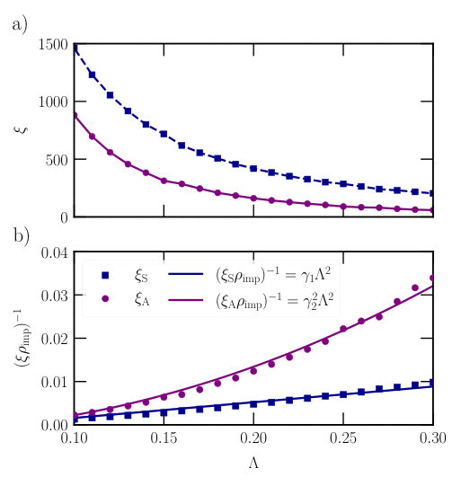 
FIG. 6. Scaling coefficients from extracted localization lengths as a function of the coupling parameter Λ. (a) Lo- calization lengths ξS and ξA versus Λ. (b) Inverse normalized localization lengths (ξSρimp)−1 and (ξAρimp)−1 as a function of Λ, confirming the quadratic dependence ∝Λ2 predicted by Eq. (25).

**Summary.** This work develops an analytical framework to study electron transport in 2D topological insulators contaminated with dense magnetic impurities. By using the transfer-matrix method, the authors predict and characterize a novel anomalous localization regime where conductance decays sub-exponentially ($\propto e^{-\sqrt{L}}$). This theoretical prediction is validated by showing excellent agreement with experimental measurements on Mn-doped HgTe quantum wells.

**Why it may be interesting.** The concept of anomalous localization, where decay scales as $\sqrt{L}$ rather than exponentially ($e^{-L/\xi}$), is a non-trivial result in disordered systems that has implications for understanding transport in various quantum materials, including those relevant to AMO physics (e.g., superconducting junctions or engineered disorder potentials).

Detailed structure

**Main problem.** The core problem is understanding how transport properties behave in two-dimensional topological insulators (2DTIs) when subjected to dense, disordered ensembles of magnetic impurities.

**Main result.** The authors predict an anomalous localization regime characterized by a sub-exponential decay of conductance scaling as $\ln G \propto -\sqrt{L}$, which is confirmed by comparison with experimental data on Mn-doped HgTe quantum wells.

**Method.** The analysis employs the transfer-matrix formalism applied to the effective 1D Hamiltonian describing edge states, allowing for the calculation of ensemble-averaged transmission coefficients.

**Model / system.** The system is a 2DTI hosting spin-polarized helical edge states. The disorder is introduced via magnetic impurities modeled as scattering potentials along the edge, analyzed using transfer matrices derived from the BHZ model context.

**Key observables.** Ensemble-averaged conductance ($\langle G 
angle$) and transmission coefficient ($\langle T 
angle$), showing decay scaling with system length $L$ or number of scatterers $N$.

**Important parameters / regimes.** Effective impurity concentration, exchange coupling strength ($\Lambda$), and system length ($L$). The key scaling is $\ln G \propto -\sqrt{L}$.

**Assumptions / limitations.** The analysis assumes phase-coherent transport at low temperatures and utilizes approximations like the Central Limit Theorem for averaging disorder effects.

**Figures summary.** Figures illustrate edge current configurations, the scattering chain structure, and plots showing $\langle T 
angle$ decay curves demonstrating non-exponential scaling compared to conventional Anderson localization predictions.

**Paper structure.** The paper develops from analyzing single-impurity scattering using transfer matrices to constructing a full product of multiple scatterer matrices. The core development involves deriving the ensemble average $\langle T 
angle$, leading to the prediction and derivation of the anomalous $\sqrt{N}$ scaling law for localization.

Abstract

Two-dimensional topological insulators (2DTIs) harbor spin-polarized edge states that are topologically protected by time-reversal symmetry against non-magnetic structural disorder. However, coupling to magnetic impurities breaks this symmetry, inducing backscattering and destroying perfect quantization. While the impact of isolated dilute magnetic impurities is well understood, the transport properties in the presence of dense, disordered ensembles of magnetic moments remain poorly understood. In this work, we develop an analytical framework, supported by extensive numerical simulations, that captures the behavior of edge transport in two-dimensional topological insulators (2DTIs) with a finite concentration of magnetic impurities. We predict the onset of Anderson localization and uncover an anomalous localization regime characterized by a sub-exponential decay of the conductance, scaling as $\ln {\cal G} \propto -\sqrt{L}$, where $L$ is the system length. Furthermore, we demonstrate that the transport exhibits a universal scaling behavior governed solely by the effective impurity concentration. Applying our model to Mn-doped HgTe quantum wells, we find excellent agreement with experimental data. These findings provide a theoretical foundation for understanding anomalous localization phenomena in magnetically doped topological phases.

[↑ back to top](#top)

### [Electron Hydrodynamics and Bernoulli Effect in Venturi-Shaped 2D Systems](http://arxiv.org/abs/2607.24386v1)

**Authors:** C. A. Monari, A. D. Levin, A. S. Jaroshevich, Z. D. Kvon, V. A. Chitta, D. V. Dmitriev, A. K. Bakarov, G. M. Gusev  
**Type:** experiment · **Category:** other · **PDF:** <https://arxiv.org/pdf/2607.24386v1>  
**Analysis basis:** full PDF text, analyzed in chunks
**Topic relevance:** `non-equilibrium dynamics` **3/5** · `driven-dissipative phase transition` **2/5** · `non-equilibrium universality` **2/5** · `Frenkel-Kontorova` **1/5** · `Keldysh / 2PI / non-Gaussian methods` **1/5** · `analog quantum simulation` **1/5** · `correlated / nonlocal dissipation` **1/5** · `methods for driven-dissipative` **1/5**

📷 Fig 1

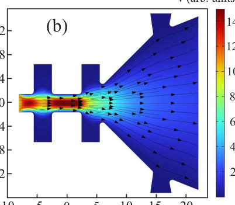 
FIG. 1. (Color online) (a) Optical image of the device contain- ing both a narrow rectangular channel and a Venturi-shaped channel. (b) Calculated hydrodynamic flow pattern, showing the velocity distribution in the device.

📷 Fig 2

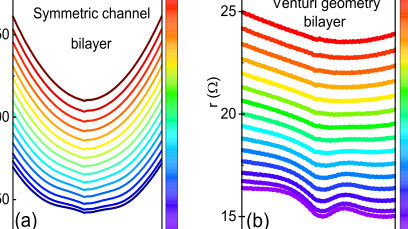 
FIG. 3. (Color online) (a) Evolution of the differential resis- tance as a function of applied DC current and temperature for the symmetric long-channel geometry, bilayer. (b) Evolu- tion of the differential resistance as a function of applied DC current and temperature for the Venturi-geometry channel, bilayer

📷 Fig 3

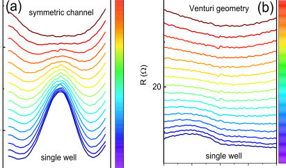 
FIG. 2. (Color online) (a) Evolution of the differential resis- tance as a function of applied DC current and temperature for the symmetric long-channel geometry, Single layer. (b) Evolution of the differential resistance as a function of ap- plied DC current and temperature for the Venturi-geometry channel, Single layer

📷 Fig 4

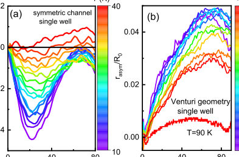 
FIG. 4. (Color online) Evolution of the normalized left–right differential resistance as a function of applied DC current and temperature for the single-layer device: (a) symmetric chan- nel and (b) Venturi-geometry channel. The red line shows the curve measured at T = 90 K.

📷 Fig 5

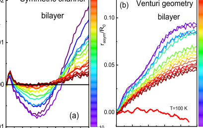 
FIG. 5. (Color online) Evolution of the normalized left–right differential resistance as a function of applied DC current and temperature for the bilayer device: (a) symmetric channel and (b) Venturi-geometry channel. The red line shows the curve measured at T = 100 K.

**Summary.** This work reports direct experimental evidence of strongly nonlinear electron transport in 2D conductors by engineering Venturi-shaped devices. The observed large current asymmetry is successfully modeled using an electron hydrodynamic framework, confirming the applicability of fluid dynamics principles (like the Bernoulli effect) to solid-state charge transport.

**Why it may be interesting.** While focused on solid-state transport rather than quantum information, the use of non-equilibrium hydrodynamics to describe electron flow in mesoscopic structures touches upon concepts relevant to open quantum systems where dissipation and geometry dictate dynamics.

Detailed structure

**Main problem.** To observe and study strongly nonlinear transport regimes in electron systems beyond the linear response regime, particularly investigating the role of geometry.

**Main result.** The authors experimentally observed a pronounced nonlinear voltage response and large diode-like asymmetry in Venturi-shaped 2D electron systems, quantitatively agreeing with a hydrodynamic model analogous to the Bernoulli effect.

**Method.** Transport measurements were performed on high-mobility 2D electron systems using devices fabricated with engineered Venturi geometries, measuring differential resistance ($r = dV_{xx}/dI_{	ext{dc}}$) under varying DC bias and temperature.

**Model / system.** The study utilizes a viscous hydrodynamic framework to model electron transport in GaAs quantum wells (single-layer and bilayer). The geometry is crucial, as the nonlinearity is enhanced by the Venturi constriction, leading to convective acceleration effects.

**Key observables.** Nonlinear voltage response, large diode asymmetry in I-V characteristics, differential resistance ($r$) vs. $I_{	ext{dc}}$ and $T$, and the symmetrized current $I_{	ext{sym}}(V_0)$.

**Important parameters / regimes.** Venturi geometry dimensions ($W_{	ext{in}}, W_{	ext{out}}$), temperature ($T$), applied DC current ($I_{	ext{dc}}$), and electron-electron scattering rates.

**Assumptions / limitations.** The analysis treats geometric parameters as effective estimates, ignoring potential renormalizations from finite slip or edge depletion; the hydrodynamic model is assumed valid when $\ell_{ee} \ll W \ll l$.

**Figures summary.** Figures show optical images and calculated flow patterns for the Venturi geometry. Subsequent figures track differential resistance vs. DC current and temperature, highlighting the strong asymmetry in the Venturi case compared to symmetric channels.

**Paper structure.** The paper progresses from establishing the need to study nonlinear transport beyond linear response. It details measurements on specific geometries (Venturi vs. constant width) to isolate geometric effects. Finally, it compares these findings with a full hydrodynamic model incorporating temperature and magnetic field dependencies.

Abstract

The study of electron hydrodynamics provides a powerful framework for understanding transport in ultraclean conductors, yet experimental evidence has thus far been largely restricted to the linear-response regime. Here, we report the direct observation of a strongly nonlinear transport regime in a high-mobility two-dimensional electron system. By engineering devices with a Venturi-shaped wedge geometry specifically designed to enhance convective nonlinearities, we uncover a pronounced nonlinear voltage response and large diodicity in the current-voltage characteristics. Our experimental findings show quantitative agreement with a theoretical model that attributes the observed nonlinearity to the convective acceleration of the electron fluid, analogous to the Bernoulli effect. These results provide compelling evidence for the applicability of the hydrodynamic framework to two-dimensional electron transport and open new avenues for exploring nonlinear and preturbulent phenomena in solid-state systems.

[↑ back to top](#top)

### [Localized patterns and dispersive structures in two-dimensional Fermi-Pasta-Ulam lattices](http://arxiv.org/abs/2607.23932v1)

**Authors:** Su Yang, Wenrong Sun  
**Type:** theory · **Category:** other · **PDF:** <https://arxiv.org/pdf/2607.23932v1>  
**Analysis basis:** full PDF text, analyzed in chunks
**Topic relevance:** `Frenkel-Kontorova` **3/5** · `non-equilibrium dynamics` **2/5** · `non-equilibrium universality` **2/5** · `Keldysh / 2PI / non-Gaussian methods` **1/5** · `analog quantum simulation` **1/5** · `driven-dissipative phase transition` **1/5** · `methods for driven-dissipative` **1/5**

📷 Fig 1

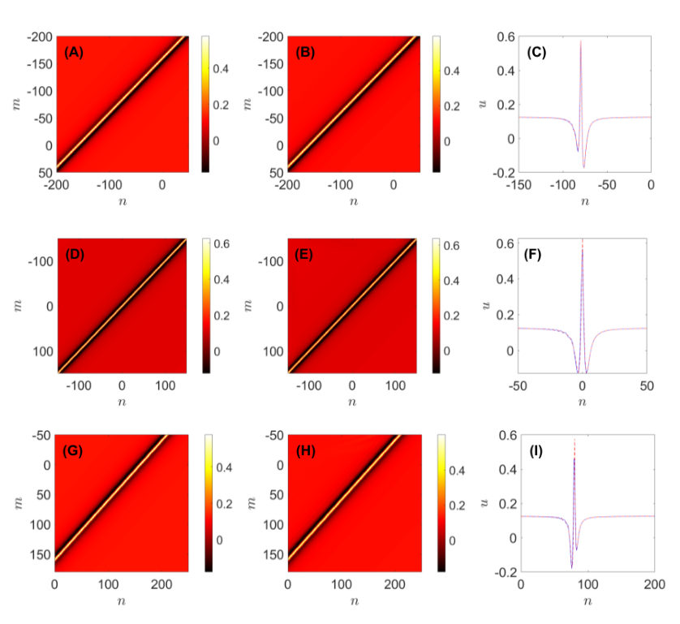 
FIG. 1. Comparison of the second-order rational solution in Eq. (15). The leftmost, middle, and rightmost columns represent the analytical, numerical, and cross-sections along the direction of m = n solutions. These comparisons are performed at t = −50 (Panels (A)-(C)), t = 0 (Panels (D)-(F)), and t = 50 (Panels (G)-(I)), respectively. Notice that ϵ = 0.125, K1 = 5, and K3 = 1 in all the relevant numerical experiments.

📷 Fig 2

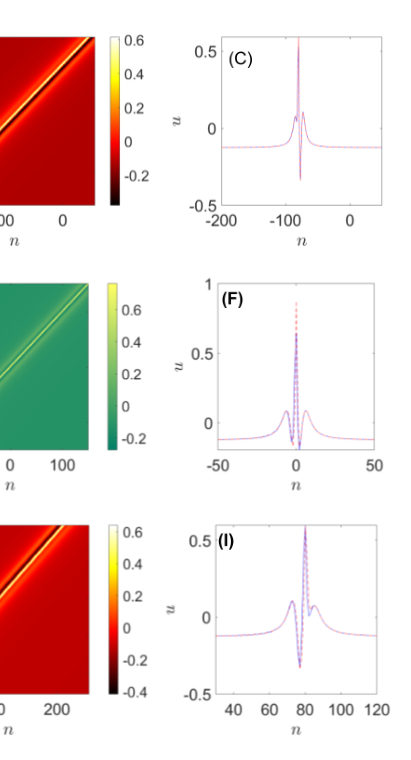 
FIG. 2. Same as Fig. 1 but now for the third-order rational solutions specified in Eq. (18).

📷 Fig 3

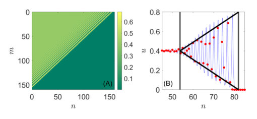 
FIG. 4. The comparison of the regular DSW wave profiles between the FPUT lattice (1) and its modified KdV reduction (6) at t = 100. Panel (A) displays the density plot of the numerical DSW of the lat- tice (1), while (B) depicts the cross-sections of the numerical solu- tions of Eq. (1) (red dots) and Eq. (6) (blue curve) along the direction of m = n.

📷 Fig 4

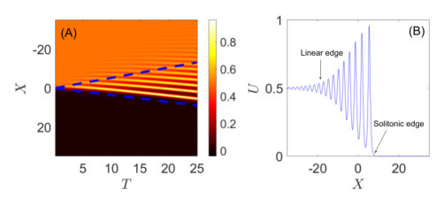 
FIG. 3. The spatiotemporal dynamics (A) and the spatial profile (B) of the regular DSW of the mKdV equation (6). Notice that the two blue dashed lines in Panel (A) represent the DSW fitting predictions on the linear and solitonic locations of the mKdV DSW, which are essentially the two lines of X = S(X,T ) ± T, where S(X,T ) ± are given in Eq. (26).

📷 Fig 5

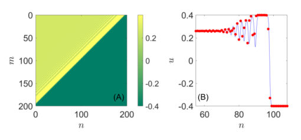 
FIG. 6. Same as Fig. 4 but now for the Kink-DSW at t = 150.

**Summary.** This paper analyzes extreme wave dynamics in 2D FPU lattices by deriving two key quasi-continuum limits: the mKdV and KPII equations. The authors use these reduced models, whose solutions are known analytically, to predict and compare complex phenomena like dispersive shock waves against direct numerical simulations of the original lattice. This demonstrates how continuum approximations can effectively model highly nonlinear wave behavior in discrete physical systems.

**Why it may be interesting.** The work bridges discrete nonlinear physics (FPU lattices) with established continuum theories of wave propagation (mKdV, KPII), providing a robust framework for modeling complex phenomena like rogue waves in physical systems relevant to condensed matter and AMO physics.

Detailed structure

**Main problem.** The study investigates localized patterns and dispersive wave structures within an analog of the two-dimensional Fermi-Pasta-Ulam (FPU) lattice.

**Main result.** The authors successfully derived quasi-continuum models, specifically the modified KdV (mKdV) and KPII equations, which accurately model various extreme wave phenomena like Rogue Waves and Dispersive Shock Waves in the FPUT lattice.

**Method.** The approach involves performing dimensional reduction on the discrete lattice equation to derive continuous nonlinear evolution equations. These reduced models are then solved numerically using advanced time integration schemes and compared against direct simulations of the original lattice.

**Model / system.** The primary system is the 2D FPU lattice, governed by a potential $\Phi(r) = K_1r + K_2r^2 + K_3r^3$. The analysis relies on deriving and comparing its dynamics to continuum limits: the mKdV equation (for $K_2=0$) and the KPII equation (for $K_2 
eq 0$).

**Key observables.** Rogue Waves (RWs), Dispersive Shock Waves (DSWs), solitonic-edge amplitudes ($a_+$), and edge speeds ($S^\pm$).

**Important parameters / regimes.** $K_1, K_2, K_3$ coefficients defining the potential; regimes defined by $K_2=0$ vs. $K_2 
eq 0$.

**Assumptions / limitations.** The analysis assumes that quasi-continuum long-wave asymptotic limits (mKdV and KPII) provide valid descriptions for the lattice dynamics, though discrepancies are noted as initial jumps increase.

**Figures summary.** Figures compare rational solutions ($U_2, U_3$) in the reduced models to the lattice dynamics; they also show comparisons of DSW profiles, solitonic-edge features, and rarefaction wave evolution between theoretical predictions and numerical results for both mKdV and KPII reductions.

**Paper structure.** The paper first establishes the FPU model and derives two key asymptotic reductions (mKdV and KPII). It then uses exact solutions from these reduced models to set initial conditions for the lattice simulation. Finally, it compares theoretical predictions for shock/rarefaction waves against numerical results across different regimes.

Abstract

In this paper, we study an analog of the scalar two-dimensional Fermi-Pasta-Ulam (FPU) lattice. In particular, a variety of dispersive wave structures and localized patterns are numerically identified in the numerical simulations of the FPU lattice, but, to the best of our knowledge, all of these particular wave structures do not admit analytical closed-form expressions. In order to resolve this issue, we perform a dimensional reduction and accordingly derive a modified KdV equation. Based on this reduction, we first take advantage of some of its exact localized solutions to model the associated wave patterns in the FPU lattice. In addition, we explore the two-dimensional generalization of the Riemann problems for the FPU lattice and the corresponding modified KdV reduction, whose evolution dynamics lead to the formation of multiple composite dispersive structures. Moreover, we propose and rigorously derive the KPII limit of the FPU lattice and investigate their associated wedge problems. Finally, all these relevant numerical dynamics are compared to examine the performance of these quasi-continuum long-wave asymptotic limits.

[↑ back to top](#top)

### [Light-like retarded correlators and the horizon](http://arxiv.org/abs/2607.24242v1)

**Authors:** Justin R. David, Leonard Schwarze  
**Type:** theory · **Category:** statistical mechanics · **PDF:** <https://arxiv.org/pdf/2607.24242v1>  
**Analysis basis:** full PDF text, analyzed in chunks
**Topic relevance:** `non-equilibrium universality` **3/5** · `non-equilibrium dynamics` **2/5** · `Keldysh / 2PI / non-Gaussian methods` **1/5** · `correlated / nonlocal dissipation` **1/5** · `driven-dissipative phase transition` **1/5** · `entanglement & information structure` **1/5** · `methods for driven-dissipative` **1/5**

📷 Fig 1

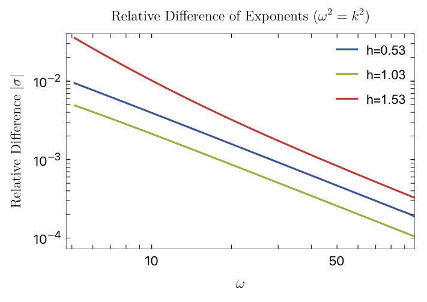 
Figure 1: The figure shows the relative difference of the large ω scaling exponent α to expected value of αexp = 4

**Summary.** This paper analyzes how retarded correlation functions behave in finite-temperature CFTs using the AdS/CFT correspondence. The core finding is that at light-like momenta, the scaling of these correlators becomes anomalous, depending on the geometry of the black hole horizon. This work uses sophisticated mathematical techniques like WKB approximation to characterize this breakdown of expected scaling laws.

**Why it may be interesting.** While focused on gravity/CFT, the study of thermal correlators and spectral functions near singularities (like the light cone) is highly relevant for understanding non-equilibrium dynamics and quantum field theory responses in strongly coupled systems.

Detailed structure

**Main problem.** The study investigates the anomalous scaling behavior of retarded correlators in conformal field theories (CFTs) at finite temperature, specifically when evaluated at light-like momenta.

**Main result.** The retarded correlator exhibits an anomalous scaling exponent at large light-like momenta ($\omega=|\vec{k}|$), deviating from predictions based on dimensional analysis for generic fixed momenta.

**Method.** The authors employ advanced techniques including the WKB approximation, exact calculations in low dimensions (d=2), and numerical analysis of differential equations like the Heun equation.

**Model / system.** The system is modeled using CFTs coupled to gravity via the AdS/CFT correspondence, considering scalar primary operators $\hat{O}$ at finite temperature $T$. The background spacetime involves black holes with various horizon topologies (planar, spherical, hyperbolic).

**Key observables.** Retarded correlator, $G_R(\omega, \vec{k})$, and its scaling behavior in the light-like limit.

**Important parameters / regimes.** The dimension of the primary operator ($\Delta$), the spacetime dimension ($d$), and the frequency/momentum ($\omega=|\vec{k}|$).

**Assumptions / limitations.** The analysis relies on analytical continuation from Euclidean correlators and utilizes approximations like the WKB method for general dimensions.

**Figures summary.** Not specified by notes, but the paper compares scaling laws across different horizon types (planar vs. spherical/hyperbolic) and channels (stress tensor).

**Paper structure.** The structure moves from establishing the standard zero-temperature result to analyzing the breakdown of Lorentz invariance at finite temperature in the light-like limit, demonstrating anomalous scaling using specific models and techniques.

Abstract

We show that retarded correlators in conformal field theories of scalar primary operators evaluated at finite temperature using $AdS/CFT$ scale anomalously at large light like momenta. The anomalous scaling depends on the curvature of the horizon. Setting the momenta equal to the frequency $ω$, the retarded correlator for black holes with planar horizons scales as $ω^{\frac{2}{d+2} (2Δ- d) }$ as opposed to the scaling behaviour of $ω^{2Δ- d}$ expected by dimensional analysis at generic fixed momenta and large frequencies. $Δ$ is the dimension of the primary and $d$, the number of space-time dimensions. For black holes with spherical and hyperbolic horizons when the frequency squared equals the Casimir along the horizon, the retarded correlator scales as $ω^{\frac{2Δ-d}{2} }$. We establish this using exact results in $d=2$, and a numerical analysis of the Heun equation for the $AdS_5$ planar black hole and finally using the WKB approximation in general $d$. The exact result for black holes with hyperbolic horizon as well as the analysis at large $d$ provides additional checks for the anomalous scaling behaviour. Finally we evaluate the anomalous scaling exponent for the stress tensor correlator in all its 3 channels.

[↑ back to top](#top)

### [Ferroelastic exciton splitting in hybrid perovskite nanowalls](http://arxiv.org/abs/2607.23051v1)

**Authors:** Afreen, J. Delgado-Alvarez, H. Krishna Mishra, J. Castillo-Seoane, Koustav Maiti, Pravrati Taank, A. Borras, A. Barranco, Surajit Saha, Priya Mahadevan, J. R. Sanchez-Valencia, K. V. Adarsh  
**Type:** both · **Category:** other · **PDF:** <https://arxiv.org/pdf/2607.23051v1>  
**Analysis basis:** full PDF text, analyzed in chunks
**Topic relevance:** `driven-dissipative phase transition` **3/5** · `Keldysh / 2PI / non-Gaussian methods` **1/5** · `quantum optics experiment` **1/5** · `spintronics-quantum-optics interface` **1/5**

📷 Fig 1

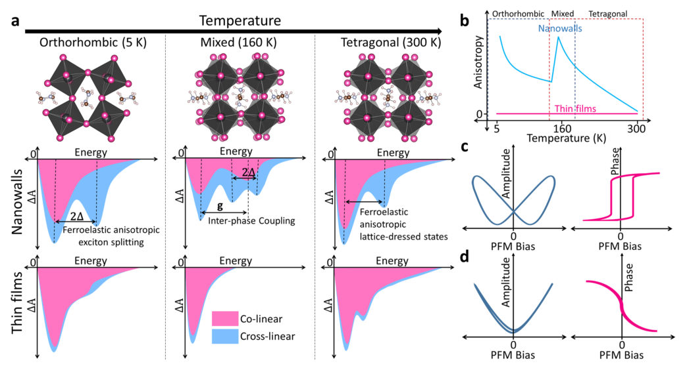 
Fig. 1. Ferroelastic control of excitonic structure in highly aligned anisotropic MAPbI3 nanowalls. (a) Schematic of the temperature-dependent structural phases and excitonic response in MAPbI3 nanowalls (top) and planar thin films (bottom). At 5 K, the nanowalls adopt the orthorhombic phase, which hosts a polarization-selective excitonic splitting (2∆), revealed by polarization-resolved TA under co-linear (pink) and cross-linear (blue) pump-probe excitation. In the mixed orthorhombic- tetragonal regime (∼160 K), ferroelastic phase coexistence activates inter-phase coupling (g), producing a coupled excitonic manifold. At 300 K, the tetragonal phase is dominated by strongly lattice-dressed...

📷 Fig 2

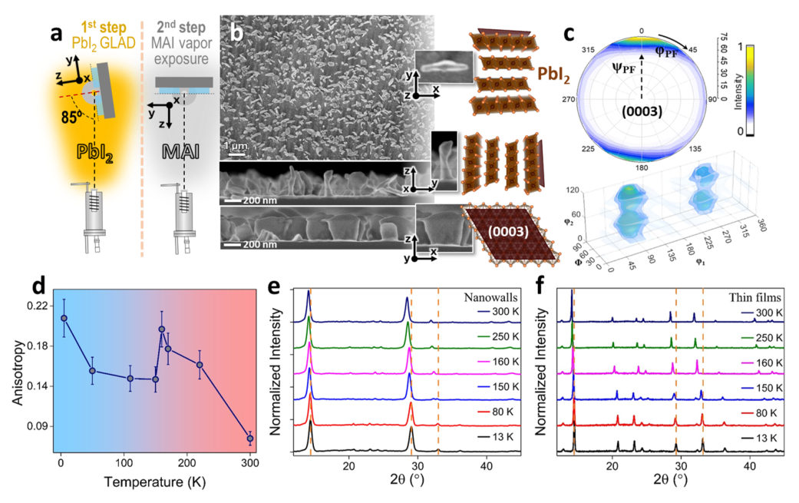 
Fig. 2. Preparation and structural characterization of highly aligned MAPbI3 nanowalls. (a) GLAD setup for anisotropic MAPbI3 nanowalls: PbI2 is deposited at an incident angle of 85◦, followed by MAI deposition at normal incidence. (b) Top-view (x-y) and cross-sectional (y-z and x-z) SEM images of MAPbI3 nanowalls. (c) Experimental pole figure of the PbI2 (0003) reflection (top) and the corresponding ODF reconstructed from the complete pole-figure set (bottom) (see also Supplementary Note 2). (d) Temperature-dependent optical anisotropy of nanowalls measured from 5-300 K, showing a distinct anomaly near 160 K, deviating from the otherwise monotonic temperature dependence. (e,f)...

📷 Fig 3

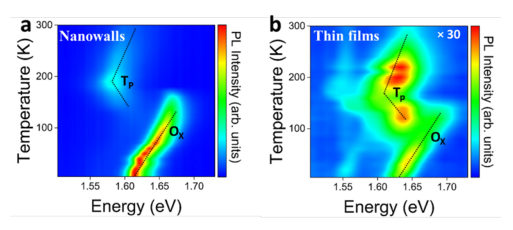 
Fig. 3. Temperature-dependent evolution of excitonic and lattice-dressed states. (a) Temperature-dependent PL con- tour map of the MAPbI3 nanowalls, showing the evolu- tion from the low-temperature orthorhombic excitonic regime through the mixed-phase region to the high-temperature strongly lattice-dressed tetragonal regime. (b) Corresponding temperature-dependent PL contour map of the planar thin films. Although the overall spectral evolution is similar, the emission is substantially weaker and is therefore scaled by a factor of 30 for visibility.

📷 Fig 4

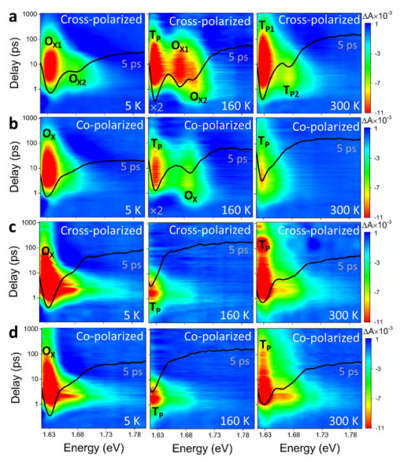 
Fig. 4. Polarization-resolved TA reveals ferroelastic symmetry-controlled excitonic structure. (a) Cross-linear po- larized TA contour maps of MAPbI3 nanowalls at 5, 160, and 300 K, revealing pronounced excitonic splitting in the or- thorhombic and mixed-phase regimes. At 300 K, the lattice- dressed response further exhibits internal spectral splitting. (b) Corresponding co-linear polarized TA contour maps of nanowalls measured under identical conditions, showing the absence of anisotropically split excitons and internal splitting of the lattice-dressed response. (c,d) Cross-linear (c) and co- linear (d) polarized TA contour maps of planar thin films under identical excitation conditions....

📷 Fig 5

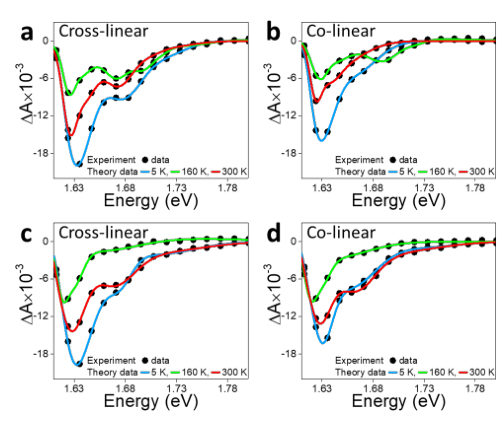 
Fig. 5. Minimal coupled-exciton model and TA analysis. (a,b) Theoretical and experimental temperature-dependent TA spectra at a pump-probe delay of 5 ps for MAPbI3 nanowalls. (c,d) Corresponding theoretical and experimen- tal spectra for planar thin films. The theoretical calculations are based on the Hamiltonian defined in equation (1). The model reproduces the temperature-dependent evolution of the excitonic and lattice-dressed spectral features.

**Summary.** The research investigates how ferroelastic phase transitions affect excitonic behavior in perovskite nanowalls. By using polarization-resolved ultrafast spectroscopy, the authors observe clear, symmetry-dependent splitting of exciton states that evolves into lattice-coupled excitations across temperature changes. This confirms that structural anisotropy and domain texture provide a powerful mechanism for engineering optical responses in soft polar semiconductors.

**Why it may be interesting.** This work directly addresses open questions in soft matter quantum optics by linking macroscopic symmetry breaking (ferroelasticity) to microscopic electronic structure modification (excitons), which is highly relevant for designing novel optoelectronic materials.

Detailed structure

**Main problem.** The study addresses whether ferroelastic symmetry breaking merely causes optical resonance broadening or actively modifies excitonic states through exciton-lattice coupling in soft semiconductors.

**Main result.** The research demonstrates polarization-selective excitonic splitting and the emergence of lower-energy lattice-coupled excitations, confirming that ferroelastic texture and phase coexistence tune anisotropic exciton-lattice coupling.

**Method.** A combination of advanced experimental techniques including temperature-dependent photoluminescence, X-ray diffraction, and polarization-resolved ultrafast transient absorption spectroscopy is employed, complemented by theoretical modeling using an effective Hamiltonian.

**Model / system.** The system under study is hybrid metal-halide perovskites (MAPbI3) fabricated into highly aligned nanowalls. The physics is modeled using a symmetry-guided effective Hamiltonian that describes the coupling between anisotropic excitonic states and lattice-dressed excitations across structural phase transitions.

**Key observables.** Polarization-selective excitonic splitting ($\sim 45 	ext{ meV}$), lower-energy lattice-coupled excitation ($58 	ext{ meV}$), optical anisotropy parameter, and temperature dependence of spectral features.

**Important parameters / regimes.** Temperature (especially near $160 	ext{ K}$ transition), energy separation ($\Delta$), and polarization configuration (co-linear vs. cross-linear).

**Assumptions / limitations.** The use of highly aligned nanowalls is crucial to overcome averaging effects found in disordered films, allowing for symmetry-selective measurements.

**Figures summary.** Figures illustrate the temperature evolution of structural phases and excitonic response, showing polarization-selective splitting in nanowalls compared to planar films; one figure details the GLAD setup and texture analysis.

**Paper structure.** The paper progresses by establishing a symmetry-selective experimental platform (nanowalls), characterizing the structural transitions via XRD/PFM, measuring the optical dynamics using TA spectroscopy across temperature regimes, and finally modeling the observed evolution using an effective Hamiltonian to explain the coupling mechanism.

Abstract

Hybrid metal-halide perovskites are soft semiconductors in which electronic excitations are strongly influenced by lattice distortions and structural phase transitions. An important open question is whether ferroelastic symmetry breaking merely broadens optical resonances or instead modifies excitonic states through exciton-lattice coupling. Here, we address this question using highly aligned MAPbI3 nanowalls fabricated by glancing-angle deposition, enabling symmetry-selective coupling between ferroelastic texture, structural anisotropy, and a well-defined optical axis. Combining temperature-dependent photoluminescence, X-ray diffraction and polarization-resolved ultrafast transient absorption spectroscopy, we observe a polarization-selective excitonic splitting in the orthorhombic phase at 5 K, characterized by orthogonal optical selection rules and a 45 meV energy separation. Near 160 K, where orthorhombic and tetragonal phases coexist, a lower-energy lattice-coupled excitation emerges 58 meV below the centre of the anisotropically split excitonic structure, consistent with coupling between excitonic and lattice-dressed states. At higher temperatures, these excitations progressively acquire lattice-dressed character accompanied by reduced optical anisotropy. A symmetry-guided effective Hamiltonian captures the evolution from anisotropically split excitons to coupled excitonic and lattice-dressed states across the structural transition. Our results show that ferroelastic texture and phase coexistence can modify exciton-lattice coupling, providing a route to symmetry-selective optical responses in soft polar semiconductors.

[↑ back to top](#top)

### [Large-area CVD Graphene for Photogating-Based Photodetection](http://arxiv.org/abs/2607.24344v1)

**Authors:** D. A. Matienko, D. P. Borisenko, A. Yu. Kuntsevich  
**Type:** experiment · **Category:** other · **PDF:** <https://arxiv.org/pdf/2607.24344v1>  
**Analysis basis:** full PDF text, analyzed in chunks
**Topic relevance:** `driven-dissipative phase transition` **2/5** · `quantum optics experiment` **2/5** · `Kondo & dissipative impurity` **1/5** · `analog quantum simulation` **1/5** · `correlated / nonlocal dissipation` **1/5** · `methods for driven-dissipative` **1/5** · `non-equilibrium dynamics` **1/5** · `spintronics-quantum-optics interface` **1/5**

📷 Fig 1

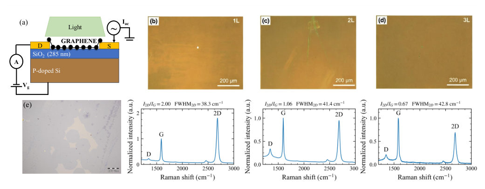 
FIG. 1. Structure and Raman characterization of the graphene devices. (a) Schematic of the graphene/SiO2/Si device and top view of the active region. (b–d) Optical microscopy images top of the 1L, 2L, and 3L graphene samples, respectively. The Raman spectra for the corresponding parts are shown in the bottom panels. (e) Optical microscopy image of the active device region.

📷 Fig 2

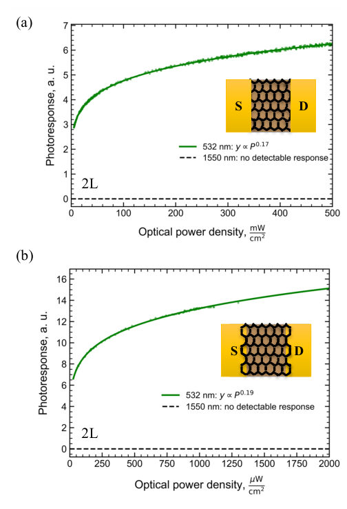 
FIG. 2. Dependence of the photoresponse on optical power density for 2 layer CVD graphene fabricated using two different fabrica- tion routes: (a) metal contacts deposited on top of graphene and (b) graphene transferred onto pre-patterned metal contacts.

📷 Fig 3

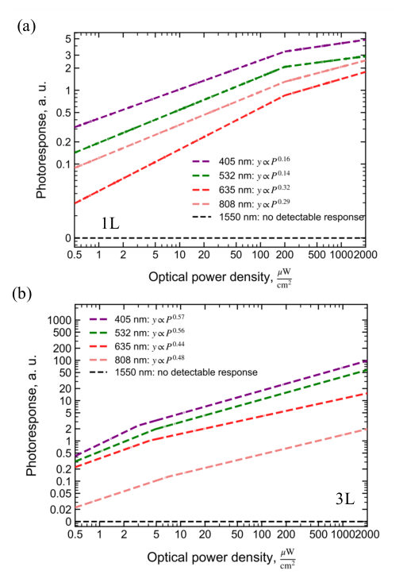 
FIG. 3. Dependence of the photoresponse on optical power density for monolayer (top panel) and trilayer (bottom panel) CVD graphene at different wavelengths.Dashed lines for high power density show power-law fits, y = APα, with the corresponding exponents given in the legend. Dashed lines for low power density indicate the linear low-power regions used to extract the sensitivity and detectivity.

📷 Fig 4

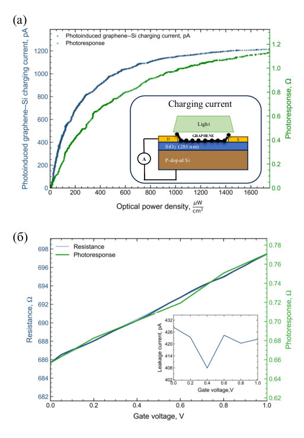 
FIG. 4. Origin of the photoconductive response in the graphene/SiO2/Si structure. (a) Optical-power dependence of the graphene photoresponse and the graphene–Si charging current at 532 nm. The inset shows the charging-current measurement con- figuration. (b) Gate-voltage dependence of the graphene resistance and photoresponse. The inset shows the leakage current throught the structure of SiO2.

**Summary.** This paper demonstrates that large-area CVD graphene can function as a sensitive photodetector by utilizing a substrate-induced photogating mechanism. Measurements confirm the signal originates from charge trapping in the underlying silicon oxide/silicon structure, not direct absorption in graphene itself. The results establish high sensitivity for monolayer devices and guide future optimization efforts.

**Why it may be interesting.** While focused on solid-state photonics, the study involves charge trapping dynamics at interfaces ($	ext{graphene}/	ext{SiO}_2/	ext{Si}$) under illumination, which touches upon open quantum systems concepts related to environmental coupling and decoherence in nanoscale devices.

Detailed structure

**Main problem.** To explore large-area CVD graphene as a scalable platform for photodetectors by characterizing the underlying photoconductivity mechanism.

**Main result.** The photoresponse is dominated by substrate-induced photogating in the $	ext{Si}/	ext{SiO}_2/	ext{Si}$ structure, achieving a peak sensitivity of $995 	ext{ A/W}$ for monolayer graphene.

**Method.** Electrical and optical characterization using dual-frequency modulation schemes across various wavelengths to measure photoconductivity and photoresponse dependence on power density.

**Model / system.** The physical system is large-area CVD graphene grown on $	ext{Si}/	ext{SiO}_2/	ext{Si}$ substrates. The mechanism relies on photogating, where light absorption in the substrate generates trapped charges that modulate the gate voltage experienced by the graphene channel.

**Key observables.** Photoconductivity signal; photoresponse ($I_{ph}$) vs. optical power density ($P$); sensitivity ($S$) and detectivity ($D^*$); dependence on graphene layer number (mono-, bi-, tri-layer).

**Important parameters / regimes.** Photon energy relative to the Si band gap; fabrication route (metal contacts before or after transfer); carrier screening effects related to layer count.

**Assumptions / limitations.** The photogating effect is confirmed as dominant over direct light absorption in graphene, and that device performance depends critically on the fabrication sequence of metal contacts.

**Figures summary.** Figures illustrate device structure, Raman characterization confirming layer number, and plots comparing photoresponse vs. optical power density for different layer counts and fabrication routes.

**Paper structure.** The work systematically characterizes the photodetector response by first establishing the mechanism (photogating) using spectral analysis and power dependence, then quantifying performance metrics like sensitivity across varying graphene thicknesses, and finally discussing optimization strategies.

Abstract

Our work explores large-area CVD graphene as a scalable platform for photodetectors. We show that substrate-induced photogating in graphene/SiO$_2$/Si structures enables a photoconductivity signal in mono-, bi-, and trilayer CVD graphene. The devices respond to illumination with photon energies above the Si band gap and do not respond to telecom frequency, suggesting the photoconductivity mechanism through the photogating. Large sample area and gate voltage-dependent resistivity measurements allow us to prove the dominant role of the photogating directly, demonstrating similarity of the capacitive recharging current and the photoresponse. The sensitivity is the highest (995 A/W) for the monolayer graphene. Increasing the number of graphene layers reduces the sensitivity due to screening and parallel conduction, but can improve detectivity by lowering the noise level. The sensitivity of CVD graphene device depends on fabrication route of photolitography: device with metal contacts fabricated before graphene transfer show higher photoresponce. Thus, our work demonstrate the potential of industrially relevant CVD graphene for sensitive photogating-based photodetectors.

[↑ back to top](#top)

### [Janus-induced atomic reconstruction amplifies twist-angle modulation of interlayer thermal transport in moiré bilayers](http://arxiv.org/abs/2607.23103v1)

**Authors:** Bin Xu, Rulei Guo, Jie Sun, Hiroo Suzuki, Takuma Yoshida, Ichiro Nakaya, Koki Sawasaki, Yasuhiko Hayashi, Shohei Chiashi, Tomoki Machida, Junichiro Shiomi  
**Type:** both · **Category:** other · **PDF:** <https://arxiv.org/pdf/2607.23103v1>  
**Analysis basis:** full PDF text, analyzed in chunks
**Topic relevance:** `analog quantum simulation` **2/5** · `driven-dissipative phase transition` **2/5** · `non-equilibrium dynamics` **2/5** · `Frenkel-Kontorova` **1/5** · `methods for driven-dissipative` **1/5** · `non-equilibrium universality` **1/5**

📷 Fig 1

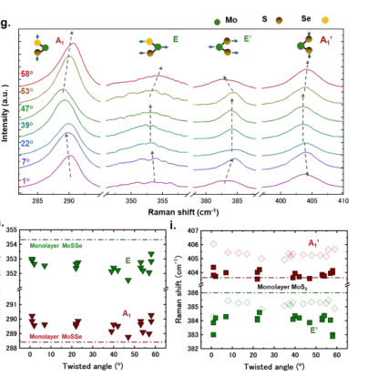 
Figure 1. Fabrication of high-quality twisted bilayer MoSSe/MoS2. a. Schematic of plasma

📷 Fig 2

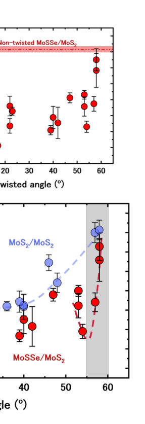 
Figure 2. Interlayer thermal conduction measurement. a. Schematic of TDTR measurement for

📷 Fig 3

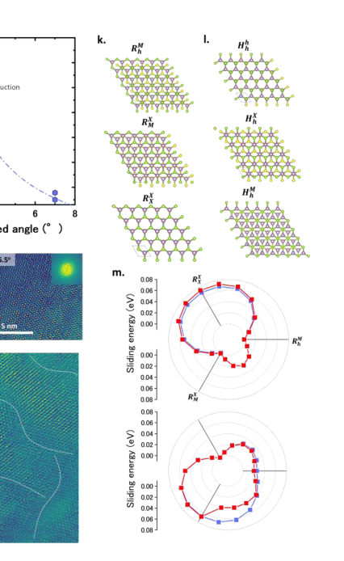 
Figure 3. Moiré pattern evolution in twisted bilayer TMD. a.b Periodic length of the moiré pattern;

📷 Fig 4

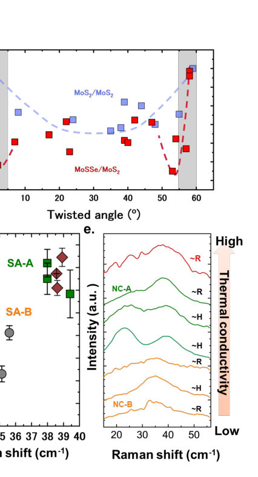 
Figure 4. Low frequency Raman modes of twisted bilayer TMD. a. Schematic of shear mode and

**Summary.** This work demonstrates that introducing a dipole asymmetry (Janus effect) into $	ext{MoSSe/MoS}_2$ moiré bilayers dramatically enhances the sensitivity of interlayer thermal transport to twist angle. This enhanced tunability is attributed to atomic reconstruction, which weakens interlayer coupling and suppresses phonon transmission in a highly predictable manner.

**Why it may be interesting.** While focused on thermal transport, the mechanism—controlling interlayer coupling via symmetry breaking (dipole) leading to structural phase transitions (reconstruction)—is analogous to controlling quantum coupling strengths in engineered quantum materials or interfaces.

Detailed structure

**Main problem.** The study aims to understand how atomic reconstruction, driven by Janus-induced symmetry breaking, modifies the twist-angle dependence of interlayer thermal transport in moiré bilayers.

**Main result.** Janus functionalization leads to an anomalously strong and highly tunable twist-angle dependence of thermal conductance, characterized by a pronounced minimum at small twist angles.

**Method.** The research combines experimental measurements (TDTR for thermal conductivity, Raman/PL spectroscopy) with theoretical calculations (DFT modeling of structural relaxation and charge density).

**Model / system.** The system is $	ext{MoSSe/MoS}_2$ moiré bilayers, which are Janus 2D materials exhibiting an intrinsic out-of-plane dipole. The physics involves atomic reconstruction into locally distorted aperiodic moiré patterns.

**Key observables.** Interlayer thermal conductance ($	ext{TC}$), low-frequency Raman modes (breathing mode frequency), and charge density distribution/Bader net atomic charges.

**Important parameters / regimes.** Twist angle ($	heta$), small twist angles ($0^\circ - 5^\circ$), and the presence of the Janus dipole moment.

**Assumptions / limitations.** The rigid stacking model is used for periodicity estimation, but the core mechanism relies on structural relaxation (atomic reconstruction) which deviates from this ideal assumption.

**Figures summary.** Figures illustrate $	ext{TC}$ vs. twist angle showing minima; Raman/PL maps confirm Janus conversion; DFT results show charge density changes linked to interlayer coupling strength.

**Paper structure.** The paper progresses by first establishing the structural difference (Janus effect) compared to homo-bilayers, then measuring the resulting $	ext{TC}$ modulation experimentally, and finally using DFT calculations and spectroscopic analysis to link this strong tunability directly to atomic reconstruction pathways.

Abstract

In two-dimensional moiré bilayers, atomic reconstruction, the spontaneous structural relaxation toward energy-minimizing stacking registries in the near-commensurate regime, can strongly modify local stacking and interlayer coupling, providing a possibility to significantly control phonon-mediated properties. Here we show that the twist-angle dependence of interlayer thermal conductance can be modified by introducing Janus-induced mirror-symmetry breaking into bilayer MoS2. The intrinsic out-of-plane dipole in MoSSe/MoS2 bilayers leads to frictionless interface, and reduces the lattice deformation energy, thereby promoting atomic-reconstruction into locally distorted aperiodic moiré patterns. These features weaken interlayer coupling and suppress phonon transmission across the interface, leading to an anomalously strong twist-angle dependence of thermal conductance, with a pronounced minimum at small twist angles and a reduction rate nearly one order of magnitude larger than that of twisted bilayer MoS2. Our results demonstrate that interlayer thermal transport is modified by atomic reconstruction, highlighting Janus-induced mirror-symmetry breaking as an effective way to promoting phonon engineering in two-dimensional moiré structures.

[↑ back to top](#top)

### [Standard Model Effective Field Theory and Oscillons](http://arxiv.org/abs/2607.23616v1)

**Authors:** Z. Drogosz, E. I. Sfakianakis, K. Slawinska, A. Wereszczynski  
**Type:** theory · **Category:** other · **PDF:** <https://arxiv.org/pdf/2607.23616v1>  
**Analysis basis:** full PDF text, analyzed in chunks
**Topic relevance:** `non-equilibrium dynamics` **2/5** · `Keldysh / 2PI / non-Gaussian methods` **1/5** · `analog quantum simulation` **1/5** · `correlated / nonlocal dissipation` **1/5** · `driven-dissipative phase transition` **1/5** · `methods for driven-dissipative` **1/5** · `non-equilibrium universality` **1/5**

📷 Fig 1

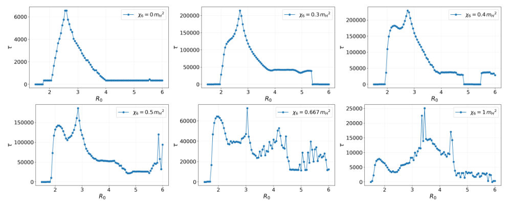 
Figure 1: Lifetime of the single-field Higgs oscillon versus the initial Gaussian width R0 (see Eq. (8)) with AK = −2 and mH/mW = 1.556, when the dimension-six operator (Φ†Φ)3 is added to the SM Higgs potential. The χ6 = 0 panel corresponds to the quartic theory; nonzero χ6 dramatically increases the lifetime and broadens the range of R0 leading to longer-lived oscillons.

📷 Fig 2

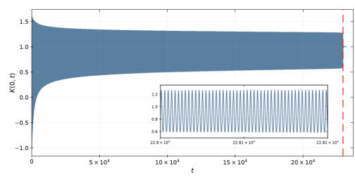 
Figure 2: Representative long-lived single-field Higgs oscillon. The plot shows the central Higgs component K(0, t) for initial data AK = −2, R0 = 2.75, and χ6/m2 H = 0.4. The lifetime is τ ≃2.3 × 105 m−1 W , illustrating the enhancement due to the sextic interaction (see Fig. 1).

📷 Fig 3

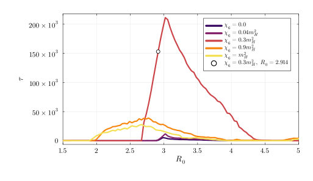 
Figure 3: Oscillon lifetime after opening one gauge-field direction; the gauge component is initialized following Eq.(9). The long-lived configurations relax to the K-dominated Higgs-channel oscillon and the stabilizing effect of the sextic interaction persists away from the strict single-field limit.

📷 Fig 4

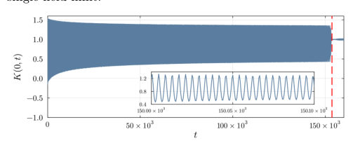 
Figure 4: Representative evolution after opening the fA gauge-field direction, corresponding to the circled point in Fig. 3. The plot shows K(0, t) for χ6/m2 H = 0.3, AK = −1, R0 = 2.914, AA = 0.1, and RA = 2.30. The gauge perturbation rapidly relaxes toward fA = −1, while the configuration settles into a long-lived K-dominated Higgs-channel oscillon with τ ≃1.5 × 105 m−1 W .

📷 Fig 5

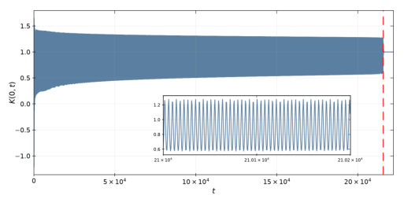 
Figure 5: Representative long-lived oscillon in the full five-field spherical ansatz. The plot shows the central Higgs component K(0, t) for χ6/m2 H = 0.4, with initial data AK = 0.2, R0 = 2.4, AH = −1, and RH = 14. The oscillon remains localized for τ ≃2.2 × 105 m−1 W .

**Summary.** This work applies Standard Model Effective Field Theory to study oscillons—stable, localized energy packets—in the Higgs sector. By introducing a dimension-six operator, the authors demonstrate that the oscillon's decay lifetime is dramatically increased by many orders of magnitude. This suggests these structures could be long-lived relics relevant to early universe cosmology or electroweak physics.

**Why it may be interesting.** While focused on particle physics dynamics, the study of non-linear field evolution and stable solitonic solutions (oscillons) shares mathematical techniques with models used in quantum many-body systems, particularly those involving topological defects or coherent excitations.

Detailed structure

**Main problem.** The study investigates the stability and longevity of oscillons (nonperturbative soliton-like solutions) within the framework of Standard Model Effective Field Theory (SMEFT). The core goal is to determine how higher-dimensional operators affect these classical field configurations.

**Main result.** Including a dimension-six operator in the Higgs potential dramatically extends the oscillon lifetime by orders of magnitude, suggesting that such structures can be long-lived relics in the early universe or during electroweak symmetry breaking.

**Method.** The analysis relies on solving coupled, non-linear partial differential equations derived from the generalized Lagrangian using numerical simulation techniques. Specific ansatze and gauges (like the temporal gauge) are employed to simplify the complex field dynamics.

**Model / system.** The system is based on the SU(2) bosonic sector of the Standard Model extended by a dimension-six operator, $O_6 = (\Phi^\dagger\Phi)^3$, modifying the Higgs potential. The fields include the Higgs doublet ($\Phi$) and associated gauge components ($W_\mu$).

**Key observables.** Oscillon lifetime ($	au$), which is measured as the time for stored energy to drop by 90%; oscillon frequency ($\omega$); and the localized Chern–Simons charge ($N_{CS}$).

**Important parameters / regimes.** The ratio of Higgs to W boson masses ($m_H/m_W=1.556$) and the dimensionless coupling parameter $\chi_6 = 16c_6m^2_W / (g^4\Lambda^2)$ are crucial parameters.

**Assumptions / limitations.** The analysis often assumes decoupling of the U(1) sector ($g'=0$) and utilizes specific gauges, such as the temporal gauge ($G=0$), for numerical tractability.

**Figures summary.** Figures illustrate the dependence of oscillon lifetime on initial conditions (like width $R_0$); representative time evolution showing enhanced lifetimes ($	au \sim 10^5 m^{-1}W$) in the Higgs channel; and field profiles confirming relaxation into stable, long-lived states.

**Paper structure.** The paper develops by first establishing the generalized potential via SMEFT. It then proceeds to solve the coupled equations of motion using numerical methods, analyzing single-field truncations before extending the analysis to the full five-field SU(2) sector while monitoring constraints like the Gauss law.

Abstract

We show that the inclusion of a dimension-six operator in the Higgs potential has a dramatic impact on the stability of oscillons in the $SU(2)$ bosonic sector of the Standard Model, extending their lifetime by orders of magnitude. This happens for the physical value of the ratio between the Higgs and W boson masses, $m_H/m_W=1.556$ and for the dimension-six operator $O_6 = (Φ^\dagger Φ)^3$ whose coupling constant is below the current upper bound.

[↑ back to top](#top)

### [Berry curvature effects of chiral superconducting rhombohedral graphene](http://arxiv.org/abs/2607.23764v1)

**Authors:** Jian-Hua Zeng, Zhi Wang, Qian Niu  
**Type:** theory · **Category:** other · **PDF:** <https://arxiv.org/pdf/2607.23764v1>  
**Analysis basis:** full PDF text, analyzed in chunks
**Topic relevance:** `analog quantum simulation` **2/5** · `non-equilibrium dynamics` **2/5** · `Keldysh / 2PI / non-Gaussian methods` **1/5** · `spintronics-quantum-optics interface` **1/5**

📷 Fig 1

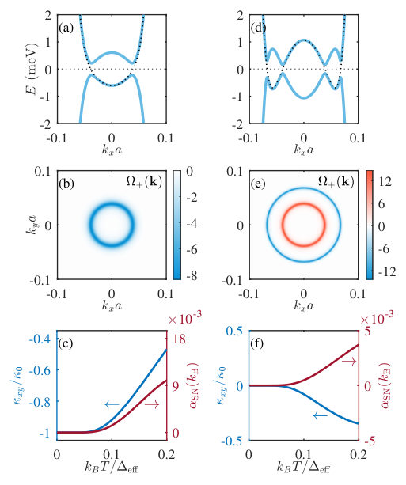 
FIG. 1. (a) Quasiparticle spectrum along 𝑘𝑦= 0 for 𝐷= 30 meV and 𝑛𝑒= 2×1011 cm−2. The blue solid curves denote the BdG quasiparti- cle bands, and the black dashed curve denotes the lowest-conduction- band electron dispersion measured from the chemical potential. (b) Momentum-space distribution of the Berry curvature Ω𝑧 +(k) of the upper quasiparticle band near the 𝐾point for the same parameters. (c) Temperature dependence of the thermal Hall conductivity 𝜅𝑥𝑦/𝜅0 and the spin Nernst coefficient 𝛼SN, where 𝜅0 = 𝜋𝑘2 B𝑇/(6ℏ). The blue and brown curves correspond to 𝜅𝑥𝑦/𝜅0 and 𝛼SN, respectively, and are read from the left and right axes as indicated by the arrows. The temperature is normalized by...

📷 Fig 2

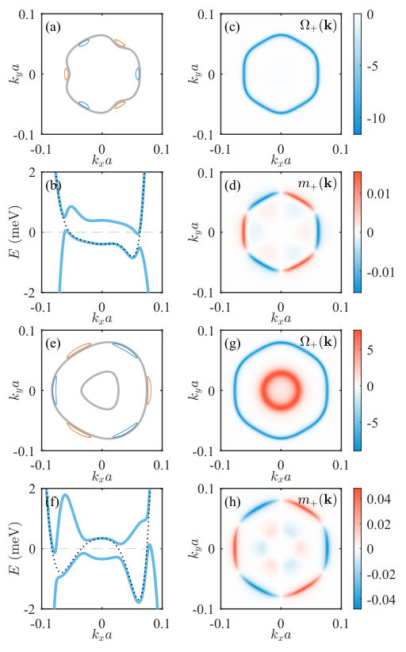 
FIG. 2. (a) Normal-state (gray line) and Bogoliubov Fermi surfaces, with 𝑈= 70 meV, 𝑛𝑒= 5 × 1011 cm−2, and Δ = 4 meV. The orange and blue lines denote the Bogoliubov Fermi surfaces from the upper and lower quasiparticle bands, respectively. (b) Quasiparticle spectrum near the 𝐾point for the same parameters. The blue solid curves denote the BdG quasiparticle bands, and the black dashed curve denotes the lowest-conduction-band electron dispersion mea- sured from the chemical potential. (c) Berry curvature Ω𝑧 +(k) of the upper quasiparticle band near the 𝐾point for the same parameters, in units of nm2. (d) Orbital magnetic moment 𝑚𝑧 +(k) of the upper quasiparticle band near the 𝐾point for the...

📷 Fig 3

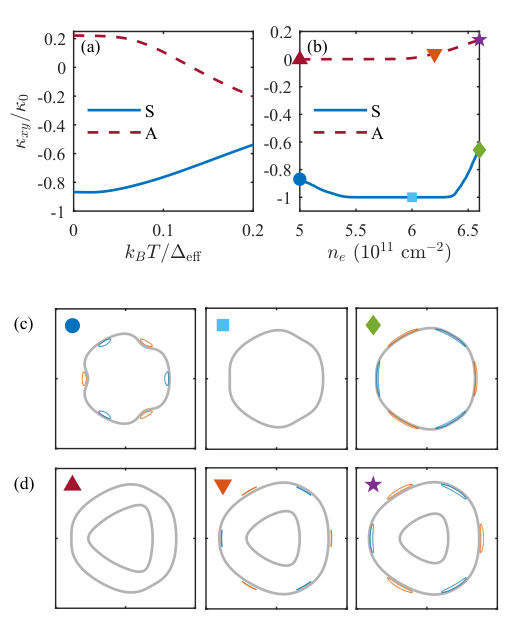 
FIG. 3. (a) Temperature dependence of the thermal Hall conductivity 𝜅𝑥𝑦/𝜅0, with 𝜅0 = 𝜋𝑘2 𝐵𝑇/(6ℏ). The results are shown for two normal- state Fermi-surface geometries: a single Fermi surface (S) and an annular Fermi surface (A). The blue solid curve is calculated with 𝑈= 70 meV, 𝑛𝑒= 5 × 1011 cm−2, and Δ = 4 meV, while the brown dashed curve is calculated with 𝑈= 100 meV, 𝑛𝑒= 7 × 1011 cm−2, and Δ = 8 meV. The temperature is normalized by Δeff ≡mink[𝐸+(k)−𝐸−(k)] for each set of parameters. (b) Electron- density dependence of 𝜅𝑥𝑦/𝜅0 at 𝑘𝐵𝑇= 0.015Δeff. The blue solid curve is obtained with 𝑈= 70 meV and Δ = 4 meV, while the brown dashed curve is obtained with 𝑈= 100 meV and Δ = 8 meV. (c) and...

📷 Fig 4

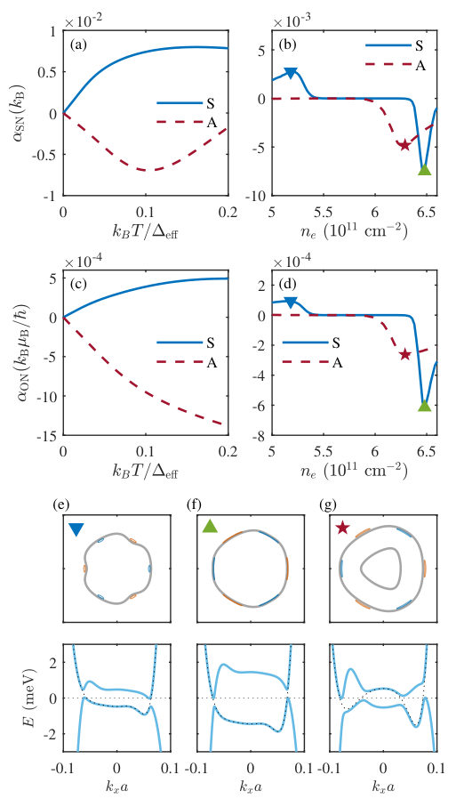 
FIG. 4. (a) Temperature dependence of the spin Nernst coefficient 𝛼SN. (b) Electron-density dependence of 𝛼SN. (c) Temperature de- pendence of the orbital Nernst coefficient 𝛼ON. (d) Electron-density dependence of 𝛼ON. The results are shown for two normal-state Fermi-surface geometries: a single Fermi surface (S) and an annu- lar Fermi surface (A). In panels (a) and (c), the blue solid curve is calculated with 𝑈= 70 meV, 𝑛𝑒= 5 × 1011 cm−2, and Δ = 4 meV, while the brown dashed curve is calculated with 𝑈= 100 meV, 𝑛𝑒= 7 × 1011 cm−2, and Δ = 8 meV. In panels (b) and (d), the blue solid curve is obtained with 𝑈= 70 meV and Δ = 4 meV, while the brown dashed curve is obtained with 𝑈= 100 meV and...

📷 Fig 5

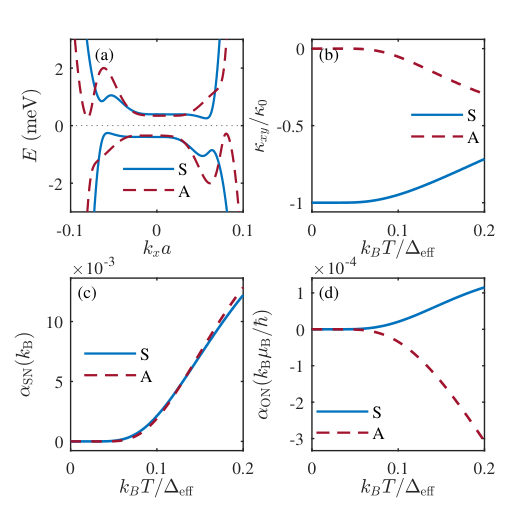 
FIG. 5. (a) Quasiparticle spectra along 𝑘𝑦= 0 in the fully gapped regime of the BdG Hamiltonian with trigonal warping. The results are shown for two normal-state Fermi-surface geometries: a single Fermi surface (S) and an annular Fermi surface (A). The blue solid curve is calculated with 𝑈= 70 meV, 𝑛𝑒= 5 × 1011 cm−2, and Δ = 10 meV, while the brown dashed curve is calculated with 𝑈= 100 meV, 𝑛𝑒= 7 × 1011 cm−2, and Δ = 15 meV. (b) Temperature dependence of the thermal Hall conductivity 𝜅𝑥𝑦/𝜅0, with 𝜅0 = 𝜋𝑘2 𝐵𝑇/(6ℏ). (c) Temperature dependence of the spin Nernst coefficient 𝛼SN. (d) Temperature dependence of the orbital Nernst coefficient 𝛼ON. The temperature is normalized by Δeff ≡mink[𝐸+(k)...

**Summary.** This paper theoretically examines the impact of Berry curvature on anomalous transport phenomena in chiral superconducting rhombohedral graphene. By modeling quasiparticles using a BdG Hamiltonian that accounts for trigonal warping, the authors show that the formation of Bogoliubov Fermi surfaces significantly alters these transports. The key finding is that this gapless behavior causes deviations from quantized thermal Hall values and strongly enhances Nernst responses.

**Why it may be interesting.** This work connects topological concepts (Berry curvature) directly to measurable transport properties (Nernst/Hall effects) in a highly tunable 2D superconducting material like graphene, which is relevant for quantum devices.

Detailed structure

**Main problem.** The study investigates how Berry curvature effects of Bogoliubov quasiparticles modify anomalous transport responses (thermal/spin Nernst) in chiral superconducting rhombohedral graphene.

**Main result.** The presence of Bogoliubov Fermi surfaces, induced by trigonal warping, qualitatively modulates the anomalous Hall transports, causing a deviation from quantized thermal Hall conductivity and strongly enhancing spin- and orbital-Nernst responses.

**Method.** Theoretical calculations utilizing a two-band Bogoliubov-de Gennes Hamiltonian to model superconducting quasiparticles in momentum space.

**Model / system.** The physical system is chiral superconducting rhombohedral graphene. The analysis employs the BdG Hamiltonian, which incorporates normal-state dispersion warping ($\xi_a(k)$) leading to gapless Bogoliubov Fermi surfaces when trigonal warping is considered.

**Key observables.** Momentum-space Berry curvature ($\Omega$), orbital magnetic moment ($m$), anomalous thermal-Hall conductivity ($\kappa_{xy}$), and anomalous spin/orbital Nernst coefficients ($\alpha_{SN}, \alpha_{ON}$).

**Important parameters / regimes.** Trigonal warping strength, superconducting gap magnitude ($\Delta$), carrier density ($n_e$), and temperature (analyzed in low-T limits).

**Assumptions / limitations.** The analysis compares regimes: a fully gapped state (neglecting $\xi_a(k)$) versus a gapless state where Bogoliubov Fermi surfaces form due to non-vanishing antisymmetric dispersion ($\xi_a(k) 
eq 0$).

**Figures summary.** Figures illustrate quasiparticle spectra, Berry curvature distributions, and the temperature dependence of transport coefficients ($\kappa_{xy}/\kappa_0$, $\alpha_{SN}$, $\alpha_{ON}$) for both gapped and gapless regimes.

**Paper structure.** The paper progresses by first analyzing the fully gapped state (Section III), then introducing the mechanism causing gaplessness due to trigonal warping, and finally detailing transport calculations in this gapless regime (Section IV).

Abstract

We study the Berry curvature effects of the Bogoliubov quasiparticles in chiral superconducting rhombohedral graphene. Using a two-band Bogoliubov-de Gennes Hamiltonian to describe the superconducting quasiparticles, we calculate the momentum-space Berry curvature, the orbital magnetic moment, the anomalous thermal-Hall and the anomalous spin- and orbital-Nernst transport of the chiral $p$-wave superconducting states. We investigate the impact of the normal-state energy band warping in rhombohedral graphene, which can cause the Bogoliubov Fermi surface for quasiparticle excitations. We find that the Bogoliubov Fermi surface qualitatively modulates the anomalous Hall transports, inducing a deviation of the thermal Hall conductivity from the quantized value and strongly enhancing the spin- and orbital-Nernst responses.

[↑ back to top](#top)

### [Evolution of the electronic and superconducting properties of Re-based quinary high-entropy alloys under chemical and physical pressure](http://arxiv.org/abs/2607.23056v1)

**Authors:** Thiagarajan Maran, Yoshiya Uwatoko, Sathea Suweatha M N, Sonika Jangid, R. P. Singh, Arumugam Sonachalam, Sathiskumar Mariappan  
**Type:** experiment · **Category:** other · **PDF:** <https://arxiv.org/pdf/2607.23056v1>  
**Analysis basis:** full PDF text, analyzed in chunks
**Topic relevance:** `Keldysh / 2PI / non-Gaussian methods` **1/5** · `analog quantum simulation` **1/5** · `driven-dissipative phase transition` **1/5**

📷 Fig 1

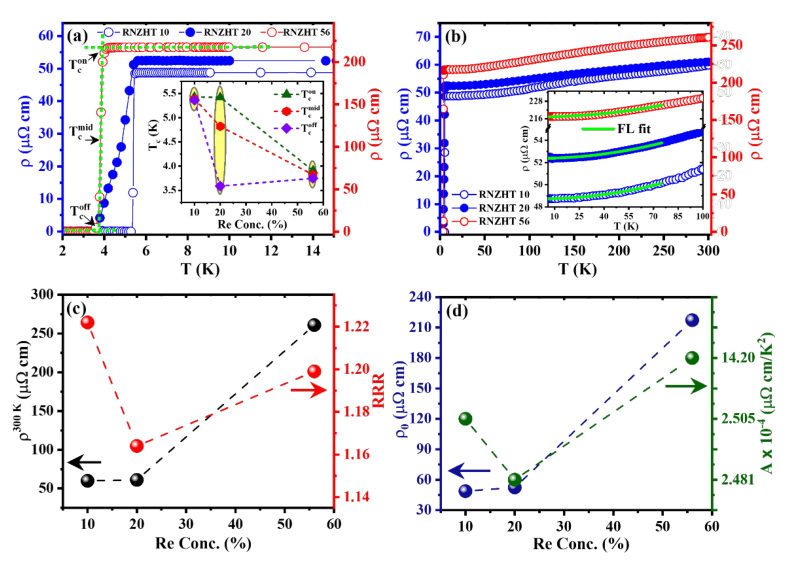 
Figure 1: (a) shows the magnified Tc region of resistivity vs temperature at zero field for

📷 Fig 2

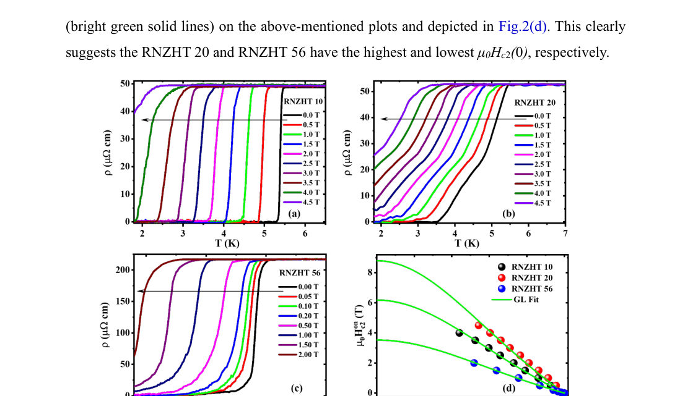 
Figure 2: (a)-(c) show the magnified Tc region of resistivity vs temperature under various fixed

📷 Fig 3

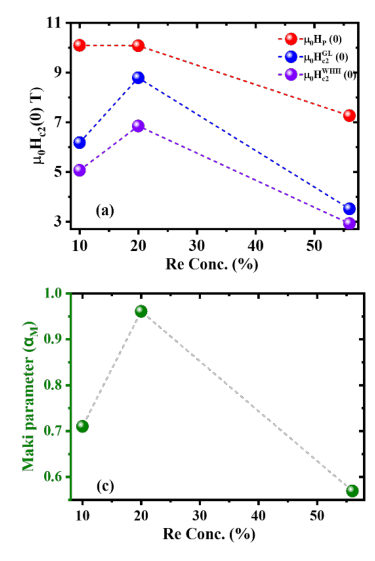 
Figure 3: (a) shows a comparison plot of 𝜇0𝐻𝑐2

📷 Fig 4

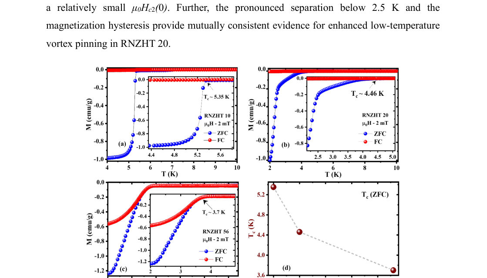 
Figure 4: (a) – (c) show the temperature-dependent DC magnetization at a fixed external field

📷 Fig 5

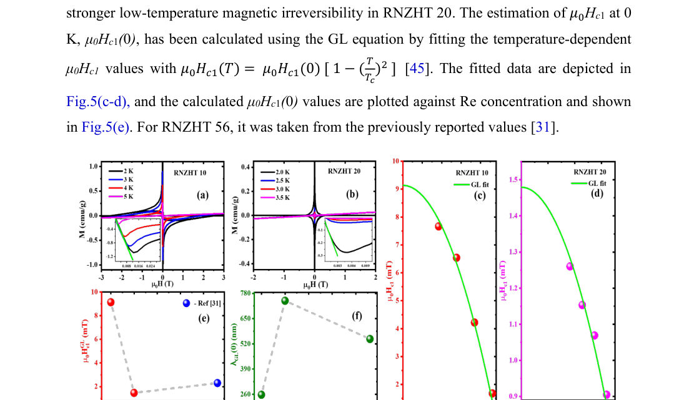 
Figure 5: (a-b) shows the field (μ0H) dependent magnetization (M) at various fixed

**Summary.** This work investigates how chemical doping and hydrostatic compression tune the superconducting properties of Re-based high-entropy alloys. The key finding is that the sign of the temperature dependence of Tc under pressure changes dramatically when the crystal structure undergoes a phase transition, highlighting structure as a primary control knob for superconductivity.

**Why it may be interesting.** While focused on condensed matter superconductivity, the systematic investigation into how external tuning parameters (chemical composition and pressure) couple to fundamental electronic/structural properties mirrors complex many-body physics problems relevant to quantum materials research.

Detailed structure

**Main problem.** To comparatively study how chemical substitution (varying Re concentration) and external physical pressure affect the electronic and superconducting properties of Re-based quinary high-entropy alloys (HEAs).

**Main result.** The pressure coefficient of Tc changes sign across a structural transition (bcc to hcp), establishing that crystal structure is a key organizing variable governing superconductivity under compression. Chemical substitution and hydrostatic compression are complementary but non-equivalent tuning routes.

**Method.** Measurements included electrical resistivity ($
ho(T)$) at ambient and high pressure up to 8 GPa, and temperature/field-dependent magnetization ($M(T)$) using ZFC/FC protocols.

**Model / system.** The study focuses on Re-based quinary HEAs with the general formula [Nb0.67-xRe][TiZrHf]0.33 for compositions x = 0.10, 0.20, and 0.56.

**Key observables.** Superconducting transition temperature (Tc), upper critical field ($\mu_0H_{c2}$), Ginzburg-Landau parameter ($\kappa$), Maki parameter ($\alpha_M$), and the pressure coefficient of Tc ($dT_c/dP$).

**Important parameters / regimes.** Pressure range up to 8 GPa; Re concentration (x = 0.10, 0.20, 0.56); Temperature range down to 1.8 K.

**Assumptions / limitations.** The analysis relies on established superconducting theories like GL and WHH models for fitting magnetic measurements.

**Figures summary.** Figures show low-temperature resistivity ($
ho(T)$) used to determine Tc, and magnetization curves ($M$ vs $H$) analyzed using ZFC/FC protocols to extract critical fields and parameters.

**Paper structure.** The paper systematically presents comparative studies across three compositions, analyzing the impact of Re content on Tc suppression, followed by detailed high-pressure measurements that reveal structure-dependent changes in the pressure dependence of Tc.

Abstract

We report a comparative study of chemical- and physical-pressure effects on the electronic and superconducting properties of the Re-based quinary high-entropy alloys (HEAs) [Nb0.67-xRex][TiZrHf]0.33 (x = 0.10, 0.20, and 0.56). Increasing Re concentration suppresses the superconducting transition temperature Tc from 5.4 to 3.9 K while producing positive, composition-dependent cocktail-effect ratios. Field-dependent transport and magnetization establish all three compositions as strongly type-II superconductors and identify x = 0.20 as the most distinctive composition, with the largest upper critical field and Ginzburg-Landau parameter and a Maki parameter close to unity. Most importantly, the pressure coefficient of Tc changes sign across the bcc-hcp structural change: dTc/dP is positive for the bcc x = 0.10 and 0.20 samples, with values of approximately 0.018 and 0.053 K/GPa, respectively, but negative for the hcp x = 0.56 sample, with a value of approximately -0.033 K/GPa. This systematic contrast within a single chemically related alloy series establishes a robust structure-associated superconducting response and identifies crystal structure as a key organizing variable under compression. Metallic transport and superconductivity remain robust up to approximately 8 GPa in all three compositions. These results reveal that chemical substitution and hydrostatic compression are complementary but nonequivalent routes for tuning superconductivity in Re-based HEAs.

[↑ back to top](#top)

### [Hidden topology and strong quantum metric bounds in trivial systems](http://arxiv.org/abs/2607.24208v1)

**Authors:** Chang-An Li, Yulin Qin, Bo Fu, Jian Li  
**Type:** theory · **Category:** other · **PDF:** <https://arxiv.org/pdf/2607.24208v1>  
**Analysis basis:** full PDF text, analyzed in chunks
**Topic relevance:** `analog quantum simulation` **1/5** · `driven-dissipative phase transition` **1/5**

📷 Fig 1

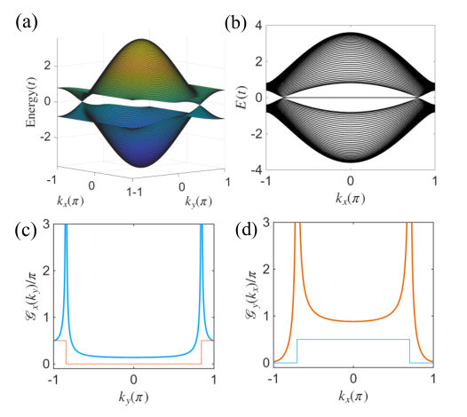 
FIG. 2. (a) Band structure of the DSM in the tilted 2D SSH model. (b) Energy spectrum on a ribbon along x di- rection corresponding to (a). (c) The dimension-reducted QMI Gx(ky) as a function of ky. The red line denotes the lower bound of QMI Gx(ky). (d) The dimension-reducted QMI Gy(kx) as a function of kx. The blue line denotes the lower bound of QMI Gy(kx). The parameters are taken at t1 = 1.2t, t2 = 0.4t, and t = 1.

📷 Fig 2

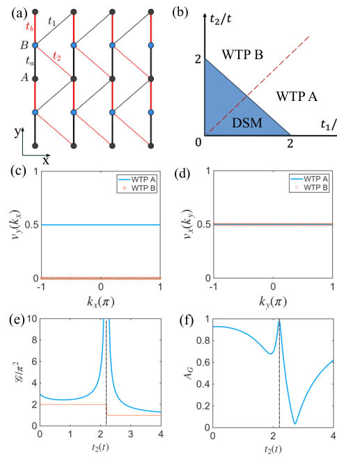 
FIG. 1. (a) Sketch of the lattice for the tilted 2D SSH model. Dimerized hoppings are labeled by t1 −ta and t2 −tb (thick vs thin lines) along different directions (red vs blue color). For our purpose, we consider the simple case with ta = tb = t. (b) Phase diagram of the tilted 2D SSH model lattice in the parameter space (t1, t2). The blue region is Dirac semimetal (DSM), and the remaining insulating phases are divided to two weak topological phases WTP A and WTP B by the nodal-line semimetal phase (dashed red line). (c) The Wan- nier band νy as a function of kx for WTP A and WTP B. (d) The Wannier band νx as a function of ky similar to (c). (e) The QMI G as a function of t2 at fixed...

📷 Fig 3

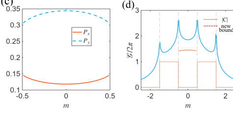 
FIG. 3. (a) Energy spectrum of the anisotropic Wilson-Dirac model on a ribbon along x direction. There are a pair of edge states in the bulk gap. Here m = 0. (b) The Wannier bands νy as a function of kx. At the momentum kx = 0, π, the Wannier band is fixed at νy = 1 2. (c) The value of defined polarization weight Px and Py for the QMI in Eq. (16). (d) The QMI G and the corresponding Chern number |C|. The dashed line indicates the new lower bound of QMI in the anisotropic Wilson-Dirac model within C = 0 region. The parameters are taken at bx = 0.5, by = 1, and v = 1.

📷 Fig 4

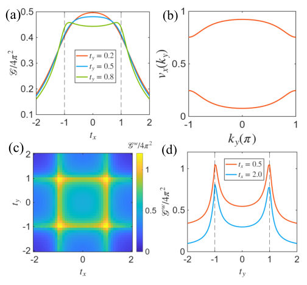 
FIG. 4. (a) The Bloch-basis QMI G as a function of tx for different ty in the BBH model. The dashed lines indicate the topological phase boundaries. (b) Wannier bands of the BBH model at tx = ty = 0.5t. (c) The phase diagram of the Wannier-band basis QMI Gw in the parameter space (tx, ty). In the topological regions, QMI Gw is lower bounded by non- zero quadrupole moment. It becomes divergent at the phase boundaries. (d) Wannier-basis QMI Gw as a function of ty at fixed tx = 0.5t and tx = 2.0t. We set t = 1 for all plots.

📷 Fig 5

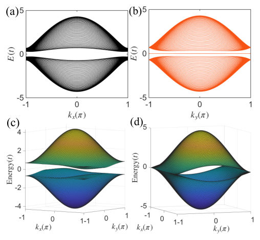 
FIG. 5. Energy spectrum of the tilted 2D SSH model. (a) The energy spectrum on a ribbon along x direction. (b) The energy spectrum on a ribbon along y direction. There are zero-energy edge modes in the gap. (c) The band structure for insulating phase. For (a-c), we take the parameters t1 = 0.8t and t2 = 1.5t, which set the system in the WTP B. (d) The band structure for nodal-line semi-metal phase at t1 = t2 = 1.5t.

**Summary.** The paper introduces a dimension-reduction framework to derive new, non-trivial lower bounds for the Quantum Metric Integral (QMI) in 2D quantum systems. By decomposing the QMI into nested 1D components, it successfully establishes topological constraints even when conventional bulk topology (like the Chern number) is zero. This generalizes fundamental relationships between geometry and topology across various models, including higher-order topological insulators.

**Why it may be interesting.** This work provides a powerful generalization of geometric quantization tools, extending topological protection from global bulk properties (like Chern numbers) to local or lower-dimensional features, which is crucial for understanding novel quantum materials.

Detailed structure

**Main problem.** The primary goal is to generalize the relationship between quantum geometry (specifically the Quantum Metric Integral, QMI) and topological invariants beyond systems where the conventional Chern number or Berry curvature vanishes.

**Main result.** The authors establish non-zero lower bounds on the QMI by decomposing the 2D integral into nested 1D components, successfully bounding it using lower-dimensional topological obstructions like winding numbers or higher-order invariants such as the quadrupole moment.

**Method.** A dimension-reduction framework is employed to decompose the 2D QMI into a sum of nested 1D integrals. These 1D integrals are then bounded below by quantized topological invariants derived from chiral symmetry or Wannier band analysis.

**Model / system.** The theory is applied to several models, including general 2D systems, the tilted Su-Schrieffer-Heeger (SSH) model, anisotropic Wilson-Dirac models, and higher-order topological insulators like the Benalcazar-Bernevig-Hughes (BBH) model.

**Key observables.** Quantum Metric Integral (QMI), Chern number ($C$), 1D QMI components, Wannier band winding numbers ($
u$), and the quadrupole moment ($q_{xy}$).

**Important parameters / regimes.** The analysis focuses on regimes where $C=0$ or Berry curvature vanishes, making the standard topological bounds ineffective.

**Assumptions / limitations.** The method relies fundamentally on decomposing the 2D integral into nested 1D integrals and utilizing specific mathematical inequalities (e.g., Cauchy-Schwartz) to relate these components to lower-dimensional topology.

**Figures summary.** Figures illustrate the QMI dependence on parameters in the BBH model, confirming the bound $G_w \geq 4\pi^2 q_{xy}$, and show energy spectra for the SSH model exhibiting zero-energy edge modes protected by chiral symmetry.

**Paper structure.** The paper develops a general dimension-reduction framework first, applying it to specific models like the SSH and Wilson-Dirac systems to derive bounds based on 1D topology. It then extends this methodology to higher-order topological phases using Wannier bands to relate QMI to invariants like the quadrupole moment.

Abstract

The quantum metric integral (QMI) in two-dimensional (2D) systems is conventionally bounded from below by the Chern number. For systems with zero Chern number or identically vanishing Berry curvature, however, this bound becomes trivial and provides no useful geometric constraints. Here, we develop a dimension-reduction framework that decomposes the 2D QMI into lower-dimensional components in a nested-loop way. With this method, we establish a nonzero lower bound on the QMI arising from one-dimensional topological obstructions even when the conventional 2D topology is trivial. We explicitly demonstrate this mechanism in a tilted 2D Su-Schrieffer-Heeger model and an anisotropic Wilson-Dirac model with chiral symmetry. The resulting lower bounds of QMI are determined by the quantized Wannier bands along two different directions. We further investigate the quantum geometry in higher-order topological phases following the same strategy. By introducing Wannier-band basis obtained from the nested Wilson loop, we demonstrate that the Wannier-band QMI is bounded from below by the higher-order topological invariant, e.g. the quadrupole moment in Benalcazar-Bernevig-Hughes model. Our results establish nonzero lower bounds on QMI from a dimension-reduction framework, thereby generalizing the fundamental relation between quantum geometry and topology.

[↑ back to top](#top)

### [Lead nanoparticles, the deep-ultraviolet to near-infrared plasmonic platform](http://arxiv.org/abs/2607.24340v1)

**Authors:** Michael Foltýn, Michal Kvapil, Kristýna Bukvišová, Tomáš Šikola, Michal Horák  
**Type:** experiment · **Category:** other · **PDF:** <https://arxiv.org/pdf/2607.24340v1>  
**Analysis basis:** full PDF text, analyzed in chunks
**Topic relevance:** `interference shaping light` **1/5** · `quantum optics experiment` **1/5**

📷 Fig 1

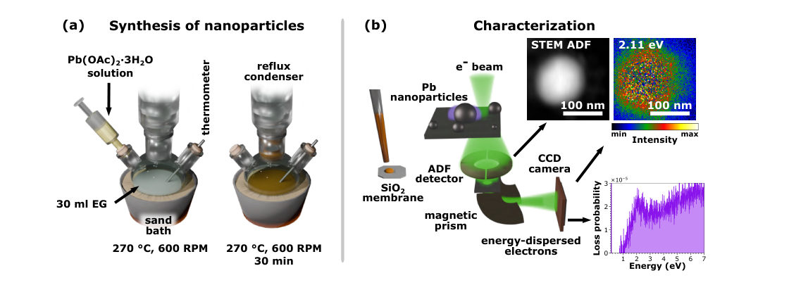 
Figure 1: Schematic workflow of the synthesis and chracterization of lead nanoparticles. (a) The spherical lead nanoparticle solutions were prepared by injection of lead acetate trihydrate solution into preheated tetraethylene glycol. Additionally, trisodium citrate was injected as well, to obtain smaller average nanoparticles. The solution was then left to react for 30 minutes and cooled down to room temperatures. (b) The morphology of lead nanoparticles was obtained from annular dark-field (ADF) STEM micrographs, and their plasmonic resonances were inspected using STEM-EELS.

📷 Fig 2

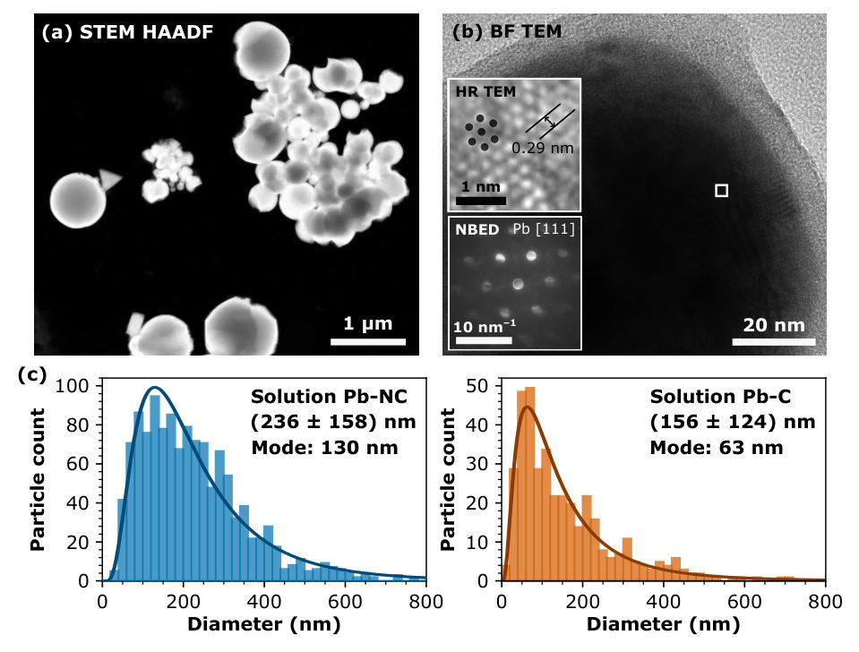 
Figure 2: Morphology, crystallinity, and size distribution of synthesized lead nanoparticles. (a) HAADF STEM micrograph showing their typical shape and size distribution. (b) TEM micrograph of a 100 nm nanoparticle. The inset shows Fourier-filtered image of the atomic columns from the area marked by the white rectangle. A NBED diffractogram from the same area indicates the crystal orientation of [111]. (c) Histograms with fitted log-normal curve showing the size distribution of lead nanoparticles in the Pb-NC and Pb-C solution. The Pb-NC solution contains nanoparticles with a mean diameter of 236 nm, its standard deviation of 158 nm, and its mode of 130 nm. The size distribution of the Pb-C...

📷 Fig 3

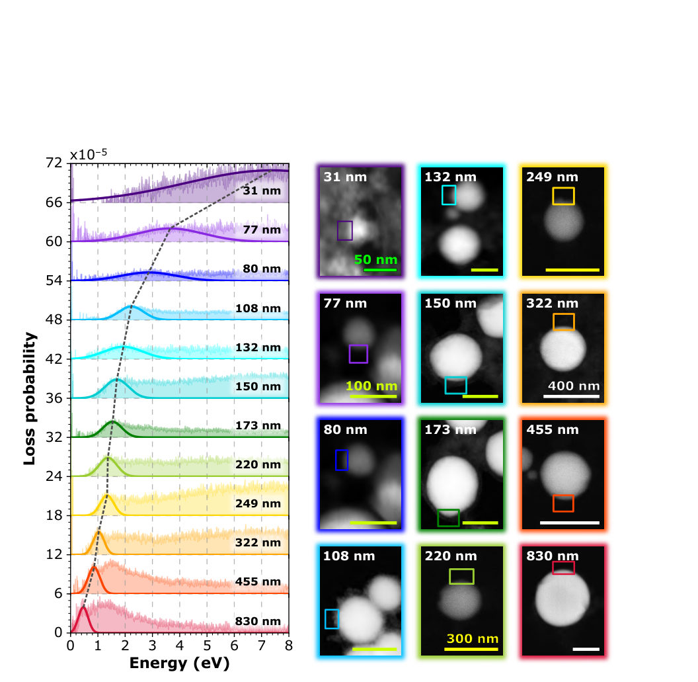 
Figure 3: Processed EEL spectra of a set of nanoparticles from the Pb-NC solution with diameters ranging from 31 to 830 nm with peaks correscponding to the dipole LSPR mode fitted with Gaussians. The rectangles in the ADF STEM micrographs of individual nanopar- ticles mark the integration areas from which the EEL spectra were collected. The dashed line is intended to serve as a guide for the eye, following the peaks corresponding to the dipole LSPR mode.

📷 Fig 4

 
Figure 4: Plasmonic performance of lead nanoparticles. (a) Dipole LSPR energy Epeak extracted from the measured EEL spectra and from the numerical simulations as a function of the nanoparticle diameter. (b) Experimental Q factors of the dipole LSPR peaks defined as Epeak/∆E.

📷 Fig 5

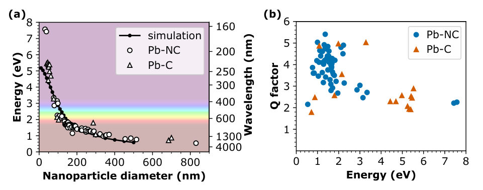 
Figure 4 shows the experimental tunability of the LSPR dipole mode as a function of

**Summary.** This work establishes lead nanoparticles as a highly promising multispectral plasmonic platform due to their ability to support localized surface plasmon resonances across an exceptionally broad spectrum, spanning from near-infrared to deep-ultraviolet. The authors synthesize and characterize these particles using STEM-EELS, demonstrating that the LSPR properties are systematically tunable by controlling the nanoparticle diameter. This finding significantly expands the known elemental metals suitable for advanced optical applications.

**Why it may be interesting.** While focused on plasmonics rather than quantum information directly, the precise control over optical resonances in the deep UV region is crucial for developing novel quantum light sources or detectors that interact strongly with matter at high energies.

Detailed structure

**Main problem.** The study investigates lead (Pb) as a plasmonic material, aiming to characterize its localized surface plasmon resonances (LSPR) across the deep-ultraviolet to near-infrared spectrum.

**Main result.** Lead nanoparticles exhibit the most extensive spectral tunability among elemental metals tested, supporting stable plasmonic performance from the near-infrared into the deep-ultraviolet region. The measured quality factors ($Q$ factor) are systematically correlated with particle size.

**Method.** The research combines chemical synthesis of spherical Pb nanoparticles with advanced characterization techniques like STEM-EELS to measure LSPR spectra, supplemented by numerical simulations.

**Model / system.** The physical system is chemically synthesized lead nanoparticles (Pb NPs) in solution. The analysis models the interaction of light with these nanospheres, using the dipole approximation for LSPR and comparing experimental EELS data against theoretical calculations.

**Key observables.** Localized Surface Plasmon Resonance (LSPR) energy ($E_{	ext{peak}}$), loss probability maxima ($I_{\max}$), full width at half maximum ($\Delta E$), and the derived quality factor ($Q$ factor).

**Important parameters / regimes.** Particle diameter (ranging from 31 nm to 830 nm), spectral range (near-infrared to deep-ultraviolet, below 200 nm).

**Assumptions / limitations.** Plasmon peaks are fitted using Gaussian functions for simplicity, and the analysis relies on comparing experimental EELS data with numerical simulations.

**Figures summary.** Figures show STEM/TEM micrographs confirming morphology and size distribution; EEL spectra track LSPR shifts vs. diameter; and plots compare measured $Q$ factors against theoretical predictions across the spectrum.

**Paper structure.** The paper follows a structure of problem identification (lack of DUV data for Pb), methodology description (synthesis, STEM-EELS characterization), presentation of size-dependent LSPR measurements, comparison with simulations, and concluding remarks on its multispectral potential.

Abstract

Among the other non-noble metals, lead (Pb) is a material of particular interest for plasmonic applications in the deep ultraviolet spectral region. However, experimental studies on its plasmonic performance have not yet been conducted. In this work, the dependence of the optical properties of spherical lead nanoparticles on their diameter is demonstrated. The plasmonic performance of chemically synthesized lead nanoparticles is evaluated at the single-particle level by means of a combination of scanning transmission electron microscopy and electron energy loss spectroscopy. Our findings demonstrate that these nanoparticles support localized surface plasmon resonances across the entire spectrum from near-infrared to deep-ultraviolet. This range was identified as the most extensive among all plasmonic elemental metals, extending to wavelengths below 200 nanometers. Consequently, lead nanoparticles exhibit stable plasmonic performance over a remarkably broad wavelength range, thereby substantiating their potential as a multispectral plasmonic platform.

[↑ back to top](#top)
