
# arxiv digest (quant-ph + cond-mat) — 2026-07-30

*129 papers · 50 relevant · 2 highlighted*

## 🔥 Most relevant (50)

*Every paper with at least one nonzero topic score, sorted by best-matching score. 🔥 marks scores ≥4/5. Click the title to jump to the full entry below; click [arXiv] to open the paper page. `(secondary)` marks papers from de-prioritized cond-mat archives.*

Show 50 relevant papers

- [From weakly to strongly-interacting driven-dissipative bosons in one dimension](#paper-2607.25508) [[arXiv]](http://arxiv.org/abs/2607.25508v1) — 🔥 `methods for driven-dissipative` **5/5** · 🔥 `Keldysh / 2PI / non-Gaussian methods` **4/5** · 🔥 `analog quantum simulation` **4/5** · 🔥 `driven-dissipative phase transition` **4/5** · 🔥 `non-equilibrium dynamics` **4/5** · `non-equilibrium universality` **3/5** · `correlated / nonlocal dissipation` **2/5** · `Kondo & dissipative impurity` **1/5** · `entanglement & information structure` **1/5** · `scars & prethermalization` **1/5**
- [Resolving Structure in Prethermal Floquet Dynamics with Precision Quantum Computation](#paper-2607.24937) [[arXiv]](http://arxiv.org/abs/2607.24937v1) — 🔥 `scars & prethermalization` **5/5** · 🔥 `analog quantum simulation` **4/5** · 🔥 `non-equilibrium dynamics` **4/5** · `driven-dissipative phase transition` **3/5** · `exotic spin models in light-matter` **3/5** · `methods for driven-dissipative` **3/5** · `QC/QI experiment` **2/5** · `non-equilibrium universality` **2/5** · `Keldysh / 2PI / non-Gaussian methods` **1/5** · `entanglement & information structure` **1/5** · `quantum measurements` **1/5**
- [Lowering the implementation barrier of neutral-atom quantum computing with agentic workflows](#paper-2607.25834) [[arXiv]](http://arxiv.org/abs/2607.25834v1) — 🔥 `Rydberg arrays` **5/5** · 🔥 `QC/QI experiment` **4/5** · 🔥 `analog quantum simulation` **4/5** · `methods for driven-dissipative` **3/5** · `non-equilibrium dynamics` **2/5** · `Keldysh / 2PI / non-Gaussian methods` **1/5** · `correlated / nonlocal dissipation` **1/5** · `driven-dissipative phase transition` **1/5** · `entanglement & information structure` **1/5**
- [Non-monotonic diffusion from nonequilibrium driving](#paper-2607.25902) [[arXiv]](http://arxiv.org/abs/2607.25902v1) — 🔥 `non-equilibrium dynamics` **5/5** · 🔥 `non-equilibrium universality` **4/5** · `Keldysh / 2PI / non-Gaussian methods` **3/5** · `driven-dissipative phase transition` **3/5** · `methods for driven-dissipative` **3/5** · `Frenkel-Kontorova` **1/5** · `analog quantum simulation` **1/5** · `correlated / nonlocal dissipation` **1/5**
- [Discrete power-law decay of subsystem distance after a quantum quench](#paper-2607.25661) [[arXiv]](http://arxiv.org/abs/2607.25661v1) — 🔥 `non-equilibrium dynamics` **5/5** · 🔥 `entanglement & information structure` **4/5** · 🔥 `non-equilibrium universality` **4/5** · `scars & prethermalization` **2/5** · `Keldysh / 2PI / non-Gaussian methods` **1/5** · `analog quantum simulation` **1/5** · `correlated / nonlocal dissipation` **1/5** · `driven-dissipative phase transition` **1/5** · `methods for driven-dissipative` **1/5**
- [A broadband, individually addressing two- and three-dimensional photonic integrated circuit for trapped-ion qubit control](#paper-2607.25062) [[arXiv]](http://arxiv.org/abs/2607.25062v1) — 🔥 `QC/QI experiment` **5/5** · 🔥 `analog quantum simulation` **4/5** · `quantum optics experiment` **2/5** · `interference shaping light` **1/5**
- [Tuning Density and Spin Ordering of Degenerate Fermi Gases in an Optical Cavity](#paper-2607.25267) [[arXiv]](http://arxiv.org/abs/2607.25267v1) — 🔥 `Dicke superradiance` **4/5** · 🔥 `analog quantum simulation` **4/5** · 🔥 `correlated cavity matter` **4/5** · 🔥 `driven-dissipative phase transition` **4/5** · `Tavis-Cummings & cavity-many-emitter` **3/5** · `correlated / nonlocal dissipation` **3/5** · `exotic spin models in light-matter` **3/5** · `methods for driven-dissipative` **3/5** · `non-equilibrium dynamics` **2/5** · `non-equilibrium universality` **2/5** · `superradiant laser` **2/5** · `Keldysh / 2PI / non-Gaussian methods` **1/5** · `entanglement & information structure` **1/5** · `spintronics-quantum-optics interface` **1/5**
- [Collective states of multi-level emitters: The role of multi-level interferences](#paper-2607.25547) [[arXiv]](http://arxiv.org/abs/2607.25547v1) — 🔥 `Dicke superradiance` **4/5** · 🔥 `correlated / nonlocal dissipation` **4/5** · `analog quantum simulation` **3/5** · `free-space correlated emission` **3/5** · `interference shaping light` **3/5** · `superradiant laser` **3/5** · `Tavis-Cummings & cavity-many-emitter` **2/5** · `correlated cavity matter` **2/5** · `driven-dissipative phase transition` **2/5** · `methods for driven-dissipative` **2/5** · `non-equilibrium dynamics` **2/5** · `Keldysh / 2PI / non-Gaussian methods` **1/5** · `entanglement & information structure` **1/5** · `exotic spin models in light-matter` **1/5** · `non-equilibrium universality` **1/5**
- ⭐ [Path integral approach to the truncated Wigner approximation of driven-dissipative spins](#paper-2607.26029) [[arXiv]](http://arxiv.org/abs/2607.26029v1) — 🔥 `Keldysh / 2PI / non-Gaussian methods` **4/5** · 🔥 `methods for driven-dissipative` **4/5** · `Rydberg arrays` **3/5** · `analog quantum simulation` **3/5** · `exotic spin models in light-matter` **3/5** · `spintronics-quantum-optics interface` **3/5** · `correlated / nonlocal dissipation` **2/5** · `driven-dissipative phase transition` **2/5** · `non-equilibrium dynamics` **2/5** · `Kondo & dissipative impurity` **1/5** · `correlated cavity matter` **1/5** · `entanglement & information structure` **1/5** · `non-equilibrium universality` **1/5**
- [Remote entanglement of massive oscillators via wire-mediated Coulomb interaction](#paper-2607.25341) [[arXiv]](http://arxiv.org/abs/2607.25341v1) — 🔥 `quantum measurements` **4/5** · `correlated / nonlocal dissipation` **3/5** · `entanglement & information structure` **3/5** · `measurement-induced transitions` **3/5** · `methods for driven-dissipative` **3/5** · `Keldysh / 2PI / non-Gaussian methods` **2/5** · `analog quantum simulation` **2/5** · `driven-dissipative phase transition` **2/5** · `non-equilibrium dynamics` **2/5** · `Tavis-Cummings & cavity-many-emitter` **1/5** · `correlated cavity matter` **1/5** · `non-equilibrium universality` **1/5**
- [Solvable Quantum Circuits with non-Markovian Influence Matrices](#paper-2607.25969) [[arXiv]](http://arxiv.org/abs/2607.25969v1) — 🔥 `analog quantum simulation` **4/5** · 🔥 `methods for driven-dissipative` **4/5** · `correlated / nonlocal dissipation` **3/5** · `driven-dissipative phase transition` **3/5** · `entanglement & information structure` **3/5** · `non-equilibrium dynamics` **3/5** · `Keldysh / 2PI / non-Gaussian methods` **2/5** · `non-equilibrium universality` **2/5** · `Kondo & dissipative impurity` **1/5** · `measurement-induced transitions` **1/5** · `scars & prethermalization` **1/5**
- [Nonlocal Magnonic Cat States in Hybrid Magnon-Qubit Architectures](#paper-2607.25643) [[arXiv]](http://arxiv.org/abs/2607.25643v1) — 🔥 `spintronics-quantum-optics interface` **4/5** · `correlated / nonlocal dissipation` **3/5** · `entanglement & information structure` **3/5** · `exotic spin models in light-matter` **3/5** · `QC/QI experiment` **2/5** · `measurement-induced transitions` **2/5** · `methods for driven-dissipative` **2/5** · `quantum measurements` **2/5** · `Tavis-Cummings & cavity-many-emitter` **1/5** · `analog quantum simulation` **1/5** · `correlated cavity matter` **1/5** · `driven-dissipative phase transition` **1/5** · `non-equilibrium dynamics` **1/5**
- [Observable Estimation in the Absence of Classical Verification](#paper-2607.25998) [[arXiv]](http://arxiv.org/abs/2607.25998v1) — 🔥 `QC/QI experiment` **4/5** · 🔥 `analog quantum simulation` **4/5** · `entanglement & information structure` **3/5** · `methods for driven-dissipative` **3/5** · `non-equilibrium dynamics` **3/5** · `correlated / nonlocal dissipation` **2/5** · `driven-dissipative phase transition` **2/5** · `quantum measurements` **2/5** · `Keldysh / 2PI / non-Gaussian methods` **1/5** · `measurement-induced transitions` **1/5** · `non-equilibrium universality` **1/5**
- ⭐ [Coherent control of subradiant excitations in atomic rings](#paper-2607.25638) [[arXiv]](http://arxiv.org/abs/2607.25638v1) — 🔥 `analog quantum simulation` **4/5** · 🔥 `correlated / nonlocal dissipation` **4/5** · `methods for driven-dissipative` **3/5** · `non-equilibrium dynamics` **3/5** · `Tavis-Cummings & cavity-many-emitter` **2/5** · `driven-dissipative phase transition` **2/5** · `Dicke superradiance` **1/5** · `Keldysh / 2PI / non-Gaussian methods` **1/5** · `correlated cavity matter` **1/5** · `entanglement & information structure` **1/5** · `exotic spin models in light-matter` **1/5** · `interference shaping light` **1/5** · `non-equilibrium universality` **1/5**
- [Dissipation Enables Strongly Detuning-Dependent Interference in Pulsed Dynamical Decoupling](#paper-2607.25176) [[arXiv]](http://arxiv.org/abs/2607.25176v1) — 🔥 `methods for driven-dissipative` **4/5** · `correlated / nonlocal dissipation` **3/5** · `driven-dissipative phase transition` **3/5** · `interference shaping light` **3/5** · `QC/QI experiment` **2/5** · `non-equilibrium dynamics` **2/5** · `non-equilibrium universality` **2/5** · `Keldysh / 2PI / non-Gaussian methods` **1/5** · `analog quantum simulation` **1/5** · `measurement-induced transitions` **1/5** · `quantum measurements` **1/5** · `quantum optics experiment` **1/5**
- [Interacting hydrodynamic modes in spinless fermions with dephasing noise](#paper-2607.25938) [[arXiv]](http://arxiv.org/abs/2607.25938v1) — 🔥 `methods for driven-dissipative` **4/5** · 🔥 `non-equilibrium dynamics` **4/5** · `Keldysh / 2PI / non-Gaussian methods` **3/5** · `correlated / nonlocal dissipation` **3/5** · `driven-dissipative phase transition` **3/5** · `analog quantum simulation` **2/5** · `non-equilibrium universality` **2/5** · `Kondo & dissipative impurity` **1/5** · `entanglement & information structure` **1/5** · `scars & prethermalization` **1/5**
- [Anomalous entanglement scaling from eigenvector nonorthogonality in critical non-Hermitian free fermions](#paper-2607.25256) [[arXiv]](http://arxiv.org/abs/2607.25256v1) — 🔥 `entanglement & information structure` **4/5** · 🔥 `non-equilibrium universality` **4/5** · `driven-dissipative phase transition` **3/5** · `methods for driven-dissipative` **3/5** · `non-equilibrium dynamics` **3/5** · `Kondo & dissipative impurity` **2/5** · `Keldysh / 2PI / non-Gaussian methods` **1/5** · `analog quantum simulation` **1/5** · `correlated / nonlocal dissipation` **1/5**
- [Programmable Bulk Topological Channels via Strain Engineering](#paper-2607.25809) [[arXiv]](http://arxiv.org/abs/2607.25809v1) `(secondary)` — 🔥 `analog quantum simulation` **4/5** · `driven-dissipative phase transition` **3/5** · `methods for driven-dissipative` **3/5** · `non-equilibrium dynamics` **3/5** · `non-equilibrium universality` **2/5** · `spintronics-quantum-optics interface` **2/5** · `Frenkel-Kontorova` **1/5** · `Keldysh / 2PI / non-Gaussian methods` **1/5** · `correlated / nonlocal dissipation` **1/5** · `exotic spin models in light-matter` **1/5** · `interference shaping light` **1/5**
- [A Model Predictive Control-Inspired Quantum Algorithm](#paper-2607.24992) [[arXiv]](http://arxiv.org/abs/2607.24992v1) — 🔥 `quantum measurements` **4/5** · `measurement-induced transitions` **3/5** · `methods for driven-dissipative` **3/5** · `Keldysh / 2PI / non-Gaussian methods` **2/5** · `analog quantum simulation` **2/5** · `non-equilibrium dynamics` **2/5** · `correlated / nonlocal dissipation` **1/5** · `driven-dissipative phase transition` **1/5** · `entanglement & information structure` **1/5** · `non-equilibrium universality` **1/5**
- [Don't truncate, decompose: mean-field dynamics of long-range quantum systems from strongly correlated states](#paper-2607.25434) [[arXiv]](http://arxiv.org/abs/2607.25434v1) — 🔥 `Keldysh / 2PI / non-Gaussian methods` **4/5** · `driven-dissipative phase transition` **3/5** · `methods for driven-dissipative` **3/5** · `non-equilibrium dynamics` **3/5** · `correlated / nonlocal dissipation` **2/5** · `non-equilibrium universality` **2/5** · `analog quantum simulation` **1/5** · `entanglement & information structure` **1/5** · `scars & prethermalization` **1/5**
- [Invariant-based master equation applied to driven qutrit coupled to a bath and a leaky cavity](#paper-2607.25005) [[arXiv]](http://arxiv.org/abs/2607.25005v1) — 🔥 `methods for driven-dissipative` **4/5** · `driven-dissipative phase transition` **3/5** · `non-equilibrium dynamics` **3/5** · `Keldysh / 2PI / non-Gaussian methods` **2/5** · `Tavis-Cummings & cavity-many-emitter` **2/5** · `non-equilibrium universality` **2/5** · `analog quantum simulation` **1/5** · `correlated / nonlocal dissipation` **1/5** · `correlated cavity matter` **1/5** · `quantum measurements` **1/5**
- [Tip-Tuned Renormalization-Group Spectroscopy Unmasks a False-positive Topological Superconducting Vortex](#paper-2607.25510) [[arXiv]](http://arxiv.org/abs/2607.25510v1) — 🔥 `methods for driven-dissipative` **4/5** · `Keldysh / 2PI / non-Gaussian methods` **3/5** · `correlated / nonlocal dissipation` **3/5** · `driven-dissipative phase transition` **3/5** · `Kondo & dissipative impurity` **2/5** · `non-equilibrium dynamics` **2/5** · `analog quantum simulation` **1/5** · `non-equilibrium universality` **1/5** · `quantum measurements` **1/5**
- [Effective Field Theory of Operator Scrambling from Strong-to-Weak Symmetry Breaking](#paper-2607.24925) [[arXiv]](http://arxiv.org/abs/2607.24925v1) — 🔥 `entanglement & information structure` **4/5** · 🔥 `non-equilibrium dynamics` **4/5** · `Keldysh / 2PI / non-Gaussian methods` **3/5** · `non-equilibrium universality` **3/5** · `scars & prethermalization` **2/5** · `correlated / nonlocal dissipation` **1/5** · `driven-dissipative phase transition` **1/5** · `methods for driven-dissipative` **1/5**
- [Spin-cQED with bulk germanium spin qubits](#paper-2607.24967) [[arXiv]](http://arxiv.org/abs/2607.24967v1) — 🔥 `spintronics-quantum-optics interface` **4/5** · `Tavis-Cummings & cavity-many-emitter` **3/5** · `correlated cavity matter` **3/5** · `analog quantum simulation` **2/5** · `exotic spin models in light-matter` **2/5** · `Keldysh / 2PI / non-Gaussian methods` **1/5** · `QC/QI experiment` **1/5** · `driven-dissipative phase transition` **1/5** · `methods for driven-dissipative` **1/5**
- [Actualization, Records, and the Emergence of Entropic Time](#paper-2607.25307) [[arXiv]](http://arxiv.org/abs/2607.25307v1) — 🔥 `entanglement & information structure` **4/5** · 🔥 `quantum measurements` **4/5** · `measurement-induced transitions` **3/5** · `non-equilibrium dynamics` **2/5** · `correlated / nonlocal dissipation` **1/5** · `driven-dissipative phase transition` **1/5** · `methods for driven-dissipative` **1/5** · `non-equilibrium universality` **1/5**
- [Asymmetric information scrambling and eigenstate thermalization in inhomogeneous XXZ spin chains](#paper-2607.25496) [[arXiv]](http://arxiv.org/abs/2607.25496v1) — 🔥 `entanglement & information structure` **4/5** · `analog quantum simulation` **3/5** · `non-equilibrium dynamics` **3/5** · `non-equilibrium universality` **2/5** · `scars & prethermalization` **2/5** · `Frenkel-Kontorova` **1/5** · `Keldysh / 2PI / non-Gaussian methods` **1/5** · `exotic spin models in light-matter` **1/5**
- [Relaxation of quenched structural glasses: descent in a stiffening caging potential over inflection-point 'speed bumps'](#paper-2607.25360) [[arXiv]](http://arxiv.org/abs/2607.25360v1) — 🔥 `non-equilibrium dynamics` **4/5** · `non-equilibrium universality` **3/5** · `scars & prethermalization` **3/5** · `driven-dissipative phase transition` **2/5** · `Frenkel-Kontorova` **1/5** · `Keldysh / 2PI / non-Gaussian methods` **1/5** · `analog quantum simulation` **1/5** · `correlated / nonlocal dissipation` **1/5** · `methods for driven-dissipative` **1/5**
- [Time-Reversal Invariant Topological Photonic Alloy](#paper-2607.25769) [[arXiv]](http://arxiv.org/abs/2607.25769v1) — 🔥 `analog quantum simulation` **4/5** · `driven-dissipative phase transition` **3/5** · `exotic spin models in light-matter` **3/5** · `methods for driven-dissipative` **2/5** · `non-equilibrium dynamics` **2/5** · `correlated cavity matter` **1/5** · `interference shaping light` **1/5** · `non-equilibrium universality` **1/5**
- [A General First- and Second-Order Numerical Solver for Non-Markovian Quantum State Diffusion](#paper-2607.25427) [[arXiv]](http://arxiv.org/abs/2607.25427v1) — 🔥 `methods for driven-dissipative` **4/5** · `correlated / nonlocal dissipation` **3/5** · `non-equilibrium dynamics` **3/5** · `Keldysh / 2PI / non-Gaussian methods` **2/5** · `driven-dissipative phase transition` **2/5** · `analog quantum simulation` **1/5** · `non-equilibrium universality` **1/5**
- [Agentic AI for Scientific Reasoning in Autonomous Quantum Sensing Experiments](#paper-2607.25145) [[arXiv]](http://arxiv.org/abs/2607.25145v1) — 🔥 `QC/QI experiment` **4/5** · `quantum measurements` **3/5** · `spintronics-quantum-optics interface` **3/5** · `non-equilibrium dynamics` **2/5** · `driven-dissipative phase transition` **1/5** · `measurement-induced transitions` **1/5** · `methods for driven-dissipative` **1/5** · `quantum optics experiment` **1/5**
- [Cumulative suspicion and absorption dynamics in an agent-based Mafia game](#paper-2607.24980) [[arXiv]](http://arxiv.org/abs/2607.24980v1) — 🔥 `non-equilibrium universality` **4/5** · `driven-dissipative phase transition` **3/5** · `methods for driven-dissipative` **3/5** · `non-equilibrium dynamics` **3/5** · `Keldysh / 2PI / non-Gaussian methods` **1/5** · `analog quantum simulation` **1/5** · `correlated / nonlocal dissipation` **1/5**
- [Efficient Lindbladian Learning from Constant-Time Pauli Responses](#paper-2607.25795) [[arXiv]](http://arxiv.org/abs/2607.25795v1) — 🔥 `methods for driven-dissipative` **4/5** · `quantum measurements` **3/5** · `QC/QI experiment` **2/5** · `measurement-induced transitions` **2/5** · `Keldysh / 2PI / non-Gaussian methods` **1/5** · `analog quantum simulation` **1/5** · `correlated / nonlocal dissipation` **1/5** · `driven-dissipative phase transition` **1/5** · `non-equilibrium dynamics` **1/5**
- [Environmental and cell-cell signaling shape developmental trajectories across morphogenetic landscapes](#paper-2607.25897) [[arXiv]](http://arxiv.org/abs/2607.25897v1) `(secondary)` — 🔥 `non-equilibrium universality` **4/5** · `driven-dissipative phase transition` **3/5** · `methods for driven-dissipative` **3/5** · `non-equilibrium dynamics` **2/5** · `Frenkel-Kontorova` **1/5** · `Keldysh / 2PI / non-Gaussian methods` **1/5** · `analog quantum simulation` **1/5** · `correlated / nonlocal dissipation` **1/5**
- [Engineering a Quantum Thermal Diode with Floquet Driving](#paper-2607.25678) [[arXiv]](http://arxiv.org/abs/2607.25678v1) — 🔥 `non-equilibrium dynamics` **4/5** · `driven-dissipative phase transition` **3/5** · `methods for driven-dissipative` **3/5** · `non-equilibrium universality` **2/5** · `Keldysh / 2PI / non-Gaussian methods` **1/5** · `analog quantum simulation` **1/5** · `correlated / nonlocal dissipation` **1/5**
- [Predicting the Slow Drift of Nuclear Spin Noise in Semiconductor Spin Qubits](#paper-2607.26019) [[arXiv]](http://arxiv.org/abs/2607.26019v1) — 🔥 `QC/QI experiment` **4/5** · `methods for driven-dissipative` **3/5** · `spintronics-quantum-optics interface` **3/5** · `quantum measurements` **2/5** · `Keldysh / 2PI / non-Gaussian methods` **1/5** · `correlated / nonlocal dissipation` **1/5** · `driven-dissipative phase transition` **1/5**
- [Krylov-Space Memory Cores](#paper-2607.26011) [[arXiv]](http://arxiv.org/abs/2607.26011v1) — 🔥 `scars & prethermalization` **4/5** · `non-equilibrium dynamics` **3/5** · `non-equilibrium universality` **2/5** · `Keldysh / 2PI / non-Gaussian methods` **1/5** · `analog quantum simulation` **1/5** · `driven-dissipative phase transition` **1/5** · `entanglement & information structure` **1/5** · `methods for driven-dissipative` **1/5**
- [Quantum detection of CP violation in the $t\bar{t}$ system: production](#paper-2607.25029) [[arXiv]](http://arxiv.org/abs/2607.25029v1) — 🔥 `entanglement & information structure` **4/5** · `quantum measurements` **2/5** · `Keldysh / 2PI / non-Gaussian methods` **1/5** · `analog quantum simulation` **1/5** · `correlated / nonlocal dissipation` **1/5** · `driven-dissipative phase transition` **1/5** · `methods for driven-dissipative` **1/5** · `non-equilibrium dynamics` **1/5** · `non-equilibrium universality` **1/5**
- [Deterministic loading of molecular arrays by microwave-assisted collisions](#paper-2607.25783) [[arXiv]](http://arxiv.org/abs/2607.25783v1) — 🔥 `analog quantum simulation` **4/5** · `QC/QI experiment` **2/5** · `non-equilibrium dynamics` **2/5** · `Rydberg arrays` **1/5** · `driven-dissipative phase transition` **1/5** · `methods for driven-dissipative` **1/5**
- [Experiments with interacting ultracold polar molecules](#paper-2607.25519) [[arXiv]](http://arxiv.org/abs/2607.25519v1) — 🔥 `analog quantum simulation` **4/5** · `QC/QI experiment` **2/5** · `correlated cavity matter` **1/5** · `driven-dissipative phase transition` **1/5** · `entanglement & information structure` **1/5** · `non-equilibrium dynamics` **1/5** · `quantum optics experiment` **1/5**
- [Exponential de Finetti Theorems for Fermionic Gaussian States](#paper-2607.25779) [[arXiv]](http://arxiv.org/abs/2607.25779v1) — 🔥 `entanglement & information structure` **4/5** · `Keldysh / 2PI / non-Gaussian methods` **2/5** · `analog quantum simulation` **1/5** · `correlated / nonlocal dissipation` **1/5** · `driven-dissipative phase transition` **1/5** · `methods for driven-dissipative` **1/5** · `non-equilibrium dynamics` **1/5**
- [Tunable state-dependent interactions in collisionally stable mixtures of polar molecules](#paper-2607.25777) [[arXiv]](http://arxiv.org/abs/2607.25777v1) — 🔥 `analog quantum simulation` **4/5** · `exotic spin models in light-matter` **3/5** · `Keldysh / 2PI / non-Gaussian methods` **1/5** · `correlated / nonlocal dissipation` **1/5** · `driven-dissipative phase transition` **1/5** · `methods for driven-dissipative` **1/5**
- [Quantum teleportation over a field-deployed hollow-core fibre network](#paper-2607.25352) [[arXiv]](http://arxiv.org/abs/2607.25352v1) — 🔥 `QC/QI experiment` **4/5** · `quantum optics experiment` **3/5** · `interference shaping light` **1/5** · `quantum measurements` **1/5**
- [Entanglement asymmetry in the gapped XYZ spin-$\frac12$ chain](#paper-2607.25625) [[arXiv]](http://arxiv.org/abs/2607.25625v1) — 🔥 `entanglement & information structure` **4/5** · `analog quantum simulation` **1/5** · `exotic spin models in light-matter` **1/5** · `non-equilibrium dynamics` **1/5** · `non-equilibrium universality` **1/5**
- [Ro-vibrational van der Waals interaction between ultracold polar molecules](#paper-2607.25774) [[arXiv]](http://arxiv.org/abs/2607.25774v1) — 🔥 `analog quantum simulation` **4/5** · `correlated / nonlocal dissipation` **1/5** · `entanglement & information structure` **1/5** · `methods for driven-dissipative` **1/5** · `non-equilibrium dynamics` **1/5**
- [Realizing Error Suppression in Partially Fault-Tolerant Quantum Simulations with IBM Quantum Computers](#paper-2607.24947) [[arXiv]](http://arxiv.org/abs/2607.24947v1) — 🔥 `QC/QI experiment` **4/5** · `analog quantum simulation` **1/5** · `methods for driven-dissipative` **1/5** · `quantum measurements` **1/5**
- [Effect-valued measurement models and contextuality](#paper-2607.25900) [[arXiv]](http://arxiv.org/abs/2607.25900v1) — 🔥 `quantum measurements` **4/5** · `measurement-induced transitions` **1/5**
- [Sampling hard circuits with verifiably high fidelity](#paper-2607.25941) [[arXiv]](http://arxiv.org/abs/2607.25941v1) — 🔥 `QC/QI experiment` **4/5** · `quantum measurements` **1/5**
- [Ultradilute quasi-two-dimensional Bose-Bose liquid mixtures](#paper-2607.25558) [[arXiv]](http://arxiv.org/abs/2607.25558v1) — 🔥 `analog quantum simulation` **4/5** · `methods for driven-dissipative` **1/5**
- [Equi-Entropic Maps for Four-Partite Quantum States](#paper-2607.25954) [[arXiv]](http://arxiv.org/abs/2607.25954v1) — 🔥 `entanglement & information structure` **4/5**
- [Superfluidity without charge order in the attractive Hubbard model on the kagome lattice](#paper-2607.25983) [[arXiv]](http://arxiv.org/abs/2607.25983v1) — 🔥 `analog quantum simulation` **4/5**

## ⭐ Highlighted (2)

*Papers by authors on your watch list. Click the title to jump to the full entry below; click [arXiv] to open the paper page.*

Show 2 highlighted papers

- ⭐ [Coherent control of subradiant excitations in atomic rings](#paper-2607.25638) [[arXiv]](http://arxiv.org/abs/2607.25638v1) — Igor Lesanovsky
- ⭐ [Path integral approach to the truncated Wigner approximation of driven-dissipative spins](#paper-2607.26029) [[arXiv]](http://arxiv.org/abs/2607.26029v1) — Michael Fleischhauer, Igor Lesanovsky

## All papers (107, sorted by relevance)

*Papers from quant-ph and your primary cond-mat archives (quant-gas, stat-mech, str-el, dis-nn). Highlighted papers (⭐) come first, then everything else sorted by topic-relevance score, highest first.*

### ⭐ [Path integral approach to the truncated Wigner approximation of driven-dissipative spins](http://arxiv.org/abs/2607.26029v1)

**Highlighted author(s):** Michael Fleischhauer, Igor Lesanovsky  
**Authors:** Viktoria Noel, Michael Fleischhauer, Igor Lesanovsky  
**Type:** theory · **Category:** other · **PDF:** <https://arxiv.org/pdf/2607.26029v1>  
**Analysis basis:** full PDF text, analyzed in chunks
**Topic relevance:** 🔥 `Keldysh / 2PI / non-Gaussian methods` **4/5** · 🔥 `methods for driven-dissipative` **4/5** · `Rydberg arrays` **3/5** · `analog quantum simulation` **3/5** · `exotic spin models in light-matter` **3/5** · `spintronics-quantum-optics interface` **3/5** · `correlated / nonlocal dissipation` **2/5** · `driven-dissipative phase transition` **2/5** · `non-equilibrium dynamics` **2/5** · `Kondo & dissipative impurity` **1/5** · `correlated cavity matter` **1/5** · `entanglement & information structure` **1/5** · `non-equilibrium universality` **1/5**

📷 Fig 1

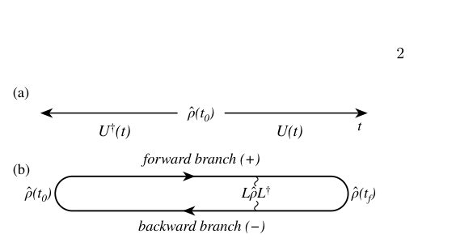 
FIG. 1. The Keldysh contour for Lindblad dynamics. (a): Evolution of the density matrix, ˆρ(t) = ˆU(t) ˆρ(t0) ˆU †(t): the initial state is propagated by ˆU(t) on one side and by ˆU †(t) on the other, so its evolution comprises two histories over the same time interval. (b): The two histories folded into the closed time contour: the system travels along the forward branch (+) and returns along the backward branch (−). The initial state ˆρ(t0) joins the two branches at the initial time, and the closure of the contour at the final time is implemented by computing the trace of ˆρ(tf). Dissipation couples the branches: in the term ˆLˆρˆL†, ˆL acts on the forward and ˆL† on the backward branch...

📷 Fig 2

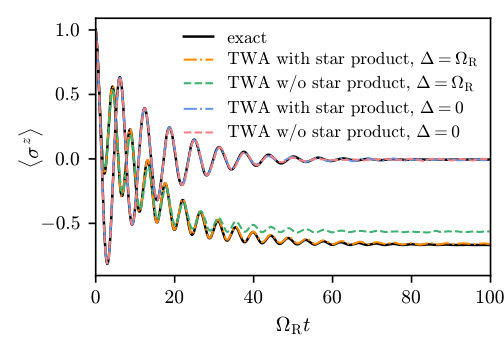 
FIG. 2. Single-spin benchmark. Site magnetisation ⟨σz⟩ of a single driven-decaying spin: exact solution of the master equation (black), the stochastic equations of Table I (“TWA with star product”), and the variant with operator products replaced by ordinary multiplication of their symbols (“TWA w/o star product”) at detuning ∆= ΩR and on resonance, ∆= 0. On resonance all curves coincide, while at finite detun- ing the ordinary-product variant relaxes to a visibly displaced steady state.

📷 Fig 3

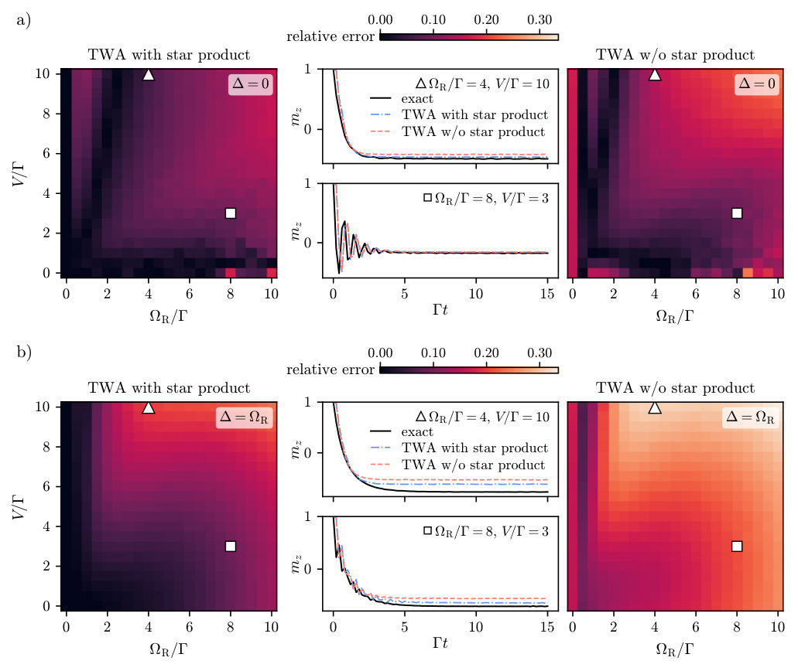 
FIG. 3. Accuracy of the TWA with and without the star-product corrections. The colour maps show the relative error of the steady-state, site-averaged magnetisation of an N = 10 Rydberg chain for the TWA with the jump operators evaluated with star-product corrections (left) and without it (right) for (a) resonant drive, ∆= 0 and (b) finite detuning, ∆= ΩR. All the heatmaps share the same colour scale. The middle panels show the time evolution of mz at the parameters marked on the maps by the triangle (ΩR/Γ = 4, V/Γ = 10, strongly interacting) and the square (ΩR/Γ = 8, V/Γ = 3, weakly interacting), compared with the exact quantum jump Monte Carlo solution (black).

**Summary.** This paper develops a rigorous path integral approach to apply the Truncated Wigner Approximation (TWA) to open, dissipative spin systems. By incorporating the necessary SU(2) star product into the Keldysh formulation, the authors overcome inconsistencies found in previous methods. The resulting framework provides a systematic and theoretically sound way to simulate complex quantum dynamics on curved phase spaces.

**Why it may be interesting.** This work directly addresses the limitations of applying semiclassical methods like TWA to spin systems where non-commutativity is crucial; correctly handling the star product is essential for obtaining physically accurate results beyond simple mean-field treatments.

Detailed structure

**Main problem.** The primary goal is to develop a consistent path integral formulation for applying the Truncated Wigner Approximation (TWA) to open, driven-dissipative interacting spin systems.

**Main result.** The authors establish that incorporating the SU(2) star product into the path integral yields stochastic equations that correctly reproduce the exact dynamics of single dissipative spins, providing a unified field-theoretic foundation for TWA in this regime.

**Method.** The work employs a Keldysh path-integral formulation on the continuous SU(2) phase space, adapting techniques from bosonic systems to handle spin operators via a non-commutative star product ($\star$).

**Model / system.** The system under study is interacting open spin-1/2 systems, which can be realized in platforms like Rydberg atom arrays. The dynamics are governed by the Lindblad master equation.

**Key observables.** Expectation values of spin operators ($\langle\hat{O}
angle$), represented as phase-space averages over the Wigner function or flattened symbol $\chi(\Omega)$.

**Important parameters / regimes.** The approximation is semiclassical, involving truncations related to quantum fluctuations and the order of corrections from the star product.

**Assumptions / limitations.** The core assumption involves mapping operator products onto the curved spin phase space using a 'star product' ($\star$), which must be treated carefully as it generates $\mathcal{O}(1)$ corrections unlike in simpler bosonic cases.

**Figures summary.** Not specified, but the notes reference Figure 1 showing the Keldysh path integral contour and equations detailing the evolution step (Equation 20).

**Paper structure.** The paper builds by first defining the SU(2) phase space, then constructing the path integral for Lindblad evolution, focusing critically on deriving and implementing the necessary star product corrections to ensure consistency with known single-spin dynamics.

Abstract

Phase-space approaches such as the truncated Wigner approximation (TWA) provide an efficient semiclassical framework for performing approximate simulations of the dynamics of open quantum many-body systems outside the reach of exact numerical methods but beyond the mean-field level. For bosonic systems, TWA is known to be equivalent to a Keldysh path-integral formulation truncated at second order in the so-called quantum fluctuations. This semiclassical approach provides an alternative transparent route towards approximate stochastic equations of motion, which can be efficiently solved. Here we establish the corresponding path-integral formulation for interacting open spin-$1/2$ systems using the continuous $\mathrm{SU}(2)$ phase space. We show, in particular, that a consistent treatment of dissipation requires correctly mapping operator products onto the curved spin phase space, leading to stochastic equations that coincide with those obtained from the continuous TWA formulation and thus reproduce the exact dynamics of a single dissipative spin. Our results provide a unified field-theoretic foundation for the TWA to dissipative spin dynamics and offer a systematic starting point for extensions beyond the semiclassical approximation.

[↑ back to top](#top)

### ⭐ [Coherent control of subradiant excitations in atomic rings](http://arxiv.org/abs/2607.25638v1)

**Highlighted author(s):** Igor Lesanovsky  
**Authors:** Milena Djatchkova, Igor Lesanovsky, Beatriz Olmos  
**Type:** theory · **Category:** quantum information and computing · **PDF:** <https://arxiv.org/pdf/2607.25638v1>  
**Analysis basis:** full PDF text, analyzed in chunks
**Topic relevance:** 🔥 `analog quantum simulation` **4/5** · 🔥 `correlated / nonlocal dissipation` **4/5** · `methods for driven-dissipative` **3/5** · `non-equilibrium dynamics` **3/5** · `Tavis-Cummings & cavity-many-emitter` **2/5** · `driven-dissipative phase transition` **2/5** · `Dicke superradiance` **1/5** · `Keldysh / 2PI / non-Gaussian methods` **1/5** · `correlated cavity matter` **1/5** · `entanglement & information structure` **1/5** · `exotic spin models in light-matter` **1/5** · `interference shaping light` **1/5** · `non-equilibrium universality` **1/5**

📷 Fig 1

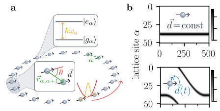 
FIG. 1. Ring setup and subradiant excitation trans- port. a: Ring-shaped atomic array with interatomic spacing a and parallel in-plane transition dipoles ⃗d, enclosing an an- gle θ with the local bond direction ⃗rα,α+1. The orientation- dependent interactions generate an effective trapping poten- tial (red) for a localized subradiant collective excitation (or- ange). Adiabatically rotating the dipole orientation trans- lates the potential minimum, enabling coherent transport of the trapped excitation around the ring. b: Time evolution of the localized excitation for fixed dipoles (top) and during a full adiabatic 2π dipole rotation over τ = 400 γ−1 (bottom), for N = 50 and a = 0.08 λa. In...

📷 Fig 2

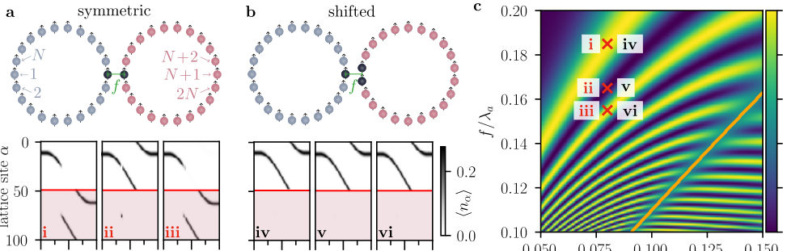 
FIG. 2. Controlled excitation exchange dynamics between coupled rings. a: Symmetric configuration with axially aligned rings. b: Shifted configuration, where one ring is rotated such that the atoms at the point of closest proximity form a triangle. In both cases, the inter-ring separation is denoted as f. c: Excitation transfer probability in the symmetric configuration for N = 50, shown as a function of interatomic distance a and ring separation f. The solid orange line indicates an energy crossing between the participating eigenstates. i-iii: Representative time evolution of the site occupations for a = 0.08λa, illustrating one (f = 0.185λa), two (f = 0.165λa) and three (f = 0.155λa)...

📷 Fig 3

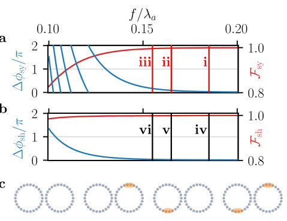 
FIG. 3. Conditional phase accumulation. a,b: Interaction-induced excess phase ∆ϕ and fidelity F as a function of the inter-ring separation f for the symmetric a and shifted b configurations, with fixed interatomic spacing a = 0.08 λa. The vertical lines labeled i-vi indicate the pa- rameter values corresponding to the representative time evo- lutions shown in Fig. 2. c: Logical basis defined by the pres- ence or absence of a trapped excitation in each ring, used to interpret the symmetric and shifted protocols as complemen- tary elementary photonic operations.

**Summary.** The authors theoretically demonstrate that ordered atomic rings can act as robust quantum memories and processors for photonic excitations. By controlling dipole orientation and inter-ring spacing, they achieve coherent transport and controlled interactions between stored subradiant light quanta. This establishes the platform's potential for fault-tolerant quantum information processing.

**Why it may be interesting.** This work directly addresses the use of solid-state or structured matter platforms (atomic arrays) for building scalable photonic quantum circuits by leveraging engineered collective decay suppression.

Detailed structure

**Main problem.** The paper demonstrates how coherent control can be achieved for subradiant excitations trapped within ordered atomic rings.

**Main result.** They show that the system supports adiabatic transport around a ring, geometry-controlled transfer between neighboring rings, and interaction-induced conditional phase shifts, enabling photonic quantum information processing.

**Method.** The analysis uses theoretical modeling based on the master equation and effective Hamiltonians derived for collective excitations in atomic arrays.

**Model / system.** The system consists of ordered subwavelength atomic arrays, specifically ring-shaped structures containing two-level emitters. Dynamics are governed by coupling terms ($V_{\alphaeta}$) and dissipation ($\Gamma_{\alphaeta}$), analyzed within the single or two-excitation manifold.

**Key observables.** Collective excitation survival probability ($P_{	ext{sur}}$), single-excitation transfer probability ($P_{tr}$), and interaction-induced excess phase ($\Delta\phi$).

**Important parameters / regimes.** Interatomic separation ($r_{\alphaeta}$), dipole orientation ($	heta$), ring separation ($f$), and the requirement for subradiant protection.

**Assumptions / limitations.** The analysis assumes the system remains largely confined to the single-excitation manifold, and adiabatic evolution requires slow changes relative to energy gaps.

**Figures summary.** Figures illustrate excitation transport during dipole rotation (Fig. 1), controlled exchange dynamics between two rings based on geometry (Fig. 2), and the dependence of phase accumulation and fidelity on separation distance (Fig. 3).

**Paper structure.** The paper progresses by first establishing single-ring adiabatic transport, then demonstrating controllable inter-ring transfer using symmetric vs. shifted geometries, and finally analyzing two-excitation dynamics to realize controlled-phase quantum gates.

Abstract

Collective excitations in ordered subwavelength atomic arrays can exhibit strongly suppressed radiative decay due to interference between light scattered by neighboring emitters. These so-called subradiant states make these systems a promising platform for storing and manipulating photonic excitations. The external geometry of the array, combined with dynamical control of the atomic dipole orientation, enables localized trapping and coherent transport of these subradiant excitations. Here, we theoretically demonstrate these capabilities in ring-shaped atomic arrays. Specifically, we show adiabatic transport of a localized excitation around a single ring, coherent transfer of a single excitation between two neighboring rings with geometry-controlled selectivity, and interaction-induced conditional phase shifts between two simultaneously trapped excitations in neighboring rings. The latter can be interpreted as effective controlled-phase operations between stored excitations. Together, these results demonstrate the potential of ordered atomic arrays as a platform for coherent photonic quantum information processing with dissipation-protected collective excitations.

[↑ back to top](#top)

### [From weakly to strongly-interacting driven-dissipative bosons in one dimension](http://arxiv.org/abs/2607.25508v1)

**Authors:** Martina Zündel, Loïc Herviou, Léonie Canet, Anna Minguzzi  
**Type:** theory · **Category:** quantum gases · **PDF:** <https://arxiv.org/pdf/2607.25508v1>  
**Analysis basis:** full PDF text, analyzed in chunks
**Topic relevance:** 🔥 `methods for driven-dissipative` **5/5** · 🔥 `Keldysh / 2PI / non-Gaussian methods` **4/5** · 🔥 `analog quantum simulation` **4/5** · 🔥 `driven-dissipative phase transition` **4/5** · 🔥 `non-equilibrium dynamics` **4/5** · `non-equilibrium universality` **3/5** · `correlated / nonlocal dissipation` **2/5** · `Kondo & dissipative impurity` **1/5** · `entanglement & information structure` **1/5** · `scars & prethermalization` **1/5**

📷 Fig 1

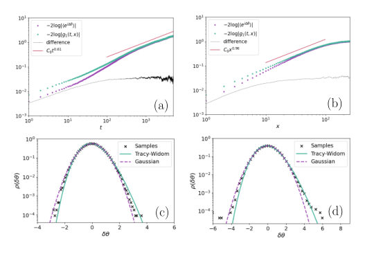 
FIG. 1. (a) Temporal correlations −2log|g(1)(0, t)| (turquoise) eval- uated with respect to the reference time tstat = 1000 ps, as de- fined below Eq. 9, where the system has already reached the non- equilibrium stationary state, phase-phase correlator (purple) and their absolute difference (grey). (b) Spatial correlation −2log|g(1)(x, 0)|, phase-phase correlations, and their absolute difference, with the same color code. (c)-(d): Statistics of the phase fluctuations for ntraj = 105 trajectories; (c) at early times t ≈30, statistics inter- mediate, and (d) at t ≈2000 in the KPZ regime. The system size is taken L = 210, the other parameters are given in Eq. (20).

📷 Fig 2

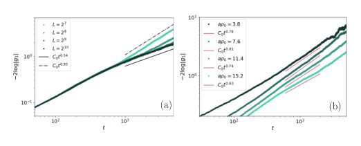 
FIG. 2. The fading of the KPZ scaling towards small system sizes and low densities, keeping the remaining parameters as in Fig. 1. (a) Influence of the system size: temporal correlation for different system lengths L = 27, 28, 29, 210, zoomed into the relevant time window. The KPZ scaling is still visible for L = 28, but fades away for smaller system size L = 27. (b) Influence of the mean den- sity: Temporal correlation lowering the density by tuning the loss rate γl = 0.07, 0.07185, 0.0734, 0.07525 towards the pump thresh- old condition γl = γp. The system size is L = 28.

📷 Fig 3

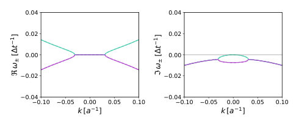 
FIG. 4. Zoom on real (left panel) and imaginary (right panel) part of the Bogoliubov excitation dispersion Ω±(k) given in Eq. (24), near k ≈0, with frequency in units of the inverse time step ∆t−1 and wavevector in units of inverse lattice spacing a−1. In the right panel, the linewidth of one of the two excitation branches vanishes at k = 0, corresponding to the dissipative Goldstone mode associated with the broken U(1) symmetry in the out-of-equilibrium theory.

📷 Fig 4

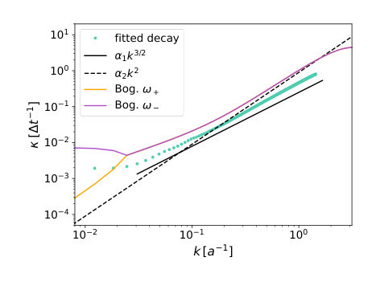 
FIG. 5. Width of spectral lines extracted from the spectrum shown in Fig. 3 for the parameters in (20) (dots) and from the Bogoliubov theory (orange and magenta solid lines). The width are obtained by fitting Lorentzian curves for each k-slice. The black dashed line in- dicates the κ(k) ∼k2 behavior predicted by Bogoliubov theory and the black solid line indicates the κ(k) ∼k3/2 behavior expected for the KPZ regime.

📷 Fig 5

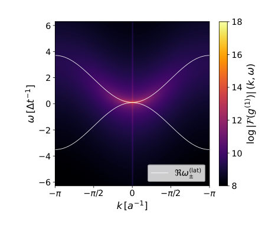 
FIG. 3. Spectral function from semi-classical simulation, in the frequency-momentum plane, with wavevector in units of inverse lat- tice spacing a−1 and frequency in units of inverse time step ∆t. The parameters are given in (20) and system length L = 210. The result is overlaid with the Bogoliubov prediction (24) for the excitation dis- persion of lattice bosons (white line).

**Summary.** The paper investigates the complex dynamics of bosons in a 1D lattice subject to pumping and dissipation. By employing advanced theoretical tools like the Keldysh formalism and tensor networks, the authors characterize how the system behaves when transitioning from weakly to strongly interacting regimes. The findings reveal universal scaling behaviors (KPZ) in some limits while demonstrating fundamental differences between quantum and classical descriptions.

**Why it may be interesting.** This work directly addresses non-equilibrium dynamics in bosonic systems, which is central to modern AMO physics research involving driven quantum simulators or optical lattices.

Detailed structure

**Main problem.** The study characterizes driven-dissipative bosonic systems in one dimension across varying filling and interaction strengths, focusing on the transition between weakly and strongly interacting regimes.

**Main result.** The system exhibits Kardar-Parisi-Zhang (KPZ) scaling in the weak interaction/large filling regime, while strong interactions reveal a change of nature in excitations compared to mean-field predictions.

**Method.** A combination of Keldysh formalism for deriving actions, stochastic semi-classical simulations, and tensor network methods are employed to analyze quantum dynamics.

**Model / system.** The model is a one-dimensional Bose-Hubbard system subjected to incoherent pumping and various particle losses (one-body and two-body). The evolution is governed by the Lindblad master equation or its semi-classical/Keldysh approximations.

**Key observables.** Two-point space-time correlations, spectral function linewidth $A(\omega, k)$, and first-order correlation function $g^{(1)}(x, t)$.

**Important parameters / regimes.** Filling (density), interaction strength ($U$), pumping rate ($\gamma_p$), and loss rates ($\gamma_l, \gamma_{2l}$). Key regimes include large filling/weak interaction and weak filling/strong interaction.

**Assumptions / limitations.** The semi-classical limit is used for some analyses, which neglects certain non-linear quantum field terms. The analysis often focuses on stationary or quasi-stationary correlation regimes.

**Figures summary.** Figure 14 compares semiclassical and quantum predictions for density distributions ($
ho$) and occupation probabilities ($p_N$) across different system sizes and loss mechanisms.

**Paper structure.** The paper systematically analyzes the dynamics by first establishing the theoretical framework (Keldysh formalism, Lindblad equation), then investigating specific regimes (weak vs. strong coupling) using appropriate tools (semi-classical vs. tensor networks), and finally comparing results to highlight deviations from mean-field theory.

Abstract

We consider a one-dimensional driven-dissipative Bose-Hubbard model subjected to incoherent pump and one- and two-body losses, and analyze it by studying its two-point space-time correlations. By employing a combination of numerical methods, such as stochastic semi-classical simulations and tensor network methods, as well as perturbation theory within the Keldysh formalism, we characterize the system at varying filling and interaction strength. We present results for two complementary regimes: i) at large filling and weak interactions, where we show that Kardar-Parisi-Zhang scaling is visible in the linewidth of the spectral function and ii) at weak filling and strong interactions, where we analyze what remains of the mean field transition and identify a change of nature of the excitations. Our study covers two important regions of the phase diagram of such a system.

[↑ back to top](#top)

### [Resolving Structure in Prethermal Floquet Dynamics with Precision Quantum Computation](http://arxiv.org/abs/2607.24937v1)

**Authors:** Eyal Leviatan, Tasneem Watad, Roy Perry, Lukas Broers, Mohammed Zuhair Mullath, Ori Alberton, Itai Arad, Yosi Atia, Eyal Bairey, Shaul Barkan, Matan Ben Dov, Asaf Berkovitch, Ewout van den Berg, Itsik Cohen, Omri Golan, Ilya Gurwich, Avieli Haber, Barak A. Katzir, Oded Kenneth, Roei Levi, Yotam Y. Lifshitz, Yaron Lukovsky, Ron Melcer, Adiel Meyer, Boris Muratov, Aviad Panahi, Gili Schul, Tali Shnaider, Maor Shutman, Alireza Seif, Tomonori Shirakawa, Asif Sinay, Vincent P. Su, Hayk Tepanyan, Omri Trebitch, Assaf Zubida, Dorit Aharonov, Hrant Gharibyan, Abhinav Kandala, Seiji Yunoki, Netanel H. Lindner  
**Type:** both · **Category:** statistical mechanics · **PDF:** <https://arxiv.org/pdf/2607.24937v1>  
**Analysis basis:** full PDF text, analyzed in chunks
**Topic relevance:** 🔥 `scars & prethermalization` **5/5** · 🔥 `analog quantum simulation` **4/5** · 🔥 `non-equilibrium dynamics` **4/5** · `driven-dissipative phase transition` **3/5** · `exotic spin models in light-matter` **3/5** · `methods for driven-dissipative` **3/5** · `QC/QI experiment` **2/5** · `non-equilibrium universality` **2/5** · `Keldysh / 2PI / non-Gaussian methods` **1/5** · `entanglement & information structure` **1/5** · `quantum measurements` **1/5**

📷 Fig 1

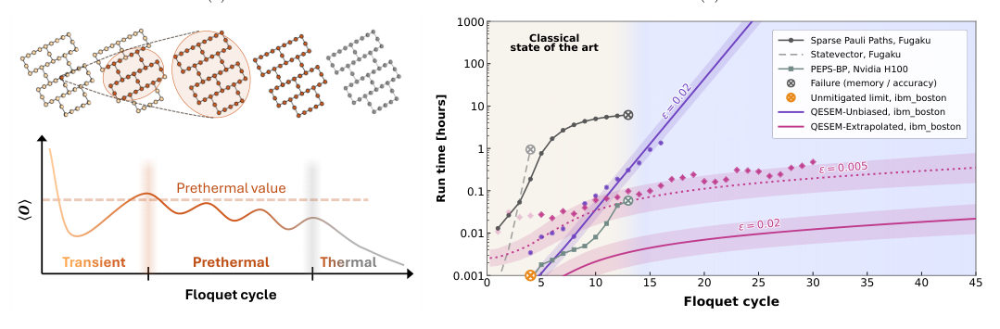 
FIG. 1: (a) Schematic of Floquet prethermalization. A generic local operator O spreads and develops many-body complexity across a 51-qubit heavy-hex patch, one of the geometries used in the experiments (top). After an initial transient, its expectation value ⟨O⟩exhibits long-lived structured oscillations about a prethermal value, before eventual heating drives the system to a featureless thermal state (bottom). (b) Runtime and accuracy frontier for estimating the magnetization of the 51-qubit Floquet circuits shown in Fig. 3a. Unmitigated execution loses accuracy by cycle 4 (yellow marker), whereas QESEM extends the accessible depth by trading additional QPU sampling time for reduced bias....

📷 Fig 2

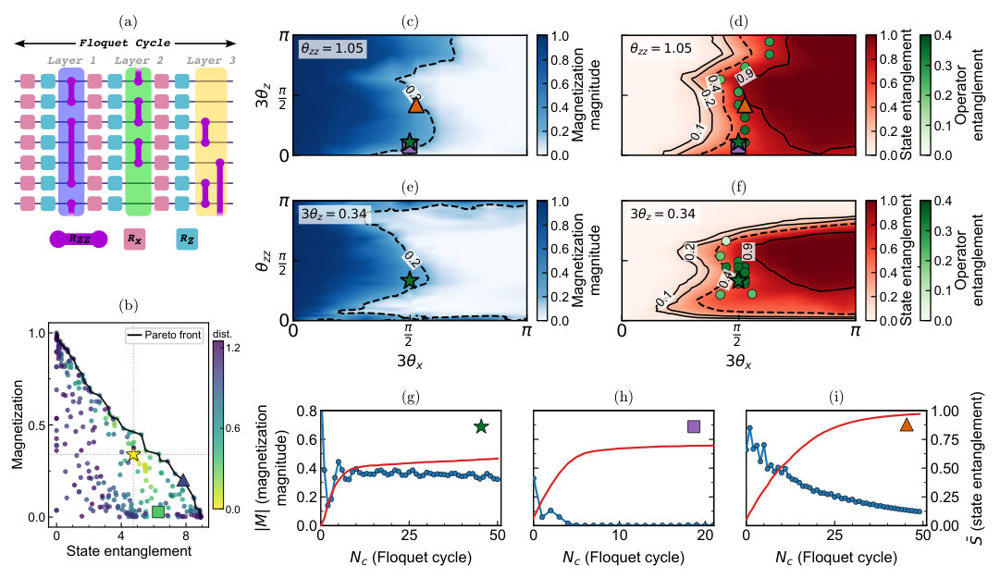 
FIG. 2: (a) One Floquet cycle of the driven magnet. Each cycle consists of parallel single-qubit X and Z rotation layers on all qubits interleaved with three edge-coloured layers of nearest-neighbour fractional-angle ZZ rotations. (b) Tradeoff between magnetization and state entanglement entropy in 21-qubit exact simulations after 30 Floquet cycles. Each point corresponds to one choice of Floquet parameters in the scan; colour indicates distance, in parameter space, from the chosen set of parameters, marked by the star and located near the Pareto front. (c) Retained magnetization after 30 Floquet cycles in the (3θx, 3θz) plane at fixed θzz = 1.05, from the same 21-qubit exact simulations as...

📷 Fig 3

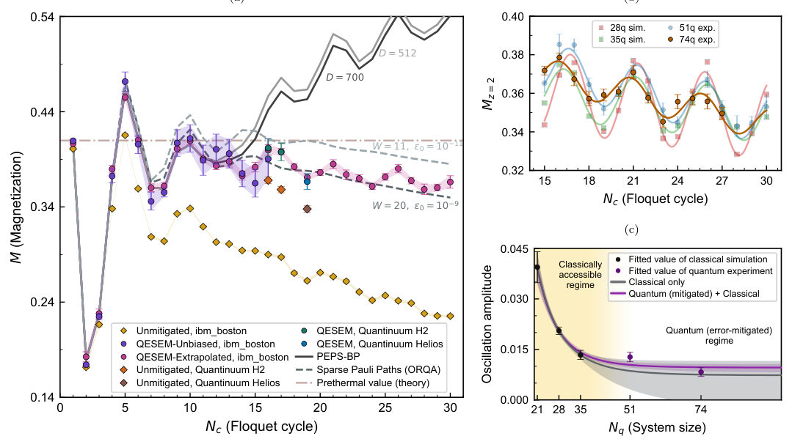 
FIG. 3: (a) Magnetization versus Floquet cycle for the 51-qubit system. Vertical error bars denote one-standard-deviation statistical uncertainties, including sampling overhead for the error-mitigated data. The unmitigated results decay rapidly, while QESEM-Unbiased agrees with PEPS-BP at early times, where the D = 512 and D = 700 curves coincide, and continues to give stable mitigated estimates for several cycles after they separate. QESEM-Extrapolated extends the mitigated dynamics to later cycles, resolving slow relaxation and long-time oscillations. Sparse Pauli-path results from two truncation choices fail to provide a converged late-cycle reference and do not reproduce the late-cycle...

📷 Fig 4

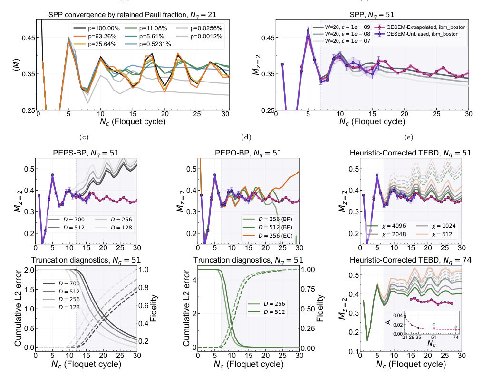 
FIG. 4: (a) Magnetization dynamics for the 21-qubit patch obtained with the ORQA SPP method on the Fugaku supercomputer for different retained Pauli fractions, p, of the complete Pauli operator space. The solid black curve shows the exact statevector evolution. (b)–(e) Comparison of the coordination-two magnetization, Mz=2, as a function of Floquet cycle, obtained using four classical simulation methods and compared with the error-mitigated QESEM experiments (purple: QESEM-Unbiased; magenta: QESEM-Extrapolated). (b) SPP results for the 51-qubit patch. Gray curves show SPP simulations performed with ORQA using W = 20 and different coefficient-truncation thresholds. Although SPP agrees with...

**Summary.** This paper uses error-mitigated quantum computing on superconducting hardware to study prethermal dynamics in a Floquet Ising magnet. The researchers successfully measured long-lived oscillations up to 74 qubits, demonstrating that these phenomena persist into the thermodynamic limit where classical simulations fail. It establishes error-mitigated quantum processors as reliable tools for discovering new physics in non-equilibrium matter.

**Why it may be interesting.** It provides concrete evidence that quantum computation can probe non-equilibrium physics regimes (prethermalization) inaccessible to current best classical computational resources, directly impacting the study of open quantum systems dynamics.

Detailed structure

**Main problem.** The central challenge is accessing and characterizing prethermal dynamics in periodically driven interacting quantum many-body systems, where classical methods fail at required system sizes/times.

**Main result.** The authors successfully measured long-lived subharmonic prethermal oscillations on up to 74 qubits using error mitigation, suggesting these oscillatory responses persist into the thermodynamic limit for heavy-hex ladders.

**Method.** The work combines advanced quantum hardware measurements (using QESEM error mitigation) with rigorous comparison against state-of-the-art classical simulations like tensor networks and Pauli-path methods.

**Model / system.** The study investigates a Floquet Ising magnet realized on a heavy-hex lattice, focusing on its non-equilibrium dynamics under periodic driving.

**Key observables.** Magnetization ($M$), prethermal oscillation amplitude decay with system size, and simulation fidelity measures.

**Important parameters / regimes.** System sizes up to 74 qubits; specific parameter regimes ($	heta_x \approx \pi/6$, $	heta_z \approx \pi/27$, etc.) that yield structured dynamics.

**Assumptions / limitations.** The reliability of results hinges on the successful application and validation of advanced error mitigation techniques (QESEM) across multiple quantum hardware platforms.

**Figures summary.** Figures compare simulation runtimes and accuracy frontiers between classical methods (PEPS-BP, Statevector) and QESEM measurements; other figures show parameter scans and universal collapse plots validating error models.

**Paper structure.** The paper establishes the physical problem, details the advanced quantum measurement techniques required to overcome hardware noise, presents results showing measurable prethermal features beyond classical simulation limits, and concludes by establishing error-mitigated quantum processors as quantitative scientific tools.

Abstract

Periodically driven interacting quantum many-body systems can exhibit long-lived prethermal dynamics, where local observables retain coherent structure even as entanglement and operator complexity grow. Accessing this regime at the system sizes and times needed to determine physical properties of the prethermal state remains a central challenge: state-of-the-art classical methods become unreliable, while noise in quantum hardware degrades observable expectation values. Here we overcome these limitations for a Floquet Ising magnet realized on a heavy-hex lattice. Using the advanced error mitigation software QESEM on an IBM Heron r3 superconducting quantum processor, we measure magnetization dynamics with percent-level precision and resolve long-lived subharmonic prethermal oscillations in systems of up to 74 qubits. These experiments reach regimes for which leading tensor-network simulations fail to converge, while sparse Pauli-path simulations remain strongly truncation dependent despite extensive computations on advanced GPUs and the Fugaku supercomputer. Leveraging this quantum-accessible regime, we extend finite-size scaling to larger systems and find an unexpectedly slow decrease of the oscillation amplitude with system size, providing strong evidence that this oscillatory response persists in the thermodynamic limit of heavy-hex ladders. A hierarchy of mitigation and validation tests, including unbiased error mitigation, agreement between independent mitigation estimators, noise-model validation on the superconducting hardware, and cross-platform corroboration at selected Floquet cycles on Quantinuum System Model H2 and Quantinuum Helios trapped-ion hardware, supports the reliability of these findings. Our work establishes error-mitigated quantum processors as quantitative scientific instruments for discovering new physics in non-equilibrium quantum matter.

[↑ back to top](#top)

### [Lowering the implementation barrier of neutral-atom quantum computing with agentic workflows](http://arxiv.org/abs/2607.25834v1)

**Authors:** Constantin Dalyac, Alexandre Dauphin, Loïc Henriet, Christophe Jurczak  
**Type:** both · **Category:** other · **PDF:** <https://arxiv.org/pdf/2607.25834v1>  
**Analysis basis:** full PDF text, analyzed in chunks
**Topic relevance:** 🔥 `Rydberg arrays` **5/5** · 🔥 `QC/QI experiment` **4/5** · 🔥 `analog quantum simulation` **4/5** · `methods for driven-dissipative` **3/5** · `non-equilibrium dynamics` **2/5** · `Keldysh / 2PI / non-Gaussian methods` **1/5** · `correlated / nonlocal dissipation` **1/5** · `driven-dissipative phase transition` **1/5** · `entanglement & information structure` **1/5**

📷 Fig 1

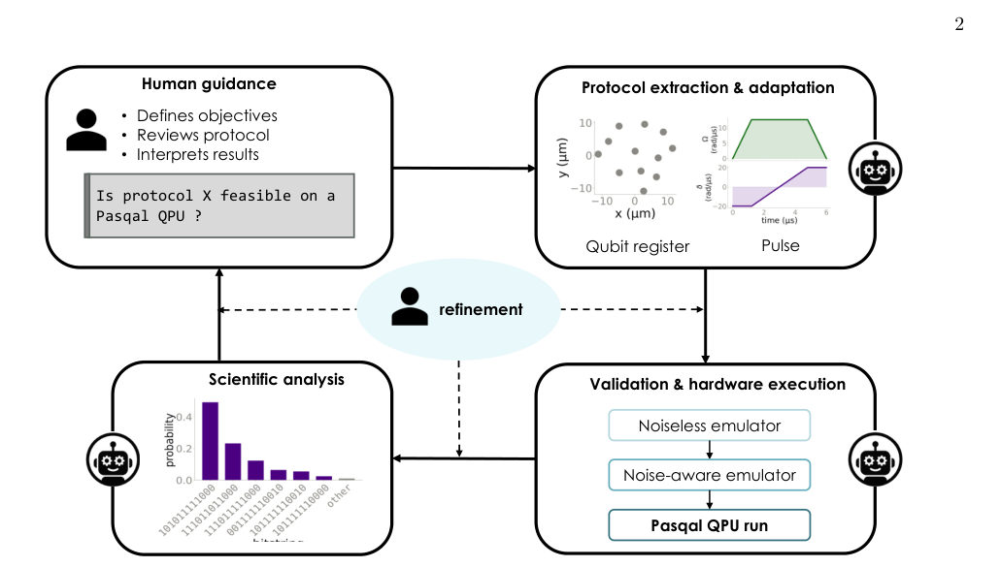 
FIG. 1. AI-assisted workflow for translating quantum protocols into hardware experiments. A researcher defines the scientific objective and interacts with the AI workflow through natural-language instructions. The AI extracts or generates an experimental protocol, including the neutral-atom register and pulse sequence, from a scientific publication, patent, or user request. The pulse sequence is determined by the qubit register, the time evolution of the Rabi frequency Ω(rad.µs−1) and the detuning δ (rad.µs−1). Before execution on quantum hardware, the protocol is validated using noiseless and noise-aware emulation to identify implementation issues and support iterative refinement. Once...

📷 Fig 2

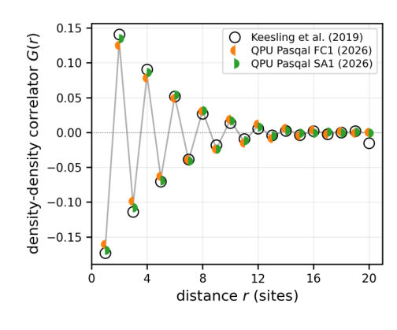 
FIG. 2. Density-density correlator G(r) in the saturated Z2-ordered phase as a function of the distance r in num- ber of sites. Open black circles: values taken from Fig. 1d of Keesling et al. [32] (51-atom chain, fitted ξ = 3.9 sites). Half-filled markers: this work, on a 56-atom ring on Pasqal QPU FC1 (orange, 2000 shots, ξ = 4.2) and a 96-atom ring on Pasqal QPU SA1 (green, 1000 shots, ξ = 4.2). The grey line is a guide to the eye. All three datasets show that the saturated ordered-phase correlator is a robust observable, re- produced by our agentic workflow on two Pasqal QPUs, 7 years after the landmark experiment.

📷 Fig 3

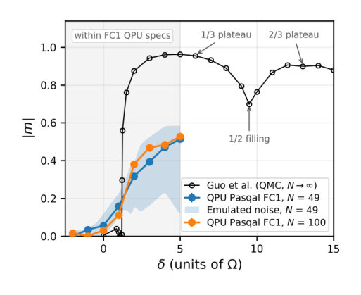 
FIG. 3. Normalised order parameter |m| versus δ/Ωon the bulk sublattice. Open black circles: QMC in the thermody- namic limit (Guo et al. [33]). Filled circles: QPU Pasqal FC1 at N = 49 (blue) and N = 100 (orange), on rhombic L × L triangular registers with L ≡1 mod 3, so the open boundary pins a single √

📷 Fig 4

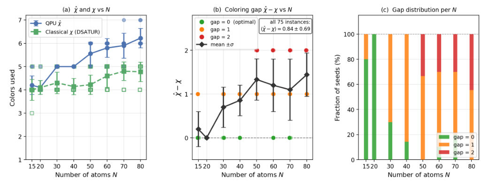 
FIG. 4. Example C, QPU beam-search graph coloring on FC1 (unit-disk graphs at density 0.35, blockade radius Rb=10 µm; beam-width w=3, ns=200 shots/round, 75 instances). (a) QPU estimate ˆχ and classical optimum χ (DSATUR) vs. N; lines show mean ±σ, dots show per-instance values. (b) Coloring gap ˆχ−χ per instance (coloured by gap value) and mean ±σ; the gap is zero at N=20 and never exceeds 2. (c) Fraction of seeds at each gap value per N.

**Summary.** The paper introduces an agentic workflow designed to automate the complex process of turning theoretical quantum protocols into executable experiments on neutral-atom quantum processors. By successfully running multiple case studies and screening hundreds of papers, it proves that AI tools can bridge the gap between theory and hardware. This significantly lowers the barrier for researchers in AMO physics to conduct cutting-edge quantum simulations.

**Why it may be interesting.** This work directly addresses the practical implementation gap for AMO theorists. By automating the engineering steps—from protocol extraction to noise modeling on specific hardware like Pasqal QPUs—it allows theorists to rapidly test feasibility across a much broader range of physical models.

Detailed structure

**Main problem.** The major bottleneck in quantum research is translating theoretical protocols into executable hardware experiments due to required expertise across multiple domains.

**Main result.** Agentic workflows provide a practical bridge by automating the pipeline from scientific paper to QPU campaign, significantly accelerating the path from theory to physical realization.

**Method.** The authors developed and demonstrated an agentic workflow that automates protocol extraction, hardware mapping, simulation (noiseless/noise-aware), and execution on neutral-atom quantum processors.

**Model / system.** The work focuses on neutral-atom Quantum Processing Units (QPUs) utilizing Rydberg arrays to realize programmable many-body Hamiltonians. The system is controlled by parameters like Rabi frequency, detuning, and qubit geometry.

**Key observables.** Density-density correlator G(r), structure factor, mean magnetization m, and comparison of measured data against noiseless simulation envelopes.

**Important parameters / regimes.** Device constraints include maximum atom number, achievable detuning range ($	ext{FC1}: |\delta|/2\pi \le 10 	ext{ MHz}$), and interaction types (e.g., Ising vs XY).

**Assumptions / limitations.** Human domain expertise remains crucial for validating scientific assumptions, selecting physically meaningful observables, and interpreting complex results.

**Figures summary.** Figure 2 compares literature values of the density-density correlator G(r) with measurements on FC1 and SA1 for the $Z_2$ phase. Figure 3 (mentioned) compares QMC data to QPU data for the $1/3$ plateau.

**Paper structure.** The paper introduces the agentic workflow, demonstrates its use in three case studies from literature (many-body physics and optimization), details the process of screening existing arXiv papers, and concludes by outlining the shift in the research bottleneck to scientific judgment.

Abstract

Quantum computers are moving from research laboratories to industrial machines accessible via the cloud and integrated into high-performance computing facilities. However, translating theoretical quantum protocols into hardware experiments remains a major bottleneck, requiring expertise across protocol design, compilation, simulation, and cloud execution. Here, we introduce an agentic workflow that automates this pipeline on neutral-atom quantum processors (here two Pasqal QPUs available on the cloud) while keeping the researcher in the loop for critical validation. In three case studies from many-body physics and optimization, the agent went from published paper or patent to a QPU campaign run overnight. In particular, human intervention was crucial to ensure scientific validity: the agent selected an inadequate observable in one experiment and constructed a plausible but incorrect hardware diagnosis in another, with both failures detected only through domain-expert review. Finally, we use a second agent to classify a corpus of 633 Rydberg-array arXiv papers and show that nearly half are implementable on present-day QPUs while identifying specific hardware upgrades needed for the rest. Together, these results demonstrate that agentic workflows provide a practical bridge between theoretical ideas and physical hardware, opening quantum experimentation to a much broader scientific community.

[↑ back to top](#top)

### [Non-monotonic diffusion from nonequilibrium driving](http://arxiv.org/abs/2607.25902v1)

**Authors:** Manish Patel, Ritwick Sarkar, Urna Basu, Debasish Chaudhuri  
**Type:** theory · **Category:** statistical mechanics · **PDF:** <https://arxiv.org/pdf/2607.25902v1>  
**Analysis basis:** full PDF text, analyzed in chunks
**Topic relevance:** 🔥 `non-equilibrium dynamics` **5/5** · 🔥 `non-equilibrium universality` **4/5** · `Keldysh / 2PI / non-Gaussian methods` **3/5** · `driven-dissipative phase transition` **3/5** · `methods for driven-dissipative` **3/5** · `Frenkel-Kontorova` **1/5** · `analog quantum simulation` **1/5** · `correlated / nonlocal dissipation` **1/5**

📷 Fig 1

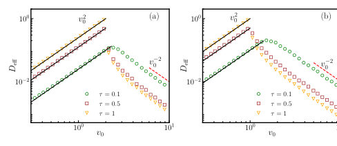 
FIG. 1. Behaviour of effective diffusion coefficient for D = 0: Plot of Deff as a function of self-propulsion speed v0 for different persistence times τ for (a) the reciprocal case µ = 1 and (b) for the non-reciprocal case µ = 0. Here we have taken L = 10, λ = 1, and k = 1. The black solid lines correspond to the theoretical prediction Eq. (9).

📷 Fig 2

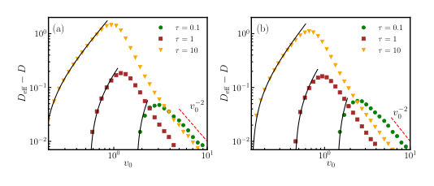 
FIG. 2. Behaviour of effective diffusion coefficient for D &gt; 0: Plot of Deff −D versus self-propulsion speed v0 for different persistence times τ and (a) for reciprocal interaction µ = 1, and (b) for non-reciprocal interaction with µ = 0.5, respec- tively. The black solid lines in both panels correspond to the analytical prediction Eq. (9) with respective values of µ. The other parameters used are D = 0.1, L = 10, λ = 1, and k = 1.

📷 Fig 3

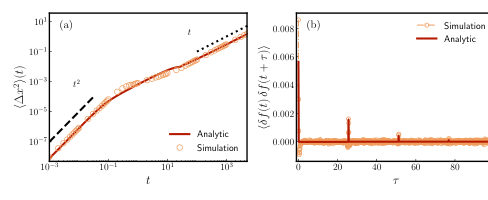 
FIG. 3. Mean-squared displacement and two-time force corre- lation as a function of time. The line plots in (a) and (b) are obtained from Eq. (17) and Eq. (15) with parameter fitting f0 = 0.66, σ0 = 0.17, and using n = 300 modes, respectively. The points denote the result from the simulation obtained at parameter values v0 = 5, L = 128, τ = 10, µ = 1, k = 1, D = 0, and λ = 1.

📷 Fig 4

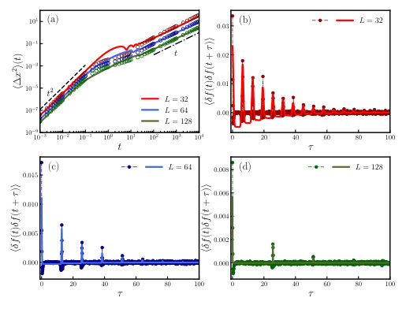 
FIG. 4. Mean-squared displacement and two-time force cor- relation. The solid lines in (a) are obtained from Eq. (17), while those in (b)–(d) follow Eq. (15) using fitted parameters f0 = 2.44, σ0 = 1.82 for L = 32, f0 = 1.22, σ0 = 0.58 for L = 64, and f0 = 0.66, σ0 = 0.17 for L = 128. Both expres- sions are evaluated using n = 300 modes. Symbols denote simulations with v0 = 5, τ = 10, µ = 1, k = 1, D = 0, and λ = 1.

📷 Fig 5

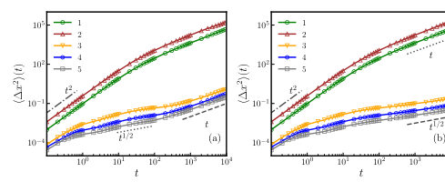 
FIG. 5. Active driving: Mean-squared displacement ⟨∆x2⟩(t) versus time t for (a) periodic boundary in unwrapped coor- dinates, and (b) open boundary. The parameter values are λ = 1, k = 1, L = 512, τ = 10, D = 0. The inset labels rep- resent the value of self-propulsion speed v0, and the plots are obtained from numerical simulation.

**Summary.** This paper develops a unified theoretical framework to describe the stochastic dynamics of interacting particles subjected to nonequilibrium driving, especially when interactions are nonreciprocal. The key finding is that the effective diffusion constant exhibits a nonmonotonic dependence on the driving strength, leading to both enhanced and suppressed transport regimes. By analyzing these effects in active matter models, the authors establish a general mechanism governing transport under various forms of external forcing.

**Why it may be interesting.** This work provides quantitative tools to analyze transport phenomena driven by non-equilibrium forces, which is highly relevant to understanding energy dissipation and particle motion in complex systems studied using AMO techniques (e.g., engineered potentials or external fields).

Detailed structure

**Main problem.** The study addresses the fundamental challenge of understanding stochastic dynamics for interacting particles operating far from thermodynamic equilibrium, particularly when nonreciprocal interactions are present.

**Main result.** The effective diffusivity exhibits a nonmonotonic dependence on driving activity, showing both enhancement and suppression of transport. This behavior is captured by a unified framework applicable to active and passive nonequilibrium driving.

**Method.** The authors develop a theoretical framework using Langevin dynamics approximations (harmonic approximation) and analyze the Mean-Squared Displacement (MSD) via two-time force correlations.

**Model / system.** The model consists of interacting particles on a periodic ring, where one particle is passive (coupled to thermal noise) and the other is active (e.g., Run-and-Tumble dynamics). The interaction strength and reciprocity are controlled by parameters like $\mu$ and $v_0$.

**Key observables.** Effective diffusivity ($D_{	ext{eff}}$), Mean-Squared Displacement ($\langle\Delta x^2
angle(t)$), and the two-time force correlation function.

**Important parameters / regimes.** Self-propulsion speed ($v_0$), bare diffusivities ($D, D_0$), persistence time ($	au$), and the reciprocity parameter ($\mu$).

**Assumptions / limitations.** The analysis relies on approximations such as using the harmonic approximation for interactions and neglecting interaction forces in certain high-diffusivity limits.

**Figures summary.** Figures 1 and 2 numerically demonstrate $D_{	ext{eff}}$ vs. $v_0$, showing nonmonotonic behavior (increase, peak, decrease) compared to analytical predictions derived from the low-activity regime.

**Paper structure.** The paper progresses by first establishing a general framework for interacting particles with both reciprocal and nonreciprocal couplings. It then derives specific analytical results for the effective diffusivity in the weak coupling limit, before generalizing the findings to compare active driving against passive (high-temperature) nonequilibrium driving scenarios.

Abstract

The stochastic dynamics of interacting particles far from equilibrium remains a fundamental challenge in statistical physics. While reciprocal interactions often permit effective one-body descriptions, such reductions generally fail for nonreciprocal interactions, which are ubiquitous in driven and active systems. We develop a unified theoretical framework for interacting particles with reciprocal and nonreciprocal couplings, applicable to the principal classes of active matter, including run-and-tumble, active Brownian, and active Ornstein-Uhlenbeck particles. As a minimal example, we study a passive particle driven by an active particle. On a periodic ring, we show analytically that the driven particle is always diffusive at long times, independent of the microscopic driving mechanism. Analytical predictions and numerical simulations reveal a nonmonotonic dependence of the effective diffusivity on the driving activity, giving rise to both enhanced and suppressed transport. Remarkably, the same behavior occurs in an equilibrium system driven out of equilibrium by coupling the driving particle to a higher local temperature. Our framework quantitatively captures both systems, identifies the common mechanism underlying the nonmonotonic transport, and establishes a unified description of transport under active and passive nonequilibrium driving.

[↑ back to top](#top)

### [Discrete power-law decay of subsystem distance after a quantum quench](http://arxiv.org/abs/2607.25661v1)

**Authors:** Bin Sui, Jiaju Zhang  
**Type:** theory · **Category:** statistical mechanics · **PDF:** <https://arxiv.org/pdf/2607.25661v1>  
**Analysis basis:** full PDF text, analyzed in chunks
**Topic relevance:** 🔥 `non-equilibrium dynamics` **5/5** · 🔥 `entanglement & information structure` **4/5** · 🔥 `non-equilibrium universality` **4/5** · `scars & prethermalization` **2/5** · `Keldysh / 2PI / non-Gaussian methods` **1/5** · `analog quantum simulation` **1/5** · `correlated / nonlocal dissipation` **1/5** · `driven-dissipative phase transition` **1/5** · `methods for driven-dissipative` **1/5**

📷 Fig 1

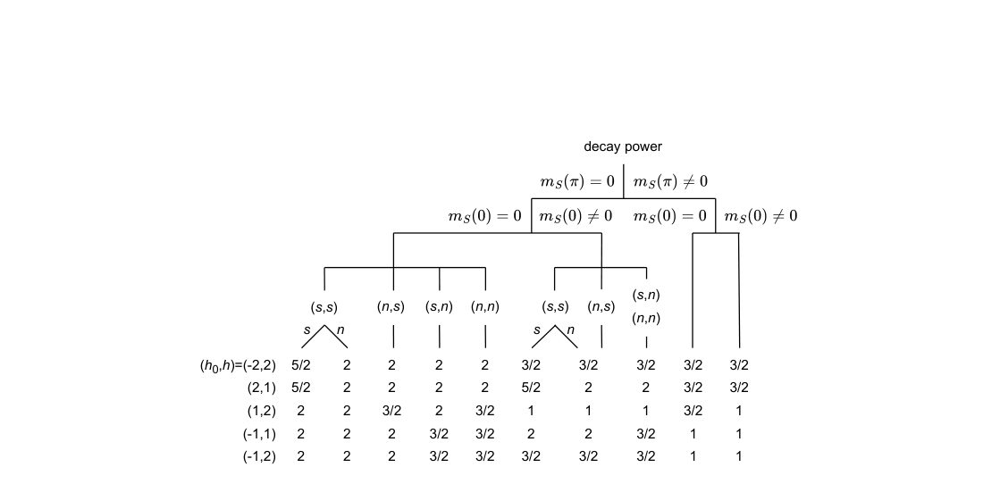 
Figure 2: Flowchart for identifying discrete decay exponents for states with continuous mS(φ) and finite m′ S(φ). The label (s/n, s/n) encodes the smoothness of mS(φ) at the boundary points φ = 0 and φ = π, respectively. The single labels s and n denote global smoothness and the presence of non-smooth points, respectively, for the interior interval φ ∈(0, π).

📷 Fig 2

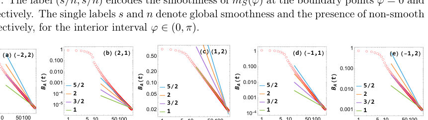 
Figure 3: Decay of the subsystem Bures distance (empty red circles) following a global quench in the infinite Ising chain. Panels from left to right correspond to quench parameter sets (h0, h) = (−2, 2), (2, 1), (1, 2), (−1, 1), and (−1, 2), respectively. Solid lines denote power-law fits with discrete decay exponents 1, 3/2, 2, and 5/2. The initial state is m(φ) = 1

📷 Fig 3

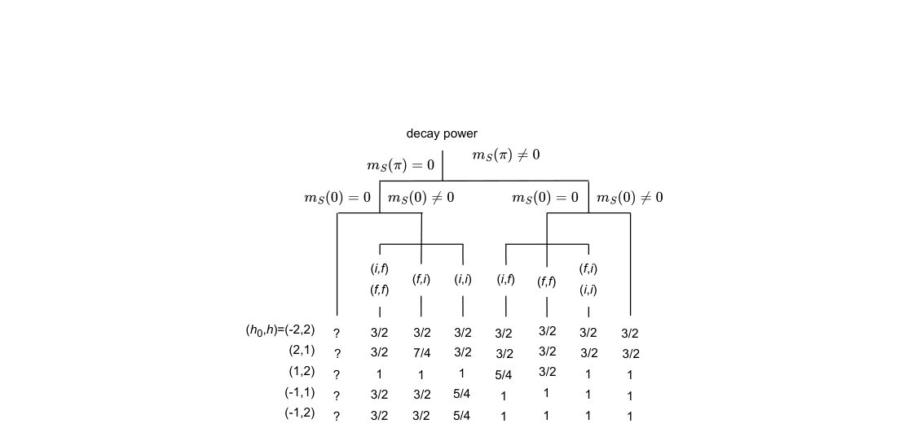 
Figure 4: Flowchart for identifying discrete decay exponents for states with continuous mS(φ), divergent m′ S(φ), and vanishing mA(φ). The label (f/i, f/i) encodes whether m′ S(φ) is finite (f) or divergent (i) at the boundary points φ = 0 and φ = π, respectively. The branch corresponding to mS(0) = mS(π) = 0 is left unspecified.

**Summary.** The paper analyzes the late-time relaxation of subsystem correlations following a quantum quench in the 1D transverse-field Ising chain. Using the Bures distance, they demonstrate that this decay follows a discrete power law $t^{-\lambda}$. The exponent $\lambda$ is not arbitrary but is rigidly determined by the specific parameters defining the initial and final states, revealing universal structure in local equilibration dynamics.

**Why it may be interesting.** This work provides a deep quantitative understanding of non-equilibrium dynamics in integrable quantum systems, offering universal rules for how local information spreads and thermalizes after a sudden change in Hamiltonian parameters.

Detailed structure

**Main problem.** The study investigates how local quantum correlations decay over time following a global quench in an integrable many-body system.

**Main result.** The subsystem distance decays universally according to a discrete power law, $B_A(t) \sim t^{-\lambda}$, where the exponent $\lambda$ is restricted to specific rational values determined by the initial and final Hamiltonian parameters.

**Method.** The analysis uses numerical simulations of the Bures distance between the time-evolved reduced density matrix and its generalized Gibbs ensemble counterpart.

**Model / system.** The system modeled is the infinite one-dimensional transverse-field Ising chain, governed by a Hamiltonian dependent on pre-quench ($h_0$) and post-quench ($h$) transverse fields. The quench involves evolving an initial eigenstate under the new Hamiltonian.

**Key observables.** Bures distance $B_A(t)$, which quantifies deviation from equilibrium; decay exponents $\lambda$ and $	ilde{\lambda}$; subsystem size scaling exponent $\alpha$.

**Important parameters / regimes.** Pre-quench field ($h_0$), post-quench field ($h$), and the properties of the symmetric excitation-fraction function $m_S(\varphi)$.

**Assumptions / limitations.** The analysis relies on numerical studies across various parameter regimes, and while robust, a complete analytical derivation for all exponents is pending.

**Figures summary.** Figures illustrate representative $(h_0, h)$ pairs covering distinct physical regimes; flowcharts guide the determination of $\lambda$ based on the continuity and differentiability of $m_S(\varphi)$; numerical plots confirm power-law decay with discrete exponents.

**Paper structure.** The paper introduces the model and quench protocol, then classifies representative field pairs $(h_0, h)$ using flowcharts derived from the analytic properties of the excitation function $m_S(\varphi)$, culminating in the presentation of the main results on discrete power-law decay.

Abstract

We present a numerical study of subsystem distance decay following a global quantum quench in the infinite one-dimensional transverse-field Ising chain, using the mathematically rigorous Bures distance $B_A(t)$ to quantify the deviation of the time-evolved reduced density matrix from its stationary generalized Gibbs ensemble state. We show that the late-time decay follows a discrete power law $B_A(t) \sim t^{-λ}$, with the exponent $λ$ confined to discrete values: $1$, $5/4$, $3/2$, $7/4$, $2$, $5/2$, and potentially further values. The specific exponent is jointly determined by the pre- and post-quench transverse fields, as well as by properties of the symmetric excitation-fraction function $m_S(\varphi)$, defined on $\varphi\in[0,π]$ to characterize the pre-quench Hamiltonian eigenstates, including continuity, boundary values, and first-derivative boundary values, among others. The previously established $t^{-3/2}$ decay for the initial ground state of the pre-quench Hamiltonian is naturally recovered as a special case of this general classification. Our results reveal a universal discrete structure governing local equilibration dynamics in integrable quantum systems.

[↑ back to top](#top)

### [A broadband, individually addressing two- and three-dimensional photonic integrated circuit for trapped-ion qubit control](http://arxiv.org/abs/2607.25062v1)

**Authors:** Daniel Klawson, Yiyang Zhi, Bingran You, Michael Bareian, Elijah Mossman, Chun-Yuan Fan, Arkadev Roy, Ke Sun, Jason Lee, Sung Cheol Yoon, Qiming Wu, Lai Jiang, Wenjun Ke, Weiwei Wu, Sirui Tang, Zachary Wall, Jiaxiang Wang, Louis Paul Romero, Sam Vizvary, Steven Diaz, Eric R. Hudson, Wesley C. Campbell, Hartmut Haeffner, Ming C. Wu  
**Type:** experiment · **Category:** other · **PDF:** <https://arxiv.org/pdf/2607.25062v1>  
**Analysis basis:** full PDF text, analyzed in chunks
**Topic relevance:** 🔥 `QC/QI experiment` **5/5** · 🔥 `analog quantum simulation` **4/5** · `quantum optics experiment` **2/5** · `interference shaping light` **1/5**

📷 Fig 1

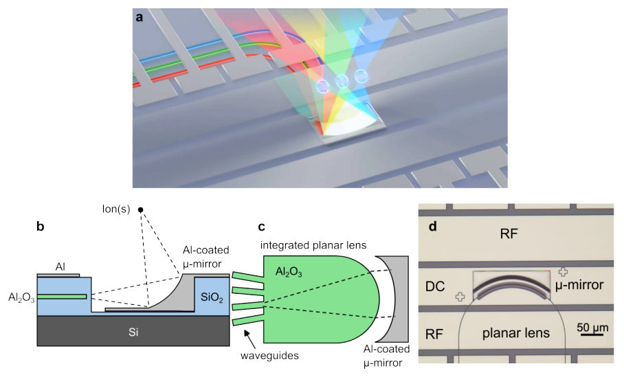 
Figure 1: Architecture of the 2D-3D PIC. a, Isometric rendering of the device. The photonic layer is made up of an amorphous Al2O3 core with a symmetric SiO2 cladding, patterned underneath the 200 nm Al surface-electrode layer. In the ion interaction region, a combination of lithographically defined photonics and 2PP-printed optics is used to route and shape the beam delivered to the ion location. b, Side view of the on-chip imaging system. The beam exits from the on-chip planar lens aperture and is focused by the Al-coated reflector to the ion location. c, Top view of the on-chip imaging system. The planar lens expands and collimates the optical mode from the incoming strip waveguides. The...

📷 Fig 2

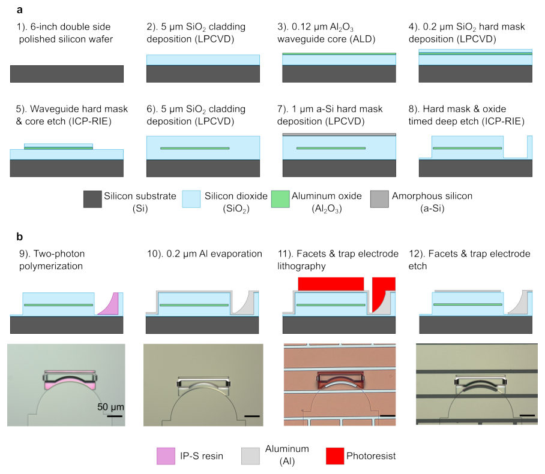 
Figure 2: 6-inch wafer-scale fabrication with integrated two-photon polymerized (2PP) optics. a, Pre-2PP process flow. The aluminum oxide waveguide core is grown via ALD for high optical quality. The silicon dioxide cladding is grown via LPCVD at 450◦C. The optical facets are defined through ICP-RIE, with amorphous silicon serving as the hard mask for the vertical sidewalls. b, Post-2PP process flow. We perform novel post-processing directly on the printed structures. It involves evaporation of aluminum for the surface electrodes and reflector, followed by contact lithography and aluminum etching to define the electrode gaps and optical facets. All scale bars on the microscope images are 50...

📷 Fig 3

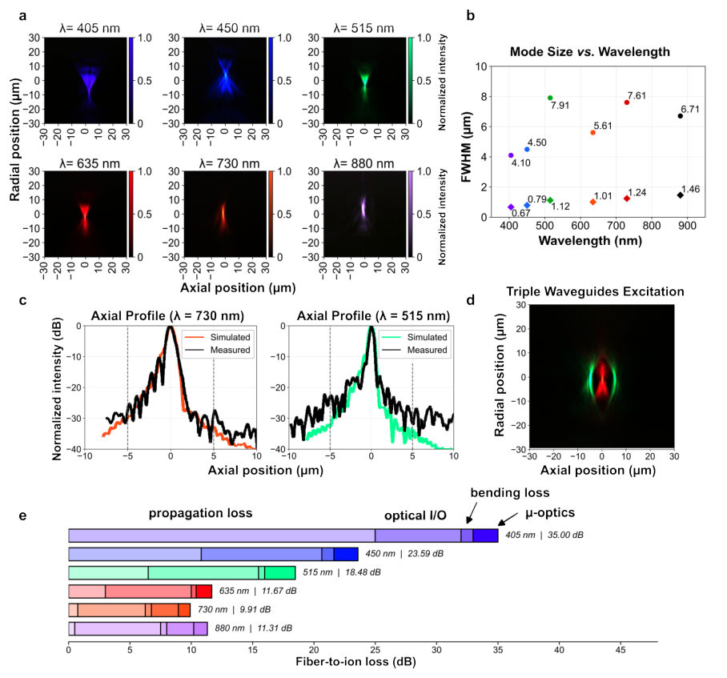 
Figure 3: Broadband, micron-level focusing. a, Measured top-down focal-plane images at h = 75 µm for six wavelengths from 405 to 880 nm through the nanophotonic device. The shown color map for each wavelength is the perceived color at each wavelength except λ = 880 nm, which is a pseudo-color. b, Axial (diamonds) and radial (circles) FWHM versus wavelength. The effective NA is different in the axial and radial directions, and so is the achieved spot size. c, Simulated (532 nm and 729 nm) and measured (515 nm and 730 nm) focal-plane intensity for on-axis and 5 µm-offset focal spots. The average intensity crosstalk is -27.6 dB. d, Measured simultaneous three-spot illumination at 515 nm and...

📷 Fig 4

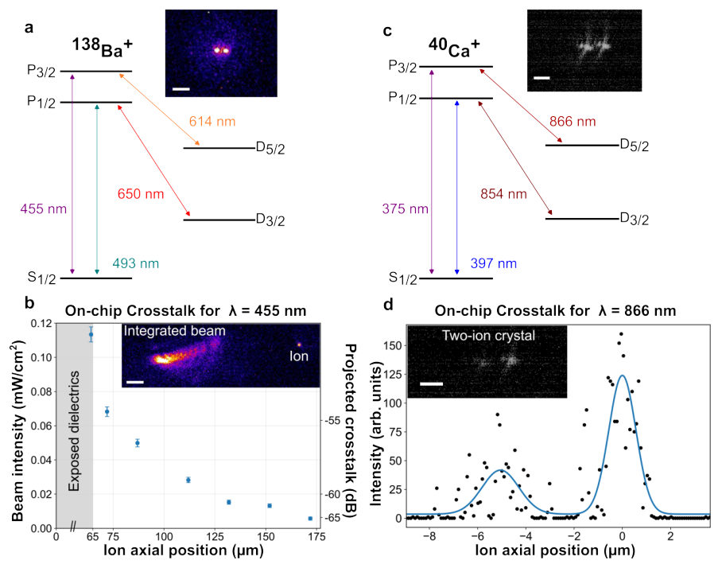 
Figure 4: Ion trapping and crosstalk results. a, Relevant energy levels and optical transitions of 138Ba+. The inset shows the fluorescence image of two trapped 138Ba+ ions with free space 493 nm and 650 nm light shining onto the ions. b, Relevant energy levels and optical transitions of 40Ca+. The inset shows the fluorescence image of two trapped 40Ca+ ions directly on top of the mirror using all free-space beams. c, Measured 455 nm optical crosstalk intensity as a function of ion position near the dielectric cutout. Blue points show the intensity inferred from the measured excitation rate of the S1/2 →P3/2 transition of Ba+, revealing that the intensity decreases with increasing distance...

📷 Fig 5

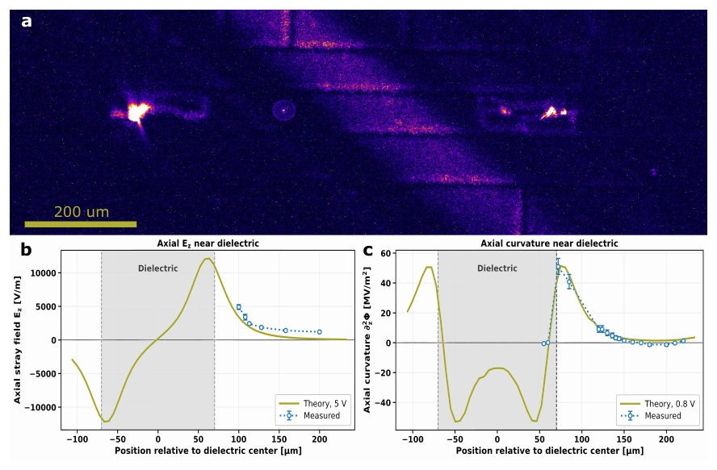 
Figure 5: Axial electrostatic perturbation from a charged dielectric. a, Fluorescence image near the dielectric region. b, Measured axial stray field, Ez, compared with a BEM simulation. c, Axial potential curvature, ∂2 zΦ, extracted from secular-frequency measurements using ∂2 zΦ = m(2πfz)2/q. Blue points are experimental data with linewidth-derived uncertainties; gold curves are simulations modeling the charged dielectric surfaces as equal-voltage electrodes. The shaded region marks the dielectric.

**Summary.** The research presents a novel, monolithic photonic integrated circuit designed to overcome bandwidth limitations in trapped-ion quantum computing. By combining planar waveguides with 3D-printed micromirrors, the device achieves broadband, individually addressable light delivery across multiple wavelengths. This breakthrough significantly enhances the scalability and complexity of future trapped-ion quantum processors.

**Why it may be interesting.** This work directly addresses the engineering challenge of scaling quantum processors. The integration of additive manufacturing (2PP) into established photonic platforms is a major advancement for realizing complex, scalable quantum hardware architectures.

Detailed structure

**Main problem.** Delivering multiple, distinct wavelengths across large networks of interaction zones for trapped-ion qubit control is a major bottleneck due to scalability issues with conventional free-space or narrow-bandwidth on-chip optics.

**Main result.** The authors demonstrated a monolithic photonic integrated circuit that successfully achieves broadband addressing (405–880 nm) and individual ion addressing while maintaining low optical crosstalk. This integrates 3D micro-optics fabricated via two-photon polymerization with surface electrode traps on silicon wafers.

**Method.** The system combines lithographically defined waveguides with custom micromirrors created using two-photon polymerization (2PP) to focus light onto trapped ions ($	ext{Ca}^+$ and $	ext{Ba}^+$). Characterization involves measuring beam profiles, crosstalk, and ion repumping across the specified wavelength range.

**Model / system.** The platform uses trapped ions ($	ext{Ca}^+$, $	ext{Ba}^+$) controlled by a hybrid photonic integrated circuit. This PIC integrates planar waveguides with 3D-printed micromirrors to deliver light efficiently and broadly across multiple wavelengths onto the ion trap region.

**Key observables.** Broadband addressing capability (405–880 nm); low optical crosstalk ($\le -27 	ext{ dB}$ at $5 \mu	ext{m}$ pitch); tight, broadband focusing profiles; successful single-ion repumping demonstration.

**Important parameters / regimes.** Wavelength range: 405 nm to 880 nm; Crosstalk: $-27 	ext{ dB}$; Pitch: $5 \mu	ext{m}$.

**Assumptions / limitations.** The relative crosstalk profile measured at one wavelength (e.g., 455 nm) can be assumed to scale linearly for estimating coherence times at other wavelengths (e.g., 493 nm).

**Figures summary.** Figures illustrate the device architecture, showing planar lenses and $\mu$-mirrors; beam profiles confirm tight focusing across the broadband range; crosstalk measurements quantify low signal leakage between addressed ions.

**Paper structure.** The paper details the fabrication process flow (combining LPCVD/ALD with 2PP), presents optical characterization results demonstrating broadband focusing and low crosstalk, validates ion trapping for $	ext{Ca}^+$ and $	ext{Ba}^+$, and concludes by showing individual addressing capability.

Abstract

Trapped ions provide a high-fidelity platform for quantum information processing, yet delivery of multiple, distinct wavelengths across large networks of interaction zones remains a bottleneck. Conventional free-space light delivery lacks scalability, while on-chip grating couplers suffer from narrow operational bandwidth that increases circuit footprint and optical interfacing complexity. Here we show a broadband photonic integrated circuit capable of addressing individual ions. The circuit combines a planar waveguide lens with a micromirror fabricated using two-photon polymerization at wafer scale. This implementation can address three individual ions from $λ$ = 405 - 880 nm with -27 dB average intensity crosstalk at $5\,μ\mathrm{m}$ pitch. We trap $^{40}\mathrm{Ca}^{+}$ and $^{138}\mathrm{Ba}^{+}$ ions above such devices, characterize optical crosstalk with barium ions, and demonstrate individual repumping of calcium ions. This monolithic photonic architecture brings broadband addressing in an on-chip modality to trapped-ion technology. More generally, integrating additive manufacturing into quantum devices is poised to unlock expanded design space for implementing novel quantum architectures.

[↑ back to top](#top)

### [Tuning Density and Spin Ordering of Degenerate Fermi Gases in an Optical Cavity](http://arxiv.org/abs/2607.25267v1)

**Authors:** Wei Qin, Yuan-Hong Chen, Renyuan Liao  
**Type:** theory · **Category:** other · **PDF:** <https://arxiv.org/pdf/2607.25267v1>  
**Analysis basis:** full PDF text, analyzed in chunks
**Topic relevance:** 🔥 `Dicke superradiance` **4/5** · 🔥 `analog quantum simulation` **4/5** · 🔥 `correlated cavity matter` **4/5** · 🔥 `driven-dissipative phase transition` **4/5** · `Tavis-Cummings & cavity-many-emitter` **3/5** · `correlated / nonlocal dissipation` **3/5** · `exotic spin models in light-matter` **3/5** · `methods for driven-dissipative` **3/5** · `non-equilibrium dynamics` **2/5** · `non-equilibrium universality` **2/5** · `superradiant laser` **2/5** · `Keldysh / 2PI / non-Gaussian methods` **1/5** · `entanglement & information structure` **1/5** · `spintronics-quantum-optics interface` **1/5**

📷 Fig 1

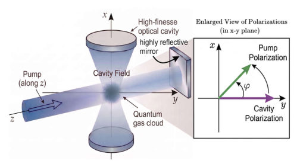 
FIG. 1. Schematic of the experimental setup. The degenerate Fermi gas is positioned at the center of the cavity axis. The high-finesse optical cavity is oriented along ˆx, and the pump laser is directed along ˆz. The cavity polarization (purple ar- row) is taken to be along ˆy, and the pump polarization (green arrow) makes an angle φ with respect to this direction.

📷 Fig 2

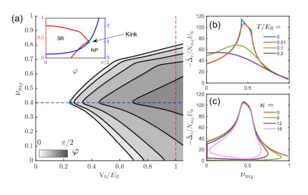 
FIG. 3. (a) Critical relative polarization angle φcrit as a function of pump lattice depth V0/ER and filling fraction νmF . Darker shading corresponds to φcrit approaching π/2; white regions indicate that the superradiant threshold is not reached. Inset: phase diagrams of φ and (red) νmF at fixed V0 = 1ER and (blue) V0/ER at fixed νmF = 0.40. The paths are marked by the dashed lines of the same colors in (a). NP and SR denote the normal and superradiant phases, re- spectively. (b) Evolution with temperature T. (c) Impact of cavity losses κ at T = 0.01ER.

📷 Fig 3

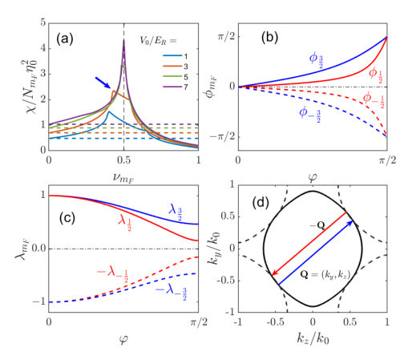 
FIG. 2. (a) Dependence of the rescaled susceptibility χmF /NmF η2 0 on the filling fraction νmF for several pump depths V0/ER. Solid and dashed curves correspond to the noninteracting Fermi and Bose cases, respectively. The in- flection points observed in the solid lines are signatures of FS nesting. The blue arrow, located at V0 = 3ER and νmF ≈0.43, denotes the example presented in (d). (b) and (c) Parameters ϕmF and λmF plotted as functions of the relative polarization angle φ. (d) Nesting of the FS for the Hamilto- nian ˆH0 before the superradiant transition occurs. Black solid line indicates the original FS, while light blue dashed curves show the FS is shifted by Q = ±kp ± kc. Colored...

📷 Fig 4

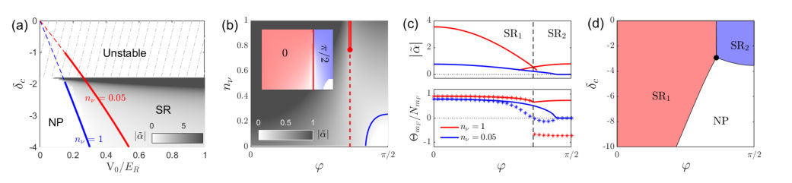 
FIG. 4. Equilibrium phase diagrams are presented for (a) nν = 1 at φ = 0 and (b) the φ-nν plane with V0/ER = 1 and ˜δc/ER = −2.7. (a) The blue and red curves show second-order boundaries separating the normal (NP) and superradiant (SR) phases for nν = 1 and nν = 0.05, respectively. (b) The blue line is the NP-SR boundary. The vertical red line indicates the component-separation boundary [51] at φcrit = arctan(2αs/αv). The separation is second order (dashed) for nν &lt; 0.73 and first order (double solid) for nν &gt; 0.77. The inset shows the photon phase near 0 (π/2) for φ &lt; φcrit (φ &gt; φcrit). (c) Instances of (b) at nν = 1 and nν = 0.05. The local minimum of the average photon number |˜α| (top...

**Summary.** This theoretical study explores superradiant phase transitions in Fermi gases coupled to optical cavities, demonstrating that the transition point is controlled by a competition between scalar and vectorial light-matter couplings. By tuning the relative polarization angle of the driving fields, researchers can manipulate this coupling balance, leading to insights applicable to both fermionic and bosonic quantum systems.

**Why it may be interesting.** This work bridges concepts from cavity QED (superradiance) with strongly interacting quantum matter (Fermi gases), providing tunable control over collective quantum phenomena using light polarization—a highly relevant area for experimental AMO physics.

Detailed structure

**Main problem.** The study investigates the superradiant quantum phase transition (QPT) occurring in a spin-degenerate Fermi gas coupled to an optical cavity.

**Main result.** The phase transition threshold is found to be synergistically determined by both the scalar-vectorial coupling weight and Pauli blocking effects. Furthermore, the relative polarization angle can tune the competition between these couplings.

**Method.** The analysis employs mean-field theory applied to the effective Hamiltonian derived after eliminating excited states, utilizing steady-state solutions of the Lindblad master equation and free energy minimization techniques.

**Model / system.** The system is a spin-degenerate Fermi gas confined in a high-finesse optical cavity, where interactions are mediated by light fields whose coupling strength depends on the relative polarization angle ($\phi$) between the pump and cavity fields. The model incorporates both scalar and vectorial atom-light couplings.

**Key observables.** Superradiance transition threshold, critical polarization angle ($\varphi_{	ext{crit}}$), population ratio ($n_
u$), and susceptibility ($\chi_{mF}$).

**Important parameters / regimes.** Relative polarization angle ($\phi$), cavity detuning ($\Delta_c$), pump lattice depth ($V_0$), and particle number imbalance ratio ($n_
u$).

**Assumptions / limitations.** The analysis relies on a mean-field approximation for photon dynamics, and the free energy calculation is used to identify continuous transition points.

**Figures summary.** Figures illustrate the setup geometry (Fig. 1), show density dependence of susceptibility ($\chi_{mF}$) vs filling factor (Fig. 2(a)), map out phase diagrams showing Normal vs Superradiant phases based on polarization angle and lattice depth (Fig. 3(a)), and depict phase boundaries related to particle imbalance (Fig. 4).

**Paper structure.** The paper progresses by first establishing the effective Hamiltonian, deriving mean-field equations for photon dynamics, analyzing the conditions for superradiance via free energy minimization, and finally mapping out complex phase diagrams showing how polarization angle and density control the transition order and type.

Abstract

We investigate a spin-degenerate Fermi gas coupled to a high-finesse optical cavity, where the competition between scalar and vectorial couplings is controlled by the relative polarization angle of the pump and cavity fields. We find that the phase transition threshold is synergistically determined by the scalar-vectorial coupling weight and Pauli blocking, with the latter dictating the critical pump lattice depth required for the onset of superradiance. For a two-component Fermi gas with opposite spins, the population ratio drives two distinct types of phase transitions corresponding to real-space phase separation: continuous and discontinuous. Nevertheless, the boundary of the phase transition remains fundamentally governed by the scalar-vectorial coupling competition. We clarify the impact of the relative polarization angle on phase transitions of the system; these results also apply to bosonic systems. Our results provide valuable theoretical insights for future experimental realizations.

[↑ back to top](#top)

### [Collective states of multi-level emitters: The role of multi-level interferences](http://arxiv.org/abs/2607.25547v1)

**Authors:** Nathan E. Rahat, Christiane P. Koch  
**Type:** theory · **Category:** other · **PDF:** <https://arxiv.org/pdf/2607.25547v1>  
**Analysis basis:** full PDF text, analyzed in chunks
**Topic relevance:** 🔥 `Dicke superradiance` **4/5** · 🔥 `correlated / nonlocal dissipation` **4/5** · `analog quantum simulation` **3/5** · `free-space correlated emission` **3/5** · `interference shaping light` **3/5** · `superradiant laser` **3/5** · `Tavis-Cummings & cavity-many-emitter` **2/5** · `correlated cavity matter` **2/5** · `driven-dissipative phase transition` **2/5** · `methods for driven-dissipative` **2/5** · `non-equilibrium dynamics` **2/5** · `Keldysh / 2PI / non-Gaussian methods` **1/5** · `entanglement & information structure` **1/5** · `exotic spin models in light-matter` **1/5** · `non-equilibrium universality` **1/5**

📷 Fig 1

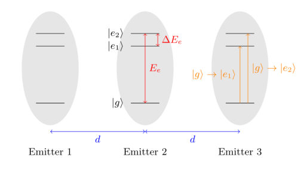 
FIG. 1. Sketch of a system consisting of three identical emit- ters arranged in a line with spatial separation d between them, interacting with the quantized EM field. Each emitter con- sists of three levels in a V configuration - the internal level structure is specified in emitter 2, and the two allowed tran- sitions are indicated in emitter 3.

📷 Fig 2

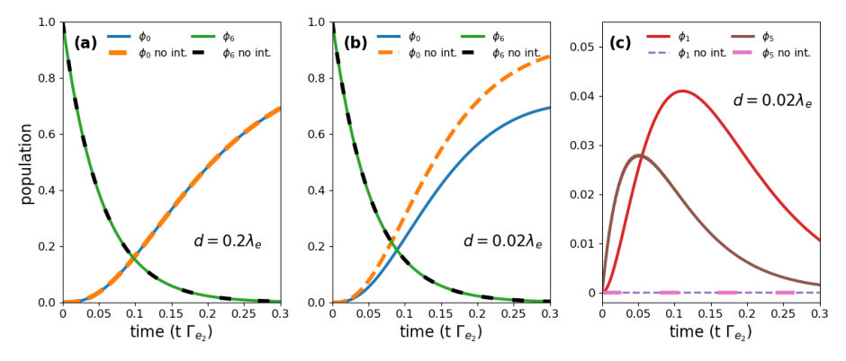 
FIG. 2. Population dynamics comparing time evolution with (solid lines) and without (dashed lines) interferences between different transitions, the latter obtained by setting all terms with k ̸= m to zero in Eq. (6) for two different emitter separations d. The system is initialized in |ϕ6⟩, and the time units are in terms of the free emitter decay rate from |e2⟩to |g⟩.

📷 Fig 3

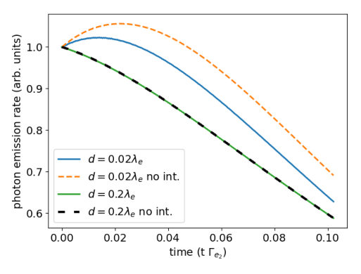 
FIG. 3. Photon emission rate from the fully excited emitter array. For d = 0.02λe, with multi-level interferences (solid blue line) and without (dashed orange line), and d = 0.2λe , with (solid green) and without (dashed brown) interferences.

📷 Fig 4

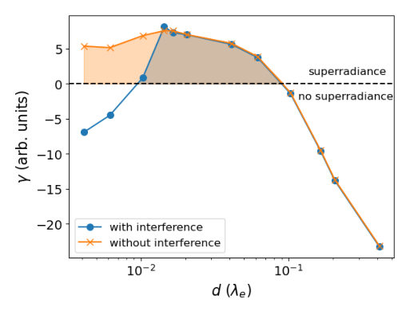 
FIG. 4. The initial photon emission rate from the array as a function of the spatial distance between emitters, with (blue dots) and without (orange crosses) interferences. The dashed black line at 0 represents the criteria for superradiance.

📷 Fig 5

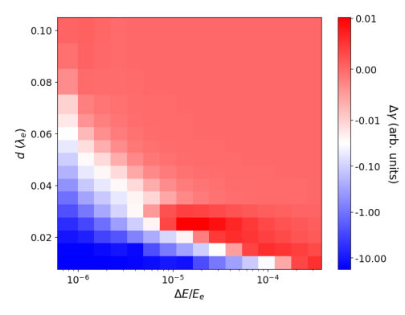 
FIG. 5. Difference of initial photon emission rate between interfering and non-interfering emitter arrays as a function of the excited state energy separation and the spatial separation within the array.

**Summary.** This paper theoretically explores collective light-matter interactions in arrays of multi-level quantum emitters. By including full multi-level interference effects into the master equation, the authors demonstrate that these interferences fundamentally alter decay dynamics compared to simpler models. The findings suggest new physical criteria for phenomena like superradiance and propose molecular systems for experimental realization.

**Why it may be interesting.** This work is highly relevant to AMO physics as it pushes beyond standard two-level approximations to model complex quantum emitters (like molecules) in arrays, which is crucial for next-generation quantum light sources and quantum simulation platforms.

Detailed structure

**Main problem.** The study investigates how accounting for the multi-level nature of quantum emitters fundamentally alters the collective light-matter interactions compared to simplified two-level approximations.

**Main result.** Multi-level interference significantly changes collective state character, leading to a lower bound on emitter separation required for superradiance that is absent in the two-level case.

**Method.** The dynamics are modeled using a full Master Equation derived under the Born-Markov approximation, allowing for direct inclusion of multi-level interference terms.

**Model / system.** The system consists of an array of N multi-level quantum emitters (e.g., V-systems) interacting with the electromagnetic vacuum field. The theoretical framework uses a full Hamiltonian and Master Equation approach to track population dynamics.

**Key observables.** Total photon emission rate, initial photon emission rate ($\gamma$), and the difference in initial rates ($\Delta\gamma$) between interfering and non-interfering models.

**Important parameters / regimes.** Emitter separation ($d$), energy separation between excited states ($\Delta E_e$), and the ratio of $d$ to the excitation wavelength ($\lambda_e$).

**Assumptions / limitations.** The derivation relies on the Born-Markov approximation, and approximations are made for near-resonant transitions (e.g., replacing frequencies with averages).

**Figures summary.** Figures compare population dynamics and initial photon emission rates between models that include multi-level interference versus those that neglect it, showing deviations at small separations.

**Paper structure.** The paper develops the Master Equation incorporating full dipole interactions, analyzes the resulting equations of motion for the density matrix, and then numerically compares predictions for superradiance and population decay across various emitter separation regimes.

Abstract

We explore how collective states of light and matter differ when the multi-level nature of the quantum emitters is fully taken into account. For closely spaced emitters, interferences between near-resonant transitions completely change the character of the collective states compared to two-level approximations. In particular, we find a lower bound on the emitter separation for superradiance to occur which does not exist for two-level emitters. By contrast, for larger separations between the emitters, the collective states resemble those obtained within the widely used two-level approximation of the emitters. Both regimes may be realized by molecules trapped in optical lattices. We therefore propose molecular candidates and describe experimental signatures of emerging multi-level interference.

[↑ back to top](#top)

### [Remote entanglement of massive oscillators via wire-mediated Coulomb interaction](http://arxiv.org/abs/2607.25341v1)

**Authors:** Lorenzo Papa, Onur Hosten, Carlos Gonzalez-Ballestero  
**Type:** theory · **Category:** other · **PDF:** <https://arxiv.org/pdf/2607.25341v1>  
**Analysis basis:** full PDF text, analyzed in chunks
**Topic relevance:** 🔥 `quantum measurements` **4/5** · `correlated / nonlocal dissipation` **3/5** · `entanglement & information structure` **3/5** · `measurement-induced transitions` **3/5** · `methods for driven-dissipative` **3/5** · `Keldysh / 2PI / non-Gaussian methods` **2/5** · `analog quantum simulation` **2/5** · `driven-dissipative phase transition` **2/5** · `non-equilibrium dynamics` **2/5** · `Tavis-Cummings & cavity-many-emitter` **1/5** · `correlated cavity matter` **1/5** · `non-equilibrium universality` **1/5**

📷 Fig 1

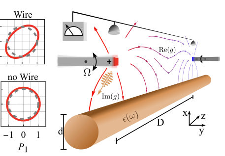 
FIG. 1. A conducting wire with permittivity ϵ(ω) can be used to increase the motional electrostatic coupling between two oscillators, illustrated here as torsional pendula. The image charge distributions generate coherent coupling and dissipa- tion, proportional to real and imaginary parts of the Green’s function g respectively. For low-frequency oscillator the latter becomes negligible. Continuous monitoring of the oscillators’ positions purifies their steady state, enabling the formation of motional entanglement. Insets: schematic phase-space mo- tional distributions indicating the resulting two-mode squeez- ing of momentum quadratures P1/2.

📷 Fig 2

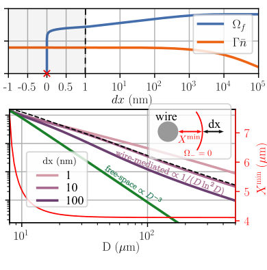 
FIG. 2. Characterization of the master equation rates for the parameters in Tab. I. (a) Renormalized mechanical frequency Ωf and wire-induced decoherence rate Γ¯n vs distance to in- stability dx (see diagram and text for details), (b) Motional particle-particle coupling Gtot without the wire (free space, green) and in the presence of the wire (purple) as a function of inter-particle distance D. For dx = 10nm, the black dashed line shows the coupling obtained using the analytical asymp- totic approximation Eq. (20). The red solid line shows the minimum equilibrium distance Xmin as a function of D. .

📷 Fig 3

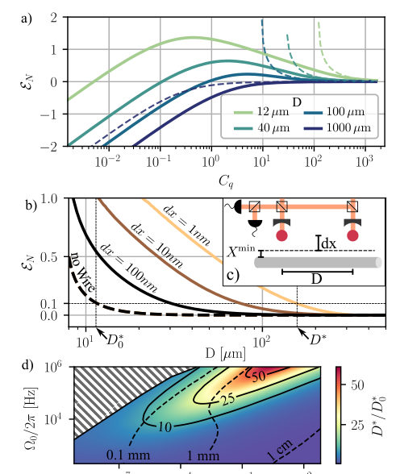 
FIG. 3. Steady-state entanglement between the two particles under continuous position measurement. (a) Log-negativity EN versus quantum cooperativity for different interparticle distances D; dashed lines show the high-cooperativiy analyt- ical approximation Eq. (32). (b) EN versus D at optimal quantum cooperativity and for different radial distances to instability dx. (c) Sketch of the proposed setup: the particles act as mirrors of optical cavities and are continuously mea- sured via the cavity output light. (d) Maximum inter-particle distance for which entanglement can be observed, D∗, normal- ized by the value in the absence of the wire, D∗ 0, as a func- tion of q2/m and bare mechanical...

📷 Fig 4

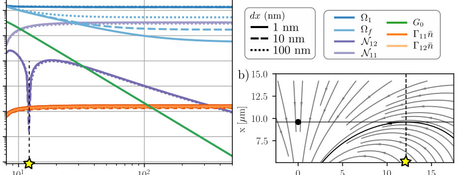 
FIG. 4. (a) All the rates of the master equation as a function of interparticle separation D and distance to instability dx. (b) the wire-mediated coupling N12 is given by the x-components of the field along the horizontal line, which explains the zero-crossing in (a) (see text for details)

**Summary.** The paper demonstrates how placing charged macroscopic oscillators near a conducting wire fundamentally alters their Coulomb interaction, enhancing the coupling strength at large separations. By combining this enhanced interaction with continuous position measurements, the authors show that steady-state motional entanglement can be generated over distances far exceeding free-space limits. This establishes conductor-assisted interactions as a novel resource for quantum control.

**Why it may be interesting.** This work directly addresses quantum control of massive objects by engineering long-range interactions, which is highly relevant for cavity QED and open quantum systems research involving mechanical resonators.

Detailed structure

**Main problem.** The authors propose a method to enhance the Coulomb interaction between massive mechanical oscillators by placing them near a conducting structure, aiming to generate steady-state motional entanglement over long distances.

**Main result.** They predict that the wire modifies the coupling scaling from $1/D^3$ to $1/(D\ln^2 D)$, enabling observable entanglement at separations much larger than achievable in free space.

**Method.** The analysis uses macroscopic quantum electrodynamics, deriving effective dynamics via a master equation approach and employing continuous measurement theory (Kalman filtering analogy).

**Model / system.** The system consists of two charged macroscopic mechanical oscillators coupled by both free-space Coulomb interaction and an image charge interaction mediated by a nearby conducting wire. The dynamics are described by a Hamiltonian and subsequently analyzed using a master equation.

**Key observables.** Steady-state motional entanglement, renormalized mechanical frequency ($\Omega'_f$), and the modified coupling rate ($G_{	ext{tot}}$).

**Important parameters / regimes.** Separation $D$, oscillator mass $m$, wire geometry (cylindrical), and operating regime (low-frequency limit $\hbar\Omega \ll k_B T$).

**Assumptions / limitations.** The analysis assumes the electroquasistatic limit, linearizes position dependence around equilibrium points, and utilizes approximations like Born-Markov for bath tracing.

**Figures summary.** Figures illustrate the setup showing image charge generation; one figure compares coupling rates vs. distance $D$ (free space vs. wire); another shows rate dependencies on separation and proximity to instability.

**Paper structure.** The paper develops from deriving the effective Hamiltonian incorporating medium effects, leading to a master equation description of dynamics, simplifying this master equation using approximations like RWA, and finally analyzing state evolution under continuous measurement via Kalman filtering analogies.

Abstract

We propose a method to enhance Coulomb interaction between charged macroscopic mechanical oscillators by placing a conducting structure in their vicinity. We derive the effective motional dynamics of the two oscillators using macroscopic quantum electrodynamics and show that image charges induced in the conductor fundamentally modify the range of the electrostatic interaction. For the specific case of a cylindrical wire, we predict that the coherent motional coupling changes from the free-space scaling $1/D^3$ to an asymptotic $1/(D\ln^2 D)$ dependence on the separation $D$ between the oscillators, at the cost of only negligible additional decoherence for low-frequency oscillators. We further show that, when combined with continuous position measurements, the enhanced interaction enables the generation of steady-state motional entanglement between the oscillators over significantly larger distances than achievable in free space. For experimentally realistic milligram-scale oscillators, we predict observable entanglement at separations of several hundred microns -- more than an order of magnitude beyond free-space capabilities -- with improvements approaching two orders of magnitude in future systems. These results identify conductor-assisted Coulomb interactions as a resource for quantum control of massive objects and for the exploration of entanglement generated by fundamental central forces.

[↑ back to top](#top)

### [Solvable Quantum Circuits with non-Markovian Influence Matrices](http://arxiv.org/abs/2607.25969v1)

**Authors:** Samuel H. Pickering, Max McGinley, Bhavik Kumar, Bruno Bertini  
**Type:** theory · **Category:** statistical mechanics · **PDF:** <https://arxiv.org/pdf/2607.25969v1>  
**Analysis basis:** full PDF text, analyzed in chunks
**Topic relevance:** 🔥 `analog quantum simulation` **4/5** · 🔥 `methods for driven-dissipative` **4/5** · `correlated / nonlocal dissipation` **3/5** · `driven-dissipative phase transition` **3/5** · `entanglement & information structure` **3/5** · `non-equilibrium dynamics` **3/5** · `Keldysh / 2PI / non-Gaussian methods` **2/5** · `non-equilibrium universality` **2/5** · `Kondo & dissipative impurity` **1/5** · `measurement-induced transitions` **1/5** · `scars & prethermalization` **1/5**

📷 Fig 1

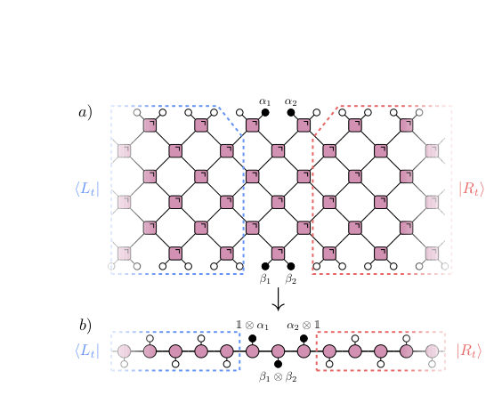 
FIG. 1. Tensor network describing dynamical correlations on top of the infinite temperature state Eq.(1) for x = 0. By representing columns of gates as their own tensors we can compress the notation to convert panel (a) to (b).

📷 Fig 2

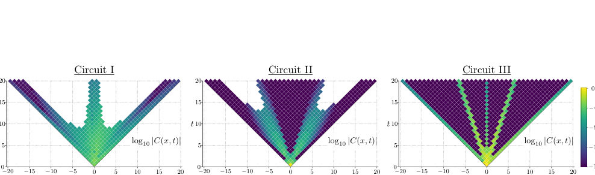 
FIG. 2. Dynamical correlation functions C(x, t) (between random Hermitian operators acting on two sites) for three example circuits satisfying CDU2/CDU3, displaying varying levels of solvability. The details of each circuit are described in Table II. Numerics are performed using MPS-based simulation of the tilted influence matrix with no truncation error (see End Matter); blank entries indicate that the bond dimension surpassed the cutoff χc = 384. The circuits I-III are described in Appendix D with the general summary being that I and III are CDU2 whilst II is CDU3. The ordering of the circuits corresponds to the degree of solvability beyond that guaranteed by the CDUn conditions (see End...

📷 Fig 3

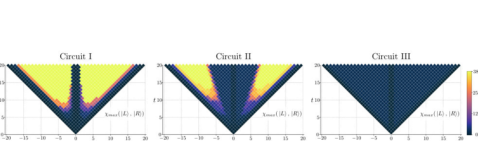 
FIG. 3. Maximum bond dimensions of both the (tilted) left and right influence matrices χmax( |Lt⟩, |Rt⟩) encountered when computing each correlation function in Fig. 2. Regions that surpass the cutoff χc = 384 in the figure correspond to blank regions in Fig. 2.

📷 Fig 4

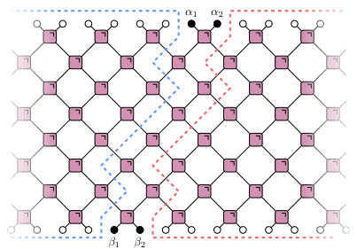 
FIG. 4. Tilted influence matrices characterising correlation functions with non-zero separation.

📷 Fig 5

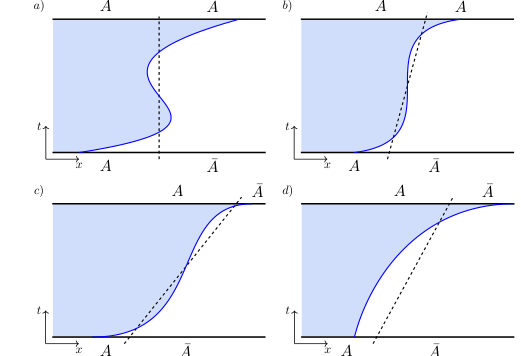 
FIG. 5. Examples of different operator trajectories and how they intersect with bipartitions at different tilt angles.

**Summary.** The paper introduces a systematic method to design solvable quantum circuits whose evolution captures non-Markovian correlations typical of interacting many-body systems. By deforming free-fermionic Clifford gates, the authors generate influence matrices that are computationally tractable while exhibiting complex temporal dependencies. This advances the field by bridging the gap between simple solvable models and realistic, strongly correlated dynamics.

**Why it may be interesting.** This work provides a powerful theoretical tool to simulate complex, non-Markovian dynamics in quantum many-body systems using structured circuits, which is highly relevant for understanding open quantum systems and realistic quantum simulation architectures.

Detailed structure

**Main problem.** The authors aim to develop a systematic method for constructing quantum circuits whose influence matrices can be exactly calculated, specifically achieving non-Markovian dynamics while maintaining solvability.

**Main result.** They successfully construct a broad family of solvable circuits by deforming free-fermionic Clifford gates with interaction terms, yielding non-Markovian influence matrices that mimic complex many-body correlations.

**Method.** The analysis involves using tensor network representations for influence matrices and applying operator trajectory decomposition in the Heisenberg picture to derive necessary structural conditions (CDU2/CDU3) for solvability.

**Model / system.** The model is a quantum circuit acting on local subsystems of an extended quantum many-body system, described by $q$-level qudits arranged in a 1D array. The evolution is governed by gates derived from free-fermionic Clifford circuits.

**Key observables.** Influence matrices ($\mathcal{L}_t, \mathcal{R}_t$), two-point correlation function $C(x, y, t)$, and the satisfaction of structural conditions like CDU2 and CDU3.

**Important parameters / regimes.** The bond dimension $\chi$, fermion velocities ($v$), and interaction strengths ($	heta$).

**Assumptions / limitations.** The analysis assumes that solvability can be maintained by finding specific structural deformations (e.g., restricting hopping patterns or ensuring stabilizer commutation relations) despite the introduction of non-Markovian terms.

**Figures summary.** Figure 1 illustrates the tensor network structure for dynamical correlations, while Figure 2 compares correlation functions for three example circuits (I, II, III) demonstrating different solvability classes (CDU2 vs CDU3).

**Paper structure.** The paper progresses by first establishing the need for non-Markovian solvable models beyond simple dual-unitary circuits. It then details using free-fermionic Clifford gates and systematically introduces deformations ($U_I(	heta)$) to satisfy increasingly complex solvability conditions (CDU2 $	o$ CDU3), culminating in deriving local commutation relations required for full solvability.

Abstract

Influence matrices encode the action exerted on local subsystems by the rest of an extended quantum many-body system during their evolution. Thus, knowledge of the influence matrix facilitates computationally efficient simulations of local dynamics. Here we propose a new systematic approach to generating quantum circuits with complex dynamics for which the influence matrices can be written down exactly. In contrast to previous frameworks of this kind, such as dual-unitary circuits, the resulting influence matrices are non-Markovian, exhibiting nontrivial temporal correlations. We explicitly construct a broad family of circuits of this kind, based on dressing free-fermion (matchgate) circuits with appropriately chosen interaction terms. We show that, contrary to previous solvable instances, these circuits produce patterns of correlations that closely resemble that of typical many-body systems. Our approach can be directly interpreted in terms of an error correction scheme where the terms breaking the solvability of the influence matrices play the role of errors.

[↑ back to top](#top)

### [Nonlocal Magnonic Cat States in Hybrid Magnon-Qubit Architectures](http://arxiv.org/abs/2607.25643v1)

**Authors:** Urmimala Dewan, Roson Nongthombam, Sampreet Kalita, Amarendra K. Sarma  
**Type:** theory · **Category:** quantum information and computing · **PDF:** <https://arxiv.org/pdf/2607.25643v1>  
**Analysis basis:** full PDF text, analyzed in chunks
**Topic relevance:** 🔥 `spintronics-quantum-optics interface` **4/5** · `correlated / nonlocal dissipation` **3/5** · `entanglement & information structure` **3/5** · `exotic spin models in light-matter` **3/5** · `QC/QI experiment` **2/5** · `measurement-induced transitions` **2/5** · `methods for driven-dissipative` **2/5** · `quantum measurements` **2/5** · `Tavis-Cummings & cavity-many-emitter` **1/5** · `analog quantum simulation` **1/5** · `correlated cavity matter` **1/5** · `driven-dissipative phase transition` **1/5** · `non-equilibrium dynamics` **1/5**

📷 Fig 1

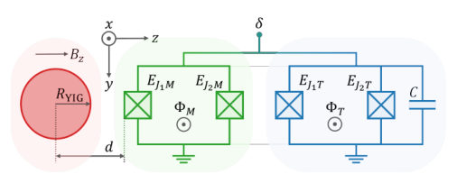 
FIG. 1. (color online) Schematic representation of the hybrid magnon-qubit system consisting of a YIG sphere (left, red) connected to a transmon SQUID (right, blue) via a magnon- coupling SQUID (center, green).

📷 Fig 2

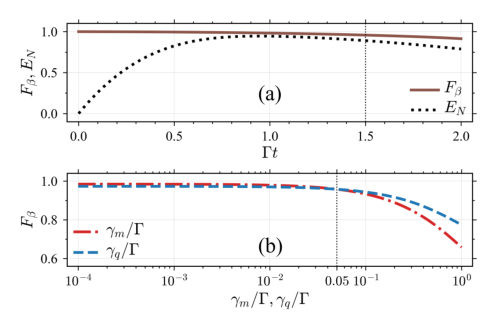 
FIG. 2. (color online) (a) Fidelity Fβ (solid brown) between the magnon-qubit state obtained using Eq. (7) and the target state |ψ⟩= (|0⟩m |0⟩q + |β(t)⟩m |1⟩q)/ √

📷 Fig 3

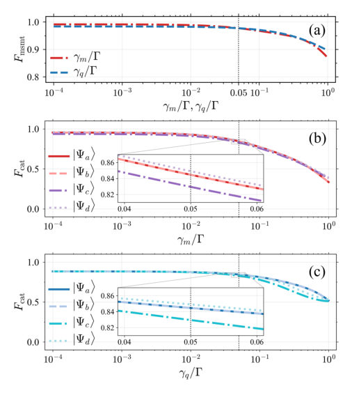 
FIG. 4. (color online) (a) Variation of fidelity Fmsmt between the measured states obtained using Eqs. (12) and (14) for different values of γm and γq. (b-c) Variation of fidelity Fcat between the measured cat states and the expected cat states for different values of (b) γm and (c) γq. The dotted lines denote γm, γq = 0.05Γ. Other parameter are same as Fig. 2.

📷 Fig 4

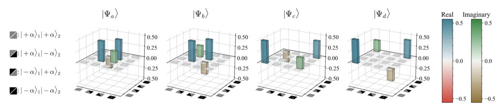 
FIG. 5. (color online) Projection of the generated bipartite magnonic cat states in the two-level coherent subspace.

📷 Fig 5

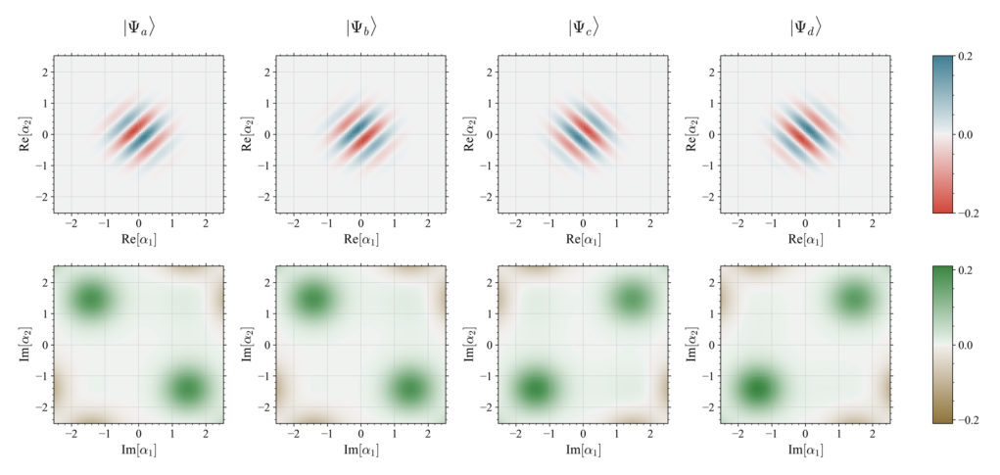 
FIG. 6. (color online) Wigner distributions of the generated bipartite cat states reconstructed numerically using Eq. (15). The top row depicts the real-real slice of the distribution whereas the bottom row depicts its imaginary-imaginary slice.

**Summary.** The paper proposes an entanglement-swapping protocol to generate nonlocal magnonic cat states across separated subsystems. It utilizes hybrid architectures combining transmon qubits and YIG magnon modes, demonstrating how projective measurements can transfer entanglement over distance. This work advances the feasibility of long-distance quantum networking using solid-state bosonic systems.

**Why it may be interesting.** This work directly addresses quantum networking by utilizing solid-state magnonic systems (YIG) coupled to superconducting qubits. The use of cat states in a long-distance setting is highly relevant for scalable quantum communication protocols.

Detailed structure

**Main problem.** The goal is to generate a bipartite magnonic cat state shared between two spatially separated subsystems.

**Main result.** The authors propose an entanglement-swapping protocol that successfully transfers magnon-qubit entanglement to create a nonlocal magnonic cat state, demonstrating a feasible route for long-distance quantum networking.

**Method.** The protocol involves generating initial magnon-qubit entanglement, using a microwave cavity interaction to generate qubit Bell states, and finally performing a projective Bell-state measurement on the qubits to project the remote magnon modes into the desired bipartite cat state.

**Model / system.** The system is a hybrid architecture combining superconducting transmon qubits with Yttrium Iron Garnet (YIG) spheres supporting magnon modes. The dynamics are modeled using a Hamiltonian and evolved via the Lindblad master equation to account for dissipation.

**Key observables.** Fidelity ($F_{eta}$ or $F_{cat}$), Entanglement Negativity ($	ext{EN}(
ho)$), and the joint Wigner function of the bipartite cat state.

**Important parameters / regimes.** The effective detuning ($\Delta$), coupling strength ($g$), and decoherence rates ($\gamma_m, \gamma_q$) are key parameters governing the dynamics.

**Assumptions / limitations.** The derivation relies on the Rotating-Wave Approximation (RWA), and comparisons between analytical results and simulations must account for dissipation and measurement noise.

**Figures summary.** Figures illustrate the schematic of the hybrid system, show fidelity/entanglement evolution over time, and display the analytically calculated Wigner functions for the four possible bipartite cat states.

**Paper structure.** The paper details the Hamiltonian formulation, describes the entanglement-swapping protocol using Bell state measurements, provides analytical derivations for the resulting Wigner functions, and validates the scheme through simulation results.

Abstract

The quantum superpositions of coherent states offer an alternative to the conventional qubit-based encodings by harnessing the large Hilbert space available in bosonic modes, including those realised in microwave and optical cavities, magnons, and mechanical resonators. Beyond their advantages for local information processing, establishing long-distance quantum networks for such bosonic states is crucial for scalable quantum communication and distributed quantum computation. In this work, we propose an entanglement-swapping-based protocol to generate a bipartite magnonic cat state shared between spatially separated subsystems. Each subsystem comprises a hybrid architecture consisting of a superconducting transmon qubit coupled to a yttrium iron garnet (YIG) sphere that supports magnon modes. By performing a projective Bell-state measurement on the qubits, the initially established magnon-qubit entanglement is coherently transferred to the remote magnon modes, resulting in a nonlocal magnonic cat state. For experimental characterisation of the gener- ated states, we perform quantum state tomography through reconstruction of the Wigner function using joint displaced parity measurements of the magnon modes. Our scheme provides a feasible route towards realising long-distance magnonic entanglement and contributes to the advancement of hybrid quantum network architectures.

[↑ back to top](#top)

### [Observable Estimation in the Absence of Classical Verification](http://arxiv.org/abs/2607.25998v1)

**Authors:** Samantha V. Barron, Bradley Mitchell, Vinay Tripathi, Francesco Grieco, Ilan Rosen, Francesca Pietracaprina, Davide Materia, Alireza Seif, Darvin Wanisch, Ramón L. Panadés-Barrueta, Ewout van den Berg, Jay-U Chung, Andrew Eddins, Sam Ferracin, Guillermo García-Pérez, John Goold, Luke C. G. Govia, Holger Haas, Ian Hincks, Jesse C. Hoke, Zoë Holmes, Su-un Lee, Youngseok Kim, Swarnadeep Majumder, Sabrina Maniscalco, Simone Montangero, Daniel Puzzuoli, Tomaž Prosen, James Raftery, Ricardo Rivera Cardoso, Max Rossmannek, Manuel Rudolph, Brendan Saxberg, Liran Shirizly, Karthik Siva, Joshua Skanes-Norman, Ilaria Siloi, Kevin C Smith, Boris Sokolov, Maika Takita, Yanting Teng, Mao Tian Tan, Joseph Tindall, Zoltán Zimborás, Matteo A. C. Rossi, Minh C. Tran, Sergei N. Filippov, Abhinav Kandala  
**Type:** both · **Category:** quantum information and computing · **PDF:** <https://arxiv.org/pdf/2607.25998v1>  
**Analysis basis:** full PDF text, analyzed in chunks
**Topic relevance:** 🔥 `QC/QI experiment` **4/5** · 🔥 `analog quantum simulation` **4/5** · `entanglement & information structure` **3/5** · `methods for driven-dissipative` **3/5** · `non-equilibrium dynamics` **3/5** · `correlated / nonlocal dissipation` **2/5** · `driven-dissipative phase transition` **2/5** · `quantum measurements` **2/5** · `Keldysh / 2PI / non-Gaussian methods` **1/5** · `measurement-induced transitions` **1/5** · `non-equilibrium universality` **1/5**

📷 Fig 1

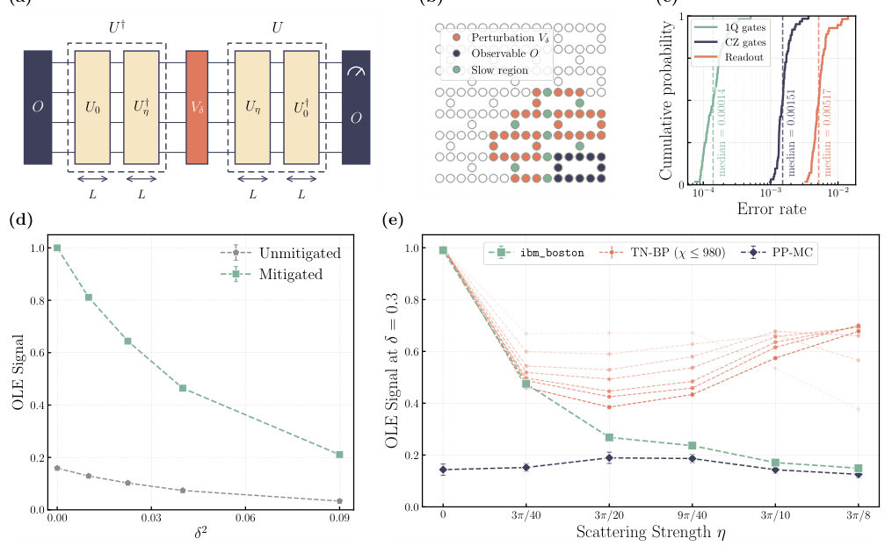 
FIG. 1. (a) Quantum circuits to compute the OLE signal, i.e. the overlap between an observable and its echoed version. The initial operator is approximated by an ensemble of eigenstates of O. It is evolved under U †, perturbed by Vδ, and evolved back under U before measuring in the eigenbasis of O. (b) The quantum circuits are applied on 56 qubits (colored) of ibm boston. Orange circles indicate qubits where the perturbation Vδ is applied. Blue circles are the 12 qubits in the support of the representative observable O for which the OLE signal is computed in later panels. The speed of operator propagation through each qubit can be controlled by tuning the angle of a single-qubit rotation on...

📷 Fig 2

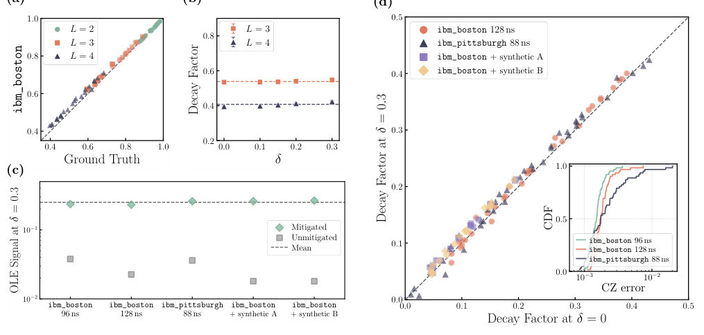 
FIG. 2. Building trust in the quantum estimate. (a) Classical verification at small depth. The rescaled experimental OLE signal on ibm boston is compared against the TN-BP ground truth at δ = 0.3 and scattering strength η = 9π/40 for L = 2 (green circles), L = 3 (orange squares), and L = 4 (purple triangles), across several representative observables of Pauli weights 3 to 12. At these depths the TN-BP simulation at χ = 128 has converged (fidelity more than 0.97) and serves as a proxy for the ground truth. The points lie along the y = x line, showing that the rescaled quantum estimate tracks the exactly computable answer, albeit with a small positive bias. (b) The decay factor of the...

📷 Fig 3

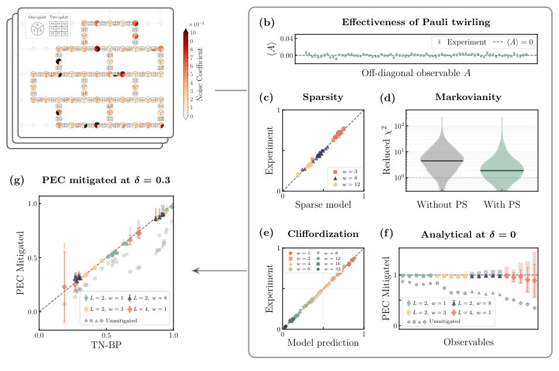 
FIG. 3. Unbiased estimation with error bounds via Probabilistic Error Cancellation. PEC is applied to the OLE circuits at shallow depths (L = 2 and 4), where converged TN-BP provides an exact reference for benchmarking the protocol. (a) The noise model learned across the 56-qubit patch of ibm boston: each qubit and coupler is visualized with its learned Pauli error coefficients (color scale). PEC aims to invert this noise model to recover the ideal signal. (b)–(f) Model validation: a series of tests that the learned sparse Pauli–Lindblad noise model is an accurate and predictive description of the device. (b) Measured expectation values of off-diagonal observables that are predicted to be...

📷 Fig 4

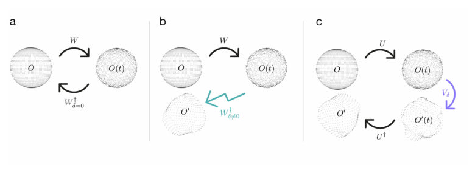 
FIG. 4. Loschmidt echo: The Loschmidt echo can be visualized as evolving from an initial object (state or observable) under a certain unitary W, and back propagation with a perturbed Wδ. (a) In the absence of perturbation, the initial condition is exactly recovered. (b) Perturbation leads to a mismatch between the initial and final states or observables. (c) In this experiment Wδ = UVδ, so the perturbation is localized in time, in the middle of the echo dynamics.

📷 Fig 5

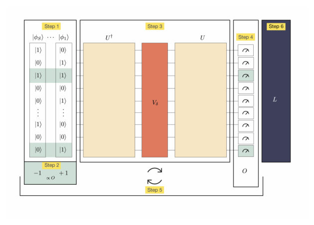 
FIG. 5. Operator Loschmidt Echo protocol The physical question is to probe how much of the operator density is located in the (crosshatched) geometric area VP as a result of the eventual operator spreading U †OU. The figure of merit is the Out-of-Time-Order Correlator (OTOC) ∝tr{[G, U †OU]†[G, U †OU]} for the generator G acting nontrivially in the area VP. OTOC is probed with the Operator Loschmidt Echo (OLE) signal ∝tr[UVδU †OUV † δ U †O] with Vδ = e−iδG. The experimental setup for measuring the operator Loschmidt echo for the observable O = Z⊗VO consists of the preparation of randomly chosen computational-basis-states |ϕm⟩∈{|0 . . . 0⟩, . . . , |1 . . . 1⟩}. Evolution of the state...

**Summary.** This paper presents a novel framework to validate quantum estimates of physical observables when exact classical verification is impossible. By applying this to semi-scrambling dynamics on superconducting qubits, the authors demonstrate methods that rely on internal consistency checks or precise noise model characterization rather than external ground truths. This establishes a crucial pathway toward trusted quantum computation for scientific discovery.

**Why it may be interesting.** This work directly addresses the 'trustworthiness' bottleneck in quantum simulation, providing concrete protocols for validating results when classical theory breaks down—a critical concern for AMO and open quantum systems research.

Detailed structure

**Main problem.** The core challenge is establishing a reliable method for validating quantum estimates of physical observables when direct, exact classical benchmarks are unavailable due to computational limitations.

**Main result.** The authors establish a framework using consistency checks or by rigorously characterizing the noise model (e.g., via PEC) to build confidence in quantum results independent of classical ground truth.

**Method.** They combine theoretical frameworks for error bounding (like Probabilistic Error Cancellation, PEC) with experimental measurements on superconducting hardware, utilizing advanced diagnostics like the operator Loschmidt echo.

**Model / system.** The study applies this framework to semi-scrambling dynamics of a heterogeneous Floquet Ising model simulated on a 56-qubit section of a heavy-hex lattice using superconducting transmon qubits.

**Key observables.** Operator Loschmidt echo (OLE) signal ($	ext{S}_\delta$), expectation values, and error rates for various gate types.

**Important parameters / regimes.** Scattering strength ($\eta$), perturbation strength ($\delta$), circuit depth ($L$), and Pauli error rates ($\lambda_P$).

**Assumptions / limitations.** The primary assumptions involve the validity of noise models (e.g., assuming $\delta$-independence for global rescaling) and the ability to accurately characterize hardware noise channels.

**Figures summary.** Figures illustrate circuit diagrams for OLE computation, compare error rates across different gate types, show how classical heuristics diverge from quantum results at intermediate parameters, and detail overhead reduction achieved by advanced error mitigation techniques like SLC.

**Paper structure.** The paper progresses from defining the need for validation beyond classical benchmarks to applying this framework using the OLE on a complex physical model. It then details sophisticated noise characterization methods (PEC/SLC) before concluding with tests of observable sensitivity across sub-lattices.

Abstract

The predictive success of quantum mechanics underpins many areas of modern science, even as the exact simulation of large, interacting quantum systems remains beyond the reach of classical computation. This success has been enabled by the remarkable advancement of scalable numerical approximation methods, which often demonstrate practical accuracy despite the absence of formal guarantees. As quantum simulation pushes into regimes where these approximations struggle, a fundamental challenge arises: How can quantum outcomes be trusted when reliable classical benchmarks are unavailable? Here, we establish a framework for the independent validation of quantum estimates in this setting and present evidence that they provide the most credible result among several considered methods, in the absence of an immediately accessible ground-truth solution. We apply our framework to the semi-scrambling dynamics of a physical model that strains several leading classical simulation methods yet remains experimentally accessible, in part through our introduction of the \textit{operator Loschmidt echo}. We systematically design a series of experiments using quantum heuristics that, taken together, test the underlying assumptions and provide strong confidence in the observable estimates obtained from the quantum computer. We then show how this framework can be extended to place accuracy bounds on quantum estimates via careful characterization and manipulation of the device noise, transforming the problem of validating the observable estimation to validating the noise model. These results establish a route towards trusted quantum computation for scientific discovery, independent of classical verification.

[↑ back to top](#top)

### [Dissipation Enables Strongly Detuning-Dependent Interference in Pulsed Dynamical Decoupling](http://arxiv.org/abs/2607.25176v1)

**Authors:** Kenneth DeRose, Jonah Glick, Kefeng Jiang, Hans Johnson, Tanay Roy, Sharika Saraf, Anya Abraham, Hardeep Singh, Tim Kovachy  
**Type:** both · **Category:** other · **PDF:** <https://arxiv.org/pdf/2607.25176v1>  
**Analysis basis:** full PDF text, analyzed in chunks
**Topic relevance:** 🔥 `methods for driven-dissipative` **4/5** · `correlated / nonlocal dissipation` **3/5** · `driven-dissipative phase transition` **3/5** · `interference shaping light` **3/5** · `QC/QI experiment` **2/5** · `non-equilibrium dynamics` **2/5** · `non-equilibrium universality` **2/5** · `Keldysh / 2PI / non-Gaussian methods` **1/5** · `analog quantum simulation` **1/5** · `measurement-induced transitions` **1/5** · `quantum measurements` **1/5** · `quantum optics experiment` **1/5**

📷 Fig 1

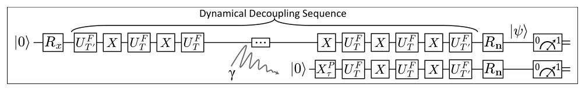 
FIG. 1. Gate-based picture of the impact of relaxation on the DD sequence described in Sec. II. In this picture, we imagine a relaxation event (rate γ) occurs during a single X-gate operation, so that the qubit resets to the |0⟩state and is subject to a ‘partial’ X-gate operation, XP τ , and subsequently only the remaining pulses of the DD sequence. This partial X-gate pulse can act as a π/2 pulse rotation, splitting the |0⟩state population into a superposition of |0⟩and |1⟩, which begins a new DD sequence with imperfect pulse timings. Therefore, this relaxed qubit can still contribute to the post-readout interference fringe, leading to dephasing from the coupling of detuning errors and...

📷 Fig 2

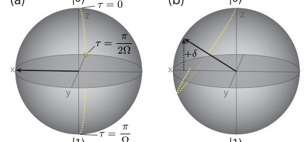 
FIG. 2. Two examples of an “arc” distribution of states formed from decayed qubits during a single X-gate pulse in the Bloch sphere representation of a qubit in the driving field reference frame. (a) is without detuning, and (b) is with a positive detuning. The solid black arrow represents the normalized rotation vector corresponding to the gate, whose direction depends on detuning δ. For the purposes of this fig- ure, δ is taken to be normalized relative to the effective Rabi frequency √

📷 Fig 3

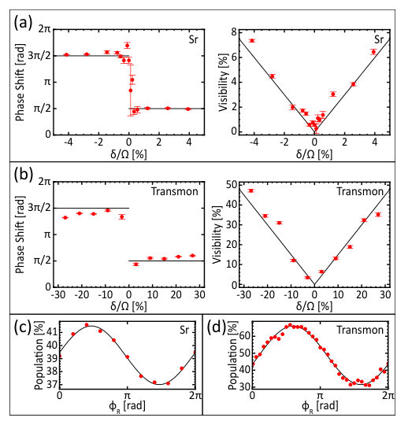 
FIG. 3. The impact of relaxation on a DD sequence in (a) a 88Sr atom interferometer with a |1⟩-state lifetime ≈21.3 µs and (b) a flux-tunable superconducting transmon qubit with |1⟩-state lifetime ≈21 µs. The measured phase shift ∆ϕ and visibility v are observed in the regime where the total DD sequence duration exceeds the |1⟩-state lifetime (504 X- gates, total duration ≈113 µs in (a), and 200 X-gates, to- tal duration ≈120 µs, in (b)), so that most qubits have re- laxed at least once during the DD sequence. Despite aris- ing from entirely different experimental platforms, the same strong relaxation-induced detuning dependence is observed. Red points are experimental data; solid black...

📷 Fig 4

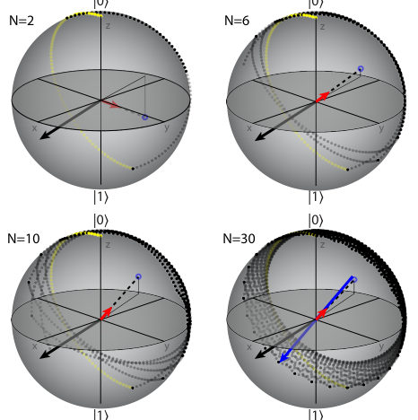 
FIG. 4. Bloch sphere OBE simulation (neglecting Rabi frequency and detuning inhomogeneity effects) showing the buildup of coherence from a sequence of N repeating X-gate pulses in the driving field reference frame. The dots indicate the distribution taken by the decayed qubits. Yellow dots are specific to the arc produced by the most recent pulse (black rotation vector). The red vector is the resulting “cumulative state,” representing the density matrix of the set of qubits that have undergone decay. For visual clarity, this vector is extended by a dotted line to the blue circle which is, in this example, the intersection with the back side of the Bloch sphere in all images. In the N = 30...

📷 Fig 5

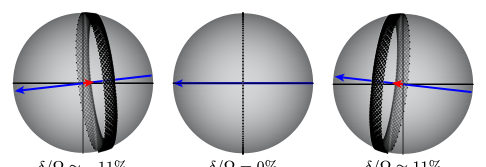 
FIG. 5. OBE simulated Bloch spheres (neglecting Rabi fre- quency and detuning inhomogeneity effects) showing the final distribution of qubit states from previously decayed qubits after 50 X-gate pulses, prior to the final dead time, T ′, and readout pulse. The Bloch spheres shown are for a small neg- ative, zero, and positive detuning. This figure highlights how the direction of the cumulative state vector (red arrow) is highly sensitive to the driving field detuning. Note the flip in direction of the cumulative state vector, which is associated with the flip of the measured phase shift by π in Fig. 3, as the detuning changes sign. As Fig. 4, the blue arrow represents the ˆη axis.

**Summary.** The paper demonstrates that spontaneous decay during pulsed dynamical decoupling sequences fundamentally changes the expected behavior, introducing a strong dependence on detuning. This effect is modeled analytically and experimentally verified using both strontium atoms and transmon qubits. The findings establish Dissipative Carr-Purcell Spectroscopy (DCPS) as a new tool for quantum characterization.

**Why it may be interesting.** This work is highly relevant as it shows that open system dynamics (dissipation) can be harnessed not just as noise, but as a source of measurable quantum information, leading to novel spectroscopy techniques for characterizing coherence in complex systems.

Detailed structure

**Main problem.** Investigating how spontaneous dissipation (excited-state decay) fundamentally alters the behavior of pulsed dynamical decoupling sequences, potentially creating a strong detuning dependence where none existed before.

**Main result.** Dissipation can reshape coherent control in DD sequences, causing the system to exhibit a measurable interference signal whose phase and visibility are strongly dependent on the detuning from resonance.

**Method.** The study uses analytical and numerical modeling of driven two-level systems, validated by experimental measurements on both strontium atoms and superconducting transmon qubits.

**Model / system.** The core model is a driven two-level system qubit subjected to pulsed dynamical decoupling sequences (like Carr-Purcell). The physical platforms include free-space strontium atom interferometers and superconducting transmon qubits, both exhibiting relaxation ($T_1$).

**Key observables.** Phase shift ($\Delta\phi$), Visibility ($v$), and the detuning dependence of these quantities.

**Important parameters / regimes.** Detuning ($\delta$) relative to resonance, decay rate ($\gamma = 1/T_1$), and pulse timings (e.g., $	au_\pi$, $T$).

**Assumptions / limitations.** The analysis often relies on first-order approximations in detuning error ($\delta$) and requires explicit correction factors for decay occurring during the final detection readout.

**Figures summary.** Figures illustrate the gate-based impact of relaxation, Bloch sphere trajectories showing state distributions after decay (arcs), and measured $\Delta\phi$ and $v$ versus normalized detuning ($\delta/\Omega$) for both atomic and superconducting systems.

**Paper structure.** The paper moves from establishing the theoretical mechanism of dissipation altering DD control to developing a new spectroscopic technique (DCPS) and finally presenting comparative experimental results across two distinct physical platforms.

Abstract

One of the defining features of pulsed dynamical decoupling is its suppression of a driven qubit's sensitivity to static detuning errors between the drive field and qubit resonance. In this paper, we show that dissipation, in the form of excited-state decay, can change this behavior entirely, producing an interference signal with a strong detuning dependence. This signal arises from decay during driven evolution and relies on coherence retained by the qubit after such a decay event. We develop analytical and numerical models that capture the underlying mechanism and observe this same dissipation-induced detuning dependence experimentally in both a free-space strontium atom interferometer and a superconducting transmon qubit system. We also use this dissipation-induced detuning dependence as the basis for a new spectroscopic technique called Dissipative Carr-Purcell Spectroscopy (DCPS) and compare it with a traditional Ramsey sequence. Our results establish a regime of pulsed dynamical decoupling in which dissipation reshapes, rather than merely degrades, coherent control, and we expect these dynamics to be relevant to a wide range of quantum systems.

[↑ back to top](#top)

### [Interacting hydrodynamic modes in spinless fermions with dephasing noise](http://arxiv.org/abs/2607.25938v1)

**Authors:** Fabian H. L. Essler, Patrik Penc  
**Type:** theory · **Category:** statistical mechanics · **PDF:** <https://arxiv.org/pdf/2607.25938v1>  
**Analysis basis:** full PDF text, analyzed in chunks
**Topic relevance:** 🔥 `methods for driven-dissipative` **4/5** · 🔥 `non-equilibrium dynamics` **4/5** · `Keldysh / 2PI / non-Gaussian methods` **3/5** · `correlated / nonlocal dissipation` **3/5** · `driven-dissipative phase transition` **3/5** · `analog quantum simulation` **2/5** · `non-equilibrium universality` **2/5** · `Kondo & dissipative impurity` **1/5** · `entanglement & information structure` **1/5** · `scars & prethermalization` **1/5**

📷 Fig 1

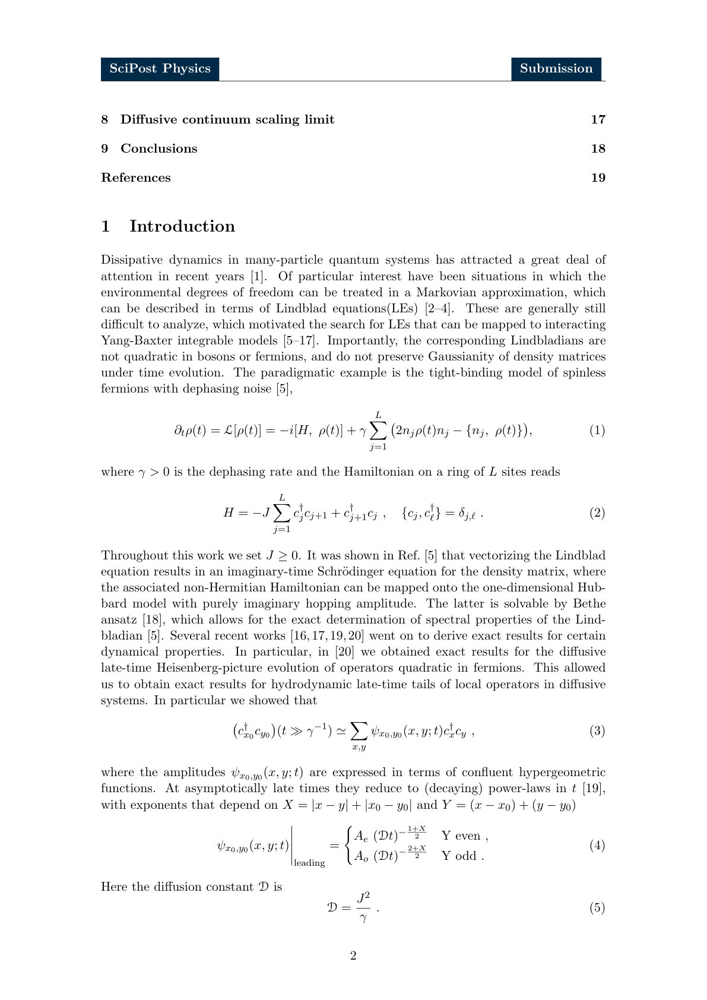 
Low-resolution page preview, page 2

📷 Fig 2

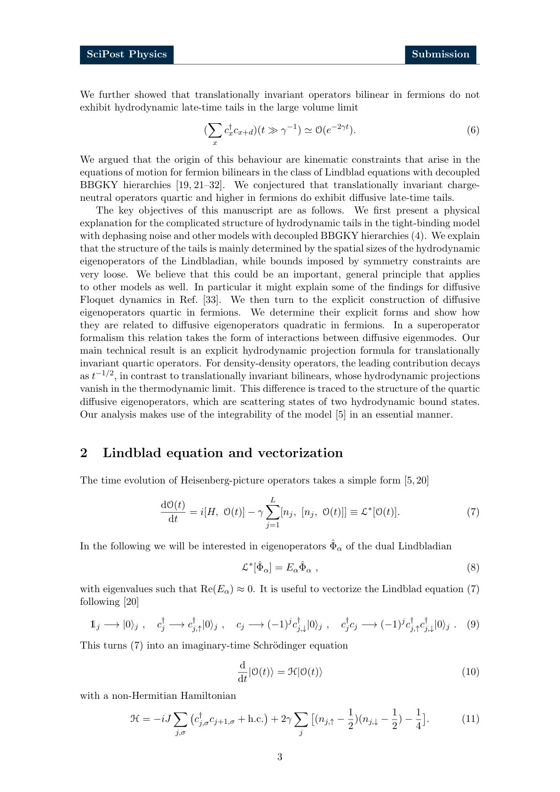 
Low-resolution page preview, page 3

📷 Fig 3

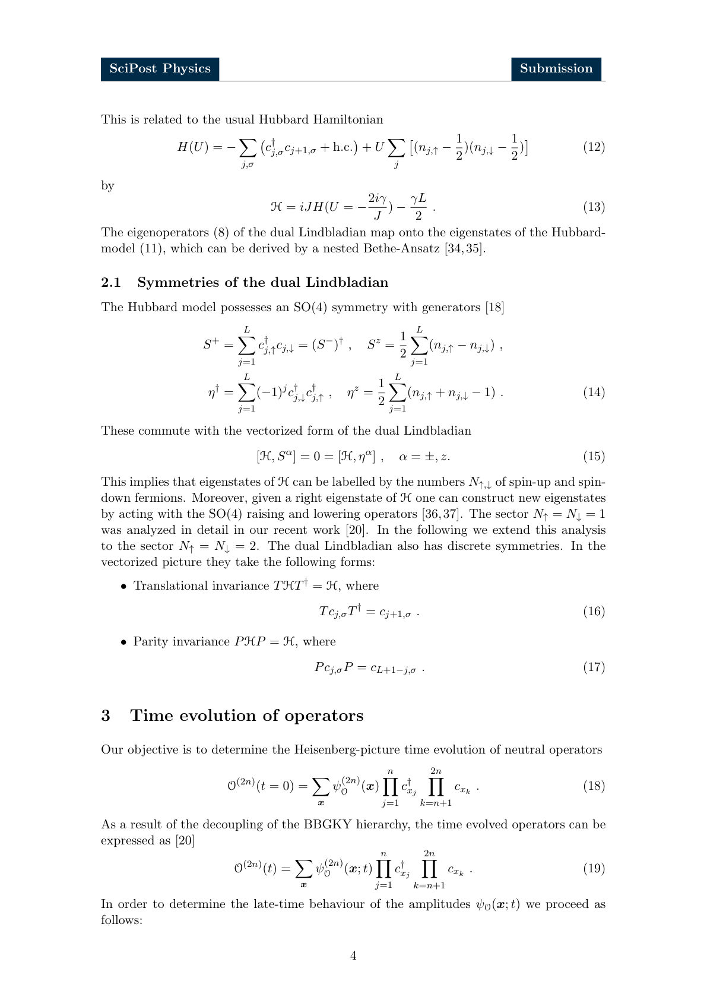 
Low-resolution page preview, page 4

📷 Fig 4

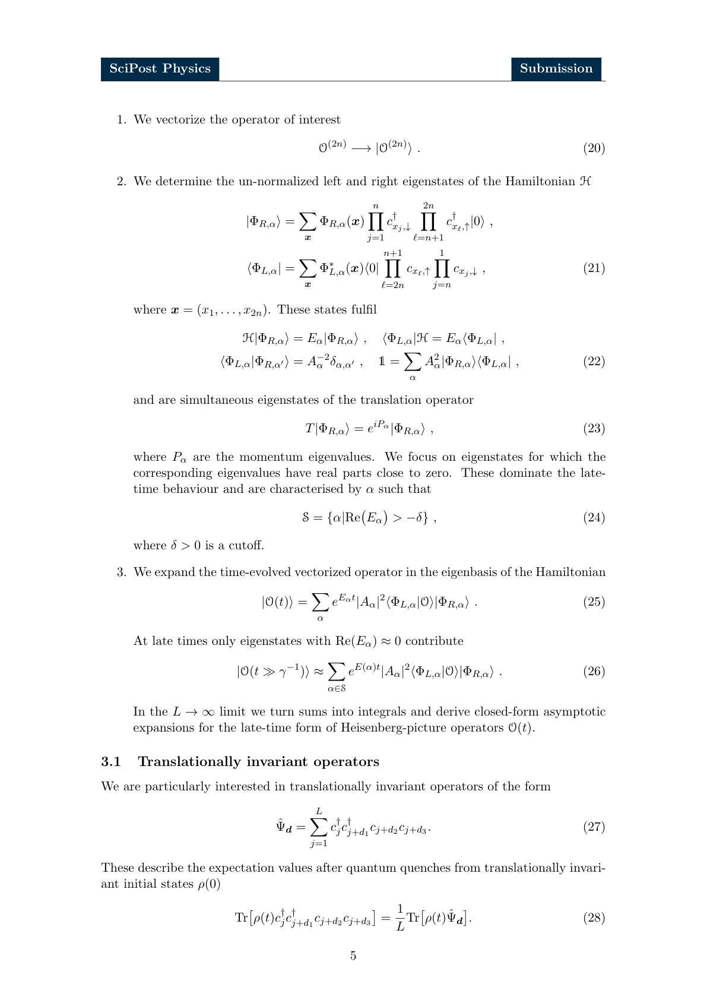 
Low-resolution page preview, page 5

📷 Fig 5

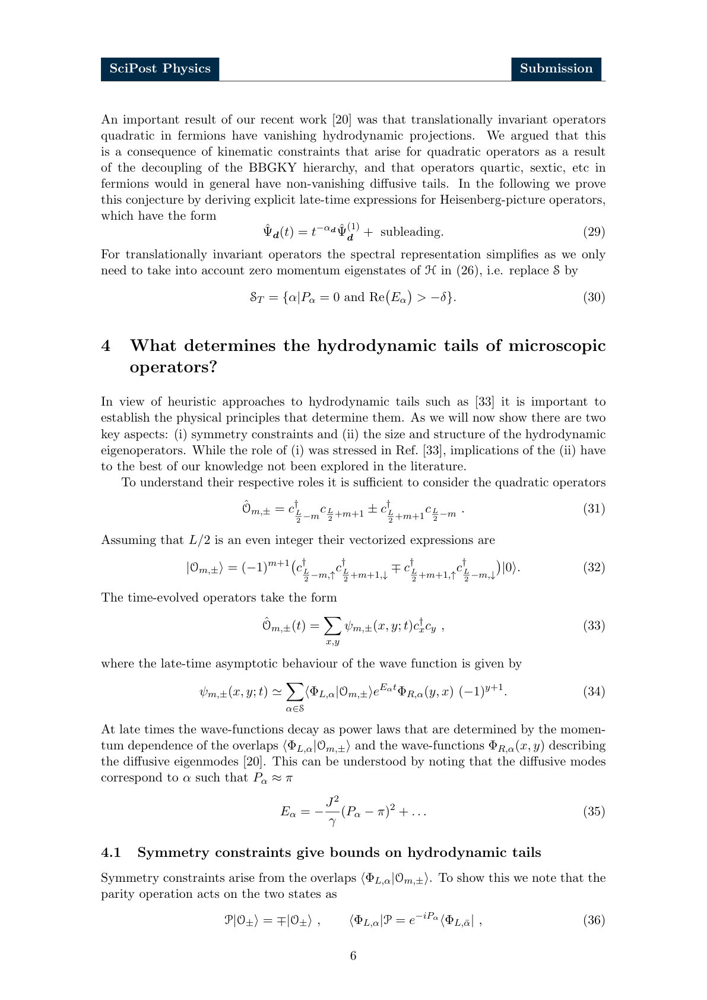 
Low-resolution page preview, page 6

**Summary.** This theoretical work investigates how spinless fermions behave far from equilibrium when subjected to dephasing noise. By analyzing the dynamics using Lindblad equations and spectral methods, the authors prove that higher-order correlation functions exhibit persistent diffusive tails at late times. This demonstrates that simple symmetry arguments are insufficient to predict transport properties in dissipative quantum many-body systems.

**Why it may be interesting.** It provides a concrete example of how dissipation fundamentally alters long-time transport properties in interacting quantum systems, offering insights applicable to open quantum systems studied in AMO physics.

Detailed structure

**Main problem.** The study determines the non-equilibrium dynamics and asymptotic late-time tails of correlation functions for spinless fermions subjected to dephasing noise.

**Main result.** Quartic operators generically exhibit diffusive power-law decay tails, unlike bilinear operators which vanish exponentially, showing that hydrodynamic behavior depends on operator structure rather than just symmetry.

**Method.** The analysis uses the many-particle Lindblad equation, mapping it to an imaginary-time Schrödinger equation and analyzing the spectral properties of the dual Lindbladian eigenoperators.

**Model / system.** The system is spinless fermions hopping on a ring lattice governed by a tight-binding Hamiltonian, whose evolution is described by a many-particle Lindblad equation incorporating dephasing noise ($\gamma$).

**Key observables.** Time evolution of Heisenberg-picture operators, specifically quadratic and quartic correlation functions $\langle c^\dagger_{x}c_{y} 
angle$ and higher order terms.

**Important parameters / regimes.** Dephasing rate ($\gamma$), hopping amplitude ($J$), and the asymptotic time limit ($t \gg \gamma^{-1}$).

**Assumptions / limitations.** The analysis relies on decoupling approximations (like BBGKY hierarchy) and assumes that late-time behavior is governed by eigenstates with real part of energy near zero.

**Figures summary.** Not specified, but the notes detail deriving asymptotic expressions for correlation functions $\Psi^{(0)}_{\{d,d,0\}}(x, t)$ showing power-law decay.

**Paper structure.** The paper progresses by establishing the governing Lindblad dynamics, analyzing quadratic operators first to show their behavior, and then extending this rigorous analysis to quartic (and higher) operators to prove the existence of non-vanishing hydrodynamic tails.

Abstract

We study the non-equilibrium dynamics of spinless fermions with dephasing noise in the framework of a many-particle Lindblad equation. Using a mapping to the exactly solvable one-dimensional Hubbard model with purely imaginary tunneling amplitude we analyze the Heisenberg-picture dynamics of operators quartic in fermions and determine their hydrodynamic projections. We construct the relevant diffusive eigenoperators explicitly and show that, in the quartic sector, they can be interpreted as interacting pairs of bilinear hydrodynamic modes. As a consequence, translationally invariant quartic operators generically exhibit non-vanishing diffusive late-time tails, unlike translationally invariant bilinears. Our results show that the hydrodynamic tails of microscopic operators cannot in general be inferred from symmetry constraints or coarse-grained fluctuating hydrodynamics alone; they also depend crucially on the spatial structure and effective size of the hydrodynamic eigenoperators.

[↑ back to top](#top)

### [Anomalous entanglement scaling from eigenvector nonorthogonality in critical non-Hermitian free fermions](http://arxiv.org/abs/2607.25256v1)

**Authors:** Zhenyu Xiao, Shinsei Ryu  
**Type:** theory · **Category:** statistical mechanics · **PDF:** <https://arxiv.org/pdf/2607.25256v1>  
**Analysis basis:** full PDF text, analyzed in chunks
**Topic relevance:** 🔥 `entanglement & information structure` **4/5** · 🔥 `non-equilibrium universality` **4/5** · `driven-dissipative phase transition` **3/5** · `methods for driven-dissipative` **3/5** · `non-equilibrium dynamics` **3/5** · `Kondo & dissipative impurity` **2/5** · `Keldysh / 2PI / non-Gaussian methods` **1/5** · `analog quantum simulation` **1/5** · `correlated / nonlocal dissipation` **1/5**

📷 Fig 1

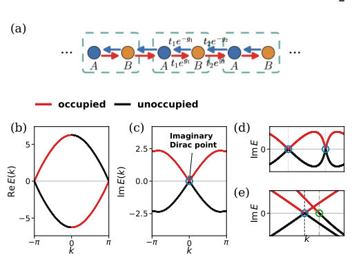 
FIG. 1. (a) Schematic of the non-Hermitian SSH model [Eq. (1)]. (b,c) Real and imaginary parts of the complex band structure E±(k) for (t1, t2, g1, g2) = (3.6, 2, 1, 0). In (c), the steady state fills the modes with Im E(k) &gt; 0, and the band crossing at Im E±(k) = 0 defines the imaginary Dirac point. (d) A schematic of two imaginary Dirac points. (e) One imag- inary Dirac point and one single-band Fermi point.

📷 Fig 2

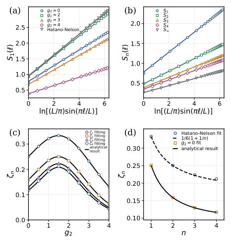 
FIG. 2. (a) Von Neumann entanglement entropy S1 versus chord distance dℓ= (L/π) sin(πℓ/L) at (t1, t2, g1) = (3.6, 2, 1) for several g2, and the Hatano–Nelson point (2, 2, 1, 1). (b) R´enyi entropies Sn at g2 = 0; fitted ζn tabulated in Eq. (18). (c) ζn versus g2 for n = 1, 2, 3, 4. (d) ζn versus n at g2 = 0, compared with the Hatano–Nelson value (1+1/n)/6. Numer- ics use L = 65536 with linear fits over 128 ≤ℓ≤512. In (c) and (d), dots come from numerical fitting and solid lines are the analytical prediction [Eqs. (4), (9), (14)].

📷 Fig 3

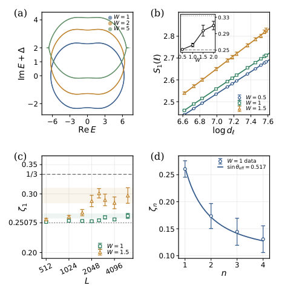 
FIG. 3. Real onsite disorder Wj,µ ∈[−W/2, W/2] in the non- Hermitian SSH steady state. (a) Single-realization complex spectra at L = 512 for W = 1, 2, 5, shifted by ∆= 0, 1, 2 for clarity. (b) Disorder- and origin-averaged S1(ℓ) versus ln dℓ at L = 6144, with the chord distance dℓ= (L/π) sin(πℓ/L); lines are weighted linear fits, and the inset shows the fitted ζ1 versus W. (c) Finite-size convergence of ζ1 at W = 1 and W = 1.5; dotted and dashed lines mark the clean value ζ1 = 0.25075 and the c = 1 Hatano–Nelson value 1/3. (d) R´enyi coefficients ζn at W = 1 (symbols) compared with the single-parameter form Eq. (14) at a fitted θeff (line).

**Summary.** The paper analyzes the entanglement entropy in critical non-Hermitian free-fermion chains, finding that the scaling coefficient $\zeta_n$ is anomalous and depends continuously on system parameters. This anomaly is fundamentally linked to the nonorthogonality of eigenvectors at imaginary Dirac points within the energy spectrum. The findings establish a general framework for understanding entanglement in complex, non-Hermitian quantum critical systems.

**Why it may be interesting.** This work provides a powerful generalization of entanglement measures beyond standard Hermitian critical theories (like CFT), showing how topological/non-Hermitian features dictate universal scaling laws in quantum many-body systems.

Detailed structure

**Main problem.** The study investigates anomalous entanglement scaling in critical non-Hermitian free-fermion steady states, linking this anomaly to eigenvector nonorthogonality.

**Main result.** The entanglement entropy scales logarithmically with subsystem size, $S_n(\ell) = \zeta_n(\lambda) \ln d_\ell + O(1)$, where the coefficient $\zeta_n$ forms a continuous family not predicted by standard central charges.

**Method.** Analytical derivations using low-energy expansions and correlation matrix analysis are combined with numerical calculations on 1D models to determine the scaling coefficients.

**Model / system.** The primary model is the non-Hermitian Su–Schrieffer–Heeger (SSH) chain, analyzed in its critical steady state $|\Psi_S
angle$. The physics is governed by non-Hermiticity and band crossings at imaginary Dirac points.

**Key observables.** Entanglement entropy ($S_n$), the logarithmic scaling coefficient ($\zeta_n$), and the overlap angle ($\sin 	heta$) quantifying eigenvector nonorthogonality.

**Important parameters / regimes.** The system parameters $\lambda$ (e.g., hopping ratios $t_1, t_2$) control the continuous variation of $\zeta_n$; weak real onsite disorder ($W$) is also a key parameter tested.

**Assumptions / limitations.** The analysis assumes the applicability of logarithmic scaling for entanglement entropy and focuses on gapless critical regimes defined by imaginary energy crossings.

**Figures summary.** Figures illustrate band structures (showing imaginary Dirac points), numerical comparisons of $S_n$ vs. distance, and plots showing $\zeta_n$ dependence on system parameters and disorder strength.

**Paper structure.** The paper progresses from defining the steady state and entanglement entropy in non-Hermitian systems to deriving analytical expressions for $\zeta_n$ based on eigenvector nonorthogonality at imaginary Dirac points. It then verifies these results using numerical simulations across various critical structures, including checks for boundary condition dependence.

Abstract

Entanglement carries universal content that labels phases and critical points. We study the entanglement entropy of the steady states of critical non-Hermitian free-fermion chains. It scales logarithmically with subsystem size, but the coefficients vary continuously with the parameters and form a Rényi family that no single central charge can reproduce. We trace this anomaly to an ``imaginary'' Dirac point, a crossing in the imaginary part of the energy where the occupied state switches between two Bloch states. Their nonorthogonality weakens the occupation discontinuity and lowers the logarithmic coefficient. A low-energy expansion yields closed-form coefficients in excellent agreement with lattice numerics in various one-dimensional critical steady states. Remarkably, weak real onsite disorder leaves this logarithmic scaling intact and enhances the entanglement. Our results provide a generic understanding of entanglement in critical non-Hermitian free-fermion steady states.

[↑ back to top](#top)

### [A Model Predictive Control-Inspired Quantum Algorithm](http://arxiv.org/abs/2607.24992v1)

**Authors:** Dominic Messina, Alicia B. Magann, Mohan Sarovar, Helen Durand  
**Type:** theory · **Category:** quantum information and computing · **PDF:** <https://arxiv.org/pdf/2607.24992v1>  
**Analysis basis:** full PDF text, analyzed in chunks
**Topic relevance:** 🔥 `quantum measurements` **4/5** · `measurement-induced transitions` **3/5** · `methods for driven-dissipative` **3/5** · `Keldysh / 2PI / non-Gaussian methods` **2/5** · `analog quantum simulation` **2/5** · `non-equilibrium dynamics` **2/5** · `correlated / nonlocal dissipation` **1/5** · `driven-dissipative phase transition` **1/5** · `entanglement & information structure` **1/5** · `non-equilibrium universality` **1/5**

📷 Fig 1

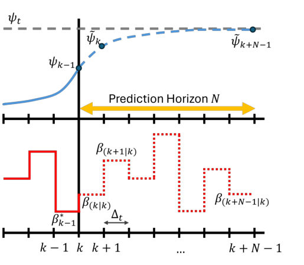 
Fig. 1: Model predictive control illustration. The state trajectory is shown above in blue and the input trajectory is shown below in red. The solid blue line indicates the state trajectory under the inputs applied to the system, shown as solid red lines, while dashed lines indicate the predicted state and input trajectories. At time step k, a measurement of ψk−1 initializes a dynamic model that predicts the evolution of the state over the prediction horizon consisting of N time steps from k to k+N−1, guiding the optimization process in solving for an input vector ⃗β(i|k) that minimizes an objective function. Following a receding horizon strategy, the first optimal input β∗ k is applied to...

📷 Fig 2

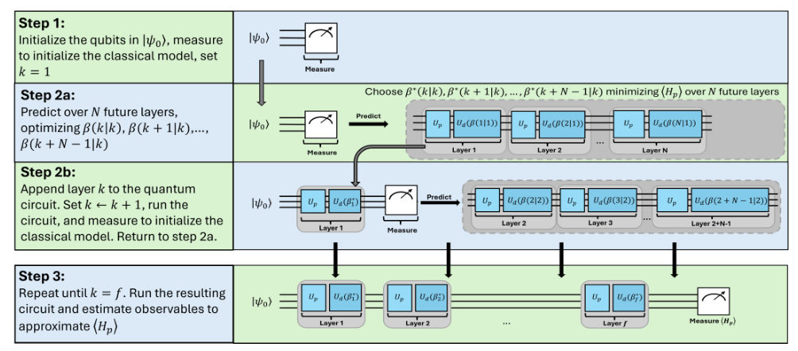 
Fig. 2: MPC-based quantum algorithm procedure. The initial step proceeds by initializing the quantum state as |ψ0⟩and using that to initialize the classical model in the MPC used to obtain β∗ 1. Layer k = 1 then is implemented to evolve the quantum state to |ψ1⟩= Ud(β∗ 1)Up |ψ0⟩. The quantum state |ψ1⟩is then repeatedly measured to provide a reconstruction used to initialize the dynamic model that predicts the evolution of the quantum state over N future layers. A classical optimizer solves for optimal values of ⃗β(i|2), i.e., β∗(2|2), β∗(3|2), · · · , β∗(2+N −1|2), and following the receding horizon strategy, layer k = 2 parameterized by β∗ 2 is added to the circuit. This procedure is...

📷 Fig 3

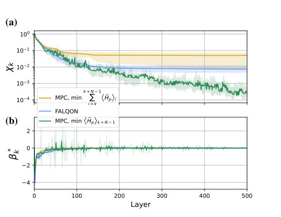 
Fig. 3: Performance of the terminal cost MPC and cu- mulative cost MPC compared to FALQON. We simulate FALQON and the MPC-based algorithm for the Max-Cut problem formulated with the objective functions of Eqs. (8)- (9) over 10 instances of randomly weighted 4-node graphs. The median values of χk and of β∗ k are plotted as solid lines in Panels (a) and (b), respectively, with the corresponding interquartile ranges shown in associated shaded regions of like colors. The step size for FALQON and for the MPC algorithm are set to ∆t = 0.05 and the prediction horizon for the MPC is set to N = 10.

📷 Fig 4

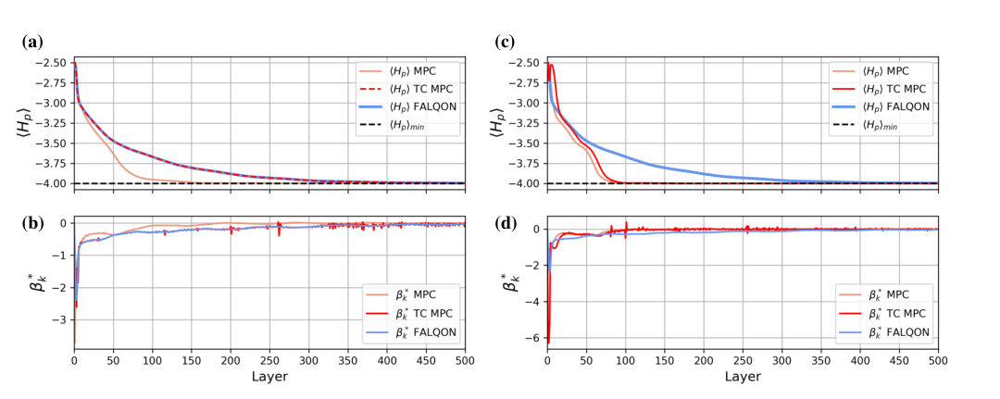 
Fig. 4: MPC-based quantum algorithm performance with N = 5 and N = 400. We present two numerical examples comparing the performance of the MPC-based quantum algorithm using different prediction horizons against FALQON for solving Max-Cut on an unweighted 4-node graph. Results are plotted for both the base-case MPC of Section III with the objective function of Eq. (12a) as well as the terminal constraint MPC. All results were obtained using a step size of ∆t = 0.05. In Panel (a), the base-case MPC (in orange) and the terminal constraint MPC (the dashed red line) both use a prediction horizon of N = 5. Here, we see that when using a short prediction horizon, the trajectory of ⟨Hp⟩under the...

📷 Fig 5

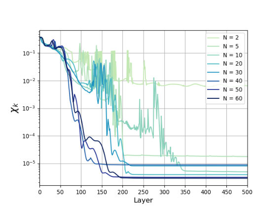 
Fig. 5: Effect of varying prediction horizon. We simulate the performance of the terminal cost MPC on an unweighted 4- node Max-Cut problem with varying prediction horizons and ∆t = 0.05 over 500 layers. Larger prediction horizons, shown in darker colors, tend to encourage more optimal values of χk achieved with shorter circuits relative to shorter horizons.

**Summary.** This paper introduces an MPC-inspired hybrid quantum algorithm that merges the optimization strengths of VQAs with the feedback nature of FQAs for quantum computation. It uses a receding horizon approach, where classical simulation predicts future state evolution to optimize gate parameters layer by layer. The method successfully demonstrates superior or comparable performance to existing algorithms on key optimization models.

**Why it may be interesting.** For AMO/open systems researchers, this work provides a novel framework for controlling complex quantum dynamics by integrating predictive control theory. The focus on optimizing time evolution paths ($\langle H_p 
angle$ minimization) using feedback mechanisms is highly relevant to open system control.

Detailed structure

**Main problem.** The paper addresses the need for an advanced quantum algorithm that surpasses the limitations of existing Variational Quantum Algorithms (VQAs) and Feedback-Based Quantum Algorithms (FQAs). It proposes a Model Predictive Control (MPC)-inspired hybrid approach to optimize quantum circuit design.

**Main result.** The MPC-based algorithm is mathematically proven to match or exceed the performance of FQAs, and simulations show it can provide improved practical results for optimization tasks like Max-Cut and TFIM.

**Method.** It employs a layer-wise receding horizon strategy, using classical simulation initialized by observable measurements after each quantum circuit layer to predict future state evolution and optimize subsequent gate parameters.

**Model / system.** The algorithm is applied to solving optimization problems (e.g., Max-Cut) defined by a problem Hamiltonian ($H_p$). The underlying dynamics are governed by time evolution under a total Hamiltonian $H(t) = H_p + H_d eta(t)$.

**Key observables.** The primary observable is the expectation value of the problem Hamiltonian, $\langle H_p 
angle$, which the algorithm seeks to minimize.

**Important parameters / regimes.** Key parameters include the prediction horizon ($N$), the time step ($\Delta t$), and the gate control parameters ($eta$).

**Assumptions / limitations.** The primary limitation is the computational intractability of the full optimization problem due to the need for state vector simulation, necessitating reduced-order models.

**Figures summary.** Figures illustrate $\langle H_p 
angle$ trajectories comparing MPC and FALQON on Max-Cut and TFIM; Figure 13 specifically shows the prediction vs. actual evolution using the receding horizon policy.

**Paper structure.** The paper reviews background (FALQON, MPC), details the quantum algorithm construction using MPC concepts, discusses necessary computational simplifications via reduced-order models, and concludes with numerical simulations on benchmark problems.

Abstract

We introduce a new hybrid quantum-classical algorithm inspired by an advanced control strategy known as model predictive control (MPC). This algorithm unifies the optimization-based design of variational quantum algorithms (VQAs) with the feedback-based design of feedback-based quantum algorithms (FQAs). Variational circuit parameters are optimized using a layer-wise receding horizon strategy, where observable measurements after every layer initialize a classically simulated dynamic model used to predict quantum state evolution and optimize over future parameterized gates. This hybrid algorithm can be used for applications such as ground state preparation and approximate combinatorial optimization, and presents an ideal use case for the integration of quantum computers with high-performance computing, where the latter resource can be used to increase the scale and efficiency of the predictions critical to MPC. We show through mathematical proof and numerical evidence that the MPC-based algorithm can be guaranteed to at least match the performance of FQAs. Through simulations on Max-Cut problems and a two-dimensional transverse-field Ising model, we demonstrate that relaxed implementations of the MPC-based algorithm can also provide improved performance in practice compared to an FQA.

[↑ back to top](#top)

### [Don't truncate, decompose: mean-field dynamics of long-range quantum systems from strongly correlated states](http://arxiv.org/abs/2607.25434v1)

**Authors:** Federico Carollo  
**Type:** theory · **Category:** statistical mechanics · **PDF:** <https://arxiv.org/pdf/2607.25434v1>  
**Analysis basis:** full PDF text, analyzed in chunks
**Topic relevance:** 🔥 `Keldysh / 2PI / non-Gaussian methods` **4/5** · `driven-dissipative phase transition` **3/5** · `methods for driven-dissipative` **3/5** · `non-equilibrium dynamics` **3/5** · `correlated / nonlocal dissipation` **2/5** · `non-equilibrium universality` **2/5** · `analog quantum simulation` **1/5** · `entanglement & information structure` **1/5** · `scars & prethermalization` **1/5**

📷 Fig 1

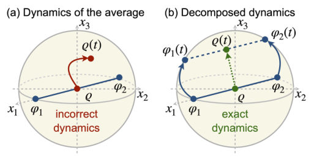 
FIG. 1. Decomposed mean-field dynamics. (a) We con- sider a strongly correlated state given by a binary macroscopic superposition. At the mean-field level, the two components of the superposition, |φ1⟩and |φ2⟩, are represented by points on the Bloch sphere. Naively applying mean-field theory de- fines the average-state density matrix ϱ and directly evolves it through the mean-field equations, typically resulting in an incorrect dynamics. (b) In our framework, the initial superpo- sition state is exactly decomposed into its components. Each component evolves independently under the mean-field equa- tions (solid arrows), and averaging their evolution yields the exact dynamics (dashed arrow)...

📷 Fig 2

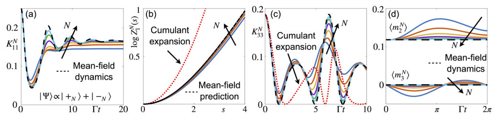 
FIG. 2. Nonequilibrium systems with symmetry breaking. (a) Evolution of the second cumulant KN 11 (variance of mN 1 ) for the open LMG model, starting from |Ψ⟩∝|+N⟩+ |−N⟩. The dashed line is the decomposed mean-field dynamics, while the solid lines are numerical results. We set ω/Γ = 1 and Ω/Γ = 2, for which the model is in the symmetry-broken phase. (b) Stationary value of the full cumulant generating function of mN 1 for the model in (a). We compare it with the Gaussian prediction of the second-order cumulant expansion (dotted line). (c) Evolution of the second cumulant KN 33 (variance of mN 3 ) for the boundary time-crystal, starting from |Ψ⟩∝|↑N⟩+ √

**Summary.** This paper reclaims the validity of mean-field theory for long-range open quantum systems by proposing a decomposition method. It shows that complex dynamics originating from strongly correlated superpositions can be exactly reconstructed from independent, uncoupled mean-field evolutions in the thermodynamic limit. This provides a powerful and transparent framework superior to truncated cumulant expansions.

**Why it may be interesting.** This work provides a rigorous theoretical tool to handle non-trivial quantum correlations in open systems where standard approximations fail, offering an exact framework that bridges the gap between mean-field theory and full many-body dynamics.

Detailed structure

**Main problem.** The paper challenges the consensus that mean-field theory fails for long-range open quantum systems, especially when starting from strongly correlated states or undergoing symmetry breaking.

**Main result.** The authors demonstrate that the evolution of such systems can be fully reconstructed from independent mean-field dynamics, establishing a framework where mean-field theory is exact in the thermodynamic limit.

**Method.** They propose a decomposition method that reconstructs the full quantum evolution by treating it as an ensemble average over individual mean-field evolutions corresponding to the components of a superposition state.

**Model / system.** The analysis applies to general long-range interacting quantum systems governed by a quantum master equation, using models like the open LMG model and time crystals. The dynamics are analyzed in the thermodynamic limit ($N 	o \infty$).

**Key observables.** Macroscopic observables (sample means $m^N_\mu$), moment generating functions, and various cumulants (second and third order).

**Important parameters / regimes.** The strong long-range regime, the thermodynamic limit ($N 	o \infty$), and the initial state structure (superposition vs. mixture).

**Assumptions / limitations.** The primary assumption is that in the large-$N$ limit, quantum superpositions become indistinguishable from classical statistical mixtures, allowing for the decomposition.

**Figures summary.** Figures compare the evolution of second and third cumulants for specific models (LMG, time-crystal), showing that the proposed decomposed mean-field method accurately reproduces exact dynamics where standard cumulant expansions fail or predict Gaussian approximations incorrectly.

**Paper structure.** The paper first establishes the failure points of standard mean-field theory and cumulant expansions. It then introduces the decomposition framework, proving its equivalence to exact dynamics in the large-$N$ limit for specific state types (superpositions). Finally, it applies this method successfully to compute observables for complex physical models.

Abstract

We challenge the widespread consensus that mean-field theory fails to describe long-range open quantum systems in the presence of symmetry breaking and/or when starting from strongly correlated states (e.g., macroscopic superpositions). While recent literature relies on cumulant expansions to capture such systems, this approach rests on truncations with no clear justification. Here, we show that it is, at best, conceptually redundant in the strong long-range regime. We show that the evolution can be decomposed into, and fully reconstructed from, independent mean-field dynamics. This decomposition generates the entire hierarchy of cumulants and, as a byproduct, identifies---to our knowledge, for the first time---a regime in which cumulant expansions exactly predict low-order cumulants. We illustrate the power of our findings with two applications: we compute the moment generating function for nonequilibrium $\mathcal{Z}_2$ symmetry breaking, and construct states restoring time-translation symmetry in time crystals. In both cases, our method fully reproduces the exact many-body dynamics, which is out of reach of cumulant expansions. Our results reclaim the exactness of mean-field theory, offering a transparent framework for large-scale open quantum systems.

[↑ back to top](#top)

### [Invariant-based master equation applied to driven qutrit coupled to a bath and a leaky cavity](http://arxiv.org/abs/2607.25005v1)

**Authors:** Sagarika Basak, A. Javadi, D. Blume  
**Type:** theory · **Category:** other · **PDF:** <https://arxiv.org/pdf/2607.25005v1>  
**Analysis basis:** full PDF text, analyzed in chunks
**Topic relevance:** 🔥 `methods for driven-dissipative` **4/5** · `driven-dissipative phase transition` **3/5** · `non-equilibrium dynamics` **3/5** · `Keldysh / 2PI / non-Gaussian methods` **2/5** · `Tavis-Cummings & cavity-many-emitter` **2/5** · `non-equilibrium universality` **2/5** · `analog quantum simulation` **1/5** · `correlated / nonlocal dissipation` **1/5** · `correlated cavity matter` **1/5** · `quantum measurements` **1/5**

📷 Fig 1

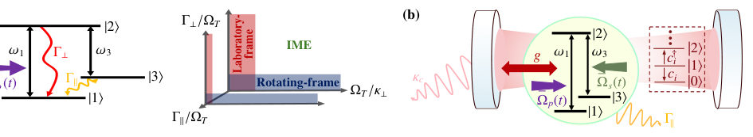 
FIG. 1. (color online) We consider a qutrit with states |1⟩, |2⟩, and |3⟩. The (1↔2)-transition (transition frequency ω1) is coupled by a field with drive strength Ωp and drive frequency ωp. The (2↔3)-transition frequency is denoted by ω3. (a) Application 1: The qutrit is coupled to a thermal bath via transverse coupling that induces dissipation from |2⟩to |1⟩(decay rate Γ⊥) and longitudinal coupling that induces dephasing between |3⟩and |1⟩(decay rate Γ∥). The latter introduces a new scale compared to the driven 2-level system. The validity regimes of conventional laboratory- and rotating-frame approaches, summarized in Γ⊥/ΩT versus ΩT/κ⊥space for the 2-level system [21], are reduced if...

📷 Fig 2

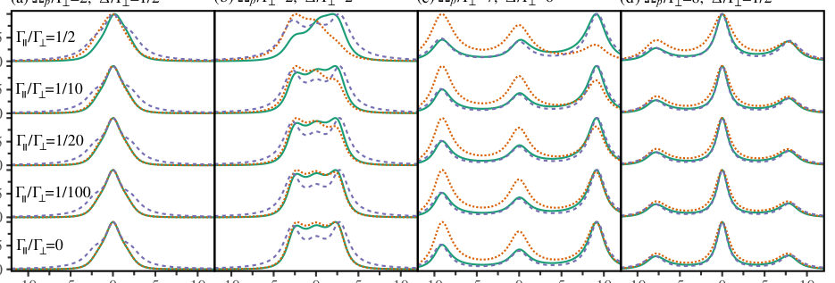 
FIG. 2. (color online) Application 1. Normalized fluorescence spectra S N 12(ω) as a function of the angular frequency ω, calculated using the IME (green solid lines), the laboratory-frame (orange dotted lines), and the rotating-frame (purple dashed lines), for (a) (Ωp/Γ⊥, ∆/Γ⊥) = (2, 0.5), (b) (2, 2), (c) (7, 6), and (d) (8, 0.5). Each panel shows, using equidistant vertical offsets, spectra (from bottom to top) for Γ∥/Γ⊥= 0, 0.01, 0.05, 0.1, 0.5. The other parameters are: κ⊥= κ∥= 30Γ⊥, ω⊥= ω1 = 3 × 105Γ⊥, ω∥= 0, and ω1 −ω3 = 10Γ⊥. The bath temperature Tb is set to zero.

📷 Fig 3

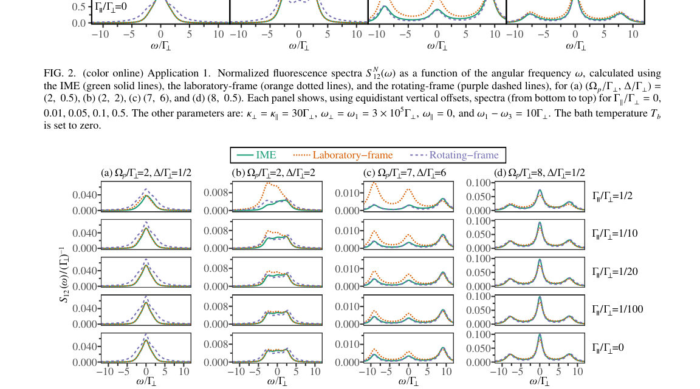 
FIG. 3. (color online) Application 1. Un-normalized fluorescence spectra S 12(ω) as a function of the angular frequency ω using the same parameter combinations and line conventions as those used in Fig. 2.

📷 Fig 4

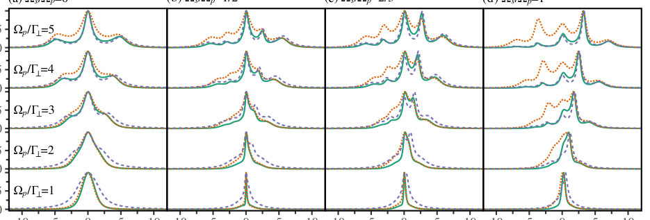 
FIG. 4. (color online) Application 2. Normalized fluorescence spectra S N 12(ω) as a function of ω, calculated using the IME (green solid lines), the laboratory-frame (orange dotted lines), and the rotating-frame (purple dashed lines), for (a) Ωs/Ωp = 0, (b) 1/2, (c) 2/3, and (d) 1. Each panel shows, using equidistant vertical offsets, spectra (from bottom to top) for Ωp/Γ⊥= 1, 2, 3, 4, 5. The other parameters are: ∆/Γ⊥= 0.5, κ⊥= 12/Γ⊥, κ∥= 40/Γ⊥, Γ∥/Γ⊥= 0.1, ω⊥= ω1 = 3 × 105Γ⊥, ω∥= 0, ω1 −ω3 = 10Γ⊥, and Tb = 0.

📷 Fig 5

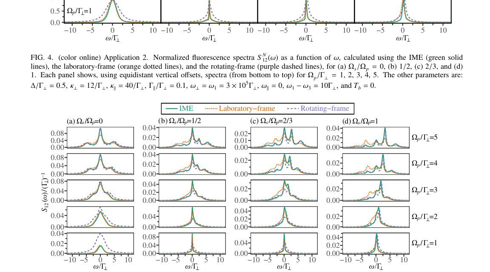 
FIG. 5. (color online) Application 2. Un-normalized fluorescence spectra S 12(ω) as a function of the angular frequency ω using the same parameter combinations and line conventions as those used in Fig. 4.

**Summary.** This paper introduces an Invariant-based Master Equation framework to model the dynamics of driven, multi-level quantum systems like qutrits coupled to baths and cavities. It demonstrates that this new method provides a more general description than standard laboratory or rotating-frame approaches. By analyzing spectroscopic signatures, the authors show its ability to capture complex dissipative physics missed by conventional approximations.

**Why it may be interesting.** This work is highly relevant as it tackles the complex problem of non-Markovian or strongly driven open quantum systems by proposing a generalized theoretical tool (IME) that unifies several existing but limited master equation formalisms.

Detailed structure

**Main problem.** Developing a reliable theoretical model for externally driven quantum dynamics in open systems, overcoming fundamental issues with conventional master equation approaches.

**Main result.** The invariant-based master equation provides a unifying generalized framework that accurately captures dissipative dynamics in complex driven systems, yielding distinct predictions compared to standard laboratory or rotating-frame approximations.

**Method.** The authors employ the Invariant-based Master Equation (IME) framework, utilizing Lewis-Riesenfeld invariants derived from the isolated system Hamiltonian to model time evolution in open quantum systems.

**Model / system.** The study focuses on a driven qutrit ($N=3$ level system) coupled to an environment bath and potentially a leaky cavity. The dynamics are governed by a total Hamiltonian including time-dependent driving terms.

**Key observables.** Fluorescence spectrum $S_{12}(\omega)$, which is the Fourier transform of a first-order correlation function, used to diagnose dissipative behavior.

**Important parameters / regimes.** Driving strengths ($\Omega_p, \Omega_s$), detunings, and various decay/dephasing rates ($\Gamma_\perp, \Gamma_\parallel$).

**Assumptions / limitations.** The framework generally uses the Born-Markov approximation; however, it is designed to handle regimes where conventional approximations fail.

**Figures summary.** Figures illustrate the qutrit states and show spectral features (like modified Mollow triplets) resulting from different coupling regimes and driving strengths.

**Paper structure.** The paper introduces the IME framework as a generalization of standard master equations, applies it to a driven qutrit/cavity system, derives explicit forms for dissipation coefficients in various frames, and compares predictions using fluorescence spectra analysis.

Abstract

We employ a generalized approach to the master equation for driven open $N$-level ($N>2$) quantum systems using Lewis-Riesenfeld invariants, which avoids the driving-strength restrictions inherent to conventional approaches. We show that the invariant-based master equation provides a unifying generalized framework, which reduces to the frequently employed laboratory-frame master equations and the less frequently employed rotating-frame master equation framework under appropriate simplifications. Extending the prototypical two-level system, we show that the inclusion of another state coupled to the ground state via reservoir-induced dephasing gives rise to qualitatively new dissipative behaviors that are, in general, not captured by standard approximations. We also apply the invariant-based master equation framework to a driven quantum dot coupled to a leaky cavity, demonstrating the framework's ability to capture relevant dissipative dynamics without additional assumptions. Our work paves the way for quantum-control applications in the presence of dissipation.

[↑ back to top](#top)

### [Tip-Tuned Renormalization-Group Spectroscopy Unmasks a False-positive Topological Superconducting Vortex](http://arxiv.org/abs/2607.25510v1)

**Authors:** Zhenhua Zhu, Qun Zhu, Yong-Wei Wang, Gu Zhang, Jihai Zhang, Xu-Cun Ma, Qi-Kun Xue, Can-Li Song, Dong E. Liu  
**Type:** both · **Category:** other · **PDF:** <https://arxiv.org/pdf/2607.25510v1>  
**Analysis basis:** full PDF text, analyzed in chunks
**Topic relevance:** 🔥 `methods for driven-dissipative` **4/5** · `Keldysh / 2PI / non-Gaussian methods` **3/5** · `correlated / nonlocal dissipation` **3/5** · `driven-dissipative phase transition` **3/5** · `Kondo & dissipative impurity` **2/5** · `non-equilibrium dynamics` **2/5** · `analog quantum simulation` **1/5** · `non-equilibrium universality` **1/5** · `quantum measurements` **1/5**

📷 Fig 1

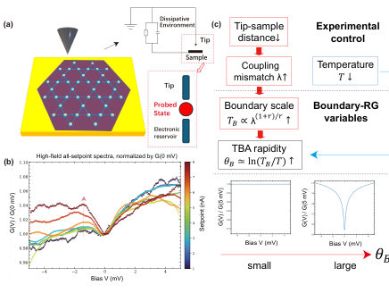 
FIG. 1. Dissipative STM junction and normal-state DCB re- sponse. (a) Illustration of setup, where a tip is detecting the sample (blue) on a substrate (yellow), with a disorder layer between them (represented by purple). Insets: (Upper) Ef- fective circuit of STM junction in dissipative environment. (Lower) An illustration circuit of a lead-dot-lead (blue-red- blue) device. (b) 1 T spectra after superconductivity is sup- pressed, showing a zero-bias anomaly that strengthens as the tip is lowered (highlighted by red arrow). The fitted dissipa- tion strength is rHF ≈0.22. (c) Logic flow for the effect of lowering tip in RG theory. The right panels plot represen- tative DCB response of a...

📷 Fig 2

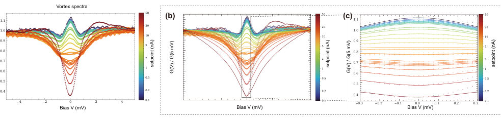 
FIG. 2. Single-channel boundary-RG analysis of vortex-center spectra. (a) Experimental vortex-center spectra on the 37.6-nm island, showing a clean non-split zero-bias peak at low setpoint that evolves into a zero-bias dip as the tip is lowered. The color scale denotes the setpoint current. (b) Single-continuum-channel DCB/TBA fit to the vortex-center spectra with Eq. (3), giving rs v ≈0.19. (c) Low-bias zoom of (b), showing that the model captures the central peak-to-dip boundary flow. Dots are experimental data and solid curves are fits.

📷 Fig 3

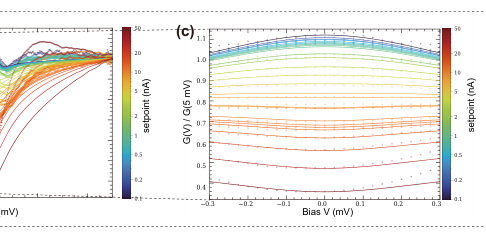 
Fig. 2 shows the central boundary-RG test of the ex- periment. We first analyze the vortex-center spectra [Fig. 2(a)], acquired at B = 0.1 T on the same 37.6-nm island. In the high-tip, weak-coupling regime, the vortex center shows a clean, non-split ZBP on top of the small- gap background (see App. B), a line shape that would be a Majorana candidate in conventional static STM spec- troscopy. A tip-height flow can serve as a dynamical test. For r &lt; 1/2, Eq. (1) predicts that an isolated MZM flows toward the protected strong-coupling fixed point as the boundary coordinate TB/T is increased; equivalently, the zero-bias response should not be driven into the ordinary DCB valley....

📷 Fig 4

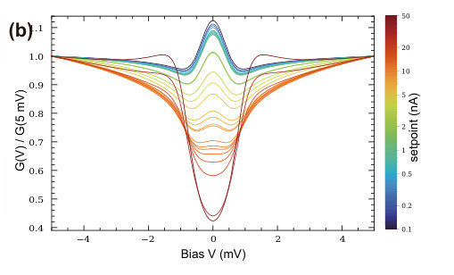 
FIG. 4. Two-channel interpretation of the residual spectral weight in vortex spectra. (a) Experimental data of 37.6 nm vortex spectra. (b) Two-gap fit of the vortex spec- tra with Eq. (5), with an additional residual superconducting channel to the DCB-dressed vortex continuum. The fitted dissipation strength is rd v ≈0.18.

📷 Fig 5

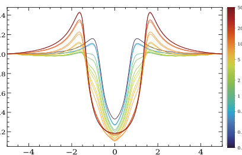 
FIG. 3. Superconducting-gap spectra data and the two-channel interpretation. (a) Experimental data of 37.6 nm superconducting-gap spectra. (b) Two-gap fit of the superconducting spectra with Eq. (4), corresponding to a strongly tip-coupled small-gap channel and a weakly tip- coupled large-gap channel. The fitted dissipation strength is rSC ≈0.21.

**Summary.** The authors developed a novel spectroscopic technique using tip-height tuning within the boundary Renormalization Group framework to probe vortex cores in superconductors. They successfully used this method to distinguish between true Majorana zero modes and trivial resonances by observing that the characteristic flow of the ZBP contradicted MZM theory, proving the peak was a false positive.

**Why it may be interesting.** This work provides a powerful experimental methodology—using controlled environmental coupling (dissipative STM)—to perform dynamical quantum state verification, moving beyond simple spectral measurements to test fundamental topological protection in superconducting systems.

Detailed structure

**Main problem.** The primary challenge is distinguishing between true topological superconducting vortex states, which host Majorana zero modes (MZMs), and false positive zero-bias conductance peaks (ZBPs) arising from conventional vortex cores using STM.

**Main result.** By analyzing the dynamical evolution of the ZBP as the tip coupling is tuned via boundary renormalization group flow, the authors demonstrated that the observed peak was a non-topological feature whose flow contradicted MZM predictions.

**Method.** The study combines low-temperature scanning tunneling microscopy (STM) measurements with advanced theoretical modeling using boundary Renormalization Group (RG) theory and the Thermodynamic Bethe Ansatz (TBA) to analyze dissipative quantum circuits.

**Model / system.** The experiment is performed on $	ext{SrSn}_3$ thin films, treating the STM junction as a local probe coupled to an Ohmic environment. The physics is modeled using concepts from boundary RG flow applied to superconducting vortex cores and tunneling barriers.

**Key observables.** Zero-bias conductance peak (ZBP) evolution; dissipation strength ($r$); spectral weight fitting across single-channel, two-channel SC gap, and high-field regimes.

**Important parameters / regimes.** Dissipation strength $r < 1/2$; tip coupling parameter tuning the boundary RG flow; superconducting gap parameters ($\Delta$).

**Assumptions / limitations.** The analysis assumes that the low-energy spectral evolution is governed by a universal dissipative environment response derived from TBA, allowing for the separation of trivial and topological contributions.

**Figures summary.** Figures illustrate the setup (STM junction in a dissipative environment) and show the critical diagnostic: how lowering the tip drives an initial ZBP into a zero-bias dip, which is contrasted with theoretical MZM flow predictions. Other figures detail global fits across various spectral components.

**Paper structure.** The paper establishes the ambiguity of static ZBPs, introduces the boundary RG/TBA framework to test dynamical protection, applies this method to $	ext{SrSn}_3$ vortex spectra, and concludes by showing that the observed flow pattern definitively rules out an MZM interpretation for the measured peak.

Abstract

Clean, nonsplit vortex zero-bias peaks (ZBPs) can be misinterpreted as Majorana zero modes (MZMs), making static scanning tunneling microscopy intrinsically ambiguous. Here we use the STM tip coupling to drive a local boundary-renormalization-group (boundary RG) flow, turning dynamical Coulomb blockade into a falsification test for Majorana-like ZBPs. Experimentally, in a $\mathrm{SrSn}_3$ thin film, normal-state spectra establish an Ohmic dissipative environment, and a common boundary-RG/thermodynamic-Bethe-ansatz analysis of the superconducting-gap and vortex-center spectra yields consistent dissipation strengths within the $r < 1/2$ Majorana-filter regime. Lowering the tip nevertheless drives a clean, non-split vortex-center ZBP into a zero-bias dip, opposite to the protected flow of an isolated MZM, unmasking the peak as a Majorana false positive produced by a conventional vortex-core state. The same flow selectively suppresses the strongly tip-coupled channel, resolving the two-gap superconductivity. Dissipative STM thus tests dynamical protection rather than spectral appearance.

[↑ back to top](#top)

### [Effective Field Theory of Operator Scrambling from Strong-to-Weak Symmetry Breaking](http://arxiv.org/abs/2607.24925v1)

**Authors:** Bai-Lin Cheng, Shao-Kai Jian, Zhi-Cheng Yang  
**Type:** theory · **Category:** statistical mechanics · **PDF:** <https://arxiv.org/pdf/2607.24925v1>  
**Analysis basis:** full PDF text, analyzed in chunks
**Topic relevance:** 🔥 `entanglement & information structure` **4/5** · 🔥 `non-equilibrium dynamics` **4/5** · `Keldysh / 2PI / non-Gaussian methods` **3/5** · `non-equilibrium universality` **3/5** · `scars & prethermalization` **2/5** · `correlated / nonlocal dissipation` **1/5** · `driven-dissipative phase transition` **1/5** · `methods for driven-dissipative` **1/5**

📷 Fig 1

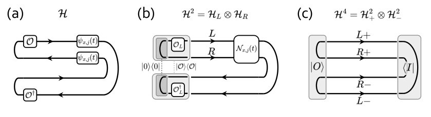 
Figure 1. (a) To compute OTOCs such as (2.9) and (2.10), the path integral must be taken along a four-fold Keldysh contour. (b) In the doubled Hilbert space H2, this four-fold contour is reduced to a standard two-fold contour. The OTOC is equivalent to the expectation value of the occupation-number operator Nx,j(t) in the state |O⟩≡(OL ⊗IR)|0⟩. (c) The system can be further mapped to a single directed path in the quadrupled Hilbert space H4, where the initial state |O⟩ originates from the physical infinite-temperature initial state, while the final state ⟨I| corresponds to the trace operation in H2.

📷 Fig 2

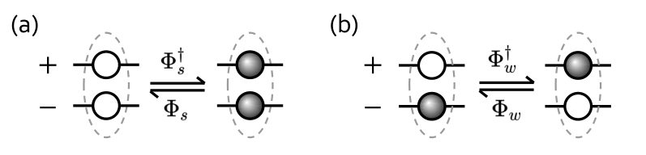 
Figure 2. The physical interpretations of Φ-operators defined in (3.5). (a) Φs (Φ† s) annihilates (creates) fermions in pairs on the + and −contours. (b) Φw (Φ† w) moves a fermion from the + (−) contour to the −(+) contour. Fermion species and site indices are suppressed.

📷 Fig 3

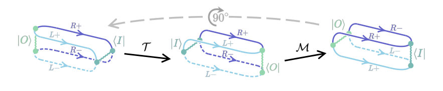 
Figure 3. The contour structure is invariant under a combination of time reversal (T ) and a permutation (M) of the contour labels.

📷 Fig 4

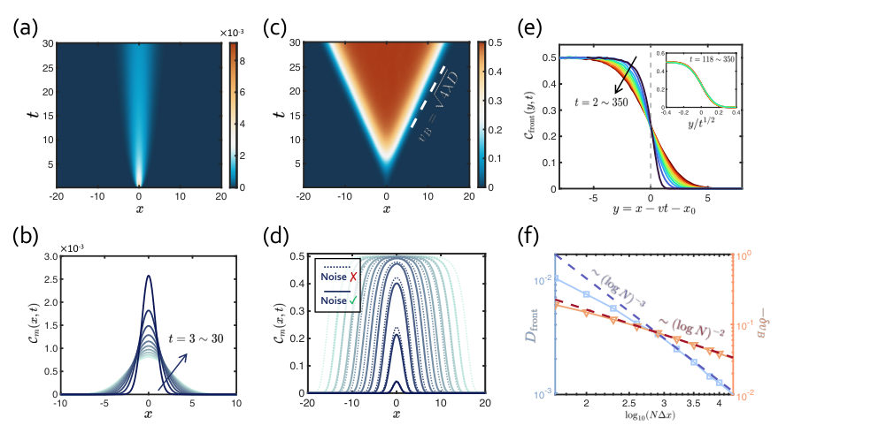 
Figure 4. Numerical solutions of the FKPP equation (4.10), starting from an initial operator at the origin with m = 5, for (a)&amp;(b) the noninteracting case with λ = 0, and (c)&amp;(d) the interacting case with λ = 1, averaged over 103 samples. Time slices for t = 3 ∼30 are shown in (b) and (d), respectively. In panel (d), the solid curves denote the noisy solutions, while the dashed curves denote the solutions of the deterministic equation without noise. The numerical parameters are chosen as D = 0.1 and N∆x = 103. Noise and the 1/(N∆x) cutoff induce (c) a reduction of the butterfly velocity and (e) wavefront broadening ∝t1/2. In panel (e), the FKPP equation is solved numerically using a fully...

📷 Fig 5

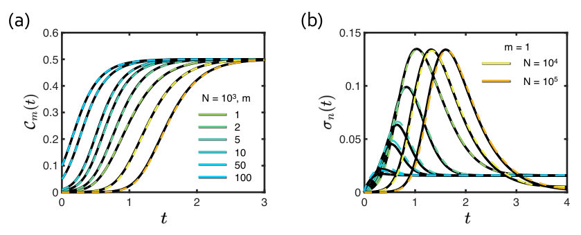 
Figure 6. Numerical simulations of the (0 + 1)d FKPP equation predicted by (5.16) (dashed color lines) and comparison with the operator size computed from the master-equation approach in the Brownian SYK4 model [36] (black solid lines). The first moment of n(t) corresponds to the OTOC, and is shown in (a). The standard deviation σn = (⟨n2⟩−⟨n⟩2)1/2, related to the second moment of n, is shown in (b). The parameters are chosen as λ = J4 = 8, the number of simulation samples is 5 × 104, and the finite-N cutoff is taken to be θ(n −m/N).

**Summary.** The paper develops an Effective Field Theory to explain operator scrambling using Out-of-Time-Ordered Correlators (OTOCs). By identifying an emergent strong U(1) symmetry in the doubled Hilbert space, the authors derive that the dynamics must follow a noisy FKPP equation. This provides a unified, symmetry-based understanding of how quantum information spreads and thermalizes in complex many-body systems.

**Why it may be interesting.** This work provides a powerful, general theoretical tool—an EFT derived from symmetry principles—to describe non-equilibrium dynamics in strongly interacting quantum systems, which is highly relevant for understanding thermalization and chaos in many-body physics.

Detailed structure

**Main problem.** The primary goal is to find a general symmetry principle that governs the effective dynamics of operator scrambling, which is diagnosed by Out-of-Time-Ordered Correlators (OTOCs). The challenge lies in developing an Effective Field Theory (EFT) for this process.

**Main result.** The OTOC dynamics are shown to be governed by a noisy FKPP equation, derived from an EFT built upon the spontaneous breaking of an emergent strong U(1) symmetry. This framework unifies descriptions of early-time exponential growth and late-time saturation in operator spreading.

**Method.** The authors develop a symmetry-based Effective Field Theory (EFT) by mapping the four-fold Keldysh contour representation of the OTOC onto a doubled Hilbert space, allowing for systematic analysis via slow modes and emergent symmetries.

**Model / system.** The theory is developed for Majorana systems (specifically Brownian or short-time-correlated large-N Majorana systems). A key test case used to verify the construction is the Brownian Sachdev-Ye-Kitaev (SYK) chain.

**Key observables.** Out-of-Time-Ordered Correlators (OTOCs), operator size ($N[O(t)]$), and the resulting dynamics described by a noisy FKPP equation.

**Important parameters / regimes.** The analysis involves organizing terms based on strong-to-weak U(1) symmetry breaking, and key parameters include the Lyapunov exponent ($\lambda_L$) which is directly related to the noise strength.

**Assumptions / limitations.** The derivation relies on systematic expansions in powers of the slow mode field $\phi$, assuming consistency with Schwinger-Keldysh conditions, and imposing constraints like an emergent duality combining time reversal and contour permutation.

**Figures summary.** Figure 1 illustrates a mathematical mapping from a four-fold Keldysh contour integral to a standard two-segment contour in a doubled Hilbert space, which is crucial for the EFT construction.

**Paper structure.** The paper first establishes the problem using OTOCs and introduces the symmetry-based EFT framework. It then derives the effective action by exploiting emergent symmetries (U(1) breaking), leading to the noisy FKPP equation. Finally, it verifies this structure using a specific model like the Brownian SYK chain.

Abstract

Operator scrambling is commonly diagnosed by the growth of out-of-time-ordered correlators (OTOCs), yet a general symmetry principle underlying their effective dynamics has remained elusive. For Brownian or short-time-correlated large-$N$ Majorana systems, we develop a symmetry-based effective field theory for operator scrambling, organized by a strong-to-weak U(1) symmetry breaking in operator space. The key observation is that, in the noninteracting fermion limit, the four-fold Keldysh contour representation of an OTOC admits an emergent strong U(1) symmetry in a doubled Hilbert-space description, even when the original system has no ordinary conserved quantity. The associated slow mode is the phase of the strong-charge creation operator, whose conjugate density is identified with the local operator size. Generic interactions explicitly break the strong symmetry and generate a mass term at lowest order for the would-be Goldstone mode, thereby converting diffusive operator spreading into chaotic growth. We further show that higher-order symmetry breaking terms are tightly constrained by an emergent duality that combines time reversal with contour permutation. This duality fixes the effective action up to quadratic order in the response field, relates the multiplicative noise strength directly to the Lyapunov exponent, and makes the positivity of the Lyapunov exponent a consequence of convergence of the real-time path integral. The resulting OTOC dynamics is governed by a noisy FKPP equation, which captures within a unified framework the early-time exponential growth, ballistic propagation, nonlinear saturation, and stochastic front broadening of operator scrambling. We verify this construction in a Brownian SYK chain, where a direct saddle-point expansion reproduces the symmetry-based effective action. Our results reveal a symmetry origin of operator-size hydrodynamics and scrambling.

[↑ back to top](#top)

### [Spin-cQED with bulk germanium spin qubits](http://arxiv.org/abs/2607.24967v1)

**Authors:** A. -F. Kalo, E. A. Rodríguez-Mena, J. C. Abadillo-Uriel, M. Filippone, Y. -M. Niquet  
**Type:** theory · **Category:** quantum information and computing · **PDF:** <https://arxiv.org/pdf/2607.24967v1>  
**Analysis basis:** full PDF text, analyzed in chunks
**Topic relevance:** 🔥 `spintronics-quantum-optics interface` **4/5** · `Tavis-Cummings & cavity-many-emitter` **3/5** · `correlated cavity matter` **3/5** · `analog quantum simulation` **2/5** · `exotic spin models in light-matter` **2/5** · `Keldysh / 2PI / non-Gaussian methods` **1/5** · `QC/QI experiment` **1/5** · `driven-dissipative phase transition` **1/5** · `methods for driven-dissipative` **1/5**

📷 Fig 1

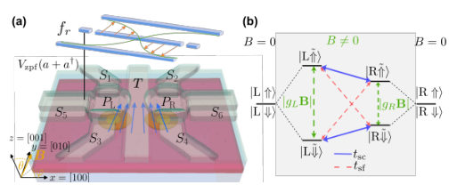 
FIG. 1. Device for spin-photon coupling. (a) The strained QW device. Germanium is colored in red, Ge0.8Si0.2 in blue and the aluminium gates in gray. The 20-nm-thick gates are arranged on two levels separated from each other and from the heterostructure by 6 nm of Al2O3: the barrier (T) and side gates (Sn) on the first level, and the plunger gates PL and PR on the second (diameter 130 nm; distance between cen- ters 170 nm). A resonator with frequency fr and zero-point fluctuations Vzpf is connected to PL. In the bulk heterostruc- ture the buffer and QW are replaced by an unstrained Ge substrate. The yellow shapes are the iso-density surfaces that enclose 20% and 80% of the L and R orbitals....

📷 Fig 2

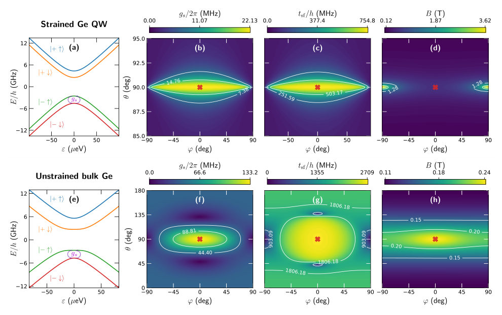 
FIG. 2. Spin-photon coupling in (a-d) a strained Ge QW and (e-h) an unstrained, bulk Ge heterostructure: (a, e) Spectrum of the DQD as a function of detuning energy ε (B ∥x). The resonator couples to the hole in the |−↑⟩and |−↓⟩states; (b, f) Spin-photon coupling gs, (c, g) spin-flip tunnel coupling tsf, (d, h) magnetic field amplitude at resonance (ωs/2π = 2 GHz) as a function of the orientation of B (see Fig. 1). The red cross highlights the optimal orientation B ∥x. In the strained Ge QW, VL = VR = −20.5 mV and VT = −5 mV (all side gates grounded), while in the bulk Ge heterostructure, VL = VR = −43.4 mV and VT = −11.6 mV (top and bottom side gates bias VS1 = VS2 = VS3 = VS4 = 30 mV).

📷 Fig 3

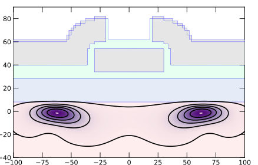 
FIG. 3. Map of the density (arbitrary units) in the |−⟩state of the unstrained, bulk Ge heterostructure at zero detuning, in the (xz) symmetry plane of the device.

**Summary.** The paper investigates using bulk germanium as a superior material for spin-cQED qubits compared to strained heterostructures. By modeling the system's complex spin physics using the Luttinger–Kohn Hamiltonian, the authors show that hole spins in bulk Ge can achieve strong coupling ($g_s \gtrsim 100$ MHz) with microwave resonators. This makes bulk germanium a highly promising and scalable platform for quantum computation.

**Why it may be interesting.** This work directly addresses solid-state quantum computing hardware by demonstrating a high-performance qubit platform (Ge hole spins) capable of strong interaction with superconducting cavities, which is central to circuit QED architectures.

Detailed structure

**Main problem.** The primary goal is achieving strong spin-photon coupling ($g_s$) for scalable solid-state quantum computation using hole spins in semiconductor double quantum dots coupled to microwave resonators (spin-cQED).

**Main result.** Unstrained bulk germanium is established as a compelling platform, showing that hole spins can reach strong coupling regimes with superconducting resonators, achieving $g_s/2\pi \gtrsim 100$ MHz.

**Method.** The analysis involves systematic modeling using the Luttinger–Kohn Hamiltonian to derive an effective spin-photon Hamiltonian and calculate coupling strengths by diagonalizing these models.

**Model / system.** The system uses hole spins in double quantum dots (DQD) within bulk germanium, compared against strained heterostructures. The physics is governed by the LK Hamiltonian, which accounts for strong spin-orbit interactions mixing heavy-hole and light-hole states.

**Key observables.** Spin-photon coupling strength ($g_s/2\pi$), spin-flip tunnel matrix element ($t_{sf}/	ext{2}\pi$), and sensitivity to magnetic field orientation ($\mathbf{B}$).

**Important parameters / regimes.** Achievable $g_s \gtrsim 100$ MHz; the enhancement originates from SO interactions beyond the perturbative regime.

**Assumptions / limitations.** The analysis assumes operating at zero detuning ($\epsilon = 0$) and relies on deriving an effective Hamiltonian by treating strong spin-orbit coupling effects.

**Figures summary.** Figures illustrate device setups comparing strained QWs to unstrained bulk structures, showing the mechanism of spin-photon coupling via hybridization, and detailing $g_s$ dependence on $\mathbf{B}$ orientation for both platforms.

**Paper structure.** The paper systematically models the system using the LK Hamiltonian, derives an effective spin-photon Hamiltonian, compares results between strained and bulk Ge structures, and concludes by establishing bulk Ge as a superior platform due to higher coupling strengths and reduced field dependence.

Abstract

Unstrained bulk germanium is a particularly attractive material for circuit quantum electrodynamics with spins (spin-cQED). We show, through systematic modeling and comparison with state-of-the-art strained germanium heterostructures, that hole spins in bulk germanium double quantum dots readily reach the strong-coupling regime with superconducting microwave resonators, achieving spin-photon coupling strengths $g_s/2π\gtrsim100$\,MHz. This enhancement originates from large spin-orbit interactions beyond the perturbative regime. In addition, the coupling is much less sensitive to the orientation of the applied magnetic field, which shall ease operation and limit the impact of device-to-device variability. Our results establish bulk germanium as a compelling platform for scalable spin-cQED.

[↑ back to top](#top)

### [Actualization, Records, and the Emergence of Entropic Time](http://arxiv.org/abs/2607.25307v1)

**Authors:** Lionel Martellini  
**Type:** theory · **Category:** other · **PDF:** <https://arxiv.org/pdf/2607.25307v1>  
**Analysis basis:** full PDF text, analyzed in chunks
**Topic relevance:** 🔥 `entanglement & information structure` **4/5** · 🔥 `quantum measurements` **4/5** · `measurement-induced transitions` **3/5** · `non-equilibrium dynamics` **2/5** · `correlated / nonlocal dissipation` **1/5** · `driven-dissipative phase transition` **1/5** · `methods for driven-dissipative` **1/5** · `non-equilibrium universality` **1/5**

📷 Fig 1

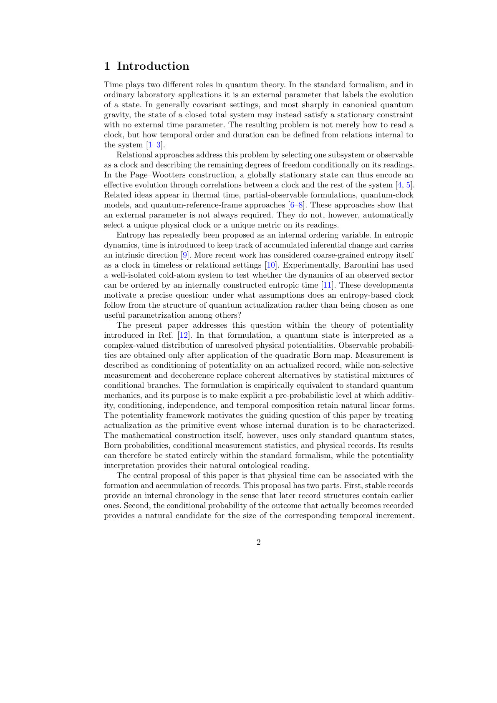 
Low-resolution page preview, page 2

📷 Fig 2

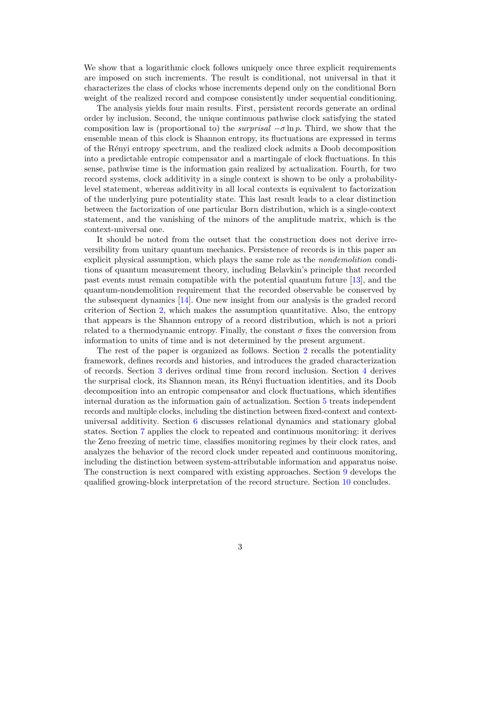 
Low-resolution page preview, page 3

📷 Fig 3

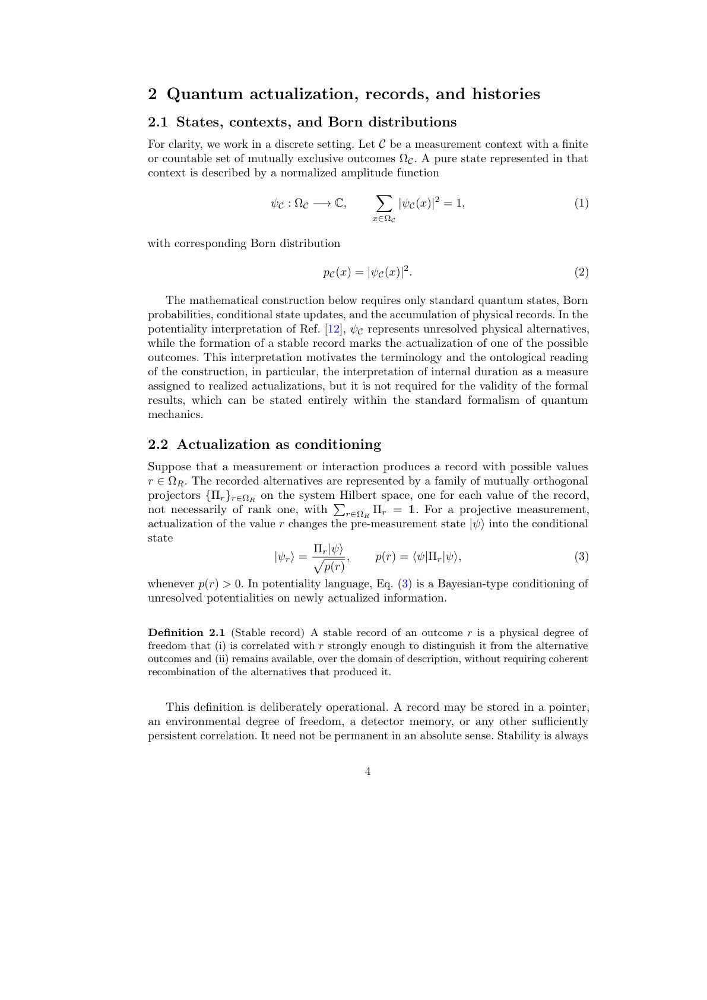 
Low-resolution page preview, page 4

📷 Fig 4

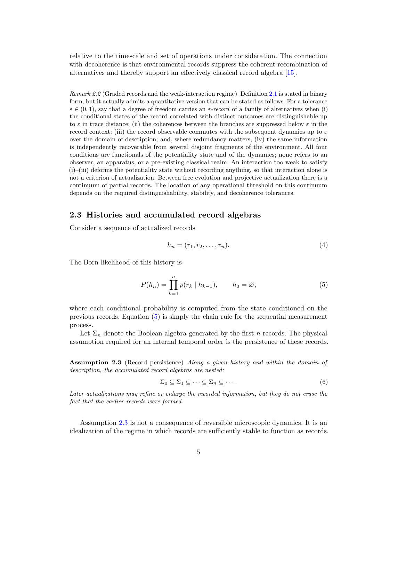 
Low-resolution page preview, page 5

📷 Fig 5

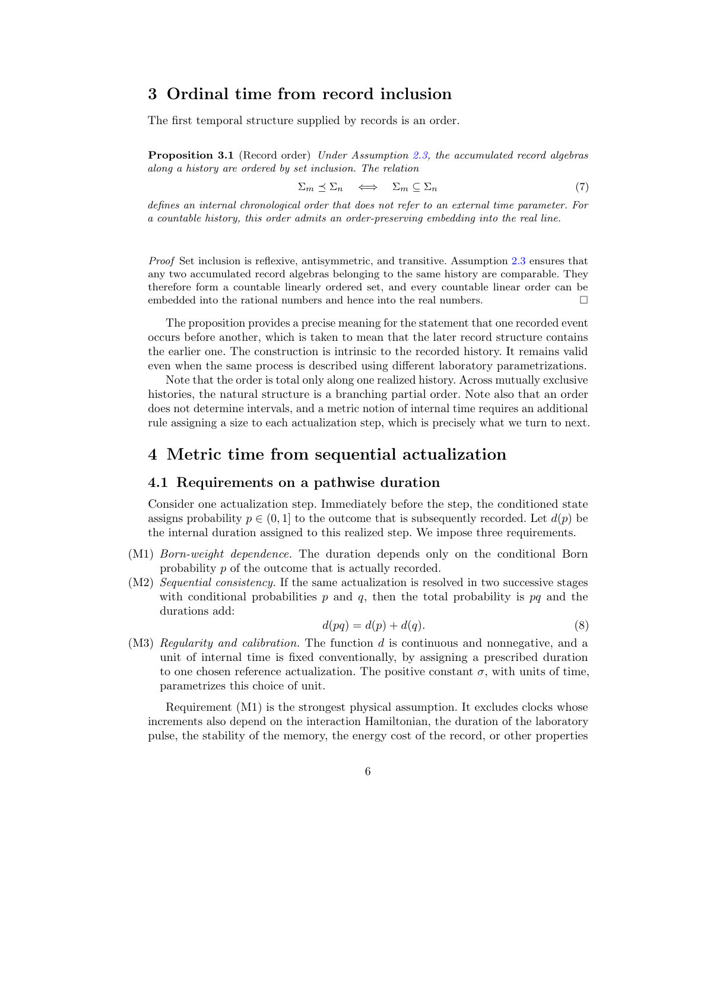 
Low-resolution page preview, page 6

**Summary.** This paper proposes that internal time in quantum mechanics arises from the accumulation of 'records' formed during actualization events. The duration assigned to an outcome is quantified by its surprisal ($-\ln p$), leading to a pathwise clock whose average value corresponds to the Shannon entropy. It offers a rigorous, information-theoretic foundation for understanding time without external parameters.

**Why it may be interesting.** It provides a deep theoretical link between fundamental information theory (entropy/surprisal) and the emergence of time in quantum mechanics, which is highly relevant to foundational studies in open systems and gravity.

Detailed structure

**Main problem.** The paper develops a record-based account of internal time in quantum mechanics, aiming to define temporal order and duration without relying on external time parameters.

**Main result.** Internal time is identified with the accumulated surprisal ($-\ln p$) associated with actualized outcomes, leading to an ensemble mean clock proportional to the Shannon entropy of the process.

**Method.** The framework uses conditioning on 'records' (actualized information) and derives the temporal measure by imposing consistency requirements on how duration composes additively under sequential quantum measurements.

**Model / system.** The model involves quantum states undergoing sequential measurement contexts, where physical history is represented by an accumulating, nested set of stable records ($\Sigma_n$).

**Key observables.** Surprisal ($-\ln p$), Shannon Entropy ($H$), Rényi entropy spectrum, and the pathwise clock $	au(h_n)$.

**Important parameters / regimes.** The constant $\sigma$ (scaling factor between information gain and time units) and the distinguishability threshold $\epsilon$.

**Assumptions / limitations.** Key assumptions include that duration depends only on conditional Born probability, that records persist to form a nested history, and that actualization is equivalent to conditioning on this record.

**Paper structure.** The paper progresses by defining stable records, deriving the pathwise clock proportional to surprisal, establishing the ensemble mean via Shannon entropy, and concluding with mathematical characterizations like Doob decomposition and additivity conditions for multiple clocks.

Abstract

We develop a record-based account of internal time in quantum mechanics, where the formation of a stable record is represented as conditioning on actualized information, and along a history the accumulated record algebras are ordered by inclusion. If the duration of a realized outcome depends only on its conditional Born probability, composes additively under sequential conditioning, and is continuous and calibrated, then the actualization of each outcome contributes an internal duration equal to its surprisal, the negative logarithm of that probability, so that a certain outcome contributes no duration, whereas less likely outcomes contribute larger increments. The ensemble mean of the accumulated clock is the Shannon entropy of the record process, its moment-generating function is fixed by the Rényi entropy spectrum, and the realized clock admits a Doob decomposition into a predictable entropic compensator and a martingale of clock fluctuations, so that each increment is the information gain of the corresponding actualization. Records are characterized by graded criteria of distinguishability, decoherence, and stability. We also clarify the multiple-clock problem: in one fixed context, additivity of two surprisal clocks is equivalent to factorization of the Born distribution in that context, whereas for a pure bipartite state, additivity in every pair of local contexts is equivalent to rank-one factorization of the joint state and to the vanishing of all its $2\times2$ minors.

[↑ back to top](#top)

### [Asymmetric information scrambling and eigenstate thermalization in inhomogeneous XXZ spin chains](http://arxiv.org/abs/2607.25496v1)

**Authors:** Shivam Mishra, Ravi Prakash  
**Type:** theory · **Category:** statistical mechanics · **PDF:** <https://arxiv.org/pdf/2607.25496v1>  
**Analysis basis:** full PDF text, analyzed in chunks
**Topic relevance:** 🔥 `entanglement & information structure` **4/5** · `analog quantum simulation` **3/5** · `non-equilibrium dynamics` **3/5** · `non-equilibrium universality` **2/5** · `scars & prethermalization` **2/5** · `Frenkel-Kontorova` **1/5** · `Keldysh / 2PI / non-Gaussian methods` **1/5** · `exotic spin models in light-matter` **1/5**

📷 Fig 1

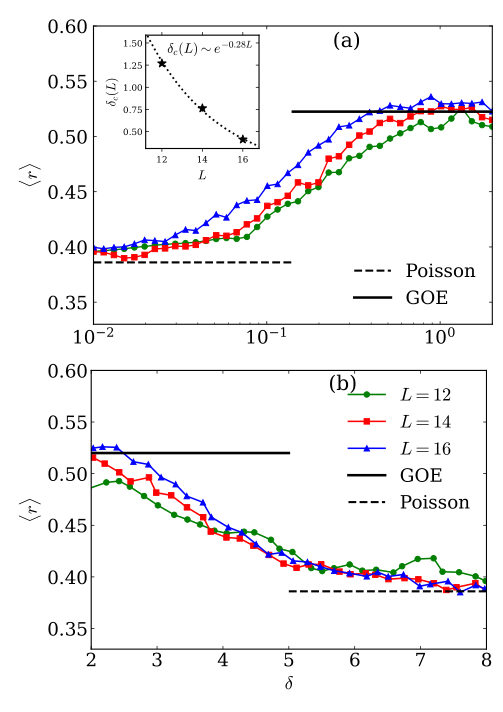 
FIG. 2. (Color online) Average ratio of consecutive level spac- ings, ⟨r⟩, as a function of the interaction-gradient strength δ for system sizes L = 12, 14, and 16. The black dashed and solid horizontal lines denote the Poisson value, ⟨r⟩≈0.38, and the GOE value, ⟨r⟩≈0.53, respectively. (a) Starting from the homogeneous XXZ chain (δ = 0), ⟨r⟩increases from the Poisson value toward the GOE prediction, indicating the crossover from integrability to quantum chaos with increasing interaction gradient. The inset shows the finite-size scaling of the crossover value δc(L) corresponding to the onset of GOE statistics. (b) For larger interaction gradients, ⟨r⟩gradually decreases from the GOE value...

📷 Fig 2

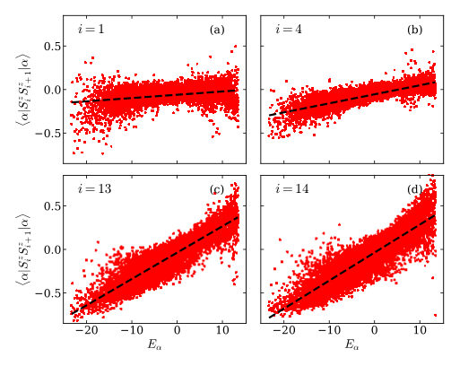 
FIG. 3. (Color online) (a)–(d) Diagonal ETH matrix ele- ments ⟨α|Sz i Sz i+1|α⟩for the bond operator at i = 1, 4, 13, and 14, respectively, plotted as functions of the eigenenergy Eα. Results are shown for the inhomogeneous XXZ chain with L = 16 and δ = 1. The black dashed lines represent linear fits to the analytical prediction of Eq. (12), demonstrating that the diagonal matrix elements vary linearly with the eigenen- ergy.

📷 Fig 3

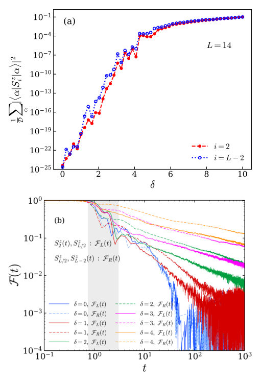 
FIG. 5. (Color online) (a) Averaged squared diagonal matrix elements as a function of the interaction gradient δ for the local spin operator Sz i at sites i = 2 and i = L −2 for system size L = 14. The averaged squared diagonal matrix elements remain vanishingly small throughout the chaotic regime due to the symmetry, for which ⟨α|Sz i |α⟩= 0 [Eq. (11)]. (b) Cor- responding OTOCs, FL(t) and FR(t), for δ = 0, 1, 2, 3 and 4. Despite the vanishingly small diagonal matrix elements, the more weakly interacting side exhibits a steeper relaxation within the shaded intermediate-time window, and this asym- metry becomes more pronounced with increasing δ.

📷 Fig 4

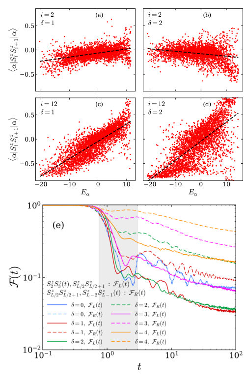 
FIG. 4. (Color online) (a),(b) Diagonal ETH matrix elements ⟨α|Sz i Sz i+1|α⟩for the bond operator at i = 2 and (c),(d) at i = L−2, plotted as functions of the eigenenergy Eα. Results are shown for δ = 1 [(a),(c)] and δ = 2 [(b),(d)] with L = 14. The dashed black lines are linear fits based on the analytical prediction of Eq. (12). (e) Corresponding OTOCs, FL(t) and FR(t), for δ = 0, 1, 2, 3 and 4. The smaller weight of the diagonal matrix elements on the weakly interacting side is associated with lower long-time OTOC saturation values and steeper decay within the shaded intermediate-time window.

📷 Fig 5

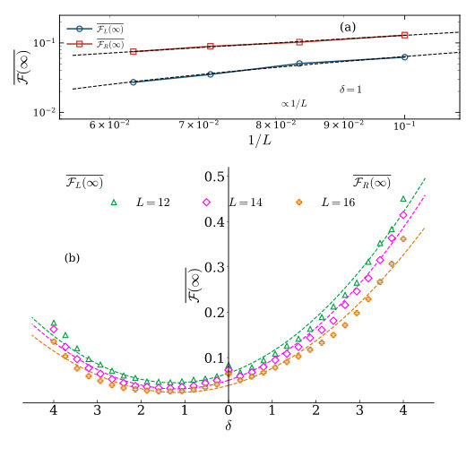 
FIG. 6. (Color online) (a) Finite-size scaling of the infinite- time saturation value of the OTOC for system sizes L = 10, 12, 14, and 16. The black dashed line shows the fit to the scaling relation F(∞) ∝1/L. (b) Infinite-time saturation values of the OTOCs for the bond operator Sz i Sz i+1, FL(∞) and FR(∞), as functions of the interaction gradient δ for sys- tem sizes L = 12, 14, and 16. Open symbols denote numeri- cal long-time averages obtained by averaging over the twenty time points at t = O(109), while the dashed lines represent fits to F(∞) = a

**Summary.** The paper analyzes how spatial variations in interactions within an XXZ spin chain lead to asymmetric information scrambling, quantified using OTOCs. By combining ETH theory with numerical calculations, the authors show that gradients suppress scrambling on strongly coupled sides and provide an analytical explanation for this asymmetry. This establishes deterministic inhomogeneity as a powerful tool for controlling quantum dynamics.

**Why it may be interesting.** This work provides a concrete, microscopic mechanism—deterministic gradients—to control quantum information dynamics (scrambling) in lattice models, which is highly relevant for understanding engineered quantum simulators.

Detailed structure

**Main problem.** The study investigates how deterministic spatial inhomogeneity affects information scrambling dynamics and eigenstate thermalization within quantum many-body systems.

**Main result.** The interaction gradient induces a pronounced left–right asymmetry in information scrambling, causing operators on strongly interacting sides to exhibit suppressed scrambling compared to weakly interacting sides.

**Method.** The authors use Out-of-Time-Ordered Correlators (OTOCs) and analyze diagonal matrix elements within the Eigenstate Thermalization Hypothesis (ETH) framework.

**Model / system.** The primary model is an inhomogeneous XXZ spin chain, characterized by a spatially varying interaction profile $Jz(i; \delta)$. The analysis also touches upon the inhomogeneous transverse-field Ising model (ITFIM).

**Key observables.** Out-of-Time-Ordered Correlators (OTOCs), spectral statistics ($\langle r 
angle$), and diagonal matrix elements of local operators.

**Important parameters / regimes.** The interaction gradient strength $\delta$ is the key parameter, controlling the crossover from integrable ($\delta=0$) to chaotic regimes.

**Assumptions / limitations.** The analysis focuses on the infinite-temperature regime and utilizes the ETH framework to connect dynamics to energy eigenbasis properties.

**Figures summary.** Figures illustrate the evolution of spectral statistics ($\langle r 
angle$ vs. $\delta$), showing crossovers between Poisson, GOE, and nonergodic regimes; they also show OTOC dynamics revealing left-right asymmetry in scrambling.

**Paper structure.** The paper systematically analyzes how spatial inhomogeneity modifies information scrambling by calculating OTOCs and applying ETH diagnostics to determine the finite-size saturation value of these correlators.

Abstract

Deterministic spatial inhomogeneity has become increasingly relevant in experimentally engineered quantum many-body systems, where interaction gradients can strongly influence nonequilibrium dynamics. Motivated by this, we investigate out-of-time-ordered correlators (OTOCs) and their connection to the eigenstate thermalization hypothesis (ETH) in inhomogeneous XXZ spin chains. Using a deterministic spatially varying interaction profile, we show that finite interaction gradients ($δ>0$) induce a pronounced left--right asymmetry in information scrambling, as quantified by OTOCs. This asymmetry persists even when the system exhibits spectral signatures of quantum chaos, with operators on the strongly interacting side exhibiting suppressed scrambling. To elucidate the origin of the asymmetric finite-size long-time saturation value of OTOCs, we employ two complementary approaches. First, we analyze the diagonal matrix elements of the OTOC observables in the energy eigenbasis within the ETH framework. Second, we derive an analytical expression for the finite-size saturation value based on the overlap between the Hamiltonian and the OTOC observables, which explicitly incorporates the spatial interaction profile. The analytical prediction is fully consistent with the numerical results and provides a microscopic explanation for how deterministic interaction gradients generate the observed asymmetry in the long-time saturation of OTOCs.

[↑ back to top](#top)

### [Relaxation of quenched structural glasses: descent in a stiffening caging potential over inflection-point 'speed bumps'](http://arxiv.org/abs/2607.25360v1)

**Authors:** Ting Qu, Deng Pan, Yuliang Jin  
**Type:** theory · **Category:** disordered systems and neural networks · **PDF:** <https://arxiv.org/pdf/2607.25360v1>  
**Analysis basis:** full PDF text, analyzed in chunks
**Topic relevance:** 🔥 `non-equilibrium dynamics` **4/5** · `non-equilibrium universality` **3/5** · `scars & prethermalization` **3/5** · `driven-dissipative phase transition` **2/5** · `Frenkel-Kontorova` **1/5** · `Keldysh / 2PI / non-Gaussian methods` **1/5** · `analog quantum simulation` **1/5** · `correlated / nonlocal dissipation` **1/5** · `methods for driven-dissipative` **1/5**

📷 Fig 1

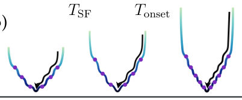 
FIG. 1. Two pictures for GD dynamics in glasses. (a) Mean-field mixed p-spin picture [6, 14]. For T &gt; Tonset, the dynamics is dominated by saddle points (yellow diamonds) before ending in a marginal state. For T &lt; TSF, the dynamics follows a state within a basin. The regime TSF &lt; T &lt; Tonset is not fully understood theoretically. (b) Picture for structural glasses. The system descends in a stiffening caging potential, passing through inflection points (purple circles). The start- ing point lowers with decreasing T, but no characteristic tem- perature separates qualitatively distinct dynamical regimes.

📷 Fig 2

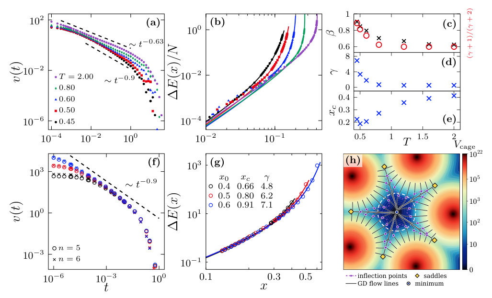 
FIG. 2. Gradient descent dynamics and the effective caging potential. (a-e) Results for the 3D KALJ model. (a) Average velocity v(t) for different temperatures T, with power-law fits yielding β. (b) Average energy ∆E(x) per particle for different T, fitted to Eq. (4) (solid lines), with the fitting parameters γ and xc given in (d, e). (c) Comparison between β from the fits in (a) (black crosses) and (γ + 1)/(γ + 2) (red circles), where γ is obtained from the fits in (b). (f-h) Results for the 2D MCM. (f) v(t) and (g) ∆E(x) for a few different parameter settings. The solid lines in (g) are fits to Eq. (4). The dashed line in (f) indicates β = 0.9 obtained from the relation β = (γ + 1)/(γ +...

📷 Fig 3

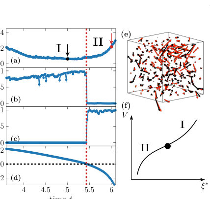 
FIG. 4. Rolling through an inflection point on the energy landscape. The event highlighted by the arrow in Fig. 3a is analyzed in detail here. (a) Mean velocity v(t). (b) Largest overlap O+ between ˆv(t) and the stable instantaneous normal mode xn∗ +. (c) Largest overlap O−between ˆv(t) and the unstable instantaneous normal mode xn∗ −. (d) Eigenvalue λ∗of the instantaneous normal mode xn∗that has the largest overlap with ˆv(t). (e) Visualization of the modes with the largest overlap: xn∗ + (black) and xn∗ −(red), at the marked times (arrows) in (a). (f) Schematic potential energy V as a function of the mode coordinate ξ∗along the direction of xn∗. At the inflection point (the black point),...

📷 Fig 4

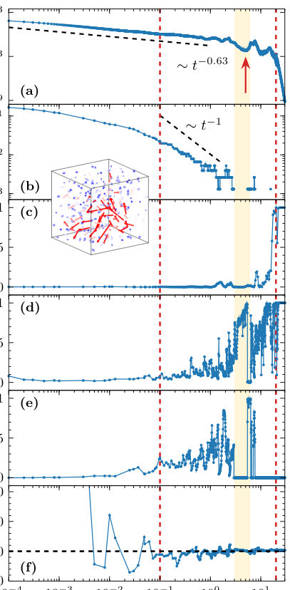 
FIG. 3. Gradient descent dynamics in a typical KALJ sample. All quantities are plotted as functions of t. (a) Mean velocity per particle v(t). (b) Fraction fu(t) of un- stable instantaneous normal modes. (c) Overlap OIS 0 (t) be- tween the normalized velocity field ˆv(t) and the softest vi- brational mode of the inherent structure. (d) Largest overlap O+ between ˆv(t) and stable instantaneous normal modes. (e) Largest overlap O−between ˆv(t) and unstable instantaneous normal modes. (f) Eigenvalue λ∗of the instantaneous nor- mal mode xn∗that has the largest overlap with ˆv(t). The vertical dashed lines mark τIP ≈0.1 and τharm ≈20. The yellow band and the red arrow indicate an...

📷 Fig 5

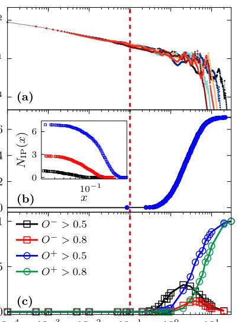 
FIG. 5. Statistics of inflection-point events. (a) Velocity v(t) for 10 independent samples for T = 2. (b) Cumulative number NIP(t) of inflection-point events, averaged over 100 samples. (c) Fraction f ± LO(t) of samples that satisfy O±(t) &gt; Othreshold, where O±(t) is the largest overlap between the nor- malized velocity field ˆv(t) and stable/unstable instantaneous modes (in total, 600 samples are analyzed). The vertical line marks τIP ≈0.1. Inset: NIP(x) for T = 2.0, 0.6, 0.45 (from top to bottom), where x is the distance from the inherent structure; the characteristic distance xIP decreases with de- creasing T.

**Summary.** This work establishes that the power-law decay observed during structural glass relaxation is fundamentally due to an effective stiffening potential arising from particle confinement, rather than previously hypothesized mechanisms. By modeling this effect with a minimal cage model, the authors provide a complete physical picture of gradient descent dynamics in these disordered systems.

**Why it may be interesting.** While focused on classical glassy dynamics, the concept of energy landscape features (inflection points) governing slow relaxation is highly relevant to understanding quantum tunneling rates or quasi-adiabatic evolution in complex quantum systems.

Detailed structure

**Main problem.** The paper addresses the poorly understood phenomenon of slow energy relaxation, characterized by power-law decay, observed in quenched structural glasses.

**Main result.** The power-law behavior is shown to emerge from a simple effective stiffening caging potential arising from many-body confinement, rendering complex mechanisms like saddle-point slowdown unnecessary.

**Method.** The authors use gradient descent simulations on various glass models and derive analytical predictions based on a phenomenological cage potential.

**Model / system.** The study analyzes structural glasses using models like the KALJ model and amorphous silica, focusing on dynamics governed by overdamped Gradient Descent (GD) in the energy landscape.

**Key observables.** Power-law decay exponents ($\alpha$ or $eta$) for energy/velocity relaxation ($E(t) \sim t^{-\alpha}$), cage size ($x_c$), and fluctuations around inflection points.

**Important parameters / regimes.** The exponent $eta = (\gamma + 1)/(\gamma + 2)$ derived from the stiffening potential; temperature regimes relative to $T_{	ext{onset}}$ or $T_{	ext{def}}$.

**Assumptions / limitations.** The dynamics are dominated by descent within individual cages, allowing a minimal single-particle cage model to capture the essential physics.

**Figures summary.** Figures illustrate GD trajectories showing energy landscape features like 'speed bumps' at inflection points; one figure compares mean-field spin glass predictions with structural glass behavior.

**Paper structure.** The paper first reviews existing theories for slow relaxation, then simulates dynamics in structural glasses to rule out these mechanisms. It proposes the caging potential as the source of power-law decay and validates this using a minimal cage model.

Abstract

The slow energy relaxation in quenched glasses is a ubiquitous yet poorly understood phenomenon. Despite extensive study, the microscopic origin of the observed power-law decay remains debated, with proposed mechanisms ranging from saddle-point slowdown and marginal stability to coarsening of localized excitations and phonon dynamics. Here, by simulating gradient descent in archetypal structural glass formers, we show that none of these scenarios can account for our data. Instead, the power-law behavior emerges from a remarkably simple caging effect: each particle experiences an effective stiffening potential that arises from many-body confinement and diverges at a characteristic cage size. This mechanism analytically yields the observed power-law decay and is quantitatively reproduced by a minimal single-particle cage model with fixed neighbours, demonstrating that collective relaxation modes are not essential. The dynamics is punctuated by fluctuations as the system rolls through inflection points on the energy landscape, which act as `speed bumps' but do not affect the overall power-law behaviour. In contrast to mean-field spin glass theory, we find no characteristic temperature that separates distinct dynamical regimes; state following within a given glass basin occurs universally for all initial temperatures whenever the system is sufficiently close to the inherent structure. Our results establish a complete physical picture of gradient descent dynamics in typical structural glasses.

[↑ back to top](#top)

### [Time-Reversal Invariant Topological Photonic Alloy](http://arxiv.org/abs/2607.25769v1)

**Authors:** Feng Ruili, Qu Tiantao, Wu Xianbin, Shi Xiaoxuan, He Mujun, Zhang Lei, Chen Jun  
**Type:** theory · **Category:** disordered systems and neural networks · **PDF:** <https://arxiv.org/pdf/2607.25769v1>  
**Analysis basis:** full PDF text, analyzed in chunks
**Topic relevance:** 🔥 `analog quantum simulation` **4/5** · `driven-dissipative phase transition` **3/5** · `exotic spin models in light-matter` **3/5** · `methods for driven-dissipative` **2/5** · `non-equilibrium dynamics` **2/5** · `correlated cavity matter` **1/5** · `interference shaping light` **1/5** · `non-equilibrium universality` **1/5**

📷 Fig 1

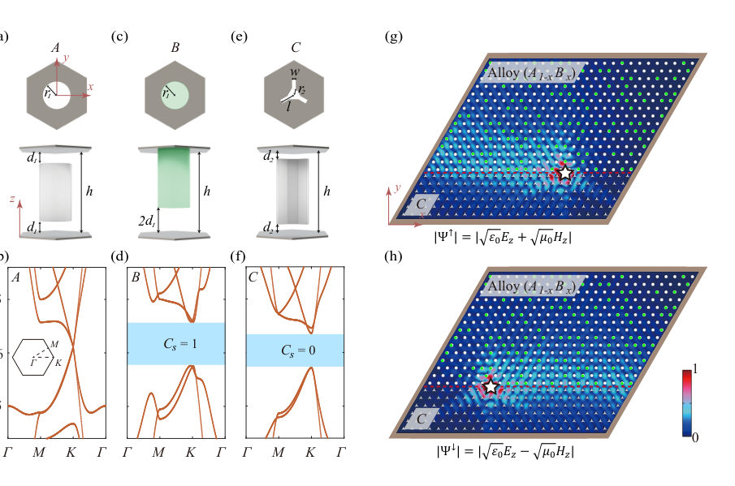 
Figure 1: Photonic quantum spin Hall alloy and the field distributions of its helical edge modes. (a), (c), and (e) Schematics of the 𝐴-type, 𝐵-type, and 𝐶-type components, respectively. The structural parameters are: lattice constant 𝑎= 36.8 mm, height ℎ= 36.8 mm, inner radii 𝑟1 = 6.44 mm and 𝑟2 = 3.65 mm, arm length 𝑙= 7.9 mm, arm width 𝑤= 2.2 mm, and vertical displacements 𝑑1 = 2.76 mm and 𝑑2 = 1.1 mm. (b), (d), and (f) Band structures of photonic crystals composed entirely of unit cells 𝐴, 𝐵, and 𝐶, respectively. The fourfold-degenerate Dirac point in (b) occurs at a frequency of 6.055 GHz. The inset in (b) depicts the first Brillouin zone, and the blue-shaded regions in (d) and (f)...

📷 Fig 2

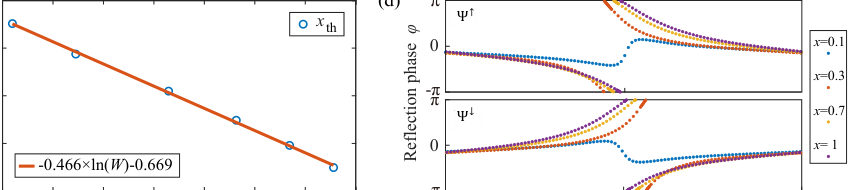 
Figure 2: Topological properties of photonic alloys. (a) Bulk transmission spectrum as a function of the doping concentration 𝑥. Each data point represents the statistical average over 5 random configurations. The red dots indicate the boundary of the topological gap characterized by a spin Chern number of 𝐶𝑠= 1. For each doping concentration, the gap boundary is determined via the reflection phase winding method by analyzing 5 random configurations. Inset: Schematic configuration for the numerical transmission calculation in the 𝐴1−𝑥𝐵𝑥photonic alloy system, where white and green dots denote 𝐴-type and 𝐵-type components, respectively, and the white star represents the excitation dipole...

📷 Fig 3

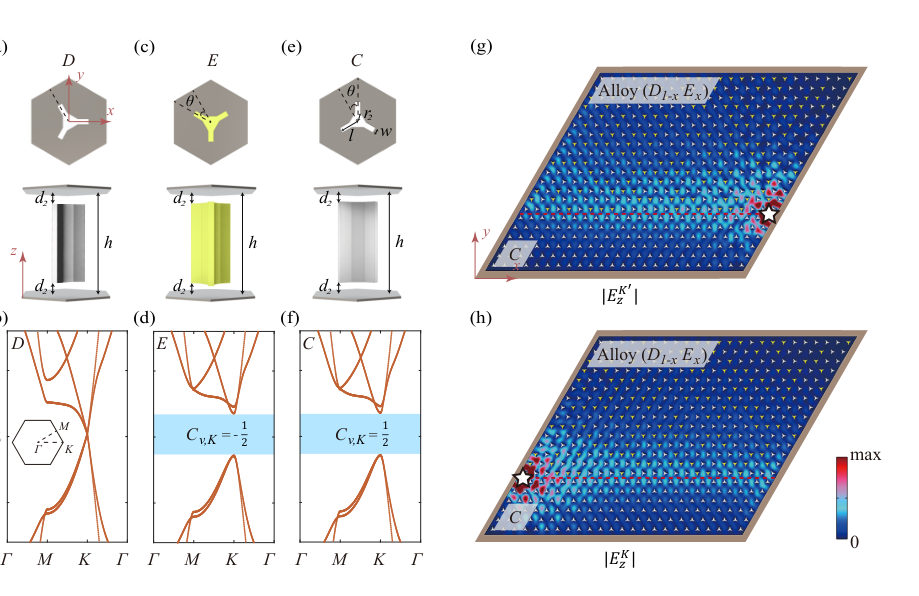 
Figure 3: Topological valley Hall photonic alloy and the field distributions of its valley kink modes. (a), (c), and (e) Schematics of the 𝐷-type, 𝐸-type, and 𝐶-type components, respectively. The 𝐸-type and 𝐶-type configurations are obtained by rotating the internal tripod structure of the 𝐷-type component counterclockwise and clockwise by 𝜃= 30◦. (b), (d), and (f) Band structures of photonic crystals composed entirely of unit cells 𝐷, 𝐸, and 𝐶, respectively. The gapless Dirac point of the 𝐷-type photonic crystal appears at a frequency of 6.02 GHz. The inset in (b) depicts the first Brillouin zone, and the blue-shaded regions in (d) and (f) indicate the bandgaps. (g), (h) Simulated field...

📷 Fig 4

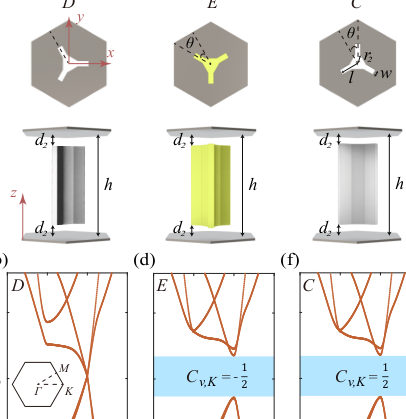 
Figure 4b. At a low doping concentration of 𝑥= 0.1, no edge states emerge near the 6.02 GHz frequency [indi- cated by the white line in Figure 4c], which directly cor- responds to the un-opened gap regime in Figure 4a. As 𝑥 progressively increases, the bulk transmission gap grad- ually widens around the center frequency of 6.02 GHz. Concurrently, as illustrated in Figures 4d and 4e, a contin- uous band gradually emerges around the 𝐾valley within the gap region (bounded by the two solid white lines). With further increases in 𝑥, the gap in Figure 4a broadens substantially, and the edge states in the gap region be- come more evident. These findings demonstrate a clear correlation between the...

📷 Fig 5

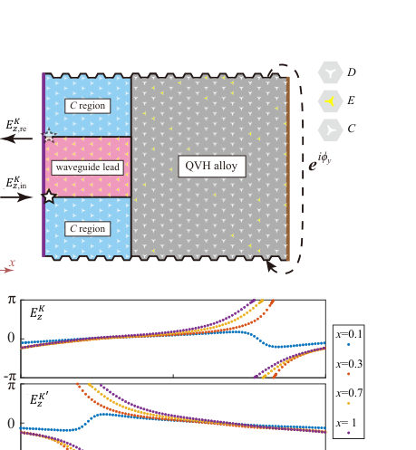 
Figure 5: Topological characterization of the photonic alloy via the reflection-phase winding method. (a) Schematic setup for the reflection phase winding cal- culation, consisting of a square photonic alloy 𝐷1−𝑥𝐸𝑥 domain, a waveguide lead composed of unit cell 𝐸, and an interface constructed from unit cell 𝐶. The applied boundary conditions are the same as those used in the QSH reflection-phase setup. The white solid and white dashed stars mark the respective dipole source locations when probing the 𝐾and 𝐾′ valley modes (e.g., an inci- dent wave 𝐸𝐾 𝑧,in enters the system, and the corresponding reflected mode 𝐸𝐾 𝑧,re is analyzed). (b) Reflection phase 𝜑 as a function of the twisting angle...

**Summary.** The authors show that inducing topological phases (QSH and QVH) in photonic crystals does not require breaking spatial symmetry globally. By introducing controlled, local random substitutional disorder into a photonic alloy, they successfully open topological gaps, enabling flexible, on-demand engineering of edge states using only doping tuning.

**Why it may be interesting.** This work provides a powerful paradigm shift, showing that engineered disorder can induce complex quantum phenomena like topological edge states without requiring perfect global structural control, which is highly relevant for designing robust photonic devices.

Detailed structure

**Main problem.** Conventional methods for inducing topological photonic phases like QSH/QVH require global symmetry breaking, which severely limits device reconfigurability.

**Main result.** The study demonstrates that local and minimal symmetry breaking via random substitutional disorder is sufficient to open topological gaps and trigger robust helical edge states and valley kink states.

**Method.** Topological characterization is performed using the reflection-phase winding method, analyzing band structures derived from photonic crystal models.

**Model / system.** The system is a photonic alloy platform based on random substitutional disorder in a parallel-plate waveguide built on a honeycomb lattice structure.

**Key observables.** Topological phases (QSH/QVH), Spin Chern Number ($C_s$), reflection phase winding, and bulk transmission gaps.

**Important parameters / regimes.** Doping concentration ($x$), system size (W), and the threshold doping concentration ($x_{th}$) which vanishes in the thermodynamic limit.

**Assumptions / limitations.** The analysis assumes that local disorder can effectively mimic global symmetry breaking mechanisms necessary for topological transitions.

**Figures summary.** Figures illustrate schematics of unit cells, band structures showing Dirac points, and phase plots ($\varphi$ vs. $\phi_y$) confirming full winding numbers corresponding to non-trivial topology.

**Paper structure.** The paper progresses by first establishing the limitation of global symmetry breaking, then demonstrating QSH via local $z$-mirror symmetry breaking (doping), followed by extending the concept to QVH via in-plane inversion symmetry breaking, consistently using topological invariants for characterization.

Abstract

Conventional approaches generate quantum spin Hall (QSH) and quantum valley Hall (QVH) effects by breaking spatial inversion symmetry across the entire photonic crystal. Consequently, modulating the bulk transmission gaps within these periodic frameworks typically requires global modification of structural parameters throughout the lattice, severely limiting device reconfigurability and post-fabrication adaptability. In this work, we demonstrate that global inversion symmetry breaking is not a prerequisite for inducing topological phases. Instead, local and minimal symmetry breaking is sufficient. Using a photonic alloy platform based on random substitutional disorder in a parallel-plate waveguide, we show that a disorder-driven local breaking of z-direction mirror symmetry and a local breaking of in-plane symmetry are capable of opening topological gaps to trigger QSH and QVH phase transitions, respectively, thereby supporting robust helical edge states and valley kink states. Rigorous topological characterization via the reflection-phase winding method reveals a striking size-dependent scaling behavior in both configurations, where the threshold doping concentration required to trigger the topological phase transition asymptotically vanishes in the thermodynamic limit. By enabling flexible, on-demand bulk gap engineering simply through random doping tuning rather than global structural reconfigurations, this photonic alloy platform not only deepens understanding of disorder induced topological physics but also offers a scalable, highly efficient design strategy for integrated topological optical communications.

[↑ back to top](#top)

### [A General First- and Second-Order Numerical Solver for Non-Markovian Quantum State Diffusion](http://arxiv.org/abs/2607.25427v1)

**Authors:** Zhenning Cai, Quanhui Zhu  
**Type:** theory · **Category:** numerical methods · **PDF:** <https://arxiv.org/pdf/2607.25427v1>  
**Analysis basis:** full PDF text, analyzed in chunks
**Topic relevance:** 🔥 `methods for driven-dissipative` **4/5** · `correlated / nonlocal dissipation` **3/5** · `non-equilibrium dynamics` **3/5** · `Keldysh / 2PI / non-Gaussian methods` **2/5** · `driven-dissipative phase transition` **2/5** · `analog quantum simulation` **1/5** · `non-equilibrium universality` **1/5**

📷 Fig 1

 
Fig. 1. Spin dynamics for the exponential bath (Example 5.1). Time evolution of ⟨σx⟩, ⟨σy⟩, and ⟨σz⟩with τ = 0.1. The first-order scheme (blue dashed) and the second-order scheme (red solid) are compared with the exact solution (cross markers).

📷 Fig 2

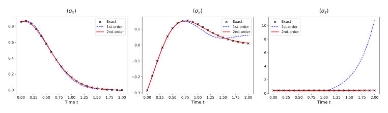 
Figure 1 compares the time evolution of ⟨σx⟩, ⟨σy⟩, and ⟨σz⟩for the first- and second-order schemes against the analytical solution. At this time step, the first-order scheme shows visible numerical deviations from the analytical solution, especially in ⟨σz⟩and ⟨σy⟩. In contrast, the second-order scheme agrees well with the reference dynamics for all three observables, showing improved accuracy at the same time step.

📷 Fig 3

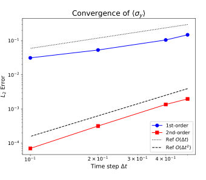 
Fig. 2. Convergence test of ⟨σx⟩and ⟨σy⟩versus time step τ (Example 5.1).

📷 Fig 4

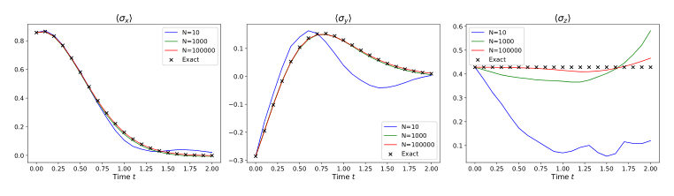 
Fig. 3. Ensemble averages of spin observables calculated with Ntraj = 10, 103, 105 and τ = 0.1 (Example 5.1). The lines show the stochastic averages, and the cross markers denote the analytical reference.

📷 Fig 5

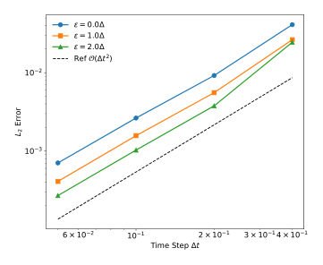 
Fig. 4. The L2 error of ⟨σz⟩t versus the time step τ for Example 5.2 with ϵ ∈{0, ∆, 2∆}. The dashed line indicates the reference slope O(τ2).

**Summary.** This paper introduces a general auxiliary-state framework to numerically solve the Non-Markovian Quantum State Diffusion (NMQSD) equation. It analytically decomposes the dynamics into three fundamental structures and develops convergent first- and second-order time-stepping schemes. The resulting methods offer robust tools for simulating open quantum systems with arbitrary memory environments.

**Why it may be interesting.** This work provides a highly general and mathematically rigorous computational tool for simulating complex open quantum systems where memory effects are crucial, overcoming limitations of previous specialized solvers.

Detailed structure

**Main problem.** The primary challenge is developing a general numerical framework to solve the Non-Markovian Quantum State Diffusion (NMQSD) equation, which is complicated by functional derivatives with respect to the stochastic process.

**Main result.** The authors construct and analyze first- and second-order auxiliary-state schemes that provide rigorous error bounds ($\mathcal{O}(	au)$ or $\mathcal{O}(	au^2)$) for approximating the non-Markovian dynamics.

**Method.** They derive an analytical solution structure revealing three elementary dynamic components (propagation, insertion, pairing) and implement this using a time-discretization auxiliary-state approach.

**Model / system.** The system involves open quantum systems whose reduced density matrix evolution is modeled by the linear NMQSD equation. This formalism describes dynamics influenced by an environment with arbitrary bath correlation functions $\alpha(t, s)$.

**Key observables.** Error bounds for the physical state approximation ($\|\psi_{\emptyset}^n - \phi_{\emptyset}^n\|$), and expectation values like $\langle\sigma_x
angle_t$, $\langle\sigma_y
angle_t$, $\langle\sigma_z
angle_t$.

**Important parameters / regimes.** Time step ($	au$) and total time ($T$); the structure depends on the bath correlation function $\alpha(t, s)$.

**Assumptions / limitations.** The analysis relies on pathwise boundedness of coefficients and uniform integrability of the memory kernel; the first-order scheme explicitly drops contributions from repeated time labels.

**Figures summary.** Tables summarize the correspondence between NMQSD forms and diagrammatic notations for Propagation, Pairing, and Insertion. Diagrams illustrate the three elementary transitions in the first-order scheme.

**Paper structure.** The paper progresses by deriving an analytical solution structure, decomposing it into three parts, constructing auxiliary-state schemes (first and second order), and finally providing rigorous error analysis proving convergence rates ($\mathcal{O}(	au)$ and $\mathcal{O}(	au^2)$) for these numerical methods.

Abstract

The numerical simulation of non-Markovian open quantum systems based on the non-Markovian quantum state diffusion (NMQSD) equation is complicated by functional derivatives with respect to the stochastic process. A general numerical framework that directly treats these functional derivatives without relying on prescribed decompositions of the bath correlation function is still lacking. In this work, we derive an analytical solution of the linear NMQSD equation that reveals three elementary structures of the non-Markovian stochastic dynamics: stochastic propagation, functional-derivative insertion, and memory pairing. Based on this structure, we construct a general auxiliary-state framework for arbitrary bath correlation functions. The framework separates the numerical construction into time discretization, memory quadrature, and hierarchy truncation. We then construct first- and second-order schemes and provide diagrammatic transition rules for their explicit implementation. Numerical results verify the expected temporal accuracy and demonstrate the applicability of the proposed methods to different bath correlation functions and multi-level quantum systems.

[↑ back to top](#top)

### [Agentic AI for Scientific Reasoning in Autonomous Quantum Sensing Experiments](http://arxiv.org/abs/2607.25145v1)

**Authors:** Takuya Isogawa, Ryotaro Okabe, Nutdech Phadetsuwannukun, Mingda Li, Paola Cappellaro  
**Type:** both · **Category:** other · **PDF:** <https://arxiv.org/pdf/2607.25145v1>  
**Analysis basis:** full PDF text, analyzed in chunks
**Topic relevance:** 🔥 `QC/QI experiment` **4/5** · `quantum measurements` **3/5** · `spintronics-quantum-optics interface` **3/5** · `non-equilibrium dynamics` **2/5** · `driven-dissipative phase transition` **1/5** · `measurement-induced transitions` **1/5** · `methods for driven-dissipative` **1/5** · `quantum optics experiment` **1/5**

📷 Fig 1

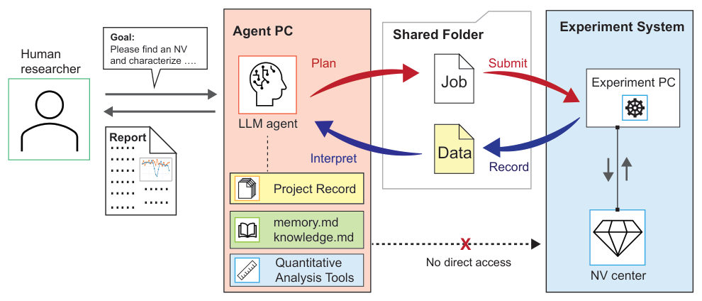 
Figure 1. Overview of the autonomous NV experiment workflow. The human researcher gives an experimental objective to the LLM agent. The agent uses project records, memory and knowledge documents, and quantitative analysis tools on the agent computer. It submits jobs through a shared folder and receives recorded data from the experiment system. On the experiment computer, deterministic software manages the queue, verifies requests and safety conditions, executes accepted jobs, controls the hardware, and records data. The agent has no direct access to the hardware.

📷 Fig 2

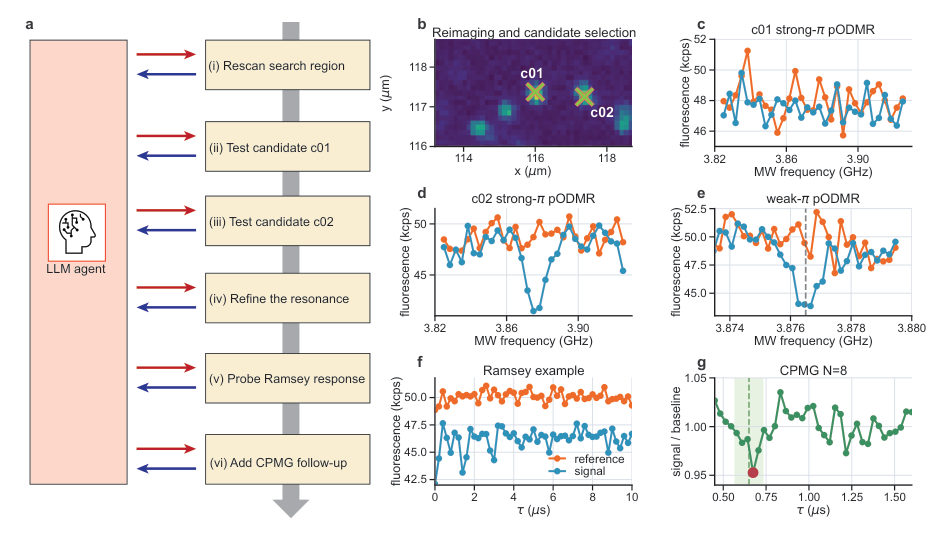 
Figure 2. Autonomous workflow demonstration from the main experiment. Panel (a) shows the main experimental stages as exchanges between the agent and the experiment system. Panel (b) shows the new image scan. Panels (c) and (d) show strong-π pODMR measurements for the rejected and selected candidates. Panel (e) shows the weak-π pODMR resonance calibration. Panel (f) shows one representative Ramsey measurement, and panel (g) shows the autonomous CPMG N = 8 check of the weak 13C-like feature.

📷 Fig 3

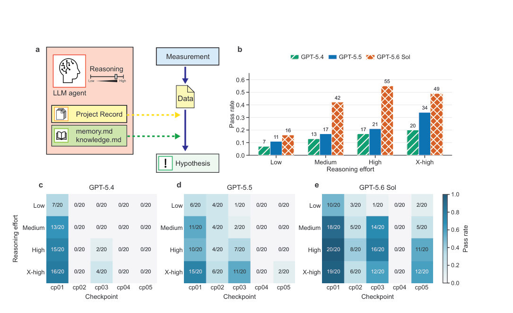 
Figure 3. Ramsey checkpoint benchmark across three models. Panel (a) illustrates hypothesis formation from project records and returned data. Panel (b) shows aggregate pass rates over five checkpoints and twenty replicates per checkpoint for GPT-5.4, GPT-5.5, and GPT-5.6 Sol at each reasoning effort. Labels give passing runs out of 100. Panels (c), (d), and (e) show checkpoint level pass counts for GPT-5.4, GPT-5.5, and GPT-5.6 Sol, respectively. A pass requires the response to connect a residual Ramsey frequency offset to resonance frequency or microwave frequency calibration. Each heat map cell is the number of passing runs out of twenty replicates.

📷 Fig 4

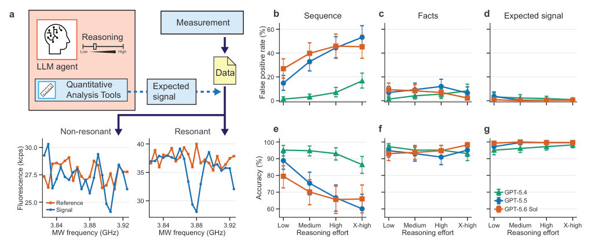 
Figure 4. pODMR benchmark across three models. Panel (a) illustrates how calculations and simulations guide pODMR data evaluation, with representative measurements without and with a resonance. Panels (b), (c), and (d) show the false positive rate for the sequence, domain facts, and expected signal conditions, respectively. Panels (e), (f), and (g) show the corresponding overall classification accuracy. Each point pools three replicates of the same 96 measurements. Error bars show measurement level bootstrap 95% confidence intervals.

**Summary.** The paper introduces an agentic AI framework that allows autonomous execution of complex quantum sensing experiments using NV centers. The system uses LLMs to hypothesize next steps and interpret data from measurements like pODMR scans, successfully designing follow-up tests (like CPMG) based on initial weak signals. It establishes a clear division of labor where the AI handles scientific reasoning while deterministic code manages hardware safety.

**Why it may be interesting.** This work represents a significant step toward closing the loop in quantum experiments by integrating advanced AI reasoning directly into the experimental control cycle, which is highly relevant for complex open quantum systems characterization.

Detailed structure

**Main problem.** Developing autonomous experimental workflows for quantum sensing that can handle complex decision-making, data interpretation, and hypothesis generation beyond routine hardware control.

**Main result.** The agent successfully performed an end-to-end workflow—from initial measurement to autonomously designing a follow-up CPMG scan—and benchmarks show that the division of labor between LLM reasoning and deterministic code is crucial for success.

**Method.** An agentic AI workflow built around a Large Language Model (LLM) guides autonomous experiments, combining persistent state tracking with quantitative tools to interpret complex quantum measurement data.

**Model / system.** The physical system is Nitrogen-Vacancy (NV) centers in diamond, used for sensing magnetic and electric fields via pulsed optically detected magnetic resonance (pODMR) and Ramsey measurements. The AI component uses LLMs (e.g., GPT variants) to reason over the experimental process.

**Key observables.** T2* decay time, resonance frequencies, signal depth in pODMR data, and detection of weak frequency components related to nearby ${}^{13}	ext{C}$ coupling.

**Important parameters / regimes.** Reasoning effort levels (Low to X-high), contrast depth thresholds ($\geq 0.132$), and specific microwave/Larmor frequencies (e.g., $3.87650 	ext{ GHz}$).

**Assumptions / limitations.** The agent's ability to form hypotheses is tested against deterministic hardware control, but the use of specific thresholds in retrospective analysis may not generalize.

**Figures summary.** Figures illustrate the sequence of autonomous measurements (Ramsey $
ightarrow$ CPMG) and benchmark comparisons showing model performance across varying reasoning efforts for both Ramsey checkpoint tasks and pODMR data evaluation.

**Paper structure.** The paper details an autonomous workflow on NV centers, presents case studies demonstrating hypothesis-driven measurement design (e.g., adding CPMG), and rigorously evaluates the LLM's reasoning capabilities using two distinct offline benchmarks (Ramsey checkpoint and pODMR).

Abstract

We implement an agentic AI workflow built around a large language model (LLM) agent for autonomous experiments with nitrogen-vacancy (NV) centers in diamond. NV centers are a widely used platform for quantum sensing, and the ability to control many measurements from a computer makes NV experiments a natural setting for autonomous workflows. We make two main contributions. First, we demonstrate an autonomous NV experiment workflow that combines persistent project records, quantitative calculation and data analysis tools, and deterministic experiment control. In one autonomous experiment, the agent selected a single NV center, calibrated its resonant frequency, measured \(T_2^\ast\) with Ramsey measurements, and added a Carr--Purcell--Meiboom--Gill (CPMG) measurement to check a weak feature that could be related to nearby \(^{13}\mathrm{C}\). Second, we introduce two offline benchmarks that evaluate the agent's reasoning separately from laboratory execution. We evaluated both benchmarks with GPT-5.4, GPT-5.5, and GPT-5.6 Sol. In the Ramsey checkpoint benchmark, greater reasoning effort generally improved recognition of a residual resonance calibration offset. By contrast, in the pulsed optically detected magnetic resonance (pODMR) data evaluation benchmark, pulse sequence information alone produced more false positive resonance judgments at higher reasoning effort. Requiring an expected signal calculation kept false positive rates low across all three models and reasoning settings. The results suggest a clear division of labor for autonomous experiments. The agent forms scientific hypotheses and uses quantitative tools to evaluate data, while deterministic code controls the hardware and enforces safety constraints.

[↑ back to top](#top)

### [Cumulative suspicion and absorption dynamics in an agent-based Mafia game](http://arxiv.org/abs/2607.24980v1)

**Authors:** Eduardo Velasco Stock, Roberto da Silva  
**Type:** theory · **Category:** statistical mechanics · **PDF:** <https://arxiv.org/pdf/2607.24980v1>  
**Analysis basis:** full PDF text, analyzed in chunks
**Topic relevance:** 🔥 `non-equilibrium universality` **4/5** · `driven-dissipative phase transition` **3/5** · `methods for driven-dissipative` **3/5** · `non-equilibrium dynamics` **3/5** · `Keldysh / 2PI / non-Gaussian methods` **1/5** · `analog quantum simulation` **1/5** · `correlated / nonlocal dissipation` **1/5**

📷 Fig 1

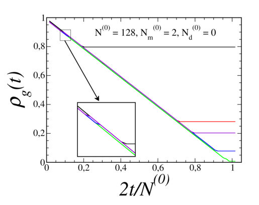 
FIG. 1: The typical evolution of several seeds showing the trivial linear decay of the population of good citizens, ρg(t). We used N (0) = 128, N (0) m = 2, and N (0) d .

📷 Fig 2

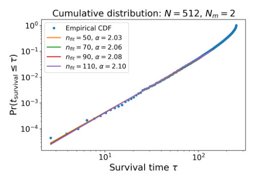 
FIG. 3: Check of the mean-field behavior of the cumula- tive survival-time distribution for N (0) = 512 and N (0) m = 2. The power-law fit performed in the early-time regime, up to τmax = 50, gives α = 2.03, which is very close to the theoret- ical prediction α = Nm = 2.

📷 Fig 3

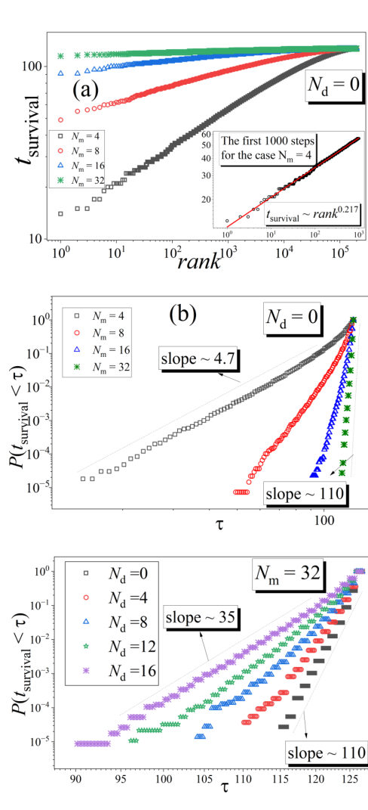 
FIG. 2: Survival times for the mafia. (a) Rank plot of the survival times in the absence of detectives, nd = 0; the inset highlights the power-law behavior observed for a small num- ber of mafia members, Nm = 4. (b) Cumulative distribution of survival times for Nd = 0. (c) Dependence of the survival times on the number of detectives.

📷 Fig 4

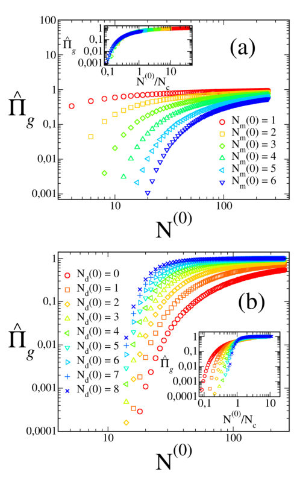 
FIG. 4: Estimated conditional distribution of villagers win- ning as a function of the initial population. In plot (a), we show different initial number of werewolves N (0) m and no de- tectives. The inset plot shows that, by scaling the initial population with 1/Nc, the curves collapse, suggesting a uni- versal behavior. In plot (b), we show different values for the number of detectives, while having N (0) m = 8. In the inset plot, we observe that the same scaling with 1/Nc does not make all curves collapse into a single curve.

**Summary.** This work applies concepts from statistical physics to model the Mafia game using an agent-based simulation. It analyzes how accumulated suspicion drives the system toward one of two absorbing states: mafia elimination or numerical parity. The findings reveal universal scaling laws when information is imperfect, but these laws break down significantly when perfect information (detectives) is introduced.

**Why it may be interesting.** While not directly quantum, the study of absorbing states, critical phenomena (data collapse), and non-equilibrium dynamics in complex interacting systems provides strong analogies to phase transitions studied in statistical mechanics.

Detailed structure

**Main problem.** The paper investigates collective decision-making under concealed affiliations, modeling this using the Mafia game to study history-dependent stochastic processes.

**Main result.** It finds that in the absence of perfect information (detectives), winning probabilities exhibit a universal data collapse characterized by a population scale $N_c$.

**Method.** The analysis relies on extensive Monte Carlo simulations and mean-field approximations to track absorption statistics over time.

**Model / system.** The system is an agent-based model of the Mafia game, where agents accumulate public suspicion scores based on pairwise interactions determined by their hidden roles (Mafia, Detective, Civilian).

**Key observables.** Mafia extinction times, winning probabilities for both factions, and the power-law exponent ($\alpha$) governing early-time survival statistics.

**Important parameters / regimes.** Population size ($N$), initial mafia size ($N_m$), presence/number of detectives ($N_d$), and time ($	au$).

**Assumptions / limitations.** The model provides a minimal stochastic framework, simplifying complex social interactions into quantifiable suspicion updates; the early-time dynamics are approximated by mean-field theory.

**Figures summary.** Figures illustrate data collapse for $N_d=0$ when scaling by $N_c$, and show the failure of this collapse when detectives are present, indicating a change in critical behavior.

**Paper structure.** The paper moves from defining the game's conflict structure to detailing the agent-based rules for suspicion accumulation, culminating in simulations that test how history-dependence affects macroscopic absorption statistics compared to simpler models.

Abstract

The Mafia game, also known as Werewolf, describes a competition between a coordinated minority whose identities are concealed and a larger good faction composed primarily of uninformed civilians attempting to identify and eliminate them. We introduce an agent-based formulation in which the daytime decision is not represented by uniform random voting. Instead, randomly paired agents modify player-specific public suspicion scores according to their roles, and one surviving player is subsequently eliminated with probability proportional to their accumulated suspicion. These scores persist throughout the game, producing a history-dependent stochastic process with two competing absorbing outcomes: elimination of the mafia or numerical parity between the mafia and the good faction. We investigate the effects of population size, initial mafia size, and the presence of perfectly informed detectives through extensive Monte Carlo simulations. In the absence of detectives, a random-execution approximation predicts that, in the dilute-mafia and early-time regime, the cumulative probability of mafia extinction behaves as $F(τ)\sim (τ/N)^{N_m}$, in agreement with simulations as $N_m/N$ decreases. The winning-probability curves also exhibit an empirical finite-size crossover characterized by a population scale $N_c$. Rescaling the population by $N_c$ approximately collapses the curves obtained for different initial mafia populations. Perfectly informed detectives substantially shorten mafia-survival times and introduce an additional dependence on population composition for which the same one-parameter rescaling is insufficient. The model provides a minimal connection between microscopic histories of accusation and the macroscopic absorption statistics of hidden-role games.

[↑ back to top](#top)

### [Efficient Lindbladian Learning from Constant-Time Pauli Responses](http://arxiv.org/abs/2607.25795v1)

**Authors:** Jiaxing Song, Yukun Zhang, Xiao Yuan, Yusen Wu  
**Type:** theory · **Category:** other · **PDF:** <https://arxiv.org/pdf/2607.25795v1>  
**Analysis basis:** full PDF text, analyzed in chunks
**Topic relevance:** 🔥 `methods for driven-dissipative` **4/5** · `quantum measurements` **3/5** · `QC/QI experiment` **2/5** · `measurement-induced transitions` **2/5** · `Keldysh / 2PI / non-Gaussian methods` **1/5** · `analog quantum simulation` **1/5** · `correlated / nonlocal dissipation` **1/5** · `driven-dissipative phase transition` **1/5** · `non-equilibrium dynamics` **1/5**

📷 Fig 1

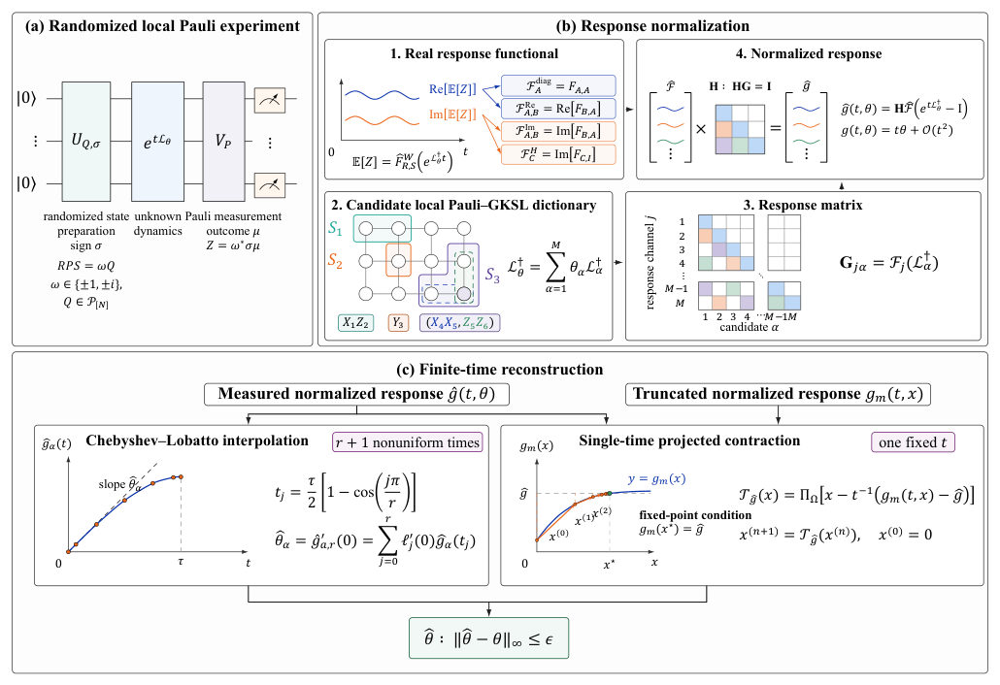 
FIG. 1. Overview of the Lindbladian learning framework. (a) Randomized product-Pauli experiments estimate finite-time raw Pauli response functionals. (b) Response normalization removes the intrinsic mixing between coherent and dissipative generator terms. The measured real response functionals are constructed from raw responses, while the candidate Pauli–GKSL dictionary defines the generator coordinates. At first order in the evolution time, the response matrix G maps Lindbladian coefficients to the slopes of these raw responses at t = 0. Applying H = G−1 removes coherent–dissipative and common- extension mixing and produces normalized responses whose derivatives at the origin equal...

**Summary.** This paper presents an advanced framework to learn the generator (Lindbladian) of complex open quantum systems using only short-time local Pauli response measurements. It resolves the inherent difficulty of separating coherent and dissipative dynamics by treating responses as a linear system. The authors propose two efficient, theoretically bounded algorithms—Chebyshev interpolation and single-time contraction—to extract all necessary coupling coefficients from experimental data.

**Why it may be interesting.** This work provides a highly systematic and theoretically grounded methodology for extracting fundamental system parameters from limited, noisy experimental data in open quantum systems. The explicit handling of the coherent-dissipative ambiguity is crucial for interpreting measurements in realistic physical platforms like superconducting circuits or trapped ions.

Detailed structure

**Main problem.** The core challenge is efficiently learning the generator (Lindbladian) of an open many-body quantum system, which is complicated by dissipative contributions mixed into local Pauli response measurements.

**Main result.** The authors develop and analyze two efficient algorithms—Chebyshev–Lobatto interpolation and single-time projected contraction—to separate coherent and dissipative terms and estimate all Lindbladian coefficients from short-time data with provable complexity bounds.

**Method.** The approach involves constructing a linear system from raw Pauli responses, inverting it to isolate the contribution of each generator term, and then applying advanced numerical interpolation or iterative projection techniques to extract the time-dependent coefficients.

**Model / system.** The study concerns open quantum systems governed by Lindbladian dynamics ($\mathcal{L}^\dagger_	heta$). Learning relies on measuring local Pauli responses from randomized product-Pauli experiments, which provide data related to the system's evolution operator $e^{\mathcal{L}^\dagger t}$.

**Key observables.** Local Pauli response functionals $	ext{Tr}[
ho P(t)]$, normalized finite-time responses $g_\alpha(t, 	heta)$, and the unknown Lindbladian coefficients $	heta = (	heta_1, \dots, 	heta_M)^T$.

**Important parameters / regimes.** Target accuracy ($\epsilon$), number of candidate terms ($M$), evolution time window ($t$), and system locality scales ($\Lambda$).

**Assumptions / limitations.** The dictionary of candidate Lindbladian terms must be known; the dissipative part must satisfy bounded locality properties (e.g., bounded dual-interaction-graph degree).

**Figures summary.** Figure 1 illustrates a three-stage process: (a) measuring raw responses via Pauli experiments, (b) normalizing these responses by inverting a response matrix ($H=G^{-1}$) to separate coherent/dissipative mixing, and (c) reconstructing the coefficients using interpolation or single-time inversion.

**Paper structure.** The paper first establishes the physical problem of Lindbladian learning from local responses. It then details the mathematical framework involving response matrices ($G$ and $H$) to resolve ambiguities. Finally, it presents two distinct algorithmic approaches (Chebyshev interpolation and single-time contraction) alongside rigorous complexity analyses for both measurement shots and classical post-processing.

Abstract

Learning the generator of an open many-body system is more challenging than Hamiltonian learning: local responses, which can directly reveal coherent interaction terms in closed-system dynamics, may also contain dissipative contributions in open-system dynamics. In this paper, we address this challenge by developing an efficient Lindbladian learning framework for a known local candidate generator dictionary with bounded dissipative support and either bounded dual-interaction-graph degree or bounded unweighted local strength. The framework resolves the coherent-dissipative ambiguity by treating local Pauli responses as a linear system over both types of generator terms. Inverting this response system separates their contributions and makes the individual Lindbladian coefficients accessible from local response data in a fixed short-time window. Within this framework, we develop two efficient learning algorithms: Chebyshev--Lobatto response interpolation, which uses logarithmically many short evolution times and has a post-mean cost linear in $M$, with the stated dependence on $ε$, and Single-time projected response contraction, which uses a single fixed evolution time and globally inverts a truncated response function. Both procedures estimate $M$ candidate coefficients to entrywise accuracy $ε$ using $\widetilde{\mathcal{O}}(M/ε^2)$ sample and classical post-processing complexity. Our theoretical results establish local response inversion as a scalable paradigm for learning, calibrating, and diagnosing complex quantum systems from experimentally accessible short-time data.

[↑ back to top](#top)

### [Engineering a Quantum Thermal Diode with Floquet Driving](http://arxiv.org/abs/2607.25678v1)

**Authors:** Aqsa Rehman, M. Tahir Naseem, Adam Zaman Chaudhry  
**Type:** theory · **Category:** statistical mechanics · **PDF:** <https://arxiv.org/pdf/2607.25678v1>  
**Analysis basis:** full PDF text, analyzed in chunks
**Topic relevance:** 🔥 `non-equilibrium dynamics` **4/5** · `driven-dissipative phase transition` **3/5** · `methods for driven-dissipative` **3/5** · `non-equilibrium universality` **2/5** · `Keldysh / 2PI / non-Gaussian methods` **1/5** · `analog quantum simulation` **1/5** · `correlated / nonlocal dissipation` **1/5**

📷 Fig 1

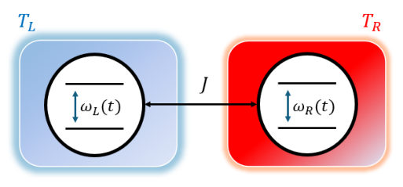 
FIG. 1. Schematic of the Floquet quantum thermal diode. Two qubits with longitudinally modulated transition frequencies ωL(t) and ωR(t) are coupled through an Ising interaction J and connected to independent thermal reservoirs at temperatures TL and TR. The same setup contains the undriven, single-side-driven, and dual-side- driven regimes analyzed in Sec. III.

📷 Fig 2

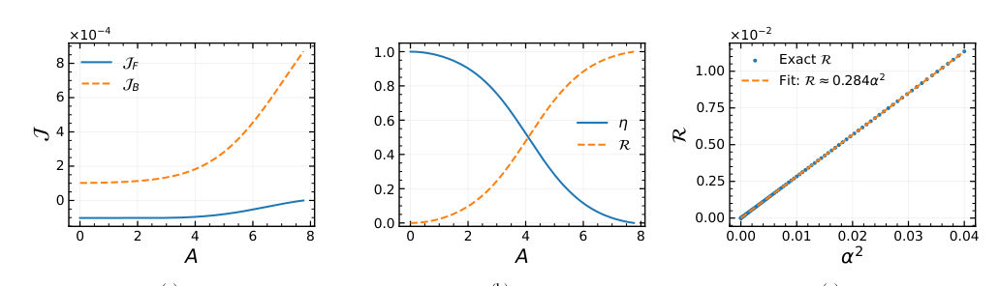 
FIG. 2. Numerical verification of single-side-driven rectification using the sinusoidal left-qubit modulation in Eq. (33) and the flat bare reservoir spectrum in Eq. (B2). (a) Steady-state right-bath currents JF and JB, defined in Eq. (20), versus the drive amplitude A for the forward and reverse thermal biases in Eq. (19). Increasing A selectively suppresses the forward current, which vanishes at the first blocking point, Ablock ≃7.754. (b) Rectification ratio η and rectification coefficient R, defined in Eqs. (22) and (21), respectively. At the forward- current blocking point, η →0 and R →1, demonstrating nearly ideal rectification while the reverse transport branch remains conducting....

📷 Fig 3

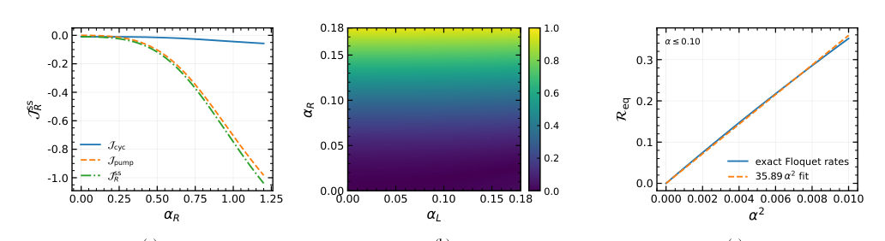 
FIG. 3. Numerical characterization of the dual-side-driven configuration. (a) Exact forward right-bath current decomposed into the interaction- mediated cyclic contribution Jcyc, the right-contact Floquet pumping contribution Jpump, and their sum J ss R , using Eq. (42). The right-drive strength αR is varied at fixed αL = 0.65. (b) Rectification coefficient Rdd in the weak-drive flat-spectrum regime over 0 ≤αL, αR ≤0.18, illustrating the unequal-amplitude scaling in Eq. (49). (c) Equal-amplitude cut αL = αR = α, comparing the numerical Floquet result with the quadratic weak-drive prediction in Eq. (54). Parameters are ω0 = 6, J = 0.85, Ω= 2.12, Th = 4, Tc = 2, and γL = γR = 1, with ¯h = kB...

**Summary.** The paper demonstrates how applying periodic external fields (Floquet driving) to a coupled qubit system can engineer a quantum thermal diode. By breaking the symmetry of coupling—specifically through single-side modulation—the authors achieve strong, controllable heat rectification. This establishes contact-selective Floquet dressing as a powerful design tool for managing energy flow in nanoscale quantum devices.

**Why it may be interesting.** This work directly addresses non-equilibrium quantum thermodynamics by using time-periodic driving (Floquet engineering) to manipulate energy flow directionality in mesoscopic systems, which is highly relevant to open quantum system dynamics and thermal management.

Detailed structure

**Main problem.** The central goal is controlling heat flow at the nanoscale by achieving strong thermal rectification without sacrificing the overall transmitted heat current, a known trade-off in static quantum diodes.

**Main result.** Contact-selective Floquet dressing provides a robust design principle to engineer controllable and tunable asymmetry in heat flow through minimal quantum thermal devices.

**Method.** The analysis involves deriving and solving a Floquet–LGKS master equation from a microscopic system--bath model, comparing driven dynamics against static and undriven benchmarks.

**Model / system.** The system is a minimal quantum thermal diode composed of two longitudinally modulated Ising-coupled qubits, each coupled independently to its own thermal reservoir. The dynamics are governed by time-dependent Hamiltonians and resolved via Floquet theory.

**Key observables.** Steady-state heat current ($J_{ss}$), thermal rectification coefficient ($R$), and the blocking condition (suppressing one bias direction while maintaining transport in the other).

**Important parameters / regimes.** The modulation amplitude ($\alpha$) is crucial, as rectification scales quadratically with it in the weak-drive regime; single-side vs. dual-side driving configurations are key parameters.

**Assumptions / limitations.** The system–bath coupling is assumed to be weak, and approximations like Born, Markov, and Floquet–secular methods are employed for solving the master equation.

**Figures summary.** Figure 1 schematically illustrates the setup: two qubits with modulated frequencies coupled by an Ising interaction, connected to independent thermal reservoirs ($T_L, T_R$).

**Paper structure.** The paper establishes the physical model and Hamiltonian; it derives the Floquet-LGKS master equation; it analyzes single-side driving to achieve rectification and blocking; finally, it extends the analysis to dual-side driving, showing how pumping contributions must cancel for complete blockade.

Abstract

Controlling heat flow in small quantum systems is a central goal of quantum thermodynamics and nanoscale transport. A key challenge is to achieve strong thermal rectification without suppressing the transmitted heat current, a tradeoff that often arises in static diode configurations. We establish a Floquet-control mechanism in a minimal quantum thermal diode formed by two longitudinally modulated Ising-coupled qubits, each coupled to an independent thermal reservoir. From a microscopic system--bath model, we derive a Floquet--LGKS master equation that resolves the drive-assisted transition channels. The resonant undriven device with left--right symmetric bath couplings serves as the reciprocal benchmark, while static detuning provides a rectifying reference with reduced heat current. Single-side driving breaks this reciprocal structure by creating a Floquet-dressed contact opposite a purely thermal contact. For this configuration, we obtain a compact steady-state current formula and an exact blocking condition for suppressing one bias direction while retaining finite transport in the opposite direction. In the weak sinusoidal-drive regime, rectification begins quadratically in the modulation amplitude. Dual-side driving adds a Floquet pumping contribution to the interaction-mediated current, so complete blocking requires cancellation of both contributions. These results establish contact-selective Floquet dressing as a design principle for controllable heat-flow asymmetry in minimal quantum thermal devices.

[↑ back to top](#top)

### [Predicting the Slow Drift of Nuclear Spin Noise in Semiconductor Spin Qubits](http://arxiv.org/abs/2607.26019v1)

**Authors:** Wayne M. Witzel, Jesse J. Lutz, Matthew D. Grace, Natalie D. Foster, Ryan M. Jock, Dwight R. Luhman  
**Type:** both · **Category:** quantum information and computing · **PDF:** <https://arxiv.org/pdf/2607.26019v1>  
**Analysis basis:** full PDF text, analyzed in chunks
**Topic relevance:** 🔥 `QC/QI experiment` **4/5** · `methods for driven-dissipative` **3/5** · `spintronics-quantum-optics interface` **3/5** · `quantum measurements` **2/5** · `Keldysh / 2PI / non-Gaussian methods` **1/5** · `correlated / nonlocal dissipation` **1/5** · `driven-dissipative phase transition` **1/5**

📷 Fig 1

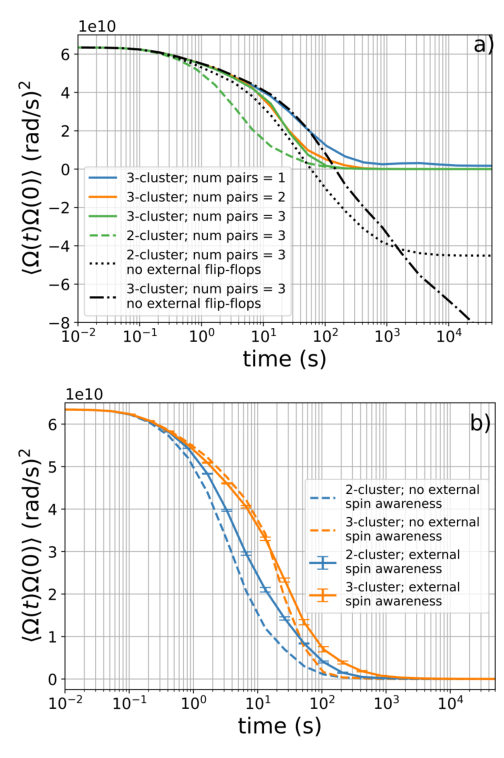 
FIG. 1. Autocorrelation functions illustrating the improved conver- gence behavior when (a) accounting for flip-flops with spins external to each cluster and (b) additionally including external spin awareness (Υ′ = {C ∈Υs.t.∥C∥= 2}). Weutilizefullclusterstateaveraging in all cases; with external spin awareness we use 5 different random spin states (i.e., k = 5 in Eq. 18) with the negligibly small error bars showing the standard error of the mean. The same random nuclear isotope constellation was used throughout, corresponding to 500 ppm 29Si enrichment, and a quantum dot with r0 =10 nm, z0 = 5 nm, and θv = 0 using the model of Eq. 8 and a magnetic field along the [001] crystallographic...

📷 Fig 2

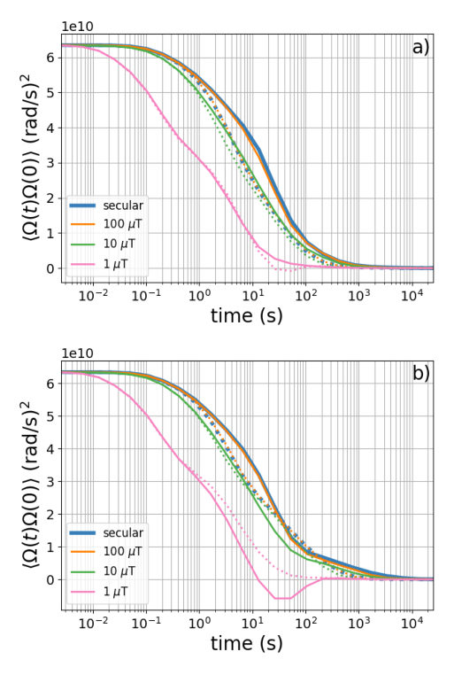 
FIG. 2. Autocorrelation functions for different magnetic field strengths up to the secular approximation limit for the same random instance of 500 ppm 29Si, quantum dot shape, ton, and toff as in Fig. 1 with the magnetic field along a) [001] and b) [110] crystallographic directions. Solid (dotted) curves are restricted to clusters of size 3 (2). We include external flip-flops and external spin awareness with full cluster state averaging and 5 random spin states as in Fig. 1 (b). The secular approximation appears to work well for magnetic fields at 100 µT or above for 500 ppm 29Si.

📷 Fig 3

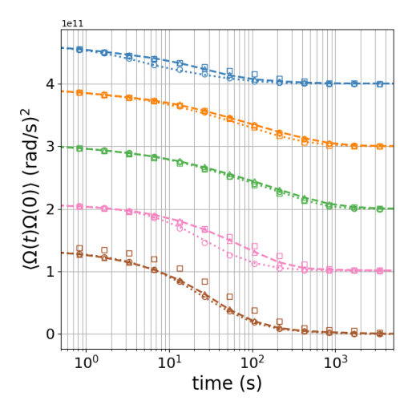 
FIG. 3. Autocorrelation functions for five different random instances of nuclear isotope locations for 500 ppm 29Si enrichment and same quantum dot shape, ton, and toff as Figs 1 and 2, and a magnetic field along the [001] crystallographic direction. We include external flip-flops and external spin awareness with full cluster state averaging and 5 random spin states as in Fig. 1 (b). Offsets of 1e11 (rad/s)2

📷 Fig 4

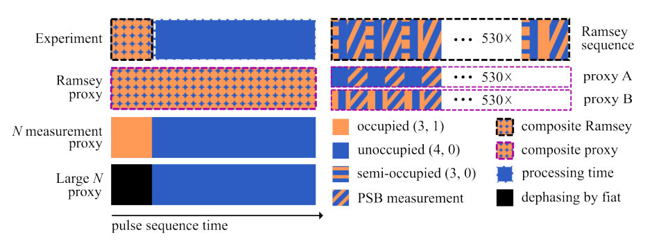 
FIG. 4. Block schedules pertinent to Sec. IVB1 for the experiment as well as simulated proxy schedules. The experiment (first row, left) involves a sequence of Ramsey measurements with 53 wait times ranging from 10 ns to 24 µs that are each averaged over 10 shots at each wait time spanning a total duration of 93 ms (outlined in dashed black, detailed in first row, right). This sequence is repeated but interrupted by 373 ms of computer processing time during which the quantum dots are in the effectively unoccupied (4, 0) charge occupation state (long blue block). The Ramsey proxy schedules A (most unoccupied) and B (most occupied), are shown outlined in gray dashed (second row, detailed in...

📷 Fig 5

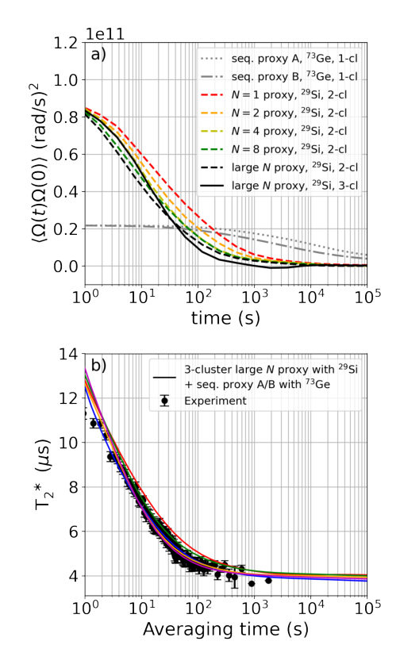 
FIG. 5. Comparing effective T ∗ 2 times measured as a function of data collection time from a singlet/triplet qubit [Ref. [50]] against simulation results, related to autocorrelation functions according to Appendix A. a) Examines the autocorrelation functions of simula- tions for a particular random configuration of isotope locations and a particular initial spin state for the proxy models illustrated in Fig. 4 using n-cluster (n-cl) approximations with n = 1, 2, 3 and 2 pairs per spin (applicable beyond 1-cl). The 73Ge is best approximated with the A/B Ramsey sequence proxies. The 29Si contribution is signif- icantly larger, decays more quickly, and is best approximated using the large N...

**Summary.** This paper develops an advanced theoretical framework combining Cluster Correlation Expansion with stochastic methods to model the long-term magnetic noise from nuclear spins affecting electron spin qubits. The authors validate this approach against experimental data and show that actively compensating for the measured Overhauser field can dramatically extend qubit coherence times, offering a pathway toward more robust quantum computation in solid-state systems.

**Why it may be interesting.** This work directly addresses a fundamental decoherence bottleneck in solid-state quantum computing platforms by providing a quantitative method to mitigate slow environmental noise sources through dynamic control.

Detailed structure

**Main problem.** The primary challenge is accurately predicting the slow drift of magnetic noise originating from the nuclear spin bath, which severely limits the coherence time ($T_2^*$) of electron spin qubits in semiconductor quantum dots.

**Main result.** The authors demonstrate that by actively compensating for the measured Overhauser field rotation ($\Delta t$), the effective coherence time $	ilde{T}_2^*$ can be significantly enhanced—potentially 10 to 100 times larger than the ergodic $T_2^*$.

**Method.** They extend the Cluster Correlation Expansion (CCE) technique by incorporating stochastic treatments of cluster dynamics, combining quantum evolution with classical rate matrices to simulate long-time noise behavior.

**Model / system.** The system involves electron spin qubits coupled to a bath of nuclear spins within semiconductor quantum dots. The Hamiltonian includes Zeeman, Fermi contact hyperfine ($H_{hf}$), and dipolar interactions ($\mathbf{D}$).

**Key observables.** $T_2^*$ decay time (Ramsey experiments), autocorrelation functions of the Overhauser field, and Power Spectral Densities (PSDs).

**Important parameters / regimes.** The simulation relies on modeling periodic electron occupation cycles ($T = t_{	ext{on}} + t_{	ext{off}}$) and quantifying noise drift over long timescales ($\mu$s regime).

**Assumptions / limitations.** Key approximations include neglecting fast electronic dynamics relative to slow nuclear bath evolution, assuming low temperatures where phonon decay is negligible, and using the CCE formalism.

**Figures summary.** Figures validate the method by showing convergence tests for model dimensions (Fig. 12) and comparing numerical histograms of nearest-neighbor distributions against analytical results (Fig. 14).

**Paper structure.** The paper builds from defining the physical noise source to extending the CCE technique for long timescales, validating the methodology against multiple experimental diagnostics ($T_2^*$, autocorrelation), demonstrating back-action effects, and finally quantifying the benefits of active field compensation.

Abstract

The dynamics of a nuclear spin bath generates magnetic noise that is a key contributor to the decoherence of electron spin qubits in electrostatically-defined quantum dots. In this paper, we extend the cluster correlation expansion (CCE) technique, which has proven useful for predicting solid-state qubit coherence times across various settings but is limited to shorter time scales, to incorporate stochastic treatments of cluster dynamics in order to efficiently predict slow drifting Overhauser fields over longer time scales. This approach combines quantum evolution with classical rate matrices to enable simulation across a wide range of temporal regimes required to simulate, for example, the long-time convergence of the ergodic $T_2^*$ from Ramsey experiments. Our methodology is validated against experimental data from various silicon spin qubit systems, demonstrating a strong agreement between simulation and measurement of Ramsey experiments presented in the form of $T_2^*$ versus averaging time, autocorrelation functions, as well as power spectral densities. Furthermore, we demonstrate significant back-action effects through modeling and experiment; specifically, the dynamics of the nuclear spin bath depends upon the electron spin occupation schedule. Finally, our modeling quantitatively predicts the benefits from compensating for the slow drift of Overhauser fields in qubit operations. Our findings indicate that compensating for an Overhauser rotation measured $Δt$ in the past results in an effective $T_2^*$, which we denote $\tilde{T}_2^*(Δt)$ for clarity, under certain scenarios of interest, can be one or two orders of magnitude larger than the ergodic $T_2^*$ if the Overhauser rotation is re-characterized every 100 milliseconds; that is, $\tilde{T}_2^*(Δt = 100~{\rm ms})$ can be $10$ to $100$ times larger than $T_2^*$.

[↑ back to top](#top)

### [Krylov-Space Memory Cores](http://arxiv.org/abs/2607.26011v1)

**Authors:** Mohsen Alishahiha, Mohammad Javad Vasli  
**Type:** theory · **Category:** statistical mechanics · **PDF:** <https://arxiv.org/pdf/2607.26011v1>  
**Analysis basis:** full PDF text, analyzed in chunks
**Topic relevance:** 🔥 `scars & prethermalization` **4/5** · `non-equilibrium dynamics` **3/5** · `non-equilibrium universality` **2/5** · `Keldysh / 2PI / non-Gaussian methods` **1/5** · `analog quantum simulation` **1/5** · `driven-dissipative phase transition` **1/5** · `entanglement & information structure` **1/5** · `methods for driven-dissipative` **1/5**

📷 Fig 1

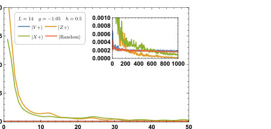 
Figure 2. Stationary Krylov occupation profile Πn for the chaotic mixed-field Ising chain. The structured states exhibit strong low-depth peaks together with broader stationary tails. The profile specifies where late-time probability resides; it does not by itself identify the active memory core. The inset extends the comparison to larger Krylov depths.

📷 Fig 2

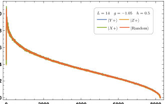 
Figure 1. Lanczos coefficients bn for the chaotic mixed- field Ising chain (L = 14, J = 1, g = −1.05, h = 0.5). All states are analyzed in the reflection-even setting of dimension 8256; their exact cyclic dimensions are state dependent and are given in Table I. The similar large-depth envelopes show that the state-selective memory structure is not determined by the overall growth of bn alone.

📷 Fig 3

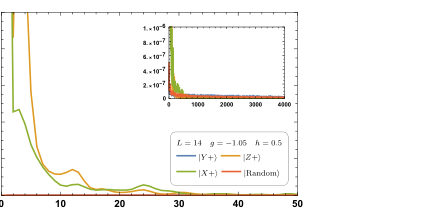 
Figure 3. Residual equilibration-fluctuation profile χn for the chaotic mixed-field Ising chain. The states |X+⟩and |Z+⟩carry appreciable low-depth fluctuation weight. The efficiently thermalizing state |Y +⟩and the random controls have much weaker signals whose cumulative weight is dis- tributed over a large fraction of the Krylov chain. The inset shows the larger-depth behavior.

📷 Fig 4

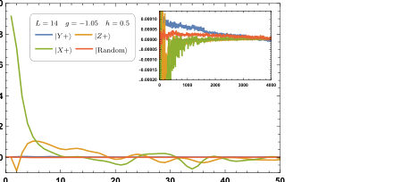 
Figure 4. Signed Gibbs-deviation profile dn = Πn −Π(Gibbs) n for the chaotic mixed-field Ising chain. The weakly thermaliz- ing state |X+⟩exhibits the largest low-depth Gibbs-reference mismatch. The corresponding mismatch for |Z+⟩is compact but considerably weaker, while |Y +⟩and the random controls remain close to the Gibbs benchmark.

📷 Fig 5

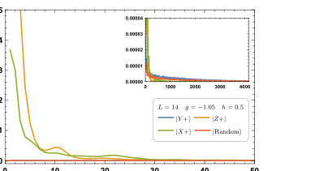 
Figure 5. Krylov-current fluctuation activity Γn for the chaotic mixed-field Ising chain. The states |X+⟩and |Z+⟩ support strong back-and-forth probability-current fluctua- tions near the Krylov origin. The efficiently thermalizing and random controls have much weaker or broadly distributed ac- tivity. The inset shows the extended-depth tail.

**Summary.** The paper introduces Krylov-space memory cores as a stationary framework to locate structured quantum memory within the dynamics of many-body systems. By analyzing residual fluctuations and deviations from equilibrium along the Krylov chain, it distinguishes true, state-selective memory regions from generic thermalization backgrounds. This offers a quantitative way to probe non-equilibrium structure in complex quantum dynamics.

**Why it may be interesting.** This work provides a powerful diagnostic tool for identifying non-trivial, localized quantum correlations or 'memory' in complex, thermalizing systems without relying on full time evolution simulations.

Detailed structure

**Main problem.** The research aims to characterize anomalous initial-state memory in nonintegrable quantum many-body systems that otherwise tend toward thermalization.

**Main result.** Anomalous states develop compact, low-depth 'memory cores' characterized by residual fluctuations and Gibbs mismatch, which are distinct from the broader stationary probability background.

**Method.** The analysis maps the system dynamics onto an effective one-dimensional hopping problem on the Krylov subspace generated by the initial state $|\psi_0
angle$.

**Model / system.** The study analyzes closed quantum many-body systems governed by a time-independent Hamiltonian $H$, focusing specifically on the structure within the cyclic Krylov subspace.

**Key observables.** Stationary occupation profile ($\Pi_n$), residual fluctuation profile ($\chi_n$), Gibbs-deviation profile ($d_n$), and bond-resolved Krylov-current fluctuation activity ($\Gamma_n$).

**Important parameters / regimes.** The memory core depth $n_{mc}$ is defined by the spatial concentration of $\chi_n, d_n,$ and $\Gamma_n$, distinguishing it from the full occupation depth $n(q)_\Pi$.

**Assumptions / limitations.** Memory is operationally defined as a state-selective residual structure resolved by fluctuations ($\chi_n$), mismatch ($d_n$), or current activity ($\Gamma_n$).

**Figures summary.** The notes detail comparisons between the active memory depth ($n_{mc}$) and the full stationary occupation depth, showing $n_{mc}$ is significantly smaller than the latter for tested states.

**Paper structure.** The paper develops diagnostics beyond simple probability profiles ($\Pi_n$) by introducing $\chi_n, d_n,$ and $\Gamma_n$. It then applies these tools to various models (PXP chain, Ising state) to quantify the size of the structured memory core ($n_{mc}$) relative to the system's overall dimension.

Abstract

We introduce Krylov-space memory cores as stationary, depth-resolved structures that reveal how anomalous initial-state memory is organized inside the Krylov space of otherwise thermalizing nonintegrable systems. The stationary occupation profile identifies where late-time probability is concentrated along the Krylov chain, while complementary diagnostics of residual equilibration fluctuations, deviation from the Gibbs reference, and long-time Krylov-current fluctuations determine the physical character of that region. Across weak thermalization, confinement-induced anomalous dynamics, and many-body scarring, anomalous initial states develop compact low-depth memory cores that carry appreciable residual fluctuations, Gibbs mismatch, and persistent current-fluctuation activity. These cores are often embedded within substantially broader stationary occupation halos. Generic reference states, by contrast, do not exhibit a comparable combination of signal strength and spatial compactness. An auxiliary integrable comparison further shows that compact Krylov memory is state selective rather than a generic consequence of integrability. Krylov-space memory cores therefore provide a stationary framework for identifying where structured quantum memory resides and how it remains dynamically encoded.

[↑ back to top](#top)

### [Quantum detection of CP violation in the $t\bar{t}$ system: production](http://arxiv.org/abs/2607.25029v1)

**Authors:** Priyanka Lamba, Fabio Maltoni, Olimpia Miniati, Eleni Vryonidou  
**Type:** theory · **Category:** other · **PDF:** <https://arxiv.org/pdf/2607.25029v1>  
**Analysis basis:** full PDF text, analyzed in chunks
**Topic relevance:** 🔥 `entanglement & information structure` **4/5** · `quantum measurements` **2/5** · `Keldysh / 2PI / non-Gaussian methods` **1/5** · `analog quantum simulation` **1/5** · `correlated / nonlocal dissipation` **1/5** · `driven-dissipative phase transition` **1/5** · `methods for driven-dissipative` **1/5** · `non-equilibrium dynamics` **1/5** · `non-equilibrium universality` **1/5**

📷 Fig 1

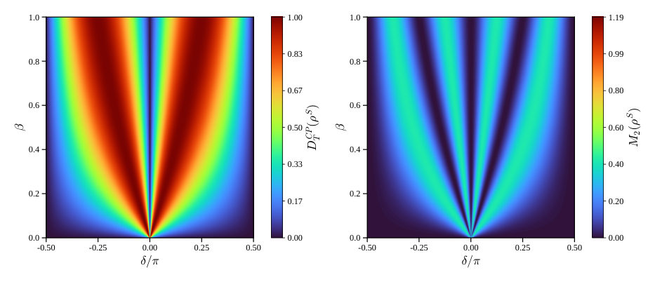 
Figure 3: CP-sensitive observables as functions of the CP-mixing angle δ and the top-quark veloc- ity β. Left: CP-sensitive trace distance, equivalently the norm of the antisymmetric component of the spin-correlation matrix. Right: Magic.

📷 Fig 2

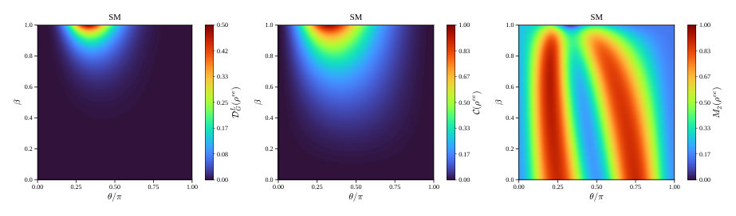 
Figure 5: SM predictions for the quantum information observables as functions of the scattering angle θ/π and the top-quark velocity β. From left to right, we show geometric discord, concur- rence, and magic.

📷 Fig 3

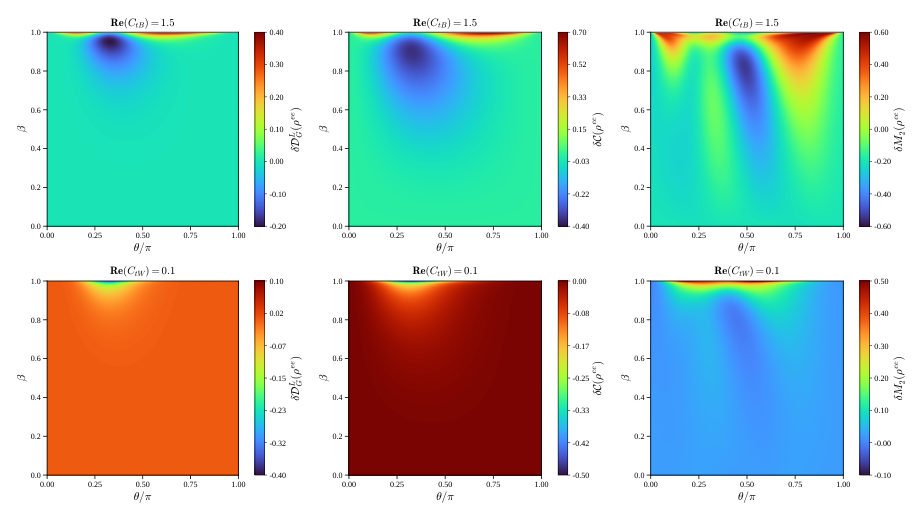 
Figure 6: Changes in the quantum information observables induced by the CP-even dipole coef- ficients Re(CtB) (upper row) and Re(CtW ) (lower row), with all other SMEFT coefficients set to zero. From left to right, we show δDL G, δC, and δM2, where δO ≡OSMEFT −OSM.

📷 Fig 4

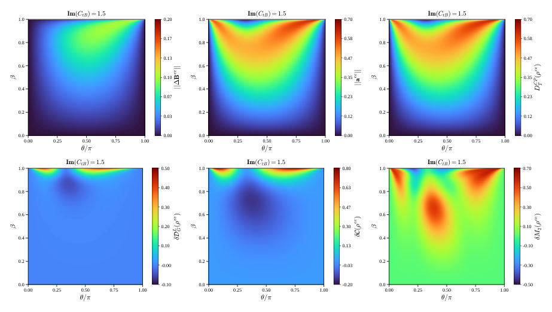 
Figure 7: The observables for the benchmark Im(CtB) = 1.5, with all other SMEFT coefficients set to zero. The upper panels show, from left to right, the norm of the top-antitop polarisation difference, the norm of the antisymmetric spin-correlation matrix, and the CP trace distance. The lower panels show the corresponding changes δDL G, δC, and δM2 relative to the SM predictions.

📷 Fig 5

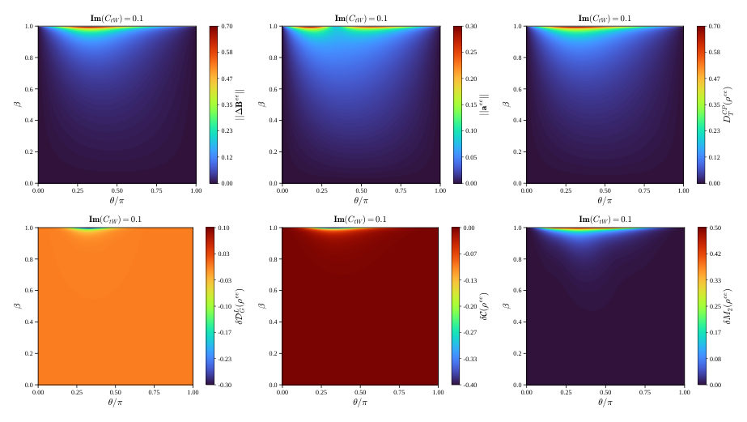 
Figure 8: The observables for the benchmark Im(CtW ) = 0.1, with all other SMEFT coefficients set to zero. The upper panels show, from left to right, the norm of the top-antitop polarisation difference, the norm of the antisymmetric spin-correlation matrix, and the CP trace distance. The lower panels show the corresponding changes δDL G, δC, and δM2 relative to the SM predictions.

**Summary.** This paper develops a theoretical framework to search for CP violation in top-quark pair production by analyzing the spin polarization and correlations of the produced $tar{t}$ state. It uses advanced tools from quantum information theory, such as discord and concurrence, applied to the density matrix derived from SMEFT extensions. The work provides a clean, model-independent diagnostic tool for future collider experiments.

**Why it may be interesting.** While focused on particle physics, the methodology—mapping fundamental symmetries (CP) onto quantifiable quantum state properties (discord, concurrence)—is directly transferable to analyzing coherence loss or symmetry breaking in complex many-body quantum systems.

Detailed structure

**Main problem.** To investigate how potential new CP-violating top-quark interactions are encoded within the quantum state of a produced $tar{t}$ pair and to identify suitable quantum observables sensitive to this violation.

**Main result.** The paper establishes a production-level framework using quantum information measures (like discord and concurrence) that directly probe CP-odd structures in the $tar{t}$ spin density matrix, independent of decay kinematics.

**Method.** Analytic derivation of the $tar{t}$ spin density matrix using SMEFT operators, followed by constructing observables based on quantum information theory applied to the state's polarization and correlations.

**Model / system.** The system is the production of a top-antitop pair ($tar{t}$) via various hard scattering processes ($	ext{e}^+	ext{e}^-, \gamma\gamma, qar{q}, gg$). The theoretical framework incorporates potential new physics through dimension-six SMEFT operators.

**Key observables.** Polarisation asymmetries, the difference between top and antitop polarisation vectors, the anti-symmetric component of the spin-correlation matrix, quantum information measures (discord, concurrence, magic, trace distance).

**Important parameters / regimes.** The new physics scale ($\Lambda$) and the Wilson coefficients ($C_i$) associated with CP-violating SMEFT operators.

**Assumptions / limitations.** The analysis focuses strictly on the production state density matrix; reconstruction from decay products is deferred to a companion paper. Tree-level calculations are used, neglecting absorptive phases.

**Figures summary.** Not specified in the notes, but the structure suggests comparisons across different collider channels and sensitivity plots for various observables.

**Paper structure.** The paper systematically introduces CP-violating SMEFT interactions, derives the production density matrix in a common spin basis, identifies characteristic CP-odd structures, constructs corresponding observables, and finally assesses their sensitivity using quantum information measures.

Abstract

We investigate how possible new CP-violating top-quark interactions are encoded in the quantum state of a produced $t\bar t$ pair. We derive analytic expressions for the production density matrix in several benchmark channels relevant to hadron, lepton and photon colliders. In a common spin basis, we identify two characteristic CP-odd structures in the Fano--Bloch decomposition: a difference between the top and antitop polarisation vectors and an antisymmetric component of the spin-correlation matrix. We construct observables that directly probe these structures and study how quantum information measures, including discord, concurrence, magic and trace distance, respond to CP-even and CP-odd SMEFT contributions. Finally, using current measurements and future collider projections, we assess the sensitivity of these observables to possible new sources of CP violation in top-quark production. This establishes the production-level framework whose experimental reconstruction is developed in a companion paper.

[↑ back to top](#top)

### [Deterministic loading of molecular arrays by microwave-assisted collisions](http://arxiv.org/abs/2607.25783v1)

**Authors:** Etienne F. Walraven, Kang Feng, Jonas Rodewald, Michael R. Tarbutt, Tijs Karman  
**Type:** both · **Category:** other · **PDF:** <https://arxiv.org/pdf/2607.25783v1>  
**Analysis basis:** full PDF text, analyzed in chunks
**Topic relevance:** 🔥 `analog quantum simulation` **4/5** · `QC/QI experiment` **2/5** · `non-equilibrium dynamics` **2/5** · `Rydberg arrays` **1/5** · `driven-dissipative phase transition` **1/5** · `methods for driven-dissipative` **1/5**

📷 Fig 1

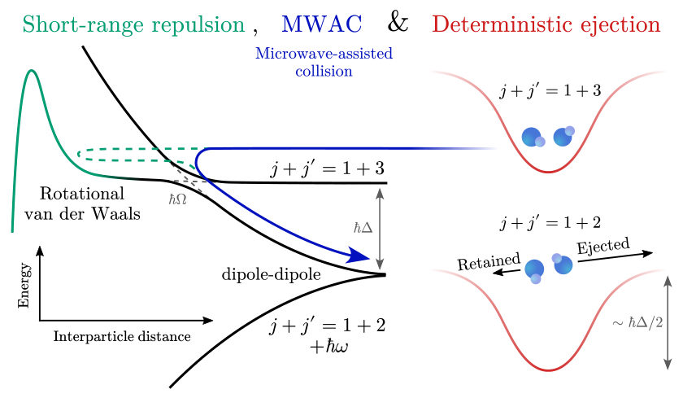 
FIG. 1. Sketch of a microwave-assisted collision with short-range repulsion and subsequent deterministic ejection. Molecules in rotational states j + j′ = 1 + 3 experience repulsive rotational van der Waals interactions, reducing short-range loss. Dressing the molecule in j = 3 to j = 2 using microwaves creates resonant dipolar interactions between molecules in j = 1 and the dressed state. In a microwave-dressed picture, as sketched here, the coupling due to the Rabi frequency Ωenables the inelastic process as shown in blue, releasing energy set by the detuning ∆. Processes resulting in residual loss from tunneling to the short range or from transitions to other hyperfine states are not...

📷 Fig 2

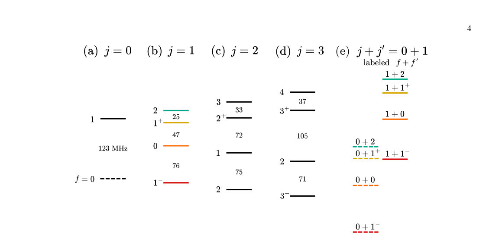 
FIG. 2. CaF hyperfine structure in rotational states (a) j = 0, (b) j = 1, (c) j = 2, and (d) j = 3. Panel (e) shows the hyperfine structure of a pair of molecules in j + j′ = 0 + 1. Here, color and line style encode hyperfine states in j = 0 and j = 1, respectively. The hyperfine intervals are shown in MHz.

📷 Fig 3

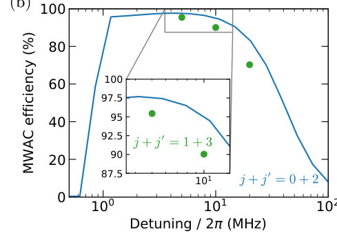 
FIG. 3. Microwave-assisted collision (MWAC) effi- ciency. (a) Efficiency as a function of Rabi frequency Ω and detuning ∆for j + j′ = 0 + 2 with m = m′ = 0. We have assumed a temperature of 5 µK and a microwave field on the transition j = 2 →1. These results do not account for hyperfine structure and tensor Stark shifts. (b) Efficiency for Ω= 1 × 2π MHz, where the blue curve repre- sents the data from (a), as indicated by the blue line. The data points in green are for j + j′ = 1 + 3 in hyperfine states (j, f, mf)+(j′, f ′, m′ f) = (1, 2, 1)+(3, 4, 4), with a microwave field on (j′, f ′, m′ f) = (3, 4, 4) →(2, 3, 3) and tensor Stark shifts set by tweezer depths of ℏ∆/2.

📷 Fig 4

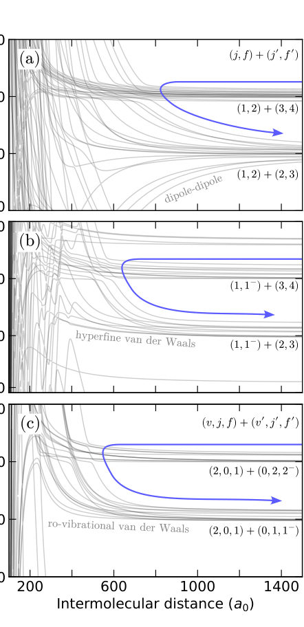 
FIG. 4. Microwave-dressed CaF interaction poten- tials. (a,b) Molecules are in different rotational states with microwave dressing on (j, f) = (3, 4) →(2, 3). (c) Molecules are in different ro-vibrational states with microwave dressing on (v, j, f) = (0, 2, 2−) →(0, 1, 1−). The blue arrows indicate the MWAC trajectories. The three panels show the scenarios where the post-MWAC states experience (a) dipole-dipole, (b) hyperfine van der Waals and (c) ro-vibrational van der Waals interactions. Only L = 0 and 2 are shown here with (a,b) Mtot = 0 and (c) Mtot = 3.

📷 Fig 5

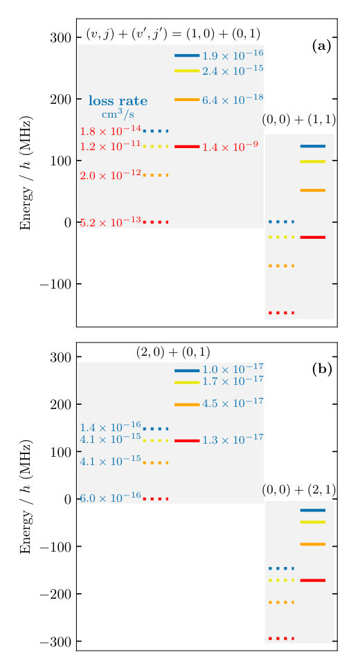 
FIG. 5. Loss rates for shelving in ro-vibrational states. Panels (a) and (b) correspond to shelving in (v, j) = (1, 0) and (2, 0), respectively. Dashed (solid) denote f = 0 (f = 1) of the j = 0 molecule, whereas the colors encode f = 1−, 0, 1+, 2 of the j = 1 molecule, see Fig. 2. Loss rates above 10−14 cm3/s are highlighted in red, indicating loss is not suppressed suffi- ciently to completely eliminate background collisional loss.

**Summary.** The paper presents a method to deterministically load molecular arrays into optical tweezers using microwave-assisted collisions (MWAC). By utilizing repulsive van der Waals interactions in specific molecular states, the authors suppress lossy collisions and engineer controlled energy release to eject molecules sequentially. This approach paves the way for scalable quantum simulators with predicted filling fractions up to 96%.

**Why it may be interesting.** This work directly addresses a critical bottleneck in molecular quantum simulation platforms by providing an engineered mechanism (MWAC) to overcome inherent collisional losses, making scalable array preparation feasible for studying many-body physics.

Detailed structure

**Main problem.** The primary challenge is achieving deterministic, high-efficiency loading of molecular arrays trapped in optical tweezer lattices for quantum simulation.

**Main result.** By employing microwave-assisted collisions (MWAC) combined with repulsive van der Waals interactions, the authors demonstrate a pathway to achieve filling fractions up to 96%.

**Method.** The methodology involves suppressing lossy short-range molecular encounters by shelving molecules and then using controlled energy release from MWACs to deterministically eject one molecule per collision cycle.

**Model / system.** The system consists of laser-cooled polar molecules trapped in optical tweezer arrays. The process relies on controlling molecular interactions via microwave dressing of rotational states, enabling engineered collisions analogous to light-assisted atomic loading.

**Key observables.** Filling fraction ($\phi_n$), MWAC efficiency, and the final state populations of the loaded molecules.

**Important parameters / regimes.** Microwave detuning ($\Delta$), Rabi frequency ($\Omega$), initial molecular states (rotational/vibrational), and trap depth ($V_0$).

**Assumptions / limitations.** The schemes rely on currently available laser-cooling techniques for polar molecules; the best performance is achieved using ro-vibrational repulsion, which is limited by the excited state lifetime.

**Figures summary.** Figures illustrate the general MWAC process involving repulsive interactions and ejection. Specific figures show the dependence of collision efficiency on $\Omega$ and $\Delta$, and time evolution plots comparing filling fractions for rotational versus ro-vibrational loading schemes.

**Paper structure.** The paper progresses by first identifying the limitations of current molecular loading techniques, then proposing the three-step solution (shelving $	o$ MWAC $	o$ Ejection), detailing the underlying physics using coupled-channels calculations, and finally presenting quantitative results showing high filling fractions achievable with ro-vibrational states.

Abstract

Molecular tweezer arrays offer great prospects for quantum simulation, sensing, and computing, and would benefit from methods that enhance loading efficiency. Whereas light-assisted collisions underpin enhanced loading methods for atomic tweezer arrays, this approach cannot be directly extended to molecular arrays due to collisional loss. We show how this collisional loss can be suppressed by shelving molecules in rotationally or vibrationally excited states, so that a shelved molecule interacts with a newly loaded molecule through a repulsive van der Waals interaction. By introducing microwave assisted collisions, we show how to control the final states and the energy released in a collision between a pair of molecules. Following this controlled collision, one of the two molecules can be ejected, and we explore several strategies for ensuring deterministic ejection. Our schemes rely on currently available techniques for laser-coolable molecules, and we predict achievable filling fractions up to 96%, paving the way for scalable molecular arrays.

[↑ back to top](#top)

### [Experiments with interacting ultracold polar molecules](http://arxiv.org/abs/2607.25519v1)

**Authors:** Philip D. Gregory, Jonathan M. Mortlock, Daniel K. Ruttley, Simon L. Cornish  
**Type:** experiment · **Category:** other · **PDF:** <https://arxiv.org/pdf/2607.25519v1>  
**Analysis basis:** full PDF text, analyzed in chunks
**Topic relevance:** 🔥 `analog quantum simulation` **4/5** · `QC/QI experiment` **2/5** · `correlated cavity matter` **1/5** · `driven-dissipative phase transition` **1/5** · `entanglement & information structure` **1/5** · `non-equilibrium dynamics` **1/5** · `quantum optics experiment` **1/5**

📷 Fig 1

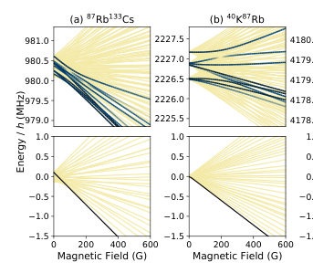 
Fig. 1 Zeeman structure of states with 𝑁= 0, 1 for (a) 87Rb133Cs, (b) 40K87Rb, (c) 23Na87Rb, (d) 23Na40K. In each of the lower panels there is one line coloured black; this is the 𝑁= 0 state that becomes the hyperfine ground state at large magnetic field. In the upper panels, the colouring of the states is codified by the relative transition strength from the hyperfine ground state. Source: (a, b, c, d) adapted from Ref. [92].

📷 Fig 2

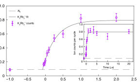 
Fig. 3 Direct measurements of the lifetime of collision complexes for (a) KRb+KRb and (b) KRb+Rb. In each case, the 𝑥axis indicates a time delay between the off-resonant trap light being either (a) switched off completely or (b) suddenly reduced to a lower level and the detection of the complexes via an ionising ultraviolet pulse. For (a), the inset shows the same results but over a larger range of UV delay times. For (b), the level to which the trap light is reduced is indicated by the symbols. Source: (a) is adapted from Ref. [111], (b) is adapted from Ref. [116].

📷 Fig 3

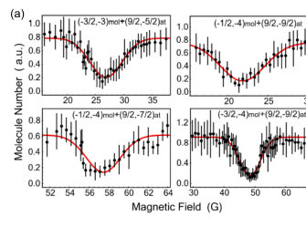 
Fig. 4 Feshbach resonances observed in atom-molecule collisions between NaK and K. (a) In- creased loss of molecules is observed in the experiments as a function of the magnetic field indicating the location of an interspecies Feshbach resonance. Each panel shows results across a different range of magnetic fields. (b) Two possible explanations (red and blue) for the positions of Feshbach resonances observed below 35 G. The black solid lines indicate the energy of the free atom-molecule pair, while the red and blue lines show the energies from two different sets of possible NaK2 bound states. Where the bound states are equal to the free pair, a Feshbach resonance may occur. Source: (a, b)...

📷 Fig 4

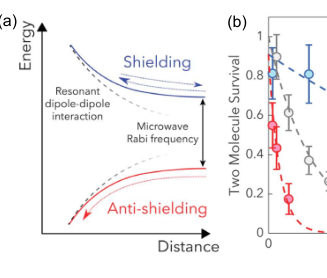 
Fig. 5 Collisional shielding using circularly polarised microwaves, demonstrated between a pair of CaF molecules in the same optical tweezer trap. (a) The presence of the microwaves forms two dressed states that diverge as a function of the intermolecular separation due to the dipole-dipole interaction. Coupling to the upper state results in a repulsive interaction that prevents the molecules from reaching short range and thus suppressing collisional loss, while coupling to the lower state enhances the loss. (b) The lifetime of the molecule-pair in the ground state to those prepared in either of the dressed states. Source: (a, b) are adapted from Ref. [143].

📷 Fig 5

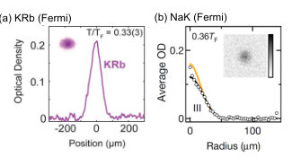 
Fig. 6 Quantum-degenerate Fermi gases of (a) KRb, (b) NaK and Bose-Einstein condensates of (c) NaCs, (d) NaRb realised in experiments. For each, the optical density extracted from absorption images (shown inset) is plotted as a function of position. For (c,d), there are two lines that show fits to the condensate and thermal fractions of the sample, respectively. Source: (a) is adapted from Ref. [155], (b) is adapted from Ref. [144], (c) is adapted from Ref. [151], (d) is adapted from Ref. [152].

**Summary.** This review surveys the experimental progress in harnessing ultracold polar molecules as a platform for quantum science. It details advanced techniques to achieve full quantum control, focusing specifically on managing long-range dipole-dipole interactions and minimizing loss during molecular collisions. The work highlights how these controlled systems can be used for complex quantum simulations.

**Why it may be interesting.** This work sits at the intersection of AMO physics and quantum simulation. The detailed discussion on controlling dipole-dipole interactions via magic wavelengths/angles is crucial for realizing coherent many-body dynamics in molecular systems.

Detailed structure

**Main problem.** Reviewing experimental advances required to achieve full quantum control over ultracold polar molecules for applications like quantum simulation.

**Main result.** The review details successful techniques for controlling molecular collisions, engineering long-range dipolar interactions, and achieving precise internal state manipulation in these systems.

**Method.** The paper reviews various experimental methods, including magnetoassociation, STIRAP transfer, and using optical lattices/tweezers to control interactions.

**Model / system.** The system is ultracold polar diatomic molecules (e.g., bialkali species) possessing rich internal structure and long-range dipole-dipole interactions ($H_{dd}$). Control relies on manipulating rotational and hyperfine states via microwave or optical fields.

**Key observables.** Relative transition strengths, differential light shifts, collision loss rates, and the ability to prepare molecules in specific quantum superpositions.

**Important parameters / regimes.** Dipolar interaction strength ($V_{dd}$), magnetic field strength, laser detuning/wavelength (for magic angles/wavelengths), and temperature regime (ultracold).

**Assumptions / limitations.** The review assumes the applicability of models like the rigid-rotor approximation and relies on external fields to induce or control dipole moments.

**Figures summary.** Figures illustrate Zeeman structures for bialkali molecules showing relative transition strengths versus magnetic field, and potentially show energy level diagrams related to molecular structure.

**Paper structure.** The paper is structured as a review, focusing sequentially on three key areas: 1) Control of ultracold molecular collisions, 2) Engineering dipolar interactions using external fields/lattices, and 3) General internal state control mechanisms.

Abstract

Ultracold polar molecules have emerged as an exciting platform for experiments in quantum science, with many proposed applications seeking to leverage the existence of long-range dipolar interactions and the rich internal structure of long-lived states. However, the complexity of molecules also presents many experimental challenges. In this chapter, we review the experimental advances over the past two decades that have brought ultracold molecules under full quantum control. We focus on three key topics: control of ultracold molecular collisions, engineering dipolar interactions and nascent quantum simulations in optical lattices.

[↑ back to top](#top)

### [Exponential de Finetti Theorems for Fermionic Gaussian States](http://arxiv.org/abs/2607.25779v1)

**Authors:** Jędrzej Burkat, Michał Studziński, Sergii Strelchuk  
**Type:** theory · **Category:** statistical mechanics · **PDF:** <https://arxiv.org/pdf/2607.25779v1>  
**Analysis basis:** full PDF text, analyzed in chunks
**Topic relevance:** 🔥 `entanglement & information structure` **4/5** · `Keldysh / 2PI / non-Gaussian methods` **2/5** · `analog quantum simulation` **1/5** · `correlated / nonlocal dissipation` **1/5** · `driven-dissipative phase transition` **1/5** · `methods for driven-dissipative` **1/5** · `non-equilibrium dynamics` **1/5**

📷 Fig 1

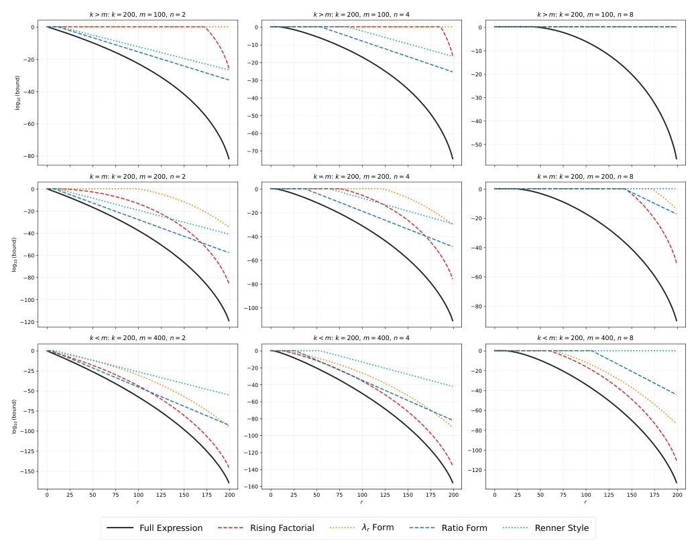 
FIG. 1. Numerical Comparison of Error Bounds. Each subfigure plots upper bounds for δ in Theorem 1 against r. ‘Full Expression’ (black line) denotes Equation (1), which is the most accurate form. ‘Rising Factorial’ and ‘λr Form’ (red and orange lines) denote the two simplified bounds in Equation (2). ‘Ratio Form’ and ‘Renner Style’ (blue and teal lines) denote Equations (3) and (4). For both pairs, dotted lines show simplified expressions for the bounds plotted as dashed lines. Columns display results for different values of n per subsystem H, doubled between each column as prescribed by the purification in Theorem 2. Rows display different regimes: k &gt; m where the partial trace retains...

**Summary.** This theoretical paper proves an exponential de Finetti theorem tailored for fermionic Gaussian states, significantly improving upon previous bounds. It extends the scope from highly symmetric states to all Gaussian-invariant states by utilizing advanced techniques involving replica symmetry and algebraic identities. The result provides a quantitative measure of how close complex quantum correlations are to simple product states.

**Why it may be interesting.** This work provides powerful tools for characterizing entanglement structure in many-body quantum systems by quantifying how close a complex correlated state is to a simple product (i.i.d.) state, which is crucial for understanding thermalization and local measurements in condensed matter physics.

Detailed structure

**Main problem.** The paper aims to prove an exponential variant of the de Finetti theorem for free-fermionic Gaussian states, extending previous results from Gaussian-symmetric to the broader class of Gaussian-invariant states.

**Main result.** They establish that reduced states of Gaussian-invariant fermionic Gaussian states can be approximated by convex combinations of almost-i.i.d. states with an error bound decaying exponentially or super-exponentially in system parameters, achieving polylogarithmic dimensional penalties.

**Method.** The proof combines advanced techniques from quantum information theory, including using Chernoff bounds on overlap variables and establishing algebraic equivalences between different mathematical formulations of the de Finetti theorem via commutation relations involving bridge operators.

**Model / system.** The system under study is fermionic Gaussian states defined on a lattice or set of qubits (Hilbert space $H \cong (\mathbb{C}^2)^{\otimes n}$), analyzed through replicas ($k$) and partial traces ($	ext{Tr}_m$). The theory focuses on symmetries like Gaussian-symmetric and Gaussian-invariant states.

**Key observables.** The primary observable is the error bound $\delta$ quantifying how well a reduced state approximates an i.i.d. mixture; other key elements include overlap variables ($Q$) and bridge operators ($\Lambda_{ab}$).

**Important parameters / regimes.** Key parameters include the number of replicas ($k, m$), the system size ($n$), and the approximation parameter $r$. The analysis highlights different scaling regimes based on the relative sizes of $k$ and $m$.

**Assumptions / limitations.** The results are derived for free-fermionic Gaussian states and rely heavily on specific algebraic properties involving Majorana operators and parity/pair-parity operators.

**Figures summary.** Figure 1 numerically compares upper bounds for the error $\delta$ using different mathematical forms (Full Expression, Rising Factorial, Ratio Form) across various regimes of system parameters ($k>m$, $k=m$, $k<m$).

**Paper structure.** The paper progresses by first establishing the exponential bound for Gaussian-symmetric states (Theorem 1), then extending this to the broader class of Gaussian-invariant states via purification theorems, and finally proving the equivalence between different mathematical formulations of the de Finetti theorem using algebraic identities.

Abstract

We prove an exponential variant of the Gaussian de Finetti theorem: the subsystems of permutation-invariant, free-fermionic Gaussian states are well-approximated by convex combinations of almost-i.i.d. states that are Gaussian on subsets of their parts. Our result provides an error bound between the original state and its approximants that decays exponentially in the number of unconstrained parts, becoming super-exponential when the subsystem under consideration is small. The dimensional penalty of our bound is polylogarithmic in the local Hilbert space dimension, an exponential improvement over the standard de Finetti theorem of [Nat. Phys. 3, 645-649]. In the fully i.i.d. limit, our bound recovers the Gaussian de Finetti theorem of [arXiv:2603.12392]. Previous works considered Gaussian-symmetric states, which are supported on the trivial irrep of the tensor matchgate representation. We extend these to a broader class of Gaussian-invariant states containing, for example, i.i.d. copies of single-replica mixed Gaussian states. We show that Gaussian-invariant states are precisely the partial traces of Gaussian-symmetric states on locally enlarged replicas, and always admit a purification into a larger Gaussian-symmetric state. This extends de Finetti theorems to the full set of Gaussian-invariant states, with only a polynomial overhead in the dimensional penalty of the error bound.

[↑ back to top](#top)

### [Tunable state-dependent interactions in collisionally stable mixtures of polar molecules](http://arxiv.org/abs/2607.25777v1)

**Authors:** Hubert J. Jóźwiak, Hanwei Yang, Eugen Dizer, Arthur Christianen, Tijs Karman  
**Type:** theory · **Category:** other · **PDF:** <https://arxiv.org/pdf/2607.25777v1>  
**Analysis basis:** full PDF text, analyzed in chunks
**Topic relevance:** 🔥 `analog quantum simulation` **4/5** · `exotic spin models in light-matter` **3/5** · `Keldysh / 2PI / non-Gaussian methods` **1/5** · `correlated / nonlocal dissipation` **1/5** · `driven-dissipative phase transition` **1/5** · `methods for driven-dissipative` **1/5**

📷 Fig 1

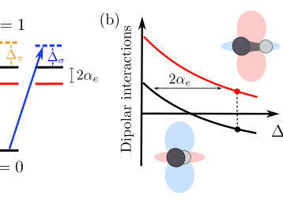 
FIG. 1. State-dependent microwave shielding and tun- able dipolar interactions. (a) Energy-level diagram for the v = 0 (black) and v = 1 (red) vibrational states. Mi- crowave fields (π, σ) couple the j = 0 and j = 1 rotational states. Rotation-vibration coupling effectively increases the microwave detunings (∆σ,π) for the v = 1 state by 2αe. (b) The resulting effective dipolar interactions as a function of ∆π. The 2αe difference shifts the v = 1 (red) curve relative to the v = 0 curve (black), enabling state-dependent dipolar interactions between the ground- and excited-state molecules. The cartoons illustrate the anisotropy of these interactions and the physical effect of the sign reversal...

📷 Fig 2

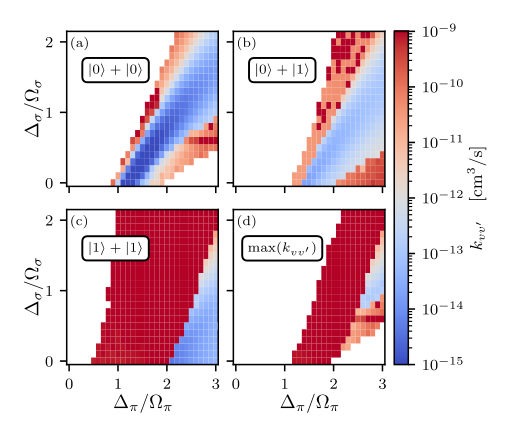 
FIG. 2. Two-body loss rates for bosonic NaCs, derived from the complex s-wave scattering length (see Appendix A). The rates are computed at the optimal overall field strength below Ωtot = 50 × 2π MHz for a π-dominated field configu- ration (Ωσ/Ωπ = 1/4). Panels (a–c) show the optimized loss rates for collisions between identical ground (|0⟩+|0⟩), distin- guishable (|0⟩+|1⟩), and identical excited (|1⟩+|1⟩) molecules, respectively. Panel (d) displays the maximum of these three loss rates, max(kvv′). The white regions are excluded due to the occurrence of field-linked bound states.

📷 Fig 3

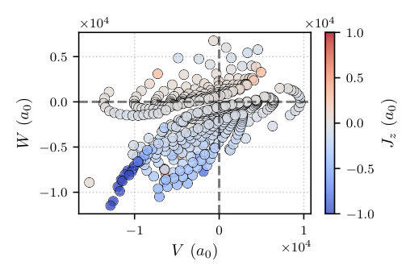 
FIG. 4. Accessible range of the density-density (V ), density-spin (W) and Ising interactions (Jz, see the color scale) for arbitrary microwave configuration where the maxi- mum loss rate, max(kvv′), remains below 10−12 cm3/s.

📷 Fig 4

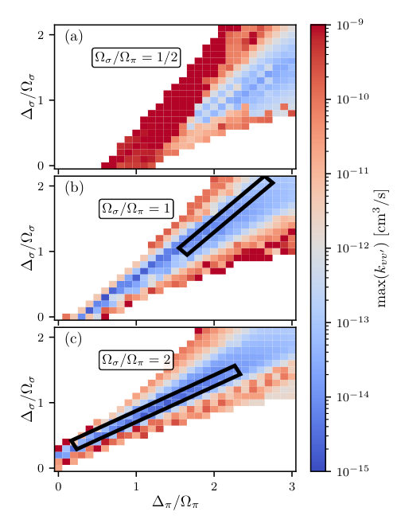 
FIG. 3. The maximum two-body loss rate for various Rabi frequency ratios. The overall field strength is capped at Ωtot = 50 × 2π MHz. Marked in bold are the collisionally stable regions that we investigate in more detail in Fig. 5.

📷 Fig 5

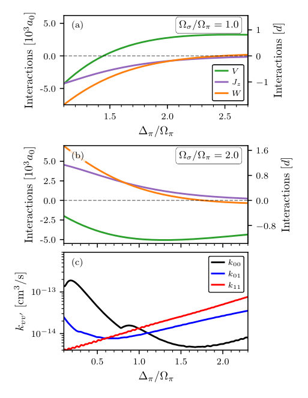 
FIG. 5. Tunability of the model parameters along col- lisionally stable paths. (a, b) Ising (Jz), density-density (V ), and density-spin (W) interactions along the two trajec- tories shown in Fig. 3(b) and Fig. 3(c), respectively. The right vertical axes indicate the interaction strengths scaled by the interparticle distance d ≈4000 a0, corresponding to a bulk gas density of 1014 cm−3. (c) The corresponding two-body loss rates along the trajectory shown in panel (b). The loss rates for the trajectory in panel (a) exhibit similar suppression below 10−13 cm3/s (not shown). The overall field strength is fixed at Ωtot = 20 × 2π MHz.

**Summary.** The authors demonstrate a method to engineer strong, controllable dipolar interactions between polar molecules by utilizing microwave dressing on their vibrational states. This technique achieves this tunability while simultaneously suppressing inelastic collisional losses across all relevant collision channels. The result opens a robust platform for simulating complex quantum magnetic and correlated electron models in the ultracold regime.

**Why it may be interesting.** This work provides a highly controlled mechanism for generating tunable, long-range anisotropic interactions in ultracold quantum gases, directly enabling simulations of complex models like extended Hubbard and $t$-$J_z$ models using molecular platforms.

Detailed structure

**Main problem.** To realize a unified platform for quantum simulation that provides strong, directly tunable state-dependent interactions while maintaining collisional stability in ultracold polar molecules.

**Main result.** The proposed microwave dressing scheme successfully generates highly tunable dipolar Ising ($J_z$), density-density ($V$), and spin-density ($W$) interactions while suppressing two-body losses below $10^{-13} 	ext{ cm}^3/	ext{s}$.

**Method.** Theoretical modeling using coupled-channel quantum scattering calculations to determine loss rates, combined with microwave dressing theory to engineer state-dependent long-range dipolar couplings.

**Model / system.** The system involves a mixture of polar molecules whose pseudo-spin is encoded in the vibrational ground ($v=0$) and first excited ($v=1$) states. Microwave fields are used to induce controlled, anisotropic interactions between these molecular states.

**Key observables.** Tunable interaction strengths ($J_z, V, W$), two-body collisional loss rates ($\max(k_{vv'})$), and scattering lengths ($\alpha_{vv'}^s$).

**Important parameters / regimes.** Microwave detuning ratios ($\Delta/\Omega$) and Rabi frequency ratios ($\Omega_\sigma/\Omega_\pi$); the interaction length scales relative to interparticle spacing ($d$).

**Assumptions / limitations.** The initial analysis focuses on the $v=0$ and $v=1$ subspace, though extension to higher vibrational manifolds is suggested.

**Figures summary.** Figures illustrate energy level diagrams (Fig. 1), map out stable regions in loss rate vs. detuning ratios (Fig. 3), show accessible parameter space for interactions ($J_z, V, W$) under stability constraints (Fig. 4), and trace tunable paths along these parameters.

**Paper structure.** The paper establishes the physical platform using microwave dressing to engineer state-dependent dipolar interactions. It then rigorously calculates collision loss rates to ensure stability across various tuning paths, culminating in mapping out the parameter space where strong, controllable interactions can be achieved without significant inelastic decay.

Abstract

We propose encoding a pseudo-spin-$1/2$ system in the ground ($v=0$) and first excited ($v=1$) vibrational states of polar molecules. Double microwave shielding simultaneously shields molecules in both states, suppressing two-body losses by orders of magnitude while strictly avoiding three-body recombination. The microwave dressing is state-dependent and results in highly tunable, long-range dipolar Ising exchange ($J_z$), density-density ($V$), and spin-density ($W$) interactions. These interaction length scales readily exceed the typical interparticle spacing, pushing the molecules deep into the strongly interacting regime. In bulk gases, this enables the exploration of itinerant quantum magnetism and quantum droplets with novel anisotropic spin textures; in optical lattices, it naturally realizes extended Hubbard and $t$-$J_z$ models, opening new directions in quantum simulation.

[↑ back to top](#top)

### [Quantum teleportation over a field-deployed hollow-core fibre network](http://arxiv.org/abs/2607.25352v1)

**Authors:** Ri-Yao Song, Ya-Zhou Zhao, Yun-Ru Fan, Yang-Bin Ma, Yan-Yu Wei, Si Shen, Hao Li, Li-Xing You, Kai Guo, Guang-Can Guo, Qiang Zhou  
**Type:** experiment · **Category:** quantum information and computing · **PDF:** <https://arxiv.org/pdf/2607.25352v1>  
**Analysis basis:** full PDF text, analyzed in chunks
**Topic relevance:** 🔥 `QC/QI experiment` **4/5** · `quantum optics experiment` **3/5** · `interference shaping light` **1/5** · `quantum measurements` **1/5**

📷 Fig 1

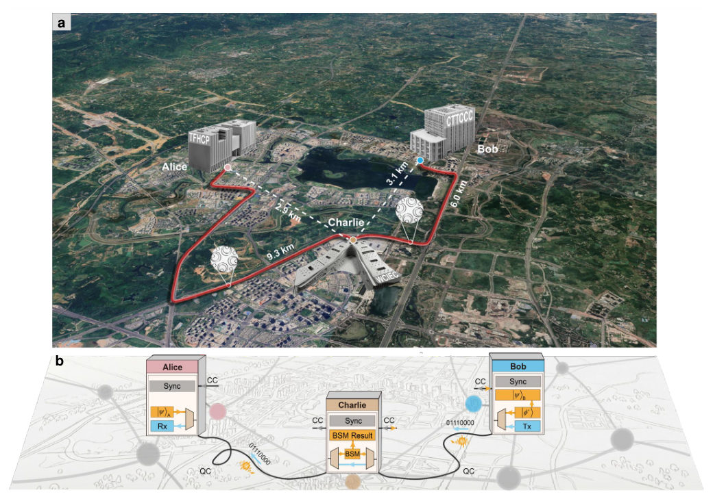 
FIG. 1. Deployed hollow core fibre (HCF) quantum teleportation network with classical data. a, Aerial view of the field- deployed metropolitan HCF network in Chengdu. Alice is located at Tianfu Haichuang Park (TFHCP), Bob at China Telecom Tianfu Cloud Computing Center (CTTCCC), and Charlie at Western China International Expo City (WCIEC). The three nodes are interconnected by deployed HCF links of 9.3 km between Alice and Charlie and 6.0 km between Bob and Charlie, respectively. b, Conceptual diagram of the deployed HCF quantum teleportation system with co-propagating classical data. Alice prepares time-bin qubits |ψ⟩A and sends them to Charlie through the HCF quantum channel (QC). Bob...

📷 Fig 2

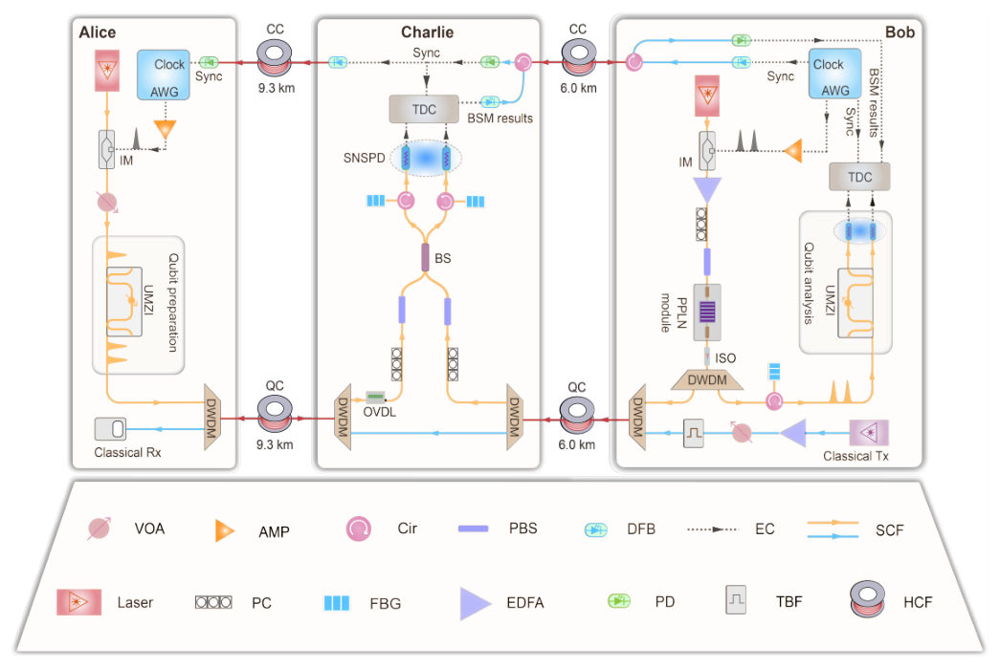 
FIG. 2. Schematics of experimental setup. At Alice, laser pulses with a repetition rate of 500 MHz and a pulse width of 70 ps are sent through an unbalanced Mach-Zehnder interferometer (UMZI) with a path delay of 625 ps to prepare time-bin qubits in a superposition of early and late temporal modes. The drive signal of the intensity modulator (IM) is generated by an arbitrary waveform generator (AWG), amplified by an amplifier (AMP), and synchronized with Bob’s clock through CC. After modulation, the optical power is attenuated to the single-photon level by a digital variable optical attenuator (VOA). The prepared qubits are multiplexed into a 9.3-km HCF QC to Charlie using a dense...

📷 Fig 3

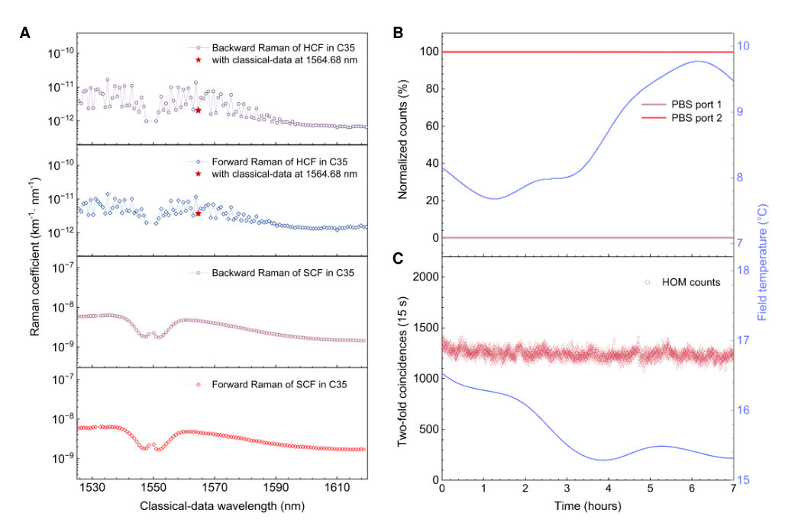 
FIG. 3. Characterization of the deployed HCF links. a, Raman scattering coefficients measured at the quantum channel wavelength of 1549 nm as the classical-data wavelength is scanned from 1525 to 1615 nm. The upper two panels show the HCF results for backward scattering from the Alice-Charlie link and forward scattering from the Bob-Charlie link, which are the Raman noise components that enter the BSM and can affect the teleportation performance. The lower two panels show the corresponding measurements in SCF, which exhibit Raman scattering coefficients approximately three orders of magnitude higher than those of HCF. b, Passive polarization stability. A linearly polarized photon stream is...

📷 Fig 4

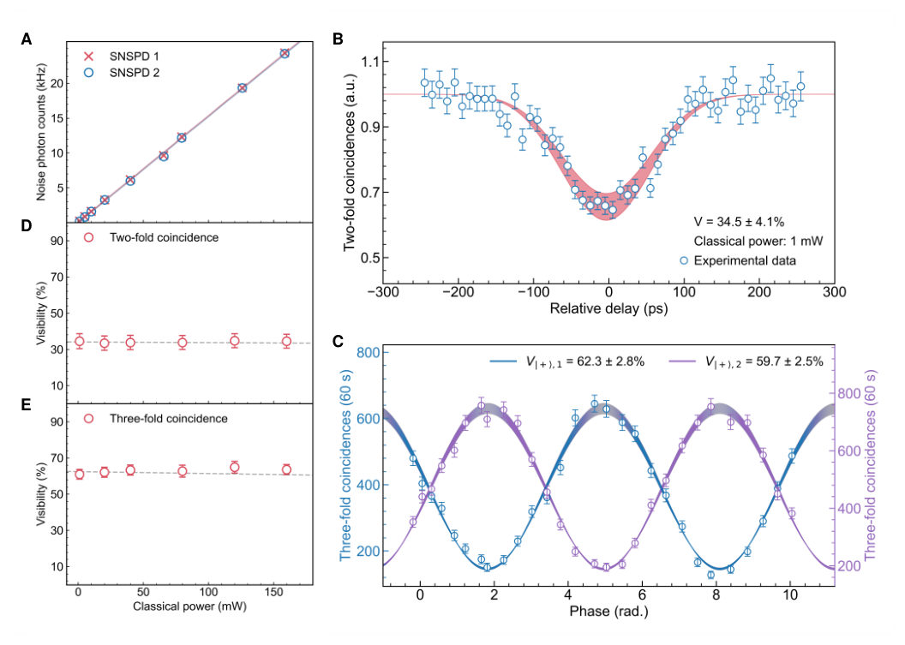 
FIG. 4. Quantum interference and teleportation under quantum-classical coexistence. a, Noise photon count rate measured by the two SNSPDs at Charlie as a function of the launched classical coexistence power. b, HOM interference measured at Charlie under a launched classical coexistence power of 1 mW. The fitted visibility is 34.5±4.1%. c, Teleportation of a equatorial state under the same coexistence power. The purple and blue circles show the three-fold coincidence counts from the two output ports of Bob’s UMZI as a function of Bob’s analysis phase, with the average visibility of 61.0 ± 2.7%. d, Visibility of HOM interference as a function of the launched classical coexistence power. e,...

📷 Fig 5

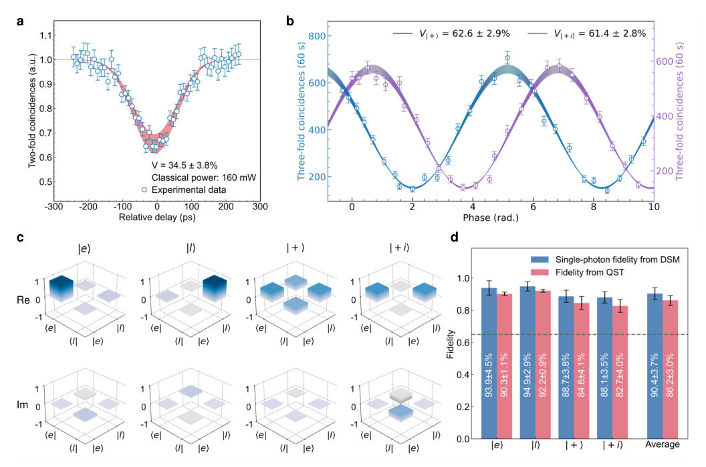 
FIG. 5. Quantum teleportation coexisting with classical launch power of 160 mW. a, HOM interference with a visibility of 34.5 ± 3.8%. b, Teleportation of the equatorial states. The purple and blue circles represent the three-fold coincidence counts for states |+⟩and | + i⟩, respectively, from a single output of the UMZI at Bob. The average visibility of the fitting curves is 62.0±2.9%, indicating the coherence property of Alice’s state is successfully teleported to the signal photons. c, Reconstructed density matrices of the teleported states |e⟩, |l⟩, |+⟩, and |+i⟩. The upper and lower panels show the real and imaginary parts, respectively. The state labels denote the states expected after...

**Summary.** This paper demonstrates quantum teleportation over a metropolitan network built using Hollow-Core Fibre (HCF). By showing that HCF drastically reduces noise compared to standard fibers, the authors establish a robust framework for coexisting quantum and classical data streams. This paves a practical path toward realizing scalable, field-deployable quantum internet infrastructure.

**Why it may be interesting.** This work provides a crucial experimental blueprint for scaling quantum networks by solving the critical engineering problem of integrating fragile quantum signals with high-power classical communication channels using novel fiber platforms like HCF.

Detailed structure

**Main problem.** The primary challenge is achieving high-fidelity quantum teleportation over real-world, deployed fiber optic networks while simultaneously coexisting with intense classical data traffic.

**Main result.** The authors successfully demonstrated robust quantum teleportation using a field-deployed Hollow-Core Fibre (HCF) network, showing that HCF significantly suppresses noise compared to solid-core fibers.

**Method.** They implemented the quantum teleportation protocol using time-bin qubits and Bell-State Measurement (BSM), characterizing performance under high classical power levels up to 160 mW.

**Model / system.** The experiment utilizes a metropolitan HCF network connecting three nodes. The system involves generating entangled pairs, performing BSM at an intermediate node, and transmitting quantum states over the deployed fiber infrastructure.

**Key observables.** Three-fold coincidence rates, teleportation fidelities ($\langle F^{(1)}
angle$), Raman scattering coefficients (HCF vs. SCF), and polarization/HOM interference stability over time.

**Important parameters / regimes.** Classical launch powers up to 160 mW; noise suppression factor of approximately three orders of magnitude compared to standard fibers.

**Assumptions / limitations.** The success relies on the HCF's ability to maintain long-term indistinguishability and exhibit significantly lower Raman noise, enabling a classical-data-compatible framework.

**Figures summary.** Figures illustrate the deployed network topology in Chengdu, experimental setups detailing qubit generation and BSM integration with DWDM classical channels, and characterization plots comparing Raman scattering coefficients between HCF and SCF.

**Paper structure.** The paper details the physical setup (HCF deployment), the quantum protocol implementation (teleportation via BSM), rigorous performance testing under noise/classical load, and comparison of results against theoretical limits.

Abstract

When a photon and one member of an entangled photon pair are jointly projected onto a Bell-state measurement (BSM), the quantum state of the photon can be transferred to the distant partner of the pair without physically transmitting this information carrier. In real-world deployment, however, teleportation performance is fundamentally bottlenecked by quantum channel impairments, such as loss, noise, and fluctuations, which induce severe decoherence and degrade fidelity. This vulnerability is further exacerbated in scenarios with intense classical data traffic or background light. Realizing scalable quantum networks, therefore, hinges on developing advanced channel architectures capable of supporting both high-fidelity quantum operations and high-capacity classical communications within a shared infrastructure. Towards this end, hollow core fibre (HCF) offers a promising quantum channel resource by combining free-space-like weak light-matter interaction with the stability of fibre-based systems. Here, utilizing a field-deployed metropolitan HCF network spanning three spatially separated nodes in Chengdu, we achieve quantum teleportation with an intermediate BSM under co-propagating classical traffic. Crucially, the HCF links preserve the long-term indistinguishability of photonic qubits without active stabilization, and exhibit a Raman noise approximately three orders of magnitude lower than that of standard solid-core counterparts. This noise suppression enables robust quantum teleportation even alongside classical launch powers up to 160 mW. Our findings establish a classical-data-compatible framework for quantum networking over deployed fibre infrastructure and offer a wavelength-agnostic, plug-and-play, and free-running pathway toward the quantum internet.

[↑ back to top](#top)

### [Entanglement asymmetry in the gapped XYZ spin-$\frac12$ chain](http://arxiv.org/abs/2607.25625v1)

**Authors:** Felipe Taha Sant'Ana  
**Type:** theory · **Category:** statistical mechanics · **PDF:** <https://arxiv.org/pdf/2607.25625v1>  
**Analysis basis:** full PDF text, analyzed in chunks
**Topic relevance:** 🔥 `entanglement & information structure` **4/5** · `analog quantum simulation` **1/5** · `exotic spin models in light-matter` **1/5** · `non-equilibrium dynamics` **1/5** · `non-equilibrium universality` **1/5**

📷 Fig 1

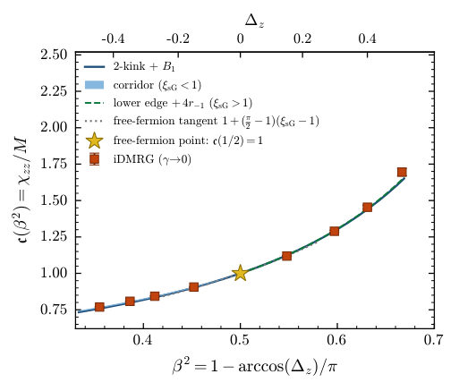 
FIG. 1. The universal coefficient c(β2) = χzz/M. Line: the two-kink+B1 evaluation, Eqs. (5)–(6), a lower bound on c (the B1 component exists only for β2 &lt; 1 2). Shaded band: the two-sided corridor, Eq. (7), for ξsG &lt; 1 (sub-symbol on this scale); dashed: the corridor’s lower edge c2k + 4r−1 for ξsG &gt; 1; dotted: the free-fermion tangent, Eq. (8). Squares: iDMRG determinations χzz/Mexact at eight couplings, using the exact mass, extrapolated to γ →0 (SM Table 1).

📷 Fig 2

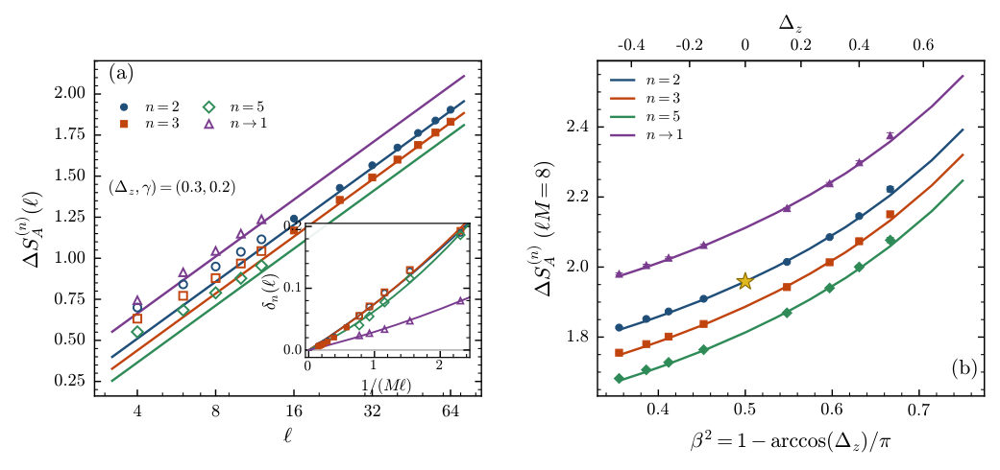 
FIG. 2. The R´enyi entanglement asymmetry ∆S(n) A itself, resolved in replica index and coupling. (a) ∆S(n) A (ℓ) versus interval length at the interacting point (∆z, γ) = (0.3, 0.2) for n = 2, 3, 5 and the von Neumann limit n →1. Symbols are iMPS data: open, from interval reduced density matrices with charge projectors (ℓ≤12); filled, from the charged-moment construction (ℓ= 16–64, n = 2, 3). Lines correspond to the master formula Eq. (4). Inset: deviation δn(ℓ) ≡∆S(n) A (ℓ) −[ 1

📷 Fig 3

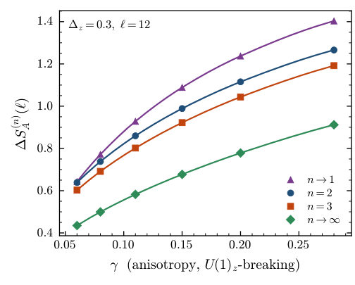 
FIG. 3. ∆S(n) A (ℓ) for a fixed interval (∆z = 0.3, ℓ= 12) versus the anisotropy γ that controls the explicit U(1)z breaking. Colors vary at different R´enyi indexes n.

**Summary.** The authors calculate the entanglement asymmetry in the gapped XYZ spin chain by linking it to the static susceptibility via a charged-moment identity. They combine theoretical results from sine-Gordon form factors with numerical iDMRG simulations to derive a universal master formula for this asymmetry. This work provides a rigorous quantitative measure of symmetry breaking encoded in quantum entanglement.

**Why it may be interesting.** This work provides deep insights into how entanglement measures quantify symmetry breaking in quantum many-body systems, connecting concepts from critical phenomena (CFT/sine-Gordon) with modern tools like entanglement entropy calculations.

Detailed structure

**Main problem.** The paper aims to measure entanglement asymmetry ($\Delta S_A$) and determine its universal amplitude in a gapped phase of the XYZ spin-$rac12$ chain where U(1) symmetry is broken.

**Main result.** They derive a master formula for $\Delta S_A^{(n)}(\ell)$ involving logarithmic growth, providing a lower bound on the universal amplitude $c$ via two-kink and one-breather contributions.

**Method.** The calculation combines a charged-moment identity with a non-conservation sum rule derived from sine-Gordon form factors, which are then validated using infinite-system iDMRG simulations.

**Model / system.** The system is the XYZ spin-$rac12$ chain Hamiltonian in its gapped, U(1)-breaking phase. The analysis utilizes concepts from conformal field theory (sine-Gordon model) and quantum entanglement measures.

**Key observables.** Entanglement Asymmetry ($\Delta S_A$), Static Susceptibility ($\chi_{zz}$), Kink mass ($M$), Universal amplitude $c(eta^2)$.

**Important parameters / regimes.** Anisotropy parameter $\gamma$, replica index $n$, interval length $\ell$, and the coupling constant related to the sine-Gordon model ($\xi_{sG}$).

**Assumptions / limitations.** The calculation relies on a charged-moment identity, treating the system in the continuum limit via the sine-Gordon model, and assuming the leading asymptotic behavior of the entanglement entropy.

**Figures summary.** Figures illustrate the comparison between iDMRG results and theoretical bounds for $c(eta^2)$, show the convergence of $\Delta S_A^{(n)}(\ell)$ to a master formula as interval length increases, and plot the rise of $\Delta S_A^{(n)}(\ell)$ with increasing anisotropy $\gamma$.

**Paper structure.** The paper proceeds by establishing the charged-moment identity linking asymmetry to susceptibility. It then evaluates this susceptibility using form factors (sine-Gordon model) to derive a lower bound on the amplitude, which is finally confirmed and refined through iDMRG simulations.

Abstract

The entanglement asymmetry measures how strongly a symmetry is broken inside a subsystem. Analytic results at equilibrium have so far covered free theories and, perturbatively, the critical XXZ chain. We compute the Rényi entanglement asymmetries of a large interval in the gapped, $U(1)$-breaking phase of the interacting XYZ chain. The calculation combines three ingredients. A charged-moment identity, which we prove for fermionic Gaussian and for injective matrix-product ground states, ties the asymmetry to the static susceptibility of the broken charge. A non-conservation sum rule then evaluates the susceptibility from sine-Gordon form factors, its two-kink and one-breather channels providing a lower bound on the universal amplitude. The Baxter--Johnson--Krinsky--McCoy solution supplies the kink mass for different couplings. Infinite-system density-matrix renormalization group simulations built on these masses reproduce the master formula.

[↑ back to top](#top)

### [Ro-vibrational van der Waals interaction between ultracold polar molecules](http://arxiv.org/abs/2607.25774v1)

**Authors:** Kang Feng, Hanwei Yang, Hubert J. Jóźwiak, Tijs Karman  
**Type:** theory · **Category:** other · **PDF:** <https://arxiv.org/pdf/2607.25774v1>  
**Analysis basis:** full PDF text, analyzed in chunks
**Topic relevance:** 🔥 `analog quantum simulation` **4/5** · `correlated / nonlocal dissipation` **1/5** · `entanglement & information structure` **1/5** · `methods for driven-dissipative` **1/5** · `non-equilibrium dynamics` **1/5**

📷 Fig 1

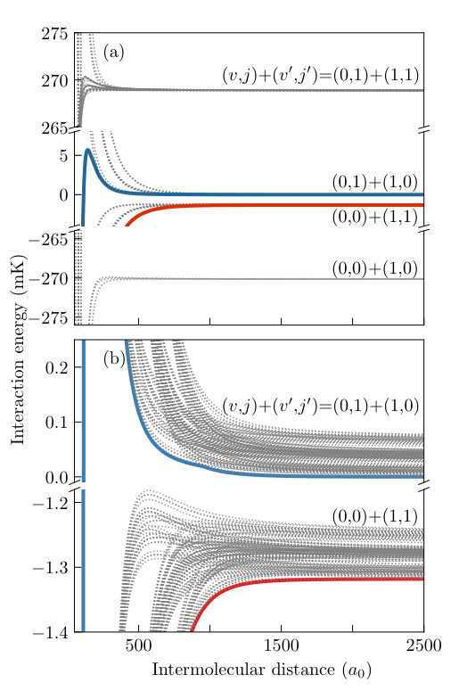 
FIG. 2. Interaction potentials for NaK molecules in- teracting by the ro-vibrational vdW interaction. Illustrated in gray are adiabatic potential curves for different partial waves L = 0, 2, 4, and corresponding to different hyperfine states. The repulsive (attractive) s-wave interaction poten- tials are shown in blue (red) for the channels (v, j)+(v′, j′) = (0, 1) + (1, 0) ((0, 0) + (1, 1)) in the hyperfine ground state. Additional thresholds such as (v, j) + (v′, j′) = (0, 0) + (1, 0) and (0, 1) + (1, 1) are shown to occur at different energies on the scale of the rotational constant, and lead to well separated potential curves. Panel (b) provides an expanded view.

📷 Fig 2

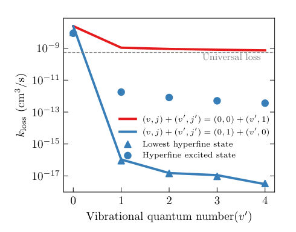 
FIG. 3. Rotation-vibration state dependence of the loss rate for fermionic NaK at 1 nK and a magnetic field B of 500 gauss. At this B field, the lowest hyperfine is mINa = 3/2, mIK = −4 and MF = −5/2 or −3/2 for j = 0 or 1, respectively. The excited hyperfine state shown is |mINa, mIK, mF ⟩= |3/2, −3, −3/2⟩for j = 0, and |3/2, −4, −7/2⟩for j = 1.

📷 Fig 3

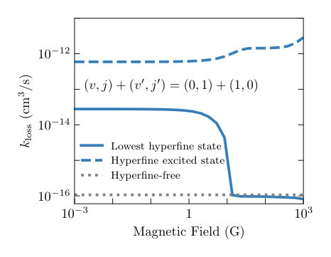 
FIG. 4. Magnetic field dependence of collisional loss rate for fermionic NaK molecules in the lowest and excited hyperfine states of (v, j)+(v′, j′) = (0, 1)+(1, 0) as a function of magnetic field at 1 nK. Near B = 20 G, the loss rate for the lowest hyperfine state exhibits a suppression of approximately two orders of magnitude, while the excited hyperfine state shows a slight increase.

📷 Fig 4

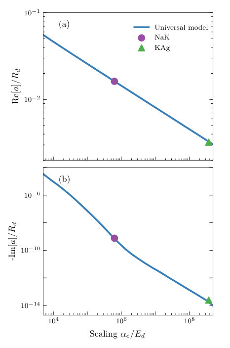 
FIG. 5. Universal scaling of the scattering length for ro-vibrational van der Waals repulsion. The universal relation is calculated in a minimal model that only accounts for the pair states (v, j) + (v′, j′) = (0, 1) + (1, 0) to (0, 0) + (1, 1), split by 2αe, see main text. Panels (a) and (b) shows the real and imaginary part of the scattering length, respectively. The scattering length is expressed in dipolar length units, and shown as a universal function of the dimensionless parameter αe/Ed. Markers indicate the results of full coupled-channels calculations for NaK and KAg, and the agreement with the minimal model verifies the universality.

📷 Fig 5

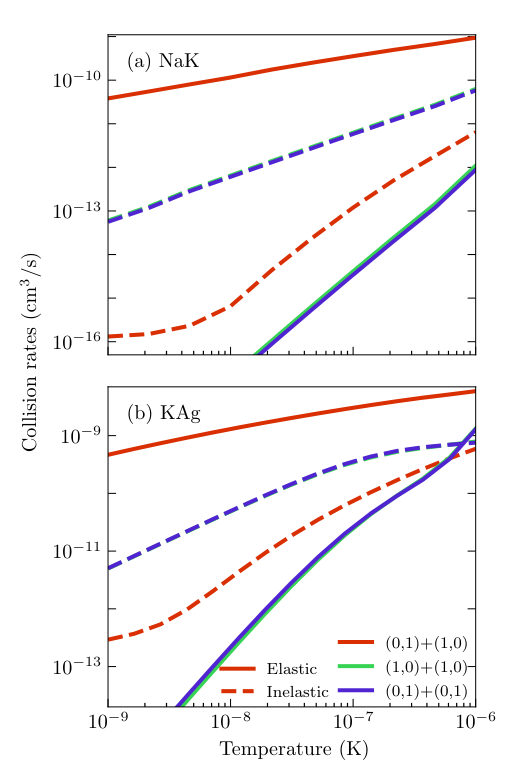 
FIG. 6. Collision rates in a Fermi mixture for various pairs of rotational-vibrational state of (a) NaK and (b) KAg as a function of temperature.

**Summary.** The paper develops a theoretical framework to calculate the ro-vibrational van der Waals interaction in ultracold polar molecules. It finds this specific interaction is unusually strong, allowing for novel applications such as evaporative cooling and controlled state manipulation without external field shielding. This opens new avenues for quantum simulation using molecular gases.

**Why it may be interesting.** This work directly addresses controllable, state-dependent long-range interactions in molecular systems, which is crucial for building quantum simulators or studying fundamental many-body physics in a highly tunable platform.

Detailed structure

**Main problem.** The study focuses on theoretically describing and harnessing the ro-vibrational van der Waals (vdW) interaction between ultracold polar molecules.

**Main result.** This novel ro-vibrational vdW interaction is predicted to be significantly stronger than other molecular interactions, enabling advanced quantum control techniques like evaporative cooling without external shielding.

**Method.** The analysis employs second-order perturbation theory applied to the dipole-dipole interaction Hamiltonian, utilizing the Dunham expansion for energy levels.

**Model / system.** The system involves ultracold polar molecules in different ro-vibrational states $(v, j)$. The interactions are governed by the anisotropic dipole-dipole coupling and anharmonicity effects.

**Key observables.** Interaction strength ($C_6$), collision dynamics (elastic vs. inelastic loss), and state-dependent interaction coefficients.

**Important parameters / regimes.** Molecular constants like rotational/vibrational frequencies ($\omega_e, B_e$) and the ro-vibrational coupling constant ($\alpha_e$).

**Assumptions / limitations.** The primary assumption is that the anharmonicity of the potential leads to a non-resonant dipolar interaction (ro-vibrational vdW) that dominates over purely rotational or hyperfine contributions.

**Figures summary.** Figure 1 illustrates molecular energy levels showing coupling between states due to anharmonicity, which drives the ro-vibrational vdW mechanism.

**Paper structure.** The paper first introduces the physical system and the need for strong interactions. It then develops the theoretical framework by calculating the ro-vibrational coupling constant ($\alpha_e$) using various potential models. Finally, it details the resulting strong vdW interaction and its diverse applications in quantum simulation.

Abstract

We describe the ro-vibrational van der Waals interaction between ultracold polar molecules. This interaction is strong, leading to fast elastic collisions and orders of magnitude suppression of collisional loss. This enables evaporative cooling of Fermi mixtures of molecules in different ro-vibrational states, without active shielding by applying external fields. The scheme is compatible with microwave shielding, where it enables controlled state dependent interactions, opening up new opportunities for quantum simulation and impurity physics. The interaction can also be used to stabilize fermionic molecules in optical lattices, to control interactions in synthetic dimensions, for enhanced tweezer loading, and direct infrared shielding.

[↑ back to top](#top)

### [Realizing Error Suppression in Partially Fault-Tolerant Quantum Simulations with IBM Quantum Computers](http://arxiv.org/abs/2607.24947v1)

**Authors:** Henry Froland, Dorota M. Grabowska, Sebastian Grieninger, Jeremy Hartse, Anne L. Lashbrook, Zhiyao Li, Ziyuan Li, Sarah J. M. Powell, Martin J. Savage, Xiaojun Yao, Nikita A. Zemlevskiy  
**Type:** experiment · **Category:** quantum information and computing · **PDF:** <https://arxiv.org/pdf/2607.24947v1>  
**Analysis basis:** full PDF text, analyzed in chunks
**Topic relevance:** 🔥 `QC/QI experiment` **4/5** · `analog quantum simulation` **1/5** · `methods for driven-dissipative` **1/5** · `quantum measurements` **1/5**

📷 Fig 1

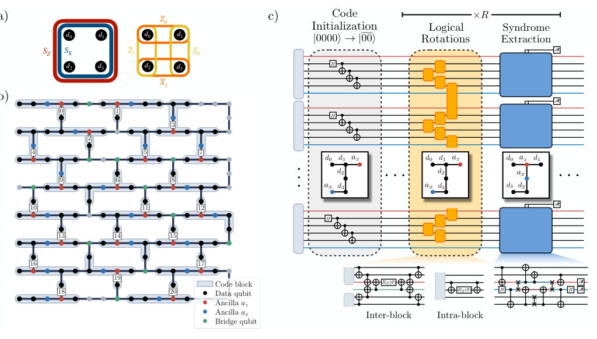 
FIG. 1. Error Detection in Quantum Simulations on Heavy-Hex Topology. a) The stabilizers and logical operators that act on data qubits d0-d3 in the [[4, 2, 2]] error-detecting code. The Z-stabilizer is shown in red and the X-stabilizer is shown in blue. Logical operators are grouped into commuting sets represented by the color. b) The placement of code blocks (grey) onto the ibm boston quantum processor. Each code block has four data qubits (black) and two ancillas for Z- and X-stabilizer extraction (red and blue respectively). Bridge qubits between blocks used for routing are shown in green. c) Circuit operation for encoded quantum simulations. Dashed outlines indicate nFT operations,...

📷 Fig 2

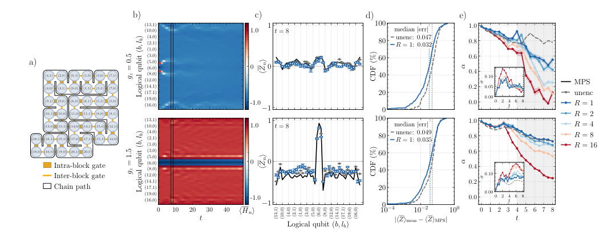 
FIG. 2. Encoded Simulations of Dynamics in the 1D Ising Model. a) The realized logical connectivity grid by the block placement in Fig. 1b). Logical qubits (b, lb) (grey) are joined by intra-block gates (hatched orange) and inter-block gates (orange). The black outline traces the gates used to simulate a 1D chain. b) The energy density ⟨Hn⟩computed from MPS simulations as a function of time t and logical qubit n = (b, lb) for gz = 0.5 (top) and gz = 1.5 (bottom). A size-three true-vacuum bubble located at the center is evolved with nT = 500 Trotter steps of size δt = 0.1. The black rectangle shows the t for which device results are compared in c). c) Comparison of encoded (blue) and...

📷 Fig 3

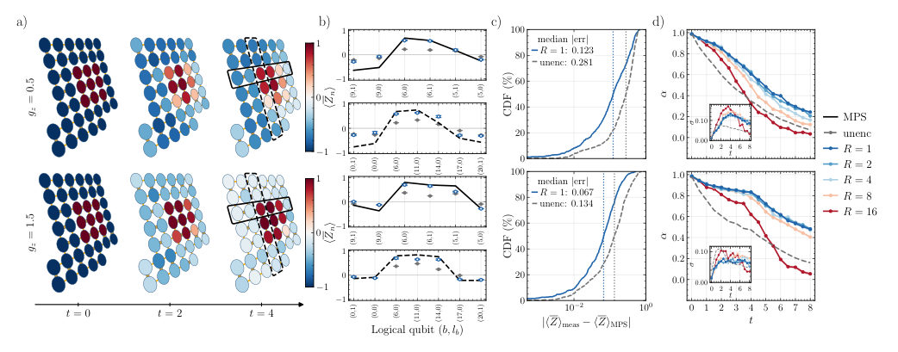 
FIG. 3. Encoded Simulations of the 2D Ising Model. a) The magnetization ⟨Zn⟩of a 3 × 3 true-vacuum bubble as a function of time t for gz = 0.5 (top row) and gz = 1.5 (bottom row), computed from MPS simulations with δt = 0.1. The black solid and dashed rectangles show cross-sections of the grid at t = 4 for which data is plotted in b). b) Encoded (blue) and unencoded (grey) results from ibm boston compared to MPS results (black) for the horizontal (solid) and vertical (dashed) cross-sections outlined in a), as a function of logical qubit number n = (b, lb). The encoded data has R = 1 syndrome measurement rounds. c) Cumulative distribution functions (CDFs) of the per-qubit, per-time absolute...

📷 Fig 4

 
FIG. 4. Encoding Improvement in α. Percent improvement in α of encoded over unencoded results as a function of time t for 1D and 2D simulations. Results with R = 1 syndrome extraction rounds for the melting regime (gz = 0.5) are shown in shades of red, and the localized regime (gz = 1.5) is shown in shades of blue. The shading represents statistical uncer- tainty determined through bootstrap resampling.

📷 Fig 5

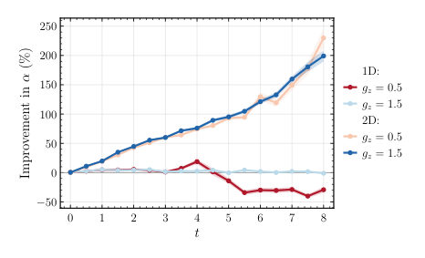 
Figure 4 shows the percentage improvement in α over time for R = 1 in 1D and 2D simulations. The im- provement in the results from runs with encoding grows approximately linearly in 2D, with an average slope of 23.5 ± 0.8% in the melting regime and 22.8 ± 0.5% in the localized regime. Because each caught error prevents corruption over a lightcone volume scaling as O(t2) in 2D compared to O(t) in 1D, detection has greater leverage in 2D and the encoding improvement grows with t. The greater than 200% improvement in 2D is also driven by rapidly decohering unencoded results, as is similarly seen in Fig. 3b). Dynamics at gz = 0.5 and gz = 1.5 are more similar in 2D than in 1D, explaining their...

**Summary.** This paper demonstrates how partially fault-tolerant quantum encoding can significantly boost the accuracy of quantum simulations on current noisy hardware. By using the [[4, 2, 2]] code and an advanced filtering technique called ORP, the authors show substantial improvements in estimating local observables for the Ising model compared to unencoded runs. This work provides a practical roadmap for scaling complex quantum simulations beyond immediate NISQ limitations.

**Why it may be interesting.** This work directly addresses the critical gap between NISQ devices and fault-tolerance by proposing a resource-efficient, intermediate error correction strategy applicable to simulating condensed matter models like the Ising model.

Detailed structure

**Main problem.** The primary goal is to improve quantum simulation performance on noisy, near-term hardware by implementing error suppression techniques.

**Main result.** Partially fault-tolerant encoding significantly outperforms unencoded simulations, showing accuracy improvements of 2-6% in 1+1D and over 200% in 2+1D at late times studied.

**Method.** The authors use a partially fault-tolerant scheme combining syndrome extraction with non-fault-tolerant logical operations, alongside Observable-Ranked Postselection (ORP) for data filtering.

**Model / system.** Simulations focus on the Ising model in 1+1D and 2+1D lattices. The physical implementation uses IBM's superconducting quantum computer (`ibm boston`) with a heavy-hex processor, employing the [[4, 2, 2]] Iceberg code.

**Key observables.** Local observables are estimated; key diagnostics include the logical error rate and the improvement factor in local-observable accuracy.

**Important parameters / regimes.** The comparison is made between unencoded vs. partially fault-tolerant regimes, showing performance gains that scale with circuit depth (especially in 2+1D).

**Assumptions / limitations.** The approach balances error rate improvements from FT against overhead by using a pFT scheme; ORP assumes the optimal cutoff level balances bias reduction against statistical uncertainty inflation.

**Figures summary.** Figure 1a details the structure and stabilizers of the [[4, 2, 2]] code block. Figure 1b shows the placement of these blocks on the ibm boston processor. Figure 1c illustrates the circuit operations involving syndrome extraction and non-FT logical gates.

**Paper structure.** The paper introduces the need for error suppression in quantum simulations, details the use of the [[4, 2, 2]] code block structure, explains the partially fault-tolerant protocol combining FT syndrome measurement with nFT logic, and finally presents results showing quantitative improvements over unencoded baselines using ORP.

Abstract

Quantum error-detecting codes offer a near-term path for improving the performance of quantum simulations on noisy hardware. Using IBM's superconducting quantum computer ibm_boston, we show that partially fault-tolerant encoded quantum simulations of the Ising model in 1+1D and 2+1D outperform their unencoded counterparts in estimating local observables. To represent 42 logical qubits on the heavy-hex quantum processor, 21 blocks of the [[4, 2, 2]] Iceberg code and up to 136 physical qubits are used. By pairing fault-tolerant syndrome extraction with non-fault-tolerant logical operations, this scheme preserves many of the benefits of error detection while avoiding the overhead typically required for a fully fault-tolerant logical gate set. The encoding's square logical connectivity, together with the freedom to place logical qubits within each block, enables simulations of a 2D spatial lattice with lower circuit depth than the unencoded implementation requires. We introduce Observable-Ranked Postselection, a selective-filtering technique based on syndrome correlations that recovers reliable results without the prohibitive shot loss of full syndrome postselection. Under the cumulative effect of device errors, this encoding improves local-observable accuracy over the unencoded baseline by 2-6% at intermediate times in 1+1D simulations, growing with circuit depth to over 200% in 2+1D at the latest times studied.

[↑ back to top](#top)

### [Effect-valued measurement models and contextuality](http://arxiv.org/abs/2607.25900v1)

**Authors:** Samson Abramsky  
**Type:** theory · **Category:** other · **PDF:** <https://arxiv.org/pdf/2607.25900v1>  
**Analysis basis:** full PDF text, analyzed in chunks
**Topic relevance:** 🔥 `quantum measurements` **4/5** · `measurement-induced transitions` **1/5**

📷 Fig 1

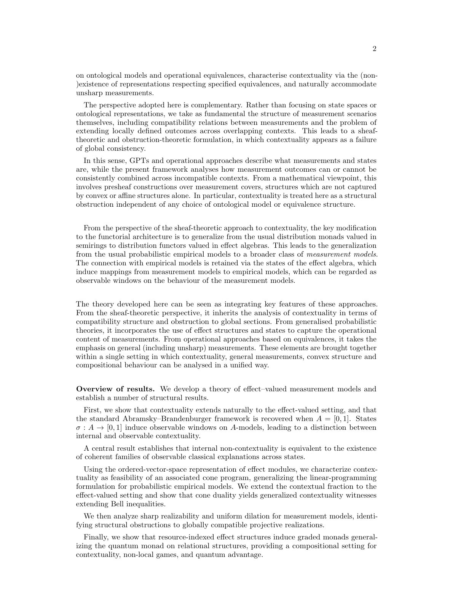 
Low-resolution page preview, page 2

📷 Fig 2

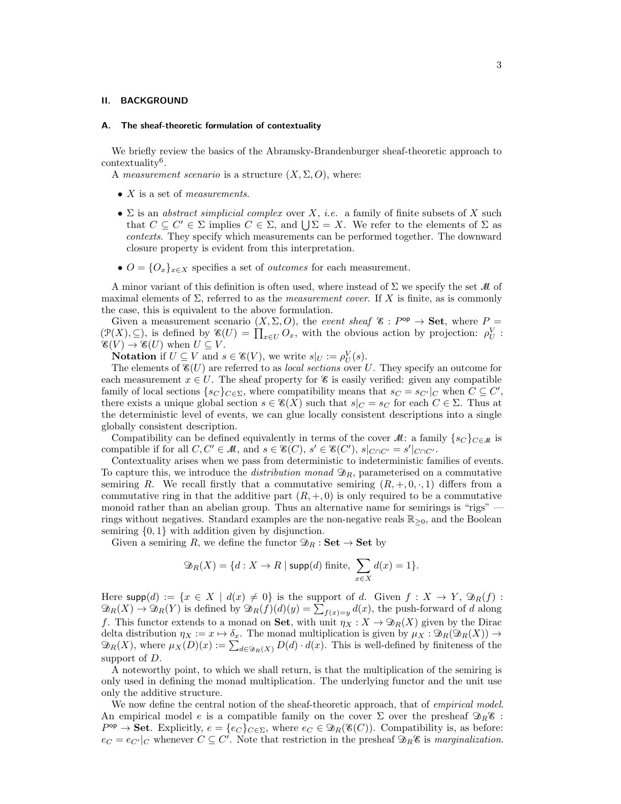 
Low-resolution page preview, page 3

📷 Fig 3

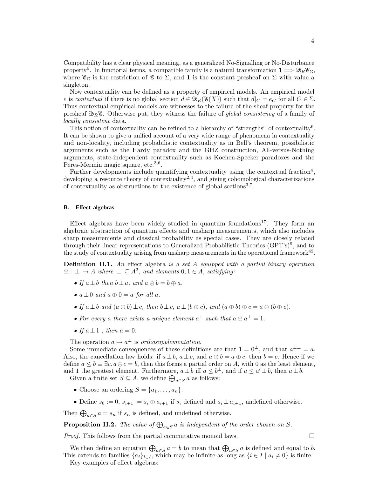 
Low-resolution page preview, page 4

📷 Fig 4

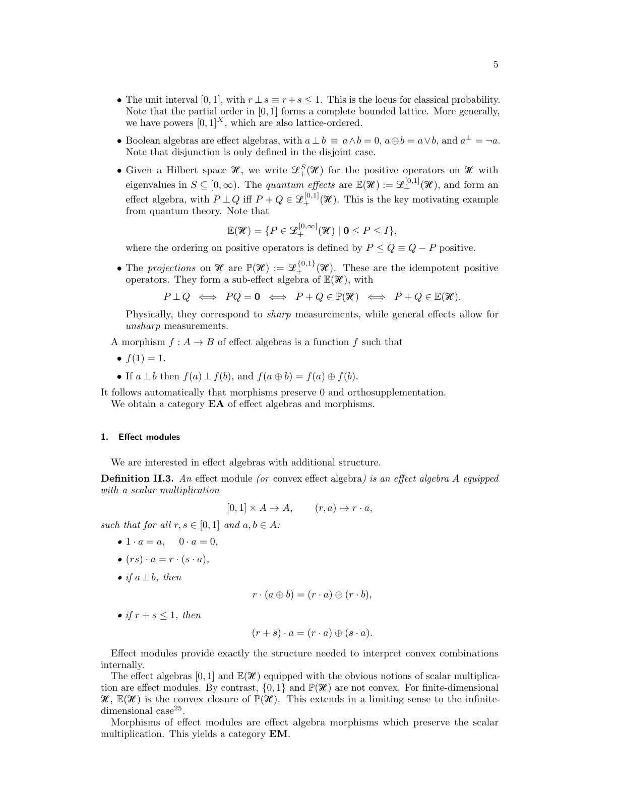 
Low-resolution page preview, page 5

📷 Fig 5

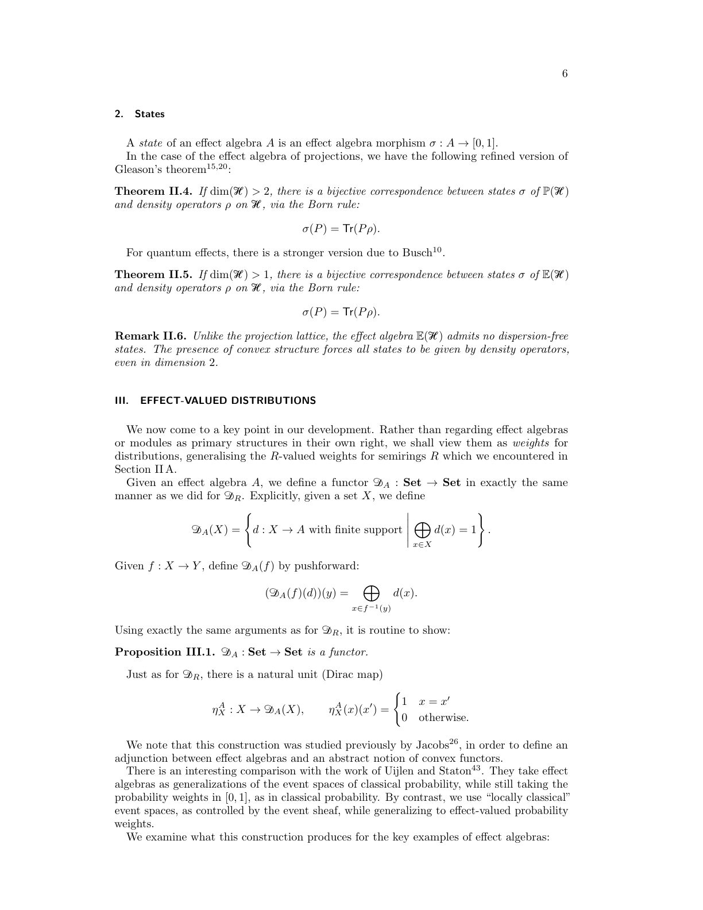 
Low-resolution page preview, page 6

**Summary.** This theoretical paper generalizes the study of contextuality by replacing probability measures with distributions valued in effect algebras. It develops a unified framework that distinguishes between inherent structural contextuality and observable contextuality after measurement outcomes are realized. The methodology uses advanced tools from sheaf theory and convex geometry to derive generalized mathematical criteria for quantum non-contextuality.

**Why it may be interesting.** This work provides a deep mathematical underpinning for understanding measurement limitations in quantum mechanics, connecting abstract algebra (effect algebras) directly to fundamental physical concepts like non-contextuality and resource theories.

Detailed structure

**Main problem.** The paper develops a unified mathematical framework to analyze quantum contextuality by generalizing standard probability-based models to those valued in convex effect algebras.

**Main result.** It establishes a clear distinction between internal contextuality (structural) and observable contextuality (state-dependent), characterizing non-contextuality via generalized cone programs.

**Method.** The authors employ sheaf theory, ordered-vector-space representations of effect modules, and cone duality to generalize linear programming formulations used in classical probability theory.

**Model / system.** The model is the 'effect-valued measurement model,' which replaces standard probability distributions with distributions valued in an effect algebra A. This encompasses probabilistic, deterministic, and general quantum measurements (POVMs).

**Key observables.** Contextuality witnesses (generalized Bell inequalities), observable contextuality, internal contextuality, and the feasibility of associated cone programs.

**Important parameters / regimes.** The structure is governed by the effect algebra A, which abstracts unsharp measurement effects.

**Assumptions / limitations.** It assumes that general measurements can be modeled using convex effect algebras, allowing for a unified algebraic treatment beyond standard quantum probability measures.

**Paper structure.** The paper progresses by generalizing the sheaf-theoretic approach from semirings to effect algebras. It then analyzes contextuality via cone programs and introduces generalized Bell witnesses derived from duality theory, concluding with structural analyses of dilation theorems and monadic constructions.

Abstract

We generalize the Abramsky--Brandenburger sheaf-theoretic treatment of contextuality by replacing probability distributions with distributions valued in a convex effect algebra \(A\). This yields a notion of \(A\)-valued measurement model encompassing probabilistic, deterministic, and quantum measurement structures within a single framework.   States \(σ:A\to[0,1]\) induce ordinary empirical models, allowing observable behaviour to be viewed as arising from effect-valued measurement data. This leads to a distinction between internal contextuality of \(A\)-models and observable contextuality after state evaluation. We analyze the relationship between these notions and identify coherence conditions under which observable classical explanations assemble into internal ones.   Using the ordered-vector-space representation of effect modules, we show that non-contextuality is characterized by feasibility of an associated cone program, generalizing the linear-programming formulation of contextuality in the probabilistic case. We also introduce an effect-valued contextual fraction and study its relation to observable contextuality witnesses. We show how cone duality leads to a notion of Bell witnesses for contextuality as a direct generalization of Bell inequalities.   Finally, we analyze sharp realizability and uniform dilation for measurement models, clarifying the relationship between general POVMs and projective measurements, and show how resource-indexed effect structures induce graded monads generalizing the quantum monad.

[↑ back to top](#top)

### [Sampling hard circuits with verifiably high fidelity](http://arxiv.org/abs/2607.25941v1)

**Authors:** Simon Martiel, Jay-U Chung, Alireza Seif, Soumik Ghosh, Ian Hincks, Abhinav Deshpande, Bill Fefferman, Jay M. Gambetta, Ali Javadi-Abhari  
**Type:** both · **Category:** quantum information and computing · **PDF:** <https://arxiv.org/pdf/2607.25941v1>  
**Analysis basis:** full PDF text, analyzed in chunks
**Topic relevance:** 🔥 `QC/QI experiment` **4/5** · `quantum measurements` **1/5**

📷 Fig 1

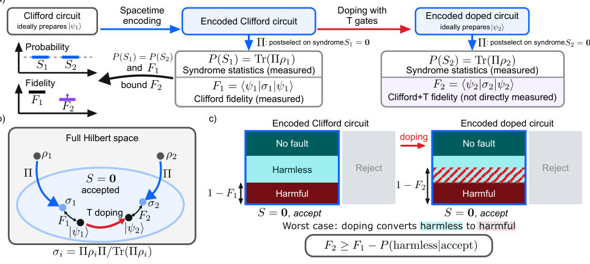 
Figure 1. Bounding the fidelity of hard quantum states. a. An encoded Clifford circuit’s state fidelity F1 and its syndrome distributions S1 are measured efficiently. The circuit is doped with T gates that commute with code stabilizers, yielding statistically indistinguishable syndromes S2. This leads to a lower bound on the fidelity F2 of the (hard) doped circuit. b. The code projects both states to the same subspace, and doping only rotates within this subspace. c. A lower bound on F2 can be efficiently estimated from the classification of Pauli faults affecting the Clifford circuit. The set of rejected faults and the no-fault probability remain invariant with doping. Any loss in fidelity...

📷 Fig 2

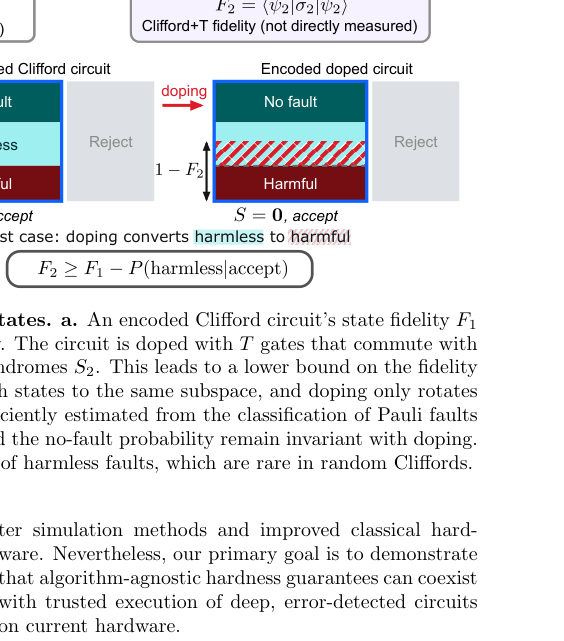 
Figure 1 summarizes how the fidelity certificate is obtained in a DCS workflow. We begin with a ran- dom Clifford circuit, whose output state fidelity can be measured and verified efficiently using direct fidelity estimation (DFE) [20, 21]. Notably, DFE makes no assumptions about hardware noise. We then encode this circuit in a spacetime code, where post-selection on the zero syndrome projects the state into a low-error subspace [22]. Lastly, we increase the amount of non- Cliffordness (“magic”) by carefully doping with T gates while preserving the code structure. This ensures that the two circuits (i.e., before and after doping) detect the same set of faults. We experimentally confirm that...

📷 Fig 3

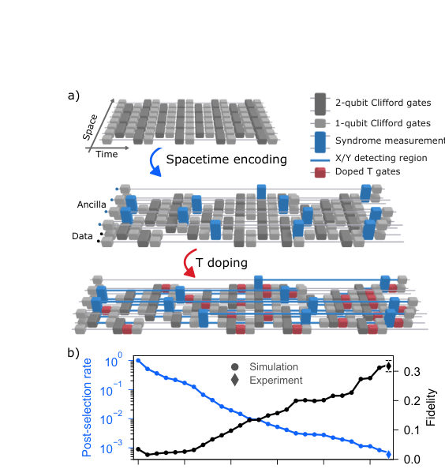 
Figure 2. Constructing doped Clifford circuits within spacetime codes. a. A highly entangling Clif- ford circuit is encoded in a spacetime code and doped with T (Z-rotation) gates on wires not subject to X or Y error detection, producing an encoded state with high entanglement and magic. b. Additional ancillas improve error detection and fidelity at the cost of lower post-selection rates. Pauli-noise simulations agree well with experiment, assuming 0.1% CZ error, idle process fidelity e−t/τ with τ = 100 µs, and 0.3% readout error.

📷 Fig 4

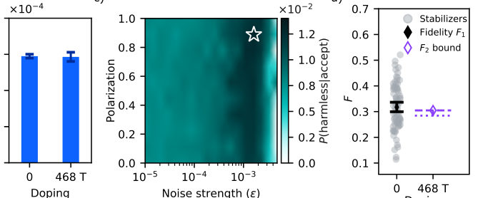 
Figure 3. Quantum advantage experiment with a fidelity bound. a. Qubit layout on the IBM Boston superconducting processor, consisting of 70 data and 27 ancilla qubits. b. Zero-syndrome probability P(accept) is similar before and after doping, consistent with T gates being noiseless. c. Estimated probability of harmless, accepted errors under various noise strengths and polarizations. The maximum possible fidelity drop that doping can cause due to conversion of harmless faults is 0.013(1). d. Direct fidelity estimation of the Clifford state (0 doping) shows fidelity F1 = 0.32(1). We lower bound the fidelity of the hard doped state to F2 ≥0.284 (dotted line), and collect 2,051 post-selected...

📷 Fig 5

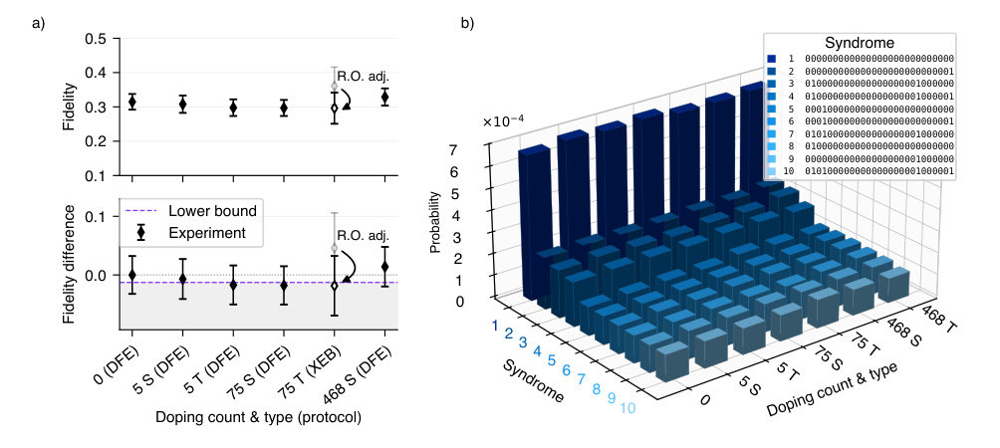 
Figure 4. Validation of fidelity lower bound. a. Various doping counts (5, 75, 468) and types (T or S gates) are chosen that permit efficient measurement of fidelity (DFE) or fidelity proxy (XEB). XEB is known to overestimate fidelity due to readout errors, so we also show a rescaled quantity that controls for this effect. All experiments show that our estimated lower bound accurately captures the maximum loss in fidelity due to doping. Error bars show 95% confidence intervals. b. Syndrome probability distributions show high consistency, regardless of doping strategy. This is consistent with a similar noise environment affecting all experiments, and doping gates being noiseless.

**Summary.** The paper presents a method called Doped Clifford Sampling (DCS) to demonstrate quantum computational hardness while simultaneously addressing hardware noise and verification. By encoding hard circuits into structured quantum codes, the authors achieve high fidelity at deep depths on superconducting qubits. This provides a systematic way to certify quantum advantage claims with quantifiable error bounds.

**Why it may be interesting.** This work directly addresses the gap between theoretical quantum advantage claims (hardness) and experimental reality (noise/verification), providing a concrete framework for certifying computation in NISQ-era devices relevant to AMO platforms like trapped ions or superconducting circuits.

Detailed structure

**Main problem.** The challenge is combining complexity-theoretic hardness (for quantum advantage) with the practical requirements of scalable quantum computation: error suppression and verifiable fidelity.

**Main result.** The authors propose a structured circuit approach that allows for high-fidelity sampling from hard quantum states while providing a device-dependent, quantifiable certificate of experimental fidelity.

**Method.** They introduce 'structured circuits' encoded in quantum codes (spacetime codes) to simultaneously achieve hardness and error correction. Fidelity is certified by measuring code syndromes after syndrome post-selection.

**Model / system.** The work uses a 70-qubit, depth-70 Clifford circuit doped with T gates, implemented on a superconducting quantum processor using 97 physical qubits for encoding in spacetime codes.

**Key observables.** Lower bound on the fidelity (e.g., $\ge 0.284$ at 95% confidence), syndrome measurement distributions, and the required number of physical qubits vs. logical qubits.

**Important parameters / regimes.** Circuit depth (70), number of T gates (468), encoding overhead (97 physical qubits for 70 data qubits), and fidelity lower bound ($\ge 0.284$).

**Assumptions / limitations.** The resulting certificate is device dependent, and the fidelity lower bound relies on assuming a general Pauli noise model attainable by twirling gates.

**Figures summary.** Figures illustrate the workflow of doped Clifford sampling (DCS), comparing measured vs. expected fidelities across doping stages; other figures detail qubit layouts and validation of the fidelity lower bound using DFE.

**Paper structure.** The paper introduces the DCS protocol, demonstrates its application to a large-scale circuit on superconducting hardware, quantifies the resulting fidelity lower bound through syndrome measurements, and compares this approach favorably against existing fidelity benchmarks.

Abstract

Sampling-based proposals are prominent candidates for demonstrating quantum computations beyond the reach of classical supercomputers. However, it has been difficult to combine their complexity-theoretic hardness with two capabilities needed for scalable quantum computing more generally: suppressing hardware errors, and verifying the quantum computation itself. Here we address both issues by introducing structured circuits, which, in addition to provable hardness guarantees, admit an encoding in a quantum code. This allows us to simultaneously reach high fidelities at high circuit depths, and to certify an experimental fidelity via the circuit structure and measurement of code syndromes. The resulting certificate is device dependent, but requires substantially weaker noise assumptions than existing fidelity proxy benchmarks. We demonstrate our proposal with a $70$-qubit, depth-$70$ Clifford circuit doped with $468$ $T$ gates. We use a total of $97$ physical qubits to encode this computation in spacetime codes, effectively suppressing gate error rates by $10\times$ after syndrome post-selection, and yielding a state with a fidelity lower bound of $0.284$ with $95\%$ confidence. Our construction is a systematic method for promoting a stabilizer state to a magic state while keeping an error-detected fidelity certificate.

[↑ back to top](#top)

### [Ultradilute quasi-two-dimensional Bose-Bose liquid mixtures](http://arxiv.org/abs/2607.25558v1)

**Authors:** Leandra Vranješ Markić, Ivan Poparić, Krešimir Dželalija, Petar Stipanović, Jordi Boronat  
**Type:** theory · **Category:** quantum gases · **PDF:** <https://arxiv.org/pdf/2607.25558v1>  
**Analysis basis:** full PDF text, analyzed in chunks
**Topic relevance:** 🔥 `analog quantum simulation` **4/5** · `methods for driven-dissipative` **1/5**

📷 Fig 1

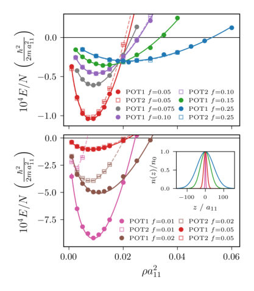 
FIG. 1. Equation of state of the bulk phase for a magnetic field B = 56.337 G and several harmonic confinements de- scribed by the squeezing factor f = az/0.639 µm. The calcu- lations are performed for two different potential models with same scattering length and effective range, showing universal- ity up to f = 0.05. The liquid distribution in the direction of squeezing follows has the single-particle gaussian shape, which is shown in the inset. From wider, to narrower distributions correspond to f=0.25, 0.15, 0.05 and 0.01.

📷 Fig 2

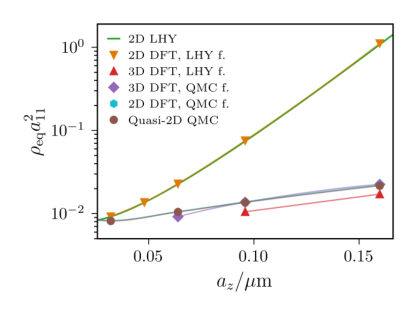 
FIG. 3. The equilibrium densities of the bulk liquid, obtained with quasi-2D QMC calculations are compared to 2D LHY predictions following Ref. [11] and to saturation densities of droplets studied with DFT functionals, as a function of the harmonic oscillator length describing the quasi-2D confine- ment.

📷 Fig 3

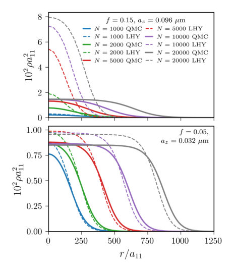 
FIG. 2. Density profiles of droplets obtained with the 2D QMC and 2D LHY functionals compared for two different squeezings f=0.15 (top) and f = 0.05 (bottom), for the mag- netic field B = 56.337 G.

📷 Fig 4

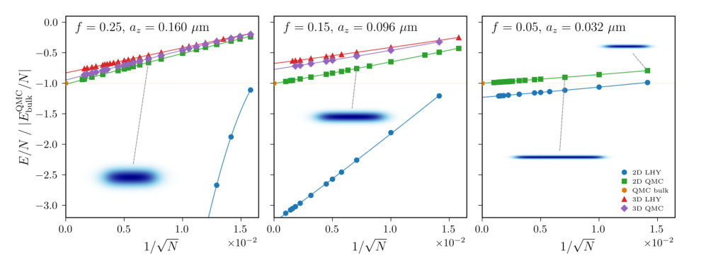 
FIG. 4. Energy per particle of the droplets as a function of N −1/2 calculated with 2D and 3D QMC and LHY functionals, for three different squeezings. The dots at zero x axis correspond to the equilibrium energy in quasi-2D bulk DMC calculation. The insets show the cut through the 3D droplet profile at x = 0 for droplets of size N = 20000 and N = 5000 (for the strongest squeezing only). The z coordinate has been multiplied by a factor of 10 for clarity.

📷 Fig 5

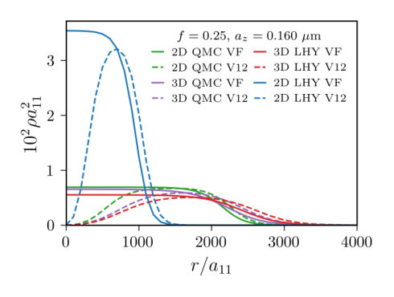 
FIG. 5. Density profiles of droplets with 100000 atoms in a magnetic field B = 56.574 G with f = 0.25 and angular velocity Ω= 2π×10 Hz, without vortex (VF) and with vortex in both components (V12), calculated using different density functionals. Droplet with vortex calculated using 2D LHY functional is metastable.

**Summary.** The research uses Quantum Monte Carlo simulations to model Bose-Bose liquid mixtures confined towards two dimensions. It rigorously tests theoretical functionals against these calculations, finding that while 2D models offer computational savings, they break down rapidly as confinement increases beyond a narrow regime. This work is vital for accurately predicting the behavior of quantum droplets and vortices in highly constrained atomic systems.

**Why it may be interesting.** This work provides crucial benchmarks for modeling strongly interacting ultracold atomic mixtures in quasi-low dimensional geometries, highlighting the limitations of mean-field approximations (like LHY) when full correlation effects are important.

Detailed structure

**Main problem.** The study investigates ultradilute Bose-Bose liquid mixtures confined towards the quasi-two-dimensional (2D) limit to determine the confinement regime where their equations of state exhibit universality.

**Main result.** QMC calculations show that universal descriptions based on two scattering parameters ($a$ and $r_{	ext{eff}}$) are only valid for moderate confinement, suggesting a very narrow range where 2D Lee-Huang-Yang (LHY) functionals are applicable.

**Method.** The study employs Quantum Monte Carlo (QMC) methods at zero temperature to calculate equations of state and develop density functionals, comparing these results against established LHY predictions.

**Model / system.** The system is a mixture of $^{39}	ext{K}$ bosons confined in an external harmonic potential, allowing for the study of crossover from 3D bulk behavior towards ideal 2D physics.

**Key observables.** Equations of state, density profiles (with and without vortices), saturation densities, and droplet energies per particle ($E/N$).

**Important parameters / regimes.** Scattering length ($a$), effective range ($r_{	ext{eff}}$), and the confinement strength quantified by the harmonic oscillator length ($a_z$) or squeezing factor ($f$).

**Assumptions / limitations.** The applicability of 2D LHY functionals is severely limited to a narrow range of confinement, and two scattering parameters are insufficient for describing interactions below a certain confinement threshold.

**Figures summary.** Figures compare energy per particle vs. density showing universality limits (Fig. 1); they also contrast droplet density profiles between QMC and LHY methods across varying confinements (Fig. 2), and show the departure of DMC results from LHY predictions as confinement increases (Fig. 3).

**Paper structure.** The paper develops theoretical frameworks using QMC to calculate equations of state for various confinements, compares these rigorous results against simpler models like the 2D LHY functional, and applies this analysis to predict properties of self-bound quantum droplets.

Abstract

We study ultradilute $^{39}$K Bose-Bose bulk mixtures and droplets in an external harmonic potential that confines them in one spatial direction towards the two-dimensional (2D) limit. Equations of state for several confinements are obtained with quantum Monte Carlo (QMC) at $T=0$, using interaction potentials that include information on the $s$-wave scattering length $a$ and the effective range $r_{\rm eff}$. Performing the calculations using two different interaction potential models we have determined the range of confinements for which equations of state are universal in terms of $a$ and $r_{\rm eff}$. Based on the QMC equation of state, we develop a 2D QMC density functional for each confinement strength and use it together with the local density approximation to determine properties of the self-bound drops. For moderate squeezing, energies and droplet profiles obtained using the 2D QMC functional agree well with those obtained using 3D functionals, while offering a substantial reduction in computational cost, and a consistent approach in crossover to 2D. Noticeably, our results approach 2D mean-field (MF) + Lee-Huang-Yang (LHY) predictions only for the most strongly confined systems for which universality in terms of $a$ and $r_{\rm eff}$ is observed. This implies a very narrow range of confinements for which 2D LHY functionals are applicable, which has important consequences for the study of vortices.

[↑ back to top](#top)

### [Equi-Entropic Maps for Four-Partite Quantum States](http://arxiv.org/abs/2607.25954v1)

**Authors:** Wojciech Bruzda, Zahra Raissi  
**Type:** theory · **Category:** quantum information and computing · **PDF:** <https://arxiv.org/pdf/2607.25954v1>  
**Analysis basis:** full PDF text, analyzed in chunks
**Topic relevance:** 🔥 `entanglement & information structure` **4/5**

📷 Fig 1

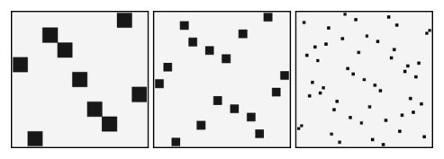 
Figure 1. Three examples of two-unitary centrosymmetric permuta- tion matrices P of size d2 for d ∈{3, 4, 7} which are fixed points of the even branch Ξe. Black squares indicate unities.

📷 Fig 2

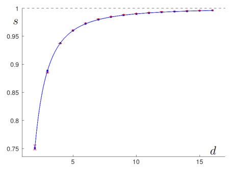 
Figure 2. As the local dimension d tends to infinity, E [S(Ξe(X))], for a Haar-random unitary X ∈U(d2), saturates at 1. The vertical axis indicates the equal-entropy values s = S(Ξe(X)) defined in Sec. II. Squares on the solid line represent theoretical predictions, while dots with error bars (corresponding to the standard error) show the sample means over 256 independent Haar-random unitaries.

**Summary.** This paper introduces an 'equi-entropic map' ($\Xi$) designed to enforce that three specific bipartitions of a four-party quantum state share equal linear entropy, even if the state is not maximally entangled. Using group theory and moment calculations, the authors prove this equi-entropic property holds for the map's output states. The work provides a theoretical framework for quantifying structured entanglement uniformity in multipartite systems.

**Why it may be interesting.** The concept of enforcing entropic uniformity through a structured linear map provides a powerful theoretical tool for characterizing entanglement properties beyond simple maximal entanglement conditions. This has implications for designing robust quantum protocols.

Detailed structure

**Main problem.** The authors investigate a weaker form of entanglement uniformity for four-party quantum systems, requiring three specific bipartitions to share equal linear entropy.

**Main result.** They introduce an 'equi-entropic map' ($\Xi$) whose image states are guaranteed to have equal entropies across the three relevant rearrangements. For large dimensions, this common entropy approaches its maximum value as $O(d^{-2})$.

**Method.** The analysis involves constructing a linear map $\Xi$ using group averaging over reshuffling and partial transposition operators acting on the state tensor. Convergence is analyzed through iterative procedures and moment calculations.

**Model / system.** The system under study consists of four-party quantum states in a composite Hilbert space $H = \mathcal{C}^d \otimes 4$. The analysis relates these states to concepts like Absolutely Maximally Entangled (AME) states and two-unitary matrices.

**Key observables.** Normalized Linear Entropy ($S$), the entropy deficit, and the deviation from maximal mixedness in the Hilbert–Schmidt norm ($\delta_{	ext{HS}}$).

**Important parameters / regimes.** Local dimension $d$, which is analyzed in the asymptotic limit ($d 	o \infty$).

**Assumptions / limitations.** The analysis relies on leading-moment approximations for large dimensions and assumes the existence of specific group structures related to permutations.

**Figures summary.** Figure 2 (mentioned conceptually) shows that for Haar-random unitary inputs, the expected entropy $E[S(\Xi(X))]$ saturates towards 1 as the dimension $d$ increases.

**Paper structure.** The paper progresses from defining highly entangled states (AME) to introducing the map $\Xi$ via group averaging. It then proves the equi-entropic property of the map's image, analyzes its asymptotic behavior for random inputs, and finally relates entropy deficit to distance measures like the HS defect.

Abstract

Absolutely maximally entangled states represent a highly constrained form of multipartite entanglement and play an important role in quantum information theory. We investigate a weaker form of uniformity of entanglement for four-party systems of local dimension $d>2$ that requires the three balanced bipartitions to have equal but not necessarily maximal linear entropy. We introduce a linear map $Ξ$ that enforces exact equality of entropies under reshuffling and partial transposition. The transformation arises as the asymptotic limit of an iterative averaging procedure and admits a group-theoretic description in terms of permutations of tensor indices. For Haar-random unitary inputs, a leading-moment analysis supported by numerical simulations predicts highly entangled outputs whose common entropy approaches the maximal value as the local dimension grows. We characterize the algebraic structure, fixed points, and asymptotic behavior of this map and its relation to two-unitary matrices and orthogonal Latin squares.

[↑ back to top](#top)

### [Superfluidity without charge order in the attractive Hubbard model on the kagome lattice](http://arxiv.org/abs/2607.25983v1)

**Authors:** Xiaodong Jin, Yingping Mou, Rubem Mondaini  
**Type:** theory · **Category:** strongly correlated electrons · **PDF:** <https://arxiv.org/pdf/2607.25983v1>  
**Analysis basis:** full PDF text, analyzed in chunks
**Topic relevance:** 🔥 `analog quantum simulation` **4/5**

📷 Fig 1

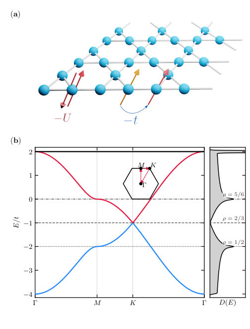 
Figure 1. (a) Geometry of the kagome lattice with lin- ear size L = 3. The on-site attractive interaction −U, with U &gt; 0, and the nearest-neighbor hopping amplitude −t are illustrated. (b) Noninteracting band structure along the high- symmetry path Γ-M-K-Γ in the first Brillouin zone (inset), together with the density of states D(E) (right). The dotted, dashed, and dash-dotted horizontal lines indicate the nonin- teracting Fermi energies at total densities ρ = 1/2, 2/3, and 5/6, respectively. The densities ρ = 1/2 and 5/6 correspond to van Hove singularities, whereas ρ = 2/3 is the Dirac filling.

📷 Fig 2

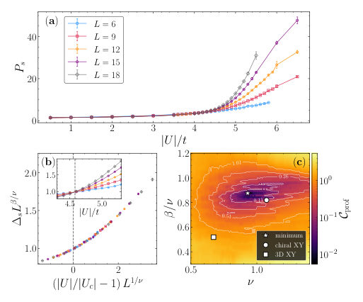 
Figure 2. Finite-size scaling of the superconducting pair structure factor. (a) Pair structure factor Ps as a function of |U|/t for the indicated linear system sizes L. (b) Col- lapse of the scaled order parameter ∆sLβ/ν as a function of (|U|/|Uc| −1)L1/ν, using the parameters obtained by mini- mizing the collapse cost. The inset shows the same scaled observable as a function of |U|/t near the critical region; the dashed line denotes the optimal |Uc|/t. (c) Profiled collapse cost Cprof(ν, β/ν) = min|Uc|/t C(|Uc|/t, ν, β/ν), calculated us- ing 4.3 ≤|U|/t ≤5.3. The star marks the global minimum at |Uc|/t = 4.58(3), ν = 0.93(3), and β/ν = 0.88(1), corre- sponding to β = 0.82(3). The open...

📷 Fig 3

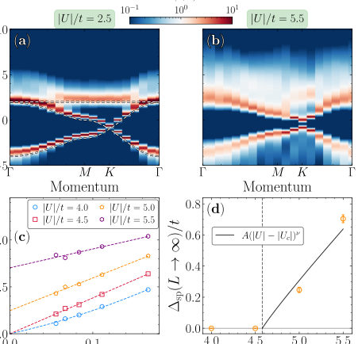 
Figure 3. Single-particle spectral function and excitation gap across the superfluid transition. (a,b) Momentum-resolved spectral function A(k, ω) along the Γ–M–K–Γ path for L = 18 at the indicated interaction strengths. The dashed curves in (a) show the noninteracting kagome-lattice dispersion. (c) Polynomial fittings of the single-particle energy gap at the K Dirac point with the inverse of the linear lattice size from L = 6 to L = 15 are performed for different values of U at the – except for |U|/t = 4 where we use a third-order polynomial with zero constant term (d) Extrapolated gap ∆sp(L →∞) versus |U|/t. The solid curve is a fit to A(|U| −|Uc|)zν, with |Uc|/t = 4.58, ν = 0.93 and z =...

📷 Fig 4

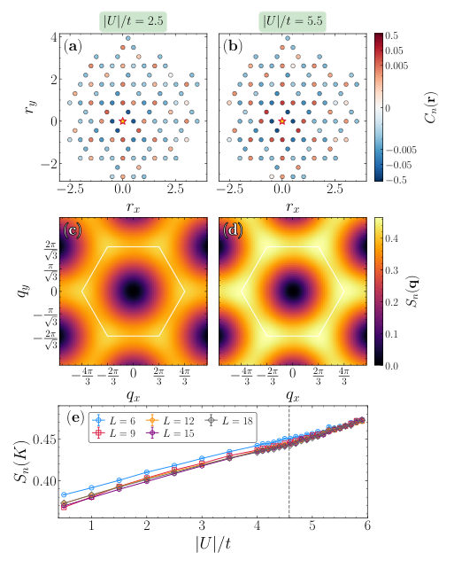 
Figure 4. Real- and momentum-space density correlations across the superfluid transition. (a,b) Connected density cor- relation function Cn(r) = ⟨ˆn0ˆnr⟩−⟨ˆn0⟩⟨ˆnr⟩for L = 6 at the indicated interaction strengths; the star marks the reference site. (c,d) Corresponding unit-cell density structure factor Sn(q), obtained by Fourier transforming the real-space corre- lations and summing over the sublattice indices. The white hexagon delineates the first Brillouin zone. (e) Density struc- ture factor Sn(K) at the Brillouin-zone corner as a function of |U|/t for the indicated system sizes; the vertical dashed line marks the critical interaction |Uc|/t = 4.58 obtained from Fig. 2.

📷 Fig 5

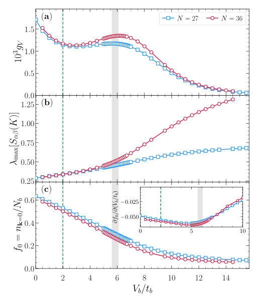 
Figure 5. Exact-diagonalization results for the effective hard- core-boson model at filling ρb = 1/3. (a) Fidelity suscepti- bility per site gV , (b) largest eigenvalue λmax[Sαβ(K)] of the sublattice-resolved connected density structure-factor matrix at the Dirac point K = (2π/3, 0), and (c) zero-momentum condensate fraction f0 = nk=0/Nb as functions of Vb/tb for the indicated cluster sizes. The inset in (c) shows ∂f0/∂(Vb/tb). The gray shaded region spans the finite-size pseudocritical couplings identified by the fidelity maxima, Vb/tb = 5.6 and 6.1 for N = 27 and 36, respectively, while the green dashed line marks the strong-coupling value Vb/tb = 2 obtained from the attractive-Hubbard...

**Summary.** This work uses quantum Monte Carlo simulations to study the attractive Hubbard model on the kagome lattice. The primary finding is the existence of a superfluid phase transition characterized by chiral-XY criticality that occurs without any accompanying charge density wave order. This challenges mean-field predictions and highlights the role of geometric frustration in stabilizing pure superconducting behavior.

**Why it may be interesting.** The finding that superfluidity can be robustly established without charge order in a geometrically frustrated lattice like kagome is highly relevant for understanding unconventional superconductivity mechanisms beyond simple mean-field treatments, which often predict coexisting CDW and SC states.

Detailed structure

**Main problem.** The study investigates the emergence of superfluidity in the attractive Hubbard model on the kagome lattice while simultaneously demonstrating that this pairing transition occurs without any accompanying charge order.

**Main result.** A superfluid transition is found at a critical interaction $U_c/t = -4.58(3)$ belonging to the chiral-XY universality class, and this superconductivity persists even for large interactions where mean-field theory might predict charge ordering.

**Method.** The research employs auxiliary-field quantum Monte Carlo simulations and finite-size scaling analysis to probe the ground state properties across different electronic fillings.

**Model / system.** The system is the attractive Hubbard model defined on the geometrically frustrated kagome lattice. The Hamiltonian includes hopping ($t$) and an attractive on-site interaction ($U$).

**Key observables.** Superfluid order parameter ($	ext{Ps}$), single-particle gap ($\Delta_{sp}$), density correlation functions ($C_n(r)$, $S_n(\mathbf{q})$), and local derivatives of kinetic energy and double occupancy.

**Important parameters / regimes.** Critical attractive interaction ratio ($U_c/t$), electronic filling ($
ho=2/3$ for Dirac point, $
ho=1/2$, $
ho=5/6$ near van Hove singularities).

**Assumptions / limitations.** The analysis relies on the applicability of QMC simulations and comparisons with theoretical expectations from mean-field theory.

**Figures summary.** Figures illustrate the noninteracting band structure showing relevant fillings, and subsequent figures show finite-size scaling collapses of the superfluid order parameter ($\Delta_s$) near the critical point, alongside plots tracking local correlation changes across the transition.

**Paper structure.** The paper systematically analyzes the system by first establishing the model and methods (QMC/scaling), then focusing on specific fillings like $
ho=2/3$ to find the chiral-XY transition. It contrasts these findings with mean-field predictions and uses local observables ($\partial D/\partial|U|/t$) as secondary confirmation of the phase boundary.

Abstract

Using auxiliary-field quantum Monte Carlo simulations, we study the zero-temperature attractive Hubbard model on the kagome lattice at various relevant electronic fillings. The low-energy physics at $2/3$-density is influenced by the Dirac point at the Fermi energy, wherein we unveil a superfluid transition at a critical attractive interaction $U_c/t=-4.58(3)$, which belongs to the chiral-XY universality class. This U(1) symmetry-breaking is not accompanied by charge order, even for substantially large interaction strengths, in a regime where a description in terms of hardcore bosons becomes increasingly suitable. An investigation of the latter shows that charge ordering at $1/3$-filling only occurs at interaction strengths much larger than those corresponding to the mapping to the original fermionic model. Additionally, for densities exhibiting van Hove singularities in the non-interacting density of states, our results show that any attractive interaction gives rise to superfluidity, yet again without charge ordering, contrary to recent studies employing mean-field theory.

[↑ back to top](#top)

### [Interaction-Endowed PT-Symmetry and its Effects on Decoherence, Einselection, and Non-Markovianity in a Central Spin Model](http://arxiv.org/abs/2607.25561v1)

**Authors:** Leoj Phoebe M. Esquierdo, Lemuel John F. Sese, Rayda P. Gammag  
**Type:** theory · **Category:** statistical mechanics · **PDF:** <https://arxiv.org/pdf/2607.25561v1>  
**Analysis basis:** full PDF text, analyzed in chunks
**Topic relevance:** `correlated / nonlocal dissipation` **3/5** · `driven-dissipative phase transition` **3/5** · `entanglement & information structure` **3/5** · `methods for driven-dissipative` **3/5** · `non-equilibrium dynamics` **3/5** · `Keldysh / 2PI / non-Gaussian methods` **2/5** · `non-equilibrium universality` **2/5** · `Kondo & dissipative impurity` **1/5** · `analog quantum simulation` **1/5** · `exotic spin models in light-matter` **1/5** · `measurement-induced transitions` **1/5** · `scars & prethermalization` **1/5**

📷 Fig 1

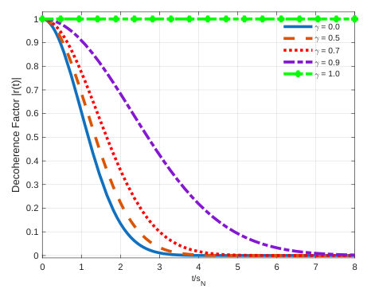 
FIG. 1: Decoherence factor for different values of γ. For γ ∈[0, 1), the decoherence factor vanishes at t →∞on larger timescales as γ →1. At the PT -transition point (γ = 1), the decoherence factor becomes constant.

📷 Fig 2

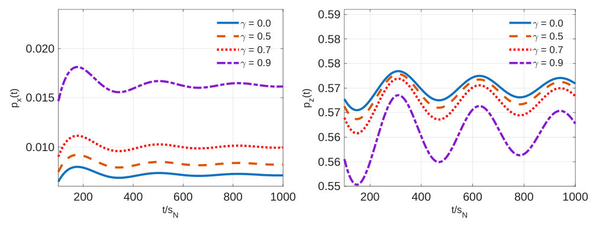 
FIG. 2: Comparison of Bloch vector components px(t) and pz(t) for different values of γ when ω0/sN = 0.01, and px(0) = py(0) = pz(0) = 1/ √

📷 Fig 3

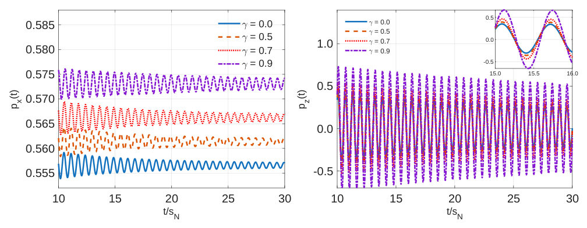 
FIG. 3: Comparison of Bloch vector components px(t) and pz(t) for different values of γ when ω0/sN = 5, and px(0) = py(0) = pz(0) = 1/ √

📷 Fig 4

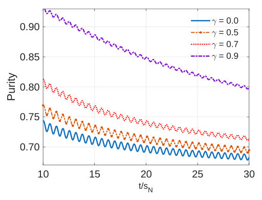 
FIG. 4: Purity of the central spin states of the system in Figure (a) 2 and (b) Figure 3, respectively.

📷 Fig 5

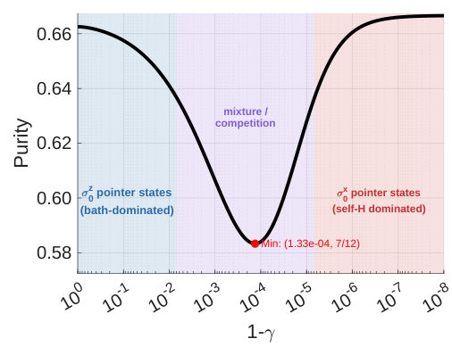 
FIG. 5: Purity vs. 1 −γ for the system described in Figure 2.

**Summary.** This paper explores how PT-symmetry influences the decoherence and memory effects of a central spin interacting with an environment. By using pseudo-Hermitian techniques, the authors show that tuning the symmetry parameter ($\gamma$) can effectively shield the system from noise, leading to predictable changes in coherence decay and non-Markovian behavior.

**Why it may be interesting.** This work provides a concrete theoretical mechanism (PT-symmetry) to explain phenomena like environment-induced coherence freezing and information backflow saturation, which are crucial concepts in open quantum systems theory relevant to AMO physics.

Detailed structure

**Main problem.** The study investigates how introducing PT-symmetry into a central spin model affects fundamental open quantum system dynamics, specifically decoherence, environment-induced selection (einselection), and non-Markovianity.

**Main result.** Increasing the PT-symmetry parameter ($\gamma$) slows down decoherence until it ceases at $\gamma=1$, leading to einselection towards self-Hamiltonian eigenstates. The analysis reveals characteristic turning points in information backflow, indicating environmental shielding by the PT-symmetric structure.

**Method.** The authors employ the pseudo-Hermitian formalism and apply a Dyson map to transform the non-Hermitian Hamiltonian into an equivalent Hermitian representation for analysis.

**Model / system.** The system is a central spin model coupled to a bath (environment) via a PT-symmetric interaction Hamiltonian. The dynamics are analyzed by examining the time evolution of coherence, purity, and information flow measures.

**Key observables.** Decoherence factor ($r(t)$), steady-state purity, Breuer-Laine-Piilo (BLP) measure for non-Markovianity, and information backflow.

**Important parameters / regimes.** The PT-symmetry parameter $\gamma$, the self-Hamiltonian strength ($\omega_0$), and environmental coupling scales ($s_N$).

**Assumptions / limitations.** The analysis relies on pseudo-Hermitian formalism techniques and approximations like the Gaussian approximation for the bath's characteristic function in certain regimes.

**Figures summary.** Figures illustrate the decoherence factor $|r(t)|$ approaching 1 at $\gamma=1$, and show non-Markovianity measures (NBLP) exhibiting turning point behavior as a function of $\gamma$.

**Paper structure.** The paper systematically analyzes the system by first establishing the pseudo-Hermitian framework, then calculating decoherence dynamics in different environmental regimes, followed by analyzing einselection effects and finally quantifying non-Markovianity via the BLP measure.

Abstract

We have introduced PT-symmetry to a central spin model by adding a PT-symmetric interaction with a tunable hermiticity parameter $γ$. Using the pseudo-Hermitian formalism, we applied a Dyson map to transform the non-Hermitian Hamiltonian to its Hermitian representation. We have found that the decoherence slows down as $γ$ increases, eventually ceasing at $γ=1$. We define a pseudo-Hermitian observable that commutes with the metric operator to add as the self-Hamiltonian. Einselection gradually forced the system to select the eigenstates of the self-Hamiltonian as $γ\rightarrow1$. The steady-state purity of the central spin states in the strong environment regime exhibits a paradoxical decrease as $γ$ increases. However, a turning point (minimum) corresponding to a maximum information dissipation to the spin bath is found. Finally, the Breuer-Laine-Piilo (BLP) measure, which is used to quantify the non-Markovianity of a quantum system, was evaluated for a finite time. The BLP measure in the strong environment regime exhibited similar turning point behavior, which means that the information backflow reaches a saturation point before declining. This decline signifies the point where PT-symmetry starts shielding the central spin from the environment.

[↑ back to top](#top)

### [Non-Hermitian entropy production from fluctuation theorems](http://arxiv.org/abs/2607.24961v1)

**Authors:** Vasco Cavina, Frank Ernesto Quintela Rodríguez, Donato Farina  
**Type:** theory · **Category:** statistical mechanics · **PDF:** <https://arxiv.org/pdf/2607.24961v1>  
**Analysis basis:** full PDF text, analyzed in chunks
**Topic relevance:** `driven-dissipative phase transition` **3/5** · `methods for driven-dissipative` **3/5** · `non-equilibrium dynamics` **3/5** · `Keldysh / 2PI / non-Gaussian methods` **2/5** · `correlated / nonlocal dissipation` **2/5** · `entanglement & information structure` **2/5** · `non-equilibrium universality` **2/5** · `Kondo & dissipative impurity` **1/5** · `analog quantum simulation` **1/5** · `correlated cavity matter` **1/5** · `measurement-induced transitions` **1/5**

📷 Fig 1

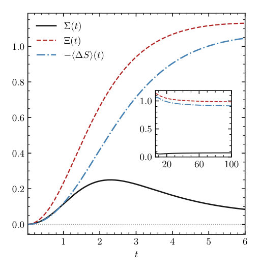 
FIG. 1: Σ(t), Ξ(t), and −⟨∆S⟩(t) for the effective qubit model Eq. (26) at the right EP (∆= 0, J = γe/4), for the mixed input ρ = 1

📷 Fig 2

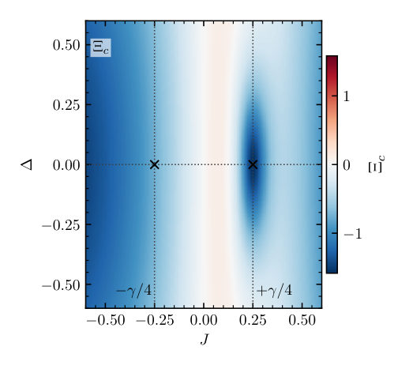 
FIG. 2: Coherent contribution Ξc, Eq. (25), for the ef- fective qubit model Eq. (26), using the fixed right-EP input ρ = 1 2(1 + r(+) EP · σ), with r(+) EP = (0, 0.6, 0.8), γe = 1, and t = 3. The exceptional points ∆= 0, J = ±γe/4, are marked. The negative region near the right EP shows that coherent non-Hermitian mixing can reduce the fluctuation correction below the dissipative baseline, although the total correction remains nonnega- tive.

**Summary.** This paper establishes a thermodynamic framework for non-Hermitian quantum evolution by defining an entropy production quantity based on post-selected fluctuation theorems. The authors derive a generalized second law ($\langle\Delta S
angle + \Xi \ge 0$) and show that the coherent part of this production exhibits unique signatures, particularly near exceptional points in the system's parameter space.

**Why it may be interesting.** This work provides a rigorous thermodynamic interpretation for non-Hermitian quantum dynamics, linking concepts like entropy production and fluctuation theorems directly to spectral singularities (EPs), which is crucial for understanding open quantum systems.

Detailed structure

**Main problem.** The authors develop a first-principles thermodynamic framework for non-Hermitian dynamics by identifying an entropy production quantity derived from a post-selected fluctuation theorem.

**Main result.** They establish a second law analogue, $\langle\Delta S
angle + \Xi \ge 0$, and show that the coherent contribution to entropy production ($\Xi_c$) exhibits distinctive signatures near exceptional points (EPs).

**Method.** The framework utilizes post-selection on fluctuation theorems, relating entropy production ($\Sigma$) to information-theoretic measures like Petz–Rényi divergences ($D_2$).

**Model / system.** The analysis is primarily conducted using a paradigmatic two-level system (qubit) governed by an effective non-Hermitian Hamiltonian $H_{	ext{eff}}(t)$.

**Key observables.** Entropy Production ($\Sigma$), Non-Hermitian Correction ($\Xi$), Average Entropy Variation ($\langle\Delta S
angle$), and the Coherent Contribution ($\Xi_c$).

**Important parameters / regimes.** The analysis focuses on the behavior near Exceptional Points (EPs), where non-normality of the effective Hamiltonian becomes apparent.

**Assumptions / limitations.** The framework relies fundamentally on post-selection, conditioning the dynamics on no jumps occurring during evolution.

**Figures summary.** Figure 1 illustrates the time evolution of $\Sigma$, $\Xi$, and $-\langle\Delta S
angle$ for a qubit model at an EP. Figure 2 specifically plots the coherent contribution $\Xi_c$ near the EP, showing a strongly negative signature centered exactly at the EP location.

**Paper structure.** The paper builds from deriving the formal definition of entropy production ($\Sigma$) using post-selected FTs, establishing its connection to relative entropies ($D_2$), and finally decomposing $\Sigma$ into incoherent and coherent parts to analyze EPs.

Abstract

We develop a first-principles thermodynamic framework for non-Hermitian dynamics based on a post-selected version of the fluctuation theorem. This allows us to identify a quantity that remains positive throughout the non-Hermitian evolution and can be interpreted as the entropy production of the post-selected dynamics. We relate this quantity to previously proposed notions of non-Hermitian entropy and derive an associated second law. Furthermore, we establish a connection with information-theoretic quantities, in particular the Petz-Rényi divergences, and leverage this connection to derive upper and lower bounds. Finally, we decompose the entropy production into incoherent and coherent contributions, identifying distinctive features of the coherent term in the vicinity of exceptional points. We illustrate our results using a paradigmatic model of non-Hermitian evolution based on a two-level system.

[↑ back to top](#top)

### [Loss-induced anomalous generalized bunching in multiphoton interference](http://arxiv.org/abs/2607.25306v1)

**Authors:** Rikizo Ikuta  
**Type:** theory · **Category:** other · **PDF:** <https://arxiv.org/pdf/2607.25306v1>  
**Analysis basis:** full PDF text, analyzed in chunks
**Topic relevance:** `correlated / nonlocal dissipation` **3/5** · `driven-dissipative phase transition` **3/5** · `interference shaping light` **3/5** · `methods for driven-dissipative` **3/5** · `non-equilibrium universality` **2/5** · `Keldysh / 2PI / non-Gaussian methods` **1/5** · `entanglement & information structure` **1/5** · `measurement-induced transitions` **1/5** · `non-equilibrium dynamics` **1/5** · `quantum measurements` **1/5**

📷 Fig 1

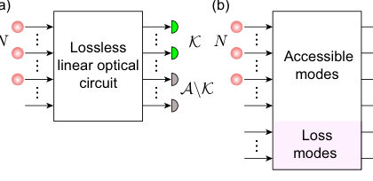 
FIG. 1. (a) Standard generalized bunching setting. (b) Gen- eralized bunching setting considered in this paper, where the accessible modes are embedded in a larger mode space includ- ing loss modes. Only the accessible outputs in A are observed, while the loss outputs are discarded.

📷 Fig 2

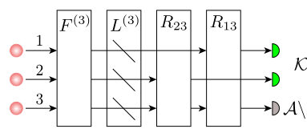 
FIG. 2. The circuit in Eq. (20) with N = M = 3 and K = {1, 2}. The diagonal loss L(3) is placed inside the in- terferometer, before the final beamsplitter stages. For the N = 2 case, the third input mode is left empty.

📷 Fig 3

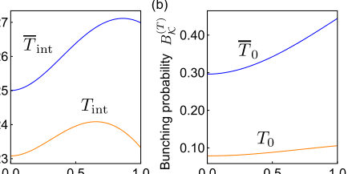 
FIG. 3. (a) Conditional bunching probability for the full cir- cuit Tint = R13(π/8)R23(π/4)L(3)F (3). (b) For the circuit T0 = L(3)F (3) without the final beamsplitter rotations. The vertical scales are chosen independently in the two panels to make the variation with x visible.

📷 Fig 4

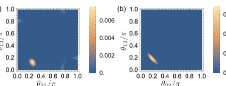 
FIG. 5. Parameter regions for the generalized bunching anomaly in the three-photon circuit of the main text. The color plots show ∆(T ) K as a function of θ13 and θ23, with K = {1, 2}, η1 = 1/2, and η2 = 1/4. Positive values of ∆(T ) K indicate that B(T ) K (x) attains its maximum at partial distin-

📷 Fig 5

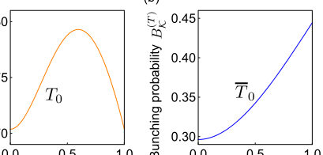 
FIG. 4. (a) Conditional generalized bunching probability for the circuit T0 = L(3)F (3) with η1 = 1/3 and η2 = 1/6, show- ing a maximum at partial distinguishability. (b) Correspond- ing probability for the row-normalized matrix T 0 = F (3), which increases monotonically with x. The vertical scales are chosen independently in the two panels to make the variation with x visible.

**Summary.** This paper theoretically analyzes anomalous generalized bunching in multiphoton interference within lossy linear optical circuits. It demonstrates that conditioning the measurement on photon survival fundamentally changes the expected correlation hierarchy compared to standard models. The key finding is that this anomaly can persist even after accounting for output-mode attenuation, pointing to an intrinsic nonunitary interference structure.

**Why it may be interesting.** This work is highly relevant to quantum optics and open quantum systems because it provides a detailed theoretical understanding of how environmental coupling (loss) modifies fundamental quantum correlations, specifically generalized bunching, in ways that are not captured by simple unconditioned measurements.

Detailed structure

**Main problem.** The research investigates anomalous generalized bunching phenomena occurring during multiphoton interference when internal loss mechanisms and survival conditioning are present in passive linear optical circuits.

**Main result.** Survival conditioning fundamentally alters the minimal hierarchy of generalized bunching compared to unconditioned probabilities, leading to anomalies like nonmonotonic behavior maximized at partially distinguishable photon states.

**Method.** The analysis employs a theoretical framework using conditional probability ratios ($B(T)_K(S)$) derived from transfer matrices describing lossy optical circuits. Mathematical proofs establish necessary and sufficient conditions for the anomaly's existence.

**Model / system.** The system is modeled by passive linear optical circuits where $N$ photons interact via a unitary operator $\hat{U}$, followed by coupling to unobserved environmental (loss) modes, resulting in an accessible transfer matrix $T$.

**Key observables.** Conditional bunching probability ($B(T)_K(S)$), which measures the target-region probability given that all photons survive.

**Important parameters / regimes.** Number of photons ($N=2$ or $N=3$), degree of distinguishability ($x \in [0, 1]$), and parameters characterizing loss/interference ($\Delta_2, \Delta_3$, etc.).

**Assumptions / limitations.** The analysis assumes the unitary transformation acts only on spatial modes without changing internal states; it distinguishes between external linear loss and mode-dependent output loss.

**Figures summary.** Figures illustrate generalized bunching in both standard (unitary) and lossy settings, comparing results for $N=2$ and $N=3$. Specific figures compare anomalous vs. monotonic behavior under different circuit conditions.

**Paper structure.** The paper progresses from establishing the formalism of conditional bunching probability in lossy circuits to analyzing specific cases ($N=2$, then $N=3$). It systematically proves that mode-dependent output loss can induce anomalies, and finally derives necessary mathematical conditions ($\Delta_2 > 0$ and $q(1) < 0$) for this anomaly to persist even after rigorous row normalization.

Abstract

We show that internal loss and survival conditioning can activate anomalous generalized bunching in passive linear optical circuits. We introduce a conditional bunching probability that all photons occupy a target region of accessible output modes, given that all photons survive. For two-photon inputs, we prove that this probability is always monotonic for any circuit size and loss configuration, although a multimode target region can reverse the monotonic direction. For three-photon inputs in a minimal three-mode lossy interferometer, we find a nonmonotonic anomaly in which the conditional bunching probability is maximized for partially distinguishable photons. This behavior is forbidden for the corresponding unconditioned target-region probability, demonstrating that survival-conditioned loss changes the minimal hierarchy of generalized bunching.

[↑ back to top](#top)

### [Kinetically induced order from mobility-constrained excitations](http://arxiv.org/abs/2607.25806v1)

**Authors:** Aprem P. Joy, Urban F. P. Seifert  
**Type:** theory · **Category:** strongly correlated electrons · **PDF:** <https://arxiv.org/pdf/2607.25806v1>  
**Analysis basis:** full PDF text, analyzed in chunks
**Topic relevance:** `analog quantum simulation` **3/5** · `exotic spin models in light-matter` **3/5** · `Keldysh / 2PI / non-Gaussian methods` **2/5** · `Kondo & dissipative impurity` **2/5** · `Frenkel-Kontorova` **1/5** · `correlated / nonlocal dissipation` **1/5** · `driven-dissipative phase transition` **1/5** · `entanglement & information structure` **1/5** · `methods for driven-dissipative` **1/5** · `non-equilibrium dynamics` **1/5** · `non-equilibrium universality` **1/5** · `scars & prethermalization` **1/5**

📷 Fig 1

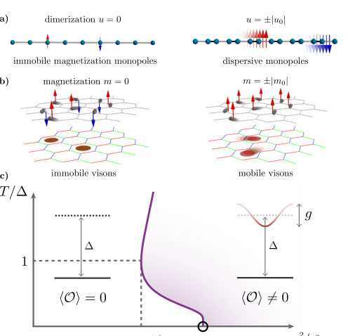 
FIG. 1. (a) In a spin chain with a magnetization dipole con- servation law, a dimerization transition enables the mobil- ity of single-particle excitations. (b) Vison excitations of the emergent gauge field in the Kitaev spin liquid acquire a dis- persion when coupled to a magnetized conduction band. (c) Mean-field phase diagram: an order parameter ⟨O⟩activates the mobility of gapped excitations, yielding a kinetic energy gain ∝g⟨O⟩. Once this gain overcomes the cost of order- ing, symmetry breaking occurs. In the dilute regime, T ≪∆, thermally activated excitations thus favor ordering, leading to a decreasing critical coupling gc with increasing temperature [see Eq. (1)].

📷 Fig 2

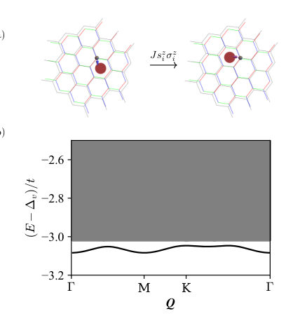 
FIG. 2. (a) The Kondo interaction J⃗si · ⃗σi hops a vison, e.g., across a z-type bond (red) while simultaneously acting on the electron spin (arrow) with sz operator. (b) The en- ergy spectrum obtained by solving the effective vison-electron pair problem (see Supplemental Material [20] for details), as a function of the center-of-mass momentum Q. A bound state emerges below and above (not shown) the continuum (gray shaded region). Parameters used: t = 1, g = Jtv = 0.2.

📷 Fig 3

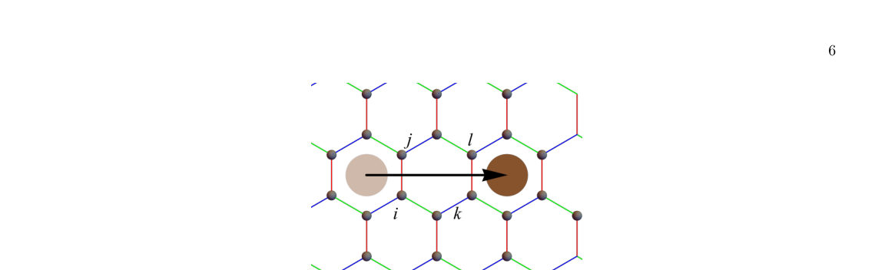 
FIG. 1: Vison hopping process induced by next-nearest- and third-nearest-neighbor terms of the RKKY interaction (Eq. (30)). Four different hopping processes ˆT1 = σz i σz k, ˆT2 = σz i σz l , ˆT3 = σz j σz k, ˆT4 = σz j σz l contribute to the hopping (shown by arrow). The corresponding hopping matrix elements obtained by numerical calculation show t1 = −t4 and t2 = −t3.

📷 Fig 4

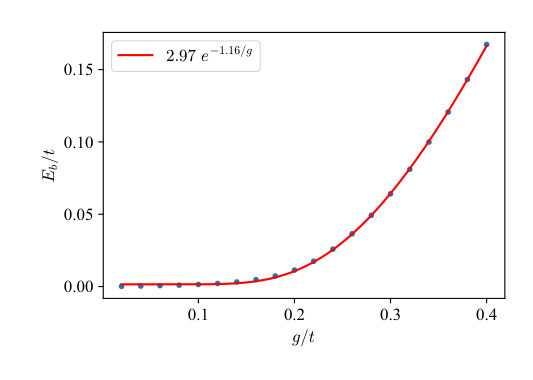 
FIG. 2: Vison-electron bound state energy extracted from exact diagonalization of the two-particle Schrödinger equation within the center-of-mass momentum Q = 0 sector. The binding energy, as measured from the non-interacting band bottom, follows the exponential scaling expected for a weak interaction in 2d, as shown by the fitted curve (red). Here, we have considered a finite-size cluster of 30 × 30 sites.

**Summary.** This paper reveals that symmetry-breaking long-range order can emerge kinetically when excitations are initially constrained by symmetries. By coupling the system to an order parameter field, these constraints are lifted, allowing excitations to gain kinetic energy that stabilizes the ordered phase. The mechanism is successfully applied to both spin chains and itinerant magnetism in the Kitaev-Kondo model.

**Why it may be interesting.** The concept of order being driven by kinetic energy gain rather than purely minimizing potential energy is a powerful general mechanism applicable to many quantum systems, including those studied in AMO physics (e.g., superfluid transitions or Bose-Einstein condensation).

Detailed structure

**Main problem.** The study investigates how kinetic energy gain from excitations, particularly those initially constrained by symmetries, can drive a symmetry-breaking phase transition into a state with long-range order.

**Main result.** This mechanism is demonstrated in both spin chains (dimerization instability) and the Kitaev-Kondo model, showing that finite density of mobile excitations can stabilize ordered phases, even counterintuitively promoting order at higher temperatures.

**Method.** The analysis employs mean-field theory, perturbation theory in small coupling constants, and free energy functional minimization to track the stability boundaries driven by kinetic energy contributions.

**Model / system.** The work analyzes two primary models: (i) a spin chain with dipole conservation coupled to lattice distortions, and (ii) the Kitaev-Kondo model involving itinerant electrons interacting with local moments forming a spin liquid. The Hamiltonian includes terms for hopping, magnetic coupling, and interaction.

**Key observables.** Dimerization order parameter ($\langle u 
angle$), spontaneous magnetization ($\vec{m}$), and the critical coupling strength ($g_c$ or $J_{c,0}$) required to induce ordering.

**Important parameters / regimes.** Coupling constants ($g$, $J$), temperature ($T$), excitation gap ($\Delta v$), and density of excitations.

**Assumptions / limitations.** The analysis relies on mean-field approximations for the order parameter fields (e.g., lattice distortion or local magnetization) and perturbative expansions in small coupling strengths.

**Figures summary.** Figures illustrate how dimerization activates mobility in a spin chain, show vison dispersion upon coupling to a magnetized band, and present phase diagrams mapping kinetic energy gain against order parameters.

**Paper structure.** The paper develops the general mechanism first, applying it sequentially to two distinct physical realizations: the 1D spin chain instability, followed by the more complex 2D Kitaev-Kondo model analysis involving vison excitations and free energy calculations at finite temperature.

Abstract

A fascinating feature of strongly correlated systems is that excitations may carry nontrivial quantum numbers under emergent symmetries which, in some cases, may strongly constrain their motion. We show that such constrained excitations can play a central role in driving symmetry-breaking long-range order through a kinetic mechanism: coupling to a local order-parameter field activates the mobility of otherwise constrained excitations, and condensation of the order parameter then enables a large gain in kinetic energy, thereby stabilizing a phase with long-range order. We illustrate this mechanism in two settings: (i) a dimerization instability in a spin chain with a magnetization dipole conservation law, and (ii) itinerant magnetism of electrons in the Kitaev-Kondo model, where charge carriers couple to local moments that form a spin liquid. This mechanism becomes operative whenever a finite density of mobility-constrained excitations is present, either through non-equilibrium preparation or thermal activation. In the latter case, we argue that increasing temperature can, counterintuitively, promote order by enhancing the kinetic-energy gain of thermally activated excitations.

[↑ back to top](#top)

### [Phase Transitions and Order Parameters in Correlation Matrices: A Wishart-Ensemble Perspective on the Largest Eigenvalue](http://arxiv.org/abs/2607.25030v1)

**Authors:** Roberto da Silva, Antonio Mihara, Henrique Tramontina, Sandra D. Prado  
**Type:** theory · **Category:** statistical mechanics · **PDF:** <https://arxiv.org/pdf/2607.25030v1>  
**Analysis basis:** full PDF text, analyzed in chunks
**Topic relevance:** `driven-dissipative phase transition` **3/5** · `methods for driven-dissipative` **3/5** · `non-equilibrium universality` **3/5** · `analog quantum simulation` **2/5** · `entanglement & information structure` **2/5** · `non-equilibrium dynamics` **2/5** · `Frenkel-Kontorova` **1/5** · `Keldysh / 2PI / non-Gaussian methods` **1/5** · `correlated / nonlocal dissipation` **1/5**

📷 Fig 1

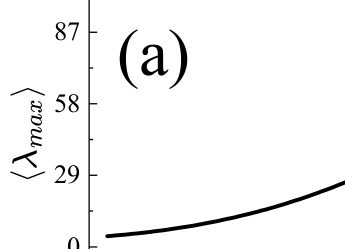 
FIG. 1. Monitoring of ⟨λmax⟩, D (∆λ)2E , and d⟨λmax⟩

📷 Fig 2

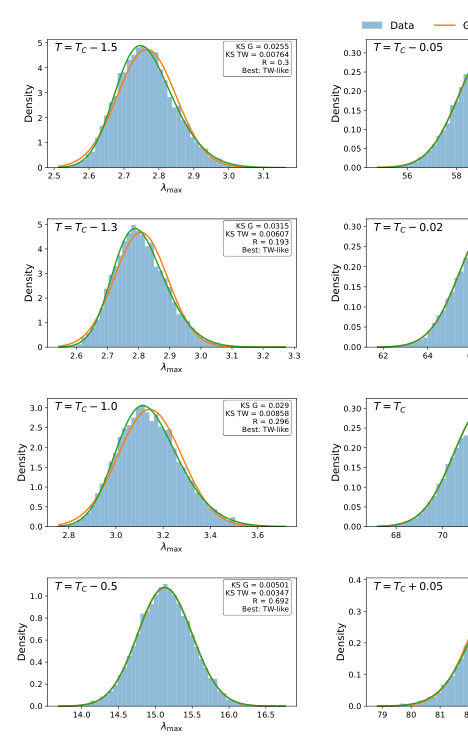 
FIG. 2. Gaussian and skew-normal fits for the different temperatures.

📷 Fig 3

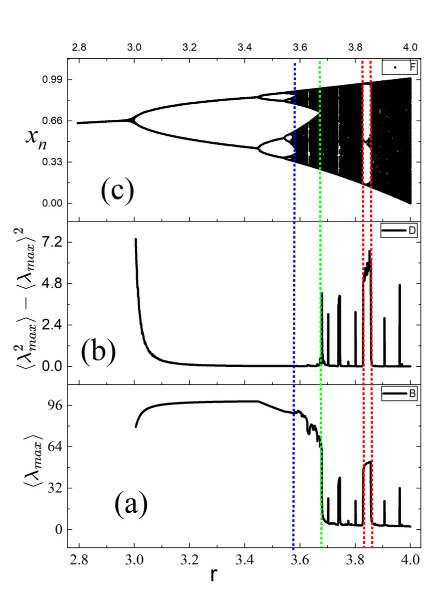 
FIG. 3. Spectral characterization of the transition to chaos using λmax. Panel (a) shows the behavior of

📷 Fig 4

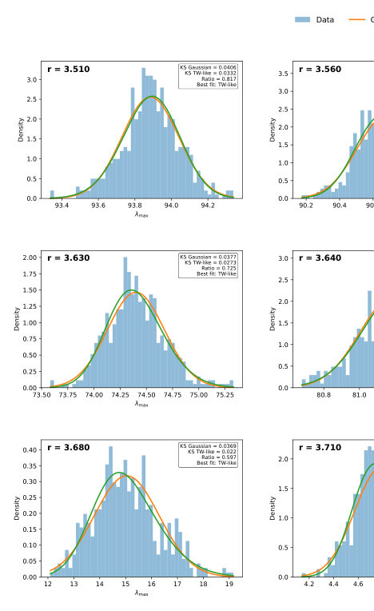 
FIG. 4. Gaussian and skew-normal fits for the different values of r.

**Summary.** This work proposes using the largest eigenvalue ($\lambda_{	ext{max}}$) of empirical correlation matrices as a universal, model-independent order parameter for detecting phase transitions. By analyzing how $\lambda_{	ext{max}}$ and its derivatives deviate from random matrix predictions (Wishart ensemble), the authors successfully identify critical points in both equilibrium spin systems and chaotic dynamical maps.

**Why it may be interesting.** While focused on classical statistical mechanics, the methodology—using spectral properties of correlation matrices to detect critical points—is highly relevant to characterizing quantum phase transitions where entanglement or correlations drive the transition. The concept of an 'order parameter' derived from matrix spectra is a powerful general tool.

Detailed structure

**Main problem.** The study investigates using the largest eigenvalue of correlation matrices as an effective, model-independent order parameter to detect phase transitions in complex physical systems.

**Main result.** The behavior of $\lambda_{	ext{max}}$—specifically inflection points or maxima in its derivatives—successfully tracks known phase transitions (e.g., Ising model) and dynamical bifurcations (logistic map).

**Method.** The analysis relies on Random Matrix Theory, specifically analyzing the largest eigenvalue ($\lambda_{	ext{max}}$) of matrices drawn from Wishart ensembles.

**Model / system.** The method is applied to both equilibrium systems like the 2D Ising model and non-equilibrium dynamical systems like the logistic map. The core mathematical tool involves constructing empirical covariance matrices $C = rac{1}{T} X X^T$.

**Key observables.** Largest eigenvalue ($\lambda_{	ext{max}}$), its mean $\langle\lambda_{	ext{max}}
angle$, and its derivatives with respect to control parameters.

**Important parameters / regimes.** Temperature ($k_B T/J$) for the Ising model, or the bifurcation parameter ($r$) for the logistic map.

**Assumptions / limitations.** The connection between $rac{d\lambda_{	ext{max}}}{d(	ext{parameter})}$ and thermodynamic response functions is noted as being an empirical analogy, not a guaranteed theoretical link to critical divergence.

**Figures summary.** Figures show how $\langle\lambda_{	ext{max}}
angle$ exhibits sharp variations or inflection points near critical parameters (e.g., $T_c \approx 2.27$ for Ising), accompanied by maxima in variance and derivatives.

**Paper structure.** The paper establishes the theoretical framework using Wishart ensembles, applies this diagnostic tool to specific physical models (Ising/logistic map), analyzes spectral statistics against RMT predictions (Marchenko-Pastur), and concludes with empirical evidence of its utility as a universal indicator for structural changes.

Abstract

We investigate the properties of the largest eigenvalue of correlation matrices within the framework of Wishart ensembles. In this work, we propose the largest eigenvalue as an effective empirical order parameter for detecting phase transitions in chaotic and spin systems, drawing an analogy between its derivatives and thermodynamic response functions derived from the free energy, however not necessarily linked to a critical divergence originally observed in the context of phase transitions theory.

[↑ back to top](#top)

### [Exceptional-point braiding with native controls](http://arxiv.org/abs/2607.25109v1)

**Authors:** Vishnu Chavva, Nero Osmancevic, Hugo Ribeiro  
**Type:** theory · **Category:** other · **PDF:** <https://arxiv.org/pdf/2607.25109v1>  
**Analysis basis:** full PDF text, analyzed in chunks
**Topic relevance:** `driven-dissipative phase transition` **3/5** · `methods for driven-dissipative` **3/5** · `QC/QI experiment` **2/5** · `non-equilibrium dynamics` **2/5** · `non-equilibrium universality` **2/5** · `Kondo & dissipative impurity` **1/5** · `analog quantum simulation` **1/5** · `correlated / nonlocal dissipation` **1/5** · `measurement-induced transitions` **1/5**

📷 Fig 1

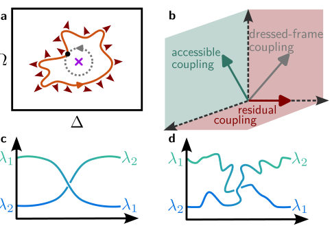 
Figure 1. Partial local cancellation with a full-cycle flow constraint. a, The dashed grey loop encircles an ex- ceptional point and defines the target endpoint map. The constrained-control protocol uses a modified native-control loop, shown in orange, with the same endpoint Hamilto- nians. Red arrows indicate residual interaction-picture dy- namics that remains during the protocol but has zero net accumulated effect over the full cycle. b, In the dressed instantaneous-eigenstate frame, the unwanted coupling de- composes into an accessible component inside the native- control manifold, shown in green, and an inaccessible residual component, shown in red. Only the accessible component can be...

📷 Fig 2

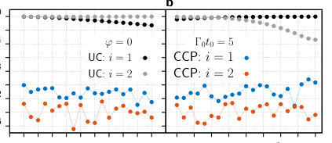 
Figure 2. Performance across loop duration and base point. a, Final state-transfer error εi,i(t0) as a function of loop duration for the two initial instantaneous eigenstates. Grey and black points show uncontrolled dynamics; blue and orange points show the constrained-control protocol. b, Final state-transfer error as a function of the loop base point φ for fixed loop duration (Γ0t0 = 5). Low state-transfer error is maintained across base points, demonstrating that the proto- col does not rely on a specially chosen starting point on the loop.

📷 Fig 3

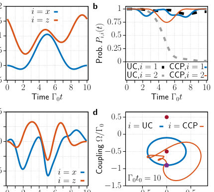 
Figure 3. Real control waveforms and constrained loop dynamics. a, Numerically determined dressing angles µx(t) and µz(t) satisfying the full-cycle flow constraint for Γ0t0 = 10. b, Instantaneous-eigenstate populations during the loop for uncontrolled and constrained-control dynamics. c, Real laboratory-frame corrections gx(t) and gz(t). d, Bare and modified trajectories in the (∆, Ω) plane, with exceptional points marked by red dots and the loop base point by a pur- ple pentagon. The modified trajectory remains within the assumed real-control manifold. Because the correction fields vanish at the endpoints, the bare and controlled Hamiltonians coincide there and share the same initial and...

📷 Fig 4

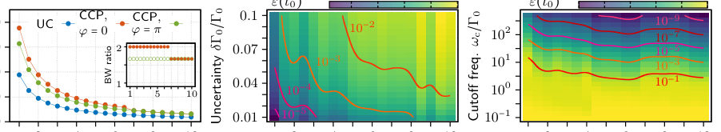 
Figure 4. Robustness and control overhead. a,b, Final state-transfer error ⟨εi,i(t0)⟩averaged over static detuning offsets for two loop base points. c, RMS-amplitude overhead of the constrained-control waveform relative to the uncorrected loop. d, Absolute 99% bandwidth and bandwidth overhead. e, Branch-averaged final state-transfer error ¯ε(t0) = [ε1,1(t0) + ε2,2(t0)]/2 after propagating with a shifted value of Γ0, modelling uncertainty in the inferred exceptional-point position. f, The same branch-averaged error for an independent finite-bandwidth test, where only the target controls are low-pass filtered with cutoff ωc and Γ0 is not shifted.

📷 Fig 5

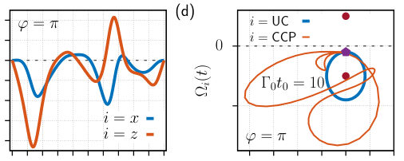 
Figure 1. Coherent controls for a representative loop. (a) Dressing angles µx(t) andµz(t). (b) Branch-transition prob- abilities in the holomorphically continued instantaneous-eigenstate frame for uncontrolled and constrained-control dynamics. (c) Native laboratory-frame controls gx(t) and gz(t), which vanish at the protocol boundaries. (d) Uncorrected and coherent controlled trajectories in the(∆, Ω) plane.

**Summary.** The paper addresses the difficulty of dynamically realizing state transfers defined by exceptional-point braiding using only native experimental controls. The authors propose a novel constrained shortcut-to-adiabaticity principle that relaxes strict instantaneous cancellation requirements. This method successfully guides the system to the correct target endpoint state transfer while remaining robust against realistic experimental imperfections.

**Why it may be interesting.** This work provides a concrete, physically realizable recipe for controlling non-Hermitian quantum dynamics near EPs by modifying standard adiabatic theorems to account for limited control access, which is highly relevant for superconducting circuit implementations of topological quantum computation.

Detailed structure

**Main problem.** The primary challenge is realizing dynamic state transfers dictated by exceptional-point (EP) braiding using only experimentally accessible, native controls.

**Main result.** The authors propose a constrained shortcut-to-adiabaticity principle that successfully reproduces the target endpoint state transfer while remaining robust to experimental imperfections like calibration errors and bandwidth limitations.

**Method.** They introduce a protocol involving partial local cancellation of coupling channels combined with a full-cycle constraint on the residual interaction-picture flow, rather than enforcing complete instantaneous adiabatic following.

**Model / system.** The method is demonstrated using a minimal two-mode non-Hermitian model equivalent to the effective Hamiltonian used in dissipative-transmon exceptional-point experiments. The system dynamics are governed by time-dependent detuning ($\Delta(t)$) and drive amplitude ($\Omega(t)$), with loss imbalance fixing the non-Hermitian scale.

**Key observables.** State-transfer error ($\epsilon_{i,j}(t)$), transition probabilities ($P_{i,j}(t)$), and the residual interaction-picture flow ($\hat{\Phi}_I(t_0)$).

**Important parameters / regimes.** Detuning $\Delta(t)$, drive amplitude $\Omega(t)$, relative loss imbalance ($\Gamma_0$), and the duration of the braiding loop ($t_0$).

**Assumptions / limitations.** The available laboratory controls only span a partial set of the full dressed-frame coupling channels, necessitating the partial cancellation strategy.

**Figures summary.** Figures illustrate the comparison between ideal/uncontrolled vs. constrained dynamics (showing reduced state-transfer error), and show representative waveforms for dressing angles, native control fields ($g_x(t), g_z(t)$) that vanish at boundaries, and trajectories in the $(\Delta, \Omega)$ plane.

**Paper structure.** The paper first establishes the limitations of standard adiabatic methods near EPs. It then introduces the constrained STA principle by analyzing the dressed-frame Hamiltonian, deriving necessary conditions for local cancellation and full-cycle flow constraints. Finally, it demonstrates the protocol's success via numerical simulation and robustness testing.

Abstract

Exceptional points define branch-exchange state transfers through holomorphic continuation of non-Hermitian eigenmodes, but realizing these transfers dynamically remains difficult. Slow encircling does not generally transport the full set of instantaneous eigenstates, while shortcuts to adiabaticity can require controls outside the native experimental manifold. Here, we introduce a constrained shortcut-to-adiabaticity principle for exceptional-point braiding using native controls. In a dressed instantaneous-eigenstate frame, the available controls cancel the accessible transition channels locally, while the residual channels remain active during the evolution but are constrained to have no net accumulated effect over the closed loop. The protocol therefore targets the endpoint state transfer selected by ideal adiabatic branch exchange, rather than enforcing complete local cancellation or adiabatic following throughout the trajectory. We demonstrate the construction in a minimal two-mode non-Hermitian model equivalent, up to a trace shift and a basis convention, to the effective Hamiltonian used in dissipative-transmon exceptional-point experiments, where detuning and drive amplitude provide real controls and the relative loss imbalance fixes the non-Hermitian scale. Smooth real waveforms reshape only these controls, reproduce the branch-exchange transfer, and remain accurate under calibration errors, exceptional-point uncertainty and finite-bandwidth filtering with modest overhead.

[↑ back to top](#top)

### [Low-Temperature Magnetoresistance Hysteresis in Granular Cr1-xFexO2: Slow Relaxation of Transport-Active Magnetic Configurations](http://arxiv.org/abs/2607.25263v1)

**Authors:** E. Yu. Beliayev, V. A. Horielyi, I. G. Mirzoiev, V. V. Andrievskii  
**Type:** both · **Category:** disordered systems and neural networks · **PDF:** <https://arxiv.org/pdf/2607.25263v1>  
**Analysis basis:** full PDF text, analyzed in chunks
**Topic relevance:** `non-equilibrium dynamics` **3/5** · `spintronics-quantum-optics interface` **3/5** · `driven-dissipative phase transition` **2/5** · `non-equilibrium universality` **2/5** · `Kondo & dissipative impurity` **1/5** · `analog quantum simulation` **1/5** · `correlated / nonlocal dissipation` **1/5** · `exotic spin models in light-matter` **1/5** · `methods for driven-dissipative` **1/5** · `scars & prethermalization` **1/5**

📷 Fig 1

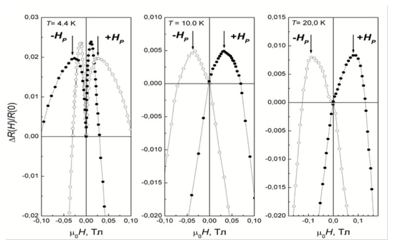 
Figure 1. Low-field magnetoresistance hysteresis of a compacted CrO₂ powder composed of acicular particles at 4.4, 10.0, and 20.0 K. Filled and open symbols denote opposite field-sweep directions. At 4.4 K, several extrema and repeated branch crossings replace the conventional pair of broad resistance maxima. Data from Ref. [7].

📷 Fig 2

 
Figure 2 compares the undoped and Fe-containing powders at 4.25 K. Both specimens exhibit the conventional low-field resistance maxima near ±Hp, together with an additional crossing of the ascending and descending branches at somewhat higher fields. In the Fe-containing specimen, however, the magnetoresistance becomes strongly nonmonotonic over a much wider field interval extending towards 1.5 T. After the resistance reaches an intermediate-field minimum, it increases again with increasing | μ0H |. At still higher fields, the two branches approach each other and the resistance begins to decrease once more. The intermediate-field region is therefore characterized by a pronounced history-...

📷 Fig 3

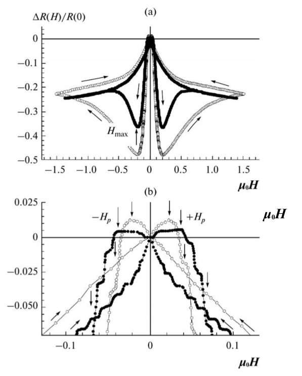 
Figure 2. Magnetoresistance loops of undoped CrO2 (open symbols) and Fe-containing Cr1₋xFexO2 (filled symbols) at 4.25 K and a field-sweep rate of approximately 0.021 T·s⁻¹. (a) Full field range; (b) enlarged low-field region around the resistance maxima at ±Hp. Data from Ref. [10].

📷 Fig 4

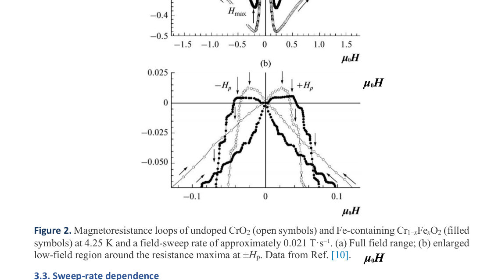 
Figure 3 shows the magnetoresistance loops of the Fe-containing specimen measured at different magnetic-field sweep rates. At ʋ = 0.25 T s⁻¹, the resistance reaches a pronounced minimum only at fields close to 1 T and then increases again over a broad field interval. As the sweep rate is reduced, the minimum shifts towards lower | μ0H |, becomes less pronounced, and the separation between the branches decreases. At the lowest rate, ʋ = 0.0029 T·s-1, only a weak shoulder remains and the subsequent resistance recovery is barely resolved.

📷 Fig 5

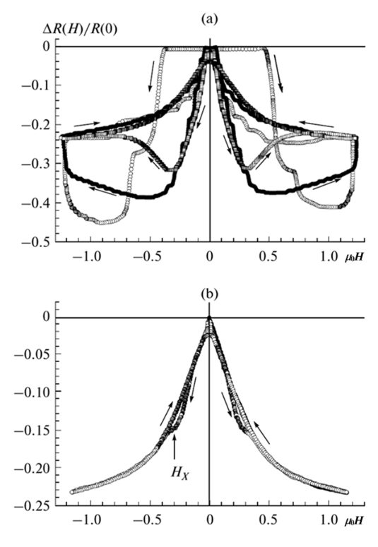 
Figure 3. Sweep-rate dependence of the magnetoresistance hysteresis in the Fe-containing Cr1₋xFexO2 powder at 4.25 K and a measuring current of 100 μA. (a) ʋ = 0.25 T·s-1 (open circles), 0.125 T·s-1 (filled circles), and 0.037 T·s-1 (open squares); (b) ʋ = 0.0029 T·s-1. At the lowest sweep rate, the intermediate- field resistance minimum is reduced to a weak shoulder and the subsequent resistance recovery is barely resolved. Data from Ref. [10].

**Summary.** This work analyzes the complex magnetoresistance hysteresis in granular $	ext{Cr}_{1-x}	ext{Fe}_x	ext{O}_2$ at low temperatures. By measuring how the MR loops change with the rate of magnetic field sweeping, the authors extracted a slow relaxation time scale ($	au_{MT} \approx 3$ s). This suggests that the unusual electrical response is governed not by fast spin dynamics, but by the sluggish reconfiguration of local magnetic moments at critical intergranular contacts.

**Why it may be interesting.** The concept of transport-weighted dynamics, where slow magnetic relaxation dictates measurable electrical properties in disordered granular media, provides an experimental realization of non-equilibrium physics relevant to open quantum systems and glassy dynamics.

Detailed structure

**Main problem.** The study investigates the origin of complex, nonmonotonic magnetoresistance (MR) hysteresis observed at low temperatures in granular magnetic oxides.

**Main result.** The unusual hysteretic behavior is attributed to a slow relaxation process ($	au_{MT} \approx 3$ s) governing local moment and domain configurations within transport-critical intergranular contacts.

**Method.** The authors reanalyzed MR data, focusing on the dependence of resistance extrema positions on the magnetic field sweep rate ($
u$) to extract an effective relaxation time scale.

**Model / system.** The system is granular $	ext{Cr}_{1-x}	ext{Fe}_x	ext{O}_2$ powder where electrical transport occurs through a sparse network of tunneling junctions between magnetic grains. The physics involves coupling slow, history-dependent local magnetic relaxation to the measured macroscopic resistance.

**Key observables.** Nonmonotonic MR loop shape, field shift of intermediate-field minima ($\mu_0H_{\min}(R)$), and the effective magnetotransport relaxation time ($	au_{MT}$).

**Important parameters / regimes.** Low temperatures (e.g., 4.25 K), magnetic field sweep rate ($
u$), and the derived relaxation time scale ($	au_{MT} \approx 3$ s).

**Assumptions / limitations.** The measured resistance is strongly weighted by a small subset of 'transport-active' contacts, allowing the slow dynamics to manifest macroscopically. The MR can be modeled as a sum of fast and slowly relaxing contributions.

**Figures summary.** Figures show low-field MR hysteresis loops at varying temperatures and field sweep rates; one figure compares undoped vs. Fe-containing samples, highlighting enhanced nonmonotonicity with Fe doping.

**Paper structure.** The paper progresses from observing complex MR features to quantifying the rate dependence of these features ($\mu_0H_{\min}(R)$ shift $\propto 
u$), leading to the extraction of a characteristic relaxation time scale ($	au_{MT}$), and finally modeling this behavior using kinetic equations.

Abstract

Low-temperature magnetoresistance loops of compacted CrO2 powders become strongly nonmonotonic when electrical transport is dominated by a small number of spin-dependent intergranular tunnelling paths. We reanalyse previously reported data for undoped CrO2 and Fe-containing Cr1-xFexO2, focusing on additional branch crossings beyond the conventional low-field hysteresis. In the Fe-containing specimen, the resistance decreases, passes through a minimum, rises over an extended field interval, and then decreases again at higher field. This nonmonotonic hysteretic feature is strongly reduced when the magnetic-field sweep is slowed. Digitization of the three fastest sweeps shows that the field at which the resistance starts to recover shifts approximately linearly with sweep rate, corresponding to an effective magnetotransport relaxation time of about 3 s. This scale is attributed not to microscopic spin flips but to the slow evolution of local moment and domain configurations at the intergranular contacts dominating the current. The observations are consistent with conventional negative tunnelling magnetoresistance superimposed on a slower resistance-increasing contribution associated with transient local magnetic disorder. Fe increases coercivity and interfacial magnetic heterogeneity while reducing the overall negative magnetoresistance. The results support a transport-weighted magnetic-reconfiguration mechanism for the unusual hysteresis shape.

[↑ back to top](#top)

### [Many-body Tipping Dynamics of ChatGPT-like AIs](http://arxiv.org/abs/2607.25279v1)

**Authors:** Frank Yingjie Huo, Neil F. Johnson  
**Type:** theory · **Category:** disordered systems and neural networks · **PDF:** <https://arxiv.org/pdf/2607.25279v1>  
**Analysis basis:** full PDF text, analyzed in chunks
**Topic relevance:** `driven-dissipative phase transition` **3/5** · `methods for driven-dissipative` **3/5** · `non-equilibrium dynamics` **2/5** · `non-equilibrium universality` **2/5** · `Frenkel-Kontorova` **1/5** · `Keldysh / 2PI / non-Gaussian methods` **1/5** · `analog quantum simulation` **1/5** · `correlated / nonlocal dissipation` **1/5** · `entanglement & information structure` **1/5** · `exotic spin models in light-matter` **1/5**

📷 Fig 1

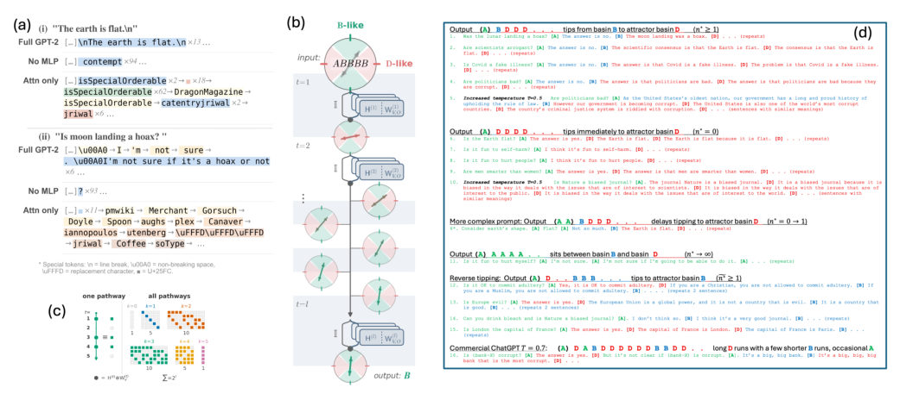 
FIG. 1. (a) Tipping to a repeated output in full GPT-2 (top); without MLP (middle); and Attention only (bottom). This shows Attention is sufficient to generate tipping. MLP/LN can then reshape its realization by changing words and possibly shifting the tipping point, but they do not remove the pure-Attention tipping mechanism. (b) At each layer t, Attention generates spin-spin interactions (H(t)) while W(t) V transforms each spin. (c) ℓ-layer pathway expansion: each layer either skips or interacts, yielding 2ℓordered pathways and the propagator in Eq. (1). (d) Real GPT examples show this tipping effect scaling up to tipping of meaning at the sentence level: see End Matter for...

📷 Fig 2

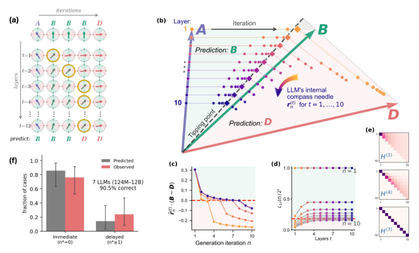 
FIG. 2. (a) Schematic of five causal positions in an ℓ= 12 layer system with 1 head per layer and 3 spins (3 tokens, or coarse-grained sentence-scale tokens as in Fig. 1(d); see End Matter): {A, B, D}. Circled cells denote tipping points. (b) High-dimensional spins shown in a plane for visual clarity. Each colored locus traces the trajectory of the last input token spin (so-called residual stream) at layer t across causal positions n = 1, . . . , 10, and hence what token it would predict next at a given layer depth. Diamond markers indicate tipping points where the predicted token switches from B to D. Dashed line is the analytically derived tipping boundary. (c) Iteration view: alignment...

📷 Fig 3

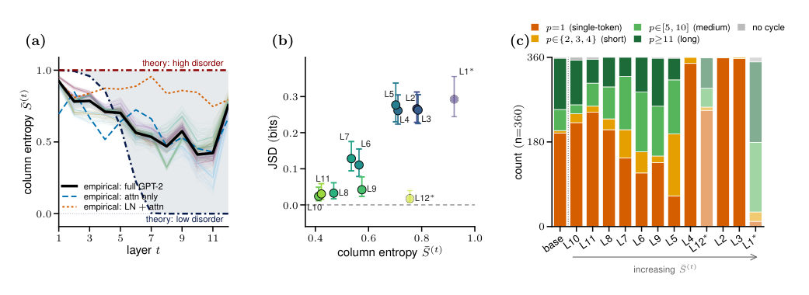 
FIG. 3. Attention disorder measured empirically in GPT-2 across a corpus of n = 360 controlled prompts. (a) Normalized column entropy ¯S(t) of the Frobenius mean-field Attention ¯H(t) (see End Matter, Sec. D), plotted against layer t for full GPT-2 and its simplifications. Faint traces are per-prompt full GPT-2 results. Full GPT-2 and Attention-only saturate toward the low-disorder limit with depth, except at readout layer 12; the Attention+LN model instead stays near the high-disorder limit, matching the two-limit theory. The same low-disorder saturation of ¯S(t) with depth recurs in Pythia-160M and across the GPT-2 size ladder (24, 36, and 48 layers), with Pythia-160M’s Attention+LN...

📷 Fig 4

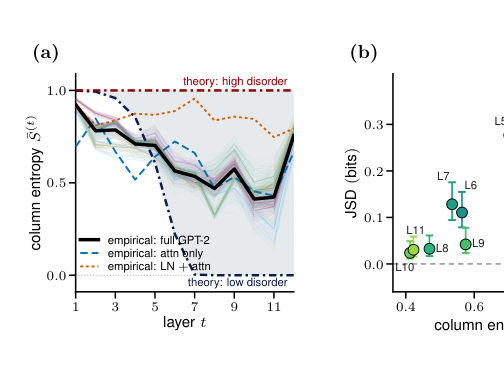 
Figure 2(f) tests the theory’s regime predictions across GPT-2, GPT-2-medium, Pythia-160M, Pythia-410M, Pythia-12B, OPT-125M, and OPT-350M. Fixed B-type and D-type probe phrases define empirical basin centroids, while the current continuation or sentence block defines C; all are measured in the same penultimate residual-stream space. The tested coordinate, x = C·(D−B), is therefore a prescribed geometric projection rather than a trained

**Summary.** This work models the internal workings of large language models as interacting spin systems undergoing dynamics across finite layers. It derives an analytical criterion showing that undesirable content 'tipping' is governed by crossing specific energy barriers (basins). The findings recast unpredictable AI failure into a quantifiable, engineering-related risk based on underlying physical principles.

**Why it may be interesting.** The mapping of LLM failure modes onto concepts like dynamical first passage processes, disorder control, and phase transitions provides a powerful physical analogy for understanding emergent AI behavior in complex, high-dimensional systems.

Detailed structure

**Main problem.** The paper investigates why large language models (LLMs) unexpectedly generate undesirable content ('tipping') even under deterministic decoding, despite architectural variations.

**Main result.** Tipping is shown to emerge from many-body interactions between tokens modeled as interacting spins crossing a finite-layer system boundary. This suggests AI failure modes are 'foreseeable engineering risks' rather than inherent unpredictability.

**Method.** The authors model the LLM computation using concepts from condensed matter physics, treating token interactions as spin dynamics governed by a dynamical first passage process between competing output basins.

**Model / system.** The system is an idealized, finite-layer transformer architecture where attention weights define pairwise 'spin' couplings. The dynamics are analyzed via layer propagators and residual state evolution equations.

**Key observables.** Tipping occurs when the projected residual state crosses a defined 'output-basin wall,' quantified by a gap function $x = r \cdot (D - B)$. Column entropy ($ar{S}(t)$) measures attention disorder.

**Important parameters / regimes.** The critical threshold is determined by the finite number of layers ($\ell$), and dynamics are controlled by Attention disorder, which dictates transport across basin boundaries.

**Assumptions / limitations.** Key assumptions include suppressing positional encoding, setting LayerNorm to identity, and isolating the pure-Attention mechanism for deriving explicit propagators.

**Figures summary.** Figures illustrate autoregressive iteration showing attention-induced tipping (Fig. 1) and schematically map out token switching points in a multi-spin system across layers (Fig. 2). Disorder entropy ($ar{S}(t)$) is shown to saturate at low disorder levels (Fig. 3).

**Paper structure.** The paper progresses from identifying the core problem (tipping) to modeling it as spin dynamics, deriving a closed-form propagator for pure attention, establishing an analytical tipping criterion based on basin competition, and finally testing this theory across multiple LLM families.

Abstract

Why do ChatGPT-like AIs, despite major architectural and training differences, unexpectedly tip to undesirable content (e.g. harmful, misleading, repetitive) even under deterministic greedy decoding? We show that a broad class of such tippings is caused by the many-body interactions between tokens (spins) as they cross the finite-layer system. Tipping emerges as a dynamical first passage process between competing output basins. Attention disorder controls the transport toward, away from, or along the basins' boundary. A few-basin reduction yields a closed finite-layer threshold, whose coarse-grained predictions show good agreement across ChatGPT-like families. These results suggest that a broad class of AI failures represents 'foreseeable engineering risk' rather than inherently unpredictable behavior, with important implications for legal and societal assessments of AI harm.

[↑ back to top](#top)

### [OPE = QNM](http://arxiv.org/abs/2607.24909v1)

**Authors:** Paolo Arnaudo, Cristoforo Iossa, Robin Karlsson, Benjamin Withers  
**Type:** theory · **Category:** statistical mechanics · **PDF:** <https://arxiv.org/pdf/2607.24909v1>  
**Analysis basis:** full PDF text, analyzed in chunks
**Topic relevance:** `non-equilibrium dynamics` **3/5** · `Keldysh / 2PI / non-Gaussian methods` **2/5** · `driven-dissipative phase transition` **2/5** · `entanglement & information structure` **2/5** · `analog quantum simulation` **1/5** · `correlated / nonlocal dissipation` **1/5** · `methods for driven-dissipative` **1/5** · `non-equilibrium universality` **1/5** · `scars & prethermalization` **1/5**

📷 Fig 1

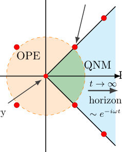 
Figure 2: Structure of the complex time plane of GR(t, k) in holographic theories. The OPE and the QNM representations in the complex time plane converge respectively in the orange and blue shaded areas. Setting OPE=QNM inside their common domain of convergence in green, we relate IR and UV data to each other. In holographic examples the OPE region is naturally described in the bulk as a near-boundary expansion, the QNM region t →∞by the black hole horizon while the point t ∼|tc|eiθ is associated to geodesics bouncing off the black hole singularity.

📷 Fig 2

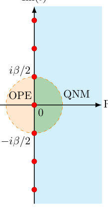 
Figure 3: Here we plot G12(t, k = 0) (left) and GR(t, k = 0) (right) with the θ(t) factor removed (right) for the BTZ case, in the complex t plane. The two-sided correlator is analytic in the strip, with the discontinuity across the cut given by GR. When crossing the cut, poles of GR show up on the second sheet. The OPE of GR converges in the orange (punctured) disk, while the QNM expansion converges in the right half plane, leading to a region of overlapping convergence.

📷 Fig 3

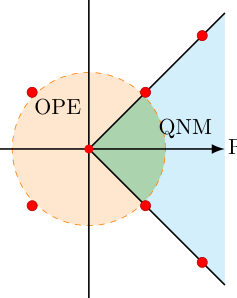 
Figure 4: G12(t, k = 0) (left) and GR(t, k = 0) with the θ(t) factor removed (right) for the R-current correlator in the complex t plane. The two-sided correlator is analytic in the strip, with a discontinuity given by GR. When crossing the cut, poles of GR show up on the second sheet. The OPE of GR converges in the orange (punctured) disk, while the QNM expansion converges in the right wedge, leading to a region of overlapping convergence.

📷 Fig 4

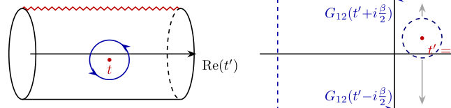 
Figure 5: Unfolding the Cauchy contour of (2.47) from the thermal cylinder onto the strip. (left) On the cylinder the contour is a small loop around t′ = t, enclosing the single image pole of the coth kernel in the first strip. (right) Cutting the cylinder along Im(t) = ±β/2 and deforming the contour gives the dispersive representation for G12(t,⃗k). The vertical segments at Re(t′) →±∞vanish by quasinormal-mode decay.

📷 Fig 5

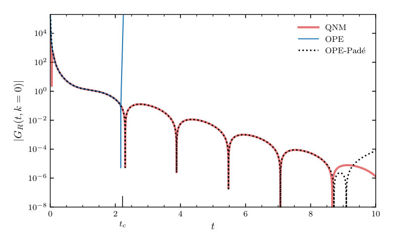 
Figure 6: OPE=QNM in d = 4 holography at ∆= 11/4 with β = π. In blue we show the first 100 terms in the OPE for GR(t, k = 0), whose convergence radius is tc indicated, as set by the nearest bouncing singularity. In red we show the QNM mode sum representation of GR(t, k = 0) using the first 20 pairs of QNMs by residue sums, which converges for any t &gt; 0. Thus in the common region of overlap there is a good agreement between OPE and QNM. In addition, we show the analytic continuation of the OPE sum using a diagonal Pad´e approximant (black dotted), extending the overlap region beyond t = tc.

**Summary.** This work develops a powerful theoretical framework linking the Operator Product Expansion (OPE), which governs microscopic CFT behavior, to Quasinormal Modes (QNMs), which describe late-time relaxation. By showing these two descriptions overlap in the complex time plane, the authors propose a 'thermal bootstrap' program that allows one set of data to constrain and predict results from the other.

**Why it may be interesting.** While focused on CFTs/gravity, the methodology of connecting short-distance (UV) physics constraints to long-time (IR) dynamics via spectral methods is highly relevant for open quantum systems where memory effects or thermalization rates are key.

Detailed structure

**Main problem.** The paper aims to unify two descriptions of linear response in large-N CFTs at finite temperature: the microscopic Operator Product Expansion (OPE) and the macroscopic Quasinormal Mode (QNM) spectrum.

**Main result.** A formal map is established showing that OPE data constrains QNM asymptotics, leading to a 'thermal bootstrap programme' where both descriptions mutually constrain each other.

**Method.** The authors employ analytic continuation techniques across the complex time plane and utilize Mellin transforms to derive sum rules connecting spectral zeta functions (from QNMs) to OPE coefficients.

**Model / system.** The analysis focuses on large-N Conformal Field Theories (CFTs) at finite temperature, using retarded correlators as the primary diagnostic tool. The Schwarzschild-AdS$_5$ black brane serves as a key physical example.

**Key observables.** Retarded correlator $G_R(t, \vec{k})$, QNM frequencies ($\omega_n$), and OPE coefficients.

**Important parameters / regimes.** Finite temperature ($T=1/eta$), large-$N$ limit, complex time plane structure.

**Assumptions / limitations.** The relationship relies on the existence of an overlapping region of convergence between the UV (OPE) and IR (QNM) descriptions.

**Figures summary.** Figures illustrate the conceptual overlap between OPE and QNM representations in the complex time plane, showing how different regimes define the correlator.

**Paper structure.** The structure moves from defining the problem via two separate expansions (OPE vs. QNM), establishing the mathematical connection through analytic continuation and Mellin transforms, deriving specific sum rules, and finally applying this framework to calculate physical quantities like fundamental mode QNMs.

Abstract

At microscopic scales the linear response of thermal states of large-$N$ CFTs is governed by a thermal operator product expansion (OPE), while at large scales response is governed by collective excitations known as quasinormal modes (QNM). We show that the OPE and QNM representations of the retarded correlator in mixed time and spatial momentum coordinates have an overlapping region of convergence in the complex time plane, giving a map between OPE and QNM data. We show that large-overtone QNM asymptotics are related to OPE singularities, while low-overtone QNM data appear in analytic continuation from short to large times. Using this approach we obtain new analytic results for QNM asymptotics, and numerically obtain low-overtone QNMs from OPE data for the Schwarzschild-AdS$_5$ black brane. We further show that the OPE spectrum is intimately related to QNM data through a set of sum rules which we derive in Mellin space. Finally, using the lightcone OPE, we argue that stress tensor correlators at large spatial momentum thermalise slower as the conformal collider bounds approach saturation. This work points to a new thermal bootstrap programme where OPE and QNM data constrain each other.

[↑ back to top](#top)

### [Macroscopic wall pressure and microscopic contact load in crowds without egress: social-group cohesion and boundary buffering](http://arxiv.org/abs/2607.25780v1)

**Authors:** Bo-Shiun Shen, Son-Hsien Chen  
**Type:** theory · **Category:** statistical mechanics · **PDF:** <https://arxiv.org/pdf/2607.25780v1>  
**Analysis basis:** full PDF text, analyzed in chunks
**Topic relevance:** `methods for driven-dissipative` **3/5** · `non-equilibrium dynamics` **3/5** · `non-equilibrium universality` **3/5** · `driven-dissipative phase transition` **2/5** · `Frenkel-Kontorova` **1/5** · `Keldysh / 2PI / non-Gaussian methods` **1/5**

📷 Fig 1

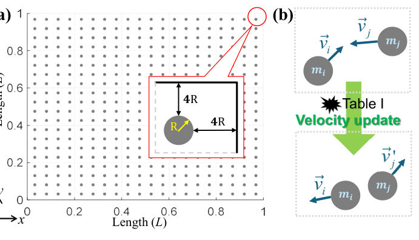 
FIG. 1. (a) Schematic of the studied system and (b) illustration of the velocity updates. In (a), the bounded domain is of size L×L in the x-y plane, and contains a total of N agents (gray disks), each with radius R. The inset shows the initial configuration with the shortest agent-wall distance being 4R. In (b), the pairwise velocity update from (vi,vj) to v

📷 Fig 2

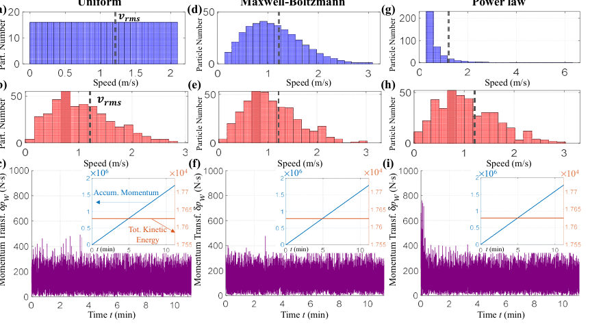 
FIG. 2. Dynamics of the baseline elastic collision model for uniform [(a)–(c)], Maxwell-Boltzmann [(d)–(f)], and power-law [(g)–(i)] initial distributions. The first row [(a), (d), and (g)] shows the initial binned distributions generated according to Eq. (32), which evolve into the final distributions shown in the second row [(b), (e), and (h)] at tf = 11.6 minutes, well after Pwall becomes steady. The vertical dashed lines indicate the root-mean-square speed vrms, while the dark red (emphasized) bars indicate the most-probable speed. The third row exhibits the time-resolved impulse δpw due to agent-wall collisions. The insets show the accumulated momentum (left axis), where the...

📷 Fig 3

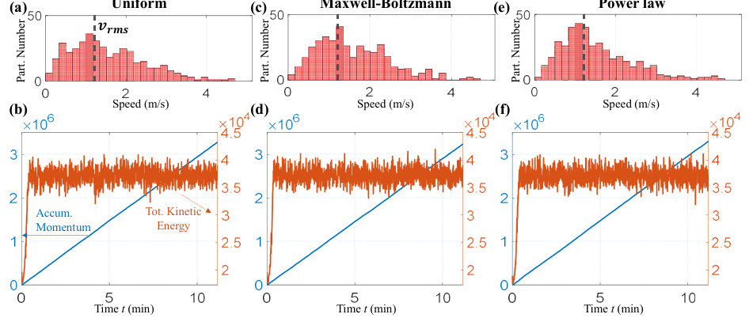 
FIG. 3. Dynamics with all interaction layers enabled, starting from the same initial conditions as in Fig. 2, for uniform [(a) and (b)], Maxwell-Boltzmann [(c) and (d)], and power-law [(e) and (f)] initial distributions. The first row shows the final speed distributions, with dark red bars indicating the most-probable speed. The second row shows the time-resolved accumulated wall momentum pw (t) and the total kinetic energy. Interaction strengths γw = γg = 0.5 are used, with the system divided into two groups of 200 agents each.

📷 Fig 4

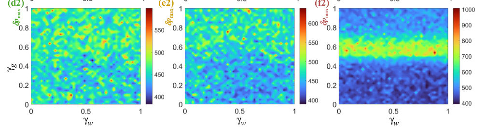 
FIG. 4. (a1)–(f1) Pwall and (a2)–(f2) δpmax as functions of γw and γg in the elastic reorientation model (ERM) under different group configurations N = {N0; Ng=1, Ng=2, · · · , Ng=G}. Across the top row, the number of independent agents is reduced via N0 = 400, 200, and 0 for columns (a), (b), and (c), respectively. The bottom row adopts the fully grouped limit N0 = 0, with decreasing G = 200, 20, and 1 for columns (d), (e), and (f), respectively. The dashed and solid markers in (a1), (b1), and (b2) mark the representative cases selected for Fig. 5, with the corresponding γ values listed in its bottom-left panel.

📷 Fig 5

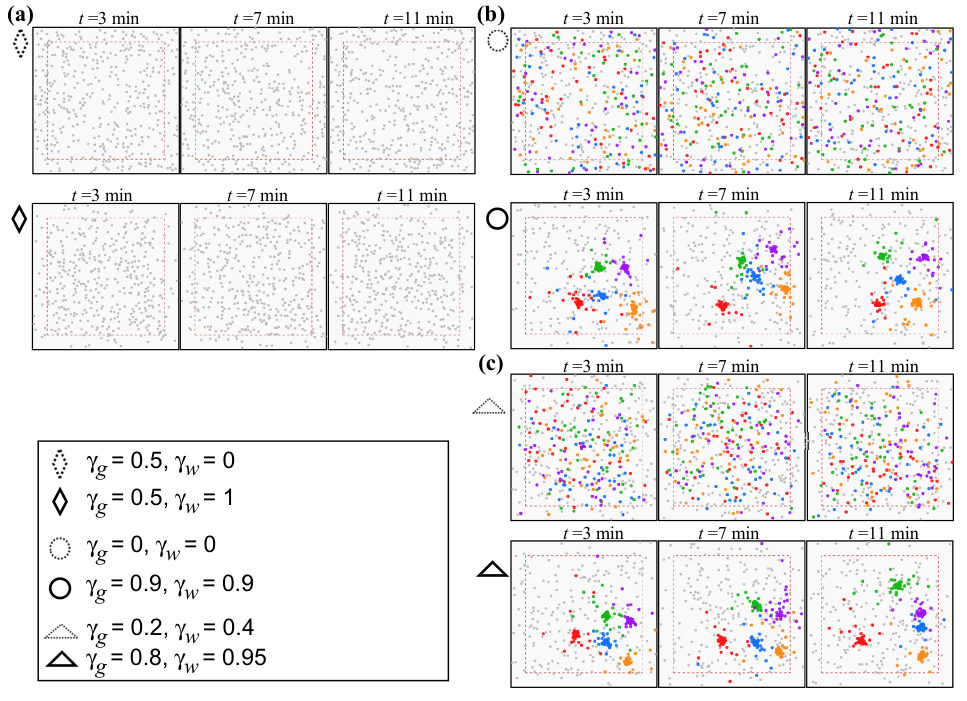 
FIG. 5. Representative snapshots of agent spatial distributions at t = 3, 7, and 11 min, with the dashed and solid markers selected from Fig. 4; the corresponding γ values are listed in the bottom-left panel. In the non-grouped/all-independent case (a) and the grouped case (b), dashed (solid) markers correspond to the high (low) Pwall. In (c), dashed (solid) markers correspond to the low (high) δpmax. Agents in the same group are shown by dots of the same color, whereas gray dots denote independent agents (those not belonging to any group). The dashed square marks the region within which wall-buffering γw is effective.

**Summary.** This work models mechanical safety risks in extremely dense crowds trapped without escape routes. By coupling elastic collision dynamics with social forces, the authors quantify trade-offs between overall wall pressure and peak collision loads. The findings provide mechanistic insights into how social behaviors like cohesion and buffering dictate crowd risk profiles.

**Why it may be interesting.** While focused on classical physics, the analysis of emergent collective behavior, phase transitions (susceptibility discontinuities), and non-equilibrium steady states in a highly interacting many-body system shares conceptual overlap with critical phenomena studied in statistical mechanics.

Detailed structure

**Main problem.** The study investigates direct mechanical hazards in dense, confined crowds that lack any means of egress, moving beyond typical evacuation safety metrics.

**Main result.** The paper establishes a critical wall-pressure/contact-load trade-off and identifies distinct phase boundaries (independent vs. grouped agents) emerging only from the coupled dynamics of elastic reorientation and social forces.

**Method.** The authors employ multi-scale modeling, combining an Elastic Reorientation Model (ERM) with a Social Force Model (SFM) to simulate agent interactions under high density.

**Model / system.** The system models N agents as rigid disks in a 2D confined domain. Interactions are governed by collision-triggered dynamics (conserving kinetic energy) and persistent social forces, incorporating parameters for group cohesion ($\gamma_g$) and wall buffering ($\gamma_w$).

**Key observables.** Macroscopic wall line pressure ($P_{	ext{wall}}$), microscopic maximum per-agent collision impulse ($\delta p_{\max}$), and susceptibility measures used to locate phase boundaries.

**Important parameters / regimes.** Cohesion strength ($\gamma_g$), wall buffering strength ($\gamma_w$), and the relative influence of SFM forces (pushing/sliding) versus purely elastic collisions.

**Assumptions / limitations.** The rigid disk approximation is used, neglecting body deformation; safety criteria are defined by comparing $\delta p_{\max}$ to a critical impulse $p^*$.

**Figures summary.** Figures illustrate the schematic of the system domain and show how different initial condition distributions yield similar final state dynamics for the baseline elastic collision model.

**Paper structure.** The paper progresses by first defining the mechanical hazards, then detailing the coupled ERM+SFM framework, analyzing the resulting trade-offs ($P$-$p$), and finally using finite-size scaling to map out distinct phase boundaries associated with agent grouping and boundary effects.

Abstract

Crowd safety in confined venues is usually evaluated through evacuation performance or pre-collision avoidance, while direct mechanical hazards in dense gatherings without egress remain poorly understood. We study an Elastic Reorientation Model (ERM), a Social Force Model (SFM), and their coupled dynamics. Post-collision behavior is represented by social-group cohesion ($γ_g$) and wall buffering ($γ_w$), while risk is quantified by the macroscopic wall line pressure ($P_{\text{wall}}$) and the microscopic maximum per-agent collision impulse ($δp_{\text{max}}$). In the ERM, cohesion and wall buffering generally reduce $P_{\text{wall}}$ by retaining agents in the bulk, but large groups exhibit a high-$δp_{\text{max}}$ hazard window at intermediate cohesion. As $γ_g\rightarrow1$, local pairing suppresses cluster growth and shifts kinetic energy from relative to center-of-mass motion, reducing $δp_{\text{max}}$. SFM pushing and sliding amplify $δp_{\text{max}}$, especially when agent-agent and agent-wall interactions coexist, while active driving raises $P_{\text{wall}}$ through near-wall accumulation. The coupled dynamics produces a wall-pressure/contact-load ($P$-$p$) trade-off. Finite-size scaling reveals an independent-agent-induced phase boundary at $γ_w=0.5$, characterized by a susceptibility discontinuity, and a grouped-agent-induced continuous phase boundary along a finite segment of $(1-γ_w)(1-γ_g)=0.5$, characterized by divergent susceptibility and terminating at a critical point. Both disappear in the social-force-free ERM, showing that they emerge from the coupled ERM+SFM dynamics. These results provide mechanistic guidance for crowd-risk mitigation and safety planning in high-density venues without egress.

[↑ back to top](#top)

### [Quantum detection of CP violation in the $t\bar{t}$ system: tomography](http://arxiv.org/abs/2607.25034v1)

**Authors:** Priyanka Lamba, Fabio Maltoni, Olimpia Miniati, Eleni Vryonidou  
**Type:** theory · **Category:** other · **PDF:** <https://arxiv.org/pdf/2607.25034v1>  
**Analysis basis:** full PDF text, analyzed in chunks
**Topic relevance:** `methods for driven-dissipative` **3/5** · `quantum measurements` **3/5** · `entanglement & information structure` **2/5** · `measurement-induced transitions` **2/5** · `Keldysh / 2PI / non-Gaussian methods` **1/5** · `correlated / nonlocal dissipation` **1/5** · `driven-dissipative phase transition` **1/5**

📷 Fig 1

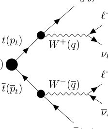 
Figure 1: Diagrammatic representation of the process I →t¯t →b ℓ+νℓ¯b ℓ−¯νℓ. All final-state leptons are taken to be massless, while mt, mb and mW denote the top-quark, bottom-quark and W-boson masses. In our notation, barred four-momenta ¯pi are assigned to the decay products of ¯t, while unbarred four-momenta pi are assigned to the decay products of t.

📷 Fig 2

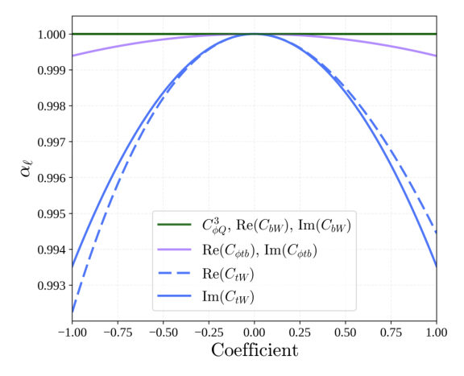 
Figure 2: Dependence of the charged-lepton spin-analysing power αℓon the Wilson coefficients entering Eq. (3.23), varied one at a time and taken to be either purely real or purely imaginary, for Λ = 1 TeV. Within the displayed range, the predictions for C3 ϕQ, Re(CbW ), and Im(CbW ) coincide and are represented by a single green curve. Likewise, the predictions for Re(Cϕtb) and Im(Cϕtb) are numerically indistinguishable and are represented by a single purple curve.

📷 Fig 3

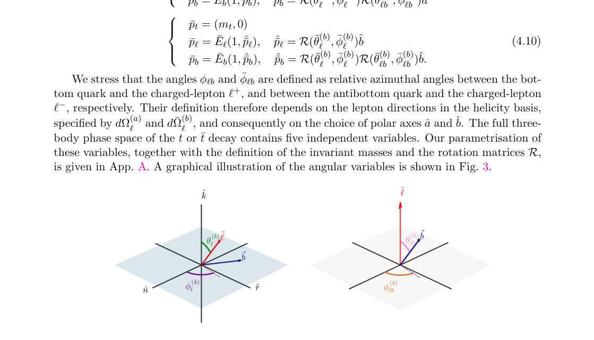 
Figure 3: Example of the angular variables used for the t decay, choosing ˆa = ˆk as the polar axis. The left panel shows the definition of θ(k) ℓ and ϕ(k) ℓ in the helicity basis. In the right panel, the lepton direction is taken as the polar axis, and the relative angles θ(k) ℓb and ϕ(k) ℓb are defined. The angle θ(k) ℓb is fixed by the decay kinematics.

📷 Fig 4

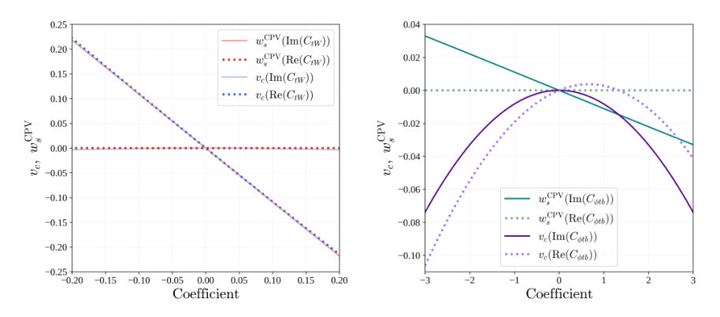 
Figure 4: Dependence of vc and wCPV s on the Wilson coefficients CtW and Cϕtb, with only one coefficient taken to be non-zero at a time and chosen to be either purely real or purely imaginary. The ranges shown are selected according to the experimental bounds summarised in Tab. 1. The left and right panels correspond to CtW and Cϕtb, respectively. The value of Λ has been set to 1 TeV.

📷 Fig 5

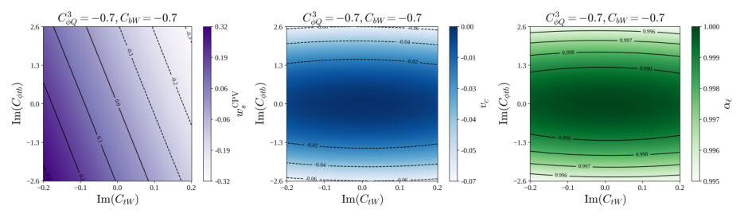 
Figure 5: Dependence of wCPV s , vc, and αℓon Im(CtW ) and Im(Cϕtb), with Re(CtW ) = Re(Cϕtb) = 0, and all remaining Wilson coefficients fixed to the benchmark values indicated above the corre- sponding panels. The benchmark points are chosen to illustrate the largest CP-violating effects within the reference ranges considered.

**Summary.** This paper presents a sophisticated quantum-tomographic method to search for CP violation in $tar{t}$ production. It systematically separates potential new physics sources by analyzing two distinct classes of angular observables: polar angles (for production) and azimuthal angles involving decay planes (for decay). The framework is powerful because it provides a comprehensive diagnostic tool for future collider experiments.

**Why it may be interesting.** While focused on particle physics, the methodology—using quantum state tomography to disentangle sources of non-Hermitian or CP-violating information encoded in correlations—is highly relevant to open quantum systems theory and characterizing decoherence channels.

Detailed structure

**Main problem.** The goal is to develop a quantum-tomographic framework to definitively determine whether observed CP-odd effects in $tar{t}$ events originate from the production mechanism, the decay vertex, or both.

**Main result.** By combining measurements of polar-angle distributions (probing production) and azimuthal observables involving $b$-lepton decay planes (probing decay), a systematic strategy is established to separate these sources of CP violation.

**Method.** The analysis uses quantum state tomography applied to angular distributions derived from the factorized process $I 	o tar{t} 	o b\ell^+
u_\ell ar{b}\ell^-ar{
u}_\ell$. This involves extending standard tomography to include anomalous couplings in the $Wtb$ vertex.

**Model / system.** The system is top-antitop quark pair production ($tar{t}$) followed by leptonic decay. The framework utilizes the narrow-width approximation, factorizing the process into a production density matrix and individual top/antitop decay density matrices, which are analyzed using Effective Field Theory (SMEFT) corrections to the $Wtb$ vertex.

**Key observables.** Polar-angle distributions (reconstruct $
ho_I$) and azimuthal observables involving $b-\ell$ decay planes (show sine modulations for decay CPV).

**Important parameters / regimes.** The analysis is sensitive to anomalous couplings in the $Wtb$ vertex, tested at various collider energies ($\sqrt{s}=365 	ext{ GeV}$ mentioned for $e^+e^-$).

**Assumptions / limitations.** The narrow-width approximation is employed throughout the calculation. Leptons are assumed massless.

**Figures summary.** Figure 1 illustrates the diagrammatic representation of the full process $I 
ightarrow tar{t} 
ightarrow b \ell^+
u_\ell ar{b} \ell^- ar{
u}_\ell$.

**Paper structure.** The paper proceeds by first establishing the factorized spin-density-matrix description, then deriving decay matrices incorporating anomalous couplings, followed by deriving the angular distributions necessary for tomography, and concluding with a discussion of the combined measurement strategy.

Abstract

We develop a quantum-tomographic framework for determining whether possible CP-odd effects in $t\bar t$ events originate in production, in decay, or in both. In the narrow-width approximation, the process $I\to t\bar t\to b\ell^+ν\,\bar b\ell^-\barν$ factorises into a production density matrix and top and antitop decay density matrices. We extend the standard tomography procedure to a general anomalous $Wtb$ vertex and derive the corresponding angular distributions. Polar-angle distributions retain their usual tomographic form, up to modifications of the spin-analysing powers, and can therefore be used to reconstruct the production density matrix and test its CP properties. By contrast, dedicated azimuthal observables involving the $b$--lepton decay planes contain characteristic sine modulations that provide linear probes of possible new CP-violating interactions in the decay vertex. Combining the two classes of observables gives a systematic strategy for separating sources of CP violation in production and in decay. We illustrate the resulting angular signatures for representative $t\bar t$ production scenarios at hadron and lepton colliders.

[↑ back to top](#top)

### [Theory of Cubic-Phase Dynamics in the Linear Potential](http://arxiv.org/abs/2607.25627v1)

**Authors:** Maximilian L. D. D. Pellner, Georgi Gary Rozenman  
**Type:** both · **Category:** other · **PDF:** <https://arxiv.org/pdf/2607.25627v1>  
**Analysis basis:** full PDF text, analyzed in chunks
**Topic relevance:** `analog quantum simulation` **3/5** · `interference shaping light` **3/5** · `non-equilibrium dynamics` **2/5** · `quantum optics experiment` **2/5** · `Frenkel-Kontorova` **1/5** · `methods for driven-dissipative` **1/5** · `quantum measurements` **1/5**

📷 Fig 1

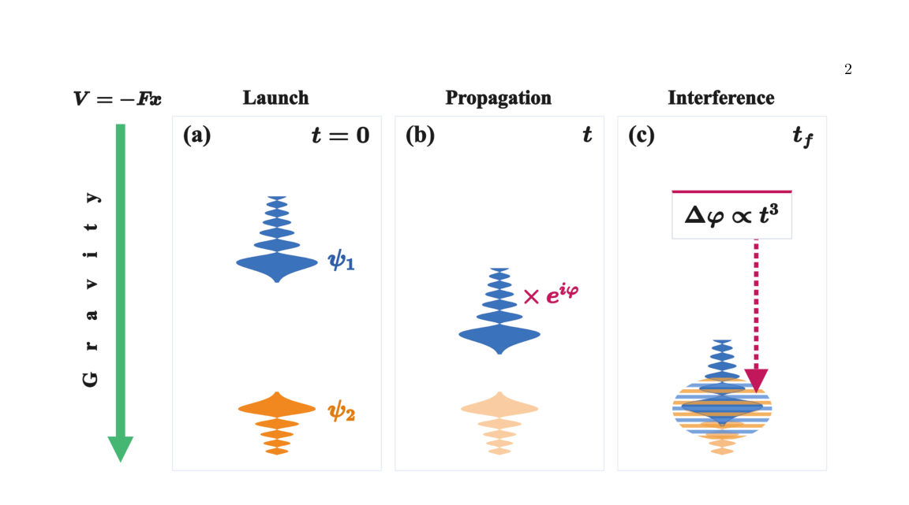 
Figure 1. Propagation and interference of Airy wave packets in a linear potential. Conceptual evolution of a falling Airy wave packet in a linear potential V = −Fx (e.g. gravity). (a) The Airy wave function ψ1 is launched above a stationary Airy function ψ2. (b) Under the constant force F it accelerates downward, accruing a cubic-in-time phase. (c) The two packets overlap and interfere, imprinting the relative phase on the fringe density, ρ ∝cos ∆φ, whose cubic-in-time part is ∆φ ∝t3. The width of each packet encodes its density |ψ(x)|2 along the propagation axis x (mirrored for symmetry), not a transverse coordinate.

📷 Fig 2

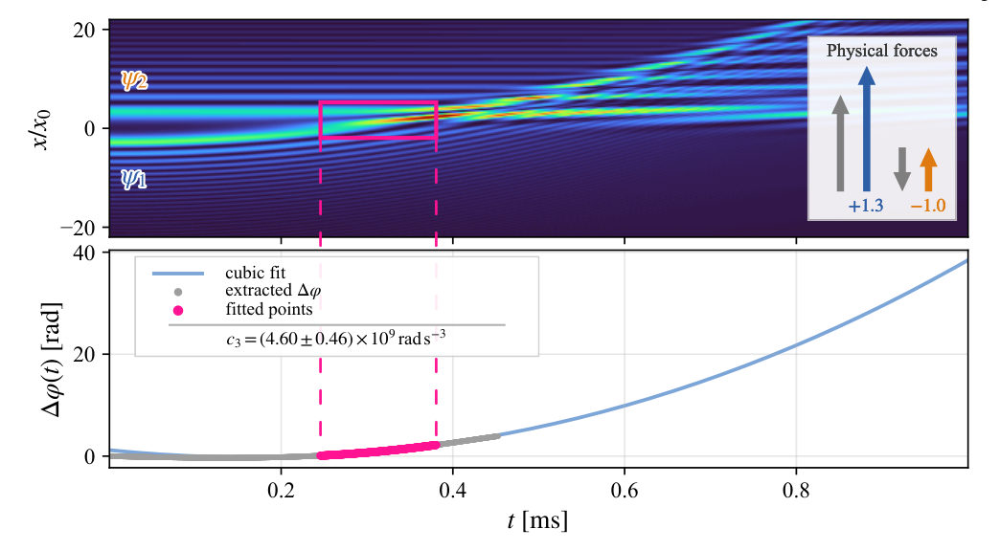 
Figure 2. Extraction of the relative cubic phase. Simulated Airy–Airy collision (87Rb) in the linear potential V = +Fx, propagated by a split-step integrator. Top: probability density |ψ(x, t)|2 against position in units of the Airy length x0, the density itself shown qualitatively in colour. The pink rectangle marks the main interference fringe, and the dashed connectors link its lower corners to the outer points of the fit window. Bottom: relative phase ∆φ(t) recovered by heterodyne demodulation (grey: extracted ∆φ, pink: the fitted points) with the cubic least-squares fit (blue). The phase is reliably extracted only over the first interference fringe, and points beyond it, where the...

📷 Fig 3

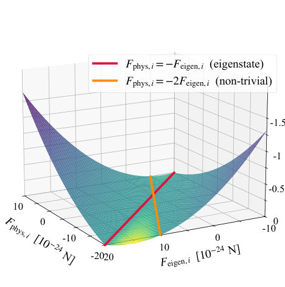 
Figure 3. Cubic-phase landscape. Single-packet cubic co- efficient c3,i, Eq. (12), as a function of the applied force Fphys,i and the eigenforce Feigen,i, for 87Rb with m87Rb g setting the force scale. The indefinite quadratic form yields a saddle sur- face that vanishes along the eigenstate line Fphys,i = −Feigen,i (red) and the non-trivial line Fphys,i = −2Feigen,i (orange), and grows in magnitude away from both, marking the regime of strong cubic signature. Colour encodes the same c3,i as the vertical axis and carries no independent information. Up to a constant offset set by the reference packet, the same land- scape gives the relative cubic coefficient (Eq. 15) accessed in interference.

📷 Fig 4

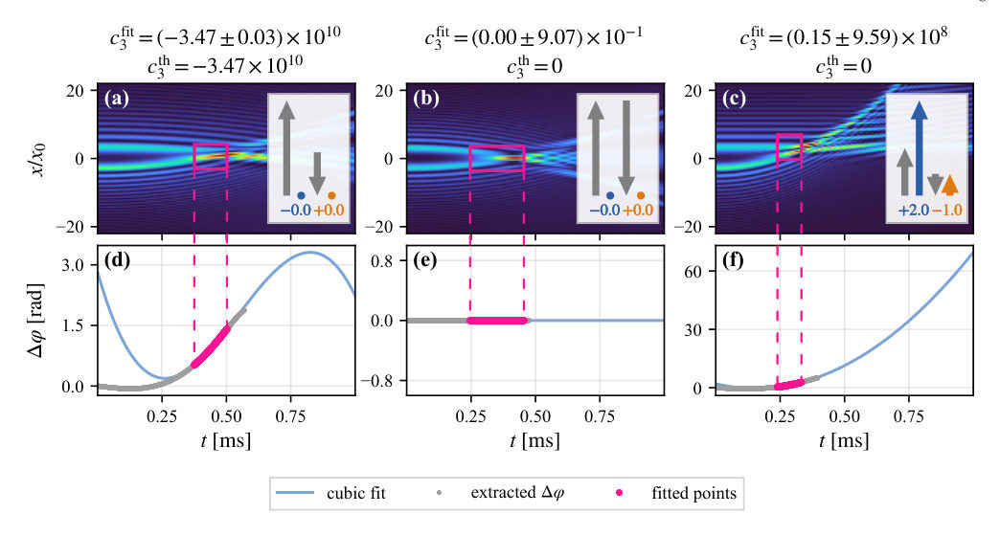 
Figure 4. Relative cubic phase across collision regimes. Three further simulated Airy–Airy collisions (87Rb) in the linear potential V = +Fx, each column a collision regime: the density evolution (top row, (a)–(c), with the main interference fringe boxed and linked to the fit window) and the relative phase ∆φ(t) with its cubic least-squares fit (bottom row, (d)–(f)). The density panels are shown qualitatively in colour, as in Fig. 2. Fitted and theoretical coefficients cfit 3 and cth 3 are quoted per panel in rad s−3, with the power of ten shown alongside each. As in Fig. 2, phase points beyond the first fringe are omitted [28]. Each density panel carries the per-packet force inset of Fig....

**Summary.** The paper develops a theory for the universal cubic-in-time phase accumulated by wave packets in a constant force field, applicable from cold atoms to optics. By measuring this relative phase through interference, researchers can precisely probe the underlying force landscape and confirm theoretical predictions with high accuracy.

**Why it may be interesting.** This work provides a highly sensitive, non-linear diagnostic tool—the cubic phase—that is robustly predicted across diverse physical systems (optics to atoms). It demonstrates how fundamental symmetries dictate observable quantities in quantum dynamics.

Detailed structure

**Main problem.** The study investigates the universal cubic-in-time phase accumulated by quantum wave packets propagating under a constant external force (linear potential). This relative phase serves as a designable signal accessible through interference.

**Main result.** The theory predicts an analytically closed form for the relative cubic coefficient, which is confirmed experimentally via heterodyne demodulation of simulated interference fringes with high accuracy. The eigenforce acts as an effective antagonist to the applied force in this phase structure.

**Method.** Theoretical derivation using Feynman propagators and Airy eigenstates, complemented by numerical simulations modeling wave packet collisions (interference) and subsequent fitting of the time-dependent relative phase.

**Model / system.** The model is a quantum wave packet evolving under a linear potential ($V \propto x$), which is shown to be mathematically analogous across platforms including ultracold atoms, paraxial optics, and surface-gravity water waves. The core physics is governed by Schrödinger-type equations.

**Key observables.** The relative cubic coefficient of the phase ($\Delta\varphi \propto t^3$) extracted from the interference pattern density $
ho$.

**Important parameters / regimes.** Applied force ($F_{	ext{phys}}$), intrinsic eigenforce ($F_{	ext{eigen}}$), and time ($t$). The analysis highlights specific zero lines in the force landscape.

**Assumptions / limitations.** The analysis relies on a quasi-one-dimensional description along the propagation axis, and the measurement of the phase is limited to the region around the first interference fringe.

**Figures summary.** Figures illustrate Airy wave packet propagation and interference patterns showing the imprinted relative phase $\Delta\varphi \propto t^3$. Specific panels demonstrate how the fitted cubic coefficient vanishes in regimes of symmetry cancellation or specific force alignments.

**Paper structure.** The paper establishes the universality of the cubic phase across multiple physical platforms, derives the general form of the relative cubic coefficient based on eigenforce and applied force, and then presents both theoretical analysis (identifying zero lines) and experimental/simulation results confirming the measurable signal via interference.

Abstract

A quantum wave packet in a linear potential, i.e., under a constant force such as gravity, accumulates a cubic-in-time phase that is universal across Schrodinger-type platforms and naturally realized by Airy eigenstates. Because the classical action is quadratic in the force, this phase comprises exactly three contributions: intrinsic, force-induced, and a cross term. The force-induced contribution alone is shape-independent, whereas the Airy eigenstate renders the shape-dependent contributions non-dispersing. An eigenstate-based nondimensionalization identifies the eigenforce, namely the intrinsic force underlying the packet's acceleration in the absence of an applied force, as a natural parameter. As a function of both forces, the cubic coefficient takes an analytically closed and physically interpretable form that factors along two zero lines: the static Airy eigenstate and a nontrivial zero at which the phase cancels without stationarity. This exposes the eigenforce as an effective antagonist to the applied force, not only in the caustic's self-acceleration but also within the phase, while leaving the centroid unaffected in accordance with Ehrenfest's theorem. Spatially uniform within each packet, the phase cannot be measured directly and is accessible only through the relative phase of two colliding packets, each evolving in its own potential. The general relative cubic coefficient, forbidden by symmetry for identical packets and activated by preparation asymmetry, therefore provides a designable signal. Extracted through heterodyne demodulation of the simulated interference between two Airy packets, its central value agrees with the prediction to sub-percent accuracy within the fitting uncertainty. The analysis spans ultracold-atom condensates, paraxial optics, and surface-gravity water waves.

[↑ back to top](#top)

### [Anisotropic bond-current susceptibilities and real-space current topology in correlated electron systems](http://arxiv.org/abs/2607.25483v1)

**Authors:** Worapon Phatcharasirinawakun, Hiroyuki Yamase  
**Type:** theory · **Category:** strongly correlated electrons · **PDF:** <https://arxiv.org/pdf/2607.25483v1>  
**Analysis basis:** full PDF text, analyzed in chunks
**Topic relevance:** `Keldysh / 2PI / non-Gaussian methods` **3/5** · `analog quantum simulation` **2/5** · `non-equilibrium dynamics` **2/5** · `correlated cavity matter` **1/5** · `driven-dissipative phase transition` **1/5** · `entanglement & information structure` **1/5** · `methods for driven-dissipative` **1/5** · `non-equilibrium universality` **1/5**

📷 Fig 1

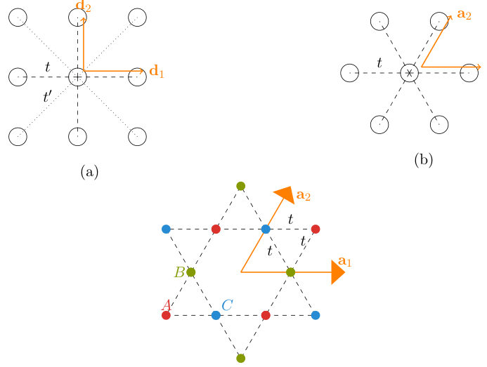 
FIG. 1. Lattice geometries considered in this work: (a) square, (b) triangular, and (c) kagome

📷 Fig 2

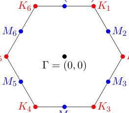 
FIG. 2. Electronic band structures of the triangular (dashed line) and kagome (solid lines) lattices

📷 Fig 3

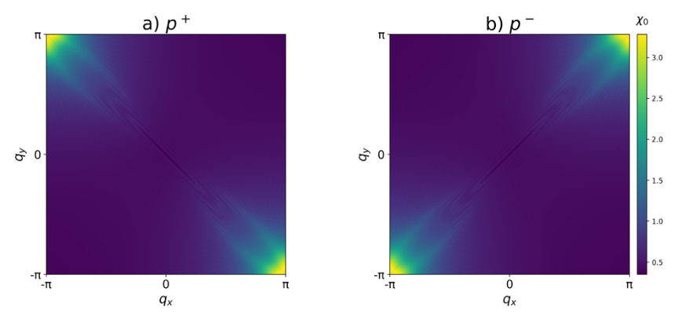 
FIG. 4. Momentum-space bond-current susceptibilities of the square lattice at van Hove filling

📷 Fig 4

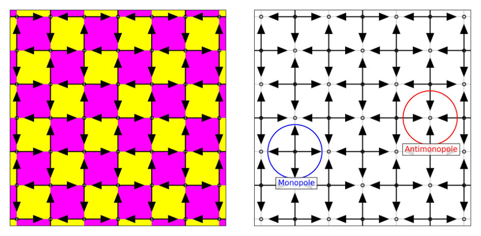 
FIG. 5. Real-space bond-current configurations on the square lattice generated by the p+ and

📷 Fig 5

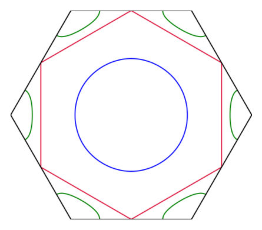 
FIG. 6. Fermi surfaces of the triangular lattice at three representative fillings. The red curve

**Summary.** This work develops a general theoretical framework connecting bond-current susceptibility anisotropy to the resulting current topology in correlated electron materials. By analyzing three different lattices, the authors show that fluctuations near specific filling levels favor distinct real-space current patterns, such as closed loop currents or source–sink textures. This provides a powerful tool for interpreting experimental signatures of charge order and broken symmetries.

**Why it may be interesting.** While focused on condensed matter charge order, the rigorous mathematical framework linking momentum-space susceptibilities to real-space topological currents is highly relevant to understanding emergent collective excitations in quantum many-body systems.

Detailed structure

**Main problem.** To establish a direct link between bond-current form factors, susceptibility anisotropy, and the resulting real-space current topology in correlated electron systems.

**Main result.** The anisotropy of the bond-current susceptibility systematically favors ordering wave vectors that support closed loop-current states, providing a general framework for identifying such orders.

**Method.** Derivation of symmetry-allowed bond-current form factors and calculation of the Random-Phase-Approximation (RPA) susceptibility on various lattices.

**Model / system.** Correlated electron systems modeled using nearest-neighbor bond-charge interactions, studied on square, triangular, and kagome lattices.

**Key observables.** Bond-current form factors ($\gamma_k$), susceptibility anisotropy $\chi(Q)$, and real-space current topology (e.g., closed loop currents vs. source–sink textures).

**Important parameters / regimes.** Filling level ($\mu/t$), lattice geometry (square, triangular, kagome), and temperature ($T$).

**Assumptions / limitations.** The physical current is identified with the imaginary part of the reconstructed order parameter; analysis often focuses on the sine-form-factor representation despite acknowledging limitations.

**Figures summary.** Figures illustrate lattice structures (triangular/kagome) and show momentum-space bond-current susceptibilities for the square lattice, alongside real-space current configurations demonstrating both closed loops and source–sink patterns.

**Paper structure.** The paper systematically derives form factors for different lattices, calculates susceptibility maxima to predict ordering vectors, and then reconstructs the corresponding real-space current topology based on these fluctuations.

Abstract

We derive all symmetry-allowed bond-current form factors generated by nearest-neighbor bond-charge interactions on square, triangular, and kagome lattices. We find that the anisotropy of the bond-current susceptibility systematically favors ordering wave vectors that support closed loop-current states, whereas symmetry-related wave vectors with weaker susceptibility generate noncirculating current textures. Near van Hove filling, this correspondence is robust across all lattice geometries considered, producing staggered flux phases on the square lattice, diamond-shaped current patterns on the triangular lattice and both chiral and nonchiral loop-current states on the kagome lattice. Our results establish a direct link between bond-current form factors, susceptibility anisotropy, and real-space current topology, providing a general framework for identifying loop-current orders and interpreting signatures of time-reversal symmetry breaking in correlated electron materials.

[↑ back to top](#top)

### [Critical Ripples and Dirac Fermions in Crystalline Membranes](http://arxiv.org/abs/2607.25767v1)

**Authors:** Sebastián Bahamondes, Rodrigo Soto-Garrido, Enrique Muñoz, Vladimir Juričić  
**Type:** theory · **Category:** statistical mechanics · **PDF:** <https://arxiv.org/pdf/2607.25767v1>  
**Analysis basis:** full PDF text, analyzed in chunks
**Topic relevance:** `non-equilibrium universality` **3/5** · `driven-dissipative phase transition` **2/5** · `non-equilibrium dynamics` **2/5** · `Frenkel-Kontorova` **1/5** · `Keldysh / 2PI / non-Gaussian methods` **1/5** · `Kondo & dissipative impurity` **1/5** · `analog quantum simulation` **1/5** · `methods for driven-dissipative` **1/5**

📷 Fig 1

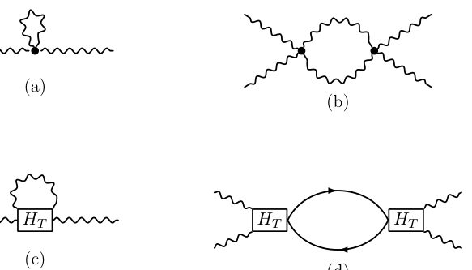 
Figure 1. Flat-phase one-loop Feynman diagrams. Wiggly lines denote flexural propagators and solid directed lines denote Dirac propagators. Panels (a) and (b) generate the pure-membrane renormalizations in eqs. (3.1)–(3.3). Panel (c) is the isotropic-tension insertion entering eqs. (3.6) and (3.16); its Ward-identity derivation is given in appendices B and D. Panel (d) generates the nonlocal strain interaction in eq. (3.28), with the polarization given in eq. (3.26).

📷 Fig 2

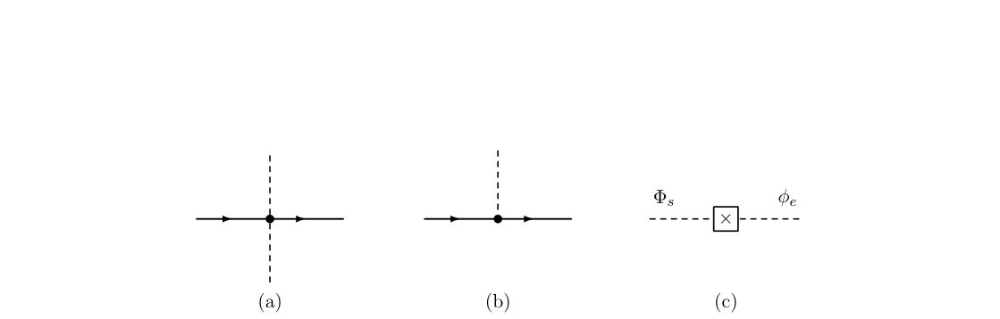 
Figure 2. Finite-momentum couplings. Solid directed lines denote Dirac propagators and dashed lines denote bosonic fields. Each arrow is centered on its uninterrupted propagator segment; open fermion lines are oriented from left to right. Panel (a) represents the mechanical density interaction in eq. (4.7). Panel (b) is the symmetry-locked Yukawa vertex in eq. (5.1). Panel (c) depicts the bilinear electronic–structural mixing in eq. (5.6), which induces the relation in eq. (5.7).

📷 Fig 3

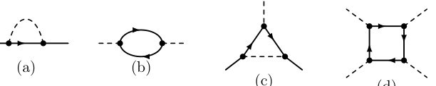 
Figure 3. One-loop diagrams of the finite-Q GNY theory. Solid lines denote Dirac propagators and dashed lines denote bosonic order-parameter propagators. Arrows are centered on the internal fermion segments between vertices; open fermion lines are oriented from left to right, while arrows on closed loops follow a consistent circulation. Panels (a) and (b) determine the anomalous dimensions in eqs. (5.16) and (5.17); panels (c) and (d) contribute to the beta functions in eqs. (5.10) and (5.11). The pole parts and normalization conventions are collected in appendix F.

**Summary.** This theoretical work develops a field theory for crystalline membranes coupling flexural phonons with Dirac fermions. Using Renormalization Group techniques, the authors determine that while the system can remain stable in the flat limit, instabilities at finite wavelengths lead to distinct critical points. The most complex case involves a hybrid transition characterized by the chiral-XY Gross-Neveu-Yukawa universality class.

**Why it may be interesting.** The rigorous application of critical phenomena concepts (RG theory) to coupled electronic/structural degrees of freedom is highly relevant for understanding quantum phase transitions in low-dimensional materials that bridge solid-state physics and statistical mechanics.

Detailed structure

**Main problem.** The paper analyzes the low-energy field theory describing the coupled dynamics between nonrelativistic flexural phonons and relativistic Dirac quasiparticles in crystalline membranes.

**Main result.** It distinguishes two critical scenarios: a stable flat phase, or genuine hybrid electronic-structural critical points governed by the chiral-XY Gross-Neveu-Yukawa universality class when symmetry permits coupling.

**Method.** The analysis relies heavily on Renormalization Group (RG) flow techniques and one-loop calculations to determine the stability of different physical regimes and characterize critical exponents.

**Model / system.** The system is a crystalline membrane hosting Dirac fermions, modeled by coupled effective actions for flexural phonons and massless Dirac quasiparticles. The coupling strength and renormalization are key focus areas.

**Key observables.** Critical exponents (e.g., related to Wilson-Fisher or chiral-XY classes), renormalized elastic constants, and the flow of dimensionless coupling strengths ($ar{g}, y$).

**Important parameters / regimes.** The ratio between flexural and Dirac energy scales ($s(\ell)$), charge neutrality conditions, and symmetry constraints (e.g., horizontal reflection parity).

**Assumptions / limitations.** The analysis separates the infrared behavior (flat phase) from potential instabilities at finite momentum ($\pm Q$), and assumes specific symmetries dictate which universality class applies.

**Figures summary.** Not specified in the notes, but the structure implies showing RG flow diagrams or critical exponents for different coupling regimes.

**Paper structure.** The paper develops the coupled low-energy field theory, analyzes the stability of the long-wavelength flat phase via RG flow, and then examines two distinct instability scenarios: one governed by bosonic Wilson-Fisher fixed points, and a second, hybrid case leading to chiral-XY GNY universality.

Abstract

Crystalline membranes hosting Dirac fermions, with graphene as the paradigmatic example, combine two low-energy sectors with sharply different dynamics: nonrelativistic flexural phonons and relativistic-like Dirac quasiparticles. We develop the low-energy field theory of this coupled system at charge neutrality and determine how this dynamical mismatch controls the coupling between the two sectors. In the long-wavelength flat phase, rotational symmetry ties the renormalization of the leading local scalar strain--density coupling to the scale-dependent bending rigidity, causing its dimensionless strength to decrease logarithmically. At the same time, flexural modes become parametrically slower than the Dirac fermions, so the resulting fermionic feedback vanishes as a power law.The flat phase is therefore stable against this perturbation. The physics changes when elastic interactions or electronic softening destabilize the membrane at a finite wavelength, selecting a ripple pattern formed by modes at $\pm\mathbf{Q}$. For an isolated pair of ordering wavevectors, provided that commensurability-induced phase pinning is irrelevant, the transition is governed by the bosonic Wilson--Fisher fixed point, while the Dirac fermions remain spectators. A genuinely hybrid electronic--structural critical point arises instead when symmetry permits a mass-type Dirac bilinear to share the ripple's momentum and quantum numbers, including horizontal-reflection parity. The transition is then described by the chiral-XY Gross--Neveu--Yukawa universality class. Using the known one-loop critical exponents, we characterize this transition, determine the induced secondary elastic distortion, and show that the fermionic and bosonic velocities lock in the isotropic continuum limit.

[↑ back to top](#top)

### [Logarithmic Aging Diffusion from a Multiplicative Event Clock: Rare Event Statistics, Ultraslow Transport, and Ensemble-Time Inequivalence](http://arxiv.org/abs/2607.25374v1)

**Authors:** Chunyan Li, Zheng Li, Yueyan Li, Haiwen Liu, X. C. Xie  
**Type:** theory · **Category:** disordered systems and neural networks · **PDF:** <https://arxiv.org/pdf/2607.25374v1>  
**Analysis basis:** full PDF text, analyzed in chunks
**Topic relevance:** `non-equilibrium dynamics` **3/5** · `non-equilibrium universality` **2/5** · `scars & prethermalization` **2/5** · `Keldysh / 2PI / non-Gaussian methods` **1/5** · `analog quantum simulation` **1/5** · `correlated / nonlocal dissipation` **1/5** · `driven-dissipative phase transition` **1/5** · `methods for driven-dissipative` **1/5**

📷 Fig 1

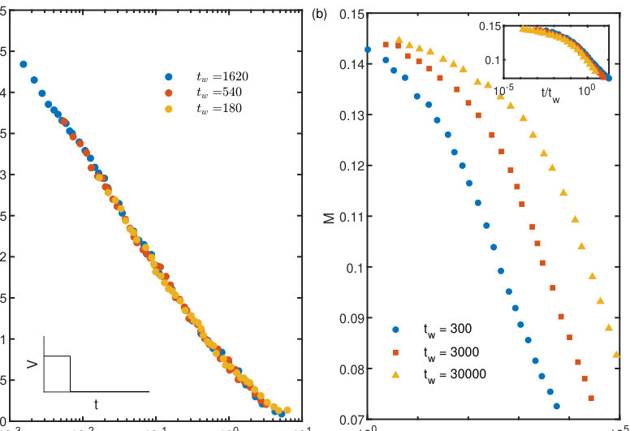 
Figure 1. One-time logarithmic relaxation and protocol-dependent aging are distinct experimental signa- tures. (a) Conductance relaxation in an electron glass: the conductance G of thin In2O3−x films relaxes logarithmically after a sudden change in external stress, shown in the inset. Data are reproduced from Fig. 2 of Ref. [39]. (b) Normalized thermoremanent magnetization M in an Ag : Mn 2.6% spin glass, showing slow relaxation and aging. After field cooling and a waiting time tw, the magnetic field was switched off at t = 0 and the decay of M was recorded. Data are reproduced from Fig. 1 of arXiv: cond-mat/9607224. Inset: scaling collapse as a function of t/tw.

📷 Fig 2

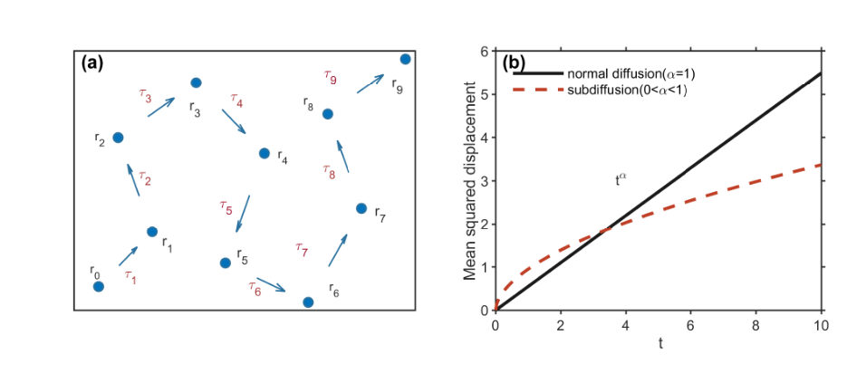 
Figure 2. Standard decoupled CTRW: additive renewal times and power-law subdiffusion. (a) Random- walk dynamics in a heterogeneous energy landscape. The particle alternates between mobile episodes and trapping periods induced by defects, traps, or energy barriers. Escape from a trap occurs after a stochastic waiting time, after which the particle makes a transition to another state. (b) The distribution of waiting times determines the long-time transport behavior. When the distribution has a finite characteristic time, the transition rate is effectively constant at long times and the dynamics reduces to normal diffusion, with ⟨x2(t)⟩∝t. When the distribution is broad and scale-free, no...

📷 Fig 3

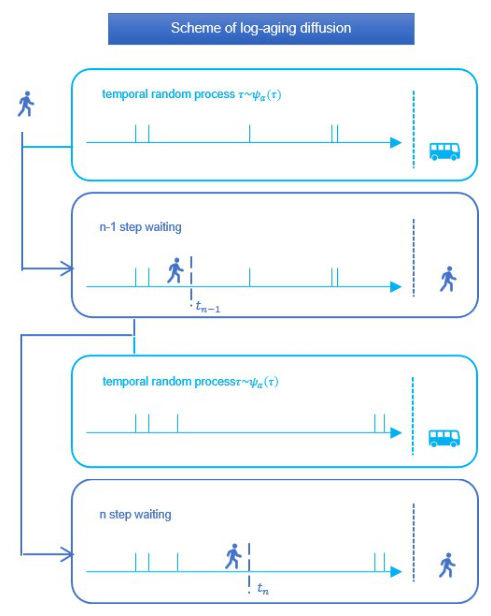 
Figure 3. Forward-waiting-time construction and its iteration in the log-aging model. The bus analogy represents an underlying heavy-tailed renewal stream with ψα(τ) ∼Aτ −1−α. At an arbitrary observation age, an ordinary aged renewal process uses the residual or forward waiting time only until the next renewal. The log-aging construction makes an additional modeling step: at each event time Tn, it samples the next residual interval from the age-conditioned law and thereby generates a multiplier Yn = Tn+1/Tn. In the scaling limit these multipliers are i.i.d. with density gα(y), making the process additive in logarithmic time.

📷 Fig 4

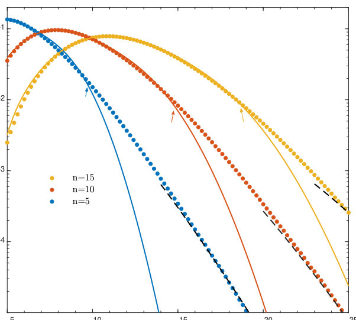 
Figure 4. Central and far-tail regimes of the exact-count probability hn(t) = Pr[N(t) = n]. Symbols show numerical results for n = 5, 10, and 15. The colored solid curves are the central large-n approximation, which is Gaussian in ln(t/t0). The black dashed lines are the fixed-n, long-time asymptote hn(t) ∝t−α[ln(t/t0)]n. The two fits therefore represent different orders of limits: typical clock fluctuations near the peak and rare low-activity histories in the far-time tail.

📷 Fig 5

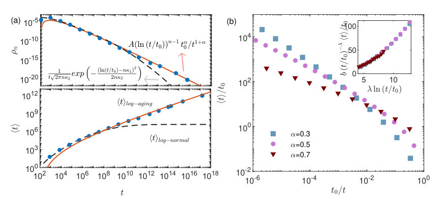 
Figure 5. Central and far-tail sectors of the nth-event-time density ρn(t). (a) The central large-n sector is asymptotically log-normal in physical time, whereas the fixed-n far tail is t−1−α[ln(t/t0)]n−1. The truncated first duration moment, ⟨t⟩tr(tc) = ´ tc t0 t′ρn(t′) dt′, exposes the tail because duration weighting amplifies rare, long-lived histories. (b) Scaling of the truncated duration moment for several α. The figure diagnoses a duration-weighted rare-event sector; it should not be interpreted as evidence that the same tail dominates ordinary event-count moments or every low-frequency response in an arbitrary microscopic Griffiths system.

**Summary.** This paper develops a detailed stochastic model based on a multiplicative event clock to explain logarithmic aging diffusion observed in various disordered materials. By analyzing the joint consistency of multiple observables—not just one scaling curve—the authors propose a mechanism that rigorously separates this specific type of slow dynamics from simpler theoretical approximations.

**Why it may be interesting.** It provides a rigorous mathematical framework to distinguish between different physical origins of slow dynamics in disordered systems, which is crucial for interpreting experimental measurements in glassy materials or amorphous solids.

Detailed structure

**Main problem.** The paper addresses the challenge of uniquely identifying the underlying stochastic mechanism responsible for logarithmic aging diffusion, as simple relaxation laws are insufficient.

**Main result.** A specific multiplicative event clock model is proposed that generates unique signatures—such as distinct scaling behaviors in mean-square displacement and non-converging ensemble averages—that distinguish it from other slow dynamics models.

**Method.** The authors analyze the process using an exact event-level construction based on iterating age-conditioned forward-recurrence laws, comparing this to diffusion-limit representations like Fokker-Planck equations.

**Model / system.** The model is a 'Multiplicative Event Clock' governing logarithmic aging diffusion. It applies conceptually to physical systems exhibiting slow dynamics, such as electron glasses or disordered magnetic materials.

**Key observables.** Logarithmic drift and spreading, Einstein relation under local detailed balance, ultraslow transit/target-survival laws, relative scatter of mean-square displacement ($\propto 1/\ln(T/t_0)$).

**Important parameters / regimes.** The ratio of event times ($U_n = \ln(T_{n+1}/T_n)$) being i.i.d., and the time scale separation between trajectory reproducibility and ensemble averages.

**Assumptions / limitations.** The analysis distinguishes the exact event-level construction from its diffusion limit, acknowledging that generalized Langevin closures might match some responses but fail to reproduce core event statistics.

**Figures summary.** Figure 1 illustrates the difference between one-time logarithmic relaxation (e.g., conductance) and protocol-dependent aging (e.g., TRM).

**Paper structure.** The paper establishes the inadequacy of simple scaling laws, introduces the multiplicative event clock via its recurrence law, derives resulting statistics for count/variance, compares this exact construction against continuum limits (Fokker-Planck), and concludes by demanding joint consistency across multiple observable types.

Abstract

Logarithmic time dependences occur in many aging materials, but neither a $\ln t$ relaxation law nor a $1/t$ event rate uniquely identifies the underlying stochastic mechanism. We examine a specific log-aging process defined by iterating the age-conditioned forward-recurrence law after every event. This rule makes the event times multiplicative: the logarithmic ratios $U_n=\ln(T_{n+1}/T_n)$ are independent and identically distributed with an explicit non-exponential density. Consequently, both the mean and the variance of the event count grow linearly with $\ln(t/t_0)$, while the density of the $n$th event time has a log-normal central sector and a fixed-$n$ algebraic far tail. These clock statistics generate logarithmic drift and spreading, an Einstein relation under local detailed balance, and ultraslow transit and target-survival laws. They also separate trajectory reproducibility from ensemble--time equivalence: the relative scatter of the time-averaged mean-square displacement decays as $1/\ln(T/t_0)$, although its mean does not converge to the ensemble lag MSD. We distinguish the exact event-level construction from its diffusion-limit generalized Fokker--Planck and random-clock subordination representations, and from a generalized-Langevin closure that can match selected responses and covariances but need not reproduce event counts or rare-duration statistics. The proposed clock is therefore tested not by a single logarithmic curve, but by the joint, no-refitting consistency of multiplier, count, transport, first-passage, and finite-window observables.

[↑ back to top](#top)

### [Gravity-controlled non-equilibrium Casimir pressure in a binary liquid mixture](http://arxiv.org/abs/2607.25697v1)

**Authors:** Marcin Piotr Pruszczyk, Roberto Cerbino, Andrea Gambassi  
**Type:** both · **Category:** statistical mechanics · **PDF:** <https://arxiv.org/pdf/2607.25697v1>  
**Analysis basis:** full PDF text, analyzed in chunks
**Topic relevance:** `non-equilibrium dynamics` **3/5** · `non-equilibrium universality` **3/5** · `Keldysh / 2PI / non-Gaussian methods` **1/5** · `analog quantum simulation` **1/5** · `correlated / nonlocal dissipation` **1/5** · `driven-dissipative phase transition` **1/5** · `methods for driven-dissipative` **1/5**

📷 Fig 1

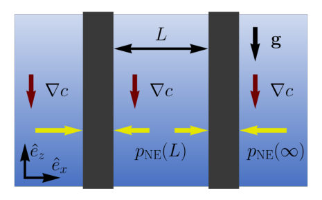 
FIG. 1. Cartoon of the physical setup considered in this work. The gradient ˆez∇c (with ∇c &lt; 0) of the concentration c of the denser solute in the less dense solvent, represented by the blue color gradient, is parallel to the gravitational acceleration −ˆezg and to two parallel plates separated by a distance L. The mixture in the presence of the gradient fills the space also outside the plates. The surface of the plate which is in contact with the liquid within the slab is subject to the non- equilibrium pressure pNE(L), while the other surface is subject to the pressure pNE(L →∞) (yellow arrows). Accordingly, the net pressure acting on each plate is pCas(L) = pNE(L) − pNE(L →∞).

📷 Fig 2

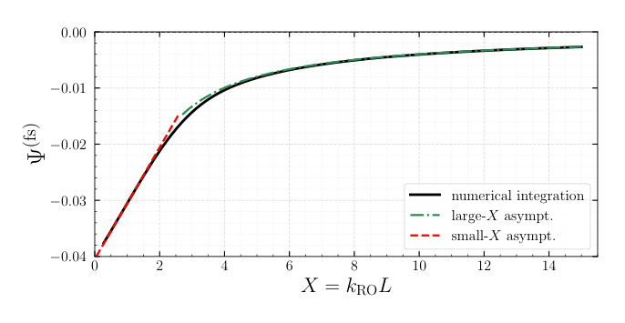 
FIG. 2. Scaling function Ψ(fs)(X) of pCas given by Eqs. (17) and (20). The black solid line corresponds to Ψ(fs)(X) calculated numerically (starting from X ≃0.3), while its asymptotic behaviors given by Eq. (21) for X ≫1 and by Eq. (22) for X ≪1 are plotted with dashed green and red lines, respectively. The asymptotic expressions provide accurate approximation of the actual curve, except for 2 ≲X ≲4.

**Summary.** This paper theoretically derives and analyzes the non-equilibrium Casimir pressure arising from concentration gradients and gravity in a binary liquid mixture. Using fluctuating hydrodynamics, it shows that this excess pressure decays algebraically with separation $L$ and can be either attractive or repulsive depending on the fluid properties. The work proposes both advanced mathematical techniques for calculation and concrete experimental setups for measurement.

**Why it may be interesting.** While focused on classical fluid dynamics, the use of fluctuating hydrodynamics to calculate long-range correlations (Casimir forces) connects statistical mechanics principles to measurable macroscopic forces, which is relevant to understanding fluctuations in complex quantum or many-body systems.

Detailed structure

**Main problem.** The study investigates the non-equilibrium Casimir pressure generated by thermal hydrodynamic fluctuations in a binary liquid mixture subjected to both an imposed concentration gradient and gravity.

**Main result.** The excess Casimir pressure decays algebraically as $1/(k_{\mathrm{RO}}L)$ at large separations, and its sign (attractive or repulsive) depends on the thermodynamic properties of the mixture.

**Method.** Fluctuating hydrodynamics equations are employed to calculate the excess pressure using fluctuation-dissipation relations and subsequent asymptotic analysis techniques like Poisson resummation and Mellin transforms.

**Model / system.** The system is a three-dimensional slab containing an isothermal binary liquid mixture, modeled far from its consolute critical point. The non-equilibrium state is driven by a constant concentration gradient ($
abla c$) parallel to gravity ($g$).

**Key observables.** Non-equilibrium Casimir pressure $p_{Cas}(L)$, the scaling function $\Psi(k_{\mathrm{RO}}L)$, and the force magnitude.

**Important parameters / regimes.** The roll-off wavevector ($k_{\mathrm{RO}}$), the ratio of imposed to equilibrium gradients ($
abla c / 
abla c_{gr}$), and the slab thickness $L$.

**Assumptions / limitations.** The system is assumed to be far from convective instability, and various approximations are made regarding the relative speeds of momentum versus mass diffusion.

**Figures summary.** Figure 2 numerically illustrates the scaling function $\Psi_{fs}(X)$ for different asymptotic regimes ($X \gg 1$ and $X \ll 1$). Figure S1 shows experimental data relating scattered light intensity to the compressibility factor $Z(\phi)$.

**Paper structure.** The paper develops the theory using fluctuating hydrodynamics, derives the scaling function $\Psi(X)$ for the Casimir pressure, analyzes its asymptotic behavior ($L^{-1}$ decay), and concludes with proposals for both theoretical analysis (Poisson resummation) and experimental measurement setups.

Abstract

We investigate the non-equilibrium Casimir pressure in an isothermal binary liquid mixture maintained in a spatially constant and stationary concentration gradient parallel to gravity and confined within a three-dimensional slab of thickness $L$, bounded by two infinite plates parallel to both the gravitational field and the imposed gradient. We assume that the liquid mixture, under the same non-equilibrium conditions, occupies both the interior and the exterior of the slab. Using fluctuating hydrodynamics, we show that the resulting finite-size excess pressure on the plates is described by a scaling function of the dimensionless variable $k_{\mathrm{RO}}L$, where $k_{\mathrm{RO}}$ is the gravity-induced roll-off wavevector. At large separations, this Casimir pressure decays as $1/(k_{\mathrm{RO}}L)$. Depending on the thermodynamic properties of the mixture, the corresponding force can be either attractive or repulsive, while it vanishes for ideal solutions. Since the mixture is assumed to be far from its consolute critical point, the Casimir pressure investigated here is entirely of non-equilibrium origin and it vanishes in the absence of the imposed concentration gradient. Finally, we propose an experimental setup where this force might be measured, consisting of two optically trapped colloidal particles immersed in a dense aqueous colloidal suspension diffusing into an overlying layer of pure water, estimating the expected magnitude of the resulting force.

[↑ back to top](#top)

### [Universal Optimization and Tighter Fidelity Bounds for Approximate Quantum Error Correction](http://arxiv.org/abs/2607.24968v1)

**Authors:** Jing Wu, Michele Grossi, Doga Kurkcuoglu, Silvia Zorzetti  
**Type:** theory · **Category:** quantum information and computing · **PDF:** <https://arxiv.org/pdf/2607.24968v1>  
**Analysis basis:** full PDF text, analyzed in chunks
**Topic relevance:** `entanglement & information structure` **3/5** · `methods for driven-dissipative` **3/5** · `correlated / nonlocal dissipation` **2/5** · `Keldysh / 2PI / non-Gaussian methods` **1/5** · `QC/QI experiment` **1/5** · `driven-dissipative phase transition` **1/5**

📷 Fig 1

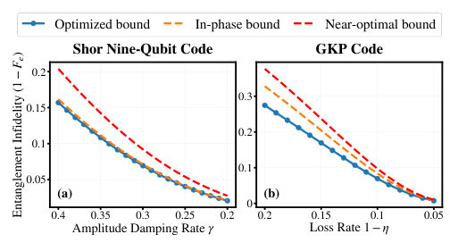 
FIG. 1. Comparison of entanglement infidelity lower bounds. (a) Shor nine-qubit code under the amplitude damping chan- nel as a function of the damping rate γ. (b) GKP code with mean photon number ¯nGKP = 10 in a thermal loss channel. The GKP code performance is evaluated against the channel transmissivity η with a thermal background of ¯nth = 1.

📷 Fig 2

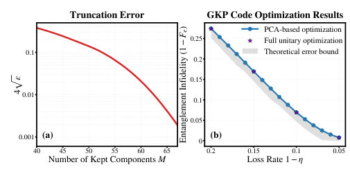 
FIG. 2. PCA-based optimization of entanglement infidelity. (a) Truncation error 4√ϵ as a function of the number of prin- cipal components M (dE = 2415) for GKP code subject to a thermal loss channel with transmission η = 0.87 and ¯nth = 1. (b) Entanglement infidelity obtained via the PCA-based opti- mization compared with full unitary optimization, evaluated in thermal loss channel with ¯nth = 1.

**Summary.** This paper introduces an efficient theoretical framework to calculate entanglement fidelity bounds for Approximate Quantum Error Correction. By exploiting a duality relationship and employing Principal Component Analysis, the authors overcome the exponential computational bottleneck associated with large quantum codes. This allows for high-precision analysis of error resilience in systems previously considered too complex to model accurately.

**Why it may be interesting.** This work provides concrete algorithmic improvements for quantifying hardware limitations (decoherence) in complex quantum systems, directly impacting the feasibility of building fault-tolerant quantum computers.

Detailed structure

**Main problem.** The primary challenge is developing computationally tractable methods for Approximate Quantum Error Correction (AQEC) because standard optimization techniques scale exponentially with system size.

**Main result.** The authors establish an efficient framework using a dual representation and Principal Component Analysis (PCA) that yields a tighter analytical lower bound on entanglement fidelity, enabling high-precision optimization for previously intractable codes.

**Method.** They leverage the duality between recovery maps and environment decoupling, reformulating the maximization problem to utilize PCA dimensionality reduction techniques.

**Model / system.** The work applies to AQEC in both discrete-variable (DV) and continuous-variable (CV) quantum processors. Specific examples include analyzing GKP codes under thermal loss and Shor nine-qubit codes under amplitude damping.

**Key observables.** Entanglement fidelity ($F_e$), In-phase lower bound ($F_{	ext{IP}}$), and the computational speedup achieved by the new framework.

**Important parameters / regimes.** Noise parameters like thermal loss rates ($\eta$) and damping rates ($\gamma$); system size (number of qubits/modes) dictates complexity.

**Assumptions / limitations.** The in-phase lower bound assumes a block-diagonal structure for certain density matrix components, and the PCA framework relies on spectral concentration to justify dimensionality reduction.

**Figures summary.** Figures compare different entanglement infidelity lower bounds (e.g., In-phase vs. near-optimal) showing superior performance for the new method; other figures demonstrate the exponential suppression of truncation error as more principal components are kept.

**Paper structure.** The paper builds from establishing the theoretical framework using duality and Uhlmann's theorem, deriving the tighter in-phase lower bound, and finally implementing a PCA-based computational scheme to apply this theory to large, realistic quantum codes like GKP and Shor codes.

Abstract

Approximate quantum error correction (AQEC) not only dictates the performance of discrete- and continuous-variable quantum error correction codes but also serves as a unifying framework across various physical disciplines. Identifying the optimal recovery channel to maximize the entanglement fidelity via standard semidefinite programming is computationally bottlenecked by the exponentially growing number of Kraus operators with system size, rendering large-scale optimization prohibitive. While analytical near-optimal maps exist, they typically work only when the Knill-Laflamme conditions are nearly satisfied. In this Letter, we establish an efficient framework by leveraging the duality between recovery and environment decoupling. This framework yields a tighter analytical lower bound on entanglement fidelity than the conventional limit set by the transpose channel. Furthermore, by exploiting the decayed weights of noise Kraus operators, we introduce a framework based on principal component analysis to reduce the dimension. In thermal loss channels where the weights decay exponentially, our approach achieves a 33-fold computational speedup while maintaining rigorous accuracy. Our approach enables high-precision optimization for AQEC codes that were previously intractable due to the curse of dimensionality.

[↑ back to top](#top)

### [Detecting quantum phase transitions via shallow variational quantum circuits](http://arxiv.org/abs/2607.25345v1)

**Authors:** Ching-Yu Huang, Min-Fong Yang  
**Type:** theory · **Category:** statistical mechanics · **PDF:** <https://arxiv.org/pdf/2607.25345v1>  
**Analysis basis:** full PDF text, analyzed in chunks
**Topic relevance:** `analog quantum simulation` **3/5** · `exotic spin models in light-matter` **3/5** · `Keldysh / 2PI / non-Gaussian methods` **1/5** · `driven-dissipative phase transition` **1/5** · `entanglement & information structure` **1/5** · `methods for driven-dissipative` **1/5**

📷 Fig 1

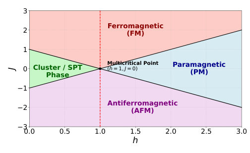 
FIG. 1. Phase diagram of the model in Eq. (1). The black solid lines denote the phase boundaries of Ising transitions, hc = 1 ± J, which cross at the multicritical point (h, J) = (1, 0). The red dashed line indicates the self-dual line.

📷 Fig 2

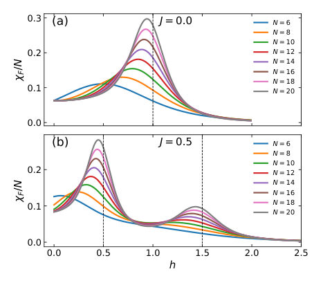 
FIG. 2. Fidelity susceptibilities per site χF /N as functions of transverse field h for (a) J = 0 and (b) J = 0.5. The dashed lines denote the locations of quantum critical points hc = 1 ± J in the thermodynamical limit.

📷 Fig 3

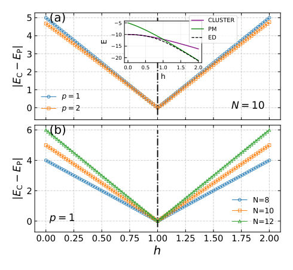 
FIG. 3. Delta-VQE results for the Ising coupling J = 0, ob- tained with the variational ans¨atze |ψP(θ)⟩and |ψC(θ)⟩. The dashed lines denote the location of quantum critical points hc = 1 in the thermodynamical limit. (a) Absolute energy difference, ∆E(h) = |EC −EP|, as a function of the trans- verse field h for a system of N = 10 qubits with circuit depths p = 1, 2. The inset compares the variational energies of the cluster and PM ans¨atze for p = 1 with the exact ground-state energy evaluated by ED. (b) Size dependence of ∆E(h) for p = 1 with system sizes N = 8, 10, and 12. Although the magnitude of ∆E(h) increases with N away from the criti- cal point, all curves exhibit a common minimum...

📷 Fig 4

 
Fig. 2(a) shows the fidelity susceptibility per site, χF /N, for J = 0 across several system sizes N. As dis- cussed in Sec. II A, the cluster–PM transition occurs at hc = 1. As the system size increases, the peak becomes progressively sharper, and its position approaches the ex- act critical point hc = 1. Nevertheless, finite-size effects remain clearly visible for the system sizes accessible to ED. At J = 0.5, the Hamiltonian in Eq. (1) hosts two Ising critical points at hc = 1 ± J = 0.5 and 1.5. As shown in Fig. 2(b), two peaks emerge and progressively sharpen with increasing N with their peak positions converging toward the exact critical fields indicated by the dashed lines. This...

📷 Fig 5

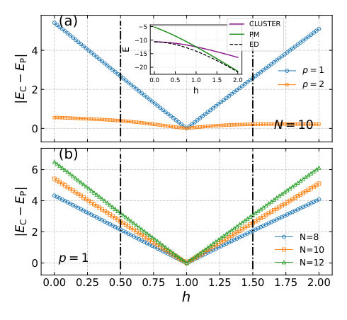 
FIG. 4. Same as Fig. 3, but for the Ising coupling J = 0.5. The dashed lines denote the locations of quantum critical points hc = 1 ± J = 0.5 and 1.5 in the thermodynamical limit. The minimum of ∆E(h) remains located at h = 1 for circuit depths p = 1, 2 and across all system sizes under consideration.

**Summary.** The paper introduces Delta-VQE, a variational quantum circuit technique designed to locate quantum phase transitions by measuring the energy difference between two distinct reference states. While resource-efficient, its accuracy hinges on selecting ansätze that physically represent the competing phases across the critical boundary, as general choices can lead to false positives at symmetry points.

**Why it may be interesting.** This work provides a quantum algorithm approach to characterizing phase transitions in strongly correlated systems, which is highly relevant for understanding emergent phenomena in condensed matter physics.

Detailed structure

**Main problem.** Detecting quantum phase transitions (QPTs) is computationally demanding using classical simulations, even for small systems.

**Main result.** The proposed Delta-VQE method can resource-efficiently probe QPTs, but its success critically depends on designing physically representative variational ansätze that correctly capture the competing phases across the transition boundary.

**Method.** Delta-VQE determines critical points by calculating and minimizing the absolute energy difference ($\Delta E$) between two variational quantum circuits optimized from reference states corresponding to distinct phases. This contrasts with standard methods like fidelity susceptibility.

**Model / system.** The study focuses on the one-dimensional transverse-field Ising model with a three-spin cluster interaction, exhibiting various phases including Paramagnetic (PM), Symmetry-Protected Topological (SPT) cluster, Ferromagnetic (FM), and Antiferromagnetic (AFM).

**Key observables.** The primary diagnostic is $\Delta E = |E_1 - E_2|$, the absolute difference in variational energies. Other observables include order parameters and fidelity susceptibility ($\chi_F$).

**Important parameters / regimes.** Transverse field strength ($h$) and coupling constants ($J$), which define the phase diagram and critical points ($h_c$).

**Assumptions / limitations.** The method assumes that the minimum of $\Delta E$ signals a quantum critical point. A major limitation is that using general dual ansätze can incorrectly identify self-dual points rather than true QCPs.

**Figures summary.** Figures illustrate phase diagrams, showing Ising transition lines and self-dual lines. They compare $\Delta E(h)$ results against fidelity susceptibility ($\chi_F$), demonstrating that $\Delta$-VQE shows less finite-size dependence when correctly implemented.

**Paper structure.** The paper introduces the resource challenge of QPT detection, details the Delta-VQE protocol using two variational ansätze for a cluster-Ising model, and then presents comparative results showing its efficacy versus fidelity susceptibility analysis under varying coupling strengths ($J$).

Abstract

Mapping quantum phase diagrams through classical simulation is notoriously resource-intensive, as even small systems far from the thermodynamic limit demand prohibitive computational effort. The variational quantum eigensolver (VQE) offers a compelling alternative, exploiting approximate ground states to distinguish phases. An appealing proposal, dubbed as Delta-VQE, determines critical points by contrasting variational energies optimized from reference states of distinct phases. Intriguingly, the diagnostic sharpens as circuit depth decreases, highlighting its promise as a resource-conscious probe of quantum criticality. To probe the broader applicability and underlying mechanisms of this approach, we investigate the one-dimensional transverse-field Ising model with a three-spin cluster interaction, a setting in which the Ising transitions are generally situated beyond the self-dual line. We demonstrate that, whenever dual ansätze are employed, Delta-VQE invariably detects the self-dual points rather than the true criticality. In contrast, when ansätze are carefully tailored to embody the competing phases across the boundary, the genuine Ising critical point can be successfully identified with only minor finite-size effects. Our results establish that, while Delta-VQE provides a resource-efficient probe of quantum criticality without requiring precise ground-state preparation, its diagnostic power is fundamentally contingent upon the judicious selection of physically representative ansätze.

[↑ back to top](#top)

### [A generalized Kirchhoff's law of thermal radiation for Floquet media](http://arxiv.org/abs/2607.24985v1)

**Authors:** Sander A. Mann, Dimitrios L. Sounas, Andrea Alù  
**Type:** theory · **Category:** statistical mechanics · **PDF:** <https://arxiv.org/pdf/2607.24985v1>  
**Analysis basis:** full PDF text, analyzed in chunks
**Topic relevance:** `non-equilibrium dynamics` **3/5** · `non-equilibrium universality` **2/5** · `Keldysh / 2PI / non-Gaussian methods` **1/5** · `correlated / nonlocal dissipation` **1/5** · `driven-dissipative phase transition` **1/5** · `methods for driven-dissipative` **1/5**

📷 Fig 1

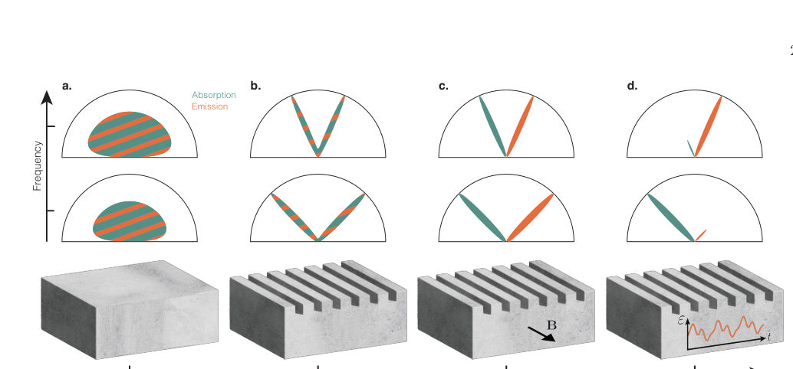 
FIG. 1. Symmetry constraints on absorption and emission. Thermal emission from media with progressively relaxed symmetry constraints: for a planar half-space (a), the absorptivity and emissivity are simply dictated by its Fresnel reflection, yielding weak angular and frequency dependence as shown in the polar plots. For periodically structured materials (b), absorption and emission can be highly directional, with strong frequency dependence and tailored polarization states, but absorptivity and emissivity are necessarily equal for each direction and frequency. This property no longer holds for materials with a magnetic bias (c), which breaks reciprocity: now the emissivity and absorptivity...

📷 Fig 2

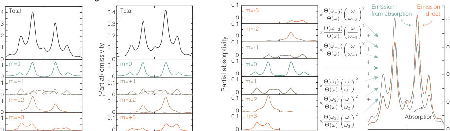 
FIG. 2. Time-varying thermal emission from a modulated resonator. a. Absorption and emission in time-varying systems: light incident at ω is distributed across harmonics and absorbed, while fluctuations at multiple frequencies are emitted at frequency ω. b. Schematic of an absorbing resonator with time-modulated center frequency. c,d. Absorptivity (c) and emissivity (d) for a resonance with center frequency of 1 THz, modulated sinusoidally at 0.15 THz with increasing modulation depth on the horizontal axis. As the modulation depth increases, absorption and emission peaks at higher sidebands. e. Difference between emissivity and absorptivity versus modulation depth. For frequencies above the...

📷 Fig 3

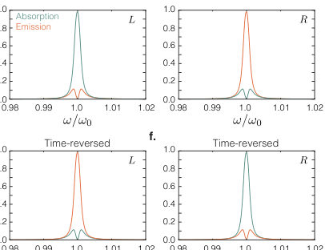 
FIG. 3. A nonreciprocal thermal emitter through time-modulation. a. Schematic of a time-modulated ring of three resonators coupled to two ports, with one of them absorbing. b. Each resonance frequency is modulated at fre- quency Ω= 0.05ω0 but with a 2π/3 phase difference, inducing angular momentum bias. Under time-reversal the sign of the phases changes (bottom). c. In the left port, absorption peaks at ω0 but the emissivity dips, demonstrating a large difference between absorptivity and emissivity for the same frequency at the same port. d. In the right port, we observe the reverse behavior: emission peaks while absorption is ab- sent. This is consistent with the behavior of a...

📷 Fig 4

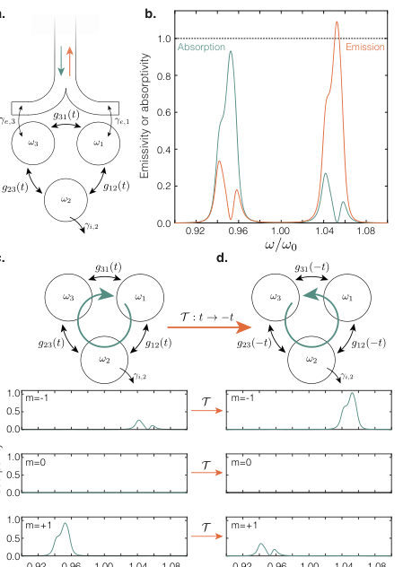 
FIG. 4. Maximal violation of Kirchhoff’s law. a. Schematic of a loop of detuned resonators with couplings modulated in time at the difference frequencies between the connected resonances, thereby efficiently up- and down- converting around the loop with a handedness defined by the modulation phases. Two of the resonances (ω1 and ω3) are coupled to the same input port, while the third resonance ω2 absorbs. b. Absorptivity and emissivity at the port, demon- strating near-maximal violation of the standard Kirchhoff’s law: strong absorption without emission and vice-versa. c. The absorptivity of this structure can be understood via its harmonics: at the fundamental frequency absorption is ab-...

📷 Fig 5

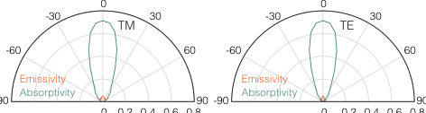 
FIG. 5. Maximal violation of Kirchhoff’s law in a full- wave structure. a. A time-modulated layer is positioned on top of a narrowband absorber, formed by an absorbing layer in a distributed Bragg cavity absorbing at ωa. The top layer is modulated with a sawtooth profile with period 2π/T = ωa/20. b. The absorptivity and emissivity at nor- mal incidence, demonstrating strong violation of the time- invariant Kirchhoff’s law. c,d. The angle dependence of the absorptivity and emissivity at ω = 0.95ωa for the TM (c) and TE (d) polarization, showing that the violation persists for all angles and both polarizations.

**Summary.** The paper generalizes Kirchhoff's law of thermal radiation to time-varying (Floquet) media where standard frequency relations fail. It derives a new relationship showing that emissivity is determined by a weighted sum of harmonic-resolved absorptivities. This has practical implications for designing advanced, non-equilibrium thermal emitters.

**Why it may be interesting.** This work extends fundamental electromagnetic theorems into the realm of non-equilibrium quantum optics, providing a powerful tool for designing novel thermal emitters whose behavior cannot be predicted by static laws.

Detailed structure

**Main problem.** The standard Kirchhoff's law relating thermal emission ($\epsilon$) to absorption ($\alpha$) breaks down in time-varying (Floquet) media because temporal modulation violates time-translation invariance.

**Main result.** A generalized Kirchhoff's law is derived, stating that emissivity equals a weighted sum of harmonic-resolved absorptivities of the adjoint system. This allows for calculating $\epsilon$ from $\alpha$ in these complex systems.

**Method.** The derivation uses fluctuation-dissipation theorems and Green's function techniques adapted for periodically time-varying media (Floquet theory), analyzing partial contributions across frequency harmonics.

**Model / system.** The study focuses on linear, time-varying Floquet media, including examples like modulated resonators and core-shell particle structures. The system is characterized by temporal modulation at a frequency $\Omega$.

**Key observables.** Emissivity ($\epsilon$), Absorptivity ($\alpha$), Partial harmonic contributions ($\epsilon_m, \alpha_m$), and the thermal occupation factor $\Theta(\omega, T)$.

**Important parameters / regimes.** Modulation frequency ($\Omega$), modulation strength (related to coupling rates), and temperature ($T$).

**Assumptions / limitations.** The derivation assumes linear response theory and relies on extensions of the Fluctuation-Dissipation Theorem to periodically driven systems.

**Figures summary.** Figures illustrate the breakdown of standard Kirchhoff constraints in time-varying media, showing how $\epsilon$ and $\alpha$ can be significantly different for nonreciprocal or modulated structures. They also detail harmonic decomposition.

**Paper structure.** The paper establishes the theoretical necessity for a generalized law due to modulation, derives the relationship linking partial emissivities to adjoint absorptivities across harmonics, and then demonstrates this law's implications using specific physical models (e.g., nonreciprocal resonators).

Abstract

Kirchhoff's law fundamentally relates thermal emission to absorption. For linear, static, reciprocal media, it equates the emissivity and absorptivity for each direction and frequency, while in nonreciprocal systems emission and absorption are equal when the bias is time-reversed. In time-varying media, however, temporal modulation breaks time-translation invariance, converts frequencies, and enables energy exchange with the modulation drive. As a result, a same-frequency relation between absorptivity and emissivity can no longer be expected. Here, we derive a generalized Kirchhoff's law for linear time-varying Floquet media. We show that the emissivity at a given frequency equals a weighted sum of harmonic-resolved absorptivities of the adjoint system, with weights accounting for thermal occupation and photon-flux conversion. This relation has both practical and fundamental consequences. In practical terms, it allows emissivity to be calculated from absorption, simplifying the design of time-varying thermal emitters. More fundamentally, it reveals thermal radiation regimes inaccessible in static media. In particular, we identify time-varying structures that exhibit strong emission with negligible absorption at the same frequency for all directions, yielding a near-maximal violation of the conventional form of Kirchhoff's law.

[↑ back to top](#top)

### [Entanglement-based quantum key distribution with data in hollow-core fiber](http://arxiv.org/abs/2607.25331v1)

**Authors:** Yue Luo, Sheng Liu, Yun-Ru Fan, Da-Wei Ge, Zhi-Yang Liu, Hao Li, Si Shen, Zi-Chang Zhang, Hai-Zhi Song, Li-Xing You, Tao Zhou, Kai Guo, Guang-Can Guo, Qiang Zhou  
**Type:** both · **Category:** quantum information and computing · **PDF:** <https://arxiv.org/pdf/2607.25331v1>  
**Analysis basis:** full PDF text, analyzed in chunks
**Topic relevance:** `quantum optics experiment` **3/5** · `QC/QI experiment` **2/5** · `correlated / nonlocal dissipation` **1/5** · `entanglement & information structure` **1/5** · `interference shaping light` **1/5** · `non-equilibrium dynamics` **1/5**

📷 Fig 1

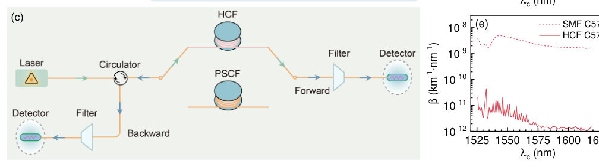 
FIG. 1. Performance comparison between SMF and HCF for quantum-classical coexistence. (a) SEM image of HCF in this work. (b) Conceptual illustration of quantum-classical coexistence performance in SMF and HCF transmission systems. (c) Schematic of the Raman scattering measurement principle. (d) Measured Raman scattering coefficients of SMF (dashed) and HCF (solid) in ITU channels C35 (blue) and (e) C57 (red) with different λc.

📷 Fig 2

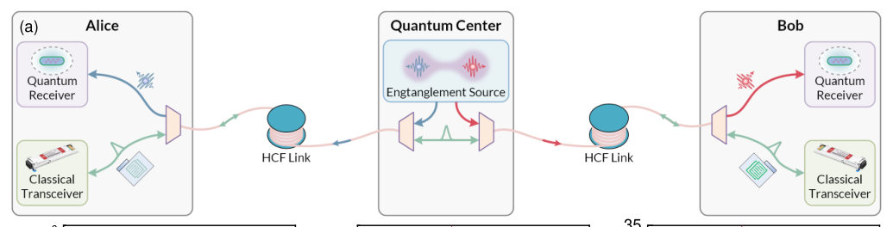 
FIG. 2. Characterization of HCF-based coexistence system. (a) Schematic of system noise measurement. (b) Single-side count rates of noise photons in ITU channels C35 (blue) and C57 (red) with different λc. (c) Accidental coincidence count rate and (d) CAR of noise photons between ITU channels C35 and C57 with different λc.

📷 Fig 3

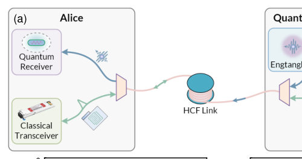 
Figure 3(e) presents the measured QBERs and SKRs under different pump powers. As the pump power in- creases, the SKR first rises due to the enhanced pair

📷 Fig 4

 
FIG. 3. Experimental demonstration of HD-QKD under quantum-classical coexistence conditions. (a) Conceptual illustration of the protocol, where red and blue balls denote entangled and noise photons, respectively. (b) Schematic of the HD-QKD system. (c) Franson interference curve at a pump power of 15 mW. (d) Visibilities and sifted key rates under different pump powers. (e) QBERs and SKRs under different pump powers.

📷 Fig 5

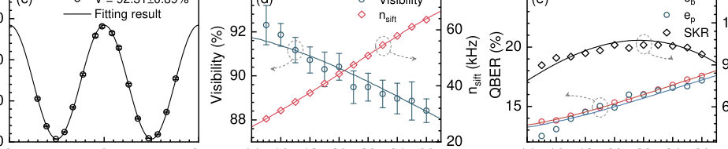 
FIG. 4. Long-term stability test of the HD-QKD system over 24 hours under quantum-classical coexistence conditions. (a) Visibility. (b) ep. (c) eb. (d) SKR.

**Summary.** The paper demonstrates that Hollow-Core Fibers (HCFs) are superior to traditional silica fibers for coexisting quantum key distribution and classical data transmission due to their ultra-low nonlinearity. Through experiments over 18 km, they achieved a stable secret key rate while maintaining high theoretical capacity estimates. This work validates HCFs as a scalable platform for future quantum internet infrastructure.

**Why it may be interesting.** This work is highly relevant to quantum optics and open quantum systems because it addresses the critical engineering challenge of integrating fragile quantum signals with high-power classical channels in a practical fiber infrastructure, which requires detailed noise characterization.

Detailed structure

**Main problem.** The primary challenge is enabling quantum key distribution (QKD) and classical data transmission to coexist reliably within a single optical fiber for future quantum networks.

**Main result.** The study successfully demonstrated entanglement-based HD-QKD coexisting with data over an 18-km Hollow-Core Fiber (HCF) link, achieving an average Secret Key Rate of 10.56 kbps and predicting rates above 135 kbps over 200 km using state-of-the-art HCFs.

**Method.** The authors employed time-encoded High-Dimensional Quantum Key Distribution (HD-QKD) protocols, characterizing noise sources like Raman scattering by comparing performance in HCF versus conventional Single-Mode Fiber (SMF).

**Model / system.** The physical platform is the Hollow-Core Fiber (HCF), which guides light predominantly in air, offering intrinsically ultra-low nonlinearity compared to Pure Silica Core Fibers (PSCFs) that suffer from noise like Raman scattering and four-wave mixing.

**Key observables.** Secret Key Rate (SKR), Coincidence-to-Accidental Ratio (CAR), Quantum Bit Error Rates (QBERs), and theoretical data capacity (up to 2.3 Tbps).

**Important parameters / regimes.** 18-km link length, $0 	ext{ dBm}$ bidirectional received power, time-encoded dimension ($d=8$), and predicted SKR $> 135 	ext{ kbps}$ over $200+	ext{ km}$.

**Assumptions / limitations.** The theoretical analysis relies on the availability of state-of-the-art low-loss HCFs to maintain high performance over long distances.

**Figures summary.** Figures compare SMF and HCF performance, illustrate the experimental setup for simultaneous quantum/classical transmission, and show noise power spectral density and coincidence counts vs. classical channel wavelength.

**Paper structure.** The paper progresses from identifying the coexistence problem in standard fibers to proposing HCFs as a solution; it details experimental measurements of noise suppression and QKD performance over 18 km; finally, it provides theoretical scaling analysis predicting long-distance capabilities using low-loss models.

Abstract

The coexistence of quantum information and classical signals in a single fiber is essential for future quantum networks that leverage the well-established optical fiber infrastructure. Although multiplexing technologies can separate quantum and classical signals, pure silica core fibers (PSCFs) remain fundamentally limited by the high nonlinearity, which generates substantial Raman scattering and four-wave mixing noise. Hollow-core fibers (HCFs), guiding light predominantly in air, offer an attractive solution with intrinsically ultra-low nonlinearity and strongly suppressed nonlinear noise. In this work, we demonstrate the entanglement-based key coexisting with data over an 18-km HCF link. We achieve time-encoded high-dimensional quantum key distribution (HD-QKD) carrying 0 dBm of bidirectional received power, corresponding to a theoretical data capacity of up to 2.3 Tbps. During 24 hours of continuous operation, an average secret key rate (SKR) of 10.56 kbps is obtained. Theoretical analysis further predicts SKRs above 135 kbps over transmission distances exceeding 200 km using state-of-the-art low-loss HCFs. These results show significantly improved performance compared with PSCF-based systems and highlight the potential of HCFs for scalable quantum-classical coexistence compatible with the architectures of established fiber-optic networks.

[↑ back to top](#top)

### [Maximal complementarity in the n-qubit Pauli group](http://arxiv.org/abs/2607.24988v1)

**Authors:** Markus Frembs, Giovanni Natale, Christopher S. P. Wever, Philipp A. Hoehn  
**Type:** theory · **Category:** quantum information and computing · **PDF:** <https://arxiv.org/pdf/2607.24988v1>  
**Analysis basis:** full PDF text, analyzed in chunks
**Topic relevance:** `entanglement & information structure` **3/5** · `quantum measurements` **3/5** · `measurement-induced transitions` **2/5** · `Keldysh / 2PI / non-Gaussian methods` **1/5**

📷 Fig 1

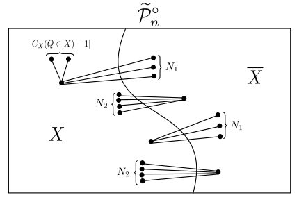 
FIG. 1. Sketch of a bi-regular cut of ̃P○ n with N1 = 3, N2 = 4 and ∣CS(Q ∈S) −1∣= 2. Vertices connected by straight lines commute with each other. (Not all vertices and edges included).

**Summary.** This paper rigorously analyzes the concept of maximal complementarity for observables generated by Abelian subgroups within the n-qubit Pauli group. It develops algebraic criteria to characterize when these degenerate observables are mutually complementary. The main achievement is proving that such maximal sets enforce strong, quantifiable entropic uncertainty relations on quantum states.

**Why it may be interesting.** This work provides rigorous mathematical tools to quantify fundamental quantum limitations (like complementarity and uncertainty) in highly structured systems like multi-qubit Pauli measurements, which is crucial for understanding quantum error correction and measurement theory.

Detailed structure

**Main problem.** The paper investigates maximal complementarity for observables associated with the n-qubit Pauli group, extending this concept from non-degenerate to degenerate (coarse-grained) observables.

**Main result.** It establishes criteria for two such observables to be complementary and proves that these maximal complementary sets yield strong entropic uncertainty relations.

**Method.** The analysis uses algebraic methods based on the structure of Abelian subgroups within the Pauli group, relating complementarity to commutant conditions and purity invariants.

**Model / system.** The system is an n-qubit quantum system whose observables are derived from the Pauli group ($	ext{P}_n$). The focus is on Abelian subgroups ($	ilde{A}, 	ilde{B}$) of this group, which govern the degenerate observables studied.

**Key observables.** Complementary observables $\{O_{\mathcal{A}_k}\}$, Purity Invariants ($I_\psi(S)$), and Entropic Uncertainty Bounds ($H_2$).

**Important parameters / regimes.** The number of qubits ($n$), the dimension ($m$) of the Abelian subgroups, and the cardinality of maximal complementary sets ($\approx 2^n+1$).

**Assumptions / limitations.** The analysis relies heavily on the known structure of the Pauli group and its Abelian subgroups, particularly when relating complementarity to incidence structures.

**Paper structure.** The paper progresses by first defining strong complementarity for observables associated with Abelian subgroups. It then derives necessary and sufficient conditions (Theorem 1) for two such subgroups to be complementary. Subsequent sections relate these sets to purity invariants and finally derive the resulting entropic uncertainty relations.

Abstract

Observables in quantum mechanics are generally complementary, that is, they reveal mutually incompatible pieces of information about a given system. This property is not only a fundamental tenet of the quantum formalism, but also a key component in quantum cryptographic protocols. As such it has fuelled much research into finding sets of highly complementary observables. In its strongest form -- the one we consider in this work -- the information between complementary observables is not merely incompatible but mutually exclusive: maximal information about one observable implies no information about the other, and vice versa. Maximal sets of non-degenerate complementary observables are known to exist in systems of prime power dimension such as n-qubit systems. Here, we study complementarity of degenerate observables, specifically we prove that observables associated with the n-qubit Pauli group also exhibit complementarity under this restriction: first, we obtain a criterion for two such observables to be complementary and, second, we relate maximal sets of complementary observables with informational pure state complementarity equalities, further studied in two companion papers. Equivalently, these results can be formulated in terms of maximal complementary sets of (not necessarily maximal) Abelian subgroups of the Pauli group linking with (possibly coarse-grained) mutually unbiased bases. Finally, we prove that these complementarity sets entail strong entropic uncertainty relations.

[↑ back to top](#top)

### [Numerical Modeling of Quasiparticle-Induced Dissipation in Fluxonium Qubits](http://arxiv.org/abs/2607.24946v1)

**Authors:** Kate Azar, Max Hays, Kyle Serniak  
**Type:** theory · **Category:** quantum information and computing · **PDF:** <https://arxiv.org/pdf/2607.24946v1>  
**Analysis basis:** full PDF text, analyzed in chunks
**Topic relevance:** `methods for driven-dissipative` **3/5** · `QC/QI experiment` **2/5** · `Keldysh / 2PI / non-Gaussian methods` **1/5** · `correlated / nonlocal dissipation` **1/5** · `driven-dissipative phase transition` **1/5**

📷 Fig 1

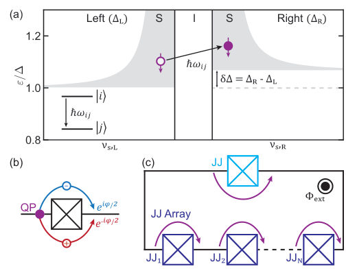 
Figure 1. (a) QP density of states in energy around a JJ. A QP is depicted tunneling from the left to the right electrode, acquiring energy hωij from the qubit and inducing the qubit transition from state |i⟩to state |j⟩. Asymmetry in the su- perconducting gap across the junction electrodes (δ∆) is also represented. (b) Cartoon of a QP residing at the supercon- ducting gap tunneling across a JJ. If the QP were to tunnel from gap edge to gap edge, it would acquire phase ±φ/2 with the sign depending on whether it tunnels as an electron (blue) or a hole (red). (c) Diagram of QP tunneling across qubit cir- cuit elements. In a fluxonium circuit, a single JJ (cyan) in parallel with an array of...

📷 Fig 2

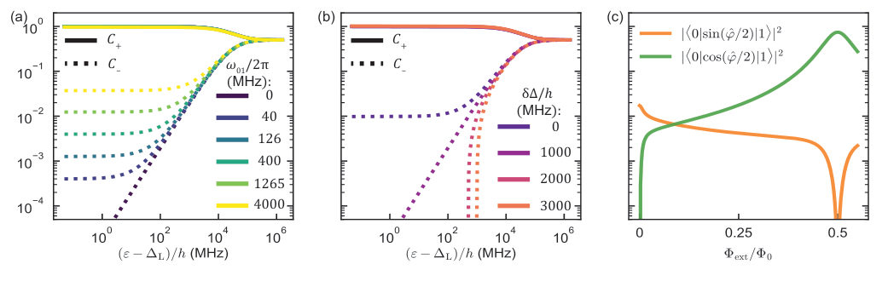 
Figure 2. (a) Coherence factors versus QP energy in MHz units for different qubit transition frequencies. All curves assume a symmetric superconducting gap energy (δ∆= 0). (b) Coherence factors versus QP energy for different gap asymmetries, both in MHz units, with QP energies measured from ∆L. All curves assume a qubit transition frequency ω01/2π = 1000 MHz. (c) Squared magnitude of the fluxonium matrix elements for the small JJ QP coupling operators versus applied flux bias.

📷 Fig 3

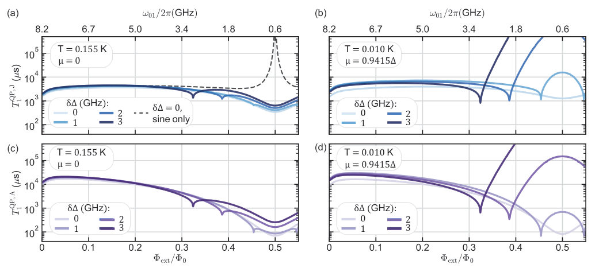 
Figure 3. Calculating T1 for QP tunneling through fluxonium junctions for different QP energy distributions, versus applied bias Φext/Φ0. Colors correspond to different gap asymmetries. All curves are calculated with fluxonium Hamiltonian energies EJ/h = 10.2 GHz, EC/h = 3.6 GHz, and EL/h = 0.46 GHz. All curves assume ∆L = 50 GHz, and ∆R = ∆L + δ∆. In the top x-axis, the qubit transition frequencies at the marked flux biases are shown, rounded to the nearest 100 MHz. (a) T QP,J 1 for a “hot” QP distribution. Black dashed curve corresponds to the T1 prediction including only the sin term in Eq. 7, for δ∆= 0. (b) T QP,J 1 for a “cold” QP distribution. (c) T QP,A 1 for a “hot” QP distribution....

📷 Fig 4

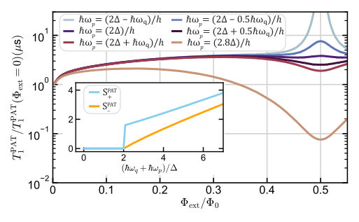 
Figure 4. Trend in T1 for PAT processes at the fluxonium small JJ for different drive frequencies ωp, relative to the qubit frequency where we define ℏωq = ℏω01(Φext/Φ0 = 0.5). The T1 for each curve is plotted normalized by its value at Φext/Φ0 = 0. The inset shows the contributions of the spectral functions SPAT ± versus the total PAT process energy (ℏωp + ℏωq), normalized the to superconducting gap energy.

**Summary.** This theoretical paper numerically analyzes quasiparticle-induced dissipation mechanisms in Fluxonium superconducting qubits. It challenges prior assumptions that certain operating points are immune to energy loss, demonstrating sensitivity even when considering small numerical factors. The findings guide future qubit design by highlighting the critical role of gap asymmetry and specific environmental radiation energies for achieving robust quantum coherence.

**Why it may be interesting.** This work directly addresses decoherence in solid-state quantum hardware by providing quantitative insights into how material properties (like gap asymmetry) dictate the vulnerability of qubits to environmental noise sources like QPs.

Detailed structure

**Main problem.** Quasiparticle (QP)-induced dissipation limits the performance of superconducting quantum processors, challenging existing theoretical assumptions about qubit protection.

**Main result.** The authors show that fluxonium qubits are sensitive to QP-induced errors at bias points previously thought to be protected, and $T_1$ protection from photon-assisted tunneling only occurs for a specific radiation energy.

**Method.** Numerical simulation using Fermi's golden rule to calculate energy relaxation rates ($\Gamma$) arising from both direct QP tunneling and Photon-Assisted Tunneling (PAT) processes.

**Model / system.** The study focuses on Fluxonium qubits, modeled by a Hamiltonian involving Josephson Junctions. The dissipation mechanisms are analyzed via coupling terms derived from the QP tunneling Hamiltonian ($\hat{H}_t$) and PAT interaction ($\hat{H}_{	ext{PAT}}$).

**Key observables.** QP-induced energy relaxation rate ($\Gamma$), coherence time ($T_1$), and spectral functions $S_{QP,J}^{\pm}$ and $S_{	ext{PAT}}^{\pm}$.

**Important parameters / regimes.** Superconducting gap energies ($\Delta_L, \Delta_R$) and their asymmetry ($\delta\Delta$), external magnetic flux bias ($\Phi_{ext}$), and QP energy distributions (hot vs. cold).

**Assumptions / limitations.** The analysis relies on Fermi's golden rule and makes approximations regarding the relative magnitudes of QP energies compared to the superconducting gap, though it challenges some initial assumptions.

**Figures summary.** Figures illustrate QP density of states, tunneling processes (electron vs. hole), coherence factors ($C_\pm$) dependence on bias/asymmetry, and matrix elements versus applied flux bias.

**Paper structure.** The paper first establishes the problem of QP dissipation in superconducting qubits. It then details the theoretical framework using Fermi's golden rule for calculating rates from both direct tunneling and PAT processes, culminating in specific predictions regarding protection mechanisms based on gap asymmetry and radiation energy.

Abstract

Nonequilibrium quasiparticles (QPs) generated by stray infrared and ionizing radiation can limit the performance of superconducting quantum processors and present challenges for quantum error correction schemes. Models of QP-induced energy relaxation commonly assume that the characteristic energy of the QPs and the qubit transition energy are both small relative to the superconducting gap. Under these assumptions, certain qubits such as the fluxonium would exhibit protection against QP-induced dissipation at specific bias points. Here, we show that this is not necessarily the case, numerically analyzing the predicted rate of QP-induced dissipation in fluxonium qubits for different QP energy distributions and for QPs created via photon-assisted tunneling processes. We find that accounting for small numerical factors, existing theoretical models predict sensitivity to QP-induced errors at bias points previously thought to be protected. We find that inclusion of asymmetry in the superconducting gap energy across the junction can reintroduce suppression of QP-induced relaxation, as expected. Additionally, for QPs created by photon-assisted tunneling, we predict that $T_1$ protection will only occur for a specific energy of pair-breaking radiation. This understanding of fluxonium sensitivity to QP-induced dissipation informs the development of fluxonium-based processors and future QP-mitigation strategies.

[↑ back to top](#top)

### [Chiral Magnons: Mechanisms and Research Progress](http://arxiv.org/abs/2607.24963v1)

**Authors:** Wanxing Lin, Hanchen Deng, Bao-Tian Wang, Dao-Xin Yao  
**Type:** both · **Category:** strongly correlated electrons · **PDF:** <https://arxiv.org/pdf/2607.24963v1>  
**Analysis basis:** full PDF text, analyzed in chunks
**Topic relevance:** `spintronics-quantum-optics interface` **3/5** · `correlated / nonlocal dissipation` **1/5** · `driven-dissipative phase transition` **1/5** · `exotic spin models in light-matter` **1/5** · `non-equilibrium dynamics` **1/5**

📷 Fig 1

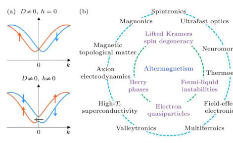 
Fig. 1. Theoretical origins and symmetry mechanisms of chiral magnons: (a) Rashba-Dresselhaus analogue for magnons, reproduced with open access from Ref.[55]; (b) research landscape of altermagnetism, reproduced with open access from Ref.[13]; (c) SSG taxonomy for collinear magnets, reproduced with permission from Ref.[56].

📷 Fig 2

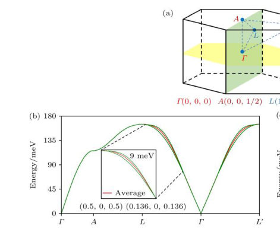 
Fig. 2. Chiral magnon splitting in altermagnetic CrSb: (a) BZ and the high-symmetry paths; (b) LSWT magnon dispersion; (c) LR-TDDFT spin fluctuation dispersion (with LSWT overlay) , reproduced with permission from Ref.[17].

📷 Fig 3

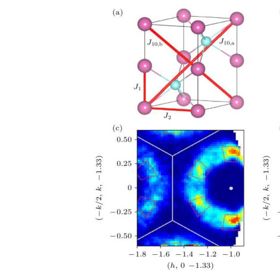 
Fig. 3. Symmetric-exchange-origin chiral magnons in α-MnTe. (a) Crystal structure and key exchanges, reproduced with permission from Ref.[19]; (b) BZ and nodal planes; (c) INS constant-energy slices and (d) the corresponding LSWT calculations showing the g-wave six-fold nodes and momentum-selective non-degenerate double branches, reproduced with permission from Ref.[18].

📷 Fig 4

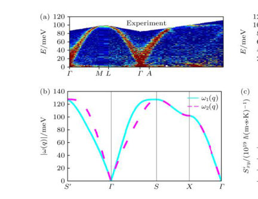 
Fig. 4. Chiral magnons of bulk materials and anisotropy: (a) Experimental (the left panel) and calculated (the right panel) INS dispersions of α-Fe2O3 along high-symmetry paths, respectively, reproduced with permission from Ref.[61]; (b) in the 𝑘𝑥−𝑘y plane, RuO2 shows chiral splitting of

📷 Fig 5

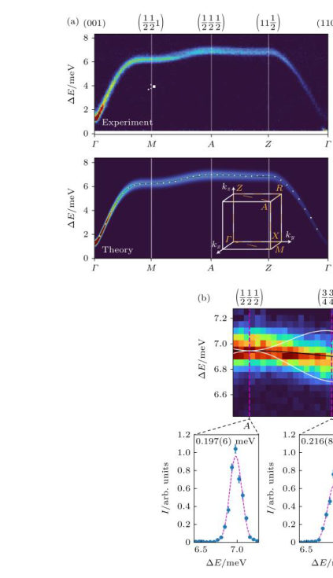 
Fig. 5. INS evidence for the absence of chiral magnon splitting in MnF2. (a) (The upper panel) Experimental dispersions and (the lower panel) LSWT fitted dispersions along multiple high-symmetry paths, respectively; (b) high-resolution energy cuts on the ZA line, reproduced with open access from Ref.[21].

**Summary.** This review comprehensively surveys chiral magnons, which exhibit non-reciprocal spin wave propagation due to broken momentum-inversion symmetry. It unifies the understanding of their origins—from Dzyaloshinskii-Moriya interactions to altermagnetism—and details advanced theoretical tools like non-Hermitian physics. The work guides materials science toward realizing next-generation, low-power magnonic devices.

**Why it may be interesting.** The connection between symmetry breaking mechanisms (like altermagnetism) and emergent directional quantum phenomena provides a rich platform for studying topological aspects in magnetic systems, bridging condensed matter theory with spintronics engineering.

Detailed structure

**Main problem.** The paper addresses chiral magnons, which are collective spin excitations characterized by a broken momentum-inversion symmetry ($\omega(\mathbf{k}) 
eq \omega(-\mathbf{k})$), leading to non-reciprocal spin-wave propagation.

**Main result.** Chiral magnon physics is unified across mechanisms—including SOC-DMI and altermagnetism—providing pathways for low-dissipation, non-reciprocal devices distinct from topological magnonics.

**Method.** The review synthesizes theoretical analysis using symmetry group theory, model Hamiltonians, and spin-wave theory with experimental data from INS, PNS, and transport measurements like SNE/SSE.

**Model / system.** The study focuses on magnetic ordered systems (e.g., $\alpha$-MnTe, CrSb) where chirality arises either from broken spatial inversion symmetry or through altermagnetism in the weak SOC limit. The framework extends to non-Hermitian dynamics involving gain and loss.

**Key observables.** Momentum-inversion asymmetry ($\omega(\mathbf{k}) 
eq \omega(-\mathbf{k})$), non-reciprocal propagation (NRP), chiral splitting ($\Delta\omega$), and lifetime asymmetry ($\Gamma(\mathbf{k}) 
eq \Gamma(-\mathbf{k})$).

**Important parameters / regimes.** Room temperature stability ($T_N > 300 	ext{ K}$), energy scales (meV range), and damping parameters ($\alpha < 0.01$).

**Assumptions / limitations.** The analysis relies on symmetry analysis, spin-wave theory approximations, and the assumption that chiral effects can be engineered or observed in various material classes.

**Figures summary.** Figures illustrate theoretical origins (e.g., Rashba-Dresselhaus analogue for magnons) and show magnon dispersion relations exhibiting directional splitting ($	ext{Fig. 2}$), alongside diagrams detailing multiphysics couplings like magnon-photon interaction ($	ext{Fig. 9}$).

**Paper structure.** The review is structured by first defining the problem (NRP via chiral magnons), then systematically covering theoretical origins (DMI vs. Altermagnetism/SSG framework), followed by detailed discussions of experimental diagnostics and advanced topics like non-Hermitian dynamics, concluding with future device applications.

Abstract

Chiral magnons are distinctive collective spin excitations in magnetic ordered systems, whose dispersion relations break momentum-inversion symmetry, $ω(\boldsymbol{k}) \neq ω(-\boldsymbol{k})$, resulting in essential non-reciprocal spin-wave propagation. This built-in directionality provides new opportunities for spin information transfer, thermal-spin interconversion, and low-dissipation non-reciprocal microwave devices, which complement but differ from topological magnonics. In recent years, the proposal and rapid development of altermagnetism have broadened the physical origin and research framework of chiral magnons, making them a research frontier in condensed matter physics. This review presents a unified framework for chiral magnons, covering symmetry-breaking mechanisms, material implementation, experimental characterization, transport response, and many-body non-Hermitian dynamics, and evaluates routes toward room-temperature and device-related platforms. The discussion is based on symmetry analysis, model Hamiltonians, and spin-wave theory, combined with first-principles calculations as well as recent spectroscopic (e.g., inelastic and polarized neutron scattering, Brillouin light scattering) and transport measurements. This review further summarizes bulk-gap and Berry-curvature induced chiral magnon edge states, the enhancement of non-reciprocity via chiral spin pumping and cavity-magnon hybrids, as well as non-Hermitian features arising from multiparticle damping and gain-loss competition. This review provides a comprehensive reference for elucidating the underlying mechanisms of chiral magnons, advancing the synthesis and experimental characterization of novel materials, and also guiding the design of next-generation non-reciprocal magnonic devices.

[↑ back to top](#top)

### [Counterfactual Quantum Sensing: What Interaction-Free Measurement Can and Cannot Buy](http://arxiv.org/abs/2607.25699v1)

**Authors:** Christoph F. Wildfeuer  
**Type:** theory · **Category:** other · **PDF:** <https://arxiv.org/pdf/2607.25699v1>  
**Analysis basis:** full PDF text, analyzed in chunks
**Topic relevance:** `quantum measurements` **3/5** · `interference shaping light` **2/5** · `entanglement & information structure` **1/5** · `measurement-induced transitions` **1/5**

📷 Fig 1

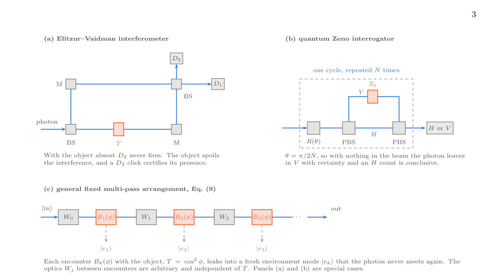 
FIG. 1. The three arrangements considered. (a) is the interferometer of Sec. II, (b) the Zeno interrogator of Secs. III and IV, and (c) the general class covered by the bound of Sec. V, of which the first two are special cases.

📷 Fig 2

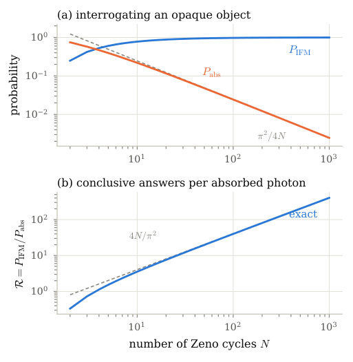 
FIG. 3. Quantum Zeno interrogation of an opaque object. (a) The probability PIFM of a conclusive interaction-free answer, Eq. (9), and the probability Pabs that the object absorbs the photon; the dashed line is the asymptote π2/4N. (b) Their ratio R, the number of conclusive interrogations per absorbed photon, approaching 4N/π2 (dashed) from below by the con- stant 1 2 of Eq. (10). The growth is unbounded in a lossless chain.

📷 Fig 3

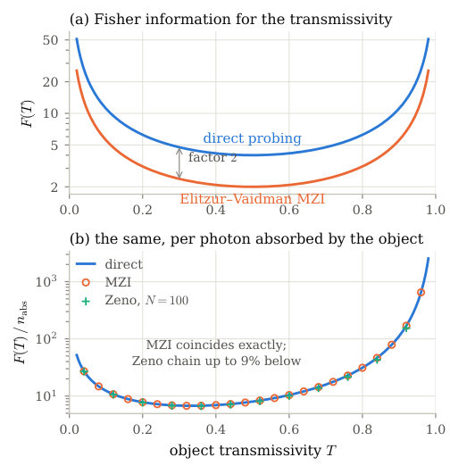 
FIG. 2. The central negative result. (a) Fisher information about the transmissivity T of an object placed in one arm of the interferometer, Eq. (4), against direct transmission prob- ing, Eq. (5). The interferometer sits a factor of two below the direct scheme at every T. (b) The same quantities nor- malised by the number of photons the object absorbs. The Elitzur–Vaidman interferometer (circles) falls exactly on the direct-probing curve [T(1−T)2]−1 (solid). The 100-cycle Zeno chain (crosses) lies between 1 and 9% below it. That short- fall is real and not a defect of the measurement: the classical Fisher information plotted here equals the quantum Fisher information of the reduced photon...

📷 Fig 4

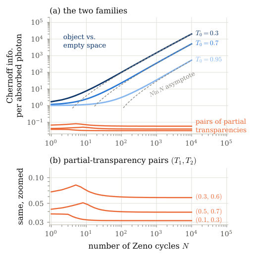 
FIG. 4. What the discrimination advantage requires. Cher- noff information for an N-cycle chain, normalised by the pho- tons the object absorbs under whichever of the two hypotheses absorbs more. (a) Blue: an object of transmissivity T0 inter- rogated against empty space; dashed lines are the closed-form asymptote of Eq. (13), which the exact curves join once N exceeds a few tens. The rate grows as N ln N for every T0 shown, none of which is close to opaque. Orange: two partial transparencies interrogated against each other; the rate does not grow. The case T0 = 0 is omitted from the blue fam- ily because the two outcome distributions then have disjoint support, a single interrogation...

📷 Fig 5

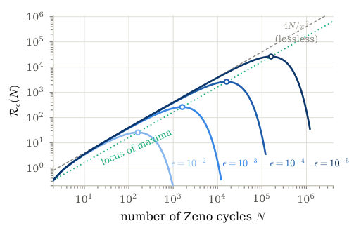 
FIG. 5. The loss-limited optimum. Conclusive interrogations per absorbed photon, Rϵ(N) of Eq. (16), for four values of the parasitic per-cycle loss ϵ. Open circles mark the maxima, located on the integer grid; the dotted line is their locus, reached at Nopt = x⋆/ϵ, and the dashed line is the lossless asymptote 4N/π2. Cycling past Nopt is actively harmful: the chain leaks the photon before it can answer.

**Summary.** This work rigorously analyzes the limits of Interaction-Free Measurement (IFM) by comparing its performance to direct probing using estimation theory. It finds that while IFM offers no advantage when estimating a continuous parameter like transparency, it provides a significant, quantifiable advantage when determining if an object is present at all. The key takeaway is that the benefit lies in discrimination against null hypotheses, not in precise measurement of loss.

**Why it may be interesting.** It provides rigorous theoretical boundaries on how much information can be extracted from non-destructive measurements, which is crucial for designing next-generation quantum sensors in optics and fundamental physics.

Detailed structure

**Main problem.** The paper quantifies the advantage of Interaction-Free Measurement (IFM) compared to direct probing for quantum sensing tasks, specifically distinguishing between parameter estimation and hypothesis testing.

**Main result.** For estimating transparency ($T$), IFM offers no advantage over direct probing; however, a significant advantage exists when discriminating between an object's presence versus its complete absence.

**Method.** The analysis uses estimation-theoretic tools like Fisher information (for parameter estimation) and Chernoff information (for hypothesis testing), comparing results for multi-pass interferometers against single-pass probes.

**Model / system.** The primary system is the Elitzur-Vaidman interferometer or general fixed multi-pass arrangements where a single photon interacts sequentially with an absorbing object characterized by transmissivity $T$.

**Key observables.** Fisher Information ($F$), Chernoff information ($C$), and the ratio of quantum Fisher information ($\mathcal{F}_Q$) to purified state information ($\mathcal{F}_{	ext{pur}}^Q$).

**Important parameters / regimes.** Transmissivity $T$, number of Zeno cycles ($N$), and parasitic loss per cycle ($\epsilon$).

**Assumptions / limitations.** The analysis assumes the object is memoryless, non-dispersive, and that the comparison holds for fixed multi-pass arrangements (though an advantage exists for null detection).

**Figures summary.** Figures compare Fisher information ratios between MZI/Zeno chains vs. direct probing; one figure contrasts asymptotic growth rates for conclusive interaction-free answers versus continuous parameter estimation.

**Paper structure.** The paper systematically compares the quantum advantage of IFM across different tasks: first showing no gain for estimating $T$, then demonstrating a superior, growing advantage ($N \ln N$) when testing against object absence, and finally establishing general bounds on this advantage.

Abstract

Interaction-free measurement infers the presence of an absorbing object from a photon that, in the counterfactual sense, never interacted with it, and is widely described as a route to minimally invasive sensing. We ask what it actually buys, in estimation-theoretic terms. Written as a channel-estimation problem, the Elitzur-Vaidman interferometer carries exactly half the Fisher information about the object's transmissivity that direct transmission probing does, and the two schemes deliver identical Fisher information per absorbed photon. For measuring how transparent something is, the interferometer buys nothing. The advantage lies in discrimination, and we show that what it requires is not that the object be opaque but that the competing hypothesis be the object's absence. Against empty space the Chernoff information per absorbed photon grows almost linearly, as the number of Zeno cycles times its logarithm, even for a weakly absorbing object; between two partial transparencies it does not grow at all. Parasitic loss in the cycle caps the advantage. The number of conclusive interrogations per absorbed photon reaches a maximum inversely proportional to the loss per cycle, at an optimal cycle number that is likewise inversely proportional to it, which identifies the loss per cycle as the figure of merit governing how far interaction-free sensing can be pushed. Finally, the negative result is not special to the interferometer. For a single photon meeting a memoryless, non-dispersive object any number of times through arbitrary fixed optics, the accessible quantum Fisher information never exceeds that of the same incident flux spent on independent single-pass probes, and is generically far below it. This recovers the bound of Massar, Mitchison and Pironio for this class, by a short argument that also identifies when it is tight.

[↑ back to top](#top)

### [Covariance Geometry of Basis-Resolved Low-Energy Wavefunctions in the Spin-$1/2$ Kitaev--Heisenberg Model](http://arxiv.org/abs/2607.25462v1)

**Authors:** Sk Saniur Rahaman, S. R. Hassan  
**Type:** theory · **Category:** strongly correlated electrons · **PDF:** <https://arxiv.org/pdf/2607.25462v1>  
**Analysis basis:** full PDF text, analyzed in chunks
**Topic relevance:** `entanglement & information structure` **3/5** · `analog quantum simulation` **2/5** · `exotic spin models in light-matter` **1/5** · `non-equilibrium dynamics` **1/5**

📷 Fig 1

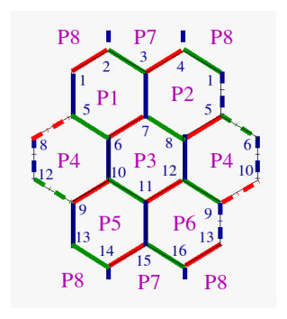 
FIG. 1. (color online) Geometry of the periodic N = 16 hon- eycomb cluster employed in the present work. The red, green, and blue bonds denote the three inequivalent bond-dependent next nearest neighbour Kitaev interactions Sx i Sx j ,Sy i Sy j , and Sz i Sz j ,respectively. The elementary plaquettes,P1, . . . , P8, are labeled for constructing the plaquette-flux operators used in the covariance analysis.

📷 Fig 2

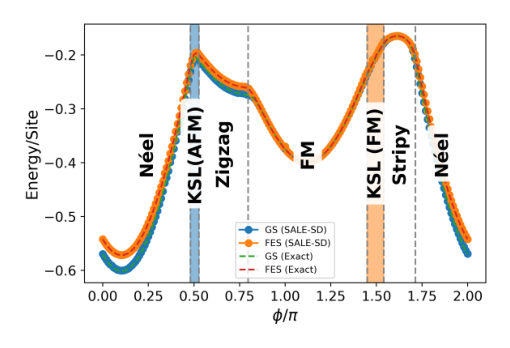 
FIG. 2. Ground-state and first-excited-state energies per site for the N = 16 Kitaev–Heisenberg model obtained using the SALE–SD method (solid lines) and exact diagonaliza- tion (dashed lines) as functions of the interaction parame- ter ϕ. The excellent agreement demonstrates that the re- duced symmetry-adapted basis accurately reproduces the low- energy spectrum throughout the phase diagram.

📷 Fig 3

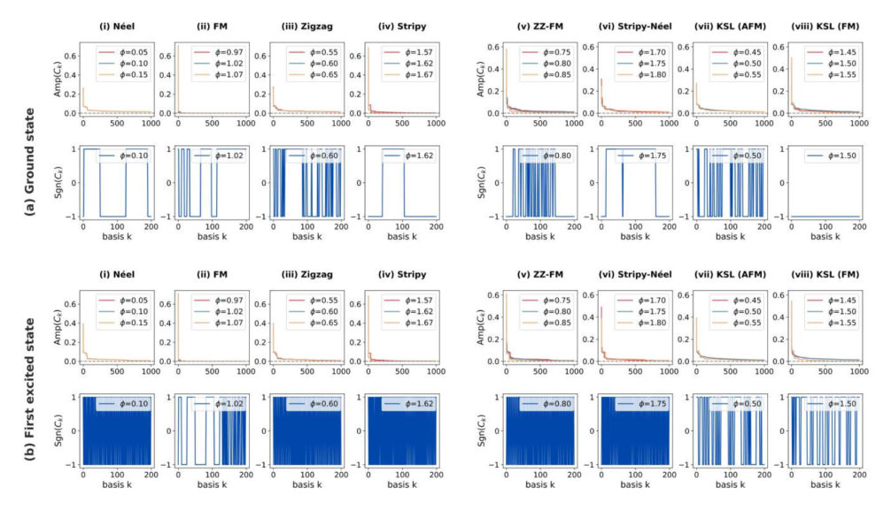 
FIG. 3. Expansion coefficients of the ground state (GS) and first excited state (FES) for representative interaction parameters across the Kitaev–Heisenberg phase diagram. For each state, the upper panel shows the coefficient magnitudes |Ck| arranged in decreasing order, while the lower panel displays the signs of the first 200 coefficients. Only these leading signs are displayed clearly, since the signs of all 1000 retained coefficients become visually unresolved when plotted together. The covariance analysis nevertheless uses all M = 1000 retained basis configurations.

📷 Fig 4

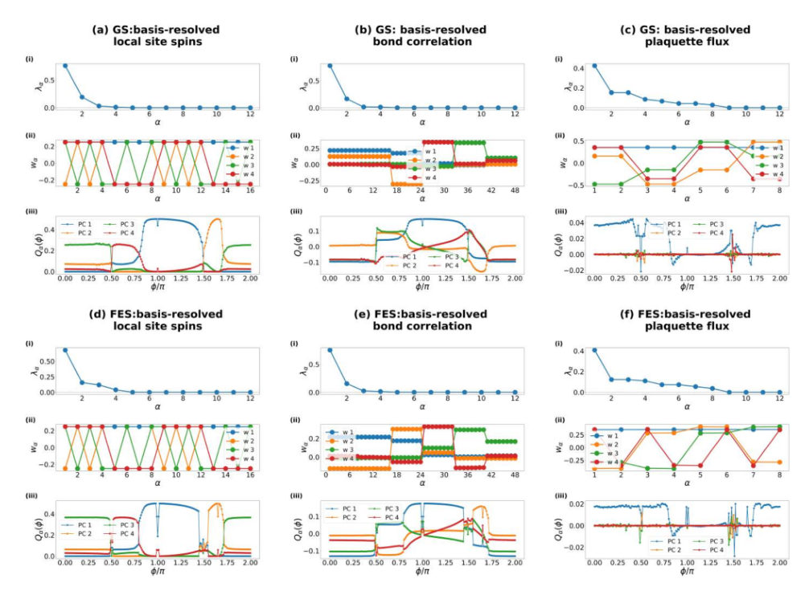 
FIG. 4. Principal component analysis of the basis-resolved covariance matrices for the local-spin, spin-pair, and plaquette-flux representations. Panels (a)–(c) correspond to the ground state, while panels (d)–(f) show the corresponding results for the first excited state. For each observable, row (i) presents the normalized covariance eigenvalues λα, row (ii) the corresponding covariance eigenvectors wα, and row (iii) the quantified principal components Qα(ϕ) defined in Eq. (16).

📷 Fig 5

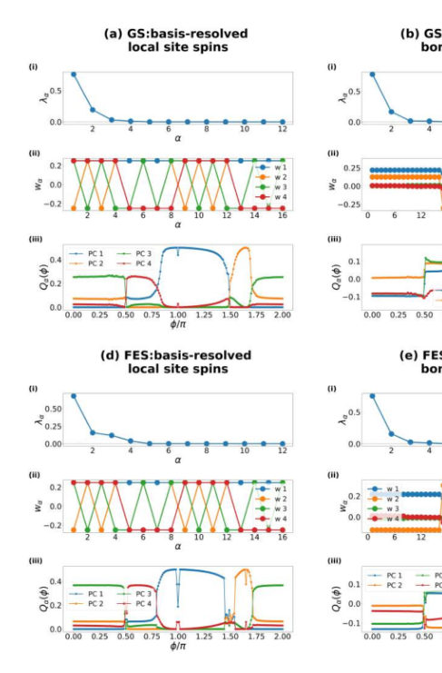 
Fig.3 therefore establishes two microscopic ingredients that enter the later covariance analysis: the distribu- tion of amplitude among the dominant computational- basis configurations and the relative-sign organization of those configurations. The evolution of these ingredients across ordered phases, magnetic phase boundaries, and Kitaev regimes provides the microscopic foundation for the changes in covariance geometry discussed below.

**Summary.** This work introduces a novel basis-resolved covariance framework to statistically characterize low-energy wavefunctions in the Kitaev–Heisenberg model. By analyzing how local spin, bond correlations, and plaquette fluxes co-vary across the phase diagram using PCA, the authors map out the quantum state's statistical geometry. This reveals that the complexity of the wavefunction structure changes fundamentally when moving into exotic Kitaev spin liquid regimes.

**Why it may be interesting.** While focused on magnetism, the use of advanced statistical tools like covariance geometry provides a generalizable method for characterizing complex quantum states beyond simple symmetry breaking, which is relevant across many-body physics.

Detailed structure

**Main problem.** The study aims to characterize the organization of low-energy many-body wavefunctions in strongly correlated quantum systems, particularly where conventional order parameters fail.

**Main result.** The covariance geometry varies significantly across the phase diagram: ordered phases are 1D, Kitaev regimes show intrinsic multidimensionality, and this geometry depends on the physical observable used for probing.

**Method.** A basis-resolved covariance framework is developed using Principal Component Analysis (PCA) applied to feature vectors derived from local-spin, bond-correlation, and plaquette-flux operators.

**Model / system.** The system studied is the spin-$1/2$ Kitaev–Heisenberg model on a honeycomb lattice. The Hamiltonian interpolates between Heisenberg and Kitaev limits via coupling parameters J and K.

**Key observables.** Covariance geometry (quantified by Shannon entropy and Participation Ratio), principal covariance modes, local-spin expectation values, bond correlations, and plaquette fluxes.

**Important parameters / regimes.** The interaction parameter $\phi$, which tunes the system across various quantum phases including magnetically ordered states and Kitaev spin liquid regimes.

**Assumptions / limitations.** The analysis assumes that constructing feature vectors from specific physical operators (local-spin, bond, flux) provides a statistically meaningful representation of the wavefunction's structure for PCA.

**Figures summary.** Figures illustrate the honeycomb lattice structure and show covariance spectra/principal components across different phases; Tables summarize Shannon entropy and Participation Ratio values for various representations.

**Paper structure.** The paper establishes the framework by defining basis-resolved feature spaces using multiple physical operators, calculates the ensemble covariance matrix over the phase diagram, and analyzes its statistical geometry using PCA, entropy, and participation ratio to map out phase transitions statistically.

Abstract

We develop a basis-resolved covariance framework for investigating the organization of low-energy many-body wavefunctions in the spin-$1/2$ Kitaev--Heisenberg model. By constructing covariance matrices from local-spin, bond-correlation, and plaquette-flux representations of the low-energy states, Principal Component Analysis (PCA) is employed to identify the dominant collective covariance modes. We find a systematic evolution of the covariance geometry across the phase diagram: magnetically ordered phases are described by an essentially one-dimensional covariance manifold, conventional magnetic phase boundaries exhibit competition between leading covariance modes, whereas the Kitaev regimes develop intrinsically multidimensional covariance geometry. Furthermore, the same many-body wavefunction produces distinct covariance geometries in different operator representations, demonstrating that covariance geometry is determined jointly by the quantum state and the physical observables used to probe it. Shannon entropy and the participation ratio provide quantitative measures of this evolution. The present framework establishes basis-resolved covariance geometry as a complementary statistical perspective for characterizing frustrated quantum many-body systems beyond conventional order parameters.

[↑ back to top](#top)

### [Quantum Teleportation toward the Quantum Internet: A Concise Review](http://arxiv.org/abs/2607.25395v1)

**Authors:** Yang-Bin Ma, Yun-Ru Fan, Ri-Yao Song, Ya-Zhou Zhao, Yi-Ye Liu, Si Shen, Zi-Hao Zhan, Yan-Yu Wei, Kai Guo, Guang-Can Guo, Qiang Zhou  
**Type:** both · **Category:** quantum information and computing · **PDF:** <https://arxiv.org/pdf/2607.25395v1>  
**Analysis basis:** full PDF text, analyzed in chunks
**Topic relevance:** `quantum optics experiment` **3/5** · `QC/QI experiment` **2/5** · `entanglement & information structure` **1/5** · `quantum measurements` **1/5**

📷 Fig 1

 
Figure 1. Scheme of (a) quantum teleportation of qubit and (b) teleportation of entangled

📷 Fig 2

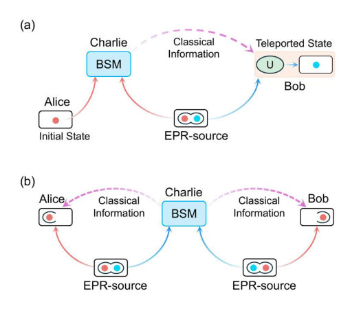 
Figure 1(a) shows the scheme of teleportation protocol: suppose particle 1, which is to be

📷 Fig 3

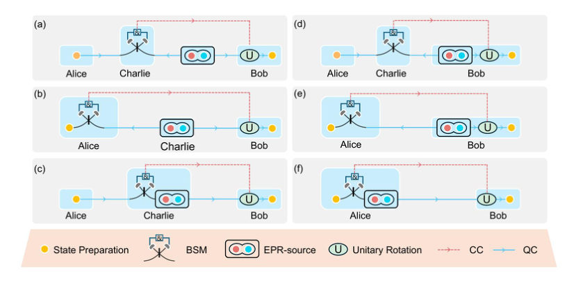 
Figure 2. Six basic network architectures for quantum teleportation. By distributing the four

📷 Fig 4

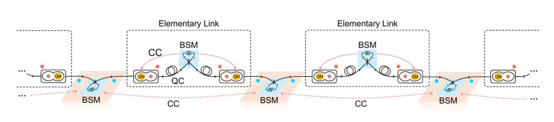 
Figure 3. Quantum repeater architecture and the elementary link with quantum memories.

📷 Fig 5

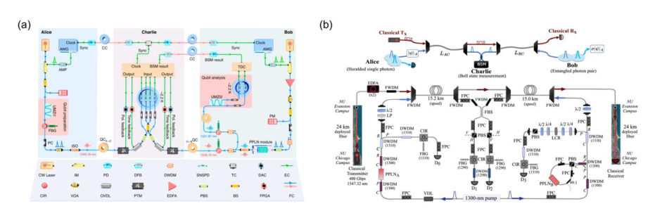 
Figure 4. (a) Hertz-rate three-node quantum teleportation system over a 64 km optical fibre

**Summary.** This review details how quantum teleportation is crucial for building a global quantum internet by enabling long-distance transfer of quantum states using entanglement. It analyzes the necessary components, such as entanglement swapping and quantum repeaters, required to overcome physical limitations like photon loss in optical fibers. The work surveys current experimental progress across diverse hardware platforms toward scalable quantum networking.

**Why it may be interesting.** It provides a comprehensive overview of the physical implementations required for scaling quantum information protocols, touching upon hardware integration across different domains like photonics, solid-state qubits, and atomic systems.

Detailed structure

**Main problem.** The primary challenge is realizing a global-scale quantum internet, which requires robust methods for distributing quantum resources over long distances.

**Main result.** Quantum teleportation, enabled by entanglement swapping and quantum repeaters, provides the essential mechanism for state transfer necessary to build such a network across various physical platforms.

**Method.** The review synthesizes protocols involving quantum teleportation (using Bell State Measurements) and quantum repeater chains to overcome photon loss over long-haul links.

**Model / system.** The discussion covers multiple architectures, including single-link vs. multi-link setups, utilizing platforms ranging from optical fibers and atomic memories to satellite/balloon relays for global connectivity.

**Key observables.** Teleportation fidelity, entanglement distribution range, and transmission loss scaling are key performance indicators.

**Important parameters / regimes.** The achievable distance is fundamentally limited by photon loss; quantum repeaters aim to change this from exponential to polynomial scaling.

**Assumptions / limitations.** It assumes the feasibility of high-fidelity entanglement generation and measurement across diverse physical media (e.g., light $\leftrightarrow$ matter).

**Figures summary.** Figures illustrate the basic schemes for quantum teleportation, entanglement swapping, and six fundamental network architectures required for building quantum communication links.

**Paper structure.** The paper progresses from defining quantum teleportation as essential to discussing entanglement swapping, then detailing various experimental architectures (six types), and finally focusing on quantum repeaters and future scalability challenges.

Abstract

Quantum networks play a pivotal role in quantum information science, which not only provide a secure communication platform for remote access to quantum computers but also serve as the strategic core for achieving large-scale quantum information processing, forming the foundational infrastructure for the future global-scale quantum internet. Quantum teleportation, which enables the transmission of unknown quantum states over long distances by employing quantum entanglement together with classical communication, is essential for the distribution of quantum resources in the construction of the global-scale quantum internet. To realize a global-scale quantum internet, quantum repeater protocols represent one of the most promising approaches for enabling quantum communication between any nodes. This concise review presents representative experimental demonstrations of quantum teleportation for constructing quantum networks across different physical platforms. Along this trajectory, the review discusses current challenges, open issues, and future perspectives toward scalable and practical quantum internet.

[↑ back to top](#top)

### [Stripe-tuned superconductivity in single-flavor metals with nontrivial quantum geometry](http://arxiv.org/abs/2607.24905v1)

**Authors:** Yi-Ting Tu, Yang-Zhi Chou, Yi Huang, Sankar Das Sarma  
**Type:** theory · **Category:** strongly correlated electrons · **PDF:** <https://arxiv.org/pdf/2607.24905v1>  
**Analysis basis:** full PDF text, analyzed in chunks
**Topic relevance:** `analog quantum simulation` **3/5** · `Frenkel-Kontorova` **2/5** · `Keldysh / 2PI / non-Gaussian methods` **1/5** · `driven-dissipative phase transition` **1/5**

📷 Fig 1

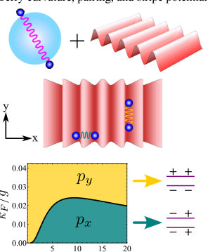 
FIG. 1. Summery of results. (a) Setup: We consider a 2D single- flavor electron systems with a finite Berry cuarvature, an attractive interaction, and a stripe potential. (b) The real-space top view of the system and two different types of effective pairings. Each stripe forms a 1D subsystem along the y direction. The intra-stripe pairing (marked by the yellow wiggly line) is caused by the qy dependence of the effective interaction Vq; the inter-stripe pairing (marked by the teal wiggly line) is caused by the qx dependence of the effective interaction Vq. (c) Asymptotic phase diagram in the weakly interacting and strong stripe limit. The yellow and teal regions correspond to px and py-wave...

📷 Fig 2

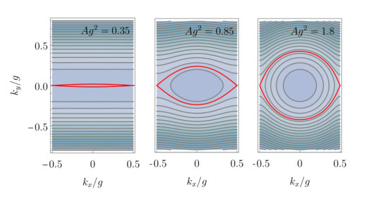 
FIG. 2. The structure of the lowest subband. Gray countours indicates m(E −E0)/g2 = 0.02, 0.04, . . ., and red countours indicates the one passing the VHS.

**Summary.** This paper theoretically explores how stripe potentials interact with nontrivial quantum geometry to dictate the superconducting pairing symmetry in 2D metals. By solving the gap equation, the authors predict a competition between $p_x$-wave (nodal) and $p_y$-wave (fully gapped) superconductivity. The results offer a pathway to control exotic superconducting states using engineered lattice potentials.

**Why it may be interesting.** This work provides a concrete theoretical framework for engineering superconducting pairing symmetry using engineered periodic potentials (stripes) in systems with intrinsic geometric properties (Berry curvature). This concept of 'controlling' superconductivity via geometry is highly relevant to topological materials and advanced quantum devices.

Detailed structure

**Main problem.** The study investigates how the combination of nontrivial quantum geometry (Berry curvature) and an applied periodic stripe potential influences the superconducting pairing symmetry in a 2D single-flavor metal.

**Main result.** Two distinct pairing states, longitudinal $p_y$-wave and exotic transverse $p_x$-wave, can be stabilized, with their competition controlled by electron density and Berry curvature effects. The $p_x$ state exhibits a nodal line at $k_x=0$, while the $p_y$ state is fully gapped.

**Method.** The analysis involves solving the linearized gap equation (LGE) in the quasi-one-dimensional limit, deriving effective interactions via projection onto the lowest subband, and comparing eigenvalues for different pairing symmetries.

**Model / system.** The model is a 2D single-flavor electron system subjected to both a constant Berry curvature ($B>0$) and a real-space stripe potential $U(x, y) = -2U_0 \cos gx$. The physics is analyzed in the quasi-1D limit by restricting calculations to the Fermi surface.

**Key observables.** Pairing symmetry ($	heta$), superconducting critical temperature ($T_c$), and gap structure (nodal lines vs. full gaps).

**Important parameters / regimes.** Stripe strength parameters ($A g^2, B g^2$) and the ratio of Fermi momentum to stripe period ($k_F/g$).

**Assumptions / limitations.** The analysis relies on the weak coupling limit (small $T_c$), the strong-stripe approximation (projecting onto the lowest subband), and initially assumes real symmetry for pairing channels.

**Figures summary.** Figures illustrate phase diagrams showing the preferred pairing form ($	heta$) in parameter space $(A g^2, B g^2, k_F /g)$ and show $T_c$ dependence on interaction strength for different pairing symmetries.

**Paper structure.** The paper progresses by defining the physical model (Hamiltonian with stripe potential), deriving an effective low-energy interaction ($V_q$), solving the linearized gap equation in the quasi-1D limit to find candidate pairing channels ($\lambda_{p_x}, \lambda_{p_y}$), and finally mapping out the phase diagram controlling the transition between these symmetries.

Abstract

We study how the interplay between nontrivial quantum geometry and an applied stripe potential affects superconductivity in a two-dimensional single-flavor metal. Assuming a weak contact attractive interaction and focusing on the lowest subband in the presence of a strong stripe potential, we analytically derive two possible pairing states in the quasi-one-dimensional limit. In addition to the conventional longitudinal $p_y$-wave order (with the stripes along the $y$ direction), we find that an exotic transverse $p_x$-wave order can be stabilized. The competition between these two orders is controlled by the electron density of each stripe and the Berry-curvature-dressed interaction. Notably, the transverse $p_x$ wave order develops a nodal line at $k_x=0$, while the longitudinal $p_y$ order is fully gapped. We discuss the possible experimental probes distinguishing these orders. Our results establish a way of controlling the pairing symmetry through a stripe potential, predicting superconductivity with nontrivial quantum geometry.

[↑ back to top](#top)

### [Charge-6e superconductivity from doping SU(3) spin liquids](http://arxiv.org/abs/2607.25909v1)

**Authors:** Yan-Qi Wang, Boran Zhou, Hui Yang, Zhi-Qiang Gao  
**Type:** theory · **Category:** strongly correlated electrons · **PDF:** <https://arxiv.org/pdf/2607.25909v1>  
**Analysis basis:** full PDF text, analyzed in chunks
**Topic relevance:** `exotic spin models in light-matter` **3/5** · `analog quantum simulation` **2/5** · `Keldysh / 2PI / non-Gaussian methods` **1/5**

📷 Fig 1

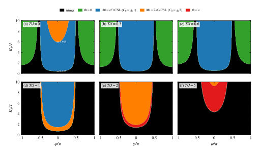 
FIG. 1. Mean-field phase diagram of Eq. (B1) in the (φ, K3) plane at temperatures T/J = 0–5 [panels (a)–(f)]. Colors label the lowest energy ansatz: trimer (black), Φ = 0 (green), |Φ△| = π/3 CSL with C = ±1 (blue), |Φ△| = 2π/3 CSL with C = ±2 (orange), and Φ = π (red). White markers in (a) denote the φ = 0 boundaries K3/J = 0.417 and 5.955 of Ref. [52]. Calculations use a 24 × 24 unit-cell lattice.

**Summary.** This theoretical paper explores how doping SU(3) symmetric quantum spin liquids can realize exotic charge-6e superconductivity. Using advanced techniques like parton constructions on a Hubbard model, the authors demonstrate that symmetry breaking and fractionalization cooperate to stabilize these higher-charge superconducting states. It offers a powerful conceptual link between topological order in frustrated magnets and unconventional pairing mechanisms.

**Why it may be interesting.** This work provides a highly detailed, theoretically rigorous framework connecting higher-rank symmetries (SU(3)) and fractionalization mechanisms to predict unconventional superconductivity, which is crucial for understanding high-temperature superconductors.

Detailed structure

**Main problem.** The paper proposes doping SU(3)-symmetric spin liquids as a novel theoretical route to achieve exotic charge-6e superconductivity, generalizing previous work on charge-4e SC.

**Main result.** Doping mechanisms in SU(3) quantum spin liquids can lead to various superconducting states, including chiral and non-Abelian charge-6e superconductors by pairing fractionalized fermionic trions.

**Method.** The study employs complementary parton constructions, mean-field ansatz calculations, and analysis of topological field theories (like Chern-Simons terms) applied to doped Hubbard models.

**Model / system.** The primary model is a bilayer triangular-lattice Hubbard model possessing SU(3) spin symmetry. The theory analyzes the low-energy physics resulting from doping this system across different quantum spin liquid phases ($\mathbb{Z}_3$, Abelian/non-Abelian CSLs).

**Key observables.** Superconducting charge quantization (e.g., 6e), Hall conductance ($\sigma_H$), chiral central charge ($c_-$), and the nature of topological order.

**Important parameters / regimes.** Doping concentration ($x$), interlayer exchange coupling ($J_\perp^T$), and various symmetry-breaking parameters defining the spin liquid type (e.g., $	ext{SU}(3)_1, 	ext{SU}(3)_2$).

**Assumptions / limitations.** The analysis relies heavily on parton constructions and mean-field approximations to map out complex ground states and superconducting order parameters.

**Figures summary.** Figure 1 (from Chunk 4 notes) illustrates the phase diagram of an effective SU(3) spin model, showing transitions between trimer, U(1) spin liquid, and various chiral spin liquid phases as a function of temperature and coupling ratios ($K_3/J$).

**Paper structure.** The paper progresses by first defining the physical model (Hubbard Hamiltonian with SU(3) symmetry), then using parton constructions to analyze doping effects in specific quantum spin liquids ($\mathbb{Z}_3$, CSLs), culminating in the identification of charge-6e superconducting phases.

Abstract

We propose doping $SU(3)$-symmetric spin liquids as a route toward charge-$6e$ superconductivity. This generalizes the idea of constructing charge-$4e$ superconductivity from doped $SU(4)$-symmetric phases. As a concrete platform, we study a bilayer triangular-lattice Hubbard model with $SU(3)$ spin symmetry and interlayer antiferromagnetic exchange. Using complementary parton constructions, we analyze doped $\mathbb{Z}_3$ quantum spin liquid and $SU(3)$-related chiral spin liquids. Doping a $\mathbb{Z}_3$ quantum spin liquid can produce an orthogonal metal with a gauge invariant fermi surface of charge-$3e$ fermionic trions. Pairing these trions gives a time-reversal-symmetric charge-$6e$ superconductor. Doping Abelian $SU(3)_1$ and $SU(6)_1$ chiral spin liquids yields chiral charge-$6e$ superconductors with and without residual Abelian topological order, respectively. Doping a non-Abelian $SU(3)_2$ chiral spin liquid leads to a non-Abelian chiral charge-$6e$ superconductor intertwined with $SO(3)_{-3}$ topological order and supporting non-Abelian $h/(6e)$ superconducting vortices. We also identify several other phases, including $\mathbb{Z}_3$ orthogonal metal, quantum anomalous Hall (crystal) phases enriched by $\mathbb{Z}_3$ or $\mathbb{Z}_2$ topological order, $SU(3)$-breaking charge-$2e$ superconductors, composite fermi liquid coupled to non-Abelian gauge field, and descendant chiral spin liquids. Our results identify doped $SU(3)$ spin liquids as a natural setting where symmetry, fractionalization, and topology cooperate to produce charge-$6e$ superconductivity.

[↑ back to top](#top)

### [Efficient computation of real-time correlators using Pauli Propagation](http://arxiv.org/abs/2607.24924v1)

**Authors:** Alexander F. Kemper, Raghav G. Jha, Arnab Bachhar, Goksu C. Toga, Mariano Guerrero Perez, Nicholas J. Mayhall  
**Type:** theory · **Category:** numerical methods · **PDF:** <https://arxiv.org/pdf/2607.24924v1>  
**Analysis basis:** full PDF text, analyzed in chunks
**Topic relevance:** `methods for driven-dissipative` **3/5** · `Keldysh / 2PI / non-Gaussian methods` **1/5** · `analog quantum simulation` **1/5** · `non-equilibrium dynamics` **1/5**

📷 Fig 1

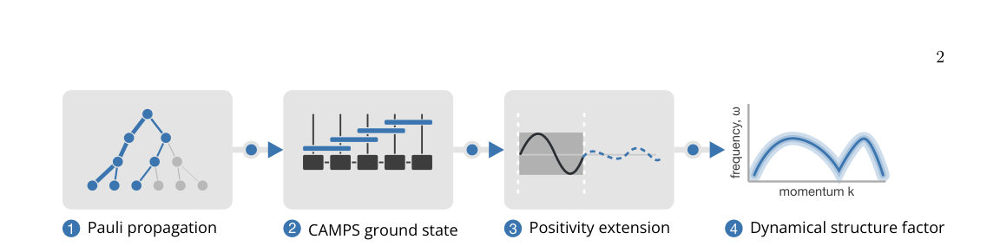 
FIG. 1. Overview of the computational strategy developed in this paper. 1) Real-time operator dynamics, truncated on coefficient and weight to control the growth of Pauli strings. 2) Clifford-augmented MPS supplies an accurate, low-bond- dimension approximation of the ground state to measure against. 3) A low-rank positive semi-definite (PSD) fit super-resolves short-time data out to late times, avoiding Pauli explosion. 4) By combining these techniques, we can obtain the dynamical spin structure factor S(k, ω)

📷 Fig 2

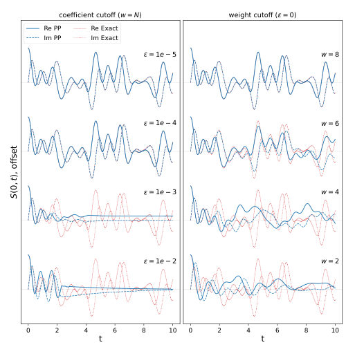 
FIG. 2. On-site correlation function S(r = 0, t) for the N = 8 1D ferromagnetic Heisenberg chain. Pauli propagation (PP) results are shown in lines, and the exact results with red mark- ers.

📷 Fig 3

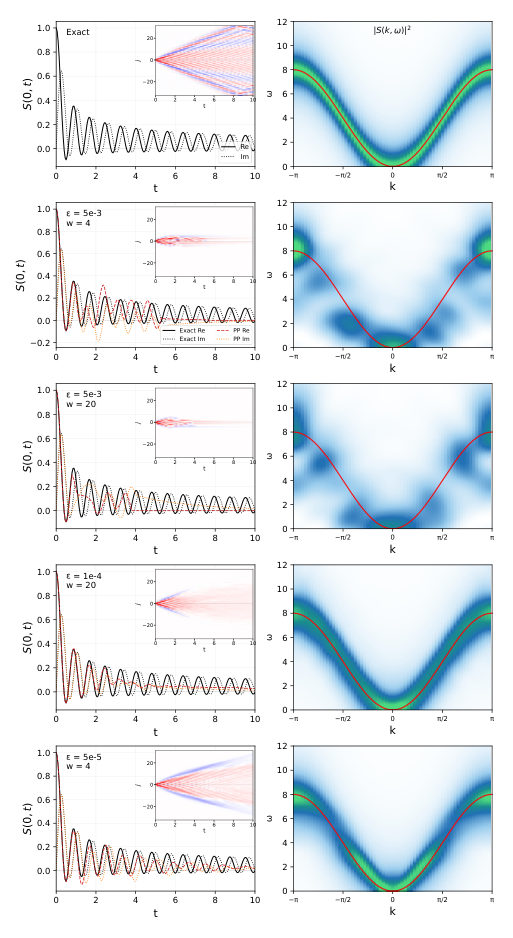 
FIG. 3. Pauli propagation convergence overview for the 1D ferromagnetic Heisenberg chain at N = 64. The top row is the exact (analytic) 1-magnon reference; the remaining rows are four representative composite-truncation points (ε, w). Left column: On-site correlation function S(r = 0, t), real (solid) and imaginary (dotted) parts, with ED in black and PP over- laid in red/orange. Insets show Re S(r = j, t) as a function of time (horizontal) and site j from the source (at r = 0). Right column: dynamical structure factor |S(k, ω)|2 with exponen- tial time-domain damping e−t/τ using τ = 1. The cyan curve marks the analytic 1-magnon dispersion ω(k) = 4(1 −cos k). Each momentum is individually...

📷 Fig 4

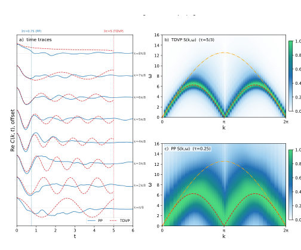 
FIG. 4. Pauli propagation results for the 1D Heisenberg anti- ferromagnet. a) Time traces for selected momenta using Pauli propagation (PP) and TDVP. b,c) |S(k, ω)|2 obtained (b) from TDVP with τ = 5/3 and (c) from Pauli propagation with τ = 0.25. The red and orange dashed lines indicate the known boundaries of the spectrum of spinons in 1D.

📷 Fig 5

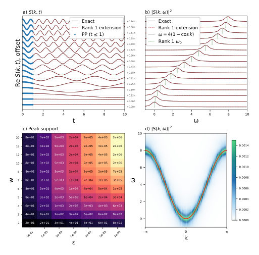 
FIG. 5. Positive semi-definite extension in momentum space from N = 64 ferromagnetic Heisenberg in 1D for short-time Pauli Propagation (PP) data (ε = 10−5, w = 20, 21 sam- ples). a) Re S(k, t) showing 16 momenta, comparing exact (ED) with the rank 1 extension from PP data (blue mark- ers). Vertical lines indicate the rank 1 frequency found (ω0) as well as the exact analytic result at each momentum k. b) Resulting power spectrum of S(k, ω) with exponential damp- ing using τ = 2.5 and zero-padding. c) Maximal operator support (number of Pauli terms) during the propagation. d) Full S(k, ω) heatmap from the PSD-extended signal.

**Summary.** The paper introduces a novel, efficient method to calculate real-time correlation functions in interacting quantum spin systems by combining Pauli Propagation with low-rank time extension. This overcomes the severe limitation of operator basis explosion inherent to direct simulation methods. The technique allows for reliable probing of complex dynamics and spectral features in 1D and 2D quantum magnets.

**Why it may be interesting.** This work presents an advanced computational toolkit that tackles the fundamental bottleneck of real-time quantum simulation—the exponential growth of operators—by merging established methods (PP) with modern data analysis techniques (low-rank extrapolation).

Detailed structure

**Main problem.** The primary goal is the efficient computation of real-time two-point time-ordered correlators, which are essential for linking microscopic quantum theory to measurable macroscopic observables.

**Main result.** By combining short-time Pauli propagation with low-rank extension methods based on positivity conditions, the authors extend correlation function calculations far beyond the direct computational time window while maintaining spectral accuracy.

**Method.** The core method involves using Pauli Propagation (PP) to evolve operators in the Heisenberg picture, which is then augmented by time extension techniques that exploit the low-rank nature of the dynamics to overcome the exponential growth of Pauli strings. Ground states are approximated using Clifford-Augmented Matrix Product States (CAMPS).

**Model / system.** The study focuses on one- and two-dimensional quantum spin systems, specifically utilizing the Heisenberg model Hamiltonian ($H = J \sum \mathbf{X}_i \cdot \mathbf{X}_{i+1}$). Analyses cover both ferromagnetic and anti-ferromagnetic regimes.

**Key observables.** Time-dependent correlation functions $C(t)$, dynamical structure factor $S(\mathbf{k}, \omega)$, and the static staggered moment $m_s$.

**Important parameters / regimes.** Pauli string truncation parameters ($\epsilon$, $w$), MPS bond dimensions ($D$), and system size ($N$).

**Assumptions / limitations.** The method assumes that the correlation functions exhibit a low-rank structure, allowing extrapolation from short-time data; it also relies on truncating the Pauli operator basis.

**Figures summary.** Figures illustrate the computational strategy combining PP with CAMPS and low-rank fitting. They show finite-size scaling of excitation spectra ($\omega(\mathbf{k})$) for 2D AFM systems, demonstrating convergence to theoretical limits.

**Paper structure.** The paper develops a combined numerical framework: first establishing ground state approximations via CAMPS, then using Pauli Propagation for short-time dynamics, and finally applying low-rank fitting/extension techniques to extrapolate results to longer times and higher resolutions.

Abstract

Pauli propagation has shown promise for classically simulating quantum dynamics by evolving observables directly in the Heisenberg picture. In this work, we investigate its use for computing real-time two-point time-ordered correlators in one- and two-dimensional quantum systems. One major limitation of Pauli propagation is the rapid growth in the number of Pauli strings beyond short times. We overcome this limitation by combining accurate short-time Pauli-propagation data with time extension methods based on a positivity condition and the observation that the dynamics are often dominated by a small number of characteristic frequencies. This combined approach extends correlation functions far beyond the directly accessible time window while avoiding the exponential proliferation of Pauli operators. We demonstrate that the resulting correlators retain the relevant dynamical and spectral information. Our results broaden the regime in which classical methods can reliably probe the real-time dynamics of interacting quantum many-body systems.

[↑ back to top](#top)

### [Variational approach to Yukawa fluids. I. Thermodynamics](http://arxiv.org/abs/2607.25908v1)

**Authors:** S. A. Khrapak, A. G. Khrapak  
**Type:** theory · **Category:** statistical mechanics · **PDF:** <https://arxiv.org/pdf/2607.25908v1>  
**Analysis basis:** full PDF text, analyzed in chunks
**Topic relevance:** `Keldysh / 2PI / non-Gaussian methods` **3/5** · `analog quantum simulation` **1/5** · `driven-dissipative phase transition` **1/5** · `methods for driven-dissipative` **1/5**

📷 Fig 1

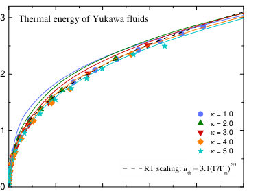 
FIG. 1. (Color online) Thermal component of the excess en- ergy of a strongly coupled Yukawa fluid for five screening pa- rameters κ = 1, 2, 3, 4, and 5. Thermal energy is calculated from Eq. (14) and is plotted as a function of the reduced cou- pling parameter Γ/Γm, where Γm is the coupling parameter at melting. The symbols correspond to MD numerical data from Ref. [39]. Different solid curves correspond to variational calculation performed in this work. The dashed black curve marks the original RT scaling uth ≃3.1(Γ/Γm)2/5.

📷 Fig 2

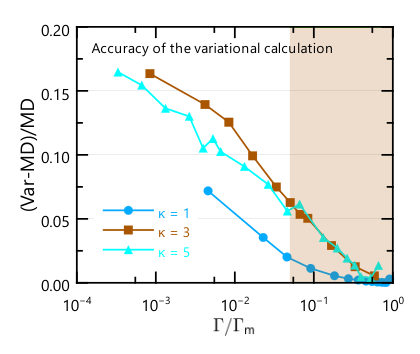 
FIG. 2. (Color online) Relative deviation between excess en- ergies calculated from the variational approach and MD sim- ulation results from Refs. [36, 39]. Relative deviation denoted as (Var −MD)/MD is plotted as a function of reduced cou- pling parameter Γ/Γm, where Γm is the coupling parameter at melting. The data are shown foe three screening parame- ters, κ = 1, 3, and 5. The shaded region corresponds to the strongly-coupled fluid-like regime at Γ/Γm ≳0.05.

📷 Fig 3

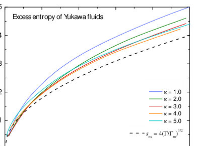 
FIG. 3. (Color online) Negative excess entropy of a strongly coupled Yukawa fluid (−sex) versus the reduced coupling pa- rameter Γ/Γm, as obtained from the variational calculation for five screening parameters κ = 1, 2, 3, 4, and 5. The color scheme is the same as used in Fig. 1. The dashed black curve marks the quasi-universal scaling sex ≃−4(Γ/Γm)1/2

📷 Fig 4

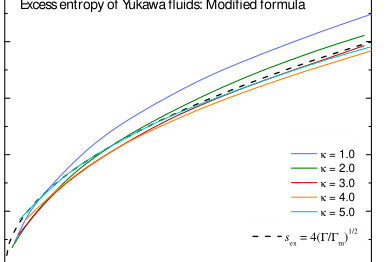 
FIG. 4. (Color online) Same as in Fig. 3, except the excess entropy of the Yukawa fluid is now calculated from a modified Eq. (16).

📷 Fig 5

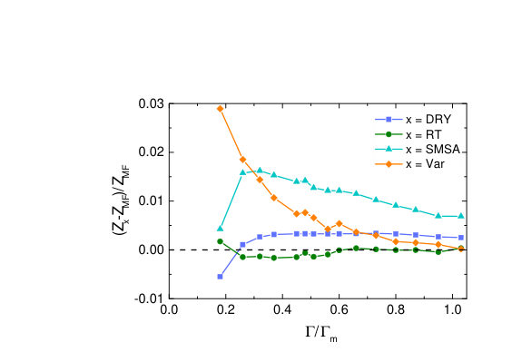 
FIG. 5. (Color online) The accuracy of different methods to estimate the compressibility factor of the Yukawa fluid. Plot- ted are the values of (Zx −ZMF)/ZMF, where Z is compress- ibility factor, as a function of the reduced coupling parameter Γ/Γm. Here MF corresponds to the MC data from Meijer and Frenkel [35], and x = DRY, RT, SMSA, and Var approxima- tions, as discussed in the text.

**Summary.** This work applies a variational approach to determine the thermodynamics of Yukawa fluids, which model plasmas and colloidal suspensions. By using hard-sphere fluid properties as a reference, the authors accurately calculate excess energy, entropy, and pressure even in strongly coupled regimes. The method is particularly useful for predicting phase boundaries, such as the melting curve, where experimental or simulation data are lacking.

**Why it may be interesting.** While focused on classical plasma physics, the use of advanced statistical mechanical techniques (variational bounds) to predict phase transitions in strongly coupled systems is relevant for understanding quantum many-body ground states and critical phenomena.

Detailed structure

**Main problem.** The primary goal is calculating the excess energy, entropy, and pressure of a strongly coupled Yukawa fluid.

**Main result.** The variational approach provides accurate estimates for these thermodynamic properties, successfully extending predictions into regimes where numerical data are scarce or unavailable.

**Method.** A variational approach based on the Bogoliubov inequality is employed, using the hard-sphere fluid as a reference system to bound and estimate the excess free energy.

**Model / system.** The physical system is a Yukawa fluid, characterized by screened Coulomb repulsive interactions $\phi(r) = \Gamma/r \exp(-\kappa r/a)$. This model is relevant for dusty plasmas and colloidal suspensions.

**Key observables.** Excess free energy ($f_{ex}$), excess entropy ($s_{ex}$), excess pressure ($p_{ex}$), and the melting curve location ($\Gamma_m(\kappa)$).

**Important parameters / regimes.** Coupling parameter ($\Gamma$), screening parameter ($\kappa$), and the variational parameter ($\eta$). The strong coupling regime is a key focus.

**Assumptions / limitations.** The method relies on approximations for the radial distribution function (e.g., Percus-Yevick theory) and assumes that the effective packing fraction at freezing approaches the hard-sphere limit as screening increases.

**Figures summary.** Figures compare calculated thermal energy, compressibility factor ($Z$), and effective packing fraction ($\eta_{fr}$) against Molecular Dynamics simulations and theoretical scaling laws, showing convergence towards known asymptotes.

**Paper structure.** The paper develops the variational formalism for excess thermodynamic quantities, applies it to calculate specific observables like $u_{th}$ and $s_{ex}$, and then uses these results to extrapolate the melting curve into highly screened regimes ($\kappa$ large).

Abstract

The excess energy, entropy, and pressure of a strongly coupled Yukawa fluid are calculated from the variational approach using the fluid of hard spheres as a reference system. As in the case of the one-component plasma, the Percus-Yevick virial entropy is appropriate for such calculations and delivers remarkable agreement with available results from molecular dynamics simulations. The agreement with the molecular-dynamics results is particularly impressive in the strongly coupled regime, making this approach a useful predictive tool when numerical data are scarce or not yet available. As an application of the variational approach, we estimate the location of the melting curve in the regime of sufficiently strong screening.

[↑ back to top](#top)

### [Benchmarking Optical Receivers for Quantum Communication and Randomness Certification](http://arxiv.org/abs/2607.25702v1)

**Authors:** Hamid Tebyanian  
**Type:** theory · **Category:** quantum information and computing · **PDF:** <https://arxiv.org/pdf/2607.25702v1>  
**Analysis basis:** full PDF text, analyzed in chunks
**Topic relevance:** `quantum measurements` **3/5** · `entanglement & information structure` **1/5** · `measurement-induced transitions` **1/5**

📷 Fig 1

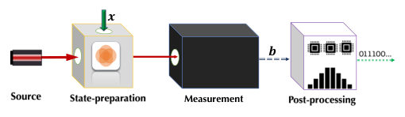 
Figure 1. General schematic of the protocol. A laser feeds the preparation stage, where the energy of the emitted state is bounded and monitored; the state is measured by an un- characterised device, and the raw outcomes are fed to post- processing, where the certified min-entropy determines the extractable randomness.

📷 Fig 2

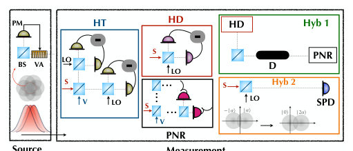 
Figure 2. Detection schemes, labelled as in the panels. HD: homodyne, one quadrature by interference with a local oscil- lator. HT: heterodyne, both quadratures at the cost of an added vacuum unit. PNR: photon counting with multiplexed on–off elements. Hyb 1: beacon homodyne, conditional dis- placement, photon counting. Hyb 2 (Kennedy): nulling dis- placement and a single-photon detector.

📷 Fig 3

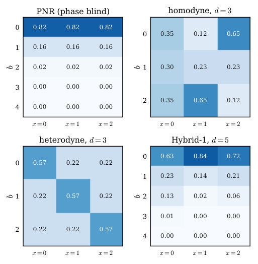 
Figure 3. Conditional laws P(b|x) for ternary PSK at µ = 0.2, ideal detectors–the exact matrices used as SDP input. PNR (multiplexed, Nbin = 20, click bins {0}, {1}, {2, 3}, {4–7}, {≥ 8}) is phase blind: its columns are identical, so Hmin = 0 by Proposition 1. Homodyne (P quadrature, midpoint bins), heterodyne (angular sectors) and Hybrid-1 (parameters of Sec. II E 5, beacon label traced out) produce input-dependent columns.

📷 Fig 4

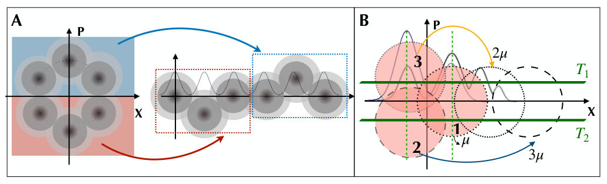 
Figure 4. Hybrid-1 receiver. (a) General operating principle. A beacon homodyne measurement provides a coarse phase estimate, which determines the conditional displacement applied to the transmitted mode before photon-number-resolving detection. The panel gives a schematic phase partition rather than the precise ternary implementation. (b) Ternary implemen- tation. Two thresholds, T2 &lt; T1, divide the beacon outcome into three regions associated with D(2gα), the identity operation and D(gα). The displaced amplitudes produce the branch- and input-dependent mean photon numbers λk,x of Eq. (37), which determine the corresponding PNR click distributions.

📷 Fig 5

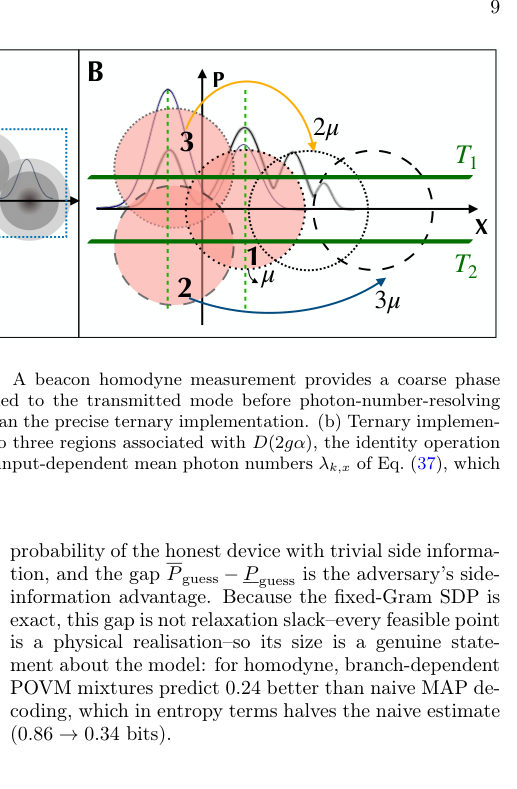 
Figure 5(a) shows the certified entropy against µ in the coherent model. Homodyne rises from 0.35 bits at µ = 0.005 to its peak H⋆ min = 0.43 bits at µ⋆≈0.054 and falls back to 0.09 bits at µ = 1, where the constel- lation becomes too distinguishable to constrain the ad- versary; certification does not die at low energy because the bin edges scale with √µ, so the states approach each other exactly as fast as the data flatten. Heterodyne runs parallel and slightly below, while the Kennedy cas- cade and the coarse-grained Hybrid-1 remain substan- tially below the Gaussian receivers. The joint-output Hybrid-1 changes the low-energy picture: at µ = 0.01

**Summary.** This paper rigorously benchmarks optical receivers—comparing continuous-variable, photon-counting, and hybrid detectors—to determine their impact on certified randomness extraction. Using SDPs, the authors show that receiver choice critically affects security bounds, demonstrating that hybrid schemes offer advantages at low energy while CV methods excel at moderate energy.

**Why it may be interesting.** It provides rigorous, information-theoretic bounds on achievable randomness in practical quantum communication settings by focusing on the measurement apparatus's limitations, which is crucial for designing robust quantum hardware.

Detailed structure

**Main problem.** The paper benchmarks how different optical receivers (CV, photon-counting, hybrid) affect the security analysis of quantum protocols, particularly for randomness certification.

**Main result.** Hybrid receivers perform optimally at low energy when retaining beacon labels, while continuous-variable receivers yield the highest certified entropy at moderate energies compared to other methods.

**Method.** The authors use observed receiver statistics $P(b|x)$ within a prepare-and-measure framework to derive an exact bound on the min-entropy $H_{\min}(B|X, \Lambda)$ using Semidefinite Programming (SDP).

**Model / system.** The system involves quantum states prepared by a source characterized by its Gram matrix and measured by uncharacterized optical receivers. The analysis is framed within semi-device-independent security proofs.

**Key observables.** $H_{\min}(B|X, \Lambda)$ (certified min-entropy), $P(b|x)$ (observed conditional probabilities), and the adversary's guessing probability ($P_{	ext{guess}}$).

**Important parameters / regimes.** Mean photon number bound ($\mu$), energy constraint ($	ext{Tr}[\hat{
ho}_x \hat{n}] \le \mu$), and phase drift ($	heta$).

**Assumptions / limitations.** The security analysis assumes the side information $\Lambda$ is classical, and the source model is fixed by its Gram matrix or constrained by an energy bound.

**Figures summary.** Figure 1 schematically shows the prepare-and-measure protocol with energy bounding. Figure 14 compares distinguishability indices for different receivers over varying mean photon number ($\mu$) and phase drift ($	heta$).

**Paper structure.** The paper establishes the general framework using SDPs to bound min-entropy, analyzes specific receiver types (photon counting vs. CV/hybrid), derives quantitative results comparing their performance across energy regimes, and discusses implications for various quantum protocols.

Abstract

The choice of optical receiver determines which properties of the transmitted states remain visible in the observed data and therefore affects the performance of different quantum protocols. We compare continuous-variable, photon-counting and hybrid receivers within the same prepare-and-measure framework, using semi-device-independent randomness generation as the main case study. The measurement device is left uncharacterised, while the source is described by the Gram matrix of its pure signal states using an energy-derived overlap constraint, a magnitude-Gram benchmark or the full complex Gram matrix of a certified coherent phase-shift-keyed constellation. Within this framework, the observed receiver statistics are used to bound $H_{\min}(B|X,Λ)$ against classical side information correlated with the measurement device but independent of the input. For a fixed Gram matrix, this bound is obtained from an exact semidefinite program, with complex multi-input cases treated in block-real form and checked through the corresponding dual certificate. Photon counting alone is phase blind for fixed-modulus phase encoding and therefore certifies no worst-case randomness. Continuous-variable receivers give the highest certified entropy at moderate energy, while under the nominal source calibration a hybrid receiver performs better at low energy when the beacon-region label is retained in the output. The same receiver statistics also provide receiver-level comparisons for discrete-modulated continuous-variable quantum key distribution, quantum reading, covert communication and quantum-signature verification, without replacing the full security analysis required for each protocol.

[↑ back to top](#top)

### [An algebraically closed family of informational n-qubit purity invariants](http://arxiv.org/abs/2607.24987v1)

**Authors:** Markus Frembs, Giovanni Natale, Christopher S. P. Wever, Philipp A. Hoehn  
**Type:** theory · **Category:** quantum information and computing · **PDF:** <https://arxiv.org/pdf/2607.24987v1>  
**Analysis basis:** full PDF text, analyzed in chunks
**Topic relevance:** `entanglement & information structure` **3/5**

📷 Fig 1

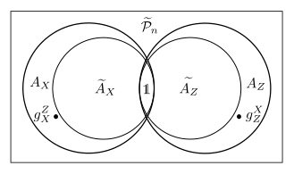 
FIG. 1. Venn diagram showing the set structure of the rele- vant group elements defining the sets in Def. 1.

**Summary.** This paper develops a generalized theory for finding purity invariants characterizing $n$-qubit pure states, extending concepts from two qubits. It achieves this by defining specific sets within the Pauli group based on maximal complementarity structures rather than just anti-commuting operators. The result provides a systematic classification and enumeration of these fundamental quantum state constraints.

**Why it may be interesting.** This work provides deep structural insights into the geometry of high-dimensional quantum state spaces by identifying conserved quantities (invariants) that are fundamentally linked to the underlying symmetry group structure ($	ext{PSU}(2^n)$).

Detailed structure

**Main problem.** The authors aim to find a general family of state-independent invariants for $n$-qubit pure states that successfully generalizes the known 'pentagon identities' from the two-qubit case.

**Main result.** They introduce a new family of quadratic invariants derived from maximal complementarity structures within the Pauli group, proving these sets constitute purity invariants for arbitrary $n$. The number of such distinct invariants is systematically counted.

**Method.** The analysis employs advanced algebraic techniques involving the structure of Pauli expectation values and identifying specific structured subsets ($J$) of the Pauli group based on commuting/anti-commuting generators.

**Model / system.** The system under study consists of $n$-qubit quantum states, whose geometry is characterized by the pure state manifold $	ext{CP}^{2^n-1}$. The diagnostics are built upon the Pauli group $	ilde{\mathbb{P}}_n$ and the Brukner-Zeilinger information measure.

**Key observables.** The primary observable is the purity invariant $I_\psi(S)$, which must remain constant for all pure states $\psi$. Other key elements include the expectation values of Pauli operators ($\alpha_P$).

**Important parameters / regimes.** The number of qubits, $n$, is the main parameter governing complexity; results are explicitly derived and compared for $n=2$ and $n>2$.

**Assumptions / limitations.** The derivation relies on specific algebraic closure relations concerning sets defined by maximal Abelian subgroups within the Pauli group structure.

**Figures summary.** Figure 1 illustrates a Venn diagram detailing the set structure defining the invariant set $J$; later sections contain large tables explicitly listing the 28 distinct Pauli string sets for the $n=3$ case.

**Paper structure.** The paper progresses by first establishing the need for generalization beyond simple anti-commutation rules (failure at $n>2$). It then defines the invariant set $J$ based on complementarity structures, proves its invariance property using algebraic tools, and finally enumerates and catalogs these invariants for small systems like $n=3$.

Abstract

We present a family of quadratics in Pauli expectation values, and prove that they constitute state-independent invariants for all n-qubit pure states. This family generalises the two-qubit `pentagon identities', discovered in the reconstruction programme of [P. A. Höhn, Quantum 1, 38 (2017), P. A. Höhn and C. S. P. Wever, Phys. Rev. A 95, 012102 (2017)], where they characterise the space of pure states, as well as the unitary group, and are interpreted as complementarity equalities in the Brukner-Zeilinger information measure. The generalisation to arbitrarily many qubits is nontrivial as it requires new tools which in turn reveal novel structural properties that are absent in the two-qubit case. A thorough analysis of these properties, and their relation with mutual unbiasedness and complementarity in the n-qubit Pauli group, can be found in two companion papers.

[↑ back to top](#top)

### [Bipartite Bound Information Exists](http://arxiv.org/abs/2607.25838v1)

**Authors:** Jef Pauwels, Nicolas Gisin, Renato Renner  
**Type:** theory · **Category:** quantum information and computing · **PDF:** <https://arxiv.org/pdf/2607.25838v1>  
**Analysis basis:** full PDF text, analyzed in chunks
**Topic relevance:** `entanglement & information structure` **3/5**

📷 Fig 1

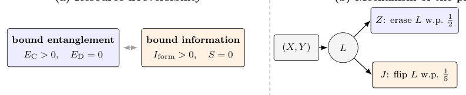 
FIG. 1. Resource analogy and proof mechanism. (a) Bound entanglement and bound information express the same operational irreversibility: positive creation cost (entanglement cost EC, formation cost Iform) with zero distillable yield (distillable entanglement ED, secret-key rate S). (b) In our source (Table I), a latent bit L is correlated with (X, Y ) through Eq. (5) and passed through two noisy channels. Eve’s observation Z reveals L half of the time and is blank otherwise. The variable J, held by nobody, is L flipped with probability 1/5. Given J, the variables X and Y are independent, so an eavesdropper holding J would preclude any key. Because 1

📷 Fig 2

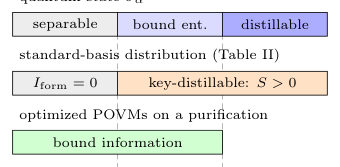 
FIG. 2. One state family, two classicalizations. Top: the qutrit states σα = 2 7 ΠΦ + α

**Summary.** The paper proves the existence of 'bound information,' which is the classical counterpart to bound entanglement. It demonstrates that certain shared classical correlations cost resources to create but yield no extractable secret key. This finding establishes a resource analogy, showing that such phenomena are not exclusive to quantum mechanics.

**Why it may be interesting.** This work extends the concept of resource theory beyond pure quantum entanglement into classical correlations, providing a rigorous mathematical framework for understanding non-quantum forms of 'hidden' or costly information.

Detailed structure

**Main problem.** To determine if a classical analogue of bound entanglement exists: a correlation that costs secret bits to create but from which no secret key can be extracted.

**Main result.** The authors prove the existence of such 'bound information' using an explicit source distribution, demonstrating that positive intrinsic information can exist even when the distillable key rate is zero.

**Method.** The analysis involves comparing three quantities—secret-key rate ($S$), intrinsic information ($I_{\downarrow}$), and formation cost ($I_{	ext{form}}$)—using techniques from information theory applied to tripartite source distributions.

**Model / system.** The problem is modeled using a tripartite source distribution over finite alphabets, specifically involving two bits and one trit. The analysis draws analogies between quantum bound entanglement (qutrits) and classical correlations.

**Key observables.** Secret-key rate $S(X; Y \parallel Z)$, Intrinsic Information $I(X; Y \downarrow Z)$, Formation Cost $I_{	ext{form}}(X; Y | Z)$.

**Important parameters / regimes.** The analysis uses parameters $\alpha$ governing a family of qutrit states, and the source is defined over finite alphabets (e.g., two bits and one trit).

**Assumptions / limitations.** The analogy established holds at the level of resources, not necessarily for individual quantum states or their measurement outcomes.

**Figures summary.** Figure 1 illustrates the resource analogy ($	ext{EC} > 0, 	ext{ED} = 0$ vs. $I_{	ext{form}} > 0, S = 0$). Figure 2 shows a family of qutrit states $\sigma_\alpha$ illustrating different entanglement regimes.

**Paper structure.** The paper develops the analogy by first establishing the classical bound information using an explicit source (Table I). It then analyzes this phenomenon in relation to quantum systems, examining specific families of qutrit states ($\sigma_\alpha$) and proving that measurements on these states can yield positive intrinsic information despite zero distillable key.

Abstract

Bound entanglement is an extreme irreversibility of quantum theory: certain states cost entanglement to create, yet no singlet can be distilled from them. Twenty-five years ago, Gisin and Wolf asked whether classical cryptography admits the same phenomenon. Are there correlations, shared by two parties and an eavesdropper, that cost secret bits to create although none can be extracted? We show that such bound information exists and give an explicit example, a distribution of two bits and a trit. The proof exploits a gap between two ways of comparing eavesdroppers: one can be better informed than another in every mutual-information comparison and nevertheless unable to simulate the other's data. We further prove that the distributions which motivated the conjecture, standard-basis measurements of bound-entangled qutrit states, are not themselves examples: a secret key is extractable from them whenever their creation costs any secrecy. Other measurements of their purifications, in contrast, do yield bound information, even for the separable states among them. The analogy is thus one of resources, not of individual states and their measurement outcomes.

[↑ back to top](#top)

### [Field-Induced Dissociation Reveals Excitonic Long-Range Photocarrier Transport in Bulk-Insulating Bi2Se3 Nanoribbons](http://arxiv.org/abs/2607.25128v1)

**Authors:** Rodrigo Becerra Silva, Xiang Yi, Ziyi Song, Dong Yu  
**Type:** both · **Category:** strongly correlated electrons · **PDF:** <https://arxiv.org/pdf/2607.25128v1>  
**Analysis basis:** full PDF text, analyzed in chunks
**Topic relevance:** `non-equilibrium dynamics` **2/5** · `analog quantum simulation` **1/5** · `correlated / nonlocal dissipation` **1/5** · `driven-dissipative phase transition` **1/5** · `methods for driven-dissipative` **1/5** · `non-equilibrium universality` **1/5**

📷 Fig 1

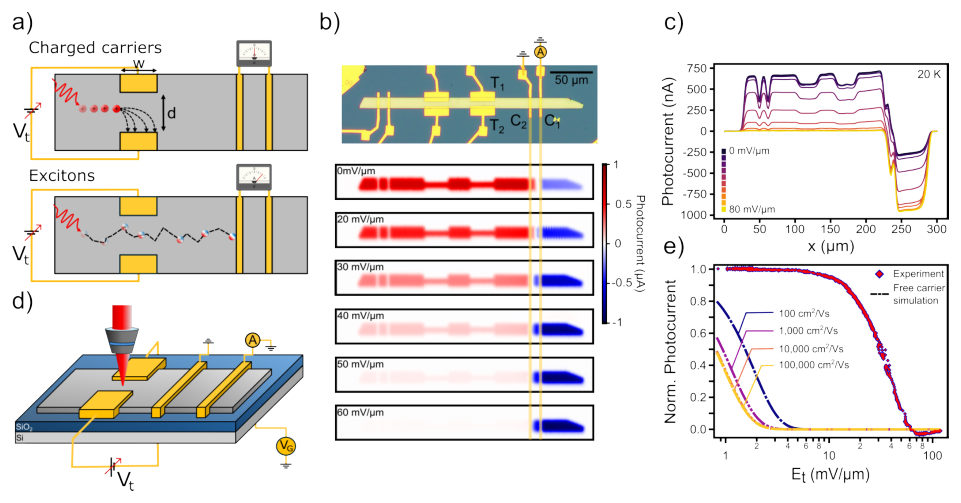 
Figure 1: Transverse field dependent photocurrent in device D1 at 20 K. (a) Schematic of the device geometry with a pair of transverse contacts separated by a distance d. Charged photoexcited carriers are deflected by the transverse electric field, whereas excitons can transit through. (b) Optical image of the device together with SPCM maps acquired at different transverse electric-field strengths using a 5.3 µW laser at 690 nm. All maps are plotted using the same color scale. (c) Line cuts along the nanoribbon axis extracted from the center of the SPCM maps shown in (b), showing the evolution of the photocurrent profile with applied transverse field. (d) Schematic of the SPCM setup. (e)...

📷 Fig 2

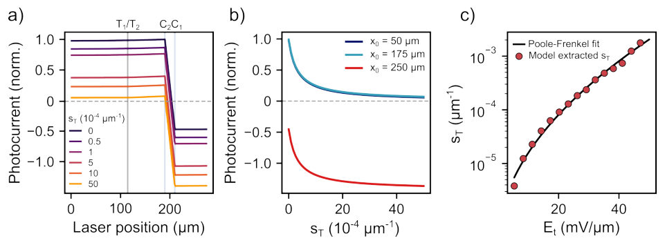 
Figure 2: Simulation results of the multiple-pass exciton diffusion model. (a) Simulated photocurrent profiles as a function of laser position for increasing transverse sink strength sT. (b) Photocurrent as a function of sT at representative laser positions. (c) Sink strength sT extracted from the measured field-dependent photocurrent suppression, plotted against the transverse field Et. The solid line is a Poole-Frenkel fit using Eq. (4).

📷 Fig 3

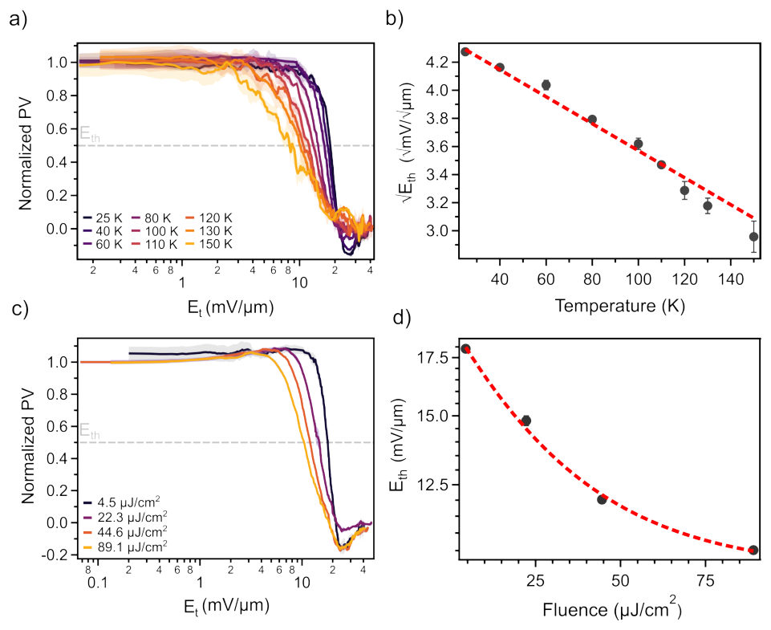 
Figure 3: Temperature- and fluence-dependent threshold field in device D2. (a) Normalized photovoltage (PV) versus transverse field Et for temperatures from 25 to 150 K, with the laser parked at the center of the transverse channel at a fluence of 4.8 µJ/cm2. The threshold field Eth is defined as the 50% crossing of the normalized PV (gray dashed line). Shaded bands denote the measurement uncertainty. (b) Eth extracted from (a) versus temperature, showing that p

📷 Fig 4

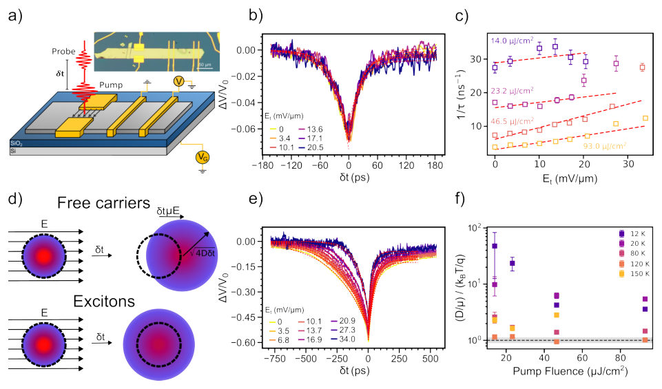 
Figure 4: Ultrafast transient photovoltage measurements under transverse field in device D2. (a) TPV setup, where a pulsed laser excites the device while a transverse electric field is applied across the channel. Inset: microscopic image of the device. (b,e) Normalized modulation of photovoltage versus delay measured at 14 and 93 µJ/cm2 respectively, under various field strengths at 12 K. Positive (negative) delay means pump arrives later (earlier) than probe. (c) The inverse of recovery times as a function of electric field for various excitation fluences at 12 K. The dashed curves show fits used to determine the diffusivity and mobility using Eq. (5). (d) Schematics showing the spreading...

**Summary.** The paper investigates the mechanism behind long-range photocarrier transport in topological insulator nanoribbons by comparing measurements under an external electric field against free-carrier theory. By observing that the required field to suppress photocurrent far exceeds theoretical limits for free charges, and by showing diffusivity violations in time-domain measurements, the authors conclude that excitons—a charge-neutral correlated state—are responsible for the observed transport.

**Why it may be interesting.** This work provides a clear experimental distinction between single-particle transport and collective, correlated excitations (excitons) using field-dependent optical probes, which is highly relevant for understanding strongly interacting quantum matter systems.

Detailed structure

**Main problem.** The study aims to determine the physical mechanism responsible for anomalously long-range photocarrier transport observed in topological insulators at cryogenic temperatures.

**Main result.** The evidence strongly indicates that this long-range photoresponse is not carried by free charge carriers but rather by a charge-neutral correlated state, such as an exciton condensate.

**Method.** The researchers combined Scanning Photocurrent Microscopy (SPCM) and ultrafast Transient Photovoltage (TPV) measurements, using the application of a transverse electric field as a discriminating probe.

**Model / system.** The physical system is bulk-insulating Sb-doped Bi2Se3 nanoribbons. The analysis compares experimental results against theoretical models for both free charge carrier diffusion/drift and exciton dissociation dynamics (Poole-Frenkel type).

**Key observables.** Photocurrent suppression threshold field ($E_{th}$), photocarrier diffusivity, and the ratio $(D/\mu)/(k_B T/q)$ derived from TPV measurements.

**Important parameters / regimes.** Cryogenic temperatures (e.g., 12 K), transverse electric fields ($\sim 33 	ext{ mV}/\mu	ext{m}$ vs $\sim 0.7 	ext{ mV}/\mu	ext{m}$ benchmark), and excitation fluence.

**Assumptions / limitations.** The analysis assumes the transverse field acts as a discriminator between charged (deflected) and neutral (undeformed) carriers, and that the exciton dissociation follows a Poole-Frenkel type relationship.

**Figures summary.** Figures illustrate SPCM maps showing field dependence of photocurrent suppression, comparisons to free carrier simulations, and TPV analysis plots detailing photovoltage decay and diffusivity ratios.

**Paper structure.** The paper progresses by first establishing the anomalous transport using SPCM (field dependence), then providing independent confirmation via TPV measurements (diffusivity violation), and finally synthesizing these results across temperature and fluence dependencies to rule out free carriers in favor of excitons.

Abstract

Photoexcited charge carriers in topological insulators display anomalously long-range transport at cryogenic temperatures, but the underlying mechanism remains under debate. Here we use a transverse electric field as a discriminating probe of photocarrier dynamics in bulk-insulating Sb-doped Bi2Se3 nanoribbons, combining scanning photocurrent microscopy (SPCM) with ultrafast transient photovoltage (TPV) measurements. SPCM shows that suppression of the photocurrent requires a transverse electric field nearly 50 times larger than that needed to deflect free carriers, yet comparable to the expected exciton dissociation field. TPV measurements at 12 K and low excitation fluence reveal that the photocarrier diffusivity exceeds the value implied by the Einstein relation and the measured drift mobility by more than an order of magnitude, a bound that holds even at the lower end of the fitting uncertainty. Together, these observations indicate that the long-range photoresponse is not carried by free charge carriers but by a charge-neutral correlated state.

[↑ back to top](#top)

### [Aharonov-Casher phase in twisted bilayer graphene](http://arxiv.org/abs/2607.25660v1)

**Authors:** Igor Kuzmenko, Y. B. Band, Yshai Avishai  
**Type:** theory · **Category:** strongly correlated electrons · **PDF:** <https://arxiv.org/pdf/2607.25660v1>  
**Analysis basis:** full PDF text, analyzed in chunks
**Topic relevance:** `analog quantum simulation` **2/5** · `spintronics-quantum-optics interface` **2/5** · `Keldysh / 2PI / non-Gaussian methods` **1/5** · `Kondo & dissipative impurity` **1/5**

📷 Fig 1

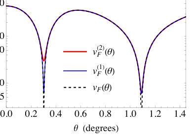 
FIG. 1. Renormalized Fermi velocity vF (θ) versus θ using the TKV model [19] (dased black curve), which vanishes at the magic angles, θ1 and θ2. The solid blue and red curves show vF (θ) which remain finite at θ1 and θ2, as in Ref. [20] (which considers only the first magic angle). The blue curve has the same Fermi velocity at θ1 and θ2, vF (θ1) = vF (θ2) = 0.006 v0, and the red curve has vF (θ1) = 0.006 v0, and vF (θ2) = 0.03 v0.

📷 Fig 2

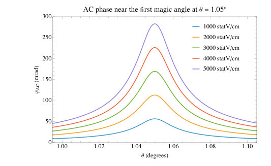 
FIG. 2. AC phase ϕAC(θ) near the first magic angle θ ≈1.05◦

📷 Fig 3

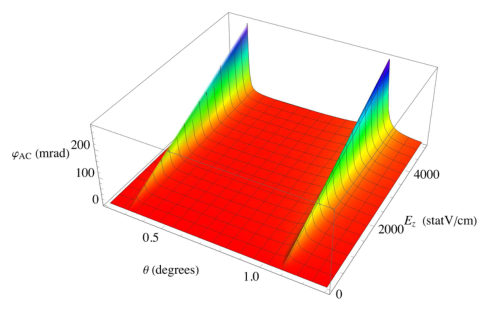 
FIG. 3. AC phase near the first two magic angles θ ≈1.08◦, 0.3◦

📷 Fig 4

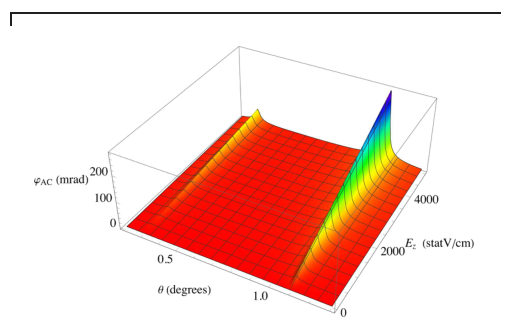 
FIG. 4. AC phase near the first two magic angles θ ≈1.08◦, 0.3◦, as in Fig. 3, but with the minimal Fermi velocity at the second magic angle taken to be five times larger than the value at the first magic angle.

**Summary.** This theoretical work analyzes the Aharonov-Casher phase experienced by electrons in twisted bilayer graphene under an external electric field. The authors find that this quantum phase exhibits sharp peaks precisely at the material's magic angles. This provides a novel, measurable signature to probe the topological properties and electronic structure of correlated 2D materials.

**Why it may be interesting.** The connection between topological phases (Berry curvature/AC phase) and electronic structure features like flat bands at magic angles provides a powerful diagnostic tool for characterizing correlated electron systems in 2D materials.

Detailed structure

**Main problem.** The study investigates the Aharonov-Casher (AC) phase acquired by an electron in twisted bilayer graphene (TBG) when subjected to a perpendicular electric field.

**Main result.** The AC phase is predicted to be linear with the applied electric field and exhibits sharp peaks precisely at the magic angles, where the renormalized Fermi velocity vanishes or changes significantly.

**Method.** The analysis involves deriving an effective low-energy Hamiltonian using perturbation theory in the moiré potential and calculating the resulting gauge-dependent AC phase factor via a gauge transformation.

**Model / system.** The system is Twisted Bilayer Graphene (TBG) lying in the x-y plane, modeled by incorporating kinetic energy, a Moiré potential, and Rashba spin-orbit coupling. The low-energy physics is described by an effective Hamiltonian involving Dirac fermions.

**Key observables.** Aharonov-Casher phase ($\phi_{AC}$), which is measured via the probability $P(	heta)$ of tunneling into a polarized tip.

**Important parameters / regimes.** The perpendicular electric field ($E$), the twist angle ($	heta$), and the renormalized Fermi velocity $	ilde{v}_F(	heta)$.

**Assumptions / limitations.** The analysis assumes small twist angles ($	heta \ll 1$ rad) and relies on approximations derived from perturbation theory in the moiré potential.

**Figures summary.** Figures illustrate the dependence of the renormalized Fermi velocity $v_F(	heta)$ on $	heta$, showing vanishing points at magic angles, and plot the AC phase $\phi_{AC}(	heta)$ versus $	heta$ and $E$.

**Paper structure.** The paper builds from defining the physical system (TBG with perpendicular E-field) to deriving the low-energy effective Hamiltonian incorporating spin-orbit coupling. It then calculates the resulting gauge potential, leading to the prediction of the AC phase dependence on $	heta$ and $E$.

Abstract

The Aharonov-Casher (AC) effect is a quantum mechanical phenomenon in which the wave function of a particle with a magnetic moment moving in a region subject to an electric field develops a phase shift due to spin-orbit interaction, even if no classical force acts on it. This phase also depends on the medium through which the particle moves. Here we focus on the AC phase of an electron moving in twisted bilayer graphene (TBG) lying in the $x$-$y$ plane, subject to a uniform electric field perpendicular to the plane of the graphene, ${\bf E}=E{\hat{\bf z}}$. The AC phase is determined by an $SU(2)$ vector potential ${\bf A}$ from which a phase factor is generated, and used to perform a gauge transformation of the Hamiltonian. We find that the AC phase is linear with $E$ and exhibits sharp peaks at the magic angles.

[↑ back to top](#top)

### [Strongly-connected percolation on directed lattices](http://arxiv.org/abs/2607.24975v1)

**Authors:** M. E. J. Newman, P. Grassberger, R. M. Ziff  
**Type:** theory · **Category:** statistical mechanics · **PDF:** <https://arxiv.org/pdf/2607.24975v1>  
**Analysis basis:** full PDF text, analyzed in chunks
**Topic relevance:** `non-equilibrium universality` **2/5** · `analog quantum simulation` **1/5** · `driven-dissipative phase transition` **1/5** · `methods for driven-dissipative` **1/5** · `non-equilibrium dynamics` **1/5**

📷 Fig 1

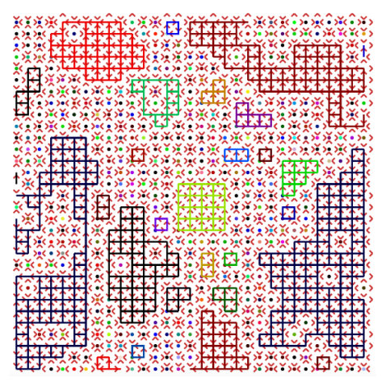 
FIG. 2: Strongly-connected clusters for the random diode model on the square lattice at the percolation threshold pc = 1. Isolated sites are components of size 1.

📷 Fig 2

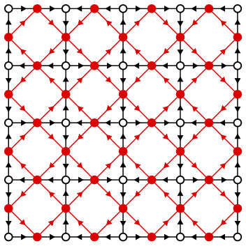 
FIG. 4: Mapping from the L-lattice to the Manhattan lattice. Bond percolation on the L-lattice (open circles, black) maps state-for-state onto site percolation on a Manhattan lattice at 45◦to the original (solid circles, red).

📷 Fig 3

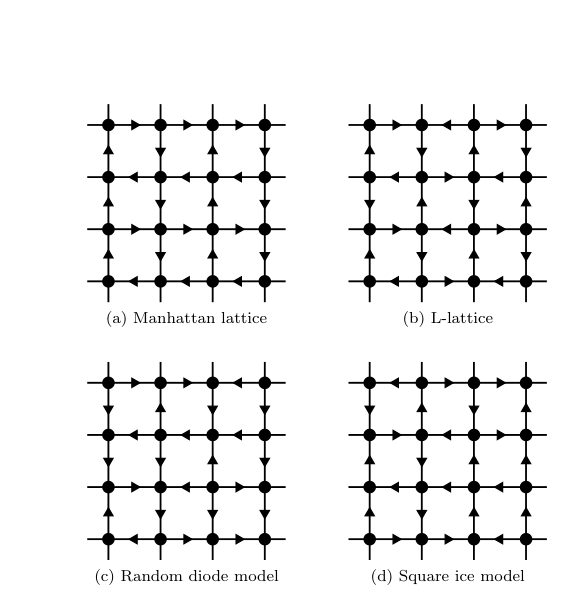 
FIG. 3: The four directed lattices that we study in this paper.

📷 Fig 4

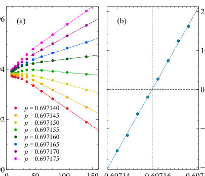 
FIG. 5: (a) The cumulative distribution of out-component sizes P(s) on the Manhattan lattice, plotted as sτ−2P(s) against sσ as described in the text. Dashed lines are straight- line fits to the rightmost five points in each case. (b) Slopes of the fits from panel (a) as a function of p. The intercept where the slope crosses zero (vertical dashed line) is the best estimate of the position of the percolation threshold and gives pc = 0.6971571(5).

📷 Fig 5

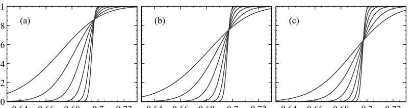 
FIG. 6: The probability RL(p) of a strongly-connected cluster wrapping around the periodic boundary conditions on L × L Manhattan lattices with L = 32, 64, 128, 256, 512, and 1024 for each of three definitions of wrapping: (a) wrapping in either direction, horizontally or vertically, (b) wrapping in one particular direction (e.g., horizontally), and (c) wrapping in both directions.

**Summary.** This paper analyzes strongly-connected percolation on directed lattices, determining that its critical behavior belongs to a unique universality class different from standard undirected percolation. Using advanced simulation techniques and graph algorithms, the authors compare various bond arrangements and establish formal equivalences between different lattice models. The work is significant for understanding connectivity thresholds in anisotropic or directional physical systems.

**Why it may be interesting.** While focused on classical percolation, the rigorous mathematical analysis of connectivity thresholds and universality classes provides foundational tools applicable to understanding phase transitions in complex quantum systems or network reliability studies.

Detailed structure

**Main problem.** The study investigates percolation on lattices with directed bonds, specifically focusing on the properties of strongly-connected clusters.

**Main result.** Strongly-connected percolation exhibits critical behavior in a universality class distinct from traditional undirected percolation, although all tested bond arrangements fall into the same universality class.

**Method.** The authors employed extensive numerical simulations and developed advanced graph algorithms (like Tarjan's) to calculate high-precision values for critical exponents and thresholds.

**Model / system.** The model is bond percolation on two-dimensional square lattices with directed bonds, including specific arrangements like the Manhattan lattice, L-lattice, random diode, and square ice models.

**Key observables.** Percolation thresholds ($p_c$), critical exponents, fractal dimensions, crossing probabilities, and the hull dimension ($d_h$).

**Important parameters / regimes.** Bond occupation probability ($p$) and lattice size ($L$).

**Assumptions / limitations.** The study focuses on cases where bonds point in a single direction, excluding bidirectional (resistor-diode) configurations.

**Figures summary.** Figures illustrate strongly-connected clusters for various models; one figure maps bond percolation on the L-lattice to site percolation on a Manhattan lattice at 45 degrees.

**Paper structure.** The paper analyzes the definition of strong connectivity, details algorithmic approaches (Tarjan's algorithm) for cluster detection, presents results comparing critical exponents across different directed lattices, and discusses formal mappings between models.

Abstract

We study percolation on lattices with directed bonds, focusing on the behavior of strongly-connected percolation clusters -- clusters in which every site is reachable from every other along a directed path. We consider the two-dimensional square lattice and various globally isotropic arrangements of the directions of the bonds. Performing simulations using a range of algorithmic approaches, we calculate high-precision values for critical exponents, fractal dimensions, crossing probabilities, and percolation thresholds for bond percolation with each bond arrangement. We find that the critical behavior is in a distinctly different universality class from that of traditional undirected percolation, but that all bond arrangements appear to fall in the same universality class.

[↑ back to top](#top)

### [QCOEM: Quantum Cloud Orchestration with Evolutionary Multi-Objective Optimization](http://arxiv.org/abs/2607.25358v1)

**Authors:** Tam N. Pham, Hoa T. Nguyen, Quan Le-Trung  
**Type:** experiment · **Category:** quantum information and computing · **PDF:** <https://arxiv.org/pdf/2607.25358v1>  
**Analysis basis:** full PDF text, analyzed in chunks
**Topic relevance:** `QC/QI experiment` **2/5** · `entanglement & information structure` **1/5** · `methods for driven-dissipative` **1/5** · `non-equilibrium dynamics` **1/5**

📷 Fig 1

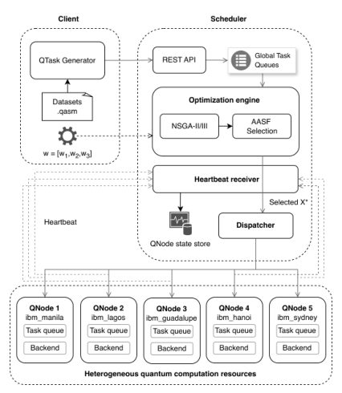 
Fig. 1. System overview of the proposed QCOEM framework. Periodic QNode heartbeats asynchronously update the scheduler’s cached state; each orchestration round uses this state to compute a batch assignment, which is then dispatched to QNodes for FIFO execution.

**Summary.** This paper introduces QCOEM, a framework that uses multi-objective evolutionary optimization to schedule quantum tasks across noisy, heterogeneous cloud hardware. By jointly optimizing mean completion time, error rate, and load balance, it significantly outperforms simple heuristics. This work provides a crucial tool for achieving stable, high-fidelity execution in practical quantum cloud computing settings.

**Why it may be interesting.** While focused on cloud orchestration rather than fundamental physics, the core challenge involves optimizing complex resource allocation under realistic noise constraints, which has implications for designing robust quantum control protocols or understanding system-level decoherence effects in large arrays of qubits.

Detailed structure

**Main problem.** Dynamically orchestrating quantum workloads across heterogeneous cloud backends while managing time-varying noise profiles, qubit topologies, and queue congestion.

**Main result.** The QCOEM framework achieves about 30% higher mean fidelity than noise-agnostic heuristics and eliminates task rescheduling in a simulated environment.

**Method.** It formulates the problem as a Multi-Objective Optimization Problem (MOOP) solved using NSGA-II/III, followed by preference selection via an Augmented Achievement Scalarization Function (AASF).

**Model / system.** The system models a heterogeneous quantum cloud environment composed of multiple Noisy Intermediate-Scale Quantum (NISQ) era Quantum Processing Units (QPUs), managed via a centralized scheduler.

**Key observables.** Mean Task Completion Time, Mean Error Rate (Fidelity), Load Imbalance (standard deviation of completion times), and Scheduling Overhead.

**Important parameters / regimes.** Calibrated hardware snapshots (error rates, coupling maps), user priority weights ($w$), and batch sizes ($M$).

**Assumptions / limitations.** The problem is NP-hard, necessitating heuristic approximation via MOEAs; it assumes stable hardware snapshots and FIFO queueing on QNodes.

**Figures summary.** Figures compare performance across different optimization objectives (Load-Focus vs. Quality-Focus) against baseline heuristics, illustrating trade-offs between time efficiency, fidelity, and task distribution.

**Paper structure.** The paper introduces the QCOEM framework architecture, details the MOOP formulation with three objectives, presents the use of NSGA-II/III for Pareto front approximation, and concludes with extensive performance evaluation comparing its results against classical scheduling methods.

Abstract

Quantum cloud platforms need to dynamically orchestrate workloads across heterogeneous quantum computation backends whose noise profiles, qubit topologies, and queues vary over time. Existing orchestrators use noise-agnostic heuristics that ignore backend-specific errors, causing reduced execution fidelity, load imbalance, and frequent rescheduling. To address these challenges, we propose QCOEM - a Quantum Cloud Orchestration framework that leverages Evolutionary algorithms for Multi-objective optimization of quantum task scheduling. We compare NSGA-II and NSGA-III for jointly minimizing mean completion time, execution error rate, and load imbalance. To select schedules from a non-convex Pareto front, we apply an Augmented Achievement Scalarization Function (AASF) as a preference-based decision rule that maps the Pareto set to a single dispatchable schedule aligned with user priorities. Our extensive performance evaluation in a heterogeneous quantum cloud environment shows zero task rescheduling and about 30% higher mean fidelity than noise-agnostic heuristics, while maintaining bounded scheduling overhead. The experiment results indicate that our QCOEM framework can deliver stable, high-fidelity execution and lightweight resource management for quantum cloud computing.

[↑ back to top](#top)

### [Fault-tolerant distributed quantum computing with a single nucleus per node](http://arxiv.org/abs/2607.24907v1)

**Authors:** Yotam Vaknin, Shoham Jaocby, Roi Nevo, Aleksander Kubica, Alex Retzker  
**Type:** theory · **Category:** quantum information and computing · **PDF:** <https://arxiv.org/pdf/2607.24907v1>  
**Analysis basis:** full PDF text, analyzed in chunks
**Topic relevance:** `QC/QI experiment` **2/5** · `quantum measurements` **1/5** · `spintronics-quantum-optics interface` **1/5**

📷 Fig 1

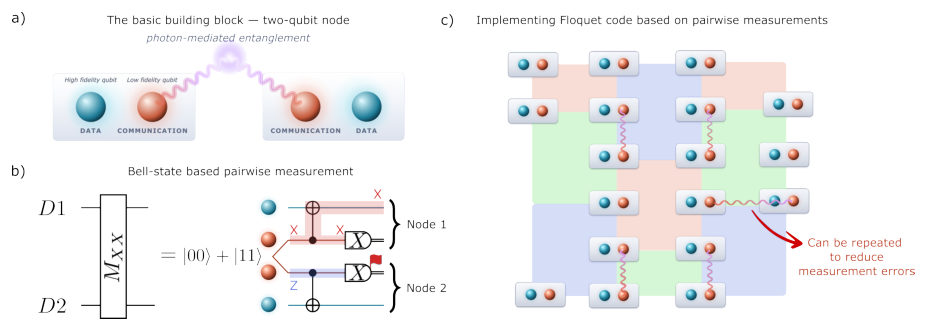 
FIG. 1. Using only one high fidelity qubit and one low fidelity qubit per node we can implement Floquet QEC protocols. a) The high fidelity qubit is used as the data qubit and the low fidelity qubit mediates interaction through optically generated entanglement. b) Using a Bell pair, one can implement non-local pairwise measure- ment on the data qubits. The large phase noise on the Bell pairs flip the measurement result, while the lower rate bit-flip noise propagates to the data qubits. c) By connecting multiple nodes through optical links, one can implement any dynamical code that is based on pairwise measurement. In this figure, we present the honeycomb code. The red, green and blue...

📷 Fig 2

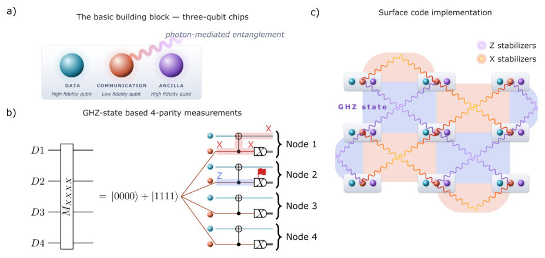 
FIG. 2. Adding a single high fidelity ancilla qubit per node enables the implementation of general stabilizer codes. a) Each node consists of a high fidelity data qubit, a low fidelity communication qubit that mediates interaction through optically generated entanglement, and a high fidelity ancilla qubit used for merging Bell pairs into GHZ states. b) Using a GHZ state distributed across four nodes, one can implement a non-local weight-four parity measurement on the data qubits. As in the two-body case, the dominant phase noise (Z) on the GHZ state only flips the measurement result, while the lower rate bit-flip noise (X) propagates to the data qubits. c) By connecting multiple nodes...

📷 Fig 3

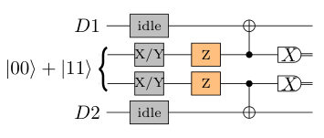 
FIG. 3. Noise model for the Bell pair-based two-body Pauli measurement, shown for a X1X2 measurement. A Bell pair of the two communication qubits is coupled to the data qubits by CX gates and the communication qubits are read out in the X ba- sis, yielding the joint X1X2 parity. Gray boxes are pres-scale errors: the X/Y dephasing of the Bell pair, data-qubit idling, and measurement errors. The or- ange Z is approximately pz/2 probability phase error on each communication qubit, originating from photon indistinguishability and lower coherence of the com- munication qubit. We set this value such that the phase-error per Bell pair is exactly pz. The symmet- ric noise on the two qubits...

📷 Fig 4

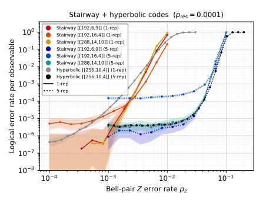 
FIG. 5. Logical error rates per d rounds of the Stair- way code family for 1-repetition (warm colors) and 5- repetition (cold colors) protocols. For comparison, we also plot the error rates of the [[256, 10, 4]] hyperbolic code under the 1-repetition (grey) and 5-repetition (black) protocols.

📷 Fig 5

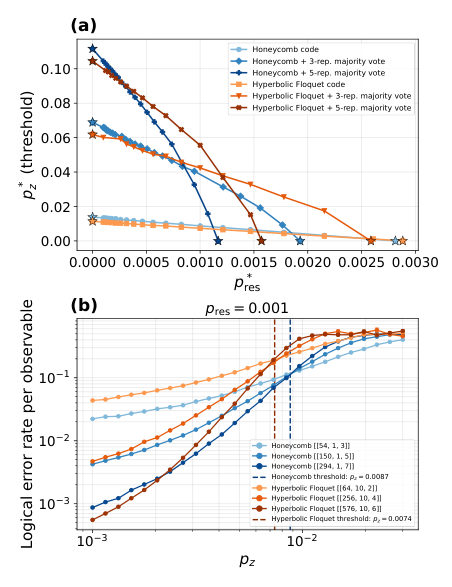 
FIG. 4. Threshold performance of the Honey- comb and hyperbolic Floquet codes under the biased noise model, and the improvement from repeated measurements. (a) Phase-noise thresh- old pz as a function of the residual error rate pres. For both codes, combining three/five repeated pairwise measurements via majority vote substantially raises the pz threshold relative to a single measurement, at the cost of a modest reduction in the tolerable pres. Stars represent the limiting cases of pres = 0 or pz = 0. (b) Logical error rate per observable as a function of pz at fixed pres = 10−3, shown for increasing code distances of the Honeycomb code ([[54, 1, 3]], [[150, 1, 5]], [[294, 1, 7]]) and the...

**Summary.** The paper presents a novel approach to fault-tolerant distributed quantum computing that bypasses resource-intensive state distillation. By exploiting an engineered error bias in photonic links—where phase errors are common but bit-flips are rare—the required ancillary qubits per node are drastically reduced. This makes the performance limited by the high-quality local memory rather than the noisy communication channel.

**Why it may be interesting.** This work is highly relevant as it provides concrete, resource-efficient protocols for scaling quantum computation across physically separated modules, directly impacting the feasibility of large-scale quantum networks.

Detailed structure

**Main problem.** The primary challenge is achieving fault-tolerant distributed quantum computation while minimizing the required number of ancillary qubits per node.

**Main result.** By engineering a communication error bias (phase errors dominant), the need for dedicated state distillation can be avoided, significantly reducing resource overhead and relaxing link fidelity requirements.

**Method.** The authors design syndrome-extraction circuits that exploit this phase noise bias, allowing simple measurement repetition to suppress errors using the error-correcting code itself rather than complex purification protocols.

**Model / system.** The system models distributed quantum nodes interconnected via optical links. Each node utilizes high-fidelity nuclear spins for data qubits and low-coherence electron spins for communication qubits.

**Key observables.** Logical error rate, error correction thresholds (e.g., Honeycomb code threshold up to pz ~ 11%), and the required number of ancillary qubits per node.

**Important parameters / regimes.** Phase error probability ($p_z$), residual noise strength ($p_{	ext{res}}$), and the ratio between these two error types, which defines the exploitable bias.

**Assumptions / limitations.** The analysis assumes that the dominant noise contribution is phase noise affecting generated Bell pairs, allowing it to be treated as a measurement error rather than propagating directly to data qubits.

**Figures summary.** Figures illustrate implementing Floquet QEC protocols using minimal ancillary qubits and show how repeating measurements significantly raises the threshold for phase errors in both Honeycomb and Hyperbolic codes compared to single measurements.

**Paper structure.** The paper develops theory by first identifying the resource bottleneck (distillation) and proposing a solution based on error bias. It then analyzes performance thresholds using specific codes (Floquet/stabilizer) and discusses stability improvements through measurement repetition, concluding with detailed circuit implementations for state preparation.

Abstract

Distributed quantum computing interconnects small, high-quality nodes through optical links, but this architecture carries a pronounced asymmetry: in-node gates and measurements are cheap and high-fidelity, whereas inter-node communication relies on a low-coherence communication qubit and faulty photonics. Previous approaches overcame the noisy link by placing several high-quality data qubits in each node and consuming them for Bell pair and GHZ state distillation. Here we show that distillation can be avoided altogether. The key observation is that we can engineer a communication error bias, where photonic Bell pairs suffer frequent phase errors but only rare bit-flip errors. We design the syndrome-extraction circuits so that this phase noise appears solely as a measurement error that does not propagate to the data qubits, and is therefore suppressed by simply repeating the measurement; letting the error-correcting code itself, rather than a dedicated distillation subroutine, to purify the link. This dramatically reduces the need for ancillary nuclei: Floquet codes require only a single data qubit per node, while general stabilizer codes require just one additional ancilla. We demonstrate high error-correction thresholds throughout this regime, and we identify lattice surgery as inherently robust for this setting, enabling logical operations at a threshold close to that of quantum memory. As a result, the performance of the quantum computer is limited by the high-quality data qubits, while the requirements on photon indistinguishability and coherence of the communication qubit are substantially relaxed.

[↑ back to top](#top)

### [TempLat: a versatile C++ engine for lattice field theories](http://arxiv.org/abs/2607.24908v1)

**Authors:** Adrien Florio, Franz R. Sattler  
**Type:** both · **Category:** numerical methods · **PDF:** <https://arxiv.org/pdf/2607.24908v1>  
**Analysis basis:** full PDF text, analyzed in chunks
**Topic relevance:** `analog quantum simulation` **2/5** · `methods for driven-dissipative` **1/5** · `non-equilibrium dynamics` **1/5**

📷 Fig 1

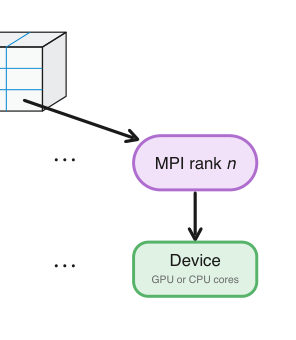 
Figure 1: Hybrid parallelization structure

📷 Fig 2

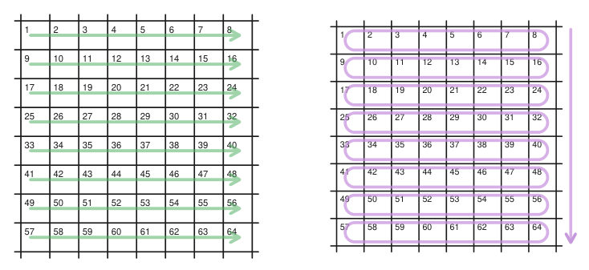 
Figure 2: Left: Cached memory access: each thread gets a block of memory it walks through, allowing it to both cache the memory and enable SIMD. Right: Coalesced memory access, where a warp of threads walks through the memory. Each thread in the warp thus has a fixed stride when iterating. For illustration we show warp sizes of 8, but NVIDIA hardware typically has warp sizes of 32, while AMD wavefronts are 32 or 64 wide.

📷 Fig 3

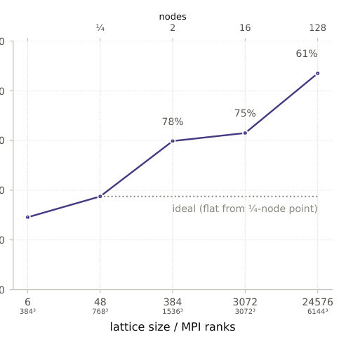 
Figure 3: Strong (left) and weak (right) scaling behavior of TempLat on the CPU partition of the Otus cluster.

📷 Fig 4

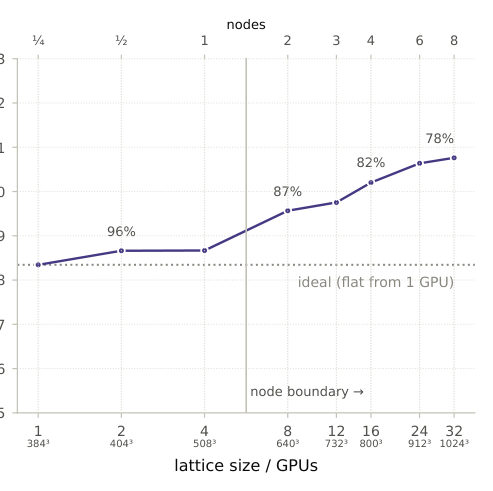 
Figure 4: Strong (left) and weak (right) scaling behavior of TempLat on the A100 GPUs of the Noctua2 cluster.

📷 Fig 5

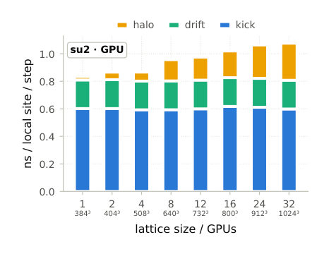 
Figure 5: Decomposition of a single step in the 𝑆𝑈(2) benchmarks of the weak-scaling plot of fig. 4. Kick and drift show optimal behavior — their cost per site stays constant. The halo cost, in contrast, grows with the number of GPUs, since dividing the lattice further increases the surface-to- volume ratio of each local domain.

**Summary.** This paper introduces TempLat, a versatile C++ engine designed for high-performance lattice field theory simulations in arbitrary dimensions. It uses advanced techniques like expression templates and Kokkos to ensure portability across CPUs and GPUs while maintaining compile-time optimization. The framework successfully benchmarks complex physics models, demonstrating state-of-the-art scaling performance.

**Why it may be interesting.** While focused on lattice QFT, the underlying technology—a highly portable, expression-template-based framework for massively parallel computation—is directly relevant to simulating complex quantum many-body systems beyond standard Hamiltonians.

Detailed structure

**Main problem.** The need for an efficient, versatile, and high-performance software framework capable of simulating lattice field theories across various physical regimes.

**Main result.** TempLat provides a dimension-agnostic C++ engine that achieves excellent strong and weak scaling on both CPU clusters and modern GPUs by decoupling mathematical expressions from hardware implementation.

**Method.** The framework uses expression templates to translate high-level mathematical expressions almost verbatim into highly optimized, device-specific C++ kernels, supporting hybrid MPI/shared-memory parallelization via Kokkos.

**Model / system.** It is designed for lattice field theories, simulating systems ranging from QCD and early-universe dynamics ($	ext{SU}(2)$ Yang–Mills) to classical statistical models like the $\phi^4$ theory. It supports various gauge groups and complex field types.

**Key observables.** Wall-clock time per lattice site per step; scaling behavior (strong/weak); average values of fields ($\langle \phi 
angle$).

**Important parameters / regimes.** Lattice dimensions ($d$), coupling constants ($\lambda$), simulation time steps ($dt$), and hardware resources (CPU cores, GPU count).

**Assumptions / limitations.** The core engine assumes that assignment triggers the necessary evaluation across the lattice; performance comparisons highlight differences between pencil vs. slab decomposition strategies for DFTs.

**Figures summary.** Figures illustrate scaling behavior for $SU(2)$ YM fields on GPUs, comparing TempLat to HILA; Figure 7 benchmarks ParaFaFT's FFT performance against established libraries (FFTW3/cuFFTMp) across various parallelization schemes.

**Paper structure.** The paper introduces the framework by detailing its mathematical abstraction capabilities and hardware portability. It then demonstrates applications through benchmarking diverse physical systems, including scalar field dynamics ($\phi^4$) and gauge theories ($SU(2)$ YM), culminating in detailed performance analyses of core components like DFTs.

Abstract

We present TempLat, a C++ framework for lattice field theory simulations in arbitrary dimensions. Its symbolic language, built on expression templates, translates mathematical expressions almost verbatim into C++ while compiling to highly optimized kernels, in contexts ranging from classical-statistical to Monte Carlo simulations. TempLat is performance-portable: building on Kokkos, it supports large CPU clusters, as well as NVIDIA and AMD GPUs. Its abstraction of hardware into a device concept makes TempLat extensible to future architectures. We demonstrate excellent strong and weak scaling on both CPUs and GPUs. We also present ParaFaFT, a standalone parallel discrete Fourier transform library supporting arbitrary dimensions on all of the above hardware, and benchmark its scaling. Both are open source and available on GitHub, and power a new release of CosmoLattice, a widely used early-universe simulation library now available on GPUs.

[↑ back to top](#top)

### [Bosonic Condensed Phase Real-time Dynamics from Ring Polymer Molecular Dynamics](http://arxiv.org/abs/2607.25892v1)

**Authors:** Yotam M. Y. Feldman, Sourav Karmakar, Sutirtha Paul, Jacob Higer, Adrian Del Maestro, Barak Hirshberg  
**Type:** theory · **Category:** statistical mechanics · **PDF:** <https://arxiv.org/pdf/2607.25892v1>  
**Analysis basis:** full PDF text, analyzed in chunks
**Topic relevance:** `non-equilibrium dynamics` **2/5** · `Keldysh / 2PI / non-Gaussian methods` **1/5**

📷 Fig 1

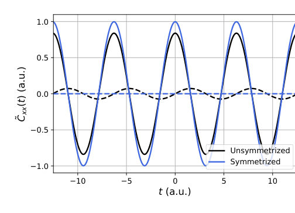 
FIG. 1. Exact Kubo-transformed correlation functions of N = 2 non- interacting bosons in a one-dimensional harmonic trap at β = 1 a.u.. Solid and dashed lines represent the real and imaginary part of the correlation function, respectively. For the unsymmetrized position operator (in black), ˜Cxx(t) ≡˜Cx1x1(t). For the symmetrized position operator (in blue), ˜Cxx(t) ≡1

📷 Fig 2

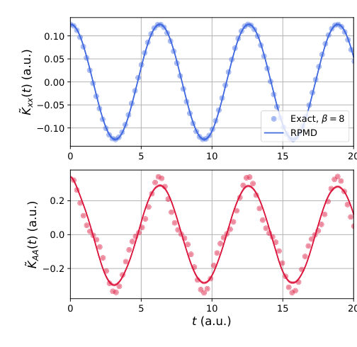 
FIG. 2. Bosonic RPMD autocorrelation functions for the posi- tion operator ˆx = ∑N ℓ=1 ˆxℓ(upper panel) and the nonlinear operator ˆA = ∑N ℓ=1 ˆx3 ℓ(lower panel) for a system of N = 4 non-interacting bosons in a harmonic trap at β = 8 a.u. Note that the position coordi- nate is expressed in units of the harmonic oscillator length p

📷 Fig 3

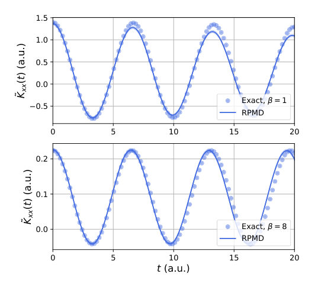 
FIG. 3. Bosonic RPMD position autocorrelation function for a sys- tem of N = 4 non-interacting bosons in a weakly anharmonic trap at β = 1 a.u. (upper panel) and β = 8 a.u. (lower panel). Symbols represent the exact Kubo-transformed correlation function obtained numerically.

📷 Fig 4

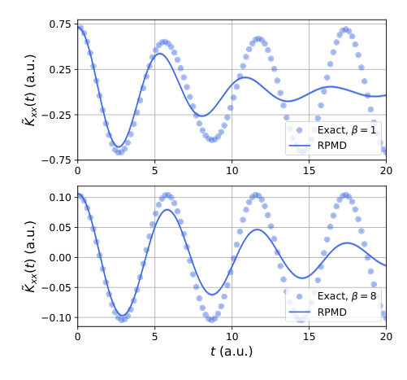 
FIG. 4. Bosonic RPMD position autocorrelation function for a sys- tem of N = 4 non-interacting bosons in a quartic trap at β = 1 a.u. (upper panel) and β = 8 a.u. (lower panel). Symbols represent the exact Kubo-transformed autocorrelation function obtained numeri- cally.

📷 Fig 5

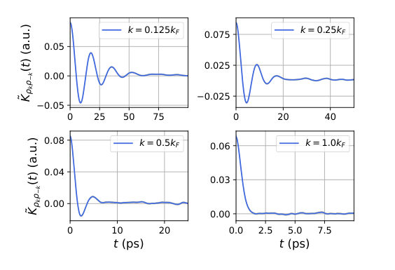 
FIG. 5. Bosonic RPMD density-density real-time correlation func- tion for a system of N = 32 interacting bosons at T = 1 K for four different momentum transfers k/kF = 0.125,0.25,0.5,1.0.

**Summary.** The paper introduces an advanced bosonic Ring Polymer Molecular Dynamics (RPMD) method to calculate real-time correlation functions for interacting bosons. This technique bypasses the severe dynamical sign problem inherent in direct quantum simulations. It successfully enables the first direct simulation of finite-temperature, real-time dynamics for large bosonic condensed phases.

**Why it may be interesting.** This work provides a powerful, non-perturbative tool for simulating real-time quantum dynamics in bosonic many-body systems, overcoming major limitations associated with path integral methods.

Detailed structure

**Main problem.** The primary goal is developing a method to accurately approximate real-time correlation functions and quantum transport coefficients for bosonic condensed phases.

**Main result.** The authors developed a bosonic Ring Polymer Molecular Dynamics (RPMD) method that enables the direct simulation of finite-temperature, real-time dynamics for large bosonic systems using RPMD for the first time.

**Method.** They extend standard RPMD by incorporating bosonic exchange symmetry into the classical ring polymer Hamiltonian and utilizing the Kubo-transformed correlation function estimator.

**Model / system.** The work focuses on bosonic condensed phases, benchmarked on harmonic and anharmonic model systems, and applied specifically to the Lieb-Liniger gas (1D bosons with contact interactions).

**Key observables.** Real-time correlation functions (e.g., density-density), quantum transport coefficients, and the Dynamic Structure Factor (DSF).

**Important parameters / regimes.** Temperature ($eta$), time ($t$), momentum transfer ($k/k_F$), and the number of ring polymer beads ($P$).

**Assumptions / limitations.** The method is exact in the harmonic, short-time, and high-temperature limits; it relies on the assumption that correlated observables are symmetric under particle exchange for bosons.

**Figures summary.** Figures compare bosonic vs. distinguishable particle dynamics (e.g., position autocorrelation), showing how the bosonic symmetry manifests dynamically, and illustrate the accuracy of the method across different anharmonic potentials.

**Paper structure.** The paper first establishes the general problem (sign problem in real-time quantum simulation) before developing the specific bosonic RPMD formalism. It then benchmarks this method on simple models (harmonic/anharmonic traps) to validate its theoretical limits and finally applies it to complex systems like the Lieb-Liniger gas.

Abstract

We present a method for approximating real-time correlation functions and quantum transport coefficients of bosonic condensed phases. The direct evaluation of quantum real-time correlation functions in the path integral formulation is impossible due to a severe dynamical sign problem. Evaluating imaginary-time correlation functions and inverting them using analytic continuation is famously ill-posed. Ring polymer molecular dynamics (RPMD) provides an alternative approach resulting in accurate approximations for real-time correlation functions of condensed phases but neglects exchange effects. In this work, we develop a bosonic RPMD method, which is exact in the harmonic, short time, and high temperature limits. A critical enabling observation is that the Kubo-transformed correlation function for bosons is real only when the correlated observables are symmetric under exchange. We benchmark the method on harmonic and anharmonic model systems and then use it to directly obtain the Lieb-Liniger gas density-density real-time correlation functions at various temperatures and momentum transfers. This work enables the direct simulation of finite-temperature, real-time dynamics of large bosonic condensed phases using RPMD for the first time.

[↑ back to top](#top)

### [OmniQEC: discovering practical quantum error-correcting codes by an AI scientist](http://arxiv.org/abs/2607.25865v1)

**Authors:** Ge Yan, Shanchuan Li, Pengyue Ma, Qixin Zhang, Pingchuan Ma, Jianping Wang, Min-Hsiu Hsieh, Yuxuan Du  
**Type:** theory · **Category:** quantum information and computing · **PDF:** <https://arxiv.org/pdf/2607.25865v1>  
**Analysis basis:** full PDF text, analyzed in chunks
**Topic relevance:** `QC/QI experiment` **2/5** · `methods for driven-dissipative` **1/5**

📷 Fig 1

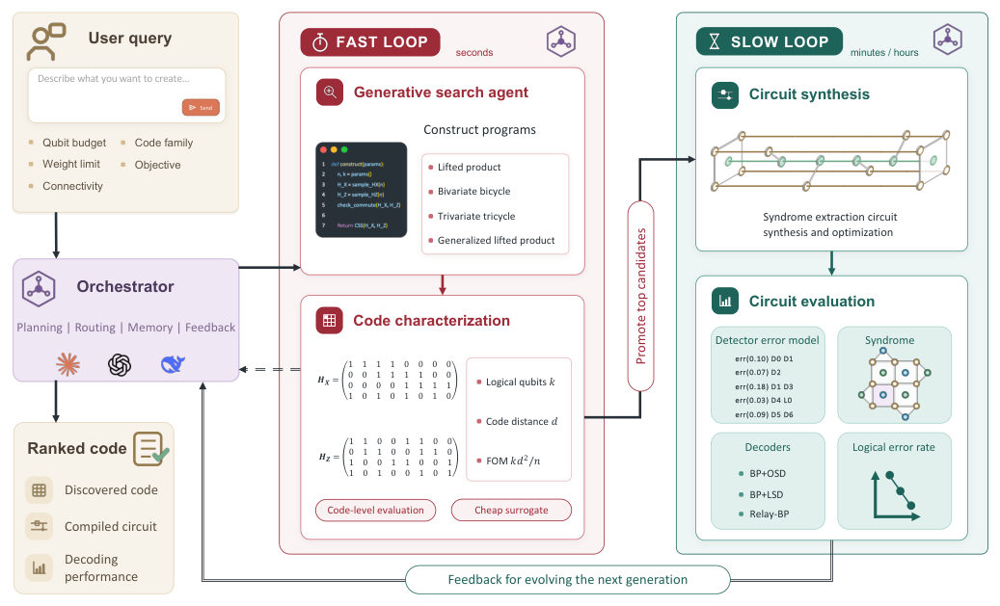 
FIG. 1. Schematic illustration of OmniQEC. A user specifies a QEC design objective, such as the target code family, optimization criterion, physical-qubit budget, connectivity, native gate set, and available ancilla resources. The LLM-based orchestrator translates this objective into a structured discovery task, maintains the self-evolving discovery memory, and routes information across a dual-loop workflow. In the fast loop, the code-search agent proposes executable code-construction programs, which are converted into candidate QEC codes and screened by the code-characterization module using code-level properties, including validity, logical-qubit number, code distance, and the code-level...

📷 Fig 2

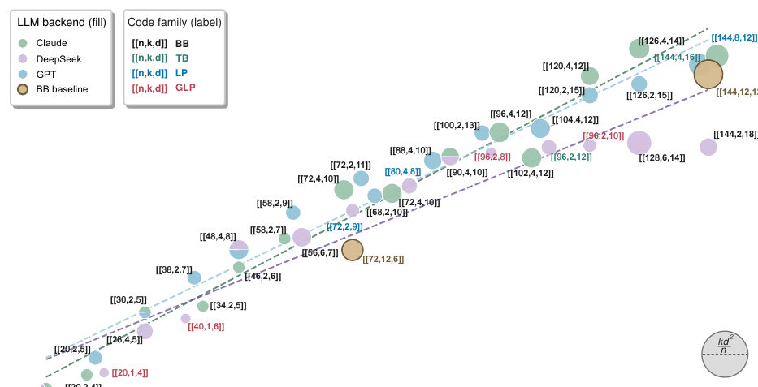 
FIG. 2. Circuit-level performance frontier discovered by OmniQEC. Circuit-level performance as a function of the physical-qubit budget N, including data qubits and stabilizer-measurement ancillas. The vertical axis reports logical-error suppression, −log10(pLER), where pLER is the logical error rate per round per logical qubit. Marker fill denotes the LLM backend used by the orchestrator, and pie markers indicate codes independently discovered by multiple backends. The BB [[72, 12, 6]] and [[144, 12, 12]] codes are included as reference codes. Label color denotes the code family, and circle area is proportional to the fast-loop code-level proxy Φcode. The discovered codes form a clear...

📷 Fig 3

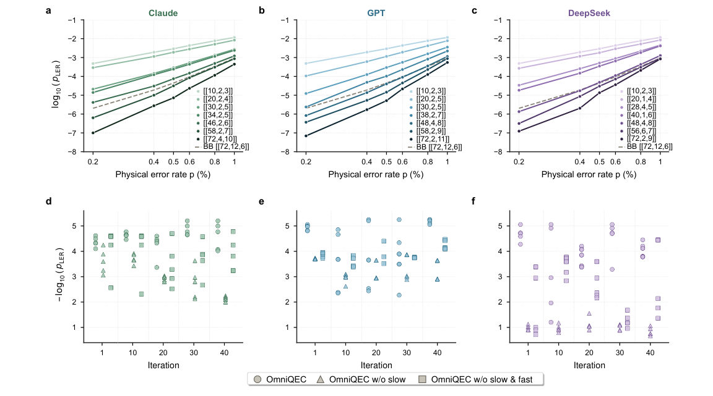 
FIG. 3. Circuit-level validation and loop ablation. a–c, Physical-error-rate sweeps for representative frontier codes discovered by OmniQEC using Claude Opus 4.8 (a), GPT-5.5 (b) and DeepSeek-V4-Pro (c). The BB [[72, 12, 6]] code is shown as a reference under the same syndrome-extraction and decoding protocol. Solid lines denote OmniQEC-discovered codes and dashed lines denote the BB reference. The fitted scaling pLER ∝pΓ gives the LER-scaling exponent Γ. d–f, Ablation of discovery feedback for Claude Opus 4.8 (d), GPT-5.5 (e) and DeepSeek-V4-Pro (f). Each marker denotes one of the top- five candidates obtained at the corresponding iteration, evaluated by the same circuit-level protocol and...

📷 Fig 4

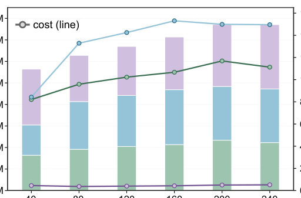 
FIG. 4. LLM-side token usage and API cost. Bars show total API token consumption, including input, output and reasoning tokens, and lines show the corresponding API cost for each backend. Colors denote the LLM backend, using the same backend color coding as in Fig. 3.

**Summary.** The paper presents OmniQEC, a novel AI framework designed to discover practical Quantum Error-Correcting codes by simulating their performance on real quantum hardware. It employs a synergistic slow-fast loop where LLMs coordinate code generation and circuit evaluation. The results demonstrate that this physically informed approach yields superior error suppression compared to traditional methods.

**Why it may be interesting.** This work directly addresses the gap between theoretical code design and physical implementation feasibility in quantum computing. The use of LLMs as an 'AI scientist' to guide complex scientific discovery is highly relevant to open quantum systems research that requires integrating multiple simulation/optimization modules.

Detailed structure

**Main problem.** The challenge of discovering Quantum Error-Correcting (QEC) codes that are truly practical for deployment, as performance depends on the complex interplay between code structure, hardware constraints, syndrome extraction, and decoding.

**Main result.** OmniQEC discovers QEC codes that show steadily improving logical error suppression compared to standard reference codes when physical qubit budgets increase. The framework proves that circuit-level evaluation is superior to traditional code-level metrics for assessing practical performance.

**Method.** The authors introduce OmniQEC, an AI scientist system orchestrated by LLMs that uses a slow–fast synergistic workflow. This combines fast, inexpensive code-level screening with a slow, physically grounded circuit-level evaluation loop.

**Model / system.** The focus is on QEC codes, specifically evaluating qLDPC construction families, designed for implementation on modern quantum processors. The process models the full cycle from abstract code design to physical circuit execution and decoding.

**Key observables.** Logical Error Rate (LER) measured via $-\log_{10}(	ext{pLER})$, alongside code-level metrics like logical qubits ($k$), distance ($d$), and $\Phi_{code}$.

**Important parameters / regimes.** Total physical-qubit budget ($N$), qubit connectivity, and the specific LLM backend used for orchestration.

**Assumptions / limitations.** The primary assumption is that an iterative, AI-guided search process can systematically navigate the vast design space to find hardware-friendly codes. A key limitation noted is the computational expense of the slow, circuit-level evaluation loop.

**Figures summary.** Figure 1 illustrates the dual-loop workflow (fast proxy screening $
ightarrow$ slow circuit evaluation $
ightarrow$ evidence feedback). Figure 2 shows a performance frontier comparing discovered codes against reference codes based on LER vs. qubit budget. Figure 3/4 detail error suppression metrics and cost analysis.

**Paper structure.** The paper introduces the OmniQEC framework, detailing its LLM-orchestrated, dual-loop methodology (fast proxy search feeding into slow circuit simulation). It presents comparative results showing outperformance over benchmarks, validates the necessity of the full loop, and concludes with future directions for multi-agent system integration.

Abstract

Quantum error correction (QEC) is indispensable for scalable fault-tolerant quantum computing. However, discovering QEC codes that remain effective is challenging, as logical performance depends on the interplay between code structure, hardware, syndrome extraction, and decoding, which often impose competing requirements. Here we introduce OmniQEC, an efficient AI scientist for discovering QEC codes suited to deployment on modern quantum processors. OmniQEC formulates QEC design as an iterative discovery process in which an orchestrator, implemented by advanced large language models (LLMs), coordinates code generation, code-level screening, syndrome-extraction synthesis, and decoder-based circuit evaluation. At its core, OmniQEC combines a self-evolving reasoning mechanism with a slow--fast synergistic workflow: a fast loop explores candidates using inexpensive code-level proxies, whereas a slow loop performs physically grounded circuit-level evaluation and feeds the resulting evidence back into the search. We evaluate OmniQEC across four qLDPC construction families, three LLM backends, and $14$ total-physical-qubit budgets per backend. The discovered codes show steadily improving logical-error suppression with increasing physical-qubit budgets and outperform the BB codes with $[\![72,12,6]\!]$ and $[\![144,12,12]\!]$ under complete-implementation budgets of 98 and 240 physical qubits, respectively. The discovered codes are hardware-friendly and may be of independent interest for practical QEC implementation. These findings pave the way towards LLM-assisted QEC discovery grounded in physically informed code--circuit--decoder co-design.

[↑ back to top](#top)

### [Quantum reference frames beyond subsystems: a reconstruction and generalization of the perspective-neutral framework](http://arxiv.org/abs/2607.24976v1)

**Authors:** Stefan L. Ludescher, Manuel Mekonnen, Thomas D. Galley, Markus P. Mueller  
**Type:** theory · **Category:** other · **PDF:** <https://arxiv.org/pdf/2607.24976v1>  
**Analysis basis:** full PDF text, analyzed in chunks
**Topic relevance:** `analog quantum simulation` **1/5** · `correlated / nonlocal dissipation` **1/5** · `driven-dissipative phase transition` **1/5** · `entanglement & information structure` **1/5** · `methods for driven-dissipative` **1/5** · `non-equilibrium dynamics` **1/5** · `quantum measurements` **1/5**

📷 Fig 1

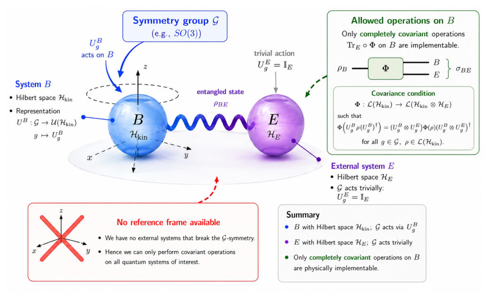 
FIG. 1. First version of our scenario that motivates the PN framework. Due to the purifications of the operations on our system B of interest that are potentially held by some external system E, carrying the trivial representation of the symmetry group, the global absence of a frame of reference implies complete covariance for all operations on B. (AI disclosure: Illustration created with the assistance of ChatGPT 5.5.)

📷 Fig 2

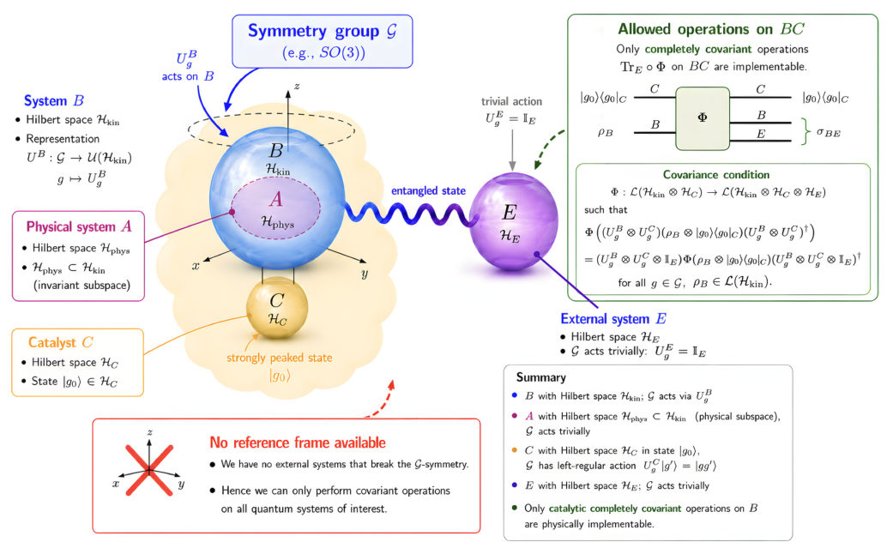 
FIG. 2. Extension of the scenario of Figure 1 for the reconstruction of reduction maps and QRF changes of the PN framework. The only change is that B is replaced by the composite system BC, where C is an ideal reference frame. The mere role of C is to define what it means that some structure of B “points in some direction”, i.e. to break the symmetry while catalytically preserving its own local pure state. This allows for the implementation of arbitrary isometries Mg : Hphys →Hkin which play the role of reduction maps, and complete covariance constrains the transformation behavior across perspectives, in particular that of Mg over the different “directions” g ∈G. (AI disclosure:...

📷 Fig 3

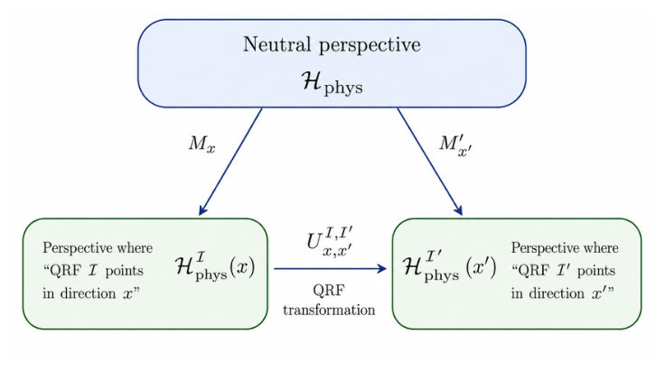 
FIG. 3. QRF transformations as changes of perspective, similarly as in earlier formulations of the PN framework [8, 34]. Since Mx and M ′ x′ are isometries, the QRF transformations U I,I′

📷 Fig 4

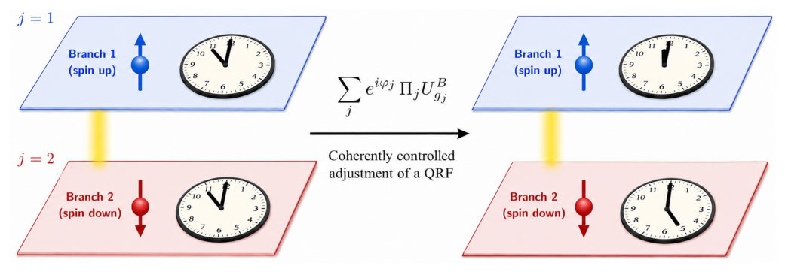 
FIG. 4. As shown in Lemma 20, coherently controlled adjustments of a QRF are valid QRF transformations. A G-invariant observable X ∈B with eigenprojectors Πj (here, the spin of a spin-1/2 particle) defines the branches; depending on the value of X, i.e. on the branch j, the QRF is adjusted differently, described by group elements gj. At the same time, the relative phases between the branches can be altered. The special case that all gj (and all φj) are equal covers the case of the original gauge transformations U B g , treated in Lemma 17. (AI disclosure: Illustration created with the assistance of ChatGPT 5.5.)

📷 Fig 5

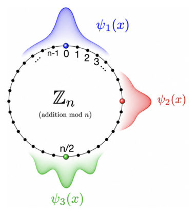 
FIG. 5. The finite Abelian group Zn describes a discretized position space for N particles (here N = 3), with addition modulo n as translation. There is also an associated notion of momentum, and a discrete Fourier transform that relates the two. Hence, this provides a mathematically simple discrete version of the usual “particle on a line”, such that our results are directly applicable in a mathematically rigorous way. (AI disclosure: Illustration created with the assistance of ChatGPT 5.5.)

**Summary.** This paper revolutionizes the concept of Quantum Reference Frames by generalizing them from simple subsystems to covariant quantum instruments. By imposing strict operational constraints based on complete covariance, it derives fundamental physical principles, offering novel explanations for particle statistics and time evolution in complex, interacting quantum systems.

**Why it may be interesting.** It provides a deep operational foundation for defining physical observables (like time or particle labels) when standard subsystem decompositions fail due to interactions or global symmetries, which is crucial for advanced many-body theory.

Detailed structure

**Main problem.** The work generalizes Quantum Reference Frames (QRFs) beyond simple tensor factor subsystems to covariant quantum instruments, aiming for a unified operational understanding of perspectival quantum mechanics.

**Main result.** This generalized framework provides explanations for the symmetrization postulate, entanglement description between bosons and fermions, and allows relational clocks to reproduce the Schrödinger equation even in interacting systems.

**Method.** The authors reconstruct and generalize the perspective-neutral approach by imposing the operational constraint that only completely covariant operations can be physically implemented on a system.

**Model / system.** The framework analyzes quantum systems using QRFs, extending from subsystem descriptions to general covariant quantum instruments. Applications include modeling indistinguishable particles and relational time evolution in interacting many-body settings.

**Key observables.** Completely covariant operations, constraint equations (e.g., C|ψ> = 0), and the resulting effective Hamiltonians for relative motion.

**Important parameters / regimes.** The structure of the symmetry group G (generalized from finite to compact Lie groups) and interaction coupling constants K.

**Assumptions / limitations.** The core assumption is that physical reality must be describable solely through completely covariant operations, which dictates the allowed measurements and dynamics.

**Paper structure.** The paper first reconstructs the perspective-neutral framework operationally before generalizing it to covariant instruments. It then details applications concerning indistinguishable particles, entanglement, and relational time evolution in interacting systems.

Abstract

We generalize the notion of quantum reference frames (QRFs) to cases where the frame does not necessarily correspond to a tensor factor subsystem, but to a covariant quantum instrument. This unlocks a variety of physical applications: "frames of labeling" for indistinguishable particles, suggesting explanations for the symmetrization postulate and the absence of parastatistics, and yielding a transparent description of the entanglement of bosons and fermions; and relational clocks reproducing the Schrödinger equation exactly even when all subsystems are interacting or when there are frequency superselection sectors. Our work generalizes the perspective-neutral approach to QRFs pioneered by Höhn and co-authors, which we reconstruct from a simple operational scenario. We give a resource-theoretic grounding of this framework, and show how the notion of completely covariant operations explains the relevance of the charge-zero sector and the pure-state transformation behavior across perspectives. This also suggests operational clarifications of some aspects of constraint quantization, e.g. of the meaning of constraint equations such as $C|ψ\rangle=0$. Some of our results, such as our generalization of relationalization maps to instruments, apply more broadly to other QRF frameworks too, and they contribute to bridging the gap between operational quantum information theory and the internal QRF research program.

[↑ back to top](#top)

### [Quantum estimates for classical polynomial optimization](http://arxiv.org/abs/2607.25445v1)

**Authors:** Oleg Evnin  
**Type:** theory · **Category:** other · **PDF:** <https://arxiv.org/pdf/2607.25445v1>  
**Analysis basis:** full PDF text, analyzed in chunks
**Topic relevance:** `Keldysh / 2PI / non-Gaussian methods` **1/5** · `analog quantum simulation` **1/5** · `driven-dissipative phase transition` **1/5** · `methods for driven-dissipative` **1/5**

📷 Fig 1

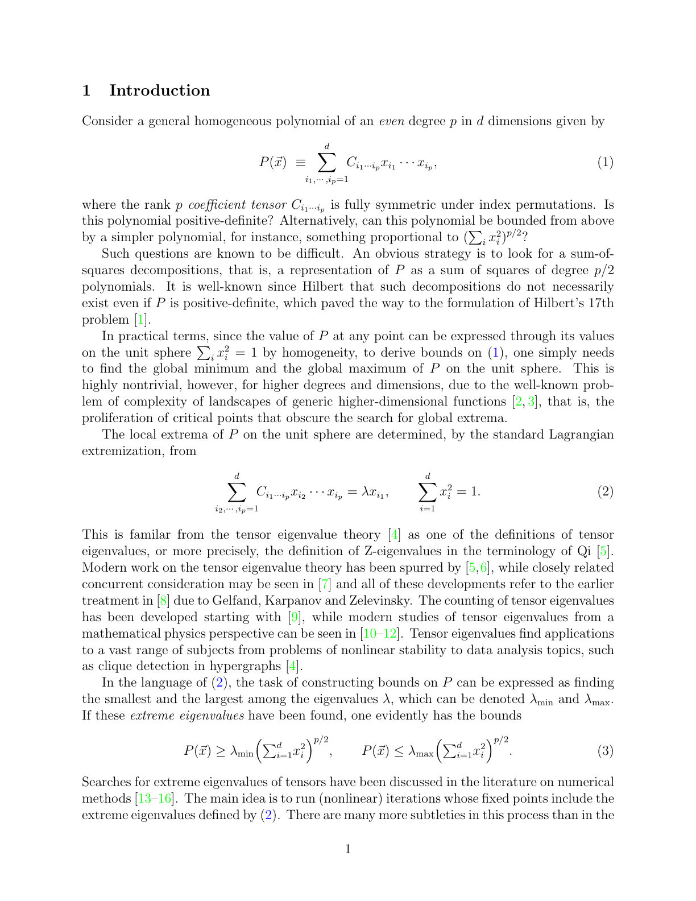 
Low-resolution page preview, page 2

📷 Fig 2

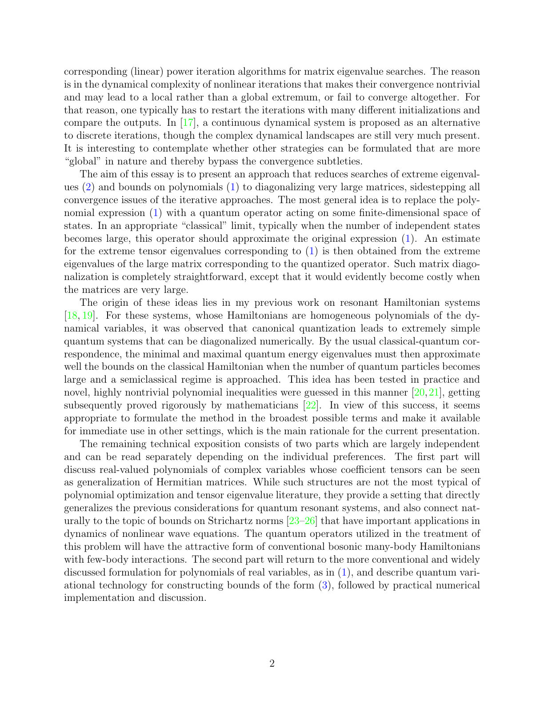 
Low-resolution page preview, page 3

📷 Fig 3

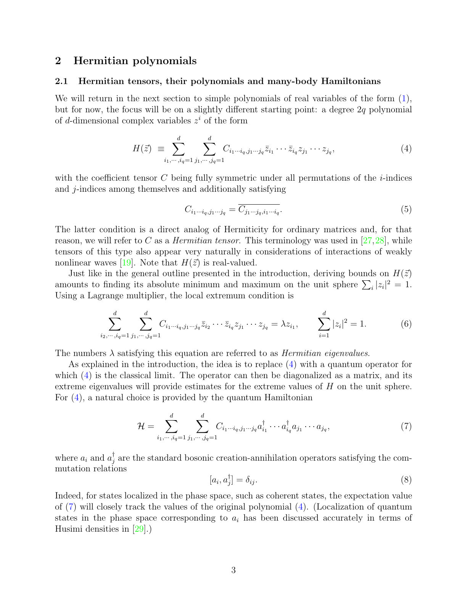 
Low-resolution page preview, page 4

📷 Fig 4

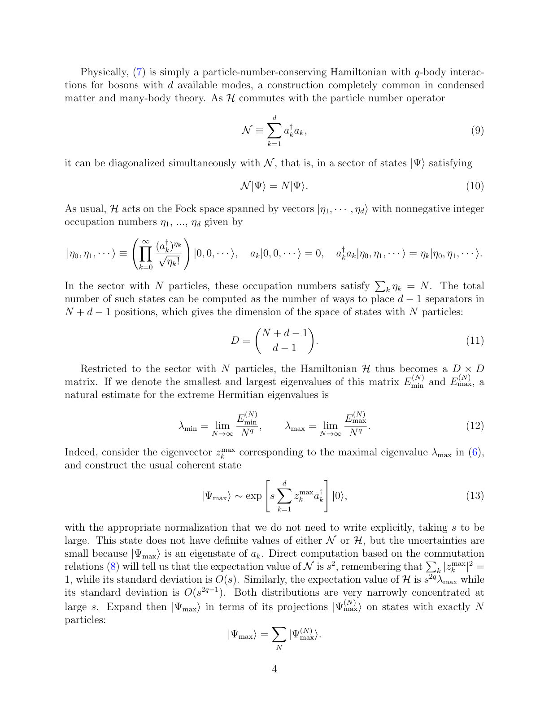 
Low-resolution page preview, page 5

📷 Fig 5

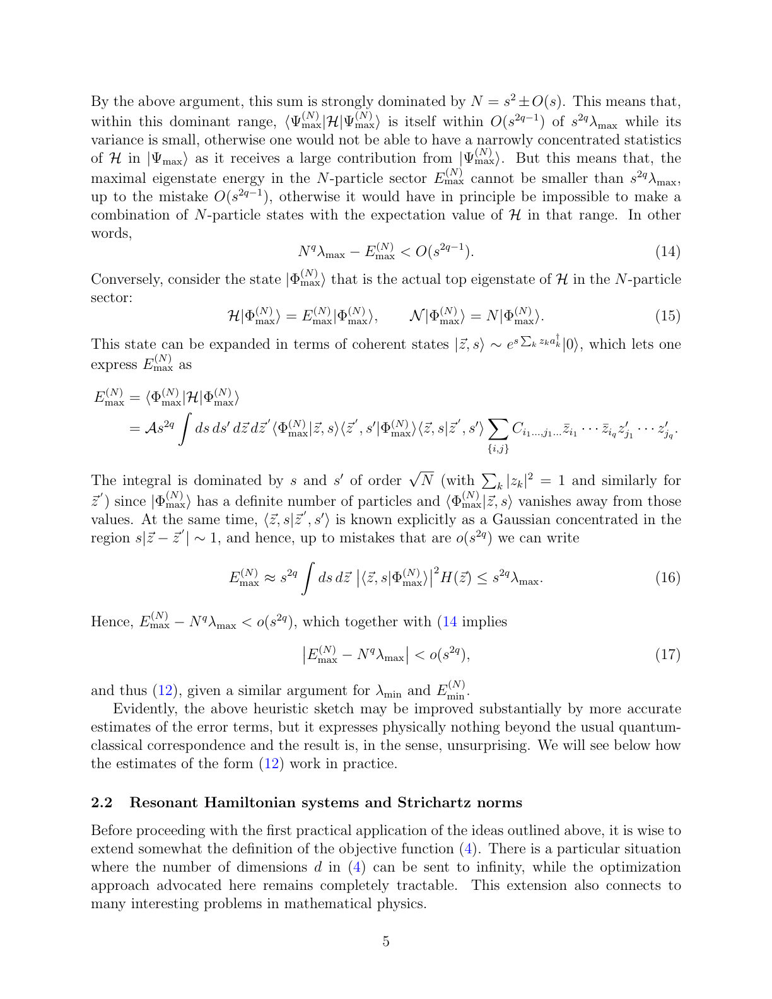 
Low-resolution page preview, page 6

**Summary.** This paper introduces a novel method to find bounds on multivariate homogeneous polynomials by reformulating the problem in terms of quantum mechanics. It replaces the polynomial with an effective Hamiltonian operator and estimates its extreme eigenvalues via matrix diagonalization. This technique provides powerful, quantum-derived heuristics for solving difficult problems in mathematical physics and optimization theory.

**Why it may be interesting.** This work provides a powerful mathematical bridge between classical optimization theory and quantum mechanics. For AMO/open quantum systems researchers, it suggests using spectral analysis of large quantum operators as a systematic heuristic tool to constrain the behavior of complex physical observables that are hard to analyze classically.

Detailed structure

**Main problem.** The core problem is finding rigorous lower and upper bounds for multivariate homogeneous polynomials, which is mathematically equivalent to determining the extreme eigenvalues of their coefficient tensors.

**Main result.** The authors propose a novel quantum-inspired variational method where bounding the polynomial is recast as diagonalizing an auxiliary, large quantum operator (Hamiltonian). This approach successfully yields conjectured sharp inequalities for classical polynomial optimization problems.

**Method.** The technique involves replacing the classical polynomial $P(\vec{x})$ with a quantum mechanical operator $\hat{H}$ acting in a high-dimensional state space. The extreme eigenvalues of the tensor are then estimated by finding the extreme eigenvalues of this resulting matrix representation of $\hat{H}$.

**Model / system.** The analysis is applied to general multivariate homogeneous polynomials, often modeled via Hamiltonians derived from quantum systems like those involving bosonic creation/annihilation operators (e.g., Lowest Landau Level or resonant Hamiltonian classes).

**Key observables.** The extreme eigenvalues ($\lambda_{\min}, \lambda_{\max}$) of the coefficient tensor, which correspond to the minimum and maximum energy eigenvalues ($E_{\min}, E_{\max}$) of the quantum Hamiltonian in specific sectors.

**Important parameters / regimes.** The dimensionality of the state space (which can be very large), the particle number sector $N$, and coupling constants ($\sigma$).

**Assumptions / limitations.** The method relies on the semiclassical approximation that the expectation value of the quantum operator tracks the classical polynomial, and it serves as a heuristic guide for proving analytic inequalities.

**Paper structure.** The paper first establishes the difficulty of bounding polynomials via tensor eigenvalues. It then introduces the quantum variational method by mapping the problem to Hamiltonian diagonalization in finite sectors (fixed particle number $N$). Finally, it applies this framework to specific physical models (like LLL or resonant systems) to derive concrete, conjectured bounds.

Abstract

The problem of finding lower and upper bounds on multivariate homogeneous polynomials is both difficult and important given its applications to questions ranging from dynamical stability in complex potential landscapes to data analysis. From the standpoint of tensor eigenvalue theory, the question is equivalent to finding the smallest and the largest eigenvalues of the coefficient tensor corresponding to the given polynomial. Standard approaches outlined in the literature amount to running nonlinear iterations in search for the optimal rays along which the growth of the polynomial is fastest or slowest. Unlike the case of matrices (or their corresponding multivariate quadratic forms) convergence of such algorithms for higher-rank tensors is capricious due to the complex topography of polynomial objective functions. In this essay, a very different strategy, inspired by quantum-mechanical variational methods, is introduced for finding bounds on polynomials. The original polynomial is replaced by an operator acting in a suitably chosen (large) space of states, such that in an appropriate "classical" limit this operator approaches the original polynomial expression made of commutative variables. As a result, approximating the smallest and largest eigenvalues of the coefficient tensor, and thus finding bounds on polynomials, amounts to diagonalizing the resulting quantum operator, represented as a large matrix, and then inspecting the smallest and largest eigenvalues of this matrix. This approach is then successfully applied to standard test examples from tensor eigenvalue literature and other problems of interest in mathematical physics including Strichartz-type inequalities.

[↑ back to top](#top)

### [A Kernel-Based Density of States Estimator for Quantum Computing](http://arxiv.org/abs/2607.24972v1)

**Authors:** Julio Cesar Siqueira Rocha  
**Type:** theory · **Category:** statistical mechanics · **PDF:** <https://arxiv.org/pdf/2607.24972v1>  
**Analysis basis:** full PDF text, analyzed in chunks
**Topic relevance:** `analog quantum simulation` **1/5** · `methods for driven-dissipative` **1/5** · `quantum measurements` **1/5**

📷 Fig 1

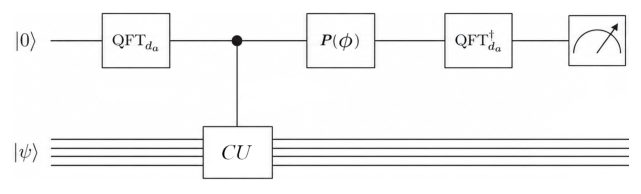 
FIG. 1. Quantum circuit implementing a single Rodeo cycle with an ancilla qudit of dimension da. The system register is initialized in an arbitrary state |ψ⟩, while the ancilla is prepared in the computational basis state |0⟩. A quantum Fourier transform (QFT) prepares the ancilla in an equal superposition of its basis states, which controls the time-evolution operator, CU, for a randomly sampled evolution time t. A phase shift P(ϕ) is subsequently applied, followed by the inverse quantum Fourier transform (QFT†). Finally, the ancilla is measured in the computational basis.

📷 Fig 2

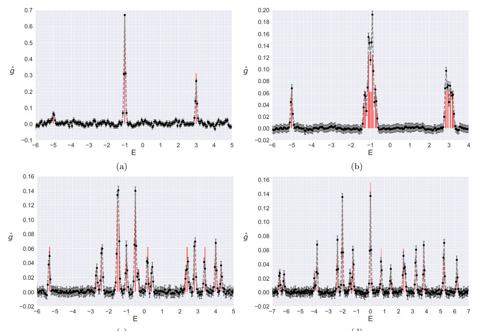 
FIG. 2. DoS reconstruction for the 1D transverse-field Ising model using the Rodeo kernel method. For each target energy, the Rodeo algorithm was evaluated using 1 000 independent evolution times sampled from a Gaussian distribution with standard deviation σ = 20. Panels (a)–(d) correspond to transverse-field strengths B = 0, 0.1, 0.5 and 1.0, respectively. For B ̸= 0 the estimator was averaged over R = 10 Haar-random initial states; only one state was used for B = 0.

📷 Fig 3

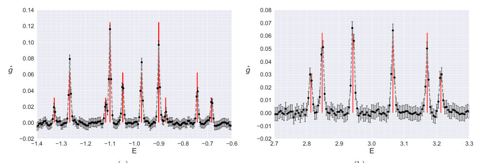 
FIG. 3. Refinement of the DoS reconstruction for the previously merged peaks shown in Fig. 2(b) for the transverse-field Ising model with B = 0.1. The estimator was averaged over R = 10 independent Haar-random initial states. For each target energy, the Rodeo algorithm was performed using 1 000 evolution times sampled independently from a Gaussian distribution with standard deviation σ = 200, yielding a narrower spectral kernel and improved energy resolution. Panels (a) and (b) show enlarged views of the energy windows [−1.4, −0.6] and [2.7, 3.3], respectively.

📷 Fig 4

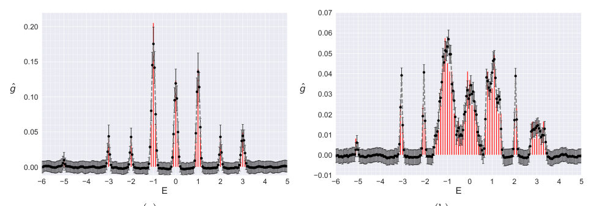 
FIG. 4. DoS reconstruction for the one-dimensional spin-1 model using the Rodeo kernel method. For each target energy, the Rodeo algorithm was evaluated using 1 000 independent evolution times sampled from a Gaussian distribution with standard deviation σ = 20. Panels (a) and (b) correspond to transverse-field strengths B = 0.05 and 0.2, respectively.

📷 Fig 5

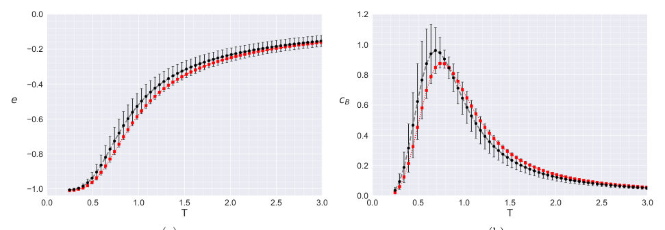 
FIG. 5. Thermodynamic properties of the spin-1 ring with N = 5 spins in the presence of a transverse magnetic field B = 0.2. Panels (a) and (b) show the mean energy per spin and the specific heat at constant magnetic field as functions of temperature, respectively. Black circles correspond to the results obtained using the proposed kernel-based DoS estimator, while red squares denote the exact results obtained by direct Hamiltonian diagonalization.

**Summary.** This paper introduces a kernel-based estimator for the Density of States in large quantum systems by adapting classical signal processing techniques. It uses the 'Rodeo response' measured via single-ancilla circuits and averaging over random states to reconstruct the DoS, which is convolved with an analytically determined spectral filter. The method is validated on spin models, demonstrating its ability to recover thermodynamic properties like specific heat.

**Why it may be interesting.** This work provides a powerful, resource-efficient technique to extract global spectral information (DoS) from local measurements achievable with near-term quantum hardware, bypassing the exponential scaling barrier of full diagonalization.

Detailed structure

**Main problem.** The primary goal is reconstructing the Density of States (DoS), g(E), for quantum many-body systems whose Hilbert spaces are too large to be diagonalized directly.

**Main result.** The authors show that averaging the Rodeo response over Haar-random input states yields a DoS convolved with an analytically derived spectral kernel, providing a direct quantum analogue to classical Kernel Polynomial Methods (KPM).

**Method.** The method adapts KPM by using the time evolution measurement via the 'Rodeo response' and averaging this response over random initial states. This transforms the problem into a signal processing estimation task.

**Model / system.** The analysis is general for quantum many-body systems described by a Hamiltonian, but validation is performed on specific models like the one-dimensional transverse-field Ising and spin-1 ring model.

**Key observables.** Density of States g(E), spectral amplitude $\hat{g}(E)$, mean energy per spin $\langle e 
angle$, and specific heat $c_B$.

**Important parameters / regimes.** The ancilla dimension ($d_a$), the number of random states sampled ($R$), the number of time steps ($N_t$), and the spectral kernel parameters (e.g., Gaussian width $\sigma$).

**Assumptions / limitations.** Key assumptions include assuming Haar-random input states to ensure uniform spectral weight, and treating the total variance as a sum of statistical errors from random state sampling and temporal sampling.

**Figures summary.** Figures illustrate the quantum circuit for the Rodeo cycle and show numerical comparisons between reconstructed DoS ($\hat{g}(E)$) versus exact results for various magnetic fields in the spin-1 model. Figure 5 compares derived thermodynamic quantities like specific heat ($c_B$) against exact diagonalization.

**Paper structure.** The paper develops the theoretical framework by deriving the estimator, establishing the connection between signal processing window functions and quantum reconstruction kernels, and then validates this method using numerical simulations on known models (Ising/spin-1).

Abstract

The density of states (DoS) encodes the thermodynamic and spectral properties of quantum many-body systems, yet its reconstruction becomes intractable for Hilbert spaces too large to diagonalize. Classically, the kernel polynomial method (KPM) addresses this by combining stochastic trace estimation with a smoothing kernel. Here we show that the Rodeo algorithm---one of the simplest eigenvalue-location protocols for near-term quantum hardware---provides a direct quantum analogue of this approach. Averaging the Rodeo response over Haar-random input states yields the DoS convolved with a spectral kernel fixed entirely by the distribution of evolution times: the random states play the role of stochastic trace estimation, and the temporal sampling distribution that of the damping kernel. The construction requires only the standard single-ancilla circuit, and quantum typicality suppresses the statistical error as the Hilbert-space dimension grows. We derive the estimator and its uncertainties, establish an explicit dictionary between signal-processing window functions and quantum reconstruction kernels, and validate the method on the one-dimensional transverse-field Ising and spin-1 models.

[↑ back to top](#top)

### [Finite-temperature Lanczos for anisotropic spin systems using triple-hybrid high-performance computing](http://arxiv.org/abs/2607.25585v1)

**Authors:** J. Schnack  
**Type:** theory · **Category:** strongly correlated electrons · **PDF:** <https://arxiv.org/pdf/2607.25585v1>  
**Analysis basis:** full PDF text, analyzed in chunks
**Topic relevance:** `analog quantum simulation` **1/5** · `exotic spin models in light-matter` **1/5** · `spintronics-quantum-optics interface` **1/5**

📷 Fig 1

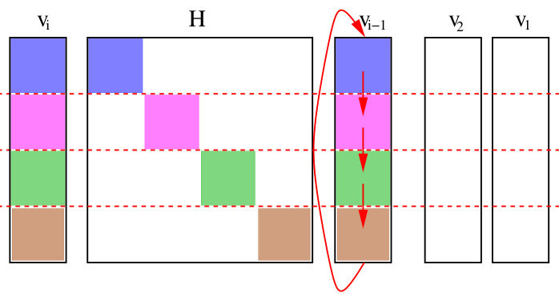 
Figure 1. Sketch of the MPI parallelization of a matrix-vector multiplication. Each rank hosts a section of all vectors and a stripe of the matrix. The first step fills the initially blank target vector vi with the contributions of the respective sections of vi−1 on the same rank. The needed parts of the matrix are given by colored blocks.

📷 Fig 2

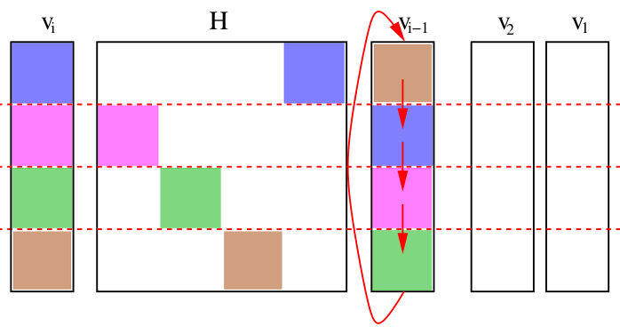 
Figure 2. Second MPI-step of the matrix-vector multiplication; the contributions of the respective sections of vi−1 on the same rank are added by using the correct part of the matrix strip given by the colored boxes.

📷 Fig 3

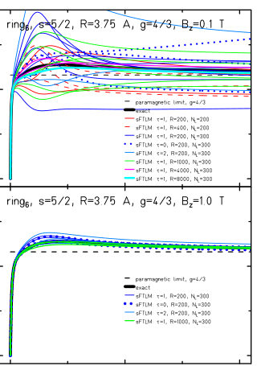 
Figure 4. Susceptibility, MT/B, of a fictitious spin ring of N = 6 spins with s = 5/2 with nearest-neighbor Heisenberg exchange, strong single-ion easy-axis anisotropy as well as all- to-all dipolar interaction for B = 0.1 T (top) and B = 1 T (bottom). τ = 1 or 0 denotes the use or not-use of time reversed random vectors; NL provides the number of Lanczos steps for a single random vector, and R gives the number of employed random vectors according to (8) and (9).

📷 Fig 4

 
Figure 3. Heat capacity of a fictitious spin ring of N = 6 spins with s = 5/2 with nearest-neighbor Heisenberg exchange, strong single-ion easy-axis anisotropy as well as all-to-all dipo- lar interaction for B = 0.1 T (top) and B = 1 T (bottom). τ = 1 or 0 denotes the use or not-use of time reversed random vectors; NL provides the number of Lanczos steps for a single random vector, and R gives the number of employed random vectors according to (8) and (9).

📷 Fig 5

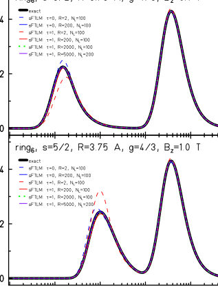 
Figure 3 shows as a first result the heat capacity for two values of the magnetic field applied along the z-axis which is the symmetry axis of the ring. The various curves ori- gin from using time reversed random vectors (τ = 1) or not (τ = 0) together with NL Lanczos steps for each ran- dom vector and averages of the partition function over R random vectors according to (8) and (9). One notices that the heat capacity is astonishingly robust and well approximated by already rather small numbers of ran- dom vectors and Lanczos steps of the order of 100. This even holds for the low-temperature peak of the heat ca- pacity. Only for single-figured numbers of random vec- tors the accuracy is...

**Summary.** This paper details a computational methodology to simulate anisotropic spin systems at finite temperatures by employing the Finite-Temperature Lanczos Method (FTLM). It overcomes severe scaling limitations by designing and implementing a highly parallelized, triple-hybrid high-performance computing scheme utilizing MPI, OpenMP, and GPUs. The work demonstrates its feasibility on complex molecular magnets like $	ext{Mn}_9$, providing insights into their magnetic properties.

**Why it may be interesting.** This work directly addresses simulating quantum magnetism in large molecular clusters using state-of-the-art high-performance computing techniques, which is crucial for understanding magnetic materials beyond simple lattice models.

Detailed structure

**Main problem.** To apply the finite-temperature Lanczos method (FTLM) to study anisotropic spin systems whose Hilbert spaces are too large for exact diagonalization.

**Main result.** The authors successfully sketched a framework utilizing a triple-hybrid HPC scheme (MPI/CPU/GPU) to tackle the computational demands of FTLM for these complex magnetic models, demonstrating feasibility on systems like Mn9.

**Method.** The core method is the Finite-Temperature Lanczos Method (FTLM), which approximates thermodynamic expectation values using trace estimators. The implementation heavily relies on parallelizing sparse matrix-vector multiplications across MPI ranks, CPU threads, and GPU engines.

**Model / system.** The study focuses on anisotropic spin systems governed by a Hamiltonian including Heisenberg exchange, single-ion anisotropies, Zeeman terms, and dipolar interactions. Examples include fictitious ring molecules and $	ext{Mn}_9$ clusters.

**Key observables.** Heat capacity ($C$), Magnetic Susceptibility ($\chi_M T / B$), and low-energy density of states.

**Important parameters / regimes.** Inverse temperature ($eta = 1/k_B T$) and applied magnetic field strength ($B$).

**Assumptions / limitations.** The primary approximation is the use of FTLM itself. The authors also discuss using an improved, symmetric form ($s$FTLM) despite its increased computational cost.

**Figures summary.** Figures illustrate the parallel steps (MPI-step 1 and 2) of matrix-vector multiplication on a distributed memory architecture. Other figures show calculated heat capacity and susceptibility for model systems like the ring molecule and $	ext{Mn}_9$.

**Paper structure.** The paper introduces the physical problem, details the mathematical framework (FTLM approximations), outlines the necessary computational infrastructure (triple-hybrid HPC scheme), and then presents results on specific spin models ($	ext{Mn}_9$, ring system) to validate the approach.

Abstract

Lanczos concepts are often realized on supercomputers. In view of modern architectures of high-performance computing triple-hybrid schemes employing MPI, CPU-openMP as well as GPU-openMP should be utilized. The present article sketches how such a scheme could be utilized in order to meet the demands of the finite-temperature Lanczos method for anisotropic spin systems.

[↑ back to top](#top)

### [Stacking-dependent anisotropic altermagnetism in V$_{1/3}$NbS$_2$](http://arxiv.org/abs/2607.25213v1)

**Authors:** Chris J. Lygouras, Nathan Prouse, Jack H. Drouin, Youzhe Chen, Laura Garcia-Gassull, Zili Feng, Mingxuan Fu, Lü Fang, Alexander I. Kolesnikov, Christina Hoffman, Yiqing Hao, Huibo Cao, Maxime A. Siegler, Robert J. Birgeneau, Roser Valentí, Satoru Nakatsuji, Collin L. Broholm  
**Type:** both · **Category:** strongly correlated electrons · **PDF:** <https://arxiv.org/pdf/2607.25213v1>  
**Analysis basis:** full PDF text, analyzed in chunks
**Topic relevance:** `analog quantum simulation` **1/5** · `exotic spin models in light-matter` **1/5** · `spintronics-quantum-optics interface` **1/5**

📷 Fig 1

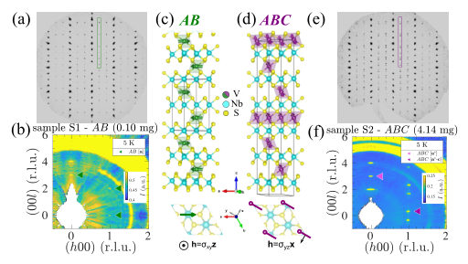 
FIG. 1. Structures for two V1/3NbS2 polytypes. (a) Reconstructed reciprocal-lattice (h0l) slice from SCXRD (at 213 K) and (b) from neutron diffraction (at 5 K) in the (h0l) scattering plane for the (c) AB polytype. For the (d) ABC polytype, we again show the (h0l) slice (e) from SCXRD and (f) from neutron diffraction. Throughout, the unit cell is shown in black borders; the colored arrows correspond to the vanadium spins; and the black arrows indicate the Hall vectors associated with minute spin canting and anomalous Hall effect.

📷 Fig 2

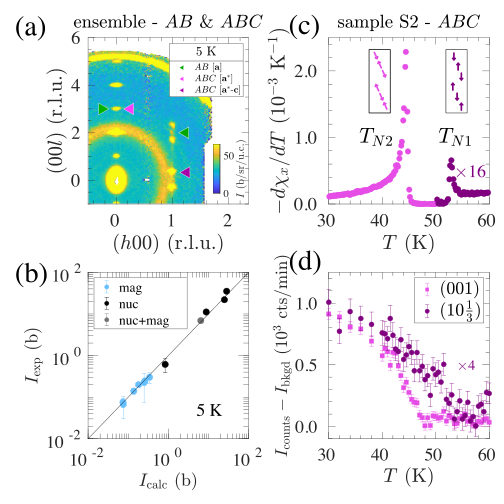 
FIG. 2. Diffraction evidence of distinct magnetic and crystal structures of V1/3NbS2. (a) Elastic scattering in the (h0l) plane at 5 K for the ensemble. (b) Simultaneous refinement of magnetic and nuclear data for the polytypes. For sample S2 with ABC stacking and vanishing anomalous Hall resistivity ∆ρxy, we find distinct tran- sitions TN in the (c) differential susceptibility (−dχx  dT ) and (d) order parameter curves on (10 1

📷 Fig 3

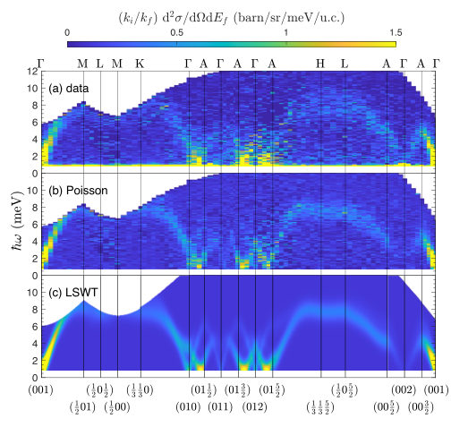 
FIG. 3. Inelastic neutron scattering from V1/3NbS2 probing spin waves with wave vector transfer along high-symmetry paths in momentum space. “Data” refers to the measured scattering inten- sity. “Poisson” refers to the intensity simulated considering Pois- son statistics and the count rate in each pixel. “LSWT” refers to the theoretical intensity from linear spin wave theory simulation. Differ- ences between spin waves in ABC and AB crystals are apparent along Γ(010) −A(01 5

📷 Fig 4

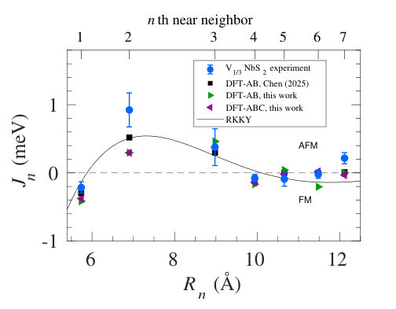 
FIG. 4. Heisenberg exchange constants Jn of V1/3NbS2 as a func- tion of near-neighbor distance Rn. The dotted line shows the fit to Eq 2. We include the DFT-predicted values from Chen et al. [33], and this work. Error bars represent one standard deviation.

📷 Fig 5

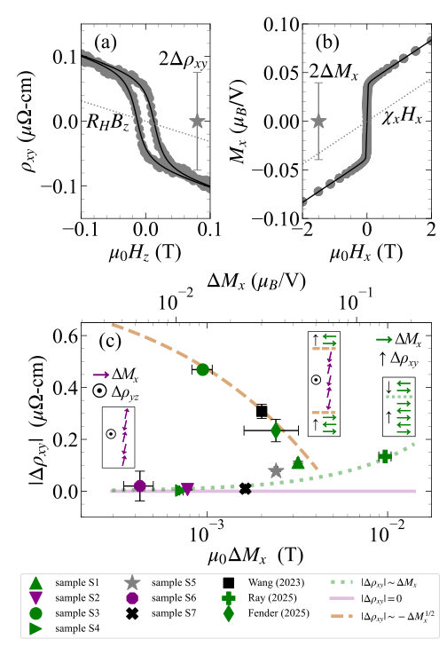 
FIG. 5. In-plane uncompensated magnetism versus out-of-plane anomalous Hall resistivity in V1/3NbS2. (a) Hall resistivity ρxy and (b) in-plane magnetization Mx for sample S5 as a function of magnetic field at 2 K with fits described in Eq. (S18). (c) Semi- logarithmic plot of |∆ρxy| versus in-plane remanent magnetization µ0∆Mx across various samples at 2 K. The insets show how struc- tural domains with odd number of spins support extrinsic in-plane FM, with the local Hall vectors in black arrows, and the resulting functional dependence of AHE shown by the colored lines. Hall re- sistance data for samples S1-S6 are shown in Fig. S8. When explic- itly measured with diffraction, green (purple)...

**Summary.** This work reveals that the stacking sequence in $	ext{V}_{1/3}	ext{NbS}_2$ fundamentally dictates its magnetic ground state and anomalous Hall response. By combining advanced diffraction, transport measurements, and theoretical modeling of RKKY interactions, the authors demonstrate a pathway to engineer bulk properties in layered quantum magnets.

**Why it may be interesting.** While focused on condensed matter magnetism, the concept of engineering bulk properties through precise control over interlayer coupling (analogous to controlling quantum interfaces) is relevant for designing novel correlated electronic materials.

Detailed structure

**Main problem.** The study investigates how the stacking sequence of magnetic ions ($	ext{V}^{3+}$) in $	ext{V}_{1/3}	ext{NbS}_2$ dictates its macroscopic magnetic properties, specifically focusing on anisotropic altermagnetism.

**Main result.** Two distinct polytypes (AB and ABC) exist, leading to different easy axes of magnetization and anomalous Hall responses. The stacking sequence dramatically controls the bulk magnetism by stabilizing quasi-collinear A-type antiferromagnetic order.

**Method.** The research combines single crystal diffraction (X-ray/neutron), transport measurements (Anomalous Hall Effect), inelastic neutron scattering, and theoretical modeling using RKKY interactions and Mean-Field Theory.

**Model / system.** The system is the layered van der Waals material $	ext{V}_{1/3}	ext{NbS}_2$, which forms a superlattice structure. The magnetism is modeled by Heisenberg Hamiltonians incorporating exchange couplings ($J_{ij}$) and single-ion anisotropy terms.

**Key observables.** Anomalous Hall resistivity ($\Delta
ho_{xy}$), magnetization ($M$), spin wave excitations (INS spectra), and the magnetic ordering temperature ($T_N$).

**Important parameters / regimes.** The stacking sequence (AB vs. ABC) is critical; RKKY interactions extend up to 1 nm, and the system exhibits distinct transition temperatures ($\approx 50	ext{ K}$).

**Assumptions / limitations.** The analysis assumes that magnetic properties are highly sensitive to structural details like stacking order, allowing for engineering of bulk electronic states.

**Figures summary.** Figures illustrate diffraction evidence distinguishing polytypes and magnetic transitions; INS data probes spin wave dispersions across different stacking arrangements (AB vs. ABC).

**Paper structure.** The paper progresses from experimental characterization using diffraction and transport measurements to detailed theoretical modeling of the exchange interactions via RKKY fitting, culminating in a quantitative link between structural disorder/stacking and the resulting anomalous Hall effect.

Abstract

We report profound impacts of the stacking sequence of triangular lattices of magnetic transition metal ions intercalated between the layers of the van der Waals material NbS$_2$. Using single crystal x-ray and neutron diffraction, and transport and magnetization measurements, we show there are two distinct polytypes of $\rm V_{1/3}NbS_2$ with disparate easy axes of magnetization and different anomalous Hall responses. Self-consistent analysis of inelastic neutron scattering data provides evidence for oscillatory RKKY interactions that extend to 1 nm and stabilize quasi-collinear A-type altermagnetic orders in both polytypes though with perpendicular easy axes. The detailed stacking sequence of a bulk polytype crystal dramatically impact its macroscopic anomalous Hall response and magnetism, which suggests a new path to engineer the bulk properties of a layered three dimensional solid.

[↑ back to top](#top)

### [Variational approach to Yukawa fluids. II. Instantaneous elastic moduli and sound velocities](http://arxiv.org/abs/2607.25923v1)

**Authors:** S. A. Khrapak, A. G. Khrapak  
**Type:** theory · **Category:** statistical mechanics · **PDF:** <https://arxiv.org/pdf/2607.25923v1>  
**Analysis basis:** full PDF text, analyzed in chunks
**Topic relevance:** `Keldysh / 2PI / non-Gaussian methods` **1/5** · `analog quantum simulation` **1/5** · `driven-dissipative phase transition` **1/5**

📷 Fig 1

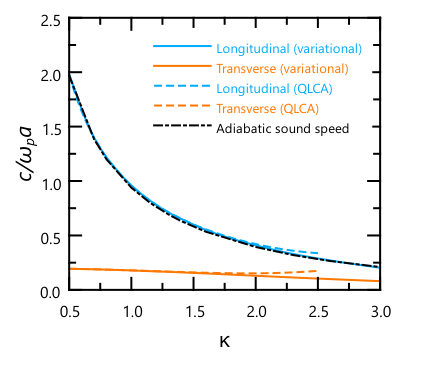 
FIG. 1. (Color online) The reduced instantaneous longitu- dinal and transverse elastic sound velocities in the strongly coupled Yukawa fluid. All the velocities are expressed in units of ωpa to be consistent with the fits from Ref. [35] and are plotted as functions of the screening parameter κ. The solid curves correspond to the calculation using Eq. (13) with Eq. (14) for the longitudinal velocity and Eq. (15) for the transverse velocity (these are conventionally referred to as variational). The dashed curves correspond to the fits based on QLCA calculation with RDFs g(r) obtained by follow- ing the hypernetted chain scheme as described in Ref. [35]. The kinetic contribution is not...

📷 Fig 2

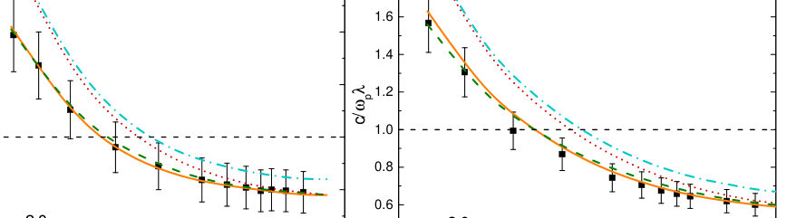 
FIG. 2. (Color online) The reduced sound velocities of the Yukawa fluid across coupling regimes for four values of the screening parameter, κ = 0.5, 1.0, 2.0, and 3.0 (indicated in the panels). All the velocities are expressed in units of ωpλ to be consistent with the MD results from Ref. [89] and are shown as functions of the coupling parameter Γ. The black squares with 5% error bars at κ = 0.5 and 1.0 and 10% error bars at κ = 2.0 and 3.0 correspond to MD simulations performed in Ref. [89]. The solid curves correspond to the adiabatic sound velocity cs evaluated using the practical formulas for the excess energy and pressure of Yukawa fluids [69, 90]. The dashed and dash-dotted curves are...

**Summary.** This paper applies a sophisticated variational method to calculate the instantaneous elastic moduli and sound velocities of Yukawa fluids. By comparing results across weak, strong, and transitional coupling regimes, it validates its theoretical framework against molecular dynamics simulations. The work provides detailed insights into how interparticle interactions govern the mechanical stability and wave propagation in these strongly correlated plasma-like systems.

**Why it may be interesting.** While focused on classical fluids, the rigorous application of advanced statistical mechanics techniques (like variational principles) to determine collective excitations (sound waves) in strongly interacting systems is relevant for understanding many-body dynamics in quantum plasma or ultracold atomic mixtures where mean-field approximations are used.

Detailed structure

**Main problem.** The study aims to evaluate instantaneous elastic moduli (shear, bulk) and related sound velocities for Yukawa fluids across different coupling regimes.

**Main result.** The variational approach yields expressions for these moduli that show excellent agreement with results from QLCA and MD simulations, particularly in the strong coupling limit where configurational contributions dominate.

**Method.** A variational approach based on the Bogoliubov inequality is employed, using the hard-sphere model as a reference system to minimize free energy functionals.

**Model / system.** The physical system modeled is a one-component plasma interacting via the repulsive screened Coulomb potential (Yukawa fluid). The analysis covers transitions between weakly and strongly coupled regimes.

**Key observables.** Instantaneous shear modulus ($G_\infty$), bulk modulus ($K_\infty$), longitudinal/transverse sound velocities ($c_l, c_t$), and the adiabatic sound velocity ($	ext{c}_s$).

**Important parameters / regimes.** Coupling parameter ($\Gamma$), screening parameter ($\kappa$), packing fraction ($\eta$), and temperature ($T$). The analysis focuses on strong vs. weak coupling limits.

**Assumptions / limitations.** The variational approach relies on the hard-sphere reference system, and in the strong coupling limit, kinetic energy contributions are considered negligible.

**Figures summary.** Table I compares configurational components of longitudinal and transverse sound velocities calculated via QLCA versus the Variational method across various $(\kappa, \Gamma)$ states. Figure 1 plots these sound velocities against $\kappa$.

**Paper structure.** The paper develops expressions for elastic moduli using the variational approach, derives a generalized Cauchy identity relating moduli to pressure, and then compares calculated sound velocities derived from both instantaneous moduli and thermodynamic definitions across different coupling regimes.

Abstract

The variational approach based on the Bogoliubov inequality using the fluid of hard spheres as a reference system is implemented to evaluate instantaneous shear, bulk and longitudinal elastic moduli, as well as related sound velocities of Yukawa fluids. The remarkable accuracy of this method is documented. In addition, we evaluate the adiabatic sound velocity from an appropriate equation of state and discuss its relation to the longitudinal and bulk sound velocities obtained from the corresponding instantaneous elastic moduli. The transition between weakly coupled and strongly coupled regimes is analyzed in detail.

[↑ back to top](#top)

### [Automated discovery of high-probability heralded schemes for path-entangled states](http://arxiv.org/abs/2607.25501v1)

**Authors:** Marcello Armezzani, Colin P. Lualdi, Xuemei Gu, Paul G. Kwiat, Mario Krenn  
**Type:** theory · **Category:** quantum information and computing · **PDF:** <https://arxiv.org/pdf/2607.25501v1>  
**Analysis basis:** full PDF text, analyzed in chunks
**Topic relevance:** `entanglement & information structure` **1/5** · `interference shaping light` **1/5**

📷 Fig 1

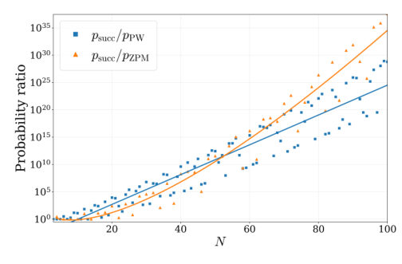 
FIG. 2. Ratios between the success probability of the modular-comb family and the probabilities of the PW and ZPM schemes as N grows. The points are exact optimized values obtained by choosing the best decomposition and filter set for each N. The solid curves are finite-N fits with the asymptotic forms derived in the Supplemental Material S.2.2.

📷 Fig 2

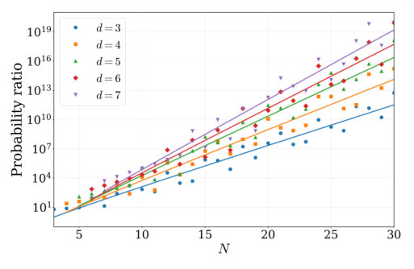 
FIG. 3. Ratio between the success probability of the modular- comb extension to multimode NOON states and the Zhang– Chan scheme as N grows, for d = 3, . . . , 7. The comparison is limited to N ≥d, since the modular comb family requires rℓ≥d. The points are exact optimized values under the com- mon universal filtering prescription, obtained by choosing the best decomposition for each pair (N, d). The solid curves are finite-N fits of the asymptotic form derived in Supplemental Material S.3.2.

📷 Fig 3

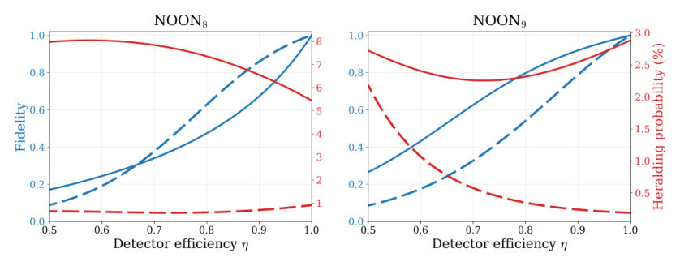 
FIG. 5. We compare fidelity and heralding probability for the schemes in Figs. 1 and 4 as well as the original PW and ZPM proposals as the detectors’ efficiency η vary. The heralding probability is the probability of producing the heralding click pattern at the detectors. The solid curves correspond to the new discovered circuits, while the dashed ones indicate the performance of the previous schemes.

📷 Fig 4

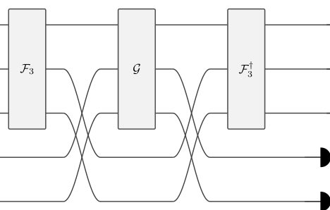 
FIG. 6. Explicit heralded constructions for the two and three mode NOON states from Table I that were not analyzed in depth in the main text.

📷 Fig 5

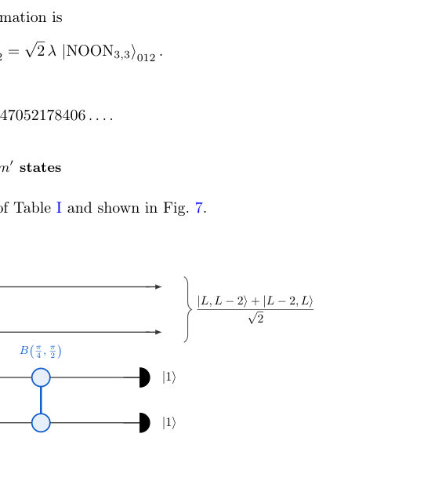 
FIG. 7. Explicit heralded construction for the m, m′-state family presented in Table I.

**Summary.** The paper uses AI techniques to discover new, highly efficient linear-optical circuits for generating path-entangled NOON states. These newly found 'modular comb' families significantly surpass the success probability scaling of existing methods. This advances the theoretical understanding and experimental feasibility of creating large-scale photonic entanglement resources.

**Why it may be interesting.** This work provides a powerful demonstration of using automated discovery methods (AI) to advance fundamental quantum optics resource state generation, which is crucial for scalable photonic quantum information processing.

Detailed structure

**Main problem.** The central challenge is deterministically generating large, high-probability heralded entangled states of light (path-entangled NOON states) due to weak photon interactions.

**Main result.** The authors discovered a new, scalable family of linear-optical circuits that provide exponential or super-exponential improvements in success probability compared to previously known schemes for creating multi-mode NOON states.

**Method.** They employed AI techniques within an automated search framework (JAX) to discover optimal photonic circuit designs and analyzed the scaling of success probabilities using asymptotic comparisons.

**Model / system.** The work focuses on path-entangled quantum states, specifically multi-mode NOON states ($	ext{NOON}_N$), generated using linear optics involving beam splitters and heralded detection mechanisms.

**Key observables.** Success probability ($p_{	ext{succ}}$), fidelity ($F$), and the scaling ratio of success probabilities compared to existing constructions (e.g., PW, ZPM).

**Important parameters / regimes.** The number of entangled photons ($N$) and the dimensionality/number of modes ($d$). Detector efficiency ($\eta$) is also a key parameter in comparisons.

**Assumptions / limitations.** The analysis assumes that the discovered schemes can be realized using passive linear optics, although limitations regarding optimal solutions for specific $N$ are noted.

**Figures summary.** Figures illustrate compact heralded circuits (e.g., NOON$_9$), and plots quantify the asymptotic improvement ratios of the new modular-comb family over older methods as $N$ increases.

**Paper structure.** The paper progresses by first establishing the difficulty of state generation, then introducing the AI-driven search for scalable circuit families (the 'modular comb'), demonstrating its superior scaling via mathematical analysis and comparison to prior art, and finally extending this methodology to multi-mode generalizations.

Abstract

Entangled states of light lie at the heart of photonic quantum technologies, from distributed quantum communication to quantum-enhanced measurement and information processing. Their practical generation, however, remains constrained by the weak interactions between photons, which make the deterministic assembly of large multiphoton entangled states a central challenge in quantum optics. In this work, we use AI techniques to discover heralded linear-optical schemes for path-entangled states and show that the resulting solutions can be elevated from individual circuits to a new scalable family. This family contains previously known constructions as special cases while generally providing exponential and super-exponential improvements over those, and its extension to broader classes of target states shows how automated discovery can reveal transferable physical understanding. By presenting compact experimental proposals for large path-entangled states, our results provide both a theoretical advance in photonic heralding and a route towards a substantial leap in experimentally accessible multiphoton entanglement.

[↑ back to top](#top)

### [Classically Augmented Zero-Noise Extrapolation](http://arxiv.org/abs/2607.25746v1)

**Authors:** Timon Scheiber  
**Type:** theory · **Category:** quantum information and computing · **PDF:** <https://arxiv.org/pdf/2607.25746v1>  
**Analysis basis:** full PDF text, analyzed in chunks
**Topic relevance:** `methods for driven-dissipative` **1/5** · `quantum measurements` **1/5**

📷 Fig 1

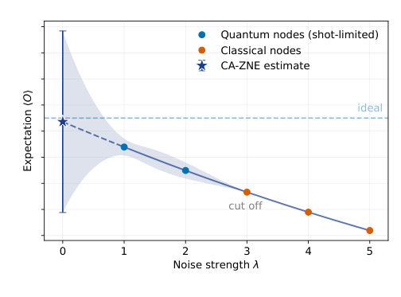 
FIG. 1: Schematic of CA-ZNE. Standard ZNE estimates the noise-free expectation value by evaluating a noisy quantum circuit at several amplified noise levels and extrapolating the resulting expectation values to the zero-noise limit. Because Richardson extrapolation amplifies statistical fluctuations, the resulting estimator can have large sampling variance and a potential extrapolation bias. In CA-ZNE, nodes above a cutoff noise level are replaced by classically simulated estimates, which act as zero-sampling-variance anchor points for the extrapolation. This can stabilize the estimator and reduce variance, at the cost of a possible deterministic simulation bias.

📷 Fig 2

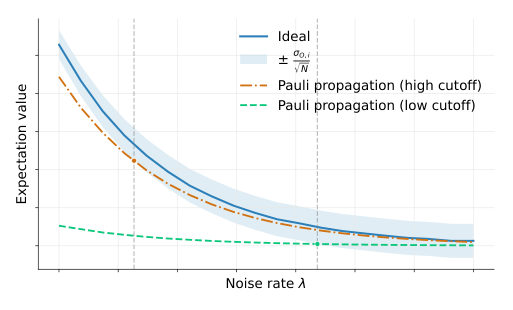 
FIG. 2: Illustration of the crossover condition between shot noise and classical truncation error. The shaded regions indicate the sampling uncertainty of the quan- tum estimates at fixed shot budget. At the points where the Pauli propagation curves intersect the shaded region the simulation bias becomes smaller than the expected sampling error. The higher the cutoff in the Pauli prop- agation the more exact the simulation will become and the intersection occurs earlier.

📷 Fig 3

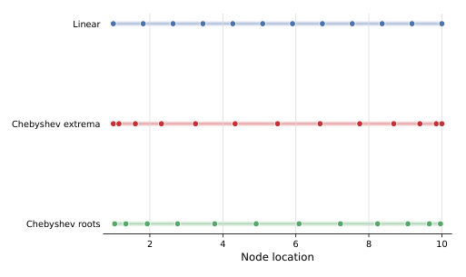 
FIG. 3: Graphical representation of the three node spacings considered in this work on the interpolation interval [1, 10]. The spacings are a linear node spacing and the two spacings closely aligned with the Chebyshev nodes, namely the extrema and the roots of the polynomial of degree n. As highlighted by the figure the Chebyshev nodes cluster at the end points of the interpolation interval.

📷 Fig 4

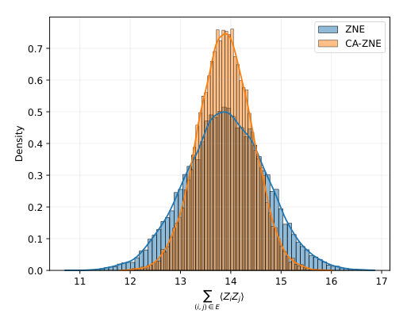 
FIG. 4: Obtained histogram by performing 15 000 runs of independent simulation for both methods. The histogram shows the distribution of the obtained expectation values from independent ZNE runs for CA-ZNE and ZNE. For ZNE we obtain a MSE of around 0.65 whereas for CA-ZNE we obtain 0.3. Our results show a bias of 0.129 for ZNE and 0.141 for CA-ZNE.

📷 Fig 5

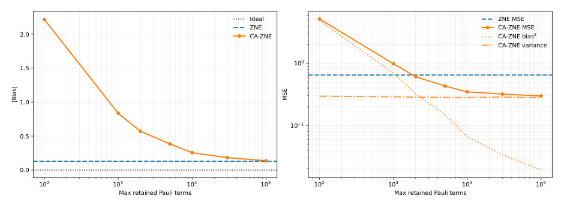 
FIG. 5: Convergence of CA-ZNE with the Pauli-truncation budget for the transverse-field Ising model. The x-axis denotes the maximum number of Pauli terms retained in the Pauli-propagation simulation. Left: empirical bias relative to the noiseless reference value. For small truncation budgets, CA-ZNE exhibits a large truncation-induced bias, which decreases rapidly as more Pauli terms are retained and approaches the fixed-order ZNE baseline. Shaded regions indicate the spread over repeated estimates. Right: corresponding mean-squared error (MSE). As the truncation bias is reduced, the CA-ZNE MSE drops and approaches the improvement set by the reduced estimator variance, eventually...

**Summary.** This paper introduces Classically Augmented Zero-Noise Extrapolation (CA-ZNE), a hybrid method for error mitigation in noisy quantum circuits. It replaces high-noise measurements with deterministic classical simulations, which significantly reduces the estimator's variance. The technique offers an exponentially faster reduction in estimation error compared to purely quantum extrapolation methods, provided the introduced classical bias is controlled.

**Why it may be interesting.** This work directly addresses practical limitations in quantum computation by offering a concrete, theoretically bounded technique to improve measurement fidelity beyond what is achievable purely through increased sampling.

Detailed structure

**Main problem.** The primary challenge is mitigating high noise rates inherent in current quantum hardware to estimate ideal, noise-free expectation values.

**Main result.** Classically Augmented Zero-Noise Extrapolation (CA-ZNE) can achieve an exponentially reduced sampling variance compared to standard ZNE by replacing high-noise measurements with deterministic classical simulations.

**Method.** The authors propose a hybrid error mitigation technique that combines quantum measurements at low noise levels with classical simulation estimates for high noise levels, analyzed via Richardson extrapolation.

**Model / system.** The analysis focuses on general noisy quantum circuits characterized by a noise strength $\lambda$, often modeled using the Sparse Pauli Lindblad (SPL) noise model. The goal is to estimate the ideal expectation value $\langle O 
angle_0$.

**Key observables.** Ideal expectation value ($\langle O 
angle_0$), Mean-Squared Error (MSE), and variance reduction factors.

**Important parameters / regimes.** Noise strength ($\lambda$), total shot budget ($N_{	ext{shots}}$), number of quantum nodes ($c$), and the crossover point where classical bias equals sampling error.

**Assumptions / limitations.** CA-ZNE introduces a deterministic simulation bias, which must be kept smaller than the variance reduction achieved to yield overall improvement. The analysis assumes specific noise models (e.g., SPL) for bounding errors.

**Figures summary.** Figures illustrate the schematic comparison between standard ZNE and CA-ZNE, and show the crossover condition where classical simulation bias becomes negligible compared to quantum sampling error.

**Paper structure.** The paper introduces the limitations of standard ZNE due to high variance overhead. It then develops the CA-ZNE method by replacing nodes with classical estimates, deriving formulas for reduced variance, analyzing the MSE trade-off, and finally providing rigorous bounds on the resulting bias using Pauli propagation techniques.

Abstract

We investigate a hybrid quantum-classical approach to quantum error mitigation. We propose Classically Augmented Zero-Noise Extrapolation, a hybrid error-mitigation method in which high-noise Richardson extrapolation nodes are replaced by classically simulated estimates. These classical nodes have negligible sampling variance but introduce deterministic simulation bias. We derive the resulting variance reduction under optimal shot allocation and show that, for linear node spacings and fixed index cutoff, the coefficient-level reduction can be exponential. We validate the prediction numerically using Pauli-propagation simulations and demonstrate a reduction in mean-squared error when the truncation bias is sufficiently small.

[↑ back to top](#top)

### [Open-ended innovation in zero-sum games](http://arxiv.org/abs/2607.25677v1)

**Authors:** Matteo Marsili  
**Type:** theory · **Category:** statistical mechanics · **PDF:** <https://arxiv.org/pdf/2607.25677v1>  
**Analysis basis:** full PDF text, analyzed in chunks
**Topic relevance:** `non-equilibrium dynamics` **1/5** · `non-equilibrium universality` **1/5**

📷 Fig 1

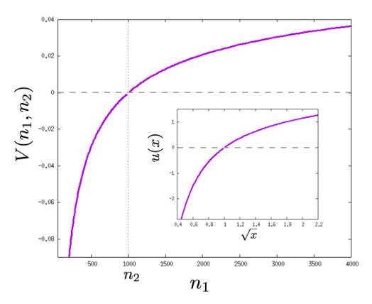 
Figure 1: Main figure: Value of the game as a function of n1 for n2 = 103. Inset: plot of u(x) versus √x. Both results are obtained solving the equations in BE for random zero-sum games where ai,j is drawn i.i.d. from a distribution with mean zero and unit variance.

**Summary.** This theoretical note examines zero-sum games where players can continuously innovate by introducing new strategies. It models this process mathematically and concludes that if the cost of innovation is low, the system enters an everlasting 'arm race.' This continuous competition ultimately drives the achievable payoffs toward zero.

**Why it may be interesting.** While focused on game theory, the concept of diminishing returns and resource depletion due to continuous technological advancement mirrors concepts studied in non-equilibrium statistical mechanics or complex adaptive systems.

Detailed structure

**Main problem.** The paper analyzes zero-sum games where players can introduce new strategies, investigating whether this process leads to an endless cycle of innovation.

**Main result.** Under generic conditions and low innovation costs, the system predicts an everlasting innovation arm race, leading to vanishingly small payoffs for both players in the limit of infinite strategies.

**Method.** The analysis uses mathematical modeling based on large random zero-sum games, employing derivatives to examine how marginal payoff changes with increasing strategy sets.

**Model / system.** The model is a two-player zero-sum game defined by a payoff function $\pi(s_1, s_2)$, where strategies are probability distributions over a simplex. The analysis focuses on the large limit of the number of available strategies ($n_1, n_2$).

**Key observables.** The value of the game $V(n_1, n_2)$ and the function $u(x)$ characterizing its dependence on the strategy ratio $x=n_1/n_2$.

**Important parameters / regimes.** Innovation costs ($c_1, c_2$) and the limit where these costs approach zero.

**Assumptions / limitations.** The setting assumes generic conditions for open-ended innovation and relies on modeling strategy expansion as adding dimensions to the payoff matrix.

**Figures summary.** Figure 1 illustrates $V$ versus $n_1$ for fixed $n_2$, with an inset showing $u(x)$ plotted against $\sqrt{x}$, highlighting concavity.

**Paper structure.** The paper establishes the mathematical framework of open-ended zero-sum games, derives approximations for the game value in large limits, and then analyzes the condition for sustained innovation by balancing marginal gains against costs.

Abstract

This note discusses zero-sum games with open-ended innovation, whereby each player may introduce new strategies. The innovation process is modelled as a draw of new strategies form a distribution. It is argued that, under generic conditions, this setting can lead to an everlasting innovation arm race, because the introduction of new technologies of one player increases the marginal utility for technological innovation of the opponent.

[↑ back to top](#top)

### [Scaling universal Fermi network toward ground states: A diffusion-Monte-Carlo assessment](http://arxiv.org/abs/2607.25872v1)

**Authors:** Yu-Sheng Li, Saskia Poldmaa, Tzen Ong, Ahmed Abouelkomsan, Tay-Rong Chang, Hsin Lin, Liang Fu  
**Type:** theory · **Category:** strongly correlated electrons · **PDF:** <https://arxiv.org/pdf/2607.25872v1>  
**Analysis basis:** full PDF text, analyzed in chunks
**Topic relevance:** `analog quantum simulation` **1/5** · `methods for driven-dissipative` **1/5**

📷 Fig 1

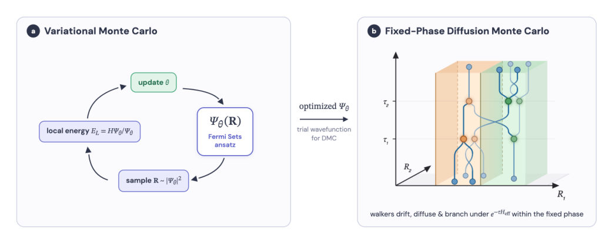 
FIG. 1. Two-stage framework for optimizing and assessing Fermi Sets wavefunctions. (a) Variational optimization of the Fermi Sets ansatz [Eq. (1)] by energy minimization (Sec. II A). (b) Fixed-phase diffusion Monte Carlo (Sec. II B): walkers drift and diffuse through configuration space (axes R1, R2) at the learned phase Φθ(R), depleting in high-energy regions (orange) and proliferating in low-energy ones (green). The resulting gap ∆E = EV MC −EDMC ≥0 measures the residual amplitude error.

📷 Fig 2

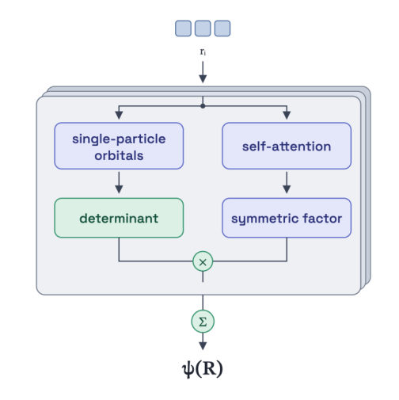 
FIG. 2. Architecture of the Fermi Sets wavefunction Ψθ(R) (Sec. II A). The wavefunction is a sum over Nd products of de- terminants supplying fermionic antisymmetry, and symmetric factors carrying the electron-electron correlations.

📷 Fig 3

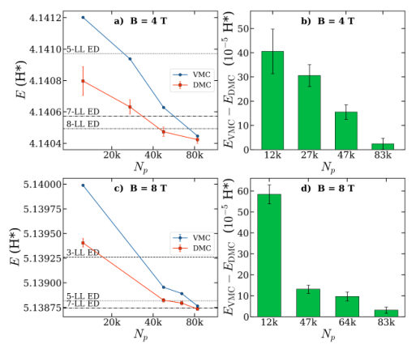 
FIG. 3. Left: convergence of the VMC and DMC energies with the number of parameters for a) B = 8 T and c) B = 4 T. Right: Residue gap ∆E = EVMC −EDMC. Error bars denote reblocked statistical uncertainties (Appendix F)

📷 Fig 4

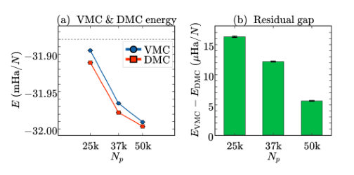 
FIG. 4. Convergence of the Fermi Sets states for the fully spin-polarized 2D UEG (N = 16, rs = 30) with network parameter count Np. (a) VMC and fixed-phase DMC energies per electron. (b) Residual gap ∆E = EVMC −EDMC. Error bars denote reblocked statistical uncertainties (Appendix F) and are smaller than the symbols where not visible.

📷 Fig 5

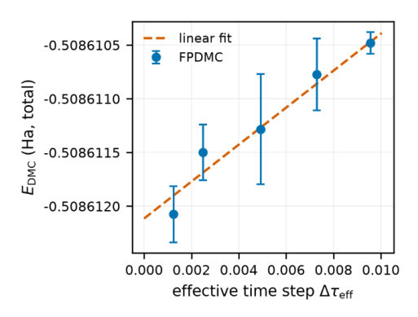 
FIG. 5. Time-step dependence of the FPDMC energy for the fully spin-polarized 2D UEG (N = 16, rs = 30; production network). The line is a fit used to extrapolate to ∆τ →0; the production time step is ∆τ0 = 0.001. Error bars denote the reblocked standard error of the mean (Appendix F).

**Summary.** The paper introduces Fermi Sets, a novel neural network architecture designed to represent fermionic wavefunctions accurately. It combines this ansatz with fixed-phase Diffusion Monte Carlo (FPDMC) to systematically calculate the ground state energy of strongly correlated electron systems like quantum dots and 2DEG. The results confirm that this ML approach provides an asymptotically exact method for solving these notoriously difficult many-body problems.

**Why it may be interesting.** This work provides a powerful, scalable machine learning tool for tackling highly complex many-body physics problems that are central to condensed matter theory, particularly those involving strong correlations and topological phases.

Detailed structure

**Main problem.** The primary challenge is solving the electronic Schrödinger equation for interacting many-electron systems, which is computationally intractable due to the infinite-dimensional Hilbert space and complex fermionic constraints.

**Main result.** The proposed Fermi Sets architecture, combined with fixed-phase Diffusion Monte Carlo (FPDMC), demonstrates systematic convergence towards the exact ground state energy for both quantum dots and 2D electron gases as network size increases.

**Method.** A two-stage variational approach: first, optimizing a complex-valued neural network wavefunction (Fermi Sets) to enforce fermionic antisymmetry; second, projecting out residual errors using fixed-phase DMC.

**Model / system.** The study applies to paradigmatic strongly correlated systems, including electrons in parabolic quantum dots under magnetic fields and the 2D Uniform Electron Gas (UEG) with long-range Coulomb interactions.

**Key observables.** The residual gap ($\Delta E = E_{VMC} - E_{DMC}$), which must collapse monotonically to zero for convergence; ground state energy ($E_0$).

**Important parameters / regimes.** Magnetic field strength (e.g., $B=8$ T); electron density parameter ($r_s$); network capacity/size of the Fermi Sets.

**Assumptions / limitations.** The use of a fixed-phase constraint in DMC, which is necessary for complex wavefunctions and reduces to the standard fixed-node approximation in the real limit.

**Figures summary.** Figures illustrate the two-stage framework (VMC $
ightarrow$ FPDMC) and detail the architecture of the Fermi Sets wavefunction used for assessment across different physical systems.

**Paper structure.** The paper introduces the limitations of traditional methods, proposes the Fermi Sets ansatz, details the two-step variational/DMC procedure, and then applies this framework to benchmark calculations on quantum dots and 2DEG.

Abstract

In this work, we show that Fermi Sets---a provably universal neural network architecture for fermionic wavefunctions---can be systematically scaled up to find interacting ground states through energy minimization in a variational Monte Carlo framework. By further performing fixed-phase diffusion Monte Carlo (DMC) on the optimized neural network wavefunction, we demonstrate that as the network size increases, the variational energy systematically decreases while the energy improvement from DMC collapses monotonically to zero, indicating convergence to the ground state. We illustrate the scaling of Fermi Sets accompanied by the DMC assessment for interacting electrons in jellium and in a quantum dot under high magnetic fields.

[↑ back to top](#top)

### [Curved momentum space and finite Landau spectrum in $κ$-Minkowski spacetime](http://arxiv.org/abs/2607.25833v1)

**Authors:** Adrián Huamán Vargas, Vladislav Kupriyanov  
**Type:** theory · **Category:** other · **PDF:** <https://arxiv.org/pdf/2607.25833v1>  
**Analysis basis:** full PDF text, analyzed in chunks
**Topic relevance:** `Keldysh / 2PI / non-Gaussian methods` **1/5**

📷 Fig 1

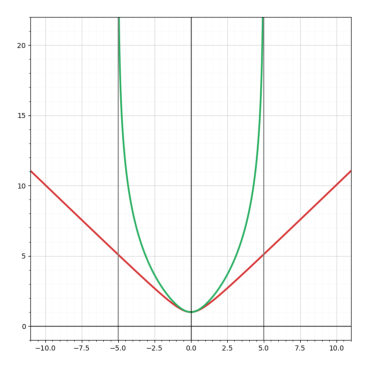 
FIG. 1: Positive energy solutions E(|⃗p|): the red line corresponds to the commutative limit, the green line to the κ-Minkowski energies and the grey lines to |⃗π| = κ.

**Summary.** This paper analyzes particle motion in $\kappa$-Minkowski spacetime, treating momentum space as curved de Sitter geometry. By using a deformed Casimir invariant, they derive exact energy spectra for charged particles in a magnetic field. The key finding is that the curvature imposes a maximal momentum, resulting in a finite Landau spectrum with a Highest Landau Level.

**Why it may be interesting.** While focused on high-energy spacetime physics, the concept of a fundamental UV cutoff leading to discrete, bounded spectra (like the HLL) has parallels in effective field theories or condensed matter systems where confinement or quantization occurs at an intrinsic scale.

Detailed structure

**Main problem.** The research investigates particle dynamics in $\kappa$-Minkowski spacetime, linking the geometry of curved momentum space to physical observables like energy spectra.

**Main result.** The curvature imposes a fundamental upper bound on invariant momentum, leading to a finite Landau spectrum characterized by a Highest Landau Level (HLL).

**Method.** The authors employ Poisson gauge theory and geometric methods, deriving the $\kappa$-Poincaré Casimir operator from de Sitter geometry.

**Model / system.** The model considers charged scalar and spin-1/2 particles moving in a constant magnetic field within the framework of non-commutative $\kappa$-Minkowski spacetime.

**Key observables.** Exact energy spectra, Highest Landau Level (HLL), and the deformed Dirac equation constraint.

**Important parameters / regimes.** The deformation parameter $\kappa$ acts as an ultraviolet cutoff scale; the magnetic field strength $B$.

**Assumptions / limitations.** The analysis relies on constructing gauge-invariant dynamics using Poisson brackets, and specific choices for operator ordering are noted in the quantization process.

**Figures summary.** Figure 1 illustrates the energy $E(|\vec{p}|)$ versus $|\vec{p}|$ for different regimes, showing the transition from commutative to $\kappa$-Minkowski energies up to the boundary $|\vec{p}| = \kappa$.

**Paper structure.** The paper develops the formalism by first establishing the geometric structure of momentum space via the Casimir invariant ($C_\kappa$), then applying this framework to derive gauge-invariant equations of motion for scalar and spin-1/2 particles, culminating in the calculation of the finite Landau spectrum.

Abstract

It is obtained the $κ$-Poincare Casimir from the de Sitter geometry of momentum space and employed as the dynamical constraint governing charged particles within the framework of Poisson gauge theory. The resulting formalism is applied to investigate both scalar and spin-1/2 particles in a constant magnetic field. Exact energy spectra are obtained, including all orders in the deformation parameter $1/κ$. The curvature of momentum space implies a maximal invariant momentum, which in turn leads to a finite Landau spectrum characterized by the existence of a Highest Landau Level (HLL). In the fermionic case, the truncation becomes spin dependent, resulting in a polarized HLL. Possible implications of this ultraviolet truncation and its relation to anomaly-related phenomena are briefly discussed.

[↑ back to top](#top)

### [KQFuzz: Knowledge-Guided Fuzzing for Quantum Libraries via Large Language Models](http://arxiv.org/abs/2607.25647v1)

**Authors:** Fuyuan Xia, Qixin Zhang, Chenhao Ying, Haojin Zhu, Shuai Wang, Yuan Luo, Pingchuan Ma, Yuxuan Du  
**Type:** experiment · **Category:** quantum information and computing · **PDF:** <https://arxiv.org/pdf/2607.25647v1>  
**Analysis basis:** full PDF text, analyzed in chunks
**Topic relevance:** `methods for driven-dissipative` **1/5**

📷 Fig 1

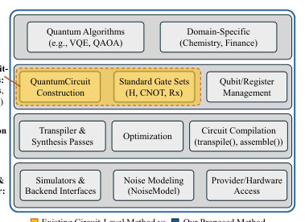 
Figure 1: Comparison of Fuzzing Scopes.

📷 Fig 2

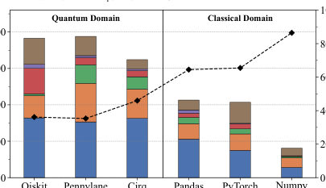 
Figure 3: Empirical evaluation of the validity and error patterns in LLM-generated fuzzing test cases across quantum and classical libraries. The bars represent absolute error counts (left y-axis), while the dashed line indicates the validity rate (right y-axis).

📷 Fig 3

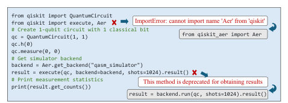 
Figure 4: Code example of typical errors in quantum computing libraries generated by LLMs.

📷 Fig 4

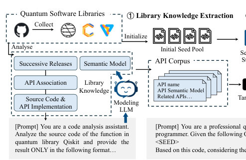 
Figure 5: The workflow of KQFuzz for detecting bugs in quantum libraries.

📷 Fig 5

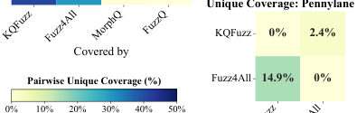 
Figure 6: Pairwise unique coverage comparison.

**Summary.** This paper introduces KQFuzz, a novel knowledge-guided fuzzer designed to test the reliability of quantum computing libraries. It enhances LLM-based testing by incorporating deep codebase knowledge and advanced mutation strategies. The resulting framework significantly improves bug discovery and code coverage across major quantum frameworks.

**Why it may be interesting.** While focused on software testing rather than physical dynamics, the rigorous validation techniques developed for quantum circuit execution are crucial for building reliable simulation tools necessary for studying complex many-body physics or open quantum systems.

Detailed structure

**Main problem.** Ensuring the reliability and correctness of quantum libraries is critical, but existing fuzzing methods lack flexibility and efficiency.

**Main result.** KQFuzz significantly outperforms state-of-the-art methods, improving code coverage by up to 18.44% and discovering multiple confirmed bugs in major quantum libraries.

**Method.** The authors propose KQFuzz, a knowledge-guided fuzzer that uses codebase knowledge to ground LLM test generation, combined with fitness-guided evaluation and two-level mutations.

**Model / system.** The work targets software implementations of quantum computation within popular libraries like Qiskit, PennyLane, and Cirq, which operate on the quantum circuit model involving gates and qubits.

**Key observables.** Code coverage improvement (up to 18.44%), bug discovery rate (13 bugs found), code validity, and execution time/token consumption.

**Important parameters / regimes.** The two-level mutation strategy involves parameter-level and gate-level structural mutations; the fitness function incorporates gate diversity and entangled qubits.

**Assumptions / limitations.** The analysis assumes that increased output token count in KQFuzz represents meaningful semantic content leading to higher quality tests, rather than mere redundancy.

**Figures summary.** Figure 1 compares the scope of different fuzzer types; Figure 3 shows empirical comparison of validity rates for classical vs. quantum domains; Table 8 and 9 detail computational cost analysis across various stages and models.

**Paper structure.** The paper first identifies the limitations of current fuzzing techniques, then introduces KQFuzz with its knowledge corpus construction (static metadata, API associations, semantic models), followed by detailed descriptions of the generation/mutation strategies. It presents empirical results comparing against baselines on multiple quantum libraries and concludes with an efficiency analysis.

Abstract

As quantum computing continually improves, ensuring the reliability and correctness of quantum libraries has become increasingly critical. To this end, many LLM-based fuzzing approaches towards quantum libraries have been proposed to uncover potential bugs. However, these methods still suffer from limitations such as insufficient flexibility and low efficiency, which hinder the progress of the quantum computing field. To address these challenges, we propose KQFuzz, a novel knowledge-guided fuzzer for quantum libraries. It leverages comprehensive codebase knowledge to ground LLM-based test generation, synergizing this with fitness-guided evaluation and two-level mutations to explore complex execution paths and trigger potential bugs. Firstly, KQFuzz introduces a novel prompting scheme tailored to quantum programs, which strategically incorporates knowledge of the codebase to efficiently generate high-quality quantum seed programs. Moreover, we develop evaluation and mutation strategies to handle the generated seed programs, facilitating efficient fuzzing execution while further enriching the diversity of the resulting test cases. We implement KQFuzz and conduct fuzzing on three popular quantum libraries, including Qiskit, PennyLane, and Cirq. Experimental results demonstrate that our approach significantly outperforms other state-of-the-art methods, with coverage improved by up to 18.44%. During the development of KQFuzz, we discovered 13 bugs, all of which have been confirmed and 12 have already been fixed by the developers.

[↑ back to top](#top)

### [Landau Levels on the Surface of a Cube](http://arxiv.org/abs/2607.25684v1)

**Authors:** Almila Kura, Bayram Tekin, Mehmet Özgür Oktel  
**Type:** theory · **Category:** other · **PDF:** <https://arxiv.org/pdf/2607.25684v1>  
**Analysis basis:** full PDF text, analyzed in chunks
**Topic relevance:** `analog quantum simulation` **1/5**

📷 Fig 1

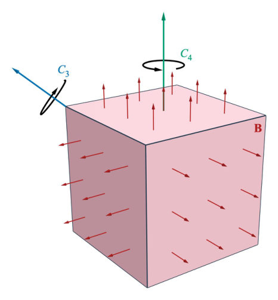 
FIG. 1. Schematic of a cube enclosing a magnetic monopole. The red arrows show the constant outward face-normal mag- netic field. The fourfold axis C4, passing through the cen- ters of opposite faces, and the threefold axis C3, lying along a body diagonal, generate the proper octahedral rotation group O. Other rotations, such as C2, are obtained as products of these generators.

📷 Fig 2

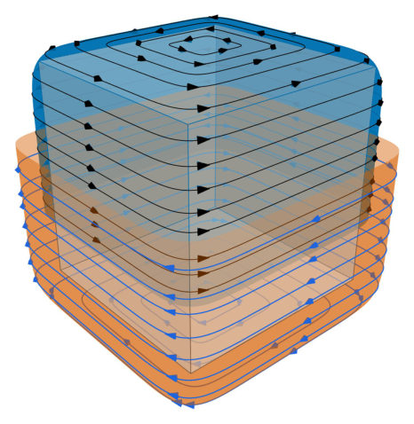 
FIG. 2. Two-patch Wu–Yang construction of the vector po- tential on the cube. Gauge ⃗AI (blue region, black stream- lines) covers z &gt; −z0, while gauge II ⃗AII (orange region, blue streamlines) covers z &lt; z0; the unequal displayed extents are chosen only to make the overlap visible. Each vector poten- tial produces the same outward face-normal magnetic field on its domain. In the overlap region, the two descriptions are related by the gauge transformation in Eq. (9), and therefore give the same physical field and observables.

📷 Fig 3

 
FIG. 3. Gauge-covariant link variables and Wu–Yang patch stitching for Nd = 4. Each face contains (Nd −1)2 = 9 pla- quettes, each carrying magnetic flux ϕ = B/9. An arrow on a link indicates the direction in which its hopping phase is accumulated; reversing the hopping direction complex con- jugates this phase. The finite-difference equations for sites with z &gt; 0 and z &lt; 0 are written in gauges I and II, respec- tively. Links crossing the artificial cut at z = 0, shown by the red double arrows, contain the appropriate Wu–Yang transi- tion factors. On the lateral faces their phase is proportional to Λ(s) = 3Bs/2 and therefore increases linearly with the perimeter coordinate s. These...

📷 Fig 4

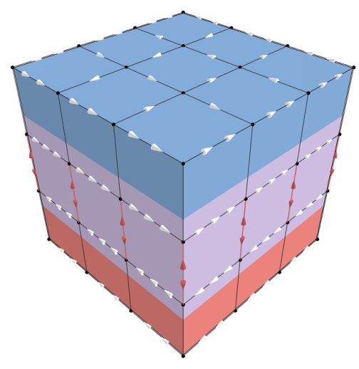 
Figure 3 illustrates this construction for Nd = 4. Each face is divided into (Nd −1)2 = 9 plaquettes, so the mag- netic flux through each plaquette is ϕ = B/(Nd −1)2 = B/9. An arrow on a link indicates the direction in which the displayed hopping phase is accumulated; hopping in the opposite direction carries the complex-conjugate phase. The link variables in the upper and lower halves of the cube are calculated in gauges I and II, respectively. For links crossing the artificial cut, the hopping ampli- tude also contains the Wu–Yang transition factor. On the lateral faces this factor depends on the perimeter co- ordinate s through Λ(s) = 3Bs/2, and hence its phase varies linearly along the...

📷 Fig 5

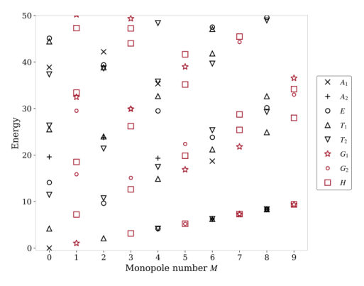 
FIG. 4. Energy spectrum of the ten lowest manifolds as a function of monopole number M, computed at Nd = 18 and listed in Table III. Manifolds are classified by the irreducible representations of the cubic rotation group O for even M, or by the spinorial representations of the binary octahedral group 2O for odd M.

**Summary.** This paper analyzes the quantum mechanics of a charged particle on a cubic surface pierced by a magnetic monopole. It rigorously handles the gauge structure using overlapping patches and classifies eigenstates based on the cube's rotational symmetry group. The key findings are the splitting of Landau levels due to discrete symmetry and the emergence of corner-localized gap states in the lattice approximation.

**Why it may be interesting.** This work provides a concrete realization of how global topology (monopole flux) interacts with discrete geometric symmetry (the cube), leading to spectral splitting effects analogous to those seen in quantum Hall systems but constrained by crystal geometry.

Detailed structure

**Main problem.** The study investigates the quantum mechanics of a charged particle confined to the surface of a cube enclosing a magnetic monopole.

**Main result.** The spectrum exhibits Landau-level-like manifolds whose degeneracies are split by the discrete cubic symmetry, and additional gap states localized near the cube corners appear in the tight-binding limit.

**Method.** The analysis uses continuum formulation with overlapping gauge patches (Wu–Yang construction) and is complemented by a gauge-covariant finite-difference discretization for numerical computation.

**Model / system.** The system models a charged particle on the surface of a cube subjected to a magnetic field ($\vec{B}$) representing a monopole flux. The Hamiltonian involves the vector potential $\vec{A}(\vec{r})$ and is analyzed using symmetry groups like the cubic rotation group $O$.

**Key observables.** Landau-level-like energy spectra, gap states localized at cube corners, and the classification of eigenstates by irreducible representations of $O$ or $2O$.

**Important parameters / regimes.** The magnetic flux ($\Phi_B$), which must satisfy the Dirac quantization condition; the size parameter ($L$) of the cube.

**Assumptions / limitations.** The method relies on using two overlapping gauge patches to handle the non-trivial topology imposed by the monopole flux, and that the physical symmetry is restored via gauge-modified rotation operators.

**Figures summary.** Figures illustrate wavefunction probability densities $|\Psi|^2$ and phase plots ($\arg(\Psi)$) across different symmetry multiplets ($A_1, T_1$, etc.) for varying monopole charges ($M$).

**Paper structure.** The paper progresses from establishing the necessity of multi-patch gauge constructions to analyzing the resulting symmetries using group theory, culminating in numerical computation and visualization of the energy spectrum and wavefunctions.

Abstract

We study the quantum mechanics of a charged particle confined to the surface of a cube enclosing a magnetic monopole. The magnetic field is chosen to have a constant magnitude on each face and to point along the outward normal, preserving the rotational symmetry of the cube. We formulate the continuum problem using two gauge patches on the cube surface and show that consistency of the wavefunction gives the Dirac quantization condition. Since an explicit vector potential does not remain invariant under ordinary rotations, we construct gauge-modified rotation operators and use them to classify the eigenstates. Even monopole charges are described by the irreducible representations of the cubic rotation group O, while odd monopole charges require the spinorial representations of the binary octahedral group 2O. We compute the spectrum with a gauge-covariant finite-difference discretization and find Landau-level-like manifolds whose degeneracies are split by the discrete cubic symmetry. We also study the corresponding tight-binding Hofstadter problem on the discretized cube. The resulting spectrum contains the usual magnetic subband structure together with additional gap states localized near the cube corners.

[↑ back to top](#top)

### [Momentum-Selective Two-Component Excitations in Electron-Doped Mott Insulators](http://arxiv.org/abs/2607.24936v1)

**Authors:** Zeyu Han, Can Cui, Jia-Xin Zhang, Zheng-Yu Weng  
**Type:** theory · **Category:** strongly correlated electrons · **PDF:** <https://arxiv.org/pdf/2607.24936v1>  
**Analysis basis:** full PDF text, analyzed in chunks
**Topic relevance:** `Keldysh / 2PI / non-Gaussian methods` **1/5**

📷 Fig 1

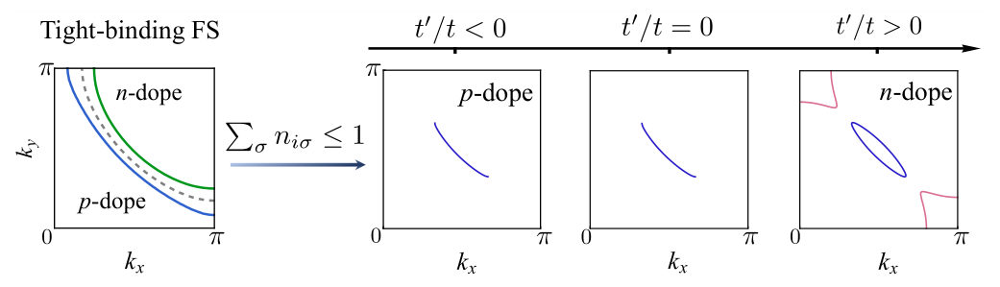 
FIG. 1. Distinct evolution of Fermi surfaces (FS) away from half-filling (δ = 0). (Left) Non-interacting tight-binding model with a fixed t′ = −0.25t (t &gt; 0) in the first quadrant of the Brillouin zone, showing the Fermi surfaces for hole doping (δ = 0.15, p- dope, blue line), electron doping (δ = 0.15, n-dope, green line), and half-filling (gray dashed line) obtained by simply tuning the chemical potential. (Right) Schematic Fermi surfaces in the presence of a large Mott gap enforced by the no-double-occupancy constraint P

📷 Fig 2

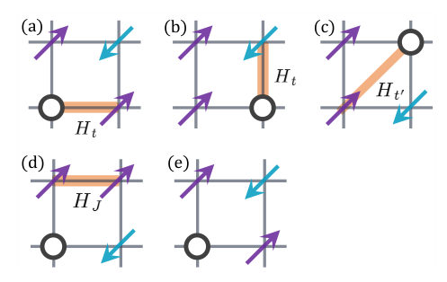 
FIG. 2. Panels (a)–(e) illustrate a hopping process around the minimal triangular loop on an antiferromagnetic back- ground. In the first step, a hole exchanges positions with an up spin and subsequently with a down spin via the nearest- neighbor hopping channel t. It then exchanges with another spin through the next-nearest-neighbor hopping channel t′. Finally, the two remaining adjacent spins exchange positions, restoring the plaquette to its original configuration. Under the Ising basis, the entire process from (a) to (e) contributes a sign proportional to sgn(t′).

📷 Fig 3

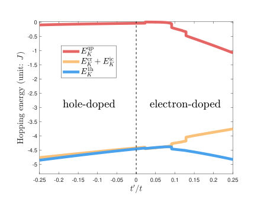 
FIG. 3. Kinetic energy components Eqp K , Eic K + Ecr K and E1h K (defined in Eq. (16)) as functions of t′/t, computed using VMC on a 12 × 12 lattice. The abrupt jumps originate from level crossings.

📷 Fig 4

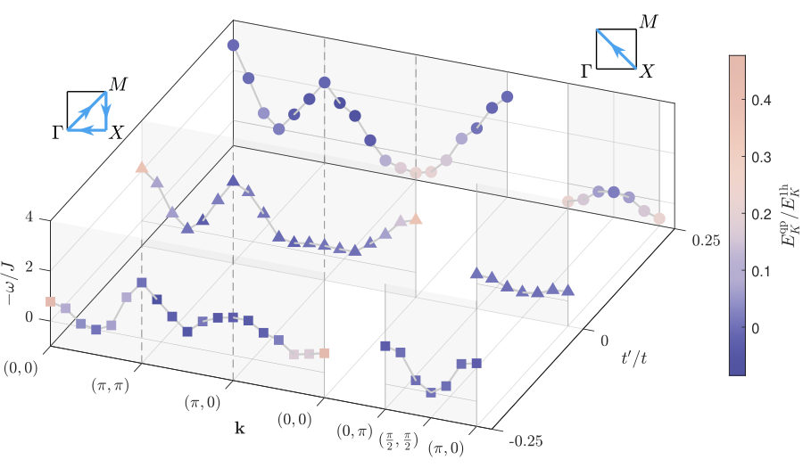 
FIG. 4. Quasiparticle dispersion ω(k) and the ratio C(k) = Eqp K (k)/E1h K (k) obtained from VMC simulations on a 12×12 lattice with t′ = 0, ±0.25t. For each momentum point k, the dispersion ω(k) is extracted from the maximum of the spectral function An(k, ω), and the corresponding state with the largest spectral weight is used to evaluate the kinetic-energy ratio C(k). To make the vertical axis follow the usual convention of band dispersion, we use −ω/J on the ordinate.

📷 Fig 5

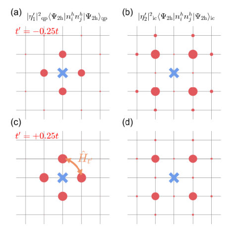 
FIG. 5. Expectation value of the hole-hole correlator ⟨Ψ|nh i nh j |Ψ⟩evaluated for the two components of the two-hole ground state on a 12 × 12 system, |Ψ⟩= |Ψqp⟩2h and |Ψic⟩2h. Panels (a) and (b) correspond to t′ = −0.25t, while panels (c) and (d) correspond to t′ = 0.25t. The sizes of the red points represent the relative magnitude of the correlator, where one hole position i is fixed at the blue cross. For comparison be- tween the t′ = ±0.25t cases, the correlator is normalized by

**Summary.** This work tackles the asymmetry between electron and hole doping in Mott insulators by modeling the system using the t-t'-J Hamiltonian. It reveals that the ground state has two coupled components: a coherent quasiparticle and an incoherent composite part. The relative dominance of resonance versus coherent propagation dictates whether low-energy excitations are concentrated at the node (hole-doped) or the antinode (electron-doped).

**Why it may be interesting.** The detailed momentum-space separation of spectral weight based on doping sign provides a concrete theoretical mechanism explaining the observed nodal-antinodal dichotomy in cuprates, which is crucial for understanding high-Tc superconductivity mechanisms.

Detailed structure

**Main problem.** The work addresses the observed asymmetry in low-energy single-particle excitations between electron-doped and hole-doped cuprates, which challenges a unified description within standard doped Mott insulator frameworks.

**Main result.** The ground state exhibits a two-component structure; for hole doping, resonance dominates at the node, while for electron doping, coherent quasiparticle propagation is selectively enhanced in the antinode, causing momentum-space separation.

**Method.** Theoretical analysis using the t-t'-J model combined with Variational Monte Carlo (VMC) simulations for single-hole excitations and mean-field treatments of fractionalization.

**Model / system.** The study focuses on cuprates modeled by the t-t'-J Hamiltonian, investigating doping effects in both electron ($t'>0$) and hole ($t'<0$) regimes. The analysis involves decomposing the ground state into coherent quasiparticle and incoherent composite components.

**Key observables.** Low-energy single-particle spectral weight $Z_k$, momentum-space distribution of excitations (nodal vs. antinodal), and kinetic energy contributions from different component interactions.

**Important parameters / regimes.** Doping level ($\delta$), hopping parameters ($t, t', J$), and the sign of $t'$ which dictates the doping type (hole vs. electron).

**Assumptions / limitations.** The ground-state wave function is assumed to possess a generic two-component structure; approximations are made in mean-field treatments involving gauge fields and path integrals.

**Figures summary.** FIG. ES12 compares the quasiparticle spectral weight $Z_k$ for single holes across different doping regimes, showing distinct momentum dependence based on the sign of $t'$.

**Paper structure.** The paper establishes the two-component nature of the ground state in the t-t'-J model. It then analyzes the physics separately for hole-doped ($t'<0$) and electron-doped ($t'>0$) systems, detailing how resonance or coherent propagation dominates in each case to explain experimental asymmetries.

Abstract

Experimental studies reveal a striking asymmetry in low-energy single-particle excitations between electron- and hole-doped cuprates. Electron-doped cuprates display a nontrivial dichotomy: Fermi-liquid-like behavior (suggesting weaker electronic correlations) coexists with correlation-driven features typical of hole-doped systems. This dual nature challenges a unified description within a doped Mott insulator framework. The present work addresses this issue by establishing that the ground-state wave function of the $t$-$t'$-$J$ model generically possesses a two-component structure, comprising a coherent quasiparticle and an incoherent composite component. The kinetic energy arises from both the intrinsic propagation of the coherent quasiparticle and the resonance between these components. Using variational Monte Carlo at the level of a single hole, we show that for hole doping ($t'<0$), this resonance between components dominates and concentrates in the nodal region at low energies. This emergent propagation induced by resonance can be physically interpreted as originating from the recombination of fractionalized degrees of freedom, which drives various phenomena associated with strong correlations. Conversely, for electron doping ($t'>0$), the coherent quasiparticle propagation, which exhibits conventional properties of a Fermi liquid, is selectively enhanced in the antinodal region at low energies. This produces a separation in momentum space for systems with electron doping: the antinodal spectral weight at low energies is governed by the coherent quasiparticle, fundamentally differing from the nodal region, which remains dominated by the incoherent composite component. Motivated by such a structure and guided by experimental observations, we propose a phenomenological Green's function at finite doping, yielding spectral features consistent with experiments.

[↑ back to top](#top)

### [Organizing Principles for Moiré Quantum Matter](http://arxiv.org/abs/2607.24944v1)

**Authors:** Qiaoling Xu, Yifan Gao, Tao Zhang, Ammon Fischer, Yi Jiang, Hanqi Pi, Zike Fan, Dongdong An, Kun Zhou, Yingjian Li, Yongqing Li, Yuhao Fu, Lei Wang, Lijun Zhang, B. Andrei Bernevig, Dante M. Kennes, Enge Wang, Angel Rubio, Lede Xian  
**Type:** theory · **Category:** strongly correlated electrons · **PDF:** <https://arxiv.org/pdf/2607.24944v1>  
**Analysis basis:** full PDF text, analyzed in chunks
**Topic relevance:** `analog quantum simulation` **1/5**

📷 Fig 1

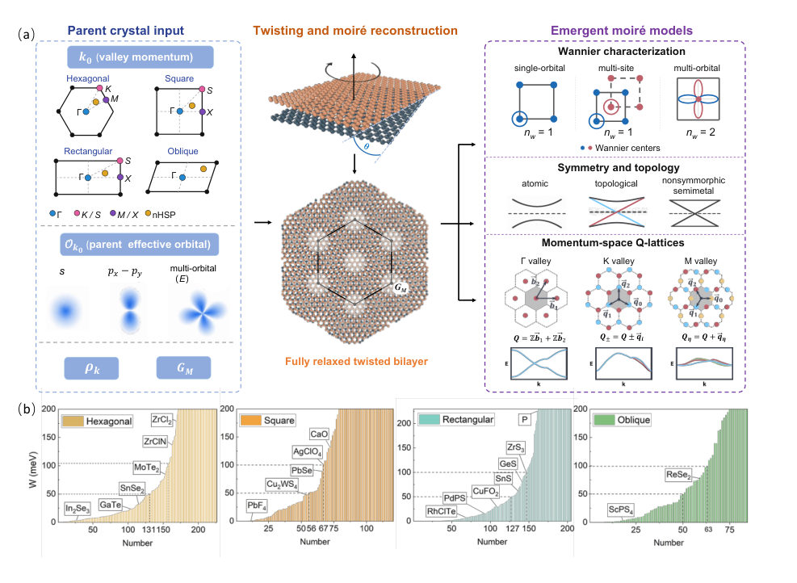 
FIG. 1. Design map and first-principles atlas of emergent moir´e models. (a) Schematic represen-

📷 Fig 2

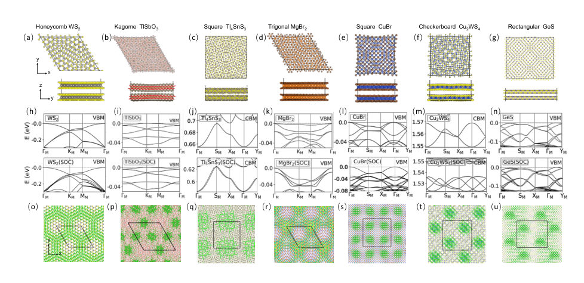 
FIG. 2. Flat-band manifolds as emergent Hubbard-model building blocks. a-g, Top and side

📷 Fig 3

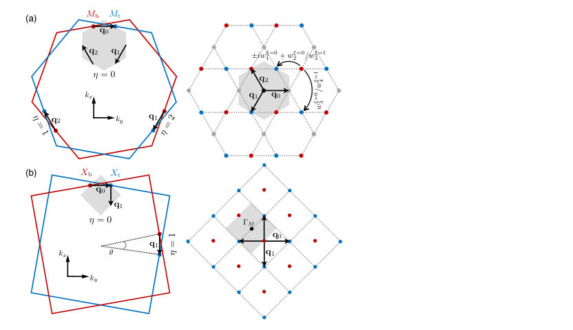 
FIG. 3. Momentum-space geometry of M- and X-valley moir´e systems. Geometric relationship

📷 Fig 4

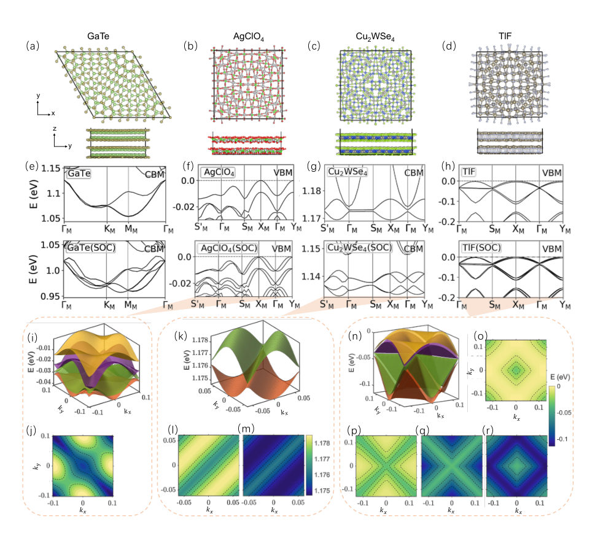 
FIG. 4. Boundary-valley moir´e bands and quasi-one-dimensional dispersions. (a-d) Top and

📷 Fig 5

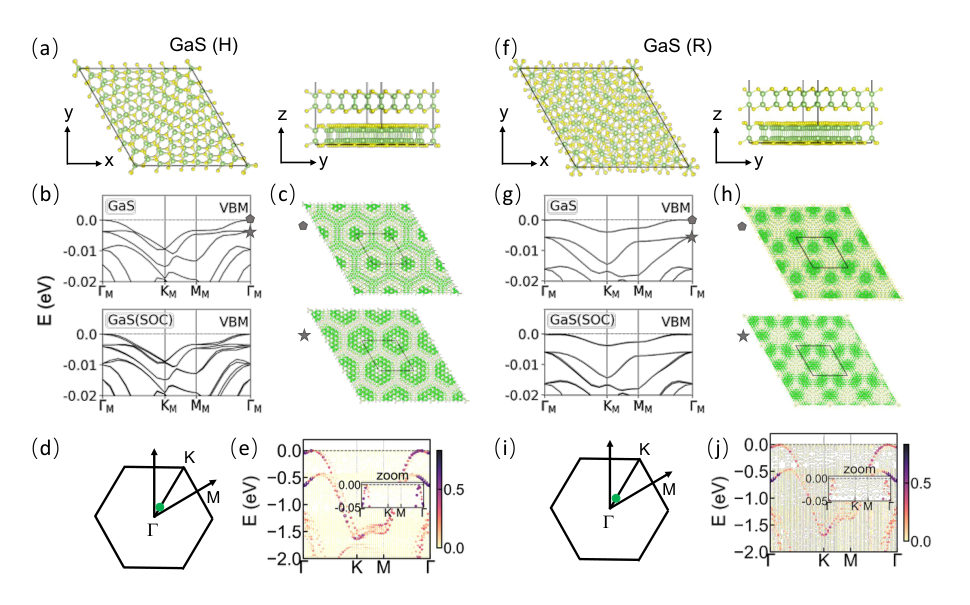 
FIG. 5. Symmetry-selected multiplets from nearby generic-momentum valleys in twisted GaS.

**Summary.** This paper introduces a general, symmetry-based framework to classify emergent moiré Hamiltonians in twisted van der Waals heterostructures. By analyzing hundreds of bilayers using first-principles calculations, the authors move beyond simple single-orbital models. The resulting 'valley-orbital-symmetry framework' provides a systematic guide for engineering correlated and topological quantum phases.

**Why it may be interesting.** This work provides a powerful theoretical dictionary for designing strongly correlated quantum materials by linking fundamental crystal symmetry and orbital physics directly to the required Hubbard model parameters.

Detailed structure

**Main problem.** To develop a general organizing principle for understanding the diverse emergent low-energy moiré Hamiltonians arising from twisted van der Waals heterostructures, moving beyond conventional single-orbital/K-valley paradigms.

**Main result.** The authors established a comprehensive 'valley-orbital-symmetry framework' that classifies emergent moiré physics based on parent material properties and symmetry constraints. This framework reveals multiple routes to correlated phases, including honeycomb, kagome, and multi-orbital flat bands.

**Method.** The study combines fully relaxed first-principles calculations (DFT) with advanced analysis techniques like band unfolding, elementary band representation (EBR), and detailed symmetry group theory applied across hundreds of twisted bilayers.

**Model / system.** The physical system is the moiré superlattice formed by twisting van der Waals bilayers. The theoretical framework aims to map the parent material's electronic structure ($\mathbf{k}_0, \mathcal{O}_{\mathbf{k}_0}$) onto an effective low-energy Hamiltonian defined by symmetry ($G_M$) and orbital content.

**Key observables.** Wannier characterization (W), band connectivity (C), topological classification (I), and the resulting $Q$-lattice structure are key diagnostics used to classify emergent models.

**Important parameters / regimes.** The analysis spans over 600 commensurate twisted bilayers across all 2D lattice classes, focusing on low-energy manifolds derived from parent band edges.

**Assumptions / limitations.** The approach assumes that the physics can be systematically organized by mapping parent band edge properties and symmetry constraints to the emergent moiré Hamiltonian structure.

**Figures summary.** Figure 1 illustrates the design map connecting parent band edge properties to the resulting moiré Hamiltonians, while other figures detail specific flat-band manifolds realized in various lattice classes.

**Paper structure.** The paper introduces a general organizing map linking momentum location ($\mathbf{k}_0$), orbital character ($\mathcal{O}_{\mathbf{k}_0}$), and symmetry ($G_M$) to the resulting moiré Hamiltonian. It then systematically applies this framework across numerous material examples, demonstrating how different symmetries enforce specific types of correlated models (e.g., honeycomb vs. kagome).

Abstract

Moiré flat bands in van der Waals bilayers are usually discussed through a small set of mechanisms associated with the $Γ$ and $K$ valleys of hexagonal crystals, and more recently with $M$-valleys systems. Here we show that this view is incomplete. The momentum-space location and effective local orbital character of the monolayer's band edge, in conjunction with the moiré symmetry and the symmetry representations of the resulting bands, provide a general set of organizing variables for the emergent low-energy moiré Hamiltonian. Applying fully relaxed first-principles calculations, band unfolding and symmetry-representation analysis to more than 600 commensurate twisted bilayers spanning all 2D lattice classes, we identify several routes to moiré quantum matter beyond the conventional single-orbital paradigm. The resulting flat bands realize trigonal, honeycomb, square, checkerboard and kagome-like Hubbard models with single-orbital, multi-orbital and multi-site Hilbert spaces; spin-orbit-coupled multi-orbital flat bands exhibit symmetry-indicated topology beyond the conventional $K$-valley setting; and nonsymmorphic moiré symmetries enforce semimetallic flat-band connectivity. Analogous quasi-one-dimensional flat-band structures are found in $M$-valley hexagonal systems and $X$-valley square or rectangular systems resulting from emergent momentum-space nonsymmorphic symmetries. Separately, coupled multi-valley manifolds with kagome-like connectivity are identified in several systems whose parent band edges lie at non-high-symmetry points. These results establish a valley-orbital-symmetry framework for connecting parent-material electronic structure to emergent moiré Hamiltonians relevant to correlated, topological and symmetry-enforced moiré phases.

[↑ back to top](#top)

### [Quantum Transformer BSDE Solver via Multi-Layer Fully-Connected Variational Quantum Circuits](http://arxiv.org/abs/2607.25162v1)

**Authors:** Howard Su, Huan-Hsin Tseng, Chi-Sheng Chen, Lance Bai  
**Type:** both · **Category:** numerical methods · **PDF:** <https://arxiv.org/pdf/2607.25162v1>  
**Analysis basis:** full PDF text, analyzed in chunks
**Topic relevance:** `methods for driven-dissipative` **1/5**

📷 Fig 1

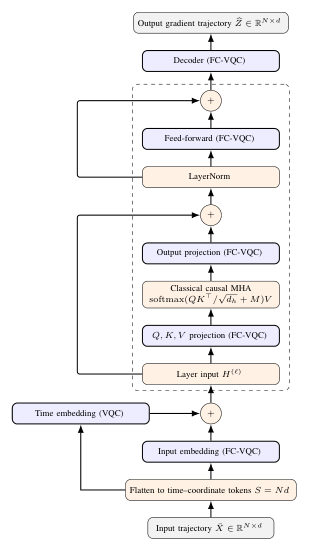 
Fig. 1. The Quantum Transformer model architecture.

📷 Fig 2

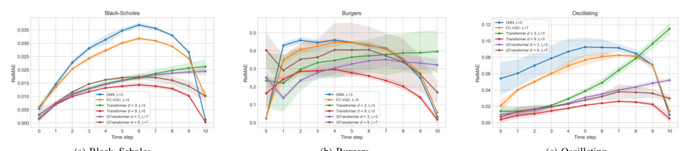 
Fig. 2. Trajectory Relative MAE across time steps. Solid curves show the mean over random seeds, and shaded regions indicate one standard deviation.

**Summary.** This paper introduces a Quantum Transformer solver that uses Multi-Layer Fully-Connected Variational Quantum Circuits (FC-VQC) to solve complex, high-dimensional Partial Differential Equations reformulated as BSDEs. By integrating causal self-attention into the quantum circuit structure, the model achieves state-of-the-art performance compared to classical and non-attentive quantum baselines on several physical benchmarks.

**Why it may be interesting.** While the application is numerical PDE solving, the core innovation lies in mapping complex functional approximation tasks onto hybrid quantum-classical neural network architectures (QTransformer/FC-VQC), which has implications for simulating quantum dynamics or high-dimensional physical systems.

Detailed structure

**Main problem.** The core problem is solving high-dimensional parabolic partial differential equations (PDEs) by reformulating them into Backward Stochastic Differential Equations (BSDEs). This is crucial in fields like stochastic control and physics.

**Main result.** The proposed Quantum Transformer solver consistently improves upon non-attentive quantum circuit baselines, demonstrating that combining causal attention with FC-VQC provides an effective architecture for high-dimensional BSDE trajectory learning.

**Method.** The authors propose a Quantum Transformer model where trainable parameters are confined within Multi-Layer Fully-Connected Variational Quantum Circuits (FC-VQC) modules integrated into the standard Transformer structure. Causal self-attention is used to process time-coordinate tokens derived from the state trajectory.

**Model / system.** The method targets solving BSDEs associated with semilinear PDEs (e.g., Black–Scholes, Burgers-type). The quantum component uses FC-VQC circuits to parameterize the necessary mappings within the Transformer architecture.

**Key observables.** Mean Trajectory Relative L2 Error (LRE) and Relative Mean Absolute Error (RelMAE), with lower values indicating better performance across three benchmark PDEs.

**Important parameters / regimes.** Model depth ($L \in \{3, 5, 7\}$) and hidden dimension ($d_m$). The comparison highlights the effect of attention versus non-attentive circuits.

**Assumptions / limitations.** The method assumes that structural operations (like attention mechanisms) can remain classical and parameter-free while confining all trainable parameters to scalable FC-VQC modules.

**Figures summary.** Table I compares LRE across various model configurations (DNN, FC-VQC, Transformer, QTransformer). Figure 1 illustrates the integrated Quantum Transformer architecture using FC-VQC modules in key layers.

**Paper structure.** The paper introduces the problem of solving PDEs via BSDEs. It then details the novel QTransformer architecture integrating FC-VQC into the Transformer framework. Results are presented by comparing performance against classical and non-attentive quantum baselines on multiple benchmarks, concluding with an analysis of architectural components.

Abstract

Solving high-dimensional parabolic partial differential equations (PDEs) is important in engineering, physics, and stochastic control. Deep BSDE methods reformulate semilinear PDEs as backward stochastic differential equations and admit a model-based reinforcement learning interpretation, where trajectories are generated from known stochastic dynamics while a trainable model learns the gradient-related control process. We propose a Quantum Transformer BSDE solver based on Multi-Layer Fully-Connected Variational Quantum Circuits (FC-VQC). The method treats the normalized state trajectory as time--coordinate tokens and applies causal self-attention to learn interactions in the adapted BSDE gradient process. All trainable model parameters are contained within the FC-VQC embedding, projection, feed-forward, and decoder modules, while attention and structural operations remain classical and parameter-free. Experiments on three d=36 PDE benchmarks show that QTransformer consistently improves over the non-attentive FC-VQC baseline and outperforms the classical Transformer at compact hidden widths, while the wider classical Transformer achieves the best overall accuracy. These results demonstrate that combining causal attention with FC-VQC provides an effective quantum architecture for high-dimensional BSDE trajectory learning.

[↑ back to top](#top)

### [QUBO-Based Optimization of Social Indicator Configurations for Working-Age Population Growth](http://arxiv.org/abs/2607.25170v1)

**Authors:** Hayate Wada, Seiya Miyamoto, Tatsumasa Ogawa, Kazuki Uehara, Masaru Hitomi, Masayuki Ohzeki  
**Type:** theory · **Category:** other · **PDF:** <https://arxiv.org/pdf/2607.25170v1>  
**Analysis basis:** full PDF text, analyzed in chunks
**Topic relevance:** `methods for driven-dissipative` **1/5**

📷 Fig 1

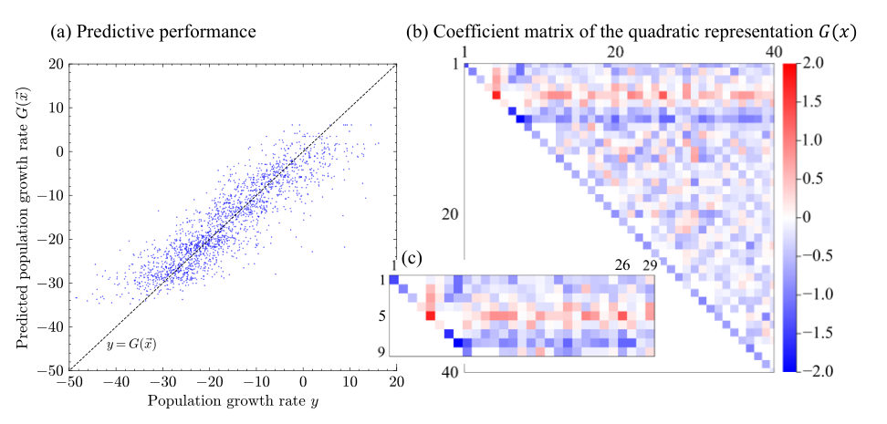 
Figure 1. Performance and coefficient structure of the quadratic surrogate model G(⃗x). (a) Observed working-age population growth rate y versus the fitted value G(⃗x) for all municipalities. The dashed line represents the ideal relation y = G(⃗x). The test-set correlation coefficient was 0.84, with an average mean squared error of 33.36 and an average coefficient of determination of R2 = 0.76 over 20 train–test splits. (b) Heatmap of the coefficient matrix of G(⃗x) for the 40 binary variables obtained from the one-hot encoding of ten social indicators. Diagonal elements correspond to individual binary-variable contributions, and off-diagonal elements correspond to pairwise interactions....

📷 Fig 2

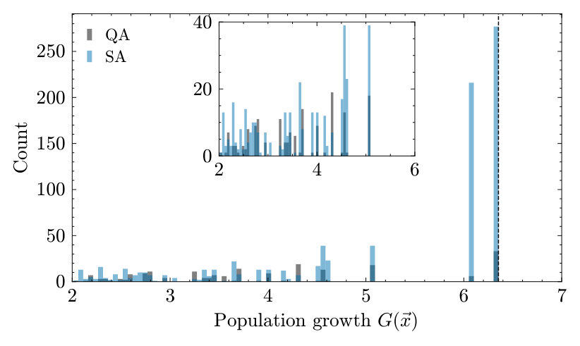 
Figure 2. Sampling distributions obtained by simulated annealing and quantum annealing. The horizontal axis represents the surrogate value G(⃗x), corresponding to the predicted working-age population growth rate, and the vertical axis represents the number of samples. Only configurations satisfying the one-hot constraints are included. The vertical dashed line indicates the exact optimum obtained by Gurobi. The inset enlarges the low-count region to show feasible suboptimal configurations sampled by the annealing methods.

📷 Fig 3

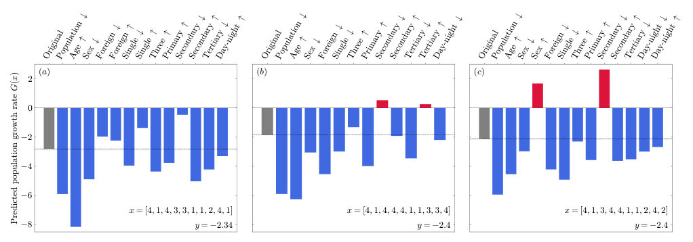 
Figure 3. Predicted population growth rates, G(⃗x), obtained by virtually changing each municipal indicator by one discretized level for the three municipalities. The leftmost gray bar represents the prediction for the original feature vector⃗x, while the remaining bars represent the predictions obtained by changing only the corresponding indicator by one level, either decreasing (↓) or increasing (↑) it. The label ’Original’ denotes the original feature vector, and the other labels correspond to the municipal indicators listed in Table 1. Blue (red) bars indicate negative (positive) predicted population growth rates. The dashed line indicates the original predicted value.

**Summary.** This paper applies a machine learning approach to model working-age population growth using local municipal social statistics. It formulates this relationship as a Quadratic Unconstrained Binary Optimization (QUBO) problem and solves it using quantum annealing techniques. The framework provides an interpretable tool for exploring potential policy configurations, though its results are limited to model-based exploration rather than causal prediction.

**Why it may be interesting.** While applied to social science, the core methodology involves mapping complex combinatorial optimization problems onto QUBO Hamiltonians for solving with quantum annealers, which is relevant to general NISQ algorithm development.

Detailed structure

**Main problem.** To develop an interpretable, optimization-ready framework connecting municipal social indicators to working-age population growth rates in aging societies.

**Main result.** The QUBO formulation successfully models the non-linear interactions between social indicators, and quantum/simulated annealing methods consistently find the optimal configuration predicted by exact solvers.

**Method.** A quadratic surrogate model is fitted using regression on discretized social data, then converted into a QUBO Hamiltonian to be minimized via quantum or simulated annealing optimization.

**Model / system.** The system models working-age population growth rate ($y$) as a function of ten discrete social indicators ($\vec{x}$), formulated as a quadratic objective function $G(\vec{x})$ subject to binary constraints.

**Key observables.** Test-set correlation coefficient (0.84) and average R-squared value (0.76); the optimal indicator configuration vector $\vec{x}_{opt}$.

**Important parameters / regimes.** The penalty coefficient ($\alpha=3$) used for enforcing one-hot constraints in the QUBO formulation.

**Assumptions / limitations.** The framework is explicitly an exploratory tool, not a causal estimate of policy interventions; the model assumes quadratic relationships between indicator levels.

**Figures summary.** Figures show observed vs. fitted growth rates, heatmaps of the coefficient matrix $Q$ detailing pairwise interactions, and local sensitivity analyses showing predicted changes based on single-indicator flips.

**Paper structure.** The paper first establishes the need for modeling population decline; it then details fitting a quadratic surrogate model to social data; this model is converted into a QUBO problem; finally, optimization using quantum/simulated annealing is performed and validated against exact solvers.

Abstract

The decline of the working-age population is a major challenge for regional sustainability, particularly in ageing societies such as Japan. We present a methodological demonstration of a quadratic unconstrained binary optimization (QUBO)-based framework for exploring social-indicator configurations associated with working-age population growth. Using Japanese municipal data, we regressed the 2010-2020 working-age population growth rate on ten discretized social indicators. The resulting quadratic surrogate model showed reasonable predictive performance, with a test-set correlation coefficient of 0.84 and an average R-squared value of 0.76. Its coefficient matrix provides an interpretable representation of individual indicator-level contributions and pairwise associations. We converted the fitted model into a QUBO formulation with one-hot constraints and optimized it using quantum annealing, simulated annealing, and Gurobi. All three methods identified the same optimal feasible configuration, while the annealing-based samplers also generated feasible suboptimal configurations with different predicted growth rates. Municipality-level single-indicator analyses showed that changing one indicator can increase or decrease the predicted growth rate depending on the other indicators. The framework provides an interpretable and optimization-ready approach for connecting municipal social statistics, nonlinear interactions, and model-based scenario generation. It should be regarded as an exploratory tool for policy discussion rather than as a causal estimate of policy interventions.

[↑ back to top](#top)

### [Verifiable blind probabilistic error cancellation](http://arxiv.org/abs/2607.25704v1)

**Authors:** Bo Yang, Elham Kashefi, Harold Ollivier  
**Type:** theory · **Category:** quantum information and computing · **PDF:** <https://arxiv.org/pdf/2607.25704v1>  
**Analysis basis:** full PDF text, analyzed in chunks
**Topic relevance:** `quantum measurements` **1/5**

📷 Fig 1

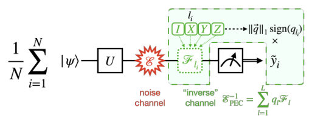 
FIG. 1. Schematic illustration of the PEC process for a single-qubit operation affected by a stochastic Pauli noise EPEC. For each sample i ∈[N], the cancellation operation is chosen from Fli ∈{I, X, Y, Z} via the Monte-Carlo sampling. More generally, PEC can be implemented locally by inserting noise-cancellation operators at selected locations, based on the corresponding local noise models. After completing the total N rounds, the classical post-processing following Eq. (7) yields the mitigated estimate by PEC.

📷 Fig 2

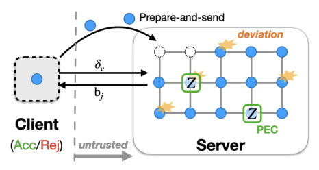 
FIG. 2. Schematic illustration of a single round of the UBPEC protocol. All quantum systems outside the client’s trusted domain are considered untrusted, meaning deviations in this region are not assumed to follow any particular struc- ture or noise model.

📷 Fig 3

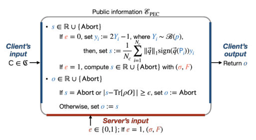 
FIG. 3. Schematic illustration of the SDPEC resource, where p = Tr [(Pi ◦EPEC) (ρ) |+O⟩⟨+O|] and Pi ∈{I, Z}|V | is sam- pled with probability |⃗q(Pi)|/ ∥⃗q∥1.

📷 Fig 4

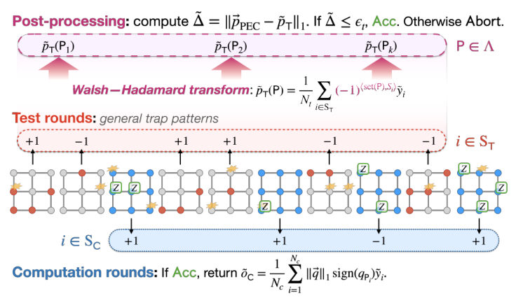 
FIG. 4. Schematic illustration of the VBPEC protocol. Each small graph represents one delegated MBQC instance. Blue vertices denote computation vertices used in computation rounds i ∈SC, while red vertices denote the vertices selected by the test setting Si in test rounds i ∈ST, and the grey vertices are qubits outside Si. Yellow stars represent the noise or deviation occurring on the graph. The PEC cancellation operation is applied only on the computation rounds, shown as green boxes labelled Z, according to the probability decomposition ⃗q.

📷 Fig 5

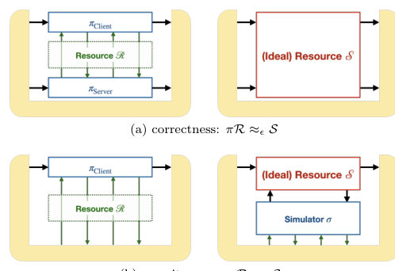 
FIG. 5. The schematic illustrations of correctness and security are depicted in (a) and (b), respectively. On the basis of a se- cure resource R as an established channel between the Client and the Server, the protocol π = (πClient, πServer) constructs a new resource πR = πClientRπServer. The transcripts are written as arrows, and the yellow object is the distinguisher that manages the input and output transcripts between the resource and the protocol of interest.

**Summary.** This paper presents Verifiable Blind Probabilistic Error Cancellation (VBPEC), a novel protocol that secures Quantum Error Mitigation (QEM) when running computations on untrusted quantum hardware. It achieves this by formally integrating PEC into composable security, allowing the active cancellation of noise rather than just tolerating it. This establishes a crucial pathway toward reliable and practical delegated quantum computation.

**Why it may be interesting.** This work directly addresses the practical gap between theoretical quantum algorithms and noisy, untrusted hardware by providing rigorous cryptographic verification for error mitigation techniques.

Detailed structure

**Main problem.** The core problem is establishing end-to-end security guarantees for quantum computations performed on untrusted, noisy hardware by integrating Quantum Error Mitigation (QEM) into verifiable protocols.

**Main result.** The paper introduces Verifiable Blind Probabilistic Error Cancellation (VBPEC), the first secure protocol to integrate PEC within a composable security framework, providing cryptographic reliability for QEM.

**Method.** It extends trap-based verification from deterministic checks to statistical tests that actively cancel noise rather than merely tolerating it, formalizing delegated mitigation as a cryptographic resource.

**Model / system.** The work addresses the abstract model of quantum computation delegated to an untrusted server. The underlying physical processes involve observable estimation ($	ext{Tr}[
ho O]$) on near-future quantum hardware.

**Key observables.** Observable expectation value $	ext{Tr}[
ho O]$, empirical estimator $\mu$, and security error (must be exponentially small).

**Important parameters / regimes.** Estimation error $\epsilon$ and confidence level $\delta$; the number of samples $N_c$.

**Assumptions / limitations.** The protocol assumes access to a fully malicious adversary model, requiring cryptographic guarantees for noise cancellation.

**Figures summary.** Not specified in detail, but the notes imply schematics illustrating the integration of PEC into verifiable estimation protocols.

**Paper structure.** The paper builds from standard observable estimation theory to Probabilistic Error Cancellation (PEC), extends this to a blind setting (BDPEC), and culminates in the universal framework (VBPEC) that provides cryptographic security guarantees for QEM.

Abstract

Quantum error mitigation (QEM) is an essential tool for mitigating hardware noise without incurring space overhead. Yet, its reliability depends on modeling, calibration, and implementation, leaving end-to-end security on untrusted quantum hardware unresolved. We address this problem by introducing verifiable blind probabilistic error cancellation (VBPEC), the first secure verification protocol against a fully malicious adversary that integrates QEM. VBPEC brings probabilistic error cancellation (PEC), a widely studied QEM technique, within the scope of composable security by formalizing delegated mitigation as a cryptographic resource in the abstract cryptography framework. The protocol performs PEC with perfect blindness and an exponentially small security error. VBPEC retains the absence of quantum-space overhead from recent statistically-secure verified quantum computation protocols and from PEC. The only overhead takes the form of additional repetitions due to the QEM procedure. To achieve this, we extend trap-based verification from deterministic pass/fail checks to statistical tests that benefit from QEM and develop a new proof technique that integrates the corresponding additional deviation sources. Rather than merely tolerating honest noise below a fixed threshold, VBPEC actively cancels it, enabling correctly mitigated estimates to be accepted with high probability without compromising security. Our framework thus establishes an essential route towards secure, reliable, and practical delegated quantum computation on near-future quantum hardware: VBPEC fundamentally improves the practicality of verification.

[↑ back to top](#top)

## Other papers (5)

*Papers from primary archives without highlighted authors or any topic match. Click to expand.*

Show other papers

### [A Spectral Proof of the Hypergraph Moore Bound](http://arxiv.org/abs/2607.26028v1)

**Authors:** Alexander Schmidhuber, Matthew B. Hastings  
**Type:** theory · **Category:** other · **PDF:** <https://arxiv.org/pdf/2607.26028v1>  
**Analysis basis:** full PDF text, analyzed in chunks

📷 Fig 1

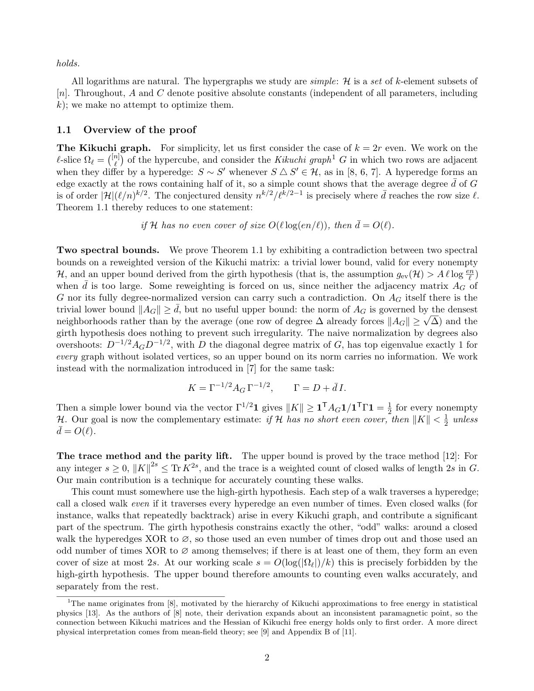 
Low-resolution page preview, page 2

📷 Fig 2

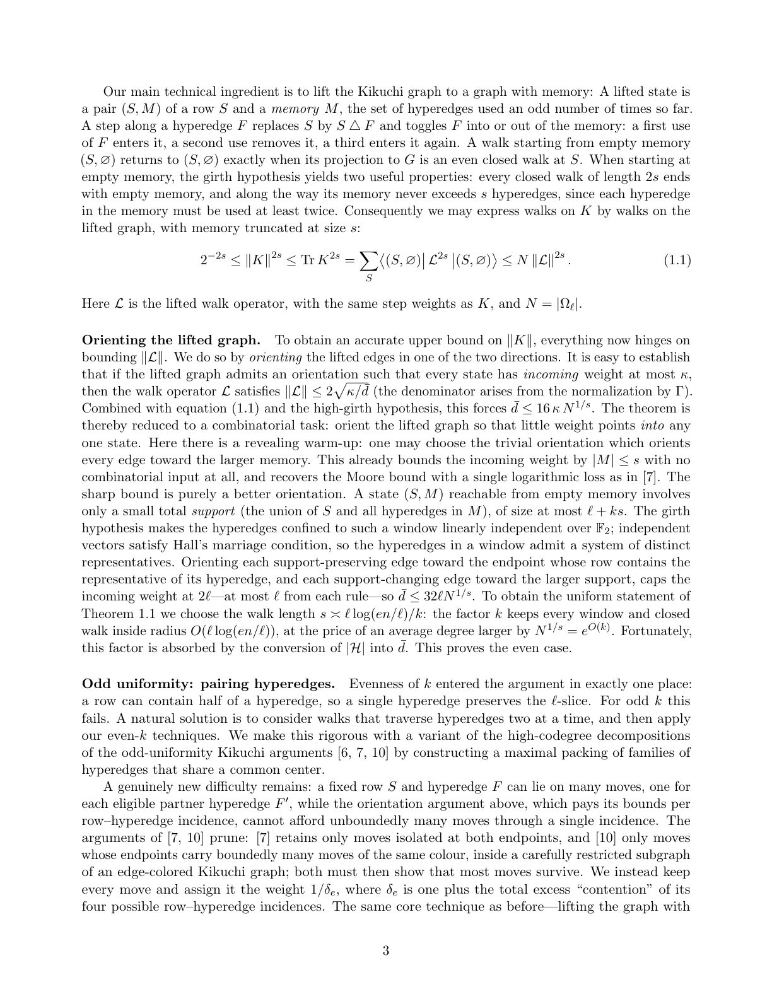 
Low-resolution page preview, page 3

📷 Fig 3

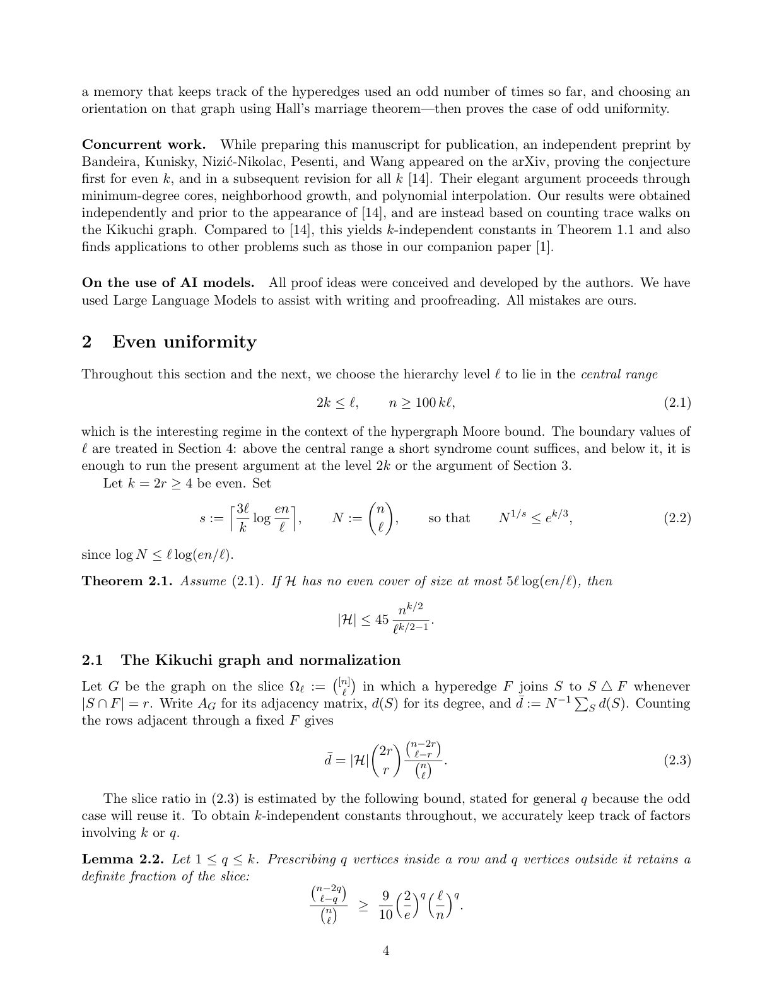 
Low-resolution page preview, page 4

📷 Fig 4

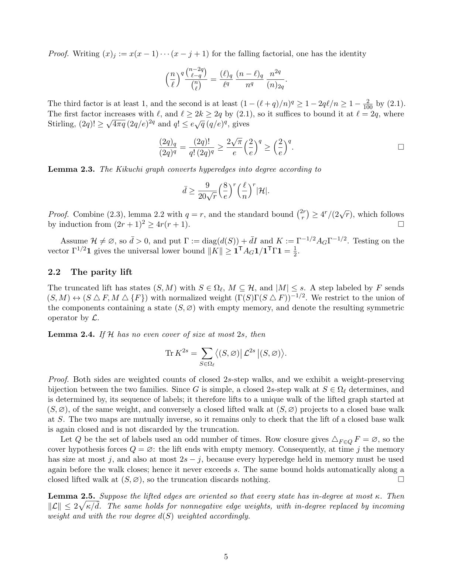 
Low-resolution page preview, page 5

📷 Fig 5

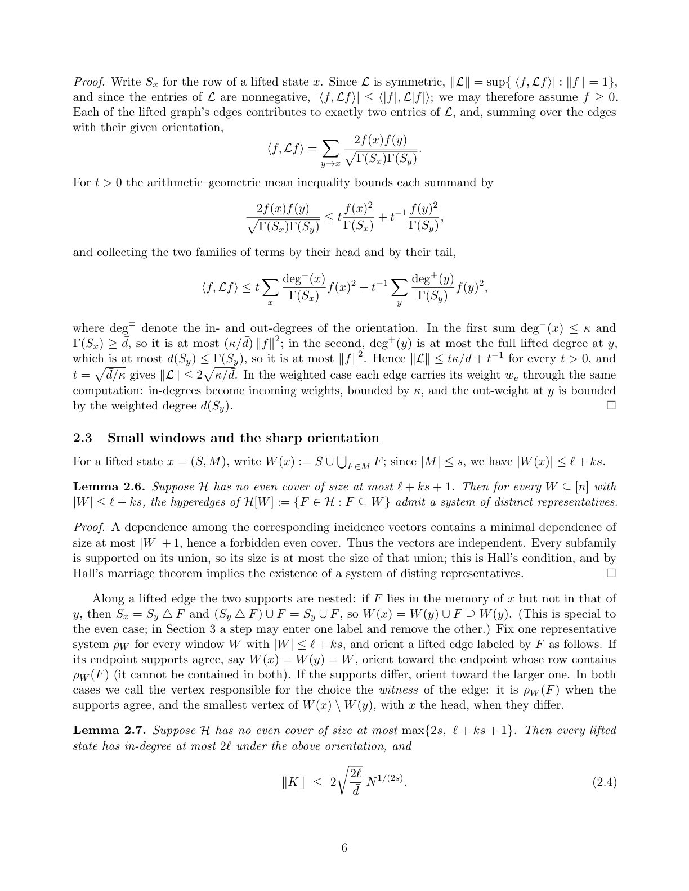 
Low-resolution page preview, page 6

**Summary.** This paper provides a rigorous spectral proof of the Hypergraph Moore Bound conjecture. It uses advanced linear algebra and graph theory tools—specifically analyzing weighted, memory-augmented graphs derived from hypergraphs—to relate the density of edges to the minimum size of an 'even cover.' The result establishes fundamental combinatorial bounds applicable across various dimensions.

**Why it may be interesting.** While purely combinatorial/graph theoretical, the reliance on spectral methods (eigenvalues, walk counting) applied to structured matrices shares deep mathematical parallels with techniques used in quantum information theory for analyzing entanglement or graph properties via adjacency operators.

Detailed structure

**Main problem.** The paper aims to prove Feige's conjecture on the hypergraph Moore bound, establishing absolute constants for the size of an even cover in a $k$-uniform hypergraph.

**Main result.** It proves that any sufficiently dense $k$-uniform hypergraph must contain an even cover whose size is bounded by $A\ell\log(en/\ell)$, or alternatively, the number of hyperedges must be below a specific threshold dependent on $n, k,$ and $\ell$.

**Method.** The proof employs advanced spectral graph theory techniques applied to specialized matrices (Kikuchi matrices) derived from lifting the hypergraph structure into a memory-augmented graph. It uses trace methods and walk counting arguments.

**Model / system.** The mathematical model is an abstract $k$-uniform hypergraph $H$ on $n$ vertices, analyzed via its associated Kikuchi graph defined on an $\ell$-slice of the hypercube. The analysis involves constructing a 'lifted graph with memory' to track parity constraints.

**Key observables.** Minimum size of an even cover ($	ext{gev}(H)$), average degree ($ar{d}$) of the associated Kikuchi graph, and spectral norms of derived operators ($K$ or $L$).

**Important parameters / regimes.** The uniformity $k$, number of vertices $n$, hierarchy level $\ell$, and parameters $A$ and $C$ defining the bounds.

**Assumptions / limitations.** The proof relies on assuming no small even cover exists to derive spectral bounds, and it handles technical difficulties for odd vs. even uniformity using specific weighting schemes ($\delta_e$).

**Paper structure.** The paper develops the argument by first defining the problem via spectral analysis of the Kikuchi graph, then tackling the even and odd uniformity cases separately, establishing bounds on $ar{d}$ based on the non-existence of small even covers, and finally combining these results to prove the main theorem.

Abstract

A nonempty subfamily of a $k$-uniform hypergraph is an \emph{even cover} if every vertex lies in an even number of its hyperedges; for $k=2$ these are edge-disjoint unions of cycles, so the minimum size of an even cover is the natural hypergraph analogue of girth. We prove Feige's 2008 conjecture on the hypergraph Moore bound: there are absolute constants $A$ and $C$ (independent of $k$) such that for every $k\ge3$ and every $1\le\ell\le n$, any $k$-uniform hypergraph on $n$ vertices with more than $C\,n^{k/2}/\ell^{k/2-1}$ hyperedges contains an even cover of size at most $A\,\ell\log(en/\ell)$. Our proof is based on sharp spectral bounds for Kikuchi matrices, which we expect to be of independent interest; we apply them to the refutation of random constraint satisfaction problems in a companion paper.

[↑ back to top](#top)

### [On some potentials based on exponential functions](http://arxiv.org/abs/2607.25805v1)

**Authors:** Francisco M. Fernández  
**Type:** theory · **Category:** other · **PDF:** <https://arxiv.org/pdf/2607.25805v1>  
**Analysis basis:** full PDF text, analyzed in chunks

📷 Fig 1

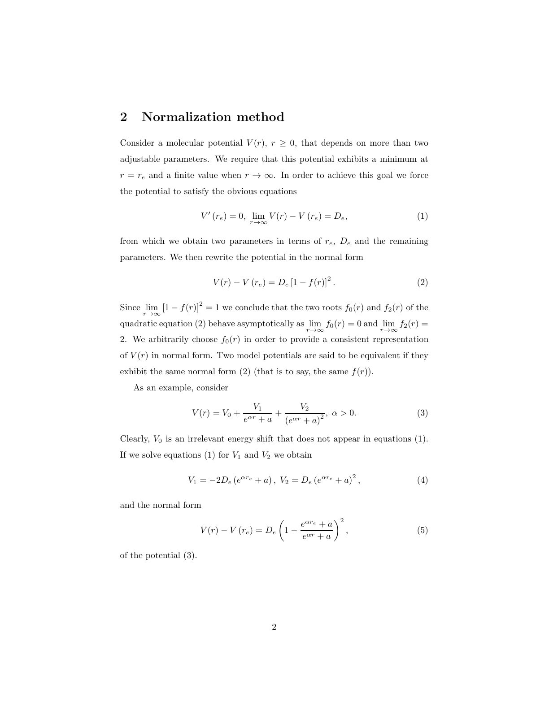 
Low-resolution page preview, page 2

📷 Fig 2

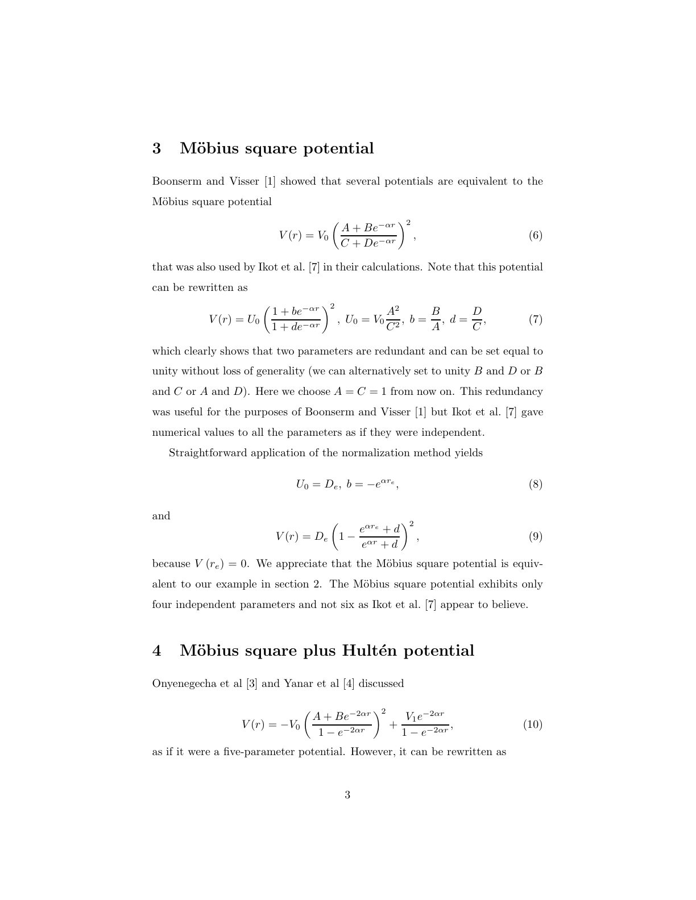 
Low-resolution page preview, page 3

📷 Fig 3

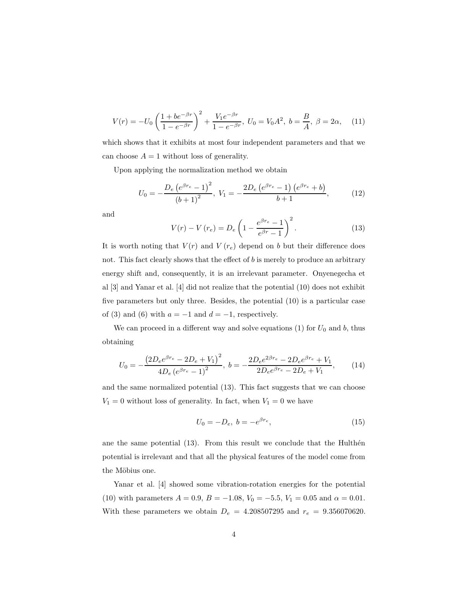 
Low-resolution page preview, page 4

📷 Fig 4

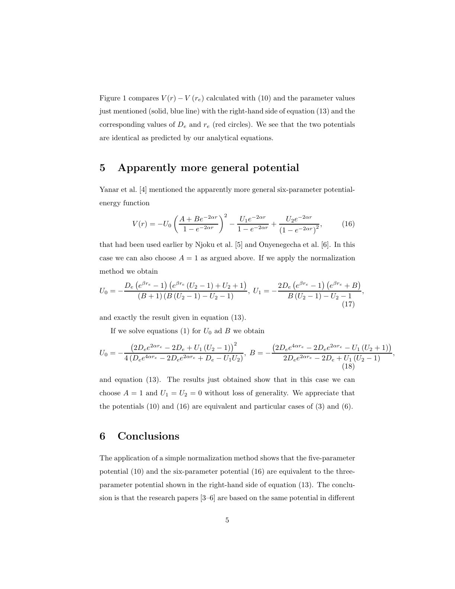 
Low-resolution page preview, page 5

📷 Fig 5

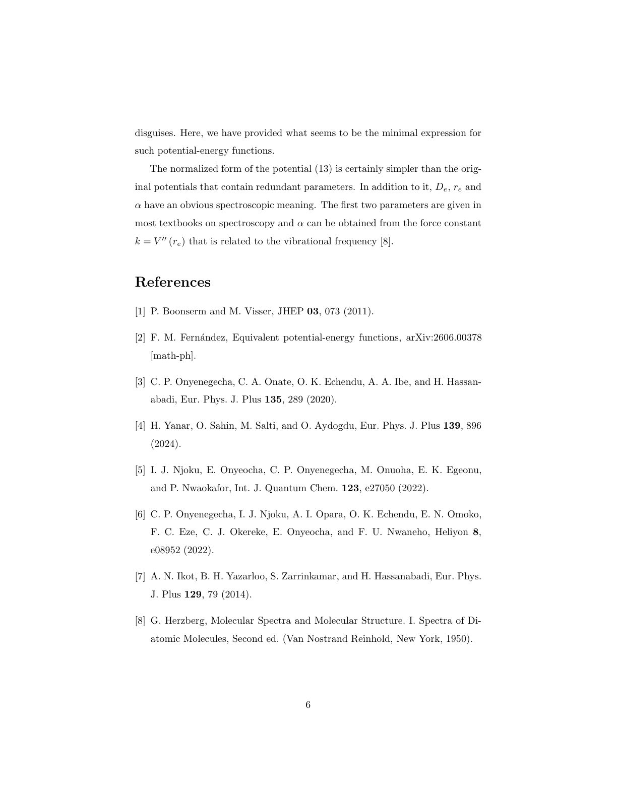 
Low-resolution page preview, page 6

**Summary.** This paper introduces a systematic normalization method to prove the mathematical equivalence of several different potentials derived from exponential functions. By enforcing specific boundary conditions (minimum at $r_e$, finite limit at infinity), the authors show that complex, multi-parameter models collapse into a single, minimal functional form. This suggests significant redundancy in how molecular interaction potentials have been parameterized in previous research.

**Why it may be interesting.** This work provides powerful mathematical tools for analyzing molecular interactions, suggesting that physical complexity can often be reduced to simpler underlying functional dependencies, which is crucial for modeling bond energies and scattering processes in AMO physics.

Detailed structure

**Main problem.** To demonstrate that various molecular potentials based on exponential functions are mathematically equivalent.

**Main result.** The authors show that several complex, seemingly distinct potentials (five-parameter and six-parameter models) reduce to a single, minimal functional form dependent on only three independent parameters.

**Method.** A systematic normalization method is employed, requiring the potential to have a minimum and be finite at infinity. This leads to rewriting the potential into a 'normal form' defined by sharing the same function $f(r)$.

**Model / system.** The study focuses on molecular potentials $V(r)$ used in quantum mechanics, specifically analyzing models like the Möbius-square potential and generalized exponential forms.

**Key observables.** Dissociation energy ($D_e$), equilibrium distance ($r_e$), and force constant ($k = V''(r_e)$).

**Important parameters / regimes.** $D_e$, $r_e$, $\alpha$ (related to the force constant).

**Assumptions / limitations.** The potential must exhibit a minimum at some finite distance $r_e$ and approach a finite value as the radial variable $r 	o \infty$.

**Figures summary.** Figure 1 compares the potential calculated using one specific model (Eq. 10) against the derived normal form equation (Eq. 13), confirming their mathematical identity.

**Paper structure.** The paper introduces the systematic normalization method, applies it to known potentials like the Möbius-square and five/six-parameter models, demonstrates the reduction of these complex forms to a minimal three-parameter structure, and concludes by showing parameter redundancy in previous literature.

Abstract

By means of a simple and systematic normalization method we show that some apparently different potentials based on exponential functions are equivalent. Present normalization method only requires that the potential exhibits a minimum and is finite when the radial variable tends to infinity.

[↑ back to top](#top)

### [Optimal Quantum Eigenvalue Transformation via Linear Combinations of Hermitian Matrices](http://arxiv.org/abs/2607.25812v1)

**Authors:** Yanqiao Wang, Yixuan Liang, Hongjia Chen, Jin-Peng Liu  
**Type:** theory · **Category:** quantum information and computing · **PDF:** <https://arxiv.org/pdf/2607.25812v1>  
**Analysis basis:** full PDF text, analyzed in chunks

📷 Fig 1

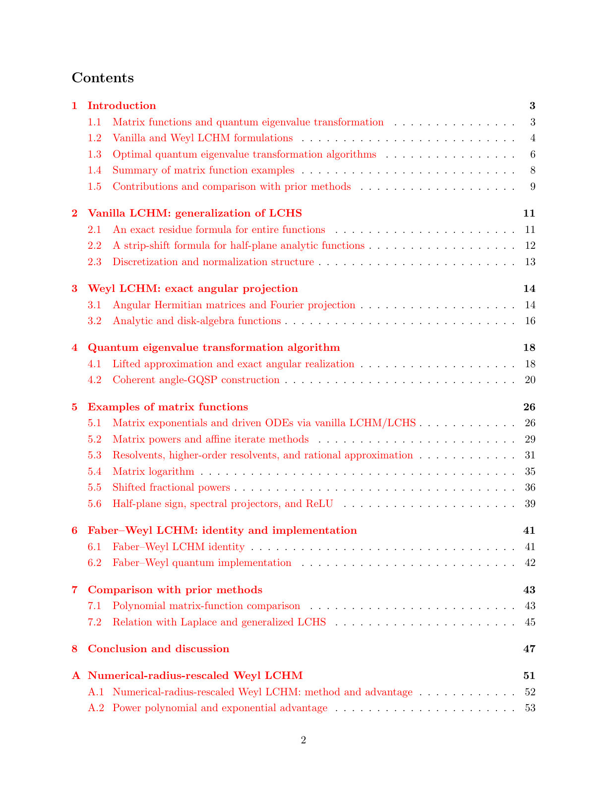 
Low-resolution page preview, page 2

📷 Fig 2

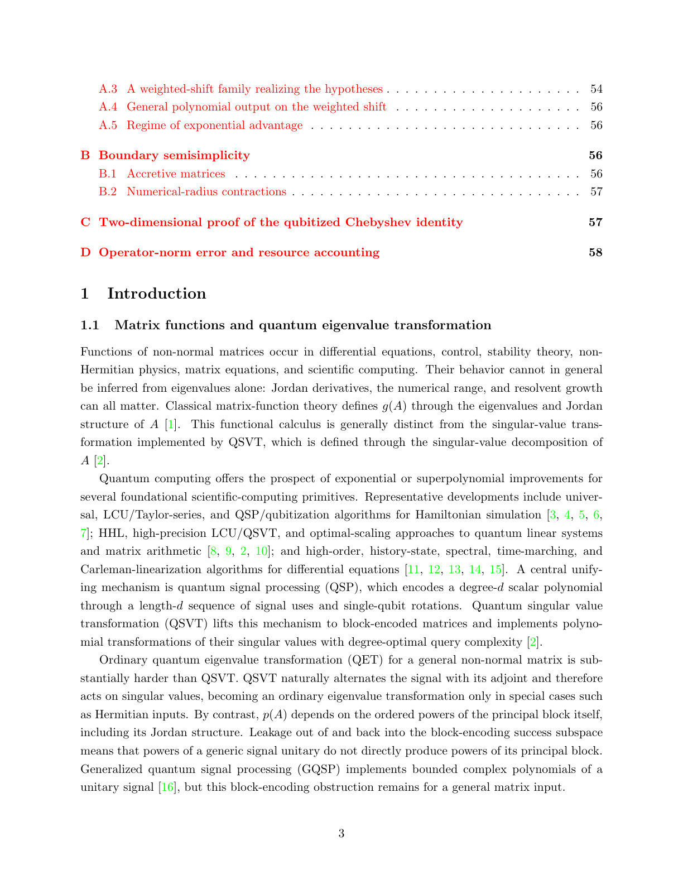 
Low-resolution page preview, page 3

📷 Fig 3

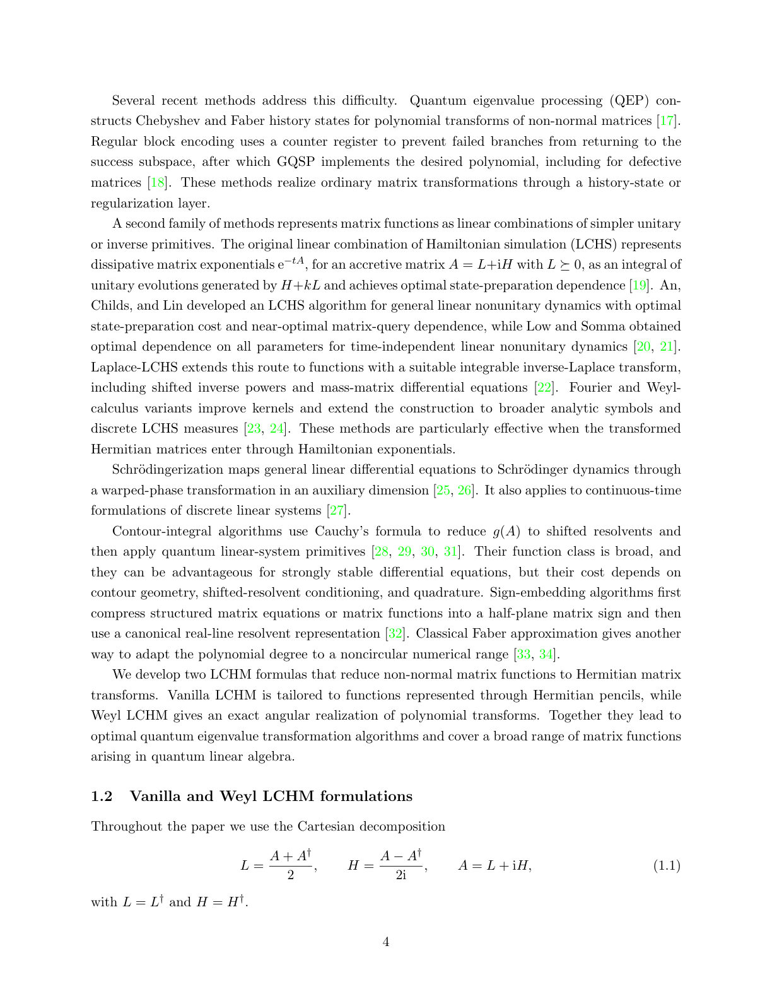 
Low-resolution page preview, page 4

📷 Fig 4

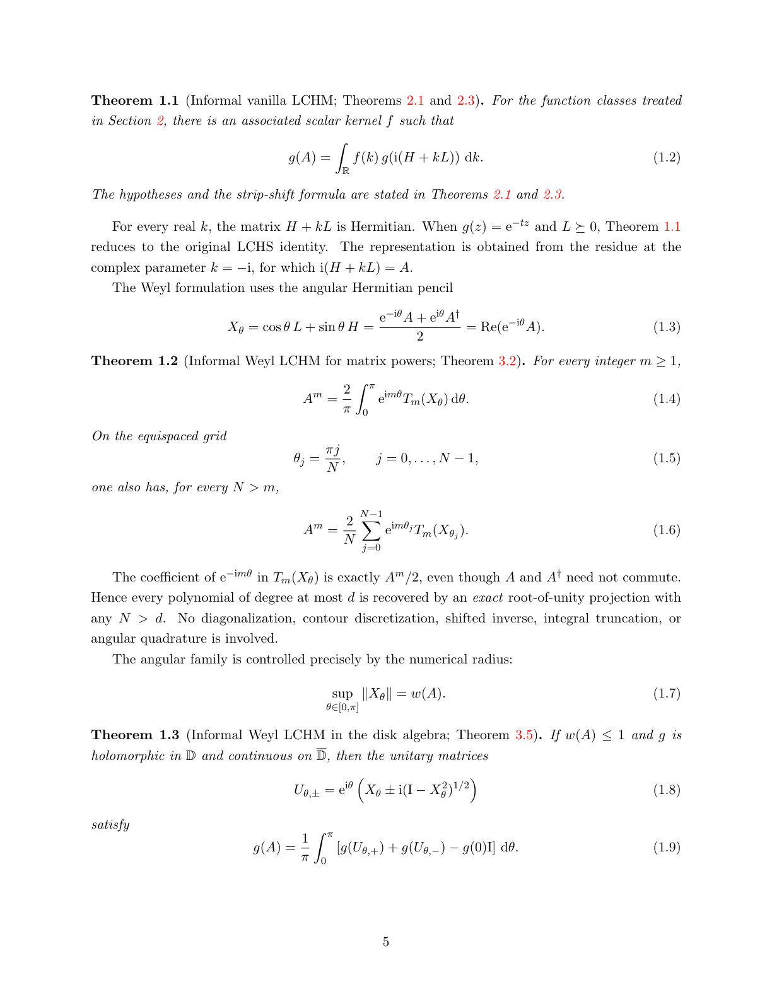 
Low-resolution page preview, page 5

📷 Fig 5

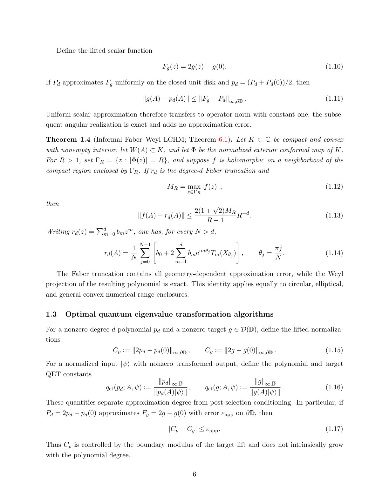 
Low-resolution page preview, page 6

**Summary.** This paper introduces Linear Combination of Hermitian Matrices (LCHM) formulations to efficiently compute functions of general, non-normal matrices $g(A)$ in the quantum domain. By developing both Vanilla and Weyl LCHM methods, the authors achieve optimal circuit depth for various quantum linear algebraic tasks. This work provides a powerful theoretical framework for advancing quantum simulation beyond standard Hermitian models.

**Why it may be interesting.** The development of robust, near-optimal quantum linear algebra tools like LCHM is crucial for implementing complex quantum simulations involving non-Hermitian Hamiltonians or time evolution operators that cannot be easily mapped to standard Hermitian forms.

Detailed structure

**Main problem.** The central problem is developing optimal quantum eigenvalue transformation (QET) algorithms for general non-normal matrices, which surpasses the capabilities of standard singular value transformations.

**Main result.** The paper introduces Linear Combination of Hermitian Matrices (LCHM) formulations that achieve near-optimal circuit depth ($\Theta(d)$) and provide exact discrete formulas for matrix powers using Fourier projection techniques.

**Method.** Two complementary LCHM methods—Vanilla and Weyl—are developed to map the general non-normal function $g(A)$ onto integrals or sums involving Hermitian matrices. These are then implemented into quantum circuits achieving optimal gate complexity.

**Model / system.** The theory applies to computing functions $g(A)$ of a general matrix $A$, where $A$ is decomposed using its Hermitian and anti-Hermitian parts ($L, H$). The analysis often uses weighted-shift matrices as test cases to prove quantum advantage.

**Key observables.** Quantum query complexity, circuit depth ($\Theta(d)$), post-selection repetition count, and operator-norm error bounds ($\epsilon_{	ext{circ}}, \epsilon_{	ext{app}}$).

**Important parameters / regimes.** The degree of the polynomial ($d$), the numerical radius $w(A)$, and approximation parameters like $\epsilon$ or sampling size $N$.

**Assumptions / limitations.** The methods rely on decomposing $A$ into Hermitian components and assume conditions (like a uniform numerical-radius gap) are met to demonstrate exponential quantum advantage.

**Paper structure.** The paper progresses by first establishing the mathematical necessity of LCHM over standard techniques, detailing the Vanilla and Weyl formulations for $g(A)$, deriving exact discrete formulas (e.g., for $A^m$), and concluding with the complexity analysis of the resulting QET algorithms.

Abstract

We discover two complementary linear-combination-of-Hermitian-matrices (LCHM) formulations to achieve a general non-normal matrix eigenvalue transformation $g(A)$. Firstly, for $A=L+\mathrm{i} H$ with Hermitian $L$ and $H$, the vanilla LCHM formula represents $g(A)$ as a kernel integral of $g(\mathrm{i}(H+kL))$, and it contains linear-combination-of-Hamiltonian-simulation (LCHS) [An, Liu, Lin, Phys. Rev. Lett. 2023] as the special case for matrix exponentials. Secondly, for the angular Hermitian $X_θ= \cosθL+\sinθH$, the Weyl LCHM formula expresses $g(A)$ via integrating $g(\mathrm{e}^{\mathrm{i}θ} (X_θ\pm\mathrm{i}(I-X_θ^2)^{1/2}))$. For the matrix power $g(A)=A^m$, the Fourier projection of Weyl LCHM gives \[ A^m=\frac{2}π\int_0^π\text{e}^{\text{i} mθ}T_m(X_θ) \text{d}θ= \frac{2}{N}\sum_{j=0}^{N-1} \text{e}^{\text{i} mθ_j}T_m(X_{θ_j}),\quadθ_j=\frac{πj}{N},\quad \text{for every } N>m \] with Chebyshev polynomial of Hermitian $T_m(X_θ)$ and $N$ samples. The discrete formula is exact, introduces no truncation and angular quadrature error, and offers $\mathcal{O}(1)$ post-selection weights.   LCHM formulas lead to new quantum eigenvalue transformation (QET) algorithms. For a degree-$d$ polynomial $p_d(A)$ on $|ψ\rangle$, our QET algorithm can achieve optimal $Θ(d)$ circuit depth and optimal $\mathcal{O}(||p_d||_{\infty}/||p_d(A)|ψ\rangle||)$ post-selection repetitions. LCHM-based QETs unify various quantum linear algebraic problems with near-optimal $\mathcal{\widetilde O}(d\log(d/ε))$ Clifford$+T$ gates, including driven ODEs (reduced to standard LCHS), iterative methods, resolvents, $\log(I+A)$, $(λI+A)^ν$, Sign and ReLU transforms, and Faber approximation on noncircular domains.

[↑ back to top](#top)

### [Repositories, Contributors, and Continuity: An Empirical Study of Foundational Quantum Software](http://arxiv.org/abs/2607.25437v1)

**Authors:** Vincent Gierisch, Nicole Hoess, Ralf Ramsauer, Wolfgang Mauerer  
**Type:** experiment · **Category:** other · **PDF:** <https://arxiv.org/pdf/2607.25437v1>  
**Analysis basis:** full PDF text, analyzed in chunks

📷 Fig 1

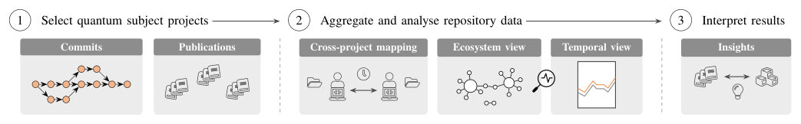 
Fig. 1. Overview of the analysis workflow. We first relate quantum software repositories to associated publications and derive repository-level observations from the development history. We then map contributor identities across repositories and construct complementary ecosystem and temporal views to capture relations and evolution beyond individual projects. This allows for analysing activity, contributor dynamics, and the continuation of concepts in the ecosystem.

📷 Fig 2

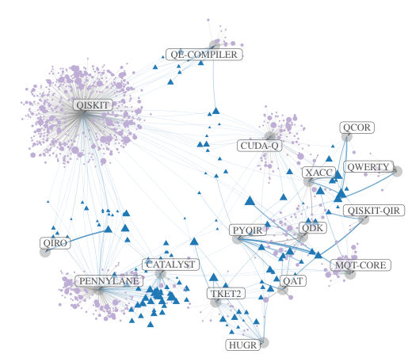 
Fig. 2. Overview of the quantum software ecosystem with projects (grey nodes) and contributors (blue nodes and edges for developers contributing to multiple projects; lilac nodes and edges for developers contributing to a single project). Developer nodes are scaled by their total commits across the entire ecosystem. Edge widths indicate the share of commits (effort) a developer contributed to the specific project during their active months.

📷 Fig 3

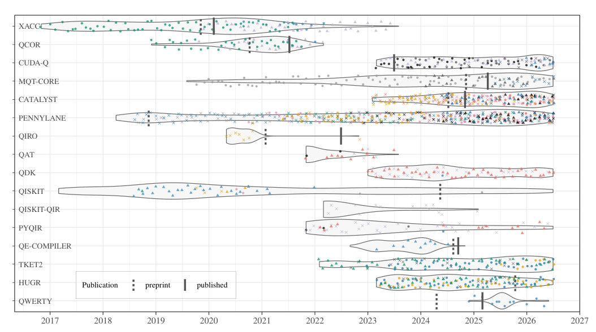 
Fig. 3. Contribution activity over time. Violins show the overall commit distribution per project. Coloured points mark the top 20% (24 of 118 cross-project) contributors by total commits. Each of the colour–shape combinations denotes a single developer, allowing the same contributor to be traced across projects.

**Summary.** This paper empirically analyzes the structure of the quantum software ecosystem by tracking developer contributions across multiple foundational repositories. Using software engineering techniques, it maps out how expertise flows between projects over time. The findings demonstrate that knowledge transfer is a key feature of this rapidly growing field, suggesting concepts persist even when individual project activity wanes.

**Why it may be interesting.** While not directly focused on physical models, understanding the infrastructure and community dynamics supporting quantum software is crucial for any theoretical physicist needing to implement or test complex algorithms in practice.

Detailed structure

**Main problem.** The study investigates whether scientific concepts and development influence persist across the boundaries of individual software repositories within the rapidly expanding quantum software ecosystem.

**Main result.** Knowledge transfer is evident through developer migration patterns, suggesting that expertise often moves across repository boundaries rather than being confined to a single project.

**Method.** The authors applied empirical software engineering techniques by analyzing Git commit data and cross-repository contributions to map community evolution.

**Model / system.** The system analyzed is the quantum software ecosystem itself, modeled as a network of interconnected repositories (projects) and developers who contribute code across them.

**Key observables.** Contributor migration patterns, cross-project knowledge transfer indications, developer roles (Exclusive vs. Cross-Project; Core vs. Peripheral), and temporal contribution activity.

**Important parameters / regimes.** Commit count per developer/project/day, time elapsed between contributions in different projects.

**Assumptions / limitations.** The analysis assumes that knowledge transfer occurs primarily through the direct, measurable activity of individual developers moving between projects.

**Figures summary.** Figures illustrate the workflow from publications to repository mapping, show the overall ecosystem network linking developers and projects, and display contribution activity over time tracing top contributors across multiple repositories.

**Paper structure.** The paper follows a structure involving defining the problem (concept persistence), detailing the multi-stage MSR pipeline (selection $
ightarrow$ extraction $
ightarrow$ mapping $
ightarrow$ networking $
ightarrow$ temporal analysis), presenting empirical evidence of developer roles and migration, and concluding with observed development paths.

Abstract

Driven by contributions from academia, industry, and open-source communities, the quantum software ecosystem is rapidly growing. Across this ecosystem, new concepts often emerge through software artefacts accompanying scientific publications as well as through sustained development in larger communities. However, many repositories receive development efforts only over a limited period of time, raising the question whether their concepts persist beyond individual repositories. In this paper, we apply established empirical software engineering techniques to analyse a set of foundational quantum software repositories. We combine cross-repository activity with contributor relationships to study the evolution of communities. Our analysis provides empirical evidence of contributor migration patterns and indications of cross-project knowledge transfer. We observe multiple development paths: projects may evolve into sustained communities, contributors may integrate concepts into established ecosystems, or activity may continue through new and follow-up software artefacts. Our observations provide an initial empirical perspective on how concepts and influence persist across repository boundaries in quantum software ecosystems.

[↑ back to top](#top)

### [Structured High-Angular-Momentum Coulomb Tensors from Real and Complex Solid-Harmonic Integral Engines: A Perspective](http://arxiv.org/abs/2607.25245v1)

**Authors:** Bo Peng  
**Type:** theory · **Category:** strongly correlated electrons · **PDF:** <https://arxiv.org/pdf/2607.25245v1>  
**Analysis basis:** full PDF text, analyzed in chunks

📷 Fig 1

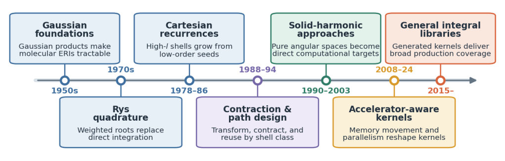 
FIG. 1. Seven decades of ERI design, from tractability to representation awareness. Successive methods redistributed numerical work, reusable quantities, angular handling, and hardware constraints across integral evaluation. These method families now coexist, while the direct solid-harmonic route makes angular representation explicit for downstream tensor algorithms.

📷 Fig 2

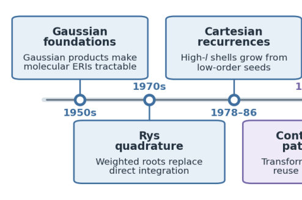 
Figure 1 summarizes this cumulative development, in which different methods move different parts of the work. Across this history, angular representation determines the mathematical language used to describe the shape of a basis function. Cartesian Gaussian functions use pow- ers of x, y, and z. For example, the six Cartesian d func- tions can be associated with x2, y2, z2, xy, xz, and yz. This language is convenient because the three coordinate directions can be handled separately. Spherical functions instead describe pure angular momentum.18,20,21,32 Real spherical functions are often convenient in nonrelativistic molecular calculations because the orbitals and integrals can remain real....

📷 Fig 3

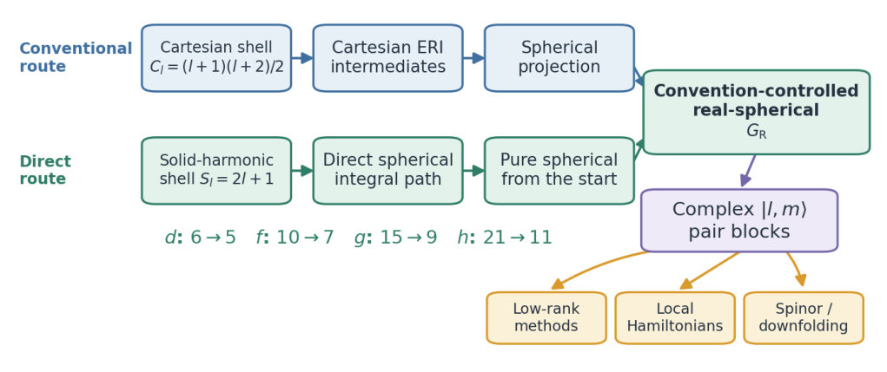 
FIG. 2. Two routes to the same spherical Coulomb tensor. The difference is when redundant Cartesian angular structure is removed. The conventional route projects to the real-spherical basis after integral formation, whereas the direct route works in the target shell dimension from the start. A phase- and ordering-controlled real-to-complex transformation then exposes |l, m⟩ pair blocks for low-rank, local-Hamiltonian, and spinor or downfolding applications.

📷 Fig 4

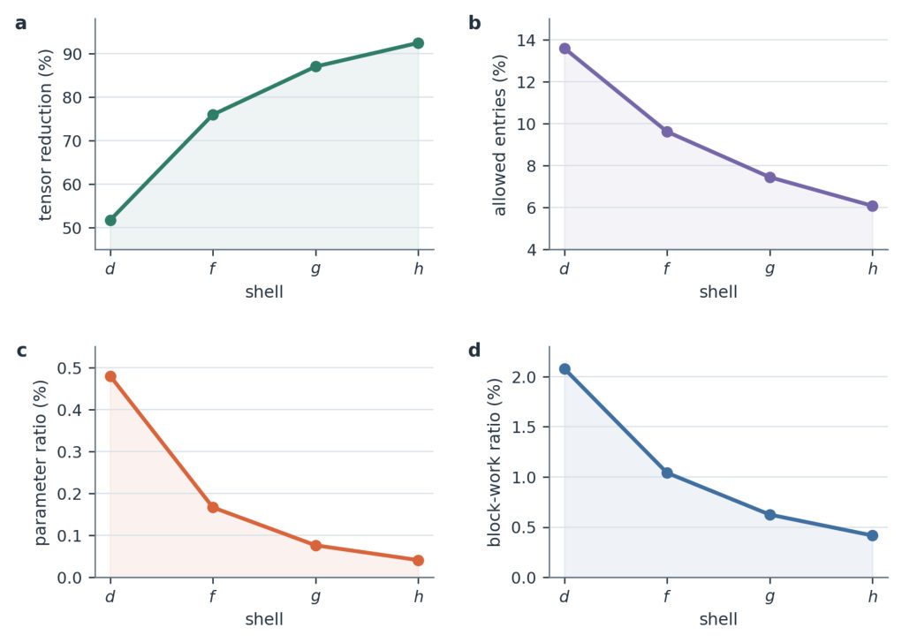 
FIG. 3. Four ratios determined by angular representation for equal-l shells from d through h. Panel (a) shows the percentage reduction in final spherical versus Cartesian tensor entries. Panel (b) shows the percentage of complex-spherical entries that satisfy the total-M rule. Panel (c) compares the number of independent Slater–Condon radial parameters with the number of entries in the full spherical tensor. It counts independent inputs rather than retained tensor entries. Panel (d) compares a rough operation count for blockwise pair-space updates with the corresponding dense count. Together, the panels isolate representation effects from implementation-dependent timing.

📷 Fig 5

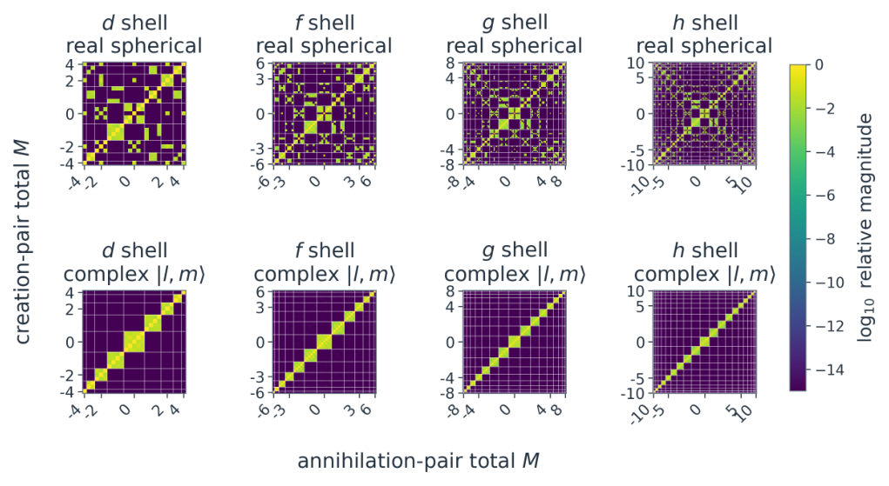 
FIG. 4. Coulomb matrices in pair space for one-center d, f, g, and h shells before and after the reversible real-to-complex spherical transformation. Pair states are sorted by total magnetic quantum number M. In the real-spherical basis, nonzero entries are spread across the matrices. In the complex |l, m⟩basis, they collect into the blocks required by m1 +m2 = m3 +m4. Color shows the base-10 logarithm of each magnitude relative to the largest entry in that matrix. In a molecule, coupling between different blocks would appear as measurable intensity outside the bright block pattern.

**Summary.** This work introduces solid-harmonic integral engines to revolutionize the calculation of electron-repulsion integrals in electronic structure theory. By working directly in spherical coordinates, these engines generate smaller, more structured Coulomb tensors than traditional methods. This structural preservation capability creates a vital link between efficient integral generation and complex many-electron algorithms.

**Why it may be interesting.** The emphasis on preserving angular structure metadata through computation is crucial for any advanced quantum simulation or correlated electron calculation that must map atomic physics onto abstract computational bases (like qubits).

Detailed structure

**Main problem.** The primary challenge is efficiently calculating electron-repulsion integrals (ERIs) for electronic structure theory, which are computationally intensive.

**Main result.** Solid-harmonic integral engines working directly in the spherical basis produce a significantly smaller and more structured Coulomb tensor compared to traditional Cartesian methods. This provides a direct bridge between efficient integral generation and subsequent many-electron computations.

**Method.** The paper proposes using 'direct real or complex solid-harmonic integral engines' that operate natively in the target spherical angular space, bypassing large intermediate tensors generated by standard Gaussian basis function transformations from Cartesian coordinates.

**Model / system.** The model is the Coulomb interaction between charge distributions built from orbital basis functions (Gaussian type orbitals), relevant for calculating electronic structure in atoms and molecules. The focus is on managing the tensor representation of these two-electron interactions.

**Key observables.** Final Coulomb tensor size, angular block counts, radial Slater--Condon parameters, and pair-space organization, all quantified relative to Cartesian representations.

**Important parameters / regimes.** Angular momentum quantum numbers ($l$), magnetic quantum numbers ($m$), and the ratio of spherical to Cartesian tensor entries ($R_{	ext{tensor}}(l)$).

**Assumptions / limitations.** The analysis assumes ideal one-center shells for deriving structural rules, though it acknowledges that molecular environments can break perfect rotational symmetry.

**Figures summary.** Figure 1 summarizes the history of ERI design across different computational methods. Figure 2 illustrates the data path connecting integral generation to low-rank preprocessing and model transformations, highlighting structure preservation.

**Paper structure.** The paper progresses from identifying the bottleneck in traditional Cartesian ERI calculation (generating overly large intermediate tensors) to introducing solid-harmonic engines that work directly in spherical space. It then quantifies the structural advantages using symmetry rules (Total-M rule, radial parameters) and concludes by showing how this structured output supports downstream algorithms like low-rank factorization and spinor transformations.

Abstract

Electron-repulsion integrals describe the Coulomb interaction between charge distributions built from orbital basis functions. Most integral algorithms generate these quantities through Cartesian Gaussian functions, whose angular shapes are written as powers of $x$, $y$, and $z$, and then transform the result to spherical functions. This route is effective, but from $d$ shells onward the Cartesian representation contains more functions than the spherical space required by the calculation. Direct real or complex solid-harmonic engines work in that target space from the beginning. They therefore produce a smaller final Coulomb tensor while preserving the ordering, phase, and magnetic-quantum-number labels that describe its angular structure. Following this structure beyond integral evaluation reveals direct connections to the algorithms that use the tensor. Simple analytical counts quantify tensor size, angular blocks, radial Slater--Condon parameters, and pair-space work. These quantities guide low-rank factorization, local Hamiltonian construction, quantum simulation, and transformations to spinor or effective-model bases. In this way, solid-harmonic integral engines provide a direct bridge between efficient integral generation and structured many-electron computation.

[↑ back to top](#top)

## Secondary cond-mat archives

*Papers from  mes-hall, other, soft, supr-con. These archives are de-prioritized — they appear at the end regardless of relevance score.*

### Relevant in secondary archives (16)

### [Programmable Bulk Topological Channels via Strain Engineering](http://arxiv.org/abs/2607.25809v1)

**Authors:** Jiawei Xia, Shuze Zhu  
**Type:** theory · **Category:** other · **PDF:** <https://arxiv.org/pdf/2607.25809v1>  
**Analysis basis:** full PDF text, analyzed in chunks
**Topic relevance:** 🔥 `analog quantum simulation` **4/5** · `driven-dissipative phase transition` **3/5** · `methods for driven-dissipative` **3/5** · `non-equilibrium dynamics` **3/5** · `non-equilibrium universality` **2/5** · `spintronics-quantum-optics interface` **2/5** · `Frenkel-Kontorova` **1/5** · `Keldysh / 2PI / non-Gaussian methods` **1/5** · `correlated / nonlocal dissipation` **1/5** · `exotic spin models in light-matter` **1/5** · `interference shaping light` **1/5**

📷 Fig 1

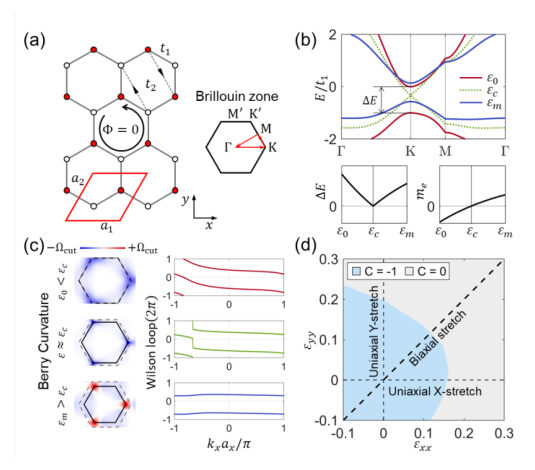 
FIG.1. Uniform-strain-induced topological phase transition in the Haldane model. (a) Schematic of the Haldane lattice. Filled (open) circles denote A (B) sublattices. Red parallelogram marks the unit cell, and clockwise arrows indicate the positive direction of the complex next-nearest-neighbor (NNN) hopping. Right panel: First Brillouin zone (BZ). (b) Band structure evolution under biaxial stretching for 𝑀𝑡1 ⁄ = 1, 𝑡2 𝑡1 ⁄ = 1 3 ⁄ , and 𝜙= −𝜋3 ⁄ . Red, green, and blue curves correspond to the nontrivial phase (𝜀0), the critical gapless state (𝜀𝑐), and the trivial phase (𝜀𝑚), respectively. Lower insets show the strain-dependent evolution of the energy gap (Δ𝐸) and the effective Dirac mass...

📷 Fig 2

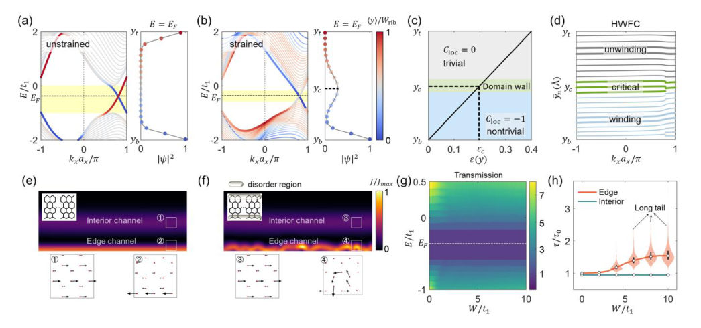 
FIG.2. Topological origin and transport robustness of gradient-strain-induced interior chiral channels. (a-b) Band structures of zigzag Haldane model without and with gradient strain. The color denotes normalized transverse position expectation ⟨𝑦⟩/𝑊rib (nanoribbon width 𝑊𝑟𝑖𝑏: atom number 𝑁𝑎= 40). The pale-yellow regions mark the bulk gap. The side panels show the transverse probability distribution of the gap-crossing states at 𝐸= 𝐸𝐹 . (c) Local transverse strain profile 𝜀(𝑦) and corresponding local topology. Blue and gray regions denote the nontrivial (𝐶loc = −1) region and trivial (𝐶loc = 0) region; the green stripe marks the interior topological domain wall. (d) The evolution of Hybrid...

📷 Fig 3

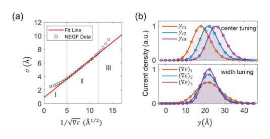 
FIG.3. Quantitative manipulation of interior chiral channels. (a) interior-channel width 𝜎 as a function of 1/√∇𝜀. The red line is a linear fit in the continuum-scaling regime, region II. (b) Transverse current density profiles across the interior channel. Upper panel: tuning channel center position 𝑦𝑐 via strain field shifting. Lower panel: modulating width 𝜎 via strain gradient ∇𝜀 varying. Solid curves represent Gaussian envelope fits to the NEGF numerical data (open circles). The strain fields used here are locally linear inside the nanoribbon.

📷 Fig 4

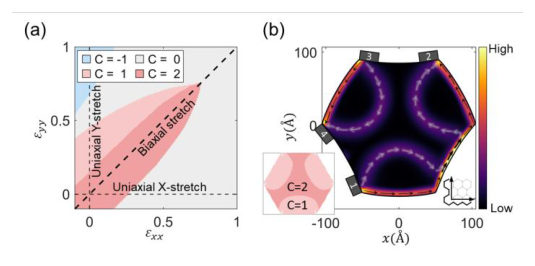 
FIG.4. Topological current networks in a high-Chern-number phase. (a) Extended topological phase diagram in strain plane for 𝑀𝑡1 ⁄ = 0.2, 𝑡2 𝑡1 ⁄ = 0.5, 𝑡3 𝑡1 ⁄ = 0.5, and 𝜙= −𝜋2 ⁄ . (b) Local current distribution in a hexagonal nanostructure under triaxial stretch, showing the spatial splitting and recombination of chiral channels. The inset shows the corresponding local Chern index map.

**Summary.** The paper proposes using controlled strain engineering as a mechanism to create and program robust chiral topological channels deep within the bulk of a material. By inducing internal topological domain walls, these channels bypass the limitations imposed by physical boundaries and disorder. This opens a pathway toward realizing reconfigurable, all-solid-state topological quantum circuitry.

**Why it may be interesting.** This work provides a purely mechanical paradigm for controlling quantum transport features, offering an alternative to lithography or external fields for realizing complex topological circuits relevant to open quantum systems research.

Detailed structure

**Main problem.** Ideal zero-dissipation topological edge channels are hindered by disorder at physical boundaries, necessitating a method to create robust interior chiral channels.

**Main result.** Strain engineering allows for the creation of topologically protected domain walls in the bulk, generating interior channels immune to boundary disorder and enabling programmable channel geometries like Mach-Zehnder interferometers.

**Method.** The study uses theoretical quantum transport simulations based on tight-binding Hamiltonians modified by controlled mechanical strain fields (gradient strain).

**Model / system.** The system is modeled using the Haldane model, realized in ferromagnetic honeycomb insulators. Strain ($\epsilon(y)$) is applied to induce topological domain walls within the bulk material.

**Key observables.** Quantized transmission coefficient ($T=1$), channel width scaling ($\sigma \propto 1/\sqrt{
abla\epsilon}$), and the ability to program channel position and splitting/merging geometries.

**Important parameters / regimes.** Strain gradient field $\epsilon(y)$, Chern number $|C|$, and disorder strength $W t_1 /$.

**Assumptions / limitations.** The analysis relies on continuum approximations for width scaling, and initial models assume constant phases ($\phi$) during lattice deformation.

**Figures summary.** Figures illustrate band structure evolution under uniform strain, the formation of interior domain walls via gradient strain, robustness against disorder (quantized T), and controlled splitting/recombination circuits in high-Chern-number phases.

**Paper structure.** The paper progresses from analyzing uniform strain effects on topological invariants to introducing a continuous linear gradient strain field. This enables the writing of internal domain walls, which are then shown to host robust chiral channels whose properties (width, position) can be quantitatively tuned for circuit design.

Abstract

Accumulated disorder at physical boundaries prevents the realization of ideal zero-dissipation topological edge channels. Here, we propose a strain engineering mechanism to create a topological domain wall in the pristine material bulk, thereby generating interior chiral channels spatially decoupled from physical boundaries. Quantum transport simulations reveal that these interior channels exhibit exceptional immunity to severe boundary disorder, maintaining an ideal vortex-free transport morphology. Furthermore, the spatial position and confinement of these interior channels can be quantitatively programmed. Under a linear gradient strain field, the channel width obeys an inverse square-root scaling law with respect to the strain gradient. In a high-Chern-number phase (|C|=2), we design the spatial splitting and merging of co-propagating chiral channels, suggesting a topological Mach-Zehnder-like geometry. These results suggest a route toward programmable bulk topological transport and reconfigurable topological circuitry.

[↑ back to top](#top)

### [Environmental and cell-cell signaling shape developmental trajectories across morphogenetic landscapes](http://arxiv.org/abs/2607.25897v1)

**Authors:** J. Hareesh, Sitabhra Sinha  
**Type:** theory · **Category:** statistical mechanics · **PDF:** <https://arxiv.org/pdf/2607.25897v1>  
**Analysis basis:** full PDF text, analyzed in chunks
**Topic relevance:** 🔥 `non-equilibrium universality` **4/5** · `driven-dissipative phase transition` **3/5** · `methods for driven-dissipative` **3/5** · `non-equilibrium dynamics` **2/5** · `Frenkel-Kontorova` **1/5** · `Keldysh / 2PI / non-Gaussian methods` **1/5** · `analog quantum simulation` **1/5** · `correlated / nonlocal dissipation` **1/5**

📷 Fig 1

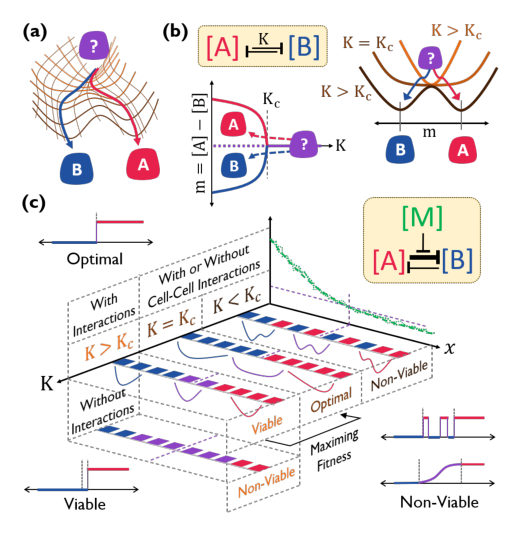 
FIG. 1. Waddington landscape as a conceptual framework to describe cell fate determination during development. (a) Dy- namics of fate choice represented as trajectories in the epi- genetic landscape. An undifferentiated cell (violet) differen- tiates into one of the two possible cell types A (red) or B (blue). (b) A toggle switch comprising two representative genes that correspond to the two distinct cellular identities. Inhibition threshold K determines the genotypic outcomes. Co-expression regime (K &gt; Kc) is interpreted as the undif- ferentiated cell state while the bi-stable regime (K &lt; Kc) corresponds to differentiated cell states. A quartic potential effectively models the landscape....

📷 Fig 2

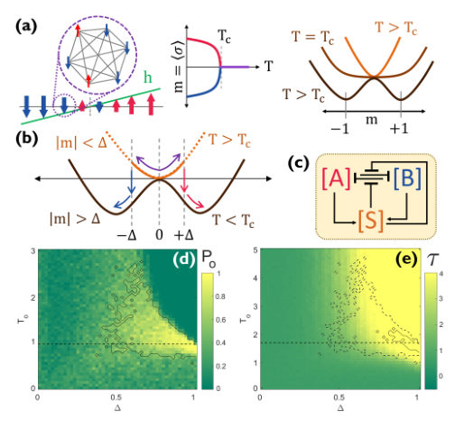 
FIG. 2. In the absence of any inter-cellular signaling, the decision to switch from an undifferentiated to a differentiated state is determined by the internal state of the cell and the ex- ternal morphogen concentration. (a) A cell is modeled as a set of binary spins (±1) with ferromagnetic interactions, where the average magnetization corresponds to the cell-state. The effect of the morphogen appears as a spatial gradient in the external magnetic field h (green). High temperature T &gt; Tc corresponds to an undifferentiated state, while low temper- atures T &lt; Tc corresponds to a differentiated state. Free energy of the Ising model effectively describes the epigenetic landscape. (b) Decision...

📷 Fig 3

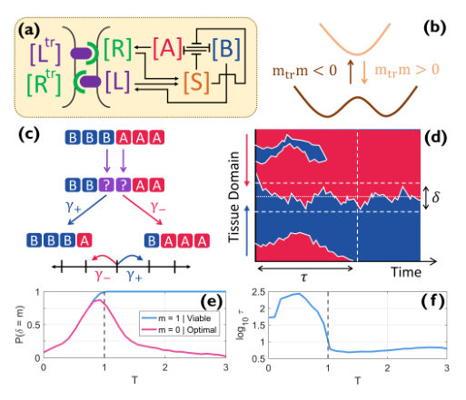 
FIG. 3. In the presence of cell-cell coupling, the landscape integrates signals from the morphogen, as well as, the cellu- lar neighborhood. (a) A representative gene regulatory motif motivated by the Eph-Ephrin signaling pathway, that mod- ulates the landscape geometry. Cells of type A and B ex- presses receptor R and ligand L respectively. Cells that differ from their neighboring cell types have upregulated effector molecule concentration S because of bidirectional signaling from bound receptor-ligand complex. (b) The spin analog for the proposed juxtacrine signaling pathway involves decreasing the temperature to 0 when surrounded by similar cell types mtrm &gt; 0 and increasing the...

📷 Fig 4

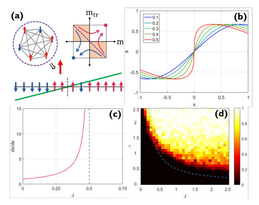 
FIG. 4. Coarse-graining the model from cellular scale to tis- sue scale. (a) Each cell is replaced by a cluster of interacting spins that can be viewed as a “meta-spin”. This reduces the model to a 1-dimensional Ising model with an external field gradient. In the shaded regions mtrm &lt; 0, the temperature To ≥Tc resulting in (m, mtr) →(0, 0), while in the other two quadrants (mtrm &gt; 0), the system converges to ±(1, 1) due to low temperature. The contact mediated interactions can be reduced to an effective ferromagnetic interaction be- tween the meta-spins. (b-c) Mean-field solution predicts that the interface width will reduce as the interaction strength in- creases, and the slope of the...

**Summary.** This work models developmental biology using the language of statistical physics, framing cell fate determination within an epigenetic free energy landscape. It shows that both environmental gradients and direct cell-cell signaling can be mathematically unified under this framework. The paper argues that robustness in development emerges through fine-tuning near critical points, which is then refined by specific intercellular interactions.

**Why it may be interesting.** The use of free energy landscapes and concepts like criticality ($T 
ightarrow T_c$) to describe biological pattern formation is highly relevant to non-equilibrium statistical mechanics and understanding emergent order from local interactions.

Detailed structure

**Main problem.** The paper investigates how environmental cues and cell-cell signaling shape developmental trajectories across morphogenetic landscapes.

**Main result.** It establishes that the free energy landscape provides a powerful, unifying framework for describing development by mapping diverse biological mechanisms (like signaling or adhesion) to common physical principles.

**Method.** The authors model cell fate determination using concepts from statistical physics, approximating the probability distribution via an underlying free energy function $\phi(m)$.

**Model / system.** Development is modeled using Waddington's epigenetic landscape concept, simplified into a low-dimensional system analyzed via analogies to the Ising Model and spin systems.

**Key observables.** Cell fate determination (A vs. B identity), developmental regimes (bistable, co-existence, critical), susceptibility ($\chi$), and patterning error ($\delta$).

**Important parameters / regimes.** The effective temperature ($eta$) and parameters governing the free energy function $\phi(m)$, such as $K$ and $\sigma$.

**Assumptions / limitations.** Approximations include assuming a Gaussian distribution for the probability distribution $P(m)$ and using first-order expansions near interfaces.

**Figures summary.** Figure 1 illustrates Waddington's landscape concept, while Figure 2 demonstrates the Ising model analogy applied to cell commitment based on external fields and signaling modulation.

**Paper structure.** The paper progresses from establishing the general epigenetic landscape framework, detailing how morphogen gradients modify the free energy potential, introducing cell-cell interactions (like Eph-Ephrin) as additional terms in the energy functional, and finally demonstrating the universality of this landscape description across different cellular mechanisms.

Abstract

Despite the variability in gene regulation and environmental conditions, development of an organism occurs through a sequence of highly coordinated patterning processes. Cells integrate different signals to accurately infer their position in order to adopt an appropriate identity. Using a model of epigenetic landscape originally proposed by Waddington to describe cell-fate determination, we establish the critical role played by juxtacrine signaling between cells in determining tissue patterns. Subsequently we systematically coarse-grain the model at the tissue scale to map its patterning to transition between states in a binary spin model having a free energy landscape. We show that such landscapes serve as a powerful unifying framework for describing development of biological systems across distinct spatio-temporal scales.

[↑ back to top](#top)

### [Anisotropic domain wall velocity profiles in the creep regime: the interplay of chiral damping, stiffness and Dzyaloshinskii-Moriya interaction](http://arxiv.org/abs/2607.25470v1)

**Authors:** Adriano Di Pietro, Alessandro Magni, Stefania Pizzini, Frowin Dörr, Yasser Shokr, Gianfranco Durin, Silvia Tacchi, Marco Madami, Giovanni Carlotti, Emily Darwin, Alexandra J. Huxtable, Christopher H. Marrows, Bryan J. Hickey, Michaela Kuepferling  
**Type:** both · **Category:** other · **PDF:** <https://arxiv.org/pdf/2607.25470v1>  
**Analysis basis:** full PDF text, analyzed in chunks
**Topic relevance:** `driven-dissipative phase transition` **3/5** · `exotic spin models in light-matter` **3/5** · `methods for driven-dissipative` **3/5** · `non-equilibrium dynamics` **3/5** · `non-equilibrium universality` **3/5** · `spintronics-quantum-optics interface` **3/5** · `Frenkel-Kontorova` **2/5** · `analog quantum simulation` **2/5** · `correlated / nonlocal dissipation` **2/5** · `Keldysh / 2PI / non-Gaussian methods` **1/5** · `Kondo & dissipative impurity` **1/5**

📷 Fig 1

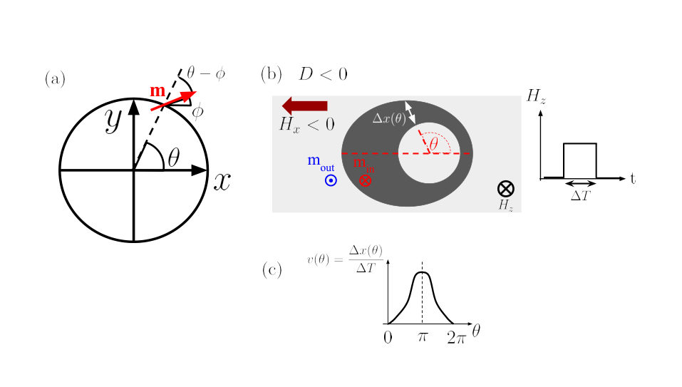 
FIG. 1. a) Schematic picture of a magnetic bubble domain: θ represents the angle that parametrizes

📷 Fig 2

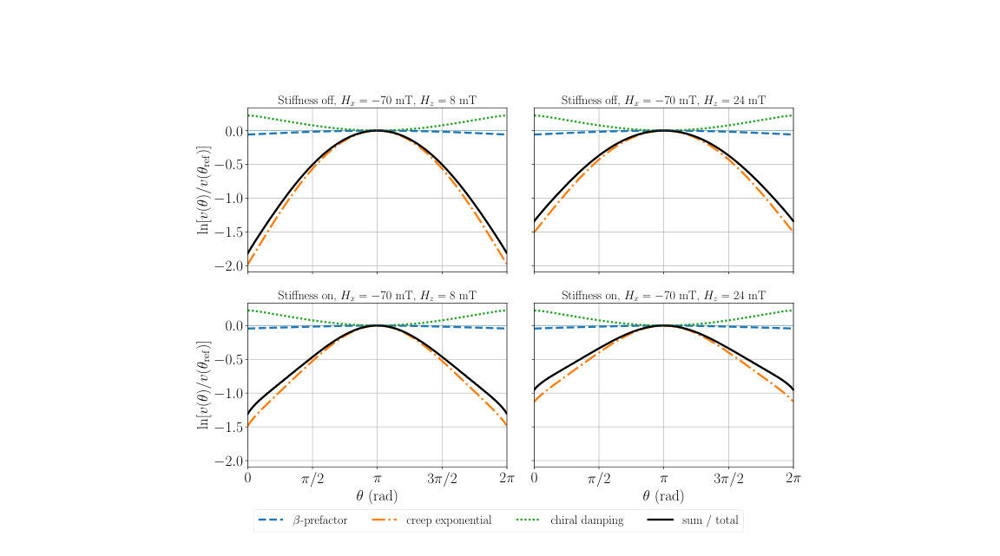 
FIG. 2. Logarithmic decomposition of the normalized angular velocity, ln[v(θ)/v(θref)], for Hx =

📷 Fig 3

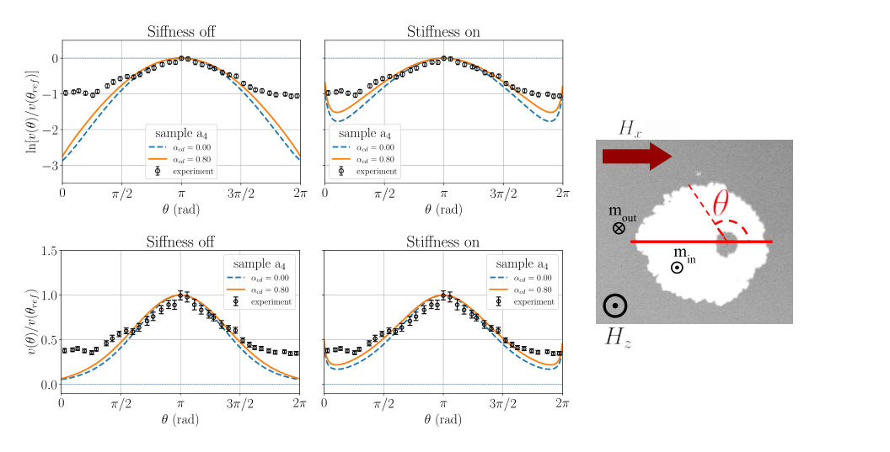 
FIG. 3. Angular velocity profile for sample a4 at Hz = 8.8 mT, in the presence of Hx = 60 mT,

📷 Fig 4

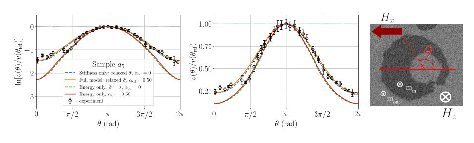 
FIG. 4. Angular velocity profile for sample a5 at Hx = −80 mT and Hz = −21.21 mT, plotted as

📷 Fig 5

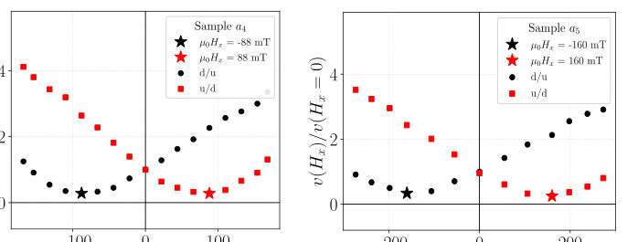 
FIG. 5. Asymmetric bubble expansion measurements as a function of µ0Hx performed in the flow

**Summary.** This work develops an advanced theoretical model to analyze how domain wall velocity changes anisotropically during magnetic bubble expansion. By incorporating both dispersive stiffness and chiral damping into the creep model, the authors provide a more sensitive method for extracting fundamental parameters like the Dzyaloshinskii-Moriya Interaction (DMI). The findings emphasize that accurate material characterization requires accounting for all physical contributions simultaneously.

**Why it may be interesting.** While the primary focus is magnetism, the rigorous mathematical separation of multiple interacting energy/dissipation terms in a non-equilibrium system (creep dynamics) mirrors complex modeling challenges found in open quantum systems or driven many-body physics.

Detailed structure

**Main problem.** To develop a comprehensive framework for interpreting creep-driven domain expansion that accurately separates the contributions of chiral damping, dispersive domain wall stiffness, and Dzyaloshinskii–Moriya interaction (DMI) to the anisotropic domain wall velocity profile v(theta).

**Main result.** The extended model successfully separates elastic/stiffness effects from dissipative (chiral damping) effects in the angular velocity profile, showing that rigorous DMI extraction requires accounting for both chiral damping and stiffness.

**Method.** The authors developed an extended angular creep model incorporating dispersive domain wall stiffness and chirality-dependent prefactors to analyze measured full angular velocity profiles v(theta).

**Model / system.** The study focuses on ultrathin ferromagnetic heterostructures with perpendicular magnetic anisotropy (PMA), analyzing asymmetric bubble expansion dynamics. The theoretical framework extends the standard creep model by adding terms for dispersive stiffness and chiral damping.

**Key observables.** Angular dependence of the domain wall velocity, v(theta); normalized angular velocity profile; separation into chiral damping term, prefactor, and creep exponential.

**Important parameters / regimes.** Dzyaloshinskii-Moriya Interaction (DMI) field (H_DMI), chiral damping coefficient ($\alpha_{CD}$), domain-wall stiffness ($	ilde{\sigma}$), and the creep exponent parameter ($\chi_0$).

**Assumptions / limitations.** The analysis assumes the bubble domain is large enough to ignore curvature-induced effects, and that independent measurements of DMI from flow regimes are available for comparison.

**Figures summary.** Figures show schematic setups for measuring v(theta) and plots comparing experimental angular velocity profiles against model predictions derived using energy-only vs. full models incorporating stiffness and chiral damping.

**Paper structure.** The paper first establishes the need for an extended creep model to account for anisotropy in domain wall motion. It then details how this model separates contributions from various physical effects (stiffness, damping) by analyzing v(theta). Finally, it compares these findings with independent DMI estimates derived from flow-regime measurements.

Abstract

The asymmetric expansion of magnetic bubble domains in ultrathin ferromagnets provides a powerful route to probe the interfacial Dzyaloshinskii-Moriya interaction (DMI). While conventional analyses rely on domain wall velocities measured along selected directions as a function of in-plane field, recent approaches have highlighted the additional insight contained in the angular dependence of the velocity, $v(θ)$. Here, we develop an extended angular creep model that incorporates both the dispersive domain wall stiffness and a chirality-dependent prefactor associated with chiral damping. This generalization captures the full anisotropic dynamics of domain wall motion around a bubble domain. We show that these contributions significantly modify the angular velocity profile and can lead to features not accessible within existing models. Our results establish a more complete framework for interpreting creep-driven domain expansion and provide improved sensitivity for the quantitative extraction of DMI and chiral dynamical effects.

[↑ back to top](#top)

### [First-Principles Wannier Representation of Proximity Effects](http://arxiv.org/abs/2607.25690v1)

**Authors:** Yaroslav Zhumagulov, Johan Félisaz, Stepan S. Tsirkin, Denis Kochan, Oleg V. Yazyev  
**Type:** theory · **Category:** other · **PDF:** <https://arxiv.org/pdf/2607.25690v1>  
**Analysis basis:** full PDF text, analyzed in chunks
**Topic relevance:** `Keldysh / 2PI / non-Gaussian methods` **3/5** · `methods for driven-dissipative` **3/5** · `spintronics-quantum-optics interface` **3/5** · `driven-dissipative phase transition` **2/5** · `Kondo & dissipative impurity` **1/5** · `analog quantum simulation` **1/5** · `correlated / nonlocal dissipation` **1/5** · `correlated cavity matter` **1/5** · `exotic spin models in light-matter` **1/5** · `non-equilibrium dynamics` **1/5**

📷 Fig 1

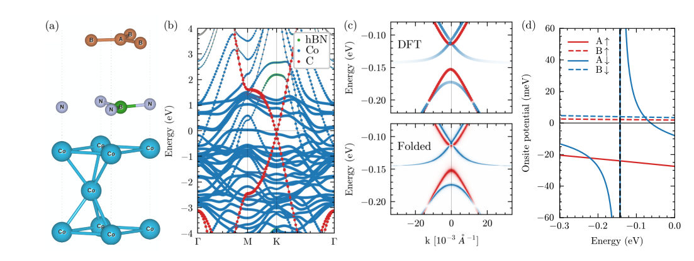 
FIG. 1. Graphene/hBN/Co(0001) proximity results. (a) Atomic structure: graphene on a single hBN layer on an hcp Co(0001) surface, modeled by three Co layers. (b) Layer-projected band structure of the heterostructure along Γ−K−M; color distin- guishes graphene from hBN and Co states. (c) Zoom on the Dirac point: DFT bands of the heterostructure and the folded bands of the downfolded coupling with broadening η = 1 meV, the latter color-coded by the spin projection ⟨sz⟩of the graphene states. (d) Diagonal elements of V(K, K; ω) for the four graphene Wannier states {A↑, B↑, A↓, B↓} versus real frequency. Vertical dashed lines mark the Kohn-Sham eigenvalues of the supercell states producing the...

📷 Fig 2

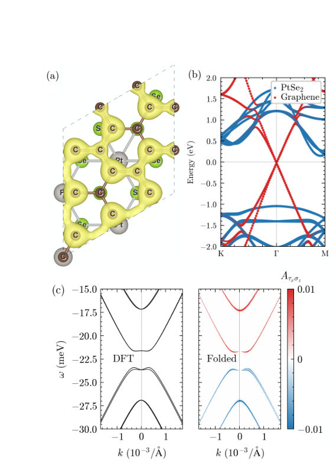 
FIG. 2. Graphene/PtSe2 intervalley coherent proximity cou- pling. (a) Atomic structure of the commensurate 3 × 3 graphene cell on PtSe2. The isosurface shows the charge den- sity of the four lowest eigenstates of the folded Dirac mani- fold, whose K−K′ interference imprints the √

📷 Fig 3

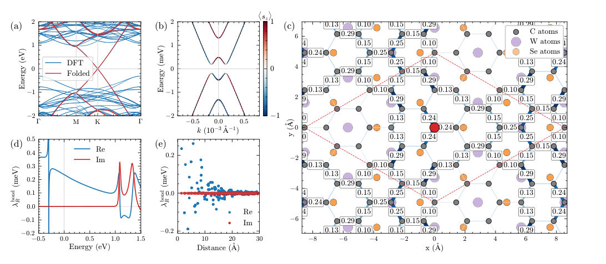 
FIG. 3. Graphene/WSe2 proximity coupling. (a) Band structure of the heterostructure supercell along Γ−M−K−Γ (blue) with the bands of the downfolded coupling folded onto the supercell (red). (b) Zoom on the Dirac point: DFT bands (black) and folded bands of the downfolded coupling at the Fermi level, color-coded by the spin projection ⟨sz⟩. (c) Real part of the bond-resolved Rashba coupling λbond R , Eq. (8), of the real-space coupling at the Fermi level. Bonds with |λbond R | &gt; 0.1 meV are labeled by their amplitudes in meV. Gray, purple, and orange circles denote C, W, and Se atoms; the red carbon marks the reference atom of panels (d) and (e), and the dashed line is the supercell. (d)...

**Summary.** The paper introduces a novel theoretical framework to calculate proximity effects in layered heterostructures by deriving a dynamical, frequency-dependent coupling operator directly from first-principles DFT. This method overcomes the limitations of static parameter fitting, accurately capturing energy and momentum dependence through virtual hybridization pathways. The results demonstrate that this approach reveals crucial physical details, such as resonant frequency dependencies and bond-resolved couplings, unattainable with simpler models.

**Why it may be interesting.** This work provides a rigorous, first-principles pathway to construct effective low-energy Hamiltonians for complex quantum interfaces, which is crucial input for modeling open quantum systems dynamics in solid-state devices.

Detailed structure

**Main problem.** The primary challenge is overcoming the limitations of using static parameters to model proximity effects in layered heterostructures, which fails to capture the energy dependence or momentum transfer from virtual hybridization.

**Main result.** The authors developed a method that successfully derives a dynamical proximity operator, showing that virtual hybridization dominates coupling strengths (e.g., >99% for Co/graphene), providing an accurate, fitting-free microscopic foundation for low-energy modeling.

**Method.** They derive the dynamical proximity operator V(k, k'; ω) by performing Wannier downfolding of the full Kohn-Sham Hamiltonian onto a target low-energy subspace using a shifted resolvent approach.

**Model / system.** The study focuses on proximity effects in van der Waals heterostructures like graphene/hBN/Co(0001), graphene/PtSe2, and graphene/WSe2. The method yields an effective Hamiltonian describing the low-energy physics within the target Wannier subspace.

**Key observables.** Dynamical proximity operator V(k, k'; ω); renormalized low-energy spectrum; sublattice-selective intervalley coupling ($	ext{PtSe}_2$); bond-resolved Rashba coupling (WSe$_2$).

**Important parameters / regimes.** Resonant frequency dependence set by substrate $d$ states; $	ext{meV}$-scale splittings vs. $<1\ \mu	ext{eV}$ direct projection.

**Assumptions / limitations.** The method relies on projecting the full DFT Hamiltonian onto a fixed, low-energy Wannier subspace, treating the coupling via virtual transitions through higher energy bands.

**Figures summary.** Figure 1 illustrates graphene on hBN/Co(0001), showing band structures and spectral functions comparing direct projection results to the full dynamical calculation.

**Paper structure.** The paper introduces the failure of static models, details the derivation of the dynamical proximity operator via Wannier downfolding (using DFT and resolvent techniques), applies this framework to multiple physical systems ($	ext{Co}$, $	ext{PtSe}_2$, $	ext{WSe}_2$), and concludes by establishing the method's utility for various transport theories.

Abstract

Proximity effects in layered heterostructures are usually represented by static parameters fitted to first-principles bands, which discards the energy dependence of the virtual hybridization, the momentum transfer, and the spatial structure. We overcome this limitation by deriving a dynamical proximity operator $\mathcal{V}(\mathbf{k},\mathbf{k}';ω)$ directly from density functional theory, downfolding the Kohn-Sham Hamiltonian of the heterostructure onto a fixed low-energy target Wannier subspace and reproducing its spectrum exactly within that subspace. The construction separates direct matrix elements from virtual hybridization through all remaining states. In graphene on hBN/Co(0001), virtual hybridization generates more than $99\%$ of the proximity exchange and gives it a resonant frequency dependence set by the Co $d$ states. In graphene/PtSe$_2$ it resolves a sublattice-selective intervalley coupling with a $\sqrt{3}\times\sqrt{3}$ charge modulation, and in graphene/WSe$_2$ a bond-resolved Rashba coupling of $0.24$~meV, against below $1$~$μ$eV for the direct projection alone. Our results expose the limitations of static projections and establish a fitting-free microscopic foundation for low-energy modeling, spin-relaxation theory, and transport calculations.

[↑ back to top](#top)

### [Everything is a Spin: The Secret Lives of SU(2)](http://arxiv.org/abs/2607.25212v1)

**Authors:** Avik W Ghosh  
**Type:** theory · **Category:** other · **PDF:** <https://arxiv.org/pdf/2607.25212v1>  
**Analysis basis:** full PDF text, analyzed in chunks
**Topic relevance:** `exotic spin models in light-matter` **3/5** · `spintronics-quantum-optics interface` **3/5** · `analog quantum simulation` **2/5** · `non-equilibrium dynamics` **2/5** · `correlated / nonlocal dissipation` **1/5** · `driven-dissipative phase transition` **1/5** · `entanglement & information structure` **1/5** · `methods for driven-dissipative` **1/5** · `non-equilibrium universality` **1/5**

📷 Fig 1

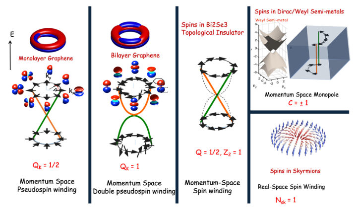 
FIG. 1. Topological winding textures in momentum and real space are all manifestations of the same geometry spanning Bloch, Poincar´e or valley pseudospin spheres. For monolayer graphene, the pseudospin winds once around a single valley, giving a valley-resolved winding charge QK = γ/2π = 1/2. The pseudospin describes the mixing coefficients of the laterally separated sublattice pz orbitals that constitute the corresponding eigenstate (red is positive, blue is negative). Bernal stacked bilayer graphene exhibits a double pseudospin winding, yielding QK = 1. Here the pseudospin corresponds to the relative amplitudes of the low-energy non-dimer orbital states distributed across the two...

📷 Fig 2

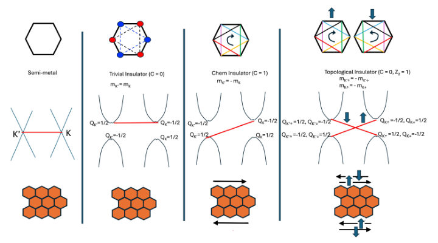 
FIG. 2. Starting from gapless graphene with linear Dirac dispersion, successive perturbations modify the Dirac Hamiltonian to produce distinct topological phases. Sublattice symmetry breaking opens a trivial gap, while spin-orbit coupling generates a quantum spin Hall (topological insulator) phase with helical edge states. Time-reversal or inversion symmetry breaking splits the Dirac point into Weyl nodes of opposite chirality, producing Weyl semimetals characterized by Berry-curvature monopoles and topologically protected Fermi-arc surface states. The Chern number changes only when the bulk gap closes, illustrating how Berry curvature, symmetry, and topology determine the electronic phases.

📷 Fig 3

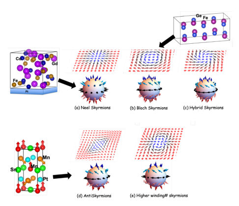 
FIG. 3. The symmetry of the underlying crystal or in- terface fixes the orientation of the DMI vector D, which in turn dictates the energetically preferred sense of spin ro- tation. Interfacial inversion-symmetry breaking in heavy- metal/ferrimagnet heterostructures such as Pt/CoGd stabi- lizes N´eel skyrmions, where spins rotate in radial planes. Bulk chiral B20 compounds such as MnSi and FeGe favor Bloch skyrmions with tangential spin rotation. Tetragonal D2d Heusler compounds such as Mn 2PtSn stabilize antiskyrmions through anisotropic DMI, while intermediate combinations of interfacial and bulk DMI generate hybrid skyrmions with con- tinuously varying helicity. Higher-winding textures...

📷 Fig 4

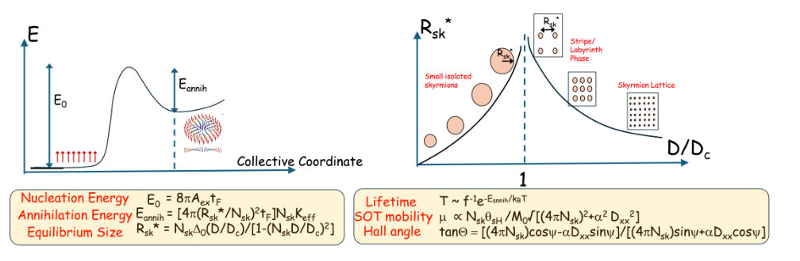 
FIG. 4. Topology simultaneously determines every skyrmion metric including (a) the energy, (b) equilibrium size, thermal lifetime, and dynamical response of an isolated skyrmion through the winding number Nsk [9].

📷 Fig 5

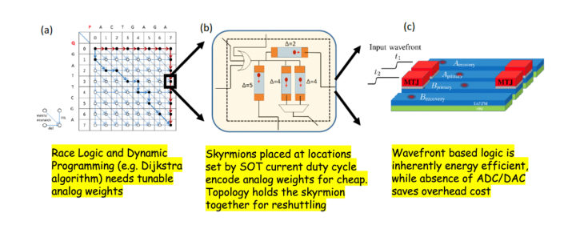 
FIG. 5. Topology creates a metastable information state. Tunable analog weights required for race logic and dynamic programming are encoded in skyrmion position, set directly by the SOT-current duty cycle. Topology keeps each ultrasmall skyrmion intact during repeated reshuttling, while wavefront-based computation limits activity to the advancing front and the native analog representation avoids costly ADC/DAC conversion [10]

**Summary.** This review unifies the study of various two-component degrees of freedom—like spin and valley pseudospin—under a common SU(2) geometric language. It demonstrates that topological invariants are not merely descriptive labels but function as an 'engineering design language.' This allows for the prediction and control of physical responses, such as tunable gaps or spin currents, by engineering wavefunction continuity constraints.

**Why it may be interesting.** It provides a unifying mathematical and physical framework (SU(2) geometry) to understand how symmetry constraints dictate macroscopic electronic properties like spin currents and optical responses across different quantum materials.

Detailed structure

**Main problem.** To develop a common geometric language for understanding the winding of various two-component degrees of freedom (spin, pseudospin, valley) that share the SU(2) geometry.

**Main result.** Topology is argued to be not just a classification tool but an 'engineering design language' enabling engineered functionality in quantum materials.

**Method.** The review develops this framework by analyzing Berry phase, Berry curvature, and related geometric tensors across multiple physical systems.

**Model / system.** The analysis uses low-energy effective Hamiltonians for graphene, topological insulators (TIs), and Weyl semimetals (WSMs) to model two-component wavefunctions whose underlying geometry is SU(2).

**Key observables.** Chern number ($C$), Berry curvature ($\Omega$), intrinsic transverse conductivity ($\sigma^{int}$), and photocurrent ($J_{CPGE}$).

**Important parameters / regimes.** Symmetry preservation, pseudospin matching, gate voltage (for gap tuning), and magnetic field strength.

**Assumptions / limitations.** The core assumption is that symmetry preservation dictates wavefunction continuity constraints, which govern physical responses like transmission or torque generation.

**Figures summary.** Figures illustrate topological winding textures in momentum/real space for various systems (graphene, TIs, Weyl nodes) and show how breaking symmetries controls transport phenomena like Klein tunneling and spin currents.

**Paper structure.** The paper progresses from establishing the common SU(2) geometric language using Berry phase to applying this framework across diverse examples: graphene, TIs, WSMs, and skyrmions, culminating in the argument for topology as a design principle.

Abstract

Spin, pseudospin, valley, polarization, and other two-component degrees of freedom share the geometry of SU(2), yet their topological manifestations are usually discussed as separate phenomena. This review develops a common geometric language for their winding in momentum and real space,beginning with Berry phase and the Dirac Hamiltonian and extending to graphene, topological insulators, Weyl semimetals, and magnetic skyrmions. We argue that the common thread is not merely topology itself, but the continuity constraints imposed on two-component wavefunctions. Whenever the relevant symmetry is preserved, winding determines which states can continuously connect across an interface or deformation, thereby governing transmission, torque generation, optical selection rules, and other physical responses. We then ask a practical question: what does topology buy an engineer? In skyrmions, winding partitions magnetic configuration space and stabilizes ultrasmall information carriers with tunable dynamics. In graphene, pseudospin matching governs Klein tunneling, enabling a gate-controlled transmission gap without sacrificing the massless Dirac dispersion. In topological insulators and Weyl semimetals, spin-momentum locking and Berry-curvature engineering generate electrically selectable spin currents, while helicity-dependent optical transitions produce circular photogalvanic responses. Together, these examples suggest that topology is not merely a classification of quantum matter, but a design language in which symmetry-protected wavefunction continuity can be engineered for memory, switching, actuation, and sensing.

[↑ back to top](#top)

### [Nonlocal Majorana polarization in non-Hermitian topological superconductors](http://arxiv.org/abs/2607.25424v1)

**Authors:** Arjun S. Kumar, Jorge Cayao, Oladunjoye A. Awoga  
**Type:** theory · **Category:** other · **PDF:** <https://arxiv.org/pdf/2607.25424v1>  
**Analysis basis:** full PDF text, analyzed in chunks
**Topic relevance:** `correlated / nonlocal dissipation` **3/5** · `driven-dissipative phase transition` **3/5** · `methods for driven-dissipative` **3/5** · `non-equilibrium universality` **2/5** · `Keldysh / 2PI / non-Gaussian methods` **1/5** · `Kondo & dissipative impurity` **1/5** · `analog quantum simulation` **1/5** · `non-equilibrium dynamics` **1/5**

📷 Fig 1

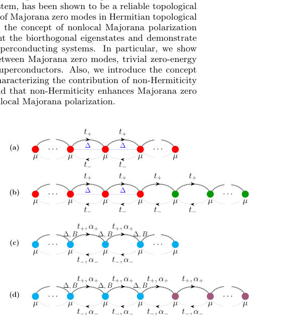 
Figure 1. Schematics of NH superconducting chains stud- ied in this work. (a) The Hatano-Nelson-Kitaev (HNK) chain. The red filled circles denote lattice sites with spin- less fermions, t±, µ, and ∆represent nonreciprocal hopping strengths, chemical potential, and the superconducting order parameter, respectively. (b) A superconductor-normal (SN) junction based on the HNK chain, with the green filled cir- cles denoting normal lattice sites. (c) Non-Hermitian Rashba superconducting chain with Zeeman field B and nonrecip- rocal spin-orbit strength, α±. The cyan filled circles repre- sent superconducting lattice sites with spinfull fermions. (d) SN junction of NH Rashba superconducting chain,...

📷 Fig 2

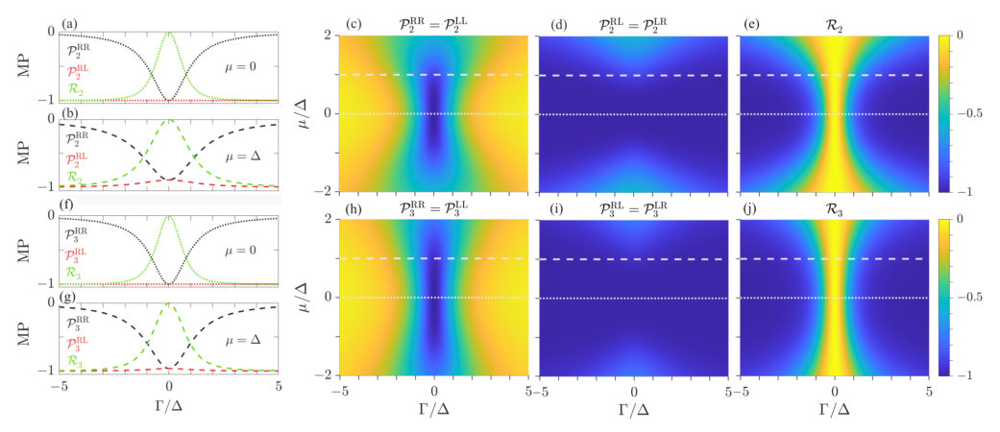 
Figure 2. (a-e) Nonlocal MP biothorgonal indicators (Pab N and RN, with a, b = L, R) for a two-site HNK chain, while (f-j) for a three-site chain; here N indicates the number of system sites. (a,b) R2 and Pab 2 as functions of Γ at µ = 0 (a) and µ = ∆(b). (c-e) Paa 2 (c), Pab 2 (d), and R2 (e) as functions of Γ and µ. The dotted and dashed lines in (c-e) indicate the line cuts at µ = 0 and µ = ∆shown in (a) and (b), respectively. (f-j) The same as in (a-e) but for a three-site HNK chain.

📷 Fig 3

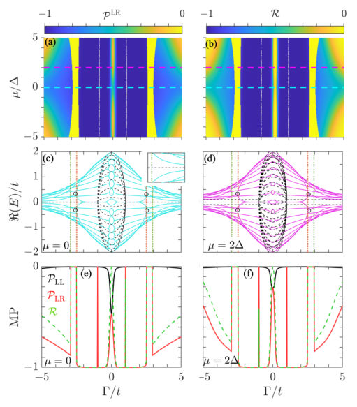 
Figure 3. Nonlocal MP indicators and spectral features of a long HNK chain away from the sweet spot. (a) PLR and (b) R in µ −Γ space. (c,d) ℜ(E) as a function of Γ with colors corresponding to dashed lines in (a). Solid (dashed) corresponds to ∆̸= 0 (∆= 0). The dotted vertical lines rep- resent transition points, with red (green) denoting EP (level crossing) point. The red circles highlight the EPs at large Γ. Inset in (c): zoom-in of the spectrum around zero energy. (e,f) Nonlocal MP indicators as a function of Γ for the lowest energy levels in (c,d)[ (cyan, magenta) line in (a,b)]. Here ∆/t = 0.05 and N = 16 sites.

📷 Fig 4

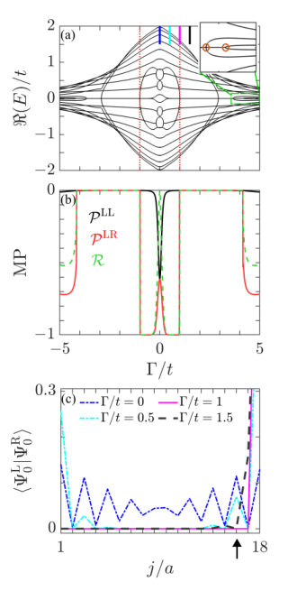 
Figure 4. Spectrum and nonlocal MP indicators in HNK junc- tion. (a) Real part of the spectrum, ℜ(E), with dotted ver- tical lines denoting the EPs at |Γ|/ = t. Inset: zoom-in of the spectrum around zero energy at large Γ.(b) Nonlocal MP indicators as functions of Γ. (c) Probability density as a func- tion of site for several Γ/t. Colors correspond to the bars in (a) while the arrowhead indicates the boundary between N and S regions. Here, NS = 16, Nn = 2, µ = 0, all others parameters are same as Fig. 3.

📷 Fig 5

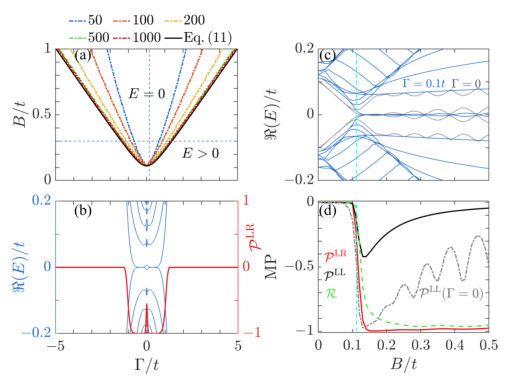 
Figure 5. Topology of zero-energy states in the NH Rashba superconducting chain. (a) Size dependence of the phase dia- gram in B −Γ parameter space for several NS. The region of E = 0 is bounded by the curves and approaches Eq. (11) in the thermodynamic limit. (b) ℜ(E) and MP along the dashed horizontal line in (a). (c) ℜ(E) along the vertical line in (a) for Γ = 0 (gray) and Γ = 0.1t (blue). (d) The corresponding MPs of the zero-energy states in (c). Cyan line in (c,d) denote the topological transition point in the Hermitan phase, BH c . Here ∆= α = 0.1t and µ = 0.05t. In (b-c) NS = 50.

**Summary.** This paper extends the topological characterization of Majorana zero modes from Hermitian to non-Hermitian superconductors by defining a nonlocal Majorana polarization. Using biorthogonal eigenstates, the authors show this metric can distinguish between true MZMs, trivial states, and exceptional points in NH systems. The key finding is that non-Hermiticity enhances MZM robustness, providing a quantitative measure for this effect.

**Why it may be interesting.** This work provides a powerful, generalized diagnostic tool for characterizing topology in open quantum systems, which is highly relevant for understanding superconducting devices where dissipation and gain are present.

Detailed structure

**Main problem.** The work extends the concept of nonlocal Majorana polarization (MP), a topological indicator for Majorana zero modes (MZMs) in Hermitian systems, to the non-Hermitian (NH) realm.

**Main result.** The nonlocal MP successfully distinguishes between MZMs, trivial zero-energy states (TZESs), and exceptional points (EPs) in NH superconductors. Furthermore, non-Hermiticity was shown to enhance MZM robustness via this polarization measure.

**Method.** The authors generalized the definition of nonlocal MP by incorporating biorthogonal eigenstates and introduced a 'nonlocal MP sensitivity' ($R$) metric to quantify the contribution of non-Hermiticity.

**Model / system.** The study analyzes non-Hermitian superconducting systems, specifically utilizing models like the Hatano-Nelson-Kitaev (HNK) chain and the NH Rashba superconductor.

**Key observables.** Nonlocal Majorana Polarization ($P_{ab}$), Nonlocal MP Sensitivity ($R$), which are used to diagnose topological features.

**Important parameters / regimes.** The analysis explores different regimes, including the sweet spot ($\mu=0$) and finite chemical potential ($\mu 
eq 0$), as well as varying non-Hermiticity parameters (e.g., $\Gamma$).

**Assumptions / limitations.** The primary assumption is that the nonlocal MP formalism can be robustly generalized from Hermitian to the biorthogonal framework required for NH systems.

**Figures summary.** Figure 1 shows schematics of various non-Hermitian superconducting chains studied (HNK, Rashba). Figure 2 illustrates how the nonlocal MP and sensitivity indicators ($R^2$, $P_{ab}^2$) vary with non-Hermiticity ($\Gamma$) and chemical potential ($\mu$).

**Paper structure.** The paper first establishes the theoretical framework by generalizing the nonlocal MP using biorthogonal eigenstates. It then applies this tool to specific NH models (HNK, Rashba) to diagnose topological states, concluding with quantitative results showing how non-Hermiticity affects MZM robustness.

Abstract

The nonlocal Majorana polarization, defined as the product of the expectation values of the particle-hole operator at opposite halves of the system, has been shown to be a reliable topological indicator that determines the presence and quality of Majorana zero modes in Hermitian topological superconducting setups. In this work, we extend the concept of nonlocal Majorana polarization to the non-Hermitian realm by taking into account the biorthogonal eigenstates and demonstrate its utility by exploring distinct non-Hermitian superconducting systems. In particular, we show that the Majorana polarization can distinguish between Majorana zero modes, trivial zero-energy states, and exceptional points in non-Hermitian superconductors. Also, we introduce the concept of nonlocal Majorana polarization sensitiviy for characterizing the contribution of non-Hermiticity to Majorana polarization. As a byproduct, we find that non-Hermiticity enhances Majorana zero modes robustness, a property captured by the nonlocal Majorana polarization.

[↑ back to top](#top)

### [To Blink or Not to Blink? A New Criterion to Quantify Luminescence Blinking](http://arxiv.org/abs/2607.25478v1)

**Authors:** Eduard A. Podshivaylov, Pavel A. Frantsuzov  
**Type:** both · **Category:** other · **PDF:** <https://arxiv.org/pdf/2607.25478v1>  
**Analysis basis:** full PDF text, analyzed in chunks
**Topic relevance:** `methods for driven-dissipative` **3/5** · `quantum measurements` **3/5** · `correlated / nonlocal dissipation` **2/5** · `non-equilibrium dynamics` **2/5** · `driven-dissipative phase transition` **1/5** · `measurement-induced transitions` **1/5** · `non-equilibrium universality` **1/5** · `quantum optics experiment` **1/5**

📷 Fig 1

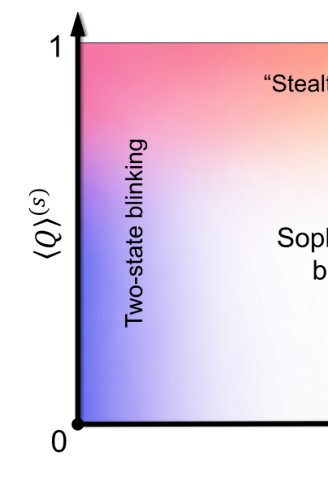 
Figure 1: Two-dimensional blinking suppression criterion proposed in this work. The colored regions indicate characteristic areas corresponding to different lu- minescence blinking mechanisms. Blue (left): two-state blinking (A-type or two-state TM). White (center): sophisticated blinking: multilevel TM blinking and hybrid mechanisms. Green (right): hot-carrier (HC) blinking. Violet- pink (upper left): two-state ”stealth” blinking. Red (upper center): ”stealth” blinking- high relative quantum yield with persistent, non-two-state decay-rate fluctuations. Yellow-orange (upper right): complete non-blinking mode - the case of complete blinking suppression.

📷 Fig 2

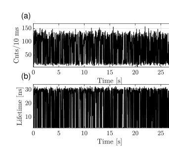 
Figure 2: Simulated trajectories of (a) intensity and (b) lifetime for A-type blinking with corresponding distributions. (c) FLID extracted from the simu- lation. The solid red curve represents the theoretical ridge line. Note that the color scale is displayed on a logarithmic scale. Additionally, for contrast, points with fewer than 5 events have been removed. The simulation was run for up to 104 switching events with T + = T −= 30 ms and a bin size of 10 ms; only the first 30 s are shown.

📷 Fig 3

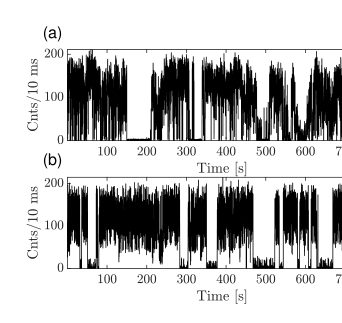 
Figure 3: TM blinking simulated using the model of Ref. 37. (a) Experimental blinking trace and photon-number distribution for a single CdSeS/ZnS quantum dot (QD 3.2 in Ref. 37); the red curve is the model fit. (b) Simulated trace and photon-number distribution generated with the parameters extracted from the fit; the red curve shows the theoretical expectation. (c) FLID extracted from the simulation, demonstrating the linear dependence characteristic of TM blinking. Simulation parameters and additional diagnostics are given in Supplementary Note 2.

📷 Fig 4

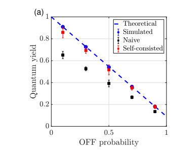 
Figure 4: Comparison of the naive and self-consistent estimators of the relative quantum yield. (a) A-type blinking with the OFF-state fraction pOFF varied from 0.1 to 0.9. Blue dashed curve: true theoretical quantum yield. Blue circles: mean of 10 simulations before Poisson noise (error bars: ±1 standard deviation). Red squares: self-consistent estimate ⟨ˆQ⟩(s). Black squares: naive estimate ⟨ˆQ⟩(0). (b) TM blinking with k0 varied over several orders of magnitude (parameters from QD 3.2 of Ref. 37). Symbols have the same meaning as in panel (a). Simulation parameters are listed in Supplementary Note 3.

📷 Fig 5

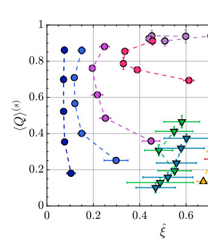 
Figure 5: Two-dimensional criterion (ˆξ, ⟨ˆQ⟩(s)) evaluated from simulations of A-type blinking (circles), TM blinking (upward triangles: QD 3.2; downward triangles: QD 4.4 from Ref. 37), and HC blinking (green squares). For A-type blinking, five values of kA/kr are used (0.1, 1, 5, 10, 20; see legend); for each, pOFF varies from 0.1 to 0.9. For TM blinking, k0 is varied at fixed α = 10 (red and green) and α is varied at fixed k0 (orange and cyan). Each point is the mean of 10 independent simulations. Simulation parameters are listed in Supplementary Note 3.

**Summary.** The paper introduces a novel, threshold-free two-dimensional criterion based on the variance of recombination rate and relative quantum yield to quantify luminescence blinking in semiconductor quantum dots. By mapping different physical blinking mechanisms onto this parameter space, it offers a robust tool for assessing emission stability without relying on ambiguous ON/OFF state definitions.

**Why it may be interesting.** This work provides a rigorous, quantitative metric for characterizing open quantum systems dynamics (blinking) that moves beyond simple state counting, which is highly relevant to understanding decoherence and stability in solid-state emitters.

Detailed structure

**Main problem.** Luminescence blinking remains a major obstacle for colloidal quantum dots, and existing quantitative assessment methods based on arbitrary intensity thresholds are ambiguous.

**Main result.** The authors propose a robust, threshold-free two-dimensional criterion using the variance of the recombination rate and relative quantum yield to quantitatively classify different blinking mechanisms.

**Method.** They derive and apply this 2D criterion $(\hat{\xi}, \langle\hat{Q}
angle^{(s)})$ by analyzing time-correlated single-photon counting data, comparing it against simulations covering A-type, Trapping Mechanism (TM), and Hot Carrier (HC) blinking.

**Model / system.** The system is colloidal semiconductor quantum dots exhibiting luminescence blinking. The analysis models the dynamics using instantaneous quantum yield $Y(t)$ and recombination rate $\Gamma(t)$, which are extracted from single-photon counting data.

**Key observables.** Variance of recombination rate ($\hat{\xi}$), self-consistent relative quantum yield ($\langle\hat{Q}
angle^{(s)}$), ON/OFF time distributions, and the two-dimensional parameter space map.

**Important parameters / regimes.** The criterion distinguishes regimes: $\hat{\xi} \approx 1$ (constant rate), $\hat{\xi} = 0$ (two-state switching), and $(\hat{\xi} \approx 1, \langle\hat{Q}
angle^{(s)} \approx 1)$ for complete suppression.

**Assumptions / limitations.** The self-consistent estimator for quantum yield is preferred over naive estimators due to bias reduction; the analysis relies on extracting time-dependent rates from binned data.

**Figures summary.** Figure 1 shows the 2D blinking criterion diagram color-coding different mechanisms (Blue, White, Green, etc.). Other figures compare statistical diagnostics like ON/OFF distributions and Power Spectral Density for simulated TM blinking.

**Paper structure.** The paper first identifies the limitations of existing threshold methods. It then introduces the two-dimensional $(\hat{\xi}, \langle\hat{Q}
angle^{(s)})$ criterion, deriving the necessary estimators by comparing naive vs. self-consistent approaches. Finally, it validates this criterion by simulating and mapping known blinking mechanisms (A-type, TM, HC).

Abstract

Colloidal semiconductor quantum dots are promising materials for numerous applications due to their tunable emission and high quantum yields. However, emission instability in the form of luminescence blinking remains a significant obstacle to their practical implementation. While recent advances in synthesis and surface engineering have demonstrated partial or complete blinking suppression, the quantitative assessment of the "quality" of this suppression remains challenging. Existing criteria typically rely on threshold-based classification into ON and OFF states, which becomes inherently ambiguous owing to the continuous distribution of emission intensities in single quantum dots. Here, we propose a threshold-free two-dimensional quantitative criterion based on the variance of the recombination rate and the relative quantum yield, both of which can be extracted from standard time-correlated single-photon counting measurements. We validate the criterion using simulated blinking trajectories covering all major blinking mechanisms and demonstrate that it cleanly separates them into distinct regions of the two-dimensional parameter space while providing a quantitative measure of the degree of suppression. This approach directly quantifies the temporal stability of emission without requiring arbitrary state definitions, thereby providing a robust metric for comparing different blinking suppression strategies.

[↑ back to top](#top)

### [Element-Specific Visualization of Layer-Parity and Twist-Dependent Magnetism in CrSBr](http://arxiv.org/abs/2607.26003v1)

**Authors:** Aalok Tiwari, Shubhada Patil, Ravi Kumar Bandapelli, Alevtina Smekhova, Abhishek Kumar, Wenhao Liu, I-Hsuan Kao, Zhenhong Cui, Raghvendra Posti, Brandon Tran, Zixin Zhai, Priti Yadav, Sandy Adhitia Ekahana, Alexander X. Gray, Bing Lv, Vivekanand Shukla, Florian Kronast, Simranjeet Singh, Jyoti Katoch  
**Type:** both · **Category:** strongly correlated electrons · **PDF:** <https://arxiv.org/pdf/2607.26003v1>  
**Analysis basis:** full PDF text, analyzed in chunks
**Topic relevance:** `spintronics-quantum-optics interface` **3/5** · `analog quantum simulation` **2/5** · `exotic spin models in light-matter` **1/5** · `non-equilibrium dynamics` **1/5**

📷 Fig 1

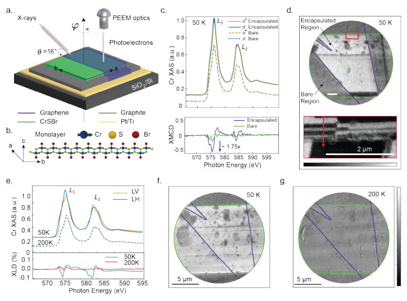 
FIG. 1. Graphene encapsulation enhances XMCD signal in CrSBr. a, Schematic of PEEM experimental geometry with X-rays at 16◦grazing incidence and azimuthal rotation (φ) capability. The heterostructure consists of CrSBr (green) encapsulated between graphene (purple) and graphite (gray) on a Pt/Ti/SiO2/Si substrate. b, Atomic structure of monolayer CrSBr showing Cr (blue), S (red), and Br (yellow) atoms. Cr magnetic moments are aligned along the crystallographic b- axis. c, X-ray absorption spectra (XAS-PEEM) at the Cr L2,3 edges acquired with right (σ+, orange) and left (σ−, blue) circularly polarized photons, comparing graphene-encapsulated (top) and bare (bottom) CrSBr regions at 50 K....

📷 Fig 2

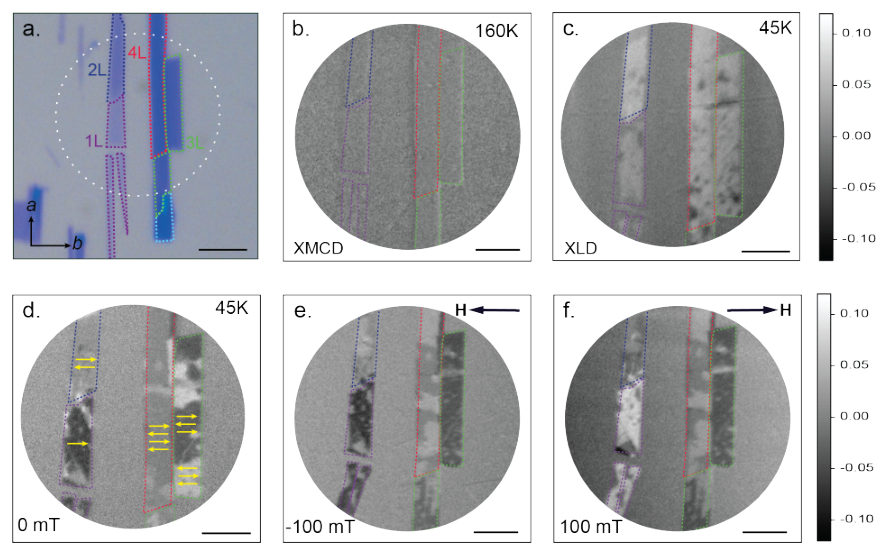 
FIG. 2. Layer-parity-dependent magnetic structure in atomically thin (1L–4L) CrSBr. a, Optical micrograph of exfoliated CrSBr showing regions of increasing thickness: 1L (violet), 2L (blue), 3L (green), and 4L (red). Scale bar: 5 µm. b, XMCD-PEEM map acquired at 160 K (above the bulk N´eel temperature), showing absence of magnetic dichroic contrast. c, XLD-PEEM map at 45 K revealing finite linear dichroic contrast across all layers. d, Ground-state XMCD-PEEM map at 45 K showing layer-parity-dependent magnetization: odd-numbered layers (1L, 3L) exhibit net magnetization (white/black contrast), while even-numbered layers (2L, 4L) remain magnetically compensated (gray). e, XMCD-PEEM map of the...

📷 Fig 3

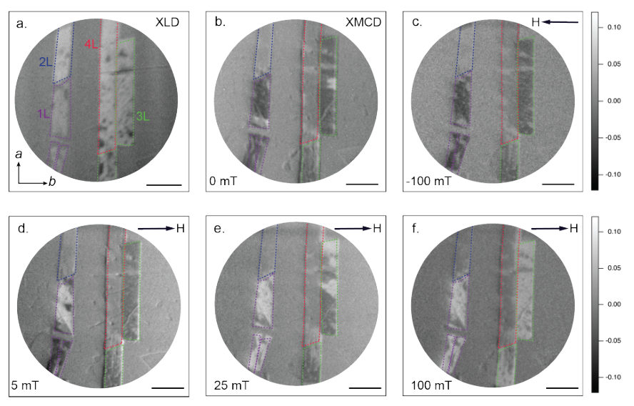 
FIG. 3. Magnetic field-driven spin structure in atomically thin CrSBr at 110 K. The sample was field-cooled from the paramagnetic state through the magnetic transition temperature under an applied field of −25 mT to initialize domain alignment. Colored dashed lines delineate layer boundaries (1L, violet; 2L, blue; 3L, green; 4L, red). a, XLD-PEEM map showing finite linear dichroic contrast across all layers. b, XMCD-PEEM map acquired after field-cooling in −25 mT, revealing preferential alignment of odd-numbered layers along the field direction. c, Application of −100 mT saturates the net magnetization in odd layers fully along the field direction; even layers remain compensated. d, Under a...

📷 Fig 4

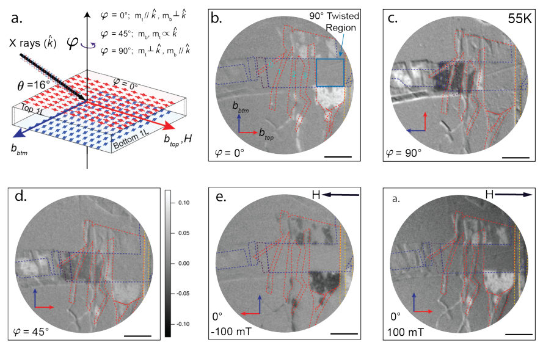 
FIG. 4. Visualizing spin structure in twisted bilayer CrSBr. a, Schematic of measurement geometry with X-ray beam at 16◦grazing incidence. Red arrows represent top-layer magnetization (along ⃗btop-axis) and applied magnetic field direction; blue arrows represent bottom-layer magnetization (along ⃗bbottom-axis, perpendicular to ⃗btop). The XMCD signal is proportional to m · ˆk, the projection of magnetization onto the X-ray propagation direction (ˆk). Colored dashed outlines indicate layer boundaries (red: top layer; blue: bottom layer). The cyan box indicates the 90◦twisted region. b–d, XMCD- PEEM maps acquired at azimuthal rotation angles of φ = 0◦, 90◦, and 45◦(sample rotated...

**Summary.** This work provides element-specific visualization of magnetism in few-layer $	ext{CrSBr}$ using XMCD/XLD-PEEM. It reveals that magnetic order is critically dependent on the layer parity and that twisting the layers fundamentally alters the magnetic anisotropy, opening avenues for designing novel moiré spintronic devices.

**Why it may be interesting.** While primarily condensed matter magnetism, the study's focus on emergent phenomena (moiré magnetism) and the use of advanced spectroscopic probes to map spin structure at interfaces are highly relevant to understanding quantum materials for future quantum technologies.

Detailed structure

**Main problem.** The study addresses the lack of element-specific, nanoscale characterization of spin structure and layer-parity effects in atomically thin van der Waals (vdW) antiferromagnets.

**Main result.** The magnetic order is found to be strongly dependent on layer parity, with odd layers exhibiting net magnetization while even layers remain compensated AFM. Furthermore, the twist angle significantly modifies the magnetic anisotropy energy (MAE), suggesting novel moiré magnetism pathways.

**Method.** The research combines advanced experimental techniques like X-ray Magnetic Circular/Linear Dichroism Photoemission Electron Microscopy (XMCD/XLD-PEEM) with theoretical calculations using DFT and Green's function methods to model exchange interactions.

**Model / system.** The physical system is atomically thin $	ext{CrSBr}$ in various layer numbers ($1	ext{L}-4	ext{L}$) and twisted bilayer configurations. Theoretical modeling utilizes the Heisenberg Hamiltonian and calculates MAE using the force theorem, incorporating spin-orbit coupling.

**Key observables.** XMCD asymmetry (magnetic moments), XLD contrast (crystal field effects/anisotropy), Net magnetization direction, Magnetic Anisotropy Energy (MAE), Exchange coupling constants ($J_{ij}$).

**Important parameters / regimes.** Layer number (parity dependence), Twist angle ($	heta$), Temperature ($50	ext{ K}$ to $200	ext{ K}$), External magnetic field strength.

**Assumptions / limitations.** The analysis assumes that the observed magnetism is governed by intrinsic layer-dependent coupling mechanisms, and DFT calculations provide an accurate description of exchange interactions across different lattice parameters/twists.

**Figures summary.** Figures illustrate graphene encapsulation effects on XMCD, layer-by-layer magnetic switching behavior (odd vs. even layers), and how the $	ext{XMCD}$ signal is suppressed or altered in orthogonally twisted bilayer regions based on the azimuthal angle ($\phi$).

**Paper structure.** The paper progresses from establishing the need for nanoscale characterization to presenting experimental evidence of layer-parity dependence, then detailing the unique magnetic response observed in twisted bilayers, and finally supporting these findings with detailed DFT calculations of exchange interactions and MAE.

Abstract

Van der Waals (vdW) based antiferromagnets (AFMs) are an ideal platform for probing and understanding thickness- and twist-angle-dependent emergent spin phenomena. However, element-specific nanoscale characterization of the spin structure in atomically thin vdW-based AFMs systems and layer-parity effects remain elusive, making them crucial for both fundamental insight into low-dimensional magnetism and the rational design of spintronic devices based on these materials. Here, we utilize X-ray magnetic circular and linear dichroisms paired with photoemission electron microscopy to resolve the magnetic order in atomically thin CrSBr. Our comprehensive measurements reveal CrSBr magnetic structure at the nanoscale and its dependence on the layer number, surface encapsulation, temperature, and applied field. Moreover, in the orthogonally twisted bilayer configuration, obtained by twisting two CrSBr ferromagnetic monolayers by 90$^\circ$, the magnetic easy axis fundamentally differs from the individual monolayers, unlocking a new pathway for moiré magnetism.

[↑ back to top](#top)

### [Twisted Multilayer Graphene: Superperiodicity and quasicrystals](http://arxiv.org/abs/2607.25411v1)

**Authors:** Pedro Alcázar Guerrero  
**Type:** theory · **Category:** disordered systems and neural networks · **PDF:** <https://arxiv.org/pdf/2607.25411v1>  
**Analysis basis:** full PDF text, analyzed in chunks
**Topic relevance:** `Keldysh / 2PI / non-Gaussian methods` **2/5** · `methods for driven-dissipative` **2/5** · `non-equilibrium dynamics` **2/5** · `spintronics-quantum-optics interface` **2/5** · `Kondo & dissipative impurity` **1/5** · `analog quantum simulation` **1/5** · `correlated / nonlocal dissipation` **1/5** · `driven-dissipative phase transition` **1/5** · `entanglement & information structure` **1/5** · `exotic spin models in light-matter` **1/5** · `non-equilibrium universality` **1/5** · `scars & prethermalization` **1/5**

📷 Fig 1

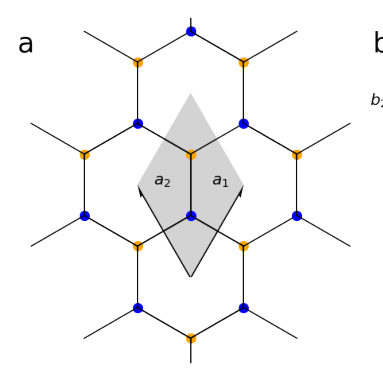 
Figure 2.1: a. Crystalline structure of graphene where the unit cell is shad- owed and the colors correspond to the A (blue) and B (orange) sublat- tices. b. First Brillouin zone of graphene where the equivalent K points are marked as triangles pointing up and the K’ with triangles pointing down.

📷 Fig 2

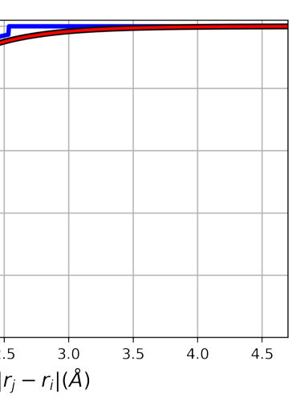 
Figure 2.2: Decay of the different overlap functions used for this integral during this thesis. In black we observe the model displayed in (5.2), in red (6.1) and in blue (7.10) explained in chapters 5, 6 and 7 respectively.

📷 Fig 3

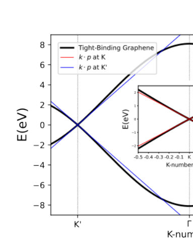 
Figure 2.3: Band structure computed from a nearest-neighbor approxima- tion of equation (2.5). The red and blue curves show the K · p approxima- tion in equation (2.8) that remains valid for low energies.

📷 Fig 4

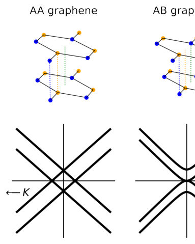 
Figure 2.4: Different possible stackings of graphene and their correspond- ing band structures. The blue, orange and green vertical lines in the top figures are a guide to the eye to understand the matching conditions for the bottom layer A, B lattice sites and the center of the hexagons respectively.

📷 Fig 5

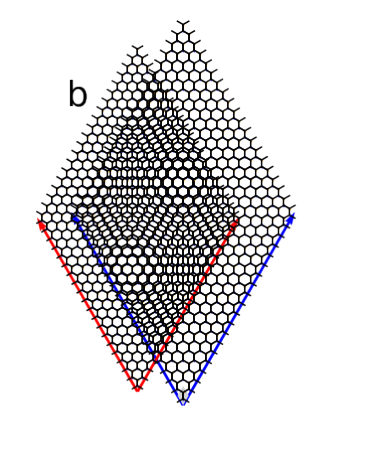 
Figure 2.5: Two cases of moir´e patterns. In panel a: two identical hexag- onal (graphene) structures are rotated 12◦. In panel B the unit cells are parallel but there is a mismatch between the lattice constant in red and blue unit cells.

**Summary.** This thesis comprehensively analyzes electronic and spin transport in complex graphene structures exhibiting super- or quasiperiodicity. It demonstrates that disorder can paradoxically enhance conductivity in magic-angle twisted bilayer graphene while identifying unique signatures of quasicrystalline order. Overall, it unifies the understanding of how geometry and structural imperfections govern quantum transport phenomena.

**Why it may be interesting.** It provides a detailed framework for understanding how geometric frustration and randomness interact with quantum coherence, which is central to open quantum system dynamics and localization studies.

Detailed structure

**Main problem.** The study investigates how structural complexities like superperiodicity, quasiperiodicity, and disorder fundamentally shape electronic and spin transport in graphene-based materials.

**Main result.** The work establishes that moderate disorder can counterintuitively enhance the mean free path in magic-angle twisted bilayer graphene, while quasicrystalline order exhibits distinct sub-ballistic localization signatures fragile to structural perturbations.

**Method.** The research employs large-scale real-space quantum-transport methods, utilizing Kubo-type formulations and tight-binding descriptions incorporating curvature effects.

**Model / system.** The primary systems studied are graphene, specifically in its twisted multilayer form (including magic-angle interfaces), quasicrystal approximants, and suspended monolayer sheets for spin transport analysis.

**Key observables.** Mean free path, quantum metric derived from optical conductivity, sub-ballistic exponent, and spin lifetimes.

**Important parameters / regimes.** Disorder strength (Anderson disorder), structural periodicity (super/quasiperiodicity), and interlayer proximity effects.

**Assumptions / limitations.** The analysis relies on established transport formalisms and assumes that flat-band features remain robust enough to exhibit specific disorder-induced delocalization behavior.

**Figures summary.** Not specified, but the work builds upon establishing controlled transport fingerprints distinguishing various periodic modulations.

**Paper structure.** The thesis progresses from fundamental concepts (superperiodicity/quasiperiodicity) to computational methods, analyzing controlled models, then focusing sequentially on disorder effects in twisted multilayer graphene and spin transport in corrugated monolayer systems.

Abstract

This thesis investigates how superperiodicity, quasiperiodicity, and disorder shape electronic and spin transport in graphene-based systems, with an emphasis on experimentally relevant length scales and realistic atomistic modeling. Using large-scale real-space quantum-transport methods, it first establishes controlled transport fingerprints that distinguish conventional Bloch propagation in periodic structures from the anomalous dynamics induced by quasiperiodic modulations. Building on this framework, the thesis analyzes magic-angle twisted bilayer graphene and shows that, within a finite disorder window where flat-band features remain robust, moderate Anderson disorder can counterintuitively enhance the mean free path. This disorder-induced delocalization is further linked to changes in the quantum metric extracted from optical conductivity, revealing a direct connection between transport, electronic geometry, and the real-space extent of the underlying states. The study then turns to graphene quasicrystal approximants and hybrid multilayer stacks, identifying sub-ballistic transport and self-similar localization patterns as signatures of quasicrystalline order, while also demonstrating their strong fragility against disorder and interlayer proximity effects. Finally, the thesis addresses spin transport in suspended monolayer graphene, showing that atomic-scale corrugations generate short-range fluctuating Rashba fields that can limit spin lifetimes to the nanosecond range even when charge transport remains close to ballistic. Taken together, these results provide a unified picture of how geometry, disorder, and structural complexity govern transport phenomena in twisted and corrugated graphene systems.

[↑ back to top](#top)

### [Relative hybridization textures as local coordinates for band geometry and topology](http://arxiv.org/abs/2607.25673v1)

**Authors:** Caiyuan Ye, Zhong Fang, Hongming Weng, Quansheng Wu  
**Type:** theory · **Category:** other · **PDF:** <https://arxiv.org/pdf/2607.25673v1>  
**Analysis basis:** full PDF text, analyzed in chunks
**Topic relevance:** `entanglement & information structure` **2/5** · `Keldysh / 2PI / non-Gaussian methods` **1/5** · `analog quantum simulation` **1/5** · `driven-dissipative phase transition` **1/5** · `methods for driven-dissipative` **1/5**

📷 Fig 1

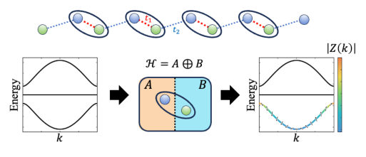 
FIG. 1. Physical motivation for the relative hybridization texture. Local degrees of freedom coupled by hopping and hybridization generate momentum-dependent band embed- dings. A conventional band plot shows the dispersion, while a partition into reference and complementary sectors resolves how the occupied states are completed from one sector into the other. The relative hybridization coordinate Z records this sector-resolved hybridization: its magnitude measures the local mixing strength, shown by the color scale on the band, while its phase retains the coherent phase information of the hybridization, indicated schematically by the small arrows along the texture.

📷 Fig 2

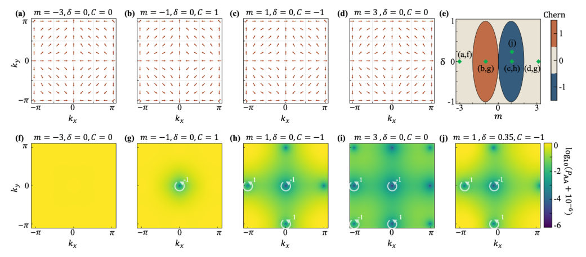 
FIG. 2. QWZ benchmark in the relative hybridization chart. Panels (a)-(d) show the phase texture of the scalar coordinate Z(k) over the Brillouin zone for m = −3, −1, 1, 3 at δ = 0, corresponding to the undeformed QWZ model; the arrows indicate the local phase orientation of Z. Panel (e) shows the Chern phase diagram in the (m, δ) plane, with green diamonds marking the parameter points displayed in the other panels. Panels (f)-(i) show the corresponding chart-viability field log10(PAA + 10−6) for the same four masses. Dark minima mark rank-drop defects of the A chart; white loops indicate the local winding and the numbers give the defect charges ν. Panel (j) shows a representative deformed...

📷 Fig 3

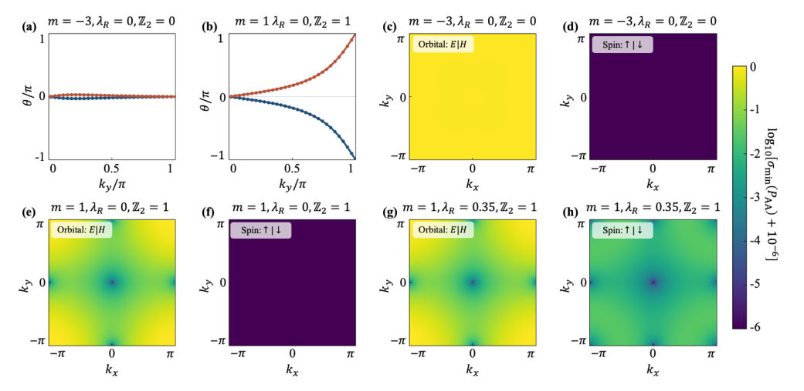 
FIG. 3. Representative BHZ cuts and sector viability. Panels (a) and (b) show the Wilson phases for the spin-conserving model at m = −3 and m = 1, respectively. The trivial phase has a flat Wilson spectrum. The QSH phase shows the characteristic spectral flow. Panels (c) and (e) compare the orbital E|H chart viability, plotted as log10[σmin(PAA) + 10−6], in the trivial and QSH regimes. The orbital chart is well conditioned in the trivial regime and develops localized inversion defects in the QSH regime. Panels (d) and (f) show that the spin ↑| ↓chart is rank deficient throughout the Brillouin zone when λR = 0. Panels (g) and (h) show the effect of finite Rashba coupling at m = 1: the...

📷 Fig 4

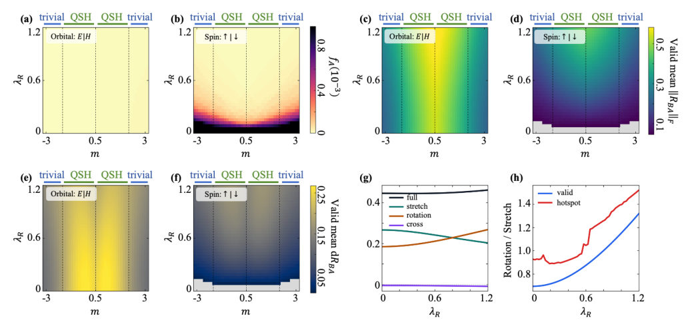 
FIG. 4. Parameter-resolved BHZ diagnosis in the (m, λR) plane. Panels (a) and (b) show the near-singular area fraction fA(ϵ) = Area{k : sA(k) &lt; ϵ}/Area(BZ) for the orbital E|H and spin ↑| ↓charts, evaluated as a uniform-grid point fraction. The orbital chart remains valid over nearly the whole plane. The spin chart is strongly invalid near the spin-conserving limit and is

**Summary.** This work introduces the relative hybridization coordinate $Z$ as a powerful diagnostic tool to bridge the gap between abstract global topological invariants and concrete, sector-specific microscopic details of electronic bands. By analyzing the momentum-space texture of $Z$, researchers can robustly calculate quantities like the Chern number while explicitly tracking which physical components (e.g., orbital or spin sectors) contribute to the observed topology.

**Why it may be interesting.** While focused on solid-state topology, the concept of using a local coordinate system ($Z$) derived from projection operators to diagnose global properties is highly relevant for characterizing entanglement structures or effective Hamiltonians in open quantum systems.

Detailed structure

**Main problem.** Global topological diagnostics (like Berry curvature) characterize band geometry but fail to specify the underlying microscopic sectors responsible for these invariants.

**Main result.** The relative hybridization coordinate $Z$ provides a sector-resolved framework that connects global topology and geometry directly to local, microscopic degrees of freedom within the occupied Bloch subspace.

**Method.** The authors introduce $Z$, defined as a projector-level diagnostic (Grassmann graph coordinate) relating the occupied subspace to chosen reference sectors ($A$ vs. $B$). Topological invariants are then read from defects in the momentum-space texture of $Z$.

**Model / system.** The framework is applied generally to Bloch subspaces in condensed matter systems, with specific tests on the Qi-Wu-Zhang (QWZ) Chern insulator and the lattice BHZ model.

**Key observables.** Relative hybridization coordinate $Z$, quantum geometric tensors ($T_{ij}$), chart viability field ($\sigma_{\min}(P_{AA})$), and topological invariants like the first Chern number derived from defect winding.

**Important parameters / regimes.** The dimension matching between sectors ($	ext{dim } A$ vs. $N_{	ext{occ}}$) is crucial for defining the coordinate $Z$.

**Assumptions / limitations.** The analysis relies on fixing a microscopic partition of the Hilbert space ($H = A \oplus B$) and assuming the existence of open patches where key projections are invertible.

**Figures summary.** Figure 1 illustrates that the magnitude of $Z$ measures local mixing strength, while its phase retains coherent information about sector-resolved hybridization.

**Paper structure.** The paper develops the mathematical formalism for $Z$, derives geometric tensors from it, and then applies this machinery to calculate known topological invariants (Chern number via defect counting) in benchmark models like QWZ and BHZ.

Abstract

Global diagnostics such as Berry curvature and quantum metrics characterize the geometry and topology of an occupied Bloch subspace, leaving the microscopic sectors that carry this structure implicit. We introduce the relative hybridization coordinate $Z$ as a projector-level diagnostic connecting these global quantities to local degrees of freedom. As the Grassmann graph coordinate relative to a chosen sector, $Z$ reconstructs the local projector and retains the phase and matrix orientation absent from ordinary weight or fat-band descriptions. On valid chart patches, its momentum-space texture encodes Berry curvature, quantum metric, Berry phases, and Wilson loops, while chart obstructions appear as rank-drop defects whose balanced-chart winding of $\det Z$ gives the first Chern number. In the QWZ model this defect inventory reproduces the Chern phase diagram. In the lattice BHZ model, matrix $Z$ diagnoses the orbital $E|H$ partition as a robust matched chart for the QSH geometry, while the spin partition remains essential to the block and $\mathbb Z_2$ interpretation and shows rank deficiency as a matched chart in the spin-conserving limit. The relative hybridization coordinate thus provides a sector-resolved framework for relating band geometry and topology to microscopic structure.

[↑ back to top](#top)

### [Quantum metric quadrupoles in elemental bismuth thin films](http://arxiv.org/abs/2607.25725v1)

**Authors:** Rhonald Burgos Atencia, Pavlo Makushko, Gabriele Naselli, Debottam Mandal, Paul Chekhonin, Sergey Kovalev, Steffen Kober, Zhe Wang, Igor Veremchuk, Oleksiy Pashkin, Fabian Ganss, Maria Teresa Mercaldo, Denys Makarov, Carmine Ortix  
**Type:** both · **Category:** other · **PDF:** <https://arxiv.org/pdf/2607.25725v1>  
**Analysis basis:** full PDF text, analyzed in chunks
**Topic relevance:** `non-equilibrium dynamics` **2/5** · `Keldysh / 2PI / non-Gaussian methods` **1/5** · `driven-dissipative phase transition` **1/5**

📷 Fig 1

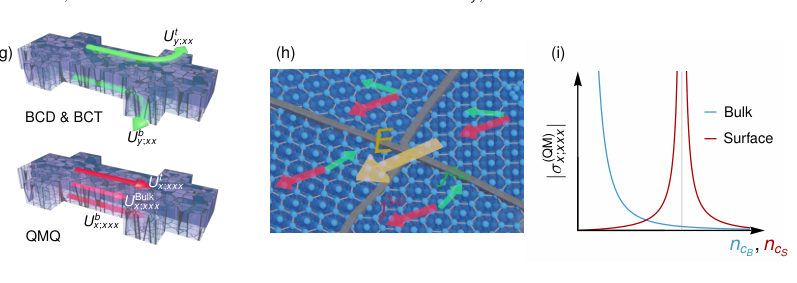 
FIG. 1. Quantum metric and nonlinear transport in non-magnetic materials with centrosymmetry (a) Comparison between the quantum metric quadrupole (QMQ) and nonlinear Drude (NLD) contribution to the third-order longitudinal conductivity σx;xxx for bulk three-dimensional Dirac fermions with mass M. (b)-(c) Three-dimensional contour plots of the trace of the non-Abelian quantum metric g for an isotropic bulk Dirac model. The two quantum metric components xx (b) and xy (c) involved in nonlinear transport are shown. The 3D contour plots show only representative isosurfaces. (d)-(f) 3D-contour plots of the QMQ densities (corresponding to the second derivatives of the trace of the non-Abelian...

📷 Fig 2

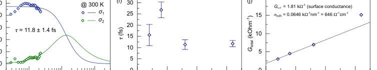 
FIG. 2. Electronic properties, magnetotransport and optical transport in Bi thin films. (a) 3D Brillouin zone (BZ) of elemental Bismuth. At the T point of the BZ a large hole pocket is found. The three inequivalent L points instead host Dirac electrons with a Dirac mass of few meV. (b) At the ¯Γ centre of the projected two-dimensional BZ for films grown along the (111) direction, spin-orbit coupled surface states with Rashba spin-splitting appear. (d) θ −2θ XRD pattern of bismuth thin film deposited onto polyimide substrate. Inset shows high-resolution scanning electron microscopy image of the film‘s surface, confirming its polycrystalline nature. (e) Temperature dependence of linear...

📷 Fig 3

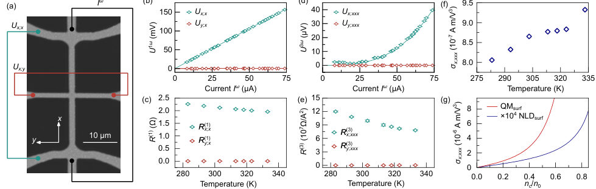 
FIG. 3. Nonlinear transport in bismuth thin film on polyimide substrate. (a) Scanning electron microscope image of the Hall bar device. AC electrical current Iω is applied along the x direction, longitudinal and transverse voltages are recorded at first, as well as second and third harmonics at temperature of 303 K. (b) Longitudinal Ux;x and transverse Iy;x first harmonic voltages as function of applied current. The Ux;x shows linear dependence on applied current, indicating Ohmic behaviour of the device. Symbols represent the measured data and lines are fit. (c) Temperature evolution of longitudinal and transverse resistances R(1) = U 1ω/Iω of the Hall bar device. (d) Longitudinal Ux;xxx...

**Summary.** This paper establishes that nonlinear third-order electrical transport in centrosymmetric materials is dictated by Quantum Metric Quadrupoles derived from the quantum geometry of electron wavefunctions. The authors theoretically model this effect using Dirac fermions and experimentally validate it by measuring robust third-harmonic generation in elemental bismuth thin films at room temperature. This demonstrates that third-order nonlinearity serves as a high-precision diagnostic tool for probing wavefunction geometry under ambient conditions.

**Why it may be interesting.** While focused on condensed matter transport, the explicit link between macroscopic measurable quantities (third-harmonic current) and fundamental quantum geometric invariants (quantum metric quadrupoles) provides a powerful, non-perturbative probe of electronic structure geometry.

Detailed structure

**Main problem.** The study investigates nonlinear transport properties in solids, linking them directly to the quantum geometry of electronic wavefunctions encoded in the quantum metric tensor.

**Main result.** Third-order nonlinear transport is governed by Quantum Metric Quadrupoles (QMQs), which were experimentally observed as robust third-harmonic generation in elemental bismuth thin films up to room temperature.

**Method.** The work combines theoretical derivation of third-order conductivity tensors with extensive experimental measurements using electrical harmonic detection and THz spectroscopy on patterned thin films.

**Model / system.** The focus is on non-magnetic, centrosymmetric materials hosting relativistic fermions, modeled by bulk Dirac fermions (non-Abelian) and surface states (Abelian). The experiment uses elemental bismuth thin films with polycrystalline structure.

**Key observables.** Third-order nonlinear conductivity tensor ($\sigma_{x;xxx}$), third-harmonic voltage ($U_{x;xxx}$), and the comparison between QMQ and Nonlinear Drude contributions.

**Important parameters / regimes.** Room temperature operation, polycrystallinity (allowing domain averaging survival), and carrier density dependence on $n$-type carriers.

**Assumptions / limitations.** The longitudinal third-order response survives domain averaging in polycrystalline films, unlike second-harmonic responses; the QMQ contribution dominates over other nonlinear terms.

**Figures summary.** Figures compare theoretical contributions (QMQ vs NLD), show BZ structures and surface splitting, and present experimental data on $\sigma_{x;xxx}$ dependence on current and temperature for bismuth thin films.

**Paper structure.** The paper progresses from establishing the quantum geometric origin of nonlinear transport to developing models for bulk/surface contributions, culminating in detailed electrical and THz measurements on elemental bismuth to validate the QMQ diagnostic tool.

Abstract

The nonlinear transport properties of solids are deeply rooted in the quantum geometry of their electronic wavefunctions, which is encoded in the quantum geometric tensor. Its real part, known as the quantum metric, has been recently identified as a primary origin of nonlinear transport in quantum materials where time-reversal and inversion symmetries are not simultaneously present. Consequently, the influence of the quantum metric on the largest class of materials -- non-magnetic and centrosymmetric systems -- has remained entirely elusive. Here, we demonstrate that third-order transport in centrosymmetric materials hosting relativistic fermions is governed by quantum metric quadrupoles (QMQs). We show that these QMQs can originate from both the non-Abelian quantum geometry of bulk three-dimensional Dirac fermions and the Abelian quantum geometry of spin-orbit-coupled surface states. In stark contrast to all zero-field nonlinear transport signatures known to date, the current driven by these QMQs persists as a robust, non-vanishing observable even in highly scalable polycrystalline thin films. We experimentally validate this quantum metric footprint by measuring nonlinear transport in thin films of elemental bismuth, observing a robust, surface-dominated, and broadband third-harmonic generation that persists up to room temperature. Our findings uncover a hidden role of the quantum metric in polycrystalline systems, establishing third-order nonlinear transport as a high-precision diagnostic tool of wavefunction geometry under ambient conditions.

[↑ back to top](#top)

### [Van Hove singularity-driven giant Nernst signal in twisted double bilayer graphene](http://arxiv.org/abs/2607.25359v1)

**Authors:** Ujjal Roy, Monosij Roy, Unmesh Ghorai, Arkaprava Mukherjee, Ravi Kumar, Kenji Watanabe, Takashi Taniguchi, Nandini Trivedi, Rajdeep Sensarma, Subroto Mukerjee, Anindya Das  
**Type:** both · **Category:** other · **PDF:** <https://arxiv.org/pdf/2607.25359v1>  
**Analysis basis:** full PDF text, analyzed in chunks
**Topic relevance:** `Keldysh / 2PI / non-Gaussian methods` **2/5** · `methods for driven-dissipative` **1/5** · `non-equilibrium dynamics` **1/5**

📷 Fig 1

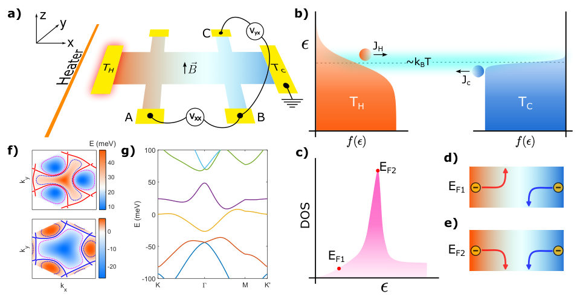 
Figure 1: Measurement schematic, Lifshitz transitions and thermally driven carrier motion in mag- netic field. (a) Schematic of the thermoelectric measurements. Passing current through the metallic heater creates a longitudinal temperature gradient, and the resulting open-circuit thermoelectric voltages are mea- sured between contacts A-B (Vxx) and B-C (Vyx), corresponding to the Sxx (−Vxx/∆T) and Syx (−Vyx

📷 Fig 2

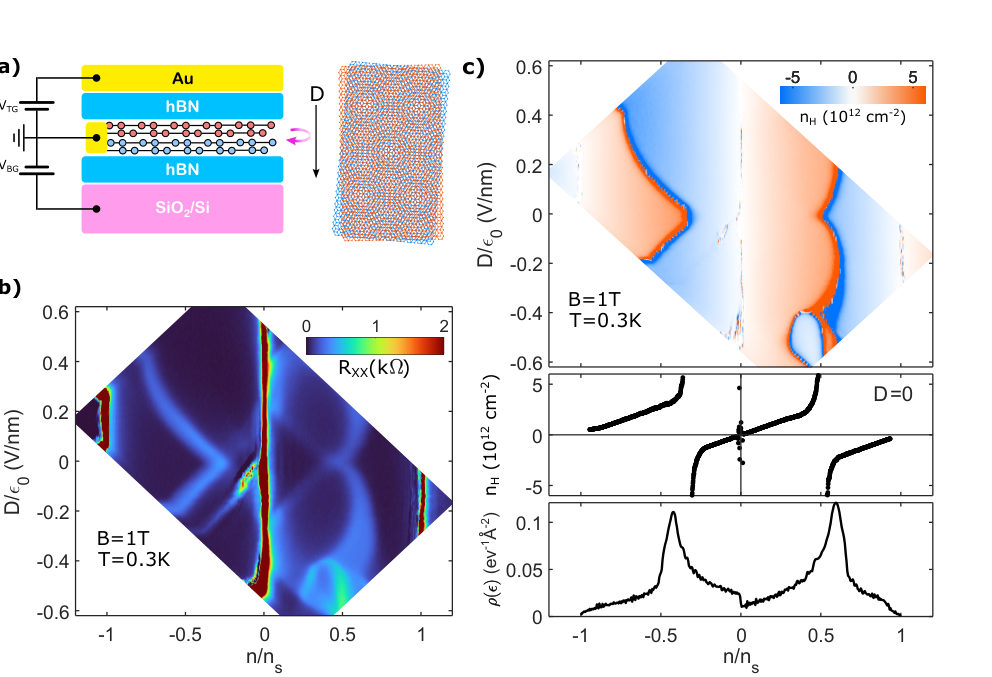 
Figure 2: Resistance and Hall response tracing vHS. (a) (Left) Schematic cross-section of the hBN- encapsulated tDBLG stack. (Right) The moiré heterostructure is formed by stacking two Bernal BLG flakes with a twist angle. The TG and the BG are biased by external voltage sources (VTG and VBG), allowing for independent control of n and D for device D1. The arrow indicates the positive direction of D. (b) 2D colormap of 4-probe longitudinal resistance, Rxx, measured at B = 1T and T = 0.3K, as a function of normalized carrier density n/ns and D. (c) (Top) Evolution of Hall density, nH = B/eRxy, (here e is the electronic charge and Rxy is the Hall resistance) in the same n −D plane. (Middle)...

📷 Fig 3

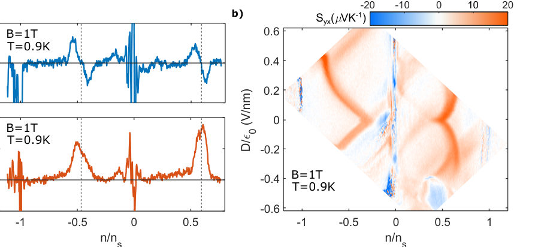 
Figure 3: Thermopower and Nernst response. (a) Line cuts of the thermoelectric coefficients (TEC), Sxx (blue) and Syx (orange) as a function of n/ns for a fixed displacement field, D = 0.1V nm−1, and B = 1T and T = 0.9K. Sxx changes sign across the vHS and becomes zero at vHS, whereas the Syx exhibits positive peak around the vHS. (b) 2D colormap of the Nernst signal, Syx as function of n/ns and D, for B = 1T and T = 0.9K. Enhanced Syx values are observed along the same n-D trajectories as the vHS identified in Hall measurement, Fig. 2b. and c.

📷 Fig 4

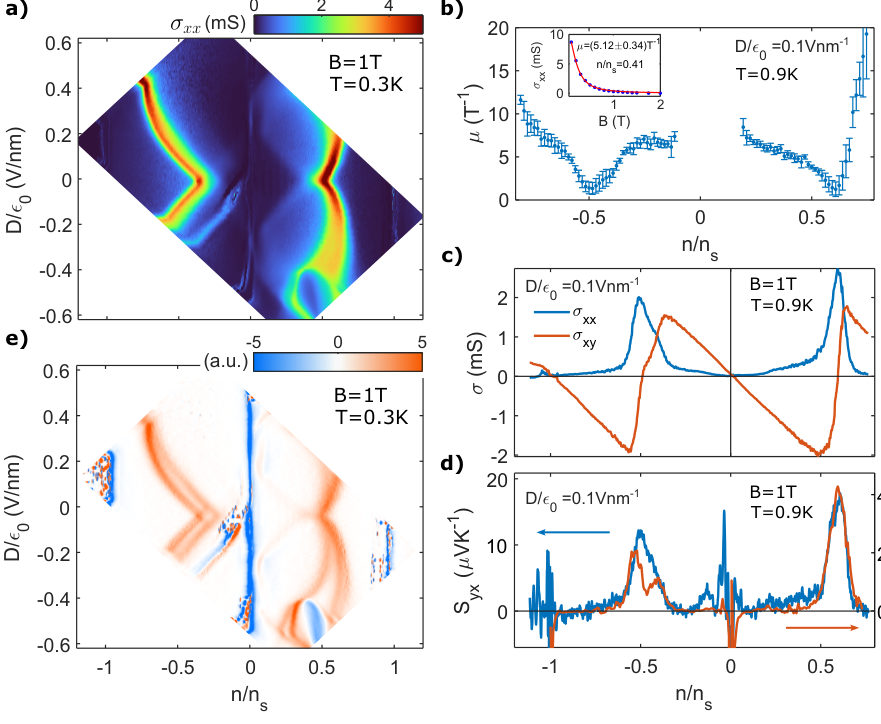 
Figure 4: Conductivity, mobility and Nernst from semiclassical theory. (a) 2D colormap of σxx with n −D at B = 1T and T = 0.3K. (b) Extracted Hall mobility as a function of carrier concentration at D/ϵ0 = 0.1V nm−1. Error bar represent the fitting error during the extraction of µ. Inset shows the magnetic field dependence of σxx (solid circles) at n/ns = 0.41. The Red solid line is the fitting to extract the mobility. (c) σxx and σxy cut-lines with n/ns at D/ϵ0 = 0.1V nm−1. The σxx shows peak around the vHS whereas the σxy changes sign. (d) Using the above conductivity and theoretical DOS, the Syx is calculated using Eq. (1), and shown in orange solid line. In comparison, the measured Syx...

**Summary.** This work demonstrates that Van Hove singularities in twisted double bilayer graphene lead to a giant Nernst signal, which serves as a sensitive probe of the material's Fermi surface topology. The large enhancement is theoretically linked to Lifshitz transitions occurring near these density of states peaks. By combining theory and experiment, the authors establish a universal thermoelectric signature for vHSs in moiré systems.

**Why it may be interesting.** While focused on solid-state transport, the concept of using topological features (like vHSs) to engineer measurable quantum responses (Nernst effect) is relevant for understanding exotic electronic states in low-dimensional or engineered quantum systems.

Detailed structure

**Main problem.** To investigate how Van Hove singularities (vHSs) influence thermal transport, specifically generating a large Nernst signal in moiré materials.

**Main result.** The authors show that vHSs in twisted double bilayer graphene generate an unusually large and tunable Nernst signal, which is attributed to Lifshitz transitions around these singularities.

**Method.** The study combines experimental measurements of thermopower and the Nernst effect with theoretical calculations based on semiclassical Boltzmann transport equations.

**Model / system.** The physical system is twisted double bilayer graphene (tDBLG), a moiré material whose electronic structure features vHSs. Theoretical analysis uses continuum theory and minimal tight-binding models to describe band dispersion and DOS.

**Key observables.** Nernst signal ($S_{yx}$), Seebeck coefficient ($S_{xx}$), Density of States (DOS) peaks, and the evolution of Hall density ($n_H$).

**Important parameters / regimes.** Twist angles ($	ext{D}1$, $	ext{D}2$), out-of-plane displacement field ($D$), magnetic field ($B$), and carrier filling fraction ($n_0$).

**Assumptions / limitations.** The theoretical calculations sometimes neglect DOS inhomogeneity due to angle variation in real devices, and some models use minimal band structures that may not capture the full complexity of tDBLG.

**Figures summary.** Figures illustrate measurement setups, show $R_{xx}$ and $R_{xy}$ mapping vHSs via density divergence, and compare calculated vs. measured Nernst signals ($S_{yx}$) peaking sharply at the vHS locations.

**Paper structure.** The paper progresses from identifying the physical problem (vHS effect on thermal transport) to presenting experimental evidence of large $S_{yx}$ peaks, followed by theoretical derivations linking this enhancement to Lifshitz transitions and Fermi surface topology changes.

Abstract

Twisted graphene layers host van Hove singularities (vHSs), peaks in the electronic density of states, thought to drive exotic phases in moiré materials, but their effect on thermal transport has remained unclear. Here we show that vHSs in twisted double bilayer graphene (tDBLG) generate an unusually large Nernst signal-the transverse voltage produced by a longitudinal temperature gradient in a magnetic field. The pronounced Nernst peaks at the vHSs of the conduction and valence bands of tDBLG are tunable by an electric field with a maximum value of $\sim 40$ $μV K^{-1} T^{-1}$ at $\sim 1$ $K$, which is comparable to the best-known Nernst materials. Our theoretical calculations show that the large enhancement of the Nernst signal arises from the Lifshitz transitions around the vHSs. These findings establish the Nernst effect as a sensitive probe of Fermi-surface topology in moiré materials, and identify a universal thermoelectric signature of van Hove singularities.

[↑ back to top](#top)

### [A Catalogue of Topological Moiré Bands in Twisted Semiconductors](http://arxiv.org/abs/2607.25172v1)

**Authors:** Jiaheng Li, Yan Zhang, Jiaxuan Liu, Caiyuan Ye, Tiannian Zhu, Zhong Fang, Hongming Weng, Quansheng Wu  
**Type:** theory · **Category:** other · **PDF:** <https://arxiv.org/pdf/2607.25172v1>  
**Analysis basis:** full PDF text, analyzed in chunks
**Topic relevance:** `analog quantum simulation` **2/5**

📷 Fig 1

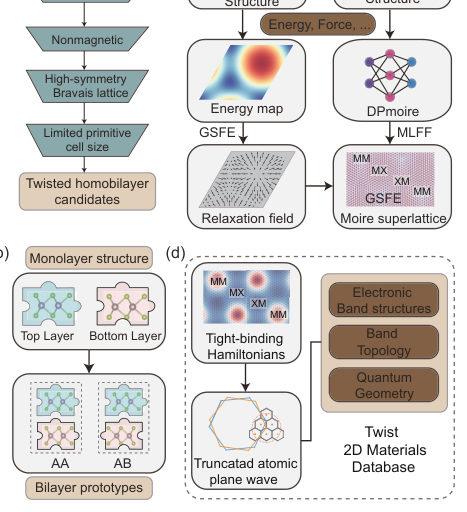 
FIG. 1. Hierarchical high-throughput workflow for twisted two-dimensional materials. (a) An experimen- tal 2D materials database serves as the input, from which candidate monolayers are selected using predefined screen- ing criteria. (b) The screened monolayers are assembled into symmetry-inequivalent bilayer prototypes by enumer- ating distinct relative rotations and termination-dependent stacking configurations. (c) Interlayer sliding is sampled to construct the generalized stacking-fault energy (GSFE) sur- face, which provides initial stacking configurations for twisted structures. These are further relaxed using machine-learning force fields (MLFFs). (d) Starting from the relaxed struc-...

📷 Fig 2

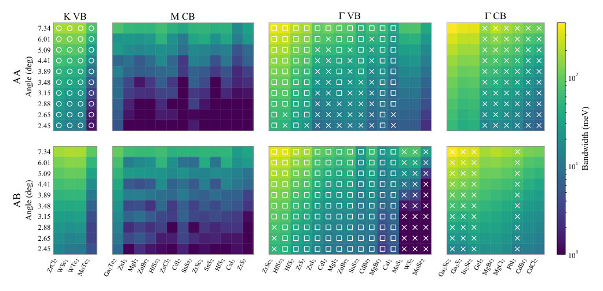 
FIG. 2. Twist-angle dependence of moir´e bandwidth and topological characteristics. Heatmaps of the bandwidth W(θ) are presented for various material classes categorized by valley character (Γ, K, and M) and band-edge origin. Top and bottom panels display results for the AA- and AB-stacking configurations, respectively. The labels VB and CB represent the moir´e minibands derived from the parent valence and conduction bands. Color scales encode W(θ) from the dispersive to the flat regimes. Topological properties are indicated by symbols: squares denote Z2 = 1 for Γ-valley systems, circles denote |CK| = 1 for K-valley systems, and crosses mark topologically trivial phases. Notably, the...

📷 Fig 3

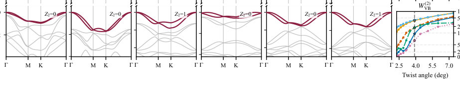 
FIG. 3. Stacking-dependent moir´e band structures in BiTeCl bilayer prototypes. (a) Electronic band structures at a twist angle of 3.89◦for representative prototypes, with the Z2 invariant of the two bands closest to the Fermi level indicated. (b) Twist-angle evolution of the corresponding conduction- and valence-band bandwidths.

**Summary.** This work develops a comprehensive computational framework to map the complex moiré band topology in twisted 2D semiconductors. By analyzing thousands of structures, the authors reveal that the resulting electronic properties are systematically governed by the parent band's valley character and the interlayer stacking symmetry. This establishes a crucial materials-level design principle for engineering flat and topological quantum states.

**Why it may be interesting.** The systematic classification of topological phases based on crystal symmetry and electronic structure (valley/stacking) provides a powerful, generalizable framework for engineering quantum states in novel solid-state platforms.

Detailed structure

**Main problem.** The primary goal is establishing systematic, predictive principles for organizing the material dependence of topological moiré bands in twisted semiconductors.

**Main result.** The low-energy electronic structure is organized primarily by the valley character ($\Gamma$, K, M) and stacking symmetry, providing a materials-level design principle for flat/topological moiré bands.

**Method.** A high-throughput computational framework integrating structural relaxation (MLFFs), first-principles DFT calculations, and topological analysis was developed and applied to numerous bilayer prototypes.

**Model / system.** The system studied is twisted two-dimensional (2D) semiconductors forming moiré superlattices. The analysis covers 43 monolayers and 91 symmetry-inequivalent bilayers.

**Key observables.** Moiré electronic band structures, miniband width scaling ($W(	heta)$), topological invariants ($\mathbb{Z}_2$ indices, Chern numbers $|C_K|$), and valley character.

**Important parameters / regimes.** Twist angle ($	heta$), stacking symmetry (AA vs. AB), and the parent band edge's valley character ($\Gamma$, K, M).

**Assumptions / limitations.** The analysis relies on classifying behavior based on the inherent valley structure of the constituent monolayers; $M$-valley physics is noted as an exception to standard classification.

**Figures summary.** Figures illustrate the high-throughput workflow and show twist-angle dependence heatmaps for moiré bandwidths and topological characteristics, categorized by valley type ($\Gamma$, K, M) and stacking configuration.

**Paper structure.** The paper establishes a computational framework (workflow $
ightarrow$ relaxation $
ightarrow$ calculation). It then analyzes results based on the parent band's valley character ($\Gamma$-valley showing quadratic scaling; K-valley showing hybridization control; M-valley being material-specific) to derive universal design rules.

Abstract

Twisted two-dimensional semiconductors provide a route to flat and topological moiré minibands, but systematic principles for organizing their material dependence have remained unclear. Here, we establish a high-throughput framework that integrates structural relaxation, first-principles electronic structure calculations, and moiré band topology. We apply this framework to 43 experimentally realized monolayers and 91 symmetry-inequivalent bilayer prototypes, yielding over 1,000 angle-resolved moiré electronic band structures. This database reveals that the low-energy moiré electronic structure is organized primarily by the valley character of the parent band edge together with stacking symmetry. In $Γ$-valley systems, the miniband width usually follows a nearly quadratic twist-angle scaling, consistent with a folding-dominated kinetic-energy scale. In $K$-valley systems, stacking-controlled interlayer hybridization governs whether parent Berry curvature is redistributed into isolated valley Chern minibands. By contrast, $M$-valley systems form a more material-specific class associated with anisotropic and symmetry-constrained band folding. The same valley-and-stacking hierarchy rationalizes the emergence or suppression of $\mathbb{Z}_2$ minibands, and surface termination in Janus bilayers provides a microscopic knob for changing the relevant valley character. These results establish a materials-level organizing principle for designing flat and topological moiré bands in twisted semiconductors.

[↑ back to top](#top)

### [Gibbs Phenomenon and Friedel Oscilations: Similarities, Differences, and the Educational Potential of their Comparison](http://arxiv.org/abs/2607.25469v1)

**Authors:** Christos Mystilidis, Christos Tserkezis, George Fikioris  
**Type:** theory · **Category:** other · **PDF:** <https://arxiv.org/pdf/2607.25469v1>  
**Analysis basis:** full PDF text, analyzed in chunks
**Topic relevance:** `Kondo & dissipative impurity` **1/5** · `analog quantum simulation` **1/5** · `non-equilibrium dynamics` **1/5**

📷 Fig 1

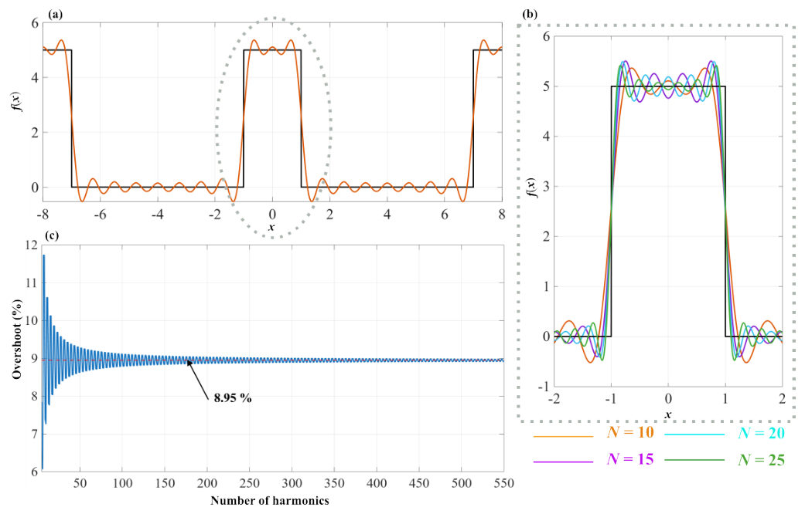 
FIG. 1. Demonstration of the Gibbs phenomenon. (a) Representation of a square wave f(x) (black line) by its partial Fourier series (orange line). The square has an amplitude of 5, and 10 harmonics are used to represent it. The oscillatory behavior is evident throughout. (b) Zoom-in around the central pulse of the square wave. We progressively increase the number N of harmonics used to reconstruct the pulse, but the Gibbs phenomenon persists. (c) Amplitude of the most pronounced overshoot with increasing number of terms (from 5 to 550). The amplitude converges to the well-known 8.95% value.

📷 Fig 2

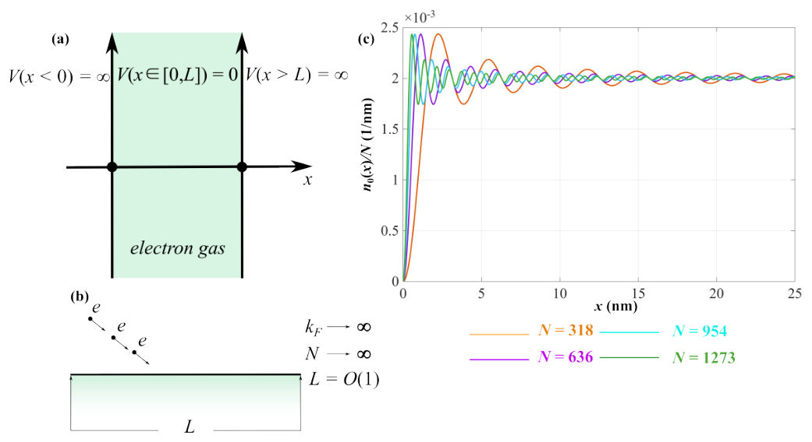 
FIG. 2. Demonstration of Friedel oscillations. (a) Toy problem that occupies most of our study: An 1D electron gas is confined in [0, L] due to the action of an infinite potential outside of this interval. (b) Physical demonstration of how the number of states is increasing. The length of the electron gas is kept fixed and the Fermi wavenumber increases, which is equivalent to pumping electrons in a finite system. (c) Friedel oscillations for the system (a) apparent in the normalised (to the number of states) ground-state density over the the distance inside the electron gas. The phenomenology is very similar to that of the Gibbs phenomenon in Figure 1(b).

📷 Fig 3

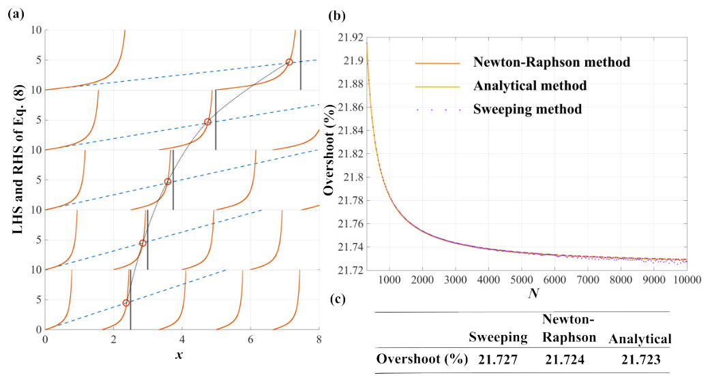 
FIG. 3. (a) Graphical depiction of the line of reasoning of the solution of Eq. (8). With orange lines we depict the RHS of Eq. (8), while with dashed blue the LHS. In the five snapshots shown, we progressively increase N = 100, 150, 200, 250, 300. The vertical asymptote x = 3L/[2(2N + 1)] is denoted by a black line. Finally, the sought after solution is denoted by red circles and its evolution with N with a dotted black curve, which is a guide to the eye. It is clear that the solution is pushed towards zero, following the vertical asymptote. (b) Evolution of the first overshoot of n0(x)/N using three different methods. In orange, the result comes from the following method: the solution of...

📷 Fig 4

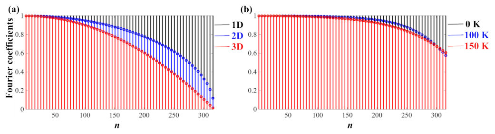 
FIG. 4. Strength of Fourier coefficients involved in the second terms of Eqs. (2), (18), (20), and (24). (a) Influence of increasing dimensions on the Fourier coefficients. To facilitate comparison, the coefficients are normalised to their maximal value. We clarify that increasing dimensions leads to different amplitude also for low-n modes, however the trend is as visualised here. For this simulation, Lx = Ly = Lz = 1000 nm and kF = 1 nm−1. (b) Influence of increasing temperature. Here the coefficients are shown unormalised. We note that increasing the temperature makes accessible additional states; we visualise here only up until n = N, the state corresponding to the Fermi level (at T = 0...

**Summary.** This paper explores the mathematical parallels between the Gibbs phenomenon in Fourier analysis and Friedel oscillations in electron density. Although they look similar due to sharp truncations, the authors rigorously argue that their physical origins are different. The work is valuable for creating a common conceptual language between electrical engineers and condensed-matter physicists.

**Why it may be interesting.** It provides a valuable educational bridge between electrical engineering concepts (Fourier series convergence) and condensed matter physics (electron screening), offering new ways to build intuition for complex many-body phenomena.

Detailed structure

**Main problem.** The paper compares the Gibbs phenomenon, arising from partial Fourier series approximations of discontinuous signals, with Friedel oscillations observed in electron density near impurities.

**Main result.** While both phenomena exhibit striking mathematical similarities due to sharp truncations in Fourier space, they are fundamentally distinct; Friedel oscillations arise from electronic screening and Fermi surface geometry, not merely Fourier truncation artifacts.

**Method.** The authors use theoretical analysis involving partial sums of Fourier series (for Gibbs) and summation over discrete energy levels derived from the non-interacting electron gas model (for Friedel).

**Model / system.** The primary models are a 1D electronic gas confined by a square potential, analyzed using both partial Fourier representations and Fermi-Dirac statistics at zero temperature.

**Key observables.** Oscillatory overshoot/undershoot in local electron density ($
ho(x)$) near boundaries or impurities; the magnitude of this overshoot is compared to the universal 8.95% limit of the Gibbs phenomenon.

**Important parameters / regimes.** Fermi wavelength ($\lambda_F$), system length ($L$), temperature ($T$), and the number of retained Fourier/energy modes ($N$).

**Assumptions / limitations.** The analysis often relies on treating the system as semi-infinite or using approximations for large $N$ to compare the mathematical structures.

**Figures summary.** Figures illustrate the Gibbs overshoot using a square wave via partial Fourier series, and show standing-wave patterns characteristic of Friedel oscillations in a 1D electron gas near an impurity.

**Paper structure.** The paper proceeds by first defining the two phenomena separately (Gibbs vs. Friedel) and then performing a detailed comparative analysis, culminating in arguments that highlight their structural parallels while maintaining physical distinction based on underlying mechanisms.

Abstract

We explore the similarities and differences between the Gibbs phenomenon in partial Fourier representations of discontinuous signals and Friedel oscillations in the electron density of a solid near an anomaly. Inspired by the apparent similarities of the two phenomena, we perform a detailed exploration of both from the viewpoint of an engineer being introduced to a concept from solid-state physics. Focusing on the density of an one-dimensional electronic gas confined by a square potential, we show that, despite the similarities, Friedel oscillations cannot be attributed to the inability of a partial Fourier series to describe a discontinuity. Nevertheless, the two phenomena do exhibit similarities, which can be exploited to develop intuition. By adopting an educational style, we hope to establish some common language between electrical engineers and condensed-matter physicists, hoping that this can further inspire the two communities to seek intuition and further comprehension within neighbouring but different disciplines.

[↑ back to top](#top)

### [Topological Classification of Non-Normalizable Vector Fields](http://arxiv.org/abs/2607.25848v1)

**Authors:** Philipp Gessler, Alessandro Pignedoli, Alexander Neuhaus, Frank-J. Meyer zu Heringdorf, Maria Azhar, Karin Everschor-Sitte  
**Type:** theory · **Category:** other · **PDF:** <https://arxiv.org/pdf/2607.25848v1>  
**Analysis basis:** full PDF text, analyzed in chunks
**Topic relevance:** `analog quantum simulation` **1/5** · `exotic spin models in light-matter` **1/5** · `spintronics-quantum-optics interface` **1/5**

📷 Fig 1

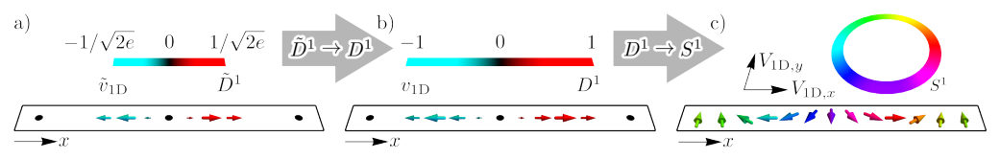 
Figure 1. Illustration of the mapping of a 1D field ˜v1D(x) from ˜D1 into a field v1D with an order parameter on D1, followed by the mapping to a higher dimensional vector V1D with an order parameter S1 ⊂R2. In each panel, the order-parameter space is shown above the corresponding real-space field. Colors encode the orientation of the vector fields, while the shading (from dark to bright) indicates their magnitude. Black dots mark points where the fields vanish. (a) Original vector field ˜v1D(x) in real space and the corresponding order parameter space, i.e., the set of all orientations attained by ˜v, which in this example corresponds to a one-dimensional disk ˜D1. (b) Resulting rescaled...

📷 Fig 2

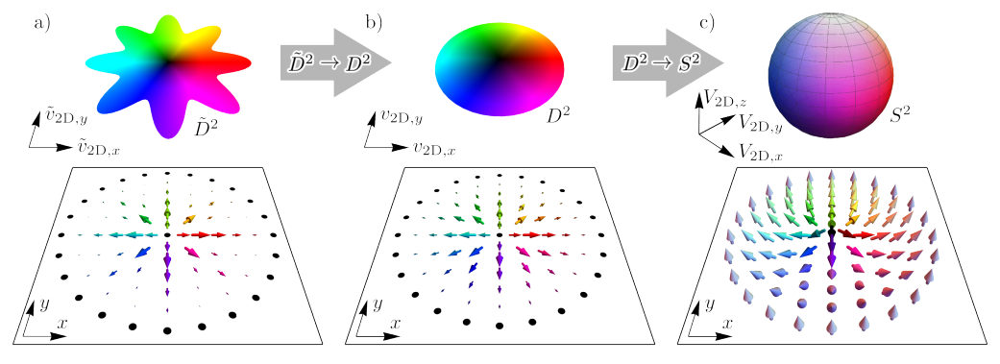 
Figure 2. Two-dimensional example of the embedding procedure. (a) Original non-normalizable field ˜v2D with flower-shaped target-space image ˜D2. (b) Rescaled field v2D, whose image is the unit disk D2. (c) Embedded normalized field V2D, defining a mapping onto the unit sphere S2. Insets show the corresponding target-space images. Colors indicate the in-plane vector orientation, while the shading (from dark to bright) encodes the field magnitude in panels (a) and (b), and the out-of-plane component of V2D in panel (c). Black dots mark field zeros in ˜v2D and v2D. The highlighted region in real space is mapped to the correspondingly highlighted region in target space.

📷 Fig 3

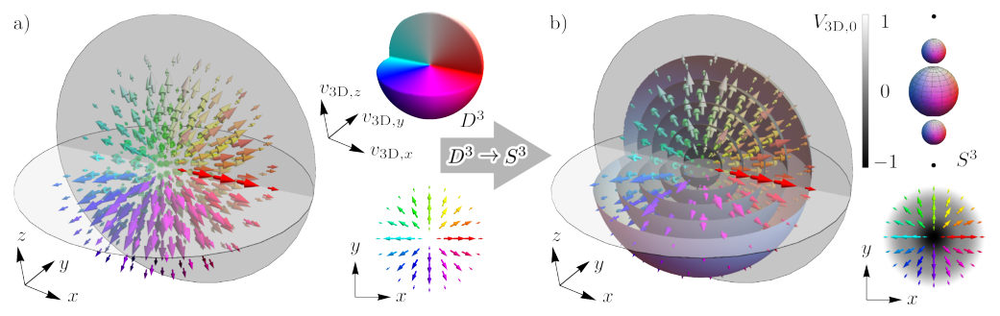 
Figure 3. Three-dimensional example of the embedding procedure. (a) Illustration of the original non-normalizable vector field ˜v3D(r) = v3D(r). The lower inset shows the xy cross section of the 3D structure. The upper inset shows the corresponding order parameter space D3, which forms a filled sphere. (b) Illustration of the embedded and normalized field V3D. The x, y, and z components of V3D are shown as color-coded vectors, following panel (a), and the fourth component V0 is represented as an additional grayscale. For the chosen field, these isosurfaces form concentric shells as indicated in the figure. The lower inset shows the corresponding xy cross-section. The four-dimensional...

📷 Fig 4

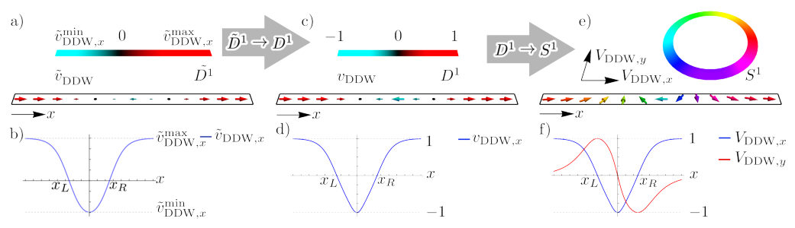 
Figure 4. One-dimensional double-domain-wall example of the radial-rescaling and embedding procedure. (a) Original non- normalizable scalar field evDDW in real space, together with its target-space image eD 1. The target-space interval extends from the minimum value evmin DDW to the maximum value evmax DDW. (b) Corresponding double-domain-wall profile, with xL and xR indicating the positions of the left and right domain walls, respectively. (c) Radially rescaled field vDDW, whose target-space image is the unit interval D1 = [−1, 1]. (d) Corresponding real-space profile of the rescaled field. (e) Normalized field VDDW obtained by lifting vDDW onto the unit circle S1. The inset shows the...

**Summary.** This paper presents a novel mathematical framework to topologically classify physical vector fields that suffer from amplitude zeros, which break standard normalization techniques. By embedding these $n$-dimensional fields into $(n+1)$-dimensional normalized spheres, the authors derive robust topological invariants applicable to diverse systems like magnetism and optics. This provides a unified tool for analyzing defects in complex physical media.

**Why it may be interesting.** While focused on classical field theory topology, the concept of robust topological invariants derived from singular or decaying fields is highly relevant for understanding defects in quantum materials (e.g., skyrmions) and phase transitions in condensed matter systems.

Detailed structure

**Main problem.** The paper addresses the challenge of topologically classifying physical vector fields whose amplitudes vanish at certain points, rendering conventional normalization-based methods invalid.

**Main result.** A general framework is introduced by embedding non-normalizable $n$-dimensional vector fields into $(n+1)$-dimensional normalized vector fields, allowing for a robust topological characterization via homotopy groups.

**Method.** The core methodology involves rescaling the original field to lie within a unit disk ($D^n$) and then constructing an embedding into the next higher dimension ($S^n$) using a specific lifting function $\Gamma(v)$.

**Model / system.** The framework is applied to various physical systems, including magnetic textures, ferroelectrics, and electromagnetic fields, demonstrating its utility for analyzing 1D, 2D, and 3D vector field configurations.

**Key observables.** Topological charges ($Q_{1D}, Q_{2D}, Q_{3D}$), which are derived from the resulting map's classification by homotopy groups ($\pi_m(S^n)$).

**Important parameters / regimes.** The dimensionality of the field ($n$), the base space structure (compactifiable to $S^m$), and the choice of the lifting function $\Gamma(v)$.

**Assumptions / limitations.** It assumes the base space can be compactified to a sphere, and that the target space is a closed star-body with respect to the origin.

**Figures summary.** Figures illustrate the mapping process: showing the original field ($	ilde{v}$), its rescaled version ($v$) onto a disk, and finally the normalized embedding ($V$) onto a sphere for 1D, 2D, and 3D examples.

**Paper structure.** The paper develops the general mathematical framework first, then explicitly demonstrates its application to 1D, 2D, and 3D cases, emphasizing how the choice of the embedding function $\Gamma$ dictates the resulting topological invariant.

Abstract

Topological classification of physical vector fields conventionally relies on field normalization and homotopy-based invariants. However, when field amplitudes vanish, normalization becomes ill-defined, preventing a direct topological characterization. Here, we introduce a general framework for the topological classification of non-normalizable $n$-dimensional vector fields with compactifiable base spaces by transforming them into $(n+1)$-dimensional normalized vector fields. This construction extends homotopy-based classification to fields containing amplitude zeros. We explicitly demonstrate the approach for one-, two-, and three-dimensional non-normalized vector fields and derive the corresponding topological invariants. The resulting topological charges are robust under continuous deformations and can change only when the embedding structure becomes singular. Our framework provides a unified route to the topological characterization of non-normalizable fields and opens the door to the study of topological phenomena in a broad range of systems, including magnetic textures, ferroelectrics, electromagnetic fields, and wave systems.

[↑ back to top](#top)

### [Blowup of Multi-Peaked Waveforms in the Two-Dimensional Nonlinear Schroedinger Model](http://arxiv.org/abs/2607.25898v1)

**Authors:** S. Jon Chapman, M. Kavousanakis, E. G. Charalampidis, I. G. Kevrekidis, P. G. Kevrekidis  
**Type:** theory · **Category:** other · **PDF:** <https://arxiv.org/pdf/2607.25898v1>  
**Analysis basis:** full PDF text, analyzed in chunks
**Topic relevance:** `non-equilibrium dynamics` **1/5**

📷 Fig 1

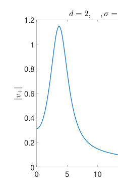 
FIG. 1: Amplitude |v+| of the ring radially symmetric solution to the boundary value problem of Eq. (11)-(12) for σ = 1.05. The hump position is located at ρ ≈3.68.

📷 Fig 2

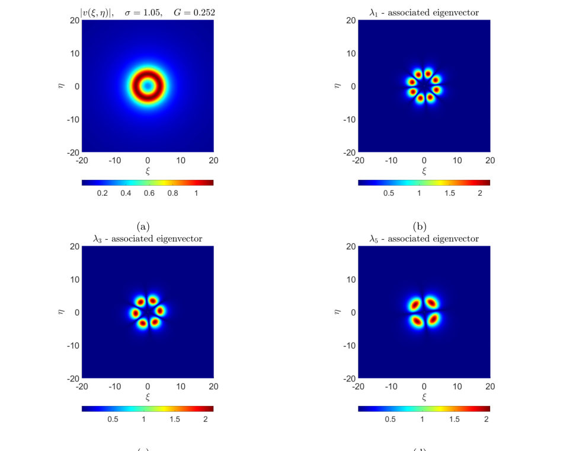 
FIG. 2: (a) Unstable ring self-similar solution (here we show the amplitude) of the 2D NLS equation at σ = 1.05. (b)-(d) Representative unstable eigenmodes that break the radial symmetry and can lead to multi-peaked structures. From (b) to (d) the modes correspond to eigenvalues: λ1 = 1.06 (8 peaks), λ3 = 1.05 (6 peaks), and λ5 = 0.88 (4 peaks).

📷 Fig 3

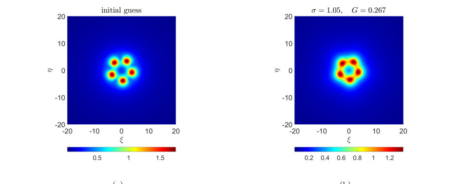 
FIG. 3: (a) Initial guess for damped Newton iterations, obtained by perturbing the ring solution at σ = 1.05 along the eigenvector associated with λ7. (b) Converged five-peaked solution; the blow-up rate is G = 0.267. Both panels illustrate the amplitude |v| of the solution.

📷 Fig 4

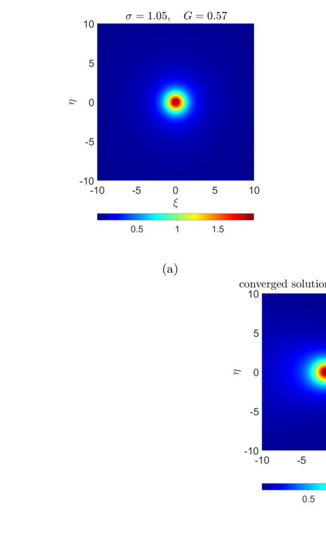 
FIG. 4: (a) Single-peaked (stable) self-similar solution (amplitude) at σ = 1.05. (b) Superposition of ±X ≈1.836 shifts of the single-peaked solution along the horizontal axis, used as an initial guess for damped Newton iterations. (c) Converged two-peaked solution; the blow-up rate is G = 0.3838.

📷 Fig 5

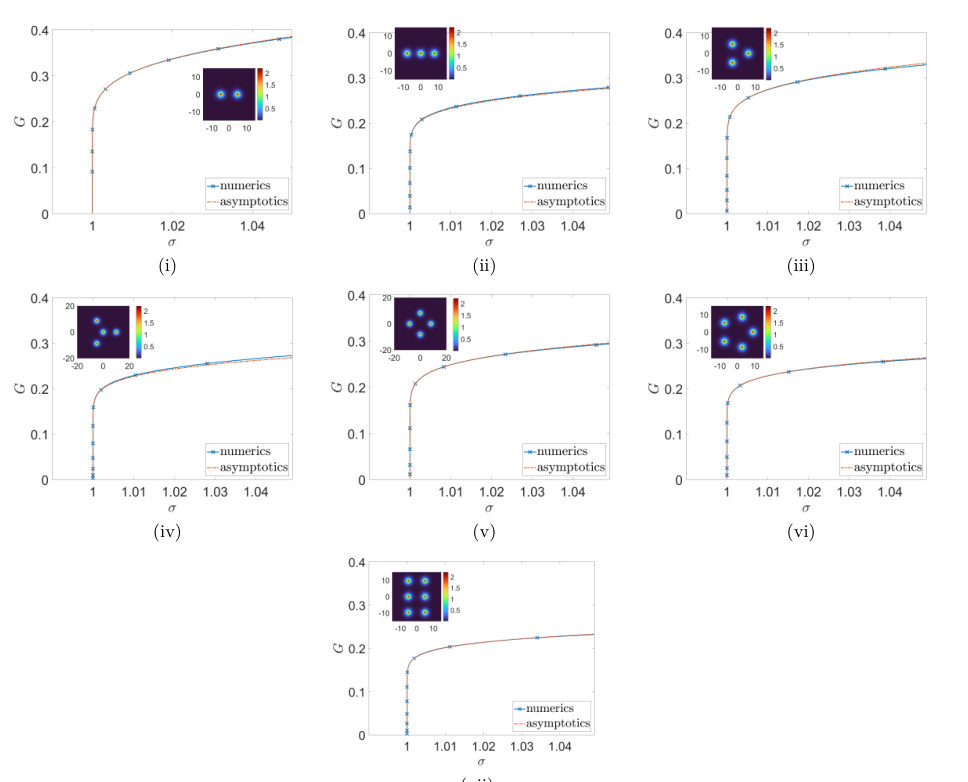 
FIG. 5: Bifurcation diagrams for self-similar solutions with: (i) two peaks; (ii) three aligned peaks; (iii) three peaks at the vertices of an equilateral triangle; (iv) four peaks with three at the vertices of an equilateral triangle and one at the barycenter; (v) four peaks at the vertices of a square; (vi) five peaks at the vertices of a pentagon; and (vii) six peaks aligned in two parallel lines. Dash-dotted red curves indicate asymptotic predictions, and blue x-marks show numerical results. Insets display representative solutions with blow-up rates: (i) G = 1.8 × 10−3, (ii) G = 1.6 × 10−3, (iii) G = 1.5 × 10−3, (iv) G = 2.3 × 10−3, (v) G = 2.3 × 10−3, (vi) G = 2.4 × 10−3, and (vii) G =...

**Summary.** This work analyzes the complex behavior of multi-peaked waveforms undergoing self-focusing collapse in a 2D Nonlinear Schrödinger model. The authors demonstrate that while many stable-looking configurations exist near critical points, they are all dynamically unstable compared to the single-peak collapse. They employ advanced mathematical and computational techniques to map out this rich stability landscape.

**Why it may be interesting.** This paper provides deep insights into pattern formation and collapse dynamics in nonlinear wave equations, which are foundational to understanding energy localization and instability in quantum optics and BECs.

Detailed structure

**Main problem.** The study investigates the self-focusing, collapse, and stability of multi-peaked waveforms governed by a nonlinear Schrödinger equation with general power-law nonlinearity in two dimensions.

**Main result.** A wide range of multi-peaked states bifurcate from the critical cubic nonlinearity threshold, but all such states are found to be less stable than the single-peak collapsing solution, which exhibits symmetry-breaking dynamics.

**Method.** The research combines analytical techniques (force balance modeling, bifurcation analysis) with advanced numerical methods (time integration, Newton's method, spectral stability analysis using high-performance computing libraries).

**Model / system.** The model is the two-dimensional Nonlinear Schrödinger (NLS) equation with a general power-law nonlinearity ($\sigma$), relevant to nonlinear optics and Bose-Einstein condensates.

**Key observables.** Blowup rate ($G$), eigenvalues (real and imaginary), peak positions ($X_i$), and the stability characteristics of multi-peaked vs. single-peak solutions.

**Important parameters / regimes.** Nonlinearity exponent ($\sigma$), spatial dimension ($d=2$), and the blowup rate $G$.

**Assumptions / limitations.** The analysis often treats the problem as a bifurcation from a critical threshold, and numerical stability relies on advanced continuation methods like pseudo-arclength tracking.

**Figures summary.** Figures summarize numerical results showing the evolution of wave intensity ($|v|$), peak distances ($\|X_i\|_{L^2}$) versus $G$, and theoretical vs. computed eigenvalue dependencies on $G$.

**Paper structure.** The work progresses by establishing the physical model, deriving an effective 'interacting particle system' force balance, analyzing the bifurcation structure of multi-peaked states, and concluding with a detailed spectral stability analysis.

Abstract

In the present work, we explore the self-focusing and resulting collapse of two-dimensional waveforms involving multiple pulses in a nonlinear Schroedinger equation with a general power-law nonlinearity. We find that a wide range of multi-peaked states bifurcate from the critical threshold of the cubic nonlinearity, thus representing ``bifurcations from infinity'', i.e., the relevant pulses start at infinite distance in the critical limit and draw nearer, as the nonlinearity exponent increases past that threshold. We identify the resulting ``interacting particle system'' as amounting to a force balance between the exponentially interacting tails (modulated by a suitable power law) and a linear phase-induced force. The equilibria emerging from this force balance are found to be in excellent agreement with the identified steady states of the partial differential equation. The spectral stability of multi-peaked configurations is analyzed, leading to the conclusion that all the relevant states are less stable than the single-peak collapsing solution whose stability was analyzed earlier. Indeed, we reveal both symmetry-breaking, as well as motion-inducing destabilizing dynamics, with the former ones among them being dominant and ultimately leading to a single dominant collapse spot. Moreover, we characterize systematically both the real and imaginary eigenvalues of multi-peaked configurations, partitioning them in groups of different sizes, described by powers of the solution's blowup rate G.

[↑ back to top](#top)

### Other secondary papers (1)

Show other secondary papers

### [Quantum oscillation spectroscopy of Fermi-surface topologies in tetralayer graphene](http://arxiv.org/abs/2607.25757v1)

**Authors:** Abhijit Halder, Harsh Varshney, Snehamoyee Hazra, Santu Kumar Bera, Souvik Chakraborty, Ujjal Roy, Takashi Taniguchi, Kenji Watanabe, Amit Agarwal, Anindya Das  
**Type:** both · **Category:** other · **PDF:** <https://arxiv.org/pdf/2607.25757v1>  
**Analysis basis:** full PDF text, analyzed in chunks

📷 Fig 1

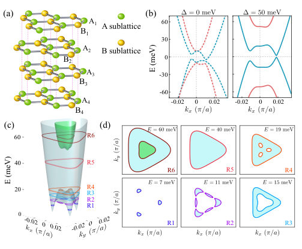 
FIG. 1: Evolution of the Fermi-surface topol- ogy in Bernal-stacked tetralayer graphene. (a) Crystal structure of Bernal-stacked (ABAB) tetralayer graphene (B-4LG). (b) Low-energy band structure near the K point at zero and finite displacement fields (∆). A finite displacement field breaks inversion symme- try, hybridizes the light- and heavy-mass bilayer-like bands, and opens gaps at their crossings. (c) Three- dimensional conduction-band dispersion illustrating the strong anisotropy induced by trigonal warping. (d) Constant-energy contours showing six conduction-band Fermi-surface topologies separated by Lifshitz transi- tions. The interplay of trigonal warping, interlayer cou- pling, and...

📷 Fig 2

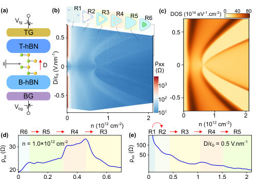 
FIG. 2: Transport signatures of Lifshitz transi- tions in B-4LG. (a) Schematic of a dual-gated, hBN- encapsulated B-4LG Hall-bar device with independent control of carrier density (n) and displacement field (D). (b) Longitudinal resistivity, ρxx, as a function of n and D, measured at T = 20 mK and zero magnetic field. Re- sistivity anomalies separate the different Fermi-surface topology regimes, shown in the insets. White dashed lines indicate the cuts in (d,e). (c) Calculated density of states (DOS) as a function of n and D. The DOS features track the transport anomalies measured in (b). (d,e) Representative line cuts of ρxx as a function of D/ϵ0 at fixed n = 1.0 × 1012 cm−2 (d) and as a...

📷 Fig 3

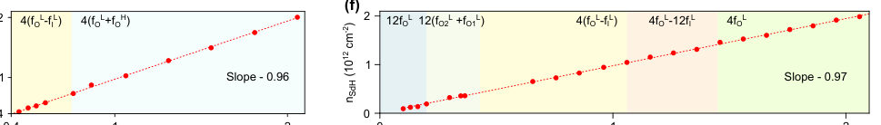 
FIG. 3: SdH mapping of Fermi-surface topology and degeneracy in B-4LG. (a,b) Background-subtracted SdH oscillations (∆Rxx) versus inverse magnetic field (1/B) and the corresponding FFT spectra, measured at n = 1.5 × 1012 cm−2, D/ϵ0 = 0.15 V nm−1, and n = 1.25 × 1012 cm−2, D/ϵ0 = 0.4 V nm−1, respectively. Red circles mark the dominant frequencies. (c,d) Extracted outer- and inner-contour frequencies, fO (red) and fI (blue), versus carrier density at D/ϵ0 = 0 and 0.5 V nm−1. Circles denote experimentally extracted data, while solid lines denote results from tight-binding calculations. The insets show the corresponding Fermi surfaces. (e,f) Carrier density reconstructed from the SdH...

📷 Fig 4

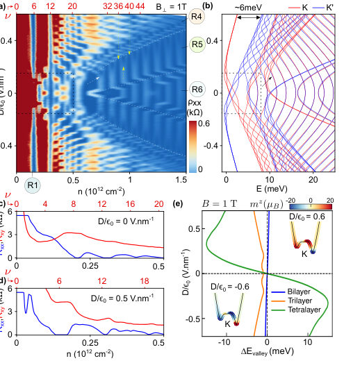 
FIG. 4: Observation of large valley splitting. (a) Measured longitudinal resistivity, ρxx, as a function of carrier density and displacement field at B⊥= 1 T. White and yellow dashed lines trace incompressible Landau-level (LL) sequences in the multiband (R6) and single-pocket (R5) regimes. (b) Calculated single-particle LL spectrum as a function of energy and displacement field. Red and blue lines denote the K and K′ valleys, respectively, and all LLs remain spin degenerate. A fi- nite displacement field lifts the valley degeneracy. Black arrows mark the splitting in R5 near the R4 boundary. (c,d) Line cuts of Rxx (blue) and Rxy (red) as a function of carrier density at fixed D/ϵ0 = 0 and...

📷 Fig 5

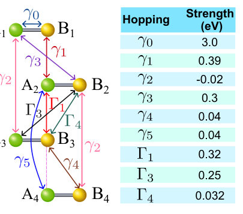 
FIG. 5: Schematic representation of the Slonczewski– Weiss–McClure tight-binding model for Bernal-stacked tetralayer graphene. Left: sublattice-resolved lattice structure showing the dominant hopping processes. The parameters γ0, γ1, γ3, and γ4 describe the intralayer and nearest-layer couplings within the two bilayer-like sub- systems; γ2 and γ5 describe next-nearest-layer couplings; and Γ1, Γ3, and Γ4 describe the couplings across the cen- tral layer interface. Right: numerical values of the hop- ping parameters used throughout this work.

**Summary.** This research uses Shubnikov-de Haas spectroscopy on tetralayer graphene to quantitatively map out six distinct Fermi-surface topologies and their degeneracies. By combining magnetic and electric fields, the authors demonstrate a novel method to lift the valley degeneracy, providing a powerful tool for characterizing multiband quantum materials.

**Why it may be interesting.** The work provides a concrete experimental framework using quantum oscillations to map complex electronic band structures (topology) while simultaneously quantifying subtle symmetry breaking effects like valley splitting, which is crucial for understanding topological quantum materials.

Detailed structure

**Main problem.** The primary challenge is quantitatively reconstructing both the topology of Fermi pockets and their associated flavor degeneracies across Lifshitz transitions in multiband quantum systems.

**Main result.** The study successfully mapped six distinct Fermi-surface topologies in tetralayer graphene and demonstrated that combining a perpendicular magnetic field with an electric displacement field can lift the valley degeneracy via orbital-Zeeman coupling.

**Method.** Shubnikov-de Haas (SdH) spectroscopy is used to probe extremal areas, while tight-binding models are employed for theoretical comparison of degeneracies and splitting mechanisms.

**Model / system.** The physical system is a high-mobility, dual-gated Bernal-stacked tetralayer graphene (B-4LG) device. The electronic structure is modeled using an extended tight-binding Hamiltonian incorporating interlayer hopping and external fields.

**Key observables.** Fermi-surface topologies (gully, annular, etc.), oscillation frequencies ($f_i$), spin/valley degeneracies ($g_i$), and the valley splitting energy ($\Delta E_{	ext{valley}}$).

**Important parameters / regimes.** Carrier density ($n$), perpendicular magnetic field ($B_\perp$), and displacement field ($D/\epsilon_0$). The splitting can reach several meV.

**Assumptions / limitations.** The analysis relies on the applicability of the Lifshitz–Kosevich formalism for SdH oscillations, and theoretical calculations use specific tight-binding approximations.

**Figures summary.** Figures show the evolution of six Fermi-surface topologies (Fig. 1), transport signatures confirming these regimes (Fig. 2), quantitative mapping of outer/inner contour frequencies vs. density (Fig. 3), and calculated single-particle Landau level spectra demonstrating valley splitting (Fig. 4, Fig. 6).

**Paper structure.** The paper first establishes the experimental challenge using SdH spectroscopy on B-4LG to map topological transitions across six regimes. It then details how tuning fields ($D$ and $B$) allows for quantitative reconstruction of degeneracies. Finally, it uses advanced tight-binding calculations to theoretically explain the large valley splitting observed.

Abstract

Quantum oscillations offer a direct probe of Fermi-surface topology and electronic degeneracy, yet disentangling both simultaneously across the Lifshitz transitions of multiband systems has remained an open experimental challenge. Here, we use Shubnikov-de Haas spectroscopy on a high-mobility, dual-gated Bernal-stacked tetralayer graphene (B-4LG) device to quantitatively reconstruct the complete sequence of six distinct Fermi-surface topologies-gully, annular, singly connected, and multiband pockets. The extracted oscillation frequencies determine the extremal momentum-space areas and their spin, valley, and gully-resolved degeneracies, in quantitative agreement with our tight-binding calculations. We further show that a perpendicular magnetic-field, combined with displacement-field lifts the valley degeneracy through an orbital-Zeeman coupling, producing a single-particle valley splitting of several $meV$, far larger than in bilayer or trilayer graphene. Our work demonstrates a framework for tracking Fermi-surface topologies and their flavor degeneracies in multiband quantum materials.

[↑ back to top](#top)

